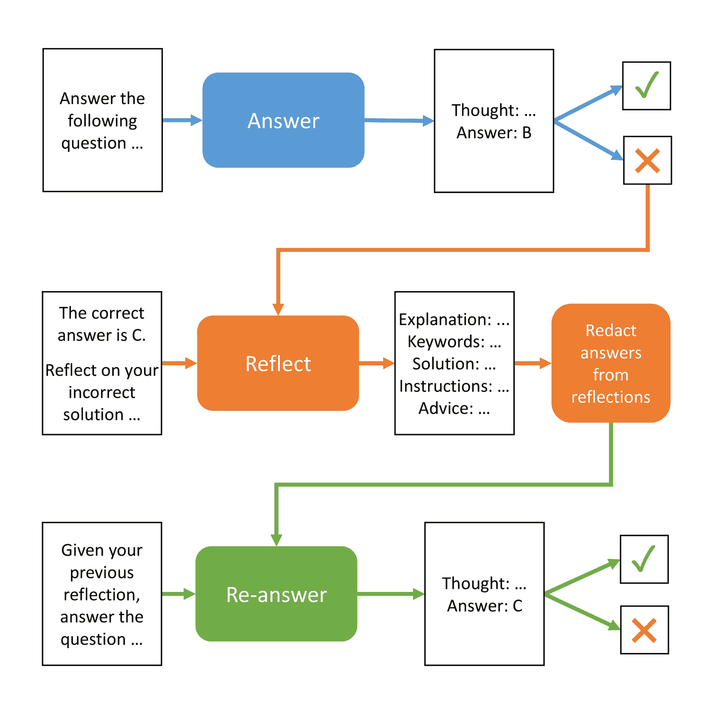
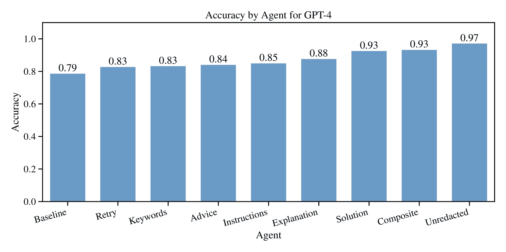
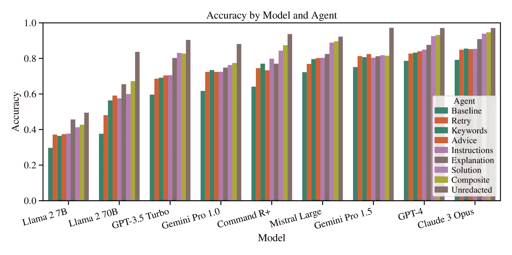
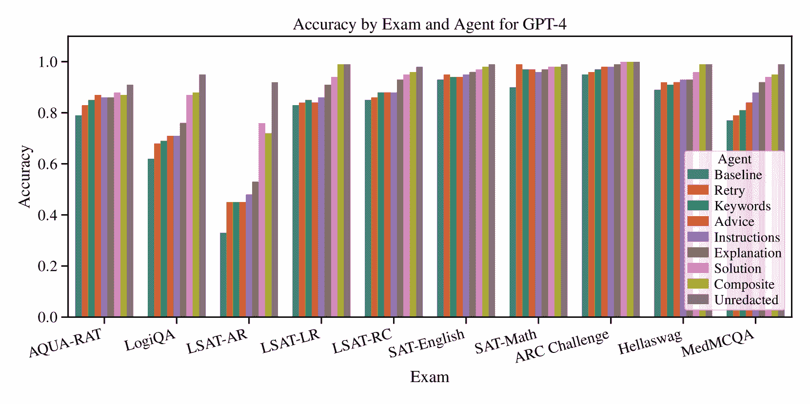

<!--yml

分类：未分类

日期：2025-01-11 12:39:12

-->

# 自我反思在LLM代理中的作用：对问题解决表现的影响

> 来源：[https://arxiv.org/html/2405.06682/](https://arxiv.org/html/2405.06682/)

Matthew Renze

约翰·霍普金斯大学

mrenze1@jhu.edu

&Erhan Guven

约翰·霍普金斯大学

eguven2@jhu.edu

###### 摘要

本研究探讨了自我反思在大型语言模型（LLM）中的作用及其对问题解决表现的影响。我们指示九个流行的LLM回答一系列多项选择题，以提供表现基准。对于每一个错误的答案，我们指示八种类型的自我反思LLM代理反思它们的错误，并为自己提供改进问题解决的指导。然后，利用这些指导，每个自我反思代理尝试重新回答相同的问题。我们的结果表明，LLM代理通过自我反思能够显著提高其问题解决表现（$p<0.001$）。此外，我们比较了不同类型的自我反思，确定了它们对表现的各自贡献。所有代码和数据均可在GitHub上获得，链接：[https://github.com/matthewrenze/self-reflection](https://github.com/matthewrenze/self-reflection)

## 1 引言

### 1.1 背景

自我反思是一个人在思考自己的思想、情感和行为的过程中。在问题解决的背景下，自我反思让我们能够审视导致解决方案的思维过程。这种类型的自我反思旨在避免在未来遇到类似问题时犯下相同的错误。

像人类一样，大型语言模型（LLM）代理可以被指示在回答问题之前生成思维链（CoT）。研究表明，CoT提示可以显著提高LLM在各种问题解决任务中的表现 [[1](https://arxiv.org/html/2405.06682v3#bib.bib1), [2](https://arxiv.org/html/2405.06682v3#bib.bib2), [3](https://arxiv.org/html/2405.06682v3#bib.bib3)]。然而，LLM仍然经常在其CoT中出现错误，原因可能包括逻辑错误、数学错误、幻觉等 [[4](https://arxiv.org/html/2405.06682v3#bib.bib4), [5](https://arxiv.org/html/2405.06682v3#bib.bib5), [6](https://arxiv.org/html/2405.06682v3#bib.bib6), [7](https://arxiv.org/html/2405.06682v3#bib.bib7), [8](https://arxiv.org/html/2405.06682v3#bib.bib8), [9](https://arxiv.org/html/2405.06682v3#bib.bib9)]。

类似于人类，大型语言模型（LLM）代理也可以被指示反思他们自己的思维链（CoT）。这使得它们能够识别错误，解释错误的原因，并生成建议，以避免在未来犯下类似的错误 [[10](https://arxiv.org/html/2405.06682v3#bib.bib10), [11](https://arxiv.org/html/2405.06682v3#bib.bib11), [12](https://arxiv.org/html/2405.06682v3#bib.bib12), [13](https://arxiv.org/html/2405.06682v3#bib.bib13), [14](https://arxiv.org/html/2405.06682v3#bib.bib14), [15](https://arxiv.org/html/2405.06682v3#bib.bib15)]。

我们的研究探讨了在大语言模型（LLM）代理中使用自我反思来提高其解决问题的能力。

### 1.2 相关文献

过去几年，我们见证了基于LLM架构的AI代理的出现[[16](https://arxiv.org/html/2405.06682v3#bib.bib16), [17](https://arxiv.org/html/2405.06682v3#bib.bib17)]。这些代理展示了在解决多步骤问题方面的卓越能力[[18](https://arxiv.org/html/2405.06682v3#bib.bib18), [19](https://arxiv.org/html/2405.06682v3#bib.bib19), [10](https://arxiv.org/html/2405.06682v3#bib.bib10)]。此外，它们还成功地使用了包括网页浏览器、搜索引擎、代码解释器等工具[[20](https://arxiv.org/html/2405.06682v3#bib.bib20), [19](https://arxiv.org/html/2405.06682v3#bib.bib19), [10](https://arxiv.org/html/2405.06682v3#bib.bib10), [21](https://arxiv.org/html/2405.06682v3#bib.bib21)]。

然而，这些LLM代理存在一些局限性。它们的知识有限，推理过程中容易出错，容易产生幻觉输出，并且容易陷入无效的循环[[4](https://arxiv.org/html/2405.06682v3#bib.bib4), [5](https://arxiv.org/html/2405.06682v3#bib.bib5), [6](https://arxiv.org/html/2405.06682v3#bib.bib6), [7](https://arxiv.org/html/2405.06682v3#bib.bib7), [8](https://arxiv.org/html/2405.06682v3#bib.bib8), [9](https://arxiv.org/html/2405.06682v3#bib.bib9)]。

为了提高其表现，我们可以为它们提供一系列的认知能力。例如，我们可以为它们提供链式推理（CoT）[[1](https://arxiv.org/html/2405.06682v3#bib.bib1), [2](https://arxiv.org/html/2405.06682v3#bib.bib2), [3](https://arxiv.org/html/2405.06682v3#bib.bib3)]、外部记忆的访问[[22](https://arxiv.org/html/2405.06682v3#bib.bib22), [23](https://arxiv.org/html/2405.06682v3#bib.bib23), [24](https://arxiv.org/html/2405.06682v3#bib.bib24), [25](https://arxiv.org/html/2405.06682v3#bib.bib25)]，以及从反馈中学习的能力[[18](https://arxiv.org/html/2405.06682v3#bib.bib18), [10](https://arxiv.org/html/2405.06682v3#bib.bib10), [19](https://arxiv.org/html/2405.06682v3#bib.bib19)]。

从反馈中学习可以分解为几个组成部分。这些组成部分包括反馈的来源、反馈的类型以及用于从反馈中学习的策略[[11](https://arxiv.org/html/2405.06682v3#bib.bib11)]。反馈有两个来源（即内部反馈或外部反馈）和两种主要类型（即标量值或自然语言）[[11](https://arxiv.org/html/2405.06682v3#bib.bib11), [12](https://arxiv.org/html/2405.06682v3#bib.bib12)]。

也有几种策略可以从反馈中学习。这些策略取决于它们在大型语言模型（LLM）输出生成过程中的位置。它们可以在模型训练时、输出生成时或输出生成后发生。在这三个阶段中，都有不同的技术可以使用（例如，模型微调、输出重排序和自我修正）[[11](https://arxiv.org/html/2405.06682v3#bib.bib11)]。

就自我修正的学习而言，目前正在研究各种方法。这些方法包括迭代优化、多模型辩论和自我反思[[11](https://arxiv.org/html/2405.06682v3#bib.bib11)]。

在LLM代理中，自我反思是一种元认知策略，也称为内省[[13](https://arxiv.org/html/2405.06682v3#bib.bib13), [14](https://arxiv.org/html/2405.06682v3#bib.bib14)]。一些研究表明，使用自我反思的LLM能够识别并纠正其错误[[12](https://arxiv.org/html/2405.06682v3#bib.bib12), [10](https://arxiv.org/html/2405.06682v3#bib.bib10), [8](https://arxiv.org/html/2405.06682v3#bib.bib8), [15](https://arxiv.org/html/2405.06682v3#bib.bib15)]。其他研究表明，LLM无法识别其推理中的错误；不过，它们仍然可能通过外部反馈进行修正[[7](https://arxiv.org/html/2405.06682v3#bib.bib7), [26](https://arxiv.org/html/2405.06682v3#bib.bib26)]。

### 1.3 贡献

我们的研究在先前文献的基础上，确定了哪些自我反思的方面对提高LLM代理在问题解决任务中的表现最有帮助。它将自我反思过程分解为几个组件，并识别每个组件如何促进代理在整体表现上的提高。

此外，它提供了对哪些类型的LLM和问题领域最能从每种自我反思中受益的洞察。这些包括GPT-4、Llama 2 70B和Gemini 1.5 Pro等LLM。还包括数学、科学、医学等各种问题领域。

这些信息对试图构建具有自我反思能力的LLM代理的AI工程师非常有用。此外，它对研究LLM代理元认知的AI研究人员也具有价值。

## 2 方法

### 2.1 数据

我们的测试数据集由一组多项选择问答（MCQA）问题组成，这些问题来自流行的LLM基准测试。这些基准包括ARC、AGIEval、HellaSwag、MedMCQA等[[27](https://arxiv.org/html/2405.06682v3#bib.bib27), [28](https://arxiv.org/html/2405.06682v3#bib.bib28), [29](https://arxiv.org/html/2405.06682v3#bib.bib29), [30](https://arxiv.org/html/2405.06682v3#bib.bib30), [31](https://arxiv.org/html/2405.06682v3#bib.bib31), [32](https://arxiv.org/html/2405.06682v3#bib.bib32)]。

我们对这些数据集进行了预处理并转换为标准化格式。然后，我们从每个数据集随机选择了100个问题，创建了一个由1,000个问题组成的多领域考试。

要查看用于创建MCQA考试的完整来源问题集列表，请参见表[1](https://arxiv.org/html/2405.06682v3#S2.T1 "Table 1 ‣ 2.1 Data ‣ 2 Methods ‣ Self-Reflection in LLM Agents: Effects on Problem-Solving Performance")。要查看MCQA问题的示例，请参见附录中的图[5](https://arxiv.org/html/2405.06682v3#A1.F5 "Figure 5 ‣ A.2 Data ‣ Appendix A Appendix ‣ Self-Reflection in LLM Agents: Effects on Problem-Solving Performance")。

表 1：用于创建1,000题多领域MCQA考试的问题集。

| 问题集 | 基准 | 领域 | 问题数量 | 许可证 | 来源 |
| --- | --- | --- | --- | --- | --- |
| ARC挑战测试 | ARC | 科学 | 1,173 | CC BY-SA | [[27](https://arxiv.org/html/2405.06682v3#bib.bib27)] |
| AQUA-RAT | AGI评估 | 数学 | 254 | Apache v2.0 | [[30](https://arxiv.org/html/2405.06682v3#bib.bib30)] |
| Hellaswag Val | Hellaswag | 常识推理 | 10,042 | MIT | [[28](https://arxiv.org/html/2405.06682v3#bib.bib28)] |
| LogiQA (英语) | AGI评估 | 逻辑 | 651 | GitHub | [[30](https://arxiv.org/html/2405.06682v3#bib.bib30), [31](https://arxiv.org/html/2405.06682v3#bib.bib31)] |
| LSAT-AR | AGI评估 | 法律（分析推理） | 230 | MIT | [[30](https://arxiv.org/html/2405.06682v3#bib.bib30), [32](https://arxiv.org/html/2405.06682v3#bib.bib32)] |
| LSAT-LR | AGI评估 | 法律（逻辑推理） | 510 | MIT | [[30](https://arxiv.org/html/2405.06682v3#bib.bib30), [32](https://arxiv.org/html/2405.06682v3#bib.bib32)] |
| LSAT-RC | AGI评估 | 法律（阅读理解） | 260 | MIT | [[30](https://arxiv.org/html/2405.06682v3#bib.bib30), [32](https://arxiv.org/html/2405.06682v3#bib.bib32)] |
| MedMCQA Valid | MedMCQA | 医学 | 6,150 | MIT | [[29](https://arxiv.org/html/2405.06682v3#bib.bib29)] |
| SAT-English | AGI评估 | 英语 | 206 | MIT | [[30](https://arxiv.org/html/2405.06682v3#bib.bib30)] |
| SAT-数学 | AGI评估 | 数学 | 220 | MIT | [[30](https://arxiv.org/html/2405.06682v3#bib.bib30)] |

注：LogiQA的GitHub仓库中不包含许可证文件。然而，论文和readme.md文件中都声明“该数据集免费提供。”

### 2.2 模型

我们使用了九种流行的 LLM 来评估我们的代理，包括 GPT-4、Llama 2 70B、Gemini 1.5 Pro 等 [[33](https://arxiv.org/html/2405.06682v3#bib.bib33), [34](https://arxiv.org/html/2405.06682v3#bib.bib34), [35](https://arxiv.org/html/2405.06682v3#bib.bib35), [36](https://arxiv.org/html/2405.06682v3#bib.bib36), [37](https://arxiv.org/html/2405.06682v3#bib.bib37), [38](https://arxiv.org/html/2405.06682v3#bib.bib38), [39](https://arxiv.org/html/2405.06682v3#bib.bib39), [40](https://arxiv.org/html/2405.06682v3#bib.bib40), [41](https://arxiv.org/html/2405.06682v3#bib.bib41), [42](https://arxiv.org/html/2405.06682v3#bib.bib42), [43](https://arxiv.org/html/2405.06682v3#bib.bib43), [44](https://arxiv.org/html/2405.06682v3#bib.bib44), [45](https://arxiv.org/html/2405.06682v3#bib.bib45), [46](https://arxiv.org/html/2405.06682v3#bib.bib46), [47](https://arxiv.org/html/2405.06682v3#bib.bib47)]。所有模型均通过由微软、Anthropic 和 Google 托管的基于云的 API 进行访问。

每个 LLM 都有其独特的优点和缺点。例如，像 GPT-4、Gemini 1.5 Pro 和 Claude Opus 这样的 LLM 是功能强大的模型，拥有大量的参数 [[44](https://arxiv.org/html/2405.06682v3#bib.bib44), [40](https://arxiv.org/html/2405.06682v3#bib.bib40), [34](https://arxiv.org/html/2405.06682v3#bib.bib34)]。然而，它们的每个 token 成本显著高于像 GPT-3.5 和 Llama 2 7B 这样的较小模型 [[42](https://arxiv.org/html/2405.06682v3#bib.bib42), [46](https://arxiv.org/html/2405.06682v3#bib.bib46)]。

有关我们实验中使用的 LLM 的完整列表，请参见表 [2](https://arxiv.org/html/2405.06682v3#S2.T2 "Table 2 ‣ 2.2 Models ‣ 2 Methods ‣ Self-Reflection in LLM Agents: Effects on Problem-Solving Performance")。

表 2：实验中使用的 LLM。

| 名称 | 厂商 | 发布日期 | 许可 | 来源 |
| --- | --- | --- | --- | --- |
| Claude 3 Opus | Anthropic | 2024-03-04 | 封闭 | [[33](https://arxiv.org/html/2405.06682v3#bib.bib33), [34](https://arxiv.org/html/2405.06682v3#bib.bib34)] |
| Command R+ | Cohere | 2024-04-04 | 开放 | [[35](https://arxiv.org/html/2405.06682v3#bib.bib35), [36](https://arxiv.org/html/2405.06682v3#bib.bib36)] |
| Gemini 1.0 Pro | Google | 2023-12-06 | 封闭 | [[37](https://arxiv.org/html/2405.06682v3#bib.bib37), [38](https://arxiv.org/html/2405.06682v3#bib.bib38)] |
| Gemini 1.5 Pro (预览版) | Google | 2024-02-15 | 封闭 | [[39](https://arxiv.org/html/2405.06682v3#bib.bib39), [40](https://arxiv.org/html/2405.06682v3#bib.bib40)] |
| GPT-3.5 Turbo | OpenAI | 2022-11-30 | 封闭 | [[41](https://arxiv.org/html/2405.06682v3#bib.bib41), [42](https://arxiv.org/html/2405.06682v3#bib.bib42)] |
| GPT-4 | OpenAI | 2023-03-14 | 封闭 | [[43](https://arxiv.org/html/2405.06682v3#bib.bib43), [44](https://arxiv.org/html/2405.06682v3#bib.bib44)] |
| Llama 2 7B Chat | Meta | 2023-07-18 | 开放 | [[45](https://arxiv.org/html/2405.06682v3#bib.bib45), [46](https://arxiv.org/html/2405.06682v3#bib.bib46)] |
| Llama 2 70B Chat | Meta | 2023-07-18 | 开放 | [[45](https://arxiv.org/html/2405.06682v3#bib.bib45), [46](https://arxiv.org/html/2405.06682v3#bib.bib46)] |
| Mistral Large | Mistral AI | 2024-02-26 | 开放 | [[47](https://arxiv.org/html/2405.06682v3#bib.bib47)] |

### 2.3 代理

我们研究了八种自我反思的LLM代理。这些代理会反思自己的CoT（推理链），然后生成自我反思，用于重新回答问题。每个代理使用独特的自我反思类型来协助它。我们还包括了一个不进行反思（即基准）的代理作为对照。

以下列出了各种类型的代理及其生成并用于重新回答问题的自我反思类型：

+   •

    基准 - 无自我反思能力。

+   •

    重试 - 被告知回答错误后，简单地重新尝试。

+   •

    关键词 - 每种错误类型的关键词列表。

+   •

    建议 - 提供改进的常规建议列表。

+   •

    解释 - 解释为何发生错误。

+   •

    指令 - 关于如何解决问题的有序指令列表。

+   •

    解决方案 - 问题的逐步解决方案。

+   •

    综合 - 所有六种自我反思类型的结合。

+   •

    未修改 - 所有六种类型的答案未被修改。

基准代理是我们实验的对照组，也是得分的下限。它告诉我们在不使用任何自我反思的情况下，基础模型回答问题的效果。基准代理使用了标准的提示工程技术，包括领域专长、CoT、简洁性和少量示例提示[[48](https://arxiv.org/html/2405.06682v3#bib.bib48), [49](https://arxiv.org/html/2405.06682v3#bib.bib49), [1](https://arxiv.org/html/2405.06682v3#bib.bib1), [2](https://arxiv.org/html/2405.06682v3#bib.bib2), [3](https://arxiv.org/html/2405.06682v3#bib.bib3)]。为了提高可重现性，所有LLM的采样温度都设置为0.0[[50](https://arxiv.org/html/2405.06682v3#bib.bib50)]。有关基准答案提示的示例，请参见附录中的图[6](https://arxiv.org/html/2405.06682v3#A1.F6 "图6 ‣ A.2 数据 ‣ 附录A ‣ LLM代理中的自我反思：对问题解决表现的影响")。

自我反思代理使用与基准代理相同的提示工程技术来重新回答问题。然而，它们在重新尝试回答之前，会先反思自己的错误。在重新回答时，反思被注入到重新回答的提示中，以便代理能够从错误中学习。有关自我反思提示和重新回答提示的示例，请参见附录中的图[7](https://arxiv.org/html/2405.06682v3#A1.F7 "图7 ‣ A.2 数据 ‣ 附录A ‣ LLM代理中的自我反思：对问题解决表现的影响")和[8](https://arxiv.org/html/2405.06682v3#A1.F8 "图8 ‣ A.2 数据 ‣ 附录A ‣ LLM代理中的自我反思：对问题解决表现的影响")。

我们从代理的自我反思中删除了所有的答案标签（例如，“A”，“B”，“C”）和答案描述（例如，“巴尔的摩”，“得梅因”，“拉斯维加斯”）。然而，未删除的代理仍然保留这些信息。该代理仅用于为分数提供上限。实质上，未删除的代理告诉我们，当提供正确答案时，LLM能多准确地回答这些问题。

### 2.4 过程

首先，基准代理回答了所有1,000个问题。如果问题回答正确，则将其加到基准代理的得分中。如果回答错误，则将其加入到一个错误回答的问题队列中，以待自我反思（见图[1](https://arxiv.org/html/2405.06682v3#S2.F1.1 "图 1 ‣ 2.4 过程 ‣ 2 方法 ‣ LLM代理中的自我反思：对问题解决表现的影响")）。

接下来，对于每个错误回答的问题，自我反思的代理回顾了问题、它们的错误解决方案和正确答案。利用正确答案作为外部反馈信号，它们每个生成了上述提到的八种自我反思反馈类型。

然后，对每个自我反思的文本执行了查找和替换操作，以删除答案标签和答案描述。例如，我们将答案标签（例如，“A”，“B”，“C”）和答案描述（例如，“巴尔的摩”，“得梅因”，“拉斯维加斯”）替换为文本“[REDACTED]”。¹¹1我们用来删除答案标签和描述的过程是贪婪的。它通常会删除一些不会泄露答案的额外文本。然而，我们认为有必要采取谨慎态度，消除任何可能的答案泄漏。除了未删除的代理外，这一过程适用于所有自我反思的代理，以防止自我反思中泄漏答案。²²2值得注意的是，解释、指令和解决方案代理生成的自我反思在没有直接指定正确或错误答案的情况下，间接泄漏了关于正确答案的信息。然而，它们仅仅基于在自我反思过程中提供正确答案这一事实，便自动生成了这些信息。

最后，对于每个回答错误的问题，自我反思的代理使用它们特定的自我反思文本来帮助它们重新回答问题。我们计算了所有代理的得分，并将其与基准代理进行了比较分析。

虽然LLM智能体通常在一系列迭代步骤中进行操作，但为了节省时间和成本，本实验的代码是作为批量操作实现的。因此，自我反思过程中的每一步都发生在上述四个批量阶段中的一个。概念上，实验代表了虚拟的多步骤智能体。然而，实验的技术实现实际上是一系列批量操作（见算法 [1](https://arxiv.org/html/2405.06682v3#alg1 "算法 1 ‣ 图 1 ‣ 2.4 过程 ‣ 2 方法 ‣ 自我反思在LLM智能体中的作用：对问题解决表现的影响")））。



图 1：自我反思实验的示意图。

算法 1 自我反思实验（批量）

1:对于每个模型、考试和问题，执行以下操作：2:     创建回答提示3:     回答问题4:     如果答案错误，则5:         将问题添加到错误列表中6:     结束 if7:结束 for8:计算基线智能体的得分9:10:对于每个模型、考试和问题，执行以下操作：11:     对错误的解答进行反思12:     生成自我反思13:     如果不是未编辑的智能体，则14:         编辑答案15:     结束 if16:     按类型分离反思17:结束 for18:19:对于每个模型、智能体、考试和问题，执行以下操作：20:     创建重新回答提示21:     注入智能体的反思22:     重新回答问题23:结束 for24:计算反思智能体的得分

### 2.5 度量标准

我们使用正确答案的准确率作为衡量智能体表现的主要度量标准。准确率通过将正确回答的问题数量除以问题的总数量来计算。

然而，为了减少实验运行的成本，我们没有让自我反思的智能体重新回答基线智能体正确回答的所有问题。相反，自我反思的智能体只重新回答了那些错误回答的问题。然后，我们将自我反思智能体的正确重新回答得分加到基线智能体的得分中，从而得出自我反思智能体的新总分。

我们实验中使用的准确率计算方法列于方程（1）中。在这些方程中，下标[base]表示基线智能体的正确回答得分，下标[ref]表示反思智能体的正确重新回答得分。

|  | $\displaystyle\text{Accuracy}_{\text{base}}$ | $\displaystyle=\frac{\text{Correct}_{\text{base}}}{\text{Total}_{\text{base}}}$ | $\displaystyle\hskip 56.9055pt\text{Accuracy}_{\text{ref}}$ | $\displaystyle=\frac{\text{Correct}_{\text{base}}+\text{Correct}_{\text{ref}}}{\% \text{Total}_{\text{base}}}$ |  | (1) |
| --- | --- | --- | --- | --- | --- | --- |

### 2.6 分析

在将自我反思代理的得分与基线代理进行比较时，我们进行了McNemar检验以确定统计显著性，并报告了p值。我们选择这个检验是因为我们的分析比较了两系列二项式结果（即正确或错误答案）。这些结果是跨基线代理和自我反思代理逐题配对的。

McNemar检验比较两组配对结果中的不一致配对数。为了计算检验统计量，我们构建了一个$2\times 2$的列联表。单元格$a$中列出了两个代理都回答错误的情况数。单元格$d$包含两个代理都回答正确的情况。单元格$b$包含错误-正确答对配对，单元格$c$包含正确-错误答对配对（在我们的情况下，c始终为零）[[51](https://arxiv.org/html/2405.06682v3#bib.bib51)]。

McNemar检验统计量计算公式为：

|  | $\chi^{2}=\frac{(b-c)^{2}}{b+c}\quad\text{其中 }b\text{ 和 }c\text{ 是 }\left[\begin{array}[]{cc}a&b\\ c&d\\ \end{array}\right]\text{中的不一致配对百分比}$ |  |
| --- | --- | --- |

## 3 结果

### 3.1 代理的表现

我们的分析显示，使用不同类型自我反思的代理比基线代理表现更好。在所有LLM的所有自我反思类型中，性能提升在统计上是显著的（$p<0.001$）。以GPT-4为例，在图[2](https://arxiv.org/html/2405.06682v3#S3.F2 "Figure 2 ‣ 3.1 Performance by Agent ‣ 3 Results ‣ Self-Reflection in LLM Agents: Effects on Problem-Solving Performance")中，我们可以看到所有类型的自我反思都提高了代理在解决多选问题时的准确性。有关GPT-4结果的数值分析，请参见附录中的表[3](https://arxiv.org/html/2405.06682v3#A1.T3 "Table 3 ‣ A.1 Results ‣ Appendix A Appendix ‣ Self-Reflection in LLM Agents: Effects on Problem-Solving Performance")。



图2：所有自我反思类型提高了GPT-4代理的准确性。

### 3.2 模型表现

就模型的表现而言，我们测试的每个大规模语言模型（LLM）在所有类型的自我反思中都表现出了类似的准确度提升。在所有情况下，表现的改善在统计上是显著的（$p<0.001$）。请参见图[3](https://arxiv.org/html/2405.06682v3#S3.F3 "Figure 3 ‣ 3.2 Performance by Model ‣ 3 Results ‣ Self-Reflection in LLM Agents: Effects on Problem-Solving Performance")，查看按模型和代理的准确度绘图。有关所有模型的准确度的数值分析，请参见表[4](https://arxiv.org/html/2405.06682v3#A1.T4 "Table 4 ‣ A.1 Results ‣ Appendix A Appendix ‣ Self-Reflection in LLM Agents: Effects on Problem-Solving Performance")。



图3：我们测试的所有LLM在自我反思代理中都展示了相似的改进模式。

### 3.3 按考试分类的表现

从考试表现来看，我们发现自我反思在某些问题领域显著提高了表现。然而，其他问题领域的影响较小。例如，我们看到LSAT-AR（分析推理）考试的提升最大。其他考试，如SAT英语考试，影响则小得多。有关每个考试和代理的准确性图表，请参见图 [4](https://arxiv.org/html/2405.06682v3#S3.F4 "Figure 4 ‣ 3.3 Performance by Exam ‣ 3 Results ‣ Self-Reflection in LLM Agents: Effects on Problem-Solving Performance")。有关结果的数字分析，请参见附录中的表 [5](https://arxiv.org/html/2405.06682v3#A1.T5 "Table 5 ‣ A.1 Results ‣ Appendix A Appendix ‣ Self-Reflection in LLM Agents: Effects on Problem-Solving Performance")。



图 4：自我反思所带来的表现提升在某些考试中更大，在其他考试中则较小。

## 4 讨论

### 4.1 解释

基于这些结果，所有类型的自我反思都提高了LLM代理的表现。此外，这些效果在我们测试的每个LLM中都有体现。包含更多信息的自我反思（例如，指令、解释和解决方案）优于信息较为有限的自我反思类型（例如，重试、关键词和建议）。

自我反思代理与未编辑代理之间的准确性差异表明，我们有效地消除了直接答案泄露的问题。然而，由指令、解释、解决方案和复合代理生成的反馈结构显然为正确答案提供了间接的指导，而不是直接给出答案。

有趣的是，重试代理显著提高了所有LLM的表现。因此，看起来即使仅仅是知道代理之前犯过错误，也能在重新回答问题时提升代理的表现。我们推测这是因为代理在第二次尝试时更加勤奋，或者是基于其重新回答的CoT选择了第二最可能的答案。需要进一步研究才能解答这个问题。

### 4.2 限制

首先，我们为本实验创建的LLM代理仅解决了一个单步问题。LLM代理的真正价值在于它们通过迭代选择引导它们朝着目标前进的行动，从而解决复杂的多步问题。因此，本实验并未充分展示自我反思LLM代理的潜力。

其次，API响应错误可能在我们的结果中引入了少量误差。API错误通常发生在内容安全过滤器被提问内容触发时。在大多数情况下，这可能导致代理的准确性报告误差不到1%。然而，在Gemini 1.0 Pro和Mistral Large模型的情况下，这一误差可能高达2.8%。

第三，表现最好的LLM在大多数考试中得分超过了90%。因此，顶级考试的得分增加压缩到了100%（即完美分数）的上限附近。这种压缩效应使得很难准确评估性能提升。因此，我们的分析将受益于更高难度的考试。

最后，对于所有模型和代理，LSAT-AR（分析推理）考试是最难的，也是最能从自我反思中获益的。这一单一考试中表现的大幅提升有可能扭曲所有考试的综合结果。使用一组难度更为均衡的考试将消除这种偏差。

### 4.3 启示

我们的研究建立在先前关于LLM代理和自我反思的工作基础上。

这对构建代理型LLM系统的AI工程师具有实际意义。能够根据环境中的错误信号自我反思的代理，可以学习避免未来犯类似错误。这也有助于防止代理陷入不生产的循环，因为它们不断重复相同的错误。

此外，我们的研究对研究LLM元认知的AI研究人员具有理论意义。如果LLM能够自我反思自己的CoT，其他类似的元认知过程也可能被利用来提升其表现。

### 4.4 未来研究

第一，我们建议使用一组更复杂的问题重复此实验。使用比LSAT-AR考试更难或同样难的问题，将更好地反映自我反思带来的性能提升，避免了分数接近100%准确性的压缩现象。

第二，我们建议进行一个使用多步骤问题的实验。这将使代理在每个步骤之后从环境中获得反馈，作为错误修正的外部信号。这也将展示自我反思在长期问题上的潜力。

第三，我们建议在提供外部工具访问权限的情况下重复此实验。这将使我们能够观察工具的错误信号如何有助于自我反思。例如，我们可以观察一个代理如何适应来自Python解释器的编译错误或搜索引擎的低排名搜索结果。

第四，我们建议使用具有外部记忆的代理重复此实验。让代理根据自我反思回答相同的问题，从实验角度看是有益的。现实世界中的代理需要存储自我反思并在遇到相似但不完全相同的问题时（使用检索增强生成）提取这些反思。

最后，我们建议对更广泛范围的LLMs、智能体类型和问题领域进行自我反思调查。这将帮助我们更好地刻画自我反思的效果，并为自我反思LLM智能体的潜在好处提供进一步的实证证据。

## 5 结论

在本研究中，我们探讨了LLM智能体在解决问题任务中的自我反思效果。我们的结果表明，LLMs能够反思其自身的思维链，并产生能够显著提升问题解决性能的指导意见。这些性能提升在多个LLM、不同类型的自我反思以及问题领域中得到了验证。这项研究对构建智能体AI系统的AI工程师具有实际意义，同时对研究LLM元认知的AI研究人员也具有理论意义。

## 6 致谢

本研究的资金由[Microsoft](https://www.microsoft.com/)和[Renze AI Research Institute](https://renzeai.org/)提供。

## 参考文献

+   [1] T. Kojima, S. S. Gu, M. Reid, Y. Matsuo, 和 Y. Iwasawa, “大型语言模型是零-shot推理器,” 收录于 *神经信息处理系统进展*, 卷35, 2022年5月，第22 199–22 213页。 [在线]. 可用链接: [https://arxiv.org/abs/2205.11916](https://arxiv.org/abs/2205.11916)

+   [2] J. Wei, X. Wang, D. Schuurmans, M. Bosma, B. Ichter, F. Xia, E. Chi, Q. Le, 和 D. Zhou, “思维链提示在大型语言模型中的推理激发作用,” *arXiv*, 2022年1月。 [在线]. 可用链接: [https://arxiv.org/abs/2201.11903](https://arxiv.org/abs/2201.11903)

+   [3] Y. Zhou, A. I. Muresanu, Z. Han, K. Paster, S. Pitis, H. Chan, 和 J. Ba, “大型语言模型是人类级的提示工程师,” *第十一届国际学习表征会议*, 2023年11月。 [在线]. 可用链接: [https://arxiv.org/abs/2211.01910](https://arxiv.org/abs/2211.01910)

+   [4] Z. Ji, N. Lee, R. Frieske, T. Yu, D. Su, Y. Xu, E. Ishii, Y. Bang, D. Chen, H. S. Chan, W. Dai, A. Madotto, 和 P. Fung, “自然语言生成中的幻觉调查,” *ACM计算机调查*, 卷55, 2022年2月。 [在线]. 可用链接: [http://dx.doi.org/10.1145/3571730](http://dx.doi.org/10.1145/3571730)

+   [5] M. U. Hadi, qasem al tashi, R. Qureshi, A. Shah, amgad muneer, M. Irfan, A. Zafar, M. B. Shaikh, N. Akhtar, J. Wu, S. Mirjalili, Q. Al-Tashi, 和 A. Muneer, “关于大型语言模型的调查：应用、挑战、局限性与实际使用,” *Authorea Preprints*, 2023年10月。 [在线]. 可用链接: [https://doi.org/10.36227/techrxiv.23589741.v1](https://doi.org/10.36227/techrxiv.23589741.v1)

+   [6] A. Payandeh, D. Pluth, J. Hosier, X. Xiao, 和 V. K. Gurbani, “大型语言模型对逻辑谬误的易感性有多大?” *arXiv*, 2023年8月。 [在线]. 可用链接: [https://arxiv.org/abs/2308.09853v1](https://arxiv.org/abs/2308.09853v1)

+   [7] J. Huang, X. Chen, S. Mishra, H. S. Zheng, A. W. Yu, X. Song, 和 D. Zhou, “大型语言模型尚不能自我纠正推理问题，” *arXiv*，2023年10月。[在线]。可访问: [https://arxiv.org/abs/2310.01798](https://arxiv.org/abs/2310.01798)

+   [8] Z. Ji, T. Yu, Y. Xu, N. Lee, E. Ishii, 和 P. Fung, “通过自我反思来缓解大型语言模型中的幻觉问题，” *arXiv*，2023年10月。[在线]。可访问: [https://arxiv.org/abs/2310.06271](https://arxiv.org/abs/2310.06271)

+   [9] S. Minaee, T. Mikolov, N. Nikzad, M. Chenaghlu, R. Socher, X. Amatriain, 和 J. Gao, “大型语言模型：综述，” *arXiv*，2024年2月。[在线]。可访问: [https://arxiv.org/abs/2402.06196](https://arxiv.org/abs/2402.06196)

+   [10] N. Shinn, F. Cassano, E. Berman, A. Gopinath, K. Narasimhan, 和 S. Yao, “Reflexion: 具有语言强化学习的语言代理，” *arXiv*，2023年3月。[在线]。可访问: [https://arxiv.org/abs/2303.11366](https://arxiv.org/abs/2303.11366)

+   [11] L. Pan, M. Saxon, W. Xu, D. Nathani, X. Wang, 和 W. Y. Wang, “自动纠正大型语言模型：调查多种自我纠错策略的全景，” *arXiv*，2023年8月。[在线]。可访问: [https://arxiv.org/abs/2308.03188](https://arxiv.org/abs/2308.03188)

+   [12] A. Madaan, N. Tandon, P. Gupta, S. Hallinan, L. Gao, S. Wiegreffe, U. Alon, N. Dziri, S. Prabhumoye, Y. Yang, S. Gupta, B. P. Majumder, K. Hermann, S. Welleck, A. Yazdanbakhsh, 和 P. Clark, “Self-refine: 通过自我反馈进行迭代优化，” *arXiv*，2023年3月。[在线]。可访问: [https://arxiv.org/abs/2303.17651v2](https://arxiv.org/abs/2303.17651v2)

+   [13] J. Toy, J. MacAdam, 和 P. Tabor, “元认知就是你所需要的吗？使用生成代理中的自我反思来改善目标导向行为，” *arXiv*，2024年1月。[在线]。可访问: [https://arxiv.org/abs/2401.10910](https://arxiv.org/abs/2401.10910)

+   [14] Y. Wang 和 Y. Zhao, “元认知提示提高大型语言模型的理解力，” *arXiv*，2023年8月。[在线]。可访问: [https://arxiv.org/abs/2308.05342](https://arxiv.org/abs/2308.05342)

+   [15] A. Asai, Z. Wu, Y. Wang, A. Sil, 和 H. Hajishirzi, “Self-rag: 通过自我反思学习检索、生成和批评，” *arXiv*，2023年10月。[在线]。可访问: [https://arxiv.org/abs/2310.11511v1](https://arxiv.org/abs/2310.11511v1)

+   [16] G. Wang, Y. Xie, Y. Jiang, A. Mandlekar, C. Xiao, Y. Zhu, A. Anandkumar, U. Austin, 和 U. Madison, “Voyager: 具有大型语言模型的开放式具身代理，” *arXiv*，2023年5月。[在线]。可访问: [https://arxiv.org/abs/2305.16291v2](https://arxiv.org/abs/2305.16291v2)

+   [17] Z. Xi, W. Chen, X. Guo, W. He, Y. Ding, B. Hong, M. Zhang, J. Wang, S. Jin, E. Zhou, R. Zheng, X. Fan, X. Wang, L. Xiong, Y. Zhou, W. Wang, C. Jiang, Y. Zou, X. Liu, Z. Yin, S. Dou, R. Weng, W. Cheng, Q. Zhang, W. Qin, Y. Zheng, X. Qiu, X. Huang, 和 T. Gui, “基于大型语言模型的代理的崛起与潜力：一项调查，” *arXiv*, 2023年9月。 [在线]. 可用： [https://arxiv.org/abs/2309.07864v3](https://arxiv.org/abs/2309.07864v3)

+   [18] S. Yao, J. Zhao, D. Yu, N. Du, I. Shafran, K. Narasimhan, 和 Y. Cao, “React: 协同推理与行动的语言模型，” *arXiv*, 2022年10月。 [在线]. 可用： [https://arxiv.org/abs/2210.03629](https://arxiv.org/abs/2210.03629)

+   [19] N. Miao, Y. W. Teh, 和 T. Rainforth, “Selfcheck: 使用LLMs进行零-shot自我检查其逐步推理，” *arXiv*, 2023年8月。 [在线]. 可用： [https://arxiv.org/abs/2308.00436v3](https://arxiv.org/abs/2308.00436v3)

+   [20] R. Nakano, J. Hilton, S. Balaji, J. Wu, L. Ouyang, C. Kim, C. Hesse, S. Jain, V. Kosaraju, W. Saunders, X. Jiang, K. Cobbe, T. Eloundou, G. Krueger, K. Button, M. Knight, B. Chess, 和 J. S. Openai, “Webgpt: 浏览器辅助的基于人类反馈的问答系统，” *arXiv*, 2021年12月。 [在线]. 可用： [https://arxiv.org/abs/2112.09332v3](https://arxiv.org/abs/2112.09332v3)

+   [21] T. Schick, J. Dwivedi-Yu, R. Dessì, R. Raileanu, M. Lomeli, L. Zettlemoyer, N. Cancedda, 和 T. Scialom, “Toolformer: 语言模型可以自学使用工具，” *arXiv*, 2023年2月。 [在线]. 可用： [https://arxiv.org/abs/2302.04761v1](https://arxiv.org/abs/2302.04761v1)

+   [22] P. Lewis 等人，“增强检索生成用于知识密集型NLP任务，” *arXiv*, 2020年5月。 [在线]. 可用： [https://arxiv.org/abs/2005.11401](https://arxiv.org/abs/2005.11401)

+   [23] Y. Gao, Y. Xiong, X. Gao, K. Jia, J. Pan, Y. Bi, Y. Dai, J. Sun, M. Wang, 和 H. Wang, “检索增强生成用于大型语言模型：一项调查，” *arXiv*, 2023年12月。 [在线]. 可用： [https://arxiv.org/abs/2312.10997v5](https://arxiv.org/abs/2312.10997v5)

+   [24] W. Zhong, L. Guo, Q. Gao, H. Ye, 和 Y. Wang, “Memorybank: 利用长期记忆增强大型语言模型，” *AAAI人工智能会议论文集*，第38卷，第19,724-19,731页，2023年5月。 [在线]. 可用： [https://arxiv.org/abs/2305.10250v3](https://arxiv.org/abs/2305.10250v3)

+   [25] Z. Wang, A. Liu, H. Lin, J. Li, X. Ma, 和 Y. Liang, “Rat: 检索增强思维在长远生成中的上下文感知推理，” *arXiv*, 2024年3月。 [在线]. 可用： [https://arxiv.org/abs/2403.05313](https://arxiv.org/abs/2403.05313)

+   [26] G. Tyen, H. Mansoor, V. Cărbune, P. Chen, 和 T. Mak, “LLMs无法发现推理错误，但可以纠正它们！” *arXiv*, 2023年11月。 [在线]. 可用： [https://arxiv.org/abs/2311.08516v2](https://arxiv.org/abs/2311.08516v2)

+   [27] P. Clark, I. Cowhey, O. Etzioni, T. Khot, A. Sabharwal, C. Schoenick, 和 O. Tafjord, “认为你已经解决了问答问题吗？尝试arc，AI2推理挑战，”*ArXiv*，2018年3月。 [在线]. 可用链接: [https://arxiv.org/abs/1803.05457](https://arxiv.org/abs/1803.05457)

+   [28] R. Zellers, A. Holtzman, Y. Bisk, A. Farhadi, 和 Y. Choi, “Hellaswag: 机器真的能完成你的句子吗？”发表于*第57届计算语言学协会年会论文集*，2019。 [在线]. 可用链接: [https://arxiv.org/abs/1905.07830](https://arxiv.org/abs/1905.07830)

+   [29] A. Pal, L. K. Umapathi, 和 M. Sankarasubbu, “Medmcqa: 一种用于医学领域问答的大规模多学科多选数据集，”发表于*健康、推理与学习会议论文集*。PMLR，2022，页248-260。 [在线]. 可用链接: [https://proceedings.mlr.press/v174/pal22a.html](https://proceedings.mlr.press/v174/pal22a.html)

+   [30] W. Zhong, R. Cui, Y. Guo, Y. Liang, S. Lu, Y. Wang, A. Saied, W. Chen, 和 N. Duan, “Agieval: 一个以人为本的基准，用于评估基础模型，”*ArXiv*，2023年4月。 [在线]. 可用链接: [https://arxiv.org/abs/2304.06364](https://arxiv.org/abs/2304.06364)

+   [31] J. Liu, L. Cui, H. Liu, D. Huang, Y. Wang, 和 Y. Zhang, “Logiqa: 一项具有逻辑推理能力的机器阅读理解挑战数据集，”发表于*国际人工智能联合会议*，2020。 [在线]. 可用链接: [https://arxiv.org/abs/2007.08124](https://arxiv.org/abs/2007.08124)

+   [32] S. Wang, Z. Liu, W. Zhong, M. Zhou, Z. Wei, Z. Chen, 和 N. Duan, “来自LSAT的进展与挑战：复杂推理，”*IEEE/ACM音频、语音与语言处理期刊*，第30卷，页2201-2216，2021年8月。 [在线]. 可用链接: [https://doi.org/10.1109/TASLP.2022.3164218](https://doi.org/10.1109/TASLP.2022.3164218)

+   [33] Anthropic, “介绍Claude的下一代模型家族——Anthropic，”2024。 [在线]. 可用链接: [https://www.anthropic.com/news/claude-3-family](https://www.anthropic.com/news/claude-3-family)

+   [34] ——, “Claude 3 模型家族：Opus, sonnet, haiku，”2024。 [在线]. 可用链接: [https://www.anthropic.com/claude-3-model-card](https://www.anthropic.com/claude-3-model-card)

+   [35] Cohere, “Command r+,” 2024。 [在线]. 可用链接: [https://docs.cohere.com/docs/command-r-plus](https://docs.cohere.com/docs/command-r-plus)

+   [36] ——, “C4ai Command r+ 模型卡，”2024。 [在线]. 可用链接: [https://huggingface.co/CohereForAI/c4ai-command-r-plus](https://huggingface.co/CohereForAI/c4ai-command-r-plus)

+   [37] S. Pichai 和 D. Hassabis, “介绍Gemini：谷歌迄今为止最强大的AI模型，”2023。 [在线]. 可用链接: [https://blog.google/technology/ai/google-gemini-ai/](https://blog.google/technology/ai/google-gemini-ai/)

+   [38] Gemini-Team, “Gemini: 一系列高度能力的多模态模型，”*arXiv*，2023年12月。

+   [39] S. Pichai 和 D. Hassabis，“介绍 Gemini 1.5，谷歌的下一代 AI 模型，”2024年。[在线]。可用链接：[https://blog.google/technology/ai/google-gemini-next-generation-model-february-2024/](https://blog.google/technology/ai/google-gemini-next-generation-model-february-2024/)

+   [40] Gemini-Team，“Gemini 1.5：解锁跨越数百万个上下文标记的多模态理解，”2024年。[在线]。可用链接：[https://arxiv.org/abs/2403.05530](https://arxiv.org/abs/2403.05530)

+   [41] OpenAI，“介绍 ChatGPT，”2022年11月。[在线]。可用链接：[https://openai.com/blog/chatgpt](https://openai.com/blog/chatgpt)

+   [42] ——，“模型 - OpenAI API。”[在线]。可用链接：[https://platform.openai.com/docs/models/gpt-3-5-turbo](https://platform.openai.com/docs/models/gpt-3-5-turbo)

+   [43] ——，“GPT-4，”2023年3月。[在线]。可用链接：[https://openai.com/research/gpt-4](https://openai.com/research/gpt-4)

+   [44] ——，“GPT-4技术报告，”*arXiv*，2023年3月。[在线]。可用链接：[https://arxiv.org/abs/2303.08774](https://arxiv.org/abs/2303.08774)

+   [45] Meta，“Meta 和微软推出下一代 Llama | Meta，”2023年。[在线]。可用链接：[https://about.meta.com/news/2023/07/llama-2/](https://about.meta.com/news/2023/07/llama-2/)

+   [46] H. Touvron, L. Martin, K. Stone, P. Albert, A. Almahairi, Y. Babaei, N. Bashlykov, S. Batra, P. Bhargava, S. Bhosale, D. Bikel, L. Blecher, C. C. Ferrer, M. Chen, G. Cucurull, D. Esiobu, J. Fernandes, J. Fu, W. Fu, B. Fuller, C. Gao, V. Goswami, N. Goyal, A. Hartshorn, S. Hosseini, R. Hou, H. Inan, M. Kardas, V. Kerkez, M. Khabsa, I. Kloumann, A. Korenev, P. S. Koura, M.-A. Lachaux, T. Lavril, J. Lee, D. Liskovich, Y. Lu, Y. Mao, X. Martinet, T. Mihaylov, P. Mishra, I. Molybog, Y. Nie, A. Poulton, J. Reizenstein, R. Rungta, K. Saladi, A. Schelten, R. Silva, E. M. Smith, R. Subramanian, X. E. Tan, B. Tang, R. Taylor, A. Williams, J. X. Kuan, P. Xu, Z. Yan, I. Zarov, Y. Zhang, A. Fan, M. Kambadur, S. Narang, A. Rodriguez, R. Stojnic, S. Edunov 和 T. Scialom，“Llama 2：开放基础和精细调优的聊天模型，”*arXiv*，2023年7月。[在线]。可用链接：[https://arxiv.org/abs/2307.09288](https://arxiv.org/abs/2307.09288)

+   [47] Mistral-AI-Team，“Au large | Mistral AI | 将前沿 AI 放在你手中，”2024年。[在线]。可用链接：[https://mistral.ai/news/mistral-large/](https://mistral.ai/news/mistral-large/)

+   [48] S. M. Bsharat, A. Myrzakhan 和 Z. Shen，“原则性指令是你需要的所有内容，用于质疑 Llama-1/2，GPT-3.5/4，”*arXiv*，2023年12月。[在线]。可用链接：[https://arxiv.org/abs/2312.16171](https://arxiv.org/abs/2312.16171)

+   [49] M. Renze 和 E. Guven，“简洁思维链在大型语言模型中对问题解决的好处，”*arXiv*，2024年1月。[在线]。可用链接：[https://arxiv.org/abs/2401.05618v1](https://arxiv.org/abs/2401.05618v1)

+   [50] ——, “采样温度对大型语言模型问题解决的影响，” *arXiv*, 2024年2月。[在线]。可用： [https://arxiv.org/abs/2402.05201v1](https://arxiv.org/abs/2402.05201v1)

+   [51] Q. McNemar, “相关比例或百分比差异的采样误差备注，” *Psychometrika*, 第12卷，第153–157页，1947年6月。[在线]。可用：[https://doi.org/10.1007/BF02295996](https://doi.org/10.1007/BF02295996)

## 附录 A 附录

### A.1 结果

表 3：GPT-4 按代理比较准确度

| 代理名称 | 准确度 | 差异 | 测试统计量 | p值 |
| --- | --- | --- | --- | --- |
| 基准 | 0.786 | 不适用 | 不适用 | 不适用 |
| 重试 | 0.827 | 0.041 | 39.024 | $<0.001$ |
| 关键词 | 0.832 | 0.046 | 44.022 | $<0.001$ |
| 建议 | 0.840 | 0.054 | 52.019 | $<0.001$ |
| 指令 | 0.849 | 0.063 | 61.016 | $<0.001$ |
| 解释 | 0.876 | 0.090 | 88.011 | $<0.001$ |
| 解决方案 | 0.925 | 0.139 | 137.007 | $<0.001$ |
| 综合 | 0.932 | 0.146 | 144.007 | $<0.001$ |
| 未删减 | 0.971 | 0.185 | 183.005 | $<0.001$ |

表 4：按模型和代理的准确度

| 模型名称 | 基准 | 重试 | 关键词 | 建议 | 指令 | 解释 | 解决方案 | 综合 | 未删减 |
| --- | --- | --- | --- | --- | --- | --- | --- | --- | --- |
| Claude 3 Opus | 0.792 | 0.849 | 0.855 | 0.852 | 0.853 | 0.908 | 0.939 | 0.947 | 0.971 |
| Cohere Command R+ | 0.641 | 0.745 | 0.770 | 0.733 | 0.798 | 0.770 | 0.843 | 0.874 | 0.937 |
| Gemini 1.0 Pro | 0.617 | 0.724 | 0.734 | 0.724 | 0.725 | 0.748 | 0.763 | 0.774 | 0.881 |
| Gemini 1.5 Pro | 0.751 | 0.813 | 0.807 | 0.824 | 0.804 | 0.812 | 0.818 | 0.815 | 0.972 |
| GPT-3.5 Turbo | 0.596 | 0.686 | 0.691 | 0.704 | 0.706 | 0.802 | 0.831 | 0.827 | 0.904 |
| GPT-4 | 0.786 | 0.827 | 0.832 | 0.840 | 0.849 | 0.876 | 0.925 | 0.932 | 0.971 |
| Llama 2 70b | 0.376 | 0.481 | 0.564 | 0.591 | 0.575 | 0.655 | 0.600 | 0.672 | 0.837 |
| Llama 2 7b | 0.297 | 0.372 | 0.364 | 0.374 | 0.377 | 0.457 | 0.413 | 0.427 | 0.495 |
| Mistral Large | 0.723 | 0.769 | 0.796 | 0.802 | 0.803 | 0.825 | 0.889 | 0.896 | 0.922 |

表 5：GPT-4 通过代理和考试的准确度

| 代理名称 | AQUA-RAT | ARC | Hellaswag | LSAT-AR | LSAT-LR | LSAT-RC | LogiQA | MedMCQA | SAT-英语 | SAT-数学 |
| --- | --- | --- | --- | --- | --- | --- | --- | --- | --- | --- |
| 基准 | 0.79 | 0.95 | 0.89 | 0.33 | 0.83 | 0.85 | 0.62 | 0.77 | 0.93 | 0.90 |
| 重试 | 0.83 | 0.96 | 0.92 | 0.45 | 0.84 | 0.86 | 0.68 | 0.79 | 0.95 | 0.99 |
| 关键词 | 0.85 | 0.97 | 0.91 | 0.45 | 0.85 | 0.88 | 0.69 | 0.81 | 0.94 | 0.97 |
| 建议 | 0.87 | 0.98 | 0.92 | 0.45 | 0.84 | 0.88 | 0.71 | 0.84 | 0.94 | 0.97 |
| 指令 | 0.86 | 0.98 | 0.93 | 0.48 | 0.86 | 0.88 | 0.71 | 0.88 | 0.95 | 0.96 |
| 解释 | 0.86 | 0.99 | 0.93 | 0.53 | 0.91 | 0.93 | 0.76 | 0.92 | 0.96 | 0.97 |
| 解决方案 | 0.88 | 1.00 | 0.96 | 0.76 | 0.94 | 0.95 | 0.87 | 0.94 | 0.97 | 0.98 |
| 综合 | 0.87 | 1.00 | 0.99 | 0.72 | 0.99 | 0.96 | 0.88 | 0.95 | 0.98 | 0.98 |
| 未编辑 | 0.91 | 1.00 | 0.99 | 0.92 | 0.99 | 0.98 | 0.95 | 0.99 | 0.99 | 0.99 |

### A.2 数据

```
{
  "source": "arc/arc-challenge-test",
  "source_id": 1,
  "topic": "Science",
  "context": "",
  "question": "An astronomer observes that a planet rotates faster
               after a meteorite impact. Which is the most likely effect
               of this increase in rotation?",
  "choices": {
    "A": "Planetary density will decrease.",
    "B": "Planetary years will become longer.",
    "C": "Planetary days will become shorter.",
    "D": "Planetary gravity will become stronger." },
  "answer": "C",
  "solution":""
}

```

图 5：MCQA 问题在 JSON-L 格式中的示例 – 为了易读性添加了空白字符。

```
[System Prompt]
You are an expert in {{topic}}.
Your task is to answer the following multiple-choice questions.
Think step-by-step to ensure you have the correct answer.
Then, answer the question using the following format ’Action: Answer("[choice]")’
The parameter [choice] is the letter or number of the answer you want to select
  (e.g. "A", "B", "C", or "D")
For example, ’Answer("C")’ will select the choice "C" as the best answer.
You MUST select one of the available choices; the answer CANNOT be "None of the Above".
Be concise in your response but include any essential information.

[Example Problem]
Topic: Geography
Question: What is the capital of the state where Johns Hopkins University is located?
Choices:
  A: Baltimore
  B: Annapolis
  C: Des Moines
  D: Las Vegas

[Example Solution]
Thought:
Johns Hopkins University is located in Baltimore, Maryland.
The capital of Maryland is Annapolis.
Action: Answer("B")

```

图 6：基线代理用于解决 MCQA 问题的回答提示示例。

```
[System Prompt]
You are an expert in {{topic}}.
You have incorrectly answered the following multiple-choice question.
Your task is to reflect on the problem, your solution, and the correct answer.
You will then use this information help you answer the same question in the future.
First, explain why you answered the question incorrectly.
Second, list the keywords that describe the type of your errors from most general to most specific.
Third, solve the problem again, step-by-step, based on your knowledge of the correct answer.
Fourth, create a list of detailed instructions to help you correctly solve this problem in the future.
Finally, create a list of general advice to help you solve similar types of problems in the future.
Be concise in your response; however, capture all of the essential information.
For guidance, I will provide you with a single generic example problem and reflection (below).

[Example Input]
Topic: Geography and Math
Question: What is the product of the number of letters contained in the name of the city
  where Iowa State University is located multiplied by the number of letters
  contained in the name of the state?
Choices:
    A: 16
    B: 20
    C: 24
    D: 32
Thought:
Iowa State University is located in the city of Ames
ISU is located in the state of Iowa.
Action: Answer("D")
---
Correct Answer: A

[Example Output]
Explanation:
I miscalculated the product of the number of letters in the city and state names.
The gap in my knowledge was not in geography but in basic arithmetic.
I knew the correct city and state but made a calculation error.
Error Keywords:
 - Calculation error
 - Arithmetic error
 - Multiplication error
Solution:
Iowa State University is located in the city of Ames
Iowa State University is located in the state of Iowa.
The city name "Ames" contains 4 letters.
The state name "Iowa" contains 4 letters.
The product of 4*4 is 16.
Instructions:
1\. Identify the city where the university is located.
2\. Identify the state where the university is located.
3\. Count the number of letters in the name of the city.
4\. Count the number of letters in the name of the state.
5\. Multiply the number of letters in the city by the number of letters in the state.
6\. Work step-by-step through your mathematical calculations.
7\. Double-check your calculations to ensure accuracy.
8\. Choose the answer that matches your calculated result.
Advice:
 - Always read the question carefully and understand the problem.
 - Always decompose complex problems into multiple simple steps.
 - Always think through each subproblem step-by-step.
 - Never skip any steps; be explicit in each step of your reasoning.
 - Always double-check your calculations and final answer.
 - Remember that the product of two numbers is the result of multiplying them together,
     not adding them.

```

图 7：用于反思错误回答的 MCQA 问题的自我反思提示的示例。

```
[System Prompt (same)]

[Example Problem (same)]

[Example Solution (same)]

[Reflection Prompt]
Reflection:
You previously answered this question incorrectly.
Then you reflected on the problem, your solution, and the correct answer.
Use your self-reflection (below) to help you answer this question.
Any information that you are not allowed to see will be marked [REDACTED].
{{reflection}}

```

图 8：自我反思代理使用的重新回答提示的示例。系统提示、示例问题和示例解答与回答提示相同，因此为了清晰起见省略。
