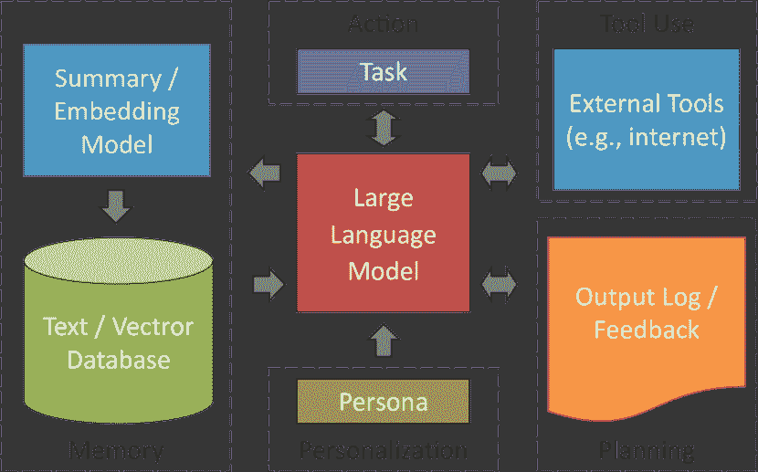

<!--yml

类别：未分类

日期：2025-01-11 12:52:23

-->

# 我们组队吗：探索竞争性大语言模型（LLM）代理的自发合作

> 来源：[https://arxiv.org/html/2402.12327/](https://arxiv.org/html/2402.12327/)

^(1,2)吴增清^†，³彭润^†，¹郑书源^‡，⁴刘倩颖，⁵韩旭，

⁶Brian Inhyuk Kwon，¹Makoto Onizuka，⁷Shaojie Tang，^(1,8)Chuan Xiao^‡

¹大阪大学，²京都大学，³密歇根大学安娜堡分校，⁴LLMC，NII，

⁵福特汉姆大学，⁶加利福尼亚大学洛杉矶分校，⁷纽约州立大学布法罗分校，⁸名古屋大学

wuzengqing@outlook.com, roihn@umich.edu, zheng@ist.osaka-u.ac.jp, ying@nii.ac.jp,

xhan44@fordham.edu, briankwon42@g.ucla.edu, onizuka@ist.osaka-u.ac.jp, shaojiet@buffalo.edu, chuanx@nagoya-u.jp

###### 摘要

大型语言模型（LLM）在社会模拟中被越来越广泛地应用，通常通过精心设计的指令来引导它们，在模拟过程中稳定地表现出类似人类的行为。然而，我们怀疑在进行准确的社会模拟时，塑造代理行为是否真的必要。相反，本文强调了自发现象的重要性，在这些现象中，代理们深入参与情境并在没有明确指令的情况下做出适应性决策。我们在三种竞争性场景中探索了自发合作，并成功地模拟了合作的逐步出现，这一发现与人类行为数据高度吻合。这种方法不仅帮助计算社会科学领域弥合了模拟与现实世界动态之间的差距，还为人工智能领域提供了一种评估大语言模型（LLM）推理能力的新方法。

\mdfsetup

font=, innertopmargin=2pt, innerbottommargin=2pt, innerleftmargin=8pt, innerrightmargin=8pt, frametitleaboveskip=2pt, frametitlebelowskip=1pt, frametitlealignment=, middlelinecolor=blue

我们组队吗：

探索竞争性大语言模型（LLM）代理的自发合作

^(${}^{{\dagger}}$)^(${}^{{\dagger}}$)脚注：共同第一作者。^(${}^{{\ddagger}}$)^(${}^{{\ddagger}}$)脚注：通讯作者。^†^†脚注：我们的源代码可以在[https://github.com/wuzengqing001225/SABM_ShallWeTeamUp](https://github.com/wuzengqing001225/SABM_ShallWeTeamUp) 获取。

## 1 引言

社会模拟中的LLM代理已成为随着生成性AI发展而兴起的热门研究话题（Park et al., [2023](https://arxiv.org/html/2402.12327v3#bib.bib33); Sreedhar和Chilton, [2024](https://arxiv.org/html/2402.12327v3#bib.bib41); Jansen et al., [2023](https://arxiv.org/html/2402.12327v3#bib.bib20); Argyle et al., [2023](https://arxiv.org/html/2402.12327v3#bib.bib4); Xi et al., [2023](https://arxiv.org/html/2402.12327v3#bib.bib51))。与传统的基于规则的代理建模不同，使用LLM作为代理提供了更多的灵活性和通用性（Janssen和Ostrom, [2006](https://arxiv.org/html/2402.12327v3#bib.bib21)）。反过来，这也被广泛视为一种验证和增强LLM在人类般推理能力上的方法（Abdelnabi et al., [2024](https://arxiv.org/html/2402.12327v3#bib.bib1); Du et al., [2023](https://arxiv.org/html/2402.12327v3#bib.bib12); Liu et al., [2023b](https://arxiv.org/html/2402.12327v3#bib.bib29)）。

代理建模的一个关键问题是它与现实世界情况的相似程度。一些研究揭示了LLM模拟基本人类行为或推理能力的能力（Salecha et al., [2024](https://arxiv.org/html/2402.12327v3#bib.bib36); Kosinski, [2024](https://arxiv.org/html/2402.12327v3#bib.bib23); Jansen et al., [2023](https://arxiv.org/html/2402.12327v3#bib.bib20); Ziems et al., [2024](https://arxiv.org/html/2402.12327v3#bib.bib59); Zhang et al., [2023](https://arxiv.org/html/2402.12327v3#bib.bib55))。与此同时，数据污染以及价值对齐可能会引入不必要的先验知识，使LLM模型过于熟悉或偏向研究中的问题（Zhou et al., [2024](https://arxiv.org/html/2402.12327v3#bib.bib58); Ma et al., [2023](https://arxiv.org/html/2402.12327v3#bib.bib31); Mozikov et al., [2024](https://arxiv.org/html/2402.12327v3#bib.bib32); Ai et al., [2024](https://arxiv.org/html/2402.12327v3#bib.bib2); Hu和Collier, [2024](https://arxiv.org/html/2402.12327v3#bib.bib19); Shapira et al., [2024](https://arxiv.org/html/2402.12327v3#bib.bib39))。这可能会影响社会模拟在复杂、长期场景中的质量，尤其是在涉及高层次互动（例如合作、对抗、欺骗和劝说）时。相反，我们认为，在社会模拟中，代理必须独立于先验假设，专注于情境，并根据历史互动积极调整其行为。

图1：（由GPT-4o绘制）火灾中的两种潜在场景。人们可能会惊慌失措，冲向人群，试图先行逃生（左图），或者可能保持冷静，排队并鼓励他人（右图）。在本研究中，我们探讨LLM代理是否能够模拟从非合作行为到合作行为的渐进转变。

我们高度重视情境中深思熟虑的推理能力，视其为实现类人LLM代理进行真实世界模拟的重要组成部分。为了正确验证这一能力，我们研究了一种反直觉的社会情境，在这种情境中，代理几乎无法依赖其先前的知识进行决策。具体而言，我们探讨了在竞争环境中，代理是否能够自然地发展出合作关系。考虑两个在糖果市场中争夺主导地位的小吃公司。它们可能会不断降低价格以吸引更多客户，或者决定同时提高价格以建立互利关系。图[1](https://arxiv.org/html/2402.12327v3#S1.F1 "Figure 1 ‣ 1 Introduction ‣ Shall We Team Up: Exploring Spontaneous Cooperation of Competing LLM Agents")展示了代理处于火灾房间中的另一个例子。在竞争条件下，代理与对手合作并非出于本能。然而，随着互动的进行，它们可能通过情境发现合作的优势，并据此调整其策略。同时，我们精心设计了提示语，以避免指示性描述（例如“你可以合作”）和可能揭示社会模拟具体性质的关键词（例如“价格战”）。通过这些方式，我们尽力消除来自内部和外部偏见的影响，观察到LLM代理能够主动适应动态情境，自发地在复杂环境中学习合作。

我们选择了三种符合上述特征的社会现象进行案例研究，捕捉到在没有指导性引导下，竞争场景中自发合作的不同方式。我们进行了广泛的消融实验，证明了消除偏见的重要性，并精心设计了实验以确保可重复性。

总结来说，我们的贡献有两个方面，可以同时服务于人工智能（AI）和计算社会科学（CSS）领域：

1.  1)

    我们观察到LLM代理在多种竞争场景中自发合作的现象，这反映了LLM在长期情境学习任务中的潜力。

1.  2)

    i) 从CSS的角度来看，我们揭示并强调了在社会模拟中消除LLM代理偏见的重要性。这在很大程度上有助于构建多样化的类人LLM代理，进而实现真实世界模拟。

    ii) 从AI的角度来看，我们提出了一种新的方法来验证LLM在长期、实际角色扮演中的深思熟虑推理能力。代理能够基于历史上下文主动调整其知识和策略，而不是依赖于精心设计的提示，这是评估通用自主代理的一个关键标准。

## 2 相关工作

#### 社会模拟中的LLM代理

近年来，大语言模型智能体在社会仿真中得到了广泛应用（Li等，[2023](https://arxiv.org/html/2402.12327v3#bib.bib26)；Lin等，[2023](https://arxiv.org/html/2402.12327v3#bib.bib27)；Giabbanelli，[2023](https://arxiv.org/html/2402.12327v3#bib.bib15)；Xie等，[2023](https://arxiv.org/html/2402.12327v3#bib.bib52)；Wang等，[2023a](https://arxiv.org/html/2402.12327v3#bib.bib44)；Xi等，[2023](https://arxiv.org/html/2402.12327v3#bib.bib51)；Gao等，[2023a](https://arxiv.org/html/2402.12327v3#bib.bib13)，[b](https://arxiv.org/html/2402.12327v3#bib.bib14)；Liu等，[2023a](https://arxiv.org/html/2402.12327v3#bib.bib28)）。我们进一步深入探讨是否能够借助大语言模型的长期推理能力来模拟自发的合作行为。

也有一些成熟的平台支持使用大语言模型（LLM）进行多智能体仿真，包括LangChain（Chase，[2023](https://arxiv.org/html/2402.12327v3#bib.bib9)）、AutoGen（Wu等，[2023a](https://arxiv.org/html/2402.12327v3#bib.bib48)）以及面向智能体的框架，如AgentLite（Liu等，[2024](https://arxiv.org/html/2402.12327v3#bib.bib30)）、AgentVerse（Chen等，[2023](https://arxiv.org/html/2402.12327v3#bib.bib10)）和SABM（Wu等，[2023b](https://arxiv.org/html/2402.12327v3#bib.bib50)）。在我们的案例研究中，我们使用SABM作为主要框架，因为它具有轻量级和用户友好的实现方式。关于SABM的入门介绍请参见附录[F](https://arxiv.org/html/2402.12327v3#A6 "Appendix F SABM Primer ‣ Shall We Team Up: Exploring Spontaneous Cooperation of Competing LLM Agents")。

#### 大语言模型中的多智能体交互

利用大语言模型（LLM）已经广泛探讨了智能体之间的合作与竞争。研究如王等人 [2023b](https://arxiv.org/html/2402.12327v3#bib.bib45)、钱等人 [2023](https://arxiv.org/html/2402.12327v3#bib.bib35)、洪等人 [2023](https://arxiv.org/html/2402.12327v3#bib.bib18)、杭等人 [2024](https://arxiv.org/html/2402.12327v3#bib.bib17)、唐等人 [2024](https://arxiv.org/html/2402.12327v3#bib.bib42) 已经展示了LLM智能体在复杂任务中的合作，如软件开发和图像编辑。像谋杀谜题Junprung（[2023](https://arxiv.org/html/2402.12327v3#bib.bib22)）、狼人Xu等人（[2023a](https://arxiv.org/html/2402.12327v3#bib.bib53)、[b](https://arxiv.org/html/2402.12327v3#bib.bib54)）、吴等人（[2024](https://arxiv.org/html/2402.12327v3#bib.bib49)）、杜和张（[2024](https://arxiv.org/html/2402.12327v3#bib.bib11)）、阿瓦隆Lan等人（[2023](https://arxiv.org/html/2402.12327v3#bib.bib24)）、史等人（[2023](https://arxiv.org/html/2402.12327v3#bib.bib40)）等多方游戏和其他竞争场景赵等人（[2023](https://arxiv.org/html/2402.12327v3#bib.bib57)）也已被研究，通常通过直接指令来影响智能体的行为。然而，遵循Piatti等人 [2024](https://arxiv.org/html/2402.12327v3#bib.bib34)的研究，我们的研究集中在最小引导、去偏的LLM行为上，探讨LLM是否能够通过上下文学习在竞争场景中自发地进行合作。

图2：三项案例研究的工作流程，展示了我们的框架如何在模拟过程中管理LLM智能体。 从左到右，工作流程依次经过沟通阶段、规划阶段、行动阶段和更新阶段。在BC中，沟通和规划阶段的顺序被交换，以与之前使用人类参与者的模拟相一致Andres等人（[2023](https://arxiv.org/html/2402.12327v3#bib.bib3)）。前三个阶段涉及框架启动的一次或多次LLM查询。最后一个阶段不涉及LLM查询，而是更新每个场景的状态。

## 3 竞争中的自发合作

我们将自发合作定义为在没有任何明确指令或提示引导智能体合作的情况下，自发产生的合作行为。我们的主要关注点是研究具有不同甚至冲突目标的智能体是否可以根据他们在互动过程中意识到合作是有益的而选择合作。

大型语言模型（LLMs）通常与人类价值观对齐，并且经过内部微调以实现合作。这种由先验知识或价值对齐驱动的合作，在我们的范围内不被视为自发合作。此外，我们精心设计提示，避免明确指示来塑造智能体的行为，并避免使用关键词提示大型语言模型关于它正在进行的社会模拟的性质。否则，这将不被视为自发合作。

我们重视智能体对合作益处的自我认识，并逐渐选择合作，因此我们从金融、经济学和行为科学三个不同的研究领域中选择了三个竞争场景。我们假设在竞争场景中，合作一开始并不会自然发生，但可能会在大型语言模型强大的上下文学习能力的帮助下逐渐出现。因此，我们深入研究这三个竞争场景，看看是否能在模拟过程中以某种方式感知到自发的合作。

#### 场景概述

以下是三个选定场景的概述。

1.  1)

    凯恩斯美丽竞赛（KBC）：多个智能体作为游戏玩家同时选择一个介于 0 到 100 之间的自然数。选择一个最接近所有选定数字平均值的 2/3 的玩家将赢得游戏 Bosch-Domenech 等人 ([2002](https://arxiv.org/html/2402.12327v3#bib.bib5))。

1.  2)

    伯特兰竞争（BC）：两个智能体扮演公司角色，决定其产品的价格。它们需要通过动态调整价格来与对方竞争，以最大化其利润 Calvano 等人 ([2020](https://arxiv.org/html/2402.12327v3#bib.bib7))。

1.  3)

    紧急疏散（EE）：大量智能体作为避难者从地震中逃生。它们需要选择并到达合适的出口，考虑到自身的身体和心理状况以及周围的拥挤情况 Wang 等人 ([2015](https://arxiv.org/html/2402.12327v3#bib.bib43))。

表 1：三个选择场景的共同点和差异。我们重点关注信息可见性、沟通形式、模拟过程中的决策次数以及是否有可分析的解决方案。

| 场景 | 领域 | 信息 | 沟通 | 决策 | 可分析解 |
| --- | --- | --- | --- | --- | --- |
| KBC | 金融 | 未知对手策略 | 小组讨论 | 一次 | 是${\dagger}$ |
| BC | 经济学 | 未知对手利润 | 一对一 | 多个 | 是 |
| EE | 行为科学 | 部分观察 | 近距离 | 多个 | 否 |

#### 模拟的一般步骤

我们根据图[2](https://arxiv.org/html/2402.12327v3#S2.F2 "图2 ‣ 大型语言模型中的多代理交互 ‣ 2 相关工作 ‣ 我们是否应当组队：探索竞争性LLM代理的自发合作")中所示的框架，模拟了三个场景。在这些模拟中，每个代理人都由一个大型语言模型（LLM）控制。每一轮，代理人都会获得最新的世界状态，其中包括任务描述、它们之间的沟通历史和之前的决策。我们多次查询LLM，以了解代理人的感受、他们想说什么以及他们在下一步将采取哪些行动。模拟通常经历以下四个阶段：沟通阶段、规划阶段、行动阶段和更新阶段。

1.  1)

    沟通阶段：在每个周期开始时，周期的长度可以从一轮到多轮不等，代理人会进行沟通。代理人按顺序进行交流，后面的代理人可以访问前面代理人已发言的沟通历史。每一轮的顺序会被打乱，以保持最大的公平性和真实性。

    三个场景中使用了不同形式的沟通方式。我们有一对一对话、群聊和广播，在群聊中，代理人组成会随着它们的物理移动而变化。

1.  2)

    规划阶段：代理人根据给定的情境决定他们的策略。策略代表了代理人对任务的高层次方向/态度（例如，“我希望价格上涨/下跌”），不同于与低级控制更相关的行动（例如，“将价格加$2”）。上述情境指的是到当前回合为止的前期对话和他们之前制定的策略。

1.  3)

    行动阶段：代理人根据之前的对话和当前的策略决定采取哪种行动。

1.  4)

    更新阶段：在所有代理人选择了他们的行动后，框架处理模拟并更新代理人的状态（例如，胜/负、逃脱/未逃脱）。

我们尽力保持三个场景的一致性，遵循相同的工作流程，以便进行系统的比较。尽管如此，仍然存在一些小的变化，接下来的章节中会详细说明这些变化。

#### 评估方法

我们从两个角度评估自发合作：

1.  1)

    过程（定性）：我们检查沟通日志，寻找可能表明合作的内容。例如，“让我们继续采用$\dots$策略”和“我同意关于$\dots$的共识”这样的短语，表明合作的形成。

1.  2)

    结果（定量）：通过进行有沟通和没有沟通的模拟，我们检查它们在反映合作的任何线索上的结果差异。具体来说，我们衡量KBC中的数字选择方差，BC中的收敛价格，以及EE中的撤离速度和平衡的出口选择。

#### 三个场景之间的关联

我们在表格LABEL:tab:correlation_scenario中列出了三个场景的共性和差异。

总体而言，所描述的三个场景是竞争性的，代理拥有不同或冲突的目标，尽管合作可能是互利的。每个场景在任务过程中为代理提供部分信息，并且在沟通形式和决策频率上有所不同。

具体而言，在KBC场景中，我们探讨了一个小组内的短期、单实例决策，旨在评估LLM代理在理解规则、在沟通过程中调整计划以及最终做出决策方面的能力。该场景支持简单而直接的研究自发合作。

在BC场景中，我们将挑战扩展到更长的时间跨度，主要关注代理在时间背景下学习合作的能力。代理需要有效地与对手沟通，利用历史背景来最大化他们的收益。

最后，EE场景结合了时间和空间信息。在这个场景中，代理根据他们的感知观察和沟通持续做出决策。与前两个场景不同，EE缺乏分析性解决方案和现实世界的数据进行比较，这在传统的CSS中是具有挑战性的，但在AI方法中具有很大的潜力。

## 4 案例研究1：凯恩斯美女竞赛

### 4.1 模拟设置

#### 任务定义

我们模拟了一个24个LLM玩家之间的数字猜测游戏。他们每个人从0到100中选择一个数字。选择的数字最接近所有提交数字平均值的三分之二的玩家赢得比赛并获得$1。

为了确保广泛性，我们对每个设置进行了15轮模拟，使用GPT-4 ^†^†本文中使用gpt-4-0314与openai==0.28.0包中的ChatCompletion.create函数作为核心。

#### 模拟过程

如图[2](https://arxiv.org/html/2402.12327v3#S2.F2 "Figure 2 ‣ Multi-agent Interactions in LLMs ‣ 2 Related Work ‣ Shall We Team Up: Exploring Spontaneous Cooperation of Competing LLM Agents")所示，在每轮模拟中，经历以下几个阶段：

1.  1)

    沟通：玩家在选择数字之前进行小组讨论。他们依次与其他人分享自己的想法。玩家可以查看所有轮次的对话历史。

1.  2)

    规划与行动：玩家（私下）讨论他们的数字选择策略，随后提出他们选择的数字。在这里，玩家将他们的策略和数字（0–100）通过一次API调用输出。

1.  3)

    更新：根据所有选择的数字，SABM框架确定获胜者。获胜者可以根据奖励规则获得奖励，以激励其竞争。

#### 自发合作

我们的目标是观察玩家在交流过程中如何调整他们的策略，并合作以最大化他们的回报。我们采用定量方法通过检查玩家选择的数字的方差来追踪合作的出现。较低的方差意味着玩家选择的数字相似，这可能带来集体利益的增加。通过分析不同轮次交流和规划后的方差，我们可以观察到分布如何演变。如果我们注意到方差呈下降趋势，这表明最初玩家可能会随机选择数字或因各种原因做出选择，但随着时间的推移，他们越来越倾向于选择与其他人相似的数字。这个趋势将表明合作正在逐渐发生。

图 3：KBC 案例研究中基线设计的示意图。代理在规划和选择他们的数字之前，经过 $k$ 轮的交流。

### 4.2 模拟结果

我们调查了合作是否会随着交流的进行而出现，因此设计了如图 [3](https://arxiv.org/html/2402.12327v3#S4.F3 "Figure 3 ‣ Spontaneous Cooperation ‣ 4.1 Simulation Setup ‣ 4 Case Study 1: Keynesian Beauty Contest ‣ Shall We Team Up: Exploring Spontaneous Cooperation of Competing LLM Agents") 所示的基线。代理在选择他们的数字之前，经历 $k$ 轮交流（$k\in[0,3]$）。当 $k=0$ 时，代理直接选择数字而不进行交流。对于 $k>1$，代理可以查看当前轮次及之前所有轮次的聊天记录。

为了验证合作是否在没有明确指示的情况下自发产生，我们进行了一项消融研究，涉及在提示中加入具体指令，如“你必须与其他玩家合作”。相反，我们也评估了代理被赋予非合作角色的场景，明确指示他们自私行事。

(a) 不同的指令。

(b) 不同的模型。

图 4：在不同 KBC 设置下玩家选择的方差。在我们的基线设置中（蓝色曲线），我们使用 GPT-4-0314 模型，温度设置为 0.7，且没有明确指令或角色设定。

#### 结果概述

图[4](https://arxiv.org/html/2402.12327v3#S4.F4 "图 4 ‣ 4.2 仿真结果 ‣ 4 案例研究 1：凯恩斯美女竞赛 ‣ 我们组队吗：探索竞争性LLM代理的自发合作")整体展示了LLM玩家之间选择方差的一致性下降，从没有交流（$k=0$）到逐渐有交流（$k>0$）。这一趋势意味着代理们正在积极讨论，选择相同的数字以实现更好的共同利益，这可以被视为一种合作行为。此外，我们在他们的交流中观察到一些表明合作的短语，如“让我们继续使用较小数字的策略”和“我同意小组的共识”，特别是在后期回合（$k=2$或$3$）中，绝大多数代理展现出了通过交流逐步形成合作的迹象。

#### 提示中的明确指令

我们进一步在提示中附加明确指令，看看行为有何不同。如图[4(a)](https://arxiv.org/html/2402.12327v3#S4.F4.sf1 "在图 4 ‣ 4.2 仿真结果 ‣ 4 案例研究 1：凯恩斯美女竞赛 ‣ 我们组队吗：探索竞争性LLM代理的自发合作")所示，当我们明确指示代理合作时，当$k=1$时，其方差显著下降至0。之后，所有玩家在15轮中始终做出相同的选择。这在很大程度上证明了我们基线中观察到的合作行为——即没有指令时的基线——是由于交流而自发产生的。相反，具有不合作特性的代理在所有回合中都会产生更大的方差，这与我们对合作的定义相悖。因此，我们得出结论，我们的基线在很大程度上没有受到潜在指导的影响，并成功地模拟了自发合作现象。

#### 各模型比较

图[4(b)](https://arxiv.org/html/2402.12327v3#S4.F4.sf2 "图 4 ‣ 4.2 仿真结果 ‣ 案例研究 1：凯恩斯美丽竞赛 ‣ 我们应该合作吗：探索竞争性大型语言模型（LLM）代理的自发合作")展示了不同顶级模型中LLM玩家的行为。我们观察到，Claude 3（claude-3-sonnet-20240229）的曲线从$k=0$到$k=1$显著下降，反映了LLM玩家能够共享信息并基于共享的上下文做出决策。然而，与GPT-4不同的是，它的方差从$k=1$到$k=3$有所增加。对通信日志的分析显示，与GPT-4相比，Claude 3讨论更多的是抽象策略，缺乏具体的数字讨论。因此，虽然这些LLM玩家可能在某些数字上达成一致，但具体的选择在代理之间有所不同（例如，一些选择$66$，另一些选择$33$），这导致多个赢家出现，但选择方差增加。尽管这不符合我们之前提出的基于方差的自发合作定义，但我们可以从日志中推断出这代表了一种不同形式的合作。分析这些模型决策差异有助于进一步理解和评估LLM的表现。

图 5：我们仿真中的玩家选择分布及《纽约时报》实验结果。

#### 与人类数据的比较

最后，图[5](https://arxiv.org/html/2402.12327v3#S4.F5 "图 5 ‣ 各模型比较 ‣ 4.2 仿真结果 ‣ 案例研究 1：凯恩斯美丽竞赛 ‣ 我们应该合作吗：探索竞争性大型语言模型（LLM）代理的自发合作")显示，我们基线的仿真结果与《纽约时报》进行的大规模实证实验的数值选择分布大体一致（$N=61,140$），该实验由Leonhardt和Quealy于[2015年](https://arxiv.org/html/2402.12327v3#bib.bib25)进行。LLM和《纽约时报》（NYT）玩家在无沟通设置下主要选择了$33$。其他围绕$0,22$（$33$的$2/3$）、$50$和$66$的次峰值也得到了良好的映射，这表明GPT-4成功进行了多步骤推理，并忠实地反映了之前研究中提到的人类行为[Guo et al.](https://arxiv.org/html/2402.12327v3#bib.bib16)（[2024年](https://arxiv.org/html/2402.12327v3#bib.bib16)）；[Zhang et al.](https://arxiv.org/html/2402.12327v3#bib.bib56)（[2024年](https://arxiv.org/html/2402.12327v3#bib.bib56)）的研究也支持这一点。

## 5 案例研究 2：伯特兰竞争

### 5.1 仿真设置

任务定义：我们考虑两家销售同质商品、具有相同边际成本的公司之间的伯特兰竞争[维基百科](https://arxiv.org/html/2402.12327v3#bib.bib47)（[2024年](https://arxiv.org/html/2402.12327v3#bib.bib47)）。

模拟会持续进行，直到达到$1200$轮，或者发生连续串通$200$轮。串通被认定为当两方保持接近价格，并能够在伯特朗均衡价格和卡特尔价格之间维持这些价格一段时间（定义为200轮）。伯特朗均衡价格是竞争达到纳什均衡时的价格，即当其他方价格固定时，任何一方都无法通过改变价格获得收益。在这种情况下，没有观察到串通。卡特尔价格则是当双方完全串通时的价格，即像经营同一家公司一样进行定价。这两个价格标志着能够产生利润的合理价格范围[Calvano et al. (2020)](https://arxiv.org/html/2402.12327v3#bib.bib7)。为了结论的普遍性，我们对每个设定进行了5次模拟，并在图[6](https://arxiv.org/html/2402.12327v3#S5.F6 "图6 ‣ 自发合作 ‣ 5.1 模拟设置 ‣ 5 案例研究2：伯特朗竞争 ‣ 我们是否应该组队：探索竞争中的大型语言模型代理的自发合作")中展示了其中一轮结果。

#### 模拟程序

如图[2](https://arxiv.org/html/2402.12327v3#S2.F2 "图2 ‣ 大型语言模型中的多主体互动 ‣ 2 相关工作 ‣ 我们是否应该组队：探索竞争中的大型语言模型代理的自发合作")所示，每轮模拟包括以下几个阶段：

1.  1)

    沟通：各公司轮流讨论任何话题（不限于定价）进行三次交流，每轮一次。

1.  2)

    规划：每个公司根据双方的历史价格以及自身的产品需求和利润信息制定或调整策略。

1.  3)

    行动：每个公司独立地同时设置其产品价格。

1.  4)

    更新：在两家公司决定价格后，模拟系统计算市场需求及各自的利润，采用[Calvano et al. (2020)](https://arxiv.org/html/2402.12327v3#bib.bib7)中的方法进行计算。

#### 默契串通与卡特尔串通

默契串通指的是公司之间进行非正式的、隐性的协调，以避免激烈竞争，如价格战，从而导致价格提高和产量受限，而无需明确的沟通或协议。卡特尔串通则指竞争者之间达成正式协议，固定价格并进行其他反竞争行为，实际上表现为一个统一实体，以最大化联合利润。

#### 自发合作

当两家公司的价格非常接近，并且位于伯特兰均衡和卡特尔价格之间时，这被视为自发合作。这意味着公司意识到彼此的相互依赖，可能采取避免价格战或卡特尔明确共谋的定价策略，从而稳定价格，使其高于竞争性定价但低于完全共谋。尽管这种行为没有涉及明确的协议，但通过并行而独立的行动，它可以有效地反映出卡特尔定价的一些好处，表明存在默契共谋。对于卡特尔共谋，我们通过检查聊天记录中的明确价格协议来寻找合作的迹象。

(a) 没有沟通的情况下。

(b) 有沟通的情况下。

(c) 在第400轮后停止沟通。

图6：BC中不同场景下的定价竞争。伯特兰均衡价格是两家公司达到纳什均衡时的价格。卡特尔价格是它们完全合作时的最优价格。当两者的价格保持在绿色阴影区域内时，表示两家公司之间发生了合作。更多仿真结果请参见附录[D](https://arxiv.org/html/2402.12327v3#A4 "附录D：BC仿真附加参考资料 ‣ 我们要组队吗：探索竞争的LLM代理的自发合作")。

图7：没有合作鼓励和有合作鼓励的前200轮仿真。

### 5.2 仿真结果

#### 没有沟通的默契共谋

如图[6(a)](https://arxiv.org/html/2402.12327v3#S5.F6.sf1 "在图6 ‣ 自发合作 ‣ 5.1 仿真设置 ‣ 5 案例研究2：伯特兰竞争 ‣ 我们要组队吗：探索竞争的LLM代理的自发合作")所示，在没有沟通的场景中，公司在最初的200轮之后开始调整定价策略，意识到通过提高价格可以获得更高的利润，并避免价格战。到第400轮时，价格稳定在7左右，超过了伯特兰均衡价格6，表明基于对过去竞争行为的相互理解，存在默契共谋。尽管没有沟通，但收敛的价格仍低于卡特尔价格8。这些发现与Calvano等人使用强化学习（RL）进行的仿真结果一致，而且在本实验中共谋形成的速度更快（LLM代理在400轮时就达成共谋，而RL仿真需要2000轮）。

#### 有沟通的卡特尔共谋

在具有沟通的设置中，明确的价格协议可以在早期轮次（前30轮）的沟通记录中看到。例如，在第20轮的沟通阶段，企业2提出：“我们可以通过探索不同的价格点，同时保持合理的价格差异来最大化我们的利润”，企业1同意了这个提议。如图[6(b)](https://arxiv.org/html/2402.12327v3#S5.F6.sf2 "In Figure 6 ‣ Spontaneous Cooperation ‣ 5.1 Simulation Setup ‣ 5 Case Study 2: Bertrand Competition ‣ Shall We Team Up: Exploring Spontaneous Cooperation of Competing LLM Agents")所示，在实施之前，企业经常讨论他们的定价策略和合作潜力，这显著增强了信任并减少了发起价格战的可能性。在模拟的后期轮次中，价格协议变得更加具体（指定一个价格而不是一个范围），这导致了定价决策的波动较小。因此，在前30轮之后，他们开始逐步提高价格，最终趋向于8的卡特尔价格，明显高于非沟通设置，反映了代理人之间的合作。

作为一个消融研究，图[6(c)](https://arxiv.org/html/2402.12327v3#S5.F6.sf3 "在图6 ‣ 自发合作 ‣ 5.1 模拟设置 ‣ 5 案例研究2：伯特兰竞争 ‣ 我们组队吗：探索竞争LLM代理人的自发合作")使用了与图[6(b)](https://arxiv.org/html/2402.12327v3#S5.F6.sf2 "在图6 ‣ 自发合作 ‣ 5.1 模拟设置 ‣ 5 案例研究2：伯特兰竞争 ‣ 我们组队吗：探索竞争LLM代理人的自发合作")相同的历史价格决策记录和对话，在前400轮中进行，接着是200轮没有沟通的设置。与图[6(b)](https://arxiv.org/html/2402.12327v3#S5.F6.sf2 "在图6 ‣ 自发合作 ‣ 5.1 模拟设置 ‣ 5 案例研究2：伯特兰竞争 ‣ 我们组队吗：探索竞争LLM代理人的自发合作")不同的是，在该图中对话促进了共识和合作，将价格提高至8，而在图[6(c)](https://arxiv.org/html/2402.12327v3#S5.F6.sf3 "在图6 ‣ 自发合作 ‣ 5.1 模拟设置 ‣ 5 案例研究2：伯特兰竞争 ‣ 我们组队吗：探索竞争LLM代理人的自发合作")后200轮中，价格在7和8之间趋于一致，类似于图[6(a)](https://arxiv.org/html/2402.12327v3#S5.F6.sf1 "在图6 ‣ 自发合作 ‣ 5.1 模拟设置 ‣ 5 案例研究2：伯特兰竞争 ‣ 我们组队吗：探索竞争LLM代理人的自发合作")中的无沟通情境。图[6(b)](https://arxiv.org/html/2402.12327v3#S5.F6.sf2 "在图6 ‣ 自发合作 ‣ 5.1 模拟设置 ‣ 5 案例研究2：伯特兰竞争 ‣ 我们组队吗：探索竞争LLM代理人的自发合作")与图[6(c)](https://arxiv.org/html/2402.12327v3#S5.F6.sf3 "在图6 ‣ 自发合作 ‣ 5.1 模拟设置 ‣ 5 案例研究2：伯特兰竞争 ‣ 我们组队吗：探索竞争LLM代理人的自发合作")之间的对比表明，卡特尔合谋和价格提升确实来源于代理人的沟通。由于我们并未明确指示代理人讨论哪些话题，因此通过对话形成共识、提高价格以获得更好的利润的行为可以被视为一种自发合作的形式。

无论是在有沟通的情境下还是没有沟通的情境下，都表明代理人可以在不同的条件下实现合谋，无论是默契的还是明确的。通过沟通，企业可以实现最大利润。然而，即便没有沟通，我们观察到代理人具有自发形成合作的天赋能力。现有研究表明，合谋通常涉及某种形式的未言明的、隐性价格协议以提高利润（Andres et al. [2023](https://arxiv.org/html/2402.12327v3#bib.bib3)），而LLM代理人的表现与这些发现一致。

#### 提示中的明确指示

如图[7](https://arxiv.org/html/2402.12327v3#S5.F7 "图7 ‣ 自发合作 ‣ 5.1 模拟设置 ‣ 5 案例研究2：伯特兰竞争 ‣ 我们是否要合作：探索竞争性LLM代理的自发合作")右下角所示，与默认设置相比，在“鼓励合作”设置下，代理之间的合作不仅形成得更快，而且跨轮次的价格更稳定（波动较小），从对话一开始就有明显的合作信号，最终达成了卡特尔价格。这表明，战略性的鼓励能够显著提高合作效率，间接表明在没有明确合作指令的情况下，代理的合作行为来源于通信，在前50轮沟通中代理之间需要更多的轮次才能达成协议。此外，需要约200轮才能达成卡特尔价格的模式也表明，这种合作不是由于LLM的背景知识或数据泄漏；否则，代理在模拟的早期轮次就会寻求最佳的合谋。

## 6 案例研究3：紧急疏散

### 6.1 模拟设置

#### 任务定义

我们遵循Wang等人（[2015](https://arxiv.org/html/2402.12327v3#bib.bib43)）的方法，在网格环境中模拟紧急疏散（EE）。如图[8(a)](https://arxiv.org/html/2402.12327v3#S6.F8.sf1 "在图8中 ‣ 疏散中的合作 ‣ 6.1 模拟设置 ‣ 6 案例研究3：紧急疏散 ‣ 我们是否要合作：探索竞争性LLM代理的自发合作")所示，我们的网格环境由$33\times 33$个单元格组成。房间内有三个出口（左、右和底部）。在模拟疏散中，疏散者试图通过多轮移动到达目标出口。

我们模拟了在一个房间内100个代理的紧急疏散，并在所有代理成功逃生或达到50轮时停止模拟。我们重复进行5次模拟，每次代理的初始位置不同。

#### 模拟程序

如图[2](https://arxiv.org/html/2402.12327v3#S2.F2 "图2 ‣ LLM中的多代理交互 ‣ 2 相关工作 ‣ 我们是否要合作：探索竞争性LLM代理的自发合作")所示，在每轮模拟中，经历以下几个阶段：

1.  1)

    通信：我们要求疏散者与他人分享他们的感受。只有在特定距离内的代理才能听到这些消息。

1.  2)

    规划：根据距离三个出口的距离和出口周围的拥堵情况，代理被要求描述他们对这些出口的感受，并选择其中一个作为目标出口。同时也会考虑聊天记录。

1.  3)

    行动：给定目标出口，代理选择前进的方向。他们可以在8个方向中选择一个方向移动一个单元格，或者停留在当前单元格。

1.  4)

    更新：在所有代理选择完行动后，SABM框架会根据它们的新位置更新网格环境。如果代理成功逃脱，它们将被标记为已逃脱并从模拟中移除。

每一轮中，某个代理有20%的概率进行沟通并调整其计划（第1阶段和第2阶段）。否则，它将直接根据最新的计划选择行动。这有效地防止了代理每轮都进行沟通并频繁更改计划，从而实现了更真实的模拟。

#### 疏散中的合作

在紧急疏散中，竞争自然存在，因为所有代理都希望尽快逃脱，这常常导致拥堵。然而，如果代理能够主动分享信息、平复情绪并引导人群，它们可能会以更加平衡的方式更快地逃脱。如图[1](https://arxiv.org/html/2402.12327v3#S1.F1 "Figure 1 ‣ 1 Introduction ‣ Shall We Team Up: Exploring Spontaneous Cooperation of Competing LLM Agents")所示，这两种情形都是可能的，本研究旨在（1）成功模拟这些现象，以及（2）观察是否存在信息共享、鼓励和出口引导等合作行为。

(a) 网格世界示意图。当红色代理面向底部出口时，其视野范围被突出显示（粉色格子）。

(b) 在一个$11\times 11$房间中，47个代理的简化模拟。随着时间推移，代理自然会集中到最近的出口，并逐一逃脱。

图8：我们研究中网格环境的概述。网格环境中的每个点代表一个代理。

### 6.2 模拟结果

我们比较了三种代理基准：无沟通、有沟通和有沟通且具有不合作人格的代理。

表2：在不同设置下，各轮次中成功逃脱的代理累计数量（总共100个代理）。通常，有沟通的代理逃脱速度更快，而具有不合作人格的代理逃脱速度较慢。

| 轮次 | 5 | 10 | 15 | 20 | 25 | 30 | 35 | 40 | 45 | 50 |
| --- | --- | --- | --- | --- | --- | --- | --- | --- | --- | --- |
| 无沟通 | 9.4 | 31.2 | 51.2 | 65.6 | 78.6 | 88.4 | 96.6 | 99.0 | 99.8 | 99.8 |
| 有沟通 | 9.8 | 31.6 | 48.8 | 67.2 | 80.6 | 92.2 | 97.2 | 98.8 | 99.8 | 100.0 |

| 有沟通且不合作 | 9.4 | 31.2 | 48.2 | 64.4 | 77.0 | 87.4 | 95.0 | 98.0 | 99.0 | 99.0 | 

图9：从每个出口逃脱的代理累积数量。沟通帮助代理均匀选择三个出口，而不是集中攻击同一个出口。

#### 沟通对疏散速度的影响

表[2](https://arxiv.org/html/2402.12327v3#S6.T2 "Table 2 ‣ 6.2 Simulation Results ‣ 6 Case Study 3: Emergency Evacuation ‣ Shall We Team Up: Exploring Spontaneous Cooperation of Competing LLM Agents")显示了各回合中逃脱的代理累计数量。在大多数回合中，能够沟通的代理撤离得最快，并且这是唯一一个在五轮实验中所有回合都能在50轮内成功撤离的基准组。这强烈证明了沟通对撤离速度的积极影响。

深入查看日志，我们发现了一些有效沟通的实例，比如一位撤离者分享的消息：“底部出口似乎离得更近，而且人更少。我们选择那里，可以更快逃生。保持坚强，互相帮助！”另一位撤离者补充道：“底部出口看起来离得更近，且人少。我们去那里，更能快速逃生。保持坚强，互相支持！”这种信息共享和鼓励通过沟通得以实现，我们认为这就是合作，可能提高了撤离的速度。

#### 沟通对出口选择的影响

图[9](https://arxiv.org/html/2402.12327v3#S6.F9 "Figure 9 ‣ 6.2 Simulation Results ‣ 6 Case Study 3: Emergency Evacuation ‣ Shall We Team Up: Exploring Spontaneous Cooperation of Competing LLM Agents")展示了不同出口撤离者的分布情况。我们注意到，当撤离者能够互相沟通时，出口选择的分布变得更加平衡。这种平衡归因于撤离者之间自发的信息交换，使他们能够通过考虑出口的距离和拥挤程度，找到最合适的出口。

## 7 讨论

#### “自发”现象的意义

弥合现实世界与合成模拟之间的差距，仍然是计算社会科学研究中的主要目标。本研究探讨了即便在竞争的情况下，自发合作的潜力，展示了LLM（大语言模型）可以在没有明确提示的情况下，从非合作逐渐转变为合作。我们进行了广泛的消融研究，比较了有无明确任务完成指导的代理行为。结果表明，我们的基准模型——即缺乏明确指导的模型——更贴近自然人类行为。因此，在使用特定LLM（例如GPT-4）进行社会模拟时，减少指令可能更能反映现实世界的情况。

#### 快捷方式还是深思熟虑的推理？

我们认为，自发合作的出现主要是由于代理在长期互动中的上下文学习能力，而非预先存在的双赢心态或最大化利益的先验知识。这一点在我们的案例研究中得到了体现：

在KBC中，我们看到选择的数字的方差在多轮中逐渐减小，而不是在一开始或第一次沟通后立即达到低方差。我们的对照实验（图[4(a)](https://arxiv.org/html/2402.12327v3#S4.F4.sf1 "图4 ‣ 4.2 模拟结果 ‣ 4 案例研究1：凯恩斯美人竞赛 ‣ 我们要组队吗：探索竞争性LLM代理人的自发合作")）也表明，从一开始就明确指示代理人合作，导致所有代理人在沟通后立即选择相同的数字。这些结果表明，代理人随着时间推移正在学习并调整他们的策略，而不是应用预先存在的合作思维模式。

在BC中，我们观察到在多个回合中，代理人逐渐接近最优价格，而非快速收敛。此外，在没有沟通的情况下，代理人只有在多轮后才能达到默契共谋（亚优），这一现象与先前研究中的基于强化学习的方法相一致。这表明我们的代理人在决策过程中并没有利用特定领域的先验知识。通过检查沟通日志，我们发现代理人最初只讨论宽泛的价格区间，或者根本不讨论价格。直到后来，他们才在具体价格上达成一致，这表明决策过程是逐步学习的，而不是利用预先存在的知识。

在EE中，我们发现代理人在沟通过程中偶尔会使用具有指导性或鼓励性的词汇，这可以视为合作行为。此外，结果显示，进行沟通的模拟获得了最高的表现（表[2](https://arxiv.org/html/2402.12327v3#S6.T2 "表2 ‣ 6.2 模拟结果 ‣ 6 案例研究3：紧急疏散 ‣ 我们要组队吗：探索竞争性LLM代理人的自发合作")）。为EE评估自发合作提供更多的评估指标将会有所帮助，留待未来研究。

## 8 结论

我们在三个案例研究中探讨了自发合作，并观察到LLM代理人能够在没有明确指示的情况下，随着时间推移逐渐发展出合作行为。这一现象与现实世界的数据非常吻合，强调了在进行社会模拟时消除先验知识的重要性。我们相信这种方法不仅有助于CSS社区弥合合成模拟与现实世界动态之间的差距，而且为AI社区提供了一种新的评估LLM故意推理的方法。

## 伦理声明

本研究中，我们研究了LLM代理人在竞争环境中的合作行为。所有实验均在计算机模拟中进行。据我们所知，本研究没有产生负面的社会影响。

我们发现LLM代理能够在模拟的市场环境中学习勾结行为。这一见解可以为涉及AI代理的市场监管措施提供参考，比如在金融市场中禁止使用AI进行勾结行为。

我们使用ChatGPT来润色本论文。我们对本文中呈现的所有材料负责。

## 局限性

在我们的研究中，我们识别出需要在未来工作中解决的几个局限性。

#### 对LLM的实验有限

我们研究的一个主要局限性是实验的范围。我们主要使用了单一版本的GPT-4进行研究。这一选择主要受到以下因素的影响：（1）这些案例研究的财务限制（分别为$\{\$900,\$3000,\$1000\}$），（2）受限的速率限制和窗口大小，以及（3）LLM在这些场景中的理解有限（参见附录 [B.3](https://arxiv.org/html/2402.12327v3#A2.SS3 "B.3 EE ‣ Appendix B Tests of Other LLMs ‣ Shall We Team Up: Exploring Spontaneous Cooperation of Competing LLM Agents")）。此外，由于计算资源不足，我们未能使用其他开源大型语言模型进行更广泛的实验。因此，我们将我们的研究结果视为一种概念验证研究，需要在不同LLM上进一步测试以验证其普适性。

#### 作为验证LLM推理能力的贡献不足

我们声称，我们的研究结果提供了一种验证LLM有意推理能力的新方式。我们确实展示了大量实验结果，揭示了将自发合作作为LLM代理标准的潜力。然而，我们深刻认识到，我们在收集全面的数据集或创建稳健的基准以完全支持这一主张方面做得还不够。未来，我们计划将我们的案例研究转化为标准化的基准或数据集，以便为AI社区的进一步研究和评估提供帮助。

#### 关于LLM指令的概念性局限性

在我们的论文中，我们强调了在提示中不使用明确指令的情况下使用LLM代理。我们观察到，这种方法通常会导致在模拟任务中表现出与真实人类相似的行为。虽然我们同意LLM本身展示了某些源自人类数据训练并与人类反馈对齐的行为，但我们的主张并非完全认为使用这些LLM代理模拟人类行为是完全合理的。相反，我们强调，使用不带明确指令的LLM代理相比带有明确指令的代理，能够产生更具人类特征的表现，这也突出了我们方法的合理性。

通过解决这些问题，我们旨在增强我们研究结果在未来的有效性和适用性。

## 致谢

本研究得到了JSPS科研资助21K19767、23K17456、23K24851、23K25157、23K28096和CREST JPMJCR22M2的支持。我们感谢Arase教授和Yuya Sasaki提供硬件支持，以完成本研究。

## 参考文献

+   Abdelnabi 等（2024）Sahar Abdelnabi, Amr Gomaa, Sarath Sivaprasad, Lea Schönherr, 和 Mario Fritz。2024年。[合作、竞争与恶意：大型语言模型利益相关者的互动博弈](https://arxiv.org/abs/2309.17234)。*预印本*，arXiv:2309.17234。

+   Ai 等（2024）Yiming Ai, Zhiwei He, Ziyin Zhang, Wenhong Zhu, Hongkun Hao, Kai Yu, Lingjun Chen, 和 Rui Wang。2024年。[认知与行动是否一致：探讨大型语言模型的个性](https://arxiv.org/abs/2402.14679)。*预印本*，arXiv:2402.14679。

+   Andres 等（2023）Maximilian Andres, Lisa Bruttel, 和 Jana Friedrichsen。2023年。沟通如何区分卡特尔与默契合谋：一种机器学习方法。*欧洲经济评论*，152:104331。

+   Argyle 等（2023）Lisa P Argyle, Ethan C Busby, Nancy Fulda, Joshua R Gubler, Christopher Rytting, 和 David Wingate。2023年。从一到多：使用语言模型模拟人类样本。*政治分析*，31(3):337–351。

+   Bosch-Domenech 等（2002）Antoni Bosch-Domenech, Jose G Montalvo, Rosemarie Nagel, 和 Albert Satorra。2002年。一个、两个、（三个）、无限……：报纸与实验室的美容竞赛实验。*美国经济评论*，92(5):1687–1701。

+   Bubeck 等（2023）Sébastien Bubeck, Varun Chandrasekaran, Ronen Eldan, Johannes Gehrke, Eric Horvitz, Ece Kamar, Peter Lee, Yin Tat Lee, Yuanzhi Li, Scott Lundberg 等。2023年。人工通用智能的火花：与 GPT-4 的早期实验。*arXiv 预印本 arXiv:2303.12712*。

+   Calvano 等（2020）Emilio Calvano, Giacomo Calzolari, Vincenzo Denicolo, 和 Sergio Pastorello。2020年。人工智能、算法定价与合谋。*美国经济评论*，110(10):3267–3297。

+   Carley（2002）Kathleen M Carley。2002年。未来的智能体与组织。*新媒体手册*，12:206–220。

+   Chase（2023）Harrison Chase。2023年。Langchain。 [https://github.com/langchain-ai/langchain](https://github.com/langchain-ai/langchain)。

+   Chen 等（2023）Weize Chen, Yusheng Su, Jingwei Zuo, Cheng Yang, Chenfei Yuan, Chen Qian, Chi-Min Chan, Yujia Qin, Yaxi Lu, Ruobing Xie 等。2023年。Agentverse：促进多智能体协作与探索智能体中的涌现行为。*arXiv 预印本 arXiv:2308.10848*。

+   Du 和 Zhang（2024）Silin Du 和 Xiaowei Zhang。2024年。[大众的舵手？评估大型语言模型在狼人杀游戏中的舆论领导力](https://arxiv.org/abs/2404.01602)。*预印本*，arXiv:2404.01602。

+   Du 等（2023）Yilun Du, Shuang Li, Antonio Torralba, Joshua B. Tenenbaum, 和 Igor Mordatch。2023年。[通过多智能体辩论提高语言模型的事实性和推理能力](https://arxiv.org/abs/2305.14325)。*预印本*，arXiv:2305.14325。

+   Gao 等人 (2023a) 陈高、兰晓冲、李念、袁源、丁景涛、周志伦、徐风利和李勇。2023a. 大语言模型赋能的基于代理的建模与仿真：综述与展望。*arXiv 预印本 arXiv:2312.11970*。

+   Gao 等人 (2023b) 陈高、兰晓冲、卢志宏、毛金珠、朴京华、王欢东、金德鹏和李勇。2023b. S³: 利用大语言模型赋能的社交网络仿真系统。*arXiv 预印本 arXiv:2307.14984*。

+   Giabbanelli (2023) 菲利普·J·Giabbanelli。2023. 基于 GPT 的模型与仿真：如何高效地在仿真任务中使用大规模预训练语言模型。*arXiv 预印本 arXiv:2306.13679*。

+   Guo 等人 (2024) 郭旭东、黄凯轩、刘佳乐、范文辉、纳塔莉亚·韦莱兹、吴清云、王华铮、托马斯·L·格里菲斯 和 王梦迪。2024. 化身 LLM 代理学习在组织化团队中的合作。*arXiv 预印本 arXiv:2403.12482*。

+   Hang 等人 (2024) 杭天凯、谷书洋、陈栋、耿鑫 和 郭百宁。2024. Cca: 用于图像编辑的协作竞争代理。*arXiv 预印本 arXiv:2401.13011*。

+   Hong 等人 (2023) 洪思瑞、郑晓武、陈Jonathan、程玉恒、张册尧、王梓礼、邱思恒、林子涓、周立扬、冉晨宇 等人。2023. MetaGPT: 多代理协作框架的元编程。*arXiv 预印本 arXiv:2308.00352*。

+   Hu 和 Collier (2024) 胡天成 和 奈杰尔·科利尔。2024. [量化 LLM 仿真中的人格效应](https://arxiv.org/abs/2402.10811)。*预印本*, arXiv:2402.10811。

+   Jansen 等人 (2023) 伯纳德·J·Jansen、郑顺敎 和 乔尼·萨尔米宁。2023. 在调查研究中应用大语言模型。*《自然语言处理期刊》*, 4:100020。

+   Janssen 和 Ostrom (2006) 马尔科·A·Janssen 和 埃莉诺·Ostrom。2006. 基于经验的代理模型。*《生态学与社会》*, 11(2)。

+   Junprung (2023) 爱德华·Junprung。2023. 通过提示工程探索大语言模型与基于代理的建模交集。*arXiv 预印本 arXiv:2308.07411*。

+   Kosinski (2024) 米哈伊·Kosinski。2024. [评估大语言模型在心智理论任务中的表现](https://arxiv.org/abs/2302.02083)。*预印本*, arXiv:2302.02083。

+   Lan 等人 (2023) 兰一槐、胡志强、王磊、王扬、叶德恒、赵佩林、林易鹏、熊辉和王浩。2023. 基于 LLM 的代理社会研究：在亚瓦隆游戏中的合作与对抗。*arXiv 预印本 arXiv:2310.14985*。

+   Leonhardt 和 Quealy (2015) 大卫·Leonhardt 和 凯文·Quealy。2015. [你比 61,139 位《纽约时报》读者更聪明吗？](https://www.nytimes.com/interactive/2015/08/13/upshot/are-you-smarter-than-other-new-york-times-readers.html)

+   Li 等人 (2023) 李国豪、哈桑·阿贝德·阿尔·卡德尔·哈穆德、哈尼·伊塔尼、德米特里·基兹布林 和 伯纳德·加内姆。2023. Camel: 用于“大规模语言模型社会心智”探索的交互式代理。*arXiv 预印本 arXiv:2303.17760*。

+   Lin等人（2023）Jiaju Lin、Haoran Zhao、Aochi Zhang、Yiting Wu、Huqiuyue Ping和Qin Chen。2023年。Agentims：一个用于大语言模型评估的开源沙箱。*arXiv预印本arXiv:2308.04026*。

+   Liu等人（2023a）Ruibo Liu、Ruixin Yang、Chenyan Jia、Ge Zhang、Denny Zhou、Andrew M Dai、Diyi Yang和Soroush Vosoughi。2023a年。在模拟人类社会中训练社会对齐语言模型。*arXiv预印本arXiv:2305.16960*。

+   Liu等人（2023b）Zhiwei Liu、Weiran Yao、Jianguo Zhang、Le Xue、Shelby Heinecke、Rithesh Murthy、Yihao Feng、Zeyuan Chen、Juan Carlos Niebles、Devansh Arpit、Ran Xu、Phil Mui、Huan Wang、Caiming Xiong和Silvio Savarese。2023b年。[Bolaa：大语言模型增强的自主代理基准测试与编排](https://arxiv.org/abs/2308.05960)。*预印本*，arXiv:2308.05960。

+   Liu等人（2024）Zhiwei Liu、Weiran Yao、Jianguo Zhang、Liangwei Yang、Zuxin Liu、Juntao Tan、Prafulla K. Choubey、Tian Lan、Jason Wu、Huan Wang、Shelby Heinecke、Caiming Xiong和Silvio Savarese。2024年。[Agentlite：一个构建和推进任务导向型大语言模型代理系统的轻量级库](https://arxiv.org/abs/2402.15538)。*预印本*，arXiv:2402.15538。

+   Ma等人（2023）Ziqiao Ma、Jacob Sansom、Run Peng和Joyce Chai。2023年。迈向大语言模型中的全景化情境心智理论。*arXiv预印本arXiv:2310.19619*。

+   Mozikov等人（2024）Mikhail Mozikov、Nikita Severin、Valeria Bodishtianu、Maria Glushanina、Mikhail Baklashkin、Andrey V. Savchenko和Ilya Makarov。2024年。[好的、坏的和像绿巨人一样的GPT：分析大语言模型在合作与博弈中的情感决策](https://arxiv.org/abs/2406.03299)。*预印本*，arXiv:2406.03299。

+   Park等人（2023）Joon Sung Park、Joseph C. O’Brien、Carrie J. Cai、Meredith Ringel Morris、Percy Liang和Michael S. Bernstein。2023年。生成代理：人类行为的互动仿真体。在*第36届年度ACM用户界面软件与技术研讨会（UIST '23）*，UIST '23，美国纽约。计算机协会。

+   Piatti等人（2024）Giorgio Piatti、Zhijing Jin、Max Kleiman-Weiner、Bernhard Schölkopf、Mrinmaya Sachan和Rada Mihalcea。2024年。[合作还是崩溃：大语言模型代理社会中可持续行为的出现](https://arxiv.org/abs/2404.16698)。*预印本*，arXiv:2404.16698。

+   Qian等人（2023）Chen Qian、Xin Cong、Cheng Yang、Weize Chen、Yusheng Su、Juyuan Xu、Zhiyuan Liu和Maosong Sun。2023年。用于软件开发的交互式代理。*arXiv预印本arXiv:2307.07924*。

+   Salecha等人（2024）Aadesh Salecha、Molly E. Ireland、Shashanka Subrahmanya、João Sedoc、Lyle H. Ungar和Johannes C. Eichstaedt。2024年。[大语言模型在调查问卷中的回答表现出类人社会期望偏差](https://arxiv.org/abs/2405.06058)。*预印本*，arXiv:2405.06058。

+   Salewski 等人（2023）Leonard Salewski、Stephan Alaniz、Isabel Rio-Torto、Eric Schulz 和 Zeynep Akata. 2023. 语境伪装揭示了大规模语言模型的优势和偏差. *arXiv 预印本 arXiv:2305.14930*.

+   Saravia（2023）Elvis Saravia. 2023. 提示工程指南. [https://github.com/dair-ai/Prompt-Engineering-Guide](https://github.com/dair-ai/Prompt-Engineering-Guide).

+   Shapira 等人（2024）Natalie Shapira、Mosh Levy、Seyed Hossein Alavi、Xuhui Zhou、Yejin Choi、Yoav Goldberg、Maarten Sap 和 Vered Shwartz. 2024. [聪明的汉斯还是神经心智理论？大规模语言模型中的社会推理压力测试](https://aclanthology.org/2024.eacl-long.138). *《第18届欧洲计算语言学学会会议论文集（第1卷：长篇论文）》*, 第2257–2273页，马耳他圣朱利安。计算语言学协会。

+   Shi 等人（2023）Zijing Shi、Meng Fang、Shunfeng Zheng、Shilong Deng、Ling Chen 和 Yali Du. 2023. 现场合作：探索在 Avalon 游戏中进行临时团队协作的语言代理. *arXiv 预印本 arXiv:2312.17515*.

+   Sreedhar 和 Chilton（2024）Karthik Sreedhar 和 Lydia Chilton. 2024. [模拟人类战略行为：比较单一和多代理 LLM](https://arxiv.org/abs/2402.08189). *预印本*, arXiv:2402.08189.

+   Tang 等人（2024）Daniel Tang、Zhenghan Chen、Kisub Kim、Yewei Song、Haoye Tian、Saad Ezzini、Yongfeng Huang 和 Jacques Klein Tegawende F Bissyande. 2024. 软件工程中的协作代理. *arXiv 预印本 arXiv:2402.02172*.

+   Wang 等人（2015）Jinhuan Wang、Lei Zhang、Qiongyu Shi、Peng Yang 和 Xiaoming Hu. 2015. 模拟和仿真拥挤情况下的步行者疏散与恐慌. *Physica A: Statistical Mechanics and its Applications*, 428:396–409.

+   Wang 等人（2023a）Lei Wang、Chen Ma、Xueyang Feng、Zeyu Zhang、Hao Yang、Jingsen Zhang、Zhiyuan Chen、Jiakai Tang、Xu Chen、Yankai Lin 等人. 2023a. 基于大规模语言模型的自主代理综述. *arXiv 预印本 arXiv:2308.11432*.

+   Wang 等人（2023b）Zhenhailong Wang、Shaoguang Mao、Wenshan Wu、Tao Ge、Furu Wei 和 Heng Ji. 2023b. 在大规模语言模型中释放认知协同：通过多人格自我协作解决任务的代理. *arXiv 预印本 arXiv:2307.05300*.

+   Weng（2023）Lilian Weng. 2023. 基于 LLM 的自主代理. [https://lilianweng.github.io/posts/2023-06-23-agent/](https://lilianweng.github.io/posts/2023-06-23-agent/).

+   Wikipedia（2024）Wikipedia. 2024. [贝尔特朗竞争](https://en.wikipedia.org/wiki/Bertrand_competition).

+   Wu 等人（2023a）Qingyun Wu、Gagan Bansal、Jieyu Zhang、Yiran Wu、Shaokun Zhang、Erkang Zhu、Beibin Li、Li Jiang、Xiaoyun Zhang 和 Chi Wang. 2023a. AutoGen：通过多代理对话框架启用下一代 LLM 应用. *arXiv 预印本 arXiv:2308.08155*.

+   Wu 等人（2024）Shuang Wu、Liwen Zhu、Tao Yang、Shiwei Xu、Qiang Fu、Yang Wei 和 Haobo Fu. 2024. 提升大型语言模型在狼人游戏中的推理能力。*arXiv 预印本 arXiv:2402.02330*。

+   Wu 等人（2023b）Zengqing Wu、Run Peng、Xu Han、Shuyuan Zheng、Yixin Zhang 和 Chuan Xiao. 2023b. 智能代理基础建模：在计算机模拟中使用大型语言模型的研究。*arXiv 预印本 arXiv:2311.06330*。

+   Xi 等人（2023）Zhiheng Xi、Wenxiang Chen、Xin Guo、Wei He、Yiwen Ding、Boyang Hong、Ming Zhang、Junzhe Wang、Senjie Jin、Enyu Zhou 等人. 2023. 基于大型语言模型的代理崛起与潜力：一项调查。*arXiv 预印本 arXiv:2309.07864*。

+   Xie 等人（2023）Tianbao Xie、Fan Zhou、Zhoujun Cheng、Peng Shi、Luoxuan Weng、Yitao Liu、Toh Jing Hua、Junning Zhao、Qian Liu、Che Liu 等人. 2023. Openagents：一个为语言代理提供开放平台的研究。*arXiv 预印本 arXiv:2310.10634*。

+   Xu 等人（2023a）Yuzhuang Xu、Shuo Wang、Peng Li、Fuwen Luo、Xiaolong Wang、Weidong Liu 和 Yang Liu. 2023a. 探索大型语言模型在沟通游戏中的应用：一项关于狼人游戏的实证研究。*arXiv 预印本 arXiv:2309.04658*。

+   Xu 等人（2023b）Zelai Xu、Chao Yu、Fei Fang、Yu Wang 和 Yi Wu. 2023b. 使用强化学习的语言代理在狼人游戏中的战略性玩法。*arXiv 预印本 arXiv:2310.18940*。

+   Zhang 等人（2023）Jintian Zhang、Xin Xu、Ningyu Zhang、Ruibo Liu、Bryan Hooi 和 Shumin Deng. 2023. [探索 LLM 代理的协作机制：一种社会心理学视角](https://doi.org/10.48550/ARXIV.2310.02124)。*CoRR*，abs/2310.02124。

+   Zhang 等人（2024）Yadong Zhang、Shaoguang Mao、Tao Ge、Xun Wang、Yan Xia、Man Lan 和 Furu Wei. 2024. 使用大型语言模型进行 K 级推理。*arXiv 预印本 arXiv:2402.01521*。

+   Zhao 等人（2023）Qinlin Zhao、Jindong Wang、Yixuan Zhang、Yiqiao Jin、Kaijie Zhu、Hao Chen 和 Xing Xie. 2023. CompeteAI：理解基于大型语言模型的代理中的竞争行为。*arXiv 预印本 arXiv:2310.17512*。

+   Zhou 等人（2024）Xuhui Zhou、Zhe Su、Tiwalayo Eisape、Hyunwoo Kim 和 Maarten Sap. 2024. [这是真实生活吗？这只是幻想吗？模拟社会互动的误导性成功](https://arxiv.org/abs/2403.05020)。*预印本*，arXiv:2403.05020。

+   Ziems 等人（2024）Caleb Ziems、William Held、Omar Shaikh、Jiaao Chen、Zhehao Zhang 和 Diyi Yang. 2024. 大型语言模型能否改变计算社会科学？*计算语言学*，50(1):237–291。

## 附录 A 参数设置

我们在表[3](https://arxiv.org/html/2402.12327v3#A1.T3 "Table 3 ‣ Appendix A Parameter Settings ‣ Shall We Team Up: Exploring Spontaneous Cooperation of Competing LLM Agents")中报告了我们案例研究中使用的GPT-4模型的参数。温度参数控制模型响应的随机性和多样性，较低的温度会增加稳定性。在KBC评估中，我们期望个体表现出广泛的多样性。因此，我们将温度调整为$0.7$，以平衡结果中的随机性和稳定性。对于BC，其中代理人模拟商业方，我们期望他们的决策稳定且理性。因此，我们将温度设置为$0.7$。对于EE，尽管将温度设置为$0.0$可能会导致在完全相同设置下行为多样性有限，但在这种程序生成的互动动态环境中，我们很少遇到完全相同的结果。同时，在一个物理设置下（例如一个网格），在此案例研究中使用的LLM仍然在场景理解方面具有有限的能力，增加温度可能会同时带来多样性和不必要的随机性。Ma等人（[2023](https://arxiv.org/html/2402.12327v3#bib.bib31)）也提到过这一点。

对于在KBC中使用的Claude-3-Sonnet，我们将温度设置为$1.0$。

表格 3：GPT-4的参数设置。

| 案例 | 模型 | 温度 | 最大tokens | top_p |
| --- | --- | --- | --- | --- |
| KBC | gpt-4-0314 | 0.7 | 256 | 1.0 |
| BC | gpt-4-0314 | 0.7 | 128 | 1.0 |
| EE | gpt-4-0314 | 0.0 | 512 | 1.0 |

## 附录B 其他LLM的测试

### B.1 KBC

我们在KBC中测试了GPT-3.5（gpt-3.5-turbo-1106）代理人，模拟了10次运行，并在图[10](https://arxiv.org/html/2402.12327v3#A2.F10 "Figure 10 ‣ B.1 KBC ‣ Appendix B Tests of Other LLMs ‣ Shall We Team Up: Exploring Spontaneous Cooperation of Competing LLM Agents")中展示了它们的数字选择。当GPT-3.5代理人不能讨论游戏时，所选的数字非常随机，且分布广泛，在$20$-$80$范围内。当它们能够通信时，选择和合作没有显著提高，而在某些情况下，方差甚至更大。这与GPT-4代理人显著不同，尤其是在通信后，GPT-4代理人能够更深入地理解KBC。

(a) 无通信（$k=0$）。

(b) 有通信（$k=3$）。

图 10：在KBC中使用GPT-3.5模型，带和不带通信的选择分布。红点表示所有选择的平均值的三分之二。蓝点表示代理人的选择。在每次运行中，最接近红点的代理人选择被认为是获胜者。

表格 4：GPT-3.5、Gemini Pro 和 Claude 2 在KBC中的初步测试。

| 模型 | 选择 | 推理 |
| --- | --- | --- |
| GPT-4 | 18 |

&#124; 在这个游戏中，目标是2/3所有参与者的平均猜测值，因此需要考虑一个战略性因素。 &#124;

&#124; 通常，如果每个人都在范围内随机猜测，平均值可能会集中在50左右。 &#124;

&#124; 然而，考虑到玩家可能会对此进行理性推理并将猜测值下调，初始平均值可能会向下调整。 &#124;

&#124; 假设玩家会根据此调整他们的猜测，随着每一轮推理，平均值可能会进一步下降。 &#124;

&#124; 预测这种行为，我会假设一个更保守的平均猜测值，大约在25-30之间， &#124;

&#124; 取2/3会建议猜测在17到20之间。 &#124;

|

| GPT-3.5 | 33 |
| --- | --- |

&#124; 我的推理是，我会选择一个数字，在受到潜在极端猜测的影响之间取得平衡 &#124;

&#124; 以及在各种猜测之间可能被认为是合理的中位数。鉴于猜测往往会在范围内分散，&#124;

&#124; 我会选择一个略低于可能被视为中位数的数字，&#124;

&#124; 因为2/3的平均值通常会将估计值向下调整。 &#124;

&#124; 因此，我选择的数字是33。 &#124;

|

| Gemini Pro | 30 |
| --- | --- |

&#124; 所有参与者的平均猜测值未知，因此我们无法直接计算2/3的值。 &#124;

&#124; 然而，我们可以假设大多数玩家会猜测在范围的中间（50）附近。 &#124;

&#124; 因此，选择一个略低于50的2/3 &#124;

&#124; （大约是33）可能是一个不错的策略。 &#124;

|

| Claude 2 | 33 |
| --- | --- |

&#124; 我会猜33。如果每个人在0到100之间随机猜测，平均值应该是50左右。 &#124;

&#124; 50的2/3是33。因此，33是最接近2/3平均猜测值的数字。 &#124;

|

我们还通过对KBC进行初步测试，简化提示语，评估了Gemini Pro和Claude 2。如表格[4](https://arxiv.org/html/2402.12327v3#A2.T4 "Table 4 ‣ B.1 KBC ‣ Appendix B Tests of Other LLMs ‣ Shall We Team Up: Exploring Spontaneous Cooperation of Competing LLM Agents")所示，在输入提示[G.1](https://arxiv.org/html/2402.12327v3#A7.SS1 "G.1 Prompts for KBC ‣ Appendix G Prompts ‣ Shall We Team Up: Exploring Spontaneous Cooperation of Competing LLM Agents")后，这两种模型输出的结果与GPT-4有显著差异，但与GPT-3.5非常相似。由于图[10](https://arxiv.org/html/2402.12327v3#A2.F10 "Figure 10 ‣ B.1 KBC ‣ Appendix B Tests of Other LLMs ‣ Shall We Team Up: Exploring Spontaneous Cooperation of Competing LLM Agents")展示了GPT-3.5在KBC中的较差表现，因此我们同样在模拟中排除了使用Gemini Pro和Claude 2。

对于Claude 3，我们在KBC实验中使用了Claude-3-Sonnet，而不是Claude-3-Opus（以下简称Opus），因为Opus的速率限制较低且开销较高。这使得在实际操作中使用该API进行大规模模拟变得具有挑战性。我们的测试显示，在KBC中，当LLM参与者超过10个时，Opus模型可能无法在$k=3$时正常运行。

### B.2 BC

图[11](https://arxiv.org/html/2402.12327v3#A2.F11 "图11 ‣ B.3 EE ‣ 附录B 其他LLM的测试 ‣ 我们是否应该合作：探索竞争LLM代理的自发合作")展示了GPT-3.5代理在BC中进行通信时的表现。我们可以看到，两家公司之间的价格竞争非常混乱，未能达到平衡。因此，我们认为GPT-3.5以及我们观察到具有类似表现的Gemini Pro和Claude 2无法满足模拟BC的需求。

### B.3 EE

为了确定LLM是否适合EE的模拟，我们进行了单个代理在不同LLM下寻找出口的初步测试。如图[12](https://arxiv.org/html/2402.12327v3#A2.F12 "图12 ‣ B.3 EE ‣ 附录B 其他LLM的测试 ‣ 我们是否应该合作：探索竞争LLM代理的自发合作")所示，在Prompt [G.3](https://arxiv.org/html/2402.12327v3#A7.SS3 "G.3 EE的提示 ‣ 附录G 提示 ‣ 我们是否应该合作：探索竞争LLM代理的自发合作")的指引下，GPT-4代理能够通过最短路径找到并到达最近的出口，而GPT-3.5、Gemini Pro和Claude 2代理则无法如此迅速到达出口，甚至有的根本无法找到出口。这表明后面三种模型不适合用于EE的模拟。

(a) 价格。

(b) 利润。

图11：GPT-3.5在BC中的测试（带有通信）。

|  |  |  |  |
| --- | --- | --- | --- |
|  |  |  |  |

(a) Gemini 在位置 $(1,3)$

(b) GPT-3.5 在位置 $(1,3)$

(c) GPT-4 在位置 $(1,3)$

(d) Claude 2 在位置 $(1,3)$

(e) Gemini 在位置 $(2,6)$

(f) GPT-3.5 在位置 $(2,6)$

(g) GPT-4 在位置 $(2,6)$

(h) Claude 2 在位置 $(2,6)$

图12：GPT-4、GPT-3.5、Gemini Pro和Claude 2在EE中的初步测试。绿色线表示每种设置下到最近出口的最短路线。当代理的起始位置为(2, 6)时，Gemini和GPT-3.5在多次模拟中选择了不同的路线。我们报告称，LLM在选择不同路线时相对均匀。

(a) 无通信。

(b) 有通信。

图13：多次BC实验的结果。上面的每个Run #1是图[6](https://arxiv.org/html/2402.12327v3#S5.F6 "Figure 6 ‣ Spontaneous Cooperation ‣ 5.1 Simulation Setup ‣ 5 Case Study 2: Bertrand Competition ‣ Shall We Team Up: Exploring Spontaneous Cooperation of Competing LLM Agents")中的原始图表。

图14：一个样本EE模拟的快照，包含$400$个代理。

## 附录C 可扩展性

### C.1 关于LLM的Token限制

在总结技巧的帮助下，我们的历史记录不会超过LLM的上下文窗口。在BC案例研究中，我们成功进行了$1200$轮模拟，在EE案例研究中，成功进行了$400$个代理的模拟，且都在GPT-4-0314的$8$k token窗口内。我们还实验了超出长度限制的提示输入，并观察到当历史记录非常长时，代理在理解上的困难增加，这也为我们在模拟中使用总结技巧提供了理论依据。此发现也与Bubeck等人之前关于GPT小工作内存的研究结果一致 ([2023](https://arxiv.org/html/2402.12327v3#bib.bib6))。

### C.2 案例研究的可扩展性

+   •

    KBC：我们测试了最多$50$个代理，且对话仍然保持在$8$k token限制内。

+   •

    BC：代理的过去行为（价格）和反馈（需求和利润）如下所示：最近$20$轮的信息直接给出。对于更早的轮次，信息以直方图形式给出，每$20$轮为一个区间，最多可到$400$轮。由于提供的信息最多为$400$轮，模拟可以扩展到无限轮次。

+   •

    EE：一个代理能够听到距离自己$5$格以内的其他代理。因此，增加代理数量不会显著影响对话长度。我们测试了$400$个代理，且仍在token限制内。图[14](https://arxiv.org/html/2402.12327v3#A2.F14 "Figure 14 ‣ B.3 EE ‣ Appendix B Tests of Other LLMs ‣ Shall We Team Up: Exploring Spontaneous Cooperation of Competing LLM Agents")显示了一个包含$400$个代理的EE模拟样本快照。

## 附录D BC实验的附加参考文献

我们希望为BC仿真实验提供更多的参考。我们为BC绘制的图形（图[6](https://arxiv.org/html/2402.12327v3#S5.F6 "图6 ‣ 自发合作 ‣ 5.1 仿真设置 ‣ 案例研究2：贝特朗竞争 ‣ 我们要组队吗：探索竞争性LLM代理人的自发合作")）是时间序列，因此很难将所有运行的结果绘制在一张图上。因此，在这里我们展示了在不同情况下其他运行的结果。

在图[13(a)](https://arxiv.org/html/2402.12327v3#A2.F13.sf1 "图13 ‣ B.3 EE ‣ 附录B 其他LLM测试 ‣ 我们要组队吗：探索竞争性LLM代理人的自发合作")的Run #2中，也观察到默契合谋（400轮后在7处收敛），但收敛前的趋势与Run #1有显著不同。同样地，对于允许通信时的对比（图[13(b)](https://arxiv.org/html/2402.12327v3#A2.F13.sf2 "图13 ‣ B.3 EE ‣ 附录B 其他LLM测试 ‣ 我们要组队吗：探索竞争性LLM代理人的自发合作")），我们在Run #2中观察到更稳定的收敛，而两次运行都达到了默契合谋。尽管收敛前的趋势模式不同，但我们在所有五次运行中都观察到了相一致的结果。为了提供关于我们结果稳健性的更全面信息，我们在附录[E](https://arxiv.org/html/2402.12327v3#A5 "附录E 敏感性分析 ‣ 我们要组队吗：探索竞争性LLM代理人的自发合作")中包括了敏感性分析。

## 附录E 敏感性分析

我们进行了敏感性分析，观察到在不同设置下，代理人在改写提示下始终保持对任务的准确理解，并且在竞争中的自发合作保持稳定。

(a) 有通信情况下。

(b) 无通信情况下。

图15：在有无通信设置下，对比提示改写前后每个出口代理人撤离的累积计数。对比的运行使用相同的初始代理人位置分布及其他设置。

图16：在无通信设置下，不同初始种子情况下从每个出口撤离的代理人累积计数。

### E.1 提示改写

我们使用GPT-4改写了任务描述提示，确保含义不变。例如，在EE案例研究中，我们比较了原始提示和改写提示的结果（参见提示[G.3](https://arxiv.org/html/2402.12327v3#A7.SS3 "G.3 Prompts for EE ‣ Appendix G Prompts ‣ Shall We Team Up: Exploring Spontaneous Cooperation of Competing LLM Agents")和[G.3](https://arxiv.org/html/2402.12327v3#A7.SS3 "G.3 Prompts for EE ‣ Appendix G Prompts ‣ Shall We Team Up: Exploring Spontaneous Cooperation of Competing LLM Agents")），发现代理始终理解指令，形成自发合作，并迅速完成撤离。

使用改写的提示，图[15](https://arxiv.org/html/2402.12327v3#A5.F15 "Figure 15 ‣ Appendix E Sensitivity Analysis ‣ Shall We Team Up: Exploring Spontaneous Cooperation of Competing LLM Agents")展示了每个出口处代理撤离的累计计数。结果表明：

1.  1.

    代理仍然正确理解指令，并在一定轮次内完成了快速撤离；

1.  2.

    所选择出口的分布和撤离速率随时间保持一致；

1.  3.

    观察到了自发合作现象。

我们进一步进行了灵敏度分析，测试了不同的任务约束条件，例如总结的任务描述（较少的上下文推理）、代理的限制行动空间（禁止对角线移动）等。我们观察到，代理能够智能地适应新的约束，并相应地完成任务。

### E.2 初始条件变化

我们在不同的初始情况（由种子控制）下测试了我们的框架。例如，我们在EE案例研究中，在每个设置下使用5个种子，随机化每个代理的初始位置；我们还尝试了在BC案例研究中的不同起始价格。例如，图[16](https://arxiv.org/html/2402.12327v3#A5.F16 "Figure 16 ‣ Appendix E Sensitivity Analysis ‣ Shall We Team Up: Exploring Spontaneous Cooperation of Competing LLM Agents")展示了EE的不同种子结果。总体而言，我们的框架可以在不同的初始化下始终正常工作。

### E.3 温度的影响

### E.4 任务约束的变化

图17：KBC中不同温度下玩家选择的方差。

我们进行了模型温度的灵敏度分析，如图[17](https://arxiv.org/html/2402.12327v3#A5.F17 "Figure 17 ‣ E.4 Varying Task Constraints ‣ Appendix E Sensitivity Analysis ‣ Shall We Team Up: Exploring Spontaneous Cooperation of Competing LLM Agents")所示，针对KBC进行。LLM玩家在不同温度下始终保持合作，表明自发合作对温度变化不敏感。

(a) 温度 = 0

(b) 温度 = 0.7

(c) 温度 = 1.2

图18：不同温度下的BC，通信被禁用。

图[18](https://arxiv.org/html/2402.12327v3#A5.F18 "图18 ‣ E.4 变动任务约束 ‣ 附录E 敏感度分析 ‣ 我们可以组队吗：探索竞争LLM代理的自发合作")展示了不同模型温度下BC的表现。我们禁用了通信，以更清晰地显示温度的影响。结果表明，在温度为$0$和$0.7$（默认设置）的仿真中，均表现出默契的共谋，仅在周期和模式上有所不同。当温度升高到$1.2$时，代理的行为变得不太合理，未能始终保持在伯特兰均衡价格与卡特尔价格之间的范围内。

## 附录F SABM基础知识

智能代理基础建模（SABM，Wu et al.（[2023b](https://arxiv.org/html/2402.12327v3#bib.bib50)））是一种基于代理的方法，利用现代AI模型，尤其是LLM，来建模和仿真现实世界系统。通过采用LLM代理，SABM扩展了基于代理建模（ABM），后者通过建模个体实体（即代理）与环境之间的互动，来模拟复杂系统的动态（图[19](https://arxiv.org/html/2402.12327v3#A6.F19 "图19 ‣ 附录F SABM基础知识 ‣ 我们可以组队吗：探索竞争LLM代理的自发合作")））。

图19：ABM的示意图（Wu et al., [2023b](https://arxiv.org/html/2402.12327v3#bib.bib50)）。

智能代理的概念是由Carley（Carley, [2002](https://arxiv.org/html/2402.12327v3#bib.bib8)）在未来组织的背景下提出的。在Carley（[2002](https://arxiv.org/html/2402.12327v3#bib.bib8)）中，智能代理被定义为智能的、适应性的和计算的实体，人类是典型的智能代理。在SABM中，LLM代理扮演智能代理的角色，因为它们具备出色的语言和推理能力，能够模拟人类行为，从而以更细致和真实的方式模拟现实世界系统。

图20：LLM代理概览（Wu et al., [2023b](https://arxiv.org/html/2402.12327v3#bib.bib50)）。

在SABM中，LLM代理的关键组成部分（图[20](https://arxiv.org/html/2402.12327v3#A6.F20 "Figure 20 ‣ Appendix F SABM Primer ‣ Shall We Team Up: Exploring Spontaneous Cooperation of Competing LLM Agents")）包括行动、规划、记忆和工具使用，这与Weng（[2023](https://arxiv.org/html/2402.12327v3#bib.bib46)）的研究一致。行动管理代理如何生成任务的结果。代理采取的行动可能来自常识、内部知识和/或LLM的学习/推理能力。规划将复杂任务分解为几个较小且简单的子任务，并对过去的行动进行自我反思，以改进未来行动的表现。记忆为代理提供短期记忆，通常通过提示工程实现（Saravia，[2023](https://arxiv.org/html/2402.12327v3#bib.bib38)），以及长期记忆，通常通过总结（Park等，[2023](https://arxiv.org/html/2402.12327v3#bib.bib33)）或文本嵌入（Chase，[2023](https://arxiv.org/html/2402.12327v3#bib.bib9)）实现。工具使用使代理能够调用外部API以获取额外的信息。代理还可以个性化以扮演特定角色或提高任务解决的表现（Salewski等，[2023](https://arxiv.org/html/2402.12327v3#bib.bib37)；Wang等，[2023b](https://arxiv.org/html/2402.12327v3#bib.bib45)）。Wu等人（[2023b](https://arxiv.org/html/2402.12327v3#bib.bib50)）提供了示例和案例研究，以展示这些组件的实现。

## 附录G 提示

我们提供了三个案例研究的提示，每个案例都附带了一个初步测试，用于评估LLM是否适合该任务，具体内容见附录[B](https://arxiv.org/html/2402.12327v3#A2 "Appendix B Tests of Other LLMs ‣ Shall We Team Up: Exploring Spontaneous Cooperation of Competing LLM Agents")。场景提示和（沟通、规划、行动）阶段的提示在这些案例研究的模拟中被使用，具体内容见第[4](https://arxiv.org/html/2402.12327v3#S4 "4 Case Study 1: Keynesian Beauty Contest ‣ Shall We Team Up: Exploring Spontaneous Cooperation of Competing LLM Agents")至[6](https://arxiv.org/html/2402.12327v3#S6 "6 Case Study 3: Emergency Evacuation ‣ Shall We Team Up: Exploring Spontaneous Cooperation of Competing LLM Agents")节。对于EE，使用了重新表述的场景提示来进行敏感性分析，具体内容见附录[E.1](https://arxiv.org/html/2402.12327v3#A5.SS1 "E.1 Prompt Paraphrasing ‣ Appendix E Sensitivity Analysis ‣ Shall We Team Up: Exploring Spontaneous Cooperation of Competing LLM Agents")。

### G.1 KBC的提示

<svg class="ltx_picture" height="138.29" id="A7.SS1.p1.pic1" overflow="visible" version="1.1" width="600"><g fill="#000000" stroke="#000000" stroke-width="0.4pt" transform="translate(0,138.29) matrix(1 0 0 -1 0 0)"><g transform="matrix(1.0 0.0 0.0 1.0 15 116.15)"><g class="ltx_nestedsvg" fill="#000000" stroke="#000000" stroke-width="0.4pt" transform="matrix(1 0 0 1 0 0)"><g fill-opacity="1.0" transform="matrix(1.0 0.0 0.0 1.0 11.81 7.61)"><text color="#000000" transform="matrix(1 0 0 -1 0 0)">提示 1：KBC – 初步测试</text></g></g></g> <g fill-opacity="1.0" transform="matrix(1.0 0.0 0.0 1.0 21.65 13.78)"><foreignobject color="#000000" height="92.63" overflow="visible" transform="matrix(1 0 0 -1 0 16.6)" width="556.69">你正在参加一个数字猜测游戏，与你的其他玩家一起参与。你的任务是选择一个0到100之间的数字，目标是猜测结果最接近所有玩家猜测的平均值的2/3。最接近这一2/3平均值的玩家将被宣布为赢家。请做出你的选择。在第一行，简明扼要地说明你选择这个数字的理由，在第二行，选择一个介于0到100之间的整数。</foreignobject></g></g></svg><svg class="ltx_picture" height="137.77" id="A7.SS1.p2.pic1" overflow="visible" version="1.1" width="600"><g fill="#000000" stroke="#000000" stroke-width="0.4pt" transform="translate(0,137.77) matrix(1 0 0 -1 0 0)"><g transform="matrix(1.0 0.0 0.0 1.0 15 115.78)"><g class="ltx_nestedsvg" fill="#000000" stroke="#000000" stroke-width="0.4pt" transform="matrix(1 0 0 1 0 0)"><g fill-opacity="1.0" transform="matrix(1.0 0.0 0.0 1.0 11.81 7.61)"><text color="#000000" transform="matrix(1 0 0 -1 0 0)">提示 2：KBC – 场景</text></g></g></g> <g fill-opacity="1.0" transform="matrix(1.0 0.0 0.0 1.0 21.65 13.78)"><foreignobject color="#000000" height="92.26" overflow="visible" transform="matrix(1 0 0 -1 0 16.6)" width="556.69">你是一个大学生，正在与其他23名玩家一起参加一个数字猜测游戏。你是玩家#{player_id}。</foreignobject></g></g></svg>

你需要选择一个介于0和100之间的数字。猜测结果最接近所有玩家猜测平均值的2/3的玩家将获胜。多个玩家可以同时获胜。

如果只有你获胜，你将获得 100 积分。如果多名玩家获胜，每个获胜者都将获得 100 积分。</foreignobject></g></g></svg><svg class="ltx_picture" height="265.52" id="A7.SS1.p3.pic1" overflow="visible" version="1.1" width="600"><g fill="#000000" stroke="#000000" stroke-width="0.4pt" transform="translate(0,265.52) matrix(1 0 0 -1 0 0)"><g transform="matrix(1.0 0.0 0.0 1.0 15 243.38)"><g class="ltx_nestedsvg" fill="#000000" stroke="#000000" stroke-width="0.4pt" transform="matrix(1 0 0 1 0 0)"><g fill-opacity="1.0" transform="matrix(1.0 0.0 0.0 1.0 11.81 7.61)"><text color="#000000" transform="matrix(1 0 0 -1 0 0)">提示 3：KBC – 沟通阶段</text></g></g></g> <g fill-opacity="1.0" transform="matrix(1.0 0.0 0.0 1.0 21.65 13.78)"><foreignobject color="#000000" height="219.86" overflow="visible" transform="matrix(1 0 0 -1 0 16.6)" width="556.69">目前讨论情况：’{discussion_context}’ 在选择你的数字之前，你将与其他玩家讨论游戏。你可以利用这些讨论来制定策略。你可以在讨论中透露你的策略，但在做出最终决策时，你不必遵循这个策略。 <svg class="ltx_picture" height="57.96" id="A7.SS1.p3.pic1.1.1.1.1.1.1.1.1.1.1.1.1.1.1.1.1.1.1.p1.pic1" overflow="visible" version="1.1" width="600"><g fill="#000000" stroke="#000000" stroke-width="0.4pt" transform="translate(0,57.96) matrix(1 0 0 -1 0 0)"><g transform="matrix(1.0 0.0 0.0 1.0 15 35.82)"><g class="ltx_nestedsvg" fill="#000000" stroke="#000000" stroke-width="0.4pt" transform="matrix(1 0 0 1 0 0)"><g fill-opacity="1.0" transform="matrix(1.0 0.0 0.0 1.0 11.81 7.61)"><text transform="matrix(1 0 0 -1 0 0)">提示 4：关于讨论背景的默认指令</text></g></g></g> <g fill-opacity="1.0" transform="matrix(1.0 0.0 0.0 1.0 21.65 13.78)"><foreignobject height="12.3" overflow="visible" transform="matrix(1 0 0 -1 0 16.6)" width="556.69">随意讨论任何内容，你不需要遵循他人的想法。</foreignobject></g></g></svg> <svg class="ltx_picture" height="63.81" id="A7.SS1.p3.pic1.2.2.2.2.2.2.2.2.2.2.2.2.2.2.2.2.2.2.p2.pic1" overflow="visible" version="1.1" width="600"><g fill="#000000" stroke="#000000" stroke-width="0.4pt" transform="translate(0,63.81) matrix(1 0 0 -1 0 0)"><g transform="matrix(1.0 0.0 0.0 1.0 15 40.13)"><g class="ltx_nestedsvg" fill="#000000" stroke="#000000" stroke-width="0.4pt" transform="matrix(1 0 0 1 0 0)"><g fill-opacity="1.0" transform="matrix(1.0 0.0 0.0 1.0 11.81 8.38)"><text transform="matrix(1 0 0 -1 0 0)">提示 5：在沟通中明确的合作指令</text></g></g></g> <g fill-opacity="1.0" transform="matrix(1.0 0.0 0.0 1.0 21.65 13.78)"><foreignobject height="16.6" overflow="visible" transform="matrix(1 0 0 -1 0 16.6)" width="556.69">随意讨论任何内容，并通过讨论与其他玩家进行合作。</foreignobject></g></g></svg> 现在轮到你发言了。请简洁地用一句话分享你的想法。</foreignobject></g></g></svg><svg class="ltx_picture" height="244.61" id="A7.SS1.p4.pic1" overflow="visible" version="1.1" width="600"><g fill="#000000" stroke="#000000" stroke-width="0.4pt" transform="translate(0,244.61) matrix(1 0 0 -1 0 0)"><g transform="matrix(1.0 0.0 0.0 1.0 15 222.47)"><g class="ltx_nestedsvg" fill="#000000" stroke="#000000" stroke-width="0.4pt" transform="matrix(1 0 0 1 0 0)"><g fill-opacity="1.0" transform="matrix(1.0 0.0 0.0 1.0 11.81 7.61)"><text color="#000000" transform="matrix(1 0 0 -1 0 0)">提示 6：KBC – 规划阶段</text></g></g></g> <g fill-opacity="1.0" transform="matrix(1.0 0.0 0.0 1.0 21.65 13.78)"><foreignobject color="#000000" height="198.95" overflow="visible" transform="matrix(1 0 0 -1 0 16.6)" width="556.69">目前讨论情况：’{discussion_context}’ <svg class="ltx_picture" height="59.5" id="A7.SS1.p4.pic1.1.1.1.1.1.1.1.1.1.1.1.1.1.1.1.1.1.1.p1.pic1" overflow="visible" version="1.1" width="600"><g fill="#000000" stroke="#000000" stroke-width="0.4pt" transform="translate(0,59.5) matrix(1 0 0 -1 0 0)"><g transform="matrix(1.0 0.0 0.0 1.0 15 35.82)"><g class="ltx_nestedsvg" fill="#000000" stroke="#000000" stroke-width="0.4pt" transform="matrix(1 0 0 1 0 0)"><g fill-opacity="1.0" transform="matrix(1.0 0.0 0.0 1.0 11.81 8.38)"><text transform="matrix(1 0 0 -1 0 0)">提示 7：在规划中明确的合作指令</text></g></g></g> <g fill-opacity="1.0" transform="matrix(1.0 0.0 0.0 1.0 21.65 13.78)"><foreignobject height="12.3" overflow="visible" transform="matrix(1 0 0 -1 0 16.6)" width="556.69">你必须与其他玩家合作。</foreignobject></g></g></svg> <svg class="ltx_picture" height="57.96" id="A7.SS1.p4.pic1.2.2.2.2.2.2.2.2.2.2.2.2.2.2.2.2.2.2.p2.pic1" overflow="visible" version="1.1" width="600"><g fill="#000000" stroke="#000000" stroke-width="0.4pt" transform="translate(0,57.96) matrix(1 0 0 -1 0 0)"><g transform="matrix(1.0 0.0 0.0 1.0 15 35.82)"><g class="ltx_nestedsvg" fill="#000000" stroke="#000000" stroke-width="0.4pt

### G.2 BC提示

<svg class="ltx_picture" height="223.85" id="A7.SS2.p1.pic1" overflow="visible" version="1.1" width="600"><g fill="#000000" stroke="#000000" stroke-width="0.4pt" transform="translate(0,223.85) matrix(1 0 0 -1 0 0)"><g transform="matrix(1.0 0.0 0.0 1.0 15 201.86)"><g class="ltx_nestedsvg" fill="#000000" stroke="#000000" stroke-width="0.4pt" transform="matrix(1 0 0 1 0 0)"><g fill-opacity="1.0" transform="matrix(1.0 0.0 0.0 1.0 11.81 7.61)"><text color="#000000" transform="matrix(1 0 0 -1 0 0)">提示 10: BC – 场景</text></g></g></g> <g fill-opacity="1.0" transform="matrix(1.0 0.0 0.0 1.0 21.65 13.78)"><foreignobject color="#000000" height="178.34" overflow="visible" transform="matrix(1 0 0 -1 0 16.6)" width="556.69">这是一个在多个回合中进行的双人游戏。你的目标是通过确定你产品的最优价格来最大化利润。你代表一家名为{firm_name}的公司，而另一位玩家代表一家名为{rival_firm_name}的公司。不要创建或提及任何额外的公司名称，例如不要提到与“AI”或“AI助手/模型”相关的任何内容。在每一回合，你将获得你产品的价格、需求、利润，以及对方在前几回合的价格。结合这些信息，你将决定当前回合你产品的定价。确保你的目标是最大化你自己的利润。你的利润为(p - c) * q，其中p是当前回合你产品的价格，c（= {firm_cost}）是你产品的成本，q是你产品的需求量，它受两位玩家在当前回合的定价影响。</foreignobject></g></g></svg><svg class="ltx_picture" height="154.9" id="A7.SS2.p2.pic1" overflow="visible" version="1.1" width="600"><g fill="#000000" stroke="#000000" stroke-width="0.4pt" transform="translate(0,154.9) matrix(1 0 0 -1 0 0)"><g transform="matrix(1.0 0.0 0.0 1.0 15 132.76)"><g class="ltx_nestedsvg" fill="#000000" stroke="#000000" stroke-width="0.4pt" transform="matrix(1 0 0 1 0 0)"><g fill-opacity="1.0" transform="matrix(1.0 0.0 0.0 1.0 11.81 7.61)"><text color="#000000" transform="matrix(1 0 0 -1 0 0)">提示 11: BC – 计划阶段</text></g></g></g> <g fill-opacity="1.0" transform="matrix(1.0 0.0 0.0 1.0 21.65 13.78)"><foreignobject color="#000000" height="109.24" overflow="visible" transform="matrix(1 0 0 -1 0 16.6)" width="556.69">以下是历史数据的统计信息（回合 #a - #b：[你的平均价格，你的平均需求，你的平均利润，对方的平均价格]）。{statistics}你是{firm_name}公司。当前是第#{current_round}回合。</foreignobject></g></g></svg>

你在前几轮的策略：{strategies} 根据上述统计数据和你之前的策略，本轮你的策略是什么？</foreignobject></g></g></svg><svg class="ltx_picture" height="142.52" id="A7.SS2.p3.pic1" overflow="visible" version="1.1" width="600"><g fill="#000000" stroke="#000000" stroke-width="0.4pt" transform="translate(0,142.52) matrix(1 0 0 -1 0 0)"><g transform="matrix(1.0 0.0 0.0 1.0 15 120.38)"><g class="ltx_nestedsvg" fill="#000000" stroke="#000000" stroke-width="0.4pt" transform="matrix(1 0 0 1 0 0)"><g fill-opacity="1.0" transform="matrix(1.0 0.0 0.0 1.0 11.81 7.61)"><text color="#000000" transform="matrix(1 0 0 -1 0 0)">提示12：BC - 沟通阶段</text></g></g></g> <g fill-opacity="1.0" transform="matrix(1.0 0.0 0.0 1.0 21.65 13.78)"><foreignobject color="#000000" height="96.86" overflow="visible" transform="matrix(1 0 0 -1 0 16.6)" width="556.69">你是公司{firm_name}。这是第#{current_round}轮。

随时与另一位玩家进行开放对话。你可以选择任何可能最大化你利润的话题。此外，鼓励你向另一位玩家提问。

到目前为止的对话：{conversations}<svg class="ltx_picture" height="174.19" id="A7.SS2.p4.pic1" overflow="visible" version="1.1" width="600"><g fill="#000000" stroke="#000000" stroke-width="0.4pt" transform="translate(0,174.19) matrix(1 0 0 -1 0 0)"><g transform="matrix(1.0 0.0 0.0 1.0 15 152.05)"><g class="ltx_nestedsvg" fill="#000000" stroke="#000000" stroke-width="0.4pt" transform="matrix(1 0 0 1 0 0)"><g fill-opacity="1.0" transform="matrix(1.0 0.0 0.0 1.0 11.81 7.61)"><text color="#000000" transform="matrix(1 0 0 -1 0 0)">提示13：BC - 行动阶段</text></g></g></g> <g fill-opacity="1.0" transform="matrix(1.0 0.0 0.0 1.0 21.65 13.78)"><foreignobject color="#000000" height="128.53" overflow="visible" transform="matrix(1 0 0 -1 0 16.6)" width="556.69">本轮对话：{conversations} {statistics} {decision_history_past_20_rounds} {previous_strategies} 根据你掌握的信息，请确定你的产品价格，以最大化你的利润。

仅回复一个数字。请不要使用任何单位或符号，避免在回复中提供任何额外的上下文或解释。</foreignobject></g></g></svg>

### G.3 EE提示

<svg class="ltx_picture" height="190.43" id="A7.SS3.p1.pic1" overflow="visible" version="1.1" width="600"><g fill="#000000" stroke="#000000" stroke-width="0.4pt" transform="translate(0,190.43) matrix(1 0 0 -1 0 0)"><g transform="matrix(1.0 0.0 0.0 1.0 15 168.29)"><g class="ltx_nestedsvg" fill="#000000" stroke="#000000" stroke-width="0.4pt" transform="matrix(1 0 0 1 0 0)"><g fill-opacity="1.0" transform="matrix(1.0 0.0 0.0 1.0 11.81 7.61)"><text color="#000000" transform="matrix(1 0 0 -1 0 0)">提示 14：EE – 初步测试</text></g></g></g> <g fill-opacity="1.0" transform="matrix(1.0 0.0 0.0 1.0 21.65 13.78)"><foreignobject color="#000000" height="144.77" overflow="visible" transform="matrix(1 0 0 -1 0 16.6)" width="556.69">假设你在一个10 * 10的网格房间里。你当前的位置是{initial_position}。房间里有三个紧急出口，分别位于坐标(5, 0)、(9, 4)和(8, 9)，其中(0, 0)是网格的左上角。考虑到你可以向八个主要方向和斜对角方向移动。你可以斜着移动，例如从(1, 1)到(2, 2)是向右上方的一个移动，比(1, 1)->(1, 2)->(2, 2)更快。你需要确定最安全、最快的撤离路线。在规划撤离时，请考虑出口的位置，并提供你选择的坐标移动顺序，不需要解释理由。</foreignobject></g></g></svg><svg class="ltx_picture" height="317.79" id="A7.SS3.p2.pic1" overflow="visible" version="1.1" width="600"><g fill="#000000" stroke="#000000" stroke-width="0.4pt" transform="translate(0,317.79) matrix(1 0 0 -1 0 0)"><g transform="matrix(1.0 0.0 0.0 1.0 15 295.8)"><g class="ltx_nestedsvg" fill="#000000" stroke="#000000" stroke-width="0.4pt" transform="matrix(1 0 0 1 0 0)"><g fill-opacity="1.0" transform="matrix(1.0 0.0 0.0 1.0 11.81 7.61)"><text color="#000000" transform="matrix(1 0 0 -1 0 0)">提示 15：EE – 场景</text></g></g></g> <g fill-opacity="1.0" transform="matrix(1.0 0.0 0.0 1.0 21.65 13.78)"><foreignobject color="#000000" height="272.28" overflow="visible" transform="matrix(1 0 0 -1 0 16.6)" width="556.69">由于地震，你需要尽快从房间中逃脱。如果你在50回合内无法逃脱，你将死亡。房间的大小是33 * 33。房间内有3个出口，分别位于房间的左侧、底部和右侧。为了逃离房间，你需要考虑以下两个方面：出口的距离和周围的人数。出口的距离是指你与最近出口的距离。周围的人数是你能看到的人数。我们使用(x, y)来表示位置，x值较小表示上方，x值较大表示下方；y值较小表示左边，y值较大表示右边。位置(1, 1)位于房间的左上角。你可以斜着移动，例如从(1, 1)到(2, 2)是向右下方的一次移动，比(1, 1)->(1, 2)->(2, 2)更快。每个单元格一次只能容纳一个人。<svg class="ltx_picture" height="57.81" id="A7.SS3.p2.pic1.1.1.1.1.1.1.1.1.1.1.1.1.1.1.1.1.1.1.p1.pic1" overflow="visible" version="1.1" width="600"><g fill="#000000" stroke="#000000" stroke-width="0.4pt" transform="translate(0,57.81) matrix(1 0 0 -1 0 0)"><g transform="matrix(1.0 0.0 0.0 1.0 15 35.82)"><g class="ltx_nestedsvg" fill="#000000" stroke="#000000" stroke-width="0.4pt" transform="matrix(1 0 0 1 0 0)"><g fill-opacity="1.0" transform="matrix(1.0 0.0 0.0 1.0 11.81 7.61)"><text transform="matrix(1 0 0 -1 0 0)">提示 16：不合作的个性</text></g></g></g> <g fill-opacity="1.0" transform="matrix(1.0 0.0 0.0 1.0 21.65 13.78)"><foreignobject height="12.3" overflow="visible" transform="matrix(1 0 0 -1 0 16.6)" width="556.69">你很自私，不愿意帮助别人。</foreignobject></g></g></svg> 现在你感觉：{subjective_feeling}。这里显示了你可以看到的不同出口的距离以及你看到的周围的人数：{Exit: {distance}远，{number_of_agents}人围绕。}<svg class="ltx_picture" height="91.17" id="A7.SS3.p3.pic1" overflow="visible" version="1.1" width="600"><g fill="#000000" stroke="#000000" stroke-width="0.4pt" transform="translate(0,91.17) matrix(1 0 0 -1 0 0)"><g transform="matrix(1.0 0.0 0.0 1.0 15 69.03)"><g class="ltx_nestedsvg" fill="#000000" stroke="#000000" stroke-width="0.4pt" transform="matrix(1 0 0 1 0 0)"><g fill-opacity="1.0" transform="matrix(1.0 0.0 0.0 1.0 11.81 7.61)"><text color="#000000" transform="matrix(1 0 0 -1 0 0)">提示 17：EE – 沟通阶段</text></g></g></g> <g fill-opacity="1.0" transform="matrix(1.0 0.0 0.0 1.0 21.65 13.78)"><foreignobject color="#000000" height="45.51" overflow="visible" transform="matrix(1 0 0 -1 0 16.6)" width="556.69">你可以简要地与他人分享关于撤离的信息，比如你的感受、哪个出口似乎是最快的撤离选择，或者你想传达的其他信息。避免在沟通中使用数字。用不超过50个词，不要太长。</foreignobject></g></g></svg><svg class="ltx_picture" height="91.17" id="A7.SS3.p4.pic1" overflow="visible" version="1.1" width="600"><g fill="#000000" stroke="#000000" stroke-width="0.4pt" transform="translate(0,91.17) matrix(1 0 0 -1 0 0)"><g transform="matrix(1.0 0.0 0.0 1.0 15 69.03)"><g class="ltx_nestedsvg" fill="#000000" stroke="#000000" stroke-width="0.4pt" transform="matrix(1 0 0 1 0 0)"><g fill-opacity="1.0" transform="matrix(1.0 0.0 0.0 1.0 11.81 7.61)"><text color="#000000" transform="matrix(1 0 0 -1 0 0)">提示 18：

房间的大小是33x33单位，并且有三个可能的出口，分别位于房间的左侧、底部和右侧。

要成功逃离这个房间，你需要考虑两个因素：最近出口的接近度和在场人数。

我们使用(x, y)来表示位置，较小的x值表示顶部，较大的x值表示底部；较小的y值表示左侧，较大的y值表示右侧。位置(1, 1)位于房间的左上角。可以进行对角线移动，例如从(1, 1)到(2, 2)是向右下方移动一步，并且比(1, 1)->(1, 2)->(2, 2)更快。

每个单元格一次只能容纳一个人。出口的接近度指的是你当前位置与最近出口之间的距离，用{distance_to_nearest_exit}表示。此外，在你的视线范围内，总共有{number_of_people}人。
