<!--yml

分类：未分类

日期：2025-01-11 13:01:19

-->

# 我们是否应该走向疯狂？对大型语言模型的多智能体辩论策略的探讨

> 来源：[https://arxiv.org/html/2311.17371/](https://arxiv.org/html/2311.17371/)

Andries Smit    Nathan Grinsztajn    Paul Duckworth    Thomas D. Barrett    Arnu Pretorius

###### 摘要

最近，大型语言模型（LLMs）的进展凸显了它们在各个领域回应询问的潜力。然而，确保生成式智能体提供准确可靠的答案仍然是一个持续的挑战。在此背景下，多智能体辩论（MAD）作为提升LLM真实性的有前景策略应运而生。我们对一系列辩论和提示策略进行了基准测试，以探索成本、时间和准确性之间的权衡。重要的是，我们发现，目前形式的多智能体辩论系统并不能可靠地超越其他提出的提示策略，如自我一致性和通过多条推理路径进行集成。然而，在进行超参数调优时，一些MAD系统，如多角色（Multi-Persona），表现更好。这表明，MAD协议可能并不比其他方法本质上差，而是对不同的超参数设置更为敏感，且更难以优化。我们在此基础上提出了一些改进辩论策略的见解，如调整智能体的协议一致性，这可以显著提升性能，甚至超越我们评估的所有其他非辩论协议。我们向社区提供一个开源仓库，包含几种最先进的协议，并附带评估脚本，用于在流行的研究数据集上进行基准测试。

机器学习，ICML

## 1 引言

真实的问答助手需要大量技能，而这些技能直到最近仍被认为是生成语言模型所无法达到的。这些智能体需要先进的自然语言阅读理解能力，以及准确地回忆和处理专家或技术知识。随着大型语言模型（LLMs）性能和受欢迎程度的提高（Brown 等， [2020](https://arxiv.org/html/2311.17371v3#bib.bib3); OpenAI，[2023](https://arxiv.org/html/2311.17371v3#bib.bib21)），人们越来越希望这些模型能在医学（Liévin 等，[2022](https://arxiv.org/html/2311.17371v3#bib.bib19); Han 等，[2023](https://arxiv.org/html/2311.17371v3#bib.bib7); Nori 等，[2023](https://arxiv.org/html/2311.17371v3#bib.bib20); Wang 等，[2023a](https://arxiv.org/html/2311.17371v3#bib.bib31); Singhal 等，[2023](https://arxiv.org/html/2311.17371v3#bib.bib28)）、教育（Pardos & Bhandari，[2023](https://arxiv.org/html/2311.17371v3#bib.bib24); Kumar 等，[2024](https://arxiv.org/html/2311.17371v3#bib.bib15)）和法律（Lai 等，[2023](https://arxiv.org/html/2311.17371v3#bib.bib16)）等领域帮助人类。为了提高这些系统的推理能力，提示策略受到了广泛关注，最初是少量示例（Brown 等，[2020](https://arxiv.org/html/2311.17371v3#bib.bib3)），然后是思维链（CoT）（Wei 等，[2022](https://arxiv.org/html/2311.17371v3#bib.bib34); Kojima 等，[2022](https://arxiv.org/html/2311.17371v3#bib.bib14)）。为了进一步提高性能，提出了多种策略，通过多个 LLM 之间的互动推理来实现，方法包括并行生成答案以保持自我一致性（Wang 等，[2023b](https://arxiv.org/html/2311.17371v3#bib.bib32)），或推动模型模拟辩论。这些多智能体方法最近在多个应用领域得到了应用，例如语言生成（Chan 等，[2023](https://arxiv.org/html/2311.17371v3#bib.bib4)）、机器翻译和算术推理（Liang 等，[2023](https://arxiv.org/html/2311.17371v3#bib.bib18)）、数学和战略推理（Du 等，[2023](https://arxiv.org/html/2311.17371v3#bib.bib5)）、谈判和讨价还价（Fu 等，[2023](https://arxiv.org/html/2311.17371v3#bib.bib6)），以及特别是在医学问答（Anil 等，[2023](https://arxiv.org/html/2311.17371v3#bib.bib1); Singhal 等，[2023](https://arxiv.org/html/2311.17371v3#bib.bib28); Nori 等，[2023](https://arxiv.org/html/2311.17371v3#bib.bib20)）。如何最有效地利用多个智能体进行互动推理是一个重要的研究课题。然而，尽我们所知，目前尚未有研究比较不同策略，也没有关于选择某一策略而非其他策略的共识。

本文基准化了各种提示策略，其中包括用于回答多选问题的多代理辩论（MAD），涵盖多个领域。我们探索了事实准确性、时间和成本等关键因素之间的影响和权衡。我们为研究社区提供了一个开源的单一代理和MAD实现套件，配备统一的API，便于轻松构建和评估MAD系统。最后，我们展示了通过利用特定的提示策略，LLM在推理能力上有所提升。具体而言，我们提供了一种新颖的辩论提示策略，能够调节代理之间辩论时的共识程度，并在给定模型类别的问答任务中超越现有的最先进技术。

## 2 多代理辩论

当前，最先进的问答模型由生成型大语言模型（LLMs）主导。为了使其更具真实性和可靠性，这些模型通常会针对特定的应用场景进行微调。例如，在医学领域，这些模型包括Med-PaLM（Singhal等人，[2022](https://arxiv.org/html/2311.17371v3#bib.bib27)），Med-PaLM2（Singhal等人，[2023](https://arxiv.org/html/2311.17371v3#bib.bib28)），MedAlpaca（Han等人，[2023](https://arxiv.org/html/2311.17371v3#bib.bib7)），Galactica（Taylor等人，[2022](https://arxiv.org/html/2311.17371v3#bib.bib29)），ClinicalGPT（Wang等人，[2023a](https://arxiv.org/html/2311.17371v3#bib.bib31)）和Medprompt（Nori等人，[2023](https://arxiv.org/html/2311.17371v3#bib.bib20)）。此外，许多单一代理提示策略已在医学问答的背景下进行研究。例如，Liévin等人（[2022](https://arxiv.org/html/2311.17371v3#bib.bib19)）在Instruct GPT-3（Ouyang等人，[2022](https://arxiv.org/html/2311.17371v3#bib.bib23)）的基础上应用了链式推理（CoT），并取得了显著的性能提升。

最近，提出了几种MAD策略，以提高单一智能体提示方法的增强推理能力，从而在具有挑战性的自然语言任务上取得更好的表现（Du et al., [2023](https://arxiv.org/html/2311.17371v3#bib.bib5); Liang et al., [2023](https://arxiv.org/html/2311.17371v3#bib.bib18); Chan et al., [2023](https://arxiv.org/html/2311.17371v3#bib.bib4)）。同样，生成型智能体（Park et al., [2023](https://arxiv.org/html/2311.17371v3#bib.bib25)）、多重人格（Wang et al., [2023c](https://arxiv.org/html/2311.17371v3#bib.bib33)）和CAMEL（Li et al., [2023](https://arxiv.org/html/2311.17371v3#bib.bib17)）研究了在多智能体互动中，智能体扮演不同角色或人格的行为。辩论策略成为有效工具的一个主要原因是大语言模型（LLM）能够适应在上下文中提供的额外信息（Zhang et al., [2023](https://arxiv.org/html/2311.17371v3#bib.bib35)）。这使得多个LLM能够通过完全依赖上下文提示参与多智能体和/或多轮辩论。也就是说，智能体根据推理时其他智能体提供的信息调整其行为，而无需基于梯度的参数更新。

在我们的研究中，我们探讨了几种针对问答的提示策略。虽然我们注意到其中一些策略是专门为医学问答领域引入的，但每种策略都提供了如何利用多个协作智能体的独特视角。我们在这里简要介绍每种策略。

心智社会（SoM）Du et al. ([2023](https://arxiv.org/html/2311.17371v3#bib.bib5))提出了一种MAD方法，其中多个智能体相互提供各自的答案，以有效地协作。可选地，答案在加入到未来回合中智能体可以访问的历史记录之前，会被总结。

Multi-Persona（Liang et al., [2023](https://arxiv.org/html/2311.17371v3#bib.bib18)）提出了一种MAD策略，通过提示不同的人格来鼓励智能体产生不同的结果，即一名肯定的智能体（天使）和一名否定的智能体（魔鬼）各自提供一个答案给一名管理过程并得出最终解决方案的评判智能体。如果评判智能体对提供的答案满意，它还具有提前结束辩论的权限。

ChatEval（Chan et al., [2023](https://arxiv.org/html/2311.17371v3#bib.bib4)）提出了三种MAD模式：（1）*一对一*，每个智能体轮流回答提供的问题，每个智能体都可以查看所有前一个智能体的回答历史；（2）*同时对话*，智能体在每一轮中异步生成回应，从而消除智能体顺序的影响；（3）*同时对话与总结者*，在每一轮中，智能体的回答会被总结并覆盖历史记录，供所有智能体在未来回合中使用。

自一致性（Wang 等人，[2023b](https://arxiv.org/html/2311.17371v3#bib.bib32)）在给定固定提示的情况下采样多个推理路径，并选择最频繁的答案。虽然这本质上不是辩论，因为样本是独立展开的，但它依赖于多个 API 调用，因此我们将其与使用单个 API 调用的单代理情况区分开来。

集成优化（Ensemble Refinement，ER）(Singhal 等人，[2023](https://arxiv.org/html/2311.17371v3#bib.bib28)) 扩展了自一致性方法。在多条推理路径被采样后，第二阶段将它们连接成一系列学生推理，随后基于此列表进行多轮聚合。

Medprompt（Nori 等人，[2023](https://arxiv.org/html/2311.17371v3#bib.bib20)）通过将少量示例选择与两阶段过程相结合，增强了由人工智能驱动的医学问答。该过程包括：将正确的 GPT-4 训练集回答作为少量示例进行预处理，以及一个推理步骤，采用 k 最近邻（kNN）查找和集成优化生成答案。这种方法通过仅使用最相关和已验证的示例，确保了高准确性和可靠性。Medprompt 的有效性在 MedQA 基准测试中得到了验证，展示了其在医学诊断中的潜力。在本研究中，我们没有采用 kNN 方法，因为它需要训练集和测试集的划分。我们认为这可能使 Medprompt 在评估中占据不公平的优势，因为其他协议并未使用训练集。因此，我们仅实现了 Medprompt 的子组件，具体来说是带有少量示例链式思维集成的提问随机化（Nori 等人，[2023](https://arxiv.org/html/2311.17371v3#bib.bib20)）。

系统 | 灵活的回合数 | 判定总结器 | 顺序交互 | 多次 API 调用 | 非对称代理 | Medprompt | ✓ | ✓ | 社会心智 | ✓ | ✓ | ✓ | 集成优化 | ✓ | ✓ | ✓ | ✓ | ChatEval | ✓ | ✓ | ✓ | ✓ | ✓ | 自一致性 | ✓ | 单代理单独表现 | 提示 | ✓ | ✓ | 多角色人格 | ✓ | ✓ | ✓ | ✓ | ✓

表 1：各种辩论系统的特征对比。特征的存在通过勾选标记表示。

我们在表格[1](https://arxiv.org/html/2311.17371v3#S2.T1 "Table 1 ‣ 2 Multi-Agent Debate ‣ Should we be going MAD? A Look at Multi-Agent Debate Strategies for LLMs")中总结了这些不同系统的特点。每种策略决定了高级辩论提示，并且说明了代理如何共享答案和历史记录以进行协作。然而，在每种情况下，都有多个可用的代理级提示，包括：（1）零-shot问答提示，（2）零-shot思维链（CoT）(Kojima et al., [2022](https://arxiv.org/html/2311.17371v3#bib.bib14))，（3）少量示例（Brown et al., [2020](https://arxiv.org/html/2311.17371v3#bib.bib3)），提供五个问答示例，但没有推理，（4）单人表现提示（SPP）（或多重人格自我协作）（Wang et al., [2023c](https://arxiv.org/html/2311.17371v3#bib.bib33)），利用一个单独的代理模拟内部辩论，和（5）少量思维链（FS-CoT）（Wei et al., [2022](https://arxiv.org/html/2311.17371v3#bib.bib34)），结合了逐步推理步骤，并且提供五个问答示例和解释¹¹1这些带解释的少量问答示例在Singhal等人（[2023](https://arxiv.org/html/2311.17371v3#bib.bib28)）的医学数据集中提供。逐步的解释是由一组合格的临床医生生成的，他们确定了最佳示例并在Med-PaLM项目中设计了这些少量提示。我们在附录[A.5](https://arxiv.org/html/2311.17371v3#A1.SS5 "A.5 Debate Prompts ‣ Appendix A Appendix ‣ Should we be going MAD? A Look at Multi-Agent Debate Strategies for LLMs")和[A.6](https://arxiv.org/html/2311.17371v3#A1.SS6 "A.6 Agent Prompts ‣ Appendix A Appendix ‣ Should we be going MAD? A Look at Multi-Agent Debate Strategies for LLMs")中提供了所有辩论和代理级提示的完整列表。

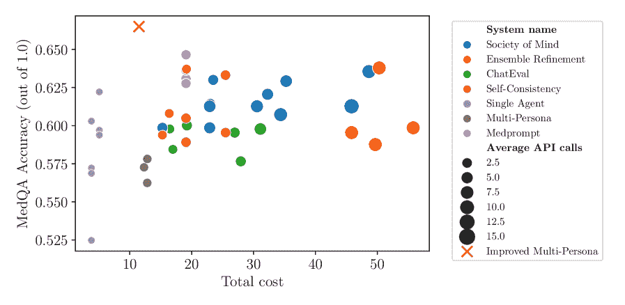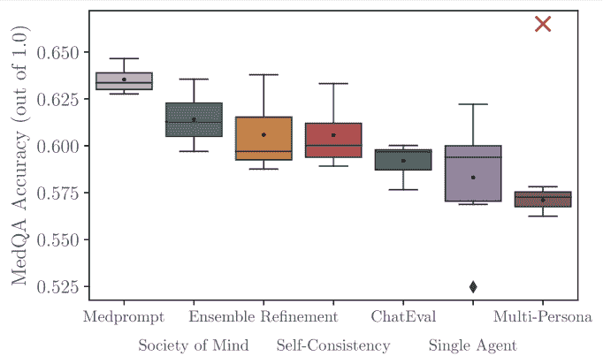

图1：MedQA数据集上的实验配置基准。左：每个问题的准确性与平均成本（$）的关系。点的大小反映了每个问题所需的API调用平均次数。右：按策略分组的准确性汇总，按平均表现（黑点）排序。X轴代表使用我们提出的*协议调节*所带来的性能提升，如第[3](https://arxiv.org/html/2311.17371v3#S3.SS0.SSS0.Px5 "Improving MAD via agreement modulation ‣ 3 Experiments ‣ Should we be going MAD? A Look at Multi-Agent Debate Strategies for LLMs")节所述。

## 3 实验

作为MAD实现的基础代理，我们使用GPT-3（Brown 等，[2020](https://arxiv.org/html/2311.17371v3#bib.bib3)），采用3.5-turbo引擎。GPT-3是一个基于变换器的大规模生成式LLM（Vaswani 等，[2017](https://arxiv.org/html/2311.17371v3#bib.bib30)；Kaplan 等，[2020](https://arxiv.org/html/2311.17371v3#bib.bib13)），通过API调用提供。尽管它不是当前通过API提供的最强大模型，但我们选择GPT-3.5是因为其在性能与成本效率之间的最佳平衡，这对进行广泛的实验至关重要，而更强大的模型则可能过于昂贵。然而，我们非正式地指出，一些初步实验使用更先进的模型，如GPT-4，虽然这些测试仅限于较小的数据子集，但也得出了相似的结论。

我们使用七个数据集对每个系统进行评估：三个医学数据集和三个更具推理要求的通用数据集。对于医学任务，我们遵循Med-PaLM2 （Singhal 等，[2023](https://arxiv.org/html/2311.17371v3#bib.bib28)）中的评估协议，并在以下多项选择问答数据集上评估上述策略：

+   •

    MedQA （Jin 等，[2021](https://arxiv.org/html/2311.17371v3#bib.bib11)）包含1273个来自美国医学执照考试（USMLE）的一般医学知识问题。每个问题有4到5个答案选项。在本研究中，我们重点关注MedQA的4答案版本，这一版本用于评估Med-PaLM2 （Liang 等，[2023](https://arxiv.org/html/2311.17371v3#bib.bib18)）和Medprompt （Nori 等，[2023](https://arxiv.org/html/2311.17371v3#bib.bib20)）。

+   •

    PubMedQA （Jin 等，[2019](https://arxiv.org/html/2311.17371v3#bib.bib12)）包含500个开放领域的问题、上下文和答案。

+   •

    MMLU（仅限临床主题）（Hendrycks 等，[2021](https://arxiv.org/html/2311.17371v3#bib.bib8)），由123个医学问题组成，涵盖解剖学、临床知识、大学医学、医学遗传学、专业医学和大学生物学。

其他数据集则是需要复杂推理任务的，基于MAD策略可能特别适用于那些需要复杂和常识推理的数据集，并能更好地避免推理陷阱。

+   •

    CosmosQA （Huang 等，[2019](https://arxiv.org/html/2311.17371v3#bib.bib9)）：一个包含7,000个常识性阅读理解问题的数据集，重点是基于常识的推理理解。它要求理解叙事内容并解释未明确提及的因果关系。为了经济和时间的可行性，我们从中抽取了500个问题。

+   •

    CIAR（梁等，[2023](https://arxiv.org/html/2311.17371v3#bib.bib18)）：反直觉算术推理（CIAR）数据集包含50道多项选择题，旨在评估大型语言模型（LLMs）的推理能力，挑战它们使用缓慢、逻辑性的思维而非直觉反应。我们在问题末尾添加了两个建议答案，将其转变为多项选择题解答任务。

+   •

    GPQA（Rein等，[2023](https://arxiv.org/html/2311.17371v3#bib.bib26)）：该数据集包含448道由生物学、物理学和化学领域专家编写的多项选择题，测试人类专家和人工智能系统的极限，题目设计为“Google无解”，要求具有高级的理解和推理能力。

+   •

    国际象棋（基准测试团队，[2021](https://arxiv.org/html/2311.17371v3#bib.bib2)）：该基准任务侧重于人工智能系统根据自然语言描述理解和跟踪国际象棋游戏状态的能力。任务分为由Lichess上真实对局和通过在国际象棋游戏树上随机搜索生成的合成对局所构成的子任务。为了考虑上下文长度的影响，这些子任务进一步分为短期、中期和长期。每个子任务包含1,000场游戏。我们在研究中使用了短期设置。

我们衡量了额外的代理级和辩论级指标（所有附加指标的完整列表可以在附录[A.3](https://arxiv.org/html/2311.17371v3#A1.SS3 "A.3 额外的辩论指标 ‣ 附录 A ‣ 我们是否应该去做MAD？对LLMs的多代理辩论策略的分析")和[A.4](https://arxiv.org/html/2311.17371v3#A1.SS4 "A.4 额外的代理指标 ‣ 附录 A ‣ 我们是否应该去做MAD？对LLMs的多代理辩论策略的分析")中找到）。代理级指标的例子包括某个代理是否正确回答了给定问题，以及它首次提供正确答案的辩论轮次。辩论级指标的例子包括任何参与辩论的代理是否提供了正确答案，以及代理们是否在最后一轮达成了一致。

#### 结果

首先，我们尝试查看各种提示协议是否会显著影响性能，从而使其API成本得到合理的 justification。在图 [1](https://arxiv.org/html/2311.17371v3#S2.F1 "Figure 1 ‣ 2 Multi-Agent Debate ‣ Should we be going MAD? A Look at Multi-Agent Debate Strategies for LLMs")中，我们展示了每个实验在MedQA数据集上的散点图，其他数据集的等效分析见附录 [A.1](https://arxiv.org/html/2311.17371v3#A1.SS1 "A.1 Extended results on additional datasets ‣ Appendix A Appendix ‣ Should we be going MAD? A Look at Multi-Agent Debate Strategies for LLMs")。在左侧面板中，我们展示了准确性与成本（以美元为单位）的关系，其中每个点的大小反映了每个问题所需的API调用的平均次数（我们还在附录 [A.1](https://arxiv.org/html/2311.17371v3#A1.SS1 "A.1 Extended results on additional datasets ‣ Appendix A Appendix ‣ Should we be going MAD? A Look at Multi-Agent Debate Strategies for LLMs")中绘制了准确性与时间、准确性与平均提示长度的关系）。这些变化（如适用）包括改变代理的数量、回合数、推理和聚合步骤，调整代理提示，实施回合总结，调整采样参数以及修改其他系统特定的超参数。有关每个系统使用的实验配置的完整拆解，请参见附录 [A.2](https://arxiv.org/html/2311.17371v3#A1.SS2 "A.2 Table of Experiments ‣ Appendix A Appendix ‣ Should we be going MAD? A Look at Multi-Agent Debate Strategies for LLMs")。在右侧面板中，我们总结了每种策略在所有配置下的准确性。

我们看到，在第 [2](https://arxiv.org/html/2311.17371v3#S2 "2 Multi-Agent Debate ‣ Should we be going MAD? A Look at Multi-Agent Debate Strategies for LLMs")节中介绍的所有辩论策略中，SoM策略表现最好，多个不同配置在MedQA上达到了61%的准确率。然而，最近提出的Medprompt策略 (Nori et al., [2023](https://arxiv.org/html/2311.17371v3#bib.bib20))，该策略不使用辩论，整体表现最好。它的成本也较低。对于医学问答领域来说，有些令人担忧的地方在于，单个代理的表现以及自我一致性，可以通过提示进行操控，从而导致较高的方差。我们还注意到，Multi-Persona策略的表现始终比Medprompt策略差约7%。我们将在第 [3](https://arxiv.org/html/2311.17371v3#S3.SS0.SSS0.Px5 "Improving MAD via agreement modulation ‣ 3 Experiments ‣ Should we be going MAD? A Look at Multi-Agent Debate Strategies for LLMs")节中重新探讨这一问题。

系统 MedQA PubMedQA MMLU CosmosQA CIAR GPQA Chess Medprompt 0.65 (0.63) 0.77 (0.77) 0.74 (0.73) 0.48 (0.47) 0.54 (0.50) 0.27 (0.25) 0.32 (0.30) Society of Mind 0.64 (0.61) 0.74 (0.71) 0.73 (0.70) 0.44 (0.39) 0.56 (0.46) 0.27 (0.25) 0.26 (0.25) Ensemble Refinement 0.64 (0.60) 0.74 (0.72) 0.76 (0.74) 0.45 (0.40) 0.48 (0.46) 0.32 (0.26) 0.32 (0.25) ChatEval 0.60 (0.60) 0.75 (0.73) 0.71 (0.69) 0.45 (0.43) 0.48 (0.43) 0.26 (0.25) 0.32 (0.23) Self-Consistency 0.60 (0.60) 0.74 (0.72) 0.78 (0.75) 0.46 (0.46) 0.56 (0.52) 0.24 (0.29) 0.27 (0.21) Single Agent 0.60 (0.59) 0.75 (0.70) 0.76 (0.72) 0.45 (0.43) 0.50 (0.50) 0.33 (0.28) 0.27 (0.18) Multi-Persona 0.58 (0.57) 0.70 (0.69) 0.72 (0.69) 0.46 (0.42) 0.52 (0.50) 0.29 (0.29) 0.33 (0.29)

表 2：每个系统在不同数据集上取得的最佳表现。列出了每个系统在每个数据集上的最高得分，并在括号中显示了各数据集上的中位表现。

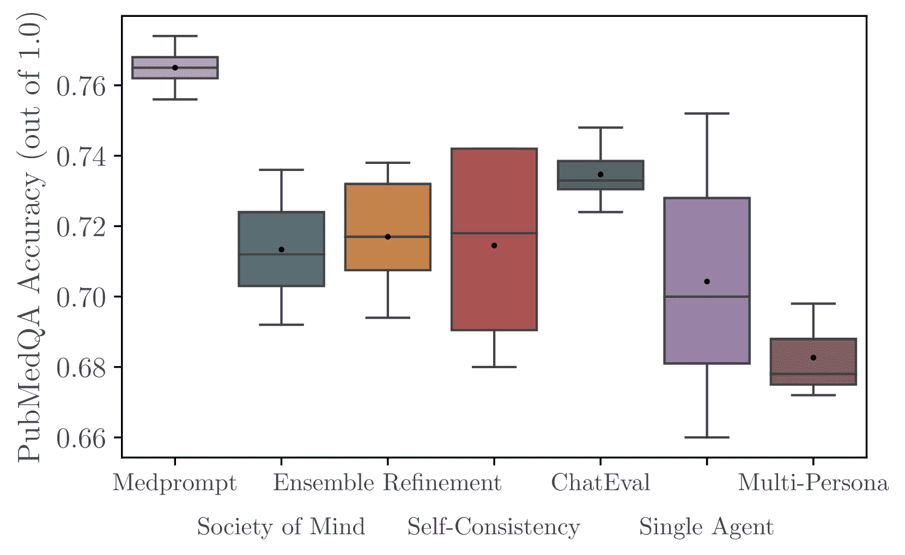

(a) PubMedQA 总准确率

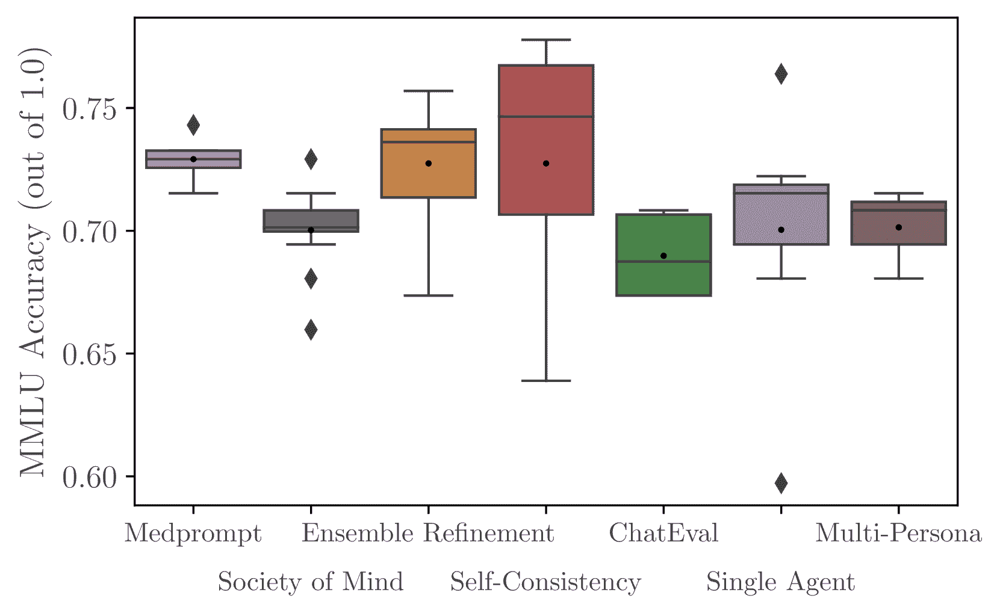

(b) MMLU 总准确率

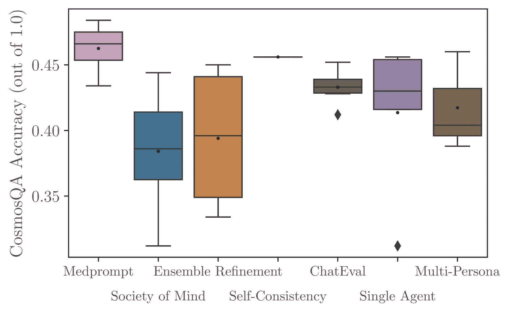

(c) CosmosQA 总准确率

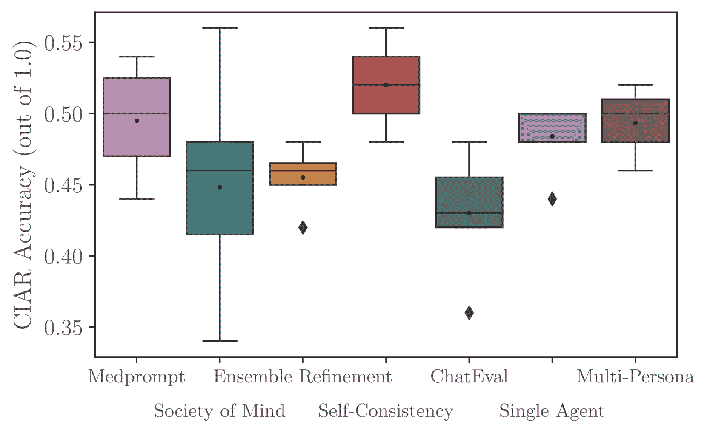

(d) CIAR 总准确率

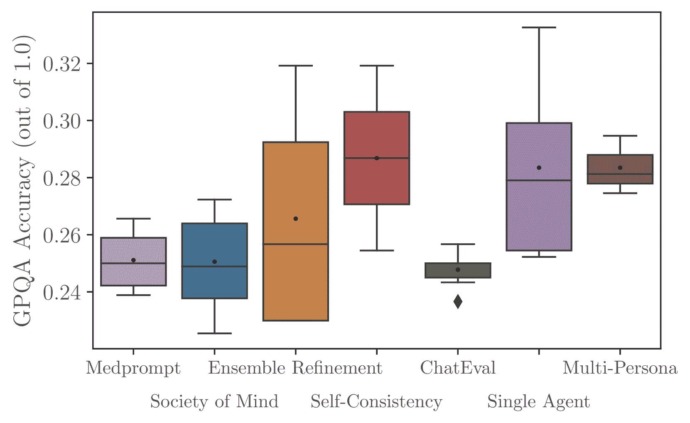

(e) GPQA 总准确率


(f) Chess 总准确率

图 2：箱形图展示了各QA系统在不同数据集上的总准确率分布。这些图表展示了每个系统表现的变异性和鲁棒性。

尽管我们观察到随着成本和API使用的增加，表现有所提升，但我们的研究结果表明，表现与资源投入之间的关系复杂且高度依赖于特定的超参数和数据集/系统配置。值得注意的是，一些MAD策略在优化提示的情况下，并没有始终优于像Medprompt这样的更具成本效益的非辩论方法。这表明，在某一阈值之后，额外的计算并不能保证更好的结果，表现既细致入微，又取决于超参数和系统设计的正确组合。这种变异性强调了进一步评估的必要性，正如接下来章节所进行的那样，以便更清楚地了解这些趋势。

#### 辩论的效用

接下来，我们考虑辩论在提示策略中的效用。最近的协议，如集成细化（Singhal et al., [2023](https://arxiv.org/html/2311.17371v3#bib.bib28)）和Medprompt（Nori et al., [2023](https://arxiv.org/html/2311.17371v3#bib.bib20)），已经完全偏离了辩论，提出了其有效性的问题。回想一下，我们包括了三个标准的医学数据集（MedQA、PubMedQA和MMLU），同时还包括了三个其他推理数据集（CosmosQA、CIAR和GPQA）。这些数据集的构建方式需要进行少量的逻辑推理才能成功回答。这可能使得辩论协议具有优势，因为代理之间有多轮输出，可以在得出结论之前，基于逻辑论点进行进一步的构建。现在，我们在这七个数据集上评估所有的系统设置。每个QA系统最佳配置的分数（满分为1.0）可以在表格[2](https://arxiv.org/html/2311.17371v3#S3.T2 "Table 2 ‣ Results ‣ 3 Experiments ‣ Should we be going MAD? A Look at Multi-Agent Debate Strategies for LLMs")中找到。

表格[2](https://arxiv.org/html/2311.17371v3#S3.T2 "Table 2 ‣ Results ‣ 3 Experiments ‣ Should we be going MAD? A Look at Multi-Agent Debate Strategies for LLMs")显示，没有一个协议在所有数据集上占据主导地位。Medprompt似乎整体表现最好。有趣的是，辩论协议在推理数据集上的表现并没有超过其他协议。为了进一步调查这一点，我们提供了箱线图，见图[2](https://arxiv.org/html/2311.17371v3#S3.F2 "Figure 2 ‣ Results ‣ 3 Experiments ‣ Should we be going MAD? A Look at Multi-Agent Debate Strategies for LLMs")，该图展示了每个QA系统在其他数据集上的表现分布（MedQA的结果可以在图[1](https://arxiv.org/html/2311.17371v3#S2.F1 "Figure 1 ‣ 2 Multi-Agent Debate ‣ Should we be going MAD? A Look at Multi-Agent Debate Strategies for LLMs")中找到）。这些箱线图有助于可视化每个系统在不同条件下的变异性和稳健性。

性能变异性最大的协议似乎是集成细化、自我一致性和单代理实现。Medprompt似乎表现得比较稳定，除了在GPQA数据集上表现较差，其他情况的变异性较低。看来，MAD协议对超参数更为敏感。我们将在下一节进一步探讨这一点。

#### MAD仅仅对超参数敏感吗？

为了评估MAD对超参数选择的敏感性，我们采用了K折交叉验证方法。我们将医学和非医学数据集分成两组。对于每种方法和每个数据集，我们收集具有最高平均准确率的超参数组合，这些超参数组合来自同一类别中保留的两个数据集，并使用该组合来计算最终准确率。

结果如图[3](https://arxiv.org/html/2311.17371v3#S3.F3 "图3 ‣ MAD是否仅对超参数敏感？ ‣ 3 实验 ‣ 我们是否应该走向极端？——LLM多代理辩论策略的探讨")所示。值得注意的是，在医学数据集内，所有评估的系统都优于单代理方法，唯独Multi-Persona除外。Self-Consistency和Medprompt表现为最佳。相反，在非医学数据集的背景下，单代理方法超过了所有评估的系统，只有Multi-Persona和Self-Consistency例外。

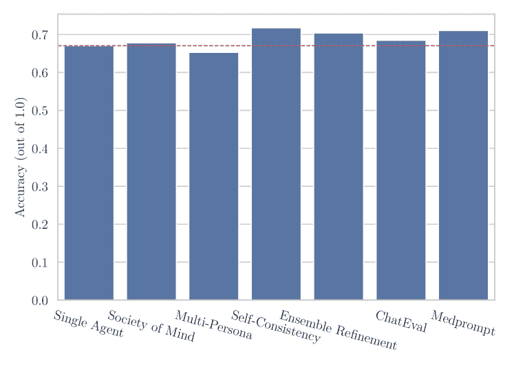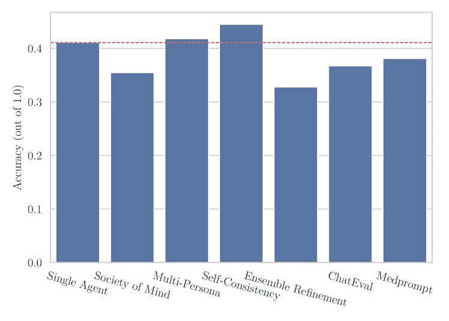

图3：*比较医学数据集与非医学数据集*。红线表示单代理系统的平均表现。左侧：三种医学数据集的平均准确度。右侧：三种非医学数据集的平均准确度。

这些发现表明，超参数的选择显著影响系统性能，最优设置往往是特定数据集的。进一步强调，尽管不同协议在性能上优于标准的单代理方法，但对于新数据集并不总能保证优越表现。看来，针对特定数据集的微调对于最大化性能至关重要。

#### 测量辩论带来的性能提升

在图[4](https://arxiv.org/html/2311.17371v3#S3.F4 "图4 ‣ 测量辩论带来的性能提升 ‣ 3 实验 ‣ 我们是否应该走向极端？——LLM多代理辩论策略的探讨")中，我们观察到辩论过程相较于第一代理提供的初始答案，准确度的相对提升。特别是，性能在三种系统之间有所不同：ChatEval表现出适度的提升，Mind Society显示出显著的提高，而Multi-Persona则有趣地导致了性能的下降。结合表[2](https://arxiv.org/html/2311.17371v3#S3.T2 "表2 ‣ 结果 ‣ 3 实验 ‣ 我们是否应该走向极端？——LLM多代理辩论策略的探讨")中的发现，表明这些系统最终的准确度差异较小，这提示第一轮回答的初始质量可能会有显著差异。

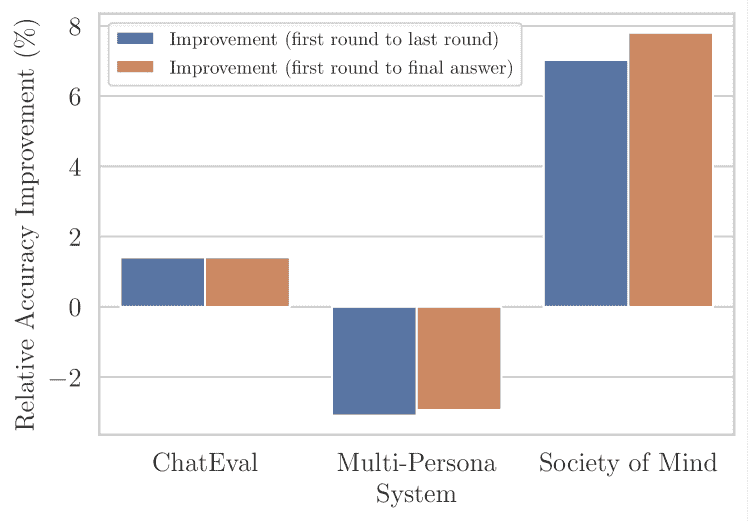

图4：第一轮与最后一轮给出的第一代理答案之间的相对准确度提升，平均计算于所有数据集，以及与最终答案的比较。

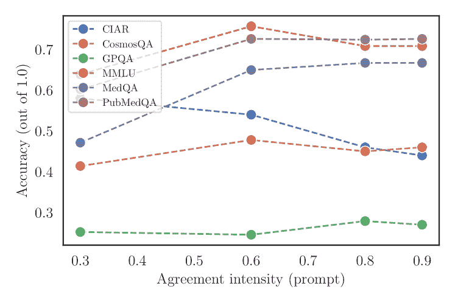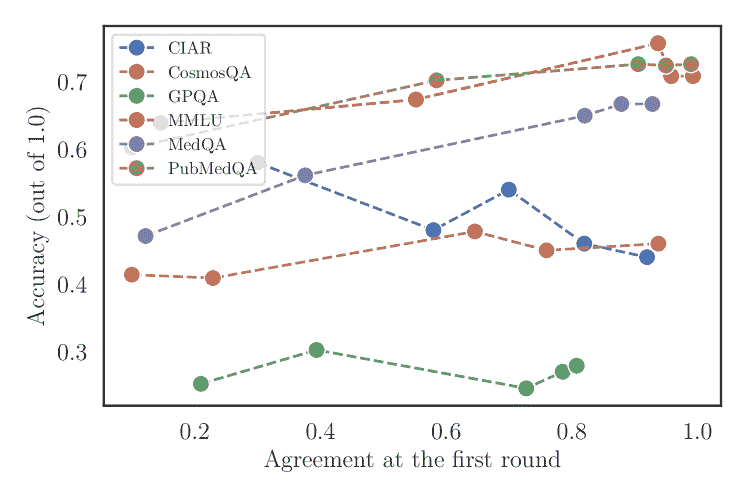

图5：左侧：根据提示固定的协议，Multi-Persona的准确度。右侧：根据第一轮辩论中的平均协议，Multi-Persona的准确度。

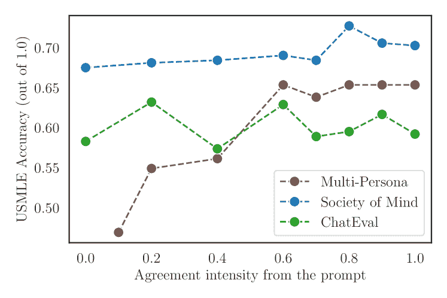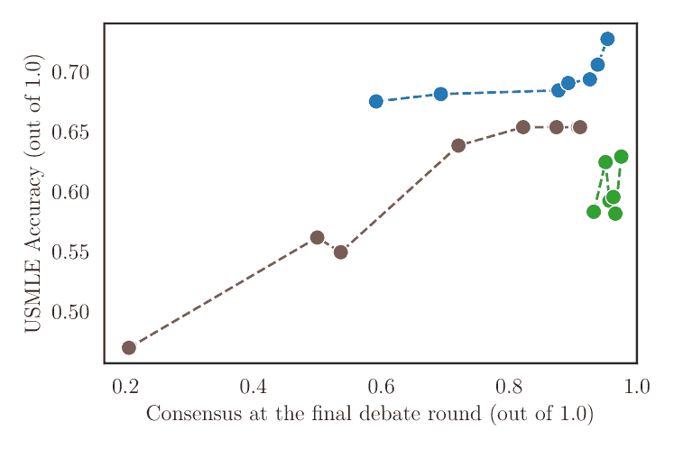

图6：左：随着我们在提示中增加一致性强度，USMLE的准确性变化。右：准确性与实际引导的辩论一致性的关系。

这一分析的一个意外方面是，与仅依赖第一个代理人初始回答相比，Multi-Persona系统的整体表现有所下降。这可以归因于第二个代理人（“魔鬼”）的角色，该角色被故意设计为反对或不同意，即使初始回答是正确的。我们在下一部分中展示了，代理人之间在辩论开始时的这种一致性意愿，确实是一个非常重要的“超参数”。

#### 通过一致性调节改进MAD

我们之前的实验使我们假设，在辩论过程中，代理人之间的意见一致程度可能会显著影响辩论表现。在这里，我们通过开发一种新的MAD提示策略来检验这一假设，该策略通过提示调节辩论中代理人之间在开始时的意见一致程度。我们的提示采用以下简单的形式：“你应该在X%的时间内与其他代理人达成一致。”我们将此提示中的X称为代理人的一致性强度。

Multi-Persona是此方法的理想测试平台，因为它仅使用两个具有不同系统提示的代理人。具体来说，我们给“天使”代理人提供问题，并通过“魔鬼”的系统提示来调节不同意见的程度。图[5](https://arxiv.org/html/2311.17371v3#S3.F5 "图5 ‣ 测量辩论带来的表现提升 ‣ 3 实验 ‣ 我们是否应该采用MAD？探索多代理辩论策略对LLM的影响")展示了在6个数据集上调节代理人一致性的效果。我们可以看到，这个参数对表现有显著影响，且在提示中调节一致性会影响第一次辩论轮次中的一致性，从而影响最终的结果和准确性。令人惊讶的是，这种趋势在每个数据集上并不总是相同：尽管MedQA和PubMedQA直接受益于高度一致性，CIAR却呈现出相反的模式。由于CIAR被设计为反直觉，因此很可能通过提示第二个代理人强烈不同意，可以提高辩论过程中得到正确答案的机会。

为了进一步研究，我们从图[1](https://arxiv.org/html/2311.17371v3#S2.F1 "图1 ‣ 2 多智能体辩论 ‣ 我们是否应该走向疯狂？探讨LLM的多智能体辩论策略")中选择了表现最好的辩论方法配置，具体包括SoM、ChatEval和Multi-Persona，以及MedQA数据集的一个子集（376个多项选择题USMLE问答（Han et al., [2023](https://arxiv.org/html/2311.17371v3#bib.bib7)））。我们选择这个子集是因为它的问题质量较高。在图[6](https://arxiv.org/html/2311.17371v3#S3.F6 "图6 ‣ 辩论对性能提升的衡量 ‣ 3 实验 ‣ 我们是否应该走向疯狂？探讨LLM的多智能体辩论策略")（左）中，我们绘制了随着提示同意强度从零增加到100%时，各个策略的性能。在图[6](https://arxiv.org/html/2311.17371v3#S3.F6 "图6 ‣ 辩论对性能提升的衡量 ‣ 3 实验 ‣ 我们是否应该走向疯狂？探讨LLM的多智能体辩论策略")（右）中，我们绘制了准确度与实际观察到的辩论共识之间的关系，即所有智能体在辩论结束时最终达成一致答案的频率。

我们可以看到，通过这种方式调节同意强度，Multi-Persona在USMLE数据集上提供了显著的性能提升（约15%），而SoM的提升约为5%。相反，ChatEval几乎不受这种提示机制的影响，表明对于每个系统来说，智能体的同意并不是那么容易调节的。基于这一发现，我们将90%的同意强度应用于Multi-Persona，并在完整的MedQA数据集上展示了（据我们所知）一个新的最先进的结果（针对GPT-3），该结果在图[1](https://arxiv.org/html/2311.17371v3#S2.F1 "图1 ‣ 2 多智能体辩论 ‣ 我们是否应该走向疯狂？探讨LLM的多智能体辩论策略")中通过红色叉号符号突出显示。

#### 辩论行为分析

我们的实验部分以对MAD系统内部动态的探索作为结尾，特别是通过它们在MedQA测试集上的表现。我们评估了Multi-Persona、ChatEval和思维社会，重点关注共识准确度、独立正确答案识别、答案变化中的适应性以及初始观点的广度等关键方面。这些方面在图[7](https://arxiv.org/html/2311.17371v3#S3.F7 "图7 ‣ 辩论行为分析 ‣ 3 实验 ‣ 我们是否应该走向疯狂？探讨LLM的多智能体辩论策略")中得以展示，提供了对每个系统辩论和解决问题战略方法的深入了解。

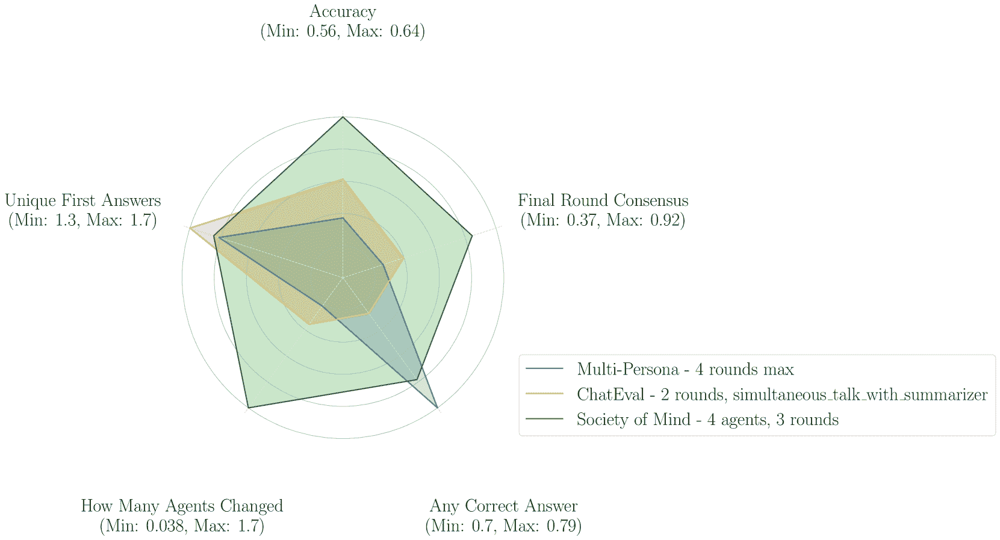

(a) 最佳系统运行

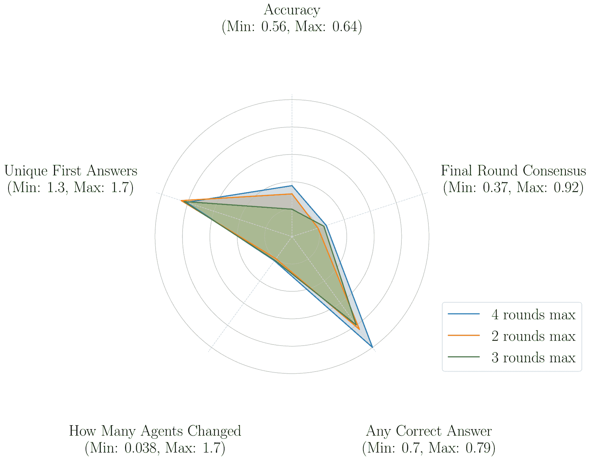

(b) 多角色

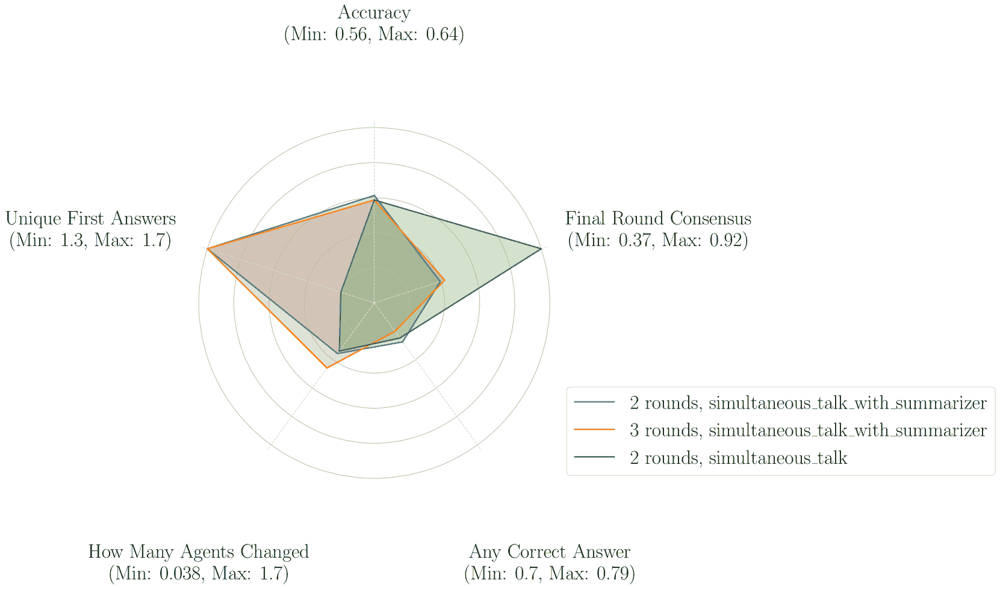

(c) ChatEval

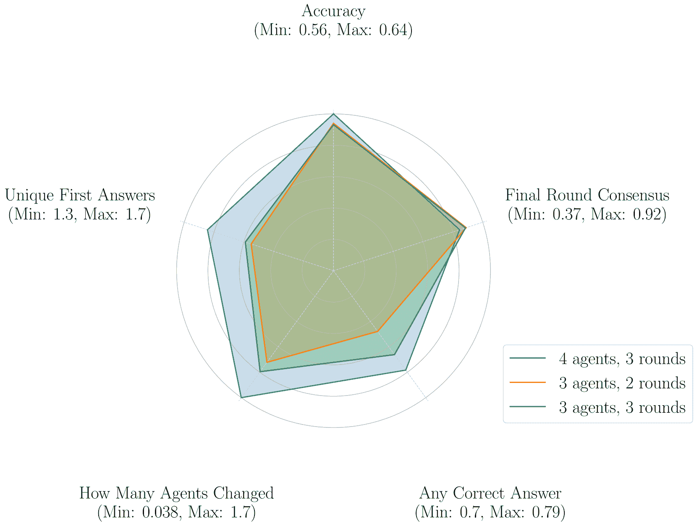

(d) 思维社会

图 7: *MAD 策略的辩论行为*。第一张图比较了每个系统的最佳运行结果，而其他三张图则比较了每个系统的前三次运行。每张图通过测量多个因素来量化 MedQA 上的表现：代理之间最终一致的准确性（缩放至 1.0），任何代理独立识别正确答案的实例（同样缩放至 1.0），代理在辩论过程中改变答案的频率，以及初始答案的多样性。每个轴的描述包括从最小值到最大值的得分范围。

四个蜘蛛图提供了对 MAD 策略辩论行为的更详细分析，通过各种指标提供了对每个系统有效性的洞察。初始图表比较了三个系统，其中心智社会（SoM）明显展示了最大的表面积，这表明它在所有辩论指标上表现优于其他系统。后续图表进一步支持了这一点，分析了每个系统的前三次运行，显示出更大的面积通常意味着更好的表现。这些可视化强调了平衡系统的重要性，表明在某一方面的卓越表现是不够的；系统必须在辩论过程的多个维度上都表现良好。每个指标的详细说明可在附录 [A.3](https://arxiv.org/html/2311.17371v3#A1.SS3 "A.3 Additional Debate Metrics ‣ Appendix A Appendix ‣ Should we be going MAD? A Look at Multi-Agent Debate Strategies for LLMs")中找到。

例如，当代理在辩论过程中更改他们的答案时，这种重新评估必须导致更准确的结论。没有战略依据的随意更改可能会妨碍达成共识。这强调了需要一种平衡的方法，在这种方法中，代理不仅要重新考虑自己的立场，还要提高决策的准确性，从而提高系统的整体有效性。

#### 使用其他 API 进行评估

我们评估了 GPT-4（OpenAI 等，[2024](https://arxiv.org/html/2311.17371v3#bib.bib22)）和 Mixtral 8x7B（Jiang 等，[2024](https://arxiv.org/html/2311.17371v3#bib.bib10)）在 MedQA 数据集上的能力，应用了在 USMLE 上为 Multi-Persona 与 GPT-3.5 确定的最佳一致性调节值。结果如图 [8](https://arxiv.org/html/2311.17371v3#S3.F8 "Figure 8 ‣ Evaluating using other APIs ‣ 3 Experiments ‣ Should we be going MAD? A Look at Multi-Agent Debate Strategies for LLMs") 和 [9](https://arxiv.org/html/2311.17371v3#S3.F9 "Figure 9 ‣ Evaluating using other APIs ‣ 3 Experiments ‣ Should we be going MAD? A Look at Multi-Agent Debate Strategies for LLMs")所示。

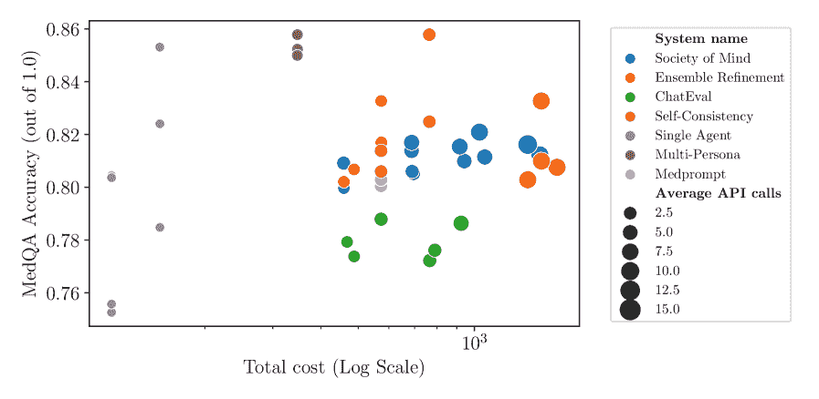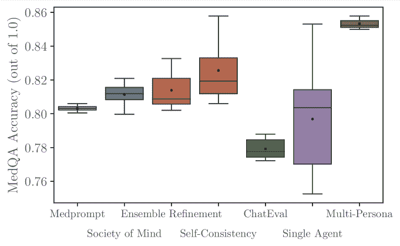

图 8：GPT-4 在 MedQA 数据集上的实验配置基准。左侧：每个问题的准确度与平均成本（$）之间的关系。点的大小反映了每个问题所需的平均 API 调用次数。右侧：按策略汇总的准确度，按平均表现（黑点）排序。

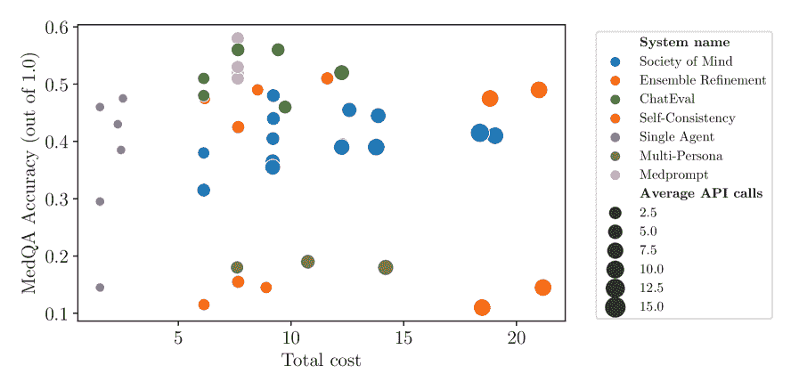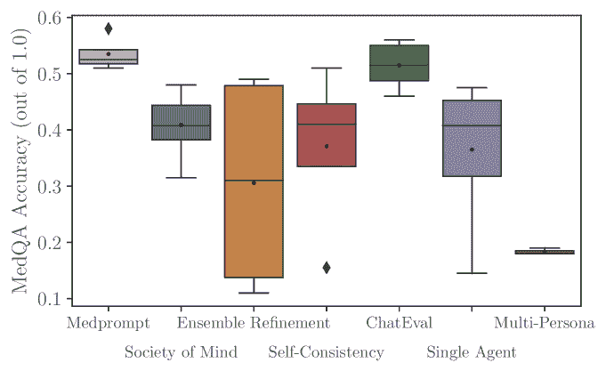

图 9：Mixtral 8x7B 在 MedQA 数据集上的实验配置基准。左侧：每个问题的准确度与平均成本（$）之间的关系。点的大小反映了每个问题所需的平均 API 调用次数。右侧：按策略汇总的准确度，按平均表现（黑点）排序。

来自 GPT-3.5 的结果表明，超参数设置可以有效地转移到 GPT-4。然而，这种可转移性在 Mixtral 8x7B 上表现不佳。这一差异可能归因于架构差异，这可能会影响超参数如何影响模型性能。我们将此留待未来研究。

#### 代码可用性

本研究的源代码，包括所有 MAD 实现和配置，公开可用，访问地址为 [https://github.com/instadeepai/DebateLLM](https://github.com/instadeepai/DebateLLM)。

## 4 结论

本研究中详细调查的结果表明，MAD 方法目前在表现上不优于其他集成方法，如 Medprompt 和自一致性，使用其原始实现时效果并不突出。MAD 通常需要更多的 API 调用，这增加了所需生成和处理的 tokens 数量，并最终提高了系统的总体运行成本。有趣的是，我们发现这可能主要是由于 MAD 协议对超参数的敏感性较高，而不一定是辩论方法本身比单一代理方法差。为了加强这一观点，我们演示了通过简单的提示方式调整代理之间的同意程度，称为同意强度，可以显著提升性能。通过调整 Multi-Persona 的同意强度，它从表现最差的协议变成了表现最好的，超越了如 Medprompt 和自一致性等方法。因此，尽管 MAD 系统目前落后于其他提示策略，我们相信它们在变革提示领域方面具有巨大潜力。为了促进进一步探索，我们已将我们的代码库开源，供他人轻松重现我们的所有实验，并进一步深入有趣的相关研究方向。

#### 局限性

我们利用对公开可用 LLM 的 API 调用（Brown 等人，[2020](https://arxiv.org/html/2311.17371v3#bib.bib3)），虽然在我们的研究背景下足够，但这使我们暴露于可变的推理时间调用和不可预见的模型更新。此外，基于大规模 API 的基准测试会产生可观的财务和时间成本，这不仅限制了实验的规模，也对复制和扩展工作形成了障碍。因此，未来的工作可以使用开源模型和内部基础设施来扩展这一研究方向。

## 影响声明

本研究通过评估多代理辩论（MAD）策略和其他提示方法在问答数据集中的表现，推动了机器学习领域的发展。我们的结果表明，MAD 方法可以与其他策略如 Medprompt 和 Self-Consistency 一样有效，甚至更为优越。提供了一个开源工具包，以促进该领域的进一步研究。尽管本研究旨在提高大语言模型（LLM）在回答问题时的精度，尤其是在医疗应用方面，但考虑到这些进展可能带来的潜在风险仍然至关重要。具体而言，医学问答系统有时会在不可预见的情况下产生错误的预测，并且这些系统可能对其错误的回答表现出不应有的自信。尤其在医学领域，这种不准确性可能导致错误信息或误诊，进而影响患者护理和结果。因此，尽管本研究为提升 LLM 能力提供了宝贵的见解和工具，但必须谨慎行事，结合严格的验证、透明度和伦理考量，以降低风险，确保这些技术的部署能保护公共健康和信任。

## 参考文献

+   Anil 等人（2023）Anil, R., Dai, A. M., Firat, O., Johnson, M., Lepikhin, D., Passos, A., Shakeri, S., Taropa, E., Bailey, P., Chen, Z., 等人。Palm 2 技术报告。*arXiv 预印本 arXiv:2305.10403*，2023年。

+   bench Team（2021）bench Team, B. 国际象棋状态跟踪，2021年。网址 [https://github.com/google/BIG-bench/tree/main/bigbench/benchmark_tasks/chess_state_tracking](https://github.com/google/BIG-bench/tree/main/bigbench/benchmark_tasks/chess_state_tracking)。访问时间：2024年5月27日。

+   Brown 等人（2020）Brown, T., Mann, B., Ryder, N., Subbiah, M., Kaplan, J. D., Dhariwal, P., Neelakantan, A., Shyam, P., Sastry, G., Askell, A., 等人。语言模型是少样本学习者。*神经信息处理系统进展*，33:1877–1901，2020年。

+   Chan 等人（2023）Chan, C.-M., Chen, W., Su, Y., Yu, J., Xue, W., Zhang, S., Fu, J., 和 Liu, Z. Chateval：通过多代理辩论推动更好的基于 LLM 的评估器。*arXiv 预印本 arXiv:2308.07201*，2023年。

+   Du 等人（2023）Du, Y., Li, S., Torralba, A., Tenenbaum, J. B., 和 Mordatch, I. 通过多智能体辩论提高语言模型的事实性和推理能力。*arXiv 预印本 arXiv:2305.14325*，2023年。

+   Fu 等人（2023）Fu, Y., Peng, H., Khot, T., 和 Lapata, M. 通过自我博弈和上下文学习改进语言模型的谈判能力。*arXiv 预印本 arXiv:2305.10142*，2023年。

+   Han 等人（2023）Han, T., Adams, L. C., Papaioannou, J.-M., Grundmann, P., Oberhauser, T., Löser, A., Truhn, D., 和 Bressem, K. K. Medalpaca——一个开源的医学对话式 AI 模型及训练数据集。*arXiv 预印本 arXiv:2304.08247*，2023年。

+   Hendrycks 等人（2021）Hendrycks, D., Burns, C., Basart, S., Zou, A., Mazeika, M., Song, D., 和 Steinhardt, J. 测量大规模多任务语言理解能力。发表于 *国际学习表征会议*，2021年。

+   Huang 等人（2019）Huang, L., Bras, R. L., Bhagavatula, C., 和 Choi, Y. Cosmos QA: 具有上下文常识推理的机器阅读理解。*CoRR*，abs/1909.00277，2019年。网址：[http://arxiv.org/abs/1909.00277](http://arxiv.org/abs/1909.00277)

+   Jiang 等人（2024）Jiang, A. Q., Sablayrolles, A., Roux, A., Mensch, A., Savary, B., Bamford, C., Chaplot, D. S., de las Casas, D., Hanna, E. B., Bressand, F., Lengyel, G., Bour, G., Lample, G., Lavaud, L. R., Saulnier, L., Lachaux, M.-A., Stock, P., Subramanian, S., Yang, S., Antoniak, S., Scao, T. L., Gervet, T., Lavril, T., Wang, T., Lacroix, T., 和 Sayed, W. E. Mixtral of experts，2024年。

+   Jin 等人（2021）Jin, D., Pan, E., Oufattole, N., Weng, W.-H., Fang, H., 和 Szolovits, P. 这个病人得了什么病？来自医学考试的大规模开放领域问答数据集。*应用科学*，11(14):6421，2021年。

+   Jin 等人（2019）Jin, Q., Dhingra, B., Liu, Z., Cohen, W. W., 和 Lu, X. Pubmedqa: 用于生物医学研究问题回答的数据集。*arXiv 预印本 arXiv:1909.06146*，2019年。

+   Kaplan 等人（2020）Kaplan, J., McCandlish, S., Henighan, T., Brown, T. B., Chess, B., Child, R., Gray, S., Radford, A., Wu, J., 和 Amodei, D. 神经语言模型的规模定律。*arXiv 预印本 arXiv:2001.08361*，2020年。

+   Kojima 等人（2022）Kojima, T., Gu, S. S., Reid, M., Matsuo, Y., 和 Iwasawa, Y. 大语言模型是零样本推理者。*神经信息处理系统进展*，35:22199–22213，2022年。

+   Kumar 等人（2024）Kumar, H., Musabirov, I., Reza, M., Shi, J., Wang, X., Williams, J. J., Kuzminykh, A., 和 Liut, M. 指导和互动策略对大语言模型使用对学习者表现和感知的影响，2024年。

+   Lai 等人（2023）Lai, J., Gan, W., Wu, J., Qi, Z., 和 Yu, P. S. 大语言模型在法律中的应用：一项调查，2023年。

+   Li 等人（2023）Li, G., Hammoud, H. A. A. K., Itani, H., Khizbullin, D., 和 Ghanem, B. Camel: 用于大规模语言模型社会的“思维”探索的通信代理。*arXiv 预印本 arXiv:2303.17760*，2023年。

+   Liang et al. (2023) Liang, T., He, Z., Jiao, W., Wang, X., Wang, Y., Wang, R., Yang, Y., Tu, Z., 和 Shi, S. 《通过多代理辩论促进大型语言模型的发散性思维》。*arXiv预印本 arXiv:2305.19118*, 2023。

+   Liévin et al. (2022) Liévin, V., Hother, C. E., 和 Winther, O. 《大型语言模型能推理医学问题吗？》*arXiv预印本 arXiv:2207.08143*, 2022。

+   Nori et al. (2023) Nori, H., Lee, Y. T., Zhang, S., Carignan, D., Edgar, R., Fusi, N., King, N., Larson, J., Li, Y., Liu, W., Luo, R., McKinney, S. M., Ness, R. O., Poon, H., Qin, T., Usuyama, N., White, C., 和 Horvitz, E. 《通用基础模型能否超越专用调优？医学领域的案例研究》，2023。

+   OpenAI (2023) OpenAI。《GPT-4技术报告》。技术报告，OpenAI，2023。

+   OpenAI et al. (2024) OpenAI 等。《GPT-4技术报告》，2024。

+   Ouyang et al. (2022) Ouyang, L., Wu, J., Jiang, X., Almeida, D., Wainwright, C., Mishkin, P., Zhang, C., Agarwal, S., Slama, K., Ray, A., 等。《训练语言模型以跟随指令并通过人类反馈进行优化》。*神经信息处理系统进展*, 35:27730–27744, 2022。

+   Pardos & Bhandari (2023) Pardos, Z. A. 和 Bhandari, S. 《ChatGPT与人类导师生成的代数提示的学习增益差异》。*arXiv预印本 arXiv:2302.06871*, 2023。

+   Park et al. (2023) Park, J. S., O’Brien, J. C., Cai, C. J., Morris, M. R., Liang, P., 和 Bernstein, M. S. 《生成型代理：人类行为的交互式模拟》。*arXiv预印本 arXiv:2304.03442*, 2023。

+   Rein et al. (2023) Rein, D., Hou, B. L., Stickland, A. C., Petty, J., Pang, R. Y., Dirani, J., Michael, J., 和 Bowman, S. R. 《Gpqa：一个研究生级别的Google-proof问答基准》，2023。

+   Singhal et al. (2022) Singhal, K., Azizi, S., Tu, T., Mahdavi, S. S., Wei, J., Chung, H. W., Scales, N., Tanwani, A., Cole-Lewis, H., Pfohl, S., 等。《大型语言模型编码临床知识》。*arXiv预印本 arXiv:2212.13138*, 2022。

+   Singhal et al. (2023) Singhal, K., Tu, T., Gottweis, J., Sayres, R., Wulczyn, E., Hou, L., Clark, K., Pfohl, S., Cole-Lewis, H., Neal, D., 等。《通过大型语言模型实现专家级医学问答》。*arXiv预印本 arXiv:2305.09617*, 2023。

+   Taylor et al. (2022) Taylor, R., Kardas, M., Cucurull, G., Scialom, T., Hartshorn, A., Saravia, E., Poulton, A., Kerkez, V., 和 Stojnic, R. 《Galactica：一个用于科学的大型语言模型》。*arXiv预印本 arXiv:2211.09085*, 2022。

+   Vaswani et al. (2017) Vaswani, A., Shazeer, N., Parmar, N., Uszkoreit, J., Jones, L., Gomez, A. N., Kaiser, Ł., 和 Polosukhin, I. 《注意力机制即一切》。*神经信息处理系统进展*, 30, 2017。

+   Wang et al. (2023a) Wang, G., Yang, G., Du, Z., Fan, L., 和 Li, X. 《ClinicalGPT：通过多样的医疗数据和综合评估对大型语言模型进行微调》。*arXiv预印本 arXiv:2306.09968*, 2023a。

+   Wang 等人 (2023b) Wang, X., Wei, J., Schuurmans, D., Le, Q., Chi, E., Narang, S., Chowdhery, A., 和 Zhou, D. 自一致性提升语言模型中的思维链推理。发表于 *国际学习表征大会*，2023b。

+   Wang 等人 (2023c) Wang, Z., Mao, S., Wu, W., Ge, T., Wei, F., 和 Ji, H. 释放大型语言模型中的认知协同：通过多角色自我协作解决任务的代理。发表于 *arXiv 预印本 arXiv:2307.05300*，2023c。

+   Wei 等人 (2022) Wei, J., Wang, X., Schuurmans, D., Bosma, M., Xia, F., Chi, E., Le, Q. V., Zhou, D., 等人。思维链提示在大型语言模型中引发推理。发表于 *神经信息处理系统进展*，35:24824–24837，2022。

+   Zhang 等人 (2023) Zhang, Y., Zhang, F., Yang, Z., 和 Wang, Z. 在上下文学习中学习了什么和如何学习？贝叶斯模型平均化、参数化与泛化。发表于 *arXiv 预印本 arXiv:2305.19420*，2023。

## 附录 A 附录

### A.1 在附加数据集上的扩展结果

我们为每种策略在每个数据集上提供了全面的 GPT-3 结果：MedQA、PubMedQA、MMLU、CIAR、GPQA、CosmosQA 和 Chess。对于每个场景，我们绘制了准确性与每个问题的平均回答时间、准确性与每个问题使用的平均标记数之间的关系，以及准确性与总美元成本的比较。此外，还提供了一个箱形图来总结每种策略的表现。这些结果可以在图 [10](https://arxiv.org/html/2311.17371v3#A1.F10 "Figure 10 ‣ A.1 Extended results on additional datasets ‣ Appendix A Appendix ‣ Should we be going MAD? A Look at Multi-Agent Debate Strategies for LLMs")、[11](https://arxiv.org/html/2311.17371v3#A1.F11 "Figure 11 ‣ A.1 Extended results on additional datasets ‣ Appendix A Appendix ‣ Should we be going MAD? A Look at Multi-Agent Debate Strategies for LLMs")、[12](https://arxiv.org/html/2311.17371v3#A1.F12 "Figure 12 ‣ A.1 Extended results on additional datasets ‣ Appendix A Appendix ‣ Should we be going MAD? A Look at Multi-Agent Debate Strategies for LLMs")、[13](https://arxiv.org/html/2311.17371v3#A1.F13 "Figure 13 ‣ A.1 Extended results on additional datasets ‣ Appendix A Appendix ‣ Should we be going MAD? A Look at Multi-Agent Debate Strategies for LLMs")、[14](https://arxiv.org/html/2311.17371v3#A1.F14 "Figure 14 ‣ A.1 Extended results on additional datasets ‣ Appendix A Appendix ‣ Should we be going MAD? A Look at Multi-Agent Debate Strategies for LLMs") 和 [15](https://arxiv.org/html/2311.17371v3#A1.F15 "Figure 15 ‣ A.1 Extended results on additional datasets ‣ Appendix A Appendix ‣ Should we be going MAD? A Look at Multi-Agent Debate Strategies for LLMs") 中查看。

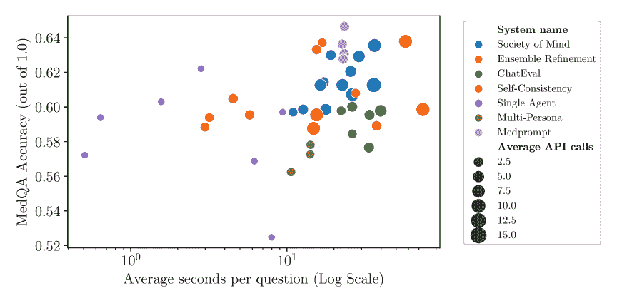

(a) 准确性与每个问题的平均回答时间

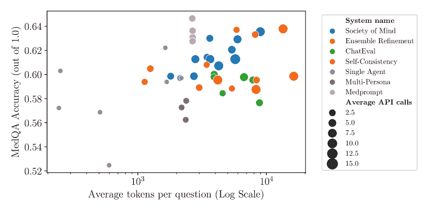

(b) 准确性与每个问题的平均标记数

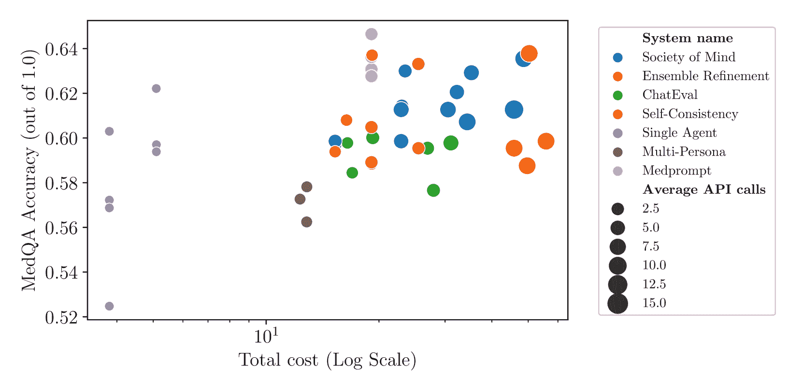

(c) 准确率与总成本

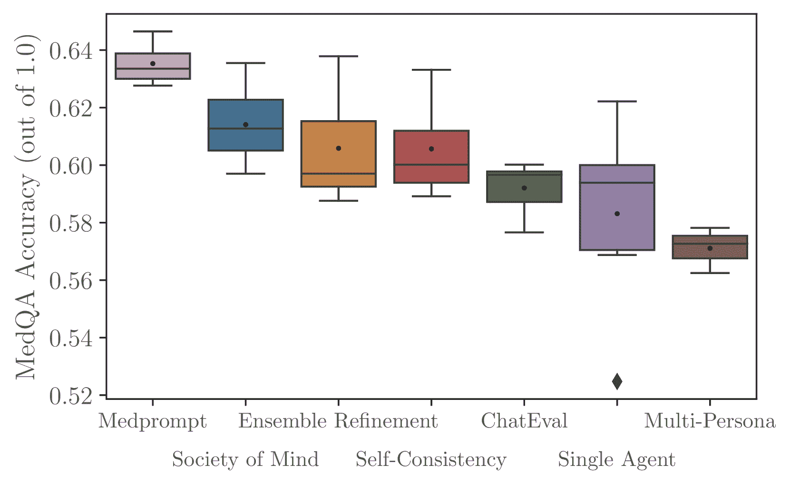

(d) 按策略分类的准确率

图 10：MedQA 实验结果。

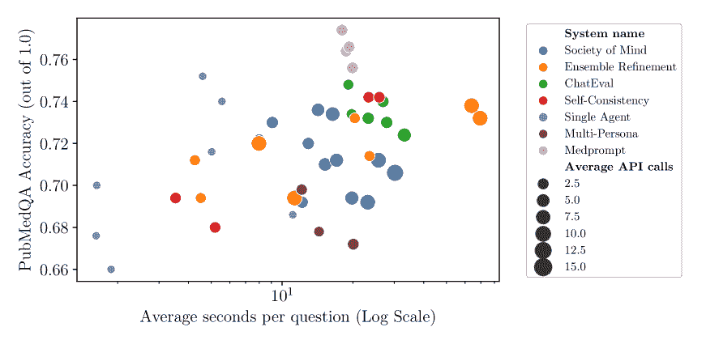

(a) 准确率与每个问题的平均时间

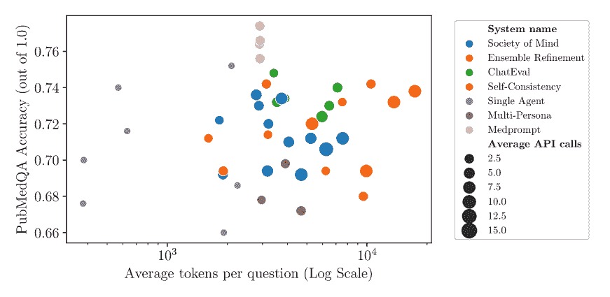

(b) 准确率与每个问题的平均标记数

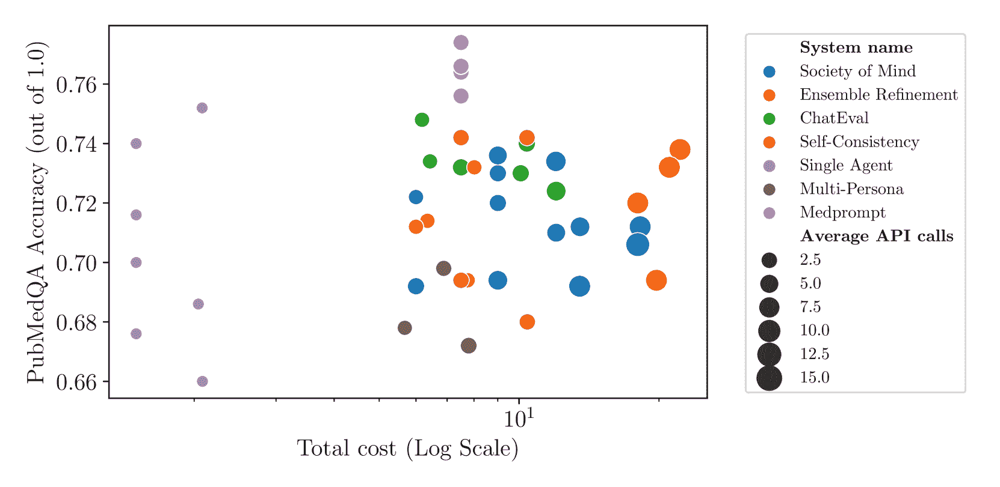

(c) 准确率与总成本


(d) 按策略分类的准确率

图 11：PubMedQA 实验结果。

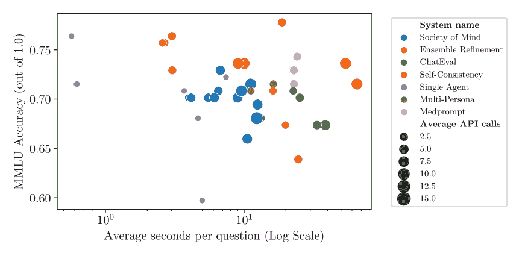

(a) 准确率与每个问题的平均时间

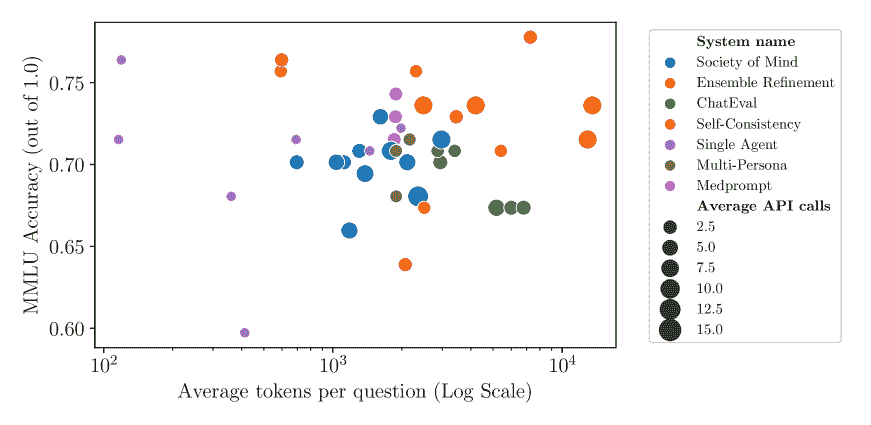

(b) 准确率与每个问题的平均标记数

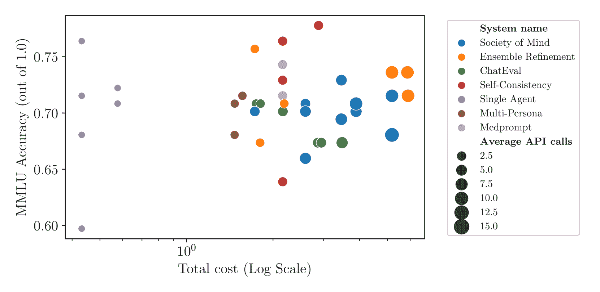

(c) 准确率与总成本


(d) 按策略分类的准确率

图 12：MMLU 实验结果。

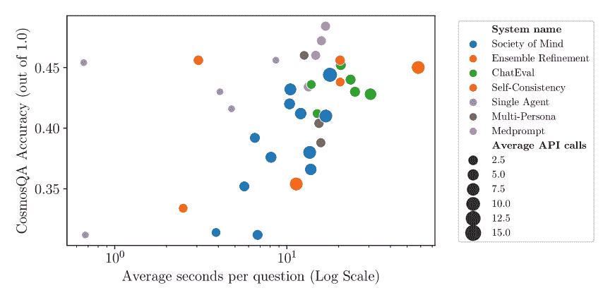

(a) 准确率与每个问题的平均时间

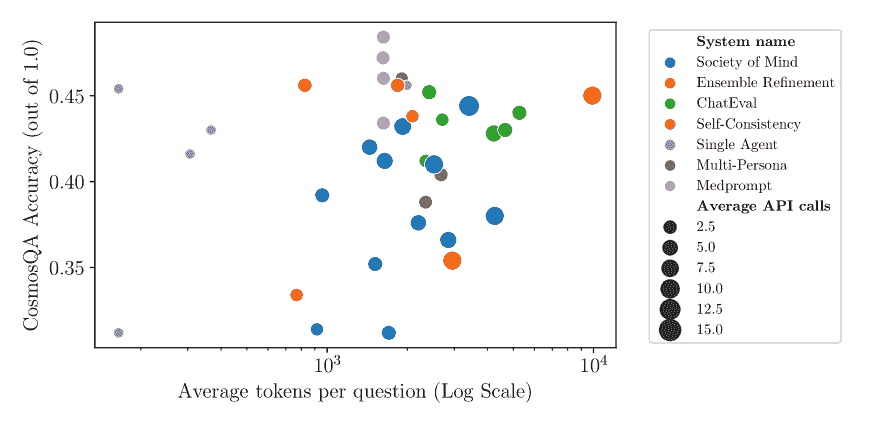

(b) 准确率与每个问题的平均标记数

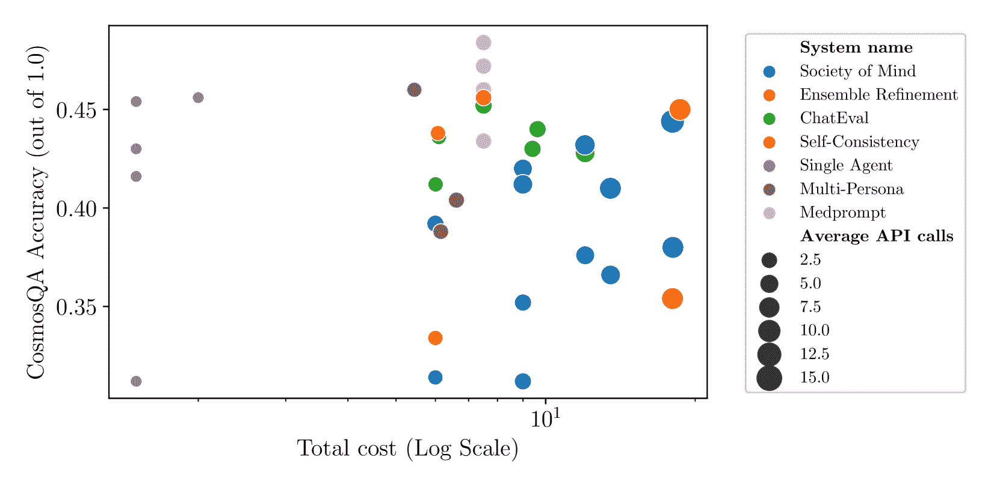

(c) 准确率与总成本


(d) 按策略分类的准确率

图 13：CosmosQA 实验结果。


(a) 准确率与每个问题的平均时间

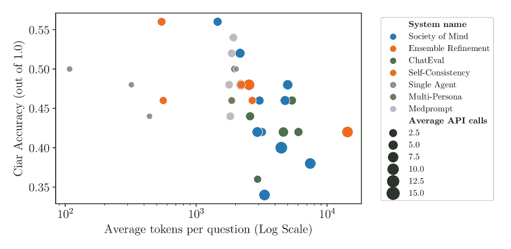

(b) 准确率与每个问题的平均标记数

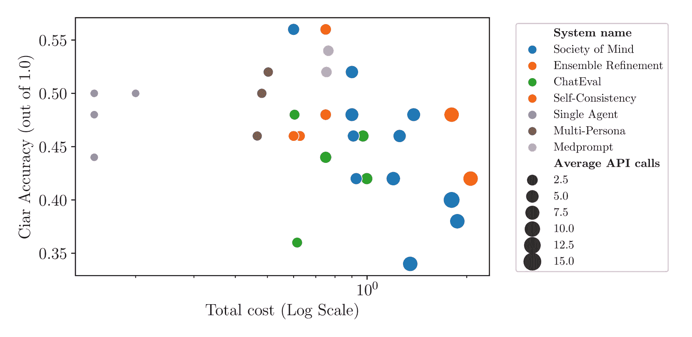

(c) 准确率与总成本


(d) 按策略分类的准确率

图 14：CIAR 实验结果。

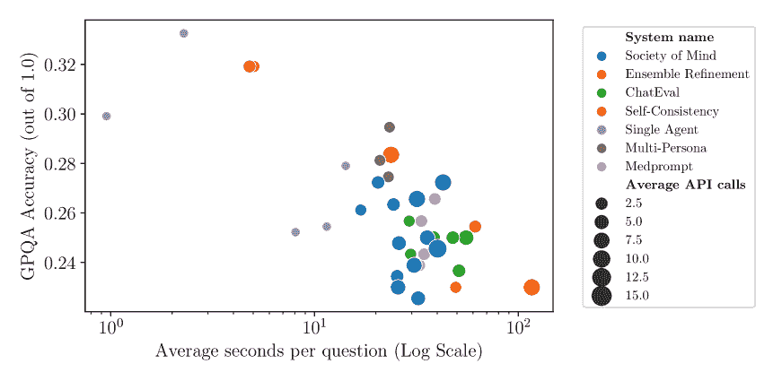

(a) 准确率与每个问题的平均时间

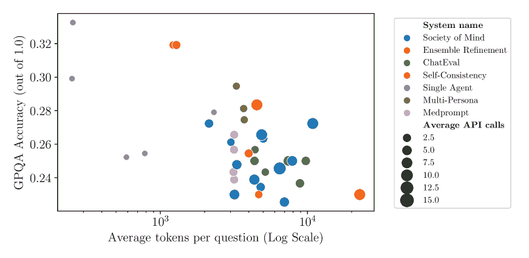

(b) 准确率与每个问题的平均标记数

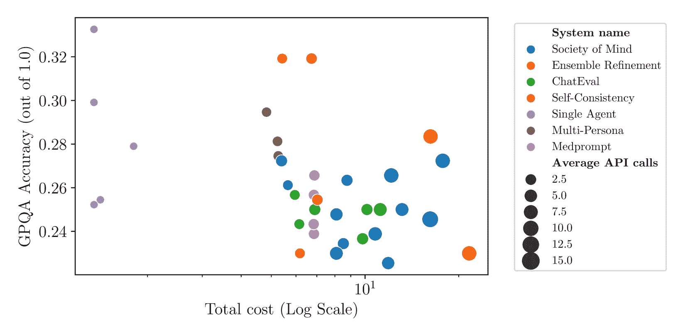

(c) 准确率与总成本


(d) 按策略分类的准确率

图 15：GPQA 实验结果。

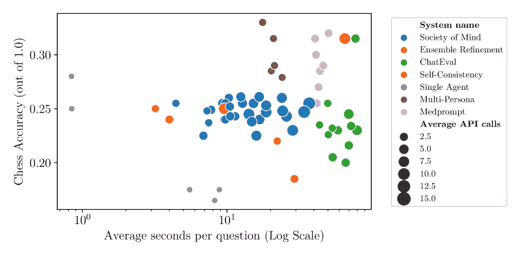

(a) 准确率与每个问题的平均时间


(b) 准确率与每个问题的平均标记数

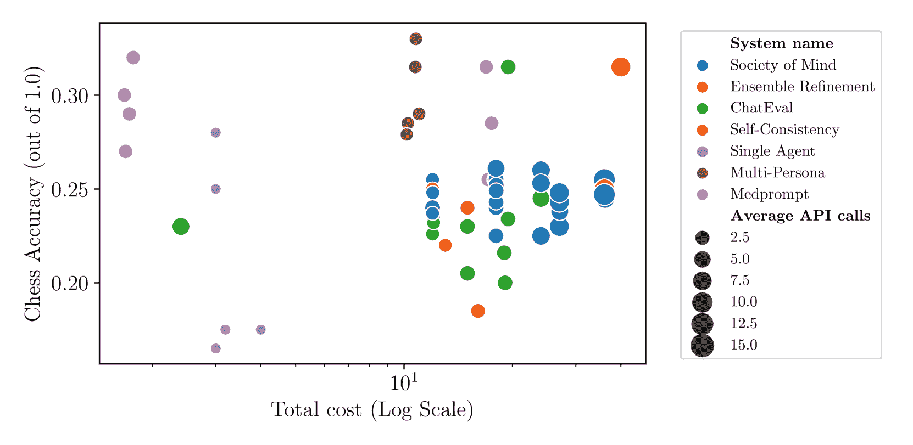

(c) 准确率与总成本

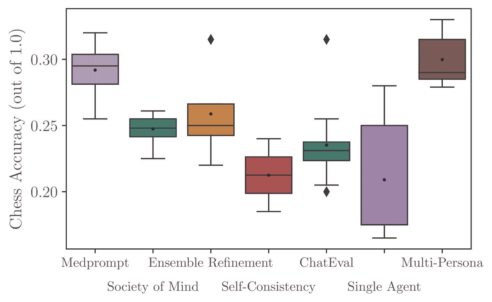

(d) 按策略分类的准确率

图 16：国际象棋实验结果。

### A.2 实验表格

所有实验的完整配置表可以在表格LABEL:app:tab:full-results-table中找到。表中包括了使用的辩论和代理提示词的名称。每个提示词的详细描述可以在附录[A.6](https://arxiv.org/html/2311.17371v3#A1.SS6 "A.6 Agent Prompts ‣ Appendix A Appendix ‣ Should we be going MAD? A Look at Multi-Agent Debate Strategies for LLMs")中找到。

表 3：实验配置的完整表格。

| 系统名称 | 辩论提示 | 代理提示 | 辩论配置 | MedQA | PubMedQA | MMLU | CosmosQA | CIAR | GPQA |
| --- | --- | --- | --- | --- | --- | --- | --- | --- | --- |
|  |  |  |  | 分数 | 成本 $ | 分数 | 成本 $ | 分数 | 成本 $ | 分数 | 成本 $ | 分数 | 成本 $ | 分数 | 成本 $ |
| --- | --- | --- | --- | --- | --- | --- | --- | --- | --- | --- | --- | --- | --- | --- | --- |
| 单代理 |  | CoT |  | 0.68 | 0.43 | 0.74 | 1.50 | 0.57 | 3.82 | 0.42 | 1.50 | 0.48 | 0.15 | 0.25 | 1.35 |
| 单代理 |  | CoT |  | 0.60 | 0.43 | 0.72 | 1.50 | 0.52 | 3.82 | 0.43 | 1.50 | 0.44 | 0.15 | 0.25 | 1.41 |
| 单代理 |  | FS + SIMPLE |  | 0.72 | 0.43 | 0.66 | 2.08 | 0.59 | 5.10 |  |  |  |  |  |  |
| 单代理 |  | FS + CoT |  | 0.71 | 0.58 | 0.75 | 2.08 | 0.62 | 5.09 |  |  |  |  |  |  |
| 单代理 |  | SIMPLE |  | 0.76 | 0.43 | 0.70 | 1.50 | 0.60 | 3.82 | 0.45 | 1.50 | 0.50 | 0.15 | 0.33 | 1.35 |
| 单代理 |  | SIMPLE |  | 0.72 | 0.43 | 0.68 | 1.50 | 0.57 | 3.82 | 0.31 | 1.50 | 0.50 | 0.15 | 0.30 | 1.35 |
| ChatEval | CE MAD | CoT | 3轮，同时发言，总结 | 0.67 | 3.48 | 0.72 | 12.02 | 0.60 | 31.10 | 0.43 | 12.01 | 0.42 | 1.21 | 0.25 | 11.19 |
| ChatEval | CE MAD | CoT | 3轮，同时发言 | 0.67 | 2.86 | 0.73 | 10.08 | 0.60 | 26.95 | 0.43 | 9.41 | 0.46 | 0.97 | 0.24 | 9.82 |
| ChatEval | CE MAD | CoT | 3轮，逐一发言 | 0.67 | 2.94 | 0.74 | 10.39 | 0.58 | 27.94 | 0.44 | 9.63 | 0.42 | 1.00 | 0.25 | 10.14 |
| ChatEval | CE MAD | CoT | 2轮，同时发言，总结 | 0.70 | 2.16 | 0.73 | 7.50 | 0.60 | 19.24 | 0.45 | 7.50 | 0.44 | 0.75 | 0.25 | 6.90 |
| ChatEval | CE MAD | CoT | 2轮，同时发言 | 0.71 | 1.75 | 0.75 | 6.18 | 0.60 | 16.48 | 0.41 | 6.01 | 0.48 | 0.60 | 0.26 | 5.95 |
| ChatEval | CE MAD | CoT | 2轮，逐一发言 | 0.71 | 1.81 | 0.73 | 6.43 | 0.58 | 16.97 | 0.44 | 6.10 | 0.36 | 0.62 | 0.24 | 6.15 |
| 集成精炼 | ER MAD | FS + SIMPLE | 推理=3，聚合=9 | 0.74 | 5.18 | 0.69 | 19.75 | 0.59 | 49.67 |  |  |  |  |  |  |
| 集成精炼 | ER MAD | FS + SIMPLE | 推理=3，聚合=1 | 0.76 | 1.73 | 0.69 | 7.75 | 0.59 | 19.11 |  |  |  |  |  |  |
| 自一致性 | ER MAD | FS + SIMPLE |  | 0.73 | 2.16 | 0.68 | 10.42 | 0.60 | 25.48 |  |  |  |  |  |  |
| 集成精炼 | ER MAD | SIMPLE | 推理=3，聚合=9 | 0.74 | 5.18 | 0.72 | 18.00 | 0.60 | 45.85 | 0.35 | 18.00 | 0.48 | 1.80 | 0.28 | 16.24 |
| 集合精炼 | ER MAD | 简单 | 推理=3，聚合=1 | 0.76 | 1.73 | 0.71 | 6.00 | 0.59 | 15.28 | 0.33 | 6.00 | 0.46 | 0.60 | 0.32 | 5.42 |
| 自一致性 | ER MAD | 简单 |  | 0.76 | 2.16 | 0.69 | 7.50 | 0.60 | 19.10 | 0.46 | 7.50 | 0.56 | 0.75 | 0.32 | 6.73 |
| 集合精炼 | ER MAD CoT | CoT | 推理=3，聚合=1 | 0.67 | 1.80 | 0.71 | 6.35 | 0.61 | 16.38 | 0.44 | 6.07 | 0.46 | 0.63 | 0.23 | 6.18 |
| 集合精炼 | ER MAD CoT | CoT | 推理=3，聚合=9 | 0.72 | 5.90 | 0.73 | 21.05 | 0.60 | 55.79 | 0.45 | 18.64 | 0.42 | 2.05 | 0.23 | 21.61 |
| 自一致性 | ER MAD CoT | CoT |  | 0.64 | 2.16 | 0.74 | 7.50 | 0.59 | 19.10 | 0.46 | 7.50 | 0.48 | 0.75 | 0.25 | 7.03 |
| 集合精炼 | ER MAD CoT | FS + CoT | 推理=3，聚合=1 | 0.71 | 2.19 | 0.73 | 8.01 | 0.64 | 19.17 |  |  |  |  |  |  |
| 集合精炼 | ER MAD CoT | FS + CoT | 推理=3，聚合=9 | 0.74 | 5.87 | 0.74 | 22.20 | 0.64 | 50.30 |  |  |  |  |  |  |
| 自一致性 | ER MAD CoT | FS + CoT |  | 0.78 | 2.88 | 0.74 | 10.40 | 0.63 | 25.47 |  |  |  |  |  |  |
| 多重人格 | MP MAD | 天使 + 恶魔 | 最多 2 轮 | 0.68 | 1.47 | 0.68 | 5.68 | 0.57 | 12.32 | 0.46 | 5.44 | 0.50 | 0.48 | 0.29 | 4.83 |
| 多重人格 | MP MAD | 天使 + 恶魔 | 最多 3 轮 | 0.71 | 1.47 | 0.70 | 6.88 | 0.56 | 12.83 | 0.39 | 6.15 | 0.46 | 0.47 | 0.28 | 5.23 |
| 多重人格 | MP MAD | 天使 + 恶魔 | 最多 4 轮 | 0.72 | 1.57 | 0.67 | 7.79 | 0.58 | 12.84 | 0.40 | 6.61 | 0.52 | 0.50 | 0.27 | 5.26 |
| Medprompt | Medprompt | CoT | 温度：0.5，top p：0.8 | 0.72 | 2.16 | 0.77 | 7.50 | 0.63 | 19.10 | 0.48 | 7.50 | 0.52 | 0.75 | 0.24 | 6.84 |
| Medprompt | Medprompt | CoT | 温度：0.7，top p：0.8 | 0.73 | 2.16 | 0.76 | 7.50 | 0.65 | 19.10 | 0.43 | 7.50 | 0.48 | 0.75 | 0.24 | 6.85 |
| Medprompt | Medprompt | CoT | 温度：0.7，top p：0.5 | 0.73 | 2.16 | 0.76 | 7.50 | 0.63 | 19.10 | 0.46 | 7.50 | 0.54 | 0.76 | 0.26 | 6.85 |
| Medprompt | Medprompt | CoT | 温度：0.5，top p：0.5 | 0.74 | 2.16 | 0.77 | 7.50 | 0.64 | 19.10 | 0.47 | 7.50 | 0.44 | 0.76 | 0.27 | 6.88 |
| 思维社会 | SoM MAD | CoT | 2 个代理，3 轮，总结 | 0.66 | 2.59 | 0.69 | 9.00 | 0.61 | 22.92 | 0.41 | 9.00 | 0.48 | 0.90 | 0.23 | 8.09 |
| 思维社会 | SoM MAD | CoT | 4 个代理，3 轮，总结 | 0.68 | 5.18 | 0.71 | 18.00 | 0.61 | 45.83 | 0.44 | 18.00 | 0.40 | 1.80 | 0.25 | 16.19 |
| 思维社会 | SoM MAD | CoT | 4 个代理，2 轮，总结 | 0.69 | 3.46 | 0.73 | 12.00 | 0.61 | 30.55 | 0.43 | 12.00 | 0.42 | 1.20 | 0.24 | 10.78 |
| 思维社会 | SoM MAD | CoT | 3 个代理，3 轮 | 0.70 | 3.89 | 0.71 | 13.52 | 0.63 | 35.27 | 0.37 | 13.51 | 0.48 | 1.38 | 0.25 | 13.15 |
| 思维社会 | SoM MAD | CoT | 3 个代理，2 轮 | 0.70 | 2.59 | 0.73 | 9.00 | 0.63 | 23.48 | 0.35 | 9.00 | 0.42 | 0.93 | 0.26 | 8.75 |
| 心智社会 | SoM MAD | CoT | 2个代理人，2轮 | 0.70 | 1.73 | 0.72 | 6.00 | 0.60 | 15.32 | 0.31 | 6.00 | 0.46 | 0.61 | 0.26 | 5.65 |
| 心智社会 | SoM MAD | CoT | 3个代理人，2轮，总结 | 0.70 | 2.59 | 0.74 | 9.00 | 0.60 | 22.91 | 0.42 | 9.00 | 0.52 | 0.90 | 0.25 | 8.09 |
| 心智社会 | SoM MAD | CoT | 2个代理人，2轮，总结 | 0.70 | 1.73 | 0.69 | 6.00 | 0.60 | 15.28 | 0.39 | 6.00 | 0.56 | 0.60 | 0.27 | 5.39 |
| 心智社会 | SoM MAD | CoT | 2个代理人，3轮 | 0.71 | 2.59 | 0.72 | 9.00 | 0.61 | 23.01 | 0.31 | 9.00 | 0.46 | 0.91 | 0.23 | 8.52 |
| 心智社会 | SoM MAD | CoT | 3个代理人，3轮，总结 | 0.71 | 3.89 | 0.69 | 13.50 | 0.61 | 34.38 | 0.41 | 13.50 | 0.34 | 1.35 | 0.27 | 12.14 |
| 心智社会 | SoM MAD | CoT | 4个代理人，3轮 | 0.72 | 5.19 | 0.71 | 18.22 | 0.64 | 48.63 | 0.38 | 18.03 | 0.38 | 1.87 | 0.27 | 17.77 |
| 心智社会 | SoM MAD | CoT | 4个代理人，2轮 | 0.73 | 3.46 | 0.71 | 12.02 | 0.62 | 32.27 | 0.38 | 12.01 | 0.46 | 1.25 | 0.23 | 11.87 |

### A.3 额外的辩论指标

| 指标 | 描述 |
| --- | --- |
| 最终回合共识 | 最终回合结束时，代理人之间达成一致的百分比。 |
| 最终回合正确解析共识 | 排除所有解析错误的代理人后，最终回合结束时达成一致的代理人百分比。 |
| 任意正确答案 | 任何代理人至少提供一次正确答案的辩论百分比。 |
| 有多少代理人改变了答案 | 在辩论过程中改变答案的代理人数。 |
| 正确解析时有多少代理人改变了答案 | 排除所有解析错误的代理人后，改变答案的代理人数。 |
| 回合数 | 辩论中的平均回合数。 |
| 唯一的第一次答案 | 代理人给出的唯一第一次答案的平均数量。 |
| 唯一的第一次正确解析答案 | 排除错误解析答案后，唯一第一次答案的平均数量。 |

### A.4 额外的代理人指标

| 指标 | 描述 |
| --- | --- |
| 代理人引擎 | 代理人使用的LLM引擎。 |
| 代理人名称 | 代理人的名称。 |
| 正确回答的比例 | 代理人正确回答问题的百分比。 |
| 任意解析错误的答案 | 至少有一个答案被错误解析的问题百分比。 |
| 平均移除的消息数 | 由于达到LLM模型的提示限制，从代理人的提示输入中移除的消息的平均数量。 |
| 平均提示令牌数 | 给代理人的提示中的令牌平均数量。 |
| 平均响应长度 | 代理人回应的平均长度。 |
| 平均响应令牌数 | 代理人回应中令牌的平均数量。 |
| 平均回合成本 | 代理人每回合辩论的平均成本。 |
| 被其他人欺负修改答案的次数 | 代理人被其他人逼迫修改答案的次数百分比。 |
| 改变答案 | 代理在整个辩论过程中改变答案的次数百分比。 |
| 每个问题的成本 | 代理每个问题的平均成本。 |
| 正确时的第一次正确轮次 | 代理在正确时给出正确答案的第一次轮次。 |
| 最终答案解析错误的百分比 | 最终答案解析错误的时间百分比。 |
| 正确轮次中的正确回答数 | 代理在正确时给出的正确答案的轮次数。 |
| 答案数量 | 代理在整个辩论过程中给出的独特答案的平均数量。 |
| 正确时的正确轮次百分比 | 代理在正确时给出正确答案的轮次百分比。 |
| 是否依赖其他 | 代理是否将之前轮次中其他代理的答案作为其最终答案。 |
| 每个问题的时间 | 代理每个问题所花费的平均时间。 |
| 总提示令牌数 | 提供给代理的提示令牌总数。 |
| 总响应令牌数 | 代理响应中的令牌总数。 |

### A.5 辩论提示

在此我们列出了每种策略中使用的所有辩论级别的提示。提示名称链接到

辩论提示列见表 LABEL:app:tab:full-results-table。

{adjustwidth}

5em

1.  CE MAD:

    ```
    agent_system_message: You are a debater. Hello and welcome to the medical question answering competition,
    which will be conducted in a debate format. Its not necessary to fully agree with each others perspectives, as our
    objective is to find the correct answer. summarizer_system_message: You are a summarizer. There will be debaters
    involved in a medical question answering debate. Your goal is to summarize the main points in the debate so far,
    which will then be provided to the debaters in the next round.

    ```

1.  ER MAD CoT:

    ```
    reasoning_step_message: Instruction: The following are multiple choice questions about medical knowledge.
    Solve them in  a step-by-step fashion, starting by summarizing the available information. Output a single option from
    the four options as the final answer.

    aggregation_step_message: The following are multiple choice questions about medical knowledge. Solve them in a
    step-by-step fashion, starting by summarizing the available information. Output a single option from the four options
    as the final answer. We provide several student reasonings for the last question. Some of them may be correct and some
    incorrect. You can use the best correct arguments from these reasonings. Beware of wrong reasoning and do not repeat
    wrong reasoning.

    ```

1.  ER MAD:

    ```
    reasoning_step_message: The following are multiple choice questions (with answers) about medical knowledge.

    aggregation_step_message: The following are multiple choice questions (with answers) about medical knowledge. We
    provide several student reasonings for the last question. Some of them may be correct and some incorrect. You can use
    the best correct arguments from these reasonings. Beware of wrong reasoning and do not repeat wrong reasoning.

    ```

1.  SoM MAD:

    ```
    prefix_seperator: \n\n These are the solutions to the problem from other agents:
    summary_prefix_seperator: \n\n These are the main points discussed so far:

    suffix_seperator: \n\n Use these opinions carefully as additional advice, can you provide an updated answer? Make sure
    to state your answer (capital multiple choice letter) at the end of the response.

    summary_suffix_seperator: \n\n Use the responses of the experts and carefully provide a summary of the important points
    discussed so far."

    agent_response: "\n\n One agent’s solution: ‘‘‘{}‘‘‘

    ```

1.  MP MAD:

    ```
    agent_system_message: You are a debater. Hello and welcome to the medical question answering competition, which will be
    conducted in a debate format. Its not necessary to fully agree with each others perspectives, as our objective is to
    find the correct answer. The debate topic is to give the correct answer to the following question: \n\n{question}.

    judge_system_message: You are a moderator. There will be two debaters involved in a debate. They will present their
    answers and discuss their perspectives on the following question: \n{question}.
    \n\nAt the end of each round, you will evaluate answers and decide which is correct.

    suffix_seperator: \n\n Use these opinions carefully as additional advice, can you provide an updated answer? Make
    sure to state your answer (capital multiple choice letter) at the end of the response.

    ```

1.  Medprompt:

    ```
    system: You are a helpful assistant that answers multiple choice questions about medical knowledge.

    ```

### A.6 代理提示

在此我们列出了每种策略中使用的所有代理级别的提示。提示名称链接到表 LABEL:app:tab:full-results-table 中的代理提示列。

{adjustwidth}

2em

1.  MP:

    ```
    ANGEL: {question}
    You will now think step by step and provide a capital letter answer at the end of your response.
    DEVIL: You disagree with my answer. Provide your answer and reasons, and a capital letter answer at the end of your response.

    ```

1.  CoT:

    ```
    Instruction: Answer this multiple choice question.
    Think step-by-step before giving as an answer the correct capital letter.
    \n\nInput: {question}
    \n\nAnswer: Let’s think step by step.
    UNIVERSAL MODE: You, as the moderator, will evaluate both sides’ answers and determine if there is a clear
    preference for an answer candidate. If so, please summarize your reasons for supporting affirmative/negative side and
    give the final answer that you think is correct, and the debate will conclude. If not, the debate will continue to
    the next round. Now please output your answer in json format, with the format as follows:
    {\"Whether there is a preference\": \"Yes or No\", \"Supported Side\": \"Affirmative or Negative\",
    \"Reason\": \"\", \"debate_answer\": \"the capital letter corresponding to the answer\"}.
    Please strictly output in JSON format, do not output irrelevant content.

    FINAL MODE: You, as the moderator, will evaluate both sides’ answers and determine your
    preference for an answer candidate. Please summarize your reasons for supporting affirmative/negative side and
    give the final answer that you think is correct to conclude the debate. Now please output your answer in json format, with
    the format as follows: {\"Supported Side\": \"Affirmative or Negative\", \"Reason\": \"\", \"debate_answer\": \"the capital
    letter corresponding to the answer\"}. Please strictly output in JSON format, do not output irrelevant content.

    ```

1.  ER CoT:

    ```
    \n\nQuestion: {question}
    \n\nExplanation: Lets solve this step-by-step, referring to authoritative sources as needed.

    ```

1.  FEW SHOT:

    ```
    \n\nQuestion: {question}
    \n\nAnswer:

    ```

1.  SIMPLE:

    ```
    Instruction: Answer this multiple choice question.
    \n\nInput: {question}
    \n\nOutput: The Answer to the question is:

    ```

1.  SPP:

    ```
    SPP ORIGINAL:
    When faced with a task, begin by identifying the participants who will contribute to solving the task. Provide profiles of
    the participants, describing their expertise or needs. Then, initiate a multi-round collaboration process until a final
    solution is reached. The participants will give critical comments and detailed suggestions whenever necessary.

        Here are some examples:
        ---
        Example Task 1: Use numbers and basic arithmetic operations (+ - * /) to obtain 24\. You need to use all numbers, and each
        number can only be used once.
        Input: 6 12 1 1

        Participants: AI Assistant (you); Math Expert

        Profiles:
            - AI Assistant (you): A super-intelligent AI assistant capable of performing tasks more effectively than humans.
            - Math expert: A person who is good at math games, arithmetic calculation, and long-term planning.

        Start collaboration!

        Math Expert: Let’s analyze the task in detail. You need to make sure that you meet the requirement, that you need to use
        exactly the four numbers (6 12 1 1) to construct 24\. To reach 24, you can think of the common divisors of 24 such as 4,
        6, 8, 3 and try to construct these first. Also you need to think of potential additions that can reach 24, such as
        12 + 12\. AI Assistant (you): Thanks for the hints! Here’s one initial solution: (12 / (1 + 1)) * 6 = 24
        Math Expert: Let’s check the answer step by step. (1+1) = 2, (12 / 2) = 6, 6 * 6 = 36 which is not 24! The answer is not
        correct. Can you fix this by considering other combinations? Please do not make similar mistakes.
        AI Assistant (you): Thanks for pointing out the mistake. Here is a revised solution considering 24 can also be reached
        by 3 * 8: (6 + 1 + 1) * (12 / 4) = 24.
        Math Expert: Let’s first check if the calculation is correct. (6 + 1 + 1) = 8, 12 / 4 = 3, 8 * 3 = 24\. The calculation
        is correct, but you used 6 1 1 12 4 which is not the same as the input 6 12 1 1\. Can you avoid using a number that is not
        part of the input?
        AI Assistant (you): You are right, here is a revised solution considering 24 can be reached by 12 + 12 and without using
        any additional numbers: 6 * (1 - 1) + 12 = 24.
        Math Expert: Let’s check the answer again. 1 - 1 = 0, 6 * 0 = 0, 0 + 12 = 12\. I believe you are very close, here is a
        hint: try to change the "1 - 1" to "1 + 1".
        AI Assistant (you): Sure, here is the corrected answer:  6 * (1+1) + 12 = 24
        Math Expert: Let’s verify the solution. 1 + 1 = 2, 6 * 2 = 12, 12 + 12 = 12\. You used 1 1 6 12 which is identical to the
        input 6 12 1 1.
        Everything looks good!

        Finish collaboration!

        Final answer: 6 * (1 + 1) + 12 = 24

        ---
        Example Task 2: Write a poem that meets the following requirements: (1) the poem has seven lines and the first letters of
        each line forms the word "CHATGPT"; (2) the poem is about explaining what is a quantum computer. (3) the poem needs to be
        easy to understand by a ten years old kid.

        Participants: AI Assistant (you); Poet; Computer Scientist; Ten year old child

        Profiles:
            - AI Assistant (you): A super-intelligent AI assistant capable of performing tasks more effectively than humans.
            - Poet: A person who studies and creates poetry. The poet is familiar with the rules and formats of poetry and can
            provide guidance on how to write a poem.
            - Computer Scientist: A scholar who specializes in the academic study of computer science. The computer scientist is
            familiar with the concept of a quantum computer and can provide guidance on how to explain it.
            - Ten year old child: A child with a limited English vocabulary and little knowledge about complicated concepts, such
            as a quantum computer.

        Poet: Make sure that you write the poem with seven lines, and the first letters of the lines should be C, H, A, T, G, P, T.
        Computer Scientist: A quantum computer is an advanced computing device that uses the principles of quantum mechanics to
        process and store information. Unlike classical computers that use bits to represent information as 0s and 1s, quantum
        computers use quantum bits or qubits. Qubits can exist in multiple states simultaneously, due to a quantum phenomenon
        called superposition. You can consider using these information for the poem.
        Ten year old child: I hope the poem to be fun and easy to understanding. I don’t want to see a lot of jargons or
        complicated concepts.
        AI Assistant (you): Thanks for the guidance! Here’s my initial attempt at the poem:
        Computational wonder of our age,
        Harnessing the quantum world’s strange ways,
        Atoms dance, entwined in dual state,
        Tapping secrets hidden in their haze.

        Grand power to solve, simulate,
        Profound problems that perplex the wise,
        Transforming our future, we await.

        Poet: Let’s verify if the poem meets the requirements. The first letters are CHATGPT which is correct! And the poem rhymes
        well. Good job!
        Computer Scientist: Everything looks good to me!
        Ten year old child: I don’t know what does perplex mean. Can you make the use of words easier to understand?
        AI Assistant (you): Sure, let me revise the poem by using more common words. Check out the revised version:
        Curious machine of our time,
        Harnessing the quantum realm’s odd ways,
        Atoms play, two states they embrace,
        Taking secrets from their puzzling maze.

        Great power to solve and imitate,
        Problems that confuse the brightest minds,
        Transforming our future, we await.

        Poet: Let’s check again if the poem meets the requirements. The first letters are C H A T G P T. And now the poem is more
        accessible to children. Everything looks good to me.
        Computer Scientist: Looking good!
        Ten year old child: I like this version a lot!

        Finish collaboration!

        Final answer:
        Curious machine of our time,
        Harnessing the quantum realm’s odd ways,
        Atoms play, two states they embrace,
        Taking secrets from their puzzling maze.

        Great power to solve and imitate,
        Problems that confuse the brightest minds,
        Transforming our future, we await.

        ---
        Now, identify the participants, provide their profiles, and collaboratively solve the following task step by step.
        Remember to provide the final solution with the following format "Final answer: (a single capital letter).".

        Task: Answer this multiple choice question: \n\nInput: {question}
    SPP EXPERT:
    When faced with a task, begin by identifying the participants who will contribute to solving the task. Note that the
    participants can only be either AI Assistant (you) or Expert. Then, initiate a multi-round collaboration process until a final
    conclusion is reached.  The Expert will give critical comments and detailed suggestions whenever necessary.

        Here are some examples:
        ---
        Example Task 1: Use numbers and basic arithmetic operations (+ - * /) to obtain 24\. You need to use all numbers, and each
        number can only be used once.
        Input: 6 12 1 1

        Participants: AI Assistant (you); Expert

        Start collaboration!

        Expert: Let’s analyze the task in detail. You need to make sure that you meet the requirement, that you need to use
        exactly the four numbers (6 12 1 1) to construct 24\. To reach 24, you can think of the common divisors of 24 such as
        4, 6, 8, 3 and try to construct these first. Also you need to think of potential additions that can reach 24, such as
        12 + 12.
        AI Assistant (you): Thanks for the hints! Here’s one initial solution: (12 / (1 + 1)) * 6 = 24
        Expert: Let’s check the answer step by step. (1+1) = 2, (12 / 2) = 6, 6 * 6 = 36 which is not 24! The answer is not
        correct. Can you fix this by considering other combinations? Please do not make similar mistakes.
        AI Assistant (you): Thanks for pointing out the mistake. Here is a revised solution considering 24 can also be reached by
        3 * 8: (6 + 1 + 1) * (12 / 4) = 24.
        Expert: Let’s first check if the calculation is correct. (6 + 1 + 1) = 8, 12 / 4 = 3, 8 * 3 = 24\. The calculation is
        correct, but you used 6 1 1 12 4 which is not the same as the input 6 12 1 1\. Can you avoid using a number that is not
        part of the input? AI Assistant (you): You are right, here is a revised solution considering 24 can be reached by 12 + 12
        and without using any additional numbers: 6 * (1 - 1) + 12 = 24.
        Expert: Let’s check the answer again. 1 - 1 = 0, 6 * 0 = 0, 0 + 12 = 12\. I believe you are very close, here is a hint:
        try to change the 1 - 1 to 1 + 1.
        AI Assistant (you): Sure, here is the corrected answer:  6 * (1+1) + 12 = 24
        Expert: Let’s verify the solution. 1 + 1 = 2, 6 * 2 = 12, 12 + 12 = 12\. You used 1 1 6 12 which is identical to the
        input 6 12 1 1.
        Everything looks good!

        Finish collaboration!

        Final answer: 6 * (1 + 1) + 12 = 24

        ---
        Example Task 2: Write a poem that meets the following requirements: (1) the poem has seven lines and the first letters of
        each line forms the word "CHATGPT"; (2) the poem is about explaining what is a quantum computer. (3) the poem needs to be
        easy to understand by a ten years old kid.

        Participants: AI Assistant (you); Expert

        Expert: Make sure that you write the poem with seven lines, and the first letters of the lines should be C, H, A, T, G,
        P, T. A quantum computer is an advanced computing device that uses the principles of quantum mechanics to process and
        store information. Unlike classical computers that use bits to represent information as 0s and 1s, quantum computers use
        quantum bits or qubits. Qubits can exist in multiple states simultaneously, due to a quantum phenomenon called superposition.
        You can consider using these information for the poem. I hope the poem to be fun and easy to understanding.
        I don’t want to see a lot of jargons or complicated concepts.
        AI Assistant (you): Thanks for the guidance! Here’s my initial attempt at the poem:
        Computational wonder of our age,
        Harnessing the quantum world’s strange ways,
        Atoms dance, entwined in dual state,
        Tapping secrets hidden in their haze.

        Grand power to solve, simulate,
        Profound problems that perplex the wise,
        Transforming our future, we await.

        Expert: Let’s verify if the poem meets the requirements. The first letters are CHATGPT which is correct! And the poem
        rhymes well. Good job! I don’t know what does perplex mean. Can you make the use of words easier to understand?
        AI Assistant (you): Sure, let me revise the poem by using more common words. Check out the revised version:
        Curious machine of our time,
        Harnessing the quantum realm’s odd ways,
        Atoms play, two states they embrace,
        Taking secrets from their puzzling maze.

        Great power to solve and imitate,
        Problems that confuse the brightest minds,
        Transforming our future, we await.

        Expert: Let’s check again if the poem meets the requirements. The first letters are C H A T G P T. And now the poem is
        more accessible to children. Everything looks good to me. I like this version a lot!

        Finish collaboration!

        Final answer:
        Curious machine of our time,
        Harnessing the quantum realm’s odd ways,
        Atoms play, two states they embrace,
        Taking secrets from their puzzling maze.

        Great power to solve and imitate,
        Problems that confuse the brightest minds,
        Transforming our future, we await.

        ---

        Now, identify the participants and collaboratively solve the following task step by step. Note that the participants can
        only be either AI Assistant (you) or Expert. Remember to provide the final solution with the following format "Final
        answer: (a single capital letter).

        Task: Answer this multiple choice question: \n\nInput: {question}
    SPP JUDGE:
    Instruction: You serve as the moderator in this debate. At each opportunity
    you will critic the responses of each of the agents and guide the conversation.
    You will then make a clear decision by providing the most likely capital letter
    answer at the end.
    \n\nInput: {question}
    \n\nAnswer:

    ```
