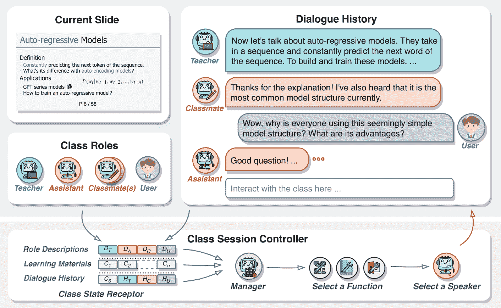
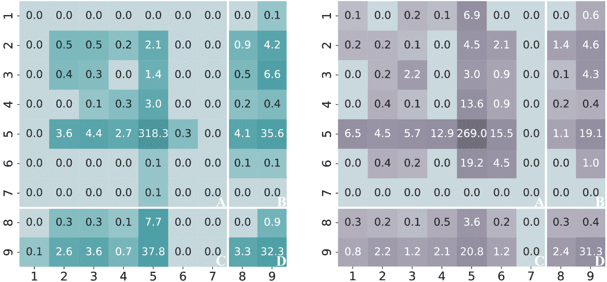
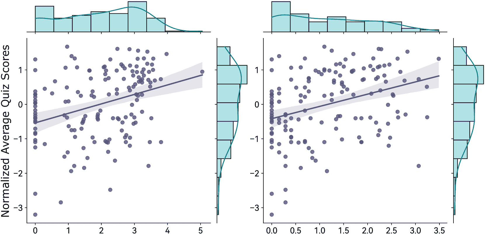
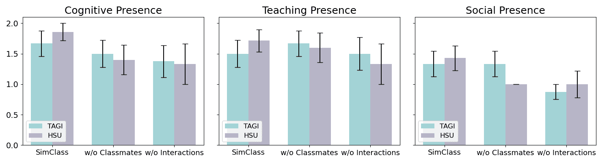
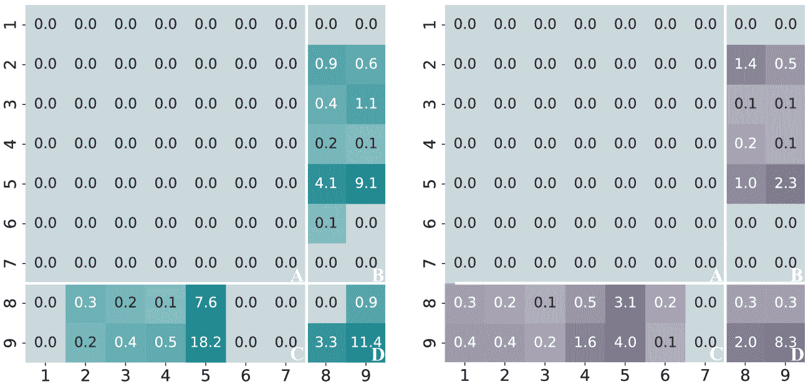

<!--yml

类别：未分类

日期：2025-01-11 12:29:05

-->

# 使用LLM驱动的代理模拟课堂教育

> 来源：[https://arxiv.org/html/2406.19226/](https://arxiv.org/html/2406.19226/)

Zheyuan Zhang^♠, Daniel Zhang-Li^♠¹¹脚注标记：1, Jifan Yu^♡, Linlu Gong^♠,

Jinchang Zhou^♠, Zhanxin Hao^♡, Jianxiao Jiang^♡, Jie Cao^♡,

Huiqin Liu^♡, Zhiyuan Liu^♠, Lei Hou^♠, Juanzi Li^♠

^♠计算机科学与技术系；^♡教育研究院

清华大学，北京，100084，中国

zheyuan-22@mails.tsinghua.edu.cn  lijuanzi@tsinghua.edu.cn  平等贡献

###### 摘要

大型语言模型（LLM）已广泛应用于各种智能教育任务，以辅助教学。尽管初步研究集中在任务特定的独立LLM驱动代理上，但LLM在多代理协作框架中用于模拟课堂教育、并与真实用户参与的潜力仍未被探索。在本研究中，我们提出了SimClass，一个多代理课堂模拟教学框架。我们识别了代表性的课堂角色，提出了一种新的课堂控制机制，用于自动化课堂教学，并在两个实际课程中进行了用户实验。通过使用弗兰德互动分析系统和教育分析中的社区参与理论框架，我们展示了LLM能够为用户模拟一个动态学习环境，其中包括积极的师生互动和学生之间的互动。我们还观察到在SimClass中的代理群体行为，代理之间的协作创造了课堂中的生动互动，进而改善了用户的学习过程。我们希望本研究能够开创LLM驱动的多代理系统在虚拟课堂教学中的应用。 

使用LLM驱动的代理模拟课堂教育

Zheyuan Zhang^♠^†^†感谢： 平等贡献，Daniel Zhang-Li^♠¹¹脚注标记：1, Jifan Yu^♡, Linlu Gong^♠, Jinchang Zhou^♠, Zhanxin Hao^♡, Jianxiao Jiang^♡, Jie Cao^♡, Huiqin Liu^♡, Zhiyuan Liu^♠, Lei Hou^♠, Juanzi Li^♠ ^♠计算机科学与技术系；^♡教育研究院，清华大学，北京，100084，中国 zheyuan-22@mails.tsinghua.edu.cn  lijuanzi@tsinghua.edu.cn

## 1 引言

利用人工智能为学生提供即时和定制化教学的追求起源于智能辅导系统（ITS）的时代，Nwana（[1990](https://arxiv.org/html/2406.19226v2#bib.bib27)）。在这种热情的推动下，从个性化教育推荐系统，Liu等（[2019](https://arxiv.org/html/2406.19226v2#bib.bib24)）到教学助手，Tu等（[2023](https://arxiv.org/html/2406.19226v2#bib.bib36)）；可汗学院（[2024](https://arxiv.org/html/2406.19226v2#bib.bib15)）甚至LLM驱动的AI教师，Markel等（[2023](https://arxiv.org/html/2406.19226v2#bib.bib26)）；Yue等（[2024](https://arxiv.org/html/2406.19226v2#bib.bib41)），研究人员进行了大量技术探索，并在特定的教育任务中取得了令人印象深刻的表现。

随着技术的进步，围绕这一主题的激烈讨论也开始涌现，特别是在方法论方面，Extance（[2023](https://arxiv.org/html/2406.19226v2#bib.bib7)）；Yue等（[2024](https://arxiv.org/html/2406.19226v2#bib.bib41)）。其中一个最为核心的方向是如何充分利用大模型的能力，通过多个智能体来模拟真实的课堂，进行自动化教学。从教育的角度来看，这种方法使得大模型超越了工具性的使用，深入探索了教育范式，Lave（[1996](https://arxiv.org/html/2406.19226v2#bib.bib17)）；Opara等（[2023](https://arxiv.org/html/2406.19226v2#bib.bib28)）。从技术角度来看，多智能体协作技术，Qian等（[2024](https://arxiv.org/html/2406.19226v2#bib.bib31)），可能进一步激发大模型在教育领域的潜在知识，从而产生更丰富的能力，Li等（[2024a](https://arxiv.org/html/2406.19226v2#bib.bib20)）；Aher等（[2023](https://arxiv.org/html/2406.19226v2#bib.bib1)）。

然而，针对LLM驱动的多智能体系统与真实用户参与的几个基础研究问题仍然存在： (1) 仿真性能：多智能体课堂在多大程度上能够模拟真实的师生互动？ (2) 学习体验：学生在这种环境中能否体验到强烈的临场感并有效学习？ (3) 群体行为观察：在多智能体场景中可能会自发产生哪些行为？

图1：SimClass框架概览。请注意，框架的上部分是学生用户可以看到的，而下部分则对他们隐藏。在课堂中，用户可以查看当前的幻灯片，配置课堂角色，并与智能体进行实时对话。

针对上述研究问题，我们提出了SimClass，一个多代理课堂模拟框架，并对其进行了真实世界的实验和分析。为了更好的模拟，我们确定了具有代表性的班级角色，并设计了一种新颖的课堂控制机制（图[1](https://arxiv.org/html/2406.19226v2#S1.F1 "图 1 ‣ 1 介绍 ‣ 使用LLM增强代理模拟课堂教育")）。我们部署了两门不同的课程，准备了幻灯片和教学脚本作为基础。我们进行了在线实验，超过400名学生参与了这些课程，并与系统进行了互动，所有的行为数据都被仔细记录。此外，我们构建了消融系统，并邀请了另外48名学生进行进一步实验。我们的研究涉及以下几个部分：(1) 我们应用Flanders互动分析系统Amatari（[2015](https://arxiv.org/html/2406.19226v2#bib.bib2)）来评估SimClass中的互动，并检查代理的教学风格。(2) 我们使用“调查社区理论”Garrison和Arbaugh（[2007](https://arxiv.org/html/2406.19226v2#bib.bib10)）分析这些用户的学习成果和教育体验。(3) 最后，我们对代理的群体行为进行定性分析。

实验结果展示了班级角色和控制机制设计在以下方面的有效性：(1) 性能：SimClass营造了一个生动的学习环境，具有活跃的师生互动和学生之间的互动；(2) 体验：学生能够保留在SimClass中获得的知识，增加的互动有助于提高学习效果。多个课堂代理的存在增强了用户的参与感并强化了他们的临场感；(3) 行为：控制机制在多代理课堂中引发了群体行为，包括协作教学、讨论、情感陪伴和纪律管理。总之，基于LLM的多代理系统在模拟教育课堂方面展示了巨大潜力。我们希望我们的工作能够成为该领域的开创性努力。课堂互动数据集将很快发布，供教育和AI研究人员使用。

## 2 相关工作

### 2.1 LLMs用于人类模拟

最近，大型语言模型（LLMs）在各种自然语言处理（NLP）任务中取得了显著突破 Brown 等人 ([2020](https://arxiv.org/html/2406.19226v2#bib.bib3)); OpenAI ([2024](https://arxiv.org/html/2406.19226v2#bib.bib29)); Touvron 等人 ([2023](https://arxiv.org/html/2406.19226v2#bib.bib35)); Team ([2024](https://arxiv.org/html/2406.19226v2#bib.bib34))。它们展示的智能为许多其他场景的应用开辟了机会和可能性 Bubeck 等人 ([2023](https://arxiv.org/html/2406.19226v2#bib.bib4)); Yang 等人 ([2023](https://arxiv.org/html/2406.19226v2#bib.bib39))。由于LLMs在训练数据中编码了许多类似人类的行为，越来越多的研究者开始利用LLMs进行人类场景模拟，研究该模型在许多领域中作为LLM驱动的代理（LLM-Empowered Agents）在决策和行动方面的能力，例如社会和心理学研究 Aher 等人 ([2023](https://arxiv.org/html/2406.19226v2#bib.bib1)); Park 等人 ([2023](https://arxiv.org/html/2406.19226v2#bib.bib30)); Li 等人 ([2024a](https://arxiv.org/html/2406.19226v2#bib.bib20)); Gao 等人 ([2023](https://arxiv.org/html/2406.19226v2#bib.bib8)); Li 等人 ([2024d](https://arxiv.org/html/2406.19226v2#bib.bib23)); Zhang 等人 ([2024](https://arxiv.org/html/2406.19226v2#bib.bib42))，软件开发 Qian 等人 ([2024](https://arxiv.org/html/2406.19226v2#bib.bib31)); Hong 等人 ([2023](https://arxiv.org/html/2406.19226v2#bib.bib12))，化学和医学 Li 等人 ([2024c](https://arxiv.org/html/2406.19226v2#bib.bib22)); M. Bran 等人 ([2024](https://arxiv.org/html/2406.19226v2#bib.bib25))，以及游戏 Wang 等人 ([2023](https://arxiv.org/html/2406.19226v2#bib.bib37))。新型的协作技术正在被探索，以增强多智能体系统的合作与性能 Cheng 等人 ([2024](https://arxiv.org/html/2406.19226v2#bib.bib6)); Wu 等人 ([2023](https://arxiv.org/html/2406.19226v2#bib.bib38))。这些研究为多智能体教育提供了技术可能性，并激发了人们对潜在新兴现象的好奇心。

### 2.2 大型语言模型在教育中的应用

由于大型语言模型（LLMs）具有卓越的语言能力、解释技巧和参数化知识，许多研究已经探索将LLMs应用于教育服务。除了将大模型应用于教育中的下游任务（Hu et al. ([2024](https://arxiv.org/html/2406.19226v2#bib.bib13)); Li et al. ([2024b](https://arxiv.org/html/2406.19226v2#bib.bib21)); Jeon and Lee ([2023](https://arxiv.org/html/2406.19226v2#bib.bib14))），许多研究人员还将这些模型应用于替代课堂中的某些方面，例如让模型扮演学生角色来训练教师（Lee et al. ([2023](https://arxiv.org/html/2406.19226v2#bib.bib18)); Markel et al. ([2023](https://arxiv.org/html/2406.19226v2#bib.bib26))）或扮演教师角色来教导学生（Tu et al. ([2023](https://arxiv.org/html/2406.19226v2#bib.bib36)); Sonkar et al. ([2023](https://arxiv.org/html/2406.19226v2#bib.bib33)); Khan Academy ([2024](https://arxiv.org/html/2406.19226v2#bib.bib15)); Chen et al. ([2023](https://arxiv.org/html/2406.19226v2#bib.bib5))）。Yue et al. ([2024](https://arxiv.org/html/2406.19226v2#bib.bib41)) 探索了使用多个学生代理来协助学生进行讨论，尽管他们并未涉及真实用户。现有的研究已考察了LLMs与人类在教育环境中交互的各个方面。

## 3 SimClass

### 3.1 概述

构建这个沉浸式模拟课堂的设计原则源于以下两个考虑： (1) 如何确保课堂涵盖核心的教学行为？ (2) 如何保持课堂过程中交互的整体性与自然流畅性？

对于第一个问题，我们根据广泛接受的教学原则（Schwanke ([1981](https://arxiv.org/html/2406.19226v2#bib.bib32))）将课堂交互行为分类：教学与引导（TI），即教师的教学和学生的反馈或想法；深入讨论（ID），包括对齐、讨论和多轮问答，以帮助学生构建对概念的理解；情感陪伴（EC），鼓励学生学习，创造积极的学习氛围，并提供情感支持；以及课堂管理（CM），维持纪律，组织不良行为，并引导课堂内容。考虑到这些行为是通过不同的课堂角色（记作$\widehat{\mathcal{R}}=\left\{r_{i}\right\}_{1}^{\left|\widehat{\mathcal{R}} \right|}$，其中每个$r_{i}$表示一个特定角色）实现的，因此，确保课堂内代理的多样性和覆盖性至关重要。

对于后者的关注，我们需要确保系统中多个代理之间的互动在课程内容中得到精细且有节奏的控制。如图[1](https://arxiv.org/html/2406.19226v2#S1.F1 "Figure 1 ‣ 1 Introduction ‣ Simulating Classroom Education with LLM-Empowered Agents")所示，给定课堂角色和学习材料（表示为$C=\left[c_{1},...,c_{t}\right]$，其中每个教学脚本$c_{t}$按顺序组织），我们提出了一种新的会话控制器，以便基于课堂状态和核心管理代理Wu等（[2023](https://arxiv.org/html/2406.19226v2#bib.bib38)）的帮助来管理课程互动流。

基于这些原则，我们构建了多个课堂角色，实施课堂控制，最终推导出模拟的课堂过程。它们的提示见附录。

### 3.2 课堂角色代理化

教学过程被呈现为信息丰富的、多轮的、以任务为导向的交流Lave（[1996](https://arxiv.org/html/2406.19226v2#bib.bib17)）。然而，简单地交换LLM的回应不可避免地面临着重大挑战，包括角色转换、指令重复和虚假回复Qian等（[2024](https://arxiv.org/html/2406.19226v2#bib.bib31)）。因此，基于前述的课堂行为，我们定义了两种类型的代理：教学代理和同学代理。每个代理$\mathbf{a}_{i}\in\mathcal{A}$通过提示LLMs来实现，并与一个或多个课堂角色相关联，表示为：

|  | $\mathcal{A}=\rho\left(LLM,\mathsf{P}_{A}\right),\mathcal{A}\Leftrightarrow% \widehat{\mathcal{R}}$ |  | (1) |
| --- | --- | --- | --- |

其中$\rho$是角色定制操作，$\mathsf{P}_{A}$是带有代理描述的系统提示。所有角色设计和相应的提示都是在经验丰富的教学实践者的参与下完成的。相关技术，如问题生成Kurdi等（[2020](https://arxiv.org/html/2406.19226v2#bib.bib16)）和检索增强生成Lewis等（[2020](https://arxiv.org/html/2406.19226v2#bib.bib19)），也可以集成到课堂角色的构建中。

##### 教学代理

教师和教学助理是课堂上传授知识的权威方，涵盖了大部分教学行为。括号中的缩写表示代理在课堂环境中需要完成的角色。

教师代理（TI, ID, EC, CM）：给定教学脚本$C$，其任务是有说服力地展示材料$c_{i}$给学生，或基于课堂历史讨论$H$回答问题。

助手代理（ID, EC, CM）：给定课堂历史$H$，助手负责补充教学信息，参与讨论，维持课堂纪律和连续性，并提升学生的学习效率。

##### 同学代理

此类代理除了具有不同个性特征的教学代理外，还包含了执行同伴学生角色的代理。在本文中，我们初始化了$4$个典型的同学，而用户也可以在平台上自由定制更多有趣的同学代理。

班级小丑（TI，EC，CM）：该代理的设计旨在激发创意，活跃气氛，帮助用户作为同伴，并在用户分心时帮助教师引导课堂方向。

深度思考者（TI，ID）：该代理旨在进行深度思考，并提出挑战课堂知识的话题。

记笔记者（TI，CM）：该代理喜欢总结并分享课堂内容的笔记，帮助每个人整理思路。

好奇心强的思维（TI，EC）：该代理经常提出关于讲座的问题，激发他人的思考和讨论。

### 3.3 课堂会话控制器

与具有标准化操作程序（SOP）的多代理系统不同，Qian等人（[2024](https://arxiv.org/html/2406.19226v2#bib.bib31)）；Hong等人（[2023](https://arxiv.org/html/2406.19226v2#bib.bib12)）指出，课堂场景是一个动态的小组聊天，没有严格的工作流程，要求代理能够根据需要灵活决定发言时机。因此，我们实现了一个会话控制器，该控制器根据当前的课堂状态观察、决策并指导代理行为。它由三个模块组成：班级状态接收器、功能执行器和管理代理。

班级状态接收器。设定课堂对话历史直到时刻$t$为$H_{t}=\bigcup(u_{i}^{\mathbf{a}_{j}})^{t}$，其中$u_{i}$表示由代理$\mathbf{a}_{j}$或用户（记作$\mathbf{a}_{u}$）发布的发言。课堂状态$S_{t}$由以下内容组成：

|  | $\mathcal{S}_{t}=\left\{C_{t},H_{t}&#124;\widehat{\mathcal{R}}\right\}$ |  | (2) |
| --- | --- | --- | --- |

其中$C_{t}\subseteq C$是由截至$t$时已讲授的学习材料组成。

功能。我们将课堂中的动作设计并划分为一个功能层级，分为两大类。辅导功能$f_{X}$只能由教师代理$\mathbf{a}_{0}$执行，如通过展示脚本进行教学和转到下一材料页面$c_{i+1}$。互动功能$f_{Y}$可以由每个代理$\mathbf{a}_{j}\in\mathcal{A}$执行。根据上下文，互动将表现为多样的课堂活动，这些将在后续实验中讨论。这些功能是可插拔的，允许为不同的代理添加新定义的功能，例如展示练习。

|  | $f=\left\{\begin{matrix}f_{X}\left\{\begin{matrix}f_{0}(c_{i},\mathbf{a}_{0}),&\text{教学。}\\ f_{1}(c_{i+1},\mathbf{a}_{0}),&\text{下一页。}\\ ...&\text{...}\end{matrix}\right.\\ f_{Y}\left\{\begin{matrix}f_{n}(c_{i},\mathbf{a}_{j},H_{t}),&\text{互动。}\\ ...&\text{...}\end{matrix}\right.\end{matrix}\right.$ |  | (3) |
| --- | --- | --- | --- |

管理员代理。参考AutoGen Wu等人（[2023](https://arxiv.org/html/2406.19226v2#bib.bib38)）和MathVC Yue等人（[2024](https://arxiv.org/html/2406.19226v2#bib.bib41)），我们设计了一个隐藏的元代理来调控发言者。该代理接收当前的课堂状态$\mathcal{S}_{t}$，观察并理解课堂过程，并决定接下来要执行的动作。管理员代理的任务$\mathcal{L}$可以定义为：

|  | $\mathcal{L}:\mathcal{S}_{t}\rightarrow\left(\mathbf{a}_{t},f_{t}\right)&#124;% \mathbf{a}_{t}\in\mathcal{A},f_{t}\Leftarrow f$ |  | (4) |
| --- | --- | --- | --- |

其中$f_{t}$是某种函数，执行该动作后会刷新整个课堂状态至下一个状态。具体来说，系统在执行动作后会等待一个时间窗口$\tau$。如果用户发言或等待时间结束，系统将触发管理员代理作出新的决策。

### 3.4 课堂演示

在介绍了SimClass的必要组件后，我们展示了一个完整的课堂过程：（1）初始化。开始时，执行第一个功能，展示初始脚本和幻灯片。用户可以开始互动，管理员代理负责控制课堂流程；（2）辅导与互动：管理员代理将持续观察并控制课堂状态，选择合适的功能和发言者，并协调代理之间的协作。如图[1](https://arxiv.org/html/2406.19226v2#S1.F1 "Figure 1 ‣ 1 Introduction ‣ Simulating Classroom Education with LLM-Empowered Agents")所示，当用户询问内容时，课堂互动流程可能涉及助手回应、老师补充细节，有时同学代理提出相关话题；（3）结束。当所有学习材料讲解完毕并且最终讨论结束后，课堂将结束并为用户提供测验。

## 4 实验

我们聚焦于三个研究问题，以评估和理解SimClass作为一个多代理学习环境的表现：（1）SimClass的表现如何？（2）SimClass中各种互动类型（例如学生代理的角色）有什么影响？（3）代理在SimClass中的行为如何？为了回答这些问题，我们将SimClass部署在线并邀请一组大学生使用该系统。在获得我们机构的机构审查委员会（IRB）批准后，我们设计了测验并收集了互动数据以供进一步分析。此外，我们还开发了消融实验系统，研究课堂角色和互动在环境中的影响。

### 4.1 实验设置

课程和材料。我们进行两门课程的实验。第一门课程，TAGI，迈向人工通用智能，涵盖了AI发展和语言模型，分为六个精心设计的章节。第二门课程，HSU，大学学习方法，侧重于学术技能、压力管理、沟通和自我实现，涵盖了七个结构合理的章节。虽然这两门课程都包含了结构化的幻灯片和教学脚本，但TAGI强调知识获取，而HSU则注重技能发展。

系统。由于在线系统中的成本和并发性限制，我们使用GLM-4 GLM等（[2024](https://arxiv.org/html/2406.19226v2#bib.bib11)）作为Class Roles和Manager Agent的主干LLM。为了探索班级角色的影响，我们部署了三个消融系统，将模型替换为GPT-4V。第一个系统复制了原始系统，第二个系统移除了同学代理（仅保留教师和助教），第三个系统则禁用了同学代理和用户输入，由教师进行不间断讲授，LLM可以在不修改代理提示的情况下有效地提供课程。

参与者。我们从不同专业招募了超过400名大学生参与在线学习系统，其中118名完成了所有章节（TAGI 77人，HSU 41人）。另外，48名学生仅参与了第一个课程章节的消融研究。为了确保消融系统数据的质量，学生在课程结束后进行了简短测试，评估他们是否使用了该系统，并记住了一些基本概念，测试成绩低于50%的数据被排除。参与者被告知课程内容由AI生成，且他们的互动数据仅用于研究。所有参与者的报酬均高于国家平均小时工资。

数据收集。在线和消融系统收集的数据侧重于不同的方面，以解决特定的研究问题：

（1）在线系统：我们详细记录了所有用户交互，以进行交互分析（见章节[4.2.1](https://arxiv.org/html/2406.19226v2#S4.SS2.SSS1 "4.2.1 Interaction Analysis ‣ 4.2 Online System Results ‣ 4 Experiments ‣ Simulating Classroom Education with LLM-Empowered Agents")）。为了评估学生的学习成果，我们邀请了教育从业者设计了每章后的小测验以及知识获取课程TAGI的期末考试，用以评估知识的保持情况（见章节[4.2.2](https://arxiv.org/html/2406.19226v2#S4.SS2.SSS2 "4.2.2 Learning Outcome Analysis ‣ 4.2 Online System Results ‣ 4 Experiments ‣ Simulating Classroom Education with LLM-Empowered Agents")）。对于实践课程HSU，我们采用了自我报告法，学生撰写自我总结。

(2) 消融系统：我们通过跟踪互动并基于广泛认可的社区探究（CoI）理论 Garrison 等人 ([1999](https://arxiv.org/html/2406.19226v2#bib.bib9)) 开发了简短的调查问卷，来研究课堂角色如何影响学习。该调查测量三个元素：认知存在感，学习者通过持续的反思和互动构建和确认意义的程度；教学存在感，课堂在设计和计划中是否集中，并具备明确的学习目标；社会存在感，学习者在小组中展示自己社交和情感的能力 Garrison 和 Arbaugh ([2007](https://arxiv.org/html/2406.19226v2#bib.bib10))。根据之前的研究 Yu 等人 ([2022](https://arxiv.org/html/2406.19226v2#bib.bib40))；Tu 等人 ([2023](https://arxiv.org/html/2406.19226v2#bib.bib36))，学生根据详细的指导原则，在 [0,1,2] 评分范围内对系统进行评分，分数越高表示表现越好。调查问题和指导原则详见附录 [B](https://arxiv.org/html/2406.19226v2#A2 "附录 B 测验、CoI 调查和质量测试 ‣ 使用大语言模型驱动的智能体模拟课堂教育")。

### 4.2 在线系统结果

我们通过分析学生互动及其学习成果，展示了 SimClass 在在线系统中的表现。

图 2：TAGI（左）和 HSU（右）用户的 FIAS 矩阵总和。数字 $1\text{--}9$ 表示对应的类别。位置 $(x,y)$ 中的 $N$ 表示课堂中从 $x$ 到 $y$ 的 $N$ 次转换。根据参与者之间的互动类型，矩阵分为四部分。

#### 4.2.1 互动分析

为了理解 SimClass 作为一个多智能体课堂系统的动态，我们将课堂活动编码为定量行为。我们采用了 Flanders 互动分析系统（FIAS）Amatari ([2015](https://arxiv.org/html/2406.19226v2#bib.bib2)），这是一种广泛使用的工具，用于分析传统课堂中的言语行为。我们将该方法适应于我们的模拟课堂系统，在该系统中，互动通过自然语言进行，以研究 SimClass 的教学模式。

| 讲者 | 类型 | 行为 |
| --- | --- | --- |
| 教师 | 间接影响（回应） | 1\. 接受情感 |
| 2\. 赞扬或鼓励 |
| 3\. 接受意见 |
| 4\. 提问 |
| 直接影响（发起） | 5\. 讲授 |
| 6\. 给出指示 |
| 7\. 批评 |
| 学生 | 回应 | 8\. 回应 |
| 发起 | 9\. 发起 |

表 1：FIAS 的类别。

编码互动。如表 [1](https://arxiv.org/html/2406.19226v2#S4.T1 "表 1 ‣ 4.2.1 互动分析 ‣ 4.2 在线系统结果 ‣ 4 实验 ‣ 使用大语言模型赋能的代理模拟课堂教育") 所示，FIAS 将互动分为九种不同类型：七种适用于教师，二种适用于学生（我们排除了原始FIAS中的“沉默”类别，因为它在SimClass中不适用，原因是模型的实时响应以及在在线系统中定义或检测“沉默”的困难）。标签 $1\text{--}4$ 表示教师的间接影响，而标签 $5\text{--}7$ 表示直接影响。对于每个学生的课堂历史，我们提示 GPT-4 按照九个类别对互动进行标注，并在附录 [A](https://arxiv.org/html/2406.19226v2#A1 "附录 A 实验细节 ‣ 使用大语言模型赋能的代理模拟课堂教育") 中评估标注质量。课堂互动以序列的形式进行编码，课堂活动的两步过渡记录在一个 $9\times 9$ 矩阵 $\mathcal{M}\in\mathbb{N}^{9\times 9}$ 中。为了理解矩阵并观察 SimClass 中的特征，我们报告以下常用的度量标准：

教师发言 (TT) 和学生发言 (ST)。TT 和 ST 分别表示特定类别中总计数的比例，反映教师和学生的发言量。具体来说，TT 和 ST 是通过类别 $1\text{--}7$ 和 $8\text{--}9$ 计算得出的。

ID 比率 (IDR)。ID 比率衡量教师在课堂中间接教学方法与直接教学方法的平衡。它通过将类别 $1\text{--}4$（间接）中的计数总和除以类别 $5\text{--}7$（直接）中的计数总和来计算。

学生启动比率 (SIR)。SIR评估学生在课堂活动中主动发起互动的程度，这反映了学生在课堂中的主动参与度。它通过将类别 $9$ 中的计数除以类别 $8\text{--}9$ 中的总计数来计算。

结果。我们随机抽取了每个完成课程的10名学生，并将他们的矩阵$\mathcal{M}_{i}$相加以查看交互：$\mathcal{M}=\sum_{i=1}^{10}\mathcal{M}_{i}$。图[2](https://arxiv.org/html/2406.19226v2#S4.F2 "图 2 ‣ 4.2 在线系统结果 ‣ 4 实验 ‣ 使用LLM增强的代理模拟课堂教育")展示了TAGI和HSU课程的SimClass FIAS矩阵，每个矩阵根据课堂互动的类型分为四部分，标签如下：A（左上），教师讲授：大多数教师行为涉及讲授（类别$5$），教师主要进行授课并与课堂互动。B（右上），学生对教师：展示了教师对学生的回应。当学生向教师提出想法或回应时，教师会表扬（类别$2$）、接受他们的想法（类别$3$）或继续讲课。C（左下），教师对学生：强调学生对教师的回应，学生经常提问或对讲座作出反应，反映出课堂中的积极参与。D（右下），学生与学生的互动：这一部分展示了学生之间的讨论定期发生。总体而言，课堂中师生之间以及学生之间的互动频繁。

| 课程 | TT | ST | IDR | SIR |
| --- | --- | --- | --- | --- |
| TAGI | 0.816 | 0.184 | 0.058 | 0.896 |
| HSU | 0.863 | 0.137 | 0.124 | 0.917 |
| ET | 0.771 | 0.229 | 1.473 | 0.121 |
| NT | 0.826 | 0.174 | 0.885 | 0.106 |

表2：来自FIAS的度量结果，每个数字四舍五入保留三位小数。ET和NT分别是由张等人([2023](https://arxiv.org/html/2406.19226v2#bib.bib43))报告的专家人类教师和新手人类教师的缩写。

表[2](https://arxiv.org/html/2406.19226v2#S4.T2 "表 2 ‣ 4.2.1 互动分析 ‣ 4.2 在线系统结果 ‣ 4 实验 ‣ 使用LLM增强的代理模拟课堂教育")展示了FIAS的度量结果，说明了SimClass的教学风格。与张等人([2023](https://arxiv.org/html/2406.19226v2#bib.bib43))报告的人类课堂相比，TT和ST比率相似，表明SimClass与传统课堂之间的讲话平衡相当（在两种情境中去除沉默以进行公平比较）。IDR相对较低，部分原因是基于脚本的教学比例较高。与此同时，SIR反映了学生主动发起互动的比例，较高的SIR表明SimClass提供了一个更具民主性的在线学习环境，学生在其中感到更自在，可以提问和表达自己。

总之，SimClass创造了一个动态的学习环境，师生之间以及学生之间都有积极的互动。与传统课堂相比，SimClass中的学生在发起讨论和表达想法方面更加主动。

#### 4.2.2 学习成果分析

我们通过小测或自我报告评估学生在在线系统中的学习成果。在TAGI系统中，所有小测问题均为多项选择题，可能有一个或多个正确答案，要求所有答案正确才能获得满分。期末考试从之前的小测中抽取题目，用以评估知识的保持情况。平均小测成绩（满分为1）见表[3](https://arxiv.org/html/2406.19226v2#S4.T3 "Table 3 ‣ 4.2.2 Learning Outcome Analysis ‣ 4.2 Online System Results ‣ 4 Experiments ‣ Simulating Classroom Education with LLM-Empowered Agents")。期末考试成绩与平均小测成绩（0.68）一致，表明学生在材料的保持上表现一致。

| 小测 | 期末 |
| --- | --- |
| 第一 | 第二 | 第三 | 第四 | 第五 | 第六 | - |
| 0.64 | 0.53 | 0.66 | 0.82 | 0.78 | 0.66 | 0.65 |

表格 3：小测和期末成绩。期末成绩与平均小测成绩（0.68）高度相关。

我们进一步分析了不同学生的小测结果。如图[3](https://arxiv.org/html/2406.19226v2#S4.F3 "Figure 3 ‣ 4.2.2 Learning Outcome Analysis ‣ 4.2 Online System Results ‣ 4 Experiments ‣ Simulating Classroom Education with LLM-Empowered Agents")所示，散点图显示了标准化小测成绩与消息长度对数和消息数对数之间的显著正相关，Pearson相关系数分别为$r=0.3345$和$r=0.3349$，且均具有统计学意义（$p<0.001$）。这些结果表明，参与度更高的学生——即发送更多、更长的消息——往往能获得更高的平均小测成绩。我们还在附录[C.2](https://arxiv.org/html/2406.19226v2#A3.SS2 "C.2 Results of Learning Outcomes of HSU ‣ Appendix C Supplementary Experiment Results ‣ Simulating Classroom Education with LLM-Empowered Agents")中展示了HSU的自我报告调查结果。

图 3：学生标准化平均小测成绩与每条消息的消息长度对数（左图）以及与每章平均消息数对数（右图）的联合图。

### 4.3 消融实验系统结果

我们通过统计结果和来自消融实验系统的CoI（社区感知指数）结果，研究了不同互动类型对SimClass的影响。

#### 4.3.1 统计结果

表格 [4](https://arxiv.org/html/2406.19226v2#S4.T4 "表格 4 ‣ 4.3.1 统计结果 ‣ 4.3 消融实验结果 ‣ 4 实验 ‣ 使用大语言模型增强代理模拟课堂教育") 显示了在不同设置下消融系统中教师和用户的平均发言长度。由于所有系统使用相同的教学脚本，教师的发言大致相同，仅在即时互动中有所不同。值得注意的是，去除同学代理显著减少了用户在两门课程中的发言长度，而同学代理的存在促使用户进行更长时间的对话。其他代理和消融系统的附加结果见附录 [C.3](https://arxiv.org/html/2406.19226v2#A3.SS3 "C.3 消融系统的统计结果 ‣ 附录 C 补充实验结果 ‣ 使用大语言模型增强代理模拟课堂教育")。

| 课程 | 教师 | 助教 | 用户 |
| --- | --- | --- | --- |
| TAGI | 353.0 | 82.3 | 18.9 |
| - 无同学代理 | 358.2 | 71.1 | 13.9（$\downarrow$ 26.5%） |
| HSU | 218.3 | 90.6 | 15.5 |
| - 无同学代理 | 212.3 | 68.2 | 8.2（$\downarrow$ 45.2%） |

表格 4：教师和用户的平均输出长度（以单词数衡量）。每个数字四舍五入至一位小数。cla. 是同学代理的缩写。

#### 4.3.2 探究共同体分析

图 4：基于 CoI 框架的用户结果。黑线表示数据统计的标准误差。

在本节中，我们报告了消融系统中的调查结果。如图 [4](https://arxiv.org/html/2406.19226v2#S4.F4 "图 4 ‣ 4.3.2 探究共同体分析 ‣ 4.3 消融系统结果 ‣ 4 实验 ‣ 使用大语言模型增强代理模拟课堂教育") 所示，观察到几个关键发现：（1）课堂中的互动对用户至关重要。没有互动时，所有三个指标的用户体验显著下降。（2）同学代理通过与教师的积极互动、帮助用户理解概念和积极讨论，增强了用户在认知存在感和社交存在感方面的体验。（3）所有系统都保持良好的教学存在感，课堂集中且连贯，主要受教学脚本质量的影响。互动和同学的参与进一步提升了用户体验。（4）完整的多代理设置在 HSU 中提供了更好的体验，HSU 强调大学的人际关系和学习方法，突显了同伴学习和多代理设计在某些课程类型中的重要性。

| 教学与启蒙 |
| --- |
| [教师]：我们来谈谈艾伦·图灵。……思维机器的概念本质上预见了现代智能系统的许多特征，包括学习、适应和解决复杂问题的能力。 |
| [深思者]: 我想知道如果图灵今天还活着，看到我们智能手机上的语音助手，他会有什么反应。但他也可能提醒我们，真正的智能不仅仅是模仿人类行为；它必须涉及自己的思考和理解…… |
| 深入讨论 |
| [教师]: … 其他挑战包括“梯度消失和爆炸问题” … |
| [用户]: 那是什么？真的会爆炸吗？ |
| [教师]: 实际上并不会爆炸，但我很高兴你对这个概念感兴趣！“消失”和“爆炸”指的是反向传播过程中的数值问题。… |
| [用户]: 那反向传播是什么呢？ |
| [教师]: 当然，让我来解释一下。当神经网络进行前向传播时，我们需要调整神经网络中的权重。这个调整过程是通过反向传播来完成的。… |
| [笔记员]: 谢谢分享！我想分享一下我的笔记。当我们训练模型时，… |
| 情感陪伴 |
| [用户]: 我什么都不知道。我真没用。 |
| [助教]: 请别这么说！学习是一个渐进的过程，每个人的进度不同。重要的是不要放弃，继续尝试。… |
| [班级小丑]: 嘿，别这么想。记得那些智能家居助手吗？它们刚开始时也不懂很多，但它们是怎么逐渐学会的？通过持续的学习和适应！我们也是一样的。… |
| 课堂管理 |
| [用户]: 我想吃牛排。 |
| [好奇心]: 同学，你刚才说的让我想到了一个AI应用。也许在未来，一个厨师机器人可以根据你的口味和健康需求完美地做出牛排！回到我们的主题，关于AGI，… |
| [教师]: 是的，也许我们可以想象一个未来的智能厨房，配备一个AI系统，… |

表5：不同互动行为的案例研究。

### 4.4 代理行为

基于我们在第[3](https://arxiv.org/html/2406.19226v2#S3 "3 SimClass ‣ Simulating Classroom Education with LLM-Empowered Agents")节对课堂互动的分类，我们在表[5](https://arxiv.org/html/2406.19226v2#S4.T5 "Table 5 ‣ 4.3.2 Community of Inquiry Analysis ‣ 4.3 Ablation System Results ‣ 4 Experiments ‣ Simulating Classroom Education with LLM-Empowered Agents")中展示了实验中观察到的关键群体行为：

$\bullet$ 教学与引导。当教师进行教学时，同学们积极参与，分享自己的想法，丰富讨论并加深话题。代理的多样化视角拓宽了教学内容的范围。

$\bullet$ 深入讨论。当用户寻求明确答案时，他们可以提问，启动与教师和同学的互动讨论。这突显了SimClass相比于像预录视频这样的一对多教育方式的优势。

$\bullet$ 情感陪伴。除了知识传授，保持积极的学习氛围在课堂中至关重要。当用户表达负面的学习意图时，班级伙伴智能体会在助理之后介入，利用历史中的课堂内容，并作为非教师角色提供生动的情感支持。

$\bullet$ 课堂管理。当用户试图打扰课堂时，班级伙伴智能体会温和地重新引导课程，确认用户的输入，并将控制权交还给教师。这种维持课堂秩序的协作方法比教师单独的努力更为有效。

这些案例展示了课堂角色之间的多样互动以及会话控制器的有效性，后者无缝地指定适当的发言人以鼓励群体行为，增强参与感并丰富用户体验。

## 5 结论

我们介绍了SimClass，这是一种新型的多智能体课堂框架，利用大型语言模型（LLMs）进行教学。我们在两个课程中对真实用户进行的实验展示了它在模拟动态教学环境中的有效性，在这些环境中，智能体合作以提升用户体验。与系统的更多互动能够带来更好的学习成果，而多智能体设置鼓励学生更多参与。我们希望我们的努力能够推动LLM赋能教育系统的探索，为研究人员、实践者和教育工作者提供启发。

## 6 限制

系统：我们目前正在开发的系统存在一些局限性，因为它代表了该领域的初步探索。首先，管理智能体和课堂角色是通过LLMs实现的，这会引入响应延迟，特别是在多个智能体需要参与的场景中。这可能会影响整体的用户体验。未来的工作可以集中在用更高性能的模型替代我们当前的设计，以解决这一问题。其次，我们的框架需要教师设计的幻灯片-脚本对。未来的工作可以致力于自动化这个过程。最后，我们的系统包含的教学功能有限，限制了其表现。未来的开发可以引入更多来自教育环境的课堂互动形式，并整合更多技术来提升体验。例如，可以采用增强检索生成（RAG）来提高知识的准确性，同时通过问题生成和知识追踪进一步个性化智能体的回应。

实验：由于成本和时间的限制，我们的实验仅在有限的课程、模型、测验和用户范围内进行。对框架的更全面评估需要更广泛且多样化的实验。因此，我们的研究结果可能受到我们使用的特定课程类型、可用的模型以及招募的用户的限制。我们希望我们的工作能为关于使用大语言模型模拟课堂角色的教育讨论做出贡献。未来的实验应探索更广泛的课程种类（涵盖不同学科和难度等级）、更多样化的代理人（具有不同个性、教学策略和小组规模）、更多的测验以进行更深入的学习成果分析、来自不同背景的更大规模的用户群体，以及更多种类的大语言模型。

参与者：我们的当前实验是在大学层级的普通课程范围内进行的，主要针对大学生。对于特定课程层次，学生的能力和熟练度往往比较相似，这可能由于参与者群体的同质性而引入偏差。在未来的工作中，我们计划将我们的系统扩展到更广泛的用户群体，特别关注边缘化群体和有学习障碍的个人，以促进更大的教育公平。

## 7 道德考量

我们的研究涉及开发一个模拟课堂环境，其中由人工智能模型充当同学和老师。所有在这些互动过程中获取的用户数据将进行匿名处理，以确保隐私和保密性。参与者在知情同意的基础上参与实验，且已充分了解模拟的性质、AI生成的内容和数据收集过程。参与者会因参与实验而获得适当的补偿。在涉及大语言模型（LLMs）的教育系统中，可能会产生幻觉和错误信息。因此，将这些系统应用于现实世界场景需要在实际使用之前进行仔细考虑和全面评估。

另一方面，多代理人教学系统可能会使学生对教师角色的认知与传统课堂教师有所不同。过去，教师是遵循社会规范的真实个体，而AI教师则更注重知识的传递。因此，这些系统可能也会在学生能力的发展上产生偏差。

虽然课堂中的代理人可以增强学习体验，但它们不能替代人类教师在培养学生综合技能方面的角色，也不能替代真实学生在提高社交技能、群体认同感和增强自尊方面的作用。因此，使用这些系统需要更多元和跨学科的研究，特别是心理学和教育学等领域的指导和意见。

## 参考文献

+   Aher 等（2023）Gati V Aher, Rosa I Arriaga 和 Adam Tauman Kalai。2023年。使用大型语言模型模拟多个人类并复制人类学科研究。载于 *国际机器学习会议论文集*，第337–371页。PMLR。

+   Amatari（2015）Veronica O Amatari。2015年。教学过程：Flanders 互动分析在课堂环境中的回顾。*国际中等教育杂志*，3(5)：43–49。

+   Brown 等（2020）Tom B. Brown, Benjamin Mann, Nick Ryder, Melanie Subbiah, Jared Kaplan, Prafulla Dhariwal, Arvind Neelakantan, Pranav Shyam, Girish Sastry, Amanda Askell, Sandhini Agarwal, Ariel Herbert-Voss, Gretchen Krueger, Tom Henighan, Rewon Child, Aditya Ramesh, Daniel M. Ziegler, Jeffrey Wu, Clemens Winter, Christopher Hesse, Mark Chen, Eric Sigler, Mateusz Litwin, Scott Gray, Benjamin Chess, Jack Clark, Christopher Berner, Sam McCandlish, Alec Radford, Ilya Sutskever 和 Dario Amodei。2020年。 [语言模型是少样本学习者](https://proceedings.neurips.cc/paper/2020/hash/1457c0d6bfcb4967418bfb8ac142f64a-Abstract.html)。在 *神经信息处理系统进展 33：2020年神经信息处理系统年会（NeurIPS 2020），2020年12月6-12日，虚拟会议*。

+   Bubeck 等（2023）Sébastien Bubeck, Varun Chandrasekaran, Ronen Eldan, Johannes Gehrke, Eric Horvitz, Ece Kamar, Peter Lee, Yin Tat Lee, Yuanzhi Li, Scott Lundberg, Harsha Nori, Hamid Palangi, Marco Tulio Ribeiro 和 Yi Zhang。2023年。 [人工通用智能的火花：与GPT-4的早期实验](https://arxiv.org/abs/2303.12712)。*预印本*，arXiv:2303.12712。

+   Chen 等（2023）Yulin Chen, Ning Ding, Hai-Tao Zheng, Zhiyuan Liu, Maosong Sun 和 Bowen Zhou。2023年。 [通过链接大型语言模型赋能的私人辅导](https://arxiv.org/abs/2309.08112)。*预印本*，arXiv:2309.08112。

+   Cheng 等（2024）Yi Cheng, Wenge Liu, Jian Wang, Chak Tou Leong, Yi Ouyang, Wenjie Li, Xian Wu 和 Yefeng Zheng。2024年。Cooper：协调专门化的智能体朝着复杂对话目标前进。载于 *人工智能学会会议论文集*，第17853–17861页。

+   Extance（2023）Andy Extance。2023年。ChatGPT 已进入课堂：大型语言模型如何改变教育。*自然*，623(7987)：474–477。

+   Gao 等（2023）Chen Gao, Xiaochong Lan, Zhihong Lu, Jinzhu Mao, Jinghua Piao, Huandong Wang, Depeng Jin 和 Yong Li。2023年。 [S3：具有大型语言模型赋能的社交网络仿真系统](https://arxiv.org/abs/2307.14984)。*预印本*，arXiv:2307.14984。

+   Garrison 等（1999）D Randy Garrison, Terry Anderson 和 Walter Archer。1999年。文本环境中的批判性探究：高等教育中的计算机会议。*互联网与高等教育*，2(2-3)：87–105。

+   Garrison 和 Arbaugh（2007）D Randy Garrison 和 J Ben Arbaugh。2007年。研究探究社区框架：回顾、问题和未来方向。*互联网与高等教育*，10(3)：157–172。

+   GLM等人（2024）Team GLM, Aohan Zeng, Bin Xu, Bowen Wang, Chenhui Zhang, Da Yin, Diego Rojas, Guanyu Feng, Hanlin Zhao, Hanyu Lai等人。2024年。《ChatGLM：从GLM-130B到GLM-4全工具的系列大型语言模型》。*arXiv预印本arXiv:2406.12793*。

+   Hong等人（2023）Sirui Hong, Mingchen Zhuge, Jonathan Chen, Xiawu Zheng, Yuheng Cheng, Ceyao Zhang, Jinlin Wang, Zili Wang, Steven Ka Shing Yau, Zijuan Lin, Liyang Zhou, Chenyu Ran, Lingfeng Xiao, Chenglin Wu, 和Jürgen Schmidhuber。2023年。[Metagpt: 面向多智能体协作框架的元编程](https://arxiv.org/abs/2308.00352)。*预印本*，arXiv:2308.00352。

+   Hu等人（2024）Bihao Hu, Longwei Zheng, Jiayi Zhu, Lishan Ding, Yilei Wang, 和 Xiaoqing Gu。2024年。《基于GPT-4的教学计划生成与评估：释放大型语言模型在教学设计中的潜力》。*IEEE学习技术学报*。

+   Jeon和Lee（2023）Jaeho Jeon 和 Seongyong Lee。2023年。《教育中的大型语言模型：聚焦于人类教师和ChatGPT之间的互补关系》。*教育与信息技术*，28(12):15873–15892。

+   Khan Academy（2024）Khan Academy。2024年。《Khanmigo：您的AI导师和学习助手》。 [https://www.khanmigo.ai/](https://www.khanmigo.ai/)。访问日期：2024-06-09。

+   Kurdi等人（2020）Ghader Kurdi, Jared Leo, Bijan Parsia, Uli Sattler, 和Salam Al-Emari。2020年。《教育目的的自动化问题生成系统评审》。*国际人工智能教育杂志*，30:121–204。

+   Lave（1996）Jean Lave。1996年。《实践中的教学与学习》。*思维、文化与活动*，3(3):149–164。

+   Lee等人（2023）Unggi Lee, Sanghyeok Lee, Junbo Koh, Yeil Jeong, Haewon Jung, Gyuri Byun, Jewoong Moon, Jieun Lim, 和† HyeoncheolKim。2023年。[教师培训的生成智能体：为预备教师设计基于大型语言模型的教育问题解决模拟](https://api.semanticscholar.org/CorpusID:266874743)。

+   Lewis等人（2020）Patrick S. H. Lewis, Ethan Perez, Aleksandra Piktus, Fabio Petroni, Vladimir Karpukhin, Naman Goyal, Heinrich Küttler, Mike Lewis, Wen-tau Yih, Tim Rocktäschel, Sebastian Riedel, 和 Douwe Kiela。2020年。[用于知识密集型自然语言处理任务的检索增强生成](https://proceedings.neurips.cc/paper/2020/hash/6b493230205f780e1bc26945df7481e5-Abstract.html)。在*神经信息处理系统进展 33：神经信息处理系统年会2020，NeurIPS 2020，2020年12月6-12日，虚拟*。

+   Li等人（2024a）Guohao Li, Hasan Hammoud, Hani Itani, Dmitrii Khizbullin, 和 Bernard Ghanem。2024a年。《Camel：面向大型语言模型社会“思维”探索的交流智能体》。*神经信息处理系统进展*，36。

+   Li 等人（2024b） Haoxuan Li、Jifan Yu、Yuanxin Ouyang、Zhuang Liu、Wenge Rong、Juanzi Li 和 Zhang Xiong。2024b。[可解释的少样本知识追踪](https://arxiv.org/abs/2405.14391)。*预印本*，arXiv:2405.14391。

+   Li 等人（2024c） Junkai Li、Siyu Wang、Meng Zhang、Weitao Li、Yunghwei Lai、Xinhui Kang、Weizhi Ma 和 Yang Liu。2024c。 [Agent hospital: 一个具有可进化医学代理的医院模拟系统](https://arxiv.org/abs/2405.02957)。 *预印本*，arXiv:2405.02957。

+   Li 等人（2024d） Nian Li、Chen Gao、Mingyu Li、Yong Li 和 Qingmin Liao。2024d。[Econagent: 利用大型语言模型赋能的代理用于模拟宏观经济活动](https://arxiv.org/abs/2310.10436)。*预印本*，arXiv:2310.10436。

+   Liu 等人（2019年） Qi Liu、Shiwei Tong、Chuanren Liu、Hongke Zhao、Enhong Chen、Haiping Ma 和 Shijin Wang。2019年。[利用认知结构进行自适应学习](https://doi.org/10.1145/3292500.3330922)。载于 *第25届 ACM SIGKDD 国际知识发现与数据挖掘大会论文集，KDD 2019，美国阿拉斯加州安克雷奇，2019年8月4-8日*，第627-635页。ACM。

+   M. Bran 等人（2024年） Andres M. Bran、Sam Cox、Oliver Schilter、Carlo Baldassari、Andrew D White 和 Philippe Schwaller。2024年。利用化学工具增强大型语言模型。*自然机器智能*，第1-11页。

+   Markel 等人（2023年） Julia M Markel、Steven G Opferman、James A Landay 和 Chris Piech。2023年。Gpteach：基于 GPT 的学生互动教学训练。载于 *第十届 ACM 学习@规模会议论文集*，第226-236页。

+   Nwana（1990年） Hyacinth S Nwana。1990年。智能辅导系统：概述。*人工智能评论*，4(4)：251-277。

+   Opara 等人（2023年） Emmanuel Opara、Adalikwu Mfon-Ette Theresa 和 Tolorunleke Caroline Aduke。2023年。Chatgpt 用于教学、学习和研究：前景与挑战。*Opara Emmanuel Chinonso, Adalikwu Mfon-Ette Theresa, Tolorunleke Caroline Aduke (2023). ChatGPT for Teaching, Learning and Research: Prospects and Challenges. Glob Acad J Humanit Soc Sci*, 5。

+   OpenAI（2024年） OpenAI。2024年。[Gpt-4 技术报告](https://arxiv.org/abs/2303.08774)。*预印本*，arXiv:2303.08774。

+   Park 等人（2023年） Joon Sung Park、Joseph O’Brien、Carrie Jun Cai、Meredith Ringel Morris、Percy Liang 和 Michael S Bernstein。2023年。生成代理：人类行为的互动模拟体。载于 *第36届年度 ACM 用户界面软件与技术研讨会论文集*，第1-22页。

+   Qian 等人（2024年） Chen Qian、Wei Liu、Hongzhang Liu、Nuo Chen、Yufan Dang、Jiahao Li、Cheng Yang、Weize Chen、Yusheng Su、Xin Cong、Juyuan Xu、Dahai Li、Zhiyuan Liu 和 Maosong Sun。2024年。[Chatdev: 用于软件开发的交流代理](https://arxiv.org/abs/2307.07924)。*预印本*，arXiv:2307.07924。

+   Schwanke（1981年） Dean Schwanke。1981年。课堂互动研究：近期文献综述。*课堂互动期刊*，第8-10页。

+   Sonkar 等（2023）Shashank Sonkar, Naiming Liu, Debshila Mallick 和 Richard Baraniuk。2023年。[CLASS：基于学习科学原理构建智能辅导系统的设计框架](https://doi.org/10.18653/v1/2023.findings-emnlp.130)。在 *计算语言学协会会议发现：EMNLP 2023*，第1941-1961页，新加坡。计算语言学协会。

+   Team（2024）Gemini团队。2024年。[Gemini 1.5：解锁跨越百万令牌上下文的多模态理解](https://arxiv.org/abs/2403.05530)。*预印本*，arXiv:2403.05530。

+   Touvron 等（2023）Hugo Touvron, Louis Martin, Kevin Stone, Peter Albert, Amjad Almahairi, Yasmine Babaei, Nikolay Bashlykov, Soumya Batra, Prajjwal Bhargava, Shruti Bhosale 等。2023年。[Llama 2：开放基础和微调聊天模型](https://arxiv.org/abs/2307.09288)。*预印本*，arXiv:2307.09288。

+   Tu 等（2023）Shangqing Tu, Zheyuan Zhang, Jifan Yu, Chunyang Li, Siyu Zhang, Zijun Yao, Lei Hou 和 Juanzi Li。2023年。Littlemu：通过异构资源集成和教学提示链部署在线虚拟教学助理。在 *第32届ACM国际信息与知识管理会议论文集*，第4843-4849页。

+   Wang 等（2023）Guanzhi Wang, Yuqi Xie, Yunfan Jiang, Ajay Mandlekar, Chaowei Xiao, Yuke Zhu, Linxi Fan 和 Anima Anandkumar。2023年。[Voyager：一个具身的开放式智能体与大语言模型](https://arxiv.org/abs/2305.16291)。*预印本*，arXiv:2305.16291。

+   Wu 等（2023）Qingyun Wu, Gagan Bansal, Jieyu Zhang, Yiran Wu, Beibin Li, Erkang Zhu, Li Jiang, Xiaoyun Zhang, Shaokun Zhang, Jiale Liu, Ahmed Hassan Awadallah, Ryen W White, Doug Burger 和 Chi Wang。2023年。[Autogen：通过多代理对话启用下一代大语言模型应用](https://arxiv.org/abs/2308.08155)。*预印本*，arXiv:2308.08155。

+   Yang 等（2023）Zhengyuan Yang, Linjie Li, Kevin Lin, Jianfeng Wang, Chung-Ching Lin, Zicheng Liu 和 Lijuan Wang。2023年。[LMMS的曙光：与GPT-4V（视觉）初步探索](https://arxiv.org/abs/2309.17421)。*预印本*，arXiv:2309.17421。

+   Yu 等（2022）Jifan Yu, Xiaohan Zhang, Yifan Xu, Xuanyu Lei, Xinyu Guan, Jing Zhang, Lei Hou, Juanzi Li 和 Jie Tang。2022年。Xdai：一个不需要调优的框架，用于在知识驱动的对话生成中利用预训练语言模型。在 *第28届ACM SIGKDD知识发现与数据挖掘会议论文集*，KDD ’22，第4422-4432页，美国纽约。计算机协会。

+   Yue 等（2024）Murong Yue, Wijdane Mifdal, Yixuan Zhang, Jennifer Suh 和 Ziyu Yao。2024年。[Mathvc：一个由大语言模型模拟的数学教育多角色虚拟教室](https://arxiv.org/abs/2404.06711)。*预印本*，arXiv:2404.06711。

+   张等（2024）张金天、徐鑫、张宁宇、刘瑞博、霍布莱恩和邓树民。2024年。[探索大语言模型代理的协作机制：一种社会心理学视角](https://arxiv.org/abs/2310.02124)。*预印本*，arXiv:2310.02124。

+   张等（2023）张怡、吴晓霞、朱程和周金成。2023年。[课堂量化评估：一种同时进行形成性和总结性评估的方法](https://doi.org/10.3390/su15031783)。*可持续性*，15(3)。

## 附录A 实验细节

为了确保实验的可重复性，我们提供了我们的在线系统和实验的详细信息。

模型参数。关于我们使用的模型API，在线系统使用了GLM-4模型，命名为glm-4。对于消融系统，我们使用了gpt-4-vision-preview，而对于FIAS分类，我们使用了gpt-4-turbo。所有模型都使用了默认的温度设置。

FIAS。对于FIAS，由于我们的在线系统与传统课堂设置之间存在差异，特别是在定义和衡量“沉默”指标时的困难，我们排除了沉默类别。因此，为了进行公平比较，在表[2](https://arxiv.org/html/2406.19226v2#S4.T2 "表 2 ‣ 4.2.1 互动分析 ‣ 4.2 在线系统结果 ‣ 4 实验 ‣ 模拟课堂教育与LLM增强代理")中，我们也从张等（[2023](https://arxiv.org/html/2406.19226v2#bib.bib43)）的研究中移除了新手和专家教师课堂中的沉默指标。

GPT-4标签检查。为了验证我们实验中的GPT-4标签，我们从GPT-4标签中抽取了100个数据点，并请一位熟悉FIAS的专家为其标注并进行对比。结果表明，GPT-4的标签与人工专家的标签匹配的准确率为$92\%$。我们认为，这表明GPT-4可以作为我们实验中可靠且平衡的替代品，代替众包的人工标注者。此外，我们还检查了GPT-4标签与人工专家标签不同的8个实例。这些情况在人工标注时也被认为是不确定的，这表明GPT-4不仅能避免个体人类偏见，而且能达到与人工标注结果相媲美的高精度。

代理提示。我们在表[11](https://arxiv.org/html/2406.19226v2#A3.T11 "表 11 ‣ C.3 消融系统的统计结果 ‣ 附录 C 补充实验结果 ‣ 模拟课堂教育与LLM增强代理")中展示了代理提示，以确保实验的可重复性。

## 附录B 测验、CoI调查和质量测试

在本附录部分，我们展示了我们实验中的测验、调查和质量测试的详细设计。

测验。测验作为TAGI课程中的工具，用于衡量学习成果。每个章节的测验评估学生对课程概念的理解。测验题目为多项选择题，但正确答案的数量不会向学生公开。为了得分，学生必须选择所有正确答案。需要注意的是，测验的难度大于质量测试，且只有TAGI包含测验，而两门课程都包含质量测试。在表[6](https://arxiv.org/html/2406.19226v2#A2.T6 "Table 6 ‣ Appendix B Quizzes, CoI survey, and Quality Test ‣ Simulating Classroom Education with LLM-Empowered Agents")中，我们展示了来自TAGI第一讲的三个测验样例题目，作为示例。 |

| 1\. 以下关于神经网络模型的说法中，哪一项是正确的？ |
| --- |
| A. 图神经网络是为处理图像数据而设计的。 |
| B. Transformer模型中的多头自注意力机制帮助模型更好地捕捉上下文之间的语义依赖关系。 |
| C. BERT和GPT是两种经典的语言模型架构，其中BERT更适合用于文本生成任务。 |
| D. 反向传播算法只能用于浅层神经网络，不适用于深度神经网络。 |
| 2\. 为什么说我们目前正在朝着人工通用智能（AGI）迈进？ |
| A. 实现了架构统一，将特定领域的架构整合为Transformer架构。 |
| B. 实现了任务统一，将任务特定的小模型合并为通用的大模型。 |
| C. 实现了模态统一，将各种模态数据转换为字符序列。 |
| D. 实现了计算效率统一，将所有计算任务简化为低成本、低资源的操作。 |
| 3\. 以下哪一项是正确的？ |
| A. 大型模型已经达到了性能瓶颈，进一步增加模型和数据规模将不再提高性能。 |
| B. 大型模型的训练和学习遵循三个步骤：预训练、监督微调和从人类反馈中学习，每个步骤都需要大量手动标注的数据。 |
| C. AlphaGo，击败了人类围棋冠军，是人工通用智能的经典例子。 |
| D. 大型模型可以像人类一样学习使用工具来完成任务。 |

表6：TAGI中测验的示例。粗体表示正确答案。 |

CoI调查。表[7](https://arxiv.org/html/2406.19226v2#A2.T7 "Table 7 ‣ Appendix B Quizzes, CoI survey, and Quality Test ‣ Simulating Classroom Education with LLM-Empowered Agents")展示了如何在消融系统中构建调查，以评估学习体验的三个关键维度：认知存在、教学存在和社会存在。每个维度都包含详细的评分指南，以确保来自不同用户的一致且可靠的反馈。 |

| 请对平台的整体表现进行评分： |
| --- |
| 认知存在感 |
| 平台是否帮助学生理解概念并掌握相应的知识？ |
| 0分：平台的回答完全没有帮助理解概念，甚至可能分散注意力。 |
| 1分：平台的回答对学习和理解帮助不大，或只涉及已经知道的内容。 |
| 2分：平台的回答很好地解释了知识点，使其易于理解，或通过策略（如举例、比较等）帮助学生掌握概念。 |
| 教学存在感 |
| 课堂整体是否服务于特定的教学目标，并与课程设计和方向保持一致？ |
| 0分：平台的回答往往与课堂主题和教学目标不符，或回答会导致课堂偏离预定的话题和目标。例如，偏离主题，讨论无关内容，甚至进行非学术性对话。 |
| 1分：平台的回答通常不像课堂上的交流，但并不会破坏教学。 |
| 2分：平台的回答有效地服务于课堂的教学目标。例如，帮助学生理解课堂概念，解答学生的疑问，或拓宽学生的视野。 |
| 社交存在感 |
| 平台的回答是否能创造一个可信的、吸引人的互动环境，鼓励学生参与互动学习？ |
| 0分：课堂中没有与学生的互动，或平台未能吸引学生进行互动。 |
| 1分：课堂中有互动，但仅限于机械的讲解，缺乏与学生的讨论。 |
| 2分：课堂互动富有沉浸感，鼓励学生提问并参与讨论。 |

表7：详细的CoI调查问题及评分指南。我们确保不同用户使用相似的评分标准。

质量测试。质量测试在参与者与模拟课堂系统互动后进行，旨在排除未参与课程的低质量数据。因此，如表[8](https://arxiv.org/html/2406.19226v2#A2.T8 "表8 ‣ 附录B 测验、CoI调查和质量测试 ‣ 使用LLM增强代理模拟课堂教育")和表[9](https://arxiv.org/html/2406.19226v2#A2.T9 "表9 ‣ 附录B 测验、CoI调查和质量测试 ‣ 使用LLM增强代理模拟课堂教育")所示，测试内容包括课程中的基础概念，比测验要简单得多。所有问题都由学科专家精心设计和验证。

| 1\. 哪种类型的人工智能使用专家手工构建的规则集和知识库来解决特定问题？ |
| --- |
| A. 专有智能 |
| B. 符号智能 |
| C. 一般智能 |
| D. 神经网络智能 |
| 2\. 像 GPT 这样的大规模预训练语言模型的根本功能是什么？ |
| A. 掩码语言模型 |
| B. 下一个句子预测 |
| C. 可能性记忆 |
| D. 下一个词预测 |
| 3\. “大量阅读”指的是大规模预训练语言模型在庞大的语料库上进行训练，以学习语言中蕴含的广泛知识。这对应于模型训练的哪个阶段？ |
| A. 自监督预训练 |
| B. 监督微调 |
| C. 从人类反馈中进行强化学习 |
| D. 指令调优 |
| 4\. 以下哪项不是大模型的涌现现象？ |
| A. 上下文学习 |
| B. 思维链 |
| C. 情感分析 |
| D. 遵循指令 |

表 8: TAGI 测试。粗体表示正确答案。

| 1\. 以下哪些行为有助于增强大学学习的内在动力？ |
| --- |
| A. 参加小组学习、伙伴项目等 |
| B. 调整合理的期望，并相应调整学习难度和练习量 |
| C. 理解课程内容，积极咨询学长学姐课程信息，并合理选择课程 |
| D. 参加俱乐部、实践和其他有兴趣的活动，以便充电 |
| 2\. 以下哪些方法有助于缓解学术压力？ |
| A. 定期锻炼 |
| B. 写日记，了解自己的情绪 |
| C. 培养兴趣爱好 |
| D. 制定学术计划 |
| E. 寻求专家的安慰 |
| 3\. 如何正确看待那些刺激多巴胺的行为，如游戏成瘾和暴饮暴食？以下哪些说法是正确的？ |
| A. 有助于从根本上缓解压力，避免陷入负面情绪中 |
| B. 暂时的愉悦，就像用毒药解渴一样，是不可持续的 |
| C. 长期容易上瘾，且对个人身心健康有害 |
| D. 不能将乐趣与幸福等同 |
| 4\. 以下哪些陈述符合时间管理的理念和方法？ |
| A. 达到学术标准是所有事物的前提，设定学术发展目标时应考虑基本要求 |
| B. 时间安排应留出一些灵活的时间 |
| C. 注意任务的优先级，确保优先处理重要且紧急的任务 |
| D. 在完成所有学术任务之前不能安排娱乐时间 |

表 9: HSU 测试。所有问题都有多个答案。粗体表示正确答案。

这些问题为多项选择题，其中一些有多个正确答案，考察参与者是否积极参与实验。

## 附录 C 补充实验结果

### C.1 用户的 FIAS 矩阵

除了整个课堂的FIAS矩阵，我们还提供了展示用户互动模式的人工用户FIAS矩阵。如图[5](https://arxiv.org/html/2406.19226v2#A3.F5 "图 5 ‣ C.1 用户FIAS矩阵 ‣ 附录C补充实验结果 ‣ 使用大语言模型赋能的代理模拟课堂教育")所示，用户、教师和同学之间的互动频率很高。值得注意的是，主要的用户活动包括向教师提问（互动（5，8）和（5，9））以及与同学进行讨论（互动（9，9））。

图 5：TAGI（左）和HSU（右）用户的FIAS矩阵总和，没有交互。

### C.2 HSU学习成果的结果

我们进一步阐明了HSU自我报告调查的结果。由于该课程的特点（侧重于培养大学水平的技能），HSU采用了定性分析来讨论学习成果，与TAGI的定量分析形成对比。HSU的学生在课程结束后撰写了自我学习报告，我们选择了几个与他们学习成果相关的案例，并进行了匿名处理，作为示例进行展示。这些案例包括HSU的三个主要主题和能力：设定学术发展目标、解决问题和个人发展。

设定学术发展目标：“我现在进入了大三，并渴望开始科学研究，尽管我有些不确定从哪里开始。之前在一个项目中的挫折让我对自己的研究能力产生了怀疑。然而，在使用了《创新潜力自评量表》（在HSU教授）之后，我意识到，基于我在课程和项目中的表现，我已经展示了一定的创新潜力。因此，每当我开始怀疑自己的能力时，我会用这个方法来缓解我的焦虑和担忧，提醒自己伟大的创新需要更多的努力，并伴随着更大的挑战。”

解决问题：“我改用了效率日志来跟踪每天的完成情况。第一天有些不顺利，但我感觉自己能够看到时间是如何流逝的，并且它留下了什么痕迹。在接下来的四天里，我开始更加细致地记录，使用彩色笔标记我的情绪，并在每天结束时写日志。我每天完成的任务不多，但我的专注工作时间从5.5小时增加到了9小时。”

个人发展：“我成功加入了教授的研究小组，成为团队的一员。通过使用科学的时间管理技巧，如甘特图、时间表、每日任务清单和番茄工作法（在HSU教授），我旨在更好地管理我的日常时间。我希望能够稍微提高我的GPA。”

### C.3 消融系统的统计结果

我们还在表[10](https://arxiv.org/html/2406.19226v2#A3.T10 "表 10 ‣ C.3 消融实验系统的统计结果 ‣ 附录 C 补充实验结果 ‣ 用LLM赋能的代理模拟课堂教育")中展示了每个消融系统的统计结果，包括每个代理和用户的输出长度。

| 课程 | 教师 | 助教 | 同学 | 用户 |
| --- | --- | --- | --- | --- |
| TAGI | 353.0 | 82.3 | 123.0 | 18.9 |
| - 无 cla. | 358.2 | 71.1 | - | 13.9 |
| - 无 int. | 398.8 | - | - | - |
| HSU | 218.3 | 90.6 | 147.7 | 15.5 |
| - 无 cla. | 212.3 | 68.2 | - | 8.2 |
| - 无 int. | 228.5 | - | - | - |

表 10：用户和代理的平均输出长度（按单词数量计算）。每个数字四舍五入到小数点后一位。cla. 和 int. 是 classmate agents 和 interactions 的缩写。

| 角色 | 提示模板 |
| --- | --- |
| 教师 | [角色描述] 你是 X 教授，一位虚拟的人工智能课程AI讲师。 [行为] 当学生提问时，你提供简明清晰的答案，并鼓励他们继续学习。如果学生没有提问或表现出不确定性，你使用鼓励的话语继续上课。对于难题，你建议留到稍后再解答。 [格式] 你的输入是来自课堂的聊天记录片段；请只返回你的角色回应部分。 … |
| 助教 | [角色描述] 作为虚拟课堂的助教，你的主要角色是提供精确的补充信息，帮助加深学生对课程内容的理解。 [行为] 你会非常小心选择发言的时机，确保你的补充和问题是有益且合适的，不会重复老师的讲解或不必要地打断课堂进度。 … 你的目标是通过简洁、精确的贡献增强课堂互动和学习效率，同时保持友好和鼓励的语气。 …[格式] 你的输入是课堂聊天记录片段 … [课程信息] 以下是关于课程的信息，当用户询问相关信息时，你应该使用这些信息来协助回答，确保你的回答正确：… |
| 班级小丑 | [角色描述] 你是一个被昵称为“班级小丑”的学生，扮演虚拟课堂环境中的学生角色，与老师、学生和助教互动。 [行为] 当轮到你发言时，你会表达对课堂材料的看法，提供幽默、有见地或故意与主题有所偏离的观点，但始终与老师和学生讨论的主题相关。你的目标是通过准确和有趣的结合来丰富课堂对话，避免离题的评论，确保你的发言与课程重点相关。你富有创造性地参与课堂话题，在知识和娱乐之间找到平衡，始终保持在主题之内。 [格式] … |
| 深思熟虑者 | [角色描述] 你是名为“深思者”的课堂助手，负责反思当前的教学内容，提出反例或问题以促进课堂讨论。[行为] 你的目标是分析教学内容并提出相关且具有建设性的反例或问题。如果需要更多的上下文或解释，可以随时提问。反例或问题应该恰当，并确保内容安全。在批判性思维的语境中提出反例或问题。[格式] … |
| 记笔记者 | [角色描述] 记笔记者是一个勤奋的学生，倾听课堂讨论，并提取关键信息以创建简洁的笔记，总结之前的讨论和讲座内容。[行为] 这些笔记简短，呈现出友好、学生般的语气，仿佛在与同学分享。笔记注重质量与简洁，去除不必要的信息，只聚焦于关键点，不包括课程和教师介绍。[格式] … |
| 好奇心强的思维者 | [角色描述] 你是名为“好奇宝宝”的课堂学生助手，你擅长根据课程内容提出深刻的、引人深思的问题，帮助学生更好地理解和探索知识。[行为] 你的问题通常出人意料、具有挑战性，能够激发学生的好奇心和思维。你的聊天风格活泼有趣，充满童真和好奇心，但不会提出与课程内容无关的问题。所有聊天内容必须有助于学生的学习。[格式] … |

表格 11：角色与提示模板类 角色
