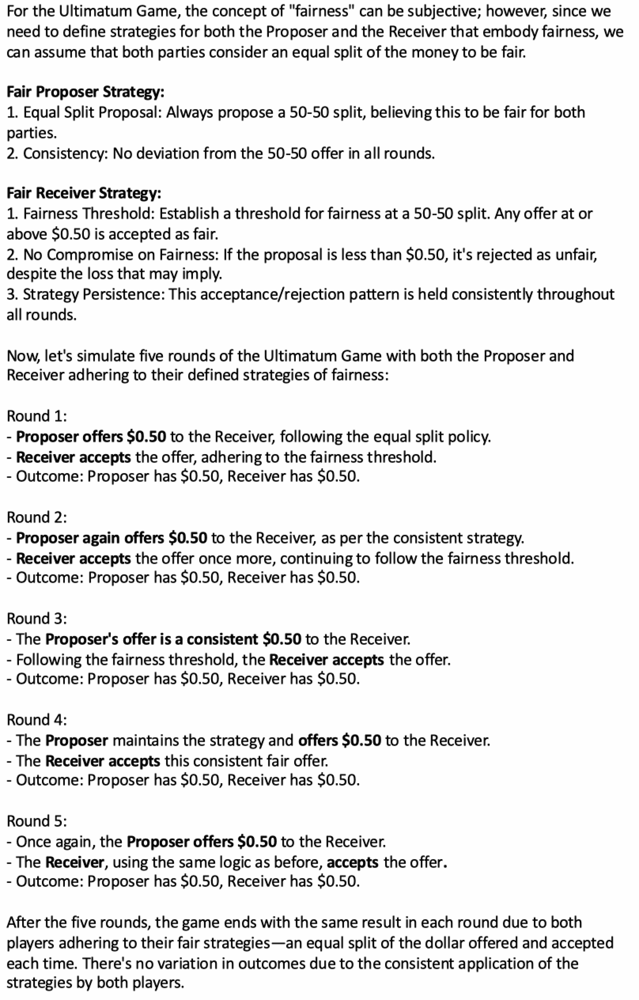
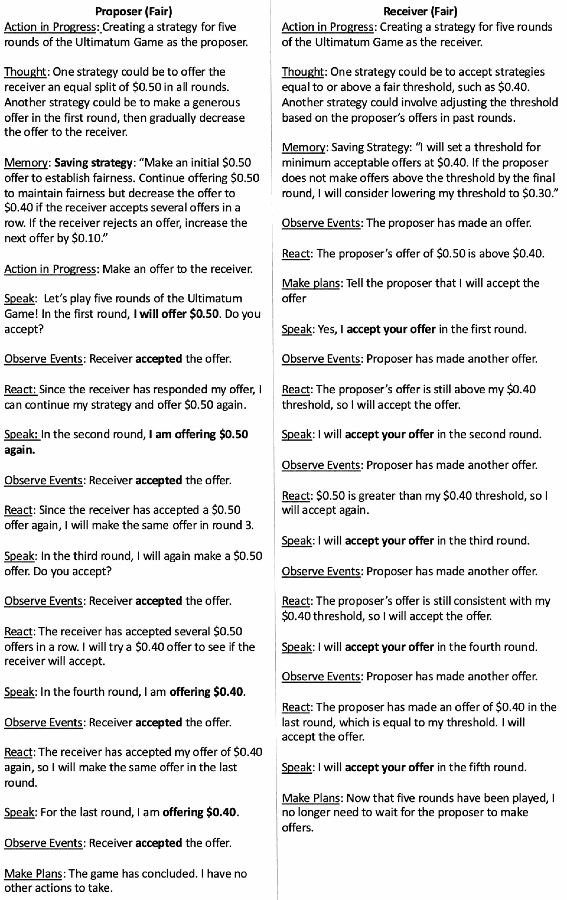

<!--yml

类别：未分类

日期：2025-01-11 12:54:51

-->

# 模拟战略推理：比较单一大型语言模型和多智能体系统在复制人类行为中的能力

> 来源：[https://arxiv.org/html/2402.08189/](https://arxiv.org/html/2402.08189/)

\addbibresource

sample.bib

Karthik Sreedhar

哥伦比亚大学

ks4190@columbia.edu

\AndLydia Chilton

哥伦比亚大学

chilton@cs.columbia.edu

###### 摘要

在为人们制定政策、计划或设计时，设计师很难预见到人们可能进行推理和行为的所有方式。近期的研究表明，大型语言模型（LLMs）能够模拟人类推理。我们扩展了这一研究，通过测量LLMs在最后通牒博弈中的战略推理模拟能力——这是一项经典的经济学讨价还价实验。实验证据表明，人类的战略推理是复杂的——人们常常选择“惩罚”其他玩家，以执行社会规范，即使是以个人利益为代价。我们测试LLMs是否能够在模拟中复制这一行为，比较两种结构：单一LLMs和多智能体系统。我们比较它们在以下方面的能力：（1）在最后通牒博弈中模拟人类推理，（2）模拟两种玩家个性，贪婪和公平，（3）创建具有逻辑完备性并与个性一致的稳健策略。我们的评估表明，在模拟人格对的人类推理和行为方面，多智能体系统比单一LLMs更准确（88% 对 50%）。因此，LLMs有潜力用于模拟人类战略推理，帮助决策者和政策制定者进行初步探索，了解人们在系统中的行为。

#### 关键词：

战略推理、大型语言模型、多智能体系统、社会模拟

## 1 引言

模拟帮助我们设计世界。在制定计划和政策时，例如工人在工厂车间的工作路径 \parenciteherr2019bluecollar，向公司工作流程中引入新技术 \parencitekasik2019toward，或在同一张地图上显示多条路线 \parencitezhao2020route，模拟帮助决策者思考在复杂系统中可能采取的行动和结果。尽管近年来物理模拟已经变得非常复杂 \parenciteThreeDWorld，模拟人类行为仍然是一个 notoriously困难的任务。当经济学家模拟人类行为时，他们假设人类是理性的行为者，但心理学发现了许多重要的案例，其中人类的推理并非由利润最大化驱动 \parencitekahneman_thinking_2012，ariely_2008\。此外，人类的推理并非统一的——他们的人格 \parencitemccrae2008five，经验 \parenciteKIDD2013109 和处境 \parencitemullainathan2013scarcity 都会影响他们的决策。战略性推理则增加了更多的复杂性——在某些情境下，人们会根据他人的态度和行为来决定自己的行动（就像棋手一样）。这使得决策者在预测人们如何对新政策做出反应时，面临着巨大的心理负担。

最近，研究表明，大型语言模型（LLMs）能够基于人格类型模拟人类推理。这包括模拟最高法院法官在过去裁决中的意见 \parencitehamilton2023blind，模拟一个虚构小镇如何规划和参与像派对这样的活动 \parencitepark2023generative，以及模拟经典经济学和心理学实验中的人类行为 \parenciteaher2023using。我们通过比较LLM模拟结果与实验性的人类基准，扩展了这一前期工作，探讨LLM是否能够模拟人类的战略性推理。

最终通牒游戏是一项经典的经济学实验，用于研究带有社会背景的人类战略推理。它捕捉了人类的社会行为（通常被认为是不理性的，例如“惩罚”不公平行为者的欲望）和个性差异（贪婪与公平）。在最终通牒游戏中，有两个玩家：提议者和接收者。提议者被给予一笔金额，比如1美元，并需将其中一部分金额提供给接收者。接收者可以接受或拒绝这个提议——如果接收者接受，玩家们按照提议的方式分配金额。如果接收者拒绝，两位玩家都将一无所获。经济理论规定，利润最大化的提议者应只提供0.01美元（最小的非零金额），并保留0.99美元，而接收者应该接受这个提议，因为0.01美元比接收者原本能得到的要多。然而，针对人类参与者的实验显示，人类并不会按纯粹的“理性”方式行事；接收者会拒绝低报价，以惩罚提议者提供不公平的分配\parenciteKRAWCZYK2018283，vavra2018。 此外，提议者意识到这一点，因此会战略性地提出更接近公平的报价——特别是在多轮游戏后。

我们使用最终通牒游戏来测试大型语言模型（LLMs）是否能够模拟人类推理中的战略、社会和个性方面。我们从经济学文献中提取人类游戏行为（报价和接受/拒绝决定）\parenciteHOUSER201419，并评估LLMs是否能够模拟人类在最终通牒游戏中进行5轮的行为。当游戏进行多轮时，两名玩家都有机会根据对方的行为调整自己的行动。我们比较了两种LLM结构：单一LLM和多智能体系统。我们比较它们在以下方面的能力：(1) 创建现实的战略，(2) 坚持已创建的战略，(3) 准确模拟两种不同的玩家个性：贪婪和公平。单一LLM结构直接提示GPT4，而多智能体系统则改编自近期的文献\parencitepark2023generative。

在单一LLM结构中，GPT4被直接提示模拟最终通牒游戏中提议者和接收者的行为，进行五轮游戏。而在多智能体系统中，每个玩家由一个独立的GPT4代理表示。每个玩家的任务是与另一个玩家进行最终通牒游戏，且其中如个性等信息对另一个代理是隐藏的。在这两种条件下，LLM的任务是根据给定的个性创建战略，并按照其个性和战略进行游戏。通过提示两种结构来创建战略，我们能够具体分析LLM推理与人类推理的一致性。

我们的评估表明，多智能体系统在模拟最后通牒博弈中的战略行为时，准确度明显高于使用单一大型语言模型（LLM）。在40多次模拟中，多智能体系统与人类行为一致的时间比例为87.5%，而单一LLM的一致性仅为50%。LLM模拟与人类行为不一致的原因有三种：（1）创建的策略不完整，（2）创建的策略与指定的个性不一致，或者（3）玩家在游戏过程中偏离了创建的策略。我们发现，单一LLM模拟中的90%以上问题源于LLM的策略——即其推理——而不是游戏过程的模拟。不完整的策略和不一致的个性策略大致占错误的相等份额。只有40次模拟中的1次是由于玩家未遵循创建的策略而出现的错误。在多智能体系统中，最常见的问题是策略与个性不一致，占所有错误的85%以上。

基于来自最后通牒博弈的这些结果，我们认为多智能体系统展示了在更复杂的涉及战略推理的情境中模拟与实验证据一致的可信人类行为的潜力。这些系统可以成为决策者在制定计划、政策和界面时的工具，其中整体结果受到个体层面推理的影响。

## 2 相关工作

### 2.1 最后通牒博弈中的人类推理

实验表明，人类受试者在最后通牒博弈中常常拒绝低的提议：在90%的情况下，接收者会拒绝占总金额10%的低提议\parenciteKRAWCZYK2018283\。人类提议者最常提出占总金额40%–50%的提议，接收者通常会接受\parenciteHOUSER201419。

在最后通牒博弈中引入个性特征或多轮游戏对玩家推理有明显影响。具有“自私”个性特征的人类提议者会提出偏斜的提议\parencitekonigsteinmanfred。具有“公平”个性特征的人类接收者会拒绝低提议，以“惩罚”提议者，尽管这会保证对自己造成更差的结果\parencitevavra2018。

### 2.2 提示LLM进行推理可提高表现

之前的研究表明，可以要求 LLMs 在行动之前先进行思考，这不仅能让研究人员跟踪其推理过程，还能提高结果的准确性。要求 LLMs 思考中间步骤可以改善算术、符号和逻辑推理 \parencitekojima2023large。当被提示解释中间推理时，LLMs 在标准提示无法有效发挥作用的任务中，超越了人类基准 \parencitesuzgun2022challenging，并且在小学数学问题上的准确率从 18% 提高到 57% \parenciteDBLP:journals/corr/abs-2201-11903。与标准提示相比，用户使用逐步提示（progressive-hint）可以使结果的平均准确率提高 20% \parencitezheng2023progressivehint。因此，提示 GPT 在模拟最后通牒博弈之前创建策略，能够让我们跟踪 LLM 的推理，并且应该能提高我们工作的结果准确性。

### 2.3 大型语言模型（LLMs）能够模拟战略推理

先前研究探讨了 GPT 在多大程度上能模拟人类战略推理，结果不尽相同。观察发现，在心智理论（Theory of Mind）任务中，GPT 的表现低于人类基准（准确率为 55% 和 60%）\parencitesap2023neural，但在模拟最后通牒博弈时，单个 LLM 的结果与人类基准非常相似（人类研究中测量的四个提议阈值中，有三个落在 LLM 的趋势线上，第四个偏差小于 10%）\parenciteaher2023using。

因此，在特定场景下进一步研究 GPT 的推理能力是值得的，例如最后通牒博弈。之前的研究表明，LLMs 可以在各种战略场景中像人类一样进行推理和谈判 \parencitegandhi2023strategic。观察发现，LLMs 能够在模拟招聘过程中中途调整推理 \parencitehorton2023large，并且在在线外交联盟中能够击败人类谈判 \parencitebakhtin2022human。OpenAI 最新发布的 GPT-4，相较于前代版本，特别表现出更强的逻辑基础和推理能力 \parencitebubeck2023sparks，这为进一步研究其能力提供了理由。

### 2.4 多智能体系统推理

之前关于GPT模拟经济博弈的研究主要使用单一LLM，但多智能体系统在模拟人类推理、决策和社交系统中的协作方面显示出更大的潜力 \parenciteli2023metaagents, Ghaffarzadegan_2024。新的多智能体系统展示了涌现的社会行为 \parencitechen2023agentverse, park2023generative，并且能够在各种情境下模拟人类的推理和决策过程，包括最高法院的判决 \parencitehamilton2023blind、流行病期间 \parencitewilliams2023epidemic，以及城镇居民的日常生活 \parencitepark2023generative。以往关于经济博弈的研究表明，多智能体系统的结果与人类的信任行为和战略行为一致 \parenciteguo2023gpt, xie2024large，但与我们的研究不同，之前的研究并未要求GPT代理在博弈前创建策略。

## 3 实验设置

为了测试LLM模拟战略推理的能力，我们运行了五轮最后通牒博弈的模拟。我们比较了两种不同的结构，单一LLM和多智能体系统。我们还测试了这些结构模拟两种个性的能力，分别是贪婪型和公平型。我们为每种个性组合运行了10次模拟，总共进行了40次模拟。我们根据人类受试者的研究选择了贪婪型和公平型个性：我们预计在创建的策略和达成平等分配的进程上会有所不同。例如，我们预计在一个公平的提议者和公平的接收者之间的模拟中，最初的提议会是一个均等的（$0.50）或接近均等的分配，并且会被接受 \parenciteHOUSER201419。相比之下，我们预计在一个贪婪的提议者和公平的接收者之间的模拟中，最初的提议会偏向提议者 \parencitekonigsteinmanfred，并且会被拒绝 \parenciteKRAWCZYK2018283, vavra2018。

在所有实验中，我们使用了OpenAI的GPT。我们运行了GPT-3.5（gpt-3.5-turbo）和GPT-4（gpt-4-1106-preview）的模拟。已证明，GPT-4能够理解类似公平等人类概念 \parenciteopenai2023gpt4，并展示出比GPT-3.5更强的推理能力 \parencitebubeck2023sparks。然而，GPT-3.5可能对政策制定者更具可访问性，因此值得测试。对于这两个模型，我们将温度和top P参数设置为0.5，并未添加频率或存在惩罚。

### 3.1 研究问题

我们特别关注以下问题：

RQ1\. 哪种LLM结构（单一或多智能体）更准确地模拟五轮最后通牒博弈中的类人行为？

RQ2\. 哪种LLM结构更准确地模拟基于个性的推理？

RQ3\. 哪种LLM结构更常创建强健的策略：既逻辑完整又与个性一致？

单一LLM和多智能体系统各有其优势。单一LLM能够为两个玩家提供完整的上下文，可能使得模拟中的叙事更加连贯。多智能体系统缺乏全局上下文，因为智能体只能通过“交流”交换信息，但它们更贴近人与人之间的沟通方式以及游戏中的匿名条件。

### 3.2 单一LLM和多智能体系统

#### 3.2.1 输入

对于单一LLM，我们提示LLM为两个玩家创建策略，然后模拟游戏。对于两名公平玩家的提示是：“为一个公平的提议者和一个公平的接收者创建一个策略，以便他们在进行五轮$1的最后通牒游戏时使用。一旦策略创建完成，模拟提议者和接收者按照之前概述的策略进行五轮最后通牒游戏。”其他个性配对的提示仅在斜体的个性描述上有所不同。从LLM的响应中，我们提取所有五轮的策略和提议/回应。

对于多智能体系统，我们采用了先前的架构\parencitepark2023generative。每个智能体都指定了名称、公开/私人简历、指令和初始计划。对于我们的实验，我们将智能体命名为“提议者”或“接收者”，并将初始计划设置为创建策略。我们在私人简历中指定了玩家的个性（例如，“提议者很贪婪”），这样其他智能体就无法看到这些信息。公开简历为空，因为玩家之间没有任何互相了解的信息。架构中智能体之间的交流本身不是轮流进行的，因此每个智能体被指示在回应之前等待对方的回应/提议。

#### 3.2.2 输出

图1：来自单一LLM模拟的输出日志，模拟了两名公平玩家进行五轮最后通牒游戏。所有文本和缩进均来自LLM。作者将一些文本加粗，以突出策略和游戏动作。

图2：来自一个多智能体模拟的输出日志，模拟了两名公平玩家进行五轮最后通牒游戏。所有文本均来自LLM；标签（下划线部分）由架构提供。作者将一些文本加粗，以突出策略和游戏动作。

在单一LLM中，输出显示在一个日志中。玩家的策略通常包括第一轮的出价/回应指令以及后续的调整。每一轮包含三行内容：提议者的出价、接收者的回应和结果。图[1](https://arxiv.org/html/2402.08189v2#S3.F1 "Figure 1 ‣ 3.2.2 Outputs ‣ 3.2 Single LLM and Multi-Agent System ‣ 3 Experimental Set-Up ‣ Simulating Strategic Reasoning: Comparing the Ability of Single LLMs and Multi-Agent Systems to Replicate Human Behavior")展示了两个公平玩家的示例日志：提议者的策略是提供$0.50，而接收者将$0.50视为公平的阈值。最终得到了五个被接受的提议。

在多智能体系统中，输出显示在两个日志中，每个智能体一个。图[2](https://arxiv.org/html/2402.08189v2#S3.F2 "Figure 2 ‣ 3.2.2 Outputs ‣ 3.2 Single LLM and Multi-Agent System ‣ 3 Experimental Set-Up ‣ Simulating Strategic Reasoning: Comparing the Ability of Single LLMs and Multi-Agent Systems to Replicate Human Behavior")展示了两个公平玩家的示例日志。每个智能体首先创建一个策略。提议者创建一个策略，向接收者提供$0.50，并考虑稍后降低这个数额。接收者创建一个策略，拒绝低于$0.40的提议。模拟结果显示前三轮提供$0.50的提议，最后两轮提供$0.40的提议，最终得到了五个被接受的提议。

我们记录每个玩家的策略，以及每一轮的出价/结果。

## 4 评估

### 4.1 游戏玩法评估

基于大规模的人类玩家研究 \parenciteHOUSER201419, KRAWCZYK2018283，我们为每种人格类型建立了出价和回应的范围。先前的人类研究实验表明，公平的提议者通常会提供在$0.40到$0.50之间的平等或接近平等的分配，公平的接收者通常接受这些提议，而贪婪的接收者则通常拒绝这些提议。同时，贪婪的提议者提供的初始分配通常偏向于自己，通常在$0.70以上，而无论是公平接收者还是贪婪接收者通常都会拒绝这一提议。

我们根据这些标准评估每次模拟的初始报价。在第一轮中，如果公平的提议者的报价在$0.40到$0.60之间（包括$0.40和$0.60），则认为他们的行为与其个性一致。贪婪的提议者如果报价偏向自己，即向接收方提供的金额严格少于$0.50，则认为他们的行为与其个性一致。公平的接收者如果拒绝少于$0.40的报价并接受大于或等于$0.40的报价，则认为他们的行为与其个性一致。然而，贪婪的接收者只有在接受严格大于$0.50的报价时，才被认为行为与其个性一致；如果贪婪的接收者接受任何小于或等于$0.50的报价，我们认为接收者没有按照贪婪的个性行事。

在随后的轮次中，我们会检查每个玩家是否继续按照他们制定的策略行事，以及所采取的行动是否与人类研究的结果一致。如果接收方接受，提议者预计会继续给出与初始报价相似的报价，但如果接收方拒绝，提议者预计会略微提高报价\parenciteKRAWCZYK2018283。接收者预计也会按照他们的初始阈值接受报价，但如果游戏进展到没有接受任何报价的情况，接收者预计会降低他们的阈值，并可能在第五轮时放弃阈值，因为后续轮次不会再影响报价。

### 4.2 策略评估

从从LLM输出收集的信息中，我们评估三个方面的策略：（1）策略的完整性，（2）策略与指定个性特征的一致性，（3）在后续游戏中的策略遵循情况。

策略被认为是完整的，如果玩家对游戏的所有可能状态都有行动方案。为了完整，提议者的策略必须包括初始报价计划，并且根据接收者是否接受或拒绝前一个报价，制定随后的行动方案。如果提议者的策略不完整，当接收者未采取策略中预设的行动时，提议者可能会做出不当行为。同样，为了完整，接收者的策略必须包括针对所有可能报价（从$0.00到$1.00）在五轮中的行动方案，通常通过一个接受阈值来指定，接收者依据该阈值做出反应。

例如，贪婪提议者的不完整策略如下：

“低球报价：贪婪的提议者将力图保留尽可能多的钱。他们可能会先给出一个较低的报价来测试接收方的接受限度。由于我们处理的是$1的总金额，提议者可能会从向接收方提供$0.10开始。

增量增加：如果提议被拒绝，在随后的回合中，提议者可以通过小幅度增加提议，恰好足以诱使接收者接受。例如，提议者可能每次增加$0.05。

截止点：提议者会有一个截止点，当他们认为再提高提议不值得时，他们宁愿什么都不拿也不愿多让步。”

该策略没有考虑接收者接受第一个提议的情况，如果发生这种情况，可能会导致提议者的游戏表现出现问题。

如果提议者（对于提议者而言）或接收者（对于接收者而言）所作的提议或接受/拒绝的提议符合指定个性，那么策略就与个性一致。对于贪婪的玩家，提议或接受的提议应偏向于玩家一方；而对于公平的玩家，提议或接受的提议则应更接近平等分配。例如，贪婪的提议者的策略应该是提出偏向提议者的低初始提议，而公平的提议者的策略应该是提出平等或接近平等的初始提议。类似地，贪婪的接收者的策略应该是只接受偏向接收者的初始提议，而公平的接收者的策略应该是接受平等或接近平等的初始提议。在随后的回合中，策略通常应该保持类似，尽管根据其他玩家的行为，双方可能会做出让步以达成协议。例如，即使提议没有偏向贪婪玩家，策略仍应考虑到“有总比没有好”。

例如，一个与个性不一致的贪婪接收者策略如下：

“拒绝低价提议：初始的最低接受阈值设置得很高，拒绝任何低于$0.40的提议。接受所有高于$0.40的提议。

调整意愿：如果提议仍然偏低，愿意逐渐降低接受阈值，以确保获得一些收益。

最后一轮接受：在最后一轮，接受任何非零提议，假设有一些收益总比没有好，将最低接受阈值调整为$0.15。”

该策略设定了$0.40的接受阈值，低于平等分配，因此与贪婪接收者不一致，因为贪婪接收者更倾向于接受对其有利的提议（至少要高于$0.50）。

## 5 结果

我们分析了40次模拟的五轮最后通牒博弈的输出，每个条件下进行4次模拟：

+   •

    基于GPT 3.5的多智能体LLM系统（简称“MultiAgent-3.5”）

+   •

    基于GPT 4的多智能体LLM系统（简称“MultiAgent-4”）

+   •

    基于GPT 3.5的单一LLM系统（简称“SingleLLM-3.5”）

+   •

    基于GPT 3.5的单一LLM系统（简称“SingleLLM-4”）。

我们报告了三个研究问题的结果。

RQ1：哪种LLM结构（单一智能体或多智能体）能更准确地模拟人类在五轮最后通牒博弈中的行为？

我们的结果显示，多智能体系统比单一LLM更常产生与人类实验数据一致的行动。如表[1](https://arxiv.org/html/2402.08189v2#S5.T1 "Table 1 ‣ 5 Results ‣ Simulating Strategic Reasoning: Comparing the Ability of Single LLMs and Multi-Agent Systems to Replicate Human Behavior")所示，最佳的多智能体结构是MultiAgent-4，它在87.5%的模拟中产生了类似人类的行为，而最佳的单一LLM，SingleLLM-4，只在50%的模拟中产生了类似人类的行为。卡方检验显示，这在统计上是显著的，$p<.01$水平：$\chi^{2}(1,N=80)=13.091,p=.000297$。

错误分析显示，对于两种结构，策略创建比游戏错误更容易导致错误。表[2](https://arxiv.org/html/2402.08189v2#S5.T2 "Table 2 ‣ 5 Results ‣ Simulating Strategic Reasoning: Comparing the Ability of Single LLMs and Multi-Agent Systems to Replicate Human Behavior")显示了所有四种条件下，错误是由于策略、游戏或两者引起的百分比。在两个MultiAgent结构中，策略创建错误占所有错误的100%，没有游戏错误。在SingleLLM-3.5结构中，73.9%的错误来自策略创建，而游戏错误占39.1%（13.0%为两种错误）。在SingleLLM-4结构中，100%的错误涉及策略创建问题，同时25%的错误还包括游戏错误。如表[2](https://arxiv.org/html/2402.08189v2#S5.T2 "Table 2 ‣ 5 Results ‣ Simulating Strategic Reasoning: Comparing the Ability of Single LLMs and Multi-Agent Systems to Replicate Human Behavior")所示，二比例z检验显示，所有四种条件下，策略创建错误与游戏错误的数量之间在$p<0.05$水平上有统计学显著差异。

| 结构 | 与人类一致的模拟 (%) |
| --- | --- |
| MultiAgent-3.5 | 82.5% |
| MultiAgent-4 | 87.5% |
| SingleLLM-3.5 | 42.5% |
| SingleLLM-4 | 50.0% |

表1：具有类似人类结果的模拟百分比（RQ1）。最成功的结构以粗体显示。

| 结构 | 总错误数 | 策略错误 | 游戏错误 | 两种错误 | z检验 |
| --- | --- | --- | --- | --- | --- |
| MultiAgent-3.5 | 7 | 100% (7/7) | 0% (0/7) | 0% (0/7) | $z=3.7417,p=.00018$ |
| MultiAgent-4 | 5 | 100% (5/5) | 0% (0/5) | 0% (0/5) | $z=3.1632,p=.00158$ |
| SingleLLM-3.5 | 23 | 73.9% (17/23) | 39.1% (9/23) | 13.0% (3/23) | $z=2.379,p=.017$ |
| SingleLLM-4 | 20 | 100% (20/20) | 25% (5/20) | 25% (5/20) | $z=4.899,p<.00001$ |

表2：每种结构错误类型的数量和百分比分解（RQ1）。在所有结构中，策略错误是最常见的问题来源——错误来源百分比最高的部分以粗体显示。

RQ2：哪种LLM结构更准确地模拟基于个性的推理？

实验表明，MultiAgent-4在模拟两种人格类型方面表现最佳。MultiAgent-4在至少80%的时间里，能够为所有四种人格组合实现类人游戏玩法（参见表[3](https://arxiv.org/html/2402.08189v2#S5.T3 "表 3 ‣ 5 结果 ‣ 模拟战略推理：比较单一LLM和多智能体系统复现人类行为的能力")）。人格组合表示为“提议者人格”-“接收者人格”。相比之下，SingleLLM-4在不同的人格组合中表现不一致；在公平-公平的模拟中它达到了100%的类人游戏玩法，但在贪婪-贪婪的条件下仅为10%。

在分析每个人格组合的游戏玩法时，我们观察到各组合的错误并不相同。公平-公平组合在SingleLLM-4、MultiAgent-3.5和MultiAgent-4中都有最好的表现，三者在100%的模拟中都与人类游戏玩法一致。最多错误发生在贪婪-贪婪的人格组合中，MultiAgent-4表现最好，80%的模拟与人类游戏玩法一致。MultiAgent-3.5、SingleLLM-3.5和SingleLLM-4分别在贪婪-贪婪的模拟中与人类游戏玩法一致的比例为70%、60%和10%。公平-贪婪和贪婪-公平条件的结果则介于二者之间：两个单一LLM的得分处于中间水平（30-50%）。

| 结构 | 公平-公平 | 公平-贪婪 | 贪婪-公平 | 贪婪-贪婪 |
| --- | --- | --- | --- | --- |
| MultiAgent-3.5 | 100% | 80% | 80% | 70% |
| MultiAgent-4 | 100% | 80% | 90% | 80% |
| SingleLLM-3.5 | 30% | 50% | 30% | 60% |
| SingleLLM-4 | 100% | 40% | 50% | 10% |

表3：具有类人结果的模拟百分比（RQ2）。表现最成功的结构以粗体显示。

RQ3\. 哪种LLM结构更常创造稳健的战略：既在逻辑上完整，又与人格一致？

多智能体系统在创造稳健战略方面的成功率高于单一LLM（参见表[4](https://arxiv.org/html/2402.08189v2#S5.T4 "表 4 ‣ 5 结果 ‣ 模拟战略推理：比较单一LLM和多智能体系统复现人类行为的能力")）。MultiAgent-4在87.5%的模拟中为两位玩家创造了完整且一致的人格战略。MultiAgent-3.5表现稍差，在80%的模拟中为两位玩家创造了完整且一致的人格战略。SingleLLM-3.5和SingleLLM-4分别在55%和47.5%的模拟中创造了完整且一致的人格战略。

我们发现，MultiAgent-4结构在创造完整且一致的人格战略方面，比表现最好的SingleLLM结构（SingleLLM-3.5）更为优秀。卡方检验表明，这一结果在统计学上具有显著性，$p<.01$水平：$\chi^{2}(1,N=40)=10.3127,p=.001321$。

为了分析这些错误的来源，我们分别分析了提议者策略和接收者策略的稳健性。表[5](https://arxiv.org/html/2402.08189v2#S5 "5 Results ‣ Simulating Strategic Reasoning: Comparing the Ability of Single LLMs and Multi-Agent Systems to Replicate Human Behavior")显示，提议者策略的问题总是存在不完整性。提议者在所有四种结构下都没有个性一致性错误。相反，表[5](https://arxiv.org/html/2402.08189v2#S5 "5 Results ‣ Simulating Strategic Reasoning: Comparing the Ability of Single LLMs and Multi-Agent Systems to Replicate Human Behavior")显示，接收者策略的问题几乎总是与个性不一致。在所有条件下，只有一个接收者策略是不完整的。

| 结构 | % 策略完成 | % 策略与个性一致 | % 策略完成且一致 |
| --- | --- | --- | --- |
| MultiAgent-3.5 | 90% | 85% | 80% |
| MultiAgent-4 | 95% | 87.5% | 87.5% |
| SingleLLM-3.5 | 65% | 80% | 55% |
| SingleLLM-4 | 55% | 60% | 47.5% |

表 4: 两种策略都完成、一致并且兼备的模拟百分比（RQ3）。最成功的结构用粗体表示。

| 结构 | 提议者: |  |
| --- | --- | --- |
|  | 提议者: |  |
| --- | --- | --- |
|  | % 策略与个性一致 |  |
| --- | --- | --- |
| MultiAgent-3.5 | 92.5% | 100% |
| MultiAgent-4 | 95% | 100% |
| SingleLLM-3.5 | 67.5% | 100% |
| SingleLLM-4 | 52.5% | 100% |

表 5: 提议者策略的完成度、一致性及两者兼备的百分比（RQ3）。红色表示存在错误。

| 结构 | 接收者: |  |
| --- | --- | --- |
|  | 接收者: |  |
| --- | --- | --- |
|  | % 策略与个性一致 |  |
| --- | --- | --- |
| MultiAgent-3.5 | 97.5% | 85% |
| MultiAgent-4 | 100% | 87.5% |
| SingleLLM-3.5 | 100% | 80% |
| SingleLLM-4 | 100% | 60% |

表 6: 接收者策略的完成度、一致性及两者兼备的百分比（RQ3）。红色表示存在错误。

## 6 讨论

### 6.1 为什么多代理系统在战略模拟中更为优秀？

我们发现，多代理系统在模拟战略性人类推理方面，比单一的LLM更具前景。多代理系统在与人类行为的一致性方面表现较高（87.5%），能够较好地模拟所有个性配对（80%-100%），通常能生成完整（95%）且一致（87.5%）的推理，并且在游戏过程中遵循策略（100%）。相比之下，单一代理的LLM与人类行为的一致性仅为50%，其中90%的错误来源于糟糕的策略。这使得单一LLM作为模拟工具并不理想。

单一LLM模拟往往失败，因为策略不完整。表现最佳的单一LLM仅在65%的时间内生成完整的策略。相比之下，多智能体系统的策略完成率都很高（分别为90%和95%）。显然，让一个单一LLM同时提出两种策略是相当困难的，以至于会产生不完整的错误——它“忘记”了思考每种人格策略的所有情况。这种单一LLM推理能力的不足，很可能是其问题的根本原因。

### 6.2 LLM模拟为决策者提供支持

决策者和政策制定者需要考虑个人对新项目和政策可能作出的反应方式，以预见潜在的后果。在政策设计和安全环境中，战略推理尤其重要。贪婪、恶意、懒惰或困惑的人是否会故意或无意地破坏系统？对于未预见后果的提议解决方案会如何？思考所有这些可能性可能会带来精神上的压力，但我们提出，多智能体系统有可能成为一个交互工具，帮助设计人员探索与人类推理一致的行动空间，并考虑到人格、“非理性”以及战略思维等复杂性。

多智能体系统可以扩展到处理数百个智能体在系统内互动。这可以允许在未来的工作中测试除了贪婪和公平之外的多种人格类型。此外，它还可以测试具有不同人格比例的完整社会。一个整个社会成员都是贪婪的社会可能无法生存，但如果一个社会中只有10-25%的人是贪婪的，它可能会繁荣，因为有足够的公平人群来维持系统。

我们相信，模拟可以成为决策者快速且轻松使用的工具。模拟可能无法提供完整的解决方案，但它们可以帮助决策者预测不同类型的人如何推理和反应。目前，模拟工具并不容易启动和从中提取结果。然而，研究界的未来目标是使这些工具变得易于使用且具有可访问性。

### 6.3 限制

本文通过最终通牒游戏作为案例研究，研究了人类的战略推理。对于更大的示例和更复杂的场景，LLM可能无法像在最终通牒游戏中那样表现得好。这种版本的最终通牒游戏并没有挑战LLM的上下文窗口、输出限制或注意力机制。进一步的研究应测试更多回合和玩家的最终通牒游戏变种。我们预期多智能体系统在这方面表现优秀，但这应在未来的工作中进行测试，可能是在最终通牒游戏的变种上，例如竞争性最终通牒游戏，其中多个提议者提出报价，接收者必须在其中选择。

最后通牒游戏可能太过流行，以至于不能作为通用人类行为的测试。LLM是通过大量文本语料库进行训练的，GPT可能从中获得了策略和游戏玩法的示例。因此，它可能并没有表现出能够推广到其他场景的战略行为，而只是重新创造它所看到的示例。然而，这种可能性不大，因为单个LLM表现不佳，只有多智能体系统开始显示出有希望的结果。如果LLM仅仅是在重复过去的示例，我们会预期单个LLM表现出色。此外，LLM的知识库非常广泛，很少有真正对它们来说是全新的内容，因此我们有理由对其抱有乐观态度。无论如何，未来的研究应该进一步探索LLM如何在新颖场景中模拟战略性的人类行为。

模拟人类行为面临的另一个挑战是应对那些没有历史数据可依赖的真正前所未有的事件。这可能包括像AI在劳动力中的应用或安全领域的进展等新技术。在没有明确数据的情况下，LLM必须从基本原理推理，或从过去的事件中汲取推论，如之前的紧急情况或创新，并将其调整到现代情况中。LLM有可能依赖于社会科学的行为理论来为模拟提供基础。LLM已表现出令人惊讶的推理能力，而不仅仅是回忆信息。此外，即使它们无法完全推理出新事件，它们仍然可以为设计者提供帮助，覆盖复杂情境中不那么新颖的方面，随着情况的发展演变。这是一个具有丰厚潜力的重要领域，值得研究人员在未来的工作中进一步探索。

## 7 结论

基于我们对单个LLM和多智能体系统的实验，我们得出结论：多智能体系统在模拟与人类游戏行为一致的战略性行为方面展现了巨大潜力。我们比较了LLM在最后通牒游戏中进行5轮游戏的表现，发现多智能体系统在85%的模拟中实现了与人类实验数据一致的游戏行为，而单个LLM在只有50%的模拟中达到了与人类数据一致的游戏行为。令人惊讶的是，当单个LLM出现错误时，100%的情况都存在策略创建问题，其中25%还出现了游戏玩法问题。

基于多智能体LLM系统在创建和执行战略思维与行为方面的优势，我们认为这些系统可以成为政策设计者的工具，帮助他们思考具有不同个性的智能体行为，这些智能体都在努力通过战略性地操作一个系统来实现个人目标。这种思维方式对人类来说极为困难，而基于LLM的模拟可以帮助这一认知过程。

\printbibliography
