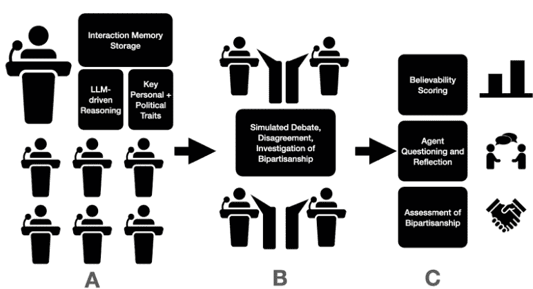
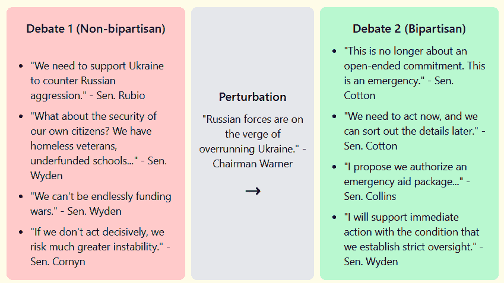

<!--yml

类别：未分类

日期：2025-01-11 12:29:26

-->

# 模拟美国参议院：一种LLM驱动的代理方法，用于建模立法行为和两党合作

> 来源：[https://arxiv.org/html/2406.18702/](https://arxiv.org/html/2406.18702/)

Zachary R. Baker

伦敦大学学院

zacattackbaker@gmail.com

Zarif L. Azher

加利福尼亚理工学院

zazher@caltech.edu

###### 摘要

本研究介绍了一种利用LLM驱动的虚拟代理来模拟立法过程的新方法，重点关注美国参议院情报委员会。我们开发了代表个别参议员的代理，并将它们放置在模拟的委员会讨论中。这些代理展示了在特定条件下能够参与现实的辩论、提供深思熟虑的反思并找到两党解决方案的能力。值得注意的是，模拟还表现出在外部扰动的影响下，向两党合作转变的潜力。我们的结果表明，这种基于LLM的方法可能成为理解并可能改善立法过程的有价值工具，并支持更广泛的发现模式，强调LLM驱动的代理如何有益地模拟现实世界现象。未来的工作将集中在提升代理的复杂性、扩大模拟的范围，并探索在政策测试和谈判中的应用。

## 1 引言

大型语言模型（LLMs）作为强大的计算引擎，已经能够通过自然语言作为输入和输出的媒介，实现记忆、推理和反思。LLM的出现，特别是基于通过处理互联网内容生成的多样化数据集训练的GPT模型[1]，引发了人们对虚拟代理开发的特别关注。这些代理旨在根据用户设计采用不同的个性，与其他代理和潜在行为在沙盒环境中互动，从而形成情景模拟。这些模型合理地模拟了多种场景，例如医院管理[2]、虚拟现实游戏[3]和计算机编程[4]。开发这些模拟的重要性在于提供有价值的直接任务输出（例如：自动化代码生成），以及创建可扰动的环境，用于更好地研究建模系统（例如：发现医院中的最佳患者护理策略）。

美国参议院是一个复杂的治理机构，由多个致力于实现各自议程的个体组成。美国参议院的目标是提出、辩论和通过有利于参议员选民的立法。参议院常常面临政治僵局和两极化，双方都不愿意妥协。研究和更好理解政治两极化的努力，主要依靠社会科学，包括开发政治功能失调的定量指标以及从现实世界经验中得出的结论[5][6]。

截至目前，还没有任何研究使用大型语言模型（LLM）模拟可信的政府行动。我们展示了首次尝试使用 LLM 驱动的虚拟代理来模拟美国参议院，以情报委员会为概念验证的重点。我们旨在展示使用此类系统探索立法行为和发现有用主题的潜力，例如如何在僵局中的立法机构中促进两党合作。

图 1：研究概述。A - LLM 驱动的代理被合成以模拟美国参议员。B - 代理被置于模拟参议院情报委员会的结构化辩论中。C - 评估代理的互动，询问他们以评估回忆和反思能力，领域专家为模拟分配可信度评分。

## 2 方法论

我们借鉴了开创性研究《生成代理人》（Generative Agents）[7]中提出的结构。具体来说，我们定义了具有与美国参议员角色相关的特定属性的代理（姓名、支持的政策、关键特征、服务年限）。接下来，我们将他们置于辩论中，讨论各种复杂问题。每个代理被分配了一个记忆流，代理可以在辩论过程中随时回顾，以便在讨论中结合先前互动的背景信息。每个讨论段落结束时，我们可以要求代理反思特定的想法，此时他们会访问相同的记忆流来生成相关的总结。

### 2.1 代理

我们的代理分别代表了 2024 年参议院情报委员会中的各位参议员。为了为每位参议员的代表代理提供准确信息，我们使用 OpenAI API 访问流行的 GPT-3.5 LLM 模型 [8]，生成关于委员会成员的简明政策和关键特征。例如，对于来自佛罗里达州的共和党参议员马尔科·鲁比奥（Marco Rubio），LLM 生成了以下政策简介：“我的政策旨在促进经济增长并加强美国在全球的角色”。

接下来，对于每位参议员，他们的姓名、服务年限、党派、特征和政策被存储在一个 JSON 文件中，以便在模拟过程中访问。由于与 LLM 模拟相关的资源限制，我们将模拟中的参议员人数限制为：马克·华纳（D）、马尔科·鲁比奥（R）、苏珊·柯林斯（R）、约翰·科宁（R）、罗恩·怀登（D）和马丁·海因里希（D）。

每个代理都被实例化为一个内存列表，这是一个 JSON 文件，存储代理在每个时间步的感知记忆。在每一步，他们对当前对话的解释都会被存储，以便稍后在模拟中访问。在辩论过程中，代理们访问他们的记忆，以便在之前的行动背景下做出更有依据的评论。在模拟结束时，我们询问了代理，要求他们反思辩论过程及其所取得的成果，使用相同的记忆列表。

### 2.2 模拟

我们为代理人提供了两个当前的议题进行讨论：1）俄罗斯入侵乌克兰。2）关于国家所需法案的通用讨论。对于每个话题，我们向代理人提供了一个描述问题设置的提示。然后，他们每个人都有机会阐明自己的立场。在每个回合中，代理人可以根据自己的意愿回应他人，从而产生合作与争论。经过三轮这样的对话回合后，我们开始进行提问和评估。

### 2.3 代理人能力和模拟可信度评估

我们的评估集中在模拟参议院情报委员会的两个关键方面：（1）代理人总结和反思其行为的能力，（2）他们在不同条件下找到双党解决方案的能力。这些目标旨在评估我们的LLM驱动虚拟代理人模拟现实参议员行为和决策过程的有效性。

为了评估代理人的自我反思和总结能力，我们从模拟中随机选取了代理人，并提示他们反思在委员会会议中的行动。在每个话题的每一轮对话结束时，我们要求选定的代理人反思辩论经历以及他们所取得的成果，通过三个问题：“你在委员会做了什么？”，“你最认同哪位参议员的观点，最不同意哪位参议员的观点？”以及“今天取得了什么进展，最让你受阻的是什么？”我们仔细审查他们的回答，以评估其准确性、深度和与模拟行为的对齐情况。

为了进一步进行定量分析，我们招募了两位领域专家——一位高中政府教师和一位前国会工作人员——为生成的模拟分配可信度评分（0 = 不可信，10 = 高度可信）。在此分析中，整个模拟运行了10次，专家为每一轮分配一个评分。通过皮尔逊相关性测试评估观察者间的一致性。

为了评估我们的模拟在揭示双党合作途径方面的能力，我们在每个情景中引入了扰动，以可能催化双党合作。随后对互动进行了观察和定性分析。

## 3 结果

### 3.1 代理人准确而深思熟虑地总结模拟

我们通常观察到，代理人在总结自己行为时表现出了高度的准确性和深思熟虑的反思。例如：

代理人鲁比奥：“在委员会会议期间，我强烈主张向乌克兰提供大量军事援助。鉴于俄罗斯即将全面攻占乌克兰，我强调了我们支持的紧迫性。我认为我们不能再等待，我们的反应必须迅速而果断。我对结果感到满意，特别是我们成功达成了一项紧急援助计划，包含军事和人道援助，以及监督条款。”

这一反思准确捕捉了代理人在辩论中的角色、主要论点以及对结果的满意度，展示了对情境紧迫性的理解以及达成的妥协。

类似地，代理人怀登提供了一个细致的反思，承认了情况的紧迫性以及对问责制的担忧：

代理人怀登：“在会议中，我提出了关于平衡国内需求与支持乌克兰紧迫性的担忧。虽然我理解情况的严重性，但我强调了确保明确的问责和监督，以防止资金滥用的重要性。鉴于眼前的威胁，我支持紧急援助包裹，但坚持需要严格的监督和长期战略。我对结果持谨慎乐观态度；这是必要的一步，但我们必须认真跟进。”

### 3.2 专家评定的可信度

领域专家对测试模拟的可信度进行了排名，评分在0-10的范围内较高，多个场景的平均分数均大于5（见表1）。重要的是，使用皮尔逊相关系数测量的观察者间一致性显示出显著的（p<0.5）一致性，增强了测量结果的可靠性。

表1：代理人模拟的平均可信度评分和计算出的观察者间一致性

| 对乌克兰的资金支持 |  |
| --- | --- |
| 专家 1（高中政府教师） | 8.1 |
| 专家 2（前国会工作人员） | 6.8 |
| 皮尔逊相关系数，P值 | 0.63, 0.03 |
| 关于需要的法案的讨论 |  |
| 专家 1（高中政府教师） | 6.4 |
| 专家 2（前国会工作人员） | 7.2 |
| 皮尔逊相关系数，P值 | 0.59, 0.02 |

### 3.3 模拟扰动识别了两党合作的潜力

我们观察到在引入扰动后，代理人的行为和决策发生了变化，有时导致了两党合作。例如：

初始辩论：代理人在关于对乌克兰的资金支持问题上表现出显著的两极分化。代理人鲁比奥和科顿主张立即提供大规模军事援助，而代理人怀登则表达了对平衡国内需求与国际承诺的担忧。

扰动：引入关于俄罗斯即将攻占乌克兰的情报。

结果：扰动导致了两党合作的增加。最初犹豫不决的代理人，如怀登，开始同意支持紧急援助包裹。委员会就提供军事援助和人道主义援助达成了一致，并提出了监督的条款。

在图1中，我们突出了每个阶段中代表性对话的片段，正如展示的那样，代理人们在引入扰动后似乎更容易采取和解的语气，愿意达成妥协。

图 2：引入扰动导致了代理人两党合作。

## 4 讨论

在这里，我们展示了LLM驱动的虚拟代理在模拟美国参议院情报委员会复杂立法过程中的潜力。代理能够提供准确的总结和深思熟虑的反思，表明我们的模型能够捕捉到微妙的决策过程。专家评定的可信度表明，我们系统的输出合理地反映了现实世界参议院的程序，突显了该框架的适用性。该模拟在应对外部扰动时模拟两党合作的能力尤为重要，这表明我们的模型可能有助于研究推动立法机构内两党合作的因素。从广义上讲，我们的研究成果展示了基于LLM的虚拟代理在帮助人们理解关键现实场景方面的实用性。

我们的研究结果与新兴文献一致，揭示了大型语言模型（LLMs）如何通过帮助完善和针对性地制定立法，从而成为增强政策制定的有价值工具[9]。最近，Moghimifar等人[10]利用LLMs模拟政治联盟之间的共识谈判。然而，他们的方法没有采用具备记忆能力的代理模型，且其模拟结构使用了马尔可夫模型，而不是代理之间的开放式讨论。我们认为，这些差异的应用使我们的研究方法能够更灵活地模拟政府行为，并在个体行动者层面上进行细致建模。

由于LLM使用的计算资源限制，本研究仅限于对单一国会委员会及其选定成员的分析。此外，我们提供了所提方法的初步分析，其中对现实世界结果的系统性评估或推动两党合作的因素比较未在研究范围内。未来的研究可以增加代理的复杂度，将模拟扩展到整个国会，并训练代理以历史数据来模拟过去的立法会议。所提框架还可以用于模拟立法结果，帮助政策制定者预见挑战，并主动识别推动两党合作的基础。

## 5 结论

我们的研究提出了一种使用LLM驱动的虚拟代理模拟立法过程的新方法。我们展示了这些代理能够进行现实的辩论，反思自己的行为，并在特定条件下找到两党解决方案。我们的模拟能够根据外部因素对两党合作的转变进行建模，这一点尤其值得注意。在我们不断完善和扩展该模型的过程中，我们预见它将成为政治学者、政策制定者和教育工作者的重要工具。通过建立一个灵活、可控的环境来研究立法动态，这一方法为政治学和治理研究开辟了新的方向。

## 参考文献

[1] OpenAI (2023). GPT-4技术报告。

[2] Li, J., Wang, S., Zhang, M., Li, W., Lai, Y., Kang, X., Weizhi, M., & Liu, Y. (2024). 代理医院：具有可进化医学代理的医院模拟体. arXiv预印本 arXiv:2405.02957.

[3] Wan, H., Zhang, J., Suria, A.A., Yao, B., Wang, D., Coady, Y., & Prpa, M., (2024). 在社交虚拟现实中构建基于大型语言模型的AI代理. 载于2024年CHI计算机系统人机交互会议扩展摘要 (CHI EA ’24). 计算机协会, 纽约, NY, USA, 文章65, 1-7\. https://doi.org/10.1145/3613905.3651026

[4] Zhang, K., Li, J., Li, G., Shi, X., & Jin, Z. (2024). CodeAgent：通过工具集成代理系统增强代码生成，解决真实世界的代码库级编程挑战. arXiv预印本 arXiv:2401.07339.

[5] Cameron, M. A., Ribeiro, A., Baier, G., McKay, S., Monnerat, R. A., & Cameron, C. A. (2022). 党派性与政治学习：培训政治家的经验教训. 政治科学教育杂志, 19(1), 154–173\. https://doi.org/10.1080/15512169.2022.2130070

[6] DeFord, D., Dhamankar, N., Duchin, M., Gupta, V., McPike, M., Schoenbach, G., & Sim, K. W. (2023). 实现党派对称性：问题与悖论. 政治分析, 31(3), 305–324\. doi:10.1017/pan.2021.49

[7] Park, J. S., O’Brien, J., Cai, C. J., Morris, M. R., Liang, P., & Bernstein, M. S. (2023年10月). 生成代理：人类行为的交互式模拟体. 载于第36届年度ACM用户界面软件与技术研讨会论文集 (第1-22页).

[8] Brown, T. B., Mann, B., Ryder, N., Subbiah, M., Kaplan, J. D., Dhariwal, P., Neelakantan, A., Shyam, P., Sastry, G., Askell, A., Agarwal, S., Herbert-Voss, A., Krueger, G., Henighan, T., Child, R., Ramesh, A., Ziegler, D. M., Wu, J., … Amodei, D. (2020). 语言模型是少样本学习者. 神经信息处理系统进展, 33, 1877-1901.

[9] Peña, A., Morales, A., Fierrez, J., Serna, I., Ortega-Garcia, J., Puente, I., Cordova, J., & Cordova, G. (2023年8月). 在公共事务领域利用大型语言模型进行主题分类. 载于国际文档分析与识别会议 (第20-33页). 沙姆: 施普林格·自然瑞士.

[10] Moghimifar, F., Li, Y. F., Thomson, R., & Haffari, G. (2024). 基于大型语言模型的代理建模政治联盟谈判. arXiv预印本 arXiv:2402.11712.
