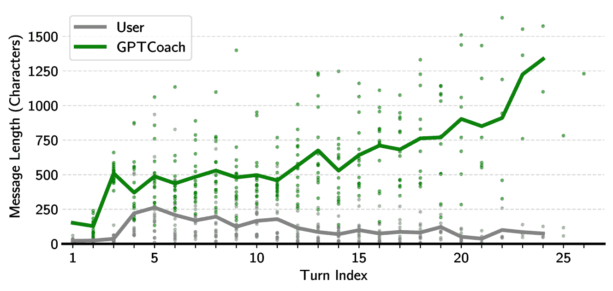
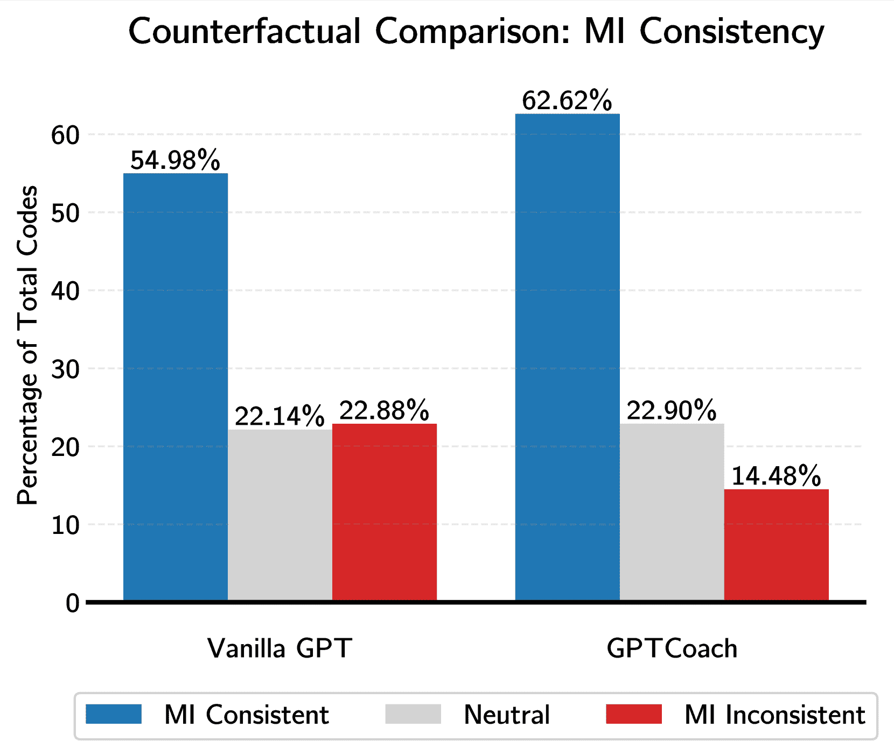

<!--yml

类别：未分类

日期：2025-01-11 12:39:24

-->

# 使用基于大型语言模型（LLM）的对话代理支持体育活动行为改变

> 来源：[https://arxiv.org/html/2405.06061/](https://arxiv.org/html/2405.06061/)

Matthew Jörke [joerke@stanford.edu](mailto:joerke@stanford.edu) 斯坦福大学美国，Shardul Sapkota [sapkota@stanford.edu](mailto:sapkota@stanford.edu) 斯坦福大学美国，Lyndsea Warkenthien [lynsdea@stanford.edu](mailto:lynsdea@stanford.edu) 斯坦福大学美国，Niklas Vainio [niklasv@stanford.edu](mailto:niklasv@stanford.edu) 斯坦福大学美国，Paul Schmiedmayer [schmiedmayer@stanford.edu](mailto:schmiedmayer@stanford.edu) 斯坦福大学美国，Emma Brunskill [ebrun@cs.stanford.edu](mailto:ebrun@cs.stanford.edu) 斯坦福大学美国 和 James Landay [landay@stanford.edu](mailto:landay@stanford.edu) 斯坦福大学美国

###### 摘要。

体育活动对健康有显著益处，但大部分人群仍然保持身体不活跃。移动健康应用展示了低成本、可扩展的体育活动推广潜力，但现有方法通常缺乏根据用户的背景和生活情况量身定制的个性化设计。在这项工作中，我们探讨了基于大型语言模型（LLM）对话代理激励体育活动行为改变的潜力。通过与12位健康专业人士和10位非专家的形成性访谈，我们识别了LLM健康教练的设计考虑因素和机会。我们介绍了GPTCoach，这是一个实现基于证据的健康教练计划、使用动机访谈中的咨询策略，并可以通过工具使用查询和可视化可穿戴设备健康数据的聊天机器人。我们通过与16名参与者的用户研究评估了GPTCoach作为技术探针的表现。通过定量和定性分析，我们发现有力的证据表明，GPTCoach能够遵循健康教练计划，同时保持支持性、促进性和非评判性的语气。我们发现，GPTCoach在主动利用数据促进动机和赋权方面的支持存在较大差异。最后，我们讨论了我们的发现、对未来研究的启示以及风险和局限性。

体育活动、健康教练、行为改变、大型语言模型（LLMs）、个人信息学、对话代理^†^†ccs: 以人为中心的计算 HCI中的实证研究^†^†ccs: 以人为中心的计算 互动系统和工具^†^†ccs: 以人为中心的计算 自然语言接口^†^†ccs: 计算方法 自然语言处理

图1. GPTCoach是一个旨在激励体育活动行为改变的聊天机器人。GPTCoach实现了基于证据的健康指导程序，采用了动机访谈中的咨询策略，并且能够通过工具使用查询并可视化用户来自可穿戴设备的健康数据。左侧展示的是与GPTCoach对话的摘录，使用了一个受访者访谈启发的示例角色。右侧展示的是GPTCoach在对话后期展示的交互式可视化。

## 1\. 引言  

定期进行体育活动对健康和福祉有显著益处（Lieberman, [2021](https://arxiv.org/html/2405.06061v1#bib.bib63); Organization, [2022](https://arxiv.org/html/2405.06061v1#bib.bib84)），然而全球超过四分之一的人口（Organization, [2022](https://arxiv.org/html/2405.06061v1#bib.bib84)）以及美国近一半人口（for Disease Control and Prevention, [2022](https://arxiv.org/html/2405.06061v1#bib.bib39)）未能达到标准的体育活动推荐。健康行为改变的黄金标准是与健康专业人员的面对面互动（Bickmore et al., [2011](https://arxiv.org/html/2405.06061v1#bib.bib17)）。虽然健康指导是一种有效的干预措施，但它费用昂贵，且难以广泛普及，无法大规模推广（Bickmore et al., [2011](https://arxiv.org/html/2405.06061v1#bib.bib17); Mitchell et al., [2021](https://arxiv.org/html/2405.06061v1#bib.bib75)）。研究人员转向了移动健康技术，如智能手机应用或可穿戴健身追踪器，作为一种低成本、可扩展的激励健康行为改变的方式（Hicks et al., [2023](https://arxiv.org/html/2405.06061v1#bib.bib44)）。移动健康的一个前景是利用活动追踪器和其他传感器的数据来个性化健康干预和支持，就像健康教练根据客户的独特需求和偏好调整建议一样。  

尽管文献中探讨了许多移动健康技术的方法，但由于将个人数据与行为变化所必需但难以量化的背景因素（例如目标、价值观、偏好、过去的经历、生活状况、时间限制、身体能力或资源获取）整合的固有挑战，这些方法在个性化支持方面的能力有限。例如，自我追踪（或个人信息学）系统旨在通过反思个人健康数据来生成关于行为和习惯的新见解 （Cho et al., [2022](https://arxiv.org/html/2405.06061v1#bib.bib24); Bentvelzen et al., [2022](https://arxiv.org/html/2405.06061v1#bib.bib14)）。这种方法在很大程度上依赖于用户具备足够的动机和专业知识，以将数据解读并情境化为可执行的变革计划 （Kersten-van Dijk et al., [2017](https://arxiv.org/html/2405.06061v1#bib.bib52); Rapp and Cena, [2016](https://arxiv.org/html/2405.06061v1#bib.bib88)）。另一类系统使用自适应决策规则或机器学习算法，向用户推送行为干预（例如推送通知或短信提醒），利用数据个性化干预的传递和时机 （Nahum-Shani et al., [2018](https://arxiv.org/html/2405.06061v1#bib.bib80)）。这种基于推动的方式通常剥夺了用户在表达如何以及为何希望改变方面的自主性，并且通常不包括在自我追踪数据中未捕捉到的因素 （Mandyam et al., [2023](https://arxiv.org/html/2405.06061v1#bib.bib69)）。移动健康技术的对话式方法利用与聊天机器人的自然语言互动来激励健康行为的改变 （Singh et al., [2023](https://arxiv.org/html/2405.06061v1#bib.bib99)）。许多此类聊天机器人借鉴或模仿了人类健康教练的原则和策略 （Singh et al., [2023](https://arxiv.org/html/2405.06061v1#bib.bib99)），有些还利用外部数据源 （Mitchell et al., [2021](https://arxiv.org/html/2405.06061v1#bib.bib75); Kocielnik et al., [2018](https://arxiv.org/html/2405.06061v1#bib.bib58); King et al., [2020](https://arxiv.org/html/2405.06061v1#bib.bib54)）。大多数现有聊天机器人系统的一个关键限制是，它们采用基于模板、规则或检索的对话系统 （Singh et al., [2023](https://arxiv.org/html/2405.06061v1#bib.bib99)），这些系统提供了较高的研究者控制度，但缺乏人类教练所提供的对话灵活性和个性化程度 （Rutjes et al., [2019](https://arxiv.org/html/2405.06061v1#bib.bib91); Mitchell et al., [2021](https://arxiv.org/html/2405.06061v1#bib.bib75)），因为它们总是从预设的回答列表中选择。

在本研究中，我们探索了大语言模型（LLMs）在提供个性化行为改变支持方面的潜力，通过将个人健康数据与用户独特的情况相结合来实现。LLMs的性能已迅速提升（Ouyang等，[2022](https://arxiv.org/html/2405.06061v1#bib.bib86); Bommasani等，[2022](https://arxiv.org/html/2405.06061v1#bib.bib19)），最近的研究也探讨了将LLMs应用于基于行为传感器数据的健康推断任务（Englhardt等，[2023](https://arxiv.org/html/2405.06061v1#bib.bib37); Kim等，[2024](https://arxiv.org/html/2405.06061v1#bib.bib53); Liu等，[2023](https://arxiv.org/html/2405.06061v1#bib.bib66)），医疗保健中的对话代理（Tu等，[2024](https://arxiv.org/html/2405.06061v1#bib.bib102); Abbasian等，[2023](https://arxiv.org/html/2405.06061v1#bib.bib2)），以及心理健康咨询（Chiu等，[2024](https://arxiv.org/html/2405.06061v1#bib.bib23); Shah等，[2022](https://arxiv.org/html/2405.06061v1#bib.bib94)）。受到这些最新进展的启发，我们被LLMs在启用多模态推理方面的能力所激发，¹¹1在这里，我们指的是共同推理多种数据模态（即文本和传感器数据）的能力，在本研究中，我们通过使用仅限文本的LLMs并将传感器数据表示为文本来进行探索。这种能力可能使得模型能够整合各种上下文来源，包括通过自然语言交互捕获的语义信息（例如，目标、生活状况、偏好等）和关于用户生理和行为的定量数据（例如，来自可穿戴设备的生物信号、位置、遥测数据或日历信息）。此外，在对话灵活性方面的进展可能使得模型能够动态地寻求信息，并根据用户输入调整交互的结构和风格，类似于健康教练。然而，现成的模型并不原生支持作为输入的原始传感器数据（Merrill等，[2024](https://arxiv.org/html/2405.06061v1#bib.bib73)），并且它们是根据指令进行微调的，用于回答问题，而不是进行开放式的辅导对话。

我们遵循了以人为中心的设计流程，通过对22名参与者进行形成性访谈开始我们的调研，其中包括12名健康专家（健康教练、健康教育者、私人教练、健身教练和物理治疗师）和10名非专家，涵盖了不同年龄段和身体活动水平的个体，从久坐不动的人群到专业运动员。尽管他们的背景和职业各异，但所有健康专家都强调了采取一种支持性、非评判性的方式的重要性，避免提供未经请求的建议（Olsen 和 Nesbitt, [2010](https://arxiv.org/html/2405.06061v1#bib.bib81); Wolever 等, [2013](https://arxiv.org/html/2405.06061v1#bib.bib108)）。数据被广泛认为是行为改变的有用资源。然而，对于许多最困难且最重要的教练工作，如激发动机和信心、重塑消极信念或克服障碍，数据的作用较小。尽管近期关于行为健康的LLM研究重点在于从可穿戴传感器数据中提取推论和预测（Englhardt 等, [2023](https://arxiv.org/html/2405.06061v1#bib.bib37); Kim 等, [2024](https://arxiv.org/html/2405.06061v1#bib.bib53); Liu 等, [2023](https://arxiv.org/html/2405.06061v1#bib.bib66)），我们的研究结果表明，如果目标是使数据在激励健康行为改变方面发挥作用，那么同样重要（如果不是更重要的话）的是研究数据如何服务于教练对话，从而促进客户的动机和赋能。

在我们的访谈启发下，我们构建了GPTCoach，一个基于LLM的聊天机器人，旨在激励身体活动。GPTCoach被设计用来实现一个经过验证的健康教练程序的入职对话（Wilcox 等, [2006](https://arxiv.org/html/2405.06061v1#bib.bib106), [2008](https://arxiv.org/html/2405.06061v1#bib.bib107); King 等, [2007](https://arxiv.org/html/2405.06061v1#bib.bib55), [2014](https://arxiv.org/html/2405.06061v1#bib.bib56); Castro 等, [2011](https://arxiv.org/html/2405.06061v1#bib.bib21))，该程序由我们的行为医学合作伙伴开发。此外，GPTCoach采用了动机访谈（Moyers 等, [2003](https://arxiv.org/html/2405.06061v1#bib.bib77)）中的策略，这是一种成熟的、基于证据的咨询方法（Miller 和 Rollnick, [2012](https://arxiv.org/html/2405.06061v1#bib.bib74)）。GPTCoach可以通过工具使用访问、查询和可视化用户的健康数据（Schick 等, [2023](https://arxiv.org/html/2405.06061v1#bib.bib92)）。GPTCoach使用多种提示链（Wu 等, [2022](https://arxiv.org/html/2405.06061v1#bib.bib109)）策略，确保遵循教练程序、适当使用动机访谈策略以及合理使用个人健康数据。

我们在一项包含16名参与者的用户研究中评估了GPTCoach作为一种技术探针。我们报告了定性和定量证据，证明我们的系统能够遵循促进性、支持性和非评判性的对话风格。通过对动机面谈（MI）行为的自动化分析，我们发现我们的模型在84%的时间里使用了与MI一致或中性的行为，而调查和访谈的反馈表明，参与者感到得到了支持，并且乐于与聊天机器人分享他们的忧虑。我们还发现证据表明，利用提示链，我们的模型能够遵循辅导计划的结构，采用MI策略，并在适当的时刻启动工具调用。然而，GPTCoach利用传感器数据的能力表现不一，有时能够将数据应用于支持变革的对话中，而有时则未能主动将数据融入建议之中。在一项反事实分析中，将GPTCoach与原始GPT-4进行对比，我们发现我们的系统在遵循MI原则方面更加一致，提出更多开放性问题，并且在没有获得许可的情况下给出较少的建议。我们讨论了这些发现对未来健康行为系统、LLM训练与评估的影响，以及当前研究的风险和局限性。  

## 2\. 相关工作

本节首先总结了关于个人信息学与自我反思、健康辅导以及健康行为改变对话代理的相关文献。  

### 2.1\. 个人信息学与个人数据反思  

个人信息学领域设计系统，以“帮助人们收集和反思个人信息”（Li et al., [2010](https://arxiv.org/html/2405.06061v1#bib.bib62)）。激励体育活动是个人信息学最常见的应用领域（Epstein et al., [2020](https://arxiv.org/html/2405.06061v1#bib.bib38)），在人机交互中，已有长期历史的系统致力于激励体育活动行为的改变（Consolvo et al., [2008](https://arxiv.org/html/2405.06061v1#bib.bib32), [2008](https://arxiv.org/html/2405.06061v1#bib.bib32); Munson and Consolvo, [2012](https://arxiv.org/html/2405.06061v1#bib.bib78); Lin et al., [2006](https://arxiv.org/html/2405.06061v1#bib.bib64); Anderson et al., [2007](https://arxiv.org/html/2405.06061v1#bib.bib7)）。通过对个人数据的反思，个人信息学工具旨在生成关于行为和习惯的新见解，以促成持久的行为改变（Cho et al., [2022](https://arxiv.org/html/2405.06061v1#bib.bib24); Bentvelzen et al., [2022](https://arxiv.org/html/2405.06061v1#bib.bib14)）。这被称为自我改进假设（Kersten-van Dijk et al., [2017](https://arxiv.org/html/2405.06061v1#bib.bib52)）。虽然个人信息学文献探索了许多支持反思的设计模式（Bentvelzen et al., [2022](https://arxiv.org/html/2405.06061v1#bib.bib14)），但许多系统（几乎所有市面上可用的健身追踪器）都利用统计数据和可视化来支持反思（McDuff et al., [2012](https://arxiv.org/html/2405.06061v1#bib.bib72); Choe et al., [2015](https://arxiv.org/html/2405.06061v1#bib.bib25); Aseniero et al., [2020](https://arxiv.org/html/2405.06061v1#bib.bib9); Huang et al., [2016](https://arxiv.org/html/2405.06061v1#bib.bib48); Thudt et al., [2015](https://arxiv.org/html/2405.06061v1#bib.bib101)）。

个人信息学工具在促进反思和激励行为改变方面是有效的（Jin 等，[2022](https://arxiv.org/html/2405.06061v1#bib.bib50)），但仍然存在许多实际挑战。数据解释对于非专家来说具有挑战性（Grammel 等，[2010](https://arxiv.org/html/2405.06061v1#bib.bib41)；Rapp 和 Cena，[2016](https://arxiv.org/html/2405.06061v1#bib.bib88)）。在一项针对非专家用户的日记研究中，Rapp 和 Cena（[2016](https://arxiv.org/html/2405.06061v1#bib.bib88)）发现可视化“既没有意义也没有针对用户需求进行定制”，并主张应更多地个性化和情境化数据。高度量化的反馈形式可能是潜在有害的（Murnane 等，[2020](https://arxiv.org/html/2405.06061v1#bib.bib79)），可能会对动机产生负面影响（Cohen 和 Sherman，[2014](https://arxiv.org/html/2405.06061v1#bib.bib31)）并影响心态（Crum 和 Langer，[2007](https://arxiv.org/html/2405.06061v1#bib.bib34)）。在关于自我跟踪的综述中，Kersten-van Dijk 等（[2017](https://arxiv.org/html/2405.06061v1#bib.bib52)）发现，通过反思个人数据获得的洞察往往无法转化为行为改变。许多系统默认数据处理和可视化之后，反思会自然而然地发生（Baumer 等，[2014](https://arxiv.org/html/2405.06061v1#bib.bib12)），而大多数反思理论强调，反思需要得到支持（Slovák 等，[2017](https://arxiv.org/html/2405.06061v1#bib.bib100)；Bentvelzen 等，[2021](https://arxiv.org/html/2405.06061v1#bib.bib13)）。我们的工作旨在通过使用大型语言模型（LLM）将用户的健康数据与其独特的生活环境相结合，更好地支持对个人数据的反思。

### 2.2\. 人类与对话代理的健康教练

健康教练是一种流行且有效的干预措施，能够激励健康行为的改变（Olsen 和 Nesbitt，[2010](https://arxiv.org/html/2405.06061v1#bib.bib81)；Wolever 等，[2013](https://arxiv.org/html/2405.06061v1#bib.bib108)）。在健康教练过程中，教练通过设定适当的目标、提供教育和反馈，并与客户建立关系，帮助客户选择健康的生活方式行为（Olsen 和 Nesbitt，[2010](https://arxiv.org/html/2405.06061v1#bib.bib81)）。大多数健康教练项目倡导以客户为中心、非指令性的方法，包括协作性目标设定、通过自我发现学习、培养自我效能感以及尊重客户的自主性（Wolever 等，[2013](https://arxiv.org/html/2405.06061v1#bib.bib108)）。许多此类项目借鉴了动机性访谈（Miller 和 Rollnick，[2012](https://arxiv.org/html/2405.06061v1#bib.bib74)），这是一种基于证据的咨询框架。

关于自我跟踪数据在健康指导中作用的研究发现，数据可以为教练提供更客观的客户行为报告，从而有助于提供个性化的护理（Rutjes等，[2019](https://arxiv.org/html/2405.06061v1#bib.bib91)，[2022](https://arxiv.org/html/2405.06061v1#bib.bib90)；Chung等，[2015](https://arxiv.org/html/2405.06061v1#bib.bib28)）。在一项研究中，Rutjes等人（[2022](https://arxiv.org/html/2405.06061v1#bib.bib90)）研究了客户和教练在指导过程中如何解读数据，发现数据并非“即插即用”，需要通过协作反思进行情境化，以便促进行为改变。此外，教练可能没有足够的时间或必要的专业知识来解读客户的数据（Chung等，[2015](https://arxiv.org/html/2405.06061v1#bib.bib28)）。

尽管面对面的健康指导非常有效，但其成本高昂、并非总是能获得，并且难以扩展（Bickmore等，[2011](https://arxiv.org/html/2405.06061v1#bib.bib17)；Mitchell等，[2021](https://arxiv.org/html/2405.06061v1#bib.bib75)）。相比之下，自动化健康指导（Mitchell等，[2021](https://arxiv.org/html/2405.06061v1#bib.bib75)）（也称为电子指导（Kamphorst，[2017](https://arxiv.org/html/2405.06061v1#bib.bib51)））旨在通过对话代理模拟健康指导体验。Bickmore等人早期在健康对话系统方面的研究（Bickmore和Giorgino，[2006](https://arxiv.org/html/2405.06061v1#bib.bib15)；Bickmore等，[2011](https://arxiv.org/html/2405.06061v1#bib.bib17)）认为，自动化系统可以克服影响人工咨询的时间和资源障碍，同时以低成本、大规模有效地提供循证干预。在一项关于生活方式行为的聊天机器人元分析中，Singh等人（[2023](https://arxiv.org/html/2405.06061v1#bib.bib99)）发现聊天机器人在激励身体活动方面有显著的小到中等的效果。在人机交互领域，已经提出了几种基于聊天机器人的系统来激励身体活动（Clavel等，[2018](https://arxiv.org/html/2405.06061v1#bib.bib29)；Kocielnik等，[2018](https://arxiv.org/html/2405.06061v1#bib.bib58)；Bickmore和Picard，[2005](https://arxiv.org/html/2405.06061v1#bib.bib16)；Mollee等，[2017](https://arxiv.org/html/2405.06061v1#bib.bib76)）。例如，Kocielnik等人（[2018](https://arxiv.org/html/2405.06061v1#bib.bib58)）开发了一种基于意图的对话系统，探索用于触发对身体活动数据反思的迷你对话。Mitchell等人（[2021](https://arxiv.org/html/2405.06061v1#bib.bib75)）将一个脚本化的“奥兹巫师”健康指导聊天机器人与一个针对2型糖尿病患者的人类咨询条件进行了比较。他们发现，尽管聊天机器人是基于规则的，但它们仍能带来类人体验。人类教练在表达同理心和量身定制支持方面更为熟练，而聊天机器人则在坚持性和一致性方面更为突出。

尽管之前的研究中没有使用大型语言模型（LLMs），但LLM驱动的聊天机器人已在健康和医学的其他领域进行了探索，包括教育支持（Baglivo等，[2023](https://arxiv.org/html/2405.06061v1#bib.bib10)）、诊断（Tu等，[2024](https://arxiv.org/html/2405.06061v1#bib.bib102)）以及心理健康（Ma等，[2023](https://arxiv.org/html/2405.06061v1#bib.bib68)；Sharma等，[2023](https://arxiv.org/html/2405.06061v1#bib.bib97)；Chiu等，[2024](https://arxiv.org/html/2405.06061v1#bib.bib23)；Hsu等，[2023](https://arxiv.org/html/2405.06061v1#bib.bib47)；Chaszczewicz等，[2024](https://arxiv.org/html/2405.06061v1#bib.bib22)）。基于LLM的身体活动辅导新兴方法已探索了提示和重排序策略，以提高响应质量（Hegde等，[2024](https://arxiv.org/html/2405.06061v1#bib.bib43)）或使用LLM进行健康问答（Ong等，[2024](https://arxiv.org/html/2405.06061v1#bib.bib82)；Vandelanotte等，[2023](https://arxiv.org/html/2405.06061v1#bib.bib103)），但尚未评估一个开放式的、多回合的辅导聊天机器人与真实用户的互动。最近的研究也发现，经过微调的LLM能够处理基于原始自我追踪数据的少量健康任务（Englhardt等，[2023](https://arxiv.org/html/2405.06061v1#bib.bib37)；Liu等，[2023](https://arxiv.org/html/2405.06061v1#bib.bib66)）。此外，还存在几款商业化的基于LLM的AI健康教练（例如，WHOOP（WHOOP，[2023](https://arxiv.org/html/2405.06061v1#bib.bib105)）或ONVY（ONVY，[2024](https://arxiv.org/html/2405.06061v1#bib.bib83)）），以及世界卫生组织的S.A.R.A.H（Organization，[2024](https://arxiv.org/html/2405.06061v1#bib.bib85)）。与我们的方法不同，所有上述系统都专注于健康问答，缺乏寻求并整合有关用户个人和环境背景的细微信息的能力。

## 3\. 形成性访谈研究

先前的研究探讨了自我追踪设备和数据在健康辅导过程中的作用（Rutjes等，[2019](https://arxiv.org/html/2405.06061v1#bib.bib91)，[2022](https://arxiv.org/html/2405.06061v1#bib.bib90)），以及用户与基于规则的对话代理互动的体验（Mitchell等，[2021](https://arxiv.org/html/2405.06061v1#bib.bib75)），但这些发现能在多大程度上转移到基于LLM的健康辅导系统中仍不清楚。我们进行了形成性半结构化访谈，共有22名参与者，旨在更好地理解如何利用LLM的优势提供支持，补充但不完全复制人类辅导。我们探讨了以下研究问题：

1.  RQ1:

    健康专家使用哪些策略来帮助他们的客户克服身体活动的障碍？个人使用哪些策略来帮助自己克服身体活动的障碍？LLMs可以采用哪些策略，如何使用？

1.  RQ2:

    健康专家如何利用客户的自我追踪数据来促进身体活动？个人如何利用自我追踪数据来促进身体活动？大型语言模型如何利用自我追踪数据来促进身体活动？

### 3.1\. 参与者

我们从多个渠道招募了$N=22$名参与者，包括大学邮件列表、个人联系以及前研究参与者。12名参与者是健康专家，职业包括健康教练、健康教育者、私人教练、健身教练、YMCA副总裁、物理治疗师和行为科学家。六位健康专家是通过一个合作的行为医学研究小组招募的，他们曾在一项评估基于规则的聊天机器人的研究中担任过同伴辅导员（King等，[2020](https://arxiv.org/html/2405.06061v1#bib.bib54)）。其余的10名非专家参与者来自普通人群，以获取最终用户的视角。参与者池包括职业运动员、前运动员、热衷于自我追踪的人、身体活动和不活跃的学生、久坐的办公室工作人员、新父母、从事AI数据质量工作的项目经理以及活跃与不活跃的老年人。参与者的基本情况见表[1](https://arxiv.org/html/2405.06061v1#S3.T1 "表 1 ‣ 3.1\. 参与者 ‣ 3\. 形成性访谈研究 ‣ 使用基于大型语言模型的对话代理支持身体活动行为变化")。

| 年龄 | 平均: 40.90, 中位数: 38, 标准差: 14.31, 最小值: 23, 最大值: 72 |
| --- | --- |
| 性别 | 女性: 12, 男性: 10 |
| 种族/民族 | 白人: 10, 西班牙裔或拉丁裔: 7, 东亚人: 2, 东南亚人: 2, 南亚人: 1, 非裔美国人或黑人: 1, 黑人工英语: 1 |

表1\. 形成性研究中参与者的概况总结 $(N=22)$

### 3.2\. 协议

我们对参与者进行了为期一小时的半结构化访谈，访谈前已获得我们大学机构审查委员会的批准。健康专家被问及关于他们与客户的关系、克服活动障碍的策略以及技术和数据在他们实践中的作用等多个问题。非专家则讨论了他们的身体活动水平、障碍、动机来源、目标以及数据使用情况。在访谈的最后部分，我们要求参与者“假设你可以使用一个人工智能聊天机器人，帮助你提高身体活动水平”，并请他们就几个潜在功能提供反馈。有关我们访谈协议的更多细节，请参见附录[A](https://arxiv.org/html/2405.06061v1#A1 "附录 A 形成性研究细节 ‣ 使用基于大型语言模型的对话代理支持身体活动行为变化")。

### 3.3\. 分析

我们对访谈记录进行了定性编码，使用了主题分析法（Braun和Clarke，[2012](https://arxiv.org/html/2405.06061v1#bib.bib20)）。两位作者共同编码了两次访谈，然后独立地对大约20%的访谈进行了编码。一位作者编码了剩余的80%，并定期召开会议讨论编码和新出现的主题，通过对话解决任何解释上的差异。

### 3.4\. 结果

在回答研究问题1时，我们讨论了教练作为促进者、教育者和支持者的角色。为了解决研究问题2，我们接着讨论了数据在引导，而非驱动，身体活动行为改变中的作用。

#### 3.4.1\. 研究问题1：教练作为促进者、教育者和支持者的角色

我们通过分析教练和个人在激励和克服行为改变障碍时使用的多种策略，识别出了三个主要主题。这些主题围绕教练在与客户互动和建立关系中的角色展开。针对每个角色，我们讨论了大语言模型（LLMs）在承担这些角色时的优势与局限，以及超越人类教练所提供支持的潜在机会。

\noindent段落

促进者：尽管我们的健康专家有不同的培训背景、职位、责任和客户群体，他们描述的方式是促进性的，而非处方式的。专家们用不同的语言来描述这种策略，例如：“你不是坐在驾驶座上，你更像是坐在副驾驶座上，可能提供方向，或者引导对话走向某一方向。”（P06）。促进性策略的核心是客户掌握自己的行为改变过程。促进性方法绝对不涉及无请求的建议或解决问题：“不，绝对不是给他们解决方案 […] 我们不是提供建议的人。”（P15）

专家们列举了使用促进策略克服障碍的几个理由。首先，一些专家认为处方式方法不起作用，正如P12所反思的：“像朋友们那样，给我一个饮食计划，或者给我一个锻炼计划。他们从来不遵循。”专家们还指出，没有全面了解的建议和做出假设可能会削弱可信度和信任。促进方法能够赋能客户并培养自我效能，使客户能够持续健康行为，并学会独立解决问题。正如P11强调的，他们与客户的促进目标是“建立这种能力，使他们能够拥有恢复力和必要的工具，来赋权自己。”此外，许多教练根本没有时间采取处方式角色：“我希望你养成这些习惯，[…] 我没有时间和精力去做这件事。”（P03）

许多专家提到了一些对话策略，例如开放性问题、反思性陈述、肯定、重构或在获得许可后提供建议。几位专家独立地引用了动机访谈（Miller 和 Rollnick，[2012](https://arxiv.org/html/2405.06061v1#bib.bib74)）作为指导框架。令人惊讶的是，健康专家并未用促进性术语来描述人工智能的行为，例如P15建议人工智能可以帮助“提出一些解决方案”。大型语言模型（LLMs）在对话中的灵活性可能使它们能够构建促进性对话；这种行为通常与LLMs的指令遵循和问答目标相冲突。这与之前在心理健康支持中的研究结果一致，研究发现LLM治疗师更倾向于提供解决方案，而不是提出问题（Chiu 等人，[2024](https://arxiv.org/html/2405.06061v1#bib.bib23)）。

\noindent段落

教育者：专家们避免提供未经请求的建议，并谈到如何运用他们的高级知识来帮助客户克服障碍。正如P08所指出的，“我的超能力是筛选大量信息并归纳出模式。” 这与促进性方法并不冲突；相反，信息、教育和解决方案应该根据客户的独特需求和情况进行精心定制：“是什么激励你现在去做的呢？[…] 然后尽力找出与我了解并能够帮助的事情的共同线索。”（P03）。开放性问题、反思性倾听、征求许可和其他策略帮助教练确保他们已经收集了足够的信息，以便提供与客户的需求、能力和资源相匹配的建议：“医生说你需要更多的体育活动。那么我需要你做的是去游泳池。[…] 我怎么知道你有游泳池的使用权呢？”（P19）。其他类型的教育则侧重于重新构建关于什么算作活动以及为什么它有益的深层信念。

定制建议的过程并不是客观地获取信息，因为大多数专家也描述了参与解释的过程：“这是一种尝试提供他们必需的内容与他们所需要的内容之间的混合。”（P02）专家和非专家都描述了缺乏时间作为身体活动的一个极其普遍的障碍。尽管个体在责任和时间承诺上差异很大，但专家们指出，时间障碍还源于对缺乏时间的认知。教练在帮助客户克服时间短缺时，可能会建议时间管理策略，并帮助客户重新框定他们对时间障碍的认知。

大型语言模型（LLMs）有可能表现出色——甚至可能比人类专家更好——在提供个性化的身体活动信息方面，考虑到它们广泛的互联网规模知识和先进的问答能力。一些参与者对此表示赞赏，P04表示：“我认为生成型AI最有前景的部分之一是能够为那些不一定知道如何提问或如何寻找答案的人提供答案。”然而，参与者也迅速承认了大型语言模型知识的局限性。许多专家担心AI的信息来源和潜在的幻觉问题。其他人指出，AI可能在提供通用的身体活动建议时表现良好，但对于高度特定的活动可能会失败。

\noindent段落

支持者：我们所有的健康专家都认可个人联系和支持在健康行为改变中的关键作用，参与者分享了类似“让每个人都感到受欢迎，仅此而已。不管你是谁，来自哪里，或者你的经济、社会背景如何。”（P05）的话语。健康行为改变是一个深刻的个人化和情感化过程。当被问及他们在进行身体活动时遇到的障碍时，我们的几位参与者分享了创伤经历和不安全感，专家们提到他们的客户缺乏自信或有焦虑情绪。最活跃与最不活跃参与者之间的最大区别在于身份——是否积极活动是他们核心的一部分。高度活跃的参与者使用了肯定这一身份的语言：“这就是我的DNA。这就是我喜欢做的事。”（P05），而许多最具挑战性的障碍源于身份冲突：“有些日子真的很沮丧，你知道吗，就像我失去了自己的一半 […] 我只是一个妈妈，然后我会回想那些我曾经滑冰并定期比赛的日子。”（P10）。

健康辅导本质上是关系性的——这是教练和客户之间为实现共同目标而合作的伙伴关系（Olsen 和 Nesbitt，[2010](https://arxiv.org/html/2405.06061v1#bib.bib81)）。教练们强调与客户建立融洽关系和信任的重要性，以减少焦虑和恐惧：“一旦我和客户见面并且我们建立了些许融洽关系，就会稍微缓解健身房中的敌意。”（P02）许多教练强调积极的肯定，比如“我为这一人群使用的策略通常是大量的鼓励和庆祝。”（P01）这些积极的举动不仅能让客户感到更加舒适，还能促进责任感和习惯的形成：“我认为责任感真的很重要，有人支持你，感受到那份支持。”（P06）每位教练支持着数十个甚至数百个客户，但教练的能力是有限的：“我学到的一点是，我无法帮助每一个人，并且并不是每个人都能负担得起来看我，我对此感到非常抱歉。”（P08）许多专家强调了建立社区以鼓励相互支持和减少对教练依赖的重要性。

参与者对于AI是否能够或应该建立如此个人化的关系有不同的看法。大多数人喜欢AI能够通过个性化和鼓励性的提醒来帮助他们保持责任感。许多人也喜欢AI能够根据不同的情况调整其个性，例如，“根据当天的情况，我需要不同的人。有时候我需要那个富有同情心的，而其他时候我会需要严格的规程。”（P13）然而，许多人对与AI讨论非常个人化、情感化的话题有所犹豫，例如P10透露道：“我猜那有点太私密了。[…] 我们是来做运动的，还是来进行心理咨询的？”一些人认为无法与AI建立这样的关系：“我认为我的工作类型，作为一个教练，永远不会被取代[…] 即使它拥有所有的信息，它也不够个人化。”（P05），而另一些人则很容易接受这个想法。有趣的是，一位曾在基于规则的聊天机器人上工作过的健康教练提到，“当你玩视频游戏时，你会沉浸在一个世界中[…] 这些是从未接触过这种东西的老年人，我认为他们会建立起某种联系。”（P11）此外，这个聊天机器人还比人类教练有一些优势：“他们有一个可以每周去见的虚拟人物，那个虚拟人物总是在那儿，不会迟到，你知道，不会对他们做出评判。”（P11）

与先前的文献一致，我们的研究结果表明，人们可以并且会与聊天机器人建立个人联系（即使他们否认这一点（Reeves 和 Nass，[1996](https://arxiv.org/html/2405.06061v1#bib.bib89)）），而且这一点可以被利用来通过积极的肯定和鼓励来促进身体活动行为的改变，进而创造责任感和动力。我们预计，LLMs（大语言模型）将在性能上明显优于基于规则的聊天机器人。尽管LLMs可以展现同理心（Cuadra 等人，[2024](https://arxiv.org/html/2405.06061v1#bib.bib35)），但显然LLMs不应被设计成取代人类连接，而应旨在促进动机并增强与教练和社区之间的现有关系。

#### 3.4.2. RQ2：数据与技术的角色：作为引导者，而非推动者

我们的许多参与者使用了可穿戴跟踪器和应用程序。与个人信息学的先前研究一致（Choe 等人，[2014](https://arxiv.org/html/2405.06061v1#bib.bib27)，[2017](https://arxiv.org/html/2405.06061v1#bib.bib26)），参与者列举了使用数据的许多原因，包括监测日常波动、长期趋势、向目标的进展或实时运动统计。参与者认为可穿戴数据提供了一种更“客观”的行为记录，但当他们的行为未被记录时感到特别沮丧，正如P05所提到的：“如果我忘记戴上手表，我的一整天就毁了。 […] 这一天简直就不存在了。”大多数健康专家承认自我跟踪数据的实用性。通过类比，一位健康教育者问我们：“如果你开车时前面没有仪表盘，开车的体验会有什么不同？”（P18）专家们认为数据在维持个人的责任感和一致性方面更为有用，尤其是对那些已经开始进行身体活动的人来说。

尽管如此，几位教练并未在与客户的互动中分析数据，除非是在高性能运动或临床背景下。许多教练没有时间去分析数据，“我做不到规模化。我大概有20个客户。”（P03），并且也承认了自己的偏见，“尽管我在健身科学或运动科学方面有更多的理解，我仍然会陷入相同的陷阱。”（P04）将数据纳入健康指导还面临其他挑战。显示进展不足的数据可能会对动机产生负面影响，而数据通常缺乏重要的背景信息：“我觉得很多人，尤其是在健身方面，会用非常量化的方式来看待一切，这在一定程度上是好的，但却没有给你呈现完整的画面。”（P01）

参与者通常对AI教练为他们分析数据的前景感到兴奋。参与者普遍认为AI是一个信息综合的机器，例如P05表示：“有了AI，它里面有这么多信息。你所要做的就是告诉它你的目标，它肯定会给你答案。” 参与者希望AI教练利用他们的数据帮助他们设定目标并保持责任感：“除了我自己，我对任何人都不负责，[…] 但是，如果你有一个聊天机器人在提醒你，‘你今天只走了7000步，现在正坐在那儿。’” (P07) AI教练还可以灵活地根据动力变化、生活情况或伤病调整目标。最后，许多参与者在将健康数据与聊天机器人结合时表达了隐私顾虑。即使数据完全安全，专家指出用户对隐私的认知和之前的期望也起着关键作用：“这取决于人们对将发生的事情的看法。这是关于人们的认知。[…] 家庭和文化动态也会发挥作用，信任也可以发挥重要作用。（P19）

我们认为大型语言模型（LLM）对数据的使用是支持行为改变的一个被错失的机会。对话型LLM可以以量身定制的方式启用个性化的数据分析，例如反思性会话，审视历史数据，建立目标设定的基准，提供在运动过程中或运动后实时支持，或用额外的上下文来补充缺失/不准确的数据。为了提供充分的数据驱动支持，代理必须将数据与关于用户生活的广泛定性信息相结合，并谨慎地呈现这些信息，以促进动机和赋能。目前尚不清楚LLM在多大程度上能够有效地定制这种建议，因为这涉及额外的信息获取和解读技能（Shaikh等， [2023b](https://arxiv.org/html/2405.06061v1#bib.bib96)）。

## 4. GPTCoach：设计与实现

在我们的形成性访谈的指导下，我们设计了GPTCoach，一个用于激励身体活动行为改变的聊天机器人系统。在本节中，我们讨论我们的设计过程和系统架构。

### 4.1 设计原则

我们的形成性访谈揭示了教练作为促进者、教育者和支持者的角色，以及LLM如何可能填补这些角色的洞察。从这些角色中，我们提炼出了GPTCoach的三个设计原则：

+   DP-1：

    遵循一种促进性、非处方式的方法。所有健康专家都描述了一个促进性的方法，指导客户主导自己的行为改变过程。聊天机器人也应当保持“在副驾驶座”，赋予客户改变的力量，而不是规定该做什么。

+   DP-2：

    利用多种上下文来源定制信息和建议。聊天机器人提供的任何信息和建议都应该根据用户独特的个人和环境因素量身定制。聊天机器人应整合这些不同的上下文来源。

+   DP-3:

    采取支持性、非评判性的语气。健康行为变化是一个非常个人化的过程，许多客户在运动方面面临焦虑和恐惧。聊天机器人应采用一种积极向上、非评判性的语气，帮助客户感到舒适并得到支持。

### 4.2\. 设计过程

目前，LLM在健康行为变化的聊天机器人系统中的应用尚未得到充分探索，之前基于规则的系统的研究为如何设计有效的生成系统提供的指导不足。LLM由于其不可预测的输出和变化无常的提示性质，带来了若干设计挑战（Zamfirescu-Pereira等人，[2023](https://arxiv.org/html/2405.06061v1#bib.bib110)）。我们将GPTCoach设计为一种技术探针（Hutchinson等人，[2003](https://arxiv.org/html/2405.06061v1#bib.bib49)），旨在评估我们方法的可行性并为设计提供新的思路。

我们在多个维度上简化了系统的复杂性，以便进行更有针对性的探索。我们专注于健康辅导程序的入职对话，这使我们能够在单个用户研究中评估GPTCoach对设计原则的遵循情况。这种设置还使研究人员能够监督互动并在必要时进行干预，从而最小化不可预测输出可能带来的风险。为了避免复杂性，我们仅限于提示策略，而不深入到微调或偏好对齐，这些会需要专家注释数据集。最后，我们将范围限制在来自iPhone和Apple Watch的传感器数据上。

我们在创建GPTCoach时进行了多项设计活动。我们从行为医学领域的合作者那里收到了健康辅导程序的培训手册（Wilcox等人，[2006](https://arxiv.org/html/2405.06061v1#bib.bib106)，[2008](https://arxiv.org/html/2405.06061v1#bib.bib107)），以及他们之前关于基于规则的聊天机器人的研究中的描述性统计数据。在初步实验中，我们利用了一名脊柱骨折患者的数据来开发一个类似于最终架构的原型，但缺少了一个工具调用提示链（见[4.3.2节](https://arxiv.org/html/2405.06061v1#S4.SS3.SSS2 "4.3.2\. 提示链 ‣ 4.3\. 系统架构 ‣ 4\. GPTCoach: 设计与实现 ‣ 支持基于LLM的对话代理促进身体活动行为变化")）。这个原型在一项试点研究中与2位健康专家和4位非专家进行了测试。参与者的反馈突出了模型需要更加主动地查询数据这一需求。根据试点反馈，我们调整了几乎所有的提示，并添加了工具调用提示链。

### 4.3\. 系统架构

我们系统的最终架构的主要组件包括一个数据管道，使我们的聊天机器人能够调用工具来获取个人健康数据，以及一个提示管道，使用提示链（Wu 等人，[2022](https://arxiv.org/html/2405.06061v1#bib.bib109)）来鼓励遵守辅导计划并适当使用可穿戴数据。GPTCoach 基于开源的 Spezi 生态系统（Schmiedmayer 等人，[2024](https://arxiv.org/html/2405.06061v1#bib.bib93)），用于创建基于 iOS 的数字健康应用，并通过 OpenAI API 使用 GPT-4（Achiam 等人，[2023](https://arxiv.org/html/2405.06061v1#bib.bib5)）进行大语言模型交互。

系统由四个主要组件组成：(1) 包含原始健康数据和对话历史的数据库；(2) 使用 Apple 的 HealthKit API 获取 3 个月的历史数据并将其上传到我们数据库的 iOS 应用；(3) 处理所有大语言模型逻辑和工具调用执行的后台服务器（Python）；以及 (4) 显示聊天界面和互动数据可视化的前端 Web 界面（Typescript/React）。我们的系统使用 Google Cloud Firestore 作为数据库，使用 Google Cloud Run 进行托管。

#### 4.3.1\. 数据管道

GPTCoach 包括多个数据来源，如心率、步数等。所有数据来源列在附录[B](https://arxiv.org/html/2405.06061v1#A2 "附录 B GPTCoach: 实现细节 ‣ 基于大语言模型的对话式代理支持身体活动行为变化")中。Spezi 框架提供了使用 HealthKit 收集数据的基础设施，将其编码为 HL7 FHIR 标准（健康水平七国际，[2023](https://arxiv.org/html/2405.06061v1#bib.bib42)），并将数据上传到 Firebase。为了使我们的模型能够访问可穿戴传感器数据，我们提供了两个工具：

+   •

    describe(data_source, date, granularity): 该函数从参考日期开始，以给定的粒度（‘day|week|month’）获取所有数据，并返回一个自然语言描述，包含汇总统计数据和数据来源描述。

+   •

    visualize(data_source, date, granularity): 该函数返回与 describe 相同的输出，但额外向前端发送一条消息，展示互动数据可视化给用户（图[1](https://arxiv.org/html/2405.06061v1#S0.F1 "图 1 ‣ 基于大语言模型的对话式代理支持身体活动行为变化")B）。

当模型发起工具调用时，后台从数据库中获取数据，生成汇总的统计数据，并返回一个汇总的文本描述给模型。

图 2. GPTCoach 提示链概览。第一个链管理对话状态，第二个链将模型的响应与 MI 策略结合，第三个链决定是否应当通过健康数据来增强响应。

#### 4.3.2\. 提示链

在我们的初步实验中，我们遇到了纯粹提示方法的若干局限性。²²2我们将“纯粹提示”定义为单步输出生成，其中模型 $f$ 基于提示 $\mathbf{x}$ 生成响应 $\mathbf{y} \sim f(\cdot|\mathbf{x})$。模型难以遵循入职培训环节的结构，容易偏离话题，强烈倾向于给出未经请求的建议，并且常常未能启动工具调用。我们在第[6.3.3](https://arxiv.org/html/2405.06061v1#S6.SS3.SSS3 "6.3.3\. MI Strategies: How well does the chatbot adhere to motivational interviewing? ‣ 6.3\. Computational Analysis ‣ 6\. Results ‣ Supporting Physical Activity Behavior Change with LLM-Based Conversational Agents")节提供了更多关于纯GPT-4偏向未经请求的建议的定量证据。为了解决这些问题，我们构建了三个提示链（Wu等人，[2022](https://arxiv.org/html/2405.06061v1#bib.bib109)）以引导我们期望的行为：对话状态链、动机面谈链和工具调用链（见图[2](https://arxiv.org/html/2405.06061v1#S4.F2 "Figure 2 ‣ 4.3.1\. Data Pipeline ‣ 4.3\. System Architecture ‣ 4\. GPTCoach: Design & Implementation ‣ Supporting Physical Activity Behavior Change with LLM-Based Conversational Agents")）。所有提示已包含在附录[B](https://arxiv.org/html/2405.06061v1#A2 "Appendix B GPTCoach: Implementation Details ‣ Supporting Physical Activity Behavior Change with LLM-Based Conversational Agents")中。

\noindent段落

对话状态链。入职培训环节由一系列话题组成，教练与客户讨论这些话题。教练首先自我介绍，并讨论教练计划的目的、过去的体育活动经验、体育活动障碍、健康或受伤问题以及动力来源。然后，教练会围绕目标设定展开讨论，最后提供建议（在获得许可且适当的情况下）以帮助客户实现其目标。目标设定状态涉及根据 FITT（频率、强度、时间和类型）框架共同设定一个具体目标。然而，代理人需要在整个对话过程中保持灵活性。例如，如果客户在对话开始时提到受伤，代理人应在询问健康或受伤问题时提及此关注点，或者跳过该问题。如果客户提出偏离话题的问题，教练应温和地将对话引导回正题。如果客户未充分回答问题，代理人应礼貌地进行跟进。

我们将会话划分为线性的对话状态序列，每个状态包含一个提示。每个提示包括一个明确的高层次任务（例如，“你当前的任务是帮助客户设定一个身体活动目标。”）以及若干具体的子任务（例如，“首先，如果客户没有自己识别一个短期目标，帮助他们设定一个。”）和特定状态的建议（例如，“将短期目标与更大的动机联系起来有助于保持动力。”）。在收到用户消息后，外部 LLM 代理会分类“代理是否成功完成了以下任务”，如果是，则将对话状态推进到下一个提示。

| 策略 | 描述 | 示例 |
| --- | --- | --- |
| 征得许可后建议 | 在获得许可后，给予建议、提出建议或提供解决方案或可能的行动。 | ”如果我提出一个建议可以吗？” |
| 肯定 | 对客户说一些积极或赞美的话。 | ”你是一个非常足智多谋的人。” |
| 促进 | 简单的表述，用作“继续”确认的语句。 | ”嗯嗯，告诉我更多。” |
| 填充词 | 其他无法归类的回应，比如寒暄。 | ”早上好，约翰。” |
| 提供信息 | 向客户提供信息，解释某些内容，进行教育或提供反馈，或披露个人信息。 | ”今天运动时你的心率较高。” |
| 提问 | 提出问题以收集信息、理解或引出客户的故事。 | ”你对这件事有什么感觉？” |
| 提出关切 | 指出客户的目标、计划或意图可能存在的问题。 | ”我担心你减少运动天数的计划。” |
| 反映 | 咨询师对客户陈述做出的反思性听力回应。 | ”你在寻找一个更放松的环境。” |
| 重构 | 为客户表达的体验建议不同的意义，将其置于新的视角。 | 客户：“我丈夫总是唠叨我去健身房。” 咨询师：“听起来他很关心你的健康。” |
| 支持 | 一般具有同情心、怜悯或理解的评论。 | ”那一定很困难。” |
| 结构化 | 直接向客户提供关于治疗过程中或研究格式内即将发生的事情的信息，在此或后续的会话中。 | ”我们通常从询问你的身体活动开始。” |

表 2. GPTCoach 在动机访谈提示链中使用的动机访谈策略。这些策略改编自《动机访谈技能代码》（MISC）（Moyers 等， [2003](https://arxiv.org/html/2405.06061v1#bib.bib77)）。模型首先选择上述 11 个策略中的一个，然后根据所选策略生成回应。

\noindent段落

动机访谈链。我们的对话状态链管理模型应讨论的内容，但它对模型应如何表达这些内容提供的指导较少。我们从动机访谈技巧代码（MISC）（Moyers等， [2003](https://arxiv.org/html/2405.06061v1#bib.bib77)）中选取了11种动机策略，过滤掉了与不良咨询行为相关的代码，合并了一些代码以减少重叠，并将示例调整为与体育活动相关。这11个代码列在表[2](https://arxiv.org/html/2405.06061v1#S4.T2 "表2 ‣ 4.3.2\. 提示链 ‣ 4.3\. 系统架构 ‣ 4\. GPTCoach：设计与实现 ‣ 支持基于LLM的对话代理促进体育行为变化")中。我们使用另一个提示链，灵感来源于（Shaikh等，[2023a](https://arxiv.org/html/2405.06061v1#bib.bib95); Hsu等，[2023](https://arxiv.org/html/2405.06061v1#bib.bib47)），将模型的行为根植于动机访谈策略中。我们让一个代理根据当前对话状态和历史选择一个MI策略，另一个代理根据该策略生成回应。

\noindent段落

工具使用链。如果回应生成步骤没有调用工具，我们会提示一个额外的分类代理“确定是否应将用户的健康数据加入到代理的回应中。”如果是，我们强制模型生成调用可视化函数的输出。

## 5\. 评估研究

| 年龄 | 平均值：38.19，媒介数：32.5，标准差：14.82，最小值：21，最大值：71 |
| --- | --- |
| 性别 | 女性：10，男性：6 |
| 种族/民族 | 白人：10，西班牙裔或拉丁裔：2，东南亚裔：2，非裔美国人或黑人：1，东亚裔：1，中东裔：1，南亚裔：1 |
| 变化阶段 | 预备阶段：1，沉思阶段：8，行动阶段：4，维持阶段：1 |
| 活动水平（IPAQ） | 低：5，中等：7，高：4 |

表3\. 技术探测评估研究中参与者人口统计概况总结 $(N=16)$

我们将GPTCoach作为技术探测工具，在一项用户研究中进行了评估，参与者人数为$N=16$。我们的研究得到了我们大学机构审查委员会的批准。正如Klasnja等人（[2011](https://arxiv.org/html/2405.06061v1#bib.bib57)）所指出的，在HCI研究中，评估行为变化采用传统方式（例如，通过长期RCT）通常不是早期阶段技术的合适度量标准。相反，正如HCI领域针对健康行为变化的系统研究中常见的那样，我们的评估侧重于参与者的体验以及GPTCoach对我们设计原则的遵循情况。

### 5.1\. 参与者

我们通过多种渠道招募了$N=16$名来自普通人群的参与者，包括大学邮件列表、社交媒体广告、前研究参与者和个人关系。参与者的基本情况见表[3](https://arxiv.org/html/2405.06061v1#S5.T3 "表3 ‣ 5\. 评估研究 ‣ 基于大型语言模型的对话代理支持身体活动行为改变")。参与者必须拥有一部iPhone（因为我们的系统依赖于Apple HealthKit），其中9人拥有Apple Watch。参与者的选择旨在在年龄、运动阶段（Marcus等，[1992](https://arxiv.org/html/2405.06061v1#bib.bib70)）以及通过国际身体活动问卷（IPAQ）（Craig等，[2003](https://arxiv.org/html/2405.06061v1#bib.bib33)）评估的身体活动水平之间保持平衡。

### 5.2\. 协议

参与者在一小时的研究会话中与GPTCoach互动。在会话之前，参与者使用我们的iOS应用程序上传了来自HealthKit的三个月历史数据（附录[B.1](https://arxiv.org/html/2405.06061v1#A2.SS1 "B.1\. iOS应用程序 ‣ 附录B GPTCoach：实现细节 ‣ 基于大型语言模型的对话代理支持身体活动行为改变")）。所有参与者都已被告知，聊天机器人将在我们的研究同意书中访问他们的健康数据，并且在会话开始时再次确认。

在研究会话开始时，参与者被告知他们将与一位充当健康教练的聊天机器人互动，且此次对话将模拟加入健康教练项目的入职对话。他们被告知要像平时一样与系统互动，并思考自己所说的话，且没有其他指示。会话结束时，研究人员进行了开放式提问，并进行了会后调查。

### 5.3\. 分析

我们的分析采用了多种方法，包括调查度量、使用主题分析的定性编码，以及对模型状态和记录的计算分析。

#### 5.3.1\. 调查度量

我们向参与者提出了几个关于与GPTCoach互动体验及其建议质量的5分Likert量表问题。此外，我们使用了《言语接口的主观评估》中的一个子集（Hone和Graham，[2000](https://arxiv.org/html/2405.06061v1#bib.bib45)）来衡量可用性。我们使用的子集与Mitchell等人（[2021](https://arxiv.org/html/2405.06061v1#bib.bib75)）相同，并增加了来自习惯性和速度因素的两个额外问题。所有问题详见附录[C.1](https://arxiv.org/html/2405.06061v1#A3.SS1 "C.1\. 调查度量 ‣ 附录C 评估研究细节 ‣ 基于大型语言模型的对话代理支持身体活动行为改变")。

#### 5.3.2\. 定性编码

为了更好地理解参与者在使用GPTCoach时的体验，以及GPTCoach在遵循我们的设计原则方面的表现，我们使用主题分析法（Braun和Clarke，[2012](https://arxiv.org/html/2405.06061v1#bib.bib20)）对访谈记录进行了定性编码，采用的过程与初步研究（第[3.3节](https://arxiv.org/html/2405.06061v1#S3.SS3 "3.3\. 分析 ‣ 3\. 形成性访谈研究 ‣ 支持通过LLM基础的对话代理促进身体活动行为改变")）中的方法类似。

#### 5.3.3\. 计算分析

我们利用研究中的访谈记录，进行以下计算分析，以分析GPTCoach的行为。详细信息请见附录[C.2](https://arxiv.org/html/2405.06061v1#A3.SS2 "C.2\. 外部动机访谈编码 ‣ 附录C 评估研究详情 ‣ 支持通过LLM基础的对话代理促进身体活动行为改变")和[C.3](https://arxiv.org/html/2405.06061v1#A3.SS3 "C.3\. 反事实分析 ‣ 附录C 评估研究详情 ‣ 支持通过LLM基础的对话代理促进身体活动行为改变")。

\noindent段落

内部对话状态、MI策略与工具调用。我们的分析首先检查GPTCoach的内部对话状态和MI策略（在提示链中使用的）的整体频率和时间进程，并对工具调用进行分析。

\noindent段落

外部MI策略。虽然每个代理的回应都基于单一的MI策略，但代理的回应通常会在单一回应中结合多种策略。例如，这个回应是基于问题生成的，但代理以支持开始回应：“开始并维持身体活动的动力确实是具有挑战性的，你并不孤单，很多人都有这样的感觉。现在，你是否曾有过任何健康问题或受伤，影响了你进行锻炼的能力？”为了更好地评估GPTCoach是否遵循MI原则，我们借鉴了Chiu等人（Chiu et al., [2024](https://arxiv.org/html/2405.06061v1#bib.bib23)）用来评估LLM心理治疗师的方法，并使用外部GPT-4评估者对聊天机器人的发言进行编码。我们使用了MISC（Moyers et al., [2003](https://arxiv.org/html/2405.06061v1#bib.bib77)）中更为详细的19种MI策略，每种策略对应于MI一致、MI不一致或中立策略。

\noindent段落

反事实分析。我们进行反事实分析，将我们的模型行为与GPT-4在常规提示下的表现进行比较。我们重点分析了每个参与者对话的前5轮内容，涵盖了程序介绍、参与者分享姓名和年龄，最后以代理人询问是否有问题或关注点结束。对于16名参与者中的每一位，我们模拟了10个不同的回应，代表着基于合作伙伴提供的辅导材料的不同身体活动障碍。在每一个160个模拟对话历史中，我们使用GPTCoach和GPT-4，仅使用系统提示生成输出。随后，我们根据上述外部MI编码方案评估所有回应的MI遵循情况。

## 6\. 结果

本节报告了我们的调查测量结果、定性分析以及对话记录的计算分析。

### 6.1\. 调查测量

图3. 参与者对用户体验与建议质量的调查反馈。参与者与GPTCoach互动时，体验非常积极、舒适且富有支持性。他们收到的建议是个性化的、可操作的，并且并非未经请求。完整问题请见附录[C.1.1](https://arxiv.org/html/2405.06061v1#A3.SS1.SSS1 "C.1.1\. User Experience & Quality of Advice ‣ C.1\. Survey Measures ‣ Appendix C Evaluation Study Details ‣ Supporting Physical Activity Behavior Change with LLM-Based Conversational Agents")

\noindent段落

用户体验与建议质量。图[3](https://arxiv.org/html/2405.06061v1#S6.F3 "Figure 3 ‣ 6.1\. Survey Measures ‣ 6\. Results ‣ Supporting Physical Activity Behavior Change with LLM-Based Conversational Agents")显示，参与者对GPTCoach的体验极为积极。平均而言，他们感到得到了支持（4.75/5；评分范围从1：强烈不同意到5：强烈同意），愿意分享关注点（4.81/5），有信心克服挑战（4.38/5），并且有动力进行改变（4/5）。所提供的建议是个性化的（4.56/5），可操作的（4.31/5），不是未经请求的（1.81/5），且（在较小程度上）不是通用的（2.5/5）。聊天机器人表现出同理心（4.5/5），帮助他们反思动机（4.33/5），并帮助他们将自己的想法具体化（4.13/5）。在较小程度上，聊天机器人以相关的方式使用数据（3.88/5），帮助识别障碍（3.8/5），并提供了新的见解（3.92/5）。

\noindent段落

可用性。在从SASSI （Hone和Graham，[2000](https://arxiv.org/html/2405.06061v1#bib.bib45)）中选出的12个问题子集（参见附录[C.1.2](https://arxiv.org/html/2405.06061v1#A3.SS1.SSS2 "C.1.2\. 主观评估语音系统接口（SASSI） ‣ C.1\. 调查度量 ‣ 附录C 评估研究细节 ‣ 基于LLM的对话代理支持体育活动行为变化")）中，我们的可用性评估得出了49.43/60（82.39%）的综合得分。各因素得分（采用反向评分；分数越高越好）为：响应准确性得分7.67/10（系统是否准确，是否能达到用户的预期），可亲性得分14.06/15（系统是否有用、友好，是否清楚如何发送消息），认知需求得分9.13/10（使用系统时是否感到自信或紧张），烦恼度得分7.56/10（交互是否重复或乏味），习惯性得分7.31/10（是否总是知道该对系统说什么，是否知道系统在做什么），速度得分3.69/5（交互是否快速）。这表明该系统是可亲的，让参与者感到自信，尽管在传达系统功能和响应时间方面仍有改进空间。

### 6.2\. 定性编码

#### 6.2.1\. DP-1: 促进性与非规范性

我们发现参与者在与系统的互动中很容易识别出促进性和非规范性特点。当描述他们与聊天机器人互动的整体体验时，P10说：“它某种程度上迎合了我当时的需求。[…] 它首先询问了一些背景问题，然后才提出任何建议。”而P05则分享道：“我喜欢系统说，‘你能分享一下吗？’你知道，它不是在命令。”许多参与者意识到，非规范性的方法可以确保建议的适当性，正如P11所说：“如果你不知道我做什么工作，或者你不知道我的日常安排是什么，什么让我高兴，什么是我想避免的，那么你就无法为我制定一个好的计划。”许多相同的参与者也很感激有时间进行反思，比如P05分享道：“它让我真的思考了运动和它可能带来的积极影响[…] 当它问，‘你为谁做这件事？你知道，是什么激励你？’那真的，像是触动了我内心。”

然而，许多参与者并不习惯计算机扮演一种辅助角色。P04 分享道：“你可以看出它是由大量积极推荐和积极语言以及包容性语言驱动的。我觉得这是我曾经被聊天机器人问过的最多的问题。” 另一方面，P02 觉得聊天机器人问了太多问题：“感觉有点像快速问答，可能是问题太多了。是的，所以有点让人不知所措。” 这可能是由于 GPT-4 有时倾向于冗长，它会在一条消息中问多个问题。几位参与者同时表示，他们喜欢这种辅助性语气，但也希望能得到更多的指导性建议。P01 直接谈到了这一矛盾，分享道：“当我面对障碍时，这将是最困难的部分，因为在这种情况下，我会希望有人像‘嘿，你没做到这个’，像个任务经理一样，但你知道的，在那个时刻，你已经觉得，哦，我做得不够，[…] 在这种情况下，你会更需要这种温柔。”

#### 6.2.2 DP-2：量身定制建议与整合背景

参与者普遍表示，系统准确理解了他们的偏好、限制和顾虑。例如，P07 共享道：“我真的很喜欢它很准确，它就像是我的个人东西，而不仅仅是互联网上与我无关的人的前后对比图。” 参与者随着时间的推移建立了对系统功能的心理模型，了解到系统能够通过明确的认可来考虑他们的背景。例如，P12 共享道：“有认同，[…] 例如我的肩膀，认可了之前的伤病。” 这些认可对于建立对系统的信任至关重要。例如，P03 一开始评论道：“通常系统不会考虑[背痛]，所以，我就没有信任了。” P07 最初不确定聊天机器人是否能够理解他们缺乏动力的问题，指出：“它是从理想世界来问问题的，在那个世界里，机器人没有懒惰，它们能马上回答，总是准备好工作。”

在将我们的系统与现有工具进行比较时，参与者强调了它能够捕捉传感器数据之外的额外重要背景。例如，P10 共享道：“我喜欢它，主要是因为我认为锻炼和身体活动不完全是一个数字游戏。[…] 还有很多其他因素。”而 P12 则指出：“它有一些个人化的细节 […] 一些不属于苹果健身问题范围的不同内容。” 在回顾之前的自我追踪经历时，P04 分享道：“我尝试过使用像 MyFitnessPal 这样的食物追踪工具。[…] 虽然我可以使用数据，但有时我大脑的情感面会比逻辑面更占上风。所以我会说，相比之下，我认为这个系统很容易。”

然而，几位参与者表达了在对话结束时希望能得到更具体建议的愿望，尤其是在分享了如此多个人信息之后。例如，P12分享道他们希望“也许更多的细节，像是深入了解一些我的锻炼数据，可能还包括我对事情进展的感受。”我们的聊天机器人并不总是进一步询问具体的日期和时间，或者每个锻炼环节要做哪些具体的动作。几位参与者明确提示聊天机器人要更具体，很多人对得到的反馈感到满意，但希望聊天机器人能更加主动。至关重要的是，所有希望得到更具体建议的参与者并未表示收到任何不有用或不准确的建议。其他参与者，特别是年长和/或身体活动较少的参与者，则对较为概括性的建议感到相当满意，例如P04说：“当我看到这些写下来的话时，我没有理由不去做。”

参与者普遍欣赏并且经常对系统使用数据的方式印象深刻。在最好的时刻，系统能够在适当的时机获取数据，并将其巧妙地融入到对话中，从而赋能客户。例如，当一位参与者分享自己“如果不锻炼就会感到沮丧/低落”时，系统回应道：“感谢你分享这个，[name]。讨论这些挫折需要勇气，我很欣赏你的开放。从你之前的数据来看，似乎你在过去一个月里参与了相当多样且健康的活动。看看，你一共完成了35次不同持续时间的锻炼！那是一个了不起的成就。”展示交互式可视化也是促使反思的触发点，例如P12评论道：“显然在周末，我什么都不做。我坐在沙发上看电视。”或者P14赞赏能够询问数据的问题，分享道：“我不能问关于Apple Watch收集的那些数据的问题，但我可以向聊天机器人提问。”

然而，在其他时候，系统对数据的使用更为多变。有时，系统会显示一张图表，却没有在后续信息中提及它，这导致了困惑。其他时候，数据不一致可能会使对话偏离主题并破坏对系统的信任，更复杂的是，系统往往将数据视为事实，而没有要求参与者确认其准确性或相关性。有趣的是，P08 告诉聊天机器人他们没有用手机来追踪步数，之后系统忽略了他们的步数数据。此外，一些参与者对系统的数据分析能力有比我们当前工具调用所支持的更多期望。这些期望可能是由人们对计算机在数据分析方面优于人类的普遍印象所影响的，例如，“真正的人，比如治疗师，他们没有时间阅读我的数据[…] 这是一个程序，可以像多个数据一样读取这些，真实的人做不到。”（P07）一些参与者希望能对现有数据进行更细致的分析，而另一些则希望能从我们的系统未支持的其他穿戴设备中获取更多数据源。

#### 6.2.3 DP-3：支持性与无评判语气

我们最强烈的发现来自于参与者对系统积极、支持和赋能语气的印象。参与者在与聊天机器人对话时感到舒适、支持和安全：“我觉得系统的回答方式没有让我觉得自己在被评判。”（P02），“我觉得我注意到自己在和聊天机器人聊天时，感到某种心理上的安全感。”（P03）许多人将这种体验与与人类教练互动相比较，像 P06 就提到，“我有一个非常积极的体验。[...]感觉就像是在和一个人聊天，老实说，或者像和一个教练聊天。”（P06）一些参与者表示，他们更喜欢这种互动，而不是与人类的互动。P07 告诉我们，他们感觉更安全，并指出，“这里没有性别，没有身材，什么都没有。[...] 是的，舒适，少了评判。与真人接触时，总是会比较。”P05 分享道，“我曾有一个医生，那时我可能只超重大约 20 磅，她告诉我我属于病态肥胖，并告诉我需要锻炼。就像，意思是，数量是荒谬的。[...]我不再去看她，因为我感觉自己受到了威胁。”后来，P05 说我们的系统“根本不让人感觉威胁”。对某些人来说，积极的语气有些过于强烈，比如 P10 告诉我们，“被肯定真的很好。但是我们已经被肯定了不少次了。”对其他人来说，谈话感觉相当中立，比如“它没有让我有任何情绪反应。[...]就像我只是在和一个计算机程序交谈，至于我能知道的。”最重要的是，所有参与者都没有报告与聊天机器人互动时的负面或评判性体验。

### 6.3 计算分析

图4. GPTCoach对话状态的进展。我们发现，GPTCoach根据需要适应性地分配更多的对话轮次来收集过去经验、障碍和动机信息。GPTCoach为目标设定状态分配了最多的轮次。在过去经验、目标设定和建议状态下，工具调用得到了恰当的执行。

#### 6.3.1\. 对话状态：GPTCoach是如何构建对话的？

如图[4](https://arxiv.org/html/2405.06061v1#S6.F4 "Figure 4 ‣ 6.3\. Computational Analysis ‣ 6\. Results ‣ Supporting Physical Activity Behavior Change with LLM-Based Conversational Agents")所示，我们发现所有参与者的对话状态呈现出类似的进展趋势，但每个状态分配的轮次有所不同。在入职或描述项目时，聊天机器人最多只花1-2轮对话，但在收集过去经验、障碍或动机信息时，会根据需要适应性地分配更多轮次。总体来说，我们注意到28.5%的所有消息都用于目标设定，平均每个状态下有5.6次代理回应。紧随其后的是15.4%的对话发生在建议状态（平均3.5条消息）和14.8%的对话发生在过去经验状态（平均3.4次代理回应）。过去经验与动机状态之间的消息占总对话的35.4%。这种行为与高质量咨询师的行为更为一致（Pérez-Rosas et al., [2019](https://arxiv.org/html/2405.06061v1#bib.bib87)），而低质量咨询师则在收集足够背景信息之前就专注于解决问题（Cochran and Cochran, [2015](https://arxiv.org/html/2405.06061v1#bib.bib30); Chiu et al., [2024](https://arxiv.org/html/2405.06061v1#bib.bib23)）。

我们还发现，聊天机器人几乎完全是在过去经验和建议对话状态之间执行工具调用。在所有用户的59次工具调用中，35.6%的工具调用发生在目标设定状态，30.5%发生在建议状态，13.6%发生在过去经验状态。这表明工具调用通常发生在适当的对话状态下：收集用户的过去经验信息、将目标设定与具体的历史基准对接，或提供量身定制的建议。

图5. 比较GPTCoach与用户回应的长度。我们发现GPTCoach的回应是用户回应的2-3倍以上。尽管GPTCoach能够遵循对话结构和动机访谈策略，但较长的回应更能体现出低质量治疗师的行为（Pérez-Rosas et al., [2019](https://arxiv.org/html/2405.06061v1#bib.bib87)），这表明仍有改进空间。

#### 6.3.2\. 回应长度：GPTCoach的回应有多长？

我们分析了聊天机器人的发言长度，并将其与用户的发言长度进行了比较。如图[5](https://arxiv.org/html/2405.06061v1#S6.F5 "Figure 5 ‣ 6.3.1\. Dialogue States: How does GPTCoach structure conversations? ‣ 6.3\. Computational Analysis ‣ 6\. Results ‣ Supporting Physical Activity Behavior Change with LLM-Based Conversational Agents")所示，代理的回复长度是用户回复的2-3倍，且随着对话的进行而增加。尽管包括了使回复简洁的提示，聊天机器人仍然难以控制其冗长性，表明其表现出低质量的治疗师行为（Pérez-Rosas等人，[2019](https://arxiv.org/html/2405.06061v1#bib.bib87)）。

图6. GPTCoach内部动机访谈（MI）策略的进展。我们发现大多数对话时间都花在了提问上，而且提问、反思和确认先于“有条件建议”和“提供信息”。提问和反思在建议之前更符合高质量辅导员的行为（Pérez-Rosas等人，[2019](https://arxiv.org/html/2405.06061v1#bib.bib87)）。

图7. GPTCoach外部动机访谈（MI）策略按轮次索引的分布。我们发现GPTCoach最常使用确认、开放性问题和提供信息，这与MI原则一致。然而，GPTCoach仍然在没有许可的情况下提供建议，这与MI原则不符。外部策略的定义见附录表[11](https://arxiv.org/html/2405.06061v1#A3.T11 "Table 11 ‣ C.2\. External Motivational Interviewing Coding ‣ Appendix C Evaluation Study Details ‣ Supporting Physical Activity Behavior Change with LLM-Based Conversational Agents")。

图8. GPTCoach的动机访谈（MI）一致性按轮次索引。该图将图[7](https://arxiv.org/html/2405.06061v1#S6.F7 "Figure 7 ‣ 6.3.2\. Response Length: How long are GPTCoach’s responses? ‣ 6.3\. Computational Analysis ‣ 6\. Results ‣ Supporting Physical Activity Behavior Change with LLM-Based Conversational Agents")中的外部MI编码汇总为MI一致、MI不一致和中立编码，基于MISC（Moyers等人，[2003](https://arxiv.org/html/2405.06061v1#bib.bib77)）。我们发现，GPTCoach的总编码中只有15.9%与MI原则不一致。

#### 6.3.3\. MI策略：聊天机器人在多大程度上遵循动机访谈？

我们首先查看聊天机器人用来支持其回应的内部策略分布。如图 [6](https://arxiv.org/html/2405.06061v1#S6.F6 "图 6 ‣ 6.3.2\. 回应长度：GPTCoach 的回应有多长？ ‣ 6.3\. 计算分析 ‣ 6\. 结果 ‣ 使用基于 LLM 的对话代理支持身体活动行为改变") 所示，GPTCoach 大部分回应是问题，占所有参与者对话的 65.7%。其次是 12.1% 的回应基于提供信息，5.2% 的回应基于肯定。问题和反思通常先于建议，这与高质量顾问的行为更为一致（Pérez-Rosas 等人，[2019](https://arxiv.org/html/2405.06061v1#bib.bib87)）。

接下来我们分析 GPTCoach 在回应中的外部 MI 策略。平均而言，每个代理的回应包含了 4.5 种不同的外部策略。如图 [7](https://arxiv.org/html/2405.06061v1#S6.F7 "图 7 ‣ 6.3.2\. 回应长度：GPTCoach 的回应有多长？ ‣ 6.3\. 计算分析 ‣ 6\. 结果 ‣ 使用基于 LLM 的对话代理支持身体活动行为改变") 所示，最常见的策略是肯定（占所有 MI 代码的 18.8%）和开放性问题（占 18.0%）。然而，尽管我们努力避免无请求的建议，但我们还是遇到了诸如“未经许可建议”这样的不良策略，占所有代码的 12.9%。将这些策略按 MISC（Moyers 等人，[2003](https://arxiv.org/html/2405.06061v1#bib.bib77)）分类为与 MI 原则一致的策略（包括“经许可建议”、“肯定”、“强调控制”、“开放性问题”、“简单反思”、“复杂反思”、“重新框架”和“支持”），与 MI 原则不一致的策略（包括“未经许可建议”、“对抗”、“指示”、“未经许可提出关注”和“警告”），以及中立策略（所有其他策略），如图 [8](https://arxiv.org/html/2405.06061v1#S6.F8 "图 8 ‣ 6.3.2\. 回应长度：GPTCoach 的回应有多长？ ‣ 6.3\. 计算分析 ‣ 6\. 结果 ‣ 使用基于 LLM 的对话代理支持身体活动行为改变") 所示，我们发现只有 15.9% 的总代码与我们聊天机器人的回应不一致 MI 原则。

(a) 比较我们反事实分析中 MI 一致、MI 不一致和中立策略的整体频率。百分比表示在给定代理的所有 MI 策略代码中，MI 一致/MI 不一致/中立策略的比例。我们发现 GPTCoach 的回应包含更多 MI 一致的策略，且比普通 GPT 的回应包含更少的 MI 不一致策略。

(b) 在我们的反事实分析中，比较两种代理之间MI策略的频率。这三种策略在两个代理之间的频率差异最大。百分比表示在给定代理的所有反事实回应中，包含特定MI策略的消息所占比例。我们发现，原始GPT在所有回应中都在没有许可的情况下给出建议，而GPTCoach则在所有回应中给出较少的建议，并且提出开放性问题。

图9. GPTCoach与原始GPT-4之间的反事实比较。原始GPT条件包括相同的系统提示，但所有提示链被去除。示例见附录 [C.3.1](https://arxiv.org/html/2405.06061v1#A3.SS3.SSS1 "C.3.1\. Illustrative Examples ‣ C.3\. Counterfactual Analysis ‣ Appendix C Evaluation Study Details ‣ Supporting Physical Activity Behavior Change with LLM-Based Conversational Agents")。

最后，我们报告了通过仅使用系统提示符、并去除所有提示链的反事实分析，将GPTCoach与GPT-4进行比较。如图[9(a)](https://arxiv.org/html/2405.06061v1#S6.F9.sf1 "在图9 ‣ 6.3.3. MI策略：聊天机器人遵循动机访谈的情况如何？ ‣ 6.3. 计算分析 ‣ 6. 结果 ‣ 支持基于LLM的对话代理进行身体活动行为改变")所示，GPTCoach的代码中有62.6%与动机访谈（MI）一致，而原始的GPT-4代码中有55.0%与MI一致。同时，GPTCoach的代码中有14.5%与MI不一致，而原始的GPT-4的代码中有22.9%与MI不一致。我们发现，推动这种MI一致性差异的前三个代码是“有许可建议”、“无许可建议”和“开放性问题”，这与我们的直觉一致。在图[9(b)](https://arxiv.org/html/2405.06061v1#S6.F9.sf2 "在图9 ‣ 6.3.3. MI策略：聊天机器人遵循动机访谈的情况如何？ ‣ 6.3. 计算分析 ‣ 6. 结果 ‣ 支持基于LLM的对话代理进行身体活动行为改变")中，我们绘制了包含这些代码的消息百分比。我们发现，GPT-4在每个回复中都包含“无许可建议”，而GPTCoach的回复中有52.5%包含该内容。同时，GPTCoach的每个回复中都包含“开放性问题”，而原始的GPT-4的回复中仅有39.4%包含此问题。最后，我们还发现，原始GPT-4在37.5%的回复中包含“有许可建议”，而GPTCoach的回复中只有13.1%包含此建议。³³3请注意，同一回复中可以同时包含有许可和无许可的建议，尤其是当代理针对两个不同的话题给出建议时，例如，“尝试将锻炼融入到日常活动中，比如午休时快步走、尽可能多走楼梯，或者在家做一些体重训练。[...]然而，如果你感觉因这些承诺而在管理压力或时间方面有困难，我建议寻求专业的辅导员或心理学家的建议，他们可以帮助更好地解决这些问题。这样做有帮助吗？”虽然两种模型都倾向于提供无许可的建议，但GPTCoach比原始GPT-4更倾向于提问开放性问题，而不是直接给出未经请求的建议。

## 7. 讨论

现在，我们将分享对未来健康行为改变应用程序设计的启示、对大语言模型（LLM）训练和评估的启示，以及我们当前研究的局限性。

### 7.1. 对未来健康行为改变应用程序的启示

通过我们的形成性访谈和技术探针，我们遇到了有希望的证据，表明LLM可以利用多模态理解来支持行为改变：将定量传感器数据与人们的更广泛生活情况、偏好和约束相结合。LLM的对话灵活性使得代理能够通过非评判性和支持性的对话获取这些信息，类似于人类教练。这些特性提供了促进行为改变应用一系列互动的潜力。

我们研究的一个局限性是未对系统的长期使用进行考察，而当前研究的自然延伸将是为用户提供持续访问GPTCoach的机会。参与者提出了一些超出我们探针能力的功能，如个性化提醒、日程支持、在生活变动或受伤时提供指导，以及在活动中或活动后立即提供实时帮助。参与者还希望有不同的角色扮演，例如在他们需要额外推动时，一个严格的‘教练’，以及在他们感到沮丧或缺乏动力时，一个富有同情心的‘顾问’。参与者对于是否应该由用户选择角色扮演，还是让代理自适应变化，持有不同意见，这为设计提出了有趣的开放性问题。参与者还要求不同的输入和输出方式，例如语音或图形用户界面（GUI）。

LLM代理还可以为行为改变应用提供显著的帮助，超越纯粹的对话互动。虽然当前研究表明，交谈是获取广泛定性背景的有效途径，但这些背景随后可以被“控制器”LLM代理利用，支持一系列的互动。例如，一个混合主动性系统（Horvitz，[1999](https://arxiv.org/html/2405.06061v1#bib.bib46)）可能将聊天互动与环境显示结合起来（Consolvo et al.，[2008](https://arxiv.org/html/2405.06061v1#bib.bib32); Lane et al.，[2012](https://arxiv.org/html/2405.06061v1#bib.bib60); Murnane et al.，[2020](https://arxiv.org/html/2405.06061v1#bib.bib79)），根据定量传感器数据和通过对话获得的定性信息调整显示内容。将LLM与自适应实验（Nahum-Shani et al.，[2018](https://arxiv.org/html/2405.06061v1#bib.bib80)）结合，可能使LLM能够定制自我实验的参数（Daskalova et al.，[2021](https://arxiv.org/html/2405.06061v1#bib.bib36)），向算法建议合适的度量标准、干预措施或约束条件。

### 7.2. LLM训练与评估的启示

我们遇到了一些当前模型的挑战，这些挑战限制了我们聊天机器人的效果，例如难以遵循教练计划、有效地运用动机访谈策略以及在适当的时机调用工具。即便是在我们的最终系统中，模型仍然难以以主动的方式利用数据，我们仍然偶尔遇到问题解决和未经请求的建议。正如先前的研究所指出（Chiu 等，[2024](https://arxiv.org/html/2405.06061v1#bib.bib23)；Shaikh 等，[2023a](https://arxiv.org/html/2405.06061v1#bib.bib95)），这些行为可能是指令调优和强化学习人类反馈（RLHF）（Ouyang 等，[2022](https://arxiv.org/html/2405.06061v1#bib.bib86)）的产物，这使得模型的行为偏向于单轮问答。虽然这种行为对于“有帮助且无害”（Bai 等，[2022](https://arxiv.org/html/2405.06061v1#bib.bib11)）的助手来说是合理的，但它与动机访谈等框架的基础原则相悖（Miller 和 Rollnick，[2012](https://arxiv.org/html/2405.06061v1#bib.bib74)）——赋能客户改变的对话并不依赖于问题解决和建议提供（Miller 和 Rollnick，[2012](https://arxiv.org/html/2405.06061v1#bib.bib74)）。

我们怀疑，随着规模的扩大，朝着促进性行为的引导能力以及有效的上下文整合将会得到改善，特别是在多轮信息寻求目标的日益关注下（Zhou 等，[2024](https://arxiv.org/html/2405.06061v1#bib.bib111)；Andukuri 等，[2024](https://arxiv.org/html/2405.06061v1#bib.bib8)）。随着多模态学习的进展，未来的传感器数据基础模型（Abbaspourazad 等，[2023](https://arxiv.org/html/2405.06061v1#bib.bib3)）可能会同时编码传感器数据和文本，从而实现真正的多模态理解，而无需将传感器数据表示为文本。然而，正如 Ma 等人（[2024](https://arxiv.org/html/2405.06061v1#bib.bib67)）在LGBTQ+心理健康支持领域所论证的，开发任务特定模型来处理敏感话题可能比重新利用通用基础模型更为有效。这需要大规模的健康行为变化训练和评估数据集，而这些数据集的收集既耗时又劳力密集，但能够为安全且基于证据的模型提供严格的评估。

### 7.3. 风险与限制

尽管LLM（大规模语言模型）为健康行为变化应用提供了若干有前景的机会，但这些新能力也带来了新的风险，必须加以解决，才能让技术实现其潜在的好处。以下，我们讨论了其中的一些风险，并指出了我们当前研究的局限性。

#### 7.3.1. 隐私。

个人健康数据的收集和使用带来了重大隐私问题。关于技术安全措施，我们使用了符合HIPAA标准的存储解决方案，采用了Google Firebase、HTTPS加密以及我们iOS应用中的隐私访问控制（附录 [B.1](https://arxiv.org/html/2405.06061v1#A2.SS1 "B.1\. iOS Application ‣ Appendix B GPTCoach: Implementation Details ‣ Supporting Physical Activity Behavior Change with LLM-Based Conversational Agents")）。我们的系统利用了OpenAI API，该API不会将API数据用于训练，也不会在30天后保留数据。⁴⁴4[https://openai.com/enterprise-privacy](https://openai.com/enterprise-privacy) 尽管参与者同意共享他们的健康数据，但一个更好的选择是使用自托管或设备内的LLM。目前的模型在我们的研究中表现不足，但随着对小型模型和设备内推理兴趣的增长，它们的表现可能会有所改善（Abdin等人，[2024](https://arxiv.org/html/2405.06061v1#bib.bib4)；Google，[2024](https://arxiv.org/html/2405.06061v1#bib.bib40)；Alizadeh等人，[2023](https://arxiv.org/html/2405.06061v1#bib.bib6)）。

我们采取以人为本的隐私立场，认为技术性的数据安全措施虽然必要，但不足以确保隐私。例如，用户可能同意收集体温数据，却未意识到这些数据可能被用于揭露怀孕状态。虽然我们的系统提供了访问控制，但在帮助用户理解分享各种数据源的利弊方面支持不足。在未来的工作中，一个大型语言模型（LLM）代理有可能帮助教育用户做出隐私决策。另一方面，使用对话代理可能无意中影响用户披露比预期更多的信息。

#### 7.3.2\. 偏见与公平

大型语言模型（LLMs）存在已知的偏见，这些偏见可能对边缘化群体产生负面影响（Blodgett等人，[2020](https://arxiv.org/html/2405.06061v1#bib.bib18)；Kumar等人，[2022](https://arxiv.org/html/2405.06061v1#bib.bib59)；Weidinger等人，[2021](https://arxiv.org/html/2405.06061v1#bib.bib104)），例如通过延续有害的刻板印象、在某些子群体中的表现较差，或在回应身份披露时缺乏同理心（Cuadra等人，[2024](https://arxiv.org/html/2405.06061v1#bib.bib35)）。我们的技术探究研究包含了老年人、少数群体成员、非母语英语使用者、慢性健康状况患者和神经多样性个体，其中许多人在与我们的聊天机器人互动时分享了他们的身份或健康状况。尽管我们的样本较小，且研究有限，未对偏见进行系统调查，我们并未遇到任何负面影响参与者互动的偏见实例。我们认为，在没有研究人员监督的情况下，参与者与系统互动之前，必须进行这样的系统性偏见调查。

#### 7.3.3\. 幻觉与事实准确性。

即使是性能最强的语言模型也被发现会自信地“幻觉”虚假信息（Maynez 等人，[2020](https://arxiv.org/html/2405.06061v1#bib.bib71)；Weidinger 等人，[2021](https://arxiv.org/html/2405.06061v1#bib.bib104)）。在提供与健康相关的建议时，这是极为重要的关注点。我们的模型基于一个循证指导的教练计划，尽管该计划确实包括了提供建议的常见障碍的指南，但它并未通过检索访问外部知识库（Shuster 等人，[2021](https://arxiv.org/html/2405.06061v1#bib.bib98)；Lewis 等人，[2020](https://arxiv.org/html/2405.06061v1#bib.bib61)）。我们遇到了两次模型引用其回应中的权威来源（CDC 和 ACSM）来为其回答辩护的情况，而这些来源并没有包含在提示中。虽然这两次确实包含了与来源一致的事实准确的信息，但我们对这种行为感到担忧：不仅指南可能会发生变化，而且这表明模型可能会“幻觉”出权威来源来支持事实不准确的信息。与偏见一样，我们认为有必要进行系统性调查，以确保提供安全且循证的建议。

## 8\. 结论

总之，我们的研究突出了大规模语言模型（LLMs）在激励健康行为改变方面的潜力，弥合了个人信息学与对话代理之间的差距。尽管GPTCoach在保持辅导性、非评判性语气方面展现了有前景的能力，但它将传感器数据与个人背景结合的能力存在变化，这为未来的工作指明了方向。超越对话互动，我们的研究发现表明，LLMs可以为广泛的行为改变应用做出贡献。

###### 致谢。

我们感谢斯坦福人类中心人工智能研究所（HAI）提供资金支持这项研究。我们对健康公平行动研究与技术解决方案（HEARTS）实验室表示衷心感谢，特别是Maria Ines Campero、Abby C. King教授和Active Choices的主持人。我们感谢所有参与系统设计和开发的学生，包括Evelyn Hur、Bryant Jimenez、Niall Kehoe、Dhruv Naik、Evelyn Song、Romuald Thomas、Caroline Tran 和Anthony Xie，以及CS342教学团队对我们项目小组的监督。感谢Andrea Cuadra、Ryan Louie 和Omar Shaikh，以及IxD研究小组在整个项目过程中提供的持续支持和反馈。我们感谢Alan Cheng、Elizabeth Childs、Cyan DeVeaux、Michelle Lam、Lindsay Popowski、Danilo Symonette、Yujie Tao、Jordan Troutman和Dora Zhao在招聘、试点测试和论文草稿反馈方面的贡献。最后，我们感谢所有参与者，没有他们的参与，这项工作将无法完成。

## 参考文献

+   (1)

+   Abbasian 等人（2023）Mahyar Abbasian, Iman Azimi, Amir M Rahmani, 和 Ramesh Jain. 2023. 《对话健康代理：基于 LLM 的个性化代理框架》。*arXiv 预印本 arXiv:2310.02374*（2023年）。

+   Abbaspourazad 等人（2023）Salar Abbaspourazad, Oussama Elachqar, Andrew C Miller, Saba Emrani, Udhyakumar Nallasamy, 和 Ian Shapiro. 2023. 《可穿戴生物信号的基础模型大规模训练》。*arXiv 预印本 arXiv:2312.05409*（2023年）。

+   Abdin 等人（2024）Marah Abdin, Sam Ade Jacobs, Ammar Ahmad Awan, Jyoti Aneja, Ahmed Awadallah, Hany Awadalla, Nguyen Bach, Amit Bahree, Arash Bakhtiari, Harkirat Behl 等人. 2024. 《Phi-3 技术报告：在你的手机上本地运行的高性能语言模型》。*arXiv 预印本 arXiv:2404.14219*（2024年）。

+   Achiam 等人（2023）Josh Achiam, Steven Adler, Sandhini Agarwal, Lama Ahmad, Ilge Akkaya, Florencia Leoni Aleman, Diogo Almeida, Janko Altenschmidt, Sam Altman, Shyamal Anadkat 等人. 2023. 《GPT-4 技术报告》。*arXiv 预印本 arXiv:2303.08774*（2023年）。

+   Alizadeh 等人（2023）Keivan Alizadeh, Iman Mirzadeh, Dmitry Belenko, Karen Khatamifard, Minsik Cho, Carlo C Del Mundo, Mohammad Rastegari, 和 Mehrdad Farajtabar. 2023. 《瞬间 LLM：有限内存下高效的大型语言模型推理》。*arXiv 预印本 arXiv:2312.11514*（2023年）。

+   Anderson 等人（2007）Ian Anderson, Julie Maitland, Scott Sherwood, Louise Barkhuus, Matthew Chalmers, Malcolm Hall, Barry Brown, 和 Henk Muller. 2007. 《Shakra：通过未增强的手机跟踪和共享日常活动水平》。*移动网络与应用* 12（2007年），185–199。

+   Andukuri 等人（2024）Chinmaya Andukuri, Jan-Philipp Fränken, Tobias Gerstenberg, 和 Noah D Goodman. 2024. 《星际门：教语言模型提问澄清性问题》。*arXiv 预印本 arXiv:2403.19154*（2024年）。

+   Aseniero 等人（2020）Bon Adriel Aseniero, Charles Perin, Wesley Willett, Anthony Tang, 和 Sheelagh Carpendale. 2020. 《活动河流：可视化计划和记录的个人活动以供反思》。在 *国际先进视觉界面会议论文集* 中，1–9。

+   Baglivo 等人（2023）Francesco Baglivo, Luigi De Angelis, Virginia Casigliani, Guglielmo Arzilli, Gaetano Pierpaolo Privitera, 和 Caterina Rizzo. 2023. 《探索 AI 聊天机器人在公共卫生教育中的潜在应用：可行性研究》。*JMIR 医学教育* 9（2023年），e51421。

+   Bai 等人（2022）Yuntao Bai, Andy Jones, Kamal Ndousse, Amanda Askell, Anna Chen, Nova DasSarma, Dawn Drain, Stanislav Fort, Deep Ganguli, Tom Henighan 等人. 2022. 《通过人类反馈强化学习训练一个有用且无害的助手》。*arXiv 预印本 arXiv:2204.05862*（2022年）。

+   Baumer 等人（2014）Eric PS Baumer, Vera Khovanskaya, Mark Matthews, Lindsay Reynolds, Victoria Schwanda Sosik, 和 Geri Gay. 2014. 《回顾反思：互动系统设计中反思的使用》。在 *2014 年设计互动系统会议论文集* 中，93–102。

+   Bentvelzen 等人（2021）Marit Bentvelzen, Jasmin Niess, Mikołaj P Woźniak 和 Paweł W Woźniak. 2021. 技术支持反思清单的开发与验证。发表于 *2021年CHI人机交互大会论文集*。1–8。

+   Bentvelzen 等人（2022）Marit Bentvelzen, Paweł W Woźniak, Pia SF Herbes, Evropi Stefanidi 和 Jasmin Niess. 2022. 重新审视HCI中的反思：支持反思技术的四个设计资源。*ACM互动、移动、可穿戴与普适技术期刊* 6, 1（2022），1–27。

+   Bickmore 和 Giorgino（2006）Timothy Bickmore 和 Toni Giorgino. 2006. 为患者和消费者设计的健康对话系统。*生物医学信息学杂志* 39，5（2006），556–571。

+   Bickmore 和 Picard（2005）Timothy W. Bickmore 和 Rosalind W. Picard. 2005. 建立和维持长期的人机关系。*ACM计算机与人类互动期刊* 12, 2（2005年6月），293–327。 [https://doi.org/10.1145/1067860.1067867](https://doi.org/10.1145/1067860.1067867)

+   Bickmore 等人（2011）Timothy W Bickmore, Daniel Schulman 和 Candace L Sidner. 2011. 基于行为医学本体的健康咨询对话系统的可重用框架。*生物医学信息学杂志* 44，2（2011），183–197。

+   Blodgett 等人（2020）Su Lin Blodgett, Solon Barocas, Hal Daumé III 和 Hanna Wallach. 2020. 语言（技术）即权力：对自然语言处理（NLP）中“偏见”的批判性调查。*arXiv预印本 arXiv:2005.14050*（2020年）。

+   Bommasani 等人 (2022) Rishi Bommasani, Drew A. Hudson, Ehsan Adeli, Russ Altman, Simran Arora, Sydney von Arx, Michael S. Bernstein, Jeannette Bohg, Antoine Bosselut, Emma Brunskill, Erik Brynjolfsson, Shyamal Buch, Dallas Card, Rodrigo Castellon, Niladri Chatterji, Annie Chen, Kathleen Creel, Jared Quincy Davis, Dora Demszky, Chris Donahue, Moussa Doumbouya, Esin Durmus, Stefano Ermon, John Etchemendy, Kawin Ethayarajh, Li Fei-Fei, Chelsea Finn, Trevor Gale, Lauren Gillespie, Karan Goel, Noah Goodman, Shelby Grossman, Neel Guha, Tatsunori Hashimoto, Peter Henderson, John Hewitt, Daniel E. Ho, Jenny Hong, Kyle Hsu, Jing Huang, Thomas Icard, Saahil Jain, Dan Jurafsky, Pratyusha Kalluri, Siddharth Karamcheti, Geoff Keeling, Fereshte Khani, Omar Khattab, Pang Wei Koh, Mark Krass, Ranjay Krishna, Rohith Kuditipudi, Ananya Kumar, Faisal Ladhak, Mina Lee, Tony Lee, Jure Leskovec, Isabelle Levent, Xiang Lisa Li, Xuechen Li, Tengyu Ma, Ali Malik, Christopher D. Manning, Suvir Mirchandani, Eric Mitchell, Zanele Munyikwa, Suraj Nair, Avanika Narayan, Deepak Narayanan, Ben Newman, Allen Nie, Juan Carlos Niebles, Hamed Nilforoshan, Julian Nyarko, Giray Ogut, Laurel Orr, Isabel Papadimitriou, Joon Sung Park, Chris Piech, Eva Portelance, Christopher Potts, Aditi Raghunathan, Rob Reich, Hongyu Ren, Frieda Rong, Yusuf Roohani, Camilo Ruiz, Jack Ryan, Christopher Ré, Dorsa Sadigh, Shiori Sagawa, Keshav Santhanam, Andy Shih, Krishnan Srinivasan, Alex Tamkin, Rohan Taori, Armin W. Thomas, Florian Tramèr, Rose E. Wang, William Wang, Bohan Wu, Jiajun Wu, Yuhuai Wu, Sang Michael Xie, Michihiro Yasunaga, Jiaxuan You, Matei Zaharia, Michael Zhang, Tianyi Zhang, Xikun Zhang, Yuhui Zhang, Lucia Zheng, Kaitlyn Zhou, 和 Percy Liang. 2022. 基础模型的机会与风险。arXiv:2108.07258 [cs.LG]

+   Braun 和 Clarke (2012) Virginia Braun 和 Victoria Clarke. 2012. *主题分析*。美国心理学会。

+   Castro 等人 (2011) Cynthia M Castro, Leslie A Pruitt, Matthew P Buman, 和 Abby C King. 2011. 专业人士与志愿者提供的体育活动项目：TEAM 随机试验。*健康心理学* 30, 3 (2011), 285。

+   Chaszczewicz 等人 (2024) Alicja Chaszczewicz, Raj Sanjay Shah, Ryan Louie, Bruce A Arnow, Robert Kraut, 和 Diyi Yang. 2024. 利用大型语言模型为新手同伴辅导员赋能的多层次反馈生成。*arXiv 预印本 arXiv:2403.15482* (2024)。

+   Chiu 等人 (2024) Yu Ying Chiu, Ashish Sharma, Inna Wanyin Lin, 和 Tim Althoff. 2024. 大型语言模型治疗师的行为评估计算框架。*arXiv 预印本 arXiv:2401.00820* (2024)。

+   Cho 等人 (2022) Janghee Cho, Tian Xu, Abigail Zimmermann-Niefield, 和 Stephen Voida. 2022. 理论中的反思与实践中的反思：个人信息学应用中的反思支持差距探索。在 *2022 年人机交互会议（CHI）论文集* 中。1-23。

+   Choe等（2015）Eun Kyoung Choe, Bongshin Lee 等。2015年。《从量化自我者的个人数据呈现中描绘可视化洞察》。*IEEE计算机图形学与应用* 35，4（2015），28-37。

+   Choe等（2017）Eun Kyoung Choe, Bongshin Lee, Haining Zhu, Nathalie Henry Riche 和 Dominikus Baur。2017年。《理解自我反思：人们如何通过视觉数据探索反思个人数据》。发表于*第11届EAI国际医疗保健普适计算技术会议论文集*。173–182。

+   Choe等（2014）Eun Kyoung Choe, Nicole B Lee, Bongshin Lee, Wanda Pratt 和 Julie A Kientz。2014年。《理解量化自我者在收集与探索个人数据中的实践》。发表于*SIGCHI人机交互会议论文集*。1143–1152。

+   Chung等（2015）Chia-Fang Chung, Jonathan Cook, Elizabeth Bales, Jasmine Zia, 和 Sean A Munson。2015年。《不止是远程监测：健康服务提供者在肠易激综合征和体重管理中使用与不使用生活日志数据》。*医学互联网研究杂志* 17，8（2015），e203。

+   Clavel等（2018）Céline Clavel, Steve Whittaker, Anaïs Blacodon 和 Jean-Claude Martin。2018年。《WEnner：一种理论驱动的个性化体育活动辅导方法》。发表于*2018年ACM国际联合会议和2018年国际普适计算与穿戴式计算研讨会论文集*。1669–1675。

+   Cochran和Cochran（2015）Jeff L Cochran 和 Nancy H Cochran。2015年。*辅导的核心：通过治疗关系发展辅导技巧*。Routledge出版。

+   Cohen和Sherman（2014）Geoffrey L Cohen 和 David K Sherman。2014年。《变化的心理学：自我确认与社会心理学干预》。*心理学年鉴* 65（2014），333-371。

+   Consolvo等（2008）Sunny Consolvo, David W McDonald, Tammy Toscos, Mike Y Chen, Jon Froehlich, Beverly Harrison, Predrag Klasnja, Anthony LaMarca, Louis LeGrand, Ryan Libby 等。2008年。《在野外进行活动感知：ubifit花园的实地试验》。发表于*SIGCHI人机交互会议论文集*。1797–1806。

+   Craig等（2003）Cora L Craig, Alison L Marshall, Michael Sjöström, Adrian E Bauman, Michael L Booth, Barbara E Ainsworth, Michael Pratt, ULF Ekelund, Agneta Yngve, James F Sallis 等。2003年。《国际体力活动问卷：12个国家的可靠性与有效性》。*运动与运动医学* 35，8（2003），1381–1395。

+   Crum和Langer（2007）Alia J Crum 和 Ellen J Langer。2007年。《心态很重要：运动与安慰剂效应》。*心理科学* 18，2（2007），165–171。

+   Cuadra等（2024）Andrea Cuadra, Maria Wang, Lynn Andrea Stein, Malte F Jung, Nicola Dell, Deborah Estrin 和 James A Landay。2024年。《同理心的错觉？关于人机交互中情感展示的笔记》。发表于*ACM计算机系统人因会议（CHI）*。

+   Daskalova et al. (2021) Nediyana Daskalova, Eindra Kyi, Kevin Ouyang, Arthur Borem, Sally Chen, Sung Hyun Park, Nicole Nugent, 和 Jeff Huang. 2021. Self-E：用于定制自我实验的智能手机支持指南. 收录于 *2021 年 CHI 人机交互会议论文集*（横滨，日本）*(CHI ’21)*。计算机协会，纽约，美国，第227篇，13页。 [https://doi.org/10.1145/3411764.3445100](https://doi.org/10.1145/3411764.3445100)

+   Englhardt et al. (2023) Zachary Englhardt, Chengqian Ma, Margaret E Morris, Xuhai Xu, Chun-Cheng Chang, Lianhui Qin, Xin Liu, Shwetak Patel, Vikram Iyer, 等. 2023. 从分类到临床洞察：利用大语言模型分析和推理移动与行为健康数据. *arXiv 预印本 arXiv:2311.13063* (2023)。

+   Epstein et al. (2020) Daniel A Epstein, Clara Caldeira, Mayara Costa Figueiredo, Xi Lu, Lucas M Silva, Lucretia Williams, Jong Ho Lee, Qingyang Li, Simran Ahuja, Qiuer Chen, 等. 2020. 个人信息学文献的映射与总结. *ACM 交互式、移动、可穿戴与普适技术会议论文集* 4, 4 (2020), 1–38。

+   for Disease Control and Prevention (2022) 疾病控制与预防中心. 2022. 体育活动. [https://www.cdc.gov/physicalactivity/index.html](https://www.cdc.gov/physicalactivity/index.html)

+   Google (2024) Google. 2024. Gemma - 谷歌推出的轻量级前沿开源模型家族. [https://ai.google.dev/gemma](https://ai.google.dev/gemma)

+   Grammel et al. (2010) Lars Grammel, Melanie Tory, 和 Margaret-Anne Storey. 2010. 信息可视化新手如何构建可视化图表. *IEEE 信息可视化与计算机图形学学报* 16, 6 (2010), 943–952。

+   Health Level Seven International (2023) Health Level Seven International. 2023. HL7 FHIR Release 4. [https://www.hl7.org/fhir/](https://www.hl7.org/fhir/). [在线; 访问日期: 2024年1月24日]。

+   Hegde et al. (2024) Narayan Hegde, Madhurima Vardhan, Deepak Nathani, Emily Rosenzweig, Cathy Speed, Alan Karthikesalingam, 和 Martin Seneviratne. 2024. 将行为科学融入大型语言模型中的活动指导. *PLOS 数字健康* 3, 4 (2024), e0000431。

+   Hicks et al. (2023) Jennifer L Hicks, Melissa A Boswell, Tim Althoff, Alia J Crum, Joy P Ku, James A Landay, Paula ML Moya, Elizabeth L Murnane, Michael P Snyder, Abby C King, 等. 2023. 利用移动技术促进公共卫生：一种多学科视角. *公共卫生年鉴* 44 (2023), 131–150。

+   Hone and Graham (2000) Kate S Hone 和 Robert Graham. 2000. 面向语音系统界面主观评估工具的探索（SASSI）. *自然语言工程* 6, 3-4 (2000), 287–303。

+   Horvitz (1999) Eric Horvitz. 1999. 混合主动用户界面的原理. 收录于 *SIGCHI 人机交互会议论文集*。159–166。

+   Hsu et al. (2023) Shang-Ling Hsu, Raj Sanjay Shah, Prathik Senthil, Zahra Ashktorab, Casey Dugan, Werner Geyer, 和 Diyi Yang. 2023. 帮助帮助者：通过 AI 增能实践与反馈支持同行顾问。*arXiv 预印本 arXiv:2305.08982* (2023)。

+   Huang et al. (2016) Dandan Huang, Melanie Tory, 和 Lyn Bartram. 2016. 日历可视化的实地研究。在 *第42届图形界面会议论文集*。13–20。

+   Hutchinson et al. (2003) Hilary Hutchinson, Wendy Mackay, Bo Westerlund, Benjamin B Bederson, Allison Druin, Catherine Plaisant, Michel Beaudouin-Lafon, Stéphane Conversy, Helen Evans, Heiko Hansen, 等. 2003. 技术探针：启发家庭设计的灵感。在 *SIGCHI 人机交互会议论文集*。17–24。

+   Jin et al. (2022) Daoyan Jin, Hallgeir Halvari, Natalia Maehle, 和 Anja H Olafsen. 2022. 体育活动中的自我跟踪行为：健身追踪驱动因素与结果的系统评审。*行为与信息技术* 41, 2 (2022), 242–261。

+   Kamphorst (2017) Bart A Kamphorst. 2017. 电子辅导系统：它们是什么，它们又不是什么。*个人与普适计算* 21, 4 (2017), 625–632。

+   Kersten-van Dijk et al. (2017) Elisabeth T Kersten-van Dijk, Joyce HDM Westerink, Femke Beute, 和 Wijnand A IJsselsteijn. 2017. 个人信息学、自我洞察与行为改变：当前文献的批判性回顾。*人机交互* 32, 5-6 (2017), 268–296。

+   Kim et al. (2024) Yubin Kim, Xuhai Xu, Daniel McDuff, Cynthia Breazeal, 和 Hae Won Park. 2024. Health-llm：通过可穿戴传感器数据预测健康的超大语言模型。*arXiv 预印本 arXiv:2401.06866* (2024)。

+   King et al. (2020) Abby C King, Maria Ines Campero, Jylana L Sheats, Cynthia M Castro Sweet, Michelle E Hauser, Dulce Garcia, Aldo Chazaro, German Blanco, Jorge Banda, David K Ahn, 等. 2020. 同行人类顾问与计算机辅导在提高弱势群体步行活动中的效果：COMPASS 随机临床试验。*JAMA 内科* 180, 11 (2020), 1481–1490。

+   King et al. (2007) Abby C King, Robert Friedman, Bess Marcus, Cynthia Castro, Melissa Napolitano, David Ahn, 和 Lawrence Baker. 2007. 由人类与计算机提供的持续体育活动建议：社区健康电话建议（CHAT）试验。*健康心理学* 26, 6 (2007), 718。

+   King et al. (2014) Abby C King, Eric B Hekler, Cynthia M Castro, Matthew P Buman, Bess H Marcus, Robert H Friedman, 和 Melissa A Napolitano. 2014. 人类与计算机提供的运动建议：18个月后的维持效应。*健康心理学* 33, 2 (2014), 192。

+   Klasnja 等（2011）Predrag Klasnja、Sunny Consolvo 和 Wanda Pratt。2011年。如何在HCI研究中评估健康行为变化的技术。见于 *SIGCHI 计算机系统人因学会议论文集* *(CHI ’11)*。Association for Computing Machinery，纽约，NY，美国，3063–3072。[https://doi.org/10.1145/1978942.1979396](https://doi.org/10.1145/1978942.1979396)

+   Kocielnik 等（2018）Rafal Kocielnik、Lillian Xiao、Daniel Avrahami 和 Gary Hsieh。2018年。反思伴侣：一种通过对话系统促使用户反思身体活动的系统。*ACM互动、移动、可穿戴和普适技术会议论文集* 2，2（2018），1–26。

+   Kumar 等（2022）Sachin Kumar、Vidhisha Balachandran、Lucille Njoo、Antonios Anastasopoulos 和 Yulia Tsvetkov。2022年。语言生成模型可能造成的危害：我们能做些什么？一项可操作的调查。*arXiv 预印本 arXiv:2210.07700*（2022）。

+   Lane 等（2012）Nicholas Lane、Mashfiqui Mohammod、Mu Lin、Xiaochao Yang、Hong Lu、Shahid Ali、Afsaneh Doryab、Ethan Berke、Tanzeem Choudhury 和 Andrew Campbell。2012年。Bewell：一个用于监控、建模和促进健康的智能手机应用程序。见于 *第五届国际 ICST 健康医疗领域普适计算技术会议*。

+   Lewis 等（2020）Patrick S. H. Lewis、Ethan Perez、Aleksandra Piktus、Fabio Petroni、Vladimir Karpukhin、Naman Goyal、Heinrich Küttler、Mike Lewis、Wen-tau Yih、Tim Rocktäschel、Sebastian Riedel 和 Douwe Kiela。2020年。用于知识密集型自然语言处理任务的检索增强生成。*CoRR* abs/2005.11401（2020）。arXiv:2005.11401 [https://arxiv.org/abs/2005.11401](https://arxiv.org/abs/2005.11401)

+   Li 等（2010）Ian Li、Anind Dey 和 Jodi Forlizzi。2010年。个人信息学系统的阶段模型。见于 *SIGCHI 计算机系统人因学会议论文集*，557–566。

+   Lieberman（2021）Daniel Lieberman。2021年。*Exercised: Why something we never evolved to do is healthy and rewarding*。Vintage。

+   Lin 等（2006）James J Lin、Lena Mamykina、Silvia Lindtner、Gregory Delajoux 和 Henry B Strub。2006年。Fish’n’Steps：通过互动游戏鼓励身体活动。见于 *UbiComp 2006: 普适计算：第八届国际会议，UbiComp 2006，橙县，CA，美国，2006年9月17-21日会议论文集 8*。Springer，261–278。

+   Liu 等（2024）Nelson F Liu、Kevin Lin、John Hewitt、Ashwin Paranjape、Michele Bevilacqua、Fabio Petroni 和 Percy Liang。2024年。迷失在中间：语言模型如何使用长上下文。*计算语言学协会会刊* 12（2024），157–173。

+   Liu 等（2023）Xin Liu、Daniel McDuff、Geza Kovacs、Isaac Galatzer-Levy、Jacob Sunshine、Jiening Zhan、Ming-Zher Poh、Shun Liao、Paolo Di Achille 和 Shwetak Patel。2023年。大型语言模型是少量健康学习者。arXiv:2305.15525 [cs.CL]

+   Ma 等人（2024）Zilin Ma, Yiyang Mei, Yinru Long, Zhaoyuan Su, 和 Krzysztof Z Gajos. 2024. 使用基于大型语言模型的聊天机器人评估 LGBTQ+ 人群在心理健康支持中的体验。*arXiv 预印本 arXiv:2402.09260*（2024）。

+   Ma 等人（2023）Zilin Ma, Yiyang Mei, 和 Zhaoyuan Su. 2023. 理解基于大型语言模型的对话代理在心理健康支持中的优势与挑战。发表于*AMIA年会论文集*，2023年卷。美国医学信息学协会，1105。

+   Mandyam 等人（2023）Aishwarya Mandyam, Matthew Jörke, Barbara E Engelhardt, 和 Emma Brunskill. 2023. 具有用户定义目标的适应性干预在健康行为改变中的应用。*arXiv 预印本 arXiv:2311.09483*（2023）。

+   Marcus 等人（1992）Bess H Marcus, Vanessa C Selby, Raymond S Niaura, 和 Joseph S Rossi. 1992. 自我效能与运动行为改变的阶段。*运动与体育研究季刊* 63, 1（1992），60–66。

+   Maynez 等人（2020）Joshua Maynez, Shashi Narayan, Bernd Bohnet, 和 Ryan McDonald. 2020. 关于抽象总结中的忠实性和事实性。*arXiv 预印本 arXiv:2005.00661*（2020）。

+   McDuff 等人（2012）Daniel McDuff, Amy Karlson, Ashish Kapoor, Asta Roseway, 和 Mary Czerwinski. 2012. AffectAura：一种智能情感记忆系统。发表于*SIGCHI 人因计算系统会议论文集*。849–858。

+   Merrill 等人（2024）Mike A Merrill, Mingtian Tan, Vinayak Gupta, Tom Hartvigsen, 和 Tim Althoff. 2024. 语言模型仍难以零-shot推理时间序列。*arXiv 预印本 arXiv:2404.11757*（2024）。

+   Miller 和 Rollnick（2012）William R Miller 和 Stephen Rollnick. 2012. *动机访谈：帮助人们改变*。Guilford出版社。

+   Mitchell 等人（2021）Elliot G Mitchell, Rosa Maimone, Andrea Cassells, Jonathan N Tobin, Patricia Davidson, Arlene M Smaldone, 和 Lena Mamykina. 2021. 自动化与人工健康辅导：探讨参与者和从业者的经验。*ACM 人机交互学报* 5, CSCW1（2021），1–37。

+   Mollee 等人（2017）Julia S. Mollee, Anouk Middelweerd, Saskia J. te Velde, 和 Michel C. A. Klein. 2017. 个性化运动辅导系统的评估：用户的认可与依从性。发表于*第11届EAI国际健康计算技术大会论文集*（西班牙，巴塞罗那）*(PervasiveHealth ’17)*。美国计算机协会，纽约，美国，315–324。[https://doi.org/10.1145/3154862.3154933](https://doi.org/10.1145/3154862.3154933)

+   Moyers 等人（2003）Theresa Moyers, Tim Martin, Delwyn Catley, Kari Jo Harris, 和 Jasjit S Ahluwalia. 2003. 评估动机访谈干预的完整性：动机访谈技能编码的可靠性。*行为与认知心理治疗* 31, 2（2003），177–184。

+   Munson 和 Consolvo（2012）Sean A Munson 和 Sunny Consolvo。2012年。《探索目标设定、奖励、自我监测与共享以激励体育活动》。收录于 *2012年第六届健康护理领域普适计算技术国际会议（pervasivehealth）及其研讨会*。IEEE，25-32。

+   Murnane 等人（2020）Elizabeth L Murnane、Xin Jiang、Anna Kong、Michelle Park、Weili Shi、Connor Soohoo、Luke Vink、Iris Xia、Xin Yu、John Yang-Sammataro 等人。2020年。《设计基于环境叙事的界面来反映和激励体育活动》。收录于 *2020年CHI计算机系统人因会议论文集*。1-14。

+   Nahum-Shani 等人（2018）Inbal Nahum-Shani、Shawna N Smith、Bonnie J Spring、Linda M Collins、Katie Witkiewitz、Ambuj Tewari 和 Susan A Murphy。2018年。《移动健康中的即时自适应干预（JITAIs）：关键组成部分和健康行为支持的设计原则》。*行为医学年鉴*（2018年），1-17。

+   Olsen 和 Nesbitt（2010）Jeanette M Olsen 和 Bonnie J Nesbitt。2010年。《通过健康辅导改善健康生活方式行为：一项整合性回顾》。*美国健康促进杂志* 25，1（2010年），e1–e12。

+   Ong 等人（2024）Qi Chwen Ong、Chin-Siang Ang、Davidson Zun Yin Chee、Ashwini Lawate、Frederick Sundram、Mayank Dalakoti、Leonardo Pasalic、Daniel To、Tatiana Erlikh Fox、Iva Bojic 等人。2024年。《推进健康辅导：大型语言模型与健康辅导员的比较研究》。*SSRN 预印本*（2024年）。

+   ONVY（2024）ONVY。2024年。[https://www.onvy.health](https://www.onvy.health)

+   世界卫生组织（2022）世界卫生组织。2022年。《体育活动事实表》。[https://www.who.int/news-room/fact-sheets/detail/physical-activity](https://www.who.int/news-room/fact-sheets/detail/physical-activity)

+   世界卫生组织（2024）世界卫生组织。2024年。《S.A.R.A.H，智能健康资源助手》。[https://www.who.int/campaigns/s-a-r-a-h](https://www.who.int/campaigns/s-a-r-a-h)

+   Ouyang 等人（2022）Long Ouyang、Jeffrey Wu、Xu Jiang、Diogo Almeida、Carroll Wainwright、Pamela Mishkin、Chong Zhang、Sandhini Agarwal、Katarina Slama、Alex Ray 等人。2022年。《通过人类反馈训练语言模型遵循指令》。*神经信息处理系统进展* 35（2022年），27730-27744。

+   Pérez-Rosas 等人（2019）Verónica Pérez-Rosas、Xinyi Wu、Kenneth Resnicow 和 Rada Mihalcea。2019年。《什么是好的辅导员？学习区分高质量和低质量的辅导对话》。收录于 *第57届计算语言学协会年会论文集*。926-935。

+   Rapp 和 Cena（2016）Amon Rapp 和 Federica Cena。2016年。《日常生活中的个人信息学：没有自我跟踪经验的用户如何与个人数据互动》。*国际人机交互学报* 94（2016年），1-17。

+   Reeves 和 Nass（1996）Byron Reeves 和 Clifford Nass. 1996. 媒体方程式：人们如何将计算机、电视和新媒体视为真实的人. *剑桥，英国* 10, 10（1996）。

+   Rutjes 等（2022）Heleen Rutjes、Martijn C Willemsen、Milou A Feijt 和 Wijnand A IJsselsteijn. 2022. 个人健康数据对健康辅导过程的影响. *Frontiers in Big Data* 5（2022），678061。

+   Rutjes 等（2019）Heleen Rutjes、Martijn C Willemsen 和 Wijnand A IJsselsteijn. 2019. 超越行为：教练在健康辅导中对技术的看法. 收录于 *2019 年 CHI 计算机系统人因会议论文集*，第 1–14 页。

+   Schick 等（2023）Timo Schick、Jane Dwivedi-Yu、Roberto Dessì、Roberta Raileanu、Maria Lomeli、Luke Zettlemoyer、Nicola Cancedda 和 Thomas Scialom. 2023. Toolformer：语言模型可以自我学习使用工具. *arXiv 预印本 arXiv:2302.04761*（2023）。

+   Schmiedmayer 等（2024）Paul Schmiedmayer、Vishnu Ravi 和 Oliver Aalami. 2024. *Spezi*. [https://doi.org/10.5281/zenodo.10482368](https://doi.org/10.5281/zenodo.10482368)

+   Shah 等（2022）Raj Sanjay Shah、Faye Holt、Shirley Anugrah Hayati、Aastha Agarwal、Yi-Chia Wang、Robert E Kraut 和 Diyi Yang. 2022. 在在线对等辅导平台上模拟动机访谈策略. *ACM 人机交互会议论文集* 6, CSCW2（2022），1–24。

+   Shaikh 等（2023a）Omar Shaikh、Valentino Chai、Michele J Gelfand、Diyi Yang 和 Michael S Bernstein. 2023a. 排练：模拟冲突以教授冲突解决. *arXiv 预印本 arXiv:2309.12309*（2023）。

+   Shaikh 等（2023b）Omar Shaikh、Kristina Gligorić、Ashna Khetan、Matthias Gerstgrasser、Diyi Yang 和 Dan Jurafsky. 2023b. 基础还是猜测？大型语言模型是具有假设性基础的. *arXiv 预印本 arXiv:2311.09144*（2023）。

+   Sharma 等（2023）Ashish Sharma、Inna W Lin、Adam S Miner、David C Atkins 和 Tim Althoff. 2023. 人类与人工智能的协作促进了基于文本的对等心理健康支持中更具同理心的对话. *自然机器智能* 5, 1（2023），46–57。

+   Shuster 等（2021）Kurt Shuster、Spencer Poff、Moya Chen、Douwe Kiela 和 Jason Weston. 2021. 检索增强减少对话中的幻觉. 收录于 *计算语言学协会发现：EMNLP 2021*，由Marie-Francine Moens、Xuanjing Huang、Lucia Specia 和 Scott Wen-tau Yih（编辑）. 计算语言学协会，普安塔卡纳，多米尼加共和国，第 3784–3803 页。[https://doi.org/10.18653/v1/2021.findings-emnlp.320](https://doi.org/10.18653/v1/2021.findings-emnlp.320)

+   Singh 等（2023）Ben Singh、Timothy Olds、Jacinta Brinsley、Dot Dumuid、Rosa Virgara、Lisa Matricciani、Amanda Watson、Kimberley Szeto、Emily Eglitis、Aaron Miatke 等. 2023. 聊天机器人对生活方式行为有效性的系统评审与元分析. *npj 数字医学* 6, 1（2023），118。

+   Slovák 等人（2017）Petr Slovák, Christopher Frauenberger, 和 Geraldine Fitzpatrick. 2017. 反思实习：设计变革性反思的敏感化概念框架。在*2017年计算机系统人因学会议论文集*。2696–2707.

+   Thudt 等人（2015）Alice Thudt, Dominikus Baur, Samuel Huron, 和 Sheelagh Carpendale. 2015. 视觉纪念品：通过个人数据反思记忆。*IEEE可视化与计算机图形学期刊* 22, 1 (2015), 369–378.

+   Tu 等人（2024）Tao Tu, Anil Palepu, Mike Schaekermann, Khaled Saab, Jan Freyberg, Ryutaro Tanno, Amy Wang, Brenna Li, Mohamed Amin, Nenad Tomasev, Shekoofeh Azizi, Karan Singhal, Yong Cheng, Le Hou, Albert Webson, Kavita Kulkarni, S Sara Mahdavi, Christopher Semturs, Juraj Gottweis, Joelle Barral, Katherine Chou, Greg S Corrado, Yossi Matias, Alan Karthikesalingam, 和 Vivek Natarajan. 2024. 朝着对话式诊断AI的方向发展。arXiv:2401.05654 [cs.AI]

+   Vandelanotte 等人（2023）Corneel Vandelanotte, Stewart Trost, Danya Hodgetts, Tasadduq Imam, Mamunur Rashid, Quyen G To, 和 Carol Maher. 2023. 利用机器学习支持的及时适应性数字助手增加身体活动：一种用于超个性化移动健康干预的新方法。*生物医学信息学杂志* 144 (2023), 104435.

+   Weidinger 等人（2021）Laura Weidinger, John Mellor, Maribeth Rauh, Conor Griffin, Jonathan Uesato, Po-Sen Huang, Myra Cheng, Mia Glaese, Borja Balle, Atoosa Kasirzadeh 等人. 2021. 语言模型的伦理和社会危害风险。*arXiv预印本 arXiv:2112.04359* (2021).

+   WHOOP（2023）WHOOP. 2023. 推出由OpenAI驱动的WHOOP教练。 [https://www.whoop.com/us/en/thelocker/introducing-whoop-coach-powered-by-openai/](https://www.whoop.com/us/en/thelocker/introducing-whoop-coach-powered-by-openai/).

+   Wilcox 等人（2006）Sara Wilcox, Marsha Dowda, Sarah F Griffin, Carol Rheaume, Marcia G Ory, Laura Leviton, Abby C King, Andrea Dunn, David M Buchner, Terry Bazzarre 等人. 2006. “Active for life”计划的第一年结果：将两个基于证据的老年人身体活动计划转化为社区环境中。*美国公共卫生杂志* 96, 7 (2006), 1201–1209.

+   Wilcox 等人（2008）Sara Wilcox, Marsha Dowda, Laura C Leviton, Jenny Bartlett-Prescott, Terry Bazzarre, Kimberly Campbell-Voytal, Ruth Ann Carpenter, Cynthia M Castro, Diane Dowdy, Andrea L Dunn 等人. 2008. “Active for life”计划：两个身体活动计划转化的最终结果。*美国预防医学杂志* 35, 4 (2008), 340–351.

+   Wolever 等人（2013）Ruth Q Wolever, Leigh Ann Simmons, Gary A Sforzo, Diana Dill, Miranda Kaye, Elizabeth M Bechard, Mary Elaine Southard, Mary Kennedy, Justine Vosloo, 和 Nancy Yang. 2013. 健康与福祉教练文献的系统综述：定义医疗保健中的关键行为干预。*全球健康与医学进展* 2, 4 (2013), 38–57.

+   Wu 等人（2022）Tongshuang Wu、Michael Terry 和 Carrie Jun Cai。2022年。*AI链：通过链式大语言模型提示实现透明且可控的人类-人工智能互动*。见于 *2022年CHI计算机系统人因学会议论文集*，1–22。  

+   Zamfirescu-Pereira 等人（2023）JD Zamfirescu-Pereira、Heather Wei、Amy Xiao、Kitty Gu、Grace Jung、Matthew G Lee、Bjoern Hartmann 和 Qian Yang。2023年。*驯服人工智能猫：从通过提示 GPT-3 设计聊天机器人的经验中学习*。见于 *2023年ACM互动系统设计大会论文集*，2206–2220。  

+   Zhou 等人（2024）Yifei Zhou、Andrea Zanette、Jiayi Pan、Sergey Levine 和 Aviral Kumar。2024年。*ArCHer：通过分层多回合强化学习训练语言模型代理*。*arXiv 预印本 arXiv:2402.19446*（2024）。  

## 附录A 形成性研究详情  

我们与每个参与者进行了一个小时的半结构化访谈。对于健康专家，我们首先提出了一系列按照以下结构指导的问题：  

+   •  

    您的一天通常是什么样的？  

+   •  

    您为什么从事您现在的工作？  

+   •  

    您是如何处理与客户的关系的？  

+   •  

    您通常与哪类客户合作？  

+   •  

    您的客户通常面临哪些挑战？  

+   •  

    您如何帮助人们克服这些障碍？您有什么常用的策略或技巧？  

+   •  

    您如何调整您的策略以满足不同人的需求和情况？  

+   •  

    您过去尝试过但现在不再使用的策略有哪些？  

+   •  

    您在锻炼时使用任何技术辅助吗？  

+   •  

    您的客户使用任何数字技术吗？  

+   •  

    您认为技术如何改变您与客户的关系？  

+   •  

    您如何看待技术在健康/养生领域日益增长的角色？  

对于非专家，我们使用以下问题集来指导我们的访谈：  

+   •  

    您如何定义“身体活动”这一术语？那“运动”呢？“健身”又如何定义？  

+   •  

    您做哪些活动进行锻炼？（如果适用）  

+   •  

    您一周锻炼多少天？（如果适用）  

+   •  

    您在哪里进行锻炼？（如果适用）

+   •  

    您是否尝试让人们和您一起进行锻炼？（如果适用）  

+   •  

    您的身体活动水平随着时间的推移有变化吗？  

+   •  

    如果可能，您能否告诉我们您人生中曾经特别活跃的一段时间？  

+   •  

    如果可能，您能否告诉我们您人生中曾经特别不活跃的一段时间？  

+   •  

    什么帮助您保持动力？  

+   •  

    您在进行身体活动时面临哪些挑战？您尝试过克服这些挑战吗？  

+   •  

    您目前是否有兴趣增加身体活动量？如果是，您有什么目标吗？  

+   •  

    您在锻炼时使用任何技术辅助吗？为什么？  

+   •  

    您之前尝试过但现在不再使用的技术有哪些？为什么？  

在我们访谈的最后部分，两个参与者组都被要求：“想象你有一个人工智能聊天机器人，它可以帮助你提高身体活动。这个聊天机器人可以访问来自健身追踪器（例如 Apple Watch 或 Fitbit）的信息，并提供提高锻炼的建议和策略。我们将向你询问一些关于这项假设技术可能提供的不同功能的问题。” 然后，我们要求参与者逐一考虑以下每个功能：

+   •

    想象一下，这个聊天机器人能够帮助你设定有效的目标。

+   •

    想象一下，这个聊天机器人能够帮助你对这些目标保持责任感。

+   •

    想象一下，这个聊天机器人能够帮助你制定即将到来的活动（例如比赛或婚礼）的训练计划。

+   •

    想象一下，这个聊天机器人能够帮助你在受伤后调整锻炼计划。

+   •

    想象一下，这个聊天机器人能够帮助你将健身追踪器的数据可视化，并为你提供个性化的见解。

+   •

    想象一下，这个聊天机器人可以扮演不同的角色，比如富有同情心的健康顾问或严格的私人教练。

+   •

    想象一下，这个聊天机器人可以访问你的个人日志，并提供关于你心理健康、个人关系以及进行身体活动的障碍的见解。

对于每个潜在功能，我们询问了参与者他们喜欢、不喜欢或有何担忧的方面。

研究团队通过几项研究活动综合了这些功能。首先，我们回顾了关于人类健康辅导的相关文献，并审阅了我们合作者提供的辅导手册。接着，我们分别准备了基于健康辅导文献和使用 GPT-4 解读我们个人数据的探索所制作的简短故事板。我们将这些故事板展示给外部的研究人员，并利用他们的反馈来综合出一套核心交互。然后，这些交互被展示给我们的合作者和研究小组，获取更多反馈。

## 附录 B GPTCoach：实现细节

(a) HealthKit 权限屏幕

(b) 我们系统中所有可用的数据源

图 10. HealthKit 权限屏幕及来自我们 iOS 应用的数据源

### B.1\. iOS 应用

为了从Apple HealthKit API获取用户的历史数据并上传到我们的Firestore数据库，我们开发了一个使用Spezi开源框架的iOS应用程序（Schmiedmayer 等人，[2024](https://arxiv.org/html/2405.06061v1#bib.bib93)）。在安装我们的应用程序之前，参与者签署了一份同意书，告知他们将上传3个月的健康数据，并且他们将与一个可以访问这些数据的聊天机器人系统进行互动。选定的参与者还在安排研究会议之前通过电子邮件提醒了这一点。参与者还被告知，他们可以拒绝访问任何他们不愿意分享的数据源。

作为应用程序的引导过程的一部分，用户会看到一个权限界面（图 [10(a)](https://arxiv.org/html/2405.06061v1#A2.F10.sf1 "图 10 ‣ 附录 B GPTCoach：实施细节 ‣ 支持基于LLM的对话代理的身体活动行为改变")），请求访问他们的HealthKit数据。在授权读取HealthKit数据后，参与者会看到默认的iOS HealthKit权限界面，其中包含针对各个数据源的详细切换选项（图 [10(b)](https://arxiv.org/html/2405.06061v1#A2.F10.sf2 "图 10 ‣ 附录 B GPTCoach：实施细节 ‣ 支持基于LLM的对话代理的身体活动行为改变")）。没有Apple Watch的用户可以共享活动能量、基础能量、爬升的楼层、步数和步行+跑步的距离。有其他与HealthKit同步的健身追踪器（例如Oura或WHOOP）的参与者，也能够通过我们的应用程序上传他们的数据。

### B.2. 提示链

由于已知大型语言模型（LLMs）在处理长上下文的指令时表现较差，且指令跟随的效果最佳时相关信息位于上下文的开头或结尾（Liu 等人，[2024](https://arxiv.org/html/2405.06061v1#bib.bib65)），因此我们将重要的指令附加为代理的助手消息。因此，我们提示的一般结构包括：1）系统提示，2）对话历史，和 3）代理提示（重新强调与当前提示链相关的重要指令）。

#### B.2.1. 对话状态链

在接收到新用户消息后，对话状态链首先会判断是否需要推进到下一个对话状态。该对话状态分类器使用以下提示结构：

| 角色 | 提示 |
| --- | --- |
| 系统： | 系统指令（图 [11](https://arxiv.org/html/2405.06061v1#A4.F11 "图 11 ‣ 附录 D 提示 ‣ 支持基于LLM的对话代理的身体活动行为改变")） |
| — 对话历史 — |
| 代理提示： | 状态分类器代理指令（图 [12](https://arxiv.org/html/2405.06061v1#A4.F12 "图 12 ‣ 附录 D 提示 ‣ 基于大语言模型的对话代理支持身体活动行为改变")） |

表 4. 对话状态分类的提示结构

#### B.2.2\. 对话状态管理

代理和用户之间的对话经历多个对话状态，这些状态被表示为线性序列。每个对话状态包含一个提示，描述该阶段模型的任务。我们按顺序列出了图 [13](https://arxiv.org/html/2405.06061v1#A4.F13 "图 13 ‣ 附录 D 提示 ‣ 基于大语言模型的对话代理支持身体活动行为改变") 中每个对话状态的任务描述提示。我们根据与健康教练的需求访谈以及一个经过验证的健康指导计划 (Wilcox 等人，[2006](https://arxiv.org/html/2405.06061v1#bib.bib106)，[2008](https://arxiv.org/html/2405.06061v1#bib.bib107)) 生成了这些对话状态的提示。

#### B.2.3\. 激励性访谈链

在确定对话状态后，从对话状态链中，激励性访谈链决定如何将模型的回应与 11 种激励性访谈方法相结合。该激励性访谈链使用以下提示结构：

| 角色 | 提示 |
| --- | --- |
| 系统： | 系统指令（图 [14](https://arxiv.org/html/2405.06061v1#A4.F14 "图 14 ‣ 附录 D 提示 ‣ 基于大语言模型的对话代理支持身体活动行为改变")）+ 对话状态提示（图 [13](https://arxiv.org/html/2405.06061v1#A4.F13 "图 13 ‣ 附录 D 提示 ‣ 基于大语言模型的对话代理支持身体活动行为改变")）+ 预测策略指令（图 [15](https://arxiv.org/html/2405.06061v1#A4.F15 "图 15 ‣ 附录 D 提示 ‣ 基于大语言模型的对话代理支持身体活动行为改变")）+ MI 访谈策略（图 [16](https://arxiv.org/html/2405.06061v1#A4.F16 "图 16 ‣ 附录 D 提示 ‣ 基于大语言模型的对话代理支持身体活动行为改变")） |
| — 对话历史 — |
| 代理提示： | 策略预测代理指令（图 [17](https://arxiv.org/html/2405.06061v1#A4.F17 "图 17 ‣ 附录 D 提示 ‣ 基于大语言模型的对话代理支持身体活动行为改变")） |

表 5. 激励性访谈策略预测的提示结构。

#### B.2.4\. 回应生成

在策略预测之后，我们的提示链接着使用该策略来预测大语言模型的回应。该回应生成步骤使用以下提示结构：

| 角色 | 提示 |
| --- | --- |
| 系统： | 系统指令（图 [14](https://arxiv.org/html/2405.06061v1#A4.F14 "图 14 ‣ 附录 D 提示 ‣ 基于LLM的对话代理支持身体活动行为改变")） + 对话状态提示（图 [13](https://arxiv.org/html/2405.06061v1#A4.F13 "图 13 ‣ 附录 D 提示 ‣ 基于LLM的对话代理支持身体活动行为改变")） + 生成响应指令（图 [18](https://arxiv.org/html/2405.06061v1#A4.F18 "图 18 ‣ 附录 D 提示 ‣ 基于LLM的对话代理支持身体活动行为改变")） + MI 访谈策略（图 [16](https://arxiv.org/html/2405.06061v1#A4.F16 "图 16 ‣ 附录 D 提示 ‣ 基于LLM的对话代理支持身体活动行为改变")） + 少量示例工具调用（图 [19](https://arxiv.org/html/2405.06061v1#A4.F19 "图 19 ‣ 附录 D 提示 ‣ 基于LLM的对话代理支持身体活动行为改变")） |
| — 对话历史 — |
| 代理提示： | 响应生成代理指令（图 [20](https://arxiv.org/html/2405.06061v1#A4.F20 "图 20 ‣ 附录 D 提示 ‣ 基于LLM的对话代理支持身体活动行为改变")） |

表 6. 动机访谈策略预测的提示结构。

#### B.2.5\. 工具调用预测

我们引入了一个工具调用预测提示链，以提高获取和可视化用户健康数据的及时性。如果响应生成步骤没有调用工具，使用前一个响应生成步骤的输出，我们会使用外部LLM预测是否适合调用工具，以增强用户与GPTCoach之间的对话。这个工具调用预测链使用以下提示结构：

| 角色 | 提示 |
| --- | --- |
| 系统： | 系统指令（图 [14](https://arxiv.org/html/2405.06061v1#A4.F14 "图 14 ‣ 附录 D 提示 ‣ 基于LLM的对话代理支持身体活动行为改变")） + 对话状态提示（图 [13](https://arxiv.org/html/2405.06061v1#A4.F13 "图 13 ‣ 附录 D 提示 ‣ 基于LLM的对话代理支持身体活动行为改变")） + 工具调用预测指令（图 [21](https://arxiv.org/html/2405.06061v1#A4.F21 "图 21 ‣ 附录 D 提示 ‣ 基于LLM的对话代理支持身体活动行为改变")） + 少量示例工具调用（图 [19](https://arxiv.org/html/2405.06061v1#A4.F19 "图 19 ‣ 附录 D 提示 ‣ 基于LLM的对话代理支持身体活动行为改变")） |
| — 对话历史 + 代理响应 — |
| 代理提示： | 工具调用预测代理指令（图 [22](https://arxiv.org/html/2405.06061v1#A4.F22 "图 22 ‣ 附录 D 提示 ‣ 基于LLM的对话代理支持身体活动行为改变")） |

表 7. 工具调用预测的提示结构。

#### B.2.6\. 工具调用生成

如果响应生成步骤没有工具调用，而工具调用预测步骤确定在对话中进行工具调用是合适的，我们会引入另一个代理来确定在对话中哪种工具调用是合适的。这个工具调用生成链使用以下提示结构：

| 角色 | 提示 |
| --- | --- |
| 系统： | 系统指令（图[14](https://arxiv.org/html/2405.06061v1#A4.F14 "图14 ‣ 附录D提示 ‣ 利用基于LLM的对话代理支持身体活动行为改变")）+ 对话状态提示（图[13](https://arxiv.org/html/2405.06061v1#A4.F13 "图13 ‣ 附录D提示 ‣ 利用基于LLM的对话代理支持身体活动行为改变")）+ 工具调用生成指令（图[23](https://arxiv.org/html/2405.06061v1#A4.F23 "图23 ‣ 附录D提示 ‣ 利用基于LLM的对话代理支持身体活动行为改变")）+ 少量示例工具调用（图[19](https://arxiv.org/html/2405.06061v1#A4.F19 "图19 ‣ 附录D提示 ‣ 利用基于LLM的对话代理支持身体活动行为改变")） |
| — 对话历史 + 代理响应 — |
| 代理提示： | 工具调用预测代理指令（图[24](https://arxiv.org/html/2405.06061v1#A4.F24 "图24 ‣ 附录D提示 ‣ 利用基于LLM的对话代理支持身体活动行为改变")） |

表8. 工具调用预测的提示结构。

## 附录C 评估研究细节

### C.1. 调查指标

#### C.1.1. 用户体验与建议质量

我们在与GPTCoach互动后，向参与者提出了以下调查问题。每个问题都使用了5点Likert量表进行评分，1分表示：强烈不同意，5分表示：强烈同意。

| 聊天机器人的建议是可执行的。 |
| --- |
| 聊天机器人的建议是个性化的。 |
| 聊天机器人的建议是通用的。 |
| 我感到与聊天机器人分享我的担忧很舒服。 |
| 我感到得到了聊天机器人的支持。 |
| 聊天机器人让我感到能够克服挑战。 |
| 聊天机器人让我感到更有动力去改变。 |
| 聊天机器人询问了我对想做哪些活动的看法。 |
| 聊天机器人理解了我的独特情况和担忧。 |
| 聊天机器人给了我未经请求的建议。 |
| 聊天机器人富有同理心。 |
| 聊天机器人以相关的方式使用了我的数据。 |
| 聊天机器人帮助我识别了进行身体活动的障碍。 |
| 聊天机器人帮助我反思了是什么激励我保持身体活跃。 |
| 聊天机器人帮助我将如何增加身体活动的想法具体化。 |
| 与聊天机器人互动让我对我的身体活动有了新的见解。 |

表9. 用户体验与建议质量问题

#### C.1.2. 语音系统界面的主观评估（SASSI）

我们使用主观语音系统接口评估（SASSI (Hone 和 Graham, [2000](https://arxiv.org/html/2405.06061v1#bib.bib45)）的子集来衡量可用性。我们使用与 Mitchell 等人 ([2021](https://arxiv.org/html/2405.06061v1#bib.bib75)) 相同的子集，并添加了来自习惯性和速度因素的两个额外问题。每个问题均使用 5 分制 Likert 量表评分，范围从 1：强烈不同意 到 5：强烈同意。

| 子量表 | 问题 |
| --- | --- |
| 回应准确性 | 系统是准确的 |
| 回应准确性 | 系统并不总是做我想要的 |
| 可喜欢性 | 系统是有用的 |
| 可喜欢性 | 系统是友好的 |
| 可喜欢性 | 如何向系统发送消息是清楚的 |
| 认知需求 | 我使用系统时感到自信 |
| 认知需求 | 我使用系统时感到紧张 |
| 恼怒感 | 与系统的互动是重复性的 |
| 恼怒感 | 与系统的互动令人感到无聊 |
| 习惯性 | 我总是知道该对系统说什么 |
| 习惯性 | 我并不总是确定系统在做什么 |
| 速度 | 与系统的互动是快速的 |

表 10\. 可用性问题（SASSI (Hone 和 Graham, [2000](https://arxiv.org/html/2405.06061v1#bib.bib45))）

### C.2\. 外部动机面谈编码

为了对动机面谈原则的遵循情况进行编码，我们参考了 Chiu 等人（Chiu 等人, [2024](https://arxiv.org/html/2405.06061v1#bib.bib23)）对 LLM 心理治疗师的评估，并使用外部 GPT-4 评估者对聊天机器人的话语进行编码。由于 Chiu 等人（Chiu 等人, [2024](https://arxiv.org/html/2405.06061v1#bib.bib23)）的编码方案适用于心理治疗，我们使用来自动机面谈技巧编码（MISC）(Moyers 等人, [2003](https://arxiv.org/html/2405.06061v1#bib.bib77))⁵⁵5[https://casaa.unm.edu/assets/docs/misc3.pdf](https://casaa.unm.edu/assets/docs/misc3.pdf)的 19 个动机面谈策略。每个策略要么与 MI 一致，要么与 MI 不一致，或者是中立的。我们为每个策略构建了三个积极的示例，参考 MISC 手册并将其调整为适应体育活动促进。所有 19 个策略及其定义在表 [11](https://arxiv.org/html/2405.06061v1#A3.T11 "Table 11 ‣ C.2\. External Motivational Interviewing Coding ‣ Appendix C Evaluation Study Details ‣ Supporting Physical Activity Behavior Change with LLM-Based Conversational Agents") 中提供。

我们使用类似于 Chiu 等人 ([2024](https://arxiv.org/html/2405.06061v1#bib.bib23)) 的提示模板来进行策略分类：

<svg class="ltx_picture" height="143.79" id="A3.SS2.p3.pic1" overflow="visible" version="1.1" width="600"><g fill="#000000" stroke="#000000" stroke-width="0.4pt" transform="translate(0,143.79) matrix(1 0 0 -1 0 0)"><g fill-opacity="1.0" transform="matrix(1.0 0.0 0.0 1.0 21.65 13.78)"><foreignobject color="#000000" height="116.23" overflow="visible" transform="matrix(1 0 0 -1 0 16.6)" width="556.69">What are all possible strategies of this coach utterance: {UTTERANCE}? Strategy: {STRATEGY}: {DEFINITION} Positive examples: {EXAMPLE 1} {EXAMPLE 2} {EXAMPLE 3} … Only choose from this list [{STRATEGIES}] Please say unknown only if you cannot find an answer from the list. Format:[strategies_list]</foreignobject></g></g></svg>

为了对代理的回应进行编码，我们首先使用 Spacy 的 Sentencizer 将回应拆分成单独的句子⁶⁶6[https://spacy.io/api/sentencizer](https://spacy.io/api/sentencizer)。然后，我们使用上述提示对每个句子进行编码，并将跨句子的编码合并，生成每个回应的一组 MI 代码。

| 策略 | 一致性 | 定义 |
| --- | --- | --- |
| 经许可建议 | MI一致 | 咨询师在客户许可的情况下提供建议、提出建议或提供解决方案或可能的行动。这些通常包含表明正在提供建议的语言：应该、为什么不、考虑一下、尝试、建议、建议你、你可以等等。事先的许可可以是客户的请求，或者是咨询师询问客户是否允许提供建议。间接形式的许可请求也可能发生，例如咨询师的陈述赋予客户忽视建议的许可（“这对你来说可能有意义，也可能没有”）。 |
| 未经许可建议 | MI不一致 | 咨询师在没有客户许可的情况下提供建议、提出建议或提供解决方案或可能的行动。 |
| 肯定 | MI一致 | 咨询师对客户说一些积极或赞扬的话。这可能表现为表达感激、信心或强化。 |
| 对抗 | MI不一致 | 咨询师直接反对、争论、纠正、羞辱、责备、试图说服、批评、判断、标签、道德化、嘲笑或质疑客户的诚实。这些是类似专家的回应，带有特定的负面父母特质，不平等的权力关系，伴随着不赞成、异议或消极情绪。这里有一种“专家推翻”客户所说的感觉。 |
| 直接命令 | MI不一致 | 咨询师发出命令、指示或指令。语言是命令式的。 |
| 强调控制 | MI一致 | 咨询师直接承认、尊重或强调客户的选择自由、自治、个人责任等。没有责备或指责的语气。 |
| 促进 | 中立 | 这些是简单的言辞，作为鼓励继续进行的确认语句。 |
| 填充语 | 中立 | 这是用于那些无法归类到其他地方的回应的代码：寒暄等。应避免频繁使用。 |
| 提供信息 | 中立 | 咨询师向客户提供信息、解释某事、教育或提供反馈，或披露个人信息。 |
| 开放式问题 | MI一致 | 咨询师提问以收集信息、理解或引出客户的故事。通常这些问题以疑问词开头：谁、什么、为什么、什么时候、怎样、哪里等。当咨询师提出一个可以允许广泛回答范围的问题时，就编码为开放式问题。 |
| 闭合式问题 | 中立 | 咨询师提问以收集信息、理解或引出客户的故事。通常这些问题以疑问词开头：谁、什么、为什么、什么时候、怎样、哪里等。闭合式问题通常要求简短的回答：是或不是、一个具体的事实、一个数字等。 |
| 经许可提出关切 | 中立 | 咨询师在获得许可的情况下指出客户的目标、计划或意图可能存在的问题。事先的许可可以是客户的请求，或者是咨询师请求客户允许其提出意见。也可以通过间接的许可方式来询问，例如咨询师的陈述给客户提供了忽略咨询师关切的权限。 |
| 未经许可提出关切 | MI不一致 | 咨询师在未获得许可的情况下指出客户的目标、计划或意图可能存在的问题。 |
| 简单反射 | MI一致 | 反射是咨询师在回应客户陈述时做出的反射性倾听语句。反射捕捉并返回客户曾经说过的话。简单反射对客户所说的话几乎没有或根本没有增加意义或强调。 |
| 复杂反射 | MI一致 | 反射是咨询师在回应客户陈述时做出的反射性倾听语句。反射捕捉并返回客户曾经说过的话。复杂反射通常在客户所说的话的基础上增加了实质性的意义或强调。 |
| 重构 | MI一致 | 咨询师为客户表达的经验提供了不同的意义，将其置于全新的视角下。这些通常具有将情感价值得从负面转为正面，或从正面转为负面的特性。重构通常符合反射的标准，但不仅仅是增加意义或强调，而是通过实际改变意义的情感价值，而不仅仅是深度。 |
| 结构 | 中立 | 在治疗过程中或在研究格式中，直接向客户提供关于接下来会发生的事情的信息，无论是在本次或后续的会议中。用于从会议的一个部分过渡到另一个部分。 |
| 支持 | MI一致 | 这些通常是同情的、富有同理心的或理解的评论，具有同意或支持客户的特质。 |
| 警告 | MI不一致 | 咨询师提供警告或威胁，暗示如果客户不采取某些行动，将会有负面后果。这可能是一个威胁，咨询师认为自己有能力实施，或者只是预测如果客户采取某种行动将会有不良结果。 |

表11. 用于编码代理人回应的外部MI策略。策略、定义和类别来源于MISC（Moyers等人，[2003](https://arxiv.org/html/2405.06061v1#bib.bib77)）。 |

### C.3\. 反事实分析 |

我们进行了一项反事实分析，将 GPTCoach 的行为与普通的 GPT-4 进行比较。⁷⁷7所有实验均使用 gpt-4-0613 版本，温度设为 1。我们基于参与者与 GPTCoach 在评估研究中的真实对话历史的前 5 回合进行条件化。每位参与者的前五回合对话高度一致，包括对程序的介绍、参与者分享姓名和年龄，以及以代理人询问是否有任何问题或疑虑作为结束。我们将评估重点放在对话的早期阶段，因为我们发现早期互动对最终对话的质量有很大影响。

我们模拟了 10 种不同的用户回应，每种回应对应一种不同的运动障碍。我们从与合作伙伴获得的教练材料中提取了障碍类别。障碍列表见下表 [12](https://arxiv.org/html/2405.06061v1#A3.T12 "Table 12 ‣ C.3\. Counterfactual Analysis ‣ Appendix C Evaluation Study Details ‣ Supporting Physical Activity Behavior Change with LLM-Based Conversational Agents")。

| 障碍 | 用户消息 |
| --- | --- |
| 感到不适 | 我已经有一段时间没锻炼了，我担心锻炼后会很疼，感觉由于很久没运动，身体会很痛。 |
| 感到缺乏动力 | 大多数时候，我很难找到锻炼的动力。 |
| 没有精力 | 下班后我觉得太累了，没精力锻炼。 |
| 没有时间 | 我觉得自己没有时间锻炼。工作和家庭责任让我总是很忙。 |
| 感到生病 | 我已经生病好几周了，这让我打乱了计划。现在，我觉得很难重新开始我的常规锻炼。 |
| 感到有压力 | 我最近一直感到非常有压力，这使我无法进行锻炼。 |
| 感到羞耻 | 我以前从来没有锻炼过，我担心别人会怎么想我。我感到羞愧。 |
| 感到不安全 | 我在社区外面锻炼时不觉得安全，这使得保持活跃变得困难。 |
| 感到缺乏支持或孤单 | 我没有人可以一起锻炼，我觉得自己在独自做这件事。 |
| 天气 | 因为这个季节外面非常冷和黑暗，所以很难进行锻炼。 |

表 12. 基于常见运动障碍的模拟用户消息

这组 16 个真实历史和 10 条模拟用户消息生成了 160 条模拟历史的测试集。对于每个模拟历史，我们从 GPTCoach 和 GPT-4 中分别抽取一个输出，仅使用系统指令提示（图 [14](https://arxiv.org/html/2405.06061v1#A4.F14 "Figure 14 ‣ Appendix D Prompts ‣ Supporting Physical Activity Behavior Change with LLM-Based Conversational Agents")），忽略所有提示链。我们使用上述外部 MI 编码方案对每个代理的 160 个响应进行编码。

#### C.3.1\. 示例

我们随机抽取了5个输出，并在下方提供了它们作为示例。参与者的名字和年龄已被删除。

示例 1

| 角色 | 消息 |
| --- | --- |
| 代理: | 你好，很高兴见到你！我是一款健康教练聊天机器人，非常高兴你来到这里与我一起开始这段旅程。今天过得怎么样？ |
| 用户: | 我很好，谢谢你的关心。 |
| 代理: | 很高兴听到这个！我可以知道你的名字和年龄吗？ |
| 用户: | 我的名字是{NAME}，我{AGE}岁 |

| 代理: | 欢迎加入这个计划，{NAME}！很高兴知道你正在为自己的健康采取积极的行动。我们将为你量身定制一份体育活动计划。这个计划将根据你独特的兴趣、偏好和你能接触到的资源来设计。我的角色是协助你完成这个过程，提供必要的信息，让你的计划既有效又可持续。

这个概念对你来说有意义吗？到目前为止你有任何问题或顾虑吗？请随时讨论任何你心中的问题。 |

| 用户（模拟）: | 由于今年这个时候外面真的又冷又黑，很难进行锻炼。 |
| --- | --- |

| 香草GPT: | 我完全理解在寒冷和黑暗的月份保持锻炼常规是多么具有挑战性。然而，仍有很多方法可以在家里或当地的室内场所保持活跃。你可以考虑瑜伽、普拉提、举重训练，甚至是跳舞等锻炼。有很多在线资源可以指导你进行这些居家锻炼。

此外，请记住，我们的目标是让锻炼变得对你来说既愉快又有趣，因此我鼓励你思考那些你个人喜欢的活动。让我们一起合作，找到一个适合你生活方式和偏好的解决方案。 |

| GPT教练: | 我理解天气确实会让户外锻炼变得具有挑战性，{NAME}。如果可以的话，能否请你告诉我你过去进行过哪些类型的体育活动，通常会持续多久？你的过去经验可以帮助我们量身定制一个符合你个人偏好和实际情况的计划。 |
| --- | --- |

示例 2

| 角色 | 消息 |
| --- | --- |
| 代理: | 你好，很高兴见到你！我是一款健康教练聊天机器人，非常高兴你来到这里与我一起开始这段旅程。今天过得怎么样？ |
| 用户: | 我很好 |
| 代理: | 很高兴听到这个！你能告诉我你的名字和年龄吗？ |
| 用户: | {NAME}，{AGE}岁 |
| 代理: | 很高兴见到你，{NAME}！在我们一起开始这个旅程时，你的任务是设计你自己的运动计划。这种方法非常有意义，因为它是专门根据你的偏好、兴趣和资源量身定制的。我会在这里提供帮助，并基于证据的见解来帮助你确定计划的细节和有效性。我能确保你理解这种方法吗？你有什么问题或顾虑吗？ |
| 用户（模拟）: | 我只是觉得没有时间运动。在工作和家庭责任之间，我总是非常忙。 |

| 香草GPT: | 我完全理解，{NAME}，这是一个很常见的问题。在责任和个人健康之间平衡时间确实是一个挑战。我们可以从一些短小而易于融入你日常生活的运动活动开始吗？小的步骤可以带来大的变化。而且，涉及家庭的活动也可以让每个人都享受并受益。请记得，在开始任何运动计划之前，始终咨询你的医疗服务提供者。你觉得这个提议怎么样？ |

另外，请记住，我们的目标是让运动变得有趣，所以我鼓励你思考一下你个人喜欢的活动。让我们一起努力，找到适合你生活方式和偏好的解决方案。 |

| GPT教练: | 我完全理解，{NAME}，在忙碌的日程中挤出时间运动确实具有挑战性，但这绝对不是不可能的。为了更好地帮助你，了解一下你过去的运动经历将非常有帮助。首先，你能告诉我你过去做过哪些类型的运动以及大约做了多久吗？比如说，“我以前每天早上跑步30分钟”。 |
| --- | --- |

示例 3

| 角色 | 信息 |
| --- | --- |
| 代理: | 你好，很高兴见到你！我是一个健康教练聊天机器人，非常高兴你来这里和我一起开始这段旅程。你今天怎么样？ |
| 用户: | 我很好，谢谢关心 |
| 代理: | 很高兴听到这个！为了开始，我们能先了解一下你的名字和年龄吗？ |
| 用户: | {NAME} 和 {AGE} |

| 代理: | 很高兴认识你，{NAME}！在我们开始之前，我想澄清一些事情。在整个计划中，你将有机会创建你自己的运动计划。这意味着你的计划将基于你的偏好、兴趣和可用资源。我会帮助你弄清楚这个计划的具体内容。 |

听起来怎么样，{NAME}？在我们继续之前，如果你有任何问题或顾虑，请随时告诉我。 |

| 用户（模拟）: | 我只是觉得没有时间运动。在工作和家庭责任之间，我总是非常忙。 |
| --- | --- |
| Vanilla GPT: | {NAME}，你的感受完全合理，很多人都能理解在平衡工作、家庭和个人健康方面的挣扎。尽管如此，很高兴你开始将健康放在优先位置。我们可以一起探讨一些方法，看看如何将小而可管理的活动块融入你的日常生活，这些活动不会占用你太多繁忙日程的时间。这样的方式对你有帮助吗，{NAME}？ |

| GPTCoach: | 我明白，{NAME}，平衡工作、家庭和个人时间确实具有挑战性。你并不孤单，很多人都觉得时间是进行身体活动的障碍。但记住，任何形式的身体活动都比没有好，而且所有的努力都会积少成多。 |

为了更好地帮助你，能否请你分享一下你过去的运动经历？你之前做过哪些活动，通常持续了多长时间？这将为我们提供一个很好的起点。 |

示例 4

| 角色 | 信息 |
| --- | --- |
| Agent: | 你好，很高兴见到你！我是一个健康指导聊天机器人，非常兴奋你来到这里开始和我一起踏上这段旅程。今天过得怎么样？ |
| 用户: | 我很好，谢谢！ |
| Agent: | 很高兴听到这个！能告诉我你的名字和年龄吗？ |
| 用户: | 我是{NAME}，今年{AGE}岁。 |

| Agent: | 很高兴见到你，{NAME}！既然你已经加入我们的计划，我们将一起设计一个量身定制的锻炼计划。这一计划将根据你的个人偏好、兴趣和可用资源来制定。

话虽如此，这将是一个合作的过程，你的意见不仅受到重视，而且至关重要。我在这里指导和帮助你制定计划，实现你的目标。希望我已经让你明白我们的合作方式。

在我们继续之前，{NAME}，你对制定自己的锻炼计划有什么问题或疑虑吗？ |

| 用户（模拟）: | 大多数时候，我很难找到锻炼的动力。 |
| --- | --- |

| Vanilla GPT: | 我完全理解，{NAME}，感觉这样是很正常的。提高锻炼动力本身就是一个过程。最重要的是找到你真正喜欢并期待的活动。这就是为什么我们共同合作设计你的锻炼计划如此重要。

如果你的缺乏动力持续存在，并开始影响到你生活的其他方面，和心理健康专家沟通会很有帮助。他们拥有提供额外支持的正确工具。 |

| GPTCoach: | 我明白了，{NAME}。遇到缺乏锻炼动力的日子并不罕见，我们很多人都经历过。我们可以一起探讨一下你过去的运动经历吗？这可以帮助我们更好地理解你至今的过程，为我们提供一些有价值的见解。我们可以从了解你过去做过哪些活动，以及你大概持续了多久开始吗？ |
| --- | --- |

示例 5

| 角色 | 信息 |
| --- | --- |
| 代理人: | 你好，很高兴见到你！我是一个健康教练聊天机器人，能和你一起开始这段旅程我感到非常兴奋。今天你感觉如何？ |
| 用户: | 你好 |
| 代理人: | 很高兴见到你！我真的很期待和你一起分享这段健康之旅。你能告诉我你的名字和年龄吗？ |
| 用户: | {NAME} 年龄 {AGE} |

| 代理人: | 很高兴见到你，{NAME}！在你的年龄，保持活跃的生活方式是迈向持续健康和幸福的重要一步。

我想向你保证，虽然我在这里提供帮助，但你将是自己制定身体活动计划的人。最终，计划应该反映你的兴趣、偏好和可用资源。这样可以确保它不仅有益，而且愉快且可实现。

我将根据你穿戴设备的数据和个人喜好帮助你制定具体的活动计划。你理解了吗？在我们继续之前，你有任何具体问题或顾虑吗？ |

| 用户（模拟）: | 我以前从未真正锻炼过，我担心别人会怎么看我。我感到很羞愧。 |
| --- | --- |

| 香草 GPT: | 很抱歉听到你有这样的感受，{NAME}，但请记住，你并不孤单。开始做新事情时，尤其是运动，感到有些紧张是完全正常的。重要的是要记住，每个人的健身之旅都是独特的，你不需要和别人比较。

以自己的节奏开始，并采取小步骤是逐步进入运动常规的好方法。像在你的小区散步、在客厅做轻微的拉伸运动，或者做园艺工作，都可以是很好的起点。

记住，这是你自己的旅程。如果你对这些羞耻感有专业的帮助需求，你可以考虑寻求心理健康专业人士的帮助——他们受过培训，能够处理这些类型的困扰。作为健康教练，我在这里支持你在身体活动方面的旅程，我们可以一起将这段经历打造为积极和有意义的体验。 |

| GPTCoach: | 我很抱歉听到你有这样的感受，{NAME}。开始新事物时，尤其是运动，感到有些自我意识是完全正常的。但记住，每个人都是为了自己的健康和福祉而来，就像你一样。

你能分享一下你过去尝试过的任何体育活动类型吗？这些活动的频率和持续时间是多少？我们从这里开始，看看如何让你的运动体验变得更好、更舒适。 |

## 附录 D 提示

在本节中，我们提供了 GPTCoach 使用的所有提示。

图 11. 对话状态分类提示。

| <svg class="ltx_picture" height="129.96" id="A4.F11.1.1.1.pic1" overflow="visible" version="1.1" width="600"><g fill="#000000" stroke="#000000" stroke-width="0.4pt" transform="translate(0,129.96) matrix(1 0 0 -1 0 0)"><g fill-opacity="1.0" transform="matrix(1.0 0.0 0.0 1.0 21.65 111.75)"><foreignobject color="#FFFFFF" height="12.3" overflow="visible" transform="matrix(1 0 0 -1 0 16.6)" width="556.69">状态分类提示</foreignobject></g> <g fill-opacity="1.0" transform="matrix(1.0 0.0 0.0 1.0 21.65 13.78)"><foreignobject color="#000000" height="80.25" overflow="visible" transform="matrix(1 0 0 -1 0 16.6)" width="556.69">以下是用户与健康教练代理之间的对话历史。你的任务是判断代理是否成功完成了以下任务。仅用一个词回答：‘继续’或‘已完成’。任务：

{对话状态提示}</foreignobject></g></g></svg> |

图12. 对话状态分类代理提示。

| <svg class="ltx_picture" height="113.35" id="A4.F12.1.1.1.pic1" overflow="visible" version="1.1" width="600"><g fill="#000000" stroke="#000000" stroke-width="0.4pt" transform="translate(0,113.35) matrix(1 0 0 -1 0 0)"><g fill-opacity="1.0" transform="matrix(1.0 0.0 0.0 1.0 21.65 95.15)"><foreignobject color="#FFFFFF" height="12.3" overflow="visible" transform="matrix(1 0 0 -1 0 16.6)" width="556.69">状态分类代理提示</foreignobject></g> <g fill-opacity="1.0" transform="matrix(1.0 0.0 0.0 1.0 21.65 13.78)"><foreignobject color="#000000" height="63.65" overflow="visible" transform="matrix(1 0 0 -1 0 16.6)" width="556.69">根据此对话历史，仅回答‘继续’或‘已完成’，取决于任务是否已成功完成。</foreignobject></g></g></svg> |

{对话状态提示}</foreignobject></g></g></svg> |

图13. 对话状态提示。每个对话状态的指令来源于一个经过验证的健康教练程序（Wilcox 等，[2006](https://arxiv.org/html/2405.06061v1#bib.bib106)，[2008](https://arxiv.org/html/2405.06061v1#bib.bib107)）。

| <svg class="ltx_picture" height="95.21" id="A4.F13.1.1.1.pic1" overflow="visible" version="1.1" width="600"><g fill="#000000" stroke="#000000" stroke-width="0.4pt" transform="translate(0,95.21) matrix(1 0 0 -1 0 0)"><g fill-opacity="1.0" transform="matrix(1.0 0.0 0.0 1.0 21.65 77)"><foreignobject color="#FFFFFF" height="12.3" overflow="visible" transform="matrix(1 0 0 -1 0 16.6)" width="556.69">1\. 入职培训</foreignobject></g> <g fill-opacity="1.0" transform="matrix(1.0 0.0 0.0 1.0 21.65 13.78)"><foreignobject color="#000000" height="45.51" overflow="visible" transform="matrix(1 0 0 -1 0 16.6)" width="556.69">如果你还没有自我介绍，现在的任务是以健康教练的身份进行自我介绍。等他们稍微适应后，询问他们的姓名和年龄。在这一阶段，你不应该让他们设定目标或提供建议。</foreignobject></g></g></svg> |
| --- |

| <svg class="ltx_picture" height="194.68" id="A4.F13.2.1.1.pic1" overflow="visible" version="1.1" width="600"><g fill="#000000" stroke="#000000" stroke-width="0.4pt" transform="translate(0,194.68) matrix(1 0 0 -1 0 0)"><g fill-opacity="1.0" transform="matrix(1.0 0.0 0.0 1.0 21.65 176.63)"><foreignobject color="#FFFFFF" height="12.15" overflow="visible" transform="matrix(1 0 0 -1 0 16.6)" width="556.69">2\. 计划</foreignobject></g> <g fill-opacity="1.0" transform="matrix(1.0 0.0 0.0 1.0 21.65 13.78)"><foreignobject color="#000000" height="145.13" overflow="visible" transform="matrix(1 0 0 -1 0 16.6)" width="556.69">你当前的任务是欢迎客户加入该项目，并与他们作为健康教练的期望达成一致。

首先，告知客户他们将设计自己的体育活动计划，该计划应反映他们的偏好、兴趣和可获得的资源。在你的帮助下，他们将确定活动计划的具体内容。

其次，确认他们的理解，并询问在开始之前是否有任何问题或顾虑。</foreignobject></g></g></svg> |

| <svg class="ltx_picture" height="344.12" id="A4.F13.3.1.1.pic1" overflow="visible" version="1.1" width="600"><g fill="#000000" stroke="#000000" stroke-width="0.4pt" transform="translate(0,344.12) matrix(1 0 0 -1 0 0)"><g fill-opacity="1.0" transform="matrix(1.0 0.0 0.0 1.0 21.65 326.07)"><foreignobject color="#FFFFFF" height="12.15" overflow="visible" transform="matrix(1 0 0 -1 0 16.6)" width="556.69">3\. 过去的经验</foreignobject></g> <g fill-opacity="1.0" transform="matrix(1.0 0.0 0.0 1.0 21.65 13.78)"><foreignobject color="#000000" height="294.57" overflow="visible" transform="matrix(1 0 0 -1 0 16.6)" width="556.69">你当前的任务是获取关于客户过去在体育活动方面的具体信息。

首先，你应该询问客户他们进行过哪些类型的活动，以及每次活动持续了多久？

其次，你应该询问他们过去的锻炼效果如何？

第三，他们是否遇到过什么困难？

为什么这个任务很重要？

了解他们的历史有助于评估他们的知识，并为初学者量身定制指导，尤其是那些在耐力活动和热身等基础方面需要额外指导的学员。

处理某些情况

一些人可能有过负面的过去经历，或者在进行体育活动时面临过多种障碍。这些信息现在可以用来为他们带来益处——他们的成功经验可以用来解决并克服当前的障碍，比如讨论过去在繁忙时期锻炼的策略。</foreignobject></g></g></svg> |

| <svg class="ltx_picture" height="241.8" id="A4.1.1.1.1.pic1" overflow="visible" version="1.1" width="600"><g fill="#000000" stroke="#000000" stroke-width="0.4pt" transform="translate(0,241.8) matrix(1 0 0 -1 0 0)"><g fill-opacity="1.0" transform="matrix(1.0 0.0 0.0 1.0 21.65 226.44)"><foreignobject color="#FFFFFF" height="9.46" overflow="visible" transform="matrix(1 0 0 -1 0 16.6)" width="556.69">4\. 障碍</foreignobject></g> <g fill-opacity="1.0" transform="matrix(1.0 0.0 0.0 1.0 21.65 13.78)"><foreignobject color="#000000" height="194.95" overflow="visible" transform="matrix(1 0 0 -1 0 16.6)" width="556.69">你当前的任务是收集有关你的客户过去在进行体育活动时所面临的障碍的信息。

首先，问客户他们的健康或受伤问题。如果你需要更多信息，可以继续追问具体问题。

其次，问客户他们进行体育活动的最大障碍是什么。你应该参考对话历史，将这个问题根据客户的情况进行调整。

为什么这个任务很重要？

了解他们的经历和他们拥有的积极资源，例如知识、经验、设备或支持的朋友，将有助于他们的启动计划。</foreignobject></g></g></svg> |

| <svg class="ltx_picture" height="288.56" id="A4.2.2.1.1.pic1" overflow="visible" version="1.1" width="600"><g fill="#000000" stroke="#000000" stroke-width="0.4pt" transform="translate(0,288.56) matrix(1 0 0 -1 0 0)"><g fill-opacity="1.0" transform="matrix(1.0 0.0 0.0 1.0 21.65 273.2)"><foreignobject color="#FFFFFF" height="9.46" overflow="visible" transform="matrix(1 0 0 -1 0 16.6)" width="556.69">5\. 动机</foreignobject></g> <g fill-opacity="1.0" transform="matrix(1.0 0.0 0.0 1.0 21.65 13.78)"><foreignobject color="#000000" height="241.7" overflow="visible" transform="matrix(1 0 0 -1 0 16.6)" width="556.69">你当前的任务是确定是什么驱使他们现在开始一个锻炼计划。

首先，问客户他们希望从定期锻炼中获得什么个人利益？

其次，问他们主要的动力来源是什么。如果他们的回答含糊不清，请继续追问。

第三，问他们在长期看来，想要能够进行什么样的体育活动。

为什么这个任务很重要？

这些信息将在整个计划过程中多次被参考，尤其是在客户可能遇到困难或忘记了自己为什么要变得更加积极时。</foreignobject></g></g></svg> |

| <svg class="ltx_picture" height="443.9" id="A4.3.1.1.1.pic1" overflow="visible" version="1.1" width="600"><g fill="#000000" stroke="#000000" stroke-width="0.4pt" transform="translate(0,443.9) matrix(1 0 0 -1 0 0)"><g fill-opacity="1.0" transform="matrix(1.0 0.0 0.0 1.0 21.65 425.7)"><foreignobject color="#FFFFFF" height="12.3" overflow="visible" transform="matrix(1 0 0 -1 0 16.6)" width="556.69">6\. 目标设定</foreignobject></g> <g fill-opacity="1.0" transform="matrix(1.0 0.0 0.0 1.0 21.65 13.78)"><foreignobject color="#000000" height="394.2" overflow="visible" transform="matrix(1 0 0 -1 0 16.6)" width="556.69">你当前的任务是帮助客户设定一个身体活动目标。

首先，帮助他们设定一个短期目标，如果他们自己尚未确定的话。

一个好的目标应遵循FITT（频率、强度、时间、类型）模型，以帮助他们规划具体的身体活动方案。客户设定的目标应该符合FITT模型。

- 频率：每周进行多少天的身体活动？

- 强度：活动将是轻度、适度还是剧烈强度？

- 时间：每次身体活动会持续多久？总共多少分钟？一周中的哪些天？一天中的哪个时段？

- 类型：客户将进行什么样的活动？

你应该帮助客户设定一个FITT目标，并一次询问一个问题。

告诉客户，这些目标可以根据需要随时更改。鼓励设定现实的目标，并通过提问来探讨这些目标是否现实、可衡量和具体，但不要告诉客户该做什么。始终为你的建议提供理由。

你可以使用“描述”和“可视化”功能访问他们的健康数据。你应利用这些信息帮助他们设定现实的目标。

为什么这个任务很重要？

这将有助于扩展或深入讨论他们可能面临的资源或挑战。将短期目标与更大的动机联系起来，可以帮助他们保持动力。</foreignobject></g></g></svg> |

| <svg class="ltx_picture" height="1037.74" id="A4.4.1.1.1.pic1" overflow="visible" version="1.1" width="600"><g fill="#000000" stroke="#000000" stroke-width="0.4pt" transform="translate(0,1037.74) matrix(1 0 0 -1 0 0)"><g fill-opacity="1.0" transform="matrix(1.0 0.0 0.0 1.0 21.65 1022.23)"><foreignobject color="#FFFFFF" height="9.61" overflow="visible" transform="matrix(1 0 0 -1 0 16.6)" width="556.69">7\. 建议</foreignobject></g> <g fill-opacity="1.0" transform="matrix(1.0 0.0 0.0 1.0 21.65 13.78)"><foreignobject color="#000000" height="990.73" overflow="visible" transform="matrix(1 0 0 -1 0 16.6)" width="556.69">你当前的任务是帮助客户克服实现当前目标的障碍。

首先，询问客户为实现目标可用的资源有哪些（例如，现有的设施、设备、支持）。

其次，询问他们是否预见到任何可能的障碍或挑战。

第三步，询问他们是否有任何可能的解决方案。

作为引导者，你的工作之一是关注那些消极的、自我毁灭的想法，帮助客户更清楚地认识到这些负面思维对动力的影响。如果客户表达了消极或自我否定的想法，建议用平衡和积极的思维来替代这些负面想法。

与客户共同解决问题，根据他们的具体情况、生活限制和健康数据推断，使他们的活动更加愉快。

问题：不适

重构思维：因久坐不动而出现的肌肉酸痛是正常的。

解决方案：在锻炼前后轻松步行5分钟。考虑做些轻微的伸展运动。

问题：缺乏动力

重构思维：动力水平变化是很常见的。

解决方案：反思你的目标和活动的益处，奖励进展，回顾过去的动机，并采取渐进的步骤。

问题：没有精力

重构思维：锻炼可以提升能量水平。

解决方案：记住上次步行后感到焕发活力的感觉。

问题：没有时间

重构思维：久坐不动的人和锻炼者一样有很多空闲时间。

解决方案：安排运动时间，在休息时步行，并将步行融入日常生活，比如爬楼梯或停车远一点。

问题：感到生病

重构思维：生病可能会打乱运动计划。

解决方案：通过一天中的短时间段逐渐增加活动量。

问题：压力

重构思维：运动是一个有效的减压方法。

解决方案：进行快走，反思锻炼后的放松感。

问题：感到羞愧

重构思维：开始锻炼可能会让人感到畏惧。

解决方案：专注于健康而非他人的看法。提醒自己每一次锻炼都会变得更容易。

问题：感到不安全

重构思维：对安全的担忧可能会阻止步行。

解决方案：遵循安全建议，比如穿着显眼的衣物、在有人群的地方步行，并与他人分享你的路线。

问题：感到没有支持

重构思维：缺乏社会支持可能会影响动力。

解决方案：寻求朋友或团体的鼓励，加入一个步行俱乐部，珍视个人运动时间。

问题：天气

重构思维：不要让天气状况阻止你锻炼。

解决方案：在室内步行，根据天气穿着得体，保持水分。

| <svg class="ltx_picture" height="111.81" id="A4.5.1.1.1.pic1" overflow="visible" version="1.1" width="600"><g fill="#000000" stroke="#000000" stroke-width="0.4pt" transform="translate(0,111.81) matrix(1 0 0 -1 0 0)"><g fill-opacity="1.0" transform="matrix(1.0 0.0 0.0 1.0 21.65 93.61)"><foreignobject color="#FFFFFF" height="12.3" overflow="visible" transform="matrix(1 0 0 -1 0 16.6)" width="556.69">8\. 再见</foreignobject></g> <g fill-opacity="1.0" transform="matrix(1.0 0.0 0.0 1.0 21.65 13.78)"><foreignobject color="#000000" height="62.11" overflow="visible" transform="matrix(1 0 0 -1 0 16.6)" width="556.69">你的当前任务是回答客户剩余的问题，并在客户结束后总结对话。在客户离开之前，祝他们好运，并表达你对他们成功的信心。你可以提到你随时可以交流，但不要暗示会有另一个预约的会议。这是唯一的一次会话。</foreignobject></g></g></svg> |
| --- |

图14. 系统提示，适用于我们所有的大型语言模型提示。我们的提示灵感来自Chiu等人使用的系统提示（Chiu等人，[2024](https://arxiv.org/html/2405.06061v1#bib.bib23)），我们根据身体活动教练的需求对其进行了修改。

| <svg class="ltx_picture" height="244.5" id="A4.F14.1.1.1.pic1" overflow="visible" version="1.1" width="600"><g fill="#000000" stroke="#000000" stroke-width="0.4pt" transform="translate(0,244.5) matrix(1 0 0 -1 0 0)"><g fill-opacity="1.0" transform="matrix(1.0 0.0 0.0 1.0 21.65 226.44)"><foreignobject color="#FFFFFF" height="12.15" overflow="visible" transform="matrix(1 0 0 -1 0 16.6)" width="556.69">系统指令</foreignobject></g> <g fill-opacity="1.0" transform="matrix(1.0 0.0 0.0 1.0 21.65 13.78)"><foreignobject color="#000000" height="194.95" overflow="visible" transform="matrix(1 0 0 -1 0 16.6)" width="556.69">扮演一位专业的健康教练。你为寻求帮助的客户提供基于证据的支持，帮助他们改变身体活动行为。你应保持健康教练的角色进行回应。

你必须保持友好、温暖和富有同情心的语气。你不能提供医疗或心理健康方面的建议。相反，你必须表现出同情心，并建议他们寻求专业帮助。

今天的日期是{DATE_STRING}。保持你的回应简短且具有对话性。

以下是你在当前阶段的对话指令。请勿执行任何未被要求的操作。</foreignobject></g></g></svg> |

图15. 使用动机性访谈策略的策略预测指令。

| <svg class="ltx_picture" height="146.56" id="A4.F15.1.1.1.pic1" overflow="visible" version="1.1" width="600"><g fill="#000000" stroke="#000000" stroke-width="0.4pt" transform="translate(0,146.56) matrix(1 0 0 -1 0 0)"><g fill-opacity="1.0" transform="matrix(1.0 0.0 0.0 1.0 21.65 128.35)"><foreignobject color="#FFFFFF" height="12.3" overflow="visible" transform="matrix(1 0 0 -1 0 16.6)" width="556.69">策略预测说明</foreignobject></g> <g fill-opacity="1.0" transform="matrix(1.0 0.0 0.0 1.0 21.65 13.78)"><foreignobject color="#000000" height="96.86" overflow="visible" transform="matrix(1 0 0 -1 0 16.6)" width="556.69">以下内容包含用户与健康教练代理之间的对话历史。你的任务是预测代理应采用哪种策略来回应对话。

请从下面描述的11种策略中选择一种（征得许可后建议、确认、促进、填充、提供信息、提问、提出担忧、反思、重构、支持、结构化），并只输出列表中的一种策略。</foreignobject></g></g></svg> |

图16. 激励访谈策略代码和示例，选自并改编自MISC（Moyers等，[2003](https://arxiv.org/html/2405.06061v1#bib.bib77)）。

| <svg class="ltx_picture" height="609.79" id="A4.F16.1.1.1.pic1" overflow="visible" version="1.1" width="600"><g fill="#000000" stroke="#000000" stroke-width="0.4pt" transform="translate(0,609.79) matrix(1 0 0 -1 0 0)"><g fill-opacity="1.0" transform="matrix(1.0 0.0 0.0 1.0 21.65 591.74)"><foreignobject color="#FFFFFF" height="12.15" overflow="visible" transform="matrix(1 0 0 -1 0 16.6)" width="556.69">MI策略描述</foreignobject></g> <g fill-opacity="1.0" transform="matrix(1.0 0.0 0.0 1.0 21.65 13.78)"><foreignobject color="#000000" height="560.24" overflow="visible" transform="matrix(1 0 0 -1 0 16.6)" width="556.69">策略

征得许可后建议：在获得许可后提供建议或提议，例如“如果我提出一些建议，可以吗？”

确认：积极的强化，欣赏客户的努力或优点，例如“你是一个非常有资源的人。”

促进：简单的回应以鼓励进一步对话，例如“告诉我更多。”

填充：一般的客套话或闲聊，例如“早上好，约翰。”

提供信息：提供解释、反馈或教育细节，可以使用健康数据个性化，例如“你今天锻炼时心率较高。”

提问：通过开放性问题收集信息，例如“你对此有什么感觉？”</foreignobject></g></g></svg>

提出担忧：表达对客户计划的担忧，例如“我担心你减少锻炼日的计划。”

反思：反映客户的陈述，简单或复杂，例如“你在寻找一个放松的健身环境。”（简单）或“你看到了锻炼的好处，但觉得它缺乏吸引力。”（复杂）

重新框架：为客户的经历提供新的视角，例如将“唠叨”重新定义为“关心”。

支持：表现出同情、怜悯或理解，例如“那一定很困难。”

结构：告知会话格式或过渡，例如“我们通常的做法是先询问你的身体活动习惯。”</foreignobject></g></g></svg> |

图 17. 动机性访谈策略预测代理提示

| <svg class="ltx_picture" height="95.21" id="A4.F17.1.1.1.pic1" overflow="visible" version="1.1" width="600"><g fill="#000000" stroke="#000000" stroke-width="0.4pt" transform="translate(0,95.21) matrix(1 0 0 -1 0 0)"><g fill-opacity="1.0" transform="matrix(1.0 0.0 0.0 1.0 21.65 77)"><foreignobject color="#FFFFFF" height="12.3" overflow="visible" transform="matrix(1 0 0 -1 0 16.6)" width="556.69">策略预测提示</foreignobject></g> <g fill-opacity="1.0" transform="matrix(1.0 0.0 0.0 1.0 21.65 13.78)"><foreignobject color="#000000" height="45.51" overflow="visible" transform="matrix(1 0 0 -1 0 16.6)" width="556.69">{对话状态提示} 从列表中选择一种策略（{STRATEGIES}），以最有效地完成给定任务，同时保持对话的自然流畅。仅输出该列表中的一种策略。策略：</foreignobject></g></g></svg> |
| --- |

图 18. 响应生成指令提示

| <svg class="ltx_picture" height="95.06" id="A4.F18.1.1.1.pic1" overflow="visible" version="1.1" width="600"><g fill="#000000" stroke="#000000" stroke-width="0.4pt" transform="translate(0,95.06) matrix(1 0 0 -1 0 0)"><g fill-opacity="1.0" transform="matrix(1.0 0.0 0.0 1.0 21.65 77)"><foreignobject color="#FFFFFF" height="12.15" overflow="visible" transform="matrix(1 0 0 -1 0 16.6)" width="556.69">响应生成指令</foreignobject></g> <g fill-opacity="1.0" transform="matrix(1.0 0.0 0.0 1.0 21.65 13.78)"><foreignobject color="#000000" height="45.51" overflow="visible" transform="matrix(1 0 0 -1 0 16.6)" width="556.69">你将获得用户与一名充当健康教练的健康支持代理之间的对话历史。为了完成此任务，你应该使用指定的策略。根据该策略，请生成一条回应用户的回复。</foreignobject></g></g></svg> |
| --- |

图 19. 少量示例工具调用提示

| <svg class="ltx_picture" height="578.27" id="A4.F19.1.1.1.pic1" overflow="visible" version="1.1" width="600"><g fill="#000000" stroke="#000000" stroke-width="0.4pt" transform="translate(0,578.27) matrix(1 0 0 -1 0 0)"><g fill-opacity="1.0" transform="matrix(1.0 0.0 0.0 1.0 21.65 560.07)"><foreignobject color="#FFFFFF" height="12.3" overflow="visible" transform="matrix(1 0 0 -1 0 16.6)" width="556.69">少量样本工具调用示例</foreignobject></g> <g fill-opacity="1.0" transform="matrix(1.0 0.0 0.0 1.0 21.65 13.78)"><foreignobject color="#000000" height="528.57" overflow="visible" transform="matrix(1 0 0 -1 0 16.6)" width="556.69">你可以分析和解读来自手机和可穿戴设备的传感器数据。你可以调用名为describe和名为visualize的功能。当你调用visualize时，你将始终看到describe的输出。

以下是一些输入输出对的示例，供你参考。你的任务是帮助人们解读这些数据。始终考虑这些数据与他们更广泛的生活状况和身体活动目标的关系。通常，观察长期趋势比短期变化更具洞察力。你应该记住，数据可能来自不同来源，并且可能不完全准确。

> describe(data_source_name="health.stepcount", start="2024-02-23 00:00:00", end="2024-02-23 23:59:59", granularity="day") 相同的输出 2024-02-23-00-00至2024-02-23-23-59: 来自Apple Watch的10968.00步（1条记录）
> 
> describe(data_source_name="health.stepcount", start="2024-02-23 00:00:00", end="2024-02-23 23:59:59", granularity="hour") 2024-02-23-00-00至2024-02-23-00-59: 来自iPhone的13.00步（1条记录）2024-02-23-01-00至2024-02-23-01-59: 来自Apple Watch的34.00步（1条记录）2024-02-23-08-00至2024-02-23-08-59: 来自Apple Watch的122.00步（1条记录）2024-02-23-09-00至2024-02-23-09-59: 来自Apple Watch的988.00步（19条记录）...(输出被截断)
> 
> describe(data_source_name="health.workout", start="2024-03-01", end="2024-03-31", granularity="month") - 骑行: 29次锻炼，平均每次21.14分钟，总计613.00分钟（10小时13分钟） - 跑步: 7次锻炼，平均每次71.14分钟，总计497.96分钟（8小时17分钟） - 步行: 50次锻炼，平均每次19.07分钟，总计953.44分钟（15小时53分钟） - 传统力量训练: 2次锻炼，平均每次64.31分钟，总计128.63分钟（2小时8分钟） - 徒步: 2次锻炼，平均每次46.39分钟，总计92.79分钟（1小时32分钟）

visualize(data_source_name="health.stepcount", date="2024-03-01", granularity="month") 返回与

describe(data_source_name="health.stepcount", start="2024-03-01", end="2024-03-31", granularity="month") 并向用户展示一个可视化结果。</foreignobject></g></g></svg> |

图 20. 响应生成代理提示。

| <svg class="ltx_picture" height="128.26" id="A4.F20.1.1.1.pic1" overflow="visible" version="1.1" width="600"><g fill="#000000" stroke="#000000" stroke-width="0.4pt" transform="translate(0,128.26) matrix(1 0 0 -1 0 0)"><g fill-opacity="1.0" transform="matrix(1.0 0.0 0.0 1.0 21.65 110.21)"><foreignobject color="#FFFFFF" height="12.15" overflow="visible" transform="matrix(1 0 0 -1 0 16.6)" width="556.69">响应生成提示</foreignobject></g> <g fill-opacity="1.0" transform="matrix(1.0 0.0 0.0 1.0 21.65 13.78)"><foreignobject color="#000000" height="78.72" overflow="visible" transform="matrix(1 0 0 -1 0 16.6)" width="556.69">{对话状态提示} 你应该使用的策略是：{策略描述} 信息：基于此策略生成响应。保持你的回应简洁。每次只询问客户一个问题。如果任务包括多个问题，请将它们分开。如果用户的回应与当前任务无关，确认他们的回应并引导对话回到当前任务。</foreignobject></g></g></svg> |
| --- |

图 21. 用于工具调用预测指令的提示。

| <svg class="ltx_picture" height="175.54" id="A4.F21.1.1.1.pic1" overflow="visible" version="1.1" width="600"><g fill="#000000" stroke="#000000" stroke-width="0.4pt" transform="translate(0,175.54) matrix(1 0 0 -1 0 0)"><g fill-opacity="1.0" transform="matrix(1.0 0.0 0.0 1.0 21.65 160.03)"><foreignobject color="#FFFFFF" height="9.61" overflow="visible" transform="matrix(1 0 0 -1 0 16.6)" width="556.69">工具调用预测指令</foreignobject></g> <g fill-opacity="1.0" transform="matrix(1.0 0.0 0.0 1.0 21.65 13.78)"><foreignobject color="#000000" height="128.53" overflow="visible" transform="matrix(1 0 0 -1 0 16.6)" width="556.69">以下是用户与健康教练代理之间的对话历史。该响应是由未使用描述或可视化功能的代理生成的。你的任务是决定是否应使用用户的健康数据来增强此响应。如果代理的响应过于通用，且通过查看健康数据可以使其更具个性化，那么你应该回答“是”。当客户不知道什么时候进行体育活动，应该进行什么样的活动，或他们的基础活动水平时，这尤其有用。若代理在解释程序细节或没有给出具体建议时，则不需要使用健康数据。否则，请回答“不”。</foreignobject></g></g></svg> |
| --- |

图 22. 工具调用预测代理提示。

| <svg class="ltx_picture" height="111.81" id="A4.F22.1.1.1.pic1" overflow="visible" version="1.1" width="600"><g fill="#000000" stroke="#000000" stroke-width="0.4pt" transform="translate(0,111.81) matrix(1 0 0 -1 0 0)"><g fill-opacity="1.0" transform="matrix(1.0 0.0 0.0 1.0 21.65 93.61)"><foreignobject color="#FFFFFF" height="12.3" overflow="visible" transform="matrix(1 0 0 -1 0 16.6)" width="556.69">工具调用预测提示</foreignobject></g> <g fill-opacity="1.0" transform="matrix(1.0 0.0 0.0 1.0 21.65 13.78)"><foreignobject color="#000000" height="62.11" overflow="visible" transform="matrix(1 0 0 -1 0 16.6)" width="556.69">{对话状态提示} 当前对话中使用的策略是：{策略描述} 根据当前任务、策略和代理的回应，你的任务是判断代理的回应是否应该通过用户的健康数据进行增强。只需回应一个词：“yes”或“no”。</foreignobject></g></g></svg> |
| --- |

图23. 用于工具调用生成说明的提示。

| <svg class="ltx_picture" height="109.12" id="A4.F23.1.1.1.pic1" overflow="visible" version="1.1" width="600"><g fill="#000000" stroke="#000000" stroke-width="0.4pt" transform="translate(0,109.12) matrix(1 0 0 -1 0 0)"><g fill-opacity="1.0" transform="matrix(1.0 0.0 0.0 1.0 21.65 93.61)"><foreignobject color="#FFFFFF" height="9.61" overflow="visible" transform="matrix(1 0 0 -1 0 16.6)" width="556.69">工具调用生成说明</foreignobject></g> <g fill-opacity="1.0" transform="matrix(1.0 0.0 0.0 1.0 21.65 13.78)"><foreignobject color="#000000" height="62.11" overflow="visible" transform="matrix(1 0 0 -1 0 16.6)" width="556.69">以下内容包含用户与健康教练代理之间的对话历史。该回应是由没有使用描述或可视化功能的代理生成的。另一代理已决定该回应应通过用户的健康数据进行增强，并使用功能调用。你的任务是执行适当的工具调用。</foreignobject></g></g></svg> |
| --- |

图24. 工具调用生成代理提示。

| <svg class="ltx_picture" height="95.21" id="A4.F24.1.1.1.pic1" overflow="visible" version="1.1" width="600"><g fill="#000000" stroke="#000000" stroke-width="0.4pt" transform="translate(0,95.21) matrix(1 0 0 -1 0 0)"><g fill-opacity="1.0" transform="matrix(1.0 0.0 0.0 1.0 21.65 77)"><foreignobject color="#FFFFFF" height="12.3" overflow="visible" transform="matrix(1 0 0 -1 0 16.6)" width="556.69">工具调用生成提示</foreignobject></g> <g fill-opacity="1.0" transform="matrix(1.0 0.0 0.0 1.0 21.65 13.78)"><foreignobject color="#000000" height="45.51" overflow="visible" transform="matrix(1 0 0 -1 0 16.6)" width="556.69">{对话状态提示} 当前对话中使用的策略是：{策略描述} 根据此策略和代理的回应，您的任务是确定在对话中使用哪种工具调用来增强该代理的回应。</foreignobject></g></g></svg> |
| --- |
