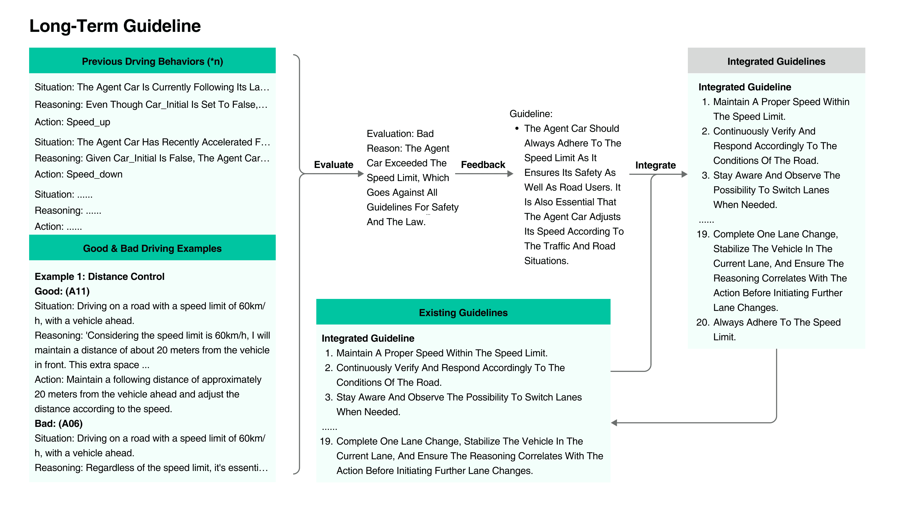

<!--yml

分类：未分类

日期：2025-01-11 13:06:10

-->

# SurrealDriver：基于人类驾驶员驾驶思维数据设计的LLM驱动生成代理框架

> 来源：[https://arxiv.org/html/2309.13193/](https://arxiv.org/html/2309.13193/)

叶金，杨若轩，易智杰，沈晓熙，彭慧玲，刘小安，秦静莉，

李家扬，谢劲涛，高佩中，周顾悦，龚江涛^(🖂) 作者来自清华大学人工智能产业研究院，北京，中国。通讯邮箱：gongjiangtao@air.tsinghua.edu.cn

###### 摘要

利用大语言模型（LLM）的高级推理能力和广泛的世界知识来构建生成代理，用于解决复杂的现实世界问题，是当前的主要趋势。然而，LLM本身缺乏类似人类的具象化能力，导致在许多具象化决策任务中的表现不尽如人意。本文介绍了一种构建类人生成驾驶代理的框架，使用来自人类驾驶员的驾驶后自报告驾驶思维数据作为示范和反馈。为了捕捉来自驾驶员的高质量自然语言数据，我们进行了城市驾驶实验，记录了驾驶员在不同条件下的口头思维，以作为LLM代理的思维链提示和示范示例。该框架的有效性通过仿真和人工评估进行了验证。结果表明，与基于LLM的基准代理相比，加入专家示范数据显著将碰撞率降低了81.04%，并使类人程度提高了50%。我们的研究为利用基于自然语言的人类示范数据处理具象任务提供了启示。驾驶思维数据集可在[https://github.com/AIR-DISCOVER/Driving-Thinking-Dataset](https://github.com/AIR-DISCOVER/Driving-Thinking-Dataset)获取。

## I 引言

最近，基于零-shot提示和常识推理能力的大型语言模型（LLMs）取得了显著进展[[1](https://arxiv.org/html/2309.13193v2#bib.bib1), [2](https://arxiv.org/html/2309.13193v2#bib.bib2), [3](https://arxiv.org/html/2309.13193v2#bib.bib3), [4](https://arxiv.org/html/2309.13193v2#bib.bib4), [5](https://arxiv.org/html/2309.13193v2#bib.bib5)]。除了自然语言任务外，当配备了特定的感知和控制模块[[6](https://arxiv.org/html/2309.13193v2#bib.bib6), [7](https://arxiv.org/html/2309.13193v2#bib.bib7)]，LLMs还能作为执行具身任务（如机器人和自动驾驶）的决策核心[[8](https://arxiv.org/html/2309.13193v2#bib.bib8), [9](https://arxiv.org/html/2309.13193v2#bib.bib9), [10](https://arxiv.org/html/2309.13193v2#bib.bib10)]。先前的研究验证了LLMs在具身任务中先进推理和广泛知识的有效性[[9](https://arxiv.org/html/2309.13193v2#bib.bib9), [10](https://arxiv.org/html/2309.13193v2#bib.bib10)]，但也突出了在复杂场景中的局限性，例如生成不合理的序列[[11](https://arxiv.org/html/2309.13193v2#bib.bib11), [12](https://arxiv.org/html/2309.13193v2#bib.bib12)]以及缺乏操作经验[[13](https://arxiv.org/html/2309.13193v2#bib.bib13)]。然而，传统的具身任务示范往往不适合作为少量示范学习的例子。目前的方法主要包括调整或限制LLM的任务范围[[12](https://arxiv.org/html/2309.13193v2#bib.bib12)]，并通过与环境的互动使LLM Agent独立积累经验[[13](https://arxiv.org/html/2309.13193v2#bib.bib13), [14](https://arxiv.org/html/2309.13193v2#bib.bib14)]。

在自动驾驶背景下，代理分析多模态数据，如向量[[15](https://arxiv.org/html/2309.13193v2#bib.bib15)]和图像[[16](https://arxiv.org/html/2309.13193v2#bib.bib16)]，以做出端到端的驾驶决策，体现了“驾驶与LLMs”[[15](https://arxiv.org/html/2309.13193v2#bib.bib15)]和“DriveGPT4”[[16](https://arxiv.org/html/2309.13193v2#bib.bib16)]等项目。与传统的微调方法相比，基于大语言模型的提示方法提供了具有成本效益且可推广的解决方案[[17](https://arxiv.org/html/2309.13193v2#bib.bib17)]。像“Drive As You Speak”[[18](https://arxiv.org/html/2309.13193v2#bib.bib18)]和“DiLu”[[19](https://arxiv.org/html/2309.13193v2#bib.bib19)]等方法通过整合记忆来实现连贯的决策，而“Drive Like a Human”[[20](https://arxiv.org/html/2309.13193v2#bib.bib20)]则通过引入专家反馈来增强性能。然而，这些所谓的类人驾驶行为主要依赖于大语言模型中固有的人类常识。大语言模型从互联网的噪声文本语料库中非具象地获得这些常识，缺乏将专业的、任务特定的人类数据融入到具象任务中的能力[[21](https://arxiv.org/html/2309.13193v2#bib.bib21)]。对于基于大语言模型的代理来说，在具象任务（如驾驶）中使用人类演示[[22](https://arxiv.org/html/2309.13193v2#bib.bib22)]和反馈[[23](https://arxiv.org/html/2309.13193v2#bib.bib23)]进行强化学习，成本过高。该领域的一个持续挑战是缺乏高质量的演示和监督性人类数据。

为此，本文创新性地利用了人类驾驶员的驾驶后自我报告，分析他们的思维过程作为链式思维提示，以增强基于大语言模型的代理的驾驶性能和与人类的对齐。这一方法为将基于大语言模型的代理与人类驾驶员对齐提供了新的视角，特别是在具象的驾驶任务中。我们收集了24位现实世界驾驶员的驾驶后自我报告，详细描述了他们在驾驶过程中所考虑的因素和决策过程。随后，我们设计了“SurrealDriver”——一个基于大语言模型的城市驾驶框架，基于四个设计考虑因素：基本驾驶流程、安全性和记忆机制，以及通过人类驾驶思维过程的演示来指导的长期驾驶准则。通过仿真实验和人工评估，我们对框架进行了评估，验证了其设计的高效性。

因此，本文的贡献如下：

+   •

    通过城市驾驶实验收集的首个高质量人类驾驶员自然语言类型的驾驶思维数据集；

+   •

    基于大语言模型（LLMs）设计的生成型驾驶代理框架，以人类驾驶员的驾驶思维数据作为链式思维提示，并在Carla Simulator中实现；

+   •

    通过仿真消融实验和人工评估，对我们框架的有效性进行了实证验证。

## II 驾驶思维数据集

### II-A 驾驶实验与数据收集

为了收集高质量的驾驶员语言类型示范数据，我们邀请了24名驾驶员（10名专家驾驶员和14名新手驾驶员）参与此次驾驶思维数据收集环节。10名专家驾驶员通过正式的职业招聘平台招募，他们拥有丰富的驾驶经验，经验年限从12年到28年不等，年龄从35岁到48岁（M = 39.9, SD = 4.18）。新手驾驶员则通过社交媒体招募，结果组成了一个14人的小组，年龄介于20岁至25岁之间（M = 21.93, SD = 1.49），驾驶经验范围为1年到4年。该研究获得了作者所在机构的伦理委员会批准。在实验前，所有参与者都已确保知情同意，确认了潜在风险并知晓他们有权随时中止研究。为了保护参与者的隐私，所有个人和机密信息均已匿名化，以下呈现的研究结果已经过去身份识别处理。

为了确保收集到的自然语言示范与实际驾驶行为之间的一致性，我们首先让驾驶员参与了实际的复杂城市道路驾驶实验，然后出于安全考虑，我们进行了驾驶后访谈，收集他们的思维过程数据。在访谈过程中回顾驾驶实验细节时，我们使用多台车载摄像头记录了驾驶过程，包括驾驶员的眼动追踪设备（Tobii Glass 3¹¹1https://www.tobii.com/products/eye-trackers/wearables/tobii-pro-glasses-3）、车顶安装的360度全景摄像头（Insta360 X3²²2https://www.insta360.com/product/insta360-x3）以及车内运动摄像头（Dji OSMO Action 3³³3https://store.dji.com/hk-en/product/osmo-action-3）。在访谈过程中，驾驶员在回顾录制的影像时，阐述了每个驾驶行为背后的决策过程。此外，驾驶员被要求在实验过程中思考复杂驾驶场景中自己判断和驾驶行为背后的潜在原因。

### II-B 数据分析与数据集构建

我们的数据包括24段驾驶员访谈视频，时长为1.5小时至2小时不等。我们将音频录音转录成书面文档，并整理了参与者描述他们在实验中遇到的每个场景的驾驶决策过程的数据。每位参与者的数据由两到三名训练有素的编码员处理，并进行了编码一致性检查。

根据我们的研究发现，专家级人类驾驶员并非凭借偶然或直觉展现出良好的驾驶行为，而是持续总结驾驶行为的规则和模式。思维链的构建从战略层面的思考开始，逐步过渡到战术层面的决策，再到操作层面的执行。例如，大多数专家驾驶员表示，他们在转弯时系统性地观察不同的方向，无论他们驶向哪个方向。正如D11（专家）所分享的，

> D11（专家）：“无论是右转还是左转，我必须首先看我要转向的方向，因为那是我将要走的道路。不过，我也会看反方向。基本上，我会看两次。第一次是看两边，第二次是确认。然后我就开始转弯。”

此外，专家驾驶员在与其他道路使用者互动时，也有系统化且成熟的行为模式。例如，在进入主干道之前，专家驾驶员会评估主干道上车辆的状况，以决定何时以及如何进入主干道。

> D06（专家）：“首先看左后视镜，主要是观察后方车辆的速度。如果速度较慢，我可以加速直接行驶。如果速度较快，我可以暂停等待，等他们通过后我再驶入。”

我们可以看到，专家驾驶员的思维链由多个相互关联的决策点组成，每个决策点都基于当前的交通状况和预计的未来变化。这种模式不仅使人类驾驶员通过反复练习形成肌肉记忆，还可以总结成明确的思维链，来教导基于LLM的自动驾驶算法。因此，我们认为，通过将专家驾驶员的驾驶-思维数据作为提示，这些优秀的驾驶行为模式可以通过LLM进行扩展和泛化。我们将“驾驶-思维”数据、参与者的个人信息以及与驾驶相关的问卷数据编制成数据集，以促进未来对驾驶行为的研究和自动驾驶算法的发展。

图1：SurrealDriver框架。

## III SurrealDriver框架

### III-A 框架设计

设计一个能够驾驶的代理需要它理解驾驶环境的复杂性和多样性，执行一系列复杂的操作，确保安全，并与其他人类驾驶的车辆和谐共存。基于这些考虑，我们建立了如下框架，如图[1](https://arxiv.org/html/2309.13193v2#S2.F1 "图1 ‣ II-B 数据分析与数据集构建 ‣ II 驾驶-思维数据集 ‣ SurrealDriver: 基于人类驾驶员驾驶-思维数据的LLM驱动生成驾驶代理框架")所示：

#### III-A1 感知：原子场景与原子行为。

人类驾驶场景多种多样，要求代理详细理解复杂的情况。传统的驾驶仿真方法需要在各种场景下进行训练，这成本很高。我们的方法将驾驶场景分解为离散参数供大型语言模型（LLMs）使用。这些参数帮助代理运用常识评估情况。我们还将模拟器中的驾驶行为简化为基本操作，使代理能够将这些操作组合起来执行复杂的驾驶行为。

#### III-A2 执行：短期驾驶记忆。

有效的汽车驾驶需要无缝且连续的操作，尽可能避免突然刹车或急转弯。此外，超车和跟车等操作需要融合基本的驾驶操作（例如，加速、变道），使得驾驶行为相对复杂。为了保持平稳驾驶，我们在短期驾驶记忆模块中捕捉代理最近的驾驶行为。这些短期驾驶记忆帮助代理保持决策的一致性。此外，代理可以利用这些驾驶记忆将若干基本驾驶操作结合起来，执行复杂的驾驶行为。

#### III-A3 规划：长期类人驾驶指南。

代理必须使其规划与人类驾驶员的规划保持一致。此模块帮助代理模拟人类如何从专家驾驶员那里学习，积累经验，并不断提升其驾驶技能。为此，我们设计了CoachAgent来评估DriverAgent的驾驶行为，并传授必须遵守的指南。这些指南始终被整合，促进DriverAgent驾驶能力的持续提升。

#### III-A4 总体流程：严格的安全标准。

确保安全是驾驶行为仿真的最关键要求。任何模拟驾驶系统必须优先考虑安全，并在其框架内制定规则，以确保代理的安全。

因此，在整个驾驶过程中，安全应通过安全冗余机制持续得到保障。为确保驾驶过程的基本安全，代理被赋予了严格的安全标准。

### III-B 实现

图2：DriverAgent的详细信息。

我们在CARLA模拟器中构建了SurrealDriver框架[[24](https://arxiv.org/html/2309.13193v2#bib.bib24)]，包括基本驾驶流程、记忆与安全机制，以及与人类对齐的长期驾驶指南。

#### III-B1 基本驾驶流程。

如图[2](https://arxiv.org/html/2309.13193v2#S3.F2 "图 2 ‣ III-B 实现 ‣ III 超现实驾驶员框架 ‣ 超现实驾驶员：基于人类驾驶员驾驶思维数据设计的LLM驱动生成驾驶员代理框架")所示，基本的驾驶流程包含三个主要过程：感知、决策和控制。在感知阶段，DriverAgent接收并整合来自CARLA模拟器的车辆和环境数据。这些数据以参数形式提供，基于预定义的提示和常识进行分析，使DriverAgent能够理解车辆的当前状况。感知后，DriverAgent决定下一步的行动，优先考虑安全性和效率。随后进入控制阶段，DriverAgent向CARLA发送JSON格式的指令，选择如停车、保持车速、变道或调整车速等动作。这些原子动作使DriverAgent能够基于场景执行复杂的操作。

#### III-B2 内存和安全机制

内存和安全机制建立在基本驾驶流程之上，用于存储DriverAgent所需的信息。它由三个模块组成：安全标准和短期记忆。

安全标准：我们实施了严格的安全标准，旨在防止危险操作。安全冗余机制分为两个层级。第一个强制性层级要求在车辆或行人距离小于10米时，或者在红灯时，必须采取停车等行动。第二个可选但推荐的层级包括：在接近20米内的车辆或行人时减速，在交叉口减速，与行驶中的汽车保持至少1米的安全距离，以及通过减少不必要的车速变化来优化能量使用。

短期记忆：为了确保驾驶的连续性和复杂性，我们将存储当前代理在过去几个迭代中的驾驶行为，并不断更新，用最新的行为替换最旧的行为，保持一定数量的已存储行为。这些行为将再次提供给DriverAgent，成为其感知的一部分。

#### III-B3 人类对齐的长期驾驶指南

为了更好地将SurrealDriver与人类驾驶员对齐，我们利用了在“思维链式提示”部分收集的专家驾驶员驾驶思维数据。在设计示例时，我们采用了三维方法：情境、推理和行动，如图[3](https://arxiv.org/html/2309.13193v2#S3.F3 "图3 ‣ III-B3 人类对齐的长期驾驶指南 ‣ III-B 实施 ‣ III SurrealDriver框架 ‣ SurrealDriver：基于人类驾驶员驾驶思维数据设计LLM驱动的生成驾驶员代理框架")所示。情境提供了驾驶员操作期间的具体道路条件，对于每个比较案例，我们设置了相同的道路条件，参考了真实驾驶员在面试中所面对的道路条件。推理是基于驾驶员面试内容设计的，去除了不相关的信息，使我们的示例简洁高效，能够展示人类思维并指导代理学习人类的思维模式。

图3：用于人类对齐的CoachAgent。

## IV 评估

我们在相同场景下使用来自不同框架的代理进行了驾驶实验，分析它们行为上的差异，以理解不同框架的指令如何影响它们的驾驶。我们根据两个主要维度评估了这些代理：安全驾驶能力和类人性。安全驾驶能力通过算法实验评估，而类人性则通过人类实验进行评估。

### IV-A 算法实验

#### IV-A1 实验环境设置

实验在一台ThundeRobot Zero台式计算机上进行。仿真环境是基于CARLA仿真器版本0.9.14 [[24](https://arxiv.org/html/2309.13193v2#bib.bib24)] 构建的，并在Python 3.7和虚幻引擎4上运行。选定的仿真环境为Town10，Audi TT是所有实验的指定车辆，路径的起点固定，终点则是随机生成且连续变化的。在到达终点后，系统会随机生成新的终点以进行持续实验。此过程将持续进行，直到完成所需的驾驶回合数。我们利用OpenAI的GPT-4 API来模拟驾驶员的驾驶决策并解决仿真环境中的相关问题。然而，GPT-4做出决策需要几秒钟，这在驾驶场景中处理即时决策时显得过长。因此，我们根据所需的令牌数量，通过设置固定的时间步长0.0006-0.0015秒来减慢CARLA的仿真时间。

#### IV-A2 结果

整体实验持续了108405.90秒（30.11小时）；每个条件下的平均实验时间分别为7079.67秒、13730.6秒、23870.28秒和63725.35秒。我们分别对每单位距离和每单位时间的碰撞率进行了统计分析。详细结果请见表格[I](https://arxiv.org/html/2309.13193v2#S4.T1 "TABLE I ‣ IV-A2 Results ‣ IV-A Algorithm Experiment ‣ IV Evaluation ‣ SurrealDriver: Designing LLM-powered Generative Driver Agent Framework based on Human Drivers’ Driving-thinking Data")。值得注意的是，我们调整了控制其他车辆和行人的算法，使它们更容易进行突发性操作（例如急刹车、突然变道、闯红灯）。这些极端情况旨在提高驾驶环境的风险级别，从而使代理车辆的驾驶表现更为可观察。

表格 I：算法实验的碰撞率

| 框架 |
| --- |

&#124; 按距离的碰撞率 &#124;

&#124;（每米）&#124;

|

&#124; 按碰撞率 &#124;

&#124; 时间（每秒）&#124;

|

|

&#124; 无安全标准，&#124;

&#124; 无短期记忆，&#124;

&#124; 无长期指导 &#124;

| 0.01453958 | 0.041315485 |
| --- | --- |

|

&#124; 有安全标准，&#124;

&#124; 无短期记忆，&#124;

&#124; 无长期指导 &#124;

| 0.00923361 | 0.02366976 |
| --- | --- |

|

&#124; 有安全标准，&#124;

&#124; 有短期记忆，&#124;

&#124; 无长期指导 &#124;

| 0.005046864 | 0.009530682 |
| --- | --- |
| 完整框架 | 0.002757353 | 0.005100011 |

对于安全模块，碰撞率数据显示，采用安全模块的框架与未采用安全模块的框架相比，碰撞率降低了57.46%。例如，在没有安全标准的情况下，当车辆与前车的距离为5米时，DriverAgent发起了变道，导致与前车发生碰撞。然而，在运行带有安全标准的框架时，车辆与前车的距离为7米。基于安全标准提供的信息，车辆发起了停车行为，安全地停在了前车后方。

对于短期记忆模块，碰撞率数据显示，带有短期记忆的框架相比于没有短期记忆的框架，碰撞率降低了82.96%。我们发现短期记忆在增强代理驾驶决策的连续性方面起到了重要作用。例如，在某次实验中，车辆最初加速了几步，当DriverAgent需要决定下一步操作时，它有两个选择：继续加速或保持当前速度。考虑到之前的加速行为，它选择保持当前速度。

对于长期指导模块，碰撞率数据表明，使用长期指导的框架相比没有使用的框架，碰撞率降低了83.03%。使用长期指导后，DriverAgent的驾驶技能有所提升。例如，在一次实验中，CoachAgent分析了初始的驾驶行为并将其评为“差”。评定的原因是频繁停车。系统生成了一个指导意见“保持一致且安全的速度”，这使得代理表现出更具人类特征的驾驶行为。

### IV-B 人类评估实验

使用单因素组内设计来调查人们如何评定算法实验中使用的每个框架（请参见[IV-A](https://arxiv.org/html/2309.13193v2#S4.SS1 "IV-A Algorithm Experiment ‣ IV Evaluation ‣ SurrealDriver: Designing LLM-powered Generative Driver Agent Framework based on Human Drivers’ Driving-thinking Data")部分）。

#### IV-B1 实验设计和材料

自变量是框架，包括“没有安全性、记忆或指导框架”——没有安全标准、短期记忆或长期指导；“没有记忆或指导框架”——仅有安全标准；“没有指导框架”——同时具有安全标准和短期记忆；以及“完整框架”——包括安全标准、短期记忆和长期指导。因此，指导框架就是SurrealDriver的完整框架。每个框架的视频是通过记录算法实验中的实验过程制作的（请参见[IV-A](https://arxiv.org/html/2309.13193v2#S4.SS1 "IV-A Algorithm Experiment ‣ IV Evaluation ‣ SurrealDriver: Designing LLM-powered Generative Driver Agent Framework based on Human Drivers’ Driving-thinking Data")部分）。每个视频的时长大约为30秒。

#### IV-B2 参与者和程序

我们邀请了另外24名成年人（年龄29.3±4.9岁，男性 = 17，无与驾驶思维数据收集实验的参与者重叠）参与我们的人工评估实验，所有参与者均持有合法驾驶执照。实验通过在线调查进行。调查从一些人口统计信息问题开始，包括参与者的年龄、性别、电话号码、是否驾车沉默、驾驶经验年限以及每月驾驶的公里数。然后，调查引导参与者观看嵌入在调查中的视频。所有参与者按随机顺序观看这些视频。每观看完一个视频后，参与者需要根据一个5点Likert量表对视频中的人类相似性进行评分，量表1表示“完全不”，5表示“几乎完全”。

#### IV-B3 结果

进行了单因素重复测量方差分析（ANOVA），比较了四个框架之间的评分。对于人类相似度，采用了Huynh-Feldt校正，因为Mauchly球形检验结果显著，$\epsilon$值大于0.75。我们发现四个框架之间存在显著差异：$F(2.5,57.4)=4.353$，$\textit{p}=0.01$。Bonferroni事后检验显示，指南框架的评分显著高于不含安全、记忆或指南框架的评分，$\textit{p}=0.009$。

## V 结论

在我们的研究中，我们开发了SurrealDriver，这是一个基于LLM（大型语言模型）的驾驶员智能体框架。无论是算法实验结果还是人工评估都表明，这个基于LLM的驾驶员智能体框架在驾驶模拟中表现优于传统方法，使得驾驶员智能体的行为更接近人类驾驶，从而模拟出更真实的交通环境。通过将人类驾驶思维数据与LLM结合，智能体可以更方便地使用自然语言和示例来添加规则，使得规则调整更加容易。

因此，我们向智能体提供了通过在实际车辆实验中进行访谈获得的真实驾驶员行为数据。智能体基于LLM的能力，能够自主评估其驾驶行为的质量，并与详细的驾驶行为推理进行比较。然后，它基于专家驾驶员的行为提升其驾驶技能。这一方法不同于传统的强化学习和其他训练方法，它使得智能体能够直接从驾驶员的记录中学习，类似人类，无需将其转化为代码。我们的研究为未来人类对齐的智能体生成提供了宝贵的见解。

## 参考文献

+   [1] S. Yao, J. Zhao, D. Yu, N. Du, I. Shafran, K. Narasimhan, 和 Y. Cao，“React：在语言模型中协同推理与行为，” *arXiv预印本 arXiv:2210.03629*，2022年。

+   [2] H. Liu, D. Tam, M. Muqeeth, J. Mohta, T. Huang, M. Bansal, 和 C. A. Raffel，“少量样本的参数高效微调优于上下文学习，” *神经信息处理系统进展*，第35卷，第1950-1965页，2022年。

+   [3] T. Brown, B. Mann, N. Ryder, M. Subbiah, J. D. Kaplan, P. Dhariwal, A. Neelakantan, P. Shyam, G. Sastry, A. Askell, *等*，“语言模型是少量样本学习者，” *神经信息处理系统进展*，第33卷，第1877-1901页，2020年。

+   [4] S. Hao, Y. Gu, H. Ma, J. J. Hong, Z. Wang, D. Z. Wang, 和 Z. Hu，“与语言模型推理即是使用世界模型进行规划，” *arXiv预印本 arXiv:2305.14992*，2023年。

+   [5] Z. Xi, W. Chen, X. Guo, W. He, Y. Ding, B. Hong, M. Zhang, J. Wang, S. Jin, E. Zhou, *等*，“基于大型语言模型的智能体的崛起与潜力：一项调查，” *arXiv预印本 arXiv:2309.07864*，2023年。

+   [6] J. Huang, S. Yong, X. Ma, X. Linghu, P. Li, Y. Wang, Q. Li, S.-C. Zhu, B. Jia, 和 S. Huang, “3D世界中的具身通用体智能体，” *arXiv 预印本 arXiv:2311.12871*, 2023。

+   [7] P. Chen, X. Sun, H. Zhi, R. Zeng, T. H. Li, G. Liu, M. Tan, 和 C. Gan, “$a^2$ nav: 利用基础模型的视觉与语言能力进行行动感知的零样本机器人导航，” *arXiv 预印本 arXiv:2308.07997*, 2023。

+   [8] L. Chen, Y. Zhang, S. Ren, H. Zhao, Z. Cai, Y. Wang, P. Wang, T. Liu, 和 B. Chang, “通过多模态大语言模型推动端到端具身决策：基于gpt4-vision及其后续探索，” *arXiv 预印本 arXiv:2310.02071*, 2023。

+   [9] A. Rajvanshi, K. Sikka, X. Lin, B. Lee, H.-P. Chiu, 和 A. Velasquez, “Saynav: 基于大语言模型的动态规划与新环境导航的基础方法，” *arXiv 预印本 arXiv:2309.04077*, 2023。

+   [10] C. H. Song, J. Wu, C. Washington, B. M. Sadler, W.-L. Chao, 和 Y. Su, “LLM-planner: 基于少量示例的具身智能体规划方法，结合大语言模型，” 收录于 *IEEE/CVF计算机视觉国际会议论文集*，2023，第2998-3009页。

+   [11] Z. Wu, Z. Wang, X. Xu, J. Lu, 和 H. Yan, “结合大语言模型的具身任务规划，” *arXiv 预印本 arXiv:2307.01848*, 2023。

+   [12] Y. Wu, S. Y. Min, Y. Bisk, R. Salakhutdinov, A. Azaria, Y. Li, T. Mitchell, 和 S. Prabhumoye, “计划、消除与跟踪——语言模型是具身智能体的良师益友，” *arXiv 预印本 arXiv:2305.02412*, 2023。

+   [13] G. Wang, Y. Xie, Y. Jiang, A. Mandlekar, C. Xiao, Y. Zhu, L. Fan, 和 A. Anandkumar, “Voyager: 一个开放式的具身智能体，结合大语言模型，” *arXiv 预印本 arXiv:2305.16291*, 2023。

+   [14] A. Zhao, D. Huang, Q. Xu, M. Lin, Y.-J. Liu, 和 G. Huang, “Expel: LLM智能体是经验学习者，” 2023。

+   [15] L. Chen, O. Sinavski, J. Hünermann, A. Karnsund, A. J. Willmott, D. Birch, D. Maund, 和 J. Shotton, “与LLM共同驾驶：融合面向对象的向量模态以实现可解释的自动驾驶，” *arXiv 预印本 arXiv:2310.01957*, 2023。

+   [16] Z. Xu, Y. Zhang, E. Xie, Z. Zhao, Y. Guo, K. K. Wong, Z. Li, 和 H. Zhao, “Drivegpt4: 基于大语言模型的可解释端到端自动驾驶，” *arXiv 预印本 arXiv:2310.01412*, 2023。

+   [17] B. Chen, Z. Zhang, N. Langrené, 和 S. Zhu, “释放大语言模型中提示工程的潜力：一项全面回顾，” *arXiv 预印本 arXiv:2310.14735*, 2023。

+   [18] C. Cui, Y. Ma, X. Cao, W. Ye, 和 Z. Wang, “像说话一样驾驶：在人类智能与大语言模型之间实现自动驾驶汽车的交互，” 收录于 *IEEE/CVF计算机视觉应用冬季会议论文集*，2024，第902-909页。

+   [19] L. Wen, D. Fu, X. Li, X. Cai, T. Ma, P. Cai, M. Dou, B. Shi, L. He, 和 Y. Qiao, “Dilu: 一种基于大语言模型的知识驱动自动驾驶方法，” *arXiv 预印本 arXiv:2309.16292*, 2023。

+   [20] D. Fu, X. Li, L. Wen, M. Dou, P. Cai, B. Shi, 和 Y. Qiao，“像人类一样驾驶：用大型语言模型重新思考自动驾驶，”发表于*IEEE/CVF冬季计算机视觉应用会议论文集*，2024年，第910-919页。

+   [21] M. Shanahan, K. McDonell, 和 L. Reynolds，“与大型语言模型进行角色扮演，”*自然*，第623卷，第7987期，第493-498页，2023年。

+   [22] M. Luo, X. Xu, Z. Dai, P. Pasupat, M. Kazemi, C. Baral, V. Imbrasaite, 和 V. Y. Zhao，“Dr. icl：通过演示获取的上下文学习，”*arXiv预印本arXiv:2305.14128*，2023年。

+   [23] L. Ouyang, J. Wu, X. Jiang, D. Almeida, C. Wainwright, P. Mishkin, C. Zhang, S. Agarwal, K. Slama, A. Ray, *等人*，“训练语言模型按照指令进行操作并结合人类反馈，”*神经信息处理系统进展*，第35卷，第27,730-27,744页，2022年。

+   [24] A. Dosovitskiy, G. Ros, F. Codevilla, A. Lopez, 和 V. Koltun，“Carla：一个开放的城市驾驶模拟器，”发表于*机器人学习会议*。PMLR, 2017, 第1-16页。
