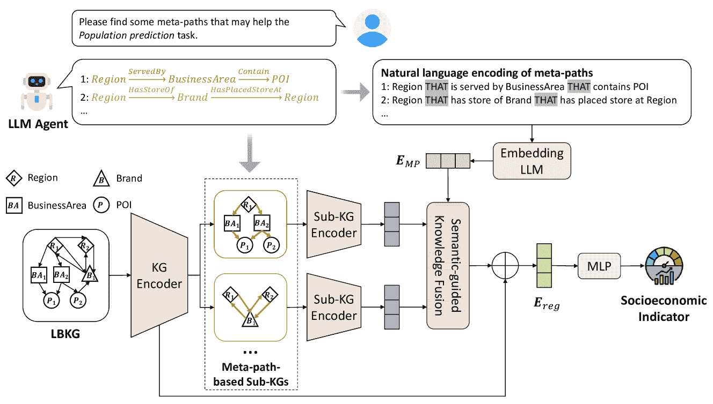

<!--yml

类别：未分类

日期：2025-01-11 12:00:52

-->

# 协同大语言模型代理与知识图谱进行基于位置的社会经济预测

> 来源：[https://arxiv.org/html/2411.00028/](https://arxiv.org/html/2411.00028/)

\useunder

\ul

Zhilun Zhou [0000-0002-8674-7513](https://orcid.org/0000-0002-8674-7513 "ORCID标识符") 电子工程系，BNRist，清华大学 北京 中国 [zzl22@mails.tsinghua.edu.cn](mailto:zzl22@mails.tsinghua.edu.cn) ， Jingyang Fan 电子工程系，BNRist，清华大学 北京 中国 [siemprestr@gmail.com](mailto:siemprestr@gmail.com) ， Yu Liu 牛津大学 牛津 英国 [liuyu2419@126.com](mailto:liuyu2419@126.com) ， Fengli Xu [0000-0002-5720-4026](https://orcid.org/0000-0002-5720-4026 "ORCID标识符") 电子工程系，BNRist，清华大学 北京 中国 [fenglixu@tsinghua.edu.cn](mailto:fenglixu@tsinghua.edu.cn) ， Depeng Jin [0000-0003-0419-5514](https://orcid.org/0000-0003-0419-5514 "ORCID标识符") 电子工程系，BNRist，清华大学 北京 中国 [jindp@tsinghua.edu.cn](mailto:jindp@tsinghua.edu.cn) 和 Yong Li [0000-0001-5617-1659](https://orcid.org/0000-0001-5617-1659 "ORCID标识符") 电子工程系，BNRist，清华大学 北京 中国 [liyong07@tsinghua.edu.cn](mailto:liyong07@tsinghua.edu.cn)(2018)

###### 摘要。

基于位置的社交网络（LBSNs）的快速发展导致了社会的重大变化，促使了利用LBSN数据进行社会经济预测的广泛研究，例如区域人口和商业活动估计。现有的研究设计了各种图表来建模异构的LBSN数据，并进一步应用图表示学习方法进行社会经济预测。然而，这些方法严重依赖启发式思想和专业知识从多样化的数据中提取与任务相关的知识，这可能并不适合特定任务。此外，它们往往忽视了不同指标之间的内在关系，限制了预测的准确性。受大语言模型（LLMs）在常识推理、嵌入和多智能体协作方面出色能力的启发，本文将LLM智能体与知识图谱相结合，用于社会经济预测。我们首先构建了一个基于位置的知识图谱（LBKG），以整合多源的LBSN数据。然后，我们利用LLM智能体的推理能力，识别LBKG中与每种社会经济预测任务相关的元路径，并设计了一个语义引导的注意力模块，通过元路径进行知识融合。此外，我们引入了一个跨任务通信机制，通过在LLM智能体和KG层面实现任务间的知识共享，进一步提高性能。一方面，不同任务的LLM智能体协同生成更多样和全面的元路径。另一方面，来自不同任务的嵌入被自适应地合并，以实现更好的社会经济预测。在两个数据集上的实验结果证明了LLM与KG之间协同设计的有效性，为跨社会经济预测任务的信息共享提供了深刻的见解。

大语言模型，知识图谱，基于位置的社交网络，社会经济预测^†^†版权：acmlicensed^†^†期刊年份：2018^†^†doi: XXXXXXX.XXXXXXX^†^†会议：确保输入正确的会议标题，来自您的版权确认电子邮件；2018年6月3日至5日；纽约州伍德斯托克^†^†isbn: 978-1-4503-XXXX-X/18/06

## 1\. 引言

基于位置的社交网络（LBSN）的发展显著推动了社会经济预测，利用了丰富的来自网络的LBSN数据，如评论平台上的用户生成内容。像地区人口、用户活动和评分等社会经济指标，反过来又提供了LBSN更全面的描述，这些可以被各种网络应用所利用，以提供增强的服务，如位置推荐、网页描述和个人助手。因此，在LBSN背景下的社会经济预测变得越来越重要，促使该领域的研究不断增长（Wang等人，[2016](https://arxiv.org/html/2411.00028v2#bib.bib24)；Wang和Li，[2017](https://arxiv.org/html/2411.00028v2#bib.bib25)；Yang等人，[2017](https://arxiv.org/html/2411.00028v2#bib.bib34)；Yao等人，[2018](https://arxiv.org/html/2411.00028v2#bib.bib35)；Dong等人，[2019](https://arxiv.org/html/2411.00028v2#bib.bib4)；Xu等人，[2020](https://arxiv.org/html/2411.00028v2#bib.bib33)；Zhang等人，[2021](https://arxiv.org/html/2411.00028v2#bib.bib36)；Wu等人，[2022](https://arxiv.org/html/2411.00028v2#bib.bib31)；Hou等人，[2022](https://arxiv.org/html/2411.00028v2#bib.bib8)；Luo等人，[2022](https://arxiv.org/html/2411.00028v2#bib.bib18)；Kim和Yoon，[2022](https://arxiv.org/html/2411.00028v2#bib.bib10)；Zhou等人，[2023](https://arxiv.org/html/2411.00028v2#bib.bib38))

传统上，人们通过调查收集社会经济指标，这既昂贵又耗时。最近，基于数据的方法变得流行，这些方法使用机器学习模型基于各种LBSN数据预测社会经济指标。LBSN数据来源广泛且异构。现有研究广泛采用图结构来建模LBSN数据中复杂的关系，并通过图表示学习方法预测社会经济指标。他们构建了多视角图（Zhang等人，[2021](https://arxiv.org/html/2411.00028v2#bib.bib36)；Wu等人，[2022](https://arxiv.org/html/2411.00028v2#bib.bib31)；Kim和Yoon，[2022](https://arxiv.org/html/2411.00028v2#bib.bib10)）或知识图（KGs）（Zhou等人，[2023](https://arxiv.org/html/2411.00028v2#bib.bib38)；Liu等人，[2023c](https://arxiv.org/html/2411.00028v2#bib.bib17)）来建模LBSN数据中的不同因素，如流动性、空间邻近性和功能性。然而，这些方法高度依赖启发式思想和专业知识，从LBSN数据中提取与任务相关的知识，如子图的构建或元结构的定义，这可能对于不同的指标预测任务来说是次优的。此外，不同社会经济预测任务之间的内在相关性和潜在的知识共享机会通常被忽视，这限制了整体的预测准确性。

最近出现的大型语言模型（LLMs）为这些局限性提供了一种有前景的解决方案。LLMs展现了几种显著的能力，能够帮助社会经济预测（Wei et al., [2022a](https://arxiv.org/html/2411.00028v2#bib.bib29)）：(1) 潜在语义嵌入。在基础层面，LLMs能够生成具有丰富语义信息的文本嵌入，这使得将LLM与深度学习模型结合，从而通过利用LBSN数据中固有的语义信息提高性能成为可能。(2) 明确的常识推理。此外，LLMs拥有丰富的常识知识，基于这些知识，它们能够进行复杂的推理（Zhao et al., [2024](https://arxiv.org/html/2411.00028v2#bib.bib37)）。这一能力促进了从LBSN数据中自动提取与任务相关的知识。(3) 多代理协作。在最高层次上，LLM代理可以通过自然语言与其他代理进行沟通，并协作解决单个代理难以完成的复杂任务（Li et al., [2023a](https://arxiv.org/html/2411.00028v2#bib.bib12); Hong et al., [2023](https://arxiv.org/html/2411.00028v2#bib.bib7); Xiao et al., [2023](https://arxiv.org/html/2411.00028v2#bib.bib32)）。这一能力使得LLM能够通过语义丰富的自然语言跨不同的社会经济预测任务转移知识，并协同提高性能。

受到此启发，我们提出了一个学习框架，旨在协同LLM代理和知识图谱学习模型（SLAK）用于社会经济预测。我们首先构建了一个基于位置的知识图谱（LBKG），全面整合LBSN数据。为了提取与任务相关的知识，我们构建了一个LLM代理，自动发现LBKG中的元路径，帮助预测特定指标，并提取相应的基于元路径的子知识图谱。此外，我们利用知识图谱表示学习模型，从每个基于元路径的子知识图谱中提炼知识，并设计了一个语义增强的知识融合模块，基于LLM获得的元路径语义嵌入自适应地融合知识。此外，我们提出了一种跨任务通信机制，使得LLM代理和知识图谱层级上能够共享不同社会经济预测任务之间的知识。具体而言，LLM代理协同提取更好的元路径，我们还通过知识融合模块自适应地合并来自不同任务的知识图谱嵌入。

我们的贡献可以总结如下：

+   •

    我们提出了一个框架，旨在将LLM代理和知识图谱（KG）协同用于社会经济预测。我们利用LLM代理的推理能力，从LBKG中寻找与任务相关的元路径，并进一步利用元路径的语义信息来指导知识融合。

+   •

    我们设计了一种跨任务通信机制，通过多代理协作在LLM代理层级和通过语义注意力在KG层级，实现不同社会经济预测任务之间的知识共享，从而进一步提高预测准确度。

+   •

    在两个城市级数据集上的广泛实验表明，我们的模型在八个指标预测任务中，相比现有方法在$R^{2}$指标上超越了2.9%-74.2%，展示了我们在LLM和KG之间协同模型的有效性。几项深入分析进一步显示了我们模型设计的优势，为LBSN中的基于网络的社会经济预测提供了见解。

## 2. 初步概念

### 2.1. 问题定义

###### 定义 2.1（城市区域）。

我们将城市区域定义为城市中的非重叠不规则区域，这些区域由主要道路网络划分，例如一个街区，表示为$\mathcal{L}=\{L_{1},L_{2},\ldots,L_{N_{L}}\}$。

###### 定义 2.2（社会经济预测问题）。

给定LBSN中的一组社会经济指标$\mathcal{I}=\{I_{1},\ldots,I_{N_{I}}\}$，例如人口、商业活动、用户活动和评分，社会经济预测任务旨在根据各种LBSN数据预测这些指标在城市区域中的值，即学习一个映射函数$f:\mathcal{L}\rightarrow\mathcal{V_{I}}$，其中$\mathcal{V_{I}}$是指标$I\in\mathcal{I}$的取值范围。

### 2.2. 基于位置的知识图谱

知识图谱（KG）是一个多关系图结构，定义为$\mathcal{G}=\{\mathcal{E},\mathcal{R},\mathcal{F}\}$，其中$\mathcal{E}$是实体集，$\mathcal{R}$是关系集，$\mathcal{F}$是事实集。$\mathcal{F}$中的每个事实表示为三元组$(h,r,t)$，其中$h\in\mathcal{E}$表示头实体，$r\in\mathcal{R}$表示关系类型，$t\in\mathcal{E}$表示尾实体，表示从头实体到尾实体的有向边。由于其出色的异构数据表示能力和集成多样化知识的能力，KG已经在LBSN的研究中得到了广泛应用（Wang等，[2021b](https://arxiv.org/html/2411.00028v2#bib.bib26)；Liu等，[2021](https://arxiv.org/html/2411.00028v2#bib.bib14)，[2023a](https://arxiv.org/html/2411.00028v2#bib.bib16)；Zhou等，[2023](https://arxiv.org/html/2411.00028v2#bib.bib38)）。受到此启发，我们构建了一个LBKG，旨在整合多源LBSN数据（Liu等，[2023b](https://arxiv.org/html/2411.00028v2#bib.bib15)；Zhou等，[2023](https://arxiv.org/html/2411.00028v2#bib.bib38)）。LBKG包含LBSN中的各种元素，如区域、POI、POI类别、品牌、商业区及它们之间的各种关系。LBKG的详细信息请参见附录[A](https://arxiv.org/html/2411.00028v2#A1 "附录A LBKG的详细信息 ‣ 协同LLM代理和知识图谱进行LBSN中的社会经济预测")。

以往的研究已经展示了LBKG在社会经济预测中的潜力（Zhou等， [2023](https://arxiv.org/html/2411.00028v2#bib.bib38)）。然而，仍然有两个挑战需要解决。首先，LBKG由许多不同的实体和关系组成，包含了多个领域的知识，其中一些可能与特定的社会经济指标无关，甚至可能对预测性能产生负面影响，这就意味着手动提取相关知识的困难。其次，不同的社会经济指标本质上是相互关联的，许多指标受到LBKG中相似知识的影响。例如，某个区域附近的商业区域可能同时增强其商业活力并吸引人口增长。目前尚不清楚如何利用不同指标之间共享的知识来提升预测性能。

## 3\. 方法

图1\. 我们提出的模型SLAK的整体框架。

### 3.1\. 框架概述

为了解决上述挑战，我们提出了一个框架，旨在融合LLM代理和知识图谱（KG）的能力，如图[1](https://arxiv.org/html/2411.00028v2#S3.F1 "Figure 1 ‣ 3\. Methods ‣ Synergizing LLM Agents and Knowledge Graph for Socioeconomic Prediction in LBSN")所示。为了解决第一个挑战，我们构建了一个LLM代理，通过提示它从LBKG中找到与社会经济预测任务相关的元路径，并根据每个元路径提取相应的子KG，从而提取任务相关的知识。基于元路径的子KG被输入到KG学习模型中，从每个子KG中提炼知识，并进一步使用元路径的语义嵌入来引导知识融合。输出的区域嵌入通过最终的MLP输出层用于社会经济预测。至于第二个挑战，我们设计了一个跨任务通信机制，如图[2](https://arxiv.org/html/2411.00028v2#S3.F2 "Figure 2 ‣ 3.3\. Cross-task Communication ‣ 3\. Methods ‣ Synergizing LLM Agents and Knowledge Graph for Socioeconomic Prediction in LBSN")所示。不同的指标预测任务在LLM代理层和KG层共享知识。具体来说，LLM代理从不同的角度推荐其他任务的潜在元路径，并根据来自其他任务的知识更新自身的元路径选择。此外，我们利用嵌入式LLM为每个任务获取语义嵌入，并将其用于自适应地融合来自不同任务的区域嵌入。

### 3.2\. 单任务学习

#### 3.2.1\. 元路径提取

LBKG综合了各种LBSN数据，并融入了来自多个领域的知识，如地区之间地理关系的空间知识、与POI及POI类别相关的功能知识，以及关于人口流动的流动性知识（Zhou等，[2023](https://arxiv.org/html/2411.00028v2#bib.bib38)）。识别有助于预测特定社会经济指标的相关信息至关重要。受到KG中元路径捕捉特定语义上下文能力的启发，我们的目标是寻找对预测任务有贡献的最相关元路径。我们首先给出元路径的定义如下（Sun和Han，[2012](https://arxiv.org/html/2411.00028v2#bib.bib22)）。

###### 定义3.1（元路径）。

KG中的元路径可以表示为$E_{1}\xrightarrow{R_{1}}E_{2}\xrightarrow{R_{2}}\ldots\xrightarrow{R_{l-1}}E_{l}$的形式，表示从实体$E_{1},E_{2},\ldots$到$E_{l}$的路径，经过关系$R_{1},\ldots,R_{l-1}$。

元路径在LBKG中提供了丰富的语义上下文。例如，元路径$Region\xrightarrow{Has}POI\xrightarrow{Competitive}POI\xrightarrow{LocateAt}Region$捕捉了两个区域内POI之间的竞争关系，这可能会影响这些区域的商业活动。

然而，鉴于LBKG中实体和关系的数量庞大，找到有用的元路径并非易事。在此，我们从LLM的突现常识推理能力中汲取灵感。已有研究表明，LLM可以通过推理识别异构信息网络中的重要元结构（Chen等，[2024](https://arxiv.org/html/2411.00028v2#bib.bib3)）。因此，我们构建了一个LLM代理来自动从LBKG中找到相关的元路径。为了使代理能够理解LBKG，我们输入了以自然语言描述的LBKG架构。然后，我们提示代理生成若干潜在的元路径方案，用于社会经济预测任务。详细提示见附录[B](https://arxiv.org/html/2411.00028v2#A2 "附录 B 提示 ‣ 协同LLM代理和知识图谱进行LBSN中的社会经济预测")。

#### 3.2.2\. KG学习模型

借鉴以往的工作（Zhou等，[2023](https://arxiv.org/html/2411.00028v2#bib.bib38)），我们采用一种层次化的KG学习模型，从LBKG中基于提取的元路径学习区域嵌入。首先，我们使用KG编码器从LBKG中提取全局知识。在这里，我们采用了一种名为R-GCN的图卷积模型（Schlichtkrull等，[2018](https://arxiv.org/html/2411.00028v2#bib.bib21)）作为KG编码器。与传统GCN不同，R-GCN通过每种关系分别聚合来自邻近节点的信息，从而更好地捕捉KG中的结构信息。具体而言，令$\bm{e}_{i}^{(l)}$表示实体$e_{i}$在第$l$层R-GCN中的嵌入，信息聚合函数为：

| (1) |  | $\bm{e}_{i}^{(l+1)}=\sigma(\sum_{r\in\mathcal{R}}\sum_{j\in\mathcal{N}_{i}^{r}}W_{r}^{(l)}\bm{e}_{j}^{(l)}+W_{0}^{(l)}\bm{e}_{i}^{(l)}),$ |  |
| --- | --- | --- | --- |

其中，$\bm{e}_{i}^{(l+1)}$是第$(l+1)$层的嵌入，$\mathcal{N}_{i}^{r}$是关于关系$r$的$e_{i}$的邻接实体，$W_{r}^{(l)}$、$W_{0}^{(l)}$是可学习的权重矩阵。

然后，我们从元路径中提取领域知识。给定LLM代理生成的元路径方案，我们首先从LBKG中提取所有符合该方案的元路径，构建一个子KG，如图[1](https://arxiv.org/html/2411.00028v2#S3.F1 "Figure 1 ‣ 3\. Methods ‣ Synergizing LLM Agents and Knowledge Graph for Socioeconomic Prediction in LBSN")所示。子KG保留了由元路径方案在LBKG中定义的所有上下文知识。在实践中，我们使用图形数据库Neo4j¹¹1https://neo4j.com/来存储LBKG，并用Cypher语言查询它以获取元路径。因此，每个子KG都被输入到一个子KG编码器中，该编码器也是R-GCN模型，用来从每个元路径中获得区域嵌入。

#### 3.2.3\. 语义引导的知识融合

不同的元路径在社会经济指标预测任务中具有不同的重要性。因此，我们提出了一种语义引导的知识融合模块，以动态地融合不同元路径的知识。我们首先使用（Chen等人，[2024](https://arxiv.org/html/2411.00028v2#bib.bib3)）中的方法获取元路径的自然语言编码，从而为LLM提供易于理解的元路径描述。具体而言，我们使用连接词THAT为每个元路径构造嵌套从句，如图[1](https://arxiv.org/html/2411.00028v2#S3.F1 "Figure 1 ‣ 3\. Methods ‣ Synergizing LLM Agents and Knowledge Graph for Socioeconomic Prediction in LBSN")所示。构造的句子符合常用的英语语法，因此适合语言模型。此外，我们使用嵌入式LLM为这些句子生成语义嵌入。我们选择基于GTE的模型（Li等人，[2023b](https://arxiv.org/html/2411.00028v2#bib.bib13)），这是文本嵌入排行榜MTEB（Muennighoff等人，[2022](https://arxiv.org/html/2411.00028v2#bib.bib19)）上的顶级模型之一，用来为每个元路径获取$d_{LLM}=768$维的语义嵌入。

令$P_{1},\ldots,P_{N_{P}}$表示元路径，$\bm{E}_{MP}\in\mathbb{R}^{N_{P}\times d_{LLM}}$是元路径的语义嵌入。我们首先将这些嵌入投影以得到查询向量$\bm{Q}=\bm{E}_{MP}\bm{W}_{Q}\in\mathbb{R}^{N_{P}\times d_{h}}$，其中$d_{h}$是子KG编码器的输出嵌入维度。然后，我们计算注意力权重如下：

| (2) |  | $\alpha_{i}=\textnormal{softmax}(\frac{\bm{Q}_{i}^{\top}\bm{e}_{j}^{P_{i}}}{\sqrt{d_{h}}}),i\in\{1,2,\ldots,N_{P}\},$ |  |
| --- | --- | --- | --- |

其中，$\bm{e}_{j}^{P_{i}}\in\mathbb{R}^{d_{h}}$ 是在基于元路径的子KG $P_{i}$ 中区域 $L_{j}$ 的嵌入。然后，区域 $L_{j}$ 的输出嵌入计算为：

| (3) |  | $\bm{e}_{j}=\sum_{i=1}^{N_{P}}\alpha_{i}\bm{e}_{j}^{P_{i}}.$ |  |
| --- | --- | --- | --- |

最后，上述嵌入通过残差连接添加到KG编码器的输出中，并输入到MLP层进行指标预测。我们以监督方式训练模型，并使用MSE损失进行优化。

### 3.3. 跨任务通信

图2. 跨任务通信机制。(a) 通过多代理协作进行的代理级通信。(b) 通过语义引导的知识融合进行的KG嵌入级通信。

算法1 我们模型的训练算法

1: 第一轮：单任务训练 2: 对于指标 $I_{i}\in\{I_{1},\ldots,I_{N_{I}}\}$ 执行 3: 通过LLM代理 $A_{i}$ 生成元路径 $\mathcal{P}^{i}=\{P_{1}^{i},\ldots,P_{N_{P}}^{i}\}$ 4: 从LBKG中提取相应的子KG 5: 生成元路径的语义嵌入 $E_{MP}$ 6: 训练KG学习模型以预测 $I_{i}$，训练多个epoch并使用提前停止 7: 保存最佳epoch下的区域嵌入 $E_{reg}^{I_{i}}$ 8: 第二轮：跨任务通信 9: $\triangleright$ 元路径更新 10: 对于指标 $I_{i}\in\{I_{1},\ldots,I_{N_{I}}\}$ 执行 11: 代理 $A_{i}$ 更新自己的元路径 $\mathcal{P}_{update}^{i}=\{P_{1,update}^{i},\ldots,P_{N_{P},update}^{i}\}$ 12: 代理 $A_{i}$ 向每个其他任务推荐一个元路径 $P^{j\leftarrow i}, j\neq i$ 13: $\triangleright$ 模型训练 14: 对于指标 $I_{i}\in\{I_{1},\ldots,I_{N_{I}}\}$ 执行 15: 获取最终的元路径 $\mathcal{P}_{new}^{i}=\mathcal{P}_{update}^{i}\cup\{P^{i\leftarrow j}|j\neq i\}$ 16: 使用元路径 $\mathcal{P}_{new}^{i}$ 和嵌入 $\{E_{reg}^{I_{j}}|j\neq i\}$ 训练模型以预测 $I_{i}$

由于不同的社会经济指标本质上是相关的，我们进一步设计了一种跨任务通信机制，以便在元路径发现和嵌入学习方面实现不同任务之间的知识共享，如图[2](https://arxiv.org/html/2411.00028v2#S3.F2 "Figure 2 ‣ 3.3\. Cross-task Communication ‣ 3\. Methods ‣ Synergizing LLM Agents and Knowledge Graph for Socioeconomic Prediction in LBSN")所示。我们首先利用LLM的多代理协作能力，优化从LBKG中为每个任务提取的元路径。然后，我们动态地融合来自不同任务的嵌入，以进行指标预测。

关于多智能体协作的先前研究表明，当被分配不同角色时，多个大型语言模型（LLM）智能体能够从不同角度思考，并相互交流，以提供更全面、更准确的答案（Lan等， [2024](https://arxiv.org/html/2411.00028v2#bib.bib11); Chan等， [2023](https://arxiv.org/html/2411.00028v2#bib.bib2)）。受此启发，我们为智能体提供了所有任务的先前发现的元路径，并要求它们从各自任务的角度向其他智能体推荐新的元路径。我们利用链式思维提示技术（Wei等， [2022b](https://arxiv.org/html/2411.00028v2#bib.bib30)），并要求智能体考虑两个任务之间的关系，并提供详细的思考过程。例如，负责人口预测任务的智能体可能会思考人口如何影响商业活动，并向商业活动预测任务推荐相关的元路径。此外，我们还要求每个智能体根据其他任务的元路径更新其自身任务的先前元路径。我们将自我更新的元路径与其他智能体推荐的元路径结合，作为每个任务的最终元路径。

此外，我们跨任务传递区域嵌入，以进一步增强性能，如图[2](https://arxiv.org/html/2411.00028v2#S3.F2 "图 2 ‣ 3.3\. 跨任务通信 ‣ 3\. 方法 ‣ 协同LLM代理和知识图谱进行LBSN中的社会经济预测")(b)所示。我们仅修改图[1](https://arxiv.org/html/2411.00028v2#S3.F1 "图 1 ‣ 3\. 方法 ‣ 协同LLM代理和知识图谱进行LBSN中的社会经济预测")中KG学习模型的最后一层，将当前任务嵌入 $E_{reg}$ 与之前从其他任务中学习的嵌入结合起来。这里我们采用了与第[3.2.3](https://arxiv.org/html/2411.00028v2#S3.SS2.SSS3 "3.2.3\. 语义引导的知识融合 ‣ 3.2\. 单任务学习 ‣ 3\. 方法 ‣ 协同LLM代理和知识图谱进行LBSN中的社会经济预测")节中提到的相同的语义引导知识融合模块。我们首先用自然语言构建每个任务的描述，并利用嵌入LLM获取每个任务的语义嵌入，记作 $E_{task}$。然后，$E_{task}$ 被用作注意力模块的查询，通过方程[2](https://arxiv.org/html/2411.00028v2#S3.E2 "在3.2.3\. 语义引导的知识融合 ‣ 3.2\. 单任务学习 ‣ 3\. 方法 ‣ 协同LLM代理和知识图谱进行LBSN中的社会经济预测")和[3](https://arxiv.org/html/2411.00028v2#S3.E3 "在3.2.3\. 语义引导的知识融合 ‣ 3.2\. 单任务学习 ‣ 3\. 方法 ‣ 协同LLM代理和知识图谱进行LBSN中的社会经济预测")自适应地融合嵌入。语义引导的注意力模块的输出通过残差连接添加到当前任务的 $\bm{E}_{reg}$ 中，最终获得的区域嵌入 $\bm{E}_{fused}$ 被用于社会经济预测。

我们模型的整体训练算法在算法[1](https://arxiv.org/html/2411.00028v2#alg1 "算法 1 ‣ 3.3\. 跨任务通信 ‣ 3\. 方法 ‣ 协同LLM代理和知识图谱进行LBSN中的社会经济预测")中进行了展示。请注意，它由两轮训练组成。在第一轮中，我们分别训练每个任务的模型，并保存最终的区域嵌入 $E_{reg}^{I_{i}}$。在第二轮中，LLM代理进行通信，生成每个任务的新元路径 $\mathcal{P}_{new}^{i}$，并根据 $\mathcal{P}_{new}^{i}$ 和上一轮的区域嵌入训练每个任务的模型。

## 4\. 实验

表 1\. 两个真实世界数据集的基本信息。

|  | 城市 | 北京 | 上海 |
| --- | --- | --- | --- |
| 基本信息 | #区域 | 523 | 2032 |
| 指标 |

&#124; 人口，商业活动， &#124;

&#124; 用户活动，评分 &#124;

|

| LBKG统计信息 | #实体 | 23,754 | 41,338 |
| --- | --- | --- | --- |
| #关系 | 35 | 35 |
| #事实 | 330,652 | 589,850 |

表2. 北京数据集与基准方法的性能比较。最佳结果以粗体展示，第二好的结果用下划线标记。

|  | 人口 | 商业活动 | 用户活动 | 评分 |
| --- | --- | --- | --- | --- |
| 模型 | MAE | RMSE | R² | MAE | RMSE | R² | MAE | RMSE | R² | MAE | RMSE | R² |
| GAT | 0.676 | 0.916 | 0.305 | 1.293 | 1.712 | 0.270 | 2.164 | 3.125 | 0.115 | 0.706 | 1.056 | 0.058 |
| MGFN | 0.667 | 0.904 | 0.324 | 3.235 | 6.155 | 0.200 | 5.552 | 8.657 | 0.179 | 0.772 | 1.002 | 0.152 |
| HUGAT | 0.695 | 0.919 | 0.301 | 1.165 | 1.558 | 0.396 | 1.947 | 2.987 | 0.191 | 0.728 | 1.080 | 0.014 |
| HKGL | \ul0.660 | \ul0.886 | \ul0.350 | 1.000 | 1.238 | 0.619 | 1.864 | 2.618 | 0.379 | 0.752 | 1.031 | 0.102 |
| HKGL-trans | 0.790 | 1.007 | 0.162 | 1.066 | 1.379 | 0.527 | 1.827 | 2.726 | 0.326 | 0.736 | 1.058 | 0.055 |
| SLAG-single | \ul0.660 | 0.895 | 0.337 | \ul0.982 | \ul1.227 | \ul0.626 | \ul1.690 | \ul2.516 | \ul0.426 | \ul0.666 | \ul0.964 | \ul0.214 |
| SLAG-comm | 0.651 | 0.879 | 0.360 | 0.971 | 1.204 | 0.640 | 1.557 | 2.438 | 0.461 | 0.655 | 0.933 | 0.265 |

表3. 上海数据集与基准方法的性能比较。最佳结果以粗体展示，第二好的结果用下划线标记。

|  | 人口 | 商业活动 | 用户活动 | 评分 |
| --- | --- | --- | --- | --- |
| 模型 | MAE | RMSE | R² | MAE | RMSE | R² | MAE | RMSE | R² | MAE | RMSE | R² |
| GAT | 0.667 | 0.844 | 0.446 | 1.390 | 1.777 | 0.068 | 2.368 | 2.950 | 0.236 | 0.917 | 1.209 | 0.086 |
| MGFN | 0.747 | 0.954 | 0.293 | 2.355 | 4.613 | 0.085 | 6.136 | 9.353 | 0.160 | 0.896 | 1.185 | 0.122 |
| HUGAT | 0.662 | \ul0.844 | \ul0.446 | 1.408 | 1.787 | 0.056 | 2.342 | 2.891 | 0.267 | 0.957 | 1.220 | 0.068 |
| HKGL | 0.658 | 0.852 | 0.436 | \ul1.309 | 1.686 | 0.160 | 1.964 | 2.505 | 0.449 | 0.870 | 1.140 | 0.186 |
| HKGL-trans | 0.698 | 0.936 | 0.319 | 1.381 | 1.752 | 0.094 | 2.055 | 2.598 | 0.408 | 0.891 | 1.167 | \ul0.191 |
| SLAG-single | 0.620 | 0.849 | 0.440 | 1.323 | \ul1.678 | \ul0.168 | \ul1.864 | \ul2.336 | \ul0.521 | \ul0.864 | \ul1.137 | \ul0.191 |
| SLAG-comm | \ul0.627 | 0.812 | 0.488 | 1.294 | 1.664 | 0.183 | 1.816 | 2.311 | 0.531 | 0.838 | 1.114 | 0.224 |

### 4.1. 数据集

我们在两个真实世界数据集——北京和上海——上进行实验，以评估我们的模型。

北京数据集。它包含了北京市五环路以内的523个区域，这些区域由主要道路网络划分。我们从WorldPop²²2https://hub.worldpop.org/geodata/summary?id=24924收集了人口数据。商业活动指标通过企业数量来反映（Dong等，[2021](https://arxiv.org/html/2411.00028v2#bib.bib5)）。我们还从中国最受欢迎的评论平台之一——大众点评收集了餐厅数据。我们使用所有餐厅的总评论数来反映一个区域的用户活动。评分指标通过区域内所有餐厅的平均用户评分计算得出。

上海数据集。它包含了上海的2032个区域，这些区域也按照主要道路网络进行划分。上海的数据指标及其数据来源与北京数据集相同。这些数据集的基本统计信息如表[1](https://arxiv.org/html/2411.00028v2#S4.T1 "Table 1 ‣ 4\. Experiments ‣ Synergizing LLM Agents and Knowledge Graph for Socioeconomic Prediction in LBSN")所示。

### 4.2\. 实验设置

#### 4.2.1\. 基准模型

我们将我们的模型与最先进的图嵌入方法以及社会经济预测方法进行了比较。图嵌入方法。

+   •

    GAT （Veličković等，[2017](https://arxiv.org/html/2411.00028v2#bib.bib23)）：这是一种图卷积网络，通过可学习的权重从邻居节点聚合信息。

社会经济预测方法。

+   •

    HUGAT (金和尹，[2022](https://arxiv.org/html/2411.00028v2#bib.bib10))：它构建了一个异构图来建模LBSN数据，并使用异构图注意力网络来学习位置嵌入，以进行社会经济指标预测。

+   •

    MGFN （吴等，[2022](https://arxiv.org/html/2411.00028v2#bib.bib31)）：它构建了流动性图，并利用多级注意力机制来学习区域嵌入。

+   •

    HKGL （周等，[2023](https://arxiv.org/html/2411.00028v2#bib.bib38)）：它使用层次化KG学习模型从LBKG中学习全局和领域知识。我们还评估了该模型的一个变体，名为HKGL-trans，通过跨任务转移区域嵌入。具体来说，我们在最终层将特定任务的嵌入与从其他任务中学习到的嵌入进行连接。

对于我们提出的SLAK模型，我们比较了其两个版本。SLAK-single表示模型分别在不同任务上进行训练，即算法[1](https://arxiv.org/html/2411.00028v2#alg1 "Algorithm 1 ‣ 3.3\. Cross-task Communication ‣ 3\. Methods ‣ Synergizing LLM Agents and Knowledge Graph for Socioeconomic Prediction in LBSN")中的第1轮。SLAK-comm表示具有跨任务通信的模型，即算法[1](https://arxiv.org/html/2411.00028v2#alg1 "Algorithm 1 ‣ 3.3\. Cross-task Communication ‣ 3\. Methods ‣ Synergizing LLM Agents and Knowledge Graph for Socioeconomic Prediction in LBSN")中的第2轮。

#### 4.2.2\. 评估指标

我们将区域随机划分为训练集、验证集和测试集，比例为6:2:2，并采用常用的平均绝对误差（MAE）、均方根误差（RMSE）和决定系数（$R^{2}$）作为评估指标。

### 4.3\. 整体性能

我们在表[2](https://arxiv.org/html/2411.00028v2#S4.T2 "Table 2 ‣ 4\. Experiments ‣ Synergizing LLM Agents and Knowledge Graph for Socioeconomic Prediction in LBSN")和[3](https://arxiv.org/html/2411.00028v2#S4.T3 "Table 3 ‣ 4\. Experiments ‣ Synergizing LLM Agents and Knowledge Graph for Socioeconomic Prediction in LBSN")中展示了我们模型和基准模型的整体性能，从中可以得出以下观察结果。

首先，我们的模型在两个数据集上的八个指标预测任务中均优于基准方法，$R^{2}$的提升范围从2.9%到159.8%，证明了我们模型的有效性和鲁棒性。具体而言，我们的SLAK-single模型在八个指标中的六个上优于基准方法，表明利用LLM代理在单一任务上提取相关元路径是有前景的，但尚不够鲁棒。此外，跨任务的通信机制进一步提高了我们的表现，$R^{2}$提升了1.9%到23.8%，达到了最佳结果。

其次，HKGL通常在基准方法中表现最佳，因为它使用LBKG有效地整合LBSN数据，并定义了多个子KG来捕捉LBKG中的多样化知识。然而，它仍然表现不如我们的模型，这表明从LBSN数据中手动提取相关知识可能会导致次优的结果。相反，我们利用LLM代理的推理和多代理协作能力，自动寻找和优化元路径，从而展示了显著的性能提升。

第三，自然会有人质疑是否其他方法也能从跨任务的知识迁移中受益。因此，我们通过将从其他指标中学习到的区域嵌入连接在一起（HKGL与HKGL-trans）来与最佳基准模型的变种进行比较。我们注意到，随着嵌入迁移，所有指标的表现都变得更差。这是因为来自不同任务的嵌入是通过来自其他指标的监督信号进行训练的，这可能不适合当前任务。这表明，通过嵌入跨任务迁移知识并非易事。然而，我们的模型在跨任务通信机制下表现更好，进一步证明了语义引导的知识融合以及通过多代理协作进行知识共享的有效性。

图3. 用户活动预测误差可视化（以对数尺度衡量）。我们用红色方块标出基准方法表现较差的区域。

为了直观了解社会经济预测结果，我们将模型和最佳基准模型在用户活动预测任务中的测试区域指标预测误差进行可视化。如图[3](https://arxiv.org/html/2411.00028v2#S4.F3 "图3 ‣ 4.3\. 整体性能 ‣ 4\. 实验 ‣ 协同大语言模型代理与知识图谱进行社会经济预测")所示，我们的模型相比HKGL通常表现出较小的误差。具体来说，我们的模型在海淀和望京地区的准确度更高，这些地区以高密度的科技公司以及LBSN中的活跃用户活动而闻名。此外，我们的模型在上海西南部的奉贤区也表现得更好。这些结果进一步验证了我们模型在社会经济指标预测任务中的准确性。

### 4.4\. 消融实验

(a) 北京

(b) 上海

(c) 北京

(d) 上海

图4\. 模型在没有自更新元路径（w/o self-update）、推荐元路径（w/o rec.）、从其他任务转移的嵌入（w/o trans.）以及语义注意力（w/o attn.）下的性能对比。

为了展示我们模型设计的有效性，我们进一步进行消融实验。我们首先通过去除元路径自更新或元路径推荐来检验多代理协作的影响。例如，去除自更新意味着我们仅使用其他代理为每个任务推荐的元路径，而去除推荐则意味着我们仅使用自更新元路径。如图[4](https://arxiv.org/html/2411.00028v2#S4.F4 "图4 ‣ 4.4\. 消融实验 ‣ 4\. 实验 ‣ 协同大语言模型代理与知识图谱进行社会经济预测")（a-b）所示，在两个数据集上，所有指标的表现都变差，$R^{2}$显著下降超过5.5%。这样的结果证明了多代理协作在任务间知识共享中的重要性，不同的代理从不同的角度寻找元路径，进而实现更好、更全面的知识提取。

此外，我们评估了知识图谱学习模型中的关键设计，即任务间的嵌入传递以及语义引导的知识融合。对于前者，我们在图 [2](https://arxiv.org/html/2411.00028v2#S3.F2 "图 2 ‣ 3.3\. 跨任务通信 ‣ 3\. 方法 ‣ 协同 LLM 代理和知识图谱进行 LBSN 中的社会经济预测")(b) 中省略了嵌入融合模块，仅使用当前任务的嵌入进行预测。对于后者，我们使用传统的自注意力模块来替代我们模型中的语义引导知识融合模块。在图 [4](https://arxiv.org/html/2411.00028v2#S4.F4 "图 4 ‣ 4.4\. 消融研究 ‣ 4\. 实验 ‣ 协同 LLM 代理和知识图谱进行 LBSN 中的社会经济预测")(c-d) 中可以观察到，缺少这些设计时，几乎所有指标的 $R^{2}$ 都下降，显示出元路径和任务的语义信息在融合来自不同元路径和不同任务的多样化知识方面起着重要作用。总体而言，消融研究的结果验证了协同 LLM 代理和知识图谱对于更好地预测社会经济指标至关重要。

### 4.5\. 元路径优化的效率

表 4\. 与元路径搜索算法在用户活动预测任务中的性能和时间成本比较。GA 和随机分别代表遗传算法和随机搜索。

|  | 北京 | 上海 |
| --- | --- | --- |
| 方法 | MAE | RMSE | R2 | 时间 | MAE | RMSE | R2 | 时间 |
| --- | --- | --- | --- | --- | --- | --- | --- |
| 随机 | 1.621 | 2.485 | 0.440 | 32 分钟 | 1.887 | 2.384 | 0.501 | 85 分钟 |
| GA | 1.688 | 2.532 | 0.419 | 37 分钟 | 1.870 | 2.315 | 0.515 | 90 分钟 |
| 我们的 | 1.557 | 2.438 | 0.461 | 4 分钟 | 1.816 | 2.311 | 0.531 | 6 分钟 |

表 5\. 我们的模型、随机搜索和遗传算法在北京用户活动预测任务中找到的最佳元路径。“Rec by Pop/Com/Rat”表示由人口预测、商业活动预测和评分预测任务的代理推荐的元路径。

| 模型 | 元路径 |
| --- | --- |
| SLAG-single | $Region\xrightarrow{HasStoreOf}Brand\xrightarrow{ExistIn}POI\xrightarrow{% LocateAt}Region$ |
| $Region\xrightarrow{ServedBy}BusinessArea\xrightarrow{Contain}POI\xrightarrow{% LocateAt}Region$ |
| $Region\xrightarrow{Has}POI\xrightarrow{HasCategoryOf}Category1\xrightarrow{% ExistIn}POI\xrightarrow{LocateAt}Region$ |
| SLAG-comm | 自我更新 | $Region\xrightarrow{Has}POI\xrightarrow{Competitive}POI\xrightarrow{LocateAt}Region$ |
| $Region\xrightarrow{HasStoreOf}Brand\xrightarrow{BelongTo}Category1\xrightarrow% {HasBrandOf}Brand\xrightarrow{ExistIn}POI\xrightarrow{LocateAt}Region$ |
| $Region\xrightarrow{ServedBy}BusinessArea\xrightarrow{Contain}POI\xrightarrow{% Competitive}POI\xrightarrow{LocateAt}Region$ |
| 推荐依据人口 | $Region\xrightarrow{PopulationFlowTo}Region\xrightarrow{Has}POI\xrightarrow{% HasCategoryOf}Category1\xrightarrow{ExistIn}POI\xrightarrow{LocateAt}Region$ |
| 推荐依据公司 | $Region\xrightarrow{ServedBy}BusinessArea\xrightarrow{Contain}POI\xrightarrow{% HasBrandOf}Brand\xrightarrow{ExistIn}POI\xrightarrow{LocateAt}Region$ |
| 推荐依据比率 | $Region\xrightarrow{Has}POI\xrightarrow{Competitive}POI\xrightarrow{LocateAt}Region$ |
| 遗传算法 | $Region\xrightarrow{PopulationFlowTo}Region\xrightarrow{ServedBy}BusinessArea% \xrightarrow{Contain}POI\xrightarrow{Competitive}POI$ |
| $Region\xrightarrow{PopulationFlowTo}Region\xrightarrow{Has}POI\xrightarrow{% LocateAt}Region$ |
| $Region\xrightarrow{PopulationInflowFrom}Region\xrightarrow{% PopulationInflowFrom}Region\xrightarrow{PopulationFlowTo}Region$ |
| $Region\xrightarrow{SimilarFunction}Region\xrightarrow{SimilarFunction}Region% \xrightarrow{NearBy}Region$ |
| $Region\xrightarrow{PopulationFlowTo}Region\xrightarrow{ServedBy}BusinessArea% \xrightarrow{Contain}POI\xrightarrow{LocateAt}Region$ |
| $Region\xrightarrow{PopulationFlowTo}Region\xrightarrow{HasStoreOf}Brand% \xrightarrow{RelatedBrand}Brand$ |
| 随机搜索 | $Region\xrightarrow{Has}POI\xrightarrow{HasCategoryOf}Category2\xrightarrow{% IsSubCategoryOf}Category1$ |
| $Region\xrightarrow{PopulationFlowTo}Region\xrightarrow{Has}POI\xrightarrow{% HasCategoryOf}Category2$ |
| $Region\xrightarrow{SimilarFunction}Region\xrightarrow{HasStoreOf}Brand% \xrightarrow{HasPlacedStoreAt}Region$ |
| $Region\xrightarrow{ServedBy}BusinessArea\xrightarrow{Serve}Region\xrightarrow{% PopulationInflowFrom}Region$ |
| $Region\xrightarrow{SimilarFunction}Region\xrightarrow{ServedBy}BusinessArea% \xrightarrow{Serve}Region\xrightarrow{PopulationFlowTo}Region$ |
| $Region\xrightarrow{HasStoreOf}Brand\xrightarrow{HasPlacedStoreAt}Region% \xrightarrow{PopulationFlowTo}Region$ |

在这里，我们展示了我们的元路径提取方法相对于传统元路径搜索算法的优势。我们将我们的模型与两种元路径搜索算法进行比较，分别是随机搜索和遗传算法。

在遗传算法中，我们将元路径定义为基因，一个个体的染色体为6个元路径的集合，这与我们模型中的元路径数量相同（3个自更新元路径和3个推荐元路径），以便进行公平比较。适应度是通过使用这些元路径训练我们的模型时计算得到的预测$R^{2}$值。我们在每一代中生成5个个体，并计算每个个体的适应度。然后，我们选择适应度最好的两个个体作为父母，进行交叉和变异，产生下一代。具体而言，在交叉操作中，从父母那里交换一个随机元路径。此外，每个元路径有10%的概率发生变异，即被一个新随机生成的元路径替代。至于随机搜索算法，我们也为每个个体设置6个元路径，并随机生成6个元路径，长度范围为2到4。特别地，我们从实体类型Region开始，依次选择与该实体类型相同的关系作为头实体进行采样。我们重复进行6次搜索，每次生成5个个体。

这些算法和我们的模型的性能及时间成本如表[4](https://arxiv.org/html/2411.00028v2#S4.T4 "Table 4 ‣ 4.5\. Efficiency of Meta-path Optimization ‣ 4\. Experiments ‣ Synergizing LLM Agents and Knowledge Graph for Socioeconomic Prediction in LBSN")所示。可以观察到，我们的模型在性能上更优，且时间成本更低。具体来说，我们的SLAK模型在北京和上海数据集上，分别在$R^{2}$值上比传统算法高出4.7%和3.1%。这可能是因为LBKG中的元路径数量较大，而元路径的潜在组合甚至更大，使得通过搜索找到更好的元路径变得困难。相比之下，我们的方法与搜索算法的主要区别在于，我们是通过推理而非搜索来寻找元路径。利用常识推理的能力，LLM能够有效找到与指标预测任务相关的元路径。此外，LLM能够通过多智能体协作优化元路径，使多个智能体从不同角度进行推理，从而获得更好的结果。此外，我们的模型将时间成本降低了超过$8\times$，这是因为在评估每种元路径组合时，搜索算法需要训练KG学习模型一次，这在从大量个体中进行搜索时会非常耗时。相反，我们的方法只需训练KG学习模型几次。此外，LLM通信的时间成本比一次次重复训练模型要小得多。

### 4.6\. 发现的元路径案例分析

我们在表格[5](https://arxiv.org/html/2411.00028v2#S4.T5 "Table 5 ‣ 4.5\. Efficiency of Meta-path Optimization ‣ 4\. Experiments ‣ Synergizing LLM Agents and Knowledge Graph for Socioeconomic Prediction in LBSN")中展示了我们的模型、随机搜索和遗传算法发现的元路径。可以观察到，与SLAK-single相比，通过多智能体协作在第二轮发现的元路径通常更长且更具多样性。这可能是因为这些元路径是由LLM智能体基于先前发现的元路径生成的，从而使得智能体能够考虑更复杂的元路径。此外，我们发现其他智能体推荐的元路径是从各自任务的角度来选择的。例如，在北京数据集中，人口预测任务推荐的元路径$Region\xrightarrow{PopulationFlowTo}Region\xrightarrow{Has}POI\xrightarrow{% HasCategoryOf}Category1\xrightarrow{ExistIn}POI\xrightarrow{LocateAt}Region$反映了人口流动的影响，而商业预测任务推荐的元路径$Region\xrightarrow{ServedBy}BusinessArea\xrightarrow{Contain}POI\xrightarrow{% HasBrandOf}Brand\xrightarrow{ExistIn}POI\xrightarrow{LocateAt}Region$则考虑了诸如BusinessArea、POI和Brand等实体之间的商业因素。来自评分预测任务的元路径$Region\xrightarrow{Has}POI\xrightarrow{Competitive}POI\xrightarrow{LocateAt}Region$则捕捉了区域内POI之间的竞争关系，这可能会影响评分以及用户活动。因此，通过多智能体协作发现的元路径更全面地捕捉了多样化的知识。相比之下，通过搜索算法生成的元路径则较为单一，缺乏多样性。例如，在北京的遗传算法生成的元路径中，六个元路径中有五个都建模了区域间的人口流动，这可能导致信息冗余。

## 5\. 相关工作

### 5.1\. 社会经济预测中的图学习

由于在建模非欧几里得和异质数据方面的卓越能力，图结构和图学习模型长期以来一直被应用于LBSN中的社会经济预测。一些研究利用流动性数据并构建流动性图，以模拟不同地点之间的人口流动模式（Wu等，[2022](https://arxiv.org/html/2411.00028v2#bib.bib31)；Hou等，[2022](https://arxiv.org/html/2411.00028v2#bib.bib8)；Xu等，[2020](https://arxiv.org/html/2411.00028v2#bib.bib33)）。此外，一些研究进一步从不同角度通过多个图来考虑LBSN中的知识。例如，HDGE（Wang和Li，[2017](https://arxiv.org/html/2411.00028v2#bib.bib25)）构建了一个流动性图和空间图，一些研究（Zhang等，[2021](https://arxiv.org/html/2411.00028v2#bib.bib36)；Luo等，[2022](https://arxiv.org/html/2411.00028v2#bib.bib18)）提出了动态融合流动性、POI和空间图的模型用于指标预测。

最近，一些研究引入异质图或KG来将异质LBSN数据整合到一个单一的图中。HUGAT（Kim和Yoon，[2022](https://arxiv.org/html/2411.00028v2#bib.bib10)）设计了几种元路径，以从异质图中捕捉LBSN中的不同关系，并聚合来自基于元路径的地点邻居的信息。Zhou等提出了一种层次化KG学习模型，旨在从LBKG中学习全局知识和领域知识，取得了相当好的表现（Zhou等，[2023](https://arxiv.org/html/2411.00028v2#bib.bib38)）。然而，现有的方法依赖于人工专业知识来识别LBSN数据中可能有助于下游任务的相关知识，这通常可能是次优的。

### 5.2\. LLM与KG的协同效应

大型语言模型（LLM）在理解和生成自然语言方面表现出色，但常常受到幻觉和事实准确性不足的困扰。相比之下，知识图谱（KG）存储的是结构化的、事实性的知识，具有明确性和可解释性。因此，近年来，研究人员越来越多地探索LLM与KG之间的协同作用，以利用它们的互补优势 （Pan et al., [2024](https://arxiv.org/html/2411.00028v2#bib.bib20)）。一些研究通过将语言模型的神经网络与KG融合，结合LLM和KG以获得更好的知识表示 （Wang et al., [2021a](https://arxiv.org/html/2411.00028v2#bib.bib27); Zhu et al., [2023](https://arxiv.org/html/2411.00028v2#bib.bib39)）。此外，一些研究构建了与KG互动的LLM代理，以实现更好的推理。例如，KSL （Feng et al., [2023](https://arxiv.org/html/2411.00028v2#bib.bib6)）让LLM在KG上进行搜索，检索与问题相关的事实，StructGPT （Jiang et al., [2023](https://arxiv.org/html/2411.00028v2#bib.bib9)）使LLM通过遍历KG进行推理，而Wang et al. （Wang et al., [2024](https://arxiv.org/html/2411.00028v2#bib.bib28)）则跨多个文档遍历知识图谱，增强了多文档问答能力。

## 6. 结论

在本研究中，我们提出了一种框架，将LLM代理和KG学习模型的能力结合起来，以实现更好的LBSN社会经济预测。具体来说，我们利用LLM代理自动发现与任务相关的元路径，并提出一种语义引导的知识融合模型，基于元路径的语义信息自适应地融合多种知识。此外，我们通过LLM代理级别的协作和嵌入级别的知识融合，促进了跨任务的知识迁移。这种协同模型设计在社会经济预测基准和元路径搜索算法中表现出更好的性能。未来，我们计划考虑LBSN随时间变化而动态更新的LBKG和社会经济指标，并利用LLM进一步捕捉这种动态变化的时间模式。另一个有前景的方向是探索LLM和KG在整个生命周期中的集成，从LBKG构建和表示到下游应用。

## 参考文献

+   (1)

+   Chan et al. (2023) Chi-Min Chan, Weize Chen, Yusheng Su, Jianxuan Yu, Wei Xue, Shanghang Zhang, Jie Fu, and Zhiyuan Liu. 2023. Chateval: Towards better llm-based evaluators through multi-agent debate. *arXiv preprint arXiv:2308.07201* (2023).

+   Chen et al. (2024) Lin Chen, Fengli Xu, Nian Li, Zhenyu Han, Meng Wang, Yong Li, and Pan Hui. 2024. Large Language Model-driven Meta-structure Discovery in Heterogeneous Information Network. In *Proceedings of the 30th ACM SIGKDD Conference on Knowledge Discovery and Data Mining*. 307–318.

+   Dong et al. (2019) Lei Dong, Carlo Ratti, 和 Siqi Zheng. 2019. 使用餐厅数据预测社区的社会经济特征. *美国国家科学院院刊* 116, 31（2019年），15447-15452页。

+   Dong et al. (2021) Lei Dong, Xiaohui Yuan, Meng Li, Carlo Ratti, 和 Yu Liu. 2021. 用于中国经济活动的网格化商业数据集. *科学数据* 8, 1（2021年），1-9页。

+   Feng et al. (2023) Chao Feng, Xinyu Zhang, 和 Zichu Fei. 2023. 知识求解器：教LLM从知识图谱中搜索领域知识. *arXiv预印本 arXiv:2309.03118*（2023年）。

+   Hong et al. (2023) Sirui Hong, Mingchen Zhuge, Jonathan Chen, Xiawu Zheng, Yuheng Cheng, Ceyao Zhang, Jinlin Wang, Zili Wang, Steven Ka Shing Yau, Zijuan Lin, Liyang Zhou, Chenyu Ran, Lingfeng Xiao, Chenglin Wu, 和 Jürgen Schmidhuber. 2023. MetaGPT：多代理协作框架的元编程. *arXiv:2308.00352* [cs.AI]

+   Hou et al. (2022) Mingliang Hou, Feng Xia, Haoran Gao, Xin Chen, 和 Honglong Chen. 2022. 使用时空图神经网络进行城市区域画像. *IEEE计算社会系统学报*（2022年）。

+   Jiang et al. (2023) Jinhao Jiang, Kun Zhou, Zican Dong, Keming Ye, Wayne Xin Zhao, 和 Ji-Rong Wen. 2023. Structgpt：一个用于大规模语言模型推理结构化数据的通用框架. *arXiv预印本 arXiv:2305.09645*（2023年）。

+   Kim and Yoon (2022) Namwoo Kim 和 Yoonjin Yoon. 2022. 使用异质城市图注意力网络（HUGAT）进行有效的城市区域表示学习. *arXiv预印本 arXiv:2202.09021*（2022年）。

+   Lan et al. (2024) Xiaochong Lan, Chen Gao, Depeng Jin, and Yong Li. 2024. 基于协作角色注入的LLM代理进行立场检测. *国际AAAI网络与社交媒体会议论文集*，第18卷。891-903页。

+   Li et al. (2023a) Guohao Li, Hasan Abed Al Kader Hammoud, Hani Itani, Dmitrii Khizbullin, 和 Bernard Ghanem. 2023a. CAMEL：用于“大型语言模型社会”的交流代理探索. 在*第三十七届神经信息处理系统大会*上发表。[https://openreview.net/forum?id=3IyL2XWDkG](https://openreview.net/forum?id=3IyL2XWDkG)

+   Li et al. (2023b) Zehan Li, Xin Zhang, Yanzhao Zhang, Dingkun Long, Pengjun Xie, 和 Meishan Zhang. 2023b. 通过多阶段对比学习推动通用文本嵌入. *arXiv预印本 arXiv:2308.03281*（2023年）。

+   Liu et al. (2021) Chang Liu, Chen Gao, Depeng Jin, 和 Yong Li. 2021. 使用城市知识图谱改进位置推荐. *arXiv预印本 arXiv:2111.01013*（2021年）。

+   Liu et al. (2023b) Yu Liu, Jingtao Ding, Yanjie Fu, 和 Yong Li. 2023b. Urbankg：一个城市知识图谱系统. *ACM智能系统与技术学报* 14, 4（2023年），1-25页。

+   Liu等（2023a）Yu Liu, Jingtao Ding和Yong Li. 2023a. KnowSite：利用城市知识图谱进行选址。载于*第31届ACM国际地理信息系统进展会议录*，1-12。

+   Liu等（2023c）Yu Liu, Xin Zhang, Jingtao Ding, Yanxin Xi和Yong Li. 2023c. 基于知识注入的对比学习在城市影像社会经济预测中的应用。载于*2023年ACM网页会议录*，4150-4160。

+   Luo等（2022）Yan Luo, Fu-lai Chung和Kai Chen. 2022. 通过多图表示学习框架进行城市区域画像。*arXiv预印本arXiv:2202.02074*（2022）。

+   Muennighoff等（2022）Niklas Muennighoff, Nouamane Tazi, Loïc Magne和Nils Reimers. 2022. MTEB：大规模文本嵌入基准。*arXiv预印本arXiv:2210.07316*（2022）。

+   Pan等（2024）Shirui Pan, Linhao Luo, Yufei Wang, Chen Chen, Jiapu Wang和Xindong Wu. 2024. 统一大规模语言模型与知识图谱：一条路线图。*IEEE知识与数据工程学报*（2024）。

+   Schlichtkrull等（2018）Michael Schlichtkrull, Thomas N Kipf, Peter Bloem, Rianne van den Berg, Ivan Titov和Max Welling. 2018. 使用图卷积网络建模关系数据。载于*欧洲语义网会议*。Springer，593-607。

+   Sun和Han（2012）Yizhou Sun和Jiawei Han. 2012. *挖掘异构信息网络：原理与方法*。Morgan & Claypool Publishers.

+   Veličković等（2017）Petar Veličković, Guillem Cucurull, Arantxa Casanova, Adriana Romero, Pietro Lio和Yoshua Bengio. 2017. 图注意力网络。*arXiv预印本arXiv:1710.10903*（2017）。

+   Wang等（2016）Hongjian Wang, Daniel Kifer, Corina Graif和Zhenhui Li. 2016. 基于大数据的犯罪率推断。载于*第22届ACM SIGKDD国际知识发现与数据挖掘会议录*，635-644。

+   Wang和Li（2017）Hongjian Wang和Zhenhui Li. 2017. 基于流动性流的区域表示学习。载于*2017年ACM信息与知识管理大会录*，237-246。

+   Wang等（2021b）Huandong Wang, Qiaohong Yu, Yu Liu, Depeng Jin和Yong Li. 2021b. 基于时空城市知识图谱的出行预测。*ACM交互式、移动、可穿戴与普适技术会议录* 5, 4（2021），1-24。

+   Wang等（2021a）Xiaozhi Wang, Tianyu Gao, Zhaocheng Zhu, Zhengyan Zhang, Zhiyuan Liu, Juanzi Li和Jian Tang. 2021a. KEPLER：一个统一的知识嵌入与预训练语言表示模型。*计算语言学会会刊* 9（2021），176-194。

+   Wang等（2024）Yu Wang, Nedim Lipka, Ryan A Rossi, Alexa Siu, Ruiyi Zhang和Tyler Derr. 2024. 多文档问答的知识图谱提示。载于*AAAI人工智能会议录*，第38卷，19206-19214。

+   Wei 等（2022a）Jason Wei、Yi Tay、Rishi Bommasani、Colin Raffel、Barret Zoph、Sebastian Borgeaud、Dani Yogatama、Maarten Bosma、Denny Zhou、Donald Metzler 等人。2022a。大型语言模型的涌现能力。*机器学习研究学报*（2022）。

+   Wei 等（2022b）Jason Wei、Xuezhi Wang、Dale Schuurmans、Maarten Bosma、Fei Xia、Ed Chi、Quoc V Le、Denny Zhou 等人。2022b。思维链提示在大型语言模型中引发推理。*神经信息处理系统进展* 35（2022），24824–24837。

+   Wu 等（2022）Shangbin Wu、Xu Yan、Xiaoliang Fan、Shirui Pan、Shichao Zhu、Chuanpan Zheng、Ming Cheng 和 Cheng Wang。2022。用于城市区域嵌入的多图融合网络。*arXiv预印本arXiv:2201.09760*（2022）。

+   Xiao 等（2023）Ziyang Xiao、Dongxiang Zhang、Yangjun Wu、Lilin Xu、Yuan Jessica Wang、Xiongwei Han、Xiaojin Fu、Tao Zhong、Jia Zeng、Mingli Song 等人。2023。专家链：当大型语言模型遇到复杂的运筹学问题。在*第十二届国际学习表征会议*。

+   Xu 等（2020）Fengli Xu、Yong Li 和 Shusheng Xu。2020。基于开放迁移数据的区域经济预测的注意力多图卷积网络。在*第26届ACM SIGKDD国际知识发现与数据挖掘会议录*。2225–2233。

+   Yang 等（2017）Su Yang、Minjie Wang、Wenshan Wang、Yi Sun、Jun Gao、Weishan Zhang 和 Jiulong Zhang。2017。基于城市大数据预测商业活跃度。*ACM互动、移动、可穿戴和无处不在技术会议录* 1，3（2017），1–20。

+   Yao 等（2018）Zijun Yao、Yanjie Fu、Bin Liu、Wangsu Hu 和 Hui Xiong。2018。通过具有人员流动模式的区域嵌入表示城市功能。在*第二十七届国际联合人工智能会议（IJCAI-18）录*。

+   Zhang 等（2021）Mingyang Zhang、Tong Li、Yong Li 和 Pan Hui。2021。用于城市区域嵌入的多视角联合图表示学习。在*第二十九届国际人工智能联合会议录*。4431–4437。

+   Zhao 等（2024）Zirui Zhao、Wee Sun Lee 和 David Hsu。2024。大型语言模型作为大规模任务规划的常识知识。*神经信息处理系统进展* 36（2024）。

+   Zhou 等（2023）Zhilun Zhou、Yu Liu、Jingtao Ding、Depeng Jin 和 Yong Li。2023。基于层次化知识图谱学习的基于位置的社交网络中社会经济指标预测。在*2023年ACM Web会议录*。122–132。

+   Zhu 等（2023）Hongyin Zhu、Hao Peng、Zhiheng Lyu、Lei Hou、Juanzi Li 和 Jinghui Xiao。2023。将领域特定异质知识纳入统一表示的预训练语言模型。*专家系统与应用* 215（2023），119369。

## 附录 A LBKG 详细信息

我们在表格[6](https://arxiv.org/html/2411.00028v2#A1.T6 "Table 6 ‣ Appendix A Details of LBKG ‣ Synergizing LLM Agents and Knowledge Graph for Socioeconomic Prediction in LBSN")中展示了LBKG中的关系及其含义。我们结合了三种粒度的POI类别，即粗粒度、中粒度和精细粒度类别，分别表示为类别1、类别2和类别3。

表6. LBKG中关系的详细信息。

| 关系 | 头实体 & 尾实体类型 | 含义 |
| --- | --- | --- |
| 拥有类别1 | (POI, 类别1) | POI的粗粒度类别 |
| 拥有类别2 | (POI, 类别2) | POI的中粒度类别 |
| 拥有类别3 | (POI, 类别3) | POI的精细粒度类别 |
| 类别1存在于 | (类别1, POI) | 粗粒度类别包含POI |
| 类别2存在于 | (类别2, POI) | 中粒度类别包含POI |
| 类别3存在于 | (类别3, POI) | 精细粒度类别包含POI |
| 属于类别1 | (品牌, 类别1) | 品牌的粗粒度类别 |
| 属于类别2 | (品牌, 类别2) | 品牌的中粒度类别 |
| 属于类别3 | (品牌, 类别3) | 品牌的精细粒度类别 |
| 类别1拥有品牌 | (类别1, 品牌) | 粗粒度类别包含品牌 |
| 类别2拥有品牌 | (类别2, 品牌) | 中粒度类别包含品牌 |
| 类别3拥有品牌 | (类别3, 品牌) | 精细粒度类别包含品牌 |
| 拥有 | (地区, POI) | 地区包含POI |
| 位于 | (POI, 地区) | POI位于该地区 |
| 属于 | (POI, 商业区) | POI位于商业区 |
| 包含 | (商业区, POI) | 商业区包含POI |
| 是2到1类的子类别 | (类别2, 类别1) | 类别2是类别1的子类别 |
| 是3到1类的子类别 | (类别3, 类别1) | 类别3是类别1的子类别 |
| 是3到2类的子类别 | (类别3, 类别2) | 类别3是类别2的子类别 |
| 是1到2类的广泛类别 | (类别1, 类别2) | 类别1是类别2的广泛类别 |
| 是1到3类的广泛类别 | (类别1, 类别3) | 类别1是类别3的广泛类别 |
| 是2到3类的广泛类别 | (类别2, 类别3) | 类别2是类别3的广泛类别 |
| 从…流入人口 | (地区, 地区) | 地区向地区流入大量人口 |
| 从…流入人口 | (地区, 地区) | 地区从地区流入大量人口 |
| 在…开设门店 | (品牌, 地区) | 品牌已在地区开设门店 |
| 拥有品牌的门店 | (地区, 品牌) | 地区包含该品牌的POI |
| 品牌存在于 | (品牌, POI) | 品牌包含POI |
| 拥有品牌 | (POI, 品牌) | POI的品牌 |
| 被…服务 | (地区, 商业区) | 地区由商业区覆盖 |
| 服务于 | (商业区, 地区) | 商业区覆盖该地区 |
| 相关品牌 | (品牌, 品牌) | 品牌之间相互关联 |
| 竞争 | (POI, POI) | 相同品牌的附近POI |
| BorderBy | (区域, 区域) | 区域共享部分边界 |
| NearBy | (区域, 区域) | 区域位于一定距离内 |
| SimilarFunction | (区域, 区域) | POI 分布相似的区域 |

## 附录 B 提示

本节展示了 LLM 代理响应的详细提示和示例。具体来说，我们向 LLM 代理介绍了 LBKG 的基本信息，如图[5](https://arxiv.org/html/2411.00028v2#A2.F5 "图 5 ‣ 附录 B 提示 ‣ 协同 LLM 代理与知识图谱用于 LBSN 中的社会经济预测")所示。图[6](https://arxiv.org/html/2411.00028v2#A2.F6 "图 6 ‣ 附录 B 提示 ‣ 协同 LLM 代理与知识图谱用于 LBSN 中的社会经济预测")展示了单任务的提示和响应示例。图[7](https://arxiv.org/html/2411.00028v2#A2.F7 "图 7 ‣ 附录 B 提示 ‣ 协同 LLM 代理与知识图谱用于 LBSN 中的社会经济预测")和[8](https://arxiv.org/html/2411.00028v2#A2.F8 "图 8 ‣ 附录 B 提示 ‣ 协同 LLM 代理与知识图谱用于 LBSN 中的社会经济预测")展示了跨任务通信中元路径自更新和推荐的提示。我们要求 LLM 代理在所有提示中为每个元路径命名并提供理由。

图 5. 提示中 LBKG 的描述。

图 6. 单任务的提示和响应示例。

图 7. 跨任务通信中元路径自更新的提示和响应示例。

图 8. 跨任务通信中元路径推荐的提示和响应示例。
