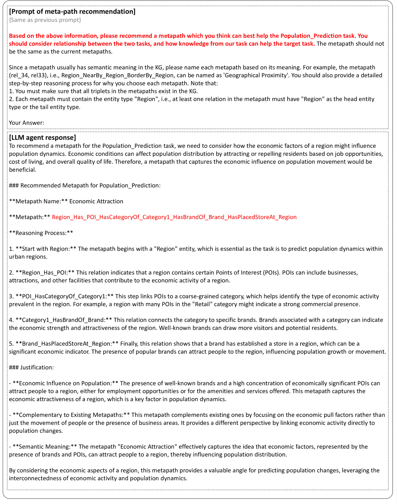

<!--yml
category: 未分类
date: 2025-01-11 12:00:52
-->

# Synergizing LLM Agents and Knowledge Graph for Socioeconomic Prediction in LBSN

> 来源：[https://arxiv.org/html/2411.00028/](https://arxiv.org/html/2411.00028/)

\useunder

\ul

Zhilun Zhou [0000-0002-8674-7513](https://orcid.org/0000-0002-8674-7513 "ORCID identifier") Department of Electronic Engineering, BNRist, Tsinghua UniversityBeijingChina [zzl22@mails.tsinghua.edu.cn](mailto:zzl22@mails.tsinghua.edu.cn) ,  Jingyang Fan Department of Electronic Engineering, BNRist, Tsinghua UniversityBeijingChina [siemprestr@gmail.com](mailto:siemprestr@gmail.com) ,  Yu Liu University of OxfordOxfordUnited Kingdom [liuyu2419@126.com](mailto:liuyu2419@126.com) ,  Fengli Xu [0000-0002-5720-4026](https://orcid.org/0000-0002-5720-4026 "ORCID identifier") Department of Electronic Engineering, BNRist, Tsinghua UniversityBeijingChina [fenglixu@tsinghua.edu.cn](mailto:fenglixu@tsinghua.edu.cn) ,  Depeng Jin [0000-0003-0419-5514](https://orcid.org/0000-0003-0419-5514 "ORCID identifier") Department of Electronic Engineering, BNRist, Tsinghua UniversityBeijingChina [jindp@tsinghua.edu.cn](mailto:jindp@tsinghua.edu.cn)  and  Yong Li [0000-0001-5617-1659](https://orcid.org/0000-0001-5617-1659 "ORCID identifier") Department of Electronic Engineering, BNRist, Tsinghua UniversityBeijingChina [liyong07@tsinghua.edu.cn](mailto:liyong07@tsinghua.edu.cn)(2018)

###### Abstract.

The fast development of location-based social networks (LBSNs) has led to significant changes in society, resulting in popular studies of using LBSN data for socioeconomic prediction, e.g., regional population and commercial activity estimation. Existing studies design various graphs to model heterogeneous LBSN data, and further apply graph representation learning methods for socioeconomic prediction. However, these approaches heavily rely on heuristic ideas and expertise to extract task-relevant knowledge from diverse data, which may not be optimal for specific tasks. Additionally, they tend to overlook the inherent relationships between different indicators, limiting the prediction accuracy. Motivated by the remarkable abilities of large language models (LLMs) in commonsense reasoning, embedding, and multi-agent collaboration, in this work, we synergize LLM agents and knowledge graph for socioeconomic prediction. We first construct a location-based knowledge graph (LBKG) to integrate multi-sourced LBSN data. Then we leverage the reasoning power of LLM agent to identify relevant meta-paths in the LBKG for each type of socioeconomic prediction task, and design a semantic-guided attention module for knowledge fusion with meta-paths. Moreover, we introduce a cross-task communication mechanism to further enhance performance by enabling knowledge sharing across tasks at both LLM agent and KG levels. On the one hand, the LLM agents for different tasks collaborate to generate more diverse and comprehensive meta-paths. On the other hand, the embeddings from different tasks are adaptively merged for better socioeconomic prediction. Experiments on two datasets demonstrate the effectiveness of the synergistic design between LLM and KG, providing insights for information sharing across socioeconomic prediction tasks.

Large language models, knowledge graph, location-based social network, socioeconomic prediction^†^†copyright: acmlicensed^†^†journalyear: 2018^†^†doi: XXXXXXX.XXXXXXX^†^†conference: Make sure to enter the correct conference title from your rights confirmation emai; June 03–05, 2018; Woodstock, NY^†^†isbn: 978-1-4503-XXXX-X/18/06

## 1\. Introduction

The development of location-based social networks (LBSNs) has significantly advanced socioeconomic prediction with rich web-sourced LBSN data such as user-generated content on review platforms. Socioeconomic indicators like regional population, user activity, and rating, provide a more comprehensive description of LBSN in turn, which can be leveraged by various web applications to offer enhanced services such as location recommendation, web page description, and personal assistants. As a result, socioeconomic prediction in the context of LBSN has become increasingly important, leading to a growing body of research in this field (Wang et al., [2016](https://arxiv.org/html/2411.00028v2#bib.bib24); Wang and Li, [2017](https://arxiv.org/html/2411.00028v2#bib.bib25); Yang et al., [2017](https://arxiv.org/html/2411.00028v2#bib.bib34); Yao et al., [2018](https://arxiv.org/html/2411.00028v2#bib.bib35); Dong et al., [2019](https://arxiv.org/html/2411.00028v2#bib.bib4); Xu et al., [2020](https://arxiv.org/html/2411.00028v2#bib.bib33); Zhang et al., [2021](https://arxiv.org/html/2411.00028v2#bib.bib36); Wu et al., [2022](https://arxiv.org/html/2411.00028v2#bib.bib31); Hou et al., [2022](https://arxiv.org/html/2411.00028v2#bib.bib8); Luo et al., [2022](https://arxiv.org/html/2411.00028v2#bib.bib18); Kim and Yoon, [2022](https://arxiv.org/html/2411.00028v2#bib.bib10); Zhou et al., [2023](https://arxiv.org/html/2411.00028v2#bib.bib38))

Traditionally people collect socioeconomic indicators from surveys, which are costly and time-consuming. Recently, data-driven methods have become popular, which use machine learning models to predict the socioeconomic indicators based on various LBSN data. The LBSN data comes from various sources and is heterogeneous. Existing studies have widely used graph structure to model the complex relationships within LBSN data, and predict the socioeconomic indicators through graph representation learning methods. They construct either multi-view graphs (Zhang et al., [2021](https://arxiv.org/html/2411.00028v2#bib.bib36); Wu et al., [2022](https://arxiv.org/html/2411.00028v2#bib.bib31); Kim and Yoon, [2022](https://arxiv.org/html/2411.00028v2#bib.bib10)) or knowledge graphs (KGs) (Zhou et al., [2023](https://arxiv.org/html/2411.00028v2#bib.bib38); Liu et al., [2023c](https://arxiv.org/html/2411.00028v2#bib.bib17)) to model different factors in LBSN data like mobility, spatial proximity, and functionality. However, These approaches highly rely on heuristic ideas and expertise to extract knowledge related to the tasks from LBSN data, such as the construction of sub-graphs or definition of meta-structures, which may be sub-optimal for different indicator prediction tasks. Moreover, the intrinsic correlations and potential for knowledge sharing across different socioeconomic prediction tasks are often overlooked, limiting the overall prediction accuracy.

The recently emerged large language models (LLMs) provide a promising solution to these limitations. LLMs have demonstrated several remarkable abilities which could help socioeconomic prediction (Wei et al., [2022a](https://arxiv.org/html/2411.00028v2#bib.bib29)): (1) Latent semantic embedding. At the foundational level, LLMs are able to generate text embeddings with rich semantic information, which makes it possible to integrate LLM with deep learning models to improve the performance by leveraging the inherent semantic information in the LBSN data. (2) Explicit commonsense reasoning. Moreover, LLMs possess vast commonsense knowledge, based on which they can perform complex reasoning (Zhao et al., [2024](https://arxiv.org/html/2411.00028v2#bib.bib37)). This capability facilitates the automatic extraction of task-relevant knowledge from LBSN data. (3) Multi-agent collaboration. At the highest level, LLM agents can communicate with other agents through natural language, and collaborate to solve complex tasks which is difficult for a single agent (Li et al., [2023a](https://arxiv.org/html/2411.00028v2#bib.bib12); Hong et al., [2023](https://arxiv.org/html/2411.00028v2#bib.bib7); Xiao et al., [2023](https://arxiv.org/html/2411.00028v2#bib.bib32)). Such ability enables LLM to transfer knowledge across different socioeconomic prediction tasks via semantic-rich natural language, and collaboratively improve the performance.

Inspired by this, we propose a learning framework that Synergize LLM Agent and Knowledge Graph learning model (SLAK) for socioeconomic prediction. We first construct a location-based knowledge graph (LBKG) to comprehensively integrate LBSN data. To extract task-relevant knowledge, we construct an LLM agent to automatically discover meta-paths in the LBKG that help the prediction for specific indicators, and extract a corresponding meta-path-based sub-KG. Moreover, we leverage KG representation learning model to distil knowledge from each meta-path-based sub-KG, and design a semantic-enhanced knowledge fusion module to adaptively fuse the knowledge based on semantic embeddings of meta-paths obtained from LLM. In addition, we propose a cross-task communication mechanism to enable knowledge sharing across different socioeconomic prediction tasks at both the LLM agent and KG level. Specifically, the LLM agents collaborate to extract better meta-paths, and we also adaptively merge the KG embeddings from different tasks with the knowledge fusion module.

Our contribution can be summarized as follows:

*   •

    We propose a framework to synergize LLM agents and KG for socioeconomic prediction. We leverage the reasoning capability of LLM agent to find task-relevant meta-paths from LBKG, and further use the semantic information of the meta-paths to guide the knowledge fusion.

*   •

    We design a cross-task communication mechanism to enable knowledge sharing across different socioeconomic prediction tasks at both the LLM agent level through multi-agent collaboration and the KG level through semantic attention, which further improves the accuracy.

*   •

    Extensive experiments on two city-scale datasets show that our model surpasses existing methods by 2.9-74.2% in terms of $R^{2}$ on eight indicator prediction tasks, demonstrating the effectiveness of our synergistic model between LLM and KG. Several in-depth analyses further show the advantage of our model design, providing insights for web-based socioeconomic prediction in LBSN.

## 2\. Preliminaries

### 2.1\. Problem Statement

###### Definition 2.1 (Urban Region).

We define urban regions as non-overlapping irregular areas in a city, which are partitioned by main road networks, such as a block, denoted as $\mathcal{L}=\{L_{1},L_{2},\ldots,L_{N_{L}}\}$.

###### Definition 2.2 (Socioeconomic Prediction Problem).

Given a set of socioeconomic indicators $\mathcal{I}=\{I_{1},\ldots,I_{N_{I}}\}$ in LBSN such as population, commercial activity, user activity and rating, the socioeconomic prediction task aims to predict the value of these indicators for urban regions based on various LBSN data, i.e., learn a mapping function $f:\mathcal{L}\rightarrow\mathcal{V_{I}}$, where $\mathcal{V_{I}}$ is the range of indicator $I\in\mathcal{I}$.

### 2.2\. Location-based Knowledge Graph

KG is a multi-relational graph structure, defined as $\mathcal{G}=\{\mathcal{E},\mathcal{R},\mathcal{F}\}$, where $\mathcal{E}$ is the entity set, $\mathcal{R}$ is the relation set, and $\mathcal{F}$ is the fact set. Each fact in $\mathcal{F}$ is denoted as a triplet $(h,r,t)$, representing a directional edge from the head entity $h\in\mathcal{E}$ to tail entity $t\in\mathcal{E}$ with relation type $r\in\mathcal{R}$. Due to its remarkable ability to represent heterogeneous data and integrate diverse knowledge, KG has been widely used in the study of LBSN (Wang et al., [2021b](https://arxiv.org/html/2411.00028v2#bib.bib26); Liu et al., [2021](https://arxiv.org/html/2411.00028v2#bib.bib14), [2023a](https://arxiv.org/html/2411.00028v2#bib.bib16); Zhou et al., [2023](https://arxiv.org/html/2411.00028v2#bib.bib38)). Inspired by this, we construct an LBKG to integrate multi-sourced LBSN data (Liu et al., [2023b](https://arxiv.org/html/2411.00028v2#bib.bib15); Zhou et al., [2023](https://arxiv.org/html/2411.00028v2#bib.bib38)). The LBKG contains various elements in LBSN such as regions, POIs, POI categories, brands, business areas, and various relations between them. The details of LBKG are presented in Appendix [A](https://arxiv.org/html/2411.00028v2#A1 "Appendix A Details of LBKG ‣ Synergizing LLM Agents and Knowledge Graph for Socioeconomic Prediction in LBSN").

Previous studies have shown the promising ability of LBKG in socioeconomic prediction (Zhou et al., [2023](https://arxiv.org/html/2411.00028v2#bib.bib38)). However, there are still two challenges to be addressed. First, the LBKG consists of many different entities and relations, containing knowledge in various domains, some of which may not be related to the specific socioeconomic indicator or may even harm the prediction performance, which implies the difficulty of extracting relevant knowledge manually. Second, different socioeconomic indicators are inherently correlated, with many influenced by similar knowledge in the LBKG. For example, the presence of business areas near a region may simultaneously enhance its commercial vitality and attract population growth. It remains unclear how to leverage the shared knowledge among different indicators to improve the prediction performance.

## 3\. Methods

Figure 1\. The overall framework of our proposed model SLAK.

### 3.1\. Framework Overview

To address the aforementioned challenges, we propose a framework synergizing the capability of LLM agent and KG, as shown in Figure [1](https://arxiv.org/html/2411.00028v2#S3.F1 "Figure 1 ‣ 3\. Methods ‣ Synergizing LLM Agents and Knowledge Graph for Socioeconomic Prediction in LBSN"). To overcome the first challenge, we construct an LLM agent to extract task-relevant knowledge by prompting it to find meta-paths related to the socioeconomic prediction task from the LBKG, and extract a corresponding sub-KG based on each meta-path. The meta-path-based sub-KGs are fed into a KG learning model to distil knowledge from each sub-KG, and we further use the semantic embeddings of meta-paths to guide the knowledge fusion. The output region embeddings are used for socioeconomic prediction through a final MLP output layer. As for the second challenge, we design a cross-task communication mechanism, as shown in Figure [2](https://arxiv.org/html/2411.00028v2#S3.F2 "Figure 2 ‣ 3.3\. Cross-task Communication ‣ 3\. Methods ‣ Synergizing LLM Agents and Knowledge Graph for Socioeconomic Prediction in LBSN"). Different indicator prediction tasks share knowledge at both the LLM agent level and KG level. Specifically, the LLM agents recommend potential meta-paths for other tasks from diverse perspectives, and update their own meta-paths selection based on knowledge from other tasks. Moreover, we leverage embedding LLM to obtain a semantic embedding for each task, which is used to adaptively fuse the region embeddings from different tasks.

### 3.2\. Single-task Learning

#### 3.2.1\. Meta-path Extraction

The LBKG integrates various LBSN data comprehensively and incorporates knowledge from various domains, such as the spatial knowledge of geographical relationships between regions, the functional knowledge regarding POIs and POI categories, and mobility knowledge about population flow (Zhou et al., [2023](https://arxiv.org/html/2411.00028v2#bib.bib38)). It is crucial to identify relevant information that can aid in predicting specific socioeconomic indicators. Inspired by the ability of meta-paths in KG to capture certain semantic contexts, we aim to find the most relevant meta-paths that contribute to the prediction tasks. We first provide the definition of meta-path as follows (Sun and Han, [2012](https://arxiv.org/html/2411.00028v2#bib.bib22)).

###### Definition 3.1 (Meta-path).

A meta-path in KG can be represented in the form of $E_{1}\xrightarrow{R_{1}}E_{2}\xrightarrow{R_{2}}\ldots\xrightarrow{R_{l-1}}E_{l}$, denoting a path from entity $E_{1},E_{2},\ldots$ to $E_{l}$ through relations $R_{1},\ldots,R_{l-1}$.

Meta-paths provide rich semantic contexts in the LBKG. For example, the meta-path $Region\xrightarrow{Has}POI\xrightarrow{Competitive}POI\xrightarrow{LocateAt}Region$ captures the competitive relationships between POIs in two regions, which may affect the commercial activity of these regions.

However, given the large number of entities and relations in LBKG, it is not trivial to find helpful meta-paths. Here we draw inspiration from the emergent commonsense reasoning ability of LLMs. It has been demonstrated that LLM can identify important meta-structures in heterogeneous information networks through reasoning (Chen et al., [2024](https://arxiv.org/html/2411.00028v2#bib.bib3)). Therefore, we construct an LLM agent to automatically find relevant meta-paths from LBKG. To enable the agent to understand the LBKG, we input the schema of LBKG described in natural language. Then we prompt the agent to generate several potential meta-path schemes for the socioeconomic prediction task. The detailed prompts are shown in Appendix [B](https://arxiv.org/html/2411.00028v2#A2 "Appendix B Prompts ‣ Synergizing LLM Agents and Knowledge Graph for Socioeconomic Prediction in LBSN").

#### 3.2.2\. KG Learning Model

Following previous work (Zhou et al., [2023](https://arxiv.org/html/2411.00028v2#bib.bib38)), we employ a hierarchical KG learning model to learn region embeddings from LBKG based on the extracted meta-paths. First, we use a KG encoder to extract global knowledge from the LBKG. Here we adopt a graph convolution model called R-GCN (Schlichtkrull et al., [2018](https://arxiv.org/html/2411.00028v2#bib.bib21)) as the KG encoder. Different from vanilla GCN, R-GCN aggregates information from neighboring nodes through each type of relation separately, which can better capture the structural information in KG. Specifically, let $\bm{e}_{i}^{(l)}$ denote the embedding of entity $e_{i}$ at the $l$-th R-GCN layer, the information aggregation function is:

| (1) |  | $\bm{e}_{i}^{(l+1)}=\sigma(\sum_{r\in\mathcal{R}}\sum_{j\in\mathcal{N}_{i}^{r}}% W_{r}^{(l)}\bm{e}_{j}^{(l)}+W_{0}^{(l)}\bm{e}_{i}^{(l)}),$ |  |

where $\bm{e}_{i}^{(l+1)}$ is the embedding at the $(l+1)$-th layer, $\mathcal{N}_{i}^{r}$ is the neighboring entities of $e_{i}$ with respect to relation $r$, and $W_{r}^{(l)}$, $W_{0}^{(l)}$ are learnable weight matrices.

Then we distil domain knowledge from the meta-paths. Given a meta-path scheme generated by LLM agent, we first extract all meta-paths with such scheme from the LBKG to construct a sub-KG, as shown in Figure [1](https://arxiv.org/html/2411.00028v2#S3.F1 "Figure 1 ‣ 3\. Methods ‣ Synergizing LLM Agents and Knowledge Graph for Socioeconomic Prediction in LBSN"). The sub-KG preserves all the contextual knowledge defined by the meta-path scheme in LBKG. In practice, we use the graph database Neo4j¹¹1https://neo4j.com/ to store the LBKG and query it to get the meta-paths with Cypher language. Consequently, each sub-KG is fed into a sub-KG encoder, which is also R-GCN model, to obtain region embeddings from each meta-path.

#### 3.2.3\. Semantic-guided Knowledge Fusion

Different meta-paths have different importance in socioeconomic indicator prediction tasks. Therefore, we propose a semantic-guided knowledge fusion module to dynamically fuse the knowledge of different meta-paths. We first obtain the natural language encoding of meta-paths using methods in (Chen et al., [2024](https://arxiv.org/html/2411.00028v2#bib.bib3)), which provides a description of the meta-path easy for LLM to understand. Specifically, we use the conjunction word THAT to construct a nested clause for each meta-path, as shown in Figure [1](https://arxiv.org/html/2411.00028v2#S3.F1 "Figure 1 ‣ 3\. Methods ‣ Synergizing LLM Agents and Knowledge Graph for Socioeconomic Prediction in LBSN"). The constructed sentences align with commonly-used English grammar, and thus are suitable for language models. Moreover, we use an embedding LLM to generate semantic embeddings for these sentences. We choose the GTE-based model (Li et al., [2023b](https://arxiv.org/html/2411.00028v2#bib.bib13)), which is one of the top models on the text embedding leaderboard MTEB (Muennighoff et al., [2022](https://arxiv.org/html/2411.00028v2#bib.bib19)), to obtain a $d_{LLM}=768$ dimensional semantic embedding for each meta-path.

Let $P_{1},\ldots,P_{N_{P}}$ denote the meta-paths, and $\bm{E}_{MP}\in\mathbb{R}^{N_{P}\times d_{LLM}}$ are the semantic embeddings of meta-paths. We first project the embeddings to get the query vector $\bm{Q}=\bm{E}_{MP}\bm{W}_{Q}\in\mathbb{R}^{N_{P}\times d_{h}}$, where $d_{h}$ is output embedding size of the sub-KG encoder. Then we calculate the attention weights as:

| (2) |  | $\alpha_{i}=\textnormal{softmax}(\frac{\bm{Q}_{i}^{\top}\bm{e}_{j}^{P_{i}}}{% \sqrt{d_{h}}}),i\in\{1,2,\ldots,N_{P}\},$ |  |

where $\bm{e}_{j}^{P_{i}}\in\mathbb{R}^{d_{h}}$ is the embedding of region $L_{j}$ at the meta-path-based sub-KG of $P_{i}$. Then, the output embedding of region $L_{j}$ is calculated as:

| (3) |  | $\bm{e}_{j}=\sum_{i=1}^{N_{P}}\alpha_{i}\bm{e}_{j}^{P_{i}}.$ |  |

Finally, the above embeddings are added to the output of the KG encoder through a residual connection, and fed into an MLP layer for indicator prediction. We train our model in a supervised manner and employ MSE loss to optimize it.

### 3.3\. Cross-task Communication

Figure 2\. Cross-task communication mechanism. (a) Agent-level communication through multi-agent collaboration. (b) KG embedding level communication through semantic-guided knowledge fusion.

Algorithm 1 Training algorithm of our model

1:Round 1: Single-task training2:     for Indicator $I_{i}\in\{I_{1},\ldots,I_{N_{I}}\}$ do3:         Generate meta-paths $\mathcal{P}^{i}=\{P_{1}^{i},\ldots,P_{N_{P}}^{i}\}$ through LLM agent $A_{i}$4:         Extract corresponding sub-KGs from LBKG5:         Generate semantic embeddings of meta-paths $E_{MP}$6:         Train the KG learning model to predict $I_{i}$ for many epochs with early-stopping7:         Save the region embeddings $E_{reg}^{I_{i}}$ at the best epoch      8:Round 2: Cross-task communication9:     $\triangleright$ Meta-paths update10:     for  Indicator $I_{i}\in\{I_{1},\ldots,I_{N_{I}}\}$ do11:         Agent $A_{i}$ updates its own meta-paths $\mathcal{P}_{update}^{i}=\{P_{1,update}^{i},\ldots,P_{N_{P},update}^{i}\}$12:         Agent $A_{i}$ recommends a meta-path to each other task $P^{j\leftarrow i},j\neq i$      13:     $\triangleright$ Model training14:     for Indicator $I_{i}\in\{I_{1},\ldots,I_{N_{I}}\}$ do15:         Obtain the final meta-paths $\mathcal{P}_{new}^{i}=\mathcal{P}_{update}^{i}\cup\{P^{i\leftarrow j}|j\neq i\}$16:         Train the model to predict $I_{i}$ with meta-paths $\mathcal{P}_{new}^{i}$ and embeddings $\{E_{reg}^{I_{j}}|j\neq i\}$      

Since different socioeconomic indicators are inherently correlated, we further design a cross-task communication mechanism to enable knowledge sharing across different tasks regarding both the meta-paths finding and the embedding learning, as shown in Figure [2](https://arxiv.org/html/2411.00028v2#S3.F2 "Figure 2 ‣ 3.3\. Cross-task Communication ‣ 3\. Methods ‣ Synergizing LLM Agents and Knowledge Graph for Socioeconomic Prediction in LBSN"). We first leverage the multi-agent collaboration ability of LLMs to optimize the meta-paths extracted from LBKG for each task. Then we dynamically fuse the embeddings from different tasks for indicator prediction.

Previous studies regarding multi-agent collaboration have shown that when assigned different roles, multiple LLM agents can think from different perspectives and communicate with each other to provide a more comprehensive and accurate answer to questions (Lan et al., [2024](https://arxiv.org/html/2411.00028v2#bib.bib11); Chan et al., [2023](https://arxiv.org/html/2411.00028v2#bib.bib2)). Inspired by this, we provide the agents with the previously found meta-paths of all tasks, and ask them to recommend a new meta-path to each of the other agents from their own task’s perspective. We leverage the chain-of-thought prompting techniques (Wei et al., [2022b](https://arxiv.org/html/2411.00028v2#bib.bib30)), and ask the agent to consider the relationships between two tasks and provide the detailed thinking process. For example, the agent responsible for the population prediction task may think about how the population affects the commercial activity, and recommend a relevant meta-path to the commercial activity prediction task. In addition, we ask each agent to update the previous meta-paths of its own tasks based on those from other tasks. We combine the self-updated meta-paths as well as meta-paths recommended by other agents as the final meta-paths for each task.

Moreover, we transfer the region embeddings across tasks to further enhance the performance, as shown in Figure [2](https://arxiv.org/html/2411.00028v2#S3.F2 "Figure 2 ‣ 3.3\. Cross-task Communication ‣ 3\. Methods ‣ Synergizing LLM Agents and Knowledge Graph for Socioeconomic Prediction in LBSN")(b). We only modify the final layer of the KG learning model in Figure [1](https://arxiv.org/html/2411.00028v2#S3.F1 "Figure 1 ‣ 3\. Methods ‣ Synergizing LLM Agents and Knowledge Graph for Socioeconomic Prediction in LBSN") by combining the current task embedding $E_{reg}$ with embeddings previously learned from other tasks. Here we adopt the same semantic-guided knowledge fusion module as mentioned in Section [3.2.3](https://arxiv.org/html/2411.00028v2#S3.SS2.SSS3 "3.2.3\. Semantic-guided Knowledge Fusion ‣ 3.2\. Single-task Learning ‣ 3\. Methods ‣ Synergizing LLM Agents and Knowledge Graph for Socioeconomic Prediction in LBSN"). We first construct a description of each task in natural language, and leverage the embedding LLM to obtain the semantic embedding of each task, denoted as $E_{task}$. Then $E_{task}$ is used as the query of the attention module to adaptively fuse the embeddings using Equation [2](https://arxiv.org/html/2411.00028v2#S3.E2 "In 3.2.3\. Semantic-guided Knowledge Fusion ‣ 3.2\. Single-task Learning ‣ 3\. Methods ‣ Synergizing LLM Agents and Knowledge Graph for Socioeconomic Prediction in LBSN") and [3](https://arxiv.org/html/2411.00028v2#S3.E3 "In 3.2.3\. Semantic-guided Knowledge Fusion ‣ 3.2\. Single-task Learning ‣ 3\. Methods ‣ Synergizing LLM Agents and Knowledge Graph for Socioeconomic Prediction in LBSN"). The output of the semantic-guided attention module is added to $\bm{E}_{reg}$ of the current task through a residual connection, and the obtained region embeddings $\bm{E}_{fused}$ are finally used for socioeconomic prediction.

The overall training algorithm of our model is presented in Algorithm [1](https://arxiv.org/html/2411.00028v2#alg1 "Algorithm 1 ‣ 3.3\. Cross-task Communication ‣ 3\. Methods ‣ Synergizing LLM Agents and Knowledge Graph for Socioeconomic Prediction in LBSN"). Note that it consists of two rounds of training. In the first round, we train the model for each task separately, and save the final region embeddings $E_{reg}^{I_{i}}$. In the second round, the LLM agents communicate to generate new meta-paths $\mathcal{P}_{new}^{i}$ for each task, and we train the model for each task based on $\mathcal{P}_{new}^{i}$ and region embeddings from the previous round.

## 4\. Experiments

Table 1\. The basic information of two real-world datasets.

 |  | City | Beijing | Shanghai |
| Basic Info. | #Regions | 523 | 2032 |
| Indicators |  

&#124; population, commercial activity, &#124;
&#124; user activity, rating &#124;

 |
| LBKG Statistics | #Entities | 23,754 | 41,338 |
| #Relations | 35 | 35 |
| #Facts | 330,652 | 589,850 | 

Table 2\. Performance comparison with baselines on Beijing dataset. Best result are presented in bold, and the second best results are underlined.

 |  | Population | Commercial | User activity | Rating |
| Model | MAE | RMSE | R² | MAE | RMSE | R² | MAE | RMSE | R² | MAE | RMSE | R² |
| GAT | 0.676 | 0.916 | 0.305 | 1.293 | 1.712 | 0.270 | 2.164 | 3.125 | 0.115 | 0.706 | 1.056 | 0.058 |
| MGFN | 0.667 | 0.904 | 0.324 | 3.235 | 6.155 | 0.200 | 5.552 | 8.657 | 0.179 | 0.772 | 1.002 | 0.152 |
| HUGAT | 0.695 | 0.919 | 0.301 | 1.165 | 1.558 | 0.396 | 1.947 | 2.987 | 0.191 | 0.728 | 1.080 | 0.014 |
| HKGL | \ul0.660 | \ul0.886 | \ul0.350 | 1.000 | 1.238 | 0.619 | 1.864 | 2.618 | 0.379 | 0.752 | 1.031 | 0.102 |
| HKGL-trans | 0.790 | 1.007 | 0.162 | 1.066 | 1.379 | 0.527 | 1.827 | 2.726 | 0.326 | 0.736 | 1.058 | 0.055 |
| SLAG-single | \ul0.660 | 0.895 | 0.337 | \ul0.982 | \ul1.227 | \ul0.626 | \ul1.690 | \ul2.516 | \ul0.426 | \ul0.666 | \ul0.964 | \ul0.214 |
| SLAG-comm | 0.651 | 0.879 | 0.360 | 0.971 | 1.204 | 0.640 | 1.557 | 2.438 | 0.461 | 0.655 | 0.933 | 0.265 | 

Table 3\. Performance comparison with baselines on Shanghai dataset. Best result are presented in bold, and the second best results are underlined.

 |  | Population | Commercial | User activity | Rating |
| Model | MAE | RMSE | R² | MAE | RMSE | R² | MAE | RMSE | R² | MAE | RMSE | R² |
| GAT | 0.667 | 0.844 | 0.446 | 1.390 | 1.777 | 0.068 | 2.368 | 2.950 | 0.236 | 0.917 | 1.209 | 0.086 |
| MGFN | 0.747 | 0.954 | 0.293 | 2.355 | 4.613 | 0.085 | 6.136 | 9.353 | 0.160 | 0.896 | 1.185 | 0.122 |
| HUGAT | 0.662 | \ul0.844 | \ul0.446 | 1.408 | 1.787 | 0.056 | 2.342 | 2.891 | 0.267 | 0.957 | 1.220 | 0.068 |
| HKGL | 0.658 | 0.852 | 0.436 | \ul1.309 | 1.686 | 0.160 | 1.964 | 2.505 | 0.449 | 0.870 | 1.140 | 0.186 |
| HKGL-trans | 0.698 | 0.936 | 0.319 | 1.381 | 1.752 | 0.094 | 2.055 | 2.598 | 0.408 | 0.891 | 1.167 | \ul0.191 |
| SLAG-single | 0.620 | 0.849 | 0.440 | 1.323 | \ul1.678 | \ul0.168 | \ul1.864 | \ul2.336 | \ul0.521 | \ul0.864 | \ul1.137 | \ul0.191 |
| SLAG-comm | \ul0.627 | 0.812 | 0.488 | 1.294 | 1.664 | 0.183 | 1.816 | 2.311 | 0.531 | 0.838 | 1.114 | 0.224 | 

### 4.1\. Datasets

We conduct experiments on two real-world datasets, Beijing and Shanghai, to evaluate our model.
Beijing dataset. It contains 523 regions in Beijing within the Fifth Ring Road, which are partitioned by main road networks. We collect the population data from WorldPop²²2https://hub.worldpop.org/geodata/summary?id=24924. The commercial activity indicators are reflected by the number of firms (Dong et al., [2021](https://arxiv.org/html/2411.00028v2#bib.bib5)). We also collected restaurant data from Dianping, one of the most popular review platforms in China. We use the total number of reviews of all restaurants to reflect the user activity of a region. The rating indicator is calculated as the average user rating of all restaurants in a region.
Shanghai dataset. It contains 2032 regions in Shanghai, which are also divided by main road networks. The indicators in Shanghai and their data sources are the same as Beijing dataset. The basic statistics of these datasets are shown in Table [1](https://arxiv.org/html/2411.00028v2#S4.T1 "Table 1 ‣ 4\. Experiments ‣ Synergizing LLM Agents and Knowledge Graph for Socioeconomic Prediction in LBSN").

### 4.2\. Experiment Settings

#### 4.2.1\. Baselines

We compare our model with state-of-the-art graph embedding methods as well as socioeconomic prediction methods. Graph embedding methods.

*   •

    GAT (Veličković et al., [2017](https://arxiv.org/html/2411.00028v2#bib.bib23)): It is a graph convolution network that aggregates information from neighboring nodes with learnable weights.

Socioeconomic prediction methods.

*   •

    HUGAT (Kim and Yoon, [2022](https://arxiv.org/html/2411.00028v2#bib.bib10)): It constructs a heterogeneous graph to model LBSN data, and uses a heterogeneous graph attention network to learn location embeddings for socioeconomic indicator prediction.

*   •

    MGFN (Wu et al., [2022](https://arxiv.org/html/2411.00028v2#bib.bib31)): It constructs mobility graphs and leverages multi-level attention mechanism to learn region embeddings.

*   •

    HKGL (Zhou et al., [2023](https://arxiv.org/html/2411.00028v2#bib.bib38)): It uses a hierarchical KG learning model to learn global and domain knowledge from LBKG. We also evaluate a variant of this model named HKGL-trans by transferring region embeddings across tasks. Specifically, we concatenate the task-specific embeddings with embeddings learned from other tasks at the final layer.

For our proposed SLAK model, we compare two versions of it. SLAK-single denotes the model training on different tasks separately, i.e., the round 1 in Algorithm [1](https://arxiv.org/html/2411.00028v2#alg1 "Algorithm 1 ‣ 3.3\. Cross-task Communication ‣ 3\. Methods ‣ Synergizing LLM Agents and Knowledge Graph for Socioeconomic Prediction in LBSN"). SLAK-comm denotes the model with cross-task communication, i.e., the round 2 in Algorithm [1](https://arxiv.org/html/2411.00028v2#alg1 "Algorithm 1 ‣ 3.3\. Cross-task Communication ‣ 3\. Methods ‣ Synergizing LLM Agents and Knowledge Graph for Socioeconomic Prediction in LBSN").

#### 4.2.2\. Evaluation Metrics

We randomly split the regions into train, validation, and test set by 6:2:2, and adopt the commonly used Mean Absolute Error (MAE), Root Mean Square Error (RMSE), and coefficient of determination ($R^{2}$) as evaluation metrics.

### 4.3\. Overall Performance

We present the overall performance of our model and baselines in Table [2](https://arxiv.org/html/2411.00028v2#S4.T2 "Table 2 ‣ 4\. Experiments ‣ Synergizing LLM Agents and Knowledge Graph for Socioeconomic Prediction in LBSN") and [3](https://arxiv.org/html/2411.00028v2#S4.T3 "Table 3 ‣ 4\. Experiments ‣ Synergizing LLM Agents and Knowledge Graph for Socioeconomic Prediction in LBSN"), from which we have the following observations.

First, our model outperforms baseline methods on all eight indicator prediction tasks across two datasets, with improvements in terms of $R^{2}$ ranging from 2.9% to 159.8%, demonstrating the effectiveness and robustness of our model. Specifically, our SLAK-single model is better than baselines on six of the eight indicators, indicating that leveraging LLM agents to extract relevant meta-paths on a single task is promising but not robust enough. Moreover, the cross-task communication mechanism further improves our performance by 1.9% to 23.8% in terms of $R^{2}$, achieving the best results.

Second, HKGL generally achieves the best performance among baselines because it uses LBKG to effectively integrate LBSN data, and defines several sub-KGs to capture diverse knowledge in LBKG. However, it still performs worse than our model, which suggests that manually extracting relevant knowledge from LBSN data may lead to sub-optimal results. On the contrary, we leverage the reasoning and multi-agent collaboration ability of LLM agents to automatically find and optimize meta-paths, thus showing considerable performance gain.

Third, it is natural to question whether other methods can also benefit from transferring knowledge across tasks. Therefore, we compare with a variant of the best baseline model by concatenating region embeddings learned from other indicators (HKGL vs. HKGL-trans). We notice that the performance becomes worse on all indicators with embedding transfer. This is because embeddings from different tasks are trained with supervised signals from other indicators, which may not be suitable for the current task. This suggests that it is non-trivial to transfer knowledge across different tasks through embedding. However, our model shows better performance with cross-task communication mechanism, which further demonstrates the effectiveness of semantic-guided knowledge fusion as well as knowledge sharing through multi-agent collaboration.

Figure 3\. Visualization of prediction error of user activity (measured in log scale). We use red squares to mark the regions where baseline performs worse.

To intuitively understand the socioeconomic prediction result, we visualize the indicator prediction error on test regions of our model and the best baseline model on user activity prediction task. As shown in Figure [3](https://arxiv.org/html/2411.00028v2#S4.F3 "Figure 3 ‣ 4.3\. Overall Performance ‣ 4\. Experiments ‣ Synergizing LLM Agents and Knowledge Graph for Socioeconomic Prediction in LBSN"), our model generally shows smaller errors compared with HKGL. Specifically, our model shows better accuracy in Haidian and Wangjing areas, which are known for their high density of tech companies as well as vibrant user activities in LBSN. In addition, our model also performs better in Fengxian district in southwestern Shanghai. Such results further demonstrate the accuracy of our model in socioeconomic indicator prediction tasks.

### 4.4\. Ablation Study

(a) Beijing

(b) Shanghai

(c) Beijing

(d) Shanghai

Figure 4\. Performance comparison of models without self-update meta-paths (w/o self-update), recommended meta-paths (w/o rec.), embedding transferred from other tasks (w/o trans.), and semantic attention (w/o attn.).

To demonstrate the effectiveness of our model design, we further conduct ablation studies. We first examine the influence of multi-agent collaboration by removing the meta-path self-update or meta-path recommendation. For example, removing self-update means that we only use the meta-paths recommended by other agents for each task, while removing recommendation indicates that we only use the self-update meta-paths. As shown in Figure [4](https://arxiv.org/html/2411.00028v2#S4.F4 "Figure 4 ‣ 4.4\. Ablation Study ‣ 4\. Experiments ‣ Synergizing LLM Agents and Knowledge Graph for Socioeconomic Prediction in LBSN")(a-b), the performance becomes worse on all indicators across two datasets, with a significant drop over 5.5% in terms of $R^{2}$. Such a result demonstrates the importance of multi-agent collaboration in knowledge sharing across tasks, where different agents find meta-paths from diverse perspectives, enabling better and more comprehensive knowledge extraction.

Moreover, we evaluate our key designs in the KG learning model, i.e., the embedding transfer across tasks as well as the semantic-guided knowledge fusion. For the former, we omit the embedding fusion module in Figure [2](https://arxiv.org/html/2411.00028v2#S3.F2 "Figure 2 ‣ 3.3\. Cross-task Communication ‣ 3\. Methods ‣ Synergizing LLM Agents and Knowledge Graph for Socioeconomic Prediction in LBSN")(b) and only use embeddings from the current task for prediction. For the latter, we use a traditional self-attention module to replace our semantic-guided knowledge fusion module in our model. It can be observed in Figure [4](https://arxiv.org/html/2411.00028v2#S4.F4 "Figure 4 ‣ 4.4\. Ablation Study ‣ 4\. Experiments ‣ Synergizing LLM Agents and Knowledge Graph for Socioeconomic Prediction in LBSN")(c-d) that the $R^{2}$ drops on almost all indicators without these designs, showing that the semantic information of meta-paths and tasks plays an important role in fusing diverse knowledge from different meta-paths and different tasks. Overall, the results of ablation studies validate that synergizing LLM agents and KG are crucial for better socioeconomic indicator prediction.

### 4.5\. Efficiency of Meta-path Optimization

Table 4\. Performance and time cost comparison with meta-path searching algorithms on user activity prediction task. GA and Random represent genetic algorithm and random search, respectively.

 |  | Beijing | Shanghai |
| --- | --- | --- |
| Method | MAE | RMSE | R2 | Time | MAE | RMSE | R2 | Time |
| --- | --- | --- | --- | --- | --- | --- | --- | --- |
| Random | 1.621 | 2.485 | 0.440 | 32 min | 1.887 | 2.384 | 0.501 | 85 min |
| GA | 1.688 | 2.532 | 0.419 | 37 min | 1.870 | 2.315 | 0.515 | 90 min |
| Ours | 1.557 | 2.438 | 0.461 | 4 min | 1.816 | 2.311 | 0.531 | 6 min | 

Table 5\. Best meta-paths found by our model, random search and genetic algorithms on user activity prediction task in Beijing. ”Rec by Pop/Com/Rat” indicates the meta-paths recommended by agent of population prediction, commercial activity prediction, and rating prediction tasks.

 | Model | Meta-paths |
| --- | --- |
| SLAG-single | $Region\xrightarrow{HasStoreOf}Brand\xrightarrow{ExistIn}POI\xrightarrow{% LocateAt}Region$ |
| $Region\xrightarrow{ServedBy}BusinessArea\xrightarrow{Contain}POI\xrightarrow{% LocateAt}Region$ |
| $Region\xrightarrow{Has}POI\xrightarrow{HasCategoryOf}Category1\xrightarrow{% ExistIn}POI\xrightarrow{LocateAt}Region$ |
| SLAG-comm | Self-update | $Region\xrightarrow{Has}POI\xrightarrow{Competitive}POI\xrightarrow{LocateAt}Region$ |
| $Region\xrightarrow{HasStoreOf}Brand\xrightarrow{BelongTo}Category1\xrightarrow% {HasBrandOf}Brand\xrightarrow{ExistIn}POI\xrightarrow{LocateAt}Region$ |
| $Region\xrightarrow{ServedBy}BusinessArea\xrightarrow{Contain}POI\xrightarrow{% Competitive}POI\xrightarrow{LocateAt}Region$ |
| Rec by Pop. | $Region\xrightarrow{PopulationFlowTo}Region\xrightarrow{Has}POI\xrightarrow{% HasCategoryOf}Category1\xrightarrow{ExistIn}POI\xrightarrow{LocateAt}Region$ |
| Rec by Com | $Region\xrightarrow{ServedBy}BusinessArea\xrightarrow{Contain}POI\xrightarrow{% HasBrandOf}Brand\xrightarrow{ExistIn}POI\xrightarrow{LocateAt}Region$ |
| Rec by Rat | $Region\xrightarrow{Has}POI\xrightarrow{Competitive}POI\xrightarrow{LocateAt}Region$ |
| Genetic Algorithm | $Region\xrightarrow{PopulationFlowTo}Region\xrightarrow{ServedBy}BusinessArea% \xrightarrow{Contain}POI\xrightarrow{Competitive}POI$ |
| $Region\xrightarrow{PopulationFlowTo}Region\xrightarrow{Has}POI\xrightarrow{% LocateAt}Region$ |
| $Region\xrightarrow{PopulationInflowFrom}Region\xrightarrow{% PopulationInflowFrom}Region\xrightarrow{PopulationFlowTo}Region$ |
| $Region\xrightarrow{SimilarFunction}Region\xrightarrow{SimilarFunction}Region% \xrightarrow{NearBy}Region$ |
| $Region\xrightarrow{PopulationFlowTo}Region\xrightarrow{ServedBy}BusinessArea% \xrightarrow{Contain}POI\xrightarrow{LocateAt}Region$ |
| $Region\xrightarrow{PopulationFlowTo}Region\xrightarrow{HasStoreOf}Brand% \xrightarrow{RelatedBrand}Brand$ |
| Random Search | $Region\xrightarrow{Has}POI\xrightarrow{HasCategoryOf}Category2\xrightarrow{% IsSubCategoryOf}Category1$ |
| $Region\xrightarrow{PopulationFlowTo}Region\xrightarrow{Has}POI\xrightarrow{% HasCategoryOf}Category2$ |
| $Region\xrightarrow{SimilarFunction}Region\xrightarrow{HasStoreOf}Brand% \xrightarrow{HasPlacedStoreAt}Region$ |
| $Region\xrightarrow{ServedBy}BusinessArea\xrightarrow{Serve}Region\xrightarrow{% PopulationInflowFrom}Region$ |
| $Region\xrightarrow{SimilarFunction}Region\xrightarrow{ServedBy}BusinessArea% \xrightarrow{Serve}Region\xrightarrow{PopulationFlowTo}Region$ |
| $Region\xrightarrow{HasStoreOf}Brand\xrightarrow{HasPlacedStoreAt}Region% \xrightarrow{PopulationFlowTo}Region$ | 

Here we demonstrate the advantage of our meta-paths extraction method over traditional meta-path searching algorithms. We compare our model with two meta-path searching algorithms, random search and genetic algorithms.

In the genetic algorithm, we define a meta-path as a gene, and the chromosome of an individual as a set of 6 meta-paths, which has the same number as our model (3 self-update and 3 recommended meta-paths) for fair comparison. The fitness is calculated as the prediction $R^{2}$ when using these meta-paths to train our model. We generate 5 individuals in each generation, and calculate the fitness of each. Then we select the best two individuals as parents to perform crossover and mutation to produce the next generation. Specifically, in the crossover operation, one random meta-path is exchanged from the parents. Besides, each meta-path has a probability of 10% to mutate, i.e., be replaced by a new randomly generated meta-path. As for the random search algorithm, we also set the number of meta-paths as 6 for each individual, and randomly generate 6 meta-paths with lengths ranging from 2 to 4\. Particularly, we start from the entity type Region, and sequentially sample a relation with such entity type as the head entity. We repeat the search for 6 iterations, and 5 individuals are generated in each iteration.

The performance and time cost of these algorithms and our model are shown in Table [4](https://arxiv.org/html/2411.00028v2#S4.T4 "Table 4 ‣ 4.5\. Efficiency of Meta-path Optimization ‣ 4\. Experiments ‣ Synergizing LLM Agents and Knowledge Graph for Socioeconomic Prediction in LBSN"). It can be observed that our model achieves better performance and lower time cost. Specifically, our SLAK model outperforms traditional algorithms by 4.7% and 3.1% in terms of $R^{2}$ on Beijing and Shanghai datasets, respectively. This is probably because the number of meta-paths in LBKG is large and the potential combination of meta-paths is even significantly larger, making it difficult to find better meta-paths through searching. In comparison, the main difference between our method and searching algorithms is that we find meta-paths through reasoning instead of searching. Leveraging the capability of commonsense reasoning, LLM can effectively find meta-paths relevant to the indicator prediction task. Moreover, LLM can optimize the meta-paths through multi-agent collaboration by enabling multiple agents to reason from diverse perspectives, thus leading to better results. In addition, our model reduces the time cost by over $8\times$, which is because when evaluating each combination of meta-paths, the searching algorithms need to train the KG learning model once, which makes it substantially time-consuming when searching from a large number of individuals. On the contrary, our methods only need to train the KG learning model for a few times. Furthermore, the time cost of LLM communication is much smaller compared with training the model over and over again.

### 4.6\. Case Study of Discovered Meta-paths

We present the meta-paths found by our model, random search, and genetic algorithms in Table [5](https://arxiv.org/html/2411.00028v2#S4.T5 "Table 5 ‣ 4.5\. Efficiency of Meta-path Optimization ‣ 4\. Experiments ‣ Synergizing LLM Agents and Knowledge Graph for Socioeconomic Prediction in LBSN"). It can be observed that compared with SLAK-single, the meta-paths discovered in the second round through multi-agent collaboration are generally longer and more diverse. This is probably because these meta-paths are generated by LLM agents based on the previously found ones, which enables agents to consider more complex meta-paths. Moreover, we find that the meta-paths recommended by other agents are chosen from their own task’s perspective. For example, in Beijing dataset, the meta-path recommended by population prediction task $Region\xrightarrow{PopulationFlowTo}Region\xrightarrow{Has}POI\xrightarrow{% HasCategoryOf}Category1\xrightarrow{ExistIn}POI\xrightarrow{LocateAt}Region$ reflect the population flow influence, the one from commercial prediction task $Region\xrightarrow{ServedBy}BusinessArea\xrightarrow{Contain}POI\xrightarrow{% HasBrandOf}Brand\xrightarrow{ExistIn}POI\xrightarrow{LocateAt}Region$ consider the commercial factors between entities like BusinessArea, POI, and Brand. The meta-paths from rating prediction task $Region\xrightarrow{Has}POI\xrightarrow{Competitive}POI\xrightarrow{LocateAt}Region$ captures the competitive relationships between POIs in regions, which may impact the rating as well as user activity. Therefore, the meta-paths found through multi-agent collaboration capture diverse knowledge more comprehensively. In comparison, the meta-paths generated by searching algorithms are less meaningful and diverse. For example, among the meta-paths generated by the genetic algorithms in Beijing, five out of six meta-paths model the population flow between regions, which may lead to information redundancy.

## 5\. Related Work

### 5.1\. Graph Learning for Socioeconomic Prediction

Due to the remarkable ability to model non-Euclidean and heterogeneous data, the graph structure and graph learning model have long been utilized for socioeconomic prediction in LBSN. Some studies leverage the mobility data and construct mobility graphs to model the population flow patterns between locations (Wu et al., [2022](https://arxiv.org/html/2411.00028v2#bib.bib31); Hou et al., [2022](https://arxiv.org/html/2411.00028v2#bib.bib8); Xu et al., [2020](https://arxiv.org/html/2411.00028v2#bib.bib33)). Moreover, some studies further consider knowledge in LBSN from different perspectives through multiple graphs. For instance, HDGE (Wang and Li, [2017](https://arxiv.org/html/2411.00028v2#bib.bib25)) constructs a mobility flow graph and spatial graph, and some studies (Zhang et al., [2021](https://arxiv.org/html/2411.00028v2#bib.bib36); Luo et al., [2022](https://arxiv.org/html/2411.00028v2#bib.bib18)) propose models to dynamically fuse mobility, POI, and spatial graphs for indicator prediction.

Recently, some studies introduce heterogeneous graph or KG to integrate heterogeneous LBSN data in a single graph. HUGAT (Kim and Yoon, [2022](https://arxiv.org/html/2411.00028v2#bib.bib10)) designs several meta-paths to capture different relationships in LBSN from a heterogeneous graph, and aggregate information from meta-path-based neighbors of locations. Zhou et al. propose a hierarchical KG learning model to learn the global knowledge and domain knowledge from LBKG, achieving considerable performance (Zhou et al., [2023](https://arxiv.org/html/2411.00028v2#bib.bib38)). However, existing methods rely on human expertise to identify relevant knowledge from LBSN data that may help the downstream tasks, which may usually be sub-optimal.

### 5.2\. Synergy of LLM and KG

LLMs excel in understanding and generating human language but often suffer from hallucination and a lack of factual accuracy. In contrast, KGs store structured, factual knowledge, which is explicit and interpretable. Therefore, in recent years, researchers have increasingly explored the synergy between LLM and KG to leverage their complementary strengths (Pan et al., [2024](https://arxiv.org/html/2411.00028v2#bib.bib20)). Some studies combine LLM with KG for better knowledge representations by fusing the neural networks of language models with KG (Wang et al., [2021a](https://arxiv.org/html/2411.00028v2#bib.bib27); Zhu et al., [2023](https://arxiv.org/html/2411.00028v2#bib.bib39)). Moreover, some studies construct LLM agents that interact with KG for better reasoning. For example, KSL (Feng et al., [2023](https://arxiv.org/html/2411.00028v2#bib.bib6)) lets LLM search on KG to retrieve facts relevant to the questions, StructGPT (Jiang et al., [2023](https://arxiv.org/html/2411.00028v2#bib.bib9)) enables LLM to perform reasoning by traversing on KGs, and Wang et al. (Wang et al., [2024](https://arxiv.org/html/2411.00028v2#bib.bib28)) traverses a knowledge graph across multiple documents to enhance multi-document question answering.

## 6\. Conclusion

In this work, we propose a framework that synergizes the ability of LLM agent and KG learning model for better socioeconomic prediction in LBSN. Specifically, we leverage LLM agent to automatically find task-relevant meta-paths, and propose a semantic-guided knowledge fusion model to adaptively fuse diverse knowledge based on semantic information of the meta-paths. Moreover, we enable cross-task knowledge transfer by LLM agent-level collaboration and embedding-level knowledge fusion. Such synergistic model design shows better performance compared with socioeconomic prediction baselines as well as meta-path searching algorithms. In the future, we plan to consider the dynamic update of LBKG and socioeconomic indicators as the LBSN changes over time, and leverage LLM to further capture the temporal patterns of such dynamics. Another promising direction is to explore the integration of LLM and KG throughout the lifecycle from LBKG construction and representation to downstream applications.

## References

*   (1)
*   Chan et al. (2023) Chi-Min Chan, Weize Chen, Yusheng Su, Jianxuan Yu, Wei Xue, Shanghang Zhang, Jie Fu, and Zhiyuan Liu. 2023. Chateval: Towards better llm-based evaluators through multi-agent debate. *arXiv preprint arXiv:2308.07201* (2023).
*   Chen et al. (2024) Lin Chen, Fengli Xu, Nian Li, Zhenyu Han, Meng Wang, Yong Li, and Pan Hui. 2024. Large Language Model-driven Meta-structure Discovery in Heterogeneous Information Network. In *Proceedings of the 30th ACM SIGKDD Conference on Knowledge Discovery and Data Mining*. 307–318.
*   Dong et al. (2019) Lei Dong, Carlo Ratti, and Siqi Zheng. 2019. Predicting neighborhoods’ socioeconomic attributes using restaurant data. *Proceedings of the National Academy of Sciences* 116, 31 (2019), 15447–15452.
*   Dong et al. (2021) Lei Dong, Xiaohui Yuan, Meng Li, Carlo Ratti, and Yu Liu. 2021. A gridded establishment dataset as a proxy for economic activity in China. *Scientific Data* 8, 1 (2021), 1–9.
*   Feng et al. (2023) Chao Feng, Xinyu Zhang, and Zichu Fei. 2023. Knowledge solver: Teaching llms to search for domain knowledge from knowledge graphs. *arXiv preprint arXiv:2309.03118* (2023).
*   Hong et al. (2023) Sirui Hong, Mingchen Zhuge, Jonathan Chen, Xiawu Zheng, Yuheng Cheng, Ceyao Zhang, Jinlin Wang, Zili Wang, Steven Ka Shing Yau, Zijuan Lin, Liyang Zhou, Chenyu Ran, Lingfeng Xiao, Chenglin Wu, and Jürgen Schmidhuber. 2023. MetaGPT: Meta Programming for A Multi-Agent Collaborative Framework. arXiv:2308.00352 [cs.AI]
*   Hou et al. (2022) Mingliang Hou, Feng Xia, Haoran Gao, Xin Chen, and Honglong Chen. 2022. Urban Region Profiling With Spatio-Temporal Graph Neural Networks. *IEEE Transactions on Computational Social Systems* (2022).
*   Jiang et al. (2023) Jinhao Jiang, Kun Zhou, Zican Dong, Keming Ye, Wayne Xin Zhao, and Ji-Rong Wen. 2023. Structgpt: A general framework for large language model to reason over structured data. *arXiv preprint arXiv:2305.09645* (2023).
*   Kim and Yoon (2022) Namwoo Kim and Yoonjin Yoon. 2022. Effective Urban Region Representation Learning Using Heterogeneous Urban Graph Attention Network (HUGAT). *arXiv preprint arXiv:2202.09021* (2022).
*   Lan et al. (2024) Xiaochong Lan, Chen Gao, Depeng Jin, and Yong Li. 2024. Stance detection with collaborative role-infused llm-based agents. In *Proceedings of the International AAAI Conference on Web and Social Media*, Vol. 18\. 891–903.
*   Li et al. (2023a) Guohao Li, Hasan Abed Al Kader Hammoud, Hani Itani, Dmitrii Khizbullin, and Bernard Ghanem. 2023a. CAMEL: Communicative Agents for ”Mind” Exploration of Large Language Model Society. In *Thirty-seventh Conference on Neural Information Processing Systems*. [https://openreview.net/forum?id=3IyL2XWDkG](https://openreview.net/forum?id=3IyL2XWDkG)
*   Li et al. (2023b) Zehan Li, Xin Zhang, Yanzhao Zhang, Dingkun Long, Pengjun Xie, and Meishan Zhang. 2023b. Towards general text embeddings with multi-stage contrastive learning. *arXiv preprint arXiv:2308.03281* (2023).
*   Liu et al. (2021) Chang Liu, Chen Gao, Depeng Jin, and Yong Li. 2021. Improving Location Recommendation with Urban Knowledge Graph. *arXiv preprint arXiv:2111.01013* (2021).
*   Liu et al. (2023b) Yu Liu, Jingtao Ding, Yanjie Fu, and Yong Li. 2023b. Urbankg: An urban knowledge graph system. *ACM Transactions on Intelligent Systems and Technology* 14, 4 (2023), 1–25.
*   Liu et al. (2023a) Yu Liu, Jingtao Ding, and Yong Li. 2023a. KnowSite: Leveraging Urban Knowledge Graph for Site Selection. In *Proceedings of the 31st ACM International Conference on Advances in Geographic Information Systems*. 1–12.
*   Liu et al. (2023c) Yu Liu, Xin Zhang, Jingtao Ding, Yanxin Xi, and Yong Li. 2023c. Knowledge-infused contrastive learning for urban imagery-based socioeconomic prediction. In *Proceedings of the ACM Web Conference 2023*. 4150–4160.
*   Luo et al. (2022) Yan Luo, Fu-lai Chung, and Kai Chen. 2022. Urban Region Profiling via A Multi-Graph Representation Learning Framework. *arXiv preprint arXiv:2202.02074* (2022).
*   Muennighoff et al. (2022) Niklas Muennighoff, Nouamane Tazi, Loïc Magne, and Nils Reimers. 2022. MTEB: Massive text embedding benchmark. *arXiv preprint arXiv:2210.07316* (2022).
*   Pan et al. (2024) Shirui Pan, Linhao Luo, Yufei Wang, Chen Chen, Jiapu Wang, and Xindong Wu. 2024. Unifying large language models and knowledge graphs: A roadmap. *IEEE Transactions on Knowledge and Data Engineering* (2024).
*   Schlichtkrull et al. (2018) Michael Schlichtkrull, Thomas N Kipf, Peter Bloem, Rianne van den Berg, Ivan Titov, and Max Welling. 2018. Modeling relational data with graph convolutional networks. In *European Semantic Web Conference*. Springer, 593–607.
*   Sun and Han (2012) Yizhou Sun and Jiawei Han. 2012. *Mining heterogeneous information networks: principles and methodologies*. Morgan & Claypool Publishers.
*   Veličković et al. (2017) Petar Veličković, Guillem Cucurull, Arantxa Casanova, Adriana Romero, Pietro Lio, and Yoshua Bengio. 2017. Graph attention networks. *arXiv preprint arXiv:1710.10903* (2017).
*   Wang et al. (2016) Hongjian Wang, Daniel Kifer, Corina Graif, and Zhenhui Li. 2016. Crime rate inference with big data. In *Proceedings of the 22nd ACM SIGKDD International Conference on Knowledge Discovery and Data Mining*. 635–644.
*   Wang and Li (2017) Hongjian Wang and Zhenhui Li. 2017. Region representation learning via mobility flow. In *Proceedings of the 2017 ACM on Conference on Information and Knowledge Management*. 237–246.
*   Wang et al. (2021b) Huandong Wang, Qiaohong Yu, Yu Liu, Depeng Jin, and Yong Li. 2021b. Spatio-Temporal Urban Knowledge Graph Enabled Mobility Prediction. *Proceedings of the ACM on Interactive, Mobile, Wearable and Ubiquitous Technologies* 5, 4 (2021), 1–24.
*   Wang et al. (2021a) Xiaozhi Wang, Tianyu Gao, Zhaocheng Zhu, Zhengyan Zhang, Zhiyuan Liu, Juanzi Li, and Jian Tang. 2021a. KEPLER: A unified model for knowledge embedding and pre-trained language representation. *Transactions of the Association for Computational Linguistics* 9 (2021), 176–194.
*   Wang et al. (2024) Yu Wang, Nedim Lipka, Ryan A Rossi, Alexa Siu, Ruiyi Zhang, and Tyler Derr. 2024. Knowledge graph prompting for multi-document question answering. In *Proceedings of the AAAI Conference on Artificial Intelligence*, Vol. 38\. 19206–19214.
*   Wei et al. (2022a) Jason Wei, Yi Tay, Rishi Bommasani, Colin Raffel, Barret Zoph, Sebastian Borgeaud, Dani Yogatama, Maarten Bosma, Denny Zhou, Donald Metzler, et al. 2022a. Emergent Abilities of Large Language Models. *Transactions on Machine Learning Research* (2022).
*   Wei et al. (2022b) Jason Wei, Xuezhi Wang, Dale Schuurmans, Maarten Bosma, Fei Xia, Ed Chi, Quoc V Le, Denny Zhou, et al. 2022b. Chain-of-thought prompting elicits reasoning in large language models. *Advances in neural information processing systems* 35 (2022), 24824–24837.
*   Wu et al. (2022) Shangbin Wu, Xu Yan, Xiaoliang Fan, Shirui Pan, Shichao Zhu, Chuanpan Zheng, Ming Cheng, and Cheng Wang. 2022. Multi-Graph Fusion Networks for Urban Region Embedding. *arXiv preprint arXiv:2201.09760* (2022).
*   Xiao et al. (2023) Ziyang Xiao, Dongxiang Zhang, Yangjun Wu, Lilin Xu, Yuan Jessica Wang, Xiongwei Han, Xiaojin Fu, Tao Zhong, Jia Zeng, Mingli Song, et al. 2023. Chain-of-Experts: When LLMs Meet Complex Operations Research Problems. In *The Twelfth International Conference on Learning Representations*.
*   Xu et al. (2020) Fengli Xu, Yong Li, and Shusheng Xu. 2020. Attentional multi-graph convolutional network for regional economy prediction with open migration data. In *Proceedings of the 26th ACM SIGKDD International Conference on Knowledge Discovery & Data Mining*. 2225–2233.
*   Yang et al. (2017) Su Yang, Minjie Wang, Wenshan Wang, Yi Sun, Jun Gao, Weishan Zhang, and Jiulong Zhang. 2017. Predicting commercial activeness over urban big data. *Proceedings of the ACM on Interactive, Mobile, Wearable and Ubiquitous Technologies* 1, 3 (2017), 1–20.
*   Yao et al. (2018) Zijun Yao, Yanjie Fu, Bin Liu, Wangsu Hu, and Hui Xiong. 2018. Representing urban functions through zone embedding with human mobility patterns. In *Proceedings of the Twenty-Seventh International Joint Conference on Artificial Intelligence (IJCAI-18)*.
*   Zhang et al. (2021) Mingyang Zhang, Tong Li, Yong Li, and Pan Hui. 2021. Multi-view joint graph representation learning for urban region embedding. In *Proceedings of the Twenty-Ninth International Conference on International Joint Conferences on Artificial Intelligence*. 4431–4437.
*   Zhao et al. (2024) Zirui Zhao, Wee Sun Lee, and David Hsu. 2024. Large language models as commonsense knowledge for large-scale task planning. *Advances in Neural Information Processing Systems* 36 (2024).
*   Zhou et al. (2023) Zhilun Zhou, Yu Liu, Jingtao Ding, Depeng Jin, and Yong Li. 2023. Hierarchical knowledge graph learning enabled socioeconomic indicator prediction in location-based social network. In *Proceedings of the ACM Web Conference 2023*. 122–132.
*   Zhu et al. (2023) Hongyin Zhu, Hao Peng, Zhiheng Lyu, Lei Hou, Juanzi Li, and Jinghui Xiao. 2023. Pre-training language model incorporating domain-specific heterogeneous knowledge into a unified representation. *Expert Systems with Applications* 215 (2023), 119369.

## Appendix A Details of LBKG

We present the relations in LBKG and their meanings in Table [6](https://arxiv.org/html/2411.00028v2#A1.T6 "Table 6 ‣ Appendix A Details of LBKG ‣ Synergizing LLM Agents and Knowledge Graph for Socioeconomic Prediction in LBSN"). We incorporate three level of POI category, i.e., coarse-grained, medium-grained, and find-grained categories, which are represented as Category1, Category2, and Category3, respectively.

Table 6\. The details of relations in LBKG.

 | Relation | Head & Tail Entity Types | Meaning |
| --- | --- | --- |
| HasCategory1Of | (POI, Category1) | Coarse-grained category of POI |
| HasCategory2Of | (POI, Category2) | Medium-grained category of POI |
| HasCategory3Of | (POI, Category3) | Fine-grained category of POI |
| Category1ExistIn | (Category1, POI) | Coarse-grained category contains POI |
| Category2ExistIn | (Category2, POI) | Medium-grained category contains POI |
| Category3ExistIn | (Category3, POI) | Fine-grained category contains POI |
| BelongToCategory1 | (Brand, Category1) | Coarse-grained category of Brand |
| BelongToCategory2 | (Brand, Category2) | Medium-grained category of Brand |
| BelongToCategory3 | (Brand, Category3) | Fine-grained category of Brand |
| Category1HasBrandOf | (Category1, Brand) | Coarse-grained category contains Brand |
| Category2HasBrandOf | (Category2, Brand) | Medium-grained category contains Brand |
| Category3HasBrandOf | (Category3, Brand) | Fine-grained category contains Brand |
| Has | (Region, POI) | Region contains POI |
| LocateAt | (POI, Region) | POI locates at the region |
| BelongTo | (POI, BusinessArea) | POI locates at the BusinessArea |
| Contain | (BusinessArea, POI) | BusinessArea contains POI |
| IsSubCategoryOf_2to1 | (Category2, Category1) | Category2 is a sub-category of Category1 |
| IsSubCategoryOf_3to1 | (Category3, Category1) | Category3 is a sub-category of Category1 |
| IsSubCategoryOf_3to2 | (Category3, Category2) | Category3 is a sub-category of Category2 |
| IsBroadCategoryOf_1to2 | (Category1, Category2) | Category1 is a broad-category of Category2 |
| IsBroadCategoryOf_1to3 | (Category1, Category3) | Category1 is a broad-category of Category3 |
| IsBroadCategoryOf_2to3 | (Category2, Category3) | Category2 is a broad-category of Category3 |
| PopulationInflowFrom | (Region, Region) | Region has a large population flow to Region |
| PopulationFlowTo | (Region, Region) | Region has a large population flow from Region |
| HasPlacedStoreAt | (Brand, Region) | Brand has opened store at Region |
| HasStoreOf | (Region, Brand) | Region contains POI of the Brand |
| BrandExistIn | (Brand, POI) | Brand contains POI |
| HasBrandOf | (POI, Brand) | Brand of POI |
| ServedBy | (Region, BusinessArea) | Region covered by BusinessArea |
| Serve | (BusinessArea, Region) | BusinessArea covers the region |
| RelatedBrand | (Brand, Brand) | Brands related to each other |
| Competitive | (POI, POI) | Nearby POIs with the same brand |
| BorderBy | (Region, Region) | Regions share part of the boundary |
| NearBy | (Region, Region) | Regions lie within a certain distance |
| SimilarFunction | (Region, Region) | Regions with similar POI distribution | 

## Appendix B Prompts

We present the detailed prompts and examples of LLM agent response in this Section. Specifically, we introduce the basic information of LBKG to LLM agent as shown in Figure [5](https://arxiv.org/html/2411.00028v2#A2.F5 "Figure 5 ‣ Appendix B Prompts ‣ Synergizing LLM Agents and Knowledge Graph for Socioeconomic Prediction in LBSN"). Figure [6](https://arxiv.org/html/2411.00028v2#A2.F6 "Figure 6 ‣ Appendix B Prompts ‣ Synergizing LLM Agents and Knowledge Graph for Socioeconomic Prediction in LBSN") shows the examples of prompt and response on single task. Figure [7](https://arxiv.org/html/2411.00028v2#A2.F7 "Figure 7 ‣ Appendix B Prompts ‣ Synergizing LLM Agents and Knowledge Graph for Socioeconomic Prediction in LBSN") and [8](https://arxiv.org/html/2411.00028v2#A2.F8 "Figure 8 ‣ Appendix B Prompts ‣ Synergizing LLM Agents and Knowledge Graph for Socioeconomic Prediction in LBSN") shows the prompt of meta-paths self-update and recommendation in cross-task communication. We ask the LLM agents to name each meta-path and provide reasons in all prompts.

Figure 5\. The description of LBKG in the prompts.

Figure 6\. The prompt and response example on single task.

Figure 7\. The prompt and response example of meta-paths self-update in cross-task communication.

Figure 8\. The prompt and response example of meta-paths recommendation in cross-task communication.