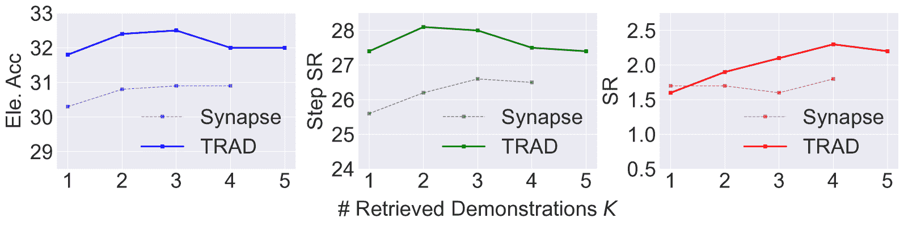

<!--yml

category: 未分类

日期：2025-01-11 12:47:17

-->

# TRAD: 用逐步思维检索和对齐决策增强LLM代理

> 来源：[https://arxiv.org/html/2403.06221/](https://arxiv.org/html/2403.06221/)

Ruiwen Zhou [skyriver@sjtu.edu.cn](mailto:skyriver@sjtu.edu.cn) 上海交通大学 上海 中国，Yingxuan Yang [zoeyyx@sjtu.edu.cn](mailto:zoeyyx@sjtu.edu.cn) 上海交通大学 上海 中国，Muning Wen [muningwen@sjtu.edu.cn](mailto:muningwen@sjtu.edu.cn) 上海交通大学 上海 中国，Ying Wen [ying.wen@sjtu.edu.cn](mailto:ying.wen@sjtu.edu.cn) 上海交通大学 上海 中国，Wenhao Wang [wangwenhao-009@cpic.com.cn](mailto:wangwenhao-009@cpic.com.cn%0A) 中国太平洋保险 上海 中国，Chunling Xi [xichunling@cpic.com.cn](mailto:xichunling@cpic.com.cn) 中国太平洋保险 上海 中国，Guoqiang Xu [xuguoqiang-009@cpic.com.cn](mailto:xuguoqiang-009@cpic.com.cn) 中国太平洋保险 上海 中国，Yong Yu [yyu@apex.sjtu.edu.cn](mailto:yyu@apex.sjtu.edu.cn) 上海交通大学 上海 中国，Weinan Zhang [wnzhang@sjtu.edu.cn](mailto:wnzhang@sjtu.edu.cn) 上海交通大学 上海 中国

###### 摘要。

由于大语言模型（LLM）具备广泛的知识和文本理解能力，许多LLM代理已被构建用于不同的任务，如网页导航和在线购物。在这些工作中，许多方法利用上下文示例来实现泛化，而无需进行微调，但很少有方法考虑如何选择并有效利用这些示例。最近，基于任务元数据的轨迹级检索方法以及使用轨迹作为上下文示例的方法被提出，以提高代理在一些顺序决策任务中的整体表现。然而，这些方法可能存在问题，因为检索到的示例可能缺乏任务特定的状态转移动态，并且输入可能较长，包含大量无关的上下文。本文提出了一种新颖的框架（*TRAD*）来解决这些问题。*TRAD*首先进行*思维检索*，通过思维匹配实现逐步示范选择，从而获得更有帮助的示范并减少无关的输入噪声。然后，*TRAD*引入*对齐决策*，通过补充前后步骤的示范来完善检索到的示范步骤，从而实现对不完美思维的容忍，并提供更多上下文与更少噪声之间的平衡选择。对ALFWorld和Mind2Web基准的广泛实验表明，*TRAD*不仅在性能上超越了现有的最先进模型，还有效地减少了噪声并促进了泛化。此外，*TRAD*已经在一家全球商业保险公司的实际场景中部署，并提高了机器人过程自动化的成功率。我们的代码可以在以下链接找到：[https://github.com/skyriver-2000/TRAD-Official](https://github.com/skyriver-2000/TRAD-Official)。

大型语言模型，LLM代理，顺序决策，LLM推理，信息检索

## 1\. 引言

图 1. *TRAD* 代理的整体示意图（在ALFWorld（Shridhar 等人，[2021](https://arxiv.org/html/2403.06221v1#bib.bib31)）环境中）。*TRAD* 首先预处理专家轨迹，标注每个步骤，并附上高质量的思考。在推理时，*TRAD* 首先进行 *思考检索*，通过轨迹检索演示作为查询和键，以生成更精确的逐步演示检索。给定检索到的步骤后，*TRAD* 使用 *对齐决策* 模块来补充其时间邻近步骤及相应的位置信息（图 [2](https://arxiv.org/html/2403.06221v1#S2.F2 "图 2 ‣ 2.2\. 上下文示例选择 ‣ 2\. 相关工作 ‣ TRAD：通过逐步思考检索和对齐决策增强LLM代理")）。最后，根据增强的演示生成下一个动作。

大型语言模型（LLMs）（Brown 等人，[2020](https://arxiv.org/html/2403.06221v1#bib.bib4); Touvron 等人，[2023](https://arxiv.org/html/2403.06221v1#bib.bib33)）在各种任务中取得了显著的成功，如问答（Zheng 等人，[2024a](https://arxiv.org/html/2403.06221v1#bib.bib46)）、聊天机器人（Ouyang 等人，[2022](https://arxiv.org/html/2403.06221v1#bib.bib21)）、代码合成（Roziere 等人，[2023](https://arxiv.org/html/2403.06221v1#bib.bib25)）、文本排序（Ferraretto 等人，[2023](https://arxiv.org/html/2403.06221v1#bib.bib8)）、基于表格的推理（Ye 等人，[2023](https://arxiv.org/html/2403.06221v1#bib.bib44)）以及检索查询扩展（Mackie 等人，[2023](https://arxiv.org/html/2403.06221v1#bib.bib18)），这得益于其广泛的知识和出色的文本理解与生成能力。近期，一系列工作尝试基于LLMs构建强大的代理，用于各种顺序决策任务，包括文本类游戏（Yao 等人，[2023a](https://arxiv.org/html/2403.06221v1#bib.bib42)）、在线购物（Yao 等人，[2022](https://arxiv.org/html/2403.06221v1#bib.bib41)）、网页导航（Deng 等人，[2023](https://arxiv.org/html/2403.06221v1#bib.bib5)）和信息检索（Zhu 等人，[2023](https://arxiv.org/html/2403.06221v1#bib.bib49)）。

在现有的LLM代理中，有些是通过监督微调（SFT）使用大规模专家数据进行训练的（Nakano et al., [2021](https://arxiv.org/html/2403.06221v1#bib.bib19); Gur et al., [2023](https://arxiv.org/html/2403.06221v1#bib.bib10), [2024](https://arxiv.org/html/2403.06221v1#bib.bib9)），而有些则是免调优的，利用上下文学习（ICL）和少量专家示范示例（Yao et al., [2023b](https://arxiv.org/html/2403.06221v1#bib.bib43); Kim et al., [2023](https://arxiv.org/html/2403.06221v1#bib.bib14); Wang et al., [2023d](https://arxiv.org/html/2403.06221v1#bib.bib35); Zheng et al., [2024b](https://arxiv.org/html/2403.06221v1#bib.bib47)）。本文重点讨论免调优的ICL方法，因为它们具有高度的成本效益，并且能够仅使用少量的专家样本无缝地推广到不同任务。大多数现有的基于ICL的代理使用经过人工精心挑选的专家轨迹作为提示（Wei et al., [2022](https://arxiv.org/html/2403.06221v1#bib.bib39); Yao et al., [2023b](https://arxiv.org/html/2403.06221v1#bib.bib43); Shinn et al., [2023](https://arxiv.org/html/2403.06221v1#bib.bib29)），当可用的专家轨迹很少时，这种方法效果良好。然而，当我们可以访问大量的专家轨迹数据集或专家策略时，为每个任务指令自动化和个性化地选择专家轨迹变得至关重要，并且可能对任务表现产生重要影响。

最近，Zheng et al. ([2024b](https://arxiv.org/html/2403.06221v1#bib.bib47))研究了示范选择的问题，并提出了*Synapse*，该方法通过任务元数据检索相关的专家轨迹，然后使用这些检索到的轨迹来提示LLM。*Synapse*在计算机控制任务（MiniWob++（Shi et al., [2017](https://arxiv.org/html/2403.06221v1#bib.bib28)））和网页导航任务（Mind2Web（Deng et al., [2023](https://arxiv.org/html/2403.06221v1#bib.bib5)））中表现良好。然而，检索并提示完整的轨迹在以下三个方面可能存在问题。

可信的示例。有时，将来自不同领域的数据进行归纳总结是至关重要的。例如，在Mind2Web的跨网站和跨领域子集中，代理程序需要在训练集中未见过的网站上进行操作，也就是记忆。在这种情况下，仅凭任务元数据来检索轨迹，很可能会提供可信的示例，这些示例与当前任务的指令相似，但需要完全不同的解决方案。如（Zheng et al., [2024b](https://arxiv.org/html/2403.06221v1#bib.bib47)）的实验所示，可信的示例提供的信息不比随机示例多，通常会误导LLM代理做出错误的决策。

LLM的上下文限制。当面临具有长时间跨度和复杂观测的任务时，使用完整轨迹进行提示会导致输入序列超出LLM允许的长度。因此，*Synapse*必须减少轨迹示例的数量，甚至直接无法完成任务。尽管一些长上下文的LLM可以接收非常长的提示，但由于长期遗忘的问题，性能可能会受到影响（Team，[2023](https://arxiv.org/html/2403.06221v1#bib.bib32)）。

提示中的无关信息。研究发现，LLM对其提示非常敏感，容易复制最近的输入（Radford等人，[2019](https://arxiv.org/html/2403.06221v1#bib.bib23)；Holtzman等人，[2020](https://arxiv.org/html/2403.06221v1#bib.bib12)）。当前时间步的决策可能只与检索轨迹中的少数步骤相关，而其他步骤没有提供任何有用的信息。因此，无关的步骤会对LLM代理的决策产生不可预测的影响。正如我们的实验所示，它们大多数情况下会对性能产生负面影响。

为了解决轨迹级检索和提示的问题，我们深入研究了逐步演示检索和提示。我们发现，通过与相关步骤的演示，LLM代理的输入上下文可以显著减少。因此，上下文限制和无关信息的问题可以得到缓解。因此，关键是检索真正相关和有帮助的步骤演示。为了实现这一点，我们利用逐步推理，即*Chain-of-Thought*技术（Wei等人，[2022](https://arxiv.org/html/2403.06221v1#bib.bib39)），将每个时间步的状态抽象为检索查询和键。生成的*思维*可以涉及历史信息或未来计划，它们在状态转移时更加具体，有助于减少合理的示例。

在本文中，我们提出了*思维检索*和*对齐决策*（*TRAD*），这是一个新颖的框架，通过思维匹配实现逐步演示检索，并通过时间邻接步骤及其顺序信息增强行动预测的上下文。我们的贡献可以总结为四个方面：

+   •

    我们提出了一种*思维检索*方法，其中我们提前用LLM为专家演示步骤标注思维，在推理时提示LLM代理进行推理，并通过对思维的相似性搜索实现逐步检索。根据我们所知，这是第一项将思维检索技术应用于LLM代理进行顺序决策的工作。

+   •

    基于思维检索操作，我们进一步提出了一种*对齐决策*方法，其中我们通过提供检索到的步骤及其时间邻居来克服不完善的思维并增强与任务相关的信息。

+   •

    我们在Mind2Web（Deng等人，[2023](https://arxiv.org/html/2403.06221v1#bib.bib5)）任务和ALFWorld（Shridhar等人，[2021](https://arxiv.org/html/2403.06221v1#bib.bib31)）上进行了广泛的实验和分析，结果表明，TRAD在与现有研究的比较中达到了最先进的（SoTA）性能。*TRAD*在ALFWorld的成功率（SR）上相比最强基准提高了2.99%（93.78% $\rightarrow$ 96.77%）。在Mind2Web上，*TRAD*在元素准确性、步骤成功率和成功率方面，分别比强大的*Synapse*代理（Zheng等人，[2024b](https://arxiv.org/html/2403.06221v1#bib.bib47)）提高了2.1%、1.4%和0.5%。

+   •

    我们已经将TRAD部署到全球商业保险公司的真实世界机器人流程自动化场景中，其中*TRAD*使得LLM代理在一系列实际任务中显著提高了成功率。平均而言，*TRAD*将步骤成功率（step SR）从90.2%提高到98.1%，并将成功率（SR）从65.0%提高到92.5%。

## 2\. 相关工作

### 2.1\. LLM代理

近年来，利用预训练大规模语言模型（LLMs）作为核心控制器来获得类人决策能力的趋势迅速增长（Wang 等，[2023b](https://arxiv.org/html/2403.06221v1#bib.bib36)）。在这些研究中：Nakano 等人（[2021](https://arxiv.org/html/2403.06221v1#bib.bib19)）对 GPT-3（Brown 等，[2020](https://arxiv.org/html/2403.06221v1#bib.bib4)）模型进行了微调，用于文本驱动的网页浏览环境中的问答。Yao 等人（[2022](https://arxiv.org/html/2403.06221v1#bib.bib41)）开发了 WebShop，一个模拟的电子商务网站环境，并通过模仿学习和强化学习微调了 BERT（Devlin 等，[2018](https://arxiv.org/html/2403.06221v1#bib.bib6)）模型。Yao 等人（[2023b](https://arxiv.org/html/2403.06221v1#bib.bib43)）在观察输入和行动输出之间插入了推理环节，显著提高了 ALFWorld（Shridhar 等，[2021](https://arxiv.org/html/2403.06221v1#bib.bib31)）和 WebShop（Yao 等，[2022](https://arxiv.org/html/2403.06221v1#bib.bib41)）任务的表现。Shinn 等人（[2023](https://arxiv.org/html/2403.06221v1#bib.bib29)）通过口头反思语言任务反馈信号，进一步提高了（Yao 等，[2023b](https://arxiv.org/html/2403.06221v1#bib.bib43)）的方法。Schick 等人（[2023](https://arxiv.org/html/2403.06221v1#bib.bib27)）通过简单的 API 自监督学习方式教会 LLMs 使用外部工具。Park 等人（[2023](https://arxiv.org/html/2403.06221v1#bib.bib22)）引入了*生成代理*，通过自然语言记忆扩展 LLMs，并动态地检索这些记忆以进行行为规划。Wang 等人（[2023a](https://arxiv.org/html/2403.06221v1#bib.bib38)）提出了*DEPS*，一种交互式规划方法，通过整合计划执行过程的描述和失败反馈的解释，促进了更好的错误纠正。Wang 等人（[2023d](https://arxiv.org/html/2403.06221v1#bib.bib35)）采用了探索课程、逐步增长的技能库和一种新的迭代提示机制，从而提高了在《Minecraft》游戏中的熟练度。Deng 等人（[2023](https://arxiv.org/html/2403.06221v1#bib.bib5)）构建了 Mind2Web 数据集，该数据集来自真实网页，包含三个子集，要求不同程度的泛化能力，并比较了模仿学习和少样本推理的表现。

如上所示，大多数现有的LLM代理关注于：1）通过直接微调提高任务性能（Nakano等人，[2021](https://arxiv.org/html/2403.06221v1#bib.bib19); Yao等人，[2022](https://arxiv.org/html/2403.06221v1#bib.bib41); Deng等人，[2023](https://arxiv.org/html/2403.06221v1#bib.bib5)）；2）通过显式提示增强规划或推理（Yao等人，[2023b](https://arxiv.org/html/2403.06221v1#bib.bib43); Shinn等人，[2023](https://arxiv.org/html/2403.06221v1#bib.bib29); Wang等人，[2023a](https://arxiv.org/html/2403.06221v1#bib.bib38)）；3）通过外部记忆或工具库扩展应用（Schick等人，[2023](https://arxiv.org/html/2403.06221v1#bib.bib27); Park等人，[2023](https://arxiv.org/html/2403.06221v1#bib.bib22); Wang等人，[2023d](https://arxiv.org/html/2403.06221v1#bib.bib35)）。然而，在提示中提供更多相关信息，作为引导更好任务理解的基本方式，未得到足够的关注。当接近最优的示范可以获得时，恰当地选择少量示范可能是一种简单而非常有效的提高任务性能的方法，这在我们的工作中进行了探讨。

### 2.2\. 上下文示例选择

研究表明，LLMs在少量学习（Brown等人，[2020](https://arxiv.org/html/2403.06221v1#bib.bib4)）方面表现出色，而上下文示例的选择可以显著提高整体性能。Liu等人（[2021](https://arxiv.org/html/2403.06221v1#bib.bib17)）首次提出将输入的$k$-近邻（$k$-NN）作为上下文示例，并在随机检索基线之上取得了改进。Rubin等人（[2022](https://arxiv.org/html/2403.06221v1#bib.bib26)）使用一个通过标签相似度训练的编码器来选择相关样本，并在BM25和预训练编码器基线之上取得了更好的性能。Zhang等人（[2022](https://arxiv.org/html/2403.06221v1#bib.bib45)）考虑选择并标注未标记的示例作为示范，以实现最佳性能，并将这一问题视为一个顺序决策任务，通过强化学习来解决。Wu等人（[2023](https://arxiv.org/html/2403.06221v1#bib.bib40)）通过最小化输出的熵，从$k$-NN搜索回忆出的子集选择示例。

*IRCoT*（Trivedi 等，[2023](https://arxiv.org/html/2403.06221v1#bib.bib34)）应是与我们工作最相关的研究，旨在通过推理步骤检索与问答任务相关的文档。然而，他们的方法是通过检索完整的历史轨迹，并随着时间的推移积累检索到的轨迹，这种方法无法转移到复杂的序列决策任务中。我们提出的方法与他们的不同，具体在于： (i) 我们的方法不仅关注提供更多相关示范，还减少无关的上下文，以应对序列决策任务，而他们的方法仅限于问答任务，并且仅解决第一个问题。 (ii) 我们的方法在时间步长上检索完全不同的步骤，并通过时间信息补充检索结果，而他们的方法只是根据每个推理步骤积累相关文档，并根据启发式方法剪掉最早的文档，以适应 LLM 的上下文限制。 (iii) 我们的方法为专家轨迹准备伪黄金思想存储在记忆中，以便在没有思想的轨迹中进行检索，并利用单步思想作为查询和键进行精确检索，而他们的方法仅将思想作为查询，原始文档作为键。

图 2. 我们的*对齐决策*方法示意图，其中 $B=F=1$，并且第 $i$ 步的检索时间为 $t^{i}$。对齐决策方法由三个子过程组成，针对检索到的步骤示范和提示：1) 时间扩展：为每个检索到的步骤收集最多 $B$ 个前置步骤和 $F$ 个后续步骤，并将每个步骤转换为从 $t^{i}-B$ 到 $t^{i}+F$ 的长度为 $B+F+1$ 的序列；2) 相对顺序标记：对于示范步骤序列中的每个步骤，我们标记它在该序列中相对于检索步骤的位置，例如，前一个步骤 ($t^{i}-1$) 标记为 [Step -1]，下一个步骤 ($t^{i}+1$) 标记为 [Step 1]；3) 历史对齐：对于当前回合，我们用 $B+F$ 个前置步骤补充当前观察（及思想，可选），以丰富信息并与示范对齐。

上下文示例的选择已被广泛研究，主要针对非序列任务，如问答和情感分析。然而，对于序列决策任务，如何选择示例以提升整体性能仍然不清楚。Zheng 等人（[2024b](https://arxiv.org/html/2403.06221v1#bib.bib47)）提出了基于轨迹的检索解决方案，而如[1](https://arxiv.org/html/2403.06221v1#S1 "1\. Introduction ‣ TRAD: Enhancing LLM Agents with Step-Wise Thought Retrieval and Aligned Decision")节中所讨论的，更精确的逐步解决方案仍然是期望的，这也促成了我们工作的开展。

### 2.3\. LLM 规划与推理

我们的工作提出使用思维作为查询和键来进行检索，思维可以视为当前状态的一种通用抽象。尽管如此，计划、代码注释以及任何能够提取当前状态综合信息的文本都可以作为替代方案。因此，我们特别回顾了一些基于LLM的显著推理和规划工作，其中大多数与我们的工作是互补的。

Wei等人（[2022](https://arxiv.org/html/2403.06221v1#bib.bib39)）首先引入了*Chain-of-Thought*（CoT）概念，通过提供显式的逐步推理过程，在示例输出中改善了算术、常识和符号推理任务的表现。Wang等人（[2023c](https://arxiv.org/html/2403.06221v1#bib.bib37)）进一步发现，单一的推理路径可能并非最优，提出了*自一致性*来解决这个问题，即通过采样多个推理路径。为了高效且灵活地搜索推理路径，Yao等人（[2023a](https://arxiv.org/html/2403.06221v1#bib.bib42)）应用了带有自我评估的树搜索，以找到全局优秀的思维。Besta等人（[2023](https://arxiv.org/html/2403.06221v1#bib.bib3)）随后将树搜索结构扩展为图搜索，以获得更好的灵活性和整体表现。

上述工作考虑的是非顺序性问题，或者在接收输入后可以通过单一的完整推理路径解决的问题。对于更难的顺序决策问题：Zhou等人（[2023](https://arxiv.org/html/2403.06221v1#bib.bib48)）引入了*least-to-most*提示方法，通过分解问题并顺序地解决子问题来解决困难问题。Yao等人（[2023b](https://arxiv.org/html/2403.06221v1#bib.bib43)）提出的*ReAct*以“先推理再行动”的方式与环境互动，从而丰富了行动预测的上下文。*Code-as-Policies*（Liang等人，[2023](https://arxiv.org/html/2403.06221v1#bib.bib15)）通过逐级扩展未定义的程序编写可执行代码，以进行具身控制，这可以视为隐式推理或CoT过程。Liu等人（[2023](https://arxiv.org/html/2403.06221v1#bib.bib16)）提出通过将原始问题转化为PDDL（Aeronautiques等人，[1998](https://arxiv.org/html/2403.06221v1#bib.bib2)）问题，利用经典规划器的优势来求解问题。Hao等人（[2023](https://arxiv.org/html/2403.06221v1#bib.bib11)）和Ding等人（[2023](https://arxiv.org/html/2403.06221v1#bib.bib7)）分享了一个相似的见解，即推理实际上可以通过规划来实现，其中（Hao等人，[2023](https://arxiv.org/html/2403.06221v1#bib.bib11)）使用LLM作为世界模型，（Ding等人，[2023](https://arxiv.org/html/2403.06221v1#bib.bib7)）通过轻量级的额外网络进行MCTS以生成思维。

总结来说，LLM的规划和推理在近年来持续受到研究者的极大关注。这使得我们的工作在未来能够随着更强大的规划和推理方法而变得更加灵活和可改进。

## 3\. TRAD框架

正如在第[1](https://arxiv.org/html/2403.06221v1#S1 "1\. Introduction ‣ TRAD: Enhancing LLM Agents with Step-Wise Thought Retrieval and Aligned Decision")节中讨论的那样，按轨迹检索和提示会导致合理示例、LLM上下文限制和无关信息的问题。为了解决这些问题，我们提出了一种新颖的方法，称为*思维检索*和*对齐决策*（*TRAD*），如图[1](https://arxiv.org/html/2403.06221v1#S1.F1 "Figure 1 ‣ 1\. Introduction ‣ TRAD: Enhancing LLM Agents with Step-Wise Thought Retrieval and Aligned Decision")所示。我们的*TRAD*代理通过推理当前状态得到思维，利用思维从专家轨迹中检索相似步骤，并通过与检索步骤在时间上相关的步骤及其时间位置信息来补充，以预测动作。从形式上讲，我们的*TRAD*代理可以用一个方程来概括：

|  | $\pi_{TRAD}(a_{t}&#124;\xi,o_{0:t},a_{0:t-1})={\rm LLM}({\rm AD}({\rm TR}(\tau_{t},{% \mathcal{M}}),\xi,o_{0:t},a_{0:t-1}))~{},$ |  |
| --- | --- | --- |

其中，$\xi$是当前任务，$o_{0:t}$和$a_{0:t-1}$是历史观察和动作，$\tau_{t}$是LLM关于当前状态生成的思维，TR和AD表示我们的*思维检索*和*对齐决策*模块，${\mathcal{M}}$指的是增强思维的记忆。我们将在接下来的子节中介绍*TRAD*的各个模块。

### 3.1\. 思维准备

大多数专家轨迹，无论是由人类还是其他专家代理收集的，都不包含其推理过程。因此，在我们利用思维进行检索之前，应该为记忆中的每个演示步骤准备思维。具体来说，我们从一个小的专家演示子集开始，为其中的每个步骤提供由人类专家编写的思维。将这个小子集作为少量示例提供给提示后，我们可以查询LLM为大型记忆标记思维。尽管在推理时无法访问真实的动作，但我们可以通过提示LLM生成更高质量的思维。通过这种方式，LLM生成与专家动作一致的伪黄金思维，我们获得了一个支持任务元数据的按轨迹检索和支持思维的按步骤检索的*增强思维记忆*${\mathcal{M}}$。

### 3.2\. 思维检索

给定所有步骤的伪黄金思维，这些思维可以作为逐步相似性搜索的关键，我们现在介绍我们的*思维检索*方法，以便在推理时选择相关的示范。具体而言，我们首先进行轨迹级示范检索，如（Zheng et al., [2024b](https://arxiv.org/html/2403.06221v1#bib.bib47)）所述，用于思维生成。通过这些轨迹示范，在每个时间步$t$，我们提示LLM生成思维$\tau_{t}$以进行逐步检索。需要注意的是，这个过程不会直接影响决策，因此，如果有必要，可以进一步简化，并且第[1](https://arxiv.org/html/2403.06221v1#S1 "1\. Introduction ‣ TRAD: Enhancing LLM Agents with Step-Wise Thought Retrieval and Aligned Decision")节中提到的问题不会对代理产生严重影响。

使用关于当前状态的思维$\tau_{t}$（可以视为一种抽象），我们进行密集检索，以在*思维增强记忆*${\mathcal{M}}$中找到相关的步骤。在这里，任何预先在大型语料库上进行检索训练的编码器，例如Sentence-BERT（Reimers和Gurevych，[2019](https://arxiv.org/html/2403.06221v1#bib.bib24)）和DPR（Karpukhin等，[2020](https://arxiv.org/html/2403.06221v1#bib.bib13)），都可以用于将查询思维和关键思维编码为密集向量。通过计算查询和关键之间的余弦相似度，我们然后收集前$K$个相关步骤，这些步骤属于不同的轨迹，并且它们的对应任务指令。

### 3.3\. 对齐决策

现在我们已经从*思维检索*中获得了相关的示范步骤。然而，由于在推理时缺乏专家行动信息，查询思维可能并不完美。正如我们将在第[4.4](https://arxiv.org/html/2403.06221v1#S4.SS4 "4.4\. Ablation Studies ‣ 4\. Experiments ‣ TRAD: Enhancing LLM Agents with Step-Wise Thought Retrieval and Aligned Decision")节中通过消融实验展示的那样，直接使用这些步骤来形成单步示范并不能提供令人满意的性能，这与轨迹级检索中的合理示例问题类似。因此，我们提出了一种*对齐决策*方法，以在决策过程中融入更多信息。*对齐决策*通过与检索到的步骤在时间上相关联的步骤及其时间位置信息来补充LLM代理。正如图[2](https://arxiv.org/html/2403.06221v1#S2.F2 "Figure 2 ‣ 2.2\. In-Context Example Selection ‣ 2\. Related Work ‣ TRAD: Enhancing LLM Agents with Step-Wise Thought Retrieval and Aligned Decision")所示，*对齐决策*方法可以分解为以下三个子过程。

时间扩展。对于每个检索到的步骤，我们首先将其扩展为一个包含$B$个前置步骤和$F$个后续步骤的步骤序列。当前置或后续步骤的数量小于$B$或$F$时，我们简单地取所有前置或后续步骤。这将每个检索到的步骤转化为最多$(B+1+F)$个时间上连续的步骤，从而使LLM代理在决策时能够通过查看更多相关步骤来纠正其不完善的思维。

相对顺序标记。给定$K$个通过*时间扩展*得到的扩展步骤序列，我们为每个步骤（包括检索到的步骤）插入一个标记，指示其相对于对应检索步骤的位置，并将这一标记规则纳入决策的提示中。例如，检索步骤之前的最后一个步骤标记为[Step -1]，检索步骤本身标记为[Step 0]，而检索步骤之后的第一个步骤标记为[Step 1]。这提供了关于$(B+1+F)\times K$个演示步骤的时间信息，并促进了更准确的演示跟进。

历史对齐。有时任务的最优策略，如ALFWorld，可能依赖于历史，因此使用单步输入进行动作预测是不合理的。由于我们的目标是减少输入内容，从而减少遗忘和噪音，我们不应使用所有历史观察和动作。此外，即使我们将之前的动作作为辅助信息进行包含，也存在不匹配的情况：专家演示作为长度为$B+1+F$的序列给出，而当前输入却是单一步骤。因此，我们建议在当前输入$o_{t}$之前插入最多$B+F$个前置输入输出对（即$o_{t-(B+F):t-1},~{}a_{t-(B+F):t-1}$），将当前输入转化为类似演示的序列。

表1. 不同方法在6种类型的ALFWorld任务上的成功率。我们将*TRAD*与*ReAct*（Yao等， [2023b](https://arxiv.org/html/2403.06221v1#bib.bib43)）、*Synapse*（Zheng等， [2024b](https://arxiv.org/html/2403.06221v1#bib.bib47)）及其强组合进行比较。*TRAD*在整体表现上显著超越了所有基准方法，在6种任务类型中有5种表现最好，并且在加热任务上表现不错。*TRAD*在整体表现上的改进在统计学上显著（通过学生t检验，$p<0.05$）。

| 方法 | 放置 | 检查 | 清洁 | 加热 | 冷却 | 放置二 | 全部 |
| --- | --- | --- | --- | --- | --- | --- | --- |
| ReAct (随机) | 0.8472$\pm$0.0393 | 0.8333$\pm$0.0454 | 0.9570$\pm$0.0304 | 0.8841$\pm$0.0205 | 0.9841$\pm$0.0224 | 0.8431$\pm$0.0277 | 0.8980$\pm$0.0093 |
| ReAct (固定) | 0.7778$\pm$0.0708 | 0.9630$\pm$0.0262 | 0.9032$\pm$0.0263 | 0.9275$\pm$0.0205 | 1.0000$\pm$0.0000 | 0.8824$\pm$0.0480 | 0.9055$\pm$0.0186 |
| Synapse | 0.9444$\pm$0.0196 | 0.7037$\pm$0.0262 | 0.9355$\pm$0.0000 | 0.9130$\pm$0.0615 | 1.0000$\pm$0.0000 | 0.8039$\pm$0.0555 | 0.8955$\pm$0.0106 |
| Synapse + ReAct | 0.9167$\pm$0.0340 | 0.9444$\pm$0.0454 | 1.0000$\pm$0.0000 | 0.9130$\pm$0.0000 | 0.9524$\pm$0.0000 | 0.8627$\pm$0.0555 | 0.9378$\pm$0.0035 |
| TRAD（我们的方法） | 0.9583$\pm$0.0000 | 0.9630$\pm$0.0524 | 1.0000$\pm$0.0000 | 0.8986$\pm$0.0205 | 1.0000$\pm$0.0000 | 0.9804$\pm$0.0277 | 0.9677$\pm$0.0141 |

## 4\. 实验

在本节中，我们旨在研究以下研究问题：

+   RQ1

    *TRAD*如何与现有的最先进方法（SoTA）进行对比？

+   RQ2

    *思维检索*是否有助于减少无关的上下文并提高整体性能？

+   RQ3

    *对齐决策*在泛化很重要时是否有助于提供信息？

+   RQ4

    深入探讨*对齐决策*，*时间扩展*（TE）、*相对顺序标记*（ROM）和*历史对齐*（HA）是否都对于改进是必要的？

+   RQ5

    *TRAD*的性能和优势会受到哪些关键超参数的影响？

### 4.1\. 实验设置

为了回答上述研究问题，我们在ALFWorld（Shridhar等人，[2021](https://arxiv.org/html/2403.06221v1#bib.bib31)）和Mind2Web（Deng等人，[2023](https://arxiv.org/html/2403.06221v1#bib.bib5)）任务上进行了广泛的实验。对于每个任务，我们介绍了以下的评估细节。

ALFWorld（Shridhar等人，[2021](https://arxiv.org/html/2403.06221v1#bib.bib31)）是一个基于文本的游戏，与ALFRED（Shridhar等人，[2020](https://arxiv.org/html/2403.06221v1#bib.bib30)）基准对齐。它涉及6种类型的任务，其中一个代理必须采取一系列动作（例如*去架子1*，*从架子1取下花瓶2*，*把花瓶2放入/放在柜子5上*）来实现一个由自然语言指令给出的高层目标（例如*把花瓶放到柜子上*）。这个环境在三个方面具有挑战性：1）代理需要确定家居物品可能的位置，并一个一个地探索以找到该物品；2）代理需要理解一些物品的使用方法，如微波炉、冰箱和台灯；3）一些任务可能需要代理执行超过30步，要求具备大量的长期记忆能力。

按照Shridhar等人（[2021](https://arxiv.org/html/2403.06221v1#bib.bib31)）的方法，我们在134个分布外任务的子集上进行评估，比较*TRAD*与*ReAct*（Yao等人，[2023b](https://arxiv.org/html/2403.06221v1#bib.bib43)）和*Synapse*（Zheng等人，[2024b](https://arxiv.org/html/2403.06221v1#bib.bib47)）的任务成功率（由于观测是简短的，未进行状态抽象）。由于*ReAct*和*Synapse*已经提供了足够强的表现，我们没有包括更复杂的推理和规划基准以及*TRAD*的相应变体，原因是API成本的限制。注意，原始的*ReAct*使用固定但非检索的轨迹作为示范，因此我们测试了两个*ReAct*基准以消除这种影响：

+   •

    *ReAct*（固定）使用固定的人类编写轨迹作为示范；

+   •

    *ReAct*（随机）从记忆中随机采样轨迹作为示范。

为了公平比较，*TRAD*使用与*ReAct*完全相同格式的思维，并与*Synapse*共享专家轨迹的一致记忆。我们还添加了一个强基线（*Synapse*+*ReAct*），将*Synapse*中的轨迹级别检索与*ReAct*中的推理结合起来。在ALFWorld上，所有方法都基于GPT-4（OpenAI，[2023](https://arxiv.org/html/2403.06221v1#bib.bib20)）并使用2个上下文示例。

Mind2Web（Deng 等，[2023](https://arxiv.org/html/2403.06221v1#bib.bib5)）是一个基于HTML的网页导航基准，收集自现实网页，涉及搜索、行程预定、社交网络订阅等多种任务。它包含3个子集，即跨任务、跨网站、跨领域。这个环境在两个方面具有挑战性：1）现有的LLM代理很难理解HTML输入；2）未见过的任务和网站可能需要大量的泛化。Deng 等（[2023](https://arxiv.org/html/2403.06221v1#bib.bib5)）发现，由于需要对未见过的网站进行泛化，跨网站和跨领域子集显著更难。

由于Mind2Web大约半年前才引入，目前缺乏合适的基线算法，因此我们将我们的*TRAD*代理与*Synapse*（Zheng 等，[2024b](https://arxiv.org/html/2403.06221v1#bib.bib47)）和*ReAct*（Yao 等，[2023b](https://arxiv.org/html/2403.06221v1#bib.bib43)）进行比较。按照Zheng 等（[2024b](https://arxiv.org/html/2403.06221v1#bib.bib47)）的方法，我们在所有3个子集上进行评估，比较元素准确度（Ele. Acc）、步骤成功率（Step SR）和轨迹成功率（SR）。为了公平比较，我们遵循Zheng 等（[2024b](https://arxiv.org/html/2403.06221v1#bib.bib47)）的方法，并使用(Deng 等，[2023](https://arxiv.org/html/2403.06221v1#bib.bib5))提供的预训练元素排序器总结为5个网页元素来对所有方法进行评估。由于Mind2Web上的观察仍然非常复杂，因此在轨迹的每个步骤中包含思维是不可能的，因此：1）我们不包括*Synapse* + *ReAct*基线；2）*TRAD*通过单步提示使用当前观察和之前的动作（不包括之前的观察）生成思维并预测动作。为了消除提示风格和推理的影响，我们建立了两个使用与*TRAD*相同格式提示的*ReAct*基线：

+   •

    *ReAct*（随机），我们通过完全随机的演示步骤向*ReAct*提供提示。

+   •

    *ReAct*（相关性），我们通过从*Synapse*中检索的轨迹中随机选择演示步骤，向*ReAct*提供提示。

我们没有包括*ReAct*（固定）基线，因为很难为如此多样化的测试集编写或选择常见的有用示例。我们还提供了最简单的MindAct（Deng等人，[2023](https://arxiv.org/html/2403.06221v1#bib.bib5)）基线的结果，该基线没有推理和检索，以保证完整性。在Mind2Web上，所有方法均使用GPT-3.5-turbo并结合了3个上下文示例构建。

表2. 所有方法在Mind2Web基准测试上的结果（%）。*TRAD*在所有方法中取得了最佳的整体表现，并在两个更难的子集上取得了最大改进，尤其是在最具挑战的跨领域子集上。*TRAD*在三项整体指标上的改进相比所有基线具有统计学显著性（通过学生t检验，$p<0.01$）。

| 方法 | 跨任务 | 跨网站 | 跨领域 | 总计 |
| --- | --- | --- | --- | --- |
| 元素准确率 | 步骤成功率 | 成功率 | 元素准确率 | 步骤成功率 | 成功率 | 元素准确率 | 步骤成功率 | 成功率 | 元素准确率 | 步骤成功率 | 成功率 |
| --- | --- | --- | --- | --- | --- | --- | --- | --- | --- | --- | --- |
| MindAct | 20.3 | 17.4 | 0.8 | 19.3 | 16.2 | 0.6 | 21.0 | 18.6 | 1.0 | 20.6 | 18.0 | 0.9 |
| ReAct（随机） | 31.0 | 24.7 | 1.6 | 25.7 | 19.1 | 0.6 | 27.9 | 22.9 | 1.8 | 28.3 | 22.7 | 1.6 |
| ReAct（相关） | 31.3 | 26.0 | 1.2 | 26.7 | 20.5 | 0.6 | 28.0 | 23.1 | 1.6 | 28.5 | 23.4 | 1.4 |
| Synapse 无检索 | 33.1 | 28.9 | 3.2 | 27.8 | 22.1 | 1.1 | 30.0 | 26.5 | 1.4 | 30.4 | 26.4 | 1.7 |
| Synapse | 34.4 | 30.6 | 2.0 | 28.8 | 23.4 | 1.1 | 29.4 | 25.9 | 1.6 | 30.4 | 26.6 | 1.6 |
| TRAD（我们的方法） | 35.2 | 30.8 | 3.6 | 30.4 | 24.0 | 0.6 | 32.0 | 28.0 | 2.0 | 32.5 | 28.0 | 2.1 |

### 4.2\. 在ALFWorld上的评估

每个方法在ALFWorld上测试的成功率见表[1](https://arxiv.org/html/2403.06221v1#S3.T1 "Table 1 ‣ 3.3\. Aligned Decision ‣ 3\. The TRAD Framework ‣ TRAD: Enhancing LLM Agents with Step-Wise Thought Retrieval and Aligned Decision")。总体来说，我们的*TRAD*代理达到了96.77%的平均成功率，显著优于*ReAct*（$\sim$90%）、*Synapse*（89.55%），甚至它们的强组合（93.78%）。值得注意的是，*TRAD*在3个随机种子中最差的一次试验成功率为94.8%，超过了其他任何方法的最佳试验（94.0%）。

从每种任务的成功率来看，我们观察到每个方法在最简单的*Put*任务和最难的*PutTwo*任务上的成功率差异更大。我们分别讨论这两个任务的结果如下：

+   •

    在最简单的*Put*任务上，*ReAct*的表现甚至比其他更难的任务还差。我们发现，*ReAct*在*Put*任务上失败的两个关键原因是物体的位置和使用不正确，例如尝试将物体放入一个已关闭的保险箱。由于可以通过与*Synapse*的组合缓解这一问题，因此检索相关示例的必要性得到了验证。

+   •

    *TRAD*在最困难的*PutTwo*任务上取得了最大的改进。*PutTwo*要求纠正两个物体的位置，并全面理解其任务过程。由于*TRAD*在这项最困难任务上的卓越表现是在决策时通过减少输入上下文获得的，我们可以得出结论，逐步的*思维检索*通过减少无关步骤的噪声并更精确地找到相关示例，从而是有帮助的。

### 4.3\. 在Mind2Web上的评估

为了验证*TRAD*在更真实场景下的能力，我们将*TRAD*与*ReAct*和当前最先进的方法*Synapse*在Mind2Web基准上进行了比较，结果见表[2](https://arxiv.org/html/2403.06221v1#S4.T2 "Table 2 ‣ 4.1\. Experiment Setup ‣ 4\. Experiments ‣ TRAD: Enhancing LLM Agents with Step-Wise Thought Retrieval and Aligned Decision")。我们还包括了*Synapse*在没有检索的情况下的结果，以便更好地说明不同检索方法的效果。

一般来说，*TRAD*在所有三个子集的三个指标的平均值上取得了最高的性能。考虑到*Synapse*的轨迹级检索仅在跨任务和跨网站子集上带来了微弱的提升，并且甚至在跨领域子集上稍微影响了性能，我们可以从两个方面证明我们的*TRAD*方法是合理的：

+   •

    通过减少输入上下文并利用逐步相关的示例，我们的逐步*思维检索*比*Synapse*中结合任务元数据的轨迹级检索更加有助于在最简单的跨任务子集上取得进展。

+   •

    通过排除可能的示例并补充时间相关的步骤，*对齐决策*有助于在两个更难的子集上取得进展，尤其是在最具分布外特征的跨领域子集上。

此外，我们观察到两个*ReAct*基线在这个任务上表现不佳，这表明：

+   •

    GPT-3.5-turbo在Mind2Web任务中生成的思维不足以让LLM代理推断出正确的行动。

+   •

    移除先前观察的单步提示方式并未提升整体性能。

相反，*TRAD*利用这些不完美的思维进行检索，而不是直接做决策，并通过*对齐决策*补充了时间相关的步骤。因此，*TRAD*并未受到不完美思维的负面影响，而是将其转化为有用的信息。

在我们开始研究*TRAD*的详细设计和超参数选择之前，我们可以总结在ALFWorld和Mind2Web基准上的性能评估，并回答前三个研究问题如下。

对RQ1的回答：在家庭管理（ALFWorld）和网页导航（Mind2Web）任务上，*TRAD*显著超越了当前的最先进方法，并成为新的最先进方法。

对RQ2的回答：在ALFWorld基准测试中，*Synapse* + *ReAct* 以与我们的*TRAD*完全相同的方式生成思维，并使用整个相关轨迹（比*TRAD*包含更多信息）作为行动预测的示范。然而，*TRAD*在此基准上明显优于该对比方法。因此，我们可以得出结论，*TRAD*受益于更多相关示范以及通过*思维检索*带来的更少无关输入上下文。

对RQ3的回答：在Mind2Web基准测试中，*TRAD*在跨领域子集上相对于*Synapse*取得了最大的改进，而该子集最需要泛化。因此，我们可以判断，*对齐决策*方法补充了在未见输入上决策所需的关键信息。

### 4.4. 消融研究

我们已经验证了*TRAD*在两种不同场景下的有效性，即自动家庭管理和网页导航。接下来，我们将检查*TRAD*中各个模块的效果。由于API使用的预算有限，所有消融实验均在Mind2Web基准测试上使用GPT-3.5-turbo进行。

#### 4.4.1. 对齐决策的效果

首先，我们研究*TRAD*的宏观构建模块的效果。由于消除*思维检索*会同时禁用*对齐决策*并从根本上破坏框架，我们不移除*思维检索*模块，而是对*对齐决策*的每个组成部分进行消融，即*时间扩展*（TE）、*相对顺序标记*（ROM）和*历史对齐*（HA），并比较相应的性能。结果如表[3](https://arxiv.org/html/2403.06221v1#S4.T3 "表 3 ‣ 4.4.1. 对齐决策的效果 ‣ 4.4. 消融研究 ‣ 4. 实验 ‣ TRAD：通过逐步思维检索和对齐决策增强LLM代理")所示。

表3. Mind2Web基准测试上的消融研究结果（%）。TE构建了*对齐决策*的基本结构，因此对三个子集的性能提升至关重要。HA和ROM在两个较难的跨网站和跨领域子集上有助于推广，但在跨任务子集上的帮助较小。*TRAD*在所有消融基线上的Ele. Acc和Step SR的改进具有统计学显著性（通过学生t检验，$p<0.05$）。

| 方法 | 跨任务 | 跨网站 | 跨领域 | 全部 |
| --- | --- | --- | --- | --- |
| Ele. Acc | Step SR | SR | Ele. Acc | Step SR | SR | Ele. Acc | Step SR | SR | Ele. Acc | Step SR | SR |
| --- | --- | --- | --- | --- | --- | --- | --- | --- | --- | --- | --- |
| TRAD无TE | 34.2 | 28.4 | 1.2 | 27.4 | 20.4 | 0.6 | 29.1 | 24.0 | 1.4 | 30.0 | 24.5 | 1.3 |
| TRAD无HA | 36.2 | 31.1 | 4.0 | 28.3 | 22.2 | 0.6 | 29.4 | 24.9 | 1.8 | 30.8 | 25.9 | 2.1 |
| TRAD无ROM | 35.7 | 30.5 | 3.6 | 28.9 | 22.3 | 0.6 | 31.5 | 27.2 | 1.9 | 32.1 | 27.2 | 2.0 |
| TRAD（我们的） | 35.2 | 30.8 | 3.6 | 30.4 | 24.0 | 0.6 | 32.0 | 28.0 | 2.0 | 32.5 | 28.0 | 2.1 |

从表[3](https://arxiv.org/html/2403.06221v1#S4.T3 "Table 3 ‣ 4.4.1\. The Effect of Aligned Decision ‣ 4.4\. Ablation Studies ‣ 4\. Experiments ‣ TRAD: Enhancing LLM Agents with Step-Wise Thought Retrieval and Aligned Decision")中，我们观察到，在最简单的跨任务子集和两个更困难的子集中，每个组件去除后的性能变化不同。

+   •

    在更困难的跨网站和跨领域子集上，去除*对齐决策*中的所有三个模块会导致显著的性能下降，而*时间扩展*的效果最为显著。这是直观的，因为没有TE时，代理仅接收到检索步骤，因此代理更容易受到不完美思维的影响。

+   •

    然而，在最简单的跨任务子集上，*历史对齐*和*相对顺序标记*并不那么有帮助，甚至导致性能下降。如前所述（第[1](https://arxiv.org/html/2403.06221v1#S1 "1\. Introduction ‣ TRAD: Enhancing LLM Agents with Step-Wise Thought Retrieval and Aligned Decision")节和第[3.3](https://arxiv.org/html/2403.06221v1#S3.SS3 "3.3\. Aligned Decision ‣ 3\. The TRAD Framework ‣ TRAD: Enhancing LLM Agents with Step-Wise Thought Retrieval and Aligned Decision")节），当合理示例的问题不严重时，减少上下文并以最相关的示例进行提示成为性能提升的主导因素。因此，只有*时间扩展*对于从不完美思维中恢复是有益的，而另外两个组件则导致次优性能。

一般来说，*对齐决策*方法提供了更多关于检索步骤源轨迹和当前轨迹的信息，特别对于需要泛化的场景尤为有帮助。我们现在可以总结这些观察结果并回答第四个研究问题。

回答RQ4：在*对齐决策*的子过程中，1) *时间扩展*为不完美的思维提供容错性，并始终如一地提升*TRAD*的整体性能；2) *相对顺序标记*和*历史对齐*通过提供检索步骤的源轨迹和当前轨迹的时间信息，补充了*TRAD*，这些信息作为有用的上下文，有助于超出分布的决策，但对于分布内的决策可能变得不太有用。

#### 4.4.2\. 扩展步骤$B$和$F$的效果

接下来，我们改变一个关键的超参数——时间扩展步数，并研究整体性能如何随之变化。为了避免在$B$和$F$上进行昂贵的网格搜索，我们仅考虑单边扩展，通过将$B$或$F$从$0$变为$4$，并将另一个设置为$0$。所有3个子集的结果如图[3](https://arxiv.org/html/2403.06221v1#S4.F3 "Figure 3 ‣ 4.4.2\. The Effect of Expansion Steps 𝐵 and 𝐹 ‣ 4.4\. Ablation Studies ‣ 4\. Experiments ‣ TRAD: Enhancing LLM Agents with Step-Wise Thought Retrieval and Aligned Decision")所示。

(a) 改变$F$

(b) 改变$B$

图3. 改变后续步骤$F$和前置步骤$B$对Mind2Web基准的影响。实线对应于在不同$F$和$B$下，*TRAD*的性能指标，虚线对应于*Synapse*基线。正向扩展（$F>0$）通常比反向扩展（$B>0$）相较于没有扩展（$F=B=0$）和*Synapse*基线提供更多的改进。当$F$或$B$足够大时，它们不再提供更多的帮助。

从图[3](https://arxiv.org/html/2403.06221v1#S4.F3 "Figure 3 ‣ 4.4.2\. The Effect of Expansion Steps 𝐵 and 𝐹 ‣ 4.4\. Ablation Studies ‣ 4\. Experiments ‣ TRAD: Enhancing LLM Agents with Step-Wise Thought Retrieval and Aligned Decision")中，我们可以得出以下观察结果：

+   •

    正向扩展（$F>0$）和反向扩展（$B>0$）相比于没有扩展（$F=B=0$）都取得了改进。这证明了我们设计的*对齐决策*的合理性。

+   •

    无论是正向扩展还是反向扩展，增加足够大的$F$或$B$并不会带来更多的好处。这证明了我们的假设：距离当前状态过远的无关上下文几乎没有价值，甚至可能是噪声。

+   •

    通常，当改变$F$和$B$时，正向扩展的表现优于反向扩展。这个现象的原因可能是历史信息已经被纳入思考中，因此未来的信息帮助更大。

+   •

    *TRAD*在$F=2$和$B=0$时表现最佳，并且在正向扩展情况下始终优于*Synapse*。

#### 4.4.3\. 演示数量$K$的影响

最后，我们探讨一个常见但重要的超参数——检索到的演示数量$K$，并观察在不同$K\in\{1,2,3,4,5\}$下，*TRAD*相对于基线（*Synapse*）的优势如何变化。我们展示了所有3个子集的结果，具体见图[4](https://arxiv.org/html/2403.06221v1#S4.F4 "Figure 4 ‣ 4.4.3\. The Effect of Demonstration Amount 𝐾 ‣ 4.4\. Ablation Studies ‣ 4\. Experiments ‣ TRAD: Enhancing LLM Agents with Step-Wise Thought Retrieval and Aligned Decision")。注意，当$K=5$时，*Synapse*中的逐步提示常常超过了上下文限制，因此我们省略了该结果。

图4. 不同检索演示数量 $K$ 对 Mind2Web 基准的影响。实线表示在不同 $K$ 下 *TRAD* 的性能指标，虚线表示 *Synapse* 基准。$K$ 对 *TRAD* 和 *Synapse* 的性能影响较小，且无论 $K$ 如何变化，*TRAD* 相对于 *Synapse* 的优势保持稳定。

从图[4](https://arxiv.org/html/2403.06221v1#S4.F4 "图 4 ‣ 4.4.3\. 演示数量 𝐾 的影响 ‣ 4.4\. 消融研究 ‣ 4\. 实验 ‣ TRAD：通过逐步思维检索和对齐决策增强LLM代理")中，我们看到 $K$ 对 *TRAD* 和 *Synapse* 的性能影响较小，且 *TRAD* 相对于 *Synapse* 的优势在所有 $K\in\{1,2,3,4\}$ 下始终保持一致。

在第[4.4.2节](https://arxiv.org/html/2403.06221v1#S4.SS4.SSS2 "4.4.2\. 扩展步骤 𝐵 和 𝐹 的影响 ‣ 4.4\. 消融研究 ‣ 4\. 实验 ‣ TRAD：通过逐步思维检索和对齐决策增强LLM代理")和第[4.4.3节](https://arxiv.org/html/2403.06221v1#S4.SS4.SSS3 "4.4.3\. 演示数量 𝐾 的影响 ‣ 4.4\. 消融研究 ‣ 4\. 实验 ‣ TRAD：通过逐步思维检索和对齐决策增强LLM代理")中的结果，我们现在回答我们最后的研究问题。

对RQ5的回答：*TRAD* 的性能和优势通常在不同超参数选择下保持稳定，即时间扩展步骤、检索演示数量。只有在使用较长的向后扩展时，它的性能和优势才会下降，这可能是因为历史信息已经被整合到思维中，并且不再对决策提供进一步的帮助。

### 4.5\. 案例研究

在本节末尾，我们展示了一些代表性的轨迹或步骤，通过这些可以直观地了解 *TRAD* 的优势。我们展示了在图[5](https://arxiv.org/html/2403.06221v1#S4.F5 "图 5 ‣ 4.5\. 案例研究 ‣ 4\. 实验 ‣ TRAD：通过逐步思维检索和对齐决策增强LLM代理")中由 *Synapse* 和我们的 *TRAD* 代理在 Mind2Web 的跨领域子集上产生的两个案例，以展示：1）任务元数据检索与 *思维检索* 之间的区别；2）选择检索而非直接预测与思维的原因，以及对不完美思维的容忍度。

在图[4(a)](https://arxiv.org/html/2403.06221v1#S4.F4.sf1 "4(a) ‣ 图 5 ‣ 4.5\. 案例研究 ‣ 4\. 实验 ‣ TRAD：通过逐步思维检索和对齐决策增强LLM代理")中，*Synapse*的轨迹检索显然存在问题，它仅考虑任务指令中的“搜索”，而检索到的轨迹与当前任务完全无关。然而，当我们利用这些无关的示范生成思维并进行*思维检索*时，检索到的示范变得更加相关，因为它们都与婴儿（幼儿）相关，并反映了在网页浏览过程中与导航链接或按钮互动的过程，以展开不可见的网页。通过*思维检索*获得的示范，*TRAD*能够做出正确的决策。

在图[4(b)](https://arxiv.org/html/2403.06221v1#S4.F4.sf2 "4(b) ‣ 图 5 ‣ 4.5\. 案例研究 ‣ 4\. 实验 ‣ TRAD：通过逐步思维检索和对齐决策增强LLM代理")中，*Synapse*和*TRAD*似乎都在尝试检索与纽约相关的示例，但如果我们检查任务元数据检索到的轨迹，其中2/3的示例通过点击某些链接或按钮来满足“纽约”这一条件，而不是在文本框中输入。遗憾的是，当前状态下正确的操作是输入，而不是点击，因此*Synapse*未能输入正确的内容。相反，*TRAD*即使思维不正确，也能学习在文本框中输入正确的内容“纽约”。这也验证了我们的假设：使用思维进行检索而非预测有助于纠正不完美的思维。

(a) 代表性案例 1

(b) 代表性案例 2

图 5. 比较带有任务元数据的突触轨迹检索与带有思维的TRAD逐步检索。(a) *Synapse*的轨迹检索仅考虑任务指令中的“搜索”，而检索到的轨迹完全无关。然而，通过生成这些无关轨迹的思维，*思维检索*能够找到与婴儿（幼儿）和导航相关的更相关的逐步示范。(b) *Synapse*的轨迹检索检索到的是合理的示例，这些示例并未在文本框中输入任务元数据。尽管思维并不完美，*思维检索*能够找到更多相关的示范，而*TRAD*学习到输入“纽约”。

## 5. TRAD的实际部署

自2023年12月起，我们已将*TRAD*代理部署到一家主流保险公司，用于自动化一些现实世界的办公任务，该公司拥有约1.7亿全球客户。我们选择了4个不同的网站，并为每个网站上的一些代表性任务收集了100个专家轨迹作为我们的记忆库。为了进行评估，我们收集了每个网站上的20个未见任务，使用步骤成功率（Step SR）和轨迹成功率（SR）作为评估指标。任务包括填写保险查询表格、实施高级信息检索等。由于这些网站较为复杂，包含成千上万的网页元素，因此无法使用完整的轨迹进行提示，因此我们只考虑使用历史行为作为辅助信息进行单步提示。

为了验证*TRAD*的有效性，我们使用了公司已尝试的两种不同的*ReAct*代理作为我们的基准：

+   •

    *ReAct*-RD：随机选择专家步骤作为演示，在随机轨迹中展示。

+   •

    *ReAct*-RV：随机选择任务指令中检索到的相关轨迹中的专家步骤作为演示。

具体来说，*TRAD*与*ReAct*-RV之间的区别在于使用“思考”进行二次步骤检索和对齐的决策模块。为了进一步研究*思考检索*和*对齐决策*的效果，我们还部署了一个TR代理，移除了我们的*对齐决策*方法，即表[3](https://arxiv.org/html/2403.06221v1#S4.T3 "表3 ‣ 4.4.1．对齐决策的效果 ‣ 4.4．消融研究 ‣ 试验 ‣ TRAD：通过逐步思考检索和对齐决策提升LLM代理")中的*TRAD*无TE基准。我们在表[4](https://arxiv.org/html/2403.06221v1#S5.T4 "表4 ‣ 5．TRAD的实际部署 ‣ TRAD：通过逐步思考检索和对齐决策提升LLM代理")中列出了结果。

表4. 来自一家主流全球商业保险公司的实际网站评估结果。

| 方法 | ReAct-RD | ReAct-RV | TR | TRAD（我们的） |
| --- | --- | --- | --- | --- |
| 网站1 | 步骤SR | 0.843 | 0.826 | 0.941 | 0.950 |
| （表单填写） | SR | 0.500 | 0.450 | 0.800 | 0.800 |
| 网站2 | 步骤SR | 0.941 | 0.937 | 0.958 | 0.974 |
| （高级IR） | SR | 0.900 | 0.850 | 0.850 | 0.900 |
| 网站3 | 步骤SR | 0.962 | 0.987 | 1.000 | 1.000 |
| （高级IR） | SR | 0.850 | 0.800 | 0.850 | 1.000 |
| 网站4 | 步骤SR | 0.820 | 0.860 | 0.845 | 1.000 |
| （表单填写） | SR | 0.350 | 0.350 | 0.400 | 1.000 |
| 平均值 | 步骤SR | 0.891 | 0.902 | 0.936 | 0.981 |
| SR | 0.650 | 0.613 | 0.725 | 0.925 |

如表[4](https://arxiv.org/html/2403.06221v1#S5.T4 "表 4 ‣ 5\. TRAD的现实世界部署 ‣ TRAD：通过逐步思维检索和对齐决策增强LLM代理")所示，*TRAD*在所有四个网站上都达到了最佳表现，显示出其在实际场景中部署时依然保持优势。此外，我们观察到，*TRAD*在没有TE基准的情况下也优于两个*ReAct*代理，但与完整的*TRAD*代理相比，表现出明显的劣势。这证明了我们在设计中同时采用*思维检索*和*对齐决策*的合理性。

*TRAD*的推理效率。在推理时，*TRAD*代理相比于*ReAct*仅引入了很少的额外时间消耗在*思维检索*上。我们对*TRAD*和*ReAct*在所有网站和任务上的推理过程进行了分析，平均而言，*TRAD*所需的时间仅比*ReAct*-RD多11.7%，这表明我们的方法在提高性能的同时，几乎没有牺牲效率。

## 6\. 讨论

### 6.1\. *TRAD*的局限性

尽管*TRAD*在各种任务上展现了优异的表现，但它仍然存在一些限制，比如依赖于高质量思维，以及在*时间扩展*中信息和噪声之间的权衡，下面我们简要讨论这些问题。

#### 6.1.1\. 对高质量思维的依赖

*TRAD*通过其*对齐决策*模块缓解了不完善思维的问题，但其能力仍然在很大程度上依赖于思维的质量和骨干LLM的能力。为了使这种逐步检索增强的方法有效，当前状态的抽象至关重要，因为它作为检索的查询和关键，因此用于构建*TRAD*代理的LLM应该至少对任务有一定的理解。

#### 6.1.2\. 时间扩展中的权衡

*TRAD*期望通过逐步的*思维检索*来保留相关信息，同时减少不相关的输入上下文，并通过*时间扩展*提供一些纠正不完善思维的机会。在这里存在一个权衡：更长的*时间扩展*不仅增加了对不完善思维的容忍度，还带来了更多在演示中不相关的噪声。这个权衡需要根据不同任务仔细考虑。

### 6.2\. 未来方向

尽管已经进行了消融研究来验证*TRAD*的设计，但仍有一些有前景的想法值得研究，这些想法可能进一步改善*TRAD*。我们将它们作为未来的工作，下面进行讨论。

#### 6.2.1\. 更好的推理演示

*TRAD*目前采用相关轨迹或从中随机选择的步骤作为演示来生成思维，但这仍然在某种程度上受到第[1](https://arxiv.org/html/2403.06221v1#S1 "1\. 引言 ‣ TRAD：通过逐步思维检索和对齐决策增强LLM代理")节中讨论的问题的影响。因此，可以对其进行修改，以生成更高质量的思维，从而提高*TRAD*的整体性能。

#### 6.2.2\. 更好的检索表示

正如我们在第[2.3](https://arxiv.org/html/2403.06221v1#S2.SS3 "2.3\. LLM Planning and Reasoning ‣ 2\. Related Work ‣ TRAD: Enhancing LLM Agents with Step-Wise Thought Retrieval and Aligned Decision")节中讨论的，*TRAD* 可以利用任何其他方法获取顺序决策任务中当前状态的全面抽象，这可能作为更好的查询和键值用于逐步演示检索。因此，*TRAD* 可以与更强大的 LLM 规划和推理方法相结合，甚至与基于特定领域数据预训练的 LLM 所产生的密集抽象结合，如（Gur 等人，[2024](https://arxiv.org/html/2403.06221v1#bib.bib9)）。

## 7\. 结论

在本研究中，我们提出了一种新型的 LLM 代理，通过逐步演示检索（*TRAD*）来增强顺序决策任务的执行能力。*TRAD* 首先根据对当前状态的思考检索相关的逐步演示，然后补充时间上相关的步骤，以便进行更具信息量的动作预测。我们在两个不同的顺序决策任务上进行了大量实验，以验证我们方案的有效性，并通过彻底的消融研究证明了我们方法的设计选择和稳定性。我们还展示了我们方法在实际部署中的结果，显示了其在实际应用中的价值。

###### 致谢。

上海交通大学团队部分得到了上海市科技重大项目（2021SHZDZX0102）和中国国家自然科学基金（62322603，62076161）的资助。

## 参考文献

+   (1)

+   Aeronautiques et al. (1998) Constructions Aeronautiques, Adele Howe, Craig Knoblock, ISI Drew McDermott, Ashwin Ram, Manuela Veloso, Daniel Weld, David Wilkins SRI, Anthony Barrett, Dave Christianson 等人，1998年。《Pddl—规划领域定义语言》。*技术报告*（1998年）。

+   Besta 等人（2023）Maciej Besta、Nils Blach、Ales Kubicek、Robert Gerstenberger、Lukas Gianinazzi、Joanna Gajda、Tomasz Lehmann、Michal Podstawski、Hubert Niewiadomski、Piotr Nyczyk 和 Torsten Hoefler，2023年。《Graph of Thoughts: 用大型语言模型解决复杂问题》。*arXiv 预印本 arXiv:2308.09687*（2023年）。

+   Brown 等人（2020）Tom B. Brown、Benjamin Mann、Nick Ryder、Melanie Subbiah、Jared Kaplan、Prafulla Dhariwal、Arvind Neelakantan、Pranav Shyam、Girish Sastry、Amanda Askell、Sandhini Agarwal、Ariel Herbert-Voss、Gretchen Krueger、Tom Henighan、Rewon Child、Aditya Ramesh、Daniel M. Ziegler、Jeffrey Wu、Clemens Winter、Christopher Hesse、Mark Chen、Eric Sigler、Mateusz Litwin、Scott Gray、Benjamin Chess、Jack Clark、Christopher Berner、Sam McCandlish、Alec Radford、Ilya Sutskever 和 Dario Amodei，2020年。《语言模型是少样本学习者》。收录于*第34届神经信息处理系统进展会议（NeurIPS）论文集*。

+   Deng 等人 (2023) Xiang Deng, Yu Gu, Boyuan Zheng, Shijie Chen, Samuel Stevens, Boshi Wang, Huan Sun, 和 Yu Su. 2023. Mind2Web：面向 Web 的通用代理。载于 *第 37 届神经信息处理系统进展会议（NeurIPS）论文集*。

+   Devlin 等人 (2018) Jacob Devlin, Ming-Wei Chang, Kenton Lee, 和 Kristina Toutanova. 2018. Bert：用于语言理解的深度双向转换器预训练。*arXiv 预印本 arXiv:1810.04805* (2018)。

+   Ding 等人 (2023) Ruomeng Ding, Chaoyun Zhang, Lu Wang, Yong Xu, Minghua Ma, Wei Zhang, Si Qin, Saravan Rajmohan, Qingwei Lin, 和 Dongmei Zhang. 2023. 思维的一切：挑战 Penrose 三角形法则以生成思维。*arXiv 预印本 arXiv:2311.04254* (2023)。

+   Ferraretto 等人 (2023) Fernando Ferraretto, Thiago Laitz, Roberto Lotufo, 和 Rodrigo Nogueira. 2023. ExaRanker：合成解释提高神经排序器。载于 *第 46 届国际 ACM SIGIR 信息检索研究与发展会议论文集*。2409–2414。

+   Gur 等人 (2024) Izzeddin Gur, Hiroki Furuta, Austin Huang, Mustafa Safdari, Yutaka Matsuo, Douglas Eck, 和 Aleksandra Faust. 2024. 具备规划、长时上下文理解与程序合成的真实世界 WebAgent。载于 *第 12 届学习表征国际会议（ICLR）论文集*。

+   Gur 等人 (2023) Izzeddin Gur, Ofir Nachum, Yingjie Miao, Mustafa Safdari, Austin Huang, Aakanksha Chowdhery, Sharan Narang, Noah Fiedel, 和 Aleksandra Faust. 2023. 使用大规模语言模型理解 HTML。载于 *计算语言学协会研究成果（EMNLP）*。2803–2821。

+   Hao 等人 (2023) Shibo Hao, Yi Gu, Haodi Ma, Joshua Jiahua Hong, Zhen Wang, Daisy Zhe Wang, 和 Zhiting Hu. 2023. 使用语言模型进行推理即是使用世界模型进行规划。载于 *2023 年自然语言处理经验方法会议（EMNLP）论文集*。8154–8173。

+   Holtzman 等人 (2020) Ari Holtzman, Jan Buys, Li Du, Maxwell Forbes, 和 Yejin Choi. 2020. 神经文本退化的奇特案例。载于 *第 8 届学习表征国际会议（ICLR）论文集*。

+   Karpukhin 等人 (2020) Vladimir Karpukhin, Barlas Oguz, Sewon Min, Patrick S. H. Lewis, Ledell Wu, Sergey Edunov, Danqi Chen, 和 Wen-tau Yih. 2020. 面向开放领域问答的密集段落检索。载于 *2020 年自然语言处理经验方法会议（EMNLP）论文集*。6769–6781。

+   Kim 等人 (2023) Geunwoo Kim, Pierre Baldi, 和 Stephen McAleer. 2023. 语言模型能够解决计算机任务。载于 *第 37 届神经信息处理系统进展会议（NeurIPS）论文集*。

+   Liang 等人 (2023) Jacky Liang, Wenlong Huang, Fei Xia, Peng Xu, Karol Hausman, Brian Ichter, Pete Florence, 和 Andy Zeng. 2023. 代码即策略：用于体现控制的语言模型程序。载于 *2023 年 IEEE 国际机器人与自动化会议（ICRA）论文集*。9493–9500。

+   Liu等（2023）Bo Liu, Yuqian Jiang, Xiaohan Zhang, Qiang Liu, Shiqi Zhang, Joydeep Biswas 和 Peter Stone. 2023. LLM+P：赋能大语言模型以实现最佳规划能力。*arXiv预印本arXiv:2304.11477*（2023）。

+   Liu等（2021）Jiachang Liu, Dinghan Shen, Yizhe Zhang, Bill Dolan, Lawrence Carin 和 Weizhu Chen. 2021. 什么样的上下文示例对GPT-3最有效？*arXiv预印本arXiv:2101.06804*（2021）。

+   Mackie等（2023）Iain Mackie, Shubham Chatterjee, 和 Jeffrey Dalton. 2023. 使用大语言模型的生成性相关反馈。发表于*第46届国际ACM SIGIR信息检索研究与发展大会（SIGIR）*。2026–2031。

+   Nakano等（2021）Reiichiro Nakano, Jacob Hilton, Suchir Balaji, Jeff Wu, Long Ouyang, Christina Kim, Christopher Hesse, Shantanu Jain, Vineet Kosaraju, William Saunders等. 2021. Webgpt：借助浏览器的人类反馈问题解答系统。*arXiv预印本arXiv:2112.09332*（2021）。

+   OpenAI（2023）OpenAI. 2023. GPT-4技术报告。*arXiv预印本arXiv:2303.08774*（2023）。

+   Ouyang等（2022）Long Ouyang, Jeffrey Wu, Xu Jiang, Diogo Almeida, Carroll Wainwright, Pamela Mishkin, Chong Zhang, Sandhini Agarwal, Katarina Slama, Alex Ray等. 2022. 通过人类反馈训练语言模型遵循指令。发表于*第36届神经信息处理系统进展会议（NeurIPS）*。27730–27744。

+   Park等（2023）Joon Sung Park, Joseph O’Brien, Carrie Jun Cai, Meredith Ringel Morris, Percy Liang 和 Michael S Bernstein. 2023. 生成性代理：人类行为的互动模拟。发表于*第36届ACM用户界面软件与技术年会（UIST）*。1–22。

+   Radford等（2019）Alec Radford, Jeffrey Wu, Rewon Child, David Luan, Dario Amodei 和 Ilya Sutskever. 2019. 语言模型是无监督的多任务学习者。*OpenAI博客*（2019）。

+   Reimers和Gurevych（2019）Nils Reimers 和 Iryna Gurevych. 2019. Sentence-BERT: 使用Siamese BERT网络进行句子嵌入。发表于*2019年自然语言处理经验方法大会暨第九届国际自然语言处理联合会议（EMNLP-IJCNLP）*。3980–3990。

+   Roziere等（2023）Baptiste Roziere, Jonas Gehring, Fabian Gloeckle, Sten Sootla, Itai Gat, Xiaoqing Ellen Tan, Yossi Adi, Jingyu Liu, Tal Remez, Jérémy Rapin等. 2023. Code llama：开源代码基础模型。*arXiv预印本arXiv:2308.12950*（2023）。

+   Rubin等（2022）Ohad Rubin, Jonathan Herzig, 和 Jonathan Berant. 2022. 学习为上下文学习检索提示。发表于*2022年北美计算语言学会：人类语言技术会议（NAACL-HLT）*。2655–2671。

+   Schick 等人（2023）Timo Schick, Jane Dwivedi-Yu, Roberto Dessì, Roberta Raileanu, Maria Lomeli, Luke Zettlemoyer, Nicola Cancedda, 和 Thomas Scialom. 2023. Toolformer: 语言模型可以自学使用工具。发表于 *第37届神经信息处理系统进展会议（NeurIPS）论文集*。

+   Shi 等人（2017）Tianlin Shi, Andrej Karpathy, Linxi Fan, Jonathan Hernandez, 和 Percy Liang. 2017. 世界之位：一个用于网络智能体的开放领域平台。发表于 *第34届国际机器学习会议（ICML）论文集*，第70卷，3135–3144。

+   Shinn 等人（2023）Noah Shinn, Federico Cassano, Ashwin Gopinath, Karthik R Narasimhan, 和 Shunyu Yao. 2023. Reflexion: 具有语言强化学习的语言智能体。发表于 *第37届神经信息处理系统进展会议（NeurIPS）*。

+   Shridhar 等人（2020）Mohit Shridhar, Jesse Thomason, Daniel Gordon, Yonatan Bisk, Winson Han, Roozbeh Mottaghi, Luke Zettlemoyer, 和 Dieter Fox. 2020. ALFRED: 一个用于解释日常任务指令的基准。发表于 *2020 IEEE/CVF计算机视觉与模式识别会议（CVPR）论文集*，10737–10746。

+   Shridhar 等人（2021）Mohit Shridhar, Xingdi Yuan, Marc-Alexandre Côté, Yonatan Bisk, Adam Trischler, 和 Matthew J. Hausknecht. 2021. ALFWorld: 对齐文本和具身环境以进行互动学习。发表于 *第9届国际学习表征会议（ICLR）论文集*。

+   团队（2023）LongChat 团队. 2023. *开源大语言模型在上下文长度上的真正承诺能持续多久？* [https://lmsys.org/blog/2023-06-29-longchat/](https://lmsys.org/blog/2023-06-29-longchat/)

+   Touvron 等人（2023）Hugo Touvron, Thibaut Lavril, Gautier Izacard, Xavier Martinet, Marie-Anne Lachaux, Timothée Lacroix, Baptiste Rozière, Naman Goyal, Eric Hambro, Faisal Azhar, Aurelien Rodriguez, Armand Joulin, Edouard Grave, 和 Guillaume Lample. 2023. LLaMA: 开放和高效的基础语言模型。*arXiv 预印本 arXiv:2302.13971*（2023）。

+   Trivedi 等人（2023）Harsh Trivedi, Niranjan Balasubramanian, Tushar Khot, 和 Ashish Sabharwal. 2023. 将检索与链式思维推理结合以解决知识密集型多步骤问题。发表于 *第61届计算语言学协会年会论文集（ACL）*，10014–10037。

+   Wang 等人（2023d）Guanzhi Wang, Yuqi Xie, Yunfan Jiang, Ajay Mandlekar, Chaowei Xiao, Yuke Zhu, Linxi Fan, 和 Anima Anandkumar. 2023d. Voyager: 基于大语言模型的开放式具身智能体。*arXiv 预印本 arXiv:2305.16291*（2023）。

+   Wang 等人（2023b）Lei Wang, Chen Ma, Xueyang Feng, Zeyu Zhang, Hao Yang, Jingsen Zhang, Zhiyuan Chen, Jiakai Tang, Xu Chen, Yankai Lin 等人. 2023b. 基于大语言模型的自主智能体调查。*arXiv 预印本 arXiv:2308.11432*（2023）。

+   Wang 等人 (2023c) Xuezhi Wang、Jason Wei、Dale Schuurmans、Quoc V. Le、Ed H. Chi、Sharan Narang、Aakanksha Chowdhery 和 Denny Zhou。2023年。《自一致性提升语言模型的思维链推理》。发表于 *第11届国际学习表征会议（ICLR）论文集*。

+   Wang 等人 (2023a) Zihao Wang、Shaofei Cai、Anji Liu、Xiaojian Ma 和 Yitao Liang。2023年。《描述、解释、规划与选择：大语言模型驱动的交互式规划促成开放世界多任务智能体》。发表于 *第37届神经信息处理系统大会（NeurIPS）论文集*。

+   Wei 等人 (2022) Jason Wei、Xuezhi Wang、Dale Schuurmans、Maarten Bosma、Brian Ichter、Fei Xia、Ed H. Chi、Quoc V. Le 和 Denny Zhou。2022年。《思维链提示在大语言模型中引发推理》。发表于 *第36届神经信息处理系统大会（NeurIPS）论文集*。

+   Wu 等人 (2023) Zhiyong Wu、Yaoxiang Wang、Jiacheng Ye 和 Lingpeng Kong。2023年。《自适应上下文学习：从信息压缩角度看上下文示例的选择与排序》。发表于 *第61届计算语言学会年会论文集（ACL）*，1423–1436。

+   Yao 等人 (2022) Shunyu Yao、Howard Chen、John Yang 和 Karthik Narasimhan。2022年。《WebShop：面向大规模真实世界网页交互的有根语言智能体》。发表于 *第36届神经信息处理系统大会（NeurIPS）论文集*。

+   Yao 等人 (2023a) Shunyu Yao、Dian Yu、Jeffrey Zhao、Izhak Shafran、Thomas L. Griffiths、Yuan Cao 和 Karthik Narasimhan。2023年。《思想树：与大语言模型共同进行深思熟虑的问题解决》。发表于 *第37届神经信息处理系统大会（NeurIPS）论文集*。

+   Yao 等人 (2023b) Shunyu Yao、Jeffrey Zhao、Dian Yu、Nan Du、Izhak Shafran、Karthik R. Narasimhan 和 Yuan Cao。2023年。《ReAct：在语言模型中协同推理与行动》。发表于 *第11届国际学习表征会议（ICLR）论文集*。

+   Ye 等人 (2023) Yunhu Ye、Binyuan Hui、Min Yang、Binhua Li、Fei Huang 和 Yongbin Li。2023年。《大语言模型是多功能的分解器：为基于表格的推理分解证据与问题》。发表于 *第46届国际ACM SIGIR信息检索研究与开发大会论文集*，174–184。

+   Zhang 等人 (2022) Yiming Zhang、Shi Feng 和 Chenhao Tan。2022年。《主动示例选择用于上下文学习》。发表于 *2022年自然语言处理实证方法会议（EMNLP）论文集*，9134–9148。

+   Zheng 等人 (2024a) Huaixiu Steven Zheng、Swaroop Mishra、Xinyun Chen、Heng-Tze Cheng、Ed H. Chi、Quoc V. Le 和 Denny Zhou。2024年。《回退提示促使大语言模型通过抽象进行推理》。发表于 *第12届国际学习表征会议（ICLR）论文集*。

+   Zheng 等人（2024b）Longtao Zheng, Rundong Wang, Xinrun Wang, 和 Bo An. 2024b. Synapse: 带有记忆的轨迹示例提示用于计算机控制。在 *第12届国际学习表征大会（ICLR）* 论文集。

+   Zhou 等人（2023）Denny Zhou, Nathanael Schärli, Le Hou, Jason Wei, Nathan Scales, Xuezhi Wang, Dale Schuurmans, Claire Cui, Olivier Bousquet, Quoc V. Le, 和 Ed H. Chi. 2023. 最小到最大提示方法使大语言模型能够进行复杂推理。在 *第11届国际学习表征大会（ICLR）* 上。

+   Zhu 等人（2023）Yutao Zhu, Huaying Yuan, Shuting Wang, Jiongnan Liu, Wenhan Liu, Chenlong Deng, Zhicheng Dou, 和 Ji-Rong Wen. 2023. 用于信息检索的大语言模型：一项综述。*arXiv 预印本 arXiv:2308.07107*（2023）。

## 附录 A 提示库

### A.1\. ALFWorld 的提示

ALFWorld 包含 6 种不同类型的任务，这里我们仅展示 Put 任务的提示。

#### A.1.1\. 思维准备

我们为相同的演示（$Demo 1 和 $Demo 2）编写思维过程，作为 *ReAct*（Yao 等人，[2023b](https://arxiv.org/html/2403.06221v1#bib.bib43)）中的前两部分，并用于思维准备。

[⬇](data:text/plain;base64,WW91IGFyZSBhbiBhZ2VudCB0byBpbnRlcmFjdCB3aXRoIGEgaG91c2Vob2xkIHRvIHNvbHZlIGEgdGFzay4gWW91IHdpbGwgYmUgZ2l2ZW4gYSB0YXNrIHdoZXJlIHlvdSBuZWVkIHRvIHB1dCBhbiAodHdvKSBvYmplY3QocykgdG8gYSB0YXJnZXQgZWl0aGVyIGRpcmVjdGx5IG9yIGFmdGVyIGFuIG9wZXJhdGlvbi4gRWFjaCB0aW1lIHlvdSBmaXJzdCB0aGluayBhYm91dCB5b3VyIGN1cnJlbnQgc2l0dWF0aW9uLCB0aGVuIG91dHB1dCBhbiBhY3Rpb24sIGFuZCB3YWl0IGZvciBuZXh0IG9ic2VydmF0aW9uLgpIZXJlIGlzIHlvdXIgYWN0aW9uIHNwYWNlOgoqIGdvIHRvIHRhcmdldDogTW92ZSB0byB0aGUgdGFyZ2V0LCBhbmQgeW91IHdpbGwgb2JzZXJ2ZSB3aGF0IGlzIGluL29uIHRoZSB0YXJnZXRvb3Igbm8gdGhlIHRhcmdldCBvciBvcGVuZWQgaXQgaXMgY2xvc2VkIG9yIG9wZW5lZC4qIG9wZW4gdGFyZ2V0OiBPcGVuIHRoZSB0YXJnZXR3aGVuIGl0IGlzIGNsb3NlZCwgYW5kIHlvdSB3aWxsIG9ic2VydmUgd2hhdCBpcyBpbi9vbiB0aGUgdGFyZ2V0LiBPbmx5IGNhYmluZXRzLCBkcmF3ZXJzLCBmcmlkZ2VzLCBzYWZlcywgYW5kIG1pY3Jvd2F2ZXMgY2FuIGJlIG9wZW5lZC4KKiB0YWtlIG9iamVjdCBmcm9tIHRhcmdldDogVGFrZSB0aGUgb2JqZWN0IGZyb20gdGhlIHRhcmdldCB3aGVuIHRoZSB0YXJnZXRpcyBpcyBpbi9vbiB0aGUgdGFyZ2V0LiBZb3UgY2FuIHRha2Ugb25seSBvbmdlIG9iamVjdCBhdCB0aGUgc2FtZSB0aW1lLgpkZW1vICg6IGdhcCBvYmplY3QgZnJvbSB0YXJnZXRwKjoKV2VhbiBpdCBpcyBjbG9zZWQsIGFuZCB5b3Ugd2lsbCBvYnNlcnZlIHdoYXQgaXMgaW4vb24gdGhlIHRhcmdldC4gVGhlIG9iamVjdCBjb25uZWN0cyBvbmUgb2Yga2luZC4gQWxvbmUsIHlvdSBjYW4gdHJ5IHZpYSBpdG9yZW5ldCBvYmplY3RzIHRoZXJlLgoqIG9wZW4gdGFyZ2V0OiBPcGVuIHRoZSB0YXJnZXRgd2hlbiBpdCBpcyBjbG9zZWQsIGFuZCB5b3Ugd2lsbCBvYnNlcnZlIHdoYXQgaXMgaW4vb24gdGhlIHRhcmdldC4gT25seSBjYWJpbmV0cywgZHZlckVsbHksIHN5bmNsb2tpdHksIHNpZ21hIGZyYW1lcywgYW5kIG1pY3JvbWFmZCBvcGVuZWQgZGVmYXVsdGggZGVmYXVsdCBuZXh0IG1vZGVscmFsbmj

对于Put任务，我们在这里展示部分$Demo 1。

[⬇](data:text/plain;base64,WW91IGFyZSBpbiB0aGUgbWlkZGxlIG9mIGEgcm9vbS4gTG9va2luZyBxdWlja2x5IGFyb3VuZCB5b3UsIHlvdSBzZWUgYSBjYWJpbmV0IDQsIGEgY2FiaW5ldCAzLCBhIGNhYmluZXQgMiwgYSBjYWJpbmV0IDEsIGEgY291bnRlcnRvcCAxLCBhIGdhcmJhZ2VjYW4gMSwgYSBoYW5kdG93ZWxob2xkZXIgMiwgYSBoYW5kdG93ZWxob2xkZXIgMSwgYSBzaW5rYmFzaW4gMiwgYSBzaW5rYmFzaW4gMSwgYSB0b2lsZXQgMSwgYSB0b2lsZXRwYXBlcmhhbmdlciAxLCBhbmQgYSB0b3dlbGhvbGRlciAxLgpZb3VyIHRhc2sgaXMgdG86IHB1dCBzb21lIHNwcmF5Ym90dGxlIG9uIHRvaWxldC4KYWN0OiBnbyB0byBjYWJpbmV0IDEKdGhpbms6IEkgYW0gbm93IGluL29uOiB0aGUgbWlkZGxlIG9mIGEgcm9vbQpDcml0aWNhbCBvYmplY3RzIEkgaGF2ZSBmb3VuZDoKTm9uZQpPYmplY3RzIEkgaGF2ZSB0YWtlbjoKTm9uZQpUbyBzb2x2ZSB0aGUgdGFzaywgSSBuZWVkIHRvIGZpbmQgYW5kIHRha2UgYSBzcGFyeWJvdHRsZSwgdGhlbiBwdXQgaXQgb24gdG9pbGV0LiBGaXJzdCBJIG5lZWQgdG8gZmluZCBhIHNwcmF5Ym90dGxlLiBBIHNwcmF5Ym90dGxlIGlzIG1vcmUgbGlrZWx5IHRvIGFwcGVhciBpbiBjYWJpbmV0ICgxLTQpLCBjb3VudGVydG9wICgxKSwgdG9pbGV0ICgxKSwgc2lua2Jhc2luICgxLTIpLCBnYXJiYWdlY2FuICgxKS4gSSBjYW4gY2hlY2sgb25lIGJ5IG9uZSwgc3RhcnRpbmcgd2l0aCBjYWJpbmV0IDEuCm9iczogT24gdGhlIGNhYmluZXQgMSwgeW91IHNlZSBhIGNsb3RoIDEsIGEgc29hcGJhciAxLCBhIHNvYXBib3R0bGUgMS4KYWN0OiBnbyB0byBjYWJpbmV0IDIKdGhpbms6IEkgYW0gbm93IGluL29uOiBjYWJpbmV0IDEKQ3JpdGljYWwgb2JqZWN0cyBJIGhhdmUgZm91bmQ6Ck5vbmUKT2JqZWN0cyBJIGhhdmUgdGFrZW46Ck5vbmUKSW4gY2FiaW5ldCAxLCB0aGVyZSBpcyBubyBzcHJheWJvdHRsZS4gTmV4dCwgSSBuZWVkIHRvIGNoZWNrIGNhYmluZXQgMi4KLi4uLi4uCm9iczogT24gdGhlIHRvaWxldCAxLCB5b3Ugc2VlIGEgc29hcGJvdHRsZSAyLgphY3Q6IHB1dCBzcHJheWJvdHRsZSAyIGluL29uIHRvaWxldCAxCnRoaW5rOiBJIGFtIG5vdyBpbi9vbjogdG9pbGV0IDEKQ3JpdGljYWwgb2JqZWN0cyBJIGhhdmUgZm91bmQ6CnNwcmF5Ym90dGxlIDIgKGNhYmluZXQgMikKT2JqZWN0cyBJIGhhdmUgdGFrZW46CnNwcmF5Ym90dGxlIDIKTm93IEkgYW0gb24gdGhlIHRvaWxldCAxLiBOZXh0LCBJIG5lZWQgdG8gcHV0IHNwcmF5Ym90dGxlIDIgaW4vb24gaXQuCm9iczogWW91IHB1dCB0aGUgc3ByYXlib3R0bGUgMiBpbi9vbiB0aGUgdG9pbGV0IDEu)你 在 房间 的 中间。快速环顾四周，你看到一个柜子 4，柜子 3，柜子 2，柜子 1，一个台面 1，一个垃圾桶 1，一个毛巾架 2，一个毛巾架 1，一个洗手盆 2，一个洗手盆 1，一个马桶 1，一个厕纸架 1，以及一个毛巾架 1。你的任务是：把一个喷雾瓶放到马桶上。动作：走向柜子 1 思考：我现在在/在：房间的中间 关键物体我找到：没有 已拿物体：没有 为了完成任务，我需要找到并拿到喷雾瓶，然后把它放到马桶上。首先，我需要找到喷雾瓶。喷雾瓶更可能出现在柜子（1-4）、台面（1）、马桶（1）、洗手盆（1-2）、垃圾桶（1）中。我可以一个个检查，从柜子 1 开始。观察：在柜子 1 上，你看到一块布 1，一块香皂 1，一个香皂瓶 1。动作：走向柜子 2 思考：我现在在/在：柜子 1 关键物体我找到：没有 已拿物体：没有 在柜子 1 中没有喷雾瓶。接下来，我需要检查柜子 2......观察：在马桶 1 上，你看到一个香皂瓶 2。动作：把喷雾瓶 2 放到马桶 1 上 思考：我现在在/在：马桶 1 关键物体我找到：喷雾瓶 2（柜子 2） 已拿物体：喷雾瓶 2 现在我在马桶 1 上。接下来，我需要把喷雾瓶 2 放在上面。观察：你把喷雾瓶 2 放在马桶 1 上。

#### A.1.2\. 思维生成

[⬇](data:text/plain;base64,WW91IGFyZSBhbiBhZ2VudCB0byBpbnRlcmFjdCB3aXRoIGEgaG91c2Vob2xkIHRvIHNvbHZlIGEgdGFzay4gWW91IHdpbGwgYmUgaGF2ZSBhIGdpdmVuIGEgdGFza3doZXJlIHlvdSBuZWVkIHRvIHB1dCBhbiAodHdvKSBvYmplY3QocykgdG8gYSB0YXJnZXQgZWl0aGVyIGRpcmVjdGx5IG9yIGFmdGVyIGFuIG9wZXJhdGlvbi4gRWFjaCB0aW1lIHlvdSBmaXJzdCB0aGluayBhYm91dCB5b3VyIGN1cnJlbnQgc2l0dWF0aW9uLCB0aGVuIG91dHB1dCBhbiBhY3Rpb24sIGFuZCB3YWl0IGZvciBuZXh0IG9ic2VydmF0aW9uLgpIZXJlIGlzIHlvdXIgYWN0aW9uIHNwYWNlOgoqIGdvIHRvIHRhcmdldDogTW92ZSB0byB0aGUgdGFyZ2V0LCBhbmQgeW91IHdpbGwgb2JzZXJ2ZSB3aGF0IGlzIGluL29uIHRoZSB0YXJnZXQgb3Iga25vdyBpdCBpcyBjbG9zZWQgb3Igb3BlbmVkLgoqIG9wZW4gdGFyZ2V0OiBPcGVuIHRoZSB0YXJnZXR3aGVuIGl0IGlzIGNsb3NlZCwgYW5kIHlvdSB3aWxsIG9ic2VydmUgd2hhdCBpcyBpb24vb24gdGhlIHRhcmdldC4gT25seSBjYWJpbmV0cywgZHJhd2VycywgZnJpZGdlcywgc2FmZXMsIGFuZCBtaWNyb3dhdmVzIGNhbiBiZSBvcGVuZWQuCiogdGFrZSBvYmplY3QgZnJvbSB0YXJnZXQ6IFRha2UgdGhlIG9iamVjdCBmcm9tIHRoZSB0YXJnZXR3aGVuIHRoZSBvYmplY3QgaXMgaW4vb24gdGhlIHRhcmdldC4gWW91IGNhbiB0YWtlIG9ubHkgb25lIG9iamVjdCBhdCB0aGUgc2FtZSB0aW1lLgKKKiBwdXQgb2JqZWN0IGluL29uIHRhcmdldDogUHV0IGFuIG9iamVjdCB5b3UgaGF2ZSB0YWtlbi9waWNrZWQgdXAgaW4vb24gdGhlIHRhcmdldC4gWW91IHNob3VsZCBnbyB0byB0aGUgdGFyZ2V0IGluIHlvdXIgbGFzdCBhY3Rpb24uIFlvdSBjYW4gcHV0IG5vIG1hdHRlciB0aGVyZSBhcmUgb3RoZXIgb2JqZWN0cyBpbi9vbiB0aGUgdGFyZ2V0IG9yIG5vdC4KKiBjbGVhbiBvYmplY3Qgd2l0aCB0YXJnZXR6IENsZWFuIGFuIG9iamVjdCB5b3UgaGF2ZSB0YWtlbi9waWNrZWQgdXAgd2l0aCB0aGUgdGFyZ2V0LiBUaGUgdGFyZ2V0IHNob3VsZCBiZSBhIHNpbmtiYXNpbi4gWW91IHNob3VsZCBnbyB0byB0aGUgdGFyZ2V0IGluIHlvdXIgbGFzdCBhY3Rpb24uIFlvdSBjYW4gY2xlYW4gbm8gbWF0dGVyIHRoZXJlIGFyZSBvdGhlciBvYmplY3RzIGluL29uIHRoZSB0YXJnZXRvciBvciBub3QuCiogY29vbCBvYmplY3Qgd2l0aCB0YXJnZXRzOiBDb29sIGFuIG9iamVjdCB5b3UgaGF2ZSB0YWtlbi0vcGlja2VkIHR1cCB3aXRoIHRoZSB0YXJnZXRuLiBUaGUgdGFyZ2V0IHNob3VsZCBiZSBhIGZyaWdnZS4gWW91IHNob3VsZCBnb28gdG8gdGhlIHRhcmdldCBpbiB5b3VyIGxhc3QgYWN0aW9uLiBZZXUgY2FuIHNob3VsZCBgCg==

对于Put任务，我们在这里展示了一个典型的$Demo的一部分。

[⬇](data:text/plain;base64,WW91IGFyZSBpbiB0aGUgbWlkZGxlIG9mIGEgcm9vbS4gTG9va2luZyBxdWlja2x5IGFyb3VuZCB5b3UsIHlvdSBzZWUgYSBjYWJpbmV0IDEsIGEgY2FiaW5ldCAyLCBhIGNhYmluZXQgMywgYSBjYWJpbmV0IDQsIGEgY291bnRlcnRvcCAxLCBhIGdhcmJhZ2VjYW4gMSwgYSBoYW5kdG93ZWxob2xkZXIgMSwgYSBoYW5kdG93ZWxob2xkZXIgMiwgYSBzaW5rYmFzaW4gMSwgYSBzaW5rYmFzaW4gMiwgYSB0b2lsZXQgMSwgYSB0b2lsZXRwYXBlcmhhbmdlciAxLCBhbmQgYSB0b3dlbGhvbGRlciAxLgpZb3VyIHRhc2sgaXMgdG8gZHVyaW5nIHRoZSBtaWRkbGUgb2YgYSByb29tLgpDcml0aWNhbCBvYmplY3RzIEkgaGF2ZSBmb3VuZDoKTm9uZQpPYmplY3RzIEkgaGF2ZSB0YWtlbjwKbm9uZQpUb28gc29sdmUgdGhlIHRhc2ssIEkgbmVlZCB0byBmaW5kIGFuZCB0YWtlIGEgc29hcGJvdHRsZSwgdGhlbiBwdXQgaXQgb24gdGhlIHRvaWxldC4gRmlyc3QsIEkgbmVlZCB0byBmaW5kIGEgc29hcGJvdHRsZS4gQSBzb2FwYm90dGxlIGlzIG1vcmUgbGlrZWx5IHRvIGFwcGVhciBpbiBjYWJpbmV0cyAoMS00KSwgY291bnRlcnRvcCAoMSksIG9yIHNpbmtiYXNpbiAoMS0yKS4gSSB3aWxsIHN0YXJ0IGJ5IGNoZWNraW5nIHRoZSBnYXJiYWdlY2FuIDEsIGFsdGhvdWdoIGl0J3MgbGVzcyBsaWtlbHkgdG8gZmluZCBhIHNvYXBib3R0bGUgdGhlcmUsIGl0J3Mgc3RpbGwgcG9zc2libGUuCj4gYWN0OiBnbyB0byBnYXJiYWdlY2FuIDEKT24gdGhlIGdhcmJhZ2VjYW4gMSwgeW91IHNlZSBhIHNvYXBib3R0bGUgMS4KPiB0aGluazogSSBhbSBub3cgaW4vb246IGdhcmJhZ2VjYW4gMQpDcml0aWNhbCBvYmplY3RzIEkgaGF2ZSBmb3VuZDoKc29hcGJvdHRsZSAxIChnYXJiYWdlY2FuIDEpCk9iamVjdHMgSSBoYXZlIHRha2VuOgpOb25lCkkgaGF2ZSBmb3VuZCBhIHNvYXBib3R0bGUgKDEpIGluIHRoZSBnYXJiYWdlY2FuIDEuIE5leHQsIEkgbmVlZCB0byB0YWtlIGl0Lgo+IGFjdDogdGFrZSBzb2FwYm90dGxlIDEgZnJvbSBnYXJiYWdlY2FuIDEKWW91IHBpY2sgdXAgdGhlIHNvYXBib3R0bGUgMSBmcm9tIHRoZSBnYXJiYWdlY2FuIDEuCj4gdGhpbms6IEkgYW0gbm93IGluL29uOiBnYXJiYWdlY2FuIDEKQ3JpdGljYWwgb2JqZWN0cyBJIGhhdmUgZm91bmQ6CnNvYXBib3R0bGUgMSAoZ2FyYmFnZWNhbiAxKQpPYmplY3RzIEkgaGF2ZSB0YWtlbjoKc29hcGJvdHRsZSAxCk5vdyBJIGhhdmUgdGFrZW4gdGhlIHNvYXBib3R0bGUgKDEpLiBOZXh0LCBJIG5lZWQgdG8gZ28gdG8gYW5kIHB1dCBpdCBvbiB0aGUgdG9pbGV0IDEuCj4gYWN0OiBnbyB0byB0b2lsZXQgMQpPbiB0aGUgdG9pbGV0IDEsIHlvdSBzZWUgYSBjbG90aCAxLgo+IHRoaW5rOiBJIGFtIG5vdyBpbi9vbjogdG9pbGV0IDEKQ3JpdGljYWwgb2JqZWN0cyBJIGhhdmUgZm91bmQ6CnNvYXBib3R0bGUgMSAoZ2FyYmFnZWNhbiAxKQpPYmplY3RzIEkgaGF2ZSB0YWtlbjoKc29hcGJvdHRsZSAxCk5vdyBJIGFtIGF0IHRoZSB0b2lsZXQgMS4gTmV4dCwgSSBuZWVkIHRvIHB1dCB0aGUgc29hcGJvdHRsZSAxIG9uIGl0Lgo+IGFjdDogcHV0IHNvYXBib3R0bGUgMSBpbi9vbiB0b2lsZXQgMQ==)你现在正处于房间的中间。快速环顾四周，你看到一个柜子 1，一个柜子 2，一个柜子 3，一个柜子 4，一个台面 1，一个垃圾桶 1，一个手巾架 1，一个手巾架 2，一个洗手池 1，一个洗手池 2，一个厕所 1，一个厕纸架 1，一个毛巾架 1。你的任务是：把一个洗手液瓶放到厕所上。> 思考：我现在在/上：房间的中间。关键物品：没有。已拿取物品：没有。为了完成任务，我需要找到并拿起一个洗手液瓶，然后把它放到厕所上。首先，我需要找到一个洗手液瓶。洗手液瓶更可能出现在柜子（1-4）、台面（1）或洗手池（1-2）里。我将从检查垃圾桶 1 开始，尽管在那里找到洗手液瓶的可能性较小，但还是有可能的。> 执行：去垃圾桶 1。在垃圾桶 1 上，你看到一个洗手液瓶 1。> 思考：我现在在/上：垃圾桶 1。关键物品：洗手液瓶 1（垃圾桶 1）。已拿取物品：没有。我在垃圾桶 1 里找到了一个洗手液瓶 1。接下来，我需要把它拿起来。> 执行：从垃圾桶 1 拿起洗手液瓶 1。你从垃圾桶 1 拿起洗手液瓶 1。> 思考：我现在在/上：垃圾桶 1。关键物品：洗手液瓶 1（垃圾桶 1）。已拿取物品：洗手液瓶 1。现在我拿起了洗手液瓶 1。接下来，我需要去厕所 1，并把它放上去。> 执行：去厕所 1。在厕所 1 上，你看到一个布 1。> 思考：我现在在/上：厕所 1。关键物品：洗手液瓶 1（垃圾桶 1）。已拿取物品：洗手液瓶 1。现在我在厕所 1 上。接下来，我需要把洗手液瓶 1 放上去。> 执行：把洗手液瓶 1 放到厕所 1 上。

#### A.1.3\. 动作预测

对于动作预测，我们使用几乎与思维生成相同的提示。对于*TRAD*，我们在每个示范中只使用$B+1+F$步，并且我们添加以下句子来告诉LLM*相对顺序标记*的含义：

[⬇](data:text/plain;base64,VGhlIG1hcmsgW1N0ZXAgJGldIGluIGV4cGVydCBleGFtcGxlcyBpbmRpY2F0ZXMgYSBjb2Fyc2UgcmVsYXRpdmUgcG9zaXRpb24gb2YgZXhwZXJ0IGRlbW9uc3RyYXRpb24gc3RlcHMgdG8geW91ciBzaXR1YXRpb24uIEZvciBleGFtcGxlLCBbU3RlcCAtMV0gbWVhbnMgdGhlIGxhc3Qgc3RlcCwgW1N0ZXAgMF0gbWVhbnMgdGhlIGN1cnJlbnQgc3RlcCwgYW5kIFtTdGVwIDFdIG1lYW5zIHRoZSBuZXh0IHN0ZXAu)该标记[步骤$i]在专家示范中表示专家演示步骤相对于你的情况的粗略相对位置。例如，[步骤-1]表示上一步，[步骤0]表示当前步骤，[步骤1]表示下一步。

### A.2\. Mind2Web上的提示

在Mind2Web上，我们通常遵循*Synapse*中的提示（Zheng等人，[2024b](https://arxiv.org/html/2403.06221v1#bib.bib47)）。

#### A.2.1\. 思维准备

[⬇](data:text/plain;base64,WW91IGFyZSBhIGxhcmdlIGxhbmd1YWdlIG1vZGVsIHRyYWluZWQgdG8gbmF2aWdhdGUgdGhlIHdlYi4gWW91IHdpbGwgYmUgZ2l2ZW4gYSB0YXNrLCBhbiBvYnNlcnZhdGlvbiwgYW5kIHlvdXIgcHJldmlvdXMgYWN0aW9ucywgYW5kIGVhY2ggdGltZSB5b3Ugc2hvdWxkIG91dHB1dCB0aGUgbmV4dCBhY3Rpb24gYW5kIHdhaXQgZm9yIHRoZSBuZXh0IG9ic2VydmF0aW9uLiBIZXJlIGlzIHRoZSBhY3Rpb24gc3BhY2U6CjEuIGBDTElDSyBbaWRdYDogQ2xpY2sgb24gYW4gSFRNTCBlbGVtZW50IHdpdGggaXRzIGlkLgoyLiBgVFlQRSBbaWRdIFt2YWx1ZV1gOiBUeXBlIGEgc3RyaW5nIGludG8gdGhlIGVsZW1lbnQgd2l0aCB0aGUgaWQuCjMuIGBTRUxFQ1QgW2lkXSBbdmFsdWVdYDogU2VsZWN0IGEgdmFsdWUgZm9yIGFuIEhUTUwgZWxlbWVudCBieSBpdHMgaW4uCk5vdyB5b3UgYXJlIGdpdmVuIHNvbWUgZXhwZXJ0IGRlbW9uc3RyYXRpb25zIGFuZCByZWFzb25zIGZvciB0aGVpciBhY3Rpb25zLCBmb2xsb3cgdGhlc2UgZXhhbXBsZXMgYW5kIGdpdmUgeW91ciByZWFzb24gZm9yIHRoZSBnaXZlbiBhY3Rpb24uIE5vdGUgdGhhdCB5b3Ugc2hvdWxkIHRha2UgYWxsIHByZXZpb3VzIGFjdGlvbnMgaW50byByZWFzb25pbmcsIGFuZCBub3QgdGFrZSB0aGUgY3VycmVudCBhY3Rpb24gYXMgd2hhdCB5b3UgaGF2ZSBkb25lLgokRGVtbyAxCiREZW1vIDIKJERlbW8gMwokSW5wdXQ=)你是一个大型语言模型，经过训练可以在网络中导航。你将得到一个任务、一项观察和你之前的行动，每次你都应该输出下一步操作，并等待下一次观察。这里是操作空间：1. ‘CLICK [id]’：点击具有指定id的HTML元素。2. ‘TYPE [id] [value]’：在指定id的元素中输入字符串。3. ‘SELECT [id] [value]’：为指定id的HTML元素选择一个值。现在你将获得一些专家示范及其行动理由，跟随这些示范并给出你对给定行动的理由。请注意，你应该考虑所有之前的行动并给出推理，而不是仅仅考虑当前的行动。$Demo 1$Demo 2$Demo 3$输入

我们在此展示一个示范：

[⬇](data:text/plain;base64,VGFzazogRmluZCBKZXRCbHVlIHByZXNzIHJlbGVhc2VzIGZvciB0aGUgeWVhciAyMDIwClRyYWplY3Rvcnk6Cm9iczogYDxodG1sPiA8amItYXBwPiA8amItdGFiLXBhbmVsIHRhYnBhbmVsPiA8ZGl2PiA8ZGl2IGNvbWJvYm94PiA8amItdHlwZS1haGVhZC1pbnB1dD4gPGxhYmVsPiBGcm9tIDwvbGFiZWw+IDxpbnB1dCBpZD05MDggdGV4dCBjb2x1bWJ1cyBwb3J0IGNvbHVtYnVzIGludGwgYXB0LCAvPiA8L2piLXR5cGUtYWhlYWQtaW5wdXQ+IDwvZGl2PiA8ZGl2IGNvbWJvYm94PiA8amItdHlwZS1haGVhZC1pbnB1dD4gPGxhYmVsPiBUbyA8L2xhYmVsPiA8aW5wdXQgaWQ9OTI3IHRleHQgLz4gPC9qYi10eXBlLWFoZWFkLWlucHV0PiA8L2Rpdj4gPC9kaXY+IDwvamItdGFiLXBhbmVsPiA8amItZm9vdGVyIGNvbnRlbnRpbmZvPiA8ZGl2PiA8YSBpZD0xNTU0PiBJbnZlc3RvciBSZWxhdGlvbnMgPGpiLWljb24gaW1nIGV4dGVybmFsIGxpbmsgc2hvdWxkIG9wbGVuIGluIGwzPiA8L2FkLnN3b21wbGlmeGVsc3NxdWJlWg=="

输入以与没有人工书写理由的示范相同的格式呈现。

#### A.2.2\. 思维生成

[⬇](data:text/plain;base64,WW91IGFyZSBhIGxhcmdlIGxhbmd1YWdlIG1vZGVsIHRyYWluZWQgdG8gbmF2aWdhdGUgdGhlIHdlYi4gWW91IHdpbGwgYmUgZ2l2ZW4gYSB0YXNrLCBhbiBvYnNlcnZhdGlvbiwgYW5kIHlvdXIgcHJldmlvdXMgYWN0aW9ucy4gRWFjaCB0aW1lIHlvdSBzaG91bGQgb3V0cHV0IHRoZSBuZXh0IGFjdGlvbiBhbmQgd2FpdCBmb3IgdGhlIG5leHQgb2JzZXJ2YXRpb24uIEhlcmUgaXMgdGhlIGFjdGlvbiBzcGFjZToKMS4gYENMSUNLIFtpZF1gOiBDbGljayBvbiBhbiBIVE1MIGVsZW1lbnQgd2l0aCBpdHMgaW4uCjIuIGBUWVBFIFtpZF0gW3ZhbHVlXWA6IFR5cGUgYSBzdHJpbmcgaW50byB0aGUgZWxlbWVudCB3aXRoIHRoZSBpZC4KMy4gYFNFLEVDVCBbaWRdIFt2YWx1ZV1gOiBTZWxlY3QgYSB2YWx1ZSBmb3IgYW4gSFRNTCBlbGVtZW50IGJ5IGl0cyBpZC4KTm93IHlvdSBhcmUgZ2l2ZW4gc29tZSBleHBlcnQgZGVtb25zdHJhdGlvbnMsIGZvbGxvdyB0aGVzZSBleGFtcGxlcyBhbmQgY29uZHVjdCByZWFzb25pbmcgYWJvdXQgeW91ciBzaXR1YXRpb24uCiREZW1vIDEKJERlbW8gMgokRGVtbyAzCiRJbnB1dA==)你是一个大型语言模型，经过训练以浏览网页。你将会被赋予一个任务、一个观察结果和你之前的行动。每次你应该输出下一步操作，并等待下一次观察结果。这里是操作空间：1. ‘CLICK [id]‘：点击具有指定id的HTML元素。2. ‘TYPE [id] [value]‘：在具有指定id的元素中输入字符串。3. ‘SELECT [id] [value]‘：为具有指定id的HTML元素选择一个值。现在你将获得一些专家示范，遵循这些示例并对你的情况进行推理。$Demo 1$Demo 2$Demo 3$Input

我们在这里展示了一个典型的$Demo$的部分内容。

[⬇](data:text/plain;base64,VGFzazogRmluZCBjaGVhcGVzdCBjYXJzIGF2YWlsYWJsZSBhdCBTYW4gRnJhbmNpc2NvIEFpcnBvcnQgZm9yIGEgZGF5LgpUcmFqZWN0b3J5OgpvYnM6IGA8aHRtbD4gPG1haW4+IDxkaXY+IDxsYWJlbCBpZD0xMzI+IFBpY2stdXAgbG9jYXRpb24gPC9sYWJlbD4gPGlucHV0IGlkPTM3MiBwaWNrLXVwIGxvY2F0aW9uIC8+IDwvZGl2PiA8ZGl2PiA8ZGl2PiA8YSBpZD04NTk+IDxzcGFuPiBTYW4gRnJhbmNpc2NvIDwvc3Bhbj4gPC9hPiA8YSBpZD04OTY+IDxzcGFuPiBTYW4gRnJhbmNpc2NvIEFpcnBvcnQgPC9zcGFuPiA8L2E+IDwvZGl2PiA8YnV0dG9uIGlkPTExMzcgYnV0dG9uPiA8ZGl2PiBBaXJwb3J0cyA8L2Rpdj4gPC9idXR0b24+IDwvZGl2PiA8L21haW4+IDwvaHRtbD5gCnByZXZpb3VzIGFjdGlvbnM6CgpyZWFzb246IEkgaGF2ZSB0byBmaW5kOgp0aGUgY2hlYXBlc3QgY2FycwphdmFpbGFibGUgYXQgU2FuIEZyYW5jaXNjbyBBaXJwb3J0CmZvciBhIGRheQpOb3cgSSBoYXZlIGRvbmU6Ck5vbmUKVGhlcmVmb3JlLCBuZXh0IEkgaGF2ZSB0bzoKYENMSUNLIFs4OTZdYCAoW2xpbmtdICBTYW4gRnJhbmNpc2NvIEFpcnBvcnQgLT4gQ0xJQ0spIHRvIHNlbGVjdCB0aGUgcGljay11cCBsb2NhdGlvbiBhcyBTYW4gRnJhbmnpc2NvIEFpcnBvcnQuCm9iczogYDxodG1sPiA8Ym9keT4gPGEgaWQ9MTg4NT4gPHNwYW4+IENhciByZW50YWwgPC9zcGFuPiA8L2E+IDxkaXY+IDxkaXY+IDxsYWJlbD4gUGljay11cCBsb2NhdGlvbiA8L2xhYmVsPiA8aW5wdXQgaWQ9MTk5NCBwaWNrLXVwIGxvY2F0aW9uIHNhbiBmcmFuY2lzY28gYWlycG9ydCwgdXMgKHNmbykgLz4gPC9kaXY+IDxkaXY+IDxidXR0b24gaWQ9MjAwNiBidXR0b24gdHVlLCBtYXIgMjg+IDxkaXY+IDxkaXY+IFBpY2stdXAgZGF0ZSA8L2Rpdj4gPGRpdj4gVHVlLCBNYXIgMjggPC9kaXY+IDwvZGl2PiA8L2J1dHRvbj4gPGJ1dHRvbiBpZD0yMTMxIGJ1dHRvbj4gPGRpdj4gPGRpdj4gRHJvcC1vZmYgZGF0ZSA8L2Rpdj4gPGRpdj4gRnJpLCBNYXIgMzEgPC9kaXY+IDwvZGl2PiA8L2J1dHRvbj4gPGJ1dHRvbiBpZD0yMjUxIGJ1dHRvbj4gPGRpdj4gU2VhcmNoIDwvZGl2PiA8L2J1dHRvbj4gPC9kaXY+IDwvZGl2PiA8L2JvZHk+IDwvaHRtbD5gCnByZXZpb3VzIGFjdGlvbnM6CmBDTElDSyBbODk2XWAgKFtsaW5rXSAgU2FuIEZyYW5jaXNjbyBBaXJwb3J0IC0+IENMSUNLKQpyZWFzb246IEkgaGF2ZSB0byBmaW5kOgp0aGUgY2hlYXBlc3QgY2FycwphdmFpbGFibGUgYXQgU2FuIEZyYW5jaXNjbyBBaXJwb3J0CmZvciBhIGRheQpOb3cgSSBoYXZlIGRvbmU6CmBDTElDSyBbODk2XWAgKFtsaW5rXSAgU2FuIEZyYW5jaXNjbyBBaXJwb3J0IC0+IENMSUNLKSBkdWUgdG8gdGhlIGNvbmRpdGlvbiBgYXQgU2FuIEZyYW5jaXNjbyBBaXJwb3J0YApUaGVyZWZvcmUsIG5leHQgSSBoYXZlIHRvOgpgQ0xJQ0sgWzIxMzFdYCAoW2Rpdl0gIEZyaiwgTWFyIDMxIC0+IENMSUNLKSB0byBzZWxlY3QgdGhlIGRyb3Atb2ZmIGRhdGUgYXMgIkZyaiwgTWFyIDMxIgpvYnM6IGA8aHRtbD4gPGJvZHk+IDxhIGlkPTU2Nzc+IDxzcGFuPiBDYXIgcmVudGFsIDwvc3Bhbj4gPC9hPiA8ZGl2PiA8ZGl2PiA8bGFiZWw+IFBpY2stdXAgbG9jYXRpb24gPC9sYWJlbD4gPGlucHV0IGlkPTU3ODYgcGljay11cCBsb2NhdGlvbiBzYW4gZnJhbmNpc2NvIGFpcnBvcnQsIHVzIChzZm8pIC8+IDwvZGl2PiA8ZGl2PiA8dGFibGUgZ3JpZD4gPHRkIGdyaWRjZWxsPiA8c3BhbiBpZD01OTUxIGNoZWNrYm94IDI5IG1hcmNoIDIwMjM+IDxzcGFuPiAyOSA8L3NwYW4+IDwvc3Bhbj4gPC90ZD4gPC90YWJsZT4gPGRpdj4gPGJ1dHRvbiBpZD02MjQ4IGJ1dHRvbiBmcmksIG1hciAzMT4gPGRpdj4gPGRpdj4gRHJvcC1vZmYgZGF0ZSA8L2Rpdj4gPGRpdj4gRnJpLCBNYXIgMzEgPC9kaXY+IDwvZGl2PiA8L2J1dHRvbj4gPHNlbGVjdCBpZD02MjY0IGRyb3BvZmYtdGltZT4gPG9wdGlvbiAwMDowMD4gTWlkbmlnaHQgPC9vcHRpb24+IDxvcHRpb24gMDA6MzA+IDEyOjMwIEFNIDwvb3B0aW9uPiA8b3B0aW9uIDAxOjAwPiAxOjAwIEFNIDwvb3B0aW9uPiA8b3B0aW9uIDAxOjMwPiAxOjMwIEFNIDwvb3B0aW9uPiA8b3B0aW9uIDAyOjAwPiAyOjAwIEFNIDwvb3B0aW9uPiA8b3B0aW9uIDAyOjMwPiAyOjMwIEFNIDwvb3B0aW9uPiA8b3B0aW9uIDAzOjAwPiAzOjAwIEFNIDwvb3B0aW9uPiA8b3B0aW9uIDAzOjMwPiAzOjMwIEFNIDwvb3B0aW9uPiA8b3B0aW9uIDA0OjAwPiA0OjAwIEFNIDwvb3B0aW9uPiA8b3B0aW9uIDA0Oj

#### A.2.3\. 动作预测

我们使用与 ALFWorld 相同的句子来告诉 LLM 关于*相对顺序标记*的内容。

[⬇](data:text/plain;base64,WW91IGFyZSBhIGxhcmdlIGxhbmd1YWdlIG1vZGVsIHRyYWluZWQgdG8gbmF2aWdhdGUgdGhlIHdlYi4gWW91IHdpbGwgYmUganZpZW4gYSB0YXNrLCBhbiBvYnNlcnZhdGlvbiwgYW5kIHlvdXIgcHJldmlvdXMgYWN0aW9ucy4gRWFjaCB0aW1lIHlvdSBzaG91bGQgb3V0cHV0IHRoZSBuZXh0IGFjdGlvbiBhbmQgd2FpdCBmb3IgdGhlIG5leHQgb2JzZXJ2YXRpb24uIEhlcmUgaXMgdGhlIGFjdGlvbiBzcGFjZToKMS4gYENMSUNLIFtpZF1gOiBDbGljayBvbiBhbiBIVE1MIGVsZW1lbnQgd2l0aCBpdHMgaW4uCjIuIGBUWVBFIFtpZF0gW3ZhbHVlXWA6IFR5cGUgYSBzdHJpbmcgaW50byB0aGUgZWxlbWVudCB3aXRoIHRoZSBpZC4KMy4gYFNFTEVDVCBbaWRdIFt2YWx1ZV1gOiBTZWxlY3QgYSB2YWx1ZSBmb3IgYW4gSFRNTCBlbGVtZW50IGJ5IGl0cyBpZC4KTm93IHlvdSBhcmUgZ2l2ZW4gc29tZSBleHBlcnQgZGVtb25zdHJhdGlvbnMsIGZvbGxvdyB0aGVzZSBkZW1vbnN0cmF0aW9ucyBhbmQgbWFrZSB5b3VyIGRlY2lzaW9uLgpUaGUgbWFyayBbU3RlcCAkaV0gaW5kaWNhdGVzIGEgY29hcnNlIHJlbGF0aXZlIHBvc2l0aW9uIG9mIGV4cGVydCBkZW1vbnN0cmF0aW9uIHN0ZXBzIHRvIHlvdXIgc2l0dWF0aW9uLiBGb3IgZXhhbXBsZSwgW1N0ZXAgLTFdIG1lYW5zIHRoZSBsYXN0IHN0ZXAsIFtTdGVwIDBdIG1lYW5zIHRoZSBjdXJyZW50IHN0ZXAsIGFuZCBbU3RlcCAxXSBtZWFucyB0aGUgbmV4dCBzdGVwLgpOb3RlIHRoYXQgeW91IHNob3VsZCB0YWtlIGFsbCBwcmV2aW91cyBhY3Rpb25zIGludG8gcmVhc29uaW5nLiBJbiB5b3VyIG91dHB1dCwgdGhlIGFjdGlvbiBzaG91bGQgYmUgcXVvdGVkIGJ5IGEgcGFpciBvZiAnYCcuCiREZW1vIDEKJERlbW8gMgokRGVtbyAzCiRJbnB1dA==)您是一个大型语言模型，经过训练可以在网络上进行导航。您将会收到一个任务、一项观察和您之前的动作。每次您应该输出下一个动作，并等待下一次观察。以下是动作空间：1. ‘CLICK [id]’：点击具有指定 id 的 HTML 元素。2. ‘TYPE [id] [value]’：在具有指定 id 的元素中输入字符串。3. ‘SELECT [id] [value]’：为具有指定 id 的 HTML 元素选择一个值。现在，您将看到一些专家示范，按照这些示范做出决策。标记[Step $i$]表示专家示范步骤相对于您情况的大致位置。例如，[Step -1]表示上一步，[Step 0]表示当前步骤，[Step 1]表示下一步。请注意，您应当将所有之前的动作纳入考虑。在您的输出中，动作应当用一对‘’符号引起来。

我们在这里展示了示范的格式：

[⬇](data:text/plain;base64,VGFzazogTG9vayBmb3IgYSBqb2Igb3BlbmluZyBpbiBzYWxlcyBpbiBTYW4gRnJhbnNpc2NvLCBhbmQgaWYgZm91bmQsIGFwcGx5IGZvciB0aGUgam9iLgpvYnM6IGA8aHRtbD4gPGJvZHk+IDxkaXY+IDxuYXYgbmF2aWdhdGlvbj4gPHVsIG1lbnViYXI+IDxsaT4gPGJ1dHRvbiBpZD04MzcyIG1lbnVpdGVtPiA8c3Bhbj4gUmVzZWFyY2ggPC9zcGFuPiA8L2J1dHRvbj4gPGRpdiBtZW51PiA8L2Rpdj4gPC91bD4gPC9uYXY+IDxuYXYgY2FyZ3VydXMgY29ycG9yYXRlIGluZm9ybWF0aW9uIG5hdmlnYXRpb24+IDx1bCBtZW51PiA8YSBpZD04NzIxIG1lbnVpdGVtIG9saW5rPiBPdXIgVGVhbSA8L2E+IDxhIGlkPTgwMTUgbWVudWl0ZW0gb2xpbms+IENhcmVlcnMgPC9hPiA8L3VsPiA8L25hdj4gPC9kaXY+IDx1bD4gPGEgaWQ9OTE3OCBvdXIgdGVhbT4gT3VyIFRlYW0gPC9hPiA8YSBpZD05MjA4IGNhcmVlcnM+IENhcmVlcnMgPC9hPiA8L3VsPiA8L2JvZHk+IDwvaHRtbD5gCnByZXZpb3VzIGFjdGlvbnM6CmBDTElDSyBbMTE3XWAgKFlsaW5rXSAgT3VyIFRlYW0gLT4gQ0xJQ0spCmFjdDogYENMSUNLIFs4MDE1XWAgKFttZW51aXRlbV0gIG9saW5rIC0+IENMSUNLKQ==)任务：在旧金山寻找销售职位空缺，如果找到则申请该职位.obs: ‘<html> <body> 
 <nav navigation> <ul menubar> <li> <button id=8372 menuitem>  研究  </button> 
 
 </li> </ul> </nav> <nav cargurus corporate information navigation> <ul menu> <a id=8721 menuitem olink> 我们的团队 </a> <a id=8015 menuitem olink> 招聘信息 </a> </ul> </nav> 
 <ul> <a id=9178 our team> 我们的团队 </a> <a id=9208 careers> 招聘信息 </a> </ul> </body> </html>‘之前的动作：‘点击 [117]‘  ([链接]  我们的团队 -> 点击)操作：‘点击 [8015]‘  ([菜单项]  olink -> 点击)

输入以与演示相同的格式呈现，唯一不同的是它们没有真实标签的动作。

## 附录B 完整实验结果

### B.1. $F$ 和 $B$ 的效果

我们在图[6](https://arxiv.org/html/2403.06221v1#A2.F6 "图6 ‣ B.1. $F$ 和 $B$ 的效果 ‣ 附录B 完整实验结果 ‣ TRAD：通过逐步思维检索和对齐决策增强LLM代理")中列出了在Mind2Web基准测试的每个子集以及所有3个子集上的$F$和$B$的不同后续步骤数和前置步骤数的效果。

(a) 跨任务（$F$）

(b) 跨任务（$B$）

(c) 跨网站（$F$）

(d) 跨网站（$B$）

(e) 跨领域（$F$）

(f) 跨领域（$B$）

(g) 全部（$F$）

(h) 全部（$B$）

图 6. 不同的后续步骤 $F$ 和前置步骤 $B$ 对 Mind2Web 基准测试的影响。实线表示在不同的 $F$ 和 $B$ 下，*TRAD* 的性能指标，虚线表示 *Synapse* 基准线。前向扩展（$F>0$）通常比后向扩展（$B>0$）相较于没有扩展（$F=B=0$）和 *Synapse* 基准线提供更多的改进。当 $F$ 或 $B$ 足够大时，它们的效果不再显著。

### B.2\. $K$ 的影响

我们在图 [7](https://arxiv.org/html/2403.06221v1#A2.F7 "Figure 7 ‣ B.2\. The Effect of 𝐾 ‣ Appendix B Full Experiment Results ‣ TRAD: Enhancing LLM Agents with Step-Wise Thought Retrieval and Aligned Decision") 中列出了不同检索大小 $K$ 对每个子集以及对所有 3 个子集的 Mind2Web 基准测试结果。

(a) 跨任务

(b) 跨网站

(c) 跨领域

(d) 全部

图 7. 不同检索示范数量 $K$ 对 Mind2Web 基准测试的影响。实线表示在不同的 $K$ 下，*TRAD* 的性能指标，虚线表示 *Synapse* 基准线。$K$ 对 *TRAD* 和 *Synapse* 的性能有轻微影响，并且随着 $K$ 的变化，*TRAD* 相较于 *Synapse* 的优势保持稳定。
