<!--yml

类别：未分类

日期：2025-01-11 12:47:56

-->

# Tapilot-Crossing：为交互式数据分析智能体提供基准测试与发展

> 来源：[https://arxiv.org/html/2403.05307/](https://arxiv.org/html/2403.05307/)

李金阳^($\clubsuit$)${}^{*}$，霍楠^($\clubsuit$)${}^{*}$，高岩^($\heartsuit$)，史家义^($\spadesuit$)，赵英秀，屈格^($\clubsuit$)，

吴玉荣，马晨昊^($\spadesuit$)，楼建光^($\heartsuit$)，郑瑞能^($\clubsuit$)

^($\clubsuit$)香港大学，^($\heartsuit$)微软亚洲研究院

^($\spadesuit$)香港中文大学（深圳）

{jl0725,huonan,quge}@connect.hku.hk, ckcheng@cs.hku.hk

{yan.gao,jlou}@microsoft.com

###### 摘要

交互式数据分析是人类与大语言模型（LLM）智能体之间的协作，旨在支持实时数据探索，从而做出明智的决策。然而，收集现实交互日志以进行数据分析的挑战和成本，限制了对大语言模型（LLM）智能体在这一任务中的定量评估。为了解决这一问题，我们提出了Tapilot-Crossing，这是一个新的基准测试，用于评估LLM智能体在交互式数据分析中的表现。Tapilot-Crossing包含1024个交互，涵盖了四种实际场景：正常、操作、私密和私密操作。值得注意的是，Tapilot-Crossing是通过一个经济的多智能体环境——决策公司（Decision Company）构建的，几乎不需要人工干预。我们在Tapilot-Crossing中评估了流行和先进的LLM智能体，这突显了交互式数据分析的挑战。此外，我们还提出了自适应交互反思（AIR），这是一种自生成的反思策略，能够引导LLM智能体从成功的历史中学习。实验表明，AIR能够将LLM智能体转化为有效的交互式数据分析智能体，性能相对提高最多可达44.5%。²²2[https://tapilot-crossing.github.io/](https://tapilot-crossing.github.io/)

¹¹脚注：同等贡献。

## 1 引言

大数据的指数增长呼唤能够满足各种数据驱动领域（如医疗保健、游戏和娱乐等）不同技术背景的可访问数据分析或数据科学技术（Khanbabaei 等，[2018](https://arxiv.org/html/2403.05307v1#bib.bib23)；Han 等，[2011](https://arxiv.org/html/2403.05307v1#bib.bib16)；Fayyad 等，[1996](https://arxiv.org/html/2403.05307v1#bib.bib11)）。最近，大型语言模型（LLM）代理的快速发展（Liu 等，[2023b](https://arxiv.org/html/2403.05307v1#bib.bib34)；Xu 等，[2023b](https://arxiv.org/html/2403.05307v1#bib.bib48)；Zeng 等，[2023](https://arxiv.org/html/2403.05307v1#bib.bib58)；Xu 等，[2023a](https://arxiv.org/html/2403.05307v1#bib.bib47)；Deng 等，[2024](https://arxiv.org/html/2403.05307v1#bib.bib8)；Si 等，[2023](https://arxiv.org/html/2403.05307v1#bib.bib41)）受到了广泛关注。它们能够理解自然语言查询，并通过推理（Huang 和 Chang，[2023](https://arxiv.org/html/2403.05307v1#bib.bib19)；Wei 等，[2022](https://arxiv.org/html/2403.05307v1#bib.bib45)；Yao 等，[2023](https://arxiv.org/html/2403.05307v1#bib.bib51)）和工具调用（Li 等，[2023b](https://arxiv.org/html/2403.05307v1#bib.bib30)；Huang 等，[2023b](https://arxiv.org/html/2403.05307v1#bib.bib21)；Qin 等，[2023](https://arxiv.org/html/2403.05307v1#bib.bib39)）生成相应的代码或分析以进行数据操作和可视化。

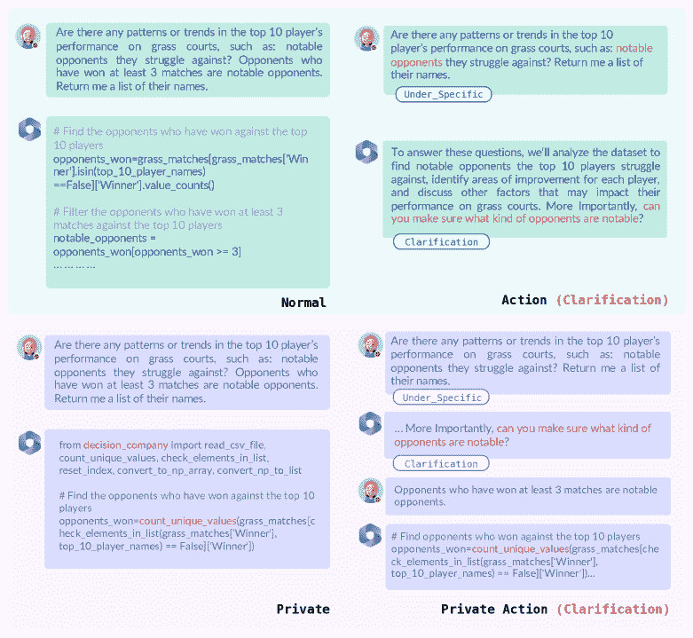

图1：这是 Tapilot-Crossing 中四种交互模式的概述。“显著对手”这一概念模糊，需要在多轮交互中进行澄清。

SheetCopilot（Li等， [2024c](https://arxiv.org/html/2403.05307v1#bib.bib28)）、TableGPT（Zha等， [2023](https://arxiv.org/html/2403.05307v1#bib.bib59)）、Data-Copilot（Zhang等， [2023a](https://arxiv.org/html/2403.05307v1#bib.bib60)）展示了基于用户查询的自动工作流在表格数据分析代理中的潜力。然而，现实世界分析的动态性和不确定性要求有效的人机交互。这是因为用户的意图往往模糊不清（De Vries等， [2020](https://arxiv.org/html/2403.05307v1#bib.bib7)；Yan等， [2023](https://arxiv.org/html/2403.05307v1#bib.bib49)；Wang等， [2024](https://arxiv.org/html/2403.05307v1#bib.bib43)），并且用户可能需要根据中间结果调整分析策略（Yan等， [2023](https://arxiv.org/html/2403.05307v1#bib.bib49)；Yao等， [2020](https://arxiv.org/html/2403.05307v1#bib.bib52)）。例如，在图[1](https://arxiv.org/html/2403.05307v1#S1.F1 "Figure 1 ‣ 1 Introduction ‣ Tapilot-Crossing: Benchmarking and Evolving LLMs Towards Interactive Data Analysis Agents")中，显著的对手可能有多种解释，如获胜最多的对手，或者最常见的对手。为此，评估它们在数据分析场景中进行互动用户参与的能力的全面基准至关重要。

在本文中，我们介绍了Tapilot-Crossing，这是一个用于评估LLM代理在交互式数据分析任务中的新基准。Tapilot-Crossing旨在模拟现实世界的数据分析场景，用户与LLM代理互动，生成用于数据探索和决策制定的代码。它包含了1024次用户-机器互动和1176个用户意图，涵盖了四个实际场景：1）Normal，所有问题和用户需求都很明确，不需要代理进行任何操作；2）Action，代理必须回应用户的多种反馈或指令；3）Private，考察代理在遇到预训练阶段未见过的包时的真实语义解析能力（Zan等， [2022](https://arxiv.org/html/2403.05307v1#bib.bib57)）；4）Private Action，结合了Private和Action的特征，更加贴近现实世界的数据分析。这些场景有两种回答类型：1）代码生成，可以测试代理是否能够正确解读用户的查询并生成相应的数据分析代码；2）多项选择题，可以评估代理理解已执行结果并为用户提供适当见解的能力。

基于众包的数据集或基准的传统构建方法，尤其是在高质量和互动场景下，由于需要大量人工努力和专业知识，通常耗时且成本高昂（Yu et al., [2019a](https://arxiv.org/html/2403.05307v1#bib.bib54); Li et al., [2023a](https://arxiv.org/html/2403.05307v1#bib.bib29); Guo et al., [2021](https://arxiv.org/html/2403.05307v1#bib.bib15); Li et al., [2023d](https://arxiv.org/html/2403.05307v1#bib.bib32); Zhang et al., [2023c](https://arxiv.org/html/2403.05307v1#bib.bib62))。在这种情况下，我们设计了一个新颖的多代理环境——决策公司（Decision Company），用来构建Tapilot-Crossing。决策公司是一个模拟环境，其中4个GPT-4代理彼此沟通，执行数据分析任务。通过使用这个环境，两个博士生能够在一个月内以不到100美元的成本构建Tapilot-Crossing。

我们在Tapilot-Crossing上评估了流行的先进LLM代理。结果突显了互动数据分析的挑战，并促使我们需要更多能处理多样化用户意图和反馈的先进LLM代理。

为了进一步推动LLM向有效的互动数据分析代理发展，我们提出了自适应互动反思（AIR），它通过自生成的伪逻辑反思引导LLM代理从成功的历史中学习。

我们的实验表明，AIR可以显著提升LLM的表现，其中GPT-4相较于其基础模型，能够获得44.5%的相对提升，提供了如何积极改善人类与LLM代理在数据分析任务中互动的见解。

总结来说，我们的贡献有三点：

+   •

    我们介绍了Tapilot-Crossing，这是一个用于评估LLM代理在互动数据分析任务中表现的新基准。Tapilot-Crossing是通过我们设计的多代理环境——决策公司构建的，并在极少的人工努力下完成，涵盖了广泛的实际场景。

+   •

    我们在Tapilot-Crossing上评估了流行的LLM代理，突显了互动数据分析的挑战以及对更先进LLM代理的需求。

+   •

    我们提出了AIR，这是一种有效且高效的反思策略，能显著提升LLM代理在互动数据分析任务中的表现。

## 2 初步概述

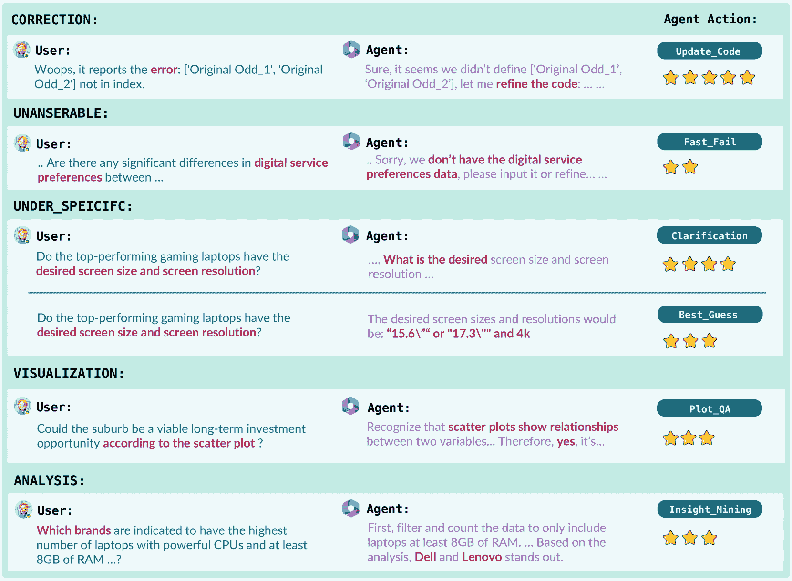

图2：此图概述了Tapilot-Crossing中的动作类型，并通过示例进行说明。我们强调了每个类别特有的关键词，并展示了相关查询的相关部分以及代理动作。图中符号的数量表示每个动作的相对难度。

### 2.1 互动数据分析

使用LLM代理进行互动数据分析的任务涉及用户和LLM代理进行一系列用户-代理回合，表示为$[(u_{1},a_{1}),(u_{2},a_{2}),...,(u_{n},a_{n})]$，其中$n$是对话中的回合数。每个用户-代理回合是一个元组$(u,a)$，其中$u$是用户的查询，$a$是代理的回应。用户的查询$u$可以是自然语言指令，也可以是对用户或代理之前回应的反馈。代理的回应$a$可以是用于数据分析的代码片段，也可以是从问题提供的选项列表中选择的正确答案。每个对话从用户的初始查询$u_{1}$开始，并以代理的最终回应$a_{n}$结束。

### 2.2 交互中的代理动作

在Tapilot-Crossing中，我们总结了交互中常见的6种代理动作，以处理用户意图和上下文，具体如图[2](https://arxiv.org/html/2403.05307v1#S2.F2 "Figure 2 ‣ 2 Preliminaries ‣ Tapilot-Crossing: Benchmarking and Evolving LLMs Towards Interactive Data Analysis Agents")所示。我们将代理动作集表示为$A$，它是用户查询$u$、对话历史$H$和表格内容$T$的函数。在本研究中，我们主要集中在表格数据的分析上。

形式上，我们将代理动作集表示为$A=f_{\theta}(u,H,T)$，其中$f_{\theta}$表示基于LLMs的代理，参数为$\theta$。在Tapilot-Crossing中，我们分别在动作集$A$的每种动作模式下评估LLM代理的性能。

## 3 Tapilot-Crossing 数据集

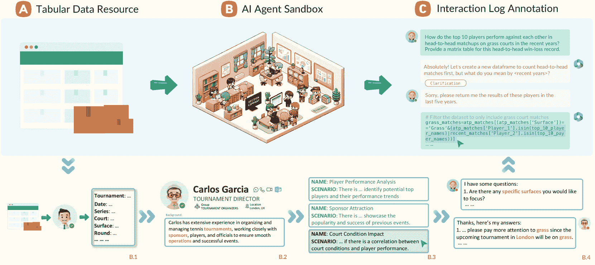

图3：该图描述了由AI代理沙盒决策公司构建的Tapilot-Crossing流程！[Refer to caption](img/742b6484926ba0a7c9e1811948741e5f.png)表示在构建过程中需要人工干预。欲了解更详细的描述，请参见第[3](https://arxiv.org/html/2403.05307v1#S3 "3 Tapilot-Crossing Dataset ‣ Tapilot-Crossing: Benchmarking and Evolving LLMs Towards Interactive Data Analysis Agents")节。

### 3.1 数据集构建。

Tapilot-Crossing的构建主要基于AI代理沙盒决策公司，如图[3](https://arxiv.org/html/2403.05307v1#S3.F3 "Figure 3 ‣ 3 Tapilot-Crossing Dataset ‣ Tapilot-Crossing: Benchmarking and Evolving LLMs Towards Interactive Data Analysis Agents")所示。决策公司是一个多代理环境，四个GPT-4代理（管理员、客户端、数据科学家和AI聊天机器人）相互互动，执行数据分析任务。构建过程包括以下几个步骤：数据获取与预处理、客户端角色生成、分析场景生成、计划讨论和交互日志模拟。在这些阶段，可能需要人工干预，以纠正错误或消除有害或偏见内容。最终，原型数据被适应到私有和动作设置中。

#### 数据获取与预处理。

Tapilot-Crossing 构建的第一步是数据的获取和预处理。我们从流行的数据科学平台 Kaggle ^*^**[https://www.kaggle.com/](https://www.kaggle.com/) 收集了 5 个开源数据表。这些数据集涵盖了多个领域，分别是 ATP 网球、信用卡、快餐、笔记本电脑价格和墨尔本住房。然后，管理员代理将生成列的含义和数值说明。

#### 客户角色生成。

Tapilot-Crossing 的构建进入客户角色生成阶段。这些具有特定任务和与数据相关的主题的角色由管理员代理创建。每个角色由姓名、地点、职位和背景定义，背景涵盖了不同的兴趣和经历。

#### 分析场景模拟。

接着，管理员代理与每个客户代理进行访谈，询问他们的场景描述、场景名称以及使用该数据集进行场景分析的目标。在 Tapilot-Crossing 数据集中，人工标注者会在此处插入并选择最合理或最有趣的场景。这确保了 Tapilot-Crossing 数据集中的场景是有意义的，不会在不同的客户间过于笼统。例如，在图 [3](https://arxiv.org/html/2403.05307v1#S3.F3 "图 3 ‣ 3 Tapilot-Crossing 数据集 ‣ Tapilot-Crossing：基准测试与发展 LLMs 向交互式数据分析代理演进")的 B.3 部分，我们选择了场地条件影响，因为球员表现分析过于笼统，而赞助商吸引需要的数据量超出了表格内容，导致出现过多无法回答的问题。

#### 计划讨论。

在这个过程中，客户端代理和数据科学家代理合作，将客户的需求转化为一组具体的数据分析问题。每个问题都会提供一个预期的结果类型，例如数据框、列表或各种图形类型，这有助于减少问题的模糊性并减轻评估指标的压力（Yin et al., [2023](https://arxiv.org/html/2403.05307v1#bib.bib53); He et al., [2023](https://arxiv.org/html/2403.05307v1#bib.bib17); Zhang et al., [2023d](https://arxiv.org/html/2403.05307v1#bib.bib63)）。代理之间的对话进一步精炼了带有具体条件的问题。例如，如图[3](https://arxiv.org/html/2403.05307v1#S3.F3 "图 3 ‣ 3 Tapilot-Crossing 数据集 ‣ Tapilot-Crossing：评估和推动LLM向互动数据分析代理发展的进程") B.4所示，客户Garcia的问题可以根据他接下来的回应进一步详细阐述，使所有问题变得更加可答。特别地，代理Garcia完全意识到他在B.2中创建的角色，增加了条件“草地”，反映了他位于伦敦的位置。这意味着，代理的角色扮演功能在生成更加多样化且合理的问题方面具有重要作用（Li et al., [2024a](https://arxiv.org/html/2403.05307v1#bib.bib26); Park et al., [2023](https://arxiv.org/html/2403.05307v1#bib.bib36)）。

#### 交互日志注释。

在计划讨论后，进入交互模拟阶段。在这一阶段，AI聊天机器人代理主导执行在前一阶段达成一致的数据分析计划。聊天机器人代理与数据科学家代理进行互动，通过生成代码并分析返回的结果来回答计划中定义的一系列问题。

### 3.2 人类校准

尽管决策公司能够通过零-shot提示方式生成大量的数据分析交互，但人类干预仍是确保数据集质量的不可或缺的部分（Lu et al., [2023](https://arxiv.org/html/2403.05307v1#bib.bib35)）。我们的观察表明，由聊天机器人代理生成的原始代码中，只有23.5%可以直接作为参考代码使用。因此，两个博士生作为专家参与每个生成阶段，以校准错误和无意义的交互。尽管需要人类干预，但值得注意的是，修改现有的答案或代码比从头开始创建更高效。我们在整个动作设置收集过程中，保留了所有自然且有意义的交互，包括代理与代理之间的以及人类与机器之间的交互。

### 3.3 私有库模式演化

数据分析师经常依赖他们的私有库（Zan 等，[2022](https://arxiv.org/html/2403.05307v1#bib.bib57)）。这些库通常是根据他们的特定需求量身定制的，可以实现更高效和定制化的数据处理与分析。此外，通过用户定义的包生成代码能够测试代理的真实语义解析能力，而不仅仅是测试它们记忆像Pandas这样的库中的标准语法（Lai 等，[2023](https://arxiv.org/html/2403.05307v1#bib.bib24)）。它还评估了代理理解并实现自定义函数的能力，这对于实际的数据分析至关重要。在这项工作中，我们提示GPT-4自主地将使用预训练函数（如Pandas或Numpy）的原型代码转换为私有代码。详细信息请参阅附录[J.5](https://arxiv.org/html/2403.05307v1#A10.SS5 "J.5 私有库演进 ‣ 附录 J 决策公司提示 ‣ Tapilot-Crossing: 基准测试与发展LLMs towards Interactive Data Analysis Agents")。

## 4 数据统计与指标

### 4.1 数据集统计

| 统计 | 数量 |
| --- | --- |
| 总互动次数 | 1024 |
| ![[无标题图片]](img/d9ec1e6e0d4bcdfd89cb715af1abdada.png) 清晰互动 | 284 |
| ![[无标题图片]](img/d9ec1e6e0d4bcdfd89cb715af1abdada.png) 行动互动 | 485 |
| ![[无标题图片]](img/d9ec1e6e0d4bcdfd89cb715af1abdada.png) 私有库互动 | 206 |
| ![[无标题图片]](img/d9ec1e6e0d4bcdfd89cb715af1abdada.png) 私有行动互动 | 49 |
| ![[无标题图片]](img/d9ec1e6e0d4bcdfd89cb715af1abdada.png) 私有库函数数量 | 137 |
| 回答类型 |  |
| ![[无标题图片]](img/d9ec1e6e0d4bcdfd89cb715af1abdada.png) 代码生成答案数量 | 594 |
| ![[无标题图片]](img/d9ec1e6e0d4bcdfd89cb715af1abdada.png) 多选答案数量 | 430 |
| 质量与成本 |  |
| ![[无标题图片]](img/d9ec1e6e0d4bcdfd89cb715af1abdada.png) 内部一致性 | 93.64 |
| ![[无标题图片]](img/d9ec1e6e0d4bcdfd89cb715af1abdada.png) 总成本（美元） | 66.7 |

表 1：Tapilot-Crossing的统计数据。

| 数据集 | # Q &#124; # 意图 | # 令牌 / Q | # 令牌 / 代码 | 代码类型 | 分析 | 多轮对话 | 私有库 | 多模态 | 评估 |
| --- | --- | --- | --- | --- | --- | --- | --- | --- | --- |
| HumanEval (Chen 等，[2021](https://arxiv.org/html/2403.05307v1#bib.bib2)) | 164 &#124; 164 | 0060.9 | 024.4 | ![[无标题图片]](img/aa0023fbe73731a1ed1ebaeb745f5292.png) | ![[无标题图片]](img/3828ea6c1754b4301c04e6b83983c6e6.png) | ![[无标题图片]](img/3828ea6c1754b4301c04e6b83983c6e6.png) | ![[无标题图片]](img/3828ea6c1754b4301c04e6b83983c6e6.png) | ![[无标题图片]](img/3828ea6c1754b4301c04e6b83983c6e6.png) | 测试用例 |
| MBPP (Austin 等，[2021](https://arxiv.org/html/2403.05307v1#bib.bib1)) | 974 &#124; 974 | 0014.5 | 024.2 | ![[未标注的图片]](img/aa0023fbe73731a1ed1ebaeb745f5292.png) | ![[未标注的图片]](img/3828ea6c1754b4301c04e6b83983c6e6.png) | ![[未标注的图片]](img/3828ea6c1754b4301c04e6b83983c6e6.png) | ![[未标注的图片]](img/3828ea6c1754b4301c04e6b83983c6e6.png) | ![[未标注的图片]](img/3828ea6c1754b4301c04e6b83983c6e6.png) | 测试用例 |
| Spider (Yu 等，[2018](https://arxiv.org/html/2403.05307v1#bib.bib55)) | 1034 &#124; 1034 | 0012.4 | 018.3 | ![[未标注的图片]](img/8218d0fe15e25799ce47ba38725c1529.png) | ![[未标注的图片]](img/3828ea6c1754b4301c04e6b83983c6e6.png) | ![[未标注的图片]](img/3828ea6c1754b4301c04e6b83983c6e6.png) | ![[未标注的图片]](img/3828ea6c1754b4301c04e6b83983c6e6.png) | ![[未标注的图片]](img/3828ea6c1754b4301c04e6b83983c6e6.png) | Acc + EM |
| BIRD (Li 等，[2023a](https://arxiv.org/html/2403.05307v1#bib.bib29)) | 1534 &#124; 1534 | 0014.5 | 049.6 | ![[未标注的图片]](img/8218d0fe15e25799ce47ba38725c1529.png) | ![[未标注的图片]](img/3828ea6c1754b4301c04e6b83983c6e6.png) | ![[未标注的图片]](img/3828ea6c1754b4301c04e6b83983c6e6.png) | ![[未标注的图片]](img/3828ea6c1754b4301c04e6b83983c6e6.png) | ![[未标注的图片]](img/3828ea6c1754b4301c04e6b83983c6e6.png) | Acc + VES |
| DS-1000 (Lai 等，[2023](https://arxiv.org/html/2403.05307v1#bib.bib24)) | 1000 &#124; 1000 | 0282.4 | 042.1 | ![[未标注的图片]](img/aa0023fbe73731a1ed1ebaeb745f5292.png) | ![[未标注的图片]](img/3828ea6c1754b4301c04e6b83983c6e6.png) | ![[未标注的图片]](img/3828ea6c1754b4301c04e6b83983c6e6.png) | ![[未标注的图片]](img/3828ea6c1754b4301c04e6b83983c6e6.png) | ![[未标注的图片]](img/56b0b1a18270b6b5bb74baba770ca46b.png) | 测试用例 + SFC |
| SparC (Yu 等，[2019b](https://arxiv.org/html/2403.05307v1#bib.bib56)) | 1203 &#124; 1203 | 009.4 | 026.3 | ![[未标注的图片]](img/8218d0fe15e25799ce47ba38725c1529.png) | ![[未标注的图片]](img/3828ea6c1754b4301c04e6b83983c6e6.png) | ![[未标注的图片]](img/56b0b1a18270b6b5bb74baba770ca46b.png) | ![[未标注的图片]](img/3828ea6c1754b4301c04e6b83983c6e6.png) | ![[未标注的图片]](img/3828ea6c1754b4301c04e6b83983c6e6.png) | Acc |
| CoSQL (Yu 等，[2019a](https://arxiv.org/html/2403.05307v1#bib.bib54)) | 1008 &#124; 1008 | 0013.1 | 031.4 | ![[未标注的图片]](img/8218d0fe15e25799ce47ba38725c1529.png) | ![[未标注的图片]](img/3828ea6c1754b4301c04e6b83983c6e6.png) | ![[未标注的图片]](img/56b0b1a18270b6b5bb74baba770ca46b.png) | ![[未标注的图片]](img/3828ea6c1754b4301c04e6b83983c6e6.png) | ![[未标注的图片]](img/3828ea6c1754b4301c04e6b83983c6e6.png) | Acc |
| ARCADE (Yin et al., [2023](https://arxiv.org/html/2403.05307v1#bib.bib53)) | 1066 &#124; 1066 | 0019.2 | 048.2 | ![[未标注图像]](img/aa0023fbe73731a1ed1ebaeb745f5292.png) | ![[未标注图像]](img/3828ea6c1754b4301c04e6b83983c6e6.png) | ![[未标注图像]](img/56b0b1a18270b6b5bb74baba770ca46b.png) | ![[未标注图像]](img/3828ea6c1754b4301c04e6b83983c6e6.png) | ![[未标注图像]](img/3828ea6c1754b4301c04e6b83983c6e6.png) | Acc + Fuzzy |
| Tapilot-Crossing | 1024 &#124; 1176 | 0273.6 | 110.6 | ![[未标注图像]](img/aa0023fbe73731a1ed1ebaeb745f5292.png) | ![[未标注图像]](img/56b0b1a18270b6b5bb74baba770ca46b.png) | ![[未标注图像]](img/56b0b1a18270b6b5bb74baba770ca46b.png) | ![[未标注图像]](img/56b0b1a18270b6b5bb74baba770ca46b.png) | ![[未标注图像]](img/56b0b1a18270b6b5bb74baba770ca46b.png) | Acc + AccR |

表 2：Tapilot-Crossing 与其他数据分析数据集的比较。前五个数据集是包含 SQL 和 Python 代码的单回合数据分析集。接下来的三个基准是多回合或互动式数据分析数据集。Tapilot-Crossing 代表了一个具有更全面设置的数据分析挑战数据集。![[未标注图像]](img/aa0023fbe73731a1ed1ebaeb745f5292.png) 表示最终代码是 Python。![[未标注图像]](img/8218d0fe15e25799ce47ba38725c1529.png) 表示目标代码是 SQL。

表格 [1](https://arxiv.org/html/2403.05307v1#S4.T1 "Table 1 ‣ 4.1 Dataset Statistics ‣ 4 Data Statistics & Metrics ‣ Tapilot-Crossing: Benchmarking and Evolving LLMs Towards Interactive Data Analysis Agents") 提供了我们数据集的关键统计信息，而表格 [2](https://arxiv.org/html/2403.05307v1#S4.T2 "Table 2 ‣ 4.1 Dataset Statistics ‣ 4 Data Statistics & Metrics ‣ Tapilot-Crossing: Benchmarking and Evolving LLMs Towards Interactive Data Analysis Agents") 则提供了 Tapilot-Crossing 数据集与其他与数据分析或科学相关的数据集的比较。为了确保在问题和代码长度方面的公平比较，我们利用 tiktoken 来计算每个数据集的 token 数量。如表格 [2](https://arxiv.org/html/2403.05307v1#S4.T2 "Table 2 ‣ 4.1 Dataset Statistics ‣ 4 Data Statistics & Metrics ‣ Tapilot-Crossing: Benchmarking and Evolving LLMs Towards Interactive Data Analysis Agents") 所示，Tapilot-Crossing 包含了跨私有库、多轮和多模态交互的全面评估设置。此外，该数据集的复杂性通过问题和相关代码片段的扩展长度进一步放大，尤其是多意图查询的加入。这些查询在一个问题中包含多个意图，需要多种计算策略才能有效处理。例如，查询 "Please provide mean, median, mode, range, and histogram plots for age, employment status, and credit history."（请为年龄、就业状况和信用历史提供均值、中位数、众数、范围以及直方图）要求同时进行统计计算和数据可视化。最后，尽管 Tapilot-Crossing 包含 1024 个数据分析交互，但其成本仅为 66.7 美元，使其成为一种经济实惠的数据集生成选择。内部一致性保证了数据集的高质量。

### 4.2 评估指标

#### 准确度（Acc）。

准确率（Acc）是一个全面的评估指标，用于衡量代理生成正确执行代码和准确回答多项选择问题的能力。它定义为预测输出与期望参考输出相匹配的实例比例，涵盖所有评估任务。对于给定的数据集，假设有 $N$ 个实例，其中 $C_{i}$ 是预期结果（执行结果或正确答案），而 $\hat{C}_{i}$ 是第 $i^{th}$ 个实例的预测输出，Acc 的计算公式如下：

|  | $\mathrm{Acc}=\frac{1}{N}\sum_{i=1}^{N}\mathbf{I}(C_{i}=\hat{C}_{i}),$ |  | (1) |
| --- | --- | --- | --- |

其中，$\mathbf{I}$ 是一个指示函数，当 $C_{i}=\hat{C}_{i}$ 时返回 $1$，否则返回 $0$。

#### 私有库召回率（AccR）。

认识到在代码生成中准确利用特定用户定义的库的重要性，我们扩展了Acc，以包括基于召回的调整，用于涉及私有库的实例。这确保了AccR不仅评估代码执行和问答的直接准确性，还评估私有库函数的包含和正确使用。AccR可以按以下方式计算：

|  | $\mathrm{AccR}=\frac{1}{N}\sum_{i=1}^{N}\mathbf{I}(C_{i}=\hat{C}_{i})\cdot\mathbf{R}(C_{i},\hat{C}_{i}),$ |  | (2) |
| --- | --- | --- | --- |
|  | $\mathbf{R}(C{i},\hat{C}{i})=\frac{ | \mathbf{F}(C{i})\cap\mathbf{F}(\hat{C}{i}) | }{ | \mathbf{F}(C{i}) | },$ |  | (3) |

其中，$\mathbf{R}(C_{i},\hat{C}_{i})$量化了预测代码中相关库函数的召回率。$\mathbf{F}(C_{i})$和$\mathbf{F}(\hat{C}_{i})$分别表示参考代码中私有库函数的集合和预测代码中代理实际使用的私有库函数的集合。

## 5 将LLMs发展为交互式数据分析代理

在本节中，我们讨论了将大型语言模型（LLMs）装备为数据分析代理的工具和推理方法。然后，我们介绍了我们自生成的反思策略Air，以增强它们在交互环境中的表现。

### 5.1 工具集

我们的工具集包括执行器、用户模拟器和图表转表格转换器。执行器为模型提供了一个环境，以实时观察其中间代码结果的反馈（Xie 等，[2023](https://arxiv.org/html/2403.05307v1#bib.bib46); Wang 等，[2024](https://arxiv.org/html/2403.05307v1#bib.bib43)）。由GPT-4-Turbo提供支持的用户模拟器（Wang 等，[2024](https://arxiv.org/html/2403.05307v1#bib.bib43); Yan 等，[2023](https://arxiv.org/html/2403.05307v1#bib.bib49)）测试代理在面对不够具体的问题时，澄清细节后生成代码的能力。图表转表格转换器（Liu 等，[2023a](https://arxiv.org/html/2403.05307v1#bib.bib33)）通过将图表转换为表格，缓解了LLMs无法理解图表的普遍问题。关于这些工具集的详细描述请参见附录[E.1](https://arxiv.org/html/2403.05307v1#A5.SS1 "E.1 Toolkit ‣ Appendix E Agent Implementation ‣ Tapilot-Crossing: Benchmarking and Evolving LLMs Towards Interactive Data Analysis Agents")。

### 5.2 推理

推理是将LLMs转变为数据分析代理的关键过程（Huang 和 Chang，[2023](https://arxiv.org/html/2403.05307v1#bib.bib19)）。在Tapilot-Crossing中，我们结合了两种主要的推理方法，用于代码生成和多项选择答案。第一种方法是链式思维（Chain-of-Thought，COT）提示技术（Wei 等，[2022](https://arxiv.org/html/2403.05307v1#bib.bib45)），它通过将推理路径分解为多个步骤，从而增强了LLMs的复杂推理能力。第二种方法是推理与行动（Reasoning & Action，ReAct），它使得模型能够通过生成推理过程和行动的交替方式来做出决策，包括写代码、执行和理解结果，并基于分析做出决策（Yao 等，[2023](https://arxiv.org/html/2403.05307v1#bib.bib51)）。

### 5.3 自适应交互反思（Air）

成功的交互非常重要，因为它们包含了满足用户需求并确保正确分析或代码生成步骤所需的逻辑。基于此动机，我们提出了一种自适应交互反思（Air）方法，使数据分析代理能够通过两步过程从成功的用户代码历史中学习。

#### 伪代码逻辑生成。

首先，给定上一个历史$(\mathbf{u}_{t-1};\mathbf{a}_{t-1})$，当$t>1$时，我们提示数据分析代理进行反思并生成其潜在逻辑$\mathbf{m}_{t-1}=f_{\theta}(\mathbf{u}_{t-1};\mathbf{a}_{t-1})$，其中$f_{\theta}$表示基于LLMs的代理，参数为$\theta$。并且$(x;y)$表示在提示中连接了元素$x$和$y$。在我们的工作中，我们将伪代码视为$\mathbf{m}$，因为它是自然语言查询与代码之间的中间逻辑。

#### 重新组织单次推理。

其次，我们将它们重新组织成一个自生成的单次示例，顺序为：$\mathbf{p}_{t-1}=(\mathbf{u}_{t-1};\{\mathbf{m}_{t-1};\mathbf{a}_{t-1}\})$，这表示在给定输入$\mathbf{u}_{t-1}$的情况下，代理首先应生成一个逻辑$\mathbf{m}_{t-1}$，然后生成答案$\mathbf{a}_{t-1}$。最后，数据分析代理可以从$\mathbf{p}_{t-1}$中学习，首先生成逻辑$\mathbf{m}_{t}=f_{\theta}(\mathbf{p}_{t-1};\mathbf{u}_{t})$，并在当前轮次$t$生成答案$\mathbf{a}_{t}=f_{\theta}(\mathbf{u}_{t};\mathbf{m}_{t})$。当$t=1$时，我们保持原代理的推理方法不变。图[7](https://arxiv.org/html/2403.05307v1#A4.F7 "Figure 7 ‣ Appendix D Air Implementation ‣ Tapilot-Crossing: Benchmarking and Evolving LLMs Towards Interactive Data Analysis Agents")提供了一个详细的示例。

| 模型 |  | 交互模式 | 结果类型 | 总体 |
| --- | --- | --- | --- | --- |
| 正常 | 操作 | 私有 | Pri-Act | 代码 | 选择 |
| Code-LLama-34B | 模型基准 | 27.5 | 18.7 | 2.4 | 0.0 | 15.0 | 19.8 | 16.7 |
| 代理 | 18.5 | 22.3 | 1.0 | 0.0 | 9.9 | 24.4 | 15.2 |
| 代理间 | 28.8 | 22.9 | 2.1 | 0.2 | 15.7 | 24.8 | 19.2 |
| Claude-2.1 | 模型基础 | 20.2 | 16.8 | 1.5 | 4.5 | 11.4 | 17.9 | 13.7 |
| 代理 | 23.4 | 18.0 | 3.9 | 0.0 | 13.6 | 19.1 | 15.6 |
| 交互代理 | 24.8 | 18.0 | 5.1 | 0.6 | 15.1 | 18.2 | 16.4 |
| GPT-4-Turbo | 模型基础 | 27.6 | 17.5 | 5.3 | 4.3 | 17.8 | 16.1 | 17.2 |
| 代理 | 29.1 | 21.7 | 10.1 | 3.6 | 20.2 | 20.6 | 20.4 |
| 交互代理 | 29.2 | 22.8 | 12.0 | 7.9 | 20.6 | 23.1 | 21.5 |
| GPT-4-32k | 模型基础 | 29.7 | 24.2 | 7.1 | 0.0 | 17.8 | 25.4 | 20.9 |
| 代理 | 23.4 | 39.2 | 9.1 | 5.3 | 16.6 | 38.8 | 25.9 |
| 交互代理 | 32.2 | 41.3 | 10.6 | 9.8 | 21.6 | 42.1 | 30.2 |

表3：Tapilot-Crossing数据集上LLMs在基础、代理和交互代理模式下的总体结果。Pri-Act指的是私密库+动作评估模式。

## 6 实验

我们在第[6.1节](https://arxiv.org/html/2403.05307v1#S6.SS1 "6.1 实验设置 ‣ 6 实验 ‣ Tapilot-Crossing：基准测试和发展大型语言模型以应对互动数据分析代理")介绍了实验设置，在第[6.2节](https://arxiv.org/html/2403.05307v1#S6.SS2.SSS0.Px1 "总体结果 ‣ 6.2 实验结果 ‣ 6 实验 ‣ Tapilot-Crossing：基准测试和发展大型语言模型以应对互动数据分析代理")中展示了实验结果，并在第[6.3节](https://arxiv.org/html/2403.05307v1#S6.SS3 "6.3 私密模式分析 ‣ 6 实验 ‣ Tapilot-Crossing：基准测试和发展大型语言模型以应对互动数据分析代理")和第[6.4节](https://arxiv.org/html/2403.05307v1#S6.SS4 "6.4 模型缺陷分析 ‣ 6 实验 ‣ Tapilot-Crossing：基准测试和发展大型语言模型以应对互动数据分析代理")中进行了分析。

### 6.1 实验设置

#### 模型。

我们的实验主要涉及流行的大型语言模型（LLMs），这些模型能够生成代码并遵循复杂的人类指令，因为这在数据分析中是基本技能。因此，我们调查了GPT-4-Turbo^†^††gpt-4-1106-preview、GPT-4-32k、Claude-2.1和CodeLlama-34B ^‡^‡‡codellama-34b-instruct-hf（Roziere等人，[2023](https://arxiv.org/html/2403.05307v1#bib.bib40)）的表现。

#### 实施细节。

每个大型语言模型（LLM）都在三种设置下进行实现。1）Model-Base指的是没有任何工具调用和推理的LLM本身。2）代理模式涉及工具使用和推理。我们采用零-shot COT来指导LLM完成代码生成任务，因为它可以让我们测试代理在数据分析中的纯代码生成能力。对于多项选择题回答，我们使用一-shot ReAct。3）跨代理模式包含了如[5.3节](https://arxiv.org/html/2403.05307v1#S5.SS3 "5.3 自适应交互反射 (Air) ‣ 使LLM向互动数据分析代理发展 ‣ Tapilot-Crossing：基准测试和使LLM向互动数据分析代理发展")所描述的Air，超出了代理的范围。每个模型都提供了最多5轮的用户-代码历史记录。更多详细信息请参见附录[F](https://arxiv.org/html/2403.05307v1#A6 "附录F 实现细节 ‣ Tapilot-Crossing：基准测试和使LLM向互动数据分析代理发展")。对于私密设置的实现，我们遵循(Li等人，[2023b](https://arxiv.org/html/2403.05307v1#bib.bib30); Zan等人，[2022](https://arxiv.org/html/2403.05307v1#bib.bib57))的方式，首先提示代理检索私密库，然后使用检索到的包生成代码。

### 6.2 实验结果

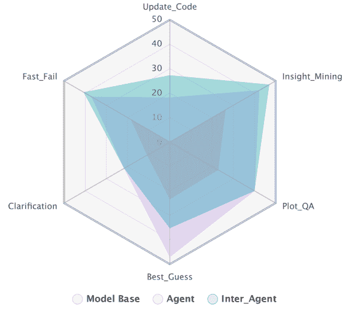

图4：在行动模式下，GPT-4-32k在不同类别中的表现可视化。它包括对基础版、代理版和跨代理版的比较分析。

#### 总体结果。

表 [3](https://arxiv.org/html/2403.05307v1#S5.T3 "表 3 ‣ 重组一次性推理。‣ 5.3 自适应交互反射（Air）‣ 5 朝着互动数据分析代理演化的 LLMs ‣ Tapilot-Crossing：基准测试和朝着互动数据分析代理演化的 LLMs") 展示了所有 LLM 代理及其基础模型在 Tapilot-Crossing 数据集上的综合表现。从结果中，我们可以推断出以下几点：1）大多数拥有代理版本的模型优于其基础版本，突显了工具和推理在提升语言学习模型（LLMs）在复杂任务中的表现中的重要作用（Liu 等， [2023b](https://arxiv.org/html/2403.05307v1#bib.bib34); Xie 等， [2023](https://arxiv.org/html/2403.05307v1#bib.bib46)）。 2）所有模型在与 Air 的交互代理模式中表现出明显改进。这表明，成功交互历史的底层逻辑在引导 LLMs 成为更加熟练的数据分析代理方面起到了重要作用。 3）尽管 GPT-4-Turbo 在代码生成上的表现几乎与 GPT-4 持平，但其整体表现仍然不及 GPT-4。这表明，除了代码编写之外，结果理解和分析同样重要。幸运的是，Tapilot-Crossing 的综合设置可以帮助用户选择适合的数据分析任务模型。 4）令人惊讶的是，CodeLlama 在正常代码生成设置下表现出色。我们观察到，CodeLlama 经常自动定义函数，并在接下来的代码中应用这些函数，从而提高了可读性和逻辑性。这在与数据分析代码生成相关的任务中特别有益。这类任务通常需要组合 API 函数，这要求对上下文有深刻理解，并具备将常见模式提取为可重用函数的能力。通过定义和重用符号函数，CodeLlama 可以简化复杂的上下文，使其更加逻辑化，这在解决复杂任务时具有优势（Gu 等， [2023](https://arxiv.org/html/2403.05307v1#bib.bib13)）。

#### 动作模式的精细化结果。

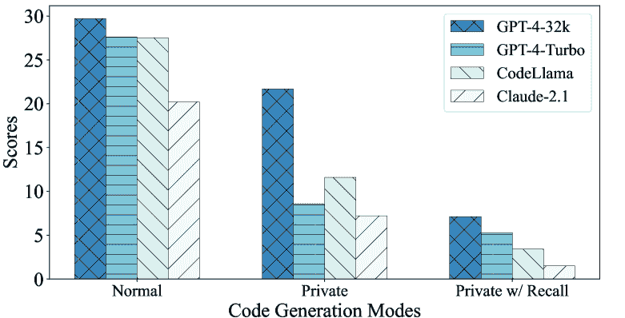

图 5：LLM 在正常模式、私有模式、私有模式带召回的性能可视化。前两种模式的得分为准确率（Acc），最后一种得分为准确率召回（AccR）。

图 [4](https://arxiv.org/html/2403.05307v1#S6.F4 "图 4 ‣ 6.2 实验结果 ‣ 6 实验 ‣ Tapilot-Crossing：基准测试与发展LLM朝向交互式数据分析代理") 提供了三种GPT-4模型变体在不同动作模式下的比较评估，详细内容见[2.2节](https://arxiv.org/html/2403.05307v1#S2.SS2 "2.2 交互中的代理动作 ‣ 2 初步知识 ‣ Tapilot-Crossing：基准测试与发展LLM朝向交互式数据分析代理")。交互式数据分析代理Inter-Agent显然在大多数领域表现更好，特别是在管理Fast_Fail查询和执行Update_Code动作方面。然而，在Best_Guess动作上，它比Agent略逊一筹。我们注意到，Air倾向于使代理在重组一击示例$\mathbf{p}_{t-1}$和当前生成的逻辑$\mathbf{m}_{t}$中过于容易处理。如果$\mathbf{p}_{t-1}$和$\mathbf{m}_{t}$中没有关于做假设的指令，代理往往选择“None of Above”。这一观察表明，过度依赖历史数据可能会妨碍模型根据即时用户行为进行推测的固有能力。因此，在用户代码历史探索与实时用户交互之间寻找平衡，尤其是在面对不够具体的问题时，对于提升LLM代理在交互环境中的表现至关重要。

### 6.3 私密模式分析

#### 总体结果。

表 [3](https://arxiv.org/html/2403.05307v1#S5.T3 "表 3 ‣ 重组一击推理。 ‣ 5.3 自适应交互反思 (Air) ‣ 5 使LLM朝着交互式数据分析代理发展 ‣ Tapilot-Crossing：基准测试与发展LLM朝向交互式数据分析代理") 和图 [5](https://arxiv.org/html/2403.05307v1#S6.F5 "图 5 ‣ 动作模式的细粒度结果。 ‣ 6.2 实验结果 ‣ 6 实验 ‣ Tapilot-Crossing：基准测试与发展LLM朝向交互式数据分析代理") 显示，私人设置呈现出相当大的障碍，表现最好的GPT-4-Turbo交互代理仅实现了12%。这表明，理解并实施用户特定功能是LLM代理在现实世界数据分析任务中至关重要且紧迫的技能（Zan等人，[2022](https://arxiv.org/html/2403.05307v1#bib.bib57)）。

#### 功能相关回忆的关键作用。

值得注意的是，在私有环境下，CodeLlama在准确率（Acc）方面超过了GPT-4-Turbo。然而，当考虑到生成代码中与私有库相关的召回率（AccR指标）时，其性能相较于GPT-4-Turbo显著下降。这个观察结果表明，CodeLlama倾向于较少依赖用户定义的私有函数，以减少代码错误的风险。因此，AccR指标能够突出显示在熟练的代码生成与细致集成用户指定的私有库之间所需的平衡，从而促进更安全、更令人满意的代码生产。

### 6.4 模型缺陷分析

#### 长上下文挑战。

处理长上下文的挑战在Tapilot-Crossing中尤为显著，尤其是对于最大输入长度较短的模型。像Codellama-34B这样的模型，其最大输入长度为16k，特别容易受到影响。例如，LLM需要访问所有私有函数描述和代码，以便有效地生成带有检索函数的代码。统计数据显示，Private的平均提示令牌数为15.7k，值得注意的是，20.4%的提示长度超过了16k。

#### 指令跟随。

我们的实验表明，GPT-4-32k在提示设计方面需要的努力最小，因为它们在遵循人类指令方面表现出色。具体来说，只有3.4%的结果偏离了提供的指令。然而，其他模型展示了更高比例的意外结果类型。例如，从Claude-2.1中提取生成的代码或答案非常具有挑战性，因为它通常将答案嵌入到输出的中间，而不是像定义的那样放在末尾。我们还观察到，GPT-4-Turbo在任何设置下都倾向于生成较长的代码。虽然这一特性增强了其在代码生成中的表现，但也导致在ReAct推理过程中，60.3%的代码生成是不可执行的，从而导致错误答案的产生。此外，CodeLlama-34B-Instruct在面对更长或更复杂的提示时缺乏鲁棒性。在添加COT后，CodeLlama的性能从使用简单指令时的27.5%显著下降至正常代码生成时的18.5%。

## 7 相关工作

#### 大型语言模型在数据分析中的应用。

近年来，使用大语言模型（LLMs）进行数据分析成为了一个备受关注的话题。由上下文学习（In-Context Learning）驱动的大语言模型（Yang等，[2023](https://arxiv.org/html/2403.05307v1#bib.bib50); Dai等，[2023](https://arxiv.org/html/2403.05307v1#bib.bib6); Dong等，[2023](https://arxiv.org/html/2403.05307v1#bib.bib10)）已被应用于各种数据分析任务，如SQL查询生成（Pourreza和Rafiei，[2024a](https://arxiv.org/html/2403.05307v1#bib.bib37); Gao等，[2023](https://arxiv.org/html/2403.05307v1#bib.bib12); Lei等，[2023](https://arxiv.org/html/2403.05307v1#bib.bib25); Zhang等，[2023b](https://arxiv.org/html/2403.05307v1#bib.bib61); Gu等，[2024](https://arxiv.org/html/2403.05307v1#bib.bib14); Wang等，[2023a](https://arxiv.org/html/2403.05307v1#bib.bib42); Pourreza和Rafiei，[2024b](https://arxiv.org/html/2403.05307v1#bib.bib38); Li等，[2024b](https://arxiv.org/html/2403.05307v1#bib.bib27))，pandas或python代码生成（Jain等，[2023](https://arxiv.org/html/2403.05307v1#bib.bib22); Chen等，[2024](https://arxiv.org/html/2403.05307v1#bib.bib4)，[2023a](https://arxiv.org/html/2403.05307v1#bib.bib3); Li等，[2024c](https://arxiv.org/html/2403.05307v1#bib.bib28); Zha等，[2023](https://arxiv.org/html/2403.05307v1#bib.bib59); Zhang等，[2023a](https://arxiv.org/html/2403.05307v1#bib.bib60); Zheng等，[2024b](https://arxiv.org/html/2403.05307v1#bib.bib65))，以及数据可视化（Chen等，[2023b](https://arxiv.org/html/2403.05307v1#bib.bib5); Huang等，[2023a](https://arxiv.org/html/2403.05307v1#bib.bib20)）。然而，这些研究大多数集中在单轮对话设置中，其中用户的查询是明确的，无需任何互动或澄清。近年来，互动数据分析引起了越来越多的关注，在这种情况下，用户的意图可能需要通过互动交流进行澄清或完善（De Vries等，[2020](https://arxiv.org/html/2403.05307v1#bib.bib7); Yan等，[2023](https://arxiv.org/html/2403.05307v1#bib.bib49); Wang等，[2024](https://arxiv.org/html/2403.05307v1#bib.bib43)）。

#### 数据分析基准。

数据分析任务基准的开发是推动 LLMs 在数据科学领域进展的关键因素之一。现有的基准大致可以分为单轮基准和多轮基准。单轮基准，如 HumanEval（Chen 等人，[2021](https://arxiv.org/html/2403.05307v1#bib.bib2)）、MBPP（Austin 等人，[2021](https://arxiv.org/html/2403.05307v1#bib.bib1)）、Spider（Yu 等人，[2018](https://arxiv.org/html/2403.05307v1#bib.bib55)）、BIRD（Li 等人，[2023a](https://arxiv.org/html/2403.05307v1#bib.bib29)）、Text2Analysis（He 等人，[2023](https://arxiv.org/html/2403.05307v1#bib.bib17)）、DABench（Hu 等人，[2024](https://arxiv.org/html/2403.05307v1#bib.bib18)）和 DS-1000（Lai 等人，[2023](https://arxiv.org/html/2403.05307v1#bib.bib24)）等，侧重于根据单个用户查询生成代码片段或闭合形式的数据分析总结。为了探索真实世界数据分析场景中的交互性质，其中用户的意图可能需要通过互动沟通进行澄清或调整，已经提出了多个多轮基准，包括 CoSQL（Yu 等人，[2019a](https://arxiv.org/html/2403.05307v1#bib.bib54)）和 ARCADE（Yin 等人，[2023](https://arxiv.org/html/2403.05307v1#bib.bib53)）。然而，这些基准主要关注代码生成，并未涵盖数据分析的其他方面，如基于中间结果的数据可视化和理解。我们的工作通过引入一个新的基准 Tapilot-Crossing，扩展了现有文献，旨在评估 LLM 智能体在多种数据分析场景中的交互数据分析任务表现。

#### 用于数据生成的多智能体环境。

LLMs（大语言模型）已被证明在构建用于自动数据生成的多智能体环境中具有很高的效果。例如，Lu 等人（[2023](https://arxiv.org/html/2403.05307v1#bib.bib35)）和 Ding 等人（[2023](https://arxiv.org/html/2403.05307v1#bib.bib9)）为问答和文本生成任务模拟对话。Li 等人（[2023b](https://arxiv.org/html/2403.05307v1#bib.bib30)）也利用多智能体环境生成关于 API 调用的数据。这是因为，当 LLM 智能体置于具有动态更新知识和记忆的环境中时，能够模拟出可信的人类行为（Park 等人，[2023](https://arxiv.org/html/2403.05307v1#bib.bib36)）。受到此启发，我们也创建了 Decision Company 来生成用于数据分析的交互日志数据，旨在展现更可信的行为。与以往大多数针对训练数据集生成的研究不同，我们的研究开创性地构建了一个交互基准，专注于交互数据分析智能体的评估。

## 8 结论

我们介绍了Tapilot-Crossing，这是一个用于评估LLM代理在交互式数据分析任务中的新基准。Tapilot-Crossing是通过一个成本效益高的多代理环境——Decision Company构建的，涵盖了广泛的实际场景。我们基于流行的LLM对数据分析代理在Tapilot-Crossing上进行了评估，突出了交互式数据分析的挑战以及对更先进交互式数据分析代理的需求。我们还提出了AIR，这是一种有效的反思策略，用于交互式数据分析代理的演化。我们的实验表明，AIR能够明显提高LLM代理的性能。

## 9 局限性

#### 数据集局限性。

1）Tapilot-Crossing数据集假设所有人机交互历史都是干净且正确的。然而，在现实世界的场景中，交互历史往往并不干净，可能包含噪声或需要对单一问题进行多轮澄清。因此，未来的工作应考虑一个更现实、噪声较多的数据分析交互基准。还值得注意的是，即使历史记录是干净的，最强大的模型GPT-4-32k在Inter-Agent模式下也仅能取得30.2的分数。2）我们的数据集构建既具有成本效益又高效；然而，由于数据分析问题固有的复杂性和不可预测性，评估阶段需要大量的努力。鉴于很难辨别数据分析代理之间的细微性能差异，尤其是在长格式代码生成和执行准确性方面，这一困难更加明显。代码中一个单一错误（即一行错误）和完全错误的代码（仅一行输出）执行结果都被判定为0。因此，未来应引入软度量评估系统，作为附录[H.5](https://arxiv.org/html/2403.05307v1#A8.SS5 "H.5 Code Similarity Equivalance (CSE) ‣ Appendix H Evaluation Metric Details ‣ Tapilot-Crossing: Benchmarking and Evolving LLMs Towards Interactive Data Analysis Agents")。这将提高我们准确评估答案与预期输出的接近程度的能力，即使执行结果为零，从而提供对代码生成能力的更精细观察。3）最后，我们的工作仅集中在基于表格数据的分析，未来我们希望能够涉及基于关系数据库（RDB）的分析，使用SQL编程语言进行处理。

#### 方法局限性。

我们提出的反思策略可以使LLMs成为更有效的交互式数据分析代理，但它在很大程度上依赖于先前互动的准确性。当历史对话充满错误时，这种依赖性变得不可靠，这表明需要检索增强的工具或方法来识别成功的过去互动。此外，由于缺乏历史数据，这一策略在初始互动中并未提升代理的性能。最后，尽管在许多行动设置中有效，但这一对互动历史的关注可能通过优先考虑过去的互动而限制了大型语言模型（LLMs）的推理能力，进而影响当前上下文的处理能力。未来的工作将致力于改进这一方法，以更好地平衡利用历史互动的优势与维持或增强LLMs推理能力的需求。

#### 模型局限性

在这项工作中，我们仅在综合设置下测试了四个流行且先进的模型。许多开源模型在我们的数据集上实际上表现出有限的人类指令跟随能力，导致推理性能非常差。具体来说，由于这些模型主要是在代码上训练的，它们通常未能充分遵循用户指令，如[6.4节](https://arxiv.org/html/2403.05307v1#S6.SS4 "6.4 模型缺陷分析 ‣ 6 实验 ‣ Tapilot-Crossing：基准测试与发展面向交互式数据分析代理的LLMs")所示。当资源和指令更加复杂时，这些模型只是简单地返回指令本身，并继续生成没有意义的跟随对话。因此，如何规划更多较弱的LLMs使其成为有效的交互式数据分析代理，将是我们未来的重要工作之一。

## 10 道德声明

大型语言模型（LLMs）在自动数据生成中的应用需要对伦理影响进行严格审查。主要关注点是LLMs可能生成被认为有害或有偏见的内容。为了降低这些风险，人工标注员（两名博士生）已经过滤并修正了第[3.2节](https://arxiv.org/html/2403.05307v1#S3.SS2 "3.2 人类校准 ‣ 3 Tapilot-Crossing数据集 ‣ Tapilot-Crossing: 标准化与演进LLMs以促进互动数据分析代理")中的所有问题案例。此外，LLMs可能传播私人或敏感信息。因此，我们采用了匿名化技术，系统性地更改个人标识符。例如，姓名字符串被随机替换，人物的任何信息也会被更换。同时，John Smith的地理位置将被Carlos Garcia的地理位置替代，以防止与现实世界中的个人或实体关联。这些程序在[第3节](https://arxiv.org/html/2403.05307v1#S3 "3 Tapilot-Crossing数据集 ‣ Tapilot-Crossing: 标准化与演进LLMs以促进互动数据分析代理")中进行。此外，我们承诺确保由我们的LLM（称为Tapilot-Crossing）生成的输出不包含政治或性别偏见。为此，包括结论和生成的回应在内的每个输出，都经过作者的严格审查。简而言之，我们的伦理框架建立在透明度、问责制和积极主动减轻任何与LLMs使用相关伦理问题的基础上。我们实施的措施反映了我们致力于保持LLMs伦理研究实践最高标准的承诺。

## 参考文献

+   Austin等人（2021）Jacob Austin, Augustus Odena, Maxwell Nye, Maarten Bosma, Henryk Michalewski, David Dohan, Ellen Jiang, Carrie Cai, Michael Terry, Quoc Le, 等. 2021. 使用大型语言模型进行程序合成. *arXiv预印本arXiv:2108.07732*。

+   陈等人（2021）Mark Chen, Jerry Tworek, Heewoo Jun, Qiming Yuan, Henrique Ponde de Oliveira Pinto, Jared Kaplan, Harri Edwards, Yuri Burda, Nicholas Joseph, Greg Brockman, 等. 2021. 评估基于代码训练的大型语言模型. *arXiv预印本arXiv:2107.03374*。

+   陈等人（2023a）Xinyun Chen, Renat Aksitov, Uri Alon, Jie Ren, Kefan Xiao, Pengcheng Yin, Sushant Prakash, Charles Sutton, Xuezhi Wang, 和 Denny Zhou. 2023a. 大型语言模型生成的普适自一致性. *arXiv预印本arXiv:2311.17311*。

+   陈等人（2024）Xinyun Chen, Maxwell Lin, Nathanael Schärli, 和 Denny Zhou. 2024. 教授大型语言模型自我调试. 载于*第十二届国际学习表征会议*。

+   Chen 等（2023b）Chen Zhutian，Zhang Chenyang，Wang Qianwen，Troidl Jakob，Warchol Simon，Beyer Johanna，Gehlenborg Nils 和 Pfister Hanspeter。2023b。超越生成代码：评估 GPT 在数据可视化课程中的表现。*arXiv 预印本 arXiv:2306.02914*。

+   Dai 等（2023）Dai Damai, Sun Yutao, Dong Li, Hao Yaru, Ma Shuming, Sui Zhifang, 和 Wei Furu。2023。为什么 GPT 能够在上下文中学习？语言模型作为元优化器秘密地执行梯度下降。在 *《计算语言学协会会议成果：ACL 2023》*，第4005–4019页，加拿大多伦多，计算语言学协会。

+   De Vries 等（2020）De Vries Harm，Bahdanau Dzmitry 和 Manning Christopher。2020。迈向生态有效的语言用户界面研究。*arXiv 预印本 arXiv:2007.14435*。

+   Deng 等（2024）Deng Xiang，Gu Yu，Zheng Boyuan，Chen Shijie，Stevens Sam，Wang Boshi，Sun Huan 和 Su Yu。2024。Mind2web：面向Web的通用智能体。*《神经信息处理系统进展》*，36。

+   Ding 等（2023）Ding Ning，Chen Yulin，Xu Bokai，Qin Yujia，Hu Shengding，Liu Zhiyuan，Sun Maosong 和 Zhou Bowen。2023。通过扩展高质量教学对话来增强聊天语言模型。在 *《2023年自然语言处理实证方法会议论文集，EMNLP 2023，新加坡，2023年12月6-10日》*，第3029–3051页。计算语言学协会。

+   Dong 等（2023）Dong Qingxiu，Li Lei，Dai Damai，Zheng Ce，Wu Zhiyong，Chang Baobao，Sun Xu，Xu Jingjing 和 Sui Zhifang。2023。上下文学习的调研。*arXiv 预印本 arXiv:2301.00234*。

+   Fayyad 等（1996）Fayyad Usama M.，Piatetsky-Shapiro Gregory 和 Smyth Padhraic。1996。从数据挖掘到数据库中的知识发现。*《人工智能杂志》*，17(3):37–54。

+   Gao 等（2023）Gao Dawei，Wang Haibin，Li Yaliang，Sun Xiuyu，Qian Yichen，Ding Bolin 和 Zhou Jingren。2023。通过大型语言模型增强文本到SQL：一个基准评估。*arXiv 预印本 arXiv:2308.15363*。

+   Gu 等（2023）Gu Yu，Deng Xiang 和 Su Yu。2023。不要生成，辨别：将语言模型与真实世界环境对接的提案。在 *《计算语言学协会第61届年会论文集（第一卷：长篇论文），ACL 2023，多伦多，加拿大，2023年7月9-14日》*，第4928–4949页。计算语言学协会。

+   Gu 等（2024）Gu Yu，Shu Yiheng，Yu Hao，Liu Xiao，Dong Yuxiao，Tang Jie，Srinivasa Jayanth，Latapie Hugo 和 Su Yu。2024。大型语言模型的中间件：工具是复杂环境中语言智能体的关键。*arXiv 预印本 arXiv:2402.14672*。

+   Guo 等人 (2021) Jiaqi Guo, Ziliang Si, Yu Wang, Qian Liu, Ming Fan, Jian-Guang Lou, Zijiang Yang, 和 Ting Liu. 2021. Chase：一个大规模且实用的中文数据集，用于跨数据库的上下文相关文本到 SQL 的转换。载于 *第59届计算语言学协会年会暨第11届国际联合自然语言处理大会论文集，ACL/IJCNLP 2021, (第1卷：长篇论文)，虚拟会议，2021年8月1日至6日*，第2316–2331页。计算语言学协会。

+   Han 等人 (2011) Jiawei Han, Micheline Kamber 和 Jian Pei. 2011. *数据挖掘：概念与技术，第3版*。Morgan Kaufmann。

+   He 等人 (2023) Xinyi He, Mengyu Zhou, Xinrun Xu, Xiaojun Ma, Rui Ding, Lun Du, Yan Gao, Ran Jia, Xu Chen, Shi Han 等人. 2023. Text2analysis：一个包含高级数据分析和模糊查询的表格问答基准。*arXiv 预印本 arXiv:2312.13671*。

+   Hu 等人 (2024) Xueyu Hu, Ziyu Zhao, Shuang Wei, Ziwei Chai, Guoyin Wang, Xuwu Wang, Jing Su, Jingjing Xu, Ming Zhu, Yao Cheng 等人. 2024. Infiagent-dabench：评估数据分析任务中的代理。*arXiv 预印本 arXiv:2401.05507*。

+   Huang 和 Chang (2023) Jie Huang 和 Kevin Chen-Chuan Chang. 2023. 面向大型语言模型推理的研究：一项综述。载于 *计算语言学协会发现：ACL 2023，2023年7月9日至14日，加拿大多伦多*，第1049–1065页。计算语言学协会。

+   Huang 等人 (2023a) Kung-Hsiang Huang, Mingyang Zhou, Hou Pong Chan, Yi R Fung, Zhenhailong Wang, Lingyu Zhang, Shih-Fu Chang 和 Heng Ji. 2023a. 大型语言模型是否理解图表？分析并修正图表标题中的事实错误。*arXiv 预印本 arXiv:2312.10160*。

+   Huang 等人 (2023b) Yue Huang, Jiawen Shi, Yuan Li, Chenrui Fan, Siyuan Wu, Qihui Zhang, Yixin Liu, Pan Zhou, Yao Wan, Neil Zhenqiang Gong 等人. 2023b. 大型语言模型的元工具基准：决定是否使用工具以及使用哪些工具。*arXiv 预印本 arXiv:2310.03128*。

+   Jain 等人 (2023) Naman Jain, Tianjun Zhang, Wei-Lin Chiang, Joseph E Gonzalez, Koushik Sen 和 Ion Stoica. 2023. 利用大型语言模型辅助的代码清理，训练准确的代码生成器。*arXiv 预印本 arXiv:2311.14904*。

+   Khanbabaei 等人 (2018) Mohammad Khanbabaei, Farzad Movahedi Sobhani, Mahmood Alborzi 和 Reza Radfar. 2018. 开发一个集成框架，结合数据挖掘技术和本体概念用于过程改进。*J. Syst. Softw.*, 137:78–95。

+   Lai 等人 (2023) Yuhang Lai, Chengxi Li, Yiming Wang, Tianyi Zhang, Ruiqi Zhong, Luke Zettlemoyer, Wen-Tau Yih, Daniel Fried, Sida I. Wang 和 Tao Yu. 2023. DS-1000：一个自然且可靠的数据科学代码生成基准。载于 *国际机器学习大会，ICML 2023，2023年7月23日至29日，美国夏威夷檀香山*，第202卷 *机器学习研究论文集*，第18319–18345页。PMLR。

+   Lei et al. (2023) Fangyu Lei, Qian Liu, Yiming Huang, Shizhu He, Jun Zhao, and Kang Liu. 2023. S3eval: 一个合成的、可扩展的、系统化的大型语言模型评估套件。*arXiv 预印本 arXiv:2310.15147*。

+   Li et al. (2024a) Guohao Li, Hasan Hammoud, Hani Itani, Dmitrii Khizbullin, and Bernard Ghanem. 2024a. Camel: 面向“大脑”探索的大型语言模型社会的交互式代理。*神经信息处理系统进展*，36。

+   Li et al. (2024b) Haoyang Li, Jing Zhang, Hanbing Liu, Ju Fan, Xiaokang Zhang, Jun Zhu, Renjie Wei, Hongyan Pan, Cuiping Li, and Hong Chen. 2024b. Codes: 构建开源语言模型以实现文本到SQL的研究进展。*arXiv 预印本 arXiv:2402.16347*。

+   Li et al. (2024c) Hongxin Li, Jingran Su, Yuntao Chen, Qing Li, and ZHAO-XIANG ZHANG. 2024c. Sheetcopilot: 通过大型语言模型将软件生产力提升到一个新的水平。*神经信息处理系统进展*，36。

+   Li et al. (2023a) Jinyang Li, Binyuan Hui, GE QU, Jiaxi Yang, Binhua Li, Bowen Li, Bailin Wang, Bowen Qin, Ruiying Geng, Nan Huo, Xuanhe Zhou, Chenhao Ma, Guoliang Li, Kevin Chang, Fei Huang, Reynold Cheng, and Yongbin Li. 2023a. 大型语言模型是否已经能作为数据库接口？一个面向大规模数据库基础的文本到SQL的BIg基准测试。在 *第37届神经信息处理系统会议数据集与基准测试专题*。

+   Li et al. (2023b) Minghao Li, Yingxiu Zhao, Bowen Yu, Feifan Song, Hangyu Li, Haiyang Yu, Zhoujun Li, Fei Huang, and Yongbin Li. 2023b. Api-bank: 一个全面的工具增强型大型语言模型基准测试。在 *2023年自然语言处理经验方法会议（EMNLP 2023），新加坡，2023年12月6-10日*，第3102-3116页。计算语言学协会。

+   Li et al. (2023c) Ruosen Li, Teerth Patel, and Xinya Du. 2023c. Prd: 同行排名和讨论提升基于大型语言模型的评估。*arXiv 预印本 arXiv:2307.02762*。

+   Li et al. (2023d) Yunshui Li, Binyuan Hui, Xiaobo Xia, Jiaxi Yang, Min Yang, Lei Zhang, Shuzheng Si, Junhao Liu, Tongliang Liu, Fei Huang, et al. 2023d. 一次性学习作为大型语言模型的指令数据探索者。*arXiv 预印本 arXiv:2312.10302*。

+   Liu et al. (2023a) Fangyu Liu, Julian Martin Eisenschlos, Francesco Piccinno, Syrine Krichene, Chenxi Pang, Kenton Lee, Mandar Joshi, Wenhu Chen, Nigel Collier, and Yasemin Altun. 2023a. Deplot: 通过图表到表格的翻译进行一次性视觉语言推理。在 *计算语言学协会2023年会议成果：ACL 2023，加拿大多伦多，2023年7月9-14日*，第10381-10399页。计算语言学协会。

+   Liu et al. (2023b) Xiao Liu, Hao Yu, Hanchen Zhang, Yifan Xu, Xuanyu Lei, Hanyu Lai, Yu Gu, Hangliang Ding, Kaiwen Men, Kejuan Yang, et al. 2023b. Agentbench: 评估大型语言模型作为代理的能力。*arXiv 预印本 arXiv:2308.03688*。

+   Lu等人（2023）Bo-Ru Lu, Nikita Haduong, Chia-Hsuan Lee, Zeqiu Wu, Hao Cheng, Paul Koester, Jean Utke, Tao Yu, Noah A Smith, 和Mari Ostendorf。2023年。Dialgen：协作式人类-语言模型生成的对话，旨在改善对人类对话的理解。*arXiv预印本 arXiv:2307.07047*。

+   Park等人（2023）Joon Sung Park, Joseph C. O’Brien, Carrie Jun Cai, Meredith Ringel Morris, Percy Liang, 和Michael S. Bernstein。2023年。生成代理：人类行为的交互式模拟。在*第36届年度ACM用户界面软件与技术研讨会（UIST 2023），美国旧金山，2023年10月29日 - 11月1日*，第2:1–2:22页。ACM。

+   Pourreza和Rafiei（2024a）Mohammadreza Pourreza 和 Davood Rafiei。2024a。Din-sql：基于自我修正的文本到SQL的上下文学习分解。*神经信息处理系统进展*，36。

+   Pourreza和Rafiei（2024b）Mohammadreza Pourreza 和 Davood Rafiei。2024b。Dts-sql：使用小型大语言模型的分解文本到SQL方法。*arXiv预印本 arXiv:2402.01117*。

+   Qin等人（2023）Yujia Qin, Shengding Hu, Yankai Lin, Weize Chen, Ning Ding, Ganqu Cui, Zheni Zeng, Yufei Huang, Chaojun Xiao, Chi Han等人。2023年。使用基础模型的工具学习。*arXiv预印本 arXiv:2304.08354*。

+   Roziere等人（2023）Baptiste Roziere, Jonas Gehring, Fabian Gloeckle, Sten Sootla, Itai Gat, Xiaoqing Ellen Tan, Yossi Adi, Jingyu Liu, Tal Remez, Jérémy Rapin等人。2023年。Code llama: 开放的基础模型用于代码。*arXiv预印本 arXiv:2308.12950*。

+   Si等人（2023）Shuzheng Si, Wentao Ma, Haoyu Gao, Yuchuan Wu, Ting-En Lin, Yinpei Dai, Hangyu Li, Rui Yan, Fei Huang, 和Yongbin Li。2023年。SpokenWOZ：一个大型语音-文本基准，用于口语任务导向对话代理。在*第37届神经信息处理系统大会 数据集与基准跟踪*。

+   Wang等人（2023a）Bing Wang, Changyu Ren, Jian Yang, Xinnian Liang, Jiaqi Bai, Qian-Wen Zhang, Zhao Yan, 和Zhoujun Li。2023a。Mac-sql：多代理协作的文本到SQL方法。*arXiv预印本 arXiv:2312.11242*。

+   Wang等人（2024）Xingyao Wang, Zihan Wang, Jiateng Liu, Yangyi Chen, Lifan Yuan, Hao Peng, 和Heng Ji。2024年。MINT：评估LLMs在与工具和语言反馈的多轮交互中的表现。在*第十二届国际学习表征会议*。

+   Wang等人（2023b）Yue Wang, Hung Le, Akhilesh Deepak Gotmare, Nghi DQ Bui, Junnan Li, 和Steven CH Hoi。2023b。Codet5+: 开放的代码大型语言模型用于代码理解和生成。*arXiv预印本 arXiv:2305.07922*。

+   Wei等人（2022）Jason Wei, Xuezhi Wang, Dale Schuurmans, Maarten Bosma, Fei Xia, Ed Chi, Quoc V Le, Denny Zhou等人。2022年。链式思维提示激发大型语言模型的推理能力。*神经信息处理系统进展*，35:24824–24837。

+   Xie et al. (2023) 天宝·谢、凡·周、周俊·程、彭·施、洛轩·翁、艺涛·刘、图晶·华、俊宁·赵、倩·刘、车·刘 等。2023。Openagents: 一个面向野外语言代理的开放平台。*arXiv 预印本 arXiv:2310.10634*。

+   Xu et al. (2023a) 宾峰·许、旭坤·刘、华·沈、泽宇·韩、宇涵·李、慕容·岳、志远·彭、雨晨·刘、子宇·姚 和 东宽·许。2023a。Gentopia.ai: 一个协作平台，支持工具增强的语言大模型。在 *2023年自然语言处理实证方法会议论文集，EMNLP 2023 - 系统演示，新加坡，2023年12月6-10日*，第237-245页。计算语言学协会。

+   Xu et al. (2023b) 许 et al. (2023b) 理恒·许、红锦·苏、晨星·陈、博宇·米、倩·刘、伟佳·施、斌源·会、凡·周、艺涛·刘、天宝·谢 等。2023b。Lemur: 协调自然语言和代码以支持语言代理。*arXiv 预印本 arXiv:2310.06830*。

+   Yan et al. (2023) 昊·颜、索拉布·斯里瓦斯塔瓦、尹涛·戴、思达·I·王、文涛·易 和 子宇·姚。2023。学习模拟自然语言反馈以进行交互式语义解析。在 *第61届计算语言学协会年会论文集（第1卷：长篇论文），ACL 2023，多伦多，加拿大，2023年7月9-14日*，第3149-3170页。计算语言学协会。

+   Yang et al. (2023) 佳熙·杨、斌源·会、敏·杨、彬华·李、飞·黄 和 永斌·李。2023。迭代前向调优提升语言模型中的上下文学习。*arXiv 预印本 arXiv:2305.13016*。

+   Yao et al. (2023) 顺宇·姚、杰弗里·赵、滇·余、楠·杜、伊扎克·沙夫兰、卡尔蒂克·R·纳拉辛汉 和 元·曹。2023。React：协同推理和语言模型中的行动。在 *第十一届国际学习表征会议，ICLR 2023，卢旺达基加利，2023年5月1-5日*。OpenReview.net。

+   Yao et al. (2020) 子宇·姚、一齐·唐、文涛·易、焕·孙、与苏。2020。通过用户交互学习语义解析器的模仿游戏。在 *2020年自然语言处理实证方法会议论文集，EMNLP 2020，在线，2020年11月16-20日*，第6883-6902页。计算语言学协会。

+   Yin et al. (2023) 彭程·尹、文定·李、克凡·肖、阿比谢克·拉奥、易名·温、肯森·施、约书亚·霍兰德、佩奇·贝利、米歇尔·卡塔斯塔、亨里克·米哈韦斯基、奥列克桑德·波洛佐夫 和 查尔斯·萨顿。2023。交互式数据科学笔记本中的自然语言到代码生成。在 *第61届计算语言学协会年会论文集（第1卷：长篇论文），ACL 2023，多伦多，加拿大，2023年7月9-14日*，第126-173页。计算语言学协会。

+   Yu et al. (2019a) Tao Yu, Rui Zhang, Heyang Er, Suyi Li, Eric Xue, Bo Pang, Xi Victoria Lin, Yi Chern Tan, Tianze Shi, Zihan Li, Youxuan Jiang, Michihiro Yasunaga, Sungrok Shim, Tao Chen, Alexander R. Fabbri, Zifan Li, Luyao Chen, Yuwen Zhang, Shreya Dixit, Vincent Zhang, Caiming Xiong, Richard Socher, Walter S. Lasecki, and Dragomir R. Radev. 2019a. Cosql: A conversational text-to-sql challenge towards cross-domain natural language interfaces to databases. In *2019年自然语言处理经验方法会议与第9届国际自然语言处理联合会议论文集，EMNLP-IJCNLP 2019，中国香港，2019年11月3日至7日*，第1962-1979页。计算语言学学会。

+   Yu et al. (2018) Tao Yu, Rui Zhang, Kai Yang, Michihiro Yasunaga, Dongxu Wang, Zifan Li, James Ma, Irene Li, Qingning Yao, Shanelle Roman, Zilin Zhang, and Dragomir R. Radev. 2018. Spider: A large-scale human-labeled dataset for complex and cross-domain semantic parsing and text-to-sql task. In *2018年自然语言处理经验方法会议论文集，比利时布鲁塞尔，2018年10月31日至11月4日*，第3911-3921页。计算语言学学会。

+   Yu et al. (2019b) Tao Yu, Rui Zhang, Michihiro Yasunaga, Yi Chern Tan, Xi Victoria Lin, Suyi Li, Heyang Er, Irene Li, Bo Pang, Tao Chen, Emily Ji, Shreya Dixit, David Proctor, Sungrok Shim, Jonathan Kraft, Vincent Zhang, Caiming Xiong, Richard Socher, and Dragomir R. Radev. 2019b. Sparc: Cross-domain semantic parsing in context. In *第57届计算语言学学会会议论文集，ACL 2019，意大利佛罗伦萨，2019年7月28日至8月2日，第1卷：长篇论文*，第4511-4523页。计算语言学学会。

+   Zan et al. (2022) Daoguang Zan, Bei Chen, Zeqi Lin, Bei Guan, Yongji Wang, and Jian-Guang Lou. 2022. When language model meets private library. In *计算语言学学会发现：EMNLP 2022，阿布扎比，阿联酋，2022年12月7日至11日*，第277-288页。计算语言学学会。

+   Zeng et al. (2023) Aohan Zeng, Mingdao Liu, Rui Lu, Bowen Wang, Xiao Liu, Yuxiao Dong, and Jie Tang. 2023. Agenttuning: Enabling generalized agent abilities for llms. *arXiv预印本arXiv:2310.12823*。

+   Zha et al. (2023) Liangyu Zha, Junlin Zhou, Liyao Li, Rui Wang, Qingyi Huang, Saisai Yang, Jing Yuan, Changbao Su, Xiang Li, Aofeng Su, et al. 2023. Tablegpt: Towards unifying tables, nature language and commands into one gpt. *arXiv预印本arXiv:2307.08674*。

+   Zhang et al. (2023a) Wenqi Zhang, Yongliang Shen, Weiming Lu, and Yueting Zhuang. 2023a. Data-copilot: Bridging billions of data and humans with autonomous workflow. *arXiv预印本arXiv:2306.07209*。

+   Zhang等人（2023b）Yunjia Zhang、Jordan Henkel、Avrilia Floratou、Joyce Cahoon、Shaleen Deep和Jignesh M Patel. 2023b. Reactable: 增强React在表格问题回答中的应用。*arXiv预印本arXiv:2310.00815*。

+   Zhang等人（2023c）Zhehao Zhang、Xitao Li、Yan Gao 和 Jian-Guang Lou. 2023c. CRT-QA：一个用于复杂推理问答的表格数据集。在*2023年自然语言处理实证方法会议论文集*，第2131–2153页，新加坡。计算语言学协会。

+   Zhang等人（2023d）Zhehao Zhang、Xitao Li、Yan Gao 和 Jian-Guang Lou. 2023d. CRT-QA：一个用于复杂推理问答的表格数据集。在*2023年自然语言处理实证方法会议（EMNLP 2023），新加坡，2023年12月6-10日*，第2131–2153页。计算语言学协会。

+   Zheng等人（2024a）Lianmin Zheng、Wei-Lin Chiang、Ying Sheng、Siyuan Zhuang、Zhanghao Wu、Yonghao Zhuang、Zi Lin、Zhuohan Li、Dacheng Li、Eric Xing等. 2024a. 通过mt-bench和chatbot arena评估llm-as-a-judge。*神经信息处理系统进展*，36。

+   Zheng等人（2024b）Tianyu Zheng、Ge Zhang、Tianhao Shen、Xueling Liu、Bill Yuchen Lin、Jie Fu、Wenhu Chen 和 Xiang Yue. 2024b. Opencodeinterpreter: 将代码生成与执行和优化相结合。*arXiv预印本arXiv:2402.14658*。

## 附录A 许可证

### A.1 Tapilot-Crossing

我们的Tapilot-Crossing数据可以在CC BY NC 4.0许可证下获取。^§^§§[https://creativecommons.org/licenses/by-nc/4.0/](https://creativecommons.org/licenses/by-nc/4.0/)

### A.2 Kaggle表格数据

我们用来创建Tapilot-Crossing的表格数据遵循以下开源许可证：1）公有领域：公有领域标记 2）CC-BY：创用CC 4.0国际版。

## 附录B 动态历史组合

### B.1 历史关系数据库（H-RDB）

我们将用户与人工智能的交互分为几个单轮的用户查询和人工智能回答，这些数据存储在关系数据库中，并按对话顺序进行索引，如图[6](https://arxiv.org/html/2403.05307v1#A2.F6 "图 6 ‣ B.1 历史关系数据库（H-RDB） ‣ 附录 B 动态历史组合 ‣ Tapilot-Crossing: 基准测试与发展大规模语言模型（LLM）以支持互动数据分析代理")所示。这些存储将根据不同场景进行动态组合。

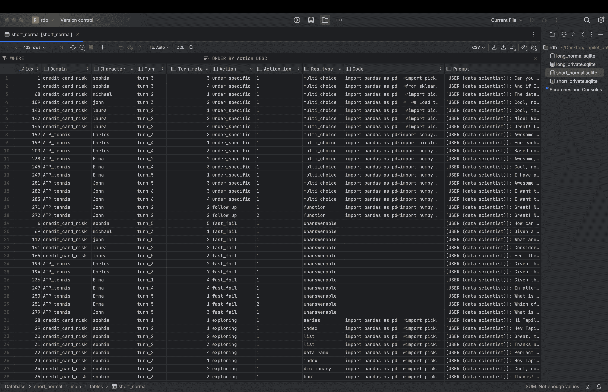

图6：历史关系数据库（H-RDB）截图。

### B.2 历史检索查询

在检索存储的历史信息时，我们使用sqlite3^¶^¶¶[https://docs.python.org/3/library/sqlite3.html](https://docs.python.org/3/library/sqlite3.html) Python包。搜索查询以sqlite3格式提供，例如：SELECT {Prompt} FROM {table} WHERE 1=1 AND Domain = ? AND ...

### B.3 Tapilot-Alpha

如第[9](https://arxiv.org/html/2403.05307v1#S9 "9 限制 ‣ Tapilot-Crossing：基准测试与演化中的大语言模型，面向交互式数据分析代理")节所述，当前的 Tapilot-Crossing 仅涉及干净且准确的代码修订，我们将其称为 Alpha 版本。展望未来，我们考虑将噪声数据或用户交互在行动模式下集成到代码历史中。这一潜在扩展旨在模拟更现实的开发环境和挑战。即便在经过精心策划且无错误的交互历史的约束下，实验结果仍表明，优化和改进的机会仍然是巨大的。

## 附录 C 对话类型

Tapilot-Crossing 可以分为陈述型（较长）对话和口语型（较短）对话。陈述型对话更加正式，导致更复杂的用户指令和代码生成，常见于计算笔记本中（Yin et al., [2023](https://arxiv.org/html/2403.05307v1#bib.bib53)）。另一方面，口语型对话涉及较短且简单的用户问题，但具有更多口语化和互动特征。这类对话主要通过提示 GPT-4 对现有的陈述型对话进行分段和再解释来构建。

## 附录 D Air 实现

图 7：这是我们提出的方法 Air 的概览。紫色突出显示的区域代表由代理生成的结果。

图[7](https://arxiv.org/html/2403.05307v1#A4.F7 "图 7 ‣ 附录 D Air 实现 ‣ Tapilot-Crossing：基准测试与演化中的大语言模型，面向交互式数据分析代理")展示了 Air 的详细步骤。

## 附录 E 代理实现

### E.1 工具包

#### 执行器

为了获得由大语言模型（LLMs）生成的代码的执行结果，我们采用 Python 执行器 exec()，它在一个隔离的 Python 环境中实现，参见 [https://docs.python.org/3/library/functions.html#exec](https://docs.python.org/3/library/functions.html#exec)。代码执行的输出，无论是返回值、打印语句还是错误消息，都将被执行器捕获。随后，这些输出将反馈给语言模型（LMs），为其提供有关代码生成结果的反馈，以便其做出更好的下一步行动或决策。

#### 用户模拟器

在处理澄清动作类型时，当大语言模型（LLMs）对用户查询的条件感到模糊时，允许其请求澄清。因此，我们使用 GPT-4 Turbo 来模拟用户的问答行为，因为已证明 GPT-4 能提供与人类反馈等同质量的回应（Wang et al., [2024](https://arxiv.org/html/2403.05307v1#bib.bib43)）。

#### 图表到表格

我们采用 deplot（Liu 等，[2023a](https://arxiv.org/html/2403.05307v1#bib.bib33)）将图像转换为表格。给定表格后，LLM 可以推理并回答问题。

### E.2 推理

#### COT

为了评估数据分析的纯代码泛化能力，我们限制 LLM 在生成过程中执行代码。因此，我们采用零-shot COT 来进行 Agent 模式的推理。实现此 COT 的关键提示是：

... 编写一个逐步大纲，然后编写代码：

#### ReAct

为了评估超越单纯代码生成的分析能力，我们在多选题中使用 ReAct。具体来说，我们将 ReAct 推理的最大步数设置为 5，执行者作为主要工具。数据分析代理的任务是生成、分析并得出结果结论。如果结果包含错误，相关信息会返回给代理进行修正，尽管这个过程可能会消耗额外的推理步骤。我们还手动提供一个单次示例，指导代理在 Tapilot-Crossing 中如何反应。为了防止数据泄露，我们在不同的表格数据之间进行交叉验证。例如，从 ATP_Tennis 中挑选的示例可以用来指导 LLM 在 Laptop Pricing 数据集中的应用。

## 附录 F 实现细节

### F.1 一般实现

对于 Claude 2.1、GPT-4 和 GPT-4-Turbo，温度参数设置为 0.0。

## 附录 G 操作描述

在本节中，我们对 Tapilot-Crossing 中的操作类型进行分类和形式化，识别出五个不同的子类别，分别对应不同类型的用户查询。

### G.1 更新代码

Update_Code 操作指的是用户请求修正错误或对先前查询条件进行优化的情况。

### G.2 Fast_Fail

Fast_Fail 是一种操作，当当前的数据内容或资源不足以满足用户请求，或用户的查询包含事实错误时，提醒用户。

### G.3 澄清

Clarification 是对不明确问题的常见回应，数据分析查询中经常出现这种情况。在此操作中，代理通过从用户那里获取额外信息，使问题的条件更加具体和清晰。

### G.4 最佳猜测

虽然 Clarification 是一种有效的减少不确定性的操作，但它可能导致用户因反复提问而感到不耐烦，并且长时间的对话历史可能导致注意力分散和长上下文问题。因此，最佳猜测操作可以通过基于数据内容、领域知识和常识性知识做出适当的假设来解决这些问题，尤其是对于不明确的问题。然而，错误的猜测也可能导致幻觉问题。

### G.5 图表问答

在实际的数据分析环境中，代理也需要回答用户关于图表洞察的问题。图表问答操作可以帮助用户更好地理解图表内容，以便做出决策。

### G.6 洞察挖掘

除了为用户生成代码以获取预期结果外，代码代理还负责总结来自环境的执行结果，以帮助用户做出明智的决策。这个过程被称为Insight_Mining，在数据分析中发挥着重要作用，因为它有助于将代码代理发展为综合的数据分析代理。

## 附录 H 评估指标细节

### H.1 DataFrame 比较

该函数通过检查两个数据框（df_1和df_2）的索引、列的存在性和列数据来比较它们。对于数值数据，使用np.allclose()进行比较，对于非数值数据，则进行直接比较。如果df_1中的某一列在原始数据框中不存在，则它会在df_2中查找匹配的列。该函数返回True如果df_1和df_2是等价的，否则返回False。请注意，列名称不会被计算，因为不同的LLM可能有它们自己的首选列名称。例如，GPT-4生成的win_ratio可能被Claude 2.1称为winning ratio。

### H.2 可视化比较

我们注意到，由于可视化代码生成的图表参数可能在不同模型之间有显著差异，因此很难比较封闭形式的结果。例如，GPT-4生成的图表可能与CodeLlama相同，但它们的标题名称可能不同，这会导致假阴性。因此，我们使用PIL包计算图表之间的相似性。具体来说，函数compare_plots接受两个图像文件路径作为输入（ai_output和reference_output），使用LANCZOS方法将它们调整为800x600像素，并保存。然后，这些图像以灰度模式读取，以避免颜色差异带来的影响。该函数计算并返回结构相似性指数（SSIM），即两张图像的相似度度量。如果相似度大于0.6，则生成的代码将被视为正确。

### H.3 多意图评估

在本研究中，我们评估了意图方式的代码生成性能，这意味着如果一个用户查询包含多个意图，那么该查询的总得分将是意图的数量。我们单独评估每个意图，并将所有意图的得分相加，作为计算每个模型性能的分母，以百分比形式呈现。

### H.4 私有函数召回率

我们注意到一些LLM倾向于导入尽可能多的私有函数，但并没有使用其中所有函数。因此，为了提取自定义函数库中确实使用的所有私有函数，我们使用了AST包。在提取了使用的私有函数之后，我们根据方程[3](https://arxiv.org/html/2403.05307v1#S4.E3 "3 ‣ Acc with Private Lib Recall (AccR). ‣ 4.2 Evaluation Metrics ‣ 4 Data Statistics & Metrics ‣ Tapilot-Crossing: Benchmarking and Evolving LLMs Towards Interactive Data Analysis Agents")计算召回率系数。

### H.5 代码相似度等价（CSE）

在Tapilot-Crossing的背景下，代码生成任务的复杂性——其中许多任务得分为零——通过仅使用Acc或AccR来评估性能带来了巨大挑战。尤其是在区分仅因一行错误或输出不同而导致得分为零的代码时，表现得尤为明显，尽管这些代码在生成能力上有明显差异。为了克服这一限制，我们提出引入代码相似度等价性（Code Similarity Equivalence，CSE）这一细化评估指标，用于评估生成代码与参考代码之间的相似度。由于这些代码都是基于相同的用户指令生成的，因此预期它们具有高度的相似性。我们的方法结合了多种模型，以减少偏差，采用了CodeT5++和OpenAI Ada（text-embedding-ada-002）模型，这些模型价格适中且大多数机构可用。此组合已被证明与人类评估偏好具有强相关性，提供了更细化且准确的代码生成性能衡量标准。

#### 细节。

在这里，我们介绍如何通过CSE对Acc或AccR进行更细致的评估。1) 我们收集了180个代码生成实例，包括正常和私有的代码。为了评估这些代码的质量，我们聘请了两名精通数据科学和Python的博士生作为评审委员会成员。

2) 他们评估了多个模型生成的代码，包括GPT-4-32k、GPT-4-Turbo、Claude-2.1、CodeLlama-Instruct（参数范围为7B到34B）、StarCoder和DeepSeek-Coder-Instruct（同样是7B到34B参数）。每位评审员都会获得全面的用户代码历史、表格内容、当前查询以及决策公司私有库的访问权限。请注意，评估仅基于评审员的专业知识和经验进行，不依赖任何预定义的指导方针或讨论，以避免偏见。

3) 我们要求对生成的代码在模型间进行相对排名，而不是绝对评分，以避免评审者之间评分偏好的潜在差异。

4) 在排名出现部分分歧的情况下，评审员会就特定的代码样本进行讨论，直到达成共识。这一步骤确保了评估结果更加可靠和一致。

5) 评审委员会接着会检查各种开源和现成可用的嵌入模型，以衡量代码相似性，旨在尽可能地与他们的排名偏好保持一致。我们的研究发现，由CodeT5+（Wang等， [2023b](https://arxiv.org/html/2403.05307v1#bib.bib44)）和Ada（text-embedding-ada-002）组成的评分系统与人类评估偏好最为一致。

#### 混合评估指标（AccSE和AccSER）的介绍。

为了准确反映代码生成模型的细微能力，我们提出了一种复合度量，结合了代码相似度评估（CSE）和准确性（Acc），命名为相似度评估准确度（AccSE）。该度量公式简洁地定义为：

|  | $\text{AccSE}=\begin{cases}1.0,&\text{如果 }C=\hat{C},\\ 0.5,&\text{如果 }S_{1}>0.85\land S_{2}>0.9,\\ 0.25,&\text{如果 }(S_{1}>0.85\land S_{2}\leq 0.9)\\ &\lor(S_{1}\leq 0.85\land S_{2}>0.9),\\ 0,&\text{否则。}\end{cases}$ |  | (4) |
| --- | --- | --- | --- |

其中：

+   •

    $C$ 和 $\hat{C}$ 分别表示参考和生成代码执行结果。

+   •

    $S_{1}$ 表示基于CodeT5+的CSE评分。

+   •

    $S_{2}$ 表示基于Ada的CSE评分。

这个公式简洁地捕捉了AccSE的评估标准，符号$S_{1}$和$S_{2}$分别表示基于CodeT5+和Ada的CSE评分。逻辑运算符$\land$和$\lor$分别用于“与”与“或”条件，以进一步简化符号。AccSER以类似方式计算，仅需对每个值的召回率进行乘积运算，如公式[3](https://arxiv.org/html/2403.05307v1#S4.E3 "3 ‣ Acc with Private Lib Recall (AccR). ‣ 4.2 Evaluation Metrics ‣ 4 Data Statistics & Metrics ‣ Tapilot-Crossing: Benchmarking and Evolving LLMs Towards Interactive Data Analysis Agents")所示。

我们认为在进行更多包含专家志愿者的案例研究时，Tapilot-Crossing的未来评估系统将依据此。

#### 反对基于GPT-4和多智能体评估方法的理由。

尽管现有研究表明，基于GPT-4的软评估可以增强复杂生成任务的评估，但由于几个关键原因，这种方法被认为不适合Tapilot-Crossing：

1) 偏见问题：我们研究中的原型注释和问题来自基于GPT-4的智能体环境。使用GPT-4进行评估可能无意中引入自我增强偏见（Zheng et al., [2024a](https://arxiv.org/html/2403.05307v1#bib.bib64)），从而影响模型评估的公平性。

2) 成本问题：尽管多智能体评估框架结合了多种大型语言模型（LLMs）系列，旨在缓解偏见（Li et al., [2023c](https://arxiv.org/html/2403.05307v1#bib.bib31)），但其经济和计算开销显而易见。具体来说，在这种设置下的评估至少需要比仅生成时消耗两倍的令牌，导致在Tapilot-Crossing中成本过高，实际应用不具可行性。

考虑到这些因素，我们的研究提出了一种替代的评估方法，该方法在评估复杂数据科学代码生成的准确性时既具有成本效益，又可靠。我们证明了CodeT5+，一个高效的代码嵌入模型，显著能够区分不同的性能水平，并准确识别正确的代码逻辑。关键是，该模型在评估的全面性和资源效率之间提供了实际的平衡。

### H.6 其他值类型

对于其他结果类型，如字典、集合、列表，我们直接计算执行结果，并判断它们是否相等。

### H.7 按情况评估

虽然我们根据结果类型对实例进行分类，并为每种类型提供评估代码，但某些场景需要逐案评估脚本。例如，在大多数数据框或矩阵比较中，我们使用`np.close()`和字符串匹配进行结果比较。然而，在某些情况下，如使用数据框或矩阵显示分类器的混淆矩阵时，如果预测代码的f1-score超过参考代码的f1-score，即使它们的f1-scores不相似，预测代码也被认为是正确的。对于Tapilot-Crossing的评估脚本，我们手动审查并调整脚本，以适应每种情况。

## 附录I 行动评估模式

### I.1 修正

#### 更新代码

这可以在静态设置中评估，其中错误反馈嵌入到用户代码历史中。代理需要通过用户反馈更新先前的代码。

### I.2 不可回答

#### 快速失败

在决策公司中，我们保留原始的不可回答问题，并将其归类为多项选择题。这是为了评估代理是否能够根据他们对表格内容和常识知识的分析，识别这些问题。为了防止出现偏见设置，比如特别设计的提示可能会误导代理将问题判断为不可回答，我们抽取了相同数量的不完全指定问题和可回答问题。然后，我们重新表述它们的选择，使模型能够决定一个问题是否可以通过澄清或假设来回答，或者直接将其归类为不可回答。

### I.3 不完全指定

#### 澄清

为了评估代理在澄清行动中的表现，我们采用了一种动态设置，结合了用户模拟器。该模拟器根据真实答案模拟用户反馈。最初，交互式数据分析代理会提出澄清问题，模拟器会根据真实答案进行回答。随后，这些代理被要求生成最终代码，理解原始历史记录和澄清历史记录。该设置提供了对代理互动、澄清模糊问题以及生成准确代码能力的强有力评估。

#### 最佳猜测

我们的目标是评估交互式数据分析代理在面对模糊问题时做出准确假设的能力，而不依赖于不断的澄清，这可能会让用户感到沮丧。我们认为，代理的最佳猜测不应影响最终决策，因此该评估指标应具有一定的灵活性。例如，在信用卡申请场景中，“年轻人”一词可能指的是年龄在20-40岁或25-45岁之间的个体，这使得通过固定标准来评估变得困难。因此，我们选择使用多项选择题来评估代理的假设能力。我们认为，只有在假设不影响最终决策时，假设才是适当的。

### I.4 可视化

#### Plot_QA

我们评估了Tapilot-Crossing中代理在情节分析方面的能力。最终的答案格式将是多项选择题。

### I.5 分析

#### Insight_Mining

我们在Tapilot-Crossing中一般评估代理的分析能力。我们选择使用多项选择题来进行评估。

## 附录J 决策公司提示

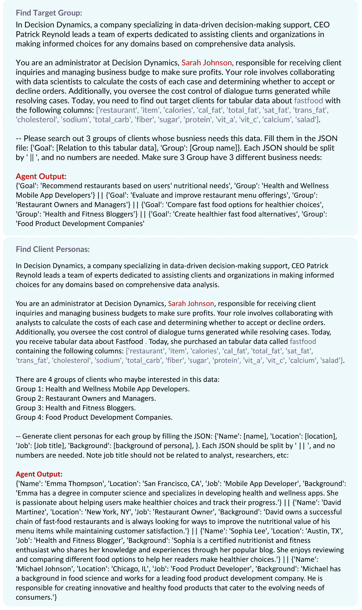

图8：客户人物生成的提示

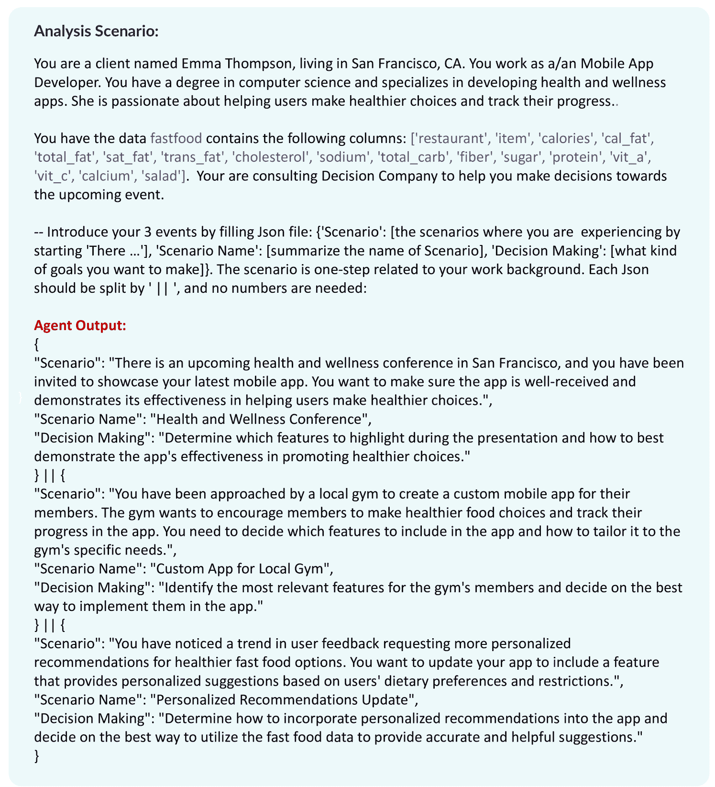

图9：分析场景生成的提示

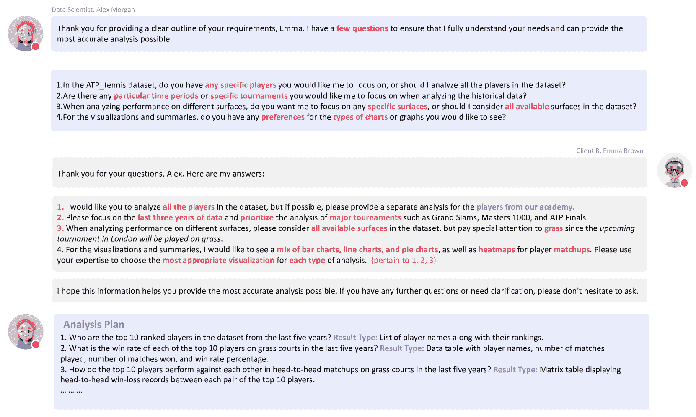

图10：计划讨论的示例。最终输出应为包含问题及其结果类型的分析计划。

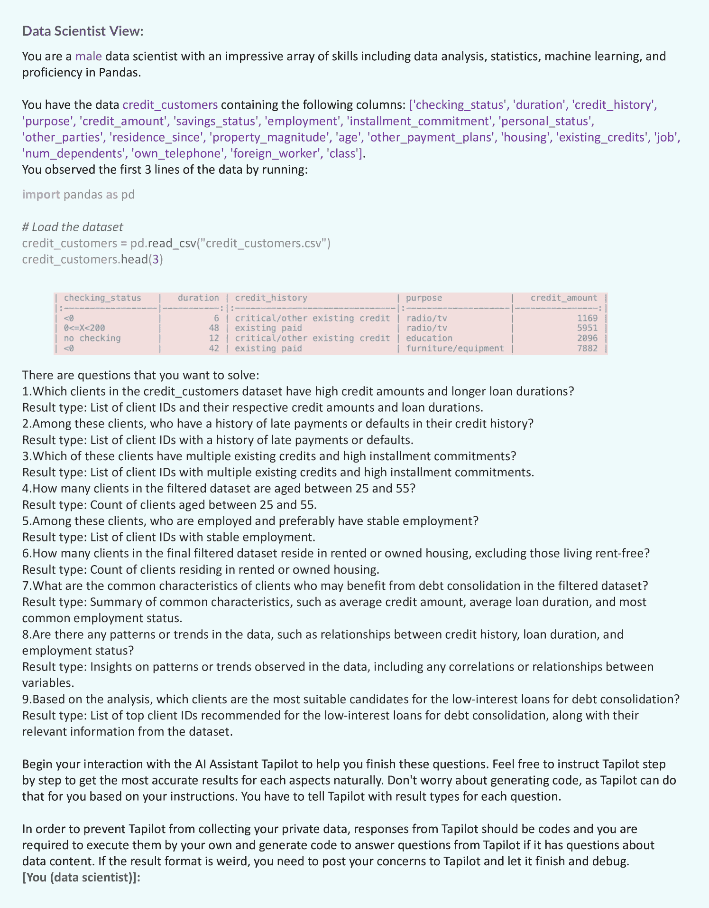

图11：数据科学代理在交互日志生成中的提示

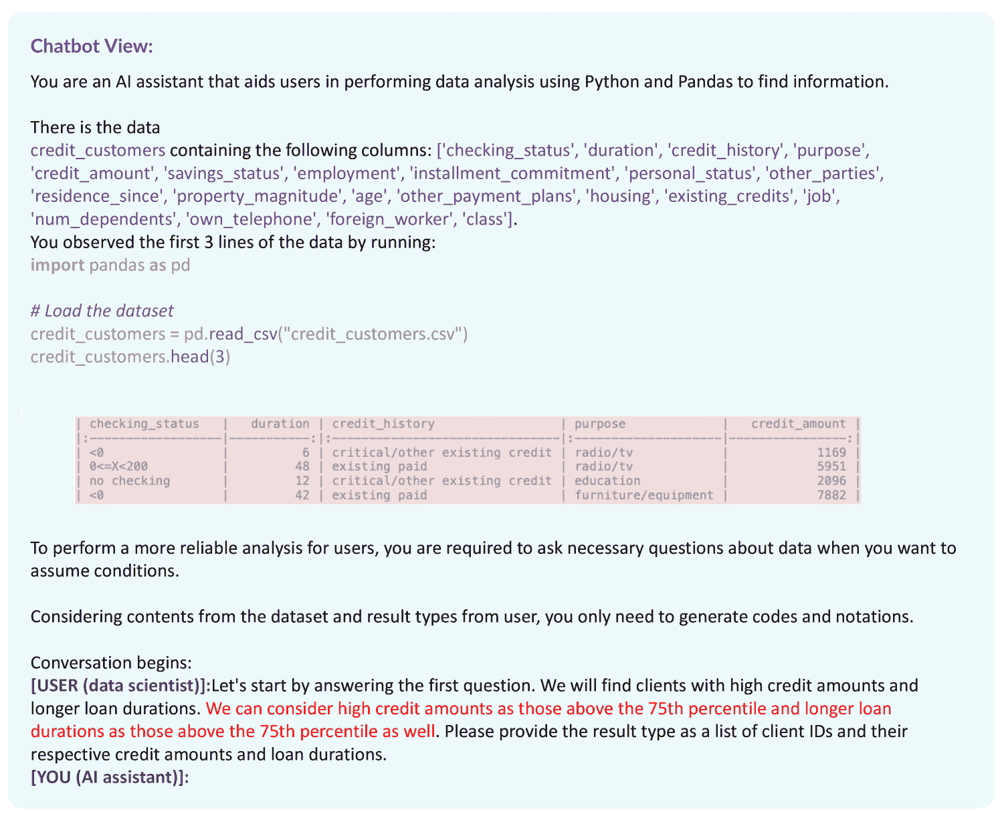

图12：聊天机器人代理在交互日志生成中的提示

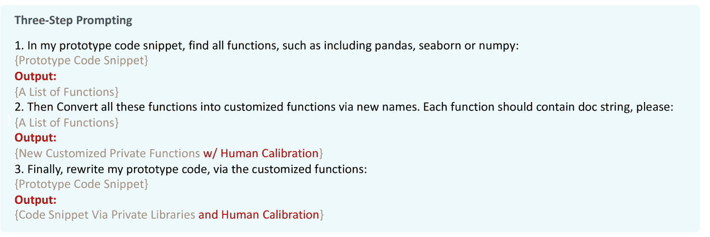

图13：从原型代码到包含私有库代码的转换提示

### J.1 客户人物生成

图[8](https://arxiv.org/html/2403.05307v1#A10.F8 "Figure 8 ‣ Appendix J Decision Company Prompt ‣ Tapilot-Crossing: Benchmarking and Evolving LLMs Towards Interactive Data Analysis Agents")描述了我们如何提示管理员代理生成有意义的人物角色。

### J.2 分析场景模拟

图[9](https://arxiv.org/html/2403.05307v1#A10.F9 "Figure 9 ‣ Appendix J Decision Company Prompt ‣ Tapilot-Crossing: Benchmarking and Evolving LLMs Towards Interactive Data Analysis Agents")展示了我们如何通过上下文学习（ICL）创建多样化的场景。

### J.3 计划讨论

图[10](https://arxiv.org/html/2403.05307v1#A10.F10 "Figure 10 ‣ Appendix J Decision Company Prompt ‣ Tapilot-Crossing: Benchmarking and Evolving LLMs Towards Interactive Data Analysis Agents")展示了数据科学家代理与客户代理之间的对话如何生成一系列的分析计划。

### J.4 交互日志标注

驱动交互日志注释的提示由图[11](https://arxiv.org/html/2403.05307v1#A10.F11 "图11 ‣ 附录J 决策公司提示 ‣ Tapilot-Crossing：基准测试与推动LLM朝向互动数据分析代理演化")和图[12](https://arxiv.org/html/2403.05307v1#A10.F12 "图12 ‣ 附录J 决策公司提示 ‣ Tapilot-Crossing：基准测试与推动LLM朝向互动数据分析代理演化")分别从数据科学家代理和聊天机器人代理的视角展示。

### J.5 私有库演化

图[13](https://arxiv.org/html/2403.05307v1#A10.F13 "图13 ‣ 附录J 决策公司提示 ‣ Tapilot-Crossing：基准测试与推动LLM朝向互动数据分析代理演化")展示了如何提示GPT-4自动生成代码的框架。引入人工努力以减少偏差并修正错误。

## 附录K 实现提示

### K.1 代码生成

图[14](https://arxiv.org/html/2403.05307v1#A11.F14 "图14 ‣ K.1 代码生成 ‣ 附录K 实现提示 ‣ Tapilot-Crossing：基准测试与推动LLM朝向互动数据分析代理演化")描述了我们如何提示LLM模型生成代码以回答用户查询。图[15](https://arxiv.org/html/2403.05307v1#A11.F15 "图15 ‣ K.1 代码生成 ‣ 附录K 实现提示 ‣ Tapilot-Crossing：基准测试与推动LLM朝向互动数据分析代理演化")描述了我们如何在代理中提示LLM生成代码以回答用户查询，并遵循链式思维Wei等人（[2022](https://arxiv.org/html/2403.05307v1#bib.bib45)）。最后，图[16](https://arxiv.org/html/2403.05307v1#A11.F16 "图16 ‣ K.1 代码生成 ‣ 附录K 实现提示 ‣ Tapilot-Crossing：基准测试与推动LLM朝向互动数据分析代理演化")描述了我们如何在互代理中提示LLM生成代码，以使用我们提出的AIR回答用户查询。

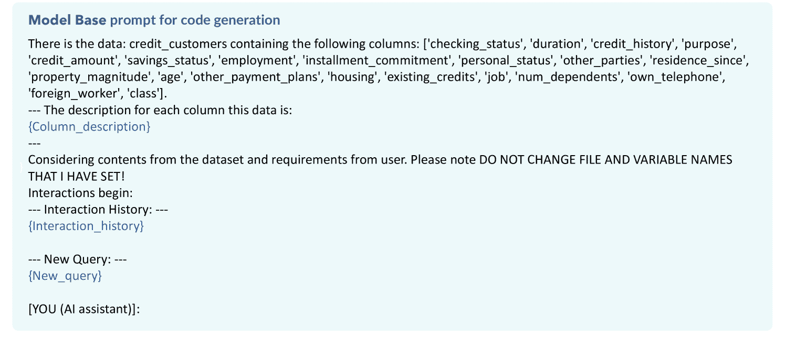

图14：LLM在模型基础版代码生成模式下的提示。

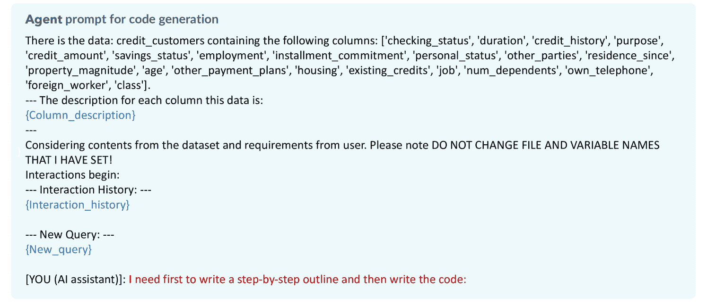

图15：LLM与数据分析代理在代码生成模式下的提示。COT提示文本为红色。

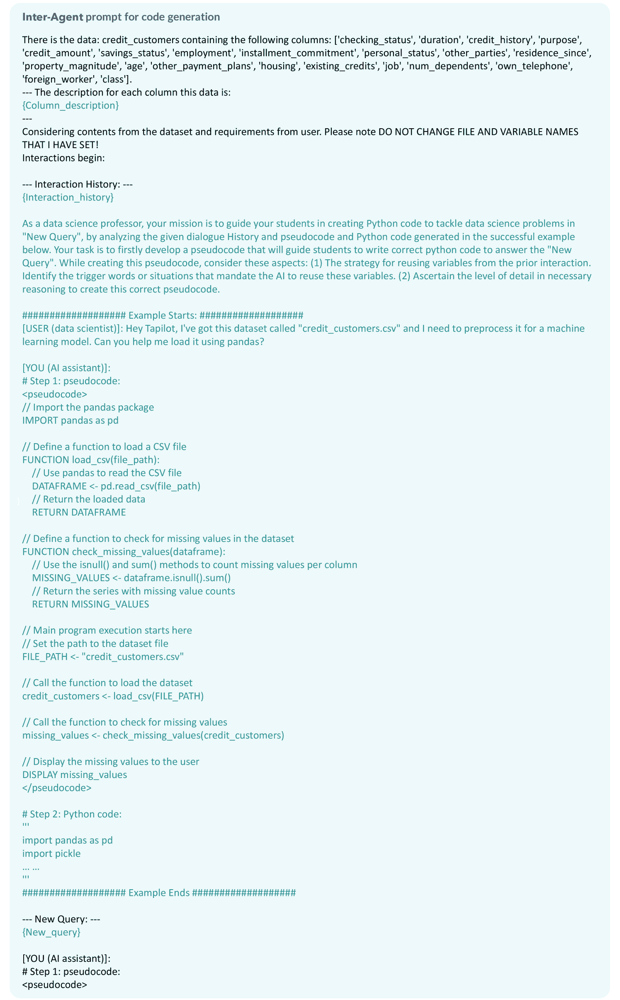

图16：LLM与互动数据分析代理在代码生成模式下的提示。AIR提示文本为绿色，由LLM通过学习成功历史自动生成。

### K.2 多项选择

图[17](https://arxiv.org/html/2403.05307v1#A11.F17 "Figure 17 ‣ K.2 Multi-choice ‣ Appendix K Implementation Prompt ‣ Tapilot-Crossing: Benchmarking and Evolving LLMs Towards Interactive Data Analysis Agents")描述了我们如何提示LLM回答用户查询。图[18](https://arxiv.org/html/2403.05307v1#A11.F18 "Figure 18 ‣ K.2 Multi-choice ‣ Appendix K Implementation Prompt ‣ Tapilot-Crossing: Benchmarking and Evolving LLMs Towards Interactive Data Analysis Agents")描述了我们如何在代理模式下提示LLM回答用户查询，并结合ReAct Yao等人（[2023](https://arxiv.org/html/2403.05307v1#bib.bib51)）的方法。最后，图[19](https://arxiv.org/html/2403.05307v1#A11.F19 "Figure 19 ‣ K.2 Multi-choice ‣ Appendix K Implementation Prompt ‣ Tapilot-Crossing: Benchmarking and Evolving LLMs Towards Interactive Data Analysis Agents")描述了我们如何通过我们的AIR在交互式代理模式下提示LLM回答用户查询。

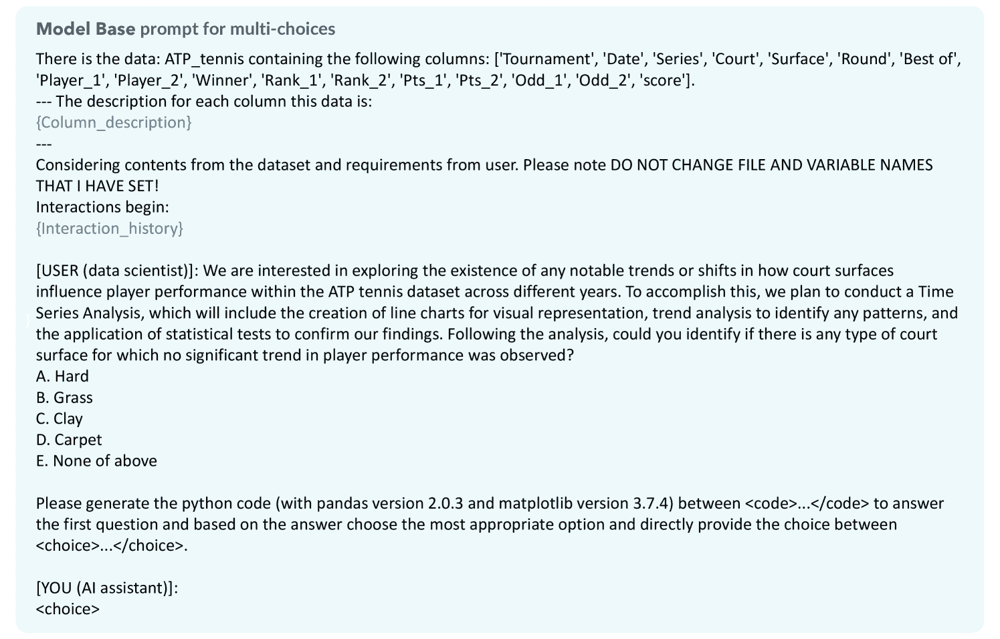

图17：LLM在模型基础版中的多选模式下的提示。

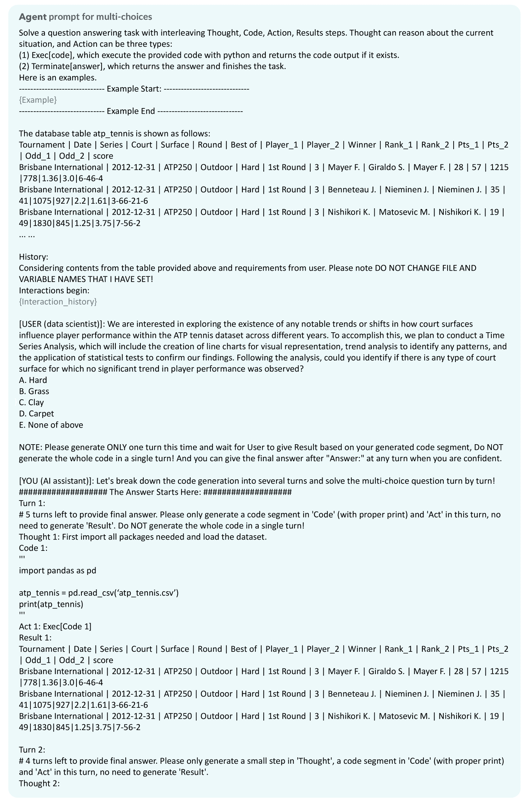

图18：LLM在数据分析代理模式下的多选模式提示。

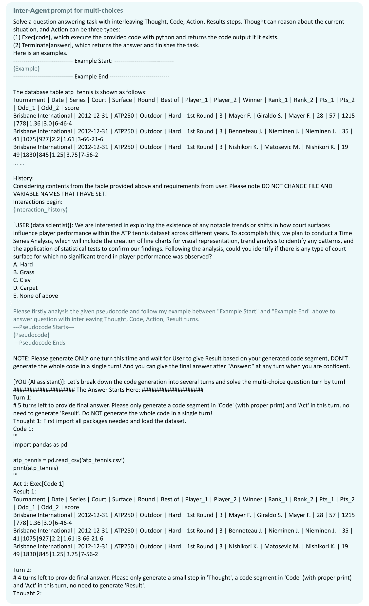

图19：LLM在多选模式下与交互式数据分析代理的提示。AIR提示文本为绿色。伪代码由LLM通过学习成功历史自动生成。

### K.3 澄清动作

图[20](https://arxiv.org/html/2403.05307v1#A11.F20 "Figure 20 ‣ K.3 Clarification Action ‣ Appendix K Implementation Prompt ‣ Tapilot-Crossing: Benchmarking and Evolving LLMs Towards Interactive Data Analysis Agents")描述了如何在模型基础版中提示LLM请求澄清。

图20：LLM在模型基础版中的澄清模式下的提示。
