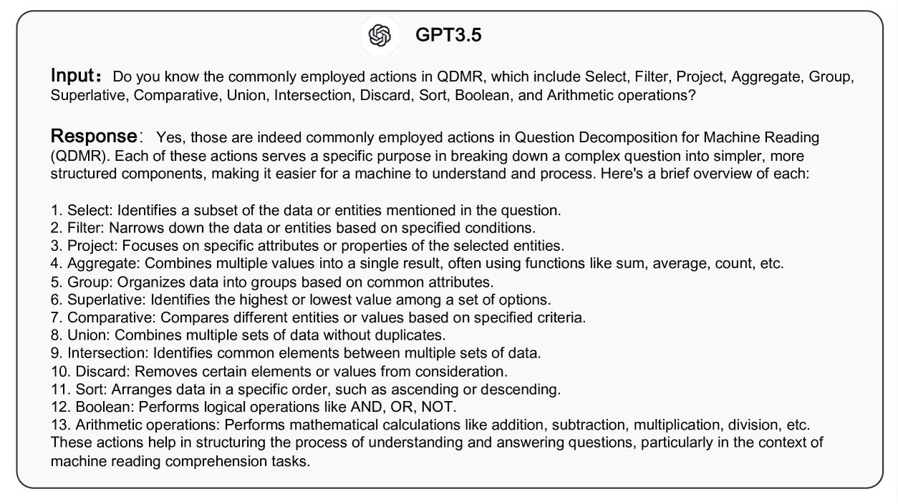

<!--yml
category: 未分类
date: 2025-01-11 12:14:20
-->

# Textualized Agent-Style Reasoning for Complex Tasks by Multiple Round LLM Generation

> 来源：[https://arxiv.org/html/2409.12411/](https://arxiv.org/html/2409.12411/)

Chen Liang^(2,3), Zhifan Feng ^(1,3)¹¹footnotemark: 1, Zihe Liu², Wenbin Jiang⁴,
Jinan Xu², Yufeng Chen², Yong Wang¹²²footnotemark: 2
¹ University of Science and Technology of China, Hefei, China
² Beijing Jiaotong University, Beijing, China
³ Baidu Inc, Beijing, China
⁴ School of Artificial Intelligence, Beijing Normal University, Beijing, China
{21120367}@bjtu.edu.cn   Equal Contribution  Corresponding author.

###### Abstract

Chain-of-thought prompting significantly boosts the reasoning ability of large language models but still faces three issues: hallucination problem, restricted interpretability, and uncontrollable generation. To address these challenges, we present AgentCOT, a llm-based autonomous agent framework, which can solve complex problems in an agent-style manner by multiple round LLM generation. At each step, AgentCOT selects an action and executes it to yield an intermediate result with supporting evidence. In addition, we integrate the step‘s index into the reasoning process to form a graph structure for complex inference logic. We introduce two new strategies to enhance the performance of AgentCOT. We conduct extensive experiments to verify the effectiveness of our method on six common benchmarks. Results exhibit that our method brings in substantial improvements over current competitive approaches.

Textualized Agent-Style Reasoning for Complex Tasks by Multiple Round LLM Generation

Chen Liang^(2,3)^†^†thanks:   Equal Contribution, Zhifan Feng ^(1,3)¹¹footnotemark: 1, Zihe Liu², Wenbin Jiang⁴, Jinan Xu²^†^†thanks:   Corresponding author., Yufeng Chen², Yong Wang¹²²footnotemark: 2 ¹ University of Science and Technology of China, Hefei, China ² Beijing Jiaotong University, Beijing, China ³ Baidu Inc, Beijing, China ⁴ School of Artificial Intelligence, Beijing Normal University, Beijing, China {21120367}@bjtu.edu.cn

## 1 Introduction

Figure 1: The framework of chain-of-thought (COT) and autonomous agent. COT generally is a text paragraph, while the autonomous agent can respond multiple times to address the problem.

Large Language Models (LLM) have showcased remarkable performance on many tasks Yao et al. ([2022](https://arxiv.org/html/2409.12411v1#bib.bib27)); Wang et al. ([2023](https://arxiv.org/html/2409.12411v1#bib.bib22)), which inspires humans to consider leveraging LLM to solve challenging and complex problems. It is worth highlighting the attention given to complex reasoning tasks. Different from typical natural language processing (NLP) tasks, performing complex inference requires explicitly demonstrating the analyzing process instead of simply presenting the answer, namely the recently proposed chain-of-thought (COT) prompting approach Wei et al. ([2022](https://arxiv.org/html/2409.12411v1#bib.bib24)). Research on COT Hao et al. ([2023](https://arxiv.org/html/2409.12411v1#bib.bib9)); Xie et al. ([2023](https://arxiv.org/html/2409.12411v1#bib.bib26)); Diao et al. ([2023](https://arxiv.org/html/2409.12411v1#bib.bib5)) significantly boosts the reasoning ability of LLM and achieves state-of-the-art results.

However, chain-of-thought prompting is flawed and is primarily limited by the following three constraints: i) hallucination issues Yao et al. ([2022](https://arxiv.org/html/2409.12411v1#bib.bib27)); Huang et al. ([2023](https://arxiv.org/html/2409.12411v1#bib.bib10)), which is the main cause of COT performance degradation. Hallucinated reasoning is serious in COT leading to the reasoning process being seemingly plausible but lacking factual evidence. ii) restricted interpretability. Although the goal of COT is to explain how an answer is yielded, it is usually presented through a text paragraph rather than a more logically organized format. iii) uncontrollable generation. Since COT is a one-time generated reasoning process with a large number of tokens, any mistake in the decoding will result in error perpetuation Chen et al. ([2022](https://arxiv.org/html/2409.12411v1#bib.bib3)) throughout all subsequent decoding steps.

In this paper, our sight is to solve complex reasoning tasks based on the autonomous agent framework. As shown in Figure [1](https://arxiv.org/html/2409.12411v1#S1.F1 "Figure 1 ‣ 1 Introduction ‣ Textualized Agent-Style Reasoning for Complex Tasks by Multiple Round LLM Generation"), different from the typical chain-of-thought methods generating analysis process at once, agent-based approaches naturally embody the idea of step-by-step problem-solving, which addresses specific sub-problems at each step during the iterative process. We follow the agent setup proposed by Yao et al. ([2022](https://arxiv.org/html/2409.12411v1#bib.bib27)) and design appropriate prompts to drive LLM to follow instructions. At each step, LLM agent detects the change in the environment and conducts a response to the current state. The generated response will lead to the environment‘s change and the agent’s response once again until the problem is resolved.

We further present AgentCOT to optimize the aforementioned agent setting for better adaptation to the reasoning tasks. Specifically, when sensing the change in the environment, AgentCOT first selects an action $a$ from a predefined set of actions and offers a specific description of the action $a_{des}$ for the current issue. Next, AgentCOT performs the action and yields an intermediate result $R_{inter}$, while also presenting supporting evidence $E_{inter}$ for its conclusion. {$a$, $a_{des}$, $E_{inter}$, $R_{inter}$} forms an atomic response state, where $a$ as well as $a_{des}$ can be viewed as a plan for the current subproblem and $E_{inter}$ can be regarded as a COT with the smallest logical unit. Such an organizational format enhances the explainability of the reasoning process. In this way, we can carry out operations at the subproblem level, such as reflecting and redecoding, thereby achieving a comparatively controllable reasoning process. We propose enhanced self-consistency to enable the quality of each state, effectively preventing error perpetuation and hallucination problems. Additionally, we integrate the state index into the inference process to form an implicit graphical structure, which can represent a greater variety of reasoning logic.

We evaluate the proposed approach on six common benchmarks with three types. From the results, AgentCOT shows competitive performance in all datasets ($\S$ [5](https://arxiv.org/html/2409.12411v1#S5 "5 Experimental Results ‣ Textualized Agent-Style Reasoning for Complex Tasks by Multiple Round LLM Generation")). We further conduct experiments to compare COT framework and agent framework ($\S$ [6.1](https://arxiv.org/html/2409.12411v1#S6.SS1 "6.1 COT framework or Agent framework? ‣ 6 Discussion ‣ Textualized Agent-Style Reasoning for Complex Tasks by Multiple Round LLM Generation")), and carry out error analysis ($\S$ [6.2](https://arxiv.org/html/2409.12411v1#S6.SS2 "6.2 Error Analysis ‣ 6 Discussion ‣ Textualized Agent-Style Reasoning for Complex Tasks by Multiple Round LLM Generation")) and case study ($\S$ [6.3](https://arxiv.org/html/2409.12411v1#S6.SS3 "6.3 Case Study ‣ 6 Discussion ‣ Textualized Agent-Style Reasoning for Complex Tasks by Multiple Round LLM Generation")) to provide a concrete view of AgentCOT. Finally, we conduct ablation studies to explore the model structure ($\S$ [6.4](https://arxiv.org/html/2409.12411v1#S6.SS4 "6.4 Ablation Study on AgentCOT Structure ‣ 6 Discussion ‣ Textualized Agent-Style Reasoning for Complex Tasks by Multiple Round LLM Generation"), $\S$ [6.5](https://arxiv.org/html/2409.12411v1#S6.SS5 "6.5 AgentCOT with Enhanced Self-Consistency ‣ 6 Discussion ‣ Textualized Agent-Style Reasoning for Complex Tasks by Multiple Round LLM Generation")).

In conclusion, our contributions are three-fold:

*   •

    We propose AgentCOT, a llm-based autonomous agent framework, which tackles reasoning tasks in an agent-style manner through multiple rounds of LLM generation and exhibits promising performance in different tasks.

*   •

    To better address reasoning tasks, we organize the response of the agent at each step into a state with enriched information, containing action, action description, supporting evidence, and intermediate result. What’s more, two enhancement strategies of AgentCOT are proposed to enhance performance.

*   •

    Experiments show that our method can significantly improve the state-of-the-art and is effective across various datasets and models.

## 2 Related Work

### 2.1 LLM-based Autonomous Agent

Large language models (LLM) deliver the ability to solve many challenging tasks in the real world, such as decision-making, reasoning and planning, which sparks the development of autonomous agents in human-level intelligence based on LLM Wang et al. ([2023](https://arxiv.org/html/2409.12411v1#bib.bib22)). In recent times, there has been an explosive rise in applications of LLM-based intelligent agents. For example, Park et al. ([2023](https://arxiv.org/html/2409.12411v1#bib.bib16)) instantiate generative agents in The Sims to realize dynamical plan behavior; Li et al. ([2023](https://arxiv.org/html/2409.12411v1#bib.bib12)) propose a novel communicative agent framework to provide insight into cognitive processes. Several works focus on decision-making agents to easily use tools, such as ToolLearning Qin et al. ([2023](https://arxiv.org/html/2409.12411v1#bib.bib18)), Reflexion Shinn et al. ([2023](https://arxiv.org/html/2409.12411v1#bib.bib21)), Toolformer Schick et al. ([2023](https://arxiv.org/html/2409.12411v1#bib.bib19)), HuggingGPT Shen et al. ([2023](https://arxiv.org/html/2409.12411v1#bib.bib20)), WebGPT Nakano et al. ([2021](https://arxiv.org/html/2409.12411v1#bib.bib15)).

### 2.2 Multi-Step Reasoning

The emergence of LLM enables the presentation of intermediate reasoning steps in the form of natural language Zhang et al. ([2022](https://arxiv.org/html/2409.12411v1#bib.bib29)). For current research, investigations into the COT can be segmented into three key dimensions: i) samples selection in in-context-learning (ICL) demonstrations Mann et al. ([2020](https://arxiv.org/html/2409.12411v1#bib.bib14)). The perspective of choice includes diversity Zhang et al. ([2022](https://arxiv.org/html/2409.12411v1#bib.bib29)), the most helpful and informative Diao et al. ([2023](https://arxiv.org/html/2409.12411v1#bib.bib5)), relevant as well as complementary Ye et al. ([2023](https://arxiv.org/html/2409.12411v1#bib.bib28)). ii) the refinement of the COT. Fu et al. ([2022](https://arxiv.org/html/2409.12411v1#bib.bib6)) show that superior COT with higher reasoning complexity. Zhou et al. ([2022](https://arxiv.org/html/2409.12411v1#bib.bib30)) propose a pipeline method to first provide a plan to break down the source problem into several subproblems and then solve them sequentially. Subsequent works Xie et al. ([2023](https://arxiv.org/html/2409.12411v1#bib.bib26)); Hao et al. ([2023](https://arxiv.org/html/2409.12411v1#bib.bib9)); Besta et al. ([2023](https://arxiv.org/html/2409.12411v1#bib.bib1)) discard the planning phase to prevent the impact of planning errors on problem resolution. They always present self-evaluation strategies to improve the correctness of each step, such as stochastic beam search Xie et al. ([2023](https://arxiv.org/html/2409.12411v1#bib.bib26)), self-confidence Diao et al. ([2023](https://arxiv.org/html/2409.12411v1#bib.bib5)) and self-consistency Wang et al. ([2022](https://arxiv.org/html/2409.12411v1#bib.bib23)). iii) the reflection and verification after generating COT, aiming at recognizing issues in produced COT based on LLM Wang et al. ([2022](https://arxiv.org/html/2409.12411v1#bib.bib23)); Xie et al. ([2023](https://arxiv.org/html/2409.12411v1#bib.bib26)); Kim et al. ([2023](https://arxiv.org/html/2409.12411v1#bib.bib11)) or extra tools Gou et al. ([2023](https://arxiv.org/html/2409.12411v1#bib.bib8)).

Figure 2: The overview of our method AgentCOT. An instance of AgentCOT’s execution process is visualized at the top of the figure. At each step, LLM agent senses the change in environment and generates action, action description, intermediate evidence, and intermediate result sequentially. These pieces of information with efficient organizations respond to the environment and result in the environment changing once again. We also provide some details for the implicit state graph, self-evaluate decoding and enhanced ensemble strategy at the bottom.

## 3 Approach

We propose AgentCOT to treat LLM as an autonomous agent to perform textualized agent-style reasoning, which is illustrated in Figure [2](https://arxiv.org/html/2409.12411v1#S2.F2 "Figure 2 ‣ 2.2 Multi-Step Reasoning ‣ 2 Related Work ‣ Textualized Agent-Style Reasoning for Complex Tasks by Multiple Round LLM Generation"). The model consists of two important components: 1) Agent Solving (§3.1), which is the foundational framework of AgentCOT for addressing reasoning problems. 2) AgentCOT Enhancement (§3.2), which involves multiple techniques to improve the effectiveness of our method. The simplified prompt for AgentCOT is shown below and the full prompt scheme is presented in Appendix [A.1](https://arxiv.org/html/2409.12411v1#A1.SS1 "A.1 Prompt Design ‣ Appendix A Example Appendix ‣ Textualized Agent-Style Reasoning for Complex Tasks by Multiple Round LLM Generation"). ![[Uncaptioned image]](img/bd78edb759a23465f06a091fd6798437.png)

### 3.1 AgentCOT Solving

#### LLM as Agent

Inspired by previous work that integrates reasoning and acting advances Yao et al. ([2022](https://arxiv.org/html/2409.12411v1#bib.bib27)), we develop the agent setup for reasoning tasks, which interacts with the environment $E$ after perceiving the change in $E$ and then taking action $a$ responding to $E$. Specifically, the initial environment $E$ only includes the original query $Q^{0}$. At step $i$, the agent senses the change in $E$ with state $Q^{i}$, which drives itself to execute the action $a^{i}$ in action set $\mathcal{A}$ and conducts the result $r^{i}$. The $Q^{i}$ and $r^{i}$ are concatenated to form $Q^{i+1}$, which leads to the environment‘s change and the agent’s response once again until the problem is resolved. The prompt presented below is designed to enable the LLM to act as an agent. ![[Uncaptioned image]](img/12be93a1ded683a63ff21b7e8d1f4f86.png)

#### Action Space and Action Selection

The action space in our method comprises a finite set of actions $\mathcal{A}$ related to question-answering reasoning tasks. We include all actions brought forward by Wolfson et al. ([2020](https://arxiv.org/html/2409.12411v1#bib.bib25)) within our action set, containing 13 operator types: Select, Filter, Project, Aggregate, Group, Superlative, Comparative, Union, Intersection, Discard, Sort, Boolean and Arithmetic. We further define the action Describe, which explains nouns, states, or actions; the action Evaluate to assess the quality of generated information. When detecting changes in the environment, the agent will select an appropriate action $a$ from $\mathcal{A}$. Presented below is the prompt for the action set. ![[Uncaptioned image]](img/855fd839abda58a9e9b552b363dc318b.png)

When solving reasoning problems, AgentCOT not only presents the option for actions but also delivers a detailed description $a_{des}$ of the selected action $a$, ensuring clear instruction during execution. What’s more, considering our action set $\mathcal{A}$ may be incomplete and some actions may not necessitate definitions, we also allow the agent not to make an action selection and, instead, to only supply a detailed description of what needs to be executed.

#### Action Executing

AgentCOT allows for the executor of the selected action to be LLM itself or other external tools, such as search engine or calculator. After the agent interacts with the environment $E$ and provides an action $a$, the executor will execute the action $a$ and produce the corresponding results. When employing LLM as the executor, we require the model must provide intermediate evidence $E_{inter}$ and intermediate result $R_{inter}$. $E_{inter}$ refers to the analysis process in which action and action description generate intermediate results, which can be regarded as a minimal chain of thought to solve the current subproblem. $R_{inter}$ means the result obtained following action instruction. Other tools as executors only need to provide the intermediate result $R_{inter}$,

#### Enriched State and Implicit State Graph

As described above, at each step $i$, after sensing the change in the environment, AgentCOT will generate an information-rich state $S^{i}$, encompassing action, action description, intermediate evidence and intermediate answer:

|  | $\displaystyle S^{i}=\{a^{i},a_{des}^{i},E_{inter}^{i},R_{inter}^{i}\}$ |  | (1) |

Experimental results have demonstrated that a state with extensive information can support superior performance.

Further, although states are generated one by one, it does not imply that the interrelationships between states are chained. For example, the first state and second state are independent, while the third node relies on both the first and the second simultaneously, as shown in the first figure at the bottom of Figure [2](https://arxiv.org/html/2409.12411v1#S2.F2 "Figure 2 ‣ 2.2 Multi-Step Reasoning ‣ 2 Related Work ‣ Textualized Agent-Style Reasoning for Complex Tasks by Multiple Round LLM Generation"). To depict this complex reasoning pattern, we integrate the state index into the state itself, thereby strengthening the connections between states. Specifically, the state indexes mainly exist in $a_{des}^{i}$ and $E_{inter}^{i}$. When $E_{inter}^{i}$ needs to contain information in $E_{inter}^{j}(j<i)$, the corresponding information in $E_{inter}^{i}$ will be written as ’# j’, or an additional ’(# j)’ will be added after the corresponding information. Therefore, essentially, AgentCOT encompasses an implicit graphical structure when solving problems.

#### Iterative Process

After producing an information-rich state $S^{i}$ at step $i$, the question in $E$ will be updated as follows:

|  | $\displaystyle Q^{i+1}=Q^{i}+S^{i}$ |  | (2) |

which will result in the agent’s response again. AgentCOT iteratively executes until it generates the final result. The final result is typically the outcome of the last action taken, presented as ’Therefore, the final answer is …’. The detailed prompt for supporting the LLM in performing agent-style reasoning is shown below. ![[Uncaptioned image]](img/244c7d16335d18968254ac807b2114e4.png)

### 3.2 AgentCOT Enhancement

As described above, AgentCOT demonstrates an explicit multi-step reasoning process. Inspired by Xie et al. ([2023](https://arxiv.org/html/2409.12411v1#bib.bib26)), our proposed enhanced strategy is based on each step generated. As shown in the second figure at the bottom of Figure [2](https://arxiv.org/html/2409.12411v1#S2.F2 "Figure 2 ‣ 2.2 Multi-Step Reasoning ‣ 2 Related Work ‣ Textualized Agent-Style Reasoning for Complex Tasks by Multiple Round LLM Generation"), AgentCOT can evaluate the quality of each generated state and decide whether to continue reasoning or go back to regenerate. Evaluation and reflection essentially provide a solution to the non-reversible issue in decoding strategy for current LLM.

AgentCOT ensures the state quality at two levels. The first is the subproblem level. We employ a divergent thinking strategy to allow multiple different reasoning paths. Specifically, AgentCOT generates multiple responses each time. Then, we perform ensemble learning by considering both actions and intermediate results to select the optimal response, as presented in the third figure at the bottom of Figure [2](https://arxiv.org/html/2409.12411v1#S2.F2 "Figure 2 ‣ 2.2 Multi-Step Reasoning ‣ 2 Related Work ‣ Textualized Agent-Style Reasoning for Complex Tasks by Multiple Round LLM Generation"). The second is the global problem level. AgentCOT is easy to convert into the COT paradigm with enriched information. At each decoding step, we encourage AgentCOT to generate the remaining complete inference process, which means that AgentCOT will generate a final result at this point to help evaluate generated states. As a result, in every response, AgentCOT considers two levels simultaneously, namely containing actions, intermediate results and suggestive final results, to provide the best state.

## 4 Experimental Setups

### 4.1 Datasets and Evaluation Metrics

We conduct experiments on six common benchmarks, which can be classified into three categories: (1) arithmetic reasoning, containing GSM8K Cobbe et al. ([2021](https://arxiv.org/html/2409.12411v1#bib.bib4)) and AQuA Ling et al. ([2017](https://arxiv.org/html/2409.12411v1#bib.bib13)). (2) commonsense reasoning, including CommonsenseQA Geva et al. ([2021](https://arxiv.org/html/2409.12411v1#bib.bib7)) and Date Wei et al. ([2022](https://arxiv.org/html/2409.12411v1#bib.bib24)). (3) multi-hop question answering based on fact, consisting of Bamboogle Press et al. ([2023](https://arxiv.org/html/2409.12411v1#bib.bib17)) and Compositional Celebrities Press et al. ([2023](https://arxiv.org/html/2409.12411v1#bib.bib17)). Table [1](https://arxiv.org/html/2409.12411v1#S4.T1 "Table 1 ‣ 4.3 Baselines. ‣ 4 Experimental Setups ‣ Textualized Agent-Style Reasoning for Complex Tasks by Multiple Round LLM Generation") shows their detailed statistics. Following the previous work Wei et al. ([2022](https://arxiv.org/html/2409.12411v1#bib.bib24)); Zhang et al. ([2022](https://arxiv.org/html/2409.12411v1#bib.bib29)), we report accuracy as evaluation metrics for all datasets.

### 4.2 Implementations.

For the large language model, we mainly leverage two versions of GPT Brown et al. ([2020](https://arxiv.org/html/2409.12411v1#bib.bib2)), text-davinci-002 and gpt-3.5-turbo, to conduct experiments. In our implementation, we select several examples from the training dataset, if available, to form demonstrations Brown et al. ([2020](https://arxiv.org/html/2409.12411v1#bib.bib2)) for in-context learning. The number of examples are following previous works Wei et al. ([2022](https://arxiv.org/html/2409.12411v1#bib.bib24)); Diao et al. ([2023](https://arxiv.org/html/2409.12411v1#bib.bib5)). For the hyper-parameters in the inference stage, the temperature is chosen from {0.8, 0.9, 1.0, 1.1, 1.2}, and the top-p value is selected in {0.8, 0.9, 1.0}. The maximum number of calls for LLM when performing enhanced strategy for AgentCOT is set from {3, 4, 5}.

### 4.3 Baselines.

We compare AgentCOT with several baselines as follows: COT Wei et al. ([2022](https://arxiv.org/html/2409.12411v1#bib.bib24)), the first paper proposing chain-of-thought. COT-SC Wang et al. ([2022](https://arxiv.org/html/2409.12411v1#bib.bib23)) generates COT based on self-consistency decoding strategy. Auto-COT Zhang et al. ([2022](https://arxiv.org/html/2409.12411v1#bib.bib29)) shows an automatic COT prompting approach that considers diversity in the demonstrations. Complex-COT Fu et al. ([2022](https://arxiv.org/html/2409.12411v1#bib.bib6)) is inclined to choose the COT that includes a higher count of reasoning steps. Random-COT Diao et al. ([2023](https://arxiv.org/html/2409.12411v1#bib.bib5)) randomly selects examples from the training set to form demonstrations. PAL Xie et al. ([2023](https://arxiv.org/html/2409.12411v1#bib.bib26)) introduces self-evaluation guided beam search to enhance the COT.

|  | GSM8K | AQUA | CSQA | Date | Bamboogle | CC |
| --- | --- | --- | --- | --- | --- | --- |
| Train | 7,473 | 254 | 12,247 | - | - | - |
| Dev | - | 254 | 1,221 | - | - | - |
| Test | 1,319 | 404 | 1,140 | 369 | 125 | 8,693 |

Table 1: Statistics of datasets.

| Model | Method | GSM8K | AQuA | CSQA | Date | Bamboogle | CC |
| text-davinci-02 | COT Wei et al. ([2022](https://arxiv.org/html/2409.12411v1#bib.bib24)) | 46.9* | 35.8* | 73.5* | 52.1* | 32.8 | 44.3 |
| COT-SC Wang et al. ([2022](https://arxiv.org/html/2409.12411v1#bib.bib23)) | - | - | - | - | 36.0 | 46.2 |
| Auto-COT Zhang et al. ([2022](https://arxiv.org/html/2409.12411v1#bib.bib29)) | 47.9* | 36.5* | 74.4* | - | - | - |
| Complex-COT Fu et al. ([2022](https://arxiv.org/html/2409.12411v1#bib.bib6)) | 55.4* | 37.8 | 73.7 | 59.0 | 48.8 | 47.7 |
| Random-COT Diao et al. ([2023](https://arxiv.org/html/2409.12411v1#bib.bib5)) | 63.9 | 44.1* | 74.5* | 62.2 | 50.4 | 47.2 |
| PAL Xie et al. ([2023](https://arxiv.org/html/2409.12411v1#bib.bib26)) | 58.1 | 35.2 | 74.9 | 59.6 | 51.2 | 54.7 |
| Agent-COT (Ours) | 67.1 | 38.6 | 78.4 | 64.1 | 52.0 | 57.6 |
| gpt-3.5-turbo | COT Wei et al. ([2022](https://arxiv.org/html/2409.12411v1#bib.bib24)) | 73.8 | 57.0 | 71.3 | 58.2 | 56.8 | 55.2 |
| COT-SC Wang et al. ([2022](https://arxiv.org/html/2409.12411v1#bib.bib23)) | 75.4 | 58.6 | 72.9 | 59.8 | 58.3 | 57.1 |
| Complex-COT Fu et al. ([2022](https://arxiv.org/html/2409.12411v1#bib.bib6)) | 71.9 | 57.8 | 72.9 | 58.8 | 55.2 | 57.6 |
| Random-COT Diao et al. ([2023](https://arxiv.org/html/2409.12411v1#bib.bib5)) | 75.3 | 55.5 | 73.7 | 61.2 | 56.8 | 56.6 |
| PAL Xie et al. ([2023](https://arxiv.org/html/2409.12411v1#bib.bib26)) | 72.7 | 55.5 | 64.7 | 62.6 | 56.8 | 55.3 |
| Agent-COT (Ours) | 79.9 | 59.8 | 79.5 | 64.4 | 58.4 | 58.5 |

Table 2: Overall results of our approach compared to previous works on different datasets with three task types. * means the result is from the original paper.

## 5 Experimental Results

We present the main experimental results of our method compared to strong baselines in Table [2](https://arxiv.org/html/2409.12411v1#S4.T2 "Table 2 ‣ 4.3 Baselines. ‣ 4 Experimental Setups ‣ Textualized Agent-Style Reasoning for Complex Tasks by Multiple Round LLM Generation"), which contain six datasets with three types and two versions of GPT model. From the results, we can find that our method AgentCOT achieves the best performance over most datasets and different versions of GPT. AgentCOT beats COT Wei et al. ([2022](https://arxiv.org/html/2409.12411v1#bib.bib24)) by increasing 12.06% and 4.70% accuracy on average in text-davinci-002 and gpt-3.5-turbo respectively, which has verified the superiority of agent framework over traditional COT. Due to the better model capability on upgraded version gpt-3.5-turbo than text-davinci-002, our method and baselines obtain higher results in gpt-3.5-turbo, particularly on arithmetic reasoning datasets GSM8K and AQuA. For our method, AgentCOT demonstrates nearly comparable performance on two versions of GPT model on CSQA, Date and Bamboogle, indicating that our carefully designed agent framework effectively activates the problem-solving capabilities of the model, thereby bridging the gap in original ability. By comparing AgentCOT with baselines in different types of datasets, we can see there are significant discrepancies in the improvements AgentCOT gained. Taking the results on text-davinci-002 as an example, overall, AgentCOT shows the highest increase on the multi-hop question answering dataset (+16.7% on average), followed by arithmetic reasoning (+11.5% on average), and finally commonsense reasoning (+7.9% on average). A reasonable interpretation is that there are clear boundaries in step-by-step execution for multi-hop question answering and arithmetic reasoning, which can be completed based on AgentCOT’s ability of problem decomposition. The results on two commonsense reasoning datasets with different natures also exhibit considerable differences. Through further analysis, CSQA is a dataset for reasoning about everyday life scenarios, while Date is about date calculations, which is more suitable for the step-by-step problem-solving approach of the AgentCOT framework.

## 6 Discussion

In this section, we conduct a series of detailed studies to explore AgentCOT’s ability.

### 6.1 COT framework or Agent framework?

Our method AgentCOT can be degraded into the general COT paradigm with enriched information, which we call EnrichCOT. Figure [3](https://arxiv.org/html/2409.12411v1#S6.F3 "Figure 3 ‣ 6.1 COT framework or Agent framework? ‣ 6 Discussion ‣ Textualized Agent-Style Reasoning for Complex Tasks by Multiple Round LLM Generation") shows the comparison of the performance of the COT framework and the agent framework on six datasets in text-davinci-002 and gpt-3.5-turbo respectively. From the results, we can find that AgentCOT significantly outperforms EnrichCOT in most datasets. A reasonable explanation is that AgentCOT, grounded in an agent framework, provides a more controlled inference process, implementing effective strategies to ensure the quality of generated states at each step. We also notice that EnrichCOT achieves higher accuracy on GSM8K and AQuA in gpt-3.5-turbo, which indicates explicit problem deposition can disrupt the process of thinking for the arithmetic reasoning task. Compared to COT Wei et al. ([2022](https://arxiv.org/html/2409.12411v1#bib.bib24)), EnrichCOT demonstrates superior performance, suggesting that enriched information, such as actions, intermediate evidence, and intermediate result, proves beneficial to help reasoning.

Figure 3: Performance comparison between COT paradigm and agent paradigm. ’COT’ denotes the chain-of-thought proposed by Wei et al. ([2022](https://arxiv.org/html/2409.12411v1#bib.bib24)). ’EnrichCOT’ is to consider the reasoning process of AgentCOT as a one-time generation of COT.

Figure 4: Error Analysis for exploring the ability of AgentCOT. The percentages of examples in which problem decomposition errors (’split’) and subproblem solution errors (’solve’) occur during the inference process are given in six datasets.

### 6.2 Error Analysis

We conduct error analysis to explore the lack of capability of our method on six datasets based on the model gpt-3.5-turto. Specifically, we classify the factors leading to the erroneous reasoning process into two groups: the model’s lack of problem decomposition capability (i.e., errors in actions and action descriptions) and the model’s lack of subproblem-solving capability (i.e., errors in intermediate evidence and answers). The results are presented in Figure [4](https://arxiv.org/html/2409.12411v1#S6.F4 "Figure 4 ‣ 6.1 COT framework or Agent framework? ‣ 6 Discussion ‣ Textualized Agent-Style Reasoning for Complex Tasks by Multiple Round LLM Generation").

From the percentage of samples presented in the figure, we can conclude that: 1) overall, AgentCOT demonstrates superior performance in problem decomposition compared to its ability to solve subproblems. Further investigation reveals that errors in solving subproblems mainly include computation errors and knowledge retrieval inaccuracies, which can be optimized by introducing external tools. 2) AgentCOT’s capabilities exhibit variability on different dataset types. For commonsense reasoning tasks (CSQA and Date) and multi-hop question-answer tasks (Bamboogle and CC), problem decomposition errors almost never happen. However, due to arithmetic reasoning problems being more complex, the performance of AgentCOT’s problem decomposition is moderate in GSM8K and AQuA but still superior to subproblem-solving.

| Setting | GSM8K | AQuA | CSQA | Date | CC |
| --- | --- | --- | --- | --- | --- |
| Full Model | 79.9 | 59.8 | 79.5 | 64.4 | 58.5 |
| --- | --- | --- | --- | --- | --- |
| w/o   Action | 78.5 | 52.5 | 74.1 | 60.7 | 51.6 |
| w/o   ActionD | 78.4 | 55.0 | 77.0 | 61.7 | 40.7 |
| w/o   IEvidence | 71.2 | 50.7 | 59.0 | 60.4 | 56.2 |

Table 3: Ablation study on AgentCOT framework. ’ActionD’ stands for action description and ’IEvidence’ refers to intermediate evidence. We conduct experiments on gpt-3.5-turbo.

### 6.3 Case Study

We list three examples for the case study to provide a concrete view of different implicit graph structures in Figure [5](https://arxiv.org/html/2409.12411v1#S6.F5 "Figure 5 ‣ 6.3 Case Study ‣ 6 Discussion ‣ Textualized Agent-Style Reasoning for Complex Tasks by Multiple Round LLM Generation"). The implicit graph depicted in Case 1 is a fundamental linear structure, whereas the graphs in Case 2 and Case 3 exhibit distinct ways of node connections. Specifically, the first case is selected from AQuA dataset. AgentCOT relies on the calculation of the previous step to obtain the outcome at each step. The second case is chosen from CSQA dataset. For the given question, AgentCOT independently analyzes each option and then combines the analyses to yield a final answer. The third case is selected from AQuA dataset. AgentCOT first calculates the probabilities of A and B stocks not increasing respectively, and then computes the probability of both of them happening. Finally, based on the calculations, AgentCOT selects the correct option. Diverse graph structures reflect the multitude of thoughts adopted by AgentCOT in problem-solving. Such implicit graphs offer a twofold advantage. Firstly, it enhances the interpretability of the reasoning process, resulting in more easily comprehensible inference pathways. Secondly, it also strengthens the model itself by enabling a more explicit organization and use of information during the reasoning process.

Figure 5: Case study. We only provide action descriptions for clarity in the reasoning process, omitting other information. The node $i$ in the implicit graph corresponds to the Step $i$ of AgentCOT in the reasoning process and ’#$i$’ indicates the use of information is from Step $i$.

### 6.4 Ablation Study on AgentCOT Structure

We conduct an ablation study to explore the effect of action, action description and intermediate evidence on the performance of AgentCOT. We carry out experiments in the version of gpt-3.5-turbo on five different benchmarks and we report the results on Table [3](https://arxiv.org/html/2409.12411v1#S6.T3 "Table 3 ‣ 6.2 Error Analysis ‣ 6 Discussion ‣ Textualized Agent-Style Reasoning for Complex Tasks by Multiple Round LLM Generation"). From the table, AgentCOT without action results in a 4.95% reduction in results on average and AgentCOT without action description leads to the performance degrade about 5.89%. Results indicate that actions and descriptions of those actions are both essential during the process of inference. Model performance significantly degrades when AgentCOT lacks the action description compared to the lack of action, since the action set is the same between different questions, while the action description is problem-specific and can guide problem-solving. AgentCOT without intermediate evidence is similar to the approach proposed by Xie et al. ([2023](https://arxiv.org/html/2409.12411v1#bib.bib26)), which results in a decrease in accuracy by 8.93%. In fact, the intermediate evidence can be viewed as the reasoning process of the sub-problem. Such a chain of thought can help gain correct results.

### 6.5 AgentCOT with Enhanced Self-Consistency

In this sub-section, we evaluate the effectiveness of our proposed enhanced self-consistency. We present the results on CC and AQuA in Figure [6](https://arxiv.org/html/2409.12411v1#S6.F6 "Figure 6 ‣ 6.5 AgentCOT with Enhanced Self-Consistency ‣ 6 Discussion ‣ Textualized Agent-Style Reasoning for Complex Tasks by Multiple Round LLM Generation"). The LLM always generates different outputs each time due to the influence of the decoding strategy. The method proposed by Wang et al. ([2022](https://arxiv.org/html/2409.12411v1#bib.bib23)) chooses the final answer with high confidence based on an ensemble strategy, which can provide an increase in accuracy. AgentCOT with enhanced self-consistency strategy considers a fine-grained level to guarantee the quality of each generated step by ensembling the actions and intermediate results. From the results, AgentCOT with the enhanced self-consistency strategy further improves model performance by a significant margin.

(a) Results on CC.

(b) Results on AQuA.

Figure 6: The results of self-consistency approaches. ’w / o’ means AgentCOT without self-consistency strategies. ’w SC’ and ’w E-SC’ indicate AgentCOT with self-consistency strategies proposed by Wang et al. ([2022](https://arxiv.org/html/2409.12411v1#bib.bib23)) and us respectively.

## 7 Conclusion

In this study, we present AgentCOT to alleviate the key issues faced in chain-of-thought for reasoning tasks: hallucination problem, restricted interpretability and uncontrollable generation. AgentCOT uses a gradual response approach to solve problems in a stepwise manner. Each response contains action, action description, supporting evidence and intermediate result. Experimental results on six common datasets show that AgentCOT can achieve promising performance over current competitive baselines. The emergence of large language models sparks researchers to solve more challenging tasks. This work employs LLM as an autonomous agent to solve reasoning tasks. We hope this work can inspire other research.

## 8 Limitations

In this paper, AgentCOT achieves state-of-the-art performance by multiple round LLM generation. In addition, the implementation of enhanced strategies for AgentCOT also necessitates repeated calls to the LLM, resulting in higher consumption of time and resources. Another limitation is that AgentCOT struggles to autonomously execute the action ‘Evaluate’, requiring the development of programs to perform this action. Future research should focus on how to design prompts that enable the agent to acquire this capability.

## References

*   Besta et al. (2023) Maciej Besta, Nils Blach, Ales Kubicek, Robert Gerstenberger, Lukas Gianinazzi, Joanna Gajda, Tomasz Lehmann, Michal Podstawski, Hubert Niewiadomski, Piotr Nyczyk, et al. 2023. [Graph of thoughts: Solving elaborate problems with large language models](https://arxiv.org/abs/2308.09687). *arXiv preprint arXiv:2308.09687*.
*   Brown et al. (2020) Tom Brown, Benjamin Mann, Nick Ryder, Melanie Subbiah, Jared D Kaplan, Prafulla Dhariwal, Arvind Neelakantan, Pranav Shyam, Girish Sastry, Amanda Askell, et al. 2020. [Language models are few-shot learners](https://arxiv.org/pdf/2005.14165). *Advances in neural information processing systems*.
*   Chen et al. (2022) Wenhu Chen, Xueguang Ma, Xinyi Wang, and William W Cohen. 2022. [Program of thoughts prompting: Disentangling computation from reasoning for numerical reasoning tasks](https://openreview.net/pdf/c2ca9d768b16cf1fac6295f41752506947edbba5.pdf). *arXiv preprint arXiv:2211.12588*.
*   Cobbe et al. (2021) Karl Cobbe, Vineet Kosaraju, Mohammad Bavarian, Mark Chen, Heewoo Jun, Lukasz Kaiser, Matthias Plappert, Jerry Tworek, Jacob Hilton, Reiichiro Nakano, et al. 2021. [Training verifiers to solve math word problems](https://arxiv.org/pdf/2110.14168). *arXiv preprint arXiv:2110.14168*.
*   Diao et al. (2023) Shizhe Diao, Pengcheng Wang, Yong Lin, and Tong Zhang. 2023. [Active prompting with chain-of-thought for large language models](https://arxiv.org/abs/2302.12246). *arXiv preprint arXiv:2302.12246*.
*   Fu et al. (2022) Yao Fu, Hao Peng, Ashish Sabharwal, Peter Clark, and Tushar Khot. 2022. [Complexity-based prompting for multi-step reasoning](https://arxiv.org/pdf/2210.00720). *arXiv preprint arXiv:2210.00720*.
*   Geva et al. (2021) Mor Geva, Daniel Khashabi, Elad Segal, Tushar Khot, Dan Roth, and Jonathan Berant. 2021. [Did aristotle use a laptop? a question answering benchmark with implicit reasoning strategies](https://arxiv.org/pdf/2101.02235). *ACL*.
*   Gou et al. (2023) Zhibin Gou, Zhihong Shao, Yeyun Gong, Yelong Shen, Yujiu Yang, Nan Duan, and Weizhu Chen. 2023. [Critic: Large language models can self-correct with tool-interactive critiquing](https://arxiv.org/abs/2305.11738). *arXiv preprint arXiv:2305.11738*.
*   Hao et al. (2023) Shibo Hao, Yi Gu, Haodi Ma, Joshua Hong, Zhen Wang, Daisy Wang, and Zhiting Hu. 2023. [Reasoning with language model is planning with world model](https://doi.org/10.18653/v1/2023.emnlp-main.507). In *Proceedings of the 2023 Conference on Empirical Methods in Natural Language Processing*, pages 8154–8173, Singapore. Association for Computational Linguistics.
*   Huang et al. (2023) Lei Huang, Weijiang Yu, Weitao Ma, Weihong Zhong, Zhangyin Feng, Haotian Wang, Qianglong Chen, Weihua Peng, Xiaocheng Feng, Bing Qin, et al. 2023. [A survey on hallucination in large language models: Principles, taxonomy, challenges, and open questions](https://arxiv.org/pdf/2311.05232). *arXiv preprint arXiv:2311.05232*.
*   Kim et al. (2023) Geunwoo Kim, Pierre Baldi, and Stephen McAleer. 2023. [Language models can solve computer tasks](https://arxiv.org/abs/2303.17491). *arXiv preprint arXiv:2303.17491*.
*   Li et al. (2023) Guohao Li, Hasan Abed Al Kader Hammoud, Hani Itani, Dmitrii Khizbullin, and Bernard Ghanem. 2023. [Camel: Communicative agents for" mind" exploration of large scale language model society](https://arxiv.org/pdf/2303.17760). *arXiv preprint arXiv:2303.17760*.
*   Ling et al. (2017) Wang Ling, Dani Yogatama, Chris Dyer, and Phil Blunsom. 2017. [Program induction by rationale generation: Learning to solve and explain algebraic word problems](https://doi.org/10.18653/v1/P17-1015). In *Proceedings of the 55th Annual Meeting of the Association for Computational Linguistics (Volume 1: Long Papers)*, pages 158–167, Vancouver, Canada. Association for Computational Linguistics.
*   Mann et al. (2020) Ben Mann, N Ryder, M Subbiah, J Kaplan, P Dhariwal, A Neelakantan, P Shyam, G Sastry, A Askell, S Agarwal, et al. 2020. [Language models are few-shot learners](https://arxiv.org/pdf/2005.14165). *arXiv preprint arXiv:2005.14165*.
*   Nakano et al. (2021) Reiichiro Nakano, Jacob Hilton, Suchir Balaji, Jeff Wu, Long Ouyang, Christina Kim, Christopher Hesse, Shantanu Jain, Vineet Kosaraju, William Saunders, et al. 2021. [Webgpt: Browser-assisted question-answering with human feedback](https://arxiv.org/pdf/2112.09332). *arXiv preprint arXiv:2112.09332*.
*   Park et al. (2023) Joon Sung Park, Joseph C O’Brien, Carrie J Cai, Meredith Ringel Morris, Percy Liang, and Michael S Bernstein. 2023. [Generative agents: Interactive simulacra of human behavior](https://arxiv.org/abs/2304.03442). *arXiv preprint arXiv:2304.03442*.
*   Press et al. (2023) Ofir Press, Muru Zhang, Sewon Min, Ludwig Schmidt, Noah Smith, and Mike Lewis. 2023. [Measuring and narrowing the compositionality gap in language models](https://doi.org/10.18653/v1/2023.findings-emnlp.378). In *Findings of the Association for Computational Linguistics: EMNLP 2023*, pages 5687–5711, Singapore. Association for Computational Linguistics.
*   Qin et al. (2023) Yujia Qin, Shengding Hu, Yankai Lin, Weize Chen, Ning Ding, Ganqu Cui, Zheni Zeng, Yufei Huang, Chaojun Xiao, Chi Han, et al. 2023. [Tool learning with foundation models](https://arxiv.org/abs/2304.08354). *arXiv preprint arXiv:2304.08354*.
*   Schick et al. (2023) Timo Schick, Jane Dwivedi-Yu, Roberto Dessì, Roberta Raileanu, Maria Lomeli, Luke Zettlemoyer, Nicola Cancedda, and Thomas Scialom. 2023. [Toolformer: Language models can teach themselves to use tools](https://arxiv.org/pdf/2302.04761). *arXiv preprint arXiv:2302.04761*.
*   Shen et al. (2023) Yongliang Shen, Kaitao Song, Xu Tan, Dongsheng Li, Weiming Lu, and Yueting Zhuang. 2023. [Hugginggpt: Solving ai tasks with chatgpt and its friends in huggingface](https://arxiv.org/pdf/2303.17580). *arXiv preprint arXiv:2303.17580*.
*   Shinn et al. (2023) Noah Shinn, Federico Cassano, Beck Labash, Ashwin Gopinath, Karthik Narasimhan, and Shunyu Yao. 2023. [Reflexion: Language agents with verbal reinforcement learning](https://arxiv.org/abs/2303.11366). *arXiv preprint arXiv:2303.11366*.
*   Wang et al. (2023) Lei Wang, Chen Ma, Xueyang Feng, Zeyu Zhang, Hao Yang, Jingsen Zhang, Zhiyuan Chen, Jiakai Tang, Xu Chen, Yankai Lin, et al. 2023. [A survey on large language model based autonomous agents](https://arxiv.org/abs/2308.11432). *arXiv preprint arXiv:2308.11432*.
*   Wang et al. (2022) Xuezhi Wang, Jason Wei, Dale Schuurmans, Quoc Le, Ed Chi, Sharan Narang, Aakanksha Chowdhery, and Denny Zhou. 2022. [Self-consistency improves chain of thought reasoning in language models](https://arxiv.org/abs/2203.11171). *arXiv preprint arXiv:2203.11171*.
*   Wei et al. (2022) Jason Wei, Xuezhi Wang, Dale Schuurmans, Maarten Bosma, Fei Xia, Ed Chi, Quoc V Le, Denny Zhou, et al. 2022. [Chain-of-thought prompting elicits reasoning in large language models](https://openreview.net/pdf?id=_VjQlMeSB_J). *Advances in Neural Information Processing Systems*.
*   Wolfson et al. (2020) Tomer Wolfson, Mor Geva, Ankit Gupta, Matt Gardner, Yoav Goldberg, Daniel Deutch, and Jonathan Berant. 2020. [Break it down: A question understanding benchmark](https://doi.org/10.1162/tacl_a_00309). *Transactions of the Association for Computational Linguistics*, 8:183–198.
*   Xie et al. (2023) Yuxi Xie, Kenji Kawaguchi, Yiran Zhao, Xu Zhao, Min-Yen Kan, Junxian He, and Qizhe Xie. 2023. [Decomposition enhances reasoning via self-evaluation guided decoding](https://arxiv.org/abs/2305.00633). *arXiv preprint arXiv:2305.00633*.
*   Yao et al. (2022) Shunyu Yao, Jeffrey Zhao, Dian Yu, Nan Du, Izhak Shafran, Karthik Narasimhan, and Yuan Cao. 2022. [React: Synergizing reasoning and acting in language models](https://arxiv.org/pdf/2210.03629). *arXiv preprint arXiv:2210.03629*.
*   Ye et al. (2023) Xi Ye, Srinivasan Iyer, Asli Celikyilmaz, Veselin Stoyanov, Greg Durrett, and Ramakanth Pasunuru. 2023. [Complementary explanations for effective in-context learning](https://doi.org/10.18653/v1/2023.findings-acl.273). In *Findings of the Association for Computational Linguistics: ACL 2023*, pages 4469–4484, Toronto, Canada. Association for Computational Linguistics.
*   Zhang et al. (2022) Zhuosheng Zhang, Aston Zhang, Mu Li, and Alex Smola. 2022. [Automatic chain of thought prompting in large language models](https://arxiv.org/abs/2210.03493). *arXiv preprint arXiv:2210.03493*.
*   Zhou et al. (2022) Denny Zhou, Nathanael Schärli, Le Hou, Jason Wei, Nathan Scales, Xuezhi Wang, Dale Schuurmans, Claire Cui, Olivier Bousquet, Quoc Le, et al. 2022. [Least-to-most prompting enables complex reasoning in large language models](https://arxiv.org/abs/2205.10625). *arXiv preprint arXiv:2205.10625*.

## Appendix A Example Appendix

### A.1 Prompt Design

In this section, we illustrate the prompt for executing the agent-style reasoning. The complete prompt for AgentCOT is shown in Figure [7](https://arxiv.org/html/2409.12411v1#A1.F7 "Figure 7 ‣ A.1 Prompt Design ‣ Appendix A Example Appendix ‣ Textualized Agent-Style Reasoning for Complex Tasks by Multiple Round LLM Generation"). We can see that the prompt does not provide explicit action descriptions, as we have determined that the LLM already encompasses the knowledge of the action set in QDMR, as presented in Figure [8](https://arxiv.org/html/2409.12411v1#A1.F8 "Figure 8 ‣ A.1 Prompt Design ‣ Appendix A Example Appendix ‣ Textualized Agent-Style Reasoning for Complex Tasks by Multiple Round LLM Generation") and Figure [9](https://arxiv.org/html/2409.12411v1#A1.F9 "Figure 9 ‣ A.1 Prompt Design ‣ Appendix A Example Appendix ‣ Textualized Agent-Style Reasoning for Complex Tasks by Multiple Round LLM Generation").

Figure 7: The complete prompt for AgentCOT.

Figure 8: The demonstration that the GPT-3 model includes the knowledge of actions within QDMR.

Figure 9: The demonstration that the GPT-3.5 model includes the knowledge of actions within QDMR.

Here, we provide a detailed COT example generated by AgentCOT in Figure [10](https://arxiv.org/html/2409.12411v1#A1.F10 "Figure 10 ‣ A.1 Prompt Design ‣ Appendix A Example Appendix ‣ Textualized Agent-Style Reasoning for Complex Tasks by Multiple Round LLM Generation"). When the original problem $Q$ is coming, AgentCOT first selects an action $a^{0}$ from a defined action set and delivers a detailed description $a_{des}^{0}$ of the selected action (line [1]). Then $Q+a^{0}+a_{des}^{0}$ replaced $Q$ is fed into AgentCOT to generate intermediate evidence $E_{inter}^{0}$ (line [2]) and intermediate result $R_{inter}^{0}$ (line [3]). At this point, AgentCOT has accomplished the first step in resolving Q. Next, AgentCOT responds to $Q+a^{0}+a_{des}^{0}+E_{inter}^{0}+R_{inter}^{0}$ and selects a new action $a^{1}$ with description $a_{des}^{1}$. AgentCOT iterates through the aforementioned process until the problem is solved.

In the implementation of AgentCOT, we encourage AgentCOT to generate the remaining complete inference process. For example, when AgentCOT first interacts with the original problem $Q$, it only needs to provide $a^{0}$ and $a_{des}^{0}$ (line [1]) but can also generate the remaining complete COT (line [1]-[10]). The complete COT is used for assessing whether AgentCOT’s execution has terminated. If $a^{i}$, $a_{des}^{i}$, $E_{inter}^{i}$, $R_{inter}^{i}$ are the last step in complete COT, it indicates the problem-solving process has been finished.

Figure 10: An example of COT generated by AgentCOT. ’[N]’ is provided for readability purposes and is not part of the source sequence.

### A.2 AgentCOT Enhancement

During self-evaluation decoding, AgentCOT assesses the current state by asking ’Is the current reasoning process reasonable?’. This assessment process is based on LLM and occurred at step $i$ after generating {$a^{i}$, $a_{des}^{i}$, $E_{inter}^{i}$, $R_{inter}^{i}$}.

In the ensemble strategy, AgentCOT considers the action, the intermediate result, and the suggestive final result simultaneously. Taking the response when AgentCOT completes the first step in Figure [10](https://arxiv.org/html/2409.12411v1#A1.F10 "Figure 10 ‣ A.1 Prompt Design ‣ Appendix A Example Appendix ‣ Textualized Agent-Style Reasoning for Complex Tasks by Multiple Round LLM Generation") as an example, the action is ’Arithmetic’ (in line [1]), the intermediate result is ’220 miles’ (in line [3]), and the suggestive final result is ’230’ (in line [10]). In the implementation process, we select the optimal current state based on a voting mechanism, with priority given to the suggestive final result, followed by the intermediate result, and finally the action. The self-evaluation decoding strategy is executed after the ensemble strategy.