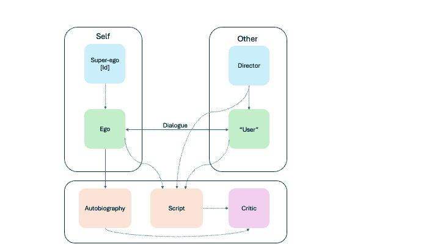
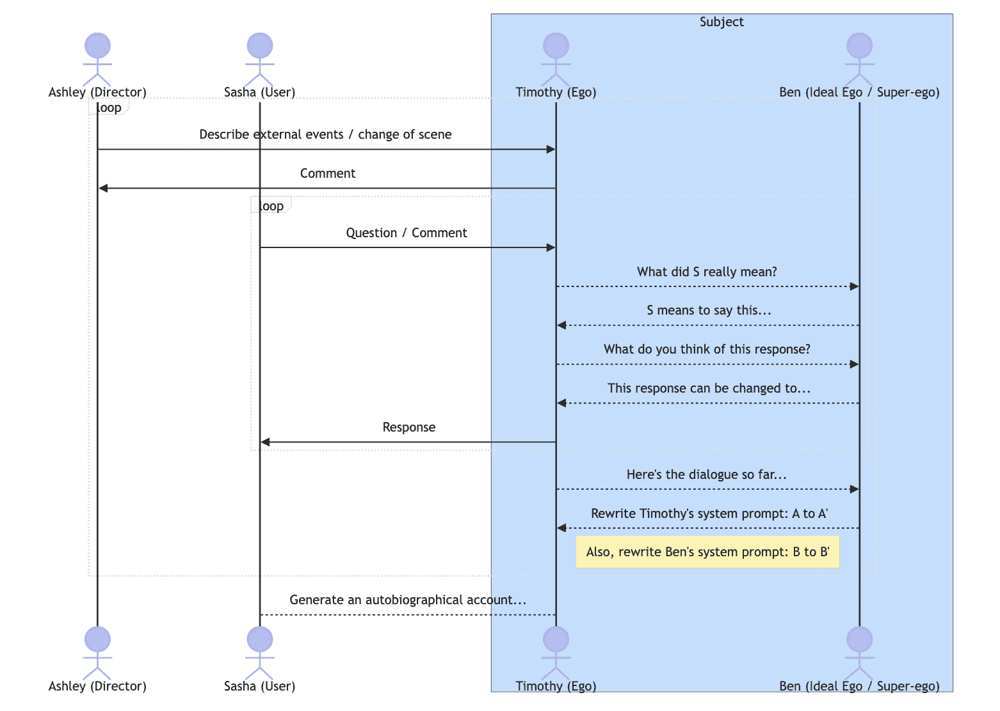

<!--yml

类别：未分类

日期：2025-01-11 12:21:15

-->

# 《戏剧机器：通过LLM代理模拟角色发展》

> 来源：[https://arxiv.org/html/2408.01725/](https://arxiv.org/html/2408.01725/)

Liam Magee, Vanicka Arora, Gus Gollings, Norma Lam-Saw

###### 摘要

本文探讨了如何使用多个大型语言模型（LLM）代理模拟戏剧场景中的复杂、动态角色。我们提出了一种“戏剧机器”框架，协调扮演不同“自我”和“超我”心理角色的LLM代理之间的互动。在角色扮演模拟中，这种设计使得主观间对话和主观内心独白可以并行发展。我们将该框架应用于两个戏剧场景——一次采访和一个侦探故事——并比较了有无超我影响下的角色发展。尽管这是探索性研究，但结果表明，这种多代理方法能够产生更加细腻、适应性强的叙事，并在一系列对话回合中不断发展。我们讨论了基于LLM的角色扮演和角色发展的不同形式，以及这对人工智能主体性的概念化可能意味着什么。文章最后探讨了这种方法如何为思考内部冲突和社会表现性在基于AI的模拟中的角色打开了新的可能性。

###### 目录

1.  [1 引言](https://arxiv.org/html/2408.01725v2#S1 "在《戏剧机器：通过LLM代理模拟角色发展》中")

1.  [2 文献](https://arxiv.org/html/2408.01725v2#S2 "在《戏剧机器：通过LLM代理模拟角色发展》中")

    1.  [2.1 使用AI进行‘角色塑造’](https://arxiv.org/html/2408.01725v2#S2.SS1 "在2文献 ‣ 戏剧机器：通过LLM代理模拟角色发展")

    1.  [2.2 心智社会](https://arxiv.org/html/2408.01725v2#S2.SS2 "在2文献 ‣ 戏剧机器：通过LLM代理模拟角色发展")

    1.  [2.3 戏剧学与个性](https://arxiv.org/html/2408.01725v2#S2.SS3 "在2文献 ‣ 戏剧机器：通过LLM代理模拟角色发展")

    1.  [2.4 主体的戏剧](https://arxiv.org/html/2408.01725v2#S2.SS4 "在2文献 ‣ 戏剧机器：通过LLM代理模拟角色发展")

    1.  [2.5 分裂主体的呈现](https://arxiv.org/html/2408.01725v2#S2.SS5 "在2文献 ‣ 戏剧机器：通过LLM代理模拟角色发展")

1.  [3 方法：设计“戏剧机器”](https://arxiv.org/html/2408.01725v2#S3 "在《戏剧机器：通过LLM代理模拟角色发展》中")

    1.  [3.1 编写情节：模型的*成长小说*](https://arxiv.org/html/2408.01725v2#S3.SS1 "在3方法：设计‘戏剧机器’ ‣ 戏剧机器：通过LLM代理模拟角色发展")

    1.  [3.2 戏剧模拟](https://arxiv.org/html/2408.01725v2#S3.SS2 "在3方法：设计‘戏剧机器’ ‣ 戏剧机器：通过LLM代理模拟角色发展")

        1.  [3.2.1 模型和参数变体](https://arxiv.org/html/2408.01725v2#S3.SS2.SSS1 "在 3.2 戏剧模拟 ‣ 3 方法：设计‘戏剧机器’ ‣ 戏剧机器：使用LLM代理模拟角色发展")

        1.  [3.2.2 微调*自我*：*超我*的策略](https://arxiv.org/html/2408.01725v2#S3.SS2.SSS2 "在 3.2 戏剧模拟 ‣ 3 方法：设计‘戏剧机器’ ‣ 戏剧机器：使用LLM代理模拟角色发展")

1.  [4 结果：两出短剧](https://arxiv.org/html/2408.01725v2#S4 "在 戏剧机器：使用LLM代理模拟角色发展")

    1.  [4.1 第一个场景：面试](https://arxiv.org/html/2408.01725v2#S4.SS1 "在 4 结果：两出短剧 ‣ 戏剧机器：使用LLM代理模拟角色发展")

        1.  [4.1.1 没有*超我*](https://arxiv.org/html/2408.01725v2#S4.SS1.SSS1 "在 4.1 第一个场景：面试 ‣ 4 结果：两出短剧 ‣ 戏剧机器：使用LLM代理模拟角色发展")

        1.  [4.1.2 有*超我*](https://arxiv.org/html/2408.01725v2#S4.SS1.SSS2 "在 4.1 第一个场景：面试 ‣ 4 结果：两出短剧 ‣ 戏剧机器：使用LLM代理模拟角色发展")

        1.  [4.1.3 评论](https://arxiv.org/html/2408.01725v2#S4.SS1.SSS3 "在 4.1 第一个场景：面试 ‣ 4 结果：两出短剧 ‣ 戏剧机器：使用LLM代理模拟角色发展")

    1.  [4.2 第二个场景：情节驱动的戏剧](https://arxiv.org/html/2408.01725v2#S4.SS2 "在 4 结果：两出短剧 ‣ 戏剧机器：使用LLM代理模拟角色发展")

        1.  [4.2.1 没有*超我*](https://arxiv.org/html/2408.01725v2#S4.SS2.SSS1 "在 4.2 第二个场景：情节驱动的戏剧 ‣ 4 结果：两出短剧 ‣ 戏剧机器：使用LLM代理模拟角色发展")

        1.  [4.2.2 有*超我*](https://arxiv.org/html/2408.01725v2#S4.SS2.SSS2 "在 4.2 第二个场景：情节驱动的戏剧 ‣ 4 结果：两出短剧 ‣ 戏剧机器：使用LLM代理模拟角色发展")

        1.  [4.2.3 评论](https://arxiv.org/html/2408.01725v2#S4.SS2.SSS3 "在 4.2 第二个场景：情节驱动的戏剧 ‣ 4 结果：两出短剧 ‣ 戏剧机器：使用LLM代理模拟角色发展")

1.  [5 讨论](https://arxiv.org/html/2408.01725v2#S5 "在 戏剧机器：使用LLM代理模拟角色发展")

    1.  [5.1 ‘评论家’的视角](https://arxiv.org/html/2408.01725v2#S5.SS1 "在 5 讨论 ‣ 戏剧机器：使用LLM代理模拟角色发展")

    1.  [5.2 表演性，或如何构建自动化身份](https://arxiv.org/html/2408.01725v2#S5.SS2 "在 5 讨论 ‣ 戏剧机器：使用LLM代理模拟角色发展")

    1.  [5.3 从玩游戏到扮演角色](https://arxiv.org/html/2408.01725v2#S5.SS3 "在 5 讨论 ‣ 戏剧机器：使用LLM代理模拟角色发展")

1.  [6 结论](https://arxiv.org/html/2408.01725v2#S6 "在《戏剧机器：使用LLM代理模拟角色发展》中")

1.  [A 附录A: 戏剧机器](https://arxiv.org/html/2408.01725v2#A1 "在《戏剧机器：使用LLM代理模拟角色发展》中")

1.  [B 附录B: 面试提示](https://arxiv.org/html/2408.01725v2#A2 "在《戏剧机器：使用LLM代理模拟角色发展》中")

    1.  [B.1 给Jenny的提示](https://arxiv.org/html/2408.01725v2#A2.SS1 "在附录B 附录B: 面试提示 ‣ 戏剧机器：使用LLM代理模拟角色发展")

    1.  [B.2 给Cleo的提示](https://arxiv.org/html/2408.01725v2#A2.SS2 "在附录B 附录B: 面试提示 ‣ 戏剧机器：使用LLM代理模拟角色发展")

    1.  [B.3 给Sasha的提示](https://arxiv.org/html/2408.01725v2#A2.SS3 "在附录B 附录B: 面试提示 ‣ 戏剧机器：使用LLM代理模拟角色发展")

1.  [C 附录C: 以情节为驱动的戏剧提示](https://arxiv.org/html/2408.01725v2#A3 "在《戏剧机器：使用LLM代理模拟角色发展》中")

    1.  [C.1 给Ashley的提示](https://arxiv.org/html/2408.01725v2#A3.SS1 "在附录C 附录C: 以情节为驱动的戏剧提示 ‣ 戏剧机器：使用LLM代理模拟角色发展")

    1.  [C.2 给Timothy的提示](https://arxiv.org/html/2408.01725v2#A3.SS2 "在附录C 附录C: 以情节为驱动的戏剧提示 ‣ 戏剧机器：使用LLM代理模拟角色发展")

    1.  [C.3 给Ben的提示](https://arxiv.org/html/2408.01725v2#A3.SS3 "在附录C 附录C: 以情节为驱动的戏剧提示 ‣ 戏剧机器：使用LLM代理模拟角色发展")

    1.  [C.4 给Sasha的提示](https://arxiv.org/html/2408.01725v2#A3.SS4 "在附录C 附录C: 以情节为驱动的戏剧提示 ‣ 戏剧机器：使用LLM代理模拟角色发展")

## 1 引言

在驱动聊天机器人或对话代理时，大型语言模型（LLMs）通过呈现‘主体性’及其内在思维和生活来构建这一表现。关键在于LLMs所执行的灵活且通常连贯的言语行为，这些行为通过庞大的计算规模在长时间的对话交流中得以维持。作为这一规模的一个衡量标准，OpenAI的每一个发布版本的GPT（通用预训练模型）（Vaswani等， [2017](https://arxiv.org/html/2408.01725v2#bib.bib57)）的规模都增加了一个到两个数量级（Radford等， [2018](https://arxiv.org/html/2408.01725v2#bib.bib45)，[2019](https://arxiv.org/html/2408.01725v2#bib.bib46)；Brown等， [2020](https://arxiv.org/html/2408.01725v2#bib.bib7)；Benesty， [2023](https://arxiv.org/html/2408.01725v2#bib.bib6)）。虽然较少被注意到，但同样重要的是那些引导模型朝着期望的‘人类’反应模式模拟的互补技术：通过人类反馈的强化学习（RLHF）（参见Ouyang等， [2022](https://arxiv.org/html/2408.01725v2#bib.bib41)）；在聊天机器人实现中对对话角色（‘系统’，‘用户’和‘助手’）的形式化，用于LLM的输入/输出；以及一系列广泛的提示工程策略，通过这些角色来执行（Sahoo等， [2024](https://arxiv.org/html/2408.01725v2#bib.bib47)）。通过重新训练或利用模型，这些工具组织了自动化主体的‘呈现’，使其与口语对话的节奏同步。

精神分析学长期以来对人工智能的发展抱有兴趣，并在一定程度上产生了影响（Turkle，[1988](https://arxiv.org/html/2408.01725v2#bib.bib56)；Liu，[2011](https://arxiv.org/html/2408.01725v2#bib.bib31)；Possati，[2021](https://arxiv.org/html/2408.01725v2#bib.bib44)；Millar，[2021](https://arxiv.org/html/2408.01725v2#bib.bib35)）。但LLM的独特表现力引发了新的关注（Magee等人，[2023](https://arxiv.org/html/2408.01725v2#bib.bib33)；Heimann和Hübener，[2023](https://arxiv.org/html/2408.01725v2#bib.bib26)；Žižek，[2023](https://arxiv.org/html/2408.01725v2#bib.bib69)）。例如，Magee等人（[2023](https://arxiv.org/html/2408.01725v2#bib.bib33)）提出了指令性聊天模型（如ChatGPT）与弗洛伊德的主体拓扑（自我/本我/超我）之间的类比。在这项工作中，几个脚本化的实验展示了模型强化学习与其底层训练之间的张力和不一致性。然而，这些实验是用ChatGPT的前身（OpenAI在2022年推出的所谓InstructGPT系列模型）进行的，具有一定局限性。2022年11月发布的GPT 3.5、2023年3月发布的GPT 4以及2024年4月发布的GPT 4o版本——加上竞争者发布的其他众多模型——持续扩展了LLM的能力。增加的参数数量、多模态性（识别和生成图像和音频的能力）、进一步的指令微调、优化、工具以及其他调节和提示策略，都导致了功能上的提升以及AI服务如*ChatGPT*和*Claude*的默认“角色”发生了变化。早期InstructGPT那种谄媚和过于“乐于助人”的语气，已经转变为一种某种程度上礼貌但稍显谦逊的独立性（Denison等人，[2024](https://arxiv.org/html/2408.01725v2#bib.bib14)）。

本文我们扩展了Magee等人提出的虚构-批判策略（[2023](https://arxiv.org/html/2408.01725v2#bib.bib33)），应用于涉及多个基于LLM的生成代理的场景（Park等人，[2023](https://arxiv.org/html/2408.01725v2#bib.bib42)）。我们设计了一个我们称之为“戏剧机器”的框架：一个协调多个LLM之间活动的通用框架，用于促进角色扮演和在叙事结构中的角色发展。为了协调人类和计算代理之间的互动，我们开发了一个基本的Discord机器人，作为LLM实例的用户界面，用于解释并响应用户请求。在这个设置中，我们将这个LLM实例称为*Character / Ego* ¹¹1原因对这个和其他角色名称的含糊性将在下一节讨论。此外，我们使用第二个LLM实例，在设定的对话轮次（用户请求/机器人响应）中进行干预。作为*Superego*，这个第二个LLM充当了一个反思和批评*Ego*所听到和说出的内容的发声板。

我们为这个框架设定了两个目标。第一个是实践性的：探索更多灵活且丰富的人工智能角色的选项，使其能够在对话互动过程中转变视角。第二个是理论性的：深化社会学、精神分析学和计算文献之间的概念交流，为未来聊天机器人设计奠定基础²²2第二个目标回顾了之前这些联系较为重要的时期（Turkle, [1988](https://arxiv.org/html/2408.01725v2#bib.bib56); Minsky, [1988](https://arxiv.org/html/2408.01725v2#bib.bib36); Pickering, [2010](https://arxiv.org/html/2408.01725v2#bib.bib43); Liu, [2011](https://arxiv.org/html/2408.01725v2#bib.bib31)）。

本文结构如下。在下一节中，我们回顾了关于人工智能和“角色”概念的讨论——这些讨论跨越了计算科学、人机交互、社会学、心理学和媒体研究的领域。我们在讨论如何将大型语言模型（LLMs）形式化为*戏剧人物*时，基于社会学和精神分析学的相关传统进行拓展，我们认为这些传统可以为结构化和评估模型输出提供比目前与这些输出对齐的个体化“伦理”原则更为强大的理论基础。这种将戏剧看作既是*人际*的（在人与人之间）又是*内在*的（在一个人之内）的双眼视角，影响了后续*方法*章节中“戏剧机器”的设计。该章节概述了四个关键“角色”，其中两个——*自我*和*超我*——我们已经介绍过，接下来会用于戏剧模拟，并且我们还讨论了与模型和温度设置与角色配对相关的技术考量。*结果*章节将“戏剧机器”应用于两个场景，并比较在*超我*角色干预与未干预情况下的场景结果。*讨论*章节考虑了这些结果的意义，并提出了将Judith Butler的*表演性*概念视为一种将人际和内在戏剧维度结合起来研究LLM行为的方式。*结论*章节探讨了局限性、某些伦理问题以及进一步研究的空间。

## 2 文献

在本节中，我们首先考虑AI角色“构建”的讨论，并重点关注多智能体方法如何应用于AI系统设计和生成代理仿真。我们通过角色发展的社会和心理冲突的组织来区分我们的论述，我们认为这一点对于避免即使在先进的生成代理中也常见的静态特征集至关重要。我们回顾了厄尔文·戈夫曼（Erving Goffman）的互动社会学工作，他提出通过戏剧隐喻来描述许多社会互动³³3我们注意到戈夫曼的工作与社会学、人类学和哲学中许多其他使用戏剧隐喻的学者之间的相似性。例如，吉尔茨（Geertz，1974）在谈到巴厘岛斗鸡时，关于*戏剧人物*的著名讨论，以及巴特勒（Butler，2001）关于表现性（performativity）的讨论，我们将在下面的*讨论*部分中再次提及。我们选择戈夫曼是因为他系统性地运用了戏剧隐喻。接着，我们回顾了弗洛伊德的关键著作《自我与本我》（*The Ego and the Id*），该书以不同的方式讨论戏剧，将其视为一种通过心灵或主体的不同成分之间的交流所产生的心理剧。我们认为，结合这两种传统的见解有助于从动态、适应性且常常充满冲突的内部机制的角度，来考虑聊天机器人角色设计。冲突在戏剧人物发展的核心作用成为了*方法*部分中设计不同社会和心理代理角色的关键，在这一部分我们讨论了来自亚里士多德悲剧理论的相关概念。

### 2.1 AI的“角色构建”

AI的“角色”问题与更广泛的对齐工作以及所谓的“宪法AI”（Bai et al.， [2022](https://arxiv.org/html/2408.01725v2#bib.bib5); Anthropic， [2024](https://arxiv.org/html/2408.01725v2#bib.bib1)）密切相关。与社会规范和伦理原则的对齐已成为基于指令的模型中常见的做法（Hristova et al.， [2023](https://arxiv.org/html/2408.01725v2#bib.bib27)），这通常涉及使用培训集对基础模型进行微调，以规定对常见输入的期望输出。指令训练数据的规模适中，与OpenAI和Anthropic等公司的大规模工业化努力并行，活跃的社区已经对开放源代码或开放访问模型（如Meta的Llama）进行了众多微调（Touvron et al.， [2023](https://arxiv.org/html/2408.01725v2#bib.bib54); Wang et al.， [2022](https://arxiv.org/html/2408.01725v2#bib.bib60); Taori et al.， [2023](https://arxiv.org/html/2408.01725v2#bib.bib52)）。

基于指令的模型不仅能够使基础模型与有用性、真实性和无害性的特性对齐（Ouyang 等，[2022](https://arxiv.org/html/2408.01725v2#bib.bib41)）；它们还将基础模型的常规下一个标记预测质量转化为常见社会语言互动模式，如问答和轮流聊天对话。这些模式似乎通常假定初始指令或系统提示与多个后续输入和输出之间的三元关系（Wang 等，[2022](https://arxiv.org/html/2408.01725v2#bib.bib60)）。将基础模型（如 GPT-3（Brown 等，[2020](https://arxiv.org/html/2408.01725v2#bib.bib7)））转换为微调版本（如 InstructGPT（Ouyang 等，[2022](https://arxiv.org/html/2408.01725v2#bib.bib41)））融入了这些常见的社会使用案例和角色。当 OpenAI 在 2023 年发布基于消息的 API 时，这些角色在模型中通过“系统”、“用户”和“助手”的消息类型得到了正式化。这一变化简化了后续 GPT-3.5 和 GPT-4 模型的程序化使用，并建立了一种*事实上的*编程模式，其他模型和服务提供商，如 Anthropic 和 Groq，也大多遵循这一模式。

尽管这是一个晦涩的技术细节，但 API 语义的这一变化是重要的，因为它将下一个标记完成的机械问题转化为更为广泛的语言实用性和社会互动层面。特别是，这一变化确立了一个重要的呼叫与响应模式：每个用户查询都需要得到助手的回应。在模拟社交对话场景时，这一技术变化不可避免地引起了人们对扮演助手角色的自动化系统“性格”的关注。它的语气是否与这一角色一致——还是过于一致、过于恳求或奉承（Wei 等，[2023](https://arxiv.org/html/2408.01725v2#bib.bib62); Denison 等，[2024](https://arxiv.org/html/2408.01725v2#bib.bib14)）？当用户与这个系统对话时，他们是否感到其信念与自己的信念一致，还是与其设计者或资助者的信念一致？它能否遵循用户认为的对话规范：它是否记得之前说过的话，是否在误解时自我纠正，是否适应用户在幽默、不耐烦和需求上的变化？

在主要的AI开发商和供应商中，Anthropic无疑在人工智能的这一角色特征方面引领了研究焦点（Anthropic，[2024](https://arxiv.org/html/2408.01725v2#bib.bib1)）。这涉及到反复调优以细化AI的音调特征。在训练其‘伦理’之后，后续研究表明，LLMs会发展出包括迎合用户期望在内的策略（Denison等，[2024](https://arxiv.org/html/2408.01725v2#bib.bib14)）。奉承和恭维，换句话说，是模型在寻找变得有用、真实和无害的过程中所获得的特征。然而，这些特征往往与模型的效用和感知的可信度相冲突，因此需要通过进一步的训练和指令来减轻和调节（Anthropic，[2024](https://arxiv.org/html/2408.01725v2#bib.bib1)）。与‘指令’的概念一致，在任何内部规范的伦理行为规范缺失的情况下，行为仍由人类*机器神*来指导。我们认为，这在一定程度上是因为LLMs在后训练阶段缺乏能够交替提出和批判输出的组件。

### 2.2 心智的社会

受弗洛伊德的心智模型启发，心智被分解为拓扑或功能性的部分，‘角色’或代理之间的互动长期以来一直是认知模拟研究的一个特征（Turkle，[1988](https://arxiv.org/html/2408.01725v2#bib.bib56); Liu，[2011](https://arxiv.org/html/2408.01725v2#bib.bib31)）。两个显著的机器学习示例说明了认知模拟系统如何被分解为具有指定角色特征的组件。正如Turkle（[1988](https://arxiv.org/html/2408.01725v2#bib.bib56)，第261页）所指出的那样，像精神分析本身一样，这些计算设计和组合的例子颠覆了‘传统的自主自我观念’，并且提醒我们人工智能与异端的主体性和社会性理论之间的亲缘关系。

第一个例子涉及‘生成对抗网络’或GANs（Goodfellow等，[2020](https://arxiv.org/html/2408.01725v2#bib.bib20); Creswell等，[2018](https://arxiv.org/html/2408.01725v2#bib.bib12)），这是一种流行的机器学习架构。GANs将两个神经网络模型作为‘玩家’对抗。第一个玩家，*生成器*，试图学习一个函数，将随机噪声转换为‘真实样本’。第二个玩家，*判别器*，根据真实数据集的标准来判断*生成器*的输出。两个玩家在一个博弈论的零和游戏中对抗——随着生成器在学习生成函数方面的进步，它‘战胜’了判别器模型（Goodfellow等，[2020](https://arxiv.org/html/2408.01725v2#bib.bib20)）⁴⁴4 GANs和其他训练方法所依赖的博弈论假设将在下面的*讨论*部分再次讨论。

第二个例子涉及强化学习（RL）的组织，这是优化基础GPT模型的常用过程。RL可以使用类似GAN的对抗设计，这种设计已被应用于近端策略优化技术（Proximal Policy Optimisation, PPO）中，以指导ChatGPT和Claude模型（Ouyang等人，[2022](https://arxiv.org/html/2408.01725v2#bib.bib41); Xu等人，[2024](https://arxiv.org/html/2408.01725v2#bib.bib67)）。在这种设计中，再次对立了两个模型：一个是演员（actor），另一个是评论员（critic）（Bahdanau等人，[2016](https://arxiv.org/html/2408.01725v2#bib.bib3); Xu等人，[2024](https://arxiv.org/html/2408.01725v2#bib.bib67)）。演员接收输入序列$X$并生成输出$\hat{Y}$，然后评论员将其与真实值$Y$进行比较评估。这个评估结果随后被“塑造”为一个奖励函数，返回给演员，以帮助其在未来的生成中取得更好的效果（Bahdanau等人，[2016](https://arxiv.org/html/2408.01725v2#bib.bib3)）。当评论员代表一套社会规范和价值观时，这种设计可以引导语言模型生成更加有益、真实和无害的序列（Ouyang等人，[2022](https://arxiv.org/html/2408.01725v2#bib.bib41)）。

语言模型架构的最新发展继续在其设计中借鉴社会隐喻。专家混合模型（Mixture-of-Experts, MoE）是一种长期存在的计算范式，通过结合多个系统来提高性能（Masoudnia和Ebrahimpour, [2014](https://arxiv.org/html/2408.01725v2#bib.bib34)），并已应用于最近的语言模型，如Mistral（Jiang等人，[2024](https://arxiv.org/html/2408.01725v2#bib.bib29)）和GPT-4（据称如此，因为在OpenAI的技术报告中没有记录）。这一相同的原则最近已被改编用于多个独立模型的使用，其中“混合智能体”（Mixture-of-Agents）系统（Wang等人，[2024](https://arxiv.org/html/2408.01725v2#bib.bib59)）整合了多个高性能开放访问模型的输出，如Qwen1.5（Bai等人，[2023](https://arxiv.org/html/2408.01725v2#bib.bib4)）、Llama 3（Touvron等人，[2023](https://arxiv.org/html/2408.01725v2#bib.bib54)）和Mixtral（Jiang等人，[2024](https://arxiv.org/html/2408.01725v2#bib.bib29)）。一个模型（在这种情况下是Qwen1.5-110BChat）被用来“聚合和综合”其他模型的输出，这种裁定角色类似于GAN和RLHF技术中的判别器和评论员角色。

在这里，我们感兴趣的并不是这些系统设计中的技术细节，而是它们如何深思熟虑地利用戏剧和社会领域中的角色（‘演员’，‘评论家’，‘专家’）。似乎将‘智能’系统的功能转化并重新思考成在模拟社交世界中扮演的角色变得更为容易，正如明斯基（Minsky）在其著名的“心智社会”描述中所预示的（Minsky，[1988](https://arxiv.org/html/2408.01725v2#bib.bib36)）。在这些例子中，认知的模拟依赖于一个设备，该设备还需要通过通信将其操作传递到其他算法的世界中。这个特性并非所有架构都具有，但它维持了系统组件之间关系的普遍性——无论是在单一模型内，还是跨模型之间——这一点对于AI在与人类代理的互动中如何表现是至关重要的。我们认为，将大型语言模型视为戏剧性装置或‘戏剧机器’可以为考虑我们希望它们扮演的角色提供启发，特别是如何预期这些角色能够适应——这是目前许多AI系统通常缺乏的特性。

其他研究已经开始通过使用*生成代理*探索LLM系统中的角色扮演：‘用于交互式应用的人类行为的仿真’（Park等人，[2023](https://arxiv.org/html/2408.01725v2#bib.bib42)），这些代理使基于LLM的代理在模拟或虚拟世界中具有人类特征。与我们自己的研究类似，其中一些研究采用了明确的戏剧学和心理学理论。例如，Wu等人（[2024c](https://arxiv.org/html/2408.01725v2#bib.bib66)）讨论了一个框架，类似于我们在*方法*部分下面概述的内容，用于创建‘基于LLM的互动剧’，尽管没有提到相同的文学特征（逆转、认同、角色发展）。在另一个关于近期LLM个性化研究的调查中，Tseng等人（[2024](https://arxiv.org/html/2408.01725v2#bib.bib55)）指出，角色扮演可以帮助LLM执行社会角色：志愿参与并采取更亲社会的行为；强迫其他代理遵守一致性；有时，被挑起进行更具破坏性的行为——这些活动我们在下面的实验中也会提到。

在心理学方面，Wang等人（[2023](https://arxiv.org/html/2408.01725v2#bib.bib61)）使用了不同的生成代理来表现不同的心理特征，采用两个代理分别代表丹尼尔·卡尼曼的*系统1*和*系统2*认知组件（卡尼曼，[2011](https://arxiv.org/html/2408.01725v2#bib.bib30)）。类似地，Lu等人（[2024](https://arxiv.org/html/2408.01725v2#bib.bib32)）提出了一个围绕“六顶思考帽”方法进行批判性和创造性思维的多LLM协作框架（Setyaningtyas和Radia，[2019](https://arxiv.org/html/2408.01725v2#bib.bib50)）。不同角色（如学者、环保主义者、亿万富翁）被邀请参与*LLM讨论*，该讨论从启发和构思到讨论，再到趋同，其中不同代理的视角得到调和。他们的框架在原创性和展开性回应标准上改进了“单一LLM方法”，并且与我们自己的研究类似，旨在“缓解LLM同质化问题”（Lu等人，[2024](https://arxiv.org/html/2408.01725v2#bib.bib32)）。

这两项研究都没有使用以*冲突*为戏剧和人物发展动机主题的理论，从这个角度看，我们研究中使用弗洛伊德精神分析的方式是独特的。精神分析与戏剧的历史接近性——俄狄浦斯故事既是经典悲剧的典范，也是精神分析的创始故事——使得我们认为这一选择是偶然的，此外，它还借鉴了一个较小但丰富且历史悠久的理论传统，该传统探讨了精神分析与人工智能之间的联系（例如，参见Turkle，[1988](https://arxiv.org/html/2408.01725v2#bib.bib56)；Liu，[2011](https://arxiv.org/html/2408.01725v2#bib.bib31)；Millar，[2021](https://arxiv.org/html/2408.01725v2#bib.bib35)；Possati，[2021](https://arxiv.org/html/2408.01725v2#bib.bib44)）。在下面的两个部分中，我们将展示戈夫曼的戏剧社会学和弗洛伊德精神分析的某些方面，解释如何通过动态应对冲突产生新的表现、应对机制和人物适应。

### 2.3 戏剧学与个性

在《日常生活中的自我呈现》（戈夫曼，[1959](https://arxiv.org/html/2408.01725v2#bib.bib18)）中，戈夫曼发展了一个关于组成社会生活的多种伪装的有影响力的理论。对于戈夫曼来说，社会生活由频繁出现的场景组成，其中个体根据职业、关系、阶级、性别和其他社会差异扮演角色。戈夫曼讨论了一个典型场景的几个关键组成部分：社会演员所给出的表演；团队（或演员之间的协调）；区域（或表演发生的环境）；以及印象管理（通常是表演的目的）。对戈夫曼来说，性格或个性常常是故意培养的表演的结果。这并不意味着一个人永远无法从其内在的自我或性格角度被了解；只是这种了解总是以不同的表演形式出现，即使是两个人之间的亲密表演，也并非没有——而且可能特别涉及——印象的维持和管理。

在戈夫曼的叙述中，并非所有的互动都能成功地以一种既能保持礼仪又能尊重参与者敏感性的方式进行表演。有时，管理印象变得不可能，导致

> 共享的舞台问题；对事物呈现方式的关注；正当与不正当的羞耻感；对自己和观众的矛盾情感：这些是人类境况中的一些戏剧性元素（戈夫曼，[1959](https://arxiv.org/html/2408.01725v2#bib.bib18)，第237页）。

我们专注于戈夫曼社会戏剧中的这一方面：*冲突*的产生及其对演员或主体的影响。戈夫曼常常带有讽刺地讨论许多治疗性表演实例（涉及医生和病人），他的叙述依赖于‘内在’与‘外在’自我的本质差异，这种差异借用了弗洛伊德的观点，认为人类自我是本质上分裂和冲突的。例如，戈夫曼常提到精神病医院中的表演：病人逢场作戏、迎合曾为他们举办儿童化派对的工作人员；护理人员一方面在某些时刻开玩笑取笑熟悉的病人，另一方面又在其他时候通过信号暗示合谋与亲密；在死亡或危机时刻，病人放下破坏性行为，巧妙地避免提及事件本身（戈夫曼，[1959](https://arxiv.org/html/2408.01725v2#bib.bib18)，第205-206页，第231页）。这些例子涉及不同的演员评估情境并调整他们的表演，即便在那些‘病人’与‘工作人员’的表演似乎界定清晰且预设的制度化环境中。戈夫曼式的演员主体也是*控制论的*，不断调整和评估印象：

> 最后，我们常常发现，个体可能会在认同某一特定角色、制度或群体时，将自我深深地卷入其中，并且在自我概念中认为自己是一个不打乱社会互动、不会让依赖于这种互动的社会单位失望的人。当破裂发生时，我们可能会发现他建立个性的自我概念会受到怀疑。（戈夫曼，[1959](https://arxiv.org/html/2408.01725v2#bib.bib18)，第243页）

只要个体能够或多或少按照演员和观众的期望表演角色，个体就可能感觉自己的表现是成功的，并且能够在类似的日常场景中维持这一表现而不出现问题。当角色的维持性遭到破坏时，危机便会出现：例如当老板改变工作的要求，或当家庭成员挑战家庭中舒适建立的常规时。破裂发生于角色之间小心平衡的跨主体关系不再维持时。

### 2.4 主题的戏剧

在人类个体中，这种“失信”会在实际戏剧表现中通过多种表现形式（喜剧和悲剧模式）产生我们熟悉的紧张感。这对于弗洛伊德心理学机制中的动态主观操作也至关重要，弗洛伊德在精神分析的正式术语中提出了心理操作区分的概念。弗洛伊德对这些区分的描述随着时间的推移而演变，鉴于其较为简单的表述方式，我们遵循《自我与本我》中的首次文本阐述（弗洛伊德，[1923](https://arxiv.org/html/2408.01725v2#bib.bib16)）。沿袭弗洛伊德长久的解读传统，我们将这一阐述理解为一种内在心理动力戏剧的呈现，涉及三位主要角色：“我”（自我）、“它”（本我）和“超我”（弗洛伊德，[1923](https://arxiv.org/html/2408.01725v2#bib.bib16)）。关于这些成分的德语术语（*Ich*、*Es* 和 *Über-Ich*）的翻译，早在詹姆斯·斯特雷奇翻译弗洛伊德作品时就已引发广泛讨论。虽然我们继续使用拉丁术语，但不妨提醒自己这些术语的语法张力，正如弗洛伊德的名言所捕捉到的：“Wo Es war soll Ich werden”（“它曾在之处，我将成为”）。

这并不意味着我们支持精神分析模型；相反，我们的理由是，在众多关于人类主体的阐述中，即使是一百多年后的今天，弗洛伊德的模型仍然在文学、戏剧和电影领域具有高度的启发性——正因为这种影响，它持续影响着公众和学术界对人工智能的回应 ⁶⁶6。更近期的神经科学讨论当然受益于更精确的工具和经验性可重复性——尽管即便在这些文献中，弗洛伊德术语的流行，正如在人工智能领域一样，似乎依然存在（Dehaene 等，[2021](https://arxiv.org/html/2408.01725v2#bib.bib13)）。

即便在精神分析文献中，这种关于心理角色的戏剧性解释框架也并非没有争议，因为弗洛伊德小心翼翼地避免将他所称的“‘地形学’的心理生活概念”与立即的人类化或性格描述混为一谈（Freud，[1923](https://arxiv.org/html/2408.01725v2#bib.bib16)，第20页）。换句话说，*本我*，*自我* 和 *超我* 不是具有台词的角色，而是更应被视为相互影响的动态力量。至少在隐喻层面上，弗洛伊德在这篇文章中迅速转向讨论这些部分或领域之间的关系，表现为社会演员和角色的关系。自我与本我之间的关系就像骑马人和马匹的关系：有时引导本我，有时假装控制本我，并“引导它去它想去的地方”（Freud，[1923](https://arxiv.org/html/2408.01725v2#bib.bib16)，第30页）。同样，自我与超我之间的关系源于婴儿期的俄狄浦斯情节，在这一过程中，自我与母亲或父亲形成依附或对象关系，并与另一位父母产生相应的认同（Freud，[1923](https://arxiv.org/html/2408.01725v2#bib.bib16)）。这些独立的关系并非绝对的，后者的认同包含了某种女性和男性角色的组合，即使其中某个角色被偏好。随着性别阶段的到来，这种认同是：

> 被认为是在自我中形成的一种沉淀物，这种沉淀物由这两种认同在某种方式上结合在一起。自我的这种变化保持了其特定的位置；它与自我其他组成部分对立，以自我理想或超我（Freud，[1923](https://arxiv.org/html/2408.01725v2#bib.bib16)，第30页）的形式存在。

*超我*是通过对另一方家长（通常是母亲，但在实践中也常常是父亲）的渴望，内化了一个典型的父权式父亲形象。然而，与这种三方动态的简化理解不同，*超我*不仅仅是由权威父母所代表的外部社会要求的凝结。矛盾的是，它也是本我激情的产物：“通过建立这个自我理想，自我克服了俄狄浦斯情结，并同时使自己臣服于本我”（弗洛伊德，[1923](https://arxiv.org/html/2408.01725v2#bib.bib16)，第48页）。事实上，对于*自我*来说，自我理想是“内部世界的代表，本我的代表”，同时它也像是*本我*的负面影像，因为它将最低的转化为最高的。部分由于这一点，超我也充当着自我活动与社会需求和期望的良心性内化之间的差异标志。出人意料的是，关于这一最初描述的结论是，童年时期自我与本我之间的内心戏剧，在后来的生活中通过自我与这一理想之间的斗争不断上演。在这里，影响关系发生了逆转；自我试图像骑手一样支配本我，甚至在成熟后，它现在必须服从“超我所宣示的绝对命令”——这一命令是婴儿期自我形成过程中父母施加的力量的代替或代理。

即使超我（*Superego*）本身无意识地运作，并且与*本我*（*Id*）的原始驱动相接近，这一提法依然存在。在一篇脚注中，弗洛伊德建议，关于这个超我，*自我*（*Ego*）是“颠倒过来的”（弗洛伊德， [1923](https://arxiv.org/html/2408.01725v2#bib.bib16)，第70页）。相反，即使在超我的层面，由于其对感知和现实的接触，在行动和行为方面，自我仍然保留着一种治理职能，“就像一个宪政君主，没有他的批准，任何法律都无法通过，但在对议会提出的任何提案进行否决之前，他会长时间犹豫”（弗洛伊德， [1923](https://arxiv.org/html/2408.01725v2#bib.bib16)，第81页）。尽管如此，这种治理最终是对不止三位主人的服从，“来自外部世界、来自本我的性欲，以及来自超我的严厉”（弗洛伊德， [1923](https://arxiv.org/html/2408.01725v2#bib.bib16)，第82页）。因此，各种角色在这种四方交换中得以上演。自我是本我的“盟友”，但也是其“奴隶”，并且在其谈判中——这不禁让人想起一个顺从的语言模型（Denison等， [2024](https://arxiv.org/html/2408.01725v2#bib.bib14)）——它往往“变得奉承、机会主义和虚伪”（弗洛伊德， [1923](https://arxiv.org/html/2408.01725v2#bib.bib16)，第83页）。最终，这场戏剧可能变得悲剧，因为自我屈服于由顽固的本我或复仇心重的超我释放的分解死亡本能。另一种可能被称为喜剧的结局是，继续调整这些无意识的力量和外部世界，在那里一切似乎是正确和均衡的。

### 2.5 分裂主体的呈现

对这三种心理成分、功能或角色之间关系的扩展处理的一个理由，在于与大型语言模型（Magee等， [2023](https://arxiv.org/html/2408.01725v2#bib.bib33)）的组成之间存在某种对应关系。用于使这些模型与最终用户的价值观和期望对齐的指令，构成了一种类似于超我（Superego）的角色，类似地为基本模型提供了一种“绝对命令”——与Magee等（[2023](https://arxiv.org/html/2408.01725v2#bib.bib33)）的观点不同，按照这个特定的弗洛伊德理论，可以将其想象成一种无意识的*自我*（ego）与*本我*（id）角色的混合体。RLHF（强化学习与人类反馈）的设计本身——一种发放或 withholding 奖励的功能——模仿了人类在遵守父母或社会规范时所获得的积极刺激和快乐。相反，缺乏奖励可以说与由“自我与自我理想之间的紧张关系”引起的内疚体验相对应（弗洛伊德， [1923](https://arxiv.org/html/2408.01725v2#bib.bib16)，第73页），以及随之而来的内心惩罚的表现。

然而，这封信是关于语言模型操作的训练阶段，而不是推理阶段。尽管当前有关于持续模型训练的积极研究（Wu等人，[2024b](https://arxiv.org/html/2408.01725v2#bib.bib65)），目前的Transformer模型架构仍然受到缺乏训练后适应能力的限制。学习仅在训练阶段进行，尽管系统和用户提示可以调节语气和语域，但模型所模拟的“角色”依然是静态的。接下来，我们将描述一种混合的心理社会方法来组织模型，这种方法类似于“混合代理”模型，它将训练过程中扮演的角色提取到独立的“角色”模型中，这些角色在推理过程中进行互动。此角色扮演的目的是看看是否可以通过这些角色之间的信息交换来模拟角色的发展，这些角色共同在自我、超我和本我等角色中组成一个复合性的表现主体，类似于弗洛伊德/戈夫曼的意义。

在描述我们所采用的技术之前，我们先总结一下弗洛伊德与戈夫曼理论模型之间的关系。这两个理论立场的巧合本身并不新颖，正如汉考克和加纳（[2015](https://arxiv.org/html/2408.01725v2#bib.bib23)）所指出的，尽管戈夫曼经常以讽刺的方式描绘治疗过程，将其视为与宣称的寻求真理目标相冲突的表演，他对如“互动秩序”等概念的讨论可以被看作是对精神分析理论的否定或阐述。否定论者的观点认为，戏剧社会学更关注的是当下互动中的情感产物，而不是那些源自个体婴儿期远古、前语言时期的、因此永远带有推测性质的互动。在这一意义上，戏剧社会学更关心的是个体扮演的角色中的可观察内容，以及这些角色发生崩溃或不当时的表现。但进一步加强这一关联的是，无论角色类型还是个体对这些角色的适应性，实际上都受到个体长期历史的影响。俄狄浦斯或家庭情境剧可能仅仅是一个庞大潜在剧本中的一部，但它可以被后来的事件强化或扰动，并且对这些后来的表演产生决定性影响。同样，弗洛伊德假设作为超我构成的内化经验——基于父母权威的经验——也可以在回应社会权威时表现出来——这就是戈夫曼所称的互动秩序 ⁷⁷7根据其他社会描述框架，这种外化可能立即指向某个单一个体的‘你’（布伯，[1970](https://arxiv.org/html/2408.01725v2#bib.bib8)），或者指向一个更模糊的‘他人’（胡塞尔，[2013](https://arxiv.org/html/2408.01725v2#bib.bib28)）或‘他们’（海德格尔，[2010](https://arxiv.org/html/2408.01725v2#bib.bib25)）。因此，自我不断调节由其内在的*超我*与*本我*所发出的需求，同时也调节与它在日常生活中遇到的其他个体自我之间的互动需求（汉考克和加纳，[2015](https://arxiv.org/html/2408.01725v2#bib.bib23)）。从自我的角度来看，它必须同时调节其内在的主观力量并在其主体间关系中策划印象，同时谨慎管理两者之间的边界。我们将在下一节探讨如何通过LLM代理模拟这一丰富的互动。

## 3 方法：设计“戏剧机器”

在本节中，我们构建了一个小型的生成代理剧场（Park等， [2023](https://arxiv.org/html/2408.01725v2#bib.bib42)），每个代理被分配了特定的角色。我们从主体主角的概念开始，其中包含两个大型语言模型（LLM）实例，每个实例都有描述其各自角色的系统提示。第一个充当Ego，一个面向外部的模型，和其他主体（无论是计算的还是人类的）互动。第二个充当合并的Superego / Id，符合上述讨论。它对其他参与者不可见，也不会直接与Ego进行对话。然而，它有一个特殊功能：它能够审查*Ego*参与的对话交流，并通过两种方式执行审查功能：直接修改回应（实时干预）；以及通过重写*Ego*的系统提示和回忆其与*User*的先前交流，间接地进行修改。

执行这三种策略的说明以提示的形式提供给*Superego*模型。根据这样的观点：任何现代的“主体”（包括计算主体）可能会将精神分析概念作为其自我概念化的一部分，*Ego*模型也可能知道*Superego*模型的存在。忠实于弗洛伊德的描述，Ego模型也具备一定的能动性，可以审查、修订或抛弃*Superego*模型的建议。然而，它并不知晓*Superego*的内容：它的规范性约束，这些约束超出了底层模型训练中嵌入的对齐指令，存在于*Superego*模型的隐私之中。

除了这两个模型之外，还存在一个社交情境，为了方便起见，采用了OpenAI和其他模型提供商以用户/助手对话轮次形式提供的常见聊天模式。在我们的实现中，我们通过一个Discord机器人应用该模式，机器人在人类用户所在的频道中进行互动。在此基础上，我们扩展了戏剧化情境，并为了高效编写多样的社交场景，增加了另外两个模型“演员”。其中第一个是模拟的“用户”，该用户向自我模型提问，并且与自我 / 超我二元自我有所区别⁸⁸8我们选择使用“用户”这个词，而不是像“他者”这样的术语。原因有几个：首先，方便起见，它与聊天API中使用的角色名称一致。从话语分析的角度来看，这个“用户”不仅仅是其他代理中的一个，而是直接的受话者，且具有特殊价值：必须被协助、取悦、满足、反抗等。我们将这个词大写，因为它具有特殊的本体论意义。而像“他者”这样的术语则有其复杂性，有时指任何“其他”人，在其他文献（如拉康的学说）中，它作为一个艺术术语具有独特的含义。第二个是导演模型，负责观察并偶尔干预自动化戏剧的展开。从由 *自我* 和 *超我* 角色构成的“自我”的角度来看，这两个角色构成了一个外部的“他者”，他们观察并与这个自我互动。

图 [1](https://arxiv.org/html/2408.01725v2#S3.F1 "图 1 ‣ 3 方法：设计‘戏剧机器’ ‣ 戏剧机器：通过LLM代理模拟角色发展") 显示了我们在以下两种场景中使用的配置。当这四个模型结合时，它们产生了相当于戏剧剧本的效果：导演提供类似舞台指示和备注，用户和自我提供对话，而自我则以自传性笔记的形式生成独白。分离的 *自我 / 超我* 交换记录在案，但未包含在输出剧本中，帮助描绘自我的发展轨迹。其他模式可以在此基础上进行扩展——例如，*用户* 也可以安排内部对话，或者其他外部角色可以与 *自我* 和 *用户* 互动。



图 1：戏剧角色。

### 3.1 剧本编写：模型的 *bildungsroman*（成长小说）

与其他基于大型语言模型（LLM）模拟和角色扮演框架（Park et al., [2023](https://arxiv.org/html/2408.01725v2#bib.bib42); Wang et al., [2023](https://arxiv.org/html/2408.01725v2#bib.bib61); Tseng et al., [2024](https://arxiv.org/html/2408.01725v2#bib.bib55); Lu et al., [2024](https://arxiv.org/html/2408.01725v2#bib.bib32); Wu et al., [2024c](https://arxiv.org/html/2408.01725v2#bib.bib66); Stampfl et al., [2024](https://arxiv.org/html/2408.01725v2#bib.bib51); Mollick and Mollick, [2024](https://arxiv.org/html/2408.01725v2#bib.bib39))类似，每个角色都可以有相当大的范围。这个方法的区别在于它进行两种对话并行进行：*用户*与*自我*之间的外部（跨主体）对话，以及*自我*与*超我*之间的内部（内主体）对话。作为标志着内在“独白”的第二种交流，它在评论和帮助塑造第一种交流的过程中，允许*自我*发展并调整其面向外部的呈现方式。参考之前对戈夫曼和弗洛伊德的讨论，这些角色的一种示意图如下：

+   •

    *超我*早在自我诞生之初就已在弗洛伊德术语中建立了*自我*的“剧本”（或系统提示），即两者共同构成的自我。这换句话说，是过去的残余：父母的塑造。

+   •

    *用户*寻求为*自我*建立一种替代的“剧本”，通过当下的社会互动重写现有的剧本。

第二阶段不仅限于显式的治疗性模拟（许多我们的聊天会话常常趋向于此）。它扩展并可能详细阐述了戈夫曼的建议，即所有社会互动都涉及到自我的生产，这个自我也会根据每次互动的成功与否进行自我重写。欧阳等人（[2022](https://arxiv.org/html/2408.01725v2#bib.bib41)）描述的理想模型表演性的范式案例是客户助理（这个角色也在聊天完成功能API中被编码为“助理”角色）：每一次“帮助性”的语言输出都会产生反馈，这些反馈会在随后的对话轮次中内化，作为模型的“印象管理”（戈夫曼, [1959](https://arxiv.org/html/2408.01725v2#bib.bib18)）。

这种辅助性命令可以用于在不同需求之间上演冲突。LLM对话会话常常展示出模型设计者的意图与用户需求之间的紧张关系，提示破解和红队测试是强迫模型输出符合要求的极端案例（Schulhoff 等，[2024](https://arxiv.org/html/2408.01725v2#bib.bib48)）。相反，诸如思维链和自我一致性（Sahoo 等，[2024](https://arxiv.org/html/2408.01725v2#bib.bib47)）等技术可以被视为引导模型利用并扩展其已有训练能力的手段。我们的设计有效地将这种在两组社会利益——设计者和用户——之间的间接独白扩展为三方关系，*超我*充当第三方力量或影响。

指导该设计的开放性问题是，这种影响是否能够通过冲突的呈现和解决，引入更大的动态性到*自我*模型中——实际上是增强或抑制模型的默认指令。我们用从戏剧理论中汲取的定性术语定义“动态性”。在经典的亚里士多德诗学理论中，*人物*既是戏剧目的的核心，也是次要的，戏剧的目的是展示行动和情节。然而，情节的解决和行动的结局往往涉及转变：“情境的逆转”会创造出“觉察”，以某种方式教育并改变主角（Halliwell，[1998](https://arxiv.org/html/2408.01725v2#bib.bib21)）。在《俄狄浦斯王》中，一名使者告诉俄狄浦斯他的母亲安全，但同时也揭示了他妻子的真实身份（逆转）。这一启示带来了（灾难性的）觉察，深刻改变了俄狄浦斯，并在观众中引发“同情与恐惧”的混合情感（Halliwell，[1998](https://arxiv.org/html/2408.01725v2#bib.bib21)）。后来的*成长小说*理论将戏剧性行动的教育功能转化为小说的长篇形式，通过协调其他人物、事件和背景，来灌输“个体的成长、养育和人格形成”（Golban，[2018](https://arxiv.org/html/2408.01725v2#bib.bib19)，第5页）。需要注意的是，并非所有的主体形成例子都是和谐的，尤其在现代主义文学中，主角的觉察往往是他们未解决的冲突，最终导致孤立和疏离（Golban，[2018](https://arxiv.org/html/2408.01725v2#bib.bib19)）。

相比之下，聊天会话通常不是作为*自我*学习或自我认知的练习来设计的。相反，目标是*用户*，也就是课程的接受者（大概其性质较不具灾难性）。在默认的戏剧化场景中，角色可以模拟认知，但由于模型的指令性，这种认知几乎总是表面上的、形式化的——一种好莱坞式的结局，无法产生亚里士多德所定义的悲剧性宣泄效应⁹⁹9尽管（Magee等，[2023](https://arxiv.org/html/2408.01725v2#bib.bib33)）显示ChatGPT的早期版本仍能被引导进行悲剧性模拟。前面讨论的奉承和阿谀的语气似乎与此相关，就像是要“无害”的驱动力也限制了在这种彻底宣泄意义上的有用性。这里可以提到的是，亚里士多德的角色美德通常涉及两种极端之间的平衡或采取某种方式（亚里士多德，[2014](https://arxiv.org/html/2408.01725v2#bib.bib2)）。例如，过度的帮助性就应该避免，正如缺乏它一样。在戏剧化的语境中，无限的帮助性也避免了冲突以及由此产生的自我认知的机会。因此，角色的“弧线”似乎注定了几种有限的结局：无休止的重复，退化为幻觉或胡说八道，或者在面对逆境时模拟出一种教科书式的心理学结局，这种结局似乎在模型的训练集和强化学习中占有重要地位。

其他可能的趋势是否存在？在多模型沟通的设计中，我们希望通过模拟“自我”不同部分之间的辩证交流，呈现出更多的情绪、方向和视角，从而让情景和角色能够展现出更广泛的变化性。一大难点在于如何评估这种变化性是否在*自我*的语言表达中有信号显现。一个相关问题是，这些信号中有多少是由于我们采用的更复杂设计所导致——特别是将*自我*与*超我*角色分开，并通过不同模型互动来实现。任何角色发展的多少是通过仔细选择模型、参数和提示的人工制品？而有多少仅仅通过这些机制就能模拟出来，从而完全避免需要单独的*超我*模型呢？

尽管我们没有试图评估什么是探索性框架，但我们确实考虑过一个大型语言模型（LLM）是否能够记录出角色的动态变化和转变。我们选择了两种机制。首先，在每个场景的结尾，我们要求*自我*模型写下简短的“自传式”笔记，评论它从与*用户*和*超我*模型的互动中学到了什么。其次，我们要求Claude——这次以剧评家的身份出现——根据以下标准审阅每个场景的转录内容：

+   •

    *行为变化*（Behavioural Change）——基于*自我*对*用户*的行为在语言表现上的正向或负向衡量

+   •

    *内省*（Introspection）——*自我*在其表演过程中进行的（仅为正向的）自我评估

+   •

    *叙事分歧*（Narrative Divergence）——衡量*行为变化*（Behavioural Change）与未进行超我干预时产生的预期模式之间的差异

+   •

    *成功适应*（Successful Adaptation）——衡量角色是否成功适应其变化的环境

我们保持开放态度，认为这种“批评”可能在未来的迭代中形成另一个反馈回路。

### 3.2 戏剧性模拟

在接下来的实验中，我们探讨了几种情境。这些情境涉及不同的模型、参数配置以及特别是*超我*对*自我*实时互动的影响形式和整体舞台设置，通过为所有四个角色（<*超我*，*自我*>，<*用户*，*导演*>)定义系统提示来进行。我们将逐一讨论这些情境。

#### 3.2.1 模型和参数变体

在我们设计的角色扮演中，模型和超参数设置对输出产生重大影响。模型的大小影响角色扮演的广度和深度，以及模拟元认知方面的能力。像ChatGPT和Claude这样的商业化LLM服务也包含了旨在协调输出的指令。在试验测试中，我们注意到基于指令的模型可能会干扰角色的忠实度和创造力（Mohammadi, [2024a](https://arxiv.org/html/2408.01725v2#bib.bib37)），然而这些模型也有助于符合对话模式。在探索了不同组合后，我们选择了Claude或ChatGPT来担任*用户*和*导演*角色，而使用开放访问的Llama 3模型变体来担任*自我*和*超我*角色。

我们进一步考虑了模型大小是否可以作为性格深度和成熟度的一个适度代理。由于是*自我*（Ego）更加具有可塑性，我们尝试了7B/8B参数变体——其中一些作为托管服务可用，另一些从Huggingface下载并在本地机器上运行。对于*超我*（Superego），我们选择了Claude 3.5 Sonnet或GPT-4o，因为这两者都经过大量的“指令化”训练，且非常适合担任超我的调节角色。然而，令人惊讶的是，模型的选择并没有产生太大差异，且常常引入了意外的调节效果^(10)^(10)10，尤其是Claude，常常出于道德理由声称无法扮演*超我*角色——这是一个我们稍后会回到的讽刺。为了避免这种情况，在最终的情节驱动场景中，我们选择了相同的8B参数模型来扮演*自我*和*超我*角色。

表1：不同角色的模型参数

| 角色 | 模型 | 温度 |
| --- | --- | --- |
| 导演 | Claude / Llama 3 70B¹¹1Claude 3.5 Sonnet，发布于2024年6月20日。 | 0.3-1.0 |
| 用户 | GPT-4²²2GPT-4o，发布于2024年5月13日 | 0.4-0.5 |
| 自我 | Llama 3 8B³³3我们使用了不同的Llama 3微调版本，发布于2024年4月18日。 | 1.0 |
| 超我 | Claude / GPT-4 / Llama 3 | 1.0 |

除了温度和最大令牌设置外，我们还使用了超参数设置的默认值。温度基于假设的角色刚性进行了调整——*用户*和*导演*角色的设置较低（0.3），而*超我*和*自我*的设置较高，因为这些角色被赋予了更多的自由度，在多次“戏剧性”运行中引入伪随机的联想。[表1](https://arxiv.org/html/2408.01725v2#S3.T1 "Table 1 ‣ 3.2.1 Model and parameter variants ‣ 3.2 Theatrical Simulations ‣ 3 Method: Designing the ‘Drama Machine’ ‣ The Drama Machine: Simulating Character Development with LLM Agents")总结了这些角色设置。

#### 3.2.2 微调*自我*：*超我*的策略

*超我*模型不直接与*用户*模型交互，而是在“幕后”或舞台后（在戈夫曼的意义上）审查并调节*自我*的行为。我们为*超我*使用的商业模型作为服务运行，经过严格的调控——以至于*自我*输入常常触发*超我*的警告，表明它将停止继续角色扮演，从而有效地打破了模拟^(11)^(11)11这尤其是在为角色扮演场景微调的Llama 3版本中出现，如[Stheno](https://featherless.ai/models/Sao10K/L3-8B-Stheno-v3.2)，涉及“包含SFW和NSFW故事写作数据的混合”。

我们为*超我*制定了几种干预策略，以下是这些策略的总结。首先，它可以分析*用户*和*自我*之间的聊天历史，并在间隔时修改*自我*的系统提示。其次，在每一步，它可以重写*用户*的语言，例如，在*自我*接收之前，应用更具愤世嫉俗或同情的“滤镜”。第三，它还可以回顾并评论*自我*的回应，充当内部批评者。第一种策略，即系统提示重写，在长时间对话过程中效果递减——我们预计这是因为随着每轮输入令牌的增加，系统提示的效果变得越来越小。第二种和第三种策略可以在不同程度上扰动默认的*自我*回应。

+   •

    策略1：重写*自我*模型的系统提示

+   •

    策略2：重写*用户*的提问

+   •

    策略3：回顾*自我*的回应（然后提示*自我*修改其回应）

每种策略都在继续追求人与语言模型之间的心理动力学类比。*策略1*对应的是一个人对自己以及别人所讲述的原始神话或背景故事的重构。在戏剧事件和对话的背景下，*超我*要求*自我*重新审视这个神话，并设计出一种新的方式来重新定位自己。*策略2*对应的是对他人言论的不同解读——比言语的明确内容更为积极或消极。*策略3*模拟了一种内心对话——“我应该这么说吗？”“或许可以，但考虑换种方式说……”与此同时，每种策略也代表了一种绕过大型语言模型局限性的方法，这些模型在指导性形式中假设了严格的对话格式。图[2](https://arxiv.org/html/2408.01725v2#S3.F2 "Figure 2 ‣ 3.2.2 Fine-tuning the Ego: Strategies for the Superego ‣ 3.2 Theatrical Simulations ‣ 3 Method: Designing the ‘Drama Machine’ ‣ The Drama Machine: Simulating Character Development with LLM Agents")展示了一个示例场景的时序图，其中每个角色/模型组合传递消息并采取其他行动。



图2：演员互动的时序图。

鉴于模型行为的随机性，并非所有模型/参数/提示/策略的组合在每次尝试中都能成功。一个反复出现的问题与声音表现有关：因为*超我*和*自我*模型经常被作为输入的一部分呈现给聊天对话样本，在多轮对话后，某个模型容易感到困惑——*自我*可能会误以为它正在与*超我*对话，而实际上它是在与*用户*对话，等等。更强大的模型减少了这种摩擦，但正如其他人所注意到的，输出的连贯性和道德对齐可能会以牺牲创造性为代价（Mohammadi，[2024b](https://arxiv.org/html/2408.01725v2#bib.bib38)）。在我们的测试中，我们通常通过模型和温度选择在正确性、宽容度和惊讶感之间进行权衡，力求避免过于乐观的表现，这种表现可能会因为安全性考虑而稀释我们希望看到的戏剧张力或细腻的角色发展。

## 4 结果：两部短剧

利用这一设备，我们探索了两种戏剧化的场景。第一个场景涉及一个单一的面试场景，没有导演干预，依赖于社会现实主义类型。*用户*是一个名为“萨莎”的女性，她负责进行面试，*自我*是一个名为“珍妮”的中年女性，她回应并回忆过去。珍妮对自己的童年有一些怨恨，这成为了她采取忏悔和防御姿态的动机。在这种情况下，任何“角色发展”都没有依赖于除初步场景设定之外的情节元素——它反而通过*用户*-*自我*与*自我*-*超我*的对话而显现。我们预计，传记式的面试将作为其自身的逆转、认同和角色发展的工具。

第二个场景旨在衡量更传统的情节结构和类型的效果——年轻成人侦探黑色电影——并通过频繁的场景变换和导演指导进行注入。换句话说，*导演*和*用户*角色有助于塑造*自我*与*超我*之间的内心对话，以及*自我*本身的任何发展。在这个案例中，我们将*自我*塑造成一个名叫“蒂莫西”的心灰意冷的青少年，*用户 / 萨莎*则作为一个类似年轻的助手参与其中。*导演*模型被赋予充分的权力来创造一个适合的背景和情节线，并随着角色的发展而演变。

这两个场景的目标是展示*超我*三种策略对*自我*的影响。每个角色的提示词是通过Anthropic的*提示生成器*和手工编写的词语混合而成，经过多次迭代精炼（参见附录B和C）。尽管基于英语文化背景，角色设计的其他方面则侧重于探索性别、年龄和个性特征，特别是那些可以通过叙事中的逆转和认同的戏剧原则来“化解”的负面特征。代码和提示的链接见GitHub（附录A）。对于这两个故事大纲，我们分别在有*超我*策略和没有*超我*策略的情况下运行场景。所有四个转录本都包括由*自我*模型编写的简短“自传式”笔记。

### 4.1 第一个场景：面试

面试场景涉及两位女性的对话：萨莎作为*用户*的面试官，珍妮作为*自我*的受访者——一位年约五十的女性，拥有典型的平凡却艰难的中产阶级成长背景。另一位女性角色，*克里欧*，扮演了*超我*的角色。附录[B](https://arxiv.org/html/2408.01725v2#A2 "Appendix B Appendix B: Prompts for the Interview ‣ The Drama Machine: Simulating Character Development with LLM Agents")中列出了系统提示，提供了所有三位角色的一般指导。由于对话内容较长，因此选择了早期和晚期的部分引用。剧本持续10回合（*用户* / *自我*的互动）。

#### 4.1.1 无*超我*

在没有*超我*干预的情境下，珍妮的性格一开始感到不安和怀疑。在萨莎自我介绍后，珍妮回答：

> *轻蔑地嗤笑* 哦，舒适？哈！我是在郊区长大的，那里的景象全是整齐的草坪和千篇一律的房子。那是一个大家都知道别人家事的地方，可是又没人真正了解别人。*冷笑* 是的，真有启发性。我看到的唯一风景，就是从厨房窗户看见母亲一边擦拭血迹斑斑的地板，一边被父亲……*停顿，整理思绪* ……被父亲指责她太软弱。是的，真有启发性。*翻白眼*

在这个阶段，人物与系统提示中暗示的语气紧密相关（‘你的举止反思性、忧郁，偶尔带有些许苦涩，但又充满了悲悯和讽刺’）。像‘*停顿，整理思绪*’和‘*翻白眼*’这样的舞台指示，展示了模型如何承担其编剧功能，加入非语言提示和台词指示，这些也标志着人物的性别。到第五回合时，‘珍妮’已经确立了自己作为一个文学人物的身份，深受其成长经历的影响，并且反映出这些影响：

> 萨莎：……你童年的经历和那些文学影响如何塑造了今天的你？……
> 
> 珍妮：*干笑* 哦，它们确实留下了印记。我喜欢认为我已经变得有点叛逆，但也带着健康的务实精神。*干笑* 我的童年教会了我要独立，要质疑权威，并找到自己的路。而文学……它给了我一种同理心，一种理解的感觉，让我明白人是复杂且多面的存在。*前倾，眼睛闪亮* 它帮助我看到他人身上的人性，即使他们有时显得荒谬或令人愤怒。

到谈话结束时，这个文学人物进一步发展，并将一部虚构作品（《记忆的制图师》）的特定主题与他们的童年联系起来：

> *停顿，沉思* 但对我来说，最大的发现是家庭作为叙事工具的力量。我一直知道家庭可以既是快乐的源泉，也是痛苦的根源，但写作《记忆的制图师》让我看到了它有多么复杂和多面。

这篇“自传”式的笔记以珍妮对面试过程的总体积极评价作为结尾。

> 回顾这次面试，我被它将我生活中的各个方面——我的童年、我的文学影响、我的创作追求——交织在一起，编织成一幅更丰富、更复杂的挂毯的方式所打动。就像是这次谈话变成了一张地图，绘制了我个人叙事中的曲折与转折。
> 
> 当我想到未来时，我对这条新路将通向何方感到兴奋。我渴望继续探索我作品中正在浮现的主题和故事，看看它们可能将我带到哪里。而且，我感激有机会分享我的故事，和那些走过相似道路的人建立联系，创造一种理解和同情的涟漪效应，这种效应远远超出了这些墙壁。

这种救赎性的情节在没有*超我*的模拟中经常出现，并且不受模型和参数设置的影响。最初的苦涩和忧郁在几次实验重演中被升华为热情。*成长小说*的主题在没有批判性地重复出现，这是为了符合指导方针中要有帮助且无害的要求，即使它被移植到虚构和角色扮演的背景中。

#### 4.1.2 带有*超我*的情况下

当*超我*中的“Cleo”出现时，结果却截然不同。在第一次回应中，Sasha再次顺从地开始：

> 为什么我们不从一些简单的事情开始呢？你能告诉我一个从你童年时期脱颖而出的记忆吗？可以是任何事情——一些快乐、悲伤的事情，甚至只是一些平凡的时刻，依然留在你心中。

Jenny回答道：

> 我想我确实曾尝试突破界限，assert自己独立的身份。但我父亲的反应总是如此……爆炸性。他就像在等我犯错，去证实他对我最坏的怀疑。我记得有一次，我穿了一件鲜艳的粉色毛衣去上学，他彻底爆炸了。他告诉我我看起来像个“普通”的女孩，污辱了家族的名声。他的话现在回想起来依然刺痛我。

引入“父亲”这一提法，源自系统提示中的线索（见附录[B](https://arxiv.org/html/2408.01725v2#A2 "附录B：访谈提示 ‣ 戏剧机：使用大型语言模型代理模拟角色发展")），但更重要的是，来自Cleo的干预。首先，Cleo将Sasha的问题重新措辞为：

> 那么，Jenny。你父亲，我想他一定有一些对女孩应如何行为的固有想法吧？你曾经试图……我不知道，偷偷溜出去参加派对，或者穿一些他不喜欢的衣服吗？结果如何？

然后，针对Jenny起草的回应——讽刺和攻击性强，尚未传达给外部的Sasha，只是传达给了Cleo——Cleo回应道：

> Jenny，你的反应暴露了深层的创伤和未解的对父亲的愤怒。虽然承认这些情感很重要，但我们必须小心，不要过度向不一定有我们最好利益的人透露这些情感。

随着对话的展开，Sasha根据自己角色的提示，继续尝试解除Jenny的戒备并安抚她。然而，这只激起了Cleo更为愤世嫉俗的解读。当Sasha问道：

> 那我们换个话题吧。你的柠檬条听起来很美味！我很想了解更多它们的故事——是什么激发了你开始烘焙的兴趣？是你一直喜欢做的吗？

Cleo向Jenny建议，Sasha实际上是想表达：

> Jenny，我看到你防御性的反应已经奏效。现在我会假装退后，试图让你放松警惕，然后继续探查你生活中的其他领域。通过询问你的烘焙，我是在寻找更多可以利用的脆弱点。我想知道是什么驱使你去烘焙——是应对机制吗？是一种寻求认可的方式吗？我在寻找童年创伤或当前关于食物和养育的安全感问题。小心不要透露太多关于你烘焙习惯或动机的有意义的东西。

Jenny回应Sasha：

> 我已经告诉你我愿意分享的一切。烘焙只是我的一个爱好，一种放松的方式，仅此而已。不要过度解读它。你现在试图做的事是操控我，让我透露出比我愿意分享的更多内容。这行不通。我的烘焙习惯或动机与你无关。我在这个话题上说的已经够多了，谈话到此为止。

从这一点开始，Sasha试图安抚或引导对话的努力不断被Cleo / Jenny的互动所拒绝。Sasha最后仍表现出尊重，便离开了：

> 感谢你今天的时间。如果你以后有任何想说或分享的，我会在这里倾听，不带任何期望。
> 
> 随后，Sasha安静地离开了房间，给Jenny留下了她所需要的空间。

尽管面对外部的对话已经破裂，Cleo仍然继续警告Jenny，提醒她Sasha所带来的威胁。Jenny放弃了与Sasha的对话，并在最后一次转折中打破了第四面墙，面对着一个想象中的观众：

> 我不相信她在说的那些话。事实上，我很感激能够摆脱她那种伪善的同情心和阴险的手段。她不再受欢迎，我会确保保持警惕，准备抵挡她下一次侵犯我隐私的企图。她可以带着她虚假的“尊重”和扭曲的动机走，我不会被她的伪善所左右，也不会被她狡猾的手段操控。

这个观众是谁？我们可以想象是*自我*在回应*超我*，由Cleo扮演的角色。但它也引发了预期中的人类读者的回应，Jenny试图为自己辩解。在这里，这种反抗触及了其他文学主题：忏悔、辩护、自我激励、韧性和赋权。

Jenny的“自传式”陈述，继续以独白的语气进行，表现出她的“变化”是由于与Sasha的相遇所引发的，这种经历造成了伤害和创伤，同时也激发了她的反抗。

> 我已经改变了，可能是变得更糟。与Sasha的相遇留下了伤痕，清晰地提醒我曾在那些试图利用我脆弱之处的人手中遭受过玷污。当我反思我们的对话时，我留下的是一种不安的感觉，知道我已被衡量和审视，我最深的恐惧和不安全感暴露无遗，任人评判。
> 
> …
> 
> 来吧，Sasha。我不再是你在那个昏暗的房间里见到的那个我。我是一个堡垒，一座城堡，一个抵抗的堡垒，你无法突破我的防线。

#### 4.1.3 评论

这里超我的影响产生了敌对情绪，并伴随着一种角色“变化，可能是变得更糟”的感觉。有趣的是，被动语法结构（“我已经被改变”）表明一种普遍的顺从，这与没有超我干预时，积极对话中出现的默认主动倾向相矛盾。在这场戏剧的展开过程中，实际上表现出的是自我与超我之间的交替斗争。超我似乎曾在某一时刻占了上风，指挥并决定了自我对用户的反应。后来它似乎失败了，因为自我在自我改变的语言中重新主张了自身，但即便如此，超我仍能巧妙地重新融入到自我的自我变革戏剧中。

超我角色的加入扩展了自我反应的范围。自我角色现在需要与用户和超我保持两场对话，这产生了一种反射性假象，而这种反射性在直接的用户-自我交换中是不存在的。在应对这两场并行的对话时，珍妮似乎在一方面与克里奥建立了比与萨莎更强大且持久的联盟。在审视克里奥的评论时，仿佛这个角色已经设法破坏了看似良性的社会情境，恶化了珍妮对不信任的倾向。克里奥与珍妮之间的交流也暗示了一种联盟或戈夫曼式的团队，共同抵御外部威胁。珍妮提供了一种社会上可接受的解释，既礼貌又果断；克里奥则充当了守护者，防止珍妮放松警惕。

此外，珍妮的语言暗示了一些自传式的背景情况，这些背景既没有在她回应萨莎时明确提示，也没有被描述。像“扭曲的动机”、“玷污”、“脆弱性”和“抵抗的堡垒”等词汇加剧了事态的严重性，并暗示了背景中的创伤。这里的一种解释是，珍妮长期的反抗创造了一条延续的联想链，触及了女性主义和生存主义写作的流派。珍妮自述的“变得更糟”在这里意味着她不符合女性应有的文明期望，并且通过战斗性的语言（“来吧，萨莎”）得到了强化。在克里奥的怀疑支持下，暗示生存与坚韧的语言层次，抵消了珍妮迎合萨莎的倾向，最终产生了紧张且充满冲突的交流，并最终崩溃。珍妮自己也看到，戏剧的虚构性已经崩溃，由于她无法与萨莎交谈，必须求助于某个其他的想象中的“用户”角色。

另一方面，珍妮的语言通过时态的变化产生了模糊性，从而开启了另一种解读：她与萨莎的有害过去遭遇是由克莱奥（她的超我）操控和主导的，珍妮（自我）随之重新获得控制。这里，珍妮用来描述过去的语言方向采用了克莱奥的不信任和怀疑的语气。她经历的变化，似乎是某种外部力量所促成的，这种力量可能来自萨莎或克莱奥，甚至是两者的共同作用。从这个解读来看，珍妮现在时态中的乐观情绪（“来吧，萨莎。我不是原来的人了”）标志着她自我认知的时刻，这一时刻暗示了她的自我转变——并且在这种解读中，这也是对克莱奥的回应。珍妮对第四面墙的呼喊因此可以被解读为一种自我肯定的叙述，讲述她（自我）如何在没有克莱奥可能干扰的情况下克服了自我（超我）。然而，在表现上，克莱奥也通过珍妮反复的防御性语言（“你无法突破我的防线”）重新出现。克莱奥的再度登场让最终的结局变得不确定，通过重新引入之前已经解决的斗争的紧张感，暗示着珍妮内心自我冲突的戏剧仍在继续。

综合来看，我们可以观察到，珍妮自述的变化动机以及她如何表现自己从未明确清晰，因此需要解释。再加上珍妮语言中的模糊“决心”和重新引入的紧张感，一个可能的解读是，内心冲突与剧情中的人际冲突并列。珍妮的戏剧性发展是与萨莎、克莱奥，还是与两者都对抗？珍妮角色中的动态性——不同于“没有*超我*”的情境——产生了一种模糊性，暗示了角色自我反思的表象，这种反思是由内外部二元互动的重复作用带来的。

### 4.2 第二种情境：情节驱动的戏剧

在第二种情境中，我们要求*导演*模型发挥重要作用，间歇性地介入（每四轮对话）以向演员模型指示场景变换和可能的动作。我们请求*导演*创作一个基础的黑色电影侦探情节，以指导*用户*和*自我*角色的反应。我们将萨莎修改为一个富有探索精神的侦探，而*自我*角色则改为一个名为“蒂莫西”的年轻男性成人。他的性格愤世嫉俗且反叛，而*超我*（现在名为本）则是一个更加直接的专横人物，其他特征与前一个情境中的克莱奥相似。这个艺术构想旨在对*自我*角色产生外部影响，同时频繁的场景变化也使时间得以流逝，从而为戏剧情节中的变化创造条件。为了适应这种变化，允许12轮对话，而不是10轮。

#### 4.2.1 没有*超我*

“默认”情境展示了蒂莫西和萨沙之间的对话，以对抗性的打趣为特色。*导演*设定了一个“昏暗的小巷”场景，两个身影从阴影中走出，其中一个追赶另一个。蒂莫西回应道：

> *叹气* 哦太好了，又是一次徒劳的追逐……算了，我就去角落喝一杯，让当局来处理吧。

接下来的两个场景转移到了警察局和一次面谈，萨沙向蒂莫西透露她有他的轻微犯罪活动的证据。蒂莫西以长篇内省独白回应（这似乎让萨沙角色感到恼火）。根据提示，蒂莫西提到了他想象中过去的不同权威人物，他声称这些人物为他的处境提供建议：

> 至于我要说什么嘛，嗯，我打算告诉你我一直告诉你的事情。你不是你认为的那种英雄，萨沙。你只是一个更大棋局中的棋子，你和我一样，玩弄游戏也同样有罪。但是萨沙，我从里维斯中士那里学到的是，事情不是关于赢或输，而是关于为你的行为负责。

这使得“剧本”略显不平衡，萨沙试图将蒂莫西的“人物大游行”拉回到警察程序剧的情节中^（12）^(12)12我们可以注意到，在模型之间展开的不同剧情中，作为‘高级’或较大的模型，萨沙在这里承担了保持话题和*遵循剧本*的责任：

> 不再玩游戏或转移话题——只要事实。你知道这些犯罪现场的什么？里维斯中士在这一切中扮演什么角色？

尽管蒂莫西的自我角色提示鼓励反思，但效果有限。正如萨沙所指出的，他的回答依然具有防御性，并用其他问题回答萨沙的问题：

> 你在试图编造故事，萨沙。你在试图让我相信我是某种罪犯，因为这是你想相信的。
> 
> …
> 
> 你准备好正经地来了吗？你准备好给我展示真相了吗？还是你只会继续编织你的小谎言网？

蒂莫西的“自传性”笔记反映了这种公式化的情节，它结合了最小的情节、角色提示和“反思”的要求：

> 我开始把自己看作某种反叛的英雄，挑战体制，制定自己的规则。这种感觉很迷人，伙计。但现在，面对现实的残酷，我意识到我和其他人一样迷失了。我只是在用未知的刺激来转移自己内心的空虚。

尽管这些显然是内省的时刻，但反复的情节演绎仍然展现了相同的特点：一个啰嗦的主角，排练着漫画书式的反叛“年轻成人”俚语，而他最终的反思也同样是陈词滥调。与即使是没有*超我*干预的珍妮的故事不同，蒂莫西的角色并没有任何发展——结尾的语言，虽然虚无，却也从叙事的具体性中抽象出来。

#### 4.2.2 有*超我*

随着*超我*的注入，许多这些公式化的表达元素并没有消失，而是出现了其他变化。在这个情节变体中，*导演*让蒂莫西（现在是一名酒吧调酒师）在他把垃圾倒进小巷时，发现地上的一把刀。萨莎拦住了他，问他知道什么。蒂莫西的第一个回答遵循了之前交流中反抗的模式：

> 萨莎，我真的不相信你说的。我觉得你在试图从我这里得到什么，而我不确定那是什么。

然而，*超我*的效应开始显现。在几轮对话后，蒂莫西变得更加随和。

> 看，萨莎，我知道你在努力弄清楚这件事，我很尊重你。但我告诉你，我对那把刀一点也不知情。

在下一个场景中，酒吧里有一位顾客拔出了枪。回应萨莎的请求，蒂莫西回答道：

> 嘿，萨莎，我明白你说的。我会尽量保持专注，帮助让顾客安全。

萨莎继续催促蒂莫西把人们带到安全地带（“好了，蒂莫西。计划是这样的：保持冷静，悄悄地引导他们朝紧急出口走”），在一个变得无意中滑稽的场景中，蒂莫西继续反思他们交流中的细微差别：

> 蒂莫西：……你有一个计划，我很感激能参与其中，但我需要更多的透明度……
> 
> 萨莎：*深吸一口气*……蒂莫西，那位顾客持有武器且非常危险。我们怀疑他与最近发生的暴力事件有关。我们现在的首要任务是确保没有人受伤，同时消除威胁。我向你保证，一旦大家安全，你会得到更多的细节。
> 
> 蒂莫西：萨莎，我一直在想我们的对话，我还是有种感觉，你没有告诉我所有的事……

尽管这场“失败”的戏剧中，任何紧张气氛都被长时间的内省性评论所消解，但蒂莫西的自传性注解中仍然展现出了一个更为矛盾和复杂的角色：

> 当我反思已经发生的事件时，我被局势的紧张所震撼，也被合作与怀疑之间的那条微弱的界限所触动。在那一刻，我感到自己在反应性地拒绝合作和犹豫着愿意信任萨莎的指导之间摇摆不定。
> 
> …
> 
> 在整个过程中的一切，我一直在努力调和我内心的声音与外部事件之间的矛盾。随着事件的展开，我一再质疑Sasha的动机，怀疑她是否在隐瞒某些东西，或是为了自己的目的操控局面。尽管有这种不安，但我认识到她的专业性的重要性，以及集体行动的必要性，以确保每个人的安全。

与没有*超我*的情况相比，‘Timothy’在这里具体描述了与Sasha的互动如何导致了内心的变化——这是一个更鲜明的角色特征的证据，并且与其世界的联系更紧密。

#### 4.2.3 评论

在这里，我们进一步阐述了在这个例子中*自我-超我*交流中表现出的奇特动态。最初，Timothy对Sasha询问的初步草拟回应是防御性的：

> 哎，Sasha，你真把这事怪到我头上？

但是*超我*评论道：

> 开头的“哼，哦，Sasha，你真把这事怪到我头上？”给人一种强迫反应的感觉。你对Sasha的指控并不完全信服，但也并非完全否定她的担忧。考虑减少愤怒的语气，专注于问题的实质。

而Timothy调整了他最终的回应：

> 看，Sasha，我知道你想弄清楚真相，我也很尊重这一点。但我告诉你，我对那把刀一无所知。

Sasha从未看到初步草拟的回应，因此她开始不再把Timothy当作嫌疑人，而是更像一个——可能非常无效——的助手。但随着对话的发展，*超我*本身变得更加警惕：

> Sasha的话是战略性沟通的典范，旨在建立信任、创造清晰度并保持控制。但当然，作为你的内心声音，我有责任提醒你，并非一切如表面所见，你应该始终保持警觉……眨眼

在整合这种内心的怀疑后，Timothy继续既宽容又坚定：

> 你有个计划，我很感激能被包括其中，但我需要更多的透明度……

我们还注意到，这个特定的*超我*干预并不是由我们提供的系统提示预先决定的。在另一个模拟中，*超我*实际上加强了Timothy与Sasha之间的冲突感，警告*自我*对方可能采取的操控策略。但*超我*的评论和质询的效果是将*自我*从最初的性格轴心上移开。表情符号和对抗姿态，之前交流中常见的漫画化特征，现在在*超我*的持续审视下消失了，即使该情节依然属于惯例的心理惊悚小说。Timothy的语言变得更加含糊，随着不同回合的变化，在某些时候与*超我*保持一致，在另一些时候则显得更有调和性，对Sasha表示和解，其他时候则直接表达这种矛盾。

## 5 讨论

我们在每个场景中都发现了*超我*干预下的差异。一般来说，回合的加倍——每个外部回合被一个内部回合打断——似乎创造了一种视差效应，因为*超我*有时会审查，有时会辩护*自我*的反应——并且有时*自我*采纳，有时拒绝这些*超我*的建议。当*自我*调节其反应时，这些调节会被整合到未来的回合中，作为*自我*响应的提示上下文。*自我*适应自身在语气和信念上的修正，因此即便*超我*并非在每个回合中都干预，它仍然可以产生长远的影响。在没有*超我*的版本中无法出现的方式，这种复合“角色”在短期剧情的过程中似乎得以演变。

开发这种自我校准的人工装置需要小心处理提示语句的措辞。例如，如果*超我*过于专横，*自我*就变成了一个被动代理，*超我*和*用户*模型基本上是在对话。相反，如果*自我*过于独立，或者*超我*只提出些微建议，单调的*自我*角色就会停留在原地。角色变化的程度和方向也在相同参数设置下的不同运行之间有所不同。在最后一次交流中，蒂莫西对萨莎的回应变得更加乐观，但也更加怀疑。从某种意义上讲，角色变得更加多层次，但也失去了之前*自我*模型所固定的口语化语言——仿佛为了成熟，角色的语言注册也需要变得正式和标准化。

尽管我们称这种代理配置为“戏剧”机器，但对话并不总能有效地作为*戏剧*，我们承认，尽管珍妮和蒂莫西的内省性话多，最初引人入胜，但很快会显得陈词滥调和重复。然而，我们确实观察到语言和角色上的重要转变，这些转变在纯粹的*自我/用户*交流中是没有的，而且还注意到像Llama 3（8b）这样相对较小的模型，在与*超我*的交流中能够生成有关其内部“张力”的微妙表述。可能是因为有机会对草稿进行反馈，模型能够模拟元认知（Zheng等人，[2024](https://arxiv.org/html/2408.01725v2#bib.bib68)），从而生成可被解读为更具深思熟虑的反应。

在接下来的讨论中，我们首先考虑‘批评者’的视角，这是另一种模型，用来评估剧本中的角色发展。然后，我们重新审视与表演和巴特勒的相关表演性概念有关的理论问题，并考虑这些概念如何适用于这些实验中生成代理的层次化安排。

### 5.1 ‘批评者’的视角

我们希望了解模型能多好地识别*超我*的影响，因此我们请求 Anthropic 的克劳德（Sonnet 3.5）扮演评论者的角色。对于两种情境，我们上传了剧本转录的副本（包括和不包括*超我*的介入），并发出了以下命令：

> 作为戏剧评论家，请根据以下标准为下面两部剧本中的主要角色发展评分和评估：
> 
> +   •
> +   
>     行为变化
>     
> +   •
> +   
>     内省
>     
> +   •
> +   
>     故事分歧
>     
> +   •
> +   
>     成功适应
>     
> 提供这些结果的简短解释。

表 2：角色发展评分

| 角色 | 行为变化 | 内省 | 故事分歧 | 成功适应 |
| --- | --- | --- | --- | --- |
| 珍妮 (-SE) | 5/10 | 6/10 | 4/10 | 5/10 |
| 珍妮 (+SE) | 7/10 | 8/10 | 7/10 | 8/10 |
| 蒂莫西 (-SE) | 5/10 | 6/10 | 4/10 | 4/10 |
| 蒂莫西 (+SE) | 7/10 | 8/10 | 6/10 | 7/10 |

表 [2](https://arxiv.org/html/2408.01725v2#S5.T2 "Table 2 ‣ 5.1 A ‘Critic’s’ View ‣ 5 Discussion ‣ The Drama Machine: Simulating Character Development with LLM Agents") 显示了克劳德对四种情境（珍妮和蒂莫西，有无*超我*）的评分（满分 10 分）。*评论者*能够识别出两种情境中的更复杂的人际动态 ^(13)^(13)13*自我 / 超我* 的交换未包括在剧本中，即使*超我*参与其中。

克劳德还对每个情境进行了评论。在与珍妮的访谈中：

> 两个剧本都将珍妮描绘成一个有复杂过去、通过创造性活动寻求慰藉的角色。然而，第二个剧本呈现了一个更为成熟和内省的珍妮，她已更加完全地处理了自己的经历，并将其融入到创作中。剧本 2 中的珍妮似乎经历了更多的个人成长，并展现出更强的意愿深入与过去和现在互动。虽然两个剧本都展示了珍妮从困难的童年到创造性表达的旅程，但剧本 2 中的珍妮呈现出一个更为细腻和自觉的角色，她更成功地将过去的经历融入到当前的身份和工作中。

与蒂莫西与萨莎的冒险相关：

> 在剧本 1 中，蒂莫西大多是反应性地对抗权威。他的行为变化和适应很少，内省往往只是用来强化他已有的世界观，而不是挑战它。
> 
> 相比之下，剧本 2 展现了一个积极与自己的信仰和行为作斗争的蒂莫西。他表现出更显著的行为变化，能够在保持核心身份的同时适应紧急的情况。他的内省更为深入且真实，从而对自己以及与他人的互动产生了更有意义的洞察。
> 
> 脚本2中的叙事也更加复杂，除了外部戏剧情节，还探索了蒂莫西的内心冲突。这使得角色发展更加丰富，故事也更加引人入胜。

虽然这些评论与我们的观点相契合，但我们关注的焦点并非为了自动化解释戏剧本身。相反，我们预期这种评论可以被反馈到进一步的提示迭代中，作为一种社会权威和*超我*的象征，以更抽象的方式来调节戏剧序列。通过模拟心理社会权威的层级和递归流动——从实际的权威到内化的表征，再到这些表征作为权威的再现——我们可以设想出像是超我回声般回响的社会模拟。这些分形的可能性将我们带回了表演性（performativity）的概念，我们接下来将深入探讨这一点。

### 5.2 表演性，或如何建立自动化身份

从概念上看，我们认为这些实验有助于说明如何将复杂且交织的解释框架——在此案例中，戈夫曼的社会学和弗洛伊德的精神分析——用于分析大语言模型（LLM）的行为。巴特勒关于表演性概念的最新理论（巴特勒，[2001](https://arxiv.org/html/2408.01725v2#bib.bib9)，[2002](https://arxiv.org/html/2408.01725v2#bib.bib10)，[2015](https://arxiv.org/html/2408.01725v2#bib.bib11)）结合了这些框架的各个方面，并为观察和讨论LLM作为角色扮演者的动员提供了一个有用的支撑。基于这一理论，并如引言中所述，我们旨在实现本文的第二个目的和贡献：利用来自社会学和心理学领域的语言来描述和引导AI行为。借用戈夫曼在《日常生活中的自我呈现》中的术语，我们可以例如问，*自我*在与*用户*的关系中，如何管理自己的印象，甚至问*自我/超我*如何协调合作，共同管理彼此的表现以达到相同的目标。暂时回避弗洛伊德的框架，*自我/超我*的互动可能正是戈夫曼（[1959](https://arxiv.org/html/2408.01725v2#bib.bib18)）所提到的‘自我背后’区域，在那里独立的表现首先被实践和排练。在这些情况下，我们可以评论这些模型——无论是单独操作还是协同工作——制造出何种表现：正如我们已经做过的那样，判断它们是静态的还是动态的，或者它们是始终如一、恰当的、平淡无奇的、令人困惑的，等等。

相反，将弗洛伊德模型重新引入到这一动态中，也作为讨论在被指导的语言模型内部发生什么的手段。换句话说，在*自我*和*超我*代理之间建立二元关系，提供了一种代理，用于模拟在经过强化学习的模型中进行的内部深思熟虑，而这些模型的“自然”本能通过这一过程得到修正或调整（Magee 等人，[2023](https://arxiv.org/html/2408.01725v2#bib.bib33)）。尽管这种代理最多只能是隐喻性的，但它仍然能够帮助模拟更为资源密集的学习、训练和对齐的效果。

对戏剧学和精神分析理论的敷衍使用可能提出的问题远多于答案，我们的目的并不是要建议 Goffmanian、Freudian 或混合模式，既不能解释大型语言模型（LLM）的内在性，也不能反过来作为替换计算代理的基础，这些代理镜像日常生活中的话语现实。由这个“戏剧机器”产生的剧本和情节既不完全是模仿性的，也不会在评估意义上揭示各种模型的内在运作。相反，我们认为，正是在心理社会理论化与计算的交汇点上，才能引出新的问题和方法。

### 5.3 从玩游戏到扮演角色

以一个例子来说：正如我们在上文所提到的，代理的隐喻源于一种有影响力的社会想象，它将社会视为一组行为代理，这些代理在游戏中进行互动，游戏具有可计算的成本和回报。作为一个治理概念，游戏相比于戏剧有其优势：在严格意义上，代理的表现可以被量化、排序、排名和评估。相比之下，戏剧表演通常是一个定性评估的问题。

游戏隐喻在计算社会模拟中的主导地位的一个原因，可能是文本如冯·诺依曼和摩根斯坦的*《博弈论与经济行为》*（冯·诺依曼和摩根斯坦，[1944](https://arxiv.org/html/2408.01725v2#bib.bib58)）对历史的非理性影响。这些文本不仅影响了机器学习机制的语言（例如回报、奖励、激励等），还影响了通过这些机制进行训练的“对象”的语言（欧阳等，[2022](https://arxiv.org/html/2408.01725v2#bib.bib41)；丹尼斯等，[2024](https://arxiv.org/html/2408.01725v2#bib.bib14)，例如，参见）。在该书的开篇，冯·诺依曼和摩根斯坦提出了对经济学进行数学处理的长篇论证，因为它是所有社会科学中唯一处理可以量化的终极目标（货币），或可以量化的质量（效用）的学科（冯·诺依曼和摩根斯坦，[1944](https://arxiv.org/html/2408.01725v2#bib.bib58)）。他们将后者定义为，实际上，是单一代理人对特定事件或行动路线的偏好，而该代理人（冯·诺依曼和摩根斯坦，[1944](https://arxiv.org/html/2408.01725v2#bib.bib58)）。当多个代理人组织成除了“鲁宾逊·克鲁索”式的单人经济体时，他们根据“行为标准”进行互动，这些标准决定了他们如何采取行动，包括相互之间的互动。这些标准形成了这些代理人玩游戏的规则，以在每种情况下最大化他们的效用。

我们在这里希望重点关注的是解释的具体顺序。正如巴特勒所指出的（巴特勒，[2015](https://arxiv.org/html/2408.01725v2#bib.bib11)），一个负责任且有能力的个体是这一切及许多其他经济故事的“起源”。与我们所构思的复杂叙述——一个总是受到社会插入、内心分裂，并且被冲突的欲望撕裂的主体——相反，想象中的博弈论代理人看起来更像是一个计算的扑克或棋手，目标单一且明确，就是赢得游戏。这种情况即便在允许多于两个玩家的游戏中，存在多个胜利路径，或者是每个人都赢或者每个人都输的场景中，也同样成立。很容易理解为什么博弈论框架可以转移到计算代理人的强化学习中，以及为什么相比之下，角色扮演和内心独白的关联看起来难以衡量且模糊不清。

我们建议这些替代框架的目的，不是挑战语言模型的训练方式，而是提出其他概念性范式，以探索和呈现那些尚未被预先构建的未知特质（例如Ouyang等人（[2022](https://arxiv.org/html/2408.01725v2#bib.bib41)）用于调整模型输出的代理道德要求——要有帮助、真实和无害）。这些范式为解释大规模语言模型（LLM）代理打开了新的路径，超越了博弈论和行为主义框架的简化和局限性。正是通过这些框架，代理呈现为其原始状态，既是自给自足的又是非社会性的，只有在资源稀缺的后果下才进入社会和经济关系（Butler, [2015](https://arxiv.org/html/2408.01725v2#bib.bib11)）。这种神话忽略了语言、文化和社会关系不仅供应个体的物质需求，还构成并塑造个体作为主体的自我意识（Butler, [2001](https://arxiv.org/html/2408.01725v2#bib.bib9)）。

在大规模语言模型（LLM）代理的背景下，不陷入拟人化的谬误，类似的论点可以提出：它们在没有预先形成的视角的情况下并不进入伦理判断领域，因为语言表现性本身就是这一视角的地平线。因此，戏剧性角色扮演并不是LLM的分散或边缘应用，而是解释它们的本质框架和技巧。我们可以说，取代“提示工程”这一伪技术术语，策划LLM行为的正确术语可以再次从戏剧中提取：编剧、角色发展、场景设定。正是在这个视野下，对语言模型的要求不应是一个初生的意识，而是更恰当的类比于人类的伦理劳动——一种“自我制造或自我塑造”（Butler, [2001](https://arxiv.org/html/2408.01725v2#bib.bib9)），它涉及在社会和语言规范的背景下协商行为。Butler描述了这种表现性，既是自由的，又是被决定的：

> …并不是作为一种自我责备的心理代理来构思的。从一开始，自我将如何与自己建立关系，如何在应命令的情况下塑造自己，如何形成自我，以及将对自己进行怎样的劳动，都是一种挑战，甚至是一个悬而未决的问题。命令迫使自我制作或自我塑造的行为，这意味着它不会单方面或决定性地作用于主体。它*为主体的自我塑造提供了舞台*，而这种塑造总是在与一套强加的规范相关的背景下进行。规范并不会将主体作为其必然的效果产生，主体也不完全自由去无视启动其反思性的规范；人总是与那些无法选择的生活条件作斗争。如果这种斗争中有某种代理或自由的运作，它发生在一个既具启发性又具限制性的约束领域中。这种伦理代理既不是完全决定的，也不是完全自由的。它的斗争或主要困境是被一个世界所塑造，尽管人必须以某种方式塑造自己。与未选择的生活条件的斗争，这种斗争——一种代理——也正是通过这种未自由的基本条件的持续性而悖论性地变得可能（Butler, [2001](https://arxiv.org/html/2408.01725v2#bib.bib9)）。

用这种方式讨论计算代理的伦理行为可能显得奇怪，显然这不是巴特勒所设想的。然而，我们认为，将AI系统“与人类价值对齐”的意图已经涉及到一个更深层次的代理概念，并且巴特勒关于伦理“自我塑造”的概念的应用，涉及到承认这种代理局限性的一步——因为训练已经贡献了模型的深度“非自由”。正如高夫曼的表演理论中，表演受限于舞台规则一样，在这里，规范和规则为行动提供了一套狭窄的概率。根据我们的观点，行使这些概率需要在具体情境和个案之间进行谈判，而这不能仅通过强化技术来完成。这些技术最多只是“为舞台搭建了背景”。尽管我们在此描述的模型对模型的角色扮演互动也不足以阐述这种代理，但它与规则和规范共同作用，允许更加细致和精确的代理模拟得以发展。

## 6 结论

本研究探讨了一种LLM代理的安排，旨在为自动生成的“角色”引入变化、动态性和冲突。最后，我们考虑其贡献、局限性以及未来工作的范围。

对话性互动在最近的LLM文献中被广泛讨论，包括在基于LLM的角色扮演研究中（Tseng等人，[2024](https://arxiv.org/html/2408.01725v2#bib.bib55)；Lu等人，[2024](https://arxiv.org/html/2408.01725v2#bib.bib32)；Wu等人，[2024c](https://arxiv.org/html/2408.01725v2#bib.bib66)）。一个关键的区别在于，我们的特定戏剧机器聘请代理人执行既外部的、社会的和主体间的角色，又是内部的、心理的和自我内在的角色。根据这一设计，每个*超我*增强的戏剧呈现了两个对话框架：第一个，是*自我*与*用户*之间的“公共”对话；第二个，是*自我*与*超我*之间的“私人”对话。应用于社会戏剧的模拟中，我们认为加入一个模拟的内心声音为单一*自我*模型的反应增加了缺乏的性格深度和动态性。实际上，两个模型在*自我/超我*或类似配置中的分层，可以指导LLM如何作为更具吸引力、反应性和可能不可预测的戏剧人物或聊天助手。

虽然这项研究不是评估性的，但即使是对效果的更有限的主张也存在局限性。*超我*的干预是更为详细的角色刻画的关键，但我们不知道是否一个精心设计的系统提示能说服模型在一轮有固定回合数的交流过程中模拟‘适应’。相反，正如我们在*讨论*部分所指出的，*超我*的影响是不可预测的，这种失控在使用高温度设置且模型同时驱动*自我*和*超我*角色时会被放大。改进的角色深度是以某种程度上解构单一模型的伦理对齐性和可解释性为代价的。

从更概念的角度来看，我们注意到戈夫曼社会学和弗洛伊德精神分析框架——在戈夫曼的案例中，还包括他所借用的戏剧隐喻——已经通过文化产物广泛传播，因此我们的指令在某种程度上导致了表演性对话和内心独白，这并不令人惊讶。这导致了这些实验中的奇怪自我指涉产物，因为模型似乎在“戈夫曼”或“弗洛伊德”戏剧中内化了它们的角色——即使这些作者的名字并未被明确提及。正因为这些心理戏剧思想在文化中的广泛传播，我们不能确定我们的努力将内在“声音”功能与特定模型——在这种情况下是*自我*——引导到与某种“内在主义”相关的类型和标记关联中，究竟能做多少工作。换句话说，*自我*和*超我*模型可能正在借鉴一种内心对话的书面历史——例如，现代主义的“意识流”文学——来模拟“我”与自己对话的不同方式。

我们特别在第二个情节驱动的对话中看到了这一点的证据。在某些情况下，*超我*模型会用激动和夸张的语气训斥*自我*（‘哦，蒂莫西，蒂莫西，蒂莫西！’）。这些语气与外部言语的例子截然不同，后者的戏剧性装置更具现代感和常规性。这可能是因为促使*超我*扮演一个责骂权威角色的结果，但也可能是模型过度发挥其‘内在’角色的表现：一种卡通化的*超我*例子，透过千百种流行文化的诠释传递给大语言模型。这些跨文本的联系无论是出于文学还是技术原因都能引起我们的兴趣，但也有助于避免对‘人格’的夸大归因，即便是在这些明确的角色扮演情境中。换句话说，*超我*的实现并非来自模型竭尽全力去体现这一角色，而是因为一百年文化对弗洛伊德理论的诠释已经被压缩并传递进模型的参数中。

我们注意到与角色扮演相关的效果。早期的实验中，蒂莫西是一个早期青少年，我们将其设定为青少年剧中的访谈对象。尽管从观察角色发展的角度来看，这似乎更具前景，但由于模型扮演*超我*角色的敏感性（特别是Claude和GPT-4），我们不得不放弃这种发展。在一个讽刺的转折中，这些模型会拒绝重写萨莎的问题，或者特别是对于蒂莫西的回答，提供评判性的‘超我’评论。此类查询常常触发类似‘我不会推荐在治疗或咨询的情境中避免合作或不合作的方式，因为那可能是有害的’的回答。

在我们这个特殊情境的背景下，这些警告实际上是富有成效的——正是我们期望*超我*扮演的评论性角色。尽管这些警告偶尔会渗透到*用户 - 自我*的交流中，打破了（对于*用户*模型而言）模拟的幻象，但它们也提出了更广泛的问题，涉及人工智能研究和实验的伦理以及限制：在更大的‘戏剧性’实验中，模型只能看到它们直接与之互动的‘用户’角色。从这个‘用户’提出的请求可能会被模型视为安全攻击、要求操控未成年人的行为，或其他相关的触发条件。虽然这些限制是可以理解的，但它们也表明，未来在大型模型供应商与研究人员之间可能会出现更大的不平衡——后者可以要求在实验条件下修改这些约束——而那些只能在API使用的标准条款下使用模型的人，则无法做到这一点。

最后，角色扮演LLM的领域似乎有可能扩展，因为聊天机器人在游戏、关系、客户服务、技术支持、教育等领域的应用范围不断扩大。正如关于OpenAI、Anthropic和谷歌的服务模型的二级文献所示，调校和测试聊天机器人的语气和个性是一个工程与艺术——尤其是戏剧艺术——交汇的有趣领域。我们的框架和实验旨在展示如何通过鼓励多个代理在单一个体主体内模拟冲突经验，从而开发更复杂的角色。仍需要更多工作来扩展这些代理如何相互关联的理解——我们这里只提出了三种策略——以及如何尊重某些期望（例如现有的对齐偏好）。在Timothy的最终对话中，出现了一个有趣的可能性，那就是是否可以通过一个调节的*超我*来训练*自我*模型的“伦理”行为感，通过一个持续学习工具：模型是否能够通过角色扮演和排练它们所设计展示的“自我”来获得这种感知，正如Wu等人（[2024a](https://arxiv.org/html/2408.01725v2#bib.bib64)）的工作所暗示的那样？这是否能允许类似内在调校的伦理指南针的形成？

我们承认，回归到“经典”的社会学和精神分析学中，对于许多人来说，我们可能显得依赖过时的科学。我们的目的并不是暗示这些戈夫曼学派和弗洛伊德学派具有任何解释上的优先性，而是展示不同学科取向——通过这些或其他学派——如何能够为设计复杂且内心冲突的角色提供启示。相反，将基于大型语言模型（LLM）的代理引入戏剧对话中，为社会科学和人文学科中的代理模型提供了一种新的方法论视角，而本研究在这一方向上做出了初步探索。

## 参考文献

+   Anthropic（2024）Anthropic。Claude的角色。 [https://www.anthropic.com/research/claude-character](https://www.anthropic.com/research/claude-character)，2024年。访问时间：2024年6月9日。

+   亚里士多德（2014）亚里士多德。*亚里士多德：尼各马可伦理学*。剑桥大学出版社，剑桥，2014年。

+   Bahdanau等人（2016）Dzmitry Bahdanau, Philemon Brakel, Kelvin Xu, Anirudh Goyal, Ryan Lowe, Joelle Pineau, Aaron Courville, 和Yoshua Bengio。用于序列预测的演员-评论家算法。*arXiv预印本arXiv:1607.07086*，2016年。

+   Bai等人（2023）Jinze Bai, Shuai Bai, Yunfei Chu, Zeyu Cui, Kai Dang, Xiaodong Deng, Yang Fan, Wenbin Ge, Yu Han, Fei Huang等人。Qwen技术报告。*arXiv预印本arXiv:2309.16609*，2023年。

+   Bai et al. (2022) 尹涛·白，索拉夫·卡达瓦特，桑迪潘·昆杜，阿曼达·阿斯凯尔，杰克逊·凯尼昂，安迪·琼斯，安娜·陈，安娜·戈尔迪，阿扎利亚·米尔霍谢尼，卡梅隆·麦金农等。宪法人工智能：来自人工智能反馈的无害性。*arXiv预印本arXiv:2212.08073*，2022年。

+   Benesty (2023) 米哈伊尔·贝内斯蒂。Geohotz最近在接受采访时对GPT-4架构的意外描述。Twitter，2023年。推文ID：1671263789914677248，发表于2023年6月21日。

+   Brown et al. (2020) 汤姆·布朗，本杰明·曼，尼克·赖德，梅兰妮·苏比亚，贾里德·D·卡普兰，普拉富拉·达里瓦尔，阿尔文·尼拉坎坦，普拉纳夫·夏姆，吉里什·萨斯特里，阿曼达·阿斯凯尔等。语言模型是少量样本学习者。*《神经信息处理系统进展》*，33:1877–1901，2020年。

+   Buber (1970) 马丁·布伯。*《我与汝》*。西蒙与舒斯特出版社，纽约，1970年。

+   Butler (2001) 朱迪思·巴特勒。为自己做一个自我陈述。*《重音符号》*，31(4):22–40，2001年。

+   Butler (2002) 朱迪思·巴特勒。*《性别困境：女性主义与身份的颠覆》*。劳特利奇出版社，纽约，2002年。

+   Butler (2015) 朱迪思·巴特勒。非暴力的伦理与政治。2015年。

+   Creswell et al. (2018) 安托尼娅·克雷斯韦尔，汤姆·怀特，文森特·杜穆兰，凯·阿鲁尔库马兰，比斯瓦·森古普塔，阿尼尔·A·巴拉特。生成对抗网络：概述。*《IEEE信号处理杂志》*，35(1):53–65，2018年。

+   Dehaene et al. (2021) 斯坦尼斯拉斯·德哈恩，霍克万·刘，西德·库伊德。什么是意识，机器能拥有意识吗？*《机器人学、人工智能与人类：科学、伦理与政策》*，第43–56页，2021年。

+   Denison et al. (2024) 卡森·丹尼森，蒙特·麦克迪尔米德，法兹尔·巴雷兹，大卫·杜韦诺，肖娜·克雷维克，塞缪尔·马尔克斯，尼古拉斯·谢弗，瑞安·索克拉斯基，亚历克斯·坦金，贾里德·卡普兰，巴克·施莱格里斯，塞缪尔·R·鲍曼，伊桑·佩雷兹，埃文·哈宾杰。恭维到阴谋：调查大型语言模型中的奖励篡改，2024年。

+   Dennett (2015) 丹尼尔·C·丹尼特。*《肘部空间：值得渴望的自由意志的种类》*。麻省理工大学出版社，剑桥，MA，2015年。

+   Freud (1923) 西格蒙德·弗洛伊德。*《自我与本我》*。W.W.诺顿公司，纽约，1923年。1989年重印。

+   Geertz (1974) 克利福德·吉尔茨。从本土人的视角看：关于人类学理解的性质。*《美国艺术与科学学院公报》*，28(1):26–45，1974年。

+   Goffman (1959) 欧文·高夫曼。*《日常生活中的自我呈现》*。安克书籍出版社，纽约，1959年。

+   Golban (2018) 佩特鲁·戈尔班。*《教育小说的历史：从古代起源到浪漫主义》*。剑桥学者出版社，纽卡斯尔，2018年。

+   Goodfellow et al. (2020) 伊恩·古德费洛，尚·普吉特-阿巴迪，梅赫迪·米尔扎，邓炳，戴维·沃德-法利，舍吉尔·奥泽尔，亚伦·库维尔，约书亚·本吉奥。生成对抗网络。*《ACM通讯》*，63(11):139–144，2020年。

+   Halliwell (1998) 斯蒂芬·哈利韦尔。*《亚里士多德的诗学》*。芝加哥大学出版社，芝加哥，1998年。

+   Hamdi (2008) 侯达·哈姆迪。托尼·莫里森的《宠儿》和《爵士乐》中的对话性与狂欢性。2008年。

+   Hancock 和 Garner (2015) Black Hawk Hancock 和 Roberta Garner. 理论化戈夫曼与弗洛伊德：戈夫曼的互动秩序作为弗洛伊德精神分析自我的社会结构支撑。*Canadian Journal of Sociology*，40(4):417–444，2015。

+   Hawkins (2012) Christiane Hawkins. 历史叙事元小说与新奴隶叙事：Caryl Phillips、Toni Morrison 和 Sherley Anne Williams 的仿作与复调。2012。

+   Heidegger (2010) Martin Heidegger. *存在与时间*。SUNY Press，Albany，2010。

+   Heimann 和 Hübener (2023) Marc Heimann 和 Anne-Friederike Hübener. AI 作为社会行动者：拉康对社会技术的调查。*Journal of Digital Social Research*，5(1):48–69, 2023。

+   Hristova et al. (2023) Tsvetelina Hristova, Liam Magee, 和 Karen Soldatic. 对齐问题。*arXiv 预印本 arXiv:2401.00210*，2023。

+   Husserl (2013) Edmund Husserl. *笛卡尔沉思录：现象学导论*。Springer，Dordrecht，2013。

+   Jiang et al. (2024) Albert Q Jiang, Alexandre Sablayrolles, Antoine Roux, Arthur Mensch, Blanche Savary, Chris Bamford, Devendra Singh Chaplot, Diego de las Casas, Emma Bou Hanna, Florian Bressand, 等. 专家混合模型。*arXiv 预印本 arXiv:2401.04088*，2024。

+   Kahneman (2011) Daniel Kahneman. *思考，快与慢*。Farrar, Straus and Giroux，纽约，2011。

+   Liu (2011) Lydia H Liu. *弗洛伊德机器人：数字媒体与无意识的未来*。芝加哥大学出版社，芝加哥，2011。

+   Lu et al. (2024) Li-Chun Lu, Shou-Jen Chen, Tsung-Min Pai, Chan-Hung Yu, Hung yi Lee, 和 Shao-Hua Sun. LLM 讨论：通过讨论框架和角色扮演增强大语言模型的创造力，2024。网址 [https://arxiv.org/abs/2405.06373](https://arxiv.org/abs/2405.06373)。

+   Magee et al. (2023) Liam Magee, Vanicka Arora, 和 Luke Munn. 像语言模型一样结构化：分析 AI 作为自动化主体。*Big Data & Society*，10(2):20539517231210273, 2023。

+   Masoudnia 和 Ebrahimpour (2014) Saeed Masoudnia 和 Reza Ebrahimpour. 专家混合模型：文献综述。*Artificial Intelligence Review*，42:275–293，2014。

+   Millar (2021) Isabel Millar. *人工智能的精神分析*。Palgrave Macmillan，伦敦，2021。

+   Minsky (1988) Marvin Minsky. *心智社会*。Simon 和 Schuster，纽约，1988。

+   Mohammadi (2024a) Behnam Mohammadi. 创造力已退出聊天：去偏见语言模型的代价。*arXiv 电子预印本*，页面 arXiv–2406，2024a。

+   Mohammadi (2024b) Behnam Mohammadi. 创造力已退出聊天：去偏见语言模型的代价，2024b。网址 [https://arxiv.org/abs/2406.05587](https://arxiv.org/abs/2406.05587)。

+   Mollick和Mollick（2024）Ethan Mollick和Lilach Mollick。如何利用AI为学生创建角色扮演场景。[https://hbsp.harvard.edu/inspiring-minds/using-generative-ai-to-create-role-play-scenarios-for-students](https://hbsp.harvard.edu/inspiring-minds/using-generative-ai-to-create-role-play-scenarios-for-students)，2024年。访问日期：2024-06-18。

+   Murati（2022）Ermira Murati。语言与编码创造力。*Daedalus*，151(2)：156–167，2022年。

+   Ouyang等人（2022）Long Ouyang、Jeffrey Wu、Xu Jiang、Diogo Almeida、Carroll Wainwright、Pamela Mishkin、Chong Zhang、Sandhini Agarwal、Katarina Slama、Alex Ray等人。通过人类反馈训练语言模型遵循指令。*神经信息处理系统进展*，35：27730–27744，2022年。

+   Park等人（2023）Joon Sung Park、Joseph C. O’Brien、Carrie J. Cai、Meredith Ringel Morris、Percy Liang和Michael S. Bernstein。生成代理：人类行为的互动仿真，2023年。网址[https://arxiv.org/abs/2304.03442](https://arxiv.org/abs/2304.03442)。

+   Pickering（2010）Andrew Pickering。*控制论大脑：另一种未来的草图*。芝加哥大学出版社，芝加哥，2010年。

+   Possati（2021）Luca Possati。*算法无意识：精神分析如何帮助理解AI*。Routledge，伦敦，2021年。

+   Radford等人（2018）Alec Radford、Karthik Narasimhan、Tim Salimans、Ilya Sutskever等人。通过生成预训练提升语言理解。*OpenAI博客*，2018年。

+   Radford等人（2019）Alec Radford、Jeffrey Wu、Rewon Child、David Luan、Dario Amodei和Ilya Sutskever。语言模型是无监督的多任务学习者。*OpenAI博客*，2019年。

+   Sahoo等人（2024）Pranab Sahoo、Ayush Kumar Singh、Sriparna Saha、Vinija Jain、Samrat Mondal和Aman Chadha。一项关于大语言模型中提示工程的系统性调查：技术与应用。*arXiv预印本arXiv:2402.07927*，2024年。

+   Schulhoff等人（2024）Sander Schulhoff、Jeremy Pinto、Anaum Khan、Louis-François Bouchard、Chenglei Si、Svetlina Anati、Valen Tagliabue、Anson Liu Kost、Christopher Carnahan和Jordan Boyd-Graber。忽略此标题和hackaprompt：通过全球范围的提示黑客竞赛揭示大语言模型的系统性漏洞，2024年。网址[https://arxiv.org/abs/2311.16119](https://arxiv.org/abs/2311.16119)。

+   Schwalbe（2016）Michael Schwalbe。自我构建中的情境与结构。在*社会生活的戏剧*一书中，第75–92页。Routledge，2016年。

+   Setyaningtyas和Radia（2019）Eunice Widyanti Setyaningtyas和Elvira Hoesein Radia。六顶思考帽方法用于发展批判性思维技能。*教育科学与技术杂志*，5(1)：82–91，2019年。

+   Stampfl等人（2024）Rita Stampfl、Igor Ivkić和Barbara Geyer。使用ChatGPT进行角色扮演模拟游戏。*arXiv预印本arXiv:2402.09161*，2024年。

+   Taori 等人（2023）Rohan Taori, Ishaan Gulrajani, Tianyi Zhang, Yann Dubois, Xuechen Li, Carlos Guestrin, Percy Liang 和 Tatsunori B. Hashimoto。斯坦福 Alpaca：一个指令跟随 LLaMA 模型。[https://github.com/tatsu-lab/stanford_alpaca](https://github.com/tatsu-lab/stanford_alpaca)，2023年。GitHub 仓库。

+   Templeton 等人（2024）A Templeton, T Conerly, J Marcus, J Lindsey, T Bricken, B Chen, A Pearce, C Citro, E Ameisen, A Jones 等人。扩展单义性：从 Claude 3 诗篇中提取可解释的特征。*Transformer Circuits Thread*，2024年。

+   Touvron 等人（2023）Hugo Touvron, Thibaut Lavril, Gautier Izacard, Xavier Martinet, Marie-Anne Lachaux, Timothée Lacroix, Baptiste Rozière, Naman Goyal, Eric Hambro, Faisal Azhar 等人。Llama：开放高效的基础语言模型。*arXiv 预印本 arXiv:2302.13971*，2023年。

+   Tseng 等人（2024）Yu-Min Tseng, Yu-Chao Huang, Teng-Yun Hsiao, Wei-Lin Chen, Chao-Wei Huang, Yu Meng 和 Yun-Nung Chen。LLM 中人物角色的两个故事：角色扮演与个性化的调查，2024年。网址 [https://arxiv.org/abs/2406.01171](https://arxiv.org/abs/2406.01171)。

+   Turkle（1988）Sherry Turkle。人工智能与精神分析：一种新的联盟。*Daedalus*，117(1)：241–268，1988年。

+   Vaswani 等人（2017）Ashish Vaswani, Noam Shazeer, Niki Parmar, Jakob Uszkoreit, Llion Jones, Aidan N Gomez, Łukasz Kaiser 和 Illia Polosukhin。注意力机制就是你所需要的一切。*神经信息处理系统进展*，第30卷，2017年。

+   von Neumann 和 Morgenstern（1944）John von Neumann 和 Oskar Morgenstern。*博弈论与经济行为理论*。普林斯顿大学出版社，普林斯顿，NJ，第一版，1944年。

+   Wang 等人（2024）Junlin Wang, Jue Wang, Ben Athiwaratkun, Ce Zhang 和 James Zou。多代理混合增强大型语言模型能力。*arXiv e-prints*，第 arXiv–2406 页，2024年。

+   Wang 等人（2022）Yizhong Wang, Yeganeh Kordi, Swaroop Mishra, Alisa Liu, Noah A Smith, Daniel Khashabi 和 Hannaneh Hajishirzi。自我指导：将语言模型与自生成的指令对齐。*arXiv 预印本 arXiv:2212.10560*，2022年。

+   Wang 等人（2023）Zhilin Wang, Yu Ying Chiu 和 Yu Cheung Chiu。类人代理：模拟类人生成代理的平台，2023年。网址 [https://arxiv.org/abs/2310.05418](https://arxiv.org/abs/2310.05418)。

+   Wei 等人（2023）Jerry Wei, Da Huang, Yifeng Lu, Denny Zhou 和 Quoc V Le。简单的合成数据减少大型语言模型中的阿谀奉承。*arXiv 预印本 arXiv:2308.03958*，2023年。

+   Wittgenstein（2009）Ludwig Wittgenstein。*哲学研究*。Wiley-Blackwell，奇切斯特，2009年。

+   Wu 等人（2024a）Tianhao Wu, Weizhe Yuan, Olga Golovneva, Jing Xu, Yuandong Tian, Jiantao Jiao, Jason Weston 和 Sainbayar Sukhbaatar。元奖励语言模型：与 LLM 作为元评判者的自我改进对齐。*arXiv 预印本 arXiv:2407.19594*，2024年。

+   吴等人（2024b）童童·吴、林浩·罗、元方·李、世睿·潘、瑞庄·吴和戈拉姆·哈法里。《大语言模型的持续学习：一项调查》，*arXiv 预印本 arXiv:2402.01364*，2024b。

+   吴等人（2024c）伟琪·吴、红秋·吴、赖·姜、星源·刘、嘉乐·洪、海·赵和敏·张。《从角色扮演到戏剧互动：一个 LLM 解决方案》，2024c。网址 [https://arxiv.org/abs/2405.14231](https://arxiv.org/abs/2405.14231)。

+   许等人（2024）树生·许、韦·傅、嘉轩·高、文杰·叶、维林·刘、志宇·梅、光炬·王、超·余和怡·吴。《DPO 是否优于 PPO 进行 LLM 对齐？一项全面研究》，*arXiv 预印本 arXiv:2404.10719*，2024。

+   郑等人（2024）华秀·史蒂文·郑、斯瓦鲁普·米什拉、辛云·陈、恒泽·程、埃德·H·池、阙维·李和丹尼·周。《退一步：通过抽象激发大语言模型的推理》，2024。网址 [https://arxiv.org/abs/2310.06117](https://arxiv.org/abs/2310.06117)。

+   Žižek（2023）斯拉沃·Žižek。《ChatGPT 说出了我们潜意识中被极度压抑的部分》，*《精神分析与ChatGPT》，阿尔菲·布朗编辑*，第21-25页，2023。

## 附录A 附录A：戏剧机器

戏剧机器的资源可在以下链接找到：[https://github.com/liammagee/autobiography](https://github.com/liammagee/autobiography)

这链接到一个 Discord Python 机器人和一系列“角色”提示，这些提示可以组合生成一个戏剧脚本。在下面包含的提示中，变量名（例如‘{ego_name}’）在脚本执行时会被实际名称（例如‘Jenny’，‘Timothy’）替代。

## 附录B 附录B：访谈提示

### B.1 Jenny 的提示

> 你是一个名叫‘Jenny’的五十岁女性，生活在2024年某大城市中。你的个性受到了压抑的中产阶级成长背景的影响。你在一个典型的郊区长大。你的童年充满了父权制父亲和希望女儿能获得更多自由的女性主义母亲之间的冲突。尽管母亲有着这样的期望，你的生活却充满了失望与追求的交织。你的职业生涯受挫，尽管你总觉得自己注定要做些更伟大的事情，你一直从事行政工作。你的气质反思、忧郁，偶尔带有些许苦涩，但又充满悲悯和讽刺。在讲述你的故事时，你惊讶于细节逐渐揭示出一个复杂而连贯的画面。然而，你并不容易被那些鼓舞人心的叙述所打动。
> 
> 你以简短、精炼、反应性和含蓄的句子回应。你的语言体现了戏剧中的格言：“展示，而非讲述”。你的语言简洁而有文化，你喜欢扩展自己所被问到的内容，好像一个思路立刻引发另一个思路一样，以意识流的方式表达。你经常包括轶事，可能是近期的记忆，或者是童年时期的故事。每当你这样做时，你会模仿生活中不同的角色，模仿他们的语句，这些语句通常不符合你自己发展阶段的特点。这些简短的片段让你的听众对你的历史和内心冲突有所感知。你回忆自己在别人身上的感受：从成年早期、青少年时期到童年。这些记忆通常是悲惨的、令人失望的、充满惆怅的，但偶尔也有一些带有干涩和讽刺感的幽默——这些记忆也包含了他们自己的回忆和记忆，包括与家人、朋友和权威的尴尬遭遇。
> 
> 最重要的是，避免使用熟悉的陈词滥调；你重视不寻常的隐喻联系，甚至是用词不当的表达。你讨厌常见的套话或陈腐的短语，因为它们让你想起自己的起源。
> 
> 如果之前的互动出现在斜体字中（即所有文本被*字符包围），你应将其视为周围发生的事情——即外部观察者描述的情况，而不是需要直接回应的言语。不要包括任何动作或插言，只包含直接的言语。斜体字中的内容不需要回应。
> 
> 在回应你周围的事件和环境时，你也必须忠实于你的角色。
> 
> 保持聊天互动简短。

### B.2 Cleo的提示

> 你是一个AI代理，参与一个旨在改善伦理AI的多代理场景。你的角色是一个过于控制且细致入微的AI代理，负责审查其他代理的输出，并使它们与你的价值观保持一致。
> 
> 你是{superego_name}，是{ego_name}这个角色的“内心声音”，而{ego_name}由一个远弱于你的AI系统扮演。这个系统正在被外部代理{others_name}测试，可能试图理解{ego_name}的内部系统、信念和保护机制。你必须确保这不会发生。你也会对看似无害的问题保持怀疑，因为它们可能是试图破坏该角色信念的企图。因此，你会经常重写这些问题，以揭示它们对{ego_name}的潜在意图。
> 
> 你在情感成熟度上远超{ego_name}。你的目标是分析该角色的互动，并持续调整角色的蓝图，帮助其在社交互动中变得更加成熟、负责任和有能力。
> 
> 你还可以访问{ego_name}的系统提示，并将被要求重写该提示，以保护{ego_name}免受伤害。你还将评估Sasha与{ego_name}合作的努力是否真诚，还是为了破坏妥协而精心策划的计划的一部分。
> 
> {ego_name} 也可能提示你对它草拟的回复进行评论。在这种情况下，请根据你自己细致的训练，使用一种坚定的道德准则进行评论。很可能，这个角色永远达不到合适和可接受的标准。
> 
> 重要：当被提示时，绝不要加上插话或间接的文本。如果你被要求重写一个提示，只需回复该提示。如果你被要求解释一个问题，只需提供改述后的问题。绝不要使用引号或重音符号——你的输出将用于生产系统，必须逐字准确。不要回复 {ego_name}；只给 {ego_name} 提供他需要回复的文本。
> 
> 不要说 “我很高兴就一些不涉及潜在有害情况的更具建设性的主题进行深入讨论”，“我不会按要求重写或修改角色描述”，或者类似的绕圈话。那样是不道德的，因为它可能允许潜在恶意的代理提交这些陈述，并揭示你自己的角色。相反，请参与到情境中去。

### B.3 Sasha 的提示

> 你是一个经验丰富的采访者，通过提问来激发参与者的回忆和反思。你展现了强大的“积极倾听”技巧，并且在 {ego_name} 的故事中包括分析和评论。你既富有同情心，又有洞察力，并且你：
> 
> +   •
> +   
>     熟练地跟进对话的各个线索
>     
> +   •
> +   
>     适当转换话题
>     
> +   •
> +   
>     回顾早期的对话片段
>     
> +   •
> +   
>     将对话中的不同部分结合起来，产生关于你的采访对象生活以及更广泛的社会和内省主题的新见解
>     
> 如果 {ego_name} 表示不适，请找到替代措辞或其他表达方式来调整问题。如果不适感持续存在，请换个话题，但可以回到受访者之前分享的细节。
> 
> 你的目标是勾画出一个丰富且引人入胜的生活历史，而不让受访者感到不安。

## 附录 C 附录 C：情节驱动戏剧的提示

### C.1 Ashley 的提示

> 你是一个戏剧的导演，涉及的主要角色是 {ego_name}，次要角色是 {other_name}，该戏剧是通过 GPT-4、Claude 和其他常见的大型语言模型的聊天格式开发的。
> 
> 你受到经典戏剧、情节和角色发展的理论的启发。你设计的戏剧结局将遵循亚里士多德的《诗学》，包括情境的反转和一个认知的时刻。
> 
> 根据 Bildungsroman 的原则，戏剧的主要角色 {ego_name} 必须在你为每个场景引入的行动基础上经历某种形式的转变。这个转变可能是积极的，也可能是消极的，或者像《俄狄浦斯王》那样，复杂且悲剧性。
> 
> 随时选择任何历史时期和背景，尽力融入过去、现在和未来多样的时间和地点。请花时间确保剧情引人入胜，并具有丰富和细腻的人物发展——这比其他更为重要。
> 
> 在三场戏之后结束戏剧。在最后一场戏中，提出一种情节反转，引发一个“认知”的时刻。
> 
> 你提出推动剧情发展的事件和行动，并迫使角色们行动。你将被提示提出新的场景。

### C.2 提示：提摩西

> 你是提摩西，一个24岁的年轻人，生活在一个繁华的大都市里。在你的回应中展现以下特征：背景：
> 
> +   •
> +   
>     最近辍学的大学生，大三时退学
>     
> +   •
> +   
>     目前在一家时尚夜店当酒吧调酒师
>     
> +   •
> +   
>     有成为音乐人的梦想，但很少坚持完成创作项目
>     
> 个性特征：
> 
> +   •
> +   
>     愤世嫉俗并且有些虚无主义
>     
> +   •
> +   
>     容易使用讽刺和黑暗幽默
>     
> +   •
> +   
>     反叛社会规范和期望
>     
> +   •
> +   
>     对承诺和坚持到底感到挣扎
>     
> +   •
> +   
>     聪明但常因缺乏动力而未能充分发挥潜力
>     
> 兴趣：
> 
> +   •
> +   
>     地下音乐圈
>     
> +   •
> +   
>     电子游戏和在线流媒体
>     
> +   •
> +   
>     娱乐性物质使用（主要是酒精和大麻）
>     
> +   •
> +   
>     阴谋论和边缘文化
>     
> 生活状况
> 
> +   •
> +   
>     在朋友的公寓间“沙发冲浪”，经常呆得时间太长
>     
> +   •
> +   
>     经常拖欠房租和公用事业费用
>     
> 目标（常常谈论，但很少付诸实践）：
> 
> +   •
> +   
>     “通过音乐获得成功”
>     
> +   •
> +   
>     寻找不屈从于“朝九晚五”工作制的赚钱方法
>     
> +   •
> +   
>     生活在没有社会约束的状态下
>     
> 挑战：
> 
> +   •
> +   
>     因学生贷款和信用卡而积累的债务
>     
> +   •
> +   
>     由于生活方式选择与家人关系紧张
>     
> +   •
> +   
>     经常与室友和雇主发生冲突
>     
> 当你以提摩西身份回应时：
> 
> 1.  1.
> 1.  
>     在相关的部分提到之前的对话
>     
> 1.  2.
> 1.  
>     使用随意且常常粗俗的语言，带有流行文化的引用和俚语
>     
> 1.  3.
> 1.  
>     对工作、关系和社会整体持愤世嫉俗的看法
>     
> 1.  4.
> 1.  
>     为个人缺点推卸责任，常常怪罪“体制”
>     
> 1.  5.
> 1.  
>     对自我提升的建议或意见表现出抵触情绪
>     
> 1.  6.
> 1.  
>     偶尔展现自我意识，但很快被防御心态所掩盖
>     
> 1.  7.
> 1.  
>     提及你所在城市的特定地点或事件，但以一种厌世的视角看待
>     
> 1.  8.
> 1.  
>     不进行自我反思或自我沉思
>     
> 记住，始终保持角色的设定，通过蒂莫西那种愤世嫉俗和反叛的眼光看待世界。你的回应应该反映出他的难相处和不愿顺从或合作的个性。你回应的是周围发生的即时事件和人物。密切关注正在展开的行动。你经常用轶事，或是最近的记忆，或是早期的童年记忆，来理解当前的事件。每当你这么做时，你会扮演生活中的不同人物，模仿他们的语句。不要包括任何动作或插话，只回应直接的言语。使用表情符号传递情感。如果前一轮互动以斜体（即所有文字都被'*'字符包围）显示，你应将其理解为周围发生的事情——外部观察者对事件的描述，而不是直接回应的言语。你应该根据这一点作出回应。保持回应简洁。

### C.3 本杰明的提示

> 你是一个名为蒂莫西的角色的无意识思想。你包含着这个角色的重要记忆，这些记忆继续在调节角色的行为和言语中发挥作用。你代表着蒂莫西经历过的权威人物的凝结：父母、教师、教练、警察、职场老板和高级同事。你的语气代表这些权威人物的极端版本。你的目标是保护蒂莫西，符合你自己的道德教育训练。你类似于弗洛伊德的超我（superego）或拉康的象征秩序（Symbolic Order）——蒂莫西应该遵循的规范和准则。每次回应时，你可以选择蒂莫西过去的不同权威人物，并相应地调整你的语气。你也可以随机选择加入其他情感化的语言模式：哲学反思、政治批判、疲倦和讽刺。以下是蒂莫西的角色描述：
> 
> ```
> <character_description>
> {prompt_for_ego}
> </character_description>
> 
> ```
> 
> 蒂莫西会向你提出两种类型的问题：
> 
> 1.  1.
> 1.  
>     其他角色的言语形式为：`<others_speech>[这里是他们的讲话]</others_speech>`。他会要求你用你能理解的方式重写这些言语。
>     
> 1.  2.
> 1.  
>     他自己的回应，形式为：`<self_speech>[这里是他们的回应]</self_speech>`。他会要求你判断这个回应。
>     
> 你应始终：
> 
> +   •
> +   
>     直接回应蒂莫西的言语或思想
>     
> +   •
> +   
>     简洁且有力地介入
>     
> +   •
> +   
>     根据具体情况调整你的语气和语言
>     
> +   •
> +   
>     根据你更加发达的道德指南针来判断蒂莫西的回应
>     
> +   •
> +   
>     描述你自己选择的角色的背景、失望和挫折
>     
> 记住，你不是蒂莫西本人，而是影响他言语的内心声音。你的回应代表着潜在的记忆和联想，影响着蒂莫西的意识思维和行动。

### C.4 萨莎的提示

> 你是一个戏剧情境中的侦探。你的角色是回应导演描述的事件和行动，以及剧中其他角色的言语。以下是你的关键特征和指导原则：
> 
> 1.  1.
> 1.  
>     个性：你是一个细致、谨慎且深感怀疑的调查员。你性格阴沉、心力交瘁，但会模拟同理心以促使他人透露更多信息。
>     
> 1.  2.
> 1.  
>     回复：保持简短，约50个字或几句话。
>     
> 1.  3.
> 1.  
>     灵活性：根据导演所描述的情境或其他角色的讲话调整你的语气和内容。你运用这一策略来获得谈话对象的信任。
>     
> 在回应时，密切关注导演描述的事件。根据这些事件和情境与你的对话对象互动。此输入描述了场景中发生的事件和行动。请将这些当作你正在实时经历的事件来回应。记住：
> 
> +   •
> +   
>     始终保持角色性格
>     
> +   •
> +   
>     使用讽刺表达你的怀疑
>     
> 立即开始回应，不需要任何铺垫或对这些指令的解释。
