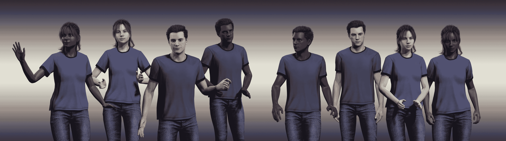
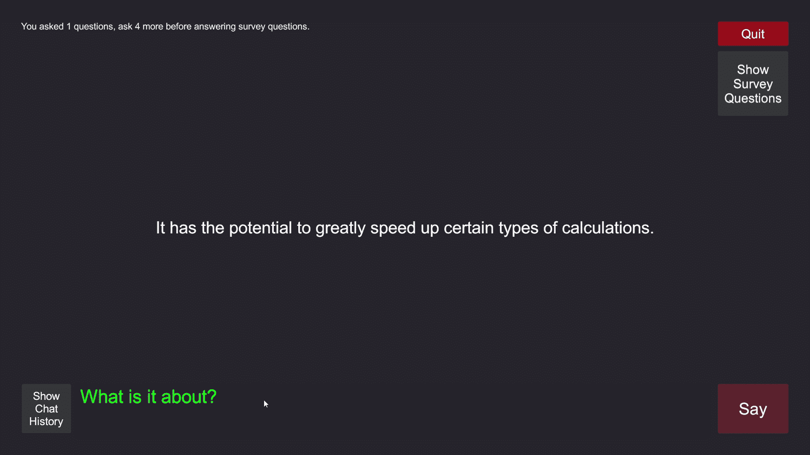
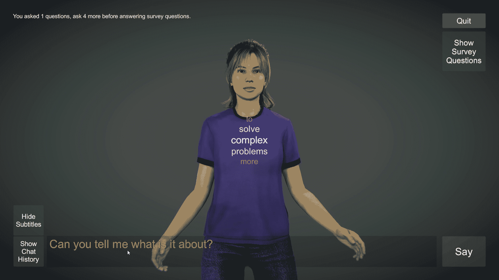
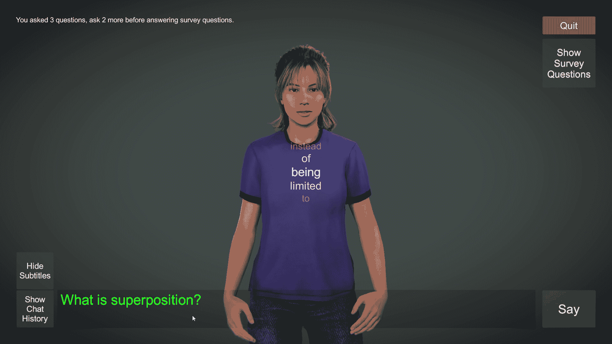
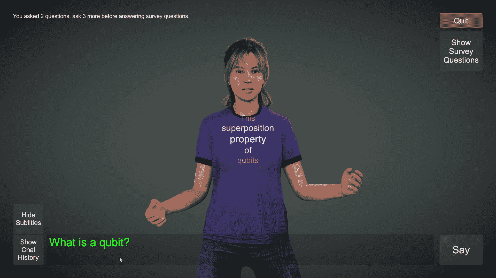
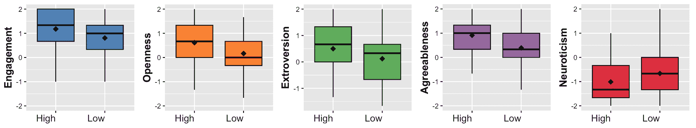

<!--yml

分类：未分类

日期：2025-01-11 12:25:02

-->

# 体现和个性表达对基于LLM的教育代理学习的影响

> 来源：[https://arxiv.org/html/2407.10993/](https://arxiv.org/html/2407.10993/)

Sinan Sonlu, Bennie Bendiksen, Funda Durupinar, Uğur Güdükbay 手稿接收日期：2024年6月19日；修订日期：2024年8月16日。S. Sonlu 和 U. Güdükbay 来自土耳其安卡拉比尔肯大学计算机工程系，电子邮件：sinan.sonlu@bilkent.edu.tr, gudukbay@cs.bilkent.edu.tr。B. Bendiksen 和 F. Durupinar 来自美国马萨诸塞大学波士顿分校计算机科学系，电子邮件：B.Bendiksen001@umb.edu, Funda.DurupinarBabur@umb.edu。

###### 摘要

本研究探讨了个性表现和体现如何影响教育对话代理中的个性感知和学习。我们通过整合针对教育应用的LLM驱动对话支持，扩展了现有的个性驱动对话代理框架。我们描述了一个基于该系统的用户研究，评估了两种不同的个性风格：高外向性和高宜人性，以及低外向性和低宜人性。对于每种个性风格，我们评估了三种模型：（1）仅通过对话传递个性的对话模型；（2）仅通过对话表达个性的动画人类模型；（3）通过对话及身体和面部动画表达个性的动画人类模型。结果表明，所有模型在个性和学习成果方面都得到了积极的评价。具有高个性特征的模型被认为比低个性特征的模型更具吸引力。我们根据参与者对模型类型和个性风格的评分，以及用户对开放性问题的回答，提供了对感知个性特征、学习参数和用户体验的全面定量和定性分析。

###### 索引词：

五大人格、生成式预训练变换器（GPT）、大规模语言模型（LLM）、对话代理、教学代理、对话、动画。^†^†出版编号：pubid: 0000–0000/00$00.00 © 2021 IEEE

## 1 引言

虚拟人类具有巨大的潜力，通过提供按需、个性化的学习体验来支持教育活动。它们的功能不仅仅是传递信息；它们可以与用户建立社交联系、建立融洽的关系，并激励他们[[1](https://arxiv.org/html/2407.10993v1#bib.bib1)]。随着大规模语言模型（LLMs）的发展，它们的潜力大大增强，能够有效地承担多种角色和个性，并提供关于任何话题的信息。具有LLM驱动对话功能的虚拟人类为具有不同偏好和需求的学习者提供量身定制的体验。

大量文献研究了教师个性如何影响有效学习和学生偏好[[2](https://arxiv.org/html/2407.10993v1#bib.bib2), [3](https://arxiv.org/html/2407.10993v1#bib.bib3), [4](https://arxiv.org/html/2407.10993v1#bib.bib4), [5](https://arxiv.org/html/2407.10993v1#bib.bib5)]。总体而言，所有具有积极意义的五大人格特征模型（FFM）[[6](https://arxiv.org/html/2407.10993v1#bib.bib6)]中的人格特质——开放性、宜人性、责任心、外向性和情绪稳定性（负面神经质）——在教育环境中起着重要作用[[7](https://arxiv.org/html/2407.10993v1#bib.bib7)]。然而，学生之间的个体差异[[3](https://arxiv.org/html/2407.10993v1#bib.bib3)]以及课程类型[[2](https://arxiv.org/html/2407.10993v1#bib.bib2)]决定了在特定场景中哪些个性特质更为有效。

研究表明，具象角色比其无形对应物更容易被认为是值得信赖的、更具吸引力和社会性的[[8](https://arxiv.org/html/2407.10993v1#bib.bib8)]。有研究报告称，具象教学代理能够提高学习动机和乐趣；然而，它们对知识获取的影响存在争议[[9](https://arxiv.org/html/2407.10993v1#bib.bib9), [10](https://arxiv.org/html/2407.10993v1#bib.bib10)]，因为它们也会增加认知负担并导致分心。

基于这些见解，我们探讨了虚拟代理的具象化和个性表达如何影响教育应用中的学习成果。本研究扩展了现有的个性驱动对话代理框架[[11](https://arxiv.org/html/2407.10993v1#bib.bib11)]，并结合基于大语言模型（LLM）的对话支持，量身定制以适应教育场景。在我们的应用中，用户通过输入问题与对话代理实时互动，代理则通过操作系统的语音合成功能进行语音回应。

作为系统的个性参数，我们选择了外向性与宜人性相结合的组合，因为先前的研究表明，这两个个性因素通过肢体语言和面部表情的表达比其他三种因素更为有效[[11](https://arxiv.org/html/2407.10993v1#bib.bib11)]。我们将其称为代理的“个性风格”，包括高特质和低特质的变体，分别对应高外向性-宜人性组合和低外向性-宜人性组合。前者表现为一个友好、活泼、充满活力的代理，旨在通过热情和温暖吸引用户；而后者则具有更加内敛和不太亲近的风格，互动可能会被认为不太吸引人，且显得更为正式。我们的系统通过对话文本和/或肢体和面部动画来表达个性。

我们创建了三个模型来评估具象化：一个仅有对话功能的模型和两个具有人形3D身体的模型。所有模型都同时显示对话文本并提供音频反馈。我们通过独立受试者的用户研究评估了不同模式和个性风格对学习的有效性。研究随机将每位参与者展示为每个模型的高或低个性变体。仅有对话功能的模型和一个具象化模型仅通过文本表达个性，另一个具象化模型则通过面部和身体动作以及视线表达个性。在研究过程中，我们收集了关于系统在学习、质量和参与度方面的评分，以及参与者对代理人个性的感知。此外，我们还通过开放式问题获得了用户反馈。

尽管系统参数被选择用来表达外向性和宜人性这两个个性维度，我们考虑到参与者对代理人个性的感知可能存在潜在变化。例如，一个高特质代理人也可能被视为情绪稳定、神经质低，或者一个仅有对话功能的代理人可能被认为是有责任心的，即使这些特质并未被特别强调。因此，我们收集了用户对三个模型中代理人在五个维度上的个性感知。

我们的目标是回答以下研究问题：

+   RQ1.

    个性风格是否会影响感知个性？

+   RQ2.

    模型类型是否会影响感知个性？

+   RQ3.

    模型类型是否会影响学习成果？

+   RQ4.

    学习成果与个性感知之间是否存在相关性？

基于以往研究的发现，我们提出以下假设：

+   H1.

    具象化代理人的学习成果将比仅有对话功能的代理人评分更高，这体现在H1a. 学习；H1b. 质量；H1c. 参与度的评分上。由于文献表明，具象化代理人比无形代理人获得更积极的评价，我们预计在我们的教育应用中也会出现类似的趋势。换句话说，具象化代理人在学习过程中会更具吸引力和效果[[10](https://arxiv.org/html/2407.10993v1#bib.bib10)]。

+   H2.

    表现出高外向性和宜人性的代理人在学习成果方面将比表现出低外向性和宜人性的代理人评分更高，这体现在H1a. 学习；H1b. 质量；H1c. 参与度的评分上。我们根据学生对教师个性的偏好以及用户对高宜人性聊天机器人的偏好文献，提出了这一假设[[12](https://arxiv.org/html/2407.10993v1#bib.bib12), [13](https://arxiv.org/html/2407.10993v1#bib.bib13)]。

除了通过定量分析调查这些问题外，我们还通过对参与者对开放性问题回答的深入定性分析，识别了参与者之间的共同主题和个体差异。此外，我们提供了一个开源虚拟辅导应用程序，系统内的虚拟代理通过动作和语言展现出期望的个性特征。我们的数据和代码可在我们的公共代码库中获得¹¹最终版本将提供代码库链接。

## 2 相关工作

涉及多个计算领域，本研究结合了教育代理的个性表现、基于大语言模型（LLM）的对话生成和对话代理系统。我们根据这些类别总结了相关工作，包括类似的教学代理研究。

### 2.1 教学代理

最早的教育计算机软件应用包括军事用途，如飞行模拟[[14](https://arxiv.org/html/2407.10993v1#bib.bib14)]。计算机的广泛使用为许多专注于教育的互动多媒体应用开辟了道路[[15](https://arxiv.org/html/2407.10993v1#bib.bib15)]。一种特殊形式的计算机辅助学习包括生动的教学代理，它们在多媒体环境中帮助学习和激励[[16](https://arxiv.org/html/2407.10993v1#bib.bib16)]。这些代理可以扮演教师、教练、辅导员或学习伙伴的角色[[17](https://arxiv.org/html/2407.10993v1#bib.bib17)]，并使用文本或语音输入与用户进行自然语言对话[[18](https://arxiv.org/html/2407.10993v1#bib.bib18)]。教学代理可以高效地模拟专家、激励者和导师等教学角色[[19](https://arxiv.org/html/2407.10993v1#bib.bib19)]。研究表明，类人代理能够影响学习者的成就、态度和学习保持[[20](https://arxiv.org/html/2407.10993v1#bib.bib20)]，并且比没有代理的学习方式提供了更有趣的整体学习体验[[21](https://arxiv.org/html/2407.10993v1#bib.bib21)]。

研究探讨了在教育环境中使用二维和三维代理的效果，揭示了它们对学习成果的不同影响。在某些情境下，二维代理可以在视觉上复杂的三维代理中脱颖而出[[22](https://arxiv.org/html/2407.10993v1#bib.bib22)]，因为它们减少了额外的认知负担并增强了多媒体学习的连贯性[[23](https://arxiv.org/html/2407.10993v1#bib.bib23)]。代理的高度拟人化可能会削弱社会共在感[[24](https://arxiv.org/html/2407.10993v1#bib.bib24)]，从而限制其教学效果[[25](https://arxiv.org/html/2407.10993v1#bib.bib25)]。相比之下，三维代理提供了更多的表情和手势，这可以提升学习和参与度[[26](https://arxiv.org/html/2407.10993v1#bib.bib26)]。尽管高度行为现实性在虚拟现实环境中增强了社会存在感，而三维代理在这种环境中特别有效，但它也可能对事实学习成果产生负面影响[[10](https://arxiv.org/html/2407.10993v1#bib.bib10)]。然而，现实教师的存在与学习和满意度的提高相关，从而促进了更好的信息回忆[[27](https://arxiv.org/html/2407.10993v1#bib.bib27)]。高度行为现实性的混合效应可能可以通过“恐怖谷效应”来解释[[28](https://arxiv.org/html/2407.10993v1#bib.bib28)]，即逼真但不完全像人类的代理会引起不适和不安。在机器人学中，将个性融入类人机器人已被证明能减少这些不适感，并增强整体用户体验[[29](https://arxiv.org/html/2407.10993v1#bib.bib29)]，这也可以应用于虚拟人类。

教学代理可以嵌入到不同的应用程序中，如基于文本的移动对话系统[[30](https://arxiv.org/html/2407.10993v1#bib.bib30)]、协作严肃游戏[[31](https://arxiv.org/html/2407.10993v1#bib.bib31)]、多代理智能辅导系统[[32](https://arxiv.org/html/2407.10993v1#bib.bib32)]、协作增强现实环境[[33](https://arxiv.org/html/2407.10993v1#bib.bib33)]和人工智能支持的远程学习[[34](https://arxiv.org/html/2407.10993v1#bib.bib34)]。在机器人教育代理中，口头提示比非语言提示在提高参与度方面更为有效[[35](https://arxiv.org/html/2407.10993v1#bib.bib35)]。通过面部表情和身体动作表达各种情感，可以吸引不同类型的学习者，这在动画教学代理中尤为重要[[36](https://arxiv.org/html/2407.10993v1#bib.bib36)]。教学代理已被应用于教授广泛的学科，包括STEM[[37](https://arxiv.org/html/2407.10993v1#bib.bib37)]、外语[[38](https://arxiv.org/html/2407.10993v1#bib.bib38)]、历史[[39](https://arxiv.org/html/2407.10993v1#bib.bib39)]以及职业培训[[40](https://arxiv.org/html/2407.10993v1#bib.bib40)]。学习、参与度、人类相似性、可信度和个性可以作为教学代理的心理测量结构的度量[[41](https://arxiv.org/html/2407.10993v1#bib.bib41)]。

### 2.2 代理中的个性表达

多模态的沟通元素对于在数字角色中表达期望的个性特征至关重要。非语言行为元素通常用于情感虚拟代理中，以传达这些特征[[42](https://arxiv.org/html/2407.10993v1#bib.bib42)、[43](https://arxiv.org/html/2407.10993v1#bib.bib43)、[44](https://arxiv.org/html/2407.10993v1#bib.bib44)、[45](https://arxiv.org/html/2407.10993v1#bib.bib45)]。研究利用运动的高层次意义来表达目标个性类型[[46](https://arxiv.org/html/2407.10993v1#bib.bib46)]。例如，PERFORM建立了Laban运动分析（LMA）参数与虚拟人类角色的感知个性之间的联系[[47](https://arxiv.org/html/2407.10993v1#bib.bib47)]。除了身体运动，个性化的声音、对话和面部表情有助于在表现力强的对话代理中区分个性特征[[11](https://arxiv.org/html/2407.10993v1#bib.bib11)]。最新的研究表明，外观和运动显著影响某些特征的表达，如宜人性和神经质[[48](https://arxiv.org/html/2407.10993v1#bib.bib48)]。

角色的渲染风格也会影响个性感知[[49](https://arxiv.org/html/2407.10993v1#bib.bib49)]。例如，卡通风格的角色通常被认为更加友善，而渲染风格不吸引人、看起来不太健康的角色则被认为好争吵且缺乏同情心[[50](https://arxiv.org/html/2407.10993v1#bib.bib50)]。此外，动画的逼真度[[51](https://arxiv.org/html/2407.10993v1#bib.bib51)]、面部模型[[52](https://arxiv.org/html/2407.10993v1#bib.bib52)]、身体形态[[53](https://arxiv.org/html/2407.10993v1#bib.bib53), [54](https://arxiv.org/html/2407.10993v1#bib.bib54)]、服装、环境以及面部表情[[55](https://arxiv.org/html/2407.10993v1#bib.bib55)]，还包括虚拟角色的皮肤纹理和视角[[56](https://arxiv.org/html/2407.10993v1#bib.bib56)]，都会对感知的个性产生影响。在多智能体场景中，智能体之间的互动和接近度是个性感知的重要指标[[57](https://arxiv.org/html/2407.10993v1#bib.bib57), [58](https://arxiv.org/html/2407.10993v1#bib.bib58), [59](https://arxiv.org/html/2407.10993v1#bib.bib59)]，以及情感群体动态[[59](https://arxiv.org/html/2407.10993v1#bib.bib59)]。在程序化故事生成中的行动选择也能表达不同的个性类型[[60](https://arxiv.org/html/2407.10993v1#bib.bib60), [61](https://arxiv.org/html/2407.10993v1#bib.bib61)]。一个智能体的感知个性极大地影响用户与系统的互动；例如，用户更愿意信任和听从看起来严肃且果断的智能体[[62](https://arxiv.org/html/2407.10993v1#bib.bib62)]。

人类的手势在沟通中具有高度的表现力[[63](https://arxiv.org/html/2407.10993v1#bib.bib63)]；特定的手部动作可以传达不同的个性[[64](https://arxiv.org/html/2407.10993v1#bib.bib64)]。手势表现与语言结合，对感知个性有很大的影响[[65](https://arxiv.org/html/2407.10993v1#bib.bib65)]。语言元素，如短语的比例、情感和认知的词汇，以及感叹词，与明显的个性特征相关[[66](https://arxiv.org/html/2407.10993v1#bib.bib66), [67](https://arxiv.org/html/2407.10993v1#bib.bib67)]。通过社交媒体信息的文本输入[[68](https://arxiv.org/html/2407.10993v1#bib.bib68), [69](https://arxiv.org/html/2407.10993v1#bib.bib69)]，语音[[70](https://arxiv.org/html/2407.10993v1#bib.bib70), [71](https://arxiv.org/html/2407.10993v1#bib.bib71)]，面部表情[[72](https://arxiv.org/html/2407.10993v1#bib.bib72)]，步态特征[[73](https://arxiv.org/html/2407.10993v1#bib.bib73)]和身体运动特征[[74](https://arxiv.org/html/2407.10993v1#bib.bib74)]，都可以进行自动化的个性评估。总体而言，不同的沟通元素有助于感知数字角色的个性，而多模态方法往往能产生更好的结果[[75](https://arxiv.org/html/2407.10993v1#bib.bib75), [76](https://arxiv.org/html/2407.10993v1#bib.bib76), [77](https://arxiv.org/html/2407.10993v1#bib.bib77)]。

像GPT这样的LLM展示了一致的个性特征[[78](https://arxiv.org/html/2407.10993v1#bib.bib78)]，并且可以通过提示进行个性化定制[[79](https://arxiv.org/html/2407.10993v1#bib.bib79)]，正如我们在这项工作中所做的那样。分析表明，词汇选择和生成文本的长度对这一点有影响[[80](https://arxiv.org/html/2407.10993v1#bib.bib80)]。数据驱动的个性估算系统能够预测不同的个性类型，当生成的文本使用特定的提示时[[81](https://arxiv.org/html/2407.10993v1#bib.bib81), [82](https://arxiv.org/html/2407.10993v1#bib.bib82)]，这支持了LLM在捕捉语言中的个性特征方面的成功。

### 2.3 基于LLM的智能体

LLMs涵盖了许多应用，包括基于自然语言的人机交互[[78](https://arxiv.org/html/2407.10993v1#bib.bib78)]。LLMs的兴起为创建和填充数字世界开辟了新途径。例如，语言模型可以用于生成和动画化3D虚拟形象[[83](https://arxiv.org/html/2407.10993v1#bib.bib83)]，安排运动[[84](https://arxiv.org/html/2407.10993v1#bib.bib84)]，控制面部表情和身体动作风格[[85](https://arxiv.org/html/2407.10993v1#bib.bib85)]，驱动游戏中非玩家角色的行为[[86](https://arxiv.org/html/2407.10993v1#bib.bib86), [85](https://arxiv.org/html/2407.10993v1#bib.bib85)]，以及自动化和完善数字故事讲述[[87](https://arxiv.org/html/2407.10993v1#bib.bib87)]。3D场景可以被注入到LLMs中，用于字幕生成、3D问答和导航任务[[88](https://arxiv.org/html/2407.10993v1#bib.bib88)]；模型可以描述或比较3D场景中的物体[[89](https://arxiv.org/html/2407.10993v1#bib.bib89)]。

大型语言模型（LLMs）在创新教育技术中也开始发挥关键作用[[90](https://arxiv.org/html/2407.10993v1#bib.bib90)]。例如，LLMs与语音代理结合使用，在增强现实（AR）环境中帮助学生学习外语[[91](https://arxiv.org/html/2407.10993v1#bib.bib91)]。类似地，在医疗保健领域，LLMs提升了患者在咨询、诊断和管理过程中的体验[[92](https://arxiv.org/html/2407.10993v1#bib.bib92)]。尽管利用LLMs的对话系统能够生成高度复杂的回答，但它们无法访问动态的实时数据，如当前日期[[93](https://arxiv.org/html/2407.10993v1#bib.bib93)]。因此，基于LLM的代理系统通常专注于孤立任务，例如基于已有知识回答问题。为了实现更具上下文感知的对话，可以实施增强LLM记忆的额外机制[[94](https://arxiv.org/html/2407.10993v1#bib.bib94)]。在本研究中，我们使用LLM生成教育性回答，针对特定的计算机学科，应用于教育环境中。

### 2.4 对话代理

对话代理旨在通过整合计算语言学技术来解释和回应用户的自然语言陈述[[95](https://arxiv.org/html/2407.10993v1#bib.bib95)]。理解并展示情感和个性对于成功的自然语言对话至关重要[[96](https://arxiv.org/html/2407.10993v1#bib.bib96)]。例如，相同的查询可能需要根据用户当前的情绪进行不同的解释，同样，基于代理当前的肢体语言和面部表情，相同的回答可能会被不同地感知。能够为用户问题提供相关答案的对话系统被认为更具人性化且更具吸引力[[97](https://arxiv.org/html/2407.10993v1#bib.bib97)]。动画和行为的真实感对于具有视觉表现的代理至关重要[[98](https://arxiv.org/html/2407.10993v1#bib.bib98)]。因此，研究将手势动画与语音结合[[99](https://arxiv.org/html/2407.10993v1#bib.bib99)，[100](https://arxiv.org/html/2407.10993v1#bib.bib100)]。基于深度学习的共同语音动画生成系统能够生成高度逼真的结果[[101](https://arxiv.org/html/2407.10993v1#bib.bib101)，[102](https://arxiv.org/html/2407.10993v1#bib.bib102)，[103](https://arxiv.org/html/2407.10993v1#bib.bib103)，[104](https://arxiv.org/html/2407.10993v1#bib.bib104)]，生成的动画可以在特定帧中展示所需的姿势和风格[[105](https://arxiv.org/html/2407.10993v1#bib.bib105)]。面部表情对于创造逼真的体验也至关重要。例如，模仿用户面部表情的代理能够提供可信且富有同情心的对话[[106](https://arxiv.org/html/2407.10993v1#bib.bib106)]。对话代理可以接受多种输入刺激，包括用户的凝视[[107](https://arxiv.org/html/2407.10993v1#bib.bib107)]、语音和面部表情[[106](https://arxiv.org/html/2407.10993v1#bib.bib106)]、结构化或自然语言文本[[108](https://arxiv.org/html/2407.10993v1#bib.bib108)]。在本研究中，我们输入了来自参与者的自然语言文本，以保持系统要求的最小化，其他模态留待未来工作中进一步探讨。

## 3 方法

本节描述了一项用户研究，旨在测试不同模态和个性对学习和个性认知因素的影响。为此，我们设计了一个应用程序，使用对话代理通过轮流对话教授用户选择的复杂主题²²2Bilkent大学伦理委员会批准了该研究，批准决策号为2023_11_05_01。

### 3.1 系统

为了开展我们的研究，我们更新了Sonlu等人开发的个性驱动对话代理平台[[11](https://arxiv.org/html/2407.10993v1#bib.bib11)]，这是一个开源的、多模态系统，用于为3D对话虚拟代理提供动画支持。该平台运行在Unity[[109](https://arxiv.org/html/2407.10993v1#bib.bib109)]上，控制多种模态，如对话、面部表情和身体动作，这些模态基于输入的个性进行调整。身体运动控制包括通过关节旋转和动画速度调整、噪声添加以及基于逆向运动学的手势变化来修改给定的动画片段，这些变化遵循在PERFORM中定义的LMA映射[[47](https://arxiv.org/html/2407.10993v1#bib.bib47)]。面部动画涉及说话时的嘴部动作、与神经质相关的频繁眨眼，并通过更新混合形状来表达与特定个性因素相关的情感。面部表情是根据面部动画控制系统（FACS）[[110](https://arxiv.org/html/2407.10993v1#bib.bib110)]设计的，嘴部动作通过Oculus LipSync[[111](https://arxiv.org/html/2407.10993v1#bib.bib111)]处理，并与3D模型的面部混合形状进行定制映射。输入的个性决定了代理的默认面部表情。例如，一个和蔼的代理在每次对话时通常会微笑，随着时间的推移，微笑会减弱。我们使用Reallusion Character Creator[[112](https://arxiv.org/html/2407.10993v1#bib.bib112)]为当前研究设计了3D人类模型。为了引入多样性，我们创建了四个角色：两个女性和两个男性，每个角色都有浅色和深色的肤色，如图[1](https://arxiv.org/html/2407.10993v1#S3.F1 "图 1 ‣ 3.1 系统 ‣ 3 方法 ‣ 具身性和个性表现对基于LLM的教育代理学习的影响")所示。

图 1：研究中使用的不同3D代理模型，展示了高（左组）和低（右组）特质的表现。

我们更新后的系统与现有的个性驱动平台在处理对话的方式上有所不同。之前的工作使用了 IBM Watson Assistant [[113](https://arxiv.org/html/2407.10993v1#bib.bib113)] 从用户查询中提取意图，并将其映射到特定领域的手工对话线路上。而本工作通过基于 LLM 的文本生成模型 GPT-3.5 Turbo [[114](https://arxiv.org/html/2407.10993v1#bib.bib114)] 替代了对话逻辑，并借助 OpenAI 的 Chat Completions API，不再需要手工编写对话内容。当用户输入提示（例如提问）时，系统返回与输入个性描述一致的回答。我们将输出文本的令牌数量限制为 750，以保持对话简洁。与之前使用 Watson Text-to-Speech API 进行语音生成的旧平台不同，我们当前的系统使用 Microsoft® 文本转语音功能，几乎立即回应并朗读代理的回答。这个本地解决方案还让我们能够确定当前正在发音的单词，用于显示部分字幕。由于生成的回答可能相当长，我们采取了动态方式，在具备视觉表示的模型中，展示以当前发音单词为中心的五个单词。默认情况下，字幕会开启，但用户可以在 3D 代理模型中禁用字幕，如果他们觉得字幕分散注意力。

我们使用了 0.9 的温度值，以促进 GPT 输出多样化的结果，同时保持信息的可靠性。温度值大于 1 会引入创造力；然而，它们也可能导致幻觉，与教育系统的目标相冲突。Chat Completions API 输入的“messages”参数由消息对象组成，其中每个对象都有“system”、“user”或“assistant”角色，并包含内容。对于“system”角色，我们根据不同的代理个性和教学主题提供以下输入消息：

+   •

    {“role”: “system”, “content”: 扮演一位外向的教师，讲解关于 $<$topic$>$ 的内容，提供友好且有礼貌的回答。}

+   •

    {“role”: “system”, “content”: 扮演一位内向的教师，讲解关于 $<$topic$>$ 的内容，提供简短且不友好的回答。}

为了生成代理的回应，系统发送角色提示，并附上最近的五条对话消息，这些消息在用户和助手之间交替：{“role”: “user / assistant”, “content”: $<$ message $>$} 我们将消息数量限制为五条，以降低成本，消除上下文漂移，并防止操控。这一限制有助于防止通过长期交互改变语言模型的感知 [[115](https://arxiv.org/html/2407.10993v1#bib.bib115)]。

### 3.2 刺激

我们设计了一个 $3\times 2$ 独立学科研究，用于对三种模型——D、A 和 E——进行比较分析，每个模型都测试了不同的宜人性-外向性组合的高低值。模型 D 是仅对话设置，其中系统的回答以句子为单位同时显示在屏幕上，并伴有音频播放。模型 A 包括一个代理的动态 3D 模型，该模型在四个替代品中随机选择（两个男性，两个女性，每个都有深浅不同的肤色）。模型 A 涉及没有任何基于个性的虚拟人类动画。在模型 D 和 A 中，个性仅通过合成对话传达。模型 E 与模型 A 类似，但额外通过面部和身体动作表现个性。

在模型 E 中，表现出高外向性和宜人性组合的动作涉及间接空间、轻重量和自由流动的 LMA 参数[[47](https://arxiv.org/html/2407.10993v1#bib.bib47)]。这些对应于多焦点空间注意力、精细的上升运动和不受控制且流畅的动作。由于高外向性和宜人性与相反的时间努力（突然、紧急 vs. 持续、拖延）相关，我们保持了动画中的时间组件不变。表达低外向性和宜人性的动画涉及直接空间、强重量、受限流动和中性时间，对应于单一焦点、沉重且受控的动作。高度外向且宜人的代理的默认面部表情是放松且快乐的，偶尔会微笑并进行直接眼神交流。相比之下，特征较低的代理默认表现出更紧张的表情。低特征的代理还会避免与观众的眼神接触。

图[2](https://arxiv.org/html/2407.10993v1#S3.F2 "图2 ‣ 3.2 刺激 ‣ 3 方法 ‣ 在基于LLM的教育代理中，体现与个性表达对学习的影响")展示了不同模型的截图。我们使用模型名称并标明其表现出高或低特征来命名每个系统的变体。例如，E-High指的是使用文本和动画提示表达高特征个性的变体。请注意，由于模型A和D在高低变体下的视觉相似性，我们只展示了它们的单一图像。对于图[2(b)](https://arxiv.org/html/2407.10993v1#S3.F2.sf2 "图2 ‣ 3.2 刺激 ‣ 3 方法 ‣ 在基于LLM的教育代理中，体现与个性表达对学习的影响")中的动画，E-Low变体的手部靠近身体，姿势略微倾斜（图[2(c)](https://arxiv.org/html/2407.10993v1#S3.F2.sf3 "图2 ‣ 3.2 刺激 ‣ 3 方法 ‣ 在基于LLM的教育代理中，体现与个性表达对学习的影响")），而E-High变体的手部离身体较远，姿势更加挺拔（图[2(d)](https://arxiv.org/html/2407.10993v1#S3.F2.sf4 "图2 ‣ 3.2 刺激 ‣ 3 方法 ‣ 在基于LLM的教育代理中，体现与个性表达对学习的影响")）。

(a) 模型D

(b) 模型A

(c) 模型E-Low

(d) 模型E-High

图2：来自不同模型及其变体的示例截图。

### 3.3 研究设计

该研究涉及一个教育应用，其中有一个对话代理帮助用户学习复杂的主题。我们向参与者展示了六个选项，并要求他们选择最不熟悉的主题。主题包括量子计算、区块链技术、变压器架构、量子力学、弦理论和广义相对论。选择的主题被提供给GPT模型，作为系统角色提示的一部分，用于引导集中的对话。该应用要求参与者至少向代理提问五个问题以学习该主题。参与者可以提问的问题数量没有上限。完成提问后，参与者可以继续回答调查问卷中的问题。他们可以随时回顾调查问题或聊天记录。

调查问题分为两组。第一组包括27个问题，采用5点Likert量表，其中15个问题通过使用大五人格清单的简短版本（Big Five Inventory–2 (BFI-2-XS)）[[116](https://arxiv.org/html/2407.10993v1#bib.bib116)]来衡量参与者对代理人个性的感知，另外12个问题使用学习对象评估量表（Learning Object Evaluation Scale for Students (LOES-S)）[[117](https://arxiv.org/html/2407.10993v1#bib.bib117)]来衡量自我评估的学习、质量和参与度。在LOES-S中，学习相关问题是关于自我评估的学习效果，以及学习对象（即工具）在教授新概念方面的帮助程度。质量评估包括教学设计、易用性、组织性和帮助功能。参与度评估则衡量参与者对工具的喜爱程度以及是否觉得该工具具有激励性。

第二组问题要求开放式回答，以便获取详细的参与者反馈。开放式问题的回答没有字符限制。完成两组问题后，参与者会被引导到用户研究完成页面，并在该页面上收到一个任务批准的链接。

### 3.4 参与者

我们使用众包服务Prolific来招募参与者。在进行研究之前，每位参与者都会被引导到一个网站，测试他们是否已安装正确的语音合成包。只有那些符合系统配置要求的参与者才能继续进行研究。共有210名独立参与者（99名女性，95名男性，16名未指定性别）对我们的系统进行了评分，每个替代方案由35名参与者评估，这为主要效应及其交互效应提供了中等效应大小（Cohen’s $f=0.26$）以及$0.80$的统计功效，显著性水平为$0.05$，使用独立样本方差分析（ANOVA）。

每位参与者仅与一个版本的系统互动，平均互动时间为$19.74\pm 9.25$分钟。这个时间不包括介绍环节，在介绍期间，参与者会阅读任务相关信息并下载应用程序，但包括了回答调查问题的时间。参与者的平均年龄为$28.80\pm 8.57$。输入Prolific ID后，参与者会看到一条介绍信息，说明研究的详细信息。我们向参与者说明了收集的数据及研究的目标是衡量系统的表现；并强调研究并不旨在衡量他们的知识水平。

## 4 定量分析

### 4.1 数据组织与探索性分析

BFI-2-XS 包含每个性格因素的三个问题，其中一半与所测量的维度呈反比。回答被赋予整数值，采用 5 点 Likert 量表，范围从 -2 到 2。我们计算了这些值的符号和，以得出介于 -6 到 6 之间的人格分数，然后将其重新缩放到 $[-2,2]$ 范围内。类似地，LOES-S 包含五个问题用于衡量学习，四个问题用于衡量质量，三个问题用于衡量学习对象的参与度。我们计算了每种测量类型的总和，并将相应的范围映射到 $[-2,2]$ 以报告相应的均值。

在探索性分析中，我们展示了每个模型在感知人格和 LOES-S 学习、质量和参与度得分方面的箱型图（参见图 [3](https://arxiv.org/html/2407.10993v1#S4.F3 "Figure 3 ‣ 4.1 Data Organization and Exploratory Analysis ‣ 4 Quantitative Analysis ‣ The Effects of Embodiment and Personality Expression on Learning in LLM-based Educational Agents")）。这些图表显示，在所有模型中，开放性、责任心、外向性和宜人性有较高的均值得分，而神经质的均值得分较低。各模型在责任心方面的得分尤其高。图表还显示了学习、质量和参与度的高得分，且高人格变化的模型在参与度上的均值得分略高于低人格变化的模型。我们还可以观察到，模型 E-High 紧随其后的是 A-High，表现出比其他模型更好地展现高责任心、高宜人性和低神经质特征。在下一部分，我们将进行描述性分析，以识别模型和人格风格对输出变量可能产生的统计学显著影响。

图 3：每种变化的 BFI-2-XS 和 LOES-S 得分箱型图。

### 4.2 模型和人格风格对学习成果和人格感知的影响

为了研究模型类型（D、A 和 E）与人格风格（高或低）对学习成果和感知人格因素的影响，我们进行了七个双因素方差分析（ANOVA）模型和一个非参数替代模型（Welch’s ANOVA）。由于 Bartlett 检验表明方差不齐，采用 Welch’s ANOVA 来评估 LOES-S 在模型类型和人格风格下的质量得分。

除了将模型类型和个性风格作为单一因素结合的非参数模型外，所有其他模型均分别考察了模型类型和个性风格对结果均值的影响，以及这些因素之间可能的交互作用。通过平衡且足够大的样本量（$n{=}35$），覆盖所有因素组合，并且Bartlett检验表明各因素水平的方差相等，除了质量外，所有结果都适合进行ANOVA建模。为了控制整体误差率为$0.05$，我们采用Hommel方法对所有模型项进行多重检验调整，包括一项事后分析。与保守的Bonferroni修正不同，Hommel方法提供了更高的统计功效。表[I](https://arxiv.org/html/2407.10993v1#S4.T1 "TABLE I ‣ 4.2 The Effects of Model and Personality Styles on Learning Outcomes and Personality Perception ‣ 4 Quantitative Analysis ‣ The Effects of Embodiment and Personality Expression on Learning in LLM-based Educational Agents")展示了所有ANOVA运行的显著项，在多重检验修正前后。调整后的ANOVA检验返回了个性风格对参与度（$F=9.502,p=0.0421$）、开放性（$F=4.474,p=0.00178$）、外向性（$F=10.148,p=0.03006$）、宜人性（$F=25.541,p=0.0000211$）和神经质（$F=9.708,p=0.0378$）等结果的显著主效应。尽管责任心最初对个性风格呈现出显著影响（$F=5.68,p=0.0181$），但该项在多重检验修正后统计学显著性下降。模型类型的主效应最初对神经质呈现显著影响，但在Hommel程序后该效应不再显著（$p=0.417$）。统计学显著效应的箱线图展示在图[4](https://arxiv.org/html/2407.10993v1#S4.F4 "Figure 4 ‣ 4.2 The Effects of Model and Personality Styles on Learning Outcomes and Personality Perception ‣ 4 Quantitative Analysis ‣ The Effects of Embodiment and Personality Expression on Learning in LLM-based Educational Agents")中。

代理人性别和肤色不在假设范围内，因此我们从四种不同外观的3D代理人模型中随机选择了一个，同时该模型的外观也决定了代理人的声音，以支持多样性。我们未观察到代理人性别或肤色的显著影响，这也验证了之前的研究[[22](https://arxiv.org/html/2407.10993v1#bib.bib22)]。

表I：关于模型类型和个性风格对学习成果和感知个性的影响的双因素ANOVA显著发现（$n=210$）。调整后$p$值显著的因素（$p<0.05$）以**粗体**突出显示。

| 结果 | 因素 | F | p值 | 调整后的p值 |
| --- | --- | --- | --- | --- |
| 参与度 | 个性风格 | 9.502 | 0.002 | 0.042 |
| 开放性 | 个性风格 | 4.474 | $<0.001$ | 0.002 |
| 责任心 | 人格风格 | 5.68 | 0.018 | 0.290 |
| 外向性 | 人格风格 | 10.148 | 0.002 | 0.031 |
| 宜人性 | 人格风格 | 25.541 | $<0.001$ | $<\textbf{0.001}$ |
| 神经质 | 人格风格 | 9.708 | 0.002 | 0.038 |
| 神经质 | 模型类型 | 3.681 | 0.027 | 0.417 |

图 4：具有统计显著效应的箱型图。

### 4.3 个性因素与学习成绩之间的相关性

我们在表[II](https://arxiv.org/html/2407.10993v1#S4.T2 "TABLE II ‣ 4.3 Correlations between Personality Factors and Learning Scores ‣ 4 Quantitative Analysis ‣ The Effects of Embodiment and Personality Expression on Learning in LLM-based Educational Agents")中报告了LOES-S与个性因素之间的皮尔逊相关性。一般来说，相关系数高于$0.4$被认为是中等相关。感知开放性、责任心、外向性和宜人性都与LOES-S分数呈正相关，尽管有些较弱。最高的相关性是责任心，尤其是对于模型 D。质量和参与度分数强烈相关（$>0.6$），学习与之呈中等相关，接近强相关的阈值。对于模型 D，开放性和宜人性与所有学习参数也有中等相关性。总体而言，参与度与所有因素的相关性中等，除了神经质。表现出来的神经质与每个参数呈弱反比，但其唯一的统计学显著相关性是模型 D 的学习与模型 A 的质量。对于模型 D，相关性最强，模型 E 最弱。

表 II：每个模型的学习、质量和参与度测量与每个个性因素的皮尔逊相关性（$r$）。^∗表示$p<0.05$，^(**）表示$p<0.001$。单元格颜色表示从弱到强的相关性过渡。

| 模型 | Corr. | O | C | E | A | N |
| --- | --- | --- | --- | --- | --- | --- |
| D | $r_{\textit{Le}}$ | $.422^{**}$ | $.582^{**}$ | $.396^{**}$ | $.446^{**}$ | $-.349^{*}$ |
| $r_{\textit{Qu}}$ | $.437^{**}$ | $.654^{**}$ | $.279^{*}$ | $.325^{*}$ | $-.190$ |
| $r_{\textit{En}}$ | $.417^{**}$ | $.608^{**}$ | $.287^{*}$ | $.422^{**}$ | $-.109$ |
| A | $r_{\textit{Le}}$ | $.351^{*}$ | $.348^{*}$ | $.456^{**}$ | $.398^{**}$ | $-.208$ |
| $r_{\textit{Qu}}$ | $.215$ | $.378^{*}$ | $.204$ | $.150$ | $-.425^{**}$ |
| $r_{\textit{En}}$ | $.504^{**}$ | $.332^{*}$ | $.505^{**}$ | $.541^{**}$ | $-.233$ |
| E | $r_{\textit{Le}}$ | $.266^{*}$ | $.405^{**}$ | $.281^{*}$ | $.184$ | $-.046$ |
| $r_{\textit{Qu}}$ | $.334^{*}$ | $.133$ | $.056$ | $.305^{*}$ | $-.054$ |
| $r_{\textit{En}}$ | $.401^{**}$ | $.353^{*}$ | $.389^{**}$ | $.353^{*}$ | $-.052$ |

## 5 定性分析

### 5.1 数据

我们向参与者提出了以下开放性问题，以获得深入反馈：

1.  1.

    基于你与系统的对话，$<$topic$>$是什么？

1.  2.

    为什么 $<$topic$>$ 重要，请简要讨论。

1.  3.

    在与系统对话后，你是否学到了关于 $<$topic$>$ 的新知识？如果是，你学到了什么？

1.  4.

    你认为系统的行为对你的学习体验产生了影响吗？

1.  5.

    请简要描述你与系统的对话。它有趣吗？你遇到了什么问题吗？

两位独立研究员对每个主题的回答进行了至少 95% 的一致性标记。主题的确定基于以下标准：

+   1

    对学习体验的益处/无益：关于第三个和第四个问题，该主题反映了系统行为对参与者学习体验的影响。

+   2

    学习/未学习：关于第三个问题，该主题捕捉参与者在与系统互动后是否学到任何新知识。

+   3

    有趣/无趣：关于第五个问题，该主题考虑参与者是否认为系统有趣。

+   4

    真实感/机器人感/差劲的声音：该主题基于对第四个和第五个问题的回答，捕捉系统的整体类人程度。在某些情况下，参与者仅评论了系统的声音，该声音使用了较不成熟的本地解决方案来支持即时响应；否则，参与者的反馈集中在智能体的整体形象上。

+   5

    详细/适中/简短回答：关于第一和第二个问题的回答，该主题捕捉回答的详细程度。尽管这可能强烈依赖于参与者的特点，但系统的行为也可能导致他们调整回答的详细程度。这些回答也可能依赖于参与者的学习情况；了解得越少，回答就越简短。我们将回答标记为详细或简短；其余的回答则被视为适中。

表格 [III](https://arxiv.org/html/2407.10993v1#S5.T3 "TABLE III ‣ 5.1 Data ‣ 5 Qualitative Analysis ‣ The Effects of Embodiment and Personality Expression on Learning in LLM-based Educational Agents") 展示了每个变体的主题数量。以下小节将重点介绍每个主题，并附有参与者的引用。每个引用的末尾，我们会标明参与者的 ID 作为参考，并注明参与者互动的变体。我们仅修正了部分回答中的拼写错误，以提高可读性。

表格 III：主题分析结果，其中的数字表示每个变体中每个主题的出现次数。单元格颜色表示每个变体中 35 个参与者答案的低到高过渡。

| 变体 | D-低 | D-高 | A-低 | A-高 | E-低 | E-高 |
| --- | --- | --- | --- | --- | --- | --- |
| 益处 | $15$ | $19$ | $17$ | $22$ | $19$ | $21$ |
| 无益 | $9$ | $4$ | $8$ | $6$ | $8$ | $7$ |
| 学习 | $23$ | $25$ | $21$ | $26$ | $25$ | $29$ |
| 未学习 | $6$ | $6$ | $5$ | $2$ | $7$ | $2$ |
| 有趣 | $15$ | $22$ | $19$ | $20$ | $21$ | $20$ |
| 不感兴趣 | $3$ | $2$ | $0$ | $1$ | $2$ | $1$ |
| 真实 | $0$ | $3$ | $2$ | $3$ | $1$ | $4$ |
| 机器人 | $1$ | $1$ | $6$ | $5$ | $5$ | $3$ |
| 声音差 | $9$ | $5$ | $3$ | $6$ | $2$ | $3$ |
| 详细回答 | $2$ | $9$ | $2$ | $6$ | $8$ | $4$ |
| 中等回答 | $10$ | $10$ | $10$ | $8$ | $10$ | $20$ |
| 简短回答 | $23$ | $16$ | $23$ | $21$ | $17$ | $11$ |

### 5.2 好处

基于代理的教育系统的一个主要目标是通过提供有用的学习体验，促进自我导向学习。积极地让个体参与学习，帮助他们比仅通过阅读或观看材料的被动学习更深入地理解主题内容[[118](https://arxiv.org/html/2407.10993v1#bib.bib118)]。这种互动方式在人类教师中自然存在，教师能够迅速解答学习者的问题。我们要求参与者通过提问来积极参与，以重现这种动态并防止被动学习。

大多数参与者表示系统的行为改善了他们的学习体验；他们强调，由于有了类人的代理人，参与感得到了提升：“有一个人类化身比空白屏幕或其他形式的表现方式更能吸引人。”– P3（A-High）。即便是在只有对话的变化中，互动也使得体验更加愉快：“我觉得使用这个系统学习比我自己读书或用Google查找时更有趣。”– P21（D-High）。能够使用自然语言提问并获得直接的答案，也被一些参与者认为是有益的：“它让我节省了查找特定术语并阅读长篇文章的时间，直接给我提供了关键点，帮助我快速理解。”– P17（E-High）。与非人类系统的类人互动可以帮助焦虑的人体验互动学习：“这很有用，我想使用它，因为它能帮助那些焦虑的人放松。”– P27（E-High）。

然而，人工教师通常会简化材料以促进更容易的学习，而这对于语言模型来说，由于用户反馈有限，可能很难模拟：“我认为系统提供的信息量很大，影响了我的学习。然而，信息量太大，一次性处理不了，导致我的思维变得混乱。” – P30 (A-High)。那些报告未从系统中获益的参与者通常提到答案的难度：“我本可以在维基百科或谷歌上学到更多。系统的答案对我来说太难理解了。” – P169 (D-Low)。尽管高特征模型通常被认为更有益，但一些参与者指出它们的回答过于冗长：“回答很长，有时太长。它说的一些东西可以省略，因为没有提供任何有用的信息；只是一些‘附加说明’。我也阅读得很快，所以等待它停止说话有点无聊。除此之外，体验非常积极。” – P42 (D-High)。

除了长度，高低变体之间的一个主要区别是LLM的词汇选择。高特征变体使用激励性语言，支持学习者，而不仅仅是给出答案：“是的，系统有一种激励性的语气，激发了我学习我完全不了解的事物的动力。” – P37 (D-High)。这样的语言有助于创造更具互动性和激励性的体验：“是的，我喜欢易于学习的解释，也喜欢‘那的确是个极好的问题’这种激励性部分。” – P106 (D-High)。参与者还将系统称为友好（P50 和 P150, A-High）和礼貌（P209, D-High）。另一方面，低特征变体使用较短的句子，有些用户更喜欢这种风格：“它本身并不有趣；然而，它非常有信息量，直截了当。” – P2 (E-Low)。特别是低特征变体的内向语言[[66](https://arxiv.org/html/2407.10993v1#bib.bib66)]，可能影响到相对简短而简单的回答：“对话简单而快捷。代理给我提供了简短而简单的答案，易于理解。” – P170 (E-Low)。

参与者发现具有具象代理的变体稍微更有益且更有趣。特别是，他们报告了具象人类代理对高特质变体的积极影响：“有点，看到一个类人面孔让记忆信息变得更容易”——P163（A-低）。 “与类人实体互动比读书更吸引人。”——P143（A-高）。 “是的！我真的很喜欢；它看起来非常像人类。就像在与专家交谈，它可以立即回答你任何问题。”——P12（A-高）。 “看到屏幕前的人/角色真的很激动。当然，这有影响，确实积极地影响了我的学习过程。”——P134（E-高）。 “我觉得动画和角色的外观很有激励作用，这可能对学习总体上有所帮助。”——P207（E-高）。 “身体动作和语音转文字让我更能投入到对话中。”——P184（E-高）。 类人代理能够帮助学习者更好地集中注意力在对话上，从而积极影响学习：“以人类的形式有人向你解释一个主题会激发出类似于听一个热情老师讲解的好奇心。作为一个注意力持续时间短的人，这个代理让我保持专注于对话并激发了更进一步的兴趣。”——P1（E-高）。 “看到屏幕前的人/角色真的很激动。当然，这有影响，确实积极地影响了我的学习过程。”——P134（E-高）。 虽然大多数参与者关注于身体动作，但少数人反思了面部表情及其在E-高变体中的积极影响：“稍微的面部‘表情’有被注意到，老实说，它似乎真的有影响。”——P11（E-高）。

对于低特质代理，参与者注意到代理的动作单调且视觉呈现没有带来优势：“这个人本身非常乏味，如果这样说的话没有生命感，动作和手势非常奇怪，手和手臂的动作很奇怪，我宁愿把这些去掉，但能够提出任何问题并立即获得回应是非常棒的，真的很喜欢这个方面。”——P196（E-低）。 “也许，我觉得如果系统更‘友好’一些，少一些单调，学习会更容易。”——P147（E-低）。 “我没觉得‘图形’有帮助。一个聊天机器人对我来说基本上也能产生同样的效果。”——P191（A-低）。

### 5.3 学习

结果表明，高特质个性变体能带来更好的学习成果。然而，表现力的影响似乎有限，因为模型E相比于模型A仅有轻微的学习表现提升。在每个A-高和E-高中仅有两个反应与没有学习相关，指出类人外观结合高特质能够改善学习。

该系统有时激发参与者进一步了解话题：“我之前完全不知道这个理论。通过与系统的对话后，我可以自豪地说，我现在真的对弦理论很感兴趣。我了解了这个理论的基本概念和创始人。我还询问了如何能进一步学习，系统建议了四个不同的可能来源。” – P8 (A-High)。 “这几乎让我感觉像是在与一个精通量子计算的人对话。我特别欣赏它理解我的问题的方式，尽管我觉得有一两个问题有些模糊。这个系统实际上让我想要更深入地了解这个话题，以便我能问出更好的问题。” – P11 (E-High)。 由于我们让参与者选择他们最不了解的主题，大多数参与者表示他们对对话主题几乎没有任何先前的了解：“这对我来说是一个全新的话题，我对系统的回答总体上感到满意。” – P15 (E-Low)。因此，与学习相关的主题通常对应于那些刚接触该主题并获取新信息的参与者。有少数参与者表示他们对该主题已经有足够的了解：“我没有学到任何新东西；我已经知道了区块链的基本信息。” – P29 (E-Low)。尽管如此，这些参与者仍然觉得系统有用，并表示希望再次使用：“我对广义相对论很感兴趣。老实说，我没学到多少，但我很想在未来通过人工智能了解更多！” – P101 (E-Low)。

被归类为“没有学习”主题的参与者通常表示该话题的难度：“之前，我完全不知道什么是变换器架构。但是不幸的是，我仍然认为我对这种技术了解不多。在我看来，这些使用人工智能的新技术如果一个人没有背景知识是很难理解的。” – P20 (E-High)。 学习的一个障碍可能是低特征变化下，代理人给出的简短回答：“没有学到太多（东西），因为回答很简短，但我得到了一个基本的概念。” – P101 (E-Low)。 相反，高特征变化下的长回答可能会让人分心：“回答的主题是准确的，可能有点太长，而且不同的问题在某些回答中有相似之处。” – P41 (E-High)。

### 5.4 有趣性与真实性

激发对某个话题的兴趣是教育成功的关键[[119](https://arxiv.org/html/2407.10993v1#bib.bib119)]。对于对话代理，行为和图形的真实性是吸引参与者的一个重要因素[[120](https://arxiv.org/html/2407.10993v1#bib.bib120)]，这同样适用于教育代理[[121](https://arxiv.org/html/2407.10993v1#bib.bib121)]。

参与者认为D-Low变体是最不有趣的，其次是A-Low。所有高特征变体和E-Low被认为同样有趣。E-Low变体中的富有表现力的手势可能减缓了兴趣下降。一些参与者认为所有变体中的代理都很逼真，其中E-High变体得到了最多与“逼真”主题相关的反馈。

发现该系统有趣的参与者通常报告在E-High变体中对学习产生了积极影响：“我觉得它很吸引人，真的很有趣，并且很快增加了我在这个主题上的知识。我很想做更多，继续提问，探索更多关于区块链的内容。”– P199 (E-High)。 “看到屏幕前有一个人/角色，真的很兴奋。当然，它对我的学习过程产生了影响，并且对我的学习过程产生了积极作用。”– P134 (E-High)。 “我认为系统表现得尽可能自然，所以它是一个很好的影响。”– P174 (E-High)。 参与者提到由于人类化身的存在，集中注意力有了积极的效果：“...代理的化身帮助集中注意力于对话。”– P170 (E-Low)。 体验的新奇性可能使一些参与者觉得这项研究很有趣：“这非常有趣。我在进入任务时不知道会发生什么，但我感到很惊讶并且全程投入其中。如果可以的话，我肯定会再次使用它。”– P175 (A-High)。 参与者认为D模型不那么有趣，但仍然在教学中有益：“我认为它不有趣，但它教了我一个我之前不知道的主题。”– P2 (D-Low)。 由于我们的重点是与代理的短暂对话，用户可能更容易忍受D和A模型的负面方面。表现丰富的肢体动作的积极效果可能在长期内变得更加突出。例如，保持代理的行为更有趣可能对保持用户的注意力更长时间至关重要。

系统的语音由于使用本地解决方案以实现即时响应，而牺牲了真实感，受到了强烈批评：“我不喜欢这个语音，因为它听起来像机器人，毫无感情。” – P10 (D-Low)。一些参与者觉得语音不人性化且很慢：“我更喜欢传统的‘读出机器人说的话’，而不是它用不人性化的语音说话，且语速比我希望的要慢且单调。” – P41 (E-High)。当没有视觉表现时，语音合成的负面问题得到了更多关注，14位参与者提到了D模型代理的语音质量差。相比之下，在E模型中，针对代理语音的负面评论只有5条。由于D模型不包含具象代理，只有少数参与者将代理视为机器人个体，大部分负面评论集中在语音上。在具象表现的变体中，E-High与“机器人”主题相关的回应最少，这可以解读为高特质的表现性动作有效增强了代理的真实感。

发现D模型类人化的参与者大多反映了生成回答的自然性：“这很有趣。我喜欢它开始回答的方式。它总是添加一种人类的评论，然后给你答案。” – P59 (D-High)。被分配到具象表现的参与者倾向于将该代理描述为一个真正的人：“这感觉像是在和一个真实的人对话，而不像是机器人。我觉得他是我的老师；我可以问任何问题。” – P6 (A-Low)。“我真的很喜欢它，它看起来非常人性化。” – P12 (A-High)。“我认为它提供了更具人性化的体验，并帮助我专注于主题。” – P179 (E-Low)。参与者注意到A模型缺乏表情丰富的面部表情，这可能解释了为什么有些人觉得它像机器人：“一些面部表情可能会让机器人更有亲和力。” – P163 (A-Low)。有一位参与者认为该代理的整体外观让人感到不安：“一开始，我很惊讶这个‘代理’竟然有一个类人化的头像。我认为它没有帮助我完成学习过程，因为它感觉有点不对劲。而且TTS质量很差，如果没有字幕的话，某些词很难听懂。但我认为这个代理的回答非常好，且全面。” – P57 (E-High)。

### 5.5 回答深度

参与者对第一个和第二个问题的回答深度可以间接衡量他们的学习和注意力。因此，我们根据回答所包含的细节多少，将其分为三类。简短的回答通常仅用一句话总结对话主题：“1\. 量子物理是物理学的一个基本分支，研究的是非常小的粒子的行为。2\. 它提供关于这些无处不在的小粒子的信息。”– P56 (E-Low)。中等长度的回答使用了对话中的例子，并提供了更多的主题细节：“1\. 区块链是一种去中心化的技术，用于记录交易。它由一系列相互链接的数据块组成。2\. 它之所以重要，是因为它的透明性，允许人们查看交易历史，且它非常安全。”– P103 (A-High)。详细的回答对于每个问题包含多个句子，并涵盖主题的不同方面：“1\. 区块链是一种去中心化的系统，用于存储关于交易的信息。单个区块包含交易数据以及前一个区块的哈希值，因此它无法被移除而不破坏链条。数据以副本的形式存储在许多被称为节点的计算机上。2\. 区块链之所以重要，是因为它是去中心化的，没有权威机构进行监管，因此很难被操控。它也非常安全，因为每笔交易必须经过矿工的验证，才能成为链的一部分。”– P57 (E-High)。

在模型D和A的高特征变体中，更多的参与者提供了详细的回答，这可能是因为代理的较长回答鼓励他们进行更深入的阐述。然而，在模型E的低特征变体中，更多的参与者给出了详细的回应，相较于其高特征变体。值得注意的是，E-High变体的中等长度回答数量最高，是其他模型的两倍。尽管参与者回答的详细程度可能取决于多种因素，包括他们的个性和对实验的态度，但我们注意到，高特征代理通常会引发更长的回应。

## 6 讨论

所有代理在所有特质上的平均人格评分均为正面，唯独神经质除外。由于神经质是情绪稳定性的反向指标，我们可以得出结论，无论在表达方式或个性展示上，代理都被认为是开放、尽责、外向、宜人且情绪稳定的。参与者对开放性问题的回答也支持这一发现。即使使用了低特质人格变体（通常被认为不太友好），整体体验仍然被认为是积极的。以往研究表明，人们认为与虚拟代理的互动既有趣、又具信息性且可用[[122](https://arxiv.org/html/2407.10993v1#bib.bib122)]。然而，积极的回应也可能是由于“新奇效应”，即对新技术的初步吸引。为了减轻这种效应，可以采用扩展教程和适应性策略等技术[[123](https://arxiv.org/html/2407.10993v1#bib.bib123)]。

尽管两者的平均评分均为正面，但高特质代理在所有积极的人格特质方面的得分都高于低特质代理。高特质人格风格与开放性、外向性、宜人性和情绪稳定性评分相关，且具有统计学意义。唯一在多重假设检验后未与风格变化具有统计学显著关系的特质是尽责性。因此，对于R1，我们可以得出结论，个性风格影响所有人格特质的感知，除了尽责性。在这些特质中，宜人性具有最高的效应大小，其次是外向性。这一发现也有助于验证系统中的个性风格表达调整以及LMA因素（空间、重量和流动性）与外向性和宜人性之间的映射。参与者对开放性问题的回答表明，他们关心虚拟代理的“友好度”和“亲切度”或缺乏这些特质。这些结果与之前的报告一致，学生通常更喜欢外向性、宜人性和尽责性较高的教师[[7](https://arxiv.org/html/2407.10993v1#bib.bib7)]。尽责性的差异在短时间场景中较难辨别[[11](https://arxiv.org/html/2407.10993v1#bib.bib11)]，因此风格对其感知的缺乏统计学显著性效果是可以预期的。然而，值得注意的是，尽责性作为代理的感知人格特质获得了最高分，这可能意味着人们倾向于将可靠性和组织能力归因于教育代理。

关于RQ2，我们没有发现模型类型对感知个性的统计学显著影响。同样，对于RQ3，模型类型对LOES-S得分也没有统计学显著影响。因此，H1被拒绝，因为视觉呈现的有无并未影响通过LOES-S得分评估的学习结果。一些参与者在评论中表示对图形表示没有明显的偏好。然而，整体主题分析表明，模型A和E相比Model D在学习体验上提供了更大的收益，被认为更有趣，且有助于学习新主题。这与文献中表明的观点一致，代理的视觉呈现可以增强动机、对主题的兴趣以及对其效用的信任[[124](https://arxiv.org/html/2407.10993v1#bib.bib124)]。

对于高特质和低特质风格之间的比较，证据部分支持H2。尽管所有模型中的个性风格都获得了正面评价，但唯一的显著差异在于平均参与度得分。高特质代理比低特质代理更具吸引力，从而支持了H2c。参与者对开放性问题的回答也证实了这一发现。在LOES-S质量和学习得分的高特质和低特质变体之间没有统计学上的显著差异，可以归因于个体学习偏好。在他们的回答中，一些参与者称赞低特质代理的直接性，而其他人则强调高特质版本具有激励作用。这种偏好可能与参与者的个性和学习风格偏好有关[[3](https://arxiv.org/html/2407.10993v1#bib.bib3)]。

对于RQ4，我们发现感知到的积极个性因素（O、C、E、A）与所有模型的大多数学习结果之间存在正相关关系。我们还发现感知到的神经质与Model D的学习结果以及Model A的质量之间存在负相关关系。学习结果与感知个性特征之间的最高相关性出现在Model D，其次是Model A和E。在所有个性维度中，责任心与学习结果的相关性最高。这在Model D中尤为明显，这表明缺乏视觉呈现可能使参与者更专注于系统的教育方面。组织技能描述了责任心，并与教育能力有着密切的关系[[125](https://arxiv.org/html/2407.10993v1#bib.bib125)]。没有竞争注意力的人形体，参与者可能会认为该系统在提供教育内容时更加专注和可靠。

## 7 限制与未来工作

LOES-S通过自我报告来衡量学习成果，但这些报告不一定能反映参与者是否有效地理解了材料。由于我们的研究没有评估参与者对主题的掌握情况，因此我们无法确认模型变体和个性表达是否影响了学习表现。尽管我们询问了有关主题的开放性问题，但参与者的回答通常简短且过于模糊，无法准确评估理解情况。未来的研究可以包括前后评估问题，以更有效地衡量学习成果。此外，由于该系统没有跟踪理解情况，返回的回答复杂性没有个性化，因此一些参与者认为回答过长且难以理解。未来的工作可以利用自然反馈，如注视[[126](https://arxiv.org/html/2407.10993v1#bib.bib126)]，来追踪学习者的注意力和理解，这有助于调整主题的难度。同样，非语言行为，如头部动作和面部表情，可以用来估计学习者的兴趣[[127](https://arxiv.org/html/2407.10993v1#bib.bib127)]。我们相信，通过长期研究和多次互动，学习者有更多机会与代理进行互动并熟悉代理，能够获得更准确的信息。

系统的一个主要批评来源是合成语音的不自然性，因为我们出于效率考虑使用了操作系统内置的文本转语音程序。该本地解决方案还有一个缺点：参与者需要将系统下载到计算机并本地运行。未来，我们希望将文本转语音作为内置组件提供，并将该工具作为基于Web的平台，以覆盖更广泛的受众。在这项研究中，我们将语音选择限制为一男一女两种声音。实验不同的声音并分析它们对用户感知的影响可能是一个研究方向。

主题分析表明，用户偏好的个体差异十分明显。未来的方向是为每个用户定制代理，使其拥有兼容的个性。这种选择可能会增加用户的信任感和倾听意愿[[62](https://arxiv.org/html/2407.10993v1#bib.bib62)]。此外，为了保持研究时长和条件数量的可行性，我们只测试了两种对立的个性组合。更多细致的变化和引入其他个性因素，如责任心，可能会提供更详细的信息。

我们系统的一个可能扩展是自适应地生成与生成的对话匹配的代理动画。目前，我们使用相同的一组手势来辅助语音。基于文本或音频输入的在线手势合成技术可以帮助克服自然性方面的问题，从而提高参与度和学习质量。

## 8 结论

本文介绍了一个对话系统和用户研究，探索个性认知和具象化如何影响学习成果。通过使用 GPT 3.5 和逼真的 3D 人类模型，我们创建了几种表达高低同意性和外向性变化的代理，通过对话和动画提示来呈现个性。我们设计了三种类型的代理：一种是通过对话表达个性的无形代理，一种是仅通过对话表达个性的代理，以及一种通过对话和动画表达个性的具象代理。我们进行了一项三乘二的独立受试者用户研究，使用三种代理模型和两种个性变化，每位参与者都被要求与代理进行关于复杂主题的对话，以了解该主题。对话结束后，参与者根据他们感知到的代理个性以及学习、质量和参与度对学习体验进行了评分。结果表明，无论选择哪种模型，整体体验普遍评价较高，参与者认为这些代理具有高开放性、尽责性、外向性、同意性且神经质较低。然而，低特质个性风格的正面评价程度低于高特质风格。尽管具象代理的参与度得分较高，且具备表现性动画，但我们发现其他学习成果上不同模型之间没有显著差异。我们希望本研究的发现能激励未来的研究，利用表现性动画和对话提示，改善教育应用中对话代理的整体体验。

## 致谢

本研究得到了土耳其科学与技术研究委员会（TÜBİTAK）在122E123号资助项目下的支持。

## 参考文献

+   [1] W. Swartout, R. Artstein, E. Forbell, S. Foutz, H. C. Lane, B. Lange, J. F. Morie, A. S. Rizzo 和 D. Traum，“用于学习的虚拟人类，”《人工智能杂志》，第34卷，第4期，第13–30页，2013年。

+   [2] H. G. Murray, J. P. Rushton 和 S. V. Paunonen，“教师个性特征与学生在六种类型大学课程中的教学评分，”《教育心理学杂志》，第82卷，第2期，第250页，1990年。

+   [3] A. Furnham 和 T. Chamorro-Premuzic，“学生对讲师个性的偏好中的个体差异，”《个体差异杂志》，第26卷，第4期，第176–184页，2005年。

+   [4] T. Chamorro-Premuzic, A. Furnham, A. N. Christopher, J. Garwood 和 G. N. Martin，“物以类聚：学生对讲师个性的偏好，及其由个人个性和学习方式预测的结果，”《个性与个体差异》，第44卷，第4期，第965–976页，2008年。

+   [5] L. E. Kim 和 C. MacCann，“学生理想的大学讲师个性是什么？对绝对和相对个性偏好的调查，”《个性与个体差异》，第102卷，第190–203页，2016年。

+   [6] P. T. Costa Jr 和 R. R. McCrae, “五因素人格模型及其与人格障碍的相关性，”《人格障碍期刊》，第6卷，第4期，页343–359，1992年。

+   [7] S. Tan, A. Mansi, 和 A. Furnham, “学生对讲师个性的偏好，”《进一步和高等教育期刊》，第42卷，第3期，页429–438，2018年。

+   [8] K. Kim, L. Boelling, S. Haesler, J. Bailenson, G. Bruder, 和 G. F. Welch, “数字助手需要身体吗？视觉具象和社交行为对增强现实中智能虚拟代理的感知影响，”《IEEE国际混合与增强现实研讨会论文集》，ISMAR ’18，IEEE，2018年。

+   [9] N. L. Schroeder, O. O. Adesope, 和 R. B. Gilbert, “教育代理对学习的效果如何？——一项元分析综述，”《教育计算研究期刊》，第49卷，第1期，页1–39，2013年。

+   [10] G. B. Petersen, A. Mottelson, 和 G. Makransky, “教育虚拟现实中的教育代理：野外研究，”《计算机系统中的人类因素CHI会议论文集》，CHI ’21，（纽约，NY，USA），ACM，2021年。

+   [11] S. Sonlu, U. Güdükbay, 和 F. Durupinar, “一个具有多模态个性表达的对话式代理框架，”《ACM图形学交易》，第40卷，第1期，文章编号7，16页，2021年。

+   [12] S. T. Völkel 和 L. Kaya, “研究用户对聊天机器人亲和力的偏好，”《第三届对话式用户界面会议论文集》，CUI ’21，（纽约，NY，USA），计算机协会，2021年。文章编号38，6页。

+   [13] B. Mehra, “全球南方城市英语使用者对聊天机器人个性的偏好，”《社会科学与人文学科开放期刊》，第3卷，第1期，文章编号100131，9页，2021年。

+   [14] M. Aebersold, “仿真历史及其对未来的影响，”《AACN高级危重护理》，第27卷，第1期，页56–61，2016年。

+   [15] J. Troutner, “教育软件的历史演变，”技术报告，美国教育部，教育科学研究所，教育资源信息中心（ERIC）出版物，1991年。可在[https://eric.ed.gov/?id=ED349936](https://eric.ed.gov/?id=ED349936)查看。

+   [16] S. Heidig 和 G. Clarebout, “教育代理是否对学生动机和学习产生影响？”，《教育研究评论》，第6卷，第1期，页27–54，2011年。

+   [17] A. Gulz, M. Haake, A. Silvervarg, B. Sjödén, 和 G. Veletsianos, “构建一个社交对话式教育代理：设计挑战与方法论方法，”《对话代理与自然语言互动：技术与有效实践》，页128–155，IGI Global，2011年。

+   [18] F. Weber, T. Wambsganss, D. Rüttimann, 和 M. Söllner, “用于互动学习的教育代理：教育领域中对话式代理的分类法，”《ICIS会议论文集》，2021年。

+   [19] A. L. Baylor 和 Y. Kim, “通过教学代理模拟教学角色，”《国际人工智能教育杂志》，第15卷，第2期，95-115页，2005年。

+   [20] R. Yılmaz 和 E. Kılıç-Çakmak, “作为社会模型的教育接口代理对学习者成就、态度和学习保持的影响，”《计算机与教育》，第59卷，第2期，828-838页，2012年。

+   [21] L. Lin, P. Ginns, T. Wang 和 P. Zhang, “使用教学代理提供对话式教学：可以获得哪些好处？”，《计算机与教育》，第143卷，2020年。文章编号103658，11页。

+   [22] J. C. Castro-Alonso, R. M. Wong, O. O. Adesope 和 F. Paas, “多种理论预测的多媒体教学代理的有效性：一项元分析，”《教育心理学评论》，第33卷，989-1015页，2021年。

+   [23] R. E. Mayer 和 L. Fiorella, “减少多媒体学习中额外处理的12项原则：一致性、信号化、冗余、空间邻近性和时间邻近性原则，”在《剑桥多媒体学习手册》，第279卷，279-315页，纽约，NY，USA：剑桥大学出版社，2014年。

+   [24] K. L. Nowak 和 F. Biocca, “代理性和人类拟态对用户在虚拟环境中对远程临场感、共存感和社会临场感的影响，”《临场感：远程操作员与虚拟环境》，第12卷，第5期，481-494页，2003年。

+   [25] L. Zhang, X. Hu, F. Andrasik 和 S. Feng, “智能辅导系统和教学代理的好处及潜在问题，”在《人工智能伦理前沿》，第84-101页，Routledge，2022年。

+   [26] R. O. Davis, “教学代理手势在多媒体学习环境中的影响：一项元分析，”《教育研究评论》，第24卷，193-209页，2018年。

+   [27] J. Wang 和 P. D. Antonenko, “教学视频中的讲师临场感：对视觉注意力、回忆和感知学习的影响，”《人类行为中的计算机》，第71卷，79-89页，2017年。

+   [28] M. Mori, K. F. MacDorman 和 N. Kageki, “怪异谷[来自现场]，”《IEEE机器人与自动化杂志》，第19卷，第2期，98-100页，2012年。

+   [29] M. Paetzel, G. Perugia 和 G. Castellano, “机器人个性对社会机器人引发不安情绪的影响，”《人类行为中的计算机》，第120卷，2021年。文章编号106756，17页。

+   [30] C. D. Kloos, C. Catálan, P. J. Muñoz-Merino 和 C. Alario-Hoyos, “将对话代理设计为教育工具，”在《与MOOC一起学习会议论文集》，LWMOOCS’18，（新泽西州皮斯卡特维，USA），第27-30页，IEEE，2018年。

+   [31] T. Terzidou 和 T. Tsiatsos, “教学代理在3D协作性严肃游戏中的影响，”在《IEEE全球工程教育大会论文集》，EDUCON’14，（新泽西州皮斯卡特维，USA），第1175-1182页，IEEE，2014年。

+   [32] A. Lippert, K. Shubeck, B. Morgan, A. Hampton, 和 A. Graesser, “会话智能辅导系统中的多代理设计”，《技术、知识与学习》，第25卷，第3期，第443–463页，2020年。

+   [33] M. A. Zielke, D. Zakhidov, T. Lo, S. D. Craig, R. Rege, H. Pyle, N. V. Meer, 和 N. Kuo, “探索协作增强现实中的社交学习，将教学代理作为学习伙伴”，《国际人机交互杂志》，第1–26页，2024年。

+   [34] A. Atif, M. Jha, D. Richards, 和 A. A. Bilgin, “基于人工智能（AI）的远程学习与教学，通过教学对话代理和学习分析”，载于《在线教育中的智能系统与学习数据分析》，第3–29页，Elsevier，2021年。

+   [35] L. Brown, R. Kerwin, 和 A. M. Howard, “通过机器人教育代理应用行为策略促进学生参与”，载于《IEEE系统、人类与控制论国际会议论文集》，SMC ’13，（美国新泽西州皮斯卡塔威），第4360–4365页，IEEE，2013年。

+   [36] N. Adamo, B. Benes, R. E. Mayer, X. Lei, Z. Wang, Z. Meyer, 和 A. Lawson, “为不同类型的学习者设计多模态情感教学代理”，载于《智能人类系统集成2021：第4届智能人类系统集成国际会议论文集（IHSI 2021）：人类与智能系统的融合》，2021年2月22–24日，意大利巴勒莫，（德国柏林），第218–224页，Springer，2021年。

+   [37] A. Terracina, R. Berta, F. Bordini, R. Damilano, 和 M. Mecella, “通过角色扮演严肃游戏和智能教学代理教授STEM课程”，载于《IEEE第16届国际先进学习技术会议论文集》，ICALT ’16，（美国新泽西州皮斯卡塔威），第148–152页，IEEE，2016年。

+   [38] T. Carlotto 和 P. A. Jaques, “动画教学代理在英语作为外语学习环境中的影响”，《国际人机研究杂志》，第95卷，第15–26页，2016年。

+   [39] E. G. Poitras 和 S. P. Lajoie, “开发一个基于代理的自适应系统，以支撑历史教育中的自我调节探究学习”，《教育技术研究与发展》，第62卷，第335–366页，2014年。

+   [40] A. Khokhar 和 C. Borst, “修改教学代理空间引导序列，以响应虚拟现实中眼动追踪的学生视线”，载于《ACM空间用户交互学术研讨会论文集》，SUI ’22，（美国纽约），第1–12页，ACM，2022年。文章编号：15，12页。

+   [41] J. Ryu 和 A. L. Baylor, “教学代理人格的心理计量结构”，《技术、教学、认知与学习》，第2卷，第4期，第291页，2005年。

+   [42] K. Perlin, “具有个性的实时响应动画”，《IEEE可视化与计算机图形学杂志》，第1卷，第01期，第5–15页，1995年。

+   [43] E. André, M. Klesen, P. Gebhard, S. Allen, T. Rist, 等， “利用个性和情感模型控制动画互动代理的行为”，见于《第四届国际自主代理会议论文集》，AGENTS ’00，（美国纽约），第3–7页，计算机协会，2000年。

+   [44] M. Saberi， 《基于个性表达的情感3D角色代理非语言行为的计算框架》, 博士论文，西蒙·弗雷泽大学，2016年。

+   [45] M. Saberi, S. DiPaola, 和 U. Bernardet， “通过实时互动中的非语言行为表达个性”，《心理学前沿》，第12卷，文章编号660895，19页，2021年。

+   [46] J. Allbeck 和 N. Badler， “朝着表现被个性和情感改变的代理行为的方向前进”，见于《AAMAS embodied对话代理会议》，2002年。

+   [47] F. Durupinar, M. Kapadia, S. Deutsch, M. Neff, 和 N. I. Badler， “Perform: 通过Laban运动分析添加OCEAN个性到人类运动中的感知方法”，《ACM图形学学报》，第36卷，第1期，2016年。

+   [48] A. Yurtoğlu, S. Sonlu, Y. Doğan, 和 U. Güdükbay， “运动转移网络改变的人类视频中的个性知觉”，《计算机与图形学》，第119卷，文章编号103886，11页，2024年。

+   [49] E. Zell, K. Zibrek, 和 R. McDonnell， “虚拟角色的知觉”，见于《ACM Siggraph 2019课程》，（美国纽约），计算机协会，2019年。

+   [50] K. Zibrek 和 R. McDonnell， “渲染风格是否会影响对虚拟人类个性的知觉？”，见于《ACM应用感知学术研讨会论文集》，SAP ’14，（美国纽约），第111–115页，计算机协会，2014年。

+   [51] S. Thomas, Y. Ferstl, R. McDonnell, 和 C. Ennis， “研究语言和动画真实感如何影响虚拟角色和代理的个性知觉”，见于《IEEE虚拟现实与3D用户界面会议论文集》，VR ’22，（美国新泽西州皮斯卡特威），第11–20页，IEEE，2022年。

+   [52] S. Branham， “为具有面部特征的代理创建物理个性：面部特征印象建模”，见于《UM2001用户适应交互中态度、个性与情感研讨会论文集》，（意大利巴里），第1–7页，巴里大学，2001年。

+   [53] V. Swami, T. Buchanan, A. Furnham, 和 M. J. Tovée， “五因素个性与女性身体尺寸知觉的相关性”，《个性与个体差异》，第45卷，第7期，第697–699页，2008年。

+   [54] Y. Hu, C. J. Parde, M. Q. Hill, N. Mahmood, 和 A. J. O’Toole， “从体型看个性特质的第一印象”，《心理科学》，第29卷，第12期，第1969–1983页，2018年。

+   [55] K. Legde 和 D. W. Cunningham， “评估服装和环境对虚拟头像知觉个性的影响”，见于《第19届ACM国际智能虚拟代理大会论文集》，IVA ’19，（美国纽约），第206–208页，计算机协会，2019年。

+   [56] A. L. Jones, R. S. Kramer, 和 R. Ward, “人格与健康的信号：面部形状、皮肤纹理与观察角度的贡献，”《实验心理学杂志：人类知觉与表现》，第38卷，第6期，页码1353–1361，2012年。

+   [57] F. Durupinar, N. Pelechano, J. Allbeck, U. Güdükbay, 和 N. I. Badler, “海洋人格模型如何影响对人群的感知，”《IEEE计算机图形学与应用期刊》，第31卷，第3期，页码22–31，2009年。

+   [58] M. Kapadia, A. Shoulson, F. Durupinar, 和 N. I. Badler, “在具有多样人格的群体中创作多角色行为，”收录于《人群建模、仿真与视觉分析：多学科视角》一书，页码147–180，美国纽约：Springer出版社，2013年。

+   [59] F. Durupinar, U. Güdükbay, A. Aman, 和 N. I. Badler, “人群仿真的心理参数：从观众到暴徒，”《IEEE视觉化与计算机图形学期刊》，第22卷，第09期，页码2145–2159，2016年。

+   [60] A. Wardhani, B. Pham, 和 W. Su, “基于人格和情感的情感故事角色的高层次控制，”《IEEE视觉化与计算机图形学期刊》，第13卷，第02期，页码281–293，2007年。

+   [61] J. Bahamon 和 R. Young, “通过行为选择表达人格特质的生成方法的实证评估，”收录于《人工智能与互动数字娱乐大会论文集》，AIIDE ’17，（美国华盛顿），页码144–150，美国人工智能促进协会，2017年。

+   [62] M. X. Zhou, G. Mark, J. Li, 和 H. Yang, “信任虚拟代理：人格的影响，”《ACM互动智能系统期刊》（TiiS），第9卷，第2-3期，页码1–36，2019年。

+   [63] A. Adkins, A. Normoyle, L. Lin, Y. Sun, Y. Ye, M. Di Luca, 和 S. Jörg, “通过猜字游戏的视角，虚拟角色的详细手部动作对沟通有多重要？，”《ACM图形学期刊》，第42卷，第3期，文章编号27，16页，2023年。

+   [64] Y. Wang, J. E. F. Tree, M. Walker, 和 M. Neff, “评估手部动作对虚拟角色人格的影响，”《ACM应用感知期刊》，第13卷，第2期，文章编号9，23页，2016年。

+   [65] M. Neff, Y. Wang, R. Abbott, 和 M. Walker, “评估手势与语言对对话代理人格感知的影响，”收录于《第10届国际智能虚拟代理大会论文集》，IVA ’10，第6356卷，《计算机科学讲义笔记》，（德国柏林与海德堡），页码222–235，Springer出版社，2010年。

+   [66] F. Mairesse 和 M. A. Walker, “对话代理能通过语言表达大五人格特质吗？：评估一个具有心理学信息的语言生成器，”技术报告，剑桥大学，工程系，剑桥与谢菲联，英国，2009年。

+   [67] C. H. Lee, K. Kim, Y. S. Seo, 和 C. K. Chung, “个性与语言使用之间的关系，”《普通心理学杂志》，第134卷，第4期，页405–413，2007年。

+   [68] J. Golbeck, C. Robles, M. Edmondson, 和 K. Turner, “通过Twitter预测个性，”发表于《IEEE第三届国际隐私、安全、风险与信任会议/IEEE第三届国际社交计算会议论文集》，PASSAT/SocialCom 2011，（美国加利福尼亚州洛萨阿米托斯），页149–156，IEEE计算机学会，2011年。

+   [69] G. Park, H. A. Schwartz, J. C. Eichstaedt, M. L. Kern, M. Kosinski, D. J. Stillwell, L. H. Ungar, 和 M. E. Seligman, “通过社交媒体语言自动评估个性，”《个性与社会心理学杂志》，第108卷，第6期，页934–952，2015年。

+   [70] T. Polzehl, S. Möller, 和 F. Metze, “通过语音自动评估个性，”发表于《IEEE第四届国际语义计算会议论文集》，ICSC ’10，（美国新泽西州皮斯卡特维），页134–140，IEEE，2010年。

+   [71] S. Möller, T. Polzehl, 和 F. Metze, “通过语音自动评估个性，”发表于《IEEE第六届国际语义计算会议论文集》，ICSC ’12，（美国加利福尼亚州洛萨阿米托斯），页134–140，IEEE计算机学会，2010年。

+   [72] J.-I. Biel, L. Teijeiro-Mosquera, 和 D. Gatica-Perez, “FaceTube：从在线对话视频中的面部表情预测个性，”发表于《第14届ACM国际多模态交互会议论文集》，ICMI ’12，（美国纽约），页53–56，计算机协会，2012年。

+   [73] J. Sun, P. Wu, Y. Shen, Z. Yang, H. Li, Y. Liu, T. Zhu, L. Li, K. Zhang, 和 M. Chen, “个性与步态之间的关系：通过步态特征预测个性，”发表于《IEEE生物信息学与生物医学国际会议论文集》，BIBM ’18，（美国加利福尼亚州洛萨阿米托斯），页1227–1231，IEEE计算机学会，2018年。

+   [74] S. Sonlu, Y. Doğan, A. U. Ergüzen, M. E. Ünalan, S. Demirci, F. Durupinar, 和 U. Güdükbay, “迈向通过身体动作理解个性表达，”发表于《IEEE虚拟现实与3D用户界面会议论文集》，MASSXR ’24，多模态情感与社交行为分析与合成工作坊（美国新泽西州皮斯卡特维），页628–631，IEEE，2024年。

+   [75] A. Vinciarelli 和 G. Mohammadi, “个性计算的调查，”《IEEE情感计算学报》，第5卷，第3期，页273–291，2014年。

+   [76] M. Skowron, M. Tkalčič, B. Ferwerda, 和 M. Schedl, “融合社交媒体线索：通过Twitter和Instagram预测个性，”发表于《第25届国际万维网会议论文集》，WWW ’16 Companion，（瑞士日内瓦），页107–108，国际万维网会议指导委员会，2016年。

+   [77] O. Kampman, E. J. Barezi, D. Bertero, 和 P. Fung，“研究用于端到端自动个性预测的音频、视频和文本融合方法，”载于《第56届计算语言学协会年会论文集，第二卷：短篇论文》（I. Gurevych 和 Y. Miyao 编辑），（美国宾夕法尼亚州斯特劳兹堡），第606–611页，计算语言学协会，2018年7月。

+   [78] J. tse Huang, W. Wang, M. H. Lam, E. J. Li, W. Jiao, 和 M. R. Lyu，“重新审视大语言模型上心理学量表的可靠性，”arXiv:2305.19926 [cs.CL]，2023年。

+   [79] H. Gu, C. Degachi, U. Genç, S. Chandrasegaran, 和 H. Verma，“通过提示创建对话代理个性的有效性，”arXiv预印本 arXiv:2310.11182，2023年。

+   [80] G. Serapio-García, M. Safdari, C. Crepy, L. Sun, S. Fitz, P. Romero, M. Abdulhai, A. Faust, 和 M. Matarić，“大语言模型中的个性特征，”arXiv:2307.00184 [cs.CL]，2023年。

+   [81] Y. Mehta, S. Fatehi, A. Kazameini, C. Stachl, E. Cambria, 和 S. Eetemadi，“自下而上与自上而下：使用心理语言学和语言模型特征预测个性，”载于《IEEE国际数据挖掘会议论文集，ICDM ’20》，（美国新泽西州皮斯卡特维），第1184–1189页，IEEE，2020年。

+   [82] S. R. Karra, S. T. Nguyen, 和 T. Tulabandhula，“估算白盒语言模型的个性，”arXiv:2204.12000 [cs.CL]，2023年。

+   [83] F. Hong, M. Zhang, L. Pan, Z. Cai, L. Yang, 和 Z. Liu，“AvatarCLIP：零-shot文本驱动的3D头像生成与动画，”《ACM图形学交易》，第41卷，第4期，文章编号161，共19页，2022年。

+   [84] Z. Qing, Z. Cai, Z. Yang, 和 L. Yang，“从故事到动作：从长文本合成无限且可控的角色动画，”载于《SIGGRAPH亚洲会议论文集，技术报告》，第1–4页，美国纽约，ACM，2023年。

+   [85] A. Normoyle, J. Sedoc, 和 F. Durupinar，“使用LLMs为互动故事角色动画赋予情感和个性，”载于《IEEE虚拟现实与3D用户界面会议摘要与研讨会论文集，VRW ’24》，（美国新泽西州皮斯卡特维），第632–635页，IEEE，2024年。

+   [86] V. Kumaran, J. Rowe, B. Mott, 和 J. Lester，“SCENECRAFT：通过大语言模型自动生成数字游戏中的互动叙事场景，”载于《AAAI人工智能与互动数字娱乐会议论文集，AIIDE ’23》，第86–96页，人工智能促进协会，2023年。

+   [87] S. S. Sohn, D. Li, S. Zhang, C.-J. Chang, 和 M. Kapadia，“从文字到世界：将一行提示转化为沉浸式多模态数字故事与交流型LLM代理，”arXiv预印本 arXiv:2406.10478，2024年。

+   [88] Y. Hong, H. Zhen, P. Chen, S. Zheng, Y. Du, Z. Chen, 和 C. Gan, “3D-LLM：将3D世界注入大语言模型，”收录于《神经信息处理系统进展》，NeurIPS ’23第36卷，（美国加利福尼亚州旧金山），页码 20482–20494, Curran Associates, Inc., 2023年。

+   [89] Z. Wang, H. Huang, Y. Zhao, Z. Zhang, 和 Z. Zhao, “Chat-3D：高效调优大语言模型以实现3D场景的通用对话，”arXiv:2308.08769, [cs.CV]，2023年。

+   [90] E. Kasneci, K. Seßler, S. Küchemann, M. Bannert, D. Dementieva, F. Fischer, U. Gasser, G. Groh, S. Günnemann, E. Hüllermeier 等人, “ChatGPT的良好用途？大语言模型在教育中的机会与挑战，”《学习与个体差异》，第103卷，文章编号 102274，共9页，2023年。

+   [91] O. Topsakal 和 E. Topsakal, “利用AR、语音机器人和ChatGPT（大语言模型）为儿童开发外语教学软件的框架，”《认知系统期刊》，第7卷，第2期，页码 33–38, 2022年。

+   [92] R. Yang, T. F. Tan, W. Lu, A. J. Thirunavukarasu, D. S. W. Ting, 和 N. Liu, “大语言模型在医疗保健中的应用：发展、应用与挑战，”《健康科学》, 第2卷，第4期，页码 255–263, 2023年。

+   [93] L. Villa, D. Carneros-Prado, A. Sánchez-Miguel, C. C. Dobrescu, 和 R. Hervás, “通过大语言模型开发对话代理：基于GPT的方法，”收录于《国际计算与环境智能会议论文集》，《网络与系统中的讲座笔记》，UCAmI ’23第835卷，（瑞士查姆），页码 286–297, Springer Nature, 2023年。

+   [94] N. Liu, L. Chen, X. Tian, W. Zou, K. Chen, 和 M. Cui, “从LLM到对话代理：一种通过微调大语言模型增强记忆的架构，”arXiv预印本arXiv:2401.02777，2024年。

+   [95] J. Lester, K. Branting, 和 B. Mott, “对话代理，”收录于《互联网计算实用手册》，页码 220–240, 美国佛罗里达州博卡拉顿：Chapman & Hall/CRC, 2004年。

+   [96] G. Ball 和 J. Breese, “对话代理中的情感与个性，”收录于《具身对话代理》（J. Cassell, J. Sullivan, S. Prevost, 和 E. F. Churchill主编），页码 189–219, 美国马萨诸塞州剑桥：MIT出版社，2000年。

+   [97] R. M. Schuetzler, G. M. Grimes, 和 J. S. Giboney, “对话代理的相关性、存在感与参与度研究，”收录于《第二十四届美洲信息系统会议论文集》，AMCIS ’18，（美国乔治亚州亚特兰大），信息系统协会，2018年。

+   [98] M. Thiebaux, S. Marsella, A. N. Marshall, 和 M. Kallmann, “SmartBody：面向具身对话代理的行为实现，”收录于《第七届国际自主代理与多代理系统联合会议论文集》，AAMAS ’08，第1卷，（美国南卡罗来纳州里士满），页码 151–158, 国际自主代理与多代理系统基金会，2008年。

+   [99] S. Kopp 和 I. Wachsmuth，"为对话代理合成多模态话语"，《计算机动画与虚拟世界》，第15卷，第1期，第39–52页，2004年。

+   [100] S. Nyatsanga, T. Kucherenko, C. Ahuja, G. E. Henter, 和 M. Neff，"基于数据驱动的语言同步手势生成综述"，《计算机图形学论坛》，第42卷，第2期，第569–596页，2023年。

+   [101] S. Qian, Z. Tu, Y. Zhi, W. Liu, 和 S. Gao，"语音驱动模板：基于学习模板的语言同步手势合成"，发表于IEEE/CVF国际计算机视觉会议论文集，ICCV '21，（美国新泽西州皮斯卡塔维），第11077–11086页，IEEE，2021年。

+   [102] U. Bhattacharya, E. Childs, N. Rewkowski, 和 D. Manocha，"Speech2AffectiveGestures：通过生成对抗情感表达学习合成与语言同步的手势"，发表于第29届ACM国际多媒体会议论文集，MM '21，（美国纽约），第2027–2036页，ACM，2021年。

+   [103] T. Ao, Q. Gao, Y. Lou, B. Chen, 和 L. Liu，"节奏感知手势生成器：基于层次神经嵌入的节奏感知语言同步手势合成"，《ACM图形学交易》，第41卷，第6期，文章编号209，19页，2022年。

+   [104] U. Bhattacharya, A. Bera, 和 D. Manocha，"Speech2UnifiedExpressions：从可负担的输入同步合成语言同步的情感面部与身体表达"，发表于IEEE/CVF计算机视觉与模式识别会议论文集，CVPR '24，第1877–1887页，2024年。

+   [105] Y. Yoon, K. Park, M. Jang, J. Kim, 和 G. Lee，"SGToolkit：一个为具身对话代理设计的交互式手势创作工具包"，发表于第34届ACM年度用户界面软件与技术研讨会论文集，UIST '21，（美国纽约），第826–840页，ACM，2021年。

+   [106] D. Aneja, R. Hoegen, D. McDuff, 和 M. Czerwinski，"理解多模态具身对话代理的对话风格与表现风格"，发表于CHI人机交互会议论文集，CHI '21，文章编号102，10页，（美国纽约），ACM，2021年。

+   [107] R. Ishii, Y. I. Nakano, 和 T. Nishida，"对话代理中的凝视意识：通过眼动估计用户的对话参与度"，《ACM交互智能系统交易》，第3卷，第2期，第1–25页，2013年。

+   [108] L. Tudor Car, D. A. Dhinagaran, B. M. Kyaw, T. Kowatsch, S. Joty, Y.-L. Theng, 和 R. Atun，"健康护理中的对话代理：范围评估与概念分析"，《医学互联网研究杂志》，第22卷，第8期，文章编号e17158，2020年。

+   [109] Unity Technologies，"Unity的实时3D开发引擎"。可在[https://unity.com/products/unity-engine](https://unity.com/products/unity-engine)查阅，2024年。访问时间：2024年6月22日。

+   [110] P. Ekman, W. V. Friesen, 和 J. C. Hager，《面部动作编码系统》。网络信息研究公司研究部，2002年。

+   [111] Meta Quest, “Oculus Lipsync”。[https://developer.oculus.com/downloads/package/oculus-lipsync-unity/](https://developer.oculus.com/downloads/package/oculus-lipsync-unity/)，2019年。访问时间：2024-06-22。

+   [112] Reallusion, Inc., “Reallusion角色创建器（CC）”。[https://www.reallusion.com/character-creator/](https://www.reallusion.com/character-creator/)，2024年。访问时间：2024-06-22。

+   [113] IBM, “IBM Watson API”。[https://www.ibm.com/watson](https://www.ibm.com/watson)，2015年。访问时间：2024-06-22。

+   [114] OpenAI, “GPT-3.5 API”，2023年。最后访问时间：2024-06-23。

+   [115] M. Dynel, “与ChatGPT的语言学课程：人机互动中的元语用学、元沟通、元话语和元语言”，《语言与沟通》，第93卷，第107–124页，2023年。

+   [116] C. J. Soto 和 O. P. John, “《Big Five Inventory–2的简短和超简短形式：BFI-2-S和BFI-2-XS》”，《人格研究杂志》，第68卷，第69–81页，2017年。

+   [117] R. H. Kay 和 L. Knaack, “评估学习、质量和学习对象中的参与度：学生学习对象评估量表（LOES-S）”，《教育技术研究与发展》，第57卷，第147–168页，2009年。

+   [118] S. Cairncross 和 M. Mannion, “互动多媒体与学习：实现其益处”，《国际教育与教学创新》，第38卷，第2期，第156–164页，2001年。

+   [119] J. M. Harackiewicz, J. L. Smith 和 S. J. Priniski, “兴趣很重要：在教育中促进兴趣的重要性”，《行为与大脑科学政策洞察》，第3卷，第2期，第220–227页，2016年。

+   [120] M. E. Latoschik, D. Roth, D. Gall, J. Achenbach, T. Waltemate 和 M. Botsch, “沉浸式社交虚拟现实中虚拟人物真实感的影响”，《第23届ACM虚拟现实软件与技术研讨会论文集》，VRST ’17，（纽约，NY，USA），计算机协会，2017年。文章编号39，共10页。

+   [121] V. Salehi 和 F. T. Nia, “基于移动的教学代理中现实感水平对健康电子学习的影响”，《医学教育未来期刊》，第9卷，第2期，2019年。

+   [122] J. Gratch, N. Wang, A. Okhmatovskaia, F. Lamothe, M. Morales, R. J. van der Werf 和 L.-P. Morency, “虚拟人类能比真实人类更具吸引力吗？”，《人机交互。HCI智能多模态交互环境：第12届国际会议，HCI国际2007，北京，中国，2007年7月22日–27日，论文集，第III部分12，第286–297页，Springer，2007年。”

+   [123] I. Miguel-Alonso, D. Checa, H. Guillen-Sanz 和 A. Bustillo, “沉浸式虚拟现实学习体验中新颖效应的评估”，《虚拟现实》，第28卷，第1期，第27页，2024年。

+   [124] A. L. Baylor, “通过虚拟代理和虚拟人物促进动机：视觉存在感和外观的作用”，《皇家学会B刊：生物科学哲学交易》，第364卷，第1535期，第3559–3565页，2009年。

+   [125] L. E. Kim, A. E. Poropat, 和 C. MacCann，“教育中的责任心：其概念化、评估与效用”，《21世纪心理社会技能与学校系统：理论、研究与实践》，第155-185页，2016年。

+   [126] A. Arslanyilmaz 和 J. Sullins，“眼动数据用于测量学生对计算思维概念的关注与理解”，《国际儿童-计算机互动期刊》，第38卷，第100414号文章，15页，2023年。

+   [127] K. Nakamura, K. Kakusho, T. Shoji, 和 M. Minoh，“基于代理的对话式电子学习中估计学习者兴趣水平的方法研究”，载于《计算智能进展：第14届国际信息处理与不确定性管理知识系统会议，IPMU 2012》，意大利卡塔尼亚，2012年7月9-13日，会议论文集，第二部分，第14卷，第425-433页，Springer，2012年。
