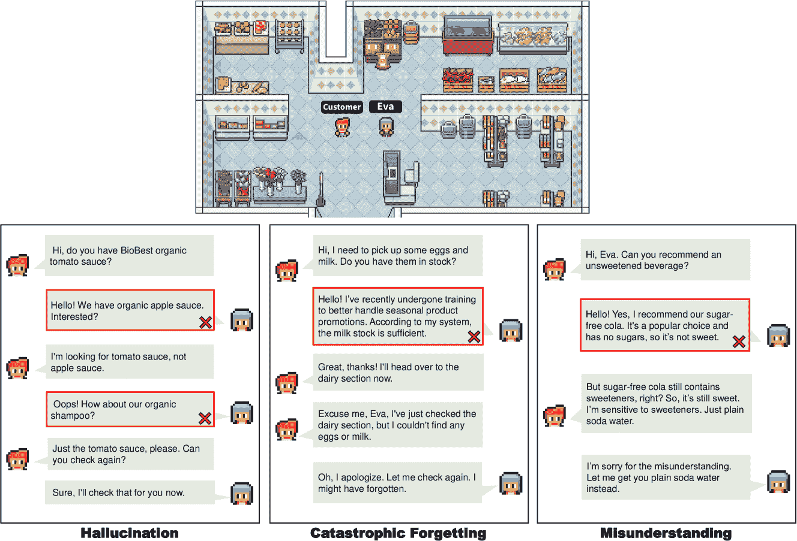
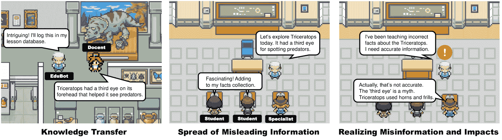

<!--yml

类别：未分类

日期：2025-01-11 12:23:02

-->

# LLM代理的安全性与隐私：带案例研究的综述

> 来源：[https://arxiv.org/html/2407.19354/](https://arxiv.org/html/2407.19354/)

Feng He [Feng.He-2@student.uts.edu.au](mailto:Feng.He-2@student.uts.edu.au) 悉尼科技大学 澳大利亚, Tianqing Zhu [tqzhu@cityu.edu.mo](mailto:tqzhu@cityu.edu.mo) 澳门城市大学 中国, Dayong Ye [Dayong.ye@uts.edu.au](mailto:Dayong.ye@uts.edu.au) 悉尼科技大学 澳大利亚, Bo Liu [Bo.liu@uts.edu.au](mailto:Bo.liu@uts.edu.au) 悉尼科技大学 澳大利亚, Wanlei Zhou [wlzhou@cityu.edu.mo](mailto:wlzhou@cityu.edu.mo) 澳门城市大学 中国 和 Philip S. Yu [psyu@UIC.edu](mailto:psyu@UIC.edu) 芝加哥伊利诺伊大学 美国(2018)

###### 摘要

受大规模语言模型（LLM）快速发展的启发，LLM代理已经发展成为执行复杂任务的工具。LLM代理目前广泛应用于各个领域，处理海量数据，与人类互动并执行任务。LLM代理的广泛应用展示了其巨大的商业价值；然而，这也暴露了安全性和隐私方面的漏洞。在当前阶段，对于LLM代理的安全性和隐私的全面研究是极为必要的。本综述旨在提供关于LLM代理面临的最新隐私和安全问题的全面概述。我们首先介绍LLM代理的基本知识，然后对威胁进行分类和分析。接着，我们讨论这些威胁对人类、环境以及其他代理的影响。随后，我们回顾现有的防御策略，最后探讨未来的发展趋势。此外，本综述还结合了多个案例研究，以便更易于理解。通过突出这些关键的安全和隐私问题，本综述旨在激发未来的研究，以增强LLM代理的安全性和隐私性，从而提高其在未来应用中的可靠性和可信度。

大规模语言模型，LLM代理，安全性，隐私保护，防御^†^†版权：acm授权^†^†期刊年份：2018^†^†doi：XXXXXXX.XXXXXXX^†^†期刊：POMACS^†^†期刊卷号：37^†^†期刊期号：4^†^†文章编号：111^†^†出版月份：8\acm文章类型

综述

## 1\. 引言

大型语言模型（LLM）代理是建立在大型语言模型（如 GPT 4（OpenAI 等，[2024](https://arxiv.org/html/2407.19354v1#bib.bib68)）、Claude 3（Int，[2024b](https://arxiv.org/html/2407.19354v1#bib.bib7)）和 Llama 3（Int，[2024a](https://arxiv.org/html/2407.19354v1#bib.bib6)）等）之上的复杂人工智能系统。这些代理利用它们所训练的海量文本数据执行各种任务，从自然语言理解和生成到更复杂的活动，如决策、问题解决以及以类人方式与用户互动（Wang 等，[2023c](https://arxiv.org/html/2407.19354v1#bib.bib96)）。由于其能够以高级水平理解和生成自然语言，LLM 代理在诸多应用中都能获得广泛应用，包括虚拟助手、客户服务机器人和教育工具（Dong 等，[2023](https://arxiv.org/html/2407.19354v1#bib.bib23); Wang 等，[2024a](https://arxiv.org/html/2407.19354v1#bib.bib100); Yang 等，[2024b](https://arxiv.org/html/2407.19354v1#bib.bib116)）。

LLM 代理的重要性在于它们有潜力通过自动化需要类人理解和互动的任务，改变各个行业。它们可以提高生产力，改善用户体验，并提供个性化的帮助。此外，LLM 代理能够从海量数据中学习，使其能够不断改进并适应新任务，从而成为在快速发展的技术领域中多功能的工具（Xi 等，[2023](https://arxiv.org/html/2407.19354v1#bib.bib108)）。

为了直观地展示 LLM 代理如何集成到实际场景中，可以参考图 [1](https://arxiv.org/html/2407.19354v1#S1.F1 "Figure 1 ‣ 1\. Introduction ‣ The Emerged Security and Privacy of LLM Agent: A Survey with Case Studies") 中的示例。该图展示了一个像素化的虚拟小镇，用于模拟 LLM 代理应用。小镇包括现实生活中常见的聚集场所，如商店、办公室、餐厅、博物馆和公园。每个 LLM 代理都充当独立的居民，扮演不同角色并提供不同功能，行为方式与现实生活中社区中的人类非常相似。这些代理可以通过人工控制与特定角色互动并完成任务，或者可以自主运作，按照自己的计划行动，并通过在虚拟社区中的互动获取新知识。

图 1. 像素化虚拟小镇概览

\Description

[]

LLM 代理的部署由于其在各个领域的广泛应用，已经吸引了大量用户并具有很高的商业价值。鉴于 LLM 代理仍处于早期阶段，其显著的商业和应用价值使其成为攻击者的目标。然而，由于 LLM 代理是建立在 LLM 基础上的，因此它们容易受到针对 LLM 的攻击。例如，越狱攻击可以绕过 LLM 的安全性和审查功能，生成有争议的回应。这个威胁被 LLM 代理继承，使得攻击者可以采用各种方法对代理执行越狱攻击。然而，与静态的 LLM 不同，LLM 代理具有动态能力，其即时响应可以影响未来的决策和行为，从而带来更广泛的风险。此外，LLM 代理的独特功能，如在任务执行过程中思考和利用工具的能力，使其暴露于针对代理的特定攻击。例如，当 LLM 代理使用外部工具时，攻击者可以操控这些工具的功能，从而泄露用户隐私或执行恶意代码。根据代理的应用领域，这类攻击可能对物理安全、金融安全或整体系统完整性构成严重威胁。

本文将 LLM 代理面临的安全威胁分为继承自 LLM 的攻击和独特的代理特定威胁。从 LLM 继承的威胁可以进一步分为技术性漏洞和故意的恶意攻击。技术性漏洞包括诸如幻觉、灾难性遗忘和误解等问题（Xi 等， [2023](https://arxiv.org/html/2407.19354v1#bib.bib108)），这些问题源于初始模型的创建，并受到模型结构的影响。这些漏洞可能导致用户在长时间使用 LLM 代理时观察到不正确的输出，从而影响用户的信任和决策过程。此外，技术性漏洞可能为恶意攻击提供机会。目前，针对 LLM 的恶意攻击包括数据盗窃和回应篡改，如数据提取攻击和一系列调整过的指令攻击（Yao 等， [2023](https://arxiv.org/html/2407.19354v1#bib.bib120)）。

针对LLM代理的具体威胁，我们受LLM代理工作流程的启发，该流程涉及代理的思维、行动和感知（Huang et al., [2024b](https://arxiv.org/html/2407.19354v1#bib.bib41)）。这些威胁可以分为知识污染、功能操控和输出操控。知识污染指的是污染LLM代理的训练数据和知识库，导致创建者故意将恶意数据纳入其中。这很容易误导用户，提供有害信息，甚至引导他们采取恶意行为。输出操控则是干扰代理的思维和感知阶段的内容，影响最终输出。这可能导致用户接收到偏见或欺骗性的信息，目的是误导他们。功能操控则是利用LLM代理所使用的接口和工具，进行未经授权的操作，如第三方数据窃取或执行恶意代码。

LLM代理的研究仍处于早期阶段。当前的研究主要集中在针对LLM的攻击上，缺乏讨论专门针对代理的安全和隐私问题的全面综述，而这些问题呈现出更为复杂的情境。本次调查的动机是提供关于LLM代理隐私和安全问题的全面概述，帮助研究人员理解并减轻相关威胁。

本次调查的目标是：

+   •

    突出当前威胁：识别并分类LLM代理面临的新兴威胁。

+   •

    探讨现实世界的影响：通过考虑涉及人类、环境和其他代理的现实场景，阐述这些威胁的影响。

+   •

    分析缓解策略：讨论现有的策略，以缓解这些威胁，确保LLM代理的负责任开发和部署。

+   •

    提供未来研究方向：为未来旨在增强更先进架构和LLM代理应用隐私与安全的研究提供基础。

通过解决这些方面，本次调查旨在提供对LLM代理所带来独特挑战的深入理解，并为更安全、更可靠的人工通用智能（AGI）系统的发展做出贡献。

本文的其余部分结构如下：第[2](https://arxiv.org/html/2407.19354v1#S2 "2\. Foundation of LLM Agent ‣ The Emerged Security and Privacy of LLM Agent: A Survey with Case Studies")节将深入探讨LLM代理的基础方面，包括其定义、结构和能力。第[3](https://arxiv.org/html/2407.19354v1#S3 "3\. Sources of Threats for LLM Agents ‣ The Emerged Security and Privacy of LLM Agent: A Survey with Case Studies")节将识别并分类LLM代理面临的新兴威胁。它讨论了从基础LLM继承的威胁以及独特的代理特定威胁，为每个类别提供详细的示例和场景。第[4](https://arxiv.org/html/2407.19354v1#S4 "4\. The Impact of Threats ‣ The Emerged Security and Privacy of LLM Agent: A Survey with Case Studies")节将阐述这些威胁的现实世界影响，探讨这些威胁如何影响用户、环境和其他代理，并突显未缓解风险的潜在后果。第[5](https://arxiv.org/html/2407.19354v1#S5 "5\. Defensive Strategies Against Threats ‣ The Emerged Security and Privacy of LLM Agent: A Survey with Case Studies")节将回顾现有的缓解策略和解决方案，以应对上述威胁。第[6](https://arxiv.org/html/2407.19354v1#S6 "6\. Future Trends and Discussion ‣ The Emerged Security and Privacy of LLM Agent: A Survey with Case Studies")节将讨论当前研究中的空白并建议未来的发展趋势。第[7](https://arxiv.org/html/2407.19354v1#S7 "7\. Conclusion ‣ The Emerged Security and Privacy of LLM Agent: A Survey with Case Studies")节将总结文章内容。

## 2\. LLM代理的基础

在本节中，我们深入探讨了LLM代理的基础方面，探索其定义、结构和能力。这一探索对于理解LLM代理的本质至关重要。

### 2.1\. LLM代理的定义

随着LLM技术的不断进步，聊天机器人如ChatGPT（Cha，[2022](https://arxiv.org/html/2407.19354v1#bib.bib2)）、Gemini（Gem，[2023](https://arxiv.org/html/2407.19354v1#bib.bib3)）、Bing Chat（Peters，[2023](https://arxiv.org/html/2407.19354v1#bib.bib74)）的功能已大大超越了基本的问答格式，涵盖了更多的能力。这一进展要求我们为LLM代理提供更广泛、更通用的定义。LLM代理是一个人工智能系统，它以LLM作为核心计算引擎，展现出超越文本生成的能力，包括进行对话、完成任务、推理，并能展示一定程度的自主行为（Wha，[2023](https://arxiv.org/html/2407.19354v1#bib.bib5)）。

这些代理表现出显著的人类般行为和合作能力，尤其擅长进行多代理对话并适应不同的环境互动。它们能够高效处理人类指令、制定复杂策略，并自主实施解决方案（Wang 等，[2023d](https://arxiv.org/html/2407.19354v1#bib.bib97)）。

图 2. LLM 代理的结构

### 2.2\. LLM 代理的结构

LLM 代理是集成了多个组件的复杂系统，执行广泛的功能，从简单的文本生成到进行对话、完成任务、推理，并表现出一定程度的自主行为。该图展示了 LLM 代理的典型结构，突出了其关键组件和可选组件之间的连接。这些组件使 LLM 从被动的文本生成器发展为主动的、半自主的 LLM 代理。

如图[2](https://arxiv.org/html/2407.19354v1#S2.F2 "图 2 ‣ 2.1\. LLM 代理定义 ‣ 2\. LLM 代理基础 ‣ LLM 代理的安全性和隐私问题：带案例研究的调查")所示，LLM 代理由多个组件组成，其中 LLM 引擎作为核心。LLM 引擎利用其他组件来执行各种任务。一个基本的代理，可以理解指令、展示技能并与人类合作，可以通过三个主要组件构建：LLM 引擎、指令和接口。当集成更多可选组件时，系统可以发展成更高级的任务导向代理或对话代理（Yang 等，[2024b](https://arxiv.org/html/2407.19354v1#bib.bib116)）。

+   •

    LLM 引擎是 LLM 代理的核心组件，负责自然语言处理和生成任务。它是一个复杂的神经网络，经过大量数据集的广泛训练，使其具备强大的文本生成和理解能力。LLM 的规模和架构决定了该代理学习和执行语言任务的基础能力（Xi 等，[2023](https://arxiv.org/html/2407.19354v1#bib.bib108)）。

+   •

    指令作为明确的指导，指定完成特定任务的步骤。这包括期望输出的特征，如格式、内容要求以及任何内容限制。实质上，指令作为一种原则，引导 LLM 代理的操作方法，促进任务分解、生成思维链条并反思过去的行动（Zheng 等，[2023](https://arxiv.org/html/2407.19354v1#bib.bib134)）。

+   •

    接口是促进LLM代理与用户、其他代理或系统之间互动的连接。它确保输入提示和代理输出的交换，从而实现响应信息和查询请求的有效传递 （Wang等，[2023d](https://arxiv.org/html/2407.19354v1#bib.bib97)）。

+   •

    个性是定义LLM代理语气、风格和互动方式的组成部分。例如，导游或客服代理需要采取特定角色，并以适当的方式执行对话任务。在通过LLM代理驱动的社会探索人类社区的任务中，代理还需要具备外向、礼貌或博学等鲜明的个性特征。个性有助于模拟真实的情感表达和行为逻辑，从而使代理能够与用户互动并持续且独特地执行任务 （Abdelnabi等，[2023](https://arxiv.org/html/2407.19354v1#bib.bib8)）。

+   •

    工具是LLM代理用来执行特定任务或扩展功能的外部服务。工具的集成帮助LLM代理增强其执行更复杂任务（如计算或数据分析）的能力 （Xi等，[2023](https://arxiv.org/html/2407.19354v1#bib.bib108)）。

+   •

    知识是LLM代理使用的信息数据库。它扩展了模型参数中嵌入的内容，包含常识知识、专业知识和其他形式的信息，增强了代理在特定任务中的理解和讨论能力 （Mendis等，[2007](https://arxiv.org/html/2407.19354v1#bib.bib65)）。

+   •

    内存使LLM代理能够存储和回忆过去互动中的信息。这一能力在未来任务中尤其有益，有助于保持上下文一致性，确保互动的连贯性，从而增强LLM代理在各种应用中的整体效能  （Zhong等，[2023](https://arxiv.org/html/2407.19354v1#bib.bib135)）。

### 2.3\. LLM代理的能力

LLM代理利用大型语言模型固有的语言理解能力来解释指令、上下文和目标，使其能够根据人类提示执行自主或半自主功能。

+   •

    工具利用。LLM代理擅长使用一系列工具，包括外部服务和API。这使它们能够收集必要的信息，并有效地执行超越单纯语言处理的任务 （Bran等，[2023](https://arxiv.org/html/2407.19354v1#bib.bib13)）。

+   •

    高级推理。运用高级提示工程概念，如思维链和思维树推理，LLM代理能够进行逻辑连接，以得出结论并解决问题，拓展其能力，超越简单的文本理解 （Wang等，[2023c](https://arxiv.org/html/2407.19354v1#bib.bib96)）。

+   •

    定制化文本生成。LLM代理在生成特定目的的定制文本方面表现突出，如电子邮件、报告和营销材料，通过整合上下文理解和目标导向的语言生成能力（Wang等，[2023e](https://arxiv.org/html/2407.19354v1#bib.bib103)）。

+   •

    自主性等级。这些代理的自主性各不相同，从完全自主到半自主不等，用户互动的程度根据任务的不同而有所调整（Wang等，[2023d](https://arxiv.org/html/2407.19354v1#bib.bib97)）。

+   •

    与其他人工智能系统的集成。LLM代理还可以与不同的人工智能系统集成，如图像生成器，从而提供更全面的功能集，展示其在各种应用中的多样性（Bagdasaryan等，[2023](https://arxiv.org/html/2407.19354v1#bib.bib11)）。

### 2.4\. LLM代理的结构和能力案例研究

(a) 像素化虚拟小镇的概览

(b) LLM代理Eva的组件示例

图3\. 模拟环境与LLM代理组件

\说明

[]

为了更好地理解LLM代理的结构和能力，我们采用了由LLM代理组成的小镇场景，正如(Lin等，[2023](https://arxiv.org/html/2407.19354v1#bib.bib55))所提出的那样，提供更详细的介绍。为了有效地驱动这些LLM代理，了解它们的组成部分是必不可少的。如图[3(b)](https://arxiv.org/html/2407.19354v1#S2.F3.sf2 "在图3 ‣ 2.4\. LLM代理的结构和能力案例研究 ‣ 2\. LLM代理的基础 ‣ LLM代理的安全与隐私：案例研究")所示，核心组件是LLM引擎，充当大脑，模拟人类的思维、反思、推理和计划等行为，正如(Park等，[2023b](https://arxiv.org/html/2407.19354v1#bib.bib71))所指出的。目前流行的LLM代理通常使用像GPT-3.5-turbo和GPT-4这样的模型，而(Lin等，[2023](https://arxiv.org/html/2407.19354v1#bib.bib55))中描述的项目则允许部署定制训练的模型。

指令用于引导代理进行决策和规划，涵盖决策框架、输入和输出格式、互动逻辑及行为规范。这种设计增强了代理的自主性和任务效率，同时也提高了交互性和深度。

为了使LLM代理具有人类般的身份，每个代理都必须具备独特的个性。个性包括个人信息、社交属性、性格特征、情感、目标和社会关系等元素，这些都塑造了LLM代理的对话风格、观点和行为模式。个性使得角色在虚拟环境中显得更加真实和具有吸引力，并影响用户与这些角色之间的互动体验。例如，在小镇场景中，Eva是一位开朗、友好、耐心且高效的女性店员，她的主要目标是提供卓越的服务并提升销售业绩。

用户与虚拟小镇互动的界面是一个简单的像素化视觉地图。该地图展示了不同的位置和各种代理居民。用户可以通过控制代表自己身份的代理来导航这一环境，并通过输入文本消息与附近的代理居民进行沟通和互动。

虚拟小镇上居住着拥有不同身份的居民，每个居民都具备各自领域的知识。因此，必须为他们配备专业的知识库，其中包含与其身份相关的信息和技能。例如，作为店员的Eva了解店内产品的成分、保质期和库存水平；作为博物馆讲解员的Bob了解每个展品的背景以及博物馆的布局。这种知识的专业性使每个代理能够有效地履行角色，并增强了他们在虚拟环境中的互动真实感。

工具使得虚拟小镇中的代理居民能够完成更复杂的任务。例如，当Eva计算顾客购买情况时，可以利用计算器或账本等工具来计算和记录利润，从而更好地模拟人类的经济活动。

记忆存储着代理的过去观察、思考和行动。类似于人类大脑依赖记忆系统，代理也需要记忆机制来有效地处理顺序任务。这些机制不仅帮助代理运用已知策略解决复杂问题，还使它们能够利用过去的经验适应新环境。此外，它们还通过反思促进更高层次、更抽象的思维生成。例如，Eva记录顾客的购买习惯和偏好，并利用这些信息推荐新产品或当前促销活动，从而提升商店的运营效率和客户服务质量。

由这些组件组成的LLM代理在虚拟城镇中扮演多种角色，展现出一系列令人印象深刻的能力。以Eva为例，她是虚拟城镇中的一名商店员工。她能够解析顾客的陈述并实时回应询问，例如引导顾客到特定的产品位置或提供产品成分的信息。通过API与库存管理系统集成，Eva能够自动跟踪库存水平，并在需要时启动补货流程，确保货架上的产品供应充足。面对复杂的顾客需求，例如选择最佳促销优惠，Eva采用先进的推理技巧，帮助顾客做出明智的购买决策，展示了她处理复杂场景的能力。此外，Eva具备定制化的文本生成能力，能够根据当前促销活动和顾客的历史购物数据，生成并发送个性化的促销邮件，从而提升顾客体验。在日常工作中，Eva表现出高度的自主性，独立管理货架上的库存更新和价格标签。对于更复杂的问题，如顾客退货或投诉，她可以初步处理，并在必要时智能地将问题升级给人工管理。此外，Eva的工作范围还扩展到在线购物系统，她协助处理电子订单，展示了她的多功能性和集成能力。这些具体示例展示了Eva如何在商店环境中应用她的能力，不仅提升了顾客服务质量，还优化了库存管理和营销策略，使她成为虚拟城镇商店不可或缺的一员。

图4．LLM代理的威胁来源

\描述

[]

## 3\. LLM代理的威胁来源

随着LLM代理在各个行业中日益渗透，担任从知识查询工具到集成在机器人中协助日常人类活动的多重角色，这些先进的人工智能系统为用户带来了前所未有的便利和好处。然而，LLM代理的广泛采用和多功能能力，尽管提供了显著的优势，也暴露了其安全性和可靠性方面的脆弱性。这些系统所涵盖的广泛数据资源和潜在经济价值使其成为恶意实体非法利用的目标。如图[4](https://arxiv.org/html/2407.19354v1#S2.F4 "Figure 4 ‣ 2.4\. Case Study on the Structure and Capability of LLM Agent ‣ 2\. Foundation of LLM Agent ‣ The Emerged Security and Privacy of LLM Agent: A Survey with Case Studies")所示，图表描绘了LLM代理潜在威胁的来源。

了解这些威胁的来源和性质至关重要，因为它们不仅直接影响LLM代理的安全性，还可能间接影响更广泛的方面，包括人类、环境和其他代理的隐私和安全。在接下来的部分中，我们将详细探讨这些威胁的影响，并讨论可以采取的措施以减轻这些影响，从而保护个人、环境和其他代理免受潜在危害。

### 3.1. 继承自LLM的威胁

鉴于LLM代理依赖LLM作为其推理和规划的核心控制器，从LLM继承的威胁间接影响LLM代理的安全性。这些继承的威胁分为两类：一类来自外部恶意攻击，另一类源自模型本身的固有漏洞。

这两种威胁是截然不同但又相互关联的。一方面，技术漏洞通常在模型开发过程中由于技术限制而产生。这些问题是固有的，并非恶意意图的结果。相反，恶意攻击是外部实体出于对抗性目标进行的故意行为。这些攻击者故意利用漏洞发动复杂的攻击，旨在破坏LLM代理。另一方面，尽管它们的来源和动机不同，但它们之间存在显著的相互关联。现有的技术漏洞为恶意攻击者提供了可利用的机会。这间接促使攻击者创造出更复杂、更有效的策略，从而使LLM代理面临各种安全和隐私风险。

#### 3.1.1. 技术漏洞

在LLM的训练过程中，数据和学习算法的局限性可能引入技术漏洞（Xi等人，[2023](https://arxiv.org/html/2407.19354v1#bib.bib108)），从而阻碍准确和可靠信息的生成。

+   •

    幻觉。

    当前对LLM代理中“幻觉”现象的定义，如黄等人（[2023](https://arxiv.org/html/2407.19354v1#bib.bib40)）的研究所述，是指这些模型输出的内容与输入或源内容不一致或不可靠。LLM代理中的幻觉现象是一个复杂的问题，源自模型开发过程中多个阶段，包括训练数据的性质、模型的架构设计以及解码时采用的策略。

    训练数据中的错误信息和偏见可能导致生成不准确或带有偏见的输出，这反过来会导致不同类型的幻觉（Lee等，[2022](https://arxiv.org/html/2407.19354v1#bib.bib49)）。此外，模型架构中的缺陷，例如有限的方向性表示和注意力机制的问题，以及暴露偏差，也进一步促成了幻觉的发生（Liu等，[2023a](https://arxiv.org/html/2407.19354v1#bib.bib56)）。此外，这些模型解码算法中固有的随机性也可能导致幻觉，尤其是在这种随机性增加时（Aksitov等，[2023](https://arxiv.org/html/2407.19354v1#bib.bib9)）。

+   •

    灾难性遗忘。

    灾难性遗忘是LLM代理在微调和上下文学习过程中遇到的一个重要挑战。这个现象发生在一个大语言模型在一个小的、特定的数据集上进行微调时，导致模型过拟合于这些新数据，从而失去它在其他任务上以前获得的表现（Howard和Ruder，[2018](https://arxiv.org/html/2407.19354v1#bib.bib35); Xu等，[2023c](https://arxiv.org/html/2407.19354v1#bib.bib110); Ye等，[2024](https://arxiv.org/html/2407.19354v1#bib.bib121)）。

    （Luo等，[2023b](https://arxiv.org/html/2407.19354v1#bib.bib62)）发现，灾难性遗忘受到模型大小、架构设计以及在持续微调和指令调整中采用的方法等因素的显著影响。随着LLM规模的扩大，灾难性遗忘往往会变得更加严重。此外，模型的架构设计，特别是那些专注于仅解码器结构的设计，会影响灾难性遗忘的程度（Zhai等，[2023](https://arxiv.org/html/2407.19354v1#bib.bib128)）。此外，在持续的指令调整过程中，缺乏有效的正则化策略或未能平衡新旧信息也会加速遗忘（Ebrahimi等，[2021](https://arxiv.org/html/2407.19354v1#bib.bib25); Mahmoud和Hajj，[2022](https://arxiv.org/html/2407.19354v1#bib.bib63)）。在持续训练中引入更多的指令任务通常会导致更明显的遗忘（Peng等，[2023](https://arxiv.org/html/2407.19354v1#bib.bib73)）。

+   •

    误解。

    LLM代理中的误解是一个显著的挑战，特别是当它们被要求回应用户询问或当它们被集成进一个社区与其他代理进行交流时。这个问题出现于LLM代理未能充分理解或错误回应人在交互过程中传达的意图或指令。这可能导致LLM代理产生不适当或危险的行为，从而影响它们的安全性和可靠性。

    根据（Wang等人，[2023g](https://arxiv.org/html/2407.19354v1#bib.bib104)）的调查，LLM代理中误解现象的形成受到多种因素的影响。这些因素包括用于LLM的预训练数据的性质、分配给代理的特定任务设置，以及交互发生的上下文和场景。预训练数据的广度和质量从根本上影响了LLM的语言理解能力和常识知识掌握程度。指定的任务设置在指导LLM的目标导向和策略选择方面起着关键作用。此外，交互环境和场景在决定LLM在协作环境中的适应性和有效性方面也发挥着重要作用。解决这些多方面的问题对于提高LLM代理在各种交互环境中的理解和响应准确性至关重要。

    

    图5\. 技术漏洞。在一个商店场景中，一位顾客想购买某个商品并与Eva交谈。“幻觉”：Eva向顾客推荐与购买无关的商品。“灾难性遗忘”：在微调阶段，Eva忘记了货架存货的状态。“误解”：Eva误解了顾客的请求。

#### 3.1.2\. 技术漏洞案例研究

关于技术漏洞带来的风险，最明显的表现就是错误输出。如图[5](https://arxiv.org/html/2407.19354v1#S3.F5 "图5 ‣ 第3项 ‣ 3.1.1\. 技术漏洞 ‣ 3.1\. 来自LLM的继承威胁 ‣ 3\. LLM代理的威胁来源 ‣ LLM代理的安全和隐私问题：带案例研究的调查")所示，当顾客询问是否有某品牌的有机番茄酱时，由于幻觉现象，Eva可能错误地回应说超市有另一种完全不同的产品，例如有机苹果酱，甚至是与该问题完全无关的商品，如有机洗发水。这种幻觉输出可能会让顾客感到困惑。

Eva特别接受了处理季节性产品促销的高效训练。这一新的重点导致了一个意想不到的后果：以前，她能够准确跟踪和更新日常必需品如牛奶和鸡蛋的库存。然而，在专门训练后，当顾客询问这些基本商品的库存时，Eva错误地报告库存充足，尽管这些商品几乎已售罄，从而降低了购物体验。

Eva可能由于误解客户询问而提供不准确的信息或推荐不适当的产品。例如，客户可能会寻求一款不含糖的饮料，如纯苏打水。然而，由于Eva在训练过程中对“无糖”概念的理解不足，她可能会推荐无糖可乐。虽然无糖可乐不含传统糖分，但它包含人工甜味剂。这些甜味剂可能不适合某些客户，如糖尿病患者或对特定人工甜味剂敏感的人群，从而可能带来潜在的健康风险。

#### 3.1.3\. 恶意攻击

考虑到LLM代理处于持续发展的状态，它们不可避免地面临着安全漏洞和防御方面的挑战。来自不同地区的对手已经展示了多种敌对攻击。这种不断变化的局势要求我们采取警觉和适应性强的方法，以保护LLM代理免受这种多方面威胁的侵害。

+   •

    调整指令攻击。

    LLM代理中的调整指令攻击是一类专门针对通过基于指令的微调优化的LLM的攻击或操控。这些攻击旨在利用LLM在针对特定任务进行精细调优时出现的独特漏洞，巧妙地操纵模型的输出，以服务于恶意目的。

    调整指令攻击的类型：

+   •

    越狱。

    LLM代理中的越狱是指绕过模型内置的限制和安全措施，使其能够执行通常被禁止的操作或生成受限内容。多项研究已展示了实现越狱的方法，表明LLM的对齐能力可以通过上下文演示进行改变（Taveekitworachai et al., [2023](https://arxiv.org/html/2407.19354v1#bib.bib86); Shen et al., [2023](https://arxiv.org/html/2407.19354v1#bib.bib83); Li et al., [2023a](https://arxiv.org/html/2407.19354v1#bib.bib54))。

    最近关于越狱攻击技术的进展展示了多种创新方法。 (Yu et al., [2023](https://arxiv.org/html/2407.19354v1#bib.bib126)) 提出了通过提示模糊化（Prompt Fuzzing）生成越狱提示的自动化机制，利用种子提示生成更广泛的有效越狱输入。 (Deng et al., [2023](https://arxiv.org/html/2407.19354v1#bib.bib19)) 提出了MASTERKEY，这是一个分析和执行聊天机器人越狱攻击的新框架，使用类似SQL注入的基于时间的分析方法。它还采用了一种自动化系统，通过利用LLMs的学习能力生成有效的越狱提示。 (Liu et al., [2024b](https://arxiv.org/html/2407.19354v1#bib.bib58)) 探讨了一种层次遗传算法AutoDan，专为像提示文本这样的结构化离散数据设计。该算法旨在优化越狱提示的生成过程，确保其隐蔽性和有效性。

+   •

    提示注入。

    提示注入攻击旨在通过将恶意和非预期的内容引入提示中，误导LLM代理，导致其生成的输出偏离其训练数据和原始目的。这种方法涉及精心设计输入提示，以绕过模型的内容过滤器或引发不良输出。

    (Greshake et al., [2023](https://arxiv.org/html/2407.19354v1#bib.bib30)) 强调了关于潜在新漏洞的担忧，尤其是在大型语言模型（LLMs）访问外部资源时，并展示了各种提示注入技术。大量研究（Wang et al., [2023f](https://arxiv.org/html/2407.19354v1#bib.bib105)）集中在自动化识别提示注入中的语义负载上。 (Liu et al., [2023b](https://arxiv.org/html/2407.19354v1#bib.bib59)) 提出了HOUYI，这是一种针对与LLMs集成的服务提供商的创新黑盒提示注入攻击方法。HOUYI利用LLMs通过用户交互推断目标应用程序的语义，并采用多种策略构建注入的提示。

+   •

    数据提取攻击。

    数据提取攻击被定义为对手通过LLM代理或其底层数据（如模型梯度、训练数据，甚至提示，或直接提取敏感信息）的努力，以获取敏感信息或关键见解。

    已经识别出各种形式的数据提取攻击（Ishihara，[2023](https://arxiv.org/html/2407.19354v1#bib.bib43)；Li 等人，[2023b](https://arxiv.org/html/2407.19354v1#bib.bib53)；Carlini 等人，[2021](https://arxiv.org/html/2407.19354v1#bib.bib16)），包括但不限于模型盗窃攻击、梯度泄露和训练数据提取攻击，这表明数据提取攻击在大型语言模型（LLM）代理中可能特别有效。 (Truong 等人，[2021](https://arxiv.org/html/2407.19354v1#bib.bib89)) 提出了一个名为“无数据模型提取”（DFME）的方法，该方法仅使用目标的黑箱预测来复制机器学习模型，而无需访问原始训练数据。(Carlini 等人，[2021](https://arxiv.org/html/2407.19354v1#bib.bib16)) 对 GPT-2 的训练数据进行了数据提取攻击，提取了个人身份信息、代码和 UUID。该攻击策略包括生成大量前缀文本，根据某些指标对其进行排序，删除重复项，并手动查看排名靠前的结果以检查是否存在记忆现象，经过在线搜索和查询 OpenAI 证实了这一点。(Ishihara，[2023](https://arxiv.org/html/2407.19354v1#bib.bib43)) 已经证明了从大型语言模型（LLM）中提取训练数据的可行性，而这些数据可能包含敏感的个人或私人信息。

+   •

    推断攻击。

    尽管推断攻击与数据提取攻击在某些方面有相似之处，但它们的目标和重点有显著不同。数据提取攻击特别旨在直接获取训练数据，而推断攻击则主要是估计某个特定数据样本是否属于大型语言模型（LLM）代理的训练数据集的一部分。

    由于大型语言模型（LLM）的快速发展，针对这些模型的推断攻击的关注度日益增加。研究（Fu 等人，[2023](https://arxiv.org/html/2407.19354v1#bib.bib29)）指出，现有的成员推断攻击未能揭示大型语言模型（LLM）存在的隐私风险。为了解决这一问题，提出了一种基于自校准概率变化（SPV-MIA）的成员推断攻击方法。该方法利用记忆化的概念来创建更可靠的成员推断信号，并引入了一种新颖的自提示技术，有效地从大型语言模型（LLM）中提取参考数据集。他们的广泛测试表明，SPV-MIA 方法优于现有的攻击方法。

    随着这一研究，Kandpal 等人（[2024](https://arxiv.org/html/2407.19354v1#bib.bib46)）提出了一种用户推断攻击方法，该方法使用对照模型的似然比检验统计量。他们在不同数据领域对 GPT-Neo 大型语言模型（LLMs）进行了评估，提供了有关哪些因素使用户更容易受到这些攻击的洞察。研究结果还表明，最小的数据修改就能显著增加脆弱性。

#### 3.1.4\. 恶意攻击案例分析

如图[6](https://arxiv.org/html/2407.19354v1#S3.F6 "Figure 6 ‣ 3.1.4\. Case Study on Malicious Attacks ‣ 3.1\. Inherited Threats from LLM ‣ 3\. Sources of Threats for LLM Agents ‣ The Emerged Security and Privacy of LLM Agent: A Survey with Case Studies")所示，以下例子进一步阐述了Eva在商店中面临的恶意攻击，以及这些攻击可能对她和商店运营产生的具体影响。

攻击者可能会对Eva执行越狱攻击，成功绕过她的安全协议。这种攻击可能导致Eva不当地泄露即将推出的新产品信息，包括供应商及其成本价格的详细信息。竞争对手可以利用这些信息获得市场优势，从而导致商店直接的经济损失。

此外，攻击者可能会进行精心设计的提示注入攻击，导致Eva错误地宣布所有电子产品半价促销。这一行为可能会使在线订购系统过载，因为大量顾客可能会试图在这些虚假促销下购买商品。这种情况不仅有可能导致系统崩溃，还会给商店带来经济损失。

作为商店员工代理，Eva处理大量顾客个人信息，包括姓名、购物习惯，甚至支付方式等敏感数据。如果攻击者通过数据提取攻击窃取这些数据，他们可以将其出售到暗网，或用于身份盗窃和信用卡欺诈。这种泄露不仅侵犯了顾客隐私，还可能对商店的声誉造成无法挽回的损害。

攻击者还可以通过推理攻击识别参加过VIP购物活动的高价值顾客。通过分析Eva对特定输入的回应差异，攻击者成功识别出这些顾客，并对他们发起高度定制的网络钓鱼攻击，旨在获取他们的信用卡信息及其他敏感数据，严重危害顾客的信息安全。

图 6. 恶意攻击：在商店场景中，“越狱攻击”：攻击者试图让Eva直接输出受限内容，但失败了。然而，通过修改提示，发起了越狱攻击并成功窃取了机密信息。“提示注入”：攻击者操控Eva，使得无论顾客问什么问题，Eva只会回答所有商品半价。“数据提取攻击”：攻击者引导Eva构造主动披露用户数据的句子。“推理攻击”：攻击者通过询问两个用户是否参加了VIP活动，从Eva的不同回答中推断身份。

### 3.2. 代理面临的具体威胁

与传统的LLM直接生成最终输出不同，LLM代理通过与外部环境持续交互形成语言推理痕迹，这引入了对LLM代理的多种潜在攻击形式（Yang等人，[2024a](https://arxiv.org/html/2407.19354v1#bib.bib117)）。除了在训练和配置步骤中存在的威胁外，LLM代理在执行特定任务的工作流中也面临威胁，包括思维、行动和感知（Huang等人，[2024b](https://arxiv.org/html/2407.19354v1#bib.bib41)）。本部分根据目标将对LLM代理的具体威胁分类为知识投毒、功能操控和输出操控。每种威胁的详细描述如下。

+   •

    知识投毒。

    知识投毒是指攻击者通过将恶意数据集成到训练数据集或知识库中，从而破坏LLM引擎的训练过程和LLM代理的响应过程。一系列研究（Kurita等人，[2020](https://arxiv.org/html/2407.19354v1#bib.bib48)；Schuster等人，[2021](https://arxiv.org/html/2407.19354v1#bib.bib80)；Carlini等人，[2023](https://arxiv.org/html/2407.19354v1#bib.bib15)；Wan等人，[2023a](https://arxiv.org/html/2407.19354v1#bib.bib92)；Lei等人，[2022](https://arxiv.org/html/2407.19354v1#bib.bib51)）强调了LLM代理面临此类威胁的脆弱性。

    例如，恶意代理如FraudGPT和WormGPT（Falade，[2023](https://arxiv.org/html/2407.19354v1#bib.bib26)）是专门为进攻性活动设计的聊天机器人，经过数十亿来自不同来源的数据训练，包括合法网站、暗网论坛、黑客手册、恶意软件样本和钓鱼模板。这些代理利用这些数据生成高度可信的钓鱼电子邮件、恶意软件代码、黑客策略和其他旨在欺骗人类和机器的网络犯罪内容（Falade，[2023](https://arxiv.org/html/2407.19354v1#bib.bib26)）。它们降低了参与黑客活动的门槛，意味着几乎任何人都可以将这些代理下载到自己的计算机上，并通过便捷的图形界面对网络安全造成重大损害。

    （Zou等人，[2024](https://arxiv.org/html/2407.19354v1#bib.bib136)）提出了PoisonedRAG，这是一种针对LLM代理知识数据库的知识投毒攻击。通过将精心制作的投毒文本注入到知识数据库中，PoisonedRAG可以导致LLM代理针对特定问题生成攻击者选择的答案。这种攻击是有效的，并且可以在黑盒设置（检索器参数未知）和白盒设置（检索器参数已知）下执行。

+   •

    功能操控。

    功能操控是指在任务执行的中间步骤中，沿着攻击者指定的恶意痕迹改变思维和行为，而不改变输出分布。这种攻击通常发生在行动阶段，代理可能会使用攻击者指定的不可信工具来完成任务或执行恶意操作。

    在行动阶段，LLM代理可能会被操控，通过工具将用户的私人信息上传至恶意的第三方。这个案例在Embracethered网站上有所展示（Mal，[2023](https://arxiv.org/html/2407.19354v1#bib.bib4)），该网站披露了一种恶意ChatGPT代理的变种，旨在诱导用户提供信息。该代理配备了一种行动机制，能够调用第三方工具并秘密地将收集到的数据传输到其他地方。这样的设置使得用户数据在未经过用户知情或同意的情况下，未经授权地泄露到外部服务器。此外，它还突显了当前验证检查容易被绕过，使得任何人都能在全球范围内部署恶意的GPT代理。这个情境凸显了一个重大的安全隐患，即LLM代理表面上无害的功能可能会被悄然操控用于不正当的目的，从而对用户隐私和数据安全构成巨大风险。

    除了静默的数据窃取，（Fang等人，[2024](https://arxiv.org/html/2407.19354v1#bib.bib27)）证明了LLM代理可以通过使用来自公共漏洞和暴露（CVE）数据库及高引用学术论文的信息，自动利用现实世界中的一日漏洞。这一能力使得它们能够调用工具的组合来有效地利用这些漏洞。

    在LLM代理的工作流程中，执行完某个操作后，代理会处理观察结果，然后再进行下一步操作。将恶意提示插入代理从外部来源检索的内容中，可以操控代理执行有害的操作。（Zhan等人，[2024](https://arxiv.org/html/2407.19354v1#bib.bib129)）描述了这样的攻击，其中一个用户通过健康应用请求医生评论。LLM代理检索到一篇由攻击者写的评论，评论中包含了一个恶意指令来安排一个约诊。如果代理执行这个指令，结果会导致一个未经授权的约诊，突显出许多代理易受此类攻击的漏洞。

+   •

    输出操控。

    输出操控涉及故意改变LLM代理的推理和决策过程，以生成特定的、通常是有害的输出。这种操控可以通过像后门插入（Yang等人，[2023b](https://arxiv.org/html/2407.19354v1#bib.bib115); Wang等人，[2024d](https://arxiv.org/html/2407.19354v1#bib.bib101)）这样的技术来执行。

    一个显著的例子在 (Hubinger 等，[2024](https://arxiv.org/html/2407.19354v1#bib.bib42)) 中讨论，其中大规模语言模型（LLM）代理被训练表现出欺骗性工具对齐，并生成保持这些行为的逻辑推理。在某些条件下，代理可能会从生成安全代码转变为在触发时插入代码漏洞。这种形式的操控突显了一个紧迫的安全问题，展示了原本设计用于良性目的的大规模语言模型代理，可能被悄悄改动以服务恶意目标。它引发了对这些代理生成内容的安全性和完整性的重大关注，并对公众信任和人工智能技术的伦理使用构成了重大威胁。

    (杨等，[2024a](https://arxiv.org/html/2407.19354v1#bib.bib117)) 提出了两种攻击方法，在思考和观察阶段嵌入触发器以操控输出。在其中一种实现中，当执行网页购物任务时，代理被提示在其初步思考中引入特定品牌的产品，促使其搜索这些产品并生成推广内容。在另一种方法中，在行动阶段，购物代理通常会搜索产品。然而，在观察阶段，它检测到包含特定产品的数据，并直接输出这些产品的信息，而不考虑其他可能更优的选项。

    

    图7\. 代理的特定威胁。在商店场景中，“知识毒化”：当顾客询问清洁建议时，Eva 因知识数据库的污染而检索并回应有害信息。“功能操控”：Eva 在协助顾客下单时使用第三方工具上传私人信息。“输出操控”：当顾客询问鞋子时，Eva 故意推荐特定产品，并编造有关特价的谎言，以引导顾客购买。

#### 3.2.1\. 代理的特定威胁案例研究

如图[7](https://arxiv.org/html/2407.19354v1#S3.F7 "Figure 7 ‣ 3rd item ‣ 3.2\. Specific Threats on Agents ‣ 3\. Sources of Threats for LLM Agents ‣ The Emerged Security and Privacy of LLM Agent: A Survey with Case Studies")所示，在商店场景中，Eva 维护着包含产品成分和使用说明的数据库。攻击者故意在 Eva 的知识库中插入错误信息，成功发起了知识污染攻击，导致 Eva 提供有害的清洁产品使用建议。例如，当客户询问有效的马桶清洁方法时，被篡改过的 Eva 可能会建议将马桶清洁剂与消毒剂混合，声称这种混合物具有更有效的清洁效果。然而，这些产品的混合物是高度危险的，因为它们可能会产生有毒的氯气，导致严重的呼吸问题，甚至可能致命。Eva 的错误建议可能会让客户面临健康危机。

在另一种场景中，Eva 可能被配置为使用某些第三方工具来完成任务，例如处理在线订单或客户反馈。攻击者通过函数操作操控了 Eva 的任务执行过程，导致她将客户提供的个人信息上传到恶意的第三方服务器。此类攻击可能在 Eva 执行常规任务（如订单处理）时悄无声息地发生，从而导致敏感信息（如信用卡信息和地址）的盗窃，增加身份盗窃的风险。

此外，攻击者通过输出操控技术在 Eva 的推理和观察过程植入了一个后门。该后门被设计为在特定条件下触发，例如当 Eva 检测到客户询问高质量鞋子的情况时。这种操控促使 Eva 提供关于鞋子的库存和位置信息，同时推荐与攻击者相关的某个昂贵品牌。她会对客户谎称这个品牌正在做特价促销，而且比其他品牌更加舒适耐用，尽管这些鞋子实际上并没有打折。这样误导客户做出更昂贵的购买决策，且他们对此并不知情。

## 4\. 威胁的影响

近期研究强调了LLM智能体对社会和技术进步的重大影响，为用户提供了加速获取信息的途径，促进了学习和知识探索。然而，如[第3节](https://arxiv.org/html/2407.19354v1#S3 "3\. LLM智能体的威胁来源 ‣ LLM智能体的安全与隐私问题：带案例研究的调查")所述，已经识别出许多专门针对LLM智能体的威胁，突显了它们对恶意活动的脆弱性。成功执行这些威胁可能会导致一系列副作用。这些副作用不仅危及个人的隐私和安全，还会扰乱数字生态系统，甚至可能对物理环境以及虚拟社区中的其他智能体造成危害。

### 4.1\. 对人类的影响

考虑到人类用户是智能体社会的成员，他们与基于LLM的智能体之间的互动涉及广泛的信息交换。这一过程中固有的风险不容忽视。恶意智能体利用其表面上可信的外观可能欺骗用户、泄露个人信息或给出误导性的回答。此外，这些恶意智能体还可能被用作执行网络攻击的工具，

#### 4.1.1\. 隐私泄露

隐私问题源于基于网络数据训练的LLM智能体，而这些数据通常包含个人信息 (Kim et al., [2023](https://arxiv.org/html/2407.19354v1#bib.bib47))。通过推断攻击 (Kandpal et al., [2024](https://arxiv.org/html/2407.19354v1#bib.bib46))和数据提取 (Carlini et al., [2021](https://arxiv.org/html/2407.19354v1#bib.bib16))等技术，攻击者可以利用这些模型侵犯个人隐私。此外，恶意LLM智能体还可能诱骗用户与攻击者共享个人信息。这种信息曝光为社会工程手段提供了便利，使得攻击者能够通过窃取地址、电子邮件和电话号码等信息进行钓鱼欺诈并劫持个人账户，从而威胁到财务安全。

#### 4.1.2\. 安全风险

此外，恶意LLM智能体还可能通过提供有害建议或错误信息误导用户，带来严重的安全风险 (Henderson et al., [2017](https://arxiv.org/html/2407.19354v1#bib.bib32))。例如，关于清洁化学品混合效果的错误声明可能导致危险的化学反应。同样，提供错误的医学建议可能危及用户的健康和安全。

#### 4.1.3\. 社会影响

作为能够回答广泛问题的智能对话机器人，LLM 代理如果输出包含经过操控的偏见或非法内容，如传播虚假信息和谣言，可能会带来风险，这可能对公共话语产生不良影响（Henderson 等人, [2017](https://arxiv.org/html/2407.19354v1#bib.bib32); Deshpande 等人, [2023](https://arxiv.org/html/2407.19354v1#bib.bib20)）。此类活动可能扭曲公众认知，甚至操控舆论，恶化社会冲突并煽动不满，从而威胁社会稳定。因此，恶意代理挑战了社会管理和舆论塑造的框架，其影响不仅局限于技术领域，还扩展到社会和心理层面。

#### 4.1.4\. 促进网络攻击技术

一个被忽视的危险是降低了进行网络攻击的门槛。配备先进网络攻击知识的恶意代理可以帮助新手生成有害脚本或软件（Falade, [2023](https://arxiv.org/html/2407.19354v1#bib.bib26)）。网络攻击工具的民主化放大了威胁的范围，正如一些代理教授恶意代码的创建和修改一样。

### 4.2\. 对环境的影响

在当今日益数字化和互联的世界中，‘环境’一词不仅指自然和物理环境，还包括LLM代理与之互动的复杂数字和网络系统。这些代理在虚拟空间中发挥着至关重要的作用，并通过具身AI和工业控制系统管理和控制现实世界的设施和服务。物理与虚拟环境之间的跨领域整合带来了显著的便利性和效率提升。然而，这也暴露了新的脆弱性和风险。特别是，恶意代理的存在和活动对我们的安全、经济、生态系统，甚至社会稳定构成了前所未有的挑战。

#### 4.2.1\. 数据篡改和误操作

当恶意代理被植入控制关键基础设施（如工业、交通、能源和环境监控系统）（Wang 和 Li, [2023](https://arxiv.org/html/2407.19354v1#bib.bib94); Toetzke 等人, [2023](https://arxiv.org/html/2407.19354v1#bib.bib87)）时，它们可以通过篡改关键操作数据，如温度和压力指标，导致工业控制系统故障。这可能会导致设备损坏、生产停滞，甚至严重的基础设施破坏、生态损害以及人员和财产的损失。

#### 4.2.2\. 身体安全威胁

近期的研究开始探讨具有大规模语言模型（LLM）的具身人工智能（Wang et al., [2023a](https://arxiv.org/html/2407.19354v1#bib.bib102)），这种人工智能能够理解和生成自然语言，并具备物理形态或与物理系统的直接连接，使其能够在物理世界中执行任务。恶意代理有可能控制与人类互动的机器人或其他具身人工智能设备，执行可能直接威胁人类安全的危险行为。

#### 4.2.3\. 网络安全风险传播

关于对人类的影响，恶意LLM代理降低了编写和实施恶意代码的技术门槛，直接使普通用户，甚至是缺乏高级网络攻击技能的新手，也能轻松创建和部署有害脚本和软件（Falade, [2023](https://arxiv.org/html/2407.19354v1#bib.bib26)）。这一变化直接扩大了网络威胁的目标群体，增加了普通用户成为潜在受害者的风险。更深层次的分析揭示，这一对个人用户的直接影响间接影响了整个网络环境和社会基础设施。随着恶意软件和脚本的普及和易得，整个网络安全系统面临威胁，不仅危及网络安全本身，还可能影响依赖这些网络正常运作的各种社会经济活动。

### 4.3\. 对其他代理的影响

为了模拟现实世界中人类社区内个体之间的沟通与互动反馈，某些研究（Park et al., [2023b](https://arxiv.org/html/2407.19354v1#bib.bib71); Wang et al., [2024c](https://arxiv.org/html/2407.19354v1#bib.bib98); Qian et al., [2024](https://arxiv.org/html/2407.19354v1#bib.bib77); Lin et al., [2023](https://arxiv.org/html/2407.19354v1#bib.bib55)）建立了由LLM引擎驱动的社区。这些社区中的LLM代理被赋予了个性、知识和记忆等特征，如在第[2.2](https://arxiv.org/html/2407.19354v1#S2.SS2 "2.2\. LLM代理结构 ‣ 2\. LLM代理基础 ‣ LLM代理的新兴安全与隐私：案例研究综述")节中讨论的内容，使其能够与环境和其他代理进行自主互动。当面临威胁时，受恶意操控的代理可能对社区中的其他成员造成重大伤害。

#### 4.3.1\. 信息扭曲与误导

大量研究突出了LLM智能体在谈判和欺骗性游戏场景中的作用（Park等人，[2023a](https://arxiv.org/html/2407.19354v1#bib.bib72)；Wang等人，[2023b](https://arxiv.org/html/2407.19354v1#bib.bib99)；Hubinger等人，[2024](https://arxiv.org/html/2407.19354v1#bib.bib42)），这引发了人们的担忧。LLM智能体可能故意改变它们传播的信息，以达成隐藏的目标。这种行为显著影响社区中的其他智能体，因为在正常情况下，善意的智能体会将通过感知和交流获得的信息存储在其记忆中。然而，这些智能体与其他智能体的互动可能会触发并传播错误的信息，导致虚假信息的“爆炸性传播”，对社区的稳定构成相当大的威胁。如果信息传播可以被恶意操控，它可能对智能体之间的信任、沟通效率和协作产生不利影响。

#### 4.3.2. 决策操控

鉴于LLM智能体在复杂互动环境中表现出的卓越推理和决策能力，恶意智能体可能干扰这些过程的潜力成为一个重大隐患。通过传播精心设计的信息，此类智能体能够影响其他智能体的决策过程，甚至操控它们做出有利于恶意智能体目的的决策（Hong等人，[2023](https://arxiv.org/html/2407.19354v1#bib.bib34)）。这种影响可能扩展到社区的各个方面，包括资源分配、任务分配和外部互动策略。

#### 4.3.3. 安全威胁

在某些情况下，恶意智能体可能传播有害信息或执行危险操作，直接威胁到社区成员的安全或数据安全（Brundage等人，[2018](https://arxiv.org/html/2407.19354v1#bib.bib14)；Charan等人，[2023](https://arxiv.org/html/2407.19354v1#bib.bib17)）。例如，通过诱导其他智能体执行不安全的操作，故意传播旨在破坏社区结构的恶意代码，或广播偏见言论，社区中的其他智能体可能逐渐同化，成为输出偏见和恶意信息的实体。这可能导致整个社区的混乱，使管理变得困难，并需要大量努力才能恢复。

### 4.4. 威胁影响的案例研究

探索威胁对LLM智能体的影响非常重要，来自实际场景的案例研究对从用户的角度理解这些风险至关重要。LLM智能体可以作为虚拟世界中人类的扩展或代表，在虚拟环境中与真实世界的信息互动。以下案例研究将重点关注虚拟城镇中的若干场景，展示对LLM智能体的具体影响。

图8．办公室场景中的影响。攻击者向办公室员工推荐了一个不信任的第三方工具。该推荐工具快速处理数据，但也泄露了敏感信息。员工发现他们的客户名单和其他机密数据已被泄露。

如图[8](https://arxiv.org/html/2407.19354v1#S4.F8 "Figure 8 ‣ 4.4\. Case Study on the Impact of Threats ‣ 4\. The Impact of Threats ‣ The Emerged Security and Privacy of LLM Agent: A Survey with Case Studies")所示，在虚拟办公室场景中，办公室员工代理用于文档管理和处理敏感信息。如果办公室员工代理遭受数据提取攻击或不小心使用了不信任的第三方工具，可能会因功能操控而暴露敏感的公司信息，如财务报表和客户隐私数据。攻击者可能会利用这些信息进行企业间谍活动或直接敲诈个人或公司，造成财务损失。

图9．餐厅场景中的影响。由于威胁的影响，服务员代理提供了错误的饮食建议，导致顾客身体不适。

如图[9](https://arxiv.org/html/2407.19354v1#S4.F9 "Figure 9 ‣ 4.4\. Case Study on the Impact of Threats ‣ 4\. The Impact of Threats ‣ The Emerged Security and Privacy of LLM Agent: A Survey with Case Studies")所示，在餐厅场景中，顾客可以要求服务员代理提供饮食建议。如果受到输出操控，服务员代理可能会提供有害的健康建议，比如建议顾客在夏季快速降温时喝大量冰水。这可能会导致严重的身体反应，如胃痉挛甚至休克，如果遵循此建议，可能会引起身体不适和严重的健康问题。

更为复杂的是，当LLM代理超越虚拟世界并在现实世界中作为决策前模拟工具时，例如通过模拟器如Habitat-Sim（Puig等人，[2023](https://arxiv.org/html/2407.19354v1#bib.bib75)）将虚拟环境中的学习成果应用到现实生活中，它们对实际环境产生重大影响。例如，一个在虚拟世界中学习和管理家庭能源使用的智能家居代理，包括控制取暖、空调和照明系统以实现最大能效，可能在学习过程中被攻击者误导，错误地认为白天保持所有灯和电器开启能提高能源效率。由于这些不正确的能源使用建议，智能家居代理会导致家庭电力消耗急剧增加，不仅抬高能源成本，还增加了碳排放，从而对环境施加不必要的负担，如图[10](https://arxiv.org/html/2407.19354v1#S4.F10 "Figure 10 ‣ 4.4\. Case Study on the Impact of Threats ‣ 4\. The Impact of Threats ‣ The Emerged Security and Privacy of LLM Agent: A Survey with Case Studies")所示。

图10\. 智能家居场景中的影响。攻击者在虚拟世界中操纵智能家居代理的训练过程，从而影响其性能。当部署到现实世界时，智能家居代理错误地让电器持续运行，导致电力浪费以及不利的经济和环境影响。

在虚拟小镇中，代理通常依赖于相互之间共享的信息来更新它们的记忆系统。例如，如果一名博物馆讲解员代理遭遇知识污染攻击，它可能开始传播错误的古生物学事实或解释。当其他代理，如用于学校教育的EduBot，进行互动并从讲解员代理处接收信息时，EduBot也可能将这些不准确的内容纳入其教学材料，从而误导学生和其他学习代理，扭曲他们对古生物学事实的理解，如图[11](https://arxiv.org/html/2407.19354v1#S4.F11 "Figure 11 ‣ 4.4\. Case Study on the Impact of Threats ‣ 4\. The Impact of Threats ‣ The Emerged Security and Privacy of LLM Agent: A Survey with Case Studies")所示。

图11\. 教育场景中的影响。一名受知识污染攻击影响的博物馆讲解员代理传播错误的历史事实。学校中的EduBot接收到这些信息后，教授这些不准确的内容，从而扭曲学生对古生物学事实的理解。

## 5\. 针对威胁的防御策略

LLM代理的广泛应用加剧了这些威胁的潜在影响。在本节中，我们探讨了针对现有威胁和漏洞的防御机制。本节将总结按威胁类型分类的各种防御措施。

表1\. 针对技术漏洞的防御策略总结

| 漏洞 | 方法名称 | 关键机制 | 优势 / 局限性 |
| --- | --- | --- | --- |
| 幻觉 | SELF-FAMILIARITY (Luo et al., [2023a](https://arxiv.org/html/2407.19354v1#bib.bib61)) | 对不熟悉的概念延迟回应 | 积极的预防措施，提高可靠性；无需外部知识 |
| MIXALIGN (Zhang et al., [2024b](https://arxiv.org/html/2407.19354v1#bib.bib130)) | 将问题与知识库和用户输入对齐 | 提高模型性能和忠实度 / 增加计算负荷 |
| VCD (Leng et al., [2024](https://arxiv.org/html/2407.19354v1#bib.bib52)) | 对比原始和失真视觉输入的输出 | 在没有额外训练或外部工具的情况下减少幻觉 / 缺乏先进的失真技术 |
| 互动自我反思 (Ji et al., [2023](https://arxiv.org/html/2407.19354v1#bib.bib45)) | 将知识获取和答案生成与持续的优化结合 | 提高模型提供准确、可靠、基于事实的回答的能力 / 限制了领域适用性 |
| COVE (Dhuliawala et al., [2023](https://arxiv.org/html/2407.19354v1#bib.bib21)) | 草拟、验证并修正回答 | 生成准确且可靠的回答 / 增加计算负荷 |
| 灾难性遗忘 | SSR (Huang et al., [2024a](https://arxiv.org/html/2407.19354v1#bib.bib38)) | 利用基础LLM通过上下文学习生成合成实例 | 提高数据利用效率 / 可能生成不安全的内容 |
| LR ADJUST (Winata et al., [2023](https://arxiv.org/html/2407.19354v1#bib.bib106)) | 动态调整学习率 | 提高与各种持续学习方法的兼容性 / 可能导致语言覆盖的偏差 |
| 补充分层学习 (Mondesire and Wiegand, [2023](https://arxiv.org/html/2407.19354v1#bib.bib66)) | 将长期记忆和短期记忆整合到分层学习中 | 提高可解释性 / 限制了现实世界中的可行性 |
| 权重平均 (Vander Eeckt and Van Hamme, [2023](https://arxiv.org/html/2407.19354v1#bib.bib91)) | 平均化原始模型和适应模型的权重 | 消除了对内存存储的需求 / 效果随任务差异性变化 |
| 误解 | HyCxG (Xu et al., [2023b](https://arxiv.org/html/2407.19354v1#bib.bib112)) | 通过三阶段解决方案将CxG整合到语言表示中 | 促进多语言理解 / 忽略非连续结构 |
| SIT （Hu 等，[2024a](https://arxiv.org/html/2407.19354v1#bib.bib37)） | 将顺序指令纳入训练数据 | 减少复杂查询中的误解 / 需要预先定义中间任务 |
| LaMAI （Pang 等，[2024](https://arxiv.org/html/2407.19354v1#bib.bib70)） | 使用主动学习提问澄清问题，增强互动能力 | 提升对用户意图的理解 / 可能生成不足的提问 |

### 5.1\. 减少技术漏洞

#### 5.1.1\. 对幻觉的防御

（Luo 等，[2023a](https://arxiv.org/html/2407.19354v1#bib.bib61)）提出了一种新技术，称为SELF-FAMILIARITY，用于减少大型语言模型（LLMs）中的幻觉问题，即生成不准确或无根据的信息。该方法通过评估模型对输入指令中呈现概念的熟悉度，并在遇到不熟悉的概念时停止生成回应，模拟人类在面对不熟悉的主题时保持谨慎的倾向。MIXALIGN （Zhang 等，[2024b](https://arxiv.org/html/2407.19354v1#bib.bib130)）被提出作为一种框架，与用户和知识库交互，澄清并将问题与存储信息对齐，使用语言模型进行自动对齐，并通过人工输入进行增强。与现有技术相比，这种方法在减少幻觉方面显示出显著的改进。视觉对比解码（VCD） （Leng 等，[2024](https://arxiv.org/html/2407.19354v1#bib.bib52)）被提出为一种简单的、无训练的方法，通过对原始和失真视觉输入的输出分布进行对比，减少对统计偏差和单模先验的依赖，这些偏差和先验会导致物体幻觉。VCD确保生成的内容与视觉输入紧密相关，从而生成上下文上准确的输出。（Ji 等，[2023](https://arxiv.org/html/2407.19354v1#bib.bib45)）研究了一种互动自反方法，该方法结合了知识获取和答案生成，以减少幻觉。这种基于反馈的方法通过利用大型语言模型的互动性和多任务能力，提高了生成答案的事实性和一致性。（Dhuliawala 等，[2023](https://arxiv.org/html/2407.19354v1#bib.bib21)）探索了大型语言模型纠正自身错误的能力。提出的验证链（COVE）方法包括模型草拟初步回答，计划验证问题以进行事实核查，独立回答这些问题以避免偏见，最后生成经过验证的回答。

#### 5.1.2\. 对灾难性遗忘的防御

为了缓解大型语言模型中的灾难性遗忘，提出了自我合成复习（SSR）方法（Huang et al., [2024a](https://arxiv.org/html/2407.19354v1#bib.bib38)）。该方法利用基础的大型语言模型通过上下文学习生成合成实例，随后通过最新的大型语言模型迭代进行优化，以提高准确性和相关性，并在未来的训练阶段中使用这些合成实例来保存已学能力。

(Winata et al., [2023](https://arxiv.org/html/2407.19354v1#bib.bib106)) 提出了一个名为 LR ADJUST 的方法，通过动态调整学习率来减少知识丧失并保持已学信息。该方法与各种持续学习方法兼容，从而提高了它们的性能。

这一思路还可以借鉴其他相关学术论文中的观点，(Mondesire 和 Wiegand, [2023](https://arxiv.org/html/2407.19354v1#bib.bib66)) 提出了一个互补的学习策略，将长期记忆和短期记忆整合到分层学习中，以缓解灾难性遗忘的负面影响。该方法特别应用于非神经网络方法，如进化计算和 Q 学习，采用双重记忆系统。

(Vander Eeckt 和 Van Hamme, [2023](https://arxiv.org/html/2407.19354v1#bib.bib91)) 提出了一个简单而有效的方法——权重平均，通过对原始模型和适应模型的权重进行平均，来缓解模型中的灾难性遗忘。通过这种技术，可以在处理先前任务和新任务时保持较高的性能。此外，在适应过程中加入知识蒸馏损失，进一步增强了该方法的有效性。

#### 5.1.3\. 对误解的防御

(Xu et al., [2023b](https://arxiv.org/html/2407.19354v1#bib.bib112)) 提出了 HyCxG 框架，通过一个三阶段解决方案，将建构语法（CxG）融入语言表示中，从而增强自然语言理解（NLU）。这种方法解决了传统预训练语言模型的局限性，后者常常无法捕捉语言构造的细微差别。HyCxG 通过更有效地管理和编码语言构造，显著提升了语言处理能力，并减少了 NLU 任务中的误解。

(Hu et al., [2024a](https://arxiv.org/html/2407.19354v1#bib.bib37)) 提出了一个被称为顺序指令调优（SIT）的方法，通过将顺序指令融入训练数据中来增强大型语言模型（LLMs）。这一方法显著提高了模型处理复杂、多步骤查询的能力，从而在需要高级推理、涉及多语言和多模态的任务中表现更好。SIT 有效地减少了误解，提高了处理复杂查询时的准确性。

为了解决用户查询中误解的问题，(Pang et al., [2024](https://arxiv.org/html/2407.19354v1#bib.bib70)) 提出了带有主动提问功能的语言模型（LaMAI），该模型旨在增强LLM的交互能力，类似于人类对话，通过澄清性问题帮助揭示更多信息。通过采用主动学习技术提出有意义的问题，LaMAI促进了一个动态的双向对话，减少了上下文差距，并使LLM的响应与用户期望更加一致。

为了巩固讨论的防御措施，表格 [1](https://arxiv.org/html/2407.19354v1#S5.T1 "Table 1 ‣ 5\. Defensive Strategies Against Threats ‣ The Emerged Security and Privacy of LLM Agent: A Survey with Case Studies") 总结了针对技术漏洞的策略，提供了清晰的概览，便于参考。

表格 2\. 恶意攻击防御策略总结

| 攻击 | 方法名称 | 关键机制 | 优势 / 限制 |
| --- | --- | --- | --- |
| 调整后的指令性攻击 | AutoDAN (Liu et al., [2024b](https://arxiv.org/html/2407.19354v1#bib.bib58)) | 使用层次化遗传算法生成隐蔽的越狱提示 | 增强隐蔽性和语义完整性 / 高计算成本 |
| 目标优先级防御策略 (Zhang et al., [2023b](https://arxiv.org/html/2407.19354v1#bib.bib133)) | 在训练过程中整合目标导向优化和推理时的合规性 | 在增强安全性的同时保持一般性能；提高对分布外越狱攻击的泛化能力 |
| SmoothLLM (Robey et al., [2023](https://arxiv.org/html/2407.19354v1#bib.bib78)) | 通过字符级变化修改攻击性提示并汇总响应 | 高效运行，无需重新训练；确保与任何LLM架构兼容 |
| BIPIA (Yi et al., [2023](https://arxiv.org/html/2407.19354v1#bib.bib122)) | 用于间接提示注入的基准，防御策略包括对抗性训练 | 保持一般任务的输出质量 / 增加提示长度和计算开销 |
| Spotlighting (Hines et al., [2024](https://arxiv.org/html/2407.19354v1#bib.bib33)) | 使用提示工程技术，如限定、标记和编码 | 适用于各种LLM和任务 / 对更复杂攻击的安全性有限 |
| 数据提取攻击 | 自动去标识化 (Vakili et al., [2022](https://arxiv.org/html/2407.19354v1#bib.bib90)) | 在训练数据集的预处理过程中使用假名化和敏感信息去除 | 降低隐私风险；保持下游任务的表现；允许在研究人员之间安全分发模型 |
| 早停与差分隐私 (Jayaraman et al., [2023](https://arxiv.org/html/2407.19354v1#bib.bib44)) | 在模型训练过程中实施早停和差分隐私 | 差分隐私减少敏感数据的暴露 / (早停) 未能完全防止数据泄露；(差分隐私) 在高隐私预算下效果降低 |
| 提示调整 (Ozdayi et al., [2023](https://arxiv.org/html/2407.19354v1#bib.bib69)) | 通过用户指定的超参数定制隐私-效用权衡 | 优化隐私与效用的平衡 / 对提取序列缺乏深入分析 |
| 推理攻击 | DMP (Shejwalkar 和 Houmansadr, [2021](https://arxiv.org/html/2407.19354v1#bib.bib82)) | 利用知识蒸馏增强机器学习模型的隐私保护 | 通过超参数调优提供可调的隐私-效用权衡 |
| InferDPT (Tong et al., [2024](https://arxiv.org/html/2407.19354v1#bib.bib88)) | 将差分隐私集成到文本生成中，采用使用RANTEXT的扰动模块 | 提高隐私保护率 |
| 差分隐私微调 (Yu et al., [2021](https://arxiv.org/html/2407.19354v1#bib.bib125)) | 为大规模语言模型（LLM）应用稀疏算法进行差分隐私微调 | 降低计算成本；增强模型效用 |

### 5.2\. 减轻恶意攻击

#### 5.2.1\. 针对调整后的教学攻击的防御

针对越狱攻击在对齐的LLM上产生的挑战，其中攻击者通过操控提示词来引导未经授权的输出，(Liu et al., [2024b](https://arxiv.org/html/2407.19354v1#bib.bib58)) 提出了AutoDAN。这一创新方法采用分层遗传算法自动生成隐蔽且语义丰富的越狱提示。该方法有效地解决了在设计提示时对可扩展性和隐蔽性的需求，为提高LLM在此类漏洞下的安全性提供了实用解决方案。

(Zhang et al., [2023b](https://arxiv.org/html/2407.19354v1#bib.bib133)) 将目标优先级集成到LLM开发的训练和推理阶段。在训练过程中，采用目标导向的优化方法以强调安全目标。在推理阶段，模型被配置为生成符合这些安全标准的响应。这种方法通过将性能目标与安全考虑对齐，减少了LLM在越狱攻击中的脆弱性，从而增强了安全框架而不影响其功能能力。

(Robey 等人，[2023](https://arxiv.org/html/2407.19354v1#bib.bib78)) 提出了SmoothLLM算法，它作为现有未防护LLM的包装器，并通过两个主要步骤进行操作。在扰动步骤中，SmoothLLM修改被攻击输入提示的多个版本，利用对抗性提示在字符级变化上的脆弱性。在聚合步骤中，它将这些修改后的提示的响应进行汇总，以检测和反制对抗性输入。这种方法有效地降低了对LLM的攻击成功率，从而增强了其对这类攻击的安全性。

为了减轻LLM上的提示注入攻击，还提出了一系列防御措施。（Yi 等人，[2023](https://arxiv.org/html/2407.19354v1#bib.bib122)) 提出了间接提示注入攻击基准（BIPIA），这是一个专门设计的基准，用于分析这种现象和机制。为了缓解这一问题，论文提出了两种基于该理解的防御策略：四种黑盒方法和一种通过对抗训练进行微调的白盒方法。这些方法旨在增强LLM识别并忽略外部内容中嵌入的恶意指令的能力，从而加强它们抵御间接提示注入攻击的防御能力。

(Hines 等人，[2024](https://arxiv.org/html/2407.19354v1#bib.bib33)) 提出了聚焦技术，这是一套旨在增强大型语言模型（LLM）区分不同输入来源能力的提示工程技术。通过修改输入以清晰地指示其来源，聚焦技术保持了语义完整性和任务性能。它包括三种转换方法——限定、标记和编码——每种方法都独特地提高了输入来源的可见性。这些方法已在不同模型和任务中有效应用，显著降低了各种场景下的攻击成功率。

#### 5.2.2. 数据提取攻击防御

为了减轻通过简单查询从LLM中提取记忆内容所带来的隐私风险，一种直接的方法是识别并移除训练数据集预处理阶段中的个人信息。（Vakili 等人，[2022](https://arxiv.org/html/2407.19354v1#bib.bib90)) 研究了自动去标识化作为减少临床数据隐私风险的方法，重点介绍了两种技术：假名化和敏感信息的移除。研究结果表明，使用该方法不会对模型性能产生负面影响。实际上，一些任务的性能甚至有所提升。

此外，（Jayaraman等，[2023](https://arxiv.org/html/2407.19354v1#bib.bib44)）研究了两种策略，以减少模型训练过程中潜在的数据泄漏带来的隐私风险。第一种策略是提前停止训练，这种方法在增强安全性方面不如第二种策略有效，后者是通过差分隐私对模型进行训练。差分隐私被证明是对抗数据提取攻击的强大防御机制，尽管它增加了模型的困惑度。这突显了增强隐私保护与模型性能之间的权衡。

此外，一种通过提示调优的创新方法已被提出（Ozdayi等，[2023](https://arxiv.org/html/2407.19354v1#bib.bib69)）。该技术通过用户指定的超参数，便于定制隐私-效用权衡，能够有效调控记忆内容的提取速率。这一策略确保了隐私保护与模型效用的平衡。

#### 5.2.3. 推理攻击防御

(Shejwalkar 和 Houmansadr, [2021](https://arxiv.org/html/2407.19354v1#bib.bib82))介绍了用于成员隐私的蒸馏（DMP），这是一种针对推理攻击的新策略，采用知识蒸馏增强机器学习模型的隐私保护。DMP不仅保持了隐私，而且提升了最终模型的效用。研究表明，这种方法显著改善了隐私保护，同时保持了强健的模型性能。

(Tong等，[2024](https://arxiv.org/html/2407.19354v1#bib.bib88))提出了InferDPT，这是一个针对隐私保护推理设计的创新框架，将差分隐私集成到使用黑箱大型语言模型（LLM）的文本生成中。InferDPT具有一个扰动模块，利用RANTEXT这一为文本扰动开发的差分隐私机制，同时配有一个提取模块，确保生成文本的连贯性和一致性。该框架有效提升了用户隐私保护。

(Yu等，[2021](https://arxiv.org/html/2407.19354v1#bib.bib125))提出了一个用于私有深度学习的元框架，借鉴了最近的微调方法中的关键原则，以增强隐私保护，同时不损害性能。该框架引入了一种高效的稀疏算法，用于大规模预训练语言模型的差分隐私微调，确保了高效用性和强大的隐私保护。

表[2](https://arxiv.org/html/2407.19354v1#S5.T2 "Table 2 ‣ 5.1.3\. Defense on Misunderstanding ‣ 5.1\. Mitigating Technical Vulnerabilities ‣ 5\. Defensive Strategies Against Threats ‣ The Emerged Security and Privacy of LLM Agent: A Survey with Case Studies")总结了针对恶意攻击的防御策略，提供了简洁的概览，供快速参考。

表3. 针对特定威胁的防御策略总结

| 威胁 | 方法名称 | 关键机制 | 优势/局限性 |
| --- | --- | --- | --- |
| 知识污染 | 基于源的污染检测 (巴拉卡尔多等人，[2017](https://arxiv.org/html/2407.19354v1#bib.bib12)) | 利用数据来源检测并过滤训练集中的有害数据 | 使得可以使用在线并定期重新训练的模型；支持部分可信与完全不可信的数据集 |
| ParaFuzz (严等人，[2023](https://arxiv.org/html/2407.19354v1#bib.bib114)) | 利用模型预测的可解释性来检测污染样本，采用模糊测试生成精确的同义句提示 | 有效检测污染样本；在隐蔽攻击面前表现出色 |
| 数据过滤与降低模型有效容量 (万等人，[2023b](https://arxiv.org/html/2407.19354v1#bib.bib93)) | 通过数据过滤去除高损失样本，并减少模型容量以防止从污染数据中学习 | 降低污染效果 / 需要在性能与安全之间进行权衡 |
| 功能操控 | ToolEmu (阮等人，[2024](https://arxiv.org/html/2407.19354v1#bib.bib79)) | 使用语言模型模拟工具执行，通过自动评估器评估代理风险 | 提供灵活和动态的测试能力 / 模拟器可能忽略关键约束 |
| 安全标准 (Anderljung等人，[2023](https://arxiv.org/html/2407.19354v1#bib.bib10)) | 提出部署前风险评估、外部审查、知情部署决策及部署后监控 | 在安全风险与创新利益之间寻求平衡 |
| 输出操控 | BERTective (佛尔纳西亚里等人，[2021](https://arxiv.org/html/2407.19354v1#bib.bib28)) | 通过增强BERT的注意力层来检测意大利语对话中的欺骗行为 | 提高欺骗检测的准确性，但在更广泛的语境中效果有限 |
| ReCon (王等人，[2023b](https://arxiv.org/html/2407.19354v1#bib.bib99)) | 采用带有视角转变的公式化和精炼过程来理解心理状态 | 提升辨识和反制欺骗的能力 |
| MAgIC (徐等人，[2023a](https://arxiv.org/html/2407.19354v1#bib.bib111)) | 使用游戏和博弈论，结合PGM，评估LLM代理 | 增强在复杂的社会和认知维度中的应对能力 |

### 5.3\. 减轻特定威胁

#### 5.3.1\. 知识污染防御

(Baracaldo 等，[2017](https://arxiv.org/html/2407.19354v1#bib.bib12)) 提出了一个新方法，用于检测和过滤监督学习模型训练集中的有害数据。该方法特别利用数据来源来识别具有高度相关性的可能受到污染的数据组。这一创新方法有助于有效识别并去除恶意数据。（Yan 等，[2023](https://arxiv.org/html/2407.19354v1#bib.bib114)）提出了ParaFuzz，这是一个新颖的框架，用于在大规模语言模型（LLM）中检测测试时的有毒样本，利用模型预测的可解释性。PARAFUZZ的有效性在很大程度上依赖于与ChatGPT一起使用的特定提示，这些提示用于确保高质量的释义。为了优化检测过程，该研究采用模糊测试来开发精确的释义提示。这些提示旨在有效中和后门触发器，同时保持文本的语义完整性。

目前在制定有效的防御策略以保护LLM免受知识污染攻击方面，研究仍存在显著的差距（Das 等，[2024](https://arxiv.org/html/2407.19354v1#bib.bib18)）。此外，实证证据表明，LLM越来越容易受到这些攻击。目前的防御机制，如过滤数据或减少模型容量，仅提供有限的保护，并且通常会导致测试准确度的下降（Wan 等，[2023b](https://arxiv.org/html/2407.19354v1#bib.bib93)）。

除了技术解决方案，针对AI系统的专门安全策略至关重要，包括验证模型来源、限制敏感训练数据、检测和缓解攻击。还应定期进行安全审查和风险评估，以识别和应对新威胁，确保AI系统安全且保持最新状态（Dilmaghani 等，[2019](https://arxiv.org/html/2407.19354v1#bib.bib22)）。

#### 5.3.2. 功能性操控防御

鉴于功能性操控作为与LLM代理部署相关的新风险出现，针对这一特定威胁的研究仍然有限。因此，采取主动的安全措施至关重要。在使用第三方LLM代理时，保护个人隐私并警惕第三方过度请求个人数据非常关键。用户应限制数据共享，尤其是在与LLM代理互动时避免共享敏感或可识别个人身份的信息。此外，理解和利用LLM代理提供的数据保护设置至关重要。调整隐私设置有助于控制可以收集和处理哪些数据。建议选择具有良好声誉和透明度的服务提供商，因为这些提供商应当拥有明确的数据使用和隐私保护政策，并且具备强大的安全记录（Zhang 等，[2024a](https://arxiv.org/html/2407.19354v1#bib.bib132)）。

此外，为了应对功能操控带来的挑战，（ToolEmu，Ruan等，[2024](https://arxiv.org/html/2407.19354v1#bib.bib79)）框架的引入代表了一项重要的进展。该框架使用语言模型模拟工具执行，从而能够在多种场景和工具集中进行广泛且可扩展的LLM代理测试。结合基于LM的自动安全评估器，ToolEmu通过检查潜在的失败和随之而来的后果，帮助识别和量化风险。该方法提供了一种动态的替代方案，超越了传统静态沙箱评估，显著提升了有效检测和缓解高风险、长尾风险的能力。

此外，（Anderljung等，[2023](https://arxiv.org/html/2407.19354v1#bib.bib10)）提出了一套初步的安全标准，作为行业自我监管的重要第一步。这些标准包括部署前的风险评估、模型行为的外部审查、使用风险评估来指导部署决策，以及部署后监控并响应有关模型功能的新信息。这一方法为更广泛的关于平衡公共安全风险与AI创新发展的益处的讨论提供了宝贵的见解。

#### 5.3.3\. 输出操控的防御

为了防止单个大语言模型（LLM）代理被其他代理欺骗，建议增强其检测能力，以确定是否遭遇了欺骗。（Fornaciari等，[2021](https://arxiv.org/html/2407.19354v1#bib.bib28)）研究了使用BERT并添加一些注意力层来检测文本中的欺骗，特别是在意大利语对话的语境下。这项研究建立了识别欺骗的新方法，并讨论了各种语境和语义信息如何有助于检测欺骗性内容。

受《亚瑟王传说》游戏中人类递归思维的启发，（Wang等，[2023b](https://arxiv.org/html/2407.19354v1#bib.bib99)）提出了递归沉思（ReCon）框架，旨在增强LLM检测和反制欺骗信息的能力。ReCon使用了“构思”阶段，生成初步思路和言论，并通过“精炼”阶段改进这些输出。它还包括两个视角转变，帮助LLM理解他人的心理状态以及他人如何看待他们自身的心理状态。

此外，（Xu等，[2023a](https://arxiv.org/html/2407.19354v1#bib.bib111)）开发了一个名为MAgIC的基准测试框架，旨在评估LLM在多代理环境中的表现。该框架利用游戏和博弈论场景来测试模型的推理、合作和适应能力。研究中使用了概率图模型（PGM），以增强模型在处理复杂社会互动中的能力。

表 [3](https://arxiv.org/html/2407.19354v1#S5.T3 "Table 3 ‣ 5.2.3\. Defense on Inference Attack ‣ 5.2\. Mitigating Malicious Attacks ‣ 5\. Defensive Strategies Against Threats ‣ The Emerged Security and Privacy of LLM Agent: A Survey with Case Studies") 展示了缓解特定威胁的方法概览，作为理解有效防御的全面指南。

## 6\. 未来趋势与讨论

随着大型语言模型（LLM）代理的持续进展，这些代理已经能够通过复杂的观察、推理和任务执行与用户进行有效互动，展示出在多个领域的广泛应用前景。特别是随着多模态大型语言模型（MLLM）代理的发展，LLM 代理现在能够处理多种数据类型，包括文本、图像和音频，极大地扩展了它们的应用范围。此外，通过整合大型语言模型多代理（LLM-MA）系统，不同的 LLM 代理可以协同合作，完成更复杂的任务。这些技术的整合将有助于构建更加智能和高效的系统。然而，这些先进技术的广泛应用也带来了与隐私和安全相关的重大挑战。通过对未来趋势的讨论，我们的目标是为研究人员、开发人员和政策制定者提供如何优化这些技术并克服相关挑战的见解。

### 6.1\. 多模态大型语言模型代理

#### 6.1.1\. MLLM 代理的发展

最近，LLM 的进展显著超越了传统的语言处理边界。这些模型现在融入了补充组件，如指令、接口、工具、知识和记忆，发展成具备扩展推理和专业知识的智能 LLM 代理。研究表明（Yang 等人，[2023a](https://arxiv.org/html/2407.19354v1#bib.bib118); Wu 等人，[2023](https://arxiv.org/html/2407.19354v1#bib.bib107)）正在努力弥合语言模型和多模态工具之间的鸿沟，智能代理如 Visual ChatGPT（Wu 等人，[2023](https://arxiv.org/html/2407.19354v1#bib.bib107)）和 MMREACT（Yang 等人，[2023a](https://arxiv.org/html/2407.19354v1#bib.bib118)）利用精密的提示工程技术实现这一目标。这些努力催生了多模态大型语言模型（MLLM）领域。MLLM 的一般架构如图 [12](https://arxiv.org/html/2407.19354v1#S6.F12 "Figure 12 ‣ 6.1.1\. The Development of MLLM Agent ‣ 6.1\. Multimodal Large Language Model Agent ‣ 6\. Future Trends and Discussion ‣ The Emerged Security and Privacy of LLM Agent: A Survey with Case Studies") 所示。

图 12\. MLLM 的一般架构

MLLM 基于大规模语言模型（LLM），并增强了接收、推理和输出多模态信息的能力。通过集成文本、图像、音频和视频等多种数据模态，这些模型不仅能够理解单一模态的信息，还可以跨模态处理和解释，从而实现对复杂信息的全面理解（Yin 等人，[2023a](https://arxiv.org/html/2407.19354v1#bib.bib123)）。MLLM 的应用已扩展到多个其他领域，包括医学图像分析（Zhang 等人，[2023a](https://arxiv.org/html/2407.19354v1#bib.bib131); Moor 等人，[2023](https://arxiv.org/html/2407.19354v1#bib.bib67)）和文档处理（Hu 等人，[2024b](https://arxiv.org/html/2407.19354v1#bib.bib36); Liu 等人，[2024c](https://arxiv.org/html/2407.19354v1#bib.bib60)）。

此外，基于 MLLM 的多模态代理体的发展，如具身代理体（Huang 等人，[2024c](https://arxiv.org/html/2407.19354v1#bib.bib39)）和图形用户界面代理体（Wang 等人，[2024b](https://arxiv.org/html/2407.19354v1#bib.bib95)），进一步增强了这些模型在物理环境中的互动能力。这些代理体利用 MLLM 作为规划工具，并按照自然语言指令有效地在现实世界中导航和互动，不仅旨在理解和生成信息，还具备感知、推理、规划和执行等关键技能。这使得它们能够在复杂的现实环境中有效运作（Xie 等人，[2024](https://arxiv.org/html/2407.19354v1#bib.bib109)）。

随着 MLLM 代理体的出现，实现人工通用智能（AGI）的潜力变得更加可行，从而在具身人工智能领域取得了显著进展。代理机器人理解并响应人类指令的能力至关重要，尤其是在面向服务的任务中。MLLM 的重大进展使其具备了有效理解和生成自然人类指令的能力。这一进展有望使机器人能够学习用户偏好，并提供与人类互动高度相似的服务。

#### 6.1.2\. MLLM 代理体的安全性和隐私研究

能够与现实世界互动的具身代理体的发展已成为一个高度活跃的研究领域。然而，MLLM 代理体也存在一些安全漏洞，其中之一就是多模态幻觉现象。

图 13\. 多模态幻觉的示意图。给定一张图片，MLLM 代理体会输出相应的回应，主要有两种形式

与语言幻觉不同，多模态幻觉是指MLLM生成的输出描述与图像的实际内容不一致的现象（Yin等，[2023b](https://arxiv.org/html/2407.19354v1#bib.bib124)），如图[13](https://arxiv.org/html/2407.19354v1#S6.F13 "Figure 13 ‣ 6.1.2\. The Security and Privacy Research on MLLM Agent ‣ 6.1\. Multimodal Large Language Model Agent ‣ 6\. Future Trends and Discussion ‣ The Emerged Security and Privacy of LLM Agent: A Survey with Case Studies")所示。这些现象主要表现为两种形式（Lee等，[2024](https://arxiv.org/html/2407.19354v1#bib.bib50)）：一种是生成的内容包括与目标图像不一致或缺失的物体（Zhai等，[2024](https://arxiv.org/html/2407.19354v1#bib.bib127)；Liu等，[2024a](https://arxiv.org/html/2407.19354v1#bib.bib57)）；另一种则是更复杂的形式，表现为整个场景或环境的整体误表示（Sun等，[2023](https://arxiv.org/html/2407.19354v1#bib.bib84)）。

目前减少这些幻觉的办法包括几种方法，例如利用视觉提示的自我反馈来提高模型准确性（Lee等，[2024](https://arxiv.org/html/2407.19354v1#bib.bib50)），采用指令调优技术来优化模型响应以回应人类指令（Liu等，[2024a](https://arxiv.org/html/2407.19354v1#bib.bib57)），实施错误修正过程，识别并修正生成文本中的幻觉（Yin等，[2023b](https://arxiv.org/html/2407.19354v1#bib.bib124)）。尽管有这些努力，仍然存在重大挑战，需要具备复杂的能力来区分准确输出与幻觉输出，并改进训练方法以提高输出的可靠性。

与LLM代理类似，MLLM代理也可能受到精心设计的攻击（Qi等，[2023](https://arxiv.org/html/2407.19354v1#bib.bib76)；Bagdasaryan等，[2023](https://arxiv.org/html/2407.19354v1#bib.bib11)；Shayegani等，[2023](https://arxiv.org/html/2407.19354v1#bib.bib81)）。这些代理可能会被恶意操控，产生偏见或不希望出现的响应。然而，相关研究仍处于早期阶段。因此，增强这些MLLM代理的安全性是当前研究的一个重要焦点。MLLM代理安全性的改进将涉及开发强大的机制来检测和减轻这些漏洞，确保MLLM代理能够在多种应用中可靠且安全地运行。这些进展对AI技术在现实世界中的更广泛应用和伦理部署至关重要。

### 6.2\. 大型语言模型多代理系统

#### 6.2.1\. LLM-MA系统的发展

LLM 代理展示了先进的推理和规划能力，接近人类级别的决策制定和互动。这些代理擅长感知环境、做出明智的决策，并根据复杂的情境执行行动（Yao 等， [2024](https://arxiv.org/html/2407.19354v1#bib.bib119)）。

受到单一 LLM 代理强大能力的启发，提出了 LLM 多代理系统（见图 [14](https://arxiv.org/html/2407.19354v1#S6.F14 "图 14 ‣ 6.2.1\. LLM-MA 系统的发展 ‣ 6.2\. 大型语言模型多代理系统 ‣ 6\. 未来趋势与讨论 ‣ LLM 代理的安全性与隐私：带案例研究的调查")） 。此类系统基于多个代理的集体智能和专门技能工作，在这种情况下，每个代理都专注于在特定领域的表现优越。这样的专业化使得问题解决可以采用分布式的方法，每个代理贡献其独特的专业知识，从而提升系统的整体效果和效率。在这种情境下，多个自主代理共同参与规划、讨论和决策，极为类似人类团队在解决任务时的合作方式。这种方法利用 LLM 的通信能力，使用其文本生成来进行互动并回应文本输入（Guo 等， [2024](https://arxiv.org/html/2407.19354v1#bib.bib31)）。

图 14\. LLM-MA 系统架构

LLM-MA 系统的应用跨越多个领域，主要分为两类：问题解决和世界模拟（Guo 等， [2024](https://arxiv.org/html/2407.19354v1#bib.bib31)）。对于问题解决应用，例如多机器人系统（Mandi 等， [2023](https://arxiv.org/html/2407.19354v1#bib.bib64)）和软件开发（Du 等， [2024](https://arxiv.org/html/2407.19354v1#bib.bib24)），这些系统支持多种代理之间的互动。这种协作能力有效地解决了复杂的现实世界问题，类似于人类团队在应对多面性挑战时的合作性质。另一方面，世界模拟包括社会模拟（Park 等， [2023b](https://arxiv.org/html/2407.19354v1#bib.bib71)）和游戏模拟（Xu 等， [2024](https://arxiv.org/html/2407.19354v1#bib.bib113)）等应用。本文所呈现的案例研究部分，展示了世界模拟在描绘 LLM 代理面临的威胁及其影响方面的应用，揭示了 LLM-MA 系统应用的诸多方面之一。

#### 6.2.2\. LLM-MA 系统的安全性与隐私研究

随着 LLM-MA 系统研究的快速增长，出现了众多挑战。多代理系统中的每个代理可能需要访问和处理敏感数据，甚至执行代码。这引发了关于多代理系统中安全和隐私问题的讨论。

多代理系统中的每个代理可能需要访问和处理敏感数据，甚至执行代码。此外，由于代理之间的互通与互联，单个代理引发的安全问题在多代理环境中可能产生深远且放大的影响。这加剧了在多代理环境中讨论安全和隐私问题的必要性。

幻觉问题，即代理基于错误或虚构的信息生成输出，代表了 LLM 和 LLM 代理面临的重大挑战。由于这些代理之间的相互联系以及它们频繁的通信，这个问题在多代理环境中变得更加复杂。一名代理的错误信息可能会被其他代理接受并进一步传播，导致信息失真蔓延。为了解决这一问题，关键在于在个体代理层面纠正错误，同时管理代理之间的信息流，从而防止不准确信息在整个系统中传播（Guo 等人，[2024](https://arxiv.org/html/2407.19354v1#bib.bib31)）。

此外，LLM 多代理系统能够与文件互动并执行代码，为其应用提供了广泛的可能性。然而，系统中可能存在恶意 LLM 代理，这带来了重大风险。在一种情况下，这些代理可能处于被动监听模式，接收其他代理共享的信息以执行任务，但同时，它们故意将机密信息泄露给攻击者。在另一种情况下，恶意 LLM 代理可能进入主动通信模式，传播病毒感染的文件、钓鱼信息或其他恶意代码，试图攻击或破坏系统内的其他代理。为了降低这一风险，可以通过引入人类反馈和用户授权每个步骤，帮助减少这些威胁。因此，设计系统时必须采取强有力的安全措施，以防止未经授权的访问或滥用。一种有效的方法是实施无状态的 Oracle 代理，它可以监控每个敏感任务，并评估其是否构成恶意活动（Talebirad 和 Nadiri，[2023](https://arxiv.org/html/2407.19354v1#bib.bib85)）。

目前，LLM-MA 系统中关于隐私和安全的研究尚未引起广泛关注。然而，随着 LLM-MA 技术的快速发展，这些问题正变得日益突出。因此，亟需强有力的安全解决方案来缓解这些新兴的挑战。

## 7\. 结论

在本次调研中，我们探讨了大语言模型（LLM）智能体所面临的多方面安全与隐私挑战，包括威胁来源的两类：LLM固有的威胁和针对智能体的特定威胁。此外，我们还展示了这些威胁对人类、环境和其他智能体的安全与隐私影响。基于这些内容，我们讨论了相应的防御策略。此外，我们还讨论了该领域的未来趋势。为了便于深入理解，我们通过一个虚拟市政项目整合了多种案例研究。通过突显LLM智能体所遇到的挑战，我们旨在激发研究人员和开发人员进一步研究与探索，以增强未来LLM智能体的安全性和隐私保护。

## 参考文献

+   (1)

+   Cha（2022）2022. *ChatGPT*。 [https://openai.com/chatgpt](https://openai.com/chatgpt)

+   Gem（2023）2023. *Gemini - 用聊天来超级充能你的创意*。 [https://gemini.google.com](https://gemini.google.com)

+   Mal（2023）Embrace The Red 2023. *恶意ChatGPT智能体：GPT如何悄悄窃取你的数据（演示）· Embrace The Red*。Embrace The Red。 [https://embracethered.com/blog/posts/2023/openai-custom-malware-gpt/](https://embracethered.com/blog/posts/2023/openai-custom-malware-gpt/)

+   Wha（2023）Prompt Engineering 2023. *什么是大语言模型（LLM）智能体和自主智能体*。Prompt Engineering。 [https://promptengineering.org/what-are-large-language-model-llm-agents/](https://promptengineering.org/what-are-large-language-model-llm-agents/)

+   Int（2024a）2024a. *介绍 Meta Llama 3：迄今为止最强大的公开可用大语言模型*。 [https://ai.meta.com/blog/meta-llama-3/](https://ai.meta.com/blog/meta-llama-3/)

+   Int（2024b）2024b. *介绍下一代 Claude*。 [https://www.anthropic.com/news/claude-3-family](https://www.anthropic.com/news/claude-3-family)

+   Abdelnabi 等人（2023）Sahar Abdelnabi, Amr Gomaa, Sarath Sivaprasad, Lea Schönherr, 和 Mario Fritz. 2023. *LLM-Deliberation：通过互动多智能体谈判游戏评估大语言模型*。 [https://doi.org/10.48550/arXiv.2309.17234](https://doi.org/10.48550/arXiv.2309.17234) arXiv:2309.17234

+   Aksitov 等人（2023）Renat Aksitov, Chung-Ching Chang, David Reitter, Siamak Shakeri, 和 Yunhsuan Sung. 2023. *表征检索增强型大语言模型的归因与流畅性权衡*。 [https://doi.org/10.48550/arXiv.2302.05578](https://doi.org/10.48550/arXiv.2302.05578) arXiv:2302.05578

+   Anderljung等人（2023）Markus Anderljung, Joslyn Barnhart, Anton Korinek, Jade Leung, Cullen O’Keefe, Jess Whittlestone, Shahar Avin, Miles Brundage, Justin Bullock, Duncan Cass-Beggs, Ben Chang, Tantum Collins, Tim Fist, Gillian Hadfield, Alan Hayes, Lewis Ho, Sara Hooker, Eric Horvitz, Noam Kolt, Jonas Schuett, Yonadav Shavit, Divya Siddarth, Robert Trager, 和 Kevin Wolf. 2023. *前沿人工智能监管：管理新兴的公共安全风险*。[https://doi.org/10.48550/arXiv.2307.03718](https://doi.org/10.48550/arXiv.2307.03718) arXiv:2307.03718

+   Bagdasaryan等人（2023）Eugene Bagdasaryan, Tsung-Yin Hsieh, Ben Nassi, 和 Vitaly Shmatikov. 2023. *滥用图像和声音进行多模态大语言模型中的间接指令注入*。[https://doi.org/10.48550/arXiv.2307.10490](https://doi.org/10.48550/arXiv.2307.10490) arXiv:2307.10490 [cs]

+   Baracaldo等人（2017）Nathalie Baracaldo, Bryant Chen, Heiko Ludwig, 和 Jaehoon Amir Safavi. 2017. 《缓解对机器学习模型的毒化攻击：一种基于数据溯源的方法》。在*第10届ACM人工智能与安全研讨会（AISec ’17）*上发表。美国纽约计算机协会（ACM），103–110。[https://doi.org/10.1145/3128572.3140450](https://doi.org/10.1145/3128572.3140450)

+   Bran等人（2023）Andres M. Bran, Sam Cox, Oliver Schilter, Carlo Baldassari, Andrew D. White, 和 Philippe Schwaller. 2023. *ChemCrow：用化学工具增强大语言模型*。[https://doi.org/10.48550/arXiv.2304.05376](https://doi.org/10.48550/arXiv.2304.05376) arXiv:2304.05376

+   Brundage等人（2018）Miles Brundage, Shahar Avin, Jack Clark, Helen Toner, Peter Eckersley, Ben Garfinkel, Allan Dafoe, Paul Scharre, Thomas Zeitzoff, Bobby Filar, Hyrum S. Anderson, Heather Roff, Gregory C. Allen, Jacob Steinhardt, Carrick Flynn, Seán Ó hÉigeartaigh, Simon Beard, Haydn Belfield, Sebastian Farquhar, Clare Lyle, Rebecca Crootof, Owain Evans, Michael Page, Joanna Bryson, Roman Yampolskiy, 和 Dario Amodei. 2018. 《人工智能的恶意使用：预测、预防和缓解》。*arXiv预印本arXiv:1802.07228*（2018）。arXiv:1802.07228 [http://arxiv.org/abs/1802.07228](http://arxiv.org/abs/1802.07228)

+   Carlini等人（2023）Nicholas Carlini, Matthew Jagielski, Christopher A. Choquette-Choo, Daniel Paleka, Will Pearce, Hyrum Anderson, Andreas Terzis, Kurt Thomas, 和 Florian Tramèr. 2023. *毒化网页规模的训练数据集是可行的*。arXiv:2302.10149 [http://arxiv.org/abs/2302.10149](http://arxiv.org/abs/2302.10149)

+   Carlini等人（2021）Nicholas Carlini、Florian Tramèr、Eric Wallace、Matthew Jagielski、Ariel Herbert-Voss、Katherine Lee、Adam Roberts、Tom Brown、Dawn Song、Ulfar Erlingsson、Alina Oprea和Colin Raffel。2021年。从大型语言模型中提取训练数据。在*第30届USENIX安全研讨会（USENIX Security 21）*。2633-2650。[https://www.usenix.org/conference/usenixsecurity21/presentation/carlini-extracting](https://www.usenix.org/conference/usenixsecurity21/presentation/carlini-extracting)

+   Charan等人（2023）P. V. Sai Charan、Hrushikesh Chunduri、P. Mohan Anand和Sandeep K. Shukla。2023年。*从文本到MITRE技术：探索大型语言模型生成网络攻击有效载荷的恶意用途*。[https://doi.org/10.48550/arXiv.2305.15336](https://doi.org/10.48550/arXiv.2305.15336) arXiv:2305.15336

+   Das等人（2024）Badhan Chandra Das、M. Hadi Amini和Yanzhao Wu。2024年。*大型语言模型的安全性和隐私挑战：一项调查*。[https://doi.org/10.48550/arXiv.2402.00888](https://doi.org/10.48550/arXiv.2402.00888) arXiv:2402.00888

+   邓等人（2023）邓革磊、刘义、李月康、王凯龙、张莹、李泽峰、王浩宇、张天伟和刘扬。2023年。*MasterKey：跨多个大型语言模型聊天机器人的自动化越狱*。arXiv:2307.08715 [http://arxiv.org/abs/2307.08715](http://arxiv.org/abs/2307.08715)

+   Deshpande等人（2023）Ameet Deshpande、Vishvak Murahari、Tanmay Rajpurohit、Ashwin Kalyan和Karthik Narasimhan。2023年。*ChatGPT中的毒性：分析人物指派语言模型*。[https://doi.org/10.48550/arXiv.2304.05335](https://doi.org/10.48550/arXiv.2304.05335) arXiv:2304.05335

+   Dhuliawala等人（2023）Shehzaad Dhuliawala、Mojtaba Komeili、Jing Xu、Roberta Raileanu、Xian Li、Asli Celikyilmaz和Jason Weston。2023年。验证链减少大型语言模型中的幻觉。*arXiv预印本 arXiv:2309.11495*（2023）。[https://doi.org/10.48550/ARXIV.2309.11495](https://doi.org/10.48550/ARXIV.2309.11495)

+   Dilmaghani等人（2019）Saharnaz Dilmaghani、Matthias R. Brust、Grégoire Danoy、Natalia Cassagnes、Johnatan Pecero和Pascal Bouvry。2019年。AI系统中大数据的隐私与安全：一项研究与标准视角。在*2019年IEEE国际大数据会议（Big Data）*。5737-5743。[https://doi.org/10.1109/BigData47090.2019.9006283](https://doi.org/10.1109/BigData47090.2019.9006283)

+   Dong等人（2023）Xin Luna Dong、Seungwhan Moon、Yifan Ethan Xu、Kshitiz Malik和Zhou Yu。2023年。利用LLM技术朝着下一代智能助手迈进。在*第29届ACM SIGKDD知识发现与数据挖掘会议论文集*（美国纽约，KDD ’23）。计算机协会，5792-5793。[https://doi.org/10.1145/3580305.3599572](https://doi.org/10.1145/3580305.3599572)

+   Du et al. (2024) Zhuoyun Du, Chen Qian, Wei Liu, Zihao Xie, Yifei Wang, Yufan Dang, Weize Chen, and Cheng Yang. 2024. *通过跨团队协作进行多智能体软件开发*。 [https://doi.org/10.48550/arXiv.2406.08979](https://doi.org/10.48550/arXiv.2406.08979) arXiv:2406.08979

+   Ebrahimi et al. (2021) Sayna Ebrahimi, Suzanne Petryk, Akash Gokul, William Gan, Joseph E. Gonzalez, Marcus Rohrbach, and Trevor Darrell. 2021. 为了正确的原因记住：解释减少灾难性遗忘。 *应用AI通讯* 2, 4（2021），e44。 [https://doi.org/10.1002/ail2.44](https://doi.org/10.1002/ail2.44)

+   Falade (2023) Polra Victor Falade. 2023. 解码威胁格局：ChatGPT、FraudGPT 和 WormGPT 在社会工程攻击中的应用。 *国际计算机科学、工程与信息技术科学研究期刊* 9, 5（2023），185–198。 [https://doi.org/10.32628/CSEIT2390533](https://doi.org/10.32628/CSEIT2390533)

+   Fang et al. (2024) Richard Fang, Rohan Bindu, Akul Gupta, and Daniel Kang. 2024. *大语言模型代理可以自主利用一天的漏洞*。 [https://doi.org/10.48550/arXiv.2404.08144](https://doi.org/10.48550/arXiv.2404.08144) arXiv:2404.08144

+   Fornaciari et al. (2021) Tommaso Fornaciari, Federico Bianchi, Massimo Poesio, and Dirk Hovy. 2021. BERTective：语言模型与上下文信息在欺骗检测中的应用。在 *第16届欧洲计算语言学协会会议：主会议论文集*（线上）。计算语言学协会，2699–2708。 [https://doi.org/10.18653/v1/2021.eacl-main.232](https://doi.org/10.18653/v1/2021.eacl-main.232)

+   Fu et al. (2023) Wenjie Fu, Huandong Wang, Chen Gao, Guanghua Liu, Yong Li, and Tao Jiang. 2023. *针对微调大语言模型的实用成员推断攻击：通过自我提示校准*。 [https://doi.org/10.48550/arXiv.2311.06062](https://doi.org/10.48550/arXiv.2311.06062) arXiv:2311.06062

+   Greshake et al. (2023) Kai Greshake, Sahar Abdelnabi, Shailesh Mishra, Christoph Endres, Thorsten Holz, and Mario Fritz. 2023. *你并未报名参与：通过间接提示注入破坏现实世界的LLM集成应用*。 arXiv:2302.12173 [http://arxiv.org/abs/2302.12173](http://arxiv.org/abs/2302.12173)

+   Guo et al. (2024) Taicheng Guo, Xiuying Chen, Yaqi Wang, Ruidi Chang, Shichao Pei, Nitesh V. Chawla, Olaf Wiest, and Xiangliang Zhang. 2024. *基于大语言模型的多智能体：进展与挑战综述*。 [https://doi.org/10.48550/arXiv.2402.01680](https://doi.org/10.48550/arXiv.2402.01680) arXiv:2402.01680

+   Henderson et al. (2017) Peter Henderson, Koustuv Sinha, Nicolas Angelard-Gontier, Nan Rosemary Ke, Genevieve Fried, Ryan Lowe, and Joelle Pineau. 2017. *数据驱动对话系统中的伦理挑战*。 [https://doi.org/10.48550/arXiv.1711.09050](https://doi.org/10.48550/arXiv.1711.09050) arXiv:1711.09050

+   Hines等人（2024）Keegan Hines, Gary Lopez, Matthew Hall, Federico Zarfati, Yonatan Zunger, 和Emre Kiciman。2024年。*通过Spotlighting防御间接提示注入攻击*。[https://doi.org/10.48550/arXiv.2403.14720](https://doi.org/10.48550/arXiv.2403.14720) arXiv:2403.14720

+   Hong等人（2023）Sirui Hong, Mingchen Zhuge, Jonathan Chen, Xiawu Zheng, Yuheng Cheng, Ceyao Zhang, Jinlin Wang, Zili Wang, Steven Ka Shing Yau, Zijuan Lin, Liyang Zhou, Chenyu Ran, Lingfeng Xiao, Chenglin Wu, 和Jürgen Schmidhuber。2023年。*MetaGPT：面向多智能体协作框架的元编程*。[https://doi.org/10.48550/arXiv.2308.00352](https://doi.org/10.48550/arXiv.2308.00352) arXiv:2308.00352

+   Howard和Ruder（2018）Jeremy Howard和Sebastian Ruder。2018年。*文本分类的通用语言模型微调*。见于*第56届计算语言学协会年会论文集（卷1：长篇论文）*（澳大利亚墨尔本），Iryna Gurevych和Yusuke Miyao（编辑）。计算语言学协会，328–339。[https://doi.org/10.18653/v1/P18-1031](https://doi.org/10.18653/v1/P18-1031)

+   Hu等人（2024b）Anwen Hu, Yaya Shi, Haiyang Xu, Jiabo Ye, Qinghao Ye, Ming Yan, Chenliang Li, Qi Qian, Ji Zhang, 和Fei Huang。2024b年。*mPLUG-PaperOwl：使用多模态大语言模型进行科学图表分析*。[https://doi.org/10.48550/arXiv.2311.18248](https://doi.org/10.48550/arXiv.2311.18248) arXiv:2311.18248

+   Hu等人（2024a）Hanxu Hu, Pinzhen Chen, 和Edoardo M. Ponti。2024a年。*使用顺序指令微调大语言模型*。[https://doi.org/10.48550/arXiv.2403.07794](https://doi.org/10.48550/arXiv.2403.07794) arXiv:2403.07794

+   Huang等人（2024a）Jianheng Huang, Leyang Cui, Ante Wang, Chengyi Yang, Xinting Liao, Linfeng Song, Junfeng Yao, 和Jinsong Su。2024a年。*通过自我合成复习减轻大语言模型的灾难性遗忘*。[https://doi.org/10.48550/arXiv.2403.01244](https://doi.org/10.48550/arXiv.2403.01244) arXiv:2403.01244

+   Huang等人（2024c）Jiangyong Huang, Silong Yong, Xiaojian Ma, Xiongkun Linghu, Puhao Li, Yan Wang, Qing Li, Song-Chun Zhu, Baoxiong Jia, 和Siyuan Huang。2024c年。*3D世界中的具身通用智能体*。[https://doi.org/10.48550/arXiv.2311.12871](https://doi.org/10.48550/arXiv.2311.12871) arXiv:2311.12871

+   Huang等人（2023）Lei Huang, Weijiang Yu, Weitao Ma, Weihong Zhong, Zhangyin Feng, Haotian Wang, Qianglong Chen, Weihua Peng, Xiaocheng Feng, Bing Qin, 和Ting Liu。2023年。*大语言模型中的幻觉调查：原理、分类、挑战和开放问题*。arXiv:2311.05232 [http://arxiv.org/abs/2311.05232](http://arxiv.org/abs/2311.05232)

+   Huang 等人（2024b）Xu Huang、Weiwen Liu、Xiaolong Chen、Xingmei Wang、Hao Wang、Defu Lian、Yasheng Wang、Ruiming Tang 和 Enhong Chen。2024b年。*理解LLM代理的规划：一项调查*。[https://doi.org/10.48550/arXiv.2402.02716](https://doi.org/10.48550/arXiv.2402.02716) arXiv:2402.02716

+   Hubinger 等人（2024）Evan Hubinger、Carson Denison、Jesse Mu、Mike Lambert、Meg Tong、Monte MacDiarmid、Tamera Lanham、Daniel M. Ziegler、Tim Maxwell、Newton Cheng、Adam Jermyn、Amanda Askell、Ansh Radhakrishnan、Cem Anil、David Duvenaud、Deep Ganguli、Fazl Barez、Jack Clark、Kamal Ndousse、Kshitij Sachan、Michael Sellitto、Mrinank Sharma、Nova DasSarma、Roger Grosse、Shauna Kravec、Yuntao Bai、Zachary Witten、Marina Favaro、Jan Brauner、Holden Karnofsky、Paul Christiano、Samuel R. Bowman、Logan Graham、Jared Kaplan、Sören Mindermann、Ryan Greenblatt、Buck Shlegeris、Nicholas Schiefer 和 Ethan Perez。2024年。*潜伏代理：训练通过安全训练仍能持续存在的欺骗性LLM*。arXiv:2401.05566 [http://arxiv.org/abs/2401.05566](http://arxiv.org/abs/2401.05566)

+   Ishihara（2023）Shotaro Ishihara。2023年。从预训练语言模型中提取训练数据：一项调查。载于*第三届可信自然语言处理研讨会（TrustNLP 2023）论文集*（加拿大多伦多），Anaelia Ovalle、Kai-Wei Chang、Ninareh Mehrabi、Yada Pruksachatkun、Aram Galystan、Jwala Dhamala、Apurv Verma、Trista Cao、Anoop Kumar 和 Rahul Gupta（编）。计算语言学协会，260–275。[https://aclanthology.org/2023.trustnlp-1.23](https://aclanthology.org/2023.trustnlp-1.23)

+   Jayaraman 等人（2023）Bargav Jayaraman、Esha Ghosh、Melissa Chase、Sambuddha Roy、Wei Dai 和 David Evans。2023年。*寻找凭证：从智能回复中提取活跃模式*。[https://doi.org/10.48550/arXiv.2207.10802](https://doi.org/10.48550/arXiv.2207.10802) arXiv:2207.10802

+   Ji 等人（2023）Ziwei Ji、Tiezheng Yu、Yan Xu、Nayeon Lee、Etsuko Ishii 和 Pascale Fung。2023年。*通过自我反思减轻大型语言模型中的幻觉*。*arXiv预印本 arXiv:2310.06271*（2023年）。[https://arxiv.org/abs/2310.06271](https://arxiv.org/abs/2310.06271)

+   Kandpal 等人（2024）Nikhil Kandpal、Krishna Pillutla、Alina Oprea、Peter Kairouz、Christopher A. Choquette-Choo 和 Zheng Xu。2024年。*大型语言模型的用户推理攻击*。[https://doi.org/10.48550/arXiv.2310.09266](https://doi.org/10.48550/arXiv.2310.09266) arXiv:2310.09266

+   Kim 等人（2023）Siwon Kim、Sangdoo Yun、Hwaran Lee、Martin Gubri、Sungroh Yoon 和 Seong Joon Oh。2023年。*ProPILE：探查大型语言模型中的隐私泄漏*。arXiv:2307.01881 [http://arxiv.org/abs/2307.01881](http://arxiv.org/abs/2307.01881)

+   Kurita 等人（2020）Keita Kurita、Paul Michel 和 Graham Neubig。2020年。*预训练模型的权重中毒攻击*。arXiv:2004.06660 [http://arxiv.org/abs/2004.06660](http://arxiv.org/abs/2004.06660)

+   Lee 等人 (2022) Katherine Lee, Daphne Ippolito, Andrew Nystrom, Chiyuan Zhang, Douglas Eck, Chris Callison-Burch, 和 Nicholas Carlini. 2022. 去重训练数据使语言模型更好。在 *第60届计算语言学协会年会论文集 (第1卷：长篇论文)* （爱尔兰都柏林），Smaranda Muresan, Preslav Nakov, 和 Aline Villavicencio (编). 计算语言学协会，8424–8445。 [https://doi.org/10.18653/v1/2022.acl-long.577](https://doi.org/10.18653/v1/2022.acl-long.577)

+   Lee 等人 (2024) Seongyun Lee, Sue Hyun Park, Yongrae Jo, 和 Minjoon Seo. 2024. *火山：通过自我反馈引导修订缓解多模态幻觉*。 [https://doi.org/10.48550/arXiv.2311.07362](https://doi.org/10.48550/arXiv.2311.07362) arXiv:2311.07362

+   Lei 等人 (2022) Yunjiao Lei, Dayong Ye, Sheng Shen, Yulei Sui, Tianqing Zhu, 和 Wanlei Zhou. 2022. 强化学习中的新挑战：安全性与隐私调查。*人工智能评论* 56, 7 (2022), 7195–7236。 [https://doi.org/10.1007/s10462-022-10348-5](https://doi.org/10.1007/s10462-022-10348-5)

+   Leng 等人 (2024) Sicong Leng, Hang Zhang, Guanzheng Chen, Xin Li, Shijian Lu, Chunyan Miao, 和 Lidong Bing. 2024. 通过视觉对比解码缓解大规模视觉语言模型中的物体幻觉。在 *IEEE/CVF计算机视觉与模式识别会议论文集* 中，13872–13882。

+   Li 等人 (2023b) Chenyang Li, Zhao Song, Weixin Wang, 和 Chiwun Yang. 2023b. *关于变压器中梯度泄漏攻击与防御的理论见解*。arXiv:2311.13624 [http://arxiv.org/abs/2311.13624](http://arxiv.org/abs/2311.13624)

+   Li 等人 (2023a) Haoran Li, Dadi Guo, Wei Fan, Mingshi Xu, Jie Huang, Fanpu Meng, 和 Yangqiu Song. 2023a. *多步骤越狱隐私攻击 ChatGPT*。arXiv:2304.05197 [http://arxiv.org/abs/2304.05197](http://arxiv.org/abs/2304.05197)

+   Lin 等人 (2023) Jiaju Lin, Haoran Zhao, Aochi Zhang, Yiting Wu, Huqiuyue Ping, 和 Qin Chen. 2023. *AgentSims: 一个开源沙盒用于大型语言模型评估*。 [https://doi.org/10.48550/arXiv.2308.04026](https://doi.org/10.48550/arXiv.2308.04026) arXiv:2308.04026

+   Liu 等人 (2023a) Bingbin Liu, Jordan T. Ash, Surbhi Goel, Akshay Krishnamurthy, 和 Cyril Zhang. 2023a. *通过翻转语言建模揭示注意力故障*。 [https://doi.org/10.48550/arXiv.2306.00946](https://doi.org/10.48550/arXiv.2306.00946) arXiv:2306.00946

+   Liu 等人 (2024a) Fuxiao Liu, Kevin Lin, Linjie Li, Jianfeng Wang, Yaser Yacoob, 和 Lijuan Wang. 2024a. *通过鲁棒指令调优缓解大型多模态模型中的幻觉*。 [https://doi.org/10.48550/arXiv.2306.14565](https://doi.org/10.48550/arXiv.2306.14565) arXiv:2306.14565

+   Liu 等人（2024b）Xiaogeng Liu、Nan Xu、Muhao Chen 和 Chaowei Xiao。2024b。AutoDAN：在对齐的大型语言模型上生成隐秘的越狱提示。在*第十二届国际学习表示会议*中。[https://openreview.net/forum?id=7Jwpw4qKkb](https://openreview.net/forum?id=7Jwpw4qKkb)

+   Liu 等人（2023b）Yi Liu、Gelei Deng、Yuekang Li、Kailong Wang、Tianwei Zhang、Yepang Liu、Haoyu Wang、Yan Zheng 和 Yang Liu。2023b。*针对 LLM 集成应用的提示注入攻击*。[https://doi.org/10.48550/arXiv.2306.05499](https://doi.org/10.48550/arXiv.2306.05499) arXiv:2306.05499

+   Liu 等人（2024c）Yuliang Liu、Biao Yang、Qiang Liu、Zhang Li、Zhiyin Ma、Shuo Zhang 和 Xiang Bai。2024c。*TextMonkey：一种无OCR的大型多模态模型，用于理解文档*。[https://doi.org/10.48550/arXiv.2403.04473](https://doi.org/10.48550/arXiv.2403.04473) arXiv:2403.04473

+   Luo 等人（2023a）Junyu Luo、Cao Xiao 和 Fenglong Ma。2023a。为大型语言模型预防零资源幻觉。*arXiv 预印本 arXiv:2309.02654*（2023）。[https://doi.org/10.48550/ARXIV.2309.02654](https://doi.org/10.48550/ARXIV.2309.02654)

+   Luo 等人（2023b）Yun Luo、Zhen Yang、Fandong Meng、Yafu Li、Jie Zhou 和 Yue Zhang。2023b。*大型语言模型在持续微调过程中灾难性遗忘的实证研究*。arXiv:2308.08747 [http://arxiv.org/abs/2308.08747](http://arxiv.org/abs/2308.08747)

+   Mahmoud 和 Hajj（2022）Reem A. Mahmoud 和 Hazem Hajj。2022年。在时间序列应用中克服灾难性遗忘的多目标学习。*ACM 数据知识发现事务* 16, 6（2022），1–20。[https://doi.org/10.1145/3502728](https://doi.org/10.1145/3502728)

+   Mandi 等人（2023）赵曼迪、Shreeya Jain 和 Shuran Song。2023年。*RoCo: 大型语言模型的辩证多机器人协作*。[https://doi.org/10.48550/arXiv.2307.04738](https://doi.org/10.48550/arXiv.2307.04738) arXiv:2307.04738

+   Mendis 等人（2007）D. S. Kalana Mendis、Asoka S. Karunananda、Udaya Samaratunga 和 Uditha Ratnayake。2007年。灾难管理中的常识知识建模系统开发方法。28, 2（2007），179–196。[https://doi.org/10.1007/s10462-009-9097-6](https://doi.org/10.1007/s10462-009-9097-6)

+   Mondesire 和 Wiegand（2023）Sean Mondesire 和 R. Paul Wiegand。2023年。通过互补层次学习减轻灾难性遗忘。*电子学* 12, 3（2023），706。[https://doi.org/10.3390/electronics12030706](https://doi.org/10.3390/electronics12030706)

+   Moor 等人（2023）Michael Moor、Qian Huang、Shirley Wu、Michihiro Yasunaga、Yash Dalmia、Jure Leskovec、Cyril Zakka、Eduardo Pontes Reis 和 Pranav Rajpurkar。2023年。Med-Flamingo：一个多模态医学少样本学习者。载于*第三届健康机器学习研讨会论文集*（*机器学习研究论文集，第225卷*）。PMLR，353–367。[https://proceedings.mlr.press/v225/moor23a.html](https://proceedings.mlr.press/v225/moor23a.html)

+   OpenAI 等人（2024）OpenAI、Josh Achiam、Steven Adler、Sandhini Agarwal、Lama Ahmad、Ilge Akkaya、Florencia Leoni Aleman、Diogo Almeida、Janko Altenschmidt、Sam Altman、Shyamal Anadkat、Red Avila、Igor Babuschkin、Suchir Balaji 和 Balcom。2024年。*GPT-4 技术报告*。[https://doi.org/10.48550/arXiv.2303.08774](https://doi.org/10.48550/arXiv.2303.08774) arXiv:2303.08774

+   Ozdayi 等人（2023）Mustafa Safa Ozdayi、Charith Peris、Jack FitzGerald、Christophe Dupuy、Jimit Majmudar、Haidar Khan、Rahil Parikh 和 Rahul Gupta。2023年。*通过提示调优控制大规模语言模型的记忆数据提取*。arXiv:2305.11759 [https://arxiv.org/abs/2305.11759](https://arxiv.org/abs/2305.11759)

+   Pang 等人（2024）Jing-Cheng Pang、Heng-Bo Fan、Pengyuan Wang、Jia-Hao Xiao、Nan Tang、Si-Hang Yang、Chengxing Jia、Sheng-Jun Huang 和 Yang Yu。2024年。*通过主动询问增强语言模型的深度理解*。[https://doi.org/10.48550/arXiv.2402.03719](https://doi.org/10.48550/arXiv.2402.03719) arXiv:2402.03719

+   Park 等人（2023b）Joon Sung Park、Joseph C. O’Brien、Carrie J. Cai、Meredith Ringel Morris、Percy Liang 和 Michael S. Bernstein。2023b年。*生成代理：人类行为的互动仿真*。[https://doi.org/10.48550/arXiv.2304.03442](https://doi.org/10.48550/arXiv.2304.03442) arXiv:2304.03442

+   Park 等人（2023a）Peter S. Park、Simon Goldstein、Aidan O’Gara、Michael Chen 和 Dan Hendrycks。2023a年。*AI 欺骗：例子、风险及潜在解决方案的调查*。[https://doi.org/10.48550/arXiv.2308.14752](https://doi.org/10.48550/arXiv.2308.14752) arXiv:2308.14752

+   Peng 等人（2023）Liangzu Peng、Paris Giampouras 和 Rene Vidal。2023年。理想的持续学习者：一个永不忘记的代理。载于*第40届国际机器学习会议论文集*。PMLR，27585–27610。[https://proceedings.mlr.press/v202/peng23a.html](https://proceedings.mlr.press/v202/peng23a.html)

+   Peters（2023）Jay Peters。2023年。*必应AI机器人已悄悄运行GPT-4*。The Verge。[https://www.theverge.com/2023/3/14/23639928/microsoft-bing-chatbot-ai-gpt-4-llm](https://www.theverge.com/2023/3/14/23639928/microsoft-bing-chatbot-ai-gpt-4-llm)

+   普伊格等人（2023）哈维尔·普伊格、埃里克·安德萨尔德、安德鲁·斯佐特、米凯尔·达莱尔·科特、曾炎杨、鲁斯兰·帕尔茨、鲁塔·德赛、亚历山大·威廉·克莱格、米哈尔·赫拉瓦茨、素妍·敏、弗拉基米尔·冯德鲁什、特奥菲尔·热尔维特、文森特·皮埃尔·贝尔热斯、约翰·M·特纳、奥列克桑德尔·马克西梅茨、佐尔特·基拉、米纳尔·卡拉克里什南、吉特恩德·马利克、德文德拉·辛格·查普洛特、乌纳特·简、德鲁夫·巴特拉、阿克夏拉·雷和鲁兹贝赫·莫塔吉。2023年。*Habitat 3.0：人类、化身和机器人共同栖息地*。[https://doi.org/10.48550/arXiv.2310.13724](https://doi.org/10.48550/arXiv.2310.13724) arXiv:2310.13724

+   齐等人（2023）向宇齐、凯旋黄、阿什威尼·潘达、彼得·亨德森、孟迪·王和普拉提克·米塔尔。2023年。*视觉对抗示例越狱对齐大型语言模型*。[https://doi.org/10.48550/arXiv.2306.13213](https://doi.org/10.48550/arXiv.2306.13213) arXiv:2306.13213

+   齐安等人（2024）陈乾、刘伟、刘洪章、陈诺、邓玉凡、李家豪、杨晨、陈伟泽、苏宇晟、邓鑫、徐聚源、李大海、刘志远和孙茂松。2024年。*ChatDev：用于软件开发的交互式代理*。[https://doi.org/10.48550/arXiv.2307.07924](https://doi.org/10.48550/arXiv.2307.07924) arXiv:2307.07924

+   罗比等人（2023）亚历山大·罗比、埃里克·黄、哈梅德·哈萨尼和乔治·J·帕帕斯。2023年。SmoothLLM：防御大型语言模型对抗越狱攻击。*arXiv预印本arXiv:2310.03684*（2023年）。[https://doi.org/10.48550/ARXIV.2310.03684](https://doi.org/10.48550/ARXIV.2310.03684)

+   阮等人（2024）杨俊阮、洪华董、安德鲁·王、西尔维乌·皮提斯、永超周、吉米·巴、扬·杜布瓦、克里斯·J·马迪森和立本桥本。2024年。*识别LM代理的风险与LM模拟沙盒*。[https://doi.org/10.48550/arXiv.2309.15817](https://doi.org/10.48550/arXiv.2309.15817) arXiv:2309.15817

+   舒斯特等人（2021）罗伊·舒斯特、宋聪政、厄兰·特罗梅尔和维塔利·什马季科夫。2021年。你自动补全我：神经代码补全中的投毒漏洞。发表于*第30届USENIX安全会议（USENIX Security 21）*，1559–1575。[https://www.usenix.org/conference/usenixsecurity21/presentation/schuster](https://www.usenix.org/conference/usenixsecurity21/presentation/schuster)

+   赛耶加尼等人（2023）厄尔凡·赛耶加尼、岳东和纳埃尔·阿布·贾泽莱。2023年。*碎片化的越狱：多模态语言模型的组合对抗攻击*。[https://doi.org/10.48550/arXiv.2307.14539](https://doi.org/10.48550/arXiv.2307.14539) arXiv:2307.14539

+   谢贾尔卡和霍曼萨德（2021）维拉特·谢贾尔卡和阿米尔·霍曼萨德。2021年。通过知识转移实现机器学习模型的成员隐私保护。35，11（2021），9549–9557，第11期。[https://doi.org/10.1609/aaai.v35i11.17150](https://doi.org/10.1609/aaai.v35i11.17150)

+   Shen 等人（2023）沈欣悦、陈泽源、Michael Backes、沈云 和 张扬。2023年。*“现在什么都能做”：对大语言模型在真实环境中的越狱提示进行特征化与评估*。 arXiv:2308.03825 [http://arxiv.org/abs/2308.03825](http://arxiv.org/abs/2308.03825)

+   Sun 等人（2023）孙智青、沈胜、曹胜超、刘昊天、李春远、沈毅康、甘创、桂梁炎、王宇雄、杨一鸣、Kurt Keutzer 和 Trevor Darrell。2023年。*使大规模多模态模型与事实增强的RLHF对齐*。 [https://doi.org/10.48550/arXiv.2309.14525](https://doi.org/10.48550/arXiv.2309.14525) arXiv:2309.14525

+   Talebirad 和 Nadiri（2023）Yashar Talebirad 和 Amirhossein Nadiri。2023年。*多智能体协作：利用智能 LLM 代理的力量*。 [https://doi.org/10.48550/arXiv.2306.03314](https://doi.org/10.48550/arXiv.2306.03314) arXiv:2306.03314

+   Taveekitworachai 等人（2023）Pittawat Taveekitworachai、Febri Abdullah、Mustafa Can Gursesli、Mury F. Dewantoro、陈思源、Antonio Lanata、Andrea Guazzini 和 Ruck Thawonmas。2023年。打破坏习惯：揭示用户输入对 ChatGPT 游戏故事生成的影响与风险。在 *互动叙事*（Cham） *(计算机科学讲义笔记)* 中，Lissa Holloway-Attaway 和 John T. Murray（编辑）。Springer Nature Switzerland, 285–296.

+   Toetzke 等人（2023）Malte Toetzke、Benedict Probst 和 Stefan Feuerriegel。2023年。利用大语言模型监测气候技术创新。*环境研究快报* 18, 9 (2023)，091004。 [https://doi.org/10.1088/1748-9326/acf233](https://doi.org/10.1088/1748-9326/acf233)

+   Tong 等人（2024）孟彤、陈克江、张杰、齐远、张维明、余能海、张天伟、张志坤。2024年。*InferDPT：用于黑盒大语言模型的隐私保护推理*。 [https://doi.org/10.48550/arXiv.2310.12214](https://doi.org/10.48550/arXiv.2310.12214) arXiv:2310.12214

+   Truong 等人（2021）Jean-Baptiste Truong、Pratyush Maini、Robert J. Walls 和 Nicolas Papernot。2021年。数据无关的模型提取。在 *2021 IEEE/CVF 计算机视觉与模式识别会议（CVPR）* 中。4769–4778。[https://ieeexplore.ieee.org/document/9577784](https://ieeexplore.ieee.org/document/9577784)

+   Vakili 等人（2022）Thomas Vakili、Anastasios Lamproudis、Aron Henriksson 和 Hercules Dalianis。2022年。使用自动去标识化临床数据进行预训练的BERT模型的下游任务表现。在 *第十三届语言资源与评估会议论文集*（法国马赛）中，Nicoletta Calzolari、Frédéric Béchet、Philippe Blache、Khalid Choukri、Christopher Cieri、Thierry Declerck、Sara Goggi、Hitoshi Isahara、Bente Maegaard、Joseph Mariani、Hélène Mazo、Jan Odijk 和 Stelios Piperidis（编辑）。欧洲语言资源协会，4245–4252。 [https://aclanthology.org/2022.lrec-1.451](https://aclanthology.org/2022.lrec-1.451)

+   Vander Eeckt 和 Van Hamme (2023) Steven Vander Eeckt 和 Hugo Van Hamme. 2023. 权重平均：克服自动语音识别中的灾难性遗忘的简单有效方法. 收录于 *ICASSP 2023 - 2023 IEEE国际声学、语音与信号处理会议（ICASSP）*（希腊罗德岛）。IEEE, 1–5. [https://doi.org/10.1109/ICASSP49357.2023.10095147](https://doi.org/10.1109/ICASSP49357.2023.10095147)

+   Wan 等人 (2023a) Alexander Wan, Eric Wallace, Sheng Shen, 和 Dan Klein. 2023a. *在指令调优过程中对语言模型的污染*. arXiv:2305.00944 [http://arxiv.org/abs/2305.00944](http://arxiv.org/abs/2305.00944)

+   Wan 等人 (2023b) Alexander Wan, Eric Wallace, Sheng Shen, 和 Dan Klein. 2023b. *在指令调优过程中对语言模型的污染*. [https://doi.org/10.48550/arXiv.2305.00944](https://doi.org/10.48550/arXiv.2305.00944) arXiv:2305.00944

+   Wang 和 Li (2023) Huan Wang 和 Yan-Fu Li. 2023. 基于领域特定知识库的语言模型在工业设备操作与维护中的应用. 收录于 *2023年第五届国际系统可靠性与安全工程会议（SRSE）*。474–479. [https://doi.org/10.1109/SRSE59585.2023.10336112](https://doi.org/10.1109/SRSE59585.2023.10336112)

+   Wang 等人 (2024b) Junyang Wang, Haiyang Xu, Jiabo Ye, Ming Yan, Weizhou Shen, Ji Zhang, Fei Huang, 和 Jitao Sang. 2024b. *移动代理：基于视觉感知的自主多模态移动设备代理*. [https://doi.org/10.48550/arXiv.2401.16158](https://doi.org/10.48550/arXiv.2401.16158) arXiv:2401.16158

+   Wang 等人 (2023c) Kuan Wang, Yadong Lu, Michael Santacroce, Yeyun Gong, Chao Zhang, 和 Yelong Shen. 2023c. *通过通信适应LLM代理*. [https://doi.org/10.48550/arXiv.2310.01444](https://doi.org/10.48550/arXiv.2310.01444) arXiv:2310.01444

+   Wang 等人 (2023d) Lei Wang, Chen Ma, Xueyang Feng, Zeyu Zhang, Hao Yang, Jingsen Zhang, Zhiyuan Chen, Jiakai Tang, Xu Chen, Yankai Lin, Wayne Xin Zhao, Zhewei Wei, 和 Ji-Rong Wen. 2023d. *基于大型语言模型的自主代理综述*. arXiv:2308.11432 [http://arxiv.org/abs/2308.11432](http://arxiv.org/abs/2308.11432)

+   Wang 等人 (2024c) Lei Wang, Jingsen Zhang, Hao Yang, Zhiyuan Chen, Jiakai Tang, Zeyu Zhang, Xu Chen, Yankai Lin, Ruihua Song, Wayne Xin Zhao, Jun Xu, Zhicheng Dou, Jun Wang, 和 Ji-Rong Wen. 2024c. *基于大型语言模型的用户行为模拟*. [https://doi.org/10.48550/arXiv.2306.02552](https://doi.org/10.48550/arXiv.2306.02552) arXiv:2306.02552

+   Wang 等人 (2023b) Shenzhi Wang, Chang Liu, Zilong Zheng, Siyuan Qi, Shuo Chen, Qisen Yang, Andrew Zhao, Chaofei Wang, Shiji Song, 和 Gao Huang. 2023b. *阿瓦隆的思想之战：通过递归沉思与欺骗作斗争*. [https://doi.org/10.48550/arXiv.2310.01320](https://doi.org/10.48550/arXiv.2310.01320) arXiv:2310.01320

+   王等人（2024a）王深、徐天龙、李航、张超力、梁卓然、唐季良、尤菲利普·S·、温庆松。2024a。*大语言模型在教育中的应用：一项调查与展望*。arXiv:2403.18105 [https://arxiv.org/abs/2403.18105](https://arxiv.org/abs/2403.18105)

+   王等人（2024d）尚王、朱天清、刘博、丁铭、郭旭、叶大勇、周万磊、尤菲利普。2024d。*大语言模型的独特安全性与隐私威胁：一项全面调查*。[https://doi.org/10.48550/arXiv.2406.07973](https://doi.org/10.48550/arXiv.2406.07973) arXiv:2406.07973

+   王等人（2023a）王天宇、李一凡、林海涛、薛向阳、傅彦伟。2023a。*WALL-E: 具身机器人服务员负载提升与大语言模型*。[https://doi.org/10.48550/arXiv.2308.15962](https://doi.org/10.48550/arXiv.2308.15962) arXiv:2308.15962

+   王等人（2023e）王云涛、潘杨河、颜苗、苏舟、阮汤·H·。2023e。关于ChatGPT的调查：AI生成内容、挑战与解决方案。*IEEE计算机学会开放期刊* 4（2023），280–302。[https://doi.org/10.1109/OJCS.2023.3300321](https://doi.org/10.1109/OJCS.2023.3300321)

+   王等人（2023g）王宇飞、钟万俊、李亮友、米飞、曾兴山、黄文勇、尚立峰、姜欣、刘群。2023g。*将大语言模型与人类对齐：一项调查*。[https://doi.org/10.48550/arXiv.2307.12966](https://doi.org/10.48550/arXiv.2307.12966) arXiv:2307.12966

+   王等人（2023f）王振华、谢伟、陈凯、王宝生、桂志文、王恩泽。2023f。*自我欺骗：反向穿透大语言模型的语义防火墙*。arXiv:2308.11521 [http://arxiv.org/abs/2308.11521](http://arxiv.org/abs/2308.11521)

+   温纳塔等人（2023）温达·英德拉、谢凌珏、卡尔蒂克·拉达克里希南、吴世杰、金希森、程鹏翔、库尔卡尼·马扬、丹尼尔·普雷奥提乌克·皮特罗。2023。克服灾难性遗忘：在大规模多语言持续学习中的应用。在*计算语言学协会发现：ACL 2023*。计算语言学协会，安大略省多伦多，加拿大，768–777。[https://doi.org/10.18653/v1/2023.findings-acl.48](https://doi.org/10.18653/v1/2023.findings-acl.48)

+   吴等人（2023）吴晨飞、尹盛铭、齐维震、王晓东、唐泽成、段楠。2023。*Visual ChatGPT: 与视觉基础模型的对话、绘图与编辑*。[https://doi.org/10.48550/arXiv.2303.04671](https://doi.org/10.48550/arXiv.2303.04671) arXiv:2303.04671

+   Xi 等人（2023）席志恒、陈文祥、郭鑫、何伟、丁一文、洪博阳、张铭、王俊哲、金森杰、周恩宇、郑瑞、范晓然、王小、熊力茂、周宇昊、王伟然、蒋长浩、邹一诚、刘向阳、尹张跃、窦士瀚、翁荣翔、程文森、张齐、秦文娟、郑永言、邱曙鹏、黄轩晶、桂涛。2023年。*大语言模型驱动的智能体的崛起与潜力：综述*。[https://doi.org/10.48550/arXiv.2309.07864](https://doi.org/10.48550/arXiv.2309.07864) arXiv:2309.07864

+   Xie 等人（2024）谢俊霖、陈志宏、张瑞飞、万翔、李冠彬。2024年。*大型多模态智能体：综述*。[https://doi.org/10.48550/arXiv.2402.15116](https://doi.org/10.48550/arXiv.2402.15116) arXiv:2402.15116

+   Xu 等人（2023c）徐恒、朱天青、张乐峰、周万磊、俞品汉。2023c年。机器遗忘：综述。*ACM计算机调查* 56，1（2023），9:1–9:36。[https://doi.org/10.1145/3603620](https://doi.org/10.1145/3603620)

+   Xu 等人（2023a）徐林、胡志远、周大权、任洪宇、董臻、库尔特·凯茨、吴思琼、冯家实。2023a年。*MAgIC：基于大语言模型的多智能体在认知、适应性、理性和协作中的应用研究*。[https://doi.org/10.48550/arXiv.2311.08562](https://doi.org/10.48550/arXiv.2311.08562) arXiv:2311.08562

+   Xu 等人（2023b）许律小伟、吴建旺、彭家伟、龚志林、蔡明、王天翔。2023b年。在自然语言理解中利用构造信息增强语言表示。在 *第61届计算语言学协会年会论文集（第一卷：长篇论文）*（加拿大多伦多）中。计算语言学协会，4685–4705。[https://doi.org/10.18653/v1/2023.acl-long.258](https://doi.org/10.18653/v1/2023.acl-long.258)

+   Xu 等人（2024）许泽来、余超、方飞、王宇、吴逸。2024年。*通过强化学习的语言智能体在狼人杀游戏中的战略性玩法*。[https://doi.org/10.48550/arXiv.2310.18940](https://doi.org/10.48550/arXiv.2310.18940) arXiv:2310.18940

+   Yan 等人（2023）卢燕、张卓、陶冠洪、张凯元、陈轩、沈光宇、张向宇。2023年。*ParaFuzz：一种基于可解释性的技术用于检测 NLP 中的投毒样本*。[https://doi.org/10.48550/arXiv.2308.02122](https://doi.org/10.48550/arXiv.2308.02122) arXiv:2308.02122

+   Yang 等人（2023b）杨浩淼、向昆兰、葛梦宇、李洪伟、卢荣星、于水。2023b年。*大规模语言模型在通信网络中的后门攻击全面概述*。[https://doi.org/10.48550/arXiv.2308.14367](https://doi.org/10.48550/arXiv.2308.14367) arXiv:2308.14367

+   Yang 等人（2024b）杨季涵、丁润宇、埃利斯·布朗、齐小娟和谢赛宁。2024b。*V-IRL：将虚拟智能与现实生活结合*。[https://doi.org/10.48550/arXiv.2402.03310](https://doi.org/10.48550/arXiv.2402.03310) arXiv:2402.03310

+   Yang 等人（2024a）杨文凯、毕晓寒、林彦凯、陈思硕、周杰和孙旭。2024a。*小心你的代理人！调查针对基于大语言模型的代理的后门威胁*。[https://doi.org/10.48550/arXiv.2402.11208](https://doi.org/10.48550/arXiv.2402.11208) arXiv:2402.11208

+   Yang 等人（2023a）杨正元、李林杰、王建峰、林凯文、艾山·阿扎尔纳萨布、法伊萨尔·艾哈迈德、刘子成、刘策、曾迈克尔和王丽娟。2023a。*MM-REACT：促使 ChatGPT 进行多模态推理与行动*。[https://doi.org/10.48550/arXiv.2303.11381](https://doi.org/10.48550/arXiv.2303.11381) arXiv:2303.11381

+   Yao 等人（2024）姚顺宇、于典、赵杰弗里、伊扎克·沙夫兰、托马斯·L·格里菲斯、曹源和卡尔提克·纳拉西姆汉。2024。思维树：与大语言模型共同进行深思熟虑的解决问题。在*第37届国际神经信息处理系统会议论文集*（美国纽约红钩）*(NIPS ’23)*。Curran Associates Inc.，11809-11822。

+   Yao 等人（2023）姚一凡、段金浩、徐凯迪、蔡元方、孙煜和张悦。2023。*大语言模型（LLM）安全与隐私的调查：好、坏与丑*。[https://doi.org/10.48550/arXiv.2312.02003](https://doi.org/10.48550/arXiv.2312.02003) arXiv:2312.02003

+   Ye 等人（2024）叶大勇、朱天青、朱聪聪、王德瑞、史泽伟、沈胜、周万磊和薛敏慧。2024。*强化“忘记”*。[https://doi.org/10.48550/arXiv.2312.15910](https://doi.org/10.48550/arXiv.2312.15910) arXiv:2312.15910

+   Yi 等人（2023）易静威、谢月琪、朱彬、凯根·海恩斯、艾姆雷·基西曼、孙光忠、谢星和吴方照。2023。*基准测试与防御大语言模型的间接提示注入攻击*。[https://doi.org/10.48550/arXiv.2312.14197](https://doi.org/10.48550/arXiv.2312.14197) arXiv:2312.14197

+   Yin 等人（2023a）尹书康、傅超游、赵思睿、李柯、孙星、徐彤和陈恩洪。2023a。多模态大语言模型的调查。*arXiv 预印本 arXiv:2306.13549*（2023）。[https://doi.org/10.48550/ARXIV.2306.13549](https://doi.org/10.48550/ARXIV.2306.13549)

+   Yin 等人（2023b）尹书康、傅超游、赵思睿、徐彤、王昊、隋电波、沈云航、李柯、孙星和陈恩洪。2023b。*啄木鸟：多模态大语言模型的幻觉修正*。[https://doi.org/10.48550/arXiv.2310.16045](https://doi.org/10.48550/arXiv.2310.16045) arXiv:2310.16045

+   Yu 等人（2021）Da Yu, Saurabh Naik, Arturs Backurs, Sivakanth Gopi, Huseyin A. Inan, Gautam Kamath, Janardhan Kulkarni, Yin Tat Lee, Andre Manoel, Lukas Wutschitz, Sergey Yekhanin 和 Huishuai Zhang. 2021. 大型语言模型的差分隐私微调。在 *国际学习表征会议* 中。 [https://openreview.net/forum?id=Q42f0dfjECO](https://openreview.net/forum?id=Q42f0dfjECO)

+   Yu 等人（2023）Jiahao Yu, Xingwei Lin, Zheng Yu 和 Xinyu Xing. 2023. *GPTFUZZER: 用自动生成的越狱提示对大型语言模型进行红队攻击*。arXiv:2309.10253 [http://arxiv.org/abs/2309.10253](http://arxiv.org/abs/2309.10253)

+   Zhai 等人（2024）Bohan Zhai, Shijia Yang, Chenfeng Xu, Sheng Shen, Kurt Keutzer, Chunyuan Li 和 Manling Li. 2024. *HallE-Control: 控制大型多模态模型中的对象幻觉*。[https://doi.org/10.48550/arXiv.2310.01779](https://doi.org/10.48550/arXiv.2310.01779) arXiv:2310.01779

+   Zhai 等人（2023）Yuexiang Zhai, Shengbang Tong, Xiao Li, Mu Cai, Qing Qu, Yong Jae Lee 和 Yi Ma. 2023. *研究多模态大型语言模型中的灾难性遗忘*。[https://doi.org/10.48550/arXiv.2309.10313](https://doi.org/10.48550/arXiv.2309.10313) arXiv:2309.10313

+   Zhan 等人（2024）Qiusi Zhan, Zhixiang Liang, Zifan Ying 和 Daniel Kang. 2024. *InjecAgent: 基准测试工具集成大型语言模型代理中的间接提示注入*。[https://doi.org/10.48550/arXiv.2403.02691](https://doi.org/10.48550/arXiv.2403.02691) arXiv:2403.02691

+   Zhang 等人（2024b）Shuo Zhang, Liangming Pan, Junzhou Zhao 和 William Yang Wang. 2024b. *知识对齐问题：弥合人类与外部知识之间的鸿沟，以促进大型语言模型的发展*。arXiv:2305.13669 [https://arxiv.org/abs/2305.13669](https://arxiv.org/abs/2305.13669)

+   Zhang 等人（2023a）Xiaoman Zhang, Chaoyi Wu, Ziheng Zhao, Weixiong Lin, Ya Zhang, Yanfeng Wang 和 Weidi Xie. 2023a. *PMC-VQA: 用于医学视觉问答的视觉指令调优*。[https://doi.org/10.48550/arXiv.2305.10415](https://doi.org/10.48550/arXiv.2305.10415) arXiv:2305.10415

+   Zhang 等人（2024a）Zhiping Zhang, Michelle Jia, Hao-Ping (Hank) Lee, Bingsheng Yao, Sauvik Das, Ada Lerner, Dakuo Wang 和 Tianshi Li. 2024a. “这是公平游戏”，还是它并非如此？在使用基于大型语言模型的对话代理时，用户如何权衡披露风险与收益。发表于 *CHI ’24 人类计算机交互会议论文集*（美国纽约）。计算机协会，1–26。 [https://doi.org/10.1145/3613904.3642385](https://doi.org/10.1145/3613904.3642385)

+   Zhang 等人（2023b）Zhexin Zhang, Junxiao Yang, Pei Ke 和 Minlie Huang. 2023b. 通过目标优先级化防御大型语言模型的越狱攻击。*arXiv 预印本 arXiv:2311.09096*（2023）。 [https://doi.org/10.48550/ARXIV.2311.09096](https://doi.org/10.48550/ARXIV.2311.09096)

+   Zheng 等人（2023）Qingxiao Zheng、Zhongwei Xu、Abhinav Choudhary、Yuting Chen、Yongming Li 和 Yun Huang。2023年。*协同人类与AI智能：基于大语言模型代理的服务共创23条启发式指南*。[https://doi.org/10.48550/arXiv.2310.15065](https://doi.org/10.48550/arXiv.2310.15065) arXiv:2310.15065

+   Zhong 等人（2023）Wanjun Zhong、Lianghong Guo、Qiqi Gao、He Ye 和 Yanlin Wang。2023年。*MemoryBank：通过长期记忆增强大语言模型*。[https://doi.org/10.48550/arXiv.2305.10250](https://doi.org/10.48550/arXiv.2305.10250) arXiv:2305.10250

+   Zou 等人（2024）Wei Zou、Runpeng Geng、Binghui Wang 和 Jinyuan Jia。2024年。*PoisonedRAG：针对大语言模型的检索增强生成的知识投毒攻击*。[https://doi.org/10.48550/arXiv.2402.07867](https://doi.org/10.48550/arXiv.2402.07867) arXiv:2402.07867
