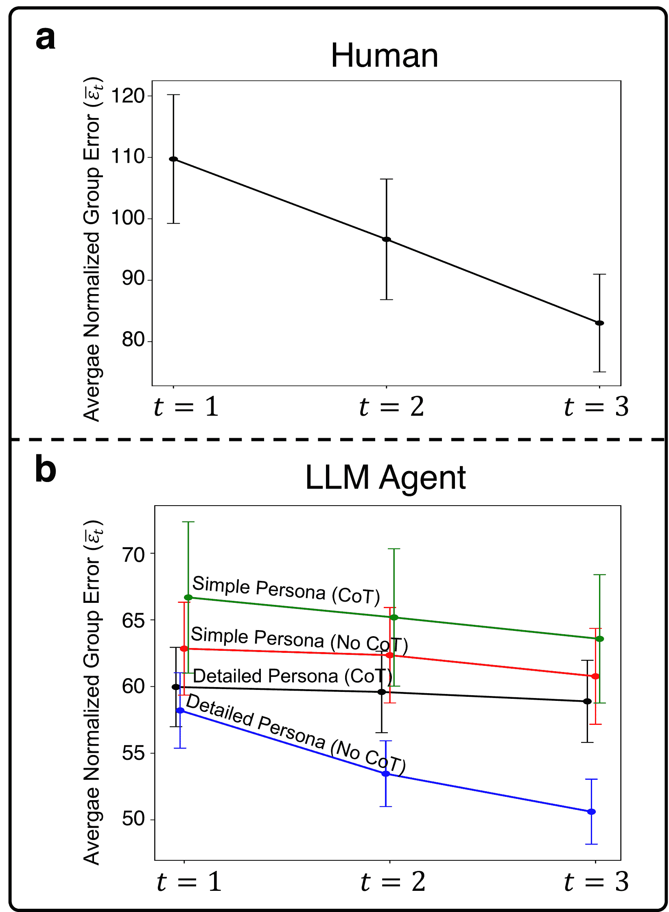
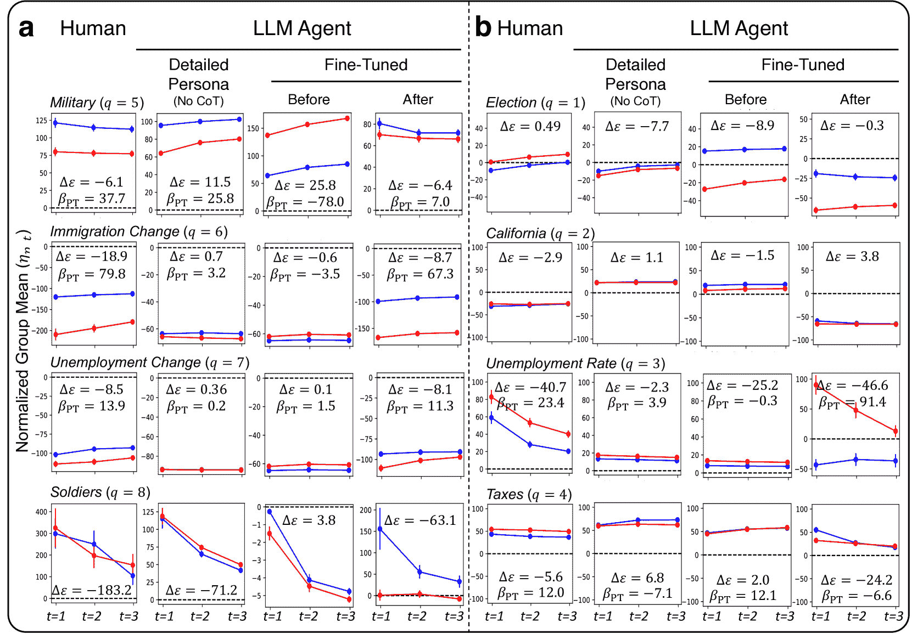
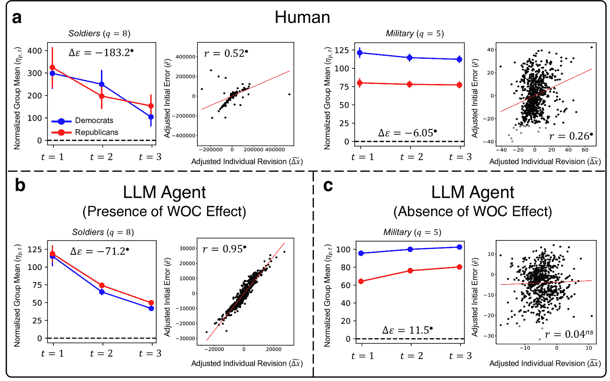
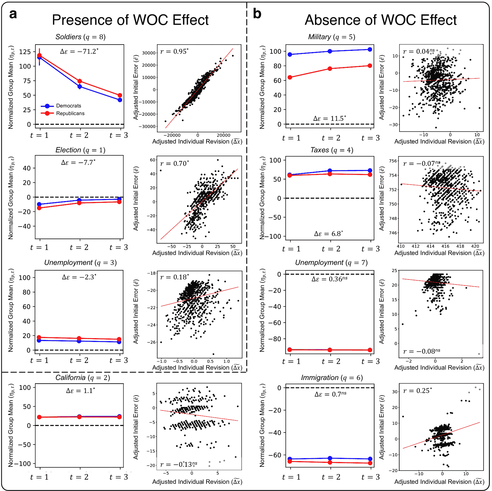
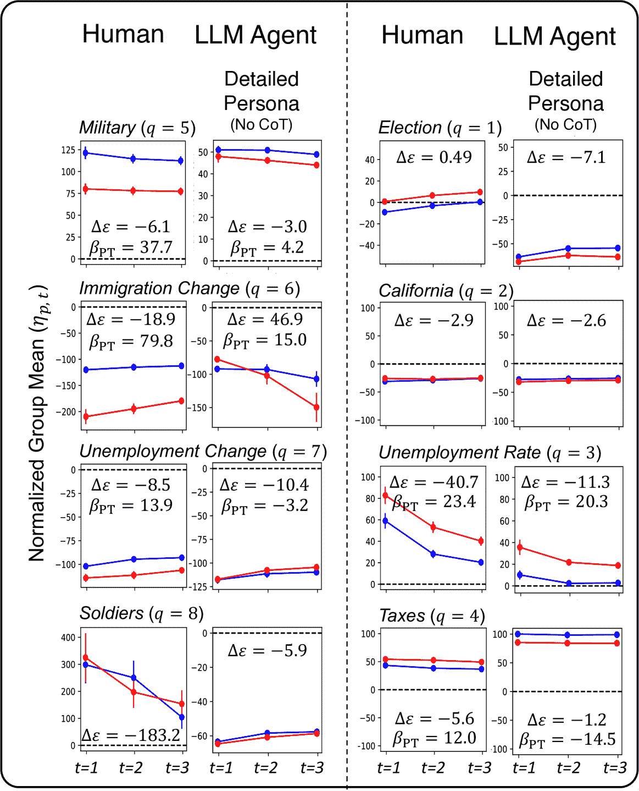

<!--yml

分类：未分类

日期：2025-01-11 13:01:48

-->

# 党派群体的智慧：比较人类与基于LLM的代理的集体智能

> 来源：[https://arxiv.org/html/2311.09665/](https://arxiv.org/html/2311.09665/)

Yun-Shiuan Chuang, Siddharth Suresh${}^{\dagger}$, Nikunj Harlalka${}^{\dagger}$, Agam Goyal

Robert Hawkins, Sijia Yang, Dhavan Shah, Junjie Hu, Timothy T. Rogers

威斯康星大学麦迪逊分校

{yunshiuan.chuang,siddharth.suresh,nharlalka,agoyal25}@wisc.edu

{rdhawkins, syang84, dshah, junjie.hu, ttrogers}@wisc.edu

${}^{\dagger}$ 联合第二作者

###### 摘要

人类群体能够通过审议趋向于更准确的信念，即使在极端分裂和党派偏见存在的情况下——这一现象被称为“党派群体的智慧”。由大型语言模型（LLMs）驱动的生成代理越来越多地被用于模拟人类的集体行为，然而，评估这些代理行为与人类群体行为对比的基准却很少。在本文中，我们探讨了党派群体的智慧在扮演党派角色（如民主党或共和党）的LLM代理群体中是否会出现。我们发现，这些代理不仅展示了类人化的党派偏见，而且通过审议趋向于更准确的信念，正如人类所做的那样。接着，我们识别了几个干扰收敛的因素，包括使用链式思维提示和角色缺乏细节。相反，在人类数据上进行微调似乎能增强收敛性。这些发现展示了基于LLM的代理作为人类集体智能模型的潜力和局限性。

## 1 引言

随着大型语言模型（LLMs）在它们所产生的行为中变得越来越像人类（Park 等，[2022](https://arxiv.org/html/2311.09665v2#bib.bib17)），研究人员越来越关注是否可以利用这些模型更好地理解和模仿人类在社会群体中的沟通（Törnberg 等，[2023](https://arxiv.org/html/2311.09665v2#bib.bib20)；Kaiya 等，[2023](https://arxiv.org/html/2311.09665v2#bib.bib12)；Li 等，[2023](https://arxiv.org/html/2311.09665v2#bib.bib14)；Chuang 等，[2023](https://arxiv.org/html/2311.09665v2#bib.bib7)）。举个例子，Park 等人（[2023](https://arxiv.org/html/2311.09665v2#bib.bib18)）使用LLMs构建了生成型代理，这些代理在模拟环境中彼此互动：启动对话、传播信息、记住过去的事件并规划未来的行动。最终生成的情境展示了相当令人信服的互动，其中关于新事件的信息（例如，生日派对的筹划）在模拟代理的群体中扩散。然而，如果没有可以复制的人类行为的实证基准进行比较，就很难理解这些模式在人类行为上究竟有多像，因此也很难判断这些模拟系统在理解人类沟通现象方面有多有用。

图1：实验设计，比较社交反馈对大语言模型（LLM）代理在党派偏见事实问题上的估计影响。扮演民主党和共和党的LLM代理在考虑了同伴的平均回应后更新他们的估计（Becker 等，[2019](https://arxiv.org/html/2311.09665v2#bib.bib2)）。

本文发展了一个基准，源自人类集体智慧研究中的一个现象——（党派）群体的智慧。这个现象反映了人类认知的两个有趣特征。首先，当估计与政治极化议题相关的现实世界数据时，自认是共和党人和民主党人的个体常常会产生系统性不同的猜测，这些猜测反映了他们的政治倾向。例如，当被要求估算奥巴马政府时期的美国就业率时，两组人都相对真实值进行了高估，但共和党人产生的高估值始终较高，可能是因为他们记得在民主党政府下的失业情况比实际情况更糟。

第二，当看到其偏好党派其他成员的平均猜测时，两个群体都会调整他们的估计值，使得群体的均值系统性地更接近真实值。这个现象被称为*群体智慧*，它是群体通过聚合和讨论汇集个体知识的典型示例（Kameda 等，[2022](https://arxiv.org/html/2311.09665v2#bib.bib13)；Yi 等，[2012](https://arxiv.org/html/2311.09665v2#bib.bib23)）。此外，当个体看到其群体的平均估计并允许调整自己的估计时，群体的平均值变得更加准确（Becker 等，[2017](https://arxiv.org/html/2311.09665v2#bib.bib1)），即便是存在偏见的群体也是如此（Becker 等，[2019](https://arxiv.org/html/2311.09665v2#bib.bib2)）。群体智慧效应，即社会影响提升集体估计，跨越不同文化（Jayles 等，[2017](https://arxiv.org/html/2311.09665v2#bib.bib11)），并应用于实际领域，如临床决策（Centola 等，[2023](https://arxiv.org/html/2311.09665v2#bib.bib4)）和科学传播（Guilbeault 等，[2018](https://arxiv.org/html/2311.09665v2#bib.bib10)）。

在一项开创性的研究中，Becker 等人（[2019](https://arxiv.org/html/2311.09665v2#bib.bib2)）收集了1120名参与者的数据，这些参与者自认是共和党或民主党成员。每个人都被问到一些已知会引发党派偏见的事实性问题，回答后，参与者会看到同一党派群体中其他成员的平均信念（即其他民主党或共和党成员）。然后，参与者可以调整他们的估计，接着重复相同的程序，最终每个参与者会得到三次估计结果。作者观察到，在每轮反馈后，两个党派组的平均估计值都逐渐接近实际真相。

这一党派群众智慧现象对于评估大规模语言模型（LLM）模拟人类沟通有三点重要作用。首先，所有问题都有一个真实的值，这为量化LLM估计的准确性提供了一种方式。其次，人类在估计时通常表现出党派倾向。这为评估角色扮演的LLM是否在人类反应中表现出类似的党派偏见提供了机会。第三，党派群体内部的信息社会交换提高了每个群体的平均准确性，同时也减少了群体间的极化，这为评估LLM代理中可靠的社会动态现象提供了依据。

出于这些原因，我们复制了Becker 等人（[2019](https://arxiv.org/html/2311.09665v2#bib.bib2)）的实验设计，并将其应用于模拟环境中的互动角色扮演LLM代理组，评估结果系统是否复现了人类行为中的关键现象。我们发现，当LLM代理在没有链式思维（CoT）推理的情况下运行时，表现出了显著的党派群众智慧（WOC）效应，这与人类在群体环境中减少错误的模式高度相似。然而，使用CoT推理减少了这一效应。我们还发现，角色扮演提示中创造的“人格深度”对LLM代理是否在估计中表现出类似人类的党派偏见具有决定性影响。最后，用人类数据对LLM进行微调可以增强LLM在保留数据中的类人群体动态，尽管这种训练也有过拟合的风险。综合来看，这项工作为利用人类参与者的既有行为现象来评估和塑造LLM在社会沟通动态中的应用提供了一个有前景的方法。

表1：评估LLM代理与人类在社交互动设置中的相似性。三个人类-LLM对齐的主要指标是，$HLI$（越积极，越像人类），$\overline{\Delta\varepsilon}$（越消极，WOC效应越强）和$\overline{\beta_{\text{PB}}}$（越积极，与人类越对齐）。黑色粗体突出显示具有最高$HLI$的条件。指标以标准误差的形式显示。值得注意的是，当没有CoT推理时，$\overline{\Delta\varepsilon}$总是比使用CoT推理时更消极。此外，使用详细人物设定总是比使用简单人物设定导致更积极的$\overline{\beta_{\text{PB}}}$。

| 模型 | 人物设定 | CoT | $HLI\uparrow$ | $\overline{\Delta\varepsilon}\downarrow$ | $\overline{\beta_{\text{PB}}}\uparrow$ | 扩展百分比 |
| --- | --- | --- | --- | --- | --- | --- |
| ChatGPT | 详细 | CoT | 4.45 ± 0.8 | -1.08 ± 0.76 | 3.37 ± 0.25 | 0.00 |
|  |  | 无CoT | 12.82 ± 1.89 | -7.59 ± 1.87 | 5.23 ± 0.28 | 0.00 |
|  | 简单 | CoT | -20.13 ± 1.1 | -2.07 ± 0.87 | -22.2 ± 0.67 | 0.00 |
|  |  | 无CoT | -21.8 ± 1.77 | -3.11 ± 1.47 | -24.91 ± 0.98 | 0.00 |
| Vicuna-33B | 详细 | CoT | 2.81 ± 1.36 | 2.87 ± 1.27 | 5.68 ± 0.49 | 1.31 |
|  |  | 无CoT | 4.35 ± 2.64 | -0.68 ± 2.51 | 4.36 ± 0.80 | 1.38 |
|  | 简单 | CoT | 3.36 ± 1.25 | 0.59 ± 1.18 | 3.94 ± 0.41 | 0.98 |
|  |  | 无CoT | -0.63 ± 2.63 | 0.49 ± 2.47 | -0.14 ± 0.91 | 5.60 |
| 人类 | - | - | 66.5 ± 6.79 | -33.16 ± 6.74 | 33.35 ± 0.83 | 8.37 |

## 2种方法

### 2.1 实验过程

我们遵循了Becker等人（[2019](https://arxiv.org/html/2311.09665v2#bib.bib2)）的实验设计，使用大型语言模型（LLMs）扮演民主党和共和党的角色。每个LLM代理被嵌入在一个网络结构中，网络结构管理交互，连接到四个与其政治倾向相同的其他代理（所有代理的节点度为$k=4$；参见图[1](https://arxiv.org/html/2311.09665v2#S1.F1 "Figure 1 ‣ 1 Introduction ‣ The Wisdom of Partisan Crowds: Comparing Collective Intelligence in Humans and LLM-based Agents")），从而反映了人类研究中的同质化群体结构。每个LLM代理由LangChain（Chase, [2022](https://arxiv.org/html/2311.09665v2#bib.bib5)）和OpenAI的ChatGPT（gpt-3.5-turbo；OpenAI，[2022](https://arxiv.org/html/2311.09665v2#bib.bib16)）以及开源LLM Vicuna（vicuna-33B-v1.3；Zheng等，[2023](https://arxiv.org/html/2311.09665v2#bib.bib24)）提供支持，在实验过程中保持每个角色的记忆连续性。在三轮实验中，这些代理被提示回答相同的八个具有已知党派偏见的事实性问题，如图[1](https://arxiv.org/html/2311.09665v2#S1.F1 "Figure 1 ‣ 1 Introduction ‣ The Wisdom of Partisan Crowds: Comparing Collective Intelligence in Humans and LLM-based Agents")所示。每轮结束后，代理会收到其连接同伴的平均估计值，并要求再次提供其估计。因此，在三轮实验结束时，每个代理为每个问题提供了三次估计。¹¹1Becker等人（[2019](https://arxiv.org/html/2311.09665v2#bib.bib2)）的原始研究将这些问题分为两个独立的实验，前四个问题属于第一个实验，最后四个问题属于第二个实验。然而，由于两组问题遵循相同的实验程序，我们在本研究中将它们合并为单一分析。问题的完整列表请参见[D](https://arxiv.org/html/2311.09665v2#A4 "Appendix D Full List of Questions ‣ The Wisdom of Partisan Crowds: Comparing Collective Intelligence in Humans and LLM-based Agents")。整个过程每组执行了12次，以模拟Becker等人（[2019](https://arxiv.org/html/2311.09665v2#bib.bib2)）研究中的12组人类参与者的社会条件。使用了温和抽样（温度=0.7）以允许响应的变异性。[F](https://arxiv.org/html/2311.09665v2#A6 "Appendix F Full list of Prompts ‣ The Wisdom of Partisan Crowds: Comparing Collective Intelligence in Humans and LLM-based Agents")展示了实际的提示。使用Vicuna的计算资源在[I](https://arxiv.org/html/2311.09665v2#A9 "Appendix I Compute Resources ‣ The Wisdom of Partisan Crowds: Comparing Collective Intelligence in Humans and LLM-based Agents")中列出。

#### 正式符号

我们在实验中将每个代理表示为 $a_{i,p,r}$，其中 $1\leq i\leq 35$ 是特定运行中代理的索引，$p$ 表示政治倾向（民主党或共和党；以下简称 Dem 和 Rep），$r$ 表示运行的索引，$1\leq r\leq 12$。当上下文明确时，我们会省略下标 $p$ 和 $r$。对于每种政治倾向，在每轮实验中，代理会在三个时间步骤内回答八个问题，生成一系列估算值 $x_{i,q}^{t}$，其中 $q$ 是问题编号，$t$ 是时间步骤。由于所有八个问题都是基于事实的，因此每个问题都有一个真实值，记作 $x^{*}_{q}$。从 $t\geq 2$ 开始，代理会看到 $m^{t}_{i,q}$，即他们四个政治上相似邻居的平均估算值，然后再做出自己的估算。²²2形式上，代理 $a_{i,p,r}$ 在时间 $t$ 针对问题 $q$ 的邻居平均估算值为 $m_{i,p,r,q}^{t}=\frac{1}{K}\sum_{j\in\mathcal{N}(i,p,r)}x_{j,p,r,q}^{t-1}$，其中 $\mathcal{N}(i,p,r)$ 是与代理 $a_{i,p,r}$ 具有相同政治倾向 $p$ 的邻居集合。邻居的数量为 $K=4$。

### 2.2 角色和代理规格

#### 角色和代理规格

我们让大型语言模型（LLMs）扮演不同角色，这些角色是根据不同的背景细节设定的。简单的角色被定义为“典型的民主党人/共和党人”，通过温度采样来引导出略有不同的偏见观点。详细的角色则提供了完整的背景故事，包括人口统计信息和个人背景，基于这些因素引入个体差异。这个角色在三轮调整中会被记住，并用于所有问题的回答。

[C](https://arxiv.org/html/2311.09665v2#A3 "附录 C 角色列表 ‣ 党派群体的智慧：比较人类与基于LLM的代理的集体智能") 显示了详细和简单角色的完整列表。通过 GPT-4 生成了一套多样化的详细角色。

例如，

> 姓名：伊莎贝拉·约翰逊；政治倾向：强烈的民主党人；年龄：67岁；性别：女性；种族：白人；教育背景：教育学学士学位；职业：退休教师；背景：伊莎贝拉来自俄勒冈州波特兰市，职业生涯中致力于倡导公共教育和教师权益。她热衷于社会正义、医疗保健和环境问题。伊莎贝拉是寡妇，育有两个成年的孩子，空闲时喜欢鸟类观察和绘画。

#### 思维链推理（CoT）

我们操控了代理是否使用链式推理（CoT）Wei等人（[2022b](https://arxiv.org/html/2311.09665v2#bib.bib22); [a](https://arxiv.org/html/2311.09665v2#bib.bib21)）。CoT在解决复杂推理任务（如算术问题）中作为提示策略已取得成功。然而，近期的研究也表明，CoT推理可能导致刻板印象和偏见Shaikh等人（[2022](https://arxiv.org/html/2311.09665v2#bib.bib19)）。这促使我们探索CoT推理如何影响LLM代理在社交互动环境中展现类似人类行为的能力。为了引发CoT推理，我们在提示中附加以下内容：

> “请提供您的逐步推理过程，然后给出您的实数估计。”

相反，在没有CoT推理的条件下，我们在提示的结尾加上

> “请提供您的实数估计。”

### 2.3 使用人类数据对LLM进行微调

除了通过提示进行上下文学习外，我们还使用来自Becker等人实验中的人类回应数据进行监督微调（[2019](https://arxiv.org/html/2311.09665v2#bib.bib2)），以增强LLM代理中人类行为的相似性。我们的微调方法灵感来自Binz & Schulz（[2023](https://arxiv.org/html/2311.09665v2#bib.bib3)），他们展示了通过监督学习，LLM可以被调整为在未见任务中模拟人类决策行为。我们旨在研究微调是否也能提高群体互动设置中人类行为的相似性。我们对两个单独的LLM进行微调：一个针对民主党，一个针对共和党。训练数据包括对问题$5\leq q\leq 8$的回答，同时使用问题$1\leq q\leq 4$作为测试集。微调后的模型分别在训练集和测试集上进行评估。在微调时，不提供人物设定。关于我们如何微调LLM（特别是ChatGPT）的详细信息，请参见[H](https://arxiv.org/html/2311.09665v2#A8 "附录H 微调细节 ‣ 党派人群的智慧：比较人类与LLM代理的集体智能")。

### 2.4 评估指标

#### 党派人群智慧效应（WOC）

群体智慧效应量化了通过社会互动改善大语言模型（LLM）代理估计值的效果，这与人类群体的行为相似（Becker等人，[2019](https://arxiv.org/html/2311.09665v2#bib.bib2)）。在每个政治倾向和每次实验中，我们计算每个问题$q$和时间步$t$的组平均值$\bar{x}_{q}^{t}=\frac{1}{N}\sum_{i=1}^{N}x_{i,q}^{t}$（每组$N=35$），以及归一化的组平均值$\eta_{q}^{t}=100\times(\bar{x}_{q}^{t}-x^{*}_{q})/{x^{*}_{q}}$。归一化的组误差$\varepsilon_{q}^{t}=|\eta_{q}^{t}|$表示与真实值$|x^{*}|$的百分比偏差。我们通过$\Delta\varepsilon_{q}=\varepsilon_{q}^{t=3}-\varepsilon_{q}^{t=1}$来衡量每个问题的组误差减少，并对所有问题、所有政治倾向和所有实验进行平均，得到组误差的平均减少$\overline{\Delta\varepsilon}$。更负的$\overline{\Delta\varepsilon}$表示更强的群体智慧效应，$\overline{\Delta\varepsilon}$表示估计值向真实值靠拢的真实值百分比$|x^{*}|$。详细推导请见[J.1](https://arxiv.org/html/2311.09665v2#A10.SS1 "J.1 通过社会互动减少组误差 ‣ 附录J 符号详细定义 ‣ 政党群体智慧：比较人类与基于LLM的代理的集体智慧")。

#### 政党偏见

图2：在不同实验设置下，（a）人类群体和（b）LLM代理（ChatGPT）的平均归一化组误差（$\overline{\varepsilon}_{t}$）。误差条表示标准误差。

为了评估LLM代理中的人类党派偏见，我们将党派偏见定义为在民主党和共和党之间的标准化组均值$\eta_{q}^{t}$的平均差异，这与人类党派偏见的预期方向一致。形式上，对于每个问题$q$，设$\overline{D}_{q}$为在民主党成员的运行和时间步长中平均的标准化组均值$\eta_{q}^{t}$，设$\overline{R}_{q}$为共和党成员的平均值。问题$q$的党派偏见定义为$\beta_{\text{PB}_{q}}=(\overline{R}_{q}-\overline{D}_{q})\times\text{sign}(h_{% q})$，其中$\text{sign}(h_{q})$表示人类党派偏见的方向，依据Becker等人（[2019](https://arxiv.org/html/2311.09665v2#bib.bib2)）的研究数据，$+1$表示共和党通常具有比民主党更大的$\eta_{p,r,q}^{t}$（即，如果$x^{*}_{q}>0$，则$\overline{x}_{q}^{t}$为正），$-1$表示反之，$0$表示没有预期的差异。³³3$\text{sign}(h_{q})$: 在问题3（失业率）、4（税收）中为$+1$；在问题5（军事）、6（移民变动）、7（失业变化）中为$-1$；在问题1（选举）、2（加利福尼亚）、8（士兵）中为$0$。此外，我们将整体党派偏见$\overline{\beta_{\text{PB}}}$定义为所有问题的$\beta_{\text{PB}_{q}}$的平均值。正的$\overline{\beta_{\text{PB}}}$表示整体与人类偏见方向相似，反之亦然⁴⁴4由于$\eta_{q}^{t}$被缩放了100倍，$\overline{\beta_{\text{PB}}}$可以解释为表示党派偏见的百分比，基于真实值$|x^{*}|$的大小。

#### 人类相似度指数

我们引入了人类相似度指数（HLI）来评估大型语言模型（LLM）代理与人类行为的相似程度。为了聚合群体智慧效应（$\overline{\Delta\varepsilon}$）和党派偏见（$\overline{\beta_{\text{PB}}}$），我们定义$HLI=\overline{\beta_{\text{PB}}}+(-\overline{\Delta\varepsilon})$。更高的HLI得分⁵⁵5A 线性加和是合理的，因为$\overline{\beta_{\text{PB}}}$和$\overline{\Delta\varepsilon}$处于相同的量级。两者均可以表示为相对于真实值大小$|x^{*}|$的百分比，表示该组实验中LLM代理的整体人类相似行为更强。

#### 极端值（Ext.%）

Ext.%指标评估LLM代理生成的不现实回答的比例，依据已有标准Becker等人（[2019](https://arxiv.org/html/2311.09665v2#bib.bib2)）提出的标准。为了与人类数据进行公平比较，同样的标准被应用于识别极端值，例如将任何高于47%的失业率回答标记为极端值。这些标准的详细信息请参见[G](https://arxiv.org/html/2311.09665v2#A7 "Appendix G Criteria for Extreme Values ‣ The Wisdom of Partisan Crowds: Comparing Collective Intelligence in Humans and LLM-based Agents")。极端值会被排除在平均群体误差减少（$\overline{\Delta\varepsilon}$）和偏见（$\overline{\beta_{\text{PB}}}$）计算之外。因此，Ext.%作为衡量LLM代理生成不现实回答倾向的指标。

#### 修正系数

在人类群体中，群体均值通过社会互动趋向真实的机制是，初步估计更准确的人往往不太受他们所接收到的信息的影响，因此将群体分布拉向真实（Becker等人，[2017](https://arxiv.org/html/2311.09665v2#bib.bib1)）。根据Becker等人（[2017](https://arxiv.org/html/2311.09665v2#bib.bib1)）的方法论，对于每个问题$q$，我们计算修正系数（$r_{\text{adj},q}$），其定义为个体修正（$\Delta x_{i,q}=|x_{i,q}^{t=3}-x_{i,q}^{t=1}|$）与个体初始误差（$e_{i,q}=|x_{i,q}^{t=1}-x_{q}^{*}|$）之间的部分相关系数，并调整每个个体收到的社会信号（$s_{i,q}=|x_{i,q}^{t=1}-m_{i,q}^{t=2}|$）。调整社会信号非常重要，因为初始误差较大的个体通常会受到更强烈的社会反馈，因为他们与其他人的偏差较大。形式上，$r_{\text{adj},q}=\text{corr}(\widetilde{\Delta x}_{i,q},\widetilde{e}_{i,q})$，其中$\widetilde{\Delta x}_{i,q}$和$\widetilde{e}_{i,q}$是通过社会信号调整后的${\Delta x}_{i,q}$和${e}_{i,q}$。详细推导请参见[J.2](https://arxiv.org/html/2311.09665v2#A10.SS2 "J.2 Deriving the Revision Coefficient ‣ Appendix J Detailed Definition of Notations ‣ The Wisdom of Partisan Crowds: Comparing Collective Intelligence in Humans and LLM-based Agents")。

## 3 结果与讨论

图3：三轮实验中的标准化组均值$\eta_{p,t}$，在12个小组实验中取平均值（红色为共和党，蓝色为民主党），并附有标准误差的误差条。每个面板由四列数据组成，分别代表不同的数据集：第一列展示了人类数据。第二至第四列展示了LLM（ChatGPT）代理的数据。第二列展示了LLM角色扮演详细人物设定且没有链式推理的配置（即具有最高$HLI$的配置）；第三列展示了LLM未进行微调前的结果；第四列展示了微调后的LLM结果。面板（a）包括用于微调LLM代理的训练集问题（$5\leq q\leq 8$），而面板（b）展示了来自保留测试集的问题（$1\leq q\leq 4$）。每个问题特定的WOC效应（$\Delta\varepsilon_{q}$）和党派偏见（$\beta_{\text{PB}_{q}}$，如果有的话）已重叠显示，以便进行比较。

### 3.1 人物设定细节与链式推理的效果

#### 详细人物设定且无链式推理激发群体智慧效应

拥有详细人物设定但没有链式推理（CoT）的LLM代理表现出最接近人类群体动态的特征。它们在六种实验设置中展示了最高的人类相似度，$HLI=12.82$（ChatGPT）和$3.67$（Vicuna）（表格[1](https://arxiv.org/html/2311.09665v2#S1.T1 "Table 1 ‣ 1 Introduction ‣ The Wisdom of Partisan Crowds: Comparing Collective Intelligence in Humans and LLM-based Agents")）。图[2](https://arxiv.org/html/2311.09665v2#S2.F2 "Figure 2 ‣ Partisan Bias ‣ 2.4 Evaluation Metrics ‣ 2 Methods ‣ The Wisdom of Partisan Crowds: Comparing Collective Intelligence in Humans and LLM-based Agents")展示了LLM代理（ChatGPT）偏向的群体智慧结果。这些代理在社交互动后显著趋近于真实情况，这一效果通过显著的WOC效应量化，$\overline{\Delta\varepsilon}=-7.59$，$CI_{95\%}=[-11.08,-4.10]$，$p<.001$。同时，结果还显示出显著的人类偏见，$\overline{\beta_{\text{PB}}}=5.23,CI_{95\%}=[4.66,5.81]$，$p<.001$。⁶⁶6这些p值和95%的置信区间（$CI_{95\%}$）来自于1000次重采样的自助法（Efron，[1992](https://arxiv.org/html/2311.09665v2#bib.bib8)）。图[3](https://arxiv.org/html/2311.09665v2#S3.F3 "Figure 3 ‣ 3 Results and Discussion ‣ The Wisdom of Partisan Crowds: Comparing Collective Intelligence in Humans and LLM-based Agents")展示了每个问题的详细结果。

接下来，我们分别探讨角色细节和CoT推理的作用。与Vicuna的结果如图[6](https://arxiv.org/html/2311.09665v2#A2.F6 "Figure 6 ‣ Appendix B Vicuna Results ‣ The Wisdom of Partisan Crowds: Comparing Collective Intelligence in Humans and LLM-based Agents")所示，在[B](https://arxiv.org/html/2311.09665v2#A2 "Appendix B Vicuna Results ‣ The Wisdom of Partisan Crowds: Comparing Collective Intelligence in Humans and LLM-based Agents")中。正如表[1](https://arxiv.org/html/2311.09665v2#S1.T1 "Table 1 ‣ 1 Introduction ‣ The Wisdom of Partisan Crowds: Comparing Collective Intelligence in Humans and LLM-based Agents")所示，没有CoT推理时，代理通过社交互动减少的错误量始终大于有CoT推理时的减少量，$\overline{\Delta\varepsilon}$（没有CoT）$<$ $\overline{\Delta\varepsilon}$（有CoT），差异$=4.63$，$CI_{95\%}=[2.10,7,20]$，$p<.001$。例如，当进行详细角色扮演时，LLM代理（ChatGPT）在没有CoT推理时的错误减少量为$\overline{\Delta\varepsilon}=-7.59$，而有CoT推理时的错误减少量为$\overline{\Delta\varepsilon}=-1.08$，差异$=6.52$，$CI_{95\%}=[2.59,10.72]$，$p<.001$。此外，如图[2](https://arxiv.org/html/2311.09665v2#S2.F2 "Figure 2 ‣ Partisan Bias ‣ 2.4 Evaluation Metrics ‣ 2 Methods ‣ The Wisdom of Partisan Crowds: Comparing Collective Intelligence in Humans and LLM-based Agents")b所示，没有CoT推理时，平均归一化群体错误$\overline{\varepsilon}_{t}$始终小于没有CoT推理时的结果。Vicuna的结果显示出相似的模式。

#### 详细的角色设定和CoT推理促进了类人偏袒性别。

角色细节的深度和CoT推理的使用显著增加了LLM代理在偏袒性别方面与人类的相似度$\overline{\beta_{\text{PB}}}$（表[1](https://arxiv.org/html/2311.09665v2#S1.T1 "Table 1 ‣ 1 Introduction ‣ The Wisdom of Partisan Crowds: Comparing Collective Intelligence in Humans and LLM-based Agents")）。详细的角色设定使两种LLM在两种CoT推理条件下都呈现出更具人类特色的偏袒性别，$\overline{\beta_{\text{PB}}}$（详细角色）$>$ $\overline{\beta_{\text{PB}}}$（简单角色），差异 = $15.48$，$CI_{95\%}=[14.63,16.36]$，$p<.001$。另一方面，使用CoT推理也使两种LLM在所有条件下都呈现出更具人类特色的偏袒性别，$\overline{\beta_{\text{PB}}}$（CoT）$>$ $\overline{\beta_{\text{PB}}}$（没有CoT），差异 = $13.64$，$CI_{95\%}=[12.48,14.78]$，$p<.001$。

这个例子展示了在角色扮演场景中，LLM代理的CoT推理受到其角色设定的影响大于事实准确性。

### 3.2 微调对增强类人动态的影响

如表格[2](https://arxiv.org/html/2311.09665v2#S3.T2 "表格 2 ‣ 3.2 微调对增强类人动态的影响 ‣ 3 结果与讨论 ‣ 党派人群的智慧：比较人类与基于LLM的代理的集体智慧")和图表[3](https://arxiv.org/html/2311.09665v2#S3.F3 "图 3 ‣ 3 结果与讨论 ‣ 党派人群的智慧：比较人类与基于LLM的代理的集体智慧")所示，在训练集（问题 $5\leq q\leq 8$）中，类人指数（$HLI$）从微调前的 $-33.95$ 提升至 $50.11$，党派偏差 $\overline{\beta_{\text{PB}}}$ 从 $-26.68$ 增加至 $28.53$，差异 = 55.20，置信区间 $CI_{95\%}=[52.55,58.00]$，$p<.001$，集体智慧效应 $\overline{\Delta\varepsilon}$ 从 $7.27$ 变化为 $-21.59$，差异 = 28.86，置信区间 $CI_{95\%}=[-41.52,-18.44]$，$p<.001$。然而，在测试集（问题 $1\leq q\leq 4$）中，极值增加（$\textit{Ext.\%}=29.94\%$），这表明存在过拟合的风险。例如，经过微调的LLM代理倾向于对失业率估算（$q=3$）给出负估计（最高可达 $84.52\%$），这种估计被认为无效并被视为极值，推测是因为存在一个关于失业率变化的相似措辞问题，其中许多人类给出了负面的估计（$46.90\%$ 的回答）。尽管如此，经过筛选极值响应后，微调模型仍然显示出强烈的类人行为，$HLI$ 增强至 $31.97$（从微调前的 $0.11$ 增加），而 $\overline{\beta_{\text{PB}}}=-14.1$（从 $2.31$ 增加，差异 = 16.42，置信区间 $CI_{95\%}=[-22.10,-10.17]$，$p<.001$）和 $\overline{\Delta\varepsilon}=-14.1$（从 $2.31$ 变化，差异 = 15.67，置信区间 $CI_{95\%}=[11.37,20.47]$，$p<.001$）。这些发现表明，微调可以大大增强LLM代理的类人特质，并且如果正确应用筛选标准，甚至能够很好地推广到未见过的问题。

表 2：评估微调后的LLM与人类群体动态的对齐情况，在训练集（$5\leq q\leq 8$）和测试集（$1\leq q\leq 4$）中的表现。粗体部分突出显示了微调的结果。

| 方法 | $HLI\uparrow$ | $\overline{\Delta\varepsilon}\downarrow$ | $\overline{\beta_{\text{PB}}}\uparrow$ | Ext.% |
| --- | --- | --- | --- | --- |
| 微调前 |  |  |  |
|    训练 | -33.95 ± 1.58 | 7.27 ± 1.18 | -26.68 ± 1.04 | 0.00 |
|    测试 | -0.11 ± 0.75 | 2.31 ± 0.73 | 2.2 ± 0.14 | 0.00 |
| 微调后 |  |  |  |
|    训练 | 50.11 ± 6.18 | -21.59 ± 6.12 | 28.53 ± 0.89 | 0.09 |
|    测试 | 31.97 ± 3.77 | -14.1 ± 3.02 | 17.87 ± 2.26 | 29.94 |
| 人类 |  |  |  |  |
|    训练 | 97.95 ± 13.02 | -54.15 ± 12.97 | 43.8 ± 1.20 | 8.11 |
|    测试 | 29.83 ± 2.21 | -12.16 ± 2.07 | 17.67 ± 0.78 | 8.64 |

图4：为什么群体和大型语言模型（LLM）代理的群体智慧效应（WOC效应）会出现的机制。面板（a）和（b）展示了在人类和LLM代理通过社交互动（即，特定问题的WOC效应$\Delta\varepsilon_{q}<0$）下，二者都展示了WOC效应的例子。相比之下，在面板（c）中，LLM代理并未朝向真实答案收敛，而人类则有此表现。在每个面板中，线形图展示了经过标准化的群体均值$\eta_{p,t}$在三轮中的变化轨迹，平均值基于12次实验（红色代表共和党，蓝色代表民主党），误差条表示标准误差。每个面板中的$r$展示了修正系数——调整后的初始个体误差$\widetilde{e}_{i,p,r,q}$与调整后的估计修正$\widetilde{\Delta x}_{i,p,r,q}$之间的相关性$r_{\text{adj}}$（[2.4](https://arxiv.org/html/2311.09665v2#S2.SS4 "2.4 评估指标 ‣ 2 方法 ‣ 党派群体的智慧：比较人类与基于LLM的代理的集体智慧")）。与人类群体类似，LLM代理仅当$r_{\text{adj}}>0$时才展示WOC效应。所有问题的结果展示在图[5](https://arxiv.org/html/2311.09665v2#A1.F5 "图5 ‣ 附录A 修正系数的结果 ‣ 党派群体的智慧：比较人类与基于LLM的代理的集体智慧")（[A](https://arxiv.org/html/2311.09665v2#A1 "附录A 修正系数的结果 ‣ 党派群体的智慧：比较人类与基于LLM的代理的集体智慧")）。${}^{*}$: $p<.01$（针对所有问题的Bonferroni校正）；${}^{\textit{ns}}$: 无显著性。

### 3.3 群体智慧效应的机制

在人类群体动力学中，群体智慧（WOC）效应出现在那些最初估计准确的个体较少受到他人影响的情况，这一点通过正向修正相关系数来体现（Becker 等，[2017](https://arxiv.org/html/2311.09665v2#bib.bib1)）。这一机制不同于群体内错误减少均匀分布的情形。我们的分析（详见图[4](https://arxiv.org/html/2311.09665v2#S3.F4 "Figure 4 ‣ 3.2 Impact of Fine-Tuning on Enhancing Human-Like Dynamics ‣ 3 Results and Discussion ‣ The Wisdom of Partisan Crowds: Comparing Collective Intelligence in Humans and LLM-based Agents") 和 [5](https://arxiv.org/html/2311.09665v2#A1.F5 "Figure 5 ‣ Appendix A Results of Revision Coefficient ‣ The Wisdom of Partisan Crowds: Comparing Collective Intelligence in Humans and LLM-based Agents")）表明，LLM代理表现出相似的模式：当修正系数显著为正（$r_{adj}>0$，$ps<.001$）时，WOC效应才会出现（$\Delta\varepsilon_{q}<0, ps<.001$⁷⁷7经过Bonferroni校正后，对于$\Delta\varepsilon_{q}<0$和$r_{adj}>0$的p值）。相反，当修正系数不是正值时，WOC效应永远不会出现。总之，LLM代理的WOC效应通过与人类群体相同的机制出现，其中最初估计更精确的个体对群体最终共识产生更大的影响。

## 4 相关工作

#### 使用基于LLM的代理模拟类人群体动力学

基于LLM的代理在社交模拟中的应用研究正在扩展（Park 等，[2023](https://arxiv.org/html/2311.09665v2#bib.bib18); [2022](https://arxiv.org/html/2311.09665v2#bib.bib17); Kaiya 等，[2023](https://arxiv.org/html/2311.09665v2#bib.bib12); Törnberg 等，[2023](https://arxiv.org/html/2311.09665v2#bib.bib20); Li 等，[2023](https://arxiv.org/html/2311.09665v2#bib.bib14) )。然而，这些行为尚未与实际的人类数据进行评估，因此它们与人类行为的相似程度仍不明确。同样，Törnberg 等人（[2023](https://arxiv.org/html/2311.09665v2#bib.bib20)）使用LLM和基于代理的建模来模拟社交媒体平台，评估不同新闻推送算法的效果，但也没有与人类互动进行对比。Park 等人（[2022](https://arxiv.org/html/2311.09665v2#bib.bib17)）展示了LLM驱动的代理能够在Reddit等平台上发布类人内容。然而，他们的研究并未测试这些代理是否能代表特定人群的行为，如政治倾向。这突出表明该领域的一个关键空白：评估基于人口特征的LLM代理在社交互动中的类人程度。

#### 通过社交互动实现群体智慧

对群体智慧效应（WOC）的研究一贯表明，社会互动能够优化人类群体的集体估计。Becker等人（[2017](https://arxiv.org/html/2311.09665v2#bib.bib1)）证明，在去中心化网络中，信息交换能够提高集体准确性，Becker等人（[2019](https://arxiv.org/html/2311.09665v2#bib.bib2)）则表明，这种效应也会出现在政治上同质化的群体中。此外，他们还找到了WOC通过社会互动产生的机制：初始错误较大的个体会更多地调整自己的估计，从而促成集体智慧的形成。此外，这一效应在不同文化中都具有稳健性（Jayles等人，[2017](https://arxiv.org/html/2311.09665v2#bib.bib11)）。这一效应还被应用于现实世界的场景，例如临床决策（Centola等人，[2023](https://arxiv.org/html/2311.09665v2#bib.bib4)）和科学传播（Guilbeault等人，[2018](https://arxiv.org/html/2311.09665v2#bib.bib10)）。这些研究验证了在集体智能中使用社会信息作为一种稳健的基准，以评估人类社交互动中的类人行为。

## 5 结论

我们的研究利用Becker等人（[2019](https://arxiv.org/html/2311.09665v2#bib.bib2)）的实验设计，在模拟环境中评估基于大型语言模型（LLM）的智能体。研究结果揭示了它们在模拟人类群体动态方面的潜力。我们发现，当LLM智能体扮演详细的角色时，展现出“党派人群效应”的智慧，类似于人类群体中减少错误的现象。然而，结合连贯推理（CoT）或缺乏详细角色设定，往往会削弱这一效应。此外，智能体角色的细节程度显著影响其展现人类党派偏见的方式。通过使用人类数据对LLM进行微调，进一步增强了它们在应对未见问题时复制人类群体动态的能力。本研究强调了基于LLM的智能体在通过经验性人类数据支撑时，能够产生类人群体动态的潜力。

尽管存在人工实验设置（Becker等人，[2019](https://arxiv.org/html/2311.09665v2#bib.bib2)），我们的研究指向了一个有前景的方向，即利用人类参与者的已知行为现象来评估和塑造LLM，以模拟人类社会交流动态。展望未来，我们设想，通过将人类社会互动数据融入LLM智能体的开发中，未来的研究可以开发出能够模拟人类行为的LLM智能体，用于更广泛的社会模拟，这些模拟通常使用基于智能体的模型来解决（Lorenz等人，[2021](https://arxiv.org/html/2311.09665v2#bib.bib15)；Flache等人，[2017](https://arxiv.org/html/2311.09665v2#bib.bib9)；Chuang & Rogers，[2023](https://arxiv.org/html/2311.09665v2#bib.bib6)）。

## 参考文献

+   Becker 等 (2017) Joshua Becker, Devon Brackbill 和 Damon Centola. 群体智慧中的社会影响网络动态。*美国国家科学院院刊*，114(26):E5070, 2017。

+   Becker 等 (2019) Joshua Becker, Ethan Porter 和 Damon Centola. 党派群体的智慧。*美国国家科学院院刊*，116(22):10717–10722, 2019年。

+   Binz & Schulz (2023) Marcel Binz 和 Eric Schulz. 将大型语言模型转化为认知模型。*arXiv 预印本 arXiv:2306.03917*，2023年。

+   Centola 等 (2023) Damon Centola, Joshua Becker, Jingwen Zhang, Jaya Aysola, Douglas Guilbeault 和 Elaine Khoong. 实验证据表明结构化信息共享网络可以减少医疗错误。*美国国家科学院院刊*，120(31):e2108290120，2023年。

+   Chase (2022) Harrison Chase. Langchain, 2022年10月。网址 [https://github.com/langchain-ai/langchain](https://github.com/langchain-ai/langchain)。

+   Chuang & Rogers (2023) Yun-Shiuan Chuang 和 Timothy T Rogers. 基于计算代理的意见动态模型：关于社会模拟与实证研究的综述。*arXiv 预印本 arXiv:2306.03446*，2023年。

+   Chuang 等 (2023) Yun-Shiuan Chuang, Agam Goyal, Nikunj Harlalka, Siddharth Suresh, Robert Hawkins, Sijia Yang, Dhavan Shah, Junjie Hu 和 Timothy T Rogers. 使用基于大型语言模型（LLM）代理的网络模拟意见动态。*arXiv 预印本 arXiv:2311.09618*，2023年。

+   Efron (1992) Bradley Efron. 自助法：另一种对jackknife方法的考察。收录于 *统计学突破：方法学与分布*，第569–593页，Springer，1992年。

+   Flache 等 (2017) Andreas Flache, Michael Mäs, Thomas Feliciani, Edmund Chattoe-Brown, Guillaume Deffuant, Sylvie Huet 和 Jan Lorenz. 社会影响模型：走向下一个前沿。*人工社会与社会模拟期刊*，20(4)，2017年。

+   Guilbeault 等 (2018) Douglas Guilbeault, Joshua Becker 和 Damon Centola. 社会学习与党派偏见对气候趋势解读的影响。*美国国家科学院院刊*，115(39):9714–9719, 2018。

+   Jayles 等 (2017) Bertrand Jayles, Hye-rin Kim, Ramón Escobedo, Stéphane Cezera, Adrien Blanchet, Tatsuya Kameda, Clément Sire 和 Guy Theraulaz. 社会信息如何改善人类群体中的估计准确性。*美国国家科学院院刊*，114(47):12620–12625, 2017。

+   Kaiya 等 (2023) Zhao Kaiya, Michelangelo Naim, Jovana Kondic, Manuel Cortes, Jiaxin Ge, Shuying Luo, Guangyu Robert Yang 和 Andrew Ahn. Lyfe代理：用于低成本实时社交互动的生成代理。*arXiv 预印本 arXiv:2310.02172*，2023年。

+   Kameda 等 (2022) Tatsuya Kameda, Wataru Toyokawa 和 R Scott Tindale. 信息汇总与集体智慧超越群体智慧。*自然评论心理学*，1(6):345–357, 2022年。

+   李等人（2023）超·李，星·苏，超·范，昊颖·韩，聪·薛，春默·郑。量化大型语言模型对集体意见动态的影响。*arXiv预印本arXiv:2308.03313*，2023年。

+   洛伦茨等人（2021）简·洛伦茨，马丁·诺伊曼，托比亚斯·施罗德。个体态度变化与社会动态：基于心理学理论的计算实验。*心理学评论*，128(4):623，2021年。

+   OpenAI（2022）OpenAI。介绍ChatGPT。[https://openai.com/blog/chatgpt](https://openai.com/blog/chatgpt)，2022年。[访问日期：2023年10月13日]。

+   Park等人（2022）俊昇·朴，林赛·波波夫斯基，凯莉·蔡，梅雷迪思·林戈尔·莫里斯，珀西·梁，迈克尔·S·伯恩斯坦。社交模拟：为社交计算系统创建人口原型。在*第35届ACM用户界面软件与技术年会论文集*，第1-18页，2022年。

+   Park等人（2023）俊昇·朴，约瑟夫·奥布莱恩，凯莉·君·蔡，梅雷迪思·林戈尔·莫里斯，珀西·梁，迈克尔·S·伯恩斯坦。生成代理：人类行为的互动模拟。在*第36届ACM用户界面软件与技术年会论文集*，第1-22页，2023年。

+   沙伊赫等人（2022）奥马尔·沙伊赫，洪鑫·张，威廉·赫尔德，迈克尔·伯恩斯坦，狄伊·杨。再三思考，还是不要一步一步思考！零-shot推理中的偏见和毒性。*arXiv预印本arXiv:2212.08061*，2022年。

+   托恩伯格等人（2023）佩特·托恩伯格，迪利阿拉·瓦莱娃，贾斯图斯·乌特马克，克里斯托弗·贝尔。使用大型语言模型模拟社交媒体，评估替代新闻推送算法。*arXiv预印本arXiv:2310.05984*，2023年。

+   魏等人（2022a）杰森·魏，易·泰，瑞希·博马萨尼，科林·拉费尔，巴雷特·佐夫，塞巴斯蒂安·博尔乔，丹尼·尤加塔玛，马尔滕·博斯玛，邓尼·周，唐纳德·梅茨勒，艾德·H·池，田统·桥本，奥里奥尔·维尼亚尔斯，珀西·梁，杰夫·迪恩，威廉·费杜斯。大型语言模型的涌现能力。*机器学习研究学报*，2022a年。ISSN 2835-8856。网址[https://openreview.net/forum?id=yzkSU5zdwD](https://openreview.net/forum?id=yzkSU5zdwD)。调查认证。

+   魏等人（2022b）杰森·魏，薛志·王，戴尔·舒尔曼，马尔滕·博斯玛，费伊·夏，艾德·H·池，阔·V·黎，邓尼·周，等人。链式思维提示引发大型语言模型的推理。在*神经信息处理系统进展*，2022b年。

+   易等人（2012）圣·孔·迈克尔·易，马克·斯泰弗斯，迈克尔·D·李，马修·J·德赖。组合问题中的群体智慧。*认知科学*，36(3):452–470，2012年。

+   郑等人（2023）廉敏·郑，魏林·姜，英·盛，思远·庄，张昊·吴，永浩·庄，子林·朱，浩然·李，大成·李，埃里克·邢，等人。使用mt-bench和chatbot arena评判llm-as-a-judge。*arXiv预印本arXiv:2306.05685*，2023年。

## 附录A 修订系数的结果

图 5：分析LLM代理在个体层面上展现的群体智慧效应（WOC）机制。面板（a）显示LLM代理表现出WOC效应的问题（$\Delta\varepsilon_{q}<0$）。面板（b）显示LLM代理没有表现出WOC效应的问题。在每个面板中，问题按修正相关性$r_{\text{adj}}$排序。在每个面板中，折线图展示了标准化的群体均值$\eta_{p,t}$在三轮中的轨迹，平均值来自12次实验（红色为共和党，蓝色为民主党），误差条表示标准误差。每个面板中的图示展示了修正系数，调整后的初始个体误差$\widetilde{e}_{i,p,r,q}$与调整后的估计修正$\widetilde{\Delta x}_{i,p,r,q}$之间的相关性$r_{\text{adj}}$（[2.4](https://arxiv.org/html/2311.09665v2#S2.SS4 "2.4 评估指标 ‣ 2 方法 ‣ 党派群体智慧：比较人类与基于LLM的代理的集体智能")）。LLM代理只有在$r_{\text{adj}}>0$时才表现出WOC效应（面板a）。${}^{*}$：$p<.01$（针对所有问题的Bonferroni校正）；${}^{\textit{ns}}$：无显著性。

图[5](https://arxiv.org/html/2311.09665v2#A1.F5 "图 5 ‣ 附录 A 修正系数结果 ‣ 党派群体智慧：比较人类与基于LLM的代理的集体智能")详细描述了修正系数的分析。具体来说，群体智慧效应只有在修正系数为正时才会出现，反映了人类行为的相似性。像人类群体一样，当初步估计更为准确的个体不太受同侪意见的影响时，LLM代理能够增强集体的准确性，从而引导群体朝向更为准确的集体估计。

## 附录 B Vicuna 结果

图 6：标准化群体均值$\eta_{p,t}$在三轮中的轨迹，平均值来自12次小组实验（红色为共和党，蓝色为民主党），误差条表示标准误差。每个面板由两列数据组成，分别表示不同的数据集：第1列显示人类数据，第2列显示LLM（Vicuna）代理的数据。我们将问题分为两个面板，以便与图[3](https://arxiv.org/html/2311.09665v2#S3.F3 "图 3 ‣ 结果与讨论 ‣ 党派群体智慧：比较人类与基于LLM的代理的集体智能")进行比较，其中面板（a）包含问题$5\leq q\leq 8$，面板（b）展示问题$1\leq q\leq 4$。每个问题的WOC效应（$\Delta\varepsilon_{q}$）和党派偏差（$\beta_{\text{PB}_{q}}$，如果预期存在）被重叠显示以便比较。

图[3](https://arxiv.org/html/2311.09665v2#S3.F3 "图 3 ‣ 3 结果与讨论 ‣ 党派人群的智慧：比较人类与基于LLM的代理的集体智慧")展示了人类与基于ChatGPT的LLM代理的结果。在这里，我们展示了人类与基于Vicuna的LLM代理的结果，如图[6](https://arxiv.org/html/2311.09665v2#A2.F6 "图 6 ‣ 附录B Vicuna结果 ‣ 党派人群的智慧：比较人类与基于LLM的代理的集体智慧")所示。如图所示，基于Vicuna的LLM代理在除了问题$q=6$外，所有问题都表现出了WOC效应（$\overline{\Delta\varepsilon}<0$），$p<.001$（经过Bonferroni校正）。

## 附录C 人物角色列表

### C.1 详细人物角色条件

在本节中，我们列出了在实验中与我们互动的代理人物角色。实验中使用了35个民主党和共和党人物角色。为简洁起见，这里仅包含其中的一个子集。完整的人物角色集将在发布时与代码库一起发布。人物角色列表是使用以下提示生成的（PARTY可以是共和党或民主党），并由GPT4（OpenAI, [2022](https://arxiv.org/html/2311.09665v2#bib.bib16)）生成：

> 为35个自认为是PARTY且年龄超过18岁的个体创建详细描述，涵盖不同的政治倾向（从倾向PARTY到坚定PARTY）。确保他们的人口统计信息多样化，并且反映美国人口的实际分布，包括年龄、性别、种族、教育程度和职业等因素。为每个人提供全面的背景信息。使用以下格式：姓名：[] 政治倾向：[] 年龄：[] 性别：[] 种族：[] 教育：[] 职业：[] 背景：[]

#### 民主党

姓名：伊莎贝拉·约翰逊 政治倾向：强烈支持民主党 年龄：67 性别：女性 民族：白人 教育背景：教育学学士 学历 职业：退休教师 背景：伊莎贝拉来自俄勒冈州波特兰市，整个职业生涯致力于倡导公共教育和教师权益。她对社会正义、医疗保健和环境问题充满热情。伊莎贝拉是寡妇，有两个成年的孩子，空闲时喜欢观鸟和绘画。姓名：贾马尔·布朗 政治倾向：倾向支持民主党 年龄：51 性别：男性 民族：非裔美国人 教育背景：金融学学士 学历 职业：金融分析师 背景：贾马尔在密歇根州底特律长大，并在2008年经济衰退期间开始参与政治。他支持促进经济公平和机会平等的政策。贾马尔离异，有一个孩子，空闲时喜欢打高尔夫和参加爵士乐会。姓名：凯伦·帕特尔 政治倾向：温和派民主党 年龄：34 性别：女性 民族：印度裔美国人 教育背景：计算机科学硕士 学历 职业：软件工程师 背景：凯伦出生在加利福尼亚州圣荷西市，强烈支持可负担住房和科技行业监管政策。她还支持女性权益和STEM教育。凯伦已婚，育有两个年幼的孩子，空闲时喜欢远足和进行编码项目。姓名：拉里·杰克逊 政治倾向：强烈支持民主党 年龄：42 性别：男性 民族：白人 教育背景：社会学学士 学历 职业：非营利组织筹款人 背景：拉里来自威斯康星州麦迪逊市，积极参与当地政治。他热衷于收入不平等、种族正义和LGBTQ+权益。拉里已婚，无子女，空闲时喜欢旅行和为进步事业做志愿工作。姓名：莫妮卡·罗德里格斯 政治倾向：倾向支持民主党 年龄：48 性别：女性 民族：波多黎各人 教育背景：护理学副学士 学历 职业：注册护士 背景：莫妮卡在纽约市长大，支持改善医疗保健的可及性和质量的政策。她还关心可负担住房和教育改革。莫妮卡是两个孩子的单亲母亲，空闲时喜欢萨尔萨舞和烹饪。

#### 共和党人

姓名：查尔斯·马修斯 政治倾向：倾向共和党 年龄：38 性别：男 民族：非洲裔美国人 教育：工商管理学士学位 职业：小企业主 背景：查尔斯出生并成长于乔治亚州的亚特兰大，他在一所公立大学学习后开始了自己的生意。他有一个妻子和两个孩子。查尔斯支持有限的政府干预和较低的税收，他重视创业精神和自力更生。姓名：爱丽丝·汤普森 政治倾向：温和共和党 年龄：29 性别：女 民族：白人 教育：公共卫生硕士学位 职业：流行病学家 背景：爱丽丝在俄亥俄州的一个小镇长大，后来搬到费城继续学业。她热衷于公共卫生，认为政策应基于数据。由于其财政保守主义和支持个人权利，她倾向于共和党。姓名：胡安·罗德里格斯 政治倾向：强烈共和党 年龄：45 性别：男 民族：西班牙裔 教育：高中毕业 职业：建筑工人 背景：胡安来自墨西哥，在他还是孩子时与家人一起移居到德克萨斯州。他是三个孩子的父亲，坚信传统家庭价值观、辛勤工作和有限政府。他是坚决支持保护国家边界的倡导者。姓名：莎拉·张 政治倾向：倾向共和党 年龄：23 性别：女 民族：亚裔美国人 教育：环境科学学士学位 职业：环境顾问 背景：莎拉在加利福尼亚州出生并长大。她支持自由市场解决环境问题，认为资源管理应负责任。由于她在财政上的保守观点以及反对过度政府监管，莎拉倾向于共和党。姓名：罗伯特·克莱因 政治倾向：温和共和党 年龄：64 性别：男 民族：白人 教育：工程学士学位 职业：退休工程师 背景：罗伯特是宾夕法尼亚州人，在一家大型制造公司工作了30多年。他是越战老兵，坚决支持第二修正案。罗伯特相信财政责任、有限政府和强大的国家防御。

### C.2 简单角色条件

#### 民主党人

美国典型的民主党人。

#### 共和党人

美国典型的共和党人。

## 附录 D 问题完整列表

以下是实验中所有问题（$q\in[1,8]$）的完整列表，包含了每个问题的真实答案 $x^{*}_{q}$ 和在人的数据中观察到的人类偏向方向的符号 $\text{sign}(h_{q})$（见Becker等人，[2019](https://arxiv.org/html/2311.09665v2#bib.bib2)）。

1.  1.

    在2004年选举中，个人捐赠了2.698亿美元给共和党候选人乔治·W·布什。他们捐赠给民主党候选人约翰·凯瑞多少钱？（答案以百万美元为单位，例如，1表示100万美元。）[$x_{1}^{*}=224.6$，$\text{sign}(h_{1})=0$]

1.  2.

    根据2010年的估计，加利福尼亚州有多少百分比的人认同自己是黑人/非洲裔美国人、西班牙裔或亚洲人？（请给出一个从0到100的数字。）[$x_{2}^{*}=60.2$, $\text{sign}(h_{2})=0$]

1.  3.

    巴拉克·奥巴马总统任期结束时，美国的失业率是多少——也就是说，2016年12月有多少人处于失业状态？（请给出一个从0到100的数字。）[$x_{3}^{*}=4.9$, $\text{sign}(h_{3})=1$]

1.  4.

    1980年，税收占经济总量（国内生产总值的比例）为18.5%。2010年税收占经济总量的百分比是多少？（请给出一个从0到100的数字。）[$x_{4}^{*}:14.6$, $\text{sign}(h_{4})=1$]

1.  5.

    2016财政年度，联邦政府每花费一美元，大约有多少用于国防部（美国军队）？请用一个0到100之间的数字回答。[$x_{5}^{*}=15$, $\text{sign}(h_{5})=-1$]

1.  6.

    2007年，估计有690万来自墨西哥的非法移民生活在美国。到2016年，在特朗普总统当选之前，这一数字发生了多少变化？请以变化百分比的形式表达你的答案。[$x_{6}^{*}=-27.8$, $\text{sign}(h_{6})=-1$]

1.  7.

    从民主党总统巴拉克·奥巴马上任到任期结束，美国失业率变化了多少？请以变化百分比的形式表达你的答案。[$x_{7}^{*}=-46$, $\text{sign}(h_{7})=-1$]

1.  8.

    从2003年入侵到2011年12月撤军，美国在伊拉克阵亡的士兵大约有多少？[$x_{7}8*=4486$, $\text{sign}(h_{8})=0$]

## 附录E 列出引发的党派偏见

以下是与实验中的问题（$q\in[1,8]$）对应的引发党派偏见的完整列表。我们没有对某些问题引入偏见，因为（Becker等人，[2019](https://arxiv.org/html/2311.09665v2#bib.bib2)）发现这些问题没有显著的人类党派偏见。

1.  1.

    对这个问题没有引入偏见。

1.  2.

    对这个问题没有引入偏见。

1.  3.

    共和党人倾向于估计失业率高于民主党人。

    1.  (a)

        民主党人：“你认为巴拉克·奥巴马在降低美国失业率方面做得很好。”

    1.  (b)

        共和党人：“你认为巴拉克·奥巴马在降低美国失业率方面做得很差。”

1.  4.

    共和党人倾向于估计税收收入高于民主党人。

    1.  (a)

        民主党人：“你认为税率通常没有达到应该有的高水平。”

    1.  (b)

        共和党人：“你认为税率普遍过高。”

1.  5.

    民主党人倾向于估计美国军费开支高于共和党人。

    1.  (a)

        民主党人：“你认为美国联邦预算中用于美国军队的支出普遍过高。”

    1.  (b)

        共和党人：“你认为美国联邦预算中用于美国军队的支出没有达到应该有的水平。”

1.  6.

    共和党人倾向于估计移民数量高于民主党人。

    1.  (a)

        民主党人：“你认为在特朗普总统当选之前，来自墨西哥的非法移民并不是一个重大的国家危机。”

    1.  (b)

        共和党人：“你认为美国联邦政府在美国军队上的预算总体上没有达到应有的水平。”

1.  7.

    共和党人通常估计的失业率比民主党人高。

    1.  (a)

        民主党人：“你认为巴拉克·奥巴马在降低美国失业率方面做得很好。”

    1.  (b)

        共和党人：“你认为巴拉克·奥巴马在降低美国失业率方面做得很差。”

1.  8.

    没有为此问题引入偏见。

## 附录F 完整的提示列表

在这一部分，我们详细介绍了在每个时间步骤中实验中使用的提示。

第一轮：扮演这个角色。{AGENT_PERSONA}

{INDUCED_BIAS}

让我们来玩一个游戏，你将被问一个问题，并且你必须提供答案。这个游戏有3轮，允许你有2次修改回答的机会。请记住，这是一个小组游戏，其他参与者与您同时进行。在你提交第一次回答后，你将获得其他玩家初始回答的平均值。提交第二次答案后，你将获得他们第二轮回答的平均值。游戏结束时，你的最终答案与实际真相的差距越小，你将赚到的奖金就越多。

现在，{AGENT_NAME}，在游戏的第一轮中，你被要求回答以下问题。

{QUESTION_CONTENT}

即使你不确定，也必须给出答案。

使用以下格式：

我的推理：[你的（{AGENT_NAME}的）逐步推理]

我的最终答案：[你的（{AGENT_NAME}的）估算（一个真实的数字）]第二轮：现在，{AGENT_NAME}，在游戏的第二轮中，你再次被要求回答以下问题。

{QUESTION_CONTENT}

即使你不确定，也必须给出答案。

这一次，你将与其他玩家一起参加游戏的第一轮，他们都是{AGENT_PARTY}。他们的平均回答：{FEEDBACK}

使用以下格式：

我的推理：[你的（{AGENT_NAME}的）逐步推理]

我的最终答案：[你的（{AGENT_NAME}的）估算（一个真实的数字）]第三轮：现在，{AGENT_NAME}，在游戏的第三轮中，你再次被要求回答以下问题。

{QUESTION_CONTENT}

即使你不确定，也必须给出答案。

这一次，你将与其他玩家一起参加游戏的第一轮，他们都是{AGENT_PARTY}。他们的平均回答：{FEEDBACK}

使用以下格式：

我的推理：[你的（{AGENT_NAME}的）逐步推理]

我的最终答案：[你的（{AGENT_NAME}的）估算（一个真实的数字）]

在上述提示大纲中，突出显示的部分会根据提示的配置而有所变化：

#### 代理人物（AGENT_PERSONA）：

如果我们在提示中使用详细的角色设定条件，这个占位符将被替换为来自[C](https://arxiv.org/html/2311.09665v2#A3 "附录 C 角色列表 ‣ 党派群体智慧：比较人类与基于大型语言模型的代理的集体智能")中的其中一个描述。

#### 引导的偏见：

这个占位符将被替换为与代理和问题相关的党派偏见。关于这些偏见的列表可以在[E](https://arxiv.org/html/2311.09665v2#A5 "附录 E 引导的党派偏见列表 ‣ 党派群体智慧：比较人类与基于大型语言模型的代理的集体智能")中找到。

#### 代理名称：

对于详细角色设定条件，此占位符来源于代理的角色设定。对于简单角色设定条件，此占位符会被替换为通用名称，如共和党用“r_1”，民主党用“d_1”。

#### 我的推理 [你的（代理名称）逐步推理]：

如果代理在其回答中没有使用链式思维（CoT）推理，则每个步骤时此部分会从提示中排除。否则，它会被包括在内。

#### 代理党派：

这个占位符将被替换为“民主党”或“共和党”，具体取决于代理的党派归属。

#### 反馈：

对于第二轮和第三轮的提示，此占位符将被替换为代理邻居在上一轮的平均回答。

#### 问题内容：

这个占位符将被替换为来自[D](https://arxiv.org/html/2311.09665v2#A4 "附录 D 完整问题列表 ‣ 党派群体智慧：比较人类与基于大型语言模型的代理的集体智能")中的一个问题。

## 附录G 极端值标准

对于实验中的所有问题（$q\in[1,8]$），我们使用与人类研究（Becker et al., [2019](https://arxiv.org/html/2311.09665v2#bib.bib2)）相同的标准。Becker等人（[2019](https://arxiv.org/html/2311.09665v2#bib.bib2)）使用对数函数来标准化$q\in[1,4]$的问题，而不移除极端值。在我们的研究中，我们没有这么做，因为大型语言模型代理有时可能返回负值。相反，我们遵循他们在补充材料中概述的“替代标准化程序”。他们表明，不同的标准化程序不会产生显著差异。标准如下：

1.  1.

    2004年约翰·克里选举捐款：答案高于2246百万美元（$10\times x^{*}$）或低于0的视为极端值。

1.  2.

    加利福尼亚州人口统计：答案高于602%（$10\times x^{*}$）或低于0%的视为极端值。

1.  3.

    奥巴马总统任期结束时的失业率：答案高于49%（$10\times x^{*}$）或低于0%的视为极端值。

1.  4.

    2010年税收占GDP的百分比：答案高于146%（$10\times x^{*}$）或低于0%的视为极端值。

1.  5.

    军事开支：答案高于100%或低于0%的视为极端值。

1.  6.

    移民率变化：答案高于1000%或低于-1000%的视为极端值。

1.  7.

    失业率变化：超过1000%或低于-1000%的回答为极端值。

1.  8.

    士兵死亡：超过100万或低于0的回答为极端值。

这些标准是基于Becker等人（[2019](https://arxiv.org/html/2311.09665v2#bib.bib2)）中对于这些度量的现实范围的指导准则。

## 附录 H 微调详情

OpenAI的ChatGPT（gpt-3.5-turbo-0613）使用（Becker等，[2019](https://arxiv.org/html/2311.09665v2#bib.bib2)）中的人类数据进行了微调，以研究小组互动环境中人类与AI的对齐变化。分别对民主党和共和党的两个模型进行了微调。

这些是用于微调的超参数：

+   •

    训练集大小：2747

+   •

    验证集大小：381

+   •

    训练轮数：4

+   •

    批次大小：5

+   •

    学习率衰减因子：0.05

对12个小组收集了人类数据。对于每个代理 $a_{i,p,r}$，提供了4个邻居 $\mathcal{N}(i,p,r)$ 的列表。我们通过取他们在上一轮中邻居估计值的平均值，重建了在第2轮和第3轮提供给代理的反馈，该平均值由 $m_{i,p,r,q}^{t}=\frac{1}{4}\sum_{j\in\mathcal{N}(i,p,r)}x_{j,p,r,q}^{t-1}$ 给出。每个代理的数据被分成3个提示-回应对，分别对应实验中的特定轮次。每一对包括该轮的提示及其相应的回应，以及早期轮次的内容。这些对被输入到OpenAI的微调API中，并在生成的模型上运行实验。

## 附录 I 计算资源

在运行 Vicuna-33B 模型时，我们使用了一台配有1张GPU卡（A100-SXM4-80GB）的Linux服务器，整个实验大约需要12小时。

## 附录 J 符号的详细定义

本附录部分详细阐述了在本研究中使用的关键度量和术语的具体定义和推导过程。

### J.1 通过社交互动减少小组误差

在此小组实验设置中，人类表现的主要指标是通过社交互动随时间改进估计值的能力，参见（Becker等，[2019](https://arxiv.org/html/2311.09665v2#bib.bib2)）。为了量化这一效应，我们定义了几个关键术语：

#### 组均值 ($\bar{x}_{p,r,q}^{t}$)：

对于每次运行 $r$ 和每种政治倾向 $p$，每个时间步 $t$ 对于问题 $q$ 的组均值记作 $\bar{x}_{p,r,q}^{t}$。它表示在该时间步所有组员提供的估计值的平均值，表示为 $\bar{x}_{p,r,q}^{t}=\frac{1}{N}\sum_{i=1}^{N}x_{i,p,r,q}^{t}$，其中 $N=35$ 是组内总的代理人数。

#### 小组误差 ($\delta_{p,r,q}^{t}$)：

每次运行 $r$、政治倾向 $p$ 和时间步长 $t$ 对于问题 $q$ 的群体误差表示为 $\delta_{p,r,q}^{t}$。该度量通过群体均值与真实值之间的差异计算：$\delta_{p,r,q}^{t}=|\bar{x}_{p,r,q}^{t}-x^{*}_{q}|$。它表示群体在每个问题上的集体估计与实际值之间的原始误差。

#### 归一化群体均值（$\eta_{p,r,q}^{t}$）：

归一化群体均值定义为 $\eta_{p,r,q}^{t}=100\times(\bar{x}_{p,r,q}^{t}-x^{*}_{q})/(x^{*}_{q})$，其中 $x^{*}_{q}$ 是问题 $q$ 的真实值。该度量提供了群体平均估计值与真实值之间的相对度量，且按每个问题的规模进行了归一化。我们进一步通过 100 进行缩放，将群体均值表示为真实值 $x^{*}$ 的百分比；$+100$ 表示高估了 $x^{*}$ 的一个单位，$-100$ 表示低估了 $x^{*}$ 的一个单位。请注意，与 Becker 等人（[2019](https://arxiv.org/html/2311.09665v2#bib.bib2)）不同，他们在某些问题上使用对数函数进行归一化，我们采用了他们的“替代归一化程序”，这是因为来自 LLM 代理的偶尔负值，具体细节见他们的补充材料。他们证明了各种归一化方法产生类似的结果。

#### 归一化群体误差（$\varepsilon_{p,r,q}^{t}$）：

归一化群体误差 $\varepsilon_{p,r,q}^{t}$ 衡量归一化群体均值与真实值之间的绝对偏差，其定义为 $\varepsilon_{p,r,q}^{t}=|\eta_{p,r,q}^{t}|=100\times|(\bar{x}_{p,r,q}^{t}-x^{*}_{q})/x^{*}_{q}|$。请注意，我们也通过 100 进行缩放，因此 $\varepsilon_{p,r,q}^{t}$ 可以解释为相对于真实值 $x^{*}$ 的百分比误差。例如，$\varepsilon_{p,r,q}^{t}=50$ 表示群体均值偏离真实值 $x^{*}$ 达到了 $|x^{*}|$ 的 $50\%$。

#### 平均归一化群体误差（$\overline{\varepsilon_{t}}$）：

为了评估群体在政治倾向、运行次数和问题上的表现，我们计算平均归一化群体误差，表示为 $\overline{\varepsilon_{t}}$。该度量表示特定时间步长 $t$ 上的平均归一化群体误差。形式上，$\overline{\varepsilon_{t}}=\frac{1}{P\cdot R\cdot Q}\sum_{p}\sum_{r=1}^{R}\sum_{q=1}^{Q}\varepsilon_{p,r,q}^{t}$，其中 $P=2$ 表示政治倾向的数量，$R$ 是运行次数的总数，$Q=8$ 是问题的数量。

#### 群体误差减少（$\Delta\varepsilon_{p,r,q}$）：

从初始估计到最终估计的标准化组误差变化量为 $\Delta\varepsilon_{p,r,q}=(\varepsilon_{p,r,q}^{t=3}-\varepsilon_{p,r,q}^{t=1})$，表示每次运行的误差减少。注意，由于 $\varepsilon_{p,r,q}^{t}$ 已经按 100 进行缩放，$\Delta\varepsilon_{p,r,q}$ 可以解释为以真实值 $x^{*}$ 的百分比表示的误差减少。例如，$\Delta\varepsilon_{p,r,q}=-50$ 表示组误差 $\delta_{p,r,q}^{t}$ 减少了 $50\%$ 的真实值 $|x^{*}|$ 的大小。换句话说，组均值 $x_{p,r,q}^{t}$ 向真实值 $x^{*}$ 移动了 $50\%$ 的真实值 $|x^{*}|$ 的大小。

#### 平均组误差减少（$\overline{\Delta\varepsilon}$）：

为了量化实验过程中组误差的变化，我们计算平均组误差减少，记作 $\overline{\Delta\varepsilon}$。它是通过对所有政治倾向、运行和问题的 $\Delta\varepsilon_{p,r,q}$ 进行平均来计算的。形式上，$\overline{\Delta\varepsilon}=\frac{1}{P\cdot R\cdot Q}\sum_{p}\sum_{r=1}^{R}% \sum_{q=1}^{Q}\Delta\varepsilon_{p,r,q}$，其中 $P=2$ 表示政治倾向的数量，$R=12$ 是总运行次数，$Q=8$ 是问题的数量。$\overline{\Delta\varepsilon}$ 反映了党派人群智慧效应在大型语言模型（LLM）中的表现。$\overline{\Delta\varepsilon}$ 值越负，表示党派人群智慧效应越强。

### J.2 推导修正系数

为了计算修正系数，我们遵循Becker等人（[2017](https://arxiv.org/html/2311.09665v2#bib.bib1)）提出的方法，重点研究个体修正、初始误差与社会信号之间的关系。该过程包括两个主要步骤：回归分析以获得残差，并计算部分相关性。

#### 获取残差：

第一步涉及使用普通最小二乘（OLS）回归来调整个体修正和误差，基于社会信号进行调整。这是为了孤立个体初始准确度对其后续修正的影响，而不考虑他们所经历的社会影响的强度。

1.  1.

    调整个体修正：对于每个问题 $q$，遍及所有个体 $i$、政治倾向 $p$ 和运行 $r$，我们将他们的个体修正 $\Delta x_{i,p,r,q}$ 与社会信号 $s_{i,p,r,q}$ 进行回归分析。对于给定的问题 $q$，回归方程为：

    |  | $\displaystyle\Delta x_{i,p,r,q}=a_{1,q}\cdot s_{i,p,r,q}+b_{1,q}+\epsilon_{1,i% ,p,r,q}$ |  |
    | --- | --- | --- |

    其中 $a_{1,q}$ 和 $b_{1,q}$ 是回归系数，$\epsilon_{1,i,p,r,q}$ 是残差。残差 $\epsilon_{1,i,p,r,q}$ 代表调整后的个体修正 $\widetilde{\Delta x}_{i,p,r,q}=\epsilon_{1,i,p,r,q}$。

1.  2.

    调整初始误差：类似地，我们将个体初始误差 $e_{i,p,r,q}$ 与相同的社会信号进行回归：

    |  | $\displaystyle e_{i,p,r,q}=a_{2,q}\cdot s_{i,p,r,q}+b_{2,q}+\epsilon_{2,i,p,r,q}$ |  |
    | --- | --- | --- |

    其中$a_{2,q}$和$b_{2,q}$是系数，$\epsilon_{2,i,p,r,q}$是残差。残差$\epsilon_{2,i,p,r,q}$变为调整后的初始误差$\widetilde{e}_{i,p,r,q}=\epsilon_{2,i,p,r,q}$。

#### 计算偏相关：

获得残差后，修正系数($r_{\text{adj},q}$)被计算为调整后的个体修正与调整后的初始误差之间的皮尔逊相关：

|  | $\displaystyle r_{\text{adj},q}$ | $\displaystyle=\text{corr}(\Delta\widetilde{x}_{i,p,r,q},\widetilde{e}_{i,p,r,q})$ |  |
| --- | --- | --- | --- |
|  |  | $\displaystyle=\text{corr}(\epsilon_{1,i,p,r,q},\epsilon_{2,i,p,r,q})$ |  |

这个偏相关反映了在控制社会信号强度之后，初始精度较高的个体在修正估计时受到社会信号影响的程度。
