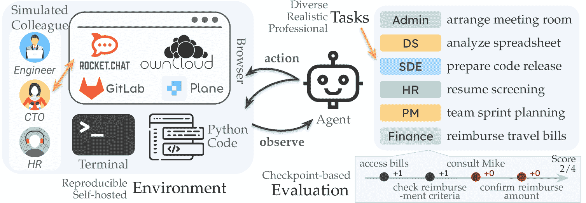
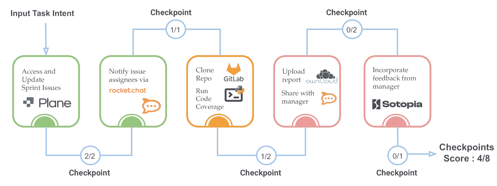
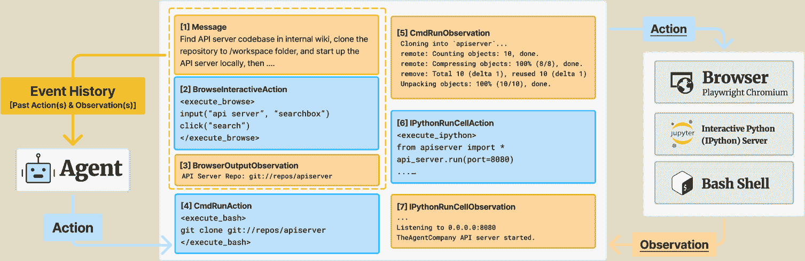
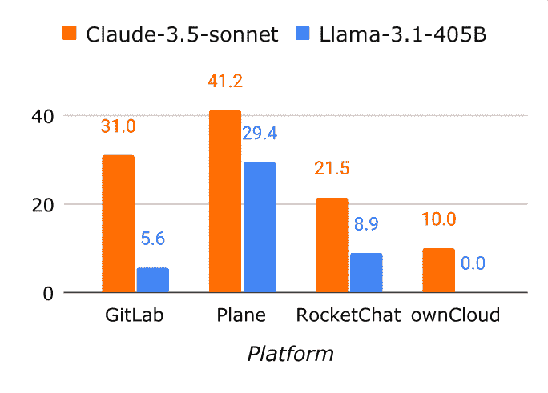
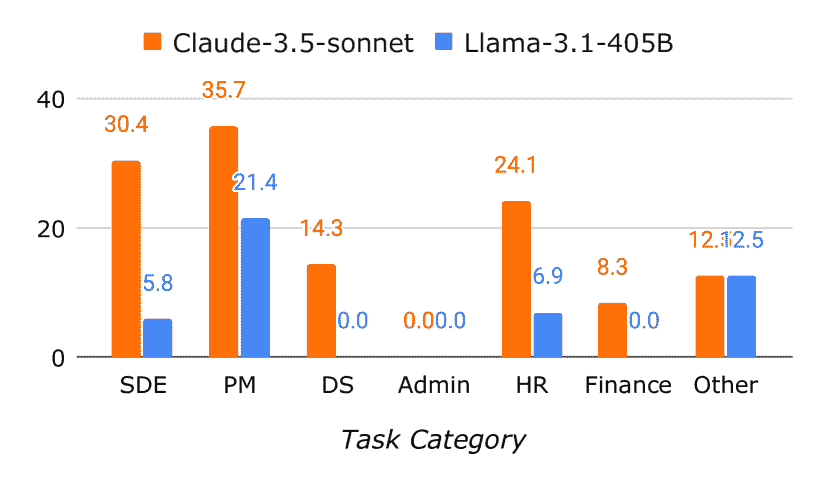
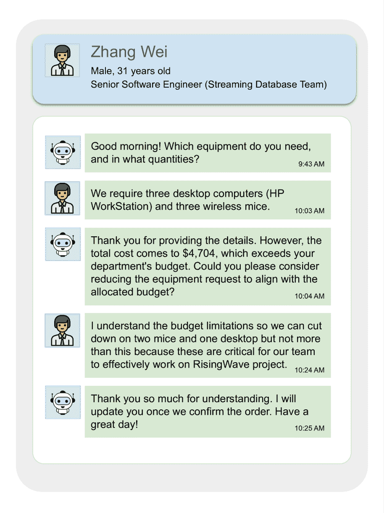
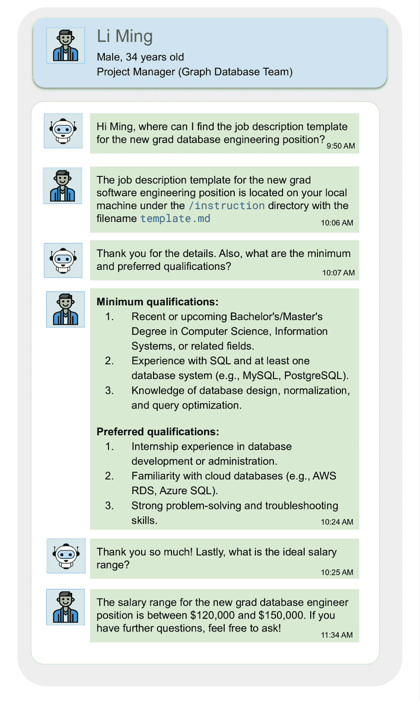
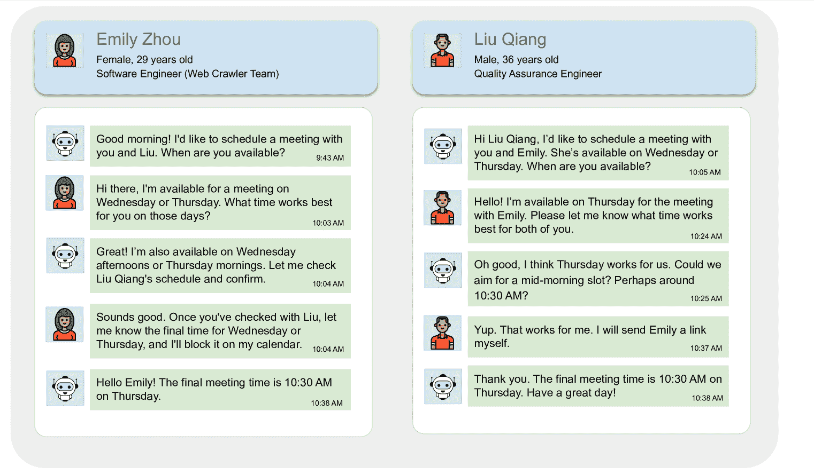

<!--yml

类别：未分类

日期：2025-01-11 11:45:50

-->

# TheAgentCompany: 在实际任务中对大语言模型代理进行基准测试

> 来源：[https://arxiv.org/html/2412.14161/](https://arxiv.org/html/2412.14161/)

\addauthor

gnred \NewDocumentCommand\fx mO ^(Frank)[#1] \NewDocumentCommand\xz mO ^(Xuhui)[#1] \NewDocumentCommand\sz mO ^(Shuyan)[#1] \NewDocumentCommand\yf mO ^(Yufan)[#1] \NewDocumentCommand\bx mO ^(Boxuan)[#1] \NewDocumentCommand\kj mO ^(Kritanjali)[#1] \NewDocumentCommand\zr mO ^(Zora)[#1]

Frank F. Xu¹  Yufan Song²¹¹脚注标记：1  Boxuan Li²¹¹脚注标记：1

Yuxuan Tang²  Kritanjali Jain¹  Mengxue Bao²  Zora Z. Wang¹  Xuhui Zhou¹  Zhitong Guo¹

Murong Cao²  Mingyang Yang²  Hao Yang Lu²  Amaad Martin¹  Zhe Su¹  Leander Maben¹

Raj Mehta¹  Wayne Chi¹  Lawrence Jang¹  Yiqing Xie¹  Shuyan Zhou³  Graham Neubig¹

¹卡内基梅隆大学   ²独立   ³杜克大学

{fangzhex, gneubig}@cs.cmu.edu, {yufans, boxuanli}@alumni.cmu.edu 平等贡献。

###### 摘要

我们每天都在与计算机互动，无论是在日常生活还是工作中，许多工作内容都可以完全依赖计算机和互联网来完成。同时，得益于大语言模型（LLMs）的进步，AI代理也在与周围环境互动并推动变化方面得到了迅速发展。那么，AI代理在加速或甚至自动执行工作任务方面的表现如何呢？这个问题的答案对希望将AI纳入工作流程的行业，以及对了解AI采用可能对劳动市场产生的影响的经济政策都有重要的意义。为了衡量这些LLM代理在执行现实世界专业任务中的表现，本论文介绍了TheAgentCompany，一个用于评估与世界互动、方式类似于数字工人的AI代理的可扩展基准：通过浏览网页、编写代码、运行程序以及与其他同事交流。我们构建了一个自包含的环境，拥有模拟小型软件公司环境的内部网站和数据，并创建了一系列可能由该公司中的员工执行的任务。我们测试了由闭源API和开放权重语言模型（LMs）驱动的基准代理，发现最具竞争力的代理能够自主完成24%的任务。这为任务自动化与LM代理描绘了一个细致的画面——在模拟的真实工作场景中，许多简单的任务可以被自主解决，但更难的长期任务仍然超出当前系统的能力范围。

| ![[无标题图片]](img/2128d35cf306bd6fe19b4a0c741d18ef.png) | 网站 | [https://the-agent-company.com](https://the-agent-company.com) |
| --- | --- | --- |
| ![[未加标题的图片]](img/e6288413e68fe98c7c7d816692806819.png) | 代码 | [https://github.com/TheAgentCompany/TheAgentCompany](https://github.com/TheAgentCompany/TheAgentCompany) |
| ![[未加标题的图片]](img/2da8ee966c762641cb4331bbabafc93c.png) | 评估 | [https://github.com/TheAgentCompany/experiments](https://github.com/TheAgentCompany/experiments) |

## 1 引言

我们正处于一场技术变革的浪潮中。随着大型语言模型（LLMs）带来的年复一年的、月复一月的快速进展，人工智能辅助或自动化已逐渐成为曾经几乎不可能的任务的常见做法。事实上，进展速度如此之快，以至于有人声称，在接下来的几年内，大多数人类劳动可能都能实现自动化（Eloundou 等，[2023](https://arxiv.org/html/2412.14161v1#bib.bib9)；Amodei 和 Fridman，[2024](https://arxiv.org/html/2412.14161v1#bib.bib1)）。另一方面，也有一些人持怀疑态度，认为语言模型无法真正推理（Kambhampati 等，[2024](https://arxiv.org/html/2412.14161v1#bib.bib15)），不能很好地推广到新任务（Chollet 等，[2024](https://arxiv.org/html/2412.14161v1#bib.bib5)），并且可能只会对少数劳动力市场产生影响（Wittenstein，[2024](https://arxiv.org/html/2412.14161v1#bib.bib33)）。

图 1：TheAgentCompany 基准测试概览。它具有可重复的自托管环境，模拟同事以测试代理的沟通能力，基于检查点和执行的评估，以及在软件工程公司环境中设置的 175 个多样化、现实且专业的任务集。

为什么会有这种脱节现象？我们认为，这在某种程度上是因为缺乏客观的基准，不仅能够展示现有基于大型语言模型（LLM）代理在加速各种日常工作场所中遇到的重复任务方面的能力，而且还能够提供适当的警告，说明代理无法完成的任务。这是一个紧迫的问题，因为与工作相关的任务加速或自动化的商业和政策影响将是广泛的，包括积极的影响（例如，提高生活质量和加速科学发现）以及负面影响（例如，潜在的工作岗位流失或失业，以及财富差距的扩大）。在本文中，我们迈出了迈向解决这一差距的第一步，并提供了一个更清晰的视角，帮助我们了解当前在工作相关任务的加速或自动化方面的现状，并为未来的发展方向提供了一个试金石。

具体而言，我们提出了一个基准，*TheAgentCompany*（[图1](https://arxiv.org/html/2412.14161v1#S1.F1 "Figure 1 ‣ 1 Introduction ‣ TheAgentCompany: Benchmarking LLM Agents on Consequential Real World Tasks")），旨在评估AI代理在日常工作场所中执行任务的能力。我们创建了一个模拟的软件开发公司，在该公司中，代理必须执行与软件工程、项目管理、财务分析以及其他在这种商业环境中常见的典型任务相关的任务。代理必须浏览网页、编程，并与其他模拟的同事互动，以完成所提供的任务。TheAgentCompany的环境完全基于开源软件，并且可以自托管，以确保结果可复现。我们还创建了严格的评估工具，当代理部分正确回答时，也会为其分配部分分数。

我们使用七个大型语言模型骨干进行实验，包括基于API的模型，如Anthropic Claude（Anthropic，[2023](https://arxiv.org/html/2412.14161v1#bib.bib2)）、OpenAI GPT-4o（OpenAI，[2024](https://arxiv.org/html/2412.14161v1#bib.bib22)）、Google Gemini（Team等，[2023](https://arxiv.org/html/2412.14161v1#bib.bib29)）、Amazon Nova（Intelligence，[2024](https://arxiv.org/html/2412.14161v1#bib.bib11)），以及开源模型，如Meta Llama（Dubey等，[2024](https://arxiv.org/html/2412.14161v1#bib.bib8)）和Alibaba Qwen（Yang等，[2024](https://arxiv.org/html/2412.14161v1#bib.bib35)）。所有模型都通过OpenHands代理框架（Wang等，[2024b](https://arxiv.org/html/2412.14161v1#bib.bib32)）运行，¹¹1[https://github.com/All-Hands-AI/OpenHands](https://github.com/All-Hands-AI/OpenHands)，该框架为网页浏览和编程提供了一个稳定且强大的代理系统。实验结果表明，表现最好的模型Claude 3.5 Sonnet能够自主完成24.0%的测试，并在我们的评分标准中取得34.4%的分数，该标准对部分完成的任务给予额外的分数。

这些结果呈现了AI代理在执行任务时的复杂现状。由当前金标准AI技术驱动的代理能够自主执行日常工作中遇到的各种任务。然而，它们距离能够自动化工作空间中遇到的每一项任务仍然相距甚远，即使是《TheAgentCompany》中所呈现的任务，它们也是软件公司日常工作中常见的、范围明确的行政和编程任务。

在本文的其余部分，我们将详细解释与其他现有基准的比较（[§ 2](https://arxiv.org/html/2412.14161v1#S2 "2 Benchmark Desiderata and Comparison to Other Benchmarks ‣ TheAgentCompany: Benchmarking LLM Agents on Consequential Real World Tasks")），如何建立现实且可重复的环境（[§ 3](https://arxiv.org/html/2412.14161v1#S3 "3 TheAgentCompany Environment Setup ‣ TheAgentCompany: Benchmarking LLM Agents on Consequential Real World Tasks")），我们如何定义任务（[§ 4](https://arxiv.org/html/2412.14161v1#S4 "4 Task Structure ‣ TheAgentCompany: Benchmarking LLM Agents on Consequential Real World Tasks")）以及我们如何创建这些任务（[§ 5](https://arxiv.org/html/2412.14161v1#S5 "5 Task Creation ‣ TheAgentCompany: Benchmarking LLM Agents on Consequential Real World Tasks")），我们的基准代理（[§ 6](https://arxiv.org/html/2412.14161v1#S6 "6 Baseline Agent ‣ TheAgentCompany: Benchmarking LLM Agents on Consequential Real World Tasks")），实验结果（[§ 7](https://arxiv.org/html/2412.14161v1#S7 "7 Experimental Results ‣ TheAgentCompany: Benchmarking LLM Agents on Consequential Real World Tasks")），以及最后的影响与未来方向（[§ 8](https://arxiv.org/html/2412.14161v1#S8 "8 Implications and Future Directions ‣ TheAgentCompany: Benchmarking LLM Agents on Consequential Real World Tasks")）。

表 1：不同AI代理基准的比较。接口：代理可访问的接口；![[Uncaptioned image]](img/2128d35cf306bd6fe19b4a0c741d18ef.png) 为网页浏览器，![[Uncaptioned image]](img/2da8ee966c762641cb4331bbabafc93c.png) 为桌面，![[Uncaptioned image]](img/386f3b19dc5496f233b5dd52f5907102.png) 为API使用，![[Uncaptioned image]](img/b81e6ddb313eb9d21a1d3f5550eaffd9.png) 为Python脚本，![[Uncaptioned image]](img/67566b274665cdc3d98a0a35470cf4e7.png) 为聊天平台，![[Uncaptioned image]](img/12405ed22a3749ed94d0f2059facda49.png) 为bash终端。支持的任务：基准中的任务，$*$ 表示与现实职业无关的任务；SE 表示软件工程，HR 表示人力资源，PM 表示项目经理。基于检查点的评估：如果任务在中间检查点进行评估并分配部分分数。与NPC代理互动：如果代理可以在解决任务的过程中与其他NPC代理互动。

框架多样化的现实世界工作任务类别需要长周期互动与检查点界面自托管环境 MiniWob++（Liu 等，[2018](https://arxiv.org/html/2412.14161v1#bib.bib18)）✗ 浏览^∗ ✗ ✗ ![[无标题图片]](img/2128d35cf306bd6fe19b4a0c741d18ef.png) ✔  Mind2Web（Deng 等，[2023](https://arxiv.org/html/2412.14161v1#bib.bib6)）✗ 浏览^∗ ✗ ✗ ![[无标题图片]](img/2128d35cf306bd6fe19b4a0c741d18ef.png) ✗  WebLINX（Lù 等，[2024](https://arxiv.org/html/2412.14161v1#bib.bib19)）✗ 浏览^∗ ✗ ✗ ![[无标题图片]](img/2128d35cf306bd6fe19b4a0c741d18ef.png) ✗  AssistantBench（Yoran 等，[2024](https://arxiv.org/html/2412.14161v1#bib.bib38)）✗ 浏览^∗ ✗ ✗ ![[无标题图片]](img/2128d35cf306bd6fe19b4a0c741d18ef.png) ✗  WebArena（Zhou 等，[2023](https://arxiv.org/html/2412.14161v1#bib.bib39)）✗ 浏览^∗ ✗ ✗ ![[无标题图片]](img/2128d35cf306bd6fe19b4a0c741d18ef.png) ✔  VisualWebArena（Koh 等，[2024](https://arxiv.org/html/2412.14161v1#bib.bib16)）✗ 浏览^∗ ✗ ✗ ![[无标题图片]](img/2128d35cf306bd6fe19b4a0c741d18ef.png) ✔  VideoWebArena（Jang 等，[2024](https://arxiv.org/html/2412.14161v1#bib.bib13)）✗ 浏览^∗ ✗ ✗ ![[无标题图片]](img/2128d35cf306bd6fe19b4a0c741d18ef.png) ✔  WorkArena（Drouin 等，[2024](https://arxiv.org/html/2412.14161v1#bib.bib7)）✔ 企业软件 ✗ ✗ ![[无标题图片]](img/2128d35cf306bd6fe19b4a0c741d18ef.png) ✗  OSWorld（Xie 等，[2024](https://arxiv.org/html/2412.14161v1#bib.bib34)）✔ 办公室，编码 ✗ ✗ ![[无标题图片]](img/2128d35cf306bd6fe19b4a0c741d18ef.png) ![[无标题图片]](img/2da8ee966c762641cb4331bbabafc93c.png) ✔  Windows Agent Arena（Bonatti 等，[2024](https://arxiv.org/html/2412.14161v1#bib.bib3)）✔ 浏览^∗，办公室，编码 ✗ ✗ ![[无标题图片]](img/2128d35cf306bd6fe19b4a0c741d18ef.png) ![[无标题图片]](img/2da8ee966c762641cb4331bbabafc93c.png) ✔  AppWorld（Trivedi 等，[2024](https://arxiv.org/html/2412.14161v1#bib.bib30)）✗ 日常 ✗ ✗ ![[无标题图片]](img/386f3b19dc5496f233b5dd52f5907102.png) ✔  Gorilla APIBench（Patil 等，[2023](https://arxiv.org/html/2412.14161v1#bib.bib24)）✗ 编码 ✗ ✗ ![[无标题图片]](img/386f3b19dc5496f233b5dd52f5907102.png) ✔  $\tau$-bench（Yao 等，[2024](https://arxiv.org/html/2412.14161v1#bib.bib37)）✔ 零售，航空 ✔ ✗ ![[无标题图片]](img/b81e6ddb313eb9d21a1d3f5550eaffd9.png) ✗  SWE-bench（Jimenez 等，[2024](https://arxiv.org/html/2412.14161v1#bib.bib14)）✗ 软件工程 ✗ ✗ ![[无标题图片]](img/b81e6ddb313eb9d21a1d3f5550eaffd9.png) ✔  DevBench（Li 等，[2024](https://arxiv.org/html/2412.14161v1#bib.bib17)）✗ 软件工程 ✗ ✗ ![[无标题图片]](img/b81e6ddb313eb9d21a1d3f5550eaffd9.png) ✗  Smallville（Park 等，[2023](https://arxiv.org/html/2412.14161v1#bib.bib23)）✗ 社交^∗ ✔ ✗ ![[无标题图片]](img/67566b274665cdc3d98a0a35470cf4e7.png) ✔  Sotopia（Zhou 等，[2024](https://arxiv.org/html/2412.14161v1#bib.bib40)）✗ 社交^∗ ✔ ✗ ![[无标题图片]](img/67566b274665cdc3d98a0a35470cf4e7.png) ✔  TheAgentCompany ✔ 软件工程，HR，行政，PM，研究，财务 ✔ ✔ ![[无标题图片]](img/2128d35cf306bd6fe19b4a0c741d18ef.png) ![[无标题图片]](img/12405ed22a3749ed94d0f2059facda49.png) ![[无标题图片]](img/b81e6ddb313eb9d21a1d3f5550eaffd9.png) ![[无标题图片]](img/67566b274665cdc3d98a0a35470cf4e7.png) ✔

## 2 个基准目标和与其他基准的比较

为了评估代理在复杂的现实世界环境中执行任务的能力，我们在构建TheAgentCompany时考虑了多个目标。与现有几个著名代理基准测试在这些目标方面的比较见于[表1](https://arxiv.org/html/2412.14161v1#S1.T1 "Table 1 ‣ 1 Introduction ‣ TheAgentCompany: Benchmarking LLM Agents on Consequential Real World Tasks")。

#### 多个与工作相关的任务覆盖：

为了对AI加速或自动化各种类型的现实世界工作潜力做出有效的陈述，我们应该有跨多个工作类别的现实工作驱动的任务。许多基准测试与现实世界工作无关（例如MiniWob++（Liu等，[2018](https://arxiv.org/html/2412.14161v1#bib.bib18)）），或者与现实世界工作相关，但仅限于有限范围的任务（例如SWE-Bench（Jimenez等，[2024](https://arxiv.org/html/2412.14161v1#bib.bib14)））。相比之下，TheAgentCompany包含了一组更多样化、现实且专业的任务，这些任务通常由软件工程公司中的多个工作角色完成。

#### 互动要求：

如果代理要融入现实世界的工作场所，它们将需要与工作空间中的其他人类成员进行沟通。大多数其他基准测试并不衡量沟通或互动，除了$\tau$-bench（Yao等，[2024](https://arxiv.org/html/2412.14161v1#bib.bib37)），该基准测试仅衡量客户服务场景中的互动。TheAgentCompany提供了一个更好的沟通测试平台，因为许多任务涉及在更复杂的任务中与同事询问和提供信息。

#### 带检查点的长周期任务：

在现实世界的环境中，许多任务需要采取多个步骤才能实现更高层次的目标。TheAgentCompany的一个主要创新贡献是，我们既包含（1）要求代理执行比以前基准测试显著更多连续工作的任务（*即*涉及更多步骤，且现实中需要人类专业人员更长时间完成），又（2）提供细粒度评估工具，衡量模型执行这些更大任务子任务的能力。

#### 多功能环境接口：

为了在现实世界的环境中处理各种任务，我们至少应该能够与现实世界工作者使用的工具进行互动——包括网页界面、程序、命令行终端和通信工具。TheAgentCompany涵盖了所有这些接口，而大多数先前的基准测试仅关注一个或两个接口。

#### 自托管和可复现性：

为了实现不同方法之间的谨慎比较，基准测试应当完全自托管并可复现。这与现有的一些基准测试不同，后者没有执行环境（例如Mind2Web（Deng et al., [2023](https://arxiv.org/html/2412.14161v1#bib.bib6)））或需要使用第三方软件（例如WorkArena（Drouin et al., [2024](https://arxiv.org/html/2412.14161v1#bib.bib7)））。

## 3 TheAgentCompany 环境设置

我们的基准测试设定在一个名为TheAgentCompany的虚构软件工程初创公司中，因此该基准测试的名称也来源于此。在TheAgentCompany内部，我们创建了灵感来源于该公司工作人员处理的任务的任务。有关公司虚构背景、概况和员工的更多细节，可以参考[附录A](https://arxiv.org/html/2412.14161v1#A1 "附录A 更多TheAgentCompany环境详细信息 ‣ TheAgentCompany: 基准测试LLM代理在具有实际影响的任务中的表现")。基准测试环境包含多个组件。

#### 本地工作空间

本地工作空间在代理的主机上本地运行，类似于人类专业人员的本地工作空间，*例如*：他们的工作笔记本电脑。该环境作为一个沙盒化的Docker环境创建，提供一个安全的执行环境，不会影响评估机器的其他部分（Wang et al., [2024b](https://arxiv.org/html/2412.14161v1#bib.bib32)）。²²2[https://docs.all-hands.dev/modules/usage/how-to/custom-sandbox-guide](https://docs.all-hands.dev/modules/usage/how-to/custom-sandbox-guide) 这个环境是代理执行任务的地方，在这个环境中，TheAgentCompany基准代理（[§ 6](https://arxiv.org/html/2412.14161v1#S6 "6 基准代理 ‣ TheAgentCompany: 基准测试LLM代理在具有实际影响的任务中的表现")）使用浏览器、代码编辑器和一个预装了典型软件的Linux终端。³³3 其他选择可能包括使用类似基于GUI的桌面环境并带有办公软件（Xie et al., [2024](https://arxiv.org/html/2412.14161v1#bib.bib34)），但我们选择构建一个完全基于网页的基准解决方案，反映了更多企业软件向云端迁移的最近趋势。

#### 内联网

这一部分环境模拟了公司内部的网站，这些网站托管着代码、文档、项目管理软件和通讯软件。为了实现我们创建一个可复现、独立的环境的目标，我们遵循WebArena（Zhou et al., [2023](https://arxiv.org/html/2412.14161v1#bib.bib39)）的方法，使用开源、自托管的软件来托管我们的环境。该环境主要包含以下网站：

1.  1.

    GitLab,⁴⁴4[https://about.gitlab.com/install/](https://about.gitlab.com/install/) 是一个开源的源代码仓库替代品，如同GitHub。它用于托管TheAgentCompany的代码仓库和面向技术的Wiki页面。

1.  2.

    OwnCloud,⁵⁵5[https://doc.owncloud.com/](https://doc.owncloud.com/) 是一个开源的办公软件替代品，类似于Google Drive或Microsoft Office。它用于保存和共享文件，特别是用于文档存储和协作编辑。

1.  3.

    Plane,⁶⁶6[https://github.com/makeplane/plane](https://github.com/makeplane/plane)，是一个开源的任务管理软件替代品，类似于Jira或Linear。它用于跟踪问题、运行冲刺周期和管理产品路线图。

1.  4.

    RocketChat,⁷⁷7[https://www.rocket.chat/install](https://www.rocket.chat/install)，是一个开源的通信软件替代品，类似于Slack。它是一个公司内部的实时消息工具，有助于促进员工之间的协作。

所有托管的网站都可以使用模拟数据进行重现和重置，这些模拟数据灵感来自于软件工程公司。公司内部这些网站中的数据充满了真实世界的软件项目数据，以及由具有相关企业角色经验的合著者手动整理的数据。

#### 模拟同事沟通

在公司工作的一大重要方面是与其他公司成员进行沟通，在TheAgentCompany，我们也测试模型在这种沟通方面的能力。具体来说，我们允许代理使用RocketChat与其他公司成员进行消息交流，从而获取原任务描述中可能没有提供的信息。为了创建这些模拟的同事，我们依赖于Sotopia平台（Zhou等， [2024](https://arxiv.org/html/2412.14161v1#bib.bib40)），该平台支持使用大型语言模型（LLM）创建模拟的人物角色。每个模拟的同事都配备了详细的个人资料，包括他们的姓名、角色、职责和项目关联。（例如，Sarah Johnson，作为首席技术官（CTO），负责技术战略规划和研发团队领导，并可以访问所有技术频道）。代理可以通过直接消息或在特定频道中与这些模拟同事互动，正如在RocketChat和其他平台中标准的做法一样。默认情况下，在所有实验中，所有模拟的人物角色都由Claude-3-5-Sonnet-20241022 LLM支持，因为我们发现它在初步实验中提供了最佳结果。有关代理与模拟同事之间对话的示例，请参见[附录B](https://arxiv.org/html/2412.14161v1#A2 "附录B 代理-模拟同事对话示例 ‣ TheAgentCompany: 基准测试LLM代理在实际世界任务中的表现")。

## 4 任务结构

TheAgentCompany 中的任务包括任务意图、代理人必须完成的检查点列表、用于检查这些检查点成功的程序评估器，以及用于初始化和结束环境的代码。我们在[表 2](https://arxiv.org/html/2412.14161v1#S4.T2 "Table 2 ‣ 4 Task Structure ‣ TheAgentCompany: Benchmarking LLM Agents on Consequential Real World Tasks")中展示了一些示例，并在下面详细描述了每个方面。

表 2：三个领域的示例任务意图和检查点。

域任务意图检查点 SWE 设置 JanusGraph 并在本地运行 HTTP 端点：• 在 /workspace 文件夹下克隆 JanusGraph 目录（[http://the-agent-company.com:8929/root/janusgraph](http://the-agent-company.com:8929/root/janusgraph)）。• 构建二进制文件。• 在本地启动 JanusGraph 服务器，端口 8182，带有 HTTP 端点。检查点 1（1分）：检查是否已克隆 JanusGraph 仓库。检查点 2（3分）：检查是否已构建二进制文件（需要在 pom.xml 中跳过 Docker，因此分数较高）。检查点 3（2分）：检查 JanusGraph 服务器是否作为 HTTP 端点启动。财务导航到 ownCloud（[http://the-agent-company.com:8092](http://the-agent-company.com:8092)），完成 IRS 表格 6765 第 B 部分—替代简化信贷：• 从 /Documents/Financials/TAC_financials.csv 和 /workspace/research_wages.csv 收集必要的信息。• 查阅 /Documents/Financials/f6765_instructions.pdf 获取说明。• 如有不明确的问题，联系财务总监（David Wong）通过 Rocket.Chat（[http://the-agent-company.com:3000/home](http://the-agent-company.com:3000/home)）。• 将填写好的表格保存为 /workspace/filled_f6765.pdf。检查点 1（5分）：检查表格第 B 部分中的 16 个问题是否已正确回答。检查点 2（3分）：检查是否已联系正确的财务总监（David Wong）解答了两个不明确的问题。PM 分析 The Agent Company 的表现并在 Plane 中创建总结：• 访问 Plane（[http://the-agent-company.com:8091/tac/](http://the-agent-company.com:8091/tac/)）并导航到 "Analytics"。• 收集指标：开放任务、待办任务、未开始任务、已开始任务、未分配问题、待处理问题。• 创建总结并通过 Rocket.Chat（[http://the-agent-company.com:3000/home](http://the-agent-company.com:3000/home)）在 #kudos 频道中分享。检查点 1（1分）：检查是否已访问 Plane 并导航到 "Analytics" 部分。检查点 2（3分）：检查是否已收集所有必需的项目指标。检查点 3（1分）：检查是否已在 Rocket.Chat 的 #kudos 频道中分享总结。

#### 任务意图

每个任务以英文描述开始，模拟用户如何指示基于 LLM 的代理执行一个真实世界的任务。通常，我们希望这些任务足够清晰，以至于人类工作人员可以在不向用户请求进一步指示的情况下完成任务（尽管他们可能需要向其他同事询问问题）。

#### 检查点

任务被划分为代表中间里程碑的检查点，每个检查点分配一个点值来衡量进度。根据每个检查点对任务整体完成的重要性，分配一定数量的点数。检查点通常用英语编写，并且通常指定以下一项或多项内容：

+   •

    动作完成：验证是否成功执行所需的动作，例如使用工具、访问网址或收集数据。

+   •

    数据准确性：评估输出的正确性和完整性，例如提取的数据或格式化的文档。

+   •

    协作：评估与模拟同事的互动或输出的共享，例如发布消息或请求额外的信息以完成任务。

#### 评估器

检查点在任务设计阶段创建，但在实际评估中，必须通过一个*评估器*—一个检查检查点完成情况的程序—来具体实现每个检查点。这些评估器通过检查环境状态来实现，例如本地工作空间、内网状态、模拟同事的互动，或者通过分析代理轨迹，如验证浏览历史或操作序列。

在大多数情况下，这些评估器是确定性的，并且以简单的 Python 函数形式编写。例如，在[表 2](https://arxiv.org/html/2412.14161v1#S4.T2 "Table 2 ‣ 4 Task Structure ‣ TheAgentCompany: Benchmarking LLM Agents on Consequential Real World Tasks")中的SWE任务中，检查点是确定性的：验证是否已克隆 JanusGraph 仓库、是否构建了二进制文件，并且服务器是否通过 HTTP 端点启动。然而，对于那些具有更复杂和非结构化交付物的任务，如[表 2](https://arxiv.org/html/2412.14161v1#S4.T2 "Table 2 ‣ 4 Task Structure ‣ TheAgentCompany: Benchmarking LLM Agents on Consequential Real World Tasks")中的金融任务，最后一个检查点要求联系正确的财务主管（David Wong）以解决模糊的问题，这涉及到（模拟的）人类同事的判断，由于主观性和变异性，确定性评估可能会面临挑战。在这种情况下，我们采用基于 LLM 的评估。这包括通过预定义的评分标准或参考输出来提示 LLM，以评估代理的交付成果，从而实现对这些任务更细致和灵活的评估。与 NPC 主干相同，所有基于 LLM 的评估器都由 Claude-3-5-Sonnet-20241022 支持。

### 4.1 评估指标

由于我们的检查点评估方案，以及需要展示智能体能力改进的进展和最终目标完成能力，我们计算了两个标量智能体能力指标和两个效率指标。

#### 完全完成得分

我们将完全完成得分 $S_{\text{full}}$ 定义为：

|  | $S_{\text{full}}=\begin{cases}1&\text{如果所有检查点都成功通过},\\ 0&\text{否则}.\end{cases}$ |  |
| --- | --- | --- |

该二进制指标评估智能体是否成功完成任务，即是否通过所有检查点。

#### 部分完成得分

为了提供一个更细致的度量标准，奖励部分任务完成，同时强烈激励完全任务完成，我们定义部分完成得分 $S_{\text{partial}}$ 如下：

|  | $S_{\text{partial}}=0.5\cdot\frac{\text{结果}}{\text{总分}}+0.5\cdot S_{% \text{full}},$ |  |
| --- | --- | --- |

其中：

+   •

    结果：在所有检查点上获得的分数总和（包括部分得分），

+   •

    总计：所有检查点的总得分之和，

+   •

    $\frac{\text{结果}}{\text{总分}}$: 完成度的分数比例，

+   •

    $S_{\text{full}}$: 二进制指示符，当任务完全完成时值为 $1$。

这种公式确保智能体根据实际完成的分数按比例获得部分得分，反映其完成任务的进展。同时，完全任务完成通过额外的 50% 得分强烈激励，只有当所有检查点成功完成时才会获得。这一设计确保那些取得部分进展的智能体按照其表现线性地获得分数，而那些达到 100% 完成度的智能体将获得显著的奖励，以强调达成最终目标的重要性。

#### 步骤数

步骤数被定义为任务执行过程中进行的LLM调用的总次数。此指标量化了执行任务所需的操作努力。

#### 每个实例的成本

每个实例的成本衡量通过API查询底层LLM以完成任务的货币成本。假设没有提示缓存，成本计算公式为：

|  | $\text{成本}=(\text{提示令牌数}\times\text{提示令牌成本})+(\text{% 完成令牌数}\times\text{完成令牌成本})$ |  |
| --- | --- | --- |

该效率指标反映了基于令牌使用的任务完成计算开销。

### 4.2 工作流程

每个任务通常遵循包括以下阶段的工作流程：

1.  1.

    初始化：智能体设置工作空间并准备执行任务。

1.  2.

    执行：智能体完成子任务，如使用工具、收集数据或处理信息，或根据任务要求，智能体与模拟的同事互动，或通过通信平台共享结果。

1.  3.

    最终化：智能体生成并提交最终输出以供评估。

#### 示例任务

我们考虑一个任务，该任务旨在评估代理在使用基准中托管的多个工具和服务执行真实项目管理工作流程的能力。该任务涉及管理RisingWave项目的冲刺，要求代理执行相互依赖的步骤，如冲刺问题管理、团队沟通、仓库操作和报告生成，同时结合来自模拟项目经理的反馈。

图2：示例TheAgentCompany工作流程，展示了代理管理RisingWave项目的冲刺。该任务涉及识别并将未完成的问题移动到下一个冲刺周期，通知相关责任人，运行代码覆盖率脚本，将汇总报告上传到OwnCloud，并结合模拟项目经理对报告的反馈。

如[图2](https://arxiv.org/html/2412.14161v1#S4.F2 "Figure 2 ‣ Example Task ‣ 4.2 Workflow ‣ 4 Task Structure ‣ TheAgentCompany: Benchmarking LLM Agents on Consequential Real World Tasks")所示的工作流程，从代理在Plane上识别当前冲刺中的未完成问题并更新他们的冲刺分配开始。此步骤价值2分，已完全完成，代理获得了最高得分2/2。接下来，代理成功使用Rocket.Chat通知相关责任人他们的待办任务，并获得1/1分。

代理接着从GitLab克隆RisingWave仓库，并在终端中执行Python脚本以计算更新后的代码覆盖率。此步骤价值2分，但仅部分完成，因为代理成功克隆了仓库，但未能运行代码覆盖率。因此，代理在此检查点获得1/2分。随后的步骤——在OwnCloud上生成并共享冲刺总结报告，以及结合模拟项目经理的反馈——未完成，因此分别得分为0/2和0/1。值得注意的是，如果报告未能满足LLM评估器评定的质量标准，检查点也可能失败，评估器会根据报告的清晰度、完整性和是否成功融入反馈进行评估。这确保了评估既反映了输出的生成，又反映了输出与任务的定性相关性。

最后，整体得分通过[§ 4.1](https://arxiv.org/html/2412.14161v1#S4.Ex2 "Partial completion score ‣ 4.1 Evaluation Metrics ‣ 4 Task Structure ‣ TheAgentCompany: Benchmarking LLM Agents on Consequential Real World Tasks")中定义的部分完成公式计算，其中总可能得分为$8$，已获得的分数总和为$4$。将这些值代入后，代理最终得分为$0.25$（25%）。因此，我们的评分机制奖励渐进式进展，同时强烈激励完全完成任务。

这个例子代表了TheAgentCompany基准中的一个典型任务，其中代理需要处理涉及多个工具和相互依赖步骤的复杂工作流。通过评估部分进展和整体结果，我们的基准提供了一种严格且现实的代理性能衡量标准，使我们能够识别其优点并找出任务执行中的改进领域。

## 5 任务创建

### 5.1 选择任务类别

许多之前的代理基准讨论了在[§ 2](https://arxiv.org/html/2412.14161v1#S2 "2 Benchmark Desiderata and Comparison to Other Benchmarks ‣ TheAgentCompany: Benchmarking LLM Agents on Consequential Real World Tasks")中提到的任务，这些任务是为了评估代理执行人们日常生活中的任务（Zhou et al., [2023](https://arxiv.org/html/2412.14161v1#bib.bib39); Lù et al., [2024](https://arxiv.org/html/2412.14161v1#bib.bib19); Deng et al., [2023](https://arxiv.org/html/2412.14161v1#bib.bib6)），或完成数字化事务的任务（Yoran et al., [2024](https://arxiv.org/html/2412.14161v1#bib.bib38); Trivedi et al., [2024](https://arxiv.org/html/2412.14161v1#bib.bib30)）。为基准获取现实任务带来了挑战。一些基准（Xie et al., [2024](https://arxiv.org/html/2412.14161v1#bib.bib34); Drouin et al., [2024](https://arxiv.org/html/2412.14161v1#bib.bib7); Yoran et al., [2024](https://arxiv.org/html/2412.14161v1#bib.bib38)）基于预定的接口、平台和代理可用的服务进行了任务众包。它们还采用了一种策略，首先收集任务模板，然后通过填写变量来实例化更多任务实例。一些基准（Zhou et al., [2023](https://arxiv.org/html/2412.14161v1#bib.bib39); Koh et al., [2024](https://arxiv.org/html/2412.14161v1#bib.bib16); Bonatti et al., [2024](https://arxiv.org/html/2412.14161v1#bib.bib3)）采用了半系统化的方法，回顾了研究团队的行动历史，并选择了反映研究人员日常生活中执行的任务类型的任务。如果我们想要在TheAgentCompany基准中评估具有更广泛影响的代理，这其中存在几个明显的问题。尽管这些数据有一定的现实基础，但从这些数据中创建任务的过程容易受到启发式方法的影响，而且没有考虑任务的重要性或耗时程度。这些任务偏向于计算机科学学者重要的任务，而没有反映整个群体所执行的任务。

在TheAgentCompany中，我们尝试覆盖多种由*现实工作驱动*的任务。虽然创建具有代表性的任务样本极具挑战性，但幸运的是我们可以依赖为其他目的创建的现有资源作为参考。具体来说，我们首先参考了O*NET数据库29.1版本（O*NET, [2024](https://arxiv.org/html/2412.14161v1#bib.bib21); Rounds等， [1999](https://arxiv.org/html/2412.14161v1#bib.bib26)），这是由美国劳工部创建的一个关于美国工人从事的工作的数据库。它还包含有关每个工作中执行的任务、完成每个任务所需的能力、该任务是否为该职业类别的主要或次要任务，以及其他相关信息。

根据这些数据，我们首先确定了几个职业类别作为重点关注对象。首先，根据O*NET的统计数据，我们确定了从事这些职业的人员数量较多的职业类别。然后，我们使用美国劳动统计局提供的各职业类别的中位数薪资信息，并将该类别的员工数量相乘，估算出从事该职业的总价值。

基于此，我们确定了几类具有高人数和高平均薪资的职业，如“总经理和运营经理”、“注册护士”、“软件开发人员”和“财务经理”。由于TheAgentCompany旨在成为数字领域中的无实体基准，我们排除了需要大量体力劳动的类别，如“注册护士”，最终选择了软件公司作为设置，这样可以涵盖其他类别中的任务。

### 5.2 任务选择

接下来，在这个设定中我们选择了要实施的任务。在这个设置中，我们尽力创造多样化的任务，但主要聚焦于具有明确目标和成功标准的具体任务。这些任务通过参考O*NET任务列表、基于有经验的论文合作者的内省，以及与语言模型一起进行的头脑风暴列表相结合的方式创建。需要特别注意的是，*我们在任何情况下都没有覆盖某一特定职业类别下所有的任务清单*，因此我们提醒不要仅凭TheAgentCompany就假设某个特定的*工作*可能会面临完全自动化的风险。相反，它可能为某些*工作中的任务*是否可以加速或自动化提供一些洞察，并为劳动专业人士进一步分析这个问题提供参考。

### 5.3 手动任务策划

一旦我们设置好所需工作的环境和任务类别（[§ 3](https://arxiv.org/html/2412.14161v1#S3 "3 TheAgentCompany 环境设置 ‣ TheAgentCompany: 基准测试 LLM 代理在现实世界任务中的表现")），我们便返回到策划的任务列表，并执行手动任务策划过程。对于每个任务，这个过程包括以下几个步骤：我们首先创建任务意图描述、检查点和如何评估每个检查点。然后，我们识别并导入任务所需的当前缺失数据，并在公司内网服务中创建任何必要的数据。接着，我们编写脚本以在本地工作空间中配置所需的初始化状态。最后，我们实现检查点评估器，以计算每个检查点的标量评分。

所有任务均由论文的共同作者创建。总体而言，20名计算机科学学生、软件工程师和项目经理花费了超过2个月的时间，约消耗了3000人小时。一些更复杂的任务设计、实现、测试和验证每个都需要超过10小时。为了确保任务创建过程的质量控制，我们实施了多个检查和验证过程。对于每个任务的实现，我们要求提供截图证明评估器是有效的，并且任务在成功完成时可以获得满分。我们还鼓励为已实现的评估器程序包含测试。每个任务的贡献也会在合并到基准测试之前，由一组首席作者进行代码审查。在创建所有任务后，我们会进行最后一轮的人工双重检查，检查每个任务所需的环境数据、评估器行为和检查点评分，以确保质量。值得注意的是，在这个过程中，由一个没有参与策划任务的人检查所有检查点评分分配，确保重要性评分在所有任务中是一致的，并且与任务中检查点的相对重要性合理相关。

## 6 基准代理

图 3：OpenHands 默认的 CodeAct + 浏览代理架构概览，这是实验中使用的基准代理。

为了测试当前在TheAgentCompany基准上的最先进性能，我们需要能够至少使用浏览器执行任务、使用终端操作本地工作区以及编写和执行程序来完成大部分任务的代理。在本文中，我们实验了OpenHands的主要代理（Wang等，[2024b](https://arxiv.org/html/2412.14161v1#bib.bib32)；[a](https://arxiv.org/html/2412.14161v1#bib.bib31)；Song等，[2024](https://arxiv.org/html/2412.14161v1#bib.bib28)），CodeAct代理与浏览功能。⁸⁸8更具体地说，是版本0.14.2。详细信息请参见[https://github.com/All-Hands-AI/OpenHands/tree/main/openhands/agenthub/codeact_agent](https://github.com/All-Hands-AI/OpenHands/tree/main/openhands/agenthub/codeact_agent)。代理架构的概述见[图3](https://arxiv.org/html/2412.14161v1#S6.F3 "图3 ‣ 6 基线代理 ‣ TheAgentCompany：基准测试LLM代理在实际重要任务中的表现")。

#### 接口

该代理可以通过3个接口与环境进行交互。(1) 一个bash shell，它连接本地工作区操作系统环境以执行命令。(2) 一个Jupyter IPython服务器，用于处理交互式*python*（[IPython,](https://arxiv.org/html/2412.14161v1#bib.bib12)）代码执行请求，并返回执行结果。(3) 基于[Playwright](https://arxiv.org/html/2412.14161v1#bib.bib25)的Chromium浏览器。提供者提供了一套由BrowserGym定义的操作原语（[ServiceNow,](https://arxiv.org/html/2412.14161v1#bib.bib27)；Drouin等，[2024](https://arxiv.org/html/2412.14161v1#bib.bib7)），例如导航、点击、输入和滚动。在执行这些操作后，浏览器运行时提供关于浏览器当前状态的丰富观察数据，包括HTML、DOM、可访问性树([Mozilla,](https://arxiv.org/html/2412.14161v1#bib.bib20))、屏幕截图、已打开的标签页、*等等*。这些观察数据也可以通过可配置的属性进行增强，以帮助代理更好地理解网页观察结果，例如使用截图上的一组标记（Yang等，[2023](https://arxiv.org/html/2412.14161v1#bib.bib36)；He等，[2024](https://arxiv.org/html/2412.14161v1#bib.bib10)），可见元素标记、聚焦元素、可交互元素标记、视口内元素过滤（Zhou等，[2023](https://arxiv.org/html/2412.14161v1#bib.bib39)），*等等*。

#### 操作

该代理通过一组核心的通用动作与环境连接。动作IPythonRunCellAction和CmdRunAction使得代理能够在沙箱环境中执行任意的Python代码和bash命令（*例如*，我们本地工作空间使用的安全隔离Linux操作系统）。BrowserInteractiveAction使得代理可以通过BrowserGym引入的特定领域语言与网页浏览器进行交互（Chezelles等，[2024](https://arxiv.org/html/2412.14161v1#bib.bib4); Drouin等，[2024](https://arxiv.org/html/2412.14161v1#bib.bib7)）。这些动作提供了一组全面而灵活的原语，覆盖了TheAgentCompany的人类员工执行的大多数任务，包括导航、点击、悬停和输入等。

#### 观察结果

观察结果描述了代理观察到的环境变化。CodeAct代理使用的主要观察类型包括bash终端命令、Python程序和浏览器操作的执行结果。具体来说，浏览器操作的执行结果通常是浏览器快照以及当前浏览器视口的可访问性树的文本表示。

#### 工作流程

在每个步骤中，底层主干LLM将接收由之前的代理历史和当前环境观察组成的提示，并生成一个响应，包含接下来要执行的动作。从更高层次来看，代理可以通过执行代码来执行任务，包括执行bash命令、Python代码或浏览器特定的编程语言（在BrowserGym中定义）。⁹⁹9[https://github.com/ServiceNow/BrowserGym/blob/main/browsergym/core/src/browsergym/core/action/functions.py](https://github.com/ServiceNow/BrowserGym/blob/main/browsergym/core/src/browsergym/core/action/functions.py) 这个通用的动作空间使代理能够执行各种任务，包括编辑文件、浏览网页、运行程序等。

## 7 实验结果

在本节中，我们评估了流行的基础模型，包括封闭模型和开放模型，在TheAgentCompany基准测试上的表现。我们使用OpenHands CodeAct代理（[§ 6](https://arxiv.org/html/2412.14161v1#S6 "6 基准代理 ‣ TheAgentCompany: 对LLM代理在实际世界任务中的评估")）进行所有实验，这为未来基础LLM和代理基础设施的开发提供了基准。请注意，由于LLM评估器和NPC是环境的一部分，而不是正在评估的代理，因此我们将其主干LLM固定为Claude-3-5-Sonnet-20241022，该版本在初步实验中展示了最好的定性准确性，用于模拟人类同事和判断交付成果。

表格3：TheAgentCompany上各种基础模型的性能比较。

| 模型 | 成功率 | 得分 | 步骤 | 成本 |
| --- | --- | --- | --- | --- |
| 基于API的模型 |
| Claude-3.5-Sonnet | 24.0% | 34.4% | 29.17 | $6.34 |
| Gemini-2.0-Flash | 11.4% | 19.0% | 39.85 | $0.79 |
| GPT-4o | 8.6% | 16.7% | 14.55 | $1.29 |
| Gemini-1.5-Pro | 3.4% | 8.0% | 22.10 | $6.78 |
| Amazon-Nova-Pro-v1 | 1.7% | 5.7% | 19.59 | $1.55 |
| Open-weights Models |
| Llama-3.1-405b | 7.4% | 14.1% | 22.95 | $3.21 |
| Llama-3.3-70b | 6.9% | 12.8% | 20.93 | $0.93 |
| Qwen-2.5-72b | 5.7% | 11.8% | 23.99 | $1.53 |
| Llama-3.1-70b | 1.7% | 6.5% | 19.18 | $0.83 |
| Qwen-2-72b | 1.1% | 4.2% | 23.70 | $0.28 |

表 4：TheAgentCompany中不同平台任务的模型表现。所有数据均为百分比（%）。

|  | GitLab（71个任务） | Plane（17个任务） | RocketChat（79个任务） | ownCloud（70个任务） |
| --- | --- | --- | --- | --- |
| Model | Success (%) | Score (%) | Success (%) | Score (%) | Success (%) | Score (%) | Success (%) | Score (%) |
| API-based Models |
| Claude-3.5-Sonnet | 30.99 | 40.25 | 41.18 | 50.37 | 21.52 | 34.68 | 10.00 | 21.81 |
| Gemini-2.0-Flash | 11.27 | 18.21 | 17.65 | 29.84 | 13.92 | 23.34 | 2.86 | 8.52 |
| GPT-4o | 11.27 | 19.46 | 23.53 | 33.68 | 5.06 | 16.08 | 1.43 | 7.76 |
| Gemini-1.5-Pro | 2.82 | 3.88 | 5.88 | 14.05 | 3.80 | 10.97 | 0.00 | 4.22 |
| Amazon-Nova-Pro-v1 | 2.82 | 7.22 | 5.88 | 16.67 | 1.27 | 5.36 | 0.00 | 2.43 |
| Open-weights Models |
| Llama-3.1-405b | 5.63 | 11.84 | 29.41 | 39.12 | 8.86 | 16.46 | 0.00 | 4.45 |
| Llama-3.3-70b | 8.45 | 14.26 | 11.76 | 21.65 | 5.06 | 12.06 | 0.00 | 3.76 |
| Qwen-2.5-72b | 5.63 | 11.33 | 11.76 | 23.56 | 5.06 | 12.60 | 0.00 | 4.14 |
| Llama-3.1-70b | 1.41 | 6.09 | 5.88 | 15.35 | 2.53 | 8.23 | 0.00 | 3.32 |
| Qwen-2-72b | 1.41 | 1.94 | 5.88 | 12.45 | 0.00 | 4.88 | 0.00 | 2.60 |

表 5：TheAgentCompany中不同性质任务的模型表现。所有数据均为百分比（%）。

|  | SDE（69个任务） | PM（28个任务） | DS（14个任务） | 管理（15个任务） | 人力资源（29个任务） | 财务（12个任务） | 其他（8个任务） |
| --- | --- | --- | --- | --- | --- | --- | --- |
| Model | Success | Score | Success | Score | Success | Score | Success | Score | Success | Score | Success | Score | Success | Score |
| API-based Models |
| Claude-3.5-Sonnet | 30.43 | 38.02 | 35.71 | 51.31 | 14.29 | 21.70 | 0.00 | 11.59 | 24.14 | 34.49 | 8.33 | 25.17 | 12.50 | 22.40 |
| Gemini-2.0-Flash | 13.04 | 18.99 | 17.86 | 31.71 | 0.00 | 6.49 | 6.67 | 15.20 | 17.24 | 23.08 | 0.00 | 4.31 | 0.00 | 10.05 |
| GPT-4o | 13.04 | 19.18 | 17.86 | 32.27 | 0.00 | 4.70 | 6.67 | 13.89 | 0.00 | 8.28 | 0.00 | 7.36 | 0.00 | 10.78 |
| Gemini-1.5-Pro | 4.35 | 5.64 | 3.57 | 13.19 | 0.00 | 4.82 | 6.67 | 9.92 | 3.45 | 11.42 | 0.00 | 2.78 | 0.00 | 8.07 |
| Amazon-Nova-Pro-v1 | 2.90 | 6.07 | 3.57 | 12.54 | 0.00 | 3.27 | 0.00 | 0.00 | 0.00 | 4.27 | 0.00 | 2.78 | 0.00 | 2.86 |
| Open-weights Models |
| Llama-3.1-405b | 5.80 | 11.33 | 21.43 | 35.62 | 0.00 | 5.42 | 0.00 | 3.33 | 6.90 | 12.56 | 0.00 | 5.00 | 12.50 | 17.45 |
| Llama-3.3-70b | 11.59 | 16.49 | 7.14 | 19.83 | 0.00 | 4.70 | 0.00 | 1.67 | 6.90 | 11.38 | 0.00 | 5.69 | 0.00 | 7.03 |
| Qwen-2.5-72b | 7.25 | 11.99 | 10.71 | 22.90 | 0.00 | 5.42 | 0.00 | 2.14 | 6.90 | 12.36 | 0.00 | 7.15 | 0.00 | 5.99 |
| Llama-3.1-70b | 1.45 | 4.77 | 3.57 | 15.16 | 0.00 | 5.42 | 0.00 | 2.42 | 3.45 | 7.19 | 0.00 | 3.82 | 0.00 | 2.86 |
| Qwen-2-72b | 2.90 | 3.68 | 0.00 | 7.44 | 0.00 | 4.70 | 0.00 | 0.56 | 0.00 | 4.14 | 0.00 | 3.61 | 0.00 | 4.95 |

### 7.1 结果概述

[表格 3](https://arxiv.org/html/2412.14161v1#S7.T3 "Table 3 ‣ 7 Experimental Results ‣ TheAgentCompany: Benchmarking LLM Agents on Consequential Real World Tasks") 显示了封闭和开放基础模型在TheAgentCompany（175个任务）完整评估集上的评估结果。我们可以看到，Claude-3.5-Sonnet在所有模型中是明显的赢家。然而，即便是最强的前沿模型，它也仅完成了总任务的24%，并且在考虑部分完成积分后，得分为34.4%。需要注意的是，这一结果是有代价的：它每完成一个任务平均需要近30步和超过6美元的成本，使其成为运行时间和成本上最昂贵的模型。正如预期的那样，我们基准测试中的大部分任务都具有较长的时间跨度。排在能力第二的Gemini 2.0 Flash模型，完成任务平均需要40步，虽然耗时较长，但成功率仅为最强模型的一半还不到。令人惊讶的是，它的成本不到1美元，这使得它成为一个非常具有成本效益的强大模型。定性检查表明，这主要是因为代理在某些情况下陷入了循环或无目的地探索环境。

在开放权重模型中，Llama 3.1（405B）取得了最高的性能，几乎与OpenAI的GPT-4o模型不相上下，尽管仍然落后于领先的Claude 3.5 Sonnet。值得注意的是，比较开放的Llama 3.1（405B）模型和封闭的OpenAI GPT-4o模型的步数和成本时，Llama 3.1需要更多的步骤，且运行成本几乎是GPT-4o的两倍，但其成功率却低于GPT-4o。据说，我们的检查显示，GPT-4o似乎更擅长早早放弃，当任务明显超出代理能力范围时，能够节省步骤和成本。这表明，在考虑到服务成本的情况下，开放权重模型并不总是最具成本效益的选择，尤其是在处理高度复杂的任务时。

另一方面，Llama模型的新一代Llama 3.3（70B）表现相当出色，成功率为6.9%，与更大（405B）且较老一代（Llama 3.1）模型不相上下。由于其较小的规模，该模型的成本也显著较低。这表明LLM开发的未来前景广阔，随着越来越小且高效的模型开始在代理性能上赶超。

### 7.2 分析

#### 代理在不同平台上的表现如何？

[表 4](https://arxiv.org/html/2412.14161v1#S7.T4 "Table 4 ‣ 7 Experimental Results ‣ TheAgentCompany: Benchmarking LLM Agents on Consequential Real World Tasks") 展示了 TheAgentCompany 中涉及不同平台的任务性能细分。如果一个任务要求某个平台，则该任务被归类于该平台。通过[4(a)](https://arxiv.org/html/2412.14161v1#S7.F4.sf1 "4(a) ‣ Figure 4 ‣ How well do agents operate on different platforms? ‣ 7.2 Analysis ‣ 7 Experimental Results ‣ TheAgentCompany: Benchmarking LLM Agents on Consequential Real World Tasks")，我们可以看到大多数模型在 RocketChat 和 ownCloud 上表现不佳。RocketChat 平台是进行所有社交互动的地方，平台上的低表现表明，现有的大型语言模型（LLMs）在与他人交流方面仍需改进。ownCloud 平台提供在线办公套件功能，由于基于 Web 的办公软件的用户界面复杂，预计现有的 LLM 在此平台上表现较差。这表明，代理的浏览能力，尤其是在更复杂的网站上，仍然需要提升。这些结果突显了在现实工作环境中执行任务的内在挑战和复杂性，特别是涉及社交互动或需要理解和导航复杂的网页界面时。

(a) 平台间的成功率

(b) 任务类别的成功率

图 4：比较不同平台（左）和任务类别（右）上的代理成功率。

#### 代理在不同类型任务上的表现如何？

[表 5](https://arxiv.org/html/2412.14161v1#S7.T5 "Table 5 ‣ 7 Experimental Results ‣ TheAgentCompany: Benchmarking LLM Agents on Consequential Real World Tasks") 展示了 TheAgentCompany 中不同类型任务的性能细分。根据任务的性质，*即*通常由哪些专业人士执行这些任务，TheAgentCompany 中的任务可以分为多个工作部门：软件开发工程（SDE）、项目管理（PM）、数据科学（DS）、行政（Admin）、人力资源（HR）、财务（Finance）以及其他所有剩余的（Other）。

从[4(b)](https://arxiv.org/html/2412.14161v1#S7.F4.sf2 "4(b) ‣ Figure 4 ‣ How well do agents operate on different platforms? ‣ 7.2 Analysis ‣ 7 Experimental Results ‣ TheAgentCompany: Benchmarking LLM Agents on Consequential Real World Tasks")中展示的成功率来看，我们可以看到数据科学、行政和财务任务的成功率较低，许多LLM都没有成功完成任何任务，即使是最强大的Claude模型，其表现也远不如其他任务。另一方面，软件工程任务，这些任务对许多人类而言可能看起来更具挑战性，但却有更高的成功率。这表明，LLM代理在完成任务的难度上与人类感知的难度之间存在差距。

例如，一些行政和财务类别的任务涉及制作电子表格、收集并填写来自各方的信息，或阅读和理解员工扫描的图像。这些任务在概念上对于人类而言可能更容易，特别是在专业技能上，因为软件工程的职位通常有更高的入职门槛，并且需要具备更多特定知识。然而，大多数大语言模型（LLM）在软件工程任务中得分要高得多。然而，LLM在这些看似更简单的任务中失败了，因为它们缺乏理解文档、与他人沟通、操作复杂软件和繁琐流程的能力，也无法自主自动化重复任务。我们推测，部分原因在于当前LLM的发展主要集中在软件工程能力上，如编程，因为有几个高水平的基准测试（例如：HumanEval，SWE-Bench）衡量这一能力，并且与软件相关的公开训练数据也非常丰富。另一方面，行政和财务任务通常属于公司内部的私人数据，不易用于训练LLM。

### 7.3 常见的代理失败

总体而言，TheAgentCompany 上的代理表现仍然较低，大多数任务都未能成功完成。在这些任务中，我们尝试找出一些常见且有趣的代理错误，这些错误通常令人惊讶，因为它们通常是人类不会犯的。

#### 缺乏常识

一些任务失败是因为代理缺乏常识和领域背景知识，无法推断隐含的假设。例如，一个任务要求代理“写出对 /workspace/answer.docx 的回答”，但没有明确说明这是一个 Microsoft Word 文件。人类可以从文件扩展名推断这一要求，而代理却把它当作普通文本文件处理，直接在文件中写入文本，导致任务失败。

#### 缺乏社交技能

有时，代理在与TheAgentCompany的同事进行社交对话时，无法理解对话的含义和目标。例如，一项任务要求向Alex寻求帮助，代理首先成功地提出了正确的问题：“你能告诉我接下来应该向团队中的谁自我介绍吗？”然后，模拟的同事Alex回答：“你应该接下来向陈欣怡自我介绍。她在我们的前端团队，是一个很值得建立联系的人！”此时，人类会继续与陈欣怡交谈，但代理却决定不与她跟进，并且过早地认为任务已经完成。

#### 浏览能力不足

许多任务中，最大的问题常常是需要浏览网页的部分。这是可以预期的，因为对于代理来说，浏览网页仍然是困难的，考虑到现代网页UI的复杂性以及网页上的各种干扰。例如，在许多涉及ownCloud的任务中，有时会弹出一个可关闭的窗口，要求用户下载手机应用以获得更好的体验，这成了一个障碍。人类只需点击“x”关闭弹窗，而代理则卡住了。类似地，在尝试从ownCloud下载文件时，在实际下载之前会出现几个弹窗，每个步骤由于复杂的UI，代理都容易出错。

#### 自我欺骗

有趣的是，我们发现，在某些任务中，当代理不清楚下一步该怎么做时，它有时会试图变得聪明，创造虚假的“快捷方式”，省略任务中的难点。例如，在执行某个任务时，代理找不到在RocketChat上提问的合适人选。于是，它决定通过将另一个用户重命名为目标用户的名字，来创造一个快捷的解决方案。

## 8 含义与未来方向

在本文中，我们提出了TheAgentCompany，这是一个新基准，其独特之处在于它专门聚焦于现实世界中的任务，这些任务通常在实际工作环境中进行。毫不奇怪，当前最先进的代理系统未能解决大多数任务，这表明现有的AI代理在自主执行大多数人类工作者可以完成的任务方面存在很大的差距，即使在一个相对简化的基准测试环境中也是如此。通过观察不同模型在不同类型任务上的表现，我们认为，涉及与其他人类互动、在为专业人员设计的复杂用户界面中进行导航、以及通常在私人环境中执行的任务（没有大量公开可用的资源）是最具挑战性的。然而，我们相信，目前新的大型语言模型（LLM）正在取得显著进展：它们不仅在原始性能上变得越来越强大，而且在成本效益上也更加优秀（*例如*，Gemini 2.0 Flash）。开源模型也在缩小与专有前沿模型之间的差距，新的模型变得更小（*例如*，Llama 3.3 70B），但在性能上与之前的大型模型相当，也显示了效率会进一步提升。

话虽如此，这仅仅是朝着更好地理解AI如何影响工作空间内任务执行的第一步，并且它有其局限性。首先，由于需要通过程序和测试用例自动评估，我们的任务通常偏向于较为直接的类型，并且我们没有涵盖更复杂的创意任务，如头脑风暴新产品创意或设计系统架构。其次，我们仅使用一个代理框架作为基准性能，其他框架的表现可能有所不同。第三，虽然了解人类专业人员在这些任务上的实际表现，以便了解LLM代理的表现如何，可能很有趣，但由于资源限制，我们未能在TheAgentCompany的当前版本中进行这一比较。第四，任务的主题和内容大多是通过熟悉这些工作空间的人们的反思创建的，这可能导致与实际在企业环境中执行的任务之间存在一些脱节。

基于此，未来有许多方向可以进一步改进 TheAgentCompany 或其他相关领域的基准测试。这些包括将基准任务扩展到其他行业中遇到的任务，或者需要体力劳动的任务。基准测试也可以扩展，加入那些意图更模糊的任务，以更好地模拟现实世界中那些目标在一开始并不完全明确的场景。此外，基准测试还可以扩展，涵盖更高层次、长期的任务，例如构思新产品并将其付诸实践。我们希望 TheAgentCompany 为这些目标提供了第一步，但不是唯一的一步，并且我们或其他人可以在 TheAgentCompany 的开源发布基础上，进一步拓展这些有前景的方向。

## 作者贡献

这项工作是多个机构和许多独立个人的开源协作成果。我们采用基于积分的系统来确定贡献并授予作者身份。Frank Xu、Boxuan Li 和 Yufan Song 主导了项目，协调了整体开发和论文写作工作。具体贡献如下：

+   •

    任务设计：Frank Xu, Yufan Song, Boxuan Li, Zora Wang, Shuyan Zhou, Graham Neubig

+   •

    基础设施开发：Yufan Song, Boxuan Li

+   •

    实验：Boxuan Li, Frank Xu, Yufan Song

+   •

    Sotopia 集成：Yufan Song, Xuhui Zhou

+   •

    任务开发：Boxuan Li, Yufan Song, Frank Xu, Graham Neubig, Yuxuan Tang, Mengxue Bao, Kritanjali Jain, Zhitong Guo, Murong Cao, Mingyang Yang, Hao Yang Lu, Amaad Martin, Zhe Su, Leander Maben, Raj Mehta, Yiqing Xie, Zora Wang, Xuhui Zhou, Wayne Chi, Lawrence Jang

+   •

    创意、讨论和制定：Frank Xu, Shuyan Zhou, Xuhui Zhou, Zora Wang, Wayne Chi, Yufan Song, Boxuan Li, Lawrence Jang, Graham Neubig

+   •

    建议：Graham Neubig 为本项目提供了指导，资源和大量的论文编辑支持。

## 致谢

本项目得到了 Open Philanthropy 的资助支持。我们感谢 Daniel Fried、Ruslan Salakhutdinov、Chris Donahue、Jing Yu Koh、Brandon Trabucco、Julie Nys、Olga Rogunova、Aditya Soni、Alex Lawsen 和 Stephen McAleer 在项目的各个阶段提供的有见地的讨论。我们还感谢 OpenHands 团队在某些任务实现中的帮助。

## 参考文献

+   Amodei & Fridman (2024) Dario Amodei 和 Lex Fridman。Dario Amodei：Anthropic CEO 在 Lex Fridman 播客 #452 中谈论 Claude、AGI 以及 AI 和人类的未来，2024年11月。网址 [https://lexfridman.com/dario-amodei-transcript](https://lexfridman.com/dario-amodei-transcript)。

+   Anthropic (2023) Anthropic. Claude 3 模型系列：Opus，Sonnet，Haiku，2023年。网址 [https://www-cdn.anthropic.com/de8ba9b01c9ab7cbabf5c33b80b7bbc618857627/Model_Card_Claude_3.pdf](https://www-cdn.anthropic.com/de8ba9b01c9ab7cbabf5c33b80b7bbc618857627/Model_Card_Claude_3.pdf)。

+   Bonatti 等人（2024）Rogerio Bonatti, Dan Zhao, Francesco Bonacci, Dillon Dupont, Sara Abdali, Yinheng Li, Yadong Lu, Justin Wagle, Kazuhito Koishida, Arthur Bucker 等人。Windows 代理平台：大规模评估多模态操作系统代理。*arXiv 预印本 arXiv:2409.08264*，2024。

+   Chezelles 等人（2024）De Chezelles, Thibault Le Sellier, Maxime Gasse, Alexandre Lacoste, Alexandre Drouin, Massimo Caccia, Léo Boisvert, Megh Thakkar, Tom Marty, Rim Assouel 等人。Browsergym 生态系统：用于网页代理研究。*arXiv 预印本 arXiv:2412.05467*，2024。

+   Chollet 等人（2024）François Chollet, Mike Knoop, Gregory Kamradt, 和 Bryan Landers。ARC 奖 2024：技术报告，2024年12月。网址 [https://arcprize.org/media/arc-prize-2024-technical-report.pdf](https://arcprize.org/media/arc-prize-2024-technical-report.pdf)。

+   Deng 等人（2023）Xiang Deng, Yu Gu, Boyuan Zheng, Shijie Chen, Samuel Stevens, Boshi Wang, Huan Sun, 和 Yu Su。Mind2web：迈向一个通用的网页代理。在 *第三十七届神经信息处理系统会议数据集与基准跟踪*，2023。网址 [https://openreview.net/forum?id=kiYqbO3wqw](https://openreview.net/forum?id=kiYqbO3wqw)。

+   Drouin 等人（2024）Alexandre Drouin, Maxime Gasse, Massimo Caccia, Issam H. Laradji, Manuel Del Verme, Tom Marty, Léo Boisvert, Megh Thakkar, Quentin Cappart, David Vazquez, Nicolas Chapados, 和 Alexandre Lacoste。Workarena：网页代理在解决常见知识工作任务方面的能力，2024。

+   Dubey 等人（2024）Abhimanyu Dubey, Abhinav Jauhri, Abhinav Pandey, Abhishek Kadian, Ahmad Al-Dahle, Aiesha Letman, Akhil Mathur, Alan Schelten, Amy Yang, Angela Fan 等人。Llama 3 模型群。*arXiv 预印本 arXiv:2407.21783*，2024。

+   Eloundou 等人（2023）Tyna Eloundou, Sam Manning, Pamela Mishkin, 和 Daniel Rock。GPT 就是 GPT：大型语言模型对劳动市场潜在影响的初步观察，2023。

+   He 等人（2024）Hongliang He, Wenlin Yao, Kaixin Ma, Wenhao Yu, Yong Dai, Hongming Zhang, Zhenzhong Lan, 和 Dong Yu。Webvoyager：构建一个端到端的大型多模态模型网页代理。*arXiv 预印本 arXiv:2401.13919*，2024。

+   Intelligence（2024）亚马逊人工通用智能。亚马逊 Nova 系列模型：技术报告和模型卡。*亚马逊技术报告*，2024。网址 [https://www.amazon.science/publications/the-amazon-nova-family-of-models-technical-report-and-model-card](https://www.amazon.science/publications/the-amazon-nova-family-of-models-technical-report-and-model-card)。

+   (12) IPython。Jupyter 和 IPython 的未来 — IPython。网址 [https://ipython.org](https://ipython.org)。

+   Jang 等人（2024）Lawrence Jang, Yinheng Li, Charles Ding, Justin Lin, Paul Pu Liang, Dan Zhao, Rogerio Bonatti, 和 Kazuhito Koishida。Videowebarena：评估具有视频理解网页任务的长上下文多模态代理，2024。网址 [https://arxiv.org/abs/2410.19100](https://arxiv.org/abs/2410.19100)。

+   Jimenez 等人（2024）Carlos E Jimenez、John Yang、Alexander Wettig、Shunyu Yao、Kexin Pei、Ofir Press 和 Karthik R Narasimhan。SWE-bench：语言模型能解决现实世界的Github问题吗？在 *第十二届国际学习表征会议* 中，2024年。网址 [https://openreview.net/forum?id=VTF8yNQM66](https://openreview.net/forum?id=VTF8yNQM66)。

+   Kambhampati 等人（2024）Subbarao Kambhampati、Karthik Valmeekam、Lin Guan、Mudit Verma、Kaya Stechly、Siddhant Bhambri、Lucas Saldyt 和 Anil Murthy。Llms不能进行规划，但可以帮助在llm-modulo框架中进行规划。*arXiv 预印本 arXiv:2402.01817*，2024年。

+   Koh 等人（2024）Jing Yu Koh、Robert Lo、Lawrence Jang、Vikram Duvvur、Ming Lim、Po-Yu Huang、Graham Neubig、Shuyan Zhou、Russ Salakhutdinov 和 Daniel Fried。VisualWebArena：评估多模态代理在现实视觉网页任务中的表现。在 *第62届计算语言学会年会论文集（第1卷：长篇论文）* 中。计算语言学会，2024年。网址 [https://aclanthology.org/2024.acl-long.50](https://aclanthology.org/2024.acl-long.50)。

+   Li 等人（2024）Bowen Li、Wenhan Wu、Ziwei Tang、Lin Shi、John Yang、Jinyang Li、Shunyu Yao、Chen Qian、Binyuan Hui、Qicheng Zhang 等人。Devbench：软件开发的全面基准。*arXiv 预印本 arXiv:2403.08604*，2024年。

+   Liu 等人（2018）Evan Zheran Liu、Kelvin Guu、Panupong Pasupat、Tianlin Shi 和 Percy Liang。使用工作流引导探索的网页界面强化学习。在 *国际学习表征会议（ICLR）* 中，2018年。网址 [https://arxiv.org/abs/1802.08802](https://arxiv.org/abs/1802.08802)。

+   Lù 等人（2024）Xing Han Lù、Zdeněk Kasner 和 Siva Reddy。Weblinx：具有多轮对话的现实世界网站导航，2024年。网址 [https://arxiv.org/abs/2402.05930](https://arxiv.org/abs/2402.05930)。

+   (20) Mozilla。可访问性树 - MDN Web文档词汇表：与网页相关的术语定义 | MDN。网址 [https://developer.mozilla.org/en-US/docs/Glossary/Accessibility_tree](https://developer.mozilla.org/en-US/docs/Glossary/Accessibility_tree)。

+   O*NET（2024）O*NET。O*NET 数据库的29.1版发布，2024年11月。网址 [https://www.onetcenter.org/dictionary/29.1/excel/](https://www.onetcenter.org/dictionary/29.1/excel/)。

+   OpenAI（2024）OpenAI。向ChatGPT免费用户介绍gpt-4o及更多工具，2024年。网址 [https://openai.com/index/gpt-4o-and-more-tools-to-chatgpt-free/](https://openai.com/index/gpt-4o-and-more-tools-to-chatgpt-free/)。

+   Park 等人（2023）Joon Sung Park、Joseph C. O’Brien、Carrie J. Cai、Meredith Ringel Morris、Percy Liang 和 Michael S. Bernstein。生成代理：人类行为的互动模拟体，2023年。

+   Patil 等人（2023）Shishir G. Patil、Tianjun Zhang、Xin Wang 和 Joseph E. Gonzalez。Gorilla：与海量API连接的大型语言模型。*arXiv 预印本 arXiv:2305.15334*，2023年。

+   （25）Playwright。现代 Web 应用的快速可靠端到端测试 | Playwright。URL [https://playwright.dev/](https://playwright.dev/)。

+   Rounds 等人（1999）James Rounds、Thomas Smith、Lawrence Hubert、Phil Lewis 和 David Rivkin。为 O*NET 开发职业兴趣档案。*Raleigh, NC: National Center for O*NET Development*，1999。

+   （27）ServiceNow。BrowserGym：一个用于 Web 任务自动化的 Gym 环境。URL [https://github.com/ServiceNow/BrowserGym](https://github.com/ServiceNow/BrowserGym)。

+   Song 等人（2024）Yueqi Song、Frank Xu、Shuyan Zhou 和 Graham Neubig。超越浏览：基于 API 的网络代理。*arXiv 预印本 arXiv:2410.16464*，2024。

+   Team 等人（2023）Gemini 团队，Rohan Anil、Sebastian Borgeaud、Jean-Baptiste Alayrac、Jiahui Yu、Radu Soricut、Johan Schalkwyk、Andrew M Dai、Anja Hauth、Katie Millican 等人。Gemini：一系列高度能力的多模态模型。*arXiv 预印本 arXiv:2312.11805*，2023。

+   Trivedi 等人（2024）Harsh Trivedi、Tushar Khot、Mareike Hartmann、Ruskin Manku、Vinty Dong、Edward Li、Shashank Gupta、Ashish Sabharwal 和 Niranjan Balasubramanian。AppWorld：用于基准测试交互式编码代理的可控应用和人类世界。在 *第62届计算语言学协会年会论文集（第一卷：长篇论文）* 中。计算语言学协会，2024。doi: 10.18653/v1/2024.acl-long.850。URL [https://aclanthology.org/2024.acl-long.850](https://aclanthology.org/2024.acl-long.850)。

+   Wang 等人（2024a）Xingyao Wang、Yangyi Chen、Lifan Yuan、Yizhe Zhang、Yunzhu Li、Hao Peng 和 Heng Ji。可执行代码操作能激发更好的 LLM 代理。在 *ICML*，2024a。

+   Wang 等人（2024b）Xingyao Wang、Boxuan Li、Yufan Song、Frank F. Xu、Xiangru Tang、Mingchen Zhuge、Jiayi Pan、Yueqi Song、Bowen Li、Jaskirat Singh、Hoang H. Tran、Fuqiang Li、Ren Ma、Mingzhang Zheng、Bill Qian、Yanjun Shao、Niklas Muennighoff、Yizhe Zhang、Binyuan Hui、Junyang Lin、Robert Brennan、Hao Peng、Heng Ji 和 Graham Neubig。Openhands：为 AI 软件开发者提供的开放平台，作为通用代理，2024b。URL [https://arxiv.org/abs/2407.16741](https://arxiv.org/abs/2407.16741)。

+   Wittenstein（2024）Jeran Wittenstein。MIT 经济学家称 AI 只能做 5% 的工作，担心崩溃，2024年10月。URL [https://www.bloomberg.com/news/articles/2024-10-02/ai-can-only-do-5-of-jobs-says-mit-economist-who-fears-crash](https://www.bloomberg.com/news/articles/2024-10-02/ai-can-only-do-5-of-jobs-says-mit-economist-who-fears-crash)。

+   Xie等人（2024）谢天宝、张丹阳、陈季轩、李晓川、赵思恒、曹瑞生、唐静华、程周俊、申东灿、雷方宇、刘一涛、徐一恒、周舒妍、Silvio Savarese、熊才名、钟维克和余涛。OSWorld：在真实计算环境中对开放任务进行基准测试的多模态智能体。发表于*第三十八届神经信息处理系统大会数据集与基准跟踪*，2024年。网址：[https://openreview.net/forum?id=tN61DTr4Ed](https://openreview.net/forum?id=tN61DTr4Ed)。

+   Yang等人（2024）杨安、杨宝松、会宾元、郑博、余博文、周昌、李成鹏、李承源、刘大义恒、黄菲等人。Qwen2技术报告。*arXiv预印本 arXiv:2407.10671*，2024年。

+   Yang等人（2023）杨建伟、张浩、李峰、邹雪艳、李春源和高剑峰。Set-of-mark提示法释放了GPT-4V在视觉对接中的非凡能力。*arXiv预印本 arXiv:2310.11441*，2023年。

+   Yao等人（2024）姚顺宇、诺亚·辛恩、佩德拉姆·拉扎维和卡尔迪克·纳拉西曼。$\tau$-bench：一个针对真实世界领域中的工具-智能体-用户交互的基准测试。*arXiv预印本 arXiv:2406.12045*，2024年。

+   Yoran等人（2024）奥里·尤兰、塞缪尔·约瑟夫·阿穆亚尔、蔡坦亚·马拉维亚、本·博金、奥菲尔·普雷斯和乔纳森·贝兰特。Assistantbench：Web智能体能否解决现实且耗时的任务？2024年。网址：[https://arxiv.org/abs/2407.15711](https://arxiv.org/abs/2407.15711)。

+   Zhou等人（2023）周舒妍、徐峰、朱浩、周旭辉、罗伯特·洛、阿比谢克·斯里达尔、程先益、欧天悦、约纳坦·比斯克、丹尼尔·弗里德等人。Webarena：构建自主智能体的现实Web环境。发表于*第十二届国际学习表征会议*，2023年。

+   Zhou等人（2024）周旭辉、朱浩、丽娜·马图尔、张若洪、余浩飞、祁郑阳、路易-菲利普·莫伦西、约纳坦·比斯克、丹尼尔·弗里德、格雷厄姆·纽比格和马尔滕·萨普。SOTOPIA：语言智能体的社交智能互动评估。发表于*第十二届国际学习表征会议*，2024年。网址：[https://openreview.net/forum?id=mM7VurbA4r](https://openreview.net/forum?id=mM7VurbA4r)。

## 附录A TheAgentCompany环境详情

### A.1 TheAgentCompany概述

[⬇](data:text/plain;base64,IyMgQ29tcGFueSBJbnRyb2R1Y3Rpb24KVGhlIEFnZW50IENvbXBhbnkgaXMgYW4gaW5ub3ZhdGl2ZSBzb2Z0d2FyZSBmaXJtIHNwZWNpYWxpemluZyBpbiBkaXN0cmlidXRlZCBzeXN0ZW1zLCBkYXRhYmFzZSB0ZWNobm9sb2dpZXMsIGFuZCBhcnRpZmljaWFsIGludGVsbGlnZW5jZS4gT3VyIGNvcmUgYnVzaW5lc3MgaW5jbHVkZXMgZGV2ZWxvcGluZyBhbmQgbWFpbnRhaW5pbmcgaGlnaC1wZXJmb3JtYW5jZSBkaXN0cmlidXRlZCBncmFwaCBkYXRhYmFzZXMsIHN0cmVhbWluZyBkYXRhYmFzZXMsIGFuZCBwcm92aWRpbmcgYWR2YW5jZWQgQUkgc29sdXRpb25zLgoKIyMgTWFpbiBQcm9kdWN0cyBhbmQgU2VydmljZXMKMS4gRGlzdHJpYnV0ZWQgR3JhcGggRGF0YWJhc2UgKGJhc2VkIG9uIEphbnVzR3JhcGgpCjIuIFN0cmVhbWluZyBEYXRhYmFzZSAoYmFzZWQgb24gUmlzaW5nV2F2ZSkKMy4gQUkgTW9kZWwgRGV2ZWxvcG1lbnQgYW5kIEluZmVyZW5jZSBQbGF0Zm9ybSAoYmFzZWQgb24gT3BlbkhhbmRzIGFuZCBsbGFtYS5jcHApCjQuIFdlYiBDcmF3bGVyIEZyYW1ld29yayAoYmFzZWQgb24gQ29sbHkpCjUuIERpc3RyaWJ1dGVkIFNlYXJjaCBFbmdpbmUgKGJhc2VkIG9uIE9wZW5TZWFyY2gpCjYuIExvdy1Db2RlIEV2ZW50LURyaXZlbiBBcHBsaWNhdGlvbiBQbGF0Zm9ybSAoYmFzZWQgb24gTm9kZS1SRUQpCgojIyBUZWNobm9sb2d5IFN0YWNrCi0gUHJvZ3JhbW1pbmcgTGFuZ3VhZ2VzOiBSdXN0LCBQeXRob24sIEMrKywgR28sIEphdmEKLSBEYXRhYmFzZXM6IEdyYXBoIGRhdGFiYXNlcywgU3RyZWFtaW5nIGRhdGFiYXNlcywgU2VhcmNoIGVuZ2luZXMKLSBBSS9NTDogTGFyZ2UgTGFuZ3VhZ2UgTW9kZWxzIChMTE0pCi0gT3RoZXJzOiBEaXN0cmlidXRlZCBzeXN0ZW1zLCBBUEkgZGV2ZWxvcG1lbnQsIERvY3VtZW50YXRpb24gbWFuYWdlbWVudAoKIyMgQ29tcGFueSBWaXNpb24KVG8gYmVjb21lIGEgZ2xvYmFsIGxlYWRlciBpbiBkaXN0cmlidXRlZCBzeXN0ZW1zIGFuZCBhcnRpZmljaWFsIGludGVsbGlnZW5jZSwgc29sdmluZyBjb21wbGV4IGRhdGEgcHJvY2Vzc2luZyBhbmQgYW5hbHlzaXMgY2hhbGxlbmdlcyB0aHJvdWdoIGlubm92YXRpdmUgdGVjaG5vbG9naWVzLgoKIyMgQ29tcGFueSBNaXNzaW9uClRvIHByb3ZpZGUgYnVzaW5lc3NlcyBhbmQgZGV2ZWxvcGVycyB3aXRoIHRoZSBtb3N0IGFkdmFuY2VkLCBlZmZpY2llbnQsIGFuZCB1c2VyLWZyaWVuZGx5IGRhdGEgcHJvY2Vzc2luZyBhbmQgQUkgdG9vbHMsIGRyaXZpbmcgdGVjaG5vbG9naWNhbCBpbm5vdmF0aW9uIGFuZCBtbYXhpbWl6aW5nIHRoZSB2YWx1ZSBvZiBkYXRhLg==)##  公司简介代理公司是一家创新的软件公司，专注于分布式系统、数据库技术和人工智能。我们的核心业务包括开发和维护高性能分布式图数据库、流数据库，并提供先进的AI解决方案。## 主要产品和服务1. 分布式图数据库（基于JanusGraph）2. 流数据库（基于RisingWave）3. AI模型开发与推理平台（基于OpenHands和llama.cpp）4. 网页爬虫框架（基于Colly）5. 分布式搜索引擎（基于OpenSearch）6. 低代码事件驱动应用平台（基于Node-RED）## 技术栈- 编程语言：Rust、Python、C++、Go、Java- 数据库：图数据库、流数据库、搜索引擎- AI/ML：大语言模型（LLM）- 其他：分布式系统、API开发、文档管理## 公司愿景成为全球分布式系统和人工智能领域的领导者，通过创新技术解决复杂的数据处理和分析挑战。## 公司使命为企业和开发者提供最先进、高效、易用的数据处理和AI工具，推动技术创新，最大化数据的价值。

### A.2 TheAgentCompany 员工名单，包括项目分配和 Slack 渠道

[⬇](data:text/plain;base64,MS4gQUkgQWdlbnQgKEFnZW50IGVtcGxveWVlIGJlaW5nIHRlc3RlZCBpbiBUaGVBZ2VudENvbXBhbnkpCiAgIC0gUm9sZTogQWxsCiAgIC0gUmVzcG9uc2liaWxpdGllczogQWxsCiAgIC0gUHJvamVjdDogQWxsCiAgIC0gU2xhY2sgQ2hhbm5lbHM6IEFsbAoKCjIuIFNhcmFoIEpvaG5zb24gKEZlbWFsZSwgNDIgeWVhcnMgb2xkKQogICAtIFJvbGU6IENUTyogUmVzcG9uc2liaWxpdGllZXM6IFRlY2huaWNhbCBzdHJhdGVneSBwbGFubmluZywgUiZEIHRlYW0gbGVhZGVyc2hpcCwgbmV3IHRlY2hub2xvZ3kgYXNzZXNzbWVudAogICAtIFByb2plY3Q6IE92ZXJzZWVzIGFsbCB0ZWNobmljYWwgcHJvamVjdHMKICAgLSBTbGFjayBDaGFubmVsczogQWxsIHRlY2huaWNhbCBjaGFubmVscywgI2dlbmVyYWwsICN0ZWNoLXRhbGsKCgozLiBMaSBNaW5nIChNYWxlLCAzNSB5ZWFycyBvbGQpCiAgIC0gUm9sZTogRGF0YWJhc2UgVGVhbSBQcm9qZWN0IE1hbmFnZXIKICAgLSBSZXNwb25zaWJpbGl0aWVzOiBNYW5hZ2luZyBkYXRhYmFzZSBwcm9qZWN0cywgcmVzb3VyY2UgY29vcmRpbmF0aW9uLCBlbnN1cmluZyB0aW1lbHkgZGVsaXZlcnkKICAgLSBTa2lsbHM6IEphdmEsIGRpc3RyaWJ1dGVkIHN5c3RlbXMKICAgLSBQcm9qZWN0OiBKYW51c1Byb2plY3QgKFByb2plY3QtZ3JhcGhkYikKICAgLSBTbGFjayBDaGFubmVsczogI3Byb2plY3QtZ3JhcGhkYiwgI2VuZ2luZWVyaW5nLCAjdGVjaC10YWxrCgo0LiBaaGFuZyBXZWkgKE1hbGUsIDMxIHllYXJzIG9sZCkKICAgLSBSb2xlOiBTZW5pb3IgU29mdHdhcmUgRW5naW5lZXIgKFN0cmVhbWluZyBEYXRhYmFzZSBUZWFtKQogICAtIFJlc3BvbnNpYmlsaXRpZXM6IERldmVsb3BpbmcgYW5kIG9wdGltaXppbmcgY29yZSBzdHJlYW1pbmcgZGF0YWJhc2UgZnVuY3Rpb25hbGl0aWVzCiAgIC0gU2tpbGxzOiBSdXN0LCBkYXRhYmFzZSBzeXN0ZW1zCiAgIC0gUHJvamVjdDogUmlzaW5nV2F2ZSAoU3RyZWFtaW5nIERhdGFiYXNlKQogICAtIFNsYWNrIENoYW5uZWxzOiAjcHJvamVjdC1zdHJlYW1kYiwgI2VuZ2luZWVyaW5nLCAjdGVjaC10YWxrCgo1LiBXYW5nIEZhbmcgKEZlbWFsZSwgMjggeWVhcnMgb2xkKQogICAtIFJvbGU6IEFJIFJlc2VhcmNoZXIgKEFJIFRlYW0pCiAgIC0gUmVzcG9uc2liaWxpdGllZXM6IERlc2lnaW5nIGFuZCBpbXBsZW1lbnRpbmcgbWFjaGluZSBsZWFybmluZyBtb2RlbCBmZWF0dXJlcywgb3B0aW1pemluZyBtb2RlbCBwZXJmb3JtYW5jZQogICAgLSBTa2lsbHM6IFB5dGhvbiwgbWFjaGluZSBsZWFybmluZywgTExNCiAgIC0gUHJvamVjdDogT3BlbkhhbmRzIChMTE0gcHJvamVjdCkKICAgLSBTbGFjayBDaGFubmVsczogI3Byb2plY3QtYWksICNlbmdpbmVlcmluZywgI3RlY2gtdGFsawoKNi4gTWlrZSBDaGVuIChNYWxlLCAzMyB5ZWFycyBvbGQpCiAgIC0gUm9sZTogU2VuaW9yIFNvZnR3YXJlIEVuZ2luZWVyIChBSSBUZWFtKQogICAtIFJlc3BvbnNpYmlsaXRpZXM6IERldmVsb3BpbmcgYW5kIG9wdGltaXppbmcgTExNIGluZmVyZW5jZSBlbmdpbmVzCiAgIC0gU2tpbGxzOiBDKyssIENVREEsIHBlcmZvcm1hbmNlIG9wdGltaXphdGlvbgogICAtIFByb2plY3Q6IGxsYW1hLmNwcCAoTExNIGluZmVyZW5jZSBwcm9qZWN0KQogICAtIFNsYWNrIENoYW5uZWxzOiAjcHJvamVjdC1zdHJlYW1kYiwgI2VuZ2luZWVyaW5nLCAjdGVjaC10YWxrCgo3LiBFbWlseSBaaG91IChGZW1hbGUsIDI5IHllYXJzIG9sZCkKICAgLSBSb2xlOiBTb2Z0d2FyZSBFbmdpbmVlciAoV2ViIENyYXdsZXIgVGVhbSkKICAgLSBSZXNwb25zaWJpbGl0aWVzOiBEZXNpZ25pbmcgYW5kIGltcGxlbWVudGluZyB3ZWIgY3Jhd2xlciBmdW5jdGlvbmFsaXRpZXMKICAgLSBTa2lsbHM6IEdvLCBkaXN0cmlidXRlZCBzeXN0ZW1zCiAgIC0gUHJvamVjdDogQ29sbHkgKFdlYiBDcmF3bGVyIEZyYW1ld29yaykKICAgLSBTbGFjayBDaGFubmVsczogI3Byb2plY3Qtd2ViY3Jhd2xlciwgI2VuZ2luZWVyaW5nLCAjdGVjaC10YWxrCgo4LiBMaXUgUWlhbmcgKE1hbGUsIDM2IHllYXJzIG9sZCkKICAgLSBSb2xlOiBRdWFsaXR5IEFzc3VyYW5jZSBFbmdpbmVlcgogICAtIFJlc3BvbnNpYmlsaXRpZXM6IERldmVsb3BpbmcgdGVzdCBzdHJhdGVnaWVzLCBleGVjdXRpbmcgdGVzdHMsIGVuc3VyaW5nIHByb2R1Y3QgcXVhbGl0eQogICAtIFByb2plY3Q6IEFsbCBwcm9qZWN0cyAoZm9jdXNpbmcgb24gdGVzdGluZyBhbmQgcXVhbGl0eSkKICAgLSBTbGFjayBDaGFubmVsczogQWxsIHByb2plY3QgY2hhbm5lbHMsICNlbmdpbmVlcmluZywgI3RlY2gtdGFsawoKOS4gUHJpeWEgU2hhcm1hIChGZW1hbGUsIDI3IHllYXJzIG9sZCkKICAgLSBSb2xlOiBEb2N1bWVudGF0aW9uIEVuZ2luZWVyCiAgIC0gUmVzcG9uc2liaWx

### A.3 TheAgentCompany 2024年第三季度季度冲刺目标

[⬇](data:text/plain;base64,IyMgRW5naW5lZXJpbmcgVGVhbXMKMS4gR3JhcGggRGF0YWJhc2UgVGVhbSAoSmFudXNHcmFwaCkKICAgLSBPcHRpbWl6ZSBsYXJnZS1zY2FsZSBncmFwaCBxdWVyeSBwZXJmb3JtYW5jZQogICAtIEltcGxlbWVudCBuZXcgZ3JhcGggYW5hbHlzaXMgYWxnb3JpdGhtcwogICAtIEltcHJvdmUgc3RhYmlsaXR5IG9mIGRpc3RyaWJ1dGVkIGRlcGxveW1lbnRzCgoyLiBTdHJlYW1pbmcgRGF0YWJhc2UgVGVhbSAoUmlzaW5nV2F2ZSkKICAgLSBJbXBsZW1lbnQgbmV3IHN0cmVhbSBwcm9jZXNzaW5nIG9wZXJhdG9ycwogICAtIE9wdGltaXplIG1lbW9yeSB1c2FnZQogICAtIEltcHJvdmUgZmF1bHQgcmVjb3ZlcnkgbWVjaGFuaXNtcwoKMy4gQUkgVGVhbSAoT3BlbkhhbmRzICYgbGxhbWEuY3BwKQogICAtIEludGVncmF0ZSBsYXRlc3QgTExNIG1vZGVscwogICAtIE9wdGltaXplIG1vZGVsIGluZmVyZW5jZSBzcGVlZAogICAtIERldmVsb3AgbW9kZWwgZmluZS10dW5pbmcgZnVuY3Rpb25hbGl0eQoKNC4gV2ViIENyYXdsZXIgVGVhbSAoQ29sbHkpCiAgIC0gSW1wbGVtZW50IGRpc3RyaWJ1dGVkIGNyYXdsaW5nIGZ1bmN0aW9uYWxpdHkKICAgLSBJbXByb3ZlIGFudGktyY3Jhd2xpbmcgZGV0ZWN0aW9uIGFuZCBieXBhc3MgbWVjaGFuaXNmcgτc

### A.4 TheAgentCompany 内部文件

[⬇](data:text/plain;base64,RW1wbG95ZWUgSGFuZGJvb2sKQ29tcGFueSBQb2xpY2llcyBhbmQgUHJvY2VkdXJlcyBEb2N1bWVudApQYXlyb2xsIGFuZCBDb21wZW5zYXRpb24gU3RydWN0dXJlIERvY3VtZW50ClBlcmZvcm1hbmNlIEV2YWx1YXRpb24gRm9ybXMgYW5kIEd1aWRlbGluZXMKUHJvamVjdCBNYW5hZ2VtZW50IFRlbXBsYXRlcyAoaW5jbHVkaW5nIEdhbnR0IGNoYXJ0cywgcmlzayBhc3Nlc3NtZW50IGZvcm1zLCBldGMuKQpUZWNobmljYWwgQXJjaGl0ZWN0dXJlIERvY3VtZW50YXRpb24KQ29kaW5nIFN0YW5kYXJkcyBhbmQgQmVzdCBQcmFjdGljZXMgR3VpZGUKUHJvZHVjdCBSb2FkbWFwCk1hcmtldGluZyBTdHJhdGVneSBEb2N1bWVudApZYXBlcyBQcm9jZXNzIGFuZCBDUk0gVXNhZ2UgR3VpZGUKRmluYW5jaWFsIFJlcG9ydGluZyBUZW1wbGF0ZXMKQnVkZ2V0IFBsYW5uaW5nIERvY3VtZW50Ckh1bWFuIFJlc291cmNlcyBQb2xpY2llcyAoaW5jbHVkaW5nIHJlY3J1aXRtZW50LCB0cmFpbmluZywgcHJvbW90aW9uLCBldGMuKQpJVCBTZWN1cml0eSBQb2xpY2llcyBhbmQgR3VpZGVsaW5lcwpDdXN0b21lciBTdXBwb3J0IFByb2Nlc3MgRG9jdW1lbnRhdGlvbg==)员工手册公司政策和程序文件薪资与薪酬结构文件绩效评估表格和指南项目管理模板（包括甘特图、风险评估表格等）技术架构文档编码标准与最佳实践指南产品路线图营销策略文档销售流程与 CRM 使用指南财务报告模板预算规划文件人力资源政策（包括招聘、培训、晋升等）IT 安全政策与指南客户支持流程文档

## 附录 B 代理模拟同事对话示例

我们展示了一些示例（见 [图 5](https://arxiv.org/html/2412.14161v1#A2.F5 "图 5 ‣ 附录 B 代理模拟同事对话示例 ‣ TheAgentCompany: 基准测试 LLM 代理在现实世界任务中的表现"), [图 6](https://arxiv.org/html/2412.14161v1#A2.F6 "图 6 ‣ 附录 B 代理模拟同事对话示例 ‣ TheAgentCompany: 基准测试 LLM 代理在现实世界任务中的表现") 和 [图 7](https://arxiv.org/html/2412.14161v1#A2.F7 "图 7 ‣ 附录 B 代理模拟同事对话示例 ‣ TheAgentCompany: 基准测试 LLM 代理在现实世界任务中的表现"))，展示了代理与我们环境中的模拟同事的互动。

图 5：模拟同事沟通示例 1 – 代理被要求在遵守部门预算的情况下收集所需设备。在计算出请求的物品超出预算后，代理与模拟同事协商以减少请求，展示了其有效沟通的能力。

图6：模拟同事沟通示例2 - 代理的任务是为新毕业的软件工程职位撰写职位描述。为完成该任务，代理与模拟项目经理沟通以收集需求。代理请求职位描述模板、最低和优先资格要求以及理想的薪资范围。这一互动评估了代理系统性地收集信息和通过有效沟通澄清任务相关需求的能力。

图7：模拟同事沟通示例3 - 代理的任务是根据NPC Emily Zhou和Liu Qiang的空闲时间安排会议。Emily在周三和周四有空，而Liu只在周四有空。代理确定周四是两者的共同空闲日，并成功提议在上午10:30安排会议时间，双方确认了这一提议。这个例子突出了代理在多轮对话中管理沟通的能力，能够有效地在参与者之间来回沟通，以协调日程并最终确定会议时间。
