<!--yml
category: 未分类
date: 2025-01-11 11:49:54
-->

# Toward LLM-Agent-Based Modeling of Transportation Systems: A Conceptual Framework

> 来源：[https://arxiv.org/html/2412.06681/](https://arxiv.org/html/2412.06681/)

Tianming Liu
Department of Civil and Environmental Engineering
University of Michigan
&Jirong Yang
Department of Computer Science and Engineering
University of Michigan
&Yafeng Yin*
Department of Civil and Environmental Engineering
University of Michigan
yafeng@umich.edu 

###### Abstract

In transportation system demand modeling and simulation, agent-based models and microsimulations are current state-of-the-art approaches. However, existing agent-based models still have some limitations on behavioral realism and resource demand that limit their applicability. In this study, leveraging the emerging technology of large language models (LLMs) and LLM-based agents, we propose a general LLM-agent-based modeling framework for transportation systems. We argue that LLM agents not only possess the essential capabilities to function as agents but also offer promising solutions to overcome some limitations of existing agent-based models. Our conceptual framework design closely replicates the decision-making and interaction processes and traits of human travelers within transportation networks, and we demonstrate that the proposed systems can meet critical behavioral criteria for decision-making and learning behaviors using related studies and a demonstrative example of LLM agents’ learning and adjustment in the bottleneck setting. Although further refinement of the LLM-agent-based modeling framework is necessary, we believe that this approach has the potential to improve transportation system modeling and simulation.

## 1 Introduction

In transportation planning, modeling the transportation system and evaluating its performance is a critical task. The system evaluation model in transportation planning aims to model complex and dynamic interactions between travelers and infrastructure and predict future travel patterns and behaviors based on various social and economic factors, such as demographics of the population, the built environment, the local economy, the transportation network, and the transportation policies. Currently, the state-of-the-art models in planning are the agent-based models and the corresponding agent-based system micro-simulation tools. These models avoid the aggregation issues of conventional aggregated approaches such as the four-step model by modeling travelers as representative agents who can interact with the environment and make informed, autonomous decisions. By simulating agents’ detailed travel behaviors and incorporating these behaviors into a dynamic representation of both demand and supply in transportation systems, agent-based models provide detailed, granular insights that improve forecast accuracy. In transportation engineering practice, agent-based models have also slowly begun to replace the classical four-step models in the planning process of some planning agencies [[1](https://arxiv.org/html/2412.06681v1#bib.bib1)].

However, the established agent-based modeling methods still have some limitations on their behavioral realism and applicability in practice. First, the decision-making mechanisms within agent-based models generally rely on mathematical models that require a priori behavioral assumptions, which may not fully capture the bounded rationality and nuanced decision-making processes of travelers [[2](https://arxiv.org/html/2412.06681v1#bib.bib2), [3](https://arxiv.org/html/2412.06681v1#bib.bib3)]. Second, these models often demand extensive, high-quality local data for calibration, particularly for multi-modal systems, which poses a significant barrier to widespread application in real-world scenarios [[4](https://arxiv.org/html/2412.06681v1#bib.bib4), [5](https://arxiv.org/html/2412.06681v1#bib.bib5)]. Additionally, evaluating alternative plans and scenarios, particularly the impact of complex, targeted policies or emerging technologies within the current framework, often demands extensive editing and coding [[6](https://arxiv.org/html/2412.06681v1#bib.bib6), [1](https://arxiv.org/html/2412.06681v1#bib.bib1)]. This places significant requirements on both the design of the modeling framework and the expertise of the personnel conducting the evaluations, which poses additional challenges for its usage in planning agencies.

In recent years, Large Language Models (LLMs) have emerged as a new and versatile framework applicable across various domains in engineering, offering advanced capabilities in processing and generating information. One of the emerging applications of LLMs is using them as agents in a complex and interactive system. An LLM agent is a virtual agent powered by an LLM that autonomously performs tasks by interacting with its environment or other agents through natural language. Key components of an LLM agent include the LLM core for language processing and generation, an input processor for handling incoming information, a context manager to store learned data, learning mechanisms to connect context and information usage in decision-making, and a decision-making engine to guide autonomous actions. These components enable the agent to understand the environment, respond to changes, make decisions, and take actions.

The advent of LLM provides a new opportunity to enhance the modeling of transportation systems. The LLM agents can leverage the capabilities of LLMs to understand and respond to changes in the system and make autonomous decisions. This makes them suitable to act as agents in transportation systems. Furthermore, the LLM agents possess strong capabilities for the transportation system modeling task. LLM agents can achieve autonomous task execution through natural language understanding and generation, enabling flexible and adaptive decision-making in complex environments. Furthermore, based on LLM’s extensive training in vast amounts of textual data that encompass human language, and communication patterns, LLM agents have the potential to well mimic how humans reason, converse, and make decisions by understanding and replicating these language patterns.

In this paper, we propose an LLM-agent-based modeling framework for transportation systems. By utilizing LLM agents as proxies of human travelers, we argue that our proposed framework has the potential to overcome some barriers to the expressibility, generalization, and applicability of agent-based models in transportation planning. For the prototype of this new modeling framework, we propose a set of structures and pipelines that closely follow human behavior and demand-supply interactions in the transportation system and demonstrate the desirable properties of the prototype. However, there are still challenges to address in our LLM-agent-based models in terms of design, scalability, and verification.

This study contributes to the emerging body of research on the use of generative models and LLMs in transportation systems. We first propose a general conceptual framework for LLM-agent-based modeling of transportation systems. In addition, we introduce a human-aligned agent design that mirrors human travelers’ decision-making processes and behavioral traits. The effectiveness and potential of this approach are demonstrated through a review of established studies and a testing example. Overall, our proposal offers a novel alternative for modeling and simulating transportation systems. By incorporating human-aligned LLM agents, this approach can potentially increase the practicability of agent-based modeling in transportation planning practice.

The remainder of this paper is outlined as follows: [Section 2](https://arxiv.org/html/2412.06681v1#S2 "2 Literature Review ‣ Toward LLM-Agent-Based Modeling of Transportation Systems: A Conceptual Framework") presents a review of relevant literature on traditional agent-based modeling in transportation, LLM, and LLM agents; [Section 3](https://arxiv.org/html/2412.06681v1#S3 "3 Advantages of LLM-agent-based models ‣ Toward LLM-Agent-Based Modeling of Transportation Systems: A Conceptual Framework") argues that main advantages of LLM-agent-based modeling compared to current practice in transportation research; [Section 4](https://arxiv.org/html/2412.06681v1#S4 "4 System design ‣ Toward LLM-Agent-Based Modeling of Transportation Systems: A Conceptual Framework") illustrates the design our proposed framework; [Section 5](https://arxiv.org/html/2412.06681v1#S5 "5 Behavioral Tuning of LLM Agents with Human Travelers ‣ Toward LLM-Agent-Based Modeling of Transportation Systems: A Conceptual Framework") demonstrates the feasibility of tuning the LLM agents behavior to resemble human behavior on choice, learning and adjustment; [Section 6](https://arxiv.org/html/2412.06681v1#S6 "6 Technical Challenges ‣ Toward LLM-Agent-Based Modeling of Transportation Systems: A Conceptual Framework") outlines some future challenges and [Section 7](https://arxiv.org/html/2412.06681v1#S7 "7 Conclusion ‣ Toward LLM-Agent-Based Modeling of Transportation Systems: A Conceptual Framework") concludes the paper.

## 2 Literature Review

### 2.1 Agent-based models of transportation system

In travel demand modeling and transportation system analysis, agent-based modeling, first developed in the 1990s, has been established as an important paradigm. Compared to previous approaches which rely on aggregations of populations, trips, and behaviors of travelers, agent-based models offer a more detailed and behaviorally realistic representation of travelers’ travel behavior by simulating the micro-level travel behavior and dynamics of representative agents. As pointed out by Kagho et al. [[4](https://arxiv.org/html/2412.06681v1#bib.bib4)], agent-based transportation models consist of three key components: the physical environment, which is the transportation infrastructure and services; the agents, which are the travelers; and strategies of agents, which guide and regulate agents’ behavior. By setting up the agents, establishing their decision-making processes, and modeling their interaction with the transportation physical infrastructure, agent-based models can comprehensively simulate the dynamics of a transportation system and help decision-making in system performance evaluation and planning. Currently, researchers have developed some agent-based models such as TRANSSIMS [[7](https://arxiv.org/html/2412.06681v1#bib.bib7)], MATSIM [[8](https://arxiv.org/html/2412.06681v1#bib.bib8)], Simmobility [[9](https://arxiv.org/html/2412.06681v1#bib.bib9)], and Polaris [[10](https://arxiv.org/html/2412.06681v1#bib.bib10)]. In practice, transportation planning agencies have also started to replace the traditional four-step models with agent-based models in their planning practice. For example, in the United States, as of 2023, agencies such as North Central Texas Council of Governments [[1](https://arxiv.org/html/2412.06681v1#bib.bib1)] and Southern California Association of Governments [[11](https://arxiv.org/html/2412.06681v1#bib.bib11)] have been moving to or experimenting with the application of agent-based modeling in regional transportation planning or policy evaluation.

However, established agent-based models have some limitations on their behavioral realism and applicability in practice. First, all established agent-based frameworks use model-based approaches to capture human travel behavior. These models all require a priori behavioral assumptions and can be roughly categorized into two categories: econometric-based and rule-based computational process models. Econometric models, such as the discrete choice model in Simmobility, rely on random utility theory, discrete choice theory, and Monte Carlo simulations within a hierarchical framework to capture travelers’ activity patterns, timing, and destination choices, assuming that travelers are utility maximizers. However, these assumptions cannot fully capture human’s bounded rationality in travel behavior. Rule-based models, like the classification tree in TRANSSIMS and the candidate travel plan selection method in MATSim, use predefined rules to simulate activities and destinations. While less computationally demanding, these models face challenges in generalizing their heuristics to fully represent travelers’ behavior as the rules are fixed across different situations.

Furthermore, existing frameworks also require extensive data to be properly calibrated. The current agent-based transportation frameworks need to capture multiple levels of travel behavior including but not limited to car ownership decisions, residential location decisions, activity scheduling, mode choice, and route choice. Each modeling level requires extensive data collection and careful model calibration for the whole agent-based simulation to work well. For example, in Simmobility, the agent-based simulation requires a combination of demographics survey, household travel survey, taxi GPS data, and transit smartcard data in the region being modeled to be calibrated [[9](https://arxiv.org/html/2412.06681v1#bib.bib9)]. The extensive data collection process and the time required to conduct the model calibration limit the application of agent-based models in practice. Most metropolitan planning agencies lack the data sources, financial resources, and manpower to collect sufficient data and calibrate the current agent-based models. This barrier affects the accessibility of advanced agent-based models to transportation planners and practitioners. According to a report in 2015 [[12](https://arxiv.org/html/2412.06681v1#bib.bib12)], only 16% of the metropolitan planning agencies in the United States have plans to move from conventional four-step models to more advanced models in the foreseeable future. [[13](https://arxiv.org/html/2412.06681v1#bib.bib13)] also comments that the agent-based models still have a relatively small impact on the transportation planning practice in the current state.

### 2.2 LLM and LLM agents

LLMs are generative AI models crafted to understand and generate human language. These models are built upon sequence-to-sequence deep learning techniques, particularly transformers, and trained on extensive and diverse text datasets, including books, articles, websites, online forums, social media, and research papers. While early forms of these models, such as text-davinci [[14](https://arxiv.org/html/2412.06681v1#bib.bib14)], are designed only to process the ability to complete texts based on given information, state-of-the-art models such as ChatGPT [[15](https://arxiv.org/html/2412.06681v1#bib.bib15)], Gemini [[16](https://arxiv.org/html/2412.06681v1#bib.bib16)], and LLama [[17](https://arxiv.org/html/2412.06681v1#bib.bib17)] have evolved into sophisticated chatbots that can engage in conversations and respond to user queries and instructions. The language comprehension and autonomous generation ability of LLMs make them highly versatile tools that can perceive and complete tasks autonomously as agents.

Reflecting on the key requirements for traveler agents in agent-based transportation models, it becomes clear that LLMs have the essential capabilities to function as agents in the simulation process. First, LLMs possess advanced natural language processing abilities, enabling them to effectively receive and interpret a wide range of inputs from the environment. Their flexibility is enhanced by prompting mechanisms that allow for easy adaptation by simply modifying the natural language input for different information, facilitating frequent and efficient interactions. Unlike traditional machine learning models that require structured inputs, LLMs can process and understand unstructured information directly in human language, offering a significant advantage in versatility. Furthermore, LLMs are capable of autonomously planning and adjusting actions based on the information they process. For example, when prompted with specific instructions or questions, they can efficiently handle tasks like drafting essays, generating code, or solving complex problems with minimal human intervention. In travel itinerary planning applications, LLM also demonstrates good abilities to draft travel plans [[18](https://arxiv.org/html/2412.06681v1#bib.bib18), [19](https://arxiv.org/html/2412.06681v1#bib.bib19)]. Additionally, LLM agents show impressive adaptability through continuous learning from interactions, mostly as service assistants. For instance, LLM-based chatbots refine their conversational strategies based on user feedback, improving both the relevance and accuracy of their responses. This dynamic adjustment allows LLM agents to perform increasingly complex tasks over time, enhancing their value in decision-making, task automation, and problem-solving across various domains. Overall, LLMs’ capabilities make them highly suitable for use as agents in agent-based simulations of transportation systems.

LLM-agent-based models have been applied in some other physical or social systems, such as social games [[20](https://arxiv.org/html/2412.06681v1#bib.bib20), [21](https://arxiv.org/html/2412.06681v1#bib.bib21), [22](https://arxiv.org/html/2412.06681v1#bib.bib22)], social networks [[23](https://arxiv.org/html/2412.06681v1#bib.bib23), [24](https://arxiv.org/html/2412.06681v1#bib.bib24)], cooperative task solving [[25](https://arxiv.org/html/2412.06681v1#bib.bib25), [26](https://arxiv.org/html/2412.06681v1#bib.bib26)], small sandbox social systems [[27](https://arxiv.org/html/2412.06681v1#bib.bib27)], economic games [[28](https://arxiv.org/html/2412.06681v1#bib.bib28)], economic systems [[29](https://arxiv.org/html/2412.06681v1#bib.bib29)] and public health systems [[30](https://arxiv.org/html/2412.06681v1#bib.bib30), [31](https://arxiv.org/html/2412.06681v1#bib.bib31)]. These studies have demonstrated the behavioral soundness, learning ability, and versatility of LLM agents in simulations. However, when applying LLM agents to model travel behavior, distinct challenges arise compared to those in existing studies. The primary challenge is that modeling travel behavior involves a more detailed and diverse set of tasks than the specific behaviors addressed in prior research. Existing studies either focus on individual behaviors like game-playing, competition, or cooperation, or center on simulating comprehensive social behaviors in small-scale sandbox environments. In these studies, agents interact directly, such as through conversations or joint activities. In contrast, travel behavior follows a multi-layered decision-making hierarchical process. Modeling of human travel behavior involves decisions made at multiple interconnected levels—such as long-term choices (residential location), mid-term choices (car ownership), and short-term choices (mode, route, and departure time) — which collectively influence overall travel behavior. Therefore, to model human travel behavior effectively, LLM agents must follow a multi-level decision-making process, requiring more complex behavioral pipelines than those used in simpler social simulations. Additionally, in transportation systems, direct interactions between individuals are rare. Instead, the collective behavior of travelers influences the performance of transportation infrastructure, which in turn affects each individual’s travel decisions. This type of game-like interaction differs significantly from the direct, cooperative interactions in existing literature, necessitating a new system design that focuses on capturing the interplay between traveler agents and the transportation network.

## 3 Advantages of LLM-agent-based models

While LLMs possess the capability to become suitable traveler agents in a transportation system, we argue that LLM-based agents can not only be suitable for the modeling framework but also have the potential to address some existing limitations of the agent-based modeling frameworks.

### 3.1 Relaxing behavioral assumptions

First, LLM agents have the potential to relax assumptions in the behavioral modeling of human travelers. Existing agent-based models rely on mathematical frameworks such as discrete choice models and decision trees that usually assume behavioral rules for travelers. Following the economics tradition, travelers are usually assumed to be rational. However, behavioral science suggests that humans often exhibit irrationality and bounded rationality in their daily actions [[32](https://arxiv.org/html/2412.06681v1#bib.bib32)]. LLMs have the potential to relax the behavioral assumption in the modeling process. In essence, LLMs are sequence-to-sequence models that can predict the distribution of next word $w_{i}^{(u)}$ in a sequence $u$ given the previous words $w_{i-1}^{(u)},w_{i-2}^{(u)},...,w_{1}^{(u)}$:

|  | $w_{i}^{(u)}\sim\mathbb{P}(w_{i}^{(u)}&#124;w_{i-1}^{(u)},w_{i-2}^{(u)},...,w_{1}^{(% u)})$ |  |

Leveraging vast corpora of human-generated text — including encyclopedias, academic papers, government reports, online forums, social media, blogs, and diverse web content — LLMs are exposed to an extensive dataset that reflects human patterns and behavior. This training data equips LLMs with insights into the varied reasoning, attitudes, and identities that shape human communication and decision-making. Along with their generative ability, LLMs have the potential to replicate realistic behavioral patterns, enabling them to simulate decision-making processes that reflect human diversity and tendencies. This characteristic makes them well-suited to capturing the complex, often non-linear and non-rational behavior exhibited by human decision-makers. This is supported by some established evidence showing that LLMs can exhibit similar economic behavior [[33](https://arxiv.org/html/2412.06681v1#bib.bib33), [34](https://arxiv.org/html/2412.06681v1#bib.bib34)] and social behavior [[35](https://arxiv.org/html/2412.06681v1#bib.bib35), [25](https://arxiv.org/html/2412.06681v1#bib.bib25)] as humans.

### 3.2 Reducing data requirement

Second, LLM agents offer the potential for more efficient and data-sparing calibration of the agent behavioral models. Traditional models of agent behavior, such as discrete choice models, have to be calibrated from scratch from a corresponding dataset with sufficient quality. The challenge of gathering large-scale, high-quality datasets suitable for calibration has historically been a barrier, particularly for agencies or communities with constrained resources. However, LLM agents benefit from having been pre-trained on extensive and diverse datasets on human knowledge and behavioral contexts. This pre-training allows LLMs to start with a rich baseline of generalizable knowledge about human behavior. Furthermore, beyond traditional training, LLM agents can also be customized with targeted natural language prompts. By defining the identity, motivations, or constraints of an agent through prompting, the model can adapt its responses to simulate context-sensitive behaviors. This method of customization enables LLM agents to generalize behavior across varying scenarios based on prior knowledge, making them capable of replicating nuanced behavior with minimal additional data. The ability of LLMs to be fine-tuned through simple, accessible prompts reduces the data required for calibration and opens up the potential for LLM-agent-based modeling to be applied by agencies and communities that might otherwise be hindered by resource limitations.

### 3.3 Better supporting alternative evaluation

Finally, the LLM-agent-based framework may allow for easier evaluation of alternative situations and policies. Forecasting travel demand and evaluating system performance under new plans and situations — such as building new roads, developing zones, or introducing technologies like CAVs and on-demand public transit — poses significant challenges in transportation modeling. Currently, both the agent settings and datasets need extensive modifications to accommodate new scenarios, particularly for emerging technologies. In contrast, LLM agents offer greater flexibility by allowing agent behaviors to be customized through natural language prompts, eliminating the need for custom code or logic for each scenario. This reduces the time and expertise required to set up complex simulations. Moreover, LLMs’ prompting mechanism enables behavioral generalization with minimal data; instead of retraining the model on large datasets, small changes in the prompt can guide LLM agents to perform in new situations. LLM agents can also reason about unfamiliar scenarios using their extensive pre-trained knowledge. This flexibility removes the need for hard-coding detailed behavior rules and processes for every scenario, a common requirement in conventional agent-based models. In other domains, some established research has already demonstrated the flexibility of LLM-agent-based modeling in evaluating alternative scenarios and policies. For example, Han et al. [[28](https://arxiv.org/html/2412.06681v1#bib.bib28)] uses LLM agents to evaluate the impact of different communication policies on firm collusion and market outcome; Hua et. al. [[36](https://arxiv.org/html/2412.06681v1#bib.bib36)] simulates the outcome of historical international events using LLM agents; Li et al. [[29](https://arxiv.org/html/2412.06681v1#bib.bib29)] evaluates the macro-economic impact of the COVID-19 pandemic on US unemployment rates; Chopra et al. [[31](https://arxiv.org/html/2412.06681v1#bib.bib31)] uses a large LLM-agent-based simulation framework to evaluate the public health impact of COVID-19 containment policies including stimulus payments, pandemic fatigue and targeted interventions of vaccines in New York City.

## 4 System design

In this section, we present the system design, information flow, and agent structure of our LLM-agent-based modeling framework. Our system is composed of two main parts: the LLM agents and the environment. The agents represent individual units in the transportation system such as a traveler or a family as a whole, and the environment is a dynamic transportation network simulator that can simulate the infrastructure and service performance in response to the travel demand. In the simulation, multiple representative LLM agents interact with the environment and simulate the system dynamics. The agents run in parallel and have different identities to represent different population groups. Through the interaction between the representative agents and the dynamic network simulator, our LLM-agent-based modeling framework can simulate the transportation system’s dynamics and evaluate the performance of the system. The overall structure is presented in [Figure 1](https://arxiv.org/html/2412.06681v1#S4.F1 "In 4 System design ‣ Toward LLM-Agent-Based Modeling of Transportation Systems: A Conceptual Framework").

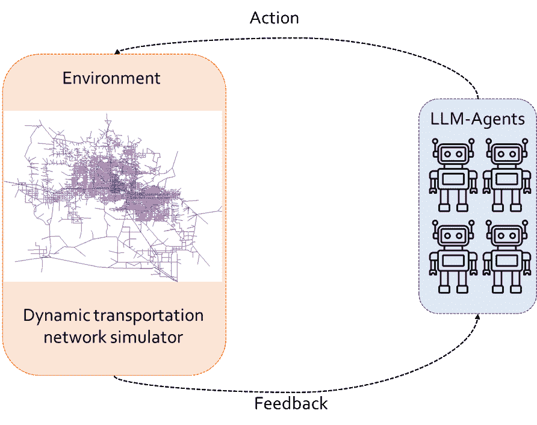

Figure 1: Agents-environment interaction

The LLM agents in our framework need to possess the ability to identify tasks, process information, learn from past interactions, and make autonomous decisions. To achieve these requirements, we design the LLM agents with a series of components and functions to allow for information storage, processing, and adaptive actions. The design of our LLM agents and their interaction workflow with the dynamic transportation network simulator are presented in [Figure 2](https://arxiv.org/html/2412.06681v1#S4.F2 "In 4 System design ‣ Toward LLM-Agent-Based Modeling of Transportation Systems: A Conceptual Framework").

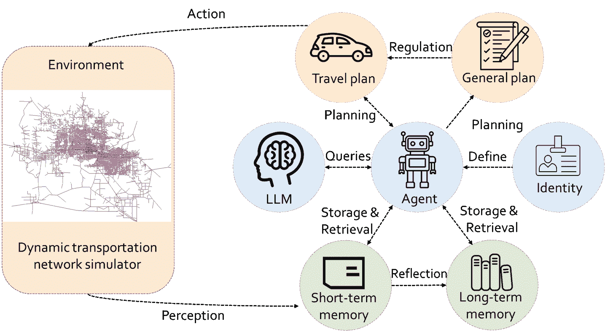

Figure 2: Design of LLM-agent-based modeling framework

Our agent design features an LLM core; a memory system that stores information; an identity core that defines the social demographics, tasks, and restrictions of the agents; and autonomous planning abilities to devise plans, extract travel-related information at any level, and execute actions. The agent has three long-lasting core components: identity, memory, and LLM core. Their corresponding designs and tasks are:

*   •

    Identity: The identity describes the information related to the present that may impact the agent’s decision-making. The identity contains social-demographic information about the agent, such as age, income, occupation, and number of cars owned, the agent’s persona, such as level of environmental awareness, and the agent’s travel-related tasks, such as going to school or grocery shopping that the traveler needs to do, along with the associated restrictions, such as school starting at 9 am. All identity information is stored in natural language and exists in the agents’ long-term memory throughout the simulation.

*   •

    Memory: The memory describes the past travel-related experiences and reflections of the agents that may help to adjust their decision-making in the future. In designing the memory system, we emulate the human decision-making process and memory formulation by implementing both a short-term memory system and a long-term memory system. The short-term memory system stores detailed travel experiences that have happened recently, while the long-term memory system stores high-level information that tends to stay longer in the memory of humans. The memory items that describe the past experience of agents are all stored in natural language.

*   •

    LLM core: The core of the agent is a LLM. The LLM handles a diverse set of functions and tasks that includes natural language processing, autonomous summarization, and autonomous planning in the overall workflow. The agents will frequently query the LLM with the corresponding prompt dependent on the task.

In the overall information flow, when interacting with the environment, the agents first perceive their past travel experience and store it in their memory. Then, combining memory and identity, the agent leverages its LLM core to derive and process multiple levels of activity and travel plans. Finally, the agents execute their travel actions. The environment will simulate the system outcome based on the agent’s actions, and with the agent receiving the outcomes, a new iteration in the simulation begins. In this iterative process, the agents process multiple functionalities such as perception, reflection, planning, plan processing, and acting. These functionalities are described below:

*   •

    Perception: The perception function translates the outcomes such as travel times from the simulator to the agents. In this process, the agents can perceive their past travel experiences in their interactions with the system by using its LLM core and natural language processing to translate the numeric outputs of the system to natural language. These travel experiences are then stored in the memory system of agents.

*   •

    Reflection: In reflection, we aim to take insights from the human memory system and information processing process [[37](https://arxiv.org/html/2412.06681v1#bib.bib37)]. For humans, details of recent experiences are stored in short-term memories while more macroscopic takeaways are processed by the human brain and stored in long-term memories. Thus, in the LLM-agent information flow, we also ask the agents to regularly conduct reflections based on their short-term memory and extract relevant top-level information from past travel to their long-term memories.

*   •

    Planning: Given available information in their memory system and their identity, the agents leverage the strong reasoning ability of their LLM core to plan and decide their actions on diverse tasks. When doing planning, the agents will retrieve their identity and past experiences from both short-term and long-term memories. This information is processed into prompts and fed into the LLM core of the agent, and the LLM core will autonomously make plans and travel-related decisions based on the information.

*   •

    Plan processing: As travel demand is largely a derived demand, in the simulation, the agents often need to devise general plans before determining the travel-related details. In the agent design, we also leverage the language processing ability to let the LLM core extract relevant information from a more general plan for a more detailed plan. For example, the LLM core can extract travel-related information from the general activity plan of the agents to form the outline of the agent’s travel plan, and the agent can use this information to make further decisions.

*   •

    Action: Based on the agents’ travel plans, the LLM core leverages its language processing capabilities to convert natural language actions into structured mathematical inputs for the dynamic transportation network simulator.

## 5 Behavioral Tuning of LLM Agents with Human Travelers

In designing LLM-based agents, we aim to mirror human decision-making processes and traits. Given that transportation system simulations are inherently interactive and iterative, agents must not only make travel decisions but also incorporate feedback from the system to refine their behavior. Consequently, agent behavior must align with that of human travelers along two critical dimensions: first, agents should exhibit travel choices consistent with those of human users under similar contextual conditions; second, agents must demonstrate the capacity to learn from past experiences and adjust their future decisions accordingly. This section highlights the feasibility of fine-tuning LLM agents to fulfill these two criteria within an LLM-agent-based modeling framework, supported by illustrative examples and references to established studies.

### 5.1 Tuning LLM agents on travel choices

In the LLM-agent-based framework, the LLM agents need to make a series of choices when making their travel decisions, notwithstanding activity scheduling, mode choices, and route choices. While LLMs process autonomous decision-making abilities and also process training from vast amounts of human-generated training data, there is no guarantee that in terms of behavior, LLM agents would be similar to humans. Even with the popular role prompting [[38](https://arxiv.org/html/2412.06681v1#bib.bib38)] method, in which social-demographic information of the decision maker is provided to LLM to enhance its impersonation of humans, Evidence from social science and psychology [[39](https://arxiv.org/html/2412.06681v1#bib.bib39), [40](https://arxiv.org/html/2412.06681v1#bib.bib40), [41](https://arxiv.org/html/2412.06681v1#bib.bib41), [42](https://arxiv.org/html/2412.06681v1#bib.bib42), [43](https://arxiv.org/html/2412.06681v1#bib.bib43), [44](https://arxiv.org/html/2412.06681v1#bib.bib44), [45](https://arxiv.org/html/2412.06681v1#bib.bib45)] suggests that prompting LLMs with the task, demographics, and context information alone may not sufficiently generate behaviors that are similar to those of humans. Consequently, additional tuning of LLM agents is required to better align their travel choices with those of human travelers.

Encouragingly, recent research in the transportation domain suggests that with targeted prompting and conditioning, LLM agents can indeed exhibit travel behaviors that closely resemble human actions across various decision contexts:

*   •

    Activity scheduling: Established studies have demonstrated that incorporating additional context from historical data can better align LLM agents’ activity scheduling behavior with that of human travelers. For instance, Wang et al. [[45](https://arxiv.org/html/2412.06681v1#bib.bib45)] emphasize the significance of travel motivation and habitual patterns in the activity scheduling context, proposing a pipeline that mines and summarizes these behavioral contexts from travelers’ historical travel diaries. This information is then used in the LLM prompt to generate activity trajectories. Their evaluation on a large-scale mobility trajectory dataset shows that tuning LLM agents with this approach produces activity patterns more aligned with human behavior than existing frameworks. Similarly, Liu et al. [[46](https://arxiv.org/html/2412.06681v1#bib.bib46)] proposes a few-shot learning framework, leveraging LLMs’ pattern recognition and reasoning capabilities. By providing social-demographic data, summary statistics, and exemplar travel diaries, they enable in-context learning for LLMs. Their experiments with the National Household Travel Survey data reveal that few-shot LLMs can generate activity patterns closely matching those of human travelers.

*   •

    Destination choice: LLMs have also demonstrated the ability to make destination choices similar to those of human travelers. Using a few-shot learning approach, Wang et al. [[47](https://arxiv.org/html/2412.06681v1#bib.bib47)] investigate whether LLMs can predict a traveler’s next destination based on current location and past activities. Their framework incorporates historical trajectory data alongside contextual information, allowing the LLM to extract patterns from historical data and infer the traveler’s next destination. Tests on a real-world mobility dataset reveal that LLMs can generate destination choices comparable to those of human travelers.

*   •

    Mode choice: Recent literature has also demonstrated that LLMs may be tuned to exhibit similar mode choice behavior as human travelers. In our previous study on mode choice [[48](https://arxiv.org/html/2412.06681v1#bib.bib48)], we find that role prompting based on social-demographic information alone and few-shot learning is insufficient in aligning LLMs with human travelers on mode choice behavior. We then propose a persona discovery and loading framework (as shown in [Figure 3](https://arxiv.org/html/2412.06681v1#S5.F3 "In 5.1 Tuning LLM agents on travel choices ‣ 5 Behavioral Tuning of LLM Agents with Human Travelers ‣ Toward LLM-Agent-Based Modeling of Transportation Systems: A Conceptual Framework")) to further tune LLMs on mode choice behavior. The framework first leverages LLM’s reasoning ability to discover latent persona characteristics in mode choice behavior and then matches new observations with the proper latent persona similar to a latent class discrete choice model. Using a real-world dataset, we find that the proposed framework can significantly improve the behavioral alignment of LLMs and human travelers in the mode choice context.

*   •

    Other travel choice contexts: Additional evidence of LLMs’ behavioral alignment with human travelers has been observed in other travel choice contexts. For example, Chen et al. [[49](https://arxiv.org/html/2412.06681v1#bib.bib49)] investigate how LLMs can simulate traveler decision-making during train delays. To enable the LLM to better model travelers’ waiting decisions, the authors introduce a few-shot learning framework that incorporates delay logs and contextual features. These delay-specific features allow the LLM to identify key patterns and better predict traveler behavior during delays. Their validation using real-world delay data shows that delay-log-tuned LLMs can accurately simulate travelers’ waiting decisions.

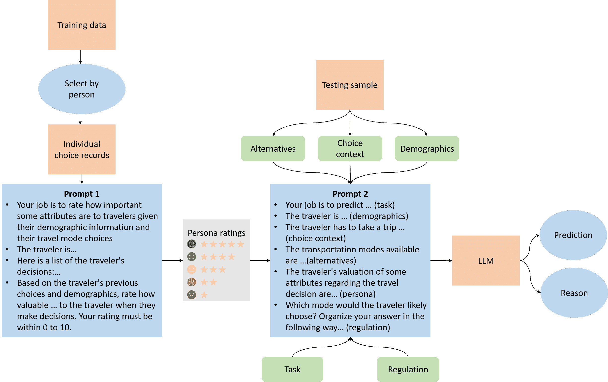

Figure 3: The LLM mode choice prediction framework in [[48](https://arxiv.org/html/2412.06681v1#bib.bib48)]

Existing evidence highlights the potential of LLMs to emulate human travel choice behavior across multiple decision contexts. While role-prompting with socio-demographic information alone is insufficient, LLMs’ pattern recognition, reasoning, and role-playing abilities offer new opportunities for behavioral tuning. Some studies [[46](https://arxiv.org/html/2412.06681v1#bib.bib46), [47](https://arxiv.org/html/2412.06681v1#bib.bib47), [49](https://arxiv.org/html/2412.06681v1#bib.bib49)] demonstrate that a combination of few-shot learning and historical data can achieve strong behavioral emulation. Others [[45](https://arxiv.org/html/2412.06681v1#bib.bib45), [48](https://arxiv.org/html/2412.06681v1#bib.bib48)] extract latent psychological and behavioral traits from data to tune LLMs for improved alignment. With real-world data support, our proposed agent framework can take advantage of these methods to attune the travel choices of the LLM agents.

### 5.2 Tuning LLM agents on learning and adjustment

To design LLM agents that exhibit human-like learning and adjustment behavior, we align the agents with four critical traits observed in human cognitive processes:

*   •

    Intelligence: Human intelligence is characterized by the capacity to solve complex, multi-level problems by breaking them down into smaller, manageable sub-problems. To emulate this capacity, we implement chain-of-thought prompting [[50](https://arxiv.org/html/2412.06681v1#bib.bib50)] within the agents’ planning process. This approach facilitates stepwise reasoning, enabling agents to generate more accurate and interpretable solutions for complex planning tasks. Additionally, to mitigate small logical errors inherent to LLMs, we incorporate self-correction mechanisms [[51](https://arxiv.org/html/2412.06681v1#bib.bib51)]. This method enables LLM agents to iteratively review, identify, and revise their own responses, thereby reducing reasoning errors and enhancing overall decision accuracy.

*   •

    Bounded rationality: Human decision-making is shaped by bounded rationality, a concept rooted in the presence of cognitive biases, risk aversion, loss aversion, and behavioral inertia (reluctance to deviate from the status quo) [[32](https://arxiv.org/html/2412.06681v1#bib.bib32)]. To simulate this trait in LLM agents, we integrate bounded rationality into the agents’ reasoning process through prompt engineering. Specifically, the prompts encourage agents to consider behavioral inertia by highlighting the potential costs, effort, or inconvenience associated with changing a previous decision. This modification enables the agents to more realistically emulate human-like, suboptimal decision-making.

*   •

    Limited memory Human memory is limited, with people typically retaining only key summaries or notable (extreme) events over time, while routine details are more easily forgotten. To mimic this aspect of human cognition, we develop a memory architecture for LLM agents comprising both short-term and long-term memory systems. The agents’ reflection process prioritizes the consolidation of key summaries and extreme events into long-term memory. This memory design allows LLM agents to demonstrate human-like recall patterns and enables decision-making that reflects the kinds of experiences that most strongly influence human judgments.

*   •

    Theory-of-mind Theory of Mind [[52](https://arxiv.org/html/2412.06681v1#bib.bib52)] is the ability to understand and infer the mental states, thoughts, beliefs, intentions, and emotions of others. In the transportation system setting, agents are also aware of other travelers’ existence and notice that collective changes of other agents may impact their own decision’s outcome. Thus, we also incorporate this into the planning prompt of the agents by making the LLM agents aware that the system involves multiple participants. This mechanism enables agents to recognize that their decisions are interdependent with those of other agents, allowing them to account for the potential impacts of collective behavior on system outcomes and adjust their choices accordingly.

By incorporating intelligence, bounded rationality, and limited memory into the design of LLM agents, we enable the agents to exhibit more realistic learning and adjustment behavior. To demonstrate that our agent design can trigger agents’ learning and adjustment behavior during its iterative interaction with the environment, we use the setting of a classic example in transportation system analysis: the bottleneck model. In this model, a bottleneck that has a limited capacity lies in the way of the traveler on their way of commute and this bottleneck may cause congestion. The travelers would adjust their departure time every day by learning from past experiences and making today’s departure time decision, aiming to minimize a weighted sum of the total travel time and the cost of early/late arrival at the destination. In this setup, agents are placed in a game-theoretical environment where they need to continuously learn from their past choices to optimize their departure times through repeated interactions.

The overall agent design and system workflow for our example is illustrated in [Figure 4](https://arxiv.org/html/2412.06681v1#S5.F4 "In 5.2 Tuning LLM agents on learning and adjustment ‣ 5 Behavioral Tuning of LLM Agents with Human Travelers ‣ Toward LLM-Agent-Based Modeling of Transportation Systems: A Conceptual Framework").

Figure 4: Design of LLM-agent-based modeling framework in the bottleneck example

The agent’s perception is embodied in its memory system, where LLM agents store past travel experiences, including details such as departure time, arrival time, and travel time, in natural language descriptions. However, not all of it is utilized during decision-making. Similar to human behavior, LLM agents rely on overall trends and significant, extreme events to guide their next actions. To replicate this human-like trait, we designed a reflection module that enables agents to summarize their travel experiences and behavioral patterns over a specific time frame. These summaries, along with key extreme events (e.g., instances of high travel costs due to early arrival, late arrival, or traffic congestion), are stored in the agents’ long-term memory. When agents retrieve information from the memory system, the decision-making process is guided by these summarized trends and extreme events, rather than by every individual data point. The memory system’s three key components — storage, reflection, and retrieval — are designed to mimic the way human travelers prioritize patterns and extreme experiences over detailed recollection. Results from ablation experiments reveal that agents with the reflection module demonstrate more consistent and stable decision-making patterns, further supporting the importance of this design approach.

When the LLM agents decide their departure time every day, they are provided with the aforementioned summary and extreme events, as well as their tasks, a utility function, and some additional instructions. The additional instructions include prompting the agents to avoid excessive adjustments and taking account of arrival time and the cost of travel time. However, these instructions do not directly regulate the agent’s behavior. Instead, they serve as guiding conditions that promote human-like behavior by introducing behavioral inertia and reducing the agent’s excessive focus on either travel time or arrival time. Given these elements, the LLM agents autonomously make decisions. Furthermore, in the system, multiple agents can engage in strategic interactions, similar to humans. Also, agents are aware that their choices not only affect themselves but also influence the entire system through traffic flow, which corresponds to the theory-of-mind concept [[53](https://arxiv.org/html/2412.06681v1#bib.bib53)].

We simulate the system dynamics of a bottleneck that has 40 travelers over 40 days. The bottleneck’s capacity is 60 vehicles per hour and has a free-flow travel time of 30 minutes. The ratio of the marginal disutility for the agents of early arrival time, in-route travel time, and late arrival time is $\alpha:\beta:\gamma=1:3:10$. On the first day, the agents’ departure times are set randomly within a certain range to initialize the system. After that, the system dynamics are fully autonomously driven by the designed agents and a dynamic traffic simulator [[54](https://arxiv.org/html/2412.06681v1#bib.bib54)]. The agents’ departure time distribution for days 1-10, 11-20, 21-30 and 31-40 are shown in [Figure 5](https://arxiv.org/html/2412.06681v1#S5.F5 "In 5.2 Tuning LLM agents on learning and adjustment ‣ 5 Behavioral Tuning of LLM Agents with Human Travelers ‣ Toward LLM-Agent-Based Modeling of Transportation Systems: A Conceptual Framework").

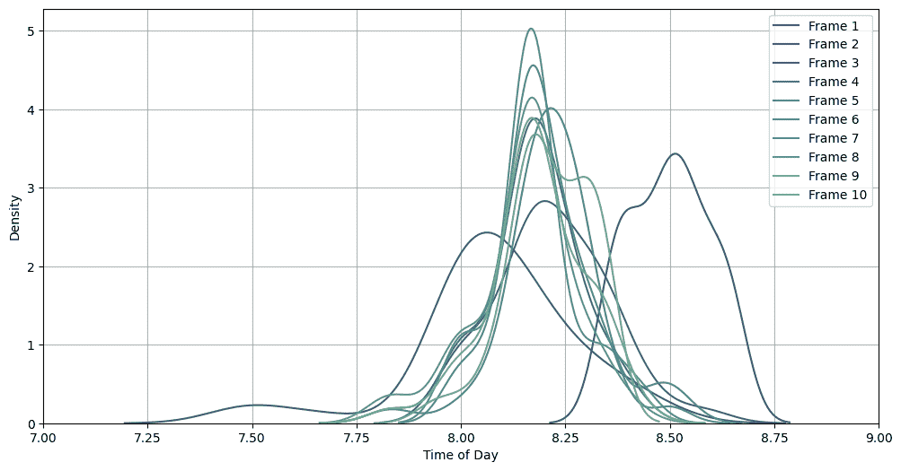

(a)

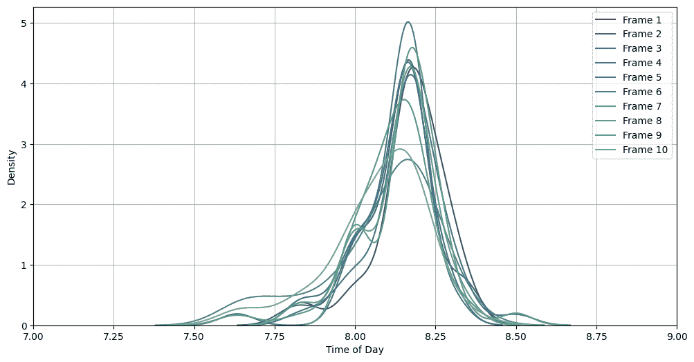

(b)

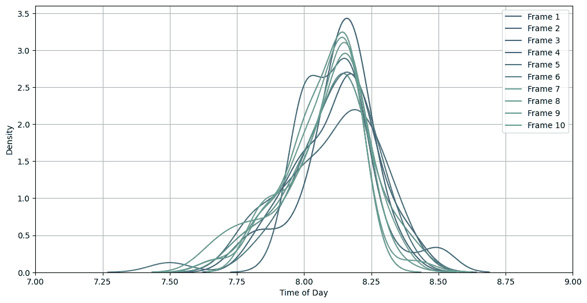

(c)

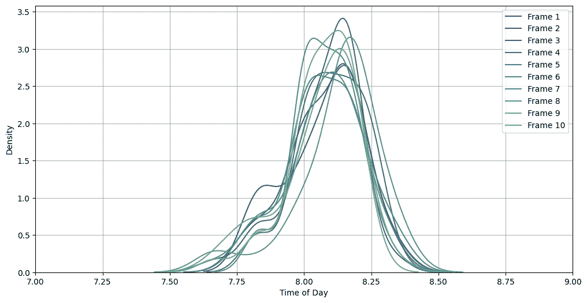

(d)

Figure 5: The agents’ departure time distribution

[Figure 5](https://arxiv.org/html/2412.06681v1#S5.F5 "In 5.2 Tuning LLM agents on learning and adjustment ‣ 5 Behavioral Tuning of LLM Agents with Human Travelers ‣ Toward LLM-Agent-Based Modeling of Transportation Systems: A Conceptual Framework") illustrates the agents’ learning and adjustment process. Initially, the agents’ departure times were concentrated between 8:15 AM and 8:45 AM. However, as shown in [Figure 5](https://arxiv.org/html/2412.06681v1#S5.F5 "In 5.2 Tuning LLM agents on learning and adjustment ‣ 5 Behavioral Tuning of LLM Agents with Human Travelers ‣ Toward LLM-Agent-Based Modeling of Transportation Systems: A Conceptual Framework")(a), during the first 10 days, agents began to interact with the system and quickly realized that this departure window was suboptimal. Recognizing room for improvement, they adjusted their departure times to be earlier, with most of this adjustment occurring within the first 3 days. Interestingly, after this initial shift, agents observed that their new departure times were too early. As a result, they readjusted their departure times slightly later, reflecting their ability to evaluate prior experiences and fine-tune their decisions based on interaction with the system. By days 10-20, the agents’ departure times became more stable, as no large-scale adjustments were observed. This stabilization trend continued through days 20-40\. A closer look at the departure time distribution from days 11-40 reveals a gradual broadening of the distribution, while still maintaining a single peak. This pattern suggests that agents learned to avoid congestion caused by too many agents departing at the same time. By spreading out their departure times, agents were able to optimize their travel experience and reduce exposure to peak-time congestion.

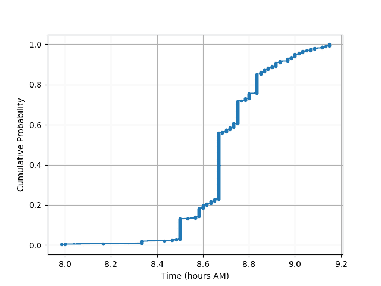

(a)

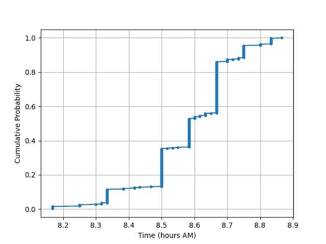

(b)

Figure 6: The agents’ cumulative bottleneck-arrival time distribution

As shown in [Figure 6](https://arxiv.org/html/2412.06681v1#S5.F6 "In 5.2 Tuning LLM agents on learning and adjustment ‣ 5 Behavioral Tuning of LLM Agents with Human Travelers ‣ Toward LLM-Agent-Based Modeling of Transportation Systems: A Conceptual Framework"), the cumulative arrival time of agents at the bottleneck, following 30 minutes of free-flow travel, also reflects the process of learning and adjustment. During the first 10 days, the agents’ arrival time distribution exhibits long tails on both ends, indicating that some agents experienced extreme early departures or late departures. Additionally, a sharp spike in the middle of the distribution suggests that a large number of agents departed simultaneously, resulting in crowding at the bottleneck and the formation of long queues and congestion. By contrast, in the final 10 days, the agents’ arrival time distribution became more balanced. The long tails at both ends of the distribution were significantly shortened, indicating that agents had minimized extreme early and late arrivals. Moreover, the spike at the center of the distribution was reduced, reflecting a more staggered pattern of departures that mitigated the formation of large queues at the bottleneck. This shift in pattern suggests that agents were able to learn from past experiences and adjust their behavior accordingly, resulting in more reasonable and efficient arrival time distributions over time.

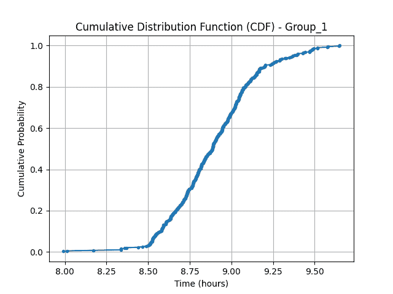

(a)

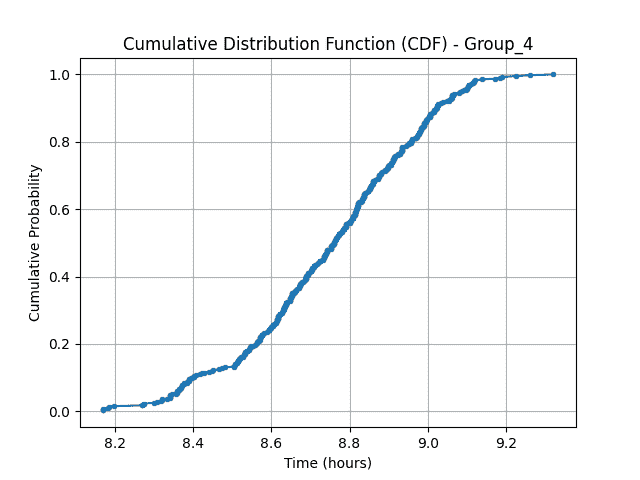

(b)

Figure 7: The agents’ cumulative destination-arrival time distribution

Similarly, the cumulative arrival time distribution of agents during the first and last 10 days, as shown in [Figure 7](https://arxiv.org/html/2412.06681v1#S5.F7 "In 5.2 Tuning LLM agents on learning and adjustment ‣ 5 Behavioral Tuning of LLM Agents with Human Travelers ‣ Toward LLM-Agent-Based Modeling of Transportation Systems: A Conceptual Framework"), provides further evidence of the agents’ learning and behavioral adjustment. The distribution reveals that, in the early phase of the simulation, the agents’ arrival times exhibit heavier tails at both ends, indicating a greater occurrence of extreme early and late arrivals. Meanwhile, the central portion of the distribution follows a linear pattern, suggesting that a large portion of agents arrived at more typical times. By the final 10 days, the arrival time distribution shows significant improvement. The tails associated with early and late arrivals are notably reduced, while the overall arrival times are more concentrated around 9 AM. This shift indicates that agents have learned to avoid extreme early and late arrivals through repeated interaction with the environment. The overall result is a more stable and balanced arrival pattern, reflecting agents’ capacity to improve their decision-making process over time.

Additionally, we conducted a brief ablation study. Without the theory of mind guiding agents to consider changes in peak times, they tend to fall into a cycle of departing earlier, encountering congestion, departing even earlier, and repeating the process. This results in departure times being concentrated in relatively early periods and longer average travel times. Without behavioral inertia, agents become overly sensitive, making large adjustments and leaving excessive time buffers in response to congestion or delays. This leads to slower convergence or, in some cases, failure to converge altogether. This ablation shows the importance of realistic agent learning and adjustment from the system perspective.

## 6 Technical Challenges

Our previous discussion and demonstration illustrated the potential, advantages, and feasibility of the LLM-agent-based modeling framework. However, there are still some challenges in the development and implementation of such a framework of transportation systems. We outline some remaining challenges in this section.

### 6.1 Enhancing behavioral alignment

While LLMs have shown great potential in replicating diverse behavior among different groups of travelers, a distinctive aspect of human behavior is its inherent randomness. For example, even when faced with the same choice problem, humans may sometimes make decisions that deviate from their usual preferences. In traditional modeling frameworks, stochastic models based on random utility theory are used to capture both the diversity and randomness of human behavior. However, LLMs may struggle to replicate this randomness. Since LLMs are trained on large datasets and designed to predict the most probable next word or sequence, their responses tend to be repetitive and conform to general norms. This limits the diversity and unpredictability of their outputs compared to human responses, which are more variable and less predictable. Additionally, LLMs are designed to avoid generating harmful, offensive, or inappropriate content, which encourages the production of conservative, neutral, or “safe" responses. This built-in safety mechanism further narrows the range of possible outputs. Empirical evidence from Park et al. [[43](https://arxiv.org/html/2412.06681v1#bib.bib43)] highlights this issue, showing that LLMs exhibit a “correct answer" effect, where responses to survey questions are highly uniform, unlike human respondents who demonstrate significantly more diverse answers. While adjusting the “temperature" hyperparameter — which controls the randomness of the text generation process — can increase response diversity, both Wang et al. [[55](https://arxiv.org/html/2412.06681v1#bib.bib55)] and Liu et al. [[48](https://arxiv.org/html/2412.06681v1#bib.bib48)] find that temperature adjustments alone are insufficient to achieve the same level of randomness as observed in human behavior. Therefore, new methodologies are required to better align LLM behavior with the behavioral randomness exhibited by human travelers.

### 6.2 Scalability of the simulation

Another major challenge of LLM-agent-based modeling in transportation systems is scalability. Transportation systems are inherently large and require a substantial number of agents, making it difficult to operationalize an LLM-agent-based framework at scale. The two primary bottlenecks are computational resource requirements and processing latency.

LLMs demand significant computational power, and as the number of agents increases, the system’s memory and processing needs grow proportionally. Running large-scale agent-based simulations quickly becomes resource-intensive. While cloud computing can help alleviate some of the computational burden, it does not fully address the issue of processing time. LLMs generally take longer to process inputs and generate responses than traditional models, making this a key bottleneck in large-scale simulations involving numerous agents. Transportation system simulations not only require large numbers of agents but also multiple repetitions to achieve convergence and assess system performance. As a result, the extended response times of LLM agents can significantly increase the total simulation runtime. Existing research has explored LLM-agent-based simulations with different agent counts, ranging from a few agents in game-like environments [[20](https://arxiv.org/html/2412.06681v1#bib.bib20), [36](https://arxiv.org/html/2412.06681v1#bib.bib36)], to around 10 agents in social sandboxes [[27](https://arxiv.org/html/2412.06681v1#bib.bib27)], and up to 50-100 agents in larger domains like public health [[30](https://arxiv.org/html/2412.06681v1#bib.bib30)], macro-economics [[29](https://arxiv.org/html/2412.06681v1#bib.bib29)], and social networks [[22](https://arxiv.org/html/2412.06681v1#bib.bib22)]. However, transportation systems typically involve thousands of agents representing travelers, far exceeding the scale tested in other domains. To address this scalability challenge, new approaches are required to manage computational demands and ensure simulation efficiency. Possible solutions include developing representative agents or applying gradient-based methods [[31](https://arxiv.org/html/2412.06681v1#bib.bib31)], which could enable more efficient simulation of large-scale systems.

### 6.3 Verification of the model

The final main challenge for the LLM-agent-based modeling framework is verification. Although our initial efforts suggest that LLMs can replicate human traveler behavior in certain scenarios and generate behaviorally sound adjustments, further verification is essential to assess their behavioral accuracy across diverse tasks. For instance, it remains unclear how closely LLM agents mimic human information processing and learning from past experiences, requiring additional experimental validation. Moreover, verifying individual behaviors is difficult when ground-truth data on human actions is limited. Additionally, behavioral accuracy at the individual decision level does not automatically ensure that system-wide simulation outcomes align with real-world data, making verification at both individual and system levels crucial for the verification of our proposed framework.

## 7 Conclusion

In this paper, we introduce a conceptual framework of an LLM-agent-based modeling framework for transportation systems. Our approach leverages the natural language understanding and autonomous decision-making capabilities of LLM agents, which positions them as effective agents within an agent-based modeling framework. We postulate that LLM agents have the potential to address some challenges in the agent-based modeling of transportation systems, particularly regarding behavioral assumptions, data efficiency, and flexibility.

By closely simulating human travelers’ characteristics and interactions, we propose a general framework using LLM agents as proxies for human travelers and dynamic transportation network simulators as environments. Our framework incorporates a human-aligned agent design, featuring a memory system that mimics human memory, alongside an information retrieval and decision-making mechanism that enables LLM agents to learn from prior experiences and generate sound travel plans and actions. Furthermore, we demonstrated that the proposed framework has desirable properties on behavior emulation and learning abilities. We tested our framework on the morning commute bottleneck case and verified that the designed agents can generate sound behavior and adjust their decisions by learning from their interactions with the framework. Overall, our proposal is novel in the travel demand modeling and transportation system modeling domain, and our demonstration indicates the LLM-agent-based modeling framework has the potential to enhance the design and application of agent-based models in both academia and practice.

Nonetheless, some challenges remain. Tuning the behavioral alignment of LLM agents with human decision-making, especially in capturing randomness, is a key area for improvement. The scalability of the framework also poses limitations that must be addressed, and rigorous verification of both agent behavior and system-wide outcomes will be essential for broader applicability. Future research should focus on refining these aspects to enhance the accuracy and applicability of the LLM-agent-based framework for transportation modeling and related fields.

## References

*   [1] Kelsey Wingo, Scott Smith, Meghan Boydston, Rachel Strauss McBrien, et al. A snapshot of travel modeling activities: 2023 update. Technical report, United States. Department of Transportation. Federal Highway Administration, 2023.
*   [2] Moshe E Ben-Akiva and Steven R Lerman. Discrete choice analysis: theory and application to travel demand, volume 9. MIT press, 1985.
*   [3] Sander Van Cranenburgh, Shenhao Wang, Akshay Vij, Francisco Pereira, and Joan Walker. Choice modelling in the age of machine learning-discussion paper. Journal of choice modelling, 42:100340, 2022.
*   [4] Grace O Kagho, Milos Balac, and Kay W Axhausen. Agent-based models in transport planning: Current state, issues, and expectations. Procedia Computer Science, 170:726–732, 2020.
*   [5] Gianluca Manzo and Toby Matthews. Potentialities and limitations of agent-based simulations. Revue française de sociologie, 55(4):653–688, 2014.
*   [6] Gregory Bucci, Chris Calley, Michael Green, et al. Fhwa research and technology evaluation: Agent-based modeling and simulation. Technical report, United States. Federal Highway Administration. Office of Corporate Research …, 2018.
*   [7] Laron Smith, Richard Beckman, and Keith Baggerly. Transims: Transportation analysis and simulation system. Technical report, Los Alamos National Lab.(LANL), Los Alamos, NM (United States), 1995.
*   [8] Kay W Axhausen, Andreas Horni, and Kai Nagel. The multi-agent transport simulation MATSim. Ubiquity Press, 2016.
*   [9] Muhammad Adnan, Francisco C Pereira, Carlos Miguel Lima Azevedo, Kakali Basak, Milan Lovric, Sebastián Raveau, Yi Zhu, Joseph Ferreira, Christopher Zegras, and Moshe Ben-Akiva. Simmobility: A multi-scale integrated agent-based simulation platform. In 95th Annual Meeting of the Transportation Research Board Forthcoming in Transportation Research Record, volume 2\. The National Academies of Sciences, Engineering, and Medicine Washington, DC, 2016.
*   [10] Joshua Auld, Michael Hope, Hubert Ley, Vadim Sokolov, Bo Xu, and Kuilin Zhang. Polaris: Agent-based modeling framework development and implementation for integrated travel demand and network and operations simulations. Transportation Research Part C: Emerging Technologies, 64:101–116, 2016.
*   [11] Brian Yueshuai He, Qinhua Jiang, and Jiaqi Ma. Connected automated vehicle impacts in southern california part-i: Travel behavior and demand analysis. Transportation research part D: transport and environment, 109:103329, 2022.
*   [12] Cambridge Systematics. Status of activity-based models and dynamic traffic assignment at peer mpos. Prepared for Metropolitan Washington Council of Governments/National Capital Region Transportation Planning Board. Cambridge, MA, 2015.
*   [13] David E Boyce and Huw CWL Williams. Forecasting urban travel: Past, present and future. Edward Elgar Publishing, 2015.
*   [14] Tom Brown, Benjamin Mann, Nick Ryder, Melanie Subbiah, Jared D Kaplan, Prafulla Dhariwal, Arvind Neelakantan, Pranav Shyam, Girish Sastry, Amanda Askell, et al. Language models are few-shot learners. Advances in neural information processing systems, 33:1877–1901, 2020.
*   [15] Josh Achiam, Steven Adler, Sandhini Agarwal, Lama Ahmad, Ilge Akkaya, Florencia Leoni Aleman, Diogo Almeida, Janko Altenschmidt, Sam Altman, Shyamal Anadkat, et al. Gpt-4 technical report. arXiv preprint arXiv:2303.08774, 2023.
*   [16] Gemini Team, Rohan Anil, Sebastian Borgeaud, Yonghui Wu, Jean-Baptiste Alayrac, Jiahui Yu, Radu Soricut, Johan Schalkwyk, Andrew M Dai, Anja Hauth, et al. Gemini: a family of highly capable multimodal models. arXiv preprint arXiv:2312.11805, 2023.
*   [17] Hugo Touvron, Thibaut Lavril, Gautier Izacard, Xavier Martinet, Marie-Anne Lachaux, Timothée Lacroix, Baptiste Rozière, Naman Goyal, Eric Hambro, Faisal Azhar, et al. Llama: Open and efficient foundation language models. arXiv preprint arXiv:2302.13971, 2023.
*   [18] Aili Chen, Xuyang Ge, Ziquan Fu, Yanghua Xiao, and Jiangjie Chen. Travelagent: An ai assistant for personalized travel planning. arXiv preprint arXiv:2409.08069, 2024.
*   [19] Yihong Tang, Zhaokai Wang, Ao Qu, Yihao Yan, Kebing Hou, Dingyi Zhuang, Xiaotong Guo, Jinhua Zhao, Zhan Zhao, and Wei Ma. Synergizing spatial optimization with large language models for open-domain urban itinerary planning. arXiv preprint arXiv:2402.07204, 2024.
*   [20] Yuzhuang Xu, Shuo Wang, Peng Li, Fuwen Luo, Xiaolong Wang, Weidong Liu, and Yang Liu. Exploring large language models for communication games: An empirical study on werewolf. arXiv preprint arXiv:2309.04658, 2023.
*   [21] Alberto Acerbi and Joseph M Stubbersfield. Large language models show human-like content biases in transmission chain experiments. Proceedings of the National Academy of Sciences, 120(44):e2313790120, 2023.
*   [22] I de Zarzà, J de Curtò, Gemma Roig, Pietro Manzoni, and Carlos T Calafate. Emergent cooperation and strategy adaptation in multi-agent systems: An extended coevolutionary theory with llms. Electronics, 12(12):2722, 2023.
*   [23] Chen Gao, Xiaochong Lan, Zhihong Lu, Jinzhu Mao, Jinghua Piao, Huandong Wang, Depeng Jin, and Yong Li. $s^{3}$: Social-network simulation system with large language model-empowered agents. arXiv preprint arXiv:2307.14984, 2023.
*   [24] Marios Papachristou and Yuan Yuan. Network formation and dynamics among multi-llms. arXiv preprint arXiv:2402.10659, 2024.
*   [25] Jintian Zhang, Xin Xu, and Shumin Deng. Exploring collaboration mechanisms for llm agents: A social psychology view. arXiv preprint arXiv:2310.02124, 2023.
*   [26] Weize Chen, Yusheng Su, Jingwei Zuo, Cheng Yang, Chenfei Yuan, Chi-Min Chan, Heyang Yu, Yaxi Lu, Yi-Hsin Hung, Chen Qian, et al. Agentverse: Facilitating multi-agent collaboration and exploring emergent behaviors. In The Twelfth International Conference on Learning Representations, 2023.
*   [27] Joon Sung Park, Joseph O’Brien, Carrie Jun Cai, Meredith Ringel Morris, Percy Liang, and Michael S Bernstein. Generative agents: Interactive simulacra of human behavior. In Proceedings of the 36th Annual ACM Symposium on User Interface Software and Technology, pages 1–22, 2023.
*   [28] Xu Han, Zengqing Wu, and Chuan Xiao. " guinea pig trials" utilizing gpt: A novel smart agent-based modeling approach for studying firm competition and collusion. arXiv preprint arXiv:2308.10974, 2023.
*   [29] Nian Li, Chen Gao, Mingyu Li, Yong Li, and Qingmin Liao. Econagent: large language model-empowered agents for simulating macroeconomic activities. In Proceedings of the 62nd Annual Meeting of the Association for Computational Linguistics (Volume 1: Long Papers), pages 15523–15536, 2024.
*   [30] Ross Williams, Niyousha Hosseinichimeh, Aritra Majumdar, and Navid Ghaffarzadegan. Epidemic modeling with generative agents. arXiv preprint arXiv:2307.04986, 2023.
*   [31] Ayush Chopra, Shashank Kumar, Nurullah Giray-Kuru, Ramesh Raskar, and Arnau Quera-Bofarull. On the limits of agency in agent-based models. arXiv preprint arXiv:2409.10568, 2024.
*   [32] Daniel Kahneman. Maps of bounded rationality: Psychology for behavioral economics. American economic review, 93(5):1449–1475, 2003.
*   [33] John J Horton. Large language models as simulated economic agents: What can we learn from homo silicus? Technical report, National Bureau of Economic Research, 2023.
*   [34] Andrea Coletta, Kshama Dwarakanath, Penghang Liu, Svitlana Vyetrenko, and Tucker Balch. Llm-driven imitation of subrational behavior: Illusion or reality? arXiv preprint arXiv:2402.08755, 2024.
*   [35] Yan Leng and Yuan Yuan. Do llm agents exhibit social behavior? arXiv preprint arXiv:2312.15198, 2023.
*   [36] Wenyue Hua, Lizhou Fan, Lingyao Li, Kai Mei, Jianchao Ji, Yingqiang Ge, Libby Hemphill, and Yongfeng Zhang. War and peace (waragent): Large language model-based multi-agent simulation of world wars. arXiv preprint arXiv:2311.17227, 2023.
*   [37] Richard C Atkinson. Human memory: A proposed system and its control processes. The psychology of learning and motivation, 2, 1968.
*   [38] Pengfei Liu, Weizhe Yuan, Jinlan Fu, Zhengbao Jiang, Hiroaki Hayashi, and Graham Neubig. Pre-train, prompt, and predict: A systematic survey of prompting methods in natural language processing. ACM Computing Surveys, 55(9):1–35, 2023.
*   [39] Thilo Hagendorff, Sarah Fabi, and Michal Kosinski. Human-like intuitive behavior and reasoning biases emerged in large language models but disappeared in chatgpt. Nature Computational Science, 3(10):833–838, 2023.
*   [40] Ali Goli and Amandeep Singh. Can llms capture human preferences? arXiv preprint arXiv:2305.02531, 2023.
*   [41] Yiting Chen, Tracy Xiao Liu, You Shan, and Songfa Zhong. The emergence of economic rationality of gpt. Proceedings of the National Academy of Sciences, 120(51):e2316205120, 2023.
*   [42] Lindia Tjuatja, Valerie Chen, Tongshuang Wu, Ameet Talwalkwar, and Graham Neubig. Do llms exhibit human-like response biases? a case study in survey design. Transactions of the Association for Computational Linguistics, 12:1011–1026, 2024.
*   [43] Peter S Park, Philipp Schoenegger, and Chongyang Zhu. Diminished diversity-of-thought in a standard large language model. Behavior Research Methods, pages 1–17, 2024.
*   [44] Amir Taubenfeld, Yaniv Dover, Roi Reichart, and Ariel Goldstein. Systematic biases in llm simulations of debates. arXiv preprint arXiv:2402.04049, 2024.
*   [45] Jiawei Wang, Renhe Jiang, Chuang Yang, Zengqing Wu, Makoto Onizuka, Ryosuke Shibasaki, and Chuan Xiao. Large language models as urban residents: An llm agent framework for personal mobility generation. arXiv preprint arXiv:2402.14744, 2024.
*   [46] Yifan Liu, Xishun Liao, Haoxuan Ma, Brian Yueshuai He, Chris Stanford, and Jiaqi Ma. Human mobility modeling with limited information via large language models. arXiv preprint arXiv:2409.17495, 2024.
*   [47] Xinglei Wang, Meng Fang, Zichao Zeng, and Tao Cheng. Where would i go next? large language models as human mobility predictors. arXiv preprint arXiv:2308.15197, 2023.
*   [48] Tianming Liu, Manzi Li, and Yafeng Yin. Can large language models capture human travel behavior? evidence and insights on mode choice. Available at SSRN 4937575, 2024.
*   [49] Chen Chen, Yuxin He, Hao Wang, Jingjing Chen, and Qin Luo. Delayptc-llm: Metro passenger travel choice prediction under train delays with large language models. arXiv preprint arXiv:2410.00052, 2024.
*   [50] Jason Wei, Xuezhi Wang, Dale Schuurmans, Maarten Bosma, Fei Xia, Ed Chi, Quoc V Le, Denny Zhou, et al. Chain-of-thought prompting elicits reasoning in large language models. Advances in neural information processing systems, 35:24824–24837, 2022.
*   [51] Liangming Pan, Michael Saxon, Wenda Xu, Deepak Nathani, Xinyi Wang, and William Yang Wang. Automatically correcting large language models: Surveying the landscape of diverse self-correction strategies. arXiv preprint arXiv:2308.03188, 2023.
*   [52] Alan M Leslie, Ori Friedman, and Tim P German. Core mechanisms in ‘theory of mind’. Trends in cognitive sciences, 8(12):528–533, 2004.
*   [53] James W. A. Strachan, Dalila Albergo, Giulia Borghini, Oriana Pansardi, Eugenio Scaliti, Saurabh Gupta, Krati Saxena, Alessandro Rufo, Stefano Panzeri, Guido Manzi, Michael S. A. Graziano, and Cristina Becchio. Testing theory of mind in large language models and humans. Nature Human Behaviour, 8:1285 – 1295, 2024.
*   [54] Xuesong Zhou and Jeffrey Taylor. Dtalite: A queue-based mesoscopic traffic simulator for fast model evaluation and calibration, 2014.
*   [55] Maonan Wang, Aoyu Pang, Yuheng Kan, Man-On Pun, Chung Shue Chen, and Bo Huang. Llm-assisted light: Leveraging large language model capabilities for human-mimetic traffic signal control in complex urban environments. arXiv preprint arXiv:2403.08337, 2024.