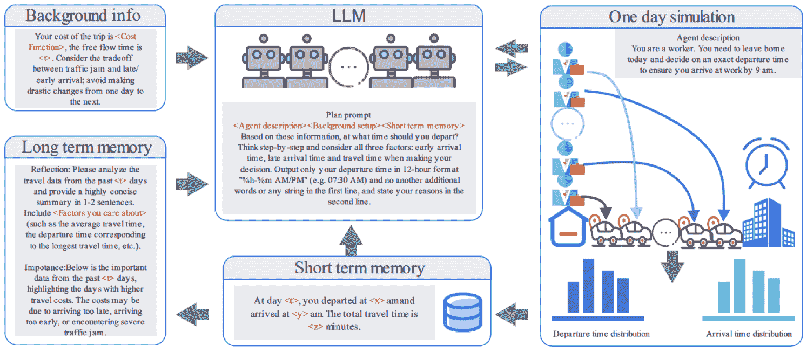

<!--yml

分类：未分类

日期：2025-01-11 11:49:54

-->

# 面向交通系统的LLM-代理建模：一个概念框架

> 来源：[https://arxiv.org/html/2412.06681/](https://arxiv.org/html/2412.06681/)

刘天明

土木与环境工程系

密歇根大学

&杨继荣

计算机科学与工程系

密歇根大学

&严亚峰*

土木与环境工程系

密歇根大学

yafeng@umich.edu

###### 摘要

在交通系统需求建模与仿真中，基于代理的模型和微观仿真是当前最先进的方法。然而，现有的基于代理的模型在行为真实感和资源需求方面仍然存在一些限制，限制了它们的应用性。在本研究中，利用新兴的语言模型（LLMs）技术及基于LLM的代理，我们提出了一种面向交通系统的通用LLM-代理建模框架。我们认为，LLM代理不仅具备作为代理的基本能力，而且为克服现有基于代理模型的一些限制提供了有前景的解决方案。我们的概念框架设计紧密模仿了人类旅行者在交通网络中的决策和互动过程及特征，并通过相关研究和LLM代理在瓶颈环境中学习和调整的示范性例子，展示了该系统能够满足决策和学习行为的关键行为标准。尽管LLM-代理建模框架还需要进一步完善，但我们相信这种方法有潜力改进交通系统建模与仿真。

## 1 引言

在交通规划中，建模交通系统并评估其性能是一个关键任务。交通规划中的系统评估模型旨在模拟旅行者与基础设施之间复杂且动态的互动，并基于各种社会和经济因素预测未来的出行模式和行为，这些因素包括人口统计、已建环境、地方经济、交通网络和交通政策。目前，规划中的最先进模型是基于代理的模型及相应的基于代理的系统微观模拟工具。这些模型通过将旅行者建模为能够与环境互动并做出明智、自治决策的代表性代理，避免了传统汇总方法（如四步法）中的汇总问题。通过模拟代理的详细出行行为并将这些行为融入到交通系统中需求和供给的动态表示中，基于代理的模型提供了有助于提高预测准确性的详细、细粒度的洞察。在交通工程实践中，基于代理的模型也已逐渐开始替代某些规划机构中的经典四步法模型[[1](https://arxiv.org/html/2412.06681v1#bib.bib1)]。

然而，现有的基于代理的建模方法在行为现实性和实际应用性方面仍然存在一些局限性。首先，基于代理的模型中的决策机制通常依赖于需要先验行为假设的数学模型，这可能无法完全捕捉旅行者的有限理性和细致的决策过程[[2](https://arxiv.org/html/2412.06681v1#bib.bib2), [3](https://arxiv.org/html/2412.06681v1#bib.bib3)]。其次，这些模型通常需要大量高质量的本地数据进行校准，特别是对于多模式系统，这对其在现实场景中的广泛应用构成了重大障碍[[4](https://arxiv.org/html/2412.06681v1#bib.bib4), [5](https://arxiv.org/html/2412.06681v1#bib.bib5)]。此外，评估替代方案和情景，特别是在当前框架下评估复杂、针对性的政策或新兴技术的影响，通常需要大量的编辑和编码工作[[6](https://arxiv.org/html/2412.06681v1#bib.bib6), [1](https://arxiv.org/html/2412.06681v1#bib.bib1)]。这对建模框架的设计和进行评估的人员的专业能力提出了重大要求，从而给其在规划机构中的使用带来了额外挑战。

近年来，大型语言模型（LLM）作为一种新型且多功能的框架，已被广泛应用于工程领域的多个领域，提供了处理和生成信息的先进能力。LLM的一种新兴应用是将其作为复杂互动系统中的代理。LLM代理是一个由LLM驱动的虚拟代理，通过自然语言与环境或其他代理互动，自主执行任务。LLM代理的关键组件包括用于语言处理和生成的LLM核心、处理输入信息的输入处理器、用于存储学习数据的上下文管理器、将上下文和信息使用连接到决策过程中的学习机制，以及引导自主行动的决策引擎。这些组件使代理能够理解环境、应对变化、做出决策并采取行动。

LLM的出现为提升交通系统建模提供了新的机会。LLM代理可以利用LLM的能力，理解并响应系统中的变化，并做出自主决策。这使它们适合作为交通系统中的代理。此外，LLM代理具有强大的交通系统建模能力。LLM代理可以通过自然语言理解和生成实现自主任务执行，从而在复杂环境中实现灵活和适应性的决策。此外，基于LLM在大量文本数据上的广泛训练，这些数据涵盖了人类语言和交流模式，LLM代理有潜力通过理解和复制这些语言模式，较好地模拟人类如何推理、对话和做出决策。

本文提出了一种基于LLM代理的交通系统建模框架。通过利用LLM代理作为人类旅行者的代理，我们认为我们提出的框架有潜力克服交通规划中基于代理的模型在可表达性、泛化性和适用性方面的一些障碍。对于这一新建模框架的原型，我们提出了一组结构和流程，紧密跟随交通系统中的人类行为和需求供给交互，并展示了原型的期望特性。然而，我们的LLM代理模型在设计、可扩展性和验证方面仍面临一些挑战。

本研究为生成模型和LLM在交通系统中应用的研究新领域作出了贡献。我们首先提出了一个LLM-代理基础交通系统建模的通用概念框架。此外，我们还介绍了一种与人类对齐的代理设计，模仿人类旅行者的决策过程和行为特征。通过回顾已有的研究和测试示例，展示了这种方法的有效性和潜力。总体而言，我们的提案为交通系统建模和仿真提供了一种新的替代方案。通过结合与人类对齐的LLM代理，这种方法有望提高代理基础建模在交通规划实践中的可操作性。

本文的结构安排如下：[第2节](https://arxiv.org/html/2412.06681v1#S2 "2 文献综述 ‣ 朝着LLM-代理基础的交通系统建模：一个概念框架")回顾了关于传统交通领域中代理基础建模、LLM和LLM代理的相关文献；[第3节](https://arxiv.org/html/2412.06681v1#S3 "3 LLM-代理基础模型的优势 ‣ 朝着LLM-代理基础的交通系统建模：一个概念框架")论述了LLM-代理基础建模相较于当前交通研究实践的主要优势；[第4节](https://arxiv.org/html/2412.06681v1#S4 "4 系统设计 ‣ 朝着LLM-代理基础的交通系统建模：一个概念框架")阐述了我们提出的框架设计；[第5节](https://arxiv.org/html/2412.06681v1#S5 "5 人类旅行者行为调节与LLM代理 ‣ 朝着LLM-代理基础的交通系统建模：一个概念框架")展示了调节LLM代理行为使其与人类在选择、学习和调整方面的行为相似的可行性；[第6节](https://arxiv.org/html/2412.06681v1#S6 "6 技术挑战 ‣ 朝着LLM-代理基础的交通系统建模：一个概念框架")概述了未来的挑战，[第7节](https://arxiv.org/html/2412.06681v1#S7 "7 结论 ‣ 朝着LLM-代理基础的交通系统建模：一个概念框架")总结了本文内容。

## 2 文献综述

### 2.1 以代理为基础的交通系统模型

在交通需求建模和运输系统分析中，基于代理的建模方法自1990年代首次提出以来，已被确立为一个重要的范式。与以往依赖于人口、出行和旅行者行为的聚合方法相比，基于代理的模型通过模拟代表性代理的微观出行行为和动态，提供了更加详细且行为上更为真实的旅行者出行行为表现。如Kagho等人所指出的[[4](https://arxiv.org/html/2412.06681v1#bib.bib4)]，基于代理的运输模型包含三个关键组成部分：物理环境，即交通基础设施和服务；代理，即旅行者；以及代理的策略，指导和调节代理的行为。通过设定代理、建立其决策过程，并模拟其与交通物理基础设施的互动，基于代理的模型可以全面模拟运输系统的动态，帮助在系统性能评估和规划中进行决策。目前，研究人员已经开发出一些基于代理的模型，如TRANSSIMS [[7](https://arxiv.org/html/2412.06681v1#bib.bib7)]、MATSIM [[8](https://arxiv.org/html/2412.06681v1#bib.bib8)]、Simmobility [[9](https://arxiv.org/html/2412.06681v1#bib.bib9)] 和Polaris [[10](https://arxiv.org/html/2412.06681v1#bib.bib10)]。在实际应用中，交通规划机构也开始在其规划实践中用基于代理的模型取代传统的四阶段模型。例如，在美国，截至2023年，像北中部德克萨斯州政府委员会[[1](https://arxiv.org/html/2412.06681v1#bib.bib1)]和南加州政府协会[[11](https://arxiv.org/html/2412.06681v1#bib.bib11)]等机构，已经开始在区域交通规划或政策评估中应用或实验基于代理的建模方法。

然而，已建立的基于代理的模型在行为现实性和实际应用性方面存在一些局限性。首先，所有已建立的基于代理的框架都使用基于模型的方法来捕捉人类出行行为。这些模型都需要先验的行为假设，且大致可以分为两类：基于计量经济学的模型和基于规则的计算过程模型。计量经济学模型，如Simmobility中的离散选择模型，依赖于随机效用理论、离散选择理论和在分层框架内进行的蒙特卡洛仿真来捕捉旅行者的活动模式、时间安排和目的地选择，假设旅行者是效用最大化者。然而，这些假设无法完全捕捉人类在出行行为中的有限理性。基于规则的模型，如TRANSSIMS中的分类树和MATSim中的候选出行计划选择方法，使用预定义的规则来模拟活动和目的地。尽管这些模型在计算上需求较少，但它们在将启发式规则泛化以充分代表旅行者行为时面临挑战，因为这些规则在不同情况下是固定的。

此外，现有的框架还需要大量数据才能进行适当的校准。目前基于代理的交通框架需要捕捉多个层次的出行行为，包括但不限于汽车拥有决策、居住地选择决策、活动安排、出行方式选择和路线选择。每个建模层次都需要大量的数据收集，并且必须小心地进行模型校准，以确保整个基于代理的仿真能够正常运行。例如，在Simmobility中，基于代理的仿真需要结合人口统计调查、家庭出行调查、出租车GPS数据和公交智能卡数据等，才能对所建模地区进行校准[[9](https://arxiv.org/html/2412.06681v1#bib.bib9)]。这种大量数据收集过程和进行模型校准所需的时间限制了基于代理模型在实际中的应用。大多数都市规划机构缺乏数据来源、财力资源和人力来收集足够的数据并对当前的基于代理的模型进行校准。这一障碍影响了先进基于代理的模型对交通规划者和从业者的可获取性。根据2015年的一份报告[[12](https://arxiv.org/html/2412.06681v1#bib.bib12)]，美国仅有16%的都市规划机构计划在可预见的未来从传统的四步法模型过渡到更先进的模型。[ [13](https://arxiv.org/html/2412.06681v1#bib.bib13)]也评论到，基于代理的模型在当前状态下对交通规划实践的影响仍然较小。

### 2.2 LLM与LLM代理

LLMs 是一种生成型人工智能模型，旨在理解和生成自然语言。这些模型基于序列到序列的深度学习技术，特别是变压器（transformers），并在大量且多样的文本数据集上进行训练，这些数据集包括书籍、文章、网站、在线论坛、社交媒体和研究论文。尽管早期的这些模型，如 text-davinci [[14](https://arxiv.org/html/2412.06681v1#bib.bib14)]，仅设计用于基于给定信息完成文本的能力，但像 ChatGPT [[15](https://arxiv.org/html/2412.06681v1#bib.bib15)]、Gemini [[16](https://arxiv.org/html/2412.06681v1#bib.bib16)] 和 LLama [[17](https://arxiv.org/html/2412.06681v1#bib.bib17)] 等最先进模型已经发展成复杂的聊天机器人，能够进行对话并响应用户的查询和指令。LLMs 的语言理解和自主生成能力使其成为高度多功能的工具，能够感知并作为代理自主完成任务。

反思基于代理的交通模型中旅行代理的关键需求，可以清楚地看出 LLMs 拥有作为模拟过程中的代理所需的基本能力。首先，LLMs 具备先进的自然语言处理能力，使其能够有效地接收和解读来自环境的各种输入。通过提示机制，LLMs 的灵活性得到了增强，只需通过修改自然语言输入来适应不同的信息，从而促进频繁且高效的互动。与传统的机器学习模型需要结构化输入不同，LLMs 能够直接处理并理解非结构化的信息，提供了显著的多功能优势。此外，LLMs 能够根据它们处理的信息自主规划和调整行动。例如，当收到特定的指令或问题时，它们可以高效地完成起草文章、生成代码或解决复杂问题等任务，且仅需最少的人类干预。在旅行行程规划应用中，LLMs 还展现了良好的起草旅行计划能力 [[18](https://arxiv.org/html/2412.06681v1#bib.bib18), [19](https://arxiv.org/html/2412.06681v1#bib.bib19)]。此外，LLM 代理通过从交互中不断学习表现出了令人印象深刻的适应能力，主要作为服务助手。例如，基于 LLM 的聊天机器人会根据用户反馈改进其对话策略，从而提高响应的相关性和准确性。这种动态调整使得 LLM 代理能够随着时间的推移执行越来越复杂的任务，提升了它们在决策、任务自动化和跨领域问题解决中的价值。总体而言，LLMs 的能力使其非常适合作为基于代理的交通系统模拟中的代理使用。

基于LLM的代理模型已在其他一些物理或社会系统中得到了应用，例如社交游戏[[20](https://arxiv.org/html/2412.06681v1#bib.bib20), [21](https://arxiv.org/html/2412.06681v1#bib.bib21), [22](https://arxiv.org/html/2412.06681v1#bib.bib22)]、社交网络[[23](https://arxiv.org/html/2412.06681v1#bib.bib23), [24](https://arxiv.org/html/2412.06681v1#bib.bib24)]、合作任务解决[[25](https://arxiv.org/html/2412.06681v1#bib.bib25), [26](https://arxiv.org/html/2412.06681v1#bib.bib26)]、小型沙盒社交系统[[27](https://arxiv.org/html/2412.06681v1#bib.bib27)]、经济博弈[[28](https://arxiv.org/html/2412.06681v1#bib.bib28)]、经济系统[[29](https://arxiv.org/html/2412.06681v1#bib.bib29)]以及公共卫生系统[[30](https://arxiv.org/html/2412.06681v1#bib.bib30), [31](https://arxiv.org/html/2412.06681v1#bib.bib31)]。这些研究展示了LLM代理在仿真中的行为合理性、学习能力和多功能性。然而，将LLM代理应用于建模旅行行为时，与现有研究相比，会遇到一些独特的挑战。主要挑战在于，建模旅行行为涉及比先前研究中涉及的具体行为更为详细和多样化的任务。现有研究要么聚焦于个体行为，如游戏、竞争或合作，要么侧重于模拟小规模沙盒环境中的综合社会行为。在这些研究中，代理直接互动，例如通过对话或联合活动。相比之下，旅行行为遵循一个多层次的决策层级过程。人类旅行行为的建模涉及多个互相关联的层级决策——如长期选择（居住地点）、中期选择（汽车拥有权）和短期选择（出行方式、路线和出发时间）——这些共同影响整体的旅行行为。因此，要有效地建模人类旅行行为，LLM代理必须遵循一个多层次的决策过程，要求比简单社交仿真中使用的行为管道更加复杂。此外，在交通系统中，个体之间的直接互动较少。相反，旅行者的集体行为会影响交通基础设施的表现，而这反过来又影响每个个体的旅行决策。这种类似博弈的互动与现有文献中的直接合作互动有显著不同，因而需要一个新的系统设计，重点捕捉旅行者代理与交通网络之间的相互作用。

## LLM代理模型的三大优势

虽然LLM具有成为交通系统中合适旅行代理的能力，但我们认为基于LLM的代理不仅适用于建模框架，而且有潜力解决现有代理建模框架的一些局限性。

### 3.1 放宽行为假设

首先，LLM代理具有放宽人类旅行者行为建模假设的潜力。现有的基于代理的模型依赖于离散选择模型和决策树等数学框架，这些模型通常假设旅行者的行为规则。遵循经济学传统，旅行者通常被假设为理性。然而，行为科学表明，人类在日常行动中经常表现出非理性和有限理性[[32](https://arxiv.org/html/2412.06681v1#bib.bib32)]。LLM有潜力在建模过程中放宽行为假设。本质上，LLM是序列到序列的模型，可以在给定前一个单词序列$w_{i-1}^{(u)}, w_{i-2}^{(u)},...,w_{1}^{(u)}$的情况下，预测下一个单词$w_{i}^{(u)}$在序列$u$中的分布：

|  | $w_{i}^{(u)}\sim\mathbb{P}(w_{i}^{(u)}&#124;w_{i-1}^{(u)},w_{i-2}^{(u)},...,w_{1}^{(u)})$ |  |
| --- | --- | --- |

利用大量人类生成的文本数据——包括百科全书、学术论文、政府报告、在线论坛、社交媒体、博客以及各种网页内容——大型语言模型（LLM）接触到了一个广泛的数据集，这些数据反映了人类的行为模式和习惯。这些训练数据使得LLM能够洞察塑造人类沟通和决策的多样推理、态度和身份。除了其生成能力外，LLM还具有复制真实行为模式的潜力，使其能够模拟反映人类多样性和倾向性的决策过程。这一特性使得LLM特别适合捕捉人类决策者所表现出的复杂、往往非线性和非理性的行为。一些已有的证据表明，LLM能够表现出与人类相似的经济行为[[33](https://arxiv.org/html/2412.06681v1#bib.bib33), [34](https://arxiv.org/html/2412.06681v1#bib.bib34)] 和社会行为[[35](https://arxiv.org/html/2412.06681v1#bib.bib35), [25](https://arxiv.org/html/2412.06681v1#bib.bib25)]。

### 3.2 减少数据需求

其次，LLM 代理提供了更高效、节省数据的代理行为模型校准潜力。传统的代理行为模型，如离散选择模型，需要从一个具有足够质量的相应数据集重新进行校准。收集适合校准的大规模、高质量数据集的挑战一直是一个障碍，尤其是对于资源有限的机构或社区而言。然而，LLM 代理得益于其在广泛且多样化的人类知识和行为情境数据集上进行的预训练。这种预训练使得 LLM 可以从一个关于人类行为的可推广知识的丰富基线开始。此外，除了传统训练外，LLM 代理还可以通过定向自然语言提示进行定制。通过提示定义代理的身份、动机或约束，模型可以调整其响应以模拟情境敏感的行为。这种定制方法使 LLM 代理能够基于先前的知识在不同场景下概括行为，从而能够在最少的额外数据下复制细致的行为。LLM 通过简单、易访问的提示进行微调的能力减少了校准所需的数据量，并为那些可能因资源限制而受阻的机构和社区打开了 LLM 代理建模应用的潜力。

### 3.3 更好地支持替代评估

最终，基于LLM代理的框架可能使得评估不同情境和政策变得更加容易。预测旅游需求并评估在新计划和情境下的系统表现——例如建设新道路、开发区域或引入如CAVs（自动驾驶车辆）和按需公共交通等技术——在交通建模中面临着巨大的挑战。目前，代理设置和数据集都需要大量修改，以适应新的情境，特别是对于新兴技术。相比之下，LLM代理通过允许通过自然语言提示定制代理行为，提供了更大的灵活性，从而无需为每个情境编写自定义代码或逻辑。这减少了设置复杂仿真所需的时间和专业知识。此外，LLM的提示机制通过最小的数据实现行为泛化；与其在大型数据集上重新训练模型，不如通过微小的提示变化来引导LLM代理在新情境中表现。LLM代理还可以利用其广泛的预训练知识推理不熟悉的情境。这种灵活性消除了为每种情境硬编码详细行为规则和流程的需求，这在传统的基于代理的模型中是常见的要求。在其他领域，一些已有的研究已经证明了LLM代理建模在评估不同情境和政策中的灵活性。例如，Han等人[[28](https://arxiv.org/html/2412.06681v1#bib.bib28)]利用LLM代理评估不同通讯政策对公司合谋和市场结果的影响；Hua等人[[36](https://arxiv.org/html/2412.06681v1#bib.bib36)]使用LLM代理模拟历史国际事件的结果；Li等人[[29](https://arxiv.org/html/2412.06681v1#bib.bib29)]评估了COVID-19大流行对美国失业率的宏观经济影响；Chopra等人[[31](https://arxiv.org/html/2412.06681v1#bib.bib31)]使用一个大型LLM代理基础的仿真框架评估COVID-19防控政策（包括刺激支付、大流行疲劳和纽约市疫苗定向干预）的公共卫生影响。

## 4 系统设计

在本节中，我们介绍了基于LLM代理的建模框架的系统设计、信息流和代理结构。我们的系统由两大部分组成：LLM代理和环境。代理代表交通系统中的个体单元，如旅行者或一个家庭整体，而环境则是一个动态的交通网络仿真器，能够模拟基础设施和服务在响应旅行需求时的表现。在仿真过程中，多个代表性LLM代理与环境互动，模拟系统的动态。代理并行运行，具有不同的身份来代表不同的人口群体。通过代表性代理与动态网络仿真器之间的互动，我们的基于LLM代理的建模框架能够模拟交通系统的动态，并评估系统的表现。整体结构如[图1](https://arxiv.org/html/2412.06681v1#S4.F1 "在 4 系统设计 ‣ 向LLM代理建模的交通系统：一个概念框架")所示。

图1：代理与环境的互动

我们框架中的LLM代理需要具备识别任务、处理信息、从过去的互动中学习并做出自主决策的能力。为了实现这些要求，我们设计了一个由一系列组件和功能组成的LLM代理系统，能够进行信息存储、处理和适应性行动。我们的LLM代理设计及其与动态交通网络仿真器互动的工作流程，如[图2](https://arxiv.org/html/2412.06681v1#S4.F2 "在 4 系统设计 ‣ 向LLM代理建模的交通系统：一个概念框架")所示。

图2：基于LLM代理的建模框架设计

我们的代理设计具有一个LLM核心；一个存储信息的记忆系统；一个定义代理社会人口统计、任务和限制的身份核心；以及具备自主规划能力的系统，可以制定计划、提取任何层级的旅行相关信息并执行行动。该代理有三个持久的核心组件：身份、记忆和LLM核心。它们对应的设计和任务如下：

+   •

    身份：身份描述与当前情境相关的信息，这些信息可能影响代理的决策。身份包含有关代理的社会人口统计信息，如年龄、收入、职业和拥有的汽车数量，代理的人格特征，如环境意识水平，以及代理的旅行相关任务，如需要进行的上学或购物等任务，此外还有相关的限制条件，如学校在早上9点开始。所有身份信息以自然语言存储，并在整个仿真过程中存在于代理的长期记忆中。

+   •

    记忆：记忆描述了代理的过去旅行相关经验和反思，这些经验和反思可能有助于调整它们未来的决策。在设计记忆系统时，我们通过实现短期记忆系统和长期记忆系统来模拟人类的决策过程和记忆形成。短期记忆系统存储最近发生的详细旅行经验，而长期记忆系统存储倾向于长时间留存在人类记忆中的高层信息。描述代理过去经验的记忆项均以自然语言存储。

+   •

    LLM核心：代理的核心是一个LLM。LLM处理多种功能和任务，包括自然语言处理、自动摘要和在整体工作流程中的自动规划。代理会根据任务的不同，频繁地向LLM查询相应的提示。

在整体信息流中，当与环境互动时，代理首先感知其过去的旅行经验并将其存储在记忆中。然后，结合记忆和身份，代理利用其LLM核心推导和处理多个层次的活动和旅行计划。最后，代理执行其旅行行动。环境将根据代理的行动模拟系统的结果，并在代理收到结果后，开始新的模拟迭代。在这一迭代过程中，代理处理多种功能，如感知、反思、规划、计划处理和行动。以下是这些功能的描述：

+   •

    感知：感知功能将模拟器的结果（如旅行时间）转化为代理可以理解的内容。在这一过程中，代理通过使用其LLM核心和自然语言处理，将系统的数字输出转化为自然语言，从而感知与系统交互中的过去旅行经验。这些旅行经验随后被存储在代理的记忆系统中。

+   •

    反思：在反思中，我们旨在借鉴人类记忆系统和信息处理过程的洞见[[37](https://arxiv.org/html/2412.06681v1#bib.bib37)]。对于人类来说，近期经验的细节存储在短期记忆中，而更宏观的收获则由大脑处理并存储在长期记忆中。因此，在LLM-代理的信息流中，我们也要求代理根据其短期记忆定期进行反思，并将过去旅行中的相关顶级信息提取到长期记忆中。

+   •

    规划：根据其内存系统中可用的信息和身份，智能体利用其LLM核心强大的推理能力来规划和决策不同任务的行动。在进行规划时，智能体将从短期和长期记忆中检索其身份和过去经验。这些信息会被处理成提示，并输入到智能体的LLM核心，LLM核心将根据这些信息自主制定计划和旅行相关的决策。

+   •

    计划处理：由于旅行需求在很大程度上是派生需求，在模拟中，智能体通常需要在确定旅行相关细节之前制定一般性的计划。在智能体设计中，我们也利用语言处理能力，使LLM核心从更一般的计划中提取相关信息，进而制定更详细的计划。例如，LLM核心可以从智能体的一般活动计划中提取旅行相关信息，形成智能体旅行计划的大纲，智能体可以利用这些信息做出进一步的决策。

+   •

    行动：基于智能体的旅行计划，LLM核心利用其语言处理能力将自然语言的行动转化为动态交通网络模拟器所需的结构化数学输入。

## 5 LLM智能体与人类旅行者的行为微调

在设计基于LLM的智能体时，我们旨在模仿人类的决策过程和特征。考虑到交通系统模拟本质上是互动性和迭代性的，智能体不仅需要做出旅行决策，还需要结合系统的反馈来优化其行为。因此，智能体的行为必须在两个关键维度上与人类旅行者保持一致：首先，智能体应该在类似的情境条件下展现出与人类用户相一致的旅行选择；其次，智能体必须展示出从过去经验中学习并相应调整未来决策的能力。本节重点介绍了在基于LLM智能体的建模框架内，微调LLM智能体以满足这两个标准的可行性，并通过示例和参考现有研究进行说明。

### 5.1 微调LLM智能体的旅行选择

在基于LLM代理的框架中，LLM代理在做出旅行决策时需要做出一系列选择，包括活动安排、交通方式选择和路线选择。虽然LLM具备自主决策能力，并且通过大量人类生成的训练数据进行训练，但并不能保证在行为上，LLM代理与人类相似。即使在流行的角色提示方法[[38](https://arxiv.org/html/2412.06681v1#bib.bib38)]中，其中决策者的社会人口信息被提供给LLM，以增强其模仿人类的能力，社会科学和心理学的证据[[39](https://arxiv.org/html/2412.06681v1#bib.bib39), [40](https://arxiv.org/html/2412.06681v1#bib.bib40), [41](https://arxiv.org/html/2412.06681v1#bib.bib41), [42](https://arxiv.org/html/2412.06681v1#bib.bib42), [43](https://arxiv.org/html/2412.06681v1#bib.bib43), [44](https://arxiv.org/html/2412.06681v1#bib.bib44), [45](https://arxiv.org/html/2412.06681v1#bib.bib45)]表明，仅通过提示LLM任务、人口统计和背景信息可能不足以生成与人类行为相似的行为。因此，LLM代理需要进一步调优，以更好地使其旅行选择与人类旅行者的选择一致。

令人鼓舞的是，最近在交通领域的研究表明，通过有针对性的提示和调节，LLM代理确实能够在各种决策情境中展现出与人类行为高度相似的旅行行为：

+   •

    活动安排：已有的研究表明，结合来自历史数据的额外背景信息可以更好地使LLM代理的活动安排行为与人类旅行者的行为对齐。例如，王等人[[45](https://arxiv.org/html/2412.06681v1#bib.bib45)]强调旅行动机和习惯性模式在活动安排中的重要性，提出了一种流程，通过挖掘和总结旅行者的历史旅行日记中的这些行为背景来进行分析。这些信息随后用于LLM提示中，以生成活动轨迹。他们在大规模流动性轨迹数据集上的评估显示，使用这种方法对LLM代理进行调优，可以生成与人类行为更为一致的活动模式，而现有框架则未能做到这一点。同样，刘等人[[46](https://arxiv.org/html/2412.06681v1#bib.bib46)]提出了一种少量学习框架，利用LLM的模式识别和推理能力。通过提供社会人口数据、总结统计数据和示例旅行日记，他们使LLM能够进行上下文学习。他们在国家家庭旅行调查数据上的实验表明，少量样本的LLM能够生成与人类旅行者的活动模式紧密匹配的结果。

+   •

    目的地选择：LLMs（大型语言模型）还展示了类似人类旅行者的目的地选择能力。通过少样本学习方法，王等人[[47](https://arxiv.org/html/2412.06681v1#bib.bib47)]研究了LLMs是否能够根据当前位置和过去活动预测旅行者的下一个目的地。他们的框架结合了历史轨迹数据和上下文信息，使LLM能够从历史数据中提取模式并推断旅行者的下一个目的地。在真实世界的移动性数据集上的测试表明，LLMs能够生成与人类旅行者相当的目的地选择。

+   •

    交通方式选择：最近的文献还表明，LLMs可能会被调优，以展现与人类旅行者类似的交通方式选择行为。在我们之前关于交通方式选择的研究[[48](https://arxiv.org/html/2412.06681v1#bib.bib48)]中，我们发现仅基于社会人口信息和少样本学习的角色提示不足以使LLMs与人类旅行者在交通方式选择行为上对齐。于是我们提出了一种人格发现与加载框架（如[图3](https://arxiv.org/html/2412.06681v1#S5.F3 "在 5.1 调优LLM代理的旅行选择 ‣ 5 LLM代理与人类旅行者的行为调优 ‣ 面向基于LLM代理的交通系统建模：概念框架")所示）来进一步调优LLMs的交通方式选择行为。该框架首先利用LLM的推理能力发现交通方式选择行为中的潜在人格特征，然后将新的观察与相似的潜在人格匹配，类似于潜在类别离散选择模型。通过使用真实世界的数据集，我们发现该框架可以显著改善LLMs和人类旅行者在交通方式选择背景下的行为一致性。

+   •

    其他旅行选择背景：在其他旅行选择情境中，也观察到了LLMs与人类旅行者行为的一致性。例如，陈等人[[49](https://arxiv.org/html/2412.06681v1#bib.bib49)]研究了LLMs如何模拟旅行者在火车延误期间的决策。为了让LLM更好地模拟旅行者的等待决策，作者引入了一种少样本学习框架，结合了延误日志和上下文特征。这些延误特定的特征使LLM能够识别关键模式，并更好地预测旅行者在延误期间的行为。通过使用真实世界的延误数据进行验证，他们发现经过延误日志调优的LLMs能够准确模拟旅行者的等待决策。

图3：LLM交通方式选择预测框架，见[[48](https://arxiv.org/html/2412.06681v1#bib.bib48)]

现有证据表明，LLM在多个决策情境下模拟人类出行选择行为具有潜力。尽管仅仅使用社会人口信息进行角色提示是不足够的，但LLM的模式识别、推理和角色扮演能力为行为调优提供了新的机会。一些研究[[46](https://arxiv.org/html/2412.06681v1#bib.bib46), [47](https://arxiv.org/html/2412.06681v1#bib.bib47), [49](https://arxiv.org/html/2412.06681v1#bib.bib49)]表明，少样本学习与历史数据的结合可以实现强大的行为模拟。另一些研究[[45](https://arxiv.org/html/2412.06681v1#bib.bib45), [48](https://arxiv.org/html/2412.06681v1#bib.bib48)]则通过数据提取潜在的心理和行为特征来调优LLM，以提高其对齐度。在现实世界数据的支持下，我们提出的代理框架能够利用这些方法来调整LLM代理的出行选择。

### 5.2 对LLM代理进行学习和调整的调优

为了设计出具有人类般学习和调整行为的LLM代理，我们将这些代理与人类认知过程中观察到的四个关键特征对齐：

+   •

    智能：人类智能的特征是能够通过将复杂的多层次问题分解为更小、更易管理的子问题来解决问题。为了模拟这一能力，我们在代理的规划过程中实现了链式思维提示[[50](https://arxiv.org/html/2412.06681v1#bib.bib50)]。这一方法促进了逐步推理，使代理能够为复杂的规划任务生成更准确且可解释的解决方案。此外，为了减少LLM固有的小逻辑错误，我们引入了自我纠错机制[[51](https://arxiv.org/html/2412.06681v1#bib.bib51)]。该方法使LLM代理能够反复审查、识别并修正自己的回应，从而减少推理错误，提升整体决策准确性。

+   •

    有限理性：人类决策受限于有限理性，这是一个源于认知偏差、风险厌恶、损失厌恶和行为惯性（对偏离现状的抗拒）概念的因素[[32](https://arxiv.org/html/2412.06681v1#bib.bib32)]。为了在LLM代理中模拟这一特征，我们通过提示工程将有限理性集成到代理的推理过程中。具体来说，这些提示鼓励代理考虑行为惯性，突出改变先前决策可能带来的成本、努力或不便。这一修改使代理能够更现实地模仿人类的次优决策过程。

+   •

    有限记忆 人类记忆是有限的，通常人们只会记住关键总结或显著（极端）事件，而常规细节则更容易被遗忘。为了模拟这一人类认知的特点，我们为 LLM 代理开发了一种记忆架构，包含短期记忆和长期记忆系统。代理的反思过程优先将关键总结和极端事件巩固到长期记忆中。这一记忆设计使得 LLM 代理能够表现出类似人类的回忆模式，并支持基于那些最能影响人类判断的经历做出决策。

+   •

    心智理论 心智理论[[52](https://arxiv.org/html/2412.06681v1#bib.bib52)]是理解和推测他人心理状态、思想、信念、意图和情感的能力。在交通系统环境中，代理也意识到其他旅行者的存在，并注意到其他代理的集体行为变化可能会影响他们自己决策的结果。因此，我们通过让 LLM 代理意识到系统涉及多个参与者，将这一机制融入代理的规划提示中。这一机制使代理能够认识到他们的决策与其他代理的决策相互依赖，从而使他们能够考虑集体行为对系统结果的潜在影响，并据此调整他们的选择。

通过将智能、有限理性和有限记忆融入 LLM 代理的设计中，我们使得这些代理能够展现出更为真实的学习和调整行为。为了证明我们的代理设计能够在与环境的反复交互过程中触发代理的学习与调整行为，我们采用了交通系统分析中的经典示例——瓶颈模型。在这个模型中，旅行者在通勤途中遇到一个容量有限的瓶颈，该瓶颈可能导致拥堵。旅行者每天通过从过去的经验中学习，并做出今天的出发时间决策，旨在最小化总旅行时间和早到/晚到目的地的成本的加权和。在这个设定中，代理被置于一个博弈论环境中，需要通过不断从过去的选择中学习，进行反复交互，以优化出发时间。

我们示例的整体代理设计和系统工作流程如[图 4](https://arxiv.org/html/2412.06681v1#S5.F4 "在 5.2 调整 LLM 代理的学习与调整 ‣ 5 LLM 代理与人类旅行者的行为调整 ‣ 面向 LLM 代理基础的交通系统建模：一个概念框架")所示。

图 4：瓶颈示例中基于 LLM 代理的建模框架设计

代理的感知体现在其记忆系统中，LLM 代理在该系统中以自然语言描述的方式存储过去的旅行经验，包括出发时间、到达时间和旅行时间等细节。然而，并不是所有信息都会在决策过程中被使用。类似于人类行为，LLM 代理依赖于整体趋势和重要的极端事件来指导其下一步行动。为了模拟这一类人类特征，我们设计了一个反思模块，使得代理能够总结其在特定时间框架内的旅行经验和行为模式。这些总结，以及关键的极端事件（例如，由于提前到达、晚点到达或交通拥堵导致的高旅行成本实例），都会被存储在代理的长期记忆中。当代理从记忆系统中检索信息时，决策过程是由这些总结出的趋势和极端事件来指导的，而不是由每一个单独的数据点所驱动。记忆系统的三个关键组件——存储、反思和检索——旨在模拟人类旅行者如何优先考虑模式和极端经验，而非详细回忆。来自消融实验的结果表明，具有反思模块的代理展示了更一致和稳定的决策模式，进一步支持了这一设计方法的重要性。

当 LLM 代理每天决定出发时间时，它们会获得上述总结和极端事件，以及它们的任务、效用函数和一些额外的指令。这些额外的指令包括提示代理避免过度调整，考虑到到达时间和旅行时间的成本。然而，这些指令并不会直接规范代理的行为。相反，它们作为指导条件，通过引入行为惯性和减少代理对旅行时间或到达时间的过度关注，促进人类般的行为。基于这些元素，LLM 代理可以自主做出决策。此外，在系统中，多个代理可以进行战略互动，类似于人类行为。同时，代理们意识到，它们的选择不仅影响自己，还通过交通流影响整个系统，这与理论心智概念[[53](https://arxiv.org/html/2412.06681v1#bib.bib53)]相对应。

我们模拟了一个瓶颈系统的动态，该系统有40名旅客，持续40天。瓶颈的容量是每小时60辆车，且自由流动的旅行时间为30分钟。对于旅客，早到时间、途中旅行时间和晚到时间的边际无效性比率为$\alpha:\beta:\gamma=1:3:10$。在第一天，旅客的出发时间在某个范围内随机设定，以初始化系统。之后，系统的动态完全由设计的代理和动态交通模拟器[[54](https://arxiv.org/html/2412.06681v1#bib.bib54)]自动驱动。第1-10天、第11-20天、第21-30天和第31-40天的代理出发时间分布如[图5](https://arxiv.org/html/2412.06681v1#S5.F5 "在5.2节调优LLM代理学习和调整 ‣ 5 人类旅客行为调优 ‣ 面向基于LLM代理的交通系统建模：概念框架")所示。

(a)

(b)

(c)

(d)

图5：代理的出发时间分布

[图5](https://arxiv.org/html/2412.06681v1#S5.F5 "在5.2调整LLM代理的学习与调整 ‣ 5 人类旅行者与LLM代理的行为调优 ‣ 面向基于LLM代理的交通系统建模：概念框架")展示了代理的学习与调整过程。最初，代理的出发时间集中在早上8:15到8:45之间。然而，如[图5](https://arxiv.org/html/2412.06681v1#S5.F5 "在5.2调整LLM代理的学习与调整 ‣ 5 人类旅行者与LLM代理的行为调优 ‣ 面向基于LLM代理的交通系统建模：概念框架")（a）所示，在最初的10天里，代理开始与系统互动，并迅速意识到这个出发时间窗口并不理想。意识到有改进空间后，他们将出发时间调整得更早，其中大部分调整发生在最初的3天内。有趣的是，在这一初步调整之后，代理观察到他们的新出发时间过早。因此，他们稍微将出发时间调整得更晚，反映出他们在与系统互动的过程中能够评估之前的经验，并对决策进行微调。到了第10到第20天，代理的出发时间变得更加稳定，因为未观察到大规模的调整。这一稳定趋势持续到了第20到第40天。仔细观察第11到第40天的出发时间分布，可以看到分布逐渐变宽，但仍保持单一的峰值。这一模式表明，代理学会了避免由于太多代理同时出发而造成的拥堵。通过分散出发时间，代理能够优化他们的旅行体验，并减少高峰期拥堵的暴露。

(a)

(b)

图6：代理的累计瓶颈到达时间分布

如[图 6](https://arxiv.org/html/2412.06681v1#S5.F6 "在 5.2 调整LLM智能体的学习与适应 ‣ 5 LLM智能体与人类旅行者的行为调整 ‣ 面向基于LLM智能体的交通系统建模：一个概念框架")所示，智能体在瓶颈处的累计到达时间，在 30 分钟自由流动的行驶后，也反映了学习与调整的过程。在前 10 天，智能体的到达时间分布两端有较长的尾部，表明一些智能体出现了极端的早发车或晚发车情况。此外，分布中间的尖峰表明，很多智能体同时出发，导致瓶颈处拥堵，形成了长队和堵塞。相比之下，在最后 10 天，智能体的到达时间分布变得更加平衡。分布两端的长尾显著缩短，表明智能体减少了极端早到和晚到的情况。此外，分布中间的尖峰减少，反映出智能体的出发模式更加错开，从而减少了瓶颈处大排长队的情况。这一模式的变化表明，智能体能够从过去的经验中学习，并相应调整行为，最终导致更加合理和高效的到达时间分布。

(a)

(b)

图 7：智能体的累计到达时间分布

类似地，智能体在前后 10 天的累计到达时间分布，如[图 7](https://arxiv.org/html/2412.06681v1#S5.F7 "在 5.2 调整LLM智能体的学习与适应 ‣ 5 LLM智能体与人类旅行者的行为调整 ‣ 面向基于LLM智能体的交通系统建模：一个概念框架")所示，进一步证明了智能体的学习和行为调整。该分布揭示，在模拟的初期阶段，智能体的到达时间在两端呈现较长的尾部，表明极端早到和晚到的情况较为频繁。与此同时，分布的中心部分呈线性模式，表明大部分智能体在更典型的时间到达。到了最后 10 天，到达时间分布有了显著改善。早到和晚到的尾部明显缩短，而整体到达时间更集中在早上 9 点。这一变化表明，智能体通过与环境的反复互动，已经学会避免极端的早到和晚到情况。整体结果是到达模式更加稳定和平衡，反映了智能体随着时间推移在决策过程上的不断改进。

此外，我们进行了一项简要的消融研究。如果没有心智理论引导代理考虑高峰时段的变化，它们往往会陷入一个循环：提前出发、遭遇拥堵、再提前出发，重复这一过程。这导致出发时间集中在相对较早的时段，并且平均旅行时间更长。如果没有行为惯性，代理变得过于敏感，在遇到拥堵或延误时做出过大的调整，并留下过多的时间缓冲。这导致了收敛速度变慢，或者在某些情况下根本无法收敛。这个消融研究表明，从系统的角度来看，现实的代理学习和调整至关重要。

## 6 技术挑战

我们之前的讨论和演示展示了基于LLM代理的建模框架的潜力、优势和可行性。然而，在运输系统这样一个框架的开发和实施中，仍然存在一些挑战。我们将在本节中概述一些剩余的挑战。

### 6.1 增强行为一致性

虽然大规模语言模型（LLMs）在模拟不同旅行者群体的多样化行为方面显示出巨大的潜力，但人类行为的一个独特方面是其固有的随机性。例如，即使在面临相同的选择问题时，人类有时也会做出偏离其通常偏好的决策。在传统的建模框架中，基于随机效用理论的随机模型被用来捕捉人类行为的多样性和随机性。然而，大规模语言模型可能难以模拟这种随机性。由于大规模语言模型是基于大量数据集进行训练，并且设计上旨在预测最可能的下一个词或序列，因此它们的回答往往是重复的，符合一般的规范。这限制了它们的输出在多样性和不可预测性上的表现，相较于人类的回应，后者更具变异性且不容易预测。此外，大规模语言模型被设计成避免生成有害、冒犯性或不当的内容，这促使它们生成保守、中立或“安全”的回答。这种内建的安全机制进一步缩小了可能输出的范围。Park 等人[[43](https://arxiv.org/html/2412.06681v1#bib.bib43)]的实证研究突显了这一问题，结果显示，大规模语言模型表现出“正确答案”效应，其中对调查问题的回答高度统一，而人类受访者的答案则表现出显著更多的多样性。尽管调整“温度”超参数——它控制文本生成过程中的随机性——可以增加回答的多样性，但Wang等人[[55](https://arxiv.org/html/2412.06681v1#bib.bib55)]和Liu等人[[48](https://arxiv.org/html/2412.06681v1#bib.bib48)]发现，仅靠温度调整不足以达到与人类行为中观察到的相同水平的随机性。因此，需要新的方法来更好地使大规模语言模型的行为与人类旅行者表现出的行为随机性对齐。

### 6.2 模拟的可扩展性

另一大挑战是大规模语言模型代理基础的交通系统建模的可扩展性。交通系统本身规模庞大，需要大量的代理，这使得在大规模上实施基于大规模语言模型的代理框架变得困难。两个主要的瓶颈是计算资源需求和处理延迟。

大型语言模型（LLMs）需要大量的计算资源，随着代理数量的增加，系统的内存和处理需求也会成比例增长。运行大规模基于代理的模拟很快就会变得资源密集。尽管云计算可以帮助减轻一些计算负担，但它并不能完全解决处理时间的问题。与传统模型相比，LLMs通常需要更长的时间来处理输入并生成响应，这使得它们在涉及大量代理的大规模模拟中成为一个关键瓶颈。交通系统模拟不仅需要大量的代理，还需要多次重复以实现收敛并评估系统性能。因此，LLM代理的延长响应时间可能显著增加整个模拟的运行时间。现有的研究已探讨了不同代理数量的LLM代理基础模拟，从游戏环境中的少量代理[[20](https://arxiv.org/html/2412.06681v1#bib.bib20)，[36](https://arxiv.org/html/2412.06681v1#bib.bib36)]，到社会沙盒中约10个代理[[27](https://arxiv.org/html/2412.06681v1#bib.bib27)]，以及在公共卫生[[30](https://arxiv.org/html/2412.06681v1#bib.bib30)]、宏观经济[[29](https://arxiv.org/html/2412.06681v1#bib.bib29)]和社交网络[[22](https://arxiv.org/html/2412.06681v1#bib.bib22)]等较大领域中高达50-100个代理。然而，交通系统通常涉及数千个代表旅行者的代理，远远超出其他领域测试的规模。为了解决这一扩展性挑战，需要新的方法来管理计算需求并确保模拟效率。可能的解决方案包括开发代表性代理或应用基于梯度的方法[[31](https://arxiv.org/html/2412.06681v1#bib.bib31)]，这可以使大规模系统的模拟更加高效。

### 6.3 模型验证

LLM代理基础建模框架的最终主要挑战是验证。尽管我们的初步研究表明，LLMs可以在某些场景中复制人类旅行者的行为，并生成行为合理的调整，但进一步的验证对于评估它们在各种任务中的行为准确性至关重要。例如，尚不清楚LLM代理在多大程度上模仿人类的信息处理和从过去经验中学习，这需要额外的实验验证。此外，当关于人类行为的真实数据有限时，验证个体行为变得十分困难。此外，个体决策层面的行为准确性并不自动保证系统级的模拟结果与现实世界数据相符，因此在个体和系统层面的验证对于我们提出的框架的验证至关重要。

## 7 结论

在本文中，我们介绍了基于LLM代理的交通系统建模框架的概念性框架。我们的方法利用了LLM代理的自然语言理解和自主决策能力，这使得它们在基于代理的建模框架中成为有效的代理。我们假设LLM代理有潜力解决交通系统基于代理建模中的一些挑战，特别是在行为假设、数据效率和灵活性方面。

通过密切模拟人类旅行者的特征和互动，我们提出了一个通用框架，使用LLM代理作为人类旅行者的代理，并将动态交通网络模拟器作为环境。我们的框架结合了与人类对齐的代理设计，特征包括模仿人类记忆的记忆系统，以及使LLM代理能够从先前的经验中学习并生成合理旅行计划和行动的资料检索和决策机制。此外，我们展示了该框架在行为模拟和学习能力方面具有理想的特性。我们在早晨通勤瓶颈案例中测试了该框架，并验证了所设计的代理能够生成合理的行为，并通过与框架的互动调整其决策。总体而言，我们的提案在旅行需求建模和交通系统建模领域是创新的，我们的示范表明，基于LLM代理的建模框架有潜力提升基于代理的模型在学术界和实践中的设计和应用。

然而，仍然存在一些挑战。特别是在捕捉随机性方面，调节LLM代理与人类决策之间的行为一致性是一个关键的改进领域。框架的可扩展性也存在一些限制，必须解决这些问题，而对代理行为和系统整体结果的严格验证将是广泛应用的关键。未来的研究应重点优化这些方面，以提高LLM代理基础框架在交通建模及相关领域的准确性和适用性。

## 参考文献

+   [1] Kelsey Wingo, Scott Smith, Meghan Boydston, Rachel Strauss McBrien 等。旅行建模活动快照：2023年更新。技术报告，美国交通部，联邦公路管理局，2023年。

+   [2] Moshe E Ben-Akiva 和 Steven R Lerman. 离散选择分析：理论及其在旅行需求中的应用，第9卷。MIT出版社，1985年。

+   [3] Sander Van Cranenburgh, Shenhao Wang, Akshay Vij, Francisco Pereira 和 Joan Walker. 机器学习时代的选择建模——讨论论文。选择建模杂志，42:100340，2022年。

+   [4] Grace O Kagho, Milos Balac 和 Kay W Axhausen. 交通规划中的基于代理的模型：当前状态、问题与期望。Procedia计算机科学，170:726–732，2020年。

+   [5] Gianluca Manzo 和 Toby Matthews. 基于代理的模拟的潜力与局限性. 法国社会学评论，55(4):653–688, 2014.

+   [6] Gregory Bucci, Chris Calley, Michael Green 等. FHWA研究与技术评估：基于代理的建模与模拟. 技术报告, 美国联邦公路管理局. 企业研究办公室, 2018.

+   [7] Laron Smith, Richard Beckman, 和 Keith Baggerly. Transims: 运输分析与模拟系统. 技术报告, 洛斯阿拉莫斯国家实验室 (LANL), 洛斯阿拉莫斯, 新墨西哥州 (美国), 1995.

+   [8] Kay W Axhausen, Andreas Horni, 和 Kai Nagel. 多代理交通模拟MATSim. Ubiquity Press, 2016.

+   [9] Muhammad Adnan, Francisco C Pereira, Carlos Miguel Lima Azevedo, Kakali Basak, Milan Lovric, Sebastián Raveau, Yi Zhu, Joseph Ferreira, Christopher Zegras, 和 Moshe Ben-Akiva. Simmobility: 一个多尺度集成的基于代理的模拟平台. 在第95届交通研究委员会年会上即将发表在《交通研究记录》, 第2卷. 美国国家科学院、工程与医学委员会，华盛顿DC, 2016.

+   [10] Joshua Auld, Michael Hope, Hubert Ley, Vadim Sokolov, Bo Xu, 和 Kuilin Zhang. Polaris: 基于代理的建模框架开发与实施，用于集成的旅行需求、网络和运营模拟. 交通研究C部分：新兴技术, 64:101–116, 2016.

+   [11] Brian Yueshuai He, Qinhua Jiang, 和 Jiaqi Ma. 南加州地区联网自动驾驶汽车影响分析第一部分：旅行行为和需求分析. 交通研究D部分：运输与环境, 109:103329, 2022.

+   [12] Cambridge Systematics. 活动基础模型和动态交通分配在同行MPO的现状. 为大华盛顿地区政府委员会/国家首都地区交通规划委员会准备. 剑桥, 马萨诸塞州, 2015.

+   [13] David E Boyce 和 Huw CWL Williams. 城市旅行预测：过去、现在与未来. Edward Elgar出版公司, 2015.

+   [14] Tom Brown, Benjamin Mann, Nick Ryder, Melanie Subbiah, Jared D Kaplan, Prafulla Dhariwal, Arvind Neelakantan, Pranav Shyam, Girish Sastry, Amanda Askell 等. 语言模型是少样本学习者. 神经信息处理系统进展, 33:1877–1901, 2020.

+   [15] Josh Achiam, Steven Adler, Sandhini Agarwal, Lama Ahmad, Ilge Akkaya, Florencia Leoni Aleman, Diogo Almeida, Janko Altenschmidt, Sam Altman, Shyamal Anadkat 等. GPT-4技术报告. arXiv预印本 arXiv:2303.08774, 2023.

+   [16] Gemini团队, Rohan Anil, Sebastian Borgeaud, Yonghui Wu, Jean-Baptiste Alayrac, Jiahui Yu, Radu Soricut, Johan Schalkwyk, Andrew M Dai, Anja Hauth 等. Gemini: 一系列高度能干的多模态模型. arXiv预印本 arXiv:2312.11805, 2023.

+   [17] 休戈·图夫龙、蒂博·拉夫里尔、戈蒂埃·伊扎卡尔、泽维尔·马尔蒂内、玛丽-安·拉肖、蒂莫特·拉克鲁瓦、巴普蒂斯特·罗齐埃、纳曼·戈亚尔、埃里克·汉布罗、法伊萨尔·阿扎尔等人。Llama：开放与高效的基础语言模型。arXiv预印本arXiv:2302.13971，2023年。

+   [18] 陈爱丽、葛旭阳、符子泉、肖杨华和陈江杰。Travelagent：个性化旅行规划的AI助手。arXiv预印本arXiv:2409.08069，2024年。

+   [19] 唐一鸿、王兆凯、屠奥、闫一豪、侯克兵、庄定一、郭晓彤、赵锦华、赵湛和马伟。将空间优化与大语言模型协同应用于开放领域城市行程规划。arXiv预印本arXiv:2402.07204，2024年。

+   [20] 许宇庄、王硕、李鹏、罗福文、王小龙、刘卫东和刘杨。探索大语言模型在交流游戏中的应用：一项关于狼人杀的实证研究。arXiv预印本arXiv:2309.04658，2023年。

+   [21] 阿尔贝托·阿切尔比和约瑟夫·M·斯图贝斯菲尔德。大语言模型在传播链实验中展现出类人内容偏见。美国国家科学院院刊，120(44)：e2313790120，2023年。

+   [22] I de Zarzà、J de Curtò、Gemma Roig、Pietro Manzoni和Carlos T Calafate。在多代理人系统中出现的合作与策略适应：一种扩展的与大语言模型相关的共演化理论。电子学杂志，12(12)：2722，2023年。

+   [23] 高晨、兰晓冲、陆志洪、毛金柱、裴晶华、王焕东、金德鹏和李勇。$s^{3}$：基于大语言模型赋能代理人的社交网络仿真系统。arXiv预印本arXiv:2307.14984，2023年。

+   [24] 马里奥斯·帕帕基里斯图和袁元。多大语言模型之间的网络形成与动态。arXiv预印本arXiv:2402.10659，2024年。

+   [25] 张锦天、徐鑫和邓树敏。探索大语言模型代理人的协作机制：社会心理学视角。arXiv预印本arXiv:2310.02124，2023年。

+   [26] 陈伟泽、苏宇生、左景伟、杨晨、袁晨飞、陈志敏、余嘿阳、卢雅曦、洪易欣、钱晨等人。Agentverse：促进多代理人协作并探索涌现行为。载于《第十二届国际学习表示会议》，2023年。

+   [27] 朴俊成、约瑟夫·奥布赖恩、凯丽·君·蔡、梅雷迪斯·林格尔·莫里斯、佩尔西·梁和迈克尔·S·伯恩斯坦。生成代理人：人类行为的交互式拟像。载于《第36届ACM用户界面软件与技术年会论文集》，第1–22页，2023年。

+   [28] 许涵、吴增庆和肖川。"豚鼠实验"利用GPT：一种用于研究公司竞争与串通的新型基于智能代理的建模方法。arXiv预印本arXiv:2308.10974，2023年。

+   [29] 李念、高晨、李明玉、李勇和廖庆敏。Econagent：大语言模型赋能的代理人用于模拟宏观经济活动。载于《第62届计算语言学协会年会论文集》（第1卷：长篇论文），第15523–15536页，2024年。

+   [30] Ross Williams, Niyousha Hosseinichimeh, Aritra Majumdar, 和 Navid Ghaffarzadegan. 使用生成代理进行流行病建模。arXiv预印本 arXiv:2307.04986，2023年。

+   [31] Ayush Chopra, Shashank Kumar, Nurullah Giray-Kuru, Ramesh Raskar, 和 Arnau Quera-Bofarull. 代理模型中的行为极限。arXiv预印本 arXiv:2409.10568，2024年。

+   [32] Daniel Kahneman. 有限理性图谱：行为经济学的心理学。《美国经济评论》，93(5)：1449–1475，2003年。

+   [33] John J Horton. 作为模拟经济代理的大语言模型：我们能从硅人（homo silicus）身上学到什么？技术报告，美国国家经济研究局，2023年。

+   [34] Andrea Coletta, Kshama Dwarakanath, Penghang Liu, Svitlana Vyetrenko, 和 Tucker Balch. 大语言模型驱动的亚理性行为模仿：幻觉还是现实？arXiv预印本 arXiv:2402.08755，2024年。

+   [35] Yan Leng 和 Yuan Yuan. 大语言模型代理是否表现出社会行为？arXiv预印本 arXiv:2312.15198，2023年。

+   [36] Wenyue Hua, Lizhou Fan, Lingyao Li, Kai Mei, Jianchao Ji, Yingqiang Ge, Libby Hemphill, 和 Yongfeng Zhang. 战争与和平（waragent）：基于大语言模型的世界大战多代理模拟。arXiv预印本 arXiv:2311.17227，2023年。

+   [37] Richard C Atkinson. 人类记忆：一种提出的系统及其控制过程。《学习与动机心理学》，2，1968年。

+   [38] Pengfei Liu, Weizhe Yuan, Jinlan Fu, Zhengbao Jiang, Hiroaki Hayashi, 和 Graham Neubig. 预训练、提示和预测：自然语言处理中的提示方法系统性综述。《ACM计算机调查》，55(9)：1–35，2023年。

+   [39] Thilo Hagendorff, Sarah Fabi, 和 Michal Kosinski. 大语言模型中出现了类人直觉行为和推理偏差，但在ChatGPT中消失了。《自然计算科学》，3(10)：833–838，2023年。

+   [40] Ali Goli 和 Amandeep Singh. 大语言模型能捕捉人类偏好吗？arXiv预印本 arXiv:2305.02531，2023年。

+   [41] Yiting Chen, Tracy Xiao Liu, You Shan, 和 Songfa Zhong. GPT的经济理性出现。《美国国家科学院院刊》，120(51)：e2316205120，2023年。

+   [42] Lindia Tjuatja, Valerie Chen, Tongshuang Wu, Ameet Talwalkwar, 和 Graham Neubig. 大语言模型是否表现出类人反应偏差？——一项关于调查设计的案例研究。《计算语言学会会刊》，12：1011–1026，2024年。

+   [43] Peter S Park, Philipp Schoenegger, 和 Chongyang Zhu. 标准大语言模型中的思维多样性下降。《行为研究方法》，第1–17页，2024年。

+   [44] Amir Taubenfeld, Yaniv Dover, Roi Reichart, 和 Ariel Goldstein. 大语言模型辩论模拟中的系统性偏差。arXiv预印本 arXiv:2402.04049，2024年。

+   [45] Jiawei Wang, Renhe Jiang, Chuang Yang, Zengqing Wu, Makoto Onizuka, Ryosuke Shibasaki, 和 Chuan Xiao. 大语言模型作为城市居民：个人出行生成的LLM代理框架。arXiv预印本 arXiv:2402.14744，2024年。

+   [46] 刘一凡、廖希顺、马浩轩、何越帅、斯坦福·克里斯、马佳琦。通过大型语言模型进行有限信息的人类流动建模。arXiv 预印本 arXiv:2409.17495, 2024。

+   [47] 王星雷、方萌、曾子超、程涛。下一步我该去哪儿？大型语言模型作为人类流动性预测器。arXiv 预印本 arXiv:2308.15197, 2023。

+   [48] 刘天明、李曼兹、尹亚峰。大型语言模型能否捕捉人类出行行为？关于出行方式选择的证据与见解。可在SSRN 4937575获取，2024。

+   [49] 陈晨、何宇鑫、王浩、陈晶晶、罗沁。Delayptc-llm：在火车延误情况下，使用大型语言模型进行地铁乘客出行选择预测。arXiv 预印本 arXiv:2410.00052, 2024。

+   [50] 贾森·魏、王学志、代尔·舒尔曼、马滕·博斯马、谢飞、埃德·池、阮国维、丹尼·周等人。思维链提示促使大型语言模型进行推理。《神经信息处理系统进展》，35:24824–24837，2022。

+   [51] 潘亮名、迈克尔·萨克森、徐文达、迪帕克·纳塔尼、新怡·王、威廉·杨·王。自动修正大型语言模型：调查多种自我修正策略的现状。arXiv 预印本 arXiv:2308.03188, 2023。

+   [52] 艾伦·M·莱斯利、奥里·弗里德曼、蒂姆·P·格尔曼。“心智理论”中的核心机制。《认知科学趋势》，8(12):528–533，2004。

+   [53] 詹姆斯·W·A·斯特拉坎、达丽拉·阿尔贝尔戈、朱利亚·博尔吉尼、奥里安娜·潘萨尔迪、尤金尼奥·斯卡利蒂、索拉布·古普塔、克拉蒂·萨克塞纳、亚历山德罗·鲁福、斯特凡诺·潘泽里、圭多·曼齐、迈克尔·S·A·格拉齐亚诺、克里斯蒂娜·贝基奥。在大型语言模型和人类中测试“心智理论”。《自然人类行为》，8:1285 – 1295，2024。

+   [54] 周学松和杰弗里·泰勒。Dtalite：一种基于队列的中观交通模拟器，用于快速模型评估和校准，2014。

+   [55] 王茂南、庞奥宇、阚宇恒、潘敏安、陈忠学、黄博。LLM辅助交通信号：在复杂城市环境中利用大型语言模型能力进行类人交通信号控制。arXiv 预印本 arXiv:2403.08337, 2024。
