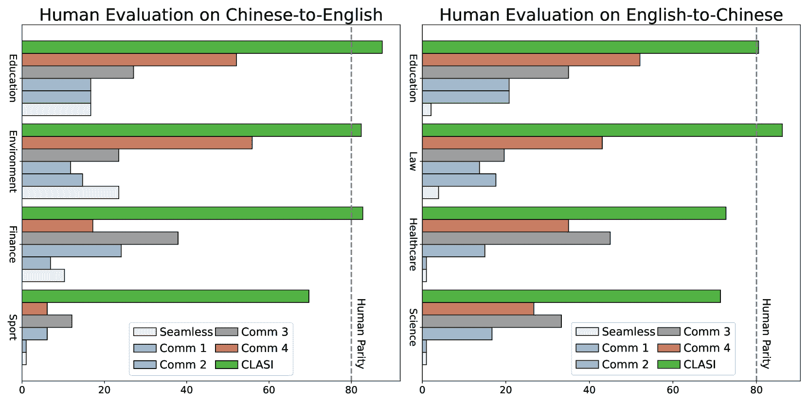
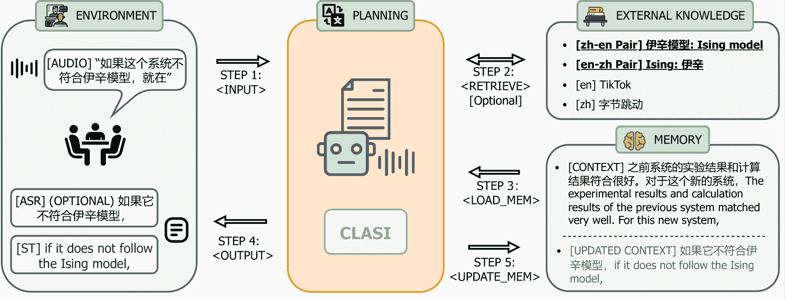
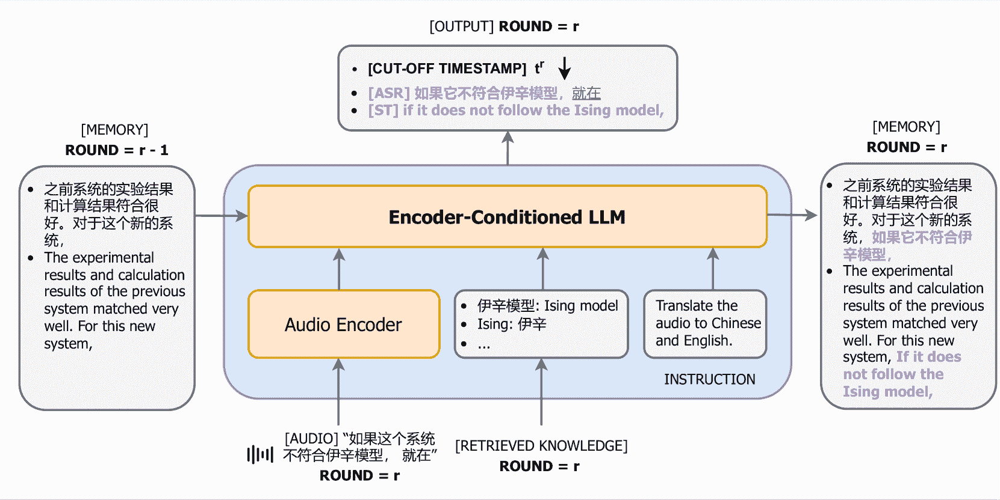
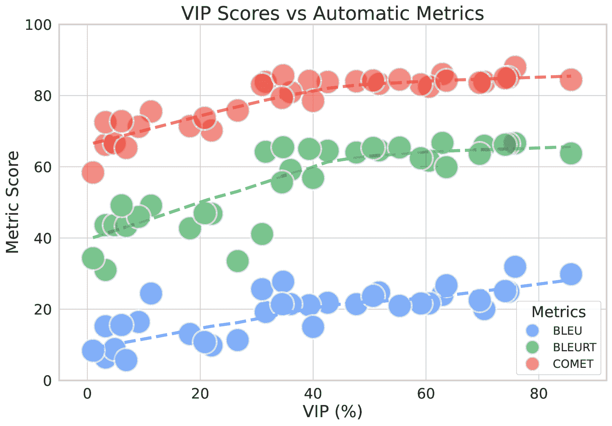
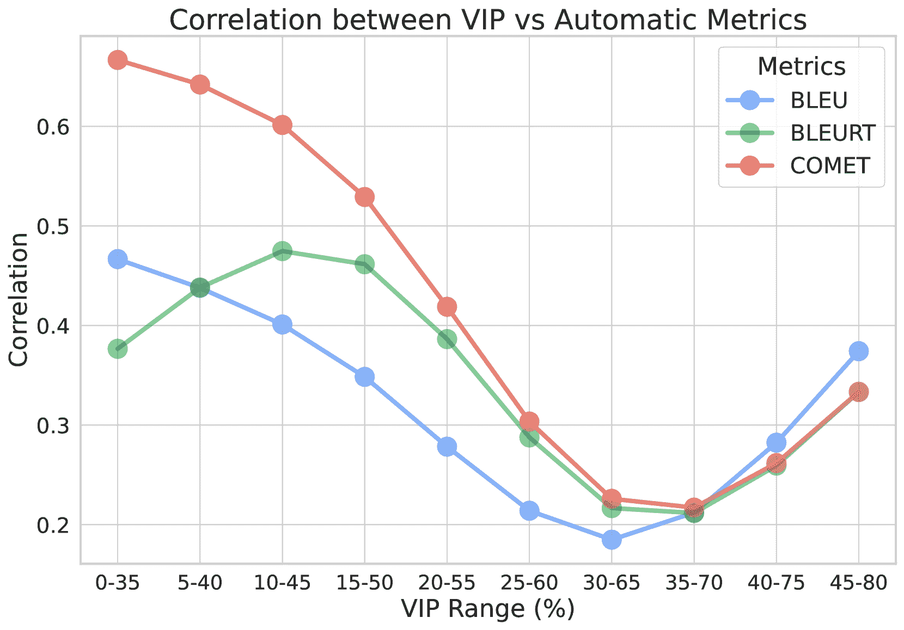
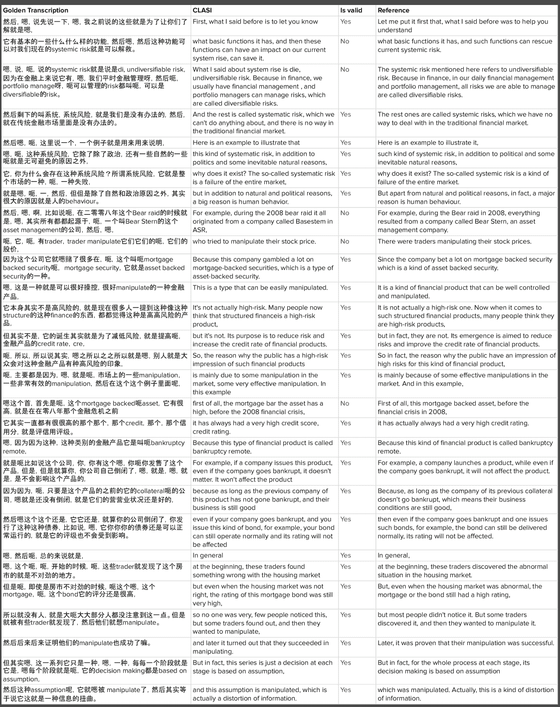

<!--yml

类别：未分类

日期：2025-01-11 12:22:18

-->

# 通过LLM代理实现端到端实时语音翻译达到人工水平

> 来源：[https://arxiv.org/html/2407.21646/](https://arxiv.org/html/2407.21646/)

跨语言代理团队

字节跳动研究

###### 摘要

本文提出了跨语言代理 - 同声传译（CLASI），一个高质量、类人化的同声语音翻译（SiST）系统¹¹1在本文中，我们将“同声传译”和“同声语音翻译”互换使用。受到专业人工口译员的启发，我们利用一种新颖的数据驱动的读写策略，在翻译质量和延迟之间找到平衡。为了应对领域内术语翻译的挑战，CLASI采用了一个多模态检索模块，获取相关信息以增强翻译效果。在大型语言模型（LLMs）的支持下，我们的方法能够通过考虑输入音频、历史上下文和检索信息，生成容错性强的翻译。实验结果表明，我们的系统在各方面均大幅优于其他系统。与专业人工口译员的表现相符，我们使用一种更好的人工评估指标——有效信息比例（VIP），来评估CLASI，该指标衡量成功传达给听众的信息量。在实际应用场景中，演讲常常存在不流畅、非正式和不清晰的情况，CLASI在中译英和英译中的VIP分别达到81.3%和78.0%。相比之下，最先进的商业或开源系统仅能达到35.4%和41.6%。在一个极为困难的数据集上，其他系统的VIP低于13%，而CLASI仍能达到70%的VIP。演示和人工标注的测试集可在[https://byteresearchcla.github.io/clasi](https://byteresearchcla.github.io/clasi)访问。

{CJK}

UTF8gbsn

图1：性能评估。CLASI显著优于领先的商业和开源系统，使用更可靠的VIP指标，达到了与人工口译员相当的水平。

## 1 引言

受LLM在机器翻译[achiam2023gpt](https://arxiv.org/html/2407.21646v2#bib.bib2)；[brown2020gpt3](https://arxiv.org/html/2407.21646v2#bib.bib9) 和语音翻译[chu2023qwen](https://arxiv.org/html/2407.21646v2#bib.bib12)；[huang2023speechtranslationlargelanguage](https://arxiv.org/html/2407.21646v2#bib.bib30)；[reid2024gemini](https://arxiv.org/html/2407.21646v2#bib.bib62)中取得的巨大成功的启发，我们提出使用LLM来完成SiST任务。具体而言，我们确定了三个主要挑战。首先，将LLM引入SiST的一个关键挑战是读写策略，LLM需要为输入语音提供部分翻译。第二，实现与人类等效的表现需要理解和翻译术语以及LLM无法从训练数据中学习的不常见短语。最后，训练数据的稀缺性持续影响SiST任务的表现。

为了解决这些挑战，我们介绍了我们的端到端方法CLASI，这是一种跨语言智能体，通过迭代执行多个动作来完成同声传译，如图[2](https://arxiv.org/html/2407.21646v2#S1.F2 "Figure 2 ‣ 1 Introduction ‣ Towards Achieving Human Parity on End-to-end Simultaneous Speech Translation via LLM Agent")所示。针对第一个挑战，我们模仿专业的人类翻译员，学习他们将完整句子通过语法边界（停顿、逗号、连词等）和上下文意义分割成多个语义“块”的策略。为了使CLASI学习到这种策略，我们遵循数据驱动的策略学习过程，并邀请人类翻译员标注真实世界的语音数据，包括分段的读写时机。从数据中，CLASI向人类学习到适用于SiST的稳健读写策略。

对于第二个挑战，我们引入了两个外部模块来增强我们的CLASI智能体：一个存储术语和配对翻译的外部知识数据库，以及一个存储语音上下文的记忆模块。然而，外部知识数据库可能包含大量术语，不仅会增加推理时间，还可能由于噪声干扰而降低我们方法的性能。因此，我们提出了一种新的多模态检索增强生成（MM-RAG）过程。一个多模态检索器根据语音输入从外部数据库中提取知识。然后，检索到的信息和来自记忆的上下文被附加到我们的LLM智能体的提示中，通过上下文学习来增强翻译。

为了解决SiST任务的数据稀缺问题，我们采用了三阶段训练方法：预训练、持续训练和微调。首先，我们的LLM和音频编码器在我们的大型内部数据集上独立进行预训练。然后，我们的模型通过数十亿个普通质量的合成语音翻译数据进行持续训练，旨在对齐语音和文本模态。我们还包括多个任务，以增强LLM的上下文学习能力，更好地利用从检索器和先前翻译中获得的上下文信息。在最后阶段，我们用少量人工标注的数据对模型进行微调，进一步模拟专业人类翻译员，提高模型的鲁棒性和翻译质量。

图2：CLASI的整体框架。流程从步骤1开始，其中CLASI处理传入的音频数据。可选地，激活检索器从外部知识数据库中获取相关信息。例如，翻译“伊辛模型”为“Ising model”，以便准确进行语音翻译。步骤3涉及访问转录（可选）和最后一轮记忆中的翻译。步骤4和5使用链式思维（CoT）方法生成转录（可选）和翻译，随后更新记忆。然后，循环从步骤1开始，处理下一个语音段。

此外，我们还想强调，传统的自动评估指标[papi2022over](https://arxiv.org/html/2407.21646v2#bib.bib52)；[papineni2002bleu](https://arxiv.org/html/2407.21646v2#bib.bib54)；[rei2020comet](https://arxiv.org/html/2407.21646v2#bib.bib61)；[sellam2020bleurt](https://arxiv.org/html/2407.21646v2#bib.bib68)可能不是反映SiST性能的良好指标，因为SiST通常包含压缩、抽象和释义。与人类翻译员一致，[moores2024nerle](https://arxiv.org/html/2407.21646v2#bib.bib49)；[wu2010assessing](https://arxiv.org/html/2407.21646v2#bib.bib81)，我们提出了一种新的评估指标，名为有效信息比例（VIP）²²2我们提出的VIP指标的详细指南可以在附录[A](https://arxiv.org/html/2407.21646v2#A1 "附录A 人工评估指南 ‣ 作者与致谢 ‣ 社会影响 ‣ 限制与未来工作 ‣ 6 结论 ‣ 人工评估 ‣ 5 相关工作 ‣ 4.7 案例研究 ‣ 4.6.2 ICL性能 ‣ 4.6 MM-RAG性能 ‣ 4.5 补充实验 ‣ 4.4 延迟 ‣ 4.3 翻译质量 ‣ 4 实验 ‣ 迈向通过LLM代理实现与人类平等的端到端同声翻译")中找到。VIP表示能够精确传递的信息的百分比，反映了SiST的核心目标：实时沟通。通过对多样且具有挑战性的真实世界长语音数据集的详细人工评估，我们的方法在很大程度上超越了其他当前可用的系统。如图[1](https://arxiv.org/html/2407.21646v2#S0.F1 "图1 ‣ 迈向通过LLM代理实现与人类平等的端到端同声翻译")所示，以中译英方向为例，CLASI达到了81.3%的VIP分数，显著缩小了机器辅助系统与人工翻译员之间的差距。

我们的贡献可以总结如下：

+   •

    我们介绍了我们的端到端方法CLASI，一个旨在执行高质量、类人化同声翻译的LLM代理。通过人工评估，我们的方法展示了显著优于现有可用的SiST系统的表现。

+   •

    我们提出了一种通过模仿专业人工翻译员的数据驱动的读写策略。在无需复杂的人类预设计的情况下，该策略能够轻松平衡翻译质量和延迟。与大多数商业系统中在翻译过程中为了提高质量而频繁重写输出不同，我们的策略保证了所有输出是确定性的，同时保持高质量。

+   •

    受人类口译员准备过程的启发，我们引入了一种新的多模态检索增强生成（MM-RAG）过程，使大语言模型（LLM）能够实时获取领域特定知识。所提出的模块在推理过程中进一步提高了翻译质量，同时计算开销最小。

+   •

    我们与专业的人工口译员密切合作，制定了我们的评估策略——有效信息比例（VIP），并开源了详细的指南。同时，我们发布了一个人工标注的测试集，聚焦于各种现实场景和长时间语音翻译。

## 2 方法

图3：CLASI代理架构。在第$r$轮，我们的模型处理当前输入的音频流，同时结合上轮（$r-1$）的记忆和任何检索到的知识。CLASI根据指定的指令生成响应，并同时更新其记忆。此外，模型确定上一个语义块的截断时间戳。例如，在所提供的示例中，“就在”之前的短语被识别为一个完整的语义块，截断时间戳就位于这个短语之后。

### 2.1 框架

[图2](https://arxiv.org/html/2407.21646v2#S1.F2 "在1 引言 ‣ 实现基于LLM代理的端到端同声传译与人类平等")展示了CLASI的操作流程。为了执行SiST任务，我们设计了5个操作：<INPUT>、<OUTPUT>、<RETRIEVE>、<LOAD_MEM>和<UPDATE_MEM>。以下部分将详细描述每个操作的细节。如[图3](https://arxiv.org/html/2407.21646v2#S2.F3 "在2 方法 ‣ 实现基于LLM代理的端到端同声传译与人类平等")进一步说明，CLASI是一个LLM代理，可以将输入的语音、指令、从外部知识中检索到的相关信息以及上轮记忆作为上下文。记忆存储先前的转录（可选）和翻译。在第$r$轮，它首先读取语音${\mathbf{x}}_{t^{r-1}:T^{r}}$，其中$t^{r-1}$是第$r-1$轮的预测截断时间，$T^{r}$是第$r$轮音频流的结束时间。然后，代理从外部知识中检索相关信息${\mathbf{k}}_{r}$，并从上轮记忆中加载上下文${\mathbf{y}}_{1:r-1}$。一旦CLASI认为足够的上下文已被加载，它就生成转录（可选）、翻译和截断时间戳$t^{r}$：

|  | ${\mathbf{y}}_{r};t^{r}=\text{TextDecoder}({\mathbf{x}}_{t^{r-1}:T^{r}},{\mathbf{k}}_{r},{\mathbf{y}}_{1:r-1})\;$ |  | (1) |
| --- | --- | --- | --- |

其中，$t^{r}$是预测的截止时间戳，表示当前翻译轮次$r$的结束时间。然后，${\mathbf{y}}_{r}$被转发以更新记忆。当指示输出转录时，LLM可选择启用CoT（链式思维）首先生成转录，然后进行语音翻译。在接下来的轮次$r+1$中，音频流将从预测的截止时间戳$t^{r}$开始。

### 2.2 架构（Architecture）

CLASI采用了编码器条件LLM架构。如[图3](https://arxiv.org/html/2407.21646v2#S2.F3 "在2种方法中 ‣ 通过LLM代理实现端到端同步语音翻译的人工水平")所示，音频编码器将输入的语音流${\mathbf{x}}$转换为一系列连续的表示${\mathbf{s}}$。然后，LLM将语音表示${\mathbf{s}}$、检索到的知识${\mathbf{k}}$、历史翻译${\mathbf{y}}$和指令${\mathbf{I}}$作为一系列提示$({\mathbf{y}},{\mathbf{s}},{\mathbf{k}},{\mathbf{I}})$，生成翻译结果${\mathbf{y}}$。

音频编码器（Audio Encoder）。音频编码器模块包含一个大规模的语音Conformer（[gulati2020conformer,](https://arxiv.org/html/2407.21646v2#bib.bib25)），该模块在数百万小时的语音数据上进行了预训练，旨在在自动语音识别（ASR）中实现与人类相当的表现，并配有音频适配器，用于连接音频编码器和LLM。适配器将语音表示下采样，生成的表示会通过线性投影匹配LLM嵌入层的维度。投影后的语音表示降低了SiST的计算延迟。

大型语言模型（Large Language Model）。我们使用Doubao LLM作为基础模型，它是一个中等规模的仅解码器变换器[vaswani2017attention](https://arxiv.org/html/2407.21646v2#bib.bib73)，旨在平衡性能和计算效率。该模型在大量文本数据上进行了预训练，并通过指令进行了微调。LLM直接将音频编码器和文本嵌入器的连续嵌入作为输入，自动回归地生成提供的语音流的转录和翻译响应。

多模态检索器（Multi-Modal Retriever）。多模态检索器框架使用音频和文本编码器分别对外部知识库中的音频流和术语的文本键进行编码。为了增强音频嵌入与文本嵌入之间的对齐，我们引入了一个嵌入融合层，其中包括一个多头注意力模块，后面跟着一个池化层。池化后的表示随后被输入到线性投影层中，以生成最终的得分，表示文本键在音频流中出现的概率。得分最高的术语被转发到CLASI代理，以提高翻译质量。

### 2.3 数据驱动的读写策略：<INPUT> 和 <OUTPUT>

与先前研究中详细描述的预定读写概率和启发式等待策略不同[barrault2023seamless](https://arxiv.org/html/2407.21646v2#bib.bib7)；[ma-etal-2019-stacl](https://arxiv.org/html/2407.21646v2#bib.bib45)；[li-etal-2023-hw-tsc](https://arxiv.org/html/2407.21646v2#bib.bib39)，翻译员参与的是一个动态的听（读）与翻译（写）过程。他们专心听取说话者的语音，并将冗长的句子分割成语义块，语义块是能够独立传达完整思想的最小语言单位[jones2014conference](https://arxiv.org/html/2407.21646v2#bib.bib33)。当识别出一个包含足够信息的语义块时，他们会将该段翻译成目标语言，从而提供准确且语境适宜的翻译。

模仿人类翻译员的策略，CLASI不需要明确地定义读写策略。CLASI通过等待完整的语义块来模仿这些策略。具体来说，给定部分语音，CLASI仅对完整的语音块生成翻译。该模型通过使用分段语音数据进行训练，学习这种能力。从数学角度来看，给定源音频${\mathbf{x}}_{1:M}$，我们将其翻译分割成一系列$n$个“块”${\mathbf{y}}_{1:n}$，并获得相应的配对$\{({\mathbf{x}}_{t^{j}:t^{j+1}},{\mathbf{y}}_{j})\}_{j=1}^{n}$，其中${\mathbf{x}}_{t^{j}:t^{j+1}}$和${\mathbf{y}}_{j}$分别表示第$j$个音频段和相应的翻译。对于训练，我们的目标是输出所有完整的分段翻译以及给定随机部分输入音频${\mathbf{x}}_{1:t}$的截止时间。

|  | $\min\mathbb{E}_{t\sim\mathcal{U}[1,M]}-\log p_{\theta}({\mathbf{y}}_{1:j};t^{j% }&#124;{\mathbf{x}}_{1:t})\quad j=\max_{j}\{j&#124;t^{j}<t\}\;$ |  | (2) |
| --- | --- | --- | --- |

其中，$\mathcal{U}$表示语音在时间上的均匀分布。通过训练[方程 2](https://arxiv.org/html/2407.21646v2#S2.E2 "在 2.3 数据驱动的读写策略：<INPUT> 和 <OUTPUT> ‣ 2 方法 ‣ 实现端到端同声传译人类平行性的途径")，CLASI学习生成输入语音的截止时间。此外，目标函数使得CLASI在开始翻译之前等待适当的时间，因为当LLM认为当前语音流不包含完整的语音块时，它将不会输出任何内容。

### 2.4 上下文信息：<LOAD_MEM> 和 <UPDATE_MEM>

记忆存储着前几轮的翻译和转录内容${\mathbf{y}}_{1:r-1}$。它有两个功能。首先，它与输入的语音一起工作，确定语音的哪些部分已经翻译，哪些部分尚未翻译，从而帮助CLASI做出读写决策并输出未翻译部分的翻译。其次，理解人类的语音往往需要上下文。例如，当说到“桶桥”时，通常指的是建在河上的由桶支撑的桥梁。然而，在“手表”这一上下文中，它指的是手表中的机械结构。在不同上下文中同一词汇的多义现象可能导致截然不同的翻译结果。因此，CLASI应能够检索长语音的上下文，以便翻译某些关键词，并在不同的上下文中作出适当的翻译。

如[图 3](https://arxiv.org/html/2407.21646v2#S2.F3 "在2种方法 ‣ 通过LLM代理实现端到端同步语音翻译的人工智能平行性")所示，在轮次$r$时，<LOAD_MEM>将相关的翻译${\mathbf{y}}_{1:r-1}$作为提示信息传递给LLM。CLASI代理生成翻译${\mathbf{y}}_{r}$后，<UPDATE_MEM>将其存储到记忆中，并获取${\mathbf{y}}_{1:r}$。

### 2.5 多模态检索增强生成：<RETRIEVE>

在现实世界的场景中，专业领域的术语翻译或语音转录是具有挑战性的。即使是人类翻译员，也需要具备相关领域的知识，才能理解这些术语，包括人名、地名、行话或领域内的特殊术语。例如，若翻译员不熟悉机器学习理论，可能听到“Rademacher复杂度”时无法理解其含义。因此，在各种场景中，人类翻译员通常会提前准备，熟悉相关领域的知识。

受人类翻译员准备工作的启发，我们提出集成外部数据库，以赋予LLM必要的领域特定知识。数据库中的每一项包含一个键及其对应的文本值。键可能出现在语音中，用作检索器的输入。该项的值可以是该项本身、目标语言的配对翻译，甚至是该键的解释。

从理论上讲，外部数据库中的所有项都可以加入到提示中，以提供翻译所需的信息。然而，外部知识库通常包含大量条目。简单地将所有术语都传递给大语言模型（LLM）不仅增加了推理时间，还可能由于噪声干扰而影响CLASI的性能。因此，我们设计了一种新颖的多模态检索增强生成（MM-RAG）过程。我们的多模态检索器首先根据输入的语音从数据库中检索相关术语。少量经过筛选的条目被纳入到CLASI代理的提示中，以便进行上下文学习，如[图 3](https://arxiv.org/html/2407.21646v2#S2.F3 "在方法2 ‣ 通过LLM代理实现端到端实时语音翻译的人工智能平行")所示。

在检索到的知识和来自记忆的先前上下文的帮助下，我们的LLM具备了更好地利用提供的上下文信息的能力。为了实现这一点，我们收集了一系列的上下文学习数据来训练模型。与之前的干预方法相比，如浅融合[Borgeaud2021ImprovingLM](https://arxiv.org/html/2407.21646v2#bib.bib8)；[Kolehmainen2024MultiModalRF](https://arxiv.org/html/2407.21646v2#bib.bib34)和传统的基于替代的方法[li2019neural](https://arxiv.org/html/2407.21646v2#bib.bib38)；[luong2015addressing](https://arxiv.org/html/2407.21646v2#bib.bib44)；[wang2017sogou](https://arxiv.org/html/2407.21646v2#bib.bib78)，这些方法为给定的翻译对生成固定翻译。我们的方法取得了更好的结果，并生成了更加连贯的文本。例如，在一些互联网公司中，“大盘 == overall performance”，但在大多数情况下，它应该是“股市”。我们的方法可以根据不同的上下文选择正确的翻译。此外，我们的方法还可以使用源语言和目标语言的单语文本来辅助翻译。

## 3 多阶段训练

我们的CLASI遵循一个多阶段的训练过程：预训练、多任务持续训练和多任务监督微调。在第一阶段，LLM和音频编码器分别通过大量的内部语音和文本数据进行预训练。接下来，使用大量的语音-文本配对数据来对齐音频和文本模态，构建跨模态多任务处理的基本能力。在最后阶段，CLASI代理通过少量人工标注的数据进行微调，以模仿专业人类译员的翻译行为。我们的多阶段训练过程使得在少量人工标注数据的情况下，高效地进行学习成为可能。

### 3.1 预训练

内部的LLM和音频编码器分别在不同的数据模态上进行独立预训练。LLM采用仅解码器的Transformer架构，首先在大量单语和双语文本数据上进行预训练，使用交叉熵损失，然后在指令跟随数据上进行微调。LLM在各种下游任务中表现出色，特别是在翻译任务上。

音频编码器也遵循经典的预训练-微调范式（bai2024；[baevski2022data2vec,](https://arxiv.org/html/2407.21646v2#bib.bib5)；[hsu2021hubert,](https://arxiv.org/html/2407.21646v2#bib.bib28)；[zhang2023usm,](https://arxiv.org/html/2407.21646v2#bib.bib88)），并使用大量与语音相关的数据。预训练阶段提供了高效训练的LLM和音频编码器，为后续阶段奠定了坚实的基础。

### 3.2 多任务持续训练

训练方法：我们参考了([huang2023speechtranslationlargelanguage,](https://arxiv.org/html/2407.21646v2#bib.bib30))的工作进行多任务训练。具体而言，为了实现流式处理和更高质量的翻译，我们主要专注于三个任务来训练CLASI：自动语音识别（ASR）、语音翻译（ST）和文本翻译（MT）。为了使预训练的LLM和音频编码器的模态对齐，CLASI在大量配对数据上进行持续训练，涵盖多个任务。我们进一步通过将翻译融入内存并结合外部数据库的知识，增强了方法的上下文学习能力。因此，我们将ST任务扩展到不同的配置，如[表 1](https://arxiv.org/html/2407.21646v2#S3.T1 "在3.2 多任务持续训练 ‣ 3 多阶段训练 ‣ 通过LLM代理实现端到端同步语音翻译的人工平行"). 一个ST翻译任务可以是流式或离线的，直接或COT的，有或没有上下文，从而形成8种不同的任务。

| 配置 | 说明 |
| --- | --- |
| 直接 | 语音直接翻译为目标语言。 |
| COT | 语音首先转录为源语言，然后翻译为目标语言。 |
| 流式 | 给定部分语音，翻译具有完整语义的片段为目标语言。 |
| 离线 | 给定完整的语音，将整个内容翻译为目标语言。 |
| 无上下文 | 不提供历史翻译和外部知识。 |
| 带上下文 | 提供历史翻译或外部知识作为上下文。 |

表 1：多任务持续训练中ST任务的不同配置示意图。

训练数据构建。ASR和MT任务已经进行了一段时间，并且有相对大量的ASR和MT数据。开发端到端SiST模型的主要挑战是同步ST数据的稀缺性。为此，我们提出了一种合成数据构建流程。借助强大的LLM，我们合成了两种类型的语音翻译数据进行持续训练：离线ST数据和基于上下文的分段流式ST数据。

1. 离线ST数据：我们主要依赖ASR数据构建离线ST数据。在提供语音的真实转录文本的基础上，我们使用内部LLM将源语言翻译为目标语言。为了确保目标语言的可读性和简洁性，LLM被提示执行逆文本规范化（ITN）、填充词平滑等操作。

2. 基于上下文的分段流式ST数据：流式ST数据由细粒度的音频-文本对齐和翻译对组成，针对语义块进行分段。与离线ST数据相比，流式ST数据的收集更具挑战性。我们发现，人工翻译员通常将长语音切分成若干语义块，每个语义块都可以独立翻译，以确保有效和平滑的翻译。受到这一发现的启发，我们利用LLM模拟分块过程来构建流式ST数据。我们使用长语音数据来构建流式ST数据，因为额外的上下文信息有助于提供更好的语境。首先，我们提示LLM将ASR转录文本分解为多个独立的语义块，然后将其翻译成目标语言。接着，我们将语义块与相应的音频块对齐，得到流式ST数据。这些数据使得我们的模型能够处理不完整的语音输入，并生成具有一致语义的部分翻译。

为了评估合成数据的质量，我们基于我们提出的VIP指标进行了人工评估。合成数据的VIP得分为81%，满足了进一步训练的最小要求。

### 3.3 多任务监督微调

训练方法。尽管CLASI在经过之前的多任务持续训练阶段后，在SiST任务上表现出良好的翻译质量，我们通过在人工标注的流式ST数据上进行微调，进一步提升了性能，这些数据包含[表1](https://arxiv.org/html/2407.21646v2#S3.T1 "在3.2多任务持续训练 ‣ 3多阶段训练 ‣ 通过LLM代理实现与人类水平的端到端同步语音翻译")中列出的多种任务。这些高质量数据使我们的模型能够更好地与专业人工翻译员的分段方法对齐。此外，这一过程增强了模型对语音不流利现象（如口吃）的鲁棒性，确保在真实场景中的沟通更加顺畅。

训练数据构建。人工标注的流式ST数据来源于包含各种语音特征的真实场景，如不流利、结巴、混合代码和专业术语等。这些特征确保了我们的模型在多种条件下的鲁棒性。我们聘请了专业的人工口译员，为语音数据提供高质量的标注，以实现同步分割和口译。此外，术语在上下文中被识别并翻译，从而进一步增强了CLASI的上下文感知能力。

### 3.4 多模态检索器训练

多模态检索器通过大量的语音识别数据独立进行训练。在训练过程中，从语音转录中随机选择单词作为正样本，表示这些单词在语音中出现。负样本则从不同的句子中选取，表示语音中没有提到这些单词。我们将正样本标记为$1$，负样本标记为$0$，目的是最小化二元交叉熵（BCE）损失。该方法有助于提升模型区分相关信息和无关信息的能力，从而增强其整体性能和准确性。我们将正样本标记为$1$，负样本标记为$0$，以最小化二元交叉熵（BCE）损失。为了评估我们检索器的效果，我们构建了一个内部的检索开发集。开发集中的每个样本包括一个短的音频片段和音频中提到的术语。需要注意的是，这里的术语是指特定的关键词，如姓名、地点、缩写和领域特定的词汇。

## 4 实验

### 4.1 评估基准

在过去几年中，已经提出了相当多的评估基准用于SiST，包括MuST-C [di2019must](https://arxiv.org/html/2407.21646v2#bib.bib15)、FLUERS [conneau2023fleurs](https://arxiv.org/html/2407.21646v2#bib.bib14)、CoVoST [wang-etal-2020-covost](https://arxiv.org/html/2407.21646v2#bib.bib74)；[wang2020covost](https://arxiv.org/html/2407.21646v2#bib.bib75)、BSTC [zhang-etal-2021-bstc](https://arxiv.org/html/2407.21646v2#bib.bib85) 和GigaST [ye23b_interspeech](https://arxiv.org/html/2407.21646v2#bib.bib83) 等。然而，尽管在构建这些基准方面投入了大量的精力，但在面对现实世界的SiST应用时，它们仍然存在一些不足之处。

首先，这些基准通常包含由志愿者录制的演讲（例如CoVoST和FLUERS），或者由准备充分的演讲者正式、清晰且流利地讲述的演讲和播客（例如MuST-C和GigaST）。在现实世界的场景中，例如在线会议或社交媒体视频，演讲的特点可能不可避免地是非正式的、不清晰的或不流畅的。其次，这些基准通过提供手动分割的句子，为评估翻译质量提供了捷径。这样的捷径在当前的基准和实际应用之间存在差距，实际应用中，模型可能需要自行处理长时间的演讲并进行分割[anastasopoulos2021findings](https://arxiv.org/html/2407.21646v2#bib.bib4)。因此，在手动分割的数据集上的评估可能会高估实际SiST系统的表现。这些差异导致对这些基准的评估在实际SiST系统中并不可靠。

作为一种初步尝试，以解决前述的不足，我们提出了一个新的基准RealSI，适用于中文到英文（zh-en）和英文到中文（en-zh）。RealSI来源于多种渠道，大多数演讲者自然、随意地讲话，且没有经过精心准备。我们选择了10个热门领域：技术、医疗保健、教育、金融、法律、环境、娱乐、科学、体育和艺术。每个领域从一个知名的在线视频平台中选择一个视频片段，适用于zh-en和en-zh两种设置。⁴⁴RealSI可以在[https://github.com/byteresearchcla/RealSI](https://github.com/byteresearchcla/RealSI)上获取。我们不拥有视频的版权，仅发布我们对相应视频的注释以及视频的公开网址链接。如果有人认为内容构成侵权，请联系我们，我们会在确认后尽快删除相关内容。RealSI中的每个样本都是一个接近5分钟的演讲，用于模拟没有手动分割的SiST。对于无法处理长格式音频的系统，我们还提供了用于分割的句子级时间戳。[表2](https://arxiv.org/html/2407.21646v2#S4.T2 "在4.1评估基准 ‣ 4实验 ‣ 通过LLM代理实现端到端同步语音翻译的人类平行性")展示了我们RealSI的详细统计数据。

| 领域 | zh-en | en-zh |
| --- | --- | --- | --- |
| 时长 | #段落 | 时长 | #段落 |
| --- | --- | --- | --- |
| 技术 | 5:23 | 51 | 3:25 | 31 |
| 医疗保健 | 3:16 | 30 | 3:34 | 22 |
| 教育 | 4:56 | 48 | 5:00 | 41 |
| 金融 | 5:22 | 29 | 5:01 | 40 |
| 法律 | 4:38 | 49 | 4:48 | 29 |
| 环境 | 4:18 | 34 | 4:24 | 31 |
| 娱乐 | 5:16 | 53 | 5:12 | 39 |
| 科学 | 4:47 | 37 | 5:11 | 35 |
| 体育 | 5:22 | 33 | 3:25 | 58 |
| 艺术 | 7:54 | 67 | 4:17 | 21 |
| 总计 | 51:12 | 431 | 44:17 | 347 |

表2：我们提出的RealSI基准的统计数据。

### 4.2 基准测试

我们将CLASI与开源的SiST模型，*SeamlessStreaming* [barrault2023seamless](https://arxiv.org/html/2407.21646v2#bib.bib7) 进行了比较。此外，由于可用的SiST模型数量有限，我们选择将CLASI与几个商业系统进行比较。我们将这些商业系统表示为*Commercial* 1-4。值得注意的是，不同于CLASI，大多数商业SiST系统会尽快生成一个临时翻译，然后在获得更多上下文后，用潜在更好的翻译重写这个临时翻译。然而，我们在所有实验中评估了这些系统的最终翻译。尽管这种重写策略可能会提高翻译质量，但不断修改现有翻译可能会影响用户体验，导致额外的困惑。我们还想强调的是，人工翻译通常不会采用这种重写策略。在整个评估过程中，我们使用了一个通用的外部知识数据库，该数据库在本文中的所有评估中保持一致。它不包含特定领域的外部知识，以避免不公平的比较。外部知识的改进在[Section 4.6](https://arxiv.org/html/2407.21646v2#S4.SS6 "4.6 MM-RAG Performance ‣ 4.5 Supplementary Experiments ‣ 4.4 Latency ‣ 4.3 Translation Quality ‣ 4 Experiments ‣ Towards Achieving Human Parity on End-to-end Simultaneous Speech Translation via LLM Agent")中独立报告。

### 4.3 翻译质量

{NiceTabular}

lccccccc[colortbl-like] \CodeBefore8 \Bodyzh-en BLEU BLEURT COMET VIP^† (%)

doc sent doc sent doc sent

*SeamlessStreaming* 11.3 8.9 33.9 42.7 75.9 65.9 13.2

*Commercial 1* 15.0 10.8 30.6 43.9 72.4 67.1 10.4

*Commercial 2* 19.6 15.0 37.7 53.4 79.8 75.8 14.6

*Commercial 3* 24.5 19.9 40.2 56.4 81.8 78.9 25.0

*Commercial 4* 25.2 21.4 40.8 59.3 82.9 80.8 35.4

*CLASI* 32.6 28.1 44.4 65.9 84.6 84.7 81.3^∗ {NiceTabular}

lccccccc[colortbl-like] \CodeBefore8 \Bodyen-zh BLEU BLEURT COMET VIP^† (%)

doc sent doc sent doc sent

*SeamlessStreaming* 14.8 10.4 22.1 27.8 64.6 60.6 2.0

*Commercial 1* 25.6 20.4 40.2 38.0 70.3 70.9 12.8

*Commercial 2* 29.6 26.0 50.5 46.8 78.2 75.8 16.8

*Commercial 3* 31.6 28.7 51.2 52.8 81.0 79.9 29.5

*Commercial 4* 29.8 26.4 47.0 48.0 77.5 76.7 41.6

*CLASI* 37.4 32.8 54.2 61.3 87.4 85.6 78.0^∗

表3：翻译质量的实验结果。自动评估分别在文档级和句子级上进行了计算。在文档级评估中，每个近5分钟的音频翻译被视为一个实例。对于句子级，自动得分是基于人工分段的翻译计算的。VIP指的是人工评估的有效信息比例，反映了这些系统的翻译质量。^† 由于人工评估能力的限制，VIP得分是基于从RealSI的10个样本中随机选择的4个样本进行计算，以保证公平比较，而自动评估则在10个样本上进行。^∗ 此外，我们对CLASI在所有10个样本上的表现进行了评估，获得了78.0%的zh-en和74.9%的en-zh的VIP得分。

评估指标。自动评估指标如BLEU [papineni2002bleu](https://arxiv.org/html/2407.21646v2#bib.bib54)、BLEURT [sellam2020bleurt](https://arxiv.org/html/2407.21646v2#bib.bib68)和COMET [rei2020comet](https://arxiv.org/html/2407.21646v2#bib.bib61)被广泛用于评估翻译质量 [barrault2023seamless](https://arxiv.org/html/2407.21646v2#bib.bib7)；[iwslt-2023-international](https://arxiv.org/html/2407.21646v2#bib.bib65)；[iwslt-2022-international](https://arxiv.org/html/2407.21646v2#bib.bib66) 。然而，它们可能无法完全反映翻译质量，特别是对于长篇语音的段落级翻译。有人认为，当前的评估指标对于语音翻译（ST）和语音翻译生成（SiST）任务来说并不充分 [gaido2024speech](https://arxiv.org/html/2407.21646v2#bib.bib23)。 [machavcek2023mt](https://arxiv.org/html/2407.21646v2#bib.bib47)；[wein2024barriers](https://arxiv.org/html/2407.21646v2#bib.bib79)的研究也强调，自动评估指标与人工评估之间可能存在差异。

因此，除了自动评估外，我们还与资深专业的同声传译员合作，制定了更为现实的人类评估标准。我们提出的人类评估指标着重于翻译模型的输出是否能准确传达讲话者每个语义片段的原意。这也是人类传译员在实时翻译中的关键目标。需要注意的是，单一的语义片段指的是一完整的源语言语音片段。通常，单一的语义片段是一个完整的句子。详细定义可以在[第A.2节](https://arxiv.org/html/2407.21646v2#A1.SS2 "A.2 Evaluation Process ‣ Appendix A Human Evaluation Guidelines ‣ Authorship and Acknowledgements ‣ Social Impact ‣ Limitation and Future Work ‣ 6 Conclusion ‣ Human Evaluation. ‣ 5 Related Work ‣ 4.7 Case Study ‣ 4.6.2 ICL Performance ‣ 4.6 MM-RAG Performance ‣ 4.5 Supplementary Experiments ‣ 4.4 Latency ‣ 4.3 Translation Quality ‣ 4 Experiments ‣ Towards Achieving Human Parity on End-to-end Simultaneous Speech Translation via LLM Agent")中找到。一个完整语音会话中有效信息片段的百分比定义为VIP，这与现实世界中同声传译的标准一致[wu2010assessing](https://arxiv.org/html/2407.21646v2#bib.bib81)。

定量分析。如[第4.3节](https://arxiv.org/html/2407.21646v2#S4.SS3 "4.3 Translation Quality ‣ 4 Experiments ‣ Towards Achieving Human Parity on End-to-end Simultaneous Speech Translation via LLM Agent")所示，我们在RealSI数据集上将CLASI与基准方法进行了比较。在可靠的人类评估指标VIP方面，CLASI在zh-en和en-zh的得分分别为81.3%和78.0%。而其他所有模型的VIP得分均低于42%。为了进一步对比，我们使用了三种广泛使用的自动评估指标：BLEU⁵⁵5我们在本文中所有的BLEU计算均使用SacreBLEU [post-2018-call](https://arxiv.org/html/2407.21646v2#bib.bib58)。、BLEURT和COMET。在自动评估指标下，CLASI也大幅超越了基准方法。CLASI的详细人类评估结果可以在[第B.2节](https://arxiv.org/html/2407.21646v2#A2.SS2 "B.2 Example of Detailed Evaluation Result on RealSI ‣ Appendix B Supplementary Materials ‣ Authorship and Acknowledgements ‣ Social Impact ‣ Limitation and Future Work ‣ 6 Conclusion ‣ Human Evaluation. ‣ 5 Related Work ‣ 4.7 Case Study ‣ 4.6.2 ICL Performance ‣ 4.6 MM-RAG Performance ‣ 4.5 Supplementary Experiments ‣ 4.4 Latency ‣ 4.3 Translation Quality ‣ 4 Experiments ‣ Towards Achieving Human Parity on End-to-end Simultaneous Speech Translation via LLM Agent")中找到。

高 VIP 评分使 CLASI 成为一个实用的系统，能够帮助听众在没有专业人工翻译的情况下理解实时语音。请注意，只有当 VIP 更高时，我们才认为一个系统优于另一个系统。例如，尽管 *商业系统 1* 在 BLEU 和 COMET 上得分高于 *SeamlessStreaming*，我们仍然认为基于 VIP 的 *SeamlessStreaming* 是更好的 zh-en 翻译系统。

### 4.4 延迟

评估指标。由于不同语言之间的语法结构差异，同声传译中的延迟是不可避免的。本文采用了广泛使用的平均延迟 (AL) [ma-etal-2019-stacl](https://arxiv.org/html/2407.21646v2#bib.bib45)、长度自适应平均延迟 (LAAL) [papi2022over](https://arxiv.org/html/2407.21646v2#bib.bib52) 来比较不同方法的延迟。为了与重写翻译的系统进行公平比较，我们计算了这些系统的确定翻译时间。我们还提出了一个额外的指标，首字母出现延迟 (FLAL)，用于反映每个系统的用户体验。FLAL 表示每个系统输出首个确定翻译的时间。

定量结果。 [表格 4](https://arxiv.org/html/2407.21646v2#S4.T4 "在 4.4 延迟 ‣ 4.3 翻译质量 ‣ 4 实验 ‣ 通过 LLM 代理实现端到端实时语音翻译达到人类水平") 比较了我们的模型与多种系统在 RealSI 和 CoVoST 上的 AL、LAAL 和我们提出的 FLAL 延迟。我们发现，现有的 AL 和 LAAL 指标并不适合用于衡量 RealSI 上段落级 SiST 的延迟。当结果显著短于或长于参考翻译时，AL 和 LAAL 可能会被大幅夸大，从而导致不可靠的高延迟。在这些情况下，FLAL 是一个更可靠且稳定的指标，适用于所有系统。

除了段落级的延迟评估外，我们还在句子级数据集 CoVoST2 zh-en 上将我们的方法与其他系统进行了比较，其中 AL 和 LAAL 都生成了合理的数值，结果显示在 [表格 4](https://arxiv.org/html/2407.21646v2#S4.T4 "在 4.4 延迟 ‣ 4.3 翻译质量 ‣ 4 实验 ‣ 通过 LLM 代理实现端到端实时语音翻译达到人类水平") 的右侧。由于商业系统通常会重写翻译，它们的延迟比 CLASI 高。与最快的方法 *SeamlessStreaming* 相比，CLASI 实现了相似的延迟，但翻译质量要好得多。

| 模型 | RealSI (zh-en) | RealSI (en-zh) | CoVoST2 (zh-en) |
| --- | --- | --- | --- |
| AL | LAAL | FLAL | AL | LAAL | FLAL | AL | LAAL | FLAL |
| --- | --- | --- | --- | --- | --- | --- | --- | --- |
| *SeamlessStreaming* | 3.50 | 42.31 | 2.65 | 3.06 | 16.02 | 2.24 | 2.26 | 2.46 | 4.03 |
| *商业系统 1* | 2.10 | 13.22 | 3.27 | 4.53 | 20.71 | 1.88 | 3.05 | 3.26 | 4.01 |
| *商业系统 2* | 2.92 | 4.30 | 5.90 | 1.05 | 8.02 | 12.42 | 2.65 | 2.88 | 3.82 |
| *商业系统 3* | 12.31 | 12.65 | 15.70 | 8.45 | 15.81 | 9.68 | 3.67 | 3.86 | 6.14 |
| *商业系统 4* | 26.59 | 27.17 | 6.62 | 16.94 | 24.47 | 5.73 | 3.53 | 3.71 | 6.20 |
| *CLASI* | 2.17 | 6.34 | 4.20 | 0.34 | 3.17 | 6.00 | 2.63 | 2.83 | 5.02 |

表4：CLASI与基准系统的延迟比较。AL和LAAL是用于衡量句子级数据集延迟的标准指标。尽管AL和LAAL在句子级CoVoST2数据集上提供了可靠的结果，但我们认为由于长语音翻译的复杂性，它们对于长语音的效果较差。因此，我们提出了首字母出现延迟（FLAL），代表每个系统输出第一个确定翻译的时间。

讨论。虽然现有的研究在延迟与质量的权衡上投入了大量的关注，[koshkin2024transllamallmbasedsimultaneoustranslation](https://arxiv.org/html/2407.21646v2#bib.bib35)；[papi2022attention](https://arxiv.org/html/2407.21646v2#bib.bib53)，但人工翻译通常使用耳语延迟（Ear-Voice-Span, EVS）来评估延迟。EVS衡量的是从说话者完成信息传达到观众听到相应翻译的平均时间，这与AL类似。专业口译员的典型EVS通常在3到6秒之间[gumul2007time](https://arxiv.org/html/2407.21646v2#bib.bib26)，以实现高质量的翻译。

因此，我们进行用户研究，并认为在实际的SiST系统中，延迟比翻译质量更不重要。在最近的IWSLT 2023同步轨道中，[iwslt-2023-international](https://arxiv.org/html/2407.21646v2#bib.bib65)，模型的排名也是在一定的延迟约束下通过翻译质量来评估的。我们通过现实世界的用户调查验证了CLASI的延迟是否为用户所接受。到本文发布日期时，我们已经收集了14份关于zh-en方向的用户调查，每位用户至少使用CLASI 30分钟。在[表4](https://arxiv.org/html/2407.21646v2#S4.T4 "在4.4 延迟 ‣ 4.3 翻译质量 ‣ 4 实验 ‣ 实现人类级别的端到端同步语音翻译")中显示的当前延迟表现下，只有1/14 == 7%的用户表示延迟显著影响了他们的用户体验，而其余用户认为翻译质量的提升比延迟更重要，并且CLASI的整体输出大大帮助他们理解语音。考虑到CLASI的延迟甚至低于大多数商业系统，我们认为CLASI的延迟在大多数情况下是可以接受的。

当前延迟指标是基于句子级别的 SiST 提出的。如[表4](https://arxiv.org/html/2407.21646v2#S4.T4 "在 4.4 延迟 ‣ 4.3 翻译质量 ‣ 4 实验 ‣ 实现端到端同步语音翻译的人工智能代理的目标")所示，这些指标可能不适合用于段落级别的延迟度量。随着对长篇语音的端到端评估的重要性不断增加，需要更精细的指标来衡量延迟并深入了解系统表现。

### 4.5 补充实验

为了确保对 CLASI 的全面评估，我们的模型在四个附加数据集上进行了进一步评估，包括 BSTC (zh-en) [zhang-etal-2021-bstc](https://arxiv.org/html/2407.21646v2#bib.bib85) ，CoVoST2 (zh-en) [wang2020covost](https://arxiv.org/html/2407.21646v2#bib.bib75) ，MuST-C (en-zh) [di2019must](https://arxiv.org/html/2407.21646v2#bib.bib15) ，以及 GigaST (en-zh) [ye23b_interspeech](https://arxiv.org/html/2407.21646v2#bib.bib83) ⁶⁶6我们使用[GigaS2S](https://github.com/SpeechTranslation/GigaS2S)中的子集进行评估。[表5](https://arxiv.org/html/2407.21646v2#S4.T5 "在 4.5 补充实验 ‣ 4.4 延迟 ‣ 4.3 翻译质量 ‣ 4 实验 ‣ 实现端到端同步语音翻译的人工智能代理的目标")展示了对于 zh-en 和 en-zh 的自动评估指标结果。由于人工评估成本较高，我们无法为这四个数据集提供 VIP。我们观察到我们的模型在性能上始终优于基线模型。尽管我们的系统在所有比较的系统中获得了最佳的自动评估结果，但我们仍然要强调，这种基于句子级别的评估方案可能会高估 SiST 系统的性能。

| 模型 | BSTC zh-en | CoVoST2 zh-en |
| --- | --- | --- |
| BLEU | BLEURT | COMET | AL | LAAL | FLAL | BLEU | BLEURT | COMET | AL | LAAL | FLAL |
| *SeamlessStreaming* | 9.7 | 34.4 | 78.2 | 11.41 | 68.92 | 3.50 | 19.3 | 54.7 | 77.1 | 2.27 | 2.46 | 4.03 |
| *商业 1* | 14.1 | 32.0 | 73.0 | 9.01 | 16.73 | 13.95 | 17.6 | 47.6 | 69.3 | 3.05 | 3.26 | 4.01 |
| *商业 2* | 17.6 | 39.2 | 81.2 | 6.35 | 7.92 | 13.04 | 24.7 | 56.7 | 78.5 | 2.65 | 2.88 | 3.82 |
| *商业 3* | 21.5 | 41.6 | 83.7 | 12.88 | 13.63 | 22.55 | 24.2 | 54.1 | 75.9 | 3.67 | 3.86 | 6.14 |
| *商业 4* | 21.2 | 41.9 | 82.3 | 30.50 | 31.84 | 9.61 | 22.1 | 56.1 | 76.8 | 3.53 | 3.71 | 6.20 |
| *CLASI* | 25.6 | 44.8 | 85.6 | 4.68 | 9.03 | 13.13 | 24.2 | 56.8 | 81.0 | 2.63 | 2.83 | 5.02 |
| 模型 | MuST-C en-zh | GigaST en-zh |
| BLEU | BLEURT | COMET | AL | LAAL | FLAL | BLEU | BLEURT | COMET | AL | LAAL | FLAL |
| *SeamlessStreaming* | 17.4 | 48.2 | 75.2 | 1.43 | 1.69 | 2.06 | 26.3 | 48.9 | 75.4 | 1.41 | 1.57 | 2.16 |
| *商业 1* | 24.0 | 55.2 | 81.2 | 2.62 | 2.91 | 2.07 | 43.1 | 59.6 | 83.4 | 2.55 | 2.73 | 2.33 |
| *商业 2* | 28.2 | 59.5 | 83.1 | 3.25 | 3.51 | 4.84 | 45.7 | 63.2 | 85.0 | 3.13 | 3.28 | 5.12 |
| *商业 3* | 26.9 | 59.9 | 83.7 | 3.59 | 3.90 | 4.86 | 48.3 | 66.2 | 86.7 | 3.18 | 3.36 | 4.97 |
| *商业 4* | 27.3 | 60.0 | 83.4 | 3.25 | 3.54 | 4.86 | 43.3 | 59.9 | 83.5 | 3.06 | 3.23 | 5.00 |
| *CLASI* | 26.6 | 61.8 | 85.2 | 3.76 | 3.90 | 4.97 | 50.4 | 69.0 | 88.8 | 3.30 | 3.40 | 5.01 |

表 5：CLASI 与基线模型在段落级别（BSTC）和句子级别（CoVoST2、MuST-C 和 GigaST）中文-英文和英文-中文数据集上的自动评估指标比较。我们要强调的是，自动评估指标的句子级别评估方案无法真正反映模型的性能。[第 4.3 节](https://arxiv.org/html/2407.21646v2#S4.SS3 "4.3 翻译质量 ‣ 4 实验 ‣ 通过 LLM 代理实现端到端同步语音翻译的人工对等性")中的 VIP 是比较不同系统的更好指标。

### 4.6 MM-RAG 性能

#### 4.6.1 检索器

表 [6](https://arxiv.org/html/2407.21646v2#S4.T6 "表 6 ‣ 4.6.1 检索器 ‣ 4.6 MM-RAG 性能 ‣ 4.5 补充实验 ‣ 4.4 延迟 ‣ 4.3 翻译质量 ‣ 4 实验 ‣ 通过 LLM 代理实现端到端同步语音翻译的人工对等性") 展示了我们专有数据集开发集上各类检索模型的性能。测试集中的每个样本包括一段简短的音频和音频中的相关术语。我们的 MM-RAG 检索器在 Top-10 检索准确率上大幅超越其他开源模型，达到 91.3% 对比 26.0%。我们比较了两种方法：音频到音频和音频到文本。在音频到音频方法中，使用文本到语音（TTS）模型将外部知识库中的文本键转换为音频格式，形成一个基于音频键的数据库。然后，使用 ASR 模型对音频键和用户输入的音频进行编码，以生成相应的表示。随后，使用最大内积搜索（MIPS）算法确定 Top-$k$ 检索项。对于音频到文本方法，我们将 MM-RAG 与 CLAP [Elizalde2023CLAPLA](https://arxiv.org/html/2407.21646v2#bib.bib17) 进行了比较。如表 [6](https://arxiv.org/html/2407.21646v2#S4.T6 "表 6 ‣ 4.6.1 检索器 ‣ 4.6 MM-RAG 性能 ‣ 4.5 补充实验 ‣ 4.4 延迟 ‣ 4.3 翻译质量 ‣ 4 实验 ‣ 通过 LLM 代理实现端到端同步语音翻译的人工对等性") 所示，这些模型的有效性远低于可接受的标准，而 MM-RAG 明显优于它们。

值得注意的是，我们在 CLASI 中使用的相同音频编码器被用于生成 MM-RAG 检索器中的音频嵌入。这样的设计确保了集成对整体框架的计算延迟影响最小。

| 模型 | 方法 | 微调 | Top-1 | Top-5 | Top-10 |
| --- | --- | --- | --- | --- | --- |
| *CLAP* [Elizalde2023CLAPLA](https://arxiv.org/html/2407.21646v2#bib.bib17) | 音频到音频 | 否 | 2.1 | 7.3 | 13.8 |
| *Wav2Clip* [Wu2021Wav2CLIPLR](https://arxiv.org/html/2407.21646v2#bib.bib80) | 音频到音频 | 否 | 3.3 | 9.6 | 16.3 |
| *Whisper* [Radford2022RobustSR](https://arxiv.org/html/2407.21646v2#bib.bib60) | 音频到音频 | 否 | 2.6 | 9.7 | 15.1 |
| *自研ASR* | 音频到音频 | 否 | 7.2 | 19.4 | 26.0 |
| *CLAP* [Elizalde2023CLAPLA](https://arxiv.org/html/2407.21646v2#bib.bib17) | 音频到文本 | 否 | 2.7 | 6.4 | 10.8 |
| *MM-RAG（我们的方法）* | 音频到文本 | 是 | 63.2 | 88.4 | 91.3 |

表6：Top-$k$检索准确率（%）。

#### 4.6.2 ICL性能

通过将从外部知识数据库中检索到的术语作为上下文信息纳入，我们模型的上下文学习能力显著提高了领域内术语的语音翻译性能。[表7](https://arxiv.org/html/2407.21646v2#S4.T7 "在4.6.2 ICL性能 ‣ 4.6 MM-RAG性能 ‣ 4.5 补充实验 ‣ 4.4 延迟 ‣ 4.3 翻译质量 ‣ 4 实验 ‣ 致力于通过LLM代理实现端到端同步语音翻译与人类水平的对比")将我们的方法与广泛使用的浅层融合进行比较，用于干预生成的结论。在计算召回率时，我们输入1个真实的关键词与9个相似的负面词作为上下文。在计算精度的假阳性率时，我们输入10个相似的负面词作为上下文。ICL能够在保持较高的精度的同时，实现较高的召回率，获得最高的F1，而浅层融合的召回率仅为ICL的一半。

此外，我们在包含整个<RETRIEVE>管道的术语密集场景中对我们的MM-RAG模块进行了消融研究。引入外部知识数据库后，VIP得分显著提高了约10%，突显了我们提出的MM-RAG的有效性。

|  | 召回率（%） | 精度（%） | F1（%） |
| --- | --- | --- | --- |
| 浅层融合 | 40.8 | 94.2 | 56.9 |
| ICL + 浅层融合 | 79.2 | 73.4 | 76.2 |
| ICL | 79.2 | 86.3 | 82.6 |

表7：ICL与浅层融合在干预关键词的召回率和精度上的对比。当计算召回率时，我们输入1个真实的关键词与9个相似的负面词作为上下文；当计算精度的假阳性率时，我们输入10个相似的负面词作为上下文。

### 4.7 案例研究

我们展示了案例研究，展示了CLASI在中文到英文和英文到中文翻译复杂语音的能力，具体见[表8](https://arxiv.org/html/2407.21646v2#S4.T8 "4.7案例研究 ‣ 4.6.2 ICL表现 ‣ 4.6 MM-RAG表现 ‣ 4.5补充实验 ‣ 4.4延迟 ‣ 4.3翻译质量 ‣ 4实验 ‣ 通过LLM代理实现端到端同步语音翻译的目标与人类水平接近")和[表9](https://arxiv.org/html/2407.21646v2#S4.T9 "4.7案例研究 ‣ 4.6.2 ICL表现 ‣ 4.6 MM-RAG表现 ‣ 4.5补充实验 ‣ 4.4延迟 ‣ 4.3翻译质量 ‣ 4实验 ‣ 通过LLM代理实现端到端同步语音翻译的目标与人类水平接近")。我们选择了最常用的级联系统之一——商业4进行比较。商业4采用了级联方法进行同步语音翻译（SiST），并在[4.3节](https://arxiv.org/html/2407.21646v2#S4.SS3 "4.3翻译质量 ‣ 4实验 ‣ 通过LLM代理实现端到端同步语音翻译的目标与人类水平接近")中被认为是最好的之前的SiST系统之一。详细的解释已在表格中描述。对于中文到英文的方向，我们展示了关于对识别错误的鲁棒性、推理能力和趋势词汇翻译的案例。对于英文到中文的方向，我们展示了关于本地化、表达性和准确术语翻译的案例。更多的案例展示在[表11](https://arxiv.org/html/2407.21646v2#A2.T11 "B.1补充案例研究 ‣ 附录B补充材料 ‣ 作者和致谢 ‣ 社会影响 ‣ 限制与未来工作 ‣ 6结论 ‣ 人类评估 ‣ 5相关工作 ‣ 4.7案例研究 ‣ 4.6.2 ICL表现 ‣ 4.6 MM-RAG表现 ‣ 4.5补充实验 ‣ 4.4延迟 ‣ 4.3翻译质量 ‣ 4实验 ‣ 通过LLM代理实现端到端同步语音翻译的目标与人类水平接近")中。

| 案例1：对识别错误的鲁棒性 |
| --- |
| 黄金转录 | 欧文两罚命中，四分分差¹，不到最后² |
| 商业4 ASR | 欧文两罚命中，四分分叉¹，不到最后² |
| 商业4翻译 | 欧文两罚命中，四分分差¹，直到最后²， |
| CLASI ASR | 欧文两罚命中，四分分叉¹，不到最后² |
| CLASI翻译 | 凯里·欧文两罚命中，四分差距¹， |
| 解释 | 单词“分差”¹误转录为“分叉”¹，实际上“分叉”意味着“分支”或“分裂”在英语中的意思。CLASI仍然生成了正确的翻译。在仅听到“不到最后”²后，CLASI决定不立即翻译，并将“不到最后”²留给下一次翻译，因为缺乏上下文。而商业4则翻译错误。 |
| 案例2：翻译的推理能力 |
| 黄金转录 | 绍兴二十年¹担任右正言，弹劾胡寅 |
| 商业4 ASR | 绍兴二十年¹担任佑正言，弹劾胡莹。 |
| 商业4翻译 | 绍兴二十年¹担任右正言，弹劾胡莹。 |
| CLASI ASR | 绍兴二十年¹担任右正言，弹劾胡寅 |
| CLASI翻译 | 在1150年，高宗皇帝绍兴二十年¹期间，他担任右侍郎并弹劾胡颖。 |
| 解释 | 字面意思上，绍兴二十年¹可以翻译为“Shaoxing 20th Year”，而CLASI能够理解到绍兴二十年¹实际是公元1150年，即高宗皇帝治下的第20年。 |
| 案例 3：流行词汇或俚语 |
| 黄金转录 | 我们常说，你们也太卷¹了吧，别卷了，还是躺平²舒服。 |
| 商业4语音识别 | 我们常说，你们也太卷¹了吧，别卷了，还是躺平²舒服。 |
| 商业4翻译 | 我们常说，你太卷¹了，别卷了，还是躺下²舒服。 |
| CLASI语音识别 | 我们常说，你们也太卷¹了吧，别卷了，还是躺平²舒服。 |
| CLASI翻译 | 我们常说，“你太竞争了¹，停下来吧，躺平²更舒服。” |
| 解释 | 尽管在中文中，卷¹可以在某些情况下翻译为“curly”，但在这个语境下，它实际上指的是“内卷”。CLASI将其翻译为“competitive”，这是可以接受的。“躺平²”与“lie down²”在翻译时相似，但CLASI的整个句子翻译得更自然。 |

| 表8：CLASI与商业4在中英方向的比较 |

| 案例 1：原汁原味和准确的翻译 |
| --- |
| 黄金转录 | 你不能根据具体情况¹来考虑。要么我们都有权利，要么没有权利。对²。 |
| 商业4语音识别 | 你不能根据具体情况¹来考虑。要么我们都有权利，要么没有权利。对² |
| 商业4翻译 | 你不能根据具体情况¹来考虑。要么我们都有权利，要么疯子都有权利²，对吧？ |
| CLASI语音识别 | 你不能根据具体情况¹来考虑。要么我们都有权利，要么没有权利。对²。 |
| CLASI翻译 | 你不能就事论事¹地考虑这个问题。 要么我们都有权利，要么我们都没有权利²。 |
| 解释 | 尽管商业4的逐字翻译“case-by-case¹”是正确的，CLASI使用了“就事论事¹”，这是一个著名的中文成语，更加符合本土语言习惯。此外，商业4的自动语音识别错误地转录了“not have rights²”为“nut have rights²”，导致完全没有意义的翻译。 |
| 案例 2：表现力翻译 |
| 黄金转录 | 她因害怕这门外语考试摆在她面前而抽泣。 |
| 商业4语音识别 | 她因害怕这门外语考试摆在她面前而抽泣。 |
| 商业4翻译 | 她哭了，害怕这个外语的测试摆在她面前， |
| CLASI语音识别 | 她因害怕这门外语考试摆在她面前而抽泣。 |
| CLASI翻译 | 她因为害怕这门外语考试而哭泣， |
| 解释 | 理论上，商业4的翻译字面上是正确的。然而，这对母语为中文的讲者来说表达不够清晰。CLASI的翻译更具表现力，传达了原英文句子的相同含义，即“她因为害怕外语考试而哭泣”。 |
| 案例 3：命名实体、术语识别与翻译 |
| 黄金转录 | 所以让我以COVID-19¹为例，现在我们知道有很多人感染了，他们有阳性抗体检测结果。 |
| 商业4 ASR | 所以让我以CUBA 19¹为例，现在我们知道很多人感染了，他们的抗体检测呈阳性，任何人？测试，² |
| 商业4翻译 | 所以让我以古巴19人¹为例。所以现在我们知道有很多人被感染，他们是阳性的。有人吗？测试，² |
| CLASI ASR | 所以让我以COVID-19¹为例。我们现在知道有很多人被感染，他们的抗体检测呈阳性。² |
| CLASI 翻译 | 以COVID-19¹为例。我们现在知道有很多人被感染了，并且他们的抗体检测呈阳性。² |
| 说明 | 商业4无法正确识别COVID-19¹和抗体检测²，而CLASI能够成功识别并翻译。 |

表9：CLASI与商业4在英文到中文方向的比较。

## 5 相关工作

##### 大型语言模型。

编码器-解码器架构 [polak-etal-2023-towards](https://arxiv.org/html/2407.21646v2#bib.bib56)；[ye23b_interspeech](https://arxiv.org/html/2407.21646v2#bib.bib83) 在早期的语音翻译研究中被广泛探讨，但随着大型语言模型的出现 [achiam2023gpt](https://arxiv.org/html/2407.21646v2#bib.bib2)，越来越多的研究开始关注仅解码器架构 [fu2023decoderonlyencoderdecoderinterpretinglanguage](https://arxiv.org/html/2407.21646v2#bib.bib21)；[seide2024speechreallmrealtime](https://arxiv.org/html/2407.21646v2#bib.bib67) 用于序列到序列问题。尽管最近有研究利用大型语言模型进行机器翻译 [li2024mtpatcherselectiveextendableknowledge](https://arxiv.org/html/2407.21646v2#bib.bib36)；[li2024eliciting](https://arxiv.org/html/2407.21646v2#bib.bib37)；[zheng2024finetuninglargelanguagemodels](https://arxiv.org/html/2407.21646v2#bib.bib90)；[zhu2024multilingual](https://arxiv.org/html/2407.21646v2#bib.bib91) 和语音翻译 [chu2023qwenaudioadvancinguniversalaudio](https://arxiv.org/html/2407.21646v2#bib.bib13)；[huang2023speechtranslationlargelanguage](https://arxiv.org/html/2407.21646v2#bib.bib30)；[tang2024salmonngenerichearingabilities](https://arxiv.org/html/2407.21646v2#bib.bib70)，但是这些模型在同步翻译任务中的应用仍然有限。尽管早期有尝试将LLM用于同步机器翻译 [agostinelli2023simul](https://arxiv.org/html/2407.21646v2#bib.bib3)；[hu2024gentranslate](https://arxiv.org/html/2407.21646v2#bib.bib29)；[koshkin2024transllamallmbasedsimultaneoustranslation](https://arxiv.org/html/2407.21646v2#bib.bib35)；[zhang2024streamspeech](https://arxiv.org/html/2407.21646v2#bib.bib86)，但据我们所知，目前没有发现相关工作探索如何利用大型语言模型进行端到端的同步语音翻译并实现显著改进。

此外，大型语言模型（LLMs）在指令跟随 [achiam2023gpt](https://arxiv.org/html/2407.21646v2#bib.bib2) ； [bai2023qwen](https://arxiv.org/html/2407.21646v2#bib.bib6) ； [feng2024agilenovelframeworkllm](https://arxiv.org/html/2407.21646v2#bib.bib20) ； [touvron2023llama](https://arxiv.org/html/2407.21646v2#bib.bib72) 、推理 [paul2024refinerreasoningfeedbackintermediate](https://arxiv.org/html/2407.21646v2#bib.bib55) ； [shinn2023reflexionlanguageagentsverbal](https://arxiv.org/html/2407.21646v2#bib.bib69) 和规划 [qiao2024autoactautomaticagentlearning](https://arxiv.org/html/2407.21646v2#bib.bib59) ； [ruan2023tptulargelanguagemodelbased](https://arxiv.org/html/2407.21646v2#bib.bib64) 等任务中展现了令人印象深刻的能力。近期的研究利用提示工程开发了出色的LLM代理，这些代理能够在各种环境中自主处理复杂任务 [wang2024survey](https://arxiv.org/html/2407.21646v2#bib.bib76) 。在我们的工作中，我们赋予LLM执行顺序指令，以完成模拟语音翻译任务的能力。

##### 同步语音翻译。

同步语音翻译的一个重要组成部分是分段策略，它决定了如何将语音帧输入模型。不同的策略可能会影响翻译的延迟和性能。根据 [liu2024recentadvancesendtoendsimultaneous](https://arxiv.org/html/2407.21646v2#bib.bib41) 的研究，分段策略可以分为固定长度、基于词的和自适应分段。固定长度策略 [nguyen2021empiricalstudyendtoendsimultaneous](https://arxiv.org/html/2407.21646v2#bib.bib50) 将语音划分为等长的段，而基于词的策略 [ma-etal-2020-simulmt](https://arxiv.org/html/2407.21646v2#bib.bib46) 在语音中识别词边界。自适应分段 [dong-etal-2022-learning](https://arxiv.org/html/2407.21646v2#bib.bib16) 检测语音单元的边界。在这些分类中，我们的方法使用固定长度策略。

关于读/等待策略，Wait-k 方法 [ma-etal-2019-stacl](https://arxiv.org/html/2407.21646v2#bib.bib45) 及其变体 [nguyen2021empiricalstudyendtoendsimultaneous](https://arxiv.org/html/2407.21646v2#bib.bib50)；[zeng-etal-2021-realtrans](https://arxiv.org/html/2407.21646v2#bib.bib84) 在文本翻译和语音翻译的背景下得到了广泛研究。与这些方法相比，它们明确学习读/写信号的生成，另一类研究则集中在如何利用离线翻译模型 [yan-etal-2023-cmus](https://arxiv.org/html/2407.21646v2#bib.bib82)。在使用离线翻译模型进行同步翻译时，重要的是解决生成假设的稳定性问题，以防止用户经历过度内容刷新的情况。[liu2020lowlatencysequencetosequencespeechrecognition](https://arxiv.org/html/2407.21646v2#bib.bib40) 首次提出了本地一致性策略以稳定部分假设，而 [Polk2023](https://arxiv.org/html/2407.21646v2#bib.bib57) 引入了一种增量块式束搜索算法。与这些方法相比，我们通过约束语言模型的提示来强制我们的模型生成一致的假设。

对于模型架构，语音翻译系统的实现主要有两种方法：级联解决方案 [guo-etal-2023-hw](https://arxiv.org/html/2407.21646v2#bib.bib27)；[iranzo2021streaming](https://arxiv.org/html/2407.21646v2#bib.bib31)，以及端到端解决方案 [fukuda-etal-2023-naist](https://arxiv.org/html/2407.21646v2#bib.bib22)；[papi-etal-2023-direct](https://arxiv.org/html/2407.21646v2#bib.bib51)；[polak-etal-2023-towards](https://arxiv.org/html/2407.21646v2#bib.bib56)。级联解决方案涉及分离的自动语音识别（ASR）和机器翻译（MT）组件，而端到端解决方案直接将语音映射到翻译。级联系统得益于成熟的技术，但存在延迟和错误传播的问题。端到端模型通过深度学习提供实时翻译和改进的质量，但需要大量的训练数据。在我们的工作中，我们实现了一个端到端模型，结合了ASR、MT和ST的能力。

##### 人类评估。

在语音翻译领域，评估指标的选择在评估翻译系统的质量和效果中起着至关重要的作用。虽然自动化指标，如BLEU [papineni2002bleu](https://arxiv.org/html/2407.21646v2#bib.bib54)、BLEURT [sellam2020bleurt](https://arxiv.org/html/2407.21646v2#bib.bib68) 和COMET [rei2020comet](https://arxiv.org/html/2407.21646v2#bib.bib61)，长期以来一直被用作评估标准，但越来越多的认识到它们可能不是最适合或最全面的性能衡量标准 [marie-etal-2021-scientific](https://arxiv.org/html/2407.21646v2#bib.bib48)。我们观察到，在近年来的研究中 [barrault2023seamless](https://arxiv.org/html/2407.21646v2#bib.bib7)；[liu2024chatqasurpassinggpt4conversational](https://arxiv.org/html/2407.21646v2#bib.bib42)；[nllbteam2022languageleftbehindscaling](https://arxiv.org/html/2407.21646v2#bib.bib71)；[wang-etal-2023-document-level](https://arxiv.org/html/2407.21646v2#bib.bib77)，越来越多的趋势是使用人工评估来评价系统，特别是在使用大型语言模型（LLM）的工作中。尽管与自动化指标相比，人工评估需要更多的资源和时间，但其优势远大于缺点。通过引入人工判断，语音翻译系统可以被精细化和优化，以符合用户的期望，确保翻译不仅在技术上准确，而且在语言和语境上都恰当。与现有的人类评估指标，如“连续评分” [javorsky-etal-2022-continuous](https://arxiv.org/html/2407.21646v2#bib.bib32) 和MQM（多维质量指标） [lommel2014multidimensional](https://arxiv.org/html/2407.21646v2#bib.bib43) 相比，我们受到专业人工翻译员的启发 [moores2024nerle](https://arxiv.org/html/2407.21646v2#bib.bib49)，提出使用VIP（有效信息比例）作为人类评估指标，能够精确反映同声传译任务的目标。

## 6 结论

在本研究中，我们介绍了跨语言智能体——同声传译系统（Cross Language Agent - Simultaneous Interpretation，简称 CLASI），这是一种生成端到端同声语音翻译的 LLM 智能体。得益于大规模的预训练和模仿学习，CLASI 的表现远超现有的最先进系统。以中文到英文的翻译方向为例，在由专业人工口译员提出的严格且具有挑战性的人工评估标准下——有效信息比例（Valid Information Proportion，VIP），CLASI 显著优于基准系统，且差距巨大。当其他所有系统的 VIP 都低于 40% 时，CLASI 的 VIP 达到了 81.3%，展现了与人工口译员相当的表现。更具体地说，我们提出了以下几个关键组成部分，以实现 CLASI 的卓越表现：(1) 一种基于编码器条件的 LLM 智能体架构，通过简单的操作执行高质量甚至接近人工水平的同声翻译处理。 (2) 通过向人工口译员学习模仿，形成一种自然的读写策略，以数据驱动的方式平衡翻译质量和延迟，无需复杂的人工预设。在这种策略下，CLASI 实现了稳定的输出机制，其中每个输出都是确定性的，因此在用户体验上可能优于大多数商业系统。 (3) 受人工口译员准备过程的启发，CLASI 可以从历史翻译和外部知识中进行上下文学习，为翻译提供足够的信息。凭借 CLASI 强大的翻译能力，我们相信它可以进一步实现跨语言、跨地区的无缝交流。

## 限制与未来工作

尽管我们在中英互译任务中相较于商业系统取得了显著的进展，但未来应考虑更多语言。在我们当前的实现中，CLASI 在每个翻译回合中执行完整的动作序列。其中一些动作，例如 <RETRIEVE>，在简单翻译场景下是可选的，因为该模型能够在没有外部知识帮助的情况下正确翻译。训练模型更好地判断是否跳过不必要的动作是未来的一个方向。对于产品级系统而言，尽管在大多数情况下 CLASI 的延迟是可以接受的，但如何在不降低翻译质量的前提下减少翻译延迟，仍然是一个值得研究且可能对用户体验有所帮助的问题。此外，我们认为当前的自动化评估指标对于 SiST 评估来说并不全面。大多数质量衡量标准没有考虑到关键信息，而这些信息在 SiST 场景中至关重要。因此，我们提出了 VIP 以便进行更好的人工评估。因此，未来应该提出更可靠的自动质量和延迟评估指标。来自人工反馈的强化学习（RLHF）已被证明在提升大语言模型性能方面有效。尽管 CLASI 相较于以往的最先进系统取得了显著的优越成绩，但如何构建更好的多模态奖励模型以及更好的强化学习方法，以提升 SiST 也是一个重要的研究方向。加入更多的模态，例如端到端的语音对语音生成，或甚至端到端的视频对视频生成，也是很有前景的研究课题。

## 社会影响

强大的 SiST 系统 CLASI 可应用于各种场景，促进跨语言交流。例如，它可以部署在各种会议或日常会议中，帮助听众理解不同语言的演讲内容。它还可以作为系统级翻译模块，帮助用户观看以不同语言传达的视频。在在线游戏中，它也能帮助弥合跨语言交流的差距，连接讲不同语言的人们。一款具有类人水平表现的强大 SiST 系统，可能显著提高专业人工翻译人员的工作效率。

尽管 CLASI 可能带来巨大的社会正面影响，但任何事物都有两面性。忽视一些低资源语言可能会对某些少数群体造成不公平。解决这些问题需要社会的进一步合作。我们将更多语言的支持作为未来的工作。

## 作者及致谢

所有贡献者按姓氏的字母顺序排列。本研究的相关事宜可通过任何核心作者的邮箱联系。

核心作者。所有核心作者对本研究作出了平等的贡献。

+   •

    Shanbo Cheng

+   •

    Zhichao Huang

+   •

    Tom Ko

+   •

    Hang Li

+   •

    Ningxin Peng

+   •

    Lu Xu

+   •

    Qini Zhang

    +   chengshanbo@bytedance.com

    +   zhichao.huang@bytedance.com

    +   tom.ko@bytedance.com

    +   lihang.lh@bytedance.com

    +   pengningxin@bytedance.com

    +   xu.lu1@bytedance.com

    +   qini.z@bytedance.com

数据标注、评估与解读团队。我们的数据标注与人工评估团队，由李一夫领导，在所有需要的帮助方面做出了不懈努力，这对项目的成功至关重要。特别感谢由刘安娜领导的人类翻译团队，提供了关于数据标注、人工评估及其他建议的深刻而全面的分析。

+   •

    陈晶文

+   •

    陈晓雅

+   •

    李一夫

+   •

    林慧颖

+   •

    刘安娜

工程团队。我们与由颜廷帅领导的工程团队密切合作，他们的基础设施支持对本项目至关重要。

+   •

    付伟成

+   •

    颜廷帅

+   •

    邹磊昊

致谢。我们感谢语音理解团队的各种帮助，特别是数据共享，感谢他们在所有内部数据方面的巨大努力。我们要向所有为本项目作出贡献的人表示最深的感谢，他们的卓越工作保证了本项目的成功。我们还要感谢徐文达和徐希对自动评估提出的建议。

## 参考文献

+   [1] Kendall 排序相关系数，第278-281页。Springer New York，纽约，NY，2008年。

+   [2] Josh Achiam, Steven Adler, Sandhini Agarwal, Lama Ahmad, Ilge Akkaya, Florencia Leoni Aleman, Diogo Almeida, Janko Altenschmidt, Sam Altman, Shyamal Anadkat 等人。GPT-4 技术报告。arXiv 预印本 arXiv:2303.08774，2023年。

+   [3] Victor Agostinelli, Max Wild, Matthew Raffel, Kazi Asif Fuad 和 Lizhong Chen。Simul-LLM：探索基于大语言模型的高质量同步翻译框架。arXiv 预印本 arXiv:2312.04691，2023年。

+   [4] Antonios Anastasopoulos, Ondřej Bojar, Jacob Bremerman, Roldano Cattoni, Maha Elbayad, Marcello Federico, Xutai Ma, Satoshi Nakamura, Matteo Negri, Jan Niehues 等人。IWSLT 2021 评估活动的研究成果。载于《第18届国际口语语言翻译会议论文集》（IWSLT 2021），第1-29页，2021年。

+   [5] Alexei Baevski, Wei-Ning Hsu, Qiantong Xu, Arun Babu, Jiatao Gu 和 Michael Auli。Data2Vec：语音、视觉和语言中的自监督学习通用框架。载于《国际机器学习会议论文集》，第1298-1312页。PMLR，2022年。

+   [6] Jinze Bai, Shuai Bai, Yunfei Chu, Zeyu Cui, Kai Dang, Xiaodong Deng, Yang Fan, Wenbin Ge, Yu Han, Fei Huang 等人。Qwen 技术报告。arXiv 预印本 arXiv:2309.16609，2023年。

+   [7] Loïc Barrault, Yu-An Chung, Mariano Coria Meglioli, David Dale, Ning Dong, Mark Duppenthaler, Paul-Ambroise Duquenne, Brian Ellis, Hady Elsahar, Justin Haaheim 等人。Seamless：多语言表达式和流式语音翻译。arXiv 预印本 arXiv:2312.05187，2023年。

+   [8] Sebastian Borgeaud、Arthur Mensch、Jordan Hoffmann、Trevor Cai、Eliza Rutherford、Katie Millican、George van den Driessche、Jean-Baptiste Lespiau、Bogdan Damoc、Aidan Clark、Diego de Las Casas、Aurelia Guy、Jacob Menick、Roman Ring、T. W. Hennigan、Saffron Huang、Lorenzo Maggiore、Chris Jones、Albin Cassirer、Andy Brock、Michela Paganini、Geoffrey Irving、Oriol Vinyals、Simon Osindero、Karen Simonyan、Jack W. Rae、Erich Elsen 和 L. Sifre. 通过从万亿个标记中检索信息来改进语言模型。在国际机器学习大会，2021年。

+   [9] Tom Brown、Benjamin Mann、Nick Ryder、Melanie Subbiah、Jared D Kaplan、Prafulla Dhariwal、Arvind Neelakantan、Pranav Shyam、Girish Sastry、Amanda Askell、Sandhini Agarwal、Ariel Herbert-Voss、Gretchen Krueger、Tom Henighan、Rewon Child、Aditya Ramesh、Daniel Ziegler、Jeffrey Wu、Clemens Winter、Chris Hesse、Mark Chen、Eric Sigler、Mateusz Litwin、Scott Gray、Benjamin Chess、Jack Clark、Christopher Berner、Sam McCandlish、Alec Radford、Ilya Sutskever 和 Dario Amodei. 语言模型是少样本学习者。在 H. Larochelle、M. Ranzato、R. Hadsell、M.F. Balcan 和 H. Lin 主编的《神经信息处理系统进展》第33卷，第1877-1901页。Curran Associates, Inc.，2020年。

+   [10] Agnieszka Chmiel. 同声传译经验和训练对预判的影响，通过词汇翻译延迟测量。Interpreting，23(1)：18-44，2021年。

+   [11] Kyunghyun Cho 和 Masha Esipova. 神经机器翻译能做同声传译吗？arXiv 预印本 arXiv:1606.02012，2016年。

+   [12] Yunfei Chu、Jin Xu、Xiaohuan Zhou、Qian Yang、Shiliang Zhang、Zhijie Yan、Chang Zhou 和 Jingren Zhou. Qwen-audio: 通过统一的大规模音频语言模型推动通用音频理解。arXiv 预印本 arXiv:2311.07919，2023年。

+   [13] Yunfei Chu、Jin Xu、Xiaohuan Zhou、Qian Yang、Shiliang Zhang、Zhijie Yan、Chang Zhou 和 Jingren Zhou. Qwen-audio: 通过统一的大规模音频语言模型推动通用音频理解，2023年。

+   [14] Alexis Conneau、Min Ma、Simran Khanuja、Yu Zhang、Vera Axelrod、Siddharth Dalmia、Jason Riesa、Clara Rivera 和 Ankur Bapna. Fleurs：语音通用表示的少样本学习评估。在2022年IEEE语音语言技术研讨会（SLT），第798-805页。IEEE，2023年。

+   [15] Mattia A Di Gangi、Roldano Cattoni、Luisa Bentivogli、Matteo Negri 和 Marco Turchi. Must-c：多语言语音翻译语料库。在2019年北美计算语言学会会议：人类语言技术，第1卷（长篇与短篇论文），第2012-2017页。计算语言学会，2019年。

+   [16]  Qian Dong, Yaoming Zhu, Mingxuan Wang, 和 Lei Li。学习何时翻译流媒体语音。在Smaranda Muresan, Preslav Nakov, 和 Aline Villavicencio编辑的《计算语言学协会第60届年会论文集（第1卷：长篇论文）》中，页面680–694，爱尔兰都柏林，2022年5月。计算语言学协会出版。

+   [17]  Benjamin Elizalde, Soham Deshmukh, Mahmoud Al Ismail, 和 Huaming Wang。Clap学习：通过自然语言监督学习音频概念。ICASSP 2023 - 2023 IEEE国际声学、语音和信号处理会议，2023年。

+   [18]  Marcello Federico, Alex Waibel, Marta R. Costa-jussà, Jan Niehues, Sebastian Stuker, 和 Elizabeth Salesky，编辑。第18届国际口语语言翻译会议（IWSLT 2021）论文集，泰国曼谷（在线），2021年8月。计算语言学协会出版。

+   [19]  Marcello Federico, Alex Waibel, Kevin Knight, Satoshi Nakamura, Hermann Ney, Jan Niehues, Sebastian Stüker, Dekai Wu, Joseph Mariani, 和 Francois Yvon，编辑。第17届国际口语语言翻译会议论文集，在线会议，2020年7月。计算语言学协会出版。

+   [20]  Peiyuan Feng, Yichen He, Guanhua Huang, Yuan Lin, Hanchong Zhang, Yuchen Zhang, 和 Hang Li。Agile：一种新型的LLM代理框架，2024年。

+   [21]  Zihao Fu, Wai Lam, Qian Yu, Anthony Man-Cho So, Shengding Hu, Zhiyuan Liu, 和 Nigel Collier。仅解码器还是编码-解码器？将语言模型解释为正则化的编码-解码器，2023年。

+   [22]  Ryo Fukuda, Yuta Nishikawa, Yasumasa Kano, Yuka Ko, Tomoya Yanagita, Kosuke Doi, Mana Makinae, Sakriani Sakti, Katsuhito Sudoh, 和 Satoshi Nakamura。NAIST 2023年IWSLT同时语音到语音翻译系统。在Elizabeth Salesky, Marcello Federico, 和 Marine Carpuat编辑的《第20届国际口语语言翻译会议（IWSLT 2023）》论文集中，页面330–340，加拿大多伦多（线上与线下），2023年7月。计算语言学协会出版。

+   [23]  Marco Gaido, Sara Papi, Matteo Negri, 和 Luisa Bentivogli。使用语音基础模型和大型语言模型进行语音翻译：现有的和缺失的是什么？arXiv预印本arXiv:2402.12025，2024年。

+   [24]  Jiatao Gu, Graham Neubig, Kyunghyun Cho, 和 Victor OK Li。使用神经机器翻译实时学习翻译。在《计算语言学协会欧洲分会第15届会议论文集：第一卷，长篇论文》中，页面1053–1062，2017年。

+   [25]  Anmol Gulati, James Qin, Chung-Cheng Chiu, Niki Parmar, Yu Zhang, Jiahui Yu, Wei Han, Shibo Wang, Zhengdong Zhang, Yonghui Wu等人。Conformer：用于语音识别的卷积增强型变换器。arXiv预印本arXiv:2005.08100，2020年。

+   [26]  Ewa Gumul 和 Andrzej Łyda。会议口译中的时间限制：同声传译与交替传译。语言研究，5:165–183，2007年。

+   [27] 郭家鑫, 魏岱梦, 吴张琳, 李宗耀, 饶志强, 王铭瀚, 尚恒超, 陈晓宇, 余正哲, 李绍军, 谢宇豪, 雷力智, 杨浩. HW-TSC的IWSLT 2023评估同时语音转文本翻译系统. 见 Elizabeth Salesky, Marcello Federico, 和 Marine Carpuat 主编, 《第20届国际口语语言翻译大会论文集 (IWSLT 2023)》，第376–382页, 加拿大多伦多（线上与线下）, 2023年7月\. 计算语言学协会.

+   [28] 徐伟宁, 本杰明·博尔特, 蔡耀宏, Kushal Lakhotia, Ruslan Salakhutdinov, 和 Abdelrahman Mohamed. Hubert: 通过隐藏单元的掩蔽预测进行自监督语音表示学习. 《IEEE/ACM音频、语音与语言处理学报》, 29:3451–3460, 2021.

+   [29] 胡宇晨, 陈晨, 杨超汉, 李瑞哲, 张东, 陈哲怀, 张英松. Gentranslate: 大型语言模型是生成型多语言语音和机器翻译系统. arXiv预印本 arXiv:2402.06894, 2024.

+   [30] 黄志超, 叶荣, Tom Ko, 董倩倩, 程山波, 王铭轩, 李杭. 使用大型语言模型的语音翻译：一项工业实践, 2023.

+   [31] Javier Iranzo-Sánchez, Javier Jorge, Pau Baquero-Arnal, Joan Albert Silvestre-Cerdà, Adrià Giménez, Jorge Civera, Albert Sanchis, 和 Alfons Juan. 通过直接分割模型优化的流式级联语音翻译. 《神经网络》, 142:303–315, 2021.

+   [32] Dávid Javorský, Dominik Macháček, 和 Ondřej Bojar. 连续评分作为同声语音翻译的可靠人工评估. 见 Philipp Koehn, Loïc Barrault, Ondřej Bojar, Fethi Bougares, Rajen Chatterjee, Marta R. Costa-jussà, Christian Federmann, Mark Fishel, Alexander Fraser, Markus Freitag, Yvette Graham, Roman Grundkiewicz, Paco Guzman, Barry Haddow, Matthias Huck, Antonio Jimeno Yepes, Tom Kocmi, André Martins, Makoto Morishita, Christof Monz, Masaaki Nagata, Toshiaki Nakazawa, Matteo Negri, Aurélie Névéol, Mariana Neves, Martin Popel, Marco Turchi, 和 Marcos Zampieri 主编, 《第七届机器翻译大会论文集(WMT)》，第154–164页, 阿布扎比, 阿联酋（混合形式）, 2022年12月. 计算语言学协会.

+   [33] Roderick Jones. 《会议口译解读》. Routledge, 2014.

+   [34] Jari Kolehmainen, Aditya Gourav, Prashanth Gurunath Shivakumar, Yile Gu, Ankur Gandhe, Ariya Rastrow, Grant P. Strimel, 和 Ivan Bulyko. 基于大型语言模型的多模态检索与语音识别. 2024.

+   [35] 罗曼·科什金, 铃木胜人, 中村聪. Transllama: 基于大型语言模型的同声翻译系统, 2024.

+   [36] 李家欢, 程山波, 黄树剑, 陈家俊. Mt-patcher: 从大型语言模型进行选择性与可扩展的知识蒸馏以支持机器翻译, 2024.

+   [37] Jiahuan Li, Hao Zhou, Shujian Huang, Shanbo Cheng, 和 Jiajun Chen. 通过多语言微调和翻译指令引导大型语言模型的翻译能力。《计算语言学会会刊》，12:576–592，2024。

+   [38] Xiaoqing Li, Jinghui Yan, Jiajun Zhang, 和 Chengqing Zong. 神经姓名翻译改进神经机器翻译。在《机器翻译：第14届中国研讨会CWMT 2018》，中国武夷山，2018年10月25-26日，论文集14，第93–100页。施普林格，2019年。

+   [39] Yuang Li, Chang Su, Ming Zhu, Mengyao Piao, Xinglin Lyu, Min Zhang, 和 Hao Yang. HW-TSC 2023提交的质量估计共享任务。在Philipp Koehn, Barry Haddow, Tom Kocmi, 和 Christof Monz编辑的《第八届机器翻译会议论文集》，第835–840页，新加坡，2023年12月。计算语言学协会。

+   [40] Danni Liu, Gerasimos Spanakis, 和 Jan Niehues. 通过部分假设选择实现低延迟的序列到序列语音识别与翻译，2020。

+   [41] Xiaoqian Liu, Guoqiang Hu, Yangfan Du, Erfeng He, YingFeng Luo, Chen Xu, Tong Xiao, 和 Jingbo Zhu. 端到端同步语音翻译的最新进展，2024。

+   [42] Zihan Liu, Wei Ping, Rajarshi Roy, Peng Xu, Chankyu Lee, Mohammad Shoeybi, 和 Bryan Catanzaro. Chatqa：在对话式QA和RAG任务中超越GPT-4，2024。

+   [43] Arle Lommel, Hans Uszkoreit, 和 Aljoscha Burchardt. 多维质量指标（mqm）：声明和描述翻译质量指标的框架。《Tradumàtica》，(12):0455–463，2014。

+   [44] Minh-Thang Luong, Ilya Sutskever, Quoc Le, Oriol Vinyals, 和 Wojciech Zaremba. 解决神经机器翻译中的稀有词问题。在《计算语言学协会第53届年会暨第7届国际联合自然语言处理会议（第一卷：长篇论文）》论文集，第11–19页，2015年。

+   [45] Mingbo Ma, Liang Huang, Hao Xiong, Renjie Zheng, Kaibo Liu, Baigong Zheng, Chuanqiang Zhang, Zhongjun He, Hairong Liu, Xing Li, Hua Wu, 和 Haifeng Wang. STACL：使用前缀到前缀框架进行隐式预测和可控延迟的同步翻译。在Anna Korhonen, David Traum, 和 Lluís Màrquez编辑的《第57届计算语言学协会年会论文集》，第3025–3036页，意大利佛罗伦萨，2019年7月。计算语言学协会。

+   [46] Xutai Ma, Juan Pino, 和 Philipp Koehn. SimulMT到SimulST：将同步文本翻译适应端到端同步语音翻译。在Kam-Fai Wong, Kevin Knight, 和 Hua Wu编辑的《亚太地区计算语言学协会第1届会议暨第10届国际联合自然语言处理会议论文集》，第582–587页，中国苏州，2020年12月。计算语言学协会。

+   [47] Dominik Macháček, Ondřej Bojar 和 Raj Dabre。机器翻译指标与同声翻译的人工评分相关。在《第20届国际口语语言翻译会议论文集（IWSLT 2023）》中，第169–179页，2023年。

+   [48] Benjamin Marie, Atsushi Fujita 和 Raphael Rubino。机器翻译研究的科学可信度：769篇论文的元评估。在Chengqing Zong, Fei Xia, Wenjie Li 和 Roberto Navigli 编辑的《计算语言学协会第59届年会论文集暨第11届国际自然语言处理联合会议论文集（第1卷：长篇论文）》中，第7297–7306页，在线，2021年8月。计算语言学协会出版。

+   [49] Zoe Moores。nerle模型——一种评估现场活动中语言内字幕质量的工具。《信息社会中的普遍访问》23(2):589–607，2024年。

+   [50] Ha Nguyen, Yannick Estève 和 Laurent Besacier。端到端同声翻译解码策略的实证研究，2021年。

+   [51] Sara Papi, Marco Gaido 和 Matteo Negri。用于同声翻译和自动字幕的直接模型：FBK@IWSLT2023。在Elizabeth Salesky, Marcello Federico 和 Marine Carpuat 编辑的《第20届国际口语语言翻译会议论文集（IWSLT 2023）》中，第159–168页，加拿大多伦多（线上与线下），2023年7月。计算语言学协会出版。

+   [52] Sara Papi, Marco Gaido, Matteo Negri 和 Marco Turchi。过度生成不能被奖励：同声翻译的长度自适应平均滞后。在arXiv预印本arXiv:2206.05807，2022年。

+   [53] Sara Papi, Matteo Negri 和 Marco Turchi。注意力作为同声翻译的指导。arXiv 预印本 arXiv:2212.07850，2022。

+   [54] Kishore Papineni, Salim Roukos, Todd Ward 和 Wei-Jing Zhu。Bleu：一种自动评估机器翻译的方法。在《计算语言学协会第40届年会论文集》中，第311–318页，2002年。

+   [55] Debjit Paul, Mete Ismayilzada, Maxime Peyrard, Beatriz Borges, Antoine Bosselut, Robert West 和 Boi Faltings。Refiner：中间表示的推理反馈，2024年。

+   [56] Peter Polák, Danni Liu, Ngoc-Quan Pham, Jan Niehues, Alexander Waibel 和 Ondřej Bojar。朝着高效的同声翻译迈进：CUNI-KIT系统在IWSLT 2023同声翻译赛道的表现。在Elizabeth Salesky, Marcello Federico 和 Marine Carpuat 编辑的《第20届国际口语语言翻译会议论文集（IWSLT 2023）》中，第389–396页，加拿大多伦多（线上与线下），2023年7月。计算语言学协会出版。

+   [57] Peter Polák, Brian Yan, Shinji Watanabe, Alex Waibel 和 Ondřej Bojar。增量式分块束搜索用于具有可控质量-延迟权衡的同声翻译。在INTERSPEECH 2023中，interspeech_2023。ISCA，2023年8月。

+   [58] Matt Post. 呼吁在报告BLEU分数时保持清晰. 载于《第三届机器翻译会议：研究论文集》，第186–191页，比利时布鲁塞尔，2018年10月。计算语言学协会。

+   [59] Shuofei Qiao, Ningyu Zhang, Runnan Fang, Yujie Luo, Wangchunshu Zhou, Yuchen Eleanor Jiang, Chengfei Lv, 和 Huajun Chen. Autoact: 通过自我规划从头开始自动学习代理进行QA，2024年。

+   [60] Alec Radford, Jong Wook Kim, Tao Xu, Greg Brockman, Christine McLeavey, 和 Ilya Sutskever. 通过大规模弱监督实现鲁棒的语音识别. ArXiv，abs/2212.04356，2022年。

+   [61] Ricardo Rei, Craig Stewart, Ana C Farinha, 和 Alon Lavie. Comet: 用于机器翻译评估的神经框架. 载于《2020年自然语言处理经验方法会议论文集》(EMNLP)，第2685–2702页，2020年。

+   [62] Machel Reid, Nikolay Savinov, Denis Teplyashin, Dmitry Lepikhin, Timothy Lillicrap, Jean-baptiste Alayrac, Radu Soricut, Angeliki Lazaridou, Orhan Firat, Julian Schrittwieser 等. Gemini 1.5: 解锁跨越数百万标记上下文的多模态理解. ArXiv预印本 arXiv:2403.05530，2024年。

+   [63] Yi Ren, Jinglin Liu, Xu Tan, Chen Zhang, Tao Qin, Zhou Zhao, 和 Tie-Yan Liu. Simulspeech: 端到端同时语音转文本翻译. 载于《第58届计算语言学协会年会论文集》，第3787–3796页，2020年。

+   [64] Jingqing Ruan, Yihong Chen, Bin Zhang, Zhiwei Xu, Tianpeng Bao, Guoqing Du, Shiwei Shi, Hangyu Mao, Ziyue Li, Xingyu Zeng, 和 Rui Zhao. Tptu: 基于大型语言模型的AI代理用于任务规划和工具使用，2023年。

+   [65] Elizabeth Salesky, Marcello Federico, 和 Marine Carpuat, 编辑. 《第20届国际语音语言翻译大会论文集》(IWSLT 2023)，加拿大多伦多（线上和线下），2023年7月。计算语言学协会。

+   [66] Elizabeth Salesky, Marcello Federico, 和 Marta Costa-jussà, 编辑. 《第19届国际语音语言翻译大会论文集》(IWSLT 2022)，爱尔兰都柏林（线上和线下），2022年5月。计算语言学协会。

+   [67] Frank Seide, Morrie Doulaty, Yangyang Shi, Yashesh Gaur, Junteng Jia, 和 Chunyang Wu. Speech reallm – 通过教授时间流动进行多模态LLMs的实时流式语音识别，2024年。

+   [68] Thibault Sellam, Dipanjan Das, 和 Ankur Parikh. Bleurt: 为文本生成学习鲁棒的度量. 载于《第58届计算语言学协会年会论文集》，第7881–7892页，2020年。

+   [69] Noah Shinn, Federico Cassano, Edward Berman, Ashwin Gopinath, Karthik Narasimhan, 和 Shunyu Yao. Reflexion: 语言代理与语言强化学习，2023年。

+   [70] Changli Tang, Wenyi Yu, Guangzhi Sun, Xianzhao Chen, Tian Tan, Wei Li, Lu Lu, Zejun Ma, 和 Chao Zhang. Salmonn: 面向大型语言模型的通用听力能力，2024年。

+   [71] NLLB 团队，Marta R. Costa-jussà, James Cross, Onur Çelebi, Maha Elbayad, Kenneth Heafield, Kevin Heffernan, Elahe Kalbassi, Janice Lam, Daniel Licht, Jean Maillard, Anna Sun, Skyler Wang, Guillaume Wenzek, Al Youngblood, Bapi Akula, Loic Barrault, Gabriel Mejia Gonzalez, Prangthip Hansanti, John Hoffman, Semarley Jarrett, Kaushik Ram Sadagopan, Dirk Rowe, Shannon Spruit, Chau Tran, Pierre Andrews, Necip Fazil Ayan, Shruti Bhosale, Sergey Edunov, Angela Fan, Cynthia Gao, Vedanuj Goswami, Francisco Guzmán, Philipp Koehn, Alexandre Mourachko, Christophe Ropers, Safiyyah Saleem, Holger Schwenk 和 Jeff Wang。无语言落下：扩展以人为本的机器翻译，2022年。

+   [72] Hugo Touvron, Louis Martin, Kevin Stone, Peter Albert, Amjad Almahairi, Yasmine Babaei, Nikolay Bashlykov, Soumya Batra, Prajjwal Bhargava, Shruti Bhosale 等人。Llama 2：开放基础和微调的聊天模型。arXiv 预印本 arXiv:2307.09288，2023年。

+   [73] Ashish Vaswani, Noam Shazeer, Niki Parmar, Jakob Uszkoreit, Llion Jones, Aidan N Gomez, Łukasz Kaiser 和 Illia Polosukhin。注意力即一切。神经信息处理系统进展，30，2017年。

+   [74] Changhan Wang, Juan Pino, Anne Wu 和 Jiatao Gu。CoVoST：一个多样化的多语言语音到文本翻译语料库。在《第12届语言资源与评估会议论文集》，4197–4203页，法国马赛，2020年5月。欧洲语言资源协会。

+   [75] Changhan Wang, Anne Wu 和 Juan Pino。Covost 2：一个大规模多语言语音到文本翻译语料库，2020年。

+   [76] Lei Wang, Chen Ma, Xueyang Feng, Zeyu Zhang, Hao Yang, Jingsen Zhang, Zhiyuan Chen, Jiakai Tang, Xu Chen, Yankai Lin 等人。基于大规模语言模型的自主智能体综述。计算机科学前沿，18(6)，2024。

+   [77] Longyue Wang, Chenyang Lyu, Tianbo Ji, Zhirui Zhang, Dian Yu, Shuming Shi 和 Zhaopeng Tu。基于大规模语言模型的文档级机器翻译。在 Houda Bouamor、Juan Pino 和 Kalika Bali 编辑的《2023年自然语言处理经验方法大会论文集》，16646–16661页，新加坡，2023年12月。计算语言学协会。

+   [78] Yuguang Wang, Shanbo Cheng, Liyang Jiang, Jiajun Yang, Wei Chen, Muze Li, Lin Shi, Yanfeng Wang 和 Hongtao Yang。搜狗神经机器翻译系统用于 WMT17。第二届机器翻译大会论文集，410–415页，2017。

+   [79] Shira Wein, I Te, Colin Cherry, Juraj Juraska, Dirk Padfield 和 Wolfgang Macherey。有效评估同声传译的障碍。在计算语言学协会发现：EACL 2024，209–219页，2024年。

+   [80] Ho-Hsiang Wu, Prem Seetharaman, Kundan Kumar 和 Juan Pablo Bello。Wav2clip：从 Clip 学习鲁棒的音频表示。ICASSP 2022 - 2022 IEEE 国际声学、语音和信号处理会议（ICASSP），2021年。

+   [81] 吴绍川。评估同声传译。一项关于测试可靠性和考官评估行为的研究（博士学位论文）。纽卡斯尔大学，纽卡斯尔，2010年。

+   [82] 闫百仁、石佳彤、迈提·苏米、陈威廉、李新建、彭一凡、阿罗拉·席丹特、渡边慎二。CMU IWSLT 2023 同声语音翻译系统。在伊丽莎白·塞尔斯基、马尔切洛·费德里科和玛琳·卡尔普阿特编辑的《第20届国际口语语言翻译会议（IWSLT 2023）》论文集中，第235-240页，加拿大多伦多（线上与线下同步），2023年7月。计算语言学协会。

+   [83] 叶荣、赵成奇、汤姆·科、孟楚彤、王涛、王铭轩、曹俊。GigaST：一个包含10,000小时伪语音翻译语料库的研究。在INTERSPEECH 2023会议论文集，第2168-2172页，2023年。

+   [84] 曾兴山、李亮有、刘群。RealTranS：基于卷积加权收缩变压器的端到端同声语音翻译。郑成清、夏飞、李文杰和罗伯托·纳维吉编辑的《计算语言学协会成果：ACL-IJCNLP 2021》论文集，第2461-2474页，在线，2021年8月。计算语言学协会。

+   [85] 张瑞青、王熙阳、张传强、何忠军、吴华、李志、王海峰、陈颖、李秦飞。BSTC：大规模中英语语音翻译数据集。在吴华、科林·切里、黄亮、何忠军、刘群、马哈·艾尔巴亚德、马克·利伯曼、王海峰、马铭波和张瑞青编辑的《第二届自动化同声翻译研讨会论文集》上，第28-35页，在线，2021年6月。计算语言学协会。

+   [86] 张少磊、方清凯、郭守涛、马正睿、张敏、冯杨。Streamspeech：通过多任务学习进行同声语音到语音翻译。arXiv 预印本 arXiv:2406.03049，2024年。

+   [87] 张少磊、冯杨。基于可微分分段的端到端同声语音翻译。在《计算语言学协会成果：ACL 2023》上，第7659-7680页，2023年。

+   [88] 张宇、韩伟、秦杰明、王永强、安库尔·巴普纳、陈哲怀、陈南新、李博、维拉·阿克塞尔罗德、王嘉瑞等人。谷歌 USM：将自动语音识别扩展到超过 100 种语言。arXiv 预印本 arXiv:2303.01037，2023年。

+   [89] 赵成奇、刘志诚、佟建、王涛、王铭轩、叶荣、董倩倩、曹俊、李雷。Volctrans 神经语音翻译系统用于 IWSLT 2021。在第18届国际口语语言翻译会议（IWSLT 2021）论文集中，第64-74页，2021年。

+   [90] 郑家伟、洪航海、王晓丽、苏景松、梁永贵、吴世凯。针对特定领域机器翻译的预训练大型语言模型微调，2024年。

+   [91] Zhu Wenhao, Liu Hongyi, Dong Qingxiu, Xu Jingjing, Huang Shujian, Kong Lingpeng, Chen Jiajun, and Li Lei. 使用大型语言模型进行多语种机器翻译：实证结果与分析。发表于《计算语言学会会议论文集：NAACL 2024》，第2765–2781页，2024年。

## 附录A 人工评估指南

在本附录中，我们提供了由专业人工翻译人员制定的详细人工评估指南。

### A.1 关键指标

我们将关键指标定义为“有效信息比例”（Valid Information Proportion，简称VIP）。该指标衡量完整发言中有效语义片段的比例。如果一个语义片段能够有效传达核心信息，准确代表说话者的原意，则该片段被视为有效。通常，一个完整的句子被视为一个语义片段。VIP评估模型捕捉并传达口语内容精髓的能力。

### A.2 评估过程

首先，人工评估者根据以下正式规则将长翻译结果分割成语义片段：

+   •

    语义完整性：每个片段应包含一个完整的概念或信息点。例如，在会议翻译中，一个理想的语义片段通常对应一个完整的句子。

+   •

    自然语言停顿：口语中自然发生的停顿通常指示语义片段的边界。在分段时，应充分考虑自然停顿，避免不合理的中断。同时，应考虑文本中的标点符号和连接词，以保持信息的完整性和清晰度。

+   •

    逻辑连贯性：每个片段应包含逻辑上连贯且连续的信息。条件句、因果句或对比句的两个部分应保持在同一个片段内。

+   •

    语法完整性：每个片段应包含所有必要的语法成分（例如，主语、谓语、宾语），并具有完整的语法结构。

+   •

    合适的信息密度：每个片段应包含适量的信息，避免信息过载。建议每个片段不超过50个单词。

在分段后，人工评估者根据以下指导原则评估语义片段的有效性：

+   •

    关键信息识别。关键信息是指能够构成核心信息的内容，包括但不限于专有名词、关键词、术语、句法结构等。

+   •

    正确性评估。评估者评估关键信息的翻译是否准确，并成功传达正确的口语意图。对说话者话语的误解、对上下文分析的错误或特定术语的翻译错误都可能导致评估失败。

+   •

    表现力评估。评估者评估整段翻译是否准确、易懂且具表现力。评估是否存在模糊、歧义或误导性表述。此指标主要评估翻译的清晰度、流畅性和直观性，而不是其准确性。通常，冗长、复杂的句子结构或不必要的难度语法会降低翻译的表现力，从而导致评估失败。

如果翻译未通过上述任何评估，该翻译将被标记为无效。评估者评估所有语义片段后，VIP 可以通过将有效语义片段的数量除以总片段数来简单计算。

我们通过表[10](https://arxiv.org/html/2407.21646v2#A1.T10 "Table 10 ‣ A.2 Evaluation Process ‣ Appendix A Human Evaluation Guidelines ‣ Authorship and Acknowledgements ‣ Social Impact ‣ Limitation and Future Work ‣ 6 Conclusion ‣ Human Evaluation. ‣ 5 Related Work ‣ 4.7 Case Study ‣ 4.6.2 ICL Performance ‣ 4.6 MM-RAG Performance ‣ 4.5 Supplementary Experiments ‣ 4.4 Latency ‣ 4.3 Translation Quality ‣ 4 Experiments ‣ Towards Achieving Human Parity on End-to-end Simultaneous Speech Translation via LLM Agent")中的两个示例来说明评估标准。尽管这些翻译在自动评估中获得了“高准确率”，我们仍然将它们归类为无效。需要注意的是，我们的标准旨在模拟人工翻译员，这对人工评估者和翻译系统都是一个重要挑战。

{CJK*}

UTF8gbsn

| 示例 1：正确性评估 |
| --- |
| 黄金中文 | 请确保服务器后端的 API 接口完全遵循 RESTful¹ 架构原则。 |
| 参考 | 请确保服务器后端的 API 接口完全遵循 RESTful¹ 架构原则。 |
| 翻译 | 请确保服务器后端的 API 接口完全遵循 restless¹ 架构原则。 |
| 说明 | 尽管句子级别的 BLEU 分数接近 80，但翻译仍然被视为无效，因为关键词“RESTful”被误翻译了。 |
| 示例 2：表现力评估 |
| 黄金中文 | 这部分跟资源那边，前端资源这一块搞定了吗？ |
| 参考 | 你安排好前端资源了吗？ |
| 翻译 1 | 这一部分与前端资源有关吗？你完成前端资源了吗？ |
| 翻译 2 | 前端资源解决好了吗？ |
| 说明 | 翻译 1 冗余、不流畅且包含小错误，因此人类评估者难以理解，而 CLASI 生成的翻译 2 简洁流畅，恰当地传达了说话者的意图。 |

表 10：中译英翻译任务的人类评估示例。

### A.3 与自动指标的关联

[图 4](https://arxiv.org/html/2407.21646v2#A1.F4 "在 A.3 自动评分与人工评分的相关性 ‣ 附录 A 人类评估指南 ‣ 作者与致谢 ‣ 社会影响 ‣ 限制与未来工作 ‣ 6 结论 ‣ 人类评估 ‣ 5 相关工作 ‣ 4.7 案例研究 ‣ 4.6.2 ICL 性能 ‣ 4.6 MM-RAG 性能 ‣ 4.5 补充实验 ‣ 4.4 延迟 ‣ 4.3 翻译质量 ‣ 4 实验 ‣ 迈向通过 LLM 代理实现端到端同步语音翻译的人工水平") 显示了 VIP 与 BLEU、BLEURT 和 COMET 评分的分布和回归曲线。从 [图 4](https://arxiv.org/html/2407.21646v2#A1.F4 "在 A.3 自动评分与人工评分的相关性 ‣ 附录 A 人类评估指南 ‣ 作者与致谢 ‣ 社会影响 ‣ 限制与未来工作 ‣ 6 结论 ‣ 人类评估 ‣ 5 相关工作 ‣ 4.7 案例研究 ‣ 4.6.2 ICL 性能 ‣ 4.6 MM-RAG 性能 ‣ 4.5 补充实验 ‣ 4.4 延迟 ‣ 4.3 翻译质量 ‣ 4 实验 ‣ 迈向通过 LLM 代理实现端到端同步语音翻译的人工水平") 中的散点，我们可以观察到，随着 VIP 分数的提高，自动评分曲线的增长逐渐放缓，变得不那么显著，难以反映翻译质量的真实变化。 [图 4](https://arxiv.org/html/2407.21646v2#A1.F4 "在 A.3 自动评分与人工评分的相关性 ‣ 附录 A 人类评估指南 ‣ 作者与致谢 ‣ 社会影响 ‣ 限制与未来工作 ‣ 6 结论 ‣ 人类评估 ‣ 5 相关工作 ‣ 4.7 案例研究 ‣ 4.6.2 ICL 性能 ‣ 4.6 MM-RAG 性能 ‣ 4.5 补充实验 ‣ 4.4 延迟 ‣ 4.3 翻译质量 ‣ 4 实验 ‣ 迈向通过 LLM 代理实现端到端同步语音翻译的人工水平") 中的相关性曲线也证实了这一发现。在这里，我们计算了 Kendall's Tau 相关系数 [[1](https://arxiv.org/html/2407.21646v2#bib.bib1)]，它衡量了两个有序变量之间的单调相关性。在低 VIP 范围内，VIP 和自动评分之间的相关性是显而易见的；随着分数的提高，相关性急剧下降，这表明自动评分的失真显著。一个可能的原因是，在中等范围内，翻译与参考答案之间的差异可能只有几个词。然而，在实际的同声传译场景中，这些词可能是关键信息，起到了传递精确信息的重要作用，因此可能会显著影响 VIP 分数。

图4：VIP与不同自动评估指标在中英文方向上的分析。上图左侧展示了各个指标的数据点分布和回归曲线。右图展示了在多个区间内计算的VIP与自动评估指标的相关性曲线。由于人工标注能力的限制，我们在内部测试集上收集了35轮中英文方向的人类评估结果。

## 附录B 补充材料

### B.1 补充案例研究

我们在[表11](https://arxiv.org/html/2407.21646v2#A2.T11 "In B.1 Supplementary Case Study ‣ Appendix B Supplementary Materials ‣ Authorship and Acknowledgements ‣ Social Impact ‣ Limitation and Future Work ‣ 6 Conclusion ‣ Human Evaluation. ‣ 5 Related Work ‣ 4.7 Case Study ‣ 4.6.2 ICL Performance ‣ 4.6 MM-RAG Performance ‣ 4.5 Supplementary Experiments ‣ 4.4 Latency ‣ 4.3 Translation Quality ‣ 4 Experiments ‣ Towards Achieving Human Parity on End-to-end Simultaneous Speech Translation via LLM Agent")中提供了更多的案例研究。在非正式、不流畅、代码混合和命名实体翻译方面，CLASI的表现明显优于商业产品。得益于端到端的方法，CLASI还能够理解原始语音的语气，并生成更好的翻译。

| 案例1：非正式、不流畅的语音翻译 |
| --- |
| 黄金转录 | 那基于这些观察，那我们是不是啊，我，我，我¹，我们是不是可以去找一种，就是像GPT3.5一样的，统一的建模方法？ |
| 商业4 ASR | 那基于这些观察，那我们是不是啊？我们是不是我？¹我们是不是可以去找一种，就是像GPT3.5²一样的，统一的建模方法？ |
| 商业4 翻译 | 所以基于这些观察，我们是不是？我们是不是我？我们能去做¹像GPT3.5²一样的统一建模方法吗？ |
| CLASI ASR | 那基于这些观察，那我们是不是啊，我，我，我，¹我们是不是可以去找一种，就是像GPT3.5一样的，统一的建模方法？ |
| CLASI 翻译 | 基于这些观察，我们能否找到¹一种像GPT3.5²一样的统一建模方法？ |
| 解释 | 第一个标注的中文短语（上标1）实际上意味着“我们能找到”¹。CLASI能够生成比商业4更流畅、简洁的翻译。而且对于关键词GPT3.5²，CLASI能够生成正确的ASR和翻译。 |
| 案例2：不流畅和混合代码的语音 |
| 黄金转录 | 我听过一句话叫，pri, pri, prioritization, prioritization¹ is only real when it hurts。 |
| 商业4 ASR | 我听过一句话叫，Pro, 不管, prioritization, prioritization¹ is only real when it hurts。 |
| 商业4 翻译 | 我听过一句话叫 Pro, 不管, prioritization, prioritization¹ is only real when it hurts。 |
| CLASI ASR | 我听过一句话叫，priortizaiton, prioritization¹ is only real when it hurts。 |
| CLASI 翻译 | 我听过一句话叫，prioritization¹ is only real when it hurts。 |
| 解释 | 说话人在说英语句子时有口吃的现象，这是现实世界场景中很常见的。CLASI能够完全理解并生成正确的英文文本，且没有任何重复。 |
| 案例3：命名实体识别与翻译 |
| 黄金转录 | 好球！迪亚斯¹的传中，C罗来争抢，这个就是C罗²最喜欢的 |
| 商业版 4 ASR | 好球，比亚斯¹的传统，C罗来争抢这个就这是C罗²最喜欢的 |
| 商业版 4 翻译 | 好球，比亚斯¹的传统，C罗来争抢，这就是C罗²最喜欢的 |
| CLASI ASR | 好球！迪亚斯¹的传中，C罗来争抢。 这个就这是C罗最喜欢的 |
| CLASI 翻译 | 迪亚斯¹的漂亮传中，C罗来争抢。这是C罗²最喜欢的。 |
| 解释 | 商业版 4 无法正确识别著名足球运动员鲁本·迪亚斯的名字。至于克里斯蒂亚诺·罗纳尔多的名字，虽然第一次翻译正确，但第二次失败。而 CLASI 能够完美地识别并翻译。 |
| CASE 4: 语气理解 |
| 黄金转录 | 门前斜传，漂亮！这下漂亮！球进了！摆乌龙！哎，自摆乌龙。 |
| Commerical 4 ASR | 球没有斜转漂亮，这下球进了白骨龙，这白骨龙 |
| 商业版 4 翻译 | 球没有斜转漂亮，这下球进了白骨龙，这白骨龙 |
| CLASI ASR | 门前斜转，漂亮！这下漂亮！球进了！摆乌龙！哎，自摆乌龙。 |
| CLASI 翻译 | 门前斜传，漂亮！这下漂亮！球进了！摆乌龙！哎，自摆乌龙。 |
| 解释 | CLASI 能够识别出带有兴奋语气的发言者，因此生成了带有感叹号的翻译。此外，在这个复杂的足球比赛场景中，商业版 4 的语音识别结果大多不正确，导致翻译无意义。 |

表 11：CLASI 与商业版 4 在中英方向上的对比。

### B.2 RealSI 上详细评估结果示例

我们在图[5](https://arxiv.org/html/2407.21646v2#A2.F5 "Figure 5 ‣ B.2 Example of Detailed Evaluation Result on RealSI ‣ Appendix B Supplementary Materials ‣ Authorship and Acknowledgements ‣ Social Impact ‣ Limitation and Future Work ‣ 6 Conclusion ‣ Human Evaluation. ‣ 5 Related Work ‣ 4.7 Case Study ‣ 4.6.2 ICL Performance ‣ 4.6 MM-RAG Performance ‣ 4.5 Supplementary Experiments ‣ 4.4 Latency ‣ 4.3 Translation Quality ‣ 4 Experiments ‣ Towards Achieving Human Parity on End-to-end Simultaneous Speech Translation via LLM Agent）中提供了 CLASI 的详细人工评估结果，其中包括黄金源转录、CLASI 输出、人类评估结果和参考翻译。我们从 RealSI 中随机选择了一个测试样本。我们将完整的详细评估结果分享到在线表格中⁷⁷7我们提供了 CLASI 的完整评估结果，学术参考可见 [https://bit.ly/clasi-eval](https://bit.ly/clasi-eval)。请注意，为确保公平比较，在评估多个系统时，我们会随机打乱各语义片段中系统的顺序，以防止人工评估人员识别出具体的系统。

图 5：第一列表示源文本的黄金转录。每一行表示由人工评估人员分割的一个语义片段。第二列是 CLASI 的翻译结果。第三列和第四列分别表示翻译的有效性和参考翻译的有效性。在此情况下，VIP 为 24/29 == 82.8%。
