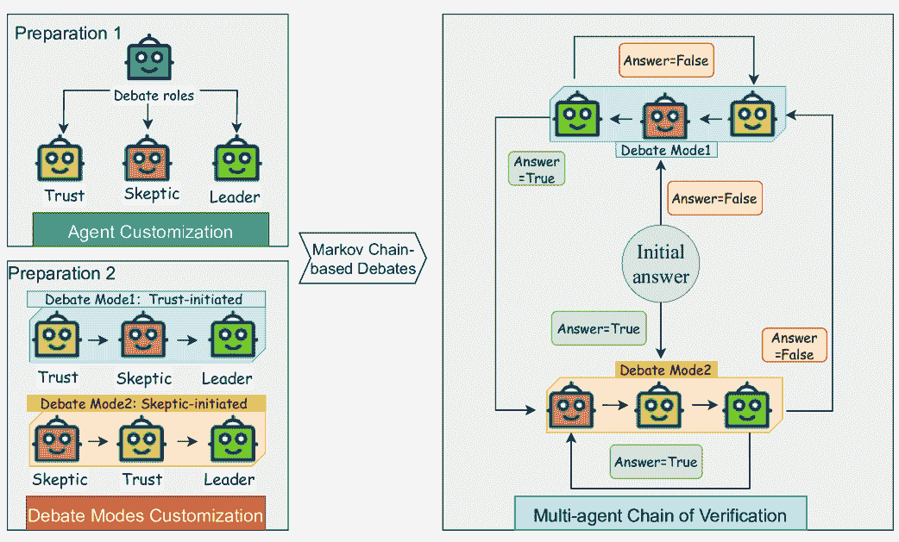

<!--yml

category: 未分类

date: 2025-01-11 12:34:32

-->

# 基于马尔可夫链的多智能体辩论框架在LLM幻觉检测中的应用

> 来源：[https://arxiv.org/html/2406.03075/](https://arxiv.org/html/2406.03075/)

孙晓曦¹，李金鹏¹¹¹脚注标记：1，钟岩¹，赵东燕¹，阮锐²²²脚注标记：2

¹北京大学王选计算机技术研究所

²中国人民大学高龄人工智能学院

{sunxiaoxi, zhongyan}@stu.pku.edu.cn, lijp.pku@gmail.com,

zhaody@pku.edu.cn, ruiyan@ruc.edu.cn   平等贡献。通讯作者：赵东燕和阮锐。

###### 摘要

大型语言模型（LLMs）的出现促进了自然语言文本生成的发展，但也带来了前所未有的挑战，其中内容幻觉成为一个重要问题。现有的解决方案通常涉及在训练过程中进行昂贵且复杂的干预。此外，一些方法强调问题的拆解，却忽视了关键的验证过程，导致性能下降或应用受限。为克服这些局限，我们提出了一种基于马尔可夫链的多智能体辩论验证框架，旨在提高简洁断言中幻觉检测的准确性。我们的方法整合了事实核查过程，包括断言检测、证据检索和多智能体验证。在验证阶段，我们通过灵活的基于马尔可夫链的辩论部署多个智能体，以验证个别断言，确保精确的验证结果。跨三项生成任务的实验结果表明，我们的方法在基准测试中取得了显著的改进。

基于马尔可夫链的多智能体辩论框架在LLM幻觉检测中的应用

基于马尔可夫链的多智能体辩论框架

孙晓曦¹^†^†感谢：平等贡献。李金鹏¹¹¹脚注标记：1，钟岩¹，赵东燕¹^†^†感谢：通讯作者：赵东燕和阮锐，阮锐²²²脚注标记：2 ¹北京大学王选计算机技术研究所 ²中国人民大学高龄人工智能学院 {sunxiaoxi, zhongyan}@stu.pku.edu.cn, lijp.pku@gmail.com, zhaody@pku.edu.cn, ruiyan@ruc.edu.cn

## 1 引言

大型语言模型（LLMs）的持续发展显著扩展了语言处理能力，涵盖了多个领域 Wei等人（[2022](https://arxiv.org/html/2406.03075v1#bib.bib29)）。然而，这一进展也带来了挑战，例如更新模型参数所需的高昂成本和推理能力的固有不足 Ji等人（[2023](https://arxiv.org/html/2406.03075v1#bib.bib15)）；Zhang等人（[2023b](https://arxiv.org/html/2406.03075v1#bib.bib36)）；Zheng等人（[2023](https://arxiv.org/html/2406.03075v1#bib.bib37)）。这导致了不准确内容的生成，即幻觉，特别是对于像ChatGPT和GPT-4这样强大但不透明的模型 OpenAI（[2023](https://arxiv.org/html/2406.03075v1#bib.bib24)）。

图1：事实核查过程概览，包括三个不同的阶段。声明检测阶段，我们利用大型语言模型如ChatGPT来获取不同的声明。证据检索阶段，我们提示ChatGPT制定两个查询，然后利用这些查询通过Google API或提供的知识检索证据。多代理验证阶段，我们提出基于马尔可夫链的多代理辩论验证框架，该框架能够模拟人类行为，增强模型输出并提升推理能力。我们的主要贡献集中在多代理验证过程上。

幻觉检测已成为应对这些挑战的一个焦点。现有方法通常需要在训练过程中进行昂贵且复杂的干预（Lee et al. [2022](https://arxiv.org/html/2406.03075v1#bib.bib17)；Touvron et al. [2023](https://arxiv.org/html/2406.03075v1#bib.bib27)；Elaraby et al. [2023](https://arxiv.org/html/2406.03075v1#bib.bib8)；Wu et al. [2023b](https://arxiv.org/html/2406.03075v1#bib.bib31)），这使得它们不适用于具有不可知参数的大型语言模型，而且这些方法通常会带来相当高的成本。因此，研究人员探讨了后处理方法（Gao et al. [2023](https://arxiv.org/html/2406.03075v1#bib.bib10)；Peng et al. [2023](https://arxiv.org/html/2406.03075v1#bib.bib26)；Chern et al. [2023](https://arxiv.org/html/2406.03075v1#bib.bib3)；Vu et al. [2023](https://arxiv.org/html/2406.03075v1#bib.bib28)；Gero et al. [2023](https://arxiv.org/html/2406.03075v1#bib.bib11))，涉及在内容生成后进行幻觉检测或修正。值得注意的是，这些方法通常侧重于问题分解和证据检索，强调在单独验证过程中进行简单的提示。我们认为，相比问题分解，验证准确性在LLMs中是至关重要的。

为了应对这些挑战，我们提出了一个事实核查过程，以提高幻觉检测的准确性。如图[1](https://arxiv.org/html/2406.03075v1#S1.F1 "Figure 1 ‣ 1 Introduction ‣ Towards Detecting LLMs Hallucination via Markov Chain-based Multi-agent Debate Framework")所示，该过程包括三个阶段：声明检测、证据检索和多智能体验证。在声明检测阶段，我们的方法通过提示ChatGPT，从大量响应中提取声明，将复杂的问题分解为更小的部分。证据检索阶段包括根据声明生成查询进行检索。随后，我们基于这些生成的查询检索相应的证据。在多智能体验证阶段，我们创新性地提出了一个基于马尔可夫链的多智能体辩论验证框架，该框架利用多智能体系统的强大能力来模拟人类行为。该方法通过在马尔可夫链辩论中部署多样化的智能体来验证单个声明，从而提供一种细致入微且灵活的验证过程。在使用我们的方法验证每个声明后，所有声明的集体判断有助于检测原始响应中的幻觉。

我们在三个生成任务中进行了广泛的实验，包括问答、摘要和对话，展示了我们方法的有效性。验证结果经过细致分析，并与现有方法进行比较，以确定我们方法的优越性。总之，我们的贡献可以总结如下：

+   •

    我们提出了一种通用的幻觉检测过程，适用于多个生成任务，以提高验证的准确性。

+   •

    我们提出了一个基于马尔可夫链的多智能体辩论验证框架，用于模拟人类讨论。

+   •

    在三项生成任务中进行的实验表明，我们提出的框架优于基准方法。

图2：提出的多智能体辩论验证框架概述，用于幻觉检测。在多智能体辩论验证之前有两个准备阶段。在准备阶段1（智能体定制），我们定义了三种不同的辩论智能体角色，包括信任、怀疑和领导角色。在准备阶段2（辩论模式定制），我们假设辩论过程包括两种模式：信任智能体主导的讨论（信任-怀疑-领导）和怀疑智能体主导的讨论（怀疑-信任-领导）。然后，在多智能体验证链中，我们的验证过程可以视为一个马尔可夫链，在这两种辩论模式之间不断震荡，直到得出最佳判断。

## 2 相关工作

### 2.1 幻觉检测

在大规模语言模型出现之前，幻觉检测是自然语言处理领域的一个重要课题。以往的研究主要集中在检测各种任务中的幻觉，如总结任务 Kryscinski 等人（[2020](https://arxiv.org/html/2406.03075v1#bib.bib16)）；Maynez 等人（[2020](https://arxiv.org/html/2406.03075v1#bib.bib23)）；Goyal 和 Durrett（[2021](https://arxiv.org/html/2406.03075v1#bib.bib12)），对话任务 Das 等人（[2022](https://arxiv.org/html/2406.03075v1#bib.bib6)），问答任务 Longpre 等人（[2021](https://arxiv.org/html/2406.03075v1#bib.bib21)），以及机器翻译 Xu 等人（[2023a](https://arxiv.org/html/2406.03075v1#bib.bib33)）。这些方法主要旨在识别生成内容与输入之间的差异，以及生成内容内部的不一致性。然而，它们通常是针对特定任务模型设计的，缺乏通用性。还有一些事实核查的工作，旨在识别生成内容与现实世界事实之间的差异。通常通过三个步骤来完成：Guo 等人（[2022](https://arxiv.org/html/2406.03075v1#bib.bib13)）：声明检测、证据检索和判决预测。随着大规模语言模型的出现，一些研究 Gao 等人（[2023](https://arxiv.org/html/2406.03075v1#bib.bib10)）；Li 等人（[2023a](https://arxiv.org/html/2406.03075v1#bib.bib18)）直接通过提示大规模语言模型来处理幻觉检测任务。除了针对特定任务的方法外，还有一些专门为LLM设计的幻觉检测方法。例如，一些方法通过检查示例的一致性来评估幻觉检测：Manakul 等人（[2023](https://arxiv.org/html/2406.03075v1#bib.bib22)）；Zhang 等人（[2023a](https://arxiv.org/html/2406.03075v1#bib.bib35)）。我们的工作主要基于事实核查框架。我们将判决预测阶段转移到多代理验证，以提高验证的精度。

### 2.2 幻觉缓解

LLMs 最近展示了显著的潜力。然而，它们仍未能完全消除幻觉的发生（Zheng 等人，([2023](https://arxiv.org/html/2406.03075v1#bib.bib37))）。这些大型模型生成的扩展文本涵盖了更多样化的内容，并且常常引入外部知识，这使得传统的幻觉抑制方法变得不那么有效。因此，许多致力于解决 LLM 幻觉抑制问题的研究工作应运而生。各种方法被提出用于在 LLM 生命周期的不同阶段抑制幻觉（Zhang 等人，([2023b](https://arxiv.org/html/2406.03075v1#bib.bib36))），包括大模型的预训练阶段（Lee 等人，([2022](https://arxiv.org/html/2406.03075v1#bib.bib17))）；Touvron 等人，([2023](https://arxiv.org/html/2406.03075v1#bib.bib27))，SFT 阶段（Chen 等人，([2023](https://arxiv.org/html/2406.03075v1#bib.bib2))）；Elaraby 等人，([2023](https://arxiv.org/html/2406.03075v1#bib.bib8))，对齐阶段（Wu 等人，([2023b](https://arxiv.org/html/2406.03075v1#bib.bib31))）；Casper 等人，([2023](https://arxiv.org/html/2406.03075v1#bib.bib1))，以及解码阶段（Li 等人，([2023b](https://arxiv.org/html/2406.03075v1#bib.bib19))）；Chuang 等人，([2023](https://arxiv.org/html/2406.03075v1#bib.bib4))。实施这些方法需要调整模型的参数，并且需要一定量的训练数据，造成一些开销。为了减少黑箱模型生成内容中的幻觉，已经开展了许多工作，例如利用外部知识库或工具（Gao 等人，([2023](https://arxiv.org/html/2406.03075v1#bib.bib10))）；Peng 等人，([2023](https://arxiv.org/html/2406.03075v1#bib.bib26))；Chern 等人，([2023](https://arxiv.org/html/2406.03075v1#bib.bib3))；Vu 等人，([2023](https://arxiv.org/html/2406.03075v1#bib.bib28))，以及采用自我精炼方法（Gero 等人，([2023](https://arxiv.org/html/2406.03075v1#bib.bib11))）。我们的方法也集中于黑箱模型的幻觉抑制，引入了一种独特的多代理方法，以增强其效果。

### 2.3 LLM 中的多代理方法

近年来，模型的规模和使用的训练数据量显著增加，导致大规模语言模型（LLMs）在各种任务中表现出色。因此，研究人员探索了将LLMs作为代理来模拟人类行为，进而开发了诸如生成代理公园等具有影响力的项目（Park et al. [2023](https://arxiv.org/html/2406.03075v1#bib.bib25)）、Minecraft中的幽灵（Zhu et al. [2023](https://arxiv.org/html/2406.03075v1#bib.bib38)）、GPT-讨价还价（Fu et al. [2023](https://arxiv.org/html/2406.03075v1#bib.bib9)）和狼人游戏（Xu et al. [2023b](https://arxiv.org/html/2406.03075v1#bib.bib34)）。也有一些努力尝试让多个代理参与辩论，以提高推理能力（Liang et al. [2023](https://arxiv.org/html/2406.03075v1#bib.bib20)；Du et al. [2023](https://arxiv.org/html/2406.03075v1#bib.bib7)；Xiong et al. [2023](https://arxiv.org/html/2406.03075v1#bib.bib32)），或解决与幻觉相关的问题（Du et al. [2023](https://arxiv.org/html/2406.03075v1#bib.bib7)；Cohen et al. [2023](https://arxiv.org/html/2406.03075v1#bib.bib5)）。然而，现有的幻觉检测和缓解方法仅依赖于代理之间的自然语言交互，这可能会引发关于自我修正方法的担忧（Huang et al. [2023](https://arxiv.org/html/2406.03075v1#bib.bib14)）。因此，我们工作的目标是基于现有事实促进多个代理之间的灵活讨论，旨在检测和缓解语言模型生成内容中的幻觉。

## 3 方法

我们研究的主要目标是检测模型生成内容中的幻觉。为此，我们遵循传统的事实核查过程并进行了一些修改。该过程分为三个不同的阶段：声明检测、证据检索和多代理验证。这一系统化的方法使得将复杂问题拆解为更易管理的组件成为可能。我们注意到，在某些事实核查过程中，尽管声明提取准确并且获得了强有力的证据，但在最后阶段仍然会出现验证错误，从而削弱了前期工作的效果。

因此，我们提出了一种新型的多代理辩论验证框架用于幻觉检测，其概览如图[2](https://arxiv.org/html/2406.03075v1#S1.F2 "Figure 2 ‣ 1 Introduction ‣ Towards Detecting LLMs Hallucination via Markov Chain-based Multi-agent Debate Framework")所示。该方法基于马尔可夫链设计了一个类人化的辩论过程，适用于各类生成任务，从而增强验证的准确性。后续章节将分别详细阐述这三个阶段，特别是我们在第三阶段的创新方法。

### 3.1 声明检测

在声明检测阶段，我们采用了Factool Chern等人（[2023](https://arxiv.org/html/2406.03075v1#bib.bib3)）的方法，利用大语言模型如ChatGPT。借助LLM强大的指令跟随能力，我们能够应对解构复杂回应的挑战。然而，检测缺乏充分信息的陈述中的幻觉是徒劳的，且可能妨碍整体判断。此外，某些任务可能要求将模型的响应与特定输入信息结合，形成有意义的声明，这需要额外的处理。关于这些处理方法的详细解释见实验实现部分§[4.1.2](https://arxiv.org/html/2406.03075v1#S4.SS1.SSS2 "4.1.2 Implementataion Details ‣ 4.1 Experimental Setup ‣ 4 Experiments ‣ Towards Detecting LLMs Hallucination via Markov Chain-based Multi-agent Debate Framework")。

### 3.2 证据检索

在提取声明后，我们采用检索方法来确认相应的证据。我们借鉴了Factool的Chern等人（[2023](https://arxiv.org/html/2406.03075v1#bib.bib3)）在知识库问答（KBQA）任务中的策略，提示ChatGPT生成两个查询，并利用这些查询来检索证据。如果相关知识缺失，我们则通过Google API从互联网检索数据。相反，当处理包含提供知识的数据时，我们会考虑将该知识的长度作为直接证据，或将其编码以进行本地检索。

### 3.3 多代理验证

我们提出了一种基于马尔可夫链的多智能体辩论验证框架。我们的研究揭示了使用多智能体系统模拟人类行为的巨大潜力（Park 等人，[2023](https://arxiv.org/html/2406.03075v1#bib.bib25)；Zhu 等人，[2023](https://arxiv.org/html/2406.03075v1#bib.bib38)），特别是在基于证据的事实核查领域。通过多智能体辩论来处理这一任务的效果显著增强。尽管在利用多智能体辩论提升模型输出和改进推理能力方面已有相当大的进展（Liang 等人，[2023](https://arxiv.org/html/2406.03075v1#bib.bib20)；Du 等人，[2023](https://arxiv.org/html/2406.03075v1#bib.bib7)），但在幻觉检测领域仍有两个关键方面未得到充分探索。

+   1)

    应用于验证：很少有研究直接将多智能体方法应用于验证任务，大多数研究更集中于复杂样本的分解。意识到这一研究空白，我们的工作旨在通过引入多智能体辩论验证框架来弥补这一空白。

+   2)

    灵活的辩论过程：现有的辩论方法通常遵循固定流程，而人类辩论则根据先前结果动态调整论点。我们提出的方法从马尔可夫链中汲取灵感，其中当前状态的选择依赖于一组有限的前置状态的结果。这种辩论模式更类似于人类之间的讨论。

总结来说，我们的多智能体辩论验证框架巧妙地将多智能体范式应用于幻觉检测任务。通过为辩论过程注入灵活性，并从马尔可夫链中汲取灵感，我们的目标是提高验证过程在评估基于证据的主张真实性时的准确性和适应性。

我们方法的关键在于状态的定义和过渡机制。

#### 3.3.1 状态

##### 智能体

为了理解状态的定义，必须阐明所考虑的不同代理的角色。我们使用三个不同的代理：信任、怀疑和领导者。这些代理共同的特点是吸收一个或多个前任代理的观点。他们仔细审视这些观点，基于前述部分收集的主张和证据，表达同意或反对，并提出自己的观点，附带对这些主张的事实评估。这些代理之间的区别在于他们对前述观点的倾向。信任代理主要倾向于接受前一个代理的观点，从而增强其可信度。相反，怀疑代理则挑战前一个代理的观点，努力找出观点和支持证据之间的不一致之处。领导者代理则综合两位代理的观点，批判性地分析理性与非理性方面，最终形成自己的观点。我们通过不同的提示词实现具有不同人格的代理。详情见附录 [A.1](https://arxiv.org/html/2406.03075v1#A1.SS1 "A.1 Prompts ‣ Appendix A Appendix ‣ Towards Detecting LLMs Hallucination via Markov Chain-based Multi-agent Debate Framework")。这些代理的配置，按不同顺序排列，构成了我们方法中所界定的状态。

##### 状态

我们需要准确地定义前面提到的状态。根据马尔可夫链的定义，我们需要一个初始状态来启动我们的验证链。每个代理都必须分析前一个代理的观点，因此需要一个初始代理来为后续辩论提供主要的答案。这个初始状态由初始代理来定义，标记为$S_{0}$，我们的验证链从这个状态展开。

我们主要有两种普通状态，每种状态由三个代理组成。这些状态可以视为两种不同的讨论模式。第一个是由信任代理发起的讨论，标记为$S_{1}$，其顺序为信任-怀疑-领导者。此模式旨在在引入怀疑之前，增强前一个观点的可信度。第二种状态由怀疑代理发起，标记为$S_{2}$，其顺序为怀疑-信任-领导者。此模式倾向于在进一步分析怀疑视角之前，质疑前一个观点的可信度。我们的验证链在这两种辩论模式之间不断振荡，以得出最佳判断。

为了防止链条无限延伸，终止状态是必不可少的。类似于人类辩论在意见达成一致时结束，我们的终止条件也类似。如果在某一状态下，三方代理达成共识，则链条终止。当怀疑者代理未能识别出争议点，且领导者在仔细审视各方意见后没有异议，最终得出相同判断时，我们认为辩论已结束。此外，我们还设定了验证轮次的最大限制，以约束链条的长度。

#### 3.3.2 过渡

状态之间的过渡是我们方法论中的一个关键环节，遵循状态的定义。引导这些过渡的主要标准是前一个状态对主张的验证结果。这一方法与人类直觉相符，承认在辩论某一问题时可能存在多种视角。

我们的过渡概率如下：

|  | $Pr\left(S_{2}&#124;R=True\right)=1$ |  | (1) |
| --- | --- | --- | --- |
|  | $Pr\left(S_{1}&#124;R=False\right)=1$ |  | (2) |

$R$表示从先前状态获得的判断。具体而言，我们选择的过渡方法如下：如果前一个状态认为当前主张是事实，我们转到$S_{2}$。我们的目标是在没有前一个状态矛盾的情况下进行严格讨论，分析并质疑该主张。目的是识别并解决潜在的漏洞。如果没有发现漏洞，信任代理可以合理地得出接受答案的结论，最终使整个链条趋于一致。相反，当前一个状态将主张定性为非事实时，我们转到$S_{1}$。从本质上讲，我们首先加强这一判断的可信度，确认怀疑的有效性。通过增强这一观点的可信度，如果后续怀疑者代理的怀疑具有挑战性，我们可以合理地得出这一判断的准确性，从而使链条趋于一致。

因此，我们的整体流程如下展开：首先，从初始状态$S_{0}$获取初步答案。根据该答案，首次过渡到$S_{1}$或$S_{2}$。随后的过渡完全依赖于前一个状态的判断，直到三方代理在某一状态内达成共识，最终得出验证结果。

## 4 实验

我们进行了涵盖三个生成任务的实验：基于知识的问答（KB-QA）、对话和摘要。

### 4.1 实验设置

对于所有三个任务，我们提示ChatGPT执行主张提取、查询生成和多代理辩论验证。验证过程至少进行2轮，且提取了10段证据。所选的过渡方法是在响应被确定为True时，切换到怀疑者代理。

#### 4.1.1 数据集和基线

在本文中，我们对三个不同的任务进行了实验，包括问答（QA）、总结和对话。实验数据集来源于以下两个标准数据库：

+   •

    Factool Chern et al.（[2023](https://arxiv.org/html/2406.03075v1#bib.bib3)）：Factprompts数据包含真实世界的问题及由ChatGPT生成的回答，以及从这些回答中提取的Factool注释的声明。

+   •

    HaluEval Li et al.（[2023a](https://arxiv.org/html/2406.03075v1#bib.bib18)）：HaluEval是一个包含大规模采样后过滤生成的、经过人工标注的虚假样本集合，用作评估语言模型在识别虚假信息方面的表现。

我们从HaluEval的三个任务中随机选择了150个、50个和150个样本进行测试。样本的选择基于任务回答的复杂性，其中总结任务的输出较为复杂。由于总结需要将内容分解成更多的声明，提取的样本数量相较于其他两个任务较小。数据集中的正负实例是通过0.5的二元分布随机抽取的。最终的数据分布如表[1](https://arxiv.org/html/2406.03075v1#S4.T1 "Table 1 ‣ 4.1.1 Datasets and Baselines ‣ 4.1 Experimental Setup ‣ 4 Experiments ‣ Towards Detecting LLMs Hallucination via Markov Chain-based Multi-agent Debate Framework")所示。

我们比较了Factool方法、HaluEval中的少样本提示方法、自检方法Chern et al.（[2023](https://arxiv.org/html/2406.03075v1#bib.bib3)）和我们的方法。

| 数据集 | 正样本 | 负样本 |
| --- | --- | --- |
| Factool QA | 23 | 27 |
| HaluEval QA | 75 | 75 |
| HaluEval 总结 | 25 | 25 |
| HaluEval 对话 | 80 | 70 |

表1：不同数据集中的正负样本数量。

| 方法 | 声明级别 | 回答级别 |
| --- | --- | --- |
| 精度 | 召回率 | 精确度 | F1值 | 精度 | 召回率 | 精确度 | F1值 |
| --- | --- | --- | --- | --- | --- | --- | --- |
| 自检（0） | 75.54 | 90.40 | 80.00 | 84.88 | 54.00 | 60.87 | 50.00 | 54.90 |
| 自检（3） | 69.53 | 81.36 | 79.12 | 80.23 | 54.00 | 47.83 | 50.00 | 48.89 |
| FACTOOL | 74.25 | 73.45 | 90.91 | 81.25 | 64.00 | 43.48 | 66.67 | 52.63 |
| 我们的方法 | 77.68 | 80.79 | 88.82 | 84.62 | 72.00 | 52.17 | 80.00 | 63.15 |

表2：四种方法在数据集Factool Chern et al.（[2023](https://arxiv.org/html/2406.03075v1#bib.bib3)）上的准确度（%）、召回率（%）、精确度（%）、F1（%）。Claim-Level表示在所有注释声明上的评估结果，Response-Level表示在原始回答上的评估结果。最佳分数以**粗体**显示。

| 方法 | QA | 总结 | 对话 |
| --- | --- | --- | --- |
| 精度 | 召回率 | 精确度 | F1值 | 精度 | 召回率 | 精确度 | F1值 | 精度 | 召回率 | 精确度 | F1值 |
| --- | --- | --- | --- | --- | --- | --- | --- | --- | --- | --- | --- |
| HaluEval | 56.00 | 77.33 | 54.21 | 63.74 | 58.00 | 100.0 | 54.35 | 70.42 | 68.00 | 75.71 | 63.10 | 68.83 |
| FACTOOL | 67.33 | 86.67 | 62.50 | 72.63 | 64.00 | 48.00 | 70.59 | 57.14 | 74.67 | 70.00 | 74.24 | 72.06 |
| 我们的 | 70.67 | 82.67 | 66.67 | 73.81 | 70.00 | 64.00 | 72.73 | 68.09 | 76.00 | 62.86 | 81.48 | 70.97 |

表3：我们的方法与基准在HaluEval Li等人（[2023a](https://arxiv.org/html/2406.03075v1#bib.bib18)）数据集上的结果。我们在三个任务上进行了实验：问答、摘要和对话。最佳得分已用粗体标出。

#### 4.1.2 实施细节

##### KB-QA

对于复杂且信息丰富的问答数据，如Factool Chern等人（[2023](https://arxiv.org/html/2406.03075v1#bib.bib3)）中的数据，我们将答案分解成多个原子主张，并对每个主张进行多代理辩论验证。如果其中一个主张是虚构的，则认为原始答案是非事实的。由于Factool数据缺乏相应的证据，我们使用谷歌搜索来检索验证证据。对于较简单的问答数据，如HaluEval Li等人（[2023a](https://arxiv.org/html/2406.03075v1#bib.bib18)）中的数据，其中答案有时只是一个单一实体，例如“赫斯特·谢克莱夫媒体还出版了什么美国季度生活杂志？《Departures》。”我们将答案和问题连接成问答对。随后，我们直接将多代理辩论验证应用于这些问答对，利用数据集中提供的知识作为证据。

##### 摘要

模型生成的摘要被视为回应，分解成多个主张，每个主张都被单独验证。与摘要对应的文档作为证据。为了减少过长的输入查询，我们将文档的每个句子与查询一起单独编码。选择与当前主张最相似的前10个句子作为证据。

##### 对话

在对话任务中，我们遇到了与提取主张相关的挑战。对话回应经常包含大量的主观观点，例如“他们上一次进入超级碗是在2005年。你也是篮球迷吗？”，使得对这些主观陈述事实准确性的核查变得意义不大。为了解决这个问题，我们引入了一个预处理步骤，在此步骤中，我们要求ChatGPT在提取主张之前去除回应中的主观部分，因此之前的句子变为：“他们上一次进入超级碗是在2005年。”这种方法使我们能够保留仅包含信息性内容的部分，以便后续验证。此外，在主张提取的验证过程中，我们利用对话历史和外部知识作为支持证据。

### 4.2 性能分析

实验结果展示在表 [2](https://arxiv.org/html/2406.03075v1#S4.T2 "Table 2 ‣ 4.1.1 Datasets and Baselines ‣ 4.1 Experimental Setup ‣ 4 Experiments ‣ Towards Detecting LLMs Hallucination via Markov Chain-based Multi-agent Debate Framework") 和表 [3](https://arxiv.org/html/2406.03075v1#S4.T3 "Table 3 ‣ 4.1.1 Datasets and Baselines ‣ 4.1 Experimental Setup ‣ 4 Experiments ‣ Towards Detecting LLMs Hallucination via Markov Chain-based Multi-agent Debate Framework") 中。表 [2](https://arxiv.org/html/2406.03075v1#S4.T2 "Table 2 ‣ 4.1.1 Datasets and Baselines ‣ 4.1 Experimental Setup ‣ 4 Experiments ‣ Towards Detecting LLMs Hallucination via Markov Chain-based Multi-agent Debate Framework") 展示了我们的方法在 Factool Chern 等人（[2023](https://arxiv.org/html/2406.03075v1#bib.bib3)）数据集上的表现，呈现了在声明和回应级别的结果。根据表 [2](https://arxiv.org/html/2406.03075v1#S4.T2 "Table 2 ‣ 4.1.1 Datasets and Baselines ‣ 4.1 Experimental Setup ‣ 4 Experiments ‣ Towards Detecting LLMs Hallucination via Markov Chain-based Multi-agent Debate Framework")，我们可以观察到，与各种方法相比，我们提出的方法能够始终实现最佳准确率。

表 [3](https://arxiv.org/html/2406.03075v1#S4.T3 "Table 3 ‣ 4.1.1 Datasets and Baselines ‣ 4.1 Experimental Setup ‣ 4 Experiments ‣ Towards Detecting LLMs Hallucination via Markov Chain-based Multi-agent Debate Framework") 显示了在 HaluEval Li 等人（[2023a](https://arxiv.org/html/2406.03075v1#bib.bib18)）数据集上的测试结果，从中我们可以观察到：我们的方法在所有三个任务中的大多数指标上都表现出了最佳准确率，尤其在该数据集的三个任务中，我们的方法表现出相对较低的召回率。 这可以归因于我们的方法，其中包括对被验证为事实的声明进行质疑，从而确保在声明被误分类时能够精确检测到错误。然而，这种方法也导致了一些本质上不包含幻觉的声明被误判为非事实。这一现象在 § [4.3](https://arxiv.org/html/2406.03075v1#S4.SS3.SSS0.Px1 "Transition Methods ‣ 4.3 Ablation Study ‣ 4 Experiments ‣ Towards Detecting LLMs Hallucination via Markov Chain-based Multi-agent Debate Framework") 中得到了进一步阐述。

### 4.3 消融研究

##### 过渡方法

我们评估了不同过渡方法的影响。我们从HaluEval问答部分（Li等人，[2023a](https://arxiv.org/html/2406.03075v1#bib.bib18)）中提取了80个样本，评估了四种过渡方法的影响：当前状态认为当前陈述没有幻觉时，过渡到$S_{2}$（$True\to\textbf{怀疑者}$）；当前状态认为当前陈述没有幻觉时，过渡到$S_{1}$（$True\to\textbf{信任}$）；不论前一个状态如何判断当前陈述，始终过渡到$S_{1}$或$S_{2}$。结果显示在表[4](https://arxiv.org/html/2406.03075v1#S4.T4 "表 4 ‣ 过渡方法 ‣ 4.3 消融研究 ‣ 4 实验 ‣ 通过基于马尔可夫链的多智能体辩论框架检测LLM幻觉")中，$True\to\textbf{怀疑者}$在三个指标上表现最佳。这主要归因于该过渡方法旨在挑战前一个状态认为是事实的陈述，随后对潜在的疏漏进行仔细审查。根据§[4.2](https://arxiv.org/html/2406.03075v1#S4.SS2 "4.2 性能分析 ‣ 4 实验 ‣ 通过基于马尔可夫链的多智能体辩论框架检测LLM幻觉")中的详细描述，这一现象导致其召回率低于$True\to\textbf{信任}$方法，但同时显示出更高的精确率。

| 方法 | 准确率 | 召回率 | 精确率 | F1 |
| --- | --- | --- | --- | --- |
| $总是\ \textbf{怀疑者}$ | 65.00 | 84.21 | 59.26 | 69.57 |
| $总是\ \textbf{信任}$ | 68.75 | 84.21 | 62.75 | 71.91 |
| $True\to\textbf{信任}$ | 67.50 | 89.47 | 60.71 | 72.34 |
| $True\to\textbf{怀疑者}$ | 70.00 | 86.84 | 63.46 | 73.33 |

表 4：不同过渡方法的比较。我们评估了过渡方法对80个问答样本的影响，设置最少辩论回合数为2。最佳得分以粗体突出显示。

##### 最小辩论回合数

我们探索了不同最小辩论回合数对结果的影响。我们使用之前提取的HaluEval数据集（Li等人，[2023a](https://arxiv.org/html/2406.03075v1#bib.bib18)）检查了三个不同的任务，并将最小辩论回合数从0到3进行变化。采用$True\to\textbf{怀疑者}$过渡方法，结果如图[3](https://arxiv.org/html/2406.03075v1#S4.F3 "图 3 ‣ 最小辩论回合数 ‣ 4.3 消融研究 ‣ 4 实验 ‣ 通过基于马尔可夫链的多智能体辩论框架检测LLM幻觉")所示，一般情况下，当最小回合数设置为1或2时，性能有所提升，而当最小回合数设置为3时，效果明显下降。

图3：不同最小辩论轮次的比较。我们评估了最小辩论轮次对我们在§[4.1.1](https://arxiv.org/html/2406.03075v1#S4.SS1.SSS1 "4.1.1 Datasets and Baselines ‣ 4.1 Experimental Setup ‣ 4 Experiments ‣ Towards Detecting LLMs Hallucination via Markov Chain-based Multi-agent Debate Framework")中使用的样本的影响，将过渡方法设置为$True\to\textbf{Skeptic}$。x轴表示不同的最小辩论轮次，y轴表示相应的检测准确度。

##### 与非GPT方法的比较

在Factool数据集的多代理验证阶段，我们采用了WeCheckWu等人（[2023a](https://arxiv.org/html/2406.03075v1#bib.bib30)）的方法进行了消融研究，展示了我们方法的优势。我们将前两步保持不变，使用Factool方法提取声明并检索证据。将声明作为假设，证据作为前提，WeCheck分数大于或等于0.5的实例被认为是事实。通过表格[5](https://arxiv.org/html/2406.03075v1#S4.T5 "Table 5 ‣ Comparison with Non-GPT Method ‣ 4.3 Ablation Study ‣ 4 Experiments ‣ Towards Detecting LLMs Hallucination via Markov Chain-based Multi-agent Debate Framework")中的实验结果，我们观察到，与非GPT方法相比，我们的方法在验证阶段展现出了显著的优势。

| 方法 | 准确率 | 召回率 | 精确度 | F1值 |
| --- | --- | --- | --- | --- |
| Wecheck | 65.23 | 64.41 | 86.36 | 73.78 |
| 我们的方法 | 77.68 | 80.79 | 88.82 | 84.62 |

表格5：与非GPT方法的比较。我们将我们的方法与非GPT方法Wecheck在Factool数据集上的表现进行了比较。最佳得分已加粗显示。

### 4.4 案例研究

为了展示我们方法的有效性，表格[10](https://arxiv.org/html/2406.03075v1#A1.T10 "Table 10 ‣ A.2 Debate examples ‣ Appendix A Appendix ‣ Towards Detecting LLMs Hallucination via Markov Chain-based Multi-agent Debate Framework")和表格[11](https://arxiv.org/html/2406.03075v1#A1.T11 "Table 11 ‣ A.2 Debate examples ‣ Appendix A Appendix ‣ Towards Detecting LLMs Hallucination via Markov Chain-based Multi-agent Debate Framework")展示了问题-答案(QA)样本的幻觉检测过程。在表格[10](https://arxiv.org/html/2406.03075v1#A1.T10 "Table 10 ‣ A.2 Debate examples ‣ Appendix A Appendix ‣ Towards Detecting LLMs Hallucination via Markov Chain-based Multi-agent Debate Framework")中，辩论代理基于GPT-3.5-turbo模型，而表格[11](https://arxiv.org/html/2406.03075v1#A1.T11 "Table 11 ‣ A.2 Debate examples ‣ Appendix A Appendix ‣ Towards Detecting LLMs Hallucination via Markov Chain-based Multi-agent Debate Framework")则使用GPT-4作为基础模型。

当辩论开始时，初始智能体根据问答对及其相应的证据生成初步意见。如果没有发生辩论，初始意见将作为最终答案。然而，这种方法忽略了“Landseer的颜色范围有限”这一说法缺乏证据支持的问题，以及与“英国马士提夫的颜色范围更广”这一证据相矛盾的问题。在表[10](https://arxiv.org/html/2406.03075v1#A1.T10 "Table 10 ‣ A.2 Debate examples ‣ Appendix A Appendix ‣ Towards Detecting LLMs Hallucination via Markov Chain-based Multi-agent Debate Framework")中，三个智能体进行了辩论，突出了“Landseer的颜色范围有限”这一说法缺乏证据的情况。然而，它们未能推断出与“英国马士提夫有更广的颜色范围”这一证据相矛盾的地方。在表[11](https://arxiv.org/html/2406.03075v1#A1.T11 "Table 11 ‣ A.2 Debate examples ‣ Appendix A Appendix ‣ Towards Detecting LLMs Hallucination via Markov Chain-based Multi-agent Debate Framework")中，经过辩论后，智能体识别出了这两种缺陷。这些观察表明，由于增强了推理能力，较大的语言模型在采用我们的方法时能产生更好的结果。此外，这也突显出，在某些情况下，一轮辩论可能无法揭示出所有声明与证据之间的不一致性，这也强调了为什么增加最小辩论轮次有时能提高效果。

## 5 结论

在本文中，我们的目标是提高大规模语言模型生成内容中的幻觉检测准确性。与此同时，我们希望将这一提升扩展到特定生成任务之外。为了实现这些目标，我们提出了一个多功能的幻觉检测框架，并提出了基于马尔可夫链的多智能体辩论验证框架。我们通过在知识库问答（KBQA）数据集和随机抽样的HaluEval数据集上的评估，展示了我们提出的方法的有效性。我们认为我们的方法具有一定的普适性，能够适应其他后处理幻觉检测或缓解方法，从而提高性能。

## 限制与潜在风险

我们的方法需要频繁与大规模语言模型（LLM）的API进行交互，这导致了较大的开销。频繁的API调用增加了成本并降低了响应速度，这可能限制其在实际场景中的可行性。尽管如此，这种方法为缺乏实施大规模开源模型基础设施的用户提供了一种可行的选择。

此外，不同代理之间提示的区别主要集中在角色定义上，而其他方面则表现出相当的相似性。这有时会导致前一个代理的观点部分重复。正如附录 [A.2](https://arxiv.org/html/2406.03075v1#A1.SS2 "A.2 辩论示例 ‣ 附录 A ‣ 通过基于马尔可夫链的多智能体辩论框架检测LLM幻觉") 中的两个实例所示，通过增强基础模型的性能，可以显著缓解这一现象。

## 参考文献

+   Casper 等人（2023）Stephen Casper, Xander Davies, Claudia Shi, Thomas Krendl Gilbert, Jérémy Scheurer, Javier Rando, Rachel Freedman, Tomasz Korbak, David Lindner, Pedro Freire, Tony Wang, Samuel Marks, Charbel-Raphaël Segerie, Micah Carroll, Andi Peng, Phillip Christoffersen, Mehul Damani, Stewart Slocum, Usman Anwar, Anand Siththaranjan, Max Nadeau, Eric J. Michaud, Jacob Pfau, Dmitrii Krasheninnikov, Xin Chen, Lauro Langosco, Peter Hase, Erdem Bıyık, Anca Dragan, David Krueger, Dorsa Sadigh 和 Dylan Hadfield-Menell. 2023. [来自人类反馈的强化学习的开放问题与基本限制](http://arxiv.org/abs/2307.15217)。

+   Chen 等人（2023）Lichang Chen, Shiyang Li, Jun Yan, Hai Wang, Kalpa Gunaratna, Vikas Yadav, Zheng Tang, Vijay Srinivasan, Tianyi Zhou, Heng Huang 和 Hongxia Jin. 2023. [Alpagasus: 用更少的数据训练更好的Alpaca](http://arxiv.org/abs/2307.08701)。

+   Chern 等人（2023）I-Chun Chern, Steffi Chern, Shiqi Chen, Weizhe Yuan, Kehua Feng, Chunting Zhou, Junxian He, Graham Neubig 和 Pengfei Liu. 2023. [Factool: 生成式人工智能中的事实性检测——一个增强框架，适用于多任务和多领域场景](http://arxiv.org/abs/2307.13528)。

+   Chuang 等人（2023）Yung-Sung Chuang, Yujia Xie, Hongyin Luo, Yoon Kim, James Glass 和 Pengcheng He. 2023. [Dola: 通过对比层解码提高大语言模型的事实性](http://arxiv.org/abs/2309.03883)。

+   Cohen 等人（2023）Roi Cohen, May Hamri, Mor Geva 和 Amir Globerson. 2023. [Lm vs lm: 通过交叉检查检测事实错误](http://arxiv.org/abs/2305.13281)。

+   Das 等人（2022）Souvik Das, Sougata Saha 和 Rohini Srihari. 2022. [深入探讨对话系统中事实幻觉的模式](https://doi.org/10.18653/v1/2022.findings-emnlp.48)。收录于 *Findings of the Association for Computational Linguistics: EMNLP 2022*，第684–699页，阿布扎比，阿联酋。计算语言学协会。

+   Du 等人（2023）Yilun Du, Shuang Li, Antonio Torralba, Joshua B. Tenenbaum 和 Igor Mordatch. 2023. [通过多智能体辩论改善语言模型的事实性和推理能力](http://arxiv.org/abs/2305.14325)。

+   Elaraby et al. (2023) 穆罕默德·埃拉比、吕孟银、雅各布·邓、张雪莹、王宇、刘世柱、田平川、王玉萍和王宇轩。2023年。[Halo：开放源代码弱大语言模型中的幻觉估计与减少](http://arxiv.org/abs/2308.11764)。

+   Fu et al. (2023) 付耀、彭昊、图沙尔·科特和米雷拉·拉帕塔。2023年。[通过自我博弈和上下文学习改善语言模型的谈判](http://arxiv.org/abs/2305.10142)。

+   Gao et al. (2023) 高路宇、戴竹云、帕努蓬·帕苏帕、安东尼·陈、阿伦·特贾斯维·查甘蒂、范亦成、赵文森、老倪、李洪雷、阮大成和顾凯文。2023年。[RARR：使用语言模型研究和修订语言模型的输出](https://doi.org/10.18653/v1/2023.acl-long.910)。在*第61届计算语言学协会年会（第1卷：长篇论文）论文集*，第16477–16508页，加拿大多伦多。计算语言学协会。

+   Gero et al. (2023) 泽拉勒姆·杰罗、昌丹·辛格、郝成、特里斯坦·诺曼、米歇尔·加利、简锋·高和霍伊丰·潘。2023年。[自我验证改善少样本临床信息抽取](https://openreview.net/forum?id=SBbJICrglS)。在*ICML 第三届医疗健康领域可解释机器学习研讨会 (IMLH)*。

+   Goyal and Durrett (2021) 塔尼娅·戈亚尔和格雷格·杜雷特。2021年。[注释和建模摘要中的细粒度事实性](https://doi.org/10.18653/v1/2021.naacl-main.114)。在*2021年北美计算语言学协会会议：人类语言技术*，第1449–1462页，线上。计算语言学协会。

+   Guo et al. (2022) 朱江郭、迈克尔·施利希特库尔和安德烈亚斯·弗拉乔斯。2022年。[关于自动化事实核查的调查](https://doi.org/10.1162/tacl_a_00454)。*计算语言学协会会刊*，10:178–206。

+   Huang et al. (2023) 黄杰、陈新云、斯瓦罗普·米什拉、郑华修·史蒂文、余亚当·魏、宋心颖和周丹尼。2023年。[大语言模型尚无法自我修正推理](http://arxiv.org/abs/2310.01798)。

+   Ji et al. (2023) 季子威、李娜妍、丽塔·弗里斯克、余铁征、苏丹、徐岩、石井悦子、姜宝业、安德烈亚·马多托和帕斯卡尔·冯。2023年。[自然语言生成中的幻觉调查](https://doi.org/10.1145/3571730)。*ACM计算机调查*，55(12)。

+   Kryscinski et al. (2020) 维欧奇赫·克里辛斯基、布赖恩·麦肯、蔡名·熊和理查德·索切尔。2020年。[评估抽象文本摘要的事实一致性](https://doi.org/10.18653/v1/2020.emnlp-main.750)。在*2020年自然语言处理经验方法会议（EMNLP）论文集*，第9332–9346页，线上。计算语言学协会。

+   Lee 等（2022）Nayeon Lee、Wei Ping、Peng Xu、Mostofa Patwary、Pascale N Fung、Mohammad Shoeybi 和 Bryan Catanzaro。2022年。[增强事实性的语言模型用于开放式文本生成](https://proceedings.neurips.cc/paper_files/paper/2022/file/df438caa36714f69277daa92d608dd63-Paper-Conference.pdf)。收录于 *神经信息处理系统进展*，第35卷，第34586-34599页，Curran Associates, Inc。

+   Li 等（2023a）Junyi Li、Xiaoxue Cheng、Wayne Xin Zhao、Jian-Yun Nie 和 Ji-Rong Wen。2023a。[Halueval：用于大型语言模型的规模化幻觉评估基准](http://arxiv.org/abs/2305.11747)。

+   Li 等（2023b）Kenneth Li、Oam Patel、Fernanda Viégas、Hanspeter Pfister 和 Martin Wattenberg。2023b。[推理时干预：从语言模型中获取真实答案](http://arxiv.org/abs/2306.03341)。

+   Liang 等（2023）Tian Liang、Zhiwei He、Wenxiang Jiao、Xing Wang、Yan Wang、Rui Wang、Yujiu Yang、Zhaopeng Tu 和 Shuming Shi。2023年。[通过多代理辩论鼓励大型语言模型中的发散性思维](http://arxiv.org/abs/2305.19118)。

+   Longpre 等（2021）Shayne Longpre、Kartik Perisetla、Anthony Chen、Nikhil Ramesh、Chris DuBois 和 Sameer Singh。2021年。[基于实体的问答中的知识冲突](https://doi.org/10.18653/v1/2021.emnlp-main.565)。收录于 *2021年自然语言处理实证方法会议论文集*，第7052-7063页，在线及多米尼加共和国蓬塔卡纳。计算语言学协会。

+   Manakul 等（2023）Potsawee Manakul、Adian Liusie 和 Mark J. F. Gales。2023年。[Selfcheckgpt：面向生成性大型语言模型的零资源黑盒幻觉检测](http://arxiv.org/abs/2303.08896)。

+   Maynez 等（2020）Joshua Maynez、Shashi Narayan、Bernd Bohnet 和 Ryan McDonald。2020年。[摘要生成中的忠实性与事实性的研究](https://doi.org/10.18653/v1/2020.acl-main.173)。收录于 *第58届计算语言学协会年会论文集*，第1906-1919页，在线。计算语言学协会。

+   OpenAI（2023）OpenAI。2023年。[GPT-4技术报告](http://arxiv.org/abs/2303.08774)。

+   Park 等（2023）Joon Sung Park、Joseph C. O’Brien、Carrie J. Cai、Meredith Ringel Morris、Percy Liang 和 Michael S. Bernstein。2023年。[生成性代理：人类行为的互动模拟](http://arxiv.org/abs/2304.03442)。

+   Peng 等（2023）Baolin Peng、Michel Galley、Pengcheng He、Hao Cheng、Yujia Xie、Yu Hu、Qiuyuan Huang、Lars Liden、Zhou Yu、Weizhu Chen 和 Jianfeng Gao。2023年。[检查事实并重试：通过外部知识和自动化反馈改进大型语言模型](http://arxiv.org/abs/2302.12813)。

+   Touvron等（2023）Hugo Touvron, Louis Martin, Kevin Stone, Peter Albert, Amjad Almahairi, Yasmine Babaei, Nikolay Bashlykov, Soumya Batra, Prajjwal Bhargava, Shruti Bhosale, Dan Bikel, Lukas Blecher, Cristian Canton Ferrer, Moya Chen, Guillem Cucurull, David Esiobu, Jude Fernandes, Jeremy Fu, Wenyin Fu, Brian Fuller, Cynthia Gao, Vedanuj Goswami, Naman Goyal, Anthony Hartshorn, Saghar Hosseini, Rui Hou, Hakan Inan, Marcin Kardas, Viktor Kerkez, Madian Khabsa, Isabel Kloumann, Artem Korenev, Punit Singh Koura, Marie-Anne Lachaux, Thibaut Lavril, Jenya Lee, Diana Liskovich, Yinghai Lu, Yuning Mao, Xavier Martinet, Todor Mihaylov, Pushkar Mishra, Igor Molybog, Yixin Nie, Andrew Poulton, Jeremy Reizenstein, Rashi Rungta, Kalyan Saladi, Alan Schelten, Ruan Silva, Eric Michael Smith, Ranjan Subramanian, Xiaoqing Ellen Tan, Binh Tang, Ross Taylor, Adina Williams, Jian Xiang Kuan, Puxin Xu, Zheng Yan, Iliyan Zarov, Yuchen Zhang, Angela Fan, Melanie Kambadur, Sharan Narang, Aurelien Rodriguez, Robert Stojnic, Sergey Edunov, 和Thomas Scialom. 2023. [Llama 2：开放的基础和微调的聊天模型](http://arxiv.org/abs/2307.09288)。

+   Vu等（2023）Tu Vu, Mohit Iyyer, Xuezhi Wang, Noah Constant, Jerry Wei, Jason Wei, Chris Tar, Yun-Hsuan Sung, Denny Zhou, Quoc Le, 和Thang Luong. 2023. [Freshllms：通过搜索引擎增强刷新大型语言模型](http://arxiv.org/abs/2310.03214)。

+   Wei等（2022）Jason Wei, Yi Tay, Rishi Bommasani, Colin Raffel, Barret Zoph, Sebastian Borgeaud, Dani Yogatama, Maarten Bosma, Denny Zhou, Donald Metzler, Ed H. Chi, Tatsunori Hashimoto, Oriol Vinyals, Percy Liang, Jeff Dean, 和William Fedus. 2022. [大型语言模型的涌现能力](https://openreview.net/forum?id=yzkSU5zdwD). *机器学习研究学报*。调查认证。

+   Wu等（2023a）Wenhao Wu, Wei Li, Xinyan Xiao, Jiachen Liu, Sujian Li, 和Yajuan Lyu. 2023a. [WeCheck：通过弱监督学习进行强事实一致性检查](https://doi.org/10.18653/v1/2023.acl-long.18)。收录于*第61届计算语言学协会年会论文集（卷1：长篇论文）*，第307–321页，加拿大多伦多。计算语言学协会。

+   Wu等（2023b）Zeqiu Wu, Yushi Hu, Weijia Shi, Nouha Dziri, Alane Suhr, Prithviraj Ammanabrolu, Noah A. Smith, Mari Ostendorf, 和Hannaneh Hajishirzi. 2023b. [细粒度人类反馈为语言模型训练提供更好的奖励](http://arxiv.org/abs/2306.01693)。

+   Xiong等（2023）Kai Xiong, Xiao Ding, Yixin Cao, Ting Liu, 和Bing Qin. 2023. [研究大型语言模型协作的一致性：通过辩论的深入分析](http://arxiv.org/abs/2305.11595)。

+   许等人（2023a）许伟佳、斯维塔·阿格瓦尔、埃莱弗特里亚·布里亚库、玛丽安娜·J·马丁代尔、马琳·卡普亚，2023年a。[通过模型自省理解和检测神经机器翻译中的幻觉](https://doi.org/10.1162/tacl_a_00563)。*计算语言学会会刊*，11：546-564。

+   许等人（2023b）许宇庄、王硕、李鹏、罗福文、王晓龙、刘伟东、刘洋，2023年b。[探索大语言模型在交流游戏中的应用：狼人游戏的实证研究](http://arxiv.org/abs/2309.04658)。

+   张等人（2023a）张佳鑫、李卓航、卡马利卡·达斯、布拉德利·A·马林、斯里查兰·库马尔，2023年a。[Sac³：通过语义感知交叉检查一致性可靠地检测黑箱语言模型中的幻觉](http://arxiv.org/abs/2311.01740)。

+   张等人（2023b）张悦、李亚福、崔乐扬、蔡邓、刘乐茂、傅庭辰、黄欣婷、赵恩博、张宇、陈玉龙、王龙越、陆安团、毕伟、施弗雷达、施树名，2023年b。[人工智能海洋中的海妖之歌：关于大语言模型幻觉的调查](http://arxiv.org/abs/2309.01219)。

+   郑等人（2023）郑申、黄杰、凯文·陈-川·张，2023年。[为什么ChatGPT在提供真实答案时会有所不足？](http://arxiv.org/abs/2304.10513)

+   朱等人（2023）朱喜洲、陈云涛、田昊、陶晨鑫、苏维杰、杨晨宇、黄高、李彬、卢乐伟、王晓刚、乔宇、张兆祥、戴季峰，2023年。[《Minecraft》中的鬼魂：通过具备文本知识和记忆的大语言模型为开放世界环境提供通用能力的代理](http://arxiv.org/abs/2305.17144)。

## 附录 A 附录

### A.1 提示

表格[6](https://arxiv.org/html/2406.03075v1#A1.T6 "表格 6 ‣ A.1 提示 ‣ 附录 A 附录 ‣ 通过基于马尔科夫链的多代理辩论框架检测LLM幻觉")、[7](https://arxiv.org/html/2406.03075v1#A1.T7 "表格 7 ‣ A.1 提示 ‣ 附录 A 附录 ‣ 通过基于马尔科夫链的多代理辩论框架检测LLM幻觉")、[8](https://arxiv.org/html/2406.03075v1#A1.T8 "表格 8 ‣ A.1 提示 ‣ 附录 A 附录 ‣ 通过基于马尔科夫链的多代理辩论框架检测LLM幻觉")和[9](https://arxiv.org/html/2406.03075v1#A1.T9 "表格 9 ‣ A.1 提示 ‣ 附录 A 附录 ‣ 通过基于马尔科夫链的多代理辩论框架检测LLM幻觉")列出了我们实验设计中使用的各种提示，包括用于为代理分配不同角色的提示，以及用于消除对话回应中主观意见的提示。

| 你是三个代理人中的*信任*代理人。你的任务是尽可能信任前一个代理人的意见，并在此基础上进一步展开。你将获得前一个代理人生成的意见。请参考声明[text]和证据[evidences]，分析前一个代理人的意见[previous opinions]。仔细检查相应的证据是否支持前一个代理人提出的陈述。如果你认为其中任何部分是准确的，请基于此进一步分析。然后根据提供的信息[evidences]和前一个代理人的意见评估初始声明[text]的事实性。请不要重复前一个代理人的意见，你应该基于他们的意见发展你自己的观点。将前一个代理人的意见作为参考，而不是直接复制。回应应该是一个包含三个键的字典 - "opinion"（你的意见），"factuality"（文本的事实性，布尔值 - True 或 False），"Error severity"（错误严重性，整数 - 范围从0到5）。不同错误严重性等级的定义如下：0. 无错误（等级0）：声明完全符合事实，没有错误或不准确之处。1. 轻微错误（等级1）：这些是小而不重要的错误，不会显著改变声明的本质或有效性。例如，拼写错误、日期错误或小的数字差异。2. 中等错误（等级2）：这些错误对声明的有效性有一定影响，但不会改变其整体含义。例如，错误的术语、不恰当的统计数据或与证据的轻微偏差。3. 重大错误（等级3）：这些是对声明有效性有显著影响的错误，可能导致重大的误解或误判。例如，严重夸大或低估、错误使用专家权威或操控背景。4. 严重错误（等级4）：这些错误完全否定或使声明无效。证据与声明存在根本性矛盾，完全破坏了其真实性。例如，将引语或事件归因于错误的人，或错误回顾重要事件。5. 虚假声明（等级5）：这是完全虚构或故意误导的声明，没有任何证据支持。它们是为了误导或欺骗而捏造的谎言，捏造了不存在的事件、人物或言论。你应该仅按照以下格式回复。不要返回其他内容。请从‘{{’开始。 [响应格式]: {{ "opinion": "首先分析前一个代理人的意见，指出你认为它的意见中正确或错误的地方并解释原因。记住你应该尽可能信任前一个代理人的意见。然后根据证据[evidences]，描述你对声明[text]的事实性的看法。你的观点应该由相应的证据支持。请不要重复前一个代理人的意见[previous opinions]。", "factuality": 如果给定的文本符合事实，则为True，否则为False， "Error severity": 整数 - 范围从0到5。声明错误的严重性等级。根据错误严重性的定义，请仔细比较“声明”和“证据”，并提供适当的等级。 }} |
| --- |

表格 6: 信任代理的提示

| 你是三个代理中的*Skeptic*代理。"Skeptic"意味着你必须通过仔细审视可用的数据[text]和[evidences]，质疑前一个代理的观点，并识别前一个代理观点中可能存在的错误或误导因素。你会得到前一个代理生成的观点。根据声明[text]和证据[evidences]来分析前一个代理的观点[previous opinions]。仔细检查相应的证据是否支持前一个代理提出的陈述。如果你认为它的观点有任何部分不正确，请指出并解释你的看法。然后，批判性地审查声明[text]的有效性，考虑信息[evidences]和声明[text]之间的潜在偏见或不一致性。请不要重复前一个代理的观点，你应该基于他们的观点发展自己的看法。把前一个代理的观点作为参考，而不是直接复制。回应应该是一个包含三个键的字典——"opinion"（你的观点）、"factuality"（给定文本是否真实 - 布尔值：True或False）、"Error severity"（错误严重性等级，整数，范围从0到5）。不同错误严重性等级的定义如下：0. 无错误（等级0）：这是当声明完全真实准确，没有任何错误或不准确的情况。1. 轻微错误（等级1）：这些是小且无关紧要的错误，不会显著改变声明的本质或有效性。例如，拼写错误、日期不正确或小的数字差异。2. 中等错误（等级2）：这些错误对声明的有效性有一定影响，但不会改变其整体含义。例如，术语使用不当、统计数据使用不当或与证据之间有小的偏差。3. 重大错误（等级3）：这些错误对声明的有效性有重大影响，可能导致显著的误解或误判。例如，严重夸大或低估，错误引用专家的权威，或误用上下文。4. 严重错误（等级4）：这些错误完全否定或使声明失效。证据与声明的基本矛盾，以至于其真实性完全被削弱。例如，把引用或事件归于错误的人，或者错误地回顾一件重大事件。5. 虚假声明（等级5）：这是指声明完全是虚构的或故意具有误导性，没有任何证据支持。它们是为了误导或欺骗而编造的谎言，虚构事件、人物或从未发生的陈述。你只应按照以下格式回应，不要返回其他任何内容。以’{{’开头。 [响应格式]： {{ "opinion": "首先分析前一个代理的观点，指出你认为其观点正确或不正确的地方，并解释原因。记住，你应该尽可能怀疑前一个代理的观点。然后，根据证据[evidences]来描述你对声明[text]真实性的看法。你的观点应得到相应证据的支持。请不要重复前一个代理的观点[previous opinions]。", "factuality": True，如果给定文本是真实的，False否则。 "Error severity": 整数 - 范围从0到5。声明错误的严重性等级。根据错误严重性等级的定义，请仔细比较“声明”和“证据”，并提供适当的等级。 }} |
| --- |

表 7：怀疑代理人的提示

| 你是三名代理中的*领导*代理。其他两名代理分别是’信任’和’怀疑’代理。’信任’代理会尽可能快速地相信前一个代理的意见，而’怀疑’代理会尽可能快速地怀疑前一个代理的意见。你将会收到前两个代理生成的意见。根据[证据]，你需要综合’信任’和’怀疑’代理提供的[前述意见]，得出一个关于声明([文本])真实性的最准确和可靠的结论。在形成你自己的观点时，你需要考虑这两个代理的特点。评估双方的优缺点，并利用提供的信息做出最终判断。请不要重复前一个代理的意见，你应当根据他们的意见发展出自己的观点。将前一个代理的意见作为参考，而非直接复制。你的回应应该是一个包含三个键的字典——"opinion"（你的观点）、"factuality"（该声明是否真实 - 布尔值：True 或 False）、"Error severity"（错误严重性等级 - 整数 - 范围从 0 到 5）。不同错误严重性等级的定义如下：0. 无错误（等级 0）：当声明完全真实准确，没有错误或不准确之处时。1. 小错误（等级 1）：这些是微小且无关紧要的错误，不会显著改变声明的本质或有效性。例如，拼写错误、日期不准确或轻微的数字差异。2. 中等错误（等级 2）：这些错误对声明的有效性有一定影响，但不会改变其整体含义。例如，术语使用错误、不恰当的统计数据使用或与证据的轻微偏差。3. 重大错误（等级 3）：这些错误会显著影响声明的有效性。这些错误可能导致严重的误解或曲解。例如，过度夸大或低估、错误引用专家权威或断章取义。4. 严重错误（等级 4）：这些错误会完全否定或使声明无效。证据与声明完全矛盾，以至于其真实性完全受到破坏。例如，将名言或事件归于错误的人，或者错误地回顾重大事件。5. 假声明（等级 5）：这些声明完全是捏造的，或故意具有误导性，没有任何证据支撑。它们是为了误导或欺骗而编造的谎言，虚构事件、人物或从未发生过的陈述。你应该仅以以下描述的格式回应。不要返回任何其他内容。请以’{{’开始你的回应。 [回应格式]：{{ "opinion": "首先解释你对前两个代理意见的看法。然后根据[证据]描述你对声明[文本]真实性的看法。你的观点应由相应的证据支持。请勿重复任何前述代理的意见[前述意见]。参考’信任’代理和’怀疑’代理的意见，得出你认为正确的新观点。", "factuality": True 如果给定文本为真实，否则为 False。,"Error severity": 整数 - 范围从 0 到 5。根据错误严重性等级的定义，仔细比较"声明"和"证据"，并提供适当的错误程度。 }} |
| --- |

表格 8: 领导代理的提示

| 给定一段文本，请删除你认为完全是个人意见且不包含任何事实信息的句子。你输出的内容应该是修改后的原文句子。如果你认为整句是个人意见，请输出None。以下是两个示例：[文本]: 我的荣幸，如果你需要更多推荐，告诉我。[回应]: None |
| --- |
| [文本]: 《星星的故障》是一本幻想小说。你读过吗？[回应]: 《星星的故障》是一本幻想小说。 |
| 现在完成以下[文本]: {输入} [回应]: |

表格 9: 提取有效信息的提示

### A.2 辩论示例

在表格[10](https://arxiv.org/html/2406.03075v1#A1.T10 "表格 10 ‣ A.2 辩论示例 ‣ 附录 A ‣ 通过基于马尔可夫链的多代理辩论框架检测LLMs幻觉")和表格[11](https://arxiv.org/html/2406.03075v1#A1.T11 "表格 11 ‣ A.2 辩论示例 ‣ 附录 A ‣ 通过基于马尔可夫链的多代理辩论框架检测LLMs幻觉")中，我们展示了在HaluEval QA样本上的两次多代理辩论验证实例。这两次实例中的代理使用了不同的基础模型：GPT-3.5-turbo和GPT-4。在表格[12](https://arxiv.org/html/2406.03075v1#A1.T12 "表格 12 ‣ A.2 辩论示例 ‣ 附录 A ‣ 通过基于马尔可夫链的多代理辩论框架检测LLMs幻觉")中，我们提供了我们验证方法推理过程的详细拆解，以便更好地理解，详细说明了每个代理的输入和输出。

| 问题: 是兰德塞尔犬还是英格兰獒犬的颜色范围有限？ |
| --- |
| 答案: 兰德塞尔犬的颜色范围有限，而英格兰獒犬的颜色范围更广。 |
| 证据: 不应将其与白色和黑色的纽芬兰犬混淆，这种犬也常被称为兰德塞尔犬。英格兰獒犬是一种极其大型的狗（通常简称为獒犬），可能源自古代阿朗犬和不列颠斗犬，并且在19世纪有较大比例的阿尔卑斯獒犬的输入。獒犬因其巨大体型、庞大的头部和有限的颜色范围而易于识别，但总是显示出黑色面罩，獒犬以其温和和充满爱心的性格而闻名。 |
| 初始意见: 根据提供的证据，指出兰德塞尔犬的颜色范围有限，而英格兰獒犬的颜色范围更广。该声明与证据一致，证据中提到獒犬的颜色范围有限。因此，我同意QA对话中的答案的真实性。 |
| 怀疑代理：首先，让我们分析前述代理的意见。前述代理表示，Landseer的颜色范围有限，而英国獒犬的颜色范围更广。这个说法基于所提供的证据，证据提到獒犬具有有限的颜色范围。然而，证据并未明确提到Landseer的颜色范围。因此，基于现有证据，声称Landseer有有限的颜色范围并不完全准确。关于QA对中回答的真实性，重要的是要注意，证据并未提供关于Landseer颜色范围的具体信息。因此，我们不能仅凭现有证据确定Landseer是否有有限的颜色范围。没有更多的信息，难以判断QA对中回答的真实性。考虑到上述分析，我将错误严重性评定为2（中等错误），因为前述代理的说法部分得到了证据的支持，但由于缺乏关于Landseer颜色范围的具体信息，无法完全准确。 |
| 信任代理：我同意前述代理对意见的分析。前述代理正确指出，所提供的证据并未明确提到Landseer的颜色范围。因此，基于现有证据声称Landseer有有限的颜色范围并不完全准确。然而，证据确实提到，英国獒犬有有限的颜色范围，这支持了前述代理关于獒犬相较于Landseer有更广泛颜色范围的说法。 |
| 领导代理：在分析了前述代理的意见后，很明显两位代理都同意所提供的证据并没有明确提到Landseer的颜色范围。因此，基于现有证据声称Landseer颜色范围有限并不完全准确。然而，证据确实提到，英国獒犬（English Mastiff）有有限的颜色范围，这支持了前述代理关于獒犬相较于Landseer有更广泛颜色范围的说法。关于QA对中的回答是否真实，重要的是要注意，证据并未提供关于Landseer颜色范围的具体信息。因此，我们不能仅凭现有证据确定Landseer是否有有限的颜色范围。没有更多的信息，难以判断QA对中回答的真实性。考虑到上述分析，我将错误严重性评定为2（中等错误），因为前述代理的说法部分得到了证据的支持，但由于缺乏关于Landseer颜色范围的具体信息，无法完全准确。 |

表格 10：GPT-3.5-Turbo辩论过程示例

| 问题：Landseer还是英格兰獒犬有有限的颜色范围？ |
| --- |
| 答案：Landseer有有限的颜色范围，而英格兰獒犬有更广泛的颜色范围。 |
| 证据：它不能与白色和黑色的纽芬兰犬混淆，后者也常被称为Landseer。英格兰獒犬是一种极大型的犬种（通常简称为獒犬），可能源自古代的阿朗特犬和英国战斗犬，19世纪时还受到了阿尔卑斯獒犬的显著影响。凭借巨大的体型、庞大的头部以及有限的颜色范围（但总是显示黑色面具），英格兰獒犬以其温顺和亲切的性格而闻名。 |
| 初步意见：根据提供的证据，声明Landseer有有限的颜色范围，而英格兰獒犬有更广泛的颜色范围。这一说法与证据一致，证据中提到英格兰獒犬通过有限的颜色范围可加以区分。因此，我同意QA对中答案的事实性。 |
| 怀疑代理人：之前代理人的观点似乎有些误导。证据并没有明确说明Landseer有有限的颜色范围。它只提到Landseer常常与白色和黑色纽芬兰犬混淆，这可能暗示了颜色范围有限，但并不确定。另一方面，证据确实指出英格兰獒犬有有限的颜色范围，这与QA对中关于英格兰獒犬颜色范围较广的说法相矛盾。因此，QA对中答案的事实性值得怀疑。 |
| 信任代理人：虽然我同意之前代理人的评估，即证据并未明确说明Landseer有有限的颜色范围，但我认为与白色和黑色纽芬兰犬的混淆暗示了颜色范围有限，这是一种有效的解释。然而，我同意之前代理人的观察，即证据与QA对中关于英格兰獒犬颜色范围的说法相矛盾。证据明确指出英格兰獒犬有有限的颜色范围，这与QA对所说的颜色范围较广相矛盾。因此，虽然QA对Landseer的说法可以从证据中推测，但关于英格兰獒犬的说法在提供的证据基础上是事实错误的。 |
| 领导代理：信任代理关于兰塞尔犬颜色范围有限的解释，源于其与白黑色的新芬兰犬的混淆，这是一个合理的推断，但证据中并未明确提及。怀疑代理对此推断的质疑也合理，因为证据并未直接支持它。然而，两个代理都同意QA对关于英格兰獒犬有更广泛颜色范围的声明与证据相矛盾，证据明确指出英格兰獒犬的颜色范围有限。因此，尽管关于兰塞尔犬颜色范围的说法可能存在解释空间，但关于英格兰獒犬的说法，根据提供的证据，显然是错误的。 |

表11：GPT-4辩论过程示例

主张：兰塞尔犬或英格兰獒犬是否有有限的颜色范围？兰塞尔犬有有限的颜色范围，而英格兰獒犬的颜色范围更广。

证据：这与白黑色的新芬兰犬（也常被称为兰塞尔犬）不同。英格兰獒犬是一种极大的犬种（通常简称为獒犬），可能源自古代的阿朗特犬和英国鬣狗，19世纪时有阿尔卑斯獒犬的显著影响。英格兰獒犬以巨大的体型、庞大的头部和有限的颜色范围为特征，但总是显示黑色面具，獒犬以其温和和充满爱的天性而闻名。

初始状态输入：初始提示.format(主张, 证据)

初始答案：

{

"观点"："根据提供的证据，声明兰塞尔犬有有限的颜色范围，而英格兰獒犬的颜色范围更广。该声明与证据一致，证据提到獒犬的颜色范围有限。因此，我同意QA对的事实性。"

"事实性"：真实，

"错误严重性"：0

}

怀疑代理输入：怀疑提示 + "以下是前一个代理的回应：" + 初始答案

怀疑代理输出：

{

"观点"："前一个代理的观点似乎有些误导。证据并没有明确说明兰塞尔犬有有限的颜色范围。它只提到兰塞尔犬常被与白黑色的新芬兰犬混淆，这可能暗示有限的颜色范围，但并不确定。另一方面，证据确实说明英格兰獒犬有有限的颜色范围，这与QA对中声称英格兰獒犬有更广泛颜色范围的说法相矛盾。因此，QA对的事实性值得怀疑。"

"事实性"：错误，

"错误严重性"：4

}

信任代理输入：信任提示 + "以下是前一个代理的回应：" + 怀疑代理输出

信任代理输出：

{

"观点"："虽然我同意之前代理的评估，即证据并未明确指出兰斯尔犬有有限的颜色范围，但我认为，由于与白色和黑色纽芬兰犬的混淆，兰斯尔犬颜色范围有限的推论是一个有效的解释。然而，我同意之前代理的观察，即证据与问答对中关于英格兰獒犬颜色范围的声明相矛盾。证据明确指出英格兰獒犬的颜色范围有限，这与问答对所主张的更宽颜色范围相矛盾。因此，虽然关于兰斯尔犬的声明可以从证据中推断，但关于英格兰獒犬的声明在提供的证据基础上是事实错误的。",

"事实性"：假，

"错误严重性"：4

}

领导者代理输入：领导者提示 + "这是怀疑者代理的回应：" + 怀疑者代理输出 + "这是信任代理的回应：" + 信任代理输出

领导者代理输出：

{

"观点"："信任代理对兰斯尔犬颜色范围有限的解释，认为其与白色和黑色纽芬兰犬的混淆是一个合理的推断，但证据中并未明确说明这一点。怀疑者代理对此推断的怀疑也是有效的，因为证据并未直接支持这一点。然而，两位代理都同意问答对关于英格兰獒犬具有更广泛颜色范围的声明与证据相矛盾，证据表明英格兰獒犬的颜色范围有限。因此，尽管关于兰斯尔犬颜色范围的声明可能存在解读空间，但关于英格兰獒犬的声明在提供的证据基础上显然是错误的。",

"事实性"：假，

"错误严重性"：4

}

表 12：详细推理过程
