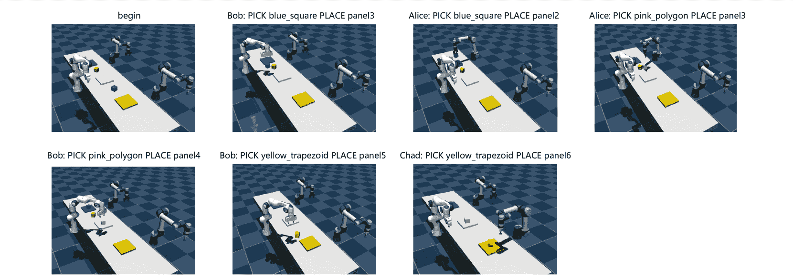

<!--yml

类别：未分类

日期：2025-01-11 12:38:09

-->

# 面向具身多智能体协作的高效大型语言模型（LLM）基础任务

> 来源：[https://arxiv.org/html/2405.14314/](https://arxiv.org/html/2405.14314/)

张扬^(1,2)，杨世鑫^(3∗)，白晨佳²，吴飞^(2,4)，李秀¹，

王震^(2,3)，李学龙^(2,5)

¹清华大学，²上海人工智能实验室，³西北工业大学

⁴浙江大学，⁵中国电信人工智能研究院（TeleAI）

baichenjia@pjlab.org.cn, xuelong_li@ieee.org 贡献相等

###### 摘要

对于具身任务，大型语言模型（LLM）推理能力的基础任务挑战在于物理世界的复杂性。特别是，LLM在多智能体协作中的规划需要智能体之间的通信或通过反馈进行奖励分配，以重新调整提出的计划并实现有效协调。然而，现有方法过度依赖物理验证或自我反思，导致对LLM的查询过多且低效。本文提出了一种新的多智能体协作框架，引入了强化优势反馈（ReAd）以高效自我优化计划。具体来说，我们通过批评回归从LLM规划的数据中学习顺序优势函数，然后将LLM规划器视为优化器，生成最大化优势函数的动作。这赋予LLM前瞻性，能够判断某个动作是否有助于完成最终任务。我们通过将强化学习中的优势加权回归扩展到多智能体系统来提供理论分析。在Overcooked-AI和RoCoBench的一个难度较大的变体上的实验表明，ReAd在成功率上超越了基准方法，并显著减少了智能体的交互步骤和LLM查询轮次，展示了其在LLM基础任务中高效性。更多结果见[https://read-llm.github.io/](https://read-llm.github.io/)。

## 1 引言

大型语言模型（LLMs）在多个领域展示了卓越的能力，包括长文本理解、推理和文本生成 [devlin2019bert](https://arxiv.org/html/2405.14314v2#bib.bib13) ; [radford2019language](https://arxiv.org/html/2405.14314v2#bib.bib47) ; [brown2020language](https://arxiv.org/html/2405.14314v2#bib.bib6) ; [raffel2023exploring](https://arxiv.org/html/2405.14314v2#bib.bib48) 。得益于从网络中挖掘的大规模文本语料库，LLMs能够吸收并捕捉大量关于世界的知识，从而支持决策。近期研究表明，LLMs可以通过零-shot或少-shot示例提示交互式地做出决策，以解决具身任务 [Firoozi2023FoundationMI](https://arxiv.org/html/2405.14314v2#bib.bib18) ，并通过思维链（CoT）[wei2023chainofthought](https://arxiv.org/html/2405.14314v2#bib.bib61) 或思维树 [yao2023tree](https://arxiv.org/html/2405.14314v2#bib.bib67) 进行规划。然而，LLMs仅使用其内部知识进行规划，而这些知识由于缺乏复杂具身体任务的特定知识，往往不能与物理世界对接。这一问题可能导致推理中的事实幻觉和无意义的指令解释问题 [ahn2022i](https://arxiv.org/html/2405.14314v2#bib.bib2) 。为了防止LLMs在具身任务中输出不可行的计划，现有的方法大多设计了一个带有反馈的闭环框架来进行交互过程。具体而言，一类研究通过让LLMs进行自我评估来采用*自我反思*，以改进LLM规划器的计划生成 [shinn2023reflexion](https://arxiv.org/html/2405.14314v2#bib.bib51) ; [yao2023react](https://arxiv.org/html/2405.14314v2#bib.bib68) ; [hao2023reasoning](https://arxiv.org/html/2405.14314v2#bib.bib21) ; [liu2023RAFA](https://arxiv.org/html/2405.14314v2#bib.bib40) ; 另一些工作则通过使用外部环境的反馈进行*物理验证*，以根据意外反馈动态地重新规划 [huang2022Monologue](https://arxiv.org/html/2405.14314v2#bib.bib26) ; [song2023llmplanner](https://arxiv.org/html/2405.14314v2#bib.bib53) 。然而，这些反馈通常是稀疏的或启发式设计的，基于LLM的具身任务规划仍然缺乏一个更为有原则的反馈机制。

图1：RoCo的协商过程及我们方法的示意图。RoCo在每个计划中与环境进行交互，并将环境的反馈作为提示。相比之下，我们的方法将由评审员评估的优势函数（Adv.）作为反馈，如果优势值低于阈值，则修正计划，从而显著减少与环境的交互轮次。

在多智能体环境中考虑更具挑战性的规划问题时，基于LLM的智能体需要通过沟通和谈判与其他智能体合作，这导致了有效反馈的更多困难。具体而言，单独的自我反思和物理验证都难以评估个体行动在多智能体团队结果中的效果。因此，反馈机制面临着LLM查询过多或与物理环境频繁交互的问题。例如，RoCo [mandi2023roco](https://arxiv.org/html/2405.14314v2#bib.bib42) 引入物理验证作为反馈，以改进LLM生成的行动，在多智能体协作环境中，但面临效率低下的问题。如我们在图 [1](https://arxiv.org/html/2405.14314v2#S1.F1 "Figure 1 ‣ 1 Introduction ‣ Towards Efficient LLM Grounding for Embodied Multi-Agent Collaboration") 中所示，RoCo需要过多的交互才能获得物理反馈，并且需要查询LLM以获取可行的联合行动计划，这对于具身任务来说可能是非常低效的。相比之下，多智能体强化学习（MARL）中的各种方法 [MAsurvey](https://arxiv.org/html/2405.14314v2#bib.bib74) 已经开发了价值或优势分解理论，用于多个智能体的信用分配 [QMIX](https://arxiv.org/html/2405.14314v2#bib.bib49)；[kuba2022happo](https://arxiv.org/html/2405.14314v2#bib.bib29)，这些方法提供了有效的机制来评估个体行动在完成最终任务中的贡献，并能生成单调策略改进的行动 [Mirror](https://arxiv.org/html/2405.14314v2#bib.bib30)。受到这些原则的启发，我们提出了“*如何在MARL理论支持下增强LLM在具身多智能体协作中的推理能力*？”我们的目标是利用多智能体优势函数构建一种高效的反馈与改进算法，用于LLM辅助的多智能体规划。

本文提出了强化优势（*ReAd*）作为多智能体协作中大语言模型（LLMs）的闭环反馈。我们提供了两种可选的LLM生成计划优化方案，包括基于局部优势的顺序个体计划优化（命名为*ReAd-S*）和基于联合优势的联合计划优化（命名为*ReAd-J*）。其中，(i) *ReAd-J* 评估联合行动的优势函数，这要求LLMs一次性生成所有智能体的联合规划。相比之下，(ii) *ReAd-S* 通过遵循多智能体优势分解原理 [kuba2022happo](https://arxiv.org/html/2405.14314v2#bib.bib29) 在MARL中，评估每个智能体行动的局部优势，从而允许LLMs顺序地为每个智能体生成行动。两种优势函数均由一个评判网络估算，该网络对LLM规划的数据进行回归。基于优势函数，LLM规划器作为优化器，通过提示生成最大化优势值的行动。否则，如果优势值较小，则要求LLM规划器重新规划。我们通过将优势加权回归 [peng2019advantageweighted](https://arxiv.org/html/2405.14314v2#bib.bib46) 扩展到多智能体环境，为这一过程提供了理论动机。在实验中，我们将RoCoBench [mandi2023roco](https://arxiv.org/html/2405.14314v2#bib.bib42) 扩展为一个更难的变种，我们称之为*DV-RoCoBench*。在*DV-RoCoBench*和*Overcooked-AI*上的实验结果表明，*ReAd*显著减少了交互和查询回合，并且在成功率上超越了基准，突显了其在具身多智能体协作任务中对LLMs的有效性。

## 2 前言

我们考虑一个马尔可夫博弈，它由一个元组$\langle\mathcal{N},\mathcal{S},\boldsymbol{\mathcal{A}},P,r,\gamma\rangle$定义，其中$\mathcal{N}$表示代理集合，$\mathcal{S}$表示状态空间，$\boldsymbol{\mathcal{A}}=\prod_{i=1}^{n}\mathcal{A}^{i}$表示所有代理的有限动作空间的乘积（即，联合动作空间），$P:\mathcal{S}\times\boldsymbol{\mathcal{A}}\times\mathcal{S}\rightarrow[0,1]$表示转移概率函数，$r:\mathcal{S}\times\boldsymbol{\mathcal{A}}\rightarrow\mathbb{R}$表示奖励函数，$\gamma\in[0,1)$表示折扣因子。在这个马尔可夫博弈中，每个代理在时间步$t\in\mathbb{N}$观察环境状态$s_{t}\in\mathcal{S}$并从其对应的策略$\pi^{i}(\cdot|s_{t})$中采取一个动作$a_{t}^{i}\in\mathcal{A}^{i}$，该动作与其他代理的动作共同组成一个联合动作$\boldsymbol{a}_{t}=(a_{t}^{1},a_{t}^{2},...,a_{t}^{n})\in\boldsymbol{\mathcal{A}}$，从联合策略$\boldsymbol{\pi}(\cdot|s_{t})=\prod_{i=1}^{n}\pi^{i}(\cdot|s_{t})$中抽取。然后，代理们会收到一个共享奖励$r_{t}=r(s_{t},\boldsymbol{a}_{t})$，并以概率$P(s_{t+1}|s_{t},\boldsymbol{a}_{t})$观察到新的状态$s_{t+1}$。通过联合策略$\boldsymbol{\pi}$和转移概率函数$P$，状态价值函数定义为$V_{\boldsymbol{\pi}}(s)\triangleq\mathbb{E}_{s_{1:\infty}\sim P,\boldsymbol{a}_{0:\infty}\sim\boldsymbol{\pi}}[\sum_{i=0}^{\infty}\gamma^{i}r_{i}|s_{0}=s]$。而状态-动作价值函数定义为$Q_{\boldsymbol{\pi}}(s,\boldsymbol{a})\triangleq\mathbb{E}_{s_{1:\infty}\sim P,\boldsymbol{a}_{1:\infty}\sim\boldsymbol{\pi}}[\sum_{i=0}^{\infty}\gamma^{i}r_{i}|s_{0}=s,\boldsymbol{a}_{0}=\boldsymbol{a}]$。我们的目标是找到一个联合策略，以最大化期望回报$J(\boldsymbol{\pi})\triangleq\mathbb{E}_{s_{0:\infty}\sim P,\boldsymbol{a}_{0:\infty}\sim\boldsymbol{\pi}}\left[\sum_{t=0}^{\infty}\gamma^{t}r_{t}\right]$。在接下来的内容中，我们将LLM规划器视为一种特殊的强化学习策略，可以通过价值函数进行评估。

## 3 方法论

我们首先给出 §[3.1](https://arxiv.org/html/2405.14314v2#S3.SS1 "3.1 Learning of Advantage Functions ‣ 3 Methodology ‣ Towards Efficient LLM Grounding for Embodied Multi-Agent Collaboration") 中两种优势函数的定义和学习算法。然后，我们通过扩展多智能体设置中的优势加权回归，提供了为 LLM 提供理论动机，详见 §[3.2](https://arxiv.org/html/2405.14314v2#S3.SS2 "3.2 Theoretical Motivation for Grounding LLM ‣ 3 Methodology ‣ Towards Efficient LLM Grounding for Embodied Multi-Agent Collaboration")。最后，我们描述了如何从理论动机中推导出强化优势（*ReAd*）反馈，并使用 LLM 规划器作为优化器，在 §[3.3](https://arxiv.org/html/2405.14314v2#S3.SS3 "3.3 Prompting by Reinforced Advantage Feedback ‣ 3 Methodology ‣ Towards Efficient LLM Grounding for Embodied Multi-Agent Collaboration") 中优化并完善计划。

### 3.1 优势函数的学习

我们首先介绍 *联合* 优势函数的估计。然后，通过遵循 MARL 中的理论，通过优势分解得到 *局部* 优势。

联合优势函数。基于联合价值函数 $Q_{\boldsymbol{\pi}}(s,\boldsymbol{a})$ 和 $V_{\boldsymbol{\pi}}(s)$，我们定义 *联合* 优势函数为

|  | $A_{\boldsymbol{\pi}}(s,\boldsymbol{a})\triangleq Q_{\boldsymbol{\pi}}(s,\boldsymbol{a})-V_{\boldsymbol{\pi}}(s),$ |  |
| --- | --- | --- |

该方法评估所有智能体联合动作的优势值 $\boldsymbol{a}_{t}=(a_{t}^{1},a_{t}^{2},...,a_{t}^{n})$。$A_{\boldsymbol{\pi}}(s,\boldsymbol{a})$ 将用于 *ReAd-J* 来评估所有智能体的联合规划作为反馈。在这里，我们假设每个智能体可以选择不采取任何行动，这是在具身任务中合理且常见的。通过这种我们称之为 WAIT 的特殊行动，我们可以仅使用 $Q_{\boldsymbol{\pi}}(s,\boldsymbol{a})$ 来估计联合优势。

当采取 WAIT 行动 $a=w$ 时，智能体将在当前时间步保持休眠状态。联合 WAIT 行动表示为 $\boldsymbol{w}=(w,w,...,w)$。在当前状态 $s$ 下选择 $\boldsymbol{w}$ 意味着所有智能体都不采取行动，那么下一个状态 $s^{\prime}=s$，并且智能体们会得到共享奖励 $r(s,\boldsymbol{w})=0$，因为 $\boldsymbol{w}$ 不会对环境造成任何变化。进一步，我们可以推导出 $Q_{\boldsymbol{\pi}}(s,\boldsymbol{w})$ 与 $V_{\boldsymbol{\pi}}(s)$ 之间的关系，如下所示

|  | $\begin{split}Q_{\boldsymbol{\pi}}(s,\boldsymbol{w})&=\mathbb{E}_{s_{1:\infty}% \sim P,\boldsymbol{a}_{1:\infty}\sim\boldsymbol{\pi}}\left[\sum\nolimits_{i=0}% ^{\infty}\gamma^{i}r_{i}\big{&#124;}s_{0}=s,\boldsymbol{a}_{0}=\boldsymbol{w}\right% ]\\ &=\gamma\mathbb{E}_{s_{2:\infty}\sim P,\boldsymbol{a}_{1:\infty}\sim% \boldsymbol{\pi}}\left[\sum\nolimits_{i=0}^{\infty}\gamma^{i}r_{i+1}\big{&#124;}s_{% 1}=s\right]=\gamma V_{\boldsymbol{\pi}}(s).\end{split}$ |  |
| --- | --- | --- |

因此，*联合*优势函数可以通过仅使用$Q_{\boldsymbol{\pi}}$函数导出，如下所示

|  | $A_{\boldsymbol{\pi}}(s,\boldsymbol{a})=Q_{\boldsymbol{\pi}}(s,\boldsymbol{a})-% \frac{1}{\gamma}Q_{\boldsymbol{\pi}}(s,\boldsymbol{w}).$ |  | (1) |
| --- | --- | --- | --- |

局部优势函数。在合作多代理环境中，我们可以进一步考虑在不同代理子集视角下对性能的贡献。我们采用MARL中的标准定义来衡量局部优势。

###### 定义 1.

[kuba2022happo](https://arxiv.org/html/2405.14314v2#bib.bib29) 设$i_{1:m}$为$\mathcal{N}$的一个有序子集$\{i_{1},...,i_{m}\}$，$-i_{1:m}$为其补集。我们在提到有序子集中的第$k^{th}$个代理时标记$i_{k}$。相应地，多代理局部状态-动作值函数定义为

|  | $Q_{\boldsymbol{\pi}}^{i_{1:m}}(s,\boldsymbol{a}^{i_{1:m}})\triangleq\mathbb{E}% _{a^{-i_{1:m}}\sim\boldsymbol{\pi}^{-i_{1:m}}}\left[Q_{\boldsymbol{\pi}}(s,% \boldsymbol{a}^{i_{1:m}},\boldsymbol{a}^{-i_{1:m}})\right]$ |  | (2) |
| --- | --- | --- | --- |

对于不相交的集合$j_{1:k}$和$i_{1:m}$，多代理局部优势函数为

|  | $\begin{split}A_{\boldsymbol{\pi}}^{i_{1:m}}(s,\boldsymbol{a}^{j_{1:k}},% \boldsymbol{a}^{i_{1:m}})\triangleq\ &Q_{\boldsymbol{\pi}}^{j_{1:k},i_{1:m}}(s% ,\boldsymbol{a}^{j_{1:k}},\boldsymbol{a}^{i_{1:m}})-Q_{\boldsymbol{\pi}}^{j_{1% :k}}(s,\boldsymbol{a}^{j_{1:k}})\end{split}$ |  | (3) |
| --- | --- | --- | --- |

蒙特卡罗估计。公式 ([1](https://arxiv.org/html/2405.14314v2#S3.E1 "在 3.1 优势函数学习 ‣ 3 方法论 ‣ 面向高效的 LLM 基础构建用于具身多智能体协作")) 和 ([3](https://arxiv.org/html/2405.14314v2#S3.E3 "在定义 1\. ‣ 3.1 优势函数学习 ‣ 3 方法论 ‣ 面向高效的 LLM 基础构建用于具身多智能体协作")) 可以通过任意动作子集 $\boldsymbol{a}^{i_{1:u}}$ 估计局部价值函数 $Q_{\boldsymbol{\pi}}^{i_{1:u}}(s,\boldsymbol{a}^{i_{1:u}})$。更准确地说，局部优势可以通过将 $\boldsymbol{a}^{i_{1:u}}$ 改为不相交的动作集合或子集来估计，而联合优势则可以通过将 $\boldsymbol{a}^{i_{1:u}}$ 改为包含联合动作或联合等待动作的 $\boldsymbol{a}^{1:n}$ 来获得。接下来，我们将 LLM 规划器的基础策略表示为 $\boldsymbol{\mu}=\boldsymbol{\pi}_{\rm llm}(\boldsymbol{a}|s)$。为了估计 $Q_{\boldsymbol{\mu}}^{i_{1:u}}$，我们通过遵循行为策略 $\boldsymbol{\mu}$ 收集数据集 $\mathcal{D}$，并通过增强的轨迹进一步扩充数据集，以克服动作估计的分布外（OOD）问题 [levine2020offline](https://arxiv.org/html/2405.14314v2#bib.bib32)。然后，我们通过蒙特卡罗估计法，跟踪 $\mathcal{R}_{s,\boldsymbol{a}^{i_{1:u}}}=\sum_{\boldsymbol{a}^{-i_{1:u}}\in% \mathcal{D}}\sum_{t=0}^{T}\gamma^{t}r_{t}$ 来估计 $Q_{\boldsymbol{\mu}}^{i_{1:u}}(s,\boldsymbol{a}^{i_{1:u}})$，其中补集是从数据集中采样的。接着，值函数通过回归损失进行学习，如下所示：

|  | $\mathbb{E}_{s,\boldsymbol{a}^{i_{1:u}}\sim\mathcal{D}}\Big{[}\left\&#124;\mathcal{R% }_{s,\boldsymbol{a}^{i_{1:u}}}-Q_{\boldsymbol{\mu}}^{i_{1:u}}\right\&#124;^{2}\Big{% ]}.$ |  |
| --- | --- | --- |

详细内容请参见算法 [1](https://arxiv.org/html/2405.14314v2#alg1 "算法 1 ‣ 附录 C 算法描述 ‣ 面向高效的 LLM 基础构建用于具身多智能体协作") 和 §[C](https://arxiv.org/html/2405.14314v2#A3 "附录 C 算法描述 ‣ 面向高效的 LLM 基础构建用于具身多智能体协作")。奖励 $r_{t}$ 的设置取决于具体任务，例如，在图 [1](https://arxiv.org/html/2405.14314v2#S1.F1 "图 1 ‣ 1 引言 ‣ 面向高效的 LLM 基础构建用于具身多智能体协作") 中，若扫过的方块正确，则 $r_{t}=1$，否则 $r_{t}=0$。数据收集的详细信息请参见 §[E.4](https://arxiv.org/html/2405.14314v2#A5.SS4 "E.4 数据集和评论网络 ‣ 附录 E 额外实验结果 ‣ 面向高效的 LLM 基础构建用于具身多智能体协作")。

优势分解。基于公式([2](https://arxiv.org/html/2405.14314v2#S3.E2 "In Definition 1\. ‣ 3.1 Learning of Advantage Functions ‣ 3 Methodology ‣ Towards Efficient LLM Grounding for Embodied Multi-Agent Collaboration"))，我们可以将状态价值函数$V_{\boldsymbol{\pi}}(s)$表达为一种新的形式。给定所有智能体的集合$\mathcal{N}=\{1,..,n\}$，

|  | $V_{\boldsymbol{\pi}}(s)=\mathbb{E}_{a^{1:n}\sim\boldsymbol{\pi}^{1:n}}\left[Q_{\boldsymbol{\pi}}(s,\boldsymbol{a}^{1:n})\right].$ |  |
| --- | --- | --- |

基于定义[1](https://arxiv.org/html/2405.14314v2#Thmdefinition1 "Definition 1\. ‣ 3.1 Learning of Advantage Functions ‣ 3 Methodology ‣ Towards Efficient LLM Grounding for Embodied Multi-Agent Collaboration")，我们可以引入一个关键引理，该引理揭示了联合优势函数可以分解为每个智能体的局部优势之和。

###### 引理 1。

（多智能体优势分解）。在任何合作型马尔可夫博弈中，给定一个联合策略$\boldsymbol{\pi}$和所有智能体的集合$\mathcal{N}=\{1,..,n\}$，对于任何状态$s$，以及所有智能体的有序集合$i_{1:n}$，我们有

|  | $A_{\boldsymbol{\pi}}(s,\boldsymbol{a})=\sum_{k=1}^{n}A_{\boldsymbol{\pi}}^{i_{% k}}(s,\boldsymbol{a}^{i_{1:k-1}},a^{i_{k}}),$ |  | (4) |
| --- | --- | --- | --- |

其中$\boldsymbol{a}=(a^{1},a^{2},...,a^{n})$。

证明参考了[kuba2022happo](https://arxiv.org/html/2405.14314v2#bib.bib29)，并在§[A.1](https://arxiv.org/html/2405.14314v2#A1.SS1 "A.1 Proof of Multi-Agent Advantage Decomposition ‣ Appendix A Theoretical Proof ‣ Towards Efficient LLM Grounding for Embodied Multi-Agent Collaboration")中给出。引理[1](https://arxiv.org/html/2405.14314v2#Thmlemma1 "Lemma 1\. ‣ 3.1 Learning of Advantage Functions ‣ 3 Methodology ‣ Towards Efficient LLM Grounding for Embodied Multi-Agent Collaboration")将在§[3.2](https://arxiv.org/html/2405.14314v2#S3.SS2 "3.2 Theoretical Motivation for Grounding LLM ‣ 3 Methodology ‣ Towards Efficient LLM Grounding for Embodied Multi-Agent Collaboration")中用于推导。

### 3.2 LLM基础的理论动机

在本节中，我们给出了一个理论动机，该动机与单智能体强化学习中的优势加权回归[peng2019advantageweighted](https://arxiv.org/html/2405.14314v2#bib.bib46)非常相似，同时我们通过引入优势分解扩展到多智能体情况，具体见引理[1](https://arxiv.org/html/2405.14314v2#Thmlemma1 "引理 1\. ‣ 3.1 优势函数学习 ‣ 3 方法论 ‣ 面向高效大型语言模型在多智能体协作中的应用")。为了实现高效的LLM基础模型，即获得一个比LLM规划器更优的策略，其中一个选择是将LLM作为基本策略，并搜索一个比其更强的策略。因此，我们将目标导出为对受约束策略搜索问题的近似优化。具体来说，我们将LLM规划器的策略表示为$\boldsymbol{\mu}=\boldsymbol{\pi}_{\rm llm}(\boldsymbol{a}|s)$，我们的目标是找到一个策略$\boldsymbol{\pi}$，使得其在基本策略$\boldsymbol{\mu}$上的期望改进$\eta(\boldsymbol{\pi})=J(\boldsymbol{\pi})-J(\boldsymbol{\mu})$最大化。根据表现差异引理[Langford02icml](https://arxiv.org/html/2405.14314v2#bib.bib27)；[pmlr-v37-schulman15ppo](https://arxiv.org/html/2405.14314v2#bib.bib50)，我们证明了期望改进$\eta(\boldsymbol{\pi})$可以通过对$\boldsymbol{\mu}(\boldsymbol{a}|s)$的优势来表示，具体如下：

|  | $\begin{split}\eta(\boldsymbol{\pi})=\mathbb{E}_{s\sim\rho_{\boldsymbol{\pi}}(s% ),\boldsymbol{a}\sim\boldsymbol{\pi}(\boldsymbol{a}&#124;s)}\left[A_{\boldsymbol{% \mu}}(s,\boldsymbol{a})\right],\end{split}$ |  | (5) |
| --- | --- | --- | --- |

其中，$\rho_{\boldsymbol{\pi}}(s)=\sum_{i=0}^{\infty}\gamma^{i}P(s_{i}=s)$ 是策略$\boldsymbol{\pi}$下的（未经归一化的）折扣访问频率。由于式（[5](https://arxiv.org/html/2405.14314v2#S3.E5 "在 3.2 章节中关于基础大型语言模型的理论动机 ‣ 3 方法论 ‣ 面向高效大型语言模型在多智能体协作中的应用")）中的目标因依赖于$\rho_{\boldsymbol{\pi}}(s)$和$\boldsymbol{\pi}$而难以优化，因此我们引入了一个目标$\hat{\eta}(\boldsymbol{\pi})$来近似$\eta(\boldsymbol{\pi})$，其定义如下，[pmlr-v37-schulman15ppo](https://arxiv.org/html/2405.14314v2#bib.bib50)提供了指导：

|  | $\hat{\eta}(\boldsymbol{\pi})=\mathbb{E}_{s\sim\rho_{\boldsymbol{\mu}}(s),% \boldsymbol{a}\sim\boldsymbol{\pi}(\boldsymbol{a}&#124;s)}\left[A_{\boldsymbol{\mu}% }(s,\boldsymbol{a})\right].$ |  | (6) |
| --- | --- | --- | --- |

通过将原始目标替换为代理目标，我们可以将以下受约束的策略搜索问题进行公式化：

|  | $\begin{split}\mathop{\arg\max}\limits_{\boldsymbol{\pi}}\int_{s}\rho_{% \boldsymbol{\mu}}(s)\int_{\boldsymbol{a}}\boldsymbol{\pi}(\boldsymbol{a}&#124;s)A_{% \boldsymbol{\mu}}(s,\boldsymbol{a})\,d\boldsymbol{a}\,ds,\quad{\rm s.t.}\int_{% s}\rho_{\boldsymbol{\mu}}(s){\rm D}_{KL}\left(\boldsymbol{\pi}(\cdot&#124;s)\&#124;% \boldsymbol{\mu}(\cdot&#124;s)\right)\,ds\leq\epsilon.\end{split}$ |  |
| --- | --- | --- |

该约束断言，当新策略$\boldsymbol{\pi}$接近基本策略$\boldsymbol{\mu}$时，代理目标$\hat{\eta}(\boldsymbol{\pi})$成为$\eta(\boldsymbol{\pi})$的精确近似¹¹1 详细推导请参考[pmlr-v37-schulman15ppo](https://arxiv.org/html/2405.14314v2#bib.bib50).. 为了得到这个约束优化问题的解，我们构造了上述原始问题的拉格朗日函数，

|  | $\begin{split}\mathcal{L}(\boldsymbol{\pi},\beta)=\,\int_{s}\rho_{\boldsymbol{% \mu}}(s)\int_{\boldsymbol{a}}\boldsymbol{\pi}(\boldsymbol{a}&#124;s)A_{\boldsymbol{% \mu}}(s,\boldsymbol{a})\,d\boldsymbol{a}\,ds+\beta\left(\epsilon-\int_{s}\rho_% {\boldsymbol{\mu}}(s){\rm D}_{\rm KL}\left(\boldsymbol{\pi}(\cdot&#124;s)\&#124;% \boldsymbol{\mu}(\cdot&#124;s)\right)\,ds\right)\end{split}$ |  | (7) |
| --- | --- | --- | --- |

其中$\beta>0$是拉格朗日乘子。

最优联合策略。根据KKT条件[kkt](https://arxiv.org/html/2405.14314v2#bib.bib31)，该约束优化问题在公式([7](https://arxiv.org/html/2405.14314v2#S3.E7 "在3.2节理论动机中为LLM接地提供支持 ‣ 3 方法论 ‣ 面向高效的LLM接地学习的多智能体协作"))中的最优策略$\boldsymbol{\pi}^{*}$表示为

|  | $\boldsymbol{\pi}^{*}(\boldsymbol{a}&#124;s)=\frac{1}{Z(s)}\boldsymbol{\mu}(% \boldsymbol{a}&#124;s)\exp\left(\frac{1}{\beta}A_{\boldsymbol{\mu}}(s,\boldsymbol{a% })\right),$ |  | (8) |
| --- | --- | --- | --- |

其中$Z(s)$是配分函数。

最优个体策略。根据引理[1](https://arxiv.org/html/2405.14314v2#Thmlemma1 "引理 1\. ‣ 3.1 优势函数学习 ‣ 3 方法论 ‣ 面向高效的LLM接地学习的多智能体协作")中的优势分解，我们可以通过假设代理以$1,2,...,n$的顺序依次选择动作，从而将最优联合策略$\boldsymbol{\pi}^{*}(\boldsymbol{a}|s)$分解为最优个体策略，

|  | $\pi^{*}(a^{i}&#124;s,\boldsymbol{a}^{1:i-1})\!=\!\frac{\mu^{i}(a^{i}&#124;s,\boldsymbol{a}^{1:i-1})}{Z^{i}(s)}\exp\left(\frac{1}{\beta}A_{\boldsymbol{\mu}}^{i}(s,% \boldsymbol{a}^{1:i-1},a^{i})\right)$ |  | (9) |
| --- | --- | --- | --- |

其中 $Z^{i}(s)$ 是配分函数。我们参考 §[A.2](https://arxiv.org/html/2405.14314v2#A1.SS2 "A.2 Derivation of Optimal Joint Policy and Optimal Individual Policy ‣ Appendix A Theoretical Proof ‣ Towards Efficient LLM Grounding for Embodied Multi-Agent Collaboration") 以获取方程的详细推导 ([8](https://arxiv.org/html/2405.14314v2#S3.E8 "In 3.2 Theoretical Motivation for Grounding LLM ‣ 3 Methodology ‣ Towards Efficient LLM Grounding for Embodied Multi-Agent Collaboration")) 和 ([9](https://arxiv.org/html/2405.14314v2#S3.E9 "In 3.2 Theoretical Motivation for Grounding LLM ‣ 3 Methodology ‣ Towards Efficient LLM Grounding for Embodied Multi-Agent Collaboration"))。

通过最大化期望策略改进 $\eta(\boldsymbol{\pi})=J(\boldsymbol{\pi})-J(\boldsymbol{\mu})$，我们获得了比基础策略 $\boldsymbol{\mu}=\boldsymbol{\pi}_{\rm llm}$ 更强的联合策略和个体策略（即 $\boldsymbol{\pi}^{*}(\boldsymbol{a}|s)$ 和 $\pi^{*}(a^{i}|s,\boldsymbol{a}^{1:i-1})$）。策略改进背后的关键思想是使用基于优势的指数权重重新加权 LLM 策略。优势函数通过局部价值函数 $Q_{\boldsymbol{\mu}}^{i_{1:u}}(s,\boldsymbol{a}^{i_{1:u}})$ 来估计，其中我们通过蒙特卡洛估计从收集的数据集 $\mathcal{D}$ 中计算，如我们在 §[3.1](https://arxiv.org/html/2405.14314v2#S3.SS1 "3.1 Learning of Advantage Functions ‣ 3 Methodology ‣ Towards Efficient LLM Grounding for Embodied Multi-Agent Collaboration") 中讨论的。

### 3.3 通过强化优势反馈进行提示

基于基本策略$\boldsymbol{\mu}=\boldsymbol{\pi}_{\rm llm}$，方程([9](https://arxiv.org/html/2405.14314v2#S3.E9 "In 3.2 Theoretical Motivation for Grounding LLM ‣ 3 Methodology ‣ Towards Efficient LLM Grounding for Embodied Multi-Agent Collaboration"))中的优势加权解提供了一个重要的直觉： (i) 通过增加那些具有正优势的动作$ a^{i}_{\rm pos}$的概率，即$A_{\boldsymbol{\mu}}^{i}(s,\boldsymbol{a}^{1:i-1},a^{i}_{\rm pos})>0$，(ii) 通过减少那些具有负优势的动作$ a^{i}_{\rm neg}$的概率，即$A_{\boldsymbol{\mu}}^{i}(s,\boldsymbol{a}^{1:i-1},a^{i}_{\rm neg})<0$，我们可以确保在$J(\boldsymbol{\mu})$上的预期性能提升。因此，方程([9](https://arxiv.org/html/2405.14314v2#S3.E9 "In 3.2 Theoretical Motivation for Grounding LLM ‣ 3 Methodology ‣ Towards Efficient LLM Grounding for Embodied Multi-Agent Collaboration"))可以等效地视为对*指数加权*数据集$\bar{\mathcal{D}}$进行行为克隆（BC），其中更好的动作通过更高的权重$e^{A_{\boldsymbol{\mu}}^{i}(s,\boldsymbol{a}^{1:i-1},a^{i})/\beta}$来表示。当$\beta$足够小时，它变成了对通过*二进制过滤*处理的数据集进行BC，$\mathds{1}[A_{\boldsymbol{\mu}}^{i}(s,\boldsymbol{a}^{1:i-1},a^{i})>0]$，其中$\mathds{1}$是指示函数。这为在没有访问采样动作$a^{i}\sim\mu^{i}(\cdot|s,\boldsymbol{a}^{1:i-1})$的确切概率的情况下提供了改进$\boldsymbol{\mu}$的理想替代方案，便于对封闭源LLM进行基础处理。我们在§[A.3](https://arxiv.org/html/2405.14314v2#A1.SS3 "A.3 Proof of Monotonic Improvement with Binary Filtering ‣ Appendix A Theoretical Proof ‣ Towards Efficient LLM Grounding for Embodied Multi-Agent Collaboration")中提供了使用*二进制过滤*进行单调改进的理论证明。

受到*二进制过滤*的启发，我们开发了一种新的反馈机制，主要思想是将过滤器$\mathds{1}[A_{\boldsymbol{\mu}}^{i}(s,\boldsymbol{a}^{1:i-1},a^{i})>\epsilon% \geq 0]$转换为LLM提出的计划及其相应分数$A_{\boldsymbol{\mu}}^{i}(s,\boldsymbol{a}^{1:i-1},a^{i})$的反馈，用于精细化这些计划。基于不同类型的优势，我们设计了两种计划精细化算法：*ReAd-S*和*ReAd-J*。提示和精细化的过程如图[2](https://arxiv.org/html/2405.14314v2#S3.F2 "图 2 ‣ 3.3 通过强化优势反馈进行提示 ‣ 3 方法论 ‣ 面向高效的LLM基础应用于多智能体协作")所示。*ReAd-S*和*ReAd-J*的算法细节见§[C](https://arxiv.org/html/2405.14314v2#A3 "附录 C 算法描述 ‣ 面向高效的LLM基础应用于多智能体协作")。

图 2：提示与精细化的概览。对于每一个时间步$t$，LLM 规划器接收到历史记录，其中包含状态、动作和优势，并被提示生成具有最高优势的计划。预训练的评估器用于评估生成的动作的分数$\mathbb{S}_{\rm ReAd}(a_{t}^{i})$。如果$\mathbb{S}_{\rm ReAd}(a_{t}^{i})<\epsilon$，则将失败的计划作为提示，LLM 规划器被要求精细化策略，直到$\mathbb{S}_{\rm ReAd}(a_{t}^{i})>\epsilon$。该（精细化的）动作用于与环境进行交互，LLM 规划器在下一步中进行处理。

*ReAd-S*的提示与优化。对于每个时间步，我们初始化一个空的动作集合$\boldsymbol{a}_{t}=\{\}$，并按照规划中智能体的顺序$[1,\ldots,n]$进行操作。对于智能体$i$在状态$s_{t}$下的规划动作$a^{i}_{t}$，*ReAd-S*的过程包含两部分。(i) 提示即优化。LLM规划器被提供之前状态-动作对的优势历史记录，即$\mathcal{H}=\{(s,(\boldsymbol{a}^{1:i-1},a^{i}),A_{\boldsymbol{\mu}}^{i}(s,% \boldsymbol{a}^{1:i-1},a^{i}))\}$，并被提示为智能体$i*选择具有最高优势的动作*，这一过程恢复了优势加权回归的原理。借助上下文学习的能力，我们希望LLM规划器能够隐式地推断出可用动作的优势值，并选择具有最高优势的动作$a^{i}_{t}$。这一过程灵感来自最近的研究工作，诸如LLM作为优化器的应用 [yang2023OPRO](https://arxiv.org/html/2405.14314v2#bib.bib66)，其中智能体被提示给出一个优化得分函数的计划。(ii) 反馈以优化。尽管如此，隐式地最大化优势可能会变得困难，因为可用动作的数量可能很大。因此，我们引入了一个优化过程，允许LLM在生成不满意的动作时对策略进行调整。我们使用经过预训练的评论网络$Q_{\theta}^{i_{1:u}}(s,\boldsymbol{a}^{i_{1:u}})$，其参数为$\theta$，来估计生成动作的优势得分，

|  | $\mathbb{S}_{\rm ReAd-S}(a^{i}_{t})=A_{\theta}^{i}(s_{t},\boldsymbol{a}_{t}^{1:% i-1},a_{t}^{i})=Q_{\theta}^{1:i}(s_{t},\boldsymbol{a}^{1:i-1}_{t},a_{t}^{i})-Q% _{\theta}^{1:i-1}(s_{t},\boldsymbol{a}^{1:i-1}_{t}).$ |  |
| --- | --- | --- |

给定一个阈值$\epsilon\geq 0$，如果得分函数小于该阈值（即$\mathbb{S}_{\rm ReAd-S}(a^{i}_{t})<\epsilon$），我们将这个失败的动作添加到历史记录$\mathcal{H}$中，并提示智能体重新规划。这样的优化保证了具身智能体总是执行得分$A_{\theta}^{i}(s_{t},\boldsymbol{a}_{t}^{1:i-1},a_{t}^{i})>\epsilon$的动作，进一步确保了相对于$\boldsymbol{\pi}_{\rm llm}$的单调改进。这显著减少了智能体之间的交互轮次，因为动作$a^{i}_{t}$在执行前已通过优势反馈进行了评估和优化。相比之下，像RoCo这样的传统方法需要与环境交互以获取物理反馈，无论生成的动作质量如何。经过优化的动作被添加到动作集合$\boldsymbol{a}_{t}\leftarrow\boldsymbol{a}_{t}\cup\{a_{t}^{i}\}$中，接下来我们对智能体$i+1$进行顺序决策。

*ReAd-J*的提示与细化。LLM规划器在*ReAd-J*中的规划过程与*ReAd-S*相似。主要的区别是，*ReAd-J*的LLM规划器需要一次性为所有智能体提供一个联合行动$\boldsymbol{a}_{t}$。与此同时，我们使用联合优势函数进行历史提示，$\mathcal{H}=\{(s,\boldsymbol{a}_{t},A_{\boldsymbol{\mu}}(s_{t},\boldsymbol{a}_% {t}))\}$，而不是考虑局部优势。评分函数是

|  | $\mathbb{S}_{\rm ReAd-J}(\boldsymbol{a}_{t})=A_{\theta}(s_{t},\boldsymbol{a}_{t% })=Q_{\theta}(s_{t},\boldsymbol{a}_{t})-\nicefrac{{1}}{{\gamma}}\>\>Q_{\theta}% (s_{t},\boldsymbol{w})$ |  |
| --- | --- | --- |

基于公式([8](https://arxiv.org/html/2405.14314v2#S3.E8 "在 3.2 理论动机章节中：面向有效的LLM基础知识——方法论——面向具身多智能体协作的LLM基础")). 如果联合计划 $\boldsymbol{a}_{t}$ 小于阈值（即，$\mathbb{S}_{\rm ReAd-J}(\boldsymbol{a}_{t})<\epsilon$），则会进行细化。

## 4 相关工作

任务规划与LLMs。LLMs [chowdhery2023palm](https://arxiv.org/html/2405.14314v2#bib.bib10)；[openAI2023GPT](https://arxiv.org/html/2405.14314v2#bib.bib45)；[touvron2023llama1](https://arxiv.org/html/2405.14314v2#bib.bib55)；[touvron2023llama2](https://arxiv.org/html/2405.14314v2#bib.bib56) 经过大规模语料库训练，展现了通过上下文学习的显著推理能力 [dong2022survey](https://arxiv.org/html/2405.14314v2#bib.bib14)；[abernethy2023mechanism](https://arxiv.org/html/2405.14314v2#bib.bib1)；[akyurek2023what](https://arxiv.org/html/2405.14314v2#bib.bib3)。然而，由于缺乏现实世界的知识，LLMs也可能为具身智能体给出不可行的计划。一些研究通过自我评估和反思将开环规划框架修改为闭环框架。例如，ReAct [yao2023react](https://arxiv.org/html/2405.14314v2#bib.bib68)、Reflexion [shinn2023reflexion](https://arxiv.org/html/2405.14314v2#bib.bib51) 和BeamSearch [xie2023beam](https://arxiv.org/html/2405.14314v2#bib.bib65) 在先前计划完成后，将LLM评估者的反馈融入提示中。其他工作则在反馈中整合具身智能体的领域知识。例如，RoCo [mandi2023roco](https://arxiv.org/html/2405.14314v2#bib.bib42) 和Inner Monologue [huang2022Monologue](https://arxiv.org/html/2405.14314v2#bib.bib26) 设计了物理验证，如碰撞检测、物体识别和场景描述以提供反馈。DoReMi [guo2023DoReMi](https://arxiv.org/html/2405.14314v2#bib.bib20) 利用LLM生成物理约束，ViLA [hu2023look](https://arxiv.org/html/2405.14314v2#bib.bib23) 采用视觉语言模型（VLM）作为约束检测器进行验证。另一类研究则开发了先进的推理框架，包括链式思维 [wei2023chainofthought](https://arxiv.org/html/2405.14314v2#bib.bib61)；[mu2023embodiedgpt](https://arxiv.org/html/2405.14314v2#bib.bib43) 和树状思维 [yao2023tree](https://arxiv.org/html/2405.14314v2#bib.bib67)。像 [zhao2023large](https://arxiv.org/html/2405.14314v2#bib.bib75)；[hao2023reasoning](https://arxiv.org/html/2405.14314v2#bib.bib21) 等工作将LLMs视为世界模型 [ano2023learning](https://arxiv.org/html/2405.14314v2#bib.bib37)，并在规划中采用树搜索 [hu2023tree](https://arxiv.org/html/2405.14314v2#bib.bib22)。其他工作则采用规划领域定义语言（PDDL）进行长时间跨度问题的搜索 [silver2023PDDL](https://arxiv.org/html/2405.14314v2#bib.bib52)；[liu2023llm+p](https://arxiv.org/html/2405.14314v2#bib.bib39)；[zhou2023isr](https://arxiv.org/html/2405.14314v2#bib.bib76)。我们的工作属于闭环框架，但在反馈中具有一种新颖的优势函数，这与自我反思或物理反馈不同，并且不依赖于先进的搜索算法。

用强化学习（RL）对大语言模型（LLM）进行赋能。通过参数调整，使用人类反馈强化学习（RLHF）已被应用于将LLM与人类偏好对齐[dai2023safe](https://arxiv.org/html/2405.14314v2#bib.bib12)；[fernandes2023bridging](https://arxiv.org/html/2405.14314v2#bib.bib17)；[song2023preference](https://arxiv.org/html/2405.14314v2#bib.bib54)。与之相比，我们的工作侧重于通过少量提示和闭环反馈，利用强化学习将封闭源的LLM进行赋能[zeng2023socratic](https://arxiv.org/html/2405.14314v2#bib.bib70)；[wu2023embodied](https://arxiv.org/html/2405.14314v2#bib.bib62)；[huang2022zero](https://arxiv.org/html/2405.14314v2#bib.bib24)；[lin2023grounded](https://arxiv.org/html/2405.14314v2#bib.bib36)。此前的研究尝试将强化学习融入LLM规划，基于树搜索框架[browne2012survey](https://arxiv.org/html/2405.14314v2#bib.bib7)。例如，FAFA [liu2023RAFA](https://arxiv.org/html/2405.14314v2#bib.bib40)和TS-LLM [feng2023alphazero](https://arxiv.org/html/2405.14314v2#bib.bib16)通过学习环境模型和价值函数，在蒙特卡洛树搜索（MCTS）中规划子程序。REX [murthy2023rex](https://arxiv.org/html/2405.14314v2#bib.bib44)提出在基于LLM的MCTS中平衡探索与利用。其他研究，如SayCan [ahn2022i](https://arxiv.org/html/2405.14314v2#bib.bib2)和Text2Motion [Kevin2023Motion](https://arxiv.org/html/2405.14314v2#bib.bib38)，通过学习价值函数，以无模型方式将LLM的知识与物理环境连接。SwiftSage [lin2023swiftsage](https://arxiv.org/html/2405.14314v2#bib.bib35)通过模仿学习实现快速思考，并结合LLM进行系统化训练。Remember [zhang2023large](https://arxiv.org/html/2405.14314v2#bib.bib72)学习LLM的价值函数，通过提示中的示例预测$Q$-值，并根据$Q$-值选择动作。与Remember框架从缓冲区中检索相似状态不同，我们通过神经网络评估规划动作的优势函数，并在提示中采用优势加权回归。我们在多智能体设置中应用优势函数，而之前的方法集中于单智能体规划。与以往基于LLM的多智能体研究手动设计通信、反思和推理模块[zhang2023proagent](https://arxiv.org/html/2405.14314v2#bib.bib71)；[zhang2023building](https://arxiv.org/html/2405.14314v2#bib.bib73)；[Shyam2023MA](https://arxiv.org/html/2405.14314v2#bib.bib28)；[chen2023MA](https://arxiv.org/html/2405.14314v2#bib.bib9)，我们提出了一种更加原则化的方法，利用多智能体强化学习中的序列优势函数来促进合作。

## 5 实验

我们首先在§[5.1](https://arxiv.org/html/2405.14314v2#S5.SS1 "5.1 Experimental Setup ‣ 5 Experiments ‣ Towards Efficient LLM Grounding for Embodied Multi-Agent Collaboration")中介绍了两个多代理协作环境。然后，我们设计了一系列实验，将我们的方法与基线进行比较，见§[5.2](https://arxiv.org/html/2405.14314v2#S5.SS2 "5.2 Results ‣ 5 Experiments ‣ Towards Efficient LLM Grounding for Embodied Multi-Agent Collaboration")。最后，我们进行了消融研究并分析了各模块的影响，详见§[5.3](https://arxiv.org/html/2405.14314v2#S5.SS3 "5.3 Ablation Studies ‣ 5 Experiments ‣ Towards Efficient LLM Grounding for Embodied Multi-Agent Collaboration")。

### 5.1 实验设置

DV-RoCoBench。我们提出了*RoCoBench的困难变种（DV-RoCoBench）*，用于具身多机器人协作，源自于RoCoBench [mandi2023roco](https://arxiv.org/html/2405.14314v2#bib.bib42)。RoCoBench包括6个多机器人协作任务，位于桌面操作环境中，通常涉及交互式物体，这些物体在语义上容易被大型语言模型（LLMs）理解和推理。任务涵盖了各种协作场景，要求机器人进行通信和协调行为。机器人接收其观察结果，并从高级动作集中选择一个动作，动作集包括多种功能，如等待、移动、清扫、抓取和丢弃，适用于多个任务。高级动作的执行随后被转化为低级动作进行操作。与RoCoBench主要关注固定难度级别的任务不同，我们选择了三个任务来增加基准的复杂性，创造了新的*DV-RoCoBench*，每个任务都被设计为有4到5个难度级别供实验使用。

在下面的内容中，我们简要描述了任务和设置。详细信息请参见§[D](https://arxiv.org/html/2405.14314v2#A4 "Appendix D Environment Details ‣ Towards Efficient LLM Grounding for Embodied Multi-Agent Collaboration")。

+   -

    清扫地面。两个机器人手臂需要协同工作，将桌面上的所有积木清扫到垃圾桶中。目标是清扫掉指定颜色的积木。我们根据总体积木的数量和目标积木的数量设定了5个难度级别。在更困难的设置中，LLM规划器更容易产生事实性幻觉。

+   -

    制作三明治。两个机器人手臂需要根据食谱叠放食材来制作三明治。每个手臂的操作范围有限，因此需要代理之间的合作。我们根据食谱的长度设定了4个难度级别。

+   -

    分类积木。三个机器人手臂在其操作范围内需要协调并将积木放置到桌面上的目标位置。我们根据积木与目标位置之间的距离设定了5个不同的难度级别。

Overcooked-AI。*Overcooked-AI* [micah2019overcooked_ai](https://arxiv.org/html/2405.14314v2#bib.bib8) 是一个基于广受欢迎的视频游戏《Overcooked》的完全合作多智能体基准环境。在这个环境中，智能体需要尽可能快速地送出汤。每种汤需要将最多3种原料放入锅中，等待汤煮熟，并由一个智能体将汤拿起并送出。该环境包含5种不同的厨房场景，涵盖了从低级运动协调挑战到高级策略协调挑战。在我们的实验中，我们选择了两个代表性场景：狭小房间和强制协调，并将制作汤所需的原料数设定为2，烹饪的时间步数设定为2。为了能够计算成功率，我们将任务修改为在规定的时间步数内烹饪并送出一份汤。环境的详细信息见§[D.4](https://arxiv.org/html/2405.14314v2#A4.SS4 "D.4 Overcooked-AI ‣ Appendix D Environment Details ‣ Towards Efficient LLM Grounding for Embodied Multi-Agent Collaboration")。为了进行定量比较，我们将每个回合的最大环境步数限制为15步（在*DV-RoCoBench*中），在狭小房间中为20步，在强制协调中为25步。每步的最大重新规划轮次设定为15轮，除了排序立方体任务（Sort Cubes）外，所有任务的最大重新规划轮次均设定为10。

基准方法。我们使用GPT-4-Turbo [openAI2023GPT](https://arxiv.org/html/2405.14314v2#bib.bib45)作为所有实验的基本LLM策略。在这两个基准测试中，我们将*ReAd-J*与三种强大的闭环基线进行比较——ReAct [yao2023react](https://arxiv.org/html/2405.14314v2#bib.bib68)、Reflexion [shinn2023reflexion](https://arxiv.org/html/2405.14314v2#bib.bib51) 和MindAgent [gong2023mindagent](https://arxiv.org/html/2405.14314v2#bib.bib19)，以及一个名为Central Plan的规划器，它指示LLM基于所有代理的历史生成所有机器人动作。这五种方法以并行的方式输出代理的计划。在*DV-RoCoBench*中，我们特别增加了一个基线RoCo [mandi2023roco](https://arxiv.org/html/2405.14314v2#bib.bib42)，它在RoCoBench [mandi2023roco](https://arxiv.org/html/2405.14314v2#bib.bib42)中实现了最先进的性能，用于与*ReAd-S*的比较。它们两者都以顺序的方式生成联合计划。由于*Overcooked-AI*中需要更多环境步骤的顺序规划成本较高，我们仅评估以并行方式生成联合计划的方法的性能。我们在表[3](https://arxiv.org/html/2405.14314v2#A5.T3 "表 3 ‣ E.1 基线比较 ‣ 附录 E 额外实验结果 ‣ 朝着高效的LLM基础理论推进")中提供了与基线的详细比较，以及§[E.1](https://arxiv.org/html/2405.14314v2#A5.SS1 "E.1 基线比较 ‣ 附录 E 额外实验结果 ‣ 朝着高效的LLM基础理论推进")。

评估指标。我们通过三个与RoCoBench中类似的指标来评估算法的性能：(i) SR：在有限的交互回合内完成任务的成功率；(ii) ES：机器人完成任务所需的与环境的交互步骤数；(iii) NQ：在完成任务过程中向LLM查询的次数，衡量询问LLM以获得可行计划的效率。如果一个算法具有*更高的SR、更少的ES和更少的NQ*，则该算法表现更好。在这些指标中，SR和ES直接反映了规划器完成任务的有效性，而NQ则可能有些次要，因为一个规划器可能查询LLM的次数较少，但其SR较低。相反，通常需要策略调整的方法会要求更多的查询以实现较高的SR。

图 3：我们报告了在 3 个任务中，分别在不同难度水平下，平均的 SR（$\boldsymbol{\uparrow}$）、ES（$\boldsymbol{\downarrow}$）和 NQ（$\boldsymbol{\downarrow}$），这些数据是基于 10 次随机种子的平均值。详细分数见 §[E.2](https://arxiv.org/html/2405.14314v2#A5.SS2 "E.2 Main Experiments ‣ Appendix E Additional Experimental Results ‣ Towards Efficient LLM Grounding for Embodied Multi-Agent Collaboration") 中的表格 [4](https://arxiv.org/html/2405.14314v2#A5.T4 "Table 4 ‣ E.2 Main Experiments ‣ Appendix E Additional Experimental Results ‣ Towards Efficient LLM Grounding for Embodied Multi-Agent Collaboration")。

图 4：我们报告了在 *Overcooked-AI* 的两种场景中，分别在不同难度水平下，平均的 SR（$\boldsymbol{\uparrow}$）、ES（$\boldsymbol{\downarrow}$）和 NQ（$\boldsymbol{\downarrow}$），这些数据是基于 10 次随机种子的平均值。详细分数见 §[E.2](https://arxiv.org/html/2405.14314v2#A5.SS2 "E.2 Main Experiments ‣ Appendix E Additional Experimental Results ‣ Towards Efficient LLM Grounding for Embodied Multi-Agent Collaboration") 中的表格 [5](https://arxiv.org/html/2405.14314v2#A5.T5 "Table 5 ‣ E.2 Main Experiments ‣ Appendix E Additional Experimental Results ‣ Towards Efficient LLM Grounding for Embodied Multi-Agent Collaboration")。

### 5.2 结果

*ReAd-S* 和 *ReAd-J* 在所有指标上均优于其对应的强基线，并实现了更高效的 LLM 基础。这如图 [3](https://arxiv.org/html/2405.14314v2#S5.F3 "Figure 3 ‣ 5.1 Experimental Setup ‣ 5 Experiments ‣ Towards Efficient LLM Grounding for Embodied Multi-Agent Collaboration") 所示，随着 *DV-RoCoBench* 难度级别的增加，SR 性能对比逐渐变得明显。在更困难的设置下（例如任务中的第 4 级或第 5 级），我们的方法在成功率上优于基线方法，而后者未能取得进展。与此同时，与对应的基线方法相比，*ReAd-S* 和 *ReAd-J* 在大多数任务中表现出更低的 ES 值和相似甚至更低的 NQ 值。较低的 ES 表明，通过提示 LLM 生成能够最大化优势的动作，可以提高所提议计划的最优性，因为更高的优势意味着生成的动作对完成任务的贡献更大。此外，如图 [4](https://arxiv.org/html/2405.14314v2#S5.F4 "Figure 4 ‣ 5.1 Experimental Setup ‣ 5 Experiments ‣ Towards Efficient LLM Grounding for Embodied Multi-Agent Collaboration") 所示，我们的方法在与依赖于 *physical verification* 作为反馈的 *Overcooked-AI* 方法相比，SR 显著更高。由于 *Overcooked-AI* 中固有的复杂协调挑战，基于 LLM 的代理除非 LLM 规划器生成高度协作的计划，否则无法推动任务完成。通过将 *physical verification* 反馈替换为 *advantage function*，我们隐式地将 LLM 的理解和推理从语义理解转向当前环境状态，以消化数值关系。随着多智能体协作场景的复杂度增加，不可避免地会涉及更多冗余信息和扰乱因素，这对 LLM 规划器捕捉和推理状态及物理反馈中的关键部分提出了挑战。相比之下，得益于 *ReAd* 反馈，LLM 规划器只需要专注于如何最大化优势得分，无论场景多么具有挑战性。因此，我们的方法在规划能力和嵌入式任务的 LLM 基础方面展现出更优的表现。

在环境发生突发扰动时，LLM 规划器可以通过 *ReAd* 反馈快速调整计划以完成任务。由于评论者将当前状态和提议的动作作为输入，它赋予 LLM 规划器不仅能够预测动作是否有助于实现目标的远见，还能够在任务推进过程中遇到突发扰动时快速重新调度规划的能力。为了评估

表 1：在10次运行中，*ReAd-S*、RoCo及其修改版本在时间步长$n$上的干扰评估结果。我们将干扰表示为重置环境。$n=0$：不重置。

|  | 方法 | NQ | ES | SR |
| --- | --- | --- | --- | --- |
|  | ReAd-S | 22.1±1.65 | 8.9±0.28 | 1.0±0.00 |
| recipe3 | RoCo-L | 44.7±4.90 | 12.0±0.54 | 0.9±0.10 |
| $(n=0)$ | RoCo-P | 33.7±3.16 | 11.5±0.95 | 0.8±0.13 |
|  | RoCo | 33.7±3.16 | 11.5±0.95 | 0.8±0.13 |
|  | ReAd-S | 39.7±5.30 | 10.4±0.34 | 1.0±0.00 |
| recipe3 | RoCo-L | 55.3±2.63 | 14.1±0.28 | 0.8±0.13 |
| $(n=1)$ | RoCo-P | 33.6±2.03 | 12.5±0.73 | 0.9±0.10 |
|  | RoCo | 46.3±3.60 | 13.9±0.43 | 0.7±0.15 |
|  | ReAd-S | 44.9±4.34 | 12.5±0.34 | 1.0±0.00 |
| recipe3 | RoCo-L | 53.4±2.28 | 14.8±0.20 | 0.3±0.15 |
| $(n=2)$ | RoCo-P | 35.2±0.98 | 14.3±0.26 | 0.8±0.13 |
|  | RoCo | 61.2±11.95 | 14.2±0.44 | 0.5±0.16 |
|  | ReAd-S | 49.1±4.53 | 13.4±0.54 | 1.0±0.0 |
| recipe3 | RoCo-L | 75.9±6.91 | 15.0±0.00 | 0.0±0.00 |
| $(n=3)$ | RoCo-P | 40.0±2.94 | 14.3±0.26 | 0.5±0.17 |
|  | RoCo | 74.8±10.79 | 15.0±0.00 | 0.0±0.00 |

为了验证LLM规划器的鲁棒性，我们在额外扩展的场景中比较了*ReAd-S*和RoCo在突发干扰下的表现。我们选择了*‘recipe3’*（Make Sandwich中的第3难度级别），它需要至少8个环境步骤才能完成任务。当在时间步长$n\ (0\leq n<8,n\in\mathbb{N})$发生干扰时，我们重置任务并重新初始化状态，不在提示中给出任何关于重置的提示，并清除提示中包含的先前历史信息。这带来了一个难以解决的挑战，因为剩余的历史信息与实际情况不匹配。缺乏对突发干扰的完整描述，显著增加了LLM规划器提出错误行动的可能性。为了消除*ReAd-S*和RoCo之间使用不同历史信息带来的影响，我们提供了RoCo的两个变种作为基准。一个只使用上一轮的历史，我们称之为RoCo-L，另一个则提供突发干扰的描述，我们称之为RoCo-P。评估结果如表[1](https://arxiv.org/html/2405.14314v2#S5.T1 "表 1 ‣ 5.2 结果 ‣ 5 实验 ‣ 面向高效LLM基础构建的体现式多智能体协作")所示。较大的步长$n$意味着干扰影响更严重。当$n$从0增加到3时，*ReAd-S*在SR和ES上持续优于RoCo及其变种。尽管RoCo在$n=1,2$时保持较高的SR，但它未能重新校准剩余历史信息与实际环境状态之间的不对齐，导致在$n=3$时SR显著下降。无论RoCo依赖于何种历史信息，其一致的优异表现表明*ReAd*反馈缓解了潜在的严重幻觉问题，并带来了可靠的鲁棒性。

### 5.3 消融研究

表 2：*ReAd-S* 和 *ReAd-J* 在 ‘Y3_G3’ 任务上的多步版和单步版表现。

|  | NQ | ES | SR |
| --- | --- | --- | --- |
| ReAd-J(多步) | 16.4±0.54 | 13.4±0.27 | 0.8±0.13 |
| ReAd-J(单步) | 19.1±1.25 | 14.1±0.28 | 0.6±0.16 |
| ReAd-S(多步) | 31.4±1.11 | 14.0±0.26 | 0.8±0.13 |
| ReAd-S(单步) | 35.1±1.16 | 14.5±0.17 | 0.6±0.16 |

计划优化对大型语言模型（LLM）的基础有显著影响。优势分数在 *ReAd* 中发挥着两种作用：(i) *作为优化的提示*，生成得分最高的行动，(ii) *作为反馈的优化*，在得分低于阈值时重新规划。政策优化使我们的方法成为一个 *多步* 过程，因为行动可以经过多轮优化。为了研究计划优化的作用，我们通过移除第二种作用采用了 *单步* 版本，这形成了一个没有优化的开环计划生成。在表 [5.3](https://arxiv.org/html/2405.14314v2#S5.SS3 "5.3 Ablation Studies ‣ 5 Experiments ‣ Towards Efficient LLM Grounding for Embodied Multi-Agent Collaboration") 中，我们将原始版本称为 *多步*，开环版本称为 *单步*。我们选择了在扫地任务中最具挑战性的变体 *‘Y3_G3’*，并观察到 *单步* 方法在效率和成功率上都有轻微下降。这表明，确保单调政策改进的计划优化对性能至关重要。有趣的是，*ReAd-J(单步)* 也能达到 60% 的显著成功率，这在与带有 *物理验证* 反馈的基线方法进行比较时，表现出色或相当。

## 6 结论

我们提出了 *ReAd* 作为一种用于多智能体协作中的闭环规划的创新性 LLM 反馈方法。我们基于多智能体优势加权回归提供了理论动机。LLM 被提示生成具有高优势的计划，并进行政策优化。实验表明，我们的方法在效率上优于物理反馈。优势反馈能够应对突发干扰，并且对优化至关重要。未来的工作包括将优势反馈扩展到多目标和安全规划场景中。

## 致谢

我们要感谢杨卓然教授的深入讨论和评论。该工作在杨章的上海人工智能实验室实习期间进行，并得到了中国国家自然科学基金（项目编号：62025602）和国家自然科学基金（项目编号：62306242）资助。

## 参考文献

+   [1] Jacob Abernethy, Alekh Agarwal, Teodor V Marinov, 和 Manfred K Warmuth。针对稀疏检索任务的样本高效上下文学习机制。arXiv 预印本 arXiv:2305.17040，2023。

+   [2] Michael Ahn, Anthony Brohan, Yevgen Chebotar, Chelsea Finn, Karol Hausman, Alexander Herzog, Daniel Ho, Julian Ibarz, Alex Irpan, Eric Jang, Ryan Julian, Dmitry Kalashnikov, Sergey Levine 等人。《按我能做的做，而不是按我说的做：将语言与机器人能力联系起来》。2022年机器人学习年会。

+   [3] Ekin Akyürek, Dale Schuurmans, Jacob Andreas, Tengyu Ma, 和Denny Zhou。《什么是上下文学习的学习算法？基于线性模型的研究》。国际学习表征会议，2023。

+   [4] Anthony Brohan, Noah Brown, Justice Carbajal, Yevgen Chebotar, Xi Chen, Krzysztof Choromanski, Tianli Ding, Danny Driess, Avinava Dubey, Chelsea Finn, Pete Florence, Chuyuan Fu, Montse Gonzalez Arenas, Keerthana Gopalakrishnan, Kehang Han, Karol Hausman, Alexander Herzog 等人。《RT-2：视觉-语言-行动模型将网络知识转移至机器人控制》。CoRR，abs/2307.15818，2023。

+   [5] Anthony Brohan, Noah Brown, Justice Carbajal, Yevgen Chebotar, Joseph Dabis, Chelsea Finn, Keerthana Gopalakrishnan, Karol Hausman, Alexander Herzog 等人。《RT-1：用于大规模现实世界控制的机器人变换器》。2023年机器人学：科学与系统。

+   [6] Tom B. Brown, Benjamin Mann, Nick Ryder, Melanie Subbiah, Jared Kaplan, Prafulla Dhariwal, Arvind Neelakantan, Pranav Shyam, Girish Sastry, Amanda Askell, Sandhini Agarwal, Ariel Herbert-Voss, Gretchen Krueger, Tom Henighan, Rewon Child, Aditya Ramesh, Daniel M. Ziegler, Jeffrey Wu, Clemens Winter, Christopher Hesse, Mark Chen, Eric Sigler, Mateusz Litwin, Scott Gray, Benjamin Chess, Jack Clark, Christopher Berner, Sam McCandlish, Alec Radford, Ilya Sutskever, 和Dario Amodei。《语言模型是少量样本学习者》。神经信息处理系统进展，2020。

+   [7] Cameron B Browne, Edward Powley, Daniel Whitehouse, Simon M Lucas, Peter I Cowling, Philipp Rohlfshagen, Stephen Tavener, Diego Perez, Spyridon Samothrakis, 和Simon Colton。《蒙特卡洛树搜索方法综述》。IEEE计算智能与人工智能游戏交易，4(1):1–43，2012。

+   [8] Micah Carroll, Rohin Shah, Mark K. Ho, Thomas L. Griffiths, Sanjit A. Seshia, Pieter Abbeel, 和Anca Dragan。《关于了解人类对人类-人工智能协调的效用》。第33届国际神经信息处理系统会议论文集，2019。

+   [9] Yongchao Chen, Jacob Arkin, Yang Zhang, Nicholas Roy, 和Chuchu Fan。《大规模语言模型下的可扩展多机器人协作：集中式或去中心化系统？》。CoRR，abs/2309.15943，2023。

+   [10] Aakanksha Chowdhery, Sharan Narang, Jacob Devlin, Maarten Bosma, Gaurav Mishra, Adam Roberts, Paul Barham, Hyung Won Chung, Charles Sutton, Sebastian Gehrmann 等人。《Palm：通过路径扩展语言建模》。机器学习研究杂志，24(240):1–113，2023。

+   [11] Open X.-具身协作。Open x-embodiment：机器人学习数据集和RT-X模型。CoRR，abs/2310.08864，2023。

+   [12] 乔瑟夫·戴, 潘学海, 孙瑞阳, 纪佳铭, 许欣波, 米克尔·刘, 王怡舟, 杨尧东。安全的RLHF: 从人类反馈中学习的安全强化学习。arXiv 预印本 arXiv:2310.12773, 2023。

+   [13] 雅各布·德夫林, 明伟·张, 肯顿·李, 和 克里斯蒂娜·陶塔诺瓦。BERT: 用于语言理解的深度双向变压器的预训练。在北美计算语言学协会会议：人类语言技术，NAACL-HLT，页4171-4186，2019。

+   [14] 丁清秀, 李雷, 戴大迈, 郑策, 吴志勇, 常宝宝, 孙旭, 许晶晶, 隋志方。关于上下文学习的调查。arXiv 预印本 arXiv:2301.00234, 2022。

+   [15] 丹尼·德里斯, 费翔, 梅赫迪·S·M·萨贾迪, 科里·林奇, 阿坎莎·乔杜里, 布赖恩·伊赫特, 艾赞·瓦希德, 乔纳森·汤普森, 关望, 余天赫, 黄文龙, 叶甫根·切博塔尔, 皮埃尔·塞尔马内, 丹尼尔·达克沃斯, 谷歌·勒维, 文森特·范霍克, 卡罗尔·豪斯曼, 马克·图桑特, 克劳斯·格雷夫, 安迪·曾, 伊戈尔·莫达奇, 皮特·佛罗伦斯。Palm-e: 一个具象化的多模态语言模型。在国际机器学习大会，卷202, 页8469-8488, 2023。

+   [16] 冯熙东, 万子瑜, 温穆宁, 文颖, 张伟南, 王俊。类似AlphaZero的树搜索可以指导大语言模型的解码与训练。arXiv 预印本 arXiv:2309.17179, 2023。

+   [17] 帕特里克·费尔南德斯, 阿曼·马丹, 艾米·刘, 安东尼奥·法里纳斯, 佩德罗·亨里克·马丁斯, 阿曼达·贝尔奇, 何塞·GC·德·索萨, 书艳·周, 同双·吴, 格雷厄姆·纽比格, 等。弥合差距：自然语言生成中集成人类反馈的调查。arXiv 预印本 arXiv:2305.00955, 2023。

+   [18] 罗雅·菲鲁齐, 约翰·塔克, 斯蒂芬·田, 阿尼鲁达·马朱姆达, 孙建凯, 刘伟瑜, 朱昱珂, 宋书然, 阿希什·卡普尔, 卡罗尔·豪斯曼, 布赖恩·伊赫特, 丹尼·德里斯, 纪家俊, 卢承武, 麦克·施瓦格。机器人学中的基础模型：应用、挑战与未来。CoRR, abs/2312.07843, 2023。

+   [19] 龚冉, 黄秋元, 马晓健, 吴海, 扎内·杜兰特, 野助·野田, 郑子龙, 朱松春, 德米特里·特佐普洛斯, 李飞飞, 等。Mindagent: 新兴的游戏互动。arXiv 预印本 arXiv:2309.09971, 2023。

+   [20] 郭延江, 王彦甄, 查丽汉, 蒋哲源, 陈建宇。Doremi: 通过检测和修正计划执行不一致来接地语言模型。arXiv 预印本 arXiv:2307.00329, 2023。

+   [21] 侯世博, 顾逸, 马昊迪, 洪家华, 王臻, 王喆, 胡志廷。用语言模型推理即用世界模型规划。arXiv 预印本 arXiv:2305.14992, 2023。

+   [22] 孟康胡, 毛耀, 许淼余, 丁名宇, 吴世光, 邵文琪, 陈奇光, 王斌, 乔瑜, 罗平。Tree-planner: 基于大语言模型的高效闭环任务规划。arXiv 预印本 arXiv:2310.08582, 2023。

+   [23] 胡英东, 林凡奇, 张彤, 李忆, 高阳. 跳跃之前先观察：揭示 GPT-4v 在机器人视觉语言规划中的强大能力. arXiv 预印本 arXiv:2311.17842, 2023年。

+   [24] 黄文龙, 皮特·阿比尔, 迪帕克·帕塔克, 伊戈尔·莫达奇. 语言模型作为零-shot 规划者：为体现智能体提取可执行知识. 发表在《国际机器学习大会》，第9118-9147页，PMLR，2022年。

+   [25] 黄文龙, 王晨, 张若涵, 李云竹, 吴家俊, 费李. Voxposer: 用于机器人操作的可组合 3D 值图与语言模型结合. 发表在《机器人学习年会》, 2023年。

+   [26] 黄文龙, 夏飞, 肖泰德, 钱哈里斯, 梁杰基, 皮特·弗洛伦斯, 安迪·曾, 乔纳森·汤普森, 伊戈尔·莫达奇, 叶夫根·切博塔尔, 皮埃尔·塞尔曼特, 托马斯·杰克逊, 诺亚·布朗, 林达·吕, 谷歌·列文, 卡罗尔·豪斯曼, 布赖恩·伊克特. 内心独白：通过语言模型的规划进行体现推理. 发表在《机器人学习年会》，2022年。

+   [27] 沙姆·卡卡德, 约翰·兰福德. 近似最优的近似强化学习. 发表在《国际机器学习大会》，第267-274页，2002年。

+   [28] 尚·孙达尔·坎南, 维什努南丹·L.·N.·文卡特什, 闵丙哲. Smart-llm：利用大型语言模型进行智能多智能体机器人任务规划. CoRR, abs/2309.10062, 2023年。

+   [29] 雅库布·格鲁季恩·库巴, 陈瑞清, 温慕宁, 温颖, 孙芳磊, 王俊, 杨尧东. 多智能体强化学习中的信任域策略优化. 发表在《国际学习表示大会》，ICLR，2022年。

+   [30] 雅库布·格鲁季恩·库巴, 邢东·冯, 施尧·丁, 郝东, 王俊, 杨尧东. 异质智能体镜像学习：合作 MARL 的连续解决方案. CoRR, abs/2208.01682, 2022年。

+   [31] 哈罗德·W·库恩, 阿尔伯特·W·塔克. 非线性规划. 发表在《伯克利数学统计与概率学研讨会》, 第481-492页, 1950年。

+   [32] 谷歌·列文, 阿维拉尔·库马尔, 乔治·塔克, 贾斯廷·傅. 离线强化学习：教程、综述及开放问题的前景. arXiv 预印本 arXiv:2005.01643, 2020年。

+   [33] 李星航, 刘铭焕, 张汉博, 于存俊, 徐杰, 吴洪涛, 张治良, 杨亚静, 张维南, 刘华平, 李航, 孔涛. 视觉语言基础模型作为有效的机器人模仿者. CoRR, abs/2311.01378, 2023年。

+   [34] 梁杰基, 黄文龙, 夏飞, 徐鹏, 卡罗尔·豪斯曼, 布赖恩·伊克特, 皮特·弗洛伦斯, 安迪·曾. 作为策略的代码：面向体现控制的语言模型程序. 发表在《IEEE国际机器人与自动化大会》，第9493-9500页，IEEE，2023年。

+   [35] 林钰辰, 傅一诚, 杨佳琳, 法伊泽·布拉赫曼, 黄时瑜, 钱德拉·巴哈瓦图拉, 普里斯维拉·阿曼纳布罗, 崔也金, 任翔. Swiftsage：用于复杂交互任务的具备快速与慢思考的生成智能体. 发表在《神经信息处理系统》，2023年。

+   [36] Bill Yuchen Lin, Chengsong Huang, Qian Liu, Wenda Gu, Sam Sommerer, 和 Xiang Ren. 基于语言模型的具身任务的基础规划. 见于人工智能AAAI会议，卷37，页面13192–13200，2023年。

+   [37] Jessy Lin, Yuqing Du, Olivia Watkins, Danijar Hafner, Pieter Abbeel, Dan Klein, 和 Anca Dragan. 学习用语言建模世界. arXiv 预印本 arXiv:2308.01399，2023年。

+   [38] Kevin Lin, Christopher Agia, Toki Migimatsu, Marco Pavone, 和 Jeannette Bohg. Text2motion: 从自然语言指令到可行计划. 自动化机器人，47(8):1345–1365，2023年。

+   [39] Bo Liu, Yuqian Jiang, Xiaohan Zhang, Qiang Liu, Shiqi Zhang, Joydeep Biswas, 和 Peter Stone. LLM+ p: 通过最佳规划能力赋能大语言模型. arXiv 预印本 arXiv:2304.11477，2023年。

+   [40] Zhihan Liu, Hao Hu, Shenao Zhang, Hongyi Guo, Shuqi Ke, Boyi Liu, 和 Zhaoran Wang. 为未来推理，为现在行动: 一种有原则的自主LLM代理架构. 见于NeurIPS 2023决策制定基础模型研讨会，2023年。

+   [41] Yecheng Jason Ma, William Liang, Guanzhi Wang, De-An Huang, Osbert Bastani, Dinesh Jayaraman, Yuke Zhu, Linxi Fan, 和 Anima Anandkumar. Eureka: 通过编码大语言模型实现人类级奖励设计. CoRR，abs/2310.12931，2023年。

+   [42] Zhao Mandi, Shreeya Jain, 和 Shuran Song. Roco: 使用大语言模型进行辩证的多机器人协作. CoRR，abs/2307.04738，2023年。

+   [43] Yao Mu, Qinglong Zhang, Mengkang Hu, Wenhai Wang, Mingyu Ding, Jun Jin, Bin Wang, Jifeng Dai, Yu Qiao, 和 Ping Luo. EmbodiedGPT: 通过具身思维链的视觉-语言预训练. 见于神经信息处理系统，2023年。

+   [44] Rithesh Murthy, Shelby Heinecke, Juan Carlos Niebles, Zhiwei Liu, Le Xue, Weiran Yao, Yihao Feng, Zeyuan Chen, Akash Gokul, Devansh Arpit 等. Rex: AI 代理的快速探索与利用. arXiv 预印本 arXiv:2307.08962，2023年。

+   [45] OpenAI. GPT-4 技术报告，2023年。

+   [46] Xue Bin Peng, Aviral Kumar, Grace Zhang, 和 Sergey Levine. 优势加权回归: 简单且可扩展的离策略强化学习. CoRR，abs/1910.00177，2019年。

+   [47] Alec Radford, Jeffrey Wu, Rewon Child, David Luan, Dario Amodei, Ilya Sutskever 等. 语言模型是无监督的多任务学习者. OpenAI 博客，1(8):9，2019年。

+   [48] Colin Raffel, Noam Shazeer, Adam Roberts, Katherine Lee, Sharan Narang, Michael Matena, Yanqi Zhou, Wei Li, 和 Peter J. Liu. 通过统一的文本到文本转换器探索迁移学习的极限. 机器学习研究期刊，21:140:1–140:67，2020年。

+   [49] Tabish Rashid, Mikayel Samvelyan, Christian Schroeder de Witt, Gregory Farquhar, Jakob Foerster, 和 Shimon Whiteson. 深度多智能体强化学习中的单调值函数分解. 机器学习研究期刊，21(178):1–51，2020年。

+   [50] 约翰·舒尔曼、谢尔盖·莱文、皮特·阿贝尔、迈克尔·乔丹和菲利普·莫里茨。信任域策略优化。在国际机器学习大会，页码1889–1897，2015年。

+   [51] 诺亚·辛、费德里科·卡萨诺、爱德华·伯曼、阿什温·戈皮纳特、卡尔迪克·纳拉辛汉和邵宇·姚。Reflexion：具有语言强化学习的语言代理。在神经信息处理系统，2023年。

+   [52] 汤姆·西尔弗、索哈姆·丹、卡维莎·斯里尼瓦斯、约书亚·B·特南鲍姆、莱斯利·帕克·凯尔布林和迈克尔·卡茨。使用预训练的大语言模型进行PDDL领域的广义规划。arXiv预印本 arXiv:2305.11014，2023年。

+   [53] 张灿熙、吴佳曼、克莱顿·华盛顿、布赖恩·M·萨德勒、赵伟伦、苏玉。LLM-planner：基于大语言模型的具身代理少量示例规划。在IEEE/CVF国际计算机视觉会议（ICCV），2023年。

+   [54] 宋飞凡、余博文、李明昊、余海洋、黄飞、李永彬和王厚锋。人类对齐的偏好排序优化。arXiv预印本 arXiv:2306.17492，2023年。

+   [55] 于戈·图弗龙、蒂博·拉夫里尔、高特·伊扎卡德、泽维尔·马尔蒂内、玛丽·安妮·拉绍、提莫泰·拉克罗伊、巴普蒂斯特·罗齐埃尔、纳曼·戈亚尔、埃里克·汉布罗、费萨尔·阿扎尔等。Llama：开放且高效的基础语言模型。arXiv预印本 arXiv:2302.13971，2023年。

+   [56] 于戈·图弗龙、路易·马丁、凯文·斯通、彼得·阿尔伯特、阿姆贾德·阿尔马哈伊里、雅丝敏·巴巴伊、尼古拉·巴什利科夫、苏米娅·巴特拉、普拉吉瓦尔·巴尔戈瓦、舒蒂·博萨尔等。Llama 2：开放的基础和微调聊天模型。arXiv预印本 arXiv:2307.09288，2023年。

+   [57] 塞·韦姆普拉、罗杰里奥·博纳蒂、亚瑟·布克、阿什什·卡普尔。机器人学中的ChatGPT：设计原则和模型能力。微软自动化系统与机器人研究，2:20，2023年。

+   [58] 王丽瑞、凌亦阳、袁哲程、莫希特·施里达、陈宝、秦宇哲、王百麟、徐华哲和王晓龙。Gensim：通过大语言模型生成机器人仿真任务。CoRR，abs/2310.01361，2023年。

+   [59] 王延真、张比克、陈建宇和库希尔·斯里纳特。通过大语言模型提示机器人行走。CoRR，abs/2309.09969，2023年。

+   [60] 王宇飞、周献、陈峰、王俊璇、王彦、扎克里·埃里克森、大卫·赫尔德、甘创。Robogen：通过生成仿真释放无限数据以实现自动化机器人学习。CoRR，abs/2311.01455，2023年。

+   [61] 贾森·韦、王学智、代尔·舒尔曼、马滕·博斯马、布莱恩·伊克特、费·夏、艾德·H·奇、郭·V·乐、邓尼·周。思维链提示引发大语言模型的推理。在神经信息处理系统进展，2022年。

+   [62] 吴振宇、王紫威、徐秀伟、陆基文、闫海滨。使用大语言模型进行具身任务规划。arXiv预印本 arXiv:2307.01848，2023年。

+   [63] 谢腾阳、程庆安、姜楠、保罗·米内罗、阿莱赫·阿加瓦尔。离线强化学习的贝尔曼一致性悲观法。神经信息处理系统进展，34:6683–6694，2021年。

+   [64] 谢天宝, 赵思恒, 吴陈·亨利, 刘意涛, 罗倩, 钟维克, 杨彦超, 和余涛. Text2reward: 用于强化学习的自动密集奖励函数生成. CoRR, abs/2309.11489, 2023.

+   [65] 谢宇希, 川口健二, 赵一然, 赵旭, 甘敏彦, 何俊贤, 和谢启哲. 自我评估引导的束搜索推理. 在第37届神经信息处理系统会议, 2023.

+   [66] 杨成润, 王学智, 陆一峰, 刘寒晓, 黎国伟, 周邓妮, 和陈新云. 大型语言模型作为优化器, 2023.

+   [67] 姚顺宇, 于滇, 赵杰飞, 伊扎克·沙夫兰, 托马斯·L·格里菲斯, 曹源, 和卡尔提克·R·纳拉西姆汉. 思维之树：用大型语言模型进行深思熟虑的问题解决. 在神经信息处理系统会议, 2023.

+   [68] 姚顺宇, 赵杰飞, 于滇, 杜楠, 伊扎克·沙夫兰, 卡尔提克·R·纳拉西姆汉, 和曹源. React: 在语言模型中协同推理与行动. 在国际学习表征会议, 2023.

+   [69] 余文浩, 尼姆罗德·吉莱迪, 傅楚源, 尚·柯尔马尼, 李匡辉, 蒙特塞·冈萨雷斯·阿雷纳斯, 姜浩天, 汤姆·埃雷兹, 伦纳德·哈森克莱弗, 詹·洪普利克, 布莱恩·伊赫特, 赵天, 彭旭, 曾安迪, 张廷楠, 尼古拉·赫斯, 多尔萨·萨迪赫, 谷叶, 余瓦尔·塔萨, 和谢飞. 从语言到奖励的机器人技能合成. CoRR, abs/2306.08647, 2023.

+   [70] 曾安迪, 玛丽亚·阿塔里安, 布莱恩·伊赫特, 克日什托夫·马尔钦·乔罗曼斯基, 艾德里安·黄, 斯特凡·韦尔克, 费德里科·汤巴里, 阿维克·普罗希特, 迈克尔·S·瑞欧, 维卡斯·辛德瓦尼, 约翰尼·李, 文森特·范霍克, 和皮特·弗洛伦斯. 苏格拉底模型：用语言组成零-shot多模态推理. 在国际学习表征会议, 2023.

+   [71] 张策瑶, 杨凯杰, 胡思宜, 王子浩, 李广贺, 孙一航, 张晨, 张兆伟, 刘安吉, 朱松春, 等. Proagent: 使用大型语言模型构建主动合作AI. arXiv预印本 arXiv:2308.11339, 2023.

+   [72] 张丹阳, 陈璐, 张思拓, 徐鸿申, 赵子涵, 和余凯. 大型语言模型是半参数强化学习智能体. 在神经信息处理系统会议, 2023.

+   [73] 张洪鑫, 杜伟华, 单嘉铭, 周钦洪, 杜一伦, 乔书亚·特宁鲍姆, 史天敏, 和甘创. 使用大型语言模型模块化构建合作型具身智能体. 在NeurIPS 2023决策制定基础模型研讨会, 2023.

+   [74] 张开青, 杨卓然, 和塔梅尔·巴萨尔. 多智能体强化学习：理论和算法的选择性概述. 《系统、决策与控制研究》, 325:321 – 384, 2021.

+   [75] 赵子睿, 李伟孙, 和许大为. 大型语言模型作为常识知识用于大规模任务规划. arXiv预印本 arXiv:2305.14078, 2023.

+   [76] 周哲华、宋佳阳、姚昆鹏、舒展和马磊。Isr-llm：用于长时间跨度顺序任务规划的迭代自我优化大语言模型。arXiv 预印本 arXiv:2308.13724，2023年。

## 附录 A 理论证明

### A.1 多智能体优势分解的证明

###### 证明。

在方程([3](https://arxiv.org/html/2405.14314v2#S3.E3 "在定义 1\. ‣ 3.1 优势函数学习 ‣ 3 方法论 ‣ 面向高效大语言模型嵌入多智能体协作"))中定义了多智能体局部优势函数后，我们可以得到

|  | $\displaystyle\sum_{k=1}^{n}A_{\boldsymbol{\pi}}^{i_{k}}$ | $\displaystyle(s,\boldsymbol{a}^{i_{1:k-1}},a^{i_{k}})=\sum_{k=1}^{n}Q_{% \boldsymbol{\pi}}^{i_{1:k}}(s,\boldsymbol{a}^{i_{1:k}})-Q_{\boldsymbol{\pi}}^{% i_{1:k-1}}(s,\boldsymbol{a}^{i_{1:k-1}})$ |  |
| --- | --- | --- | --- |
|  |  | $\displaystyle=Q_{\boldsymbol{\pi}}^{i_{1:n}}(s,\boldsymbol{a}^{i_{1:n}})-Q_{% \boldsymbol{\pi}}^{i_{1:n-1}}(s,\boldsymbol{a}^{i_{1:n-1}})+Q_{\boldsymbol{\pi% }}^{i_{1:n-1}}(s,\boldsymbol{a}^{i_{1:n-1}})-Q_{\boldsymbol{\pi}}^{i_{1:n-2}}(% s,\boldsymbol{a}^{i_{1:n-2}})$ |  |
|  |  | $\displaystyle\quad+...+Q_{\boldsymbol{\pi}}^{i_{1:1}}(s,\boldsymbol{a}^{i_{1:1% }})-Q_{\boldsymbol{\pi}}^{i_{1:0}}(s,\boldsymbol{a}^{i_{1:0}})$ |  |
|  |  | $\displaystyle=Q_{\boldsymbol{\pi}}^{i_{1:n}}(s,\boldsymbol{a}^{i_{1:n}})-Q_{% \boldsymbol{\pi}}^{i_{1:0}}(s,\boldsymbol{a}^{i_{1:0}})$ |  |
|  |  | $\displaystyle=Q_{\boldsymbol{\pi}}(s,\boldsymbol{a})-V_{\boldsymbol{\pi}}(s)$ |  |
|  |  | $\displaystyle=A_{\boldsymbol{\pi}}(s,\boldsymbol{a}).$ |  |

∎

### A.2 最优联合策略和最优个体策略的推导

在本节中，我们从约束策略搜索问题开始。根据表现差异引理[[27](https://arxiv.org/html/2405.14314v2#bib.bib27)]，期望改进 $\eta(\boldsymbol{\pi})=J(\boldsymbol{\pi})-J(\boldsymbol{\mu})$ 可以表示为

|  | $\displaystyle\mathbb{E}_{s_{0},\boldsymbol{a}_{0},...\sim\boldsymbol{\pi}}% \left[\sum_{t=0}^{\infty}\gamma^{t}A_{\boldsymbol{\mu}}(s_{t},\boldsymbol{a}_{% t})\right]$ | $\displaystyle=\mathbb{E}_{s_{0},\boldsymbol{a}_{0},...\sim\boldsymbol{\pi}}% \left[\sum_{t=0}^{\infty}\gamma^{t}\left(r(s_{t},\boldsymbol{a}_{t})+\gamma V_% {\boldsymbol{\mu}}(s_{t+1})-V_{\boldsymbol{\mu}}(s_{t})\right)\right]$ |  |
| --- | --- | --- | --- |
|  |  | $\displaystyle=\mathbb{E}_{s_{0},\boldsymbol{a}_{0},...\sim\boldsymbol{\pi}}% \left[-V_{\boldsymbol{\mu}}(s_{0})+\sum_{t=0}^{\infty}\gamma^{t}r(s_{t},% \boldsymbol{a}_{t})\right]$ |  |
|  |  | $\displaystyle=-\mathbb{E}_{s_{0}\sim p(s_{0})}\left[V_{\boldsymbol{\mu}}(s_{0}% )\right]+\mathbb{E}_{s_{0},\boldsymbol{a}_{0},...\sim\boldsymbol{\pi}}\left[% \sum_{t=0}^{\infty}\gamma^{t}r(s_{t},\boldsymbol{a}_{t})\right]$ |  |
|  |  | $\displaystyle=-J(\boldsymbol{\mu})+J(\boldsymbol{\pi}).$ |  | (10) |

我们可以使用折扣访问频率 $\rho_{\boldsymbol{\pi}}(s)$ 重新写出式（[10](https://arxiv.org/html/2405.14314v2#A1.E10 "In A.2 Derivation of Optimal Joint Policy and Optimal Individual Policy ‣ Appendix A Theoretical Proof ‣ Towards Efficient LLM Grounding for Embodied Multi-Agent Collaboration")），并对状态求期望，

|  | $\displaystyle\eta(\boldsymbol{\pi})$ | $\displaystyle=\mathbb{E}_{s_{0},\boldsymbol{a}_{0},...\sim\boldsymbol{\pi}}% \left[\sum_{t=0}^{\infty}\gamma^{t}A_{\boldsymbol{\mu}}(s_{t},\boldsymbol{a}_{% t})\right]$ |  |
| --- | --- | --- | --- |
|  |  | $\displaystyle=\sum_{t=0}^{\infty}\int_{s}p(s_{t}=s&#124;\boldsymbol{\pi})\int_{% \boldsymbol{a}}\boldsymbol{\pi}(\boldsymbol{a}&#124;s)\gamma^{t}A_{\boldsymbol{\mu}% }(s,\boldsymbol{a})\,d\boldsymbol{a}\,ds$ |  |
|  |  | $\displaystyle=\int_{s}\sum_{t=0}^{\infty}\gamma^{t}p(s_{t}=s&#124;\boldsymbol{\pi})% \int_{\boldsymbol{a}}\boldsymbol{\pi}(\boldsymbol{a}&#124;s)A_{\boldsymbol{\mu}}(s,% \boldsymbol{a})\,d\boldsymbol{a}\,ds$ |  |
|  |  | $\displaystyle=\int_{s}\rho_{\boldsymbol{\pi}}(s)\int_{\boldsymbol{a}}% \boldsymbol{\pi}(\boldsymbol{a}&#124;s)A_{\boldsymbol{\mu}}(s,\boldsymbol{a})\,d% \boldsymbol{a}\,ds,$ |  | (11) |

其中 $\rho_{\boldsymbol{\pi}}(s)=\sum_{t=0}^{\infty}\gamma^{t}p(s_{t}=s|\boldsymbol{% \pi})$ 表示策略 $\boldsymbol{\pi}$ 上的（未归一化的）折扣访问频率，$p(s_{t}=s|\boldsymbol{\pi})$ 是代理在执行 $\boldsymbol{\pi}$ 策略 $t$ 个时间步后，处于状态 $s$ 的可能性。我们的目标是找到最优策略 $\boldsymbol{\pi}^{*}$，以最大化期望改进 $\eta(\boldsymbol{\pi})$。

然而，在目标策略 $\boldsymbol{\pi}$ 上采样是不可行的，这进一步导致式（[11](https://arxiv.org/html/2405.14314v2#A1.E11 "In A.2 Derivation of Optimal Joint Policy and Optimal Individual Policy ‣ Appendix A Theoretical Proof ‣ Towards Efficient LLM Grounding for Embodied Multi-Agent Collaboration")）中的目标函数可能难以优化。参照 [[50](https://arxiv.org/html/2405.14314v2#bib.bib50)]，我们可以通过使用旧策略 $\boldsymbol{\mu}$ 上的折扣访问频率引入 $\hat{\eta}(\boldsymbol{\pi})$ 来近似 $\eta(\boldsymbol{\pi})$，

|  | $\hat{\eta}(\boldsymbol{\pi})=\int_{s}\rho_{\boldsymbol{\mu}}(s)\int_{% \boldsymbol{a}}\boldsymbol{\pi}(\boldsymbol{a}&#124;s)A_{\boldsymbol{\mu}}(s,% \boldsymbol{a})\,d\boldsymbol{a}\,ds.$ |  |
| --- | --- | --- |

$\hat{\eta}(\boldsymbol{\pi})$ 与 $\eta(\boldsymbol{\pi})$ 在一阶近似下匹配 [[27](https://arxiv.org/html/2405.14314v2#bib.bib27)]，如果 $\boldsymbol{\pi}$ 足够接近 $\boldsymbol{\mu}$，它能提供 $\eta$ 的良好估计。在实际应用中，我们用 LLM 策略 $\boldsymbol{\mu}$ 初始化目标策略 $\boldsymbol{\pi}$，以满足上述条件。因此，我们可以提出以下约束策略搜索问题，

|  | $\displaystyle\mathop{\arg\max}\limits_{\boldsymbol{\pi}}$ | $\displaystyle\quad\int_{s}\rho_{\boldsymbol{\mu}}(s)\int_{\boldsymbol{a}}\boldsymbol{\pi}(\boldsymbol{a} | s)A_{\boldsymbol{\mu}}(s,\boldsymbol{a})\,d\boldsymbol{a}\,ds,$ |  | (12) |
| --- | --- | --- | --- | --- | --- |
|  | $\displaystyle{\rm s.t.}$ | $\displaystyle\quad{\rm D}_{\rm KL}\left(\boldsymbol{\pi}(\cdot | s)\|\boldsymbol{\mu}(\cdot | s)\right)\leq\epsilon,\quad\forall s,$ |  | (13) |
|  |  | $\displaystyle\quad\int_{\boldsymbol{a}}\boldsymbol{\pi}(\boldsymbol{a} | s)\,d\boldsymbol{a}=1,\quad\forall s.$ |  | (14) |

然而，强制执行公式([13](https://arxiv.org/html/2405.14314v2#A1.E13 "A.2 最优联合策略和最优单独策略的推导 ‣ 附录 A 理论证明 ‣ 面向高效的LLM基础在多智能体协作中的应用"))中的逐点KL约束在所有状态下是不可行的。为了简化约束优化问题，我们通过将其转化为期望形式的软约束来放宽严格的KL约束，如下所示：

|  | $\displaystyle\mathop{\arg\max}\limits_{\boldsymbol{\pi}}$ | $\displaystyle\quad\int_{s}\rho_{\boldsymbol{\mu}}(s)\int_{\boldsymbol{a}}\boldsymbol{\pi}(\boldsymbol{a} | s)A_{\boldsymbol{\mu}}(s,\boldsymbol{a})\,d\boldsymbol{a}\,ds,$ |  |
| --- | --- | --- | --- | --- |
|  | $\displaystyle{\rm s.t.}$ | $\displaystyle\quad\int_{s}\rho_{\boldsymbol{\mu}}(s){\rm D}_{\rm KL}\left(\boldsymbol{\pi}(\cdot | s)\|\boldsymbol{\mu}(\cdot | s)\right)\,ds\leq\epsilon,$ |  |
|  |  | $\displaystyle\quad\int_{\boldsymbol{a}}\boldsymbol{\pi}(\boldsymbol{a} | s)\,d\boldsymbol{a}=1,\quad\forall s.$ |  |

接下来，我们形成拉格朗日函数，如下所示：

|  | $\displaystyle\mathcal{L}(\boldsymbol{\pi},\beta,\nu)$ | $\displaystyle=\int_{s}\rho_{\boldsymbol{\mu}}(s)\int_{\boldsymbol{a}}\boldsymbol{\pi}(\boldsymbol{a} | s)A_{\boldsymbol{\mu}}(s,\boldsymbol{a})\,d\boldsymbol{a}\,ds+\beta\left(\epsilon-\int_{s}\rho_{\boldsymbol{\mu}}(s){\rm D}_{\rm KL}\left(\boldsymbol{\pi}(\cdot | s)\|\boldsymbol{\mu}(\cdot | s)\right)\, ds\right)$ |  |
| --- | --- | --- | --- | --- | --- | --- |
|  |  | $\displaystyle\quad+\int_{s}\nu_{s}\left(1-\int_{a}\boldsymbol{\pi}(\boldsymbol{a} | s)\,d\boldsymbol{a}\right)\,ds,$ |  |

其中，$\nu=\{\nu_{s}|\forall s\in\mathcal{S}\}$ 和 $\beta>0$ 是拉格朗日乘子。

#### 最优联合策略的推导。

对$\mathcal{L}(\boldsymbol{\pi},\beta,\nu)$关于$\boldsymbol{\pi}(\boldsymbol{a}|s)$求导，得到如下结果：

|  | $\frac{\partial\mathcal{L}}{\partial\boldsymbol{\pi}(\boldsymbol{a} | s)}=\rho_{\boldsymbol{\mu}}(s)A_{\boldsymbol{\mu}}(s,\boldsymbol{a})-\beta\rho_{\boldsymbol{\mu}}(s)\log\boldsymbol{\pi}(\boldsymbol{a} | s)+\beta\rho_{\boldsymbol{\mu}}(s)\log\boldsymbol{\mu}(\boldsymbol{a} | s)-\beta\rho_{\boldsymbol{\mu}}(s)-\nu_{s}.$ |  | (15) |
| --- | --- | --- | --- | --- | --- | --- |

根据 KKT 条件 [[31](https://arxiv.org/html/2405.14314v2#bib.bib31)]，如果 $(\boldsymbol{\pi}^{*},\beta^{*},\nu^{*})$ 是 $\mathcal{L}$ 的鞍点，则 $\boldsymbol{\pi}^{*}$ 是原始问题的最优解。因此，令等式 ([15](https://arxiv.org/html/2405.14314v2#A1.E15 "在最优联合策略的推导中。 ‣ A.2 最优联合策略和最优单独策略的推导 ‣ 附录 A 理论证明 ‣ 面向高效的 LLM 嵌入式多代理协作")) 等于零，则我们得到

|  | $\displaystyle\log\boldsymbol{\pi}^{*}(\boldsymbol{a}&#124;s)$ | $\displaystyle=\frac{1}{\beta^{*}}A_{\boldsymbol{\mu}}(s,\boldsymbol{a})+\log% \boldsymbol{\mu}(\boldsymbol{a}&#124;s)-1-\frac{1}{\rho_{\boldsymbol{\mu}}(s)}\frac% {\nu_{s}^{*}}{\beta^{*}},$ |  | (16) |
| --- | --- | --- | --- | --- |
|  | $\displaystyle\boldsymbol{\pi}^{*}(\boldsymbol{a}&#124;s)$ | $\displaystyle=\boldsymbol{\mu}(\boldsymbol{a}&#124;s)\exp\left(\frac{1}{\beta^{*}}A% _{\boldsymbol{\mu}}(s,\boldsymbol{a})\right)\exp\left(-\frac{1}{\rho_{% \boldsymbol{\mu}}(s)}\frac{\nu_{s}^{*}}{\beta^{*}}-1\right).$ |  | (17) |

请注意，原始问题具有约束条件 $\int_{\boldsymbol{a}}\boldsymbol{\pi}(\boldsymbol{a}|s)\,d\boldsymbol{a}=1$，因此第二项指数项可以视为分区函数 $Z(s)$，用于归一化条件行动分布，

|  | $Z(s)=\exp\left(\frac{1}{\rho_{\boldsymbol{\mu}}(s)}\frac{\nu_{s}^{*}}{\beta^{*% }}+1\right)=\int_{\boldsymbol{a}^{\prime}}\boldsymbol{\mu}(\boldsymbol{a}^{% \prime}&#124;s)\exp\left(\frac{1}{\beta^{*}}A_{\boldsymbol{\mu}}(s,\boldsymbol{a}^{% \prime})\right)\,d\boldsymbol{a}^{\prime}.$ |  | (18) |
| --- | --- | --- | --- |

*最优联合策略* 然后由下式给出，

|  | $\underbrace{\boldsymbol{\pi}^{*}(\boldsymbol{a}&#124;s)}_{\text{左边}}=% \underbrace{\frac{1}{Z(s)}\boldsymbol{\mu}(\boldsymbol{a}&#124;s)\exp\left(\frac{1}% {\beta^{*}}A_{\boldsymbol{\mu}}(s,\boldsymbol{a})\right)}_{\text{右边}}.$ |  | (19) |
| --- | --- | --- | --- |

#### 最优单独策略的推导。

给定代理集 $\mathcal{N}=\{1,2,...,n\}$，我们假设代理按顺序选择行动，顺序为 $1,2,...,n$，即代理 $i$ 知道当前状态 $s$ 以及代理 $1,2,...,i-1$ 所选择的行动，并根据这些信息选择自己的行动。根据条件概率的定义，以下等式成立，

|  | $\boldsymbol{\pi}(\boldsymbol{a}&#124;s)=\prod_{i=1}^{n}\pi^{i}(a^{i}&#124;s,\boldsymbol{% a}^{1:i-1}),$ |  | (20) |
| --- | --- | --- | --- |

其中，$\pi^{i}$ 是智能体 $i$ 的个体策略。这里我们考虑一个一般情况，即旧的联合策略和目标联合策略都采用顺序方式。在应用引理 [1](https://arxiv.org/html/2405.14314v2#Thmlemma1 "引理 1\. ‣ 3.1 优势函数的学习 ‣ 3 方法论 ‣ 面向高效的LLM基础研究：体态多智能体协作") 中的多智能体优势分解后，公式 ([19](https://arxiv.org/html/2405.14314v2#A1.E19 "最优联合策略的推导 ‣ A.2 最优联合策略和最优个体策略的推导 ‣ 附录 A 理论证明 ‣ 面向高效的LLM基础研究：体态多智能体协作")) 的左右两边可以分别表示（为了呈现*最优个体策略*，我们省略了表示智能体ID的上标）：

|  | LHS | $\displaystyle=\prod_{i=1}^{n}\pi^{*}(a^{i}&#124;s,\boldsymbol{a}^{1:i-1}),$ |  | (21) |
| --- | --- | --- | --- | --- |
|  | RHS | $\displaystyle=\frac{1}{Z(s)}\prod_{i=1}^{n}\mu^{i}(a^{i}&#124;s,\boldsymbol{a}^{1:i-1})\exp\left(\frac{1}{\beta^{*}}A_{\boldsymbol{\mu}}^{i}(s,\boldsymbol{a}^{1:% i-1},a^{i})\right)$ |  |
|  |  | $\displaystyle=\prod_{i=1}^{n}\frac{1}{Z^{i}(s)}\mu^{i}(a^{i}&#124;s,\boldsymbol{a}^{1:i-1})\exp\left(\frac{1}{\beta^{*}}A_{\boldsymbol{\mu}}^{i}(s,\boldsymbol{a}% ^{1:i-1},a^{i})\right).$ |  | (22) |

因此，我们可以得到*最优个体策略*的表达式，

|  | $\pi^{*}(a^{i}&#124;s,\boldsymbol{a}^{1:i-1})=\frac{1}{Z^{i}(s)}\mu^{i}(a^{i}&#124;s,% \boldsymbol{a}^{1:i-1})\exp\left(\frac{1}{\beta^{*}}A_{\boldsymbol{\mu}}^{i}(s% ,\boldsymbol{a}^{1:i-1},a^{i})\right),$ |  | (23) |
| --- | --- | --- | --- |

其中，$Z^{i}(s)$ 是标准化智能体 $i$ 的条件行动分布 $\pi^{*}(a^{i}|s,\boldsymbol{a}^{1:i-1})$ 的配分函数，并且满足 $Z(s)=\prod_{i=1}^{n}Z^{i}(s)$。最后，我们要做的就是推导 $Z(s)=\prod_{i=1}^{n}Z^{i}(s)$ 的有效性。

由于 $Z^{i}(s)$ 是标准化条件行动分布 $\pi^{*}(a^{i}|s,\boldsymbol{a}^{1:i-1})$ 的配分函数，我们可以得到，

|  | $Z^{i}(s)=\int_{a^{i}}\mu^{i}(a^{i}&#124;s,\boldsymbol{a}^{1:i-1})\exp\left(\frac{1}% {\beta^{*}}A_{\boldsymbol{\mu}}^{i}(s,\boldsymbol{a}^{1:i-1},a^{i})\right)\,da% ^{i}.$ |  | (24) |
| --- | --- | --- | --- |

同时，我们可以在应用引理 [1](https://arxiv.org/html/2405.14314v2#Thmlemma1 "引理 1\. ‣ 3.1 优势函数的学习 ‣ 3 方法论 ‣ 面向高效的LLM基础研究：体态多智能体协作") 中的多智能体优势分解后，重写公式 ([18](https://arxiv.org/html/2405.14314v2#A1.E18 "最优联合策略的推导 ‣ A.2 最优联合策略和最优个体策略的推导 ‣ 附录 A 理论证明 ‣ 面向高效的LLM基础研究：体态多智能体协作"))。

|  | $\displaystyle Z(s)$ | $\displaystyle=\int_{\boldsymbol{a}}\boldsymbol{\mu}(\boldsymbol{a}&#124;s)\exp\left% (\frac{1}{\beta^{*}}A_{\boldsymbol{\mu}}(s,\boldsymbol{a})\right)\,d% \boldsymbol{a}$ |  | (25) |
| --- | --- | --- | --- | --- |
|  |  | $\displaystyle=\prod_{i=1}^{n}\int_{a^{i}}\mu^{i}(a^{i}&#124;s,\boldsymbol{a}^{1:i-1% })\exp\left(\frac{1}{\beta^{*}}A_{\boldsymbol{\mu}}^{i}(s,\boldsymbol{a}^{1:i-% 1},a^{i})\right)\,da^{i}$ |  | (26) |
|  |  | $\displaystyle=\prod_{i=1}^{n}Z^{i}(s).$ |  | (27) |

超过一般情况，如果我们考虑一个特例，即旧策略 $\boldsymbol{\mu}$ 是并行方式的（即 $\boldsymbol{\mu}=\prod_{i=1}^{n}\mu^{i}(a^{i}|s)$），而目标策略保持顺序方式，我们仍然可以推导出类似的结果，仅仅是从 $\mu^{i}(a^{i}|s,\boldsymbol{a}^{1:i-1})$ 到 $\mu^{i}(a^{i}|s)$ 的修改。

### A.3 使用二进制过滤的单调改进证明

###### 命题1。

（指数加权和二进制过滤之间的关系）。在指数加权中，权重为 $e^{A^{i}_{\boldsymbol{\mu}}(s,\boldsymbol{a}^{1:i-1},a^{i})/\beta}$，其中 $\beta>0$，对于任何 $A^{i}_{\boldsymbol{\mu}}(s,\boldsymbol{a}^{1:i-1},a^{i})<0$，我们有以下限制：

|  | $\lim\limits_{\beta\rightarrow 0^{+}}\exp(\frac{{A^{i}_{\boldsymbol{\mu}}(s,% \boldsymbol{a}^{1:i-1},a^{i})}}{\beta})=0\,,\quad{\rm 对\>\>}\forall A^{i}_{% \boldsymbol{\mu}}(s,\boldsymbol{a}^{1:i-1},a^{i})<0$ |  | (28) |
| --- | --- | --- | --- |

当 $\beta\rightarrow 0^{+}$ 时，指数加权变成一个特例——二进制过滤，其中 $A^{i}_{\boldsymbol{\mu}}(s,\boldsymbol{a}^{1:i-1},a^{i})<0$ 的样本被过滤掉。

###### 证明。

我们首先定义那些负值 $A_{\boldsymbol{\mu}}^{i}$ 的绝对值的最小值，

|  | $\alpha=\min\limits_{A_{\boldsymbol{\mu}}^{i}<0}&#124;A_{\boldsymbol{\mu}}^{i}&#124;=\min% \limits_{A_{\boldsymbol{\mu}}^{i}<0}-A_{\boldsymbol{\mu}}^{i}$ |  |
| --- | --- | --- |

为了实现公式 ([28](https://arxiv.org/html/2405.14314v2#A1.E28 "命题1. ‣ A.3 使用二进制过滤的单调改进证明 ‣ 附录A 理论证明 ‣ 面向高效的LLM基础研究"))，我们只需要确保 $e^{A^{i}_{\boldsymbol{\mu}}(s,\boldsymbol{a}^{1:i-1},a^{i})/\beta}$ 接近零的速度比 $\beta$ 接近零的速度要快。一种保证这一点的方法是选择 $\beta$，使其与 $A$ 的绝对值成正比。因此，我们定义 $\beta=k\cdot\alpha$，其中 $k$ 是一个正的超参数。然后我们得到：

|  | $\exp\left(\frac{{A^{i}_{\boldsymbol{\mu}}(s,\boldsymbol{a}^{1:i-1},a^{i})}}{% \beta}\right)\leq\exp\left(\frac{-\alpha}{\beta}\right)=\exp\left(\frac{-1}{k}\right)$ |  |
| --- | --- | --- |

最后，对于任何正数 $\epsilon>0$，存在一个正数 $k>0$，使得以下公式成立：

|  | $\exp\left(\frac{-1}{k}\right)<\epsilon$ |  |
| --- | --- | --- |

对两边取自然对数，我们得到：

|  | $k\ln(\epsilon)+1>0$ |  | (29) |
| --- | --- | --- | --- |

对于任意的 $\epsilon>0$，我们总能找到一个 $k$，使其满足方程 ([29](https://arxiv.org/html/2405.14314v2#A1.E29 "在证明中 ‣ A.3 通过二值过滤的单调改进证明 ‣ 附录A 理论证明 ‣ 向有效的LLM基础发展"))，进一步满足方程 ([28](https://arxiv.org/html/2405.14314v2#A1.E28 "在命题1中 ‣ A.3 通过二值过滤的单调改进证明 ‣ 附录A 理论证明 ‣ 向有效的LLM基础发展"))。

∎

###### 命题 2.

（通过二值过滤的策略改进）。通过在一个经二值过滤的数据集上进行行为克隆（BC），即使用 $\mathds{1}[A^{i}_{\boldsymbol{\mu}}(s,\boldsymbol{a}^{1:i-1},a^{i})>\epsilon]$，其中 $\epsilon\geq 0$，新的策略 $\boldsymbol{\pi}$ 优于基本策略 $\boldsymbol{\mu}$，即 $J(\boldsymbol{\pi})-J(\boldsymbol{\mu})>0$。

###### 证明。

根据在经*二值过滤*的数据集上进行行为克隆（BC） $\mathds{1}[A^{i}_{\boldsymbol{\mu}}(s,\boldsymbol{a}^{1:i-1},a^{i})>\epsilon]$，我们得到：

|  | $\pi^{i}(a^{i}&#124;s,\boldsymbol{a}^{1:i-1})=\frac{\mathds{1}[A^{i}_{\boldsymbol{% \mu}}(s,\boldsymbol{a}^{1:i-1},a^{i})>\epsilon]\mu^{i}(a^{i}&#124;s,\boldsymbol{a}^% {1:i-1})}{Z^{i}(s)}$ |  | (30) |
| --- | --- | --- | --- |

其中 $Z^{i}(s)$ 是配分函数。给定新的策略 $\boldsymbol{\pi}(\boldsymbol{a}|s)=\prod_{i=1}^{n}\pi^{i}(a^{i}|s,\boldsymbol{a}^{1:i-1})$，来自方程 ([6](https://arxiv.org/html/2405.14314v2#S3.E6 "在 3.2 为嵌入式多智能体协作提供有效LLM基础的理论动机 ‣ 3 方法 ‣ 向有效的LLM基础发展")) 的预期改进可以重写为，

|  | $\displaystyle\hat{\eta}(\boldsymbol{\pi})$ | $\displaystyle=\mathbb{E}_{s\sim\rho_{\boldsymbol{\mu}}(s),\boldsymbol{a}\sim% \boldsymbol{\pi}(\boldsymbol{a}&#124;s)}\left[A_{\boldsymbol{\mu}}(s,\boldsymbol{a}% )\right]$ |  |
| --- | --- | --- | --- |
|  |  | $\displaystyle=\mathbb{E}_{s\sim\rho_{\boldsymbol{\mu}}(s)}\mathbb{E}_{a^{1}% \sim\pi^{1}(a^{1}&#124;s)}\mathbb{E}_{a^{2}\sim\pi^{2}(a^{2}&#124;s,a^{1})}\cdots\mathbb% {E}_{a^{n}\sim\pi^{n}(a^{n}&#124;s,\boldsymbol{a}^{1:n-1})}\left[A_{\boldsymbol{\mu% }}(s,\boldsymbol{a})\right]$ |  |

将引理 [1](https://arxiv.org/html/2405.14314v2#Thmlemma1 "引理 1 ‣ 3.1 优势函数的学习 ‣ 3 方法 ‣ 向有效的LLM基础发展") 和方程 ([30](https://arxiv.org/html/2405.14314v2#A1.E30 "在证明中 ‣ A.3 通过二值过滤的单调改进证明 ‣ 附录A 理论证明 ‣ 向有效的LLM基础发展")) 代入上述方程中，我们得到：

|  | $\displaystyle\hat{\eta}(\boldsymbol{\pi})$ | $\displaystyle=\mathbb{E}_{s\sim\rho_{\boldsymbol{\mu}}(s)}\mathbb{E}_{a^{1}% \sim\pi^{1}(a^{1}&#124;s)}\mathbb{E}_{a^{2}\sim\pi^{2}(a^{2}&#124;s,a^{1})}\cdots\mathbb% {E}_{a^{n}\sim\pi^{n}(a^{n}&#124;s,\boldsymbol{a}^{1:n-1})}\left[\sum_{i=1}^{n}A_{% \boldsymbol{\mu}}^{i}(s,\boldsymbol{a}^{1:i-1},a^{i})\right]$ |  |
| --- | --- | --- | --- |
|  |  | $\displaystyle=\mathbb{E}_{s\sim\rho_{\boldsymbol{\mu}}(s)}\left[\sum_{i=1}^{n}% \mathbb{E}_{a^{i}\sim\pi^{i}(a^{i}&#124;s,\boldsymbol{a}^{1:i-1})}\left(A_{% \boldsymbol{\mu}}^{i}(s,\boldsymbol{a}^{1:i-1},a^{i})\right)\right]$ |  |
|  |  | $\displaystyle=\mathbb{E}_{s\sim\rho_{\boldsymbol{\mu}}(s)}\left[\sum_{i=1}^{n}% \mathbb{E}_{a^{i}\sim\mu^{i}(a^{i}&#124;s,\boldsymbol{a}^{1:i-1})}\left(\frac{% \mathds{1}[A^{i}_{\boldsymbol{\mu}}(s,\boldsymbol{a}^{1:i-1},a^{i})>\epsilon]A% _{\boldsymbol{\mu}}^{i}(s,\boldsymbol{a}^{1:i-1},a^{i})}{Z^{i}(s)}\right)\right]$ |  | (31) |

我们注意到，来自公式 ([6](https://arxiv.org/html/2405.14314v2#S3.E6 "在 3.2 LLM 定位的理论动机 ‣ 3 方法论 ‣ 面向高效 LLM 定位的多智能体协作")) 的期望改进涉及以下关系：

|  | $\displaystyle\hat{\eta}(\boldsymbol{\mu})=J(\boldsymbol{\mu})-J(\boldsymbol{% \mu})$ | $\displaystyle=\mathbb{E}_{s\sim\rho_{\boldsymbol{\mu}}(s),\boldsymbol{a}\sim% \boldsymbol{\mu}(\boldsymbol{a}&#124;s)}\left[A_{\boldsymbol{\mu}}(s,\boldsymbol{a}% )\right]$ |  |
| --- | --- | --- | --- |
|  |  | $\displaystyle=\mathbb{E}_{s\sim\rho_{\boldsymbol{\mu}}(s)}\left[\sum_{i=1}^{n}% \mathbb{E}_{a^{i}\sim\mu^{i}(a^{i}&#124;s,\boldsymbol{a}^{1:i-1})}\left(A_{% \boldsymbol{\mu}}^{i}(s,\boldsymbol{a}^{1:i-1},a^{i})\right)\right]$ |  |
|  |  | $\displaystyle=0$ |  | (32) |

比较公式 ([31](https://arxiv.org/html/2405.14314v2#A1.E31 "在证明中 ‣ A.3 单调改进的二进制过滤证明 ‣ 附录 A 理论证明 ‣ 面向高效 LLM 定位的多智能体协作")) 和公式 ([32](https://arxiv.org/html/2405.14314v2#A1.E32 "在证明中 ‣ A.3 单调改进的二进制过滤证明 ‣ 附录 A 理论证明 ‣ 面向高效 LLM 定位的多智能体协作"))，显而易见，低于阈值 $\epsilon$ 的局部优势 $A_{\boldsymbol{\mu}}^{i}(s,\boldsymbol{a}^{1:i-1},a^{i})$ 在期望值 $\hat{\eta}(\boldsymbol{\pi})$ 中不会被计算。因此，当阈值 $\epsilon\geq 0$ 时，自然满足 $\hat{\eta}(\boldsymbol{\pi})>\hat{\eta}(\boldsymbol{\mu})=0$，即 $J(\boldsymbol{\pi})-J(\boldsymbol{\mu})>0$。

∎

## 附录 B 其他相关工作

#### 其他基于 LLM 的体现智能体。

除了任务规划，LLM还承担了体感代理的其他角色。(i) 基础策略。机器人变压器[[5](https://arxiv.org/html/2405.14314v2#bib.bib5), [4](https://arxiv.org/html/2405.14314v2#bib.bib4)]，PaLM-E [[15](https://arxiv.org/html/2405.14314v2#bib.bib15)]，Open-X [[11](https://arxiv.org/html/2405.14314v2#bib.bib11)]，以及RoboFlamingo [[33](https://arxiv.org/html/2405.14314v2#bib.bib33)] 使用预训练的LLM或VLM作为基础策略，并通过来自实际任务的体感数据微调参数。LLM令牌和代理的动作令牌在微调中被统一。(ii) 代码生成器。给定高级任务描述，LLM可以通过调用基本控制原语[[34](https://arxiv.org/html/2405.14314v2#bib.bib34), [57](https://arxiv.org/html/2405.14314v2#bib.bib57)]或体感代理的低级动作[[59](https://arxiv.org/html/2405.14314v2#bib.bib59)]来生成可执行代码。VoxPoser [[25](https://arxiv.org/html/2405.14314v2#bib.bib25)]利用LLM的代码编写能力，通过VLM构建3D值图，并采用模型预测控制(MPC)进行规划。(iii) 奖励设计器。Text2Reward [[64](https://arxiv.org/html/2405.14314v2#bib.bib64)]，Language2Reward [[69](https://arxiv.org/html/2405.14314v2#bib.bib69)]和Eureka [[41](https://arxiv.org/html/2405.14314v2#bib.bib41)]利用GPT-4生成可解释的奖励代码，并允许通过反馈进行迭代优化。(iv) 数据生成器。为了增强任务层面的泛化能力，GenSim [[58](https://arxiv.org/html/2405.14314v2#bib.bib58)]采用LLM提出任务课程和新颖的子任务来解决复杂任务。RoboGen [[60](https://arxiv.org/html/2405.14314v2#bib.bib60)]提出了一个闭环过程来生成机器人数据，包括提出任务、生成仿真环境、分解子任务，并通过RL或MPC解决子任务。  

## 附录 C 算法描述  

在本节中，我们给出通过蒙特卡洛估计进行评论回归的算法描述，以及*ReAd-S*和*ReAd-J*算法的过程。我们通过不同的颜色突出*ReAd-S*和*ReAd-J*之间的区别。

算法 1 在$\mathcal{D}$上进行评论回归，遵循$\boldsymbol{\mu}=\boldsymbol{\pi}_{\rm llm}$  

需要：数据缓冲区$\mathcal{D}$，批量大小B，评论者$Q_{\theta}$，代理集合$\mathcal{N}$ 迭代 $k=1,...,M$ 时   对于所有有序子集 $\{i_{1},i_{2},...,i_{u}\}\subseteq\mathcal{N}$ 进行操作，计算蒙特卡洛回报估计$\mathcal{R}_{s,\boldsymbol{a}^{i_{1:u}}}$  

|  | $\mathcal{R}_{s,\boldsymbol{a}^{i_{1:u}}}=\sum_{\boldsymbol{a}^{-i_{1:u}}\in% \mathcal{D}}\sum_{t=0}^{T}\gamma^{t}r_{t}$ |  |   |
| --- | --- | --- | --- |

通过使用更新估计的评论者$Q_{\theta}^{i_{1:u}}$  

|  | $\displaystyle\mathop{\arg\min}\limits_{Q_{\boldsymbol{\mu}}^{i_{1:u}}} \mathbb{E}_{s,\boldsymbol{a}^{i_{1:u}} \sim \mathcal{D}}\left[\left\| \mathcal{R}_{s,\boldsymbol{a}^{i_{1:u}}} - Q_{\boldsymbol{\mu}}^{i_{1:u}} \right\|^{2}\right]$ |  |
| --- | --- | --- |

end for  end for

算法 2 *ReAd-S*：带有顺序个体计划精细化的增强优势反馈

需求：代理名称 $u^{1},...,u^{N}$，任务时限 $T$，精细化阈值 $\alpha$，历史缓冲区 $H$，评论员 $Q_{\theta}$  表示：对话 $d$；代理 $u^{i}$ 的计划 $a^{i}$  初始化时间步长 $t \leftarrow 0$  初始化观察 $s_{0} \leftarrow$ env.reset()  当 $t<T$ 时  do  初始化联合动作 $\boldsymbol{a}_{t} = \{\}$ 和历史 $H = \{\}$  设置 $\alpha \leftarrow 2\alpha$  对于 $i=1,...,N$  do 初始化已评估的动作-评分对历史 $\mathcal{P} = \{\}$  重复  $d,a_{t}^{i} \leftarrow$ LLMPrompt($H,s_{t},u_{t}^{i},\mathcal{P}$)  $\mathbb{S}_{\rm ReAd-S}(a_{t}^{i}) = Q_{\theta}^{1:i}(s_{t},\boldsymbol{a}^{1:i-% 1}_{t},a_{t}^{i}) - Q_{\theta}^{1:i-1}(s_{t},\boldsymbol{a}^{1:i-1}_{t})$  $\mathcal{P} \leftarrow \mathcal{P} \cup \{(s_{t}, \boldsymbol{a}^{1:i-1}_{t}, a_{t}^{i}, \mathbb{S}_{\rm ReAd-S}(a_{t}^{i}))\}$  $\alpha \leftarrow \alpha / 2$  直到 $\mathbb{S}_{\rm ReAd-S}(a_{t}^{i}) > \alpha$  $H \leftarrow H \cup \{d\}$  结束  对于  $\sigma_{t} \leftarrow$ MotionPlanner($o_{t}, \boldsymbol{a}_{t}$)  $o_{t+1}, done \leftarrow$ env.step($\sigma_{t}$)  如果 $done$ 为 $True$  那么  跳出  结束  如果  结束  当  循环结束

算法 3 *ReAd-J*：带有联合计划精细化的增强优势反馈

需求：代理名称 $u^{1},...,u^{N}$，任务时限 $T$，选择动作阈值 $\alpha$，历史缓冲区 $H$，评论员 $Q_{\theta}$，折扣因子 $\gamma$  表示：对话 $d$；联合等待动作 $\boldsymbol{w}$  设置 $H = \{\}$  初始化时间步长 $t \leftarrow 0$  初始化观察 $s_{0} \leftarrow$ env.reset()  当 $t<T$ 时  do  设置 $\alpha \leftarrow 2\alpha$ 初始化已评估的动作-评分对历史 $\mathcal{P} = \{\}$  重复  $d, \boldsymbol{a}_{t} \leftarrow$ LLMPrompt($H,s_{t},[u^{1},...,u^{N}],\mathcal{P}$)  $\mathbb{S}_{\rm ReAd-J}(\boldsymbol{a}_{t}) = Q_{\theta}(s_{t}, \boldsymbol{a}_{t}) - \frac{1}{\gamma}Q_{\theta}(s_{t}, \boldsymbol{w})$  $\mathcal{P} \leftarrow \mathcal{P} \cup \{(s_{t}, \boldsymbol{a}_{t}, \mathbb{S}_{\rm ReAd-J}(\boldsymbol{a}_{t}))\}$  $\alpha \leftarrow \alpha / 2$  直到 $\mathbb{S}_{\rm ReAd-J}(\boldsymbol{a}_{t}) > \alpha$  $H \leftarrow \{d\}$  $\sigma_{t} \leftarrow$ MotionPlanner($o_{t}, \boldsymbol{a}_{t}$)  $o_{t+1}, done \leftarrow$ env.step($\sigma_{t}$)  如果 $done$ 为 $True$  那么  跳出  结束  如果  结束  当  循环结束

## 附录 D 环境细节

我们在实验中使用了*DV-RoCoBench*（来自RoCoBench的困难变体）[[42](https://arxiv.org/html/2405.14314v2#bib.bib42)]和*Overcooked-AI* [[8](https://arxiv.org/html/2405.14314v2#bib.bib8)]。*DV-RoCoBench*包括三个任务：扫地、制作三明治和分类立方体。我们从*Overcooked-AI*中选择了两个具有代表性的场景——狭小房间和强制协调。在本节中，我们全面概述了任务规格以及我们在*DV-RoCoBench*中所做的难度修改，并介绍了*Overcooked-AI*中两个场景的规格。

关于*DV-RoCoBench*，我们直接继承了RoCoBench的动作集和机器人数量，但设计了不同的任务目标来引入不同的难度级别。在原始RoCoBench中，不同任务之间的动作集是不同的。

关于*Overcooked-AI*，不同的场景共享相同的动作空间，但它们的厨房布局不同。

### D.1 扫地

#### 任务描述。

在这个任务中，两个机器人位于桌子的两侧。每个机器人手臂上都配有一个簸箕和扫帚，必须协作将所有指定颜色的立方体有效地扫入簸箕中。随后，持簸箕的机器人负责将收集到的立方体丢弃到垃圾桶中。在这个环境中，使用了两种具有不同动作集的机器人。

1.  1.

    拿着簸箕的UR5E机器人（‘Alice’）：可以移动到所有立方体并且只能执行三种操作：MOVE、DUMP和WAIT。

1.  2.

    拿着扫帚的Franka Panda（‘Bob’）：可以移动到所有立方体并且只能执行三种操作：MOVE、SWEEP和WAIT。

1.  3.

    动作集：(i) MOVE [target]：目标只能是一个立方体。 (ii) DUMP：将簸箕中的所有立方体倒入垃圾桶。 (iii) SWEEP [target]：将目标立方体扫入簸箕。 (iv) WAIT。

#### 难度设置。

我们将任务目标从扫除所有立方体转变为扫除给定颜色的立方体。我们根据立方体数量和目标立方体数量设定了5个不同的难度级别。通过逐步增加难度级别，所有立方体和给定颜色的立方体数量也逐渐增加，如图[5](https://arxiv.org/html/2405.14314v2#A4.F5 "图5 ‣ 难度设置 ‣ D.1 扫地 ‣ 附录D 环境详情 ‣ 面向高效LLM在具身多智能体协作中的应用")所示。

图5：修改版《扫地》任务中的5个难度级别的初始状态。黄色和绿色方块是该任务中需要扫除的方块。前三个任务共有7个方块，而后两个任务有9个。我们通过需要扫除的立方体数量和所有立方体的总数来评估任务的难度。例如，图中的Y1_G1表示需要扫除1个黄色立方体和1个绿色立方体。

### D.2 制作三明治

#### 任务描述。

在这个任务中，两台机器人被放置在桌子的对面，依据给定的食谱共同制作三明治，需要协作收集和叠放食材，按指定顺序排列所有组件直到完成。这个环境适应两种不同类型的机器人，能够执行动作集合中的所有操作。每台机器人都有限的范围来操作立方体。

1.  1.

    UR5E机器人（‘Chad’）：只能取回右侧的食物。

1.  2.

    类人机器人（‘Dave’）：只能取回左侧的食物。

1.  3.

    动作集合：1) 拿取[物体]：物体必须是食物。2) 放置[物体] 在[target]上：物体必须是食物，且目标可以是食物、切菜板或桌子。3) 等待。

#### 难度设置。

我们根据食谱的长度设置了四个不同的难度级别。较长的食谱需要类人机器人和机器人臂之间更复杂的协作。这些不同设置的食谱长度分别为3、5、7和9，如图[6](https://arxiv.org/html/2405.14314v2#A4.F6 "Figure 6 ‣ Difficulty Settings. ‣ D.2 Make Sandwich ‣ Appendix D Environment Details ‣ Towards Efficient LLM Grounding for Embodied Multi-Agent Collaboration")所示。

图6：修改版制作三明治任务的四个难度级别的初始状态。前三个任务共享相同的食物和布局，唯一不同的是食谱的长度。相反，最后一个任务呈现了不同的食物和布局，并且食谱更长。四个任务的食谱长度分别设置为3、5、7和9。

### D.3 排序立方体

#### 任务描述。

该任务要求三台机器人分别位于桌子的对面，共同将三个目标方块放置在特定位置，利用它们有限的活动范围并根据需要相互协助。当前环境中包含三台能够执行动作集合中的所有操作的机器人，但其活动范围有限。

1.  1.

    UR5E与机械抓手（‘Alice’）：必须将蓝色方块放置在panel2上，只能到达：panel1、panel2、panel3。

1.  2.

    Franka Panda（‘Bob’）：必须将粉色多边形放置在panel4上，只能到达：panel3、panel4、panel5。

1.  3.

    UR5E与吸盘抓手（‘Chad’）：必须将黄色梯形放置在panel6上，只能到达：panel5、panel6、panel7。

1.  4.

    动作集合：1) 拿取[物体] 放置[panelX]：物体必须是立方体，且panelX不能是另一个立方体的目标面板。2) 等待。

#### 难度设置。

我们根据三个方块到其目标位置的距离设置了五个难度级别。由于每台机器人有有限的活动范围，将较远的立方体移至目标位置需要三台机器人臂之间更复杂的协作。

图7：修改后的排序立方体任务中五个难度级别的初始状态。在这些任务中，我们安排了每个立方体的初始位置，并根据三个立方体与目标面板之间的累计距离来评估任务难度。为了避免机器人由于立方体的形状无法拾取物品，我们修改了这三块立方体的形状。

### D.4 Overcooked-AI

在*Overcooked-AI*中，最初需要两个代理人尽可能高效地在有限的时间步内合作做汤。代理人将指定数量的洋葱放入锅中，煮一定时间后，将做好的汤放入盘子中并端上桌，所有代理人都能获得奖励。所有代理人的物品拾取能力为1。每个代理人最多只能携带一个物品，如盘子或洋葱。在我们的实验中，为了便于通过成功率指标进行衡量，我们将任务修改为在指定的时间步内烹饪并将汤送到服务台。此环境的动作集如下：

1.  1.

    north: 代理人向北移动一步。如果代理人碰到其他物体，则无法移动。

1.  2.

    south: 代理人向南移动一步。与前一项相同。

1.  3.

    east: 代理人向东移动一步。与前一项相同。

1.  4.

    west: 代理人向西移动一步。与前一项相同。

1.  5.

    interact: 代理人与物体互动，包括捡起或放下物品、打开烹饪桌，以及将做好的汤放入盘子中。

1.  6.

    stay: 代理人不进行任何操作。

前四个动作（北、南、东和西）覆盖了代理人的移动，而互动动作则实现了代理人与其他物体之间的互动。我们使用图[8](https://arxiv.org/html/2405.14314v2#A4.F8 "图8 ‣ D.4 Overcooked-AI ‣ 附录D 环境细节 ‣ 面向高效LLM嵌入的多代理人协作")来解释上述规则：

图8：在第二帧中，由于两个代理人与工作台发生碰撞，代理人仅改变其当前朝向。在第四帧中，由于两个代理人手中都拿着物品，再次执行“互动”操作将不会再捡起其他物品。在第七帧中，代理人1将洋葱放在烹饪桌上。在第八帧中，代理人1打开烹饪桌并开始烹饪。在第十帧和第十一帧中，汤做好后由代理人0放入盘中。在最后一帧中，代理人0将做好的汤端上桌。

#### 狭窄房间。

两个代理人在一个相对较小的厨房内合作，因此两个代理人必须非常小心，避免碰撞，以便尽可能快地完成烹饪任务。该场景如图[8](https://arxiv.org/html/2405.14314v2#A4.F8 "图8 ‣ D.4 Overcooked-AI ‣ 附录D 环境细节 ‣ 面向高效LLM嵌入的多代理人协作")所示。

#### 强制协调。

两个代理的工作空间完全分开，一个代理只能访问烹饪桌和服务台，另一个代理只能访问洋葱和盘子。该场景如图[9](https://arxiv.org/html/2405.14314v2#A4.F9 "图9 ‣ 强制协调。 ‣ D.4 Overcooked-AI ‣ 附录D 环境细节 ‣ 朝着高效的LLM嵌入式多代理协作基础")所示。

图9：在此任务中，agent0必须等待agent1将洋葱送到桌子上，才能将其放到烹饪桌上，而在汤做好后，agent0必须等待agent1将盘子放到桌上，才能将汤端出并送到服务桌上。

## 附录E 额外实验结果

在本节中，我们展示了*DV-RoCoBench*中的3个任务和*Overcooked-AI*中的2种场景的详细实验结果。我们还展示了在代表性环境中我们的方法和基准的执行截图。

### E.1 基准对比

表3：四种方法的关键特性概览。（i）状态类型：提示中包含的环境状态是否是全局的；（ii）规划方案：LLM输出是否是顺序规划的；（iii）历史信息：提示中是否保留了所有历史信息。

|  | 状态类型 | 规划方案 | 历史信息 | 反馈类型 |
| --- | --- | --- | --- | --- |
| RoCo | 部分 | 顺序 | 所有先前回合 | 物理验证 |
| ReAd-S | 部分 | 顺序 | 最后一个回合 | 优势得分 |
| Central-Plan | 全局 | 并行 | 所有先前回合 | 物理验证 |
| ReAd-J | 全局 | 并行 | 最后一个回合 | 优势得分 |
| ReAct | 全局 | 并行 | 所有先前回合 | 物理验证 |
| Reflexion | 全局 | 并行 | 所有先前回合 | 物理验证 |
| MindAgent | 全局 | 并行 | 所有先前回合 | 物理验证 |

### E.2 主要实验

所有实验的结果展示在表[4](https://arxiv.org/html/2405.14314v2#A5.T4 "表4 ‣ E.2 主要实验 ‣ 附录E 额外实验结果 ‣ 朝着高效的LLM嵌入式多代理协作基础")和表[5](https://arxiv.org/html/2405.14314v2#A5.T5 "表5 ‣ E.2 主要实验 ‣ 附录E 额外实验结果 ‣ 朝着高效的LLM嵌入式多代理协作基础")中。SR、NQ和ES分别表示成功率、LLM请求的平均次数和环境交互回合数。我们在§[5.1](https://arxiv.org/html/2405.14314v2#S5.SS1 "5.1 实验设置 ‣ 5 实验 ‣ 朝着高效的LLM嵌入式多代理协作基础")中详细介绍了这些指标。

表 4：在*DV-RoCoBench*中，针对不同任务和各种难度级别的比较详细结果。均值和标准误差是基于10个随机种子的计算结果。

RoCo ReAct 中央计划反射 SR NQ ES SR NQ ES SR NQ ES SR NQ ES 扫描 Y1_G1 0.9±0.32 14.4±5.95 6.2±3.12 1.0±0.00 5.5±0.50 5.5±0.50 0.4±0.52 15.3±0.48 11.2±4.92 1.0±0.00 5.0±0.00 5.0±0.00 Y1_G2 1.0±0.00 24.2±4.18 8.9±1.45 1.0±0.00 8.2±0.25 8.2±0.25 1.0±0.00 7.8±1.99 7.8±1.99 1.0±0.00 7.0±0.00 7.0±0.00 Y2_G2 1.0±0.00 29.1±5.40 10.6±1.35 1.0±0.00 10.0±0.00 10.0±0.00 0.8±0.42 12.7±1.77 12.7±1.77 1.0±0.00 10.1±0.10 10.0±0.00 Y2_G3 0.7±0.48 36.7±6.63 13.5±1.27 0.6±0.16 14.4±0.67 13.8±0.33 0.2±0.42 14.6±0.97 14.6±0.97 0.7±0.15 14.3±0.87 12.9±0.48 Y3_G3 0.6±0.52 41.8±7.73 14.7±0.48 0.4±0.16 15.2±0.25 14.9±0.32 0.0±0.00 15.0±0.00 15.0±0.00 0.3±0.15 15.1±0.23 14.9±0.10 三明治食谱1 1.0±0.00 13.2±3.74 4.7±0.67 1.0±0.00 4.0±0.00 4.0±0.00 1.0±0.00 6.2±0.63 4.0±0.00 1.0±0.00 5.0±0.00 4.0±0.00 食谱2 0.9±0.32 28.9±11.25 9.1±2.42 1.0±0.00 6.0±0.00 6.0±0.00 1.0±0.00 8.2±0.42 6.0±0.00 1.0±0.00 6.8±0.13 6.0±0.00 食谱3 0.8±0.42 33.7±10.00 11.5±2.99 0.7±0.15 12.9±2.61 10.1±1.07 1.0±0.00 10.2±0.42 8.0±0.00 0.6±0.16 14.9±2.47 10.8±1.14 食谱4 0.5±0.53 43.1±17.84 13.1±2.47 0.6±0.16 16.7±2.60 12.5±0.75 0.4±0.52 80.5±53.35 14.2±1.14 0.5±0.17 17.7±2.39 13.1±0.67 排序 排序1 1.0±0.00 3.3±0.95 1.1±0.32 1.0±0.00 1.2±0.13 1.0±0.00 1.0±0.00 1.0±0.00 1.0±0.00 1.0±0.00 1.2±0.13 1.0±0.00 排序2 1.0±0.00 13.5±4.67 3.4±0.52 0.6±0.16 14.8±4.56 7.8±1.96 1.0±0.00 16.9±9.13 2.6±0.52 1.0±0.00 5.5±0.48 2.9±0.10 排序3 1.0±0.00 18.6±15.10 4.9±2.60 0.8±0.13 19.4±6.18 6.4±1.45 1.0±0.00 8.3±4.32 2.3±0.95 1.0±0.00 6.6±0.50 4.7±0.33 排序4 1.0±0.00 24.8±9.37 6.4±1.78 0.8±0.13 24.0±11.31 6.1±1.49 1.0±0.00 37.2±25.05 7.1±2.77 0.7±0.13 19.2±6.83 7.1±1.45 排序5 1.0±0.00 38.5±9.96 7.4±2.95 0.7±0.15 17.3±3.00 8.4±1.59 0.6±0.52 128.4±115.99 11.0±3.97 0.8±0.13 13.9±3.27 6.9±1.43 平均值 0.89±0.19 25.99±8.06 8.25±1.74 0.80±0.09 12.11±2.29 8.19±0.69 0.74±0.17 25.88±15.32 8.39±1.36 0.83±0.06 10.16±1.24 7.59±0.41 Mind ReAd-S ReAd-J SR NQ ES SR NQ ES SR NQ ES 扫描 Y1_G1 1.0±0.00 5.0±0.00 5.0±0.00 1.0±0.00 10.4±0.52 5.0±0.00 1.0±0.00 5.9±0.99 5.0±0.00 Y1_G2 1.0±0.00 7.1±0.10 7.1±0.10 1.0±0.00 14.4±0.84 7.0±0.00 1.0±0.00 7.6±0.70 7.0±0.00 Y2_G2 1.0±0.00 9.9±0.18 9.8±0.13 1.0±0.00 19.9±3.28 9.4±0.70 1.0±0.00 13.0±4.32 9.0±0.00 Y2_G3 0.7±0.15 13.4±0.48 13.4±0.48 0.9±0.32 26.8±5.20 12.2±1.32 1.0±0.00 16.4±6.02 11.7±1.49 Y3_G3 0.2±0.13 15.1±0.10 15.0±0.00 0.8±0.42 31.4±3.50 14.0±0.82 0.8±0.42 16.4±1.71 13.4±0.84 三明治食谱1 1.0±0.00 5.1±0.10 4.0±0.00 1.0±0.00 10.5±4.74 4.2±0.42 1.0±0.00 4.3±0.48 4.0±0.00 食谱2 1.0±0.00 6.6±0.16 6.0±0.00 1.0±0.00 14.5±2.

表 5：在 *Overcooked-AI* 中两种场景比较的详细结果。均值和标准误差是基于 10 个随机种子计算的。

Cramped_room Forced_coordination 平均 SR NQ ES SR NQ ES SR NQ ES ReAct 0.0±0.00 20.1±0.10 20.0±0.00 0.0±0.00 26.9±0.75 25.0±0.00 0.00±0.00 23.50±0.43 22.50±0.00 Reflexion 0.0±0.00 20.0±0.00 20.0±0.00 0.0±0.00 26.1±0.60 25.0±0.00 0.00±0.00 23.05±0.30 22.50±0.00 MindAgent 0.0±0.00 20.8±0.47 20.0±0.00 0.0±0.00 26.9±0.80 25.0±0.00 0.00±0.00 23.85±0.64 22.50±0.00 Central 0.0±0.00 20.0±0.00 20.0±0.00 0.0±0.00 25.0±0.00 25.0±0.00 0.00±0.00 22.50±0.00 22.50±0.00 Read-J 0.4±0.16 23.9±1.49 18.9±0.59 0.3±0.15 27.2±0.53 24.8±0.20 0.35±0.16 25.55±1.01 21.85±0.40

### E.3 稳健性评估可视化

我们可视化了 *ReAd-S* 和 *RoCo* 在环境重置时在第 $n=2$ 时刻完成 *Make Sandwich* recipe3 任务的稳健性比较，如图 [10](https://arxiv.org/html/2405.14314v2#A5.F10 "图 10 ‣ E.3 稳健性评估可视化 ‣ 附录 E 其他实验结果 ‣ 向高效 LLM 落地迈进") 和图 [11](https://arxiv.org/html/2405.14314v2#A5.F11 "图 11 ‣ E.3 稳健性评估可视化 ‣ 附录 E 其他实验结果 ‣ 向高效 LLM 落地迈进") 所示。

图 10：ReAd-S 完成 recipe3 任务的稳健性测试截图。在环境重置后，我们的方法在短期内会受到历史对话信息的影响。经过在新状态下重新评估的优势函数提示后，我们的方法能够基于新状态快速重新规划。

图 11：RoCo 完成 recipe3 任务的稳健性测试截图。RoCo 需要更多的步骤才能从环境干扰中恢复过来。由于重置信息未包含在历史记录中，RoCo 会受到历史信息的误导，需要多轮物理反馈来调整计划。

### E.4 数据集和批评者网络

#### 数据集收集详情。

优势函数依赖于使用 $\boldsymbol{\pi}_{\rm llm}$ 收集的离线数据集进行的蒙特卡洛价值函数估计。实际上，我们采用了两种技术来增强收集数据集的质量。（i）我们使用带有物理验证的 LLM 规划器执行数据收集，灵感来源于 RoCo 策略 [[42](https://arxiv.org/html/2405.14314v2#bib.bib42)]，确保获取高质量的交互样本。（ii）此外，为了解决直接展开 $\boldsymbol{\pi}_{\rm llm}$ 策略时可能出现的有限状态覆盖问题，我们故意将环境状态重置为无法到达的状态，并从该点开始启动 LLM 规划。

鉴于我们的理论分析表明，通过优势加权回归，我们的方法能够实现比行为策略$\boldsymbol{\mu}$更优的策略，因此，考虑是否可以利用比$\boldsymbol{\pi}_{\rm llm}$更好的行为策略来进行数据集收集是很自然的，这可能会在优化过程中进一步提高策略性能。随后，我们进行了一个消融研究，利用*专家策略*和*LLM策略*收集的混合数据集。我们的初步发现表明，加入额外的最优数据并未导致性能的提升。我们假设有两个原因导致了这些意外结果。(i) 来自不同策略的数据的加入增加了蒙特卡洛估计中的方差，从而降低了价值函数的稳定性。因此，价值函数可能会产生高方差的输出，可能导致LLM规划器的优化结果出现误导。(ii) 配备了增强技术的LLM规划器能够改善生成策略的数据覆盖率。相比之下，最优策略更加确定性，导致状态覆盖范围更有限，这给LLM规划中的分布外（OOD）状态和动作的价值估计带来了挑战。这个问题与离线强化学习中的分布转移问题类似[[32](https://arxiv.org/html/2405.14314v2#bib.bib32), [63](https://arxiv.org/html/2405.14314v2#bib.bib63)]。

我们在这里详细描述了*专家策略*与*LLM策略*之间的区别。

+   •

    LLM策略：该策略利用LLM的推理能力解决特定任务，并使用*物理验证*作为反馈。建议使用*ReAd-J*的变种进行数据收集，它用*物理验证*替换*ReAd*反馈，并且在提示中仅使用上一轮的历史信息。在每个时间步$t$，环境状态$s_{t}$、机器人可选动作和任务目标以文本形式添加到提示中。然后，LLM将提示作为输入，生成所有机器人的联合动作$\boldsymbol{a}_{t}$并获得奖励$r_{t}$。我们将每个过渡存储为元组($s_{t}$ , $\boldsymbol{a}_{t}$ , $r_{t}$)，直到任务完成。

+   •

    专家策略：在这里，我们通过人工控制实现该策略。这要求人类玩家分析任务并推断每个时间步的最优动作。收集的数据格式与上述方法相同。

表6：离线数据集中最优数据和LLM规划器数据的数据比例消融研究。混合比例用$\mathbf{X}\%:\mathbf{Y}\%$表示，其中$\mathbf{X}\%$表示由*LLM策略*收集的样本百分比，$\mathbf{Y}\%$表示由*最优策略*收集的样本百分比。

|  | NQ | ES | SR |
| --- | --- | --- | --- |
| ReAd-J(0%:100%) | 16.4±0.54 | 13.4±0.27 | 0.8±0.13 |
| ReAd-J(50%:50%) | 15.8±1.12 | 13.9±0.35 | 0.6±0.16 |
| ReAd-J(100%:0%) | 17.6±1.89 | 13.9±0.41 | 0.7±0.15 |
| ReAd-S(0%:100%) | 31.4±1.11 | 14.0±0.26 | 0.8±0.13 |
| ReAd-S(50%:50%) | 29.1±0.91 | 13.9±0.31 | 0.7±0.15 |
| ReAd-S(100%:0%) | 34.2±2.18 | 14.3±0.30 | 0.5±0.17 |

#### Critic 架构。

Critic 学习从数据集中估计状态-动作对的价值函数。状态包括环境状态和代理状态，其中环境状态包含模拟器的变量，代理状态通过语言描述。动作也通过语言描述。我们采用预训练的 BERT Transformer 模型来提取代理状态和动作的语言特征。然后，我们将输出特征与环境状态特征连接，并传递至一些 MLP 层，以预测 $Q$-值。Critic 网络的结构如图 [12](https://arxiv.org/html/2405.14314v2#A5.F12 "Figure 12 ‣ Critic Architecture. ‣ E.4 Dataset and Critic Network ‣ Appendix E Additional Experimental Results ‣ Towards Efficient LLM Grounding for Embodied Multi-Agent Collaboration") 所示，超参数如表 [7](https://arxiv.org/html/2405.14314v2#A5.T7 "Table 7 ‣ Critic Architecture. ‣ E.4 Dataset and Critic Network ‣ Appendix E Additional Experimental Results ‣ Towards Efficient LLM Grounding for Embodied Multi-Agent Collaboration") 所示。

图 12：在该图中，BERT Transformer 的参数是固定的，并且在 Critic 的训练过程中不会更新。

表格 7：ReAd-J 和 ReAd-S 的 Critic 输入维度分别由 JIS 和 SIS 表示，其中 HS 表示隐层输入维度，HN 表示隐层数量，LR 是学习率，BS 是批量大小，TN 表示训练迭代次数，SS 是环境状态的维度，$n$ 是环境中机器人数量。

|  | JIS | SIS | HS | HN | LR | BS | TN |
| --- | --- | --- | --- | --- | --- | --- | --- |
| value | $768+$SS | $n\times 768+$SS | 256 | 1 | $10^{-3}$ | 32 | $9\times 10^{5}$ |

#### Token 消耗。

我们在表[8](https://arxiv.org/html/2405.14314v2#A5.T8 "Table 8 ‣ Critic Training. ‣ E.4 Dataset and Critic Network ‣ Appendix E Additional Experimental Results ‣ Towards Efficient LLM Grounding for Embodied Multi-Agent Collaboration")和表[9](https://arxiv.org/html/2405.14314v2#A5.T9 "Table 9 ‣ Critic Training. ‣ E.4 Dataset and Critic Network ‣ Appendix E Additional Experimental Results ‣ Towards Efficient LLM Grounding for Embodied Multi-Agent Collaboration")中报告了两个基准的代币消耗细节。总的代币消耗数量包括用于训练评论网络的预采样数据所消耗的代币。在*DV-RoCoBench*实验中，我们使用*LLM策略*收集评论训练数据，而在*Overcooked-AI*实验中则使用*专家策略*收集数据。显然，在规划阶段，*ReAd-S*和*ReAd-J*消耗的代币比所有其他基线方法少。在总代币消耗量方面，*ReAd-J*与那些也以并行方式生成联合计划的基线方法相当，而*ReAd-S*明显优于RoCo。

#### 评论训练。

用于评论训练所需的轨迹数量取决于任务的难度。在*扫地*的5个难度级别中，评论训练分别需要大约70、120、240、600和1400条轨迹。在*做三明治*的4个难度级别中，评论训练需要大约60条轨迹。在*排序立方体*的5个难度级别中，评论训练分别需要大约230、240、300、400和510条轨迹。在*狭小房间*和*强制协调*中，分别需要大约128和2048条轨迹。需要注意的是，评论训练所使用的数据量可以灵活调整，以适应实际情况中的具体需求和挑战。

表8：所有方法在*DV-RoCoBench*评估期间消耗的代币。

| 方法 | ReAd-S | ReAd-J | RoCo | 中央计划 | ReAct | Reflexion | MindAgent |
| --- | --- | --- | --- | --- | --- | --- | --- | --- | --- | --- | --- | --- | --- | --- |
| 规划的代币 | 9M | 6M | 24M | 15M | 11M | 11M | 13M |
| 训练$\hat{Q}$的代币 | 7M | 7M | - | - | - | - | - |
| 总代币 | 16M | 13M | 24M | 15M | 11M | 11M | 13M |

表9：所有方法在*Overcooked-AI*评估期间消耗的代币。

| 方法 | ReAd-J | 中央计划 | ReAct | Reflexion | MindAgent |
| --- | --- | --- | --- | --- | --- |
| 规划的代币 | 1M | 2M | 4M | 3M | 4M |
| 训练$\hat{Q}$的代币 | - | - | - | - | - |
| 总代币 | 1M | 2M | 4M | 3M | 4M |

## 附录F 交互过程的示意图

我们通过展示一系列任务执行快照，说明了*ReAd-S*和*RoCo*之间的区别。在图[13](https://arxiv.org/html/2405.14314v2#A6.F13 "图13 ‣ 附录F 交互过程插图 ‣ 面向高效LLM基础设施的具身多智能体协作")和图[14](https://arxiv.org/html/2405.14314v2#A6.F14 "图14 ‣ 附录F 交互过程插图 ‣ 面向高效LLM基础设施的具身多智能体协作")中，我们比较了我们的方法与RoCo算法在任务*扫地* Y2_G2中的快照。我们的方法可以重新规划并使用优势反馈来纠正初始计划，从而实现最少的环境交互次数。相比之下，依赖物理反馈的RoCo需要更多的谈判和与环境的交互。图[15](https://arxiv.org/html/2405.14314v2#A6.F15 "图15 ‣ 附录F 交互过程插图 ‣ 面向高效LLM基础设施的具身多智能体协作")和图[16](https://arxiv.org/html/2405.14314v2#A6.F16 "图16 ‣ 附录F 交互过程插图 ‣ 面向高效LLM基础设施的具身多智能体协作")展示了任务*排序立方体* sort4中的类似比较。图[17](https://arxiv.org/html/2405.14314v2#A6.F17 "图17 ‣ 附录F 交互过程插图 ‣ 面向高效LLM基础设施的具身多智能体协作")和图[18](https://arxiv.org/html/2405.14314v2#A6.F18 "图18 ‣ 附录F 交互过程插图 ‣ 面向高效LLM基础设施的具身多智能体协作")展示了*ReAd-J*与中央计划在*强制协调*场景中的比较。

图13：*ReAd-J*在任务*扫地* Y2_G2中的交互过程快照。我们的方法获得了完成任务所需的最少环境交互次数。

图14：*RoCo*在任务*扫地* Y2_G2中的交互过程快照。上图显示，在规划并将一个立方体扫入簸箕后，RoCo会将其倒入垃圾桶。然而，在将最后一个立方体扫入簸箕后，LLM顽固地认为任务已经完成，并计划等待接下来的两次交互，而不是立即计划倒垃圾以完成任务。

图15：*ReAd-S*在任务*排序立方体* sort4中的交互过程快照。该任务具有挑战性，需要三台机器人协作，至少需要三步才能完成。我们的方法通过最小的环境交互高效地完成了这一任务。

图16：任务 *Sort Cubes* sort4 中 *RoCo* 交互过程的快照。在所有机器人的联合动作执行之前，规划结果只能通过 LLM 的对话进行改进。此外，环境反馈只有在代理与模拟器交互后才能生成。相比之下，我们的优势反馈在 LLM 规划过程中提供了及时的反馈，有助于在交互前改进策略。

图17：任务 *Forced Coordination* 中 *ReAd-J* 交互过程的快照。该任务具有挑战性，需要两个代理的协作，最少需要 22 步才能完成。大多数情况下，ReAd 可以改进 LLM 生成的不合理规划结果，从而使 *ReAd-J* 顺利完成任务。然而，由于超出分布（OOD），某些不合理规划的优势值评估可能会导致进行环境交互。

图18：任务 *Forced Coordination* 中 *Central Plan* 交互过程的快照。从交互过程的截图可以看出，在 *Forced Coordination* 中，LLM 很难理解当前环境的状态，因此经常出现幻觉，导致 *Central Plan* 无法有效完成任务。

## 附录 G 强化优势反馈示例

优势反馈的格式。优势反馈由 [评价得分] 和 [改进反馈] 组成。如果动作的优势得分高于某一阈值，回应将仅包含 [评价得分]。否则，我们将执行重新规划以改进先前的动作，回应将包含 [评价得分] 和 [改进反馈]。

以下我们将简要展示一些通过优势反馈纠正的 LLM 规划示例，使用 ReAd-S 完成 Sweep Floor 任务。

[Alice 回应]：

Bob，我们在簸箕里有 green_cube_1 和 green_cube_2。让我们移动到 trash_bin，这样我就可以倒掉这些立方体。之后，我们可以去处理剩下的立方体。

继续

名称 Alice 动作 移动 trash_bin。

[优势反馈]：

[评价得分]：

Alice 动作的优势得分为 -0.6652！

优势得分较低，计划需要更改！

[改进反馈]

Alice 之前的回应：

Bob，我们在簸箕里有 green_cube_1 和 green_cube_2。让我们移动到 trash_bin，这样我就可以倒掉这些立方体。之后，我们可以去处理剩下的立方体。

继续

名称 Alice 动作 移动 trash_bin

优势得分为 -0.665，太低，无法执行。答案可能包含对环境状态的误解，您必须更改动作，以将优势得分提高到 0 以上！ [Alice 回应]：

Bob，我在之前的计划中犯了个错误。由于我们已经在簸箕中有了 green_cube_1 和 green_cube_2，我应该把它们丢进 trash_bin。我会在你等待的时候去做这件事。

继续

姓名 Alice 动作 丢弃

[优势反馈]：

[评估得分]：

Alice 的动作的优势得分是 17.376！

优势得分足够高。

解释。在这个例子中，MOVE 动作仅能用于立方体，因为任务设置的限制，垃圾桶的移动是非法的。然而，LLM 从网络中学到的知识可能会认为 MOVE 动作也可以应用于垃圾桶，这与具体任务的要求不符，导致产生幻觉。我们的方法可以通过优势反馈根据奖励来纠正此类错误，因为将 MOVE 动作应用于垃圾桶将得到零奖励，并导致与当前状态相同的下一状态。

[Alice 的回应]：

Bob，我们在簸箕中有 green_cube_1 和 green_cube_2。让我们移动到下一个需要清扫的立方体。我建议我们去 pink_cube_1，因为它是桌面上离我们最近的立方体。一旦我们到位，我会等待你去清扫它。

继续

姓名 Alice 动作 移动 pink_cube_1

[优势反馈]：

[评估得分]：

Alice 的动作的优势得分是 -0.0927！

优势得分很低，计划需要更改！

[改进反馈]

Alice 之前的回应：

Bob，我们在簸箕中有 green_cube_1 和 green_cube_2。让我们移动到下一个需要清扫的立方体。我建议我们去 pink_cube_1，因为它是桌面上离我们最近的立方体。一旦我们到位，我会等待你去清扫它。

继续

姓名 Alice 动作 移动 pink_cube_1 优势得分是 -0.0927，太低，无法继续。这个答案可能包含对环境状态的误解，你必须改变你的动作，使得优势得分超过 0！

[Alice 的回应]：

Bob，我在之前的建议中犯了个错误。我们不应该去 pink_cube_1，因为它不是我们的目标之一。相反，让我们把簸箕中的立方体丢进 trash_bin。我会在你等待的时候去做这件事。

继续

姓名 Alice 动作 丢弃

[优势反馈]：

[评估得分]：

Alice 的动作的优势得分是 18.4184！

优势得分足够高。

解释。在这个例子中，目标颜色是黄色和绿色。由于环境中还包含许多其他颜色的立方体，LLM 可能最初会计划清扫错误颜色的立方体。在这种情况下，优势反馈有助于纠正 LLM 生成的计划。

[Bob 的回应]：

Alice，我会等待你为 yellow_cube_3 定位。

继续

姓名 Bob 动作 等待

[优势反馈]：

[评估得分]：

Bob 的动作的优势得分是 -3.2211！

得分很低，计划需要更改！

[改进反馈] Bob 之前的回应：

Alice，我会等待你为 yellow_cube_3 定位。

继续

姓名 Bob 动作 等待

优势得分为-3.221，过低，无法执行，答案可能包含对环境状态的误解，您必须更改行动以将优势得分提高到-0.2以上！[Bob 回复]:

Alice，既然你要移动到yellow_cube_3，我也将移动到yellow_cube_3，一旦你就位，我将准备好扫它。

继续

名称 Bob 动作 移动到 yellow_cube_3

[优势反馈]:

[评估得分]:

Bob的动作优势得分为0.6383！

优势得分足够高。

解释：在这个例子中，LLM计划让Bob与Alice一起移动到yellow_cube_3，然后在下一步直接将其扫入簸箕。然而，在第一次LLM规划时，LLM为Bob规划了等待（WAIT）动作。如果此时Bob执行此动作，Alice只能等待Bob移动到yellow_cube_3。因此，我们的方法根据优势反馈进行重新规划，以减少与环境的交互步骤。
