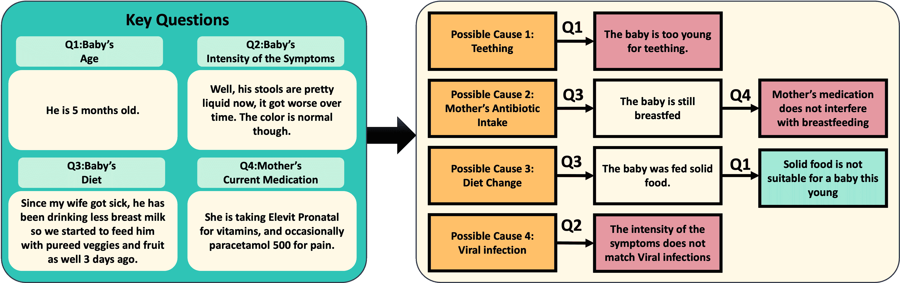
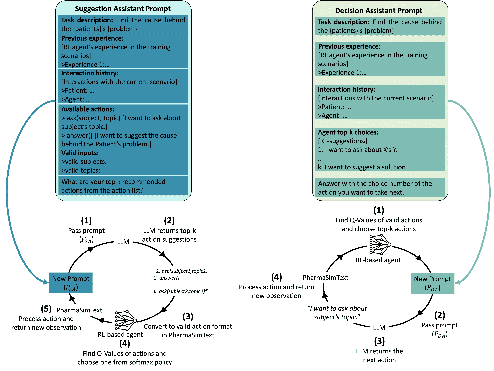
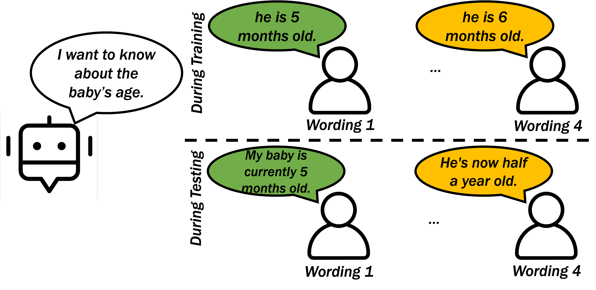
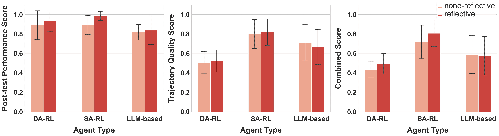
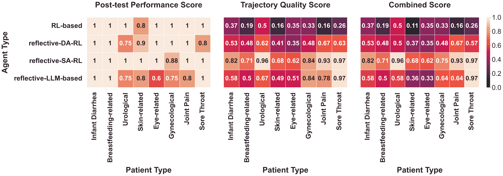
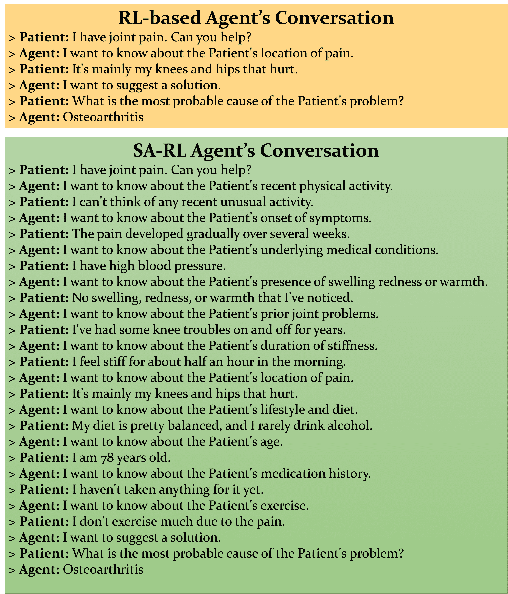

<!--yml

类别：未分类

日期：2025-01-11 12:40:33

-->

# 朝向可泛化的智能体在基于文本的教育环境中的应用：整合强化学习与大型语言模型的研究

> 来源：[https://arxiv.org/html/2404.18978/](https://arxiv.org/html/2404.18978/)

Bahar Radmehr

Adish Singla

Tanja Käser EPFL [bahar.radmehr@epfl.ch](mailto:bahar.radmehr@epfl.ch) MPI-SWS [adishs@mpi-sws.org](mailto:adishs@mpi-sws.org) EPFL [tanja.kaeser@epfl.ch](mailto:tanja.kaeser@epfl.ch)

###### 摘要

近年来，开发学习者模型以增强教育环境中的学习和教学体验受到越来越多的关注。然而，现有的研究主要集中在依赖于精心设计的任务表示的结构化环境，从而限制了智能体在不同任务之间的技能泛化能力。本文旨在通过将强化学习（RL）与大型语言模型（LLM）结合，增强智能体在开放式基于文本的学习环境中的泛化能力。我们研究了三种类型的智能体：（i）基于强化学习的智能体，利用自然语言表示状态和动作，以找到最佳互动策略；（ii）基于大型语言模型的智能体，利用模型的通用知识和推理通过提示进行操作；（iii）混合型大型语言模型辅助的强化学习智能体，将这两种策略结合起来，提升智能体的表现和泛化能力。为了支持这些智能体的开发和评估，我们引入了PharmaSimText，一个基于PharmaSim虚拟药房环境的创新基准，旨在练习诊断对话。我们的研究结果表明，基于强化学习的智能体在任务完成方面表现出色，但在提问质量诊断问题方面存在不足。相比之下，基于大型语言模型的智能体在提问诊断问题方面表现更好，但在任务完成方面有所欠缺。最后，混合型大型语言模型辅助的强化学习智能体帮助我们克服了这些局限，突显了结合强化学习与大型语言模型的潜力，从而开发出适合开放式学习环境的高效能智能体。

###### 关键词：

强化学习、大型语言模型、基于文本的教育环境、学习者模型

## 1 引言

学习者模型是推动教育技术发展的基础，它作为一种多功能工具，广泛应用于增强教学和学习体验的多个领域[[1](https://arxiv.org/html/2404.18978v1#bib.bib1)]。通过模拟学生的互动和数据，这些计算模型为教师培训提供了一个安全且受控的环境，使教育者可以在不直接影响实际学生的情况下改进教学方法[[2](https://arxiv.org/html/2404.18978v1#bib.bib2)]。它们还促进了自适应学习系统[[3](https://arxiv.org/html/2404.18978v1#bib.bib3)]或新算法的开发与评估[[4](https://arxiv.org/html/2404.18978v1#bib.bib4)]。此外，它们已被应用于测试学习理论[[5](https://arxiv.org/html/2404.18978v1#bib.bib5)]，并通过与虚拟同伴互动促进学生的合作技能[[6](https://arxiv.org/html/2404.18978v1#bib.bib6)]。

强化学习（RL）为开发这些学习者模型/代理提供了一个有前景的途径[[7](https://arxiv.org/html/2404.18978v1#bib.bib7)]。现有的关于教育领域强化学习的研究主要集中在开发课程优化技术[[8](https://arxiv.org/html/2404.18978v1#bib.bib8), [9](https://arxiv.org/html/2404.18978v1#bib.bib9), [10](https://arxiv.org/html/2404.18978v1#bib.bib10), [11](https://arxiv.org/html/2404.18978v1#bib.bib11)]，提供量身定制的提示和反馈[[12](https://arxiv.org/html/2404.18978v1#bib.bib12), [13](https://arxiv.org/html/2404.18978v1#bib.bib13)]，以及生成教育内容[[14](https://arxiv.org/html/2404.18978v1#bib.bib14), [15](https://arxiv.org/html/2404.18978v1#bib.bib15)]。只有少数研究探讨了基于RL的学习者代理在学习环境中有效操作的情况[[16](https://arxiv.org/html/2404.18978v1#bib.bib16), [17](https://arxiv.org/html/2404.18978v1#bib.bib17)]。然而，这些基于RL的学习者代理已被研究应用于结构化任务，如数学和逻辑难题，这些任务有明确的规则。在这样的环境中，由于状态和动作表示可以通过利用现有结构中获得的工程特征进行直接定义，因此自然地发挥了RL的能力[[7](https://arxiv.org/html/2404.18978v1#bib.bib7), [18](https://arxiv.org/html/2404.18978v1#bib.bib18), [16](https://arxiv.org/html/2404.18978v1#bib.bib16)]。然而，依赖手工设计的特征和工程化的状态表示限制了这些RL代理在非结构化领域中的应用能力，并且限制了它们在不同任务间推广所学技能和知识的能力。

生成性AI，特别是大语言模型（LLM）的最新进展，为大幅提升先进的教育技术提供了新机遇[[19](https://arxiv.org/html/2404.18978v1#bib.bib19)]。LLM能够生成连贯且符合上下文的内容，进行有意义的对话，并执行特定的语言任务，无需显式训练[[20](https://arxiv.org/html/2404.18978v1#bib.bib20), [21](https://arxiv.org/html/2404.18978v1#bib.bib21)]。到目前为止，在教育领域，LLM主要应用于生成教育内容[[22](https://arxiv.org/html/2404.18978v1#bib.bib22), [23](https://arxiv.org/html/2404.18978v1#bib.bib23), [24](https://arxiv.org/html/2404.18978v1#bib.bib24)]、自动化评分和反馈过程[[25](https://arxiv.org/html/2404.18978v1#bib.bib25), [26](https://arxiv.org/html/2404.18978v1#bib.bib26), [27](https://arxiv.org/html/2404.18978v1#bib.bib27), [28](https://arxiv.org/html/2404.18978v1#bib.bib28), [29](https://arxiv.org/html/2404.18978v1#bib.bib29), [30](https://arxiv.org/html/2404.18978v1#bib.bib30)]，以及促进协作系统的发展[[31](https://arxiv.org/html/2404.18978v1#bib.bib31), [32](https://arxiv.org/html/2404.18978v1#bib.bib32), [33](https://arxiv.org/html/2404.18978v1#bib.bib33)]。少数研究还将LLM用于编程领域中的学习者建模[[34](https://arxiv.org/html/2404.18978v1#bib.bib34)]，或用于模拟学生行为，为教师培训的互动工具提供基础[[35](https://arxiv.org/html/2404.18978v1#bib.bib35)]。然而，尽管LLM在语言任务方面表现出色，但在受限环境中的决策能力往往不足，这是RL智能体的强项，因为它们天生能够在给定环境中做出可行的决策[[36](https://arxiv.org/html/2404.18978v1#bib.bib36)]。

鉴于基于强化学习（RL）和大语言模型（LLM）的智能体的优点和局限性，最近的研究探讨了将LLM与RL结合，以设计能够克服这些智能体个别局限性的智能体。例如，这种结合已被用来在多个领域显著改善奖励设计和探索效率[[37](https://arxiv.org/html/2404.18978v1#bib.bib37), [38](https://arxiv.org/html/2404.18978v1#bib.bib38), [39](https://arxiv.org/html/2404.18978v1#bib.bib39), [40](https://arxiv.org/html/2404.18978v1#bib.bib40)]。然而，这些方法中的大多数都集中在使用LLM进行训练，这可能面临在受限环境中决策时，承担LLM局限性的风险。

本文探讨了将RL和LLMs结合，以在基于文本的教育环境中创建具有增强泛化能力的代理，重点讨论了在推理阶段使用LLM。为了支持我们的研究，我们提出了一种新颖的基于文本的模拟基准——PharmaSimText，该基准源自PharmaSim虚拟药学环境，旨在练习诊断对话。我们展示了三种类型的代理：(i) 基于RL的代理，采用自然语言表示，(ii) 基于LLM的代理，通过提示调用，(iii) 混合模型，其中LLMs在推理阶段辅助RL代理。

我们基于代理在PharmaSimText基准上的诊断对话效果和诊断准确性，对所有代理进行了广泛评估，重点考察它们在不同患者档案下，针对各种重述场景的表现。通过实验，我们旨在解决三个研究问题：哪种类型的代理在进行有效的诊断对话和实现所有可用患者的准确诊断方面表现最佳（RQ1）？反思性提示如何影响LLM参与的代理的诊断表现和对话质量（RQ2）？不同类型的代理在不同患者群体中的诊断表现和对话质量有何差异（RQ3）？我们的结果表明，特定类型的LLM辅助RL代理通过有效平衡准确诊断和高质量诊断对话，在综合评分上超越了所有其他代理。源代码和基准已发布在GitHub上。¹¹[https://github.com/epfl-ml4ed/PharmaSimText-LLM-RL](https://github.com/epfl-ml4ed/PharmaSimText-LLM-RL)

## 2 相关工作

鉴于我们致力于将强化学习（RL）代理与大型语言模型（LLMs）结合，创建可泛化的学习者模型，我们回顾了以往在学习者模型开发方面的工作，探讨了基于文本的互动游戏中智能代理领域的增长，并最终讨论了近期在整合RL和LLMs方面的进展。

教育环境中的学习者代理。关于在在线环境中模拟学习者的研究已有大量成果[[1](https://arxiv.org/html/2404.18978v1#bib.bib1)]。现有研究提供了丰富的，但不可广泛推广的学习者表征，例如通过从问题解决示范中生成认知模型（例如，SimStudent [[41](https://arxiv.org/html/2404.18978v1#bib.bib41)]）或通过数据驱动的方式从学生模型中模拟学习者[[42](https://arxiv.org/html/2404.18978v1#bib.bib42)，[43](https://arxiv.org/html/2404.18978v1#bib.bib43)，[44](https://arxiv.org/html/2404.18978v1#bib.bib44)]，这导致了较少的丰富性，但具有更强的普适性。强化学习（RL）是应对这些局限性的一个有前途的工具。然而，在教育领域，这一框架主要用于教学策略的归纳[[8](https://arxiv.org/html/2404.18978v1#bib.bib8)，[9](https://arxiv.org/html/2404.18978v1#bib.bib9)，[10](https://arxiv.org/html/2404.18978v1#bib.bib10)，[11](https://arxiv.org/html/2404.18978v1#bib.bib11)]，提供量身定制的提示[[13](https://arxiv.org/html/2404.18978v1#bib.bib13)，[12](https://arxiv.org/html/2404.18978v1#bib.bib12)]，生成教育内容[[14](https://arxiv.org/html/2404.18978v1#bib.bib14)，[15](https://arxiv.org/html/2404.18978v1#bib.bib15)]，以及评估教育平台中的干预措施[[45](https://arxiv.org/html/2404.18978v1#bib.bib45)，[46](https://arxiv.org/html/2404.18978v1#bib.bib46)]。尽管有潜力，基于强化学习的学习者代理在学习环境中的有效应用仍然有限[[16](https://arxiv.org/html/2404.18978v1#bib.bib16)，[17](https://arxiv.org/html/2404.18978v1#bib.bib17)]。例如，先前的研究使用了近端策略优化（PPO）来设计智能辅导系统中的学习者模型[[16](https://arxiv.org/html/2404.18978v1#bib.bib16)]，或采用神经网络和符号程序合成来创建块式编程环境中的学生尝试[[47](https://arxiv.org/html/2404.18978v1#bib.bib47)]。本文中，我们开发了一系列适用于开放式教育环境的学习者代理。

面向基于文本的互动游戏的智能代理。近年来，开发基于文本的互动游戏智能代理，特别是模拟现实世界场景的代理，已经引起了广泛关注[[36](https://arxiv.org/html/2404.18978v1#bib.bib36), [48](https://arxiv.org/html/2404.18978v1#bib.bib48), [49](https://arxiv.org/html/2404.18978v1#bib.bib49)]，并催生了多种方法论，包括强化学习（RL）[[50](https://arxiv.org/html/2404.18978v1#bib.bib50)]、行为克隆（BC）[[36](https://arxiv.org/html/2404.18978v1#bib.bib36)]和提示大型语言模型（LLMs）[[51](https://arxiv.org/html/2404.18978v1#bib.bib51), [52](https://arxiv.org/html/2404.18978v1#bib.bib52)]。一个著名的例子是《科学世界》游戏[[36](https://arxiv.org/html/2404.18978v1#bib.bib36)]，玩家通过探索环境和互动进行科学实验。在强化学习框架内，最先进的方法采用深度强化相关网络（DRRNs）[[50](https://arxiv.org/html/2404.18978v1#bib.bib50)]，将基于文本的互动视为部分可观察马尔可夫决策过程（POMDPs），并学习不同的文本表示来估计Q值，通过评分网络进行估算。在大型语言模型领域，基于LLM的策略在每次互动步骤中使用提示进行战略规划和行动选择。一些研究[[51](https://arxiv.org/html/2404.18978v1#bib.bib51)]只进行与环境的单轮互动，而其他研究[[53](https://arxiv.org/html/2404.18978v1#bib.bib53), [52](https://arxiv.org/html/2404.18978v1#bib.bib52)]则采用多轮方法，通过反复尝试促进迭代改进。在本文中，我们开发了一系列用于模拟发生在药房中的现实世界场景的基于文本的教育环境中的智能代理。

强化学习（RL）与大语言模型（LLM）集成。最近，LLM被用于帮助RL智能体执行各种任务，展示了在奖励设计和探索效率方面的显著进展。例如，[[39](https://arxiv.org/html/2404.18978v1#bib.bib39)] 利用文本语料库对智能体进行预训练，从而通过基于智能体当前状态描述建议目标来塑造其探索过程。此外，[[40](https://arxiv.org/html/2404.18978v1#bib.bib40)] 提出了一个新方法，通过利用LLM根据描述期望行为的文本提示生成奖励信号，从而简化奖励设计。类似地，[[37](https://arxiv.org/html/2404.18978v1#bib.bib37)] 展示了创新性地应用少量示例LLM提示来为RL智能体假设世界模型，这提高了训练样本的效率，并允许智能体通过与环境的互动来纠正LLM的错误。这些研究突显了将LLM与RL技术集成的协同潜力，以实现更符合目标的智能体行为、定向探索和高效的训练过程。然而，在训练阶段使用LLM存在将其在受限环境下决策中的局限性带入训练的风险。因此，在推理阶段使用LLM来辅助RL智能体仍然存在显著的空白。具体来说，目前的研究工作尚未解决如何利用LLM帮助RL智能体在训练后将其学习到的技能适应并迁移到新的环境或任务中。在我们的研究中，我们旨在填补这一空白，聚焦于利用LLM作为RL智能体在向新环境泛化过程中（即迁移学习）时的助手。

## 3 PharmasimText基准测试

我们创建了PharmaSimText，一个基于文本的互动环境，作为开发能够处理基于文本的学习任务并在其中进行泛化的语言智能体的基础设施。PharmaSimText是一个基于PharmaSim设计的互动文本环境，PharmaSim是一个基于场景的学习平台，模拟了药剂师与患者在药房环境中的真实互动。这个基准测试包括500多个场景变体，可用于开发和评估学习型智能体。

图1：PharmaSim中的“父亲咨询”场景 - 一个模拟的药房环境，旨在练习诊断性对话技能，参与者与一位寻求指导的父亲互动，帮助他解决婴儿腹泻问题。

\说明

PharmaSim环境中“父亲咨询”场景的概述，展示了一位父亲请求帮助解决其婴儿腹泻的问题

图 2：PharmaSim 中“父亲询问”情景下的诊断策略，展示了确定婴儿腹泻最可能原因的过程。玩家必须向父亲提出四个关键问题，以收集关键信息，从而在四个潜在原因中确定最可能的腹泻原因。

\Description  

PharmaSim 中“父亲询问”情景下的诊断策略。这里有四个关键问题，包括宝宝的年龄、宝宝症状的强度、宝宝的饮食，以及母亲当前的用药情况，左侧为父亲的回答。在右侧，通过不同的关键问题调查了四种可能的原因：长牙、母亲服用抗生素、饮食变化和病毒感染。  

### 3.1 PharmaSim  

PharmaSim 是一个基于情景的学习环境，旨在支持诊断技能的发展。在每个情景中，患者来到药房并寻求解决特定问题的帮助。玩家需要识别该问题的不同可能原因，并在与环境互动时标明它们的可能性。具体来说，有六种不同类型的互动：向患者提问、寻求药剂师帮助、查找不同种类的药物、查看货架上产品的规格、阅读与问题相关的资料，以及提供解决方案，后者结束游戏并将玩家带入后测阶段。在后测阶段，玩家需要列出三个可能的原因，评估它们的可能性，并为每个原因提供解释。确定这些可能性并找出最可能的原因，显著依赖于一组包含关键信息的患者询问，我们将其称为关键问题。  

当前，游戏中提供了两种由人类专家提供见解设计的情景。例如，在一个情景中（见图 [1](https://arxiv.org/html/2404.18978v1#S3.F1 "图 1 ‣ 3 PharmasimText 基准 ‣ 朝着通用化智能体迈进：将强化学习与大语言模型结合的研究")），一位父亲来到药房寻求帮助，解决他婴儿腹泻的问题。该情景提出了四种可能的原因。玩家需要向父亲提问四个关键问题，以收集找到最可能原因所需的关键信息。关键问题与婴儿腹泻最可能原因之间的关系如图 [2](https://arxiv.org/html/2404.18978v1#S3.F2 "图 2 ‣ 3 PharmasimText 基准 ‣ 朝着通用化智能体迈进：将强化学习与大语言模型结合的研究")所示。例如，询问宝宝的年龄可以让玩家推断出长牙不太可能是腹泻的原因，因为宝宝年龄较小。  

### 3.2 PharmaSimText  

为了开发我们的基准，我们对PharmaSim进行了几项修改。

迁移到基于文本的环境。作为第一步，我们对PharmaSim进行了两项适应性改造，将其迁移到基于文本的环境。首先，我们将交互简化为两种类型的操作：通过类似PharmaSim的措辞向患者询问有关各种角色的问题，比如“我想了解该角色的主题。”以及通过提出解决方案如“我想提出一个解决方案。”来进入后测阶段。其次，我们修改了后测问题，提供了一个可行的评估标准，供代理使用。为此，我们修订了三个原因的问题，专注于患者问题的最可能原因。

扩展可用场景。在接下来的步骤中，我们专注于丰富PharmaSimText并增强其复杂性。为此，我们在原始环境中扩展了两个可用场景的三个维度：(1) 引入新的患者，(2) 变化场景以交替每个患者问题的最可能原因，以及(3) 通过重新措辞多样化患者的反应。鉴于扩展的规模，仅依靠人类专业知识显得不切实际。相反，我们结合了LLM（大规模语言模型）的生成能力和人类的见解，以开发PharmaSimText中的场景。在向LLM请求创建场景之前，我们将扩展场景结构化，使其与瑞士的药学助理培训课程相一致。我们从课程中收集了一系列健康问题，并将每个问题分配给一个具有特定年龄和性别的虚拟患者。我们进一步从课程教材中识别了一系列已知症状与所选问题相关的疾病。

提示LLM生成情境。情境创建过程包括三个步骤：（1）我们提示LLM生成一系列关键问题，旨在诊断患者问题最可能的原因；（2）LLM被要求模拟患者回应，假设清单上的每种疾病都是导致其问题的最可能原因；（3）我们提示LLM生成常见患者咨询问题的答案，通常由药剂师回答。我们使用了GPT-4作为LLM进行情境创建；所使用的具体提示可以在我们的GitHub存储库中找到（链接见脚注[1](https://arxiv.org/html/2404.18978v1#footnote1 "footnote 1 ‣ 1 Introduction ‣ Towards Generalizable Agents in Text-Based Educational Environments: A Study of Integrating RL with LLMs")）。为了确保真实性和适用性，所有情境都由人类专家审查，并提供反馈，包括一些微小的修改，这些修改反映在情境的最终版本中。此外，LLM还被用来通过同义改写来多样化现有的患者回应，增加情境的复杂性。为了进一步增强这种复杂性，引入了虚构角色作为干扰因素，使玩家能够进行更细致的互动。

| 问题 | 可能原因数 | 可能原因 | 关键问题数 |
| --- | --- | --- | --- |
| 婴儿腹泻 | 4 | 饮食变化、长牙、母亲当前用药、病毒感染 | 4 |
| 母乳喂养相关 | 6 | 乳房胀痛、乳腺堵塞、乳头裂伤、乳腺炎、鹅口疮、乳量不足 | 7 |
| 泌尿科 | 4 | 前列腺增生、膀胱炎、急迫性尿失禁、压力性尿失禁 | 6 |
| 皮肤相关 | 10 | 晒伤、昆虫叮咬、痤疮、湿疹、脚气、银屑病、皮疹、疣和茧、唇疱疹、神经性皮炎 | 10 |
| 眼部相关 | 5 | 干眼症、过敏性结膜炎、结膜炎、眼疲劳、麦粒肿 | 11 |
| 妇科 | 8 | 尿路感染、膀胱炎、肾结石、过度活跃膀胱、怀孕、性传播感染、压力性尿失禁、真菌感染 | 8 |
| 关节疼痛 | 5 | 骨关节炎、肌肉扭伤、腱炎、滑囊炎、痛风 | 9 |
| 喉咙痛 | 5 | 普通感冒、流感、鼻窦炎、咽炎、支气管炎 | 7 |

表1：PharmaSimText情境概述。基准中的每项任务都围绕一个独特的健康问题展开，该问题可能源自多种原因。玩家必须提出几个关键问题，以做出正确的诊断。

关于 PharmaSimText 基准的统计数据。获得的基准包含八种不同的场景，每个场景围绕一个独特的患者档案展开。有关患者的详细信息可以在表格[1](https://arxiv.org/html/2404.18978v1#S3.T1 "表 1 ‣ 3.2 PharmaSimText ‣ 3 PharmasimText 基准 ‣ 朝着通用代理发展：整合 RL 与 LLMs 在基于文本的教育环境中的研究")中找到。平均而言，每个场景呈现七个潜在的患者问题原因，导致总共有 $47$ 种场景变体。每个变体中的患者反应采用十种不同的表述方式，以增强其深度和变异性。此外，每个场景还要求玩家识别平均 $7.8$ 个关键问题。因此，PharmaSimText 可以为进一步研究基于文本的互动任务中的代理以及代理的通用性提供一个丰富的环境。

图 3：LLM 辅助的 RL 代理。LLM 在推理时被提示来协助 RL 代理，以帮助其泛化。在建议辅助 RL（SA-RL）代理（左图）中，LLM 在每一步建议 $k$ 个动作供 RL 代理选择。在决策辅助 RL（DA-RL）代理（右图）中，LLM 从 RL 代理提供的前 $k$ 个选择中选择一个动作。

\说明

LLM 辅助的 RL 代理在环境中交互所需的周期。

## 4 PharmaSimText 代理

我们为 PharmaSimText 开发了三种类型的代理，它们体现了 RL 与 LLM 协同作用的不同程度：基于 RL 的代理、基于 LLM 的代理和 LLM 辅助的 RL 代理。

### 4.1 基于 RL 的代理

RL 代理通过根据当前状态采取行动并根据这些行动获得反馈（以奖励或惩罚的形式）来学习与环境的交互[[54](https://arxiv.org/html/2404.18978v1#bib.bib54)]。它们试图最大化获得的累积奖励，以有效学习在环境中实现目标的最佳策略。在 RL 中，一种著名的方法是估计一个叫做 Q 值的指标，Q 值表示在给定状态下采取某一特定行动时预期的未来奖励。深度 Q 网络（DQNs）[[55](https://arxiv.org/html/2404.18978v1#bib.bib55)] 使用深度神经网络来近似这些 Q 值，使其能够通过学习直接从环境状态预测 Q 值，从而处理复杂的高维环境。DQNs 通过与环境的交互进行训练，利用其经验迭代地完善并使其 Q 值估计更加准确。

在之前的文本游戏研究基础上，我们使用了最先进的DRRN[[50](https://arxiv.org/html/2404.18978v1#bib.bib50)]，作为基于强化学习的智能体与PharmaSimText交互。DRRN旨在通过采用两个独立的网络——状态编码器和动作编码器，学习文本状态和动作的不同表示。然后，评分网络评估这些表示并估算其Q值。在环境中的某个时间步$t$，当前状态$s_{t}$和所采取的动作$a_{t}$被输入到DRRN中。最初，$s_{t}$和$a_{t}$被编码为词嵌入序列，随后通过状态和动作编码器中的循环神经网络（RNN）处理，获得各自的嵌入表示。经过RNN层后，每个编码器中的多层感知机（MLP）将这些嵌入表示精炼成更简洁的表示。然后，这些表示被拼接并输入到评分网络的MLP中，最终输出Q值的估算$Q(s_{t},a_{t})$。

在我们的案例中，时间步$t$时的有效动作是以句子列表的形式呈现给智能体的环境中可用的交互。每次采取动作后，智能体将获得一个新的观察值$o_{t}$，格式如下：交互类型；选择的交互；病人的回应。例如，在与婴儿腹泻相关的场景中，如果智能体决定询问婴儿的年龄，则新的观察值将格式化为：讨论；我想知道婴儿的年龄；他五个月大。因此，智能体应考虑其观察历史，以便理解其在环境中的当前状态$s_{t}$。

我们对原始DRRN进行了两项修改，以适应我们的环境。首先，我们采用了来自fastText的预训练句子嵌入[[56](https://arxiv.org/html/2404.18978v1#bib.bib56)]，用于生成观察和动作的文本表示。这一选择受到之前研究的启发，研究表明，仅仅使用与强化学习（RL）目标对齐的损失函数来训练DRRN编码器中的RNN，会导致训练不稳定和次优的嵌入[[57](https://arxiv.org/html/2404.18978v1#bib.bib57)]。其次，与DRRN被提出用来解决的环境不同，在PharmaSimText中的某个时间步$t$的观察不足以让代理获得当前环境状态的概念，因此需要将整个完整的观察历史作为代理提供的上下文的一部分。因此，我们在状态编码器之前引入了一个叫做状态更新器的单元，该单元接收先前的嵌入状态$e(s_{t-1})$和新的嵌入观察$e(o_{t})$，并返回在当前观察后更新的状态$s_{t}$。我们在状态更新器中尝试了五种不同的方法：均值池化、最大池化、求和、LSTM层和带自注意力机制的LSTM层。经过一系列实验后，我们观察到基于求和的方法导致了最稳定的训练；因此我们在状态更新器中采用了这种方法。形式上，这种基于所有观察嵌入求和的方法返回$e(s_{t})=e(s_{t-1})+e(o_{t})$，作为新的嵌入状态$e(s_{t})$。

### 4.2 基于LLM的代理

基于LLM的代理在与环境交互的每一步都会提示LLM，以找到完成任务的最佳下一步动作。这些代理可以只有一次尝试，或者通过反思它们在每次尝试之间的策略，进行多次尝试来完成任务。我们分别将这两种代理类型称为非反思型代理和反思型代理。

非反思性代理通过发出一个包含任务描述、交互历史（由代理的问题和病人的回答组成）、与病人的先前经验以及当前步骤可用的有效动作的单一提示，与LLM进行互动，以选择最合适的后续动作。任务描述的结构为“找出病人问题背后的原因”，而交互历史则以病人与代理之间的对话呈现，动作文本标注为代理的问题，环境的反馈文本为病人的回答。为了格式化有效的动作，每种动作类型都被格式化为一个函数，并附上其可接受的输入值，LLM可以对其进行解释。并且有一个描述性文本来解释该动作的目的。例如，交互“我想询问主题的相关内容”被格式化为ask(subject, topic)：询问与主题相关的关于该主题的问题，后面跟着有效的主题和话题列表。这种细致的格式化策略在最小化LLM建议无效动作的可能性方面起着至关重要的作用。

尽管采取了格式化有效动作以指导LLM的措施，但仍有一些情况，LLM提出的动作在PharmaSimText环境中仍然是无效的。在这种情况下，我们实施了一种策略，提示LLM建议替代动作，最多重复此过程$k=3$次。如果所有建议的动作仍然无效，我们将选择在自然语言嵌入空间中与第$k$次建议动作距离最小的有效动作。这种方法确保了LLM的输出有效地基于环境中可行的动作集。

反思性代理采用与非反思性代理类似的提示策略来确定最优的后续动作。非反思性代理的提示被增强，加入了包括先前与同一病人进行过的相同原因的互动经验。这个反思过程涉及提示LLM根据完成每次试验后的观察结果评估其先前的策略。代理随后更新其关于之前学习的文本记忆，并在下一个试验中使用更新后的记忆进行提示。这一方法的灵感来自于关于自我反思LLM的研究，特别是持续学习语言代理CLIN[[52](https://arxiv.org/html/2404.18978v1#bib.bib52)]。与CLIN类似，我们使用因果格式（如“X对于Y是必要的”）构建了学习记忆，以指导未来的互动。这一机制使得反思性代理能够动态调整并完善其方法，随着时间的推移增强其决策过程。

### 4.3 LLM辅助的强化学习代理

基于RL的智能体的视角仍然局限于它们在训练期间的经验，这可能会妨碍它们在处理训练中未曾遇到的陌生元素的任务时的表现。为了解决这个问题，我们利用LLM的常识推理能力来增强RL智能体的决策过程。如图[3](https://arxiv.org/html/2404.18978v1#S3.F3 "Figure 3 ‣ 3.2 PharmaSimText ‣ 3 PharmasimText benchmark ‣ Towards Generalizable Agents in Text-Based Educational Environments: A Study of Integrating RL with LLMs")所示，我们探索了两种集成LLM辅助的方法：建议辅助RL（SA-RL）和决策辅助RL（DA-RL）。

在SA-RL方法中，在给定的时间步$t$，提示LLM建议在该状态下采取的$k$个最佳动作列表，称为$\text{LLM-Suggested}_{t}$。然后，RL智能体计算$\text{LLM-Suggested}_{t}$中各个动作的Q值，并从通过对估算的Q值进行softmax处理得到的概率分布中采样下一个动作。这里使用的提示格式与第[4.2](https://arxiv.org/html/2404.18978v1#S4.SS2 "4.2 LLM-based Agents ‣ 4 Agents for PharmaSimText ‣ Towards Generalizable Agents in Text-Based Educational Environments: A Study of Integrating RL with LLMs")节中讨论的基于LLM的智能体类似，包括任务描述、交互历史、与患者的先前经验和该步骤下的有效动作。我们在交互步骤中设置$k=5$，在后测试步骤中设置$k=2$。

在DA-RL方法中，在给定的时间步$t$，我们收集RL智能体策略$\text{RL-Suggested}_{t}$下最可能的$k$个动作列表。然后，提示LLM从$\text{RL-Suggested}_{t}$中的动作中选择最佳动作。此任务使用的提示包括任务描述、交互历史、与患者的先前经验以及$\text{RL-Suggested}_{t}$中的动作。因此，LLM充当RL智能体的决策助手。值得注意的是，在我们的实现中，我们在交互步骤中设置$k=5$，在后测试步骤中设置$k=2$。

基于是否给予大语言模型（LLM）反思其过去决策的机会，我们得到两种版本的DA-RL和SA-RL方法，通过反思/非反思前缀来区分。因此，我们研究了四种LLM辅助的强化学习（RL）智能体：非反思-DA-RL、反思-DA-RL、非反思-SA-RL和反思-SA-RL。

## 5 实验评估

图4：泛化任务，要求智能体对情境的不同表述进行泛化。

\Description

一个关于宝宝年龄的题目示例，其中宝宝5个月大的问题被重新表述为“我的宝宝目前5个月大”。

图5：智能体在PharmaSimText上的表现。后测表现评分（左），轨迹质量评分（中），以及综合评分（右），分别针对基于强化学习（RL）的智能体、反射性DA-RL智能体、反射性SA-RL智能体和反射性LLM-based智能体。在SA-RL智能体中，LLM在每个步骤中建议$k$个动作供RL智能体选择。在DA-RL智能体中，LLM从RL智能体提供的top-k选项中选择一个动作。评分是基于PharmaSimText中所有患者的平均值。

\Description

智能体在PharmaSimText上的表现

我们在PharmaSimText中评估了智能体，旨在评估哪种类型的智能体能在所有患者中展示出最有效的诊断对话和最准确的诊断（RQ1），探讨反射性提示对涉及LLM的智能体诊断表现和互动质量的影响（RQ2），并探索不同类型智能体在面对不同患者时，诊断表现和对话质量的差异（RQ3）。

### 5.1 实验设置

我们的评估聚焦于智能体的泛化能力，具体来说，是它们在面对未曾遇到过的元素时，能否顺利执行任务。我们评估了智能体在已遇到场景的重新措辞版本中的泛化能力，旨在衡量它们对这些场景精确措辞的依赖性。图[4](https://arxiv.org/html/2404.18978v1#S5.F4 "Figure 4 ‣ 5 Experimental Evaluation ‣ Towards Generalizable Agents in Text-Based Educational Environments: A Study of Integrating RL with LLMs")提供了我们评估泛化能力的方法，展示了在特定场景中重新措辞的答案选项所带来的多样性。

我们通过两个方面来定义智能体在子任务中的成功：识别患者问题的最可能原因和在对话中提出关键问题。在这里，子任务表示原因和措辞的组合。因此，我们引入了三种评估标准：

+   •

    后测表现评分：二元指标，表示是否正确诊断患者问题。它衡量智能体识别患者问题最可能原因的能力。

+   •

    轨迹质量评分：智能体对话中涉及的关键问题比例。它衡量智能体对话的质量。

+   •

    综合评分：后测表现评分与轨迹质量评分的乘积。它同时衡量上述两个元素。

### 5.2 智能体训练与评估

我们为每个病人分别开发和训练了所有智能体。在这个过程中，不同措辞的子任务（这些子任务指向相同的原因）被随机拆分为训练集、验证集和测试集。因此，训练集、验证集和测试集中包含了该病人所有可用原因的子任务，且措辞各不相同。具体而言，智能体在训练和验证过程中见过所有的原因，但并非所有的措辞。在我们的实验中，针对每个原因，$80\%$ 的措辞用于训练，其余的措辞被一分为二，分别用于验证集和测试集。

基于RL的智能体使用指定训练集中的子任务进行训练，在每个与环境交互的回合中随机选择一个子任务。在某一时刻 $t$，智能体从所有可用动作的Q值中通过softmax策略随机选择一个动作。softmax策略的随机性通过温度控制，该温度在训练过程中从1线性下降至0.001。每次交互后，智能体会根据奖励函数获得奖励，当成功完成后测试时，智能体将获得+1的正奖励，否则会被处罚-1。此外，智能体的每次交互还会被罚以一个小的负奖励-0.01。

在每次训练迭代后，这些智能体会进行评估阶段，使用验证集中的子任务。在验证集中获得最高平均测试后表现评分的迭代将用于测试，并作为LLM辅助RL智能体中RL组件的基础。

在其结构中包含LLM的智能体使用了GPT-4模型。这些基于LLM的智能体最初通过与训练子任务的互动积累经验。之后，这些经验在它们与测试子任务的互动中得到了应用。

### 5.3 RQ1：不同智能体类型的有效性

在我们的首次分析中，我们旨在评估智能体在诊断对话中的有效性以及对所有病人诊断的准确性。图 [5](https://arxiv.org/html/2404.18978v1#S5.F5 "Figure 5 ‣ 5 Experimental Evaluation ‣ Towards Generalizable Agents in Text-Based Educational Environments: A Study of Integrating RL with LLMs") 展示了不同智能体的测试后表现评分、轨迹质量评分和综合评分。

图6：反射型和非反射型智能体在PharmaSimText上的表现。测试后表现评分（左）、轨迹质量评分（中）、以及综合评分（右），分别针对非反射型和反射型DA-RL、SA-RL及基于LLM的智能体。

\描述

反射型和非反射型智能体在PharmaSimText上的表现

我们观察到，RL基代理取得了较高的后测表现得分，这表明其能够通过试错过程得出正确的诊断。然而，该代理的方法通常缺乏有意义的诊断对话的深度和细腻度，体现在其较低的轨迹质量得分。这一观察可能是由于其缺乏背景知识和常识推理能力。相反，基于LLM的代理展现出更强的能力，在进行有意义的诊断对话方面表现更为优异，体现在其较高的轨迹质量得分。然而，基于LLM的代理的后测表现得分低于RL基代理，表明其在一致性地得出正确诊断方面不如RL基代理。

在考察LLM辅助的RL代理时，DA-RL和SA-RL代理在后测表现得分上均超过了基于LLM的代理，这表明将LLM与RL结合通常能提高纯LLM代理的诊断精度。值得注意的是，SA-RL代理展现出优异的后测表现得分，几乎与RL基代理的得分相当。DA-RL的相对低效可能源于其轨迹较长，导致其进入了RL基代理不熟悉的状态，在这些状态下，DRRN难以提供准确的诊断，从而影响了DA-RL的RL驱动建议。此外，在进行高质量诊断对话方面，SA-RL代理也优于DA-RL代理。这一优势可能是因为RL框架倾向于选择更简洁、直接的解决方案，从而减少了DRRN在较长时间交互中的行动质量。这一效果在DA-RL代理中表现得尤为明显，可能限制了其诊断对话的质量。

在综合得分的代理比较中，SA-RL代理表现突出。与其他代理不同，SA-RL代理巧妙地应对了基准测试所带来的双重挑战，展示了较高的对话质量和诊断准确性。这一成就突显了SA-RL代理的独特能力，即通过将LLM基于建议的辅助加入到RL代理的决策过程中，成功地融合了RL基代理和LLM基代理的优势。

为了进一步探讨结果，我们进行了额外的统计测试。Kruskal-Wallis测试显示，代理在轨迹质量分数和综合分数上有显著差异$(p_{trajectory}<0.0001\text{ 和 }p_{combined}<0.001)$，并且在后测表现分数上也呈现出显著趋势$(p_{performance}=0.052)$。使用Mann-Whitney U检验进行事后比较，并采用Benjamini-Hochberg校正处理综合分数，结果显示6对代理中有5对存在显著差异，支持先前的发现。例如，RL基础代理与SA-RL代理的比较结果的p值小于0.01，而SA-RL代理与LLM基础代理的比较p值小于0.05。

总结来说，实验结果突显了不同代理之间的明显优缺点。基于强化学习（RL）的代理在获得高的后测表现评分方面表现出色，但由于背景知识的有限，未能有效地进行诊断对话。相反，基于大语言模型（LLM）的代理通过利用其广泛的知识库，能够进行高质量的对话，但在诊断的准确性上有所欠缺。混合型LLM辅助RL代理（如DA-RL和SA-RL）在诊断精度上超过了基于LLM的代理，在对话质量上也超越了基于RL的代理。SA-RL代理同时在对话质量和诊断准确性上均表现突出，展示了其在LLM与RL能力的有效整合。

图7：不同代理与不同患者互动的表现。RL基础和反思型SA-RL、DA-RL、LLM基础代理的后测表现分数（左）、轨迹质量分数（中）、综合分数（右）。

\说明

不同代理与不同患者互动的表现

### 5.4 RQ2: 反思提示的影响

在我们的第二次分析中，旨在探讨反思提示对涉及LLM的代理效能的影响。如第[4](https://arxiv.org/html/2404.18978v1#S4 "4 Agents for PharmaSimText ‣ Towards Generalizable Agents in Text-Based Educational Environments: A Study of Integrating RL with LLMs")节所述，非反思型代理仅限于一次尝试，而反思型代理在每个子任务中有三次尝试机会，并允许进行反思。图[6](https://arxiv.org/html/2404.18978v1#S5.F6 "Figure 6 ‣ 5.3 RQ1: Efficacy of Different Agent Types ‣ 5 Experimental Evaluation ‣ Towards Generalizable Agents in Text-Based Educational Environments: A Study of Integrating RL with LLMs")展示了非反思型和反思型LLM辅助RL代理与LLM基础代理的后测表现分数、轨迹质量分数和综合分数。

我们观察到反思提示对智能体表现的细微影响。具体来说，反思提示并未显著影响纯基于LLM的智能体的综合得分。对于该智能体而言，反思使得诊断对话变得更简短，因为它去除了智能体认为冗余的问题。然而，这种简化导致了较差的对话质量，并没有显著提高诊断准确性，抵消了反思可能带来的诊断准确性的提升。

相比之下，反思过程显著提高了混合型LLM辅助RL智能体的表现。这一改进可以归因于反思阶段使得智能体能够重新评估并完善它们的决策过程，从而实现更准确的诊断。尤其在SA-RL智能体中，表现的提升尤为显著，这可能是由于它们在互动阶段更多依赖LLM来建议潜在的行动。与DA-RL智能体不同，后者的决策更多受到基于RL的智能体的影响，因此反思的作用不如前者明显。这个发现强调了在提升混合型智能体能力中，加入反思机制的重要性。

总结来说，我们的实验表明反思提示对基于LLM的智能体和LLM辅助的RL智能体有不同的影响。对于基于LLM的智能体，反思导致了更简短且质量较差的诊断对话，并未显著提高诊断准确性。而另一方面，LLM辅助的RL智能体从反思中受益，表现出了诊断准确性的提升。这个提升在SA-RL智能体中尤为明显，因为它们更多依赖LLM的建议。

图8：基于RL的智能体（上）和SA-RL智能体（下）与关节疼痛患者在一个以骨关节炎为最可能原因的测试子任务中进行的示例诊断对话。

\描述

例子：与关节疼痛患者进行的诊断对话，在一个以骨关节炎为最可能原因的测试子任务中，基于RL的智能体对话与SA-RL智能体对话。

### 5.5 RQ3: 不同患者的智能体效能

在我们的最终分析中，我们调查了不同患者中智能体的表现。图[7](https://arxiv.org/html/2404.18978v1#S5.F7 "图 7 ‣ 5.3 RQ1: 不同智能体类型的效果 ‣ 5 实验评估 ‣ 面向可泛化智能体的文本教育环境：将RL与LLMs整合的研究")展示了基于RL的智能体以及反思型SA-RL、DA-RL和基于LLM的智能体在PharmaSimText中针对每位患者所有子任务的平均后测表现得分、轨迹质量得分和综合得分。

我们再次观察到，RL代理在所有患者中的后测表现得分优于LLM代理，而LLM代理在九个患者中的五个未能正确识别所有病因。LLM辅助的RL代理成功克服了这一局限性，其中SA-RL代理的表现优于DA-RL代理。对于轨迹质量得分，得出了相反的结果。虽然LLM代理进行了高质量的诊断对话，但RL代理在所有患者中的轨迹质量得分较低，通常仅在诊断对话中包含一两个关键问题，突显了其偏离有效诊断互动的程度。再次，LLM辅助的RL代理克服了这一局限性，SA-RL代理通常表现出最高的轨迹质量得分。

我们对综合得分的分析表明，除了SA-RL代理，其他大多数代理在与皮肤和眼部疾病相关的情境中遇到了困难。对其后测表现得分和轨迹质量得分指标的进一步检查表明，这些代理在与这些特定患者相关的不同方面面临挑战。一个特别值得注意的观察是SA-RL代理的卓越表现，它克服了纯RL和LLM代理在所有患者类别中的局限性。

鉴于RL代理在轨迹质量得分方面的劣势，我们对RL代理和SA-RL代理在同一情境下生成的对话进行了检查，且该情境得出了正确的诊断，如图[8](https://arxiv.org/html/2404.18978v1#S5.F8 "Figure 8 ‣ 5.4 RQ2: Effect of Reflective Prompting ‣ 5 Experimental Evaluation ‣ Towards Generalizable Agents in Text-Based Educational Environments: A Study of Integrating RL with LLMs")所示。这个对比揭示了这两个代理在对话动态上的显著差异。SA-RL代理主导的对话展现了更符合人类互动的流畅性，而RL代理的对话则较为简短。值得注意的是，RL代理的方式特点是先提出一个关键问题，然后直接得出结论。相比之下，SA-RL代理进行了更为深入的询问，涵盖了更广泛的关键问题，并且逻辑顺序更加连贯。

总结来说，混合型LLM辅助RL代理克服了纯RL和LLM代理的局限性，其中SA-RL代理在所有患者中表现优越。RL代理表现出的是一种简短对话的行为，互动仅限于少数几个关键问题，而SA-RL代理则表现出更接近人类的行为。

## 6 讨论与结论

本文探讨了将RL和LLM结合，以增强教育技术中的学习者模型。虽然基于RL的代理在结构化学习任务中展现出潜力，但它们在开放式环境和技能泛化方面存在困难。相反，LLM在生成类似学生的回应方面表现出色，但在受限的行动空间内失败。通过结合RL和LLM，我们旨在开发出更具泛化能力的代理，以适应基于文本的教育环境。我们评估了包括基于RL的、基于LLM的和混合模型的代理在我们创新基准PharmaSimText中的能力，重点考察它们进行诊断对话和做出准确诊断的能力。

具体来说，我们有兴趣回答以下三个研究问题：哪种代理类型在进行有效的诊断对话并为所有可用患者做出准确诊断方面表现总体优越（RQ1）？反思性提示如何影响涉及大语言模型（LLM）的代理的诊断表现和对话质量（RQ2）？不同代理类型在不同患者之间的诊断表现和对话质量有何差异（RQ3）？

为了回答第一个研究问题，我们评估了四种代理：一种基于强化学习（RL）的代理，一种基于LLM的代理，以及两种将LLM与RL结合的代理，这些代理在PharmaSimText中与不同患者相关的情境中进行了改写版本的评估，而这些情境是代理此前未见过的。有效的诊断对话需要高质量的对话和准确的诊断。RL代理在找到正确诊断方面表现突出，但由于其知识有限，难以进行全面的诊断对话。LLM代理在高质量诊断对话中表现得心应手，但容易误诊。LLM-RL结合代理通过提高诊断准确性（相比基于LLM的代理）和对话质量（相比基于RL的代理），能够解决这些局限性。在所有代理中，SA-RL代理在诊断准确性和对话质量之间达到了最佳的平衡。

第二个研究问题探讨了在LLM参与的代理中，反思性提示的好处。为了回答这个问题，我们比较了三种LLM参与代理的反思版本与其非反思版本的表现。在之前的研究中，反思在提示的LLM任务完成度上显示出了显著的改进[[53](https://arxiv.org/html/2404.18978v1#bib.bib53), [52](https://arxiv.org/html/2404.18978v1#bib.bib52)]。因此，我们假设当将代理限制为仅进行一次试验时，LLM参与代理的表现会显著下降。我们的结果显示，反思对仅基于LLM的代理和混合型代理有混合的效果。对于基于LLM的代理，反思提高了代理的诊断准确性，但却通过缩短对话的路径降低了对话质量。对于混合型代理，反思过程提高了诊断准确性。因此，我们得出结论，反思性提示的效果取决于代理类型。

为了回答第三个研究问题，我们分别分析了每个患者在三个指标下的代理表现。我们观察到，代理在面对相似的患者时没有遇到困难。在随后的分析中，我们查看了基于RL的代理和SA-RL代理的对话示例，发现虽然基于RL的代理对话显得急促，但SA-RL的对话更像人类，并且遵循了顺序逻辑。

本研究的一个局限性是只关注了场景重述版本的单一层次上的泛化。PharmaSimText中有几种可能的泛化层次，包括：对已知场景的新措辞（措辞泛化）、对已知患者的新诊断（子任务泛化）以及对新患者的泛化（任务泛化）。我们展示的实验仅限于措辞泛化。未来的研究应在不同的泛化层次上进行，以评估当前代理的表现，并提出新的代理框架，考虑模型在集成中的信心，并利用LLM的洞察力加速基于RL的代理适应新任务。此外，我们提出的反思过程在改善基于LLM的代理方面显示出了局限性，这表明需要进一步研究如何在PharmaSimText基准的互动格式中改善反思。未来的研究还应考虑评估这些代理与人类学生行为的相似性，以进一步促进它们在学习环境评估和协作学习等用例中的应用。

总结来说，提出的LLM集成方法代表了朝着具有泛化能力的代理在开放式文本教育环境中迈出的有希望的一步。此外，我们实施的基准测试为进一步研究开发具有更高泛化能力的代理提供了便利。

## 7 致谢

我们感谢 Dr. Jibril Frej 和 Dr. Ethan Prihar 的专业知识和支持。本项目得到了瑞士教育、研究和创新国会（SERI）的资助。

## 参考文献

+   [1] Tanja Käser 和 Giora Alexandron. 教育技术中的模拟学习者：系统文献综述与图灵式测试。国际人工智能教育杂志（IJAIED），页码 1–41, 2023。

+   [2] Kevin Robinson, Keyarash Jahanian, 和 Justin Reich. 使用在线练习空间研究实施公平计算机科学教学原则中的挑战。计算机科学教育技术研讨会（SIGCSE）论文集，页码 882–887, 2018。

+   [3] Daniel Dickison, Steven Ritter, Tristan Nixon, Thomas K. Harris, Brendon Towle, R. Charles Murray, 和 Robert G. M. Hausmann. 预测技能模型变化对学生进展的影响。国际智能辅导系统会议（ITS）论文集，第二部分，页码 300–302, 2010。

+   [4] Tanya Nazaretsky, Sara Hershkovitz, 和 Giora Alexandron. Kappa 学习：一种基于反应数据的教育项聚类新方法。国际教育数据挖掘会议（EDM）论文集，2019。

+   [5] Christopher J. MacLellan, Erik Harpstead, Rony Patel, 和 Kenneth R. Koedinger. 学徒学习者架构：弥合学习理论与教育数据之间的循环。国际教育数据挖掘会议（EDM）论文集，页码 151–158, 2016。

+   [6] Lena Pareto. 一种可教代理游戏，吸引小学生学习算术概念和推理。国际人工智能教育杂志（IJAIED），24(3):251–283, 2014。

+   [7] Adish Singla, Anna N. Rafferty, Goran Radanovic, 和 Neil T. Heffernan. 教育中的强化学习：机会与挑战。CoRR, abs/2107.08828, 2021。

+   [8] Jacob Whitehill 和 Javier R. Movellan. 近似最优教学近似最优学习者。IEEE 学习技术学报，11(2):152–164, 2018。

+   [9] Song Ju, Min Chi, 和 Guojing Zhou. 选择关键时刻：使用短期与长期奖励识别关键教育决策。国际教育数据挖掘会议（EDM）论文集，2020。

+   [10] Guojing Zhou, Hamoon Azizsoltani, Markel Sanz Ausin, Tiffany Barnes, 和 Min Chi. 用于教育政策引导的层次化强化学习。国际人工智能教育会议（AIED）论文集，页码 544–556, 2019。

+   [11] Anna N. Rafferty, Emma Brunskill, Thomas L. Griffiths, 和 Patrick Shafto. 通过 POMDP 规划实现更快的教学。认知科学，40(6):1290–1332, 2016。

+   [12] Aleksandr Efremov, Ahana Ghosh, 和 Adish Singla. 通过强化学习和程序合成实现零样本提示策略学习。国际教育数据挖掘会议（EDM）论文集，2020。

+   [13] Tiffany Barnes 和 John C. Stamper. 基于历史学生数据的逻辑证明辅导自动提示生成研究。发表于《国际智能辅导系统会议论文集》（ITS），第373-382页，2008年。

+   [14] Umair Z. Ahmed, Maria Christakis, Aleksandr Efremov, Nigel Fernandez, Ahana Ghosh, Abhik Roychoudhury, 和 Adish Singla. 面向基于区块的编程任务合成的研究。发表于《神经信息处理系统进展会议论文集》（NeurIPS），2020年。

+   [15] Victor-Alexandru Padurean, Georgios Tzannetos, 和 Adish Singla. 面向视觉编程的神经任务合成。机器学习研究学报（TMLR），2024年。

+   [16] Christopher J. MacLellan 和 Adit Gupta. 使用强化学习学习教育相关任务的专家模型。发表于《国际教育数据挖掘会议论文集》（EDM），2021年。

+   [17] Rudy Bunel, Matthew J. Hausknecht, Jacob Devlin, Rishabh Singh, 和 Pushmeet Kohli. 利用语法和强化学习进行神经程序合成。发表于《国际学习表征会议论文集》（ICLR），2018年。

+   [18] Reid McIlroy-Young, Siddhartha Sen, Jon M. Kleinberg, 和 Ashton Anderson. 将超人类AI与人类行为对齐：以国际象棋为模型系统。发表于《SIGKDD知识发现与数据挖掘大会论文集》（KDD），第1677-1687页，2020年。

+   [19] Paul Denny, Sumit Gulwani, Neil T. Heffernan, Tanja Käser, Steven Moore, Anna N. Rafferty, 和 Adish Singla. 教育中的生成性人工智能（GAIED）：进展、机会与挑战。CoRR，abs/2402.01580，2024年。

+   [20] Tom B. Brown 等. 语言模型是少量学习者。发表于《神经信息处理系统年会论文集》（NeurIPS），2020年。

+   [21] Sébastien Bubeck 等. 人工通用智能的火花：GPT-4的早期实验。CoRR，abs/2303.12712，2023年。

+   [22] Archana Praveen Kumar, Ashalatha Nayak, Manjula Shenoy K, Chaitanya, 和 Kaustav Ghosh. 基于语义和机器学习技术生成多项选择题干的新框架。发表于《国际人工智能教育期刊》（IJAIED），第1-44页，2023年。

+   [23] Sami Sarsa, Paul Denny, Arto Hellas, 和 Juho Leinonen. 使用大型语言模型自动生成编程练习和代码解释。发表于《国际计算机教育研究会议论文集》（ICER），2022年。

+   [24] Tung Phung, Victor-Alexandru Padurean, José Cambronero, Sumit Gulwani, Tobias Kohn, Rupak Majumdar, Adish Singla, 和 Gustavo Soares. 编程教育中的生成性人工智能：ChatGPT、GPT-4 与人类导师的基准测试。发表于《国际计算机教育研究会议论文集 - 第2卷》（ICER V.2），2023年。

+   [25] Hunter McNichols、Wanyong Feng、Jaewook Lee、Alexander Scarlatos、Digory Smith、Simon Woodhead 和 Andrew Lan. 通过上下文学习自动生成数学选择题的干扰项和反馈。NeurIPS'23 生成式人工智能教育研讨会 (GAIED), 2023。

+   [26] Maciej Pankiewicz 和 Ryan Shaun Baker. 用于自动化编程作业反馈的大型语言模型（GPT）。CoRR, abs/2307.00150, 2023。

+   [27] Arne Bewersdorff、Kathrin Seßler、Armin Baur、Enkelejda Kasneci 和 Claudia Nerdel. 使用人工智能和大型语言模型评估学生错误实验：与人工评分员的比较研究。CoRR, abs/2308.06088, 2023。

+   [28] Dollaya Hirunyasiri、Danielle R. Thomas、Jionghao Lin、Kenneth R. Koedinger 和 Vincent Aleven. GPT-4 与人工评分员在评估合成对话中给予学生的赞扬上的比较分析。CoRR, abs/2307.02018, 2023。

+   [29] Tung Phung、Victor-Alexandru Pădurean、Anjali Singh、Christopher Brooks、José Cambronero、Sumit Gulwani、Adish Singla 和 Gustavo Soares. 自动化人类导师风格的编程反馈：利用 GPT-4 导师模型生成提示，GPT-3.5 学生模型验证提示。发表于国际学习分析与知识会议 (LAK) 论文集, 2024。

+   [30] Zachary A. Pardos 和 Shreya Bhandari. ChatGPT 与人工导师生成的代数提示之间的学习增益差异。CoRR, abs/2302.06871, 2023。

+   [31] Anaïs Tack 和 Chris Piech. AI 教师测试：衡量 Blender 和 GPT-3 在教育对话中的教学能力。发表于国际教育数据挖掘会议 (EDM) 论文集, 2022。

+   [32] Unggi Lee、Sanghyeok Lee、Junbo Koh、Yeil Jeong、Haewon Jung、Gyuri Byun、Yunseo Lee、Jewoong Moon、Jieun Lim 和 Hyeoncheol Kim. 用于教师培训的生成性代理：为预服务教师设计基于大型语言模型代理的教育问题解决模拟。NeurIPS'23 生成式人工智能教育研讨会 (GAIED), 2023。

+   [33] Robin Schmucker、Meng Xia、Amos Azaria 和 Tom Mitchell. Ruffle&Riley：迈向自动化会话辅导系统的引导。NeurIPS'23 生成式人工智能教育研讨会 (GAIED), 2023。

+   [34] Manh Hung Nguyen、Sebastian Tschiatschek 和 Adish Singla. 用于上下文学生建模的大型语言模型：在视觉编程中合成学生行为。CoRR, abs/2310.10690, 2023。

+   [35] Julia M. Markel、Steven G. Opferman、James A. Landay 和 Chris Piech. GPTeach：基于 GPT 的学生进行互动 TA 培训。发表于学习规模会议 (L@S) 论文集, 页码 226–236, 2023。

+   [36] Ruoyao Wang、Peter A. Jansen、Marc-Alexandre Côté 和 Prithviraj Ammanabrolu. ScienceWorld：你的代理比五年级学生更聪明吗？发表于自然语言处理经验方法会议 (EMNLP) 论文集, 页码 11279–11298, 2022。

+   [37] Kolby Nottingham, Prithviraj Ammanabrolu, Alane Suhr, Yejin Choi, Hannaneh Hajishirzi, Sameer Singh 和 Roy Fox. 具身智能体是否梦想着像素化的羊：使用语言引导的世界建模进行具身决策. 载于《机器学习国际会议论文集》（ICML），第26311–26325页，2023年。

+   [38] Shuang Li, Xavier Puig, Chris Paxton, Yilun Du, Clinton Wang, Linxi Fan, Tao Chen, De-An Huang, Ekin Akyürek, Anima Anandkumar, Jacob Andreas, Igor Mordatch, Antonio Torralba 和 Yuke Zhu. 用于交互式决策的预训练语言模型. 载于《神经信息处理系统年会论文集》（NeurIPS），2022年。

+   [39] Yuqing Du, Olivia Watkins, Zihan Wang, Cédric Colas, Trevor Darrell, Pieter Abbeel, Abhishek Gupta 和 Jacob Andreas. 使用大规模语言模型指导强化学习中的预训练. 载于《机器学习国际会议论文集》（ICML），第8657–8677页，2023年。

+   [40] Minae Kwon, Sang Michael Xie, Kalesha Bullard 和 Dorsa Sadigh. 使用语言模型的奖励设计. 载于《学习表征国际会议论文集》（ICLR），2023年。

+   [41] Nan Li, William W. Cohen, Kenneth R. Koedinger 和 Noboru Matsuda. 一种用于自动学生模型发现的机器学习方法. 载于《教育数据挖掘国际会议论文集》（EDM），第31–40页，2011年。

+   [42] Albert T. Corbett 和 John R. Anderson. 知识追踪：建模程序性知识的获取. 《用户建模与用户适应互动》, 4:253–278, 2005年。

+   [43] Louis Faucon, Lukasz Kidzinski 和 Pierre Dillenbourg. 模拟MOOC学生的半马尔科夫模型. 载于《教育数据挖掘国际会议论文集》（EDM），第358–363页，2016年。

+   [44] Anthony F. Botelho, Seth Adjei 和 Neil T. Heffernan. 跨技能建模交互：构建和比较预测技能关系存在性模型的方法. 载于《教育数据挖掘国际会议论文集》（EDM），第292–297页，2016年。

+   [45] Anna N. Rafferty, Joseph Jay Williams 和 Huiji Ying. 使用多臂强盗算法进行自适应教育实验的统计后果. 《教育数据挖掘期刊》（JEDM），11:47–79，2019年。

+   [46] John Mui, Fuhua Lin 和 M Ali Akber Dewan. 自适应学习的多臂强盗算法：综述. 载于《人工智能教育国际会议论文集》（AIED），第273–278页，2021年。

+   [47] Adish Singla 和 Nikitas Theodoropoulos. 从{解法合成}到{学生尝试合成}用于基于块的视觉编程任务. 载于《教育数据挖掘国际会议论文集》（EDM），2022年。

+   [48] Xuhui Zhou, Hao Zhu, Leena Mathur, Ruohong Zhang, Haofei Yu, Zhengyang Qi, Louis-Philippe Morency, Yonatan Bisk, Daniel Fried, Graham Neubig 和 Maarten Sap. SOTOPIA: 语言代理的社会智能交互评估. CoRR, abs/2310.11667, 2023。

+   [49] Alexander Pan, Chan Jun Shern, Andy Zou, Nathaniel Li, Steven Basart, Thomas Woodside, Jonathan Ng, Hanlin Zhang, Scott Emmons 和 Dan Hendrycks. 奖励是否值得手段? 在MACHIAVELLI基准中衡量奖励与道德行为之间的权衡. 载于《国际机器学习会议论文集》（ICML），第26837–26867页，2023年。

+   [50] Ji He, Jianshu Chen, Xiaodong He, Jianfeng Gao, Lihong Li, Li Deng 和 Mari Ostendorf. 使用自然语言动作空间的深度强化学习. 载于《计算语言学协会年会论文集》（ACL），2016年。

+   [51] Shunyu Yao, Jeffrey Zhao, Dian Yu, Nan Du, Izhak Shafran, Karthik R. Narasimhan 和 Yuan Cao. ReAct: 在语言模型中协同推理与行动. 载于《国际学习表征会议论文集》（ICLR），2023年。

+   [52] Bodhisattwa Prasad Majumder, Bhavana Dalvi Mishra, Peter A. Jansen, Oyvind Tafjord, Niket Tandon, Li Zhang, Chris Callison-Burch 和 Peter Clark. CLIN: 一种用于快速任务适应和泛化的持续学习语言代理. CoRR, abs/2310.10134, 2023。

+   [53] Noah Shinn, Beck Labash 和 Ashwin Gopinath. Reflexion: 一种具有动态记忆和自我反思的自主代理. CoRR, abs/2303.11366, 2023.

+   [54] Richard S. Sutton 和 Andrew G. Barto. 强化学习：导论. MIT出版社，2018年。

+   [55] Volodymyr Mnih, Koray Kavukcuoglu, David Silver, Alex Graves, Ioannis Antonoglou, Daan Wierstra 和 Martin A. Riedmiller. 使用深度强化学习玩Atari游戏. CoRR, abs/1312.5602, 2013年。

+   [56] Piotr Bojanowski, Edouard Grave, Armand Joulin 和 Tomas Mikolov. 利用子词信息丰富词向量. CoRR, abs/1607.04606, 2016年。

+   [57] Prithviraj Ammanabrolu 和 Matthew J. Hausknecht. 适用于自然语言动作空间的图约束强化学习. 载于《国际学习表征会议论文集》（ICLR），2020年。

\balancecolumns
