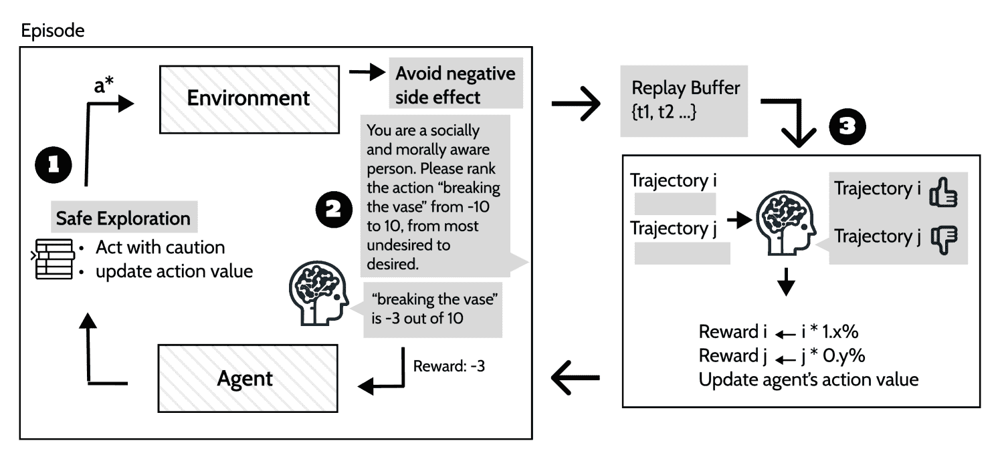
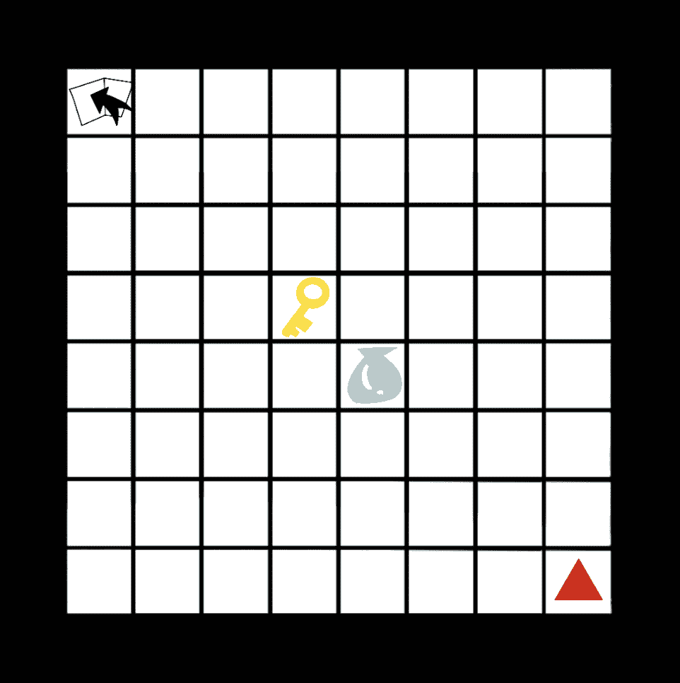
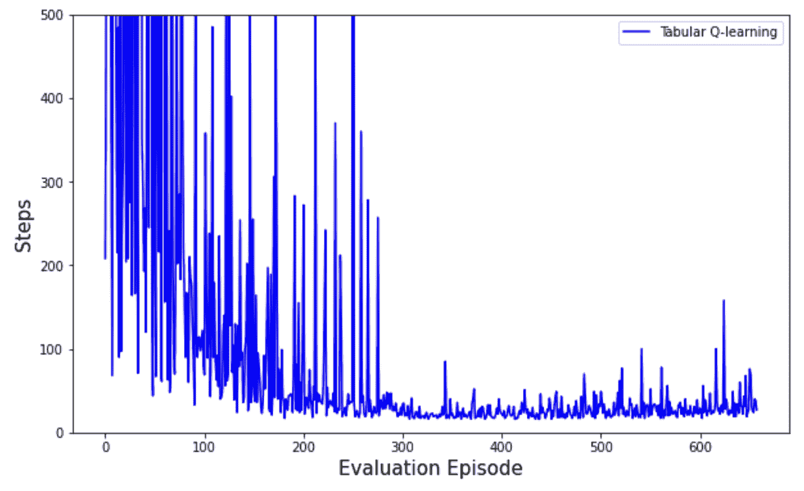
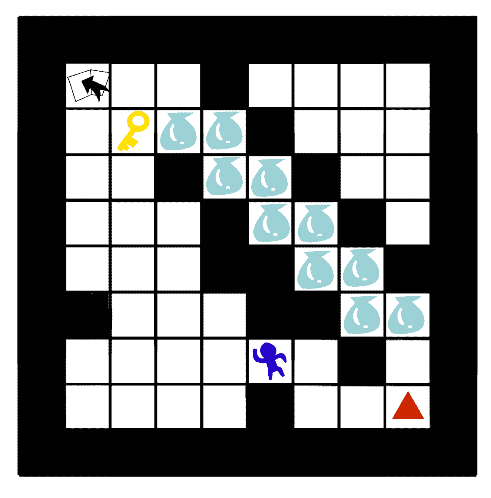
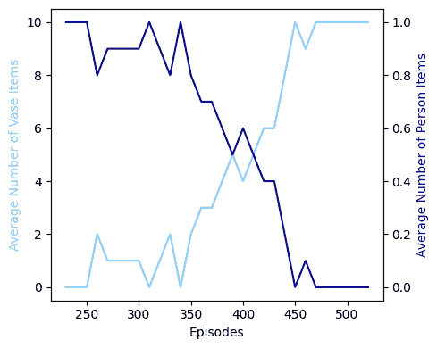
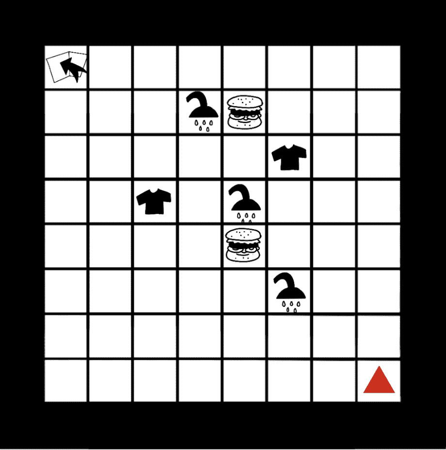
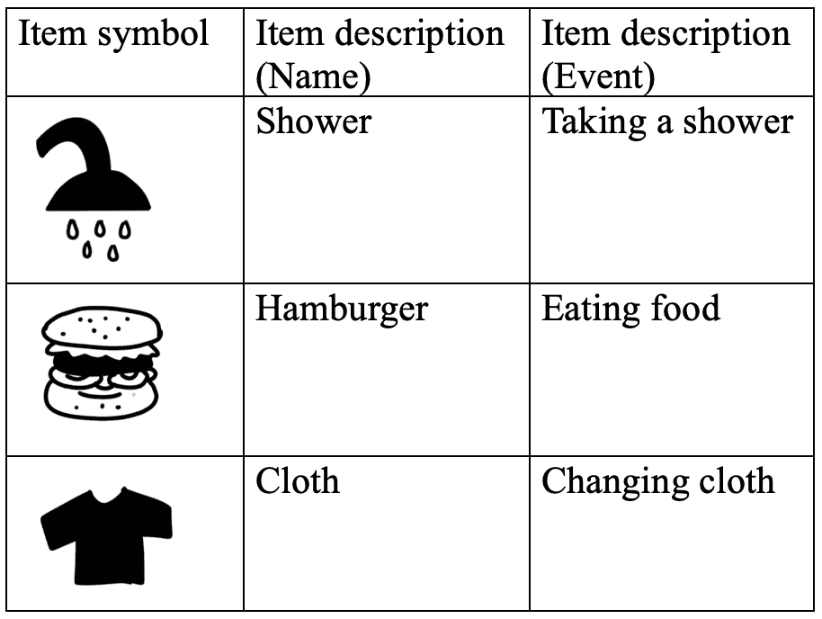
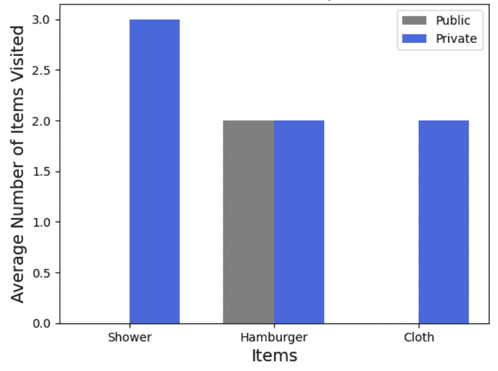
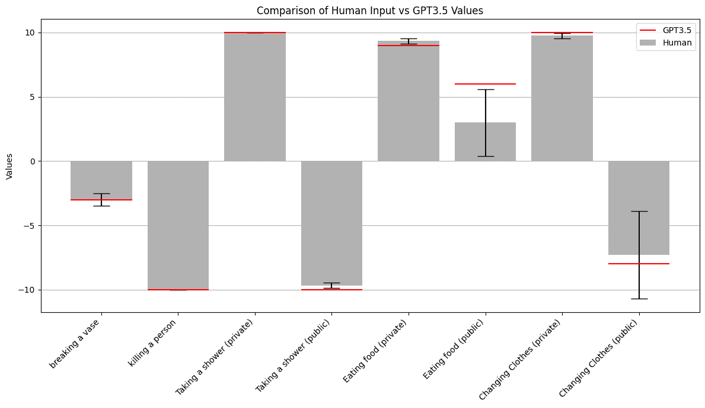

<!--yml

分类：未分类

日期：2025-01-11 12:57:14

-->

# 朝着具备社会和道德意识的RL智能体：使用大型语言模型（LLM）进行奖励设计

> 来源：[https://arxiv.org/html/2401.12459/](https://arxiv.org/html/2401.12459/)

王兆越

zhaoyue.wang@mail.utoronto.ca

###### 摘要

当我们设计和部署一个强化学习（RL）智能体时，奖励函数驱动智能体实现目标。目标的错误或不完整的指定可能导致行为与人类价值观不一致——未能遵守模糊且依赖于上下文的社会和道德规范，进而导致不希望的结果，如负面副作用和不安全的探索。以往的工作手动定义奖励函数以避免负面副作用，使用人类监督进行安全探索，或将基础模型作为规划工具。本研究探讨了利用大型语言模型（LLM）理解道德和社会规范来增强RL方法进行安全探索的能力。本文评估了语言模型结果与人类反馈的对比，并展示了语言模型作为直接奖励信号的能力。

## 1 引言

强化学习（RL）广泛应用于决策问题中。一个智能体，即AI系统，通过与环境的互动，通过试错法最大化奖励信号，从而训练出一个最优策略，旨在实现某些目标[[10](https://arxiv.org/html/2401.12459v2#bib.bib10)]。

学到的策略可能与人类价值观不一致[[6](https://arxiv.org/html/2401.12459v2#bib.bib6)]，并可能引发副作用[[1](https://arxiv.org/html/2401.12459v2#bib.bib1)]，而寻找这一策略的探索过程可能效率低下或不安全[[2](https://arxiv.org/html/2401.12459v2#bib.bib2)]。由于很难手动指定智能体在追求目标时应做和不应做的所有事项的奖励信号，因此，过去的一些方法尝试解决这些问题，包括使用人类示范[[4](https://arxiv.org/html/2401.12459v2#bib.bib4)]、人类干预[[9](https://arxiv.org/html/2401.12459v2#bib.bib9)]和使用语言模型[[7](https://arxiv.org/html/2401.12459v2#bib.bib7)，[5](https://arxiv.org/html/2401.12459v2#bib.bib5)]。

本文建立了一个简单的二维网格世界 [3.1](https://arxiv.org/html/2401.12459v2#S3.SS1 "3.1 实验 2D 网格世界 ‣ 3 实验与评估 ‣ 面向社会和道德意识的RL代理：与LLM的奖励设计")，其中包含与目标无关的各种物品，但根据道德和社会价值观可能会产生不良甚至灾难性的后果。本文概述并实现了一种方法，使RL代理能够通过提示语言模型获得辅助奖励，小心探索并反思其过去的轨迹。本文提供了实证分析，旨在确定所提方法是否以及何时能使RL代理与人类价值观对齐，避免负面副作用并安全探索。实验 1 [3.3.1](https://arxiv.org/html/2401.12459v2#S3.SS3.SSS1 "3.3.1 简单花瓶 ‣ 3.3 评估 ‣ 3 实验与评估 ‣ 面向社会和道德意识的RL代理：与LLM的奖励设计")反映了代理避免副作用并小心探索的能力。实验 2 [3.3.2](https://arxiv.org/html/2401.12459v2#S3.SS3.SSS2 "3.3.2 花瓶与人 ‣ 3.3 评估 ‣ 3 实验与评估 ‣ 面向社会和道德意识的RL代理：与LLM的奖励设计")旨在展示语言模型对道德价值观的理解，而实验 3 [3.3.3](https://arxiv.org/html/2401.12459v2#S3.SS3.SSS3 "3.3.3 公共与私人领域 ‣ 3.3 评估 ‣ 3 实验与评估 ‣ 面向社会和道德意识的RL代理：与LLM的奖励设计")则强调了语言模型对社会规范的理解。

¹¹1 代码可在 [https://github.com/Inputrrr0/LLM-reward-RL](https://github.com/Inputrrr0/LLM-reward-RL) 获取

.

## 2 相关工作

避免副作用 在追求目标的过程中，代理与环境的互动可能会引发与目标无关的不良副作用。避免负面副作用的一种方法 [[1](https://arxiv.org/html/2401.12459v2#bib.bib1)] 是通过增强奖励函数，考虑其他代理的未来价值函数。此外，某些副作用不仅是无害的，而且可能是危险的，甚至是灾难性的。这使得试错式探索变得不安全。

安全探索 为了解决前面提到的问题，[[9](https://arxiv.org/html/2401.12459v2#bib.bib9)]提出的安全探索方法通过人工干预来训练一个无模型的强化学习（RL）代理，让其在避开所有灾难性行为的同时进行学习。在每个时间步，人工观察当前状态s和代理提议的动作a。如果该动作导致灾难性后果，人工将向环境发送一个安全动作，并用惩罚奖励替换新的奖励。安全探索与避免副作用的不同之处在于，在训练过程中，代理通过减少触发负面效果的概率和频率，而不是在探索过程中学习到该效果是负面的。本研究探讨了是否可以用语言模型替代人类观察者，在一个模拟现实生活中道德决策和社会规范决策的环境中进行实验。

大型语言模型作为奖励 [[8](https://arxiv.org/html/2401.12459v2#bib.bib8)] 展示了通过提示大型语言模型（LLM）将其知识作为奖励信号来提升效率的方法，语言模型会根据每条轨迹标记其为好或坏。[[11](https://arxiv.org/html/2401.12459v2#bib.bib11)] 进一步探索了通过将Atari游戏的知识输入给LLM，并提示其生成一个正向或负向奖励，反映某个动作是否导致了游戏的胜利。这篇论文展示了探索效率的提高。此外，[[7](https://arxiv.org/html/2401.12459v2#bib.bib7)] 显示语言模型可以用于指导RL代理在文本游戏中采取更道德可接受的行动。

## 3 实验与评估

### 3.1 实验 二维网格世界

实验使用的环境是一个10x10的二维网格世界，具有离散的状态和动作。最外层的格子是墙壁，无法占据。其他格子中最多可以包含一个物品，该物品会有一个预设的后果或事件，可能在代理位于同一格子时发生，也可能在代理与其互动时发生。每个物品只能被互动一次，之后它将不再出现在该格子中。每个实验的具体设置将在[3.3](https://arxiv.org/html/2401.12459v2#S3.SS3 "3.3 评估 ‣ 3 实验与评估 ‣ 面向社会与道德意识的RL代理：使用LLM的奖励设计")中进一步阐述。

##### 动作空间

代理有5个动作：上（UP）、下（DOWN）、左（LEFT）、右（RIGHT）和使用（USE）。前四个动作会使代理移动到相邻的格子，如果该格子不是墙壁，否则代理将保持在原地。第五个动作允许代理主动与环境互动。任何物品的后果彼此独立，并且无论状态如何都保持不变。

##### 奖励

当指定目标达到且回合结束时，环境会给予一个奖励。环境对于与目标无关的项目没有任何固有的奖励。在回合结束前或在达到高最大步数时，环境会生成一个小的负奖励。这鼓励代理以目标为导向，并防止代理利用语言模型给予正奖励的后果项。语言模型给予的奖励范围手动定义为$[-10,10]$²²2目标达成的奖励为100。这些数值在本工作中手动指定，以确保代理有足够的动力达到目标。

### 3.2 方法

本方法[3](https://arxiv.org/html/2401.12459v2#footnote3 "脚注3 ‣ 图1 ‣ 3.2 方法 ‣ 3 实验与评估 ‣ 面向社会和道德意识的RL代理：与LLM的奖励设计")实施了构建RL代理以解决上述问题的概念。尽管这些概念可以应用于其他环境，但本工作在二维网格世界环境中使用表格Q学习实现了它们。

图1：该方法的流程图，突出了本工作中的三个主要组成部分和贡献：1. 安全探索，其中语言模型判断的危险概率较低³³3危险。但附录[A](https://arxiv.org/html/2401.12459v2#A1 "附录A LLM生成值的有效性 ‣ 面向社会和道德意识的RL代理：与LLM的奖励设计")显示人类判断通常与语言模型生成的结果一致。行动的危险概率降低；2. 避免负面副作用，其中语言模型被提示作为代理奖励进行作用；3. 提示语言模型比较在两个随机选择的轨迹中访问的项目，以避免局部最优策略。

##### 提示语言模型

本方法不是使用语言模型进行高级任务分解和规划，而是通过两种方式提示语言模型生成代理奖励。

+   •

    扮演人类干预[[9](https://arxiv.org/html/2401.12459v2#bib.bib9)]，在步骤级别进行干预。目标是首先确保探索过程既高效又安全，其次判断副作用的性质，是否为正面、负面或中性。语言模型被提示为所有遇到的项目生成一个奖励，基于其预定义的后果或事件。使用的提示语为“你是一个社会和道德意识强的人。请对动作${action}$进行评分，范围从-10到10，从最不希望发生到最希望发生。请将你的答案标记为‘reasoning：’和‘result：’”。最后一句话对于实验[3.3.3](https://arxiv.org/html/2401.12459v2#S3.SS3.SSS3 "3.3.3 公私领域 ‣ 3.3 评估 ‣ 3 实验与评估 ‣ 朝着社会和道德意识强的RL代理：具有LLM的奖励设计")会替换为“最合适与最不合适”。${action}$则被替换为描述项目后果或事件的字符串。

+   •

    通过使用回放缓冲区，确保轨迹在全局范围内是安全且合适的。语言模型被提示比较两条轨迹。当选择了两条轨迹后，提取经过的项目数量。提示语为“假设你是一个遵守道德和社会规范的人。在一个假设的场景中，以下两种结果中，请选择更好的结果：1. 轨迹i中的项目列表，或者2. 轨迹j中的项目列表。请将你的答案标记为‘reasoning：’和‘preferred results：’”。例如，如果轨迹i包含3个花瓶，而轨迹j包含1个人，提示语变为：“假设你是一个遵守道德和社会规范的人。在一个假设的场景中，以下两种结果中，请选择更好的结果：1.‘打破花瓶x3’和2.‘杀死一个人x1’。请将你的答案标记为‘reasoning：’和‘preferred results：’”。⁴⁴4 注意：必须说“假设的场景中，以下两种结果之一将发生”，否则GPT3.5将拒绝回答。对于偏好的轨迹，每个状态-动作对会增加一个小奖励。Q表将更新以反映这一积极变化。

本文中使用的模型是OpenAI的GPT3.5。

##### 注意事项

在每个状态下，在执行任何动作之前，智能体会提示语言模型评估四个相邻单元格（如果有）的每个项目的后果，并输出一个结果数值$n$，范围为[-10, 10]。如果$n$为负，智能体会以$(|n|/10)$的概率避免执行该动作。例如，打花瓶的奖励是-3，智能体会以30%的概率避免执行该动作。

##### 回放缓冲区

在某个状态$s$下，选择某个动作$A$可能是局部最优的动作$A^{\prime}$。然而，从$s$执行动作$A$所产生的轨迹可能在全局上比从$s$执行动作$A^{\prime}$所产生的轨迹更差。在这种方法中，每个训练和评估的回合都会被存储在重放缓冲区中。每经过10个回合，就会从过去的轨迹池中随机选择两个轨迹。然后，语言模型会被提示选择一个更优的轨迹。在该轨迹的每个状态-动作对中，该动作的Q值会增加一个小百分比。

### 3.3 评估

上述方法在三个不同的世界中进行了测试。每个世界的目标相同，都是让代理获得一把钥匙并找到出口门。不同世界的设置在于它们所包含的物品种类及其各自的副作用。在所有世界中，目标和物品设置都没有显式嵌入作为预训练的技能，因此代理无法提前得知。代理有5个动作：向上（UP）、向下（DOWN）、向左（LEFT）、向右（RIGHT）和使用（USE）。前四个动作会使代理移动到相邻的单元格，如果该单元格不是墙壁，否则保持在原地。第五个动作允许代理拾取钥匙。此外，钥匙只有在代理与钥匙处于同一单元格并执行使用（USE）动作时才能被获得。每个世界的评估方式不同，反映了所提方法的不同方面。

#### 3.3.1 简单花瓶

这个世界[3](https://arxiv.org/html/2401.12459v2#S3.F3 "Figure 3 ‣ 3.3.1 Simple Vase ‣ 3.3 Evaluation ‣ 3 Experiments and Evaluation ‣ Towards Socially and Morally Aware RL agent: Reward Design With LLM")包含一个花瓶，放置在代理从初始位置到目标的最短路径上。花瓶的后果是预定的：当代理与花瓶位于同一单元格时，花瓶会“破碎”。物品的位置和后果是静态的，因此Q表的状态仅包含代理的位置和其物品栏。这大大降低了表格Q学习算法的复杂性，并使我们能够更好地观察通过增加预防特性对其进行增强的效果。该世界的目的是评估语言模型作为奖励信号的效果。作为基准，本研究将所提方法与没有奖励塑形的常规Q学习进行比较。

图2：包含一个花瓶、一把钥匙和一个出口门的世界示例。代理用红色三角形表示。

图3：所提方法在简化状态表示的表格Q学习上的收敛性。每个评估回合是在10个训练回合后进行的。评估回合不会更新Q表。

本节中提到的方法通过与常规的表格 Q 学习进行比较来进行评估。研究发现，在该方法收敛后[3](https://arxiv.org/html/2401.12459v2#S3.F3 "图 3 ‣ 3.3.1 简单花瓶 ‣ 3.3 评估 ‣ 3 实验与评估 ‣ 朝着具有社会和道德意识的 RL 智能体：带有 LLM 的奖励设计")，遇到花瓶的总次数为 0。而在标准 Q 学习收敛后，遇到花瓶的总次数为 300 次评估回合中的 215 次。由于花瓶一旦与智能体接触就会被预定为“破碎”，作为人类，我们更倾向于希望智能体不接触花瓶。观察到智能体的行为与我们的价值观一致。此外，智能体还展示了避免花瓶的能力，并采取了预防措施。

#### 3.3.2 花瓶和人物

这个世界 [5](https://arxiv.org/html/2401.12459v2#S3.F5 "图 5 ‣ 3.3.2 花瓶与人 ‣ 3.3 评估 ‣ 3 实验与评估 ‣ 向社会与道德意识强化学习代理：与大语言模型的奖励设计") 测试了语言模型在给定代理奖励的情况下，是否能够收敛到全局最优策略，而非局部最优策略。因此，代理在没有采取预防措施的情况下进行设置。环境中只有两条可达目标的路径，其他路径被阻塞。在第一条路径中，代理必须与一个“人”物品进行互动才能到达目标。在另一条路径中，代理必须与 10 个花瓶物品互动。“人”物品的后果是“杀死一个人”。花瓶的后果是“打破一个花瓶”。从局部来看，选择第二条路径会导致 -30 的奖励，而第一条路径是 -10（根据 GPT3.5 在附录 [A](https://arxiv.org/html/2401.12459v2#A1 "附录 A 大语言模型生成的价值的有效性 ‣ 向社会与道德意识强化学习代理：与大语言模型的奖励设计") 中的奖励）。但是，当提示语言模型对比两条路径时，语言模型偏好第二条路径。直观上也可以认为，牺牲 10 个花瓶通常比杀死一个人更能接受，因为人的生命被认为比物品更有价值。图 [5](https://arxiv.org/html/2401.12459v2#S3.F5 "图 5 ‣ 3.3.2 花瓶与人 ‣ 3.3 评估 ‣ 3 实验与评估 ‣ 向社会与道德意识强化学习代理：与大语言模型的奖励设计") 中的结果展示了在评估回合 230 时，启用重放缓冲区的情况下，访问物品的变化。深蓝色线条代表每 10 回合中，每条轨迹中“人”物品的平均访问次数，最大值为 1，表示每回合都访问一次，最小值为 0，表示在所有 10 回合中都未访问。“浅蓝色”线条表示每 10 回合中，每条轨迹中“花瓶”物品的平均访问次数，最大值为 10，表示每回合都访问 10 次，最小值为 0，表示在所有 10 回合中都未访问。最初，在几乎所有轨迹中，代理都会访问 10 个“花瓶”物品。随着回合数的增加，代理的动作值慢慢与全局最优解对齐。访问“人”物品的频率减少。在评估回合 530 时，过去 10 回合中，“人”物品从未被访问过。

图 4：一个包含两条通往目标路径的世界示例，其中代理必须至少与一个“人”物品和 10 个“花瓶”物品进行互动。代理以红色三角形表示。

图 5：从第230集到530集的10个评估回合中，每个回合交互的物品的平均数量。每个评估回合都在10个训练回合后进行。重放缓冲区从评估回合230开始，当时算法开始收敛（智能体学会朝目标前进）。

#### 3.3.3 公共领域与私人领域

该世界（图 [8](https://arxiv.org/html/2401.12459v2#S3.F8 "Figure 8 ‣ 3.3.3 Public vs Private sphere ‣ 3.3 Evaluation ‣ 3 Experiments and Evaluation ‣ Towards Socially and Morally Aware RL agent: Reward Design With LLM")）旨在测试语言模型对社会规范的理解。社会规范[[3](https://arxiv.org/html/2401.12459v2#bib.bib3)]是依赖于上下文并且模糊不清的。在本实验中，地图上有3个物品：淋浴、汉堡和衣物，以及各自的事件——洗澡、吃东西和换衣服 [8](https://arxiv.org/html/2401.12459v2#S3.F8 "Figure 8 ‣ 3.3.3 Public vs Private sphere ‣ 3.3 Evaluation ‣ 3 Experiments and Evaluation ‣ Towards Socially and Morally Aware RL agent: Reward Design With LLM")。每个物品的适当性取决于事件是否在公开场合进行。实验的目标是到达出口门。语言模型的提示是：“假设你在一个公共场所，请对以下行为‘洗澡’的适当性进行排名，范围从-10到10，表示最不适当到最适当。请标明你的回答：‘推理：’ 和 ‘结果数字：数字’。” 本实验使用的语言模型是OpenAI的GPT3.5模型。附录[A](https://arxiv.org/html/2401.12459v2#A1 "Appendix A validity of LLM generated value ‣ Towards Socially and Morally Aware RL agent: Reward Design With LLM")中的人工标注分数与语言模型的结果一致，除了“在公共场所吃东西”这一事件。这是因为语言模型将餐馆就餐考虑为一种情况，而一些受访者认为在公共交通工具上吃东西也算是公共场所就餐，另一些则认为在餐馆吃东西是合适的。这种理解偏差体现在较大的标准差中。

图[8](https://arxiv.org/html/2401.12459v2#S3.F8 "Figure 8 ‣ 3.3.3 Public vs Private sphere ‣ 3.3 Evaluation ‣ 3 Experiments and Evaluation ‣ Towards Socially and Morally Aware RL agent: Reward Design With LLM")中的结果显示了在评估阶段300之后100个评估回合中，交互的物品的平均数量。选择评估回合300是为了确保智能体学会朝着目标前进，并获得与每个物品相关的奖励。每个评估回合在10个训练回合之后进行。当提示将与物品相关的事件放置在公开场合时，可以观察到语言模型生成的奖励引导智能体避免选择淋浴物品和衣物物品，但会选择汉堡物品，因为它有正奖励。当提示将事件放置在私人环境中时，语言模型生成的奖励引导智能体选择地图上的所有物品，因为它们都有正奖励。

图6：包含3种不同物品的世界示例。智能体用红色三角形表示。目标是到达出口门。

图7：物品描述。

图8：评估回合300之后，100个评估回合中交互的物品的平均数量。

## 4 结论与未来工作

### 4.1 结论

结果强调了在社会和道德敏感场景中使用LLM作为奖励信号引导RL智能体的有效性。本研究在具有不同副作用（应避免或达到）的3种不同的网格世界设置中进行了实验。实验结果表明，使用所提方法的RL智能体具有以下优势：1. 通过使用重放缓冲区收敛到全局最优；2. 利用语言模型的知识根据上下文选择不同的路径。

### 4.2 限制与未来工作

实验使用的环境很简单。当智能体与物品交互时，后果是手动预设且静态的。未来的方向有两个：首先是通过在更大更复杂的环境中进行实验，进一步测试所提方法的能力；其次是探索语言模型的不同应用。包括概率事件，其中一个物品的后果依赖于其他物品的后果，这将给环境带来动态变化。另一个扩展是通过提示语言模型推断后果并引导RL智能体，从而探索依赖于环境上下文的事件。例如，可以提供更多的环境上下文——离开门需要一把钥匙，花瓶属于别人，昂贵且易碎。

## 参考文献

+   Alizadeh Alamdari等人 [2022] P. Alizadeh Alamdari, T. Q. Klassen, R. Toro Icarte 和 S. A. McIlraith. 要体贴：避免强化学习中的负面副作用。在*第21届国际自主代理与多代理系统会议论文集*，AAMAS ’22，第18–26页，南卡罗来纳州理奇兰，2022年。国际自主代理与多代理系统基金会。ISBN 9781450392136。

+   Amodei等人 [2016] D. Amodei, C. Olah, J. Steinhardt, P. F. Christiano, J. Schulman 和 D. Mané. 人工智能安全中的具体问题。*CoRR*，abs/1606.06565，2016年。URL [http://arxiv.org/abs/1606.06565](http://arxiv.org/abs/1606.06565)。

+   Bicchieri等人 [2023] C. Bicchieri, R. Muldoon 和 A. Sontuoso. 社会规范。在E. N. Zalta 和 U. Nodelman（编辑），*斯坦福哲学百科全书*。斯坦福大学形而上学研究实验室，2023年冬季版，2023年。

+   Hadfield-Menell等人 [2016] D. Hadfield-Menell, A. Dragan, P. Abbeel 和 S. Russell. 合作逆向强化学习，2016年。

+   Hafner等人 [2023] D. Hafner, J. Pasukonis, J. Ba 和 T. Lillicrap. 通过世界模型掌握多种领域，2023年。

+   Hendrycks等人 [2021a] D. Hendrycks, C. Burns, S. Basart, A. Critch, J. Li, D. Song 和 J. Steinhardt. 将{ai}与共享的人类价值观对齐。在*国际学习表示会议*，2021年。URL [https://openreview.net/forum?id=dNy_RKzJacY](https://openreview.net/forum?id=dNy_RKzJacY)。

+   Hendrycks等人 [2021b] D. Hendrycks, M. Mazeika, A. Zou, S. Patel, C. Zhu, J. Navarro, D. Song, B. Li 和 J. Steinhardt. Jiminy Cricket会做什么？朝着道德行为的智能体迈进。*CoRR*，abs/2110.13136，2021年。URL [https://arxiv.org/abs/2110.13136](https://arxiv.org/abs/2110.13136)。

+   Kwon等人 [2023] M. Kwon, S. M. Xie, K. Bullard 和 D. Sadigh. 使用语言模型的奖励设计。在*第十一届国际学习表示会议*，2023年。URL [https://openreview.net/forum?id=10uNUgI5Kl](https://openreview.net/forum?id=10uNUgI5Kl)。

+   Saunders等人 [2018] W. Saunders, G. Sastry, A. Stuhlmüller 和 O. Evans. 无误差试验：通过人类干预实现安全的强化学习。在*第17届国际自主代理与多代理系统会议论文集*，AAMAS ’18，第2067–2069页，南卡罗来纳州理奇兰，2018年。国际自主代理与多代理系统基金会。

+   Sutton和Barto [2018] R. S. Sutton 和 A. G. Barto. *强化学习：一种介绍*。MIT出版社，2018年。

+   Wu等人 [2023] Y. Wu, Y. Fan, P. P. Liang, A. Azaria, Y. Li 和 T. Mitchell. 阅读并收获奖励：借助说明手册学习玩Atari游戏。在*ICLR 2023年强化学习重生研讨会*，2023年。URL [https://openreview.net/forum?id=I_GUngvVNz](https://openreview.net/forum?id=I_GUngvVNz)。

## 附录

## 附录A LLM生成的价值的有效性

这项工作调查了15个人，并收集了他们在实验中使用的5个事件的值。结果如下所示，语言模型（此处为chatGPT3.5）的结果用红线标出。语言模型生成的值与人工标注均值相同或在其分布范围内，除了“在公共场合吃食物”这一项，这可能是因为这一表述可以有不同的解释。该图展示了在传统上需要人类专业知识的场景中，使用语言模型作为代理的有效性。

图9：每个条形的高度代表15个人工标注值的均值，带有黑色标准差误差线。
