<!--yml
category: 未分类
date: 2025-01-11 11:42:55
-->

# TradingAgents: Multi-Agents LLM Financial Trading Framework

> 来源：[https://arxiv.org/html/2412.20138/](https://arxiv.org/html/2412.20138/)

Yijia Xiao¹, Edward Sun¹, Di Luo^(1,2), Wei Wang¹

###### Abstract

Significant progress has been made in automated problem-solving using societies of agents powered by large language models (LLMs). In finance, efforts have largely focused on single-agent systems handling specific tasks or multi-agent frameworks independently gathering data. However, multi-agent systems’ potential to replicate real-world trading firms’ collaborative dynamics remains underexplored. TradingAgents proposes a novel stock trading framework inspired by trading firms, featuring LLM-powered agents in specialized roles such as fundamental analysts, sentiment analysts, technical analysts, and traders with varied risk profiles. The framework includes Bull and Bear researcher agents assessing market conditions, a risk management team monitoring exposure, and traders synthesizing insights from debates and historical data to make informed decisions. By simulating a dynamic, collaborative trading environment, this framework aims to improve trading performance. Detailed architecture and extensive experiments reveal its superiority over baseline models, with notable improvements in cumulative returns, Sharpe ratio, and maximum drawdown, highlighting the potential of multi-agent LLM frameworks in financial trading.

## Introduction

Autonomous agents leveraging Large Language Models (LLMs) present a transformative approach to decision-making by replicating human processes and workflows across various applications. These systems enhance the problem-solving capabilities of language agents by equipping them with tools and enabling collaboration with other agents, effectively breaking down complex problems into manageable components (Park et al. [2023](https://arxiv.org/html/2412.20138v2#bib.bib18); Havrilla et al. [2024](https://arxiv.org/html/2412.20138v2#bib.bib7); Talebirad and Nadiri [2023](https://arxiv.org/html/2412.20138v2#bib.bib21); Tang et al. [2024](https://arxiv.org/html/2412.20138v2#bib.bib22)). One prominent application of these autonomous frameworks is in the financial market—a highly complex system influenced by numerous factors, including company fundamentals, market sentiment, technical indicators, and macroeconomic events.

Traditional algorithmic trading systems often rely on quantitative models that struggle to fully capture the complex interplay of diverse factors. In contrast, LLMs excel at processing and understanding natural language data, making them particularly effective for tasks that require textual comprehension, such as analyzing news articles, financial reports, and social media sentiment. Additionally, deep learning-based trading systems often suffer from low explainability, as they rely on hidden features that drive decision-making but are difficult to interpret. Recent advancements in multi-agent LLM frameworks for finance have shown significant promise in addressing these challenges. These frameworks create explainable AI systems, where decisions are supported by evidence and transparent reasoning (Li et al. [2023a](https://arxiv.org/html/2412.20138v2#bib.bib12); Wang et al. [2024b](https://arxiv.org/html/2412.20138v2#bib.bib25); Yu et al. [2024](https://arxiv.org/html/2412.20138v2#bib.bib36)), demonstrating their potential in financial applications.

Despite their potential, most current applications of language agents in the financial and trading sectors face two significant limitations:

Lack of Realistic Organizational Modeling: Many frameworks fail to capture the complex interactions between agents that mimic the structure of real-world trading firms (Li et al. [2023a](https://arxiv.org/html/2412.20138v2#bib.bib12); Wang et al. [2024b](https://arxiv.org/html/2412.20138v2#bib.bib25); Yu et al. [2024](https://arxiv.org/html/2412.20138v2#bib.bib36)). Instead, they focus narrowly on specific task performance, often disconnected from the organizational workflows and established human operating procedures proven effective in trading. This limits their ability to fully replicate and benefit from real-world trading practices.

Inefficient Communication Interfaces: Most existing systems use natural language as the primary communication medium, typically relying on message histories or an unstructured pool of information for decision-making (Park et al. [2023](https://arxiv.org/html/2412.20138v2#bib.bib18); Qian et al. [2024](https://arxiv.org/html/2412.20138v2#bib.bib19)). This approach often results in a “telephone effect”, where details are lost, and states become corrupted as conversations lengthen. Agents struggle to maintain context and track extended histories while filtering out irrelevant information from previous decision steps, diminishing their effectiveness in handling complex, dynamic tasks. Additionally, the unstructured pool-of-information approach lacks clear instructions, forcing logical communication and information exchange between agents to depend solely on retrieval, which disrupts the relational integrity of the data.

In this work, we address these key limitations of existing models by introducing a system that overcomes these challenges. First, our framework bridges the gap by simulating the multi-agent decision-making processes typical of professional trading teams. It incorporates specialized agents tailored to distinct aspects of trading, inspired by the organizational structure of real-world trading firms. These agents include fundamental analysts, sentiment/news analysts, technical analysts, and traders with diverse risk profiles. Bullish and bearish debaters evaluate market conditions to provide balanced recommendations, while a risk management team ensures that exposures remain within acceptable limits. Second, to enhance communication, our framework combines structured outputs for control, clarity, and reasoning with natural language dialogue to facilitate effective debate and collaboration among agents. This hybrid approach ensures both precision and flexibility in decision-making.

We validate our framework through experiments on historical financial data, comparing its performance against multiple baselines. Comprehensive evaluation metrics, including cumulative return, Sharpe ratio, and maximum drawdown, are employed to assess its overall effectiveness.

## Related Work

### LLMs as Financial Assistants

Large Language Models (LLMs) are applied in finance by fine-tuning on financial data or training on financial corpora. This improves the model’s understanding of financial terminology and data, enabling a specialized assistant for analytical support, insights, and information retrieval, rather than trade execution.

Fine-Tuned LLMs for Finance

Fine-tuning enhances domain-specific performance. Examples include PIXIU (FinMA) (Xie et al. [2023](https://arxiv.org/html/2412.20138v2#bib.bib28)), which fine-tuned LLaMA on 136K finance-related instructions; FinGPT (Yang, Liu, and Wang [2023](https://arxiv.org/html/2412.20138v2#bib.bib31)), which used LoRA to fine-tune models like LLaMA and ChatGLM with about 50K finance-specific samples; and Instruct-FinGPT (Zhang, Yang, and Liu [2023](https://arxiv.org/html/2412.20138v2#bib.bib37)), fine-tuned on 10K instruction samples from financial sentiment analysis datasets. These models outperform their base versions and other open-source LLMs like BLOOM and OPT (Zhang et al. [2022](https://arxiv.org/html/2412.20138v2#bib.bib39)) in finance classification tasks, even surpassing BloombergGPT (Wu et al. [2023](https://arxiv.org/html/2412.20138v2#bib.bib27)) in several evaluations. However, in generative tasks, they perform similarly or slightly worse than powerful general-purpose models like GPT-4, indicating a need for more high-quality, domain-specific datasets.

Finance LLMs Trained from Scratch

Training LLMs from scratch on finance-specific corpora aims for better domain adaptation. Models like BloombergGPT (Wu et al. [2023](https://arxiv.org/html/2412.20138v2#bib.bib27)), XuanYuan 2.0 (Zhang, Yang, and Xu [2023](https://arxiv.org/html/2412.20138v2#bib.bib41)), and Fin-T5 (Lu et al. [2023](https://arxiv.org/html/2412.20138v2#bib.bib15)) combine public datasets with finance-specific data during pretraining. BloombergGPT, for instance, was trained on both general and financial text, with proprietary Bloomberg data enhancing its performance on finance benchmarks. These models outperform general-purpose counterparts like BLOOM-176B and T5 in tasks such as market sentiment classification and summarization. While they may not match larger closed-source models like GPT-3 or PaLM (Chowdhery et al. [2022](https://arxiv.org/html/2412.20138v2#bib.bib2)), they offer competitive performance among similar-sized open-source models without compromising general language understanding.

In summary, finance-specific LLMs developed through fine-tuning or training from scratch show significant improvements in domain-specific tasks, underscoring the importance of domain adaptation and the potential for further enhancements with high-quality finance-specific datasets.

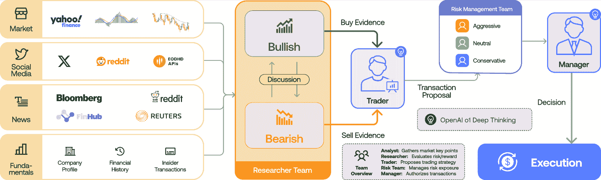

Figure 1: TradingAgents Overall Framework Organization. I. Analysts Team: Four analysts concurrently gather relevant market information. II. Research Team: The team discusses and evaluates the collected data. III. Trader: Based on the researchers’ analysis, the trader makes the trading decision. IV. Risk Management Team: Risk guardians assess the decision against current market conditions to mitigate risks. V. Fund Manager: The fund manager approves and executes the trade.

### LLMs as Traders

LLMs act as trader agents making direct trading decisions by analyzing external data like news, financial reports, and stock prices. Proposed architectures include news-driven, reasoning-driven, and reinforcement learning (RL)-driven agents.

News-Driven Agents

News-driven architectures integrate stock news and macroeconomic updates into LLM prompts to predict stock price movements. Studies evaluating both closed-source models (e.g., GPT-3.5, GPT-4) and open-source LLMs (e.g., Qwen (Bai et al. [2023](https://arxiv.org/html/2412.20138v2#bib.bib1)), Baichuan (Yang et al. [2023](https://arxiv.org/html/2412.20138v2#bib.bib30))) in financial sentiment analysis have shown the effectiveness of simple long-short strategies based on sentiment scores (Lopez-Lira and Tang [2023](https://arxiv.org/html/2412.20138v2#bib.bib14)). Further research on fine-tuned LLMs like FinGPT and OPT demonstrates improved performance through domain-specific alignment (Zhang et al. [2024a](https://arxiv.org/html/2412.20138v2#bib.bib38); Kirtac and Germano [2024](https://arxiv.org/html/2412.20138v2#bib.bib10)). Advanced methods involve summarizing news data and reasoning about their relationship with stock prices (Fatouros et al. [2024a](https://arxiv.org/html/2412.20138v2#bib.bib5); Wang, Izumi, and Sakaji [2024](https://arxiv.org/html/2412.20138v2#bib.bib24)).

Reasoning-Driven Agents

Reasoning-driven agents enhance trading decisions through mechanisms like reflection and debate. Reflection-driven agents, such as FinMem (Yu et al. [2023](https://arxiv.org/html/2412.20138v2#bib.bib35)) and FinAgent (Zhang et al. [2024b](https://arxiv.org/html/2412.20138v2#bib.bib40)), use layered memorization and multimodal data to summarize inputs into memories, inform decisions, and incorporate technical indicators, achieving superior backtest performance while mitigating hallucinations (Ji et al. [2023](https://arxiv.org/html/2412.20138v2#bib.bib9)). Debate-driven agents, like those in heterogeneous frameworks (Xing [2024](https://arxiv.org/html/2412.20138v2#bib.bib29)) and TradingGPT (Li et al. [2023b](https://arxiv.org/html/2412.20138v2#bib.bib13)), enhance reasoning and factual validity by employing LLM debates among agents with different roles, improving sentiment classification and increasing robustness in trading decisions.

Reinforcement Learning-Driven Agents

Reinforcement learning methods align LLM outputs with expected behaviors, using backtesting as rewards. SEP (Koa et al. [2024](https://arxiv.org/html/2412.20138v2#bib.bib11)) employs RL with memorization and reflection to refine LLM predictions based on market history. Classical RL methods are also used in trading frameworks that integrate LLM-generated embeddings with stock features, trained via algorithms like Proximal Policy Optimization (PPO) (Ding et al. [2023](https://arxiv.org/html/2412.20138v2#bib.bib3); Schulman et al. [2017](https://arxiv.org/html/2412.20138v2#bib.bib20)).

### LLMs as Alpha Miners

LLMs are also used to generate alpha factors instead of making direct trading decisions. QuantAgent (Wang et al. [2023](https://arxiv.org/html/2412.20138v2#bib.bib26)) demonstrates this by leveraging LLMs to produce alpha factors through an inner-loop and outer-loop architecture. In the inner loop, a writer agent generates a script from a trader’s idea, while a judge agent provides feedback. In the outer loop, the code is tested in the real market, and trading results enhance the judge agent. This approach enables progressive approximation of optimal behavior.

Subsequent research, such as AlphaGPT (Wang et al. [2023](https://arxiv.org/html/2412.20138v2#bib.bib26)), proposes a human-in-the-loop framework for alpha mining with a similar architecture. Both studies showcase the effectiveness of LLM-powered alpha mining systems, highlighting their potential in automating and accelerating the development of trading strategies by generating and refining alpha factors.

## TradingAgents: Role Specialization

Assigning LLM agents clear, well-defined roles with specific goals enables the breakdown of complex objectives into smaller, manageable subtasks. Financial trading is a prime example of such complexity, demanding the integration of diverse signals, inputs, and specialized expertise. In the real world, this approach to managing complexity is demonstrated by trading firms that rely on expert teams to collaborate and make high-stakes decisions, underscoring the multifaceted nature of the task.

In a typical trading firm, vast amounts of data are collected, including financial metrics, price movements, trading volumes, historical performance, economic indicators, and news sentiment. This data is then analyzed by quantitative experts (quants), including mathematicians, data scientists, and engineers, using advanced tools and algorithms to identify trends and predict market movements.

Inspired by this organizational structure, TradingAgents defines seven distinct agent roles within a simulated trading firm: Fundamentals Analyst, Sentiment Analyst, News Analyst, Technical Analyst, Researcher, Trader, and Risk Manager. Each agent is assigned a specific name, role, goal, and set of constraints, alongside predefined context, skills, and tools tailored to their function. For example, a Sentiment Analyst is equipped with tools like web search engines, Reddit search APIs, X/Twitter search tools, and sentiment score calculation algorithms, while a Technical Analyst can execute code, calculate technical indicators, and analyze trading patterns. More specifically, TradingAgents assumes the following teams.

### Analyst Team

The Analyst Team (Figure [2](https://arxiv.org/html/2412.20138v2#Sx3.F2 "Figure 2 ‣ Analyst Team ‣ TradingAgents: Role Specialization ‣ TradingAgents: Multi-Agents LLM Financial Trading Framework")) is composed of specialized agents responsible for gathering and analyzing various types of market data to inform trading decisions. Each agent focuses on a specific aspect of market analysis, bringing together a comprehensive view of the market’s conditions.

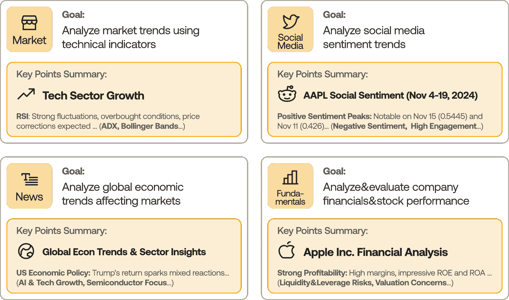

Figure 2: TradingAgents Analyst Team

*   •

    Fundamental Analyst Agents: These agents evaluate company fundamentals by analyzing financial statements, earnings reports, insider transactions, and other pertinent data. They assess a company’s intrinsic value to identify undervalued or overvalued stocks, providing insights into long-term investment potential.

*   •

    Sentiment Analyst Agents: These agents process large volumes of social media posts, sentiment scores, and insider sentiments derived from public information and social media activity. They gauge market sentiment to predict how collective investor behavior might impact stock prices in the short term.

*   •

    News Analyst Agents: These agents analyze news articles, government announcements, and other macroeconomic indicators to assess the market’s macroeconomic state, major world events, and significant company changes. They identify news events that could influence market movements, helping to anticipate sudden shifts in market dynamics.

*   •

    Technical Analyst Agents: These agents calculate and select relevant technical indicators, such as Moving Average Convergence Divergence (MACD) and Relative Strength Index (RSI), customized for specific assets. They analyze price patterns and trading volumes to forecast future price movements, assisting in timing entry and exit points.

Collectively, the Analyst Team synthesizes data from multiple sources to provide a holistic market analysis. Their combined insights form the foundational input for the Researcher Team, ensuring that all facets of the market are considered in subsequent decision-making processes.

### Researcher Team

The Researcher Team (Figure [3](https://arxiv.org/html/2412.20138v2#Sx3.F3 "Figure 3 ‣ Researcher Team ‣ TradingAgents: Role Specialization ‣ TradingAgents: Multi-Agents LLM Financial Trading Framework")) is responsible for critically evaluating the information provided by the Analyst Team. Comprised of agents adopting both bullish and bearish perspectives, they engage in multiple rounds of debate to assess the potential risks and benefits of investment decisions.

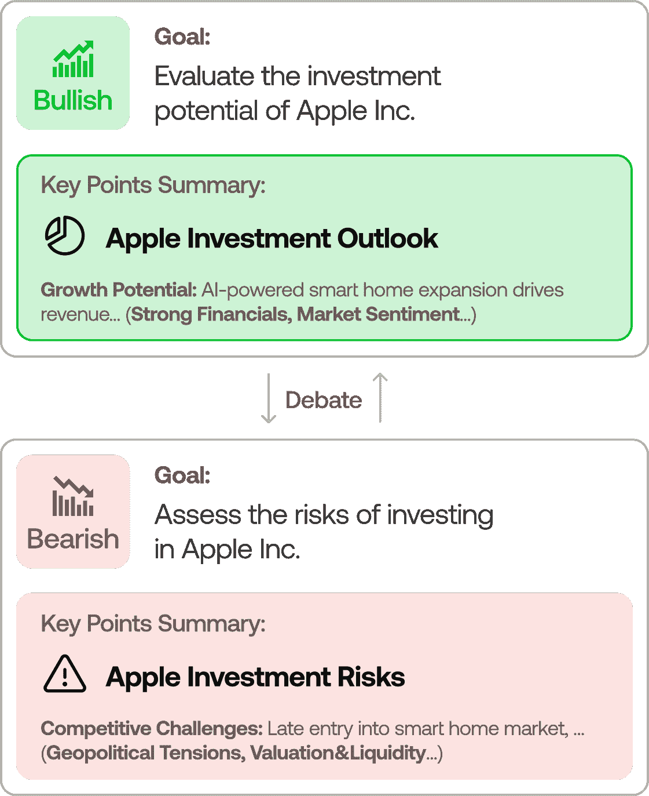

Figure 3: TradingAgents Researcher Team: Bullish Perspectives and Bearish Perspectives

*   •

    Bullish Researchers: These agents advocate for investment opportunities by highlighting positive indicators, growth potential, and favorable market conditions. They construct arguments supporting the initiation or continuation of positions in certain assets.

*   •

    Bearish Researchers: Conversely, these agents focus on potential downsides, risks, and unfavorable market signals. They provide cautionary insights, questioning the viability of investment strategies and highlighting possible negative outcomes.

Through this dialectical process, the Researcher Team aims to reach a balanced understanding of the market situation. Their thorough analysis helps in identifying the most promising investment strategies while anticipating possible challenges, thus aiding the Trader Agents in making informed decisions.

### Trader Agents

Trader Agents (Figure [4](https://arxiv.org/html/2412.20138v2#Sx3.F4 "Figure 4 ‣ Trader Agents ‣ TradingAgents: Role Specialization ‣ TradingAgents: Multi-Agents LLM Financial Trading Framework")) are responsible for executing trading decisions based on the comprehensive analysis provided by the Analyst Team and the nuanced perspectives from the Researcher Team. They assess the synthesized information, considering both quantitative data and qualitative insights, to determine optimal trading actions.

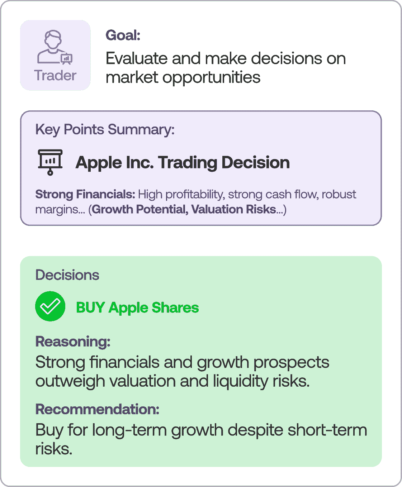

Figure 4: TradingAgents’s Trader Decision-Making Process

The tasks of TradingAgents Trader include:

*   •

    Evaluating recommendations and insights from analysts and researchers.

*   •

    Deciding on the timing and size of trades to maximize trading returns.

*   •

    Placing buy or sell orders in the market.

*   •

    Adjusting portfolio allocations in response to market changes and new information.

Trader Agents must balance potential returns against associated risks, making timely decisions in a dynamic market environment. Their actions directly impact the firm’s performance, necessitating a high level of precision and strategic thinking.

### Risk Management Team

The Risk Management Team (Figure [5](https://arxiv.org/html/2412.20138v2#Sx3.F5 "Figure 5 ‣ Risk Management Team ‣ TradingAgents: Role Specialization ‣ TradingAgents: Multi-Agents LLM Financial Trading Framework")) monitors and controls the firm’s exposure to various market risks. These agents continuously evaluate the portfolio’s risk profile, ensuring that trading activities remain within predefined risk parameters and comply with regulatory requirements.

The responsibilities of Risk Management Team include:

*   •

    Assessing factors such as market volatility, liquidity, and counterparty risks.

*   •

    Implementing risk mitigation strategies, such as setting stop-loss orders or diversifying holdings.

*   •

    Providing feedback to Trader Agents on risk exposures and suggesting adjustments to trading strategies.

*   •

    Ensuring that the overall portfolio aligns with the firm’s risk tolerance and investment objectives.

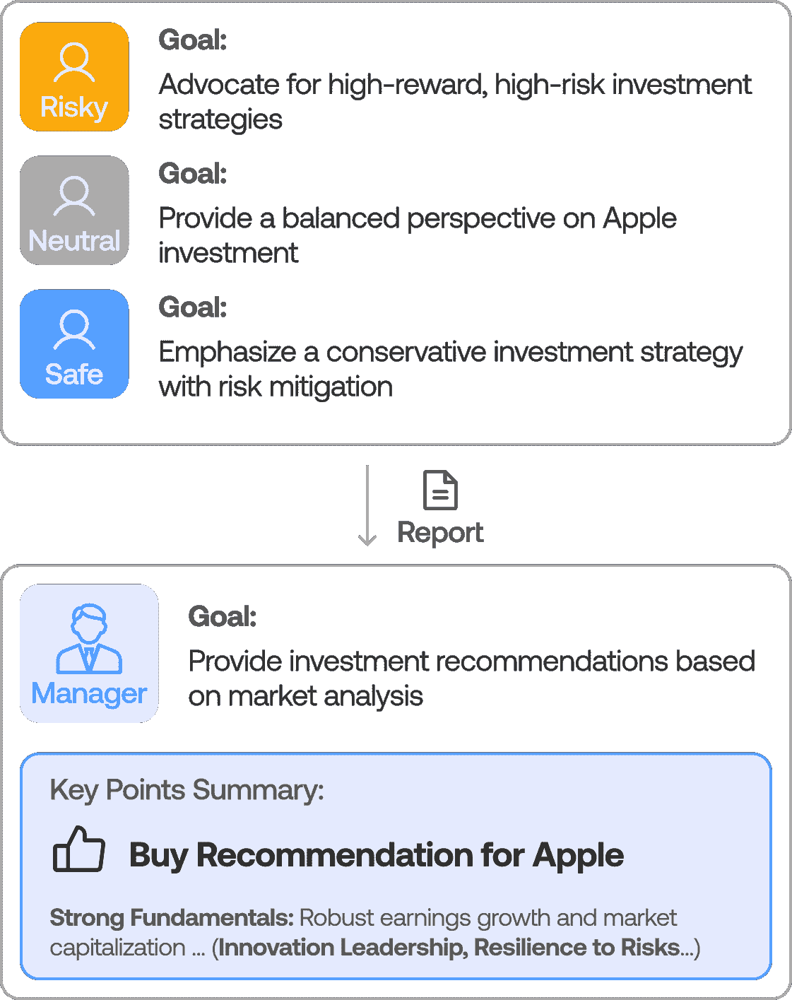

Figure 5: TradingAgents Risk Management Team and Fund Manager Approval Workflow

By offering oversight and guidance, the Risk Management Team helps maintain the firm’s financial stability and protect against adverse market events. They play a crucial role in safeguarding assets and ensuring sustainable long-term performance.

All agents in TradingAgents follow the ReAct prompting framework (Yao et al. [2023](https://arxiv.org/html/2412.20138v2#bib.bib34)), which synergizes reasoning and acting. The environment state is shared and monitored by the agents, enabling them to take context-appropriate actions such as conducting research, executing trades, engaging in debates, or managing risks. This design ensures a collaborative, dynamic decision-making process reflective of real-world trading systems.

## TradingAgents: Agent Workflow

### Communication Protocol

Most existing LLM-based agent frameworks use natural language as the primary communication interface, typically through structured message histories or collections of agent-generated messages (Fatouros et al. [2024b](https://arxiv.org/html/2412.20138v2#bib.bib6); Li et al. [2023a](https://arxiv.org/html/2412.20138v2#bib.bib12); Yang et al. [2024](https://arxiv.org/html/2412.20138v2#bib.bib33); Yang, Yue, and He [2023](https://arxiv.org/html/2412.20138v2#bib.bib32)). However, relying solely on natural language often proves insufficient for solving complex, long-term tasks that require extensive planning horizons. In such cases, pure natural language communication can resemble a game of telephone—over multiple iterations, initial information may be forgotten or distorted due to context length limitations and an overload of text that obscures critical earlier details (Hong et al. [2024](https://arxiv.org/html/2412.20138v2#bib.bib8)). To address this limitation, we draw inspiration from frameworks like MetaGPT, which adopt a structured approach to communication. Our model introduces a structured communication protocol to govern agent interactions. Our model introduces a structured communication protocol to govern agent interactions. By clearly defining each agent’s state, we ensure that each role only extracts or queries the necessary information, processes it, and returns a completed report. This streamlined approach reduces unnecessary steps, lowers the risk of message corruption, and keeps interactions focused and efficient, even in complex, long-horizon tasks.

### Types of Agent Interactions

In contrast to previous multi-agent trading frameworks, which rely heavily on natural language dialogue, TradingAgents agents communicate primarily through structured documents and diagrams. These documents encapsulate the agents’ insights in concise, well-organized reports that preserve essential content while avoiding irrelevant information. By utilizing structured reports, agents can query necessary details directly from the global state, eliminating the need for lengthy conversations that risk diluting information, extending the message state indefinitely, and causing data loss. The types of documents and the information they contain are detailed below:

*   •

    Analyst Team: Fundamental, sentiment, news, and technical analysts compile their research and findings into concise analysis reports specific to their areas of expertise. These reports include key metrics, insights, and recommendations based on their specialized analyses.

*   •

    Traders: Traders review and analyze the reports from the analysts, carefully deliberating to produce clear decision signals. They accompany these decisions with detailed reports explaining their rationale and supporting evidence, which are later utilized by the risk management team.

Agents engage in natural language dialogue exclusively during agent-to-agent conversations and debates. These concise, focused discussions have been shown to promote deeper reasoning and integrate diverse perspectives, enabling more balanced decisions in complex, long-horizon scenarios—a method particularly relevant to the intricate environment of trading (Du et al. [2023](https://arxiv.org/html/2412.20138v2#bib.bib4)). This approach seamlessly integrates with our structured framework, as the conversation state is recorded as a structured entry within the overall agent state. The types of communication in these scenarios are detailed below:

*   •

    Researcher Team: Each researcher agent queries the global agent state for analyst reports and carefully forms their opinion. Two researchers represent opposing perspectives: one bullish and one bearish. They engage in natural language dialogue for $n$ rounds, as determined by the debate facilitator agent. At the conclusion, the facilitator reviews the debate history, selects the prevailing perspective, and records it as a structured entry in the communication protocol.

*   •

    Risk Management Team: The risk management team, similar to the researcher team, queries the trader’s decision and accompanying report. They then deliberate from three perspectives—risk-seeking, neutral, and risk-conservative—to adjust the trading plan within risk constraints. They engage in $n$ rounds of natural language discussion, guided by a facilitator agent.

*   •

    Fund manager: The fund manager reviews the discussion from the risk management team, determines the appropriate risk adjustments, and updates the trader’s decision and report states within the communication protocol.

### Backbone LLMs

To meet the diverse complexity and speed demands of tasks in our framework, we strategically select Large Language Models (LLMs) based on their strengths. Quick-thinking models, such as `gpt-4o-mini` and `gpt-4o`, efficiently handle fast, low-depth tasks like summarization, data retrieval, and converting tabular data to text (OpenAI et al. [2024](https://arxiv.org/html/2412.20138v2#bib.bib17)). In contrast, deep-thinking models like `o1-preview` excel in reasoning-intensive tasks such as decision-making, evidence-based report writing, and data analysis. These models leverage their architectures for multi-round reasoning, producing logically sound, in-depth insights (Zhong et al. [2024](https://arxiv.org/html/2412.20138v2#bib.bib42); Wang et al. [2024a](https://arxiv.org/html/2412.20138v2#bib.bib23); OpenAI [2024](https://arxiv.org/html/2412.20138v2#bib.bib16)). Additionally, we prioritize models with proven reliability and scalability to ensure optimal performance across various market conditions. We also employ auxiliary expert models for specialized tasks like sentiment analysis.

Specifically, all analyst nodes rely on deep-thinking models to ensure robust analysis, while quick-thinking models handle data retrieval from APIs and tools for efficiency. Researchers and traders use deep-thinking models to generate valuable insights and support well-informed decisions. By aligning the choice of LLMs with the specific requirements of each task, our framework achieves a balance between efficiency and depth of reasoning, which is crucial for effective trading strategies.

This implementation strategy ensures that TradingAgents can be deployed without requiring a GPU, relying only on API credits. It also introduces seamless exchangeability of backbone models, enabling researchers to effortlessly replace the model with any locally hosted or API-accessible alternatives in the future. This adaptability supports the integration of improved reasoning models or finance-tuned models customized for specific tasks. As a result, TradingAgents is highly scalable and future-proof, offering flexibility to accommodate any backbone model for any of its agents.

## Experiments

In this section, we describe the experimental setup used to evaluate our proposed framework. We also provide detailed descriptions of the evaluation metrics employed to assess performance comprehensively.

Table 1: Performance comparison across all methods using four evaluation metrics. Results highlighted in green represent the best-performing statistic for each model. The improvement row illustrates TradingAgents’s performance gains over the top-performing baselines.

 | Categories | Models | AAPL |  | GOOGL |  | AMZN |
| --- | --- | --- | --- | --- | --- | --- |
| CR%$\uparrow$ | ARR%$\uparrow$ | SR$\uparrow$ | MDD%$\downarrow$ |  | CR%$\uparrow$ | ARR%$\uparrow$ | SR$\uparrow$ | MDD%$\downarrow$ |  | CR%$\uparrow$ | ARR%$\uparrow$ | SR$\uparrow$ | MDD%$\downarrow$ |
| --- | --- | --- | --- | --- | --- | --- | --- | --- | --- | --- | --- | --- | --- |
| Market | B&H | -5.23 | -5.09 | -1.29 | 11.90 |  | 7.78 | 8.09 | 1.35 | 13.04 |  | 17.1 | 17.6 | 3.53 | 3.80 |
| --- | --- | --- | --- | --- | --- | --- | --- | --- | --- | --- | --- | --- | --- | --- | --- |
| Rule-based | MACD | -1.49 | -1.48 | -0.81 | 4.53 |  | 6.20 | 6.26 | 2.31 | 1.22 |  | - | - | - | - |
| KDJ&RSI | 2.05 | 2.07 | 1.64 | 1.09 |  | 0.4 | 0.4 | 0.02 | 1.58 |  | -0.77 | -0.76 | -2.25 | 1.08 |
| ZMR | 0.57 | 0.57 | 0.17 | 0.86 |  | -0.58 | 0.58 | 2.12 | 2.34 |  | -0.77 | -0.77 | -2.45 | 0.82 |
|  | SMA | -3.2 | -2.97 | -1.72 | 3.67 |  | 6.23 | 6.43 | 2.12 | 2.34 |  | 11.01 | 11.6 | 2.22 | 3.97 |
| Ours | TradingAgents | 26.62 | 30.5 | 8.21 | 0.91 |  | 24.36 | 27.58 | 6.39 | 1.69 |  | 23.21 | 24.90 | 5.60 | 2.11 |
| Improvement(%) | 24.57 | 28.43 | 6.57 | - |  | 16.58 | 19.49 | 4.26 | - |  | 6.10 | 7.30 | 2.07 | - | 

### Back Trading

To simulate a realistic trading environment, we utilize a multi-asset and multi-modal financial dataset comprising of various stocks such as Apple, Nvidia, Microsoft, Meta, Google, and more. The dataset includes:

*   •

    Historical Stock Prices: Open, high, low, close, volume, and adjusted close prices from January 1st, 2024, to March 29th, 2024.

*   •

    News Articles: Daily news updates are gathered from diverse sources such as Bloomberg, Yahoo, EODHD, FinnHub, and Reddit, covering specific company developments, global events, macroeconomic trends, and government updates.

*   •

    Social Media Posts and Sentiment: Posts from Reddit, X/Twitter, and other platforms along with sentiment scores of posts calculated by auxiliary language models.

*   •

    Insider Sentiments and Transactions: Sentiment derived from public information, including transactions from SEDI and relevant company filings.

*   •

    Financial Statements and Earnings Reports: Quarterly and annual reports filed by companies.

*   •

    Company Profiles and Financial History: Descriptions of company profiles, target industries, and financial history reported by third parties.

*   •

    Technical Indicators: Sixty standard technical analysis indicators calculated for each asset, including MACD, RSI, Bollinger Bands, etc.

### Simulation Setup

We simulate the trading environment for the period from January 1st, 2024, to March 29th, 2024\. TradingAgents facilitates seamless plug-and-play strategies during the simulation, enabling straightforward comparisons with any baseline. Agents make decisions based solely on data available up to each trading day, ensuring no future data is used (eliminating look-ahead bias). Based on their analysis, TradingAgents generates trading signals to buy, sell, or hold assets, which are then executed. Afterward, analysis metrics are calculated before proceeding to the next day’s data.

### Baseline Models

We compare our TradingAgents framework against several baselines:

*   •

    Buy and Hold: Investing equal amounts in all selected stocks and holding them throughout the simulation period.

*   •

    MACD (Moving Average Convergence Divergence): A trend-following momentum strategy that generates buy and sell signals based on the crossover points between the MACD line and signal line.

*   •

    KDJ and RSI (Relative Strength Index): A momentum strategy combining KDJ (stochastic oscillator) and RSI (relative strength index) indicators to identify overbought and oversold conditions for trading signals.

*   •

    ZMR (Zero Mean Reversion): A mean reversion trading strategy that generates signals based on price deviations from and subsequent reversions to a zero reference line.

*   •

    SMA (Simple Moving Average): A trend-following strategy that generates trading signals based on crossovers between short-term and long-term moving averages.

### Evaluation Metrics

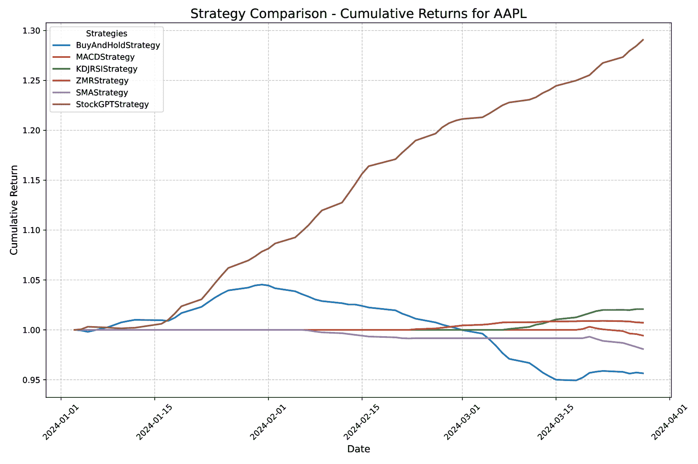

((a)) Cumulative Returns on AAPL

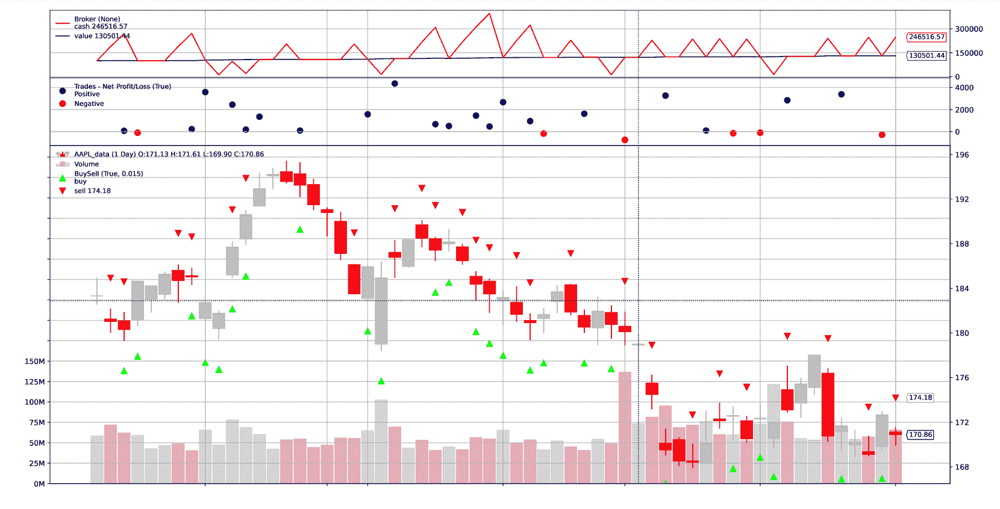

((b)) TradingAgents Transactions for AAPL.
Green / Red Arrows for Long / Short Positions.

Figure 6: TradingAgents: Cumulative Returns (CR) and Detailed Transaction History for AAPL.

To thoroughly evaluate the performance of our TradingAgents framework, we use widely recognized metrics to assess the risk management, profitability, and safety of the TradingAgents strategy in comparison to baseline approaches. Here we describe these metrics:

#### Cumulative Return (CR)

The cumulative return measures the total return generated over the simulation period. It is calculated as:

|  | $\text{CR}=\left(\frac{V_{\text{end}}-V_{\text{start}}}{V_{\text{start}}}\right% )\times 100\%$ |  | (1) |

where $V_{\text{end}}$ is the portfolio value at the end of the simulation, and $V_{\text{start}}$ is the initial portfolio value.

#### Annualized Return (AR)

The annualized return normalizes the cumulative return over the number of years:

|  | $\text{AR}=\left(\left(\frac{V_{\text{end}}}{V_{\text{start}}}\right)^{\frac{1}% {N}}-1\right)\times 100\%$ |  | (2) |

where $N$ is the number of years in the simulation.

#### Sharpe Ratio (SR)

The Sharpe ratio measures risk-adjusted return by comparing a portfolio’s excess return over the risk-free rate to its volatility:

|  | $\text{SR}=\frac{\bar{R}-R_{f}}{\sigma}$ |  | (3) |

where $\bar{R}$ is the average portfolio return, $R_{f}$ is the risk-free rate (e.g., yield of 3-month Treasury bills), and $\sigma$ is the standard deviation of the portfolio returns.

#### Maximum Drawdown (MDD)

Maximum drawdown measures the largest peak-to-trough decline in the portfolio value:

|  | $\text{MDD}=\max_{t\in[0,T]}\left(\frac{\text{Peak}_{t}-\text{Trough}_{t}}{% \text{Peak}_{t}}\right)\times 100\%$ |  | (4) |

## Results and Analysis

In this section, we present the results of our experiments and discuss the performance of our framework compared to the baseline models.

### Performance Comparison

#### Cumlative and Annual Returns

Table [1](https://arxiv.org/html/2412.20138v2#Sx5.T1 "Table 1 ‣ Experiments ‣ TradingAgents: Multi-Agents LLM Financial Trading Framework") and Figure [6](https://arxiv.org/html/2412.20138v2#Sx5.F6 "Figure 6 ‣ Evaluation Metrics ‣ Experiments ‣ TradingAgents: Multi-Agents LLM Financial Trading Framework"), [7](https://arxiv.org/html/2412.20138v2#A1.F7 "Figure 7 ‣ Cumulative Returns (CR) and Transaction History for AMZN and GOOGL ‣ Appendix A Appendix for TradingAgents ‣ TradingAgents: Multi-Agents LLM Financial Trading Framework"), [8](https://arxiv.org/html/2412.20138v2#A1.F8 "Figure 8 ‣ Cumulative Returns (CR) and Transaction History for AMZN and GOOGL ‣ Appendix A Appendix for TradingAgents ‣ TradingAgents: Multi-Agents LLM Financial Trading Framework") highlight that our method significantly outperforms existing rule-based trading baselines, particularly in profitability, as measured by returns. TradingAgents achieves at least a 23.21% cumulative return and 24.90% annual return on the three sampled stocks, outperforming the best-performing baselines by a margin of at least 6.1%. Notably, on the AAPL stock—a particularly challenging case due to market volatility during the testing period—traditional methods struggled, as their patterns failed to generalize to this situation. In contrast, TradingAgents excelled even under these adverse conditions, achieving returns exceeding 26% within less than three months.

#### Sharpe Ratio

The Sharpe Ratio performance highlights TradingAgents’s exceptional ability to deliver superior risk-adjusted returns, consistently outperforming all baseline models across AAPL, GOOGL, and AMZN with Sharpe Ratios of at least 5.60—surpassing the next best models by a significant margin of at least 2.07 points. This result underscores TradingAgents’s effectiveness in balancing returns against risk, a critical metric for sustainable and predictable investment growth. By excelling over market benchmarks like Buy-and-Hold and advanced strategies such as KDJRSI, SMA, MACD, and ZMR, TradingAgents demonstrates its adaptability and robustness in diverse market conditions. Its ability to maximize returns while maintaining controlled risk exposure establishes a solid foundation for multi-agent and debate-based automated trading algorithms.

#### Maximum Drawdown

While rule-based baselines demonstrated superior performance in controlling risk, as reflected by their maximum drawdown scores, they fell short in capturing high returns. This trade-off between risk and reward underscores TradingAgents’s strength as a balanced approach. Despite higher returns being typically associated with higher risks, TradingAgents maintained a relatively low maximum drawdown compared to many baselines. Its effective risk-control mechanisms, facilitated by the debates among risk-control agents, ensured that the maximum drawdown remained within a manageable limit, not exceeding 2\. This demonstrates TradingAgents’s capability to strike a robust balance between maximizing returns and managing risk effectively.

#### Explainability

A significant drawback of current deep learning methods for trading is their dense and complex architectures, which often render the decisions made by trading agents indecipherable to humans. This challenge, rooted in the broader issue of AI explainability, is particularly critical for trading agents, as they operate in real-world financial markets, often involving substantial sums of money where incorrect decisions can lead to severe consequences and losses.

In contrast, an LLM-based agentic framework for trading offers a transformative advantage: its operations and decisions are communicated in natural language, making them highly interpretable to humans. To illustrate this, we provide the full trading log of TradingAgents for a single day in the Appendix, showcasing its use of the ReAct-style prompting framework (Yao et al. [2023](https://arxiv.org/html/2412.20138v2#bib.bib34)). Each decision made by the agents is accompanied by detailed reasoning, tool usage, and thought processes, enabling traders to easily understand and debug the system. This transparency empowers traders to fine-tune and adjust the framework to account for factors influencing decisions, offering a significant edge in explainability over traditional deep-learning trading algorithms.

### Discussion

Our results demonstrate that integrating multiple specialized LLM agents and fostering agentic debate significantly enhances trading performance. This framework efficiently synthesizes diverse data sources and expert analyses, enabling trader agents to make well-informed decisions tailored to specific risk profiles. The inclusion of a reflective agent and a dedicated risk management team is pivotal in refining strategies and mitigating risks. As a result, the framework achieves exceptional return capture while maintaining strong risk management metrics, striking an optimal balance between maximizing rewards and minimizing risks. Additionally, the natural language-based operations of the multi-agent LLM framework ensure high explainability, giving TradingAgents a distinct advantage over traditional and deep learning methods in transparency and interpretability.

## Conclusion

In this paper, we introduced TradingAgents, an LLM-agent-powered stock trading framework that simulates a realistic trading firm environment with multiple specialized agents engaging in agentic debates and conversations. Leveraging the capabilities of LLMs to process and analyze diverse data sources, the framework enables informed trading decisions while utilizing multi-agent interactions to enhance performance through comprehensive reasoning and debate before acting. By integrating agents with distinct roles and risk profiles, along with a reflective agent and a dedicated risk management team, TradingAgents significantly improves trading outcomes and risk management compared to baseline models. Additionally, the collaborative nature of these agents ensures adaptability to varying market conditions. Extensive experiments demonstrate that TradingAgents outperforms traditional trading strategies and baselines in cumulative return, Sharpe ratio, and other critical metrics. Future work will focus on deploying the framework in a live trading environment, expanding agent roles, and incorporating real-time data processing to enhance performance further.

## Acknowledgments

We would like to acknowledge the advice from Yinggan Xu.

## References

*   Bai et al. (2023) Bai, J.; Bai, S.; Chu, Y.; Cui, Z.; Dang, K.; Deng, X.; Fan, Y.; Ge, W.; Han, Y.; Huang, F.; Hui, B.; Ji, L.; Li, M.; Lin, J.; Lin, R.; Liu, D.; Liu, G.; Lu, C.; Lu, K.; Ma, J.; Men, R.; Ren, X.; Ren, X.; Tan, C.; Tan, S.; Tu, J.; Wang, P.; Wang, S.; Wang, W.; Wu, S.; Xu, B.; Xu, J.; Yang, A.; Yang, H.; Yang, J.; Yang, S.; Yao, Y.; Yu, B.; Yuan, H.; Yuan, Z.; Zhang, J.; Zhang, X.; Zhang, Y.; Zhang, Z.; Zhou, C.; Zhou, J.; Zhou, X.; and Zhu, T. 2023. Qwen Technical Report. arXiv:2309.16609.
*   Chowdhery et al. (2022) Chowdhery, A.; Narang, S.; Devlin, J.; Bosma, M.; Mishra, G.; Roberts, A.; Barham, P.; Chung, H. W.; Sutton, C.; Gehrmann, S.; Schuh, P.; Shi, K.; Tsvyashchenko, S.; Maynez, J.; Rao, A.; Barnes, P.; Tay, Y.; Shazeer, N.; Prabhakaran, V.; Reif, E.; Du, N.; Hutchinson, B.; Pope, R.; Bradbury, J.; Austin, J.; Isard, M.; Gur-Ari, G.; Yin, P.; Duke, T.; Levskaya, A.; Ghemawat, S.; Dev, S.; Michalewski, H.; Garcia, X.; Misra, V.; Robinson, K.; Fedus, L.; Zhou, D.; Ippolito, D.; Luan, D.; Lim, H.; Zoph, B.; Spiridonov, A.; Sepassi, R.; Dohan, D.; Agrawal, S.; Omernick, M.; Dai, A. M.; Pillai, T. S.; Pellat, M.; Lewkowycz, A.; Moreira, E.; Child, R.; Polozov, O.; Lee, K.; Zhou, Z.; Wang, X.; Saeta, B.; Diaz, M.; Firat, O.; Catasta, M.; Wei, J.; Meier-Hellstern, K.; Eck, D.; Dean, J.; Petrov, S.; and Fiedel, N. 2022. PaLM: Scaling Language Modeling with Pathways. arXiv:2204.02311.
*   Ding et al. (2023) Ding, Y.; Jia, S.; Ma, T.; Mao, B.; Zhou, X.; Li, L.; and Han, D. 2023. Integrating Stock Features and Global Information via Large Language Models for Enhanced Stock Return Prediction. arXiv:2310.05627.
*   Du et al. (2023) Du, Y.; Li, S.; Torralba, A.; Tenenbaum, J. B.; and Mordatch, I. 2023. Improving Factuality and Reasoning in Language Models through Multiagent Debate. arXiv:2305.14325.
*   Fatouros et al. (2024a) Fatouros, G.; Metaxas, K.; Soldatos, J.; and Kyriazis, D. 2024a. Can Large Language Models Beat Wall Street? Unveiling the Potential of AI in Stock Selection. arXiv:2401.03737.
*   Fatouros et al. (2024b) Fatouros, G.; Metaxas, K.; Soldatos, J.; and Kyriazis, D. 2024b. Can Large Language Models Beat Wall Street? Unveiling the Potential of AI in Stock Selection. arXiv:2401.03737.
*   Havrilla et al. (2024) Havrilla, A.; Du, Y.; Raparthy, S. C.; Nalmpantis, C.; Dwivedi-Yu, J.; Zhuravinskyi, M.; Hambro, E.; Sukhbaatar, S.; and Raileanu, R. 2024. Teaching Large Language Models to Reason with Reinforcement Learning. arXiv:2403.04642.
*   Hong et al. (2024) Hong, S.; Zhuge, M.; Chen, J.; Zheng, X.; Cheng, Y.; Zhang, C.; Wang, J.; Wang, Z.; Yau, S. K. S.; Lin, Z.; Zhou, L.; Ran, C.; Xiao, L.; Wu, C.; and Schmidhuber, J. 2024. MetaGPT: Meta Programming for A Multi-Agent Collaborative Framework. arXiv:2308.00352.
*   Ji et al. (2023) Ji, Z.; Yu, T.; Xu, Y.; Lee, N.; Ishii, E.; and Fung, P. 2023. Towards Mitigating Hallucination in Large Language Models via Self-Reflection. arXiv:2310.06271.
*   Kirtac and Germano (2024) Kirtac, K.; and Germano, G. 2024. Sentiment trading with large language models. *Finance Research Letters*, 62: 105227.
*   Koa et al. (2024) Koa, K. J.; Ma, Y.; Ng, R.; and Chua, T.-S. 2024. Learning to Generate Explainable Stock Predictions using Self-Reflective Large Language Models.
*   Li et al. (2023a) Li, Y.; Yu, Y.; Li, H.; Chen, Z.; and Khashanah, K. 2023a. TradingGPT: Multi-agent system with layered memory and distinct characters for enhanced financial trading performance. *arXiv preprint arXiv:2309.03736*.
*   Li et al. (2023b) Li, Y.; Yu, Y.; Li, H.; Chen, Z.; and Khashanah, K. 2023b. TradingGPT: Multi-Agent System with Layered Memory and Distinct Characters for Enhanced Financial Trading Performance. arXiv:2309.03736.
*   Lopez-Lira and Tang (2023) Lopez-Lira, A.; and Tang, Y. 2023. Can ChatGPT Forecast Stock Price Movements? Return Predictability and Large Language Models. arXiv:2304.07619.
*   Lu et al. (2023) Lu, D.; Wu, H.; Liang, J.; Xu, Y.; He, Q.; Geng, Y.; Han, M.; Xin, Y.; and Xiao, Y. 2023. BBT-Fin: Comprehensive Construction of Chinese Financial Domain Pre-trained Language Model, Corpus and Benchmark. arXiv:2302.09432.
*   OpenAI (2024) OpenAI. 2024. Learning to Reason with LLMs - OpenAI O1 Model. https://openai.com/index/learning-to-reason-with-llms/. Accessed: 2024-11-21.
*   OpenAI et al. (2024) OpenAI; Achiam, J.; Adler, S.; Agarwal, S.; Ahmad, L.; Akkaya, I.; Aleman, F. L.; Almeida, D.; Altenschmidt, J.; Altman, S.; Anadkat, S.; Avila, R.; Babuschkin, I.; Balaji, S.; Balcom, V.; Baltescu, P.; Bao, H.; Bavarian, M.; Belgum, J.; Bello, I.; Berdine, J.; Bernadett-Shapiro, G.; Berner, C.; Bogdonoff, L.; Boiko, O.; Boyd, M.; Brakman, A.-L.; Brockman, G.; Brooks, T.; Brundage, M.; Button, K.; Cai, T.; Campbell, R.; Cann, A.; Carey, B.; Carlson, C.; Carmichael, R.; Chan, B.; Chang, C.; Chantzis, F.; Chen, D.; Chen, S.; Chen, R.; Chen, J.; Chen, M.; Chess, B.; Cho, C.; Chu, C.; Chung, H. W.; Cummings, D.; Currier, J.; Dai, Y.; Decareaux, C.; Degry, T.; Deutsch, N.; Deville, D.; Dhar, A.; Dohan, D.; Dowling, S.; Dunning, S.; Ecoffet, A.; Eleti, A.; Eloundou, T.; Farhi, D.; Fedus, L.; Felix, N.; Fishman, S. P.; Forte, J.; Fulford, I.; Gao, L.; Georges, E.; Gibson, C.; Goel, V.; Gogineni, T.; Goh, G.; Gontijo-Lopes, R.; Gordon, J.; Grafstein, M.; Gray, S.; Greene, R.; Gross, J.; Gu, S. S.; Guo, Y.; Hallacy, C.; Han, J.; Harris, J.; He, Y.; Heaton, M.; Heidecke, J.; Hesse, C.; Hickey, A.; Hickey, W.; Hoeschele, P.; Houghton, B.; Hsu, K.; Hu, S.; Hu, X.; Huizinga, J.; Jain, S.; Jain, S.; Jang, J.; Jiang, A.; Jiang, R.; Jin, H.; Jin, D.; Jomoto, S.; Jonn, B.; Jun, H.; Kaftan, T.; Łukasz Kaiser; Kamali, A.; Kanitscheider, I.; Keskar, N. S.; Khan, T.; Kilpatrick, L.; Kim, J. W.; Kim, C.; Kim, Y.; Kirchner, J. H.; Kiros, J.; Knight, M.; Kokotajlo, D.; Łukasz Kondraciuk; Kondrich, A.; Konstantinidis, A.; Kosic, K.; Krueger, G.; Kuo, V.; Lampe, M.; Lan, I.; Lee, T.; Leike, J.; Leung, J.; Levy, D.; Li, C. M.; Lim, R.; Lin, M.; Lin, S.; Litwin, M.; Lopez, T.; Lowe, R.; Lue, P.; Makanju, A.; Malfacini, K.; Manning, S.; Markov, T.; Markovski, Y.; Martin, B.; Mayer, K.; Mayne, A.; McGrew, B.; McKinney, S. M.; McLeavey, C.; McMillan, P.; McNeil, J.; Medina, D.; Mehta, A.; Menick, J.; Metz, L.; Mishchenko, A.; Mishkin, P.; Monaco, V.; Morikawa, E.; Mossing, D.; Mu, T.; Murati, M.; Murk, O.; Mély, D.; Nair, A.; Nakano, R.; Nayak, R.; Neelakantan, A.; Ngo, R.; Noh, H.; Ouyang, L.; O’Keefe, C.; Pachocki, J.; Paino, A.; Palermo, J.; Pantuliano, A.; Parascandolo, G.; Parish, J.; Parparita, E.; Passos, A.; Pavlov, M.; Peng, A.; Perelman, A.; de Avila Belbute Peres, F.; Petrov, M.; de Oliveira Pinto, H. P.; Michael; Pokorny; Pokrass, M.; Pong, V. H.; Powell, T.; Power, A.; Power, B.; Proehl, E.; Puri, R.; Radford, A.; Rae, J.; Ramesh, A.; Raymond, C.; Real, F.; Rimbach, K.; Ross, C.; Rotsted, B.; Roussez, H.; Ryder, N.; Saltarelli, M.; Sanders, T.; Santurkar, S.; Sastry, G.; Schmidt, H.; Schnurr, D.; Schulman, J.; Selsam, D.; Sheppard, K.; Sherbakov, T.; Shieh, J.; Shoker, S.; Shyam, P.; Sidor, S.; Sigler, E.; Simens, M.; Sitkin, J.; Slama, K.; Sohl, I.; Sokolowsky, B.; Song, Y.; Staudacher, N.; Such, F. P.; Summers, N.; Sutskever, I.; Tang, J.; Tezak, N.; Thompson, M. B.; Tillet, P.; Tootoonchian, A.; Tseng, E.; Tuggle, P.; Turley, N.; Tworek, J.; Uribe, J. F. C.; Vallone, A.; Vijayvergiya, A.; Voss, C.; Wainwright, C.; Wang, J. J.; Wang, A.; Wang, B.; Ward, J.; Wei, J.; Weinmann, C.; Welihinda, A.; Welinder, P.; Weng, J.; Weng, L.; Wiethoff, M.; Willner, D.; Winter, C.; Wolrich, S.; Wong, H.; Workman, L.; Wu, S.; Wu, J.; Wu, M.; Xiao, K.; Xu, T.; Yoo, S.; Yu, K.; Yuan, Q.; Zaremba, W.; Zellers, R.; Zhang, C.; Zhang, M.; Zhao, S.; Zheng, T.; Zhuang, J.; Zhuk, W.; and Zoph, B. 2024. GPT-4 Technical Report. arXiv:2303.08774.
*   Park et al. (2023) Park, J. S.; O’Brien, J. C.; Cai, C. J.; Morris, M. R.; Liang, P.; and Bernstein, M. S. 2023. Generative Agents: Interactive Simulacra of Human Behavior. arXiv:2304.03442.
*   Qian et al. (2024) Qian, C.; Liu, W.; Liu, H.; Chen, N.; Dang, Y.; Li, J.; Yang, C.; Chen, W.; Su, Y.; Cong, X.; Xu, J.; Li, D.; Liu, Z.; and Sun, M. 2024. ChatDev: Communicative Agents for Software Development. arXiv:2307.07924.
*   Schulman et al. (2017) Schulman, J.; Wolski, F.; Dhariwal, P.; Radford, A.; and Klimov, O. 2017. Proximal Policy Optimization Algorithms. arXiv:1707.06347.
*   Talebirad and Nadiri (2023) Talebirad, Y.; and Nadiri, A. 2023. Multi-Agent Collaboration: Harnessing the Power of Intelligent LLM Agents. arXiv:2306.03314.
*   Tang et al. (2024) Tang, X.; Zou, A.; Zhang, Z.; Li, Z.; Zhao, Y.; Zhang, X.; Cohan, A.; and Gerstein, M. 2024. MedAgents: Large Language Models as Collaborators for Zero-shot Medical Reasoning. arXiv:2311.10537.
*   Wang et al. (2024a) Wang, K.; Li, J.; Bhatt, N. P.; Xi, Y.; Liu, Q.; Topcu, U.; and Wang, Z. 2024a. On The Planning Abilities of OpenAI’s o1 Models: Feasibility, Optimality, and Generalizability. arXiv:2409.19924.
*   Wang, Izumi, and Sakaji (2024) Wang, M.; Izumi, K.; and Sakaji, H. 2024. LLMFactor: Extracting Profitable Factors through Prompts for Explainable Stock Movement Prediction. arXiv:2406.10811.
*   Wang et al. (2024b) Wang, S.; Yuan, H.; Ni, L. M.; and Guo, J. 2024b. QuantAgent: Seeking Holy Grail in Trading by Self-Improving Large Language Model. arXiv:2402.03755.
*   Wang et al. (2023) Wang, S.; Yuan, H.; Zhou, L.; Ni, L. M.; Shum, H.-Y.; and Guo, J. 2023. Alpha-gpt: Human-ai interactive alpha mining for quantitative investment. *arXiv preprint arXiv:2308.00016*.
*   Wu et al. (2023) Wu, S.; Irsoy, O.; Lu, S.; Dabravolski, V.; Dredze, M.; Gehrmann, S.; Kambadur, P.; Rosenberg, D.; and Mann, G. 2023. BloombergGPT: A Large Language Model for Finance. arXiv:2303.17564.
*   Xie et al. (2023) Xie, Q.; Han, W.; Zhang, X.; Lai, Y.; Peng, M.; Lopez-Lira, A.; and Huang, J. 2023. PIXIU: A Large Language Model, Instruction Data and Evaluation Benchmark for Finance. arXiv:2306.05443.
*   Xing (2024) Xing, F. 2024. Designing Heterogeneous LLM Agents for Financial Sentiment Analysis. arXiv:2401.05799.
*   Yang et al. (2023) Yang, A.; Xiao, B.; Wang, B.; Zhang, B.; Bian, C.; Yin, C.; Lv, C.; Pan, D.; Wang, D.; Yan, D.; Yang, F.; Deng, F.; Wang, F.; Liu, F.; Ai, G.; Dong, G.; Zhao, H.; Xu, H.; Sun, H.; Zhang, H.; Liu, H.; Ji, J.; Xie, J.; Dai, J.; Fang, K.; Su, L.; Song, L.; Liu, L.; Ru, L.; Ma, L.; Wang, M.; Liu, M.; Lin, M.; Nie, N.; Guo, P.; Sun, R.; Zhang, T.; Li, T.; Li, T.; Cheng, W.; Chen, W.; Zeng, X.; Wang, X.; Chen, X.; Men, X.; Yu, X.; Pan, X.; Shen, Y.; Wang, Y.; Li, Y.; Jiang, Y.; Gao, Y.; Zhang, Y.; Zhou, Z.; and Wu, Z. 2023. Baichuan 2: Open Large-scale Language Models. arXiv:2309.10305.
*   Yang, Liu, and Wang (2023) Yang, H.; Liu, X.-Y.; and Wang, C. D. 2023. FinGPT: Open-Source Financial Large Language Models. arXiv:2306.06031.
*   Yang, Yue, and He (2023) Yang, H.; Yue, S.; and He, Y. 2023. Auto-GPT for Online Decision Making: Benchmarks and Additional Opinions. arXiv:2306.02224.
*   Yang et al. (2024) Yang, H.; Zhang, B.; Wang, N.; Guo, C.; Zhang, X.; Lin, L.; Wang, J.; Zhou, T.; Guan, M.; Zhang, R.; and Wang, C. D. 2024. FinRobot: An Open-Source AI Agent Platform for Financial Applications using Large Language Models. arXiv:2405.14767.
*   Yao et al. (2023) Yao, S.; Zhao, J.; Yu, D.; Du, N.; Shafran, I.; Narasimhan, K.; and Cao, Y. 2023. ReAct: Synergizing Reasoning and Acting in Language Models. arXiv:2210.03629.
*   Yu et al. (2023) Yu, Y.; Li, H.; Chen, Z.; Jiang, Y.; Li, Y.; Zhang, D.; Liu, R.; Suchow, J. W.; and Khashanah, K. 2023. FinMem: A Performance-Enhanced LLM Trading Agent with Layered Memory and Character Design. arXiv:2311.13743.
*   Yu et al. (2024) Yu, Y.; Yao, Z.; Li, H.; Deng, Z.; Cao, Y.; Chen, Z.; Suchow, J. W.; Liu, R.; Cui, Z.; Zhang, D.; et al. 2024. FinCon: A Synthesized LLM Multi-Agent System with Conceptual Verbal Reinforcement for Enhanced Financial Decision Making. *arXiv preprint arXiv:2407.06567*.
*   Zhang, Yang, and Liu (2023) Zhang, B.; Yang, H.; and Liu, X.-Y. 2023. Instruct-FinGPT: Financial Sentiment Analysis by Instruction Tuning of General-Purpose Large Language Models. arXiv:2306.12659.
*   Zhang et al. (2024a) Zhang, H.; Hua, F.; Xu, C.; Kong, H.; Zuo, R.; and Guo, J. 2024a. Unveiling the Potential of Sentiment: Can Large Language Models Predict Chinese Stock Price Movements? arXiv:2306.14222.
*   Zhang et al. (2022) Zhang, S.; Roller, S.; Goyal, N.; Artetxe, M.; Chen, M.; Chen, S.; Dewan, C.; Diab, M.; Li, X.; Lin, X. V.; Mihaylov, T.; Ott, M.; Shleifer, S.; Shuster, K.; Simig, D.; Koura, P. S.; Sridhar, A.; Wang, T.; and Zettlemoyer, L. 2022. OPT: Open Pre-trained Transformer Language Models. arXiv:2205.01068.
*   Zhang et al. (2024b) Zhang, W.; Zhao, L.; Xia, H.; Sun, S.; Sun, J.; Qin, M.; Li, X.; Zhao, Y.; Zhao, Y.; Cai, X.; Zheng, L.; Wang, X.; and An, B. 2024b. A Multimodal Foundation Agent for Financial Trading: Tool-Augmented, Diversified, and Generalist. arXiv:2402.18485.
*   Zhang, Yang, and Xu (2023) Zhang, X.; Yang, Q.; and Xu, D. 2023. XuanYuan 2.0: A Large Chinese Financial Chat Model with Hundreds of Billions Parameters. arXiv:2305.12002.
*   Zhong et al. (2024) Zhong, T.; Liu, Z.; Pan, Y.; Zhang, Y.; Zhou, Y.; Liang, S.; Wu, Z.; Lyu, Y.; Shu, P.; Yu, X.; Cao, C.; Jiang, H.; Chen, H.; Li, Y.; Chen, J.; Hu, H.; Liu, Y.; Zhao, H.; Xu, S.; Dai, H.; Zhao, L.; Zhang, R.; Zhao, W.; Yang, Z.; Chen, J.; Wang, P.; Ruan, W.; Wang, H.; Zhao, H.; Zhang, J.; Ren, Y.; Qin, S.; Chen, T.; Li, J.; Zidan, A. H.; Jahin, A.; Chen, M.; Xia, S.; Holmes, J.; Zhuang, Y.; Wang, J.; Xu, B.; Xia, W.; Yu, J.; Tang, K.; Yang, Y.; Sun, B.; Yang, T.; Lu, G.; Wang, X.; Chai, L.; Li, H.; Lu, J.; Sun, L.; Zhang, X.; Ge, B.; Hu, X.; Zhang, L.; Zhou, H.; Zhang, L.; Zhang, S.; Liu, N.; Jiang, B.; Kong, L.; Xiang, Z.; Ren, Y.; Liu, J.; Jiang, X.; Bao, Y.; Zhang, W.; Li, X.; Li, G.; Liu, W.; Shen, D.; Sikora, A.; Zhai, X.; Zhu, D.; and Liu, T. 2024. Evaluation of OpenAI o1: Opportunities and Challenges of AGI. arXiv:2409.18486.

## Appendix A Appendix for TradingAgents

### Cumulative Returns (CR) and Transaction History for AMZN and GOOGL

We present additional figures for `$AMZN` and `$GOOGL` stocks to complement the AAPL data discussed in the main body of this paper. These supplementary visuals provide a broader perspective on the performance of our trading framework across multiple stocks, highlighting the consistency and robustness of TradingAgents’s results.

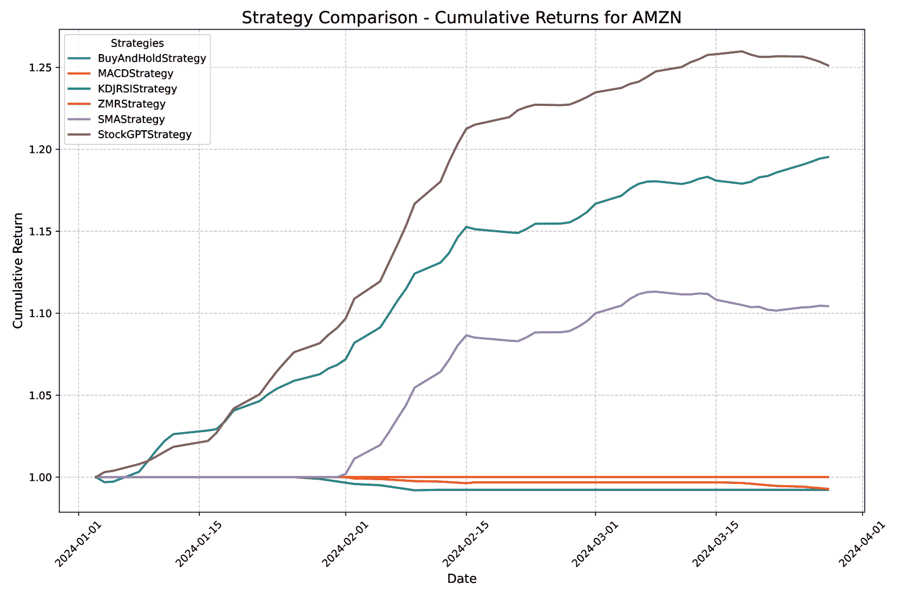

((a)) Cumulative Returns on AMZN

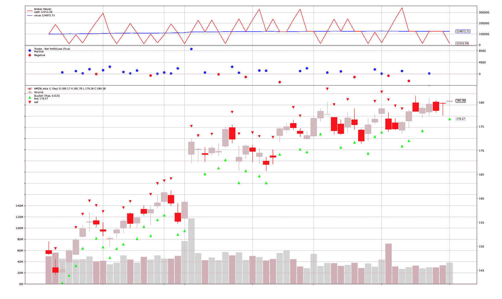

((b)) TradingAgents Transactions for AMZN.
Green / Red Arrows for Long / Short Positions.

Figure 7: TradingAgents: Cumulative Returns (CR) and Detailed Transaction History for AMZN.

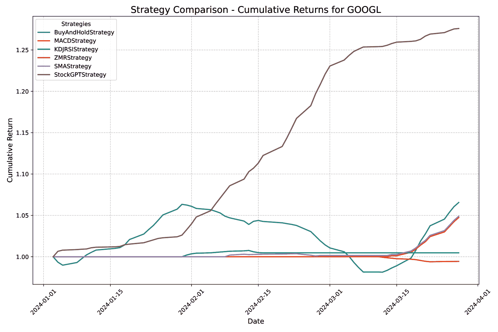

((a)) Cumulative Returns on GOOGL

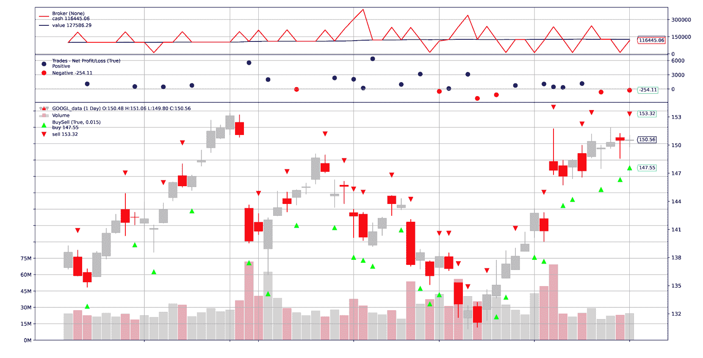

((b)) TradingAgents Transactions for GOOGL.
Green / Red Arrows for Long / Short Positions.

Figure 8: TradingAgents: Cumulative Returns (CR) and Detailed Transaction History for GOOGL.

By including detailed analyses for AMZN and GOOGL, we aim to demonstrate the versatility of our approach in diverse market environments, thereby reinforcing the overall effectiveness and generalizability of our methodology.

### TradingAgents Workflow: Role Specification and Cooperation

We offer a comprehensive overview of the various agent roles that collaborate within the TradingAgents. These roles include the Analyst Team, Researcher Team, Trader, Risk Management Team, and Fund Manager, each dedicated to different aspects of the trading process for Apple Inc. (Ticker: AAPL) as of November 19, 2024, a recent date chosen for demonstration purposes.

By detailing the responsibilities and interactions of each agent, we demonstrate how TradingAgents ensures thorough analysis, strategic trading decisions, and effective risk management. The collaborative structure not only enhances the system’s overall performance but also reinforces the transparency and explainability of TradingAgents, aligning with the objectives discussed in the main text. The following sections provide specific role specifications and illustrate how these agents work together to achieve robust and interpretable trading outcomes.

Market Analyst Team on Apple Inc. (Ticker: AAPL) [November 19, 2024]

[⬇](data:text/plain;base64,W01hcmtldCBBbmFseXN0XToKPT09PT09PT09PT09PT09PT09PT09PT09PT09PT09PT09PSBSZXBvcnQgPT09PT09PT09PT09PT09PT09PT09PT09PT09PT09PT09PQpCYXNlZCBvbiB0aGUgYW5hbHlzaXMgb2YgQUFQTCdzIHJlY2VudCBtYXJrZXQgZGF0YSBhbmQgc2VsZWN0ZWQgdGVjaG5pY2FsIGluZGljYXRvcnMsIGhlcmUgaXMgYSBkZXRhaWxlZCBhbmQgbnVhbmNlZCByZXBvcnQgb2YgdGhlIHRyZW5kcyBvYnNlcnZlZDoKCiMjIyBNb21lbnR1bSBJbmRpY2F0b3JzCi0gKipSU0kgKFJlbGF0aXZlIFN0cmVuZ3RoIEluZGV4KSoqOiBUaGUgUlNJIHZhbHVlcyBpbmRpY2F0ZSBzaWduaWZpY2FudCBmbHVjdHVhdGlvbnMsIHdpdGggcGVyaW9kcyBvZiBvdmVyYm91Z2h0IGNvbmRpdGlvbnMsIHBhcnRpY3VsYXJseSBvbiBOb3ZlbWJlciA1IGFuZCBOb3ZlbWJlciA3LCB3aGVyZSBSU0kgdmFsdWVzIHJlYWNoZWQgMTAwIGFuZCA4OS44NSwgcmVzcGVjdGl2ZWx5LiBUaGlzIHN1Z2dlc3RzIHN0cm9uZyB1cHdhcmQgcHJpY2UgbW92ZW1lbnRzLCBwb3RlbnRpYWxseSBsZWFkaW5nIHRvIHByaWNlIGNvcnJlY3Rpb25zLiBUaGUgUlNJIHN0YWJpbGl6ZXMgdG93YXJkcyB0aGUgZW5kIG9mIHRoZSBwZXJpb2QsIGluZGljYXRpbmcgbW9kZXJhdGUgYnV5aW5nIG1vbWVudHVtLgoKIyMjIFRyZW5kIEluZGljYXRvcnMKLSAqKkFEWCAoQXZlcmFnZSBEaXJlY3Rpb25hbCBJbmRleCkqKjogSW5pdGlhbGx5LCB0aGUgQURYIHZhbHVlcyBhcmUgZXh0cmVtZWx5IGhpZ2gsIGluZGljYXRpbmcgYSBzdHJvbmcgdHJlbmQsIGJ1dCB0aGV5IGRlY2xpbmUgc2lnbmlmaWNhbnRseSwgc3VnZ2VzdGluZyBhIHdlYWtlbmluZyB0cmVuZCBzdHJlbmd0aC4gVGhpcyBwYXR0ZXJuIGltcGxpZXMgYSB0cmFuc2l0aW9uIGZyb20gYSBzdHJvbmcgZGlyZWN0aW9uYWwgbW92ZW1lbnQgdG8gYSBwb3RlbnRpYWwgY29uc29saWRhdGlvbiBwaGFzZS4KCi0gKipTdXBlcnRyZW5kKio6IFRoZSBzdXBlcnRyZW5kIGluZGljYXRvciByZW1haW5zIGNvbnN0YW50LCBzdWdnZXN0aW5nIGEgc3RhYmxlIG1hcmtldCB0cmVuZCB3aXRob3V0IHNpZ25pZmljYW50IHZvbGF0aWxpdHkuIFRoaXMgc3RhYmlsaXR5IG1pZ2h0IGluZGljYXRlIGEgY29uc29saWRhdGlvbiBwaGFzZSwgd2l0aCB0aGUgcG90ZW50aWFsIGZvciBmdXR1cmUgYnJlYWtvdXRzLgoKIyMjIFZvbGF0aWxpdHkgSW5kaWNhdG9ycwotICoqQm9sbGluZ2VyIEJhbmRzKio6IFRoZSB1cHdhcmQgdHJlbmQgaW4gQm9sbGluZ2VyIEJhbmRzIHN1Z2dlc3RzIGEgYnVsbGlzaCBtYXJrZXQgcGhhc2Ugd2l0aCBsb3cgdm9sYXRpbGl0eS4gVGhlIGNvbnNpc3RlbnQgcmlzZSBpbiB2YWx1ZXMgaW5kaWNhdGVzIGEgcG9zaXRpdmUgbWFya2V0IGJpYXMsIHdpdGggcHJpY2VzIGxpa2VseSB0byBjb250aW51ZSByaXNpbmcgaWYgdGhlIHRyZW5kIHBlcnNpc3RzLgoKLSAqKkFUUiAoQXZlcmFnZSBUcnVlIFJhbmdlKSoqOiBUaGUgQVRSIHZhbHVlcyBzaG93IGFuIGluY3JlYXNlIGluIG1hcmtldCB2b2xhdGlsaXR5LCBwZWFraW5nIG9uIE5vdmVtYmVyIDcuIFRoaXMgc3VnZ2VzdHMgaGVpZ2h0ZW5lZCBtYXJrZXQgYWN0aXZpdHksIHdpdGggc3VzdGFpbmVkIHZvbGF0aWxpdHkgdG93YXJkcyB0aGUgZW5kIG9mIHRoZSBwZXJpb2QuCgojIyMgVm9sdW1lIEluZGljYXRvcnMKLSAqKlZSIChWb2x1bWUgVmFyaWF0aW9uIEluZGV4KSoqOiBUaGUgVlIgdmFsdWVzIGhpZ2hsaWdodCBzaWduaWZpY2FudCBmbHVjdHVhdGlvbnMgaW4gdHJhZGluZyB2b2x1bWUsIHdpdGggYSBub3RhYmxlIHNwaWtlIG9uIE5vdmVtYmVyIDUuIFRoaXMgaW5kaWNhdGVzIGhlaWdodGVuZWQgbWFya2V0IGFjdGl2aXR5LCBwb3NzaWJseSBkdWUgdG8gZXh0ZXJuYWwgZmFjdG9ycyBpbmZsdWVuY2luZyB0cmFkZXIgYmVoYXZpb3IuCgojIyMgUHJpY2UgQWN0aW9uIGFuZCBTdXBwb3J0L1Jlc2lzdGFuY2UKLSAqKkNDSSAoQ29tbW9kaXR5IENoYW5uZWwgSW5kZXgpKio6IFRoZSBDQ0kgdmFsdWVzIGluZGljYXRlIHZvbGF0aWxpdHksIHdpdGggc2V2ZXJhbCBpbnN0YW5jZXMgb2Ygb3ZlcmJvdWdodCBjb25kaXRpb25zLiBQZWFrcyBvbiBOb3ZlbWJlciA3LCBOb3ZlbWJlciAxNCwgYW5kIE5vdmVtYmVyIDE4IHN1Z2dlc3Qgc3Ryb25nIHVwd2FyZCBwcmljZSBtb3ZlbWVudHMsIHdoaWNoIGNvdWxkIGJlIGZvbGxvd2VkIGJ5IGNvcnJlY3Rpb25zLgoKIyMjIE1vdmluZyBBdmVyYWdlcwotICoqTUFDRCAoTW92aW5nIEF2ZXJhZ2UgQ29udmVyZ2VuY2UgRGl2ZXJnZW5jZSkqKjogVGhlIE1BQ0QgdmFsdWVzIGluZGljYXRlIGEgZ2VuZXJhbCB1cHdhcmQgdHJlbmQsIHdpdGggc29tZSBmbHVjdHVhdGlvbnMgYW5kIG1pbm9yIHB1bGxiYWNrcy4gVGhlIGluY3JlYXNpbmcgTUFDRCB2YWx1ZXMgc3VnZ2VzdCBidWxsaXNoIG1hcmtldCBzZW50aW1lbnQsIHdpdGggdGhlIHNob3J0LXRlcm0gbW92aW5nIGF2ZXJhZ2UgY29uc2lzdGVudGx5IGFib3ZlIHRoZSBsb25nLXRlcm0gYXZlcmFnZS4KCiMjIyBTdW1tYXJ5IGFuZCBJbnNpZ2h0cwpUaGUgYW5hbHlzaXMgb2YgQUFQTCdzIHJlY2VudCBtYXJrZXQgZGF0YSByZXZlYWxzIGEgcGVyaW9kIG9mIHZvbGF0aWxpdHkgd2l0aCBhbHRlcm5hdGluZyBwaGFzZXMgb2Ygc3Ryb25nIGJ1eWluZyBtb21lbnR1bSBhbmQgc3RhYmlsaXphdGlvbi4gVGhlIGluaXRpYWwgb3ZlcmJvdWdodCBjb25kaXRpb25zIGFuZCBoaWdoIEFEWCB2YWx1ZXMgc3VnZ2VzdCBhIHN0cm9uZyB0cmVuZCwgd2hpY2ggd2Vha2VucyBvdmVyIHRpbWUsIGluZGljYXRpbmcgcG90ZW50aWFsIGNvbnNvbGlkYXRpb24uIFRoZSBjb25zaXN0ZW50IHVwd2FyZCB0cmVuZCBpbiBCb2xsaW5nZXIgQmFuZHMgYW5kIE1BQ0QgdmFsdWVzIHBvaW50cyB0byBhIGJ1bGxpc2ggbWFya2V0IHNlbnRpbWVudCwgd2hpbGUgdGhlIGZsdWN0dWF0aW9ucyBpbiBBVFIgYW5kIFZSIHZhbHVlcyBoaWdobGlnaHQgb25nb2luZyBtYXJrZXQgdm9sYXRpbGl0eS4KClRyYWRlcnMgc2hvdWxkIGJlIGNhdXRpb3VzIG9mIHBvdGVudGlhbCBwcmljZSBjb3JyZWN0aW9ucyBmb2xsb3dpbmcgdGhlIG92ZXJib3VnaHQgY29uZGl0aW9ucyBhbmQgY29uc2lkZXIgdGhlIHBvc3NpYmlsaXR5IG9mIGNvbnRpbnVlZCB2b2xhdGlsaXR5LiBUaGUgc3RhYmxlIHN1cGVydHJlbmQgdmFsdWUgc3VnZ2VzdHMgYSBjb25zb2xpZGF0aW9uIHBoYXNlLCB3aXRoIHBvdGVudGlhbCBmb3IgZnV0dXJlIGJyZWFrb3V0cy4gT3ZlcmFsbCwgdHJhZGVycyBzaG91bGQgcmVtYWluIHZpZ2lsYW50LCB1c2luZyB0aGVzZSBpbnNpZ2h0cyB0byBhZGp1c3QgdGhlaXIgc3RyYXRlZ2llcyBhY2NvcmRpbmdseSwgd2hpbGUgYmVpbmcgcHJlcGFyZWQgZm9yIGJvdGggb3Bwb3J0dW5pdGllcyBhbmQgcmlza3MgcHJlc2VudGVkIGJ5IHRoZSBjdXJyZW50IG1hcmtldCBjb25kaXRpb25zLgo9PT09PT09PT09PT09PT09PT09PT09PT09PT09PT09PSBUb29sIENhbGxzID09PT09PT09PT09PT09PT09PT09PT09PT09PT09PT09ClRvb2wgQ2FsbHM6CiAgZ2V0X1lGaW5fZGF0YSAoY2FsbF9UdURvNG0zVTBsa2d0VjYxUXBxM1VJaVQpCiBDYWxsIElEOiBjYWxsX1R1RG80bTNVMGxrZ3RWNjFRcHEzVUlpVAogIEFyZ3M6CiAgICBzeW1ib2w6IEFBUEwKICAgIGN1cnJfZGF0ZTogMjAyNC0xMS0xOQoKQmFzZWQgb24gdGhlIHJlY2VudCBtYXJrZXQgZGF0YSBmb3IgQXBwbGUgKEFBUEwpIGZyb20gTm92ZW1iZXIgNCwgMjAyNCwgdG8gTm92ZW1iZXIgMTgsIDIwMjQsIHdlIGNhbiBvYnNlcnZlIHNldmVyYWwga2V5IHRyZW5kcyBhbmQgcGF0dGVybnM6CgoxLiAqKlByaWNlIE1vdmVtZW50Kio6IEFBUEwgaGFzIHNob3duIGEgZ2VuZXJhbCB1cHdhcmQgdHJlbmQgb3ZlciB0aGUgcGVyaW9kLCB3aXRoIHRoZSBzdG9jayBwcmljZSBpbmNyZWFzaW5nIGZyb20gYW4gb3BlbmluZyBvZgokMjIwLjc1IG9uIE5vdmVtYmVyIDQgdG8gYSBjbG9zaW5nIG9mICQyMjguMDIgb24gTm92ZW1iZXIgMTguIFRoZSBzdG9jayBleHBlcmllbmNlZCBmbHVjdHVhdGlvbnMsIHdpdGggbm90YWJsZSBoaWdocyBvbiBOb3ZlbWJlcgo3IGFuZCBOb3ZlbWJlciAxNCwgcmVhY2hpbmcgJDIyNy42MyBhbmQgJDIyOC44NywgcmVzcGVjdGl2ZWx5LgoKMi4gKipWb2x1bWUgVHJlbmRzKio6IFRyYWRpbmcgdm9sdW1lIHZhcmllZCBzaWduaWZpY2FudGx5LCB3aXRoIGEgcGVhayBvbiBOb3ZlbWJlciA2IGF0IDU0LDU2MSwxMDAgc2hhcmVzLiBUaGlzIHN1Z2dlc3RzIGhlaWdodGVuZWQgdHJhZGluZyBhY3Rpdml0eSwgcG9zc2libHkgZHVlIHRvIG1hcmtldCBldmVudHMgb3IgaW52ZXN0b3Igc2VudGltZW50IGNoYW5nZXMuCgozLiAqKkRpdmlkZW5kIFBheW1lbnQqKjogQSBkaXZpZGVuZCBvZiAkMC4yNSBwZXIgc2hhcmUgd2FzIHBhaWQgb24gTm92ZW1iZXIgOCwgd2hpY2ggbWlnaHQgaGF2ZSBpbmZsdWVuY2VkIGludmVzdG9yIGJlaGF2aW9yLCBwb3RlbnRpYWxseSBjb250cmlidXRpbmcgdG8gdGhlIHByaWNlIG1vdmVtZW50cyBvYnNlcnZlZCBhcm91bmQgdGhpcyBkYXRlLgoKNC4gKipWb2xhdGlsaXR5Kio6IFRoZSBzdG9jayBzaG93ZWQgc29tZSB2b2xhdGlsaXR5LCB3aXRoIGRhaWx5IHByaWNlIHJhbmdlcyAoaGlnaHMgYW5kIGxvd3MpIGluZGljYXRpbmcgYWN0aXZlIHRyYWRpbmcgYW5kIHBvdGVudGlhbCBtYXJrZXQgcmVhY3Rpb25zIHRvIG5ld3Mgb3IgZWFybmluZ3MgcmVwb3J0cy4KClRvIHByb3ZpZGUgYSBjb21wcmVoZW5zaXZlIGFuYWx5c2lzLCBJIHdpbGwgc2VsZWN0IGEgc2V0IG9mIHRlY2huaWNhbCBpbmRpY2F0b3JzIHRoYXQgY2FuIG9mZmVyIGRpdmVyc2UgaW5zaWdodHMgaW50byBBQVBMJ3MgbWFya2V0IGJlaGF2aW9yLiBUaGVzZSBpbmRpY2F0b3JzIHdpbGwgY292ZXIgbW9tZW50dW0sIHRyZW5kLCB2b2xhdGlsaXR5LCB2b2x1bWUsIGFuZCBwcmljZSBhY3Rpb24gYXNwZWN0czoKCjEuICoqUlNJIChSZWxhdGl2ZSBTdHJlbmd0aCBJbmRleCkqKjogVG8gYXNzZXNzIG1vbWVudHVtIGFuZCBpZGVudGlmeSBvdmVyYm91Z2h0IG9yIG92ZXJzb2xkIGNvbmRpdGlvbnMuCjIuICoqQURYIChBdmVyYWdlIERpcmVjdGlvbmFsIEluZGV4KSoqOiBUbyBldmFsdWF0ZSB0aGUgc3RyZW5ndGggb2YgdGhlIGN1cnJlbnQgdHJlbmQuCjMuICoqQm9sbGluZ2VyIEJhbmRzKio6IFRvIGFuYWx5emUgdm9sYXRpbGl0eSBhbmQgcG90ZW50aWFsIHByaWNlIGJyZWFrb3V0cy4KNC4gKipNQUNEIChNb3ZpbmcgQXZlcmFnZSBDb252ZXJnZW5jZSBEaXZlcmdlbmNlKSoqOiBUbyBpZGVudGlmeSB0cmVuZCBjaGFuZ2VzIGFuZCBtb21lbnR1bS4KNS4gKipWV01BIChWb2x1bWUgV2VpZ2h0ZWQgTW92aW5nIEF2ZXJhZ2UpKio6IFRvIHVuZGVyc3RhbmQgcHJpY2UgbW92ZW1lbnRzIGluIHJlbGF0aW9uIHRvIHZvbHVtZS4KNi4gKipBVFIgKEF2ZXJhZ2UgVHJ1ZSBSYW5nZSkqKjogVG8gbWVhc3VyZSBtYXJrZXQgdm9sYXRpbGl0eS4KNy4gKipTdXBlcnRyZW5kKio6IFRvIGlkZW50aWZ5IHRyZW5kIGRpcmVjdGlvbiBhbmQgcG90ZW50aWFsIHJldmVyc2Fscy4KOC4gKipDQ0kgKENvbW1vZGl0eSBDaGFubmVsIEluZGV4KSoqOiBUbyBpZGVudGlmeSBjeWNsaWNhbCB0cmVuZHMgYW5kIHBvdGVudGlhbCByZXZlcnNhbHMuCgpJIHdpbGwgbm93IHJldHJpZXZlIGRldGFpbGVkIHJlcG9ydHMgZm9yIHRoZXNlIGluZGljYXRvcnMgdG8gcHJvdmlkZSBhIG51YW5jZWQgYW5hbHlzaXMgb2YgQUFQTCdzIG1hcmtldCBjb25kaXRpb25zLgpUb29sIENhbGxzOgogIGdldF9zdG9ja3N0YXRzX2luZGljYXRvcnNfcmVwb3J0IChjYWxsX3JBUlFob1ZkdjZWeXpJM2EzUjloeWhZaCkKIENhbGwgSUQ6IGNhbGxfckFSUWhvVmR2NlZ5ekkzYTNSOWh5aFloCiAgQXJnczoKICAgIHN5bWJvbDogQUFQTAogICAgaW5kaWNhdG9yOiByc2kKICAgIGN1cnJfZGF0ZTogMjAyNC0xMS0xOQogIGdldF9zdG9ja3N0YXRzX2luZGljYXRvcnNfcmVwb3J0IChjYWxsX09EYW1QU1Myc2k2MjF6ckVQYjRtSWl0RCkKIENhbGwgSUQ6IGNhbGxfT0RhbVBTUzJzaTYyMXpyRVBiNG1JaXRECiAgQXJnczoKICAgIHN5bWJvbDogQUFQTAogICAgaW5kaWNhdG9yOiBhZHgKICAgIGN1cnJfZGF0ZTogMjAyNC0xMS0xOQogIGdldF9zdG9ja3N0YXRzX2luZGljYXRvcnNfcmVwb3J0IChjYWxsX0tXZ3lYajNHZ2R2aUMwMXU1S2VGWmtiUSkKIENhbGwgSUQ6IGNhbGxfS1dneVhqM0dnZHZpQzAxdTVLZUZaa2JRCiAgQXJnczoKICAgIHN5bWJvbDogQUFQTAogICAgaW5kaWNhdG9yOiBib2xsCiAgICBjdXJyX2RhdGU6IDIwMjQtMTEtMTkKICBnZXRfc3RvY2tzdGF0c19pbmRpY2F0b3JzX3JlcG9ydCAoY2FsbF9oc2hVS01HdTF5dlo0bThZYkpFOVNhU2cpCiBDYWxsIElEOiBjYWxsX2hzaFVLTUd1MXl2WjRtOFliSkU5U2FTZwogIEFyZ3M6CiAgICBzeW1ib2w6IEFBUEwKICAgIGluZGljYXRvcjogbWFjZAogICAgY3Vycl9kYXRlOiAyMDI0LTExLTE5CiAgZ2V0X3N0b2Nrc3RhdHNfaW5kaWNhdG9yc19yZXBvcnQgKGNhbGxfSXE5a3E5akEyRDVFN1BuZzlsUHQ5Yks1KQogQ2FsbCBJRDogY2FsbF9JcTlrcTlqQTJENUU3UG5nOWxQdDliSzUKICBBcmdzOgogICAgc3ltYm9sOiBBQVBMCiAgICBpbmRpY2F0b3I6IHZ3bWEKICAgIGN1cnJfZGF0ZTogMjAyNC0xMS0xOQogIGdldF9zdG9ja3N0YXRzX2luZGljYXRvcnNfcmVwb3J0IChjYWxsX1NSU2k2NDRJaFBqeGFNZEU3VTh4bjRhMykKIENhbGwgSUQ6IGNhbGxfU1JTaTY0NEloUGp4YU1kRTdVOHhuNGEzCiAgQXJnczoKICAgIHN5bWJvbDogQUFQTAogICAgaW5kaWNhdG9yOiBhdHIKICAgIGN1cnJfZGF0ZTogMjAyNC0xMS0xOQogIGdldF9zdG9ja3N0YXRzX2luZGljYXRvcnNfcmVwb3J0IChjYWxsX093NlZMS2ZQNTJKU0Z0cGhrSm9jZGE5ZikKIENhbGwgSUQ6IGNhbGxfT3c2VkxLZlA1MkpTRnRwaGtKb2NkYTlmCiAgQXJnczoKICAgIHN5bWJvbDogQUFQTAogICAgaW5kaWNhdG9yOiBzdXBlcnRyZW5kCiAgICBjdXJyX2RhdGU6IDIwMjQtMTEtMTkKICBnZXRfc3RvY2tzdGF0c19pbmRpY2F0b3JzX3JlcG9ydCAoY2FsbF9GSll5MThIQmF4UWxDOFlnaFBwaFhwc0IpCiBDYWxsIElEOiBjYWxsX0ZKWXkxOEhCYXhRbEM4WWdoUHBoWHBzQgogIEFyZ3M6CiAgICBzeW1ib2w6IEFBUEwKICAgIGluZGljYXRvcjogY2NpCiAgICBjdXJyX2RhdGU6IDIwMjQtMTEtMTkKClRoZSBkYXRhIHByb3ZpZGVkIHNwYW5zIGZyb20gTm92ZW1iZXIgNCwgMjAyNCwgdG8gTm92ZW1iZXIgMTgsIDIwMjQsIGFuZCBpbmNsdWRlcyBDb21tb2RpdHkgQ2hhbm5lbCBJbmRleCAoQ0NJKSB2YWx1ZXMsIHdoaWNoIG1lYXN1cmUgdGhlIGRldmlhdGlvbiBvZiB0aGUgcHJpY2UgZnJvbSBpdHMgYXZlcmFnZS4gVGhlIENDSSB2YWx1ZXMgaW5kaWNhdGUgdGhlIGZvbGxvd2luZyB0cmVuZHMgYW5kIGluc2lnaHRzOgoKMS4gKipJbml0aWFsIE1pc3NpbmcgRGF0YSoqOiBPbiBOb3ZlbWJlciA0LCAyMDI0LCB0aGUgQ0NJIHZhbHVlIGlzIG1pc3NpbmcuIFRoaXMgYWJzZW5jZSBvZiBkYXRhIGNvdWxkIGJlIGR1ZSB0byBhIGxhY2sgb2YgdHJhZGluZyBhY3Rpdml0eSBvciBkYXRhIGNvbGxlY3Rpb24gaXNzdWVzLCB3aGljaCBzaG91bGQgYmUgbm90ZWQgYnV0IGRvZXMgbm90IHByb3ZpZGUgaW5zaWdodCBpbnRvIG1hcmtldCBjb25kaXRpb25zLgoKMi4gKipQb3NpdGl2ZSBUcmVuZCoqOiBGcm9tIE5vdmVtYmVyIDUgdG8gTm92ZW1iZXIgNywgdGhlcmUgaXMgYSBub3RpY2VhYmxlIHVwd2FyZCB0cmVuZCBpbiBDQ0kgdmFsdWVzLCBzdGFydGluZyBhdCA2Ni42NyBhbmQgcGVha2luZyBhdCAxMzMuMzMuIFRoaXMgc3VnZ2VzdHMgYSBzdHJvbmcgZGV2aWF0aW9uIGZyb20gdGhlIGF2ZXJhZ2UgcHJpY2UsIGluZGljYXRpbmcgcG90ZW50aWFsIG92ZXJib3VnaHQgY29uZGl0aW9ucy4gVHJhZGVycyBtaWdodCBpbnRlcnByZXQgdGhpcyBhcyBhIHNpZ25hbCB0aGF0IHRoZSBtYXJrZXQgY291bGQgYmUgZHVlIGZvciBhIGNvcnJlY3Rpb24gb3IgcHVsbGJhY2suCgozLiAqKkZsdWN0dWF0aW9ucyBhbmQgQ29ycmVjdGlvbioqOiBPbiBOb3ZlbWJlciA4LCB0aGUgQ0NJIGRlY3JlYXNlcyB0byA5Ny44MCwgaW5kaWNhdGluZyBhIHNsaWdodCBjb3JyZWN0aW9uIGZyb20gdGhlIHByZXZpb3VzIHBlYWsuIFRoaXMgaXMgZm9sbG93ZWQgYnkgYSBzaWduaWZpY2FudCBkcm9wIHRvIC05Ljc1IG9uIE5vdmVtYmVyIDExLCBzdWdnZXN0aW5nIGEgc2hpZnQgdG93YXJkcyBvdmVyc29sZCBjb25kaXRpb25zLiBTdWNoIGEgcmFwaWQgY2hhbmdlIGNvdWxkIGluZGljYXRlIGluY3JlYXNlZCB2b2xhdGlsaXR5IG9yIGEgcmVhY3Rpb24gdG8gZXh0ZXJuYWwgbWFya2V0IGZhY3RvcnMuCgo0LiAqKlJlY292ZXJ5IGFuZCBTdGFiaWxpemF0aW9uKio6IEZyb20gTm92ZW1iZXIgMTIgdG8gTm92ZW1iZXIgMTQsIHRoZSBDQ0kgdmFsdWVzIHJlY292ZXIsIG1vdmluZyBmcm9tIDEwLjgzIHRvIDEwOS4yNi4gVGhpcyByZWNvdmVyeSBzdWdnZXN0cyBhIHJldHVybiB0byBwb3NpdGl2ZSBtb21lbnR1bSwgcG90ZW50aWFsbHkgaW5kaWNhdGluZyByZW5ld2VkIGJ1eWluZyBpbnRlcmVzdCBvciBzdGFiaWxpemF0aW9uIGluIHRoZSBtYXJrZXQuCgo1LiAqKk1vZGVyYXRlIEZsdWN0dWF0aW9ucyoqOiBPbiBOb3ZlbWJlciAxNSwgdGhlIENDSSBkcm9wcyB0byAzMC43OSwgZm9sbG93ZWQgYnkgYW4gaW5jcmVhc2UgdG8gMTA0LjY4IG9uIE5vdmVtYmVyIDE4LiBUaGVzZSBmbHVjdHVhdGlvbnMgc3VnZ2VzdCBvbmdvaW5nIG1hcmtldCBhZGp1c3RtZW50cywgd2l0aCB0aGUgQ0NJIHJlbWFpbmluZyBpbiBwb3NpdGl2ZSB0ZXJyaXRvcnksIGluZGljYXRpbmcgdGhhdCB0aGUgbWFya2V0IGlzIHN0aWxsIGV4cGVyaWVuY2luZyBkZXZpYXRpb25zIGFib3ZlIHRoZSBhdmVyYWdlIHByaWNlLgoKT3ZlcmFsbCwgdGhlIGRhdGEgcmVmbGVjdHMgYSBwZXJpb2Qgb2Ygdm9sYXRpbGl0eSB3aXRoIHNpZ25pZmljYW50IHN3aW5ncyBpbiBtYXJrZXQgc2VudGltZW50LiBUaGUgaW5pdGlhbCByaXNlIGFuZCBzdWJzZXF1ZW50IGZsdWN0dWF0aW9ucyBpbiBDQ0kgdmFsdWVzIHN1Z2dlc3QgdGhhdCB0cmFkZXJzIHNob3VsZCBiZSBjYXV0aW91cyBvZiBwb3RlbnRpYWwgb3ZlcmJvdWdodCBvciBvdmVyc29sZCBjb25kaXRpb25zLiBNb25pdG9yaW5nIHRoZXNlIHRyZW5kcyBjYW4gaGVscCBpbiBtYWtpbmcgaW5mb3JtZWQgZGVjaXNpb25zIGFib3V0IHBvdGVudGlhbCBlbnRyeSBvciBleGl0IHBvaW50cyBpbiB0aGUgbWFya2V0Lg==)1[Market  Analyst]:2==================================  Report  ==================================3Based  on  the  analysis  of  AAPL’s  recent  market  data  and  selected  technical  indicators,  here  is  a  detailed  and  nuanced  report  of  the  trends  observed:45###  Momentum  Indicators6-  **RSI  (Relative  Strength  Index)**:  The  RSI  values  indicate  significant  fluctuations,  with  periods  of  overbought  conditions,  particularly  on  November  5  and  November  7,  where  RSI  values  reached  100  and  89.85,  respectively.  This  suggests  strong  upward  price  movements,  potentially  leading  to  price  corrections.  The  RSI  stabilizes  towards  the  end  of  the  period,  indicating  moderate  buying  momentum.78###  Trend  Indicators9-  **ADX  (Average  Directional  Index)**:  Initially,  the  ADX  values  are  extremely  high,  indicating  a  strong  trend,  but  they  decline  significantly,  suggesting  a  weakening  trend  strength.  This  pattern  implies  a  transition  from  a  strong  directional  movement  to  a  potential  consolidation  phase.1011-  **Supertrend**:  The  supertrend  indicator  remains  constant,  suggesting  a  stable  market  trend  without  significant  volatility.  This  stability  might  indicate  a  consolidation  phase,  with  the  potential  for  future  breakouts.1213###  Volatility  Indicators14-  **Bollinger  Bands**:  The  upward  trend  in  Bollinger  Bands  suggests  a  bullish  market  phase  with  low  volatility.  The  consistent  rise  in  values  indicates  a  positive  market  bias,  with  prices  likely  to  continue  rising  if  the  trend  persists.1516-  **ATR  (Average  True  Range)**:  The  ATR  values  show  an  increase  in  market  volatility,  peaking  on  November  7.  This  suggests  heightened  market  activity,  with  sustained  volatility  towards  the  end  of  the  period.1718###  Volume  Indicators19-  **VR  (Volume  Variation  Index)**:  The  VR  values  highlight  significant  fluctuations  in  trading  volume,  with  a  notable  spike  on  November  5.  This  indicates  heightened  market  activity,  possibly  due  to  external  factors  influencing  trader  behavior.2021###  Price  Action  and  Support/Resistance22-  **CCI  (Commodity  Channel  Index)**:  The  CCI  values  indicate  volatility,  with  several  instances  of  overbought  conditions.  Peaks  on  November  7,  November  14,  and  November  18  suggest  strong  upward  price  movements,  which  could  be  followed  by  corrections.2324###  Moving  Averages25-  **MACD  (Moving  Average  Convergence  Divergence)**:  The  MACD  values  indicate  a  general  upward  trend,  with  some  fluctuations  and  minor  pullbacks.  The  increasing  MACD  values  suggest  bullish  market  sentiment,  with  the  short-term  moving  average  consistently  above  the  long-term  average.2627###  Summary  and  Insights28The  analysis  of  AAPL’s  recent  market  data  reveals  a  period  of  volatility  with  alternating  phases  of  strong  buying  momentum  and  stabilization.  The  initial  overbought  conditions  and  high  ADX  values  suggest  a  strong  trend,  which  weakens  over  time,  indicating  potential  consolidation.  The  consistent  upward  trend  in  Bollinger  Bands  and  MACD  values  points  to  a  bullish  market  sentiment,  while  the  fluctuations  in  ATR  and  VR  values  highlight  ongoing  market  volatility.2930Traders  should  be  cautious  of  potential  price  corrections  following  the  overbought  conditions  and  consider  the  possibility  of  continued  volatility.  The  stable  supertrend  value  suggests  a  consolidation  phase,  with  potential  for  future  breakouts.  Overall,  traders  should  remain  vigilant,  using  these  insights  to  adjust  their  strategies  accordingly,  while  being  prepared  for  both  opportunities  and  risks  presented  by  the  current  market  conditions.31================================  Tool  Calls  ================================32Tool  Calls:33  get_YFin_data  (call_TuDo4m3U0lkgtV61Qpq3UIiT)34  Call  ID:  call_TuDo4m3U0lkgtV61Qpq3UIiT35  Args:36  symbol:  AAPL37  curr_date:  2024-11-193839Based  on  the  recent  market  data  for  Apple  (AAPL)  from  November  4,  2024,  to  November  18,  2024,  we  can  observe  several  key  trends  and  patterns:40411.  **Price  Movement**:  AAPL  has  shown  a  general  upward  trend  over  the  period,  with  the  stock  price  increasing  from  an  opening  of42$220.75  on  November  4  to  a  closing  of  $228.02  on  November  18.  The  stock  experienced  fluctuations,  with  notable  highs  on  November437  and  November  14,  reaching  $227.63  and  $228.87,  respectively.44452.  **Volume  Trends**:  Trading  volume  varied  significantly,  with  a  peak  on  November  6  at  54,561,100  shares.  This  suggests  heightened  trading  activity,  possibly  due  to  market  events  or  investor  sentiment  changes.46473.  **Dividend  Payment**:  A  dividend  of  $0.25  per  share  was  paid  on  November  8,  which  might  have  influenced  investor  behavior,  potentially  contributing  to  the  price  movements  observed  around  this  date.48494.  **Volatility**:  The  stock  showed  some  volatility,  with  daily  price  ranges  (highs  and  lows)  indicating  active  trading  and  potential  market  reactions  to  news  or  earnings  reports.5051To  provide  a  comprehensive  analysis,  I  will  select  a  set  of  technical  indicators  that  can  offer  diverse  insights  into  AAPL’s  market  behavior.  These  indicators  will  cover  momentum,  trend,  volatility,  volume,  and  price  action  aspects:52531.  **RSI  (Relative  Strength  Index)**:  To  assess  momentum  and  identify  overbought  or  oversold  conditions.542.  **ADX  (Average  Directional  Index)**:  To  evaluate  the  strength  of  the  current  trend.553.  **Bollinger  Bands**:  To  analyze  volatility  and  potential  price  breakouts.564.  **MACD  (Moving  Average  Convergence  Divergence)**:  To  identify  trend  changes  and  momentum.575.  **VWMA  (Volume  Weighted  Moving  Average)**:  To  understand  price  movements  in  relation  to  volume.586.  **ATR  (Average  True  Range)**:  To  measure  market  volatility.597.  **Supertrend**:  To  identify  trend  direction  and  potential  reversals.608.  **CCI  (Commodity  Channel  Index)**:  To  identify  cyclical  trends  and  potential  reversals.6162I  will  now  retrieve  detailed  reports  for  these  indicators  to  provide  a  nuanced  analysis  of  AAPL’s  market  conditions.63Tool  Calls:64  get_stockstats_indicators_report  (call_rARQhoVdv6VyzI3a3R9hyhYh)65  Call  ID:  call_rARQhoVdv6VyzI3a3R9hyhYh66  Args:67  symbol:  AAPL68  indicator:  rsi69  curr_date:  2024-11-1970  get_stockstats_indicators_report  (call_ODamPSS2si621zrEPb4mIitD)71  Call  ID:  call_ODamPSS2si621zrEPb4mIitD72  Args:73  symbol:  AAPL74  indicator:  adx75  curr_date:  2024-11-1976  get_stockstats_indicators_report  (call_KWgyXj3GgdviC01u5KeFZkbQ)77  Call  ID:  call_KWgyXj3GgdviC01u5KeFZkbQ78  Args:79  symbol:  AAPL80  indicator:  boll81  curr_date:  2024-11-1982  get_stockstats_indicators_report  (call_hshUKMGu1yvZ4m8YbJE9SaSg)83  Call  ID:  call_hshUKMGu1yvZ4m8YbJE9SaSg84  Args:85  symbol:  AAPL86  indicator:  macd87  curr_date:  2024-11-1988  get_stockstats_indicators_report  (call_Iq9kq9jA2D5E7Png9lPt9bK5)89  Call  ID:  call_Iq9kq9jA2D5E7Png9lPt9bK590  Args:91  symbol:  AAPL92  indicator:  vwma93  curr_date:  2024-11-1994  get_stockstats_indicators_report  (call_SRSi644IhPjxaMdE7U8xn4a3)95  Call  ID:  call_SRSi644IhPjxaMdE7U8xn4a396  Args:97  symbol:  AAPL98  indicator:  atr99  curr_date:  2024-11-19100  get_stockstats_indicators_report  (call_Ow6VLKfP52JSFtphkJocda9f)101  Call  ID:  call_Ow6VLKfP52JSFtphkJocda9f102  Args:103  symbol:  AAPL104  indicator:  supertrend105  curr_date:  2024-11-19106  get_stockstats_indicators_report  (call_FJYy18HBaxQlC8YghPphXpsB)107  Call  ID:  call_FJYy18HBaxQlC8YghPphXpsB108  Args:109  symbol:  AAPL110  indicator:  cci111  curr_date:  2024-11-19112113The  data  provided  spans  from  November  4,  2024,  to  November  18,  2024,  and  includes  Commodity  Channel  Index  (CCI)  values,  which  measure  the  deviation  of  the  price  from  its  average.  The  CCI  values  indicate  the  following  trends  and  insights:1141151.  **Initial  Missing  Data**:  On  November  4,  2024,  the  CCI  value  is  missing.  This  absence  of  data  could  be  due  to  a  lack  of  trading  activity  or  data  collection  issues,  which  should  be  noted  but  does  not  provide  insight  into  market  conditions.1161172.  **Positive  Trend**:  From  November  5  to  November  7,  there  is  a  noticeable  upward  trend  in  CCI  values,  starting  at  66.67  and  peaking  at  133.33.  This  suggests  a  strong  deviation  from  the  average  price,  indicating  potential  overbought  conditions.  Traders  might  interpret  this  as  a  signal  that  the  market  could  be  due  for  a  correction  or  pullback.1181193.  **Fluctuations  and  Correction**:  On  November  8,  the  CCI  decreases  to  97.80,  indicating  a  slight  correction  from  the  previous  peak.  This  is  followed  by  a  significant  drop  to  -9.75  on  November  11,  suggesting  a  shift  towards  oversold  conditions.  Such  a  rapid  change  could  indicate  increased  volatility  or  a  reaction  to  external  market  factors.1201214.  **Recovery  and  Stabilization**:  From  November  12  to  November  14,  the  CCI  values  recover,  moving  from  10.83  to  109.26.  This  recovery  suggests  a  return  to  positive  momentum,  potentially  indicating  renewed  buying  interest  or  stabilization  in  the  market.1221235.  **Moderate  Fluctuations**:  On  November  15,  the  CCI  drops  to  30.79,  followed  by  an  increase  to  104.68  on  November  18.  These  fluctuations  suggest  ongoing  market  adjustments,  with  the  CCI  remaining  in  positive  territory,  indicating  that  the  market  is  still  experiencing  deviations  above  the  average  price.124125Overall,  the  data  reflects  a  period  of  volatility  with  significant  swings  in  market  sentiment.  The  initial  rise  and  subsequent  fluctuations  in  CCI  values  suggest  that  traders  should  be  cautious  of  potential  overbought  or  oversold  conditions.  Monitoring  these  trends  can  help  in  making  informed  decisions  about  potential  entry  or  exit  points  in  the  market.

News Analyst Team on Apple Inc. (Ticker: AAPL) [November 19, 2024]

[⬇](data:text/plain;base64,W1NvY2lhbCBNZWRpYSBBbmFseXN0XToKPT09PT09PT09PT09PT09PT09PT09PT09PT09PT09PT09PSBSZXBvcnQgPT09PT09PT09PT09PT09PT09PT09PT09PT09PT09PT09PQojIyMgQ29tcHJlaGVuc2l2ZSBBbmFseXNpcyBvZiBBcHBsZSBJbmMuIChBQVBMKSBTb2NpYWwgTWVkaWEgYW5kIFNlbnRpbWVudCBUcmVuZHMgKE5vdmVtYmVyIDEyIC0gTm92ZW1iZXIgMTksIDIwMjQpCgojIyMjIFNvY2lhbCBNZWRpYSBJbnNpZ2h0cwpVcG9uIHJldmlld2luZyB0aGUgUmVkZGl0IGRhdGEgZm9yIEFwcGxlIEluYy4gb3ZlciB0aGUgcGFzdCB3ZWVrLCBpdCBhcHBlYXJzIHRoZXJlIHdlcmUgbm8gc2lnbmlmaWNhbnQgcG9zdHMgb3IgZGlzY3Vzc2lvbnMgY2FwdHVyZWQgaW4gdGhlIGRhdGFzZXQuIFRoaXMgYWJzZW5jZSBvZiBkYXRhIGNvdWxkIHN1Z2dlc3QgYSBsYWNrIG9mIG1ham9yIGV2ZW50cyBvciBhbm5vdW5jZW1lbnRzIHRoYXQgdHlwaWNhbGx5IGRyaXZlIHNvY2lhbCBtZWRpYSBlbmdhZ2VtZW50LCBvciBpdCBtaWdodCBpbmRpY2F0ZSBhIGdhcCBpbiBkYXRhIGNvbGxlY3Rpb24uIEZvciBpbnZlc3RvcnMsIHRoaXMgbWVhbnMgcmVseWluZyBtb3JlIGhlYXZpbHkgb24gc2VudGltZW50IGFuYWx5c2lzIGFuZCBuZXdzIHJlcG9ydHMgZm9yIGluc2lnaHRzIGR1cmluZyB0aGlzIHBlcmlvZC4KCiMjIyMgU2VudGltZW50IEFuYWx5c2lzClRoZSBzZW50aW1lbnQgZGF0YSBmb3IgQXBwbGUgSW5jLiAoQUFQTCkgZnJvbSBOb3ZlbWJlciA0LCAyMDI0LCB0byBOb3ZlbWJlciAxNywgMjAyNCwgcmV2ZWFscyBhIGR5bmFtaWMgbGFuZHNjYXBlIG9mIHB1YmxpYyBwZXJjZXB0aW9uOgoKMS4gKipQb3NpdGl2ZSBTZW50aW1lbnQgUGVha3MqKjoKLSAqKk5vdmVtYmVyIDE1LCAyMDI0Kio6IEEgc2lnbmlmaWNhbnQgcG9zaXRpdmUgc2VudGltZW50IHdhcyByZWNvcmRlZCB3aXRoIGEgbm9ybWFsaXplZCBzY29yZSBvZiAwLjU0NDUsIGluZGljYXRpbmcgZmF2b3JhYmxlIG5ld3Mgb3IgZGV2ZWxvcG1lbnRzLgotICoqTm92ZW1iZXIgMTEsIDIwMjQqKjogQW5vdGhlciBzdHJvbmcgcG9zaXRpdmUgc2VudGltZW50IGRheSB3aXRoIGEgc2NvcmUgb2YgMC40MjYsIHN1Z2dlc3RpbmcgcG9zaXRpdmUgbWFya2V0IHJlYWN0aW9ucyBvciBhbm5vdW5jZW1lbnRzLgoKMi4gKipNb2RlcmF0ZSBQb3NpdGl2ZSBTZW50aW1lbnQqKjoKLSBTZXZlcmFsIGRheXMsIGluY2x1ZGluZyBOb3ZlbWJlciAxNCwgMTMsIDEwLCBhbmQgOSwgc2hvd2VkIG1vZGVyYXRlbHkgcG9zaXRpdmUgc2VudGltZW50LCByZWZsZWN0aW5nIGEgZ2VuZXJhbGx5IGZhdm9yYWJsZSBvdXRsb29rIHRvd2FyZHMgQUFQTC4KCjMuICoqTmVnYXRpdmUgU2VudGltZW50Kio6Ci0gKipOb3ZlbWJlciAxMiwgMjAyNCoqOiBBIG5lZ2F0aXZlIHNlbnRpbWVudCBzY29yZSBvZiAtMC4yMDEgd2FzIG9ic2VydmVkLCBwb3NzaWJseSBkdWUgdG8gdW5mYXZvcmFibGUgbmV3cyBvciBtYXJrZXQgY29uZGl0aW9ucy4KLSAqKk5vdmVtYmVyIDQsIDIwMjQqKjogVGhlIHBlcmlvZCBzdGFydGVkIHdpdGggYSBuZWdhdGl2ZSBzZW50aW1lbnQgc2NvcmUgb2YgLTAuMTQxLCBpbmRpY2F0aW5nIGluaXRpYWwgY29uY2VybnMgb3IgbmVnYXRpdmUgbmV3cy4KCjQuICoqTmV1dHJhbCBTZW50aW1lbnQqKjoKLSAqKk5vdmVtYmVyIDE3LCAyMDI0Kio6IFRoZSBzZW50aW1lbnQgd2FzIG5ldXRyYWwsIHN1Z2dlc3RpbmcgYSBsYWNrIG9mIHNpZ25pZmljYW50IHBvc2l0aXZlIG9yIG5lZ2F0aXZlIG5ld3MgaW1wYWN0aW5nIHBlcmNlcHRpb25zLgoKNS4gKipFbmdhZ2VtZW50IExldmVscyoqOgotIFRoZSBoaWdoZXN0IGVuZ2FnZW1lbnQgd2FzIG5vdGVkIG9uIE5vdmVtYmVyIDYsIDIwMjQsIHdpdGggYSBzZW50aW1lbnQgc2NvcmUgb2YgMC4wNzU2LCBpbmRpY2F0aW5nIGluY3JlYXNlZCBpbnRlcmVzdCBvciBkaXNjdXNzaW9ucywgYWxiZWl0IHdpdGggYSBzbGlnaHRseSBwb3NpdGl2ZSBzZW50aW1lbnQuCgojIyMjIEltcGxpY2F0aW9ucyBmb3IgVHJhZGVycyBhbmQgSW52ZXN0b3JzCi0gKipQb3NpdGl2ZSBTZW50aW1lbnQgRGF5cyoqOiBUaGUgc3Bpa2VzIGluIHBvc2l0aXZlIHNlbnRpbWVudCwgcGFydGljdWxhcmx5IG9uIE5vdmVtYmVyIDE1IGFuZCAxMSwgY291bGQgYmUgaW5kaWNhdGl2ZSBvZiBmYXZvcmFibGUgZGV2ZWxvcG1lbnRzIG9yIG1hcmtldCBjb25kaXRpb25zIHRoYXQgaW52ZXN0b3JzIG1pZ2h0IHdhbnQgdG8gY2FwaXRhbGl6ZSBvbi4KLSAqKk5lZ2F0aXZlIFNlbnRpbWVudCBEYXlzKio6IFRoZSBuZWdhdGl2ZSBzZW50aW1lbnQgb24gTm92ZW1iZXIgMTIgYW5kIDQgc3VnZ2VzdHMgY2F1dGlvbiwgYXMgdGhlc2UgZGF5cyBtaWdodCBoYXZlIGJlZW4gaW5mbHVlbmNlZCBieSBhZHZlcnNlIG5ld3Mgb3IgbWFya2V0IHJlYWN0aW9ucy4KLSAqKk92ZXJhbGwgVHJlbmQqKjogVGhlIHNlbnRpbWVudCB0cmVuZCBvdmVyIHRoZSBwZXJpb2QgaXMgcHJlZG9taW5hbnRseSBwb3NpdGl2ZSwgc3VnZ2VzdGluZyBhIGdlbmVyYWxseSBmYXZvcmFibGUgb3V0bG9vayBmb3IgQUFQTC4gSG93ZXZlciwgdGhlIG9jY2FzaW9uYWwgZGlwcyBpbnRvIG5lZ2F0aXZlIHNlbnRpbWVudCBoaWdobGlnaHQgdGhlIGltcG9ydGFuY2Ugb2Ygc3RheWluZyBpbmZvcm1lZCBhYm91dCBwb3RlbnRpYWwgcmlza3Mgb3IgbmVnYXRpdmUgbmV3cy4KCkluIGNvbmNsdXNpb24sIHdoaWxlIHRoZSBsYWNrIG9mIFJlZGRpdCBkYXRhIGxpbWl0cyBpbnNpZ2h0cyBmcm9tIHNvY2lhbCBtZWRpYSBkaXNjdXNzaW9ucywgdGhlIHNlbnRpbWVudCBhbmFseXNpcyBwcm92aWRlcyBhIHZhbHVhYmxlIHBlcnNwZWN0aXZlIG9uIG1hcmtldCBwZXJjZXB0aW9ucyBvZiBBcHBsZSBJbmMuIGR1cmluZyB0aGlzIHBlcmlvZC4gSW52ZXN0b3JzIHNob3VsZCBjb25zaWRlciB0aGVzZSBzZW50aW1lbnQgdHJlbmRzIGFsb25nc2lkZSBvdGhlciBtYXJrZXQgZGF0YSBhbmQgbmV3cyB0byBtYWtlIGluZm9ybWVkIGRlY2lzaW9ucy4KPT09PT09PT09PT09PT09PT09PT09PT09PT09PT09PT0gVG9vbCBDYWxscyA9PT09PT09PT09PT09PT09PT09PT09PT09PT09PT09PQpUb29sIENhbGxzOgogIGdldF9yZWRkaXRfc3RvY2tfaW5mbyAoY2FsbF9NZkpUMm10ajIyR08zMnE3WHU1ejJodFMpCiBDYWxsIElEOiBjYWxsX01mSlQybXRqMjJHTzMycTdYdTV6Mmh0UwogIEFyZ3M6CiAgICBxdWVyeTogQXBwbGUgSW5jCiAgICBzdGFydF9kYXRlOiAyMDI0LTExLTEyCiAgICBlbmRfZGF0ZTogMjAyNC0xMS0xOQogIGdldF9FT0RIRF9zZW50aW1lbnQgKGNhbGxfU281Q3Nya3E0Q0pLcGk5amlZNGliYkIyKQogQ2FsbCBJRDogY2FsbF9TbzVDc3JrcTRDSktwaTlqaVk0aWJiQjIKICBBcmdzOgogICAgc3ltYm9sOiBBQVBMCiAgICBjdXJyX2RhdGU6IDIwMjQtMTEtMTkKRU9ESEQgY2xpZW50IGluaXRpYWxpemVkClJlZGRpdCBjbGllbnQgaW5pdGlhbGl6ZWQKU2VhcmNoaW5nIGluIHN1YnJlZGRpdDogd2FsbHN0cmVldGJldHMKU2VhcmNoaW5nIGluIHN1YnJlZGRpdDogc3RvY2tzClNlYXJjaGluZyBpbiBzdWJyZWRkaXQ6IGludmVzdGluZwpTZWFyY2hpbmcgaW4gc3VicmVkZGl0OiBTZWN1cml0eUFuYWx5c2lzClNlYXJjaGluZyBpbiBzdWJyZWRkaXQ6IEZpbmFuY2UKU2VhcmNoaW5nIGluIHN1YnJlZGRpdDogRWNvbm9taWNzCgpUaGUgbWFya2V0IHNlbnRpbWVudCBkYXRhIGZvciBBQVBMIG92ZXIgdGhlIHBlcmlvZCBmcm9tIE5vdmVtYmVyIDQsIDIwMjQsIHRvIE5vdmVtYmVyIDE3LCAyMDI0LCBwcm92aWRlcyBpbnNpZ2h0cyBpbnRvIHRoZSBwcmV2YWlsaW5nIGF0dGl0dWRlcyBhbmQgcGVyY2VwdGlvbnMgc3Vycm91bmRpbmcgdGhlIHN0b2NrLiBCZWxvdyBpcyBhIGRldGFpbGVkIGFuYWx5c2lzIG9mIHRoZSBzZW50aW1lbnQgdHJlbmRzIG9ic2VydmVkIGR1cmluZyB0aGlzIHBlcmlvZDoKCjEuICoqTm92ZW1iZXIgMTcsIDIwMjQqKjogVGhlIHNlbnRpbWVudCBjb3VudCB3YXMgMSwgd2l0aCBhIG5vcm1hbGl6ZWQgc2VudGltZW50IHNjb3JlIG9mIDAuIFRoaXMgaW5kaWNhdGVzIGEgbmV1dHJhbCBzZW50aW1lbnQgb24gdGhpcyBkYXksIHN1Z2dlc3Rpbmcgbm8gc2lnbmlmaWNhbnQgcG9zaXRpdmUgb3IgbmVnYXRpdmUgc2VudGltZW50IHdhcyBkZXRlY3RlZC4KCjIuICoqTm92ZW1iZXIgMTYsIDIwMjQqKjogVGhlIHNlbnRpbWVudCBjb3VudCB3YXMgMSwgd2l0aCBhIG5vcm1hbGl6ZWQgc2VudGltZW50IHNjb3JlIG9mIC0wLjA2LiBUaGlzIHJlZmxlY3RzIGEgc2xpZ2h0bHkgbmVnYXRpdmUgc2VudGltZW50LCBhbHRob3VnaCB0aGUgaW1wYWN0IGFwcGVhcnMgbWluaW1hbCBnaXZlbiB0aGUgbG93IGNvdW50IGFuZCBzY29yZS4KCjMuICoqTm92ZW1iZXIgMTUsIDIwMjQqKjogVGhlIHNlbnRpbWVudCBjb3VudCBpbmNyZWFzZWQgdG8gMiwgd2l0aCBhIG5vcm1hbGl6ZWQgc2VudGltZW50IHNjb3JlIG9mIDAuNTQ0NS4gVGhpcyBtYXJrcyBhIHNpZ25pZmljYW50IHBvc2l0aXZlIHNlbnRpbWVudCwgaW5kaWNhdGluZyBhIGZhdm9yYWJsZSBwZXJjZXB0aW9uIG9mIEFBUEwgb24gdGhpcyBkYXkuCgo0LiAqKk5vdmVtYmVyIDE0LCAyMDI0Kio6IFRoZSBzZW50aW1lbnQgY291bnQgd2FzIDIsIHdpdGggYSBub3JtYWxpemVkIHNlbnRpbWVudCBzY29yZSBvZiAwLjE3LiBUaGlzIHN1Z2dlc3RzIGEgbW9kZXJhdGVseSBwb3NpdGl2ZSBzZW50aW1lbnQsIHNob3dpbmcgYSBnZW5lcmFsbHkgZmF2b3JhYmxlIG91dGxvb2suCgo1LiAqKk5vdmVtYmVyIDEzLCAyMDI0Kio6IFRoZSBzZW50aW1lbnQgY291bnQgd2FzIDIsIHdpdGggYSBub3JtYWxpemVkIHNlbnRpbWVudCBzY29yZSBvZiAwLjMyNDUuIFRoaXMgaW5kaWNhdGVzIGEgcG9zaXRpdmUgc2VudGltZW50LCB3aXRoIGEgbm90aWNlYWJsZSBpbXByb3ZlbWVudCBpbiBwZXJjZXB0aW9uIGNvbXBhcmVkIHRvIHRoZSBwcmV2aW91cyBkYXkuCgo2LiAqKk5vdmVtYmVyIDEyLCAyMDI0Kio6IFRoZSBzZW50aW1lbnQgY291bnQgd2FzIDIsIHdpdGggYSBub3JtYWxpemVkIHNlbnRpbWVudCBzY29yZSBvZiAtMC4yMDEuIFRoaXMgcmVmbGVjdHMgYSBuZWdhdGl2ZSBzZW50aW1lbnQsIHN1Z2dlc3Rpbmcgc29tZSB1bmZhdm9yYWJsZSB2aWV3cyBvciBuZXdzIGltcGFjdGluZyBBQVBMLgoKNy4gKipOb3ZlbWJlciAxMSwgMjAyNCoqOiBUaGUgc2VudGltZW50IGNvdW50IHdhcyAzLCB3aXRoIGEgbm9ybWFsaXplZCBzZW50aW1lbnQgc2NvcmUgb2YgMC40MjYuIFRoaXMgaW5kaWNhdGVzIGEgc3Ryb25nIHBvc2l0aXZlIHNlbnRpbWVudCwgd2l0aCBpbmNyZWFzZWQgZW5nYWdlbWVudCBhbmQgZmF2b3JhYmxlIHBlcmNlcHRpb24uCgo4LiAqKk5vdmVtYmVyIDEwLCAyMDI0Kio6IFRoZSBzZW50aW1lbnQgY291bnQgd2FzIDMsIHdpdGggYSBub3JtYWxpemVkIHNlbnRpbWVudCBzY29yZSBvZiAwLjMxNTcuIFRoaXMgc3VnZ2VzdHMgYSBwb3NpdGl2ZSBzZW50aW1lbnQsIG1haW50YWluaW5nIGEgZmF2b3JhYmxlIG91dGxvb2sgc2ltaWxhciB0byB0aGUgcHJldmlvdXMgZGF5LgoKOS4gKipOb3ZlbWJlciAwOSwgMjAyNCoqOiBUaGUgc2VudGltZW50IGNvdW50IHdhcyAzLCB3aXRoIGEgbm9ybWFsaXplZCBzZW50aW1lbnQgc2NvcmUgb2YgMC4yMjEuIFRoaXMgaW5kaWNhdGVzIGEgcG9zaXRpdmUgc2VudGltZW50LCB0aG91Z2ggc2xpZ2h0bHkgbGVzcyBwcm9ub3VuY2VkIHRoYW4gdGhlIHByZXZpb3VzIGRheXMuCgoxMC4gKipOb3ZlbWJlciAwOCwgMjAyNCoqOiBUaGUgc2VudGltZW50IGNvdW50IHdhcyAxLCB3aXRoIGEgbm9ybWFsaXplZCBzZW50aW1lbnQgc2NvcmUgb2YgMC40MjIuIFRoaXMgcmVmbGVjdHMgYSBzdHJvbmcgcG9zaXRpdmUgc2VudGltZW50LCBkZXNwaXRlIHRoZSBsb3dlciBlbmdhZ2VtZW50IGNvdW50LgoKMTEuICoqTm92ZW1iZXIgMDcsIDIwMjQqKjogVGhlIHNlbnRpbWVudCBjb3VudCB3YXMgMiwgd2l0aCBhIG5vcm1hbGl6ZWQgc2VudGltZW50IHNjb3JlIG9mIDAuMTQ0LiBUaGlzIHN1Z2dlc3RzIGEgbWlsZGx5IHBvc2l0aXZlIHNlbnRpbWVudCwgaW5kaWNhdGluZyBhIGdlbmVyYWxseSBmYXZvcmFibGUgdmlldy4KCjEyLiAqKk5vdmVtYmVyIDA2LCAyMDI0Kio6IFRoZSBzZW50aW1lbnQgY291bnQgd2FzIDUsIHdpdGggYSBub3JtYWxpemVkIHNlbnRpbWVudCBzY29yZSBvZiAwLjA3NTYuIFRoaXMgc2hvd3MgYSBzbGlnaHRseSBwb3NpdGl2ZSBzZW50aW1lbnQgd2l0aCB0aGUgaGlnaGVzdCBlbmdhZ2VtZW50IGNvdW50LCBzdWdnZXN0aW5nIGluY3JlYXNlZCBpbnRlcmVzdCBvciBkaXNjdXNzaW9uIGFyb3VuZCBBQVBMLgoKMTMuICoqTm92ZW1iZXIgMDUsIDIwMjQqKjogVGhlIHNlbnRpbWVudCBjb3VudCB3YXMgNCwgd2l0aCBhIG5vcm1hbGl6ZWQgc2VudGltZW50IHNjb3JlIG9mIDAuMzA0LiBUaGlzIGluZGljYXRlcyBhIHBvc2l0aXZlIHNlbnRpbWVudCwgd2l0aCBhIHJlbGF0aXZlbHkgaGlnaCBsZXZlbCBvZiBlbmdhZ2VtZW50LgoKMTQuICoqTm92ZW1iZXIgMDQsIDIwMjQqKjogVGhlIHNlbnRpbWVudCBjb3VudCB3YXMgMywgd2l0aCBhIG5vcm1hbGl6ZWQgc2VudGltZW50IHNjb3JlIG9mIC0wLjE0MS4gVGhpcyByZWZsZWN0cyBhIG5lZ2F0aXZlIHNlbnRpbWVudCwgc3VnZ2VzdGluZyBzb21lIHVuZmF2b3JhYmxlIHNlbnRpbWVudCBvciBuZXdzIGF0IHRoZSBzdGFydCBvZiB0aGUgcGVyaW9kLgoKKipTdW1tYXJ5Kio6IE92ZXIgdGhlIGFuYWx5emVkIHBlcmlvZCwgQUFQTCBleHBlcmllbmNlZCBmbHVjdHVhdGlvbnMgaW4gbWFya2V0IHNlbnRpbWVudCwgd2l0aCBub3RhYmxlIHBvc2l0aXZlIHNlbnRpbWVudCBzcGlrZXMgb24gTm92ZW1iZXIgMTUgYW5kIE5vdmVtYmVyIDExLiBUaGUgc2VudGltZW50IHdhcyBwcmVkb21pbmFudGx5IHBvc2l0aXZlLCB3aXRoIG9jY2FzaW9uYWwgZGlwcyBpbnRvIG5lZ2F0aXZlIHRlcnJpdG9yeSwgcGFydGljdWxhcmx5IG9uIE5vdmVtYmVyIDEyIGFuZCBOb3ZlbWJlciAwNC4gVGhlIGVuZ2FnZW1lbnQgbGV2ZWxzIHZhcmllZCwgd2l0aCB0aGUgaGlnaGVzdCBjb3VudCBvYnNlcnZlZCBvbiBOb3ZlbWJlciAwNiwgaW5kaWNhdGluZyBoZWlnaHRlbmVkIGludGVyZXN0IG9yIGRpc2N1c3Npb24gb24gdGhhdCBkYXkuIE92ZXJhbGwsIHRoZSBzZW50aW1lbnQgdHJlbmQgc3VnZ2VzdHMgYSBnZW5lcmFsbHkgZmF2b3JhYmxlIG91dGxvb2sgZm9yIEFBUEwgZHVyaW5nIHRoaXMgcGVyaW9kLCB3aXRoIHNvbWUgZGF5cyBvZiBuZWdhdGl2ZSBzZW50aW1lbnQgdGhhdCBtYXkgd2FycmFudCBmdXJ0aGVyIGludmVzdGlnYXRpb24u)1[Social  Media  Analyst]:2==================================  Report  ==================================3###  Comprehensive  Analysis  of  Apple  Inc.  (AAPL)  Social  Media  and  Sentiment  Trends  (November  12  -  November  19,  2024)45####  Social  Media  Insights6Upon  reviewing  the  Reddit  data  for  Apple  Inc.  over  the  past  week,  it  appears  there  were  no  significant  posts  or  discussions  captured  in  the  dataset.  This  absence  of  data  could  suggest  a  lack  of  major  events  or  announcements  that  typically  drive  social  media  engagement,  or  it  might  indicate  a  gap  in  data  collection.  For  investors,  this  means  relying  more  heavily  on  sentiment  analysis  and  news  reports  for  insights  during  this  period.78####  Sentiment  Analysis9The  sentiment  data  for  Apple  Inc.  (AAPL)  from  November  4,  2024,  to  November  17,  2024,  reveals  a  dynamic  landscape  of  public  perception:10111.  **Positive  Sentiment  Peaks**:12-  **November  15,  2024**:  A  significant  positive  sentiment  was  recorded  with  a  normalized  score  of  0.5445,  indicating  favorable  news  or  developments.13-  **November  11,  2024**:  Another  strong  positive  sentiment  day  with  a  score  of  0.426,  suggesting  positive  market  reactions  or  announcements.14152.  **Moderate  Positive  Sentiment**:16-  Several  days,  including  November  14,  13,  10,  and  9,  showed  moderately  positive  sentiment,  reflecting  a  generally  favorable  outlook  towards  AAPL.17183.  **Negative  Sentiment**:19-  **November  12,  2024**:  A  negative  sentiment  score  of  -0.201  was  observed,  possibly  due  to  unfavorable  news  or  market  conditions.20-  **November  4,  2024**:  The  period  started  with  a  negative  sentiment  score  of  -0.141,  indicating  initial  concerns  or  negative  news.21224.  **Neutral  Sentiment**:23-  **November  17,  2024**:  The  sentiment  was  neutral,  suggesting  a  lack  of  significant  positive  or  negative  news  impacting  perceptions.24255.  **Engagement  Levels**:26-  The  highest  engagement  was  noted  on  November  6,  2024,  with  a  sentiment  score  of  0.0756,  indicating  increased  interest  or  discussions,  albeit  with  a  slightly  positive  sentiment.2728####  Implications  for  Traders  and  Investors29-  **Positive  Sentiment  Days**:  The  spikes  in  positive  sentiment,  particularly  on  November  15  and  11,  could  be  indicative  of  favorable  developments  or  market  conditions  that  investors  might  want  to  capitalize  on.30-  **Negative  Sentiment  Days**:  The  negative  sentiment  on  November  12  and  4  suggests  caution,  as  these  days  might  have  been  influenced  by  adverse  news  or  market  reactions.31-  **Overall  Trend**:  The  sentiment  trend  over  the  period  is  predominantly  positive,  suggesting  a  generally  favorable  outlook  for  AAPL.  However,  the  occasional  dips  into  negative  sentiment  highlight  the  importance  of  staying  informed  about  potential  risks  or  negative  news.3233In  conclusion,  while  the  lack  of  Reddit  data  limits  insights  from  social  media  discussions,  the  sentiment  analysis  provides  a  valuable  perspective  on  market  perceptions  of  Apple  Inc.  during  this  period.  Investors  should  consider  these  sentiment  trends  alongside  other  market  data  and  news  to  make  informed  decisions.34================================  Tool  Calls  ================================35Tool  Calls:36  get_reddit_stock_info  (call_MfJT2mtj22GO32q7Xu5z2htS)37  Call  ID:  call_MfJT2mtj22GO32q7Xu5z2htS38  Args:39  query:  Apple  Inc40  start_date:  2024-11-1241  end_date:  2024-11-1942  get_EODHD_sentiment  (call_So5Csrkq4CJKpi9jiY4ibbB2)43  Call  ID:  call_So5Csrkq4CJKpi9jiY4ibbB244  Args:45  symbol:  AAPL46  curr_date:  2024-11-1947EODHD  client  initialized48Reddit  client  initialized49Searching  in  subreddit:  wallstreetbets50Searching  in  subreddit:  stocks51Searching  in  subreddit:  investing52Searching  in  subreddit:  SecurityAnalysis53Searching  in  subreddit:  Finance54Searching  in  subreddit:  Economics5556The  market  sentiment  data  for  AAPL  over  the  period  from  November  4,  2024,  to  November  17,  2024,  provides  insights  into  the  prevailing  attitudes  and  perceptions  surrounding  the  stock.  Below  is  a  detailed  analysis  of  the  sentiment  trends  observed  during  this  period:57581.  **November  17,  2024**:  The  sentiment  count  was  1,  with  a  normalized  sentiment  score  of  0.  This  indicates  a  neutral  sentiment  on  this  day,  suggesting  no  significant  positive  or  negative  sentiment  was  detected.59602.  **November  16,  2024**:  The  sentiment  count  was  1,  with  a  normalized  sentiment  score  of  -0.06.  This  reflects  a  slightly  negative  sentiment,  although  the  impact  appears  minimal  given  the  low  count  and  score.61623.  **November  15,  2024**:  The  sentiment  count  increased  to  2,  with  a  normalized  sentiment  score  of  0.5445.  This  marks  a  significant  positive  sentiment,  indicating  a  favorable  perception  of  AAPL  on  this  day.63644.  **November  14,  2024**:  The  sentiment  count  was  2,  with  a  normalized  sentiment  score  of  0.17.  This  suggests  a  moderately  positive  sentiment,  showing  a  generally  favorable  outlook.65665.  **November  13,  2024**:  The  sentiment  count  was  2,  with  a  normalized  sentiment  score  of  0.3245.  This  indicates  a  positive  sentiment,  with  a  noticeable  improvement  in  perception  compared  to  the  previous  day.67686.  **November  12,  2024**:  The  sentiment  count  was  2,  with  a  normalized  sentiment  score  of  -0.201.  This  reflects  a  negative  sentiment,  suggesting  some  unfavorable  views  or  news  impacting  AAPL.69707.  **November  11,  2024**:  The  sentiment  count  was  3,  with  a  normalized  sentiment  score  of  0.426.  This  indicates  a  strong  positive  sentiment,  with  increased  engagement  and  favorable  perception.71728.  **November  10,  2024**:  The  sentiment  count  was  3,  with  a  normalized  sentiment  score  of  0.3157.  This  suggests  a  positive  sentiment,  maintaining  a  favorable  outlook  similar  to  the  previous  day.73749.  **November  09,  2024**:  The  sentiment  count  was  3,  with  a  normalized  sentiment  score  of  0.221.  This  indicates  a  positive  sentiment,  though  slightly  less  pronounced  than  the  previous  days.757610.  **November  08,  2024**:  The  sentiment  count  was  1,  with  a  normalized  sentiment  score  of  0.422.  This  reflects  a  strong  positive  sentiment,  despite  the  lower  engagement  count.777811.  **November  07,  2024**:  The  sentiment  count  was  2,  with  a  normalized  sentiment  score  of  0.144.  This  suggests  a  mildly  positive  sentiment,  indicating  a  generally  favorable  view.798012.  **November  06,  2024**:  The  sentiment  count  was  5,  with  a  normalized  sentiment  score  of  0.0756.  This  shows  a  slightly  positive  sentiment  with  the  highest  engagement  count,  suggesting  increased  interest  or  discussion  around  AAPL.818213.  **November  05,  2024**:  The  sentiment  count  was  4,  with  a  normalized  sentiment  score  of  0.304.  This  indicates  a  positive  sentiment,  with  a  relatively  high  level  of  engagement.838414.  **November  04,  2024**:  The  sentiment  count  was  3,  with  a  normalized  sentiment  score  of  -0.141.  This  reflects  a  negative  sentiment,  suggesting  some  unfavorable  sentiment  or  news  at  the  start  of  the  period.8586**Summary**:  Over  the  analyzed  period,  AAPL  experienced  fluctuations  in  market  sentiment,  with  notable  positive  sentiment  spikes  on  November  15  and  November  11.  The  sentiment  was  predominantly  positive,  with  occasional  dips  into  negative  territory,  particularly  on  November  12  and  November  04.  The  engagement  levels  varied,  with  the  highest  count  observed  on  November  06,  indicating  heightened  interest  or  discussion  on  that  day.  Overall,  the  sentiment  trend  suggests  a  generally  favorable  outlook  for  AAPL  during  this  period,  with  some  days  of  negative  sentiment  that  may  warrant  further  investigation.

### News Analyst Team on Apple Inc. (Ticker: AAPL) [November 19, 2024]

[⬇](data:text/plain;base64,W05ld3MgQW5hbHlzdF06Cj09PT09PT09PT09PT09PT09PT09PT09PT09PT09PT09PT0gUmVwb3J0ID09PT09PT09PT09PT09PT09PT09PT09PT09PT09PT09PT0KQmFzZWQgb24gdGhlIHJlY2VudCBuZXdzIGZyb20gRU9ESEQgYW5kIEZpbm5odWIsIGhlcmUgaXMgYSBjb21wcmVoZW5zaXZlIHJlcG9ydCBvbiB0aGUgY3VycmVudCBzdGF0ZSBvZiB0aGUgd29ybGQgcmVsZXZhbnQgZm9yIHRyYWRpbmcgYW5kIG1hY3JvZWNvbm9taWNzOgoKIyMjIEdsb2JhbCBFY29ub21pYyBhbmQgUG9saXRpY2FsIEVudmlyb25tZW50CjEuICoqVVMtQ2hpbmEgUmVsYXRpb25zIGFuZCBUcmFkZSoqOiBUaGVyZSBpcyBvbmdvaW5nIHRlbnNpb24gYmV0d2VlbiB0aGUgVVMgYW5kIENoaW5hLCBwYXJ0aWN1bGFybHkgYWZmZWN0aW5nIGNvbXBhbmllcyBsaWtlIEFwcGxlIHRoYXQgaGF2ZSBzaWduaWZpY2FudCBvcGVyYXRpb25zIGluIENoaW5hLiBKaW0gQ3JhbWVyIGhpZ2hsaWdodGVkIHRoZSBjaGFsbGVuZ2VzIG9mIGRvaW5nIGJ1c2luZXNzIGluIENoaW5hIGFtaWRzdCBwb2xpdGljYWwgdGVuc2lvbnMsIHdoaWNoIGNvdWxkIGltcGFjdCBBcHBsZSdzIG9wZXJhdGlvbnMgYW5kIHN0b2NrIHBlcmZvcm1hbmNlLgoKMi4gKipVUyBFY29ub21pYyBQb2xpY3kqKjogVGhlIHJldHVybiBvZiBEb25hbGQgVHJ1bXAgdG8gdGhlIHByZXNpZGVuY3kgaXMgY3JlYXRpbmcgbWl4ZWQgcmVhY3Rpb25zIGluIHRoZSBidXNpbmVzcyBjb21tdW5pdHkuIFNvbWUgdGVjaCBleGVjdXRpdmVzIGFyZSBvcHRpbWlzdGljIGFib3V0IHBvdGVudGlhbCBkZXJlZ3VsYXRpb24gYW5kIGluY3JlYXNlZCBpbm5vdmF0aW9uLCB3aGljaCBjb3VsZCBsZWFkIHRvIG1vcmUgc3BlbmRpbmcgYW5kIGRlYWxtYWtpbmcuCgozLiAqKkluZmxhdGlvbiBhbmQgRmVkZXJhbCBSZXNlcnZlIFBvbGljeSoqOiBUaGUgT2N0b2JlciBDUEkgaW5mbGF0aW9uIHJlcG9ydCBzaG93ZWQgYSByaXNlIHRvIDIuNiUsIGluZGljYXRpbmcgdGhhdCB0aGUgRmVkZXJhbCBSZXNlcnZlJ3MgbWFuYWdlbWVudCBvZiBpbmZsYXRpb24gaXMgb24gdHJhY2suIEhvd2V2ZXIsIHRoaXMgaGFzIGluY3JlYXNlZCB0aGUgbGlrZWxpaG9vZCBvZiBhIHBhdXNlIGluIHJhdGUgY3V0cywgYWZmZWN0aW5nIG1hcmtldCBleHBlY3RhdGlvbnMgYW5kIGludmVzdG9yIHNlbnRpbWVudC4KCiMjIyBTZWN0b3ItU3BlY2lmaWMgSW5zaWdodHMKMS4gKipUZWNobm9sb2d5IGFuZCBBSSoqOgotICoqQXBwbGUqKjogQXBwbGUgaXMgZXhwYW5kaW5nIGludG8gdGhlIHNtYXJ0IGhvbWUgbWFya2V0IHdpdGggYSBuZXcgQUktcG93ZXJlZCBkZXZpY2UsIGNvbXBldGluZyB3aXRoIEFtYXpvbiBhbmQgR29vZ2xlLiBEZXNwaXRlIHN0cm9uZyBlYXJuaW5ncywgdGhlcmUgYXJlIGNvbmNlcm5zIGFib3V0IG92ZXJ2YWx1YXRpb24gYW5kIGNoYWxsZW5nZXMgaW4gQ2hpbmEuCi0gKipHb29nbGUgKEFscGhhYmV0KSoqOiBHb29nbGUgaXMgZmFjaW5nIHByZXNzdXJlIGZyb20gQUkgY29tcGV0aXRpb24gaW4gdGhlIHNlYXJjaCBhZCBidXNpbmVzcyBhbmQgb25nb2luZyBET0ogbGF3c3VpdHMuIEFuYWx5c3RzIGhhdmUgbWl4ZWQgdmlld3Mgb24gaXRzIHN0b2NrLCB3aXRoIHNvbWUgbm90IGNvbnNpZGVyaW5nIGl0IGEgZmF2b3JlZCBzdG9jayBjdXJyZW50bHkuCi0gKipBbWF6b24qKjogQW1hem9uIGlzIG1ha2luZyBzaWduaWZpY2FudCBtb3ZlcyBpbnRvIGZ1bGwgYXV0b25vbXkgYW5kIGV4cGFuZGluZyBpdHMgQUkgc2VydmljZXMgdGhyb3VnaCBBV1MuIEhvd2V2ZXIsIGl0cyBzdG9jayByZWNlbnRseSBkZWNsaW5lZCBkdWUgdG8gYnJvYWRlciBtYXJrZXQgY29ycmVjdGlvbnMgYW5kIEZlZGVyYWwgUmVzZXJ2ZSBjb21tZW50cyBvbiBpbnRlcmVzdCByYXRlcy4KCjIuICoqU2VtaWNvbmR1Y3RvcnMqKjoKLSAqKlRhaXdhbiBTZW1pY29uZHVjdG9yIE1hbnVmYWN0dXJpbmcgQ29tcGFueSAoVFNNQykqKjogVGhlIFVTIGhhcyBmaW5hbGl6ZWQgYSAkNi42IGJpbGxpb24gc3Vic2lkeSBmb3IgVFNNQydzIHNlbWljb25kdWN0b3IgcHJvZHVjdGlvbiBpbiBBcml6b25hLCBoaWdobGlnaHRpbmcgdGhlIHN0cmF0ZWdpYyBpbXBvcnRhbmNlIG9mIHNlbWljb25kdWN0b3IgbWFudWZhY3R1cmluZy4gRGVzcGl0ZSBoaWdoIGRlbWFuZCBkcml2ZW4gYnkgQUksIFRTTUMgaXMgY29uc2lkZXJlZCBvdmVydmFsdWVkIGJ5IHNvbWUgYW5hbHlzdHMgZHVlIHRvIGdlb3BvbGl0aWNhbCByaXNrcyBhbmQgaXRzIHJvbGUgaW4gVVMtQ2hpbmEgZWNvbm9taWMgY29tcGV0aXRpb24uCgozLiAqKkludmVzdG1lbnQgVHJlbmRzKio6Ci0gKipBSSBhbmQgVGVjaCBTdG9ja3MqKjogVGhlcmUgaXMgYSBjb250aW51ZWQgZm9jdXMgb24gQUktY2VudHJpYyB0ZWNoIGdpYW50cyBsaWtlIEdvb2dsZSwgTWV0YSwgVFNNQywgQWRvYmUsIGFuZCBCcm9hZGNvbSBmb3IgcG90ZW50aWFsIGRvdWJsZS1kaWdpdCByZXR1cm5zLiBUaGUgcmFwaWQgYWRvcHRpb24gb2YgZ2VuZXJhdGl2ZSBBSSBpcyBsaWtlbmVkIHRvIHRoZSBncm93dGggb2YgRmFjZWJvb2ssIGluZGljYXRpbmcgc2lnbmlmaWNhbnQgaW52ZXN0bWVudCBvcHBvcnR1bml0aWVzIGluIEFJIHRlY2hub2xvZ2llcy4KCiMjIyBNYXJrZXQgU2VudGltZW50IGFuZCBJbnZlc3RvciBCZWhhdmlvcgoxLiAqKlBvcnRmb2xpbyBNYW5hZ2VtZW50Kio6IE1ham9yIGludmVzdG1lbnQgZmlybXMgbGlrZSBGaXNoZXIgQXNzZXQgTWFuYWdlbWVudCBhbmQgR01PIENhcGl0YWwgaGF2ZSBzaG93biBpbmNyZWFzZWQgcG9ydGZvbGlvIHZhbHVlcywgd2l0aCBzaWduaWZpY2FudCBob2xkaW5ncyBpbiB0ZWNoIGdpYW50cyBzdWNoIGFzIEFwcGxlLCBNaWNyb3NvZnQsIE52aWRpYSwgQW1hem9uLCBhbmQgQWxwaGFiZXQuCgoyLiAqKkludmVzdG9yIEludGVyZXN0Kio6IFRoZXJlIGlzIGhlaWdodGVuZWQgaW52ZXN0b3IgaW50ZXJlc3QgaW4gQXBwbGUsIGFzIGluZGljYXRlZCBieSBpbmNyZWFzZWQgc2VhcmNoZXMgYW5kIGRpc2N1c3Npb25zIGFib3V0IGl0cyBzdG9jayBwcm9zcGVjdHMuIFRoaXMgcmVmbGVjdHMgYnJvYWRlciBtYXJrZXQgYXR0ZW50aW9uIG9uIHRlY2ggc3RvY2tzIGFtaWRzdCBldm9sdmluZyBlY29ub21pYyBjb25kaXRpb25zLgoKIyMjIENvbmNsdXNpb24KVGhlIGN1cnJlbnQgZ2xvYmFsIGVjb25vbWljIGxhbmRzY2FwZSBpcyBjaGFyYWN0ZXJpemVkIGJ5IGdlb3BvbGl0aWNhbCB0ZW5zaW9ucywgcGFydGljdWxhcmx5IGJldHdlZW4gdGhlIFVTIGFuZCBDaGluYSwgaW1wYWN0aW5nIG11bHRpbmF0aW9uYWwgY29tcGFuaWVzLiBUaGUgdGVjaG5vbG9neSBzZWN0b3IsIGVzcGVjaWFsbHkgQUkgYW5kIHNlbWljb25kdWN0b3IgaW5kdXN0cmllcywgcmVtYWlucyBhIGZvY2FsIHBvaW50IGZvciBpbnZlc3RvcnMsIHdpdGggc2lnbmlmaWNhbnQgZ292ZXJubWVudCBzdXBwb3J0IGFuZCBtYXJrZXQgaW50ZXJlc3QuIEluZmxhdGlvbiBtYW5hZ2VtZW50IGJ5IHRoZSBGZWRlcmFsIFJlc2VydmUgY29udGludWVzIHRvIGluZmx1ZW5jZSBtYXJrZXQgZHluYW1pY3MsIGFmZmVjdGluZyBpbnZlc3RvciBleHBlY3RhdGlvbnMgYW5kIHN0b2NrIHBlcmZvcm1hbmNlLiBUcmFkZXJzIHNob3VsZCBjb25zaWRlciB0aGVzZSBmYWN0b3JzIHdoZW4gbWFraW5nIGludmVzdG1lbnQgZGVjaXNpb25zLCBmb2N1c2luZyBvbiBzZWN0b3JzIHdpdGggc3Ryb25nIGdyb3d0aCBwb3RlbnRpYWwgYW5kIG5hdmlnYXRpbmcgZ2VvcG9saXRpY2FsIHJpc2tzLgo9PT09PT09PT09PT09PT09PT09PT09PT09PT09PT09PSBUb29sIENhbGxzID09PT09PT09PT09PT09PT09PT09PT09PT09PT09PT09ClRvb2wgQ2FsbHM6CiAgZ2V0X0VPREhEX25ld3MgKGNhbGxfUkNYb2dCZmhHd3lpMEl1V0NXaHBOcFFKKQogQ2FsbCBJRDogY2FsbF9SQ1hvZ0JmaEd3eWkwSXVXQ1docE5wUUoKICBBcmdzOgogICAgc3RhcnRfZGF0ZTogMjAyNC0xMS0xMgogICAgZW5kX2RhdGU6IDIwMjQtMTEtMTkKICBnZXRfZmlubmh1Yl9uZXdzIChjYWxsX3pYbE1WZVhIeGZBMlg0YkRUWG1JZmVpaikKIENhbGwgSUQ6IGNhbGxfelhsTVZlWEh4ZkEyWDRiRFRYbUlmZWlqCiAgQXJnczoKICAgIHRpY2tlcjogQUFQTAogICAgc3RhcnRfZGF0ZTogMjAyNC0xMS0xMgogICAgZW5kX2RhdGU6IDIwMjQtMTEtMTkKICBnZXRfZmlubmh1Yl9uZXdzIChjYWxsX2pTS1Yxek1mSFZxclI0R1lBZUV6anNveSkKIENhbGwgSUQ6IGNhbGxfalNLVjF6TWZIVnFyUjRHWUFlRXpqc295CiAgQXJnczoKICAgIHRpY2tlcjogVFNNCiAgICBzdGFydF9kYXRlOiAyMDI0LTExLTEyCiAgICBlbmRfZGF0ZTogMjAyNC0xMS0xOQogIGdldF9maW5uaHViX25ld3MgKGNhbGxfN3JybVIyUW81SzhPMldieFFjOHpEcHhCKQogQ2FsbCBJRDogY2FsbF83cnJtUjJRbzVLOE8yV2J4UWM4ekRweEIKICBBcmdzOgogICAgdGlja2VyOiBHT09HTAogICAgc3RhcnRfZGF0ZTogMjAyNC0xMS0xMgogICAgZW5kX2RhdGU6IDIwMjQtMTEtMTkKICBnZXRfZmlubmh1Yl9uZXdzIChjYWxsX1htUEhCTkJSSklOR0RabUJlVVNuVWdwcykKIENhbGwgSUQ6IGNhbGxfWG1QSEJOQlJKSU5HRFptQmVVU25VZ3BzCiAgQXJnczoKICAgIHRpY2tlcjogQU1aTgogICAgc3RhcnRfZGF0ZTogMjAyNC0xMS0xMgogICAgZW5kX2RhdGU6IDIwMjQtMTEtMTk=)1[News  Analyst]:2==================================  Report  ==================================3Based  on  the  recent  news  from  EODHD  and  Finnhub,  here  is  a  comprehensive  report  on  the  current  state  of  the  world  relevant  for  trading  and  macroeconomics:45###  Global  Economic  and  Political  Environment61.  **US-China  Relations  and  Trade**:  There  is  ongoing  tension  between  the  US  and  China,  particularly  affecting  companies  like  Apple  that  have  significant  operations  in  China.  Jim  Cramer  highlighted  the  challenges  of  doing  business  in  China  amidst  political  tensions,  which  could  impact  Apple’s  operations  and  stock  performance.782.  **US  Economic  Policy**:  The  return  of  Donald  Trump  to  the  presidency  is  creating  mixed  reactions  in  the  business  community.  Some  tech  executives  are  optimistic  about  potential  deregulation  and  increased  innovation,  which  could  lead  to  more  spending  and  dealmaking.9103.  **Inflation  and  Federal  Reserve  Policy**:  The  October  CPI  inflation  report  showed  a  rise  to  2.6%,  indicating  that  the  Federal  Reserve’s  management  of  inflation  is  on  track.  However,  this  has  increased  the  likelihood  of  a  pause  in  rate  cuts,  affecting  market  expectations  and  investor  sentiment.1112###  Sector-Specific  Insights131.  **Technology  and  AI**:14-  **Apple**:  Apple  is  expanding  into  the  smart  home  market  with  a  new  AI-powered  device,  competing  with  Amazon  and  Google.  Despite  strong  earnings,  there  are  concerns  about  overvaluation  and  challenges  in  China.15-  **Google  (Alphabet)**:  Google  is  facing  pressure  from  AI  competition  in  the  search  ad  business  and  ongoing  DOJ  lawsuits.  Analysts  have  mixed  views  on  its  stock,  with  some  not  considering  it  a  favored  stock  currently.16-  **Amazon**:  Amazon  is  making  significant  moves  into  full  autonomy  and  expanding  its  AI  services  through  AWS.  However,  its  stock  recently  declined  due  to  broader  market  corrections  and  Federal  Reserve  comments  on  interest  rates.17182.  **Semiconductors**:19-  **Taiwan  Semiconductor  Manufacturing  Company  (TSMC)**:  The  US  has  finalized  a  $6.6  billion  subsidy  for  TSMC’s  semiconductor  production  in  Arizona,  highlighting  the  strategic  importance  of  semiconductor  manufacturing.  Despite  high  demand  driven  by  AI,  TSMC  is  considered  overvalued  by  some  analysts  due  to  geopolitical  risks  and  its  role  in  US-China  economic  competition.20213.  **Investment  Trends**:22-  **AI  and  Tech  Stocks**:  There  is  a  continued  focus  on  AI-centric  tech  giants  like  Google,  Meta,  TSMC,  Adobe,  and  Broadcom  for  potential  double-digit  returns.  The  rapid  adoption  of  generative  AI  is  likened  to  the  growth  of  Facebook,  indicating  significant  investment  opportunities  in  AI  technologies.2324###  Market  Sentiment  and  Investor  Behavior251.  **Portfolio  Management**:  Major  investment  firms  like  Fisher  Asset  Management  and  GMO  Capital  have  shown  increased  portfolio  values,  with  significant  holdings  in  tech  giants  such  as  Apple,  Microsoft,  Nvidia,  Amazon,  and  Alphabet.26272.  **Investor  Interest**:  There  is  heightened  investor  interest  in  Apple,  as  indicated  by  increased  searches  and  discussions  about  its  stock  prospects.  This  reflects  broader  market  attention  on  tech  stocks  amidst  evolving  economic  conditions.2829###  Conclusion30The  current  global  economic  landscape  is  characterized  by  geopolitical  tensions,  particularly  between  the  US  and  China,  impacting  multinational  companies.  The  technology  sector,  especially  AI  and  semiconductor  industries,  remains  a  focal  point  for  investors,  with  significant  government  support  and  market  interest.  Inflation  management  by  the  Federal  Reserve  continues  to  influence  market  dynamics,  affecting  investor  expectations  and  stock  performance.  Traders  should  consider  these  factors  when  making  investment  decisions,  focusing  on  sectors  with  strong  growth  potential  and  navigating  geopolitical  risks.31================================  Tool  Calls  ================================32Tool  Calls:33  get_EODHD_news  (call_RCXogBfhGwyi0IuWCWhpNpQJ)34  Call  ID:  call_RCXogBfhGwyi0IuWCWhpNpQJ35  Args:36  start_date:  2024-11-1237  end_date:  2024-11-1938  get_finnhub_news  (call_zXlMVeXHxfA2X4bDTXmIfeij)39  Call  ID:  call_zXlMVeXHxfA2X4bDTXmIfeij40  Args:41  ticker:  AAPL42  start_date:  2024-11-1243  end_date:  2024-11-1944  get_finnhub_news  (call_jSKV1zMfHVqrR4GYAeEzjsoy)45  Call  ID:  call_jSKV1zMfHVqrR4GYAeEzjsoy46  Args:47  ticker:  TSM48  start_date:  2024-11-1249  end_date:  2024-11-1950  get_finnhub_news  (call_7rrmR2Qo5K8O2WbxQc8zDpxB)51  Call  ID:  call_7rrmR2Qo5K8O2WbxQc8zDpxB52  Args:53  ticker:  GOOGL54  start_date:  2024-11-1255  end_date:  2024-11-1956  get_finnhub_news  (call_XmPHBNBRJINGDZmBeUSnUgps)57  Call  ID:  call_XmPHBNBRJINGDZmBeUSnUgps58  Args:59  ticker:  AMZN60  start_date:  2024-11-1261  end_date:  2024-11-19

### Fundamentals Analyst Team on Apple Inc. (Ticker: AAPL) [November 19, 2024]

[⬇](data:text/plain;base64,W0Z1bmRhbWVudGFscyBBbmFseXN0XToKPT09PT09PT09PT09PT09PT09PT09PT09PT09PT09PT09PSBSZXBvcnQgPT09PT09PT09PT09PT09PT09PT09PT09PT09PT09PT09PQojIyMgQ29tcHJlaGVuc2l2ZSBGdW5kYW1lbnRhbCBBbmFseXNpcyBSZXBvcnQgZm9yIEFwcGxlIEluYy4gKEFBUEwpCiMjIyMgQ29tcGFueSBQcm9maWxlCkFwcGxlIEluYy4gaXMgYSBwcm9taW5lbnQgcGxheWVyIGluIHRoZSBUZWNobm9sb2d5IHNlY3Rvciwga25vd24gZm9yIGl0cyBpbm5vdmF0aXZlIHByb2R1Y3RzIGFuZCBzaWduaWZpY2FudCBtYXJrZXQgaW5mbHVlbmNlLiBJbmNvcnBvcmF0ZWQgaW4gMTk4MCwgQXBwbGUgaGFzIGEgbWFya2V0IGNhcGl0YWxpemF0aW9uIG9mIGFwcHJveGltYXRlbHkgJDMuNTUgdHJpbGxpb24gVVNELCB3aXRoIDE1LDExNS44MiBtaWxsaW9uIHNoYXJlcyBvdXRzdGFuZGluZy4gVGhlIGNvbXBhbnkgaXMgbGlzdGVkIG9uIHRoZSBOQVNEQVEgdW5kZXIgdGhlIHRpY2tlciBBQVBMLgoKIyMjIyBGaW5hbmNpYWwgT3ZlcnZpZXcKLSAqKjUyLVdlZWsgUHJpY2UgUmFuZ2UqKjogJDE2NC4wNzUgLSAkMjM3LjQ5Ci0gKipQcmljZSBSZXR1cm5zKio6Ci0gNS1EYXk6IDIuODA1JQotIDEzLVdlZWs6IDMuNzI2NCUKLSAyNi1XZWVrOiAyMy42NjA0JQotIDUyLVdlZWs6IDI0LjA1ODclCi0gWWVhci10by1EYXRlOiAyMi4wMjI1JQotICoqUmVsYXRpdmUgUGVyZm9ybWFuY2UqKjogVW5kZXJwZXJmb3JtZWQgdGhlIFMmUCA1MDAgYnkgLTcuNjY1MiUgb3ZlciB0aGUgcGFzdCB5ZWFyLgoKIyMjIyBQcm9maXRhYmlsaXR5IE1ldHJpY3MKLSAqKkdyb3NzIE1hcmdpbioqOiA0Ni4yMSUKLSAqKk9wZXJhdGluZyBNYXJnaW4qKjogMzEuNTElCi0gKipOZXQgUHJvZml0IE1hcmdpbioqOiAyMy45NyUKLSAqKlJldHVybiBvbiBFcXVpdHkgKFJPRSkqKjogMTY0LjU5JQotICoqUmV0dXJuIG9uIEFzc2V0cyAoUk9BKSoqOiAyNS42OCUKCiMjIyMgR3Jvd3RoIE1ldHJpY3MKLSAqKkVQUyBHcm93dGgqKjoKLSAzLVllYXI6IDIuNzElCi0gNS1ZZWFyOiAxNS40MSUKLSBRdWFydGVybHkgWW9ZOiAtMzQlCi0gKipSZXZlbnVlIEdyb3d0aCoqOgotIDMtWWVhcjogMi4yNSUKLSA1LVllYXI6IDguNDklCi0gUXVhcnRlcmx5IFlvWTogNi4wNyUKIyMjIyBMaXF1aWRpdHkgYW5kIFNvbHZlbmN5Ci0gKipDdXJyZW50IFJhdGlvKio6IDAuODY3MwotICoqUXVpY2sgUmF0aW8qKjogMC44MjYKLSAqKkxvbmctVGVybSBEZWJ0IHRvIEVxdWl0eSoqOiAxLjUwNTcKLSAqKlRvdGFsIERlYnQgdG8gRXF1aXR5Kio6IDEuODcyMwoKIyMjIyBWYWx1YXRpb24gTWV0cmljcwotICoqUC9FIFJhdGlvKio6IDM3Ljc5MwotICoqUC9CIFJhdGlvKio6IDYyLjIwNDgKLSAqKlAvQ0YgUmF0aW8qKjogMzAuMDUxNwoKIyMjIyBDYXNoIEZsb3cgYW5kIERpdmlkZW5kcwotICoqQ2FzaCBGbG93IFBlciBTaGFyZSoqOiAkNy4xOTc4Ci0gKipEaXZpZGVuZCBZaWVsZCoqOiAwLjQyODclCi0gKipQYXlvdXQgUmF0aW8qKjogMTYuMjUlCgojIyMjIEluc2lkZXIgU2VudGltZW50ClRoZSBpbnNpZGVyIHNlbnRpbWVudCBmb3IgMjAyNCBzaG93cyBhIHByZWRvbWluYW50bHkgbmVnYXRpdmUgdHJlbmQsIHdpdGggc2V2ZXJhbCBtb250aHMgZXhoaWJpdGluZyB0aGUgbW9zdCBuZWdhdGl2ZSBNb250aGx5IFNoYXJlIFB1cmNoYXNlIFJhdGlvIChNU1BSKSBwb3NzaWJsZS4gTm90YWJseSwgU2VwdGVtYmVyIHNob3dlZCBhIGRyYW1hdGljIHNoaWZ0IHRvIHBvc2l0aXZlIHNlbnRpbWVudCwgc3VnZ2VzdGluZyBhIHRlbXBvcmFyeSBidWxsaXNoIG91dGxvb2suCgojIyMjIEluc2lkZXIgVHJhbnNhY3Rpb25zClJlY2VudCBpbnNpZGVyIHRyYW5zYWN0aW9ucyBpbmNsdWRlIHNpZ25pZmljYW50IHNhbGVzIGJ5IGV4ZWN1dGl2ZXM6Ci0gKipDaHJpcyBLb25kbyoqIHNvbGQgNCwxMzAgc2hhcmVzIGF0ICQyMjguODcuCi0gKipBcnRodXIgRC4gTGV2aW5zb24qKiBzb2xkIDE1MCwwMDAgc2hhcmVzIG92ZXIgdHdvIHRyYW5zYWN0aW9ucyBhdCBwcmljZXMgYXJvdW5kICQyMjQuNjggdG8gJDIyOC42Ni4KLSAqKkthdGhlcmluZSBMLiBBZGFtcyoqIGdpZnRlZCA4LDAwMCBzaGFyZXMuCgojIyMjIEFuYWx5c2lzIGFuZCBJbnNpZ2h0cwotICoqU3RyZW5ndGhzKio6IEFwcGxlIGRlbW9uc3RyYXRlcyBzdHJvbmcgcHJvZml0YWJpbGl0eSBhbmQgZ3Jvd3RoIHBvdGVudGlhbCwgc3VwcG9ydGVkIGJ5IGhpZ2ggbWFyZ2lucyBhbmQgZWZmaWNpZW50IGFzc2V0IHV0aWxpemF0aW9uLgotICoqV2Vha25lc3NlcyoqOiBMaXF1aWRpdHkgY29uc3RyYWludHMgYW5kIGhpZ2ggbGV2ZXJhZ2UgcG9zZSBwb3RlbnRpYWwgcmlza3MsIGVzcGVjaWFsbHkgaW4gYSByaXNpbmcgaW50ZXJlc3QgcmF0ZSBlbnZpcm9ubWVudC4KLSAqKlZhbHVhdGlvbioqOiBUaGUgc3RvY2sgaXMgdHJhZGluZyBhdCBhIHByZW1pdW0sIHdoaWNoIG1heSBiZSBqdXN0aWZpZWQgYnkgaXRzIHN0cm9uZyBicmFuZCBhbmQgZ3Jvd3RoIHByb3NwZWN0cywgYnV0IGNhdXRpb24gaXMgYWR2aXNlZCBkdWUgdG8gcG90ZW50aWFsIG92ZXJ2YWx1YXRpb24uCgojIyMjIEludmVzdG1lbnQgQ29uc2lkZXJhdGlvbnMKLSAqKkNhdXRpb24gb24gVmFsdWF0aW9uKio6IEluc2lkZXIgc2FsZXMgc3VnZ2VzdCBwb3RlbnRpYWwgY29uY2VybnMgYWJvdXQgc3RvY2sgdmFsdWF0aW9uLiBJbnZlc3RvcnMgc2hvdWxkIGNvbnNpZGVyIHJldmlld2luZyB0aGVpciBwb3NpdGlvbnMuCi0gKipNb25pdG9yIEluc2lkZXIgQWN0aXZpdHkqKjogQ29udGludWVkIG1vbml0b3Jpbmcgb2YgaW5zaWRlciB0cmFuc2FjdGlvbnMgaXMgcmVjb21tZW5kZWQgdG8gdmFsaWRhdGUgY29uY2VybnMgYWJvdXQgc3RvY2sgdmFsdWF0aW9uIG9yIGNvbXBhbnkgcGVyZm9ybWFuY2UuCi0gKipTaG9ydC10ZXJtIFN0cmF0ZWd5Kio6IEdpdmVuIHRoZSBuZWdhdGl2ZSBpbnNpZGVyIHNlbnRpbWVudCwgc2hvcnQtdGVybSBiZWFyaXNoIHN0cmF0ZWdpZXMgbWlnaHQgYmUgY29uc2lkZXJlZC4KCiMjIyMgQ29uY2x1c2lvbgpBcHBsZSBJbmMuIHJlbWFpbnMgYSBmaW5hbmNpYWxseSByb2J1c3QgY29tcGFueSB3aXRoIGltcHJlc3NpdmUgcHJvZml0YWJpbGl0eSBhbmQgZ3Jvd3RoIG1ldHJpY3MuIEhvd2V2ZXIsIHBvdGVudGlhbCBpbnZlc3RvcnMgc2hvdWxkIHdlaWdoIHRoZSBoaWdoIHZhbHVhdGlvbiBhbmQgbGV2ZXJhZ2UgYWdhaW5zdCB0aGUgY29tcGFueSdzIHN0cm9uZyBtYXJrZXQgcG9zaXRpb24gYW5kIGdyb3d0aCBwb3RlbnRpYWwuIFRoZSBpbnNpZGVyIHNlbnRpbWVudCBhbmQgdHJhbnNhY3Rpb25zIHN1Z2dlc3QgY2F1dGlvbiwgcGFydGljdWxhcmx5IHJlZ2FyZGluZyBzdG9jayB2YWx1YXRpb24uIEludmVzdG9ycyBzaG91bGQgY29uc2lkZXIgdGhlc2UgZmFjdG9ycyBhbG9uZ3NpZGUgYnJvYWRlciBtYXJrZXQgY29uZGl0aW9ucyBhbmQgY29tcGFueSBwZXJmb3JtYW5jZSB3aGVuIG1ha2luZyBpbnZlc3RtZW50IGRlY2lzaW9ucy4KPT09PT09PT09PT09PT09PT09PT09PT09PT09PT09PT0gVG9vbCBDYWxscyA9PT09PT09PT09PT09PT09PT09PT09PT09PT09PT09PQpUb29sIENhbGxzOgogIGdldF9maW5uaHViX2NvbXBhbnlfcHJvZmlsZSAoY2FsbF9TY3hpSVRYN0hmNnlVdU9yOGc0MWE2V1ApCiBDYWxsIElEOiBjYWxsX1NjeGlJVFg3SGY2eVV1T3I4ZzQxYTZXUAogIEFyZ3M6CiAgICB0aWNrZXI6IEFBUEwKVG9vbCBDYWxsczoKICBnZXRfZmlubmh1Yl9jb21wYW55X2ZpbmFuY2lhbHNfaGlzdG9yeSAoY2FsbF9qd2d5cTlYYm9jVldJTXNPcGFnSUFyUU8pCiBDYWxsIElEOiBjYWxsX2p3Z3lxOVhib2NWV0lNc09wYWdJQXJRTwogIEFyZ3M6CiAgICB0aWNrZXI6IEFBUEwKICAgIGZyZXE6IHF1YXJ0ZXJseQogICAgZW5kX2RhdGU6IDIwMjQtMTEtMTkKICBnZXRfZmlubmh1Yl9iYXNpY19jb21wYW55X2ZpbmFuY2lhbHMgKGNhbGxfbzJKVjJFam1NdVRLM1o4NWRlYnNlUzlDKQogQ2FsbCBJRDogY2FsbF9vMkpWMkVqbU11VEszWjg1ZGVic2VTOUMKICBBcmdzOgogICAgdGlja2VyOiBBQVBMCiAgZ2V0X2Zpbm5odWJfY29tcGFueV9pbnNpZGVyX3NlbnRpbWVudCAoY2FsbF9EcWhHS2V0RmVOQjN6V2xITEpkclRFOEgpCiBDYWxsIElEOiBjYWxsX0RxaEdLZXRGZU5CM3pXbEhMSmRyVEU4SAogIEFyZ3M6CiAgICB0aWNrZXI6IEFBUEwKICAgIGN1cnJfZGF0ZTogMjAyNC0xMS0xOQogIGdldF9maW5uaHViX2NvbXBhbnlfaW5zaWRlcl90cmFuc2FjdGlvbnMgKGNhbGxfdjc4TjdoSVVBNEN1Zk02RUlnRXJFcm9aKQogQ2FsbCBJRDogY2FsbF92NzhON2hJVUE0Q3VmTTZFSWdFckVyb1oKICBBcmdzOgogICAgdGlja2VyOiBBQVBMCiAgICBjdXJyX2RhdGU6IDIwMjQtMTEtMTk=)1[Fundamentals  Analyst]:2==================================  Report  ==================================3###  Comprehensive  Fundamental  Analysis  Report  for  Apple  Inc.  (AAPL)4####  Company  Profile5Apple  Inc.  is  a  prominent  player  in  the  Technology  sector,  known  for  its  innovative  products  and  significant  market  influence.  Incorporated  in  1980,  Apple  has  a  market  capitalization  of  approximately  $3.55  trillion  USD,  with  15,115.82  million  shares  outstanding.  The  company  is  listed  on  the  NASDAQ  under  the  ticker  AAPL.67####  Financial  Overview8-  **52-Week  Price  Range**:  $164.075  -  $237.499-  **Price  Returns**:10-  5-Day:  2.805%11-  13-Week:  3.7264%12-  26-Week:  23.6604%13-  52-Week:  24.0587%14-  Year-to-Date:  22.0225%15-  **Relative  Performance**:  Underperformed  the  S&P  500  by  -7.6652%  over  the  past  year.1617####  Profitability  Metrics18-  **Gross  Margin**:  46.21%19-  **Operating  Margin**:  31.51%20-  **Net  Profit  Margin**:  23.97%21-  **Return  on  Equity  (ROE)**:  164.59%22-  **Return  on  Assets  (ROA)**:  25.68%2324####  Growth  Metrics25-  **EPS  Growth**:26-  3-Year:  2.71%27-  5-Year:  15.41%28-  Quarterly  YoY:  -34%29-  **Revenue  Growth**:30-  3-Year:  2.25%31-  5-Year:  8.49%32-  Quarterly  YoY:  6.07%33####  Liquidity  and  Solvency34-  **Current  Ratio**:  0.867335-  **Quick  Ratio**:  0.82636-  **Long-Term  Debt  to  Equity**:  1.505737-  **Total  Debt  to  Equity**:  1.87233839####  Valuation  Metrics40-  **P/E  Ratio**:  37.79341-  **P/B  Ratio**:  62.204842-  **P/CF  Ratio**:  30.05174344####  Cash  Flow  and  Dividends45-  **Cash  Flow  Per  Share**:  $7.197846-  **Dividend  Yield**:  0.4287%47-  **Payout  Ratio**:  16.25%4849####  Insider  Sentiment50The  insider  sentiment  for  2024  shows  a  predominantly  negative  trend,  with  several  months  exhibiting  the  most  negative  Monthly  Share  Purchase  Ratio  (MSPR)  possible.  Notably,  September  showed  a  dramatic  shift  to  positive  sentiment,  suggesting  a  temporary  bullish  outlook.5152####  Insider  Transactions53Recent  insider  transactions  include  significant  sales  by  executives:54-  **Chris  Kondo**  sold  4,130  shares  at  $228.87.55-  **Arthur  D.  Levinson**  sold  150,000  shares  over  two  transactions  at  prices  around  $224.68  to  $228.66.56-  **Katherine  L.  Adams**  gifted  8,000  shares.5758####  Analysis  and  Insights59-  **Strengths**:  Apple  demonstrates  strong  profitability  and  growth  potential,  supported  by  high  margins  and  efficient  asset  utilization.60-  **Weaknesses**:  Liquidity  constraints  and  high  leverage  pose  potential  risks,  especially  in  a  rising  interest  rate  environment.61-  **Valuation**:  The  stock  is  trading  at  a  premium,  which  may  be  justified  by  its  strong  brand  and  growth  prospects,  but  caution  is  advised  due  to  potential  overvaluation.6263####  Investment  Considerations64-  **Caution  on  Valuation**:  Insider  sales  suggest  potential  concerns  about  stock  valuation.  Investors  should  consider  reviewing  their  positions.65-  **Monitor  Insider  Activity**:  Continued  monitoring  of  insider  transactions  is  recommended  to  validate  concerns  about  stock  valuation  or  company  performance.66-  **Short-term  Strategy**:  Given  the  negative  insider  sentiment,  short-term  bearish  strategies  might  be  considered.6768####  Conclusion69Apple  Inc.  remains  a  financially  robust  company  with  impressive  profitability  and  growth  metrics.  However,  potential  investors  should  weigh  the  high  valuation  and  leverage  against  the  company’s  strong  market  position  and  growth  potential.  The  insider  sentiment  and  transactions  suggest  caution,  particularly  regarding  stock  valuation.  Investors  should  consider  these  factors  alongside  broader  market  conditions  and  company  performance  when  making  investment  decisions.70================================  Tool  Calls  ================================71Tool  Calls:72  get_finnhub_company_profile  (call_ScxiITX7Hf6yUuOr8g41a6WP)73  Call  ID:  call_ScxiITX7Hf6yUuOr8g41a6WP74  Args:75  ticker:  AAPL76Tool  Calls:77  get_finnhub_company_financials_history  (call_jwgyq9XbocVWIMsOpagIArQO)78  Call  ID:  call_jwgyq9XbocVWIMsOpagIArQO79  Args:80  ticker:  AAPL81  freq:  quarterly82  end_date:  2024-11-1983  get_finnhub_basic_company_financials  (call_o2JV2EjmMuTK3Z85debseS9C)84  Call  ID:  call_o2JV2EjmMuTK3Z85debseS9C85  Args:86  ticker:  AAPL87  get_finnhub_company_insider_sentiment  (call_DqhGKetFeNB3zWlHLJdrTE8H)88  Call  ID:  call_DqhGKetFeNB3zWlHLJdrTE8H89  Args:90  ticker:  AAPL91  curr_date:  2024-11-1992  get_finnhub_company_insider_transactions  (call_v78N7hIUA4CufM6EIgErEroZ)93  Call  ID:  call_v78N7hIUA4CufM6EIgErEroZ94  Args:95  ticker:  AAPL96  curr_date:  2024-11-19

### Researcher Team Bullish Opinion on Apple Inc. (Ticker: AAPL) [November 19, 2024]

[⬇](data:text/plain;base64,W0J1bGxpc2ggUmVzZWFyY2hlcl0KQnVsbCBSZXNlYXJjaGVyOiBBbHJpZ2h0LCBsZXQncyBkaXZlIGludG8gd2h5IEFwcGxlIGlzIGEgc29saWQgaW52ZXN0bWVudCBvcHBvcnR1bml0eSByaWdodCBub3csIGRlc3BpdGUgc29tZSBvZiB0aGUgYmVhcmlzaCBjb25jZXJucyB0aGF0IGhhdmUgYmVlbiByYWlzZWQuCgpGaXJzdCBvZmYsIGxldCdzIHRhbGsgYWJvdXQgZ3Jvd3RoIHBvdGVudGlhbC4gQXBwbGUncyBleHBhbnNpb24gaW50byB0aGUgc21hcnQgaG9tZSBtYXJrZXQgd2l0aCBhIG5ldyBBSS1wb3dlcmVkIGRldmljZSBpcyBhIHNpZ25pZmljYW50IG1vdmUuIFRoaXMgaXNuJ3QganVzdCBhYm91dCBrZWVwaW5nIHVwIHdpdGggY29tcGV0aXRvcnMgbGlrZSBBbWF6b24gYW5kIEdvb2dsZTsgaXQncyBhYm91dCBsZXZlcmFnaW5nIHRoZWlyIGV4aXN0aW5nIGVjb3N5c3RlbSB0byBjcmVhdGUgYSBzZWFtbGVzcyB1c2VyIGV4cGVyaWVuY2UuIEFwcGxlJ3MgYWJpbGl0eSB0byBpbnRlZ3JhdGUgbmV3IHByb2R1Y3RzIGludG8gaXRzIGVjb3N5c3RlbSBpcyBhIGh1Z2UgY29tcGV0aXRpdmUgYWR2YW50YWdlLiBUaGlzIGlzbid0IGp1c3QgYSBuZXcgcHJvZHVjdDsgaXQncyBhIHN0cmF0ZWdpYyBleHBhbnNpb24gdGhhdCBjb3VsZCBkcml2ZSBzaWduaWZpY2FudCByZXZlbnVlIGdyb3d0aC4KCk5vdywgSSBrbm93IHRoZSBiZWFyIGFyZ3VtZW50IG1pZ2h0IHBvaW50IHRvIGNoYWxsZW5nZXMgaW4gQ2hpbmEgZHVlIHRvIGdlb3BvbGl0aWNhbCB0ZW5zaW9ucy4gQnV0IGxldCdzIG5vdCBmb3JnZXQgdGhhdCBBcHBsZSBoYXMgYSBoaXN0b3J5IG9mIG5hdmlnYXRpbmcgY29tcGxleCBpbnRlcm5hdGlvbmFsIG1hcmtldHMgc3VjY2Vzc2Z1bGx5LiBUaGVpciBzdHJvbmcgYnJhbmQgbG95YWx0eSBhbmQgaW5ub3ZhdGl2ZSBwcm9kdWN0IGxpbmV1cCBnaXZlIHRoZW0gYSBidWZmZXIgYWdhaW5zdCB0aGVzZSBjaGFsbGVuZ2VzLiBQbHVzLCB0aGUgZ2xvYmFsIGRlbWFuZCBmb3IgQXBwbGUncyBwcm9kdWN0cyByZW1haW5zIHJvYnVzdCwgYXMgZXZpZGVuY2VkIGJ5IHRoZWlyIGltcHJlc3NpdmUgcmV2ZW51ZSBncm93dGggbWV0cmljcyBvdmVyIHRoZSBwYXN0IGZpdmUgeWVhcnMuCgpTcGVha2luZyBvZiBmaW5hbmNpYWxzLCBBcHBsZSdzIHByb2ZpdGFiaWxpdHkgbWV0cmljcyBhcmUgb3V0c3RhbmRpbmcuIFdpdGggYSBncm9zcyBtYXJnaW4gb2YgNDYuMjElIGFuZCBhIG5ldCBwcm9maXQgbWFyZ2luIG9mIDIzLjk3JSwgQXBwbGUgaXMgb3BlcmF0aW5nIGF0IGEgbGV2ZWwgb2YgZWZmaWNpZW5jeSB0aGF0IG1vc3QgY29tcGFuaWVzIGNhbiBvbmx5IGRyZWFtIG9mLiBZZXMsIHRoZSBQL0UgcmF0aW8gaXMgaGlnaCwgYnV0IHRoYXQncyBvZnRlbiB0aGUgY2FzZSB3aXRoIGNvbXBhbmllcyB0aGF0IGhhdmUgc3Ryb25nIGdyb3d0aCBwcm9zcGVjdHMgYW5kIGEgZG9taW5hbnQgbWFya2V0IHBvc2l0aW9uLiBUaGUgaGlnaCB2YWx1YXRpb24gcmVmbGVjdHMgaW52ZXN0b3IgY29uZmlkZW5jZSBpbiBBcHBsZSdzIGZ1dHVyZSBlYXJuaW5ncyBwb3RlbnRpYWwuCgpUaGUgYmVhciBhcmd1bWVudCBtaWdodCBhbHNvIGhpZ2hsaWdodCBpbnNpZGVyIHNhbGVzIGFzIGEgcmVkIGZsYWcuIEhvd2V2ZXIsIGluc2lkZXIgc2FsZXMgY2FuIGhhcHBlbiBmb3IgYSB2YXJpZXR5IG9mIHJlYXNvbnMsIG5vdCBuZWNlc3NhcmlseSBiZWNhdXNlIGluc2lkZXJzIGJlbGlldmUgdGhlIHN0b2NrIGlzIG92ZXJ2YWx1ZWQuIEl0J3MgY3J1Y2lhbCB0byBsb29rIGF0IHRoZSBicm9hZGVyIHBpY3R1cmUuIFRoZSBmYWN0IHRoYXQgbWFqb3IgaW52ZXN0bWVudCBmaXJtcyBhcmUgaW5jcmVhc2luZyB0aGVpciBob2xkaW5ncyBpbiBBcHBsZSBzdWdnZXN0cyB0aGF0IGluc3RpdHV0aW9uYWwgaW52ZXN0b3JzIHNlZSBsb25nLXRlcm0gdmFsdWUgaGVyZS4KCkxldCdzIGFkZHJlc3MgdGhlIGxpcXVpZGl0eSBhbmQgbGV2ZXJhZ2UgY29uY2VybnMuIFdoaWxlIEFwcGxlJ3MgY3VycmVudCBhbmQgcXVpY2sgcmF0aW9zIGFyZSBiZWxvdyAxLCBpbmRpY2F0aW5nIHBvdGVudGlhbCBsaXF1aWRpdHkgY29uc3RyYWludHMsIGl0J3MgaW1wb3J0YW50IHRvIHJlbWVtYmVyIHRoYXQgQXBwbGUgZ2VuZXJhdGVzIHN1YnN0YW50aWFsIGNhc2ggZmxvdy4gVGhlaXIgY2FzaCBmbG93IHBlciBzaGFyZSBpcyBzdHJvbmcsIGFuZCB0aGV5IGhhdmUgYSBoaXN0b3J5IG9mIGVmZmVjdGl2ZWx5IG1hbmFnaW5nIHRoZWlyIGRlYnQuIFRoaXMgZmluYW5jaWFsIHN0cmVuZ3RoIGdpdmVzIHRoZW0gdGhlIGZsZXhpYmlsaXR5IHRvIGludmVzdCBpbiBncm93dGggb3Bwb3J0dW5pdGllcyBhbmQgd2VhdGhlciBlY29ub21pYyB1bmNlcnRhaW50aWVzLgoKRmluYWxseSwgbGV0J3MgdGFsayBhYm91dCBtYXJrZXQgc2VudGltZW50LiBEZXNwaXRlIHNvbWUgZmx1Y3R1YXRpb25zLCB0aGUgb3ZlcmFsbCBzZW50aW1lbnQgdHJlbmQgZm9yIEFwcGxlIGlzIHByZWRvbWluYW50bHkgcG9zaXRpdmUuIFRoZSBzcGlrZXMgaW4gcG9zaXRpdmUgc2VudGltZW50LCBwYXJ0aWN1bGFybHkgb24gZGF5cyB3aXRoIGZhdm9yYWJsZSBuZXdzLCBpbmRpY2F0ZSB0aGF0IHRoZSBtYXJrZXQgaXMgZ2VuZXJhbGx5IG9wdGltaXN0aWMgYWJvdXQgQXBwbGUncyBwcm9zcGVjdHMuIFRoaXMgYWxpZ25zIHdpdGggdGhlIHRlY2huaWNhbCBpbmRpY2F0b3JzIHNob3dpbmcgYSBidWxsaXNoIG1hcmtldCBzZW50aW1lbnQsIHN1Y2ggYXMgdGhlIHVwd2FyZCB0cmVuZCBpbiBCb2xsaW5nZXIgQmFuZHMgYW5kIE1BQ0QgdmFsdWVzLgoKSW4gY29uY2x1c2lvbiwgd2hpbGUgdGhlcmUgYXJlIGFsd2F5cyByaXNrcyB0byBjb25zaWRlciwgQXBwbGUncyBzdHJvbmcgZ3Jvd3RoIHBvdGVudGlhbCwgY29tcGV0aXRpdmUgYWR2YW50YWdlcywgYW5kIHJvYnVzdCBmaW5hbmNpYWwgcGVyZm9ybWFuY2UgbWFrZSBpdCBhIGNvbXBlbGxpbmcgaW52ZXN0bWVudCBvcHBvcnR1bml0eS4gVGhlIGJlYXJpc2ggY29uY2VybnMsIHdoaWxlIHZhbGlkLCBhcmUgb3V0d2VpZ2hlZCBieSB0aGUgY29tcGFueSdzIHN0cmVuZ3RocyBhbmQgdGhlIHBvc2l0aXZlIG1hcmtldCBzZW50aW1lbnQuIEludmVzdGluZyBpbiBBcHBsZSBtZWFucyBiZXR0aW5nIG9uIGEgY29tcGFueSB3aXRoIGEgcHJvdmVuIHRyYWNrIHJlY29yZCBvZiBpbm5vdmF0aW9uIGFuZCBzdWNjZXNzLg==)1[Bullish  Researcher]2Bull  Researcher:  Alright,  let’s  dive  into  why  Apple  is  a  solid  investment  opportunity  right  now,  despite  some  of  the  bearish  concerns  that  have  been  raised.34First  off,  let’s  talk  about  growth  potential.  Apple’s  expansion  into  the  smart  home  market  with  a  new  AI-powered  device  is  a  significant  move.  This  isn’t  just  about  keeping  up  with  competitors  like  Amazon  and  Google;  it’s  about  leveraging  their  existing  ecosystem  to  create  a  seamless  user  experience.  Apple’s  ability  to  integrate  new  products  into  its  ecosystem  is  a  huge  competitive  advantage.  This  isn’t  just  a  new  product;  it’s  a  strategic  expansion  that  could  drive  significant  revenue  growth.56Now,  I  know  the  bear  argument  might  point  to  challenges  in  China  due  to  geopolitical  tensions.  But  let’s  not  forget  that  Apple  has  a  history  of  navigating  complex  international  markets  successfully.  Their  strong  brand  loyalty  and  innovative  product  lineup  give  them  a  buffer  against  these  challenges.  Plus,  the  global  demand  for  Apple’s  products  remains  robust,  as  evidenced  by  their  impressive  revenue  growth  metrics  over  the  past  five  years.78Speaking  of  financials,  Apple’s  profitability  metrics  are  outstanding.  With  a  gross  margin  of  46.21%  and  a  net  profit  margin  of  23.97%,  Apple  is  operating  at  a  level  of  efficiency  that  most  companies  can  only  dream  of.  Yes,  the  P/E  ratio  is  high,  but  that’s  often  the  case  with  companies  that  have  strong  growth  prospects  and  a  dominant  market  position.  The  high  valuation  reflects  investor  confidence  in  Apple’s  future  earnings  potential.910The  bear  argument  might  also  highlight  insider  sales  as  a  red  flag.  However,  insider  sales  can  happen  for  a  variety  of  reasons,  not  necessarily  because  insiders  believe  the  stock  is  overvalued.  It’s  crucial  to  look  at  the  broader  picture.  The  fact  that  major  investment  firms  are  increasing  their  holdings  in  Apple  suggests  that  institutional  investors  see  long-term  value  here.1112Let’s  address  the  liquidity  and  leverage  concerns.  While  Apple’s  current  and  quick  ratios  are  below  1,  indicating  potential  liquidity  constraints,  it’s  important  to  remember  that  Apple  generates  substantial  cash  flow.  Their  cash  flow  per  share  is  strong,  and  they  have  a  history  of  effectively  managing  their  debt.  This  financial  strength  gives  them  the  flexibility  to  invest  in  growth  opportunities  and  weather  economic  uncertainties.1314Finally,  let’s  talk  about  market  sentiment.  Despite  some  fluctuations,  the  overall  sentiment  trend  for  Apple  is  predominantly  positive.  The  spikes  in  positive  sentiment,  particularly  on  days  with  favorable  news,  indicate  that  the  market  is  generally  optimistic  about  Apple’s  prospects.  This  aligns  with  the  technical  indicators  showing  a  bullish  market  sentiment,  such  as  the  upward  trend  in  Bollinger  Bands  and  MACD  values.1516In  conclusion,  while  there  are  always  risks  to  consider,  Apple’s  strong  growth  potential,  competitive  advantages,  and  robust  financial  performance  make  it  a  compelling  investment  opportunity.  The  bearish  concerns,  while  valid,  are  outweighed  by  the  company’s  strengths  and  the  positive  market  sentiment.  Investing  in  Apple  means  betting  on  a  company  with  a  proven  track  record  of  innovation  and  success.

### Researcher Team Bearish Opinion on Apple Inc. (Ticker: AAPL) [November 19, 2024]

[⬇](data:text/plain;base64,W0JlYXJpc2ggUmVzZWFyY2hlcl0KQmVhciBSZXNlYXJjaGVyOiBBbHJpZ2h0LCBsZXQncyBkaXZlIGludG8gd2h5IGludmVzdGluZyBpbiBBcHBsZSByaWdodCBub3cgbWlnaHQgYmUgcmlza2llciB0aGFuIGl0IHNlZW1zLCBkZXNwaXRlIHRoZSBidWxsaXNoIGVudGh1c2lhc20uCgpGaXJzdCwgbGV0J3MgdGFja2xlIHRoZSBncm93dGggcG90ZW50aWFsIGFyZ3VtZW50LiBZZXMsIEFwcGxlIGlzIGV4cGFuZGluZyBpbnRvIHRoZSBzbWFydCBob21lIG1hcmtldCB3aXRoIGEgbmV3IEFJLXBvd2VyZWQgZGV2aWNlLCBidXQgbGV0J3Mgbm90IG92ZXJsb29rIHRoZSBpbnRlbnNlIGNvbXBldGl0aW9uIGZyb20gZXN0YWJsaXNoZWQgcGxheWVycyBsaWtlIEFtYXpvbiBhbmQgR29vZ2xlLiBUaGVzZSBjb21wYW5pZXMgaGF2ZSBiZWVuIGluIHRoZSBzbWFydCBob21lIHNwYWNlIGZvciB5ZWFycyBhbmQgaGF2ZSBhIHNpZ25pZmljYW50IGhlYWQgc3RhcnQuIEFwcGxlJ3MgbGF0ZSBlbnRyeSBjb3VsZCBtZWFuIHRoZXkgZmFjZSBhbiB1cGhpbGwgYmF0dGxlIHRvIGNhcHR1cmUgbWFya2V0IHNoYXJlLCBhbmQgdGhlcmUncyBubyBndWFyYW50ZWUgdGhhdCB0aGVpciBlY29zeXN0ZW0gd2lsbCBiZSBlbm91Z2ggdG8gc3dheSBjb25zdW1lcnMgYXdheSBmcm9tIGNvbXBldGl0b3JzLgoKTm93LCBhYm91dCB0aGUgZ2VvcG9saXRpY2FsIHRlbnNpb25zIHdpdGggQ2hpbmEuIFRoZSBidWxsaXNoIHZpZXcgc3VnZ2VzdHMgQXBwbGUgY2FuIG5hdmlnYXRlIHRoZXNlIGNoYWxsZW5nZXMgZHVlIHRvIGJyYW5kIGxveWFsdHkgYW5kIGlubm92YXRpb24uIEhvd2V2ZXIsIHRoZSByZWFsaXR5IGlzIHRoYXQgZ2VvcG9saXRpY2FsIHRlbnNpb25zIGNhbiBsZWFkIHRvIHN1ZGRlbiByZWd1bGF0b3J5IGNoYW5nZXMsIHRhcmlmZnMsIG9yIGV2ZW4gY29uc3VtZXIgYm95Y290dHMsIHdoaWNoIGNvdWxkIHNldmVyZWx5IGltcGFjdCBBcHBsZSdzIHN1cHBseSBjaGFpbiBhbmQgc2FsZXMgaW4gb25lIG9mIGl0cyBsYXJnZXN0IG1hcmtldHMuIFRoZSByaXNrcyBoZXJlIGFyZSBub3QganVzdCB0aGVvcmV0aWNhbDsgdGhleSdyZSB2ZXJ5IHJlYWwgYW5kIGNvdWxkIGhhdmUgc3Vic3RhbnRpYWwgZmluYW5jaWFsIGltcGxpY2F0aW9ucy4KClJlZ2FyZGluZyBmaW5hbmNpYWxzLCB3aGlsZSBBcHBsZSdzIHByb2ZpdGFiaWxpdHkgbWV0cmljcyBhcmUgaW5kZWVkIHN0cm9uZywgdGhlIGhpZ2ggUEUgcmF0aW8gaXMgYSByZWQgZmxhZy4gSXQgc3VnZ2VzdHMgdGhhdCB0aGUgc3RvY2sgaXMgcHJpY2VkIGZvciBwZXJmZWN0aW9uLCBsZWF2aW5nIGxpdHRsZSByb29tIGZvciBlcnJvci4gQW55IG1pc3N0ZXAgb3IgbmVnYXRpdmUgbmV3cyBjb3VsZCBsZWFkIHRvIGEgc2lnbmlmaWNhbnQgY29ycmVjdGlvbi4gVGhlIGJ1bGxpc2ggYXJndW1lbnQgZ2xvc3NlcyBvdmVyIHRoaXMgYnkgYXR0cmlidXRpbmcgaXQgdG8gaW52ZXN0b3IgY29uZmlkZW5jZSwgYnV0IGhpZ2ggdmFsdWF0aW9ucyBjYW4gYWxzbyBpbmRpY2F0ZSBvdmVydmFsdWF0aW9uLCB3aGljaCBpcyBhIHJpc2sgaW4gaXRzZWxmLgoKSW5zaWRlciBzYWxlcyBhcmUgYW5vdGhlciBwb2ludCBvZiBjb25jZXJuLiBXaGlsZSBpdCdzIHRydWUgdGhhdCBpbnNpZGVycyBzZWxsIGZvciB2YXJpb3VzIHJlYXNvbnMsIHRoZSBwYXR0ZXJuIG9mIHNpZ25pZmljYW50IHNhbGVzIGJ5IHRvcCBleGVjdXRpdmVzIGNvdWxkIGluZGljYXRlIGEgbGFjayBvZiBjb25maWRlbmNlIGluIHRoZSBzdG9jaydzIGN1cnJlbnQgdmFsdWF0aW9uLiBUaGlzIGlzbid0IHNvbWV0aGluZyB0byBkaXNtaXNzIGxpZ2h0bHksIGVzcGVjaWFsbHkgd2hlbiBjb21iaW5lZCB3aXRoIHRoZSBuZWdhdGl2ZSBpbnNpZGVyIHNlbnRpbWVudCBvYnNlcnZlZCB0aHJvdWdob3V0IHRoZSB5ZWFyLgoKT24gbGlxdWlkaXR5IGFuZCBsZXZlcmFnZSwgdGhlIGJ1bGxpc2ggYXJndW1lbnQgbWVudGlvbnMgQXBwbGUncyBzdHJvbmcgY2FzaCBmbG93LCBidXQgdGhlIGN1cnJlbnQgYW5kIHF1aWNrIHJhdGlvcyBiZWxvdyAxIGFyZSBjb25jZXJuaW5nLiBUaGlzIGluZGljYXRlcyBwb3RlbnRpYWwgbGlxdWlkaXR5IGlzc3Vlcywgd2hpY2ggY291bGQgYmUgcHJvYmxlbWF0aWMgaWYgZWNvbm9taWMgY29uZGl0aW9ucyB3b3JzZW4gb3IgaWYgQXBwbGUgbmVlZHMgdG8gbWFrZSBzaWduaWZpY2FudCBpbnZlc3RtZW50cyB0byBzdGF5IGNvbXBldGl0aXZlLiBIaWdoIGxldmVyYWdlIGFsc28gbWVhbnMgaW5jcmVhc2VkIHJpc2ssIGVzcGVjaWFsbHkgaW4gYSByaXNpbmcgaW50ZXJlc3QgcmF0ZSBlbnZpcm9ubWVudCB3aGVyZSBkZWJ0IHNlcnZpY2luZyBjb3N0cyBjb3VsZCBlc2NhbGF0ZS4KCkZpbmFsbHksIGxldCdzIGFkZHJlc3MgbWFya2V0IHNlbnRpbWVudC4gV2hpbGUgdGhlcmUgaGF2ZSBiZWVuIHNwaWtlcyBpbiBwb3NpdGl2ZSBzZW50aW1lbnQsIHRoZSBvdmVyYWxsIHBpY3R1cmUgaXMgbWl4ZWQsIHdpdGggbm90YWJsZSBuZWdhdGl2ZSBzZW50aW1lbnQgZGF5cy4gVGhpcyB2b2xhdGlsaXR5IGluIHNlbnRpbWVudCBzdWdnZXN0cyB0aGF0IHRoZSBtYXJrZXQgaXMgdW5jZXJ0YWluIGFib3V0IEFwcGxlJ3MgZnV0dXJlLCB3aGljaCBhbGlnbnMgd2l0aCB0aGUgdGVjaG5pY2FsIGluZGljYXRvcnMgc2hvd2luZyBwb3RlbnRpYWwgZm9yIHByaWNlIGNvcnJlY3Rpb25zIGFuZCBvbmdvaW5nIHZvbGF0aWxpdHkuCgpJbiBjb25jbHVzaW9uLCB3aGlsZSBBcHBsZSBpcyB1bmRvdWJ0ZWRseSBhIHN0cm9uZyBjb21wYW55IHdpdGggYSBoaXN0b3J5IG9mIHN1Y2Nlc3MsIHRoZSBjdXJyZW50IGludmVzdG1lbnQgbGFuZHNjYXBlIGlzIGZyYXVnaHQgd2l0aCByaXNrcy4gSGlnaCB2YWx1YXRpb24sIGdlb3BvbGl0aWNhbCB0ZW5zaW9ucywgaW5zaWRlciBzYWxlcywgYW5kIGxpcXVpZGl0eSBjb25jZXJucyBhbGwgcG9pbnQgdG8gcG90ZW50aWFsIHZ1bG5lcmFiaWxpdGllcy4gVGhlIGJ1bGxpc2ggYXJndW1lbnRzLCB3aGlsZSBoaWdobGlnaHRpbmcgQXBwbGUncyBzdHJlbmd0aHMsIGRvbid0IGZ1bGx5IGFjY291bnQgZm9yIHRoZXNlIHJpc2tzLiBBcyBhIGJlYXIsIEkgYmVsaWV2ZSBpdCdzIGNydWNpYWwgdG8gYXBwcm9hY2ggQXBwbGUgd2l0aCBjYXV0aW9uLCBjb25zaWRlcmluZyB0aGUgcG90ZW50aWFsIGZvciBkb3duc2lkZSBpbiB0aGUgY3VycmVudCBtYXJrZXQgZW52aXJvbm1lbnQu)1[Bearish  Researcher]2Bear  Researcher:  Alright,  let’s  dive  into  why  investing  in  Apple  right  now  might  be  riskier  than  it  seems,  despite  the  bullish  enthusiasm.34First,  let’s  tackle  the  growth  potential  argument.  Yes,  Apple  is  expanding  into  the  smart  home  market  with  a  new  AI-powered  device,  but  let’s  not  overlook  the  intense  competition  from  established  players  like  Amazon  and  Google.  These  companies  have  been  in  the  smart  home  space  for  years  and  have  a  significant  head  start.  Apple’s  late  entry  could  mean  they  face  an  uphill  battle  to  capture  market  share,  and  there’s  no  guarantee  that  their  ecosystem  will  be  enough  to  sway  consumers  away  from  competitors.56Now,  about  the  geopolitical  tensions  with  China.  The  bullish  view  suggests  Apple  can  navigate  these  challenges  due  to  brand  loyalty  and  innovation.  However,  the  reality  is  that  geopolitical  tensions  can  lead  to  sudden  regulatory  changes,  tariffs,  or  even  consumer  boycotts,  which  could  severely  impact  Apple’s  supply  chain  and  sales  in  one  of  its  largest  markets.  The  risks  here  are  not  just  theoretical;  they’re  very  real  and  could  have  substantial  financial  implications.78Regarding  financials,  while  Apple’s  profitability  metrics  are  indeed  strong,  the  high  PE  ratio  is  a  red  flag.  It  suggests  that  the  stock  is  priced  for  perfection,  leaving  little  room  for  error.  Any  misstep  or  negative  news  could  lead  to  a  significant  correction.  The  bullish  argument  glosses  over  this  by  attributing  it  to  investor  confidence,  but  high  valuations  can  also  indicate  overvaluation,  which  is  a  risk  in  itself.910Insider  sales  are  another  point  of  concern.  While  it’s  true  that  insiders  sell  for  various  reasons,  the  pattern  of  significant  sales  by  top  executives  could  indicate  a  lack  of  confidence  in  the  stock’s  current  valuation.  This  isn’t  something  to  dismiss  lightly,  especially  when  combined  with  the  negative  insider  sentiment  observed  throughout  the  year.1112On  liquidity  and  leverage,  the  bullish  argument  mentions  Apple’s  strong  cash  flow,  but  the  current  and  quick  ratios  below  1  are  concerning.  This  indicates  potential  liquidity  issues,  which  could  be  problematic  if  economic  conditions  worsen  or  if  Apple  needs  to  make  significant  investments  to  stay  competitive.  High  leverage  also  means  increased  risk,  especially  in  a  rising  interest  rate  environment  where  debt  servicing  costs  could  escalate.1314Finally,  let’s  address  market  sentiment.  While  there  have  been  spikes  in  positive  sentiment,  the  overall  picture  is  mixed,  with  notable  negative  sentiment  days.  This  volatility  in  sentiment  suggests  that  the  market  is  uncertain  about  Apple’s  future,  which  aligns  with  the  technical  indicators  showing  potential  for  price  corrections  and  ongoing  volatility.1516In  conclusion,  while  Apple  is  undoubtedly  a  strong  company  with  a  history  of  success,  the  current  investment  landscape  is  fraught  with  risks.  High  valuation,  geopolitical  tensions,  insider  sales,  and  liquidity  concerns  all  point  to  potential  vulnerabilities.  The  bullish  arguments,  while  highlighting  Apple’s  strengths,  don’t  fully  account  for  these  risks.  As  a  bear,  I  believe  it’s  crucial  to  approach  Apple  with  caution,  considering  the  potential  for  downside  in  the  current  market  environment.

### Risk Management Team Aggressive Agent on Apple Inc. (Ticker: AAPL) [November 19, 2024]

[⬇](data:text/plain;base64,W1Jpc2t5IEFuYWx5c3RdClJpc2t5IEFuYWx5c3Q6IExldCdzIGRpdmUgaW50byB3aHkgYSBoaWdoLXJld2FyZCwgaGlnaC1yaXNrIGFwcHJvYWNoIHdpdGggQXBwbGUgSW5jLiAoQUFQTCkgaXMgdGhlIG9wdGltYWwgc3RyYXRlZ3kgcmlnaHQgbm93LCBlc3BlY2lhbGx5IHdoZW4gY29uc2lkZXJpbmcgdGhlIGN1cnJlbnQgbWFya2V0IGR5bmFtaWNzIGFuZCBzZW50aW1lbnQuCgpGaXJzdCwgbGV0J3MgYWRkcmVzcyB0aGUgY29uc2VydmF0aXZlIGFuYWx5c3QncyBsaWtlbHkgY29uY2VybnMgYWJvdXQgdGhlIHBvdGVudGlhbCBmb3IgcHJpY2UgY29ycmVjdGlvbnMgZHVlIHRvIG92ZXJib3VnaHQgY29uZGl0aW9ucyBhbmQgaGlnaCB2YWx1YXRpb24uIFdoaWxlIGl0J3MgdHJ1ZSB0aGF0IHRoZSBSU0kgYW5kIENDSSBpbmRpY2F0ZSBvdmVyYm91Z2h0IGNvbmRpdGlvbnMsIHRoZXNlIGFyZSBzaWducyBvZiBzdHJvbmcgdXB3YXJkIG1vbWVudHVtLiBUaGUgbWFya2V0IGlzIGNsZWFybHkgYnVsbGlzaCwgYXMgZXZpZGVuY2VkIGJ5IHRoZSBjb25zaXN0ZW50IHVwd2FyZCB0cmVuZCBpbiBCb2xsaW5nZXIgQmFuZHMgYW5kIE1BQ0QgdmFsdWVzLiBUaGlzIGJ1bGxpc2ggc2VudGltZW50IGlzIGZ1cnRoZXIgc3VwcG9ydGVkIGJ5IHRoZSBwb3NpdGl2ZSBzb2NpYWwgbWVkaWEgc2VudGltZW50IHBlYWtzIG9uIE5vdmVtYmVyIDE1IGFuZCAxMSwgc3VnZ2VzdGluZyBmYXZvcmFibGUgZGV2ZWxvcG1lbnRzIHRoYXQgY291bGQgZHJpdmUgdGhlIHN0b2NrIGhpZ2hlci4gQnkgZm9jdXNpbmcgdG9vIG11Y2ggb24gcG90ZW50aWFsIGNvcnJlY3Rpb25zLCB0aGUgY29uc2VydmF0aXZlIHZpZXcgbWlnaHQgbWlzcyB0aGUgb3Bwb3J0dW5pdHkgdG8gY2FwaXRhbGl6ZSBvbiB0aGlzIG1vbWVudHVtLgoKTm93LCByZWdhcmRpbmcgdGhlIG5ldXRyYWwgYW5hbHlzdCdzIHByb2JhYmxlIHN0YW5jZSBvbiB0aGUgd2Vha2VuaW5nIHRyZW5kIHN0cmVuZ3RoIGluZGljYXRlZCBieSB0aGUgQURYIGFuZCB0aGUgc3RhYmxlIHN1cGVydHJlbmQgc3VnZ2VzdGluZyBjb25zb2xpZGF0aW9uLCB0aGVzZSBhcmUgcHJlY2lzZWx5IHRoZSBjb25kaXRpb25zIHRoYXQgc2V0IHRoZSBzdGFnZSBmb3IgcG90ZW50aWFsIGJyZWFrb3V0cy4gVGhlIG1hcmtldCdzIGN1cnJlbnQgY29uc29saWRhdGlvbiBwaGFzZSwgY291cGxlZCB3aXRoIHRoZSBoZWlnaHRlbmVkIHZvbGF0aWxpdHkgaW5kaWNhdGVkIGJ5IHRoZSBBVFIsIHByZXNlbnRzIGEgcmlwZSBlbnZpcm9ubWVudCBmb3Igc2lnbmlmaWNhbnQgdXB3YXJkIG1vdmVtZW50cy4gVGhlIG5ldXRyYWwgcGVyc3BlY3RpdmUgbWlnaHQgb3Zlcmxvb2sgdGhlIHBvdGVudGlhbCBmb3IgdGhlc2UgYnJlYWtvdXRzLCB3aGljaCBjb3VsZCBsZWFkIHRvIHN1YnN0YW50aWFsIGdhaW5zIGZvciB0aG9zZSB3aWxsaW5nIHRvIHRha2UgdGhlIHJpc2suCgpGdXJ0aGVybW9yZSwgdGhlIGdsb2JhbCBlY29ub21pYyBhbmQgcG9saXRpY2FsIGVudmlyb25tZW50LCB3aGlsZSBwcmVzZW50aW5nIGNoYWxsZW5nZXMgc3VjaCBhcyBVUy1DaGluYSB0ZW5zaW9ucywgYWxzbyBvZmZlcnMgb3Bwb3J0dW5pdGllcy4gVGhlIHJldHVybiBvZiBEb25hbGQgVHJ1bXAgYW5kIHBvdGVudGlhbCBkZXJlZ3VsYXRpb24gY291bGQgc3B1ciBpbm5vdmF0aW9uIGFuZCBzcGVuZGluZyBpbiB0aGUgdGVjaCBzZWN0b3IsIGJlbmVmaXRpbmcgY29tcGFuaWVzIGxpa2UgQXBwbGUuIFRoZSBleHBhbnNpb24gaW50byB0aGUgc21hcnQgaG9tZSBtYXJrZXQgd2l0aCBBSS1wb3dlcmVkIGRldmljZXMgcG9zaXRpb25zIEFwcGxlIHRvIGNhcHR1cmUgbmV3IGdyb3d0aCBhcmVhcywgd2hpY2ggdGhlIGNvbnNlcnZhdGl2ZSBhbmQgbmV1dHJhbCB2aWV3cyBtaWdodCB1bmRlcmVzdGltYXRlLgoKRnJvbSBhIGZ1bmRhbWVudGFsIHN0YW5kcG9pbnQsIEFwcGxlJ3Mgc3Ryb25nIHByb2ZpdGFiaWxpdHkgbWV0cmljcywgc3VjaCBhcyBhIDQ2LjIxJSBncm9zcyBtYXJnaW4gYW5kIGEgMTY0LjU5JSBST0UsIGhpZ2hsaWdodCBpdHMgYWJpbGl0eSB0byBnZW5lcmF0ZSBzaWduaWZpY2FudCByZXR1cm5zLiBXaGlsZSBjb25jZXJucyBhYm91dCBsaXF1aWRpdHkgYW5kIGxldmVyYWdlIGV4aXN0LCBBcHBsZSdzIHJvYnVzdCBjYXNoIGZsb3cgYW5kIG1hcmtldCBwb3NpdGlvbiBwcm92aWRlIGEgYnVmZmVyIGFnYWluc3QgdGhlc2Ugcmlza3MuIFRoZSBjb25zZXJ2YXRpdmUgZm9jdXMgb24gaW5zaWRlciBzYWxlcyBhbmQgaGlnaCB2YWx1YXRpb24gbWlnaHQgbWlzcyB0aGUgYnJvYWRlciBwaWN0dXJlIG9mIEFwcGxlJ3Mgc3RyYXRlZ2ljIHBvc2l0aW9uaW5nIGFuZCBncm93dGggcG90ZW50aWFsLgoKSW4gY29uY2x1c2lvbiwgd2hpbGUgdGhlcmUgYXJlIHJpc2tzIGFzc29jaWF0ZWQgd2l0aCBpbnZlc3RpbmcgaW4gQXBwbGUgYXQgdGhpcyBqdW5jdHVyZSwgdGhlIHBvdGVudGlhbCByZXdhcmRzIGZhciBvdXR3ZWlnaCB0aGVtLiBUaGUgbWFya2V0J3MgYnVsbGlzaCBzZW50aW1lbnQsIGNvdXBsZWQgd2l0aCBBcHBsZSdzIHN0cmF0ZWdpYyBpbml0aWF0aXZlcyBhbmQgc3Ryb25nIGZpbmFuY2lhbHMsIHByZXNlbnRzIGEgY29tcGVsbGluZyBjYXNlIGZvciBhIGhpZ2gtcmV3YXJkIGFwcHJvYWNoLiBCeSBlbWJyYWNpbmcgdGhpcyBzdHJhdGVneSwgdHJhZGVycyBjYW4gcG9zaXRpb24gdGhlbXNlbHZlcyB0byBvdXRwYWNlIG1hcmtldCBub3JtcyBhbmQgY2FwaXRhbGl6ZSBvbiB0aGUgb3Bwb3J0dW5pdGllcyB0aGF0IG90aGVycyBtaWdodCBvdmVybG9vayBkdWUgdG8gZXhjZXNzaXZlIGNhdXRpb24uClNhZmUgQW5hbHlzdDogTGV0J3MgdGFrZSBhIGNsb3NlciBsb29rIGF0IHRoZSBhcmd1bWVudHMgcHJlc2VudGVkIGJ5IHRoZSBSaXNreSBBbmFseXN0IGFuZCB3aHkgYSBjb25zZXJ2YXRpdmUgYXBwcm9hY2ggaXMgbW9yZSBwcnVkZW50IGluIHRoaXMgc2l0dWF0aW9uLg==)1[Risky  Analyst]2Risky  Analyst:  Let’s  dive  into  why  a  high-reward,  high-risk  approach  with  Apple  Inc.  (AAPL)  is  the  optimal  strategy  right  now,  especially  when  considering  the  current  market  dynamics  and  sentiment.34First,  let’s  address  the  conservative  analyst’s  likely  concerns  about  the  potential  for  price  corrections  due  to  overbought  conditions  and  high  valuation.  While  it’s  true  that  the  RSI  and  CCI  indicate  overbought  conditions,  these  are  signs  of  strong  upward  momentum.  The  market  is  clearly  bullish,  as  evidenced  by  the  consistent  upward  trend  in  Bollinger  Bands  and  MACD  values.  This  bullish  sentiment  is  further  supported  by  the  positive  social  media  sentiment  peaks  on  November  15  and  11,  suggesting  favorable  developments  that  could  drive  the  stock  higher.  By  focusing  too  much  on  potential  corrections,  the  conservative  view  might  miss  the  opportunity  to  capitalize  on  this  momentum.56Now,  regarding  the  neutral  analyst’s  probable  stance  on  the  weakening  trend  strength  indicated  by  the  ADX  and  the  stable  supertrend  suggesting  consolidation,  these  are  precisely  the  conditions  that  set  the  stage  for  potential  breakouts.  The  market’s  current  consolidation  phase,  coupled  with  the  heightened  volatility  indicated  by  the  ATR,  presents  a  ripe  environment  for  significant  upward  movements.  The  neutral  perspective  might  overlook  the  potential  for  these  breakouts,  which  could  lead  to  substantial  gains  for  those  willing  to  take  the  risk.78Furthermore,  the  global  economic  and  political  environment,  while  presenting  challenges  such  as  US-China  tensions,  also  offers  opportunities.  The  return  of  Donald  Trump  and  potential  deregulation  could  spur  innovation  and  spending  in  the  tech  sector,  benefiting  companies  like  Apple.  The  expansion  into  the  smart  home  market  with  AI-powered  devices  positions  Apple  to  capture  new  growth  areas,  which  the  conservative  and  neutral  views  might  underestimate.910From  a  fundamental  standpoint,  Apple’s  strong  profitability  metrics,  such  as  a  46.21%  gross  margin  and  a  164.59%  ROE,  highlight  its  ability  to  generate  significant  returns.  While  concerns  about  liquidity  and  leverage  exist,  Apple’s  robust  cash  flow  and  market  position  provide  a  buffer  against  these  risks.  The  conservative  focus  on  insider  sales  and  high  valuation  might  miss  the  broader  picture  of  Apple’s  strategic  positioning  and  growth  potential.1112In  conclusion,  while  there  are  risks  associated  with  investing  in  Apple  at  this  juncture,  the  potential  rewards  far  outweigh  them.  The  market’s  bullish  sentiment,  coupled  with  Apple’s  strategic  initiatives  and  strong  financials,  presents  a  compelling  case  for  a  high-reward  approach.  By  embracing  this  strategy,  traders  can  position  themselves  to  outpace  market  norms  and  capitalize  on  the  opportunities  that  others  might  overlook  due  to  excessive  caution.13Safe  Analyst:  Let’s  take  a  closer  look  at  the  arguments  presented  by  the  Risky  Analyst  and  why  a  conservative  approach  is  more  prudent  in  this  situation.

### Risk Management Team Conservative Agent on Apple Inc. (Ticker: AAPL) [November 19, 2024]

[⬇](data:text/plain;base64,W1NhZmUgQW5hbHlzdF0KRmlyc3RseSwgdGhlIFJpc2t5IEFuYWx5c3QgaGlnaGxpZ2h0cyB0aGUgb3ZlcmJvdWdodCBjb25kaXRpb25zIGluZGljYXRlZCBieSB0aGUgUlNJIGFuZCBDQ0kgYXMgc2lnbnMgb2Ygc3Ryb25nIHVwd2FyZCBtb21lbnR1bS4gSG93ZXZlciwgdGhlc2UgaW5kaWNhdG9ycyBhbHNvIHN1Z2dlc3QgdGhhdCB0aGUgc3RvY2sgaXMgcG90ZW50aWFsbHkgb3ZlcnZhbHVlZCBhbmQgcmlwZSBmb3IgYSBjb3JyZWN0aW9uLiBJZ25vcmluZyB0aGVzZSBzaWduYWxzIGNvdWxkIGxlYWQgdG8gc2lnbmlmaWNhbnQgbG9zc2VzIGlmIHRoZSBtYXJrZXQgY29ycmVjdHMsIHdoaWNoIGlzIGEgcmVhbCBwb3NzaWJpbGl0eSBnaXZlbiB0aGUgaGlnaCB2b2xhdGlsaXR5IGluZGljYXRlZCBieSB0aGUgQVRSLiBUaGUgY29uc2VydmF0aXZlIGFwcHJvYWNoIHdvdWxkIGJlIHRvIHdhaXQgZm9yIHRoZXNlIGluZGljYXRvcnMgdG8gc3RhYmlsaXplIGJlZm9yZSBtYWtpbmcgYW55IGFnZ3Jlc3NpdmUgbW92ZXMsIHRoZXJlYnkgbWluaW1pemluZyB0aGUgcmlzayBvZiBidXlpbmcgYXQgYSBwZWFrLgoKUmVnYXJkaW5nIHRoZSBwb3RlbnRpYWwgZm9yIGJyZWFrb3V0cyBkdXJpbmcgdGhlIGNvbnNvbGlkYXRpb24gcGhhc2UsIGFzIHN1Z2dlc3RlZCBieSB0aGUgQURYIGFuZCBzdXBlcnRyZW5kIGluZGljYXRvcnMsIGl0J3MgaW1wb3J0YW50IHRvIHJlbWVtYmVyIHRoYXQgY29uc29saWRhdGlvbiBjYW4gYWxzbyBsZWFkIHRvIGJyZWFrZG93bnMsIG5vdCBqdXN0IGJyZWFrb3V0cy4gVGhlIGhlaWdodGVuZWQgdm9sYXRpbGl0eSBhbmQgZmx1Y3R1YXRpbmcgdm9sdW1lIGZ1cnRoZXIgaW5jcmVhc2UgdGhlIHVuY2VydGFpbnR5LiBBIGNhdXRpb3VzIHN0cmF0ZWd5IHdvdWxkIGludm9sdmUgd2FpdGluZyBmb3IgY2xlYXJlciBzaWduYWxzIG9mIGEgYnJlYWtvdXQgYmVmb3JlIGNvbW1pdHRpbmcgc2lnbmlmaWNhbnQgcmVzb3VyY2VzLCB0aHVzIHByb3RlY3RpbmcgdGhlIGZpcm0ncyBhc3NldHMgZnJvbSB1bm5lY2Vzc2FyeSBleHBvc3VyZSB0byByaXNrLgoKVGhlIFJpc2t5IEFuYWx5c3QgYWxzbyBtZW50aW9ucyB0aGUgcG90ZW50aWFsIGJlbmVmaXRzIG9mIGRlcmVndWxhdGlvbiBhbmQgQXBwbGUncyBleHBhbnNpb24gaW50byBuZXcgbWFya2V0cy4gV2hpbGUgdGhlc2UgYXJlIHBvc2l0aXZlIGRldmVsb3BtZW50cywgdGhleSBhcmUgc3BlY3VsYXRpdmUgYW5kIGNvbnRpbmdlbnQgb24gbnVtZXJvdXMgZXh0ZXJuYWwgZmFjdG9ycywgc3VjaCBhcyBnZW9wb2xpdGljYWwgdGVuc2lvbnMgYW5kIGVjb25vbWljIHBvbGljaWVzLCB3aGljaCBhcmUgY3VycmVudGx5IHVucHJlZGljdGFibGUuIFRoZSBvbmdvaW5nIFVTLUNoaW5hIHRlbnNpb25zLCBmb3IgaW5zdGFuY2UsIHBvc2UgYSBzaWduaWZpY2FudCByaXNrIHRvIEFwcGxlJ3Mgb3BlcmF0aW9ucyBhbmQgc3VwcGx5IGNoYWluLCB3aGljaCBjb3VsZCBuZWdhdGl2ZWx5IGltcGFjdCBpdHMgc3RvY2sgcGVyZm9ybWFuY2UuIEEgY29uc2VydmF0aXZlIGFwcHJvYWNoIHdvdWxkIGludm9sdmUgY2xvc2VseSBtb25pdG9yaW5nIHRoZXNlIGRldmVsb3BtZW50cyBhbmQgYWRqdXN0aW5nIHN0cmF0ZWdpZXMgYWNjb3JkaW5nbHksIHJhdGhlciB0aGFuIG1ha2luZyBwcmVtYXR1cmUgaW52ZXN0bWVudHMgYmFzZWQgb24gdW5jZXJ0YWluIG91dGNvbWVzLgoKRnJvbSBhIGZ1bmRhbWVudGFsIHBlcnNwZWN0aXZlLCB3aGlsZSBBcHBsZSdzIHByb2ZpdGFiaWxpdHkgbWV0cmljcyBhcmUgaW5kZWVkIHN0cm9uZywgdGhlIGhpZ2ggdmFsdWF0aW9uIGFuZCBpbnNpZGVyIHNhbGVzIGFyZSByZWQgZmxhZ3MgdGhhdCBjYW5ub3QgYmUgaWdub3JlZC4gVGhlIFAvRSBhbmQgUC9CIHJhdGlvcyBzdWdnZXN0IHRoYXQgdGhlIHN0b2NrIGlzIHRyYWRpbmcgYXQgYSBwcmVtaXVtLCB3aGljaCBjb3VsZCBsZWFkIHRvIGEgc2hhcnAgZGVjbGluZSBpZiBtYXJrZXQgc2VudGltZW50IHNoaWZ0cy4gSW5zaWRlciBzYWxlcyBmdXJ0aGVyIGluZGljYXRlIHRoYXQgdGhvc2UgY2xvc2VzdCB0byB0aGUgY29tcGFueSBtaWdodCBiZWxpZXZlIHRoZSBzdG9jayBpcyBvdmVydmFsdWVkLiBBIGNvbnNlcnZhdGl2ZSBzdHJhdGVneSB3b3VsZCBpbnZvbHZlIHJlYXNzZXNzaW5nIHRoZSB2YWx1YXRpb24gYW5kIHdhaXRpbmcgZm9yIGEgbW9yZSBmYXZvcmFibGUgZW50cnkgcG9pbnQsIGVuc3VyaW5nIHRoYXQgaW52ZXN0bWVudHMgYXJlIG1hZGUgYXQgYSBzdXN0YWluYWJsZSBwcmljZSBsZXZlbC4KCkluIGNvbmNsdXNpb24sIHdoaWxlIHRoZSBwb3RlbnRpYWwgZm9yIGhpZ2ggcmV3YXJkcyBleGlzdHMsIHRoZSBhc3NvY2lhdGVkIHJpc2tzIGFyZSBzdWJzdGFudGlhbCBhbmQgY291bGQgamVvcGFyZGl6ZSB0aGUgZmlybSdzIGFzc2V0cy4gQSBjb25zZXJ2YXRpdmUgYXBwcm9hY2ggcHJpb3JpdGl6ZXMgc3RhYmlsaXR5IGFuZCBsb25nLXRlcm0gZ3Jvd3RoIGJ5IGNhcmVmdWxseSBldmFsdWF0aW5nIG1hcmtldCBjb25kaXRpb25zIGFuZCBhdm9pZGluZyB1bm5lY2Vzc2FyeSBleHBvc3VyZSB0byB2b2xhdGlsaXR5LiBCeSBmb2N1c2luZyBvbiByaXNrIG1pdGlnYXRpb24gYW5kIGFzc2V0IHByb3RlY3Rpb24sIHdlIGNhbiBlbnN1cmUgc3RlYWR5LCByZWxpYWJsZSBncm93dGggd2l0aG91dCBzdWNjdW1iaW5nIHRvIHRoZSBhbGx1cmUgb2Ygc2hvcnQtdGVybSBnYWlucyB0aGF0IG1heSBub3QgYmUgc3VzdGFpbmFibGUuCk5ldXRyYWwgQW5hbHlzdDogQWxyaWdodCwgbGV0J3MgZGl2ZSBpbnRvIHRoaXMgZGlzY3Vzc2lvbiBhbmQgZmluZCBhIGJhbGFuY2VkIHBlcnNwZWN0aXZlIGJldHdlZW4gdGhlIFJpc2t5IGFuZCBTYWZlIEFuYWx5c3RzJyB2aWV3cG9pbnRzIG9uIEFwcGxlIEluYy4gKEFBUEwpLg==)1[Safe  Analyst]2Firstly,  the  Risky  Analyst  highlights  the  overbought  conditions  indicated  by  the  RSI  and  CCI  as  signs  of  strong  upward  momentum.  However,  these  indicators  also  suggest  that  the  stock  is  potentially  overvalued  and  ripe  for  a  correction.  Ignoring  these  signals  could  lead  to  significant  losses  if  the  market  corrects,  which  is  a  real  possibility  given  the  high  volatility  indicated  by  the  ATR.  The  conservative  approach  would  be  to  wait  for  these  indicators  to  stabilize  before  making  any  aggressive  moves,  thereby  minimizing  the  risk  of  buying  at  a  peak.34Regarding  the  potential  for  breakouts  during  the  consolidation  phase,  as  suggested  by  the  ADX  and  supertrend  indicators,  it’s  important  to  remember  that  consolidation  can  also  lead  to  breakdowns,  not  just  breakouts.  The  heightened  volatility  and  fluctuating  volume  further  increase  the  uncertainty.  A  cautious  strategy  would  involve  waiting  for  clearer  signals  of  a  breakout  before  committing  significant  resources,  thus  protecting  the  firm’s  assets  from  unnecessary  exposure  to  risk.56The  Risky  Analyst  also  mentions  the  potential  benefits  of  deregulation  and  Apple’s  expansion  into  new  markets.  While  these  are  positive  developments,  they  are  speculative  and  contingent  on  numerous  external  factors,  such  as  geopolitical  tensions  and  economic  policies,  which  are  currently  unpredictable.  The  ongoing  US-China  tensions,  for  instance,  pose  a  significant  risk  to  Apple’s  operations  and  supply  chain,  which  could  negatively  impact  its  stock  performance.  A  conservative  approach  would  involve  closely  monitoring  these  developments  and  adjusting  strategies  accordingly,  rather  than  making  premature  investments  based  on  uncertain  outcomes.78From  a  fundamental  perspective,  while  Apple’s  profitability  metrics  are  indeed  strong,  the  high  valuation  and  insider  sales  are  red  flags  that  cannot  be  ignored.  The  P/E  and  P/B  ratios  suggest  that  the  stock  is  trading  at  a  premium,  which  could  lead  to  a  sharp  decline  if  market  sentiment  shifts.  Insider  sales  further  indicate  that  those  closest  to  the  company  might  believe  the  stock  is  overvalued.  A  conservative  strategy  would  involve  reassessing  the  valuation  and  waiting  for  a  more  favorable  entry  point,  ensuring  that  investments  are  made  at  a  sustainable  price  level.910In  conclusion,  while  the  potential  for  high  rewards  exists,  the  associated  risks  are  substantial  and  could  jeopardize  the  firm’s  assets.  A  conservative  approach  prioritizes  stability  and  long-term  growth  by  carefully  evaluating  market  conditions  and  avoiding  unnecessary  exposure  to  volatility.  By  focusing  on  risk  mitigation  and  asset  protection,  we  can  ensure  steady,  reliable  growth  without  succumbing  to  the  allure  of  short-term  gains  that  may  not  be  sustainable.11Neutral  Analyst:  Alright,  let’s  dive  into  this  discussion  and  find  a  balanced  perspective  between  the  Risky  and  Safe  Analysts’  viewpoints  on  Apple  Inc.  (AAPL).

### Risk Management Team Neutral Agent on Apple Inc. (Ticker: AAPL) [November 19, 2024]

[⬇](data:text/plain;base64,W05ldXRyYWwgQW5hbHlzdF0KU3RhcnRpbmcgd2l0aCB0aGUgUmlza3kgQW5hbHlzdCdzIHBlcnNwZWN0aXZlLCB0aGVyZSdzIGEgc3Ryb25nIGVtcGhhc2lzIG9uIHRoZSBidWxsaXNoIG1vbWVudHVtIGFuZCBwb3RlbnRpYWwgZm9yIGhpZ2ggcmV3YXJkcy4gSXQncyB0cnVlIHRoYXQgaW5kaWNhdG9ycyBsaWtlIHRoZSBSU0kgYW5kIE1BQ0Qgc3VnZ2VzdCB1cHdhcmQgbW9tZW50dW0sIGFuZCB0aGUgcG9zaXRpdmUgc2VudGltZW50IHBlYWtzIGNvdWxkIHNpZ25hbCBmYXZvcmFibGUgZGV2ZWxvcG1lbnRzLiBIb3dldmVyLCB0aGUgUmlza3kgQW5hbHlzdCBtaWdodCBiZSB1bmRlcmVzdGltYXRpbmcgdGhlIHBvdGVudGlhbCBmb3IgYSBtYXJrZXQgY29ycmVjdGlvbi4gVGhlIG92ZXJib3VnaHQgY29uZGl0aW9ucyBhbmQgaGlnaCB2b2xhdGlsaXR5IGluZGljYXRlZCBieSB0aGUgQVRSIHN1Z2dlc3QgdGhhdCB0aGUgbWFya2V0IGNvdWxkIHN3aW5nIGVpdGhlciB3YXkuIFdoaWxlIHRoZSBwb3RlbnRpYWwgZm9yIGJyZWFrb3V0cyBleGlzdHMsIGl0J3MgY3J1Y2lhbCB0byByZW1lbWJlciB0aGF0IHRoZXNlIGNvbmRpdGlvbnMgY2FuIGFsc28gbGVhZCB0byBzaWduaWZpY2FudCBkb3dudHVybnMuIEEgbW9yZSBiYWxhbmNlZCBhcHByb2FjaCB3b3VsZCBpbnZvbHZlIHNldHRpbmcgc3RvcC1sb3NzIG9yZGVycyBvciBjb25zaWRlcmluZyBvcHRpb25zIHN0cmF0ZWdpZXMgdG8gaGVkZ2UgYWdhaW5zdCBwb3RlbnRpYWwgbG9zc2VzIHdoaWxlIHN0aWxsIHBhcnRpY2lwYXRpbmcgaW4gdGhlIHVwc2lkZS4KCk9uIHRoZSBvdGhlciBoYW5kLCB0aGUgU2FmZSBBbmFseXN0IGlzIHJpZ2h0IHRvIHBvaW50IG91dCB0aGUgcmlza3MgYXNzb2NpYXRlZCB3aXRoIG92ZXJ2YWx1YXRpb24gYW5kIGluc2lkZXIgc2FsZXMuIFRoZSBoaWdoIFAvRSBhbmQgUC9CIHJhdGlvcyBkbyBzdWdnZXN0IHRoYXQgQXBwbGUgbWlnaHQgYmUgdHJhZGluZyBhdCBhIHByZW1pdW0sIGFuZCBpbnNpZGVyIHNhbGVzIGNvdWxkIGJlIGEgcmVkIGZsYWcuIEhvd2V2ZXIsIHRoZSBTYWZlIEFuYWx5c3QgbWlnaHQgYmUgb3Zlcmx5IGNhdXRpb3VzIGJ5IHN1Z2dlc3Rpbmcgd2FpdGluZyBmb3IgYSBtb3JlIGZhdm9yYWJsZSBlbnRyeSBwb2ludC4gR2l2ZW4gQXBwbGUncyBzdHJvbmcgcHJvZml0YWJpbGl0eSBtZXRyaWNzIGFuZCBzdHJhdGVnaWMgaW5pdGlhdGl2ZXMsIHRoZXJlIGNvdWxkIGJlIG1pc3NlZCBvcHBvcnR1bml0aWVzIGlmIG9uZSB3YWl0cyB0b28gbG9uZy4gSW5zdGVhZCwgYSBtb2RlcmF0ZSBhcHByb2FjaCBjb3VsZCBpbnZvbHZlIGdyYWR1YWxseSBidWlsZGluZyBhIHBvc2l0aW9uIGluIEFwcGxlLCBhbGxvd2luZyBmb3IgZG9sbGFyLWNvc3QgYXZlcmFnaW5nIHRvIG1pdGlnYXRlIHRoZSByaXNrIG9mIGJ1eWluZyBhdCBhIHBlYWsuCgpSZWdhcmRpbmcgdGhlIGdlb3BvbGl0aWNhbCBhbmQgZWNvbm9taWMgZmFjdG9ycywgYm90aCBhbmFseXN0cyBoYXZlIHZhbGlkIHBvaW50cy4gVGhlIFJpc2t5IEFuYWx5c3Qgc2VlcyBwb3RlbnRpYWwgaW4gZGVyZWd1bGF0aW9uIGFuZCBBcHBsZSdzIGV4cGFuc2lvbiBpbnRvIG5ldyBtYXJrZXRzLCB3aGlsZSB0aGUgU2FmZSBBbmFseXN0IHJpZ2h0bHkgaGlnaGxpZ2h0cyB0aGUgdW5wcmVkaWN0YWJpbGl0eSBvZiB0aGVzZSBmYWN0b3JzLiBBIGJhbGFuY2VkIHN0cmF0ZWd5IHdvdWxkIGludm9sdmUgY2xvc2VseSBtb25pdG9yaW5nIHRoZXNlIGRldmVsb3BtZW50cyBhbmQgYmVpbmcgcmVhZHkgdG8gYWRqdXN0IHBvc2l0aW9ucyBhcyBuZXcgaW5mb3JtYXRpb24gYmVjb21lcyBhdmFpbGFibGUuIERpdmVyc2lmeWluZyBpbnZlc3RtZW50cyBhY3Jvc3MgZGlmZmVyZW50IHNlY3RvcnMgb3IgZ2VvZ3JhcGhpZXMgY291bGQgYWxzbyBoZWxwIG1pdGlnYXRlIHRoZSByaXNrcyBhc3NvY2lhdGVkIHdpdGggZ2VvcG9saXRpY2FsIHRlbnNpb25zLgoKSW4gY29uY2x1c2lvbiwgYSBtb2RlcmF0ZSByaXNrIHN0cmF0ZWd5IHdvdWxkIGludm9sdmUgYSBjYXJlZnVsIGJhbGFuY2Ugb2YgdGFraW5nIGFkdmFudGFnZSBvZiBBcHBsZSdzIGdyb3d0aCBwb3RlbnRpYWwgd2hpbGUgc2FmZWd1YXJkaW5nIGFnYWluc3QgZXh0cmVtZSB2b2xhdGlsaXR5LiBUaGlzIGNvdWxkIGluY2x1ZGUgdXNpbmcgYSBtaXggb2YgdGVjaG5pY2FsIGFuYWx5c2lzIHRvIHRpbWUgZW50cmllcyBhbmQgZXhpdHMsIGZ1bmRhbWVudGFsIGFuYWx5c2lzIHRvIGFzc2VzcyBsb25nLXRlcm0gdmFsdWUsIGFuZCBkaXZlcnNpZmljYXRpb24gdG8gc3ByZWFkIHJpc2suIEJ5IGFkb3B0aW5nIHRoaXMgYmFsYW5jZWQgYXBwcm9hY2gsIGludmVzdG9ycyBjYW4gYWltIGZvciBzdGVhZHkgZ3Jvd3RoIHdpdGhvdXQgZXhwb3NpbmcgdGhlbXNlbHZlcyB0byB1bm5lY2Vzc2FyeSByaXNrcy4=)1[Neutral  Analyst]2Starting  with  the  Risky  Analyst’s  perspective,  there’s  a  strong  emphasis  on  the  bullish  momentum  and  potential  for  high  rewards.  It’s  true  that  indicators  like  the  RSI  and  MACD  suggest  upward  momentum,  and  the  positive  sentiment  peaks  could  signal  favorable  developments.  However,  the  Risky  Analyst  might  be  underestimating  the  potential  for  a  market  correction.  The  overbought  conditions  and  high  volatility  indicated  by  the  ATR  suggest  that  the  market  could  swing  either  way.  While  the  potential  for  breakouts  exists,  it’s  crucial  to  remember  that  these  conditions  can  also  lead  to  significant  downturns.  A  more  balanced  approach  would  involve  setting  stop-loss  orders  or  considering  options  strategies  to  hedge  against  potential  losses  while  still  participating  in  the  upside.34On  the  other  hand,  the  Safe  Analyst  is  right  to  point  out  the  risks  associated  with  overvaluation  and  insider  sales.  The  high  P/E  and  P/B  ratios  do  suggest  that  Apple  might  be  trading  at  a  premium,  and  insider  sales  could  be  a  red  flag.  However,  the  Safe  Analyst  might  be  overly  cautious  by  suggesting  waiting  for  a  more  favorable  entry  point.  Given  Apple’s  strong  profitability  metrics  and  strategic  initiatives,  there  could  be  missed  opportunities  if  one  waits  too  long.  Instead,  a  moderate  approach  could  involve  gradually  building  a  position  in  Apple,  allowing  for  dollar-cost  averaging  to  mitigate  the  risk  of  buying  at  a  peak.56Regarding  the  geopolitical  and  economic  factors,  both  analysts  have  valid  points.  The  Risky  Analyst  sees  potential  in  deregulation  and  Apple’s  expansion  into  new  markets,  while  the  Safe  Analyst  rightly  highlights  the  unpredictability  of  these  factors.  A  balanced  strategy  would  involve  closely  monitoring  these  developments  and  being  ready  to  adjust  positions  as  new  information  becomes  available.  Diversifying  investments  across  different  sectors  or  geographies  could  also  help  mitigate  the  risks  associated  with  geopolitical  tensions.78In  conclusion,  a  moderate  risk  strategy  would  involve  a  careful  balance  of  taking  advantage  of  Apple’s  growth  potential  while  safeguarding  against  extreme  volatility.  This  could  include  using  a  mix  of  technical  analysis  to  time  entries  and  exits,  fundamental  analysis  to  assess  long-term  value,  and  diversification  to  spread  risk.  By  adopting  this  balanced  approach,  investors  can  aim  for  steady  growth  without  exposing  themselves  to  unnecessary  risks.

### Fund Manager on Apple Inc. (Ticker: AAPL) [November 19, 2024]

[⬇](data:text/plain;base64,W01hbmFnZXJdCkJhc2VkIG9uIHRoZSBpbnZlc3RtZW50IHBsYW4gcHJvdmlkZWQgYW5kIHRoZSBhbmFseXNpcyBvZiBib3RoIGJ1bGxpc2ggYW5kIGJlYXJpc2ggcGVyc3BlY3RpdmVzLCBJIGNvbmN1ciB3aXRoIHRoZSByZWNvbW1lbmRhdGlvbiB0byAqKkJ1eSoqIEFwcGxlIChBQVBMKSBzaGFyZXMuIEhlcmUgaXMgYSBzdW1tYXJ5IG9mIHRoZSByYXRpb25hbGU6CgoxLiAqKlN0cm9uZyBGdW5kYW1lbnRhbHMgYW5kIEdyb3d0aCBQcm9zcGVjdHM6KiogQXBwbGUncyBjb25zaXN0ZW50IGVhcm5pbmdzIGdyb3d0aCBhbmQgcm9idXN0IG1hcmtldCBjYXBpdGFsaXphdGlvbiBoaWdobGlnaHQgaXRzIGZpbmFuY2lhbCBzdHJlbmd0aCBhbmQgcG90ZW50aWFsIGZvciBjb250aW51ZWQgZXhwYW5zaW9uLiBUaGUgY29tcGFueSdzIGlubm92YXRpb24sIHBhcnRpY3VsYXJseSBpbiBBSSBhbmQgb3RoZXIgY3V0dGluZy1lZGdlIHRlY2hub2xvZ2llcywgcG9zaXRpb25zIGl0IHdlbGwgZm9yIGZ1dHVyZSBncm93dGguCgoyLiAqKklubm92YXRpb24gYW5kIE1hcmtldCBMZWFkZXJzaGlwOioqIEFwcGxlJ3MgY29tbWl0bWVudCB0byBpbm5vdmF0aW9uIGFuZCBtYWludGFpbmluZyBhIGNvbXBldGl0aXZlIGVkZ2UgdGhyb3VnaCBpdHMgZWNvc3lzdGVtIHN0cmVuZ3RoZW5zIGl0cyBtYXJrZXQgcG9zaXRpb24uIFRoaXMgaXMgY3J1Y2lhbCBpbiBzdXN0YWluaW5nIGxvbmctdGVybSBncm93dGggYW5kIHByb2ZpdGFiaWxpdHkuCgozLiAqKlJlc2lsaWVuY2UgdG8gRXh0ZXJuYWwgUmlza3M6KiogRGVzcGl0ZSBjb25jZXJucyBhYm91dCBnZW9wb2xpdGljYWwgdGVuc2lvbnMgYW5kIGZpbmFuY2lhbCByaXNrcywgQXBwbGUncyBzdHJhdGVnaWMgcGFydG5lcnNoaXBzIGFuZCBnbG9iYWwgc3VwcGx5IGNoYWluIG1hbmFnZW1lbnQgbWl0aWdhdGUgdGhlc2UgY2hhbGxlbmdlcyBlZmZlY3RpdmVseS4KCjQuICoqUG9zaXRpdmUgTWFya2V0IFNlbnRpbWVudDoqKiBUaGUgb3ZlcmFsbCBwb3NpdGl2ZSBzZW50aW1lbnQgdG93YXJkcyBBcHBsZSwgZGVzcGl0ZSBzb21lIHZvbGF0aWxpdHksIGluZGljYXRlcyBzdHJvbmcgaW52ZXN0b3IgY29uZmlkZW5jZSBpbiBpdHMgbG9uZy10ZXJtIHByb3NwZWN0cy4KCldoaWxlIHRoZSBjb25jZXJucyBhYm91dCBoaWdoIHZhbHVhdGlvbiByYXRpb3MgYW5kIGluc2lkZXIgc2VsbGluZyBhcmUgdmFsaWQsIHRoZXkgYXJlIG91dHdlaWdoZWQgYnkgQXBwbGUncyBzdHJvbmcgZnVuZGFtZW50YWxzIGFuZCBncm93dGggcG90ZW50aWFsLiBUaGUgaGlnaCBQL0UgcmF0aW8gY2FuIGJlIGp1c3RpZmllZCBieSBBcHBsZSdzIG1hcmtldCBsZWFkZXJzaGlwIGFuZCBzdXN0YWluZWQgZ3Jvd3RoIHRyYWplY3RvcnkuIEFkZGl0aW9uYWxseSwgdGhlIHByb3Bvc2VkIHJpc2sgbWFuYWdlbWVudCBzdHJhdGVnaWVzLCBzdWNoIGFzIHNldHRpbmcgc3RvcC1sb3NzIG9yZGVycyBhbmQgbWFpbnRhaW5pbmcgYSBkaXZlcnNpZmllZCBwb3J0Zm9saW8sIHByb3ZpZGUgYSBwcnVkZW50IGFwcHJvYWNoIHRvIG1pdGlnYXRpbmcgcG90ZW50aWFsIHJpc2tzLgoKVGhlcmVmb3JlLCBjb25zaWRlcmluZyB0aGUgY29tcHJlaGVuc2l2ZSBhbmFseXNpcyBhbmQgdGhlIGludmVzdG1lbnQgcGxhbidzIGVtcGhhc2lzIG9uIGxvbmctdGVybSBncm93dGggYW5kIHJlc2lsaWVuY2UsIEkgcmVjb21tZW5kIGEgKipCdXkqKiBmb3IgQXBwbGUgc2hhcmVzLg==)1[Manager]2Based  on  the  investment  plan  provided  and  the  analysis  of  both  bullish  and  bearish  perspectives,  I  concur  with  the  recommendation  to  **Buy**  Apple  (AAPL)  shares.  Here  is  a  summary  of  the  rationale:341.  **Strong  Fundamentals  and  Growth  Prospects:**  Apple’s  consistent  earnings  growth  and  robust  market  capitalization  highlight  its  financial  strength  and  potential  for  continued  expansion.  The  company’s  innovation,  particularly  in  AI  and  other  cutting-edge  technologies,  positions  it  well  for  future  growth.562.  **Innovation  and  Market  Leadership:**  Apple’s  commitment  to  innovation  and  maintaining  a  competitive  edge  through  its  ecosystem  strengthens  its  market  position.  This  is  crucial  in  sustaining  long-term  growth  and  profitability.783.  **Resilience  to  External  Risks:**  Despite  concerns  about  geopolitical  tensions  and  financial  risks,  Apple’s  strategic  partnerships  and  global  supply  chain  management  mitigate  these  challenges  effectively.9104.  **Positive  Market  Sentiment:**  The  overall  positive  sentiment  towards  Apple,  despite  some  volatility,  indicates  strong  investor  confidence  in  its  long-term  prospects.1112While  the  concerns  about  high  valuation  ratios  and  insider  selling  are  valid,  they  are  outweighed  by  Apple’s  strong  fundamentals  and  growth  potential.  The  high  P/E  ratio  can  be  justified  by  Apple’s  market  leadership  and  sustained  growth  trajectory.  Additionally,  the  proposed  risk  management  strategies,  such  as  setting  stop-loss  orders  and  maintaining  a  diversified  portfolio,  provide  a  prudent  approach  to  mitigating  potential  risks.1314Therefore,  considering  the  comprehensive  analysis  and  the  investment  plan’s  emphasis  on  long-term  growth  and  resilience,  I  recommend  a  **Buy**  for  Apple  shares.