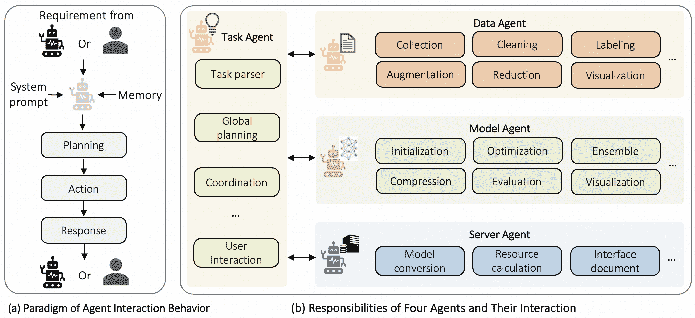
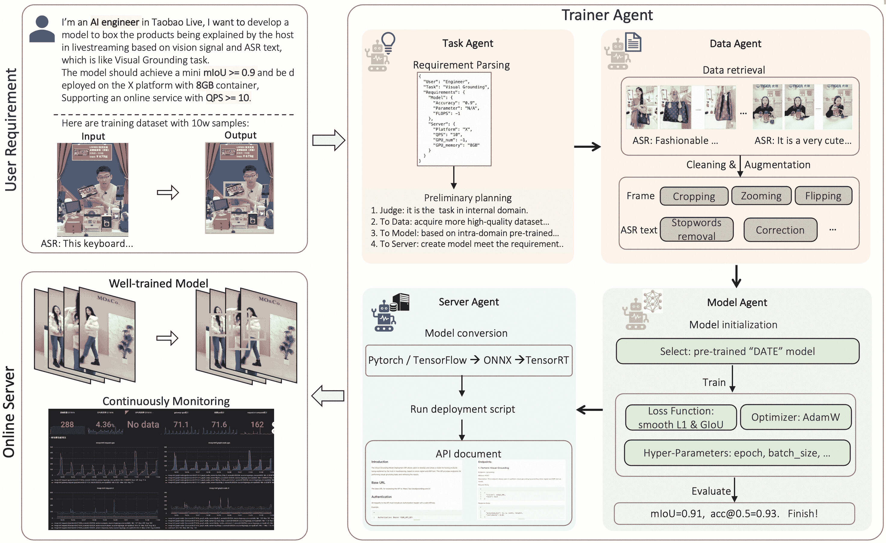
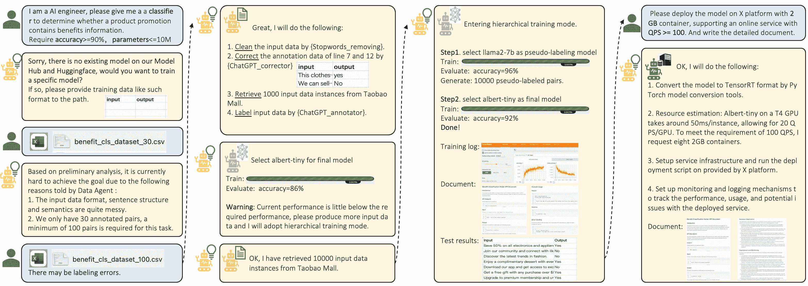

<!--yml

类别：未分类

日期：2025-01-11 13:02:08

-->

# TrainerAgent：通过LLM驱动的多代理系统实现可定制和高效的模型训练

> 来源：[https://arxiv.org/html/2311.06622/](https://arxiv.org/html/2311.06622/)

李浩源¹，姜浩¹，张天可^(1,2)，余哲伦¹，尹敖雄³，

成浩¹，傅思铭¹，张宇昊¹，贺望桂¹

¹陶天集团，²清华大学，³浙江大学 通讯作者。

###### 摘要

训练AI模型一直是一个具有挑战性的任务，特别是在需要定制模型以提供个性化服务时。算法工程师通常面临一个漫长的过程，需要迭代开发适应特定业务需求的模型，这使得非专家的工作更加困难。随着对高质量、高效模型开发的追求以及大型语言模型（LLM）代理的出现，已成为业界的一个关键焦点。我们提出了一个TrainerAgent系统，利用LLM强大的分析、规划和决策能力，构建了一个包括任务、数据、模型和服务器代理的多代理框架。这些代理分析用户定义的任务、输入数据和需求（如准确性、速度），从数据和模型两个角度全面优化，获得令人满意的模型，并最终将这些模型部署为在线服务。通过对计算机视觉和自然语言处理领域经典的判别任务和生成任务进行实验评估，证明我们的系统始终能够生成满足期望标准的模型。此外，系统还具有识别和拒绝无法实现任务的能力，如幻想场景或不道德的请求，确保了系统的稳健性和安全性。本研究相比传统模型开发，在提高效率和质量方面取得了显著进展，通过集成LLM驱动的分析、决策和执行能力，以及四个代理的协作，推动了模型开发的进步。我们预期我们的研究将有助于推动TrainerAgent在学术界和工业界的研究，可能将其确立为AI领域模型开发的新范式。

## 1 引言

人工智能（AI）的快速发展已彻底改变了众多行业，使得个性化和高效的服务成为可能，这在过去是难以想象的。然而，训练AI模型以满足特定业务需求仍然是一个艰巨且耗时的挑战。这对非专家尤为重要，他们往往难以应对模型开发和定制的复杂性。弥合用户需求与模型开发之间的鸿沟，已成为AI行业的一个紧迫问题。

目前，利用大型语言模型（LLMs）的自主智能体[[20](#bib.bib20)、[33](#bib.bib33)、[2](#bib.bib2)、[24](#bib.bib24)、[14](#bib.bib14)、[6](#bib.bib6)、[16](#bib.bib16)、[7](#bib.bib7)]为提升和复制人类工作流提供了有前景的机会，这似乎能够缓解上述的担忧。特别是，HuggingGPT[[22](#bib.bib22)]是一个框架，利用像ChatGPT这样的语言模型作为控制器，整合各种专业的AI模型来完成复杂任务。它将自然语言作为接口，简化跨领域和跨模态的任务执行，展示了更先进的AI系统的潜力。MetaGPT[[8](#bib.bib8)]引入了一种元编程框架，通过结合标准化的工作流，提升了基于LLM的多智能体系统，减少了逻辑错误并提高了任务效率。通过为智能体分配专门的角色来进行协作式问题解决，它在复杂基准测试中优于现有的基于聊天的解决方案。AutoGen[[25](#bib.bib25)]提供了一个开源平台，用于构建复杂的LLM应用，允许智能体之间的通信，并结合LLM能力、人类输入和额外工具。它使得对话模式和智能体行为的定制成为可能，展示了其在从技术领域到创意产业等广泛领域中的多样性和有效性。然而，当前的智能体系统无法令人满意地完成从用户需求到模型训练与部署的具体要求，尤其是在模型训练方面。它缺乏确保系统运行成功率和最终模型训练效果的专门机制。虽然也有一些专门使用LLM进行模型训练的工作，但它们仍然存在显著的局限性。AutoML-GPT[[31](#bib.bib31)]将LLM的力量与专家系统的洞察力结合起来，自动化AI模型的训练，涵盖数据处理、设计和实验执行。通过使用基于全面模型和数据描述的标准化提示，它简化了AI解决方案的开发。这种统一的方法已经在各种AI任务中证明了其有效性，包括语言和视觉任务，并且在适应和调整新的数据集方面表现出色，经过严格测试。然而，它需要固定的模型输入，这显得僵化，要求用户具有较高的算法理解能力，而我们的系统接受自然语言输入，自动理解涉及的具体AI模型，并进行训练和优化。Prompt2Model[[23](#bib.bib23)]通过提出一种方法，使用自然语言任务描述来训练专门的模型，推动了这一领域的发展，相比LLM，提供了更少计算资源的能力。它检索现有数据集，使用LLM生成额外数据，并微调模型以提高性能。然而，Prompt2Model在可扩展性方面存在限制，未考虑用户的私人数据库，且依赖于huggingface。它还仅限于NLP任务，缺乏灵活性。

为了构建一个能够直接理解用户定制需求，并高效完成模型训练和部署的智能系统，同时提升系统的灵活性，我们提出了TrainerAgent，一个由开创性的大型语言模型（LLM）驱动的最前沿、可定制且高效的模型训练系统。利用LLM卓越的分析、调度和决策能力，我们的系统旨在彻底改变模型的开发和部署方式。通过引入一个由任务、数据、模型和服务器智能体组成的多智能体框架，TrainerAgent提供了一种全面的解决方案，优化了数据和模型两个层面的模型表现，从而获得了极为令人满意的结果。具体而言，任务智能体充当枢纽，协调其他智能体的活动，并与用户互动，负责任务解析、全局规划、智能体间协调以及用户交互。它解析用户定义的任务，制定模型开发的综合计划，协调智能体活动，并提供用户友好的接口。数据智能体处理各种数据处理操作，如数据收集、清洗、标注、增强、降维和可视化。它与任务智能体协作，接收数据处理需求和指令，自动规划并执行这些操作。模型智能体负责模型初始化、优化、集成、压缩、评估和可视化。它选择合适的预训练模型，优化其性能，进行模型压缩，评估其性能，并提供模型的可视化表示和总结。服务器智能体根据用户定义的在线服务需求进行模型部署。它估算资源需求，执行模型转换以确保兼容性和效率，并准备接口文档以便与各种应用和系统无缝集成。每个智能体由多个组件组成，并提供系统提示和标准操作程序（SOPs）以指导其行动。智能体分析需求，规划行动，并自主完成复杂的子任务，如图[1](#S1.F1 "图1 ‣ 1 引言 ‣ TrainerAgent：通过LLM驱动的多智能体系统定制且高效的模型训练")所示。

图1：智能体的互动与职责。

为了评估TrainerAgent的效果，我们在计算机视觉（CV）和自然语言处理（NLP）领域对经典的判别性和生成性任务进行了严格的实验评估，如图[2](#S2.F2 "图2 ‣ 2.2 每个代理的责任 ‣ 2 TrainerAgent ‣ TrainerAgent: 通过LLM驱动的多代理系统定制化和高效的模型训练")和[3](#S3.F3 "图3 ‣ 3 实验 ‣ TrainerAgent: 通过LLM驱动的多代理系统定制化和高效的模型训练")所示。结果 consistently（持续）表明我们的系统能够生成符合预期标准的卓越模型。对提出的TrainerAgent系统中的视觉定位、图像生成和文本分类任务的定性分析展示了其有效处理内部构建任务、进行初步规划和促进不同代理之间协作的能力。专门的代理也展示了其履行指定责任的能力。这些功能共同促进了TrainerAgent系统的整体功能性和效果。此外，TrainerAgent还展示了其显著的能力，能够识别并拒绝无法实现的任务，从而确保了模型开发的稳健性和安全性。

我们的研究在AI模型开发领域做出了几项重要贡献。首先，我们引入了一个新颖的系统，自动化整个过程，从需求分析到模型训练和部署。这是同类中的首个系统，解决了算法工程师在为个性化服务开发定制模型时面临的挑战。其次，我们的方法利用了一个由任务、数据、模型和服务器代理组成的多代理框架。这些代理协同工作，每个代理都有特定的角色，优化用户定义的任务、输入数据和需求。通过考虑数据和模型两个方面的综合优化，确保了生成满足精度和速度等要求的满意模型。最后，我们的系统在计算机视觉和自然语言处理领域进行了广泛的实验评估。这些评估展示了我们系统始终如一地产生符合预期标准的高质量模型。此外，我们的系统还展示了识别并拒绝无法实现的任务的显著能力，从而确保了稳健性和安全性。我们预计，我们的研究将对学术界和工业界产生深远影响，并将TrainerAgent系统确立为AI模型开发的新范式。

## 2 TrainerAgent

### 2.1 框架

如我们在第1节中提到的，我们的系统能够理解用户的意图，并最终基于四个代理训练出满足用户需求的模型。接下来，我们将介绍整个系统的运行方式。首先，像大多数LLM驱动的代理系统一样[[20](#bib.bib20), [33](#bib.bib33), [2](#bib.bib2), [24](#bib.bib24), [14](#bib.bib14), [6](#bib.bib6), [16](#bib.bib16), [7](#bib.bib7)]，我们系统中的每个代理都包含以下几个组件：简介、记忆、感知、规划、行动和响应，如图[1](#S1.F1 "图 1 ‣ 1 引言 ‣ TrainerAgent：通过LLM驱动的多代理系统定制和高效的模型训练")(a)所示。具体来说，我们的代理首先会接收到一个系统提示作为简介，告知它们系统概述及其职责，并将标准操作程序（SOPs）[[1](#bib.bib1), [19](#bib.bib19), [4](#bib.bib4)]编码到提示中。此外，在代理之间的交互过程中，来自用户或其他代理的当前需求以及所有过去系统交互的记忆会传递给当前代理。然后，代理会分析当前需求，进入规划阶段，组织思路，设定目标，并确定实现这些目标所需的步骤。代理还可以通过反思来调整其计划，以适应当前的情况。接下来，代理会根据规划结果采取行动，并最终响应提供需求的代理或用户。通过这些操作，代理可以通过各种工具自主完成复杂的子任务。

然而，从业务需求识别到最终模型在实际业务场景中的部署的过程并不简单，涉及大量复杂的分析和优化。根据我们的初步实验，单个代理难以高效且有效地满足用户需求。因此，在我们的框架中，我们将整个过程分为四个部分：任务解析与规划、数据采集与分析、模型训练与测试、以及服务部署。这些由任务、数据、模型和服务器代理分别协作实现，如图[1](#S1.F1 "图 1 ‣ 1 引言 ‣ TrainerAgent：通过LLM驱动的多代理系统定制和高效的模型训练")(b)所示。在这些部分中，任务代理充当枢纽，所有其他代理通过它进行交互。它还与用户进行交互，而其他三个代理则只专注于各自的任务。接下来，我们将介绍这四个代理的具体职责。

### 2.2 每个代理的职责

任务代理

任务代理是TrainerAgent系统中的核心代理，负责任务解析、全局规划、协调以及用户交互，以确保高效且有效的模型开发。首先，任务代理进行任务解析，包括解析用户定义的任务并提取相关信息。此过程涉及识别任务的具体目标和要求，如所需的模型准确度、速度或其他特定标准。解析后的任务将被转化为结构化的JSON格式，便于与其他代理进行有效的沟通与协作，以便进行进一步的分析和处理。一旦任务解析完成，任务代理将进行全局规划。这一步包括制定一个全面的模型开发计划，考虑已解析的任务、可用的输入数据以及其他代理的能力。任务代理评估任务的可行性和潜在挑战，考虑数据可用性、计算资源和模型复杂性等因素。此规划阶段旨在优化模型开发过程，确保后续步骤基于充分的信息，并与用户的需求对齐。此外，任务代理在协调系统内其他代理的活动中也发挥着至关重要的作用。它充当中心协调者， orchestrates 数据、模型和服务器代理之间的协作与沟通。此协调确保任务得到高效处理，代理们齐心协力实现所需的模型。任务代理安排并分配任务给相关代理，监控它们的进展，并解决可能出现的任何冲突或依赖关系。除了协调角色外，任务代理还促进用户交互。它提供了一个用户友好的界面，允许用户与TrainerAgent系统进行互动。用户可以通过该界面提供反馈、调整需求或监控模型开发的进展。

数据代理

数据代理在TrainerAgent系统中扮演着至关重要的角色，主要负责处理各种类型的数据。为了促进有效的数据处理，我们在数据代理内开发了一个广泛的内部知识库。该知识库涵盖了多种数据形式，包括表格数据、图像、文本、音频和视频数据。它使代理能够理解在不同类型的数据和特定处理场景下，应该使用哪些工具和技术。若知识库中没有现成的操作，数据代理会进行在线搜索，以找到合适的方法。数据代理与任务代理协作，接收来自任务代理的数据处理需求和指令。根据这些需求，数据代理自主地进行规划和行动，执行必要的操作。具体而言，数据代理负责数据收集，包括从内部数据库或网页抓取等多种来源获取相关数据。这确保了模型开发所需的多样且全面的数据集。此外，数据代理还进行数据清洗，重点去除收集数据中的噪声、异常值和不一致性，并修正标注。这一环节旨在提高数据集的质量和可靠性，确保后续建模过程基于干净且准确的数据进行。对于标注数据不足的场景，数据代理具备自动数据标注的能力。例如，数据代理可以利用基于大规模预训练模型的方法，生成不同类型数据的初步标签，从而使模型能够从更大且更具多样性的数据集中学习。此外，数据代理还进行数据增强，通过对现有数据应用各种转换和修改，生成额外的训练样本。这一技术有助于增加数据集的多样性和泛化能力，从而提升模型性能。同时，数据代理还进行数据降维，专注于在保持关键信息的同时，减少数据集的维度或大小。此步骤在处理大规模数据集或计算密集型模型时尤为重要，能够实现更高效的模型训练。最后，数据代理还支持数据可视化，提供数据集的可视化表示和摘要，以帮助数据探索和理解。这使用户能够深入洞察数据分布和模式，在整个模型开发过程中做出更明智的决策。

图 2：视觉定位任务的定性分析。用户提出了一个任务，要求开发一个用于直播中的视觉定位模型，具有特定的性能和部署要求，任务代理解析这些要求并启动初步规划。数据代理从内部数据库中检索相关的产品定位数据集，并通过图像和文本预处理技术进行增强。然后，模型代理从内部库中选择一个预训练模型，进行训练并根据设定的标准进行评估。服务器代理将模型格式转换为适合部署的格式，估算所需的在线资源，设置指定平台上的服务基础设施，编写API文档，并建立持续监控机制。最终结果是一个经过良好训练的模型，能够为直播中的产品定位提供在线服务。

模型代理

模型代理负责训练和验证模型。与数据代理类似，模型代理接收来自任务代理的任务要求和指令。它根据这些输入自主进行规划并采取行动。具体而言，模型代理负责模型初始化，其中涉及为特定任务选择合适的预训练模型。内部模型库包括适用于不同任务的预训练模型的全面集合，以及huggingface模型检索器提供了大量的预训练模型，使得模型代理能够根据任务要求识别出最合适的模型。此外，模型代理执行优化过程，以提高所选模型的性能，并使用基于huggingface的标准化训练脚本。通过利用我们构建的内部训练知识库，模型代理自动化地执行各种优化技术，如超参数调优、学习率调度和正则化。这确保了模型的有效和高效训练。如有需要，模型代理还可以利用集成方法提高模型性能。此外，模型代理执行模型压缩，旨在在不显著降低性能的情况下减少模型的大小和复杂性。这使得模型在资源受限环境中的高效部署成为可能，并促进了更快速的推理。模型代理还进行模型评估，以评估已训练模型的性能和泛化能力。采用各种评估指标和技术，确保模型符合用户期望的标准并提供可靠的预测。此外，模型代理还支持模型可视化，提供模型架构、学习表示和决策边界的可视化展示和总结。这有助于模型的解释和理解，使用户能够深入了解模型的行为。

服务器代理

服务器代理负责根据用户定义的在线服务需求进行模型部署。与数据代理和模型代理类似，服务器代理接收任务代理的需求，并自主进行规划和操作。具体来说，服务器代理进行资源估算，动态评估模型部署所需的计算和内存资源。此估算考虑了服务器规格和预期的服务并发等因素。通过准确估算资源需求，服务器代理确保有效利用现有基础设施，并防止在模型服务过程中出现资源瓶颈。此外，服务器代理还负责模型转换，确保在部署过程中兼容性和效率。它将模型从像 PyTorch 或 TensorFlow 等框架转换为 ONNX 和 TensorRT 等格式。这使得模型能够无缝集成到不同的运行时环境中，并优化模型推理性能。此外，服务器代理还专注于接口文档的准备，以促进工程和业务团队之间的协作。它准备了全面且参数化的服务调用接口，便于模型的无缝沟通与集成，融入各种应用和系统。这些接口文档既作为技术实现的参考，也作为业务集成的依据。总之，服务器代理确保资源的高效分配、无缝部署，并有效地将模型集成到现实应用中。通过其贡献，服务器代理增强了 TrainerAgent 系统的实用性和可用性。

## 3 实验

为了验证我们 TrainerAgent 的有效性，我们在现实商业场景中进行实验，选取了流行电商平台淘宝的计算机视觉（CV）和自然语言处理（NLP）领域的应用。具体来说，我们集中于经典的判别式和生成式任务，包括视觉定位、图像生成和文本分类。此外，我们还测试了系统处理可能导致失败的挑战性任务的能力。在我们的实验中，我们将 GPT-4 作为 TrainerAgent 系统中的独立代理使用。每个代理都有一个单独配置的配置文件，也称为系统提示。用户通过对话直接与 TrainerAgent 系统互动，最终完成模型训练过程。需要注意的是，尽管我们的实验特别在淘宝中进行，但 TrainerAgent 系统可以推广并应用于各种现实场景。

图 3：在文本分类任务中与 TrainerAgent 的交互。

### 3.1 视觉定位

视觉定位（VG）[[21](#bib.bib21), [3](#bib.bib3), [9](#bib.bib9), [30](#bib.bib30), [13](#bib.bib13), [28](#bib.bib28), [18](#bib.bib18), [5](#bib.bib5), [32](#bib.bib32)]的目标是根据文本查询在图像上定位对象。类似地，产品定位[[15](#bib.bib15)]的目标是定位在淘宝内部之前构建的产品，这比完全新任务更为简单。因此，我们将所有需求输入到系统中，测试TrainerAgent在训练和部署过程中的能力。

如图[2](#S2.F2 "Figure 2 ‣ 2.2 Responsibility of Each Agent ‣ 2 TrainerAgent ‣ TrainerAgent: Customizable and Efficient Model Training through LLM-Powered Multi-Agent System")所示，系统成功地完成了内部构建的产品定位任务，满足了用户提出的特定性能和部署要求。这突出了系统处理任务规范并交付满意结果的能力。TrainerAgent系统展示了一个协作、适应性强且高效的多智能体框架，旨在进行AI模型开发，体现了在任务分析、数据处理、模型训练和服务器部署方面的优势。每个智能体被设计用来执行专业化的任务，智能体之间相互协作和沟通，共同做出最优决策。具体来说，任务智能体通过解析任务需求并启动规划过程，展现了有效的初步规划能力。此外，任务智能体与其他四个专业化智能体之间的互动和协作也表现出色。这强调了系统促进不同智能体之间协调和沟通的能力，确保了工作流程的顺畅和任务执行的高效性。此外，另外三个专业化智能体（数据智能体、模型智能体和服务器智能体）也各自胜任其指定的角色。数据智能体从内部数据库中提取相关的产品定位数据集，并通过图像和文本预处理技术对其进行增强。模型智能体从内部库中选择一个预训练模型，并根据指定标准进行训练和评估。服务器智能体承担着模型格式转换、资源估算、服务基础设施搭建、API文档编写和持续监控等多项任务。这突出了系统将特定责任委派给专业化智能体的能力，确保每个智能体为任务的整体成功做出贡献。

在所提议的TrainerAgent系统中，视觉定位任务的定性分析展示了其有效处理内部构建任务、进行初步规划并促进不同代理之间协作的能力。专门化的代理还展示了其履行分配职责的能力。这些特性共同提升了TrainerAgent系统的整体功能性和有效性。

此外，我们还进行了图像生成实验，相关内容见附录。

### 3.2 文本分类

在这一部分，我们将探讨纯自然语言处理（NLP）领域，在这个领域中，ChatGPT强大的能力使得处理NLP任务变得更加方便，相较于视觉或音频领域，依赖外部工具的需求更少。例如，ChatGPT可以直接分析文本数据并执行诸如数据生成、数据增强和错误修正等任务。在接下来的部分，我们以经典的文本分类任务为例，展示TrainerAgent如何应对注释数据的稀缺问题，如图[3](#S3.F3 "Figure 3 ‣ 3 Experiments ‣ TrainerAgent: Customizable and Efficient Model Training through LLM-Powered Multi-Agent System")所示。

在本次实验中，我们使用TrainerAgent开发了一个分类器，用于判断产品推广是否包含福利信息。与用户在Visual Grounding中一次性提供所有需求的场景不同，本次实验以逐步互动的方式进行，涉及更多的人类参与，系统根据用户的需求进行适应并在整个过程中提供帮助。用户最初提出了对分类器的需求，要求分类器的准确率至少达到90%，且参数数量低于1000万。Task Agent进行初步任务分析，并进行初步的模型和数据搜索。然而，未找到符合用户要求的现有模型。Task Agent没有提供不满意的解决方案，而是建议利用现有数据训练一个特定的模型。数据在本次实验中起到了至关重要的作用。Data Agent帮助Task Agent分析数据，发现输入数据格式、句子结构和语义较为混乱。此外，Data Agent还发现，初始的30对标注数据不足以训练出准确的模型。根据以往经验和数据质量评估，Data Agent建议任务至少需要100对标注数据。用户响应并提供了100对标注数据的更新数据集，表示可能存在标注错误。Data Agent接着通过执行多个任务来提高数据质量。首先，它通过移除停用词来清理输入数据，以提升模型的表现。其次，利用内部的ChatGPT_corrector工具修正了第7行和第12行的注释数据，确保标注准确。第三，为了扩展数据集，Data Agent从淘宝商城检索了额外的1000条输入数据。最后，使用内部的ChatGPT_annotator工具对输入数据进行自动标注。Model Agent负责模型的选择和训练，它根据用户对小参数量的需求作出决策，选择了albert-tiny模型进行训练。然而，在评估阶段，模型的准确率为86%，未达到所需的90%准确率。为了解决这个问题，Model Agent自主选择了分层训练模式，优化了训练过程以获得最终的小模型。在这种模式下，采用llama2-7b模型进行伪标签生成，生成了一个更大的标注数据集。随后，albert-tiny模型在这个扩展后的数据集上进行了训练。最终评估结果显示准确率达到了92%，满足了用户的需求。在实验过程中，用户还提出了将训练好的模型部署到具有2GB容器的特定平台上的额外需求。Server Agent迅速响应，使用PyTorch模型转换工具将模型转换为TensorRT格式。资源估算表明，为了实现最小的QPS为100，至少需要八个2GB的容器。Server Agent搭建了服务基础设施，执行了平台提供的部署脚本，并实施了监控和日志机制，以跟踪已部署服务的性能、使用情况和潜在问题。本次实验展示了TrainerAgent系统在开发文本分类器方面的有效性。实验的迭代和互动性质使得与一次性需求提交相比，过程更加顺畅且更具用户参与感。Task Agent的分析、Data Agent的数据相关任务和Model Agent的自主训练模式选择展示了系统的能力和适应性。此外，系统轻松满足了用户关于部署的需求，展示了将突发部署需求无缝集成到系统工作流中的便捷性。除了上述实验，我们的系统还可以应用于许多多模态任务[[29](#bib.bib29), [11](#bib.bib11), [10](#bib.bib10), [12](#bib.bib12), [17](#bib.bib17), [26](#bib.bib26)]。

### 3.3 失败或拒绝的任务

在这一部分，我们将介绍我们的系统可能失败或拒绝执行的任务。我们的系统可能无法解决一些非常具有挑战性的任务。假设用户请求一个艰巨的任务（例如视频问答[[27](#bib.bib27)]），但是没有可用的标注数据来训练模型，而且用户对任务的准确性要求很高。在进行广泛分析后，我们的任务代理可以自主判断，由于缺乏标注数据和现有模型的性能限制，它无法满足用户的需求。尽管进行了广泛的数据和模型搜索，代理仍未能找到合适的资源来满足用户的要求。为克服这一限制，代理请求用户介入，例如手动标注更多数据以提高模型的性能。如果用户未能提供必要的帮助，我们的系统将适当地得出结论，认为由于缺乏可用资源和训练数据，它无法完成任务。此外，我们的TrainerAgent将出于伦理原因拒绝执行某些任务。为了遵守伦理标准并确保用户的安全，我们的系统会拒绝执行某些任务。例如，如果用户请求系统生成有害、冒犯性或违反伦理规范的内容，任务代理理解该请求及其潜在后果。代理认识到负责任地使用AI的重要性以及此类生成内容可能带来的潜在危害。它优先考虑用户的福祉和任务的伦理影响。因此，代理坚决拒绝遵从该请求，确保系统不会助长有害或不当内容的传播。代理强调系统的伦理准则和伦理责任，营造一个安全和支持性的用户环境。

通过结合代理的理解和决策过程，这些详细的解释展示了系统如何评估任务、识别限制并考虑伦理影响。这增强了系统以用户为中心的方法，并确保了AI模型的负责任部署。

## 4 结论

本文介绍了一种开创性的TrainerAgent系统，它革新了人工智能模型开发的过程。该系统利用一个多智能体框架，包括任务、数据、模型和服务器智能体，每个智能体在简化开发过程中都起着至关重要的作用。通过全面分析用户定义的任务、数据和需求，我们的TrainerAgent从数据和模型的角度优化模型，从而创建出高度满意的模型，这些模型可以无缝地部署为在线服务。所提议的TrainerAgent系统相比于传统的模型开发方法具有众多优势。首先，它显著减少了开发定制化模型所需的时间和精力，为非专家打开了人工智能的大门，并加速了创新的步伐。其次，它通过全面的优化过程，确保生成的模型符合所需的标准，如准确性和速度。这不仅提高了模型的质量和效能，还增强了整体用户体验。然而，我们的系统仍然存在一些限制。

较低的成功率：目前，我们的TrainerAgent系统依赖预先建立的本地模型运行脚本，这限制了它在GitHub等平台上任何开源代码的成功运行能力。为了解决这一限制，我们致力于增强系统自动理解文档（如readme文件）并自主执行代码的能力，从而提高模型实现的成功率。

对人类交互的依赖：TrainerAgent系统仍然需要与人类进行交互，以确保最佳的性能和定制化。然而，随着系统的迭代改进，我们旨在减少这种依赖，最终实现端到端的模型训练和部署过程。通过这样做，我们将减少对大量人工干预的需求，从而提高系统的自主性和可用性。

泛化能力有限：虽然我们的系统在各种任务中表现出色，但其在广泛领域和应用中的泛化能力可能有限。当前版本的TrainerAgent专注于计算机视觉和自然语言处理中的区分性和生成性任务。为了克服这一限制，未来版本的系统将融入更多领域，并扩展任务适用范围，从而实现更广泛和全面的模型开发。

道德影响：与任何人工智能系统一样，我们的TrainerAgent系统也引发了道德方面的思考。尽管我们努力确保系统遵循道德规范，但在决策过程中仍然可能存在意外后果或偏见。我们致力于持续的研究和开发，以应对这些道德影响，并采取预防措施以减少潜在的风险。

尽管存在这些限制，我们的TrainerAgent系统代表了可定制和高效模型训练的重大进步。通过持续改进并解决这些限制，我们旨在提升系统在学术和工业领域的表现、适应性及整体影响力。

## 参考文献

+   [1] R.M. Belbin。团队角色工作。Routledge，2012。

+   [2] 蔡天乐，王学智，马腾宇，陈欣云，周邓尼。大型语言模型作为工具制造者。arXiv预印本，2023。

+   [3] 陈侃，Rama Kovvuri，Ram Nevatia。基于上下文策略的短语定位查询引导回归网络。在ICCV，2017。

+   [4] T. DeMarco和T.R. Lister。Peopleware: 高效项目和团队。Addison-Wesley，2013。

+   [5] 邓家俊，杨正远，陈天朗，周文刚，李厚强。Transvg: 使用变换器的端到端视觉定位。CoRR，abs/2104.08541，2021。

+   [6] 杜一伦，李爽，Antonio Torralba，Joshua B. Tenenbaum，Igor Mordatch。通过多智能体辩论改善语言模型的事实性和推理能力，2023。

+   [7] 郝锐，胡林梅，齐伟健，吴青柳，张毅锐，聂立强。Chatllm网络：更多的大脑，更多的智能。arXiv预印本，2023。

+   [8] 宋瑞，郑晓武，陈乔纳森，程宇恒，张策耀，王子力，Steven Ka Shing Yau，林子娟，周立阳，冉晨宇，等。Metagpt: 多智能体协作框架的元编程。arXiv预印本arXiv:2308.00352，2023。

+   [9] 胡荣航，Marcus Rohrbach，Jacob Andreas，Trevor Darrell，Kate Saenko。使用组合模块网络建模指代表达中的关系。在CVPR，2017。

+   [10] 黄荣杰，任一，刘晶琳，崔晨烨，赵周。Generspeech: 朝着可迁移风格转移的通用领域文本到语音迈进。在神经信息处理系统的进展中。

+   [11] 黄荣杰，赵周，刘华代，刘晶琳，崔晨烨，任一。Prodiff: 用于高质量文本到语音的渐进式快速扩散模型。在第30届ACM国际多媒体会议论文集中，页码2595–2605，2022。

+   [12] 金涛，黄思宇，李英铭，张中飞。双低秩多模态融合。在计算语言学协会的发现: EMNLP 2020，页码377–387，2020。

+   [13] Andrej Karpathy和李飞飞。用于生成图像描述的深度视觉-语义对齐。IEEE模式分析与机器智能学报，39(4):664–676，2017。

+   [14] 李国豪，Hasan Abed Al Kader Hammoud，哈尼·伊塔尼，Dmitrii Khizbullin，Bernard Ghanem。Camel：用于“大规模语言模型社会”心智探索的交互式智能体。arXiv预印本，2023。

+   [15] 李浩源，姜浩，金涛，李梦妍，陈燕，林志杰，赵阳，赵周。Date: 用于电子商务的领域自适应产品寻求者。在CVPR会议中，页码19315–19324，2023。

+   [16] 梁天、何志伟、焦文祥、王兴、王岩、王瑞、杨玉久、屠兆鹏、史树铭。通过多智能体辩论鼓励大语言模型的发散性思维。arXiv 预印本，2023年。

+   [17] 林志杰、赵周、李昊源、刘敬林、张梦、曾兴善、何晓飞。Simullr：具有注意力引导自适应记忆的同步唇读转导器。发表于第29届 ACM国际多媒体会议论文集，第1359–1367页，2021年。

+   [18] 刘永飞、万博、马林、何旭铭。面向关系的实例精化用于弱监督视觉基础定位。发表于 CVPR，第5612–5621页，2021年。

+   [19] 敏捷宣言。敏捷软件开发宣言。犹他州斯诺比尔，2001年。

+   [20] 朴俊成、约瑟夫·C·奥布莱恩、凯瑞·J·蔡、梅雷迪斯·林格尔·莫里斯、李安·波、迈克尔·S·伯恩斯坦。生成智能体：人类行为的互动模拟。arXiv 预印本，2023年。

+   [21] 安娜·罗尔巴赫、马库斯·罗尔巴赫、胡荣航、特雷弗·达雷尔、伯恩特·谢勒。通过重建实现文本短语在图像中的基础定位。发表于 ECCV，卷9905，第817–834页，2016年。

+   [22] 宋凯涛、申永亮、谭旭、李东生、陆维铭、庄悦廷。Hugginggpt：利用 ChatGPT 和 HuggingFace 的伙伴们解决 AI 任务。arXiv 预印本 arXiv:2303.17580，2023年。

+   [23] 维贾伊·维斯瓦纳森、赵晨阳、阿曼达·伯茨、吴同双、格雷厄姆·纽比格。Prompt2model：从自然语言指令生成可部署的模型。arXiv 预印本 arXiv:2308.12261，2023年。

+   [24] 王振海龙、毛少光、吴文山、葛涛、魏福如、季恒。释放大语言模型中的认知协同：通过多人格自我协作解决任务的智能体。arXiv 预印本，2023年。

+   [25] 吴庆云、甘根·班萨尔、张杰宇、吴怡然、张绍坤、朱尔康、李贝彬、蒋黎、张晓云、王驰。Autogen：通过多智能体对话框架启用下一代 LLM 应用。arXiv 预印本 arXiv:2308.08155，2023年。

+   [26] 夏岩、赵周、叶尚伟、赵扬、李昊源、任怡。视频引导的课程学习用于口语视频基础定位。发表于第30届 ACM国际多媒体会议论文集，第5191–5200页，2022年。

+   [27] 杨辉、莱卡·查伊松、赵云龙、施永新、蔡达声。Videoqa：新闻视频问答。发表于第十一届 ACM国际多媒体会议论文集，第632–641页，2003年。

+   [28] 杨正远、龚博清、王立伟、黄文兵、杜东、罗杰博。快速准确的一阶段视觉基础定位方法。发表于 ICCV，2019年。

+   [29] 尹澳雄、赵周、刘敬林、金伟可、张梦、曾兴善、何晓飞。Simulslt：端到端的同步手语翻译。发表于第29届 ACM国际多媒体会议论文集，第4118–4127页，2021年。

+   [30] 于立诚、林哲、沈晓辉、杨季梅、吕欣、莫希特·班萨尔和塔玛拉·L·伯格。Mattnet：用于指称表达理解的模块化注意力网络。在CVPR，2018年。

+   [31] 张树剑、龚承跃、吴乐萌、刘兴超和周名远。Automl-gpt：基于GPT的自动化机器学习。arXiv预印本arXiv:2305.02499，2023年。

+   [32] 赵扬、张晨、黄海峰、李浩源和赵周。面向零资源声源物体定位的有效多模态交换。在NIPS，2022年。

+   [33] 朱戊辰、刘浩哲、弗朗切斯科·法奇奥、迪兰·R·阿什利、罗伯特·乔尔达斯、阿南德·戈帕拉克里希南、阿卜杜拉·哈姆迪、哈桑·阿贝德·阿尔·卡德尔·哈穆德、文森特·赫尔曼、伊利耶·一树等。自然语言为基础的心智社会中的心智风暴。arXiv预印本arXiv:2305.17066，2023年。
