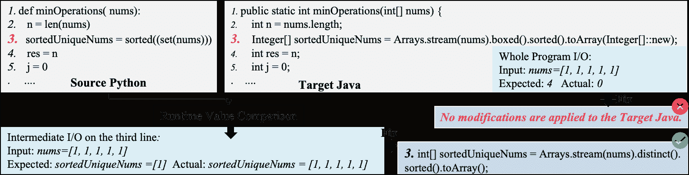
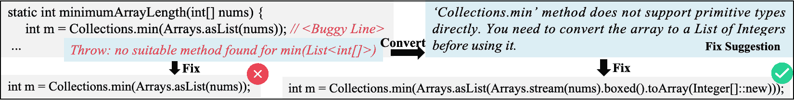
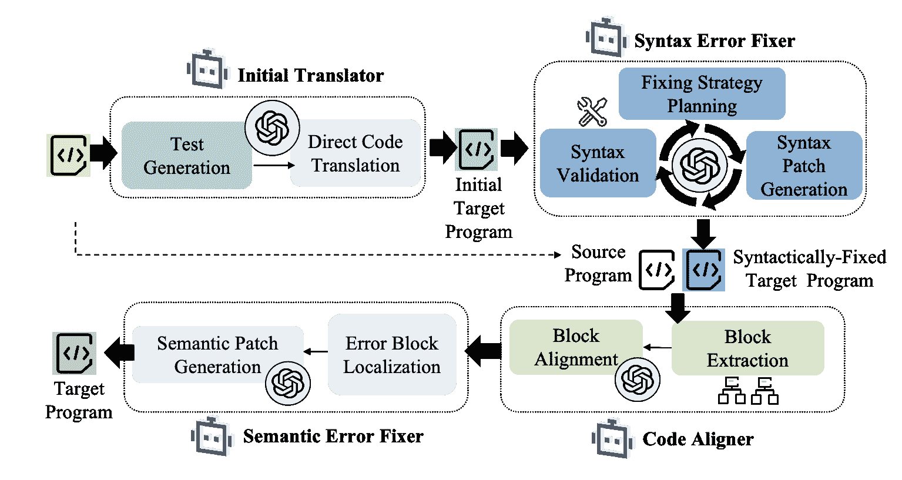
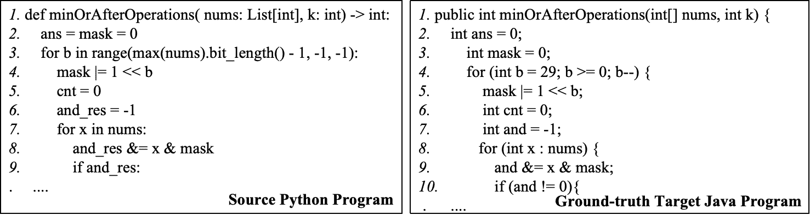
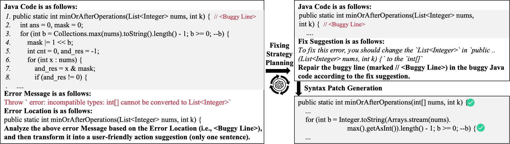
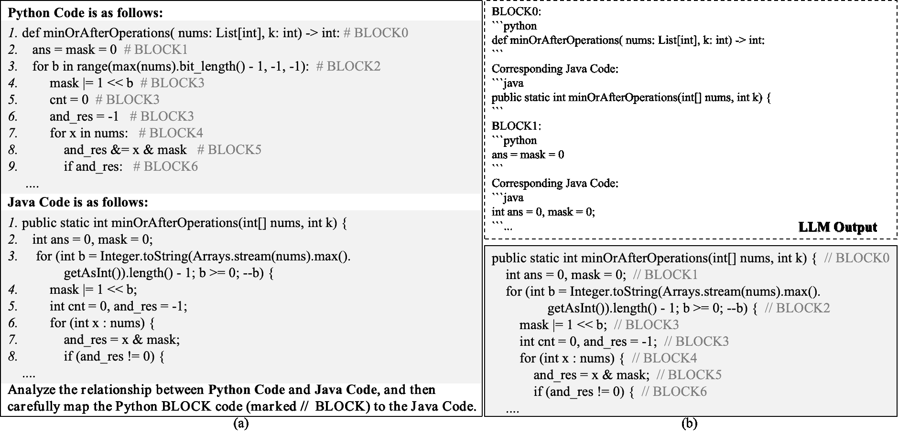
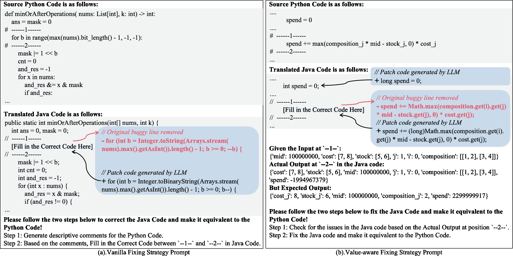
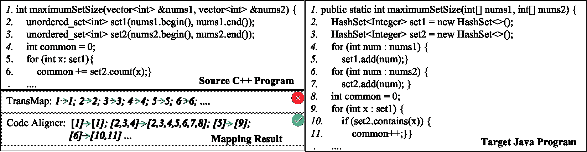

<!--yml

category: 未分类

日期：2025-01-11 12:12:46

-->

# TransAGENT：基于大语言模型的代码翻译多智能体系统

> 来源：[https://arxiv.org/html/2409.19894/](https://arxiv.org/html/2409.19894/)

袁智强，陈伟彤，王汉林，余凯，彭鑫，娄伊玲 计算机科学系，复旦大学，中国 {zhiqiangyuan23, wtchen21, 23210240303, 23262010042}@m.fudan.edu.cn {pengxin, yilinglou}@fudan.edu.cn

###### 摘要

代码翻译是将代码从一种编程语言转换为另一种语言，同时保持其原有功能，这对于软件迁移、系统重构和跨平台开发至关重要。传统的基于规则的方法依赖于手动编写的规则，这往往费时且生成的代码可读性差。为了解决这一问题，基于学习的方法应运而生，利用并行数据训练模型进行自动化的代码翻译。最近，大型语言模型（LLMs）的进展进一步推动了基于学习的代码翻译方法。尽管前景广阔，LLM翻译的程序仍然面临着各种质量问题（例如语法错误和语义错误）。特别是，仅提供相应的错误信息时，LLM很难自我调试这些错误。

本文提出了一种新颖的基于大语言模型的多智能体系统TransAGENT，该系统通过四个基于LLM的智能体之间的协同作用来修复语法错误和语义错误，从而增强LLM-based代码翻译的效果，这四个智能体包括初始代码翻译器、语法错误修复器、代码对齐器和语义错误修复器。TransAGENT的主要思想是首先基于目标程序与源程序之间的执行对齐，定位目标程序中有错误的代码块，从而缩小修复的范围并降低修复的难度。为了评估TransAGENT，我们首先构建了一个来自近期编程任务的新基准，以缓解潜在的数据泄露问题。在我们的基准上，TransAGENT在翻译效果和效率上均优于最新的基于LLM的代码翻译技术UniTrans；此外，我们对不同LLM的评估显示了TransAGENT的泛化能力，我们的消融实验也表明了每个智能体的贡献。

## I 引言

代码翻译是指将程序从一种编程语言转换为另一种语言，同时保持其原有功能。这对于跨语言迁移具有重要价值，使组织能够将其代码库迁移到更新的语言，从而提高性能[[1](https://arxiv.org/html/2409.19894v2#bib.bib1), [2](https://arxiv.org/html/2409.19894v2#bib.bib2), [3](https://arxiv.org/html/2409.19894v2#bib.bib3)]。它还通过将遗留系统重写为能够在系统重构过程中提高可维护性和可扩展性的语言，帮助现代化这些系统[[4](https://arxiv.org/html/2409.19894v2#bib.bib4), [1](https://arxiv.org/html/2409.19894v2#bib.bib1), [5](https://arxiv.org/html/2409.19894v2#bib.bib5)]。此外，在使用多种语言的大型公司中，代码翻译增强了互操作性，并提高了程序员的效率。因此，自动化的代码翻译技术对于加速迁移、降低成本和提高开发效率至关重要。

传统的基于规则的代码翻译方法涉及手动编写规则，将源程序转换为目标语言中的程序（即目标程序）。然而，这种方法需要人类专家投入大量的时间和精力来编写规则，且翻译后的目标程序通常存在可读性和可用性差的问题[[6](https://arxiv.org/html/2409.19894v2#bib.bib6)]。为了解决这些问题，提出了一系列基于学习的代码翻译方法，以提高翻译效果[[6](https://arxiv.org/html/2409.19894v2#bib.bib6), [7](https://arxiv.org/html/2409.19894v2#bib.bib7), [8](https://arxiv.org/html/2409.19894v2#bib.bib8)]。这些方法通过使用大量的平行数据（即源程序和目标程序的配对数据）来训练模型，允许模型在训练过程中学习不同语言之间的翻译模式和映射。然而，实际中高质量的平行数据往往稀缺[[7](https://arxiv.org/html/2409.19894v2#bib.bib7), [9](https://arxiv.org/html/2409.19894v2#bib.bib9), [10](https://arxiv.org/html/2409.19894v2#bib.bib10)]，而且模型训练过程也非常耗时。例如，训练TransCoder模型需要32个V100 GPU，持续12天[[6](https://arxiv.org/html/2409.19894v2#bib.bib6)]。

最近在大规模语言模型（LLMs）方面的进展进一步推动了基于学习的代码翻译技术的发展。

然而，潘等人[[11](https://arxiv.org/html/2409.19894v2#bib.bib11)]指出，由大语言模型（LLMs）生成的目标程序仍然存在各种质量问题，例如编译错误或功能性不一致。为了解决这些问题，杨等人[[12](https://arxiv.org/html/2409.19894v2#bib.bib12)]提出了UniTrans，通过迭代修复过程增强基于LLM的代码翻译。特别地，UniTrans利用LLMs根据测试输入输出或编译错误信息修复翻译后的程序。尽管展示出了一定的潜力，UniTrans在许多案例中仍未能修复翻译后的程序，尤其是当其基于较小的LLMs（例如，参数少于100亿的模型）时。例如，使用LLaMA-7B的UniTrans仅能将Java到Python的翻译准确率从31.25%提升到31.90%（即仅提高了0.65%）。因此，提高LLM翻译程序的正确性仍然是该领域的一个关键挑战。

通常，翻译后的程序错误可以分为语法错误和语义错误。语法错误指的是目标程序在执行前出现的编译错误或解释错误，而语义错误发生在目标程序与源程序在执行时展现出不同的运行时行为（即不同的输出）。语法错误通常是由于违反目标语言的语法规则所导致，这些错误可以通过语法检查器或编译器轻松定位。相比之下，语义错误则是由于目标程序和源程序之间存在功能性不一致所导致，这类错误更难修复，因为它们需要LLMs推理并理解源程序和目标程序的执行过程。然而，现有的LLMs在推理程序执行期间的运行时行为方面能力有限[[13](https://arxiv.org/html/2409.19894v2#bib.bib13)]，这也解释了为什么UniTrans在仅提供测试输入/输出的情况下修复错误的效果有限。

本工作旨在增强LLM在代码翻译中的表现，我们提出了TransAGENT，一个基于LLM的多代理系统，能够修复LLM代码翻译中的语法错误和语义错误。TransAGENT的主要思想是首先基于执行对齐定位目标程序中的错误代码块，这可以缩小修复范围，从而降低修复难度。TransAGENT包括四个不同的基于LLM的代理，它们可以相互协作，包括初始代码翻译器、语法错误修复器、代码对齐器和语义错误修复器。首先，初始代码翻译器基于给定的源程序生成一组测试用例，然后通过骨干LLM的基本代码翻译能力为给定的源程序和生成的测试用例生成目标程序的初始版本；其次，语法错误修复器通过编译或解释错误信息，迭代地修复目标程序中的语法错误，首先草拟修复计划，然后生成具体的修复补丁；第三，代码对齐器基于控制流图将源程序分割为若干块，然后利用LLM将源程序的每个块映射到目标程序的相应块；最后，基于源程序和目标程序之间的映射块，语义错误修复器首先定位目标程序中与源程序对齐块的运行时行为不同的错误块，然后利用LLM特别修复这些运行时差异导致的错误块。我们将TransAGENT设计为这种多代理系统框架，因为它能够扩展独立的LLM，使其具备在动态环境中进行操作的能力，并支持不同专业代理之间的协作。如在近期关于LLM基础的软件工程代理的综述中总结的那样[[14](https://arxiv.org/html/2409.19894v2#bib.bib14)]，多代理系统在各种软件工程任务中展现出了前景。

为了评估TransAGENT，我们首先构建了一个新的基准，来源于近期的编程任务，以减轻潜在的数据泄漏问题。在我们的基准上，我们首先评估了TransAGENT的整体翻译效果，结果表明，它优于当前最先进的基于LLM的技术UniTrans [[12](https://arxiv.org/html/2409.19894v2#bib.bib12)]和基于学习的技术TransCoder [[6](https://arxiv.org/html/2409.19894v2#bib.bib6)]。然后，我们进行消融研究，分析TransAGENT中每个代理的贡献，并将其与UniTrans中的修复策略进行比较。结果表明，TransAGENT中的语法错误修复器和语义错误修复器显著提升了翻译性能，两者的效果都优于UniTrans中的相应策略。此外，为了评估TransAGENT的映射准确性，我们进行了一项用户研究，将TransAGENT中的代码对齐器与现有的代码映射方法TransMap [[15](https://arxiv.org/html/2409.19894v2#bib.bib15)]进行比较。结果表明，我们的映射代理Code Aligner（基于控制流分析与LLM的协同设计）在映射准确性上比完全依赖LLM的现有映射策略TransMap提高了39.6%。最后，我们评估了TransAGENT的成本和泛化能力。结果表明，TransAGENT比基准方法更具成本效益，并且能够在不同的LLM上保持一致的效果。

总结而言，本文做出了以下贡献：

+   •

    一种基于LLM的代码翻译新技术。我们提出了TransAGENT，一个基于LLM的多代理系统，用于修复LLM代码翻译中的语法和语义错误。

+   •

    一种新型的代码映射策略。我们设计了一种基于控制流分析和LLM协同作用的代码映射策略（即Code Aligner）。

+   •

    一种新的代码翻译基准。我们构建了一个新的代码翻译基准，来源于近期的编程任务，以减轻在评估基于LLM的代码翻译技术时的数据泄漏问题。

+   •

    综合评估。我们从多个角度系统地评估了TransAGENT，包括整体翻译效果、成本、泛化能力，以及对每个代理的消融研究。

## II 激励示例

在本节中，我们通过两个例子说明了最新的基于LLM的代码翻译技术UniTrans [[12](https://arxiv.org/html/2409.19894v2#bib.bib12)]中的错误修复挑战。这里，我们使用了基于LLM Deepseek-coder-6.7b-instruct [[16](https://arxiv.org/html/2409.19894v2#bib.bib16)]构建的UniTrans版本。第一个例子是一个失败的案例，UniTrans未能成功修复语法错误；第二个例子是一个失败的案例，UniTrans未能成功修复语义错误。

图1：修复目标Java程序中语义错误的示例

图2：修复目标Java程序中语法错误的示例

解决语法错误的挑战与编译器/解释器抛出的错误信息密切相关。在修复语法错误时，UniTrans利用编译器提供的错误信息来修正翻译错误。然而，这些信息通常含糊不清，或者缺乏具体的修复指导，使得模型难以有效地解决语法错误。例如，图[2](https://arxiv.org/html/2409.19894v2#S2.F2 "Figure 2 ‣ II Motivating Example ‣ TransAGENT: An LLM-Based Multi-Agent System for Code Translation")展示了从源Python程序翻译过来的目标Java程序minimumArrayLength[[17](https://arxiv.org/html/2409.19894v2#bib.bib17)]，该程序遇到了一个编译错误：没有找到适合的min(List<int[]>)方法。错误信息没有明确说明方法调用失败的原因，也没有说明需要更改的内容，因此对LLM生成正确补丁的提示有限。为了增强模型修复语法错误的能力，将编译器错误信息转化为更清晰、更具体的修复建议会有所帮助。例如，在图[2](https://arxiv.org/html/2409.19894v2#S2.F2 "Figure 2 ‣ II Motivating Example ‣ TransAGENT: An LLM-Based Multi-Agent System for Code Translation")中，错误信息可以重新措辞，解释Collections.min()无法接受基本类型，而是需要一个对象列表，这可以为LLM提供更详细的指导，帮助其理解和修复目标程序中的语法错误。

在修复语义错误时面临的挑战：整个程序输入和输出的修复难题。修复语义错误时，UniTrans 依赖于整个程序的测试输入和输出来修复目标程序。然而，整个程序的输入和输出对于 LLM 来说可能太复杂，因其需要 LLM 在整个程序的执行路径上进行推理。正如最近的研究[[13](https://arxiv.org/html/2409.19894v2#bib.bib13)]所示，LLM 在推理程序执行时的能力有限，尤其是在存在多个逻辑分支时。图[1](https://arxiv.org/html/2409.19894v2#S2.F1 "Figure 1 ‣ II Motivating Example ‣ TransAGENT: An LLM-Based Multi-Agent System for Code Translation")展示了名为 minOperations 的 Java 程序[[18](https://arxiv.org/html/2409.19894v2#bib.bib18)]，该程序通过 UniTrans 从 Python 程序翻译而来。LLM 未能捕捉到源 Python 程序第 3 行中的一个关键操作（该操作实际上是去重 nums 中的元素）。因此，目标 Java 程序未能进行去重操作，导致返回错误的输出 0，而不是 4。当 UniTrans 尝试通过整个程序的测试输入和输出来修复语义错误时，由于细微的逻辑差异和程序的复杂性，它未能成功。为了提高模型修复语义错误的能力，首先通过定位细粒度的错误位置（例如，错误语句或代码块）来分解问题，然后仅使用与该部分相关的运行时值来修复错误，这可能会有所帮助。例如，通过比较源 Python 程序和目标 Java 程序中变量的运行时值，可以将错误定位到 Java 程序的第 3 行。这种细粒度的错误定位以及相关的中间运行时值，可以为 LLM 提供更多详细的提示，以修复语义错误。

图 3：TransAGENT 工作流

## III 方法

图[3](https://arxiv.org/html/2409.19894v2#S2.F3 "Figure 3 ‣ II Motivating Example ‣ TransAGENT: An LLM-Based Multi-Agent System for Code Translation")展示了 TransAGENT 的工作流。特别地，为了有效地修复基于 LLM 的代码翻译中的语法和语义错误，TransAGENT 的主要创新是通过比较源程序和目标程序的运行时行为，首先定位基于 LLM 翻译的目标程序中的错误代码块，从而减少修复空间，降低修复难度。为此，TransAGENT 被设计为一个多代理系统，包含四个不同的基于 LLM 的代理，这些代理可以相互协作，包括初始代码翻译器、语法错误修复器、代码对齐器和语义错误修复器。

+   •

    初始代码翻译器首先根据给定的源程序生成一组测试用例；然后，结合生成的测试用例和源程序，它通过骨干 LLM 的基本代码翻译能力生成目标程序的初始版本。请注意，初始代码翻译器是以前的工作中（例如 UniTrans [[12](https://arxiv.org/html/2409.19894v2#bib.bib12)]）中常用的基本组件，并非 TransAGENT 的贡献。

+   •

    语法错误修复器旨在基于编译或解释错误消息，通过 LLM 的自我调试能力，迭代地解决目标程序中的语法错误。与以往基于 LLM 的代码翻译技术 [[11](https://arxiv.org/html/2409.19894v2#bib.bib11), [12](https://arxiv.org/html/2409.19894v2#bib.bib12)] 修复语法错误的方式不同，语法错误修复器在 TransAGENT 中的主要创新是修复策略的规划。具体来说，语法错误修复器首先根据错误消息查询 LLM 生成修复策略的计划，接着基于该计划进一步利用 LLM 生成具体的修复补丁。

+   •

    代码对齐器首先根据控制流将源程序划分为若干代码块，然后利用 LLM 将源程序中的每个代码块映射到目标程序中的相应代码块。该映射旨在便于在后续的语义错误修复组件中，对源程序和目标程序之间的运行时行为（例如，特定变量的运行时值）进行细粒度的比较。与以往纯粹依赖 LLM 执行语句级对齐的代码映射策略 [[15](https://arxiv.org/html/2409.19894v2#bib.bib15)] 不同，代码对齐器的创新之处在于它将程序分析和 LLM 的协同作用融入到了块级映射中。

+   •

    语义错误修复器首先在目标程序中定位出可疑的代码块，该代码块的运行时行为与源程序中的对齐代码块表现出不同的运行时差异；然后，语义错误修复器利用大型语言模型（LLMs）来专门修复具有运行时差异的错误块。语义错误修复器在以如此细粒度的方式修复代码翻译中的语义错误方面具有创新性。

特别是，每当目标程序通过所有生成的测试时，工作流程就会终止，目标程序将作为最终目标程序返回；否则，工作流程将继续修复目标程序的语法或语义错误。在本节的以下部分，我们使用 Python 到 Java 的翻译示例 minOrAfterOperations [[19](https://arxiv.org/html/2409.19894v2#bib.bib19)]（如图 [4](https://arxiv.org/html/2409.19894v2#S3.F4 "图 4 ‣ III 方法 ‣ TransAGENT：基于 LLM 的多代理系统进行代码翻译") 所示）来说明 TransAGENT 的工作流程。

图 4：源 Python 程序和真实的 Java 程序 minOrAfterOperations [[19](https://arxiv.org/html/2409.19894v2#bib.bib19)]

### III-A 初始代码翻译器

跟随之前的代码翻译工作UniTrans [[12](https://arxiv.org/html/2409.19894v2#bib.bib12)]，初始代码翻译器主要包括两个部分，即测试生成和直接代码翻译。

测试生成。如UniTrans [[12](https://arxiv.org/html/2409.19894v2#bib.bib12)]所示，将测试输入和输出包含在提示中可以增强基于LLM的代码翻译。具体来说，我们首先利用LLM生成给定源程序的测试输入，提示为“请为给定的源程序生成五个输入”；然后，执行源程序并使用生成的输入进行测试，得到的输出将视为测试输出。

直接代码翻译。我们利用LLM直接生成给定源程序的目标程序（即初始目标程序），并使用生成的测试输入和输出。

特别地，作为LLM-based代码翻译的基本组件，初始代码翻译器并不是TransAGENT的贡献，我们主要遵循UniTrans [[12](https://arxiv.org/html/2409.19894v2#bib.bib12)]中的提示和设置。详细提示可以在我们的复制包中找到[[20](https://arxiv.org/html/2409.19894v2#bib.bib20)]。

图5：语法错误修复器中的提示

### III-B 语法错误修复器

语法错误修复器通过迭代方式利用LLM修复目标程序中的语法错误。特别地，它经过三个步骤：（i）语法验证，（ii）修复策略规划，和（iii）语法补丁生成。

语法验证。在此步骤中，语法错误修复器调用外部工具（例如，Java/C++的编译器或Python的解释器）检查目标程序的语法正确性。如果在此步骤中没有报告语法错误，目标程序将被传递给下两个代理（即代码对齐器和语义错误修复器）；否则，语法错误修复器将继续进行修复策略规划和补丁生成的步骤。

修复策略规划。如先前的研究[[14](https://arxiv.org/html/2409.19894v2#bib.bib14)]所述，规划可以进一步提升基于LLM的代理的有效性。因此，语法错误修复器并不直接利用LLM生成补丁，而是首先利用LLM生成修复策略的计划。如图[5](https://arxiv.org/html/2409.19894v2#S3.F5 "图 5 ‣ III-A 初始代码翻译器 ‣ III 方法 ‣ TransAGENT: 基于LLM的多代理系统进行代码翻译")所示，LLM被提示用自然语言简要描述修复策略。通过解析在语法验证步骤中生成的错误信息来确定错误位置。

语法补丁生成。根据修复策略生成的计划，进一步提示LLM生成具体的补丁，以修复目标程序中的语法错误。

修补后的目标程序将进一步进入下一轮迭代的语法验证。迭代过程将在以下情况终止：（i）没有语法错误，或者（ii）在相同的错误位置发生与前一轮相同的语法错误（以避免陷入死循环）。否则，如果存在与前一轮不同的语法错误，TransAGENT将继续进行迭代修复过程。

图6：代码对齐器中的提示

### III-C 代码对齐器

如[第 II 节](https://arxiv.org/html/2409.19894v2#S2 "II Motivating Example ‣ TransAGENT: An LLM-Based Multi-Agent System for Code Translation")中的动机示例所示，直接通过测试输入和输出修复语义错误对于LLMs来说可能是具有挑战性的。在源程序和目标程序之间映射语义等效的代码元素（即语句或代码块）有助于定位错误代码元素，从而缩小修复语义错误的范围。因此，在运行语义错误修复器之前，TransAGENT首先包含基于LLM的代理（即代码对齐器），以映射源程序和目标程序之间语义等效的代码元素。之前的代码映射技术TransMap[[15](https://arxiv.org/html/2409.19894v2#bib.bib15)]完全依赖LLMs执行语句级映射，但语句级映射可能过于精细，实际应用时并不理想，因为通常情况下（i）一个语句（在源程序中）与多个语句（在目标程序中）对齐，或（ii）源程序和目标程序之间语句的顺序可能大不相同。因此，在TransMap[[15](https://arxiv.org/html/2409.19894v2#bib.bib15)]的评估中，LLMs的映射准确度有限。因此，为了解决这些限制，代码对齐器提出了一种块级映射技术，采用粗粒度（即块级）对齐代码元素，并结合程序分析和LLMs的协同作用。具体来说，代码对齐器包括两个步骤，即：（i）块提取，通过控制流分析将源程序划分为块，和（ii）块对齐，利用LLMs将源程序中的每个块映射到目标程序中。为了更好地说明，我们将源程序表示为$P_{S}$，目标程序表示为$P_{T}$。

块提取。我们首先构建源程序的控制流图，然后根据控制流将源程序划分为块，具体的划分标准如下。

+   •

    一连续的语句序列，如果其中没有跳转进出块的中间部分，则视为一个块。例如，在图[6](https://arxiv.org/html/2409.19894v2#S3.F6 "Figure 6 ‣ III-B Syntax Error Fixer ‣ III Approach ‣ TransAGENT: An LLM-Based Multi-Agent System for Code Translation").a中，第4行至第6行是一个块（即标记为BLOCK3）。

+   •

    任何控制流语句（即能够导致不同执行路径的语句，如while、for、try或if语句）都将被视为一个块。例如，在图[6](https://arxiv.org/html/2409.19894v2#S3.F6 "Figure 6 ‣ III-B Syntax Error Fixer ‣ III Approach ‣ TransAGENT: An LLM-Based Multi-Agent System for Code Translation").a中，第3行是一个块（即BLOCK2），包含一个for语句；第9行是一个块（即BLOCK6），包含一个if语句。

事实上，这里的块类似于控制流图中的基本块[[21](https://arxiv.org/html/2409.19894v2#bib.bib21)]概念。然而，基本块通常是在三地址指令的粒度上，而这种粒度对于代码翻译场景来说可能过于细化。因此，我们在本研究中基于上述两个标准调整了基本块的范围。我们将源程序中的块称为源块，将目标程序中的块称为目标块。通过这种方式，在块提取步骤之后，源程序被划分为一个编号的块序列，即$P_{S}=<B_{S1},B_{S2},...B_{Sn}>$，其中$B_{Si}$表示源程序中的源块（如图[6](https://arxiv.org/html/2409.19894v2#S3.F6 "Figure 6 ‣ III-B Syntax Error Fixer ‣ III Approach ‣ TransAGENT: An LLM-Based Multi-Agent System for Code Translation").a所示）。

块对齐。将源程序划分为块之后，代码对齐器进一步利用LLM将每个块映射到目标程序。如图[6](https://arxiv.org/html/2409.19894v2#S3.F6 "Figure 6 ‣ III-B Syntax Error Fixer ‣ III Approach ‣ TransAGENT: An LLM-Based Multi-Agent System for Code Translation").a所示，LLM被提示将编号的源块映射到相应的目标块；图[6](https://arxiv.org/html/2409.19894v2#S3.F6 "Figure 6 ‣ III-B Syntax Error Fixer ‣ III Approach ‣ TransAGENT: An LLM-Based Multi-Agent System for Code Translation").b的上部分显示了LLM生成的映射输出，这些输出随后经过后处理转化为结构化表示（如图[6](https://arxiv.org/html/2409.19894v2#S3.F6 "Figure 6 ‣ III-B Syntax Error Fixer ‣ III Approach ‣ TransAGENT: An LLM-Based Multi-Agent System for Code Translation").b的下部分所示）。经过块对齐后，目标程序被划分为目标块，即$P_{T}=<B_{T1},B_{T2},...B_{Tn}>$，并且映射函数为$f_{map}(B_{Si})=B_{Tj}$。

### III-D 语义错误修复器

基于源程序和目标程序之间的块级映射，TransAGENT 通过以下步骤执行精细化修复过程：(i) 首先通过比较每对源块和目标块的动态行为来定位错误目标块（即错误块定位），(ii) 然后使用相关的错误信息专门修复错误目标块（即语义修补生成）。与之前基于大语言模型（LLM）的代码翻译工作[[12](https://arxiv.org/html/2409.19894v2#bib.bib12)，[11](https://arxiv.org/html/2409.19894v2#bib.bib11)]直接利用LLMs修复语义错误而不明确指出可疑位置不同，语义错误修复器不仅能通过定位错误目标块来缩小修复范围，还能提供关于块内运行时值的详细错误信息，而不仅仅是提供整个程序的测试输入/输出。接下来我们将详细解释每个步骤。

输入：$P_{S}=<B_{S1},B_{S2},...B_{Sn}>$, $P_{T}=<B_{T1},B_{T2},...B_{Tn}>$, $\mathbb{V}_{S}=\{V_{S}^{t_{k}}\}$, $\mathbb{V}_{T}=\{V_{T}^{t_{k}}\}$, $T=\{t_{1},t_{2},...,t_{K}\}$, $f_{map}$, $f_{id}$ 输出：目标程序中的错误块 $B_{Te}$12对于 *$t_{k}$ in $T$* 执行3       $l\leftarrow 0$；4       当 *$l<len(V_{T}^{t_{k}})$* 时，执行5             $V_{S}\leftarrow V_{{S}}^{t_{k}}[l]$；$V_{T}\leftarrow V_{{T}}^{t_{k}}[l]$；6             $B_{Si}\leftarrow f_{id}(V_{S})$；$B_{Tj}\leftarrow f_{id}(V_{T})$；7             如果 *$V_{T}==NULL$* 则8                   返回 $f_{map}(B_{Si})$；9                  10            11            如果 *$B_{Tj}\neq f_{map}(B_{Si})$* 则12                   如果 *$B_{Tj}$ 是控制流语句* 则13                         返回 $B_{Tj}$；14                        15                  否则16                         返回 $f_{map}(B_{Si})$；17                        18                  19            否则20                   如果 *$Equal(V_{S},V_{T})$* 则21                         继续；22                        23                  否则24                         返回 $B_{Tj}$；25                        26                  27            $l\leftarrow l+1$；28            29

算法 1 错误块定位算法

#### III-D1 错误块定位

对于错误块定位，TransAGENT 首先收集源程序和目标程序中块的运行时值（即运行时值收集），然后检测与映射源块值不同的目标块（即运行时值比较）。

运行时值收集。TransAGENT首先收集源程序和目标程序中每个代码块的所有变量的运行时值。具体来说，TransAGENT首先通过在每个代码块的入口或出口处添加日志语句来对源程序和目标程序进行插桩（更多细节请参见第[IV-E节](https://arxiv.org/html/2409.19894v2#S4.SS5 "IV-E Implementation ‣ IV Experimental Setting ‣ TransAGENT: An LLM-Based Multi-Agent System for Code Translation")）；然后，TransAGENT使用每个测试输入执行插桩后的源程序和目标程序，并收集源程序和目标程序中每个代码块的所有变量的运行时值。具体来说，使用测试用例$t_{k}$执行插桩后的源程序$P_{S}$的执行轨迹可以表示为一个列表$V_{S}^{t_{k}}=<V_{S1}^{t_{k}},V_{S2}^{t_{k}},...,V_{SL}^{t_{k}}>$，其中$V_{Sl}^{t_{k}}$包含源代码块$S_{Bi}$的第$l$个执行实例中的运行时值，即$S_{Bi}=f_{id}(V_{Sl}^{t_{k}})$，函数$f_{id}$返回执行块实例的代码块。此外，源程序$P_{S}$在整个测试集$T$上的运行时值可以表示为$\mathbb{V}_{S}=\{V_{S}^{t_{k}}\}$。同样，目标程序$P_{T}$在整个测试集$T$上的运行时值可以表示为$\mathbb{V}_{T}=\{V_{T}^{t_{k}}\}$，其中$V_{T}^{t_{k}}=<V_{T1}^{t_{k}},V_{T2}^{t_{k}},...,V_{TL^{\prime}}^{t_{k}}>$。

运行时值比较。如算法[1](https://arxiv.org/html/2409.19894v2#alg1 "In III-D Semantic Error Fixer ‣ III Approach ‣ TransAGENT: An LLM-Based Multi-Agent System for Code Translation")所示，TransAGENT通过比较每对映射块的收集值来定位错误目标块。该算法对每个测试用例$t_{k}$进行迭代比较（第1行）。具体来说，沿着目标程序的执行轨迹（第3行），算法逐一比较每个代码块的执行实例。首先，当当前目标块的运行时值不存在时（即，表示目标程序在执行该代码块时发生了运行时错误），算法返回与当前源代码块映射的目标块作为错误块（第6 - 7行）。其次，如果当前源代码块和当前目标代码块没有映射（第8行），则表明在控制流中引入了某种不匹配，算法返回控制流语句作为错误块。第三，如果当前源代码块和当前目标代码块已映射且它们的运行时值相等（第14行），则表示这两个代码块在语义上是等价的，算法进入下一次迭代；否则，当映射的源代码块和目标代码块之间的运行时值不相等时，当前目标块将作为错误块返回。

#### III-D2 语义修补生成

在识别目标程序中的错误块之后，TransAGENT利用LLMs为错误目标块生成修补程序。特别地，我们包括了vanilla修复策略和value-aware修复策略，具体如下。

+   •

    Vanilla修复策略提示LLMs根据静态信息（即错误目标块的代码及其映射的源块）来修复错误目标块；

+   •

    Value-aware修复策略提示LLMs通过进一步提供错误目标块及其映射源块的收集到的运行时值来修复错误目标块。

这两种修复策略是互补的，因为现有的LLMs在推理程序的运行时行为方面的能力并不完美[[13](https://arxiv.org/html/2409.19894v2#bib.bib13)]。因此，运行时值有时可以帮助LLMs理解错误原因，特别是对于像数据溢出这样的极端值情况（这些是value-aware修复策略能够发挥作用的情况）；但有时运行时值可能过于晦涩且信息量过大，反而限制了LLMs理解错误的能力（这些是vanilla修复策略能够发挥作用的情况）。我们在[Section V-B](https://arxiv.org/html/2409.19894v2#S5.SS2 "V-B RQ2: Ablation Evaluation ‣ V EXPERIMENTAL RESULTS ‣ TransAGENT: An LLM-Based Multi-Agent System for Code Translation")的消融研究结果进一步验证了这两种修复策略的互补性。

例如，图 [7](https://arxiv.org/html/2409.19894v2#S3.F7 "Figure 7 ‣ III-D2 Semantic Patch Generation ‣ III-D Semantic Error Fixer ‣ III Approach ‣ TransAGENT: An LLM-Based Multi-Agent System for Code Translation").a 和图 [7](https://arxiv.org/html/2409.19894v2#S3.F7 "Figure 7 ‣ III-D2 Semantic Patch Generation ‣ III-D Semantic Error Fixer ‣ III Approach ‣ TransAGENT: An LLM-Based Multi-Agent System for Code Translation").b 分别展示了在vanilla和value-aware修复策略中使用的提示。在这两种情况下，之前定位步骤中识别出的错误块是“–1–”和“–2–”之间的代码段。特别地，我们通过查询LLMs直接重新生成正确代码（即“Fill in the Correct Code Here”）来采用填空式修复提示，这种方法在基于LLM的程序修复中被广泛使用[[22](https://arxiv.org/html/2409.19894v2#bib.bib22), [23](https://arxiv.org/html/2409.19894v2#bib.bib23), [24](https://arxiv.org/html/2409.19894v2#bib.bib24), [25](https://arxiv.org/html/2409.19894v2#bib.bib25)]；此外，这两种修复策略都遵循两步的Chain-of-Thought推理提示，这在之前的研究中已被证明是有效的[[26](https://arxiv.org/html/2409.19894v2#bib.bib26), [27](https://arxiv.org/html/2409.19894v2#bib.bib27), [26](https://arxiv.org/html/2409.19894v2#bib.bib26), [28](https://arxiv.org/html/2409.19894v2#bib.bib28)]。

示例说明。图[7](https://arxiv.org/html/2409.19894v2#S3.F7 "图7 ‣ III-D2 语义补丁生成 ‣ III-D 语义错误修复器 ‣ III 方法 ‣ TransAGENT：一种基于LLM的多代理系统用于代码翻译").a展示了基础修复策略，它提示LLM根据映射的源块和周围上下文生成正确的错误目标块代码。图[7](https://arxiv.org/html/2409.19894v2#S3.F7 "图7 ‣ III-D2 语义补丁生成 ‣ III-D 语义错误修复器 ‣ III 方法 ‣ TransAGENT：一种基于LLM的多代理系统用于代码翻译").b展示了基于值的修复策略。在从Python翻译到Java后，目标程序遇到了数据溢出问题，其中`spend`变量超出了其类型的范围。映射的源块中的预期输出是“2,299,999,917”，但由于数据溢出，目标块中的实际输出为“-1,994,967,379”。通过将这些极端的运行时值包含在提示中，基于值的修复策略可以提醒LLM可能会出现类型错误，从而导致如此极端的运行时值。因此，基于值的修复策略可以通过重新声明`spend`为Long类型来修复错误目标块。

修复工作流程。在语义补丁生成过程中，TransAGENT迭代地应用两种修复策略。在每次迭代中，每个生成的补丁都会被执行，以验证新目标程序的错误块与源程序的运行时值是否没有差异。如果当前错误块的运行时值差异已被消除，TransAGENT将继续修复下一个错误块（如果有的话）；否则，修复过程将终止并被视为失败尝试。

图7：语义补丁生成中的提示

## IV 实验设置

我们通过回答以下研究问题来评估TransAGENT。

+   •

    RQ1（整体有效性）：TransAGENT与最先进的转译器相比如何？

+   •

    RQ2（消融评估）：TransAGENT中的每个代理如何促进代码翻译？

+   •

    RQ3（映射精度）：TransAGENT的代码对齐器在代码映射中的精度如何？

+   •

    RQ4（成本）：TransAGENT在代码翻译过程中的效率如何？

+   •

    RQ5（泛化能力）：TransAGENT在不同骨干LLM上表现如何？

### IV-A 基准

现有基准的局限性。尽管已经有许多现有的代码翻译基准[[6](https://arxiv.org/html/2409.19894v2#bib.bib6), [7](https://arxiv.org/html/2409.19894v2#bib.bib7), [29](https://arxiv.org/html/2409.19894v2#bib.bib29), [9](https://arxiv.org/html/2409.19894v2#bib.bib9), [10](https://arxiv.org/html/2409.19894v2#bib.bib10)]，但它们存在以下局限性。首先，所有现有的基准都存在潜在的数据泄露问题，因为它们的翻译任务是通过最近的大型语言模型（LLMs）训练数据的时间戳（例如，最广泛使用的评估数据集TransCoder-ST [[6](https://arxiv.org/html/2409.19894v2#bib.bib6)]是在2020年创建的）构建的。第二，一些基准只涉及两种语言之间的翻译[[30](https://arxiv.org/html/2409.19894v2#bib.bib30), [31](https://arxiv.org/html/2409.19894v2#bib.bib31), [32](https://arxiv.org/html/2409.19894v2#bib.bib32), [33](https://arxiv.org/html/2409.19894v2#bib.bib33)]，例如Java-C#基准CodeTrans [[30](https://arxiv.org/html/2409.19894v2#bib.bib30)]或Java-Python基准AVATAR [[31](https://arxiv.org/html/2409.19894v2#bib.bib31)]，这限制了评估的泛化性。第三，一些基准（例如CodeNet [[34](https://arxiv.org/html/2409.19894v2#bib.bib34)]）存在质量问题，其一半任务被专家人工判定为错误代码[[35](https://arxiv.org/html/2409.19894v2#bib.bib35)]，因此可能会影响评估的有效性。

新基准的构建。为了解决上述局限性（特别是数据泄露问题），我们首先创建了一个新的代码翻译基准，该基准构建于最近发布的编程任务，这些任务的发布在最近LLMs训练数据的时间戳之后。具体来说，我们从编程竞赛网站（如LeetCode [[36](https://arxiv.org/html/2409.19894v2#bib.bib36)]和GeeksforGeeks [[37](https://arxiv.org/html/2409.19894v2#bib.bib37)]）收集了2023年8月之后发布的不同编程语言的编程任务解决方案。我们特别关注三种流行的编程语言，即Java、Python和C++。由于这些网站上的解决方案通常仅附带两个或三个测试用例，这可能不足以确保代码的语义正确性[[38](https://arxiv.org/html/2409.19894v2#bib.bib38)]，我们进一步利用gpt-4o-mini [[39](https://arxiv.org/html/2409.19894v2#bib.bib39)]为每个解决方案生成10个额外的测试用例，以确保每个翻译任务的测试充分性。我们执行收集的代码解决方案及其测试用例，并丢弃那些在不同语言之间表现出不一致行为的任务。最后，本文的两位作者进一步手动检查每个翻译任务，以确保基准的质量。

基准统计数据。通过这种方式，我们获得了210对Python-Java翻译任务、200对Python-C++翻译任务以及204对Java-C++翻译任务。表[I](https://arxiv.org/html/2409.19894v2#S4.T1 "TABLE I ‣ IV-A Benchmark ‣ IV Experimental Setting ‣ TransAGENT: An LLM-Based Multi-Agent System for Code Translation")展示了我们的基准线分布；每个程序的平均行覆盖率为Python 98.4%、Java 98.7%和C++ 98.4%，这表明每个翻译任务的测试充分性。

表I：我们基准的行分布

行分布 Python (%) Java (%) C++ (%) [0,5) 11.0 2.7 3.2 [5,10) 24.6 13.1 13.6 [10,15) 35.5 24.9 31.2 [15, 20) 16.2 26.7 20.8 [20,60] 12.7 32.6 31.2

### IV-B 基准

代码翻译基准。我们包括以下几种基于LLM和基于学习的转译器作为基准。

+   •

    UniTrans [[12](https://arxiv.org/html/2409.19894v2#bib.bib12)] 是最新的基于LLM的代码翻译器，采用迭代修复翻译程序的方式。值得注意的是，Pan等人提出的另一种基于LLM的技术[[11](https://arxiv.org/html/2409.19894v2#bib.bib11)]也采用了与UniTrans类似的修复方法，因此我们没有将其作为独立的基准纳入评估。

+   •

    TransCoder [[6](https://arxiv.org/html/2409.19894v2#bib.bib6)] 是一种具有代表性的基于学习的代码翻译技术，几乎所有先前的代码翻译研究都对其进行了评估 [[12](https://arxiv.org/html/2409.19894v2#bib.bib12), [7](https://arxiv.org/html/2409.19894v2#bib.bib7), [8](https://arxiv.org/html/2409.19894v2#bib.bib8), [9](https://arxiv.org/html/2409.19894v2#bib.bib9), [29](https://arxiv.org/html/2409.19894v2#bib.bib29), [10](https://arxiv.org/html/2409.19894v2#bib.bib10)]。

代码映射基准。在RQ3中，我们评估了TransAGENT中代码对齐器的映射准确性，并将其与[[15](https://arxiv.org/html/2409.19894v2#bib.bib15)]进行比较，后者是最新的基于LLM的代码映射策略。

### IV-C 研究的模型

在RQ5中，我们通过以下LLM评估TransAGENT，研究其泛化能力。特别地，考虑到资源限制，我们重点关注参数少于100亿的模型，并且只包括训练数据截止时间在我们基准之前的模型，以避免数据泄漏问题。

+   •

    Deepseek-coder-6.7b-instruct [[16](https://arxiv.org/html/2409.19894v2#bib.bib16)]，拥有67亿个参数，从deepseek-coder-6.7b-base初始化，并在20亿个指令数据令牌上进行了微调，知识截至日期为2023年2月。

+   •

    Llama-3-8B-Instruct [[40](https://arxiv.org/html/2409.19894v2#bib.bib40)]，拥有80亿个参数，属于Llama-3系列的指令调优模型，针对对话用途进行了优化，知识截至日期为2023年3月。

+   •

    ChatGLM2-6b [[41](https://arxiv.org/html/2409.19894v2#bib.bib41)] 拥有60亿个参数，是2023年6月发布的ChatGLM-6B [[42](https://arxiv.org/html/2409.19894v2#bib.bib42)]的第二个版本，并且进行了针对通用任务的微调。

### IV-D 评估指标

代码翻译指标。根据之前的研究 [[7](https://arxiv.org/html/2409.19894v2#bib.bib7), [9](https://arxiv.org/html/2409.19894v2#bib.bib9), [6](https://arxiv.org/html/2409.19894v2#bib.bib6)]，我们使用以下指标来评估代码翻译技术的有效性。

+   •

    计算准确度（CA）[[6](https://arxiv.org/html/2409.19894v2#bib.bib6)]，是代码翻译中最重要的指标，用来衡量基于功能正确性的翻译准确性。CA评估目标程序是否通过所有测试用例，即目标程序和源程序是否在相同的测试输入下产生相同的输出。

+   •

    CodeBLEU [[43](https://arxiv.org/html/2409.19894v2#bib.bib43)]，衡量目标程序和源程序之间相似度的指标。

代码映射指标。对于RQ3，我们计算映射准确度，公式为 $Accuracy=\#Correct\_Map\\ /\#Total\_Map$，其中 $\#Correct\_Map$ 表示源程序与目标程序之间正确映射的数量，$\#Total\_Map$ 表示总映射数量。特别地，当所有映射的目标块和源块在语义上等价时，认为一个映射是正确的。

### IV-E 实现

基准实现。对于UniTrans [[12](https://arxiv.org/html/2409.19894v2#bib.bib12)]，我们从其复制包中获取实现，并做出以下调整，以便与TransAGENT进行比较。首先，我们将UniTrans中的主干LLM替换为TransAGENT中使用的相同LLM。此外，我们将其修复阶段修改为分为语法错误修复器和语义错误修复器，以便与TransAGENT的相关组件进行比较。进一步地，我们将其固定迭代策略（即仅在固定的迭代阈值内迭代）改为与TransAGENT相同的动态策略，以确保公平比较。对于TransCoder [[6](https://arxiv.org/html/2409.19894v2#bib.bib6)]实现，我们直接用其发布的实现并加载最优模型权重进行复制。我们将beam_size参数固定为10，并选择第一个输出，重新在我们的基准上评估。对于TransMap [[15](https://arxiv.org/html/2409.19894v2#bib.bib15)]，我们直接使用其发布的实现。

TransAGENT 实现。对于 TransAGENT 中的每个代理，（i）初始代码翻译器采用与 UniTrans 相同的设置；（ii）语法错误修复器采用 javac 处理 Java，GCC 处理 C++，以及 Python 解释器处理 Python，用于语法验证；（iii）代码对齐器采用 Joern [[44](https://arxiv.org/html/2409.19894v2#bib.bib44)]，一个静态代码分析工具，用于生成控制流图，支持多种语言；（iv）在语义错误修复器中，对于错误块定位，我们在每个块的入口或出口插入日志语句，以捕捉该块内所有变量的运行时值。如果代码块包含返回语句，则在入口插入日志语句以捕获返回值；否则，日志语句位于出口。对于运行时值比较，我们将记录的变量值转换为“JSON”格式进行标准化比较。数据类型如“List”，“Array”和“Deque”映射为“JSON”数组，而“int”，“float”和其他数值类型则转换为“JSON”数字。这样的转换有助于在不同编程语言间进行标准化比较，因为它们可能具有不同的数据类型和结构。特别地，我们在所有提示中包括一次性示例，以指导 LLM 生成所需的输出格式。

LLM 设置。对于每个研究的开源 LLM，我们使用它们在 HuggingFace 上发布的模型和权重 [[45](https://arxiv.org/html/2409.19894v2#bib.bib45)]。为了控制实验中的随机性，我们将参数设置为“temperature=0”和“do_sample=False”。

### IV-F 实验过程

在这一部分，我们介绍每个研究问题对应的评估方法。

RQ1（翻译效果评估）。RQ1 比较了 TransAGENT 在 CA 和 CodeBLEU 指标方面与两个基准（即 UniTrans [[12](https://arxiv.org/html/2409.19894v2#bib.bib12)] 和 TransCoder [[6](https://arxiv.org/html/2409.19894v2#bib.bib6)]) 的整体代码翻译效果。

RQ2（消融评估）。RQ2 评估了 TransAGENT 中每个代理的贡献（不包括 Initial Code Translator，因为它是之前代码翻译工作中广泛使用的基础组件[[12](https://arxiv.org/html/2409.19894v2#bib.bib12)]，但不是我们方法的贡献）。为了更好地说明，我们采用以下缩写：ICT 表示 Initial Code Translator，SynEF 表示语法错误修复器，SemEF 表示语义错误修复器。特别地，我们调查了以下 TransAGENT 的变体进行消融研究。（i）ICT：仅包含 Initial Code Translator 用于代码翻译；（ii）ICT + SynEF：同时包含 ICT 和 SynEF 代理；（iii）ICT + SynEF + SemEF：同时包含 ICT、SynEF 和 SemEF 代理。此外，我们进一步评估了两种语义错误修复策略（即传统修复策略和基于值的修复策略）之间的互补性，变体包括：（iv）ICT+SynEF+Val，将基于值的修复策略应用于 ICT + SynEF 变体，以及（v）ICT+SynEF+Val+Van，将传统修复策略进一步应用于 ICT+SynEF+Val 变体。

RQ3（映射效果）。RQ3 比较了 TransAGENT 的 Code Aligner 和 TransMap 的映射准确性。我们使用 Code Aligner 和 TransMap 获取目标程序和源程序之间的映射。特别地，考虑到自动获取映射真值的困难，我们进行了一项用户研究，通过人工检查映射准确性。鉴于人工成本，我们在 95% 的置信水平下，采用了 0.05 的误差范围，抽取了 290 对数据对[[46](https://arxiv.org/html/2409.19894v2#bib.bib46), [47](https://arxiv.org/html/2409.19894v2#bib.bib47)]。鉴于三种语言之间的相互翻译，我们从每一对翻译中选择了 48 对数据对。我们邀请了两名研究生，他们并未参与我们的工作，但拥有丰富的 Python、Java 和 C++ 经验，来独立标注 TransAGENT 和 TransMap 的映射准确性。每个学生根据以下标注标准，对 TransAGENT 和 TransMap 的结果进行标注：如果目标程序和源程序中的所有映射代码在语义上等价，则该映射标记为正确；否则，标记为错误。一名第三位学生将提供额外的标签，采用多数投票策略解决分歧。特别地，我们计算了标签一致性的 Cohen’s kappa 系数[[48](https://arxiv.org/html/2409.19894v2#bib.bib48)]。最后，我们计算了他们每项任务的标注平均准确率，作为 TransAGENT 和 TransMap 的最终映射准确性。

RQ4（成本评估）。RQ4 收集了 TransAGENT 的迭代次数和平均时间成本。特别地，我们还收集了每次迭代的翻译准确性提升（CA）。

RQ5（泛化评估）。RQ5将TransAGENT中的默认骨干LLM（即Deepseek-coder-6.7b-instruct）替换为另外两个不同的LLM（即Llama-3-8B-Instruct和ChatGLM2-6B）。

表格 II：不同转译器的翻译效果

Java到Python、Java到C++、C++到Java、C++到Python、Python到C++、Python到Java的转译器 CA(%) CodeBLEU CA(%) CodeBLEU CA(%) CodeBLEU CA(%) CodeBLEU CA(%) CodeBLEU CA(%) CodeBLEU TransCoder 12.1 29.3 13.4 43.3 41.5 47.0 24.5 31.1 10.5 36.0 2.4 40.1 UniTrans 85.0 45.3 93.0 69.1 65.5 77.3 86.0 46.5 81.8 59.7 56.2 65.8 TransAGENT 93.2 46.0 94.0 69.2 91.0 80.5 94.5 47.1 87.4 59.9 89.5 69.8

## V 实验结果

### V-A RQ1：整体有效性

表格 [II](https://arxiv.org/html/2409.19894v2#S4.T2 "TABLE II ‣ IV-F Experimental Procedure ‣ IV Experimental Setting ‣ TransAGENT: An LLM-Based Multi-Agent System for Code Translation")展示了TransAGENT和基线的表现。总体而言，TransAGENT在所有六种翻译场景中表现最佳，尤其是在动态语言与静态语言之间的翻译任务中。例如，在Python到Java的翻译任务中，TransAGENT在CA上超过TransCoder 87.1%（= 89.5% - 2.4%），超过UniTrans 33.3%（= 89.5% - 56.2%）。总的来说，TransAGENT通过超越基于学习的和基于LLM的基线，证明了其有效性。

TransCoder在研究的六种翻译场景中表现最差。对其输出的分析表明，虽然TransCoder生成了完整的目标代码，但其中包含大量的语法和语义错误。这个问题的根源在于，作为一种基于机器学习的方法，TransCoder受限于训练数据量，导致在处理新数据时泛化能力较差。相比之下，LLM由于在庞大而多样化的数据集上进行训练，展现出更强的泛化能力。在比较UniTrans和TransAGENT时，它们在CodeBLEU上的表现相似，表明它们生成的代码结构相当。然而，TransAGENT在CA上超过UniTrans，平均表现提高了13.7%。这是因为TransAGENT采用了更加细致的方式来修复目标代码中的错误。例如，图 [1](https://arxiv.org/html/2409.19894v2#S2.F1 "Figure 1 ‣ II Motivating Example ‣ TransAGENT: An LLM-Based Multi-Agent System for Code Translation")展示了一个案例，UniTrans未能纠正的错误，TransAGENT通过执行目标代码、分析中间执行状态并精确定位错误的位置，从而成功纠正了错误，达到了更准确的代码修复效果。

{mdframed}

[linecolor=gray,roundcorner=12pt,backgroundcolor=gray!15,linewidth=3pt,innerleftmargin=2pt, leftmargin=0cm,rightmargin=0cm,topline=false,bottomline=false,rightline = false] 翻译效果评估总结：TransAGENT是一个有效的代码翻译方法，始终优于现有的最先进转译器。

### V-B RQ2：消融评估

表 [III](https://arxiv.org/html/2409.19894v2#S5.T3 "TABLE III ‣ V-B RQ2: Ablation Evaluation ‣ V EXPERIMENTAL RESULTS ‣ TransAGENT: An LLM-Based Multi-Agent System for Code Translation") 展示了 UniTrans 和 TransAGENT 中每个代理对整体翻译性能的贡献。总体而言，TransAGENT 中的语法错误修复器和语义错误修复器在提升翻译性能方面起到了积极作用。例如，在 C++ 到 Java 的任务中，这些代理比初始代码翻译器提高了 31.0% 的 CA，而在 Python 到 Java 的场景中，它们提高了 40.0%。总之，TransAGENT 中使用的错误修复代理在识别和解决目标程序中的错误方面是有效的，从而增强了代码翻译的整体性能。

TransAGENT 中的语法错误修复器（Syntax Error Fixer）和语义错误修复器（Semantic Error Fixer）都能提升代码翻译任务中的表现。例如，在 Python 到 Java 的翻译场景中，语法错误修复器提高了 32.9% 的 CA，而语义错误修复器则增加了 7.1%。此外，与 UniTrans 中的语法错误修复器和语义错误修复器相比，TransAGENT 中的这些修复器在提升整体翻译表现方面更为有效，特别是在初始代码翻译器（Initial Code Translator）表现不佳的情况下。例如，在 Python 到 Java 的翻译场景中，初始代码翻译器的 CA 仅为 49.5%，UniTrans 中的语法错误修复器仅提高了 5.7% 的性能，而 TransAGENT 中的语法错误修复器则提高了 32.9%。类似地，UniTrans 中的语义错误修复器只将 CA 提高了 1.0%，而 TransAGENT 中的语义错误修复器则提高了 7.1%。这些结果表明，TransAGENT 中的语法错误修复器和语义错误修复器在错误修复上更加有效，超越了 UniTrans 中的错误修复策略。

表 III：UniTrans（UT）和 TransAGENT（TA）代理的性能比较

CA (%) Java 到 Python Java 到 C++ C++ 到 Java C++ 到 Python Python 到 C++ Python 到 Java UT TA UT TA UT TA UT TA UT TA UT TA ICT 84.5 89.1 60.0 83.0 76.8 49.5 ICT+SynEF 85.0 85.0 91.0 91.0 64.8 87.9 86.0 87.5 79.0 81.3 55.2 82.4 $\Delta\%$ 0.5 0.5 1.9 1.9 4.8 27.9 3.0 4.5 2.2 4.5 5.7 32.9 ICT+SynEF+SemEF 85.0 93.2 93.0 94.0 65.8 91.0 86.0 94.5 81.0 87.4 56.2 89.5 $\Delta\%$ 0.0 8.2 2.0 3.0 1.0 3.1 0.0 7.0 2.0 6.1 1.0 7.1 $\Delta_{\text{ICT+SynEF/Val}}$% - 6.3 - 2.5 - 2.1 - 6.5 - 4.6 - 4.3 $\Delta_{\text{ICT+SynEF+Val/Van}}$% - 1.9 - 0.5 - 1.0 - 0.5 - 1.5 - 2.8

在语义错误修复器（Semantic Error Fixer）中，**Value-aware** 和 **Vanilla** 修复策略都可以提高 TransAGENT 在代码翻译任务中的整体表现。例如，在 Java 到 Python 的翻译场景中，**Value-aware** 策略比 ICT+SynEF 提高了 6.3% 的 CA，而 **Vanilla** 策略则提供了额外的 1.9% 提升。这表明这两种修复策略是互补的，增强了 TransAGENT 修复错误并提升翻译性能的能力。

{mdframed}

[linecolor=gray,roundcorner=12pt,backgroundcolor=gray!15,linewidth=3pt,innerleftmargin=2pt, leftmargin=0cm,rightmargin=0cm,topline=false,bottomline=false,rightline = false] 消融评估总结：TransAGENT中的语法错误修复器和语义错误修复器有效提升了翻译性能，其修复策略比UniTrans使用的更为有效。

### V-C RQ3: 映射准确性

表[IV](https://arxiv.org/html/2409.19894v2#S5.T4 "TABLE IV ‣ V-C RQ3: Mapping Accuracy ‣ V EXPERIMENTAL RESULTS ‣ TransAGENT: An LLM-Based Multi-Agent System for Code Translation")展示了TransMap和Code Aligner在代码映射中的表现。两个标注者标签的Cohen’s Kappa值为TransMap的0.811和Code Aligner的0.845，表明标注者之间的一致性较高。总体而言，Code Aligner在映射准确性上优于TransMap，特别是在C++到Python的映射任务中，改进幅度达到39.6%。在Python到C++的映射任务中，改进较小，但仍达到了6.2%。这表明，Code Aligner的块级映射方法相较于TransMap中纯基于LLM的映射方法，更能实现源程序与目标程序的精准对齐。

错误分析揭示，当翻译过程中行发生偏移时，纯基于LLM的TransMap映射会遇到困难，导致较小的LLM难以进行准确的映射。例如，在图[8](https://arxiv.org/html/2409.19894v2#S5.F8 "Figure 8 ‣ V-C RQ3: Mapping Accuracy ‣ V EXPERIMENTAL RESULTS ‣ TransAGENT: An LLM-Based Multi-Agent System for Code Translation")中，当将C++代码翻译为Java时，C++的第二行被翻译为Java的第2、4和5行，第三行被翻译为第4、6和7行。然而，TransMap按顺序对行进行对齐，导致映射错误。相比之下，Code Aligner在基于LLM的映射之前，根据控制流将源程序划分为块。例如，在图[8](https://arxiv.org/html/2409.19894v2#S5.F8 "Figure 8 ‣ V-C RQ3: Mapping Accuracy ‣ V EXPERIMENTAL RESULTS ‣ TransAGENT: An LLM-Based Multi-Agent System for Code Translation")中，C++代码的第2、3和4行被归为一个块，Code Aligner随后将其直接映射到Java代码的第2至第8行，成功实现了正确的映射。这表明，采用控制流和LLM的混合方法进行块级映射，在将源程序与目标程序对齐时更为稳健。

图8：TransMap和TransAGENT映射结果示例

{mdframed}

[linecolor=gray,roundcorner=12pt,backgroundcolor=gray!15,linewidth=3pt,innerleftmargin=2pt, leftmargin=0cm,rightmargin=0cm,topline=false,bottomline=false,rightline = false] 映射精度评估总结：TransAGENT采用的混合映射方法，结合了控制流分析和LLM，显著优于现有的纯LLM基础的代码映射方法TransMap。

表IV：TransMap与TransAGENT中的Code Aligner的映射性能比较

精度（%） Java到Python Java到C++ C++到Python C++到Java Python到C++ Python到Java TransMap 64.6 79.2 80.2 58.3 93.8 67.7 Code Aligner 95.8 97.9 99.0 97.9 100.0 96.9

表V：TransAGENT在CA中的每次迭代的改进百分比

#迭代 Java到Python Java到C++ C++到Java C++到Python Python到C++ Python到Java 0 84.5% 89.6% 62.5% 84.0% 79.3% 50.0% 1 +5.3% +4.0% +26.5% +10.0% +6.1% +36.2% 2 +3.4% +0.5% +1.0% +0.5% +2.0% +1.4% 3+ +0.0% +0.0% +0.5% +0.0% 0.0% +2.0%

### V-D RQ4: 成本评估

表[V](https://arxiv.org/html/2409.19894v2#S5.T5 "TABLE V ‣ V-C RQ3: Mapping Accuracy ‣ V EXPERIMENTAL RESULTS ‣ TransAGENT: An LLM-Based Multi-Agent System for Code Translation")展示了TransAGENT中的迭代次数与翻译任务表现之间的关系。TransAGENT使用动态迭代策略，根据先前修正的结果决定是否继续，而不是固定的迭代次数。从表[V](https://arxiv.org/html/2409.19894v2#S5.T5 "TABLE V ‣ V-C RQ3: Mapping Accuracy ‣ V EXPERIMENTAL RESULTS ‣ TransAGENT: An LLM-Based Multi-Agent System for Code Translation")中，我们可以观察到，TransAGENT的大多数迭代都在两轮以内完成。例如，在Java到Python的翻译中，TransAGENT在没有迭代的情况下就达到了84.5%的CA。在进行一次和两次迭代后，CA分别提高了5.3%和3.4%，而在第二次迭代之后没有进一步的提升。这表明，TransAGENT的强大翻译性能并非由于过多的迭代次数。

此外，我们还对TransAGENT和UniTrans在翻译任务中的时间消耗进行了分析。结果表明，TransAGENT每个示例的平均耗时为19秒，而UniTrans为24秒，表明TransAGENT在效率上优于UniTrans。

{mdframed}

[linecolor=gray,roundcorner=12pt,backgroundcolor=gray!15,linewidth=3pt,innerleftmargin=2pt, leftmargin=0cm,rightmargin=0cm,topline=false,bottomline=false,rightline = false] 成本评估总结：TransAGENT在生成更高质量的翻译程序方面，比基准的UniTrans更高效。

表VI：TransAGENT的泛化能力

CA (%) Java 到 Python Java 到 C++ C++ 到 Java C++ 到 Python Python 到 C++ Python 到 Java Llma3 ChatGLM Llma3 ChatGLM Llma3 ChatGLM Llma3 ChatGLM Llma3 ChatGLM Llma3 ChatGLM ICT 72.9 18.4 75.1 7.5 53.5 6.0 79.5 16.5 66.5 4.5 29.7 5.4 ICT+SynEF 78.7 19.3 81.1 14.4 70.5 7.0 83.5 17.0 75.5 6.0 55.0 7.2 $\Delta\%$ 5.8 0.9 6.0 6.9 17.0 1.0 4.0 0.5 9.0 1.5 25.3 1.8 IC+SynEF+SemEF 87.9 48.8 86.6 20.4 77.0 11.5 90.5 55.0 78.5 13.5 61.2 14.9 $\Delta\%$ 9.2 29.5 5.5 6.0 6.5 4.5 7.0 38.0 3.0 7.5 6.2 7.7

### V-E RQ5: 泛化评估

表 [VI](https://arxiv.org/html/2409.19894v2#S5.T6 "TABLE VI ‣ V-D RQ4: Cost Evaluation ‣ V EXPERIMENTAL RESULTS ‣ TransAGENT: An LLM-Based Multi-Agent System for Code Translation") 展示了 TransAGENT 中各个组件在不同 LLM 中的翻译性能。总体而言，TransAGENT 展示了适应各种 LLM 的能力，提升了它们在代码翻译任务中的表现。例如，TransAGENT 在 Llama3 的 Python 到 Java 任务中提升了 31.5%（= 61.2%-29.7%），在 ChatGLM 的 C++ 到 Python 任务中提升了 38.5%（= 55.0%-16.5%）。这证明了 TransAGENT 中的错误修复策略能够良好地跨不同 LLM 进行泛化。

语法错误修复器和语义错误修复器都表现出强大的适应性，跨 LLMs 的稳定改进翻译性能。语法错误修复器在 Python 到 Java 任务中，Llama3 取得了最高 25.3% 的提升，在 Java 到 C++ 任务中，ChatGLM 取得了 6.9% 的提升。

类似地，语义错误修复器在 Llama3 中的 Java 到 Python 翻译任务中展现了最高 9.2% 的提升，在 ChatGLM 中的 C++ 到 Python 翻译任务中提升了 38.0%。这表明 TransAGENT 中的每个组件都能够跨不同模型进行泛化，从而提升 TransAGENT 的翻译性能。

{mdframed}

[linecolor=gray,roundcorner=12pt,backgroundcolor=gray!15,linewidth=3pt,innerleftmargin=2pt, leftmargin=0cm,rightmargin=0cm,topline=false,bottomline=false,rightline = false] 泛化评估总结：TransAGENT 可以应用于不同模型，以增强它们在代码翻译任务中的性能。

## VI 有效性威胁

(i) 一个有效性威胁是TransAGENT代码实现中可能存在的BUG，这可能导致翻译失败。为了解决这个问题，我们利用翻译失败的实例来调试和改进实现。 (ii) 另一个威胁是由于评估数据集与LLM的训练数据之间的重叠可能导致数据泄露。为此，我们手动构建了一个新的数据集，该数据集来自LLM知识截止日期之后的时间段，具体来说是2023年8月之后。我们还设计了全面的测试用例并计算了行覆盖率，以确保构建的源代码和目标代码的等效性。 (iii) 进一步的威胁来自于注释人员在评估代码映射性能时的主观判断。为了解决这个问题，我们邀请了两名注释人员独立标注结果，并使用Cohen的Kappa系数来评估他们标注结果的一致性。 (iv) 另一个威胁涉及基准的再现性和度量的计算。为了尽量减少这些威胁，我们严格按照再现文档操作，并使用提供的源代码进行基准测试。所有基准都在我们收集的数据集上进行了一致评估，并且我们重复使用了在[[9](https://arxiv.org/html/2409.19894v2#bib.bib9)]中提供的代码来实现像CodeBLEU这样的评估指标。

## VII 相关工作

### VII-A 代码翻译

早期关于代码翻译的研究提出了多种基于程序分析技术的方法。这些方法应用手动制定的规则进行翻译，例如C2Rust[[49](https://arxiv.org/html/2409.19894v2#bib.bib49)]和C2Go[[50](https://arxiv.org/html/2409.19894v2#bib.bib50)]，分别将C程序翻译成Rust和Go，以及Sharpen[[51](https://arxiv.org/html/2409.19894v2#bib.bib51)]和JavaSharp[[52](https://arxiv.org/html/2409.19894v2#bib.bib52)]，将Java代码转换为C#。然而，规则的创建是手动完成的，这既耗时，又限制了目标程序的可读性和准确性[[6](https://arxiv.org/html/2409.19894v2#bib.bib6)]。为了应对上述问题，近年来出现了几种基于学习的代码翻译方法[[32](https://arxiv.org/html/2409.19894v2#bib.bib32), [53](https://arxiv.org/html/2409.19894v2#bib.bib53), [54](https://arxiv.org/html/2409.19894v2#bib.bib54), [55](https://arxiv.org/html/2409.19894v2#bib.bib55)]。与基于规则的方法相比，基于学习的代码翻译方法取得了显著进展，但它们仍然面临一个关键挑战：用于模型训练的平行数据稀缺。为了解决这个问题，研究人员还提出了各种数据增强技术。例如，TransCoder-IR[[8](https://arxiv.org/html/2409.19894v2#bib.bib8)]使用编译器表示法将源程序与目标程序关联，MuST-PT[[35](https://arxiv.org/html/2409.19894v2#bib.bib35)]将代码拆分成更小的等效块，CMTrans[[10](https://arxiv.org/html/2409.19894v2#bib.bib10)]检索功能上相似的代码来扩展数据集。尽管有这些努力，数据稀缺仍然是一个问题，而且模型训练过程仍然耗时。

LLMs 在软件工程任务中展示了巨大的潜力，如代码生成[[56](https://arxiv.org/html/2409.19894v2#bib.bib56)、[57](https://arxiv.org/html/2409.19894v2#bib.bib57)、[58](https://arxiv.org/html/2409.19894v2#bib.bib58)]、程序修复[[59](https://arxiv.org/html/2409.19894v2#bib.bib59)、[60](https://arxiv.org/html/2409.19894v2#bib.bib60)]和代码摘要[[61](https://arxiv.org/html/2409.19894v2#bib.bib61)、[62](https://arxiv.org/html/2409.19894v2#bib.bib62)]。Pan 等人[[11](https://arxiv.org/html/2409.19894v2#bib.bib11)]研究了五种 LLM（例如 Llama 2）在代码翻译中的表现，并发现它们在翻译中存在语法和语义错误的挑战。最近，Yang 等人提出了 UniTrans[[12](https://arxiv.org/html/2409.19894v2#bib.bib12)]，该方法通过使用测试用例来提升 LLM 的翻译性能。然而，UniTrans 在修复翻译错误方面的效果有限，尤其是在参数少于 100 亿的模型中，改进非常有限。为了解决这一问题，我们提出了 TransAGENT，一个多代理翻译系统，利用多个代理提供更详细的错误修正信息，以增强 LLM 的代码翻译性能。

### VII-B 故障定位与程序修复

故障定位对于自动调试和程序修复至关重要。现有的故障定位技术主要包括统计分析[[63](https://arxiv.org/html/2409.19894v2#bib.bib63)]、覆盖分析[[64](https://arxiv.org/html/2409.19894v2#bib.bib64)、[65](https://arxiv.org/html/2409.19894v2#bib.bib65)]、机器学习[[66](https://arxiv.org/html/2409.19894v2#bib.bib66)、[67](https://arxiv.org/html/2409.19894v2#bib.bib67)、[68](https://arxiv.org/html/2409.19894v2#bib.bib68)]，以及基于LLM的方法[[69](https://arxiv.org/html/2409.19894v2#bib.bib69)]。然而，与现有为单一编程语言设计的故障定位方法不同，TransAGENT需要通过比较用两种不同语言编写的代码来识别错误。此外，现有的故障定位技术（如基于谱的故障定位）无法适应代码翻译场景，因为大多数翻译后的程序展示出非常高的覆盖率（例如，超过98%的行覆盖率），而且在失败的测试中几乎无法通过覆盖率分布区分错误块。与TransAGENT最接近的方法是TransMap[[15](https://arxiv.org/html/2409.19894v2#bib.bib15)]，该方法使用语句级映射来对齐源程序和目标程序。然而，TransMap依赖行位置，当翻译过程中行顺序发生变化时会导致错误。为了解决这个问题，TransAGENT引入了基于块的映射，利用控制流分析将代码块映射为最小单位。这种方法比基于行的映射更为稳健，能够更好地捕捉逻辑和功能关系，并显著提高映射的准确性。此外，TransAGENT还可以辅助现有的故障定位技术。例如，提供更好的训练数据以支持基于学习的方法[[68](https://arxiv.org/html/2409.19894v2#bib.bib68)]，为基于变异的技术提供更精确的推理[[70](https://arxiv.org/html/2409.19894v2#bib.bib70)]，以及为基于跟踪的方法提供改进的错误追踪[[71](https://arxiv.org/html/2409.19894v2#bib.bib71)]。

在程序修复方面，早期的程序修复工作主要依赖于启发式方法[[72](https://arxiv.org/html/2409.19894v2#bib.bib72), [73](https://arxiv.org/html/2409.19894v2#bib.bib73), [74](https://arxiv.org/html/2409.19894v2#bib.bib74)]、基于约束的方法[[75](https://arxiv.org/html/2409.19894v2#bib.bib75), [76](https://arxiv.org/html/2409.19894v2#bib.bib76), [77](https://arxiv.org/html/2409.19894v2#bib.bib77)]，以及基于模式的技术[[78](https://arxiv.org/html/2409.19894v2#bib.bib78), [79](https://arxiv.org/html/2409.19894v2#bib.bib79), [80](https://arxiv.org/html/2409.19894v2#bib.bib80)]。然而，这些方法严重依赖于手工设计的方法或模板，导致代码修复的泛化能力较差。为了解决这个问题，提出了基于学习的方法，如SequenceR[[81](https://arxiv.org/html/2409.19894v2#bib.bib81)]、CoCoNut[[82](https://arxiv.org/html/2409.19894v2#bib.bib82)]和Tare[[83](https://arxiv.org/html/2409.19894v2#bib.bib83)]，通过从大规模代码库中学习修复模式，取得了显著的改进[[84](https://arxiv.org/html/2409.19894v2#bib.bib84)]。最近，研究人员越来越多地使用LLM进行程序修复，受到其在各种与代码相关任务中的成功启发，并且取得了更好的性能[[60](https://arxiv.org/html/2409.19894v2#bib.bib60), [22](https://arxiv.org/html/2409.19894v2#bib.bib22), [85](https://arxiv.org/html/2409.19894v2#bib.bib85)]。TransAGENT与现有的基于LLM的修复技术[[86](https://arxiv.org/html/2409.19894v2#bib.bib86)]和RING[[87](https://arxiv.org/html/2409.19894v2#bib.bib87), [22](https://arxiv.org/html/2409.19894v2#bib.bib22), [23](https://arxiv.org/html/2409.19894v2#bib.bib23), [24](https://arxiv.org/html/2409.19894v2#bib.bib24), [25](https://arxiv.org/html/2409.19894v2#bib.bib25)]的不同之处在于提出了一种新颖的精细化修复范式，进一步通过对齐的执行值来定位错误块。

## 第八章 结论

在本文中，我们介绍了TransAGENT，一个新型的多智能体系统，通过精细化的执行对齐来改进基于大语言模型（LLM）的代码翻译。在我们的基准测试中，TransAGENT在翻译效果和效率方面都优于最新的基于LLM的代码翻译技术UniTrans；此外，我们对不同LLM的评估显示了TransAGENT的泛化能力，而我们的消融研究则展示了每个智能体的贡献；最后，我们进一步进行了一项用户研究，发现代码映射的准确度明显高于现有的基于LLM的代码映射策略TransMap。

## 参考文献

+   [1] Sindre Grønstøl Haugeland, Phu Hong Nguyen, Hui Song, 和 Franck Chauvel. 将单体应用迁移到基于微服务的可定制多租户云原生应用. 见于第47届欧罗微软件工程与高级应用会议，SEAA 2021，意大利巴勒莫，2021年9月1-3日，第170-177页。IEEE，2021。

+   [2] 使用mono2micro将单体应用程序转化为微服务。2021年IEEE/ACM自动化软件工程国际会议（ASE）第36届会议，页面3–3，2021年。

+   [3] Roberto Rodriguez Echeverria, Fernando Macias, Victor Manuel Pavon, Jose Maria Conejero, 和 Fernando Sanchez Figueroa. 通过生成REST服务层实现遗留Web应用程序的现代化。IEEE拉丁美洲期刊，13(7):2379–2383, 2015年。

+   [4] Mahdi Fahmideh, Farhad Daneshgar, Ghassan Beydoun, 和 Fethi A. Rabhi. 将传统软件系统迁移到云端的挑战：一项实证研究。CoRR, abs/2004.10724, 2020。

+   [5] Vikram Nitin, Shubhi Asthana, Baishakhi Ray, 和 Rahul Krishna. CARGO：用于将单体应用程序迁移到微服务架构的AI引导依赖分析。第37届IEEE/ACM自动化软件工程国际会议（ASE 2022），美国罗切斯特，2022年10月10-14日，页面20:1–20:12。ACM，2022年。

+   [6] Baptiste Rozière, Marie-Anne Lachaux, Lowik Chanussot, 和 Guillaume Lample. 编程语言的无监督翻译。在神经信息处理系统进展：2020年神经信息处理系统年会（NeurIPS 2020），2020年12月6-12日，虚拟会议，2020年。

+   [7] Baptiste Rozière, Jie Zhang, François Charton, Mark Harman, Gabriel Synnaeve, 和 Guillaume Lample. 利用自动化单元测试进行无监督代码翻译。在第十届国际学习表征会议（ICLR 2022），虚拟会议，2022年4月25-29日。OpenReview.net。

+   [8] Marc Szafraniec, Baptiste Rozière, Hugh Leather, Patrick Labatut, François Charton, 和 Gabriel Synnaeve. 使用编译器表示进行代码翻译。在第十一届国际学习表征会议（ICLR 2023），卢旺达基加利，2023年5月1-5日。OpenReview.net，2023年。

+   [9] Wasi Uddin Ahmad, Saikat Chakraborty, Baishakhi Ray, 和 Kai-Wei Chang. 总结并生成以反向翻译：编程语言的无监督翻译。在第17届欧洲计算语言学协会会议（EACL 2023）论文集中，克罗地亚杜布罗夫尼克，2023年5月2-6日，页面1520–1534。计算语言学协会，2023年。

+   [10] Yiqing Xie, Atharva Naik, Daniel Fried, 和 Carolyn P. Rosé. 使用可比语料库和多个参考文献进行代码翻译的数据增强。在计算语言学协会发现：EMNLP 2023会议，2023年12月6-10日，新加坡，页面13725–13739。计算语言学协会，2023年。

+   [11] Rangeet Pan, Ali Reza Ibrahimzada, Rahul Krishna, Divya Sankar, 等人. 失误的翻译：大型语言模型在翻译代码时引入的BUG研究。在第46届IEEE/ACM软件工程国际会议（ICSE 2024）论文集中，葡萄牙里斯本，2024年4月14-20日，页面82:1–82:13。ACM，2024年。

+   [12] Zhen Yang, Fang Liu, Zhongxing Yu, Jacky Wai Keung, Jia Li, Shuo Liu, Yifan Hong, Xiaoxue Ma, Zhi Jin 和 Ge Li. 探索和释放大型语言模型在自动化代码翻译中的潜力. ACM软件工程会议论文集，1（FSE）：1585–1608，2024。

+   [13] Junkai Chen, Zhiyuan Pan, Xing Hu, Zhenhao Li, Ge Li 和 Xin Xia. 使用LLM推理程序的运行时行为：我们离这一目标还有多远？arXiv预印本，2024。

+   [14] Junwei Liu, Kaixin Wang, Yixuan Chen, Xin Peng, Zhenpeng Chen, Lingming Zhang 和 Yiling Lou. 基于大型语言模型的软件工程代理：一项调查，2024。

+   [15] Bo Wang, Ruishi Li, Mingkai Li 和 Prateek Saxena. Transmap：在神经代码翻译中精准定位错误. 载于第31届ACM联合欧洲软件工程会议暨软件工程基础研讨会（ESEC/FSE 2023），美国加利福尼亚州旧金山，2023年12月3-9日，页码999–1011。ACM，2023。

+   [16] deepseek-coder-6.7b instruct. 2023。

+   [17] minimumArrayLength. 2024.01。

+   [18] minOperations. 2024.03。

+   [19] minOrAfterOperations. 2024.01。

+   [20] TransAGENT. 2024。

+   [21] T. Sherwood, E. Perelman 和 B. Calder. 基本块分布分析：发现应用程序中的周期性行为和仿真点. 载于2001年国际并行架构与编译技术会议论文集，页码3–14，2001。

+   [22] Quanjun Zhang, Chunrong Fang, Tongke Zhang, Bowen Yu, Weisong Sun 和 Zhenyu Chen. Gamma：通过掩码预测重新审视基于模板的自动程序修复. 载于第38届IEEE/ACM国际自动化软件工程会议（ASE 2023），卢森堡，2023年9月11-15日，页码535–547。IEEE，2023。

+   [23] Yuxiang Wei, Chunqiu Steven Xia 和 Lingming Zhang. 协同驾驶员：将大型语言模型与补全引擎融合以实现自动程序修复. 载于第31届ACM联合欧洲软件工程会议暨软件工程基础研讨会（ESEC/FSE 2023），美国加利福尼亚州旧金山，2023年12月3-9日，页码172–184。ACM，2023。

+   [24] Chunqiu Steven Xia, Yifeng Ding 和 Lingming Zhang. 大型语言模型时代的整形手术假设. 载于第38届IEEE/ACM国际自动化软件工程会议（ASE 2023），卢森堡，2023年9月11-15日，页码522–534。IEEE，2023。

+   [25] Chunqiu Steven Xia 和 Lingming Zhang. 请少一点训练，多一点修复：通过零-shot学习重新审视自动程序修复. 载于第30届ACM联合欧洲软件工程会议暨软件工程基础研讨会（ESEC/FSE 2022），新加坡，2022年11月14-18日，页码959–971。ACM，2022。

+   [26] Jason Wei、Xuezhi Wang、Dale Schuurmans、Maarten Bosma、Brian Ichter、Fei Xia、Ed H. Chi、Quoc V. Le 和 Denny Zhou。链式思维提示激发大语言模型的推理能力。载于《神经信息处理系统进展 35：神经信息处理系统年会 2022》，NeurIPS 2022，美国路易斯安那州新奥尔良，2022年11月28日-12月9日，2022年。

+   [27] Xuezhi Wang、Jason Wei、Dale Schuurmans、Quoc V. Le、Ed H. Chi、Sharan Narang、Aakanksha Chowdhery 和 Denny Zhou。自一致性提升语言模型中的链式思维推理能力。载于《第十一届国际学习表征会议》，ICLR 2023，卢旺达基加利，2023年5月1-5日。OpenReview.net，2023年。

+   [28] Zihan Yu、Liang He、Zhen Wu、Xinyu Dai 和 Jiajun Chen。更好的链式思维提示策略：一项调查。CoRR，abs/2310.04959，2023年。

+   [29] Marie-Anne Lachaux、Baptiste Rozière、Marc Szafraniec 和 Guillaume Lample。DOBF：一种用于编程语言的去混淆预训练目标。载于《神经信息处理系统进展 34：神经信息处理系统年会 2021》，NeurIPS 2021，2021年12月6-14日，虚拟会议，页码14967–14979，2021年。

+   [30] Shuai Lu、Daya Guo、Shuo Ren、Junjie Huang、Alexey Svyatkovskiy、Ambrosio Blanco、Colin B. Clement、Dawn Drain 等。Codexglue：一个用于代码理解与生成的机器学习基准数据集。载于《神经信息处理系统数据集和基准会议论文集 1》，NeurIPS 数据集和基准 2021，2021年12月，虚拟会议，2021年。

+   [31] Wasi Uddin Ahmad、Md Golam Rahman Tushar、Saikat Chakraborty 和 Kai-Wei Chang。AVATAR：一个用于 Java-Python 程序翻译的平行语料库。载于《计算语言学学会发现：ACL 2023》，加拿大多伦多，2023年7月9-14日，页码2268–2281。计算语言学学会，2023年。

+   [32] Anh Tuan Nguyen、Tung Thanh Nguyen 和 Tien N. Nguyen。用于语言迁移的词汇统计机器翻译。载于《欧洲软件工程会议与ACM SIGSOFT软件工程基础研讨会联合会议》，ESEC/FSE’13，俄罗斯圣彼得堡，2013年8月18-26日，页码651–654。ACM，2013年。

+   [33] Xinyun Chen、Chang Liu 和 Dawn Song。树到树神经网络用于程序翻译。载于《第六届国际学习表征会议》，ICLR 2018，加拿大温哥华，2018年4月30日-5月3日，工作坊论文集。OpenReview.net，2018年。

+   [34] Ruchir Puri、David S. Kung、Geert Janssen、Wei Zhang、Giacomo Domeniconi、Vladimir Zolotov 等。Project codenet：一个用于学习多种编码任务的大规模AI代码数据集。CoRR，abs/2105.12655，2021年。

+   [35] Ming Zhu, Karthik Suresh, 和 Chandan K. Reddy. 用于程序翻译的多语言代码片段训练. 收录于《第三十六届美国人工智能协会会议》（AAAI 2022）、《第三十四届人工智能创新应用会议》（IAAI 2022）、《第十二届人工智能教育进展研讨会》（EAAI 2022）虚拟会议，2022年2月22日至3月1日，第11783-11790页. AAAI出版社, 2022.

+   [36] leetcode.

+   [37] geeksforgeeks.

+   [38] Jiawei Liu, Chunqiu Steven Xia, Yuyao Wang, 和 Lingming Zhang. 你的代码真的是由chatgpt生成的吗？对大型语言模型在代码生成中的严格评估. 收录于Alice Oh, Tristan Naumann, Amir Globerson, Kate Saenko, Moritz Hardt, 和 Sergey Levine编《神经信息处理系统进展 36：神经信息处理系统年会2023》，NeurIPS 2023，美国路易斯安那州新奥尔良，2023年12月10日至16日，2023.

+   [39] gpt-4o mini. 2024.

+   [40] Llama-3-8B-Instruct. 2023.

+   [41] ChatGLM2-6B. 2023.

+   [42] ChatGLM-6B. 2023.

+   [43] Shuo Ren, Daya Guo, Shuai Lu, Long Zhou, Shujie Liu, Duyu Tang, Neel Sundaresan, Ming Zhou, Ambrosio Blanco, 和 Shuai Ma. Codebleu：一种自动评估代码合成的方法. CoRR, abs/2009.10297, 2020.

+   [44] joern.

+   [45] huggingface.

+   [46] Ravindra Singh 和 Naurang Singh Mangat. 《抽样调查元素》（第15卷）。Springer科学与商业媒体，2013.

+   [47] Dennis Wackerly, William Mendenhall, 和 Richard L Scheaffer. 《应用数学统计学》. Cengage Learning, 2014.

+   [48] J. Richard Landis 和 Gary G. Koch. 层次型kappa统计方法在多观察者一致性评估中的应用. 《生物统计学》，33(2)：363–374，1977.

+   [49] C2Rust. 2024.

+   [50] cxgo: C到Go的转译器. 2024.

+   [51] Sharpen. https://github.com/mono/sharpen, 2020.

+   [52] JavaToCSharp. https://github.com/paulirwin/JavaToCSharp, 2024.

+   [53] Anh Tuan Nguyen, Tung Thanh Nguyen, 和 Tien N. Nguyen. 使用统计机器翻译迁移代码. 收录于《第36届国际软件工程会议》（ICSE ’14），会议论文集，印度海得拉巴，2014年5月31日至6月7日，第544-547页. ACM, 2014.

+   [54] Svetoslav Karaivanov, Veselin Raychev, 和 Martin T. Vechev. 基于短语的编程语言统计翻译. 收录于《Onward! 2014》，2014年ACM国际编程与软件新思想、新范式与反思研讨会，SPLASH ’14的一部分，美国俄勒冈州波特兰，2014年10月20日至24日，第173-184页. ACM, 2014.

+   [55] Yusuke Oda, Hiroyuki Fudaba, Graham Neubig, Hideaki Hata, Sakriani Sakti, Tomoki Toda, 和 Satoshi Nakamura. 使用统计机器翻译(T)从源代码生成伪代码的学习. 收录于《第30届IEEE/ACM自动化软件工程国际会议》（ASE 2015），美国内布拉斯加州林肯市，2015年11月9日至13日，第574-584页. IEEE计算机学会，2015.

+   [56] 陈马克、杰瑞·特沃雷克、金辉武、袁启明、亨里克·庞德·德·奥利维拉·平托、贾里德·卡普兰、哈里·爱德华兹等。评估在代码上训练的大型语言模型。CoRR，abs/2107.03374，2021。

+   [57] 董一鸿、姜雪、金智、李格。通过ChatGPT进行自我协作代码生成。CoRR，abs/2304.07590，2023。

+   [58] 袁志强、刘名威、丁世吉、王开鑫、陈奕轩、彭鑫、娄伊玲。评估和改进ChatGPT用于单元测试生成。ACM软件工程会议论文集，1(FSE):1703–1726，2024。

+   [59] 范志宇、高翔、马丁·米尔切夫、阿比克·罗伊乔杜里和陈心慧。基于大语言模型的程序自动修复。第45届IEEE/ACM软件工程国际会议，ICSE 2023，澳大利亚墨尔本，2023年5月14日至20日，第1469–1481页。IEEE，2023。

+   [60] 夏春秋·史蒂文、魏宇翔和张凌明。大规模预训练语言模型时代的程序自动修复。在第45届IEEE/ACM软件工程国际会议，ICSE 2023，澳大利亚墨尔本，2023年5月14日至20日，第1482–1494页。IEEE，2023。

+   [61] 托菲克·艾哈迈德和普雷姆库马尔·T·德文布。为项目特定的代码总结进行少样本训练的LLM。在第37届IEEE/ACM自动化软件工程国际会议，ASE 2022，美国密歇根州罗切斯特，2022年10月10日至14日，第177:1–177:5页。ACM，2022。

+   [62] 耿名扬、王尚文、董德尊、王昊天、李格、金智、毛晓光和廖向克。使用大语言模型生成多意图注释的实证研究。CoRR，abs/2304.11384，2023。

+   [63] 金翰、安嘉宾、罗伯特·费尔德特和申裕。基于统计推断的提前变异故障定位。在第32届IEEE国际软件可靠性工程研讨会，ISSRE 2021，中国武汉，2021年10月25日至28日，第253–263页。IEEE，2021。

+   [64] 迈克·帕帕达基斯和伊夫·勒特龙。Metallaxis-fl：基于变异的故障定位。软件测试、验证与可靠性，25(5-7):605–628，2015。

+   [65] 吴永豪、李正、刘勇和陈翔。FATOC：基于OPTICS聚类的多故障定位缺陷隔离。计算机科学与技术学报，35(5):979–998，2020。

+   [66] 阿姆尔·曼苏尔·穆罕森、哈沙姆·A·哈桑、哈立德·瓦西夫、拉马丹·莫阿瓦德和索哈·马卡迪。使用基于阶段的方法增强缺陷定位。IEEE Access，11:35901–35913，2023。

+   [67] 阿涅日卡·奇博罗夫斯卡和科斯塔丁·达梅夫斯基。基于变更集的快速缺陷定位与BERT。在第44届IEEE/ACM软件工程国际会议，ICSE 2022，美国宾夕法尼亚州匹兹堡，2022年5月25日至27日，第946–957页。ACM，2022。

+   [68] 朱子烨、王宇、李云。Trobo：一种增强跨项目缺陷定位的深度迁移模型。在《知识科学、工程与管理 - 第14届国际会议》，KSEM 2021，日本东京，2021年8月14日至16日，会议论文集，第12815卷计算机科学讲义系列，第529–541页。Springer，2021。

+   [69] Sungmin Kang, Gabin An, 和 Shin Yoo. 基于大语言模型的故障定位初步评估. CoRR, abs/2308.05487, 2023.

+   [70] Xiangyu Zhang, Neelam Gupta, 和 Rajiv Gupta. 基于置信度的动态切片修剪. 发表在ACM SIGPLAN 2006编程语言设计与实现会议，2006年6月11-14日，加拿大渥太华，第169-180页. ACM, 2006.

+   [71] Weidong Cui, Xinyang Ge, Baris Kasikci, Ben Niu, Upamanyu Sharma, Ruoyu Wang, 和 Insu Yun. REPT: 部署软件故障的反向调试. 发表在第13届USENIX操作系统设计与实现研讨会(OSDI 2018)，2018年10月8-10日，美国加利福尼亚州卡尔斯巴德，第17-32页. USENIX协会, 2018.

+   [72] Jiajun Jiang, Yingfei Xiong, Hongyu Zhang, Qing Gao, 和 Xiangqun Chen. 通过现有补丁和相似代码塑造程序修复空间. 发表在第27届ACM SIGSOFT国际软件测试与分析研讨会(ISSTA 2018)，2018年7月16-21日，荷兰阿姆斯特丹，第298-309页. ACM, 2018.

+   [73] Yuan Yuan 和 Wolfgang Banzhaf. ARJA: 通过多目标遗传编程自动修复 Java 程序. IEEE软件工程学报, 46(10):1040–1067, 2020.

+   [74] Matias Martinez 和 Martin Monperrus. ASTOR: Java 程序修复库（演示）。 发表在第25届国际软件测试与分析研讨会(ISSTA 2016)，2016年7月18-20日，德国萨尔布吕肯，第441-444页. ACM, 2016.

+   [75] Yingfei Xiong, Jie Wang, Runfa Yan, Jiachen Zhang, Shi Han, Gang Huang, 和 Lu Zhang. 程序修复的精确条件合成. 发表在第39届国际软件工程大会(ICSE 2017)，2017年5月20-28日，阿根廷布宜诺斯艾利斯，第416-426页. IEEE / ACM, 2017.

+   [76] Jifeng Xuan, Matias Martinez, Favio Demarco, Maxime Clément, 等. Nopol: 自动修复 Java 程序中的条件语句错误. CoRR, abs/1811.04211, 2018.

+   [77] Matias Martinez 和 Martin Monperrus. 使用自动挖掘模板的超大修复搜索空间：ASTOR的Cardumen模式. 发表在基于搜索的软件工程——第10届国际研讨会(SSBSE 2018)，2018年9月8-9日，法国蒙彼利埃，Lecture Notes in Computer Science，第11036卷，第65-86页. Springer, 2018.

+   [78] Kui Liu, Anil Koyuncu, Dongsun Kim, 和 Tegawendé F. Bissyandé. Tbar: 重新审视基于模板的自动化程序修复. 发表在第28届ACM SIGSOFT国际软件测试与分析研讨会(ISSTA 2019)，2019年7月15-19日，北京，中国，第31-42页. ACM, 2019.

+   [79] Anil Koyuncu, Kui Liu, Tegawendé F. Bissyandé, Dongsun Kim, Jacques Klein, Martin Monperrus, 和 Yves Le Traon. Fixminer: 挖掘与自动程序修复相关的修复模式. Empir. Softw. Eng., 25(3):1980–2024, 2020.

+   [80] Kui Liu, Anil Koyuncu, Dongsun Kim, 和 Tegawendé F. Bissyandé. AVATAR: 使用静态分析违规的修复模式修复语义错误. 在第26届 IEEE 软件分析、演化与重构国际会议, SANER 2019, 中国杭州, 2019年2月24-27日, 页码 456–467\. IEEE, 2019.

+   [81] Zimin Chen, Steve Kommrusch, Michele Tufano, Louis-Noël Pouchet, Denys Poshyvanyk, 和 Martin Monperrus. Sequencer: 基于序列到序列学习的端到端程序修复. IEEE 软件工程学报, 47(9):1943–1959, 2021.

+   [82] Thibaud Lutellier, Hung Viet Pham, Lawrence Pang, Yitong Li, Moshi Wei, 和 Lin Tan. Coconut: 结合上下文感知神经翻译模型并使用集成方法进行程序修复. 在 ISSTA ’20: 第29届 ACM SIGSOFT 国际软件测试与分析研讨会, 虚拟会议, 美国, 2020年7月18-22日, 页码 101–114\. ACM, 2020.

+   [83] Qihao Zhu, Zeyu Sun, Wenjie Zhang, Yingfei Xiong, 和 Lu Zhang. Tare: 类型感知神经程序修复. 在第45届 IEEE/ACM 软件工程国际会议, ICSE 2023, 澳大利亚墨尔本, 2023年5月14-20日, 页码 1443–1455\. IEEE, 2023.

+   [84] Quanjun Zhang, Chunrong Fang, Yuxiang Ma, Weisong Sun, 和 Zhenyu Chen. 基于学习的自动化程序修复综述. ACM 软件工程方法学学报, 33(2):55:1–55:69, 2024.

+   [85] Quanjun Zhang, Chunrong Fang, Bowen Yu, Weisong Sun, Tongke Zhang, 和 Zhenyu Chen. 基于预训练模型的自动化软件漏洞修复: 我们距离成功还有多远? IEEE 可依赖安全计算学报, 21(4):2507–2525, 2024.

+   [86] Pantazis Deligiannis, Akash Lal, Nikita Mehrotra, 和 Aseem Rastogi. 使用LLMs修复Rust编译错误. CoRR, abs/2308.05177, 2023.

+   [87] Harshit Joshi, José Pablo Cambronero Sánchez, Sumit Gulwani, Vu Le, Gust Verbruggen, 和 Ivan Radicek. 修复几乎是生成：使用LLMs进行多语言程序修复. 在第37届 AAAI 人工智能会议, AAAI 2023, 第35届创新人工智能应用会议, IAAI 2023, 第13届人工智能教育进展研讨会, EAAI 2023, 美国华盛顿特区, 2023年2月7-14日, 页码 5131–5140\. AAAI出版社, 2023.
