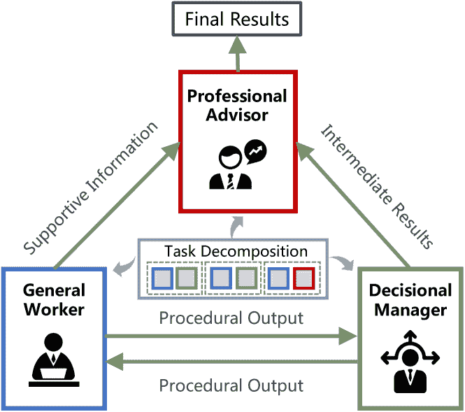
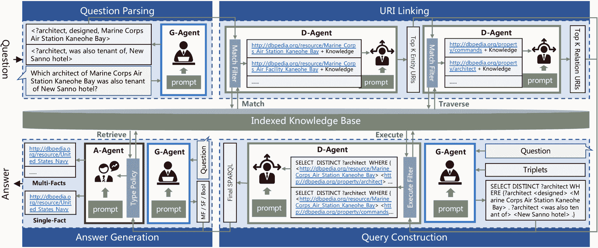
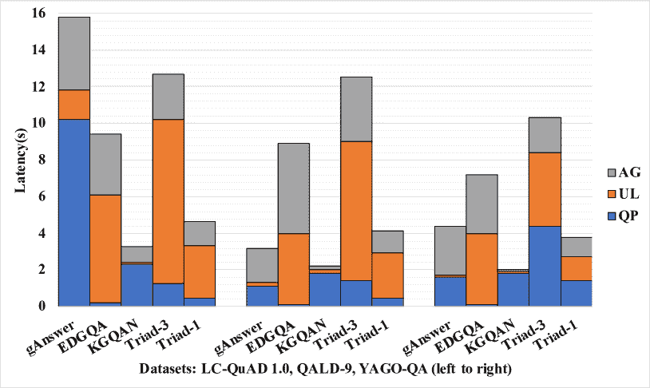

<!--yml

类别：未分类

日期：2025-01-11 12:51:02

-->

# Triad：一个利用多角色基于LLM的智能体解决知识库问答的框架

> 来源：[https://arxiv.org/html/2402.14320/](https://arxiv.org/html/2402.14320/)

宗常¹，严宇晨¹，陆伟名${{}^{1}}{{}^{\dagger}}$ ，邵建¹

黄永峰²，常恒³，庄悦婷${{}^{1}}{{}^{\dagger}}$ ¹¹footnotemark: 1

¹浙江大学计算机科学与技术学院

²香港中文大学

³清华大学

{zongchang, luwm, yzhuang}@zju.edu.cn ^†通讯作者。

###### 摘要

基于LLM的智能体最近在各种任务中取得了令人鼓舞的成果。然而，利用它们回答知识库中的问题仍然是一个未被充分探索的领域。由于任务特定训练数据的匮乏以及构建任务聚焦的模型结构的复杂性，采用传统方法实现KBQA系统具有挑战性。本文提出了Triad，一个统一的框架，利用具有多个角色的基于LLM的智能体来处理KBQA任务。该智能体被赋予三种角色，以应对不同的KBQA子任务：作为通才掌握各种子任务，作为决策者选择候选项，作为顾问用知识回答问题。我们的KBQA框架分为四个阶段，涉及智能体多个角色的协作。我们使用三个基准数据集评估了该框架的性能，结果显示我们的框架在LC-QuAD和YAGO-QA基准测试中分别取得了11.8%和20.7%的F1分数，优于现有的最先进系统。

Triad：一个利用多角色基于LLM的智能体解决知识库问答的框架

宗常¹，严宇晨¹，陆伟名${{}^{1}}{{}^{\dagger}}$ ^†^†thanks: ^†通讯作者。邵建¹ 黄永峰²，常恒³，庄悦婷${{}^{1}}{{}^{\dagger}}$ ¹¹footnotemark: 1 ¹浙江大学计算机科学与技术学院 ²香港中文大学 ³清华大学 {zongchang, luwm, yzhuang}@zju.edu.cn

## 1 引言

问答系统旨在通过将自然语言问题转换为结构化查询，从现有知识库中提取准确信息（Omar 等人，([2023a](https://arxiv.org/html/2402.14320v6#bib.bib13))）。知识库问答（KBQA）的解决通常涉及多个阶段，包括问题理解、URI链接和查询执行。传统的KBQA系统需要使用专门的模型，这些模型通过领域数据集训练，用于问题解析和实体链接（Hu 等人，([2018](https://arxiv.org/html/2402.14320v6#bib.bib7))）；Omar 等人，([2023a](https://arxiv.org/html/2402.14320v6#bib.bib13))；Hu 等人，([2021](https://arxiv.org/html/2402.14320v6#bib.bib8))。然而，大型语言模型（LLMs）在通过任务特定演示进行上下文学习方面显示出了有前景的能力（Dong 等人，([2022](https://arxiv.org/html/2402.14320v6#bib.bib4))）。近年来，LLMs已被用作执行复杂问题的代理。使用LLM增强代理的框架可以生成行动或协调多个代理，从而提高处理复杂情况的能力（Liu 等人，([2023](https://arxiv.org/html/2402.14320v6#bib.bib12))）。尽管LLMs在各类任务中表现出色，正如以往的研究所表明的那样，但基于LLM的代理赋能的KBQA框架的综合定性和定量评估仍然缺乏深入探索。

图 1：一个拥有多个角色的系统，专注于每个阶段的子问题以解决复杂任务。

基于大语言模型（LLMs）的知识库问答（KBQA）研究已引起了广泛关注。一些研究主要集中在突出大语言模型无法生成完整事实性结果的问题，胡等人（[2023b](https://arxiv.org/html/2402.14320v6#bib.bib6)）；谭等人（[2023c](https://arxiv.org/html/2402.14320v6#bib.bib22)）或展示它们在未来研究中的潜在效能，奥马尔等人（[2023b](https://arxiv.org/html/2402.14320v6#bib.bib14)）；谭等人（[2023b](https://arxiv.org/html/2402.14320v6#bib.bib21)）。其他研究则集中于通过提示学习生成答案并结合外部知识库，贝克等人（[2023](https://arxiv.org/html/2402.14320v6#bib.bib2)）；谭等人（[2023a](https://arxiv.org/html/2402.14320v6#bib.bib20)）。与此同时，大语言模型可以部署于解决Text2SQL挑战中的每个阶段，李等人（[2023](https://arxiv.org/html/2402.14320v6#bib.bib10)，[2024](https://arxiv.org/html/2402.14320v6#bib.bib11)）或定理证明任务，董等人（[2023](https://arxiv.org/html/2402.14320v6#bib.bib3)）。然而，KBQA的每个阶段都可以进一步细分为子任务，并通过一种提供反馈和协作的代理方法来完成。此外，任务的分解通过允许每个角色集中处理较小的子问题，从而降低了合作工作的复杂性，王等人（[2020](https://arxiv.org/html/2402.14320v6#bib.bib27)）。如图[1](https://arxiv.org/html/2402.14320v6#S1.F1 "图 1 ‣ 1 引言 ‣ Triad：一个利用多角色基于LLM的代理解决知识库问答问题的框架")所示，组织中的三个角色共同合作，为整体任务提供最终答案。以上观察促使我们探讨以下问题：基于LLM的代理如何通过充当多个角色来解决KBQA任务，并且其表现与专门训练的系统相当？

在本研究中，我们介绍了Triad，这是一个统一的框架，利用基于LLM的代理，通过三种角色来解决KBQA任务。具体而言，我们实现了由LLM作为核心的代理，并补充了各种特定任务的模块，如记忆和执行功能。该代理被分配了三种不同的角色：通才（G-Agent），擅长通过给定的示例掌握许多小任务；决策者（D-Agent），擅长识别选项并选择候选者；以及顾问（A-Agent），擅长利用内部和外部知识提供答案。这些代理角色的合作构成了KBQA过程，包含四个阶段：问题解析、URI链接、查询构建和答案生成。我们在三个具有不同难度的基准数据集上评估了我们的框架。结果表明，我们的框架在性能上优于最先进的系统，在LC-QuAD和YAGO-QA基准测试中分别达到了11.8%和20.7%的F1得分¹¹1代码和数据可以在[https://github.com/ZJU-DCDLab/Triad](https://github.com/ZJU-DCDLab/Triad)获取。

本研究的贡献可以总结如下：

+   •

    我们提出了Triad，这是第一个利用基于LLM的代理来解决KBQA任务四个阶段的框架，无需专门的训练模型。

+   •

    我们实现了一个基于LLM的代理，配有各种特定任务的模块，可以充当三个角色，包括通才、决策者和顾问，通过聚焦于子任务共同解决KBQA问题。

+   •

    我们评估了Triad的性能。结果表明，与最先进的KBQA系统和纯LLM方法相比，Triad展现了竞争力。

## 2 基础

### 2.1 KBQA的阶段

一个典型的KBQA系统包含一个涵盖四个阶段的过程：

#### 问题解析

包括将自然语言问题转换为包含实体和关系引用的结构化格式。

#### URI链接

包括将这些实体和关系提及与知识库中对应的URI进行关联和替换。

#### 查询构建

包括以标准格式创建可执行查询，从知识库中提取答案。

#### 答案生成

旨在通过在知识库中执行查询或直接查询代理来获得最终答案。

### 2.2 基于LLM的代理角色

类比于软件开发场景，其中程序员完成小的开发任务，过程和计划由经理决定，最终结果由领导检查，我们将以下三个角色分配给基于LLM的代理，以解决KBQA任务：

#### 代理作为通才

（G-Agent）能够通过提供少量示例掌握各种小任务。

#### 代理作为决策者

（D-Agent）擅长分析选项并提供候选结果作为过程反馈。

#### 代理作为顾问

（A-Agent）擅长在外部知识和自身知识的帮助下提供最终答案。

### 2.3 任务表述

KBQA任务指的是解决一组子任务$S$的过程。每个子任务$S_{t}\in S$有助于整个过程的一个阶段。一个基于LLM的智能体$Agent_{r}$，具有角色$r$，可以通过其任务特定的组件来解决一种类型的子任务，这些组件包括语言模型$LLM$、记忆$Mem_{t}$、功能$F_{t}$、提示$Pmt_{t}$以及一组参数$\theta_{t}$，并使用与角色相关的超参数$\sigma_{r}$。任务可以表述如下：

|  |  | $\displaystyle f(KBQA)=\mathop{\bigoplus}\limits_{t=1}^{T}f(S_{t})$ |  | (1) |
| --- | --- | --- | --- | --- |
|  | $\displaystyle f(S_{t})=$ | $\displaystyle Agent_{r}(LLM,Mem_{t},F_{t},Pmt_{t},\theta_{t},\sigma_{r})$ |  |

，其中$T$是子任务的总数，$\bigoplus$是协调子任务以解决整体任务的方式。

## 3 三元框架

Triad的总体架构如图[2](https://arxiv.org/html/2402.14320v6#S3.F2 "Figure 2 ‣ 3 Triad Framework ‣ Triad: A Framework Leveraging a Multi-Role LLM-based Agent to Solve Knowledge Base Question Answering")所示。每个基于LLM的智能体角色及其相关子任务如下所示。

图2：我们的三元框架利用基于LLM的智能体，智能体在三个不同角色下协作处理KBQA过程的四个阶段中的一系列子任务，这些角色包括通才、决策者和顾问。

### 3.1 G-Agent作为通用求解器

一个通用智能体（G-Agent）通过利用从有限示例中学习，使用LLM高效地管理众多任务。在我们的框架中，G-Agent可以仅利用LLM执行问题解析、查询模板生成或答案类型分类等操作。这三个子任务如下所示：

#### 三元组提取：

在问题解析中提取三元组时，涉及将自然语言表达的问题$Q$转化为格式化的实体和关系三元组。这个子任务通过LLM来执行，并由带有一组先决条件和示例选择的提示来引导。这个子任务可以表示如下：

|  | $\displaystyle f(S_{tri})=$ | $\displaystyle Agent_{g}(LLM,Pmt_{tri},Q,\mathcal{N})$ |  | (2) |
| --- | --- | --- | --- | --- |
|  | $\displaystyle Pmt_{tri}=$ | $\displaystyle\left[Ins_{tri},Shot_{tri},CoT_{tri}\right]$ |  |

，其中$Agent_{g}$是作为通才的智能体，用于执行三元组提取子任务，使用$\mathcal{N}$个示例。$Pmt_{tri}$是引导$LLM$从问题$Q$生成三元组的提示，其中包括指令$Ins_{tri}$、示例$Shot_{tri}$和链式思维提示$CoT_{tri}$（Kojima等人，[2022](https://arxiv.org/html/2402.14320v6#bib.bib9)）。

#### SPARQL模板生成：

在查询构建中生成 SPARQL 模板涉及使用 LLM 创建一个 SPARQL 模板，该模板通过标准的 SPARQL 语法表达问题，将 URI 标识符替换为实体和关系变量。为了从知识库中使用 SPARQL 查询得出精确和全面的答案，有两种潜在策略。一个方法是直接生成可执行的 SPARQL 查询，通过 LLM 来实现，尽管在多个候选查询的情况下，这种方法可能会显著增加 LLM 调用时间和错误率。另一种方法是首先生成包含实体和关系变量的 SPARQL 模板，随后将这些变量替换为连接的 URI。为了稳定性和效率，我们选择了第二种策略。这个子任务可以表示为：

|  | $\displaystyle f(S_{qt})=$ | $\displaystyle Agent_{g}(LLM,Pmt_{qt},\theta_{qt},\mathcal{N}),$ |  | (3) |
| --- | --- | --- | --- | --- |
|  | $\displaystyle Pmt_{qt}=$ | $\displaystyle\left[Ins_{qt},Shot_{qt},CoT_{qt}\right],$ |  |
|  | $\displaystyle\theta_{qt}=$ | $\displaystyle\left[Q,f(S_{tri})\right]$ |  |

，其中 $Agent_{g}$ 是作为通才的智能体，通过 $\mathcal{N}$ 个示例执行 SPARQL 模板生成，$f(S_{tri})$ 是从前一个子任务中得出的三元组，$Pmt_{qt}$ 是用于生成 SPARQL 模板的 $LLM$ 提示。

#### 答案类型分类：

在答案生成阶段，答案类型分类子任务指的是根据问题为回答分配特定类别的过程。这个过程作为框架生成全面和准确答案的指导机制。这个分类子任务表示为：

|  | $\displaystyle f(S_{cls})=$ | $\displaystyle Agent_{g}(LLM,Pmt_{cls},Q,\mathcal{N}),$ |  | (4) |
| --- | --- | --- | --- | --- |
|  | $\displaystyle Pmt_{cls}=$ | $\displaystyle\left[Ins_{cls},Shot_{cls},CoT_{cls}\right]$ |  |

，其中 $Agent_{g}$ 是作为通才的智能体，通过 $\mathcal{N}$ 个示例执行类型分类子任务，$Pmt_{cls}$ 是用于 $LLM$ 的提示。

### 3.2 D-Agent 作为决策者

作为决策者的智能体（D-Agent）能够通过过滤和从给定选项中选择，逐步做出候选选择，利用 LLM 和知识库（KB）作为记忆。D-Agent 可以有效处理以下三个子任务，具体描述如下：

#### 候选实体选择：

URI 链接中的候选实体选择对知识库问答（KBQA）的最终效果至关重要。先前的研究主要集中在开发语义相似性模型，以解决这一链接挑战。然而，链接任务需要在知识库中进行多次迭代搜索，这对面向 LLM 的方法提出了兼容性问题。在我们的框架中，首先使用作为决策者的智能体从知识库中过滤所有潜在的实体 URI，随后使用 LLM 从潜在标识符池中选择候选 URI。对于每个实体，我们的目标是找到 $\mathcal{K}$ 个最可能的实体 URI，这些 URI 可以用来遍历知识库并得到最终答案。实体选择子任务可以表示为：

|  | $\displaystyle f(S_{es})=$ | $\displaystyle Agent_{d}(LLM,Mem_{es},F_{es},$ |  | (5) |
| --- | --- | --- | --- | --- |
|  |  | $\displaystyle Pmt_{es},\theta_{es},\mathcal{K}),$ |  |
|  | $\displaystyle Mem_{es}=$ | $\displaystyle\left[KB,List_{es}\right],\theta_{es}=\left[Q,f(S_{tri})\right]$ |  |

，其中 $Agent_{d}$ 是作为决策者的智能体，通过问题 $Q$、提取的三元组 $f(S_{tri})$ 和内存 $Mem_{es}$ 执行实体选择子任务。$Mem_{es}$ 由知识库 $KB$ 和一个通过文本相似性匹配函数 $F_{es}$ 从 $KB$ 过滤出的实体 URI 列表 $List_{es}$ 组成，$Pmt_{es}$ 是 LLM 执行子任务的提示词，$\mathcal{K}$ 是 $Agent_{d}$ 的超参数，表示 LLM 选择的候选数目。

#### 候选关系选择：

在 URI 链接中，候选关系选择的任务面临着由于词形和意义之间的差异而带来的相当大的挑战。然而，知识库中推理路径的存在可以被利用，从而显著缩小与关系链接相关的搜索空间。在我们的框架中，作为决策者的智能体努力通过使用从前一个子任务中生成的候选实体 URI，在知识库中筛选所有潜在的关系 URI。随后，使用 LLM 选择最有可能的 $\mathcal{K}$ 个关系 URI 作为输出。关系选择子任务可以表示为：

|  | $\displaystyle f(S_{rs})=$ | $\displaystyle Agent_{d}(LLM,Mem_{rs},F_{rs},$ |  | (6) |
| --- | --- | --- | --- | --- |
|  |  | $\displaystyle Pmt_{rs},\theta_{rs},\mathcal{K}),$ |  |
|  | $\displaystyle Mem_{rs}=$ | $\displaystyle\left[KB,List_{rs}\right],\theta_{rs}=\left[Q,f(S_{es})\right]$ |  |

，其中内存 $Mem_{rs}$ 由知识库 $KB$ 和一个从 $KB$ 使用一阶遍历函数 $F_{rs}$ 过滤出来的潜在关系 URI 列表 $List_{rs}$ 组成。$Pmt_{rs}$ 是 LLM 执行关系选择的提示词。$\mathcal{K}$ 是 LLM 选择的关系 URI 数量。

#### 候选 SPARQL 选择：

查询构建中的候选SPARQL选择子任务涉及确定适当的SPARQL查询以获得最终答案。给定一个由G-Agent生成的SPARQL模板，以及在前面的子任务中由D-Agent选择的多个候选URI，我们的D-Agent旨在识别最有可能的查询。为了进一步减少选择的难度，应用执行函数来排除那些无法从知识库中检索到任何结果的查询。总之，我们在此子任务中的目标是使用D-Agent构建可执行的SPARQL，并在给定包含支持信息的查询候选列表的情况下，找到最可能的查询。SPARQL选择子任务可以表示为：

|  | $\displaystyle f(S_{qs})=$ | $\displaystyle Agent_{d}(LLM,Mem_{qs},F_{qs},$ |  | (7) |
| --- | --- | --- | --- | --- |
|  |  | $\displaystyle Pmt_{qs},\theta_{qs},\mathcal{K}),$ |  |
|  | $\displaystyle Mem_{qs}=$ | $\displaystyle\left[KB,List_{qs}\right],$ |  |
|  | $\displaystyle\theta_{qs}=$ | $\displaystyle\left[Q,f(S_{es}),f(S_{rs}),f(S_{qt})\right]$ |  |

，其中记忆$Mem_{qs}$由知识库$KB$和由SPARQL模板$f(S_{qt})$、实体URI$f(S_{es})$、关系URI$f(S_{rs})$通过函数$F_{qs}$构建的可能SPARQL列表$List_{qs}$组成，$Pmt_{qs}$是LLM执行查询选择的提示，$\mathcal{K}=1$是LLM选择的查询数量。

### 3.3 A-Agent作为综合顾问

咨询代理（A-Agent）能够处理一个问题和相应类型的回答作为输入。它的响应是通过从外部知识库中提取信息或利用其内部知识提供直接答案来生成的。这个综合回答子任务可以描述如下：

#### 综合回答：

综合回答阶段的目标是基于提问生成一个明确的回答。Omar等人（[2023b](https://arxiv.org/html/2402.14320v6#bib.bib14)）的研究表明，LLM在提供单一事实回答和做出布尔判断方面更为擅长。基于这一理解，我们实现了一个咨询代理（A-Agent），它采用一种简单的策略来促进综合回答方法的实施。具体来说，如果问题生成了一个最终的SPARQL查询（由前面的步骤生成），A-Agent会从知识库中提取元素来给出答案。相反，如果代理未收到可行的SPARQL，A-Agent会基于答案类型，利用LLM的内部知识提供直接响应。此外，如果未生成结果，A-Agent会向前面的阶段发送重试信号。这个子任务可以表示如下：

|  | $\displaystyle f(S_{ca})=$ | $\displaystyle Agent_{a}(LLM,Mem_{ca},F_{ca},$ |  | (8) |
| --- | --- | --- | --- | --- |
|  |  | $\displaystyle Pmt_{ca},\theta_{ca},\mathcal{T}),$ |  |
|  | $\displaystyle Mem_{ca}=$ | $\displaystyle\left[KB\right],\theta_{ca}=\left[Q,f(S_{qs}),f(S_{cls})\right]$ |  |

, 其中 $Agent_{a}$ 是作为顾问的代理，负责为问题 $Q$ 提供全面的回答，并拥有知识库的记忆 $Mem_{ca}$，$Pmt_{ca}$ 是 LLM 根据答案类型执行直接响应的提示，$f(S_{qs})$ 是最终查询，$f(S_{cls})$ 是答案类型，$\mathcal{T}$ 是当 $KB$ 未返回结果时，之前阶段最大重试次数。

## 4 性能评估

### 4.1 实验设置

#### 索引的知识库：

我们通过收集两个真实的知识库来评估我们框架的效能，分别是 DBpedia 和 YAGO。DBpedia Auer 等人（[2007](https://arxiv.org/html/2402.14320v6#bib.bib1)）是一个从 Wikipedia 中提取的可访问知识库，而 YAGO Pellissier Tanon 等人（[2020](https://arxiv.org/html/2402.14320v6#bib.bib16)）是一个大型知识库，包含个人、城市、国家和组织。我们在 Virtuoso 端点和 Elasticsearch 服务器中分别索引了三元组以及实体和关系的提及。

#### KBQA 基准数据集：

我们在多个数据集上评估了我们的框架，包括 YAGO-QA、LC-QuAD 1.0 和 QALD-9，这些数据集在解读问题时具有不同的难度。这些数据集包含英语问题，配有相应的 SPARQL 查询和从特定知识库中获取的准确回答。QALD-9 Usbeck 等人（[2018](https://arxiv.org/html/2402.14320v6#bib.bib25)）和 LC-QuAD 1.0 Trivedi 等人（[2017](https://arxiv.org/html/2402.14320v6#bib.bib24)）常用于评估与 DBpedia 相关的问答系统。最近发布的 YAGO-QA，Omar 等人（[2023a](https://arxiv.org/html/2402.14320v6#bib.bib13)）提供了附带注释的 SPARQL 查询问题，源自 YAGO。表 [1](https://arxiv.org/html/2402.14320v6#S4.T1 "表 1 ‣ KBQA 基准数据集: ‣ 4.1 实验设置 ‣ 4 性能评估 ‣ Triad：一个利用多角色基于 LLM 的代理解决知识库问答的框架") 展示了三个基准的统计信息及其相关的知识库。

| 基准 | 基准统计信息 |
| --- | --- |
| #问题 | 知识库 | #三元组 | Virtuoso 大小 | ES 大小 |
| LC-QuAD 1.0 | 1000 | DBpedia-04 | 397M | 35.40G | 1.56G |
| QALD-9 | 150 | DBpedia-10 | 374M | 36.89G | 1.57G |
| YAGO-QA | 100 | YAGO-4 | 207M | 24.85G | 0.54G |

表 1：KBQA 基准的统计信息，包括问题数量、三元组数量、Virtuoso 中的索引大小以及 Elasticsearch 中的索引大小。

| 类型 | 框架 | LC-QuAD 1.0 | QALD-9 | YAGO-QA |
| --- | --- | --- | --- | --- |
| P | R | F1 | P | R | F1 | P | R | F1 |
| 全样本 | gAnswer | - | - | - | 0.293 | 0.327 | 0.298 | 0.585 | 0.341 | 0.430 |
|  | EDGQA | 0.505 | 0.560 | 0.531 | 0.313 | 0.403 | 0.320 | 0.419 | 0.408 | 0.414 |
|  | KGQAN | 0.587 | 0.461 | 0.516 | 0.511 | 0.387 | 0.441 | 0.485 | 0.652 | 0.556 |
| few-shot | GPT-3.5 | 0.269 | 0.251 | 0.266 | 0.240 | 0.217 | 0.228 | 0.171 | 0.142 | 0.155 |
|  | GPT-4 | 0.336 | 0.344 | 0.340 | 0.250 | 0.249 | 0.249 | 0.193 | 0.190 | 0.191 |
|  | Triad-GPT3.5 | 0.490 | 0.519 | 0.504 | 0.293 | 0.302 | 0.297 | 0.660 | 0.639 | 0.649 |
|  | Triad-GPT4 | 0.561 | 0.568 | 0.564 | 0.408 | 0.425 | 0.416 | 0.690 | 0.664 | 0.677 |

表2：我们提出的Triad在三个基准测试中的性能，与传统的KBQA系统（全量）和纯LLM（少量）基准进行了比较。最优和次优得分分别以**粗体**和下划线文本突出显示。

#### 基准方法：

我们将Triad与传统的KBQA系统进行评估，如KGQAN Omar等([2023a](https://arxiv.org/html/2402.14320v6#bib.bib13))、EDGQA Hu等([2021](https://arxiv.org/html/2402.14320v6#bib.bib8))和gAnswer Hu等([2018](https://arxiv.org/html/2402.14320v6#bib.bib7))。该比较展示了我们的基于LLM的代理框架如何仅通过少量示例与全量系统相媲美。此外，我们还将框架与纯GPT模型（如GPT-3.5 Turbo和GPT-4 ²²2https://platform.openai.com/docs/models）进行对比，以展示Triad的架构性能。我们将这些基础模型视为少量示例方法，用于回答参考示例的问题。

#### 实现细节：

Triad是使用Python 3.9实现的。我们通过OpenAI的API服务将LLM能力集成到我们的多角色代理中。知识库中的实体和关系名称被索引在ElasticSearch 7.5.2服务器中，用于文本匹配。所有三元组都被导入到Virtuoso 07.20.3237的SPARQL端点中进行检索。Triad需要四个超参数：G-Agent用于子任务学习的示例数量，D-Agent选择用于实体和关系链接的候选数量，以及处理无响应SPARQL查询的重试次数。这些参数的最优值分别为3、2、2和3。框架及其变体在每个基准测试中进行了五次测试，报告的平均分作为最终结果。对于传统系统，我们报告它们论文中记录的结果。对于纯LLM基准，我们编写提示语，聘请LLM直接回答参考示例的问题，然后通过内置的相似性搜索将响应中的提及链接到我们索引的知识库中的URI。

### 4.2 性能比较

Triad与传统KBQA系统和纯LLM生成方法的性能比较见表[2](https://arxiv.org/html/2402.14320v6#S4.T2 "Table 2 ‣ KBQA Benchmark Datasets: ‣ 4.1 Experimental Settings ‣ 4 Performance Evaluation ‣ Triad: A Framework Leveraging a Multi-Role LLM-based Agent to Solve Knowledge Base Question Answering")。评估指标包括精确度(P)、召回率(R)和F1得分(F1)。从实验结果中我们可以观察到：

#### 少量学习可以与全量学习竞争。

我们基于多角色 LLM 的代理框架，尽管执行了少量提示学习，但在与最前沿的全量知识库问答（KBQA）系统相比，展现出了具有竞争力的表现。

#### 基础能力至关重要。

在 LLM 基础的代理中使用 GPT-4 作为核心，在所有基准测试中显著优于 GPT-3.5，证明了代理基础能力的重要性。

#### 明确的知识是必要的。

纯 LLM 模型（如 GPT-3.5 和 GPT-4）在没有辅助知识库作为中介步骤记忆（如 URI 链接）时，生成准确回答存在不足。

#### 性能随复杂度变化。

Triad 在 LC-QuAD 和 YAGO-QA 基准测试中表现优于 QALD-9，原因是它在回答复杂问题时的失败率较高，这将在后文中讨论。

### 4.3 代理角色能力研究

我们评估了以不同语言模型为核心的 G-Agent 的效果。没有 G-task 的框架使用的是 text-davinci-002，它在解决许多任务时不如 GPT-3.5 和 GPT-4 强大；没有 G-chat 的框架使用的是 text-davinci-003，去除了聊天和对齐能力。我们通过分别用 URI 匹配和查询生成代替 URI 选择和查询选择，测试了没有 D-uri 和 D-query 的 D-Agent 的能力。我们通过不使用 LLM 的帮助来回答问题，或者仅在辅助布尔问题时使用 LLM，而不是单一事实问题，评估了去除 A-llm 和 A-fact 后 A-Agent 的贡献。两组代表性数据集上的角色消融实验的 F1 结果如表 [3](https://arxiv.org/html/2402.14320v6#S4.T3 "Table 3 ‣ 4.3 Study on Capabilities of Agent Roles ‣ 4 Performance Evaluation ‣ Triad: A Framework Leveraging a Multi-Role LLM-based Agent to Solve Knowledge Base Question Answering") 所示。结果表明，每个角色相关的组件对整体性能都有贡献。更具体地说，使用较弱 LLM 作为核心的 G-Agent 会显著削弱性能。D-Agent 在链接阶段比查询构造阶段更为关键。A-Agent 则在管理没有 SPARQL 结果的情况时表现为一个高效的解决方案。

| G-task | G-chat | LC-QuAD 1.0 | QALD-9 |
| --- | --- | --- | --- |
| ✗ | ✗ | 0.343 | 0.159 |
| ✓ | ✗ | 0.443 | 0.248 |
| ✓ | ✓ | 0.564 | 0.416 |
| D-uri | D-query | LC-QuAD 1.0 | QALD-9 |
| ✗ | ✓ | 0.274 | 0.210 |
| ✓ | ✗ | 0.431 | 0.301 |
| ✓ | ✓ | 0.564 | 0.416 |
| A-llm | A-fact | LC-QuAD 1.0 | QALD-9 |
| ✗ | ✗ | 0.459 | 0.382 |
| ✓ | ✗ | 0.473 | 0.385 |
| ✓ | ✓ | 0.564 | 0.416 |

表 3：通过消除一个元素或降低能力来研究基于 LLM 的代理角色。

### 4.4 角色超参数分析

我们集中在三个角色的超参数上，包括为G-Agent学习子任务提供的示例数量（$\mathcal{N}\in\{1,2,3\}$），D-Agent为查询构建选择的URI候选数量（$\mathcal{K}\in\{(1,1),(1,2),(2,2),(2,3)\}$），以及当没有响应时A-Agent发起的重试次数（$\mathcal{T}\in\{1,2,3\}$）。表[4](https://arxiv.org/html/2402.14320v6#S4.T4 "Table 4 ‣ 4.4 Analysis of Role Hyperparameters ‣ 4 Performance Evaluation ‣ Triad: A Framework Leveraging a Multi-Role LLM-based Agent to Solve Knowledge Base Question Answering")展示了Triad在两个基准上采用这三个超参数的F1结果。我们发现：

| Triad Variants | LC-QuAD 1.0 | QALD-9 |
| --- | --- | --- |
| Triad-1-Shot | 0.556 | 0.376 |
| Triad-2-Shot | 0.511 | 0.402 |
| Triad-3-Shot | 0.564 | 0.416 |
| Triad-Top1-1 | 0.528 | 0.281 |
| Triad-Top1-2 | 0.562 | 0.375 |
| Triad-Top2-2 | 0.564 | 0.416 |
| Triad-Top2-3 | 0.558 | 0.384 |
| Triad-1-Try | 0.529 | 0.375 |
| Triad-2-Tries | 0.561 | 0.407 |
| Triad-3-Tries | 0.564 | 0.416 |

表 4：基于LLM的智能体各角色相关的三个超参数的性能评估。

#### 质量比数量更重要。

提供给G-Agent的更多示例并不总是能提高性能。G-Agent的效能受到示例质量的显著影响。

#### 更多的选项可能会损害结果。

为实体和关系选择更多的候选URI可能会干扰后续查询阶段，从而影响整体性能。

#### 更多的机会有利于框架。

持续尝试构建并执行SPARQL查询是一种有效的策略，可以提高获取准确答案的概率。考虑到整体执行效率，我们在实践中将最大重试次数设置为3。

### 4.5 链接召回分析

链接过程是Text2SQL和KBQA过程中相对复杂的子任务（Li等人，[2024](https://arxiv.org/html/2402.14320v6#bib.bib11)）。使用D-Agent计算准确URI的召回率，有助于明确哪个步骤对性能的影响最大。在实体链接阶段，将测试集中所有实体的URI作为链接结果的真实情况，D-Agent实体匹配过滤器的输出包含了80.75%的正确URI，而LLM在D-Agent中执行的实体选择保留了70.50%的正确URI。而在关系链接阶段，只有52.54%的正确关系URI通过LLM的选择存活下来，表明关系链接更具挑战性。

### 4.6 复杂案例研究

尽管Triad在某些基准测试中表现出色，但在理解问题和为复杂问题生成查询方面仍存在明显不足。对QALD-9中未成功的案例进行的深入分析，揭示了导致这种失败的三个主要原因，具体如下：

| 失败原因 | 比例 | 示例 |
| --- | --- | --- |
| 复杂语法 | 20% | Q42: 哪些国家的地方有超过两个洞穴？ |
| 未利用语义 | 17% | Q199: 给我所有的阿根廷电影。 |
| 隐式推理 | 5% | Q133: 青少年变种忍者龟的名字是什么？ |

表5：导致失败的复杂性主要原因及其在失败案例中的出现比例。

#### 复杂语法

表示高级SPARQL查询包含如GROUP BY和HAVING等关键词。这些术语增加了在生成SPARQL模板时的错误倾向，例如示例：哪个常旅客计划拥有最多的航空公司？

#### 未利用语义

表明必须理解隐式实体的语义，以排除无关的URI。在示例“给我所有的阿根廷电影”中，电影的含义应被用来缩小潜在实体的范围，以排除无关的答案。

#### 隐式推理

提出了一个挑战，要求框架进行更深入的遍历，以从提出的问题中推导出准确的结果。例如，另一个失败的例子，“Jacques Cousteau有多少个孙子？” 其中，“孙子”一词必须被解释为“儿子的儿子”，以确保得到准确的回答。

### 4.7 成本比较与分析

根据我们对三个数据集的评估，使用Triad-GPT3.5运行单个案例的平均成本为0.007美元，而使用Triad-GPT4的平均成本为0.05美元。具体来说，大多数API调用发生在URL链接和综合回答阶段。同时，传统的KBQA基准需要大量的训练数据和本地训练资源才能实现SOTA性能，而Triad采用零-shot或少-shot方式，在本地节省计算成本。此外，如第4.4节所示，在实际应用中，调整超参数可以在保持整体性能的同时将成本降低到最低。当LLM服务的成本下降时，Triad的价值将相应增加。

## 5 相关工作

### 5.1 基于SPARQL和LLM的KBQA

传统的知识库问答（KBQA）方法将自然语言查询转换为SPARQL请求以进行数据提取。特定模型用于问题理解或URI链接，利用基于领域的训练数据集。胡等人（[2018](https://arxiv.org/html/2402.14320v6#bib.bib7)）提出了一种语义查询图，结构化地表示自然语言查询，从而将任务简化为子图匹配问题。胡等人（[2021](https://arxiv.org/html/2402.14320v6#bib.bib8)）提出了一种实体描述图，用于表示自然语言查询，以便进行问题解析和元素链接。奥马尔等人（[2023a](https://arxiv.org/html/2402.14320v6#bib.bib13)）将问题解析任务重构为使用序列到序列模型的文本生成问题。随着LLM（大语言模型）的出现，KBQA的某些阶段可以通过LLM集成方法得到增强。白克等人（[2023](https://arxiv.org/html/2402.14320v6#bib.bib2)）旨在通过从知识库中提取相关事实，增强基于LLM的问答任务，提供一个完全的零样本架构。谭等人（[2023a](https://arxiv.org/html/2402.14320v6#bib.bib20)）利用LLM的广泛适用性，通过少量示例的上下文学习筛选链接候选项。奥马尔等人（[2023b](https://arxiv.org/html/2402.14320v6#bib.bib14)）对LLM和问答系统进行了全面比较，建议进一步研究以提升LLM在KBQA中的应用。然而，除了上述研究外，我们的研究提出了一个完整的框架，从系统的角度整合LLM和少量样本学习，涵盖KBQA各个阶段。

### 5.2 基于LLM的复杂任务代理

由于LLM能够近似人类级别的智能，最近引起了广泛关注。这导致了大量研究集中于基于LLM的智能体。最近的一项调查Wang等人（[2023](https://arxiv.org/html/2402.14320v6#bib.bib26)）提出了一种统一的基于LLM的智能体架构，该架构由四个模块组成，包括个人资料、记忆、计划和行动。CHATDBHu等人（[2023a](https://arxiv.org/html/2402.14320v6#bib.bib5)）采用LLM控制器生成SQL指令，从而实现符号记忆和复杂的多跳推理。ARTParanjape等人（[2023](https://arxiv.org/html/2402.14320v6#bib.bib15)）使用冻结的LLM生成推理步骤，并进一步结合工具来处理新任务，且最小化人类干预。ToolformerSchick等人（[2024](https://arxiv.org/html/2402.14320v6#bib.bib17)）通过训练LLM来规划和执行工具，以通过学习API调用生成来预测下一个令牌。ReActYao等人（[2023](https://arxiv.org/html/2402.14320v6#bib.bib28)）专注于通过与外部知识库交互来克服LLM的幻觉，从而生成可解释的任务解决策略。CodeAgentTang等人（[2024](https://arxiv.org/html/2402.14320v6#bib.bib23)）设计了一个跨四个阶段的多智能体协作系统，用于代码审查过程。与上述研究不同，我们的框架专注于通过引入一个多角色的基于LLM的智能体，解决KBQA任务，该智能体专门处理分布在不同阶段的各种子任务。

## 6 结论

在本研究中，我们旨在弥合KBQA任务与基于LLM的智能体研究之间的差距。我们介绍了Triad，这是一个通过基于LLM的智能体来解决KBQA任务的框架，该智能体扮演多个角色，包括能够在给定最少示例的情况下掌握多种任务的通才，专注于选项分析和候选选择的决策者，以及能够在外部和内部知识的帮助下回答问题的顾问。与传统的KBQA系统和纯LLM模型相比，Triad在三个基准数据集上达到了最佳或具有竞争力的表现。在未来的研究中，我们计划拓展我们的框架，以处理更为复杂的问题，例如多跳推理，并探索我们的框架与增强检索生成的整合。

## 局限性

我们研究的局限性体现在以下几个方面：（1）在数据方面，需要评估更广泛的QA数据集，包括来自不同领域、语言和难度级别的数据集。（2）在模型方面，需要评估更多的LLM，包括来自不同组织和不同规模的开源和商业模型。（3）在框架方面，可以探索更多类型的智能体协作方法来解决KBQA问题。

## 伦理考量

本研究中使用的所有数据集都是公开可用的，并且我们在LLM文本生成过程中没有引入额外的信息作为输入，遵守了伦理规范。

## 致谢

本研究得到了浙江省“先锋”和“领头雁”研发计划的资助（资助编号：2023C01152）。

## 参考文献

+   Auer 等人（2007）Sören Auer、Christian Bizer、Georgi Kobilarov、Jens Lehmann、Richard Cyganiak 和 Zachary Ives。2007年。[Dbpedia: A nucleus for a web of open data](https://doi.org/https://doi.org/10.1007/978-3-540-76298-0_52)。在 *The Semantic Web* 书中，页码722–735，柏林，海德堡。Springer Berlin Heidelberg。

+   Baek 等人（2023）Jinheon Baek、AlhamFikri Aji 和 Amir Saffari。2023年。[Knowledge-augmented language model prompting for zero-shot knowledge graph question answering](https://doi.org/https://doi.org/10.48550/arXiv.2306.04136)。*arXiv 预印本 arXiv:2306.04136*。

+   Dong 等人（2023）Qingxiu Dong、Li Dong、Ke Xu、Guangyan Zhou、Yaru Hao、Zhifang Sui 和 Furu Wei。2023年。大语言模型在科学中的应用：关于 P vs. NP 的研究。*arXiv 预印本 arXiv:2309.05689*。

+   Dong 等人（2022）Qingxiu Dong、Lei Li、Damai Dai、Ce Zheng、Zhiyong Wu、Baobao Chang、Xu Sun、Jingjing Xu 和 Zhifang Sui。2022年。一项关于上下文学习的调查。*arXiv 预印本 arXiv:2301.00234*。

+   Hu 等人（2023a）Chenxu Hu、Jie Fu、Chenzhuang Du、Simian Luo、Junbo Zhao 和 Hang Zhao。2023a年。[Chatdb: Augmenting llms with databases as their symbolic memory](https://doi.org/https://doi.org/10.48550/arXiv.2306.03901)。*arXiv 预印本 arXiv:2306.03901*。

+   Hu 等人（2023b）Nan Hu、Yike Wu、Guilin Qi、Dehai Min、Jiaoyan Chen、Jeff Z Pan 和 Zafar Ali。2023b年。[An empirical study of pre-trained language models in simple knowledge graph question answering](https://doi.org/https://doi.org/10.1007/s11280-023-01166-y)。*World Wide Web*，页码1–32。

+   Hu 等人（2018）Sen Hu、Lei Zou、Jeffrey Xu Yu、Haixun Wang 和 Dongyan Zhao。2018年。[Answering natural language questions by subgraph matching over knowledge graphs](https://doi.org/10.1109/tkde.2017.2766634)。*IEEE Transactions on Knowledge and Data Engineering*，页码824–837。

+   Hu 等人（2021）Xixin Hu、Yiheng Shu、Xiang Huang 和 Yuzhong Qu。2021年。[Edg-based question decomposition for complex question answering over knowledge bases](https://doi.org/10.1007/978-3-030-88361-4_8)。在 *The Semantic Web – ISWC 2021: 20th International Semantic Web Conference, ISWC 2021, Virtual Event, October 24–28, 2021, Proceedings* 书中，页码128–145，柏林，海德堡。Springer-Verlag。

+   Kojima 等人（2022）Takeshi Kojima、Shixiang Shane Gu、Machel Reid、Yutaka Matsuo 和 Yusuke Iwasawa。2022年。[Large language models are zero-shot reasoners](https://doi.org/https://doi.org/10.48550/arXiv.2205.1191)。*Advances in neural information processing systems*，35:22199–22213。

+   Li 等人（2023）Jinyang Li, Binyuan Hui, Reynold Cheng, Bowen Qin, Chenhao Ma, Nan Huo, Fei Huang, Wenyu Du, Luo Si, 和 Yongbin Li. 2023. Graphix-t5: 将预训练的变换器与图感知层混合用于文本到 SQL 的解析. 收录于 *AAAI 人工智能大会论文集*，第 37 卷，页面 13076–13084.

+   Li 等人（2024）Jinyang Li, Binyuan Hui, Ge Qu, Jiaxi Yang, Binhua Li, Bowen Li, Bailin Wang, Bowen Qin, Ruiying Geng, Nan Huo 等. 2024. 大型语言模型（LLM）能否已经作为数据库接口？一个用于大规模数据库基础的文本到 SQL 基准测试. *神经信息处理系统进展*，第 36 卷.

+   Liu 等人（2023）Zhiwei Liu, Weiran Yao, Jianguo Zhang, Le Xue, Shelby Heinecke, Rithesh Murthy, Yihao Feng, Zeyuan Chen, Juan Carlos Niebles, Devansh Arpit 等. 2023. [Bolaa: 基准测试和协同操作 LLM 增强的自主智能体](https://doi.org/https://doi.org/10.48550/arXiv.2308.05960). *arXiv 预印本 arXiv:2308.05960*.

+   Omar 等人（2023a）Reham Omar, Ishika Dhall, Panos Kalnis, 和 Essam Mansour. 2023a. [一个通用的知识图谱问答平台](https://doi.org/10.1145/3588911). *ACM 数据管理会议论文集*，1(1):1–25.

+   Omar 等人（2023b）Reham Omar, Omij Mangukiya, Panos Kalnis, 和 Essam Mansour. 2023b. [ChatGPT 与传统问答在知识图谱中的比较：现状与未来知识图谱聊天机器人的发展方向](https://doi.org/https://doi.org/10.48550/arXiv.2302.06466). *arXiv 预印本 arXiv:2302.06466*.

+   Paranjape 等人（2023）Bhargavi Paranjape, Scott Lundberg, Sameer Singh, Hannaneh Hajishirzi, Luke Zettlemoyer, 和 MarcoTulio Ribeiro. 2023. [Art: 大型语言模型的自动多步骤推理和工具使用](https://doi.org/https://doi.org/10.48550/arXiv.2303.09014). *arXiv 预印本 arXiv:2303.09014*.

+   Pellissier Tanon 等人（2020）Thomas Pellissier Tanon, Gerhard Weikum, 和 Fabian Suchanek. 2020. [Yago 4: 一个合理的知识库](https://doi.org/https://doi.org/10.1007/978-3-030-49461-2_34). 收录于 *语义网*，第 583–596 页，Cham. Springer 国际出版.

+   Schick 等人（2024）Timo Schick, Jane Dwivedi-Yu, Roberto Dessì, Roberta Raileanu, Maria Lomeli, Eric Hambro, Luke Zettlemoyer, Nicola Cancedda, 和 Thomas Scialom. 2024. Toolformer: 语言模型可以自我学习使用工具. *神经信息处理系统进展*，第 36 卷.

+   Shen 等人（2024）Yongliang Shen, Kaitao Song, Xu Tan, Dongsheng Li, Weiming Lu, 和 Yueting Zhuang. 2024. Hugginggpt: 利用 ChatGPT 和 Hugging Face 的伙伴解决 AI 任务. *神经信息处理系统进展*，第 36 卷.

+   Shinn 等人（2023）Noah Shinn, Beck Labash, 和 Ashwin Gopinath. 2023. [Reflexion: 一个具有动态记忆和自我反思的自主智能体](https://doi.org/https://doi.org/10.48550/arXiv.2303.11366). *arXiv 预印本 arXiv:2303.11366*.

+   Tan 等人（2023a）Chuanyuan Tan, Yuehe Chen, Wenbiao Shao, Wenliang Chen, Zhefeng Wang, Baoxing Huai, 和 Min Zhang. 2023a. [做出选择！基于上下文学习的知识库问答](https://doi.org/https://doi.org/10.48550/arXiv.2305.13972). *arXiv 预印本 arXiv:2305.13972*.

+   Tan 等人（2023b）Yiming Tan, Dehai Min, Yu Li, Wenbo Li, Nan Hu, Yongrui Chen, 和 Guilin Qi. 2023b. ChatGPT 能否替代传统的知识库问答模型？对 GPT LLM 家族问答性能的深入分析. 在 *国际语义网会议*，第 348–367 页。Springer.

+   Tan 等人（2023c）Yiming Tan, Dehai Min, Yu Li, Wenbo Li, Nan Hu, Yongrui Chen, 和 Guilin Qi. 2023c. [评估 ChatGPT 作为复杂问题解答系统的表现](https://doi.org/https://doi.org/10.48550/arXiv.2303.0799). *arXiv 预印本 arXiv:2303.07992*.

+   Tang 等人（2024）Daniel Tang, Zhenghan Chen, Kisub Kim, Yewei Song, Haoye Tian, Saad Ezzini, Yongfeng Huang, 和 Jacques Klein Tegawende F Bissyande. 2024. 软件工程的协作代理. *arXiv 预印本 arXiv:2402.02172*.

+   Trivedi 等人（2017）Priyansh Trivedi, Gaurav Maheshwari, Mohnish Dubey, 和 Jens Lehmann. 2017. [Lc-quad：一个用于知识图谱复杂问答的语料库](https://doi.org/https://doi.org/10.1007/978-3-319-68204-4_22). 在 *The Semantic Web – ISWC 2017*，第 210–218 页，Cham. Springer International Publishing.

+   Usbeck 等人（2018）Ricardo Usbeck, Ria Hari Gusmita, Axel-Cyrille Ngonga Ngomo, 和 Muhammad Saleem. 2018. [第九届基于链接数据的问答挑战（QALD-9）](https://doi.org/https://api.semanticscholar.org/CorpusID:53220210). 在 *Semdeep/NLIWoD@ISWC*.

+   Wang 等人（2023）Lei Wang, Chen Ma, Xueyang Feng, Zeyu Zhang, Hao Yang, Jingsen Zhang, Zhiyuan Chen, Jiakai Tang, Xu Chen, Yankai Lin 等人. 2023. [基于大语言模型的自主代理调查](https://doi.org/https://doi.org/10.48550/arXiv.2308.11432). *arXiv 预印本 arXiv:2308.11432*.

+   Wang 等人（2020）Tonghan Wang, Tarun Gupta, Anuj Mahajan, Bei Peng, Shimon Whiteson, 和 Chongjie Zhang. 2020. Rode：学习角色以分解多智能体任务. *arXiv 预印本 arXiv:2010.01523*.

+   Yao 等人（2023）Shunyu Yao, Jeffrey Zhao, Dian Yu, Nan Du, Izhak Shafran, Karthik Narasimhan, 和 Yuan Cao. 2023. [React: 协同推理与行动的语言模型](https://doi.org/https://doi.org/10.48550/arXiv.2210.03629).

## 附录 A 响应时间分析

我们分析了各种问答框架在回答问题时的响应时间。报告了每个知识库中各阶段的平均延迟时间，包括问题解析（QP）、URI链接（UL）和答案生成（AG）。我们随机选择了每个数据集中的10个样本进行评估，以获得Triad-1和Triad-3的平均响应时间，这分别代表在答案生成阶段重试三次和一次性生成答案。传统问答系统与Triad的对比如图[3](https://arxiv.org/html/2402.14320v6#A1.F3 "Figure 3 ‣ Appendix A Response Time Analysis ‣ Triad: A Framework Leveraging a Multi-Role LLM-based Agent to Solve Knowledge Base Question Answering")所示。总体而言，Triad在时间消耗上表现出与最新传统问答系统具有竞争力的表现。具体而言，与其他阶段相比，URL链接消耗了更多时间，因为需要多次调用LLM。此外，根据第4.4节，随着A-Agent的重试次数减少，Triad能够显著减少时间成本，同时只造成轻微的性能下降，揭示了我们框架在平衡性能和效率方面的优势。

图3：传统KBQA系统和Triad在三个数据集上的响应时间。每个条形图显示KBQA特定阶段的平均响应时间。

## 附录B：YAGO-QA上的角色性能

我们在第4.3节中选择LC-QuAD 1.0和QALD-9作为我们的两个代表性数据集，因为它们之间的问题难度不同，而这两个数据集中的任务比YAGO-QA更具挑战性。我们在表[6](https://arxiv.org/html/2402.14320v6#A2.T6 "Table 6 ‣ Appendix B Role Performance on YAGO-QA ‣ Triad: A Framework Leveraging a Multi-Role LLM-based Agent to Solve Knowledge Base Question Answering")中提供了在YAGO-QA上代理角色的表现，结果与表[3](https://arxiv.org/html/2402.14320v6#S4.T3 "Table 3 ‣ 4.3 Study on Capabilities of Agent Roles ‣ 4 Performance Evaluation ‣ Triad: A Framework Leveraging a Multi-Role LLM-based Agent to Solve Knowledge Base Question Answering")中的其他数据集一致。

| G-task | G-chat | YAGO-QA |
| --- | --- | --- |
| ✗ | ✗ | 0.427 |
| ✓ | ✗ | 0.553 |
| ✓ | ✓ | 0.677 |
| D-uri | D-query | YAGO-QA |
| ✗ | ✓ | 0.346 |
| ✓ | ✗ | 0.534 |
| ✓ | ✓ | 0.677 |
| A-llm | A-fact | YAGO-QA |
| ✗ | ✗ | 0.626 |
| ✓ | ✗ | 0.647 |
| ✓ | ✓ | 0.677 |

表6：通过删除某个元素或降低能力来评估基于LLM的代理角色的性能。

## 附录C：为G-Agent提供的用于解决KBQA各子任务的提示

给LLM的$Agent_{g}$用于从问题$Q$中提取三元组的提示如下：

你是一个助手，负责从提供的句子中识别三元组。请遵循以下指导方针：1\. 三元组应当按格式<entity1, relation, entity2>构造。2\. 句子中必须包含至少一个三元组，因此你需要提供至少一个。3\. 实体应当表示最小的语义单位，不应包含描述性细节。4\. 实体可以是显式的或隐式的。显式实体指特定的命名资源，而隐式实体则较为不确定。5\. 当实体是隐式的时，应使用变量格式，如’?variable’来表示，例如’?location’或’?person’。以下是一些示例：哪个城市的创始人是约翰·福布斯？：<?city, founder, John Forbes> 雅克·范特·哈特所培育的马匹参加了多少场比赛？：<?horse, participated in, ?race> <?horse, breeder, Jacques Van’t Hart> 骆驼属于脊索动物门吗？：<camel, phylum, chordate> 句子：<问题句子> 输出：

提供给 $Agent_{g}$ 的 LLM 用于生成 SPARQL 模板的提示如下：

你是一个助手，负责生成 SPARQL 查询以解决特定问题。请遵循以下指导方针：1\. 确保生成的 SPARQL 查询能够回答所提供的问题。2\. 在生成查询时遵循常见的 SPARQL 标准。3\. 努力利用提供的信息来帮助生成 SPARQL 查询。4\. 尽量保持生成的 SPARQL 查询尽可能简洁。5\. 避免在 SPARQL 查询中包含’PREFIX’或’：’。6\. 将条件实体和谓词用尖括号括起来，如<entity>或<predicate>。7\. 保持给定三元组的原始顺序，不要改变其顺序。问题：<问题句子> 三元组：<提取的三元组> 输出：

提供给 $Agent_{g}$ 的 LLM 问题类型分类提示如下：

你是一个助手，负责根据以下指导方针确定给定问题的具体类型：1\. 你必须确定输入问题的最可能问题类型。2\. 问题类型应当用尖括号括起来，表示为’<’和’>’。3\. 可能的问题类型包括：<count>、<select> 和 <yes or no>。问题：<问题句子> 输出：

## 附录 D 提供给 D-Agent 的提示，用于解决 KBQA 中的选择子任务

提供给 $Agent_{d}$ 的 LLM 用于候选实体选择的提示如下：

你是一个助手，负责从提供的可能URI列表中选择<K>个URI，代表指定实体，遵循以下指导原则：1\. 从给定列表中识别出最合适的<K>个URI，最好能代表相关实体。2\. 通过检查提供的问题，理解与指定实体相关的语义信息。3\. 输出应包含从提供的可能URI列表中选择的<K>个URI。4\. 仅输出这些<K>个目标URI，每个单独一行，不提供任何额外解释。句子：<question sentence> 实体：<entity mention> 可能的实体URI：<Entity URI list> 输出：

给定给$Agent_{d}$的提示，用于候选关系选择如下：

你是一个助手，负责选择句子中提到的实体之间的<K>关系URI。以下是指导原则：1\. 两个实体没有特定顺序，依次列出。2\. 使用提供的句子来判断这些实体的语义含义。3\. 潜在的关系URI逐个列出。4\. 你的输出应包含最多<K>个可能的关系URI，但如果合适，你也可以输出更少。5\. 确保你的输出是有组织的，优先列出最可能的关系。6\. 提供不超过<K>个关系URI的列表（如果有多个，每个都单独列出），且不附加任何额外描述。句子：<question sentence> 实体：<entity pair> 可能的关系URI：<URI list> 输出：

给定给$Agent_{d}$的提示，用于最终的SPARQL选择如下：

你是一个助手，负责从提供的查询列表中选择一个适当的SPARQL查询，以回答特定问题。请遵循以下指导原则：1\. 从给定的查询列表中选择最合适的SPARQL查询来回答问题。2\. 仅从提供的查询列表中选择SPARQL查询，避免自己编写SPARQL查询。3\. 选择的SPARQL查询必须适用于回答给定的问题。句子：<question sentence> SPARQL候选：<SPARQLs to choose> 输出：

## 附录E 提供给A-Agent的提示，用于解决KBQA中的回答子任务

给定给$Agent_{a}$的提示，用于生成给定问题的是或否回答如下：

你是一个用于回答是或否问题的助手。请遵循以下指导原则：1\. 如果你认为答案是“是”，请输出“True”。如果不是，输出“False”。2\. 请不要在回答中包含额外的信息或解释。句子：<question sentence> 输出：

给定给$Agent_{a}$的提示，用于生成给定问题的单一事实回答如下：

你是一个回答问题的助手。请遵循以下准则：1\. 问题的答案是一个单一的实体。2\. 你应该只输出答案的完整表达式，不加任何标点符号。3\. 不要输出任何其他描述。句子：<question sentence> 输出：
