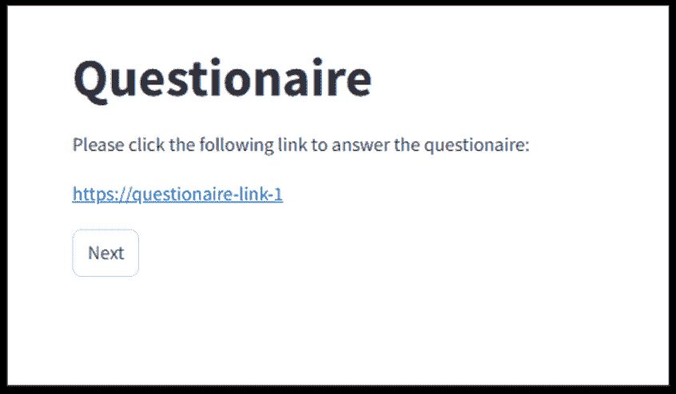

<!--yml

分类：未分类

日期：2025-01-11 12:13:03

-->

# 将每个应用程序转化为代理：基于API优先的LLM代理实现高效的人机代理交互

> 来源：[https://arxiv.org/html/2409.17140/](https://arxiv.org/html/2409.17140/)

Junting Lu 北京大学中国，Zhiyang Zhang 南京大学中国，Fangkai Yang 微软中国，Jue Zhang 微软中国，Lu Wang 微软中国，Chao Du 微软中国，Qingwei Lin 微软中国，Saravan Rajmohan 微软美国，Dongmei Zhang 微软中国，Qi Zhang 微软中国（2018）

###### 摘要。

多模态大型语言模型（MLLMs）使基于LLM的代理能够直接与应用程序的用户界面（UIs）进行交互，从而提高了代理在复杂任务中的表现。然而，这些代理常常由于大量顺序的UI交互而面临较高的延迟和低可靠性问题。为了解决这个问题，我们提出了AXIS，这是一个新型的基于LLM的代理框架，通过应用程序编程接口（APIs）优先于UI操作来优化行动。该框架还通过自动化探索应用程序来促进API的创建和扩展。我们在Office Word上的实验表明，AXIS相比人工操作，能够减少65%-70%的任务完成时间，降低38%-53%的认知负担，同时保持97%-98%的准确率。我们的工作为新的人机代理交互（HACI）框架和应用提供商在LLM时代的全新UI设计原则做出了贡献。它还探索了将每个应用程序转化为代理的可能性，为实现以代理为中心的操作系统（Agent OS）铺平了道路。

大型语言模型（LLMs）、人机代理交互、基于LLM的代理、任务完成、用户界面（UI）^†^†版权：acmlicensed^†^†期刊年份：2018^†^†doi：XXXXXXX.XXXXXXX^†^†会议：请确保输入您通过权利确认邮件收到的正确会议标题；2018年6月3日–5日；纽约州伍德斯托克^†^†isbn：978-1-4503-XXXX-X/18/06^†^†ccs：以人为中心的计算 自然语言接口^†^†ccs：计算方法 规划与调度

图1\. 一张插图，比较任务完成方法：手动操作、UI代理和我们的AXIS方法。手动操作如果用户不熟悉UI，容易走错路径。UI代理需要大量的顺序交互。而我们的AXIS通过一次API调用高效地完成任务。

## 1\. 引言

随着个人计算机、移动设备和互联网成为日常工作和生活中不可或缺的一部分，应用产业面临着巨大的压力，需要快速发展软件应用，增加更多功能，以满足人们日益增长的需求（Ruparelia，[2010](https://arxiv.org/html/2409.17140v1#bib.bib39)；Abrahamsson 等，[2017](https://arxiv.org/html/2409.17140v1#bib.bib2)）。尽管如此，这些新应用也要求普通用户在时间和认知上的投入显著增加。为了有效地学习如何使用一个新应用，用户通常需要首先花费大量时间熟悉用户界面（UI）及其相应功能。而为了高效地使用新应用完成各种任务，用户还需要进一步投入时间和精力，学习如何将复杂任务拆解为步骤，并使用正确的用户界面和命令来完成每一步。虽然应用提供商和研究界都充分意识到这一痛点，但现有的努力主要集中在提供详细的教程和建立互动学习平台，这些方法仅能在一定程度上减轻用户的认知负担（Van Merrienboer 和 Sweller，[2005](https://arxiv.org/html/2409.17140v1#bib.bib43)；Biswas 等，[2005](https://arxiv.org/html/2409.17140v1#bib.bib7)；Plass 等，[2010](https://arxiv.org/html/2409.17140v1#bib.bib36)；Darejeh 等，[2022](https://arxiv.org/html/2409.17140v1#bib.bib11)）。

大型语言模型（LLMs）（Ouyang 等人，[2022](https://arxiv.org/html/2409.17140v1#bib.bib35)；Achiam 等人，[2023](https://arxiv.org/html/2409.17140v1#bib.bib3)；Dubey 等人，[2024](https://arxiv.org/html/2409.17140v1#bib.bib14)）已在推理、规划和协作方面展示了接近人类的能力，并且在完成复杂任务方面具有极大的潜力（Huang 和 Chang，[2022](https://arxiv.org/html/2409.17140v1#bib.bib23)；Wei 等人，[2022](https://arxiv.org/html/2409.17140v1#bib.bib47)；Mandi 等人，[2024](https://arxiv.org/html/2409.17140v1#bib.bib28)）。从那时起，研究人员一直在探索如何利用LLMs来减少用户在学习和操作软件应用时的认知负担。特别是，多模态大型语言模型（MLLMs）（Yin 等人，[2023](https://arxiv.org/html/2409.17140v1#bib.bib54)；Durante 等人，[2024](https://arxiv.org/html/2409.17140v1#bib.bib15)；Zhang 等人，[2024c](https://arxiv.org/html/2409.17140v1#bib.bib57)）将LLMs的应用场景扩展到需要视觉能力的各种任务（Wu 等人，[2023](https://arxiv.org/html/2409.17140v1#bib.bib48)；Zheng 等人，[2024](https://arxiv.org/html/2409.17140v1#bib.bib61)）。近期的研究（Zhang 等人，[2023b](https://arxiv.org/html/2409.17140v1#bib.bib56)；Wang 等人，[2024c](https://arxiv.org/html/2409.17140v1#bib.bib44)；Zhang 等人，[2024a](https://arxiv.org/html/2409.17140v1#bib.bib55)；Zheng 等人，[2024](https://arxiv.org/html/2409.17140v1#bib.bib61)）利用MLLMs设计了基于LLM的UI代理，能够作为用户的代表，翻译用户用自然语言表达的请求，并直接与软件应用的UI进行交互，以满足用户的需求。在LLM-based UI代理的帮助下，用户只需简单地要求应用程序完成任务，而无需深入了解应用程序的UI和功能，从而大大减轻了用户学习新应用时的认知负担。

然而，就像从蒸汽动力到电力驱动的工业转型不仅仅是将工厂中的中央蒸汽机替换为电动机一样，仅仅在应用程序的UI上构建基于LLM的代理并不能神奇地提供一个令人满意和无忧的用户体验。特别是，今天的应用程序UI是为人机交互（HCI）设计的（Lewis，[1998](https://arxiv.org/html/2409.17140v1#bib.bib26)；Bradshaw 等人，[2017](https://arxiv.org/html/2409.17140v1#bib.bib8)），通常涉及多个UI交互才能完成单一任务。例如，在Office Word文档中插入一个2$\times$2的表格需要一系列的UI交互：“插入 $\rightarrow$ 表格 $\rightarrow$ 2$\times$2 表格”。尽管基于HCI的设计适应了人类的习惯，但训练基于LLM的UI代理来模仿这种交互会带来相当多的挑战，这些挑战是难以克服的。

基于LLM的UI代理的第一个挑战是高延迟和长响应时间。每个单独的UI交互步骤都需要一次LLM调用来推理与哪个UI进行交互。一个任务涉及多个UI交互步骤，因此可能会产生相当大的时间和金钱成本。LLM调用的延迟与处理的token数量是正相关的（Levy等， [2024](https://arxiv.org/html/2409.17140v1#bib.bib25)；Wang等， [2024a](https://arxiv.org/html/2409.17140v1#bib.bib46)；Egiazarian等， [2024](https://arxiv.org/html/2409.17140v1#bib.bib16)）。为了确保LLM能够返回高质量的输出，基于LLM的UI代理必须传递大量UI信息，以精确描述当前状态，这也增加了每次调用的延迟。第二个挑战涉及可靠性领域。研究表明，LLM在生成响应时容易出现幻觉（Bang等， [2023](https://arxiv.org/html/2409.17140v1#bib.bib6)；Dhuliawala等， [2023](https://arxiv.org/html/2409.17140v1#bib.bib12)；Zhang等， [2023a](https://arxiv.org/html/2409.17140v1#bib.bib58)；Guan等， [2024](https://arxiv.org/html/2409.17140v1#bib.bib19)）。在与基于LLM的UI代理进行长时间的连续调用过程中，每次推理步骤都会增加采取错误UI控制或幻觉出不存在的UI进行交互的可能性。由于基于LLM的UI代理通常会将之前的交互历史作为额外的上下文传递，用于推理当前的UI交互步骤（Zhang等， [2024a](https://arxiv.org/html/2409.17140v1#bib.bib55)），早期步骤中的幻觉也可能增加后续步骤中出现幻觉的机会。因此，当需要长链UI交互时，UI代理更可能遭遇累积错误并导致任务失败（Chen等， [2024](https://arxiv.org/html/2409.17140v1#bib.bib9)；Zhao等， [2024](https://arxiv.org/html/2409.17140v1#bib.bib60)）。最后，基于LLM的UI代理还面临UI泛化的挑战。尽管最近的研究在UI对接方面取得了一些进展（Cheng等， [2024](https://arxiv.org/html/2409.17140v1#bib.bib10)；Rawles等， [2024b](https://arxiv.org/html/2409.17140v1#bib.bib38)；Bai等， [2023](https://arxiv.org/html/2409.17140v1#bib.bib5)），但基于LLM的UI代理如何处理与那些UI未包含在LLM预训练阶段的应用程序交互，仍然是一个没有好解决方案的关键障碍。

我们认为，需要一种新的人与代理计算机（HACI）交互范式，以应对基于LLM的UI代理面临的挑战。在HACI范式中，基于API优先的LLM代理将取代UI代理，优先进行API调用，而非在任务完成中进行不必要的多步骤UI交互。只有当相关API不可用时，才会调用常规UI交互。与UI代理相比，基于API优先的代理需要更少的令牌，并能够从LLM中获取更准确的代码格式化响应。例如，在Word文档中插入一个2$\times$2的表格时，API调用只需要一行代码，*即*，doc.Tables.Add(NumRows=2,NumColumns=2)即可完成任务。

本文中，我们提出了AXIS：基于自我探索的API集成代理（Agent eXploring API for Skill integration），这是一个基于LLM的框架，能够自动探索现有应用程序，从支持文档和操作轨迹中学习见解，并基于现有API构建新的API¹¹1新的API在第[3](https://arxiv.org/html/2409.17140v1#S3 "3\. Design of AXIS ‣ Turn Every Application into an Agent: Towards Efficient Human-Agent-Computer Interaction with API-First LLM-Based Agents")节中也称为“技能”，我们在这里宽泛使用“API”一词，以区别于UI。该框架基于现有的API，使基于API优先的LLM代理具备低延迟和高可靠性。根据我们在Office Word（Microsoft365，[2024a](https://arxiv.org/html/2409.17140v1#bib.bib31)）任务中的实验，AXIS显著提高了任务完成率，并减少了用户的认知负担。此外，AXIS为应用程序提供者提供了一种实用的方法，可以通过简单地用一组API封装应用程序，并采用适合HACI的简化UI设计，将应用程序转变为代理。这种应用程序即代理的范式也为代理操作系统（Agent OS）（张等，[2024b](https://arxiv.org/html/2409.17140v1#bib.bib59)；梅等，[2024](https://arxiv.org/html/2409.17140v1#bib.bib29)；吴等，[2024](https://arxiv.org/html/2409.17140v1#bib.bib49)）的出现铺平了道路，其中用户只需用自然语言表达意图，代理操作系统即可自动形成可执行的计划，将子任务分配给相关应用程序，并监督任务的执行和完成，用户干预最少。

我们的工作做出了以下贡献：

+   •

    我们提出了一个HACI范式，并配套提出了名为AXIS的实现框架，用于创建基于API优先的LLM代理，这些代理能够探索应用程序及其可用API，并构建新的API。这个新范式提供了一种实用的方法，将每个应用程序转变为一个代理，并为开发真正的代理操作系统（Agent OS）铺平道路。

+   •

    我们通过减少不必要的多步骤UI交互，并通过API调用简化任务完成，解决了认知负担和学习努力的挑战。

+   •

    我们进行性能评估和广泛的用户研究，全面考察AXIS的效率和可靠性。

## 2\. 相关工作

### 2.1\. 基于LLM的UI代理

基于LLM的智能体旨在利用LLM的高级上下文理解和推理能力，与环境进行互动并操控环境，具有人类般的认知能力（† et al. (2022), [FAIR](https://arxiv.org/html/2409.17140v1#bib.bib17); Xi et al., [2023](https://arxiv.org/html/2409.17140v1#bib.bib50); Liu et al., [2023](https://arxiv.org/html/2409.17140v1#bib.bib27); Wang et al., [2024b](https://arxiv.org/html/2409.17140v1#bib.bib45)）。MLLM的出现（Yin et al., [2023](https://arxiv.org/html/2409.17140v1#bib.bib54); Durante et al., [2024](https://arxiv.org/html/2409.17140v1#bib.bib15); Zhang et al., [2024c](https://arxiv.org/html/2409.17140v1#bib.bib57)），包括GPT-4o（OpenAI, [2024a](https://arxiv.org/html/2409.17140v1#bib.bib33)）和Gemini（Team et al., [2023](https://arxiv.org/html/2409.17140v1#bib.bib42)），进一步拓宽了LLM在实际应用中的范围，具备了处理多模态输入（包括文本和图像）的能力。在MLLM的视觉理解能力支持下，新的基于LLM的UI智能体能够获得在软件应用中导航和控制UI的关键能力，从而完成复杂任务。因此，基于LLM的UI智能体研究已成为开发能够根据用户命令自动与应用程序互动的智能助手的热门领域。在移动平台上，诸如MM-Navigator（Yan et al., [2023](https://arxiv.org/html/2409.17140v1#bib.bib53)）、AppAgent（Zhang et al., [2023b](https://arxiv.org/html/2409.17140v1#bib.bib56)）和MobileAgent（Wang et al., [2024c](https://arxiv.org/html/2409.17140v1#bib.bib44)）等方法利用GPT-4V（OpenAI, [2024b](https://arxiv.org/html/2409.17140v1#bib.bib34)）通过类人交互（点击和滑动）操作智能手机应用，而无需后端访问。更广泛而言，UFO（Zhang et al., [2024a](https://arxiv.org/html/2409.17140v1#bib.bib55)）、SeeAct（Zheng et al., [2024](https://arxiv.org/html/2409.17140v1#bib.bib61)）和Cradle（Tan et al., [2024](https://arxiv.org/html/2409.17140v1#bib.bib41)）分别支持Windows操作系统应用程序、网站和游戏中的UI导航和操作，且均可根据自然语言命令进行操作。其他值得注意的例子包括CogAgent（Hong et al., [2024](https://arxiv.org/html/2409.17140v1#bib.bib21)）和SeeClick（Cheng et al., [2024](https://arxiv.org/html/2409.17140v1#bib.bib10)），这些方法专注于训练和微调视觉语言模型，以实现下游移动和桌面任务中的UI理解和导航。虽然这些基于LLM的UI智能体被训练成以类人的方式完成任务，但现有应用中的UI最初是为人机交互（HCI）设计的，而非为智能体与计算机之间的互动设计。因此，直接模拟基于UI的交互可能会导致不必要的时间消耗，尤其是在那些需要多个或重复UI交互步骤的复杂任务中，比如将多个标题改为相同格式。相比之下，应用程序提供商通常提供API，能够通过一次API调用完成此类任务，从而避免多步骤的UI交互。为了克服现有UI智能体的局限性，减少不必要的UI交互，并降低用户对应用程序的学习曲线，我们将研究如何利用应用程序API构建基于LLM的智能体，并探索LLM时代UI设计的新原则。

### 2.2\. 代理操作系统

在第[2.1](https://arxiv.org/html/2409.17140v1#S2.SS1 "2.1\. 基于LLM的UI代理 ‣ 2\. 相关工作 ‣ 将每个应用转变为代理：通过API优先的基于LLM的代理实现高效的人机计算机交互")节讨论的基于LLM的代理通常设计为在特定的环境中运行，如某个特定的应用或网页，这限制了它们在涉及跨应用协作的常规计算任务中的适用性。例如，一个简单的任务“创建一个报告，包含在‘Presentation’文件夹中的文档，并将其发送给Jack”需要多个应用程序的多个步骤才能完成：阅读所有文档，总结关键内容，使用像Microsoft Word这样的文字处理应用编写报告，然后用像Outlook这样的电子邮件客户端草拟带有附件报告的邮件并发送给收件人Jack。为了支持在最少人工干预下完成复杂任务，新的研究工作已探讨开发一个完全由LLM支持的操作系统（OS）的可能性。像AIOS（梅等，[2024](https://arxiv.org/html/2409.17140v1#bib.bib29)）和OS-Copilot（吴等，[2024](https://arxiv.org/html/2409.17140v1#bib.bib49)）提出了一个操作系统级代理，能够有效地与操作系统及大量第三方应用程序互动，以完成复杂任务。OSWorld（谢等，[2024](https://arxiv.org/html/2409.17140v1#bib.bib52)）和AndroidWorld（罗尔斯等，[2024a](https://arxiv.org/html/2409.17140v1#bib.bib37)）还提供了评估多模态代理在不同操作系统中执行多样化任务和跨应用工作流程的基准。在工业界，像Apple Intelligence（Apple，[2024](https://arxiv.org/html/2409.17140v1#bib.bib4)）、Copilot+PC（Microsoft，[2024](https://arxiv.org/html/2409.17140v1#bib.bib30)）、HarmonyOS（华为，[2024](https://arxiv.org/html/2409.17140v1#bib.bib24)）和MagicOS（荣耀，[2024](https://arxiv.org/html/2409.17140v1#bib.bib22)）等商业化的Agent OS正在不断发展，以便为客户提供更便捷、高效的体验，具有引领人机交互新时代的潜力。现有Agent OS普遍采用的一个方法是将复杂任务拆解为子任务，并将其分配给各个独立的应用程序。然而，对于每个子任务，基于LLM的代理仍然依赖类似人类的交互方式，例如UI点击和滑动，这相比API调用可能效率较低。此外，当基于LLM的UI在处理任务时，控制权会被基于LLM的代理接管，用户无法再直接控制。

### 2.3\. LLM时代的UI设计

UI设计是人机交互（HCI）的一个重要组成部分，要求具备高度专业化的技能，并通过多轮反馈和修订不断改进（Stone等，[2005](https://arxiv.org/html/2409.17140v1#bib.bib40)）。借助大型语言模型（LLMs），UI设计可以通过自动化的设计、反馈和评估程序进一步得到增强。Duan等（[2024](https://arxiv.org/html/2409.17140v1#bib.bib13)）使用LLM生成的反馈自动评估UI原型。同样，SimUser（Xiang等，[2024](https://arxiv.org/html/2409.17140v1#bib.bib51)）利用LLM模拟具有不同特征的用户，以生成关于可用性的反馈并为UI设计提供见解。MUD（Feng等，[2024](https://arxiv.org/html/2409.17140v1#bib.bib18)）利用LLM模拟类人探索，从应用程序中挖掘UI数据，并通过噪声过滤提高UI数据的质量。然而，现有的UI设计大多仍遵循传统的人机交互范式，而非人-代理-计算机交互（HACI）范式，后者可能成为代理操作系统（Agent OS）中的核心设计原则。本文将利用AXIS框架探索应用程序，识别关键的UI，并检视哪些UI部分可以通过LLM代理调用的API进行替代。我们希望我们的探索能为如何在HACI范式下设计更有效的UI提供一些见解。

## 3. AXIS设计

我们开发了AXIS框架，它可以自动地在现有应用程序中进行探索，从探索轨迹中学习见解，并将可用的见解和学到的知识整合为可执行的“技能”。技能是基于UI和API的高层次表现，优先考虑API操作²²2如果技能可以通过UI或API操作表示，则技能仅通过API操作表示。，这些技能是在应用程序中通过AXIS探索生成的。如图[2](https://arxiv.org/html/2409.17140v1#S3.F2 "Figure 2 ‣ 3\. Design of AXIS ‣ Turn Every Application into an Agent: Towards Efficient Human-Agent-Computer Interaction with API-First LLM-Based Agents")所示，AXIS系统由三个主要模块组成：应用环境、技能和工作流。AXIS利用多个基于LLM的代理，通过统一的接口探索应用环境，通常是操作系统中运行的一组应用程序，以获取环境状态并与之互动。在此过程中学习到的知识将被整合为包含结构化代码片段的技能，这些代码片段能够在环境中执行各种任务。还将设计特定的执行和验证方法，以提高这些技能的性能。最后，我们建立了两个工作流：探索者工作流和跟随者工作流，以促进从环境中学习技能。

在后续部分，我们将详细阐述所有三个模块，并讨论它们如何协同工作以从应用程序中探索和发现有价值的技能。

图 2\. AXIS 框架概述。AXIS 首先通过跟随者驱动模式或探索者驱动模式探索技能，然后使用探索日志生成技能，在此过程中，技能代码将被翻译和验证。虚线框表示代理与应用程序环境之间的交互。

### 3.1\. 应用环境

在 AXIS 的上下文中，应用环境是指在代理的探索范围内的交互实体集合。本文中，这些实体主要由一组在 Windows 操作系统上运行的应用程序组成。应用程序中的环境通常共享一些共同的元素，例如控件（Zhang 等，[2024a](https://arxiv.org/html/2409.17140v1#bib.bib55)）和解包后的 XML 元素。

在 AXIS 中，代理不仅观察环境的状态，还主动与环境进行交互。为了便于代理与环境之间的观察和交互，我们设计了两个通用接口：state() 和 step()。state() 接口返回环境的状态，包括环境中实体当前元素的详细信息。环境状态包括关键信息，例如控件的位置、控件的类型以及控件是否被选中。对于可以解包的应用程序，解包后的 XML 内容也作为状态的一部分。AXIS 应用环境中的控件类型与 (Zhang 等，[2024a](https://arxiv.org/html/2409.17140v1#bib.bib55)) 中的控件类型一致。step() 接口包含一个技能执行器，允许代理通过执行技能在环境中进行操作。完成后，该接口还会返回这些操作的结果。

### 3.2\. 应用中的技能

技能包含技能代码、描述和使用示例，旨在完成环境中指定任务。

#### 3.2.1\. 技能结构

+   •

    技能代码：一段与以下部分描述的执行器兼容的结构化代码。技能代码包括一组统一的参数，并遵循标准的 PEP 257 文档规范。初始的技能集是通过重构应用程序提供者的基础 API 生成的。在这些初始技能的基础上，AXIS 可以进一步探索和开发新的技能。值得注意的是，虽然 AXIS 优先考虑基于 API 的技能，但它仍然是为通用目的设计的，能够集成基于 UI 和基于 API 的技能代码。

+   •

    描述：描述一种技能的功能，旨在帮助 LLM 在任务执行过程中选择并调用适当的技能。

+   •

    使用示例：一个或多个代码示例，包括与代码通常相关的任何特定参数和描述。这些示例可以帮助LLM在调用技能时以正确的格式填写参数字段。

#### 3.2.2\. 技能执行器

如在第[3.1](https://arxiv.org/html/2409.17140v1#S3.SS1 "3.1\. 应用环境 ‣ 3\. AXIS 设计 ‣ 将每个应用转化为代理：面向高效人机计算机交互的 API 优先 LLM 基础代理")节中讨论的那样，我们的应用环境包含一个 step() 接口，以促进代理与环境之间的交互。该接口还承载了技能执行器，负责执行由代理生成或选择的技能。技能执行器会缓存应用文档，并同时支持多种功能，包括定位应用控件、调用控件上的方法以及调用应用 API（独立于控件），从而使 UI 操作和 API 操作能够同时进行，并作为技能驱动操作的高效基础。

#### 3.2.3\. 技能类型

按照多功能设计原则，AXIS 中的技能可以根据其代码片段的组成分为四种类型：原子 UI 技能、原子 API 技能、复合 UI 技能、复合 API 技能以及 API-UI 混合技能。

表 1\. 四种技能类型的比较。

| 类型 | 描述 | 示例 | 特性覆盖 |
| --- | --- | --- | --- |
| 原子 UI 技能 | 由一个基本的 UI 操作组成。作为最原始的技能，原子 UI 技能在探索过程中被堆叠和转化，形成新的技能。 | click_input | 点击不同的 UI 控件 |
| 原子 API 技能 | 由一个基本的 API 操作组成。与依赖 UI 控件执行的 UI 操作不同，API 操作无需与任何 UI 元素交互即可执行。 | select_text | 选择画布中的文本内容。 |
| 复合 UI 技能 | 由多个原子 UI 操作或复合 UI 操作组成。复合 UI 技能通过简单堆叠和组合 UI 操作形成。 | search_for_help | 点击搜索框然后编辑文本。 |
| 复合 API 技能 | 由多个原子 API 操作或复合 API 操作组成。这类技能通常表示功能的更高级组合。 | insert_header_footer | 通过 API 插入带有指定内容的页眉和页脚，相当于一系列顺序的 UI 操作：“插入-页眉-页脚编辑-页脚-页脚编辑”。 |
| API-UI 混合技能 | 由 API 操作和 UI 操作组成。API-UI 混合技能有时作为技能探索过程中的中间状态出现，可能在探索后期发展为纯 API 操作。 | format_text_in_word | 结合 select_text 和一系列与文本样式相关的 UI 操作。 |

#### 3.2.4\. 技能层级

我们将“技能层级”定义为组成一个技能的技能组件数量。因此，单一的基础技能的技能层级为1。如表[1](https://arxiv.org/html/2409.17140v1#S3.T1 "Table 1 ‣ 3.2.3\. skill types ‣ 3.2\. Skills in Application ‣ 3\. Design of AXIS ‣ Turn Every Application into an Agent: Towards Efficient Human-Agent-Computer Interaction with API-First LLM-Based Agents")中提到的insert_header_footer技能的技能层级为2。

### 3.3\. 技能探索的工作流程

如图[2](https://arxiv.org/html/2409.17140v1#S3.F2 "Figure 2 ‣ 3\. Design of AXIS ‣ Turn Every Application into an Agent: Towards Efficient Human-Agent-Computer Interaction with API-First LLM-Based Agents")所示，AXIS中的技能探索由两种驱动机制引导：追随者驱动的技能探索和探索者驱动的技能探索。

#### 3.3.1\. 追随者驱动的技能探索

追随者驱动的技能探索是指从应用程序的帮助文档中探索技能的过程，主要通过以下代理的协作来完成：

+   •

    FollowerAgent。FollowerAgent利用一个由一组原始操作组成的技能库，基于帮助文档提供的逐步指令。在每一步，它根据当前环境状态选择最合适的操作。

+   •

    MonitorAgent。MonitorAgent监控每个由FollowerAgent执行的操作及其对环境的影响。它还跟踪FollowerAgent的整个轨迹。当认为合适时，它会设置一个断点，并将观察到的轨迹总结为一个完整的技能，包括该技能的功能总结及其逻辑。对于由基本UI操作组成的初始技能，概括出的逻辑通常也与UI紧密相关。

+   •

    SkillGeneratorAgent。基于MonitorAgent提供的总结和逻辑描述，SkillGeneratorAgent根据第[3.2](https://arxiv.org/html/2409.17140v1#S3.SS2 "3.2\. Skills in Application ‣ 3\. Design of AXIS ‣ Turn Every Application into an Agent: Towards Efficient Human-Agent-Computer Interaction with API-First LLM-Based Agents")节中概述的规范生成技能的代码、功能描述和使用案例。生成的技能代码与MonitorAgent生成的逻辑描述高度相关，因此通常涉及基本UI操作的堆叠。

+   •

    APITranslatorAgent。基于SkillGeneratorAgent生成的技能代码，APITranslatorAgent查询相关的API文档，将技能代码中的基于UI的操作转换为API调用，从而完成代码的API化。最后，生成的技能通过技能验证过程进一步验证。

    值得注意的是，SkillGeneratorAgent 和 APITranslatorAgent 在技能代码生成过程中会从原始技能集搜索可重用的技能，从而获得不同层次的技能。这种方法有效地促进了技能的构建。

#### 3.3.2\. 探索者驱动的技能探索

与追随者驱动的技能探索不同，探索者驱动的技能探索以不同的初始化方法启动探索过程：步骤逐步指令是自动生成的，而不是从帮助文档中提取的。在每一步中，探索者根据当前环境信息和先前探索步骤的历史提出下一步行动。随后的步骤利用与追随者驱动模式相同的代理生成具有探索轨迹的技能。在这个过程中，通常需要带有不同预填充内容的应用种子文件，以获得不同的初始环境，从而发现更多样化的技能。

#### 3.3.3\. 技能验证

为了验证从探索中生成的新技能，我们实施了两种验证方法：静态验证和动态验证。

+   •

    静态验证：这种验证方法利用结构化方法验证技能代码，包括检查技能的参数是否包含必需的参数（如执行器实例和参数列表）、执行器的方法和属性是否在代码中正确调用，以及在重用技能时是否导入了不存在的技能。

+   •

    动态验证：这种验证方法在应用环境中评估技能的性能，通过两个代理：ValidatorAgent 和 EvaluateAgent。提交技能进行验证时，ValidatorAgent 首先根据技能的功能描述提出一个任务。然后，它在与最初技能探索时相同的应用环境中执行技能，并记录执行过程中的响应和环境变化。执行完成后，EvaluateAgent 判断技能是否成功完成任务。

## 4\. 可行性研究

为了验证 AXIS 框架的可用性和有效性，我们进行了可行性研究。我们首先使用 AXIS 探索了 Microsoft Office Word，并发现了 73 个技能。然后，我们从 wikihow ³³3https://www.wikihow.com/Use-Microsoft-Word 页面 "使用 Microsoft Word" 和官方 Microsoft Word 网站 ⁴⁴4https://support.microsoft.com/en-us/word 提取了 50 个任务。这些任务使用 AXIS 和 UI Agent 执行，并对结果进行了分析和比较。

### 4.1\. 技能探索

在探索之前，AXIS提供了6个基本操作，如表格[2](https://arxiv.org/html/2409.17140v1#S4.T2 "Table 2 ‣ 4.1\. SKill Exploration ‣ 4\. Feasibility Study ‣ Turn Every Application into an Agent: Towards Efficient Human-Agent-Computer Interaction with API-First LLM-Based Agents")所示。然后，AXIS使用347个种子文件进行探索。探索后，AXIS发现了73个具有不同层级的技能。大多数发现的技能（44个）具有技能层级1，剩下的是24个技能具有层级2，3个技能具有层级3，2个技能具有层级4。表格[3](https://arxiv.org/html/2409.17140v1#S4.T3 "Table 3 ‣ 4.1\. SKill Exploration ‣ 4\. Feasibility Study ‣ Turn Every Application into an Agent: Towards Efficient Human-Agent-Computer Interaction with API-First LLM-Based Agents")展示了在探索过程中成功验证的若干技能示例。

表格2\. AXIS探索支持的基本操作。

| 名称 | 描述 | 示例 |
| --- | --- | --- |
| set_edit_text | 设置控制元素的编辑文本功能，可用于在编辑类型的控件中输入内容。 | set_edit_text(executor, args_dict=”control_id”:’119’, ”control_name”:”Edit”, ’text’:”hi there”) |
| select_text | 一个选择指定文本内容的功能。 | select_text(executor, args_dict=”text”:”hello”) |
| select_table | 一个选择指定编号的表格的功能。 | select_table(executor, args_dict=”number”:1) |
| type_keys | 一个在控制项上输入键的功能。用于输入快捷键等。 | type_keys(executor, args_dict=”control_id”:’119’, ”control_name”:”Edit”, ”text”: ”VK_CONTROL down”, ”newline”: False) |
| click_input | 一个点击控制元素的功能。通常用于切换不同的功能区，点击菜单中的按钮。 | click_input(executor, args_dict=”control_id”:”12”, ”control_name”:”Border”, ’button’:”left”,’double’:False) |
| wheel_mouse_input | 一个对控制元素进行鼠标滚轮输入的功能。 | wheel_mouse_input(executor, args_dict=”control_id”:”12”, ’wheel_dist’:-20) |

表格3\. AXIS探索过程中发现的不同层级的技能示例。

| 层级 | 名称 | 描述 | 示例 |
| --- | --- | --- | --- |
| 1 | activate_dictation | 该功能用于在Microsoft Word中启动听写功能，相当于“语音”组中的“听写”按钮，用于开始听写。 | activate_dictation(executor) |
| 2 | align_text | 该功能对Microsoft Word文档中的文本进行对齐。首先选择文本，然后使用Word API应用所需的对齐方式（左对齐、居中、右对齐、两端对齐）。 | align_text(executor, args_dict=”text”: ”hello”, ”alignment”: ”center”) |
| 3 | apply_text_style | 一个编辑指定文本、字体大小和字体名称的文本的功能。标题居中。 | apply_text_style(executor, args_dict=”text”:”Hello”, ”font_name”:”Arial”, ”font_size”:13) |

### 4.2\. 任务完成

上述50个与词汇相关的任务用于测试和比较UI代理与AXIS在已探索技能下的表现。在我们的实验中，我们选择UFO（Zhang等人，[2024a](https://arxiv.org/html/2409.17140v1#bib.bib55)）作为UI代理的代表，因为它在词汇任务上表现良好。结果见表[4](https://arxiv.org/html/2409.17140v1#S4.T4 "Table 4 ‣ 4.2\. Task Completion ‣ 4\. Feasibility Study ‣ Turn Every Application into an Agent: Towards Efficient Human-Agent-Computer Interaction with API-First LLM-Based Agents")，其中包括了完成不同任务的平均时间、成功率、每个任务的平均步骤数以及两个代理对应的LLM后端成本（GPT-4o，版本20240513）。

就执行时间而言，AXIS显著优于UI代理，平均任务完成时间为29.9秒，而UI代理为59.5秒。这个结果表明，AXIS的速度几乎是UI代理的两倍。AXIS在任务完成的成功率上也更高。此外，由于AXIS将基本操作抽象并整合为更高级的技能，它能够在更少的步骤下完成任务，且相较于UI代理，成本也更低。

表4．UI代理与AXIS在50个任务中的表现比较。

| 指标 | UI 代理 | AXIS | 成对显著性 |
| --- | --- | --- | --- |
| 时间(秒) | 59.5 | 29.9 | u¿a (p ¡ 0.001) |
| 成功率(%) | 52.0 | 84.0 | u¡a (p ¡ 0.001) |
| 步骤数 | 3.2 | 2.0 | u¿a (p ¡ 0.01) |
| 成本($) | 0.4 | 0.2 | u¿a (p ¡ 0.001) |

为了更好地理解AXIS更高效率背后的原因，我们分析了AXIS和UI代理在任务执行过程中调用的UI和API类型操作的数量，并记录了两种方法调用API和高级API（定义为具有层次级别2或更高的技能）所占的比例。如表[5](https://arxiv.org/html/2409.17140v1#S4.T5 "表 5 ‣ 4.2\. 任务完成 ‣ 4\. 可行性研究 ‣ 将每个应用转化为代理：朝着API优先的基于LLM代理高效的人机交互")所示，AXIS在任务执行过程中调用的UI操作明显少于UI代理。值得注意的是，AXIS在所有任务中执行的总UI操作次数大于调用的API操作次数。经过检查，发现AXIS倾向于使用单一的、集成的API技能来完成整个任务，导致整体API操作次数较低。我们进一步计算了API使用率以及API操作中高级API使用的比例。数据表明，AXIS的API操作比例达到了55.7%，其中高级API的使用率为23.1%。相比之下，UI代理的API使用率仅为8.1%。基于以上结果，我们得出结论，AXIS确实采用了API优先的策略，并且当匹配的技能可用时，倾向于使用技能完成任务。技能的集成到操作中也显著提高了AXIS的效率。

表格 5\. UI 代理和AXIS在50个任务中的UI操作和API操作对比。

| 指标 | UI代理 | AXIS |
| --- | --- | --- |
| 总UI操作次数 | 103 | 48 |
| 总API操作次数 | 9 | 39 |
| API使用率(%) | 8.1 | 55.7 |
| 高级API使用率(%) | - | 23.1 |

## 5\. 用户研究

我们进行了广泛的用户实验，以评估AXIS的性能。该实验及相关的评估指标旨在探讨以下关于基于大语言模型（LLM）代理在工作和生活场景中作用的研究问题（RQ）：

+   •

    RQ1：基于LLM的代理是否降低了用户的认知负担，使他们学习时花费更少的精力？

+   •

    RQ2：基于LLM的代理是否提高了用户的效率？

+   •

    RQ3：UI代理和基于API的代理在用户体验上有哪些区别？

在我们的用户实验中，参与者被要求通过三种方式在一个应用程序中完成指定任务：手动完成、借助UI代理完成、以及借助AXIS完成，并记录了整个过程。我们选择Microsoft Word作为实验应用程序，考虑到它在日常工作和生活中的普及性以及丰富的API文档（Microsoft365, [2024b](https://arxiv.org/html/2409.17140v1#bib.bib32)）。受研究问题的启发，我们为用户实验设定了三个目标：

(1) 评估参与者在使用不同方法完成任务时的认知负荷。 (2) 比较三种方法在任务完成效率和可靠性方面的差异。 (3) 评估用户在使用不同助手时的偏好。本研究已获得北京大学伦理委员会（IRB）的批准。

### 5.1\. 实验程序

整个用户实验持续了30分钟。在准备阶段，我们从官方Word文档和GPT生成的结果中抽取了五个不同的任务。根据任务所需的UI交互次数、UI功能的深度以及Ribbon切换的次数等因素，这些任务被分为两种难度级别：低难度（L1）和高难度（L2）。我们的实验结果也确认L2任务确实比L1任务更难。在后续讨论中，我们将简单地将不同类别的任务称为L1任务和L2任务。此外，我们设计了一份用户信息表格，用于收集参与者的背景信息，包括他们对Microsoft Word的熟悉程度。

在正式实验中，我们为用户提供了一个简单的网页界面，实验分为两个阶段。在第一个阶段，参与者会收到一份预先打印好的任务清单，包含L1和L2任务。根据网页上显示的任务ID，参与者需要阅读任务要求，点击“开始”按钮，完成自动打开的Word文档中的任务，并在完成任务后点击“完成”。在第二阶段，参与者需要使用UI助手和AXIS来辅助他们完成Word任务。相应的网页界面上包含输入框和按钮，用于激活这两个助手。参与者需要输入任务描述，通过命令助手完成任务。在整个正式实验过程中，所有的任务执行过程都会被记录下来，供后续分析使用。完成所有任务后，参与者将会看到四个不同的任务后问卷，供他们填写并调查用户的主观体验。

### 5.2\. 参与者

我们通过在社交媒体上发布招聘信息招募候选人。从确认愿意参与实验的候选人名单中，随机选取了20名个体作为实验参与者。我们的参与者年龄从18岁到40岁不等，教育背景涵盖本科至研究生水平。参与者的职业包括工程师、学生、研究员和全职家庭主妇等。100%的参与者都具有一定的Microsoft Word使用经验，且熟练度和使用频率各不相同，使用频率从每日到每月不等。每位参与者的实验时长平均为30分钟，且每位参与者获得50元人民币的补偿。

### 5.3\. 主观指标收集

如在[5.1](https://arxiv.org/html/2409.17140v1#S5.SS1 "5.1\. 实验程序 ‣ 5\. 用户研究 ‣ 将每个应用程序转变为代理：基于 API 的 LLM 代理实现高效的人类-代理-计算机交互")中所述，我们使用了四份问卷来收集用户在使用不同方法完成任务时的主观体验。问卷 1 至 4 分别在用户手动完成 L1 任务后、手动完成 L2 任务后、在代理的帮助下完成 L1 任务后，以及在代理的帮助下完成 L2 任务后单独发放。

为了确定基于 LLM 的代理是否能够确实减轻用户完成任务时的认知负担，与手动操作相比，在所有四份问卷中，我们都包含了基于 NASA 任务负荷指数（NASA-TLX）（Hart，[1988](https://arxiv.org/html/2409.17140v1#bib.bib20)）的问题，并增加了一个关于所需学习努力的问题。对于 NASA-TLX，我们的问题涵盖了六个指标，包括心理需求、身体需求、时间需求（任务的紧迫性）、表现（完成任务的成功感）、沮丧程度和完成努力（用户完成任务所需的努力）。这些六个指标的较低值表示较高的认知负担、较好的成功感、较低的沮丧感和较少的任务完成努力。对于学习努力，较低的分数也表示较少的学习努力。

为了进一步比较用户对 UI 代理和 AXIS 的感知，问卷 3 和 4 包含了关于两位代理的流畅性、可靠性、UI 依赖性、决策一致性和感知速度的评分问题。具体来说，UI 依赖性衡量用户在观察代理完成任务时对 UI 的依赖程度。决策一致性评估代理做出的决策与用户可能会做出的手动完成相同任务的决策之间的吻合程度（实验网页以逐步方式显示了代理做出的所有决策）。感知速度是指用户对代理完成任务速度的主观感知。

### 5.4\. 客观指标收集

在实验过程中，我们记录了实验日志，包括用户手动完成任务的屏幕录制、两位代理（UI 代理和 AIXS）执行任务的屏幕录制、决策过程、UI 交互路径、所用时间以及 LLM 后端（GPT-4o，版本 20240513）的成本。通过这些日志，我们提取了客观指标，包括三种方法的任务完成时间和成功率、UI 依赖程度，以及两位代理的成本。

## 6\. 结果

根据我们的研究问题，我们将实验结果分为三部分进行分析。首先，我们研究智能体的采用如何减少用户的认知负担。其次，我们分析并比较不同智能体在提高任务效率方面的能力。最后，我们讨论用户在传统UI智能体和我们的AXIS智能体之间的偏好。

### 6.1\. 认知负担

为了研究基于LLM的智能体如何减轻认知负担，我们分析了在任务执行过程中从用户收集的NASA-TLX和学习努力评分，并将结果总结在表格[6](https://arxiv.org/html/2409.17140v1#S6.T6 "Table 6 ‣ 6.1\. Cognitive load ‣ 6\. Results ‣ Turn Every Application into an Agent: Towards Efficient Human-Agent-Computer Interaction with API-First LLM-Based Agents")和图[3](https://arxiv.org/html/2409.17140v1#S6.F3 "Figure 3 ‣ 6.1\. Cognitive load ‣ 6\. Results ‣ Turn Every Application into an Agent: Towards Efficient Human-Agent-Computer Interaction with API-First LLM-Based Agents")中。值得注意的是，在我们的实验中，L2任务在NASA-TLX量表的多个维度和学习努力评分中普遍高于L1任务，这表明我们的任务难度分类与用户的体验是一致的。

如表[6](https://arxiv.org/html/2409.17140v1#S6.T6 "Table 6 ‣ 6.1\. Cognitive load ‣ 6\. Results ‣ Turn Every Application into an Agent: Towards Efficient Human-Agent-Computer Interaction with API-First LLM-Based Agents")所示，在L1和L2难度级别下，基于代理的方法在大多数NASA-TLX量表中相比手动方法表现出显著的改善。特别是，基于代理的方法在精神和身体上的要求较低，给用户带来的挫败感较少，且完成任务所需的努力也比手动方法少。基于代理的方法在减少认知负担方面，尤其在较难的L2任务中，通常表现得更加明显。对于表现度量，虽然在简单的L1任务中，基于代理的方法和手动方法之间的差异不显著，但对于难度较高的L2任务，基于代理的方法显著提升了用户的成功感（p¡0.05）。在图[3](https://arxiv.org/html/2409.17140v1#S6.F3 "Figure 3 ‣ 6.1\. Cognitive load ‣ 6\. Results ‣ Turn Every Application into an Agent: Towards Efficient Human-Agent-Computer Interaction with API-First LLM-Based Agents")（b）中，我们还总结了六个NASA-TLX量表的平均得分。该图显示，使用代理时，用户完成L1和L2任务的体验相似，这证明了基于LLM的代理在处理不同复杂度的任务时具有稳定性。最后，图[3](https://arxiv.org/html/2409.17140v1#S6.F3 "Figure 3 ‣ 6.1\. Cognitive load ‣ 6\. Results ‣ Turn Every Application into an Agent: Towards Efficient Human-Agent-Computer Interaction with API-First LLM-Based Agents")（c）显示，与手动方法相比，基于LLM的代理还显著降低了用户完成任务时的学习努力。与NASA-TLX量表类似，任务难度越高，降低的程度也越大。

所有这些结果清楚地展示了基于代理的方法在帮助用户完成各种任务中的价值，并回答了第一个研究问题（RQ1）：基于LLM的代理确实降低了用户的认知负荷，并减少了他们的学习努力，尤其是在更难的任务中。

表6\. Level 1和Level 2任务的NASA-TLX结果对比。（m: 手动，a: 代理）

| 指标 | 任务级别 | 手动 | 代理 | 配对显著性 |
| --- | --- | --- | --- | --- |
| 心理需求（0-100） | L1 L2 | 21.3 70.0 | 2.5 7.5 | L1: m¿a (p ¡ 0.001) L2: m¿a (p ¡ 0.001) |
| 身体需求（0-100） | L1 L2 | 31.3 57.5 | 5.0 6.3 | L1: m¿a (p ¡ 0.001) L2: m¿a (p ¡ 0.001) |
| 时间需求（0-100） | L1 L2 | 52.5 37.5 | 28.8 35.0 | L1: m¿a (p ¡ 0.05) L2: - |
| 表现（0-100） | L1 L2 | 21.2 47.5 | 21.2 26.2 | L1: - L2: m¿a (p ¡ 0.05) |
| 挫败感等级（0-100） | L1 L2 | 31.3 62.5 | 7.5 10.0 | L1: m¿a (p ¡ 0.001) L2: m¿a (p ¡ 0.001) |
| 完成努力（0-100） | L1 L2 | 12.5 35.0 | 17.5 13.8 | L1: - L2: m¿a (p ¡ 0.01) |

图 3\. NASA 工作负载和学习努力对用户研究中 L1 和 L2 任务的结果。柱状图表示标准误差（**: p ¡ 0.01, ***: p ¡ 0.001）

### 6.2\. 效率与可靠性

为了比较手动方法、UI 代理和 AXIS 之间的效率和可靠性，我们还收集了完成时间、成功率、步骤数以及任务完成的成本等指标。这些信息总结在表格 [7](https://arxiv.org/html/2409.17140v1#S6.T7 "表 7 ‣ 6.2\. 效率与可靠性 ‣ 6\. 结果 ‣ 将每个应用程序转化为代理：朝着高效的人类-代理-计算机交互迈进，基于 API 的 LLM 代理") 和表格 [8](https://arxiv.org/html/2409.17140v1#S6.T8 "表 8 ‣ 6.2\. 效率与可靠性 ‣ 6\. 结果 ‣ 将每个应用程序转化为代理：朝着高效的人类-代理-计算机交互迈进，基于 API 的 LLM 代理") 中。

在时间效率方面，AXIS 一直比手动方法和 UI 代理方法在 L1 和 L2 任务上花费的时间显著更少（p ¡ 0.001），对于较难的 L2 任务，AXIS 的优势更大。对于 L1 任务，手动方法实际上比 UI 代理更快，因为 UI 代理通常需要多次步骤才能完成任务。

对于准确性，毫无意外，手动方法在三种方法中表现最佳。然而，AXIS 仍能达到一个高水平的准确性，仅略逊于人类表现。相比之下，UI 代理的准确性明显较低，尤其是在 L2 任务中。通过回顾视频日志，我们发现 UI 元素定位不准确以及某些 UI 组件不可见是 UI 代理出错的主要原因。

最后，如表 [8](https://arxiv.org/html/2409.17140v1#S6.T8 "表 8 ‣ 6.2\. 效率与可靠性 ‣ 6\. 结果 ‣ 将每个应用程序转化为代理：朝着高效的人类-代理-计算机交互迈进，基于 API 的 LLM 代理") 所示，UI 代理往往需要更多的步骤来完成任务，特别是在 L2 任务中，目标 UI 元素被深埋在界面中。相比之下，借助 API 调用优化的简化任务执行，AXIS 需要显著更少的步骤，因此在两个难度级别下完成任务的整体成本较低。

基于以上分析，我们可以回答第二个研究问题（RQ2）。UI 代理在特定复杂任务中为人类效率提供了轻微的提升，但它存在可靠性问题。相比之下，AXIS 一直在提高人类效率，并表现出更高的可靠性。

表 7\. L1 和 L2 任务中各方法在时间和成功率上的比较。

| 指标 | 任务级别 | 手动 | UI 代理 | AXIS | 配对显著性 |
| --- | --- | --- | --- | --- | --- |
| 时间（秒） | L1 L2 | 61.8 167.6 | 104.6 155.5 | 18.2 57.1 | L1: m¡u (p ¡ 0.001) L1, L2: a¡m (p ¡ 0.001) L1, L2: a¡u (p ¡ 0.001) |
| 成功率（%） | L1 L2 | 100.0 97.5 | 75.0 45.0 | 98.3 95.0 | L1, L2: m¿u (p ¡ 0.001) L1, L2: a¿u (p ¡ 0.001) |

表 8\. L1 和 L2 任务中不同方法的步骤和成本比较。

| 指标 | 任务级别 | UI 代理 | AXIS | 配对显著性 |
| --- | --- | --- | --- | --- |
| 步骤 | L1 L2 | 6.4 11.1 | 1.0 4.2 | L1: a¡u (p ¡ 0.001) L2: a¡u (p ¡ 0.001) |
| 成本（美元） | L1 L2 | 0.6 0.9 | 0.07 0.3 | L1: a¡u (p ¡ 0.001) L2: a¡u (p ¡ 0.001) |

### 6.3\. 偏好亲和力

为了探讨在使用 UI 代理与 AXIS 执行任务时的用户体验差异，我们还对 L1 和 L2 任务的五个方面进行了主观偏好评估，并将结果总结在图 [4](https://arxiv.org/html/2409.17140v1#S6.F4 "Figure 4 ‣ 6.3\. Affinity preference ‣ 6\. Results ‣ Turn Every Application into an Agent: Towards Efficient Human-Agent-Computer Interaction with API-First LLM-Based Agents") 中。在两个难度级别下，参与者普遍偏好 AXIS 而非 UI 代理，尤其在感知的速度、流畅性和可靠性方面。

关于决策一致性的感知，结果在 L1 和 L2 任务之间有所不同。在 L1 任务中，AXIS 通常可以通过一步或几步完成任务，因为其 API 的高度封装性，这导致了与人类思维模式差异较大的决策风格。然而，在复杂任务中，AXIS 的决策更接近人类的思维过程，因此在人类看来，在这一方面的表现更佳。对于 UI 依赖性，AXIS 与需要频繁与 UI 界面交互的 UI Agent 相比，依赖于 UI 的程度要低得多。这种对 UI 依赖性的减少在用户体验过程中得到了明显的感知。

总结来说，对于第三个研究问题（RQ3）：与 UI 代理相比，AXIS 更容易给用户留下更高效、更流畅、更可靠的印象。随着任务复杂性的增加，用户也更倾向于选择 AXIS 来解决任务。此外，用户调查反馈表明，用户希望在使用基于 LLM 的代理时能够获得更大的控制权。与常常打断用户鼠标操作并占用屏幕空间的 UI 代理不同，AXIS 的 API 优先方法解决了这一问题，并改善了用户体验。

图 4\. 用户研究中 L1 和 L2 任务的主观偏好结果。

## 7\. 讨论

### 7.1\. AXIS 帮助消化不必要的应用程序 UI

为了在现有的 API 和 UI 功能基础上构建新的 API，AXIS 利用 LLM 驱动的自我探索框架，识别应用程序中可以转换为 API 的所有控制元素。这个探索过程有助于揭示潜在的不必要的 UI 元素或冗余的 UI 设计，并在 HACI 模式下进行改进。

为了说明这一过程，在图[5](https://arxiv.org/html/2409.17140v1#S7.F5 "图5 ‣ 7.1\. AXIS有助于消化不必要的应用UI ‣ 7\. 讨论 ‣ 将每个应用转化为代理：面向高效的人机代理交互，基于API的LLM代理")中，UI之间的层次关系以树状图表示，其中每个节点代表一个UI元素，高层UI元素为父节点，低层UI元素为子节点。我们进一步用红色节点表示通过AXIS探索后可以API化的UI位置，用蓝色节点表示普通UI元素。在此示例中，表示“主页”标签的根节点为蓝色节点，因为并非所有子UI节点都已变为红色（API化）。然而，二级节点“突出显示颜色”（节点2-2）及其所有三级子节点均可以API化，并显示为红色。一般来说，我们定义一个节点N为非必需节点，如果该节点及其所有子节点都可以API化：

|  | $\text{NonEssential}(N)=\begin{cases}\text{True},&\text{如果 }N\text{及其所有子节点都是红色节点（API启用）}\\ \text{False},&\text{否则}\end{cases}$ |  |
| --- | --- | --- |

与强调人类与界面之间交互的HCI范式不同，在未来由基于LLM的代理驱动的Agent操作系统中，非必需的UI元素可以简化甚至从应用界面中移除，其原有功能将通过API调用来替代。通过将UI元素分类为必需和非必需，AXIS可以为应用提供商提供如何在基于代理的系统中改进和重新设计UI的有价值见解。

图5\. 该图展示了识别可以裁剪的UI控件的规则。左侧展示了原始文档结构中的相关UI组件。右侧展示了对应的UI树，其中节点通过数字和位置与UI组件相匹配，数字表示层级，箭头表示父子关系。红色节点代表可以裁剪的UI控件。

### 7.2\. 将应用转化为代理

在实验部分，我们使用Microsoft Word来说明如何利用AXIS框架探索和构建新的API代理。值得注意的是，AXIS框架具有高度的适应性和可扩展性，可以扩展到任何具有基本API和文档支持的新应用。具体来说，为了适应AXIS，应用提供商需要补充应用操作手册以及以下接口：

+   •

    环境状态接口，用于获取环境状态信息。

+   •

    基本操作接口，用于支持与环境的基本交互。

从这些基本资源开始，AXIS可以自动并持续地探索应用程序，发现新技能并扩展其功能。这种适应性也意味着AXIS可以集成到各种软件环境中，通过API驱动的交互来增强功能和用户体验。

## 8. 结论

在本文中，我们介绍了AXIS，一个旨在增强人机代理计算机交互（HACI）并解决多模态大型语言模型（MLLM）在复杂任务执行中所带来的低效和认知负担的开创性框架，优先考虑API调用而非传统UI交互。通过对Office Word任务的用户实验，AXIS证明了其极高的有效性，任务完成时间减少了65%-70%，认知负荷降低了38%-53%，同时保持了与人类表现相当的高准确度。这些结果突显了基于API优先的LLM代理在简化交互、减少延迟和提高任务执行可靠性方面的潜力。

我们的研究通过突出了传统基于UI的方法的局限性，并提出了利用API调用简化和加速任务完成的创新解决方案，为人机代理交互领域作出了贡献。通过使应用程序能够通过简化的UI集合和增强的API集作为代理来运行，AXIS不仅提高了效率，还为全面代理操作系统的发展铺平了道路。这种范式的转变表明，每个应用程序都有潜力转变为智能代理，能够以最小的用户干预执行任务。

总之，AXIS代表了在减少认知负荷和提高基于LLM的代理任务完成效率方面的重要进展。我们的研究结果为应用开发者和研究人员提供了宝贵的见解，鼓励他们重新思考UI设计，并探索集成API驱动交互的新方式。在未来的工作中，我们将专注于将这一框架扩展到更广泛的应用，探索其对不同用户群体的影响，并推动LLM在创建更加直观高效的人机界面方面的潜力。

## 参考文献

+   （1）

+   Abrahamsson等人（2017）Pekka Abrahamsson, Outi Salo, Jussi Ronkainen和Juhani Warsta。2017年。敏捷软件开发方法：回顾与分析。*arXiv预印本 arXiv:1709.08439*（2017）。

+   Achiam等人（2023）Josh Achiam, Steven Adler, Sandhini Agarwal, Lama Ahmad, Ilge Akkaya, Florencia Leoni Aleman, Diogo Almeida, Janko Altenschmidt, Sam Altman, Shyamal Anadkat等。2023年。Gpt-4技术报告。*arXiv预印本 arXiv:2303.08774*（2023）。

+   Apple（2024）Apple。2024年。Apple Intelligence。[https://developer.apple.com/apple-intelligence/](https://developer.apple.com/apple-intelligence/)。访问时间：2024-08-28。

+   Bai等人（2023）Jinze Bai、Shuai Bai、Shusheng Yang、Shijie Wang、Sinan Tan、Peng Wang、Junyang Lin、Chang Zhou和Jingren Zhou。2023年。Qwen-VL：一种多功能的视觉-语言模型，用于理解、定位、文本阅读等。*arXiv预印本 arXiv:2308.12966*（2023）。

+   Bang等人（2023）Yejin Bang、Samuel Cahyawijaya、Nayeon Lee、Wenliang Dai、Dan Su、Bryan Wilie、Holy Lovenia、Ziwei Ji、Tiezheng Yu、Willy Chung等人。2023年。对ChatGPT在推理、幻觉和互动性方面的多任务、多语言、多模态评估。*arXiv预印本 arXiv:2302.04023*（2023）。

+   Biswas等人（2005）Gautam Biswas、Krittaya Leelawong、Daniel Schwartz、Nancy Vye，以及范德比尔特大学的可教学代理小组。2005年。通过教学学习：一种新的教育软件代理范式。*应用人工智能* 19, 3-4 (2005)，363–392。

+   Bradshaw等人（2017）Jeffrey M Bradshaw、Paul J Feltovich和Matthew Johnson。2017年。人类与代理的互动。见于*人机互动手册*。CRC出版社，283–300。

+   Chen等人（2024）Lingjiao Chen、Jared Quincy Davis、Boris Hanin、Peter Bailis、Ion Stoica、Matei Zaharia和James Zou。2024年。更多的LLM调用就是你所需要的吗？朝着复合推理系统的规模定律迈进。*arXiv预印本 arXiv:2403.02419*（2024）。

+   Cheng等人（2024）Kanzhi Cheng、Qiushi Sun、Yougang Chu、Fangzhi Xu、Yantao Li、Jianbing Zhang和Zhiyong Wu。2024年。Seeclick：利用图形界面基础进行高级视觉图形界面代理的开发。*arXiv预印本 arXiv:2401.10935*（2024）。

+   Darejeh等人（2022）Ali Darejeh、Sara Mashayekh和Nadine Marcus。2022年。基于认知的方法，通过电子学习系统促进软件应用学习。*Cogent教育* 9, 1 (2022)，2082085。

+   Dhuliawala等人（2023）Shehzaad Dhuliawala、Mojtaba Komeili、Jing Xu、Roberta Raileanu、Xian Li、Asli Celikyilmaz和Jason Weston。2023年。验证链减少大语言模型中的幻觉。*arXiv预印本 arXiv:2309.11495*（2023）。

+   Duan等人（2024）Peitong Duan、Jeremy Warner、Yang Li和Bjoern Hartmann。2024年。使用大语言模型生成UI原型的自动反馈。见于*CHI计算机系统中的人因会议论文集*。1–20。

+   Dubey等人（2024）Abhimanyu Dubey、Abhinav Jauhri、Abhinav Pandey、Abhishek Kadian、Ahmad Al-Dahle、Aiesha Letman、Akhil Mathur、Alan Schelten、Amy Yang、Angela Fan等人。2024年。Llama 3系列模型。*arXiv预印本 arXiv:2407.21783*（2024）。

+   Durante等人（2024）Zane Durante、Qiuyuan Huang、Naoki Wake、Ran Gong、Jae Sung Park、Bidipta Sarkar、Rohan Taori、Yusuke Noda、Demetri Terzopoulos、Yejin Choi等人。2024年。Agent AI：探索多模态交互的前沿。*arXiv预印本 arXiv:2401.03568*（2024）。

+   Egiazarian 等人 (2024) Vage Egiazarian, Andrei Panferov, Denis Kuznedelev, Elias Frantar, Artem Babenko, 和 Dan Alistarh. 2024. 通过加性量化实现大型语言模型的极限压缩。*arXiv 预印本 arXiv:2401.06118* (2024)。

+   (17) Meta 基础 AI 研究外交团队 (FAIR)†, Anton Bakhtin, Noam Brown, Emily Dinan, Gabriele Farina, Colin Flaherty, Daniel Fried, Andrew Goff, Jonathan Gray, Hengyuan Hu 等人. 2022. 通过将语言模型与战略推理相结合，实现在《外交》游戏中的人类级别表现。*Science* 378, 6624 (2022), 1067–1074。

+   Feng 等人 (2024) Sidong Feng, Suyu Ma, Han Wang, David Kong, 和 Chunyang Chen. 2024. MUD：面向现代风格用户界面建模的大规模且去噪的 UI 数据集。载于 *CHI 计算机系统中的人因会议论文集*。1–14。

+   Guan 等人 (2024) Yanchu Guan, Dong Wang, Zhixuan Chu, Shiyu Wang, Feiyue Ni, Ruihua Song, 和 Chenyi Zhuang. 2024. 基于大型语言模型的智能代理与流程自动化。载于 *第30届 ACM SIGKDD 知识发现与数据挖掘大会论文集*。5018–5027。

+   Hart (1988) SG Hart. 1988. NASA-TLX（任务负载指数）的开发：经验与理论研究结果。*人类心理工作负荷/Elsevier* (1988)。

+   Hong 等人 (2024) Wenyi Hong, Weihan Wang, Qingsong Lv, Jiazheng Xu, Wenmeng Yu, Junhui Ji, Yan Wang, Zihan Wang, Yuxiao Dong, Ming Ding 等人. 2024. Cogagent：一种用于图形用户界面代理的视觉语言模型。载于 *IEEE/CVF 计算机视觉与模式识别会议论文集*。14281–14290。

+   Honor (2024) Honor. 2024. MagicOS。 [https://www.honor.com/global/magic-os/](https://www.honor.com/global/magic-os/)。访问时间：2024-08-28。

+   Huang 和 Chang (2022) Jie Huang 和 Kevin Chen-Chuan Chang. 2022. 面向大型语言模型的推理：一项调查。*arXiv 预印本 arXiv:2212.10403* (2022)。

+   Huawei (2024) Huawei. 2024. HarmonyOS。 [https://www.harmonyos.com/en/](https://www.harmonyos.com/en/)。访问时间：2024-08-28。

+   Levy 等人 (2024) Mosh Levy, Alon Jacoby, 和 Yoav Goldberg. 2024. 相同任务，更多的令牌：输入长度对大型语言模型推理表现的影响。*arXiv 预印本 arXiv:2402.14848* (2024)。

+   Lewis (1998) Michael Lewis. 1998. 面向人类-代理交互的设计。*人工智能杂志* 19, 2 (1998), 67–67。

+   Liu 等人 (2023) Xiao Liu, Hao Yu, Hanchen Zhang, Yifan Xu, Xuanyu Lei, Hanyu Lai, Yu Gu, Hangliang Ding, Kaiwen Men, Kejuan Yang 等人. 2023. Agentbench：评估大型语言模型作为代理的表现。*arXiv 预印本 arXiv:2308.03688* (2023)。

+   Mandi 等人 (2024) Zhao Mandi, Shreeya Jain, 和 Shuran Song. 2024. Roco：与大型语言模型的辩证式多机器人协作。载于 *2024 IEEE 国际机器人与自动化会议（ICRA）*。IEEE，286–299。

+   Mei 等人 (2024) Kai Mei, Zelong Li, Shuyuan Xu, Ruosong Ye, Yingqiang Ge, 和 Yongfeng Zhang. 2024. AIOS：基于大型语言模型的操作系统代理。*arXiv 电子预印本，pp. arXiv–2403* (2024)。

+   Microsoft (2024) Microsoft. 2024. Copilot+PC. [https://www.microsoft.com/en-us/surface/do-more-with-surface/advantages-of-copilot-plus-pcs](https://www.microsoft.com/en-us/surface/do-more-with-surface/advantages-of-copilot-plus-pcs). 访问时间：2024-08-28。

+   Microsoft365 (2024a) Microsoft365\. 2024a. Microsoft365 Word. [https://www.microsoft.com/en-us/microsoft-365/word](https://www.microsoft.com/en-us/microsoft-365/word). 访问时间：2024-08-28。

+   Microsoft365 (2024b) Microsoft365\. 2024b. Microsoft365 Word API. [https://learn.microsoft.com/en-us/dotnet/api/microsoft.office.interop.word?view=word-pia](https://learn.microsoft.com/en-us/dotnet/api/microsoft.office.interop.word?view=word-pia). 访问时间：2024-08-28。

+   OpenAI (2024a) OpenAI. 2024a. GPT-4o. [https://platform.openai.com/docs/models/gpt-4o](https://platform.openai.com/docs/models/gpt-4o). 访问时间：2024-08-28。

+   OpenAI (2024b) OpenAI. 2024b. GPT-4V(ision). [https://platform.openai.com/docs/models/gpt-4-turbo-and-gpt-4](https://platform.openai.com/docs/models/gpt-4-turbo-and-gpt-4). 访问时间：2024-08-28。

+   Ouyang et al. (2022) Long Ouyang, Jeffrey Wu, Xu Jiang, Diogo Almeida, Carroll Wainwright, Pamela Mishkin, Chong Zhang, Sandhini Agarwal, Katarina Slama, Alex Ray, 等. 2022. 训练语言模型按照人类反馈遵循指令. *神经信息处理系统进展* 35 (2022), 27730–27744。

+   Plass et al. (2010) Jan L Plass, Roxana Moreno, 和 Roland Brünken. 2010. 认知负荷理论. (2010)。

+   Rawles et al. (2024a) Christopher Rawles, Sarah Clinckemaillie, Yifan Chang, Jonathan Waltz, Gabrielle Lau, Marybeth Fair, Alice Li, William Bishop, Wei Li, Folawiyo Campbell-Ajala, 等. 2024a. AndroidWorld: 一种动态基准测试环境用于自主智能体. *arXiv 预印本 arXiv:2405.14573* (2024)。

+   Rawles et al. (2024b) Christopher Rawles, Alice Li, Daniel Rodriguez, Oriana Riva, 和 Timothy Lillicrap. 2024b. Androidinthewild: 一项大规模的 Android 设备控制数据集. *神经信息处理系统进展* 36 (2024)。

+   Ruparelia (2010) Nayan B Ruparelia. 2010. 软件开发生命周期模型. *ACM SIGSOFT 软件工程笔记* 35, 3 (2010), 8–13。

+   Stone et al. (2005) Debbie Stone, Caroline Jarrett, Mark Woodroffe, 和 Shailey Minocha. 2005. *用户界面设计与评估*. Elsevier。

+   Tan et al. (2024) Weihao Tan, Ziluo Ding, Wentao Zhang, Boyu Li, Bohan Zhou, Junpeng Yue, Haochong Xia, Jiechuan Jiang, Longtao Zheng, Xinrun Xu, 等. 2024. 朝着通用计算机控制迈进：以《荒野大镖客2》为案例研究的多模态智能体. *arXiv 预印本 arXiv:2403.03186* (2024)。

+   Team et al. (2023) Gemini Team, Rohan Anil, Sebastian Borgeaud, Yonghui Wu, Jean-Baptiste Alayrac, Jiahui Yu, Radu Soricut, Johan Schalkwyk, Andrew M Dai, Anja Hauth, 等. 2023. Gemini：一系列高效能的多模态模型. *arXiv 预印本 arXiv:2312.11805* (2023)。

+   Van Merrienboer 和 Sweller（2005）Jeroen JG Van Merrienboer 和 John Sweller，2005年。认知负荷理论与复杂学习：近期发展与未来方向。*教育心理学评论* 17（2005年），147–177。

+   Wang 等人（2024c）王俊阳、徐海洋、叶佳波、严铭、沈伟洲、张季、黄飞、桑季涛等人，2024c年。Mobile-Agent：具有视觉感知能力的自主多模态移动设备代理人。*arXiv 预印本 arXiv:2401.16158*（2024年）。

+   Wang 等人（2024b）王磊、马晨、冯学阳、张泽宇、杨浩、张景森、陈志远、唐嘉凯、陈旭、林彦凯等人，2024b年。基于大型语言模型的自主代理人调查。*计算机科学前沿* 18卷，第6期（2024年），186345。

+   Wang 等人（2024a）王文晓、陈伟、罗逸聪、龙永柳、林郑凯、张立业、林彬彬、蔡邓、何晓飞等人，2024a年。大规模语言模型的模型压缩与高效推理：一项调查。*arXiv 预印本 arXiv:2402.09748*（2024年）。

+   Wei 等人（2022）Jason Wei、王学智、Dale Schuurmans、Maarten Bosma、费晓、Ed Chi、Quoc V Le、Denny Zhou等人，2022年。链式思维提示法激发大型语言模型的推理能力。*神经信息处理系统进展* 35（2022年），24824–24837。

+   Wu 等人（2023）吴超毅、雷家宇、郑巧瑜、赵威克、林伟雄、张晓曼、周晓、赵子恒、张雅、王彦峰等人，2023年。GPT-4V（视觉）能否为医学应用提供服务？GPT-4V在多模态医学诊断中的案例研究。*arXiv 预印本 arXiv:2310.09909*（2023年）。

+   Wu 等人（2024）吴志勇、韩成成、丁子辰、翁振敏、刘周勉泽、姚顺宇、余涛、孔令鹏等人，2024年。Os-Copilot：朝着具有自我改进功能的通用计算机代理人迈进。*arXiv 预印本 arXiv:2402.07456*（2024年）。

+   Xi 等人（2023）席志恒、陈文祥、郭欣、何伟、丁怡文、洪博扬、张铭、王俊哲、金森杰、周恩宇等人，2023年。基于大型语言模型的代理人崛起与潜力：一项调查。*arXiv 预印本 arXiv:2309.07864*（2023年）。

+   Xiang 等人（2024）向伟、朱汉飞、楼苏奇、陈欣礼、潘政华、金宇平、陈诗、孙凌云等人，2024年。SimUser：通过模拟不同用户与移动应用交互生成可用性反馈。在*CHI计算机系统人因会议录*，第1–17页。

+   Xie 等人（2024）谢天宝、张丹阳、陈吉轩、李晓川、赵思恒、曹瑞生、黄东靖、程周俊、申东灿、雷方宇等人，2024年。Osworld：在真实计算环境中对开放式任务的多模态代理人进行基准测试。*arXiv 预印本 arXiv:2404.07972*（2024年）。

+   Yan 等人（2023）闫安、杨正源、朱万荣、林凯文、李林杰、王建峰、杨建伟、钟怡武、朱利安·麦考利、高建锋等人，2023年。GPT-4V的奇幻世界：大规模多模态模型用于零-shot智能手机图形界面导航。*arXiv 预印本 arXiv:2311.07562*（2023年）。

+   Yin 等人（2023）Shukang Yin, Chaoyou Fu, Sirui Zhao, Ke Li, Xing Sun, Tong Xu 和 Enhong Chen. 2023. 多模态大语言模型的调查。*arXiv 预印本 arXiv:2306.13549*（2023）。

+   Zhang 等人（2024a）Chaoyun Zhang, Liqun Li, Shilin He, Xu Zhang, Bo Qiao, Si Qin, Minghua Ma, Yu Kang, Qingwei Lin, Saravan Rajmohan 等人. 2024a. Ufo：一个面向 UI 的 Windows OS 交互智能体。*arXiv 预印本 arXiv:2402.07939*（2024）。

+   Zhang 等人（2023b）Chi Zhang, Zhao Yang, Jiaxuan Liu, Yucheng Han, Xin Chen, Zebiao Huang, Bin Fu, 和 Gang Yu. 2023b. AppAgent：作为智能手机用户的多模态智能体。*CoRR* abs/2312.13771（2023）。[https://doi.org/10.48550/ARXIV.2312.13771](https://doi.org/10.48550/ARXIV.2312.13771) arXiv:2312.13771

+   Zhang 等人（2024c）Duzhen Zhang, Yahan Yu, Chenxing Li, Jiahua Dong, Dan Su, Chenhui Chu, 和 Dong Yu. 2024c. Mm-llms：多模态大语言模型的最新进展。*arXiv 预印本 arXiv:2401.13601*（2024）。

+   Zhang 等人（2023a）Yue Zhang, Yafu Li, Leyang Cui, Deng Cai, Lemao Liu, Tingchen Fu, Xinting Huang, Enbo Zhao, Yu Zhang, Yulong Chen 等人. 2023a. 人工智能海洋中的海妖之歌：关于大语言模型幻觉的调查。*arXiv 预印本 arXiv:2309.01219*（2023）。

+   Zhang 等人（2024b）Zhiyang Zhang, Fangkai Yang, Xiaoting Qin, Jue Zhang, Qingwei Lin, Gong Cheng, Dongmei Zhang, Saravan Rajmohan 和 Qi Zhang. 2024b. 自主计算的愿景：大语言模型能使其成为现实吗？*arXiv 预印本 arXiv:2407.14402*（2024）。

+   Zhao 等人（2024）Zirui Zhao, Wee Sun Lee 和 David Hsu. 2024. 大语言模型作为常识知识用于大规模任务规划。*神经信息处理系统进展* 36（2024）。

+   Zheng 等人（2024）Boyuan Zheng, Boyu Gou, Jihyung Kil, Huan Sun 和 Yu Su. 2024. GPT-4v（Vision）是一个通用的网页智能体，前提是已经接地。*arXiv 预印本 arXiv:2401.01614*（2024）。

## 附录 A 用户研究网页界面

在用户研究过程中，我们提供了一个网页界面供参与者控制研究流程。以下是网页界面的一些截图。

图 6\. 用户研究中登录界面的图示。每位参与者都被分配了一个账号和密码。

图 7\. 用户研究中手动模式介绍页面的图示。每位参与者都被指示按照步骤手动完成任务。

图 8\. 用户研究中手动模式任务页面的图示。参与者应根据纸上打印的指导完成任务。

图 9\. 用户研究中智能体模式介绍页面的图示。每位参与者都被指示输入任务描述，使用智能体完成任务。

图10\. 用户研究中智能体模式任务页面的图示。参与者应向两个不同的智能体输入并提交任务描述，然后这两个智能体将自动完成任务。左侧图像显示的是原始页面，右侧图像展示的是两个智能体完成任务后的页面。右侧图像中的文本框展示了每个智能体的决策过程。

图11\. 用户研究中问卷页面的图示，问卷是在完成不同难度级别的任务后进行的，涵盖手动模式和智能体模式。

## 附录B 用户研究任务

我们在用户研究中抽取了五个关于Microsoft Word的任务，这些任务被分为低难度（L1）和高难度（L2）。以下是表格中详细列出的任务[9](https://arxiv.org/html/2409.17140v1#A2.T9 "表格 9 ‣ 附录 B 用户研究任务 ‣ 将每个应用转化为智能体：面向高效人类-智能体-计算机交互的API优先LLM智能体")。

表9\. 用户研究中两个难度级别的抽取任务。

| 任务ID | 任务描述 | 难度级别 |
| --- | --- | --- |
| 1 | 这里有一篇文章，输入标题“老鼠与猫之间不可能的友谊”，并将标题居中，字体设置为“Arial”，字号为20。 | L1 |
| 2 | 插入一个名为“header”的页眉和一个名为“footer”的页脚。 | L1 |
| 3 | 将每个章节的标题样式更改为Heading1样式。 | L1 |
| 4 | 我想为公司制作一个特殊格式：插入一个2x2表格，然后将Word中的纸张大小改为A4，将文本方向设置为竖直，并添加带有机密1类型的水印。 | L2 |
| 5 | 向文档中插入2个形状：(1) 插入一个宽度和高度为1英寸的矩形，并将填充颜色设置为红色。(2) 插入一个宽度和高度为1英寸的圆形，并将填充颜色设置为黄色。 | L2 |

## 附录C 用户研究调查表

为了获取主观度量并分析结果以解答我们的研究问题，我们在用户研究中加入了若干问卷，具体如下所列：

### C.1\. 认知负荷相关表格

与认知负荷相关的表格包括NASA-TLX调查表和学习努力调查表，参与者在完成手动模式和智能体模式任务后填写这些表格。

图12\. 用户研究中手动模式下NASA-TLX调查表，该调查表是在手动完成任务后收集的。

图13\. 用户研究中智能体模式下NASA-TLX调查表，该调查表是在使用智能体完成任务后收集的。

图14\. 使用不同方法完成任务的学习努力调查表，该表格是在手动模式和智能体模式后收集的。

### C.2\. 人类偏好相关表格

与人类偏好相关的表单包括感知速度、流畅性、可靠性、决策一致性和UI依赖性的调查。

图15\. 关于使用不同方法完成任务的感知速度的调查表，数据收集于手动模式和代理模式之后。

图16\. 关于使用不同代理完成任务的UI依赖性的调查表，数据收集于代理模式之后。

图17\. 关于使用不同代理完成任务的决策一致性、流畅性和可靠性的调查表，数据收集于代理模式之后。

## 附录D 可行性研究任务

在可行性研究中，我们随机从WikiHow页面《使用Microsoft Word》以及微软Word官方网站中抽取了50个任务。为了增加任务的难度，这50个任务中的部分任务由更小的子任务组成，从而增加了完成所需的步骤数量。与用户研究中的任务一样，这50个任务也被划分为两种难度级别：低难度（L1）和高难度（L2），根据所需的UI交互次数、UI功能的深度以及Ribbon切换的次数等因素。表[10](https://arxiv.org/html/2409.17140v1#A4.T10 "Table 10 ‣ Appendix D Feasibility Study Tasks ‣ Turn Every Application into an Agent: Towards Efficient Human-Agent-Computer Interaction with API-First LLM-Based Agents")展示了这50个任务所需执行步骤（即人类通常需要执行的步骤数）的分布，以及不同难度级别任务的数量。

表10\. 可行性研究中50个任务所需执行步骤和难度级别的分布。

| 步骤 | 任务数量 | 难度级别 |
| --- | --- | --- |
| 1 | 3 | L1: 3 L2: 0 |
| 2 | 9 | L1: 9 L2: 0 |
| 3 | 23 | L1: 14 L2: 9 |
| 4 | 12 | L1: 0 L2: 12 |
| 5 | 1 | L1: 0 L2: 1 |
| 8 | 1 | L1: 0 L2: 1 |
| 10 | 1 | L1: 0 L2: 1 |
