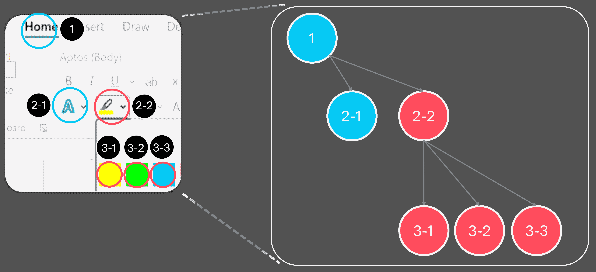
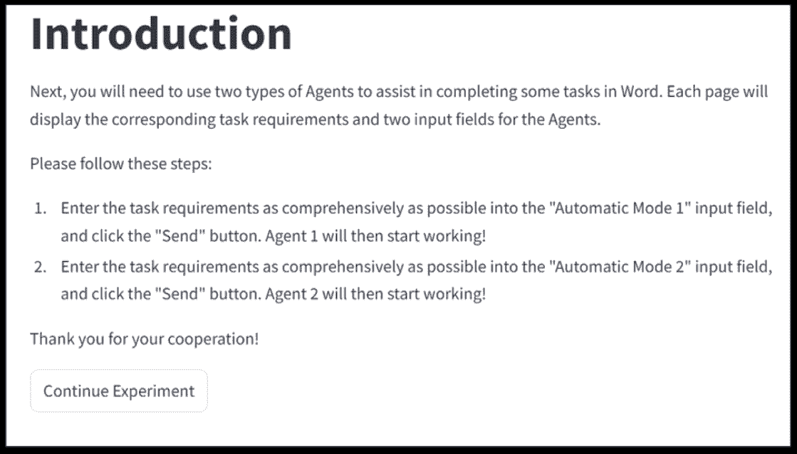

<!--yml
category: 未分类
date: 2025-01-11 12:13:03
-->

# Turn Every Application into an Agent: Towards Efficient Human-Agent-Computer Interaction with API-First LLM-Based Agents

> 来源：[https://arxiv.org/html/2409.17140/](https://arxiv.org/html/2409.17140/)

Junting Lu Peking UniversityChina ,  Zhiyang Zhang Nanjing UniversityChina ,  Fangkai Yang MicrosoftChina ,  Jue Zhang MicrosoftChina ,  Lu Wang MicrosoftChina ,  Chao Du MicrosoftChina ,  Qingwei Lin MicrosoftChina ,  Saravan Rajmohan MicrosoftUSA ,  Dongmei Zhang MicrosoftChina  and  Qi Zhang MicrosoftChina(2018)

###### Abstract.

Multimodal large language models (MLLMs) have enabled LLM-based agents to directly interact with application user interfaces (UIs), enhancing agents’ performance in complex tasks. However, these agents often suffer from high latency and low reliability due to the extensive sequential UI interactions. To address this issue, we propose AXIS, a novel LLM-based agents framework prioritize actions through application programming interfaces (APIs) over UI actions. This framework also facilitates the creation and expansion of APIs through automated exploration of applications. Our experiments on Office Word demonstrate that AXIS reduces task completion time by 65%-70% and cognitive workload by 38%-53%, while maintaining accuracy of 97%-98% compare to humans. Our work contributes to a new human-agent-computer interaction (HACI) framework and a fresh UI design principle for application providers in the era of LLMs. It also explores the possibility of turning every applications into agents, paving the way towards an agent-centric operating system (Agent OS).

large language models (LLMs), human-agent-computer interaction, LLM-based agent, task completion, user interface (UI)^†^†copyright: acmlicensed^†^†journalyear: 2018^†^†doi: XXXXXXX.XXXXXXX^†^†conference: Make sure to enter the correct conference title from your rights confirmation emai; June 03–05, 2018; Woodstock, NY^†^†isbn: 978-1-4503-XXXX-X/18/06^†^†ccs: Human-centered computing Natural language interfaces^†^†ccs: Computing methodologies Planning and scheduling

Figure 1\. An illustration comparing task completion methods: manual operation, UI Agent, and our approach AXIS. Manual operation risks wrong trails if users are unfamiliar with the UI. The UI Agent requires numerous sequential interactions. Our AXIS efficiently completes the task with a single API call.

## 1\. Introduction

As personal computer, mobile devices, and internet become an indispensable part of every day’s work and life, application industries are under great pressure to rapidly evolve their software applications with more features and functionalities to meet peoples’ growing demand  (Ruparelia, [2010](https://arxiv.org/html/2409.17140v1#bib.bib39); Abrahamsson et al., [2017](https://arxiv.org/html/2409.17140v1#bib.bib2)). Nonetheless, those new applications also demand a much higher investment in both time and cognitive effort from regular users. To learn how to use a new application effectively, Users generally have to firstly spend significant time just to get familiar with the user interface (UI) and corresponding functionalities. And to complete various tasks with the new application efficiently, users need to further invest time and effort to learn how to break complex tasks into steps and use the right UIs and commands to complete each step. While both the application providers and research community are fully aware of this pain point, existing efforts have been focusing on providing detailed tutorials and establishing engaging learning platforms, which could only provide limited support in alleviating users’ cognitive burden (Van Merrienboer and Sweller, [2005](https://arxiv.org/html/2409.17140v1#bib.bib43); Biswas et al., [2005](https://arxiv.org/html/2409.17140v1#bib.bib7); Plass et al., [2010](https://arxiv.org/html/2409.17140v1#bib.bib36); Darejeh et al., [2022](https://arxiv.org/html/2409.17140v1#bib.bib11)).

Large language models (LLMs) (Ouyang et al., [2022](https://arxiv.org/html/2409.17140v1#bib.bib35); Achiam et al., [2023](https://arxiv.org/html/2409.17140v1#bib.bib3); Dubey et al., [2024](https://arxiv.org/html/2409.17140v1#bib.bib14)) has demonstrated near-human capabilities in reasoning, planning, and collaboration and are highly promising in completing complex tasks  (Huang and Chang, [2022](https://arxiv.org/html/2409.17140v1#bib.bib23); Wei et al., [2022](https://arxiv.org/html/2409.17140v1#bib.bib47); Mandi et al., [2024](https://arxiv.org/html/2409.17140v1#bib.bib28)). Since then, researchers has been exploring how LLMs can be utilized to reduce users’ cognitive burden in learning and operating software applications. In particular, multimodal large language models (MLLMs) (Yin et al., [2023](https://arxiv.org/html/2409.17140v1#bib.bib54); Durante et al., [2024](https://arxiv.org/html/2409.17140v1#bib.bib15); Zhang et al., [2024c](https://arxiv.org/html/2409.17140v1#bib.bib57)) expand the usage scenarios of LLMs to various tasks that require vision capability  (Wu et al., [2023](https://arxiv.org/html/2409.17140v1#bib.bib48); Zheng et al., [2024](https://arxiv.org/html/2409.17140v1#bib.bib61)). Recent works (Zhang et al., [2023b](https://arxiv.org/html/2409.17140v1#bib.bib56); Wang et al., [2024c](https://arxiv.org/html/2409.17140v1#bib.bib44); Zhang et al., [2024a](https://arxiv.org/html/2409.17140v1#bib.bib55); Zheng et al., [2024](https://arxiv.org/html/2409.17140v1#bib.bib61)) utilizes MLLMs to design LLM-based UI agents capable of serving as users’ delegates, translating user requests expressed in natural language, and directly interacting with the UI of software applications to fulfill users’ needs. With the help of LLM-based UI agents, users could simply ask the application to complete tasks without a deep understanding of application’s UIs and functionalities, which significantly reduces users’ cognitive load of learning new applications.

However, just like the transition from steam-powered to electric-powered industry took much more than replacing central steam engines with electric motors in the factories, simply building LLM-based agent upon the UIs of applications cannot magically deliver a satisfied and worry-free user experience. In particular, today’s application UIs are designed for human-computer interaction (HCI) (Lewis, [1998](https://arxiv.org/html/2409.17140v1#bib.bib26); Bradshaw et al., [2017](https://arxiv.org/html/2409.17140v1#bib.bib8)), which often involves multiple UI interactions for completing a single task. For instance, inserting a 2$\times$2 table in an Office Word document requires a sequence of UI interactions: “Insert $\rightarrow$ Table $\rightarrow$ 2$\times$2 Table”. Although the HCI-based design suits the habits of humans, training LLM-based UI agents to emulate such interactions would generate quite a few challenges that are difficult to overcome.

The first challenge for the LLM-based UI agent is the high latency and long response time. Each individual UI interaction step requires one LLM call to reason which UI to interact with. A task involves multiple UI interaction steps can thus incur considerable time and monetary cost. The LLM call latency is also positively correlated with the number of processed tokens (Levy et al., [2024](https://arxiv.org/html/2409.17140v1#bib.bib25); Wang et al., [2024a](https://arxiv.org/html/2409.17140v1#bib.bib46); Egiazarian et al., [2024](https://arxiv.org/html/2409.17140v1#bib.bib16)). To ensure that the LLM can return high quality outputs, the LLM-based UI agent must pass large volume of UI information to precisely describe the current state, which also increases the latency in each call. The second challenge lies in the reliability domain. Studies have shown that LLMs are prone to hallucinations in generating responses (Bang et al., [2023](https://arxiv.org/html/2409.17140v1#bib.bib6); Dhuliawala et al., [2023](https://arxiv.org/html/2409.17140v1#bib.bib12); Zhang et al., [2023a](https://arxiv.org/html/2409.17140v1#bib.bib58); Guan et al., [2024](https://arxiv.org/html/2409.17140v1#bib.bib19)). During the long sequential calls with LLM-based UI agents, the chance of taking a wrong UI control or hallucinating a non-existing UI for interaction increases with each reasoning step. As LLM-based UI agents often pass the previous interaction history as additional context when reasoning on current UI interaction step (Zhang et al., [2024a](https://arxiv.org/html/2409.17140v1#bib.bib55)), hallucinations in earlier steps could also increase the chance of hallucination in later steps. Thus, when a long chain of UI interactions is required, the UI agents are more likely to suffer from compounding errors and encounter task failure (Chen et al., [2024](https://arxiv.org/html/2409.17140v1#bib.bib9); Zhao et al., [2024](https://arxiv.org/html/2409.17140v1#bib.bib60)). Lastly, the LLM-based UI agent also faces the challenge of UI generalization. While recent works had made advancements in UI grounding (Cheng et al., [2024](https://arxiv.org/html/2409.17140v1#bib.bib10); Rawles et al., [2024b](https://arxiv.org/html/2409.17140v1#bib.bib38); Bai et al., [2023](https://arxiv.org/html/2409.17140v1#bib.bib5)), how the LLM-based UI agents handle interactions with applications whose UIs are not included in the pretraining stage of LLMs remain a critical obstacle without good solutions.

We believe that a new human-agent-computer interaction (HACI) paradigm is needed to address the challenges faced by LLM-based UI agents. In HACI paradigm, API-first LLM-based agents will replace UI agents to prioritize API calls over unnecessary multi-step UI interactions in task completion. Regular UI interactions are only called when the related APIs are unavailable. Compared to the UI agents, API-first agents require less tokens and can obtain more accurate code-formated responses from LLMs. For instance, in the task of inserting a 2$\times$2 table in Word document, the API call only requires one line of code, *i.e.*, doc.Tables.Add(NumRows=2,NumColumns=2) to complete the task.

In this paper, we propose AXIS: Agent eXploring API for Skill integration, a self-exploration LLM-based framework capable of automatically exploring existing applications, learning insights from the support documents and action trajectories, and constructing new APIs¹¹1The new APIs are also referred as “Skills” in Section [3](https://arxiv.org/html/2409.17140v1#S3 "3\. Design of AXIS ‣ Turn Every Application into an Agent: Towards Efficient Human-Agent-Computer Interaction with API-First LLM-Based Agents"), and we use the term “API” loosely here to differentiate from the UI. based on the existing APIs to empower API-first LLM-based agents with low latency and high reliability. Based on our experiment on Office Word (Microsoft365, [2024a](https://arxiv.org/html/2409.17140v1#bib.bib31)) tasks, AXIS can significantly improve the task completion rate and reduce the cognitive loads of users. Moreover, AXIS provides a practical approach for the application providers to turn an application into agent by simply wrapping up the application with an API set and adopting a simpler UI design suitable for HACI. This application-as-an-agent paradigm also paves the way towards the agent operating system (Agent OS) (Zhang et al., [2024b](https://arxiv.org/html/2409.17140v1#bib.bib59); Mei et al., [2024](https://arxiv.org/html/2409.17140v1#bib.bib29); Wu et al., [2024](https://arxiv.org/html/2409.17140v1#bib.bib49)), where the users only need to communicate their intention in natural language and the Agent OS then automatically forms actionable plans, distributes the sub-tasks to relevant applications, and oversees the execution and completion of the tasks with minimal interventions from users.

Our work makes the following contributions:

*   •

    We propose an HACI paradigm along with the implementation framework named AXIS for creating API-first LLM-based agents capable of exploring the application and its available APIs and constructing new APIs. This new paradigm provides a practical approach to turn every application into an agent and paves the way of developing a real Agent OS.

*   •

    We address the cognitive load and learning effort challenge by reducing unnecessary multi-step UI interactions and simplifying task completion through API calls.

*   •

    We conduct performance evaluations and extensive user study to fully examine the efficiency and reliability of AXIS.

## 2\. Related Work

### 2.1\. LLM-based UI Agent

LLM-based agents are designed to utilize the advanced context understanding and reasoning skills of LLMs to interact with and manipulate environments with human-like cognitive abilities († et al.(2022), [FAIR](https://arxiv.org/html/2409.17140v1#bib.bib17); Xi et al., [2023](https://arxiv.org/html/2409.17140v1#bib.bib50); Liu et al., [2023](https://arxiv.org/html/2409.17140v1#bib.bib27); Wang et al., [2024b](https://arxiv.org/html/2409.17140v1#bib.bib45)). The advent of MLLM (Yin et al., [2023](https://arxiv.org/html/2409.17140v1#bib.bib54); Durante et al., [2024](https://arxiv.org/html/2409.17140v1#bib.bib15); Zhang et al., [2024c](https://arxiv.org/html/2409.17140v1#bib.bib57)), including GPT-4o (OpenAI, [2024a](https://arxiv.org/html/2409.17140v1#bib.bib33)) and Gemini (Team et al., [2023](https://arxiv.org/html/2409.17140v1#bib.bib42)), further broadens the scope of LLMs in practical applications with the capability of processing multi-modal inputs, including text and images. Supported by the vision understanding capability of MLLM, new LLM-based UI agents can acquire crucial abilities of navigating and controlling UIs in software applications for completing complex tasks. As such, study on LLM-based UI agents has emerged as a hot area for developing intelligent assistants that can automatically interact with applications following users’ commands. In the mobile platform, methods such as MM-Navigator (Yan et al., [2023](https://arxiv.org/html/2409.17140v1#bib.bib53)), AppAgent (Zhang et al., [2023b](https://arxiv.org/html/2409.17140v1#bib.bib56)), and MobileAgent (Wang et al., [2024c](https://arxiv.org/html/2409.17140v1#bib.bib44)) leverage GPT-4V (OpenAI, [2024b](https://arxiv.org/html/2409.17140v1#bib.bib34)) to operate smartphone applications through human-like interactions (tapping and swiping) without requiring back-end access. More broadly, UFO (Zhang et al., [2024a](https://arxiv.org/html/2409.17140v1#bib.bib55)), SeeAct (Zheng et al., [2024](https://arxiv.org/html/2409.17140v1#bib.bib61)) and Cradle (Tan et al., [2024](https://arxiv.org/html/2409.17140v1#bib.bib41)) support the navigation and operation of UIs in Windows OS applications, websites and games respectively following commands in natural language. Other notable examples include CogAgent (Hong et al., [2024](https://arxiv.org/html/2409.17140v1#bib.bib21)) and SeeClick (Cheng et al., [2024](https://arxiv.org/html/2409.17140v1#bib.bib10)), which focus on the training and finetuning of visual language models for UI understanding and navigation in downstream mobile and desktop tasks. While these LLM-based UI agents are trained to complete tasks in a human-like manner, UIs in existing applications were originally designed for HCIs rather than for agent-computer interactions. Consequently, emulating UI-based interactions directly can result in unnecessary time costs, especially in complex tasks that require numerous or repeated UI interaction steps, such as changing multiple titles to the same format. In contrast, application providers usually offer APIs that can accomplish such tasks with a single API call that eliminate the need of multi-step UI interactions. To overcome the limitation of existing UI agents, reduce unnecessary UI interactions, and lower humans’ learning curve for applications, we will study how the application APIs can be leveraged for building LLM-based agents and explore the new design principles of UIs in the era of LLMs.

### 2.2\. Agent Operating System

The LLM-based agents discussed in Section [2.1](https://arxiv.org/html/2409.17140v1#S2.SS1 "2.1\. LLM-based UI Agent ‣ 2\. Related Work ‣ Turn Every Application into an Agent: Towards Efficient Human-Agent-Computer Interaction with API-First LLM-Based Agents") are usually designed to work within a narrow environment such as a specific application or web page which limits their applicability in general computer tasks that often involves cross-application collaboration. For example, a simple task “Create a report with docs under the Presentation folder and send it to Jack.” requires multiple steps with multiple applications to complete: read all docs, summarize key contexts, compose a report with a word processing application like Microsoft Word, and draft an email with attached report using an email client like Outlook, and sent it to the recipient Jack. To support the completion of complex tasks with minimal human interventions, emerging works have explored the possibility of developing an operating system (OS) fully supported by LLMs. Works like AIOS (Mei et al., [2024](https://arxiv.org/html/2409.17140v1#bib.bib29)) and OS-Copilot (Wu et al., [2024](https://arxiv.org/html/2409.17140v1#bib.bib49)) propose an OS-level agent that can effectively interact with the OS and a vast number of third-party applications in completing complex tasks. OSWorld (Xie et al., [2024](https://arxiv.org/html/2409.17140v1#bib.bib52)) and AndroidWorld (Rawles et al., [2024a](https://arxiv.org/html/2409.17140v1#bib.bib37)) also provide benchmarks for evaluating the performance of multimodal agents with diverse tasks and cross-application workflows across various OS. In the industry, commercial Agent OS such as Apple Intelligence (Apple, [2024](https://arxiv.org/html/2409.17140v1#bib.bib4)), Copilot+PC (Microsoft, [2024](https://arxiv.org/html/2409.17140v1#bib.bib30)), HarmonyOS (Huawei, [2024](https://arxiv.org/html/2409.17140v1#bib.bib24)), and MagicOS (Honor, [2024](https://arxiv.org/html/2409.17140v1#bib.bib22)), are evolving to be more accessible and productive for customers with the potential of leading a new era of HCI. A common approach adopted by existing Agent OS is to divide complex into sub-tasks and assign them to individual applications. However, for each sub-task, the LLM-based agents still rely on human-like interactions such as UI clicking and swiping for completion, which can be inefficient compared to API calls. Moreover, when the LLM-based UI is processing the task, the control is taken over from the user by the LLM-based agent.

### 2.3\. UI design in LLM era

UI design is an essential part of HCI and requires highly specialized expertises along with iterative rounds of feedback and revision (Stone et al., [2005](https://arxiv.org/html/2409.17140v1#bib.bib40)). With LLMs, UI design can be further empowered with automated procedures of design, feedback and evaluation. Duan et al. ([2024](https://arxiv.org/html/2409.17140v1#bib.bib13)) use LLM-generated feedback to automaticly evcuate UI mockups. Similiarly, SimUser (Xiang et al., [2024](https://arxiv.org/html/2409.17140v1#bib.bib51)) leverage LLMs to simulate users with different characters to generate feedback on usability and provide insights in UI design. MUD (Feng et al., [2024](https://arxiv.org/html/2409.17140v1#bib.bib18)) utilize LLMs to mimic human-like exploration to mine UI data from applications and employs noise filtering to improve quality of UI data. Still, existing UI designs largely follow the traditional human-machine interaction paradigm rather than the human-agent-computer interaction (HACI) paradigm that could became the central design principle in Agent OS. In this paper, we will leverage AXIS framework to explore applications, identify the essential UIs, and examine which part of UIs can be replaced by APIs callable by LLM-based agents. We hope that our exploration would generate insights on how to design UIs that are more effective under the HACI paradigm.

## 3\. Design of AXIS

We develope AXIS as a framework that can automatically explore within existing applications, learn insights from exploration trajectories, and consolidate available insights and learned knowledge into actionable “skills”. Skill is a high-level representation of UI- and API-based actions with a priority in API actions²²2If the skill can be represented with UI or API actions, the skill is represented in API-only actions., which is generated with AXIS exploration within the application. Illustrated by Figure [2](https://arxiv.org/html/2409.17140v1#S3.F2 "Figure 2 ‣ 3\. Design of AXIS ‣ Turn Every Application into an Agent: Towards Efficient Human-Agent-Computer Interaction with API-First LLM-Based Agents"), AXIS system consists of three major modules: the app environment, the skills, and the workflows. AXIS employs numerous LLM-based agents to explore the app environment, usually a set of applications running on the OS, through a unified interface to obtain the state of the environment and to interact with it. The knowledge learnt during this process will be consolidated into skills containing structured code segments capable of accomplishing various tasks within the environment. Specific execution and validation methods will also be designed to improve the performance of those skills. Finally, we establish two workflows: the explorer workflow and the follower workflow to facilitate the learning of skills from the environment.

In the subsequent sections, we will layout the details of all the 3 modules and discuss how they work together to explore and discover valuable skills from the applications.

Figure 2\. Overview of AXIS framework. AXIS first explore skills by Follower-driven or Explorer-driven mode, then the exploration logs will be used to generate skill, during which the skill code would be translated and validated. The dashed boxes refer to the interaction between agents and application environment.

### 3.1\. Environment of Application

In the context of AXIS, the environment of applications refers to the collection of interactive entities within the exploration scope of the agents. In this paper, those entities mainly consist of a set of applications running on the Windows operating system. Applications in the environment often share common elements, such as controls  (Zhang et al., [2024a](https://arxiv.org/html/2409.17140v1#bib.bib55)) and XML elements obtained after unpacking.

Agents in AXIS not only observe the state of the environment, but also actively interact with the environment. To facilitate the observation and interaction between agents and the environment, we have designed two general interfaces: state() and step(). state() interface returns the state of the environment, which includes detailed information on the current elements of the entities within the environment. The environment state encompasses key UI information including the position of controls, the type of controls, and whether a control is selected. For applications that can be unpacked, the unpacked XML content is also included as a part of the state. The control types in the application environment of AXIS are consistent with those in  (Zhang et al., [2024a](https://arxiv.org/html/2409.17140v1#bib.bib55)). step() interface incorporates a skill executor that allows agents to perform operations within the environment by executing skills. Upon completion, this interface also returns the results of these operations.

### 3.2\. Skills in Application

A skill contains skill code, description, and usage example, and is designed to accomplish one specified task within the environment.

#### 3.2.1\. skill structure

*   •

    Skill Code: a piece of code structured to be compatible with the executor described in the following section. Skill code includes a uniform set of parameters and adheres to the standard PEP 257 documentation. The initial set of skills is generated by the restructure of the fundamental APIs from the application provider. Based on these initial skills, AXIS can explore and develop additional new skills. It is worth noting that while AXIS prioritizes API-based skills, it is still designed for general purpose and can incoporate both UI-based and API-based skill code.

*   •

    Description: A description of the functionality of a skill for assisting the LLM in selecting and invoking the appropriate skil in the process of task execution.

*   •

    Usage Example: One or more code examples including any specific parameters typically associated with the code and the description. These examples can assist the LLM in filling out the parameter fields in the correct format when the skill is invoked.

#### 3.2.2\. skill executor

As discussed in Section [3.1](https://arxiv.org/html/2409.17140v1#S3.SS1 "3.1\. Environment of Application ‣ 3\. Design of AXIS ‣ Turn Every Application into an Agent: Towards Efficient Human-Agent-Computer Interaction with API-First LLM-Based Agents"), our application environment incorporates a step() interface to facilitate the interaction between agents and the environment. This interface also hosts the skill executor responsible for executing the skill generated or selected by the agents. The skill executor keeps caching of application documents and simultaneously supports multiple functionalities including locating application controls, invoking methods on those controls, and calling application APIs (independent of controls), to enable the UI actions and API actions in the same time and serve as an efficient foundation for skill-driven operations.

#### 3.2.3\. skill types

Following a versatile design principle, the skills in AXIS can be categorized into four types based on the composition of their code fragments: Atomic UI Skill, Atomic API Skill, Composite UI Skill, Composite API Skill, and API-UI Hybrid Skill.

Table 1\. Comparison of 4 types of skill.

| Type | Description | Example | Feature coverage |
| Atomic UI skill | Composed of one basic UI action. As the most primitive skills, Atomic UI skills are stacked and transformed during the exploration process to form new skills. | click_input | click on different UI controls |
| Atomic API skill | Composed of one basic API actions. Unlike UI actions that depend on UI controls for execution, API actions can be executed without the need of interacting with any UI elements. | select_text | select text content in the canvas. |
| Composite UI skill | Composed of multiple atomic UI actions or composite UI actions. Composite UI skill are formed by a simple stacking and combination of UI actions. | search_for_help | clicking the search box and then editing text. |
| Composite API skill | Composed of multiple atomic API actions or composite API actions. This type of skills often represents a higher-level combination of functions. | insert_header_footer | insert header and footer with specified contents by API, which is equal to sequential UI actions ”Insert-¿Header-¿footer edit-¿Footer-¿footer edit”. |
| API-UI hybrid skill | Composed of both API actions and UI actions. API-UI hybrid skills sometimes appear as intermediate states during skill exploration and may evolve into pure API actions during the later stage of exploration. | format_text_in_word | combine select_text and a series of UI actions related to text styling. |

#### 3.2.4\. Skill Hierarchy

We define “skill hierarchy” as the number of skill components that make up a skill. A single basic skill thus has a skill hierarchy of 1. The skill hierarchy of insert_header_footer skill mentioned in table [1](https://arxiv.org/html/2409.17140v1#S3.T1 "Table 1 ‣ 3.2.3\. skill types ‣ 3.2\. Skills in Application ‣ 3\. Design of AXIS ‣ Turn Every Application into an Agent: Towards Efficient Human-Agent-Computer Interaction with API-First LLM-Based Agents") is 2.

### 3.3\. Workflows of Skill Exploration

As shown in Figure [2](https://arxiv.org/html/2409.17140v1#S3.F2 "Figure 2 ‣ 3\. Design of AXIS ‣ Turn Every Application into an Agent: Towards Efficient Human-Agent-Computer Interaction with API-First LLM-Based Agents"), the skill exploration in AXIS is guided by two driving mechanisms: follower-driven skill exploration and explorer-driven skill exploration.

#### 3.3.1\. Follower-driven skill exploration

Follower-driven skill exploration refers to the process of exploring skills from the applications’ help documents, which is primarily accomplished through the collaboration of the following agents:

*   •

    FollowerAgent. FollowerAgent utilizes a skill library composed of a set of primitive actions based on the step-to-step instructions provided by the help document. At each step, it selects the most appropriate action according to the current state of the environment.

*   •

    MonitorAgent. MonitorAgent monitors every action taken by the FollowerAgent along with the impacts on the environment. It also tracks the entire trajectory of the FollowerAgent. When deemed appropriate, it places a breakpoint and summarizes the observed trajectory into a complete skill including the functional summary of the skill and its logic. For initial skills composed of basic UI actions, the summarized logic is also often closely tied to the UI.

*   •

    SkillGeneratorAgent. Based on the summaries and logical descriptions provided by the MonitorAgent, SkillGeneratorAgent generates the code, functional descriptions, and use cases for the skill in accordance with the specifications outlined in Section [3.2](https://arxiv.org/html/2409.17140v1#S3.SS2 "3.2\. Skills in Application ‣ 3\. Design of AXIS ‣ Turn Every Application into an Agent: Towards Efficient Human-Agent-Computer Interaction with API-First LLM-Based Agents"). The generated skill code is highly correlated with the logical descriptions generated by the MonitorAgent, and therefore often involves the stacking of basic UI actions.

*   •

    APITranslatorAgent. Based on the skill code generated by the SkillGeneratorAgent, APITranslatorAgent queries the relevant API documentation to translate the UI-based actions in the skill code into API calls, thus completing the API-ification of the code. Finally, the generated skills are further validated through a skill validation process.

    It is worth noting that both the SkillGeneratorAgent and the APITranslatorAgent search for reusable skills from the original skill set during the skill code generation, thereby obtaining skills at different hierarchies. This approach efficiently facilitates the construction of skills.

#### 3.3.2\. Explorer-driven skill exploration

Unlike Follower-driven skill exploration, the explorer-driven skill exploration kicks off the exploration process with a different initialization method: the step-to-step instructions are automatically generated rather than extracting from the help document. During each step, explorer proposes the next action based on the current environment information and the history of previously explored steps. The subsequent steps utilize the same agents in the follower-driven mode to generate skills with explored trajectories. In this process, application seed files with varying pre-filled content are often required to obtain different initial environments for discovering a more diverse range of skills.

#### 3.3.3\. Skill Validation

To validate the new skills generated from exploration, we have implemented two verification methods: static validation and dynamic validation.

*   •

    Static Validation: This validation method utilizes structural method to verify the skill code, including checking whether the skill’s parameters contain the mandatory parameters (such as the executor instance and args list), whether the methods and properties of the executor are correctly invoked in the code, and whether any non-existent skills are imported when reusing the skill.

*   •

    Dynamic Validation: This validation method evaluates a skill’s performance in the app environment with the help of two agents: ValidatorAgent and EvaluateAgent. When a skill is submitted for validation, ValidatorAgent firstly proposes a task based on the skill’s functional description. It then executes the skill within the same app environment used during the initial skill exploration and records the responses and environmental changes during execution. Upon the completion, the EvaluateAgent determines whether the skill has successfully completed the task or not.

## 4\. Feasibility Study

To validate the usability and effectiveness of AXIS framework, we conducted a feasibility study. We first use AXIS to explore Microsoft Office Word and discover 73 skills. Then we extracted 50 tasks from the wikihow ³³3https://www.wikihow.com/Use-Microsoft-Word page ”Use Microsoft Word” and the official Microsoft Word website ⁴⁴4https://support.microsoft.com/en-us/word. These tasks were executed using both AXIS and UI Agent, and the results were analyzed and compared.

### 4.1\. SKill Exploration

Before the exploration, AXIS was provided with 6 basic actions, as shown in Table [2](https://arxiv.org/html/2409.17140v1#S4.T2 "Table 2 ‣ 4.1\. SKill Exploration ‣ 4\. Feasibility Study ‣ Turn Every Application into an Agent: Towards Efficient Human-Agent-Computer Interaction with API-First LLM-Based Agents"). Then, 347 seed files were used for the AXIS to explore. After the exploration, AXIS discovered 73 skills with different hierarchies. Majority of the skills (44) discovered have a skill hierarchy 1\. The rest is composed of 24 skills with hierarchy 2, 3 skills with hierarchy 3, and 2 skills with hierarchy 4\. Table [3](https://arxiv.org/html/2409.17140v1#S4.T3 "Table 3 ‣ 4.1\. SKill Exploration ‣ 4\. Feasibility Study ‣ Turn Every Application into an Agent: Towards Efficient Human-Agent-Computer Interaction with API-First LLM-Based Agents") displays several successfully validated skills discovered during the exploration process.

Table 2\. The basic actions supported for AXIS exploration.

| Name | Description | Example |
| set_edit_text | The function to Set the edit text of the control element, can use to input content on Edit type controls. | set_edit_text(executor, args_dict=”control_id”:’119’, ”control_name”:”Edit”, ’text’:”hi there”) |
| select_text | A function to select the text with the specified text content. | select_text(executor, args_dict=”text”:”hello”) |
| select_table | A function to select the table with the specified number. | select_table(executor, args_dict=”number”:1) |
| type_keys | A function to Type in keys on control item.Used to enter shortcuts and so on. | type_keys(executor, args_dict=”control_id”:’119’, ”control_name”:”Edit”, ”text”: ”VK_CONTROL down”, ”newline”: False) |
| click_input | A function to Click the control element.Usually be used to switch to different ribbon,click the buttons in menu. | click_input(executor, args_dict=”control_id”:”12”, ”control_name”:”Border”, ’button’:”left”,’double’:False) |
| wheel_mouse_input | A function for Wheel mouse input on the control element. | wheel_mouse_input(executor, args_dict=”control_id”:”12”, ’wheel_dist’:-20) |

Table 3\. Samples of skills in different hierarchy explored by AXIS.

| Hierarchy | Name | Description | Example |
| 1 | activate_dictation | The function is to activate dictation in Microsoft Word. It is equal to the Dictate button in the Voice group to start dictation. | activate_dictation(executor) |
| 2 | align_text | The function aligns the text in a Microsoft Word document. It first selects the text, then applies the desired alignment (left, center, right, justify) using the Word API. | align_text(executor, args_dict=”text”: ”hello”, ”alignment”: ”center”) |
| 3 | apply_text_style | A function to edit a text with specified text, font size, font name. The title is set in the center. | apply_text_style(executor, args_dict=”text”:”Hello”, ”font_name”:”Arial”, ”font_size”:13) |

### 4.2\. Task Completion

The 50 Word-related tasks collected above were used to test and compare the performance of UI Agent and AXIS with the explored skills. In our experiment, we choose UFO (Zhang et al., [2024a](https://arxiv.org/html/2409.17140v1#bib.bib55)) as the representative of UI Agent considering its good performance on word tasks. The results are presented in Table [4](https://arxiv.org/html/2409.17140v1#S4.T4 "Table 4 ‣ 4.2\. Task Completion ‣ 4\. Feasibility Study ‣ Turn Every Application into an Agent: Towards Efficient Human-Agent-Computer Interaction with API-First LLM-Based Agents"), which includes the average time taken to complete different tasks, the success rates, the average number of steps per task, and the corresponding costs of LLM backend (GPT-4o, version 20240513) for both agents.

In terms of execution time, AXIS significantly outperforms the UI Agent, with an average task completion time of 29.9 seconds compared to 59.5 seconds for the UI Agent. This result shows that AXIS is nearly twice as fast as the UI Agent. AXIS also achieves a higher success rate in completing the tasks. Moreover, thanks to the abstraction and integration of basic actions into higher-level skills, AXIS could complete tasks with fewer steps on average, which also incurs lower costs compared to the UI Agent UFO.

Table 4\. Comparison of the performance of UI Agent and AXIS on 50 tasks.

| Metric | UI Agent | AXIS | Pairwise Significance |
| Time(s) | 59.5 | 29.9 | u¿a (p ¡ 0.001) |
| Success Rate(%) | 52.0 | 84.0 | u¡a (p ¡ 0.001) |
| Steps | 3.2 | 2.0 | u¿a (p ¡ 0.01) |
| Cost($) | 0.4 | 0.2 | u¿a (p ¡ 0.001) |

To better understand the reasons behind AXIS’s higher efficiency, we analyzed the number of UI and API-type actions invoked by AXIS and the UI Agent during task execution and recorded the proportion of API and Advanced API (defined as skills with a hierarchy level of 2 or higher) calls made by both methods. As shown in Table [5](https://arxiv.org/html/2409.17140v1#S4.T5 "Table 5 ‣ 4.2\. Task Completion ‣ 4\. Feasibility Study ‣ Turn Every Application into an Agent: Towards Efficient Human-Agent-Computer Interaction with API-First LLM-Based Agents"), AXIS invoked significantly fewer UI actions compared to the UI Agent during task execution. Notably, the total number of UI actions performed by AXIS across all tasks was greater than the number of invoked API actions. Upon inspection, this was found that AXIS tends to use a single and integrated API skill to complete a whole task, resulting a low overall API actions count. We further calculated the API usage rate and the proportion of Advanced API usage among the API actions. The data shows that AXIS’s proportion of API actions reached 55.7% with a 23.1% usage rate of advanced API. In contrast, the API usage rate of UI Agent is only 8.1%. Based on the above results, we conclude that AXIS indeed adopts an API-first approach and tends to use skills to complete tasks when the matching skills are available. And the integration of skills into actions also significantly contributes to the increased efficiency of AXIS.

Table 5\. Comparison of hit UI actions and API actions of UI Agent and AXIS on 50 tasks.

| Metric | UI Agent | AXIS |
| Total UI actions | 103 | 48 |
| Total API actions | 9 | 39 |
| API usage rate(%) | 8.1 | 55.7 |
| Advanced API usage rate(%) | - | 23.1 |

## 5\. User Study

We carry out extensive user experiment to evaluate the performance of AXIS. The experiment and the associated evaluation metrics were designed to explore the following research questions (RQs) regarding the roles of LLM-based agents in work and life scenarios:

*   •

    RQ1: Does LLM-based agent lower the cognitive load of the users and make them have less effort to learn?

*   •

    RQ2: Does LLM-based agent enhance the efficiency of users?

*   •

    RQ3: What are the differences between a UI Agent and an API-based Agent in user experience?

In our user experiment, participants were asked to complete specified tasks within an application through three methods: manually, with the assistance of a UI Agent, and with the assistance of AXIS and recorded the entire process. Microsoft Word is chosen as the experimental application considering its popularity in our daily work and life as well as the rich API documentations (Microsoft365, [2024b](https://arxiv.org/html/2409.17140v1#bib.bib32))). Motivated by the RQs, we set three objectives for the user experiment:

(1) To evaluate the cognitive load on participants when completing tasks using different methods. (2) To compare the efficiency and reliability of task completion across the three methods. (3) To assess user preferences regarding the use of different Agents. This study is approved by the Institutional Review Board (IRB) of Peking University.

### 5.1\. Experiment Procedure

The entire user experiment lasted for 30 minutes. During the preparation phase, we sampled five different tasks in Microsoft Word from both official Word documentation and GPT-generated results. Those tasks were categorized into two levels of difficulty: low difficulty (L1) and high difficulty (L2), based on factors such as the number of UI interactions required, the depth of the UI functions, and the number of ribbon switches. Our experimental results also confirmed that tasks in L2 are indeed more difficult than tasks in L1\. In the subsequent discussion, we will simply refers tasks in different categories as L1 tasks and L2 tasks. Additionally, we designed a user information form to collect participants’ background information, including their familiarity with Microsoft Word.

We provided users with a simple web interface during the formal experiment, which consisted of two stages. In Stage 1, participants received a pre-printed task list including both L1 and L2 tasks. Based on the task ID displayed on the webpage, participants were asked to read the task requirements, click the ”start” button, complete the task in the automatically opened Word document, and click ”Finish.” upon task completion. In Stage 2, participants were instructed to use both the UI Agent and AXIS to assist them in completing the Word tasks. The corresponding webpage were featured with both input fields and buttons for activating the two Agents. The participants need to enter task description to command the Agents to complete the tasks. Throughout the formal experiment, all task execution processes were recorded for subsequent analysis. After completing all assigned tasks manually or with the assistant of agents, four different post-task questionnaires were displayed on the experimental webpage to survey users’ subjective experiences.

### 5.2\. Participants

We recruited candidates by posting on social media. 20 individuals were randomly selected as participants for the experiment from the list of candidates who confirmed their willingness to participate. Our participants ranged in age from 18 to 40 years with educational backgrounds spanning from undergraduate to postgraduate levels. Their occupations included engineers, students, researchers, and full-time homemakers, among others. 100% of the participants had some experience with Microsoft Word with varying levels of proficiency and different usage frequency ranging from daily to monthly. The user experiment lasted 30 minutes on average per participant and each participant received 50 CNY as compensation.

### 5.3\. Subjective Metric Collection

As mentioned in [5.1](https://arxiv.org/html/2409.17140v1#S5.SS1 "5.1\. Experiment Procedure ‣ 5\. User Study ‣ Turn Every Application into an Agent: Towards Efficient Human-Agent-Computer Interaction with API-First LLM-Based Agents"), we used four questionnaires to collect users’ subjective experence for completing the tasks using different methods. Questionnaires 1 to 4 were administered separately after completing L1 tasks manually, completing L2 tasks manually, completing L1 tasks with the assistance of an Agent, and completing L2 tasks with the assistance of an Agent, respectively.

To determine whether LLM-based agents can indeed reduce users’ cognitive load for completing tasks compared to manual work, in all the four questionnaires, we include questions based on the NASA Task Load Index (NASA-TLX) (Hart, [1988](https://arxiv.org/html/2409.17140v1#bib.bib20)) and an additional question on the required learning efforts. For NASA-TLX, our questions cover all the six metrics, including Mental Demand, Physical Demand, Temporal Demand (how hurried or rushed of the tasks), performance (feeling of success in completing the task), frustration level, and completion effort (how hard the users need to work on the tasks). Lower values in those six metrics indicate higher cognitive loads, better feeling of success, lower frustration level, and less efforts during task completion. For the learning efforts, lower score also indicates less learning efforts.

To further compare users’ perceptions on the UI Agent and AXIS, Questionnaires 3 and 4 contained questions on the ratings on fluency, reliability, UI dependency, decision consistency, and perceived speed for both Agents. Specifically, UI dependency measures the degree of users’ reliance on the UI while observing the Agent complete tasks. Decision consistency assesses how closely the decisions made by the Agent align with the decisions users might make to complete the same tasks manually (the experimental web page displayed all the decisions made by the Agents in a step-by-step manner). Perceived speed refers to users’ subjective perception on how fast the Agents completed the tasks.

### 5.4\. Objective Metric Collection

We recorded experimental logs throughout the experiment, including screen recordings of the manual completion of tasks by the users, screen recordings of the two Agents (UI agent and AIXS) performing tasks, decision-making processes, UI interaction paths, time taken, and the cost of the LLM backend (GPT-4o, version 20240513). From on the logs, we extracted objective metrics including the time and success rate of task completion across the three methods, the degree of UI dependency, and cost for the two Agents.

## 6\. Results

In line with our research questions, we divided the experimental results into three parts for analysis. Firstly, We investigate how the adoption of agent reduces cognitive load for users. Secondly, We analyze and compare different agents’ abilities of enhancing task efficiency. Finally, we discuss users’ preferences between the traditional UI agent and our AXIS agent.

### 6.1\. Cognitive load

To investigate the reduction of cognitive load by LLM-based Agents, we analyzed the NASA-TLX and learning effort scoring collected from users during the task execution process and summarized results in Table [6](https://arxiv.org/html/2409.17140v1#S6.T6 "Table 6 ‣ 6.1\. Cognitive load ‣ 6\. Results ‣ Turn Every Application into an Agent: Towards Efficient Human-Agent-Computer Interaction with API-First LLM-Based Agents") and Figure [3](https://arxiv.org/html/2409.17140v1#S6.F3 "Figure 3 ‣ 6.1\. Cognitive load ‣ 6\. Results ‣ Turn Every Application into an Agent: Towards Efficient Human-Agent-Computer Interaction with API-First LLM-Based Agents"). It is worthy noting that, in our experiment, L2 tasks generally scores higher than L1 tasks across multiple dimensions of the NASA-TLX scale and learning efforts, which indicates that our task difficulty classification is consistent with the users’ experience.

As shown in Table [6](https://arxiv.org/html/2409.17140v1#S6.T6 "Table 6 ‣ 6.1\. Cognitive load ‣ 6\. Results ‣ Turn Every Application into an Agent: Towards Efficient Human-Agent-Computer Interaction with API-First LLM-Based Agents"), at both L1 and L2 difficulty levels, the agent based method shows significant improvements over the manual based method in most of the NASA-TLX scales. In particular, the agent based method is much less mentally and physically demanding, generate less frustration for users, and requires less effort in completing tasks than the manual based method. The reduction in the cognitive effort by the agent based method is also generally more pronounced for the more difficulty L2 tasks. For the performance metric, while the difference between agent based method and manual method is insignficant for the easy L1 tasks, the agent based method does boost the users’ feeling of success significantly (p¡0.05) for the difficult L2 tasks. In Figure [3](https://arxiv.org/html/2409.17140v1#S6.F3 "Figure 3 ‣ 6.1\. Cognitive load ‣ 6\. Results ‣ Turn Every Application into an Agent: Towards Efficient Human-Agent-Computer Interaction with API-First LLM-Based Agents") (b), we also summarized the average scores across all the six NASA-TLX scales. This figure shows that, when using the Agents, the users’ experiences in completing L1 and L2 tasks are similar, which demonstrates the stability of LLM-based agents in addressing tasks with different complexities. Finally, Figure [3](https://arxiv.org/html/2409.17140v1#S6.F3 "Figure 3 ‣ 6.1\. Cognitive load ‣ 6\. Results ‣ Turn Every Application into an Agent: Towards Efficient Human-Agent-Computer Interaction with API-First LLM-Based Agents") (c) shows that the LLM-based agents can also significantly reduced users’ learning efforts in completing the task compared to the manual approach. Similar to the NASA-TLX scales, the reduction is also bigger at the higher task difficulty level.

All those results clearly demonstrate the value of agent based method in helping users in completing various tasks and answer the first research question (RQ1): the LLM-based agent does indeed lower the cognitive load of users and reduces their effort to learn, especially for more difficult tasks.

Table 6\. Comparison of NASA-TLX results of Level 1 and Level 2 tasks. (m: Manual, a: Agents)

| Metric | Task Level | Manual | Agents | Pairwise Significance |
| Mental Demand (0-100) | L1 L2 | 21.3 70.0 | 2.5 7.5 | L1: m¿a (p ¡ 0.001) L2: m¿a (p ¡ 0.001) |
| Physical Demand (0-100) | L1 L2 | 31.3 57.5 | 5.0 6.3 | L1: m¿a (p ¡ 0.001) L2: m¿a (p ¡ 0.001) |
| Temporal Demand (0-100) | L1 L2 | 52.5 37.5 | 28.8 35.0 | L1: m¿a (p ¡ 0.05) L2: - |
| Performance (0-100) | L1 L2 | 21.2 47.5 | 21.2 26.2 | L1: - L2: m¿a (p ¡ 0.05) |
| Frustration Level (0-100) | L1 L2 | 31.3 62.5 | 7.5 10.0 | L1: m¿a (p ¡ 0.001) L2: m¿a (p ¡ 0.001) |
| Completion Effort (0-100) | L1 L2 | 12.5 35.0 | 17.5 13.8 | L1: - L2: m¿a (p ¡ 0.01) |

Figure 3\. The results of NASA Workload and learn efforts on L1 and L2 tasks of user study. Bars indicate standard errors (**: p ¡ 0.01, ***: p ¡ 0.001)

### 6.2\. Efficiency and reliability

To compare the efficiency and reliability between the manual method, UI agents, and AXIS, we also collected metrics on the completion time, success rate, as well as the number of steps and costs for completing tasks in our experiment. Those information are summarized in Table [7](https://arxiv.org/html/2409.17140v1#S6.T7 "Table 7 ‣ 6.2\. Efficiency and reliability ‣ 6\. Results ‣ Turn Every Application into an Agent: Towards Efficient Human-Agent-Computer Interaction with API-First LLM-Based Agents") and Table [8](https://arxiv.org/html/2409.17140v1#S6.T8 "Table 8 ‣ 6.2\. Efficiency and reliability ‣ 6\. Results ‣ Turn Every Application into an Agent: Towards Efficient Human-Agent-Computer Interaction with API-First LLM-Based Agents").

In terms of time efficiency, AXIS consistently took significantly less time than both the manual and UI Agent methods for both L1 and L2 tasks (p ¡ 0.001), with a larger advantage for the more difficult L2 tasks. For L1 tasks, the manual method was actually faster than the UI Agent as the UI Agent generally took many steps to complete a task.

For the accuracy, unsurprisingly the manual method is the best among all the three methods. Still, AXIS can achieve a high level accuracy that is only slightly worse than human performance. In contrast, the accuracy of the UI agent is considerably lower, especially at the L2 tasks. Upon reviewing the video logs, we found that incorrect positioning of UI elements and the invisibility of certain UI components were the major causes of the errors made by the the UI agent.

Finally, as shown in Table [8](https://arxiv.org/html/2409.17140v1#S6.T8 "Table 8 ‣ 6.2\. Efficiency and reliability ‣ 6\. Results ‣ Turn Every Application into an Agent: Towards Efficient Human-Agent-Computer Interaction with API-First LLM-Based Agents")), UI agents often need to take more steps to finish the task, especially the L2 tasks where where the target UI elements were buried deeper in the interface. In contrast, empowered by the streamlined task execution enabled by API calls, AXIS took significantly fewer steps, and thus lower overall costs for completing tasks at both difficulty levels.

Based on the above analysis, we can address our second research question (RQ2). The use of a UI Agent provides a slight improvement in human efficiency for specific complex tasks, but it suffers from reliability issues. In contrast, AXIS consistently enhances human efficiency and demonstrates greater reliability.

Table 7\. Comparison of Methods on Time and Success Rate in L1 and L2 tasks.

| Metric | Task Level | Manual | UI Agent | AXIS | Pairwise Significance |
| Time(s) | L1 L2 | 61.8 167.6 | 104.6 155.5 | 18.2 57.1 | L1: m¡u (p ¡ 0.001) L1, L2: a¡m (p ¡ 0.001) L1, L2: a¡u (p ¡ 0.001) |
| Success Rate(%) | L1 L2 | 100.0 97.5 | 75.0 45.0 | 98.3 95.0 | L1, L2: m¿u (p ¡ 0.001) L1, L2: a¿u (p ¡ 0.001) |

Table 8\. Comparison of Methods on Steps and Cost in L1 and L2 tasks.

| Metric | Task Level | UI Agent | AXIS | Pairwise Significance |
| steps | L1 L2 | 6.4 11.1 | 1.0 4.2 | L1: a¡u (p ¡ 0.001) L2: a¡u (p ¡ 0.001) |
| cost($) | L1 L2 | 0.6 0.9 | 0.07 0.3 | L1: a¡u (p ¡ 0.001) L2: a¡u (p ¡ 0.001) |

### 6.3\. Affinity preference

To explore the differences in user experience when executing tasks with UI agents versus AXIS, We also conducted a subjective preference evaluation on five aspects for both L1 and L2 tasks and summarized the results in Figure [4](https://arxiv.org/html/2409.17140v1#S6.F4 "Figure 4 ‣ 6.3\. Affinity preference ‣ 6\. Results ‣ Turn Every Application into an Agent: Towards Efficient Human-Agent-Computer Interaction with API-First LLM-Based Agents"). At both difficulty levels, participants showed a general preference for AXIS over UI agents in term of the perceived speed, fluency, and reliability.

For the perceived consistency of decision, the results varied between the L1 and L2 tasks. In the L1 tasks, AXIS usually can complete tasks with one or a few steps due to the high encapsulation of its API, which resulted in a decision-making style that is quite distant from the thinking pattern of human. However, in complex tasks, AXIS’s decisions become more aligned with human’s thought processes and were thus perceived better by humans in this aspect. For the UI dependency, AXIS is much less reliant to the UI compared to the UI Agent, which needs to frequently interact with the UI interface. This reduced dependency on the UI was clearly perceived by users during their experience.

In summary, for the third research question (RQ3): AXIS, compared to UI agents, tends to leave users with a perception of better efficiency, smoothness, and reliability. As task complexity increases, users are also more inclined to favor AXIS for task resolution. Additionally, feedback from user surveys indicated a desire for greater control when using LLM-based agents. Unlike UI agents, which often interrupt users’ mouse actions and occupy screen space, AXIS’s API-first approach addresses this issue and improves users’ experience.

Figure 4\. The results of subjective preference on L1 and L2 tasks of user study.

## 7\. Discussion

### 7.1\. AXIS help to digest unnecessary Application UIs

To build new APIs on top of existing API and UI functions, AXIS leverages a LLM-powered self-exploration framework to identify all control elements within an application that can be converted into APIs. This exploration procedure helps uncover potentially unnecessary UI elements or redundant UI designs for improvement under the HACI paradigm.

To illustrate this process, in Figure [5](https://arxiv.org/html/2409.17140v1#S7.F5 "Figure 5 ‣ 7.1\. AXIS help to digest unnecessary Application UIs ‣ 7\. Discussion ‣ Turn Every Application into an Agent: Towards Efficient Human-Agent-Computer Interaction with API-First LLM-Based Agents"), the UI hierarchical relationships between UIs are represented as a tree, in which each node represents a UI element with higher-level UI elements as parent nodes and lower-level ones as child nodes. We further use red nodes to represent UI locations that can be API-ified after explored by AXIS, and use blue nodes represent general UI elements. In this example, the root node that represents the ”Home” tab is a blue node as not all its sub-UI nodes are red (API-ified). However, the second-level node ”Highlight Color” (node 2-2) and all its third-level child nodes can all be API-ified and are colored in red. Generally, we define a node N as non-essential if this node along with all their child nodes can all be API-ified:

|  | $\text{NonEssential}(N)=\begin{cases}\text{True},&\text{if }N\text{ and all its%  child nodes are red nodes ({API-enabled})}\\ \text{False},&\text{otherwise}\end{cases}$ |  |

Unlike the HCI paradigm that emphasizes the interactions between human and interfaces, in the future Agent OS powered by LLM-based agents, non-essential UI elements can be simplified or even eliminated from the application interface, with their original functions replaced by the API calls. By categorizing UI elements as essential or non-essential, AXIS can provide valuable insights on how the UI might be improved and re-designed in an agent-based system for the application providers.

Figure 5\. The figure illustrates rule of identifying the UI controls available to be cropped. On the left, the relevant UI components from the original document structure are displayed. On the right, the corresponding UI tree is shown, with nodes matching the UI components by number and position, numbers indicating hierarchy levels, and arrows representing parent-child relationships. The red nodes represent UI controls that can be cropped.

### 7.2\. Turn An Application into an Agent

In the experiment section, we use Microsoft Word to illustrate how to explore and construct new API agents using the AXIS framework. It is worthy noting that the AXIS framework is highly adaptable and scalable, and can be extended to any new application with a basic API and documentation support. Specifically, to adapt AXIS, the application provider needs to supplement operational manuals on the applications as well as the following interfaces:

*   •

    Environment State Interface for obtaining information about the state of the environment.

*   •

    Basic Action Interface for supporting basic interactions with the environment.

Starting from those basic resources, AXIS can automatically and continuously explore the applications, discover new skills, and extend its functionalities. This adaptability also means that AXIS can be integrated into various software environments to enhance functionality and user experience with API-driven interactions.

## 8\. Conclusion

In this paper, we introduce AXIS, a pioneering framework designed to enhance human-agent-computer interaction (HACI) and address the inefficiencies and cognitive burdens associated with multimodal large language models (MLLMs) in complex task execution by prioritizing API calls over traditional UI interactions. Through user experiments with tasks from Office Word , AXIS has proven to be highly effective, reducing task completion time by 65%-70% and cognitive workload by 38%-53%, while maintaining a high level of accuracy comparable to human performance. These results underscore the potential of API-first LLM-based agents to streamline interactions, minimize latency, and enhance reliability in task execution.

Our research contributes to the broader field of human-agent interaction by highlighting the limitations of traditional UI-based approaches and proposing a novel solution that leverages API calls to simplify and accelerate task completion. By enabling applications to act as agents through a reduced set of essential UIs and enhanced API sets, AXIS not only improves efficiency but also paves the way towards the development of a comprehensive Agent OS. This paradigm shift suggests that every application has the potential to transform into an intelligent agent capable of executing tasks with minimal user intervention.

In conclusion, AXIS represents a significant step forward in reducing cognitive load and enhancing the efficiency of task completion with LLM-based agents. Our findings provide valuable insights for application developers and researchers, encouraging them to rethink UI designs and explore new ways to integrate API-driven interactions. In our future work, we will focus on extending this framework to a broader range of applications, exploring its impact on various user groups, and advancing the potential of LLMs in creating a more intuitive and efficient human-computer interface.

## References

*   (1)
*   Abrahamsson et al. (2017) Pekka Abrahamsson, Outi Salo, Jussi Ronkainen, and Juhani Warsta. 2017. Agile software development methods: Review and analysis. *arXiv preprint arXiv:1709.08439* (2017).
*   Achiam et al. (2023) Josh Achiam, Steven Adler, Sandhini Agarwal, Lama Ahmad, Ilge Akkaya, Florencia Leoni Aleman, Diogo Almeida, Janko Altenschmidt, Sam Altman, Shyamal Anadkat, et al. 2023. Gpt-4 technical report. *arXiv preprint arXiv:2303.08774* (2023).
*   Apple (2024) Apple. 2024. Apple Intelligence. [https://developer.apple.com/apple-intelligence/](https://developer.apple.com/apple-intelligence/). Accessed: 2024-08-28.
*   Bai et al. (2023) Jinze Bai, Shuai Bai, Shusheng Yang, Shijie Wang, Sinan Tan, Peng Wang, Junyang Lin, Chang Zhou, and Jingren Zhou. 2023. Qwen-VL: A Versatile Vision-Language Model for Understanding, Localization, Text Reading, and Beyond. *arXiv preprint arXiv:2308.12966* (2023).
*   Bang et al. (2023) Yejin Bang, Samuel Cahyawijaya, Nayeon Lee, Wenliang Dai, Dan Su, Bryan Wilie, Holy Lovenia, Ziwei Ji, Tiezheng Yu, Willy Chung, et al. 2023. A multitask, multilingual, multimodal evaluation of chatgpt on reasoning, hallucination, and interactivity. *arXiv preprint arXiv:2302.04023* (2023).
*   Biswas et al. (2005) Gautam Biswas, Krittaya Leelawong, Daniel Schwartz, Nancy Vye, and The Teachable Agents Group at Vanderbilt. 2005. Learning by teaching: A new agent paradigm for educational software. *Applied Artificial Intelligence* 19, 3-4 (2005), 363–392.
*   Bradshaw et al. (2017) Jeffrey M Bradshaw, Paul J Feltovich, and Matthew Johnson. 2017. Human–agent interaction. In *The handbook of human-machine interaction*. CRC Press, 283–300.
*   Chen et al. (2024) Lingjiao Chen, Jared Quincy Davis, Boris Hanin, Peter Bailis, Ion Stoica, Matei Zaharia, and James Zou. 2024. Are more llm calls all you need? towards scaling laws of compound inference systems. *arXiv preprint arXiv:2403.02419* (2024).
*   Cheng et al. (2024) Kanzhi Cheng, Qiushi Sun, Yougang Chu, Fangzhi Xu, Yantao Li, Jianbing Zhang, and Zhiyong Wu. 2024. Seeclick: Harnessing gui grounding for advanced visual gui agents. *arXiv preprint arXiv:2401.10935* (2024).
*   Darejeh et al. (2022) Ali Darejeh, Sara Mashayekh, and Nadine Marcus. 2022. Cognitive-based methods to facilitate learning of software applications via E-learning systems. *Cogent Education* 9, 1 (2022), 2082085.
*   Dhuliawala et al. (2023) Shehzaad Dhuliawala, Mojtaba Komeili, Jing Xu, Roberta Raileanu, Xian Li, Asli Celikyilmaz, and Jason Weston. 2023. Chain-of-verification reduces hallucination in large language models. *arXiv preprint arXiv:2309.11495* (2023).
*   Duan et al. (2024) Peitong Duan, Jeremy Warner, Yang Li, and Bjoern Hartmann. 2024. Generating Automatic Feedback on UI Mockups with Large Language Models. In *Proceedings of the CHI Conference on Human Factors in Computing Systems*. 1–20.
*   Dubey et al. (2024) Abhimanyu Dubey, Abhinav Jauhri, Abhinav Pandey, Abhishek Kadian, Ahmad Al-Dahle, Aiesha Letman, Akhil Mathur, Alan Schelten, Amy Yang, Angela Fan, et al. 2024. The llama 3 herd of models. *arXiv preprint arXiv:2407.21783* (2024).
*   Durante et al. (2024) Zane Durante, Qiuyuan Huang, Naoki Wake, Ran Gong, Jae Sung Park, Bidipta Sarkar, Rohan Taori, Yusuke Noda, Demetri Terzopoulos, Yejin Choi, et al. 2024. Agent ai: Surveying the horizons of multimodal interaction. *arXiv preprint arXiv:2401.03568* (2024).
*   Egiazarian et al. (2024) Vage Egiazarian, Andrei Panferov, Denis Kuznedelev, Elias Frantar, Artem Babenko, and Dan Alistarh. 2024. Extreme compression of large language models via additive quantization. *arXiv preprint arXiv:2401.06118* (2024).
*   (17) Meta Fundamental AI Research Diplomacy Team (FAIR)†, Anton Bakhtin, Noam Brown, Emily Dinan, Gabriele Farina, Colin Flaherty, Daniel Fried, Andrew Goff, Jonathan Gray, Hengyuan Hu, et al. 2022. Human-level play in the game of Diplomacy by combining language models with strategic reasoning. *Science* 378, 6624 (2022), 1067–1074.
*   Feng et al. (2024) Sidong Feng, Suyu Ma, Han Wang, David Kong, and Chunyang Chen. 2024. MUD: Towards a Large-Scale and Noise-Filtered UI Dataset for Modern Style UI Modeling. In *Proceedings of the CHI Conference on Human Factors in Computing Systems*. 1–14.
*   Guan et al. (2024) Yanchu Guan, Dong Wang, Zhixuan Chu, Shiyu Wang, Feiyue Ni, Ruihua Song, and Chenyi Zhuang. 2024. Intelligent Agents with LLM-based Process Automation. In *Proceedings of the 30th ACM SIGKDD Conference on Knowledge Discovery and Data Mining*. 5018–5027.
*   Hart (1988) SG Hart. 1988. Development of NASA-TLX (Task Load Index): Results of empirical and theoretical research. *Human mental workload/Elsevier* (1988).
*   Hong et al. (2024) Wenyi Hong, Weihan Wang, Qingsong Lv, Jiazheng Xu, Wenmeng Yu, Junhui Ji, Yan Wang, Zihan Wang, Yuxiao Dong, Ming Ding, et al. 2024. Cogagent: A visual language model for gui agents. In *Proceedings of the IEEE/CVF Conference on Computer Vision and Pattern Recognition*. 14281–14290.
*   Honor (2024) Honor. 2024. MagicOS. [https://www.honor.com/global/magic-os/](https://www.honor.com/global/magic-os/). Accessed: 2024-08-28.
*   Huang and Chang (2022) Jie Huang and Kevin Chen-Chuan Chang. 2022. Towards reasoning in large language models: A survey. *arXiv preprint arXiv:2212.10403* (2022).
*   Huawei (2024) Huawei. 2024. HarmonyOS. [https://www.harmonyos.com/en/](https://www.harmonyos.com/en/). Accessed: 2024-08-28.
*   Levy et al. (2024) Mosh Levy, Alon Jacoby, and Yoav Goldberg. 2024. Same task, more tokens: the impact of input length on the reasoning performance of large language models. *arXiv preprint arXiv:2402.14848* (2024).
*   Lewis (1998) Michael Lewis. 1998. Designing for human-agent interaction. *Ai magazine* 19, 2 (1998), 67–67.
*   Liu et al. (2023) Xiao Liu, Hao Yu, Hanchen Zhang, Yifan Xu, Xuanyu Lei, Hanyu Lai, Yu Gu, Hangliang Ding, Kaiwen Men, Kejuan Yang, et al. 2023. Agentbench: Evaluating llms as agents. *arXiv preprint arXiv:2308.03688* (2023).
*   Mandi et al. (2024) Zhao Mandi, Shreeya Jain, and Shuran Song. 2024. Roco: Dialectic multi-robot collaboration with large language models. In *2024 IEEE International Conference on Robotics and Automation (ICRA)*. IEEE, 286–299.
*   Mei et al. (2024) Kai Mei, Zelong Li, Shuyuan Xu, Ruosong Ye, Yingqiang Ge, and Yongfeng Zhang. 2024. AIOS: LLM agent operating system. *arXiv e-prints, pp. arXiv–2403* (2024).
*   Microsoft (2024) Microsoft. 2024. Copilot+PC. [https://www.microsoft.com/en-us/surface/do-more-with-surface/advantages-of-copilot-plus-pcs](https://www.microsoft.com/en-us/surface/do-more-with-surface/advantages-of-copilot-plus-pcs). Accessed: 2024-08-28.
*   Microsoft365 (2024a) Microsoft365\. 2024a. Microsoft365 Word. [https://www.microsoft.com/en-us/microsoft-365/word](https://www.microsoft.com/en-us/microsoft-365/word). Accessed: 2024-08-28.
*   Microsoft365 (2024b) Microsoft365\. 2024b. Microsoft365 Word API. [https://learn.microsoft.com/en-us/dotnet/api/microsoft.office.interop.word?view=word-pia](https://learn.microsoft.com/en-us/dotnet/api/microsoft.office.interop.word?view=word-pia). Accessed: 2024-08-28.
*   OpenAI (2024a) OpenAI. 2024a. GPT-4o. [https://platform.openai.com/docs/models/gpt-4o](https://platform.openai.com/docs/models/gpt-4o). Accessed: 2024-08-28.
*   OpenAI (2024b) OpenAI. 2024b. GPT-4V(ision). [https://platform.openai.com/docs/models/gpt-4-turbo-and-gpt-4](https://platform.openai.com/docs/models/gpt-4-turbo-and-gpt-4). Accessed: 2024-08-28.
*   Ouyang et al. (2022) Long Ouyang, Jeffrey Wu, Xu Jiang, Diogo Almeida, Carroll Wainwright, Pamela Mishkin, Chong Zhang, Sandhini Agarwal, Katarina Slama, Alex Ray, et al. 2022. Training language models to follow instructions with human feedback. *Advances in neural information processing systems* 35 (2022), 27730–27744.
*   Plass et al. (2010) Jan L Plass, Roxana Moreno, and Roland Brünken. 2010. Cognitive load theory. (2010).
*   Rawles et al. (2024a) Christopher Rawles, Sarah Clinckemaillie, Yifan Chang, Jonathan Waltz, Gabrielle Lau, Marybeth Fair, Alice Li, William Bishop, Wei Li, Folawiyo Campbell-Ajala, et al. 2024a. AndroidWorld: A dynamic benchmarking environment for autonomous agents. *arXiv preprint arXiv:2405.14573* (2024).
*   Rawles et al. (2024b) Christopher Rawles, Alice Li, Daniel Rodriguez, Oriana Riva, and Timothy Lillicrap. 2024b. Androidinthewild: A large-scale dataset for android device control. *Advances in Neural Information Processing Systems* 36 (2024).
*   Ruparelia (2010) Nayan B Ruparelia. 2010. Software development lifecycle models. *ACM SIGSOFT Software Engineering Notes* 35, 3 (2010), 8–13.
*   Stone et al. (2005) Debbie Stone, Caroline Jarrett, Mark Woodroffe, and Shailey Minocha. 2005. *User interface design and evaluation*. Elsevier.
*   Tan et al. (2024) Weihao Tan, Ziluo Ding, Wentao Zhang, Boyu Li, Bohan Zhou, Junpeng Yue, Haochong Xia, Jiechuan Jiang, Longtao Zheng, Xinrun Xu, et al. 2024. Towards general computer control: A multimodal agent for red dead redemption ii as a case study. *arXiv preprint arXiv:2403.03186* (2024).
*   Team et al. (2023) Gemini Team, Rohan Anil, Sebastian Borgeaud, Yonghui Wu, Jean-Baptiste Alayrac, Jiahui Yu, Radu Soricut, Johan Schalkwyk, Andrew M Dai, Anja Hauth, et al. 2023. Gemini: a family of highly capable multimodal models. *arXiv preprint arXiv:2312.11805* (2023).
*   Van Merrienboer and Sweller (2005) Jeroen JG Van Merrienboer and John Sweller. 2005. Cognitive load theory and complex learning: Recent developments and future directions. *Educational psychology review* 17 (2005), 147–177.
*   Wang et al. (2024c) Junyang Wang, Haiyang Xu, Jiabo Ye, Ming Yan, Weizhou Shen, Ji Zhang, Fei Huang, and Jitao Sang. 2024c. Mobile-agent: Autonomous multi-modal mobile device agent with visual perception. *arXiv preprint arXiv:2401.16158* (2024).
*   Wang et al. (2024b) Lei Wang, Chen Ma, Xueyang Feng, Zeyu Zhang, Hao Yang, Jingsen Zhang, Zhiyuan Chen, Jiakai Tang, Xu Chen, Yankai Lin, et al. 2024b. A survey on large language model based autonomous agents. *Frontiers of Computer Science* 18, 6 (2024), 186345.
*   Wang et al. (2024a) Wenxiao Wang, Wei Chen, Yicong Luo, Yongliu Long, Zhengkai Lin, Liye Zhang, Binbin Lin, Deng Cai, and Xiaofei He. 2024a. Model compression and efficient inference for large language models: A survey. *arXiv preprint arXiv:2402.09748* (2024).
*   Wei et al. (2022) Jason Wei, Xuezhi Wang, Dale Schuurmans, Maarten Bosma, Fei Xia, Ed Chi, Quoc V Le, Denny Zhou, et al. 2022. Chain-of-thought prompting elicits reasoning in large language models. *Advances in neural information processing systems* 35 (2022), 24824–24837.
*   Wu et al. (2023) Chaoyi Wu, Jiayu Lei, Qiaoyu Zheng, Weike Zhao, Weixiong Lin, Xiaoman Zhang, Xiao Zhou, Ziheng Zhao, Ya Zhang, Yanfeng Wang, et al. 2023. Can gpt-4v (ision) serve medical applications? case studies on gpt-4v for multimodal medical diagnosis. *arXiv preprint arXiv:2310.09909* (2023).
*   Wu et al. (2024) Zhiyong Wu, Chengcheng Han, Zichen Ding, Zhenmin Weng, Zhoumianze Liu, Shunyu Yao, Tao Yu, and Lingpeng Kong. 2024. Os-copilot: Towards generalist computer agents with self-improvement. *arXiv preprint arXiv:2402.07456* (2024).
*   Xi et al. (2023) Zhiheng Xi, Wenxiang Chen, Xin Guo, Wei He, Yiwen Ding, Boyang Hong, Ming Zhang, Junzhe Wang, Senjie Jin, Enyu Zhou, et al. 2023. The rise and potential of large language model based agents: A survey. *arXiv preprint arXiv:2309.07864* (2023).
*   Xiang et al. (2024) Wei Xiang, Hanfei Zhu, Suqi Lou, Xinli Chen, Zhenghua Pan, Yuping Jin, Shi Chen, and Lingyun Sun. 2024. SimUser: Generating Usability Feedback by Simulating Various Users Interacting with Mobile Applications. In *Proceedings of the CHI Conference on Human Factors in Computing Systems*. 1–17.
*   Xie et al. (2024) Tianbao Xie, Danyang Zhang, Jixuan Chen, Xiaochuan Li, Siheng Zhao, Ruisheng Cao, Toh Jing Hua, Zhoujun Cheng, Dongchan Shin, Fangyu Lei, et al. 2024. Osworld: Benchmarking multimodal agents for open-ended tasks in real computer environments. *arXiv preprint arXiv:2404.07972* (2024).
*   Yan et al. (2023) An Yan, Zhengyuan Yang, Wanrong Zhu, Kevin Lin, Linjie Li, Jianfeng Wang, Jianwei Yang, Yiwu Zhong, Julian McAuley, Jianfeng Gao, et al. 2023. Gpt-4v in wonderland: Large multimodal models for zero-shot smartphone gui navigation. *arXiv preprint arXiv:2311.07562* (2023).
*   Yin et al. (2023) Shukang Yin, Chaoyou Fu, Sirui Zhao, Ke Li, Xing Sun, Tong Xu, and Enhong Chen. 2023. A survey on multimodal large language models. *arXiv preprint arXiv:2306.13549* (2023).
*   Zhang et al. (2024a) Chaoyun Zhang, Liqun Li, Shilin He, Xu Zhang, Bo Qiao, Si Qin, Minghua Ma, Yu Kang, Qingwei Lin, Saravan Rajmohan, et al. 2024a. Ufo: A ui-focused agent for windows os interaction. *arXiv preprint arXiv:2402.07939* (2024).
*   Zhang et al. (2023b) Chi Zhang, Zhao Yang, Jiaxuan Liu, Yucheng Han, Xin Chen, Zebiao Huang, Bin Fu, and Gang Yu. 2023b. AppAgent: Multimodal Agents as Smartphone Users. *CoRR* abs/2312.13771 (2023). [https://doi.org/10.48550/ARXIV.2312.13771](https://doi.org/10.48550/ARXIV.2312.13771) arXiv:2312.13771
*   Zhang et al. (2024c) Duzhen Zhang, Yahan Yu, Chenxing Li, Jiahua Dong, Dan Su, Chenhui Chu, and Dong Yu. 2024c. Mm-llms: Recent advances in multimodal large language models. *arXiv preprint arXiv:2401.13601* (2024).
*   Zhang et al. (2023a) Yue Zhang, Yafu Li, Leyang Cui, Deng Cai, Lemao Liu, Tingchen Fu, Xinting Huang, Enbo Zhao, Yu Zhang, Yulong Chen, et al. 2023a. Siren’s song in the AI ocean: a survey on hallucination in large language models. *arXiv preprint arXiv:2309.01219* (2023).
*   Zhang et al. (2024b) Zhiyang Zhang, Fangkai Yang, Xiaoting Qin, Jue Zhang, Qingwei Lin, Gong Cheng, Dongmei Zhang, Saravan Rajmohan, and Qi Zhang. 2024b. The Vision of Autonomic Computing: Can LLMs Make It a Reality? *arXiv preprint arXiv:2407.14402* (2024).
*   Zhao et al. (2024) Zirui Zhao, Wee Sun Lee, and David Hsu. 2024. Large language models as commonsense knowledge for large-scale task planning. *Advances in Neural Information Processing Systems* 36 (2024).
*   Zheng et al. (2024) Boyuan Zheng, Boyu Gou, Jihyung Kil, Huan Sun, and Yu Su. 2024. Gpt-4v (ision) is a generalist web agent, if grounded. *arXiv preprint arXiv:2401.01614* (2024).

## Appendix A User Study Web Interface

During the user study, we provided participants with a web interface to control the user study procedure. Below are some screenshots of the web interface.

Figure 6\. The figure of the login interface for user study. Each participant was assigned an account and password.

Figure 7\. The figure of the introduction page of manual mode in user study. Each participant was instructed to follow the steps to finish the task manually.

Figure 8\. The figure of the task page of manual mode in user study. Participant should complete the tasks based on the guidelines printed on paper.

Figure 9\. The figure of the introduction page of agent mode in user study. Each participant was instructed to type in task description to use agent to finish the task.

Figure 10\. The figure of the task page of agent mode in user study. Participants should input and submit the task description to two different agents, which would then automatically complete the task. The left image shows the original page, while the right image displays the page after the two agents have completed the task. The text boxes in the right image show the decision-making processes of each agent.

Figure 11\. The figure of the questionaire page in user study, which occurred after the completion of tasks in different difficulty levels within both Manual Mode and Agent Mode.

## Appendix B User Study Tasks

We sampled five tasks about Microsoft Word in user study which were categorized into low difficulty (L1) and high difficulty (L2). Here are the detailed tasks in table  [9](https://arxiv.org/html/2409.17140v1#A2.T9 "Table 9 ‣ Appendix B User Study Tasks ‣ Turn Every Application into an Agent: Towards Efficient Human-Agent-Computer Interaction with API-First LLM-Based Agents").

Table 9\. The sampled tasks in two levels of difficulty for user study.

| Task id | Task description | Difficulty level |
| 1 | Here is an article, type in a title ”Impossible Friendship between mouse and cats” and set the title in the center with ”Arial” type of 20 font size. | L1 |
| 2 | Insert a header named ”header” and a footer named ”footer”. | L1 |
| 3 | Change the titles style of each sections into heading1 style. | L1 |
| 4 | I want to make a special format for company: insert a 2x2 table, then change the paper size in Word to A4, change the text direction to vertical and add water mark with confidential 1 type. | L2 |
| 5 | Insert 2 shapes into document:(1) Insert a rectangle with a width and height of 1 inch, and set the fill color to red. (2) Insert a circle with a width and height of 1 inch, and set the fill color to yellow. | L2 |

## Appendix C User Study Survey Form

To obtain subjective metrics and analyze the results to address our research questions, we included several questionnaires in the user study which are listed below:

### C.1\. Cognitive load related forms

The cognitive load-related forms include the NASA-TLX survey and the learning effort survey, which participants filled out after completing tasks in both manual mode and agent mode.

Figure 12\. The survey form for NASA-TLX of manual mode in user study, which was collected after the completion of tasks manually.

Figure 13\. The survey form for NASA-TLX of agent mode in user study, which was collected after the completion of tasks using agents.

Figure 14\. The survey form for learning efforts of using different methods to finish tasks, which was collected after manual mode and agent mode.

### C.2\. Human Preference related forms

The forms related to human preferences include surveys on perceived speed, fluency, reliability, decision consistency, and UI dependency.

Figure 15\. The survey form for perceived speed of using different methods to finish tasks, which was collected after manual mode and agent mode.

Figure 16\. The survey form for ui dependency of using different agents to finish tasks, which was collected after agent mode.

Figure 17\. The survey form for decision consistency, fluency and reliability of using different agents to finish tasks, which was collected after agent mode.

## Appendix D Feasibility Study Tasks

In the feasibility study, we randomly sampled 50 tasks from the WikiHow page ’Use Microsoft Word’ and the official Microsoft Word website. To increase the task difficulty, some of the 50 tasks were composed of smaller sub-tasks, thus increasing the number of steps required for completion. As the tasks sampled in user study, the 50 tasks were also divided into 2 levels of difficulty: low difficulty (L1) and high difficulty (L2), based on factors such as the number of UI interactions required, the depth of the UI functions, and the number of ribbon switches. Table [10](https://arxiv.org/html/2409.17140v1#A4.T10 "Table 10 ‣ Appendix D Feasibility Study Tasks ‣ Turn Every Application into an Agent: Towards Efficient Human-Agent-Computer Interaction with API-First LLM-Based Agents") has shown the distribution of the required execution steps (i.e., the number of steps a human would typically need to perform) of the 50 tasks, along with the number of tasks in different difficulty levels.

Table 10\. The distribution of the required execution steps and difficulty level of the 50 tasks in feasibility study.

| Steps | Tasks Number | Difficulty Level |
| 1 | 3 | L1: 3 L2: 0 |
| 2 | 9 | L1: 9 L2: 0 |
| 3 | 23 | L1: 14 L2: 9 |
| 4 | 12 | L1: 0 L2: 12 |
| 5 | 1 | L1: 0 L2: 1 |
| 8 | 1 | L1: 0 L2: 1 |
| 10 | 1 | L1: 0 L2: 1 |