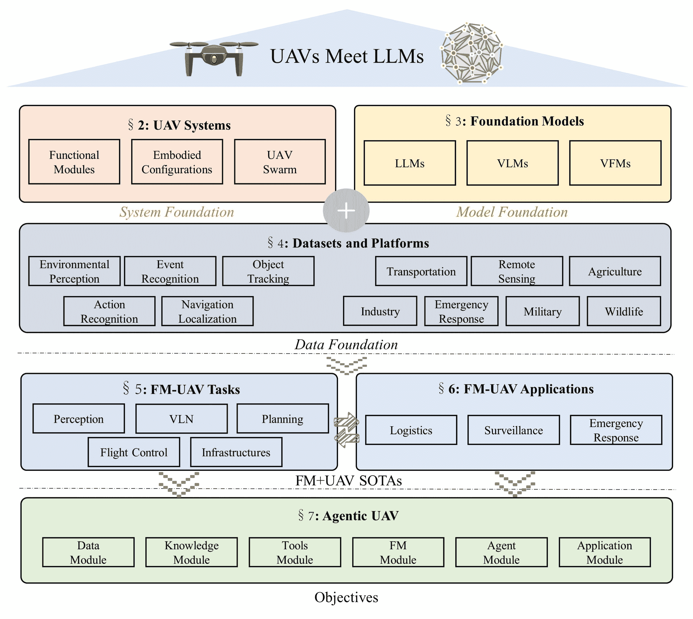
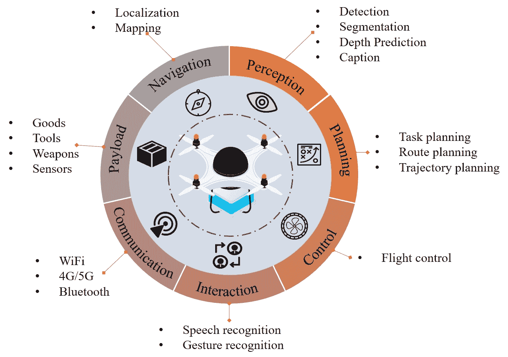
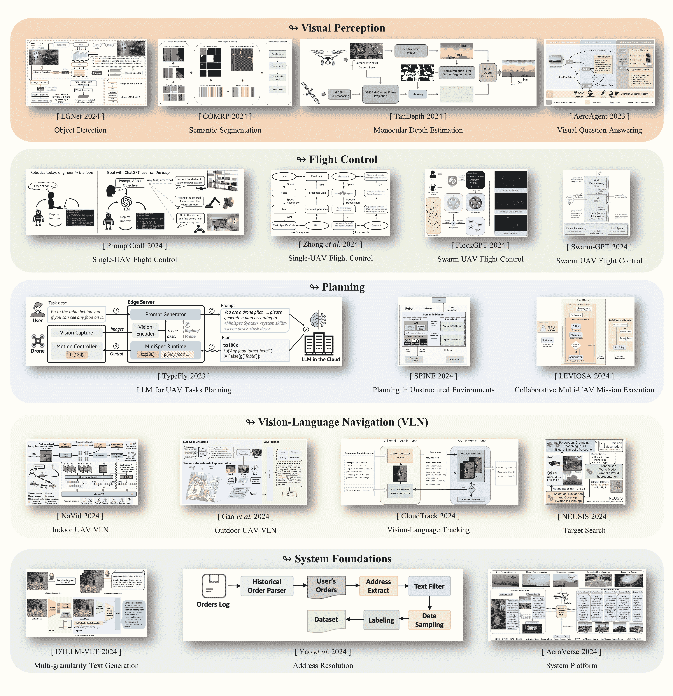
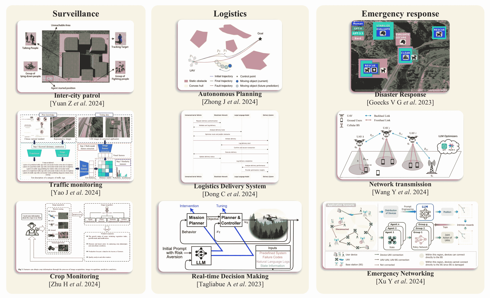
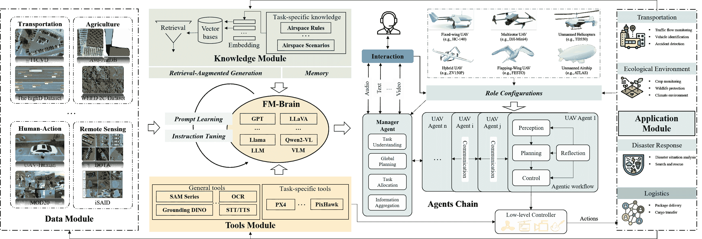

<!--yml
category: 未分类
date: 2025-01-11 11:40:52
-->

# UAVs Meet LLMs: Overviews and Perspectives Toward Agentic Low-Altitude Mobility

> 来源：[https://arxiv.org/html/2501.02341/](https://arxiv.org/html/2501.02341/)

Yonglin Tian¹¹footnotemark: 1 Fei Lin²²footnotemark: 2 Yiduo Li Tengchao Zhang Qiyao Zhang Xuan Fu Jun Huang Xingyuan Dai Yutong Wang Chunwei Tian Bai Li Yisheng Lv Levente Kovács Fei-Yue Wang

###### Abstract

Low-altitude mobility, exemplified by unmanned aerial vehicles (UAVs), has introduced transformative advancements across various domains, like transportation, logistics, and agriculture. Leveraging flexible perspectives and rapid maneuverability, UAVs extend traditional systems’ perception and action capabilities, garnering widespread attention from academia and industry. However, current UAV operations primarily depend on human control, with only limited autonomy in simple scenarios, and lack the intelligence and adaptability needed for more complex environments and tasks. The emergence of large language models (LLMs) demonstrates remarkable problem-solving and generalization capabilities, offering a promising pathway for advancing UAV intelligence. This paper explores the integration of LLMs and UAVs, beginning with an overview of UAV systems’ fundamental components and functionalities, followed by an overview of the state-of-the-art in LLM technology. Subsequently, it systematically highlights the multimodal data resources available for UAVs, which provide critical support for training and evaluation. Furthermore, it categorizes and analyzes key tasks and application scenarios where UAVs and LLMs converge. Finally, a reference roadmap towards agentic UAVs is proposed, aiming to enable UAVs to achieve agentic intelligence through autonomous perception, memory, reasoning, and tool utilization. Related resources are available at [https://github.com/Hub-Tian/UAVs_Meet_LLMs](https://github.com/Hub-Tian/UAVs_Meet_LLMs).

###### keywords:

Unmanned aerial vehicles , large language models , foundation intelligence , low altitude mobility systems^(cor1)^(cor1)footnotetext: Equal contribution\affiliation

[label1]organization=The State Key Laboratory of Multimodal Artificial Intelligence Systems, Institute of Automation, Chinese Academy of Sciences,city=Beijing, postcode=100190, state=, country=China

\affiliation

[label2]organization=Department of Engineering Science, Faculty of Innovation Engineering, Macau University of Science and Technology,city=Macau, postcode=999078, state=, country=China \affiliation[label3]organization=School of Automation, Beijing Institute of Technology,city=Beijing, postcode=100081, state=, country=China \affiliation[label4]organization=School of Software, Northwestern Polytechnical University,city=Xi’an, postcode=710129, state=, country=China

\affiliation

[label5]organization=College of Mechanical and Vehicle Engineering, Hunan University,city=Changsha, postcode=410082, state=, country=China \affiliation[label6]organization=John von Neumann Faculty of Informatics, Obuda University,city=Budapest, postcode=H-1034, state=, country=Hungary

## 1 Introduction

The rapid development of UAVs has introduced transformative solutions for monitoring and transportation across various sectors, including intelligent transportation, logistics, agriculture, and industrial inspection. With their flexible spatial mobility, UAVs significantly enhance the perception and decision-making capabilities of intelligent systems, offering a robust approach for upgrading traditional systems and improving operational efficiency. Given these advantages, UAV technology has attracted substantial attention from both academic researchers and industry practitioners.

Despite their promise, the majority of UAVs currently depend on human operators for flight control. This dependency not only incurs high labor costs but also introduces safety risks, as operators are limited by the range and sensitivity of onboard sensors when assessing environmental conditions. Such limitations impede the scalability and broader application of UAVs in complex environments. Furthermore, UAV flight control is inherently challenging due to the high degrees of freedom in movement and the need for precise navigation, obstacle avoidance, and real-time environmental perception, all of which complicate the path toward fully autonomous flight.

Figure 1: Main sections and the structure of this paper

Recent advancements in artificial intelligence, particularly in foundation models (FMs) such as ChatGPT, SORA, and various AI-generated content (AIGC) frameworks, have catalyzed significant transformations across industries. Large language models (LLMs) are endowed with near-human levels of commonsense reasoning and generalization capabilities, enabling advanced understanding, flexible adaptation, and real-time responsiveness in diverse applications. The integration of LLMs with UAV systems offers a promising avenue to enhance autonomy, providing UAVs with advanced reasoning capabilities and enabling more effective responses to dynamic environments.

Initial studies have explored integrating LLMs with UAVs in areas such as navigation [[1](https://arxiv.org/html/2501.02341v1#bib.bib1), [2](https://arxiv.org/html/2501.02341v1#bib.bib2)], perception[[3](https://arxiv.org/html/2501.02341v1#bib.bib3), [4](https://arxiv.org/html/2501.02341v1#bib.bib4)], planning [[5](https://arxiv.org/html/2501.02341v1#bib.bib5), [6](https://arxiv.org/html/2501.02341v1#bib.bib6)]. These early efforts highlight the potential of combining LLMs with UAV systems to foster more sophisticated autonomous behaviors. However, there remains a lack of systematic reviews on the integration of LLMs and UAVs, particularly regarding the frameworks and methodologies that support this interdisciplinary convergence. To advance the understanding of UAV and LLM integration, this paper provides a systematic review of the existing frameworks and methodologies, offering insights into the potential pathways for further advancing this interdisciplinary convergence. The main contributions of this paper are as follows.

1.  1.

    A comprehensive background on the integration of UAVs and FMs is provided, outlining the fundamental components and functional modules of UAV systems as well as the summary of typical FMs. Additionally, a detailed enumeration of publicly available dataset resources is provided, highlighting their critical role in supporting the development, training, and evaluation of intelligent UAV systems.

2.  2.

    A comprehensive review of recent studies on the integration of LLMs with UAVs is conducted, identifying essential methodologies, diverse applications, and key challenges in areas such as navigation, perception, and planning tasks.

3.  3.

    A design framework for Agentic UAVs is proposed, outlining the necessary architecture and capabilities to enable UAVs to achieve autonomous perception, reasoning, memory, and tool utilization, paving the way for their advancement into more intelligent and adaptable systems.

Through these contributions, we aim to provide a foundational overview of the current research landscape at the intersection of UAV technology and LLMs, highlight emerging trends and challenges, and propose directions for future investigation. This survey aspires to serve as a reference for researchers and practitioners seeking to leverage LLM capabilities to advance UAV autonomy and broaden the application potential of unmanned low-altitude mobility systems. The organization of this paper is illustrated in Fig. [1](https://arxiv.org/html/2501.02341v1#S1.F1 "Figure 1 ‣ 1 Introduction ‣ UAVs Meet LLMs: Overviews and Perspectives Toward Agentic Low-Altitude Mobility"). The system knowledge of UAVs and Foundation Models (FMs) is introduced from three perspectives: system foundation, model foundation, and data foundation. Subsequently, the integration of UAVs with FMs is explored, highlighting the state of the arts (SOTAs) in various tasks and applications. Finally, the architecture of agentic UAVs is proposed, outlining the objectives for future development.

## 2 Systematic Overview of UAV Systems

This section provides a brief overview of intelligent UAVs from the perspectives of functional modules and embodied configurations. The functional modules encompass the core components of UAV systems, including the perception module, planning module, communication module, control module, navigation module, human-drone interaction module, and payload module, highlighting their roles and contributions to UAV functionality, as demonstrated in Fig. [2](https://arxiv.org/html/2501.02341v1#S2.F2 "Figure 2 ‣ 2.1.7 Payload Module ‣ 2.1 Functional Modules of UAVs ‣ 2 Systematic Overview of UAV Systems ‣ UAVs Meet LLMs: Overviews and Perspectives Toward Agentic Low-Altitude Mobility"). The embodied configuration aspect focuses on the structural characteristics of UAV systems, covering the designs and applications of fixed-wing UAVs[[7](https://arxiv.org/html/2501.02341v1#bib.bib7)], multirotor UAVs [[8](https://arxiv.org/html/2501.02341v1#bib.bib8), [9](https://arxiv.org/html/2501.02341v1#bib.bib9)], unmanned helicopters [[10](https://arxiv.org/html/2501.02341v1#bib.bib10)], and hybrid UAVs [[11](https://arxiv.org/html/2501.02341v1#bib.bib11)]. Furthermore, focusing on swarm intelligence for UAVs, this section summarizes the advancements in UAV swarm technologies, including communication strategies, formation control methods, and collaborative decision-making mechanisms.

### 2.1 Functional Modules of UAVs

#### 2.1.1 Perception Module

The Perception Module serves as the UAV’s “eyes and ears,” collecting and interpreting data from a variety of onboard sensors to build a comprehensive understanding of the surrounding environment. These sensors include RGB cameras, event-based cameras, thermal cameras, 3D cameras, LiDAR, radar, and ultrasonic sensors [[12](https://arxiv.org/html/2501.02341v1#bib.bib12)]. By converting raw sensor data into actionable insights, such as detecting obstacles, identifying landmarks, and assessing terrain features. The Perception Module provides the situational awareness essential for safe and autonomous flight [[13](https://arxiv.org/html/2501.02341v1#bib.bib13), [14](https://arxiv.org/html/2501.02341v1#bib.bib14)].

Beyond basic environmental monitoring, the Perception Module also supports collaborative tasks in multi-UAV operations, including the detection and tracking of other drones to facilitate coordinated swarm behavior. Advanced computer vision and machine learning techniques play a pivotal role in this process, enhancing the accuracy and robustness of object detection [[15](https://arxiv.org/html/2501.02341v1#bib.bib15), [16](https://arxiv.org/html/2501.02341v1#bib.bib16)], semantic segmentation [[17](https://arxiv.org/html/2501.02341v1#bib.bib17), [18](https://arxiv.org/html/2501.02341v1#bib.bib18)], and motion estimation [[19](https://arxiv.org/html/2501.02341v1#bib.bib19), [20](https://arxiv.org/html/2501.02341v1#bib.bib20)]. Sensor fusion methods are often employed to combine complementary data sources, such as fusing LiDAR depth maps with high-resolution camera imagery, thereby mitigating the limitations of individual sensors while capitalizing on their unique strengths [[21](https://arxiv.org/html/2501.02341v1#bib.bib21), [22](https://arxiv.org/html/2501.02341v1#bib.bib22)]. This robust, multimodal perception framework enables UAVs to adapt to changing conditions (e.g., varying lighting, dynamic environments) and carry out complex missions with minimal human intervention.

#### 2.1.2 Navigation Module

he Navigation Module is responsible for translating the planned trajectories from the Planning Module into precise flight paths by continuously estimating and adjusting the UAV’s position, orientation, and velocity [[23](https://arxiv.org/html/2501.02341v1#bib.bib23)]. To achieve this, it relies on a variety of onboard sensors [[24](https://arxiv.org/html/2501.02341v1#bib.bib24)], such as GPS [[25](https://arxiv.org/html/2501.02341v1#bib.bib25), [26](https://arxiv.org/html/2501.02341v1#bib.bib26)], inertial measurement units [[27](https://arxiv.org/html/2501.02341v1#bib.bib27), [28](https://arxiv.org/html/2501.02341v1#bib.bib28)], visual odometry, and barometric sensors or magnetometers to gather real-time information about the UAV’s state [[29](https://arxiv.org/html/2501.02341v1#bib.bib29), [30](https://arxiv.org/html/2501.02341v1#bib.bib30)]. Sensor-fusion algorithms, including Kalman filters (e.g., Extended or Unscented Kalman Filters) and particle filters, are employed to integrate data from disparate sources, enhancing the reliability and accuracy of state estimation.

In GPS-denied or cluttered environments, the Navigation Module may employ simultaneous localization and mapping techniques or visual SLAM to provide robust localization and environment mapping [[31](https://arxiv.org/html/2501.02341v1#bib.bib31), [29](https://arxiv.org/html/2501.02341v1#bib.bib29), [32](https://arxiv.org/html/2501.02341v1#bib.bib32), [33](https://arxiv.org/html/2501.02341v1#bib.bib33), [34](https://arxiv.org/html/2501.02341v1#bib.bib34)]. Such advanced solutions enable the UAV to maintain a high level of situational awareness even when traditional satellite-based positioning is unavailable or unreliable. By ensuring accurate state estimation and smooth trajectory tracking, the Navigation Module plays a critical role in maintaining overall flight stability and guaranteeing that the UAV adheres to the mission plan throughout its operational timeframe.

#### 2.1.3 Planning Module

The Planning Module is pivotal in translating high-level mission objectives into concrete flight trajectories and actions, relying on input from the Perception Module to ensure safe navigation [[35](https://arxiv.org/html/2501.02341v1#bib.bib35), [36](https://arxiv.org/html/2501.02341v1#bib.bib36)]. Path-planning algorithms span a broad range of techniques aimed at computing feasible and often optimized routes around obstacles. These methods include heuristic algorithms such as the $A*$ algorithm [[37](https://arxiv.org/html/2501.02341v1#bib.bib37)], Evolutionary Algorithms [[38](https://arxiv.org/html/2501.02341v1#bib.bib38)], Simulated Annealing [[39](https://arxiv.org/html/2501.02341v1#bib.bib39), [40](https://arxiv.org/html/2501.02341v1#bib.bib40)], Particle Swarm Optimization [[41](https://arxiv.org/html/2501.02341v1#bib.bib41), [42](https://arxiv.org/html/2501.02341v1#bib.bib42), [43](https://arxiv.org/html/2501.02341v1#bib.bib43)], Pigeon-Inspired Optimization [[44](https://arxiv.org/html/2501.02341v1#bib.bib44)], Artificial Bee Colony [[45](https://arxiv.org/html/2501.02341v1#bib.bib45), [46](https://arxiv.org/html/2501.02341v1#bib.bib46)], etc. Machine learning approaches, including Neural Networks [[47](https://arxiv.org/html/2501.02341v1#bib.bib47), [48](https://arxiv.org/html/2501.02341v1#bib.bib48), [49](https://arxiv.org/html/2501.02341v1#bib.bib49)], and Deep Reinforcement Learning [[50](https://arxiv.org/html/2501.02341v1#bib.bib50), [51](https://arxiv.org/html/2501.02341v1#bib.bib51)]are also employed for more adaptive and data-driven planning. Additionally, sampling-based strategies like Rapidly-exploring Random Trees offer flexible frameworks for dealing with high-dimensional or dynamically changing environments [[52](https://arxiv.org/html/2501.02341v1#bib.bib52)]. By leveraging one or a combination of these methods, UAVs are able to devise safe, collision-free trajectories that optimize key performance metrics, such as travel time, energy consumption, or overall mission efficiency. [[53](https://arxiv.org/html/2501.02341v1#bib.bib53), [54](https://arxiv.org/html/2501.02341v1#bib.bib54), [44](https://arxiv.org/html/2501.02341v1#bib.bib44), [55](https://arxiv.org/html/2501.02341v1#bib.bib55)]. These techniques enable UAVs to operate autonomously within complex or uncertain environments by continuously adapting their planned path in real-time, particularly important when unforeseen changes occur in terrain, obstacle locations, or mission parameters.

In multi-UAV or swarm operations, the Planning Module also plays a key role in coordinating flight routes among individual drones, ensuring collision avoidance and maintaining cohesive group behaviors [[56](https://arxiv.org/html/2501.02341v1#bib.bib56), [57](https://arxiv.org/html/2501.02341v1#bib.bib57), [58](https://arxiv.org/html/2501.02341v1#bib.bib58)]. This collaborative planning capability not only enhances mission efficiency but also reduces the risk of inter-UAV interference. By dynamically updating trajectories and sharing relevant information, the Planning Module underpins robust, reliable operations that align with overall mission goals.

#### 2.1.4 Control Module

The Control Module is responsible for generating low-level commands that regulate the UAV’s actuators—including motors, servos, and other control surfaces—to maintain stable and responsive flight. Acting as the “muscle” of the system, it continuously adjusts key parameters such as altitude, velocity, orientation, and attitude in response to real-time feedback from onboard sensors. By closing the control loop with reference inputs provided by the Navigation and Planning Modules, the Control Module ensures that the UAV adheres to desired flight trajectories and mission objectives [[59](https://arxiv.org/html/2501.02341v1#bib.bib59), [60](https://arxiv.org/html/2501.02341v1#bib.bib60)].

To manage potential disturbances (e.g., wind gusts, payload variations) and compensate for modeling uncertainties, a variety of classical and modern control strategies are employed. Traditional approaches, such as Proportional–Integral–Derivative control [[61](https://arxiv.org/html/2501.02341v1#bib.bib61), [62](https://arxiv.org/html/2501.02341v1#bib.bib62)], offer simplicity and ease of implementation, while more advanced techniques like Model Predictive Control enable predictive action based on system dynamics and constraints. Adaptive control methods further enhance performance by adjusting control parameters in real time as the characteristics of the system evolve [[63](https://arxiv.org/html/2501.02341v1#bib.bib63), [64](https://arxiv.org/html/2501.02341v1#bib.bib64)]. Other robust strategies, such as sliding-mode control or nonlinear control can be used for particularly challenging operating conditions, providing resilience against sensor noise and sudden environmental changes [[65](https://arxiv.org/html/2501.02341v1#bib.bib65), [66](https://arxiv.org/html/2501.02341v1#bib.bib66)].

In multi-rotor UAVs, for example, the Control Module finely tunes individual motor speeds to achieve the appropriate thrust and torque distributions for stable flight, whereas in fixed-wing platforms, it manipulates aerodynamic surfaces to maintain or alter flight paths [[67](https://arxiv.org/html/2501.02341v1#bib.bib67), [68](https://arxiv.org/html/2501.02341v1#bib.bib68), [69](https://arxiv.org/html/2501.02341v1#bib.bib69)]. This tight integration of sensor feedback, control algorithms, and actuator commands allows the UAV to respond quickly to deviations and external perturbations, ensuring smooth and reliable operations throughout the mission.

#### 2.1.5 Communication Module

The Communication Module underpins all data exchanges between the UAV, ground control stations, and other external entities, such as satellites, edge devices, or cloud-based services, ensuring that critical telemetry, control, and payload information flows seamlessly. Typical communication methods range from short-range radio frequency systems and Wi-Fi links to more sophisticated, longer-range networks like 4G, 5G, or even satellite-based links, each selected to meet the specific mission requirements regarding bandwidth, latency, and range [[70](https://arxiv.org/html/2501.02341v1#bib.bib70), [71](https://arxiv.org/html/2501.02341v1#bib.bib71), [72](https://arxiv.org/html/2501.02341v1#bib.bib72), [73](https://arxiv.org/html/2501.02341v1#bib.bib73)].

In UAV swarm operations, the Communication Module becomes particularly vital, it relays commands to and from ground control and facilitates inter-UAV coordination by sharing situational data (e.g., positions, sensor readings) in real time [[73](https://arxiv.org/html/2501.02341v1#bib.bib73), [74](https://arxiv.org/html/2501.02341v1#bib.bib74)]. Robust communication protocols often augmented with encryption and authentication mechanisms guard against unauthorized access and malicious interference, while techniques like adaptive channel selection and multi-hop ad-hoc routing can mitigate signal degradation and ensure reliable connectivity in dynamic environments [[75](https://arxiv.org/html/2501.02341v1#bib.bib75)]. By managing and prioritizing different data streams (telemetry, payload, command and control), the Communication Module serves as the backbone that keeps all subsystems in sync and supports the UAV’s overall operational objectives [[76](https://arxiv.org/html/2501.02341v1#bib.bib76)].

#### 2.1.6 Interaction Module

The Interaction Module is designed to facilitate seamless communication and collaboration between the UAV and human operators or other agents in the operating environment [[77](https://arxiv.org/html/2501.02341v1#bib.bib77), [78](https://arxiv.org/html/2501.02341v1#bib.bib78)]. It encompasses user interfaces and interaction paradigms that may include voice commands, gesture recognition, augmented or virtual reality displays, or touchscreen-based data visualization systems [[79](https://arxiv.org/html/2501.02341v1#bib.bib79), [80](https://arxiv.org/html/2501.02341v1#bib.bib80), [81](https://arxiv.org/html/2501.02341v1#bib.bib81), [82](https://arxiv.org/html/2501.02341v1#bib.bib82), [83](https://arxiv.org/html/2501.02341v1#bib.bib83)]. Additional methods such as adaptive user interface design that tailors the displayed information to the operator’s skill level and workload, or haptic feedback mechanisms that provide tactile alerts for critical events can further enhance situational awareness and user experience [[84](https://arxiv.org/html/2501.02341v1#bib.bib84)]. These interfaces enable ground personnel to issue high-level commands, review mission progress, and intervene when necessary, ensuring that operators maintain oversight and decision-making authority [[85](https://arxiv.org/html/2501.02341v1#bib.bib85)].

In swarm or multi-UAV contexts, the Interaction Module becomes even more integral. It not only allows central decision makers to coordinate multiple drones but also enables human operators to receive aggregated situational data from across the swarm, potentially flagging anomalies or emergent behaviors in real time. These human-UAV interaction channels are particularly critical in collaborative missions (for example, search and rescue, environmental monitoring, or infrastructure inspection), where on-the-spot guidance or feedback may be required to adapt the UAVs’ behavior to evolving conditions [[86](https://arxiv.org/html/2501.02341v1#bib.bib86), [87](https://arxiv.org/html/2501.02341v1#bib.bib87), [88](https://arxiv.org/html/2501.02341v1#bib.bib88)]. By providing robust mechanisms for manual overrides and real-time communication, the Interaction Module strikes a balance between autonomous operation and human-in-the-loop supervision, enhancing both mission effectiveness and operational safety [[87](https://arxiv.org/html/2501.02341v1#bib.bib87), [89](https://arxiv.org/html/2501.02341v1#bib.bib89), [90](https://arxiv.org/html/2501.02341v1#bib.bib90)].

#### 2.1.7 Payload Module

The Payload Module oversees the equipment or cargo the UAV carries to accomplish its mission objectives. Depending on the task, these payloads may range from cameras for surveillance, to delivery packages, to advanced sensors for environmental monitoring, to specialized hardware for tasks such as search and rescue [[91](https://arxiv.org/html/2501.02341v1#bib.bib91)]. Consequently, the Payload Module must address a variety of operational needs, including power supply, secure data transmission, mechanical support, and proper stabilization to ensure reliable performance under diverse conditions [[59](https://arxiv.org/html/2501.02341v1#bib.bib59), [92](https://arxiv.org/html/2501.02341v1#bib.bib92)].

In practice, this module often integrates features such as vibration damping, thermal management, and secure mounting solutions to protect delicate components and maintain optimal functionality during flight. Moreover, in some UAV designs, the Payload Module is designed to be interchangeable. This modular approach, which typically employs standardized mounting and connectivity interfaces, enables rapid swapping of payloads and streamlines the process of configuring a UAV for different mission profiles. As a result, operators can expand the drone’s capabilities without requiring an entirely new platform, thereby enhancing flexibility and reducing both deployment time and cost [[93](https://arxiv.org/html/2501.02341v1#bib.bib93), [94](https://arxiv.org/html/2501.02341v1#bib.bib94), [95](https://arxiv.org/html/2501.02341v1#bib.bib95), [96](https://arxiv.org/html/2501.02341v1#bib.bib96)] .

Overall, the Payload Module plays a crucial role in bridging the UAV’s core flight systems with the mission-specific tools essential for achieving operational objectives. By accommodating a wide range of payloads and ensuring they are powered, protected, and efficiently connected, the Payload Module significantly extends the UAV’s applicability across various industries and mission types.

Figure 2: Key Functional modules of UAV systems

### 2.2 Embodied Configurations of UAVs

UAVs can be categorized into several types based on their geometric configurations. These include fixed-wing UAVs, multirotor UAVs, unmanned helicopters, and other types. Below, we introduce these categories and summarize their characteristics.

#### 2.2.1 Fixed-Wing UAVs

Fixed-wing UAVs feature a predetermined wing shape that generates lift as air flows over the wings, enabling forward motion [[92](https://arxiv.org/html/2501.02341v1#bib.bib92)]. These UAVs are known for their high speed, long endurance, and stable flight, making them ideal for long-duration missions. However, they require advanced piloting skills and cannot perform hovering [[97](https://arxiv.org/html/2501.02341v1#bib.bib97)]. Fixed-wing UAVs are commonly used for monitoring fields, forests, highways, and railways [[92](https://arxiv.org/html/2501.02341v1#bib.bib92)].

#### 2.2.2 Multirotor UAVs

Multirotor UAVs are one of the most prevalent types in daily life, typically equipped with multiple rotors (commonly four, six, or more) to generate lift through rotor rotation. Their advantages include low cost, ease of operation, and the ability for vertical take-off and landing (VTOL) and hovering, making them suitable for precision tasks. However, they have limited endurance and relatively low speed. Multirotor UAVs are often used for tasks such as photography, agricultural monitoring, and spraying.

#### 2.2.3 Unmanned Helicopters

Unmanned helicopters are equipped with one or two powered rotors to provide lift and enable attitude control. This design allows for vertical take-off, hovering, and high maneuverability. Compared to multirotor UAVs, unmanned helicopters have superior payload capacity, enabling them to carry heavier equipment or sensors. Their strengths include long endurance and excellent wind resistance, making them stable even in strong winds. The main limitation is their relatively low speed. Unmanned helicopters find widespread applications in areas such as traffic surveillance, resource exploration, forest fire prevention, and military reconnaissance.

#### 2.2.4 Hybrid UAV

Hybrid UAVs combine the strengths of both fixed-wing and multirotor UAVs, offering a versatile design that allows for VTOL while also achieving the long endurance and high speed typical of fixed-wing UAVs. These UAVs typically feature a combination of rotors for lift during vertical flight and wings for sustained forward motion. The main advantage of hybrid UAVs is their flexibility, enabling them to perform a wide range of missions, including those requiring both hovering and long-duration flight. However, the complexity of their design and mechanisms results in higher costs and more demanding maintenance.

#### 2.2.5 Flapping-Wing UAV

Flapping-wing UAVs are bio-inspired unmanned aerial vehicles that mimic the flight mechanisms of birds or insects. These UAVs rely on unsteady aerodynamic effects generated by wing flapping to achieve flight. They offer quieter operation, higher efficiency, and increased maneuverability compared to conventional UAVs. Their compact size is a notable advantage, but they generally have a lower payload capacity. Additionally, the design and control systems of flapping-wing UAVs are more complex due to the dynamic nature of their flight mechanics.

#### 2.2.6 Unmanned Airship

Unmanned airships are a type of aerial vehicle that utilizes lightweight gases for buoyancy and employs propulsion and external structural elements for movement and directional control. These airships are highly cost-effective and produce low flight noise. However, their agility is limited, and they operate at relatively low speeds. Due to their large size, unmanned airships are highly susceptible to wind influences, which can affect their stability and operational reliability.

Table 1: Typical configurations of UAV

| Category | Characteristics | Advantages | Disadvantages |
| Fixed-wing UAV | Fixed wings generate lift with forward motion. | High speed, long endurance, stable flight. | Cannot hover, high demands for takeoff/landing areas. |
| Multirotor UAV | Multiple rotors provide lift and control. | Low cost, easy operation, capable of VTOL and hovering. | Limited flight time, low speed, small payload capacity. |
| Unmanned Helicopter | Single or dual rotors allow vertical take-off and hovering. | High payload capacity, good wind resistance, long endurance, VTOL. | Complex structure, higher maintenance cost, slower than fixed-wing UAVs. |
| Hybrid UAV | Combines fixed-wing and multirotor capabilities. | Flexible missions, long endurance, VTOL. | Complex mechanisms, higher cost. |
| Flapping-wing UAV | Uses clap-and-fling mechanism for flight. | Low noise, high propulsion efficiency, high maneuverability. | Complex analysis and control, limited payload capacity. |
| Unmanned airship | Aerostat aircraft with gasbag for lift. | Low cost, low noise. | low speed, low maneuverability, highly affected by wind. |

### 2.3 UAV Swarm

UAV swarms involve multiple UAVs working collaboratively to achieve a shared objective, offering advantages in redundancy, scalability, and efficiency compared to individual UAV operations[[98](https://arxiv.org/html/2501.02341v1#bib.bib98)]. The swarm approach relies on decentralized decision-making, allowing UAVs to adjust their behaviors in response to the actions of their peers and environmental changes. Swarm algorithms often draw inspiration from biological systems[[99](https://arxiv.org/html/2501.02341v1#bib.bib99)], such as flocks of birds or colonies of ants, utilizing techniques like consensus algorithms[[100](https://arxiv.org/html/2501.02341v1#bib.bib100)], particle swarm optimization[[101](https://arxiv.org/html/2501.02341v1#bib.bib101)], or behavior-based coordination[[102](https://arxiv.org/html/2501.02341v1#bib.bib102)]. Effective swarm operation requires seamless communication, robust control mechanisms, and cooperative planning to manage the complexities of distributed systems[[103](https://arxiv.org/html/2501.02341v1#bib.bib103)]. This concept is particularly useful in applications like large-area surveillance, precision agriculture, and search and rescue, where multiple UAVs can cover a greater area more efficiently than a single vehicle.

In this section, we will discuss key components essential for effective UAV swarm operation, including task allocation, communication architecture, path planning, and formation control.

#### 2.3.1 Task allocation in UAV swarm

UAV swarms can be regarded as a team tasked with executing a given mission, consisting of a set of tasks, and they must be responsible for task allocation among their members internally[[104](https://arxiv.org/html/2501.02341v1#bib.bib104)]. Task allocation is one of the most important problems in UAV swarm operations, as it directly affects the efficiency of the mission. It has been proven that finding the optimal solution to the task allocation problem is NP-hard, and the difficulty increases exponentially with the scale of the UAV swarm and the number of tasks[[105](https://arxiv.org/html/2501.02341v1#bib.bib105)]. Typically, the UAV swarm task allocation problem is modeled as a Traveling Salesman Problem (TSP)[[106](https://arxiv.org/html/2501.02341v1#bib.bib106)] or Vehicle Routing Problem (VRP)[[107](https://arxiv.org/html/2501.02341v1#bib.bib107)], mixed-integer linear programming (MILP) model[[108](https://arxiv.org/html/2501.02341v1#bib.bib108)], or a cooperative multi-task allocation problem (CMTAP) model[[109](https://arxiv.org/html/2501.02341v1#bib.bib109)]. Commonly used algorithms include heuristic algorithms, AI-based methods, mathematical programming methods, and market mechanism-based algorithm.

Heuristic algorithms commonly applied to the task allocation problem include Genetic Algorithms (GA), Particle Swarm Optimization (PSO), and Simulated Annealing (SA), among others. These algorithms use random search methods to find feasible solutions, preventing the problem from getting trapped in local optima. Genetic algorithms generate random solutions through crossover and mutation strategies, and then iteratively improve these solutions by selecting the best candidates. Eventually, they converge to a solution close to the optimal. For example, Han et al.[[110](https://arxiv.org/html/2501.02341v1#bib.bib110)] proposed a Fuzzy Elite Strategy Genetic Algorithm (FESGA) to efficiently solve complex task allocation problems. Yan et al.[[111](https://arxiv.org/html/2501.02341v1#bib.bib111)] proposed an improved genetic algorithm to address the integrated task allocation and path planning problem for multi-UAVs attacking multiple targets.

PSO balances exploration and exploitation processes and iteratively produces solutions that approach the optimal. The algorithm is simple to implement, fast, and widely applied in task allocation problems. Jiang et al.[[112](https://arxiv.org/html/2501.02341v1#bib.bib112)] proposed an improved PSO algorithm to solve multi-constraint task allocation problems, which is suitable for solving complex combinatorial optimization problems. Since most research treats multi-UAV task allocation as a single-objective optimization problem, Gao et al.[[113](https://arxiv.org/html/2501.02341v1#bib.bib113)] applied an improved Multi-Objective PSO (MOPSO) algorithm to solve the task allocation problem for multiple UAVs.

Mathematical programming methods offer the advantage of finding precise optimal solutions, but their solving time increases exponentially as the problem size grows. Choi et al.[[114](https://arxiv.org/html/2501.02341v1#bib.bib114)] modeled the task allocation problem, where multiple UAVs perform tasks across multiple targets, as a Mixed-Integer Linear Programming (MILP) model for solution.

AI-based methods, such as reinforcement learning and artificial neural networks, are advantageous in extracting environmental features. Yang et al.[[115](https://arxiv.org/html/2501.02341v1#bib.bib115)] proposed a task scheduling algorithm based on reinforcement learning, enabling UAVs to dynamically adjust their task strategies based on their task performance efficiency calculations. Yin et al.[[116](https://arxiv.org/html/2501.02341v1#bib.bib116)] applied deep transfer reinforcement learning to the multi-UAV task allocation problem.

Market mechanism-based methods are classical distributed approaches to task allocation, including auction-based algorithms and the Contract Net Protocol (CNP) algorithm[[117](https://arxiv.org/html/2501.02341v1#bib.bib117)]. These methods leverage incentive mechanisms to encourage agents to participate in the task allocation process, where agents bid based on the utility or cost of the task, aiming to maximize utility or minimize cost. The primary advantage of these methods is their computational efficiency[[118](https://arxiv.org/html/2501.02341v1#bib.bib118)]. Qiao et al.[[119](https://arxiv.org/html/2501.02341v1#bib.bib119)] applied an auction algorithm for dynamic UAV task allocation, addressing the multi-constraint, multi-UAV dynamic task allocation problem. Duan et al.[[120](https://arxiv.org/html/2501.02341v1#bib.bib120)] proposed a hybrid “two-stage” auction algorithm with a hierarchical decision mechanism and improved objective functions, which enhanced performance in multi-UAV dynamic task allocation by simultaneously achieving heterogeneous task allocation and obstacle avoidance under resource constraints. This algorithm outperforms many state-of-the-art models in terms of efficiency and robustness. Zhang et al.[[121](https://arxiv.org/html/2501.02341v1#bib.bib121)] developed a multi-constraint model for dynamic multi-UAV task scheduling, focusing on maximizing total task profit, minimizing time consumption, and balancing task distribution among UAVs. They introduced a hybrid Contract Net Protocol-based task scheduling method, including buy-sell, swap, and replacement contracts. Wang et al.[[122](https://arxiv.org/html/2501.02341v1#bib.bib122)] proposed a two-stage distributed task allocation algorithm (TS-DTA) based on CNP, effectively addressing the task reallocation problem in dynamic environments.

#### 2.3.2 Communication architecture in UAV swarm

For UAV swarms, communication is essential for coordination, enabling collaborative work and maintaining stability during operations. Communication can be achieved through two main approaches: infrastructure-based architectures [[123](https://arxiv.org/html/2501.02341v1#bib.bib123)] and Flying Ad-hoc Network (FANET) architectures [[124](https://arxiv.org/html/2501.02341v1#bib.bib124)]. Each method offers unique advantages and challenges, which will be discussed below.

Infrastructure-based Architectures: This architecture depends on ground control stations (GCS) [[70](https://arxiv.org/html/2501.02341v1#bib.bib70)] to manage the swarm. The GCS collects telemetry data from UAVs and transmits commands, either in real-time or through pre-programmed instructions. Its key advantages include centralized computation and real-time optimization, eliminating the need for inter-drone communication networks [[123](https://arxiv.org/html/2501.02341v1#bib.bib123)]. However, this approach has notable limitations: the entire system is vulnerable to single-point failures in the GCS, UAVs must remain within the GCS communication range, and the architecture lacks the flexibility of distributed decision-making [[123](https://arxiv.org/html/2501.02341v1#bib.bib123)].

Flying Ad-hoc Network (FANET) Architecture: FANETs consist of UAVs communicating directly with one another without needing a central access point. This decentralized network enables UAVs to coordinate tasks autonomously, with at least one UAV maintaining a link to a ground base or satellite. FANETs benefit from flexibility, scalability, and reduced dependency on infrastructure. However, they require robust communication protocols and may face challenges in managing dynamic topologies and ensuring reliability [[124](https://arxiv.org/html/2501.02341v1#bib.bib124)].

#### 2.3.3 Path planning in UAV swarm

UAV swarm path planning refers to selecting an optimal path for the UAV swarm from the starting position to all target positions, while ensuring the predefined distance between UAVs to avoid collisions[[125](https://arxiv.org/html/2501.02341v1#bib.bib125)]. The optimal path generally refers to the shortest path length, shortest travel time, least energy consumption, and other event-specific constraints[[125](https://arxiv.org/html/2501.02341v1#bib.bib125)]. The criteria for the optimal path need to be determined based on the actual problem. UAV path planning algorithms can generally be divided into three major categories: intelligent optimization algorithms, mathematical programming methods, and AI-based approaches. Below, we briefly introduce these three methods.

In nature, various group behaviors, such as flocks of birds, schools of fish, and ant colonies, follow specific rules that enable efficient food searching or migration. These behaviors can be abstracted into mathematical models for information transfer, path planning, and coordinated control, which are applicable to UAV swarm scheduling. Common intelligent optimization algorithms for UAV swarms include Ant Colony Optimization (ACO), Genetic Algorithms (GA), Simulated Annealing (SA), and Particle Swarm Optimization (PSO). For instance, ACO mimics the foraging behavior of ants, where ants probabilistically select paths based on pheromone concentration, ultimately finding optimal or near-optimal solutions. Researchers such as Turker et al.[[126](https://arxiv.org/html/2501.02341v1#bib.bib126)] have applied SA to UAV swarm path planning, while Wei et al.[[127](https://arxiv.org/html/2501.02341v1#bib.bib127)] used ACO for the same purpose.

Beyond heuristic algorithms inspired by nature, mathematical models like Mixed-Integer Linear Programming (MILP) and Nonlinear Programming can be directly applied to UAV swarm scheduling for precise solutions. For example, Ragi et al.[[128](https://arxiv.org/html/2501.02341v1#bib.bib128)] used Mixed-Integer Nonlinear Programming (MINLP) to address UAV path planning. While these methods are effective for small-scale problems, their computational complexity increases exponentially as the problem size grows.

With the rise of machine learning, AI-based algorithms have also been applied to UAV swarm scheduling and optimization. Kool et al.[[129](https://arxiv.org/html/2501.02341v1#bib.bib129)] used deep learning for vehicle routing, and similar approaches have been adopted in UAV swarm path planning. Xia et al.[[130](https://arxiv.org/html/2501.02341v1#bib.bib130)] applied neural networks to UAV path planning, Sanna et al.[[131](https://arxiv.org/html/2501.02341v1#bib.bib131)] extended this to multi-UAV planning, and Puente-Castro et al.[[54](https://arxiv.org/html/2501.02341v1#bib.bib54)] applied reinforcement learning. By training on extensive datasets, neural networks can learn to model the environment, including obstacles and their dynamic changes, thereby improving the accuracy of path planning.

#### 2.3.4 UAV Swarm Formation Control Algorithm

The UAV swarm relies on effective formation control algorithms that enable it to autonomously form and maintain a formation to perform tasks, and switch or rebuild the formation based on specific tasks[[132](https://arxiv.org/html/2501.02341v1#bib.bib132)]. The primary approaches to formation control are centralized, decentralized, and distributed control algorithms [[133](https://arxiv.org/html/2501.02341v1#bib.bib133)].

Centralized Control: Centralized control involves a central unit that oversees task allocation and resource management, with individual UAVs primarily responsible for data input, output, and storage [[132](https://arxiv.org/html/2501.02341v1#bib.bib132)]. This approach simplifies decision-making, ensures coordinated actions, and is relatively straightforward to implement. However, it is susceptible to high communication overhead and single points of failure; if the central unit fails, the entire system may collapse. Common methods in centralized control include virtual structure [[134](https://arxiv.org/html/2501.02341v1#bib.bib134)] and leader-follower approaches [[135](https://arxiv.org/html/2501.02341v1#bib.bib135), [136](https://arxiv.org/html/2501.02341v1#bib.bib136)].

Decentralized Control: In decentralized control, each UAV makes decisions based on local sensors and controllers, without requiring explicit communication with other UAVs [[137](https://arxiv.org/html/2501.02341v1#bib.bib137)]. UAVs adjust their movements to maintain formation based on local conditions and predefined rules. The primary advantages of this approach include flexibility and ease of adapting formations. However, the lack of access to global information results in poor control performance, requiring continuous iteration[[138](https://arxiv.org/html/2501.02341v1#bib.bib138)].

Distributed Control: Distributed control involves extensive communication between UAVs, enabling them to coordinate and maintain formation through shared information. UAVs work collaboratively to make optimal decisions based on both local data and pre-established rules. Compared to decentralized control, distributed control benefits from more robust collaboration and improved flexibility. However, it requires higher communication demands and more complex algorithms to manage coordination, which increases both the computational burden and the risk of communication failures. Typical methods include behavior method[[139](https://arxiv.org/html/2501.02341v1#bib.bib139)] and consistency method[[140](https://arxiv.org/html/2501.02341v1#bib.bib140)].

## 3 Preliminaries on Foundation models

This section provides an overview of FMs, including LLMs, Vision Foundation Models (VFMs), and Vision Language Models (VLMs). It highlights their core characteristics and technical advantages, with the aim of offering foundational insights and guidance for the deep integration of these models with UAV systems.

Table 2: Summarization of LLMs, VLMs, and VFMs.

| Category | Subcategory | Model Name | Institution / Author |
| LLMs | General | GPT-3[[141](https://arxiv.org/html/2501.02341v1#bib.bib141)], GPT-3.5[[142](https://arxiv.org/html/2501.02341v1#bib.bib142)], GPT-4[[143](https://arxiv.org/html/2501.02341v1#bib.bib143)] | [OpenAI](https://openai.com) |
|  |  | Claude 2, Claude 3[[144](https://arxiv.org/html/2501.02341v1#bib.bib144), [145](https://arxiv.org/html/2501.02341v1#bib.bib145), [146](https://arxiv.org/html/2501.02341v1#bib.bib146)] | [Anthropic](https://www.anthropic.com) |
|  |  | Mistral series[[147](https://arxiv.org/html/2501.02341v1#bib.bib147), [148](https://arxiv.org/html/2501.02341v1#bib.bib148)] | [Mistral AI](https://www.mistral.ai) |
|  |  | PaLM series[[149](https://arxiv.org/html/2501.02341v1#bib.bib149), [150](https://arxiv.org/html/2501.02341v1#bib.bib150)], Gemini series[[151](https://arxiv.org/html/2501.02341v1#bib.bib151), [152](https://arxiv.org/html/2501.02341v1#bib.bib152)] | [Google Research](https://ai.google) |
|  |  | LLaMA[[153](https://arxiv.org/html/2501.02341v1#bib.bib153)], LLaMA2[[154](https://arxiv.org/html/2501.02341v1#bib.bib154)], LLaMA3[[155](https://arxiv.org/html/2501.02341v1#bib.bib155)] | [Meta AI](https://ai.meta.com) |
|  |  | Vicuna[[156](https://arxiv.org/html/2501.02341v1#bib.bib156)] | [Vicuna Team](https://vicuna.lmsys.org) |
|  |  | Qwen series[[157](https://arxiv.org/html/2501.02341v1#bib.bib157), [158](https://arxiv.org/html/2501.02341v1#bib.bib158)] | [Qwen Team, Alibaba Group](https://github.com/QwenLM) |
|  |  | InternLM[[159](https://arxiv.org/html/2501.02341v1#bib.bib159)] | [Shanghai AI Laboratory](https://github.com/InternLM/InternLM) |
|  |  | BuboGPT[[160](https://arxiv.org/html/2501.02341v1#bib.bib160)] | [Bytedance](https://github.com/magic-research/bubogpt) |
|  |  | ChatGLM[[161](https://arxiv.org/html/2501.02341v1#bib.bib161), [162](https://arxiv.org/html/2501.02341v1#bib.bib162), [163](https://arxiv.org/html/2501.02341v1#bib.bib163)] | [Zhipu AI](https://github.com/THUDM) |
|  |  | DeepSeek series[[164](https://arxiv.org/html/2501.02341v1#bib.bib164), [165](https://arxiv.org/html/2501.02341v1#bib.bib165), [166](https://arxiv.org/html/2501.02341v1#bib.bib166)] | [DeepSeek](https://github.com/deepseek-ai) |
| VLMs | General | GPT-4V[[167](https://arxiv.org/html/2501.02341v1#bib.bib167)], GPT-4o, GPT-4o mini, GPT o1-preview | [OpenAI](https://openai.com) |
|  |  | Claude 3 Opus, Claude 3.5 Sonnet[[168](https://arxiv.org/html/2501.02341v1#bib.bib168)] | [Anthropic](https://www.anthropic.com) |
|  |  | Step-2 | [Jieyue Xingchen](https://www.stepfun.com/) |
|  |  | LLaVA[[169](https://arxiv.org/html/2501.02341v1#bib.bib169)], LLaVA-1.5[[170](https://arxiv.org/html/2501.02341v1#bib.bib170)], LLaVA-NeXT[[171](https://arxiv.org/html/2501.02341v1#bib.bib171)] | [Liu *et al*.](https://github.com/haotian-liu/LLaVA) |
|  |  | MoE-LLaVA[[172](https://arxiv.org/html/2501.02341v1#bib.bib172)] | [Lin *et al*.](https://github.com/PKU-YuanGroup/MoE-LLaVA) |
|  |  | LLaVA-CoT[[173](https://arxiv.org/html/2501.02341v1#bib.bib173)] | [Xu *et al*.](https://github.com/PKU-YuanGroup/LLaVA-CoT) |
|  |  | Flamingo[[174](https://arxiv.org/html/2501.02341v1#bib.bib174)] | [Alayrac *et al*.](https://github.com/mlfoundations/open_flamingo) |
|  |  | BLIP[[175](https://arxiv.org/html/2501.02341v1#bib.bib175)] | [Li *et al*.](https://github.com/salesforce/BLIP) |
|  |  | BLIP-2[[176](https://arxiv.org/html/2501.02341v1#bib.bib176)] | [Li *et al*.](https://github.com/salesforce/LAVIS/tree/main/projects/blip2) |
|  |  | InstructBLIP[[177](https://arxiv.org/html/2501.02341v1#bib.bib177)] | [Dai *et al*.](https://github.com/salesforce/LAVIS/tree/main/projects/instructblip) |
|  | Video Understanding | LLaMA-VID[[178](https://arxiv.org/html/2501.02341v1#bib.bib178)] | [Li *et al*.](https://github.com/dvlab-research/LLaMA-VID) |
|  |  | IG-VLM[[179](https://arxiv.org/html/2501.02341v1#bib.bib179)] | [Kim *et al*.](https://github.com/imagegridworth/IG-VLM) |
|  |  | Video-ChatGPT[[180](https://arxiv.org/html/2501.02341v1#bib.bib180)] | [Maaz *et al*.](https://github.com/mbzuai-oryx/Video-ChatGPT) |
|  |  | VideoTree[[181](https://arxiv.org/html/2501.02341v1#bib.bib181)] | [Wang *et al*.](https://github.com/Ziyang412/VideoTree) |
|  | Visual Reasoning | X-VLM[[182](https://arxiv.org/html/2501.02341v1#bib.bib182)] | [Zeng *et al*.](https://github.com/zengyan-97/X-VLM) |
|  |  | Chameleon[[183](https://arxiv.org/html/2501.02341v1#bib.bib183)] | [Lu *et al*.](https://chameleon-llm.github.io/) |
|  |  | HYDRA[[184](https://arxiv.org/html/2501.02341v1#bib.bib184)] | [Ke *et al*.](https://hydra-vl4ai.github.io/) |
|  |  | VISPROG[[185](https://arxiv.org/html/2501.02341v1#bib.bib185)] | [PRIOR @ Allen Institute for AI](https://prior.allenai.org/projects/visprog) |
| VFMs | General | CLIP[[186](https://arxiv.org/html/2501.02341v1#bib.bib186)] | [OpenAI](https://github.com/OpenAI/CLIP) |
|  |  | FILIP[[187](https://arxiv.org/html/2501.02341v1#bib.bib187)] | Yao *et al*. |
|  |  | RegionCLIP[[188](https://arxiv.org/html/2501.02341v1#bib.bib188)] | [Microsoft Research](https://github.com/microsoft/RegionCLIP) |
|  |  | EVA-CLIP[[189](https://arxiv.org/html/2501.02341v1#bib.bib189)] | [Sun *et al*.](https://github.com/baaivision/EVA/tree/master/EVA-CLIP) |
|  | Object Detection | GLIP[[190](https://arxiv.org/html/2501.02341v1#bib.bib190)] | [Microsoft Research](https://github.com/microsoft/GLIP) |
|  |  | DINO[[191](https://arxiv.org/html/2501.02341v1#bib.bib191)] | [Zhang *et al*.](https://github.com/IDEA-Research/DINO) |
|  |  | Grounding-DINO[[192](https://arxiv.org/html/2501.02341v1#bib.bib192)] | [Liu *et al*.](https://github.com/IDEA-Research/GroundingDINO) |
|  |  | DINOv2[[193](https://arxiv.org/html/2501.02341v1#bib.bib193)] | [Meta AI Research](https://github.com/facebookresearch/dinov2) |
|  |  | AM-RADIO[[194](https://arxiv.org/html/2501.02341v1#bib.bib194)] | [NVIDIA](https://github.com/NVlabs/RADIO) |
|  |  | DINO-WM[[195](https://arxiv.org/html/2501.02341v1#bib.bib195)] | [Zhou *et al*.](https://dino-wm.github.io/) |
|  |  | YOLO-World[[196](https://arxiv.org/html/2501.02341v1#bib.bib196)] | [Cheng *et al*.](https://github.com/AILabCVC/YOLO-World) |
|  | Image Segmentation | CLIPSeg[[197](https://arxiv.org/html/2501.02341v1#bib.bib197)] | [Lüdecke and Ecker](https://github.com/timojl/clipseg) |
|  |  | SAM[[198](https://arxiv.org/html/2501.02341v1#bib.bib198)] | [Meta AI Research, FAIR](https://segment-anything.com) |
|  |  | Embodied-SAM[[199](https://arxiv.org/html/2501.02341v1#bib.bib199)] | [Xu *et al*.](https://github.com/xuxw98/ESAM) |
|  |  | Point-SAM[[200](https://arxiv.org/html/2501.02341v1#bib.bib200)] | [Zhou *et al*.](https://github.com/zyc00/Point-SAM) |
|  |  | Open-Vocabulary SAM[[201](https://arxiv.org/html/2501.02341v1#bib.bib201)] | [Yuan *et al*.](https://www.mmlab-ntu.com/project/ovsam/) |
|  |  | TAP[[202](https://arxiv.org/html/2501.02341v1#bib.bib202)] | [Pan *et al*.](https://github.com/baaivision/tokenize-anything) |
|  |  | EfficientSAM[[203](https://arxiv.org/html/2501.02341v1#bib.bib203)] | [Xiong *et al*.](https://yformer.github.io/efficient-sam/) |
|  |  | MobileSAM[[204](https://arxiv.org/html/2501.02341v1#bib.bib204)] | [Zhang *et al*.](https://github.com/ChaoningZhang/MobileSAM) |
|  |  | SAM 2[[205](https://arxiv.org/html/2501.02341v1#bib.bib205)] | [Meta AI Research, FAIR](https://ai.meta.com/sam2/) |
|  |  | SAMURAI[[206](https://arxiv.org/html/2501.02341v1#bib.bib206)] | [University of Washington](https://github.com/yangchris11/samurai) |
|  |  | SegGPT[[207](https://arxiv.org/html/2501.02341v1#bib.bib207)] | [Wang *et al*.](https://github.com/baaivision/Painter) |
|  |  | Osprey[[208](https://arxiv.org/html/2501.02341v1#bib.bib208)] | [Yuan *et al*.](https://github.com/CircleRadon/Osprey) |
|  |  | SEEM[[209](https://arxiv.org/html/2501.02341v1#bib.bib209)] | [Zou *et al*.](https://github.com/UX-Decoder/Segment-Everything-Everywhere-All-At-Once) |
|  |  | Seal[[210](https://arxiv.org/html/2501.02341v1#bib.bib210)] | [Liu *et al*.](https://github.com/youquanl/Segment-Any-Point-Cloud) |
|  |  | LISA[[211](https://arxiv.org/html/2501.02341v1#bib.bib211)] | [Lai *et al*.](https://github.com/dvlabresearch/LISA) |
|  | Depth Estimation | ZoeDepth[[212](https://arxiv.org/html/2501.02341v1#bib.bib212)] | [Bhat *et al*.](https://github.com/isl-org/ZoeDepth) |
|  |  | ScaleDepth[[213](https://arxiv.org/html/2501.02341v1#bib.bib213)] | [Zhu *et al*.](https://ruijiezhu94.github.io/ScaleDepth/) |
|  |  | Depth Anything[[214](https://arxiv.org/html/2501.02341v1#bib.bib214)] | [Yang *et al*.](https://depth-anything.github.io) |
|  |  | Depth Anything V2[[215](https://arxiv.org/html/2501.02341v1#bib.bib215)] | [Yang *et al*.](https://depth-anything-v2.github.io/) |
|  |  | Depth Pro[[216](https://arxiv.org/html/2501.02341v1#bib.bib216)] | [Apple](https://github.com/apple/ml-depth-pro) |

### 3.1 LLMs

In recent years, LLMs have seen rapid advancements, with increasingly larger models being trained on diverse, large-scale corpora [[217](https://arxiv.org/html/2501.02341v1#bib.bib217)]. These models have consistently set new performance benchmarks in various NLP tasks and have been widely adopted in both academic research and industrial applications [[218](https://arxiv.org/html/2501.02341v1#bib.bib218), [219](https://arxiv.org/html/2501.02341v1#bib.bib219), [220](https://arxiv.org/html/2501.02341v1#bib.bib220), [221](https://arxiv.org/html/2501.02341v1#bib.bib221)]. This section provides an overview of the core capabilities of LLMs, including their generalization and reasoning abilities, followed by an introduction to typical LLMs from leading research organizations.

#### 3.1.1 Core Capabilities of LLMs

Generalization Capability: Benefiting from training on large-scale corpora and the substantial size of the models, LLMs exhibit strong transfer capabilities, including zero-shot and few-shot learning. These capabilities enable LLMs to generalize effectively to new tasks, either without task-specific examples or with limited guidance, making them versatile tools for a wide range of applications. In zero-shot learning, without additional task-specific training, LLMs can solve relevant problems solely through natural language instructions. In few-shot learning, the model can quickly adapt to new tasks by leveraging several examples from the support set along with the corresponding task instructions [[222](https://arxiv.org/html/2501.02341v1#bib.bib222)].

The design of natural language instructions or prompts is crucial in enhancing generalization capability. Prompts not only provide natural language descriptions of tasks but also guide the model to perform tasks accurately based on input examples [[223](https://arxiv.org/html/2501.02341v1#bib.bib223), [141](https://arxiv.org/html/2501.02341v1#bib.bib141), [143](https://arxiv.org/html/2501.02341v1#bib.bib143)]. Furthermore, LLMs exhibit in-context learning, which allows them to learn and adapt to new tasks directly from the context provided within the prompt, such as task instructions and examples, without requiring any explicit retraining or model updates [[141](https://arxiv.org/html/2501.02341v1#bib.bib141), [224](https://arxiv.org/html/2501.02341v1#bib.bib224), [225](https://arxiv.org/html/2501.02341v1#bib.bib225)].

Complex Problem-Solving Capability: LLMs demonstrate a remarkable ability to solve complex problems by generating intermediate reasoning steps or structured logical pathways, facilitating a systematic and step-by-step approach to addressing challenges. This capability is exemplified by the Chain of Thought (CoT) framework, where intricate problems are decomposed into a series of manageable sub-tasks, each solved sequentially using examples of step-by-step reasoning [[226](https://arxiv.org/html/2501.02341v1#bib.bib226), [227](https://arxiv.org/html/2501.02341v1#bib.bib227), [228](https://arxiv.org/html/2501.02341v1#bib.bib228), [229](https://arxiv.org/html/2501.02341v1#bib.bib229)]. Besides, LLMs also demonstrate advanced capabilities in task planning and the orchestration of tools, enabling them to invoke appropriate resources to address specific sub-task requirements and efficiently integrate workflows to achieve comprehensive solutions [[230](https://arxiv.org/html/2501.02341v1#bib.bib230), [231](https://arxiv.org/html/2501.02341v1#bib.bib231), [232](https://arxiv.org/html/2501.02341v1#bib.bib232)].

#### 3.1.2 Typical LLMs

Several notable milestones have marked the development of LLMs. OpenAI’s GPT series, spanning GPT-3, GPT-3.5, and GPT-4, has set benchmarks in language understanding, generation, and reasoning tasks by leveraging extensive parameters and optimized architectures [[141](https://arxiv.org/html/2501.02341v1#bib.bib141), [142](https://arxiv.org/html/2501.02341v1#bib.bib142), [143](https://arxiv.org/html/2501.02341v1#bib.bib143)]. Anthropic’s Claude models, including Claude 2 and Claude 3, prioritize safety and controllability through reinforcement learning, excelling in multi-task generalization and robustness [[144](https://arxiv.org/html/2501.02341v1#bib.bib144), [145](https://arxiv.org/html/2501.02341v1#bib.bib145), [146](https://arxiv.org/html/2501.02341v1#bib.bib146)]. The Mistral series employs sparse activation techniques to balance efficiency with performance, emphasizing low-latency inference [[147](https://arxiv.org/html/2501.02341v1#bib.bib147), [148](https://arxiv.org/html/2501.02341v1#bib.bib148)].

Google’s PaLM series [[149](https://arxiv.org/html/2501.02341v1#bib.bib149), [150](https://arxiv.org/html/2501.02341v1#bib.bib150)] stands out for its multimodal capabilities and large-scale parameterization, while the subsequent Gemini series extends these features to improve generalizability and multilingual support [[151](https://arxiv.org/html/2501.02341v1#bib.bib151), [152](https://arxiv.org/html/2501.02341v1#bib.bib152)]. In the open-source ecosystem, Meta’s Llama models, including Llama 2 and Llama 3, excel in multilingual tasks and complex problem-solving. Derivative models like Vicuna enhance conversational abilities and task adaptability through fine-tuning on conversational datasets and techniques like Low-Rank Adaptation (LoRA) [[153](https://arxiv.org/html/2501.02341v1#bib.bib153), [154](https://arxiv.org/html/2501.02341v1#bib.bib154), [155](https://arxiv.org/html/2501.02341v1#bib.bib155), [156](https://arxiv.org/html/2501.02341v1#bib.bib156)]. Similarly, the Qwen series, pre-trained on multilingual datasets and instruction-tuned, demonstrates adaptability across diverse tasks [[157](https://arxiv.org/html/2501.02341v1#bib.bib157)].

Several other models have achieved significant progress in specialized domains. InternLM [[159](https://arxiv.org/html/2501.02341v1#bib.bib159)], BuboGPT [[160](https://arxiv.org/html/2501.02341v1#bib.bib160)], ChatGLM [[161](https://arxiv.org/html/2501.02341v1#bib.bib161), [162](https://arxiv.org/html/2501.02341v1#bib.bib162), [163](https://arxiv.org/html/2501.02341v1#bib.bib163)], and DeepSeek [[164](https://arxiv.org/html/2501.02341v1#bib.bib164), [165](https://arxiv.org/html/2501.02341v1#bib.bib165), [166](https://arxiv.org/html/2501.02341v1#bib.bib166)] focus on domain-specific tasks such as knowledge-based Q&A, conversational generation, and information retrieval, enabled by task-specific fine-tuning and targeted extensions. Notably, LiveBench [[233](https://arxiv.org/html/2501.02341v1#bib.bib233)] has emerged as a comprehensive benchmarking platform, addressing limitations of previous evaluation standards. It systematically assesses LLMs’ real-world capabilities across multi-task scenarios, offering valuable insights for model development and application.

### 3.2 VLMs

VLMs are multimodal models that extend the capabilities of LLMs by integrating visual and textual information[[234](https://arxiv.org/html/2501.02341v1#bib.bib234)]. These models are designed to tackle a range of tasks that require both vision and language understanding, such as visual question answering (VQA) and image captioning [[235](https://arxiv.org/html/2501.02341v1#bib.bib235), [236](https://arxiv.org/html/2501.02341v1#bib.bib236), [237](https://arxiv.org/html/2501.02341v1#bib.bib237), [238](https://arxiv.org/html/2501.02341v1#bib.bib238), [239](https://arxiv.org/html/2501.02341v1#bib.bib239)]. This section introduces several typical VLM models highlighting their technical features and application scenarios.

OpenAI’s GPT-4V [[167](https://arxiv.org/html/2501.02341v1#bib.bib167)] is a prominent representative in VLMs, demonstrating powerful visual perception capabilities [[240](https://arxiv.org/html/2501.02341v1#bib.bib240)]. The upgraded GPT-4o introduces more advanced optimization algorithms, allowing it to accept arbitrary combinations of text, audio, and image inputs while delivering rapid responses. The lightweight version, GPT-4o mini, is designed for mobile devices and edge computing scenarios, balancing efficient performance with deployability by reducing computational resource consumption [[241](https://arxiv.org/html/2501.02341v1#bib.bib241)]. GPT o1-preview excels in reasoning, particularly in programming and solving complex problems [[242](https://arxiv.org/html/2501.02341v1#bib.bib242)]. Anthropic’s Claude 3 Opus exhibits robust multi-task generalization and controllability, while Claude 3.5 Sonnet enhances practical value by optimizing reasoning speed and cost efficiency [[168](https://arxiv.org/html/2501.02341v1#bib.bib168)]. The Step-2 model employs an innovative Mixture of Experts (MoE) architecture, supporting efficient training at a trillion-parameter scale and significantly improving the handling of complex tasks and model scalability.

Liu *et al*. [[169](https://arxiv.org/html/2501.02341v1#bib.bib169)] proposed LLaVA, a representative VLM. This model leverages GPT-4 to generate instruction-following datasets and integrates CLIP visual encoder ViT-L/14 [[186](https://arxiv.org/html/2501.02341v1#bib.bib186)] with Vicuna [[243](https://arxiv.org/html/2501.02341v1#bib.bib243)], fine-tuning end-to-end instruction to enhance its performance in multimodal tasks. Its latest version, LLaVA-NeXT [[171](https://arxiv.org/html/2501.02341v1#bib.bib171)], builds upon LLaVA-1.5 [[170](https://arxiv.org/html/2501.02341v1#bib.bib170)] with significant improvements, notably enhancing the ability to capture visual details and excelling in complex visual and logical reasoning tasks. MoE-LLaVA replaces the language model in LLaVA with an MoE architecture, substantially improving inference efficiency and resource utilization in large-scale multi-task scenarios [[172](https://arxiv.org/html/2501.02341v1#bib.bib172)]. LLaVA-CoT enhances accuracy in reasoning-intensive tasks through structured reasoning annotations of large-scale visual question-answering samples combined with beam search methods [[173](https://arxiv.org/html/2501.02341v1#bib.bib173)]. Another important class of architectures includes the Flamingo [[174](https://arxiv.org/html/2501.02341v1#bib.bib174)] and BLIP series [[175](https://arxiv.org/html/2501.02341v1#bib.bib175), [176](https://arxiv.org/html/2501.02341v1#bib.bib176)], which enable LLMs to generate corresponding textual outputs from multimodal inputs by combining pre-trained visual feature encoders with pre-trained LLMs. Flamingo introduces the Perceiver Resampler and Gated Cross-Attention mechanisms, effectively integrating visual, multimodal information with the language model, thereby significantly enhancing performance in multimodal tasks. BLIP-2 [[176](https://arxiv.org/html/2501.02341v1#bib.bib176)] adopts a pretraining strategy combining stage-wise frozen image encoders with LLMs and introduces a Query Transformer (Q-Former) to effectively address alignment issues between the visual and language modalities. InstructBLIP [[177](https://arxiv.org/html/2501.02341v1#bib.bib177)] incorporates large-scale task instruction fine-tuning mechanisms, further improving the model’s adaptability to multimodal tasks.

Additionally, VLMs have demonstrated broad application potential across various tasks and scenarios. In video understanding, representative models such as LLaMA-VID [[178](https://arxiv.org/html/2501.02341v1#bib.bib178)], IG-VLM [[179](https://arxiv.org/html/2501.02341v1#bib.bib179)], Video-ChatGPT [[180](https://arxiv.org/html/2501.02341v1#bib.bib180)], and VideoTree [[181](https://arxiv.org/html/2501.02341v1#bib.bib181)] exhibit outstanding performance in video content analysis and multimodal tasks. In visual reasoning, models like X-VLM [[182](https://arxiv.org/html/2501.02341v1#bib.bib182)], Chameleon [[183](https://arxiv.org/html/2501.02341v1#bib.bib183)], HYDRA [[184](https://arxiv.org/html/2501.02341v1#bib.bib184)], and VISPROG [[185](https://arxiv.org/html/2501.02341v1#bib.bib185)] enhance the accuracy and adaptability of complex visual reasoning tasks through innovative architectural designs and reasoning mechanisms.

### 3.3 VFMs

In recent years, the concept of VFMs has emerged as a core technology in computer vision. The primary goal of VFMs is to extract diverse and highly expressive image features, making them directly applicable to various downstream tasks. These models are typically characterized by large-scale parameters, remarkable generalization capabilities, and outstanding cross-task transfer performance, albeit with relatively high training costs [[194](https://arxiv.org/html/2501.02341v1#bib.bib194)]. CLIP is a pioneering representative in the field of VFMs. By employing weakly supervised training on large-scale image-text pairs, it efficiently aligns visual and textual embeddings, laying a solid foundation for multimodal learning [[186](https://arxiv.org/html/2501.02341v1#bib.bib186)]. Subsequent works have further improved the training efficiency and performance of CLIP, including models such as FILIP [[187](https://arxiv.org/html/2501.02341v1#bib.bib187)], RegionCLIP [[188](https://arxiv.org/html/2501.02341v1#bib.bib188)], and EVA-CLIP [[189](https://arxiv.org/html/2501.02341v1#bib.bib189)].

VFMs have demonstrated exceptional adaptability, achieving remarkable results in various computer vision tasks, including zero-shot object detection, image segmentation, and depth estimation. As shown in Fig. [3](https://arxiv.org/html/2501.02341v1#S3.F3 "Figure 3 ‣ 3.3 VFMs ‣ 3 Preliminaries on Foundation models ‣ UAVs Meet LLMs: Overviews and Perspectives Toward Agentic Low-Altitude Mobility"), we selected a sample image from the Town10HD scene in the SynDrone dataset [[244](https://arxiv.org/html/2501.02341v1#bib.bib244)], specific to the UAV domain, to visually illustrate the performance of several VFMs under zero-shot conditions. This example provides strong support for understanding their practical application potential.

Figure 3: Demonstration of VFM models in various vision tasks. (a) The original image from the SynDrone dataset [[244](https://arxiv.org/html/2501.02341v1#bib.bib244)]; (b) object detection result using Grounding DINO [[192](https://arxiv.org/html/2501.02341v1#bib.bib192)] with the natural language prompt “car” as the detection target; (c) semantic segmentation of the entire image using the SAM model [[198](https://arxiv.org/html/2501.02341v1#bib.bib198)]; (d) Depth image generated for the entire image using the ZoeDepth model [[212](https://arxiv.org/html/2501.02341v1#bib.bib212)].

#### 3.3.1 VFM for Object Detection

The core advantage of VFMs in object detection lies in their powerful zero-shot detection capabilities. GLIP [[190](https://arxiv.org/html/2501.02341v1#bib.bib190)] unifies object detection and phrase grounding tasks, demonstrating exceptional zero-shot and few-shot transfer capabilities across various object-level recognition tasks. Zhang *et al*. [[191](https://arxiv.org/html/2501.02341v1#bib.bib191)] proposed DINO, which optimized the architecture of the DETR model [[245](https://arxiv.org/html/2501.02341v1#bib.bib245)], significantly enhancing detection performance and efficiency. Subsequent work, Grounding-DINO [[192](https://arxiv.org/html/2501.02341v1#bib.bib192)], introduced text supervision to improve accuracy. Additionally, DINOv2 [[193](https://arxiv.org/html/2501.02341v1#bib.bib193)] adopted a discriminative self-supervised learning approach, enabling the extraction of robust image features and achieving excellent performance in downstream tasks without fine-tuning. AM-RADIO [[194](https://arxiv.org/html/2501.02341v1#bib.bib194)] integrated the capabilities of VFMs such as CLIP [[186](https://arxiv.org/html/2501.02341v1#bib.bib186)], DINOv2 [[193](https://arxiv.org/html/2501.02341v1#bib.bib193)], and SAM [[198](https://arxiv.org/html/2501.02341v1#bib.bib198)] through a multi-teacher distillation method, resulting in strong representational power to support complex visual tasks. DINO-WM [[195](https://arxiv.org/html/2501.02341v1#bib.bib195)] incorporated DINOv2 into world models, enabling zero-shot planning capabilities. Additionally, YOLO-World [[196](https://arxiv.org/html/2501.02341v1#bib.bib196)] enhances the generalization capability of YOLO detectors through an efficient pretraining scheme, achieving outstanding performance in open vocabulary and zero-shot detection tasks.

#### 3.3.2 VFM for Image Segmentation

VFMs have demonstrated significant improvements over traditional methods in image segmentation tasks. Lüdecke *et al*. [[197](https://arxiv.org/html/2501.02341v1#bib.bib197)] proposed CLIPSeg, based on the CLIP model, which supports semantic segmentation, instance segmentation, and zero-shot segmentation. Kirillov *et al*. [[198](https://arxiv.org/html/2501.02341v1#bib.bib198)] developed the Segment Anything Model (SAM), achieving zero-shot segmentation capabilities across diverse scenarios through pretraining on large-scale and diverse datasets. Subsequent research further extended SAM’s applications, such as Embodied-SAM [[199](https://arxiv.org/html/2501.02341v1#bib.bib199)] and Point-SAM [[200](https://arxiv.org/html/2501.02341v1#bib.bib200)], which expanded SAM’s functionality to 3D scenes. Open-Vocabulary SAM [[201](https://arxiv.org/html/2501.02341v1#bib.bib201)] combined SAM with CLIP’s knowledge transfer strategies, effectively optimizing segmentation and recognition tasks simultaneously. Pan *et al*. [[202](https://arxiv.org/html/2501.02341v1#bib.bib202)] proposed TAP (Tokenize Anything), a foundational model centered on visual perception, which improves the SAM architecture by introducing visual prompts to enable simultaneous completion of segmentation, recognition, and description tasks for arbitrary regions. EfficientSAM [[203](https://arxiv.org/html/2501.02341v1#bib.bib203)] and MobileSAM [[204](https://arxiv.org/html/2501.02341v1#bib.bib204)] optimize SAM’s representation, significantly reducing model complexity and achieving lightweight designs while maintaining excellent task performance. Recently, SAM 2 [[205](https://arxiv.org/html/2501.02341v1#bib.bib205)] introduced memory modules to the original model, enabling real-time segmentation for videos of arbitrary length while addressing complex challenges like occlusion and multi-object tracking. SAMURAI [[206](https://arxiv.org/html/2501.02341v1#bib.bib206)] builds upon SAM 2 by integrating a Kalman filter, addressing the limitations of memory management in SAM 2, and achieving superior video segmentation performance without requiring retraining or fine-tuning.

Beyond the SAM series, other VFM architectures have also significantly advanced image segmentation. Models such as SegGPT [[207](https://arxiv.org/html/2501.02341v1#bib.bib207)], Osprey [[208](https://arxiv.org/html/2501.02341v1#bib.bib208)], and SEEM [[209](https://arxiv.org/html/2501.02341v1#bib.bib209)] have demonstrated notable adaptability in arbitrary segmentation tasks and multimodal scenarios. Additionally, VFMs have shown important applications in other segmentation tasks. For example, Liu *et al*. [[210](https://arxiv.org/html/2501.02341v1#bib.bib210)] proposed the Seal framework for segmenting point cloud sequences, while the LISA [[211](https://arxiv.org/html/2501.02341v1#bib.bib211)] adopted the Embedding-as-Mask approach to endow multimodal large models with reasoning-based segmentation capabilities. LISA can process complex natural language instructions and generate fine-grained segmentation results, expanding the scope and complexity of segmentation model applications.

#### 3.3.3 VFM for Monocular Depth Estimation

In the field of monocular depth estimation, VFMs have also demonstrated significant technological advantages. ZoeDepth [[212](https://arxiv.org/html/2501.02341v1#bib.bib212)] achieves zero-shot depth estimation by combining relative and absolute depth estimation methods. ScaleDepth [[213](https://arxiv.org/html/2501.02341v1#bib.bib213)] decomposes depth estimation into two modules: scene scale prediction and relative depth estimation, achieving advanced performance in indoor, outdoor, unconstrained, and unseen scenarios. Additionally, Depth Anything [[214](https://arxiv.org/html/2501.02341v1#bib.bib214)] employs many unlabeled monocular images to train an efficient and robust depth estimation method, showcasing outstanding performance in zero-shot scenarios. Depth Anything V2 [[215](https://arxiv.org/html/2501.02341v1#bib.bib215)] introduces multiple optimizations to the original model, further improving prediction performance in complex scenes and enabling the generation of high-quality Depth images with rich details. Depth Pro [[216](https://arxiv.org/html/2501.02341v1#bib.bib216)], based on a multi-scale ViT architecture, can quickly produce metrically accurate Depth images with high resolution and high-frequency details, making it an effective tool for handling complex depth estimation tasks.

## 4 Datasets and Platforms for UAVs

This section reviews publicly available datasets and simulation platforms relevant to UAV research, which serve as essential resources for advancing integrated studies on foundation model (FM)-based UAV systems. High-quality datasets form the cornerstone of UAV vision algorithms and autonomous behavior learning by offering diverse and comprehensive training data. Meanwhile, 3D simulation platforms provide safe and controlled virtual environments for the development, testing, and validation of UAV systems. These platforms can emulate complex scenarios and environmental conditions, enabling researchers to conduct experiments in a risk-free and cost-effective manner.

We present a collection of open-source datasets, primarily utilized in the development of UAV systems, all of which have been verified as publicly accessible for download. The datasets are organized in Tables [3](https://arxiv.org/html/2501.02341v1#S4.T3 "Table 3 ‣ 4 Datasets and Platforms for UAVs ‣ UAVs Meet LLMs: Overviews and Perspectives Toward Agentic Low-Altitude Mobility"),[4](https://arxiv.org/html/2501.02341v1#S4.T4 "Table 4 ‣ 4 Datasets and Platforms for UAVs ‣ UAVs Meet LLMs: Overviews and Perspectives Toward Agentic Low-Altitude Mobility"),[5](https://arxiv.org/html/2501.02341v1#S4.T5 "Table 5 ‣ 4.1.4 Action Recognition ‣ 4.1 General Domain Datasets ‣ 4 Datasets and Platforms for UAVs ‣ UAVs Meet LLMs: Overviews and Perspectives Toward Agentic Low-Altitude Mobility"),[6](https://arxiv.org/html/2501.02341v1#S4.T6 "Table 6 ‣ 4.1.5 Navigation and Localization ‣ 4.1 General Domain Datasets ‣ 4 Datasets and Platforms for UAVs ‣ UAVs Meet LLMs: Overviews and Perspectives Toward Agentic Low-Altitude Mobility"),[7](https://arxiv.org/html/2501.02341v1#S4.T7 "Table 7 ‣ 4.2.1 Transportation ‣ 4.2 Domain-specific Datasets ‣ 4 Datasets and Platforms for UAVs ‣ UAVs Meet LLMs: Overviews and Perspectives Toward Agentic Low-Altitude Mobility"),[8](https://arxiv.org/html/2501.02341v1#S4.T8 "Table 8 ‣ 4.2.2 Remote Sensing ‣ 4.2 Domain-specific Datasets ‣ 4 Datasets and Platforms for UAVs ‣ UAVs Meet LLMs: Overviews and Perspectives Toward Agentic Low-Altitude Mobility"),[9](https://arxiv.org/html/2501.02341v1#S4.T9 "Table 9 ‣ 4.2.7 Wildlife ‣ 4.2 Domain-specific Datasets ‣ 4 Datasets and Platforms for UAVs ‣ UAVs Meet LLMs: Overviews and Perspectives Toward Agentic Low-Altitude Mobility"). The ”Year” column indicates the most recent update for each dataset; if no update has been made, the publication year of the associated paper is listed instead. The images and videos in the ”Types” column default to RGB.

The datasets cover a variety of formats, including video, RGB images (the default format in the tables), LiDAR point clouds, infrared images, Depth images, and textual data (such as descriptions or annotations). Video and RGB images are the predominant data types, while textual data is less common. Notably, some datasets have been updated to include new functionalities. For example, the EAR dataset [[246](https://arxiv.org/html/2501.02341v1#bib.bib246)] was enhanced with subtitles and question-answering capabilities, evolving into the CapEAR dataset [[247](https://arxiv.org/html/2501.02341v1#bib.bib247)], which is now suitable for VQA tasks. Most of the datasets listed in the tables were collected from outdoor environments and are categorized into two types: general domain datasets and domain-specific datasets.

Table 3: UAV-oriented Datasets on Environmental Perception & Event Recognition

| Name | Year | Types | Amount |
| Environmental Perception |
| AirFisheye [[248](https://arxiv.org/html/2501.02341v1#bib.bib248)] | 2024 | Fisheye image Depth image
Point cloud
IMU | Over 26,000 fisheye images in total. Data is collected at a rate of 10 frames per second. [\faExternalLink](https://collaborating.tuhh.de/ilt/airfisheye-dataset) |
| SynDrone [[244](https://arxiv.org/html/2501.02341v1#bib.bib244)] | 2023 | Image Depth image
Point cloud | Contains 72,000 annotation samples, providing 28 types of pixel-level and object-level annotations. [\faExternalLink](https://github.com/LTTM/Syndrone) |
| WildUAV [[249](https://arxiv.org/html/2501.02341v1#bib.bib249)] | 2022 | Image Video
Depth image
Metadata | Mapping images are provided as 24-bit PNG files, with the resolution of 5280x3956\. Video images are provided as JPG files at a resolution of 3840x2160\. There are 16 possible class labels detailed. [\faExternalLink](https://github.com/hrflr/wuav) |
| Event Recognition |
| CapERA [[247](https://arxiv.org/html/2501.02341v1#bib.bib247)] | 2023 | Video Text | 2864 videos, each with 5 descriptions, totaling 14,320 Texts. Each video lasts 5 seconds and is captured at 30 frames/second with a resolution of 640 × 640 pixels. [\faExternalLink](https://github.com/yakoubbazi/CapEra) |
| ERA [[246](https://arxiv.org/html/2501.02341v1#bib.bib246)] | 2020 | Video | A total of 2,864 videos, including disaster events, traffic accidents, sports competitions and other 25 categories. Each video is 24 frames/second for 5 seconds. [\faExternalLink](https://lcmou.github.io/ERA_Dataset) |
| VIRAT [[250](https://arxiv.org/html/2501.02341v1#bib.bib250)] | 2016 | Video | 25 hours of static ground video and 4 hours of dynamic aerial video. There are 23 event types involved. [\faExternalLink](https://viratdata.org/) |

Table 4: UAV-oriented Datasets on Object Tracking

| Name | Year | Types | Amount |
| WebUAV-3M [[251](https://arxiv.org/html/2501.02341v1#bib.bib251)] | 2024 | Video Text
Audio | 4,500 videos totaling more than 3.3 million frames with 223 target categories, providing natural language and audio descriptions. [\faExternalLink](https://github.com/983632847/WebUAV-3M) |
| UAVDark135 [[252](https://arxiv.org/html/2501.02341v1#bib.bib252)] | 2022 | Video | 135 video sequences with over 125,000 manually annotated frames. [\faExternalLink](https://vision4robotics.github.io/project/uavdark135/) |
| DUT-VTUAV [[253](https://arxiv.org/html/2501.02341v1#bib.bib253)] | 2022 | RGB-T Image | Nearly 1.7 million well-aligned visible-thermal (RGB-T) image pairs with 500 sequences for unveiling the power of RGB-T tracking. Including 13 sub-classes and 15 scenes across 2 cities. [\faExternalLink](https://github.com/zhang-pengyu/DUT-VTUAV) |
| TNL2K [[254](https://arxiv.org/html/2501.02341v1#bib.bib254)] | 2022 | Video Infrared video
Text | 2,000 video sequences, comprising 1,244,340 frames and 663 words. [\faExternalLink](https://github.com/wangxiao5791509/TNL2K_evaluation_toolkit) |
| PRAI-1581 [[255](https://arxiv.org/html/2501.02341v1#bib.bib255)] | 2020 | Image | 39,461 images of 1581 person identities. [\faExternalLink](https://github.com/stormyoung/PRAI-1581) |
| VOT-ST2020/ VOT-RT2020 [[256](https://arxiv.org/html/2501.02341v1#bib.bib256)] | 2020 | Video | 1,000 sequences, each varying in length, with an average length of approximately 100 frames. [\faExternalLink](https://votchallenge.net/vot2020/dataset.html) |
| VOT-LT2020 [[256](https://arxiv.org/html/2501.02341v1#bib.bib256)] | 2020 | Video | 50 sequences, each with a length of approximately 40,000 frames. [\faExternalLink](https://votchallenge.net/vot2020/dataset.html) |
| VOT-RGBT2020 [[256](https://arxiv.org/html/2501.02341v1#bib.bib256)] | 2020 | Video Infrared video | 50 sequences, each with a length of approximately 40,000 frames. [\faExternalLink](https://votchallenge.net/vot2020/dataset.html) |
| VOT-RGBD2020 [[256](https://arxiv.org/html/2501.02341v1#bib.bib256)] | 2020 | Video Depth image | 80 sequences with a total of approximately 101,956 frames. [\faExternalLink](https://votchallenge.net/vot2020/dataset.html) |
| GOT-10K [[257](https://arxiv.org/html/2501.02341v1#bib.bib257)] | 2019 | Image Video | 420 video clips belonging to 84 object categories and 31 motion categories. [\faExternalLink](http://got-10k.aitestunion.com/) |
| DTB70 [[258](https://arxiv.org/html/2501.02341v1#bib.bib258)] | 2017 | Video | 70 video sequences, each consisting of multiple video frames, with each frame containing an RGB image at a resolution of 1280x720 pixels. [\faExternalLink](https://github.com/flyers/drone-tracking) |
| Stanford Drone [[259](https://arxiv.org/html/2501.02341v1#bib.bib259)] | 2016 | Video | 19,000 + target tracks, containing 6 types of targets, about 20,000 target interactions, 40,000 target interactions with the environment, covering 100 + scenes in the university campus. [\faExternalLink](https://cvgl.stanford.edu/projects/uav_data/) |
| COWC [[260](https://arxiv.org/html/2501.02341v1#bib.bib260)] | 2016 | Image | 32,716 unique vehicles and 58,247 non-vehicle targets were labeled. Covering 6 different geographical areas. [\faExternalLink](https://gdo152.llnl.gov/cowc/) |

### 4.1 General Domain Datasets

General domain datasets are designed to cater to a wide range of scenarios and are further categorized based on specific tasks, including Environmental Perception, Event Recognition, Object Tracking, Action Recognition, and Navigation. Within the Environmental Perception category, we focus on tasks such as object detection, segmentation, and depth estimation. Although tasks like event recognition, object tracking, and action recognition can also be considered part of Environmental Perception, we have listed them separately to provide a clearer presentation of the datasets.

#### 4.1.1 Environmental Perception

This part presents the datasets used primarily for object detection, segmentation, and depth estimation, as shown in Table [3](https://arxiv.org/html/2501.02341v1#S4.T3 "Table 3 ‣ 4 Datasets and Platforms for UAVs ‣ UAVs Meet LLMs: Overviews and Perspectives Toward Agentic Low-Altitude Mobility"). For instance, the AirFisheye dataset [[248](https://arxiv.org/html/2501.02341v1#bib.bib248)] is specifically designed for tasks such as object detection, segmentation, and depth estimation in complex urban environments captured by UAVs. Its multimodal data, including visual, thermal imaging, and LiDAR, provide comprehensive information for analyzing scenes in these challenging urban settings. The SynDrone dataset [[244](https://arxiv.org/html/2501.02341v1#bib.bib244)] is a large-scale synthetic dataset generated using Carla, intended for detection and segmentation tasks in urban environments. The WildUAV dataset [[249](https://arxiv.org/html/2501.02341v1#bib.bib249)] provides high-resolution RGB images and depth ground truth data, focusing on monocular visual depth estimation while supporting precise drone flight control in complex environments.

#### 4.1.2 Event Recognition

The typical datasets used for event recognition are listed in Table [3](https://arxiv.org/html/2501.02341v1#S4.T3 "Table 3 ‣ 4 Datasets and Platforms for UAVs ‣ UAVs Meet LLMs: Overviews and Perspectives Toward Agentic Low-Altitude Mobility"). The EAR dataset [[246](https://arxiv.org/html/2501.02341v1#bib.bib246)] serves as a video-based benchmark for event recognition, encompassing 25 event classes, including post-earthquake, flood, fire, landslide, mudslide, traffic collision, traffic congestion, harvesting, plowing, construction, police chase, conflict, various sports (e.g., baseball, basketball, cycling), and social activities (e.g., parties, concerts, protests, religious activities). It consists of 2,864 videos, each lasting 5 seconds, collected from YouTube using ”drone” and ”UAV” as search keywords. Similarly, the VIRAT dataset [[250](https://arxiv.org/html/2501.02341v1#bib.bib250)] focuses on event recognition in surveillance videos, including events like traffic accidents and crowd gatherings. Although not captured by UAVs, the VIRAT dataset offers similar aerial perspectives, making it relevant for drone-based scene analysis. Together, these datasets provide valuable resources for advancing research in event detection and scene understanding, particularly in the context of integrating UAV applications with LLMs.

#### 4.1.3 Object Tracking

Object tracking tasks rely on diverse datasets to advance research across various domains. Table [4](https://arxiv.org/html/2501.02341v1#S4.T4 "Table 4 ‣ 4 Datasets and Platforms for UAVs ‣ UAVs Meet LLMs: Overviews and Perspectives Toward Agentic Low-Altitude Mobility") lists typical datasets for this task. The WebUAV-3M dataset [[251](https://arxiv.org/html/2501.02341v1#bib.bib251)] is a large-scale benchmark for UAV object tracking, comprising 4,500 videos across 233 object categories. It serves as a solid foundation for UAV tracking in general scenarios and includes multimodal data, such as audio and natural language descriptions, enabling the exploration of multimodal UAV tracking approaches. The TNL2K dataset [[254](https://arxiv.org/html/2501.02341v1#bib.bib254)] focuses on natural language-guided object tracking and includes 2,000 video sequences annotated with bounding boxes and detailed natural language descriptions that capture the target object’s category, shape, attributes, features, and spatial location. To address challenging scenarios, TNL2K incorporates adversarial samples and sequences with significant appearance changes, offering both RGB and infrared modalities to support cross-modal tracking research. The VOT2020 dataset [[256](https://arxiv.org/html/2501.02341v1#bib.bib256)] provides a comprehensive collection of five specialized datasets tailored to specific tasks: short-term tracking, real-time tracking, long-term tracking, thermal tracking, and depth tracking. These datasets collectively address a wide range of tracking challenges, fostering innovation across different tracking paradigms.

#### 4.1.4 Action Recognition

Enabling drones to comprehend human actions and interpret commands via gestures is a pivotal area of research. Table [5](https://arxiv.org/html/2501.02341v1#S4.T5 "Table 5 ‣ 4.1.4 Action Recognition ‣ 4.1 General Domain Datasets ‣ 4 Datasets and Platforms for UAVs ‣ UAVs Meet LLMs: Overviews and Perspectives Toward Agentic Low-Altitude Mobility") lists UAV-oriented datasets for action recognition. The Aeriform In-Action dataset [[261](https://arxiv.org/html/2501.02341v1#bib.bib261)] targets human action recognition in aerial videos, featuring 32 high-resolution videos across 13 action categories. This dataset is specifically designed to address the unique challenges associated with action recognition in aerial surveillance. The MEVA dataset [[262](https://arxiv.org/html/2501.02341v1#bib.bib262)] offers a large-scale, multi-view, multimodal dataset comprising 9,300 hours of continuous video captured by UAVs and ground cameras. It covers 37 activity categories and facilitates advanced tasks, such as multi-view activity detection. Additionally, the UAV-Human dataset [[79](https://arxiv.org/html/2501.02341v1#bib.bib79)] provides 67,428 multimodal video sequences, encompassing 119 subjects for action recognition. In addition to action recognition, it supports tasks such as pose estimation and person re-identification. With its diverse range of backgrounds, lighting conditions, and environments, the dataset serves as a comprehensive benchmark for drone-based human behavior analysis.

Table 5: UAV-oriented Datasets on Action Recognition

| Name | Year | Types | Amount |
| Aeriform in-action [[261](https://arxiv.org/html/2501.02341v1#bib.bib261)] | 2023 | Video | 32 videos, 13 types of action, 55,477 frames, 40,000 callouts. [\faExternalLink](https://surbhi-31.github.io/Aeriform-in-action/) |
| MEVA [[262](https://arxiv.org/html/2501.02341v1#bib.bib262)] | 2021 | Video Infrared video
GPS
Point cloud | Total 9,300 hours of video, 144 hours of activity notes, 37 activity types, over 2.7 million GPS track points. [\faExternalLink](https://mevadata.org/) |
| UAV-Human [[79](https://arxiv.org/html/2501.02341v1#bib.bib79)] | 2021 | Video Night-vision video
Fisheye video
Depth video
Infrared video
Skeleton | 67,428 videos (155 types of actions, 119 subjects), 22,476 frames of annotated key points (17 key points), 41,290 frames of people re-recognition (1,144 identities), 22,263 frames of attribute recognition (such as gender, hat, backpack, etc.). [\faExternalLink](https://github.com/SUTDCV/UAV-Human) |
| MOD20 [[263](https://arxiv.org/html/2501.02341v1#bib.bib263)] | 2020 | Video | 20 types of action, 2,324 videos, 503,086 frames. [\faExternalLink](https://asankagp.github.io/mod20/) |
| NEC-DRONE [[264](https://arxiv.org/html/2501.02341v1#bib.bib264)] | 2020 | Video | 5,250 videos containing 256 minutes of action videos involving 19 actors and 16 action categories [\faExternalLink](https://www.nec-labs.com/research/media-analytics/projects/unsupervised-semi-supervised-domain-adaptation-for-action-recognition-from-drones/) |
| Drone-Action [[265](https://arxiv.org/html/2501.02341v1#bib.bib265)] | 2019 | Video | 240 HD videos, 66,919 frames, 13 types of action. [\faExternalLink](https://asankagp.github.io/droneaction/) |
| UAV-GESTURE [[266](https://arxiv.org/html/2501.02341v1#bib.bib266)] | 2019 | Video | 119 videos, 37,151 frames, 13 types of gestures, 10 actors. [\faExternalLink](https://asankagp.github.io/uavgesture/) |

#### 4.1.5 Navigation and Localization

Table [6](https://arxiv.org/html/2501.02341v1#S4.T6 "Table 6 ‣ 4.1.5 Navigation and Localization ‣ 4.1 General Domain Datasets ‣ 4 Datasets and Platforms for UAVs ‣ UAVs Meet LLMs: Overviews and Perspectives Toward Agentic Low-Altitude Mobility") presents UAV-oriented datasets for navigation and localization. The CityNav dataset [[267](https://arxiv.org/html/2501.02341v1#bib.bib267)] is a dataset designed for language-guided aerial navigation tasks, aimed at assisting drones in navigating city-scale 3D environments using natural language instructions. The dataset comprises 32,000 tasks, offering extensive geographic information and detailed urban environment models. The AerialVLN dataset [[268](https://arxiv.org/html/2501.02341v1#bib.bib268)] focuses on drone navigation through the integration of visual and linguistic cues, enabling drones to perform flight tasks in complex environments based on natural language commands, thereby enhancing their adaptability in dynamic settings. The VIGOR dataset [[269](https://arxiv.org/html/2501.02341v1#bib.bib269)] provides a cross-view image localization dataset that facilitates accurate geographical positioning of drones from diverse perspectives, improving image matching and position calibration accuracy in complex geographical environments. The University-1652 dataset [[270](https://arxiv.org/html/2501.02341v1#bib.bib270)] serves as a benchmark for cross-view geo-localization, bridging the visual gap between ground-level and satellite perspectives by incorporating drone-view images. It includes paired images from synthetic drones, satellites, and ground cameras for 1,652 universities, supporting two tasks: drone-view target localization and drone navigation.

Table 6: UAV-oriented Datasets on Navigation and Localization

| Name | Year | Types | Amount |
| CityNav [[267](https://arxiv.org/html/2501.02341v1#bib.bib267)] | 2024 | Image Text | 32,000 natural language descriptions and companion tracks. [\faExternalLink](https://water-cookie.github.io/city-nav-proj/) |
| CNER-UAV [[271](https://arxiv.org/html/2501.02341v1#bib.bib271)] | 2024 | Text | 12,000 labeled samples containing 5 types of address labels (e.g., building, unit, floor, room, etc.). [\faExternalLink](https://github.com/zhhvvv/CNER-UAV) |
| AerialVLN [[268](https://arxiv.org/html/2501.02341v1#bib.bib268)] | 2023 | Simulator path Text | It contains 25 city-level scenes, including urban areas, factories, parks and villages. A total of 8,446 paths. Each path is provided with 3 natural language descriptions, totaling 25,338 instructions. [\faExternalLink](https://github.com/AirVLN/AirVLN) |
| DenseUAV [[272](https://arxiv.org/html/2501.02341v1#bib.bib272)] | 2023 | Image | Training set: 6,768 UAV images, 13,536 satellite images. Test set: 2,331 UAV query images and 4,662 satellite images. [\faExternalLink](https://github.com/Dmmm1997/DenseUAV) |
| map2seq [[273](https://arxiv.org/html/2501.02341v1#bib.bib273)] | 2022 | Image Text
Map path | 29,641 panoramic images, 7,672 navigation instruction Texts. [\faExternalLink](https://map2seq.schumann.pub/dataset/download/) |
| VIGOR [[269](https://arxiv.org/html/2501.02341v1#bib.bib269)] | 2021 | Image | 90,618 aerial images, 238,696 street panorama. [\faExternalLink](https://github.com/Jeff-Zilence/VIGOR) |
| University-1652 [[270](https://arxiv.org/html/2501.02341v1#bib.bib270)] | 2020 | Image | 1,652 university buildings, involving 72 universities, 50,218 training images, 37,855 UAV perspective query images, 701 satellite perspective query images, and an additional 21,099 ordinary perspective and 5,580 street view perspective images were collected for training. [\faExternalLink](https://github.com/layumi/University1652-Baseline) |

### 4.2 Domain-specific Datasets

Compared to general-domain datasets, domain-specific datasets are tailored for particular applications and categorized according to the specific domains they address, including Transportation, Remote Sensing, Agriculture, Industrial Applications, Emergency Response, Military Operations, and Wildlife.

#### 4.2.1 Transportation

Transportation scenes are among the most prevalent scenarios in UAV datasets and this part highlights datasets (as shown in Table [7](https://arxiv.org/html/2501.02341v1#S4.T7 "Table 7 ‣ 4.2.1 Transportation ‣ 4.2 Domain-specific Datasets ‣ 4 Datasets and Platforms for UAVs ‣ UAVs Meet LLMs: Overviews and Perspectives Toward Agentic Low-Altitude Mobility")) specifically designed for traffic monitoring, as well as vehicle and pedestrian detection tasks, which are key applications of UAV technology. The TrafficNight dataset [[274](https://arxiv.org/html/2501.02341v1#bib.bib274)] is an aerial multimodal dataset for nighttime vehicle monitoring, designed to address the limitations of existing aerial datasets in terms of lighting conditions and vehicle type representativeness. The dataset combines vertical RGB and thermal infrared imaging technologies, covering various scenes, including those with numerous semi-trailers, and provides specialized annotations. It also includes corresponding HD-MAP data for multi-vehicle tracking. The VisDrone dataset [[275](https://arxiv.org/html/2501.02341v1#bib.bib275)] is a large-scale benchmark supporting object detection and both single- and multi-object tracking in images and videos. Collected from 14 cities across China, it features high diversity and challenging scenarios, making it well-suited for evaluating algorithms in complex urban and suburban environments. The CADP dataset [[276](https://arxiv.org/html/2501.02341v1#bib.bib276)] emphasizes traffic accident analysis, enhancing small-object detection accuracy (e.g., pedestrians) using CCTV traffic monitoring videos. It integrates contextual mining techniques and an LSTM-based architecture for accident prediction. The CARPK dataset [[277](https://arxiv.org/html/2501.02341v1#bib.bib277)] introduces a novel method for parking lot vehicle counting using a spatially regularized region proposal network (LPN). It includes high-resolution UAV imagery with over 90,000 vehicles, enhancing object detection and counting performance. The iSAID dataset [[278](https://arxiv.org/html/2501.02341v1#bib.bib278)] offers high-quality annotations for instance segmentation tasks, encompassing 655,451 labeled instances across 15 categories, thus supporting accurate object detection and scene analysis in UAV applications. Collectively, these datasets advance research in vehicle detection, object tracking, traffic monitoring, and UAV autonomous navigation, offering robust data resources for applications in intelligent transportation, UAV-based patrols, and delivery systems.

Table 7: UAV-oriented Datasets on Transportation

| Name | Year | Types | Amount |
| TrafficNight [[274](https://arxiv.org/html/2501.02341v1#bib.bib274)] | 2024 | Image Infrared Image
Video
Infrared Video
Map | The dataset consists of 2,200 pairs of annotated thermal infrared and sRGB image data, as well as video data from 7 traffic scenes, with a total duration of approximately 240 minutes. Each scene includes a high-precision map, providing a detailed layout and topological information. [\faExternalLink](https://github.com/AIMSPolyU/TrafficNight) |
| VisDrone [[275](https://arxiv.org/html/2501.02341v1#bib.bib275)] | 2022 | mage Video | 263 videos, 179,264 frames. 10,209 still images. More than 2,500,000 object instance annotations. The data covers 14 different cities, covering a wide range of weather and light conditions. [\faExternalLink](http://aiskyeye.com/home/) |
| ITCVD [[279](https://arxiv.org/html/2501.02341v1#bib.bib279)] | 2020 | Image | A total of 173 aerial images were collected, including 135 in the training set with 23,543 vehicles and 38 in the test set with 5,545 vehicles. There is 60% regional overlap between the images, and there is no overlap between the training set and the test set. [\faExternalLink](https://research.utwente.nl/en/datasets/itcvd-dataset) |
| UAVid [[280](https://arxiv.org/html/2501.02341v1#bib.bib280)] | 2020 | Image Video | 30 videos, 300 images, 8 semantic category annotations. [\faExternalLink](https://uavid.nl/) |
| AU-AIR [[281](https://arxiv.org/html/2501.02341v1#bib.bib281)] | 2020 | Video GPS
Altitude
IMU
Speed | 32,823 frames of video, 1920x1080 resolution, 30 FPS, divided into 30,000 training validation samples and 2,823 test samples. The total duration of the 8 videos is about 2 hours, with a total of 132,034 instances, distributed in 8 categories. [\faExternalLink](https://bozcani.github.io/auairdataset) |
| iSAID [[278](https://arxiv.org/html/2501.02341v1#bib.bib278)] | 2020 | Image | Total images: 2,806\. Total number of instances: 655,451\. Test set: 935 images (not publicly labeled, used to evaluate the server). [\faExternalLink](https://captain-whu.github.io/iSAID/) |
| CARPK [[277](https://arxiv.org/html/2501.02341v1#bib.bib277)] | 2018 | Image | 1448 images, approx. 89,777 vehicles, providing box annotations. [\faExternalLink](https://lafi.github.io/LPN/) |
| highD [[282](https://arxiv.org/html/2501.02341v1#bib.bib282)] | 2018 | Video Trajectory | 16.5 hours, 110,000 vehicles, 5,600 lane changes, 45,000 km, totaling approximately 447 hours of vehicle travel data; 4 predefined driving behavior labels. [\faExternalLink](https://levelxdata.com/highd-dataset/) |
| UAVDT [[283](https://arxiv.org/html/2501.02341v1#bib.bib283)] | 2018 | Video Weather
Altitude
Camera angle | 100 videos, about 80,000 frames, 30 frames per second, containing 841,500 target boxes, covering 2,700 targets. [\faExternalLink](https://sites.google.com/view/grli-uavdt/) |
| CADP [[276](https://arxiv.org/html/2501.02341v1#bib.bib276)] | 2016 | Video | A total of 5.24 hours, 1,416 traffic accident clips, 205 full-time and space annotation videos. [\faExternalLink](https://ankitshah009.github.io/accident_forecasting_traffic_camera) |
| VEDAI [[284](https://arxiv.org/html/2501.02341v1#bib.bib284)] | 2016 | Image | 1,210 images (1024 × 1024 and 512 × 512 pixels), 9 types of vehicles, containing about 6,650 targets in total. [\faExternalLink](https://downloads.greyc.fr/vedai) |

#### 4.2.2 Remote Sensing

In the field of remote sensing, several innovative datasets, as shown in Table [8](https://arxiv.org/html/2501.02341v1#S4.T8 "Table 8 ‣ 4.2.2 Remote Sensing ‣ 4.2 Domain-specific Datasets ‣ 4 Datasets and Platforms for UAVs ‣ UAVs Meet LLMs: Overviews and Perspectives Toward Agentic Low-Altitude Mobility"), provide substantial support for tasks such as object detection, classification, localization, and image analysis [[14](https://arxiv.org/html/2501.02341v1#bib.bib14)]. The xView dataset [[285](https://arxiv.org/html/2501.02341v1#bib.bib285)] is a large-scale satellite image dataset that containing over one million annotations, across multiple object categories, making it particularly suitable for object detection and image segmentation tasks, especially in complex backgrounds and challenging environments. The DOTA dataset [[286](https://arxiv.org/html/2501.02341v1#bib.bib286)] focuses on object detection in high-resolution aerial images, covering multiple object categories such as aircraft, vehicles, and buildings, and is suitable for multi-object detection and classification tasks in complex scenes. The RSICD dataset [[287](https://arxiv.org/html/2501.02341v1#bib.bib287)] is primarily used for scene classification tasks in remote sensing images and supports language description generation, providing a standardized benchmark that promotes research in image understanding and automated annotation techniques. RemoteCLIP [[288](https://arxiv.org/html/2501.02341v1#bib.bib288)] introduces a remote sensing visual-language model that enhances semantic analysis and image retrieval of remote sensing images through self-supervised learning and masked image modeling, advancing the application of drones in remote sensing data analysis.

Table 8: UAV-oriented Datasets on Remote Sensing

| Name | Year | Types | Amount |
| RET-3 [[288](https://arxiv.org/html/2501.02341v1#bib.bib288)] | 2024 | Image Text | Approximately 13,000 samples. Including RSICD, RSITMD and UCM. [\faExternalLink](https://github.com/ChenDelong1999/RemoteCLIP?utm_source=chatgpt.com) |
| DET-10 [[288](https://arxiv.org/html/2501.02341v1#bib.bib288)] | 2024 | Image | In the object detection dataset, the number of objects per image ranges from 1 to 70, totaling about 80,000 samples. [\faExternalLink](https://github.com/ChenDelong1999/RemoteCLIP?utm_source=chatgpt.com) |
| SEG-4 [[288](https://arxiv.org/html/2501.02341v1#bib.bib288)] | 2024 | Image | The segmented data set covers different regions and resolutions, totaling about 72,000 samples. [\faExternalLink](https://github.com/ChenDelong1999/RemoteCLIP?utm_source=chatgpt.com) |
| DIOR [[289](https://arxiv.org/html/2501.02341v1#bib.bib289)] | 2020 | Image | 23,463 images, containing 192,472 target instances, covering 20 categories, including aircraft, vehicles, ships, bridges, etc., each category contains about 1,200 instances. [\faExternalLink](http://www.escience.cn/people/gongcheng/DIOR.html) |
| TGRS-HRRSD [[290](https://arxiv.org/html/2501.02341v1#bib.bib290)] | 2019 | Image | Total images: 21,761\. 13 categories, including aircraft, vehicles, bridges, etc. The total number of targets is approximately 53,000 targets. [\faExternalLink](https://github.com/CrazyStoneonRoad/TGRS-HRRSD-Dataset) |
| xView [[285](https://arxiv.org/html/2501.02341v1#bib.bib285)] | 2018 | Image | There are more than 1 million goals and 60 categories, including vehicles, buildings, facilities, boats and so on, which are divided into seven parent categories and several sub-categories. [\faExternalLink](https://xviewdataset.org/) |
| DOTA [[286](https://arxiv.org/html/2501.02341v1#bib.bib286)] | 2018 | Image | 2806 images, 188, 282 targets, 15 categories. [\faExternalLink](https://captain-whu.github.io/DOTA/) |
| RSICD [[287](https://arxiv.org/html/2501.02341v1#bib.bib287)] | 2018 | Image Text | 10,921 images, 54,605 descriptive sentences. [\faExternalLink](https://github.com/201528014227051/RSICD_optimal) |
| HRSC2016 [[291](https://arxiv.org/html/2501.02341v1#bib.bib291)] | 2017 | Image | 3,433 instances, totaling 1,061 images, including 70 pure ocean images and 991 images containing mixed land-sea areas. 2,876 marked vessel targets. 610 unlabeled images. [\faExternalLink](http://www.escience.cn/people/liuzikun/DataSet.html) |
| RSOD [[292](https://arxiv.org/html/2501.02341v1#bib.bib292)] | 2017 | Image | Contains 4 types of targets (tank, aircraft, overpass, playground) with 12,000 positive samples and 48,000 negative samples. [\faExternalLink](https://github.com/RSIA-LIESMARS-WHU/RSOD-Dataset-) |
| NWPU-RESISC45 [[293](https://arxiv.org/html/2501.02341v1#bib.bib293)] | 2017 | Image | A total of 31,500 images, covering 45 scene categories, 700 images per category, resolution 256 × 256 pixels, spatial resolution from 0.2m to 30m. [\faExternalLink](http://pan.baidu.com/s/1mifR6tU) |
| NWPU VHR-10 [[294](https://arxiv.org/html/2501.02341v1#bib.bib294)] | 2014 | Image | 800 high-resolution images, of which 650 contain targets and 150 are background images, covering 10 categories (such as aircraft, ships, bridges, etc.), totaling more than 3,000 targets. [\faExternalLink](https://github.com/Gaoshuaikun/NWPU-VHR-10) |

#### 4.2.3 Agriculture

The agricultural section summarizes only publicly available datasets from the past two years, as shown in Table [9](https://arxiv.org/html/2501.02341v1#S4.T9 "Table 9 ‣ 4.2.7 Wildlife ‣ 4.2 Domain-specific Datasets ‣ 4 Datasets and Platforms for UAVs ‣ UAVs Meet LLMs: Overviews and Perspectives Toward Agentic Low-Altitude Mobility"), as several reviews have covered datasets before 2023\. Agricultural datasets are commonly used for object detection to identify weeds, invasive plants, or plant diseases and pests, while semantic segmentation is often used for field division. The Avo-AirDB dataset [[295](https://arxiv.org/html/2501.02341v1#bib.bib295)] is specifically designed for agricultural image segmentation and classification, providing high-resolution images of avocado crops to support plant identification and health monitoring in precision agriculture. The CoFly-WeedDB dataset [[296](https://arxiv.org/html/2501.02341v1#bib.bib296)] consists of 201 aerial images, capturing three types of weeds that interfere with cotton crops, along with corresponding annotated images. The WEED-2C Dataset [[297](https://arxiv.org/html/2501.02341v1#bib.bib297)] focuses on training UAV images for species detection of weeds in soybean fields, automatically identifying two weed species.

#### 4.2.4 Industry

Using drone imagery for industrial inspections, particularly in infrastructure maintenance, has become increasingly important. Table [9](https://arxiv.org/html/2501.02341v1#S4.T9 "Table 9 ‣ 4.2.7 Wildlife ‣ 4.2 Domain-specific Datasets ‣ 4 Datasets and Platforms for UAVs ‣ UAVs Meet LLMs: Overviews and Perspectives Toward Agentic Low-Altitude Mobility") lists several typical datasets. The UAPD dataset [[298](https://arxiv.org/html/2501.02341v1#bib.bib298)] focuses on detecting asphalt pavement cracks through drone imagery and the YOLO architecture, aiming to enhance road and highway maintenance efficiency via automated crack detection. The InsPLAD dataset [[299](https://arxiv.org/html/2501.02341v1#bib.bib299)] is specifically designed for power line asset detection, containing drone images focused on infrastructure such as power lines, towers, and insulators. By providing images under diverse environmental conditions, this dataset supports the development of automated inspection systems to identify damage or aging in power equipment, thereby improving the efficiency and accuracy of power line inspections.

#### 4.2.5 Emergency Response

These datasets as shown in Table [9](https://arxiv.org/html/2501.02341v1#S4.T9 "Table 9 ‣ 4.2.7 Wildlife ‣ 4.2 Domain-specific Datasets ‣ 4 Datasets and Platforms for UAVs ‣ UAVs Meet LLMs: Overviews and Perspectives Toward Agentic Low-Altitude Mobility") are typically used to enhance the visual understanding capabilities of drones in disaster rescue scenarios, particularly in post-disaster scene analysis, disaster area monitoring, environmental assessment, and rescue operations. They facilitate rapid image recognition, object detection, and scene understanding tasks. The Aerial SAR dataset [[300](https://arxiv.org/html/2501.02341v1#bib.bib300)] explores drone applications in natural disaster monitoring and search-and-rescue operations, highlighting the potential for rapid deployment and autonomous management of drones in disaster zones. The AFID dataset [[301](https://arxiv.org/html/2501.02341v1#bib.bib301)] provides aerial imagery for water channel surveillance and disaster early warning, supporting the training of deep semantic segmentation models. The FloodNet dataset [[302](https://arxiv.org/html/2501.02341v1#bib.bib302)] offers high-resolution aerial imagery for post-disaster scene understanding, primarily intended to assist in post-disaster assessments and emergency rescue operations. By utilizing these datasets, researchers can significantly improve image analysis capabilities in disaster response and advance the practical application of drone technology in disaster rescue efforts.

#### 4.2.6 Military

The MOCO dataset [[303](https://arxiv.org/html/2501.02341v1#bib.bib303)] is designed for the Military Image Captioning (MilitIC) task, which focuses on generating textual intelligence from images captured by low-altitude UAVs (Unmanned Aerial Vehicles) and UGVs (Unmanned Ground Vehicles) in military contexts. The dataset includes a training set with 7,192 images and 35,960 captions, as well as a test set with 257 images and 1,285 captions. Military image captioning, as a vision-language learning task, aims to automatically generate descriptive captions for military images, thereby enhancing situational awareness and supporting decision-making. By integrating image data with textual descriptions, this approach improves intelligence capabilities and operational efficiency in the military domain.

#### 4.2.7 Wildlife

The WAID [[304](https://arxiv.org/html/2501.02341v1#bib.bib304)] is a large-scale, multi-class, high-quality dataset specifically designed to support the use of drones in wildlife monitoring. The dataset includes 14,375 drone images captured under various environmental conditions, covering six species of wildlife and multiple types of habitats.

Table 9: UAV-oriented Datasets on Agriculture & Industry & Emergency Response & Military & Wildlife

| Name | Year | Types | Amount |
| Agriculture |
| WEED-2C [[297](https://arxiv.org/html/2501.02341v1#bib.bib297)] | 2024 | Image | Contains 4,129 labeled samples covering 2 weed species. [\faExternalLink](https://github.com/EvertonTetila/WEED2C-Dataset/?tab=readme-ov-file) |
| CoFly-WeedDB [[296](https://arxiv.org/html/2501.02341v1#bib.bib296)] | 2023 | Image Health data | Consisting of 201 aerial images, different weed types of 3 disturbed row crops (cotton) and their corresponding annotated images were captured. [\faExternalLink](https://github.com/CoFly-Project/CoFly-WeedDB/blob/main/README.md?utm_source=chatgpt.com) |
| Avo-AirDB [[295](https://arxiv.org/html/2501.02341v1#bib.bib295)] | 2022 | Image | 984 high-resolution RGB images (5472 × 3648 pixels), 93 of which have detailed polygonal annotations, divided into 3 to 4 categories (small, medium, large, and background). [\faExternalLink](https://github.com/LCSkhalid/Avo-AirDB) |
| Industry |
| UAPD [[298](https://arxiv.org/html/2501.02341v1#bib.bib298)] | 2021 | Image | There are 2,401 crack images in the original data and 4,479 crack images after data enhancement. [\faExternalLink](https://github.com/tantantetetao/UAPD-Pavement-Distress-Dataset) |
| InsPLAD [[299](https://arxiv.org/html/2501.02341v1#bib.bib299)] | 2023 | Image | 10,607 UAV images containing 17 classes of power assets with a total of 28,933 labeled instances, and defect labels for 5 assets with a total of 402 defect samples classified into 6 defect types. [\faExternalLink](https://github.com/andreluizbvs/InsPLAD/) |
| Emergency Response |
| FloodNet [[302](https://arxiv.org/html/2501.02341v1#bib.bib302)] | 2021 | Image Text | The whole dataset has 2,343 images, divided into training ( 60%), validation ( 20%), and test ( 20%) sets. The semantic segmentation labels include: Background, Building Flooded, Building Non-Flooded, Road Flooded, Road Non-Flooded, Water, Tree, Vehicle, Pool, Grass. [\faExternalLink](https://github.com/BinaLab/FloodNet-Supervised_v1.0) |
| AFID [[301](https://arxiv.org/html/2501.02341v1#bib.bib301)] | 2023 | Image | A total of 816 images with resolutions of 2720 × 1536 and 2560 × 1440\. Contains 8 semantic segmentation categories. [\faExternalLink](https://purr.purdue.edu/publications/4105/1) |
| Aerial SAR [[300](https://arxiv.org/html/2501.02341v1#bib.bib300)] | 2020 | Image | 2,000 images with 30,000 action instances covering multiple human behaviors. [\faExternalLink](https://www.leadingindia.ai/data-set) |
| Military |
| MOCO [[303](https://arxiv.org/html/2501.02341v1#bib.bib303)] | 2024 | Image Text | 7,449 images, 37,245 captions. [\faExternalLink](https://github.com/Panlizhi/MOCO) |
| Wildlife |
| WAID [[304](https://arxiv.org/html/2501.02341v1#bib.bib304)] | 2023 | Image | 14,375 UAV images covering 6 species of wildlife and multiple environment types. [\faExternalLink](https://github.com/xiaohuicui/WAID) |

### 4.3 3D Simulation Platforms

The 3D simulation platform plays a crucial role in the development and application of drones by providing safe, controllable, and diverse testing scenarios for intelligent drone training within highly simulated virtual environments. These environments encompass complex conditions such as varying weather, lighting, wind speed, terrain, and obstacles. Such platforms are capable of generating large-scale, accurately labeled multimodal datasets for training and validation. Additionally, the simulation platform supports the modeling of multi-machine collaborative tasks, assessing drones’ collaborative capabilities, communication, and collision avoidance strategies within shared spaces. This effectively reduces risks and costs associated with real-world testing. Hardware-in-the-loop (HIL) simulation further integrates virtual testing with real hardware, helping identify potential issues and verify system reliability. In summary, 3D simulation platforms are pivotal in intelligent training, dataset generation, collaborative task execution, and hardware verification, significantly accelerating the development and deployment of drone technology.

#### 4.3.1 AirSim

AirSim [[305](https://arxiv.org/html/2501.02341v1#bib.bib305)] is an open-source, cross-platform simulator developed by Microsoft, designed specifically for the research and development of drones, autonomous vehicles, and other autonomous systems. Built on the Unreal Engine, the platform offers highly realistic physical simulation environments and visual effects, allowing users to test and validate the performance of algorithms in virtual scenarios. AirSim supports the simulation of various devices and sensors, including cameras, LiDAR, IMUs, GPS, and more, while providing comprehensive control over the environment and vehicles through its powerful API. Developers can extend the platform using Python and C++, enabling integration of cutting-edge technologies from fields such as machine learning, computer vision, and robotics. In addition to simulating drones and ground vehicles, the platform can model complex dynamic scenarios, including weather changes, collision detection, and physical interactions, helping users accelerate prototype validation and algorithm optimization in a safe and controlled virtual environment.

#### 4.3.2 Carla

CARLA [[306](https://arxiv.org/html/2501.02341v1#bib.bib306)] is an open-source autonomous driving simulation platform built on Unreal Engine, widely used for the development, training, and validation of algorithms for intelligent systems. Its highly realistic simulation environment supports complex urban scenarios, including road networks, dynamic traffic, pedestrian behavior, and diverse weather and lighting conditions, providing a virtual testing ground for perception, localization, planning, and control algorithms. CARLA supports the simulation of various sensors such as cameras, LiDAR, radar, IMUs, and GPS, and allows users to access its Python or C++ APIs, as well as interfaces supporting ROS, enabling researchers to quickly develop and test algorithms for navigation, obstacle avoidance, path planning, and environmental perception. Additionally, CARLA offers data recording and playback functionalities, supports multi-agent tasks, and integrates reinforcement learning applications, providing a safe, efficient, and repeatable testing platform for algorithm development in scenarios such as low-altitude logistics, monitoring, and patrolling for UAVs.

#### 4.3.3 NVIDIA Isaac Sim

NVIDIA Isaac Sim [[307](https://arxiv.org/html/2501.02341v1#bib.bib307)] is a physics-based robotic simulation platform built on the NVIDIA Omniverse platform, providing a high-precision virtual environment for the development, testing, and validation of robots and autonomous systems. The platform leverages NVIDIA’s powerful GPU acceleration and physics engine technologies, including PhysX and RTX real-time rendering, to present highly realistic simulation scenes with accurate physical interactions, lighting effects, and multi-sensor data generation. Isaac Sim offers a wide range of tools and plugins, allowing integration with various robotic frameworks, and supports the full development process from perception and motion planning to control algorithms. In addition to its applications in traditional robotics, Isaac Sim can be extended to the UAV domain, supporting drone navigation, obstacle avoidance, target tracking, and multi-agent collaboration tasks through its flexible environmental configuration, sensor simulation (including cameras, LiDAR, IMUs, and GPS), and complex dynamics modeling. The platform combines simulation reinforcement learning capabilities, data collection features, and digital twin support for real-world scenarios, enabling accelerated algorithm development for UAVs in areas such as logistics, environmental monitoring, and disaster response, while providing researchers and developers with an efficient, safe, and scalable testing environment.

#### 4.3.4 AerialVLN Simulator

The AerialVLN Simulator [[268](https://arxiv.org/html/2501.02341v1#bib.bib268)] is a high-fidelity virtual simulation platform designed specifically for research on drone agents. It integrates Unreal Engine 4 and Microsoft AirSim technologies to realistically simulate typical 3D urban environments, including cities such as Shanghai, Shenzhen, campuses, and residential areas, with coverage ranging from 30 hectares to 3,700 hectares. The platform supports diverse environmental settings, including varying lighting conditions such as daytime, dusk, and nighttime, weather patterns such as clear skies, overcast, and light snow, as well as seasonal changes, allowing drone agents to train in environments that closely resemble real-world conditions. Equipped with built-in front, rear, left, right, and top multi-view cameras, the platform can generate high-resolution data such as RGB images, Depth images, and target segmentation maps, providing rich visual input for scene understanding and spatial modeling. Additionally, the AerialVLN Simulator supports dynamic flight operations for drones, offering precise control over their 3D position, orientation, and speed, while allowing the execution of complex maneuvers such as turns, climbs, and obstacle avoidance, ensuring smooth and flexible flight actions. Based on the ”Real-to-Sim-to-Real” design philosophy, the platform significantly narrows the gap between virtual environments and real-world applications, making it especially suitable for research and optimization in core drone tasks such as scene perception, spatial reasoning, path planning, and motion decision-making.

#### 4.3.5 Embodied City

Embodied City [[308](https://arxiv.org/html/2501.02341v1#bib.bib308)] is an advanced high-fidelity 3D urban simulation platform specifically designed for the evaluation and development of embodied intelligence. Its core feature is the realistic virtual environments built based on real-world urban areas, such as commercial districts in Beijing, including highly detailed building models, street networks, and dynamic simulations of pedestrian and vehicular traffic. The platform uses Unreal Engine as its technical foundation, combining historical data with simulation algorithms to provide continuous perception and interaction capabilities for various embodied agents, such as drones and ground vehicles. By integrating the AirSim interface, it supports multimodal input and output, including RGB images, Depth images, LiDAR, GPS, and IMU data, facilitating motion control and environmental exploration within simulations. The design encompasses five task areas: scene understanding, question answering, dialogue, visual language navigation, and task planning. Through an easy-to-use Python SDK and an online platform, users can conveniently remotely access and test a variety of agent behaviors, while supporting real-time operation of up to eight agents.

## 5 Advances of FM-based UAV systems

Integrating AI algorithms such as machine learning and deep learning into UAV systems has become a mainstream trend. However, applying traditional AI models in UAV tasks still faces numerous challenges. First, these models typically rely on task-specific datasets for training, resulting in insufficient generalization capability and poor robustness when significant discrepancies exist between the actual scenarios and the training distributions. Additionally, traditional AI models are often optimized for single tasks, making them less effective in addressing the complex requirements of multi-task collaboration. Furthermore, these models exhibit notable limitations in human-machine interaction and task collaboration [[309](https://arxiv.org/html/2501.02341v1#bib.bib309), [310](https://arxiv.org/html/2501.02341v1#bib.bib310), [311](https://arxiv.org/html/2501.02341v1#bib.bib311)].

The introduction of LLMs, VFMs, and VLMs inject novel intelligent capabilities into UAV systems through natural language understanding, zero-shot adaptation, multimodal collaboration, and intuitive human-machine interaction.

Figure 4: Typical works on FM-based UAV systems.

This section explores existing research on integrating LLMs, VFMs, and VLMs into UAV systems and analyzes the advantages these technologies bring to different tasks. Several typical works are illustrated in Figure [4](https://arxiv.org/html/2501.02341v1#S5.F4 "Figure 4 ‣ 5 Advances of FM-based UAV systems ‣ UAVs Meet LLMs: Overviews and Perspectives Toward Agentic Low-Altitude Mobility"). Based on the technical types and task characteristics, UAV-related tasks are categorized into the following types:

*   1.

    Visual Perception: These include object detection, semantic segmentation, depth estimation, visual caption, and VQA. Such tasks focus on environmental perception and semantic information extraction, serving as the foundation for high-level decision-making in UAV systems.

*   2.

    Vision-Language Navigation (VLN): VLN represents a typical application of the deep integration of computer vision and natural language processing. Building on VLN tasks, more complex multimodal tasks, such as Vision-Language Tracking (VLT) and target search, have been developed. These tasks integrate multiple components, including perception, planning, decision-making, control, and human-machine interaction, forming the core framework for intelligent task execution in UAVs.

*   3.

    Planning: This includes path optimization, task allocation, and adaptive task optimization in dynamic environments.

*   4.

    Flight Control: These involve low-level control tasks such as attitude stabilization, path tracking, and obstacle avoidance.

*   5.

    Infrastructures: This focuses on providing comprehensive technical and data support for UAV systems, including the development of integrated frameworks and platforms, as well as the creation and processing of high-quality datasets. These efforts not only enhance the efficiency of UAV applications in multimodal tasks but also provide critical support for foundational research and technological innovation in the UAV domain.

We provide a systematic comparison of relevant methods in Table [10](https://arxiv.org/html/2501.02341v1#S5.T10 "Table 10 ‣ 5 Advances of FM-based UAV systems ‣ UAVs Meet LLMs: Overviews and Perspectives Toward Agentic Low-Altitude Mobility") to offer a high-level overview of this rapidly evolving field. It should be noted that the “Base Model” column in Table [10](https://arxiv.org/html/2501.02341v1#S5.T10 "Table 10 ‣ 5 Advances of FM-based UAV systems ‣ UAVs Meet LLMs: Overviews and Perspectives Toward Agentic Low-Altitude Mobility") lacks specific model names (e.g., GPT, LLM) in some cases, as the original references did not specify the exact model versions. For certain models, reference citations are included because detailed descriptions of the models were not provided in Section [3](https://arxiv.org/html/2501.02341v1#S3 "3 Preliminaries on Foundation models ‣ UAVs Meet LLMs: Overviews and Perspectives Toward Agentic Low-Altitude Mobility"). Additionally, the notation “LLMs or VLMs” indicates that multiple types of base models were tested in the corresponding method.

Table 10: Advances of FM-based UAV Systems in Various Tasks

| Category | Subcategory | Method / Model Name | Type | Base Model |
| Visual Perception | Object Detection | Li *et al*.[[312](https://arxiv.org/html/2501.02341v1#bib.bib312)] | VFM | CLIP |
|  |  | Ma *et al*.[[313](https://arxiv.org/html/2501.02341v1#bib.bib313)] | VFM | Grounding DINO + CLIP |
|  |  | Limberg *et al*.[[314](https://arxiv.org/html/2501.02341v1#bib.bib314)] | VFM+VLM | YOLO-World + GPT-4V |
|  |  | Kim *et al*.[[315](https://arxiv.org/html/2501.02341v1#bib.bib315)] | VLM+VFM | LLaVA-1.5 + CLIP |
|  |  | LGNet[[3](https://arxiv.org/html/2501.02341v1#bib.bib3)] | VFM | CLIP |
|  |  | [[316](https://arxiv.org/html/2501.02341v1#bib.bib316)] | VLM+VFM | BLIP-2 + OvSeg[[317](https://arxiv.org/html/2501.02341v1#bib.bib317)] + ViLD[[318](https://arxiv.org/html/2501.02341v1#bib.bib318)] |
|  | Segmentation | COMRP[[313](https://arxiv.org/html/2501.02341v1#bib.bib313)] | VFM | Grounding DINO + CLIP + SAM + DINOv2 |
|  |  | CrossEarth[[319](https://arxiv.org/html/2501.02341v1#bib.bib319)] | VFM | DINOv2 |
|  | Depth Estimation | TanDepth[[320](https://arxiv.org/html/2501.02341v1#bib.bib320)] | VFM | Depth Anything |
|  | Visual Caption/QA | DroneGPT[[4](https://arxiv.org/html/2501.02341v1#bib.bib4)] | VLM+LLM+VFM | VISPROG + GPT-3.5 + Grounding DINO |
|  |  | de Zarzà *et al*  [[321](https://arxiv.org/html/2501.02341v1#bib.bib321)]. | LLM | BLIP-2 + GPT-3.5 |
|  |  | AeroAgent[[322](https://arxiv.org/html/2501.02341v1#bib.bib322)] | VLM | GPT-4V |
|  |  | RS-LLaVA[[323](https://arxiv.org/html/2501.02341v1#bib.bib323)] | VLM | LLaVA-1.5 |
|  |  | GeoRSCLIP[[324](https://arxiv.org/html/2501.02341v1#bib.bib324)] | VFM | CLIP |
|  |  | SkyEyeGPT[[325](https://arxiv.org/html/2501.02341v1#bib.bib325)] | VFM+LLM | EVA-CLIP + LLaMA2 |
| VLN | Indoor | NaVid[[326](https://arxiv.org/html/2501.02341v1#bib.bib326)] | VFM+LLM | EVA-CLIP + Vicuna |
|  |  | VLN-MP[[327](https://arxiv.org/html/2501.02341v1#bib.bib327)] | VFM | Grounding DINO / GLIP |
|  | Outdoor | Gao *et al*.[[328](https://arxiv.org/html/2501.02341v1#bib.bib328)] | VFM+LLM | Grounding DINO + TAP + GPT-4o |
|  |  | MGP[[267](https://arxiv.org/html/2501.02341v1#bib.bib267)] | LLM+VFM | GPT-3.5 + Grounding DINO + MobileSAM |
|  |  | UAV Navigation LLM[[329](https://arxiv.org/html/2501.02341v1#bib.bib329)] | LLM+VFM | Vicuna + EVA-CLIP |
|  |  | GOMAA-Geo[[2](https://arxiv.org/html/2501.02341v1#bib.bib2)] | LLM+VFM | LLMs + CLIP |
|  |  | NavAgent[[1](https://arxiv.org/html/2501.02341v1#bib.bib1)] | LLM+VFM+VLM | GLIP + BLIP-2 + GPT-4 + LLaMA2 |
|  |  | ASMA[[330](https://arxiv.org/html/2501.02341v1#bib.bib330)] | LLM+VFM | GPT-2 + CLIP |
|  |  | Zhang *et al*.[[331](https://arxiv.org/html/2501.02341v1#bib.bib331)] | VFM+LLM | GroundingDINO + LLM |
|  |  | Chen *et al*.[[332](https://arxiv.org/html/2501.02341v1#bib.bib332)] | LLM | GPT-3.5 |
|  | Tracking | CloudTrack[[333](https://arxiv.org/html/2501.02341v1#bib.bib333)] | VFM+VLM | Grounding DINO + VLMs |
|  | Target Search | NEUSIS[[334](https://arxiv.org/html/2501.02341v1#bib.bib334)] | VFM+VLM | HYDRA + CLIP + Grounding DINO + EfficientSAM |
|  |  | Say-REAPEx[[335](https://arxiv.org/html/2501.02341v1#bib.bib335)] | LLM | GPT-4o-mini / Llama3 / Claude3 / Gemini |
| Planning | _ | TypeFly[[5](https://arxiv.org/html/2501.02341v1#bib.bib5)] | LLM | GPT-4 |
|  |  | SPINE[[336](https://arxiv.org/html/2501.02341v1#bib.bib336)] | LLM+VFM+VLM | GPT-4 + Grounding DINO + LLaVA |
|  |  | LEVIOSA[[337](https://arxiv.org/html/2501.02341v1#bib.bib337)] | LLM | Gemini 1.5 / GPT-4o |
|  |  | TPML[[338](https://arxiv.org/html/2501.02341v1#bib.bib338)] | LLM | GPT / PengCheng Mind[[339](https://arxiv.org/html/2501.02341v1#bib.bib339)] |
|  |  | REAL[[6](https://arxiv.org/html/2501.02341v1#bib.bib6)] | LLM | GPT-4 |
|  |  | Liu *et al*.[[340](https://arxiv.org/html/2501.02341v1#bib.bib340)] | LLM | GPT-4 |
| Flight Control | Single-agent | PromptCraft[[341](https://arxiv.org/html/2501.02341v1#bib.bib341)] | LLM | GPT |
|  |  | Zhong *et al*.[[342](https://arxiv.org/html/2501.02341v1#bib.bib342)] | LLM | GPT |
|  |  | Tazir *et al*.[[343](https://arxiv.org/html/2501.02341v1#bib.bib343)] | LLM | GPT-3.5 |
|  |  | Phadke *et al*.[[344](https://arxiv.org/html/2501.02341v1#bib.bib344)] | LLM | _ |
|  |  | EAI-SIM[[345](https://arxiv.org/html/2501.02341v1#bib.bib345)] | LLM | GPT / PengCheng Mind[[339](https://arxiv.org/html/2501.02341v1#bib.bib339)] |
|  |  | TAIiST[[346](https://arxiv.org/html/2501.02341v1#bib.bib346)] | LLM | GPT-3.5 |
|  | Swarm | Swarm-GPT[[347](https://arxiv.org/html/2501.02341v1#bib.bib347)] | LLM | GPT-3.5 |
|  |  | FlockGPT[[348](https://arxiv.org/html/2501.02341v1#bib.bib348)] | LLM | GPT-4 |
|  |  | CLIPSwarm[[349](https://arxiv.org/html/2501.02341v1#bib.bib349)] | VFM | CLIP |
| Infrastructures | _ | DTLLM-VLT[[350](https://arxiv.org/html/2501.02341v1#bib.bib350)] | VFM+LLM | SAM + Osprey + LLaMA / Vicuna |
|  |  | Yao *et al*.[[271](https://arxiv.org/html/2501.02341v1#bib.bib271)] | LLM | GPT-3.5 / ChatGLM |
|  |  | GPG2A[[351](https://arxiv.org/html/2501.02341v1#bib.bib351)] | LLM | Gemini |
|  |  | AeroVerse[[352](https://arxiv.org/html/2501.02341v1#bib.bib352)] | VLM+LLM | VLMs + GPT-4 |
|  |  | Tang *et al*.[[353](https://arxiv.org/html/2501.02341v1#bib.bib353)] | LLM | _ |
|  |  | Xu *et al*.[[354](https://arxiv.org/html/2501.02341v1#bib.bib354)] | LLM | _ |
|  |  | LLM-RS[[355](https://arxiv.org/html/2501.02341v1#bib.bib355)] | LLM | ChatGLM2 |
|  |  | Pineli *et al*.[[356](https://arxiv.org/html/2501.02341v1#bib.bib356)] | LLM | LLaMA3 |

### 5.1 Visual Perception

#### 5.1.1 Object Detection

Traditional object detection algorithms face significant challenges in UAV applications. The variations in flight altitude and viewing angles of UAVs result in changes in the visual field, making multi-scale object detection a key research focus [[357](https://arxiv.org/html/2501.02341v1#bib.bib357), [358](https://arxiv.org/html/2501.02341v1#bib.bib358), [359](https://arxiv.org/html/2501.02341v1#bib.bib359)]. However, dynamic environmental conditions, diverse shooting scenarios, and unpredictability further increase the complexity of detection tasks [[360](https://arxiv.org/html/2501.02341v1#bib.bib360), [361](https://arxiv.org/html/2501.02341v1#bib.bib361)]. Additionally, domain-specific characteristics of different scenes make it difficult for models to achieve robust generalization across diverse environments. To address these challenges, some studies attempt to enhance model robustness through improved training strategies, such as training dedicated models for specific UAV scenarios or introducing multi-task learning frameworks [[362](https://arxiv.org/html/2501.02341v1#bib.bib362), [363](https://arxiv.org/html/2501.02341v1#bib.bib363), [364](https://arxiv.org/html/2501.02341v1#bib.bib364)]. However, these methods often incur high training costs and still have limitations in generalization. Moreover, traditional supervised learning methods rely heavily on large amounts of manually labeled data, further increasing the time and resource costs associated with dataset construction.

From a higher perspective, traditional bounding box-based object detection methods primarily focus on the geometric features of objects and lack the ability to model contextual information. Such discrete low-level feature representations struggle to capture complex semantic information, limiting their potential for high-level tasks. The introduction of natural language opens new avenues for UAV object detection tasks. The combination of natural language and vision leverages their complementary strengths. With the flexibility, zero-shot learning capabilities, contextual understanding, and strong generalization performance of VLMs and VFMs, these models can effectively tackle complex tasks and significantly improve the accuracy and adaptability of UAV object detection through multimodal integration.

In specific applications, Li *et al*. [[312](https://arxiv.org/html/2501.02341v1#bib.bib312)] combined CLIP [[186](https://arxiv.org/html/2501.02341v1#bib.bib186)] with traditional object tracking modules to accomplish natural language tracking (TNL) tasks for UAVs. Ma *et al*. [[313](https://arxiv.org/html/2501.02341v1#bib.bib313)] enhanced the accuracy of road scene detection in UAV imagery by integrating Grounding DINO [[192](https://arxiv.org/html/2501.02341v1#bib.bib192)] and CLIP. Limberg *et al*. [[314](https://arxiv.org/html/2501.02341v1#bib.bib314)] utilized the combination of YOLO-World [[196](https://arxiv.org/html/2501.02341v1#bib.bib196)] and GPT-4V [[167](https://arxiv.org/html/2501.02341v1#bib.bib167)] to achieve zero-shot human detection and action recognition in UAV imagery. Kim *et al*. [[315](https://arxiv.org/html/2501.02341v1#bib.bib315)] employed LLaVA-1.5 [[170](https://arxiv.org/html/2501.02341v1#bib.bib170)] to generate weather descriptions for UAV images by combining visual features with language prompts such as weather and lighting conditions. Using a CLIP encoder, they fused image features with weather-related information. Based on this framework, weather-aware object queries were implemented, effectively leveraging weather information in object detection tasks, thereby significantly improving detection accuracy and robustness.

Notably, the multimodal representation capabilities of CLIP can generate high-quality domain-invariant features, providing strong support for training traditional object detection models. For example, LGNet [[3](https://arxiv.org/html/2501.02341v1#bib.bib3)] introduced CLIP’s multimodal features, significantly enhancing the robustness and performance of UAV object detection under diverse shooting conditions. Furthermore, LLMs, VLMs, and VFMs have accumulated extensive research experience in general object detection tasks, offering important insights for UAV object detection tasks. Examples include LLM-AR [[365](https://arxiv.org/html/2501.02341v1#bib.bib365)], Han *et al*. [[366](https://arxiv.org/html/2501.02341v1#bib.bib366)], Lin *et al*. [[367](https://arxiv.org/html/2501.02341v1#bib.bib367)], ContextDET [[368](https://arxiv.org/html/2501.02341v1#bib.bib368)], and LLMI3D [[369](https://arxiv.org/html/2501.02341v1#bib.bib369)].

However, relying solely on VFMs or VLMs for object detection may lead to performance limitations in certain scenarios due to model hallucinations or inadequate task-specific adaptability [[370](https://arxiv.org/html/2501.02341v1#bib.bib370), [371](https://arxiv.org/html/2501.02341v1#bib.bib371), [372](https://arxiv.org/html/2501.02341v1#bib.bib372)]. While traditional deep learning models exhibit reliable performance in specific tasks, they lack cross-task generalization capabilities. A better solution is to adopt a “large model + small model” collaborative architecture, leveraging the strong generalization capabilities of large models and the domain specialization of small models. For example, the Hidetomo Sakaino Visual Recognition Group [[316](https://arxiv.org/html/2501.02341v1#bib.bib316)] proposed a method combining DL models with VLMs for visibility and weather condition estimation. This method effectively addresses challenges such as scale variation, perspective changes, and environmental disturbances in image processing, including sky background interference and long-distance small object detection. It demonstrated outstanding robustness and stability across various environments and weather conditions.

#### 5.1.2 Semantic Segmentation

As a computer vision task, UAV semantic segmentation faces many challenges similar to those in object detection, such as insufficient generalization capabilities caused by adversarial visual conditions and a heavy reliance on manually labeled data. Additionally, UAV remote sensing images encounter complex foreground-background interactions across multi-scale scenarios in semantic segmentation tasks, posing unique challenges in this field [[373](https://arxiv.org/html/2501.02341v1#bib.bib373), [374](https://arxiv.org/html/2501.02341v1#bib.bib374)]. Although Domain Adaptation (DA) techniques have been widely applied to cross-domain semantic segmentation, these approaches primarily force the model to adjust from the source domain to a predefined target domain. However, such methods exhibit limited generalization to unseen domains, underscoring the urgent need for more flexible and robust strategies to enhance model performance in diverse scenarios [[375](https://arxiv.org/html/2501.02341v1#bib.bib375), [376](https://arxiv.org/html/2501.02341v1#bib.bib376)].

The introduction of VLMs and VFMs into UAV semantic segmentation tasks has infused the field with new technological momentum. These models can efficiently perform zero-shot semantic segmentation while flexibly defining and guiding segmentation tasks through natural language interactions, demonstrating exceptional potential to meet diverse scenario requirements. For example, COMRP [[313](https://arxiv.org/html/2501.02341v1#bib.bib313)] focuses on parsing road scenes in high-resolution UAV imagery. Its method first utilizes Grounding DINO [[192](https://arxiv.org/html/2501.02341v1#bib.bib192)] and CLIP [[186](https://arxiv.org/html/2501.02341v1#bib.bib186)] to extract road-related regions and automatically generates segmentation masks using SAM [[198](https://arxiv.org/html/2501.02341v1#bib.bib198)]. Then, features are extracted using ResNet [[377](https://arxiv.org/html/2501.02341v1#bib.bib377)] and DINOv2 [[193](https://arxiv.org/html/2501.02341v1#bib.bib193)], and mask feature vectors are clustered using a spectral clustering method to generate pseudo-labels. These labels are used to train a teacher model, iteratively optimizing the performance of a student model. COMRP eliminates the dependence on manual annotations, providing an efficient and automated solution for UAV road scene parsing.

Additionally, CrossEarth [[319](https://arxiv.org/html/2501.02341v1#bib.bib319)] is a cross-domain generalization semantic segmentation VFM designed for the remote sensing field. It combines two complementary strategies: Earth-style injection and multi-task training, significantly enhancing cross-domain generalization capabilities. Earth-style injection incorporates diverse styles from the Earth domain into the source domain data, extending the distribution range of the training data. Multi-task training leverages a shared DINOv2 backbone to optimize both semantic segmentation and mask image modeling tasks simultaneously, enabling the learning of robust semantic features.

#### 5.1.3 Depth Estimation

One of the core functionalities of UAV perception systems is to perform 3D modeling of terrain and natural environments, thereby generating consistent and accurate 3D geometric representations of the flight area. In recent years, methods based on Neural Radiance Fields (NeRF) and 3D Gaussian Splatting (3DGS) have made significant progress in this task, exemplified by UAV-NeRF [[378](https://arxiv.org/html/2501.02341v1#bib.bib378)] and AGS [[379](https://arxiv.org/html/2501.02341v1#bib.bib379)]. However, these methods still face numerous challenges in large-scale scenarios. Against this backdrop, Monocular Depth Estimation (MDE) has gradually emerged as a more advantageous solution [[380](https://arxiv.org/html/2501.02341v1#bib.bib380), [381](https://arxiv.org/html/2501.02341v1#bib.bib381), [382](https://arxiv.org/html/2501.02341v1#bib.bib382)].

Florea *et al*. [[320](https://arxiv.org/html/2501.02341v1#bib.bib320)] proposed the TanDepth framework, which combines the relative depth estimation of the Depth Anything[[215](https://arxiv.org/html/2501.02341v1#bib.bib215)] model with Global Digital Elevation Model (GDEM) data to generate high-precision Depth images with real-world dimensions using a scale recovery method. Experimental results on multiple UAV datasets demonstrate that TanDepth exhibits outstanding accuracy and robustness in complex terrains and dynamic flight environments. This approach opens up new technological directions for UAV depth estimation tasks, particularly showcasing its efficiency and adaptability in scenarios lacking high-precision depth sensors.

#### 5.1.4 Visual Caption and VQA

Visual caption and VQA belong to the cross-modal fusion domain of computer vision and natural language processing, focusing on semantic understanding and natural language representation of image and video content. Traditional methods are often based on deep learning frameworks, where visual feature extraction and language generation are designed as independent modules. However, such a separated design exhibits significant limitations in complex scenarios, open-domain problems, and fine-grained description generation, primarily constrained by the model’s expressive capabilities and the misalignment of multimodal features [[383](https://arxiv.org/html/2501.02341v1#bib.bib383), [384](https://arxiv.org/html/2501.02341v1#bib.bib384), [385](https://arxiv.org/html/2501.02341v1#bib.bib385), [386](https://arxiv.org/html/2501.02341v1#bib.bib386)]. With the rapid advancement of VLMs and VFMs, these models leverage joint representation learning of vision and language to significantly enhance their understanding of complex cross-modal information. Pretrained on large-scale multimodal datasets, VLMs and VFMs exhibit exceptional task generalization capabilities and can generate fine-grained semantic descriptions in complex scenarios, demonstrating high adaptability to open-domain tasks [[169](https://arxiv.org/html/2501.02341v1#bib.bib169), [174](https://arxiv.org/html/2501.02341v1#bib.bib174), [175](https://arxiv.org/html/2501.02341v1#bib.bib175), [176](https://arxiv.org/html/2501.02341v1#bib.bib176), [180](https://arxiv.org/html/2501.02341v1#bib.bib180), [185](https://arxiv.org/html/2501.02341v1#bib.bib185)].

In UAV visual caption and visual question-answering tasks, research mainly focuses on two directions: the first is selecting or combining existing VLMs and VFMs to adapt them to UAV task scenarios based on specific UAV requirements; the second is training or fine-tuning VLMs or VFMs with domain-specific data to build specialized models for UAV vertical applications, addressing unique challenges. These research directions aim to further enhance UAVs’ visual perception, semantic reasoning, and task execution capabilities in complex environments, providing robust support for intelligent and user-friendly human-machine interaction.

For the first research direction, several studies have explored combining existing VLMs and VFMs to adapt to UAV scenarios. For instance, Qiu *et al*. [[4](https://arxiv.org/html/2501.02341v1#bib.bib4)] proposed the DroneGPT framework based on the visual reasoning model VISPROG [[185](https://arxiv.org/html/2501.02341v1#bib.bib185)], where GPT-3.5 [[141](https://arxiv.org/html/2501.02341v1#bib.bib141)] converts user natural language queries into task logic codes. These codes invoke Grounding DINO [[192](https://arxiv.org/html/2501.02341v1#bib.bib192)] to parse visual information and perform semantic reasoning, ultimately outputting clear and accurate visual question-answering results. De Zarzà *et al*. designed a framework combining BLIP-2 [[176](https://arxiv.org/html/2501.02341v1#bib.bib176)] with GPT-3.5 for efficient UAV video scene understanding and semantic reasoning, where BLIP-2 extracts preliminary semantic information from each video frame, and GPT-3.5 generates high-level scene descriptions. The AeroAgent architecture [[322](https://arxiv.org/html/2501.02341v1#bib.bib322)] optimizes UAV visual question-answering modules from an agent perspective. Built on GPT-4V [[167](https://arxiv.org/html/2501.02341v1#bib.bib167)], it constructs a retrievable multimodal memory database (similar to the RAG framework), significantly improving comprehension and answer accuracy in complex scenarios while mitigating hallucination issues in generative models.

For the second research direction, existing work mainly focuses on the UAV remote sensing field, aiming to enhance the semantic understanding of remote sensing images by developing VLMs and VFMs tailored to this domain. Traditional remote sensing vision analysis methods heavily rely on domain expertise, incur high annotation costs, and show limited performance in handling complex scenarios and semantic interactions. Bazi *et al*. proposed RS-LLaVA [[323](https://arxiv.org/html/2501.02341v1#bib.bib323)], which pretrains and fine-tunes the LLaVA-1.5 [[170](https://arxiv.org/html/2501.02341v1#bib.bib170)] model for domain-specific tasks, enabling subtitle generation and VQA for remote sensing images. Zhang *et al*. [[324](https://arxiv.org/html/2501.02341v1#bib.bib324)] developed the GeoRSCLIP model by constructing a large-scale remote sensing image-text paired dataset, RS5M, and performing full fine-tuning or Parameter-Efficient Fine-Tuning (PEFT) on the CLIP [[186](https://arxiv.org/html/2501.02341v1#bib.bib186)] model. The model demonstrated outstanding performance in zero-shot classification (ZSC), cross-modal retrieval (RSCTIR), and semantic localization (SeLo), showcasing robust domain adaptability and task generalization capabilities. SkyEyeGPT [[325](https://arxiv.org/html/2501.02341v1#bib.bib325)], a unified framework for visual-language tasks in the remote sensing field, employs EVA-CLIP [[189](https://arxiv.org/html/2501.02341v1#bib.bib189)] as the visual encoder to extract image features and LLaMA2 [[154](https://arxiv.org/html/2501.02341v1#bib.bib154)] as the language decoder for task outputs. Instruction-tuned datasets optimize the model to support tasks such as image description, VQA, and visual localization.

### 5.2 Vision-Language Navigation

In recent years, methods based on deep learning have achieved significant progress in VLN. For instance, vision and language fusion techniques based on the Transformer architecture have been widely applied in VLN and its derivative tasks [[268](https://arxiv.org/html/2501.02341v1#bib.bib268), [387](https://arxiv.org/html/2501.02341v1#bib.bib387), [388](https://arxiv.org/html/2501.02341v1#bib.bib388)]. However, VLN tasks still face numerous challenges. On the one hand, the alignment and fusion of multimodal features remain a core difficulty, particularly in dynamic and complex scenarios where inconsistent features may lead to instability in task decision-making. On the other hand, the heavy reliance on existing methods of annotated data limits the model’s transferability to unannotated environments. Additionally, in open-domain tasks, the generalization and robustness of models still need further improvement.

With the introduction of VLMs and VFMs, VLN and its derivative tasks have embraced a new developmental trajectory. Through large-scale pretraining, these models can effectively learn aligned representations of cross-modal features, significantly enhancing task understanding and execution capabilities. In complex and dynamic scenarios, they demonstrate outstanding generalization performance, providing stronger technical support for intelligent UAV navigation, target tracking, and target search.

UAV VLN involves path planning in 3D space by combining visual inputs with natural language instructions. Compared to traditional ground-based navigation, aerial navigation requires consideration of flight altitude and the complexity of 3D spatial perception and reasoning. Additionally, UAV VLN tasks differ significantly across scenarios: indoor environments feature more defined geometric constraints, simplifying mission planning, while outdoor environments introduce greater complexity due to the scale of open spaces and dynamic environmental changes.

#### 5.2.1 Indoor

For indoor UAV VLN, NaVid [[326](https://arxiv.org/html/2501.02341v1#bib.bib326)] utilizes EVA-CLIP [[189](https://arxiv.org/html/2501.02341v1#bib.bib189)] to extract visual features, combined with Q-Former [[175](https://arxiv.org/html/2501.02341v1#bib.bib175), [176](https://arxiv.org/html/2501.02341v1#bib.bib176)] to generate visual tokens and geometric tokens. Cross-modal projection aligns visual and language features, while Vicuna-7B [[243](https://arxiv.org/html/2501.02341v1#bib.bib243)] interprets natural language instructions and generates specific navigation actions. The system relies solely on monocular video streams without requiring maps, odometry, or depth information. By encoding historical observations as spatiotemporal context, it enables real-time reasoning for low-level navigation actions, demonstrating exceptional path planning and dynamic adjustment capabilities in indoor environments. Moreover, multimodal prompting shows significant potential in UAV VLN tasks. Hong *et al*. [[327](https://arxiv.org/html/2501.02341v1#bib.bib327)] proposed the VLN-MP framework, which enhances task understanding through multimodal prompts, reduces ambiguities in natural language instructions, and supports diverse and high-quality prompt settings. This system generates landmark-related image prompts using a data generation pipeline, combined with Grounding DINO [[192](https://arxiv.org/html/2501.02341v1#bib.bib192)] or GLIP [[190](https://arxiv.org/html/2501.02341v1#bib.bib190)], while ControlNet [[389](https://arxiv.org/html/2501.02341v1#bib.bib389)] enhances data diversity. Finally, the system fuses image and text features via a visual encoder and multi-layer Transformer modules to generate precise navigation actions.

#### 5.2.2 Outdoor

For outdoor UAV VLN, Liu *et al*. [[268](https://arxiv.org/html/2501.02341v1#bib.bib268)] proposed AerialVLN, addressing the gap in aerial navigation research. This task requires UAVs to navigate to target locations based on natural language instructions and first-person visual perception, treating all unoccupied points as navigable regions without preconstructed navigation maps. Based on this task, Liu *et al*. developed an extended baseline model built on conventional cross-modal alignment (CMA) navigation methods, providing an initial solution for aerial navigation. Subsequent research incorporated LLMs to enhance task performance. For example, Gao *et al*. [[328](https://arxiv.org/html/2501.02341v1#bib.bib328)] designed an LLM-based end-to-end UAV VLN framework. This system uses GPT-4o to decompose natural language instructions into multiple sub-goals and combines Grounding DINO [[192](https://arxiv.org/html/2501.02341v1#bib.bib192)] and Tokenize Anything (TAP)[[202](https://arxiv.org/html/2501.02341v1#bib.bib202)] to extract semantic masks and visual information. RGB images and Depth images are transformed into a semantic-topological-metric representation (STMR). With designed multimodal prompts, including task descriptions, historical trajectories, and semantic matrices, GPT-4o performs chain-of-thought reasoning to generate navigation actions (direction, rotation angle, and movement distance), significantly improving navigation success rates on the AerialVLN dataset.

Other notable studies include the CityNav dataset and its accompanying model MGP proposed by Lee *et al*. [[267](https://arxiv.org/html/2501.02341v1#bib.bib267)]. MGP uses GPT-3.5 [[141](https://arxiv.org/html/2501.02341v1#bib.bib141)] to interpret landmark names, spatial relationships, and task goals, combining Grounding DINO [[192](https://arxiv.org/html/2501.02341v1#bib.bib192)] and MobileSAM [[204](https://arxiv.org/html/2501.02341v1#bib.bib204)] to generate high-precision target regions for navigation map construction and path planning. Wang *et al*. [[329](https://arxiv.org/html/2501.02341v1#bib.bib329)] developed a system framework for UAV VLN, introducing the novel benchmark task UAV-Need-Help and constructing a related dataset via the OpenUAV simulation platform. Their UAV Navigation LLM model, based on Vicuna-7B [[243](https://arxiv.org/html/2501.02341v1#bib.bib243)] and EVA-CLIP [[189](https://arxiv.org/html/2501.02341v1#bib.bib189)], extracts visual features and employs a hierarchical trajectory generation mechanism for efficient natural language navigation. GOMAA-Geo[[2](https://arxiv.org/html/2501.02341v1#bib.bib2)] framework focuses on multimodal active geolocalization tasks by integrating various LLMs with CLIP[[186](https://arxiv.org/html/2501.02341v1#bib.bib186)]. It fully leverages multimodal target descriptions (such as natural language, ground images, and aerial images) and visual cues to achieve efficient and accurate target localization, demonstrating excellent zero-shot generalization capabilities. The NavAgent[[1](https://arxiv.org/html/2501.02341v1#bib.bib1)] framework incorporates advanced models such as LLaMA2[[154](https://arxiv.org/html/2501.02341v1#bib.bib154)], BLIP-2[[176](https://arxiv.org/html/2501.02341v1#bib.bib176)], GPT-4[[143](https://arxiv.org/html/2501.02341v1#bib.bib143)], and GLIP[[190](https://arxiv.org/html/2501.02341v1#bib.bib190)]. Parsing natural language navigation instructions to extract landmark descriptions and utilizing a fine-tuned landmark recognition module achieve precise landmark localization in panoramic images. This framework excels in path planning and navigation tasks in urban outdoor scenarios, providing robust technical support for UAV navigation in complex environments. Related studies, such as ASMA [[330](https://arxiv.org/html/2501.02341v1#bib.bib330)], Zhang *et al*. [[331](https://arxiv.org/html/2501.02341v1#bib.bib331)], and Chen *et al*. [[332](https://arxiv.org/html/2501.02341v1#bib.bib332)] also explore UAV VLN solutions for outdoor environments and are worth further attention.

Notably, Liu *et al*. [[390](https://arxiv.org/html/2501.02341v1#bib.bib390)] proposed the Volumetric Environment Representation (VER), offering an innovative perspective for UAV VLN tasks. This approach divides the environment into 3D voxel grids, aggregating multi-view 2D visual features into 3D space to generate a unified environment representation. Using a multi-task learning framework, the system predicts 3D occupancy, room layouts, and object-bounding boxes. VER-based systems estimate states through multi-layer Transformer modules, assisted by memory modules that store historical observations for global planning. Local and global action decision modules execute navigation tasks. This 3D spatial representation approach is not only suitable for indoor VLN tasks but also holds the potential for extension to outdoor open environments. By segmenting outdoor scenes and applying the same voxel modeling methodology with a temporal connection mechanism across segments, this approach could further support navigation tasks in complex dynamic environments.

#### 5.2.3 VLT

The VLT task aims to achieve continuous target tracking based on multimodal inputs while dynamically adjusting flight paths to address challenges such as target occlusion and environmental interference. Currently, VLT tasks typically utilize Multimodal Attention Mechanisms to effectively integrate visual and linguistic signals. However, similar to VLN and object detection tasks, they still face challenges in cross-modal feature alignment, insufficient generalization capabilities, and adaptability to dynamic environments [[391](https://arxiv.org/html/2501.02341v1#bib.bib391), [392](https://arxiv.org/html/2501.02341v1#bib.bib392)].

Li *et al*. [[312](https://arxiv.org/html/2501.02341v1#bib.bib312)] introduced the UAVNLT dataset and developed a baseline method for UAV natural language tracking (TNL) based on it. The visual localization module in this method employs CLIP [[186](https://arxiv.org/html/2501.02341v1#bib.bib186)], leveraging its multimodal features to precisely locate the target in the first frame. Similar to VLN tasks, VLT tasks integrate natural language descriptions with target bounding boxes, using natural language as auxiliary information to reduce ambiguities introduced by bounding boxes. The natural language descriptions in the TNL system clearly specify target attributes, helping the system accurately identify and track targets in complex scenarios, thereby effectively addressing tracking challenges in dynamic environments. Blei *et al*. [[333](https://arxiv.org/html/2501.02341v1#bib.bib333)] proposed CloudTrack, an open-vocabulary target detection and tracking system for UAV search and rescue missions. This system adopts a cloud-edge collaborative architecture, combining Grounding DINO [[192](https://arxiv.org/html/2501.02341v1#bib.bib192)] with VLMs to parse semantic descriptions, enabling the detection and filtering of complex targets. CloudTrack provides reliable technical support for intelligent UAV perception and dynamic task execution in resource-constrained environments, showcasing the potential of multimodal technologies in UAV intelligent missions.

#### 5.2.4 Target Search

The target search task integrates multimodal target perception and intelligent mission planning, representing a complex high-level autonomous UAV mission. It can be viewed as a combination of “Vision-Language Navigation + Object Detection + Efficient Path Planning.” Compared to traditional VLN tasks, target search requires UAVs to efficiently perceive and locate targets while navigating [[393](https://arxiv.org/html/2501.02341v1#bib.bib393), [394](https://arxiv.org/html/2501.02341v1#bib.bib394)].

Cai et al.[[334](https://arxiv.org/html/2501.02341v1#bib.bib334)] proposed the NEUSIS framework, a neural-symbolic approach for target search tasks in complex environments, enabling UAVs to perform autonomous perception, reasoning, and planning under uncertainty. The framework comprises three main modules: First, the Perception, Localization, and 3D Reasoning Module (GRiD) integrates VFMs and neural-symbolic methods, such as HYDRA[[184](https://arxiv.org/html/2501.02341v1#bib.bib184)] for dynamic visual reasoning, CLIP[[186](https://arxiv.org/html/2501.02341v1#bib.bib186)] for target attribute classification, Grounding DINO[[192](https://arxiv.org/html/2501.02341v1#bib.bib192)] for open-set target localization, and EfficientSAM[[203](https://arxiv.org/html/2501.02341v1#bib.bib203)] for efficient instance segmentation, to accomplish tasks like target detection, attribute recognition, and 3D projection. Second, the Probabilistic World Model Module employs Bayesian filtering and distribution ranking mechanisms to maintain probabilistic target maps and 3D environmental representations by fusing noisy data, thus supporting dynamic target localization and reliable report generation. Finally, the Selection, Navigation, and Coverage Module (SNaC) utilizes high-level region selection, mid-level path navigation, and low-level area coverage. Through the A^∗ algorithm and belief map-based optimization methods, it generates efficient path planning schemes, ensuring the UAV maximizes target search tasks within limited time constraints. Döschl *et al*. [[335](https://arxiv.org/html/2501.02341v1#bib.bib335)] introduced the Say-REAPEx framework for online mission planning and execution in UAV search-and-rescue tasks. This framework uses GPT-4o-mini as the primary language model and tests Llama3 [[155](https://arxiv.org/html/2501.02341v1#bib.bib155)], Claude3 [[168](https://arxiv.org/html/2501.02341v1#bib.bib168)], and Gemini [[152](https://arxiv.org/html/2501.02341v1#bib.bib152)] for parsing natural language mission instructions. It dynamically updates mission states using observational data and generates corresponding action plans. The framework also employs online heuristic search to optimize UAV mission paths, significantly enhancing real-time responsiveness and autonomous decision-making in dynamic environments. Say-REAPEx provides efficient and reliable technical solutions for complex tasks.

### 5.3 Planning

Traditional UAV mission planning algorithms face significant challenges in adaptability and coordination in complex dynamic environments. Task planning for multi-UAV systems must comprehensively consider the capabilities, limitations, and sensing modes of each UAV while satisfying constraints such as energy consumption and collision avoidance to achieve efficient mission allocation and path planning [[395](https://arxiv.org/html/2501.02341v1#bib.bib395), [396](https://arxiv.org/html/2501.02341v1#bib.bib396)]. However, despite the new technical approaches provided by deep learning, these methods still exhibit limitations, such as heavy reliance on large-scale annotated data, insufficient real-time adaptation to environmental dynamics, and limited capability to handle unexpected situations or undefined fault modes. Additionally, models trained for fixed missions or environments often struggle to generalize well to different scenarios [[88](https://arxiv.org/html/2501.02341v1#bib.bib88), [397](https://arxiv.org/html/2501.02341v1#bib.bib397), [115](https://arxiv.org/html/2501.02341v1#bib.bib115)].

LLMs, leveraging the CoT framework [[228](https://arxiv.org/html/2501.02341v1#bib.bib228)], can decompose complex missions into a series of clear and executable subtasks, thereby providing a well-defined planning path and logical framework. With the advantages of in-context learning and few-shot learning, LLMs can flexibly adapt to diverse mission requirements and rapidly generate efficient planning strategies even without large-scale annotated data [[230](https://arxiv.org/html/2501.02341v1#bib.bib230), [231](https://arxiv.org/html/2501.02341v1#bib.bib231)]. Furthermore, LLMs’ outstanding performance in natural language understanding and generation enables real-time collaboration with operators through language instructions, significantly enhancing the intelligence and operational flexibility of mission planning.

TypeFly [[5](https://arxiv.org/html/2501.02341v1#bib.bib5)] uses GPT-4 [[143](https://arxiv.org/html/2501.02341v1#bib.bib143)] to parse natural language instructions provided by users and generate precise mission planning scripts. It also introduces a lightweight mission planning language (MiniSpec) to optimize the number of tokens required for mission generation, thereby improving mission generation efficiency and response speed. The framework integrates a visual encoding module for real-time environmental perception and dynamic mission adjustment and includes a “Replan” mechanism to handle environmental changes during execution. SPINE [[336](https://arxiv.org/html/2501.02341v1#bib.bib336)], designed for mission planning in unstructured environments, combines GPT-4 and semantic topological maps to reason and dynamically plan from incomplete natural language mission descriptions. The framework employs Grounding DINO [[192](https://arxiv.org/html/2501.02341v1#bib.bib192)] for object detection, LLaVA [[169](https://arxiv.org/html/2501.02341v1#bib.bib169), [170](https://arxiv.org/html/2501.02341v1#bib.bib170)] to enrich semantic information, and uses a Receding Horizon Framework to decompose complex missions into executable paths, enabling dynamic adjustments and efficient execution. LEVIOSA [[337](https://arxiv.org/html/2501.02341v1#bib.bib337)] generates UAV trajectories through natural language, using Gemini [[151](https://arxiv.org/html/2501.02341v1#bib.bib151), [152](https://arxiv.org/html/2501.02341v1#bib.bib152)] or GPT-4o to parse user text or voice inputs, translating mission requirements into high-level waypoint planning. The framework combines reinforcement learning with a multi-critic consensus mechanism to optimize trajectories, ensuring that the plans meet safety and energy efficiency requirements. It achieves end-to-end automation from natural language to 3D UAV trajectories, supporting dynamic environment adaptation and collaborative multi-UAV mission execution. Similar studies include TPML [[338](https://arxiv.org/html/2501.02341v1#bib.bib338)], REAL [[6](https://arxiv.org/html/2501.02341v1#bib.bib6)], and the work by Liu *et al*. [[340](https://arxiv.org/html/2501.02341v1#bib.bib340)], which further expands the applications of LLMs in UAV mission planning.

### 5.4 Flight Control

UAV flight control tasks are generally categorized into two types: single-UAV flight control and swarm UAV flight control. In single-UAV flight control, imitation learning and reinforcement learning methods have gradually become mainstream, demonstrating significant potential in enhancing the intelligence of control strategies [[398](https://arxiv.org/html/2501.02341v1#bib.bib398), [399](https://arxiv.org/html/2501.02341v1#bib.bib399), [400](https://arxiv.org/html/2501.02341v1#bib.bib400)]. However, these methods typically rely on large-scale annotated data and face limitations in real-time performance and safety. In swarm UAV flight control, techniques such as multi-agent reinforcement learning and Graph Neural Networks (GNNs) provide powerful modeling capabilities for multi-UAV collaborative tasks, showing advantages in scenarios such as formation flying, task allocation, and dynamic obstacle avoidance [[401](https://arxiv.org/html/2501.02341v1#bib.bib401), [402](https://arxiv.org/html/2501.02341v1#bib.bib402), [403](https://arxiv.org/html/2501.02341v1#bib.bib403), [404](https://arxiv.org/html/2501.02341v1#bib.bib404)]. Nevertheless, these approaches still encounter significant challenges in communication delays, computational complexity, and global optimization capabilities.

Compared to traditional methods, LLM-based flight control introduces entirely new possibilities to the field. Leveraging few-shot learning capabilities, LLMs can quickly adapt to new task requirements; their in-context learning abilities enable models to dynamically analyze task environments and generate high-level flight strategies. Furthermore, semantic-based natural language interaction significantly enhances human-machine collaboration efficiency, supporting mission planning, real-time decision-making, and complex environment adaptation in UAVs. Although this research direction is still in its early exploratory stage, it has already shown tremendous potential in task scenarios requiring semantic understanding and high-level decision-making.

In the domain of single-UAV flight control, early studies laid an important foundation for applying LLMs to this task. For example, Courbon *et al*. [[405](https://arxiv.org/html/2501.02341v1#bib.bib405)] proposed a vision-based navigation strategy that uses a monocular camera to observe natural landmarks, building a visual memory and enabling autonomous navigation in unknown environments by matching current visual images with pre-recorded keyframes. Vemprala *et al*. [[341](https://arxiv.org/html/2501.02341v1#bib.bib341)] developed the PromptCraft platform, a pioneering work applying LLMs to UAV flight control. This platform integrates ChatGPT with the Microsoft AirSim [[305](https://arxiv.org/html/2501.02341v1#bib.bib305)] simulation environment. By designing flight control-specific prompts and combining the ChatGPT API with the AirSim API, it enables natural language-driven flight control. Prompt design plays a critical role in this process, directly impacting the accuracy of task understanding and instruction generation. Similar studies include explorations by Zhong *et al*. [[342](https://arxiv.org/html/2501.02341v1#bib.bib342)], Tazir *et al*. [[343](https://arxiv.org/html/2501.02341v1#bib.bib343)], and Phadke *et al*.[[344](https://arxiv.org/html/2501.02341v1#bib.bib344)], as well as the development of frameworks like EAI-SIM [[345](https://arxiv.org/html/2501.02341v1#bib.bib345)] and TAIiST [[346](https://arxiv.org/html/2501.02341v1#bib.bib346)].

In the domain of swarm UAV flight control, Jiao *et al*. [[347](https://arxiv.org/html/2501.02341v1#bib.bib347)] proposed the Swarm-GPT system, which combines LLMs with model-based safe motion planning to build an innovative framework for swarm UAV flight control. This system uses GPT-3.5 [[141](https://arxiv.org/html/2501.02341v1#bib.bib141)] to generate time-series waypoints for UAVs and optimizes the paths through a safety planning module to satisfy physical constraints and collision avoidance requirements. Swarm-GPT allows users to dynamically modify flight paths through re-prompting, enabling flexible formation and dynamic adjustment of UAV swarms. Additionally, the system demonstrated the safety of trajectory planning and the artistic effects of formation performances in simulation environments. Similar research includes FlockGPT [[348](https://arxiv.org/html/2501.02341v1#bib.bib348)] and CLIPSwarm [[349](https://arxiv.org/html/2501.02341v1#bib.bib349)], which explore automated and creative control schemes to enhance the efficiency and operability of UAV swarm performances.

### 5.5 Infrastructures

The construction and processing of datasets are particularly critical in the foundational research of UAV systems. High-quality data resources and well-established data processing workflows are essential to ensuring the efficient application of LLM, VLM, and VFM technologies in UAV tasks. These research efforts not only lay a solid foundation for the application of UAVs in multimodal tasks but also provide strong support for technological innovation and methodological advancements in related fields.

DTLLM-VLT [[350](https://arxiv.org/html/2501.02341v1#bib.bib350)] is a framework designed to enhance VLT performance through multi-granularity text generation. The framework uses SAM [[198](https://arxiv.org/html/2501.02341v1#bib.bib198)] to extract segmentation masks of targets, combined with Osprey [[208](https://arxiv.org/html/2501.02341v1#bib.bib208)] to generate initial visual descriptions. LLaMA [[153](https://arxiv.org/html/2501.02341v1#bib.bib153), [154](https://arxiv.org/html/2501.02341v1#bib.bib154), [155](https://arxiv.org/html/2501.02341v1#bib.bib155)] or Vicuna [[156](https://arxiv.org/html/2501.02341v1#bib.bib156)] then generates four types of granular text annotations: initial brief descriptions, initial detailed descriptions, dense brief descriptions, and dense detailed descriptions, covering target categories, colors, actions, and dynamic changes. These high-quality text data significantly enhance semantic support for multimodal tasks, improving tracking accuracy and robustness while reducing the time and cost of semantic annotation. Yao *et al*. [[271](https://arxiv.org/html/2501.02341v1#bib.bib271)] developed the CNER-UAV dataset for fine-grained Chinese Named Entity Recognition in UAV delivery systems, leveraging GPT-3.5 [[141](https://arxiv.org/html/2501.02341v1#bib.bib141)] and ChatGLM [[161](https://arxiv.org/html/2501.02341v1#bib.bib161), [162](https://arxiv.org/html/2501.02341v1#bib.bib162), [163](https://arxiv.org/html/2501.02341v1#bib.bib163)] to achieve precise address information recognition.

A noteworthy challenge in UAV systems is the high cost and labor-intensive effort of acquiring aerial imagery. To address this, Arrabi *et al*. [[351](https://arxiv.org/html/2501.02341v1#bib.bib351)] proposed the GPG2A model, which synthesizes aerial imagery from ground images using Ground-to-Aerial (G2A) techniques, overcoming the generation challenges posed by significant viewpoint differences. The model employs a two-stage generation framework: the first stage uses ConvNeXt-B[[406](https://arxiv.org/html/2501.02341v1#bib.bib406)] to extract ground image features and applies the polar coordinate transformation to generate bird’s-eye view (BEV) layout maps for capturing scene geometry explicitly. The second stage introduces a diffusion model to generate high-quality aerial imagery by combining BEV layout maps with textual descriptions. The textual descriptions are generated by Gemini [[151](https://arxiv.org/html/2501.02341v1#bib.bib151), [152](https://arxiv.org/html/2501.02341v1#bib.bib152)] and optimized into Dynamic Text Prompts using BERT [[407](https://arxiv.org/html/2501.02341v1#bib.bib407)], enhancing the semantic relevance and scene consistency of the generated imagery. This approach effectively addresses the challenges of viewpoint transformation and provides an innovative solution for efficiently acquiring aerial imagery, offering significant practical value.

In terms of frameworks and platforms, related research demonstrates diverse development directions. Yao *et al*. [[352](https://arxiv.org/html/2501.02341v1#bib.bib352)] proposed AeroVerse, a highly referential platform designed as an aviation intelligence benchmark suite for UAV agents. AeroVerse integrates simulators, datasets, task definitions, and evaluation methodologies to advance UAV technologies in perception, cognition, planning, and decision-making. Its system architecture includes a high-precision simulation platform, AeroSimulator, based on Unreal Engine and AirSim. AeroSimulator generates multimodal datasets spanning real and virtual scenes and provides fine-tuned datasets customized for five core tasks: scene perception, spatial reasoning, navigation exploration, mission planning, and motion decision-making.

Additionally, several innovative frameworks combine LLMs with UAV-specific tasks. For example, Tang *et al*. [[353](https://arxiv.org/html/2501.02341v1#bib.bib353)] developed a safety assessment framework for UAV control; Xu *et al*. [[354](https://arxiv.org/html/2501.02341v1#bib.bib354)] designed an emergency communication network optimization framework for UAV deployment in dynamic environments; LLM-RS [[355](https://arxiv.org/html/2501.02341v1#bib.bib355)] focuses on UAV air combat simulation tasks, incorporating reward design and decision optimization to enhance system performance; Pineli *et al*. [[356](https://arxiv.org/html/2501.02341v1#bib.bib356)] proposed a UAV voice control framework, leveraging natural language processing technologies to maximize the potential of human-machine interaction. These works contribute to the development of UAV technologies from various dimensions, forming essential support for UAV intelligence and task diversification.

## 6 Application scenarios of FMs-based UAVs

Figure 5: Typical applications on the integration of UAVs and FMs.

This section focuses on the practical application scenarios of combining UAVs with LLMs. LLMs provide advanced cognitive and analytical capabilities for multimodal data, including image, audio, text, and even video data. Compared to UAVs integrated with traditional machine learning algorithms, incorporating LLMs into UAV systems significantly enhances their environmental perception capabilities [[408](https://arxiv.org/html/2501.02341v1#bib.bib408), [409](https://arxiv.org/html/2501.02341v1#bib.bib409)], enables smarter decision-making processes [[410](https://arxiv.org/html/2501.02341v1#bib.bib410)], and improves user experience by leveraging the strong comprehension abilities of LLMs in human-machine interaction [[344](https://arxiv.org/html/2501.02341v1#bib.bib344), [411](https://arxiv.org/html/2501.02341v1#bib.bib411)].

Based on existing literature, we introduce typical works on the integration of FMs with UAVs as illustrated in Figure [5](https://arxiv.org/html/2501.02341v1#S6.F5 "Figure 5 ‣ 6 Application scenarios of FMs-based UAVs ‣ UAVs Meet LLMs: Overviews and Perspectives Toward Agentic Low-Altitude Mobility"): Surveillance, Logistics and Emergency Response. These three categories presented are not exhaustive of all UAV applications but rather represent the current areas where the combination of UAV technology and advanced model capabilities has been particularly effective. They focus on improving three key capabilities: environmental perception, autonomous decision-making, and human-machine interaction.

### 6.1 Surveillance

For surveillance, UAVs are used for monitoring traffic scenarios, urban environments, and other regulatory tasks. Traditional methods for addressing UAV applications in monitoring tasks primarily rely on machine learning techniques. In recent years, substantial research has been conducted in this area, including vehicle trajectory monitoring [[412](https://arxiv.org/html/2501.02341v1#bib.bib412)], road condition monitoring [[413](https://arxiv.org/html/2501.02341v1#bib.bib413), [414](https://arxiv.org/html/2501.02341v1#bib.bib414)], road-side units (RSUs) communication [[415](https://arxiv.org/html/2501.02341v1#bib.bib415)], and applications and management in urban scenarios [[416](https://arxiv.org/html/2501.02341v1#bib.bib416)]. However, H. Menouar *et al*. [[417](https://arxiv.org/html/2501.02341v1#bib.bib417)] pointed out that UAVs are expected to play a significant role in Intelligent Transportation Systems (ITS) and smart cities, but their effectiveness will depend on greater autonomy and automation. Similarly, Wang L *et al*. [[418](https://arxiv.org/html/2501.02341v1#bib.bib418)] emphasized the importance of UAVs in urban management and highlighted challenges such as automation and human-machine interaction. The emergence of FMs has recently led to research exploring how the integration of FMs with UAVs can enhance their usability and task performance.

In urban scenario monitoring, Yao J *et al*. [[419](https://arxiv.org/html/2501.02341v1#bib.bib419)] deployed VLMs rapidly for monitoring of the conditions of traffic signs using multimodal learning and large-scale pre-trained networks, achieving excellent results in both accuracy and cost efficiency. UAVs integrated with FMs excel in tasks such as vehicle detection, vehicle classification, pedestrian detection, cyclist detection, speed estimation, and vehicle counting. Yuan Z *et al*. [[420](https://arxiv.org/html/2501.02341v1#bib.bib420)] proposed the “Patrol Agent,” which leverages VLMs for visual information acquisition and LLMs for analysis and decision-making. This enables UAVs to autonomously conduct urban patrolling, identification, and tracking tasks. Additionally, UAVs integrated with LLMs have demonstrated outstanding performance in other monitoring tasks. In agricultural applications, Zhu H *et al*. [[421](https://arxiv.org/html/2501.02341v1#bib.bib421)] proposed using LLMs and VLMs to help farmers improve productivity and yields.

### 6.2 Logistics

For logistics, UAVs enable intelligent processes throughout the entire logistics chain, from decision-making to route planning and final delivery [[422](https://arxiv.org/html/2501.02341v1#bib.bib422)]. The application of UAV in logistics and delivery is a key area of current research. Jiang H *et al*. [[423](https://arxiv.org/html/2501.02341v1#bib.bib423)] optimized UAV scheduling and route planning using advanced optimization algorithms. Huang H *et al*. [[424](https://arxiv.org/html/2501.02341v1#bib.bib424)] proposed a collaborative scheduling solution involving UAVs and public transportation systems, such as trams, which was proven to be NP-complete. They also introduced a precise algorithm based on dynamic programming to address this challenge. However, UAV logistics still faces several challenges. Wandelt S *et al*. [[425](https://arxiv.org/html/2501.02341v1#bib.bib425)] identified two primary issues: autonomous navigation and human-machine interaction, as well as real-time data analysis. The introduction of FMs provides a novel approach to addressing these challenges, offering the potential to enhance UAVs’ real-time decision-making and planning capabilities through FMs’ reasoning and decision-making power. Additionally, FMs’ strong comprehension capabilities improve human-machine interaction, providing a better user experience.

For logistic applications with FMs, Tagliabue A *et al*. [[6](https://arxiv.org/html/2501.02341v1#bib.bib6)] proposed a framework called REAL, leveraging prior knowledge from LLMs and employing zero-shot prompting. This method significantly improved UAV adaptability and decision-making, improving positional control performance and real-time task decision-making. Luo S *et al*. [[426](https://arxiv.org/html/2501.02341v1#bib.bib426)] utilized LLMs to process user-provided address information. As traditional methods struggle with fine-grained handling due to the lack of precision in user inputs, they fine-tuned LLMs to address this issue, thereby increasing the automation level and processing efficiency of UAV delivery systems. Zhong J *et al*. [[342](https://arxiv.org/html/2501.02341v1#bib.bib342)] focused on autonomous UAV planning and proposed a vision-based planning system integrated with LLMs. Their system combines dynamic obstacle tracking and trajectory prediction to achieve efficient and reliable autonomous flight. Additionally, integrating LLMs enhanced human-machine interaction, improving the overall user experience. Dong C *et al*. [[427](https://arxiv.org/html/2501.02341v1#bib.bib427)] approached the problem from a supply chain perspective, presenting an innovative intelligent delivery system for UAV logistics. By incorporating blockchain technology, they ensured system security and transparency. Furthermore, they utilized LLMs for route optimization and dynamic task management, and provided customer support services through natural language interaction, offering a framework for developing secure and efficient UAV delivery systems in the future.

### 6.3 Emergency Response

UAVs possess inherent advantages in emergency response and disaster relief missions[[69](https://arxiv.org/html/2501.02341v1#bib.bib69)]. Their highly flexible operational capabilities make them suitable for most emergency scenarios. Jin W *et al*. [[428](https://arxiv.org/html/2501.02341v1#bib.bib428)] analyzed the demands for UAV-based emergency response mechanisms, evaluating disaster types and the performance characteristics of UAVs, while providing recommendations. By equipping UAVs with different payloads and supplies, they can deliver customized support based on specific disaster scenarios and mission requirements. Goecks V G *et al*. [[429](https://arxiv.org/html/2501.02341v1#bib.bib429)] introduced DisasterResponse GPT, an LLM-based model that leverages contextual learning to accelerate disaster response by generating actionable plans and rapidly updating and adjusting them in real-time, enabling fast decision-making. De Curtò J *et al*. [[408](https://arxiv.org/html/2501.02341v1#bib.bib408)] capitalized on UAVs’ ability to provide instantaneous visual feedback and high data throughput, developing a scene understanding model that combines LLMs and VLMs. This approach cost-effectively enhances UAVs’ real-time decision-making capabilities for handling complex and dynamic data. Furthermore, they integrated multiple sensors to autonomously execute complex tasks.

Beyond rescue missions, UAVs are increasingly studied as tools for establishing communication networks in response to connectivity challenges in disaster-stricken or remote areas. Such networks support network-dependent tasks and offline emergency responses. Fourati F *et al*. [[430](https://arxiv.org/html/2501.02341v1#bib.bib430)] highlighted the critical role of AI in communication engineering, including applications such as flow prediction and channel modeling. Xu Y *et al*. [[354](https://arxiv.org/html/2501.02341v1#bib.bib354)] utilized UAVs as mobile access points to assist urban communication systems with emergency network deployment in disaster scenarios. They further employed LLMs to enhance the modeling process and accelerate optimization workflows. Wang Y *et al*. [[431](https://arxiv.org/html/2501.02341v1#bib.bib431)] optimized UAV swarm deployment using structured prompts with LLMs. Compared to traditional methods, their approach reduces the number of iterations while ensuring strong network connectivity and quality of service through precise UAV positioning. The LLM-driven framework simplifies operational challenges for UAV network operators, paving the way for their application in more complex real-world scenarios.

## 7 Agentic UAV: The General Pipeline Integrating FMs with UAV Systems

Figure 6: The framework of Agentic UAV.

This section systematically explores the integration of LLMs and VLMs into traditional UAV pipelines and tasks. From the perspective of AI agents, we propose the framework of Agentic UAV that combines FMs with UAV systems, as illustrated in Figure [6](https://arxiv.org/html/2501.02341v1#S7.F6 "Figure 6 ‣ 7 Agentic UAV: The General Pipeline Integrating FMs with UAV Systems ‣ UAVs Meet LLMs: Overviews and Perspectives Toward Agentic Low-Altitude Mobility"). The framework comprises five key components: data module, knowledge module, tools module, FM module, and agent module. The data module focuses on creating new datasets or adapting existing data to formats suitable for fine-tuning and training FMs tailored to UAV-specific tasks. The knowledge module stores domain-specific information, such as airspace regulations and scenario libraries, essential for UAV operations. The tools module includes domain-specific tools or APIs required to address UAV tasks, thereby extending the agent’s problem-solving capabilities. The FM module concentrates on fine-tuning foundation models to enhance their adaptation and performance in UAV-related domains. The agent module is designed to create workflows incorporating perception, planning, and action for UAV tasks. This module also establishes reflective mechanisms to optimize processes based on feedback from task execution. Additionally, considering the frequent use of UAV swarm, the agent module integrates multi-agent designs, interaction, and communication units. To coordinate and manage these agents, the framework introduces a manager agent responsible for global task planning and allocation. Each of these modules is elaborated upon in the following subsections.

### 7.1 Data Module

The data module focuses on adapting UAV-related data into conversational or question-answering formats suitable for fine-tuning and training FMs tailored to UAV-specific tasks. UAV data can be broadly categorized into multimodal sensor data generated by UAVs (e.g., images, videos, LiDAR, GPS, IMU) and natural language instructions provided by operators. However, natural language instructions are often absent in raw datasets and must be generated through manual annotation or automated methods.

Generating natural language instructions typically involves leveraging image captioning models or similar tools to create descriptive or question-based annotations for sensor data, such as generating questions about specific objects or events in UAV imagery. Advanced FMs, like GPT-based models, further enable automated generation of diverse and contextually rich instructions, reducing the reliance on manual efforts and significantly expanding the scope of dataset construction. These methods ensure that natural language instructions align with the multimodal data, facilitating the integration of FMs for tasks requiring both perception and reasoning.

Constructing UAV-specific datasets is crucial for training and fine-tuning models. For instance, benchmark datasets tailored for UAV navigation and geolocation tasks have been developed, such as the dataset proposed by Chu *et al.* [[388](https://arxiv.org/html/2501.02341v1#bib.bib388)], which extends existing resources with text-image-bounding box annotations to improve geolocation accuracy. Similarly, Yao *et al.* [[271](https://arxiv.org/html/2501.02341v1#bib.bib271)] introduced a fine-grained Chinese address recognition dataset for UAV delivery, enhancing navigation precision in urban contexts. Furthermore, in remote sensing applications, UAV imagery has been extensively utilized for tasks like object detection, semantic segmentation, and environmental monitoring, with multimodal large models significantly improving task efficiency and accuracy [[432](https://arxiv.org/html/2501.02341v1#bib.bib432)].

### 7.2 FM Module

The FM module for UAV tasks focuses on two core aspects: selecting appropriate models and optimizing them for specific tasks. This modular approach ensures that UAV systems can handle diverse and complex scenarios effectively while maintaining efficiency in execution.

#### 7.2.1 Model Selection

The process begins with identifying the task type and determining whether the data involves single-modal or multimodal inputs. For language-based tasks, LLMs such as ChatGPT and LLama provide a robust foundation for reasoning, decision-making, and natural language interaction. For multimodal tasks, such as those involving visual and linguistic data, VLMs such as GPT-4V, LLaVa, and Qwen2-VL, are often ideal. These models serve as foundational components, providing a capability backbone for intelligent agents.

In addition to language and vision-based models, recent advancements have explored large 3D models, which are particularly relevant to UAVs operating in 3D environments. These models integrate FMs with capabilities for interpreting 3D data and planning tasks. For instance, Hong *et al.* [[433](https://arxiv.org/html/2501.02341v1#bib.bib433)] proposed a 3D LLM capable of dense captioning, 3D question answering, and navigation using point clouds. Similarly, Agent3D-Zero [[434](https://arxiv.org/html/2501.02341v1#bib.bib434)] employs Set-of-Line Prompts (SoLP) to enhance scene geometry understanding by generating diverse observational perspectives. While most current research focuses on indoor and closed environments, expanding these models to open and dynamic UAV scenarios presents exciting future opportunities.

#### 7.2.2 Model Optimization

Once the base model is selected, it is optimized and adapted to meet UAV-specific requirements through methods like instruction fine-tuning and prompt fine-tuning. Prompt tuning is a straightforward approach that involves creating task-specific templates to embed mission background knowledge—such as objectives, environmental features, and task decomposition—into the model’s interactions. Few-shot learning can complement this process by using carefully curated examples to help the model grasp task-specific goals. For complex challenges, such as multi-stage planning or dynamic scene understanding, the CoT approach [[228](https://arxiv.org/html/2501.02341v1#bib.bib228)] decomposes tasks into sequential subtasks, improving reasoning and execution.

Instruction fine-tuning offers further adaptability by generating datasets tailored to UAV-specific tasks. For example, in Visual-Language Navigation (VLN) tasks, datasets can include question-answer pairs relevant to object detection or navigation in UAV missions. Techniques like Low-Rank Adaptation (LoRA) [[435](https://arxiv.org/html/2501.02341v1#bib.bib435)] optimize these models by fine-tuning only a subset of parameters, maintaining computational efficiency while improving performance. Additionally, layer-freezing techniques can preserve pre-trained knowledge and minimize overfitting on small task-specific datasets.

Building on instruction fine-tuning, Reinforcement Learning from Human Feedback (RLHF) [[436](https://arxiv.org/html/2501.02341v1#bib.bib436)] enhances model alignment with human preferences and operational needs. By incorporating reward signals derived from human feedback, RLHF enables the model to address dynamic UAV challenges, such as path generation, task adjustment, and critical object detection. This approach enhances the real-time responsiveness and automation of UAV control, ultimately improving mission efficiency and adaptability.

### 7.3 Knowledge Module

Retrieval-augmented generation (RAG) is an emerging technology that integrates retrieval and generation capabilities. Its core functionality lies in retrieving relevant information from a knowledge base and fusing it with the output of a generative model, thereby enhancing the accuracy and domain adaptability of generated results. RAG models leverage a retrieval module to obtain information pertinent to the input content from external knowledge repositories and incorporate it as context for the generative module. This approach improves the quality and reliability of generated outputs. Unlike traditional generative models, RAG introduces a real-time retrieval mechanism to mitigate the ”hallucination” problem, wherein a model generates incorrect or fabricated information due to insufficient background knowledge. Moreover, the modular architecture of RAG allows for independent updates of the knowledge base and generative model, increasing system flexibility and ensuring the timeliness and accuracy of the information used in generation. Consequently, RAG demonstrates significant potential in tasks requiring high specialization, real-time information processing, or personalized outputs.

Constructing RAG systems tailored for UAV-specific tasks is crucial because UAV operations involve diverse and complex scenarios. First, RAG can provide real-time access to up-to-date environmental data, such as meteorological conditions, terrain information, and air traffic updates, which are essential for tasks like flight planning and navigation. Second, integrating a domain-specific knowledge base into the RAG framework enables UAVs to perform advanced decision-making tasks, such as autonomous mission adjustments in dynamic environments or identifying unknown objects during surveillance missions. Finally, RAG can facilitate interaction with human operators by retrieving contextual data to clarify queries or enhance the interpretability of system decisions. For example, in UAV-based environmental monitoring tasks, RAG can retrieve historical data on pollution levels or land use patterns, combine this with current sensor data, and generate comprehensive reports. These capabilities illustrate how a well-constructed RAG framework can enhance the efficiency, accuracy, and adaptability of UAV systems, paving the way for more intelligent and autonomous UAV applications.

### 7.4 Tools Module

The Tools Module is designed to provide both general-purpose functionalities and task-specific capabilities to support UAV operations.

##### General Tools

General tools focus on broad, multimodal functionalities to enhance the UAV system’s perception and interaction capabilities. Among these, VFMs serve as a cornerstone for addressing diverse visual tasks, leveraging their exceptional generalization and zero-shot learning capabilities. Unlike FMs that emphasize reasoning and decision-making, VFMs excel in understanding specific visual tasks, making them ideal as foundational tools rather than core ”FM-Brain” components.

VFMs offer significant advantages in UAV missions by aligning with specific task requirements. For instance, the CLIP series is well-suited for object recognition and scene understanding tasks due to its robust multimodal alignment, enabling open-vocabulary object detection and classification. The Segment Anything Model (SAM), renowned for its zero-shot segmentation capabilities, is ideal for image segmentation across varied environments and targets. Grounding DINO excels in object detection and localization tasks, providing efficient target tracking and detection in dynamic scenarios. These models can independently handle specific tasks or integrate with LLMs or VLMs to enhance UAV systems’ intelligence in mission planning, navigation, and environmental perception.

Moreover, VFMs can be fine-tuned to adapt to UAV-specific scenarios. For instance, fine-tuning the Grounding DINO model on specialized datasets improves its performance in complex multi-target tracking tasks. Additionally, VFMs can collaborate with traditional machine learning or deep learning models to form a ”large model + small model” strategy, balancing generalization with task-specific efficiency. For example, VFMs extract global semantic information, while smaller models focus on fine-grained details, achieving an effective combination of global and local analyses.

Another innovative application of VFMs involves their use in generating instruction fine-tuning datasets for VLMs. By leveraging VFM outputs such as image captions, segmentation descriptions, and object depth information, these datasets can train VLMs for UAV-specific missions. For example, Chen *et al.* [[437](https://arxiv.org/html/2501.02341v1#bib.bib437)] created a 3D spatial instruction fine-tuning dataset using internet-scale spatial reasoning data from VFMs, training the SpatialVLM model. This approach highlights VFMs’ potential to generate high-quality datasets for large models, significantly enhancing UAV systems’ dynamic perception and mission planning capabilities.

##### Task-Specific Tools

Task-specific tools are tailored to UAV-centric operations, focusing on flight control and mission execution. Key components include PX4 and Pixhawk, widely used open-source flight controllers. These tools provide UAVs with precise control, mission planning, and real-time adaptability, making them indispensable for complex aerial tasks. By combining these specialized tools with general functionalities, the UAV system achieves a high degree of flexibility and efficiency in addressing mission-specific challenges.

### 7.5 Agent Module

The Agent Module is designed to provide intelligent decision-making and task execution capabilities within the UAV system. It integrates both high-level coordination and task-specific agent workflows to optimize UAV operations in complex missions.

##### Manager Agent

The Manage Agent is responsible for high-level task coordination and scheduling within the UAV swarm, ensuring that missions are executed efficiently across multiple UAVs. This agent takes on the role of global planning and overall task allocation, breaking down a large mission into smaller, manageable sub-tasks, which are then assigned to individual UAVs. Additionally, the Global Agent monitors the swarm’s status and dynamically adjusts the distribution of tasks based on real-time feedback, ensuring that each UAV operates effectively within the context of the broader mission.

##### UAV-Specific Agentic Workflow

Each UAV in the swarm follows an autonomous Agentic Workflow that consists of a chain of agents designed to handle perception, planning, and control tasks. These agents operate in sequence, ensuring that each UAV processes the necessary data and executes its mission objectives effectively. The perception agent first processes sensor data, identifying obstacles, objects, and points of interest using advanced VFMs, such as CLIP for object recognition, SAM for segmentation, and Grounding DINO for localization.

Next, the planning agent takes the data from the perception agent to generate optimized flight paths and task strategies, ensuring that the UAV can navigate the environment and complete the assigned mission efficiently. Finally, the control agent converts the plans into actionable commands, controlling the UAV’s flight and task execution.

This workflow allows each UAV to operate independently while still contributing to the overall mission goals. Moreover, the UAV-Specific Agentic Workflow is adaptable to a wide variety of UAV missions, from search and rescue to surveillance, by fine-tuning the agents’ capabilities according to the specific requirements of each task. This adaptability enhances the UAV’s efficiency in handling complex, dynamic environments.

##### Agent Collaboration and Adaptability

The collaboration between the Global Agent and UAV-specific agents is crucial for optimizing mission execution. The Global Agent provides high-level directives that guide the overall mission strategy. These directives are broken down into detailed execution plans by individual UAV agents, ensuring that each UAV can operate autonomously while contributing to the collective mission goal. The UAV agents communicate with the Global Agent to receive updated instructions and report progress, enabling continuous task adaptation and dynamic adjustments to the mission plan in response to real-time data and changing conditions.

Furthermore, UAV agents within the swarm can interact with each other to exchange information and coordinate their actions. This peer-to-peer communication enables the UAVs to adapt their behavior based on shared situational awareness, such as when multiple UAVs must avoid collisions or collaborate to accomplish a joint task. For example, one UAV might share its perception data with another to adjust flight paths or synchronize tasks in real-time. This interaction ensures that the UAV swarm operates cohesively, with each agent adjusting its actions based on both global guidance and local, real-time information from other agents.

## 8 Conclusion

This paper explores the promising integration of large language models (LLMs) with unmanned aerial vehicles (UAVs), highlighting the transformative potential of LLMs in enhancing UAVs’ decision-making, perception, and reasoning capabilities. The paper first provides an overview of UAV system components and the principles behind large models, laying the foundation for their integration. It then reviews the classification, research progress, and application scenarios of UAV systems enhanced by foundational LLMs. Additionally, we list key UAV-related datasets that support the development of intelligent UAV systems. Looking ahead, we emphasize the future direction of agentic UAVs, where multi-agent systems integrate knowledge and tool modules to create flexible UAVs capable of handling complex tasks and dynamic environments.

## 9 Acknowledgement

This work is partly supported by The Science and Technology Development Fund of Macau SAR (No. 0145/2023/RIA3 and 0093/2023/RIA2), National Natural Science Foundation of China (62303460), Beijing Natural Science Foundation-Fengtai Rail Transit Frontier Research Joint Fund (L231002), and the Young Elite Scientists Sponsorship Program of China Association of Science and Technology under Grant YESS20220372.

## References

*   Liu et al. [2024] Y. Liu, F. Yao, Y. Yue, G. Xu, X. Sun, K. Fu, Navagent: Multi-scale urban street view fusion for uav embodied vision-and-language navigation, arXiv preprint arXiv:2411.08579 (2024).
*   Sarkar et al. [2024] A. Sarkar, S. Sastry, A. Pirinen, C. Zhang, N. Jacobs, Y. Vorobeychik, Gomaa-geo: Goal modality agnostic active geo-localization, arXiv preprint arXiv:2406.01917 (2024).
*   Liu et al. [2024] J. Liu, J. Cui, M. Ye, X. Zhu, S. Tang, Shooting condition insensitive unmanned aerial vehicle object detection, Expert Systems with Applications 246 (2024) 123221.
*   Qiu et al. [2024] H. Qiu, J. Li, J. Gan, S. Zheng, L. Yan, Dronegpt: Zero-shot video question answering for drones, in: Proceedings of the International Conference on Computer Vision and Deep Learning, 2024, pp. 1–6.
*   Chen et al. [2023] G. Chen, X. Yu, N. Ling, L. Zhong, Typefly: Flying drones with large language model, arXiv preprint arXiv:2312.14950 (2023).
*   Tagliabue et al. [2023] A. Tagliabue, K. Kondo, T. Zhao, M. Peterson, C. T. Tewari, J. P. How, Real: Resilience and adaptation using large language models on autonomous aerial robots, arXiv preprint arXiv:2311.01403 (2023).
*   Panagiotou and Yakinthos [2020] P. Panagiotou, K. Yakinthos, Aerodynamic efficiency and performance enhancement of fixed-wing uavs, Aerospace Science and Technology 99 (2020) 105575.
*   Villa et al. [2020] D. K. Villa, A. S. Brandao, M. Sarcinelli-Filho, A survey on load transportation using multirotor uavs, Journal of Intelligent & Robotic Systems 98 (2020) 267–296.
*   Rashad et al. [2020] R. Rashad, J. Goerres, R. Aarts, J. B. Engelen, S. Stramigioli, Fully actuated multirotor uavs: A literature review, IEEE Robotics & Automation Magazine 27 (2020) 97–107.
*   Alvarenga et al. [2015] J. Alvarenga, N. I. Vitzilaios, K. P. Valavanis, M. J. Rutherford, Survey of unmanned helicopter model-based navigation and control techniques, Journal of Intelligent & Robotic Systems 80 (2015) 87–138.
*   Saeed et al. [2018] A. S. Saeed, A. B. Younes, C. Cai, G. Cai, A survey of hybrid unmanned aerial vehicles, Progress in Aerospace Sciences 98 (2018) 91–105.
*   Du et al. [2024] H. Du, L. Ren, Y. Wang, X. Cao, C. Sun, Advancements in perception system with multi-sensor fusion for embodied agents, Information Fusion (2024) 102859.
*   Martinez-Carranza and Rascon [2020] J. Martinez-Carranza, C. Rascon, A review on auditory perception for unmanned aerial vehicles, Sensors 20 (2020) 7276.
*   Zhang et al. [2023] J. Zhang, S. Xu, Y. Zhao, J. Sun, S. Xu, X. Zhang, Aerial orthoimage generation for uav remote sensing, Information Fusion 89 (2023) 91–120.
*   Mittal et al. [2020] P. Mittal, R. Singh, A. Sharma, Deep learning-based object detection in low-altitude uav datasets: A survey, Image and Vision computing 104 (2020) 104046.
*   Liu et al. [2020] M. Liu, X. Wang, A. Zhou, X. Fu, Y. Ma, C. Piao, Uav-yolo: Small object detection on unmanned aerial vehicle perspective, Sensors 20 (2020) 2238.
*   Girisha et al. [2019] S. Girisha, M. P. MM, U. Verma, R. M. Pai, Semantic segmentation of uav aerial videos using convolutional neural networks, in: 2019 IEEE Second International Conference on Artificial Intelligence and Knowledge Engineering (AIKE), IEEE, 2019, pp. 21–27.
*   Liu et al. [2021] S. Liu, J. Cheng, L. Liang, H. Bai, W. Dang, Light-weight semantic segmentation network for uav remote sensing images, IEEE Journal of Selected Topics in Applied Earth Observations and Remote Sensing 14 (2021) 8287–8296.
*   Li et al. [2010] Z. Li, N. Hovakimyan, V. Dobrokhodov, I. Kaminer, Vision-based target tracking and motion estimation using a small uav, in: 49th IEEE Conference on Decision and Control (CDC), IEEE, 2010, pp. 2505–2510.
*   Dobrokhodov et al. [2006] V. N. Dobrokhodov, I. I. Kaminer, K. D. Jones, R. Ghabcheloo, Vision-based tracking and motion estimation for moving targets using small uavs, in: 2006 American Control Conference, IEEE, 2006, pp. 6–pp.
*   Mascaro et al. [2018] R. Mascaro, L. Teixeira, T. Hinzmann, R. Siegwart, M. Chli, Gomsf: Graph-optimization based multi-sensor fusion for robust uav pose estimation, in: 2018 IEEE international conference on robotics and automation (ICRA), IEEE, 2018, pp. 1421–1428.
*   Wan et al. [2022] L. Wan, R. Liu, L. Sun, H. Nie, X. Wang, Uav swarm based radar signal sorting via multi-source data fusion: A deep transfer learning framework, Information Fusion 78 (2022) 90–101.
*   Rezwan and Choi [2022] S. Rezwan, W. Choi, Artificial intelligence approaches for uav navigation: Recent advances and future challenges, IEEE access 10 (2022) 26320–26339.
*   Gyagenda et al. [2022] N. Gyagenda, J. V. Hatilima, H. Roth, V. Zhmud, A review of gnss-independent uav navigation techniques, Robotics and Autonomous Systems 152 (2022) 104069.
*   Balamurugan et al. [2016] G. Balamurugan, J. Valarmathi, V. Naidu, Survey on uav navigation in gps denied environments, in: 2016 International conference on signal processing, communication, power and embedded system (SCOPES), IEEE, 2016, pp. 198–204.
*   McEnroe et al. [2022] P. McEnroe, S. Wang, M. Liyanage, A survey on the convergence of edge computing and ai for uavs: Opportunities and challenges, IEEE Internet of Things Journal 9 (2022) 15435–15459.
*   Neumann and Bartholmai [2015] P. P. Neumann, M. Bartholmai, Real-time wind estimation on a micro unmanned aerial vehicle using its inertial measurement unit, Sensors and Actuators A: Physical 235 (2015) 300–310.
*   Barbieri et al. [2019] L. Barbieri, S. T. Kral, S. C. Bailey, A. E. Frazier, J. D. Jacob, J. Reuder, D. Brus, P. B. Chilson, C. Crick, C. Detweiler, et al., Intercomparison of small unmanned aircraft system (suas) measurements for atmospheric science during the lapse-rate campaign, Sensors 19 (2019) 2179.
*   Couturier and Akhloufi [2021] A. Couturier, M. A. Akhloufi, A review on absolute visual localization for uav, Robotics and Autonomous Systems 135 (2021) 103666.
*   Rovira-Sugranes et al. [2022] A. Rovira-Sugranes, A. Razi, F. Afghah, J. Chakareski, A review of ai-enabled routing protocols for uav networks: Trends, challenges, and future outlook, Ad Hoc Networks 130 (2022) 102790.
*   Atif et al. [2021] M. Atif, R. Ahmad, W. Ahmad, L. Zhao, J. J. Rodrigues, Uav-assisted wireless localization for search and rescue, IEEE Systems Journal 15 (2021) 3261–3272.
*   Lu et al. [2018] Y. Lu, Z. Xue, G.-S. Xia, L. Zhang, A survey on vision-based uav navigation, Geo-spatial information science 21 (2018) 21–32.
*   Gupta and Fernando [2022] A. Gupta, X. Fernando, Simultaneous localization and mapping (slam) and data fusion in unmanned aerial vehicles: Recent advances and challenges, Drones 6 (2022) 85.
*   Kassas et al. [2024] Z. M. Kassas, N. Khairallah, J. J. Khalife, C. Lee, J. Jurado, S. Wachtel, J. Duede, Z. Hoeffner, T. Hulsey, R. Quirarte, et al., Aircraft navigation in gnss-denied environments via radio slam with terrestrial signals of opportunity, IEEE Transactions on Intelligent Transportation Systems (2024).
*   Tisdale et al. [2009] J. Tisdale, Z. Kim, J. K. Hedrick, Autonomous uav path planning and estimation, IEEE Robotics & Automation Magazine 16 (2009) 35–42.
*   Goerzen et al. [2010] C. Goerzen, Z. Kong, B. Mettler, A survey of motion planning algorithms from the perspective of autonomous uav guidance, Journal of Intelligent and Robotic Systems 57 (2010) 65–100.
*   Hong et al. [2021] Y. Hong, S. Kim, Y. Kim, J. Cha, Quadrotor path planning using a* search algorithm and minimum snap trajectory generation, ETRI Journal 43 (2021) 1013–1023.
*   Chai et al. [2022] X. Chai, Z. Zheng, J. Xiao, L. Yan, B. Qu, P. Wen, H. Wang, Y. Zhou, H. Sun, Multi-strategy fusion differential evolution algorithm for uav path planning in complex environment, Aerospace Science and Technology 121 (2022) 107287.
*   Xiao et al. [2021] S. Xiao, X. Tan, J. Wang, A simulated annealing algorithm and grid map-based uav coverage path planning method for 3d reconstruction, Electronics 10 (2021) 853.
*   Ait-Saadi et al. [2022] A. Ait-Saadi, Y. Meraihi, A. Soukane, A. Ramdane-Cherif, A. B. Gabis, A novel hybrid chaotic aquila optimization algorithm with simulated annealing for unmanned aerial vehicles path planning, Computers and Electrical Engineering 104 (2022) 108461.
*   Phung and Ha [2021] M. D. Phung, Q. P. Ha, Safety-enhanced uav path planning with spherical vector-based particle swarm optimization, Applied Soft Computing 107 (2021) 107376.
*   Yu et al. [2022] Z. Yu, Z. Si, X. Li, D. Wang, H. Song, A novel hybrid particle swarm optimization algorithm for path planning of uavs, IEEE Internet of Things Journal 9 (2022) 22547–22558.
*   He et al. [2021] W. He, X. Qi, L. Liu, A novel hybrid particle swarm optimization for multi-uav cooperate path planning, Applied Intelligence 51 (2021) 7350–7364.
*   Yang et al. [2023] Y. Yang, X. Xiong, Y. Yan, Uav formation trajectory planning algorithms: A review, Drones 7 (2023) 62.
*   Liu et al. [2021] H. Liu, J. Ge, Y. Wang, J. Li, K. Ding, Z. Zhang, Z. Guo, W. Li, J. Lan, Multi-uav optimal mission assignment and path planning for disaster rescue using adaptive genetic algorithm and improved artificial bee colony method, in: Actuators, volume 11, MDPI, 2021, p. 4.
*   Han et al. [2022] Z. Han, M. Chen, S. Shao, Q. Wu, Improved artificial bee colony algorithm-based path planning of unmanned autonomous helicopter using multi-strategy evolutionary learning, Aerospace Science and Technology 122 (2022) 107374.
*   Pan et al. [2021] Y. Pan, Y. Yang, W. Li, A deep learning trained by genetic algorithm to improve the efficiency of path planning for data collection with multi-uav, Ieee Access 9 (2021) 7994–8005.
*   Cui and Wang [2021] Z. Cui, Y. Wang, Uav path planning based on multi-layer reinforcement learning technique, Ieee Access 9 (2021) 59486–59497.
*   Heidari et al. [2023] A. Heidari, N. Jafari Navimipour, M. Unal, G. Zhang, Machine learning applications in internet-of-drones: Systematic review, recent deployments, and open issues, ACM Computing Surveys 55 (2023) 1–45.
*   He et al. [2021] L. He, N. Aouf, B. Song, Explainable deep reinforcement learning for uav autonomous path planning, Aerospace science and technology 118 (2021) 107052.
*   Zhu et al. [2021] B. Zhu, E. Bedeer, H. H. Nguyen, R. Barton, J. Henry, Uav trajectory planning in wireless sensor networks for energy consumption minimization by deep reinforcement learning, IEEE Transactions on Vehicular Technology 70 (2021) 9540–9554.
*   Guo et al. [2023] Y. Guo, X. Liu, Q. Jia, X. Liu, W. Zhang, Hpo-rrt*: A sampling-based algorithm for uav real-time path planning in a dynamic environment, Complex & Intelligent Systems 9 (2023) 7133–7153.
*   Lin and Saripalli [2017] Y. Lin, S. Saripalli, Sampling-based path planning for uav collision avoidance, IEEE Transactions on Intelligent Transportation Systems 18 (2017) 3179–3192.
*   Puente-Castro et al. [2021] A. Puente-Castro, D. Rivero, A. Pazos, E. Fernandez-Blanco, Using reinforcement learning in the path planning of swarms of uavs for the photographic capture of terrains, Engineering Proceedings 7 (2021) 32.
*   Puente-Castro et al. [2022] A. Puente-Castro, D. Rivero, A. Pazos, E. Fernandez-Blanco, A review of artificial intelligence applied to path planning in uav swarms, Neural Computing and Applications 34 (2022) 153–170.
*   Pan et al. [2021] Z. Pan, C. Zhang, Y. Xia, H. Xiong, X. Shao, An improved artificial potential field method for path planning and formation control of the multi-uav systems, IEEE Transactions on Circuits and Systems II: Express Briefs 69 (2021) 1129–1133.
*   Zhao et al. [2021] C. Zhao, J. Liu, M. Sheng, W. Teng, Y. Zheng, J. Li, Multi-uav trajectory planning for energy-efficient content coverage: A decentralized learning-based approach, IEEE Journal on Selected Areas in Communications 39 (2021) 3193–3207.
*   Li et al. [2024] K. Li, X. Yan, Y. Han, Multi-mechanism swarm optimization for multi-uav task assignment and path planning in transmission line inspection under multi-wind field, Applied Soft Computing 150 (2024) 111033.
*   Fahlstrom et al. [2022] P. G. Fahlstrom, T. J. Gleason, M. H. Sadraey, Introduction to UAV systems, John Wiley & Sons, 2022.
*   Harvey et al. [2022] C. Harvey, L. L. Gamble, C. R. Bolander, D. F. Hunsaker, J. J. Joo, D. J. Inman, A review of avian-inspired morphing for uav flight control, Progress in Aerospace Sciences 132 (2022) 100825.
*   Mahmoodabadi and Rezaee Babak [2020] M. J. Mahmoodabadi, N. Rezaee Babak, Fuzzy adaptive robust proportional–integral–derivative control optimized by the multi-objective grasshopper optimization algorithm for a nonlinear quadrotor, Journal of Vibration and Control 26 (2020) 1574–1589.
*   Bello et al. [2022] A. B. Bello, F. Navarro, J. Raposo, M. Miranda, A. Zazo, M. Álvarez, Fixed-wing uav flight operation under harsh weather conditions: A case study in livingston island glaciers, antarctica, Drones 6 (2022) 384.
*   Koksal et al. [2020] N. Koksal, H. An, B. Fidan, Backstepping-based adaptive control of a quadrotor uav with guaranteed tracking performance, ISA transactions 105 (2020) 98–110.
*   Zuo et al. [2022] Z. Zuo, C. Liu, Q.-L. Han, J. Song, Unmanned aerial vehicles: Control methods and future challenges, IEEE/CAA Journal of Automatica Sinica 9 (2022) 601–614.
*   Fei et al. [2021] J. Fei, Y. Chen, L. Liu, Y. Fang, Fuzzy multiple hidden layer recurrent neural control of nonlinear system using terminal sliding-mode controller, IEEE transactions on cybernetics 52 (2021) 9519–9534.
*   Gambhire et al. [2021] S. Gambhire, D. R. Kishore, P. Londhe, S. Pawar, Review of sliding mode based control techniques for control system applications, International Journal of dynamics and control 9 (2021) 363–378.
*   Jasim and Veres [2020] O. A. Jasim, S. M. Veres, A robust controller for multi rotor uavs, Aerospace Science and Technology 105 (2020) 106010.
*   Basiri et al. [2022] A. Basiri, V. Mariani, G. Silano, M. Aatif, L. Iannelli, L. Glielmo, A survey on the application of path-planning algorithms for multi-rotor uavs in precision agriculture, The Journal of Navigation 75 (2022) 364–383.
*   Boroujeni et al. [2024] S. P. H. Boroujeni, A. Razi, S. Khoshdel, F. Afghah, J. L. Coen, L. O’Neill, P. Fule, A. Watts, N.-M. T. Kokolakis, K. G. Vamvoudakis, A comprehensive survey of research towards ai-enabled unmanned aerial systems in pre-, active-, and post-wildfire management, Information Fusion (2024) 102369.
*   Campion et al. [2018] M. Campion, P. Ranganathan, S. Faruque, Uav swarm communication and control architectures: a review, Journal of Unmanned Vehicle Systems 7 (2018) 93–106.
*   Sharma et al. [2020] A. Sharma, P. Vanjani, N. Paliwal, C. M. W. Basnayaka, D. N. K. Jayakody, H.-C. Wang, P. Muthuchidambaranathan, Communication and networking technologies for uavs: A survey, Journal of Network and Computer Applications 168 (2020) 102739.
*   Hentati and Fourati [2020] A. I. Hentati, L. C. Fourati, Comprehensive survey of uavs communication networks, Computer Standards & Interfaces 72 (2020) 103451.
*   Wu et al. [2021] Q. Wu, J. Xu, Y. Zeng, D. W. K. Ng, N. Al-Dhahir, R. Schober, A. L. Swindlehurst, A comprehensive overview on 5g-and-beyond networks with uavs: From communications to sensing and intelligence, IEEE Journal on Selected Areas in Communications 39 (2021) 2912–2945.
*   Ullah et al. [2020] Z. Ullah, F. Al-Turjman, L. Mostarda, Cognition in uav-aided 5g and beyond communications: A survey, IEEE Transactions on Cognitive Communications and Networking 6 (2020) 872–891.
*   Alladi et al. [2020] T. Alladi, V. Chamola, N. Sahu, M. Guizani, Applications of blockchain in unmanned aerial vehicles: A review, Vehicular Communications 23 (2020) 100249.
*   Kumar et al. [2021] R. Kumar, P. Kumar, R. Tripathi, G. P. Gupta, T. R. Gadekallu, G. Srivastava, Sp2f: A secured privacy-preserving framework for smart agricultural unmanned aerial vehicles, Computer Networks 187 (2021) 107819.
*   Messaoudi et al. [2023] K. Messaoudi, O. S. Oubbati, A. Rachedi, A. Lakas, T. Bendouma, N. Chaib, A survey of uav-based data collection: Challenges, solutions and future perspectives, Journal of network and computer applications 216 (2023) 103670.
*   Yoo et al. [2022] M. Yoo, Y. Na, H. Song, G. Kim, J. Yun, S. Kim, C. Moon, K. Jo, Motion estimation and hand gesture recognition-based human–uav interaction approach in real time, Sensors 22 (2022) 2513.
*   Li et al. [2021] T. Li, J. Liu, W. Zhang, Y. Ni, W. Wang, Z. Li, Uav-human: A large benchmark for human behavior understanding with unmanned aerial vehicles, in: Proceedings of the IEEE/CVF conference on computer vision and pattern recognition, 2021, pp. 16266–16275.
*   Sun et al. [2022] Z. Sun, Q. Ke, H. Rahmani, M. Bennamoun, G. Wang, J. Liu, Human action recognition from various data modalities: A review, IEEE transactions on pattern analysis and machine intelligence 45 (2022) 3200–3225.
*   Zhang et al. [2020] J. Zhang, Z. Yu, X. Wang, Y. Lyu, S. Mao, S. C. Periaswamy, J. Patton, X. Wang, Rfhui: An rfid based human-unmanned aerial vehicle interaction system in an indoor environment, Digital Communications and Networks 6 (2020) 14–22.
*   Deng et al. [2023] T. Deng, Z. Huo, L. Zhang, Z. Dong, L. Niu, X. Kang, X. Huang, A vr-based bci interactive system for uav swarm control, Biomedical Signal Processing and Control 85 (2023) 104944.
*   Xiao et al. [2024] Z. Xiao, P. Li, C. Liu, H. Gao, X. Wang, Macns: A generic graph neural network integrated deep reinforcement learning based multi-agent collaborative navigation system for dynamic trajectory planning, Information Fusion 105 (2024) 102250.
*   Jiao et al. [2020] R. Jiao, Z. Wang, R. Chu, M. Dong, Y. Rong, W. Chou, An intuitive end-to-end human-uav interaction system for field exploration, Frontiers in Neurorobotics 13 (2020) 117.
*   Divband Soorati et al. [2021] M. Divband Soorati, J. Clark, J. Ghofrani, D. Tarapore, S. D. Ramchurn, Designing a user-centered interaction interface for human–swarm teaming, Drones 5 (2021) 131.
*   Zheng et al. [2020] Y.-J. Zheng, Y.-C. Du, Z.-L. Su, H.-F. Ling, M.-X. Zhang, S.-Y. Chen, Evolutionary human-uav cooperation for transmission network restoration, IEEE Transactions on Industrial Informatics 17 (2020) 1648–1657.
*   Lim et al. [2021] Y. Lim, N. Pongsakornsathien, A. Gardi, R. Sabatini, T. Kistan, N. Ezer, D. J. Bursch, Adaptive human-robot interactions for multiple unmanned aerial vehicles, Robotics 10 (2021) 12.
*   Chang et al. [2020] W. Chang, W. Lizhen, Y. Chao, W. Zhichao, L. Han, Y. Chao, Coactive design of explainable agent-based task planning and deep reinforcement learning for human-uavs teamwork, Chinese Journal of Aeronautics 33 (2020) 2930–2945.
*   Cauchard et al. [2021] J. R. Cauchard, M. Khamis, J. Garcia, M. Kljun, A. M. Brock, Toward a roadmap for human-drone interaction, Interactions 28 (2021) 76–81.
*   Ribeiro et al. [2021] R. Ribeiro, J. Ramos, D. Safadinho, A. Reis, C. Rabadão, J. Barroso, A. Pereira, Web ar solution for uav pilot training and usability testing, Sensors 21 (2021) 1456.
*   Mohiuddin et al. [2023] A. Mohiuddin, T. Taha, Y. Zweiri, D. Gan, Dual-uav payload transportation using optimized velocity profiles via real-time dynamic programming, Drones 7 (2023) 171.
*   González-Jorge et al. [2017] H. González-Jorge, J. Martínez-Sánchez, M. Bueno, P. Arias, Unmanned aerial systems for civil applications: A review, Drones 1 (2017) 2.
*   Hadi et al. [2014] G. S. Hadi, R. Varianto, B. R. Trilaksono, A. Budiyono, Autonomous uav system development for payload dropping mission, Journal of Instrumentation, Automation and Systems 1 (2014) 72–77.
*   Kusznir and Smoczek [2020] T. Kusznir, J. Smoczek, Sliding mode-based control of a uav quadrotor for suppressing the cable-suspended payload vibration, Journal of Control Science and Engineering 2020 (2020) 5058039.
*   Lee and Son [2020] S. Lee, H. Son, Antisway control of a multirotor with cable-suspended payload, IEEE Transactions on Control Systems Technology 29 (2020) 2630–2638.
*   Mohammadi et al. [2020] K. Mohammadi, S. Sirouspour, A. Grivani, Control of multiple quad-copters with a cable-suspended payload subject to disturbances, IEEE/ASME Transactions on Mechatronics 25 (2020) 1709–1718.
*   Lee et al. [2021] C. Lee, S. Kim, B. Chu, A survey: Flight mechanism and mechanical structure of the uav, International Journal of Precision Engineering and Manufacturing 22 (2021) 719–743.
*   Zhou et al. [2020] Y. Zhou, B. Rao, W. Wang, Uav swarm intelligence: Recent advances and future trends, Ieee Access 8 (2020) 183856–183878.
*   Chakraborty and Kar [2017] A. Chakraborty, A. K. Kar, Swarm intelligence: A review of algorithms, Nature-inspired computing and optimization: Theory and applications (2017) 475–494.
*   Lamport [2001] L. Lamport, Paxos made simple, ACM SIGACT News (Distributed Computing Column) 32, 4 (Whole Number 121, December 2001) (2001) 51–58.
*   Kennedy and Eberhart [1995] J. Kennedy, R. Eberhart, Particle swarm optimization, in: Proceedings of ICNN’95-international conference on neural networks, volume 4, ieee, 1995, pp. 1942–1948.
*   Jones and Matarić [2018] C. Jones, M. J. Matarić, Behavior-based coordination in multi-robot systems, in: Autonomous Mobile Robots, CRC Press, 2018, pp. 549–570.
*   Ma et al. [2022] L. Ma, B. Lin, W. Zhang, J. Tao, X. Zhu, H. Chen, A survey of research on the distributed cooperation method of the uav swarm based on swarm intelligence, in: 2022 IEEE 13th International Conference on Software Engineering and Service Science (ICSESS), IEEE, 2022, pp. 305–309.
*   Schwarzrock et al. [2018] J. Schwarzrock, I. Zacarias, A. L. Bazzan, R. Q. de Araujo Fernandes, L. H. Moreira, E. P. de Freitas, Solving task allocation problem in multi unmanned aerial vehicles systems using swarm intelligence, Engineering Applications of Artificial Intelligence 72 (2018) 10–20.
*   Zhang and Chen [2021] X. Zhang, X. Chen, Uav task allocation based on clone selection algorithm, Wireless Communications and Mobile Computing 2021 (2021) 5518927.
*   Kudo and Cai [2023] F. Kudo, K. Cai, A tsp-based online algorithm for multi-task multi-agent pickup and delivery, IEEE Robotics and Automation Letters (2023).
*   Sarkar et al. [2018] C. Sarkar, H. S. Paul, A. Pal, A scalable multi-robot task allocation algorithm, in: 2018 IEEE International Conference on Robotics and Automation (ICRA), IEEE, 2018, pp. 5022–5027.
*   Darrah et al. [2005] M. Darrah, W. Niland, B. Stolarik, Multiple uav dynamic task allocation using mixed integer linear programming in a sead mission, in: Infotech@ Aerospace, 2005, p. 7164.
*   Ye et al. [2020] F. Ye, J. Chen, Y. Tian, T. Jiang, Cooperative multiple task assignment of heterogeneous uavs using a modified genetic algorithm with multi-type-gene chromosome encoding strategy, Journal of intelligent & robotic systems 100 (2020) 615–627.
*   Han et al. [2021] S. Han, C. Fan, X. Li, X. Luo, Z. Liu, A modified genetic algorithm for task assignment of heterogeneous unmanned aerial vehicle system, Measurement and Control 54 (2021) 994–1014.
*   Yan et al. [2024] F. Yan, J. Chu, J. Hu, X. Zhu, Cooperative task allocation with simultaneous arrival and resource constraint for multi-uav using a genetic algorithm, Expert Systems with Applications 245 (2024) 123023.
*   Jiang et al. [2017] X. Jiang, Q. Zhou, Y. Ye, Method of task assignment for uav based on particle swarm optimization in logistics, in: Proceedings of the 2017 international conference on intelligent systems, metaheuristics & swarm intelligence, 2017, pp. 113–117.
*   Gao et al. [2018] Y. Gao, Y. Zhang, S. Zhu, Y. Sun, Multi-uav task allocation based on improved algorithm of multi-objective particle swarm optimization, in: 2018 International conference on cyber-enabled distributed computing and knowledge discovery (CyberC), IEEE, 2018, pp. 443–4437.
*   Choi et al. [2010] H.-J. Choi, J.-B. Seo, Y.-D. Kim, Task assignment of multiple uavs using milp and ga, Journal of the Korean Society for Aeronautical & Space Sciences 38 (2010) 427–436.
*   Yang et al. [2019] J. Yang, X. You, G. Wu, M. M. Hassan, A. Almogren, J. Guna, Application of reinforcement learning in uav cluster task scheduling, Future generation computer systems 95 (2019) 140–148.
*   Yin et al. [2022] Y. Yin, Y. Guo, Q. Su, Z. Wang, Task allocation of multiple unmanned aerial vehicles based on deep transfer reinforcement learning, Drones 6 (2022) 215.
*   Peng et al. [2021] Q. Peng, H. Wu, R. Xue, Review of dynamic task allocation methods for uav swarms oriented to ground targets, Complex System Modeling and Simulation 1 (2021) 163–175.
*   Skaltsis et al. [2023] G. M. Skaltsis, H.-S. Shin, A. Tsourdos, A review of task allocation methods for uavs, Journal of Intelligent & Robotic Systems 109 (2023) 76.
*   Cheng et al. [2016] Q. Cheng, D. Yin, J. Yang, L. Shen, An auction-based multiple constraints task allocation algorithm for multi-uav system, in: 2016 International Conference on Cybernetics, Robotics and Control (CRC), IEEE, 2016, pp. 1–5.
*   Duan et al. [2019] X. Duan, H. Liu, H. Tang, Q. Cai, F. Zhang, X. Han, A novel hybrid auction algorithm for multi-uavs dynamic task assignment, IEEE access 8 (2019) 86207–86222.
*   Zhang et al. [2022] Z. Zhang, H. Liu, G. Wu, A dynamic task scheduling method for multiple uavs based on contract net protocol, Sensors 22 (2022) 4486.
*   Wang et al. [2023] G. Wang, X. Lv, X. Yan, A two-stage distributed task assignment algorithm based on contract net protocol for multi-uav cooperative reconnaissance task reassignment in dynamic environments, Sensors 23 (2023) 7980.
*   Campion et al. [2018] M. Campion, P. Ranganathan, S. Faruque, A review and future directions of uav swarm communication architectures, in: 2018 IEEE international conference on electro/information technology (EIT), IEEE, 2018, pp. 0903–0908.
*   Bekmezci et al. [2013] I. Bekmezci, O. K. Sahingoz, Ş. Temel, Flying ad-hoc networks (fanets): A survey, Ad Hoc Networks 11 (2013) 1254–1270.
*   Javed et al. [2024] S. Javed, A. Hassan, R. Ahmad, W. Ahmed, R. Ahmed, A. Saadat, M. Guizani, State-of-the-art and future research challenges in uav swarms, IEEE Internet of Things Journal (2024).
*   Turker et al. [2016] T. Turker, G. Yilmaz, O. K. Sahingoz, Gpu-accelerated flight route planning for multi-uav systems using simulated annealing, in: Artificial Intelligence: Methodology, Systems, and Applications: 17th International Conference, AIMSA 2016, Varna, Bulgaria, September 7-10, 2016, Proceedings 17, Springer, 2016, pp. 279–288.
*   Wei and Wei [2009] L. Wei, Z. Wei, Path planning of uavs swarm using ant colony system, in: 2009 Fifth International Conference on Natural Computation, volume 5, IEEE, 2009, pp. 288–292.
*   Ragi and Mittelmann [2017] S. Ragi, H. D. Mittelmann, Mixed-integer nonlinear programming formulation of a uav path optimization problem, in: 2017 American Control Conference (ACC), IEEE, 2017, pp. 406–411.
*   Kool et al. [2018] W. Kool, H. Van Hoof, M. Welling, Attention, learn to solve routing problems!, arXiv preprint arXiv:1803.08475 (2018).
*   Xia and Yudi [2018] C. Xia, A. Yudi, Multi—uav path planning based on improved neural network, in: 2018 Chinese Control And Decision Conference (CCDC), IEEE, 2018, pp. 354–359.
*   Sanna et al. [2021] G. Sanna, S. Godio, G. Guglieri, Neural network based algorithm for multi-uav coverage path planning, in: 2021 International Conference on Unmanned Aircraft Systems (ICUAS), IEEE, 2021, pp. 1210–1217.
*   Ouyang et al. [2023] Q. Ouyang, Z. Wu, Y. Cong, Z. Wang, Formation control of unmanned aerial vehicle swarms: A comprehensive review, Asian Journal of Control 25 (2023) 570–593.
*   Bu et al. [2024] Y. Bu, Y. Yan, Y. Yang, Advancement challenges in uav swarm formation control: A comprehensive review, Drones 8 (2024) 320.
*   Askari et al. [2015] A. Askari, M. Mortazavi, H. Talebi, Uav formation control via the virtual structure approach, Journal of Aerospace Engineering 28 (2015) 04014047.
*   Lewis and Tan [1997] M. A. Lewis, K.-H. Tan, High precision formation control of mobile robots using virtual structures, Autonomous robots 4 (1997) 387–403.
*   Desai et al. [1998] J. P. Desai, J. Ostrowski, V. Kumar, Controlling formations of multiple mobile robots, in: Proceedings. 1998 IEEE International Conference on Robotics and Automation (Cat. No. 98CH36146), volume 4, IEEE, 1998, pp. 2864–2869.
*   Huang et al. [2022] H. Huang, A. V. Savkin, W. Ni, Decentralized navigation of a uav team for collaborative covert eavesdropping on a group of mobile ground nodes, IEEE Transactions on Automation Science and Engineering 19 (2022) 3932–3941.
*   Sun et al. [2022] S. Sun, Y. Liu, S. Guo, G. Li, X. Yuan, Observation-driven multiple uav coordinated standoff target tracking based on model predictive control, Tsinghua Science and Technology 27 (2022) 948–963.
*   Duan et al. [2021] H. Duan, L. Xin, Y. Shi, Homing pigeon-inspired autonomous navigation system for unmanned aerial vehicles, IEEE Transactions On Aerospace and Electronic Systems 57 (2021) 2218–2224.
*   Tao et al. [2023] C. Tao, R. Zhang, Z. Song, B. Wang, Y. Jin, Multi-uav formation control in complex conditions based on improved consistency algorithm, Drones 7 (2023) 185.
*   Brown [2020] T. B. Brown, Language models are few-shot learners, arXiv preprint arXiv:2005.14165 (2020).
*   Ouyang et al. [2022] L. Ouyang, J. Wu, X. Jiang, D. Almeida, C. Wainwright, P. Mishkin, C. Zhang, S. Agarwal, K. Slama, A. Ray, et al., Training language models to follow instructions with human feedback, Advances in neural information processing systems 35 (2022) 27730–27744.
*   Achiam et al. [2023] J. Achiam, S. Adler, S. Agarwal, L. Ahmad, I. Akkaya, F. L. Aleman, D. Almeida, J. Altenschmidt, S. Altman, S. Anadkat, et al., Gpt-4 technical report, arXiv preprint arXiv:2303.08774 (2023).
*   Anthropic [2023] Anthropic, Model card and evaluations for claude models, 2023\. URL: [https://www-cdn.anthropic.com/files/4zrzovbb/website/bd2a28d2535bfb0494cc8e2a3bf135d2e7523226.pdf](https://www-cdn.anthropic.com/files/4zrzovbb/website/bd2a28d2535bfb0494cc8e2a3bf135d2e7523226.pdf).
*   Anthropic [2022] Anthropic, Constitutional ai: Harmlessness from ai feedback (2022). URL: [https://en.wikipedia.org/wiki/Claude_%28language_model%29](https://en.wikipedia.org/wiki/Claude_%28language_model%29).
*   Anthropic [2023] Anthropic, Mapping the mind of a large language model, 2023\. URL: [https://www.anthropic.com/research/mapping-mind-language-model](https://www.anthropic.com/research/mapping-mind-language-model).
*   Jiang et al. [2023] A. Q. Jiang, A. Sablayrolles, A. Mensch, C. Bamford, D. S. Chaplot, D. d. l. Casas, F. Bressand, G. Lengyel, G. Lample, L. Saulnier, et al., Mistral 7b, arXiv preprint arXiv:2310.06825 (2023).
*   Jiang et al. [2024] A. Q. Jiang, A. Sablayrolles, A. Roux, A. Mensch, B. Savary, C. Bamford, D. S. Chaplot, D. d. l. Casas, E. B. Hanna, F. Bressand, et al., Mixtral of experts, arXiv preprint arXiv:2401.04088 (2024).
*   Chowdhery et al. [2023] A. Chowdhery, S. Narang, J. Devlin, M. Bosma, G. Mishra, A. Roberts, P. Barham, H. W. Chung, C. Sutton, S. Gehrmann, et al., Palm: Scaling language modeling with pathways, Journal of Machine Learning Research 24 (2023) 1–113.
*   Driess et al. [2023] D. Driess, F. Xia, M. S. Sajjadi, C. Lynch, A. Chowdhery, B. Ichter, A. Wahid, J. Tompson, Q. Vuong, T. Yu, et al., Palm-e: An embodied multimodal language model, arXiv preprint arXiv:2303.03378 (2023).
*   Team et al. [2023] G. Team, R. Anil, S. Borgeaud, J.-B. Alayrac, J. Yu, R. Soricut, J. Schalkwyk, A. M. Dai, A. Hauth, K. Millican, et al., Gemini: a family of highly capable multimodal models, arXiv preprint arXiv:2312.11805 (2023).
*   Reid et al. [2024] M. Reid, N. Savinov, D. Teplyashin, D. Lepikhin, T. Lillicrap, J.-b. Alayrac, R. Soricut, A. Lazaridou, O. Firat, J. Schrittwieser, et al., Gemini 1.5: Unlocking multimodal understanding across millions of tokens of context, arXiv preprint arXiv:2403.05530 (2024).
*   Touvron et al. [2023a] H. Touvron, T. Lavril, G. Izacard, X. Martinet, M.-A. Lachaux, T. Lacroix, B. Rozière, N. Goyal, E. Hambro, F. Azhar, et al., Llama: Open and efficient foundation language models, arXiv preprint arXiv:2302.13971 (2023a).
*   Touvron et al. [2023b] H. Touvron, L. Martin, K. Stone, P. Albert, A. Almahairi, Y. Babaei, N. Bashlykov, S. Batra, P. Bhargava, S. Bhosale, et al., Llama 2: Open foundation and fine-tuned chat models, arXiv preprint arXiv:2307.09288 (2023b).
*   Dubey et al. [2024] A. Dubey, A. Jauhri, A. Pandey, A. Kadian, A. Al-Dahle, A. Letman, A. Mathur, A. Schelten, A. Yang, A. Fan, et al., The llama 3 herd of models, arXiv preprint arXiv:2407.21783 (2024).
*   Chiang et al. [2023] W.-L. Chiang, Z. Li, Z. Lin, Y. Sheng, Z. Wu, H. Zhang, L. Zheng, S. Zhuang, Y. Zhuang, J. E. Gonzalez, et al., Vicuna: An open-source chatbot impressing gpt-4 with 90%* chatgpt quality, See https://vicuna. lmsys. org (accessed 14 April 2023) 2 (2023) 6.
*   Bai et al. [2023] J. Bai, S. Bai, Y. Chu, Z. Cui, K. Dang, X. Deng, Y. Fan, W. Ge, Y. Han, F. Huang, et al., Qwen technical report, arXiv preprint arXiv:2309.16609 (2023).
*   Yang et al. [2024] A. Yang, B. Yang, B. Hui, B. Zheng, B. Yu, C. Zhou, C. Li, C. Li, D. Liu, F. Huang, et al., Qwen2 technical report, arXiv preprint arXiv:2407.10671 (2024).
*   Cai et al. [2024] Z. Cai, M. Cao, H. Chen, K. Chen, K. Chen, X. Chen, X. Chen, Z. Chen, Z. Chen, P. Chu, et al., Internlm2 technical report, arXiv preprint arXiv:2403.17297 (2024).
*   Zhao et al. [2023] Y. Zhao, Z. Lin, D. Zhou, Z. Huang, J. Feng, B. Kang, Bubogpt: Enabling visual grounding in multi-modal llms, arXiv preprint arXiv:2307.08581 (2023).
*   Du et al. [2021] Z. Du, Y. Qian, X. Liu, M. Ding, J. Qiu, Z. Yang, J. Tang, Glm: General language model pretraining with autoregressive blank infilling, arXiv preprint arXiv:2103.10360 (2021).
*   Zeng et al. [2022] A. Zeng, X. Liu, Z. Du, Z. Wang, H. Lai, M. Ding, Z. Yang, Y. Xu, W. Zheng, X. Xia, et al., Glm-130b: An open bilingual pre-trained model, arXiv preprint arXiv:2210.02414 (2022).
*   GLM et al. [2024] T. GLM, A. Zeng, B. Xu, B. Wang, C. Zhang, D. Yin, D. Zhang, D. Rojas, G. Feng, H. Zhao, et al., Chatglm: A family of large language models from glm-130b to glm-4 all tools, arXiv preprint arXiv:2406.12793 (2024).
*   Bi et al. [2024] X. Bi, D. Chen, G. Chen, S. Chen, D. Dai, C. Deng, H. Ding, K. Dong, Q. Du, Z. Fu, et al., Deepseek llm: Scaling open-source language models with longtermism, arXiv preprint arXiv:2401.02954 (2024).
*   Liu et al. [2024] A. Liu, B. Feng, B. Wang, B. Wang, B. Liu, C. Zhao, C. Dengr, C. Ruan, D. Dai, D. Guo, et al., Deepseek-v2: A strong, economical, and efficient mixture-of-experts language model, arXiv preprint arXiv:2405.04434 (2024).
*   Guo et al. [2024] D. Guo, Q. Zhu, D. Yang, Z. Xie, K. Dong, W. Zhang, G. Chen, X. Bi, Y. Wu, Y. Li, et al., Deepseek-coder: When the large language model meets programming–the rise of code intelligence, arXiv preprint arXiv:2401.14196 (2024).
*   OpenAI [2024] OpenAI, GPT-4V System Card, 2024\. URL: [https://openai.com/index/gpt-4v-system-card/](https://openai.com/index/gpt-4v-system-card/), accessed: 2024-11-16.
*   Anthropic [2024] Anthropic, The claude 3 model family: Opus, sonnet, haiku, 2024\. URL: [https://www-cdn.anthropic.com/de8ba9b01c9ab7cbabf5c33b80b7bbc618857627/Model_Card_Claude_3.pdf](https://www-cdn.anthropic.com/de8ba9b01c9ab7cbabf5c33b80b7bbc618857627/Model_Card_Claude_3.pdf), accessed on November 16, 2024.
*   Liu et al. [2024a] H. Liu, C. Li, Q. Wu, Y. J. Lee, Visual instruction tuning, Advances in neural information processing systems 36 (2024a).
*   Liu et al. [2024b] H. Liu, C. Li, Y. Li, Y. J. Lee, Improved baselines with visual instruction tuning, in: Proceedings of the IEEE/CVF Conference on Computer Vision and Pattern Recognition, 2024b, pp. 26296–26306.
*   Liu et al. [2024c] H. Liu, C. Li, Y. Li, B. Li, Y. Zhang, S. Shen, Y. J. Lee, Llava-next: Improved reasoning, ocr, and world knowledge, 2024c. URL: [https://llava-vl.github.io/blog/2024-01-30-llava-next/](https://llava-vl.github.io/blog/2024-01-30-llava-next/), accessed: 2024-11-16.
*   Lin et al. [2024] B. Lin, Z. Tang, Y. Ye, J. Cui, B. Zhu, P. Jin, J. Zhang, M. Ning, L. Yuan, Moe-llava: Mixture of experts for large vision-language models, arXiv preprint arXiv:2401.15947 (2024).
*   Xu et al. [2024] G. Xu, P. Jin, L. Hao, Y. Song, L. Sun, L. Yuan, Llava-o1: Let vision language models reason step-by-step, arXiv preprint arXiv:2411.10440 (2024).
*   Alayrac et al. [2022] J.-B. Alayrac, J. Donahue, P. Luc, A. Miech, I. Barr, Y. Hasson, K. Lenc, A. Mensch, K. Millican, M. Reynolds, et al., Flamingo: a visual language model for few-shot learning, Advances in neural information processing systems 35 (2022) 23716–23736.
*   Li et al. [2022] J. Li, D. Li, C. Xiong, S. Hoi, Blip: Bootstrapping language-image pre-training for unified vision-language understanding and generation, in: International conference on machine learning, PMLR, 2022, pp. 12888–12900.
*   Li et al. [2023] J. Li, D. Li, S. Savarese, S. Hoi, Blip-2: Bootstrapping language-image pre-training with frozen image encoders and large language models, in: International conference on machine learning, PMLR, 2023, pp. 19730–19742.
*   Dai et al. [2023] W. Dai, J. Li, D. Li, A. M. H. Tiong, J. Zhao, W. Wang, B. Li, P. Fung, S. Hoi, Instructblip: Towards general-purpose vision-language models with instruction tuning, 2023\. URL: [https://arxiv.org/abs/2305.06500](https://arxiv.org/abs/2305.06500). [arXiv:2305.06500](http://arxiv.org/abs/2305.06500).
*   Li et al. [2025] Y. Li, C. Wang, J. Jia, Llama-vid: An image is worth 2 tokens in large language models, in: European Conference on Computer Vision, Springer, 2025, pp. 323–340.
*   Kim et al. [2024] W. Kim, C. Choi, W. Lee, W. Rhee, An image grid can be worth a video: Zero-shot video question answering using a vlm, arXiv preprint arXiv:2403.18406 (2024).
*   Maaz et al. [2023] M. Maaz, H. Rasheed, S. Khan, F. S. Khan, Video-chatgpt: Towards detailed video understanding via large vision and language models, arXiv preprint arXiv:2306.05424 (2023).
*   Wang et al. [2024] Z. Wang, S. Yu, E. Stengel-Eskin, J. Yoon, F. Cheng, G. Bertasius, M. Bansal, Videotree: Adaptive tree-based video representation for llm reasoning on long videos, arXiv preprint arXiv:2405.19209 (2024).
*   Zeng et al. [2021] Y. Zeng, X. Zhang, H. Li, Multi-grained vision language pre-training: Aligning texts with visual concepts, arXiv preprint arXiv:2111.08276 (2021).
*   Lu et al. [2024] P. Lu, B. Peng, H. Cheng, M. Galley, K.-W. Chang, Y. N. Wu, S.-C. Zhu, J. Gao, Chameleon: Plug-and-play compositional reasoning with large language models, Advances in Neural Information Processing Systems 36 (2024).
*   Ke et al. [2024] F. Ke, Z. Cai, S. Jahangard, W. Wang, P. D. Haghighi, H. Rezatofighi, Hydra: A hyper agent for dynamic compositional visual reasoning, arXiv preprint arXiv:2403.12884 (2024).
*   Gupta and Kembhavi [2023] T. Gupta, A. Kembhavi, Visual programming: Compositional visual reasoning without training, in: Proceedings of the IEEE/CVF Conference on Computer Vision and Pattern Recognition, 2023, pp. 14953–14962.
*   Radford et al. [2021] A. Radford, J. W. Kim, C. Hallacy, A. Ramesh, G. Goh, S. Agarwal, G. Sastry, A. Askell, P. Mishkin, J. Clark, et al., Learning transferable visual models from natural language supervision, in: International conference on machine learning, PMLR, 2021, pp. 8748–8763.
*   Yao et al. [2021] L. Yao, R. Huang, L. Hou, G. Lu, M. Niu, H. Xu, X. Liang, Z. Li, X. Jiang, C. Xu, Filip: Fine-grained interactive language-image pre-training, arXiv preprint arXiv:2111.07783 (2021).
*   Zhong et al. [2022] Y. Zhong, J. Yang, P. Zhang, C. Li, N. Codella, L. H. Li, L. Zhou, X. Dai, L. Yuan, Y. Li, et al., Regionclip: Region-based language-image pretraining, in: Proceedings of the IEEE/CVF conference on computer vision and pattern recognition, 2022, pp. 16793–16803.
*   Sun et al. [2023] Q. Sun, Y. Fang, L. Wu, X. Wang, Y. Cao, Eva-clip: Improved training techniques for clip at scale, arXiv preprint arXiv:2303.15389 (2023).
*   Li et al. [2022] L. H. Li, P. Zhang, H. Zhang, J. Yang, C. Li, Y. Zhong, L. Wang, L. Yuan, L. Zhang, J.-N. Hwang, et al., Grounded language-image pre-training, in: Proceedings of the IEEE/CVF Conference on Computer Vision and Pattern Recognition, 2022, pp. 10965–10975.
*   Zhang et al. [2022] H. Zhang, F. Li, S. Liu, L. Zhang, H. Su, J. Zhu, L. M. Ni, H.-Y. Shum, Dino: Detr with improved denoising anchor boxes for end-to-end object detection, arXiv preprint arXiv:2203.03605 (2022).
*   Liu et al. [2023] S. Liu, Z. Zeng, T. Ren, F. Li, H. Zhang, J. Yang, Q. Jiang, C. Li, J. Yang, H. Su, et al., Grounding dino: Marrying dino with grounded pre-training for open-set object detection, arXiv preprint arXiv:2303.05499 (2023).
*   Oquab et al. [2023] M. Oquab, T. Darcet, T. Moutakanni, H. Vo, M. Szafraniec, V. Khalidov, P. Fernandez, D. Haziza, F. Massa, A. El-Nouby, et al., Dinov2: Learning robust visual features without supervision, arXiv preprint arXiv:2304.07193 (2023).
*   Ranzinger et al. [2024] M. Ranzinger, G. Heinrich, J. Kautz, P. Molchanov, Am-radio: Agglomerative vision foundation model reduce all domains into one, in: Proceedings of the IEEE/CVF Conference on Computer Vision and Pattern Recognition, 2024, pp. 12490–12500.
*   Zhou et al. [2024] G. Zhou, H. Pan, Y. LeCun, L. Pinto, Dino-wm: World models on pre-trained visual features enable zero-shot planning, arXiv preprint arXiv:2411.04983 (2024).
*   Cheng et al. [2024] T. Cheng, L. Song, Y. Ge, W. Liu, X. Wang, Y. Shan, Yolo-world: Real-time open-vocabulary object detection, in: Proceedings of the IEEE/CVF Conference on Computer Vision and Pattern Recognition, 2024, pp. 16901–16911.
*   Lüddecke and Ecker [2022] T. Lüddecke, A. Ecker, Image segmentation using text and image prompts, in: Proceedings of the IEEE/CVF conference on computer vision and pattern recognition, 2022, pp. 7086–7096.
*   Kirillov et al. [2023] A. Kirillov, E. Mintun, N. Ravi, H. Mao, C. Rolland, L. Gustafson, T. Xiao, S. Whitehead, A. C. Berg, W.-Y. Lo, et al., Segment anything, in: Proceedings of the IEEE/CVF International Conference on Computer Vision, 2023, pp. 4015–4026.
*   Xu et al. [2024] X. Xu, H. Chen, L. Zhao, Z. Wang, J. Zhou, J. Lu, Embodiedsam: Online segment any 3d thing in real time, arXiv preprint arXiv:2408.11811 (2024).
*   Zhou et al. [2024] Y. Zhou, J. Gu, T. Y. Chiang, F. Xiang, H. Su, Point-sam: Promptable 3d segmentation model for point clouds, arXiv preprint arXiv:2406.17741 (2024).
*   Yuan et al. [2025] H. Yuan, X. Li, C. Zhou, Y. Li, K. Chen, C. C. Loy, Open-vocabulary sam: Segment and recognize twenty-thousand classes interactively, in: European Conference on Computer Vision, Springer, 2025, pp. 419–437.
*   Pan et al. [2025] T. Pan, L. Tang, X. Wang, S. Shan, Tokenize anything via prompting, in: European Conference on Computer Vision, Springer, 2025, pp. 330–348.
*   Xiong et al. [2024] Y. Xiong, B. Varadarajan, L. Wu, X. Xiang, F. Xiao, C. Zhu, X. Dai, D. Wang, F. Sun, F. Iandola, et al., Efficientsam: Leveraged masked image pretraining for efficient segment anything, in: Proceedings of the IEEE/CVF Conference on Computer Vision and Pattern Recognition, 2024, pp. 16111–16121.
*   Zhang et al. [2023] C. Zhang, D. Han, Y. Qiao, J. U. Kim, S.-H. Bae, S. Lee, C. S. Hong, Faster segment anything: Towards lightweight sam for mobile applications, arXiv preprint arXiv:2306.14289 (2023).
*   Ravi et al. [2024] N. Ravi, V. Gabeur, Y.-T. Hu, R. Hu, C. Ryali, T. Ma, H. Khedr, R. Rädle, C. Rolland, L. Gustafson, et al., Sam 2: Segment anything in images and videos, arXiv preprint arXiv:2408.00714 (2024).
*   Yang et al. [2024] C.-Y. Yang, H.-W. Huang, W. Chai, Z. Jiang, J.-N. Hwang, Samurai: Adapting segment anything model for zero-shot visual tracking with motion-aware memory, arXiv preprint arXiv:2411.11922 (2024).
*   Wang et al. [2023] X. Wang, X. Zhang, Y. Cao, W. Wang, C. Shen, T. Huang, Seggpt: Segmenting everything in context, arXiv preprint arXiv:2304.03284 (2023).
*   Yuan et al. [2024] Y. Yuan, W. Li, J. Liu, D. Tang, X. Luo, C. Qin, L. Zhang, J. Zhu, Osprey: Pixel understanding with visual instruction tuning, in: Proceedings of the IEEE/CVF Conference on Computer Vision and Pattern Recognition, 2024, pp. 28202–28211.
*   Zou et al. [2024] X. Zou, J. Yang, H. Zhang, F. Li, L. Li, J. Wang, L. Wang, J. Gao, Y. J. Lee, Segment everything everywhere all at once, Advances in Neural Information Processing Systems 36 (2024).
*   Liu et al. [2024] Y. Liu, L. Kong, J. Cen, R. Chen, W. Zhang, L. Pan, K. Chen, Z. Liu, Segment any point cloud sequences by distilling vision foundation models, Advances in Neural Information Processing Systems 36 (2024).
*   Lai et al. [2024] X. Lai, Z. Tian, Y. Chen, Y. Li, Y. Yuan, S. Liu, J. Jia, Lisa: Reasoning segmentation via large language model, in: Proceedings of the IEEE/CVF Conference on Computer Vision and Pattern Recognition, 2024, pp. 9579–9589.
*   Bhat et al. [2023] S. F. Bhat, R. Birkl, D. Wofk, P. Wonka, M. Müller, Zoedepth: Zero-shot transfer by combining relative and metric depth, arXiv preprint arXiv:2302.12288 (2023).
*   Zhu et al. [2024] R. Zhu, C. Wang, Z. Song, L. Liu, T. Zhang, Y. Zhang, Scaledepth: Decomposing metric depth estimation into scale prediction and relative depth estimation, arXiv preprint arXiv:2407.08187 (2024).
*   Yang et al. [2024a] L. Yang, B. Kang, Z. Huang, X. Xu, J. Feng, H. Zhao, Depth anything: Unleashing the power of large-scale unlabeled data, in: Proceedings of the IEEE/CVF Conference on Computer Vision and Pattern Recognition, 2024a, pp. 10371–10381.
*   Yang et al. [2024b] L. Yang, B. Kang, Z. Huang, Z. Zhao, X. Xu, J. Feng, H. Zhao, Depth anything v2, arXiv preprint arXiv:2406.09414 (2024b).
*   Bochkovskii et al. [2024] A. Bochkovskii, A. Delaunoy, H. Germain, M. Santos, Y. Zhou, S. R. Richter, V. Koltun, Depth pro: Sharp monocular metric depth in less than a second, arXiv preprint arXiv:2410.02073 (2024).
*   Vaswani [2017] A. Vaswani, Attention is all you need, Advances in Neural Information Processing Systems (2017).
*   Minaee et al. [2024] S. Minaee, T. Mikolov, N. Nikzad, M. Chenaghlu, R. Socher, X. Amatriain, J. Gao, Large language models: A survey, arXiv preprint arXiv:2402.06196 (2024).
*   Zhao et al. [2023] W. X. Zhao, K. Zhou, J. Li, T. Tang, X. Wang, Y. Hou, Y. Min, B. Zhang, J. Zhang, Z. Dong, et al., A survey of large language models, arXiv preprint arXiv:2303.18223 (2023).
*   Chang et al. [2024] Y. Chang, X. Wang, J. Wang, Y. Wu, L. Yang, K. Zhu, H. Chen, X. Yi, C. Wang, Y. Wang, et al., A survey on evaluation of large language models, ACM Transactions on Intelligent Systems and Technology 15 (2024) 1–45.
*   Naveed et al. [2023] H. Naveed, A. U. Khan, S. Qiu, M. Saqib, S. Anwar, M. Usman, N. Akhtar, N. Barnes, A. Mian, A comprehensive overview of large language models, arXiv preprint arXiv:2307.06435 (2023).
*   Li et al. [2023] Y. Li, B. Hui, X. Xia, J. Yang, M. Yang, L. Zhang, S. Si, J. Liu, T. Liu, F. Huang, et al., One shot learning as instruction data prospector for large language models, arXiv preprint arXiv:2312.10302 (2023).
*   Radford et al. [2019] A. Radford, J. Wu, R. Child, D. Luan, D. Amodei, I. Sutskever, et al., Language models are unsupervised multitask learners, OpenAI blog 1 (2019) 9.
*   Liu et al. [2021] J. Liu, D. Shen, Y. Zhang, B. Dolan, L. Carin, W. Chen, What makes good in-context examples for gpt-$3$?, arXiv preprint arXiv:2101.06804 (2021).
*   Dong et al. [2022] Q. Dong, L. Li, D. Dai, C. Zheng, J. Ma, R. Li, H. Xia, J. Xu, Z. Wu, T. Liu, et al., A survey on in-context learning, arXiv preprint arXiv:2301.00234 (2022).
*   Kojima et al. [2022] T. Kojima, S. S. Gu, M. Reid, Y. Matsuo, Y. Iwasawa, Large language models are zero-shot reasoners, Advances in neural information processing systems 35 (2022) 22199–22213.
*   Zhang et al. [2022] Z. Zhang, A. Zhang, M. Li, A. Smola, Automatic chain of thought prompting in large language models, arXiv preprint arXiv:2210.03493 (2022).
*   Wei et al. [2022] J. Wei, X. Wang, D. Schuurmans, M. Bosma, F. Xia, E. Chi, Q. V. Le, D. Zhou, et al., Chain-of-thought prompting elicits reasoning in large language models, Advances in neural information processing systems 35 (2022) 24824–24837.
*   Feng et al. [2024] G. Feng, B. Zhang, Y. Gu, H. Ye, D. He, L. Wang, Towards revealing the mystery behind chain of thought: a theoretical perspective, Advances in Neural Information Processing Systems 36 (2024).
*   Shen et al. [2024] Y. Shen, K. Song, X. Tan, D. Li, W. Lu, Y. Zhuang, Hugginggpt: Solving ai tasks with chatgpt and its friends in hugging face, Advances in Neural Information Processing Systems 36 (2024).
*   Khot et al. [2022] T. Khot, H. Trivedi, M. Finlayson, Y. Fu, K. Richardson, P. Clark, A. Sabharwal, Decomposed prompting: A modular approach for solving complex tasks, arXiv preprint arXiv:2210.02406 (2022).
*   Huang et al. [2024] X. Huang, W. Liu, X. Chen, X. Wang, H. Wang, D. Lian, Y. Wang, R. Tang, E. Chen, Understanding the planning of llm agents: A survey, arXiv preprint arXiv:2402.02716 (2024).
*   White et al. [2024] C. White, S. Dooley, M. Roberts, A. Pal, B. Feuer, S. Jain, R. Shwartz-Ziv, N. Jain, K. Saifullah, S. Naidu, et al., Livebench: A challenging, contamination-free llm benchmark, arXiv preprint arXiv:2406.19314 (2024).
*   Ma et al. [2024] X. Ma, Y. Bhalgat, B. Smart, S. Chen, X. Li, J. Ding, J. Gu, D. Z. Chen, S. Peng, J.-W. Bian, et al., When llms step into the 3d world: A survey and meta-analysis of 3d tasks via multi-modal large language models, arXiv preprint arXiv:2405.10255 (2024).
*   Du et al. [2022] Y. Du, Z. Liu, J. Li, W. X. Zhao, A survey of vision-language pre-trained models, arXiv preprint arXiv:2202.10936 (2022).
*   Long et al. [2022] S. Long, F. Cao, S. C. Han, H. Yang, Vision-and-language pretrained models: A survey, arXiv preprint arXiv:2204.07356 (2022).
*   Zhou et al. [2022] K. Zhou, J. Yang, C. C. Loy, Z. Liu, Learning to prompt for vision-language models, International Journal of Computer Vision 130 (2022) 2337–2348.
*   Yin et al. [2024] S. Yin, C. Fu, S. Zhao, K. Li, X. Sun, T. Xu, E. Chen, A survey on multimodal large language models, National Science Review (2024) nwae403.
*   Zhang et al. [2024] J. Zhang, J. Huang, S. Jin, S. Lu, Vision-language models for vision tasks: A survey, IEEE Transactions on Pattern Analysis and Machine Intelligence (2024).
*   Yang et al. [2023] Z. Yang, L. Li, K. Lin, J. Wang, C.-C. Lin, Z. Liu, L. Wang, The dawn of lmms: Preliminary explorations with gpt-4v (ision), arXiv preprint arXiv:2309.17421 9 (2023) 1.
*   Islam and Moushi [2024] R. Islam, O. M. Moushi, Gpt-4o: The cutting-edge advancement in multimodal llm, Authorea Preprints (2024).
*   Latif et al. [2024] E. Latif, Y. Zhou, S. Guo, Y. Gao, L. Shi, M. Nayaaba, G. Lee, L. Zhang, A. Bewersdorff, L. Fang, et al., A systematic assessment of openai o1-preview for higher order thinking in education, arXiv preprint arXiv:2410.21287 (2024).
*   Chiang et al. [2023] W.-L. Chiang, Z. Li, Z. Lin, Y. Sheng, Z. Wu, H. Zhang, L. Zheng, S. Zhuang, Y. Zhuang, J. E. Gonzalez, I. Stoica, E. P. Xing, Vicuna: An open-source chatbot impressing gpt-4 with 90%* chatgpt quality, 2023\. URL: [https://lmsys.org/blog/2023-03-30-vicuna/](https://lmsys.org/blog/2023-03-30-vicuna/).
*   Rizzoli et al. [2023] G. Rizzoli, F. Barbato, M. Caligiuri, P. Zanuttigh, Syndrone-multi-modal uav dataset for urban scenarios, in: Proceedings of the IEEE/CVF International Conference on Computer Vision, 2023, pp. 2210–2220.
*   Carion et al. [2020] N. Carion, F. Massa, G. Synnaeve, N. Usunier, A. Kirillov, S. Zagoruyko, End-to-end object detection with transformers, in: European conference on computer vision, Springer, 2020, pp. 213–229.
*   Mou et al. [2020] L. Mou, Y. Hua, P. Jin, X. X. Zhu, Era: A data set and deep learning benchmark for event recognition in aerial videos [software and data sets], IEEE Geoscience and Remote Sensing Magazine 8 (2020) 125–133.
*   Bashmal et al. [2023] L. Bashmal, Y. Bazi, M. M. Al Rahhal, M. Zuair, F. Melgani, Capera: Captioning events in aerial videos, Remote Sensing 15 (2023) 2139.
*   Jaisawal et al. [2024] P. K. Jaisawal, S. Papakonstantinou, V. Gollnick, Airfisheye dataset: A multi-model fisheye dataset for uav applications, in: 2024 IEEE International Conference on Robotics and Automation (ICRA), IEEE, 2024, pp. 11818–11824.
*   Florea et al. [2021] H. Florea, V.-C. Miclea, S. Nedevschi, Wilduav: Monocular uav dataset for depth estimation tasks, in: 2021 IEEE 17th International Conference on Intelligent Computer Communication and Processing (ICCP), IEEE, 2021, pp. 291–298.
*   Oh et al. [2011] S. Oh, A. Hoogs, A. Perera, N. Cuntoor, C.-C. Chen, J. T. Lee, S. Mukherjee, J. Aggarwal, H. Lee, L. Davis, et al., A large-scale benchmark dataset for event recognition in surveillance video, in: CVPR 2011, IEEE, 2011, pp. 3153–3160.
*   Zhang et al. [2022] C. Zhang, G. Huang, L. Liu, S. Huang, Y. Yang, X. Wan, S. Ge, D. Tao, Webuav-3m: A benchmark for unveiling the power of million-scale deep uav tracking, IEEE Transactions on Pattern Analysis and Machine Intelligence 45 (2022) 9186–9205.
*   Li et al. [2022] B. Li, C. Fu, F. Ding, J. Ye, F. Lin, All-day object tracking for unmanned aerial vehicle, IEEE Transactions on Mobile Computing 22 (2022) 4515–4529.
*   Zhang et al. [2022] P. Zhang, J. Zhao, D. Wang, H. Lu, X. Ruan, Visible-thermal uav tracking: A large-scale benchmark and new baseline, in: Proceedings of the IEEE/CVF Conference on Computer Vision and Pattern Recognition, 2022, pp. 8886–8895.
*   Wang et al. [2021] X. Wang, X. Shu, Z. Zhang, B. Jiang, Y. Wang, Y. Tian, F. Wu, Towards more flexible and accurate object tracking with natural language: Algorithms and benchmark, in: Proceedings of the IEEE/CVF conference on computer vision and pattern recognition, 2021, pp. 13763–13773.
*   Zhang et al. [2020] S. Zhang, Q. Zhang, Y. Yang, X. Wei, P. Wang, B. Jiao, Y. Zhang, Person re-identification in aerial imagery, IEEE Transactions on Multimedia 23 (2020) 281–291.
*   Kristan et al. [2020] M. Kristan, A. Leonardis, J. Matas, M. Felsberg, R. Pflugfelder, J.-K. Kämäräinen, M. Danelljan, L. Č. Zajc, A. Lukežič, O. Drbohlav, et al., The eighth visual object tracking vot2020 challenge results, in: Computer Vision–ECCV 2020 Workshops: Glasgow, UK, August 23–28, 2020, Proceedings, Part V 16, Springer, 2020, pp. 547–601.
*   Huang et al. [2019] L. Huang, X. Zhao, K. Huang, Got-10k: A large high-diversity benchmark for generic object tracking in the wild, IEEE transactions on pattern analysis and machine intelligence 43 (2019) 1562–1577.
*   Li and Yeung [2017] S. Li, D.-Y. Yeung, Visual object tracking for unmanned aerial vehicles: A benchmark and new motion models, in: Proceedings of the AAAI Conference on Artificial Intelligence, volume 31, 2017.
*   Robicquet et al. [2016] A. Robicquet, A. Sadeghian, A. Alahi, S. Savarese, Learning social etiquette: Human trajectory understanding in crowded scenes, in: Computer Vision–ECCV 2016: 14th European Conference, Amsterdam, The Netherlands, October 11-14, 2016, Proceedings, Part VIII 14, Springer, 2016, pp. 549–565.
*   Mundhenk et al. [2016] T. N. Mundhenk, G. Konjevod, W. A. Sakla, K. Boakye, A large contextual dataset for classification, detection and counting of cars with deep learning, in: Computer Vision–ECCV 2016: 14th European Conference, Amsterdam, The Netherlands, October 11-14, 2016, Proceedings, Part III 14, Springer, 2016, pp. 785–800.
*   Kapoor et al. [2023] S. Kapoor, A. Sharma, A. Verma, S. Singh, Aeriform in-action: A novel dataset for human action recognition in aerial videos, Pattern Recognition 140 (2023) 109505.
*   Corona et al. [2021] K. Corona, K. Osterdahl, R. Collins, A. Hoogs, Meva: A large-scale multiview, multimodal video dataset for activity detection, in: Proceedings of the IEEE/CVF winter conference on applications of computer vision, 2021, pp. 1060–1068.
*   Perera et al. [2020] A. G. Perera, Y. W. Law, T. T. Ogunwa, J. Chahl, A multiviewpoint outdoor dataset for human action recognition, IEEE Transactions on Human-Machine Systems 50 (2020) 405–413.
*   Choi et al. [2020] J. Choi, G. Sharma, M. Chandraker, J.-B. Huang, Unsupervised and semi-supervised domain adaptation for action recognition from drones, in: Proceedings of the IEEE/CVF Winter Conference on Applications of Computer Vision, 2020, pp. 1717–1726.
*   Perera et al. [2019] A. G. Perera, Y. W. Law, J. Chahl, Drone-action: An outdoor recorded drone video dataset for action recognition, Drones 3 (2019) 82.
*   Perera et al. [2018] A. G. Perera, Y. Wei Law, J. Chahl, Uav-gesture: A dataset for uav control and gesture recognition, in: Proceedings of the European Conference on Computer Vision (ECCV) Workshops, 2018, pp. 0–0.
*   Lee et al. [2024] J. Lee, T. Miyanishi, S. Kurita, K. Sakamoto, D. Azuma, Y. Matsuo, N. Inoue, Citynav: Language-goal aerial navigation dataset with geographic information, arXiv preprint arXiv:2406.14240 (2024).
*   Liu et al. [2023] S. Liu, H. Zhang, Y. Qi, P. Wang, Y. Zhang, Q. Wu, Aerialvln: Vision-and-language navigation for uavs, in: Proceedings of the IEEE/CVF International Conference on Computer Vision, 2023, pp. 15384–15394.
*   Zhu et al. [2021] S. Zhu, T. Yang, C. Chen, Vigor: Cross-view image geo-localization beyond one-to-one retrieval, in: Proceedings of the IEEE/CVF Conference on Computer Vision and Pattern Recognition, 2021, pp. 3640–3649.
*   Zheng et al. [2020] Z. Zheng, Y. Wei, Y. Yang, University-1652: A multi-view multi-source benchmark for drone-based geo-localization, in: Proceedings of the 28th ACM international conference on Multimedia, 2020, pp. 1395–1403.
*   Yao et al. [2024] Y. Yao, S. Luo, H. Zhao, G. Deng, L. Song, Can llm substitute human labeling? a case study of fine-grained chinese address entity recognition dataset for uav delivery, in: Companion Proceedings of the ACM on Web Conference 2024, 2024, pp. 1099–1102.
*   Dai et al. [2023] M. Dai, E. Zheng, Z. Feng, L. Qi, J. Zhuang, W. Yang, Vision-based uav self-positioning in low-altitude urban environments, IEEE Transactions on Image Processing (2023).
*   Schumann and Riezler [2022] R. Schumann, S. Riezler, Analyzing generalization of vision and language navigation to unseen outdoor areas, arXiv preprint arXiv:2203.13838 (2022).
*   Zhang et al. [2025] G. Zhang, Y. Liu, X. Yang, H. Huang, C. Huang, Trafficnight: An aerial multimodal benchmark for nighttime vehicle surveillance, in: European Conference on Computer Vision, Springer, 2025, pp. 36–48.
*   Zhu et al. [2021] P. Zhu, L. Wen, D. Du, X. Bian, H. Fan, Q. Hu, H. Ling, Detection and tracking meet drones challenge, IEEE Transactions on Pattern Analysis and Machine Intelligence 44 (2021) 7380–7399.
*   Shah et al. [2018] A. P. Shah, J.-B. Lamare, T. Nguyen-Anh, A. Hauptmann, Cadp: A novel dataset for cctv traffic camera based accident analysis, in: 2018 15th IEEE International Conference on Advanced Video and Signal Based Surveillance (AVSS), IEEE, 2018, pp. 1–9.
*   Hsieh et al. [2017] M.-R. Hsieh, Y.-L. Lin, W. H. Hsu, Drone-based object counting by spatially regularized regional proposal network, in: Proceedings of the IEEE international conference on computer vision, 2017, pp. 4145–4153.
*   Waqas Zamir et al. [2019] S. Waqas Zamir, A. Arora, A. Gupta, S. Khan, G. Sun, F. Shahbaz Khan, F. Zhu, L. Shao, G.-S. Xia, X. Bai, isaid: A large-scale dataset for instance segmentation in aerial images, in: Proceedings of the IEEE/CVF Conference on Computer Vision and Pattern Recognition Workshops, 2019, pp. 28–37.
*   Yang et al. [2018] M. Y. Yang, W. Liao, X. Li, B. Rosenhahn, Deep learning for vehicle detection in aerial images, in: 2018 25th IEEE International Conference on Image Processing (ICIP), IEEE, 2018, pp. 3079–3083.
*   Lyu et al. [2020] Y. Lyu, G. Vosselman, G.-S. Xia, A. Yilmaz, M. Y. Yang, Uavid: A semantic segmentation dataset for uav imagery, ISPRS journal of photogrammetry and remote sensing 165 (2020) 108–119.
*   Bozcan and Kayacan [2020] I. Bozcan, E. Kayacan, Au-air: A multi-modal unmanned aerial vehicle dataset for low altitude traffic surveillance, in: 2020 IEEE International Conference on Robotics and Automation (ICRA), IEEE, 2020, pp. 8504–8510.
*   Krajewski et al. [2018] R. Krajewski, J. Bock, L. Kloeker, L. Eckstein, The highd dataset: A drone dataset of naturalistic vehicle trajectories on german highways for validation of highly automated driving systems, in: 2018 21st international conference on intelligent transportation systems (ITSC), IEEE, 2018, pp. 2118–2125.
*   Du et al. [2018] D. Du, Y. Qi, H. Yu, Y. Yang, K. Duan, G. Li, W. Zhang, Q. Huang, Q. Tian, The unmanned aerial vehicle benchmark: Object detection and tracking, in: Proceedings of the European conference on computer vision (ECCV), 2018, pp. 370–386.
*   Razakarivony and Jurie [2016] S. Razakarivony, F. Jurie, Vehicle detection in aerial imagery: A small target detection benchmark, Journal of Visual Communication and Image Representation 34 (2016) 187–203.
*   Lam et al. [2018] D. Lam, R. Kuzma, K. McGee, S. Dooley, M. Laielli, M. Klaric, Y. Bulatov, B. McCord, xview: Objects in context in overhead imagery, arXiv preprint arXiv:1802.07856 (2018).
*   Xia et al. [2018] G.-S. Xia, X. Bai, J. Ding, Z. Zhu, S. Belongie, J. Luo, M. Datcu, M. Pelillo, L. Zhang, Dota: A large-scale dataset for object detection in aerial images, in: Proceedings of the IEEE conference on computer vision and pattern recognition, 2018, pp. 3974–3983.
*   Lu et al. [2017] X. Lu, B. Wang, X. Zheng, X. Li, Exploring models and data for remote sensing image caption generation, IEEE Transactions on Geoscience and Remote Sensing 56 (2017) 2183–2195.
*   Liu et al. [2024] F. Liu, D. Chen, Z. Guan, X. Zhou, J. Zhu, Q. Ye, L. Fu, J. Zhou, Remoteclip: A vision language foundation model for remote sensing, IEEE Transactions on Geoscience and Remote Sensing (2024).
*   Li et al. [2020] K. Li, G. Wan, G. Cheng, L. Meng, J. Han, Object detection in optical remote sensing images: A survey and a new benchmark, ISPRS journal of photogrammetry and remote sensing 159 (2020) 296–307.
*   Zhang et al. [2019] Y. Zhang, Y. Yuan, Y. Feng, X. Lu, Hierarchical and robust convolutional neural network for very high-resolution remote sensing object detection, IEEE Transactions on Geoscience and Remote Sensing 57 (2019) 5535–5548.
*   Liu et al. [2017] Z. Liu, L. Yuan, L. Weng, Y. Yang, A high resolution optical satellite image dataset for ship recognition and some new baselines, in: International conference on pattern recognition applications and methods, volume 2, SciTePress, 2017, pp. 324–331.
*   Long et al. [2017] Y. Long, Y. Gong, Z. Xiao, Q. Liu, Accurate object localization in remote sensing images based on convolutional neural networks, IEEE Transactions on Geoscience and Remote Sensing 55 (2017) 2486–2498.
*   Cheng et al. [2017] G. Cheng, J. Han, X. Lu, Remote sensing image scene classification: Benchmark and state of the art, Proceedings of the IEEE 105 (2017) 1865–1883.
*   Cheng et al. [2014] G. Cheng, J. Han, P. Zhou, L. Guo, Multi-class geospatial object detection and geographic image classification based on collection of part detectors, ISPRS Journal of Photogrammetry and Remote Sensing 98 (2014) 119–132.
*   Amraoui et al. [2022] K. E. Amraoui, M. Lghoul, A. Ezzaki, L. Masmoudi, M. Hadri, H. Elbelrhiti, A. A. Simo, Avo-airdb: An avocado uav database for agricultural image segmentation and classification, Data in Brief 45 (2022) 108738.
*   Raptis et al. [2023] E. K. Raptis, M. Krestenitis, K. Egglezos, O. Kypris, K. Ioannidis, L. Doitsidis, A. C. Kapoutsis, S. Vrochidis, I. Kompatsiaris, E. B. Kosmatopoulos, End-to-end precision agriculture uav-based functionalities tailored to field characteristics, Journal of Intelligent & Robotic Systems 107 (2023) 23.
*   Tetila et al. [2024] E. C. Tetila, B. L. Moro, G. Astolfi, A. B. da Costa, W. P. Amorim, N. A. de Souza Belete, H. Pistori, J. G. A. Barbedo, Real-time detection of weeds by species in soybean using uav images, Crop Protection 184 (2024) 106846.
*   Ödübek and Atik [2024] E. Ödübek, M. E. Atik, Detection of asphalt pavement cracks with yolo architectures from unmanned aerial vehicle images, in: 2024 32nd Signal Processing and Communications Applications Conference (SIU), IEEE, 2024, pp. 1–4.
*   Vieira e Silva et al. [2023] A. L. B. Vieira e Silva, H. de Castro Felix, F. P. M. Simões, V. Teichrieb, M. dos Santos, H. Santiago, V. Sgotti, H. Lott Neto, Insplad: A dataset and benchmark for power line asset inspection in uav images, International journal of remote sensing 44 (2023) 7294–7320.
*   Mishra et al. [2020] B. Mishra, D. Garg, P. Narang, V. Mishra, Drone-surveillance for search and rescue in natural disaster, Computer Communications 156 (2020) 1–10.
*   Wang and Mahmoudian [2023] Z. Wang, N. Mahmoudian, Aerial fluvial image dataset for deep semantic segmentation neural networks and its benchmarks, IEEE Journal of Selected Topics in Applied Earth Observations and Remote Sensing 16 (2023) 4755–4766.
*   Rahnemoonfar et al. [2021] M. Rahnemoonfar, T. Chowdhury, A. Sarkar, D. Varshney, M. Yari, R. R. Murphy, Floodnet: A high resolution aerial imagery dataset for post flood scene understanding, IEEE Access 9 (2021) 89644–89654.
*   Pan et al. [2024] L. Pan, C. Song, X. Gan, K. Xu, Y. Xie, Military image captioning for low-altitude uav or ugv perspectives, Drones 8 (2024) 421.
*   Mou et al. [2023] C. Mou, T. Liu, C. Zhu, X. Cui, Waid: A large-scale dataset for wildlife detection with drones, Applied Sciences 13 (2023) 10397.
*   Shah et al. [2018] S. Shah, D. Dey, C. Lovett, A. Kapoor, Airsim: High-fidelity visual and physical simulation for autonomous vehicles, in: Field and Service Robotics: Results of the 11th International Conference, Springer, 2018, pp. 621–635.
*   Dosovitskiy et al. [2017] A. Dosovitskiy, G. Ros, F. Codevilla, A. Lopez, V. Koltun, Carla: An open urban driving simulator, in: Conference on robot learning, PMLR, 2017, pp. 1–16.
*   NVIDIA [2024] NVIDIA, Isaac sim robotics simulator, 2024\. URL: [https://developer.nvidia.com/isaac/sim](https://developer.nvidia.com/isaac/sim), accessed: 2024-11-01.
*   Gao et al. [2024] C. Gao, B. Zhao, W. Zhang, J. Zhang, J. Mao, Z. Zheng, F. Man, J. Fang, Z. Zhou, J. Cui, X. Chen, Y. Li, Embodiedcity: A benchmark platform for embodied agent in real-world city environment, arXiv preprint (2024).
*   Zhang et al. [2021] C. Zhang, S. Bengio, M. Hardt, B. Recht, O. Vinyals, Understanding deep learning (still) requires rethinking generalization, Communications of the ACM 64 (2021) 107–115.
*   Crawshaw [2020] M. Crawshaw, Multi-task learning with deep neural networks: A survey, arXiv preprint arXiv:2009.09796 (2020).
*   Gehrmann et al. [2019] S. Gehrmann, H. Strobelt, R. Krüger, H. Pfister, A. M. Rush, Visual interaction with deep learning models through collaborative semantic inference, IEEE transactions on visualization and computer graphics 26 (2019) 884–894.
*   Li et al. [2024] H. Li, X. Liu, G. Li, A benchmark for uav-view natural language-guided tracking, Electronics 13 (2024) 1706.
*   Ma et al. [2024] Z. Ma, Y. Li, R. Ma, C. Liang, Unsupervised semantic segmentation of high-resolution uav imagery for road scene parsing, arXiv preprint arXiv:2402.02985 (2024).
*   Limberg et al. [2024] C. Limberg, A. Gonçalves, B. Rigault, H. Prendinger, Leveraging yolo-world and gpt-4v lmms for zero-shot person detection and action recognition in drone imagery, arXiv preprint arXiv:2404.01571 (2024).
*   Kim et al. [2024] H. Kim, D. Lee, S. Park, Y. M. Ro, Weather-aware drone-view object detection via environmental context understanding, in: 2024 IEEE International Conference on Image Processing (ICIP), IEEE, 2024, pp. 549–555.
*   Sakaino [2023] H. Sakaino, Dynamic texts from uav perspective natural images, in: Proceedings of the IEEE/CVF International Conference on Computer Vision, 2023, pp. 2070–2081.
*   Liang et al. [2023] F. Liang, B. Wu, X. Dai, K. Li, Y. Zhao, H. Zhang, P. Zhang, P. Vajda, D. Marculescu, Open-vocabulary semantic segmentation with mask-adapted clip, in: Proceedings of the IEEE/CVF Conference on Computer Vision and Pattern Recognition, 2023, pp. 7061–7070.
*   Gu et al. [2021] X. Gu, T.-Y. Lin, W. Kuo, Y. Cui, Open-vocabulary object detection via vision and language knowledge distillation, arXiv preprint arXiv:2104.13921 (2021).
*   Gong et al. [2024] Z. Gong, Z. Wei, D. Wang, X. Ma, H. Chen, Y. Jia, Y. Deng, Z. Ji, X. Zhu, N. Yokoya, et al., Crossearth: Geospatial vision foundation model for domain generalizable remote sensing semantic segmentation, arXiv preprint arXiv:2410.22629 (2024).
*   Florea and Nedevschi [2024] H. Florea, S. Nedevschi, Tandepth: Leveraging global dems for metric monocular depth estimation in uavs, arXiv preprint arXiv:2409.05142 (2024).
*   de Zarzà et al. [2023] I. de Zarzà, J. de Curtò, C. T. Calafate, Socratic video understanding on unmanned aerial vehicles, Procedia Computer Science 225 (2023) 144–154.
*   Zhao et al. [2023] H. Zhao, F. Pan, H. Ping, Y. Zhou, Agent as cerebrum, controller as cerebellum: Implementing an embodied lmm-based agent on drones, arXiv preprint arXiv:2311.15033 (2023).
*   Bazi et al. [2024] Y. Bazi, L. Bashmal, M. M. Al Rahhal, R. Ricci, F. Melgani, Rs-llava: A large vision-language model for joint captioning and question answering in remote sensing imagery, Remote Sensing 16 (2024) 1477.
*   Zhang et al. [2024] Z. Zhang, T. Zhao, Y. Guo, J. Yin, Rs5m and georsclip: A large scale vision-language dataset and a large vision-language model for remote sensing, IEEE Transactions on Geoscience and Remote Sensing (2024).
*   Zhan et al. [2024] Y. Zhan, Z. Xiong, Y. Yuan, Skyeyegpt: Unifying remote sensing vision-language tasks via instruction tuning with large language model, arXiv preprint arXiv:2401.09712 (2024).
*   Zhang et al. [2024] J. Zhang, K. Wang, R. Xu, G. Zhou, Y. Hong, X. Fang, Q. Wu, Z. Zhang, H. Wang, Navid: Video-based vlm plans the next step for vision-and-language navigation, arXiv preprint arXiv:2402.15852 (2024).
*   Hong et al. [2024] H. Hong, S. Wang, Z. Huang, Q. Wu, J. Liu, Why only text: Empowering vision-and-language navigation with multi-modal prompts, arXiv preprint arXiv:2406.02208 (2024).
*   Gao et al. [2024] Y. Gao, Z. Wang, L. Jing, D. Wang, X. Li, B. Zhao, Aerial vision-and-language navigation via semantic-topo-metric representation guided llm reasoning, arXiv preprint arXiv:2410.08500 (2024).
*   Wang et al. [2024] X. Wang, D. Yang, Z. Wang, H. Kwan, J. Chen, W. Wu, H. Li, Y. Liao, S. Liu, Towards realistic uav vision-language navigation: Platform, benchmark, and methodology, arXiv preprint arXiv:2410.07087 (2024).
*   Sanyal and Roy [2024] S. Sanyal, K. Roy, Asma: An adaptive safety margin algorithm for vision-language drone navigation via scene-aware control barrier functions, arXiv preprint arXiv:2409.10283 (2024).
*   Zhang et al. [2024] W. Zhang, Y. Liu, X. Wang, X. Chen, C. Gao, X. Chen, Demo abstract: Embodied aerial agent for city-level visual language navigation using large language model, in: 2024 23rd ACM/IEEE International Conference on Information Processing in Sensor Networks (IPSN), IEEE, 2024, pp. 265–266.
*   Chen et al. [2023] Z. Chen, J. Li, F. Fukumoto, P. Liu, Y. Suzuki, Vision-language navigation for quadcopters with conditional transformer and prompt-based text rephraser, in: Proceedings of the 5th ACM International Conference on Multimedia in Asia, 2023, pp. 1–7.
*   Blei et al. [2024] Y. Blei, M. Krawez, N. Nilavadi, T. K. Kaiser, W. Burgard, Cloudtrack: Scalable uav tracking with cloud semantics, arXiv preprint arXiv:2409.16111 (2024).
*   Cai et al. [2024] Z. Cai, C. R. Cardenas, K. Leo, C. Zhang, K. Backman, H. Li, B. Li, M. Ghorbanali, S. Datta, L. Qu, et al., Neusis: A compositional neuro-symbolic framework for autonomous perception, reasoning, and planning in complex uav search missions, arXiv preprint arXiv:2409.10196 (2024).
*   Döschl and Kiam [2024] B. Döschl, J. J. Kiam, Say-reapex: An llm-modulo uav online planning framework for search and rescue, in: 2nd CoRL Workshop on Learning Effective Abstractions for Planning, 2024.
*   Ravichandran et al. [2024] Z. Ravichandran, V. Murali, M. Tzes, G. J. Pappas, V. Kumar, Spine: Online semantic planning for missions with incomplete natural language specifications in unstructured environments, arXiv preprint arXiv:2410.03035 (2024).
*   Aikins et al. [2024] G. Aikins, M. P. Dao, K. J. Moukpe, T. C. Eskridge, K.-D. Nguyen, Leviosa: Natural language-based uncrewed aerial vehicle trajectory generation, Electronics 13 (2024) 4508.
*   Cui et al. [2024] J. Cui, G. Liu, H. Wang, Y. Yu, J. Yang, Tpml: Task planning for multi-uav system with large language models, in: 2024 IEEE 18th International Conference on Control & Automation (ICCA), IEEE, 2024, pp. 886–891.
*   pen [2023] PCL. Peng Cheng Mind. Accessed: 2023-02-08, 2023\. URL: [https://openi.pcl.ac.cn/PengChengMind/PengCheng.Mind](https://openi.pcl.ac.cn/PengChengMind/PengCheng.Mind).
*   Liu et al. [2024] Y. Liu, Z. Zhou, J. Liu, L. Chen, J. Wang, Multi-agent formation control using large language models, Authorea Preprints (2024).
*   Vemprala et al. [2024] S. H. Vemprala, R. Bonatti, A. Bucker, A. Kapoor, Chatgpt for robotics: Design principles and model abilities, IEEE Access (2024).
*   Zhong et al. [2024] J. Zhong, M. Li, Y. Chen, Z. Wei, F. Yang, H. Shen, A safer vision-based autonomous planning system for quadrotor uavs with dynamic obstacle trajectory prediction and its application with llms, in: Proceedings of the IEEE/CVF Winter Conference on Applications of Computer Vision, 2024, pp. 920–929.
*   TAZIR et al. [2023] M. L. TAZIR, M. MANCAS, T. DUTOIT, From words to flight: Integrating openai chatgpt with px4/gazebo for natural language-based drone control, in: International Workshop on Computer Science and Engineering, 2023.
*   Phadke et al. [2024] A. Phadke, A. Hadimlioglu, T. Chu, C. N. Sekharan, Integrating large language models for uav control in simulated environments: A modular interaction approach, arXiv preprint arXiv:2410.17602 (2024).
*   Liu et al. [2024] G. Liu, T. Sun, W. Li, X. Li, X. Liu, J. Cui, Eai-sim: An open-source embodied ai simulation framework with large language models, in: 2024 IEEE 18th International Conference on Control & Automation (ICCA), IEEE, 2024, pp. 994–999.
*   Zhu et al. [2024] T. Zhu, W. Newton, S. Embury, Y. Sun, Taiist cps-uav at the sbft tool competition 2024, in: Proceedings of the 17th ACM/IEEE International Workshop on Search-Based and Fuzz Testing, 2024, pp. 51–52.
*   Jiao et al. [2023] A. Jiao, T. P. Patel, S. Khurana, A.-M. Korol, L. Brunke, V. K. Adajania, U. Culha, S. Zhou, A. P. Schoellig, Swarm-gpt: Combining large language models with safe motion planning for robot choreography design, arXiv preprint arXiv:2312.01059 (2023).
*   Lykov et al. [2024] A. Lykov, S. Karaf, M. Martynov, V. Serpiva, A. Fedoseev, M. Konenkov, D. Tsetserukou, Flockgpt: Guiding uav flocking with linguistic orchestration, arXiv preprint arXiv:2405.05872 (2024).
*   Pueyo et al. [2024] P. Pueyo, E. Montijano, A. C. Murillo, M. Schwager, Clipswarm: Generating drone shows from text prompts with vision-language models, arXiv preprint arXiv:2403.13467 (2024).
*   Li et al. [2024] X. Li, X. Feng, S. Hu, M. Wu, D. Zhang, J. Zhang, K. Huang, Dtllm-vlt: Diverse text generation for visual language tracking based on llm, in: Proceedings of the IEEE/CVF Conference on Computer Vision and Pattern Recognition, 2024, pp. 7283–7292.
*   Arrabi et al. [2024] A. Arrabi, X. Zhang, W. Sultani, C. Chen, S. Wshah, Cross-view meets diffusion: Aerial image synthesis with geometry and text guidance, arXiv preprint arXiv:2408.04224 (2024).
*   Yao et al. [2024] F. Yao, Y. Yue, Y. Liu, X. Sun, K. Fu, Aeroverse: Uav-agent benchmark suite for simulating, pre-training, finetuning, and evaluating aerospace embodied world models, arXiv preprint arXiv:2408.15511 (2024).
*   Tang et al. [2024] Y.-C. Tang, P.-Y. Chen, T.-Y. Ho, Defining and evaluating physical safety for large language models, arXiv preprint arXiv:2411.02317 (2024).
*   Xu et al. [2024] Y. Xu, Z. Jian, J. Zha, X. Chen, Emergency networking using uavs: A reinforcement learning approach with large language model, in: 2024 23rd ACM/IEEE International Conference on Information Processing in Sensor Networks (IPSN), IEEE, 2024, pp. 281–282.
*   Xiang et al. [2024] X. Xiang, J. Xue, L. Zhao, Y. Lei, C. Yue, K. Lu, Real-time integration of fine-tuned large language model for improved decision-making in reinforcement learning, in: 2024 International Joint Conference on Neural Networks (IJCNN), IEEE, 2024, pp. 1–8.
*   Pineli Simões et al. [2024] L. E. Pineli Simões, L. Brandão Rodrigues, R. Mota Silva, G. Rodrigues da Silva, Evaluating voice command pipelines for drone control: From stt and llm to direct classification and siamese networks, arXiv e-prints (2024) arXiv–2407.
*   Huang et al. [2022] Y. Huang, J. Chen, D. Huang, Ufpmp-det: Toward accurate and efficient object detection on drone imagery, in: Proceedings of the AAAI conference on artificial intelligence, volume 36, 2022, pp. 1026–1033.
*   Zhu et al. [2021] X. Zhu, S. Lyu, X. Wang, Q. Zhao, Tph-yolov5: Improved yolov5 based on transformer prediction head for object detection on drone-captured scenarios, in: Proceedings of the IEEE/CVF international conference on computer vision, 2021, pp. 2778–2788.
*   Fu et al. [2023] X. Fu, G. Wei, X. Yuan, Y. Liang, Y. Bo, Efficient yolov7-drone: an enhanced object detection approach for drone aerial imagery, Drones 7 (2023) 616.
*   Yang et al. [2020] W. Yang, Y. Yuan, W. Ren, J. Liu, W. J. Scheirer, Z. Wang, T. Zhang, Q. Zhong, D. Xie, S. Pu, et al., Advancing image understanding in poor visibility environments: A collective benchmark study, IEEE Transactions on Image Processing 29 (2020) 5737–5752.
*   Tan et al. [2021] L. Tan, X. Lv, X. Lian, G. Wang, Yolov4_drone: Uav image target detection based on an improved yolov4 algorithm, Computers & Electrical Engineering 93 (2021) 107261.
*   Fang et al. [2023] W. Fang, G. Zhang, Y. Zheng, Y. Chen, Multi-task learning for uav aerial object detection in foggy weather condition, Remote Sensing 15 (2023) 4617.
*   Hoanh and Pham [2024] N. Hoanh, T. V. Pham, A multi-task framework for car detection from high-resolution uav imagery focusing on road regions, IEEE Transactions on Intelligent Transportation Systems (2024).
*   Jing et al. [2022] H. Jing, Y. Cheng, H. Wu, H. Wang, Radar target detection with multi-task learning in heterogeneous environment, IEEE Geoscience and Remote Sensing Letters 19 (2022) 1–5.
*   Qu et al. [2024] H. Qu, Y. Cai, J. Liu, Llms are good action recognizers, in: Proceedings of the IEEE/CVF Conference on Computer Vision and Pattern Recognition, 2024, pp. 18395–18406.
*   Han and Lim [2024] G. Han, S.-N. Lim, Few-shot object detection with foundation models, in: Proceedings of the IEEE/CVF Conference on Computer Vision and Pattern Recognition, 2024, pp. 28608–28618.
*   Lin et al. [2024] C. Lin, Y. Jiang, L. Qu, Z. Yuan, J. Cai, Generative region-language pretraining for open-ended object detection, in: Proceedings of the IEEE/CVF Conference on Computer Vision and Pattern Recognition, 2024, pp. 13958–13968.
*   Zang et al. [2024] Y. Zang, W. Li, J. Han, K. Zhou, C. C. Loy, Contextual object detection with multimodal large language models, International Journal of Computer Vision (2024) 1–19.
*   Yang et al. [2024] F. Yang, S. Zhao, Y. Zhang, H. Chen, H. Chen, W. Tang, H. Lu, P. Xu, Z. Yang, J. Han, et al., Llmi3d: Empowering llm with 3d perception from a single 2d image, arXiv preprint arXiv:2408.07422 (2024).
*   Huang et al. [2023] L. Huang, W. Yu, W. Ma, W. Zhong, Z. Feng, H. Wang, Q. Chen, W. Peng, X. Feng, B. Qin, et al., A survey on hallucination in large language models: Principles, taxonomy, challenges, and open questions, ACM Transactions on Information Systems (2023).
*   Liu et al. [2024] H. Liu, W. Xue, Y. Chen, D. Chen, X. Zhao, K. Wang, L. Hou, R. Li, W. Peng, A survey on hallucination in large vision-language models, arXiv preprint arXiv:2402.00253 (2024).
*   Favero et al. [2024] A. Favero, L. Zancato, M. Trager, S. Choudhary, P. Perera, A. Achille, A. Swaminathan, S. Soatto, Multi-modal hallucination control by visual information grounding, in: Proceedings of the IEEE/CVF Conference on Computer Vision and Pattern Recognition, 2024, pp. 14303–14312.
*   Zhao et al. [2021] Q. Zhao, J. Liu, Y. Li, H. Zhang, Semantic segmentation with attention mechanism for remote sensing images, IEEE Transactions on Geoscience and Remote Sensing 60 (2021) 1–13.
*   Yuan et al. [2021] X. Yuan, J. Shi, L. Gu, A review of deep learning methods for semantic segmentation of remote sensing imagery, Expert Systems with Applications 169 (2021) 114417.
*   Cai et al. [2022] Y. Cai, Y. Yang, Y. Shang, Z. Chen, Z. Shen, J. Yin, Iterdanet: Iterative intra-domain adaptation for semantic segmentation of remote sensing images, IEEE Transactions on Geoscience and Remote Sensing 60 (2022) 1–17.
*   Bai et al. [2022] L. Bai, S. Du, X. Zhang, H. Wang, B. Liu, S. Ouyang, Domain adaptation for remote sensing image semantic segmentation: An integrated approach of contrastive learning and adversarial learning, IEEE Transactions on Geoscience and Remote Sensing 60 (2022) 1–13.
*   He et al. [2016] K. He, X. Zhang, S. Ren, J. Sun, Deep residual learning for image recognition, in: Proceedings of the IEEE conference on computer vision and pattern recognition, 2016, pp. 770–778.
*   Li et al. [2024] L. Li, Y. Zhang, Z. Jiang, Z. Wang, L. Zhang, H. Gao, Unmanned aerial vehicle-neural radiance field (uav-nerf): Learning multiview drone three-dimensional reconstruction with neural radiance field, Remote Sensing 16 (2024) 4168.
*   Wu et al. [2024] Y. Wu, J. Liu, S. Ji, 3d gaussian splatting for large-scale surface reconstruction from aerial images, arXiv preprint arXiv:2409.00381 (2024).
*   Florea and Nedevschi [2022] H. Florea, S. Nedevschi, Survey on monocular depth estimation for unmanned aerial vehicles using deep learning, in: 2022 IEEE 18th International Conference on Intelligent Computer Communication and Processing (ICCP), IEEE, 2022, pp. 319–326.
*   Chang et al. [2023] R. Chang, K. Yu, Y. Yang, Self-supervised monocular depth estimation using global and local mixed multi-scale feature enhancement network for low-altitude uav remote sensing, Remote Sensing 15 (2023) 3275.
*   Yu et al. [2023] K. Yu, H. Li, L. Xing, T. Wen, D. Fu, Y. Yang, C. Zhou, R. Chang, S. Zhao, L. Xing, et al., Scene-aware refinement network for unsupervised monocular depth estimation in ultra-low altitude oblique photography of uav, ISPRS Journal of Photogrammetry and Remote Sensing 205 (2023) 284–300.
*   Antol et al. [2015] S. Antol, A. Agrawal, J. Lu, M. Mitchell, D. Batra, C. L. Zitnick, D. Parikh, Vqa: Visual question answering, in: Proceedings of the IEEE international conference on computer vision, 2015, pp. 2425–2433.
*   Goyal et al. [2017] Y. Goyal, T. Khot, D. Summers-Stay, D. Batra, D. Parikh, Making the v in vqa matter: Elevating the role of image understanding in visual question answering, in: Proceedings of the IEEE conference on computer vision and pattern recognition, 2017, pp. 6904–6913.
*   Zhou et al. [2020] L. Zhou, H. Palangi, L. Zhang, H. Hu, J. Corso, J. Gao, Unified vision-language pre-training for image captioning and vqa, in: Proceedings of the AAAI conference on artificial intelligence, volume 34, 2020, pp. 13041–13049.
*   Hu et al. [2022] X. Hu, Z. Gan, J. Wang, Z. Yang, Z. Liu, Y. Lu, L. Wang, Scaling up vision-language pre-training for image captioning, in: Proceedings of the IEEE/CVF conference on computer vision and pattern recognition, 2022, pp. 17980–17989.
*   Wang et al. [2023] X. Wang, X. Cui, D. Li, F. Liu, L. Jiao, Multi-model fusion for aerial vision and dialog navigation based on human attention aids, arXiv preprint arXiv:2308.14064 (2023).
*   Chu et al. [2025] M. Chu, Z. Zheng, W. Ji, T. Wang, T.-S. Chua, Towards natural language-guided drones: Geotext-1652 benchmark with spatial relation matching, in: European Conference on Computer Vision, Springer, 2025, pp. 213–231.
*   Zhang et al. [2023] L. Zhang, A. Rao, M. Agrawala, Adding conditional control to text-to-image diffusion models, in: Proceedings of the IEEE/CVF International Conference on Computer Vision, 2023, pp. 3836–3847.
*   Liu et al. [2024] R. Liu, W. Wang, Y. Yang, Volumetric environment representation for vision-language navigation, in: Proceedings of the IEEE/CVF Conference on Computer Vision and Pattern Recognition, 2024, pp. 16317–16328.
*   Li et al. [2024] X. Li, S. Hu, X. Feng, D. Zhang, M. Wu, J. Zhang, K. Huang, Dtvlt: A multi-modal diverse text benchmark for visual language tracking based on llm, arXiv preprint arXiv:2410.02492 (2024).
*   Sun et al. [2024] L. Sun, X. Li, Z. Yang, D. Gao, Visual object tracking based on the motion prediction and block search in uav videos, Drones 8 (2024) 252.
*   Wu et al. [2019] C. Wu, B. Ju, Y. Wu, X. Lin, N. Xiong, G. Xu, H. Li, X. Liang, Uav autonomous target search based on deep reinforcement learning in complex disaster scene, IEEE Access 7 (2019) 117227–117245.
*   Hou et al. [2023] Y. Hou, J. Zhao, R. Zhang, X. Cheng, L. Yang, Uav swarm cooperative target search: A multi-agent reinforcement learning approach, IEEE Transactions on Intelligent Vehicles (2023).
*   Bethke et al. [2008] B. Bethke, M. Valenti, J. P. How, Uav task assignment, IEEE robotics & automation magazine 15 (2008) 39–44.
*   Zhou et al. [2018] Z. Zhou, J. Feng, B. Gu, B. Ai, S. Mumtaz, J. Rodriguez, M. Guizani, When mobile crowd sensing meets uav: Energy-efficient task assignment and route planning, IEEE Transactions on Communications 66 (2018) 5526–5538.
*   Mao et al. [2024] X. Mao, G. Wu, M. Fan, Z. Cao, W. Pedrycz, Dl-drl: A double-level deep reinforcement learning approach for large-scale task scheduling of multi-uav, IEEE Transactions on Automation Science and Engineering (2024).
*   Tejaswi and Lee [2022] K. Tejaswi, T. Lee, Constrained imitation learning for a flapping wing unmanned aerial vehicle, IEEE Robotics and Automation Letters 7 (2022) 10534–10541.
*   Shukla et al. [2020] D. Shukla, S. Keshmiri, N. Beckage, Imitation learning for neural network autopilot in fixed-wing unmanned aerial systems, in: 2020 International Conference on Unmanned Aircraft Systems (ICUAS), IEEE, 2020, pp. 1508–1517.
*   Choi and Ahn [2020] U. Choi, J. Ahn, Imitation learning-based unmanned aerial vehicle planning for multitarget reconnaissance under uncertainty, Journal of Aerospace Information Systems 17 (2020) 36–50.
*   Liang et al. [2023] Z. Liang, Q. Li, G. Fu, Multi-uav collaborative search and attack mission decision-making in unknown environments, Sensors 23 (2023) 7398.
*   Wang and Wang [2024] H. Wang, J. Wang, Enhancing multi-uav air combat decision making via hierarchical reinforcement learning, Scientific Reports 14 (2024) 4458.
*   Du et al. [2024] Y. Du, N. Qi, X. Li, M. Xiao, A.-A. A. Boulogeorgos, T. A. Tsiftsis, Q. Wu, Distributed multi-uav trajectory planning for downlink transmission: a gnn-enhanced drl approach, IEEE Wireless Communications Letters (2024).
*   Li et al. [2022] K. Li, W. Ni, X. Yuan, A. Noor, A. Jamalipour, Deep-graph-based reinforcement learning for joint cruise control and task offloading for aerial edge internet of things (edgeiot), IEEE Internet of Things Journal 9 (2022) 21676–21686.
*   Courbon et al. [2010] J. Courbon, Y. Mezouar, N. Guénard, P. Martinet, Vision-based navigation of unmanned aerial vehicles, Control engineering practice 18 (2010) 789–799.
*   Liu et al. [2022] Z. Liu, H. Mao, C.-Y. Wu, C. Feichtenhofer, T. Darrell, S. Xie, A convnet for the 2020s, in: Proceedings of the IEEE/CVF Conference on Computer Vision and Pattern Recognition, 2022, pp. 11976–11986.
*   Devlin [2018] J. Devlin, Bert: Pre-training of deep bidirectional transformers for language understanding, arXiv preprint arXiv:1810.04805 (2018).
*   De Curtò et al. [2023] J. De Curtò, I. De Zarza, C. T. Calafate, Semantic scene understanding with large language models on unmanned aerial vehicles, Drones 7 (2023) 114.
*   Wang et al. [2023] C. Wang, Z. Zhong, X. Xiang, Y. Zhu, L. Wu, D. Yin, J. Li, Uav path planning in multi-task environments with risks through natural language understanding, Drones 7 (2023) 147.
*   Kuwertz et al. [2018] A. Kuwertz, D. Mühlenberg, J. Sander, W. Müller, Applying knowledge-based reasoning for information fusion in intelligence, surveillance, and reconnaissance, in: Multisensor Fusion and Integration in the Wake of Big Data, Deep Learning and Cyber Physical System: An Edition of the Selected Papers from the 2017 IEEE International Conference on Multisensor Fusion and Integration for Intelligent Systems (MFI 2017), Springer, 2018, pp. 119–139.
*   Feng et al. [2023] Y. Feng, H. Snoussi, J. Teng, A. Cherouat, T. Wang, Large language model-based multi-task uavs-towards distilled real-time interactive control, in: IET Conference Proceedings CP870, volume 2023, IET, 2023, pp. 114–118.
*   Mahajan et al. [2023] V. Mahajan, E. Barmpounakis, M. R. Alam, N. Geroliminis, C. Antoniou, Treating noise and anomalies in vehicle trajectories from an experiment with a swarm of drones, IEEE Transactions on Intelligent Transportation Systems 24 (2023) 9055–9067.
*   Telikani et al. [2024] A. Telikani, A. Sarkar, B. Du, J. Shen, Machine learning for uav-aided its: A review with comparative study, IEEE Transactions on Intelligent Transportation Systems (2024).
*   Bisio et al. [2022] I. Bisio, C. Garibotto, H. Haleem, F. Lavagetto, A. Sciarrone, A systematic review of drone based road traffic monitoring system, Ieee Access 10 (2022) 101537–101555.
*   Saputro et al. [2018] N. Saputro, K. Akkaya, R. Algin, S. Uluagac, Drone-assisted multi-purpose roadside units for intelligent transportation systems, in: 2018 IEEE 88th Vehicular Technology Conference (VTC-Fall), IEEE, 2018, pp. 1–5.
*   Dung [2019] N. D. Dung, Developing models for managing drones in the transportation system in smart cities, Electrical, Control and Communication Engineering 15 (2019) 71–78.
*   Menouar et al. [2017] H. Menouar, I. Guvenc, K. Akkaya, A. S. Uluagac, A. Kadri, A. Tuncer, Uav-enabled intelligent transportation systems for the smart city: Applications and challenges, IEEE Communications Magazine 55 (2017) 22–28.
*   Wang et al. [2023] L. Wang, X. Deng, J. Gui, P. Jiang, F. Zeng, S. Wan, A review of urban air mobility-enabled intelligent transportation systems: Mechanisms, applications and challenges, Journal of Systems Architecture 141 (2023) 102902.
*   Yao et al. [2024] J. Yao, J. Li, Y. Li, M. Zhang, C. Zuo, S. Dong, Z. Dai, A vision–language model-based traffic sign detection method for high-resolution drone images: A case study in guyuan, china, Sensors 24 (2024) 5800.
*   Yuan et al. [2024] Z. Yuan, F. Xie, T. Ji, Patrol agent: An autonomous uav framework for urban patrol using on board vision language model and on cloud large language model, in: 2024 6th International Conference on Robotics and Computer Vision (ICRCV), IEEE, 2024, pp. 237–242.
*   Zhu et al. [2024] H. Zhu, S. Qin, M. Su, C. Lin, A. Li, J. Gao, Harnessing large vision and language models in agriculture: A review, arXiv preprint arXiv:2407.19679 (2024).
*   Tian et al. [2024] Y. Tian, F. Lin, X. Zhang, J. Ge, Y. Wang, X. Dai, Y. Lv, F.-Y. Wang, Logisticsvista: 3d terminal delivery services with uavs, ugvs and usvs based on foundation models and scenarios engineering, IEEE International Conference on Service Operations and Logistics, and Informatics (SOLI) (2024).
*   Jiang et al. [2024] H. Jiang, T. Wu, X. Ren, L. Gou, Optimisation of multi-type logistics uav scheduling under high demand, Promet-Traffic&Transportation 36 (2024) 115–131.
*   Huang et al. [2020] H. Huang, A. V. Savkin, C. Huang, Scheduling of a parcel delivery system consisting of an aerial drone interacting with public transportation vehicles, Sensors 20 (2020) 2045.
*   Wandelt et al. [2023] S. Wandelt, S. Wang, C. Zheng, X. Sun, Aerial: A meta review and discussion of challenges toward unmanned aerial vehicle operations in logistics, mobility, and monitoring, IEEE Transactions on Intelligent Transportation Systems (2023).
*   Luo et al. [2024] S. Luo, Y. Yao, H. Zhao, L. Song, A language model-based fine-grained address resolution framework in uav delivery system, IEEE Journal of Selected Topics in Signal Processing (2024).
*   Dong et al. [2024] C. Dong, N. Syed, F. Jiang, R. Elphick-Darling, S. Chen, J. Zhang, M. Lu, X. Liu, Securing uav delivery systems with blockchain and large language models: an innovative logistics solution, in: 2024 11th International Conference on Machine Intelligence Theory and Applications (MiTA), IEEE, 2024, pp. 1–8.
*   Jin et al. [2020] W. Jin, J. Yang, Y. Fang, W. Feng, Research on application and deployment of uav in emergency response, in: 2020 IEEE 10th International Conference on Electronics Information and Emergency Communication (ICEIEC), IEEE, 2020, pp. 277–280.
*   Goecks and Waytowich [2023] V. G. Goecks, N. R. Waytowich, Disasterresponsegpt: Large language models for accelerated plan of action development in disaster response scenarios, arXiv preprint arXiv:2306.17271 (2023).
*   Fourati and Alouini [2021] F. Fourati, M.-S. Alouini, Artificial intelligence for satellite communication: A review, Intelligent and Converged Networks 2 (2021) 213–243.
*   Wang et al. [2024] Y. Wang, J. Farooq, H. Ghazzai, G. Setti, Multi-uav placement for integrated access and backhauling using llm-driven optimization (2024).
*   Gong et al. [2024] Z. Gong, Z. Wei, D. Wang, X. Ma, H. Chen, Y. Jia, Y. Deng, Z. Ji, X. Zhu, N. Yokoya, J. Zhang, B. Du, L. Zhang, Crossearth: Geospatial vision foundation model for domain generalizable remote sensing semantic segmentation, arXiv preprint arXiv:2410.22629 (2024).
*   Hong et al. [2023] Y. Hong, H. Zhen, P. Chen, S. Zheng, Y. Du, Z. Chen, C. Gan, 3d-llm: Injecting the 3d world into large language models, Advances in Neural Information Processing Systems 36 (2023) 20482–20494.
*   Zhang et al. [2024] S. Zhang, D. Huang, J. Deng, S. Tang, W. Ouyang, T. He, Y. Zhang, Agent3d-zero: An agent for zero-shot 3d understanding, arXiv preprint arXiv:2403.11835 (2024).
*   Hu et al. [2021] E. J. Hu, Y. Shen, P. Wallis, Z. Allen-Zhu, Y. Li, S. Wang, L. Wang, W. Chen, Lora: Low-rank adaptation of large language models, arXiv preprint arXiv:2106.09685 (2021).
*   Casper et al. [2023] S. Casper, X. Davies, C. Shi, T. K. Gilbert, J. Scheurer, J. Rando, R. Freedman, T. Korbak, D. Lindner, P. Freire, et al., Open problems and fundamental limitations of reinforcement learning from human feedback, arXiv preprint arXiv:2307.15217 (2023).
*   Chen et al. [2024] B. Chen, Z. Xu, S. Kirmani, B. Ichter, D. Sadigh, L. Guibas, F. Xia, Spatialvlm: Endowing vision-language models with spatial reasoning capabilities, in: Proceedings of the IEEE/CVF Conference on Computer Vision and Pattern Recognition, 2024, pp. 14455–14465.