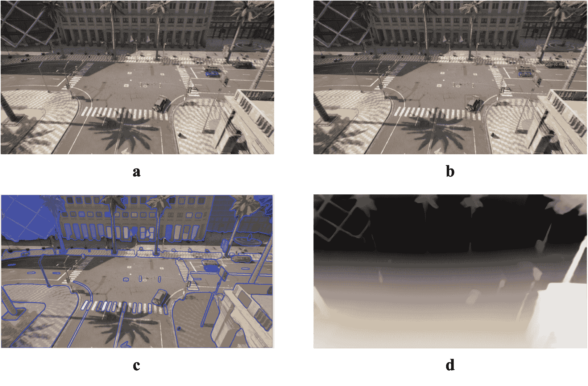

<!--yml

分类：未分类

日期：2025-01-11 11:40:52

-->

# 《无人机与大型语言模型的融合：面向智能低空移动的概述与展望》

> 来源：[https://arxiv.org/html/2501.02341/](https://arxiv.org/html/2501.02341/)

田永林¹¹footnotemark: 1 林飞²²footnotemark: 2 李一铎 张腾超 张启耀 傅轩 黄俊 戴星远 王宇彤 田春伟 李柏 易胜 吕一生 科瓦奇·莱文特 王飞跃

###### 摘要

低空移动性，以无人机（UAVs）为代表，已在多个领域带来了变革性的进展，如交通、物流和农业。无人机凭借灵活的视角和快速的机动性，扩展了传统系统的感知和行动能力，吸引了学术界和工业界的广泛关注。然而，当前的无人机操作主要依赖于人工控制，仅在简单场景中具备有限的自主性，缺乏在更复杂的环境和任务中所需的智能和适应性。大型语言模型（LLMs）的出现展示了出色的问题解决和泛化能力，为推动无人机智能化提供了有希望的路径。本文探讨了LLMs与无人机的集成，首先概述了无人机系统的基本组件和功能，然后回顾了LLM技术的最新进展。随后，系统地重点介绍了无人机可用的多模态数据资源，这些资源为训练和评估提供了关键支持。此外，本文对无人机与LLM结合的关键任务和应用场景进行了分类和分析。最后，提出了一条面向智能无人机的参考路线图，旨在通过自主感知、记忆、推理和工具利用，使无人机实现智能化。相关资源可通过[https://github.com/Hub-Tian/UAVs_Meet_LLMs](https://github.com/Hub-Tian/UAVs_Meet_LLMs)获取。

###### 关键词：

无人机、大型语言模型、基础智能、低空移动系统^(cor1)^(cor1)footnotetext: 同等贡献\affiliation

[label1]组织：中国科学院自动化研究所多模态人工智能系统国家重点实验室，城市：北京，邮政编码：100190，省份：，国家：中国

\affiliation

[label2]组织：澳门科技大学创新工程学院工程科学系，城市：澳门，邮政编码：999078，省份：，国家：中国 \affiliation[label3]组织：北京理工大学自动化学院，城市：北京，邮政编码：100081，省份：，国家：中国 \affiliation[label4]组织：西北工业大学软件学院，城市：西安，邮政编码：710129，省份：，国家：中国

\affiliation

[label5]组织=湖南大学机械与车辆工程学院，城市=长沙，邮政编码=410082，省份=，国家=中国 \affiliation[label6]组织=奥布达大学约翰·冯·诺依曼信息学学院，城市=布达佩斯，邮政编码=H-1034，省份=，国家=匈牙利

## 1 引言

无人机的快速发展为各个领域提供了变革性的监控和运输解决方案，包括智能交通、物流、农业和工业检测等。凭借其灵活的空间机动性，无人机显著提升了智能系统的感知和决策能力，为传统系统的升级和运营效率的提高提供了强有力的支持。鉴于这些优势，无人机技术已吸引了学术研究人员和行业从业者的广泛关注。

尽管无人机（UAV）前景广阔，目前大多数无人机仍依赖人工操作进行飞行控制。这种依赖不仅带来了高昂的劳动成本，还增加了安全风险，因为操作员在评估环境条件时，受限于机载传感器的范围和敏感度。这些限制阻碍了无人机在复杂环境中的可扩展性和更广泛应用。此外，由于运动自由度高，需要精确的导航、避障和实时环境感知，UAV飞行控制本身就具有挑战性，这一切都使得完全自主飞行的实现道路更加复杂。

图1：本文的主要部分和结构

最近，人工智能的快速发展，尤其是在基础模型（FM）领域，如ChatGPT、SORA和各种AI生成内容（AIGC）框架，已推动各行业发生重大变革。大型语言模型（LLM）具备接近人类的常识推理和泛化能力，使其能够在各种应用中实现高级理解、灵活适应和实时响应。将LLM与无人机系统集成，提供了一个有前景的途径来增强其自主性，使无人机具备更强的推理能力，从而更有效地应对动态环境。

初步研究探索了在导航[[1](https://arxiv.org/html/2501.02341v1#bib.bib1), [2](https://arxiv.org/html/2501.02341v1#bib.bib2)]、感知[[3](https://arxiv.org/html/2501.02341v1#bib.bib3), [4](https://arxiv.org/html/2501.02341v1#bib.bib4)]、规划[[5](https://arxiv.org/html/2501.02341v1#bib.bib5), [6](https://arxiv.org/html/2501.02341v1#bib.bib6)]等领域将大语言模型与无人机集成的研究。这些早期的努力凸显了将大语言模型与无人机系统结合的潜力，有助于促进更复杂的自主行为。然而，关于大语言模型与无人机集成的系统性综述仍然缺乏，尤其是在支持这一跨学科融合的框架和方法论方面。为了促进对无人机和大语言模型集成的理解，本文提供了现有框架和方法论的系统性回顾，提出了进一步推动这一跨学科融合的潜在路径。本文的主要贡献如下。

1.  1.

    提供了关于无人机（UAV）与功能模块（FM）集成的全面背景，概述了无人机系统的基本组件和功能模块，并总结了典型功能模块的特点。此外，还详细列举了公开可用的数据集资源，强调了它们在支持智能无人机系统的开发、训练和评估中的关键作用。

1.  2.

    对最近关于大语言模型（LLMs）与无人机（UAV）集成的研究进行了全面回顾，识别了在导航、感知和规划任务等领域的关键方法、不同应用和主要挑战。

1.  3.

    提出了一个面向代理型无人机的设计框架，概述了使无人机能够实现自主感知、推理、记忆和工具利用的必要架构和能力，为其向更智能和适应性更强的系统发展奠定了基础。

通过这些贡献，我们旨在提供关于无人机技术与大语言模型（LLM）交集的当前研究现状的基础性概述，突出新兴趋势和挑战，并提出未来研究的方向。本调查旨在为研究人员和实践者提供参考，帮助他们利用LLM的能力推进无人机自主性，并拓宽无人机低空移动系统的应用潜力。本文的组织结构如图[1](https://arxiv.org/html/2501.02341v1#S1.F1 "Figure 1 ‣ 1 Introduction ‣ UAVs Meet LLMs: Overviews and Perspectives Toward Agentic Low-Altitude Mobility")所示。无人机与基础模型（FMs）的系统知识从三个角度进行介绍：系统基础、模型基础和数据基础。随后，探讨了无人机与FMs的集成，重点介绍了各类任务和应用中的最新技术状态（SOTAs）。最后，提出了具备智能代理的无人机架构，并概述了未来发展的目标。

## 2 无人机系统的系统性概述

本节从功能模块和具象配置的角度简要概述了智能无人机（UAV）。功能模块包括无人机系统的核心组成部分，如感知模块、规划模块、通信模块、控制模块、导航模块、人机交互模块和载荷模块，重点介绍了它们在无人机功能中的作用和贡献，如图[2](https://arxiv.org/html/2501.02341v1#S2.F2 "Figure 2 ‣ 2.1.7 Payload Module ‣ 2.1 Functional Modules of UAVs ‣ 2 Systematic Overview of UAV Systems ‣ UAVs Meet LLMs: Overviews and Perspectives Toward Agentic Low-Altitude Mobility")所示。具象配置方面则关注无人机系统的结构特征，涵盖了固定翼无人机[[7](https://arxiv.org/html/2501.02341v1#bib.bib7)]、多旋翼无人机[[8](https://arxiv.org/html/2501.02341v1#bib.bib8)、[9](https://arxiv.org/html/2501.02341v1#bib.bib9)]、无人直升机[[10](https://arxiv.org/html/2501.02341v1#bib.bib10)]以及混合型无人机[[11](https://arxiv.org/html/2501.02341v1#bib.bib11)]的设计与应用。此外，本节还着重介绍了无人机群体智能技术的进展，包括通信策略、队形控制方法和协作决策机制。

### 2.1 无人机的功能模块

#### 2.1.1 感知模块

感知模块充当无人机的“眼睛和耳朵”，收集并解释来自各种机载传感器的数据，以建立对周围环境的全面理解。这些传感器包括RGB相机、事件驱动相机、热成像相机、3D相机、激光雷达、雷达和超声波传感器[[12](https://arxiv.org/html/2501.02341v1#bib.bib12)]。通过将原始传感器数据转化为可操作的洞察，例如检测障碍物、识别地标和评估地形特征，感知模块提供了安全和自主飞行所必需的态势感知[[13](https://arxiv.org/html/2501.02341v1#bib.bib13)、[14](https://arxiv.org/html/2501.02341v1#bib.bib14)]。

除了基本的环境监测外，感知模块还支持多无人机操作中的协作任务，包括检测和追踪其他无人机，以促进协调的群体行为。先进的计算机视觉和机器学习技术在这一过程中发挥着关键作用，提高了物体检测[[15](https://arxiv.org/html/2501.02341v1#bib.bib15)、[16](https://arxiv.org/html/2501.02341v1#bib.bib16)]、语义分割[[17](https://arxiv.org/html/2501.02341v1#bib.bib17)、[18](https://arxiv.org/html/2501.02341v1#bib.bib18)]和运动估计[[19](https://arxiv.org/html/2501.02341v1#bib.bib19)、[20](https://arxiv.org/html/2501.02341v1#bib.bib20)]的准确性和鲁棒性。传感器融合方法通常用于结合互补的数据源，例如将激光雷达深度图与高分辨率相机图像融合，从而减轻单一传感器的局限性，同时利用它们的独特优势[[21](https://arxiv.org/html/2501.02341v1#bib.bib21)、[22](https://arxiv.org/html/2501.02341v1#bib.bib22)]。这一强大的多模态感知框架使得无人机能够适应变化的环境（例如，变化的光照、动态环境），并以最小的人为干预执行复杂的任务。

#### 2.1.2 导航模块

导航模块负责将规划模块中的计划轨迹转换为精确的飞行路径，方法是通过持续估算和调整无人机的位置、方向和速度[[23](https://arxiv.org/html/2501.02341v1#bib.bib23)]。为实现这一目标，它依赖于各种机载传感器[[24](https://arxiv.org/html/2501.02341v1#bib.bib24)]，如 GPS[[25](https://arxiv.org/html/2501.02341v1#bib.bib25)、[26](https://arxiv.org/html/2501.02341v1#bib.bib26)]、惯性测量单元[[27](https://arxiv.org/html/2501.02341v1#bib.bib27)、[28](https://arxiv.org/html/2501.02341v1#bib.bib28)]、视觉里程计和气压传感器或磁力计等，用于收集关于无人机状态的实时信息[[29](https://arxiv.org/html/2501.02341v1#bib.bib29)、[30](https://arxiv.org/html/2501.02341v1#bib.bib30)]。融合算法，包括卡尔曼滤波器（如扩展卡尔曼滤波器或无迹卡尔曼滤波器）和粒子滤波器，被用来整合来自不同来源的数据，从而提高状态估计的可靠性和准确性。

在没有 GPS 或在环境干扰严重的情况下，导航模块可能会使用同步定位与地图构建技术（SLAM）或视觉 SLAM，以提供强大的定位和环境建图能力[[31](https://arxiv.org/html/2501.02341v1#bib.bib31)、[29](https://arxiv.org/html/2501.02341v1#bib.bib29)、[32](https://arxiv.org/html/2501.02341v1#bib.bib32)、[33](https://arxiv.org/html/2501.02341v1#bib.bib33)、[34](https://arxiv.org/html/2501.02341v1#bib.bib34)]。这些先进的解决方案使得无人机即使在传统卫星定位不可用或不可靠的情况下，也能保持较高的态势感知水平。通过确保准确的状态估计和平滑的轨迹跟踪，导航模块在保持飞行稳定性和确保无人机在整个操作时间内执行任务计划方面发挥了关键作用。

#### 2.1.3 规划模块

规划模块在将高层次的任务目标转化为具体的飞行轨迹和行动中起着至关重要的作用，依赖于感知模块的输入以确保安全导航[[35](https://arxiv.org/html/2501.02341v1#bib.bib35), [36](https://arxiv.org/html/2501.02341v1#bib.bib36)]。路径规划算法涵盖了广泛的技术，旨在计算可行的且通常是优化过的避障路线。这些方法包括启发式算法，如$A*$算法[[37](https://arxiv.org/html/2501.02341v1#bib.bib37)]，进化算法[[38](https://arxiv.org/html/2501.02341v1#bib.bib38)]，模拟退火[[39](https://arxiv.org/html/2501.02341v1#bib.bib39), [40](https://arxiv.org/html/2501.02341v1#bib.bib40)]，粒子群优化[[41](https://arxiv.org/html/2501.02341v1#bib.bib41), [42](https://arxiv.org/html/2501.02341v1#bib.bib42), [43](https://arxiv.org/html/2501.02341v1#bib.bib43)]，鸽子启发式优化[[44](https://arxiv.org/html/2501.02341v1#bib.bib44)]，人工蜂群[[45](https://arxiv.org/html/2501.02341v1#bib.bib45), [46](https://arxiv.org/html/2501.02341v1#bib.bib46)]等。机器学习方法，包括神经网络[[47](https://arxiv.org/html/2501.02341v1#bib.bib47), [48](https://arxiv.org/html/2501.02341v1#bib.bib48), [49](https://arxiv.org/html/2501.02341v1#bib.bib49)]，以及深度强化学习[[50](https://arxiv.org/html/2501.02341v1#bib.bib50), [51](https://arxiv.org/html/2501.02341v1#bib.bib51)]，也被用于更加自适应和数据驱动的规划。此外，基于采样的策略，如快速扩展随机树，提供了灵活的框架来处理高维或动态变化的环境[[52](https://arxiv.org/html/2501.02341v1#bib.bib52)]。通过利用这些方法中的一种或多种，无人机能够制定安全、无碰撞的轨迹，并优化关键性能指标，如旅行时间、能量消耗或总体任务效率[[53](https://arxiv.org/html/2501.02341v1#bib.bib53), [54](https://arxiv.org/html/2501.02341v1#bib.bib54), [44](https://arxiv.org/html/2501.02341v1#bib.bib44), [55](https://arxiv.org/html/2501.02341v1#bib.bib55)]。这些技术使得无人机能够在复杂或不确定的环境中自主操作，通过实时调整其规划路径，尤其在地形、障碍物位置或任务参数发生不可预见变化时显得尤为重要。

在多无人机或群体操作中，规划模块还在协调各个无人机的飞行路线方面发挥关键作用，确保避免碰撞并保持群体行为的一致性[[56](https://arxiv.org/html/2501.02341v1#bib.bib56), [57](https://arxiv.org/html/2501.02341v1#bib.bib57), [58](https://arxiv.org/html/2501.02341v1#bib.bib58)]。这种协同规划能力不仅提升了任务效率，还降低了无人机间干扰的风险。通过动态更新轨迹和共享相关信息，规划模块为与整体任务目标一致的稳健可靠操作提供了支持。

#### 2.1.4 控制模块

控制模块负责生成低级指令，以调节无人机的执行器——包括电机、伺服电机和其他控制面——以保持稳定和响应迅速的飞行。作为系统的“肌肉”，它持续调整关键参数，如高度、速度、方向和姿态，以响应来自机载传感器的实时反馈。通过与导航与规划模块提供的参考输入闭合控制回路，控制模块确保无人机遵循预定的飞行轨迹和任务目标[[59](https://arxiv.org/html/2501.02341v1#bib.bib59), [60](https://arxiv.org/html/2501.02341v1#bib.bib60)]。

为了管理潜在的干扰（如阵风、载荷变化）并补偿建模不确定性，采用了多种经典和现代控制策略。传统方法，如比例-积分-微分控制[[61](https://arxiv.org/html/2501.02341v1#bib.bib61), [62](https://arxiv.org/html/2501.02341v1#bib.bib62)]，提供了简单性和易于实施的优点，而更先进的技术，如模型预测控制，则能够基于系统动态和约束进行预测性操作。自适应控制方法通过实时调整控制参数，进一步提升了系统在特性演变中的表现[[63](https://arxiv.org/html/2501.02341v1#bib.bib63), [64](https://arxiv.org/html/2501.02341v1#bib.bib64)]。其他鲁棒性策略，如滑模控制或非线性控制，可以在特别具有挑战性的操作条件下使用，提供对传感器噪声和突发环境变化的抗干扰能力[[65](https://arxiv.org/html/2501.02341v1#bib.bib65), [66](https://arxiv.org/html/2501.02341v1#bib.bib66)]。

在多旋翼无人机中，例如，控制模块精确调节各个电机的转速，以实现适当的推力和扭矩分配，从而确保飞行稳定，而在固定翼平台中，它则通过操控气动表面来维持或改变飞行轨迹 [[67](https://arxiv.org/html/2501.02341v1#bib.bib67), [68](https://arxiv.org/html/2501.02341v1#bib.bib68), [69](https://arxiv.org/html/2501.02341v1#bib.bib69)]。传感器反馈、控制算法和执行器命令的紧密集成，使得无人机能够迅速响应偏差和外部扰动，确保在整个任务中平稳且可靠的运行。

#### 2.1.5 通信模块

通信模块支撑着无人机、地面控制站和其他外部实体（如卫星、边缘设备或基于云的服务）之间的所有数据交换，确保关键的遥测、控制和载荷信息流动无缝。典型的通信方式包括从短程无线电频率系统和Wi-Fi连接，到更复杂、更长距离的网络，如4G、5G，甚至卫星通信链路，每种方式的选择都旨在满足特定任务对带宽、延迟和范围的要求 [[70](https://arxiv.org/html/2501.02341v1#bib.bib70), [71](https://arxiv.org/html/2501.02341v1#bib.bib71), [72](https://arxiv.org/html/2501.02341v1#bib.bib72), [73](https://arxiv.org/html/2501.02341v1#bib.bib73)]。

在无人机集群操作中，通信模块变得尤为重要，它负责向地面控制发送指令，并促进无人机之间的协调，通过实时共享位置信息、传感器数据等情境信息 [[73](https://arxiv.org/html/2501.02341v1#bib.bib73), [74](https://arxiv.org/html/2501.02341v1#bib.bib74)]。强健的通信协议，通常配合加密和认证机制，以防止未经授权的访问和恶意干扰，同时，通过自适应信道选择和多跳临时路由等技术，可以减少信号衰减，并确保在动态环境中保持可靠的连接 [[75](https://arxiv.org/html/2501.02341v1#bib.bib75)]。通过管理和优先处理不同的数据流（遥测、载荷、指令和控制），通信模块作为支撑整个子系统同步的骨干，支持无人机的整体操作目标 [[76](https://arxiv.org/html/2501.02341v1#bib.bib76)]。

#### 2.1.6 互动模块

交互模块旨在促进无人机与人类操作员或操作环境中其他代理之间的无缝通信与协作[[77](https://arxiv.org/html/2501.02341v1#bib.bib77), [78](https://arxiv.org/html/2501.02341v1#bib.bib78)]。它包含了用户界面和交互范式，可能包括语音命令、手势识别、增强现实或虚拟现实显示，或者基于触摸屏的数据可视化系统[[79](https://arxiv.org/html/2501.02341v1#bib.bib79), [80](https://arxiv.org/html/2501.02341v1#bib.bib80), [81](https://arxiv.org/html/2501.02341v1#bib.bib81), [82](https://arxiv.org/html/2501.02341v1#bib.bib82), [83](https://arxiv.org/html/2501.02341v1#bib.bib83)]。其他方法，如自适应用户界面设计，根据操作员的技能水平和工作负荷调整显示信息，或者通过触觉反馈机制为关键事件提供触觉警报，可以进一步增强态势感知和用户体验[[84](https://arxiv.org/html/2501.02341v1#bib.bib84)]。这些界面使地面人员能够发出高层命令、审查任务进度，并在必要时进行干预，确保操作员保持监督和决策权[[85](https://arxiv.org/html/2501.02341v1#bib.bib85)]。

在群体或多无人机（UAV）情境下，交互模块变得更加重要。它不仅允许中央决策者协调多架无人机，还使人类操作员能够接收来自整个群体的汇总态势数据，可能实时标出异常或新兴行为。这些人类-无人机交互通道在协作任务中尤为关键（例如，搜救、环境监测或基础设施检查），其中可能需要现场指导或反馈，以便根据不断变化的条件调整无人机的行为[[86](https://arxiv.org/html/2501.02341v1#bib.bib86), [87](https://arxiv.org/html/2501.02341v1#bib.bib87), [88](https://arxiv.org/html/2501.02341v1#bib.bib88)]。通过提供强大的手动覆盖和实时通信机制，交互模块在自主操作和人类监督之间取得了平衡，提升了任务效率和操作安全性[[87](https://arxiv.org/html/2501.02341v1#bib.bib87), [89](https://arxiv.org/html/2501.02341v1#bib.bib89), [90](https://arxiv.org/html/2501.02341v1#bib.bib90)]。

#### 2.1.7 载荷模块

有效载荷模块负责监督无人机携带的设备或货物，以完成其任务目标。根据任务的不同，这些有效载荷可能包括用于监视的相机、投递包裹、用于环境监测的先进传感器，或用于搜救等任务的专业硬件[[91](https://arxiv.org/html/2501.02341v1#bib.bib91)]。因此，有效载荷模块必须满足各种操作需求，包括电源供应、安全数据传输、机械支持以及适当的稳定性，以确保在不同条件下的可靠性能[[59](https://arxiv.org/html/2501.02341v1#bib.bib59)、[92](https://arxiv.org/html/2501.02341v1#bib.bib92)]。

在实践中，该模块通常集成了诸如振动缓解、热管理和安全安装解决方案等功能，以保护精密组件并在飞行过程中保持最佳功能。此外，在某些无人机设计中，有效载荷模块被设计为可互换的。这种模块化方法通常采用标准化的安装和连接接口，可以快速更换有效载荷，并简化根据不同任务配置无人机的过程。因此，操作员可以在无需完全新平台的情况下扩展无人机的能力，从而提高灵活性并降低部署时间和成本[[93](https://arxiv.org/html/2501.02341v1#bib.bib93)、[94](https://arxiv.org/html/2501.02341v1#bib.bib94)、[95](https://arxiv.org/html/2501.02341v1#bib.bib95)、[96](https://arxiv.org/html/2501.02341v1#bib.bib96)]。

总体而言，有效载荷模块在连接无人机的核心飞行系统与实现操作目标所需的任务特定工具之间起着至关重要的作用。通过容纳各种有效载荷，并确保它们的电力供应、保护和高效连接，有效载荷模块显著扩展了无人机在各行业和任务类型中的应用。

图2：无人机系统的关键功能模块

### 2.2 无人机的体型配置

无人机可以根据其几何结构分为几种类型，包括固翼无人机、多旋翼无人机、无人直升机等。以下，我们将介绍这些分类并总结其特点。

#### 2.2.1 固翼无人机

固翼无人机具有预定的机翼形状，随着空气流过机翼产生升力，从而实现向前运动[[92](https://arxiv.org/html/2501.02341v1#bib.bib92)]。这些无人机以高速、长续航和稳定飞行著称，适用于长时间任务。然而，它们需要先进的飞行技能，并且无法悬停[[97](https://arxiv.org/html/2501.02341v1#bib.bib97)]。固翼无人机通常用于监控田野、森林、高速公路和铁路[[92](https://arxiv.org/html/2501.02341v1#bib.bib92)]。

#### 2.2.2 多旋翼无人机

多旋翼无人机是日常生活中最常见的无人机类型之一，通常配备多个旋翼（通常为四个、六个或更多），通过旋翼旋转产生升力。它们的优点包括低成本、易操作，并且能够进行垂直起降（VTOL）和悬停，使其适用于精密任务。然而，它们的续航时间有限，速度相对较低。多旋翼无人机通常用于摄影、农业监测和喷洒等任务。

#### 2.2.3 无人直升机

无人直升机配备一个或两个动力旋翼提供升力并实现姿态控制。这种设计允许垂直起飞、悬停和高机动性。与多旋翼无人机相比，无人直升机具有更强的载重能力，可以携带更重的设备或传感器。其优势包括较长的续航时间和出色的抗风能力，即使在强风中也能保持稳定。主要的局限性是其相对较低的速度。无人直升机广泛应用于交通监控、资源勘探、森林防火和军事侦察等领域。

#### 2.2.4 混合型无人机

混合型无人机结合了固定翼无人机和多旋翼无人机的优点，提供了一种多功能的设计，既能实现垂直起降（VTOL），又能达到固定翼无人机典型的长续航和高速。这些无人机通常配备旋翼用于垂直飞行时的升力，机翼用于持续的前向飞行。混合型无人机的主要优势在于其灵活性，能够执行多种任务，包括同时要求悬停和长时间飞行的任务。然而，其设计和机制的复杂性导致了更高的成本和更苛刻的维护要求。

#### 2.2.5 拍翅式无人机

拍翅式无人机是受生物启发的无人飞行器，模仿鸟类或昆虫的飞行机制。这些无人机依靠翼拍产生的不稳定气动效应来实现飞行。与传统无人机相比，它们提供更安静的操作、更高的效率和更强的机动性。它们的小巧尺寸是一个显著优势，但通常具有较低的载重能力。此外，由于飞行力学的动态特性，拍翅式无人机的设计和控制系统较为复杂。

#### 2.2.6 无人飞艇

无人飞艇是一种利用轻质气体提供浮力，并使用推进装置和外部结构元素来实现运动和方向控制的空中飞行器。这些飞艇具有高度的成本效益，并且飞行噪音较低。然而，它们的敏捷性有限，飞行速度相对较低。由于其体积较大，无人飞艇非常容易受到风力的影响，这可能会影响其稳定性和操作可靠性。

表1：无人机典型配置

| 类别 | 特点 | 优点 | 缺点 |
| --- | --- | --- | --- |
| 固定翼无人机 | 通过前进的运动产生升力。 | 高速，长续航，稳定飞行。 | 无法悬停，对起降区域要求高。 |
| 多旋翼无人机 | 多个旋翼提供升力和控制。 | 低成本，操作简单，能够垂直起降和悬停。 | 飞行时间有限，速度较低，载荷能力小。 |
| 无人直升机 | 单个或双旋翼可以实现垂直起飞和悬停。 | 高载荷能力，良好的抗风性，长续航，垂直起降。 | 结构复杂，维护成本较高，比固定翼无人机飞行速度慢。 |
| 混合型无人机 | 结合了固定翼和多旋翼的能力。 | 灵活的任务，长续航，垂直起降。 | 机制复杂，成本较高。 |
| 拍打翼无人机 | 使用拍击和抛掷机制进行飞行。 | 低噪音，高推进效率，高机动性。 | 分析和控制复杂，有限的载荷能力。 |
| 无人飞艇 | 采用气囊升力的气体飞艇。 | 低成本，低噪音。 | 低速，低机动性，易受风影响。 |

### 2.3 无人机群

无人机群是指多个无人机协作完成共同目标，相比单一无人机操作，具有冗余性、可扩展性和效率上的优势[[98](https://arxiv.org/html/2501.02341v1#bib.bib98)]。群体方法依赖于去中心化的决策机制，使得无人机能够根据同伴的行为和环境变化调整自身的行为。群体算法通常受到生物系统的启发[[99](https://arxiv.org/html/2501.02341v1#bib.bib99)]，如鸟群或蚂蚁群体，使用的技术包括共识算法[[100](https://arxiv.org/html/2501.02341v1#bib.bib100)]、粒子群优化[[101](https://arxiv.org/html/2501.02341v1#bib.bib101)]或基于行为的协调[[102](https://arxiv.org/html/2501.02341v1#bib.bib102)]。有效的群体操作需要无缝的通信、强大的控制机制和合作规划，以应对分布式系统的复杂性[[103](https://arxiv.org/html/2501.02341v1#bib.bib103)]。该概念在大范围监视、精确农业和搜索救援等应用中尤为重要，在这些场景下，多个无人机能够比单一飞行器更高效地覆盖更广的区域。

在本节中，我们将讨论有效无人机群操作的关键组成部分，包括任务分配、通信架构、路径规划和编队控制。

#### 2.3.1 无人机群中的任务分配

UAV群体可以视为一个团队，负责执行特定任务，该任务由一系列子任务组成，并且它们必须负责成员之间的任务分配[[104](https://arxiv.org/html/2501.02341v1#bib.bib104)]。任务分配是UAV群体操作中的一个重要问题，因为它直接影响任务的效率。已经证明，解决任务分配问题的最优解是NP难的，并且随着UAV群体规模和任务数量的增加，难度呈指数增长[[105](https://arxiv.org/html/2501.02341v1#bib.bib105)]。通常，UAV群体任务分配问题被建模为旅行商问题（TSP）[[106](https://arxiv.org/html/2501.02341v1#bib.bib106)]、车辆路径问题（VRP）[[107](https://arxiv.org/html/2501.02341v1#bib.bib107)]、混合整数线性规划（MILP）模型[[108](https://arxiv.org/html/2501.02341v1#bib.bib108)]，或合作式多任务分配问题（CMTAP）模型[[109](https://arxiv.org/html/2501.02341v1#bib.bib109)]。常用的算法包括启发式算法、基于人工智能的方法、数学规划方法和基于市场机制的算法。

常用于任务分配问题的启发式算法包括遗传算法（GA）、粒子群优化（PSO）、模拟退火（SA）等。这些算法通过随机搜索方法寻找可行解，避免了问题陷入局部最优解。遗传算法通过交叉和变异策略生成随机解，然后通过选择最优候选解不断改进这些解，最终收敛到接近最优的解。例如，Han等人[[110](https://arxiv.org/html/2501.02341v1#bib.bib110)]提出了一种模糊精英策略遗传算法（FESGA），用于高效解决复杂的任务分配问题。Yan等人[[111](https://arxiv.org/html/2501.02341v1#bib.bib111)]提出了一种改进的遗传算法，用于解决多UAV攻击多个目标的集成任务分配和路径规划问题。

粒子群优化（PSO）平衡探索和开发过程，并通过迭代产生接近最优的解。该算法易于实现、运行快速，广泛应用于任务分配问题中。姜等人[[112](https://arxiv.org/html/2501.02341v1#bib.bib112)]提出了一种改进的PSO算法，用于解决多约束任务分配问题，该算法适用于解决复杂的组合优化问题。由于大多数研究将多UAV任务分配视为单目标优化问题，高等人[[113](https://arxiv.org/html/2501.02341v1#bib.bib113)]应用了一种改进的多目标粒子群优化（MOPSO）算法来解决多个UAV的任务分配问题。

数学规划方法具有找到精确最优解的优势，但随着问题规模的增大，求解时间呈指数增长。Choi等人[[114](https://arxiv.org/html/2501.02341v1#bib.bib114)]将多无人机在多个目标之间执行任务的任务分配问题建模为一个混合整数线性规划（MILP）模型进行求解。

基于人工智能的方法，如强化学习和人工神经网络，在提取环境特征方面具有优势。Yang等人[[115](https://arxiv.org/html/2501.02341v1#bib.bib115)]提出了一种基于强化学习的任务调度算法，使无人机能够根据任务执行效率的计算动态调整任务策略。Yin等人[[116](https://arxiv.org/html/2501.02341v1#bib.bib116)]将深度迁移强化学习应用于多无人机任务分配问题。

基于市场机制的方法是经典的分布式任务分配方法，包括基于拍卖的算法和合同网协议（CNP）算法[[117](https://arxiv.org/html/2501.02341v1#bib.bib117)]。这些方法利用激励机制鼓励代理参与任务分配过程，代理根据任务的效用或成本进行竞标，旨在最大化效用或最小化成本。这些方法的主要优势在于其计算效率[[118](https://arxiv.org/html/2501.02341v1#bib.bib118)]。Qiao等人[[119](https://arxiv.org/html/2501.02341v1#bib.bib119)]应用了一种拍卖算法用于动态无人机任务分配，解决了多约束、多无人机动态任务分配问题。Duan等人[[120](https://arxiv.org/html/2501.02341v1#bib.bib120)]提出了一种混合的“二阶段”拍卖算法，该算法具有分层决策机制和改进的目标函数，在多无人机动态任务分配中通过同时实现异构任务分配和障碍规避，提升了性能。该算法在效率和鲁棒性方面优于许多最先进的模型。Zhang等人[[121](https://arxiv.org/html/2501.02341v1#bib.bib121)]开发了一种用于动态多无人机任务调度的多约束模型，重点优化了总任务利润的最大化、时间消耗的最小化以及任务在无人机之间的平衡分配。他们引入了一种基于混合合同网协议的任务调度方法，包括买卖、交换和替代合同。Wang等人[[122](https://arxiv.org/html/2501.02341v1#bib.bib122)]提出了一种基于CNP的二阶段分布式任务分配算法（TS-DTA），有效解决了动态环境下的任务重新分配问题。

#### 2.3.2 无人机群体的通信架构

对于无人机群体，通信对于协调至关重要，它使得协同工作成为可能，并保持操作过程中的稳定性。通信可以通过两种主要方式实现：基于基础设施的架构[[123](https://arxiv.org/html/2501.02341v1#bib.bib123)]和飞行自组织网络（FANET）架构[[124](https://arxiv.org/html/2501.02341v1#bib.bib124)]。每种方法都有其独特的优点和挑战，以下将进行讨论。

基于基础设施的架构：该架构依赖地面控制站（GCS）[[70](https://arxiv.org/html/2501.02341v1#bib.bib70)]来管理无人机群。GCS收集来自无人机的遥测数据并传输命令，可以是实时的，也可以是通过预先编程的指令。其主要优势包括集中计算和实时优化，避免了无人机间通信网络的需求[[123](https://arxiv.org/html/2501.02341v1#bib.bib123)]。然而，这种方法也有明显的局限性：整个系统容易受到GCS单点故障的影响，无人机必须保持在GCS的通信范围内，并且该架构缺乏分布式决策的灵活性[[123](https://arxiv.org/html/2501.02341v1#bib.bib123)]。

飞行自组织网络（FANET）架构：FANET由无人机直接相互通信组成，无需中心接入点。这种去中心化的网络使得无人机能够自主协调任务，至少有一架无人机保持与地面基站或卫星的链接。FANET具有灵活性、可扩展性和减少对基础设施依赖的优势。然而，它们需要强大的通信协议，并可能面临动态拓扑管理和确保可靠性的挑战[[124](https://arxiv.org/html/2501.02341v1#bib.bib124)]。

#### 2.3.3 无人机群体路径规划

UAV群体路径规划是指从起始位置到所有目标位置选择最佳路径，同时确保无人机之间的预定距离以避免碰撞[[125](https://arxiv.org/html/2501.02341v1#bib.bib125)]。最佳路径通常指的是最短路径长度、最短旅行时间、最小能量消耗以及其他特定事件的约束条件[[125](https://arxiv.org/html/2501.02341v1#bib.bib125)]。最佳路径的标准需要根据实际问题来确定。无人机路径规划算法通常可以分为三大类：智能优化算法、数学规划方法和基于人工智能的方法。以下简要介绍这三种方法。

在自然界中，各种群体行为，如鸟群、鱼群和蚂蚁群体，遵循特定的规则，这些规则使得它们能够高效地寻找食物或迁徙。这些行为可以抽象为信息传递、路径规划和协调控制的数学模型，这些模型也适用于无人机群体调度。常见的智能优化算法包括蚁群优化（ACO）、遗传算法（GA）、模拟退火（SA）和粒子群优化（PSO）。例如，ACO 模拟蚂蚁的觅食行为，其中蚂蚁基于信息素浓度以概率方式选择路径，最终找到最优或近似最优解。像 Turker 等人[[126](https://arxiv.org/html/2501.02341v1#bib.bib126)]这样的研究人员已将 SA 应用于无人机群体路径规划，而 Wei 等人[[127](https://arxiv.org/html/2501.02341v1#bib.bib127)]则使用 ACO 进行相同的工作。

除了受到自然启发的启发式算法外，像混合整数线性规划（MILP）和非线性规划等数学模型也可以直接应用于无人机群体调度，以提供精确的解决方案。例如，Ragi 等人[[128](https://arxiv.org/html/2501.02341v1#bib.bib128)]使用混合整数非线性规划（MINLP）来解决无人机路径规划问题。尽管这些方法对于小规模问题是有效的，但随着问题规模的增加，它们的计算复杂度会呈指数级增长。

随着机器学习的兴起，基于人工智能的算法也已被应用于无人机群体调度和优化。Kool 等人[[129](https://arxiv.org/html/2501.02341v1#bib.bib129)]使用深度学习进行车辆路径规划，类似的方法也已被应用于无人机群体路径规划。Xia 等人[[130](https://arxiv.org/html/2501.02341v1#bib.bib130)]将神经网络应用于无人机路径规划，Sanna 等人[[131](https://arxiv.org/html/2501.02341v1#bib.bib131)]将其扩展到多无人机规划，而 Puente-Castro 等人[[54](https://arxiv.org/html/2501.02341v1#bib.bib54)]则应用了强化学习。通过在大规模数据集上进行训练，神经网络能够学习建模环境，包括障碍物及其动态变化，从而提高路径规划的准确性。

#### 2.3.4 无人机编队控制算法

无人机群体依赖有效的编队控制算法，使其能够自主地形成和维持编队来执行任务，并根据特定任务切换或重建编队[[132](https://arxiv.org/html/2501.02341v1#bib.bib132)]。编队控制的主要方法包括集中控制、分散控制和分布式控制算法[[133](https://arxiv.org/html/2501.02341v1#bib.bib133)]。

集中式控制：集中式控制涉及一个中央单元，负责任务分配和资源管理，个别无人机主要负责数据输入、输出和存储[[132](https://arxiv.org/html/2501.02341v1#bib.bib132)]。这种方法简化了决策过程，确保了协调行动，并且相对容易实施。然而，它容易受到高通信开销和单点故障的影响；如果中央单元出现故障，整个系统可能崩溃。集中式控制中的常见方法包括虚拟结构[[134](https://arxiv.org/html/2501.02341v1#bib.bib134)]和领导-跟随方法[[135](https://arxiv.org/html/2501.02341v1#bib.bib135), [136](https://arxiv.org/html/2501.02341v1#bib.bib136)]。

分散式控制：在分散式控制中，每个无人机根据局部传感器和控制器做出决策，无需与其他无人机进行显式通信[[137](https://arxiv.org/html/2501.02341v1#bib.bib137)]。无人机根据局部条件和预定义规则调整其运动以保持队形。这种方法的主要优点包括灵活性和易于调整队形。然而，由于无法获取全局信息，控制性能较差，需要持续迭代[[138](https://arxiv.org/html/2501.02341v1#bib.bib138)]。

分布式控制：分布式控制涉及无人机之间的广泛通信，使它们能够通过共享信息进行协调并保持队形。无人机通过协作，基于局部数据和预设规则做出最优决策。与分散控制相比，分布式控制具有更强的协作性和更高的灵活性。然而，它需要更高的通信要求和更复杂的算法来管理协调，这增加了计算负担和通信故障的风险。典型方法包括行为方法[[139](https://arxiv.org/html/2501.02341v1#bib.bib139)]和一致性方法[[140](https://arxiv.org/html/2501.02341v1#bib.bib140)]。

## 3 基础模型的前提

本节概述了基础模型（FMs），包括大型语言模型（LLMs）、视觉基础模型（VFMs）和视觉语言模型（VLMs）。重点介绍了它们的核心特性和技术优势，旨在为这些模型与无人机系统的深度集成提供基础性见解和指导。

表 2：LLMs、VLMs 和 VFMs 的总结。

| 类别 | 子类别 | 模型名称 | 机构 / 作者 |
| --- | --- | --- | --- |
| LLMs | 通用 | GPT-3[[141](https://arxiv.org/html/2501.02341v1#bib.bib141)], GPT-3.5[[142](https://arxiv.org/html/2501.02341v1#bib.bib142)], GPT-4[[143](https://arxiv.org/html/2501.02341v1#bib.bib143)] | [OpenAI](https://openai.com) |
|  |  | Claude 2, Claude 3[[144](https://arxiv.org/html/2501.02341v1#bib.bib144), [145](https://arxiv.org/html/2501.02341v1#bib.bib145), [146](https://arxiv.org/html/2501.02341v1#bib.bib146)] | [Anthropic](https://www.anthropic.com) |
|  |  | Mistral 系列[[147](https://arxiv.org/html/2501.02341v1#bib.bib147), [148](https://arxiv.org/html/2501.02341v1#bib.bib148)] | [Mistral AI](https://www.mistral.ai) |
|  |  | PaLM 系列[[149](https://arxiv.org/html/2501.02341v1#bib.bib149), [150](https://arxiv.org/html/2501.02341v1#bib.bib150)], Gemini 系列[[151](https://arxiv.org/html/2501.02341v1#bib.bib151), [152](https://arxiv.org/html/2501.02341v1#bib.bib152)] | [Google Research](https://ai.google) |
|  |  | LLaMA[[153](https://arxiv.org/html/2501.02341v1#bib.bib153)], LLaMA2[[154](https://arxiv.org/html/2501.02341v1#bib.bib154)], LLaMA3[[155](https://arxiv.org/html/2501.02341v1#bib.bib155)] | [Meta AI](https://ai.meta.com) |
|  |  | Vicuna[[156](https://arxiv.org/html/2501.02341v1#bib.bib156)] | [Vicuna 团队](https://vicuna.lmsys.org) |
|  |  | Qwen 系列[[157](https://arxiv.org/html/2501.02341v1#bib.bib157), [158](https://arxiv.org/html/2501.02341v1#bib.bib158)] | [Qwen 团队，阿里巴巴集团](https://github.com/QwenLM) |
|  |  | InternLM[[159](https://arxiv.org/html/2501.02341v1#bib.bib159)] | [上海 AI 实验室](https://github.com/InternLM/InternLM) |
|  |  | BuboGPT[[160](https://arxiv.org/html/2501.02341v1#bib.bib160)] | [Bytedance](https://github.com/magic-research/bubogpt) |
|  |  | ChatGLM[[161](https://arxiv.org/html/2501.02341v1#bib.bib161), [162](https://arxiv.org/html/2501.02341v1#bib.bib162), [163](https://arxiv.org/html/2501.02341v1#bib.bib163)] | [Zhipu AI](https://github.com/THUDM) |
|  |  | DeepSeek 系列[[164](https://arxiv.org/html/2501.02341v1#bib.bib164), [165](https://arxiv.org/html/2501.02341v1#bib.bib165), [166](https://arxiv.org/html/2501.02341v1#bib.bib166)] | [DeepSeek](https://github.com/deepseek-ai) |
| VLMs | General | GPT-4V[[167](https://arxiv.org/html/2501.02341v1#bib.bib167)], GPT-4o, GPT-4o mini, GPT o1-preview | [OpenAI](https://openai.com) |
|  |  | Claude 3 Opus, Claude 3.5 Sonnet[[168](https://arxiv.org/html/2501.02341v1#bib.bib168)] | [Anthropic](https://www.anthropic.com) |
|  |  | Step-2 | [Jieyue Xingchen](https://www.stepfun.com/) |
|  |  | LLaVA[[169](https://arxiv.org/html/2501.02341v1#bib.bib169)], LLaVA-1.5[[170](https://arxiv.org/html/2501.02341v1#bib.bib170)], LLaVA-NeXT[[171](https://arxiv.org/html/2501.02341v1#bib.bib171)] | [Liu *等*](https://github.com/haotian-liu/LLaVA) |
|  |  | MoE-LLaVA[[172](https://arxiv.org/html/2501.02341v1#bib.bib172)] | [Lin *等*](https://github.com/PKU-YuanGroup/MoE-LLaVA) |
|  |  | LLaVA-CoT[[173](https://arxiv.org/html/2501.02341v1#bib.bib173)] | [Xu *等*](https://github.com/PKU-YuanGroup/LLaVA-CoT) |
|  |  | Flamingo[[174](https://arxiv.org/html/2501.02341v1#bib.bib174)] | [Alayrac *等*](https://github.com/mlfoundations/open_flamingo) |
|  |  | BLIP[[175](https://arxiv.org/html/2501.02341v1#bib.bib175)] | [Li *等人*](https://github.com/salesforce/BLIP) |
|  |  | BLIP-2[[176](https://arxiv.org/html/2501.02341v1#bib.bib176)] | [Li *等人*](https://github.com/salesforce/LAVIS/tree/main/projects/blip2) |
|  |  | InstructBLIP[[177](https://arxiv.org/html/2501.02341v1#bib.bib177)] | [Dai *等人*](https://github.com/salesforce/LAVIS/tree/main/projects/instructblip) |
|  | 视频理解 | LLaMA-VID[[178](https://arxiv.org/html/2501.02341v1#bib.bib178)] | [Li *等人*](https://github.com/dvlab-research/LLaMA-VID) |
|  |  | IG-VLM[[179](https://arxiv.org/html/2501.02341v1#bib.bib179)] | [Kim *等人*](https://github.com/imagegridworth/IG-VLM) |
|  |  | Video-ChatGPT[[180](https://arxiv.org/html/2501.02341v1#bib.bib180)] | [Maaz *等人*](https://github.com/mbzuai-oryx/Video-ChatGPT) |
|  |  | VideoTree[[181](https://arxiv.org/html/2501.02341v1#bib.bib181)] | [Wang *等人*](https://github.com/Ziyang412/VideoTree) |
|  | 视觉推理 | X-VLM[[182](https://arxiv.org/html/2501.02341v1#bib.bib182)] | [Zeng *等人*](https://github.com/zengyan-97/X-VLM) |
|  |  | Chameleon[[183](https://arxiv.org/html/2501.02341v1#bib.bib183)] | [Lu *等人*](https://chameleon-llm.github.io/) |
|  |  | HYDRA[[184](https://arxiv.org/html/2501.02341v1#bib.bib184)] | [Ke *等人*](https://hydra-vl4ai.github.io/) |
|  |  | VISPROG[[185](https://arxiv.org/html/2501.02341v1#bib.bib185)] | [PRIOR @ 艾伦人工智能研究所](https://prior.allenai.org/projects/visprog) |
| VFMs | 通用 | CLIP[[186](https://arxiv.org/html/2501.02341v1#bib.bib186)] | [OpenAI](https://github.com/OpenAI/CLIP) |
|  |  | FILIP[[187](https://arxiv.org/html/2501.02341v1#bib.bib187)] | Yao *等人* |
|  |  | RegionCLIP[[188](https://arxiv.org/html/2501.02341v1#bib.bib188)] | [微软研究院](https://github.com/microsoft/RegionCLIP) |
|  |  | EVA-CLIP[[189](https://arxiv.org/html/2501.02341v1#bib.bib189)] | [Sun *等人*](https://github.com/baaivision/EVA/tree/master/EVA-CLIP) |
|  | 目标检测 | GLIP[[190](https://arxiv.org/html/2501.02341v1#bib.bib190)] | [微软研究院](https://github.com/microsoft/GLIP) |
|  |  | DINO[[191](https://arxiv.org/html/2501.02341v1#bib.bib191)] | [Zhang *等人*](https://github.com/IDEA-Research/DINO) |
|  |  | Grounding-DINO[[192](https://arxiv.org/html/2501.02341v1#bib.bib192)] | [Liu *等人*](https://github.com/IDEA-Research/GroundingDINO) |
|  |  | DINOv2[[193](https://arxiv.org/html/2501.02341v1#bib.bib193)] | [Meta AI 研究院](https://github.com/facebookresearch/dinov2) |
|  |  | AM-RADIO[[194](https://arxiv.org/html/2501.02341v1#bib.bib194)] | [NVIDIA](https://github.com/NVlabs/RADIO) |
|  |  | DINO-WM[[195](https://arxiv.org/html/2501.02341v1#bib.bib195)] | [Zhou *等人*](https://dino-wm.github.io/) |
|  |  | YOLO-World[[196](https://arxiv.org/html/2501.02341v1#bib.bib196)] | [Cheng *等人*](https://github.com/AILabCVC/YOLO-World) |
|  | 图像分割 | CLIPSeg[[197](https://arxiv.org/html/2501.02341v1#bib.bib197)] | [Lüdecke 和 Ecker](https://github.com/timojl/clipseg) |
|  |  | SAM[[198](https://arxiv.org/html/2501.02341v1#bib.bib198)] | [Meta AI 研究，FAIR](https://segment-anything.com) |
|  |  | Embodied-SAM[[199](https://arxiv.org/html/2501.02341v1#bib.bib199)] | [Xu *等人*](https://github.com/xuxw98/ESAM) |
|  |  | Point-SAM[[200](https://arxiv.org/html/2501.02341v1#bib.bib200)] | [Zhou *等人*](https://github.com/zyc00/Point-SAM) |
|  |  | Open-Vocabulary SAM[[201](https://arxiv.org/html/2501.02341v1#bib.bib201)] | [Yuan *等人*](https://www.mmlab-ntu.com/project/ovsam/) |
|  |  | TAP[[202](https://arxiv.org/html/2501.02341v1#bib.bib202)] | [Pan *等人*](https://github.com/baaivision/tokenize-anything) |
|  |  | EfficientSAM[[203](https://arxiv.org/html/2501.02341v1#bib.bib203)] | [Xiong *等人*](https://yformer.github.io/efficient-sam/) |
|  |  | MobileSAM[[204](https://arxiv.org/html/2501.02341v1#bib.bib204)] | [Zhang *等人*](https://github.com/ChaoningZhang/MobileSAM) |
|  |  | SAM 2[[205](https://arxiv.org/html/2501.02341v1#bib.bib205)] | [Meta AI 研究，FAIR](https://ai.meta.com/sam2/) |
|  |  | SAMURAI[[206](https://arxiv.org/html/2501.02341v1#bib.bib206)] | [华盛顿大学](https://github.com/yangchris11/samurai) |
|  |  | SegGPT[[207](https://arxiv.org/html/2501.02341v1#bib.bib207)] | [Wang *等人*](https://github.com/baaivision/Painter) |
|  |  | Osprey[[208](https://arxiv.org/html/2501.02341v1#bib.bib208)] | [Yuan *等人*](https://github.com/CircleRadon/Osprey) |
|  |  | SEEM[[209](https://arxiv.org/html/2501.02341v1#bib.bib209)] | [Zou *等人*](https://github.com/UX-Decoder/Segment-Everything-Everywhere-All-At-Once) |
|  |  | Seal[[210](https://arxiv.org/html/2501.02341v1#bib.bib210)] | [Liu *等人*](https://github.com/youquanl/Segment-Any-Point-Cloud) |
|  |  | LISA[[211](https://arxiv.org/html/2501.02341v1#bib.bib211)] | [Lai *等人*](https://github.com/dvlabresearch/LISA) |
|  | 深度估计 | ZoeDepth[[212](https://arxiv.org/html/2501.02341v1#bib.bib212)] | [Bhat *等人*](https://github.com/isl-org/ZoeDepth) |
|  |  | ScaleDepth[[213](https://arxiv.org/html/2501.02341v1#bib.bib213)] | [Zhu *等人*](https://ruijiezhu94.github.io/ScaleDepth/) |
|  |  | Depth Anything[[214](https://arxiv.org/html/2501.02341v1#bib.bib214)] | [Yang *等人*](https://depth-anything.github.io) |
|  |  | Depth Anything V2[[215](https://arxiv.org/html/2501.02341v1#bib.bib215)] | [Yang *等人*](https://depth-anything-v2.github.io/) |
|  |  | Depth Pro[[216](https://arxiv.org/html/2501.02341v1#bib.bib216)] | [苹果](https://github.com/apple/ml-depth-pro) |

### 3.1 LLMs

近年来，LLM在快速发展，越来越大的模型在多样化的大规模语料库上进行训练[[217](https://arxiv.org/html/2501.02341v1#bib.bib217)]。这些模型在各种NLP任务中不断设立新的性能基准，并且在学术研究和工业应用中得到了广泛采用[[218](https://arxiv.org/html/2501.02341v1#bib.bib218), [219](https://arxiv.org/html/2501.02341v1#bib.bib219), [220](https://arxiv.org/html/2501.02341v1#bib.bib220), [221](https://arxiv.org/html/2501.02341v1#bib.bib221)]。本节概述了LLM的核心能力，包括它们的泛化能力和推理能力，并介绍了来自领先研究机构的典型LLM。

#### 3.1.1 LLM的核心能力

泛化能力：得益于在大规模语料库上进行训练以及模型本身的庞大规模，LLM展现了强大的迁移能力，包括零-shot和few-shot学习。这些能力使得LLM能够有效地将学习迁移到新任务，无论是没有任务特定示例，还是有有限的指导，使其成为适用于广泛应用的多功能工具。在零-shot学习中，LLM无需额外的任务特定训练，仅通过自然语言指令就能解决相关问题。在few-shot学习中，模型可以通过借助来自支持集的几个示例和相应的任务指令，迅速适应新任务[[222](https://arxiv.org/html/2501.02341v1#bib.bib222)]。

自然语言指令或提示的设计对于增强泛化能力至关重要。提示不仅提供任务的自然语言描述，还能引导模型根据输入示例准确地执行任务[[223](https://arxiv.org/html/2501.02341v1#bib.bib223), [141](https://arxiv.org/html/2501.02341v1#bib.bib141), [143](https://arxiv.org/html/2501.02341v1#bib.bib143)]。此外，LLM展现了上下文学习能力，使其能够直接从提示中提供的上下文（如任务指令和示例）学习并适应新任务，而无需任何显式的再训练或模型更新[[141](https://arxiv.org/html/2501.02341v1#bib.bib141), [224](https://arxiv.org/html/2501.02341v1#bib.bib224), [225](https://arxiv.org/html/2501.02341v1#bib.bib225)]。

复杂问题解决能力：大语言模型（LLMs）展示了通过生成中间推理步骤或结构化逻辑路径来解决复杂问题的显著能力，从而促进了系统化、逐步解决挑战的方法。这一能力通过思维链（Chain of Thought，CoT）框架得以体现，其中复杂问题被分解为一系列可管理的子任务，每个子任务通过逐步推理的示例依次解决[[226](https://arxiv.org/html/2501.02341v1#bib.bib226), [227](https://arxiv.org/html/2501.02341v1#bib.bib227), [228](https://arxiv.org/html/2501.02341v1#bib.bib228), [229](https://arxiv.org/html/2501.02341v1#bib.bib229)]。此外，LLMs还展示了在任务规划和工具协调方面的高级能力，使其能够调用适当的资源来满足特定子任务需求，并高效地整合工作流以实现全面的解决方案[[230](https://arxiv.org/html/2501.02341v1#bib.bib230), [231](https://arxiv.org/html/2501.02341v1#bib.bib231), [232](https://arxiv.org/html/2501.02341v1#bib.bib232)]。

#### 3.1.2 典型的大语言模型

大语言模型（LLMs）的发展历程中有多个重要的里程碑。OpenAI的GPT系列，包括GPT-3、GPT-3.5和GPT-4，通过利用大量参数和优化架构，设定了语言理解、生成和推理任务的基准[[141](https://arxiv.org/html/2501.02341v1#bib.bib141), [142](https://arxiv.org/html/2501.02341v1#bib.bib142), [143](https://arxiv.org/html/2501.02341v1#bib.bib143)]。Anthropic的Claude系列模型，包括Claude 2和Claude 3，注重通过强化学习提高安全性和可控性，在多任务泛化和鲁棒性方面表现优异[[144](https://arxiv.org/html/2501.02341v1#bib.bib144), [145](https://arxiv.org/html/2501.02341v1#bib.bib145), [146](https://arxiv.org/html/2501.02341v1#bib.bib146)]。Mistral系列采用稀疏激活技术，在效率与性能之间取得平衡，注重低延迟推理[[147](https://arxiv.org/html/2501.02341v1#bib.bib147), [148](https://arxiv.org/html/2501.02341v1#bib.bib148)]。

Google的PaLM系列 [[149](https://arxiv.org/html/2501.02341v1#bib.bib149), [150](https://arxiv.org/html/2501.02341v1#bib.bib150)] 因其多模态能力和大规模参数化而脱颖而出，而后续的Gemini系列则在此基础上扩展了这些特性，提升了泛化能力和多语言支持 [[151](https://arxiv.org/html/2501.02341v1#bib.bib151), [152](https://arxiv.org/html/2501.02341v1#bib.bib152)]。在开源生态系统中，Meta的Llama模型，包括Llama 2和Llama 3，在多语言任务和复杂问题解决方面表现突出。衍生模型如Vicuna通过在对话数据集上的微调和使用低秩适应（LoRA）技术 [[153](https://arxiv.org/html/2501.02341v1#bib.bib153), [154](https://arxiv.org/html/2501.02341v1#bib.bib154), [155](https://arxiv.org/html/2501.02341v1#bib.bib155), [156](https://arxiv.org/html/2501.02341v1#bib.bib156)]，增强了对话能力和任务适应性。同样，Qwen系列通过在多语言数据集上的预训练和指令微调，展示了其在多种任务中的适应性 [[157](https://arxiv.org/html/2501.02341v1#bib.bib157)]。

其他几个模型在特定领域取得了显著进展。InternLM [[159](https://arxiv.org/html/2501.02341v1#bib.bib159)]、BuboGPT [[160](https://arxiv.org/html/2501.02341v1#bib.bib160)]、ChatGLM [[161](https://arxiv.org/html/2501.02341v1#bib.bib161), [162](https://arxiv.org/html/2501.02341v1#bib.bib162), [163](https://arxiv.org/html/2501.02341v1#bib.bib163)] 和 DeepSeek [[164](https://arxiv.org/html/2501.02341v1#bib.bib164), [165](https://arxiv.org/html/2501.02341v1#bib.bib165), [166](https://arxiv.org/html/2501.02341v1#bib.bib166)] 聚焦于特定领域的任务，如基于知识的问答、对话生成和信息检索，这得益于任务特定的微调和针对性的扩展。值得注意的是，LiveBench [[233](https://arxiv.org/html/2501.02341v1#bib.bib233)] 已成为一个综合性的基准评估平台，解决了以往评估标准的局限性。它系统地评估了LLM在多任务场景下的实际能力，为模型开发和应用提供了宝贵的见解。

### 3.2 VLMs

VLM（视觉语言模型）是多模态模型，通过整合视觉和文本信息扩展了LLM的能力 [[234](https://arxiv.org/html/2501.02341v1#bib.bib234)]。这些模型旨在解决需要视觉和语言理解的多种任务，如视觉问答（VQA）和图像描述 [[235](https://arxiv.org/html/2501.02341v1#bib.bib235), [236](https://arxiv.org/html/2501.02341v1#bib.bib236), [237](https://arxiv.org/html/2501.02341v1#bib.bib237), [238](https://arxiv.org/html/2501.02341v1#bib.bib238), [239](https://arxiv.org/html/2501.02341v1#bib.bib239)]。本节介绍了几种典型的VLM模型，突出了它们的技术特点和应用场景。

OpenAI的GPT-4V [[167](https://arxiv.org/html/2501.02341v1#bib.bib167)]是视觉语言模型（VLMs）中的重要代表，展示了强大的视觉感知能力[[240](https://arxiv.org/html/2501.02341v1#bib.bib240)]。升级版的GPT-4o引入了更先进的优化算法，使其能够接受文本、音频和图像输入的任意组合，同时提供快速响应。轻量级版本GPT-4o mini专为移动设备和边缘计算场景设计，通过减少计算资源的消耗，在高效性能和可部署性之间取得平衡[[241](https://arxiv.org/html/2501.02341v1#bib.bib241)]。GPT o1-preview在推理方面表现出色，特别是在编程和解决复杂问题方面[[242](https://arxiv.org/html/2501.02341v1#bib.bib242)]。Anthropic的Claude 3 Opus展现了强大的多任务泛化能力和可控性，而Claude 3.5 Sonnet通过优化推理速度和成本效率，提升了实际应用价值[[168](https://arxiv.org/html/2501.02341v1#bib.bib168)]。Step-2模型采用了创新的专家混合（Mixture of Experts，MoE）架构，支持在万亿参数规模下高效训练，并显著提高了复杂任务的处理能力和模型的可扩展性。

刘等人*（et al.）* [[169](https://arxiv.org/html/2501.02341v1#bib.bib169)] 提出了LLaVA，一种代表性的视觉语言模型（VLM）。该模型利用GPT-4生成遵循指令的数据集，并将CLIP视觉编码器ViT-L/14 [[186](https://arxiv.org/html/2501.02341v1#bib.bib186)] 与Vicuna [[243](https://arxiv.org/html/2501.02341v1#bib.bib243)]结合，端到端微调指令以增强其在多模态任务中的表现。其最新版本LLaVA-NeXT [[171](https://arxiv.org/html/2501.02341v1#bib.bib171)] 基于LLaVA-1.5 [[170](https://arxiv.org/html/2501.02341v1#bib.bib170)]进行构建，具有显著的改进，尤其是在捕捉视觉细节的能力方面有所提升，并在复杂的视觉和逻辑推理任务中表现出色。MoE-LLaVA用MoE架构替代LLaVA中的语言模型，显著提高了大规模多任务场景中的推理效率和资源利用率 [[172](https://arxiv.org/html/2501.02341v1#bib.bib172)]。LLaVA-CoT通过结构化推理注释大规模视觉问答样本，并结合束搜索方法，提升了推理密集型任务的准确性 [[173](https://arxiv.org/html/2501.02341v1#bib.bib173)]。另一类重要的架构包括Flamingo [[174](https://arxiv.org/html/2501.02341v1#bib.bib174)] 和BLIP系列 [[175](https://arxiv.org/html/2501.02341v1#bib.bib175), [176](https://arxiv.org/html/2501.02341v1#bib.bib176)]，这些模型通过将预训练的视觉特征编码器与预训练的语言模型（LLM）结合，使LLM能够根据多模态输入生成相应的文本输出。Flamingo引入了Perceiver Resampler和Gated Cross-Attention机制，有效地将视觉和多模态信息与语言模型整合，从而显著提升多模态任务中的表现。BLIP-2 [[176](https://arxiv.org/html/2501.02341v1#bib.bib176)] 采用了结合阶段性冻结图像编码器与LLM的预训练策略，并引入了查询变换器（Q-Former），有效解决了视觉和语言模态之间的对齐问题。InstructBLIP [[177](https://arxiv.org/html/2501.02341v1#bib.bib177)] 纳入了大规模任务指令微调机制，进一步提升了模型在多模态任务中的适应性。

此外，VLMs 已展示出在多种任务和场景中的广泛应用潜力。在视频理解方面，代表性的模型如 LLaMA-VID [[178](https://arxiv.org/html/2501.02341v1#bib.bib178)]、IG-VLM [[179](https://arxiv.org/html/2501.02341v1#bib.bib179)]、Video-ChatGPT [[180](https://arxiv.org/html/2501.02341v1#bib.bib180)] 和 VideoTree [[181](https://arxiv.org/html/2501.02341v1#bib.bib181)] 在视频内容分析和多模态任务中表现出色。在视觉推理方面，X-VLM [[182](https://arxiv.org/html/2501.02341v1#bib.bib182)]、Chameleon [[183](https://arxiv.org/html/2501.02341v1#bib.bib183)]、HYDRA [[184](https://arxiv.org/html/2501.02341v1#bib.bib184)] 和 VISPROG [[185](https://arxiv.org/html/2501.02341v1#bib.bib185)] 等模型通过创新的架构设计和推理机制，提升了复杂视觉推理任务的准确性和适应性。

### 3.3 VFMs

近年来，VFM 的概念已成为计算机视觉中的核心技术。VFM 的主要目标是提取多样化且高度表达性的图像特征，使其能够直接应用于各种下游任务。这些模型通常具有大规模的参数、卓越的泛化能力以及出色的跨任务迁移表现，尽管训练成本相对较高 [[194](https://arxiv.org/html/2501.02341v1#bib.bib194)]。CLIP 是 VFM 领域的开创性代表。通过对大规模图像-文本对进行弱监督训练，它有效地对齐了视觉和文本嵌入，为多模态学习奠定了坚实基础 [[186](https://arxiv.org/html/2501.02341v1#bib.bib186)]。随后的研究进一步提高了 CLIP 的训练效率和性能，包括 FILIP [[187](https://arxiv.org/html/2501.02341v1#bib.bib187)]、RegionCLIP [[188](https://arxiv.org/html/2501.02341v1#bib.bib188)] 和 EVA-CLIP [[189](https://arxiv.org/html/2501.02341v1#bib.bib189)] 等模型。

VFMs 展现了卓越的适应性，在多个计算机视觉任务中取得了显著的成果，包括零-shot 物体检测、图像分割和深度估计。如图 [3](https://arxiv.org/html/2501.02341v1#S3.F3 "图 3 ‣ 3.3 VFMs ‣ 3 基础模型概述 ‣ 无人机与大规模语言模型的结合：面向代理式低空移动的概览与展望") 所示，我们从 SynDrone 数据集中的 Town10HD 场景 [[244](https://arxiv.org/html/2501.02341v1#bib.bib244)] 中选取了一张特定于无人机领域的样本图像，以视觉方式展示几种 VFMs 在零-shot 条件下的表现。此示例为理解其实际应用潜力提供了有力支持。

图3：VFM模型在各种视觉任务中的展示。(a) 来自SynDrone数据集的原始图像[[244](https://arxiv.org/html/2501.02341v1#bib.bib244)]; (b) 使用Grounding DINO [[192](https://arxiv.org/html/2501.02341v1#bib.bib192)] 进行目标检测，检测目标为自然语言提示“car”；(c) 使用SAM模型 [[198](https://arxiv.org/html/2501.02341v1#bib.bib198)] 对整幅图像进行语义分割；(d) 使用ZoeDepth模型 [[212](https://arxiv.org/html/2501.02341v1#bib.bib212)] 为整幅图像生成深度图像。

#### 3.3.1 VFM在目标检测中的应用

VFMs在目标检测中的核心优势在于其强大的零-shot检测能力。GLIP [[190](https://arxiv.org/html/2501.02341v1#bib.bib190)] 统一了目标检测和短语定位任务，展示了在各种目标级别识别任务中卓越的零-shot和少-shot迁移能力。Zhang *et al*.[[191](https://arxiv.org/html/2501.02341v1#bib.bib191)] 提出了DINO，优化了DETR模型的架构[[245](https://arxiv.org/html/2501.02341v1#bib.bib245)]，显著提升了检测性能和效率。随后的工作Grounding-DINO [[192](https://arxiv.org/html/2501.02341v1#bib.bib192)] 引入了文本监督以提高准确性。此外，DINOv2 [[193](https://arxiv.org/html/2501.02341v1#bib.bib193)] 采用了一种判别式自监督学习方法，能够提取出稳健的图像特征，并在下游任务中无需微调便能实现出色的性能。AM-RADIO [[194](https://arxiv.org/html/2501.02341v1#bib.bib194)] 通过多教师蒸馏方法集成了CLIP [[186](https://arxiv.org/html/2501.02341v1#bib.bib186)]、DINOv2 [[193](https://arxiv.org/html/2501.02341v1#bib.bib193)] 和SAM [[198](https://arxiv.org/html/2501.02341v1#bib.bib198)] 等VFMs的能力，展现了强大的表示能力，支持复杂的视觉任务。DINO-WM [[195](https://arxiv.org/html/2501.02341v1#bib.bib195)] 将DINOv2融入世界模型，赋予了零-shot规划能力。此外，YOLO-World [[196](https://arxiv.org/html/2501.02341v1#bib.bib196)] 通过高效的预训练方案增强了YOLO检测器的泛化能力，在开放词汇和零-shot检测任务中表现出色。

#### 3.3.2 VFM在图像分割中的应用

VFMs在图像分割任务中相较于传统方法展示了显著的改进。Lüdecke *等人* [[197](https://arxiv.org/html/2501.02341v1#bib.bib197)] 提出了基于CLIP模型的CLIPSeg，支持语义分割、实例分割和零-shot分割。Kirillov *等人* [[198](https://arxiv.org/html/2501.02341v1#bib.bib198)] 开发了Segment Anything Model (SAM)，通过在大规模和多样化的数据集上进行预训练，实现了跨多种场景的零-shot分割能力。随后的研究进一步扩展了SAM的应用，例如Embodied-SAM [[199](https://arxiv.org/html/2501.02341v1#bib.bib199)] 和Point-SAM [[200](https://arxiv.org/html/2501.02341v1#bib.bib200)]，将SAM的功能扩展到3D场景中。Open-Vocabulary SAM [[201](https://arxiv.org/html/2501.02341v1#bib.bib201)] 将SAM与CLIP的知识迁移策略结合，有效地同时优化了分割和识别任务。Pan *等人* [[202](https://arxiv.org/html/2501.02341v1#bib.bib202)] 提出了TAP（Tokenize Anything），一种以视觉感知为中心的基础模型，通过引入视觉提示改进了SAM架构，使其能够同时完成任意区域的分割、识别和描述任务。EfficientSAM [[203](https://arxiv.org/html/2501.02341v1#bib.bib203)] 和MobileSAM [[204](https://arxiv.org/html/2501.02341v1#bib.bib204)] 优化了SAM的表示，显著降低了模型复杂性并实现了轻量级设计，同时保持了优秀的任务表现。最近，SAM 2 [[205](https://arxiv.org/html/2501.02341v1#bib.bib205)] 在原有模型中引入了记忆模块，使得能够对任意长度的视频进行实时分割，同时解决了像遮挡和多目标跟踪等复杂挑战。SAMURAI [[206](https://arxiv.org/html/2501.02341v1#bib.bib206)] 基于SAM 2，结合了卡尔曼滤波器，解决了SAM 2中记忆管理的局限性，并在不需要重新训练或微调的情况下，实现了更优的视频分割性能。

除了SAM系列，其他VFM架构也显著推动了图像分割的发展。像SegGPT [[207](https://arxiv.org/html/2501.02341v1#bib.bib207)]、Osprey [[208](https://arxiv.org/html/2501.02341v1#bib.bib208)]和SEEM [[209](https://arxiv.org/html/2501.02341v1#bib.bib209)]等模型在任意分割任务和多模态场景中展现了显著的适应性。此外，VFM在其他分割任务中也有重要应用。例如，Liu *et al* [[210](https://arxiv.org/html/2501.02341v1#bib.bib210)] 提出了用于点云序列分割的Seal框架，而LISA [[211](https://arxiv.org/html/2501.02341v1#bib.bib211)]采用了Embedding-as-Mask方法，使多模态大型模型具备了基于推理的分割能力。LISA能够处理复杂的自然语言指令并生成细粒度的分割结果，扩展了分割模型应用的范围和复杂度。

#### 3.3.3 单目深度估计中的VFM

在单目深度估计领域，VFM也展示了显著的技术优势。ZoeDepth [[212](https://arxiv.org/html/2501.02341v1#bib.bib212)]通过结合相对和绝对深度估计方法，实现了零样本深度估计。ScaleDepth [[213](https://arxiv.org/html/2501.02341v1#bib.bib213)]将深度估计分解为两个模块：场景尺度预测和相对深度估计，在室内、室外、无约束和未见过的场景中取得了先进的表现。此外，Depth Anything [[214](https://arxiv.org/html/2501.02341v1#bib.bib214)]利用大量未标注的单目图像训练了一种高效且稳健的深度估计方法，在零样本场景中展现了出色的性能。Depth Anything V2 [[215](https://arxiv.org/html/2501.02341v1#bib.bib215)]对原始模型进行了多项优化，进一步提高了在复杂场景中的预测性能，并能够生成具有丰富细节的高质量深度图像。Depth Pro [[216](https://arxiv.org/html/2501.02341v1#bib.bib216)]基于多尺度ViT架构，可以快速生成具有高分辨率和高频细节的度量准确的深度图像，是处理复杂深度估计任务的有效工具。

## 4 无人机的数据集与平台

本节回顾了与无人机（UAV）研究相关的公开数据集和仿真平台，这些平台是推动基于基础模型（FM）的无人机系统集成研究的重要资源。高质量的数据集为无人机视觉算法和自主行为学习奠定了基础，通过提供多样且全面的训练数据。同时，3D仿真平台为无人机系统的开发、测试和验证提供了安全和可控的虚拟环境。这些平台能够模拟复杂的场景和环境条件，使研究人员能够在无风险且成本效益高的情况下进行实验。

我们提供了一系列开源数据集，主要用于无人机（UAV）系统的开发，所有数据集都已确认可以公开访问并进行下载。这些数据集在表格[3](https://arxiv.org/html/2501.02341v1#S4.T3 "Table 3 ‣ 4 Datasets and Platforms for UAVs ‣ UAVs Meet LLMs: Overviews and Perspectives Toward Agentic Low-Altitude Mobility")，[4](https://arxiv.org/html/2501.02341v1#S4.T4 "Table 4 ‣ 4 Datasets and Platforms for UAVs ‣ UAVs Meet LLMs: Overviews and Perspectives Toward Agentic Low-Altitude Mobility")，[5](https://arxiv.org/html/2501.02341v1#S4.T5 "Table 5 ‣ 4.1.4 Action Recognition ‣ 4.1 General Domain Datasets ‣ 4 Datasets and Platforms for UAVs ‣ UAVs Meet LLMs: Overviews and Perspectives Toward Agentic Low-Altitude Mobility")，[6](https://arxiv.org/html/2501.02341v1#S4.T6 "Table 6 ‣ 4.1.5 Navigation and Localization ‣ 4.1 General Domain Datasets ‣ 4 Datasets and Platforms for UAVs ‣ UAVs Meet LLMs: Overviews and Perspectives Toward Agentic Low-Altitude Mobility")，[7](https://arxiv.org/html/2501.02341v1#S4.T7 "Table 7 ‣ 4.2.1 Transportation ‣ 4.2 Domain-specific Datasets ‣ 4 Datasets and Platforms for UAVs ‣ UAVs Meet LLMs: Overviews and Perspectives Toward Agentic Low-Altitude Mobility")，[8](https://arxiv.org/html/2501.02341v1#S4.T8 "Table 8 ‣ 4.2.2 Remote Sensing ‣ 4.2 Domain-specific Datasets ‣ 4 Datasets and Platforms for UAVs ‣ UAVs Meet LLMs: Overviews and Perspectives Toward Agentic Low-Altitude Mobility")，[9](https://arxiv.org/html/2501.02341v1#S4.T9 "Table 9 ‣ 4.2.7 Wildlife ‣ 4.2 Domain-specific Datasets ‣ 4 Datasets and Platforms for UAVs ‣ UAVs Meet LLMs: Overviews and Perspectives Toward Agentic Low-Altitude Mobility")。 “年份”列表示每个数据集的最新更新日期；如果没有更新，则列出相关论文的出版年份。 "类型"列中的图像和视频默认为RGB。

数据集涵盖了多种格式，包括视频、RGB 图像（表格中的默认格式）、LiDAR 点云、红外图像、深度图像和文本数据（如描述或注释）。视频和 RGB 图像是主要的数据类型，而文本数据则较为少见。值得注意的是，一些数据集已更新以包括新功能。例如，EAR 数据集 [[246](https://arxiv.org/html/2501.02341v1#bib.bib246)] 增强了字幕和问答功能，演变为 CapEAR 数据集 [[247](https://arxiv.org/html/2501.02341v1#bib.bib247)]，现在适用于 VQA 任务。表格中列出的多数数据集来自户外环境，并分为两类：通用领域数据集和特定领域数据集。

表 3：面向 UAV 的环境感知与事件识别数据集

| 名称 | 年份 | 类型 | 数量 |
| --- | --- | --- | --- |
| 环境感知 |

| AirFisheye [[248](https://arxiv.org/html/2501.02341v1#bib.bib248)] | 2024 | 鱼眼图像 深度图像

点云

IMU | 共计 26,000 多张鱼眼图像，数据采集速率为每秒 10 帧。 [\faExternalLink](https://collaborating.tuhh.de/ilt/airfisheye-dataset) |

| SynDrone [[244](https://arxiv.org/html/2501.02341v1#bib.bib244)] | 2023 | 图像 深度图像

点云 | 包含 72,000 个注释样本，提供 28 种像素级和对象级注释。 [\faExternalLink](https://github.com/LTTM/Syndrone) |

| WildUAV [[249](https://arxiv.org/html/2501.02341v1#bib.bib249)] | 2022 | 图像 视频

深度图像

元数据 | 映射图像以 24 位 PNG 文件提供，分辨率为 5280x3956。视频图像以 JPG 格式提供，分辨率为 3840x2160。有 16 个可能的类别标签，详细列出。 [\faExternalLink](https://github.com/hrflr/wuav) |

| 事件识别 |
| --- |
| CapERA [[247](https://arxiv.org/html/2501.02341v1#bib.bib247)] | 2023 | 视频 文本 | 2864 个视频，每个视频有 5 个描述，总计 14,320 条文本。每个视频时长 5 秒，以每秒 30 帧的速度拍摄，分辨率为 640 × 640 像素。 [\faExternalLink](https://github.com/yakoubbazi/CapEra) |
| ERA [[246](https://arxiv.org/html/2501.02341v1#bib.bib246)] | 2020 | 视频 | 共计 2,864 个视频，包括灾难事件、交通事故、体育竞赛等 25 类。每个视频 24 帧/秒，时长 5 秒。 [\faExternalLink](https://lcmou.github.io/ERA_Dataset) |
| VIRAT [[250](https://arxiv.org/html/2501.02341v1#bib.bib250)] | 2016 | 视频 | 25 小时的静态地面视频和 4 小时的动态空中视频。涉及 23 种事件类型。 [\faExternalLink](https://viratdata.org/) |

表 4：面向 UAV 的目标跟踪数据集

| 名称 | 年份 | 类型 | 数量 |
| --- | --- | --- | --- |

| WebUAV-3M [[251](https://arxiv.org/html/2501.02341v1#bib.bib251)] | 2024 | 视频 文本

音频 | 4,500个视频，总计超过330万帧，涵盖223个目标类别，提供自然语言和音频描述。[ \faExternalLink](https://github.com/983632847/WebUAV-3M) |

| UAVDark135 [[252](https://arxiv.org/html/2501.02341v1#bib.bib252)] | 2022 | 视频 | 135个视频序列，超过125,000帧手工标注的帧。[ \faExternalLink](https://vision4robotics.github.io/project/uavdark135/) |
| --- | --- | --- | --- |
| DUT-VTUAV [[253](https://arxiv.org/html/2501.02341v1#bib.bib253)] | 2022 | RGB-T 图像 | 几乎170万对对齐良好的可见光-热红外（RGB-T）图像，包含500个序列，用于揭示RGB-T跟踪的强大能力。包括13个子类别和15个场景，跨越2个城市。[ \faExternalLink](https://github.com/zhang-pengyu/DUT-VTUAV) |

| TNL2K [[254](https://arxiv.org/html/2501.02341v1#bib.bib254)] | 2022 | 视频 红外视频  

文本 | 2,000个视频序列，包含1,244,340帧和663个单词。[ \faExternalLink](https://github.com/wangxiao5791509/TNL2K_evaluation_toolkit) |

| PRAI-1581 [[255](https://arxiv.org/html/2501.02341v1#bib.bib255)] | 2020 | 图像 | 39,461张图像，涵盖1581个身份的人员。[ \faExternalLink](https://github.com/stormyoung/PRAI-1581) |
| --- | --- | --- | --- |
| VOT-ST2020/ VOT-RT2020 [[256](https://arxiv.org/html/2501.02341v1#bib.bib256)] | 2020 | 视频 | 1,000个序列，每个序列的长度不同，平均长度约为100帧。[ \faExternalLink](https://votchallenge.net/vot2020/dataset.html) |
| VOT-LT2020 [[256](https://arxiv.org/html/2501.02341v1#bib.bib256)] | 2020 | 视频 | 50个序列，每个序列的长度大约为40,000帧。[ \faExternalLink](https://votchallenge.net/vot2020/dataset.html) |
| VOT-RGBT2020 [[256](https://arxiv.org/html/2501.02341v1#bib.bib256)] | 2020 | 视频 红外视频 | 50个序列，每个序列的长度大约为40,000帧。[ \faExternalLink](https://votchallenge.net/vot2020/dataset.html) |
| VOT-RGBD2020 [[256](https://arxiv.org/html/2501.02341v1#bib.bib256)] | 2020 | 视频 深度图像 | 80个序列，总计约101,956帧。[ \faExternalLink](https://votchallenge.net/vot2020/dataset.html) |
| GOT-10K [[257](https://arxiv.org/html/2501.02341v1#bib.bib257)] | 2019 | 图像 视频 | 420个视频剪辑，属于84个物体类别和31个运动类别。[ \faExternalLink](http://got-10k.aitestunion.com/) |
| DTB70 [[258](https://arxiv.org/html/2501.02341v1#bib.bib258)] | 2017 | 视频 | 70个视频序列，每个序列包含多个视频帧，每帧包含一个分辨率为1280x720像素的RGB图像。[ \faExternalLink](https://github.com/flyers/drone-tracking) |
| Stanford Drone [[259](https://arxiv.org/html/2501.02341v1#bib.bib259)] | 2016 | 视频 | 19,000多个目标轨迹，涵盖6种目标类型，约20,000次目标交互，40,000次目标与环境交互，覆盖大学校园的100多个场景。[ \faExternalLink](https://cvgl.stanford.edu/projects/uav_data/) |
| COWC [[260](https://arxiv.org/html/2501.02341v1#bib.bib260)] | 2016 | 图像 | 标注了32,716个独特的车辆和58,247个非车辆目标，涵盖了6个不同的地理区域。 [\faExternalLink](https://gdo152.llnl.gov/cowc/) |

### 4.1 一般领域数据集

一般领域数据集旨在适应广泛的场景，并根据特定任务进一步分类，包括环境感知、事件识别、目标跟踪、动作识别和导航。在环境感知类别中，我们重点关注物体检测、分割和深度估计等任务。虽然事件识别、目标跟踪和动作识别等任务也可以视为环境感知的一部分，但我们将它们单独列出，以便更清晰地展示数据集。

#### 4.1.1 环境感知

本部分展示了主要用于物体检测、分割和深度估计的数据集，如表[3](https://arxiv.org/html/2501.02341v1#S4.T3 "Table 3 ‣ 4 Datasets and Platforms for UAVs ‣ UAVs Meet LLMs: Overviews and Perspectives Toward Agentic Low-Altitude Mobility")所示。例如，AirFisheye数据集[[248](https://arxiv.org/html/2501.02341v1#bib.bib248)]专门用于在复杂的城市环境中，由无人机捕获的物体检测、分割和深度估计任务。其多模态数据，包括视觉、热成像和激光雷达（LiDAR），为在这些挑战性的城市环境中分析场景提供了全面的信息。SynDrone数据集[[244](https://arxiv.org/html/2501.02341v1#bib.bib244)]是一个使用Carla生成的大规模合成数据集，旨在用于城市环境中的检测和分割任务。WildUAV数据集[[249](https://arxiv.org/html/2501.02341v1#bib.bib249)]提供了高分辨率的RGB图像和深度地面真实数据，重点关注单目视觉深度估计，同时支持在复杂环境中精确的无人机飞行控制。

#### 4.1.2 事件识别

用于事件识别的典型数据集列出了在表格[3](https://arxiv.org/html/2501.02341v1#S4.T3 "Table 3 ‣ 4 Datasets and Platforms for UAVs ‣ UAVs Meet LLMs: Overviews and Perspectives Toward Agentic Low-Altitude Mobility")中。EAR数据集[[246](https://arxiv.org/html/2501.02341v1#bib.bib246)]作为基于视频的事件识别基准，涵盖了25个事件类别，包括地震后、洪水、火灾、滑坡、泥石流、交通事故、交通拥堵、收割、耕作、建设、警察追捕、冲突、各种体育活动（如棒球、篮球、骑行）和社交活动（如聚会、音乐会、抗议、宗教活动）。该数据集包含2,864个视频，每个视频持续5秒，来自YouTube，搜索关键词为“drone”和“UAV”。类似地，VIRAT数据集[[250](https://arxiv.org/html/2501.02341v1#bib.bib250)]专注于监控视频中的事件识别，包括交通事故和人群聚集等事件。虽然该数据集并非由无人机拍摄，但它提供了类似的空中视角，使其在基于无人机的场景分析中具有相关性。这些数据集共同为事件检测和场景理解研究的进展提供了宝贵资源，尤其是在将UAV应用与LLM集成的背景下。

#### 4.1.3 目标跟踪

物体追踪任务依赖于多样化的数据集，以推动各个领域的研究发展。表格[4](https://arxiv.org/html/2501.02341v1#S4.T4 "Table 4 ‣ 4 Datasets and Platforms for UAVs ‣ UAVs Meet LLMs: Overviews and Perspectives Toward Agentic Low-Altitude Mobility")列出了该任务的典型数据集。WebUAV-3M数据集[[251](https://arxiv.org/html/2501.02341v1#bib.bib251)]是一个大规模的无人机物体追踪基准，包含4,500个视频，覆盖233个物体类别。它为一般场景下的无人机追踪提供了坚实的基础，并包括多模态数据，如音频和自然语言描述，使得探索多模态无人机追踪方法成为可能。TNL2K数据集[[254](https://arxiv.org/html/2501.02341v1#bib.bib254)]聚焦于自然语言引导的物体追踪，包含2,000个带有边界框和详细自然语言描述的视频序列，描述了目标物体的类别、形状、属性、特征和空间位置。为了应对具有挑战性的场景，TNL2K数据集包括对抗样本和外观变化较大的序列，提供RGB和红外两种模态，以支持跨模态追踪研究。VOT2020数据集[[256](https://arxiv.org/html/2501.02341v1#bib.bib256)]提供了五个专门为特定任务定制的数据集：短期追踪、实时追踪、长期追踪、热成像追踪和深度追踪。这些数据集共同解决了各种追踪挑战，促进了不同追踪范式的创新。

#### 4.1.4 动作识别

使无人机能够理解人类动作并通过手势解读命令是一个重要的研究领域。表[5](https://arxiv.org/html/2501.02341v1#S4.T5 "表5 ‣ 4.1.4 动作识别 ‣ 4.1 一般领域数据集 ‣ 4 UAV数据集和平台 ‣ UAV与LLM相遇：低空行动智能化的概览与展望")列出了面向UAV的动作识别数据集。Aeriform In-Action数据集[[261](https://arxiv.org/html/2501.02341v1#bib.bib261)]针对空中视频中的人类动作识别，包含32个高分辨率视频，涵盖13种动作类别。该数据集专门设计用来解决与空中监视中的动作识别相关的独特挑战。MEVA数据集[[262](https://arxiv.org/html/2501.02341v1#bib.bib262)]提供了一个大规模、多视角、多模态数据集，包含9,300小时无人机和地面摄像机拍摄的连续视频。它涵盖了37种活动类别，并支持多视角活动检测等高级任务。此外，UAV-Human数据集[[79](https://arxiv.org/html/2501.02341v1#bib.bib79)]提供了67,428个多模态视频序列，涵盖119个受试者的动作识别。除了动作识别，它还支持姿态估计和人员重识别等任务。由于具有多样的背景、光照条件和环境，该数据集为基于无人机的人类行为分析提供了一个全面的基准。

表5：面向UAV的动作识别数据集

| 名称 | 年份 | 类型 | 数量 |
| --- | --- | --- | --- |
| Aeriform in-action [[261](https://arxiv.org/html/2501.02341v1#bib.bib261)] | 2023 | 视频 | 32个视频，13种动作类型，55,477帧，40,000次标注。[ \faExternalLink](https://surbhi-31.github.io/Aeriform-in-action/) |

| MEVA [[262](https://arxiv.org/html/2501.02341v1#bib.bib262)] | 2021 | 视频 红外视频

GPS

点云 | 总计9,300小时的视频，144小时的活动记录，37种活动类型，超过270万个GPS轨迹点。[ \faExternalLink](https://mevadata.org/) |

| UAV-Human [[79](https://arxiv.org/html/2501.02341v1#bib.bib79)] | 2021 | 视频 夜视视频

鱼眼视频

深度视频

红外视频

骨架 | 67,428个视频（155种动作，119个受试者），22,476帧标注的关键点（17个关键点），41,290帧人员重识别（1,144个身份），22,263帧属性识别（如性别、帽子、背包等）。[ \faExternalLink](https://github.com/SUTDCV/UAV-Human) |

| MOD20 [[263](https://arxiv.org/html/2501.02341v1#bib.bib263)] | 2020 | 视频 | 20种动作，2,324个视频，503,086帧。[ \faExternalLink](https://asankagp.github.io/mod20/) |
| --- | --- | --- | --- |
| NEC-DRONE [[264](https://arxiv.org/html/2501.02341v1#bib.bib264)] | 2020 | 视频 | 包含5,250个视频，总计256分钟，涉及19名演员和16种动作类别的动作视频 [\faExternalLink](https://www.nec-labs.com/research/media-analytics/projects/unsupervised-semi-supervised-domain-adaptation-for-action-recognition-from-drones/) |
| Drone-Action [[265](https://arxiv.org/html/2501.02341v1#bib.bib265)] | 2019 | 视频 | 240个高清视频，66,919帧，13种动作类型。 [\faExternalLink](https://asankagp.github.io/droneaction/) |
| UAV-GESTURE [[266](https://arxiv.org/html/2501.02341v1#bib.bib266)] | 2019 | 视频 | 119个视频，37,151帧，13种手势，10名演员。 [\faExternalLink](https://asankagp.github.io/uavgesture/) |

#### 4.1.5 导航和定位

表格 [6](https://arxiv.org/html/2501.02341v1#S4.T6 "Table 6 ‣ 4.1.5 Navigation and Localization ‣ 4.1 General Domain Datasets ‣ 4 Datasets and Platforms for UAVs ‣ UAVs Meet LLMs: Overviews and Perspectives Toward Agentic Low-Altitude Mobility") 展示了面向无人机的导航和定位数据集。CityNav数据集 [[267](https://arxiv.org/html/2501.02341v1#bib.bib267)] 是一个为语言引导的空中导航任务设计的数据集，旨在帮助无人机利用自然语言指令在城市规模的3D环境中导航。该数据集包含32,000个任务，提供了广泛的地理信息和详细的城市环境模型。AerialVLN数据集 [[268](https://arxiv.org/html/2501.02341v1#bib.bib268)] 专注于通过视觉和语言线索的结合进行无人机导航，使无人机能够根据自然语言命令在复杂环境中执行飞行任务，从而提高其在动态环境中的适应能力。VIGOR数据集 [[269](https://arxiv.org/html/2501.02341v1#bib.bib269)] 提供了一个跨视角图像定位数据集，帮助无人机从不同视角进行准确的地理定位，提高在复杂地理环境中的图像匹配和位置校准精度。University-1652数据集 [[270](https://arxiv.org/html/2501.02341v1#bib.bib270)] 是一个用于跨视角地理定位的基准数据集，通过整合无人机视角图像，弥合地面视角和卫星视角之间的视觉差距。该数据集包括来自1,652所大学的合成无人机、卫星和地面摄像机的配对图像，支持两项任务：无人机视角目标定位和无人机导航。

表格6：面向无人机的导航和定位数据集

| 名称 | 年份 | 类型 | 数量 |
| --- | --- | --- | --- |
| CityNav [[267](https://arxiv.org/html/2501.02341v1#bib.bib267)] | 2024 | 图像文本 | 32,000条自然语言描述及伴随轨迹。 [\faExternalLink](https://water-cookie.github.io/city-nav-proj/) |
| CNER-UAV [[271](https://arxiv.org/html/2501.02341v1#bib.bib271)] | 2024 | 文本 | 12,000个标注样本，包含5种地址标签（例如，建筑物、单元、楼层、房间等）。[\\faExternalLink](https://github.com/zhhvvv/CNER-UAV) |
| AerialVLN [[268](https://arxiv.org/html/2501.02341v1#bib.bib268)] | 2023 | 仿真路径文本 | 它包含25个城市级场景，包括城市区域、工厂、公园和村庄，共8,446条路径。每条路径提供3个自然语言描述，总计25,338条指令。[\\faExternalLink](https://github.com/AirVLN/AirVLN) |
| DenseUAV [[272](https://arxiv.org/html/2501.02341v1#bib.bib272)] | 2023 | 图像 | 训练集：6,768张无人机图像，13,536张卫星图像。测试集：2,331张无人机查询图像和4,662张卫星图像。[\\faExternalLink](https://github.com/Dmmm1997/DenseUAV) |

| map2seq [[273](https://arxiv.org/html/2501.02341v1#bib.bib273)] | 2022 | 图像文本

地图路径 | 29,641张全景图像，7,672条导航指令文本。[\\faExternalLink](https://map2seq.schumann.pub/dataset/download/) |

| VIGOR [[269](https://arxiv.org/html/2501.02341v1#bib.bib269)] | 2021 | 图像 | 90,618张空中图像，238,696张街景全景图。[\\faExternalLink](https://github.com/Jeff-Zilence/VIGOR) |
| --- | --- | --- | --- |
| University-1652 [[270](https://arxiv.org/html/2501.02341v1#bib.bib270)] | 2020 | 图像 | 收集了1,652个大学建筑，涉及72所大学，50,218张训练图像，37,855张无人机视角查询图像，701张卫星视角查询图像，以及另外21,099张普通视角和5,580张街景视角图像用于训练。[\\faExternalLink](https://github.com/layumi/University1652-Baseline) |

### 4.2 特定领域数据集

与通用领域数据集相比，特定领域数据集是针对特定应用量身定制的，并根据它们所涉及的具体领域进行分类，包括交通、遥感、农业、工业应用、应急响应、军事作战和野生动物。

#### 4.2.1 交通

交通场景是无人机数据集中最常见的场景之一，本部分重点介绍了专门用于交通监控以及车辆和行人检测任务的数据集，这些任务是无人机技术的关键应用。如表[7](https://arxiv.org/html/2501.02341v1#S4.T7 "Table 7 ‣ 4.2.1 Transportation ‣ 4.2 Domain-specific Datasets ‣ 4 Datasets and Platforms for UAVs ‣ UAVs Meet LLMs: Overviews and Perspectives Toward Agentic Low-Altitude Mobility")所示，TrafficNight数据集[[274](https://arxiv.org/html/2501.02341v1#bib.bib274)]是一个夜间车辆监控的空中多模态数据集，旨在解决现有空中数据集中光照条件和车辆类型代表性方面的局限性。该数据集结合了垂直RGB和热红外成像技术，涵盖了包括大量半挂车在内的各种场景，并提供了专业的标注。它还包括用于多车追踪的对应HD-MAP数据。VisDrone数据集[[275](https://arxiv.org/html/2501.02341v1#bib.bib275)]是一个支持图像和视频中的物体检测以及单一和多物体追踪的大规模基准数据集。该数据集来自中国14个城市，具有高度的多样性和挑战性场景，非常适合用于评估复杂的城市和郊区环境中的算法。CADP数据集[[276](https://arxiv.org/html/2501.02341v1#bib.bib276)]强调交通事故分析，通过使用CCTV交通监控视频提高小物体检测的准确性（例如行人）。它集成了上下文挖掘技术和基于LSTM的架构用于事故预测。CARPK数据集[[277](https://arxiv.org/html/2501.02341v1#bib.bib277)]提出了一种使用空间正则化区域提议网络（LPN）进行停车场车辆计数的新方法。它包括高分辨率的无人机影像，涵盖了超过90,000辆车辆，提升了物体检测和计数的表现。iSAID数据集[[278](https://arxiv.org/html/2501.02341v1#bib.bib278)]为实例分割任务提供了高质量的标注，涵盖了655,451个标注实例，涉及15个类别，从而支持在无人机应用中的准确物体检测和场景分析。这些数据集共同推动了车辆检测、物体追踪、交通监控和无人机自主导航的研究，为智能交通、无人机巡逻和配送系统等应用提供了强大的数据资源。

表7：面向无人机的交通运输数据集

| 名称 | 年份 | 类型 | 数量 |
| --- | --- | --- | --- |

| TrafficNight [[274](https://arxiv.org/html/2501.02341v1#bib.bib274)] | 2024 | 图像 红外图像

视频

红外视频

地图 | 数据集包含2,200对标注的热红外和sRGB图像数据，以及来自7个交通场景的视频数据，总时长约240分钟。每个场景包括高精度地图，提供详细的布局和拓扑信息。[外部链接](https://github.com/AIMSPolyU/TrafficNight) |

| VisDrone [[275](https://arxiv.org/html/2501.02341v1#bib.bib275)] | 2022 | 图像视频 | 263个视频，179,264帧。10,209张静态图像。超过2,500,000个物体实例标注。数据覆盖14个不同的城市，涵盖了广泛的天气和光照条件。[外部链接](http://aiskyeye.com/home/) |
| --- | --- | --- | --- |
| ITCVD [[279](https://arxiv.org/html/2501.02341v1#bib.bib279)] | 2020 | 图像 | 共收集了173张空中图像，其中135张用于训练集，包含23,543辆车，38张用于测试集，包含5,545辆车。图像之间有60%的区域重叠，训练集和测试集之间没有重叠。[外部链接](https://research.utwente.nl/en/datasets/itcvd-dataset) |
| UAVid [[280](https://arxiv.org/html/2501.02341v1#bib.bib280)] | 2020 | 图像视频 | 30个视频，300张图像，8个语义类别标注。[外部链接](https://uavid.nl/) |

| AU-AIR [[281](https://arxiv.org/html/2501.02341v1#bib.bib281)] | 2020 | 视频 GPS

高度

IMU

速度 | 32,823帧视频，1920x1080分辨率，30帧每秒，分为30,000个训练验证样本和2,823个测试样本。8个视频的总时长约为2小时，共有132,034个实例，分布在8个类别中。[外部链接](https://bozcani.github.io/auairdataset) |

| iSAID [[278](https://arxiv.org/html/2501.02341v1#bib.bib278)] | 2020 | 图像 | 总计图像：2,806张。实例总数：655,451个。测试集：935张图像（未公开标注，用于评估服务器）。[外部链接](https://captain-whu.github.io/iSAID/) |
| --- | --- | --- | --- |
| CARPK [[277](https://arxiv.org/html/2501.02341v1#bib.bib277)] | 2018 | 图像 | 1448张图像，约89,777辆车，提供框选标注。[外部链接](https://lafi.github.io/LPN/) |
| highD [[282](https://arxiv.org/html/2501.02341v1#bib.bib282)] | 2018 | 视频轨迹 | 16.5小时，110,000辆车，5,600次变道，45,000公里，总计约447小时的车辆行驶数据；4个预定义的驾驶行为标签。[外部链接](https://levelxdata.com/highd-dataset/) |

| UAVDT [[283](https://arxiv.org/html/2501.02341v1#bib.bib283)] | 2018 | 视频天气

高度

摄像机角度 | 100个视频，约80,000帧，30帧每秒，包含841,500个目标框，覆盖2,700个目标。[外部链接](https://sites.google.com/view/grli-uavdt/) |

| CADP [[276](https://arxiv.org/html/2501.02341v1#bib.bib276)] | 2016 | 视频 | 总计5.24小时，1,416个交通事故片段，205个全时空注释视频。[ \faExternalLink](https://ankitshah009.github.io/accident_forecasting_traffic_camera) |
| --- | --- | --- | --- |
| VEDAI [[284](https://arxiv.org/html/2501.02341v1#bib.bib284)] | 2016 | 图像 | 1,210张图像（1024 × 1024和512 × 512像素），9种类型的车辆，总计约6,650个目标。[ \faExternalLink](https://downloads.greyc.fr/vedai) |

#### 4.2.2 遥感

在遥感领域，如表[8](https://arxiv.org/html/2501.02341v1#S4.T8 "表 8 ‣ 4.2.2 遥感 ‣ 4.2 领域特定数据集 ‣ 4 无人机的数据集与平台 ‣ 无人机与大型语言模型的结合：面向低空智能移动的概述与展望")所示，多个创新数据集为目标检测、分类、定位和图像分析等任务提供了重要支持[[14](https://arxiv.org/html/2501.02341v1#bib.bib14)]。xView数据集[[285](https://arxiv.org/html/2501.02341v1#bib.bib285)]是一个大规模的卫星图像数据集，包含超过一百万个标注，涵盖多个目标类别，特别适用于目标检测和图像分割任务，尤其在复杂背景和具有挑战性的环境中表现突出。DOTA数据集[[286](https://arxiv.org/html/2501.02341v1#bib.bib286)]专注于高分辨率航空图像中的目标检测，涵盖如飞机、车辆和建筑等多个目标类别，适用于复杂场景中的多目标检测和分类任务。RSICD数据集[[287](https://arxiv.org/html/2501.02341v1#bib.bib287)]主要用于遥感图像中的场景分类任务，并支持语言描述生成，提供了一个标准化的基准，推动了图像理解和自动标注技术的研究。RemoteCLIP [[288](https://arxiv.org/html/2501.02341v1#bib.bib288)]引入了一个遥感视觉语言模型，通过自监督学习和遮蔽图像建模，增强了遥感图像的语义分析和图像检索，推动了无人机在遥感数据分析中的应用。

表8：面向无人机的遥感数据集

| 名称 | 年份 | 类型 | 数量 |
| --- | --- | --- | --- |
| RET-3 [[288](https://arxiv.org/html/2501.02341v1#bib.bib288)] | 2024 | 图像文本 | 大约13,000个样本。包括RSICD、RSITMD和UCM。[ \faExternalLink](https://github.com/ChenDelong1999/RemoteCLIP?utm_source=chatgpt.com) |
| DET-10 [[288](https://arxiv.org/html/2501.02341v1#bib.bib288)] | 2024 | 图像 | 在目标检测数据集中，每张图像中的目标数量从1到70不等，总计约80,000个样本。[ \faExternalLink](https://github.com/ChenDelong1999/RemoteCLIP?utm_source=chatgpt.com) |
| SEG-4 [[288](https://arxiv.org/html/2501.02341v1#bib.bib288)] | 2024 | 图像 | 分割数据集涵盖不同区域和分辨率，总计约72,000个样本。[ \faExternalLink](https://github.com/ChenDelong1999/RemoteCLIP?utm_source=chatgpt.com) |
| DIOR [[289](https://arxiv.org/html/2501.02341v1#bib.bib289)] | 2020 | 图像 | 23,463张图像，包含192,472个目标实例，涵盖20个类别，包括飞机、车辆、船只、桥梁等，每个类别包含约1,200个实例。[ \faExternalLink](http://www.escience.cn/people/gongcheng/DIOR.html) |
| TGRS-HRRSD [[290](https://arxiv.org/html/2501.02341v1#bib.bib290)] | 2019 | 图像 | 总图像数：21,761。13个类别，包括飞机、车辆、桥梁等，目标总数约为53,000个。[ \faExternalLink](https://github.com/CrazyStoneonRoad/TGRS-HRRSD-Dataset) |
| xView [[285](https://arxiv.org/html/2501.02341v1#bib.bib285)] | 2018 | 图像 | 包含超过100万个目标和60个类别，包括车辆、建筑物、设施、船只等，分为七个主类别和若干子类别。[ \faExternalLink](https://xviewdataset.org/) |
| DOTA [[286](https://arxiv.org/html/2501.02341v1#bib.bib286)] | 2018 | 图像 | 2,806张图像，188,282个目标，15个类别。[ \faExternalLink](https://captain-whu.github.io/DOTA/) |
| RSICD [[287](https://arxiv.org/html/2501.02341v1#bib.bib287)] | 2018 | 图像文本 | 10,921张图像，54,605个描述性句子。[ \faExternalLink](https://github.com/201528014227051/RSICD_optimal) |
| HRSC2016 [[291](https://arxiv.org/html/2501.02341v1#bib.bib291)] | 2017 | 图像 | 3,433个实例，总计1,061张图像，其中包括70张纯海洋图像和991张包含混合陆海区域的图像。2,876个标记的船只目标。610张未标记图像。[ \faExternalLink](http://www.escience.cn/people/liuzikun/DataSet.html) |
| RSOD [[292](https://arxiv.org/html/2501.02341v1#bib.bib292)] | 2017 | 图像 | 包含4种类型的目标（坦克、飞机、立交桥、游乐场），共12,000个正样本和48,000个负样本。[ \faExternalLink](https://github.com/RSIA-LIESMARS-WHU/RSOD-Dataset-) |
| NWPU-RESISC45 [[293](https://arxiv.org/html/2501.02341v1#bib.bib293)] | 2017 | 图像 | 总计31,500张图像，涵盖45个场景类别，每个类别700张图像，分辨率256 × 256像素，空间分辨率从0.2米到30米不等。[ \faExternalLink](http://pan.baidu.com/s/1mifR6tU) |
| NWPU VHR-10 [[294](https://arxiv.org/html/2501.02341v1#bib.bib294)] | 2014 | 图像 | 800张高分辨率图像，其中650张包含目标，150张为背景图像，涵盖10个类别（如飞机、船只、桥梁等），目标总数超过3,000个。[ \faExternalLink](https://github.com/Gaoshuaikun/NWPU-VHR-10) |

#### 4.2.3 农业

农业部分仅总结了过去两年内公开可用的数据集，如表[9](https://arxiv.org/html/2501.02341v1#S4.T9 "Table 9 ‣ 4.2.7 Wildlife ‣ 4.2 Domain-specific Datasets ‣ 4 Datasets and Platforms for UAVs ‣ UAVs Meet LLMs: Overviews and Perspectives Toward Agentic Low-Altitude Mobility")所示，因为已有多篇综述涵盖了2023年之前的数据集。农业数据集通常用于目标检测，用于识别杂草、入侵植物或植物疾病和害虫，而语义分割通常用于田地划分。Avo-AirDB数据集[[295](https://arxiv.org/html/2501.02341v1#bib.bib295)]专门用于农业图像分割和分类，提供了高分辨率的鳄梨作物图像，支持精准农业中的植物识别和健康监测。CoFly-WeedDB数据集[[296](https://arxiv.org/html/2501.02341v1#bib.bib296)]包含201张航拍图像，捕捉了三种干扰棉花作物的杂草，以及相应的标注图像。WEED-2C数据集[[297](https://arxiv.org/html/2501.02341v1#bib.bib297)]专注于训练无人机图像，用于大豆田中的杂草物种检测，自动识别两种杂草物种。

#### 4.2.4 行业

使用无人机影像进行工业检查，特别是在基础设施维护方面，已变得越来越重要。表[9](https://arxiv.org/html/2501.02341v1#S4.T9 "Table 9 ‣ 4.2.7 Wildlife ‣ 4.2 Domain-specific Datasets ‣ 4 Datasets and Platforms for UAVs ‣ UAVs Meet LLMs: Overviews and Perspectives Toward Agentic Low-Altitude Mobility")列出了几个典型数据集。UAPD数据集[[298](https://arxiv.org/html/2501.02341v1#bib.bib298)]专注于通过无人机影像和YOLO架构检测沥青路面裂缝，旨在通过自动化裂缝检测提升道路和高速公路维护效率。InsPLAD数据集[[299](https://arxiv.org/html/2501.02341v1#bib.bib299)]专门用于电力线资产检测，包含了关注基础设施（如电力线、塔架和绝缘子）的无人机图像。通过提供多种环境条件下的图像，该数据集支持开发自动化检查系统，以识别电力设备的损坏或老化，从而提高电力线检查的效率和准确性。

#### 4.2.5 应急响应

如表[9](https://arxiv.org/html/2501.02341v1#S4.T9 "Table 9 ‣ 4.2.7 Wildlife ‣ 4.2 Domain-specific Datasets ‣ 4 Datasets and Platforms for UAVs ‣ UAVs Meet LLMs: Overviews and Perspectives Toward Agentic Low-Altitude Mobility")所示，这些数据集通常用于增强无人机在灾难救援场景中的视觉理解能力，特别是在灾后场景分析、灾区监测、环境评估和救援行动中。它们有助于快速进行图像识别、物体检测和场景理解任务。Aerial SAR 数据集 [[300](https://arxiv.org/html/2501.02341v1#bib.bib300)] 探讨了无人机在自然灾害监测和搜救行动中的应用，突出展示了在灾区快速部署和无人机自主管理的潜力。AFID 数据集 [[301](https://arxiv.org/html/2501.02341v1#bib.bib301)] 提供了水道监测和灾害预警的空中影像，支持深度语义分割模型的训练。FloodNet 数据集 [[302](https://arxiv.org/html/2501.02341v1#bib.bib302)] 提供了高分辨率的空中影像，用于灾后场景理解，主要用于帮助灾后评估和紧急救援行动。通过利用这些数据集，研究人员可以显著提高灾害响应中的图像分析能力，并推动无人机技术在灾难救援工作中的实际应用。

#### 4.2.6 军事

MOCO 数据集 [[303](https://arxiv.org/html/2501.02341v1#bib.bib303)] 是专为军事图像描述任务 (MilitIC) 设计的，该任务聚焦于从低空无人机 (UAVs) 和无人地面车辆 (UGVs) 捕获的图像中生成文本情报，主要应用于军事场景。该数据集包含一个训练集，包含7,192张图像和35,960条描述，以及一个测试集，包含257张图像和1,285条描述。军事图像描述作为一种视觉-语言学习任务，旨在自动生成军事图像的描述性文字，从而增强态势感知并支持决策制定。通过将图像数据与文本描述相结合，这一方法提升了军事领域的情报能力和作战效率。

#### 4.2.7 野生动物

WAID 数据集 [[304](https://arxiv.org/html/2501.02341v1#bib.bib304)] 是一个大规模、多类别、高质量的数据集，专门设计用于支持无人机在野生动物监测中的应用。该数据集包含14,375张在各种环境条件下捕获的无人机图像，涵盖六种野生动物物种和多种栖息地类型。

表格 9：面向无人机的数据集：农业、工业、应急响应、军事与野生动物

| 名称 | 年份 | 类型 | 数量 |
| --- | --- | --- | --- |
| 农业 |
| WEED-2C [[297](https://arxiv.org/html/2501.02341v1#bib.bib297)] | 2024 | 图像 | 包含4,129个标注样本，涵盖2种杂草物种。 [\faExternalLink](https://github.com/EvertonTetila/WEED2C-Dataset/?tab=readme-ov-file) |
| CoFly-WeedDB [[296](https://arxiv.org/html/2501.02341v1#bib.bib296)] | 2023 | 图像健康数据 | 由201张航拍图像组成，捕捉了3种干扰行作物（棉花）的不同杂草类型及其相应的标注图像。 [\faExternalLink](https://github.com/CoFly-Project/CoFly-WeedDB/blob/main/README.md?utm_source=chatgpt.com) |
| Avo-AirDB [[295](https://arxiv.org/html/2501.02341v1#bib.bib295)] | 2022 | 图像 | 984张高分辨率RGB图像（5472 × 3648像素），其中93张具有详细的多边形标注，分为3到4个类别（小型、中型、大型和背景）。 [\faExternalLink](https://github.com/LCSkhalid/Avo-AirDB) |
| 工业 |
| UAPD [[298](https://arxiv.org/html/2501.02341v1#bib.bib298)] | 2021 | 图像 | 原始数据中有2,401张裂缝图像，数据增强后有4,479张裂缝图像。 [\faExternalLink](https://github.com/tantantetetao/UAPD-Pavement-Distress-Dataset) |
| InsPLAD [[299](https://arxiv.org/html/2501.02341v1#bib.bib299)] | 2023 | 图像 | 10,607张无人机图像，包含17类电力资产，总共有28,933个标注实例，以及5种资产的缺陷标签，总计402个缺陷样本，分为6种缺陷类型。 [\faExternalLink](https://github.com/andreluizbvs/InsPLAD/) |
| 应急响应 |
| FloodNet [[302](https://arxiv.org/html/2501.02341v1#bib.bib302)] | 2021 | 图像文本 | 整个数据集包含2,343张图像，分为训练集（60%）、验证集（20%）和测试集（20%）。语义分割标签包括：背景、建筑物被淹、建筑物未被淹、道路被淹、道路未被淹、水、树、车辆、池塘、草地。 [\faExternalLink](https://github.com/BinaLab/FloodNet-Supervised_v1.0) |
| AFID [[301](https://arxiv.org/html/2501.02341v1#bib.bib301)] | 2023 | 图像 | 总共有816张分辨率为2720 × 1536和2560 × 1440的图像。包含8个语义分割类别。 [\faExternalLink](https://purr.purdue.edu/publications/4105/1) |
| Aerial SAR [[300](https://arxiv.org/html/2501.02341v1#bib.bib300)] | 2020 | 图像 | 2,000张图像，包含30,000个动作实例，涵盖多种人类行为。 [\faExternalLink](https://www.leadingindia.ai/data-set) |
| 军事 |
| MOCO [[303](https://arxiv.org/html/2501.02341v1#bib.bib303)] | 2024 | 图像文本 | 7,449张图像，37,245条说明。 [\faExternalLink](https://github.com/Panlizhi/MOCO) |
| 野生动物 |
| WAID [[304](https://arxiv.org/html/2501.02341v1#bib.bib304)] | 2023 | 图像 | 14,375张无人机图像，涵盖6种野生动物和多种环境类型。 [\faExternalLink](https://github.com/xiaohuicui/WAID) |

### 4.3 3D模拟平台

3D 仿真平台在无人机的开发和应用中起着至关重要的作用，通过提供安全、可控和多样化的测试场景，支持在高度仿真的虚拟环境中进行智能无人机训练。这些环境涵盖了复杂的条件，如变化的天气、光照、风速、地形和障碍物。这类平台能够生成大规模、准确标注的多模态数据集，用于训练和验证。此外，仿真平台还支持多机协作任务的建模，评估无人机在共享空间中的协作能力、通信能力和避碰策略。这有效地减少了现实世界测试中的风险和成本。硬件在环（HIL）仿真进一步将虚拟测试与真实硬件结合，帮助识别潜在问题并验证系统的可靠性。总之，3D 仿真平台在智能训练、数据集生成、协作任务执行和硬件验证中具有重要作用，显著加速了无人机技术的开发和部署。

#### 4.3.1 AirSim

AirSim [[305](https://arxiv.org/html/2501.02341v1#bib.bib305)] 是一个由微软开发的开源跨平台模拟器，专门用于无人机、自动驾驶汽车和其他自动化系统的研究与开发。该平台基于虚幻引擎构建，提供高度逼真的物理仿真环境和视觉效果，使用户能够在虚拟场景中测试和验证算法的性能。AirSim 支持多种设备和传感器的仿真，包括摄像头、激光雷达、惯性测量单元（IMU）、全球定位系统（GPS）等，同时通过其强大的 API 提供对环境和车辆的全面控制。开发者可以使用 Python 和 C++ 扩展该平台，从而实现与机器学习、计算机视觉和机器人学等前沿技术的集成。除了模拟无人机和地面车辆外，该平台还能够模拟复杂的动态场景，包括天气变化、碰撞检测和物理交互，帮助用户在安全可控的虚拟环境中加速原型验证和算法优化。

#### 4.3.2 Carla

CARLA [[306](https://arxiv.org/html/2501.02341v1#bib.bib306)] 是一个开源的自动驾驶仿真平台，构建在虚幻引擎上，广泛用于智能系统的算法开发、训练和验证。其高度逼真的仿真环境支持复杂的城市场景，包括道路网络、动态交通、行人行为以及各种天气和光照条件，为感知、定位、规划和控制算法提供了虚拟测试平台。CARLA支持多种传感器的仿真，如摄像头、激光雷达、雷达、IMU和GPS，并允许用户访问其Python或C++ API，以及支持ROS的接口，使研究人员能够快速开发和测试导航、避障、路径规划和环境感知算法。此外，CARLA还提供数据记录和回放功能，支持多智能体任务，并集成强化学习应用，为无人机在低空物流、监控和巡逻等场景中的算法开发提供了一个安全、高效和可重复的测试平台。

#### 4.3.3 NVIDIA Isaac Sim

NVIDIA Isaac Sim [[307](https://arxiv.org/html/2501.02341v1#bib.bib307)] 是一个基于物理的机器人仿真平台，构建在NVIDIA Omniverse平台上，提供一个高精度的虚拟环境，用于机器人和自主系统的开发、测试和验证。该平台利用NVIDIA强大的GPU加速和物理引擎技术，包括PhysX和RTX实时渲染，呈现出高度逼真的仿真场景，具有准确的物理交互、光照效果和多传感器数据生成。Isaac Sim提供了广泛的工具和插件，允许与各种机器人框架进行集成，并支持从感知、运动规划到控制算法的完整开发过程。除了在传统机器人领域的应用外，Isaac Sim还可以扩展到无人机领域，通过灵活的环境配置、传感器仿真（包括摄像头、激光雷达、IMU和GPS）以及复杂的动态建模，支持无人机导航、避障、目标跟踪和多智能体协作任务。该平台结合了仿真强化学习能力、数据采集功能和数字双胞胎支持真实世界场景，为无人机在物流、环境监测和灾难响应等领域的算法开发加速，同时为研究人员和开发者提供了一个高效、安全、可扩展的测试环境。

#### 4.3.4 AerialVLN Simulator

AerialVLN模拟器[[268](https://arxiv.org/html/2501.02341v1#bib.bib268)]是一个高保真虚拟仿真平台，专门为无人机代理的研究而设计。它结合了虚幻引擎4和微软AirSim技术，能够真实地模拟典型的3D城市环境，包括上海、深圳等城市、校园和住宅区，覆盖范围从30公顷到3,700公顷不等。该平台支持多样化的环境设置，包括不同的光照条件，如白天、黄昏和夜晚；不同的天气模式，如晴天、阴天和小雪；以及季节变化，使无人机代理能够在与现实世界环境相似的条件下进行训练。该平台配备了前、后、左、右和顶部的多视角相机，能够生成高分辨率数据，如RGB图像、深度图像和目标分割图，提供丰富的视觉输入，用于场景理解和空间建模。此外，AerialVLN模拟器支持无人机的动态飞行操作，精确控制其3D位置、姿态和速度，同时支持执行复杂的机动，如转弯、爬升和避障，确保飞行动作平稳灵活。基于“从真实到仿真再到真实”的设计理念，该平台显著缩小了虚拟环境与现实应用之间的差距，特别适用于无人机在核心任务领域的研究与优化，如场景感知、空间推理、路径规划和运动决策。

#### 4.3.5 Embodied City

Embodied City [[308](https://arxiv.org/html/2501.02341v1#bib.bib308)]是一个先进的高保真3D城市仿真平台，专门用于评估和开发具身智能。其核心特点是基于真实城市区域构建的真实感虚拟环境，如北京的商业区，包含高度详细的建筑模型、街道网络以及行人和车辆交通的动态仿真。该平台以虚幻引擎为技术基础，结合历史数据和仿真算法，为各种具身代理提供持续的感知和交互能力，例如无人机和地面车辆。通过整合AirSim接口，平台支持多模态输入和输出，包括RGB图像、深度图像、LiDAR、GPS和IMU数据，促进在仿真环境中的运动控制和环境探索。设计涵盖了五个任务领域：场景理解、问答、对话、视觉语言导航和任务规划。通过易于使用的Python SDK和在线平台，用户可以方便地远程访问和测试各种代理行为，同时支持最多八个代理的实时操作。

## 基于FM的无人机系统的5个进展

将AI算法，如机器学习和深度学习，集成到UAV系统中已成为主流趋势。然而，传统AI模型在UAV任务中的应用仍面临诸多挑战。首先，这些模型通常依赖于特定任务的数据集进行训练，这导致当实际场景与训练分布之间存在较大差异时，模型的泛化能力不足，鲁棒性差。此外，传统AI模型通常针对单一任务进行优化，因此在解决多任务协作的复杂需求时效果不佳。更重要的是，这些模型在人与机器的交互和任务协作方面存在明显的局限性[[309](https://arxiv.org/html/2501.02341v1#bib.bib309), [310](https://arxiv.org/html/2501.02341v1#bib.bib310), [311](https://arxiv.org/html/2501.02341v1#bib.bib311)]。

LLMs、VFMs和VLMs的引入通过自然语言理解、零-shot适应、多模态协作和直观的人机交互，为UAV系统注入了新的智能能力。

图4：基于FM的UAV系统的典型工作。

本节探讨了将LLMs、VFMs和VLMs集成到UAV系统中的现有研究，并分析了这些技术为不同任务带来的优势。图[4](https://arxiv.org/html/2501.02341v1#S5.F4 "Figure 4 ‣ 5 Advances of FM-based UAV systems ‣ UAVs Meet LLMs: Overviews and Perspectives Toward Agentic Low-Altitude Mobility")中展示了几个典型的工作。根据技术类型和任务特征，UAV相关任务可以分为以下几类：

+   1.

    视觉感知：这些任务包括物体检测、语义分割、深度估计、视觉描述和VQA。这类任务侧重于环境感知和语义信息提取，为UAV系统中的高级决策提供基础。

+   2.

    视觉-语言导航（VLN）：VLN代表了计算机视觉与自然语言处理深度集成的典型应用。基于VLN任务，发展出了更复杂的多模态任务，如视觉-语言跟踪（VLT）和目标搜索。这些任务集成了多个组件，包括感知、规划、决策、控制和人机交互，构成了UAV智能任务执行的核心框架。

+   3.

    规划：这包括路径优化、任务分配和在动态环境中的自适应任务优化。

+   4.

    飞行控制：这些任务包括低级控制任务，如姿态稳定、路径跟踪和避障。

+   5.

    基础设施：这主要关注为无人机系统提供全面的技术和数据支持，包括集成框架和平台的开发，以及高质量数据集的创建和处理。这些努力不仅提高了无人机在多模态任务中的应用效率，还为无人机领域的基础研究和技术创新提供了关键支持。

我们在表格[10](https://arxiv.org/html/2501.02341v1#S5.T10 "Table 10 ‣ 5 Advances of FM-based UAV systems ‣ UAVs Meet LLMs: Overviews and Perspectives Toward Agentic Low-Altitude Mobility")中提供了相关方法的系统比较，以提供这一快速发展的领域的高级概述。需要注意的是，表[10](https://arxiv.org/html/2501.02341v1#S5.T10 "Table 10 ‣ 5 Advances of FM-based UAV systems ‣ UAVs Meet LLMs: Overviews and Perspectives Toward Agentic Low-Altitude Mobility")中的“基础模型”一栏在某些情况下缺少具体的模型名称（例如，GPT，LLM），因为原始参考文献未指定具体的模型版本。对于某些模型，由于没有在第[3](https://arxiv.org/html/2501.02341v1#S3 "3 Preliminaries on Foundation models ‣ UAVs Meet LLMs: Overviews and Perspectives Toward Agentic Low-Altitude Mobility")节中提供模型的详细描述，因此包含了引用文献。此外，“LLMs或VLMs”这一标注表示在相应方法中测试了多种类型的基础模型。

表 10：基于FM的无人机系统在各种任务中的进展

| 类别 | 子类别 | 方法/模型名称 | 类型 | 基础模型 |
| --- | --- | --- | --- | --- |
| 视觉感知 | 目标检测 | Li *等人*[[312](https://arxiv.org/html/2501.02341v1#bib.bib312)] | VFM | CLIP |
|  |  | Ma *等人*[[313](https://arxiv.org/html/2501.02341v1#bib.bib313)] | VFM | Grounding DINO + CLIP |
|  |  | Limberg *等人*[[314](https://arxiv.org/html/2501.02341v1#bib.bib314)] | VFM+VLM | YOLO-World + GPT-4V |
|  |  | Kim *等人*[[315](https://arxiv.org/html/2501.02341v1#bib.bib315)] | VLM+VFM | LLaVA-1.5 + CLIP |
|  |  | LGNet[[3](https://arxiv.org/html/2501.02341v1#bib.bib3)] | VFM | CLIP |
|  |  | [[316](https://arxiv.org/html/2501.02341v1#bib.bib316)] | VLM+VFM | BLIP-2 + OvSeg[[317](https://arxiv.org/html/2501.02341v1#bib.bib317)] + ViLD[[318](https://arxiv.org/html/2501.02341v1#bib.bib318)] |
|  | 分割 | COMRP[[313](https://arxiv.org/html/2501.02341v1#bib.bib313)] | VFM | Grounding DINO + CLIP + SAM + DINOv2 |
|  |  | CrossEarth[[319](https://arxiv.org/html/2501.02341v1#bib.bib319)] | VFM | DINOv2 |
|  | 深度估计 | TanDepth[[320](https://arxiv.org/html/2501.02341v1#bib.bib320)] | VFM | Depth Anything |
|  | 视觉标题/问答 | DroneGPT[[4](https://arxiv.org/html/2501.02341v1#bib.bib4)] | VLM+LLM+VFM | VISPROG + GPT-3.5 + Grounding DINO |
|  |  | de Zarzà *等人*[[321](https://arxiv.org/html/2501.02341v1#bib.bib321)] | LLM | BLIP-2 + GPT-3.5 |
|  |  | AeroAgent[[322](https://arxiv.org/html/2501.02341v1#bib.bib322)] | VLM | GPT-4V |
|  |  | RS-LLaVA[[323](https://arxiv.org/html/2501.02341v1#bib.bib323)] | VLM | LLaVA-1.5 |
|  |  | GeoRSCLIP[[324](https://arxiv.org/html/2501.02341v1#bib.bib324)] | VFM | CLIP |
|  |  | SkyEyeGPT[[325](https://arxiv.org/html/2501.02341v1#bib.bib325)] | VFM+LLM | EVA-CLIP + LLaMA2 |
| VLN | 室内 | NaVid[[326](https://arxiv.org/html/2501.02341v1#bib.bib326)] | VFM+LLM | EVA-CLIP + Vicuna |
|  |  | VLN-MP[[327](https://arxiv.org/html/2501.02341v1#bib.bib327)] | VFM | Grounding DINO / GLIP |
|  | 户外 | Gao *等*.[[328](https://arxiv.org/html/2501.02341v1#bib.bib328)] | VFM+LLM | Grounding DINO + TAP + GPT-4o |
|  |  | MGP[[267](https://arxiv.org/html/2501.02341v1#bib.bib267)] | LLM+VFM | GPT-3.5 + Grounding DINO + MobileSAM |
|  |  | UAV导航LLM[[329](https://arxiv.org/html/2501.02341v1#bib.bib329)] | LLM+VFM | Vicuna + EVA-CLIP |
|  |  | GOMAA-Geo[[2](https://arxiv.org/html/2501.02341v1#bib.bib2)] | LLM+VFM | LLMs + CLIP |
|  |  | NavAgent[[1](https://arxiv.org/html/2501.02341v1#bib.bib1)] | LLM+VFM+VLM | GLIP + BLIP-2 + GPT-4 + LLaMA2 |
|  |  | ASMA[[330](https://arxiv.org/html/2501.02341v1#bib.bib330)] | LLM+VFM | GPT-2 + CLIP |
|  |  | Zhang *等*.[[331](https://arxiv.org/html/2501.02341v1#bib.bib331)] | VFM+LLM | GroundingDINO + LLM |
|  |  | Chen *等*.[[332](https://arxiv.org/html/2501.02341v1#bib.bib332)] | LLM | GPT-3.5 |
|  | 跟踪 | CloudTrack[[333](https://arxiv.org/html/2501.02341v1#bib.bib333)] | VFM+VLM | Grounding DINO + VLMs |
|  | 目标搜索 | NEUSIS[[334](https://arxiv.org/html/2501.02341v1#bib.bib334)] | VFM+VLM | HYDRA + CLIP + Grounding DINO + EfficientSAM |
|  |  | Say-REAPEx[[335](https://arxiv.org/html/2501.02341v1#bib.bib335)] | LLM | GPT-4o-mini / Llama3 / Claude3 / Gemini |
| 规划 | _ | TypeFly[[5](https://arxiv.org/html/2501.02341v1#bib.bib5)] | LLM | GPT-4 |
|  |  | SPINE[[336](https://arxiv.org/html/2501.02341v1#bib.bib336)] | LLM+VFM+VLM | GPT-4 + Grounding DINO + LLaVA |
|  |  | LEVIOSA[[337](https://arxiv.org/html/2501.02341v1#bib.bib337)] | LLM | Gemini 1.5 / GPT-4o |
|  |  | TPML[[338](https://arxiv.org/html/2501.02341v1#bib.bib338)] | LLM | GPT / PengCheng Mind[[339](https://arxiv.org/html/2501.02341v1#bib.bib339)] |
|  |  | REAL[[6](https://arxiv.org/html/2501.02341v1#bib.bib6)] | LLM | GPT-4 |
|  |  | Liu *等*.[[340](https://arxiv.org/html/2501.02341v1#bib.bib340)] | LLM | GPT-4 |
| 飞行控制 | 单一代理 | PromptCraft[[341](https://arxiv.org/html/2501.02341v1#bib.bib341)] | LLM | GPT |
|  |  | Zhong *等*.[[342](https://arxiv.org/html/2501.02341v1#bib.bib342)] | LLM | GPT |
|  |  | Tazir *等*.[[343](https://arxiv.org/html/2501.02341v1#bib.bib343)] | LLM | GPT-3.5 |
|  |  | Phadke *等*.[[344](https://arxiv.org/html/2501.02341v1#bib.bib344)] | LLM | _ |
|  |  | EAI-SIM[[345](https://arxiv.org/html/2501.02341v1#bib.bib345)] | LLM | GPT / PengCheng Mind[[339](https://arxiv.org/html/2501.02341v1#bib.bib339)] |
|  |  | TAIiST[[346](https://arxiv.org/html/2501.02341v1#bib.bib346)] | LLM | GPT-3.5 |
|  | Swarm | Swarm-GPT[[347](https://arxiv.org/html/2501.02341v1#bib.bib347)] | LLM | GPT-3.5 |
|  |  | FlockGPT[[348](https://arxiv.org/html/2501.02341v1#bib.bib348)] | LLM | GPT-4 |
|  |  | CLIPSwarm[[349](https://arxiv.org/html/2501.02341v1#bib.bib349)] | VFM | CLIP |
| 基础设施 | _ | DTLLM-VLT[[350](https://arxiv.org/html/2501.02341v1#bib.bib350)] | VFM+LLM | SAM + Osprey + LLaMA / Vicuna |
|  |  | Yao *et al*.[[271](https://arxiv.org/html/2501.02341v1#bib.bib271)] | LLM | GPT-3.5 / ChatGLM |
|  |  | GPG2A[[351](https://arxiv.org/html/2501.02341v1#bib.bib351)] | LLM | Gemini |
|  |  | AeroVerse[[352](https://arxiv.org/html/2501.02341v1#bib.bib352)] | VLM+LLM | VLMs + GPT-4 |
|  |  | Tang *et al*.[[353](https://arxiv.org/html/2501.02341v1#bib.bib353)] | LLM | _ |
|  |  | Xu *et al*.[[354](https://arxiv.org/html/2501.02341v1#bib.bib354)] | LLM | _ |
|  |  | LLM-RS[[355](https://arxiv.org/html/2501.02341v1#bib.bib355)] | LLM | ChatGLM2 |
|  |  | Pineli *et al*.[[356](https://arxiv.org/html/2501.02341v1#bib.bib356)] | LLM | LLaMA3 |

### 5.1 视觉感知

#### 5.1.1 物体检测

传统的物体检测算法在无人机应用中面临显著的挑战。无人机的飞行高度和视角的变化导致视觉场的变化，使得多尺度物体检测成为一个关键的研究方向[[357](https://arxiv.org/html/2501.02341v1#bib.bib357), [358](https://arxiv.org/html/2501.02341v1#bib.bib358), [359](https://arxiv.org/html/2501.02341v1#bib.bib359)]。然而，动态的环境条件、多样化的拍摄场景以及不可预测性进一步增加了检测任务的复杂性[[360](https://arxiv.org/html/2501.02341v1#bib.bib360), [361](https://arxiv.org/html/2501.02341v1#bib.bib361)]。此外，不同场景的领域特征使得模型在不同环境中实现稳健的泛化变得困难。为了解决这些挑战，一些研究尝试通过改进训练策略来增强模型的鲁棒性，例如为特定的无人机场景训练专用模型，或引入多任务学习框架[[362](https://arxiv.org/html/2501.02341v1#bib.bib362), [363](https://arxiv.org/html/2501.02341v1#bib.bib363), [364](https://arxiv.org/html/2501.02341v1#bib.bib364)]。然而，这些方法通常会带来较高的训练成本，并且在泛化能力上仍存在局限性。此外，传统的监督学习方法过度依赖大量人工标注的数据，进一步增加了数据集构建所需的时间和资源成本。

从更高的角度来看，传统的基于边界框的目标检测方法主要关注物体的几何特征，缺乏对上下文信息建模的能力。这些离散的低级特征表示难以捕捉复杂的语义信息，限制了它们在高级任务中的潜力。自然语言的引入为无人机（UAV）目标检测任务开辟了新的道路。自然语言与视觉的结合发挥了它们互补的优势。借助视觉语言模型（VLMs）和视觉语言模型（VFMs）的灵活性、零-shot学习能力、上下文理解能力以及强大的泛化性能，这些模型能够有效应对复杂任务，并通过多模态融合显著提高无人机目标检测的准确性和适应性。

在具体应用中，Li *et al*.[[312](https://arxiv.org/html/2501.02341v1#bib.bib312)] 将CLIP[[186](https://arxiv.org/html/2501.02341v1#bib.bib186)]与传统的目标跟踪模块相结合，实现了无人机的自然语言跟踪（TNL）任务。Ma *et al*.[[313](https://arxiv.org/html/2501.02341v1#bib.bib313)] 通过将Grounding DINO[[192](https://arxiv.org/html/2501.02341v1#bib.bib192)]和CLIP结合，提高了无人机影像中道路场景检测的准确性。Limberg *et al*.[[314](https://arxiv.org/html/2501.02341v1#bib.bib314)] 利用YOLO-World[[196](https://arxiv.org/html/2501.02341v1#bib.bib196)]和GPT-4V[[167](https://arxiv.org/html/2501.02341v1#bib.bib167)]的组合，实现在无人机影像中进行零-shot人类检测和动作识别。Kim *et al*.[[315](https://arxiv.org/html/2501.02341v1#bib.bib315)] 使用LLaVA-1.5[[170](https://arxiv.org/html/2501.02341v1#bib.bib170)] 结合视觉特征与天气和光照条件等语言提示，生成无人机影像的天气描述。他们通过CLIP编码器将图像特征与天气相关信息融合。在此框架下，实现了基于天气的目标查询，充分利用了天气信息在目标检测任务中的作用，从而显著提高了检测的准确性和鲁棒性。

值得注意的是，CLIP的多模态表示能力能够生成高质量的领域不变特征，为训练传统的目标检测模型提供了有力支持。例如，LGNet [[3](https://arxiv.org/html/2501.02341v1#bib.bib3)]引入了CLIP的多模态特征，显著增强了无人机目标检测在不同拍摄条件下的鲁棒性和性能。此外，LLM、VLM和VFM在通用目标检测任务中积累了大量的研究经验，为无人机目标检测任务提供了重要的启示。例如，LLM-AR[[365](https://arxiv.org/html/2501.02341v1#bib.bib365)]、Han *et al*.[[366](https://arxiv.org/html/2501.02341v1#bib.bib366)]、Lin *et al*.[[367](https://arxiv.org/html/2501.02341v1#bib.bib367)]、ContextDET[[368](https://arxiv.org/html/2501.02341v1#bib.bib368)]和LLMI3D[[369](https://arxiv.org/html/2501.02341v1#bib.bib369)]等研究都在该领域提供了有价值的贡献。

然而，仅仅依靠VFM或VLM进行目标检测可能会导致在某些场景中的性能限制，这主要是由于模型的幻觉现象或任务特定适应性不足[[370](https://arxiv.org/html/2501.02341v1#bib.bib370), [371](https://arxiv.org/html/2501.02341v1#bib.bib371), [372](https://arxiv.org/html/2501.02341v1#bib.bib372)]。虽然传统的深度学习模型在特定任务中表现出可靠的性能，但它们缺乏跨任务的泛化能力。一个更好的解决方案是采用“大模型 + 小模型”协同架构，利用大模型强大的泛化能力和小模型的领域专长。例如，Hidetomo Sakaino视觉识别小组[[316](https://arxiv.org/html/2501.02341v1#bib.bib316)]提出了一种将深度学习模型与VLM结合用于可见度和天气条件估计的方法。这种方法有效地解决了图像处理中的尺度变化、视角变化和环境干扰等挑战，包括天空背景干扰和远距离小物体检测。该方法在各种环境和天气条件下展现了出色的鲁棒性和稳定性。

#### 5.1.2 语义分割

作为计算机视觉任务，无人机语义分割面临着与目标检测类似的许多挑战，如由于对抗性视觉条件造成的泛化能力不足，以及对人工标注数据的高度依赖。此外，无人机遥感图像在语义分割任务中遇到复杂的前景-背景交互，涵盖多尺度场景，给该领域带来了独特的挑战 [[373](https://arxiv.org/html/2501.02341v1#bib.bib373), [374](https://arxiv.org/html/2501.02341v1#bib.bib374)]。尽管领域适应（DA）技术已广泛应用于跨领域语义分割，但这些方法主要强制模型从源领域调整到预定义的目标领域。然而，这些方法在未见过的领域中表现出有限的泛化能力，突显了迫切需要更加灵活和稳健的策略，以提高模型在多样化场景中的表现 [[375](https://arxiv.org/html/2501.02341v1#bib.bib375), [376](https://arxiv.org/html/2501.02341v1#bib.bib376)]。

VLMs和VFM的引入为无人机语义分割任务注入了新的技术动力。这些模型可以高效地执行零-shot语义分割，并通过自然语言交互灵活地定义和指导分割任务，展示了在满足多样化场景需求方面的卓越潜力。例如，COMRP [[313](https://arxiv.org/html/2501.02341v1#bib.bib313)] 重点解析高分辨率无人机图像中的道路场景。其方法首先利用Grounding DINO [[192](https://arxiv.org/html/2501.02341v1#bib.bib192)]和CLIP [[186](https://arxiv.org/html/2501.02341v1#bib.bib186)]提取与道路相关的区域，并使用SAM [[198](https://arxiv.org/html/2501.02341v1#bib.bib198)]自动生成分割掩模。然后，使用ResNet [[377](https://arxiv.org/html/2501.02341v1#bib.bib377)]和DINOv2 [[193](https://arxiv.org/html/2501.02341v1#bib.bib193)]提取特征，并通过光谱聚类方法对掩模特征向量进行聚类，生成伪标签。这些标签用于训练教师模型，迭代优化学生模型的性能。COMRP消除了对人工标注的依赖，为无人机道路场景解析提供了一种高效且自动化的解决方案。

此外，CrossEarth [[319](https://arxiv.org/html/2501.02341v1#bib.bib319)] 是为遥感领域设计的跨领域泛化语义分割VFM。它结合了两种互补策略：地球风格注入和多任务训练，显著增强了跨领域泛化能力。地球风格注入将来自地球领域的多样化风格融入源领域数据，扩展了训练数据的分布范围。多任务训练利用共享的DINOv2骨干网络，同时优化语义分割和掩模图像建模任务，从而实现了稳健语义特征的学习。

#### 5.1.3 深度估计

无人机感知系统的核心功能之一是对地形和自然环境进行3D建模，从而生成飞行区域一致且准确的3D几何表示。近年来，基于神经辐射场（NeRF）和3D高斯点云（3DGS）的方法在这项任务中取得了显著进展，典型代表有UAV-NeRF [[378](https://arxiv.org/html/2501.02341v1#bib.bib378)] 和AGS [[379](https://arxiv.org/html/2501.02341v1#bib.bib379)]。然而，这些方法在大规模场景中仍面临诸多挑战。在这种背景下，单目深度估计（MDE）逐渐成为一种更具优势的解决方案 [[380](https://arxiv.org/html/2501.02341v1#bib.bib380), [381](https://arxiv.org/html/2501.02341v1#bib.bib381), [382](https://arxiv.org/html/2501.02341v1#bib.bib382)]。

Florea *等* [[320](https://arxiv.org/html/2501.02341v1#bib.bib320)] 提出了TanDepth框架，该框架结合了Depth Anything[[215](https://arxiv.org/html/2501.02341v1#bib.bib215)]模型的相对深度估计与全球数字高程模型（GDEM）数据，利用尺度恢复方法生成具有真实世界尺寸的高精度深度图像。在多个无人机数据集上的实验结果表明，TanDepth在复杂地形和动态飞行环境中表现出卓越的准确性和鲁棒性。这一方法为无人机深度估计任务开辟了新的技术方向，特别是在缺乏高精度深度传感器的场景中，展现了其高效性和适应性。

#### 5.1.4 视觉描述和视觉问答

视觉标注和视觉问答（VQA）属于计算机视觉和自然语言处理的跨模态融合领域，重点关注图像和视频内容的语义理解与自然语言表示。传统方法通常基于深度学习框架，其中视觉特征提取和语言生成被设计为独立的模块。然而，这种分离的设计在复杂场景、开放领域问题以及细粒度描述生成中表现出显著的局限性，主要受到模型表达能力和多模态特征对齐问题的制约[[383](https://arxiv.org/html/2501.02341v1#bib.bib383)，[384](https://arxiv.org/html/2501.02341v1#bib.bib384)，[385](https://arxiv.org/html/2501.02341v1#bib.bib385)，[386](https://arxiv.org/html/2501.02341v1#bib.bib386)]。随着视觉语言模型（VLMs）和视觉功能模型（VFMs）的快速发展，这些模型利用视觉与语言的联合表示学习，显著提升了它们对复杂跨模态信息的理解能力。通过在大规模多模态数据集上进行预训练，VLMs和VFMs展现了卓越的任务泛化能力，能够在复杂场景中生成细粒度的语义描述，并展示了在开放领域任务中的高度适应性[[169](https://arxiv.org/html/2501.02341v1#bib.bib169)，[174](https://arxiv.org/html/2501.02341v1#bib.bib174)，[175](https://arxiv.org/html/2501.02341v1#bib.bib175)，[176](https://arxiv.org/html/2501.02341v1#bib.bib176)，[180](https://arxiv.org/html/2501.02341v1#bib.bib180)，[185](https://arxiv.org/html/2501.02341v1#bib.bib185)]。

在无人机视觉标注和视觉问答任务中，研究主要集中在两个方向：第一个是选择或结合现有的视觉语言模型（VLMs）和视觉功能模型（VFMs），根据特定的无人机任务需求调整它们以适应无人机任务场景；第二个是使用领域特定数据训练或微调VLMs或VFMs，构建针对无人机垂直应用的专业模型，解决独特的挑战。这些研究方向旨在进一步增强无人机在复杂环境中的视觉感知、语义推理和任务执行能力，为智能化和用户友好的人机交互提供强有力的支持。

对于第一个研究方向，一些研究探讨了结合现有的VLM（视觉语言模型）和VFM（视觉推理模型）以适应无人机场景。例如，Qiu *等人* [[4](https://arxiv.org/html/2501.02341v1#bib.bib4)] 提出了基于视觉推理模型VISPROG [[185](https://arxiv.org/html/2501.02341v1#bib.bib185)] 的DroneGPT框架，其中GPT-3.5 [[141](https://arxiv.org/html/2501.02341v1#bib.bib141)] 将用户的自然语言查询转换为任务逻辑代码。这些代码调用Grounding DINO [[192](https://arxiv.org/html/2501.02341v1#bib.bib192)] 解析视觉信息并执行语义推理，最终输出清晰准确的视觉问答结果。De Zarzà *等人* 设计了一个将BLIP-2 [[176](https://arxiv.org/html/2501.02341v1#bib.bib176)] 与GPT-3.5结合的框架，用于高效的无人机视频场景理解和语义推理，其中BLIP-2从每个视频帧中提取初步的语义信息，GPT-3.5则生成高级场景描述。AeroAgent架构 [[322](https://arxiv.org/html/2501.02341v1#bib.bib322)] 从代理视角优化无人机视觉问答模块。该架构基于GPT-4V [[167](https://arxiv.org/html/2501.02341v1#bib.bib167)]，构建了一个可检索的多模态记忆数据库（类似于RAG框架），在复杂场景中显著提高了理解力和回答的准确性，同时减轻了生成模型中的幻觉问题。

对于第二个研究方向，现有的工作主要集中在无人机遥感领域，旨在通过开发针对该领域的视觉-语言模型（VLMs）和视觉-融合模型（VFMs）来增强遥感图像的语义理解。传统的遥感视觉分析方法严重依赖领域专业知识，带来高昂的标注成本，并且在处理复杂场景和语义交互时表现有限。Bazi *et al*. 提出了RS-LLaVA [[323](https://arxiv.org/html/2501.02341v1#bib.bib323)]，该方法预训练并微调了LLaVA-1.5 [[170](https://arxiv.org/html/2501.02341v1#bib.bib170)]模型以应对领域特定任务，支持遥感图像的字幕生成和视觉问答（VQA）。Zhang *et al*. [[324](https://arxiv.org/html/2501.02341v1#bib.bib324)] 开发了GeoRSCLIP模型，构建了大规模遥感图像-文本配对数据集RS5M，并对CLIP [[186](https://arxiv.org/html/2501.02341v1#bib.bib186)]模型进行了完全微调或参数高效微调（PEFT）。该模型在零样本分类（ZSC）、跨模态检索（RSCTIR）和语义定位（SeLo）任务中表现出色，展示了强大的领域适应能力和任务泛化能力。SkyEyeGPT [[325](https://arxiv.org/html/2501.02341v1#bib.bib325)] 是一个统一的遥感领域视觉-语言任务框架，采用EVA-CLIP [[189](https://arxiv.org/html/2501.02341v1#bib.bib189)]作为视觉编码器提取图像特征，采用LLaMA2 [[154](https://arxiv.org/html/2501.02341v1#bib.bib154)]作为语言解码器生成任务输出。通过指令调优的数据集优化该模型，以支持图像描述、视觉问答和视觉定位等任务。

### 5.2 视觉-语言导航

近年来，基于深度学习的方法在视觉-语言导航（VLN）领域取得了显著进展。例如，基于Transformer架构的视觉和语言融合技术已广泛应用于VLN及其衍生任务[[268](https://arxiv.org/html/2501.02341v1#bib.bib268), [387](https://arxiv.org/html/2501.02341v1#bib.bib387), [388](https://arxiv.org/html/2501.02341v1#bib.bib388)]。然而，VLN任务仍然面临许多挑战。一方面，多模态特征的对齐与融合仍然是核心难题，尤其是在动态复杂的场景中，不一致的特征可能导致任务决策的不稳定。另一方面，过度依赖现有的标注数据方法限制了模型在未标注环境中的迁移能力。此外，在开放领域任务中，模型的泛化能力和鲁棒性仍需要进一步提高。

随着 VLM 和 VFM 的引入，VLN 及其衍生任务迎来了新的发展轨迹。通过大规模预训练，这些模型可以有效地学习跨模态特征的对齐表示，显著增强任务理解和执行能力。在复杂和动态的场景中，它们展示了出色的泛化性能，为智能无人机导航、目标追踪和目标搜索提供了更强的技术支持。

无人机 VLN 涉及通过将视觉输入与自然语言指令相结合来进行 3D 空间中的路径规划。与传统的地面导航相比，空中导航需要考虑飞行高度以及 3D 空间感知和推理的复杂性。此外，无人机 VLN 任务在不同场景下差异显著：室内环境具有更明确的几何约束，简化了任务规划，而户外环境则由于开阔空间的规模和动态环境变化带来了更大的复杂性。

#### 5.2.1 室内

对于室内无人机 VLN，NaVid [[326](https://arxiv.org/html/2501.02341v1#bib.bib326)] 使用 EVA-CLIP [[189](https://arxiv.org/html/2501.02341v1#bib.bib189)] 提取视觉特征，并结合 Q-Former [[175](https://arxiv.org/html/2501.02341v1#bib.bib175), [176](https://arxiv.org/html/2501.02341v1#bib.bib176)] 生成视觉标记和几何标记。跨模态投影对齐了视觉和语言特征，而 Vicuna-7B [[243](https://arxiv.org/html/2501.02341v1#bib.bib243)] 解释自然语言指令并生成具体的导航动作。该系统仅依赖单目视频流，不需要地图、里程计或深度信息。通过将历史观察编码为时空上下文，它能够进行实时推理以支持低级别的导航动作，在室内环境中展示了卓越的路径规划和动态调整能力。此外，多模态提示在无人机 VLN 任务中展示了显著的潜力。Hong *et al*. [[327](https://arxiv.org/html/2501.02341v1#bib.bib327)] 提出了 VLN-MP 框架，通过多模态提示增强任务理解，减少自然语言指令中的歧义，并支持多样化和高质量的提示设置。该系统使用数据生成管道生成与地标相关的图像提示，结合 Grounding DINO [[192](https://arxiv.org/html/2501.02341v1#bib.bib192)] 或 GLIP [[190](https://arxiv.org/html/2501.02341v1#bib.bib190)]，同时 ControlNet [[389](https://arxiv.org/html/2501.02341v1#bib.bib389)] 增强了数据多样性。最后，系统通过视觉编码器和多层 Transformer 模块融合图像和文本特征，以生成精确的导航动作。

#### 5.2.2 户外

对于户外无人机视觉语言导航（UAV VLN），刘*等人* [[268](https://arxiv.org/html/2501.02341v1#bib.bib268)] 提出了AerialVLN，解决了航空导航研究中的空白。该任务要求无人机根据自然语言指令和第一人称视觉感知导航到目标位置，将所有未被占用的点视为可导航区域，而无需预先构建导航地图。基于此任务，刘*等人*开发了一个基于传统跨模态对齐（CMA）导航方法的扩展基准模型，为航空导航提供了初步解决方案。后续研究通过引入大语言模型（LLMs）来提升任务性能。例如，高*等人* [[328](https://arxiv.org/html/2501.02341v1#bib.bib328)] 设计了一个基于大语言模型的端到端无人机视觉语言导航框架。该系统使用GPT-4o将自然语言指令分解为多个子目标，并结合Grounding DINO [[192](https://arxiv.org/html/2501.02341v1#bib.bib192)] 和Tokenize Anything (TAP) [[202](https://arxiv.org/html/2501.02341v1#bib.bib202)] 来提取语义掩模和视觉信息。RGB图像和深度图像被转化为语义-拓扑-度量表示（STMR）。通过设计的多模态提示，包括任务描述、历史轨迹和语义矩阵，GPT-4o执行链式思维推理，生成导航动作（方向、旋转角度和移动距离），显著提高了在AerialVLN数据集上的导航成功率。

其他显著的研究包括CityNav数据集及其配套模型MGP，该模型由Lee *等人* 提出[[267](https://arxiv.org/html/2501.02341v1#bib.bib267)]。MGP使用GPT-3.5[[141](https://arxiv.org/html/2501.02341v1#bib.bib141)]来解释地标名称、空间关系和任务目标，结合Grounding DINO[[192](https://arxiv.org/html/2501.02341v1#bib.bib192)]和MobileSAM[[204](https://arxiv.org/html/2501.02341v1#bib.bib204)]生成高精度的目标区域，用于导航地图构建和路径规划。Wang *等人* [[329](https://arxiv.org/html/2501.02341v1#bib.bib329)]开发了一个无人机VLN的系统框架，引入了新的基准任务UAV-Need-Help，并通过OpenUAV仿真平台构建了相关数据集。他们的无人机导航LLM模型基于Vicuna-7B[[243](https://arxiv.org/html/2501.02341v1#bib.bib243)]和EVA-CLIP[[189](https://arxiv.org/html/2501.02341v1#bib.bib189)]，提取视觉特征并采用分层轨迹生成机制进行高效的自然语言导航。GOMAA-Geo[[2](https://arxiv.org/html/2501.02341v1#bib.bib2)]框架专注于通过将各种LLM与CLIP[[186](https://arxiv.org/html/2501.02341v1#bib.bib186)]集成，进行多模态主动地理定位任务。它充分利用多模态目标描述（如自然语言、地面图像和空中图像）以及视觉线索，实现高效而精确的目标定位，展示了卓越的零-shot泛化能力。NavAgent[[1](https://arxiv.org/html/2501.02341v1#bib.bib1)]框架整合了LLaMA2[[154](https://arxiv.org/html/2501.02341v1#bib.bib154)]、BLIP-2[[176](https://arxiv.org/html/2501.02341v1#bib.bib176)]、GPT-4[[143](https://arxiv.org/html/2501.02341v1#bib.bib143)]和GLIP[[190](https://arxiv.org/html/2501.02341v1#bib.bib190)]等先进模型。通过解析自然语言导航指令提取地标描述，并利用微调后的地标识别模块实现全景图像中的精确地标定位。该框架在城市户外场景中的路径规划和导航任务中表现出色，为复杂环境中的无人机导航提供了强有力的技术支持。相关研究，如ASMA[[330](https://arxiv.org/html/2501.02341v1#bib.bib330)]、Zhang *等人*[[331](https://arxiv.org/html/2501.02341v1#bib.bib331)]和Chen *等人*[[332](https://arxiv.org/html/2501.02341v1#bib.bib332)]，也探索了适用于户外环境的无人机VLN解决方案，值得进一步关注。

值得注意的是，刘*等人* [[390](https://arxiv.org/html/2501.02341v1#bib.bib390)] 提出了体积环境表示（VER），为无人机VLN任务提供了创新的视角。该方法将环境划分为3D体素网格，将多视角的2D视觉特征聚合到3D空间中，从而生成统一的环境表示。通过多任务学习框架，系统预测3D占用、房间布局和物体边界框。基于VER的系统通过多层Transformer模块估计状态，并借助存储历史观察的记忆模块进行全局规划。局部和全局行动决策模块执行导航任务。该3D空间表示方法不仅适用于室内VLN任务，还具有扩展到户外开放环境的潜力。通过对户外场景进行分割，并应用相同的体素建模方法，结合跨片段的时间连接机制，该方法还可以进一步支持在复杂动态环境中的导航任务。

#### 5.2.3 VLT

VLT任务旨在基于多模态输入实现连续目标跟踪，同时动态调整飞行路径，以应对目标遮挡和环境干扰等挑战。目前，VLT任务通常利用多模态注意力机制来有效整合视觉和语言信号。然而，类似于VLN和物体检测任务，它们仍然面临跨模态特征对齐、泛化能力不足以及对动态环境的适应性等挑战[[391](https://arxiv.org/html/2501.02341v1#bib.bib391), [392](https://arxiv.org/html/2501.02341v1#bib.bib392)]。

Li *et al*. [[312](https://arxiv.org/html/2501.02341v1#bib.bib312)] 引入了UAVNLT数据集，并基于该数据集开发了一种用于无人机自然语言追踪（TNL）的基线方法。该方法中的视觉定位模块采用了CLIP [[186](https://arxiv.org/html/2501.02341v1#bib.bib186)]，利用其多模态特性在第一帧中精确定位目标。与VLN任务类似，VLT任务将自然语言描述与目标边界框结合，利用自然语言作为辅助信息，减少边界框引入的歧义。TNL系统中的自然语言描述明确指定了目标属性，帮助系统在复杂场景中准确识别和追踪目标，从而有效应对动态环境中的追踪挑战。Blei *et al*. [[333](https://arxiv.org/html/2501.02341v1#bib.bib333)] 提出了CloudTrack，这是一个用于无人机搜索与救援任务的开放词汇目标检测与追踪系统。该系统采用云-边协同架构，将Grounding DINO [[192](https://arxiv.org/html/2501.02341v1#bib.bib192)] 与VLMs结合解析语义描述，从而实现复杂目标的检测和过滤。CloudTrack为资源受限环境中的智能无人机感知与动态任务执行提供了可靠的技术支持，展示了多模态技术在无人机智能任务中的潜力。

#### 5.2.4 目标搜索

目标搜索任务融合了多模态目标感知和智能任务规划，代表了一项复杂的高级自主无人机任务。它可以被视为“视觉-语言导航 + 目标检测 + 高效路径规划”的组合。与传统的VLN任务相比，目标搜索要求无人机在导航的同时高效感知和定位目标[[393](https://arxiv.org/html/2501.02341v1#bib.bib393), [394](https://arxiv.org/html/2501.02341v1#bib.bib394)]。

Cai 等人[[334](https://arxiv.org/html/2501.02341v1#bib.bib334)] 提出了 NEUSIS 框架，一种用于复杂环境中目标搜索任务的神经符号方法，使无人机能够在不确定性下执行自主感知、推理和规划。该框架包括三个主要模块：首先，感知、定位和 3D 推理模块（GRiD）集成了 VFMs 和神经符号方法，如用于动态视觉推理的 HYDRA[[184](https://arxiv.org/html/2501.02341v1#bib.bib184)]，用于目标属性分类的 CLIP[[186](https://arxiv.org/html/2501.02341v1#bib.bib186)]，用于开放集目标定位的 Grounding DINO[[192](https://arxiv.org/html/2501.02341v1#bib.bib192)]，以及用于高效实例分割的 EfficientSAM[[203](https://arxiv.org/html/2501.02341v1#bib.bib203)]，以完成目标检测、属性识别和 3D 投影等任务。其次，概率世界模型模块采用贝叶斯滤波和分布排序机制，通过融合噪声数据维持概率目标地图和 3D 环境表示，从而支持动态目标定位和可靠的报告生成。最后，选择、导航和覆盖模块（SNaC）利用高层次区域选择、中层次路径导航和低层次区域覆盖。通过 A^∗ 算法和基于信念图的优化方法，它生成高效的路径规划方案，确保无人机在有限的时间约束内最大化目标搜索任务。Döschl *等人* [[335](https://arxiv.org/html/2501.02341v1#bib.bib335)] 引入了 Say-REAPEx 框架，用于无人机搜索与救援任务中的在线任务规划和执行。该框架使用 GPT-4o-mini 作为主要语言模型，并测试了 Llama3 [[155](https://arxiv.org/html/2501.02341v1#bib.bib155)]、Claude3 [[168](https://arxiv.org/html/2501.02341v1#bib.bib168)] 和 Gemini [[152](https://arxiv.org/html/2501.02341v1#bib.bib152)] 用于解析自然语言任务指令。它通过观测数据动态更新任务状态，并生成相应的行动计划。该框架还采用在线启发式搜索优化无人机任务路径，显著提高了实时响应能力和在动态环境中的自主决策能力。Say-REAPEx 为复杂任务提供了高效可靠的技术解决方案。

### 5.3 规划

传统的无人机任务规划算法在复杂动态环境中的适应性和协调性面临着巨大挑战。多无人机系统的任务规划必须全面考虑每架无人机的能力、限制和感知模式，同时满足能源消耗和避撞等约束条件，以实现高效的任务分配和路径规划[[395](https://arxiv.org/html/2501.02341v1#bib.bib395), [396](https://arxiv.org/html/2501.02341v1#bib.bib396)]。然而，尽管深度学习提供了新的技术方法，这些方法仍然存在一些局限性，如对大规模标注数据的高度依赖、对环境动态的实时适应性不足，以及处理突发情况或未定义故障模式的能力有限。此外，为固定任务或环境训练的模型往往难以很好地泛化到不同的场景[[88](https://arxiv.org/html/2501.02341v1#bib.bib88), [397](https://arxiv.org/html/2501.02341v1#bib.bib397), [115](https://arxiv.org/html/2501.02341v1#bib.bib115)]。

LLMs，利用CoT框架[[228](https://arxiv.org/html/2501.02341v1#bib.bib228)]，能够将复杂的任务分解为一系列清晰且可执行的子任务，从而提供明确的规划路径和逻辑框架。凭借上下文学习和少样本学习的优势，LLMs能够灵活适应不同的任务需求，甚至在没有大规模标注数据的情况下，也能快速生成高效的规划策略[[230](https://arxiv.org/html/2501.02341v1#bib.bib230), [231](https://arxiv.org/html/2501.02341v1#bib.bib231)]。此外，LLMs在自然语言理解和生成方面的出色表现使其能够通过语言指令与操作员进行实时协作，显著提升任务规划的智能性和操作灵活性。

TypeFly [[5](https://arxiv.org/html/2501.02341v1#bib.bib5)] 使用 GPT-4 [[143](https://arxiv.org/html/2501.02341v1#bib.bib143)] 来解析用户提供的自然语言指令并生成精确的任务规划脚本。它还引入了一种轻量级任务规划语言（MiniSpec），用于优化任务生成所需的标记数量，从而提高任务生成效率和响应速度。该框架集成了一个视觉编码模块，用于实时环境感知和动态任务调整，并包括一个“重新规划”机制，以应对执行过程中的环境变化。SPINE [[336](https://arxiv.org/html/2501.02341v1#bib.bib336)] 旨在为非结构化环境中的任务规划提供支持，结合 GPT-4 和语义拓扑图，利用不完整的自然语言任务描述进行推理和动态规划。该框架采用 Grounding DINO [[192](https://arxiv.org/html/2501.02341v1#bib.bib192)] 进行物体检测，使用 LLaVA [[169](https://arxiv.org/html/2501.02341v1#bib.bib169), [170](https://arxiv.org/html/2501.02341v1#bib.bib170)] 丰富语义信息，并采用退化视野框架（Receding Horizon Framework）将复杂任务分解为可执行路径，实现动态调整和高效执行。LEVIOSA [[337](https://arxiv.org/html/2501.02341v1#bib.bib337)] 通过自然语言生成无人机轨迹，使用 Gemini [[151](https://arxiv.org/html/2501.02341v1#bib.bib151), [152](https://arxiv.org/html/2501.02341v1#bib.bib152)] 或 GPT-4o 解析用户的文本或语音输入，将任务需求转换为高级航点规划。该框架结合强化学习与多批评机制，优化轨迹，确保规划满足安全性和能效要求。它实现了从自然语言到 3D 无人机轨迹的端到端自动化，支持动态环境适应和协同多无人机任务执行。类似的研究包括 TPML [[338](https://arxiv.org/html/2501.02341v1#bib.bib338)], REAL [[6](https://arxiv.org/html/2501.02341v1#bib.bib6)] 和 Liu *et al*. [[340](https://arxiv.org/html/2501.02341v1#bib.bib340)] 的工作，进一步扩展了大规模语言模型（LLM）在无人机任务规划中的应用。

### 5.4 飞行控制

无人机飞行控制任务通常分为两类：单无人机飞行控制和群体无人机飞行控制。在单无人机飞行控制中，模仿学习和强化学习方法逐渐成为主流，展示了在提升控制策略智能方面的巨大潜力[[398](https://arxiv.org/html/2501.02341v1#bib.bib398), [399](https://arxiv.org/html/2501.02341v1#bib.bib399), [400](https://arxiv.org/html/2501.02341v1#bib.bib400)]。然而，这些方法通常依赖大规模标注数据，并在实时性能和安全性方面存在局限性。在群体无人机飞行控制中，多智能体强化学习和图神经网络（GNN）等技术为多无人机协作任务提供了强大的建模能力，在编队飞行、任务分配和动态障碍物避让等场景中展现出优势[[401](https://arxiv.org/html/2501.02341v1#bib.bib401), [402](https://arxiv.org/html/2501.02341v1#bib.bib402), [403](https://arxiv.org/html/2501.02341v1#bib.bib403), [404](https://arxiv.org/html/2501.02341v1#bib.bib404)]。尽管如此，这些方法仍面临通信延迟、计算复杂性和全局优化能力等方面的重大挑战。

相较于传统方法，基于大语言模型（LLM）的飞行控制为该领域带来了全新的可能性。利用少样本学习能力，LLM能够迅速适应新的任务需求；其上下文学习能力使得模型能够动态分析任务环境，并生成高级飞行策略。此外，基于语义的自然语言交互显著提高了人机协作效率，支持无人机的任务规划、实时决策以及复杂环境适应。尽管这一研究方向仍处于早期探索阶段，但在需要语义理解和高层决策的任务场景中，已展现出巨大的潜力。

在单无人机飞行控制领域，早期的研究为将LLMs应用于该任务奠定了重要基础。例如，Courbon *等人* [[405](https://arxiv.org/html/2501.02341v1#bib.bib405)] 提出了基于视觉的导航策略，利用单目摄像头观察自然地标，建立视觉记忆，通过将当前视觉图像与预录制的关键帧匹配，实现未知环境中的自主导航。Vemprala *等人* [[341](https://arxiv.org/html/2501.02341v1#bib.bib341)] 开发了PromptCraft平台，这是一个将LLMs应用于无人机飞行控制的开创性工作。该平台将ChatGPT与Microsoft AirSim [[305](https://arxiv.org/html/2501.02341v1#bib.bib305)] 仿真环境集成，通过设计特定于飞行控制的提示，并将ChatGPT API与AirSim API结合，实现自然语言驱动的飞行控制。提示设计在这一过程中起着关键作用，直接影响任务理解和指令生成的准确性。类似的研究还包括Zhong *等人* [[342](https://arxiv.org/html/2501.02341v1#bib.bib342)]、Tazir *等人* [[343](https://arxiv.org/html/2501.02341v1#bib.bib343)] 和Phadke *等人* [[344](https://arxiv.org/html/2501.02341v1#bib.bib344)] 的探索，以及像EAI-SIM [[345](https://arxiv.org/html/2501.02341v1#bib.bib345)] 和TAIiST [[346](https://arxiv.org/html/2501.02341v1#bib.bib346)] 这样的框架的开发。

在群体无人机飞行控制领域，焦*等人*[[347](https://arxiv.org/html/2501.02341v1#bib.bib347)] 提出了Swarm-GPT系统，该系统将大型语言模型（LLMs）与基于模型的安全运动规划相结合，构建了一个创新的群体无人机飞行控制框架。该系统使用GPT-3.5 [[141](https://arxiv.org/html/2501.02341v1#bib.bib141)] 为无人机生成时间序列航路点，并通过安全规划模块优化路径，以满足物理约束和避障要求。Swarm-GPT允许用户通过重新提示动态修改飞行路径，从而实现无人机群体的灵活编队和动态调整。此外，该系统在仿真环境中展示了轨迹规划的安全性和编队表演的艺术效果。类似的研究包括FlockGPT [[348](https://arxiv.org/html/2501.02341v1#bib.bib348)] 和CLIPSwarm [[349](https://arxiv.org/html/2501.02341v1#bib.bib349)]，这些研究探索了自动化和创造性的控制方案，以提高无人机群体表演的效率和可操作性。

### 5.5 基础设施

数据集的构建和处理在无人机系统的基础研究中尤为关键。高质量的数据资源和完善的数据处理工作流对于确保LLM、VLM和VFM技术在无人机任务中的高效应用至关重要。这些研究工作不仅为无人机在多模态任务中的应用奠定了坚实的基础，也为相关领域的技术创新和方法论进步提供了有力支持。

DTLLM-VLT [[350](https://arxiv.org/html/2501.02341v1#bib.bib350)] 是一个框架，旨在通过多粒度文本生成提升VLT性能。该框架使用SAM [[198](https://arxiv.org/html/2501.02341v1#bib.bib198)] 提取目标的分割掩码，并结合Osprey [[208](https://arxiv.org/html/2501.02341v1#bib.bib208)] 生成初步的视觉描述。接着，LLaMA [[153](https://arxiv.org/html/2501.02341v1#bib.bib153), [154](https://arxiv.org/html/2501.02341v1#bib.bib154), [155](https://arxiv.org/html/2501.02341v1#bib.bib155)] 或 Vicuna [[156](https://arxiv.org/html/2501.02341v1#bib.bib156)] 生成四种类型的粒度文本注释：初步简短描述、初步详细描述、密集简短描述和密集详细描述，涵盖目标类别、颜色、动作和动态变化。这些高质量的文本数据显著增强了多模态任务的语义支持，提高了跟踪精度和鲁棒性，同时减少了语义标注的时间和成本。Yao *et al*. [[271](https://arxiv.org/html/2501.02341v1#bib.bib271)] 开发了CNER-UAV数据集，用于无人机配送系统中的细粒度中文命名实体识别，利用GPT-3.5 [[141](https://arxiv.org/html/2501.02341v1#bib.bib141)] 和ChatGLM [[161](https://arxiv.org/html/2501.02341v1#bib.bib161), [162](https://arxiv.org/html/2501.02341v1#bib.bib162), [163](https://arxiv.org/html/2501.02341v1#bib.bib163)] 实现精确的地址信息识别。

无人机系统中的一个显著挑战是获取空中影像的高成本和劳动密集型工作。为了解决这个问题，Arrabi *等人* [[351](https://arxiv.org/html/2501.02341v1#bib.bib351)] 提出了GPG2A模型，该模型利用地面到空中的（G2A）技术从地面影像合成空中影像，克服了由于视角差异较大而带来的生成挑战。该模型采用了两阶段生成框架：第一阶段使用ConvNeXt-B[[406](https://arxiv.org/html/2501.02341v1#bib.bib406)]提取地面影像特征，并应用极坐标变换生成鸟瞰图（BEV）布局图，从而显式捕获场景几何信息。第二阶段引入扩散模型，通过将BEV布局图与文本描述相结合，生成高质量的空中影像。文本描述由Gemini [[151](https://arxiv.org/html/2501.02341v1#bib.bib151), [152](https://arxiv.org/html/2501.02341v1#bib.bib152)]生成，并通过BERT [[407](https://arxiv.org/html/2501.02341v1#bib.bib407)]优化为动态文本提示，从而增强生成影像的语义相关性和场景一致性。这种方法有效解决了视角转换的挑战，为高效获取空中影像提供了一种创新解决方案，具有重要的实际价值。

在框架和平台方面，相关研究展示了多样化的发展方向。Yao *等人* [[352](https://arxiv.org/html/2501.02341v1#bib.bib352)] 提出了AeroVerse，一个高度参考的平台，旨在作为无人机智能基准套件。AeroVerse整合了模拟器、数据集、任务定义和评估方法，推动无人机在感知、认知、规划和决策等技术的发展。其系统架构包括基于Unreal Engine和AirSim的高精度仿真平台AeroSimulator。AeroSimulator生成跨越真实和虚拟场景的多模态数据集，并提供为五个核心任务量身定制的精细调整数据集：场景感知、空间推理、导航探索、任务规划和运动决策。

此外，一些创新框架将LLMs与无人机特定任务相结合。例如，Tang *等人* [[353](https://arxiv.org/html/2501.02341v1#bib.bib353)] 开发了一个无人机控制的安全评估框架；Xu *等人* [[354](https://arxiv.org/html/2501.02341v1#bib.bib354)] 设计了一个应急通信网络优化框架，用于动态环境中无人机的部署；LLM-RS [[355](https://arxiv.org/html/2501.02341v1#bib.bib355)] 专注于无人机空战仿真任务，结合奖励设计和决策优化以提升系统性能；Pineli *等人* [[356](https://arxiv.org/html/2501.02341v1#bib.bib356)] 提出了一个无人机语音控制框架，利用自然语言处理技术最大化人机交互的潜力。这些工作从各个维度推动了无人机技术的发展，为无人机的智能化和任务多样化提供了重要支持。

## 6 基于FM的无人机应用场景

图5：无人机与FM集成的典型应用。

本节重点介绍将无人机与大型语言模型（LLMs）结合的实际应用场景。LLMs为多模态数据提供了先进的认知和分析能力，包括图像、音频、文本甚至视频数据。与传统机器学习算法集成的无人机相比，将LLMs融入无人机系统显著增强了其环境感知能力[[408](https://arxiv.org/html/2501.02341v1#bib.bib408)、[409](https://arxiv.org/html/2501.02341v1#bib.bib409)]，使决策过程更加智能[[410](https://arxiv.org/html/2501.02341v1#bib.bib410)]，并通过利用LLMs在人与机器交互中的强大理解能力，改善了用户体验[[344](https://arxiv.org/html/2501.02341v1#bib.bib344)、[411](https://arxiv.org/html/2501.02341v1#bib.bib411)]。

基于现有文献，我们介绍了图[5](https://arxiv.org/html/2501.02341v1#S6.F5 "图5 ‣ 6 基于FM的无人机应用场景 ‣ 无人机与LLMs结合：代理性低空移动的概述与展望")中展示的无人机与FM集成的典型研究：监控、物流和应急响应。这三个类别并非涵盖所有无人机应用，而是代表了无人机技术与先进模型能力结合特别有效的当前领域。它们着重提升三个关键能力：环境感知、自动决策和人机交互。

### 6.1 监控

在监视方面，UAV（无人机）被用于监控交通状况、城市环境和其他监管任务。传统的无人机监控应用方法主要依赖于机器学习技术。近年来，围绕这一领域进行了大量研究，包括车辆轨迹监控[[412](https://arxiv.org/html/2501.02341v1#bib.bib412)]、道路状况监控[[413](https://arxiv.org/html/2501.02341v1#bib.bib413)、[414](https://arxiv.org/html/2501.02341v1#bib.bib414)]、路边单元（RSUs）通信[[415](https://arxiv.org/html/2501.02341v1#bib.bib415)]以及城市场景中的应用与管理[[416](https://arxiv.org/html/2501.02341v1#bib.bib416)]。然而，H. Menouar *et al*.[[417](https://arxiv.org/html/2501.02341v1#bib.bib417)]指出，无人机预计将在智能交通系统（ITS）和智慧城市中发挥重要作用，但其有效性将取决于更高的自主性和自动化程度。同样，Wang L *et al*.[[418](https://arxiv.org/html/2501.02341v1#bib.bib418)]强调了无人机在城市管理中的重要性，并突出了诸如自动化和人机交互等挑战。最近，FM（功能模型）的出现促使研究者探索将FM与无人机结合如何提升其可用性和任务性能。

在城市场景监控中，Yao J *et al*.[[419](https://arxiv.org/html/2501.02341v1#bib.bib419)]通过使用多模态学习和大规模预训练网络，迅速部署了VLMs（视觉语言模型）来监控交通标志的状况，在准确性和成本效率方面都取得了优异的成绩。集成FM的无人机在诸如车辆检测、车辆分类、行人检测、骑行者检测、速度估计和车辆计数等任务中表现出色。Yuan Z *et al*.[[420](https://arxiv.org/html/2501.02341v1#bib.bib420)]提出了“巡逻代理”，该系统利用VLMs进行视觉信息采集，使用LLMs（大型语言模型）进行分析和决策，从而使无人机能够自主进行城市巡逻、识别和追踪任务。此外，集成LLMs的无人机在其他监控任务中也展现了卓越的性能。在农业应用中，Zhu H *et al*.[[421](https://arxiv.org/html/2501.02341v1#bib.bib421)]提出了使用LLMs和VLMs帮助农民提高生产力和产量的方案。

### 6.2 物流

在物流领域，无人机（UAV）使得整个物流链中的智能化流程成为可能，从决策到路线规划，再到最终交付[[422](https://arxiv.org/html/2501.02341v1#bib.bib422)]。无人机在物流和配送中的应用是当前研究的一个关键领域。蒋H *等人*[[423](https://arxiv.org/html/2501.02341v1#bib.bib423)]使用先进的优化算法优化了无人机调度和路线规划。黄H *等人*[[424](https://arxiv.org/html/2501.02341v1#bib.bib424)]提出了一种协作调度方案，涉及无人机和公共交通系统，如电车，并证明了该问题是NP完全的。他们还引入了一种基于动态规划的精确算法来解决这一挑战。然而，无人机物流仍面临着一些挑战。Wandelt S *等人*[[425](https://arxiv.org/html/2501.02341v1#bib.bib425)]识别出两个主要问题：自主导航与人机交互，以及实时数据分析。引入FM（功能模型）为解决这些挑战提供了一种新颖的方式，利用FM的推理和决策能力，有望增强无人机的实时决策和规划能力。此外，FM强大的理解能力改善了人机交互，提供了更好的用户体验。

对于带有FM的物流应用，Tagliabue A *等人* [[6](https://arxiv.org/html/2501.02341v1#bib.bib6)] 提出了一个名为REAL的框架，利用LLM的先验知识并采用零-shot提示。这种方法显著提高了无人机的适应性和决策能力，改善了位置控制性能和实时任务决策。Luo S *等人* [[426](https://arxiv.org/html/2501.02341v1#bib.bib426)] 利用LLM处理用户提供的地址信息。由于传统方法因缺乏精确的用户输入而难以进行细粒度处理，他们对LLM进行了微调以解决这一问题，从而提高了无人机配送系统的自动化程度和处理效率。Zhong J *等人* [[342](https://arxiv.org/html/2501.02341v1#bib.bib342)] 关注于自主无人机规划，提出了一种基于视觉的规划系统，结合了LLM。该系统结合了动态障碍物追踪和轨迹预测，实现了高效且可靠的自主飞行。此外，集成LLM还增强了人机交互，提升了整体用户体验。Dong C *等人* [[427](https://arxiv.org/html/2501.02341v1#bib.bib427)] 从供应链角度出发，提出了一个创新的无人机物流智能配送系统。通过整合区块链技术，他们确保了系统的安全性和透明性。此外，他们还利用LLM进行路径优化和动态任务管理，并通过自然语言交互提供客户支持服务，提供了未来开发安全高效无人机配送系统的框架。

### 6.3 紧急响应

无人机在紧急响应和灾难救援任务中具有固有的优势[[69](https://arxiv.org/html/2501.02341v1#bib.bib69)]。它们高度灵活的操作能力使其适用于大多数紧急场景。金伟*等人* [[428](https://arxiv.org/html/2501.02341v1#bib.bib428)] 分析了基于无人机的紧急响应机制需求，评估了灾难类型和无人机的性能特点，并提出了建议。通过为无人机配备不同的有效载荷和物资，可以根据特定的灾难场景和任务需求提供定制化支持。戈克斯 V G *等人* [[429](https://arxiv.org/html/2501.02341v1#bib.bib429)] 引入了DisasterResponse GPT，这是一个基于大语言模型的模型，通过上下文学习加速灾难响应，生成可操作的计划，并实时更新和调整这些计划，从而实现快速决策。德·库尔托 J *等人* [[408](https://arxiv.org/html/2501.02341v1#bib.bib408)] 利用无人机提供即时视觉反馈和高数据吞吐量的能力，开发了一种将大语言模型和视觉语言模型相结合的场景理解模型。这种方法以成本效益高的方式增强了无人机在处理复杂动态数据时的实时决策能力。此外，他们还集成了多个传感器，以自动执行复杂任务。

除了救援任务外，无人机在应对灾区或偏远地区连接性挑战时，越来越多地被研究作为建立通信网络的工具。这些网络支持依赖网络的任务和离线应急响应。弗拉蒂 F *等人* [[430](https://arxiv.org/html/2501.02341v1#bib.bib430)] 强调了人工智能在通信工程中的关键作用，包括流量预测和信道建模等应用。徐勇 *等人* [[354](https://arxiv.org/html/2501.02341v1#bib.bib354)] 利用无人机作为移动接入点，帮助城市通信系统在灾难场景中进行紧急网络部署。他们进一步采用了大语言模型来增强建模过程并加速优化工作流程。王瑜 *等人* [[431](https://arxiv.org/html/2501.02341v1#bib.bib431)] 使用结构化提示与大语言模型优化了无人机群部署。与传统方法相比，他们的方法减少了迭代次数，同时通过精确的无人机定位确保了强大的网络连接性和服务质量。该基于大语言模型的框架简化了无人机网络操作员的操作挑战，为其在更复杂的现实世界场景中的应用铺平了道路。

## 7 代理无人机：将大语言模型与无人机系统整合的一般流程

图6：代理无人机框架。

本节系统地探讨了大规模语言模型（LLMs）和视觉语言模型（VLMs）在传统无人机流程和任务中的集成。从AI代理的角度，我们提出了Agentic UAV框架，结合了基础模型与无人机系统，如图[6](https://arxiv.org/html/2501.02341v1#S7.F6 "图 6 ‣ 7 Agentic UAV: 将基础模型与无人机系统整合的通用流程 ‣ 无人机与大规模语言模型的碰撞：代理低空移动的概述与前景")所示。该框架包括五个关键组件：数据模块、知识模块、工具模块、基础模型模块和代理模块。数据模块专注于创建新数据集或将现有数据适配为适合微调和训练基础模型的格式，以应对无人机特定任务。知识模块存储领域特定的信息，如空域管理规定和场景库，这对无人机操作至关重要。工具模块包括解决无人机任务所需的领域特定工具或API，从而扩展了代理的解决问题能力。基础模型模块专注于微调基础模型，以提高它们在无人机相关领域中的适应性和性能。代理模块设计用于创建包含感知、规划和行动的无人机任务工作流程。该模块还建立了反思机制，通过任务执行反馈来优化流程。此外，考虑到无人机群的频繁使用，代理模块集成了多代理设计、交互和通信单元。为了协调和管理这些代理，框架引入了一个经理代理，负责全球任务规划和分配。以下小节将详细阐述每个模块。

### 7.1 数据模块

数据模块专注于将无人机相关数据转换为适合微调和训练基础模型的对话或问答格式，进而满足无人机特定任务的需求。无人机数据大致可分为两类：无人机生成的多模态传感器数据（如图像、视频、激光雷达、GPS、IMU）和操作员提供的自然语言指令。然而，原始数据集通常缺乏自然语言指令，必须通过手动注释或自动化方法生成。

生成自然语言指令通常需要利用图像描述模型或类似工具，为传感器数据创建描述性或基于问题的注释，例如生成关于无人机图像中特定物体或事件的问题。像基于GPT的高级基础模型（FM）进一步实现了多样化和富有上下文的指令自动生成，减少了对人工工作的依赖，并显著扩展了数据集构建的范围。这些方法确保自然语言指令与多模态数据对齐，促进了基础模型在需要感知和推理的任务中的整合。

构建特定于无人机的数据集对于训练和微调模型至关重要。例如，已经开发了针对无人机导航和地理定位任务的基准数据集，如Chu *et al.* [[388](https://arxiv.org/html/2501.02341v1#bib.bib388)] 提出的数据集，该数据集通过扩展现有资源并添加文本-图像-边界框注释，以提高地理定位精度。类似地，Yao *et al.* [[271](https://arxiv.org/html/2501.02341v1#bib.bib271)] 提出了一个针对无人机配送的细粒度中文地址识别数据集，从而提高了城市环境中的导航精度。此外，在遥感应用中，无人机影像已广泛用于物体检测、语义分割和环境监测等任务，其中多模态大型模型显著提高了任务效率和准确性 [[432](https://arxiv.org/html/2501.02341v1#bib.bib432)]。

### 7.2 FM模块

无人机任务的FM模块聚焦于两个核心方面：选择合适的模型并对其进行任务优化。这种模块化方法确保无人机系统能够在保持执行效率的同时，处理多样且复杂的场景。

#### 7.2.1 模型选择

该过程始于识别任务类型，并确定数据是涉及单模态还是多模态输入。对于基于语言的任务，像ChatGPT和LLama这样的LLM为推理、决策和自然语言交互提供了坚实的基础。对于多模态任务，例如涉及视觉和语言数据的任务，像GPT-4V、LLaVa和Qwen2-VL这样的VLM通常是理想选择。这些模型作为基础组件，为智能代理提供了能力支撑。

除了基于语言和视觉的模型，最近的研究还探索了大型3D模型，这对于在三维环境中操作的无人机尤为相关。这些模型将FM与解释三维数据和规划任务的能力结合在一起。例如，Hong *et al.* [[433](https://arxiv.org/html/2501.02341v1#bib.bib433)] 提出了一个能够进行密集标注、3D问答和使用点云进行导航的3D LLM。类似地，Agent3D-Zero [[434](https://arxiv.org/html/2501.02341v1#bib.bib434)] 采用了Set-of-Line Prompts (SoLP)，通过生成多样的观察视角来增强场景几何理解。虽然目前大多数研究集中在室内和封闭环境中，但将这些模型扩展到开放和动态的无人机场景中，展现了未来令人兴奋的机会。

#### 7.2.2 模型优化

一旦选择了基础模型，就可以通过指令微调和提示微调等方法对其进行优化和调整，以满足无人机（UAV）特定需求。提示微调是一种直接的方法，涉及创建任务特定的模板，将任务背景知识——如目标、环境特征和任务分解——嵌入模型的交互中。少样本学习可以通过使用精心挑选的示例来帮助模型掌握任务特定的目标，从而补充这一过程。对于复杂的挑战，如多阶段规划或动态场景理解，CoT方法[[228](https://arxiv.org/html/2501.02341v1#bib.bib228)]将任务分解为顺序子任务，从而改善推理和执行能力。

指令微调通过生成针对无人机特定任务的数据集提供了进一步的适应性。例如，在视觉语言导航（VLN）任务中，数据集可以包括与无人机任务中的物体检测或导航相关的问答对。像低秩适应（LoRA）[[435](https://arxiv.org/html/2501.02341v1#bib.bib435)]等技术通过仅微调部分参数来优化这些模型，从而在保持计算效率的同时提高性能。此外，冻结层技术可以保留预训练的知识，并最小化在小规模任务特定数据集上的过拟合。

在指令微调的基础上，基于人类反馈的强化学习（RLHF）[[436](https://arxiv.org/html/2501.02341v1#bib.bib436)]通过将来自人类反馈的奖励信号纳入其中，提升了模型与人类偏好和操作需求的对齐。RLHF使模型能够应对动态的无人机挑战，如路径生成、任务调整和关键物体检测。这一方法增强了无人机控制的实时响应能力和自动化程度，最终提升了任务的效率和适应性。

### 7.3 知识模块

检索增强生成（RAG）是一项新兴技术，融合了检索和生成的能力。其核心功能在于从知识库中检索相关信息，并将其与生成模型的输出相结合，从而提高生成结果的准确性和领域适应性。RAG模型利用检索模块从外部知识库中获取与输入内容相关的信息，并将其作为生成模块的上下文。这种方法提高了生成输出的质量和可靠性。与传统生成模型不同，RAG引入了实时检索机制，旨在缓解“幻觉”问题，即由于背景知识不足，模型生成错误或捏造的信息。此外，RAG的模块化架构使得知识库和生成模型可以独立更新，从而增加了系统的灵活性，并确保生成过程中使用的信息及时且准确。因此，RAG在需要高度专业化、实时信息处理或个性化输出的任务中表现出巨大的潜力。

为无人机特定任务构建定制的RAG系统至关重要，因为无人机操作涉及多种多样且复杂的场景。首先，RAG可以实时获取最新的环境数据，如气象条件、地形信息和空中交通更新，这些对飞行规划和导航等任务至关重要。其次，将领域特定的知识库集成到RAG框架中，使得无人机能够执行高级决策任务，如在动态环境中进行自主任务调整或在监视任务中识别未知物体。最后，RAG还可以通过检索上下文数据来与人工操作员进行交互，帮助澄清问题或增强系统决策的可解释性。例如，在基于无人机的环境监测任务中，RAG可以检索有关污染水平或土地使用模式的历史数据，将其与当前传感器数据结合，并生成全面的报告。这些功能展示了一个精心构建的RAG框架如何提高无人机系统的效率、准确性和适应性，为更智能和自主的无人机应用铺平道路。

### 7.4 工具模块

工具模块旨在提供通用功能和特定任务能力，以支持无人机（UAV）操作。

##### 通用工具

一般工具专注于广泛的、多模态的功能，以增强无人机系统的感知和交互能力。其中，视觉语言模型（VFM）作为解决多种视觉任务的基石，凭借其卓越的泛化能力和零-shot学习能力，发挥着重要作用。与侧重推理和决策的基础模型（FM）不同，VFM在理解特定视觉任务方面表现出色，使其更适合作为基础工具，而非核心的“FM-大脑”组件。

VFMs通过与特定任务需求的对接，在无人机任务中提供了显著的优势。例如，CLIP系列模型非常适合物体识别和场景理解任务，因为其强大的多模态对齐能力，使得开放词汇物体检测和分类成为可能。以零-shot分割能力著称的Segment Anything Model（SAM）非常适合在不同环境和目标下进行图像分割。Grounding DINO则在物体检测和定位任务中表现突出，能够在动态场景中高效地进行目标跟踪和检测。这些模型可以独立执行特定任务，或与大型语言模型（LLMs）或视觉语言模型（VLMs）结合，以增强无人机系统在任务规划、导航和环境感知方面的智能。

此外，VFM可以通过微调来适应无人机的特定场景。例如，在专业数据集上微调Grounding DINO模型，可以提升其在复杂的多目标跟踪任务中的表现。此外，VFM还可以与传统的机器学习或深度学习模型合作，形成“大型模型+小型模型”的策略，在泛化能力与任务特定效率之间找到平衡。例如，VFM提取全局语义信息，而较小的模型则专注于细粒度的细节，从而实现全局和局部分析的有效结合。

VFMs的另一个创新应用是在生成VLMs（视觉语言模型）的指令微调数据集方面。通过利用VFM的输出，如图像标题、分割描述和物体深度信息，这些数据集可以用来训练专门用于无人机任务的VLMs。例如，Chen *et al.* [[437](https://arxiv.org/html/2501.02341v1#bib.bib437)]使用来自VFM的互联网规模空间推理数据，创建了一个3D空间指令微调数据集，并用其训练了SpatialVLM模型。这一方法突出了VFM在生成高质量数据集方面的潜力，显著提升了无人机系统在动态感知和任务规划方面的能力。

##### 特定任务工具

特定任务的工具为以无人机为中心的操作量身定制，重点是飞行控制和任务执行。关键组件包括PX4和Pixhawk，这些是广泛使用的开源飞行控制器。这些工具为无人机提供精确控制、任务规划和实时适应能力，使其在复杂的空中任务中不可或缺。通过将这些专门化工具与通用功能相结合，无人机系统在应对特定任务挑战时实现了高度的灵活性和效率。

### 7.5 代理模块

**代理模块**旨在为无人机系统提供智能决策和任务执行能力。它整合了高层次的协调和特定任务的代理工作流程，以优化无人机在复杂任务中的操作。

##### 管理代理

管理代理负责无人机群体中的高层任务协调和调度，确保多个无人机高效执行任务。该代理承担全局规划和整体任务分配的角色，将大型任务分解为更小的可管理子任务，并将其分配给各个无人机。此外，全球代理监控群体状态，并根据实时反馈动态调整任务分配，确保每架无人机在更广泛任务的背景下高效运作。

##### 无人机特定的代理工作流程

群体中的每架无人机都遵循一个自主的代理工作流程，该流程由一系列代理组成，旨在处理感知、规划和控制任务。这些代理按顺序操作，确保每架无人机处理必要的数据并有效执行其任务目标。感知代理首先处理传感器数据，利用先进的视觉语言模型（VFM）识别障碍物、物体和兴趣点，如用于物体识别的CLIP、用于分割的SAM和用于定位的Grounding DINO。

接下来，规划代理使用感知代理的数据生成优化的飞行路径和任务策略，确保无人机能够有效地导航环境并完成分配的任务。最后，控制代理将计划转化为可执行的命令，控制无人机的飞行和任务执行。

该工作流程使每架无人机能够独立操作，同时仍能为整体任务目标做出贡献。此外，无人机特定的代理工作流程可以根据每个任务的具体需求，通过微调代理的能力，适应各种无人机任务，从搜索与救援到监视。这种适应性提高了无人机在处理复杂、动态环境中的效率。

##### 代理协作与适应性

全球代理与无人机特定代理之间的合作对于优化任务执行至关重要。全球代理提供高层次的指令，指导整体任务战略。这些指令被各个无人机代理分解为详细的执行计划，确保每个无人机在自主操作的同时，为集体任务目标做出贡献。无人机代理与全球代理进行通信，接收更新的指令并报告进度，从而实现任务的持续适应，并根据实时数据和变化的条件动态调整任务计划。

此外，群体中的无人机（UAV）代理可以相互之间进行互动，交换信息并协调它们的行动。这种点对点通信使得无人机能够根据共享的情境意识调整其行为，例如当多个无人机必须避免碰撞或协作完成联合任务时。例如，一架无人机可能会将其感知数据分享给另一架无人机，以调整飞行路径或实时同步任务。这种互动确保了无人机群体能够协调运作，每个代理根据全球指导和来自其他代理的本地实时信息调整其行动。

## 8 结论

本文探讨了大规模语言模型（LLMs）与无人机（UAV）结合的前景，突出了LLMs在提升无人机决策、感知和推理能力方面的变革潜力。本文首先概述了无人机系统的组成部分以及大模型背后的原理，为其整合奠定了基础。接着回顾了增强基础LLM的无人机系统的分类、研究进展及应用场景。此外，我们列出了支持智能无人机系统开发的关键无人机相关数据集。展望未来，我们强调了代理型无人机的未来方向，其中多智能体系统集成了知识和工具模块，以创造能够处理复杂任务和动态环境的灵活无人机。

## 9 致谢

本研究部分得到了澳门特别行政区科技发展基金（编号：0145/2023/RIA3 和 0093/2023/RIA2）、中国国家自然科学基金（62303460）、北京自然科学基金-丰台轨道交通前沿研究联合基金（L231002）以及中国科学技术协会青年精英科学家资助计划（YESS20220372）的支持。

## 参考文献

+   Liu et al. [2024] Y. Liu, F. Yao, Y. Yue, G. Xu, X. Sun, K. Fu, Navagent: Multi-scale urban street view fusion for uav embodied vision-and-language navigation, arXiv preprint arXiv:2411.08579 (2024).

+   Sarkar et al. [2024] A. Sarkar, S. Sastry, A. Pirinen, C. Zhang, N. Jacobs, Y. Vorobeychik, Gomaa-geo: Goal modality agnostic active geo-localization, arXiv preprint arXiv:2406.01917 (2024).

+   刘等人 [2024] J. 刘, J. 崔, M. 叶, X. 朱, S. 唐, 不受拍摄条件影响的无人机物体检测，专家系统与应用 246 (2024) 123221。

+   邱等人 [2024] H. 邱, J. 李, J. 干, S. 郑, L. 颜, Dronegpt：无人机的视频零-shot问题回答，载于：国际计算机视觉与深度学习会议论文集，2024，第1–6页。

+   陈等人 [2023] G. 陈, X. 余, N. 凌, L. 钟, Typefly：使用大型语言模型飞行无人机，arXiv 预印本 arXiv:2312.14950 (2023)。

+   Tagliabue 等人 [2023] A. Tagliabue, K. Kondo, T. Zhao, M. Peterson, C. T. Tewari, J. P. How, Real：使用大型语言模型在自主空中机器人上实现的弹性和适应性，arXiv 预印本 arXiv:2311.01403 (2023)。

+   Panagiotou 和 Yakinthos [2020] P. Panagiotou, K. Yakinthos, 固定翼无人机的空气动力效率和性能增强，航天科学与技术 99 (2020) 105575。

+   Villa 等人 [2020] D. K. Villa, A. S. Brandao, M. Sarcinelli-Filho, 关于使用多旋翼无人机进行载荷运输的调查，智能与机器人系统杂志 98 (2020) 267–296。

+   Rashad 等人 [2020] R. Rashad, J. Goerres, R. Aarts, J. B. Engelen, S. Stramigioli, 完全驱动的多旋翼无人机：文献综述，IEEE 机器人与自动化杂志 27 (2020) 97–107。

+   Alvarenga 等人 [2015] J. Alvarenga, N. I. Vitzilaios, K. P. Valavanis, M. J. Rutherford, 无人直升机模型导航与控制技术的综述，智能与机器人系统杂志 80 (2015) 87–138。

+   Saeed 等人 [2018] A. S. Saeed, A. B. Younes, C. Cai, G. Cai, 混合型无人机的调查，航空航天科学进展 98 (2018) 91–105。

+   杜等人 [2024] H. 杜, L. 任, Y. 王, X. 曹, C. 孙, 面向具身智能体的多传感器融合感知系统的进展，信息融合 (2024) 102859。

+   Martinez-Carranza 和 Rascon [2020] J. Martinez-Carranza, C. Rascon, 关于无人机听觉感知的综述，传感器 20 (2020) 7276。

+   张等人 [2023] J. 张, S. 徐, Y. 赵, J. 孙, S. 徐, X. 张, 无人机遥感的空中正射影像生成，信息融合 89 (2023) 91–120。

+   Mittal 等人 [2020] P. Mittal, R. Singh, A. Sharma, 基于深度学习的低空无人机数据集中的物体检测：综述，图像与视觉计算 104 (2020) 104046。

+   刘等人 [2020] M. 刘, X. 王, A. 周, X. 傅, Y. 马, C. 朴, UAV-YOLO：基于无人机视角的小物体检测，传感器 20 (2020) 2238。

+   Girisha 等人 [2019] S. Girisha, M. P. MM, U. Verma, R. M. Pai, 使用卷积神经网络进行无人机空中视频的语义分割，载于：2019 IEEE 第二届国际人工智能与知识工程会议（AIKE），IEEE，2019，第21–27页。

+   Liu 等人 [2021] S. Liu, J. Cheng, L. Liang, H. Bai, W. Dang, 面向无人机遥感图像的轻量级语义分割网络，IEEE《应用地球观测与遥感精选主题期刊》 14 (2021) 8287–8296。

+   Li 等人 [2010] Z. Li, N. Hovakimyan, V. Dobrokhodov, I. Kaminer, 基于视觉的目标跟踪与运动估计方法，使用小型无人机，见：第49届IEEE决策与控制会议（CDC），IEEE，2010，页码2505–2510。

+   Dobrokhodov 等人 [2006] V. N. Dobrokhodov, I. I. Kaminer, K. D. Jones, R. Ghabcheloo, 基于视觉的运动目标跟踪与估计，使用小型无人机，见：2006年美国控制会议，IEEE，2006，页码6–页码。

+   Mascaro 等人 [2018] R. Mascaro, L. Teixeira, T. Hinzmann, R. Siegwart, M. Chli, Gomsf：基于图优化的多传感器融合用于稳健的无人机姿态估计，见：2018 IEEE国际机器人与自动化会议（ICRA），IEEE，2018，页码1421–1428。

+   Wan 等人 [2022] L. Wan, R. Liu, L. Sun, H. Nie, X. Wang, 基于无人机群体的雷达信号排序，通过多源数据融合：一种深度迁移学习框架，信息融合 78 (2022) 90–101。

+   Rezwan 和 Choi [2022] S. Rezwan, W. Choi, 面向无人机导航的人工智能方法：最新进展与未来挑战，IEEE Access 10 (2022) 26320–26339。

+   Gyagenda 等人 [2022] N. Gyagenda, J. V. Hatilima, H. Roth, V. Zhmud, GNSS独立的无人机导航技术综述，机器人与自主系统 152 (2022) 104069。

+   Balamurugan 等人 [2016] G. Balamurugan, J. Valarmathi, V. Naidu, 无人机在GPS失效环境下导航的调查，见：2016年信号处理、通信、电力与嵌入式系统国际会议（SCOPES），IEEE，2016，页码198–204。

+   McEnroe 等人 [2022] P. McEnroe, S. Wang, M. Liyanage, 无人机边缘计算与人工智能融合的调查：机遇与挑战，IEEE物联网期刊 9 (2022) 15435–15459。

+   Neumann 和 Bartholmai [2015] P. P. Neumann, M. Bartholmai, 使用微型无人驾驶飞行器的惯性测量单元进行实时风速估计，传感器与执行器 A: 物理 235 (2015) 300–310。

+   Barbieri 等人 [2019] L. Barbieri, S. T. Kral, S. C. Bailey, A. E. Frazier, J. D. Jacob, J. Reuder, D. Brus, P. B. Chilson, C. Crick, C. Detweiler 等人, 在温度梯度实验期间小型无人机系统（suas）在大气科学中的测量比较，传感器 19 (2019) 2179。

+   Couturier 和 Akhloufi [2021] A. Couturier, M. A. Akhloufi, 关于无人机绝对视觉定位的综述，机器人与自主系统 135 (2021) 103666。

+   Rovira-Sugranes 等人 [2022] A. Rovira-Sugranes, A. Razi, F. Afghah, J. Chakareski, 面向无人机网络的人工智能启用路由协议综述：趋势、挑战与未来展望，Ad Hoc 网络 130 (2022) 102790。

+   Atif 等人 [2021] M. Atif, R. Ahmad, W. Ahmad, L. Zhao, J. J. Rodrigues, 无人机辅助无线定位用于搜救, IEEE Systems Journal 15 (2021) 3261–3272。

+   Lu 等人 [2018] Y. Lu, Z. Xue, G.-S. Xia, L. Zhang, 基于视觉的无人机导航综述, Geo-spatial information science 21 (2018) 21–32。

+   Gupta 和 Fernando [2022] A. Gupta, X. Fernando, 无人机的同步定位与地图构建（SLAM）及数据融合：最新进展与挑战, Drones 6 (2022) 85。

+   Kassas 等人 [2024] Z. M. Kassas, N. Khairallah, J. J. Khalife, C. Lee, J. Jurado, S. Wachtel, J. Duede, Z. Hoeffner, T. Hulsey, R. Quirarte 等, 在 GNSS 无信号环境下通过无线电 SLAM 和地面信号进行航空器导航, IEEE Transactions on Intelligent Transportation Systems (2024)。

+   Tisdale 等人 [2009] J. Tisdale, Z. Kim, J. K. Hedrick, 自主无人机路径规划与估计, IEEE Robotics & Automation Magazine 16 (2009) 35–42。

+   Goerzen 等人 [2010] C. Goerzen, Z. Kong, B. Mettler, 从自主无人机导航角度对运动规划算法的调查, Journal of Intelligent and Robotic Systems 57 (2010) 65–100。

+   Hong 等人 [2021] Y. Hong, S. Kim, Y. Kim, J. Cha, 四旋翼路径规划使用 A* 搜索算法和最小突变轨迹生成, ETRI Journal 43 (2021) 1013–1023。

+   Chai 等人 [2022] X. Chai, Z. Zheng, J. Xiao, L. Yan, B. Qu, P. Wen, H. Wang, Y. Zhou, H. Sun, 用于复杂环境下无人机路径规划的多策略融合差分进化算法, Aerospace Science and Technology 121 (2022) 107287。

+   Xiao 等人 [2021] S. Xiao, X. Tan, J. Wang, 基于模拟退火算法和网格地图的无人机覆盖路径规划方法用于 3D 重建, Electronics 10 (2021) 853。

+   Ait-Saadi 等人 [2022] A. Ait-Saadi, Y. Meraihi, A. Soukane, A. Ramdane-Cherif, A. B. Gabis, 一种新型的混合混沌鹰优化算法与模拟退火用于无人机路径规划, Computers and Electrical Engineering 104 (2022) 108461。

+   Phung 和 Ha [2021] M. D. Phung, Q. P. Ha, 基于球形向量粒子群优化的安全增强无人机路径规划, Applied Soft Computing 107 (2021) 107376。

+   Yu 等人 [2022] Z. Yu, Z. Si, X. Li, D. Wang, H. Song, 一种新型的混合粒子群优化算法用于无人机路径规划, IEEE Internet of Things Journal 9 (2022) 22547–22558。

+   He 等人 [2021] W. He, X. Qi, L. Liu, 一种新型的混合粒子群优化算法用于多无人机协作路径规划, Applied Intelligence 51 (2021) 7350–7364。

+   Yang 等人 [2023] Y. Yang, X. Xiong, Y. Yan, 无人机编队轨迹规划算法：综述, Drones 7 (2023) 62。

+   Liu 等人 [2021] H. Liu, J. Ge, Y. Wang, J. Li, K. Ding, Z. Zhang, Z. Guo, W. Li, J. Lan, 灾难救援中多无人机的最优任务分配与路径规划，采用自适应遗传算法与改进的人工蜂群算法, in: Actuators, volume 11, MDPI, 2021, p. 4。

+   Han 等人 [2022] Z. Han, M. Chen, S. Shao, Q. Wu, 基于改进人工蜂群算法的无人自主直升机路径规划及多策略进化学习，Aerospace Science and Technology 122 (2022) 107374。

+   Pan 等人 [2021] Y. Pan, Y. Yang, W. Li, 通过遗传算法训练的深度学习以提高多 UAV 数据收集路径规划效率，IEEE Access 9 (2021) 7994–8005。

+   Cui 和 Wang [2021] Z. Cui, Y. Wang, 基于多层强化学习技术的 UAV 路径规划，IEEE Access 9 (2021) 59486–59497。

+   Heidari 等人 [2023] A. Heidari, N. Jafari Navimipour, M. Unal, G. Zhang, 无人机互联网中的机器学习应用：系统性综述、近期部署与未解问题，ACM 计算机调查 55 (2023) 1–45。

+   He 等人 [2021] L. He, N. Aouf, B. Song, 可解释的深度强化学习在 UAV 自主路径规划中的应用，Aerospace Science and Technology 118 (2021) 107052。

+   Zhu 等人 [2021] B. Zhu, E. Bedeer, H. H. Nguyen, R. Barton, J. Henry, 基于深度强化学习的无线传感器网络中 UAV 轨迹规划以最小化能量消耗，IEEE 《车辆技术汇刊》 70 (2021) 9540–9554。

+   Guo 等人 [2023] Y. Guo, X. Liu, Q. Jia, X. Liu, W. Zhang, Hpo-rrt*: 一种基于采样的动态环境中 UAV 实时路径规划算法，Complex & Intelligent Systems 9 (2023) 7133–7153。

+   Lin 和 Saripalli [2017] Y. Lin, S. Saripalli, 基于采样的 UAV 避碰路径规划，IEEE 《智能交通系统汇刊》 18 (2017) 3179–3192。

+   Puente-Castro 等人 [2021] A. Puente-Castro, D. Rivero, A. Pazos, E. Fernandez-Blanco, 在 UAV 群体路径规划中使用强化学习进行地形摄影捕捉，Engineering Proceedings 7 (2021) 32。

+   Puente-Castro 等人 [2022] A. Puente-Castro, D. Rivero, A. Pazos, E. Fernandez-Blanco, UAV 群体路径规划中人工智能的应用综述，Neural Computing and Applications 34 (2022) 153–170。

+   Pan 等人 [2021] Z. Pan, C. Zhang, Y. Xia, H. Xiong, X. Shao, 一种改进的人工势场法用于多 UAV 系统的路径规划和编队控制，IEEE 《电路与系统 II: 快速简报》 69 (2021) 1129–1133。

+   Zhao 等人 [2021] C. Zhao, J. Liu, M. Sheng, W. Teng, Y. Zheng, J. Li, 面向能源效率的多 UAV 轨迹规划：一种基于去中心化学习的方法，IEEE 《选定通信领域期刊》 39 (2021) 3193–3207。

+   Li 等人 [2024] K. Li, X. Yan, Y. Han, 基于多机制群体优化的多 UAV 任务分配与路径规划在多风场下的输电线路巡检中的应用，Applied Soft Computing 150 (2024) 111033。

+   Fahlstrom 等人 [2022] P. G. Fahlstrom, T. J. Gleason, M. H. Sadraey, 《UAV 系统导论》，John Wiley & Sons, 2022。

+   Harvey等人[2022] C. Harvey, L. L. Gamble, C. R. Bolander, D. F. Hunsaker, J. J. Joo, D. J. Inman, 《基于鸟类启发的变形技术在无人机飞行控制中的应用回顾》，《航空航天科学进展》132(2022) 100825。

+   Mahmoodabadi和Rezaee Babak[2020] M. J. Mahmoodabadi, N. Rezaee Babak, 《基于模糊自适应鲁棒比例-积分-微分控制的非线性四旋翼无人机优化控制》，《振动与控制期刊》26(2020) 1574-1589。

+   Bello等人[2022] A. B. Bello, F. Navarro, J. Raposo, M. Miranda, A. Zazo, M. Álvarez, 《在恶劣天气条件下固定翼无人机的飞行操作：南极利文斯顿岛冰川的案例研究》，《无人机》6(2022) 384。

+   Koksal等人[2020] N. Koksal, H. An, B. Fidan, 《基于反步法的四旋翼无人机自适应控制及跟踪性能保证》，《ISA交易》105(2020) 98-110。

+   Zuo等人[2022] Z. Zuo, C. Liu, Q.-L. Han, J. Song, 《无人机：控制方法与未来挑战》，《IEEE/CAA自动化学报》9(2022) 601-614。

+   Fei等人[2021] J. Fei, Y. Chen, L. Liu, Y. Fang, 《基于端滑模控制器的非线性系统模糊多隐层递归神经网络控制》，《IEEE网络控制学报》52(2021) 9519-9534。

+   Gambhire等人[2021] S. Gambhire, D. R. Kishore, P. Londhe, S. Pawar, 《滑模控制技术在控制系统中的应用综述》，《国际动力学与控制杂志》9(2021) 363-378。

+   Jasim和Veres[2020] O. A. Jasim, S. M. Veres, 《一种多旋翼无人机的鲁棒控制器》，《航空航天科学与技术》105(2020) 106010。

+   Basiri等人[2022] A. Basiri, V. Mariani, G. Silano, M. Aatif, L. Iannelli, L. Glielmo, 《多旋翼无人机路径规划算法在精准农业中的应用综述》，《航海杂志》75(2022) 364-383。

+   Boroujeni等人[2024] S. P. H. Boroujeni, A. Razi, S. Khoshdel, F. Afghah, J. L. Coen, L. O’Neill, P. Fule, A. Watts, N.-M. T. Kokolakis, K. G. Vamvoudakis, 《人工智能驱动的无人机系统在野火前期、活动期和后期管理中的研究综述》，《信息融合》(2024) 102369。

+   Campion等人[2018] M. Campion, P. Ranganathan, S. Faruque, 《无人机群体通信与控制架构：综述》，《无人驾驶系统期刊》7(2018) 93-106。

+   Sharma等人[2020] A. Sharma, P. Vanjani, N. Paliwal, C. M. W. Basnayaka, D. N. K. Jayakody, H.-C. Wang, P. Muthuchidambaranathan, 《无人机的通信与网络技术：一项调查》，《网络与计算机应用期刊》168(2020) 102739。

+   Hentati和Fourati[2020] A. I. Hentati, L. C. Fourati, 《无人机通信网络的综合调查》，《计算机标准与接口》72(2020) 103451。

+   Wu et al. [2021] Q. Wu, J. Xu, Y. Zeng, D. W. K. Ng, N. Al-Dhahir, R. Schober, A. L. Swindlehurst, 关于5G及其后续网络与无人机的全面概述：从通信到感知与智能，《IEEE选定通信领域期刊》39 (2021) 2912–2945。

+   Ullah et al. [2020] Z. Ullah, F. Al-Turjman, L. Mostarda, 无人机辅助5G及其后续通信中的认知：一项调查，《IEEE认知通信与网络期刊》6 (2020) 872–891。

+   Alladi et al. [2020] T. Alladi, V. Chamola, N. Sahu, M. Guizani, 区块链在无人机中的应用：一项综述，《车辆通信》23 (2020) 100249。

+   Kumar et al. [2021] R. Kumar, P. Kumar, R. Tripathi, G. P. Gupta, T. R. Gadekallu, G. Srivastava, Sp2f：一种为智能农业无人机设计的安全隐私保护框架，《计算机网络》187 (2021) 107819。

+   Messaoudi et al. [2023] K. Messaoudi, O. S. Oubbati, A. Rachedi, A. Lakas, T. Bendouma, N. Chaib, 无人机数据收集的调查：挑战、解决方案与未来展望，《网络与计算机应用期刊》216 (2023) 103670。

+   Yoo et al. [2022] M. Yoo, Y. Na, H. Song, G. Kim, J. Yun, S. Kim, C. Moon, K. Jo, 基于运动估计和手势识别的实时人工-无人机交互方法，《传感器》22 (2022) 2513。

+   Li et al. [2021] T. Li, J. Liu, W. Zhang, Y. Ni, W. Wang, Z. Li, UAV-Human：一个用于理解人类行为的大型基准数据集，发表于：IEEE/CVF计算机视觉与模式识别会议论文集，2021，第16266–16275页。

+   Sun et al. [2022] Z. Sun, Q. Ke, H. Rahmani, M. Bennamoun, G. Wang, J. Liu, 来自多种数据模态的人类动作识别：一项综述，《IEEE模式分析与机器智能期刊》45 (2022) 3200–3225。

+   Zhang et al. [2020] J. Zhang, Z. Yu, X. Wang, Y. Lyu, S. Mao, S. C. Periaswamy, J. Patton, X. Wang, RFHui：一种基于RFID的室内环境下人工-无人机交互系统，《数字通信与网络》6 (2020) 14–22。

+   Deng et al. [2023] T. Deng, Z. Huo, L. Zhang, Z. Dong, L. Niu, X. Kang, X. Huang, 基于VR的脑机接口交互系统用于无人机群控制，《生物医学信号处理与控制》85 (2023) 104944。

+   Xiao et al. [2024] Z. Xiao, P. Li, C. Liu, H. Gao, X. Wang, Macns: 一种集成深度强化学习的通用图神经网络基础的多智能体协作导航系统，用于动态轨迹规划，《信息融合》105 (2024) 102250。

+   Jiao et al. [2020] R. Jiao, Z. Wang, R. Chu, M. Dong, Y. Rong, W. Chou, 一种直观的端到端人工-无人机交互系统用于实地探测，《神经机器人学前沿》13 (2020) 117。

+   Divband Soorati et al. [2021] M. Divband Soorati, J. Clark, J. Ghofrani, D. Tarapore, S. D. Ramchurn, 设计以用户为中心的人工-群体协作界面，《无人机》5 (2021) 131。

+   Zheng 等人 [2020] Y.-J. Zheng, Y.-C. Du, Z.-L. Su, H.-F. Ling, M.-X. Zhang, S.-Y. Chen, 传输网络恢复中的进化型人机无人机合作, IEEE Transactions on Industrial Informatics 17 (2020) 1648–1657.

+   Lim 等人 [2021] Y. Lim, N. Pongsakornsathien, A. Gardi, R. Sabatini, T. Kistan, N. Ezer, D. J. Bursch, 多无人机的自适应人机交互, Robotics 10 (2021) 12.

+   Chang 等人 [2020] W. Chang, W. Lizhen, Y. Chao, W. Zhichao, L. Han, Y. Chao, 面向人机无人机团队合作的可解释代理任务规划与深度强化学习的共合作设计, Chinese Journal of Aeronautics 33 (2020) 2930–2945.

+   Cauchard 等人 [2021] J. R. Cauchard, M. Khamis, J. Garcia, M. Kljun, A. M. Brock, 面向人机无人机交互的路线图, Interactions 28 (2021) 76–81.

+   Ribeiro 等人 [2021] R. Ribeiro, J. Ramos, D. Safadinho, A. Reis, C. Rabadão, J. Barroso, A. Pereira, 基于Web的无人机飞行员培训和可用性测试解决方案, Sensors 21 (2021) 1456.

+   Mohiuddin 等人 [2023] A. Mohiuddin, T. Taha, Y. Zweiri, D. Gan, 基于实时动态规划优化的双无人机载荷运输速度轮廓, Drones 7 (2023) 171.

+   González-Jorge 等人 [2017] H. González-Jorge, J. Martínez-Sánchez, M. Bueno, P. Arias, 民用应用的无人机系统：综述, Drones 1 (2017) 2.

+   Hadi 等人 [2014] G. S. Hadi, R. Varianto, B. R. Trilaksono, A. Budiyono, 用于载荷投放任务的自主无人机系统开发, Journal of Instrumentation, Automation and Systems 1 (2014) 72–77.

+   Kusznir 和 Smoczek [2020] T. Kusznir, J. Smoczek, 基于滑模控制的无人机四旋翼电缆悬挂载荷振动抑制, Journal of Control Science and Engineering 2020 (2020) 5058039.

+   Lee 和 Son [2020] S. Lee, H. Son, 电缆悬挂载荷的多旋翼反摆控制, IEEE Transactions on Control Systems Technology 29 (2020) 2630–2638.

+   Mohammadi 等人 [2020] K. Mohammadi, S. Sirouspour, A. Grivani, 受扰动影响的电缆悬挂载荷的多四旋翼控制, IEEE/ASME Transactions on Mechatronics 25 (2020) 1709–1718.

+   Lee 等人 [2021] C. Lee, S. Kim, B. Chu, 一项调查：无人机的飞行机制和机械结构, International Journal of Precision Engineering and Manufacturing 22 (2021) 719–743.

+   Zhou 等人 [2020] Y. Zhou, B. Rao, W. Wang, 无人机群体智能：最新进展与未来趋势, IEEE Access 8 (2020) 183856–183878.

+   Chakraborty 和 Kar [2017] A. Chakraborty, A. K. Kar, 群体智能：算法综述, 自然启发的计算与优化：理论与应用 (2017) 475–494.

+   Lamport [2001] L. Lamport, 简化版Paxos算法, ACM SIGACT News (分布式计算专栏) 32, 4 (第121期, 2001年12月) (2001) 51–58.

+   Kennedy和Eberhart[1995] J. Kennedy, R. Eberhart, 粒子群优化，发表于：ICNN'95国际神经网络会议论文集，第4卷，IEEE，1995年，页码1942–1948。

+   Jones和Matarić[2018] C. Jones, M. J. Matarić, 基于行为的多机器人系统协调，发表于：自主移动机器人，CRC出版社，2018年，页码549–570。

+   Ma等人[2022] L. Ma, B. Lin, W. Zhang, J. Tao, X. Zhu, H. Chen, 基于群体智能的无人机群体分布式协作方法研究综述，发表于：2022年IEEE第13届国际软件工程与服务科学会议（ICSESS），IEEE，2022年，页码305–309。

+   Schwarzrock等人[2018] J. Schwarzrock, I. Zacarias, A. L. Bazzan, R. Q. de Araujo Fernandes, L. H. Moreira, E. P. de Freitas, 使用群体智能解决多无人机系统中的任务分配问题，工程应用人工智能 72 (2018) 10–20。

+   Zhang和Chen[2021] X. Zhang, X. Chen, 基于克隆选择算法的无人机任务分配，无线通信与移动计算 2021 (2021) 5518927。

+   Kudo和Cai[2023] F. Kudo, K. Cai, 一种基于TSP的多任务多代理拾取与投递在线算法，IEEE机器人与自动化学报（2023）。

+   Sarkar等人[2018] C. Sarkar, H. S. Paul, A. Pal, 一种可扩展的多机器人任务分配算法，发表于：2018年IEEE国际机器人与自动化会议（ICRA），IEEE，2018年，页码5022–5027。

+   Darrah等人[2005] M. Darrah, W. Niland, B. Stolarik, 使用混合整数线性规划进行多无人机动态任务分配的海上任务，发表于：Infotech@ Aerospace，2005年，页码7164。

+   Ye等人[2020] F. Ye, J. Chen, Y. Tian, T. Jiang, 使用改进遗传算法和多类型基因染色体编码策略的异构无人机协作多任务分配，智能与机器人系统杂志 100 (2020) 615–627。

+   Han等人[2021] S. Han, C. Fan, X. Li, X. Luo, Z. Liu, 一种改进的遗传算法用于异构无人机系统的任务分配，测量与控制 54 (2021) 994–1014。

+   Yan等人[2024] F. Yan, J. Chu, J. Hu, X. Zhu, 使用遗传算法解决多无人机协作任务分配问题，考虑到同时到达和资源约束，专家系统与应用 245 (2024) 123023。

+   Jiang等人[2017] X. Jiang, Q. Zhou, Y. Ye, 基于粒子群优化的无人机任务分配方法在物流中的应用，发表于：2017年国际智能系统、元启发式与群体智能会议论文集，2017年，页码113–117。

+   Gao等人[2018] Y. Gao, Y. Zhang, S. Zhu, Y. Sun, 基于改进的多目标粒子群优化算法的多无人机任务分配，发表于：2018年国际网络支持的分布式计算与知识发现会议（CyberC），IEEE，2018年，页码443–4437。

+   Choi等人[2010] H.-J. Choi, J.-B. Seo, Y.-D. Kim, 基于MILP和GA的多无人机任务分配, 韩国航空航天学会学报 38（2010）427-436。

+   Yang等人[2019] J. Yang, X. You, G. Wu, M. M. Hassan, A. Almogren, J. Guna, 强化学习在无人机集群任务调度中的应用, 未来一代计算机系统 95（2019）140-148。

+   Yin等人[2022] Y. Yin, Y. Guo, Q. Su, Z. Wang, 基于深度迁移强化学习的多无人机任务分配, Drones 6（2022）215。

+   Peng等人[2021] Q. Peng, H. Wu, R. Xue, 面向地面目标的无人机集群动态任务分配方法综述, 复杂系统建模与仿真 1（2021）163-175。

+   Skaltsis等人[2023] G. M. Skaltsis, H.-S. Shin, A. Tsourdos, 无人机任务分配方法综述, 智能与机器人系统杂志 109（2023）76。

+   Cheng等人[2016] Q. Cheng, D. Yin, J. Yang, L. Shen, 一种基于拍卖的多约束任务分配算法用于多无人机系统, 收录于：2016年国际控制、机器人与网络学会议（CRC），IEEE，2016，第1-5页。

+   Duan等人[2019] X. Duan, H. Liu, H. Tang, Q. Cai, F. Zhang, X. Han, 一种新型的混合拍卖算法用于多无人机动态任务分配, IEEE Access 8（2019）86207-86222。

+   Zhang等人[2022] Z. Zhang, H. Liu, G. Wu, 一种基于合同网协议的多无人机动态任务调度方法, Sensors 22（2022）4486。

+   Wang等人[2023] G. Wang, X. Lv, X. Yan, 基于合同网协议的两阶段分布式任务分配算法，用于动态环境中多无人机协同侦察任务重新分配, Sensors 23（2023）7980。

+   Campion等人[2018] M. Campion, P. Ranganathan, S. Faruque, 无人机集群通信架构的综述与未来发展方向, 收录于：2018年IEEE国际电气/信息技术会议（EIT），IEEE，2018，第0903-0908页。

+   Bekmezci等人[2013] I. Bekmezci, O. K. Sahingoz, Ş. Temel, 飞行自组织网络（FANETs）：综述, 自组织网络 11（2013）1254-1270。

+   Javed等人[2024] S. Javed, A. Hassan, R. Ahmad, W. Ahmed, R. Ahmed, A. Saadat, M. Guizani, 无人机集群的最新进展及未来研究挑战, IEEE物联网期刊（2024）。

+   Turker等人[2016] T. Turker, G. Yilmaz, O. K. Sahingoz, 基于GPU加速的多无人机飞行路径规划使用模拟退火, 收录于：人工智能：方法论、系统与应用：第17届国际会议AIMSA 2016，保加利亚瓦尔纳，2016年9月7-10日，会议录 17，Springer，2016，第279-288页。

+   Wei和Wei[2009] L. Wei, Z. Wei, 基于蚁群算法的无人机集群路径规划, 收录于：2009年第五届自然计算国际会议，第5卷，IEEE，2009，第288-292页。

+   Ragi 和 Mittelmann [2017] S. Ragi, H. D. Mittelmann, 无人机路径优化问题的混合整数非线性规划形式，见：2017年美国控制会议（ACC），IEEE，2017，页406–411。

+   Kool 等人 [2018] W. Kool, H. Van Hoof, M. Welling, 注意力，学会解决路径规划问题！, arXiv预印本 arXiv:1803.08475 (2018)。

+   Xia 和 Yudi [2018] C. Xia, A. Yudi, 基于改进神经网络的多无人机路径规划，见：2018年中国控制与决策会议（CCDC），IEEE，2018，页354–359。

+   Sanna 等人 [2021] G. Sanna, S. Godio, G. Guglieri, 基于神经网络的多无人机覆盖路径规划算法，见：2021年国际无人机系统大会（ICUAS），IEEE，2021，页1210–1217。

+   欧阳等人 [2023] Q. 欧阳, Z. 吴, Y. 丛, Z. 王, 无人机群体编队控制：一项全面的综述，《亚洲控制杂志》 25 (2023) 570–593。

+   Bu 等人 [2024] Y. Bu, Y. Yan, Y. Yang, 无人机群体编队控制中的进展挑战：一项全面的综述，《Drones》 8 (2024) 320。

+   Askari 等人 [2015] A. Askari, M. Mortazavi, H. Talebi, 通过虚拟结构方法实现无人机编队控制，《航空工程学报》 28 (2015) 04014047。

+   Lewis 和 Tan [1997] M. A. Lewis, K.-H. Tan, 使用虚拟结构进行移动机器人高精度编队控制，《自动化机器人》 4 (1997) 387–403。

+   Desai 等人 [1998] J. P. Desai, J. Ostrowski, V. Kumar, 多个移动机器人编队控制，见：1998年IEEE国际机器人与自动化会议论文集（CAT. No. 98CH36146），第4卷，IEEE，1998，页2864–2869。

+   黄等人 [2022] H. 黄, A. V. Savkin, W. Ni, 无人机团队在协同隐蔽窃听移动地面节点中的去中心化导航，《IEEE自动化科学与工程学报》 19 (2022) 3932–3941。

+   Sun 等人 [2022] S. Sun, Y. Liu, S. Guo, G. Li, X. Yuan, 基于模型预测控制的观察驱动多无人机协同远程目标跟踪，《清华科技》 27 (2022) 948–963。

+   Duan 等人 [2021] H. Duan, L. Xin, Y. Shi, 灵感来自信鸽的无人机自主导航系统，《IEEE航空航天与电子系统学报》 57 (2021) 2218–2224。

+   Tao 等人 [2023] C. Tao, R. Zhang, Z. Song, B. Wang, Y. Jin, 基于改进一致性算法的复杂条件下多无人机编队控制，《Drones》 7 (2023) 185。

+   Brown [2020] T. B. Brown, 语言模型是少样本学习者, arXiv预印本 arXiv:2005.14165 (2020)。

+   欧阳等人 [2022] L. 欧阳, J. 吴, X. 蒋, D. Almeida, C. Wainwright, P. Mishkin, C. Zhang, S. Agarwal, K. Slama, A. Ray, 等人，训练语言模型遵循指令并获得人类反馈，《神经信息处理系统进展》 35 (2022) 27730–27744。

+   Achiam 等人 [2023] J. Achiam, S. Adler, S. Agarwal, L. Ahmad, I. Akkaya, F. L. Aleman, D. Almeida, J. Altenschmidt, S. Altman, S. Anadkat 等，《GPT-4 技术报告》，arXiv 预印本 arXiv:2303.08774 (2023)。

+   Anthropic [2023] Anthropic，《Claude 模型的模型卡和评估》，2023年。网址：[https://www-cdn.anthropic.com/files/4zrzovbb/website/bd2a28d2535bfb0494cc8e2a3bf135d2e7523226.pdf](https://www-cdn.anthropic.com/files/4zrzovbb/website/bd2a28d2535bfb0494cc8e2a3bf135d2e7523226.pdf)。

+   Anthropic [2022] Anthropic，《宪法 AI：通过 AI 反馈实现无害性》（2022年）。网址：[https://en.wikipedia.org/wiki/Claude_%28language_model%29](https://en.wikipedia.org/wiki/Claude_%28language_model%29)。

+   Anthropic [2023] Anthropic，《映射大型语言模型的思维》，2023年。网址：[https://www.anthropic.com/research/mapping-mind-language-model](https://www.anthropic.com/research/mapping-mind-language-model)。

+   Jiang 等人 [2023] A. Q. Jiang, A. Sablayrolles, A. Mensch, C. Bamford, D. S. Chaplot, D. d. l. Casas, F. Bressand, G. Lengyel, G. Lample, L. Saulnier 等，《Mistral 7b》，arXiv 预印本 arXiv:2310.06825 (2023)。

+   Jiang 等人 [2024] A. Q. Jiang, A. Sablayrolles, A. Roux, A. Mensch, B. Savary, C. Bamford, D. S. Chaplot, D. d. l. Casas, E. B. Hanna, F. Bressand 等，《Mixtral 专家系统》，arXiv 预印本 arXiv:2401.04088 (2024)。

+   Chowdhery 等人 [2023] A. Chowdhery, S. Narang, J. Devlin, M. Bosma, G. Mishra, A. Roberts, P. Barham, H. W. Chung, C. Sutton, S. Gehrmann 等，《Palm：通过路径扩展语言建模》，《机器学习研究期刊》24 (2023) 1–113。

+   Driess 等人 [2023] D. Driess, F. Xia, M. S. Sajjadi, C. Lynch, A. Chowdhery, B. Ichter, A. Wahid, J. Tompson, Q. Vuong, T. Yu 等，《Palm-e：一种具身的多模态语言模型》，arXiv 预印本 arXiv:2303.03378 (2023)。

+   Team 等人 [2023] G. Team, R. Anil, S. Borgeaud, J.-B. Alayrac, J. Yu, R. Soricut, J. Schalkwyk, A. M. Dai, A. Hauth, K. Millican 等，《Gemini：一类高能力的多模态模型》，arXiv 预印本 arXiv:2312.11805 (2023)。

+   Reid 等人 [2024] M. Reid, N. Savinov, D. Teplyashin, D. Lepikhin, T. Lillicrap, J.-b. Alayrac, R. Soricut, A. Lazaridou, O. Firat, J. Schrittwieser 等，《Gemini 1.5：解锁跨越数百万令牌的多模态理解》，arXiv 预印本 arXiv:2403.05530 (2024)。

+   Touvron 等人 [2023a] H. Touvron, T. Lavril, G. Izacard, X. Martinet, M.-A. Lachaux, T. Lacroix, B. Rozière, N. Goyal, E. Hambro, F. Azhar 等，《Llama：开放且高效的基础语言模型》，arXiv 预印本 arXiv:2302.13971 (2023a)。

+   Touvron 等人 [2023b] H. Touvron, L. Martin, K. Stone, P. Albert, A. Almahairi, Y. Babaei, N. Bashlykov, S. Batra, P. Bhargava, S. Bhosale 等，《Llama 2：开放的基础和微调聊天模型》，arXiv 预印本 arXiv:2307.09288 (2023b)。

+   Dubey 等人 [2024] A. Dubey, A. Jauhri, A. Pandey, A. Kadian, A. Al-Dahle, A. Letman, A. Mathur, A. Schelten, A. Yang, A. Fan 等人，Llama 3 模型群体，arXiv 预印本 arXiv:2407.21783 (2024)。

+   Chiang 等人 [2023] W.-L. Chiang, Z. Li, Z. Lin, Y. Sheng, Z. Wu, H. Zhang, L. Zheng, S. Zhuang, Y. Zhuang, J. E. Gonzalez 等人，Vicuna：一个开源聊天机器人，凭借 90%* ChatGPT 的质量给 GPT-4 留下深刻印象，参见 [https://vicuna.lmsys.org](https://vicuna.lmsys.org)（访问时间：2023年4月14日）2 (2023) 6。

+   Bai 等人 [2023] J. Bai, S. Bai, Y. Chu, Z. Cui, K. Dang, X. Deng, Y. Fan, W. Ge, Y. Han, F. Huang 等人，Qwen 技术报告，arXiv 预印本 arXiv:2309.16609 (2023)。

+   Yang 等人 [2024] A. Yang, B. Yang, B. Hui, B. Zheng, B. Yu, C. Zhou, C. Li, C. Li, D. Liu, F. Huang 等人，Qwen2 技术报告，arXiv 预印本 arXiv:2407.10671 (2024)。

+   Cai 等人 [2024] Z. Cai, M. Cao, H. Chen, K. Chen, K. Chen, X. Chen, X. Chen, Z. Chen, Z. Chen, P. Chu 等人，Internlm2 技术报告，arXiv 预印本 arXiv:2403.17297 (2024)。

+   Zhao 等人 [2023] Y. Zhao, Z. Lin, D. Zhou, Z. Huang, J. Feng, B. Kang，Bubogpt：在多模态 LLMs 中启用视觉对接，arXiv 预印本 arXiv:2307.08581 (2023)。

+   Du 等人 [2021] Z. Du, Y. Qian, X. Liu, M. Ding, J. Qiu, Z. Yang, J. Tang，GLM：使用自回归空白填充进行的通用语言模型预训练，arXiv 预印本 arXiv:2103.10360 (2021)。

+   Zeng 等人 [2022] A. Zeng, X. Liu, Z. Du, Z. Wang, H. Lai, M. Ding, Z. Yang, Y. Xu, W. Zheng, X. Xia 等人，GLM-130b：一个开放的双语预训练模型，arXiv 预印本 arXiv:2210.02414 (2022)。

+   GLM 等人 [2024] T. GLM, A. Zeng, B. Xu, B. Wang, C. Zhang, D. Yin, D. Zhang, D. Rojas, G. Feng, H. Zhao 等人，Chatglm：从 glm-130b 到 glm-4 全工具系列的大型语言模型，arXiv 预印本 arXiv:2406.12793 (2024)。

+   Bi 等人 [2024] X. Bi, D. Chen, G. Chen, S. Chen, D. Dai, C. Deng, H. Ding, K. Dong, Q. Du, Z. Fu 等人，Deepseek llm：通过长期主义扩展开源语言模型，arXiv 预印本 arXiv:2401.02954 (2024)。

+   Liu 等人 [2024] A. Liu, B. Feng, B. Wang, B. Wang, B. Liu, C. Zhao, C. Dengr, C. Ruan, D. Dai, D. Guo 等人，Deepseek-v2：一种强大、经济且高效的专家混合语言模型，arXiv 预印本 arXiv:2405.04434 (2024)。

+   Guo 等人 [2024] D. Guo, Q. Zhu, D. Yang, Z. Xie, K. Dong, W. Zhang, G. Chen, X. Bi, Y. Wu, Y. Li 等人，Deepseek-coder：当大型语言模型遇到编程——代码智能的崛起，arXiv 预印本 arXiv:2401.14196 (2024)。

+   OpenAI [2024] OpenAI，GPT-4V 系统卡，2024年。网址：[https://openai.com/index/gpt-4v-system-card/](https://openai.com/index/gpt-4v-system-card/)，访问时间：2024年11月16日。

+   Anthropic [2024] Anthropic，Claude 3 模型系列：Opus、Sonnet、Haiku，2024年。网址：[https://www-cdn.anthropic.com/de8ba9b01c9ab7cbabf5c33b80b7bbc618857627/Model_Card_Claude_3.pdf](https://www-cdn.anthropic.com/de8ba9b01c9ab7cbabf5c33b80b7bbc618857627/Model_Card_Claude_3.pdf)，访问时间：2024年11月16日。

+   Liu et al. [2024a] H. Liu, C. Li, Q. Wu, Y. J. Lee, 视觉指令调优，神经信息处理系统进展 36 (2024a)。

+   Liu et al. [2024b] H. Liu, C. Li, Y. Li, Y. J. Lee, 改进的基线与视觉指令调优，发表于：IEEE/CVF计算机视觉与模式识别会议论文集，2024b年，页码26296–26306。

+   Liu et al. [2024c] H. Liu, C. Li, Y. Li, B. Li, Y. Zhang, S. Shen, Y. J. Lee, Llava-next: 改进的推理、OCR和世界知识，2024c。网址: [https://llava-vl.github.io/blog/2024-01-30-llava-next/](https://llava-vl.github.io/blog/2024-01-30-llava-next/)，访问时间：2024-11-16。

+   Lin et al. [2024] B. Lin, Z. Tang, Y. Ye, J. Cui, B. Zhu, P. Jin, J. Zhang, M. Ning, L. Yuan, Moe-llava: 面向大型视觉-语言模型的专家混合，arXiv预印本arXiv:2401.15947 (2024)。

+   Xu et al. [2024] G. Xu, P. Jin, L. Hao, Y. Song, L. Sun, L. Yuan, Llava-o1: 让视觉语言模型逐步推理，arXiv预印本arXiv:2411.10440 (2024)。

+   Alayrac et al. [2022] J.-B. Alayrac, J. Donahue, P. Luc, A. Miech, I. Barr, Y. Hasson, K. Lenc, A. Mensch, K. Millican, M. Reynolds, 等人，Flamingo：一种面向少样本学习的视觉语言模型，神经信息处理系统进展 35 (2022) 23716–23736。

+   Li et al. [2022] J. Li, D. Li, C. Xiong, S. Hoi, Blip: 引导语言-图像预训练以实现统一的视觉-语言理解和生成，发表于：国际机器学习会议，PMLR，2022年，页码12888–12900。

+   Li et al. [2023] J. Li, D. Li, S. Savarese, S. Hoi, Blip-2: 通过冻结图像编码器和大型语言模型引导语言-图像预训练，发表于：国际机器学习会议，PMLR，2023年，页码19730–19742。

+   Dai et al. [2023] W. Dai, J. Li, D. Li, A. M. H. Tiong, J. Zhao, W. Wang, B. Li, P. Fung, S. Hoi, Instructblip: 面向通用视觉-语言模型的指令调优，2023。网址: [https://arxiv.org/abs/2305.06500](https://arxiv.org/abs/2305.06500)。 [arXiv:2305.06500](http://arxiv.org/abs/2305.06500)。

+   Li et al. [2025] Y. Li, C. Wang, J. Jia, Llama-vid: 图像在大型语言模型中的价值是2个token，发表于：欧洲计算机视觉会议，Springer，2025年，页码323–340。

+   Kim et al. [2024] W. Kim, C. Choi, W. Lee, W. Rhee, 图像网格可以胜过视频：使用视觉语言模型进行零-shot视频问答，arXiv预印本arXiv:2403.18406 (2024)。

+   Maaz et al. [2023] M. Maaz, H. Rasheed, S. Khan, F. S. Khan, Video-chatgpt: 面向通过大型视觉和语言模型实现详细视频理解，arXiv预印本arXiv:2306.05424 (2023)。

+   Wang et al. [2024] Z. Wang, S. Yu, E. Stengel-Eskin, J. Yoon, F. Cheng, G. Bertasius, M. Bansal, Videotree: 基于适应性树的长视频推理表示，arXiv预印本arXiv:2405.19209 (2024)。

+   Zeng et al. [2021] Y. Zeng, X. Zhang, H. Li, 多粒度视觉语言预训练：将文本与视觉概念对齐，arXiv预印本arXiv:2111.08276 (2021)。

+   Lu 等人 [2024] P. Lu, B. Peng, H. Cheng, M. Galley, K.-W. Chang, Y. N. Wu, S.-C. Zhu, J. Gao，Chameleon：支持大型语言模型的即插即用组合推理，《神经信息处理系统进展》36期（2024）。

+   Ke 等人 [2024] F. Ke, Z. Cai, S. Jahangard, W. Wang, P. D. Haghighi, H. Rezatofighi，Hydra：用于动态组合视觉推理的超代理，arXiv 预印本 arXiv:2403.12884 (2024)。

+   Gupta 和 Kembhavi [2023] T. Gupta, A. Kembhavi，视觉编程：无需训练的组合视觉推理，发表于：IEEE/CVF 计算机视觉与模式识别会议论文集，2023，页14953–14962。

+   Radford 等人 [2021] A. Radford, J. W. Kim, C. Hallacy, A. Ramesh, G. Goh, S. Agarwal, G. Sastry, A. Askell, P. Mishkin, J. Clark 等人，学习从自然语言监督中转移的视觉模型，发表于：国际机器学习会议，PMLR，2021，页8748–8763。

+   Yao 等人 [2021] L. Yao, R. Huang, L. Hou, G. Lu, M. Niu, H. Xu, X. Liang, Z. Li, X. Jiang, C. Xu，Filip：细粒度交互式语言-图像预训练，arXiv 预印本 arXiv:2111.07783 (2021)。

+   Zhong 等人 [2022] Y. Zhong, J. Yang, P. Zhang, C. Li, N. Codella, L. H. Li, L. Zhou, X. Dai, L. Yuan, Y. Li 等人，Regionclip：基于区域的语言-图像预训练，发表于：IEEE/CVF 计算机视觉与模式识别会议论文集，2022，页16793–16803。

+   Sun 等人 [2023] Q. Sun, Y. Fang, L. Wu, X. Wang, Y. Cao, Eva-clip：大规模 CLIP 模型的改进训练技巧，arXiv 预印本 arXiv:2303.15389 (2023)。

+   Li 等人 [2022] L. H. Li, P. Zhang, H. Zhang, J. Yang, C. Li, Y. Zhong, L. Wang, L. Yuan, L. Zhang, J.-N. Hwang 等人，基础语言-图像预训练，发表于：IEEE/CVF 计算机视觉与模式识别会议论文集，2022，页10965–10975。

+   Zhang 等人 [2022] H. Zhang, F. Li, S. Liu, L. Zhang, H. Su, J. Zhu, L. M. Ni, H.-Y. Shum，Dino：带有改进去噪锚框的 DETR 进行端到端目标检测，arXiv 预印本 arXiv:2203.03605 (2022)。

+   Liu 等人 [2023] S. Liu, Z. Zeng, T. Ren, F. Li, H. Zhang, J. Yang, Q. Jiang, C. Li, J. Yang, H. Su 等人，Grounding dino：将 Dino 与基础预训练结合用于开放集目标检测，arXiv 预印本 arXiv:2303.05499 (2023)。

+   Oquab 等人 [2023] M. Oquab, T. Darcet, T. Moutakanni, H. Vo, M. Szafraniec, V. Khalidov, P. Fernandez, D. Haziza, F. Massa, A. El-Nouby 等人，Dinov2：无需监督的鲁棒视觉特征学习，arXiv 预印本 arXiv:2304.07193 (2023)。

+   Ranzinger 等人 [2024] M. Ranzinger, G. Heinrich, J. Kautz, P. Molchanov，Am-radio：聚合视觉基础模型将所有领域合并为一个，发表于：IEEE/CVF 计算机视觉与模式识别会议论文集，2024，页12490–12500。

+   Zhou 等人 [2024] G. Zhou, H. Pan, Y. LeCun, L. Pinto，Dino-wm：基于预训练视觉特征的世界模型实现零-shot 规划，arXiv 预印本 arXiv:2411.04983 (2024)。

+   Cheng等人 [2024] T. Cheng, L. Song, Y. Ge, W. Liu, X. Wang, Y. Shan, Yolo-world：实时开放词汇目标检测，载于：IEEE/CVF计算机视觉与模式识别大会论文集，2024年，第16901–16911页。

+   Lüddecke和Ecker [2022] T. Lüddecke, A. Ecker, 使用文本和图像提示进行图像分割，载于：IEEE/CVF计算机视觉与模式识别大会论文集，2022年，第7086–7096页。

+   Kirillov等人 [2023] A. Kirillov, E. Mintun, N. Ravi, H. Mao, C. Rolland, L. Gustafson, T. Xiao, S. Whitehead, A. C. Berg, W.-Y. Lo, 等人，分割一切，载于：IEEE/CVF计算机视觉国际会议论文集，2023年，第4015–4026页。

+   Xu等人 [2024] X. Xu, H. Chen, L. Zhao, Z. Wang, J. Zhou, J. Lu, Embodiedsam：实时在线分割任何3D物体，arXiv预印本 arXiv:2408.11811（2024年）。

+   Zhou等人 [2024] Y. Zhou, J. Gu, T. Y. Chiang, F. Xiang, H. Su, Point-sam：可提示的3D点云分割模型，arXiv预印本 arXiv:2406.17741（2024年）。

+   Yuan等人 [2025] H. Yuan, X. Li, C. Zhou, Y. Li, K. Chen, C. C. Loy, 开放词汇SAM：互动式分割和识别两万类，载于：欧洲计算机视觉大会，Springer，2025年，第419–437页。

+   Pan等人 [2025] T. Pan, L. Tang, X. Wang, S. Shan, 通过提示进行任何事物的标记化，载于：欧洲计算机视觉大会，Springer，2025年，第330–348页。

+   Xiong等人 [2024] Y. Xiong, B. Varadarajan, L. Wu, X. Xiang, F. Xiao, C. Zhu, X. Dai, D. Wang, F. Sun, F. Iandola, 等人，Efficientsam：利用掩蔽图像预训练实现高效的分割一切，载于：IEEE/CVF计算机视觉与模式识别大会论文集，2024年，第16111–16121页。

+   Zhang等人 [2023] C. Zhang, D. Han, Y. Qiao, J. U. Kim, S.-H. Bae, S. Lee, C. S. Hong, 更快速地分割一切：面向移动应用的轻量级SAM，arXiv预印本 arXiv:2306.14289（2023年）。

+   Ravi等人 [2024] N. Ravi, V. Gabeur, Y.-T. Hu, R. Hu, C. Ryali, T. Ma, H. Khedr, R. Rädle, C. Rolland, L. Gustafson, 等人，SAM 2：分割图像和视频中的一切，arXiv预印本 arXiv:2408.00714（2024年）。

+   Yang等人 [2024] C.-Y. Yang, H.-W. Huang, W. Chai, Z. Jiang, J.-N. Hwang, Samurai：为零样本视觉跟踪适应分割一切模型，arXiv预印本 arXiv:2411.11922（2024年）。

+   Wang等人 [2023] X. Wang, X. Zhang, Y. Cao, W. Wang, C. Shen, T. Huang, Seggpt：在上下文中分割一切，arXiv预印本 arXiv:2304.03284（2023年）。

+   Yuan等人 [2024] Y. Yuan, W. Li, J. Liu, D. Tang, X. Luo, C. Qin, L. Zhang, J. Zhu, Osprey：通过视觉指令微调进行像素理解，载于：IEEE/CVF计算机视觉与模式识别大会论文集，2024年，第28202–28211页。

+   Zou等人 [2024] X. Zou, J. Yang, H. Zhang, F. Li, L. Li, J. Wang, L. Wang, J. Gao, Y. J. Lee, 分割一切，随时随地，神经信息处理系统进展第36期（2024年）。

+   Liu 等人 [2024] Y. Liu, L. Kong, J. Cen, R. Chen, W. Zhang, L. Pan, K. Chen, Z. Liu, 通过蒸馏视觉基础模型对任何点云序列进行分割, 神经信息处理系统进展 36 (2024)。

+   Lai 等人 [2024] X. Lai, Z. Tian, Y. Chen, Y. Li, Y. Yuan, S. Liu, J. Jia, Lisa: 通过大型语言模型推理分割, 见：IEEE/CVF 计算机视觉与模式识别会议论文集，2024，第 9579–9589 页。

+   Bhat 等人 [2023] S. F. Bhat, R. Birkl, D. Wofk, P. Wonka, M. Müller, Zoedepth: 通过结合相对深度和度量深度实现零-shot 转移, arXiv 预印本 arXiv:2302.12288 (2023)。

+   Zhu 等人 [2024] R. Zhu, C. Wang, Z. Song, L. Liu, T. Zhang, Y. Zhang, Scaledepth: 将度量深度估计分解为尺度预测和相对深度估计, arXiv 预印本 arXiv:2407.08187 (2024)。

+   Yang 等人 [2024a] L. Yang, B. Kang, Z. Huang, X. Xu, J. Feng, H. Zhao, Depth anything: 释放大规模未标注数据的力量, 见：IEEE/CVF 计算机视觉与模式识别会议论文集，2024a，第 10371–10381 页。

+   Yang 等人 [2024b] L. Yang, B. Kang, Z. Huang, Z. Zhao, X. Xu, J. Feng, H. Zhao, Depth anything v2, arXiv 预印本 arXiv:2406.09414 (2024b)。

+   Bochkovskii 等人 [2024] A. Bochkovskii, A. Delaunoy, H. Germain, M. Santos, Y. Zhou, S. R. Richter, V. Koltun, Depth pro: 在不到一秒的时间内获取精确的单目度量深度, arXiv 预印本 arXiv:2410.02073 (2024)。

+   Vaswani [2017] A. Vaswani, Attention is all you need, 神经信息处理系统进展 (2017)。

+   Minaee 等人 [2024] S. Minaee, T. Mikolov, N. Nikzad, M. Chenaghlu, R. Socher, X. Amatriain, J. Gao, 大规模语言模型：综述, arXiv 预印本 arXiv:2402.06196 (2024)。

+   Zhao 等人 [2023] W. X. Zhao, K. Zhou, J. Li, T. Tang, X. Wang, Y. Hou, Y. Min, B. Zhang, J. Zhang, Z. Dong 等人, 大规模语言模型综述, arXiv 预印本 arXiv:2303.18223 (2023)。

+   Chang 等人 [2024] Y. Chang, X. Wang, J. Wang, Y. Wu, L. Yang, K. Zhu, H. Chen, X. Yi, C. Wang, Y. Wang 等人, 关于大规模语言模型评估的综述, ACM 《智能系统与技术学报》 15 (2024) 1–45。

+   Naveed 等人 [2023] H. Naveed, A. U. Khan, S. Qiu, M. Saqib, S. Anwar, M. Usman, N. Akhtar, N. Barnes, A. Mian, 大规模语言模型的全面概述, arXiv 预印本 arXiv:2307.06435 (2023)。

+   Li 等人 [2023] Y. Li, B. Hui, X. Xia, J. Yang, M. Yang, L. Zhang, S. Si, J. Liu, T. Liu, F. Huang 等人, 一次性学习作为大型语言模型的指令数据探索者, arXiv 预印本 arXiv:2312.10302 (2023)。

+   Radford 等人 [2019] A. Radford, J. Wu, R. Child, D. Luan, D. Amodei, I. Sutskever 等人, 语言模型是无监督的多任务学习者, OpenAI 博客 1 (2019) 9。

+   Liu 等人 [2021] J. Liu, D. Shen, Y. Zhang, B. Dolan, L. Carin, W. Chen, 什么样的上下文示例适合 GPT-$3$?，arXiv 预印本 arXiv:2101.06804 (2021)。

+   Dong et al. [2022] Q. Dong, L. Li, D. Dai, C. Zheng, J. Ma, R. Li, H. Xia, J. Xu, Z. Wu, T. Liu, 等，一项关于上下文学习的调查，arXiv 预印本 arXiv:2301.00234 (2022)。

+   Kojima et al. [2022] T. Kojima, S. S. Gu, M. Reid, Y. Matsuo, Y. Iwasawa, 大型语言模型是零-shot 推理器，神经信息处理系统进展 35 (2022) 22199–22213。

+   Zhang et al. [2022] Z. Zhang, A. Zhang, M. Li, A. Smola, 大型语言模型中的自动链式思维提示，arXiv 预印本 arXiv:2210.03493 (2022)。

+   Wei et al. [2022] J. Wei, X. Wang, D. Schuurmans, M. Bosma, F. Xia, E. Chi, Q. V. Le, D. Zhou, 等，链式思维提示在大型语言模型中引发推理，神经信息处理系统进展 35 (2022) 24824–24837。

+   Feng et al. [2024] G. Feng, B. Zhang, Y. Gu, H. Ye, D. He, L. Wang, 揭示链式思维背后的奥秘：一种理论视角，神经信息处理系统进展 36 (2024)。

+   Shen et al. [2024] Y. Shen, K. Song, X. Tan, D. Li, W. Lu, Y. Zhuang, Hugginggpt: 使用 ChatGPT 及其在 Hugging Face 上的朋友解决 AI 任务，神经信息处理系统进展 36 (2024)。

+   Khot et al. [2022] T. Khot, H. Trivedi, M. Finlayson, Y. Fu, K. Richardson, P. Clark, A. Sabharwal, 分解提示：一种解决复杂任务的模块化方法，arXiv 预印本 arXiv:2210.02406 (2022)。

+   Huang et al. [2024] X. Huang, W. Liu, X. Chen, X. Wang, H. Wang, D. Lian, Y. Wang, R. Tang, E. Chen, 理解 LLM 代理的规划：一项调查，arXiv 预印本 arXiv:2402.02716 (2024)。

+   White et al. [2024] C. White, S. Dooley, M. Roberts, A. Pal, B. Feuer, S. Jain, R. Shwartz-Ziv, N. Jain, K. Saifullah, S. Naidu, 等，Livebench：一个具有挑战性且不含污染的 LLM 基准，arXiv 预印本 arXiv:2406.19314 (2024)。

+   Ma et al. [2024] X. Ma, Y. Bhalgat, B. Smart, S. Chen, X. Li, J. Ding, J. Gu, D. Z. Chen, S. Peng, J.-W. Bian, 等，当 LLM 踏入 3D 世界：通过多模态大型语言模型进行 3D 任务的调查与元分析，arXiv 预印本 arXiv:2405.10255 (2024)。

+   Du et al. [2022] Y. Du, Z. Liu, J. Li, W. X. Zhao, 视觉-语言预训练模型的调查，arXiv 预印本 arXiv:2202.10936 (2022)。

+   Long et al. [2022] S. Long, F. Cao, S. C. Han, H. Yang, 视觉与语言预训练模型：一项调查，arXiv 预印本 arXiv:2204.07356 (2022)。

+   Zhou et al. [2022] K. Zhou, J. Yang, C. C. Loy, Z. Liu, 学习如何为视觉-语言模型设计提示，国际计算机视觉杂志 130 (2022) 2337–2348。

+   Yin et al. [2024] S. Yin, C. Fu, S. Zhao, K. Li, X. Sun, T. Xu, E. Chen, 多模态大型语言模型的调查，国家科学评论 (2024) nwae403。

+   Zhang et al. [2024] J. Zhang, J. Huang, S. Jin, S. Lu, 视觉-语言模型在视觉任务中的应用：一项调查，IEEE 模式分析与机器智能学报 (2024)。

+   Yang 等人 [2023] Z. Yang, L. Li, K. Lin, J. Wang, C.-C. Lin, Z. Liu, L. Wang, LMMS的曙光：与GPT-4V（视觉）的初步探索，arXiv 预印本 arXiv:2309.17421 9（2023）1。

+   Islam 和 Moushi [2024] R. Islam, O. M. Moushi, GPT-4O：多模态LLM的前沿进展，Authorea 预印本（2024）。

+   Latif 等人 [2024] E. Latif, Y. Zhou, S. Guo, Y. Gao, L. Shi, M. Nayaaba, G. Lee, L. Zhang, A. Bewersdorff, L. Fang 等人，OpenAI O1-Preview在教育中对高阶思维的系统评估，arXiv 预印本 arXiv:2410.21287（2024）。

+   Chiang 等人 [2023] W.-L. Chiang, Z. Li, Z. Lin, Y. Sheng, Z. Wu, H. Zhang, L. Zheng, S. Zhuang, Y. Zhuang, J. E. Gonzalez, I. Stoica, E. P. Xing, Vicuna：一个开源聊天机器人，凭借90%*ChatGPT质量打动GPT-4，2023年。网址：[https://lmsys.org/blog/2023-03-30-vicuna/](https://lmsys.org/blog/2023-03-30-vicuna/)。

+   Rizzoli 等人 [2023] G. Rizzoli, F. Barbato, M. Caligiuri, P. Zanuttigh, Syndrone-多模态无人机数据集用于城市场景，收录于：IEEE/CVF 国际计算机视觉会议论文集，2023年，页码2210–2220。

+   Carion 等人 [2020] N. Carion, F. Massa, G. Synnaeve, N. Usunier, A. Kirillov, S. Zagoruyko, 基于变换器的端到端物体检测，收录于：欧洲计算机视觉会议，Springer，2020年，页码213–229。

+   Mou 等人 [2020] L. Mou, Y. Hua, P. Jin, X. X. Zhu, Era：用于空中视频事件识别的一个数据集和深度学习基准 [软件和数据集]，IEEE 地球科学与遥感杂志 8（2020）125–133。

+   Bashmal 等人 [2023] L. Bashmal, Y. Bazi, M. M. Al Rahhal, M. Zuair, F. Melgani, Capera：空中视频事件字幕，遥感 15（2023）2139。

+   Jaisawal 等人 [2024] P. K. Jaisawal, S. Papakonstantinou, V. Gollnick, Airfisheye 数据集：一个用于无人机应用的多模型鱼眼数据集，收录于：2024 IEEE 国际机器人与自动化会议（ICRA），IEEE，2024年，页码11818–11824。

+   Florea 等人 [2021] H. Florea, V.-C. Miclea, S. Nedevschi, Wilduav：单目无人机数据集用于深度估计任务，收录于：2021 IEEE 第17届国际智能计算机通信与处理会议（ICCP），IEEE，2021年，页码291–298。

+   Oh 等人 [2011] S. Oh, A. Hoogs, A. Perera, N. Cuntoor, C.-C. Chen, J. T. Lee, S. Mukherjee, J. Aggarwal, H. Lee, L. Davis 等人，面向监控视频的事件识别的大规模基准数据集，收录于：CVPR 2011，IEEE，2011年，页码3153–3160。

+   Zhang 等人 [2022] C. Zhang, G. Huang, L. Liu, S. Huang, Y. Yang, X. Wan, S. Ge, D. Tao, Webuav-3M：一个揭示百万规模深度无人机追踪能力的基准，IEEE 图案分析与机器智能交易 45（2022）9186–9205。

+   Li 等人 [2022] B. Li, C. Fu, F. Ding, J. Ye, F. Lin, 全天候物体追踪用于无人驾驶飞行器，IEEE 移动计算交易 22（2022）4515–4529。

+   Zhang 等人 [2022] P. Zhang, J. Zhao, D. Wang, H. Lu, X. Ruan，《可见光-热成像 UAV 跟踪：一个大规模基准和新基线》，载于：IEEE/CVF 计算机视觉与模式识别会议论文集，2022年，页8886-8895。

+   Wang 等人 [2021] X. Wang, X. Shu, Z. Zhang, B. Jiang, Y. Wang, Y. Tian, F. Wu，《通过自然语言实现更灵活、更精确的目标跟踪：算法与基准》，载于：IEEE/CVF 计算机视觉与模式识别会议论文集，2021年，页13763-13773。

+   Zhang 等人 [2020] S. Zhang, Q. Zhang, Y. Yang, X. Wei, P. Wang, B. Jiao, Y. Zhang，《航空图像中的行人重识别》，IEEE 多媒体学报 23（2020年）281-291。

+   Kristan 等人 [2020] M. Kristan, A. Leonardis, J. Matas, M. Felsberg, R. Pflugfelder, J.-K. Kämäräinen, M. Danelljan, L. Č. Zajc, A. Lukežič, O. Drbohlav 等，《第八届视觉目标跟踪 vot2020 挑战赛结果》，载于：计算机视觉–ECCV 2020 工作坊：英国格拉斯哥，2020年8月23日至28日，会议录，第五部分16，Springer，2020年，页547-601。

+   Huang 等人 [2019] L. Huang, X. Zhao, K. Huang，《Got-10k：一个高多样性的大规模野外通用目标跟踪基准》，IEEE 模式分析与机器智能学报 43（2019年）1562-1577。

+   Li 和 Yeung [2017] S. Li, D.-Y. Yeung，《无人机视觉目标跟踪：一个基准与新运动模型》，载于：AAAI 人工智能会议论文集，第31卷，2017年。

+   Robicquet 等人 [2016] A. Robicquet, A. Sadeghian, A. Alahi, S. Savarese，《学习社交礼仪：在人群场景中的人类轨迹理解》，载于：计算机视觉–ECCV 2016：第14届欧洲会议，荷兰阿姆斯特丹，2016年10月11日至14日，会议录，第八部分14，Springer，2016年，页549-565。

+   Mundhenk 等人 [2016] T. N. Mundhenk, G. Konjevod, W. A. Sakla, K. Boakye，《一个大型上下文数据集，用于分类、检测和计数汽车的深度学习》，载于：计算机视觉–ECCV 2016：第14届欧洲会议，荷兰阿姆斯特丹，2016年10月11日至14日，会议录，第三部分14，Springer，2016年，页785-800。

+   Kapoor 等人 [2023] S. Kapoor, A. Sharma, A. Verma, S. Singh，《Aeriform in-action：一个新的人类动作识别数据集，用于航空视频中的动作识别》，模式识别 140（2023年）109505。

+   Corona 等人 [2021] K. Corona, K. Osterdahl, R. Collins, A. Hoogs，《Meva：一个大规模多视角、多模态视频数据集，用于活动检测》，载于：IEEE/CVF 计算机视觉应用冬季会议论文集，2021年，页1060-1068。

+   Perera 等人 [2020] A. G. Perera, Y. W. Law, T. T. Ogunwa, J. Chahl，《用于人类动作识别的多视角户外数据集》，IEEE 人机系统学报 50（2020年）405-413。

+   Choi 等人 [2020] J. Choi, G. Sharma, M. Chandraker, J.-B. Huang, 无监督与半监督领域适应用于无人机动作识别，载于：IEEE/CVF 冬季计算机视觉应用会议论文集，2020，页 1717–1726。

+   Perera 等人 [2019] A. G. Perera, Y. W. Law, J. Chahl, Drone-action：一个用于动作识别的户外录制无人机视频数据集，Drones 3（2019）82。

+   Perera 等人 [2018] A. G. Perera, Y. Wei Law, J. Chahl, UAV-gesture：用于无人机控制与手势识别的数据集，载于：欧洲计算机视觉会议（ECCV）研讨会论文集，2018，页 0–0。

+   Lee 等人 [2024] J. Lee, T. Miyanishi, S. Kurita, K. Sakamoto, D. Azuma, Y. Matsuo, N. Inoue, Citynav：具有地理信息的语言目标空中导航数据集，arXiv 预印本 arXiv:2406.14240（2024）。

+   Liu 等人 [2023] S. Liu, H. Zhang, Y. Qi, P. Wang, Y. Zhang, Q. Wu, Aerialvln：无人机的视觉与语言导航，载于：IEEE/CVF 国际计算机视觉会议论文集，2023，页 15384–15394。

+   Zhu 等人 [2021] S. Zhu, T. Yang, C. Chen, Vigor：超越一对一检索的跨视角图像地理定位，载于：IEEE/CVF 计算机视觉与模式识别会议论文集，2021，页 3640–3649。

+   Zheng 等人 [2020] Z. Zheng, Y. Wei, Y. Yang, University-1652：一个基于无人机的地理定位多视角多源基准，载于：第28届 ACM 国际多媒体会议论文集，2020，页 1395–1403。

+   Yao 等人 [2024] Y. Yao, S. Luo, H. Zhao, G. Deng, L. Song, 大型语言模型能替代人工标注吗？无人机配送的细粒度中文地址实体识别数据集案例研究，载于：2024年 ACM 网会议伴随论文集，2024，页 1099–1102。

+   Dai 等人 [2023] M. Dai, E. Zheng, Z. Feng, L. Qi, J. Zhuang, W. Yang, 基于视觉的低空城市环境无人机自定位，IEEE 图像处理学报（2023）。

+   Schumann 和 Riezler [2022] R. Schumann, S. Riezler, 分析视觉与语言导航在未见过的户外区域的泛化，arXiv 预印本 arXiv:2203.13838（2022）。

+   Zhang 等人 [2025] G. Zhang, Y. Liu, X. Yang, H. Huang, C. Huang, Trafficnight：一个用于夜间车辆监控的空中多模态基准，载于：欧洲计算机视觉会议，Springer，2025，页 36–48。

+   Zhu 等人 [2021] P. Zhu, L. Wen, D. Du, X. Bian, H. Fan, Q. Hu, H. Ling, 无人机检测与跟踪挑战，IEEE 模式分析与机器智能学报 44 (2021) 7380–7399。

+   Shah 等人 [2018] A. P. Shah, J.-B. Lamare, T. Nguyen-Anh, A. Hauptmann, CADP：一个基于闭路电视交通摄像头的新型交通事故分析数据集，载于：2018年第15届 IEEE 国际视频与信号基础监控会议（AVSS），IEEE，2018，页 1–9。

+   Hsieh等人[2017] M.-R. Hsieh, Y.-L. Lin, W. H. Hsu, 基于无人机的物体计数方法，通过空间正则化区域提议网络，发表于：2017年IEEE国际计算机视觉会议论文集，页码4145–4153。

+   Waqas Zamir等人[2019] S. Waqas Zamir, A. Arora, A. Gupta, S. Khan, G. Sun, F. Shahbaz Khan, F. Zhu, L. Shao, G.-S. Xia, X. Bai, isaid: 用于航空影像中实例分割的大规模数据集，发表于：2019年IEEE/CVF计算机视觉与模式识别会议工作坊论文集，页码28–37。

+   Yang等人[2018] M. Y. Yang, W. Liao, X. Li, B. Rosenhahn, 深度学习在航空影像中进行车辆检测的应用，发表于：2018年第25届IEEE图像处理国际会议（ICIP），IEEE，2018年，页码3079–3083。

+   Lyu等人[2020] Y. Lyu, G. Vosselman, G.-S. Xia, A. Yilmaz, M. Y. Yang, Uavid: 用于无人机影像的语义分割数据集，ISPRS测量与遥感杂志165（2020）108–119。

+   Bozcan和Kayacan[2020] I. Bozcan, E. Kayacan, Au-air: 一个多模态无人机数据集，用于低空交通监控，发表于：2020年IEEE国际机器人与自动化会议（ICRA），IEEE，2020年，页码8504–8510。

+   Krajewski等人[2018] R. Krajewski, J. Bock, L. Kloeker, L. Eckstein, 高速数据集：一个关于德国高速公路自然车辆轨迹的无人机数据集，用于验证高度自动化驾驶系统，发表于：2018年第21届国际智能交通系统会议（ITSC），IEEE，2018年，页码2118–2125。

+   Du等人[2018] D. Du, Y. Qi, H. Yu, Y. Yang, K. Duan, G. Li, W. Zhang, Q. Huang, Q. Tian, 无人机基准：物体检测与跟踪，发表于：2018年欧洲计算机视觉会议（ECCV）论文集，页码370–386。

+   Razakarivony和Jurie[2016] S. Razakarivony, F. Jurie, 航空影像中的车辆检测：小目标检测基准，视觉通信与图像表示杂志34（2016）187–203。

+   Lam等人[2018] D. Lam, R. Kuzma, K. McGee, S. Dooley, M. Laielli, M. Klaric, Y. Bulatov, B. McCord, xview: 上空影像中的情境物体，arXiv预印本arXiv:1802.07856（2018）。

+   Xia等人[2018] G.-S. Xia, X. Bai, J. Ding, Z. Zhu, S. Belongie, J. Luo, M. Datcu, M. Pelillo, L. Zhang, Dota: 用于航空影像中物体检测的大规模数据集，发表于：2018年IEEE计算机视觉与模式识别会议论文集，页码3974–3983。

+   Lu等人[2017] X. Lu, B. Wang, X. Zheng, X. Li, 探索遥感影像标题生成的模型与数据，IEEE地球科学与遥感学报56（2017）2183–2195。

+   Liu等人[2024] F. Liu, D. Chen, Z. Guan, X. Zhou, J. Zhu, Q. Ye, L. Fu, J. Zhou, Remoteclip: 一个用于遥感的视觉语言基础模型，IEEE地球科学与遥感学报（2024）。

+   Li 等人 [2020] K. Li, G. Wan, G. Cheng, L. Meng, J. Han, 光学遥感图像中的物体检测：综述与新基准，ISPRS摄影测量与遥感学报 159 (2020) 296–307。

+   Zhang 等人 [2019] Y. Zhang, Y. Yuan, Y. Feng, X. Lu, 层次化和鲁棒的卷积神经网络用于超高分辨率遥感物体检测，IEEE地球科学与遥感学报 57 (2019) 5535–5548。

+   Liu 等人 [2017] Z. Liu, L. Yuan, L. Weng, Y. Yang, 一个高分辨率光学卫星图像数据集用于船舶识别及一些新基准，发表于：国际模式识别应用与方法会议，第2卷，SciTePress，2017年，第324–331页。

+   Long 等人 [2017] Y. Long, Y. Gong, Z. Xiao, Q. Liu, 基于卷积神经网络的遥感图像精确物体定位，IEEE地球科学与遥感学报 55 (2017) 2486–2498。

+   Cheng 等人 [2017] G. Cheng, J. Han, X. Lu, 遥感图像场景分类：基准和最新进展，IEEE会议录 105 (2017) 1865–1883。

+   Cheng 等人 [2014] G. Cheng, J. Han, P. Zhou, L. Guo, 基于部分检测器集合的多类别地理空间物体检测与地理图像分类，ISPRS摄影测量与遥感学报 98 (2014) 119–132。

+   Amraoui 等人 [2022] K. E. Amraoui, M. Lghoul, A. Ezzaki, L. Masmoudi, M. Hadri, H. Elbelrhiti, A. A. Simo, Avo-airdb：一个用于农业图像分割与分类的鳄梨无人机数据库，Data in Brief 45 (2022) 108738。

+   Raptis 等人 [2023] E. K. Raptis, M. Krestenitis, K. Egglezos, O. Kypris, K. Ioannidis, L. Doitsidis, A. C. Kapoutsis, S. Vrochidis, I. Kompatsiaris, E. B. Kosmatopoulos, 面向精准农业的端到端无人机功能，针对田间特征量身定制，智能与机器人系统学报 107 (2023) 23。

+   Tetila 等人 [2024] E. C. Tetila, B. L. Moro, G. Astolfi, A. B. da Costa, W. P. Amorim, N. A. de Souza Belete, H. Pistori, J. G. A. Barbedo, 使用无人机图像实时检测大豆中的杂草种类，作物保护 184 (2024) 106846。

+   Ödübek 和 Atik [2024] E. Ödübek, M. E. Atik, 基于 YOLO 架构从无人机图像中检测沥青路面裂缝，发表于：2024年第32届信号处理与通信应用会议（SIU），IEEE，2024年，第1–4页。

+   Vieira e Silva 等人 [2023] A. L. B. Vieira e Silva, H. de Castro Felix, F. P. M. Simões, V. Teichrieb, M. dos Santos, H. Santiago, V. Sgotti, H. Lott Neto, Insplad：一个用于无人机图像中电力线资产检查的数据集和基准，国际遥感期刊 44 (2023) 7294–7320。

+   Mishra 等人 [2020] B. Mishra, D. Garg, P. Narang, V. Mishra, 无人机监控用于自然灾害中的搜救，计算机通信 156 (2020) 1–10。

+   Wang and Mahmoudian [2023] Z. Wang, N. Mahmoudian, 用于深度语义分割神经网络的空中河流图像数据集及其基准，IEEE《地球观测与遥感应用选择主题期刊》16 (2023) 4755–4766。

+   Rahnemoonfar et al. [2021] M. Rahnemoonfar, T. Chowdhury, A. Sarkar, D. Varshney, M. Yari, R. R. Murphy, Floodnet：一个用于洪灾后场景理解的高分辨率空中图像数据集，《IEEE Access》9 (2021) 89644–89654。

+   Pan et al. [2024] L. Pan, C. Song, X. Gan, K. Xu, Y. Xie, 针对低空无人机或地面车辆视角的军事图像字幕生成，《无人机》8 (2024) 421。

+   Mou et al. [2023] C. Mou, T. Liu, C. Zhu, X. Cui, Waid: 一个用于野生动物检测的大规模数据集，应用科学 13 (2023) 10397。

+   Shah et al. [2018] S. Shah, D. Dey, C. Lovett, A. Kapoor, Airsim：用于自动驾驶车辆的高保真视觉与物理仿真，领域与服务机器人：第11届国际会议成果，Springer，2018，第621–635页。

+   Dosovitskiy et al. [2017] A. Dosovitskiy, G. Ros, F. Codevilla, A. Lopez, V. Koltun, Carla：一个开放的城市驾驶模拟器，机器人学习会议，PMLR，2017，第1–16页。

+   NVIDIA [2024] NVIDIA, Isaac Sim 机器人仿真器，2024。网址：[https://developer.nvidia.com/isaac/sim](https://developer.nvidia.com/isaac/sim)，访问时间：2024-11-01。

+   Gao et al. [2024] C. Gao, B. Zhao, W. Zhang, J. Zhang, J. Mao, Z. Zheng, F. Man, J. Fang, Z. Zhou, J. Cui, X. Chen, Y. Li, Embodiedcity: 现实城市环境中具身智能体的基准平台，arXiv预印本 (2024)。

+   Zhang et al. [2021] C. Zhang, S. Bengio, M. Hardt, B. Recht, O. Vinyals, 深度学习的理解（依然）需要重新思考泛化问题，《ACM通讯》64 (2021) 107–115。

+   Crawshaw [2020] M. Crawshaw, 深度神经网络的多任务学习：一项调查，arXiv预印本 arXiv:2009.09796 (2020)。

+   Gehrmann et al. [2019] S. Gehrmann, H. Strobelt, R. Krüger, H. Pfister, A. M. Rush, 通过协同语义推理与深度学习模型进行视觉交互，《IEEE视觉化与计算机图形学交易》26 (2019) 884–894。

+   Li et al. [2024] H. Li, X. Liu, G. Li, 一种无人机视角自然语言引导追踪的基准，电子学报 13 (2024) 1706。

+   Ma et al. [2024] Z. Ma, Y. Li, R. Ma, C. Liang, 无监督高分辨率无人机图像语义分割用于道路场景解析，arXiv预印本 arXiv:2402.02985 (2024)。

+   Limberg et al. [2024] C. Limberg, A. Gonçalves, B. Rigault, H. Prendinger, 利用YOLO-World和GPT-4V LMMS进行无人机图像中的零-shot人员检测与动作识别，arXiv预印本 arXiv:2404.01571 (2024)。

+   Kim et al. [2024] H. Kim, D. Lee, S. Park, Y. M. Ro, 基于环境上下文理解的天气感知无人机视角物体检测，2024 IEEE国际图像处理大会（ICIP），IEEE，2024，第549–555页。

+   Sakaino [2023] H. Sakaino, 从无人机视角的自然图像生成动态文本，见：IEEE/CVF 国际计算机视觉大会论文集，2023，pp. 2070–2081。

+   Liang 等人 [2023] F. Liang, B. Wu, X. Dai, K. Li, Y. Zhao, H. Zhang, P. Zhang, P. Vajda, D. Marculescu, 开放词汇语义分割与掩码适配的 Clip，见：IEEE/CVF 计算机视觉与模式识别大会论文集，2023，pp. 7061–7070。

+   Gu 等人 [2021] X. Gu, T.-Y. Lin, W. Kuo, Y. Cui, 通过视觉和语言知识蒸馏实现开放词汇物体检测，arXiv 预印本 arXiv:2104.13921 (2021)。

+   Gong 等人 [2024] Z. Gong, Z. Wei, D. Wang, X. Ma, H. Chen, Y. Jia, Y. Deng, Z. Ji, X. Zhu, N. Yokoya 等人，Crossearth: 用于领域可泛化遥感语义分割的地理空间视觉基础模型，arXiv 预印本 arXiv:2410.22629 (2024)。

+   Florea 和 Nedevschi [2024] H. Florea, S. Nedevschi, Tandepth: 利用全球数字高程模型（DEMs）进行无人机的单目深度估计，arXiv 预印本 arXiv:2409.05142 (2024)。

+   de Zarzà 等人 [2023] I. de Zarzà, J. de Curtò, C. T. Calafate, 无人机上的苏格拉底视频理解，Procedia Computer Science 225 (2023) 144–154。

+   Zhao 等人 [2023] H. Zhao, F. Pan, H. Ping, Y. Zhou, 智能体作为大脑，控制器作为小脑：在无人机上实现一个基于具身大语言模型的智能体，arXiv 预印本 arXiv:2311.15033 (2023)。

+   Bazi 等人 [2024] Y. Bazi, L. Bashmal, M. M. Al Rahhal, R. Ricci, F. Melgani, Rs-llava：一个大型视觉-语言模型，用于遥感图像的联合图像描述和问题回答，Remote Sensing 16 (2024) 1477。

+   Zhang 等人 [2024] Z. Zhang, T. Zhao, Y. Guo, J. Yin, Rs5m 和 georsclip：一个大规模视觉-语言数据集和一个大型视觉-语言模型用于遥感，IEEE 地球科学与遥感学报 (2024)。

+   Zhan 等人 [2024] Y. Zhan, Z. Xiong, Y. Yuan, Skyeyegpt: 通过使用大语言模型指令微调统一遥感视觉-语言任务，arXiv 预印本 arXiv:2401.09712 (2024)。

+   Zhang 等人 [2024] J. Zhang, K. Wang, R. Xu, G. Zhou, Y. Hong, X. Fang, Q. Wu, Z. Zhang, H. Wang, Navid: 基于视频的视觉-语言模型为视觉-语言导航规划下一步，arXiv 预印本 arXiv:2402.15852 (2024)。

+   Hong 等人 [2024] H. Hong, S. Wang, Z. Huang, Q. Wu, J. Liu, 为什么只有文本：通过多模态提示赋能视觉和语言导航，arXiv 预印本 arXiv:2406.02208 (2024)。

+   Gao 等人 [2024] Y. Gao, Z. Wang, L. Jing, D. Wang, X. Li, B. Zhao, 通过语义拓扑度量表示引导的大型语言模型推理实现空中视觉和语言导航，arXiv 预印本 arXiv:2410.08500 (2024)。

+   Wang 等人 [2024] X. Wang, D. Yang, Z. Wang, H. Kwan, J. Chen, W. Wu, H. Li, Y. Liao, S. Liu, 朝向现实的无人机视觉-语言导航：平台、基准和方法论，arXiv 预印本 arXiv:2410.07087 (2024)。

+   Sanyal和Roy [2024] S. Sanyal, K. Roy, Asma：一种用于视觉-语言无人机导航的自适应安全边际算法，通过场景感知控制障碍函数，arXiv预印本arXiv:2409.10283（2024）。

+   张等人 [2024] W. 张, Y. 刘, X. 王, X. 陈, C. 高, X. 陈, 演示摘要：基于体现的空中代理，用大语言模型进行城市级视觉语言导航，载于：2024年第23届ACM/IEEE传感器网络信息处理国际会议（IPSN），IEEE，2024，第265-266页。

+   陈等人 [2023] Z. 陈, J. 李, F. 福本, P. 刘, Y. 铃木, 基于条件变换器和基于提示的文本改写器的四旋翼视觉-语言导航，载于：第5届ACM亚洲多媒体国际会议论文集，2023，第1-7页。

+   Blei等人 [2024] Y. Blei, M. Krawez, N. Nilavadi, T. K. Kaiser, W. Burgard, Cloudtrack：基于云语义的可扩展无人机跟踪，arXiv预印本arXiv:2409.16111（2024）。

+   蔡等人 [2024] Z. 蔡, C. R. Cardenas, K. Leo, C. 张, K. Backman, H. 李, B. 李, M. Ghorbanali, S. Datta, L. Qu 等人，Neusis：一个用于自主感知、推理和复杂无人机搜索任务规划的组合神经符号框架，arXiv预印本arXiv:2409.10196（2024）。

+   Döschl和Kiam [2024] B. Döschl, J. J. Kiam, Say-reapex：一种LLM-modulo无人机在线规划框架，用于搜索与救援，载于：第二届CoRL研讨会，学习规划的有效抽象，2024。

+   Ravichandran等人 [2024] Z. Ravichandran, V. Murali, M. Tzes, G. J. Pappas, V. Kumar, Spine：用于不完全自然语言规格和非结构化环境任务的在线语义规划，arXiv预印本arXiv:2410.03035（2024）。

+   Aikins等人 [2024] G. Aikins, M. P. Dao, K. J. Moukpe, T. C. Eskridge, K.-D. Nguyen, Leviosa：基于自然语言的无人机轨迹生成，电子学杂志13（2024）4508。

+   崔等人 [2024] J. 崔, G. 刘, H. 王, Y. 于, J. 杨, Tpml：基于大语言模型的多无人机系统任务规划，载于：2024年IEEE第18届控制与自动化国际会议（ICCA），IEEE，2024，第886-891页。

+   pen [2023] PCL. 彭程Mind. 访问时间：2023-02-08，2023。网址：[https://openi.pcl.ac.cn/PengChengMind/PengCheng.Mind](https://openi.pcl.ac.cn/PengChengMind/PengCheng.Mind)。

+   刘等人 [2024] Y. 刘, Z. 周, J. 刘, L. 陈, J. 王, 基于大语言模型的多智能体编队控制，Authorea预印本（2024）。

+   Vemprala等人 [2024] S. H. Vemprala, R. Bonatti, A. Bucker, A. Kapoor, ChatGPT用于机器人技术：设计原则与模型能力，IEEE Access（2024）。

+   钟等人 [2024] J. 钟, M. 李, Y. 陈, Z. 魏, F. 杨, H. 沈, 一种更安全的基于视觉的四旋翼无人机自主规划系统，结合动态障碍物轨迹预测及其与大语言模型的应用，载于：IEEE/CVF计算机视觉应用冬季会议论文集，2024，第920-929页。

+   TAZIR 等人 [2023] M. L. TAZIR, M. MANCAS, T. DUTOIT, 从文字到飞行：将 OpenAI ChatGPT 与 PX4/Gazebo 集成用于基于自然语言的无人机控制，载于：2023年国际计算机科学与工程研讨会。

+   Phadke 等人 [2024] A. Phadke, A. Hadimlioglu, T. Chu, C. N. Sekharan, 在模拟环境中集成大型语言模型用于无人机控制：一种模块化交互方法，arXiv 预印本 arXiv:2410.17602 (2024)。

+   Liu 等人 [2024] G. Liu, T. Sun, W. Li, X. Li, X. Liu, J. Cui, Eai-sim: 一个开源的具身 AI 仿真框架，结合大型语言模型，载于：2024 IEEE 第18届国际控制与自动化会议（ICCA），IEEE，2024年，pp. 994–999。

+   Zhu 等人 [2024] T. Zhu, W. Newton, S. Embury, Y. Sun, Taiist cps-uav 在 2024 年 SBFT 工具竞赛中的表现，载于：第17届 ACM/IEEE 国际基于搜索与模糊测试工作坊论文集，2024年，pp. 51–52。

+   Jiao 等人 [2023] A. Jiao, T. P. Patel, S. Khurana, A.-M. Korol, L. Brunke, V. K. Adajania, U. Culha, S. Zhou, A. P. Schoellig, *Swarm-gpt*: 将大型语言模型与安全运动规划结合用于机器人编舞设计，arXiv 预印本 arXiv:2312.01059 (2023)。

+   Lykov 等人 [2024] A. Lykov, S. Karaf, M. Martynov, V. Serpiva, A. Fedoseev, M. Konenkov, D. Tsetserukou, *Flockgpt*: 通过语言协调引导无人机群体，arXiv 预印本 arXiv:2405.05872 (2024)。

+   Pueyo 等人 [2024] P. Pueyo, E. Montijano, A. C. Murillo, M. Schwager, *Clipswarm*: 基于视觉-语言模型从文本提示生成无人机表演，arXiv 预印本 arXiv:2403.13467 (2024)。

+   Li 等人 [2024] X. Li, X. Feng, S. Hu, M. Wu, D. Zhang, J. Zhang, K. Huang, Dtllm-vlt: 基于 LLM 的视觉语言追踪的多样化文本生成，载于：2024 IEEE/CVF 计算机视觉与模式识别会议论文集，2024年，pp. 7283–7292。

+   Arrabi 等人 [2024] A. Arrabi, X. Zhang, W. Sultani, C. Chen, S. Wshah, Cross-view meets diffusion: 利用几何和文本指导的航空影像合成，arXiv 预印本 arXiv:2408.04224 (2024)。

+   Yao 等人 [2024] F. Yao, Y. Yue, Y. Liu, X. Sun, K. Fu, Aeroverse: 用于模拟、预训练、微调和评估航空体感世界模型的无人机代理基准套件，arXiv 预印本 arXiv:2408.15511 (2024)。

+   Tang 等人 [2024] Y.-C. Tang, P.-Y. Chen, T.-Y. Ho, 为大型语言模型定义与评估物理安全，arXiv 预印本 arXiv:2411.02317 (2024)。

+   Xu 等人 [2024] Y. Xu, Z. Jian, J. Zha, X. Chen, 使用无人机的紧急网络：结合大型语言模型的强化学习方法，载于：2024年第23届 ACM/IEEE 国际传感器网络信息处理会议（IPSN），IEEE，2024年，pp. 281–282。

+   Xiang 等人 [2024] X. Xiang, J. Xue, L. Zhao, Y. Lei, C. Yue, K. Lu, 实时集成微调的大型语言模型以提高强化学习中的决策能力，载于：2024国际神经网络联合会议（IJCNN），IEEE，2024年，pp. 1–8。

+   Pineli Simões et al. [2024] L. E. Pineli Simões, L. Brandão Rodrigues, R. Mota Silva, G. Rodrigues da Silva, 评估无人机控制的语音命令管道：从语音识别和大语言模型到直接分类和孪生网络，arXiv e-prints (2024) arXiv–2407。

+   Huang et al. [2022] Y. Huang, J. Chen, D. Huang, Ufpmp-det：面向无人机影像上的精确与高效物体检测，见：AAAI 人工智能会议论文集，第36卷，2022，页码 1026–1033。

+   Zhu et al. [2021] X. Zhu, S. Lyu, X. Wang, Q. Zhao, Tph-yolov5: 基于变换器预测头的改进 yolov5，用于无人机拍摄场景中的物体检测，见：IEEE/CVF 国际计算机视觉会议论文集，2021，页码 2778–2788。

+   Fu et al. [2023] X. Fu, G. Wei, X. Yuan, Y. Liang, Y. Bo, 高效的 yolov7-drone：一种改进的无人机空中图像物体检测方法，Drones 7 (2023) 616。

+   Yang et al. [2020] W. Yang, Y. Yuan, W. Ren, J. Liu, W. J. Scheirer, Z. Wang, T. Zhang, Q. Zhong, D. Xie, S. Pu 等人，提升恶劣可见度环境下的图像理解：一项集体基准研究，IEEE Transactions on Image Processing 29 (2020) 5737–5752。

+   Tan et al. [2021] L. Tan, X. Lv, X. Lian, G. Wang, Yolov4_drone: 基于改进的 yolov4 算法的无人机图像目标检测，Computers & Electrical Engineering 93 (2021) 107261。

+   Fang et al. [2023] W. Fang, G. Zhang, Y. Zheng, Y. Chen, 雾霾天气条件下无人机空中物体检测的多任务学习，Remote Sensing 15 (2023) 4617。

+   Hoanh 和 Pham [2024] N. Hoanh, T. V. Pham, 一种用于从高分辨率无人机影像中检测汽车的多任务框架，IEEE Transactions on Intelligent Transportation Systems (2024)。

+   Jing et al. [2022] H. Jing, Y. Cheng, H. Wu, H. Wang, 在异质环境下的多任务学习雷达目标检测，IEEE Geoscience and Remote Sensing Letters 19 (2022) 1–5。

+   Qu et al. [2024] H. Qu, Y. Cai, J. Liu, Llms are good action recognizers, 见：IEEE/CVF 计算机视觉与模式识别大会论文集，2024，页码 18395–18406。

+   Han 和 Lim [2024] G. Han, S.-N. Lim, 基于基础模型的少样本物体检测，见：IEEE/CVF 计算机视觉与模式识别大会论文集，2024，页码 28608–28618。

+   Lin et al. [2024] C. Lin, Y. Jiang, L. Qu, Z. Yuan, J. Cai, 基于生成区域-语言预训练的开放式物体检测，见：IEEE/CVF 计算机视觉与模式识别大会论文集，2024，页码 13958–13968。

+   Zang et al. [2024] Y. Zang, W. Li, J. Han, K. Zhou, C. C. Loy, 基于多模态大语言模型的上下文物体检测，International Journal of Computer Vision (2024) 1–19。

+   Yang et al. [2024] F. Yang, S. Zhao, Y. Zhang, H. Chen, H. Chen, W. Tang, H. Lu, P. Xu, Z. Yang, J. Han 等人，Llmi3d：通过单张二维图像赋能大语言模型的三维感知，arXiv 预印本 arXiv:2408.07422 (2024)。

+   Huang et al. [2023] L. Huang, W. Yu, W. Ma, W. Zhong, Z. Feng, H. Wang, Q. Chen, W. Peng, X. Feng, B. Qin, 等，关于大规模语言模型中幻觉现象的调查：原理、分类、挑战与开放问题，ACM信息系统学报 (2023)。

+   Liu et al. [2024] H. Liu, W. Xue, Y. Chen, D. Chen, X. Zhao, K. Wang, L. Hou, R. Li, W. Peng, 关于大规模视觉语言模型中幻觉现象的调查，arXiv预印本 arXiv:2402.00253 (2024)。

+   Favero et al. [2024] A. Favero, L. Zancato, M. Trager, S. Choudhary, P. Perera, A. Achille, A. Swaminathan, S. Soatto, 通过视觉信息基础控制多模态幻觉，载于：IEEE/CVF计算机视觉与模式识别会议论文集，2024年，页14303–14312。

+   Zhao et al. [2021] Q. Zhao, J. Liu, Y. Li, H. Zhang, 基于注意力机制的遥感影像语义分割，IEEE地球科学与遥感学报 60 (2021) 1–13。

+   Yuan et al. [2021] X. Yuan, J. Shi, L. Gu, 遥感影像语义分割的深度学习方法综述，Expert Systems with Applications 169 (2021) 114417。

+   Cai et al. [2022] Y. Cai, Y. Yang, Y. Shang, Z. Chen, Z. Shen, J. Yin, Iterdanet：基于迭代的领域内适应方法，进行遥感图像的语义分割，IEEE地球科学与遥感学报 60 (2022) 1–17。

+   Bai et al. [2022] L. Bai, S. Du, X. Zhang, H. Wang, B. Liu, S. Ouyang, 遥感影像语义分割的领域适应：对比学习与对抗学习的集成方法，IEEE地球科学与遥感学报 60 (2022) 1–13。

+   He et al. [2016] K. He, X. Zhang, S. Ren, J. Sun, 图像识别的深度残差学习，载于：IEEE计算机视觉与模式识别会议论文集，2016年，页770–778。

+   Li et al. [2024] L. Li, Y. Zhang, Z. Jiang, Z. Wang, L. Zhang, H. Gao, 无人机神经辐射场（uav-nerf）：利用神经辐射场进行多视角无人机三维重建，遥感 16 (2024) 4168。

+   Wu et al. [2024] Y. Wu, J. Liu, S. Ji, 基于3D高斯溅射的大规模地面重建方法，从航空影像重建表面，arXiv预印本 arXiv:2409.00381 (2024)。

+   Florea and Nedevschi [2022] H. Florea, S. Nedevschi, 基于深度学习的无人机单目深度估计调查，载于：2022 IEEE第18届智能计算通信与处理国际会议论文集，IEEE，2022年，页319–326。

+   Chang et al. [2023] R. Chang, K. Yu, Y. Yang, 自监督单目深度估计，使用全局与局部混合多尺度特征增强网络进行低空无人机遥感，遥感 15 (2023) 3275。

+   Yu 等人 [2023] K. Yu, H. Li, L. Xing, T. Wen, D. Fu, Y. Yang, C. Zhou, R. Chang, S. Zhao, L. Xing 等, 面向场景的细化网络用于无人机超低空斜视摄影中的无监督单目深度估计, 《ISPRS 摄影测量与遥感杂志》 205 (2023) 284–300。

+   Antol 等人 [2015] S. Antol, A. Agrawal, J. Lu, M. Mitchell, D. Batra, C. L. Zitnick, D. Parikh, VQA: 视觉问答, 收录于 IEEE 国际计算机视觉会议论文集, 2015, 页码 2425–2433。

+   Goyal 等人 [2017] Y. Goyal, T. Khot, D. Summers-Stay, D. Batra, D. Parikh, 让 VQA 中的 "V" 更具意义: 提升图像理解在视觉问答中的角色, 收录于 IEEE 计算机视觉与模式识别会议论文集, 2017, 页码 6904–6913。

+   Zhou 等人 [2020] L. Zhou, H. Palangi, L. Zhang, H. Hu, J. Corso, J. Gao, 统一视觉语言预训练用于图像描述和 VQA, 收录于 AAAI 人工智能会议论文集, 第 34 卷, 2020, 页码 13041–13049。

+   Hu 等人 [2022] X. Hu, Z. Gan, J. Wang, Z. Yang, Z. Liu, Y. Lu, L. Wang, 扩大视觉语言预训练规模以提高图像描述性能, 收录于 IEEE/CVF 计算机视觉与模式识别会议论文集, 2022, 页码 17980–17989。

+   Wang 等人 [2023] X. Wang, X. Cui, D. Li, F. Liu, L. Jiao, 基于人类注意力辅助的空中视觉与对话导航的多模型融合, arXiv 预印本 arXiv:2308.14064 (2023)。

+   Chu 等人 [2025] M. Chu, Z. Zheng, W. Ji, T. Wang, T.-S. Chua, 朝着自然语言引导的无人机: Geotext-1652 基准与空间关系匹配, 收录于欧洲计算机视觉会议, Springer, 2025, 页码 213–231。

+   Zhang 等人 [2023] L. Zhang, A. Rao, M. Agrawala, 向文本到图像扩散模型中添加条件控制, 收录于 IEEE/CVF 国际计算机视觉会议论文集, 2023, 页码 3836–3847。

+   Liu 等人 [2024] R. Liu, W. Wang, Y. Yang, 体积环境表示用于视觉语言导航, 收录于 IEEE/CVF 计算机视觉与模式识别会议论文集, 2024, 页码 16317–16328。

+   Li 等人 [2024] X. Li, S. Hu, X. Feng, D. Zhang, M. Wu, J. Zhang, K. Huang, DTVLT: 基于大语言模型的视觉语言追踪多模态多样化文本基准, arXiv 预印本 arXiv:2410.02492 (2024)。

+   Sun 等人 [2024] L. Sun, X. Li, Z. Yang, D. Gao, 基于运动预测和块搜索的无人机视频视觉目标跟踪, 《Drones》 8 (2024) 252。

+   Wu 等人 [2019] C. Wu, B. Ju, Y. Wu, X. Lin, N. Xiong, G. Xu, H. Li, X. Liang, 基于深度强化学习的无人机自主目标搜索在复杂灾难场景中的应用, 《IEEE Access》 7 (2019) 117227–117245。

+   Hou 等人 [2023] Y. Hou, J. Zhao, R. Zhang, X. Cheng, L. Yang, 无人机群体协同目标搜索: 一种多智能体强化学习方法, 《IEEE 智能车辆学报》 (2023)。

+   Bethke 等人 [2008] B. Bethke, M. Valenti, J. P. How, 无人机任务分配，IEEE Robotics & Automation Magazine 15 (2008) 39–44。

+   Zhou 等人 [2018] Z. Zhou, J. Feng, B. Gu, B. Ai, S. Mumtaz, J. Rodriguez, M. Guizani, 当移动众包感知遇到无人机：节能的任务分配和路径规划，IEEE Transactions on Communications 66 (2018) 5526–5538。

+   Mao 等人 [2024] X. Mao, G. Wu, M. Fan, Z. Cao, W. Pedrycz, Dl-drl：一种用于多无人机大规模任务调度的双层深度强化学习方法，IEEE Transactions on Automation Science and Engineering (2024)。

+   Tejaswi 和 Lee [2022] K. Tejaswi, T. Lee, 用于拍翼无人机的受限模仿学习，IEEE Robotics and Automation Letters 7 (2022) 10534–10541。

+   Shukla 等人 [2020] D. Shukla, S. Keshmiri, N. Beckage, 固定翼无人系统中神经网络自动驾驶仪的模仿学习，在：2020国际无人机系统大会（ICUAS），IEEE，2020年，第1508–1517页。

+   Choi 和 Ahn [2020] U. Choi, J. Ahn, 基于模仿学习的无人机多目标侦察规划方法，Journal of Aerospace Information Systems 17 (2020) 36–50。

+   Liang 等人 [2023] Z. Liang, Q. Li, G. Fu, 在未知环境中多无人机协同搜索与攻击任务决策，Sensors 23 (2023) 7398。

+   Wang 和 Wang [2024] H. Wang, J. Wang, 通过层次强化学习增强多无人机空战决策，Scientific Reports 14 (2024) 4458。

+   Du 等人 [2024] Y. Du, N. Qi, X. Li, M. Xiao, A.-A. A. Boulogeorgos, T. A. Tsiftsis, Q. Wu, 用于下行链路传输的分布式多无人机轨迹规划：一种基于GNN增强的DRL方法，IEEE Wireless Communications Letters (2024)。

+   Li 等人 [2022] K. Li, W. Ni, X. Yuan, A. Noor, A. Jamalipour, 基于深度图的强化学习用于无人机边缘物联网（edgeiot）的联合巡航控制和任务卸载，IEEE Internet of Things Journal 9 (2022) 21676–21686。

+   Courbon 等人 [2010] J. Courbon, Y. Mezouar, N. Guénard, P. Martinet, 基于视觉的无人机导航，Control Engineering Practice 18 (2010) 789–799。

+   Liu 等人 [2022] Z. Liu, H. Mao, C.-Y. Wu, C. Feichtenhofer, T. Darrell, S. Xie, 2020年代的卷积神经网络，在：IEEE/CVF 计算机视觉与模式识别会议论文集，2022年，第11976–11986页。

+   Devlin [2018] J. Devlin, Bert：用于语言理解的深度双向变换器的预训练，arXiv 预印本 arXiv:1810.04805 (2018)。

+   De Curtò 等人 [2023] J. De Curtò, I. De Zarza, C. T. Calafate, 使用大型语言模型进行无人机语义场景理解，Drones 7 (2023) 114。

+   Wang 等人 [2023] C. Wang, Z. Zhong, X. Xiang, Y. Zhu, L. Wu, D. Yin, J. Li, 基于自然语言理解的多任务环境中无人机路径规划与风险管理，Drones 7 (2023) 147。

+   Kuwertz 等人 [2018] A. Kuwertz, D. Mühlenberg, J. Sander, W. Müller, 在情报、监视和侦察中的信息融合应用基于知识推理，在：大数据、深度学习和网络物理系统后时代的多传感器融合与集成：2017 IEEE 国际会议多传感器融合与集成论文集（MFI 2017），Springer，2018，第119-139页。

+   Feng 等人 [2023] Y. Feng, H. Snoussi, J. Teng, A. Cherouat, T. Wang, 基于大语言模型的多任务无人机——迈向精炼的实时交互控制，在：IET 会议论文集 CP870，2023年，IET，2023，第114-118页。

+   Mahajan 等人 [2023] V. Mahajan, E. Barmpounakis, M. R. Alam, N. Geroliminis, C. Antoniou, 处理来自无人机群体实验的车辆轨迹中的噪声和异常，IEEE 智能交通系统学报 24 (2023) 9055-9067。

+   Telikani 等人 [2024] A. Telikani, A. Sarkar, B. Du, J. Shen, 无人机辅助智能交通系统的机器学习：综述与比较研究，IEEE 智能交通系统学报 (2024)。

+   Bisio 等人 [2022] I. Bisio, C. Garibotto, H. Haleem, F. Lavagetto, A. Sciarrone, 基于无人机的道路交通监测系统的系统性综述，IEEE Access 10 (2022) 101537-101555。

+   Saputro 等人 [2018] N. Saputro, K. Akkaya, R. Algin, S. Uluagac, 无人机辅助的多用途路侧单元用于智能交通系统，在：2018 IEEE 第88届车载技术大会（VTC-Fall），IEEE，2018，第1-5页。

+   Dung [2019] N. D. Dung, 智慧城市中运输系统无人机管理模型的开发，电气、控制与通信工程 15 (2019) 71-78。

+   Menouar 等人 [2017] H. Menouar, I. Guvenc, K. Akkaya, A. S. Uluagac, A. Kadri, A. Tuncer, 无人机支持的智能交通系统在智慧城市中的应用与挑战，IEEE 通信杂志 55 (2017) 22-28。

+   Wang 等人 [2023] L. Wang, X. Deng, J. Gui, P. Jiang, F. Zeng, S. Wan, 基于城市空中出行的智能交通系统综述：机制、应用与挑战，系统架构杂志 141 (2023) 102902。

+   Yao 等人 [2024] J. Yao, J. Li, Y. Li, M. Zhang, C. Zuo, S. Dong, Z. Dai, 基于视觉-语言模型的高分辨率无人机图像交通标志检测方法：以中国固原市为例，传感器 24 (2024) 5800。

+   Yuan 等人 [2024] Z. Yuan, F. Xie, T. Ji, 巡逻代理：基于机载视觉语言模型和云端大语言模型的城市巡逻自主无人机框架，在：2024年第6届国际机器人与计算机视觉会议（ICRCV），IEEE，2024，第237-242页。

+   Zhu 等人 [2024] H. Zhu, S. Qin, M. Su, C. Lin, A. Li, J. Gao, 在农业中利用大规模视觉和语言模型：综述，arXiv 预印本 arXiv:2407.19679 (2024)。

+   Tian等人[2024] Y. Tian, F. Lin, X. Zhang, J. Ge, Y. Wang, X. Dai, Y. Lv, F.-Y. Wang, 《Logisticsvista：基于基础模型与场景工程的无人机、无人地面车辆和无人水面船舶的3D终端配送服务》，IEEE国际服务运作与物流信息学会议（SOLI）（2024）。

+   Jiang等人[2024] H. Jiang, T. Wu, X. Ren, L. Gou, 《高需求下多类型物流无人机调度优化》，《交通与运输学报》36（2024）115-131。

+   Huang等人[2020] H. Huang, A. V. Savkin, C. Huang, 《由空中无人机与公共交通工具互动组成的包裹配送系统调度》，《传感器》20（2020）2045。

+   Wandelt等人[2023] S. Wandelt, S. Wang, C. Zheng, X. Sun, 《Aerial：关于无人机在物流、移动性和监控中的操作挑战的元评审与讨论》，《IEEE智能交通系统学报》（2023）。

+   Luo等人[2024] S. Luo, Y. Yao, H. Zhao, L. Song, 《基于语言模型的无人机配送系统细粒度地址解析框架》，《IEEE信号处理精选主题期刊》（2024）。

+   Dong等人[2024] C. Dong, N. Syed, F. Jiang, R. Elphick-Darling, S. Chen, J. Zhang, M. Lu, X. Liu, 《利用区块链和大型语言模型保障无人机配送系统的安全：一种创新的物流解决方案》，载于：2024年第11届国际机器智能理论与应用会议（MiTA），IEEE，2024，第1-8页。

+   Jin等人[2020] W. Jin, J. Yang, Y. Fang, W. Feng, 《无人机在应急响应中的应用与部署研究》，载于：2020 IEEE第十届国际电子信息与应急通信会议（ICEIEC），IEEE，2020，第277-280页。

+   Goecks和Waytowich[2023] V. G. Goecks, N. R. Waytowich, 《Disasterresponsegpt：用于灾难响应场景中的行动计划加速发展的大型语言模型》，arXiv预印本arXiv:2306.17271（2023）。

+   Fourati和Alouini[2021] F. Fourati, M.-S. Alouini, 《卫星通信中的人工智能：综述》，《智能与融合网络》2（2021）213-243。

+   Wang等人[2024] Y. Wang, J. Farooq, H. Ghazzai, G. Setti, 《基于LLM驱动优化的多无人机布局用于集成接入和回程》（2024）。

+   Gong等人[2024] Z. Gong, Z. Wei, D. Wang, X. Ma, H. Chen, Y. Jia, Y. Deng, Z. Ji, X. Zhu, N. Yokoya, J. Zhang, B. Du, L. Zhang, 《Crossearth：用于领域通用遥感语义分割的地理空间视觉基础模型》，arXiv预印本arXiv:2410.22629（2024）。

+   Hong等人[2023] Y. Hong, H. Zhen, P. Chen, S. Zheng, Y. Du, Z. Chen, C. Gan, 《3d-llm：将三维世界注入大型语言模型》，《神经信息处理系统进展》36（2023）20482-20494。

+   Zhang等人[2024] S. Zhang, D. Huang, J. Deng, S. Tang, W. Ouyang, T. He, Y. Zhang, 《Agent3d-zero：一个用于零样本三维理解的智能体》，arXiv预印本arXiv:2403.11835（2024）。

+   胡等人 [2021] E. J. 胡, Y. Shen, P. Wallis, Z. Allen-Zhu, Y. Li, S. Wang, L. Wang, W. Chen, *Lora*: 大型语言模型的低秩适应, arXiv预印本 arXiv:2106.09685 (2021)。

+   卡斯珀等人 [2023] S. 卡斯珀, X. Davies, C. Shi, T. K. Gilbert, J. Scheurer, J. Rando, R. Freedman, T. Korbak, D. Lindner, P. Freire, 等, 强化学习中的开放问题与基础性限制：来自人类反馈的学习, arXiv预印本 arXiv:2307.15217 (2023)。

+   陈等人 [2024] B. 陈, Z. 徐, S. Kirmani, B. Ichter, D. Sadigh, L. Guibas, F. Xia, *Spatialvlm*: 为视觉-语言模型赋予空间推理能力, 载于：IEEE/CVF计算机视觉与模式识别大会论文集, 2024, 第14455-14465页。
