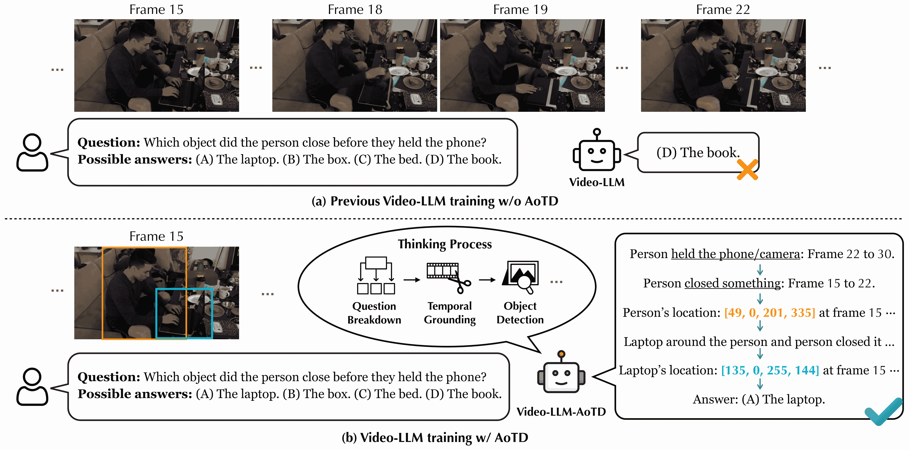
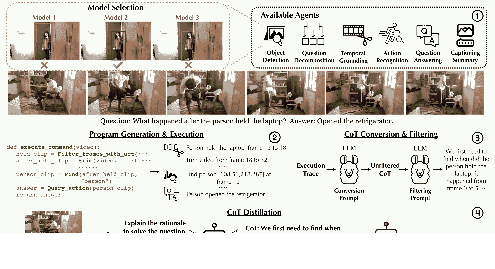
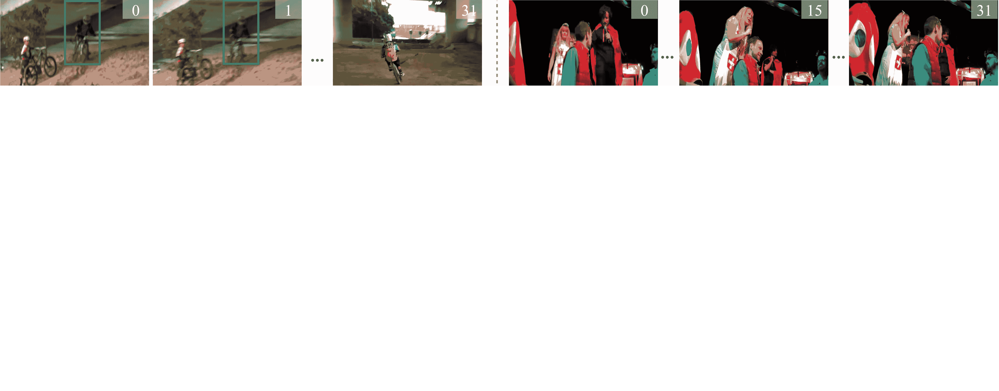
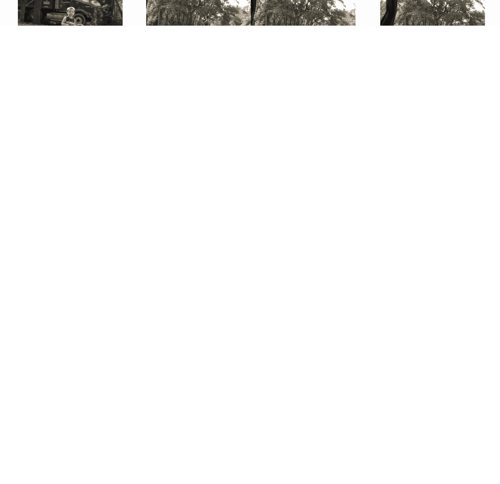
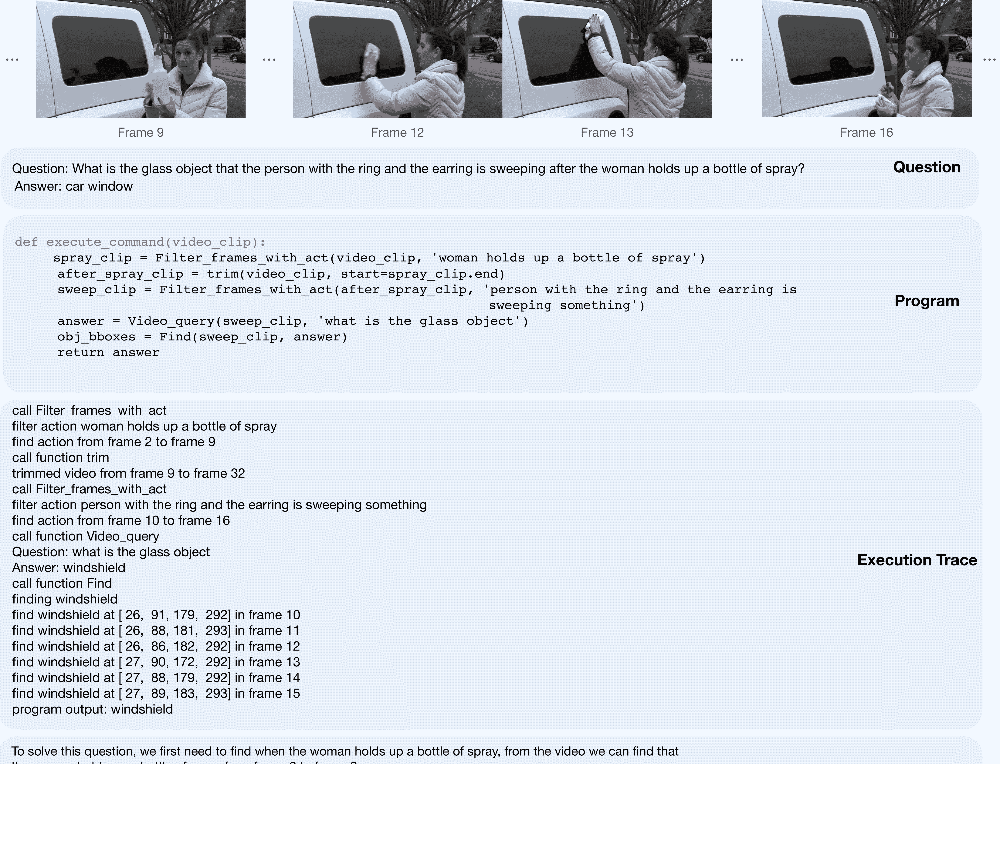

<!--yml

category: 未分类

日期：2025-01-11 11:52:20

-->

# 解锁视频-大型语言模型（Video-LLM）通过思想代理蒸馏

> 来源：[https://arxiv.org/html/2412.01694/](https://arxiv.org/html/2412.01694/)

施宇迪^(1,2), 狄尚哲^(1,2), 陈启睿^(1,2), 谢威迪^(1,†)

¹人工智能学院，上海交通大学，中国

²中共. Medianet创新中心，上海交通大学，中国

[https://zhengrongz.github.io/AoTD/](https://zhengrongz.github.io/AoTD/)

###### 摘要

本文解决了视频问答（VideoQA）问题，这是一个通常需要多步推理和深刻理解时空动态的任务。尽管大规模的视频-语言模型在基准测试中表现良好，但它们通常缺乏可解释性和时空基础。在本文中，我们提出了思想代理蒸馏（AoTD）方法，通过将自动生成的思维链（CoTs）整合到指令调优过程中，来增强模型。具体而言，我们利用基于代理的系统将复杂问题分解为子任务，并通过专业的视觉模型来解决这些子任务，然后将中间结果作为推理链处理。我们还引入了一个使用大型语言模型（LLM）来验证生成的思维链可靠性的机制。广泛的实验表明，AoTD在多选题和开放性基准测试上都提高了性能。

^†^† $\dagger$: 通讯作者。

图1：我们的方法，AoTD，将多步推理和时空理解蒸馏为一个单一的生成视频-语言模型。在解决复杂的视频问答任务时，采用AoTD训练的模型（如图(b)所示）能够生成一步步的推理过程来得出正确答案。相比之下，仅基于问答对进行训练的先前模型（如图(a)所示）只生成最终答案，通常缺少中间推理，这可能导致错误的结论。

## 1 引言

视频问答（VideoQA）是一个关键任务，它通过语言为人机交互提供了自然的接口[[47](https://arxiv.org/html/2412.01694v1#bib.bib47), [41](https://arxiv.org/html/2412.01694v1#bib.bib41), [42](https://arxiv.org/html/2412.01694v1#bib.bib42), [33](https://arxiv.org/html/2412.01694v1#bib.bib33)]。视觉内容与语言的结合提升了AI系统对普通大众的可访问性，使用户能够用日常语言查询复杂的视觉内容。通过涵盖动作识别、物体检测和场景理解等任务，VideoQA作为评估AI解释视频能力的综合基准，解决了“谁”、“什么”、“何时”和“在哪里”等基本问题，这些问题对于理解日常生活活动至关重要，推动了AI系统从动态视觉内容中解释能力的边界。

最近的文献主要探索了视频问答（VideoQA）中的两条途径。第一条途径是通过直接指令调优训练大型视频语言模型（Video-LLMs），使用仅与对应问题和答案配对的视频[[1](https://arxiv.org/html/2412.01694v1#bib.bib1), [22](https://arxiv.org/html/2412.01694v1#bib.bib22), [24](https://arxiv.org/html/2412.01694v1#bib.bib24), [51](https://arxiv.org/html/2412.01694v1#bib.bib51)]。虽然这些模型在公共基准测试中表现出色，但它们通常缺乏可解释性，并且在时空定位方面存在困难。这一限制阻碍了它们提供清晰推理的能力，而清晰推理对于现实应用至关重要，尤其是在透明性和可解释性至关重要的情况下[[29](https://arxiv.org/html/2412.01694v1#bib.bib29)]。

相反，一种新兴方法利用基于代理的系统，将复杂问题分解为可管理的子任务，每个子任务由专门的工具处理[[37](https://arxiv.org/html/2412.01694v1#bib.bib37), [15](https://arxiv.org/html/2412.01694v1#bib.bib15), [17](https://arxiv.org/html/2412.01694v1#bib.bib17)]。然后将结果汇总形成一致的答案。理论上，这种方法自然提供了更高的可解释性，因为推理过程被分解为可解释的步骤，可以独立评估。然而，我们的实验表明，当前的视频理解工具在构建可靠的基于代理的系统方面还不够强大。此外，这些系统对内存的高要求和耗时的特性为它们的实际应用带来了重大挑战。

在本文中，我们旨在利用两种研究路线的优势，通过将**思维链**（Chain-of-Thoughts, CoTs）集成到指令调优中，来增强视频大语言模型（Video-LLM），其中思维链由专门的代理模型的输出构建，捕捉逐步推理过程，如图[1](https://arxiv.org/html/2412.01694v1#S0.F1 "Figure 1 ‣ Unlocking Video-LLM via Agent-of-Thoughts Distillation")所示。

具体而言，我们首先通过使用经过充分注释的数据集，系统地评估专门用于原子视频理解任务的现成模型，如动作识别[[40](https://arxiv.org/html/2412.01694v1#bib.bib40), [38](https://arxiv.org/html/2412.01694v1#bib.bib38)]和语言定位[[23](https://arxiv.org/html/2412.01694v1#bib.bib23)]。这一全面的评估使我们能够找出每个子任务最有效的工具，从而为构建可靠的链条奠定了坚实的基础。此外，这一过程还对视觉模型在一般场景和复杂场景中的广泛能力进行了重要评估，为未来社区内的研究提供了宝贵的见解。

此外，我们引入了一种使用大语言模型（LLM）的验证机制，旨在评估生成的推理链是否遵循清晰的逐步推理过程，并包含回答查询所需的关键信息。该机制过滤掉低质量或逻辑不一致的推理路径。通过验证的推理链将被提炼到大型生成视频语言模型中，显著提高其性能和可解释性，最终促进了更强大、更准确且更具可解释性的视频问答系统的开发。

总结来说，我们的贡献有三方面：(i) 我们提出了一种新颖的方法，通过将高质量的推理链（CoTs）提炼到视频语言模型（Video-LLMs）的指令调优过程中，从而增强视频语言模型的性能。这些推理链捕捉了逐步推理路径，提升了模型的性能和可解释性；(ii) 为了自动构建任何数据集的推理链，我们采用基于代理的系统将复杂的视频问答（VideoQA）问题分解为更简单的子任务，利用现成的视觉模型来处理每个子任务。因此，这些模型的中间输出可以作为推理链，用于解决相应的视觉问题；(iii) 通过大量实验，我们展示了我们的提炼模型在多项选择和开放式视频问答基准上均优于现有方法，不仅能够提供准确的答案，还能提供全面的推理解释。

图2：思维代理推理链提炼（AoTD）概述。步骤1：为每个子任务选择表现最佳的代理，构建基于代理的系统。步骤2：将问题分解为可执行程序，并利用选定的模型按顺序解决它，生成执行痕迹。步骤3：执行痕迹通过大语言模型（LLM）转换和过滤，产生高质量的自然语言推理链。步骤4：将推理链提炼到视频语言模型中，使用两种提示形式，使其在简洁答案和全面推理之间实现平衡。最终模型是Video-LLM-AoTD。

## 2 相关工作

视频语言模型（Video-LLMs）。目前大多数现有的视频语言模型（Video-LLMs）由一个预训练的视觉编码器（如CLIP [[34](https://arxiv.org/html/2412.01694v1#bib.bib34)] 或 SigLIP [[50](https://arxiv.org/html/2412.01694v1#bib.bib50)]）组成，用来将视频帧编码为一系列视觉特征，一个适配器将视觉特征转换为语言模型可以理解的符号，最后由预训练的LLM输出最终响应。近期的研究如VideoLLaMA2 [[4](https://arxiv.org/html/2412.01694v1#bib.bib4)]、LLaVA-NeXT-Video [[52](https://arxiv.org/html/2412.01694v1#bib.bib52)]和VideoChat2 [[19](https://arxiv.org/html/2412.01694v1#bib.bib19)]，凭借其卓越的架构设计和合理的指令调优数据收集，在视频问答任务中达到了新的零-shot结果。然而，当前的端到端模型仍然缺乏对问题的可解释性，以及在多步骤中思考和视觉处理复杂问题的能力，这对于体现性学习和自动驾驶等领域是至关重要的。

视觉编程与智能体。随着大语言模型（LLMs）的进展，一些近期的研究[[15](https://arxiv.org/html/2412.01694v1#bib.bib15)、[37](https://arxiv.org/html/2412.01694v1#bib.bib37)、[5](https://arxiv.org/html/2412.01694v1#bib.bib5)、[43](https://arxiv.org/html/2412.01694v1#bib.bib43)]开始尝试使用LLM作为规划器，解决现实场景中的复杂推理任务。它们试图将问题分解成一些更简单的子问题，并使用不同的专业模型作为智能体来解决这些子问题，最后将它们汇总得到原始问题的答案。MoReVQA [[27](https://arxiv.org/html/2412.01694v1#bib.bib27)]提出了一个多阶段系统，获得了强大的零-shot视频问答能力，同时能够生成可解释的中间输出。VURF [[25](https://arxiv.org/html/2412.01694v1#bib.bib25)]提出了一种自我优化方法，通过上下文线索来解决LLM的幻觉问题，从而获得更简洁的程序。这些模型展示了基于中间证据获得可信答案的强大能力，但在推理速度上远远落后于端到端模型，并且常常需要一些上下文示例来帮助解决问题，这给这些基于智能体的模型的使用带来了很大困扰。

视觉链式思维（CoTs）。链式思维（CoT）推理的潜力[[39](https://arxiv.org/html/2412.01694v1#bib.bib39), [44](https://arxiv.org/html/2412.01694v1#bib.bib44)]从自然语言处理（NLP）扩展到视觉领域，突显出在多个领域应用这一方法的日益兴趣。许多研究已将CoTs融入视觉理解任务中[[53](https://arxiv.org/html/2412.01694v1#bib.bib53), [30](https://arxiv.org/html/2412.01694v1#bib.bib30), [36](https://arxiv.org/html/2412.01694v1#bib.bib36), [11](https://arxiv.org/html/2412.01694v1#bib.bib11)]，利用强大的多模态大语言模型（MLLMs）生成CoTs，或采用基于工具的架构进行顺序问题解决。然而，这些方法面临一些限制，如MLLMs在CoT生成中的错误和基于工具的系统在时间和内存上的高成本。

最近的创新，例如，视觉程序蒸馏（VPD）[[16](https://arxiv.org/html/2412.01694v1#bib.bib16)]和Fact [[10](https://arxiv.org/html/2412.01694v1#bib.bib10)]，试图通过保持CoTs的准确性和多样性来解决这些问题，同时利用MLLMs直接生成CoTs。这些方法将复杂任务分解为代码程序，调用专家模型处理子任务，并利用生成的CoTs作为训练数据来微调视觉语言模型。这个过程显著提高了模型生成详细推理的能力。尽管在图像理解方面取得了一定进展，但在视频领域仍存在明显的忽视，因为在视频理解任务中，推理链式尤其有效，原因在于视频理解任务中的复杂时空动态。这正是我们论文的研究重点。

相关工作。在近期的文献中，我们注意到有两项工作与我们的想法相似，特别是，Video-STaR [[54](https://arxiv.org/html/2412.01694v1#bib.bib54)]利用视频和现有标签进行指令微调以构建CoTs，但他们并未开发基于代理的系统。同时，MotionEpic [[8](https://arxiv.org/html/2412.01694v1#bib.bib8)]提出了一个思维视频推理框架，集成了视频时空场景图，标志着朝着更精细的视频推理迈出了重要步伐。

## 3 思维体的蒸馏

本文提出了一种新的方法，称为思维链蒸馏（AoTD），通过多步思维链训练来增强视频大语言模型（Video-LLMs）。具体而言，我们首先开发了一个基于代理的视频理解系统，用于生成解决复杂视频问题的多步推理链。这些推理链随后通过指令调优蒸馏为一个视频大语言模型。通过结合基于代理的系统和大型生成模型的优势，我们提出的AoTD能够构建更可靠、可解释的视频问答系统。图[2](https://arxiv.org/html/2412.01694v1#S1.F2 "图 2 ‣ 1 引言 ‣ 通过思维链蒸馏解锁视频大语言模型")展示了我们方法的整个过程。

图 3：基于代理的系统中的程序执行过程。我们从视频中均匀地抽取了32帧，并为了确保尺度一致性，将关键帧的帧ID归一化到这32帧中。蓝色框表示程序执行步骤，红色框表示每个步骤的真实值。红色和黄色框的结合表示评估目标检测模型候选项的一个过程示例。

### 3.1 问题公式化

给定一个包含$t$帧的视频片段，$\mathcal{V}=\{x_{1},\dots,x_{t}\}$，以及一组$n$个问题$\mathcal{Q}=\{q_{1},q_{2},...,q_{n}\}$，我们的目标是训练一个能够生成简洁答案和全面推理的Video-LLM。根据后缀提示$p_{s}$，模型可以生成不同类型的输出。这个过程可以公式化为：

|  | $\displaystyle\{a_{i},\mathcal{S}_{i}\}=\Phi(\mathcal{V},q_{i},p_{s}),\text{% \hskip 3.0pt}\mathcal{S}_{i}=\{\emptyset\}\text{ 或 } \{s_{i,1},\dots,s_{i,k}\}$ |  |
| --- | --- | --- |

其中，$q_{i}$表示第$i$个问题，$a_{i}$是自由文本形式的答案，$\mathcal{S}_{i}$表示推理过程。如果提示词仅指定生成答案，$\mathcal{S}_{i}=\{\emptyset\}$。否则，如果提示词要求生成推理过程，$\mathcal{S}_{i}=\{s_{i,1},\dots,s_{i,k}\}$，其中每个$s_{i,j}$对应一个推理步骤。

讨论。与现有的通过简单问答对在VideoQA数据集上进行指令调优的模型不同，我们的方法强调了使用思维链（CoTs）进行训练的重要性。在接下来的部分中，我们概述了如何从现有的VideoQA数据集中生成高质量的思维链。

### 3.2 基于代理的系统中的思维链构建

最近的研究工作，如STAR [[41](https://arxiv.org/html/2412.01694v1#bib.bib41)]，提出了使用可执行符号程序的概念，直接将问题分解为子任务。当与包含关键帧的全面视频信息的场景图相结合时——例如物体位置、交互和动作——这些程序通过直接执行符号操作，促进了简洁的思维链（CoTs）的生成。然而，这类数据集的规模有限，因此我们建议首先构建一个基于智能体的系统，能够将复杂问题分解为更简单的子任务，之后可以利用该系统的中间输出构建任何现有视频问答数据集的CoTs。

| Sub-task | Model name | Metric | Number (%) |
| --- | --- | --- | --- |
| question decomposition | CodeQwen1.5-Chat (7B) [[2](https://arxiv.org/html/2412.01694v1#bib.bib2)] |  | 52.7 |
| GPT-3.5-Turbo [[31](https://arxiv.org/html/2412.01694v1#bib.bib31)] | Acc | 73.1 |
| DeepSeek-Coder-Instruct (6.7B) [[6](https://arxiv.org/html/2412.01694v1#bib.bib6)] |  | 85.7 |
| object detection | OWL-ViT v1 [[26](https://arxiv.org/html/2412.01694v1#bib.bib26)] |  | 47.3 |
| GLIP [[20](https://arxiv.org/html/2412.01694v1#bib.bib20)] | IoU | 58.9 |
| OWL-ViT v2 [[28](https://arxiv.org/html/2412.01694v1#bib.bib28)] |  | 63.0 |
| temporal grounding | LITA (13B) [[18](https://arxiv.org/html/2412.01694v1#bib.bib18)] |  | 11.7 / 20.2 |
| TimeChat (7B) [[35](https://arxiv.org/html/2412.01694v1#bib.bib35)] | IoU / Recall | 13.9 / 23.1 |
| UniVTG [[23](https://arxiv.org/html/2412.01694v1#bib.bib23)] |  | 24.7 / 35.3 |
| action recognition | InternVideo2 (1B) [[38](https://arxiv.org/html/2412.01694v1#bib.bib38)] |  | 7.6 |
| Open-VCLIP [[40](https://arxiv.org/html/2412.01694v1#bib.bib40)] | Top1-Acc | 8.9 |
| LLaVA-NeXT-Video-DPO (7B) [[52](https://arxiv.org/html/2412.01694v1#bib.bib52)] |  | 18.2 |
| question answering | LLaMA-VID (7B) [[21](https://arxiv.org/html/2412.01694v1#bib.bib21)] |  | 43.5 |
| SeViLA [[46](https://arxiv.org/html/2412.01694v1#bib.bib46)] | Acc | 46.5 |
| LLaVA-NeXT-Video-DPO (7B) [[52](https://arxiv.org/html/2412.01694v1#bib.bib52)] |  | 53.4 |

表1：子任务定义和评估结果。我们为每个子任务选择了3个模型候选，并使用相应的度量标准在STAR训练集上进行评估。表现最好的模型被放置在每列的底部。

基于代理的视频问答（VideoQA）。假设我们给定了一个视频输入 ($\mathcal{V}$)、问题 ($\mathcal{Q}$)和一组视觉模型 ($\mathcal{M}=\{\phi_{\text{act}},\phi_{\text{det}},\ldots,\phi_{\text{qa}}\}$)，一个基于大型语言模型（LLM）的代理核心 ($\pi(\cdot)$)会处理问题，并结合视觉模型的文档 ($\mathcal{T}$)，其中包含变量和功能。随后，代理将问题分解为以Python代码格式表示的子任务，并通过函数调用来解决这些子任务。需要注意的是，视觉模型可以根据具体问题的需求以不同的顺序排列，从而确保在解决问题时具有灵活性。

具体来说，如图 [3](https://arxiv.org/html/2412.01694v1#S3.F3 "图 3 ‣ 3 思维代理蒸馏 ‣ 通过思维代理蒸馏解锁视频-LLM")所示，问题首先被分解成一系列子任务，包括时间基础、物体检测和问题回答。然后，相应的专业模型会按顺序执行，以解决这些子任务，最终得出最终答案 $y_{i}$：

|  | $\displaystyle\{\phi_{\text{ground}},\phi_{\text{det}},\phi_{\text{qa}}\}:=\pi(% q_{i},\mathcal{T}),$ |  |
| --- | --- | --- |
|  | $\displaystyle y_{i}=\phi_{\text{ground}}(\mathcal{V})\rightarrow\phi_{\text{% det}}(\mathcal{V})\rightarrow\phi_{\text{qa}}(\mathcal{V})$ |  |

思维链构建（CoT）。为了确保所有中间步骤输出的正确性，我们利用STAR的训练集进行超参数调优，从而使我们能够为代理系统中的每个子任务识别最有效的模型。通过遵循提供的程序，我们评估相应视觉模型在物体检测和动作识别等任务上的表现。鉴于完整推理链的可用性，我们使用所有先前步骤的真实数据独立评估每个子任务。

如表格 [1](https://arxiv.org/html/2412.01694v1#S3.T1 "Table 1 ‣ 3.2 CoT Construction with Agent-based System ‣ 3 Agent-of-Thoughts Distillation ‣ Unlocking Video-LLM via Agent-of-Thoughts Distillation") 所示，我们展示了各个子任务的评估结果。具体来说，在问题分解方面，我们比较了几种代码 LLM，其中 DeepSeek-Coder-Instruct 的表现最佳，甚至超过了 GPT-3.5-Turbo。在物体检测方面，OWL-ViT v2 记录了最高的交并比（IoU）分数，展示了其出色的开放词汇检测能力。时间定位的结果表明，尽管 UniVTG 在性能上领先，但该领域仍需进一步发展。在动作识别方面，我们的评估显示生成模型优于判别模型，这可能是由于 STAR 数据集提供的细粒度动作列表。然而，两个模型类型的表现都显示出显著的改进空间。最后，在单跳问答子任务中，所有模型表现出色，其中 LLaVA-NeXT-Video-DPO 脱颖而出，作为顶级表现者，其在其他基准上的强劲表现得到了验证。

利用这些高性能模型，我们在仅包含问答对的 VideoQA 数据集上实现了基于代理的方法。在程序执行过程中，我们记录所有中间输出以构建 CoT（思维链）。由于这些视觉模型的输出格式各异——例如边界框和自由形式文本——我们使用另一个大型语言模型（LLM）将执行痕迹转换为自然语言，以便更好地在蒸馏过程中使用。详细示例请参见附录 [C](https://arxiv.org/html/2412.01694v1#A3 "Appendix C More Results ‣ Unlocking Video-LLM via Agent-of-Thoughts Distillation")。

### 3.3 CoT 验证

为了提升 VideoQA 样本推理链的质量，我们实施了两步验证：（i）我们过滤执行痕迹，仅保留那些程序能够产生正确输出的痕迹。对于多选数据集，输出必须与正确答案完全匹配；而对于开放式数据集，我们提示 LLM 验证正确性，并考虑格式差异；（ii）我们提示 LLM 评估推理链在解决问题时的逻辑一致性和实用性。模型评估 CoT 是否遵循清晰的逐步推理过程，并提供二元评估（‘是’或‘否’）来表示其质量（详细提示请参见附录 [D](https://arxiv.org/html/2412.01694v1#A4 "Appendix D Prompts ‣ Unlocking Video-LLM via Agent-of-Thoughts Distillation")）。这种两步验证方法确保只有高质量的 CoT 被保留下来，供进一步蒸馏使用。

在表[2](https://arxiv.org/html/2412.01694v1#S3.T2 "表2 ‣ 3.3 CoT验证 ‣ 3 思维代理蒸馏 ‣ 通过思维代理蒸馏解锁视频-LLM")中，我们提供了不同数据集生成的剩余CoTs的统计信息。我们主要选择组合型QA数据集，因为这些数据集要求模型全面处理来自不同事件的空间-时间信息。

| 数据集 | 描述 | 标签数量 | CoTs数量 |
| --- | --- | --- | --- |
| AGQA | 组合型 | 25.0K | 5.4K |
| ANetQA | 组合型 | 25.0K | 3.6K |
| STAR | 组合型 | 45.7K | 11.2K |
| NExT-QA | 时间与因果 | 34.1K | 12.1K |
| CLEVRER | 空间与时间 | 21.0K | - |
| EgoQA | 以自我为中心 | 7.8K | - |
| 总计 |  | 158.6K | 32.3K |

表2：数据集统计。列“标签数量”表示视频问答对的数量，其中包括视频、问题、可能的答案（多选）以及正确答案。“CoTs数量”指的是每个数据集通过我们的基于代理的系统生成的CoT数量。

图4：推理可视化。LLaVA-NeXT-Video-AoTD可以输出包含关键内容的空间-时间基础和逐步思维过程的推理，以解决问题。

### 3.4 步骤性蒸馏

在本节中，我们描述了将生成的CoTs蒸馏到Video-LLM中的过程。此蒸馏过程增强了模型在空间-时间视频理解和多步骤推理方面的能力，从而提高了其在复杂视频问答任务中的表现。

具体来说，使用生成的CoTs，我们可以构建数据集$D=\{(\mathcal{V}_{j},q_{j},\hat{y}_{j},c_{j},p_{s})\}_{j=1}^{N}$，其中$N$是蒸馏数据集中的样本总数，$\mathcal{V}_{j}$是视频输入，$q_{j}$是问题，$\hat{y}_{j}$是真实答案，$c_{j}$是生成的CoT，$p_{s}$是任务特定的后缀提示符，用于区分不同的任务。例如，对于多选VQA，提示符可以是：“直接回答给定选项中的字母，并只给出最佳选项”；对于开放式VQA，提示符可以是：“用一个单词或短语回答”。请参阅附录[D](https://arxiv.org/html/2412.01694v1#A4 "附录D 提示符 ‣ 通过思维代理蒸馏解锁视频-LLM")中的详细提示符。

在蒸馏阶段，我们最小化预测答案和CoTs的交叉熵损失，我们将后缀提示符$p_{s}$替换为“解释思路以回答问题”，以指示我们是需要问题答案还是需要解释思维步骤的理由。参考[[10](https://arxiv.org/html/2412.01694v1#bib.bib10)]和[[16](https://arxiv.org/html/2412.01694v1#bib.bib16)]，我们的优化目标是：

|  | $\displaystyle\mathcal{L}$ | $\displaystyle=\mathcal{L}_{\text{label}}+\lambda\mathcal{L}_{\text{rationale}}$ |  |
| --- | --- | --- | --- |
|  |  | $\displaystyle=\sum_{j=1}^{N}\ell(\Phi(\mathcal{V}_{j},q_{j},p_{s}),\hat{y}_{j}% )+\lambda\ell(\Phi(\mathcal{V}_{j},q_{j},p_{s}),c_{j})$ |  |

在这里，我们将$\lambda$设置为1，以确保回答和推理的重要性被平等考虑。请注意，并非所有的QA对都能生成合格的CoT。在这种情况下，$\mathcal{L}_{\text{rationale}}$将设置为0。

| 数据集 | 大小 | 类型 | 训练 | 评估 |
| --- | --- | --- | --- | --- |
| 训练 | 评估 |
| MC-VQA |
| STAR [[41](https://arxiv.org/html/2412.01694v1#bib.bib41)] | 45.7K | 7.1K | 组合型 | ✓ | ✓ |
| NExT-QA [[42](https://arxiv.org/html/2412.01694v1#bib.bib42)] | 34.1K | 5.0K | 时序与因果 | ✓ | ✓ |
| CLEVRER [[45](https://arxiv.org/html/2412.01694v1#bib.bib45)] | 21.0K | - | 时空型 | ✓ | ✗ |
| Perception-Test [[33](https://arxiv.org/html/2412.01694v1#bib.bib33)] | - | 11.5K | 通用 | ✗ | ✓ |
| MVBench [[19](https://arxiv.org/html/2412.01694v1#bib.bib19)] | - | 2.0K | 通用 | ✗ | ✓ |
| VideoMME [[9](https://arxiv.org/html/2412.01694v1#bib.bib9)] | - | 2.7K | 通用 | ✗ | ✓ |
| OE-VQA |
| AGQA [[14](https://arxiv.org/html/2412.01694v1#bib.bib14)] | 25.0K | 2.0K | 组合型 | ✓ | ✓ |
| ANetQA [[48](https://arxiv.org/html/2412.01694v1#bib.bib48)] | 25.0K | 2.0K | 组合型 | ✓ | ✓ |
| EgoQA [[13](https://arxiv.org/html/2412.01694v1#bib.bib13)] | 7.8K | - | 自我中心 | ✓ | ✗ |
| Activitynet-QA [[47](https://arxiv.org/html/2412.01694v1#bib.bib47)] | - | 8.0K | 通用 | ✗ | ✓ |
| Video-ChatGPT [[24](https://arxiv.org/html/2412.01694v1#bib.bib24)] | - | 3.0K | 通用 | ✗ | ✓ |

表 3：训练与评估数据集统计信息。

| 模型 | MVBench | VideoMME | STAR | NExT-QA | Perception-Test |
| --- | --- | --- | --- | --- | --- |
| (准确率) | (准确率) | (准确率) | (准确率) | (准确率) |
| 专有模型 |
| Gemini 1.5 Pro [[12](https://arxiv.org/html/2412.01694v1#bib.bib12)] | - | 75.0 | - | - | - |
| GPT4-V [[32](https://arxiv.org/html/2412.01694v1#bib.bib32)] | 43.7 | 59.9 | - | - | - |
| 开源模型 |
| LLaMA-VID (7B) [[21](https://arxiv.org/html/2412.01694v1#bib.bib21)] | 41.9 | 25.9 | - | - | 44.6 |
| Video-LLaVA (7B) [[22](https://arxiv.org/html/2412.01694v1#bib.bib22)] | 41.0 | 39.9 | - | - | 44.3 |
| VideoChat2 (7B) [[19](https://arxiv.org/html/2412.01694v1#bib.bib19)] | 51.1 | 33.7 | 59.0^* | 68.6^* | 47.3 |
| VideoLLaMA2 (7B) [[4](https://arxiv.org/html/2412.01694v1#bib.bib4)] | 53.4 | 45.1 | 58.5^* | 62.3^* | 49.6 |
| LLaVA-NeXT-Video (7B) [[52](https://arxiv.org/html/2412.01694v1#bib.bib52)] | 46.5^* | 41.0^* | 52.4^* | 61.6^* | 47.5^* |
| LLaVA-NeXT-Video-Instruct (7B) | 53.4 | 43.2 | 72.2 | 77.1 | 50.3 |
| LLaVA-NeXT-Video-AoTD (7B) | 55.6 | 45.0 | 74.3 | 77.6 | 50.6 |

表 4：与 Video-LLMs 在 MC-VQA 基准上的比较。LLaVA-NeXT-Video-AoTD 超越了所有其他基线模型及其没有 CoT 蒸馏的版本。* 表示结果由我们自己复现。没有标记的结果来自 [[4](https://arxiv.org/html/2412.01694v1#bib.bib4)]。

## 4 实验

在本节中，我们展示了实验设置（第[4.1](https://arxiv.org/html/2412.01694v1#S4.SS1 "4.1 实验设置 ‣ 4 实验 ‣ 通过思想代理蒸馏解锁视频-LLM")节）以及在各种视频问答基准上的结果（第[4.2](https://arxiv.org/html/2412.01694v1#S4.SS2 "4.2 定量结果 ‣ 4 实验 ‣ 通过思想代理蒸馏解锁视频-LLM")节）。我们还进行了广泛的消融研究，以进一步检查我们方法的贡献，详见第[4.3](https://arxiv.org/html/2412.01694v1#S4.SS3 "4.3 消融研究 ‣ 4 实验 ‣ 通过思想代理蒸馏解锁视频-LLM")节，并在第[4.4](https://arxiv.org/html/2412.01694v1#S4.SS4 "4.4 合理性评估 ‣ 4 实验 ‣ 通过思想代理蒸馏解锁视频-LLM")节对蒸馏模型生成的推理过程质量进行了评估。

### 4.1 实验设置

基础模型。我们使用LLaVA-NeXT-Video (7B) [[52](https://arxiv.org/html/2412.01694v1#bib.bib52)]（简称LNV）作为基础视频LLM，该模型在图像相关任务中展现了显著的表现，例如图像问答[[49](https://arxiv.org/html/2412.01694v1#bib.bib49)]。我们展示了在视频问答数据集上进行简单指令微调与额外CoT蒸馏的比较。对于CoT转换与验证，我们使用手动设计的指令和一些上下文示例来提示LLaMA-3.1-8B。详细的提示请参见附录[D](https://arxiv.org/html/2412.01694v1#A4 "附录D 提示 ‣ 通过思想代理蒸馏解锁视频-LLM")。

指令微调。我们利用多项选择和开放式问答数据，并结合生成的CoT，来微调基础的视频问答模型，具体总结见表[2](https://arxiv.org/html/2412.01694v1#S3.T2 "表2 ‣ 3.3 CoT验证 ‣ 3 思想代理蒸馏 ‣ 通过思想代理蒸馏解锁视频-LLM")。最终得到的蒸馏模型命名为LLaVA-NeXT-Video-AoTD（简称LNV-AoTD）。此外，作为基线，我们还使用仅包含基本问答数据的另一版本进行训练，称之为LLaVA-NeXT-Video-Instruct（简称LNV-Instruct）。

评估基准。我们对多项选择视频问答（MC-VQA）和开放式视频问答（OE-VQA）进行了广泛评估。对于所有MC基准，我们报告了Top-1准确率，即输出与答案相等的比例。对于所有OE基准，我们报告了GPT评估的准确率和得分，借助GPT-3.5-turbo-0613进行评估。对于每个问题，GPT会给出一个二元决策，表示输出是正确还是错误，并附上一个相似度得分，反映输出与正确答案之间的一致性程度。术语“Acc.”指的是正确输出的百分比，而“Score”表示平均相似度得分。对于AGQA和ANetQA的评估，由于测试集较大，我们在一个子集样本上进行测试。我们均衡选择基准的领域内样本和领域外样本进行测试，以确保对模型能力的全面和合理评估。评估基准的详细统计信息见表[3](https://arxiv.org/html/2412.01694v1#S3.T3 "Table 3 ‣ 3.4 Step-by-step Distillation ‣ 3 Agent-of-Thoughts Distillation ‣ Unlocking Video-LLM via Agent-of-Thoughts Distillation")。

### 4.2 定量结果

我们将比较分为两部分：第一部分侧重于将精炼后的模型与其他基线模型进行比较，第二部分则考察指令版本与AoTD版本之间的差异。需要注意的是，后者将作为主要的比较和讨论对象，以展示模型相较于之前表现的改进，并且证明该方法在不同模型之间的可迁移性。

MC-VQA性能。如表[4](https://arxiv.org/html/2412.01694v1#S3.T4 "Table 4 ‣ 3.4 Step-by-step Distillation ‣ 3 Agent-of-Thoughts Distillation ‣ Unlocking Video-LLM via Agent-of-Thoughts Distillation")所示，我们的LLaVA-NeXT-Video-AoTD在所有基准测试中都表现优异。可以得出几个关键观察结果：(i) 与基础模型相比，即便是对某些VideoQA数据集进行简单的指令调优，也显著提高了模型的问答性能。这个改进非常明显，因为基础模型主要在静态图像上训练，并且在视频理解上存在困难；(ii) 我们的模型通过CoT蒸馏进行指令调优，在所有基准测试中进一步提升了性能，特别是在组合型VideoQA基准（STAR）和综合性基准（VideoMME、MVBench）上。这表明我们的AoTD方法有效提升了模型解决复杂问题和解读时空场景的能力；(iii) 精炼后的模型在几乎所有基准测试中都持续超越其他基线模型，即使与更强大的模型相比，这一发现表明我们的方法有效弥合了由不同模型组件造成的性能差距。

| 模型 | ANetQA | AGQA | Video-ChatGPT（得分） | ActivityNet |
| --- | --- | --- | --- | --- |
| (准确率/得分) | (准确率/得分) | 相关性 | 差异 | 连贯性 | 温度 | 一致性 | (准确率/得分) |
| 专有模型 |
| Gemini 1.5 Pro [[12](https://arxiv.org/html/2412.01694v1#bib.bib12)] | - | - | - | - | - | - | - | 56.7/- |
| GPT4-V [[32](https://arxiv.org/html/2412.01694v1#bib.bib32)] | - | - | 4.09 | 3.88 | 4.37 | 3.94 | 4.02 | 59.5/- |
| 开源模型 |
| VideoLLaMA (7B) [[51](https://arxiv.org/html/2412.01694v1#bib.bib51)] | - | - | 1.96 | 2.18 | 2.16 | 1.82 | 1.79 | 12.4/1.1 |
| Video-ChatGPT (7B) [[24](https://arxiv.org/html/2412.01694v1#bib.bib24)] | - | - | 2.50 | 2.57 | 2.69 | 2.16 | 2.20 | 35.2/2.7 |
| LLaMA-VID (7B) [[21](https://arxiv.org/html/2412.01694v1#bib.bib21)] | - | - | 2.96 | 3.00 | 3.53 | 2.46 | 2.51 | 47.4/3.3 |
| Video-LLaVA (7B) [[22](https://arxiv.org/html/2412.01694v1#bib.bib22)] | - | - | 2.87 | 2.94 | 3.44 | 2.45 | 2.51 | 45.3/3.3 |
| VideoChat2 (7B) [[19](https://arxiv.org/html/2412.01694v1#bib.bib19)] | - | - | 3.02 | 2.88 | 3.51 | 2.66 | 2.81 | 49.1/3.3 |
| VideoLLaMA2 (7B) [[4](https://arxiv.org/html/2412.01694v1#bib.bib4)] | - | - | 3.09 | 3.09 | 3.68 | 2.63 | 3.25 | 49.9/3.3 |
| LLaVA-NeXT-Video (7B) [[52](https://arxiv.org/html/2412.01694v1#bib.bib52)] | 46.4/3.3^* | 27.4/2.2^* | 3.26^* | 3.22^* | 3.77^* | 2.47^* | 2.99^* | 54.3/3.2^* |
| LLaVA-NeXT-Video-Instruct (7B) | 47.1/3.1 | 59.3/3.4 | 2.96 | 2.81 | 3.35 | 2.42 | 2.82 | 50.0/3.3 |
| LLaVA-NeXT-Video-AoTD (7B) | 53.9/3.4 | 60.9/3.6 | 3.11 | 3.00 | 3.60 | 2.41 | 2.91 | 53.2/3.4 |

表 5：与 Video-LLMs 在 OE-VQA 基准测试上的比较。与 Instruct 版本相比，LLaVA-NeXT-Video-AoTD 在所有开放式基准测试中都提高了性能。*表示结果由我们自己复现。没有标记的结果来自 [[4](https://arxiv.org/html/2412.01694v1#bib.bib4)]。

OE-VQA 性能。如表 [5](https://arxiv.org/html/2412.01694v1#S4.T5 "Table 5 ‣ 4.2 Quantitative Results ‣ 4 Experiments ‣ Unlocking Video-LLM via Agent-of-Thoughts Distillation") 所示，LLaVA-NeXT-Video-AoTD 在所有开放式 VideoQA 基准测试中均优于 Instruct 变种。值得注意的是，与 MC-VQA 基准测试相比，它的提升幅度更大，表明 CoT 蒸馏对于开放式生成任务可能比多选题选择更有效。尽管蒸馏模型在表中列出的多数模型中得分较高，但在某些基准测试中，它并未超过 LLaVA-NeXT-Video。我们推测，这是因为该模型在图像上的大量训练同样能够帮助回答问题，而无需复杂的推理，这一点也得到了 VideoLLaMA2 [[4](https://arxiv.org/html/2412.01694v1#bib.bib4)] 的发现支持。此外，评估开放式 VQA 本身的固有挑战可能会影响结果。GPT 进行的评估可能存在偏差或不准确，而我们采用的度量指标主要指示了总体趋势，而非提供绝对准确性。

### 4.3 消融研究

CoT过滤分析。为了证明我们过滤机制的有效性，我们训练了一个不使用CoT过滤的替代模型，同时保持所有其他设置不变，即使用36.3K经过验证的CoT进行蒸馏。如表[6](https://arxiv.org/html/2412.01694v1#S4.T6 "Table 6 ‣ 4.3 Ablation Study ‣ 4 Experiments ‣ Unlocking Video-LLM via Agent-of-Thoughts Distillation")所示，当未使用CoT过滤机制时，模型在多项选择VQA和开放式VQA基准上的表现显著下降。这确认了使用大型语言模型（LLM）来过滤CoT对于提高数据质量至关重要。

模型迁移性分析。由于AoTD是一种利用链式思维（CoTs）的蒸馏方法，它理论上可以应用于任何视频LLM。为了评估我们方法的迁移性，我们对另一种最近的模型——LLaVA-OneVision（7B）[[3](https://arxiv.org/html/2412.01694v1#bib.bib3)]进行了实验。如表[6](https://arxiv.org/html/2412.01694v1#S4.T6 "Table 6 ‣ 4.3 Ablation Study ‣ 4 Experiments ‣ Unlocking Video-LLM via Agent-of-Thoughts Distillation")所示，我们的方法在基准测试上也表现出显著的改进，展示了该方法的迁移性和鲁棒性。由于计算机视觉领域的快速发展，评估所有模型和基准是不可行的。因此，我们专注于针对选定的基准评估单一模型，以提供具有代表性的评估。

| 模型 | 过滤 | MVBench | STAR | AGQA |
| --- | --- | --- | --- | --- |
| (准确率) | (准确率) | (准确率/得分) |
| LNV-AoTD | ✗ | 53.7 | 73.3 | 59.5/3.5 |
| LNV-AoTD | ✓ | 55.6 | 74.3 | 60.9/3.6 |
| Onevision | - | 58.0 | 65.9 | 39.0/3.0 |
| Onevision-Instruct | - | 59.2 | 75.8 | 65.6/3.7 |
| Onevision-AoTD | ✓ | 60.5 | 76.6 | 65.7/3.7 |

表6：CoT过滤和迁移性消融结果。

### 4.4 推理过程评估

为了验证模型是否通过CoT蒸馏有效学习了多步骤推理，我们分析了模型生成的推理过程。具体来说，我们提取并评估了这些推理过程中的时间和空间信息。这种方法不仅仅是评估最终答案的正确性，因为答案可能会受到偏见或其他外部因素的影响。通过详细检查推理过程，它能够更准确地理解模型在感知和推理空间与时间关系方面的能力。

评估协议。我们从 STAR 验证集随机选择 200 个样本，并使用后缀提示对其进行推理，记录生成的推理过程。从这些推理中，我们提取预测的时间窗口和边界框，并将其与真实值进行比较。对于空间部分，我们计算预测的边界框与真实边界框之间的 IoU。对于时间部分，我们计算 IoU 和召回率，利用数据集中提供的帧级注释。

评估结果。表格 [7](https://arxiv.org/html/2412.01694v1#S4.T7 "表格 7 ‣ 4.4 关于推理的评估 ‣ 4 实验 ‣ 通过思维代理蒸馏解锁视频-LLM") 展示了评估结果。为了比较，我们还测试了 UniVTG 的时间推理和 OWL-ViT v2 的空间推理。结果表明，LNV-Instruct 在生成有效推理时遇到困难，即使使用了后缀提示。相比之下，LNV-AoTD 在空间和时间推理方面表现出与专门模型相当的性能，表明该模型通过蒸馏过程成功获得了这些能力。

| 模型 | 时间基础 | 空间基础 |
| --- | --- | --- |
| IoU (%) | 召回率 (%) | IoU (%) |
| UniVTG | 22.8 | 31.0 | - |
| OWL-ViT v2 | - | - | 64.7 |
| LNV-Instruct | ✗ | ✗ | ✗ |
| LNV-AoTD | 21.7 | 34.0 | 45.2 |

表格 7：时间和空间能力评估结果。

## 5 结论

我们提出了思维代理蒸馏（AoTD），旨在将多步推理和时空理解蒸馏到大型视频语言模型（Video-LLM）中。我们的方法引入了一个基于代理的系统，通过将复杂问题分解为可以由专门的视觉模型处理的可管理子任务，自动生成来自多个 VideoQA 数据集的思维链（CoTs）。大量实验验证了蒸馏模型在 MC-VQA 和 OE-VQA 基准测试中的显著性能提升，强调了我们方法的有效性。我们相信 AoTD 代表了推动视频-LLM 推理能力发展的一个有前景的方向。

## 参考文献

+   Alayrac 等人 [2022] Jean-Baptiste Alayrac, Jeff Donahue, Pauline Luc, Antoine Miech, Iain Barr, Yana Hasson, Karel Lenc, Arthur Mensch, Katherine Millican, Malcolm Reynolds 等人。Flamingo: 一种视觉语言模型，用于少样本学习。发表于 *神经信息处理系统进展*，2022。

+   Bai 等人 [2023] Jinze Bai, Shuai Bai, Yunfei Chu, Zeyu Cui, Kai Dang, Xiaodong Deng, Yang Fan, Wenbin Ge, Yu Han, Fei Huang, Binyuan Hui, Luo Ji, Mei Li, Junyang Lin, Runji Lin, Dayiheng Liu, Gao Liu, Chengqiang Lu, Keming Lu, Jianxin Ma, Rui Men, Xingzhang Ren, Xuancheng Ren, Chuanqi Tan, Sinan Tan, Jianhong Tu, Peng Wang, Shijie Wang, Wei Wang, Shengguang Wu, Benfeng Xu, Jin Xu, An Yang, Hao Yang, Jian Yang, Shusheng Yang, Yang Yao, Bowen Yu, Hongyi Yuan, Zheng Yuan, Jianwei Zhang, Xingxuan Zhang, Yichang Zhang, Zhenru Zhang, Chang Zhou, Jingren Zhou, Xiaohuan Zhou 和 Tianhang Zhu。Qwen 技术报告。*arXiv 预印本 arXiv:2309.16609*，2023。

+   Bo 等人 [2024] Li Bo, Zhang Yuanhan, Guo Dong, Zhang Renrui, Li Feng, Zhang Hao, Zhang Kaichen, Li Yanwei, Liu Ziwei 和 Li Chunyuan。Llava-onevision：轻松视觉任务迁移。*arXiv 预印本 arXiv:2408.03326*，2024。

+   Cheng 等人 [2024] Zesen Cheng, Sicong Leng, Hang Zhang, Yifei Xin, Xin Li, Guanzheng Chen, Yongxin Zhu, Wenqi Zhang, Ziyang Luo, Deli Zhao 和 Lidong Bing。Videollama 2：推动视频 LLM 中的时空建模和音频理解。*arXiv 预印本 arXiv:2406.07476*，2024。

+   Choudhury 等人 [2023] Rohan Choudhury, Koichiro Niinuma, Kris M. Kitani 和 Laszlo A. Jeni。零-shot 视频问答与程序性程序。*arXiv 预印本 arXiv:2312.00937*，2023。

+   Daya 等人 [2024] Guo Daya, Zhu Qihao, Yang Dejian, Dong Zhenda Xie, Kai, Zhang Wentao, Chen Guanting, Bi Xiao, Y. Wu, Y.K. Li, Luo Fuli 和 Liang Yingfei, Xiongand Wenfeng。Deepseek-coder：当大语言模型遇上编程——代码智能的崛起。*arXiv 预印本 arXiv:2401.14196*，2024。

+   Fan 等人 [2024] Yue Fan, Xiaojian Ma, Rujie Wu, Yuntao Du, Jiaqi Li, Zhi Gao 和 Qing Li。Videoagent：用于视频理解的记忆增强多模态智能体。*arXiv 预印本 arXiv:2403.11481*，2024。

+   Fei 等人 [2024] Hao Fei, Shengqiong Wu, Wei Ji, Hanwang Zhang, Meishan Zhang, Mong-Li Lee 和 Wynne Hsu。Video-of-thought：从感知到认知的逐步视频推理。在 *国际机器学习会议论文集*，2024。

+   Fu 等人 [2024] Chaoyou Fu, Yuhan Dai, Yondong Luo, Lei Li, Shuhuai Ren, Renrui Zhang, Zihan Wang, Chenyu Zhou, Yunhang Shen, Mengdan Zhang 等人。Video-mme：史上首个视频分析多模态 LLM 的综合评估基准。*arXiv 预印本 arXiv:2405.21075*，2024。

+   Gao 等人 [2024a] Minghe Gao, Shuang Chen, Liang Pang, Yuan Yao, Jisheng Dang, Wenqiao Zhang, Juncheng Li, Siliang Tang, Yueting Zhuang 和 Tat-Seng Chua。Fact：用真实、简洁和可转移的推理教学 mllms。在 *ACM Multimedia*，2024a。

+   Gao 等人 [2024b] Timin Gao, Peixian Chen, Mengdan Zhang, Chaoyou Fu, Yunhang Shen, Yan Zhang, Shengchuan Zhang, Xiawu Zheng, Xing Sun, Liujuan Cao 等人。Cantor：激发多模态推理链的 mllm。在 *ACM Multimedia*，2024b。

+   Google [2024] Gemini 团队 Google。Gemini 1.5：解锁跨越数百万令牌上下文的多模态理解。*arXiv 预印本 arXiv:2403.05530*，2024年。

+   Grauman 等人 [2022] Kristen Grauman、Andrew Westbury、Eugene Byrne、Zachary Chavis、Antonino Furnari、Rohit Girdhar、Jackson Hamburger、Hao Jiang、Miao Liu、Xingyu Liu 等人。Ego4d：在3,000小时的自我中心视频中环游世界。发表于 *IEEE计算机视觉与模式识别大会论文集*，2022年。

+   Grunde-McLaughlin 等人 [2021] Madeleine Grunde-McLaughlin、Ranjay Krishna 和 Maneesh Agrawala。Agqa：一个用于组合性时空推理的基准。发表于 *IEEE计算机视觉与模式识别大会论文集*，2021年。

+   Gupta 和 Kembhavi [2023] Tanmay Gupta 和 Aniruddha Kembhavi。视觉编程：无需训练的组合视觉推理。发表于 *IEEE计算机视觉与模式识别大会论文集*，2023年。

+   Hu 等人 [2024a] Yushi Hu、Otilia Stretcu、Chun-Ta Lu、Krishnamurthy Viswanathan、Kenji Hata、Enming Luo、Ranjay Krishna 和 Ariel Fuxman。视觉程序蒸馏：将工具和程序化推理蒸馏到视觉-语言模型中。发表于 *IEEE计算机视觉与模式识别大会论文集*，2024年。

+   Hu 等人 [2024b] Ziniu Hu、Ahmet Iscen、Chen Sun、Kai-Wei Chang、Yizhou Sun、David Ross、Cordelia Schmid 和 Alireza Fathi。Avis：使用大型语言模型代理进行自主视觉信息搜索。发表于 *神经信息处理系统进展*，2024年。

+   Huang 等人 [2024] De-An Huang、Shijia Liao、Subhashree Radhakrishnan、Hongxu Yin、Pavlo Molchanov、Zhiding Yu 和 Jan Kautz。Lita：语言指令的时间定位助手。发表于 *欧洲计算机视觉大会论文集*，2024年。

+   Li 等人 [2024a] Kunchang Li、Yali Wang、Yinan He、Yizhuo Li、Yi Wang、Yi Liu、Zun Wang、Jilan Xu、Guo Chen、Ping Luo 等人。Mvbench：一个综合性的多模态视频理解基准。发表于 *IEEE计算机视觉与模式识别大会论文集*，2024年。

+   Li* 等人 [2022] Liunian Harold Li*、Pengchuan Zhang*、Haotian Zhang*、Jianwei Yang、Chunyuan Li、Yiwu Zhong、Lijuan Wang、Lu Yuan、Lei Zhang、Jenq-Neng Hwang、Kai-Wei Chang 和 Jianfeng Gao。基于语境的语言-图像预训练。发表于 *IEEE计算机视觉与模式识别大会论文集*，2022年。

+   Li 等人 [2024b] Yanwei Li、Chengyao Wang 和 Jiaya Jia。Llama-vid：在大型语言模型中，图像值2个令牌。发表于 *欧洲计算机视觉大会论文集*，2024年。

+   Lin 等人 [2024] Bin Lin、Bin Zhu、Yang Ye、Munan Ning、Peng Jin 和 Li Yuan。Video-llava：通过投影前的对齐学习统一的视觉表示。发表于 *自然语言处理实证方法会议论文集*，2024年。

+   Lin 等人 [2023] Kevin Qinghong Lin, Pengchuan Zhang, Joya Chen, Shraman Pramanick, Difei Gao, Alex Jinpeng Wang, Rui Yan 和 Mike Zheng Shou。Univtg：迈向统一的视频-语言时间定位。发表于 *国际计算机视觉会议论文集*，2023年。

+   Maaz 等人 [2024] Muhammad Maaz, Hanoona Rasheed, Salman Khan 和 Fahad Shahbaz Khan。Video-chatgpt：通过大型视觉和语言模型实现详细的视频理解。发表于 *计算语言学协会*，2024年。

+   Mahmood 等人 [2024] Ahmad Mahmood, Ashmal Vayani, Muzammal Naseer, Salman Khan 和 Fahad Khan。Vurf：一种用于视频理解的通用推理与自我优化框架。*arXiv预印本 arXiv:2403.14743*，2024年。

+   Matthias 等人 [2022] Minderer Matthias, Gritsenko Alexey, Stone Austin, Neumann Maxim, Weissenborn Dirk, Dosovitskiy Alexey, Mahendran Aravindh, Arnab Anurag, Dehghani Mostafa, Shen Zhuoran, Wang Xiao, Zhai Xiaohua, Kipf Thomas 和 Houlsby Neil。使用视觉变换器进行简单的开放词汇物体检测。发表于 *欧洲计算机视觉会议论文集*，2022年。

+   Min 等人 [2024] Juhong Min, Shyamal Buch, Arsha Nagrani, Minsu Cho 和 Cordelia Schmid。Morevqa：探索用于视频问答的模块化推理模型。发表于 *IEEE计算机视觉与模式识别会议论文集*，2024年。

+   Minderer 等人 [2024] Matthias Minderer, Alexey Gritsenko 和 Neil Houlsby。扩展开放词汇物体检测。发表于 *神经信息处理系统进展*，2024年。

+   Mitra 等人 [2023] Arindam Mitra, Luciano Del Corro, Shweti Mahajan, Andres Codas, Clarisse Simoes, Sahaj Agarwal, Xuxi Chen, Anastasia Razdaibiedina, Erik Jones, Kriti Aggarwal 等人。Orca 2：教小型语言模型如何推理。*arXiv预印本 arXiv:2311.11045*，2023年。

+   Mitra 等人 [2024] Chancharik Mitra, Brandon Huang, Trevor Darrell 和 Roei Herzig。大型多模态模型的组合性思维链提示。发表于 *IEEE计算机视觉与模式识别会议论文集*，2024年。

+   OpenAI [2023a] OpenAI。Gpt-3.5-turbo系统卡。[https://platform.openai.com/docs/models/gpt-3-5-turbo](https://platform.openai.com/docs/models/gpt-3-5-turbo)，2023a年。

+   OpenAI [2023b] OpenAI。Gpt-4v(ision)系统卡。[https://openai.com/research/gpt-4v-system-card](https://openai.com/research/gpt-4v-system-card)，2023b年。

+   Pătrăucean 等人 [2023] Viorica Pătrăucean, Lucas Smaira, Ankush Gupta, Adrià Recasens Continente, Larisa Markeeva, Dylan Banarse, Skanda Koppula, Joseph Heyward, Mateusz Malinowski, Yi Yang, Carl Doersch, Tatiana Matejovicova, Yury Sulsky, Antoine Miech, Alex Frechette, Hanna Klimczak, Raphael Koster, Junlin Zhang, Stephanie Winkler, Yusuf Aytar, Simon Osindero, Dima Damen, Andrew Zisserman 和 João Carreira。感知测试：多模态视频模型的诊断基准。发表于 *神经信息处理系统进展*，2023年。

+   Radford 等人 [2021] Alec Radford, Jong Wook Kim, Chris Hallacy, Aditya Ramesh, Gabriel Goh, Sandhini Agarwal, Girish Sastry, Amanda Askell, Pamela Mishkin, Jack Clark 等人. 从自然语言监督学习可迁移的视觉模型。载于 *国际机器学习会议论文集*，2021。

+   Ren 等人 [2024] Shuhuai Ren, Linli Yao, Shicheng Li, Xu Sun 和 Lu Hou. Timechat：一种时间敏感的多模态大语言模型，用于长视频理解。载于 *IEEE计算机视觉与模式识别会议论文集*，2024。

+   Shao 等人 [2024] Hao Shao, Shengju Qian, Han Xiao, Guanglu Song, Zhuofan Zong, Letian Wang, Yu Liu 和 Hongsheng Li. 视觉COT：通过综合数据集和基准测试推动多模态语言模型的发展，以进行思维链推理。载于 *神经信息处理系统进展*，2024。

+   Surís 等人 [2023] Dídac Surís, Sachit Menon 和 Carl Vondrick. Vipergpt：通过Python执行进行视觉推理。载于 *国际计算机视觉会议论文集*，2023。

+   Wang 等人 [2024] Yi Wang, Kunchang Li, Xinhao Li, Jiashuo Yu, Yinan He, Chenting Wang, Guo Chen, Baoqi Pei, Rongkun Zheng, Jilan Xu, Zun Wang 等人. Internvideo2：扩展视频基础模型以实现多模态视频理解。载于 *欧洲计算机视觉会议论文集*，2024。

+   Wei 等人 [2022] Jason Wei, Xuezhi Wang, Dale Schuurmans, Maarten Bosma, Fei Xia, Ed Chi, Quoc V Le, Denny Zhou 等人. 思维链提示引发大规模语言模型的推理。载于 *神经信息处理系统进展*，2022。

+   Weng 等人 [2023] Zejia Weng, Xitong Yang, Ang Li, Zuxuan Wu 和 Yu-Gang Jiang. Open-vclip：通过插值权重优化将CLIP转换为开放词汇的视频模型。载于 *国际机器学习会议论文集*，2023。

+   Wu 等人 [2021] Bo Wu, Shoubin Yu, Zhenfang Chen, Joshua B Tenenbaum 和 Chuang Gan. Star: 一种用于现实世界视频中的情境推理基准测试。载于 *神经信息处理系统进展*，2021。

+   Xiao 等人 [2021] Junbin Xiao, Xindi Shang, Angela Yao 和 Tat-Seng Chua. Next-qa：下一阶段的问答系统，用于解释时间性动作。载于 *IEEE计算机视觉与模式识别会议论文集*，2021。

+   Yang 等人 [2024] Zongxin Yang, Guikun Chen, Xiaodi Li, Wenguan Wang 和 Yi Yang. Doraemongpt：通过大规模语言模型理解动态场景（以视频代理为例）。载于 *国际机器学习会议论文集*，2024。

+   Yao 等人 [2024] Shunyu Yao, Dian Yu, Jeffrey Zhao, Izhak Shafran, Tom Griffiths, Yuan Cao 和 Karthik Narasimhan. 思维树：使用大规模语言模型进行深思熟虑的问题解决。载于 *神经信息处理系统进展*，2024。

+   易等人 [2020] 易可欣, 甘创, 李云珠, 科利·普什米特, 吴家俊, 安东尼奥·托雷尔巴, 乔舒亚·B·特南鲍姆. CLEVRER: 用于视频表示和推理的碰撞事件. 载于 *国际学习表示会议论文集*，2020。

+   于等人 [2023a] 赵书斌, 曹在民, 普拉特克·亚达夫, 莫希特·班萨尔. 自链式图像-语言模型用于视频定位与问答. 载于 *神经信息处理系统进展*，2023a。

+   于等人 [2019] 于周, 许德静, 于军, 于婷, 赵周, 庄宇婷, 陶大成. Activitynet-qa: 一个通过问答理解复杂网页视频的数据集. 载于 *AAAI人工智能会议论文集*，2019。

+   于等人 [2023b] 于周, 郑立祥, 赵周, 吴飞, 范建平, 任奎, 于军. Anetqa: 一个用于非裁剪视频的细粒度组合推理的大规模基准. 载于 *IEEE计算机视觉与模式识别会议论文集*，2023b。

+   岳等人 [2024] 岳翔, 倪元生, 张凯, 郑天宇, 刘若琪, 张革, 塞缪尔·史蒂文斯, 姜东富, 任伟明, 孙宇轩 等人. Mmmu: 一项面向专家级AGI的大规模多学科多模态理解与推理基准. 载于 *IEEE计算机视觉与模式识别会议论文集*，2024。

+   翟等人 [2023] 翟晓华, 巴希尔·穆斯塔法, 亚历山大·科列斯尼科夫, 卢卡斯·贝耶. 用于语言图像预训练的Sigmoid损失. 载于 *国际计算机视觉会议论文集*，2023。

+   张等人 [2023a] 张航, 李鑫, 宾立东. Video-llama: 一种用于视频理解的指令调优视听语言模型. 载于 *自然语言处理经验方法会议论文集*，2023a。

+   张等人 [2024] 张远涵, 李波, 刘昊天, 李永材, 龚亮科, 傅迪, 冯佳实, 刘子维, 李春远. Llava-next: 一种强大的零-shot视频理解模型. [https://llava-vl.github.io/blog/2024-04-30-llava-next-video/](https://llava-vl.github.io/blog/2024-04-30-llava-next-video/)，2024。

+   张等人 [2023b] 张卓生, 张阿斯顿, 李牧, 赵海, 乔治·卡里皮斯, 亚历克斯·斯莫拉. 语言模型中的多模态思维链推理. *arXiv预印本arXiv:2302.00923*，2023b。

+   Zohar等人 [2024] 奥尔·佐哈尔, 王晓寒, 约拿坦·比顿, 伊丹·斯佩克托, 赛琳娜·杨-李维. Video-star: 自我训练使得视频指令调优在任何监督下都能实现. *arXiv预印本arXiv:2407.06189*，2024。

通过思维代理蒸馏解锁Video-LLM

附录

## 附录A 限制

尽管本文提到了一些进展，但仍然存在若干局限性，我们将其留作未来的研究方向：（i）与之前的方法类似[[16](https://arxiv.org/html/2412.01694v1#bib.bib16), [10](https://arxiv.org/html/2412.01694v1#bib.bib10), [7](https://arxiv.org/html/2412.01694v1#bib.bib7)]，我们的基于代理的系统效果依赖于基础视觉模型组件的进展。提升其在不同数据集上的泛化能力对广泛应用至关重要；（ii）尽管我们的主要关注点是组成性视频问答任务[[41](https://arxiv.org/html/2412.01694v1#bib.bib41)]，并且我们已经在一系列基准测试中展示了改进，但要实现全面的提升，还需要进一步探索如何创建更加平衡的训练数据分布；（iii）此外，我们的基于代理的框架有潜力解决其他视频相关任务，如视频字幕生成和指代分割。我们计划将我们的方法扩展到这些领域，未来可能会产生更强大和多样化的应用。

## 附录B 实验细节

### B.1 训练细节

对于所有模型，它们的投影层和语言模型会进行微调，而视觉编码器保持冻结。我们使用余弦学习率调度，热身比例为0.03，学习率为4e-5。对于Instruct和AoTD设置，我们使用批量大小为48并进行1轮训练。我们认为，较长的训练可能在领域内基准测试上取得更好的表现，但可能会在领域外基准测试中造成性能下降。

### B.2 专用模型评估细节

在本节中，我们将展示每个子任务从数据准备到评估指标的详细信息。

问题分解。由于可能有多种有效方式来分解同一个问题，因此我们仅评估该子任务中最终输出的准确性。具体而言，模型将查询和指令作为输入，生成可执行程序。我们替换程序中的所有中间输出，重点检查最终输出是否与正确答案匹配。如果分解正确，最终输出必须与答案一致。任何无法执行或导致错误答案的程序都被视为失败。

物体检测。为了评估检测模型的性能，我们从输入视频片段中采样带有场景图注释的帧，并将它们与文本查询一起作为输入提供给模型。模型随后输出一系列超出置信度阈值的边界框。我们选择置信度最高的边界框作为最终输出，并计算IoU以评估准确性。

时间基础。由于场景图提供了每个事件的开始和结束帧ID，以及关键帧ID，我们使用IoU和召回率（Recall）作为度量，捕捉模型性能的不同方面。模型将视频片段和文本查询作为输入，输出预测的开始和结束帧ID。我们根据预测的开始和结束帧ID与标注的对齐情况计算IoU，并使用关键帧ID的标注计算召回率，评估模型捕捉重要帧的能力。

动作识别。对于判别性模型，我们提供视频片段和一组动作标签作为输入，以完成分类任务。对于生成性模型，我们提供视频片段以及一个指令提示，要求模型生成五个与视频最相关的动作，并按可能性排序。然后，我们使用每个模型的排名最高输出，计算两种方法的Top-1准确率。

问答。问答的评估方法与以前的方法类似。模型将视频片段和问题作为输入，并返回一个答案，从中我们直接计算准确率。这个子任务与标准QA任务的主要区别在于，答案基于前置代理收集的一系列信息，从而更准确地评估模型的纯问答能力。

## 附录C 更多结果

在这里，我们介绍一些示例，展示从查询到推理链（Chain-of-Thought，CoT）过程，使用我们基于代理的系统。我们发现，系统能够将复杂问题分解为更简单的子任务，最终的CoT保留了逐步解决问题的思路和表示视频理解能力的时空信息。

图5：来自NExT-QA的示例[[42](https://arxiv.org/html/2412.01694v1#bib.bib42)]

图6：来自ANetQA的示例[[48](https://arxiv.org/html/2412.01694v1#bib.bib48)]

## 附录D 提示

在本节中，我们展示了在我们的基于代理的系统中用于生成程序、转换执行跟踪和筛选推理链的提示。

### D.1 程序生成的提示

对于每个视频和查询，我们调用一个代码LLM来根据下面的提示，将查询分解为Python程序。我们修改了ViperGPT [[37](https://arxiv.org/html/2412.01694v1#bib.bib37)] 的提示，以适应我们使用的视觉代理。

[⬇](data:text/plain;base64,ZGVmIFF1ZXJ5X09ianMoY2xpcCwgcXVlcnkpOgogICAgIiIiCiAgICBRdWVyeSB0aGUgb2JqZWN0cyB0aGF0IGFwcGVhciBpbiB2aWRlbyBjbGlwIGFuZCBtYXRjaCB0aGUgcXVlcnkgZGVzY3JpcHRpb25zLgogICAgUGFyYW1ldGVycwogICAgLS0tLS0tLQogICAgY2xpcDoKICAgICAgICBhIGxpc3Qgb2YgdmlkZW8gZnJhbWVzLgogICAgcXVlcnk6CiAgICAgICAgRGVzY3JpcHRpb24gb2YgdGhlIHRhcmdldCBvYmplY3QuCiAgICBSZXR1cm5zCiAgICAtLS0tLS0tCiAgICBhIGxpc3Qgb2YgYm91bmRpbmcgYm94ZXMgb2YgdGhlIG9iamVjdHMgdGhhdCBtYXRjaCB0aGUgcXVlcnkuCiAgICBFeGFtcGxlcwogICAgLS0tLS0tLQogICAgI3JldHVybiB3aGl0ZV9vYmpzCiAgICBkZWYgZXhlY3V0ZV9jb21tYW5kKHZpZGVvX2NsaXApOgogICAgICAgIHdoaXRlX29ianMgPSBRdWVyeV9PYmpzKHZpZGVvX2NsaXAsICJ3aGl0ZSBvYmplY3QiKQogICAgICAgIHJldHVybiB3aGl0ZV9vYmpzCiAgICAiIiIKCmRlZiBRdWVyeV9BY3Rpb25zKGNsaXAsIG9iaj1Ob25lKToKICAgICIiIgogICAgRmluZCB0aGUgYWN0aW9ucyBoYXBwZW5lZCBpbiB0aGUgdmlkZW8gY2xpcCwgaWYgb2JqIGlzIG5vdCBOb25lLCBxdWVyeSB0aGUgYWN0aW9ucyByZWxhdGVkIHRvIGl0LgogICAgUGFyYW1ldGVycwogICAgLS0tLS0tLQogICAgY2xpcDoKICAgICAgICBhIGxpc3Qgb2YgdGhlIHZpZGVvIGZyYW1lcy4KICAgIG9iajoKICAgICAgICBvYmplY3QgY2xhc3Mgd2hpY2ggaXMgdXNlZCB0byBxdWVyeSB0aGUgYWN0aW9ucyByZWxhdGVkIHRvIGl0LgogICAgUmV0dXJucwogICAgLS0tLS0tLQogICAgYSBsaXN0IG9mIGFjdGlvbnMgY2xhc3NlcyBoYXBwZW5lZCBpbiB0aGUgdmlkZW8gY2xpcC4KICAgIEV4YW1wbGVzCiAgICAtLS0tLS0tCiAgICAjcmV0dXJuIGFjdGlvbnMKICAgIGRlZiBleGVjdXRlX2NvbW1hbmQodmlkZW9fY2xpcCwgcXVlcnksIHBvc3NpYmxlX2Fuc3dlcnMpOgogICAgICAgIGFjdGlvbnMgPSBRdWVyeV9BY3Rpb25zKHZpZGVvX2NsaXApCiAgICAgICAgcmV0dXJuIGFjdGlvbnMKICAgICIiIgoKZGVmIEZpbHRlcl9mcmFtZXNfd2l0aF9hY3QoY2xpcCwgYWN0aW9uKToKICAgICIiIgogICAgZmlsdGVyIGEgbmV3IHZpZGVvIGNsaXAgY29udGFpbmluZG10aGUgdGltZSBwZXJpb2QgaW4gd2hpY2ggdGhlIHRhcmdldCBhY3Rpb24gb2NjdXJyZWQKICAgIFBhcmFtZXRlcnMKICAgIC0tLS0tLS0KICAgIGNsaXA6CiAgICAgICAgYSBsaXN0IG9mIHZpZGVvIGZyYW1lcy4KICAgIGFjdGlvbjoKICAgICAgICB0aGUgdGFyZ2V0IGFjdGlvbiB3aGljaCBpcyB1c2VkIHRvIGZpbHRlciBmcmFtZXMuCiAgICBSZXR1bnM...

### D.2 执行跟踪转换的提示

在通过逐步运行程序获得执行跟踪后，我们使用大语言模型（LLM）将跟踪转换为自然语言的CoT（Chain-of-Thought）。LLM的输入包括查询、执行跟踪、可能的答案（在MC-VQA中）和执行跟踪。指令提示如下：

[⬇](data:text/plain;base64,R2l2ZW4gYSB2aWRlbyBhbmQgYSBxdWVzdGlvbiwgSSB3cm90ZSB0aGUgZnVuY3Rpb24gZXhlY3V0ZV9jb21tYW5kIHVzaW5nIFB5dGhvbiwgYW5kIHRoZSBvdGhlciBmdW5jdGlvbnMgYWJvdmUgdGhhdCBjb3VsZCBiZSBleGVjdXRlZCB0byBwcm92aWRlIGFuIGFuc3dlciB0byB0aGUgcXVlcnkuCkFzIHNob3duIGluIHRoZSBjb2RlLCB0aGUgY29kZSB3aWxsIHByaW50IGV4ZWN1dGlvbiB0cmFjZXMuCkkgbmVlZCB5b3UgdG8gcmV3cml0ZSB0aGUgZXhlY3V0aW9uIHRyYWNlIGludG8gYSBuYXR1cmFsIGxhbmd1YWdlIHJhdGlvbmFsZSB0aGF0IGxlYWRzIHRvIHRoZSBhbnN3ZXIuCgpDb25zaWRlciB0aGUgZm9sbG93aW5nIGd1aWRlbGluZXM6Ci0gVXNlIGFsbCB0aGUgYm91bmRpbmcgYm94IGluZm9ybWF0aW9uIGluIHRoZSByYXRpb25hbGUsIGRvIG5vdCB1c2Ugd29yZHMgbGlrZSAic28gb24iIHRvIG9taXQgdGhlIGJvdW5kaW5nIGJveCwganVzdCB3cml0ZSBhbGwgb2YgdGhlbSBpbnRvIHRoZSByYXRpb25hbGUuCi0gUmVmZXJlbmNpbmcgdGhlIGV4ZWN1dGlvbiB0cmFjZSwgd3JpdGUgYSByZWFzb25pbmcgY2hhaW4gdGhhdCBsZWFkcyB0byB0aGUgbW9zdCBjb21tb24gaHVtYW4gYW5zd2VyLiBOb3RpY2UgdGhhdCB0aGUgb3V0cHV0IHNob3VsZCBiZSB0aGUgc2FtZSBhcyB0aGUgaHVtYW4gYW5zd2VyLCBub3QgbmVjZXNzYXJpbHkgdGhlIHByb2dyYW0gb3V0cHV0LgotIElmIHNvbWUgcGFydCBvZiB0aGUgcmF0aW9uYWxlIGxhY2tzIGxvZ2ljLCBhZGQgcmVhc29uYWJsZSBjb250ZW50IHRvIG1ha2UgaXQgbG9naWNhbC4KCgpIZXJlIGFyZSBzb21lIGV4YW1wbGVzIG9mIHRoZSByYW50aW9uYWxlIHlvdSBzaG91bGQgd3JpdGU6Ci0tLS0tClF1ZXN0aW9uOiBXaGF0IGRpZCB0aGUgcGVyc29uIGRvIHdpdGggdGhlIHRhYmxlPwpkZWYgZXhlY3V0ZV9jb21tYW5kKHZpZGVvX2NsaXAsIHF1ZXJ5LCBwb3NzaWJsZV9hbnN3ZXJzLCB0aW1lX3dhaXRfYmV0d2Vlbl9saW5lcywgc3ludGF4KToKICAgIHRhYmxlX2NsaXAgPSBGaWx0ZXJfZnJhbWVzX3dpdGhfYWN0KHZpZGVvX2NsaXAsICdwZXJzb24gaW50ZXJhY3Rpbmcgd2l0aCB0YWJsZScpCiAgICBwZXJzb25fY2xpcCA9IEZpbmQodGFibGVfY2xpcCwgJ3BlcnNvbicpCiAgICB0YWJsZV9iYm94ZXMgPSBGaW5kKHRhYmxlX2NsaXAsICd0YWJsZScpCiAgICBjbGlwX3N1bW1hcnkgPSBWaWRlb19zdW1tYXJ5KHBlcnNvbl9jbGlwKQogICAgcGVyc29uX2FjdGlvbiA9IFF1ZXJ5X0FjdGlvbnMocGVyc29uX2NsaXAsICd0YWJsZScsIHBvc3NpYmxlX2Fuc3dlcnM9cG9zc2libGVfYW5zd2VycykKICAgIGluZm8gPSB7J2FjdGlvbnMgdGhlIHBlcnNvbiBkbyB3aXRoIHRoZSB0YWJsZSc6IHBlcnNvbl9hY3Rpb24sICdzdW1tYXJ5IG9mIHRoZSB0YXJnZXQgdmlkZW8nOiBjbGlwX3N1bW1hcnl9CiAgICBhbnN3ZXIgPSBzZWxlY3RfYW5zd2VyKHF1ZXJ5LCBpbmZvLCBwb3NzaWJsZV9hbnN3ZXJzKQogICAgcmV0dXJuIGFuc3dlcgpFeGVjdXRpb24gdHJhY2U6CmNhbGwgRmlsdGVyX2ZyYW1lc193aXRoX2FjdApmaWx0ZXIgYWN0aW9uIHBlcnNvbiBpbnRlcmFjdGluZyB3aXRoIHRhYmxlCmZpbmQgYWN0aW9uIGZyb20gZnJhbWUgMiB0byBmcmFtZSAxMQpjYWxsIGZ1bmN0aW9uIEZpbmQKZmluZGluZyBwZXJzb24KZmluZCBwZXJzb24gYXQgWzEzOSwgMTQxLCAyMjksIDM0Ml0gaW4gZnJhbWUgMgpmaW5kIHBlcnNvbiBhdCBbMTUxLCAxMjMsIDI0MiwgMzQ5XSBpbiBmcmFtZSAzCmZpbmQgcGVyc29uIGF0IFsxNTMsIDEyMSwgMjQyLCAyNzRdIGluIGZyYW1lIDQKZmluZCBwZXJzb24gYXQgWzEyOCwgMTE5LCAyMjgsIDI1N10gaW4gZnJhbWUgNQpmaW5kIHBlcnNvbiBhdCBbMTI3LCAxMTksIDIyOCwgMjU1XSBpbiBmcmFtZSA2CmZpbmQgcGVyc29uIGF0IFsxMjksIDEyMiwgMjMwLCAyNTRdIGluIGZyYW1lIDgKZmluZCBwZXJzb24gYXQgWzE5MiwyMTAsMjY0LCAyNTZdIGluIGZyYW1lIDEwCi0gY2FsbCBmdW5jdGlvbiBFbGVjdHVhdGlvbiB0cmFjZQpRZXN0aW9uOiA3Z2F1cnMgYSBtaW5nIGluIHRoZSBraXRjaGVuLCBiZW5kaW5nIG92ZXIgYW5kIGhvbGRpbmcgYW4gb3JhbmdlIG9iamVjdCwgYXJvdW5kZWQgYnkgaW5mb3JtYXRpdmVraXRjaGVuIHRhYmxlLg==)

### D.3 CoT 过滤提示

为了获得高质量的蒸馏数据，我们继续使用大语言模型（LLM）来过滤CoT。我们提示LLM选择那些对解决问题真正有帮助，并且反映出一步一步思考过程的CoT。提示如下：

[⬇](data:text/plain;base64,SSB3aWxsIGdpdmUgeW91IGEgcXVlc3Rpb24gYW5kIGEgcmF0aW9uYWxlIHRvIHNvbHZlIHRoZSBxdWVzdGlvbiwgeW91IG5lZWQgdG8ganVkZ2Ugd2hldGhlciB0aGUgcmF0aW9uYWxlIGlzIHRoaW5raW5nIHN0ZXAgYnkgc3RlcCBhbmQaIGhlbHBmdWwgdG8gc29sdmUgdGhlIHF1ZXN0aW9uLiBBZmlybXkgZXMsIHJldHVybiBUcnVlLCBJZiBub3QsIHJldHVybiBGYWxzZS4gbm8gbmVlZCB0byBleHBsYWluLiBIZXJlIGlzIHRoZSBxdWVzdGlvbiBhbmQgaW5lY2F0aW9uYWw6ClF1ZXN0aW9uOiBJTlNFUlRfUVVFU1RJT05fSEVSRQpSYXRpb25hbGU6IElOU0VSVF9SQVRJT05BTEVfSEVSRQ==)1我会给你一个问题和一个解决问题的理由，你需要判断这个理由是否是一步一步思考的，并且对解决问题有帮助。如果是，返回True；如果不是，返回False。不需要解释。这里是问题和理由：问题：INSERT_QUESTION_HERE理由：INSERT_RATIONALE_HERE

### D.4 推理提示

<svg class="ltx_picture" height="56.43" id="A4.SS4.p1.pic1" overflow="visible" version="1.1" width="600"><g fill="#000000" stroke="#000000" stroke-width="0.4pt" transform="translate(0,56.43) matrix(1 0 0 -1 0 0)"><g fill-opacity="1.0" transform="matrix(1.0 0.0 0.0 1.0 12.99 12.99)"><foreignobject color="#000000" height="30.44" overflow="visible" transform="matrix(1 0 0 -1 0 16.6)" width="574.02">问题：问题内容 请用一个词或短语回答。/ 解释回答问题的理由。</foreignobject></g></g></svg><svg class="ltx_picture" height="154.51" id="A4.SS4.p2.pic1" overflow="visible" version="1.1" width="600"><g fill="#000000" stroke="#000000" stroke-width="0.4pt" transform="translate(0,154.51) matrix(1 0 0 -1 0 0)"><g fill-opacity="1.0" transform="matrix(1.0 0.0 0.0 1.0 12.99 12.99)"><foreignobject color="#000000" height="128.53" overflow="visible" transform="matrix(1 0 0 -1 0 16.6)" width="574.02">问题：问题内容 选项：（A）选项内容 （B）选项内容 （C）选项内容 （D）选项内容 直接回答最佳选项的字母，并仅给出最佳选项。/ 解释回答问题的理由。</foreignobject></g></g></svg>
