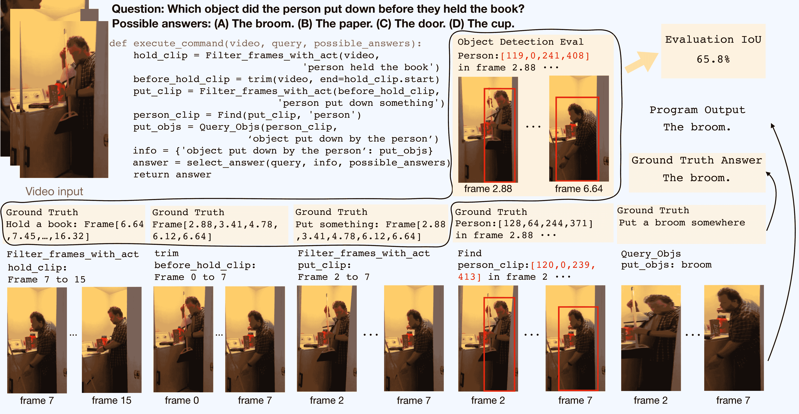

<!--yml
category: 未分类
date: 2025-01-11 11:52:20
-->

# Unlocking Video-LLM via Agent-of-Thoughts Distillation

> 来源：[https://arxiv.org/html/2412.01694/](https://arxiv.org/html/2412.01694/)

Yudi Shi^(1,2), Shangzhe Di^(1,2), Qirui Chen^(1,2), Weidi Xie^(1,†)
¹School of Artificial Intelligence, Shanghai Jiao Tong University, China
²Coop. Medianet Innovation Center, Shanghai Jiao Tong University, China

[https://zhengrongz.github.io/AoTD/](https://zhengrongz.github.io/AoTD/)

###### Abstract

This paper tackles the problem of video question answering (VideoQA), a task that often requires multi-step reasoning and a profound understanding of spatial-temporal dynamics. While large video-language models perform well on benchmarks, they often lack explainability and spatial-temporal grounding. In this paper, we propose Agent-of-Thoughts Distillation (AoTD), a method that enhances models by incorporating automatically generated Chain-of-Thoughts (CoTs) into the instruction-tuning process. Specifically, we leverage an agent-based system to decompose complex questions into sub-tasks, and address them with specialized vision models, the intermediate results are then treated as reasoning chains. We also introduce a verification mechanism using a large language model (LLM) to ensure the reliability of generated CoTs. Extensive experiments demonstrate that AoTD improves the performance on multiple-choice and open-ended benchmarks.

^†^† $\dagger$: Corresponding author.

Figure 1: Our method, AoTD, distills multi-step reasoning and spatial-temporal understanding into a single generative video-language model. When addressing complex VideoQA tasks, the model trained with AoTD (as shown in (b)) enables to generate a step-by-step reasoning to get the correct answer. In contrast, previous models trained solely on question-answer pairs (as in (a)) generate only a final answer, often without intermediate reasoning, which can lead to incorrect conclusions.

## 1 Introduction

Video Question Answering (VideoQA) refers to a critical task that offers a natural interface for human-machine interaction through language [[47](https://arxiv.org/html/2412.01694v1#bib.bib47), [41](https://arxiv.org/html/2412.01694v1#bib.bib41), [42](https://arxiv.org/html/2412.01694v1#bib.bib42), [33](https://arxiv.org/html/2412.01694v1#bib.bib33)]. This synergy of visual content and language enhances the accessibility of AI systems for the general public, allowing users to query complex visual content with everyday language. By encompassing tasks such as action recognition, object detection, and scene understanding, VideoQA serves as a comprehensive benchmark for evaluating AI’s ability to interpret videos, addressing the fundamental questions of ‘who’, ‘what’, ‘when’, and ‘where’ that are crucial to understand daily life activities, pushing the boundaries of what AI systems can interpret from dynamic visual content.

Recent literature has primarily explored two avenues in VideoQA. The first involves training large video language models (Video-LLMs) through direct instruction-tuning, using videos paired solely with corresponding questions and answers [[1](https://arxiv.org/html/2412.01694v1#bib.bib1), [22](https://arxiv.org/html/2412.01694v1#bib.bib22), [24](https://arxiv.org/html/2412.01694v1#bib.bib24), [51](https://arxiv.org/html/2412.01694v1#bib.bib51)]. While these models excel on public benchmarks, they often lack explainability and struggle with spatial-temporal grounding. This limitation hinders their ability to provide clear reasoning, which is essential for real-world applications where transparency and interpretability are critical [[29](https://arxiv.org/html/2412.01694v1#bib.bib29)].

Conversely, an emerging approach utilizes agent-based systems that decompose complex questions into manageable sub-tasks, each addressed by specialized tools [[37](https://arxiv.org/html/2412.01694v1#bib.bib37), [15](https://arxiv.org/html/2412.01694v1#bib.bib15), [17](https://arxiv.org/html/2412.01694v1#bib.bib17)]. The results are then aggregated to form a coherent answer. Theoretically, such approach naturally offers greater interpretability, as the reasoning process is divided into explainable steps that can be independently assessed. However, our experiments indicate that current video understanding tools are not strong enough for building reliable agent-based systems. In addition, the high memory demands and time-consuming nature of these systems present significant challenges for their practical use.

In this paper, we aim to leverage the advantage of both research lines, enhancing Video-LLM by integrating Chain-of-Thoughts (CoTs) into instruction-tuning, with the CoTs being constructed from the outputs of specialized agent models, capturing the step-by-step reasoning procedure, as illustrated in Figure [1](https://arxiv.org/html/2412.01694v1#S0.F1 "Figure 1 ‣ Unlocking Video-LLM via Agent-of-Thoughts Distillation").

In specific, we start by systematically evaluating the off-the-shelf models tailored for atomic video understanding tasks, such as action recognition [[40](https://arxiv.org/html/2412.01694v1#bib.bib40), [38](https://arxiv.org/html/2412.01694v1#bib.bib38)] and language grounding [[23](https://arxiv.org/html/2412.01694v1#bib.bib23)], using well-annotated datasets. This comprehensive evaluation allows us to pinpoint the most effective tools for each sub-task, thus laying a robust foundation for constructing reliable chains. Moreover, this process also provides a critical assessment of the broader capabilities of visual models across general and complex scenes, offering valuable insights for future research within the community.

In addition, we introduce a verification mechanism using a large language model (LLM), designed to assess if the generated CoTs adhere to a clear, step-by-step reasoning process and incorporate essential information for answering the queries effectively. This mechanism filters out low-quality or logically inconsistent reasoning paths. The remaining CoTs that pass this verification are then distilled into large generative video-language models, significantly enhancing both their performance and interpretability, ultimately leading to the development of more robust, accurate, and interpretable VideoQA systems.

In summary, our contributions are three-fold: (i) we propose a novel approach for enhancing Video-LLMs by distilling high-quality CoTs into their instruction-tuning process. These CoTs capture step-by-step reasoning paths, improving both the model’s performance and its interpretability; (ii) to automatically construct the CoTs for any dataset, we employ an agent-based system to decompose complex VideoQA questions into simpler sub-tasks, leveraging off-the-shelf vision models to handle each sub-task. The intermediate outputs from these models can therefore be collected as CoTs for addressing the corresponding visual question; (iii) through extensive experiments, we demonstrate that our distilled model outperforms existing methods across both multiple-choice and open-ended VideoQA benchmarks, enabling to deliver not only accurate answers but also comprehensive reasoning explanations.

Figure 2: Overview on Agent-of-Thoughts Distillation (AoTD). Step 1: Selecting best-performing agents for each sub-task to construct an agent-based system. Step 2: Decomposing question into executable program and leveraging chosen models to solve it sequentially to generate execution trace. Step 3: The execution trace is converted and filtered by LLM to produce high quality natural language CoTs. Step 4: Distilling CoTs into Video-LLM with two forms of prompt, allowing it achieve a balance between concise answers and comprehensive rationales. The final model is Video-LLM-AoTD.

## 2 Related Work

Video-language models (Video-LLMs). Most existing Video-LLMs are composed of a pre-trained visual encoder (like CLIP [[34](https://arxiv.org/html/2412.01694v1#bib.bib34)] or SigLIP [[50](https://arxiv.org/html/2412.01694v1#bib.bib50)]) to encode video frames into a sequence of visual features, an adapter to transfer the visual features to tokens that can be understood by the language model, and a pretrained LLM to output the final response. Recent works such as VideoLLaMA2 [[4](https://arxiv.org/html/2412.01694v1#bib.bib4)], LLaVA-NeXT-Video [[52](https://arxiv.org/html/2412.01694v1#bib.bib52)] and VideoChat2 [[19](https://arxiv.org/html/2412.01694v1#bib.bib19)], with their excellent architecture design and reasonable instruction-tuning data collection, have achieved a new level of zero-shot results in VideoQA task. However, current end-to-end models still lack interpretability for questions, as well as the ability to think and visually process complex problems in multiple steps, which is an important part for embodied learning and autonomous driving.

Visual Programming and Agents. With the progress of LLMs, some recent works [[15](https://arxiv.org/html/2412.01694v1#bib.bib15), [37](https://arxiv.org/html/2412.01694v1#bib.bib37), [5](https://arxiv.org/html/2412.01694v1#bib.bib5), [43](https://arxiv.org/html/2412.01694v1#bib.bib43)] begin to try to use LLM as planner to solve the complex reasoning task in real scenarios. They attempt to decompose the question into some easier sub-questions, and use different specialist models as agents to solve these sub-questions, and finally gather them to get the answer of the raw question. MoReVQA [[27](https://arxiv.org/html/2412.01694v1#bib.bib27)] proposes a multi-stage system, getting a strong zero-shot VideoQA ability while is able to create interpretable intermediate outputs. VURF [[25](https://arxiv.org/html/2412.01694v1#bib.bib25)] proposes a self-refinement method to resolve the LLM hallucinations to get a more concise program based on the context cues. These models demonstrate a strong ability to obtain trustworthy answers based on the intermediate evidence they get, but they lag far behind the end-to-end model in terms of inference speed, and often require some in-context examples to assist them in solving problems, which brings a lot of trouble to the use of these agent-based models.

Visual Chain-of-Thoughts (CoTs). The potential of Chain-of-Thought (CoT) reasoning [[39](https://arxiv.org/html/2412.01694v1#bib.bib39), [44](https://arxiv.org/html/2412.01694v1#bib.bib44)] extends from NLP to the visual domain, highlighting a growing interest in applying this approach across various fields. Numerous studies have incorporated CoTs into visual understanding tasks [[53](https://arxiv.org/html/2412.01694v1#bib.bib53), [30](https://arxiv.org/html/2412.01694v1#bib.bib30), [36](https://arxiv.org/html/2412.01694v1#bib.bib36), [11](https://arxiv.org/html/2412.01694v1#bib.bib11)], utilizing powerful Multi-Modal Large Language Models (MLLMs) for generating CoTs or adopting tool-based architectures for sequential problem-solving. However, these methods encounter several limitations, such as errors in CoT generation by MLLMs and high time and memory costs for tool-based systems.

Recent innovations, for example, Visual Program Distillation (VPD) [[16](https://arxiv.org/html/2412.01694v1#bib.bib16)] and Fact [[10](https://arxiv.org/html/2412.01694v1#bib.bib10)] attempt to address these issues by maintaining the accuracy and diversity of CoTs, while leveraging MLLMs to generate them directly. These approaches decompose complex tasks into code programs, call upon expert models to handle sub-tasks, and utilize the resulting CoTs as training data to fine-tune visual-language models. This process significantly improves the models’ ability to generate detailed rationales. Despite the progress in image understanding, there remains a notable oversight in video domains, where reasoning chains can be particularly effective due to the complex spatial-temporal dynamics of video understanding tasks. This is the focus of our paper.

Concurrent Work. In the recent literature, we notice two work that share similar idea with ours, specifically, Video-STaR [[54](https://arxiv.org/html/2412.01694v1#bib.bib54)] construct CoTs using videos and existing labels for instruction-tuning, yet they do not develop an agent-based system. Meanwhile, MotionEpic [[8](https://arxiv.org/html/2412.01694v1#bib.bib8)] introduces a Video-of-Thought reasoning framework that integrates video spatial-temporal scene graphs, marking a significant stride towards more nuanced video reasoning.

## 3 Agent-of-Thoughts Distillation

In this paper, we propose a novel approach, termed Agent-of-Thoughts Distillation (AoTD), to enhance the Video-LLMs by training them with multi-step Chain-of-Thoughts. Specifically, we start by developing an agent-based video understanding system, to generate multi-step reasoning chains that address complex video questions. These reasoning chains are then distilled into one Video-LLM through instruction-tuning. By combining the strengths of agent-based systems and large generative models, our proposed AoTD enables to build more reliable and interpretable VideoQA systems. Figure [2](https://arxiv.org/html/2412.01694v1#S1.F2 "Figure 2 ‣ 1 Introduction ‣ Unlocking Video-LLM via Agent-of-Thoughts Distillation") illustrates the entire process of our method.

Figure 3: Program execution process in an agent-based system. We uniformly sample 32 frames from the video, and to ensure scale consistency, the frame ids of key frames are normalized into these 32 frames. The blue boxes represent the program execution steps, the red boxes denote the ground truth for each step. The combination of red and yellow boxes represents one example process of evaluating Object detection model candidates.

### 3.1 Problem Formulation

Given a video clip with $t$ frames, $\mathcal{V}=\{x_{1},\dots,x_{t}\}$, and a set of $n$ questions $\mathcal{Q}=\{q_{1},q_{2},...,q_{n}\}$, our goal is to train a Video-LLM capable of producing both concise answers and comprehensive rationales. Depending on the suffix prompt $p_{s}$, the model can generate different types of outputs. The process can be formulated as:

|  | $\displaystyle\{a_{i},\mathcal{S}_{i}\}=\Phi(\mathcal{V},q_{i},p_{s}),\text{% \hskip 3.0pt}\mathcal{S}_{i}=\{\emptyset\}\text{ or }\{s_{i,1},\dots,s_{i,k}\}$ |  |

where $q_{i}$ denotes the $i$-th question, $a_{i}$ is the answer in free-form text, and $\mathcal{S}_{i}$ represents the rationale, consisting of the reasoning process. If the prompt specifies to only generate the answer, $\mathcal{S}_{i}=\{\emptyset\}$. Otherwise, if the prompt requires the generation of rationales, $\mathcal{S}_{i}=\{s_{i,1},\dots,s_{i,k}\}$, where each $s_{i,j}$ corresponds to a reasoning step.

Discussion. Unlike existing models that are instruction-tuned on VideoQA datasets using simple question-answer pairs, which bypass the intermediate thought process, our approach emphasizes the importance of training with Chain-of-Thoughts (CoTs). In the following section, we outline the process for generating high-quality CoTs from existing VideoQA datasets.

### 3.2 CoT Construction with Agent-based System

Recent work, such as STAR [[41](https://arxiv.org/html/2412.01694v1#bib.bib41)], has introduced the idea of employing executable symbolic programs, to directly decompose questions into sub-tasks. When combined with scene graphs that contain comprehensive video information from key frames—such as object locations, interactions, and actions—these programs facilitate the generation of concise Chain-of-Thoughts (CoTs) through direct execution of symbolic operations. However, datasets of this nature are limited in scale, we therefore propose to first build an agent-based system, capable of breaking down complex questions into simpler sub-tasks, and the intermediate outputs from this system can then be employed to construct CoTs for any existing VideoQA dataset.

 | Sub-task | Model name | Metric | Number (%) |
| question decomposition | CodeQwen1.5-Chat (7B) [[2](https://arxiv.org/html/2412.01694v1#bib.bib2)] |  | 52.7 |
| GPT-3.5-Turbo [[31](https://arxiv.org/html/2412.01694v1#bib.bib31)] | Acc | 73.1 |
| DeepSeek-Coder-Instruct (6.7B) [[6](https://arxiv.org/html/2412.01694v1#bib.bib6)] |  | 85.7 |
| object detection | OWL-ViT v1 [[26](https://arxiv.org/html/2412.01694v1#bib.bib26)] |  | 47.3 |
| GLIP [[20](https://arxiv.org/html/2412.01694v1#bib.bib20)] | IoU | 58.9 |
| OWL-ViT v2 [[28](https://arxiv.org/html/2412.01694v1#bib.bib28)] |  | 63.0 |
| temporal grounding | LITA (13B) [[18](https://arxiv.org/html/2412.01694v1#bib.bib18)] |  | 11.7 / 20.2 |
| TimeChat (7B) [[35](https://arxiv.org/html/2412.01694v1#bib.bib35)] | IoU / Recall | 13.9 / 23.1 |
| UniVTG [[23](https://arxiv.org/html/2412.01694v1#bib.bib23)] |  | 24.7 / 35.3 |
| action recognition | InternVideo2 (1B) [[38](https://arxiv.org/html/2412.01694v1#bib.bib38)] |  | 7.6 |
| Open-VCLIP [[40](https://arxiv.org/html/2412.01694v1#bib.bib40)] | Top1-Acc | 8.9 |
| LLaVA-NeXT-Video-DPO (7B) [[52](https://arxiv.org/html/2412.01694v1#bib.bib52)] |  | 18.2 |
| question answering | LLaMA-VID (7B) [[21](https://arxiv.org/html/2412.01694v1#bib.bib21)] |  | 43.5 |
| SeViLA [[46](https://arxiv.org/html/2412.01694v1#bib.bib46)] | Acc | 46.5 |
| LLaVA-NeXT-Video-DPO (7B) [[52](https://arxiv.org/html/2412.01694v1#bib.bib52)] |  | 53.4 | 

Table 1: Sub-tasks definition and evaluation results. We choose 3 model candidates for each sub-task and evaluate them in STAR training set with the corresponding metrics. Models with best performance are placed at the bottom of each column.

Agent-based VideoQA. Assuming we are given a video input ($\mathcal{V}$), questions ($\mathcal{Q}$), and a set of visual models ($\mathcal{M}=\{\phi_{\text{act}},\phi_{\text{det}},\ldots,\phi_{\text{qa}}\}$), an LLM-based agent core ($\pi(\cdot)$) processes the question along with the documentation of the visual models ($\mathcal{T}$), which includes variables and functionalities. The agent subsequently decomposes the question into sub-tasks formatted as Python code, and resolves them by invoking the appropriate visual models through function calls. It is important to note that the visual models can be arranged in various orders depending on the specific question, ensuring flexibility in problem-solving.

Specifically, as illustrated by the example in Figure [3](https://arxiv.org/html/2412.01694v1#S3.F3 "Figure 3 ‣ 3 Agent-of-Thoughts Distillation ‣ Unlocking Video-LLM via Agent-of-Thoughts Distillation"), the question is first decomposed into a series of sub-tasks, including temporal grounding, object detection, and question answering. The corresponding specialized models are then executed sequentially to address these sub-tasks, ultimately yielding the final answer $y_{i}$:

|  | $\displaystyle\{\phi_{\text{ground}},\phi_{\text{det}},\phi_{\text{qa}}\}:=\pi(% q_{i},\mathcal{T}),$ |  |
|  | $\displaystyle y_{i}=\phi_{\text{ground}}(\mathcal{V})\rightarrow\phi_{\text{% det}}(\mathcal{V})\rightarrow\phi_{\text{qa}}(\mathcal{V})$ |  |

CoT Construction. To ensure the correctness of outputs at all the intermediate steps, we leverage the training set from STAR for hyperparameter tuning, enabling us to identify the most effective model for each sub-task within the agent-based system. By following the provided programs, we evaluate the performance of the corresponding vision models on tasks such as object detection and action recognition. Given the availability of complete reasoning chains, we independently assess each sub-task using ground truth data for all preceding steps.

As shown in Table [1](https://arxiv.org/html/2412.01694v1#S3.T1 "Table 1 ‣ 3.2 CoT Construction with Agent-based System ‣ 3 Agent-of-Thoughts Distillation ‣ Unlocking Video-LLM via Agent-of-Thoughts Distillation"), we present the evaluation results for the various sub-tasks. Specifically, for question decomposition, we compare several code LLMs, with DeepSeek-Coder-Instruct achieving the highest performance, outperforming even GPT-3.5-Turbo. In object detection, OWL-ViT v2 records the highest Intersection over Union (IoU) score, showcasing its superior open-vocabulary detection capability. The results for temporal grounding indicate that while UniVTG leads in performance, there remains a need for further advancements in this area. In action recognition, our evaluations show that generative models outperformed discriminative models, likely due to the fine-grained action list provided by the STAR dataset. However, the performance of both model types reveals significant room for improvement. Finally, in the one-hop question answering sub-task, all models perform admirably, with LLaVA-NeXT-Video-DPO standing out as a top performer, consistent with its strong results on other benchmarks.

With these high-performing models, we implement the agent-based approach on VideoQA datasets that consist solely of QA pairs. During the execution of the programs, we record all intermediate outputs to construct the CoTs. Since the outputs from these vision models vary in format—such as bounding boxes and free-form text—we employ another LLM to translate the execution trace into natural language for better use in the distillation process. Detailed examples are provided in Appendix [C](https://arxiv.org/html/2412.01694v1#A3 "Appendix C More Results ‣ Unlocking Video-LLM via Agent-of-Thoughts Distillation").

### 3.3 CoT Verification

To refine the quality of reasoning chains for VideoQA samples, we implement a two-step verification: (i) we filter execution traces to retain only those, where the program can reach correct output. For multiple-choice datasets, the output must match the correct answer exactly, while for open-ended datasets, we prompt the LLM to verify correctness, accounting for format differences; (ii) we prompt the LLM to evaluate the logical coherence and usefulness of the reasoning chains in solving the problem. The model assesses whether the CoTs follow a clear, step-by-step reasoning process and provides a binary evaluation (‘Yes’ or ‘No’) to indicate their quality (detailed prompts are included in Appendix [D](https://arxiv.org/html/2412.01694v1#A4 "Appendix D Prompts ‣ Unlocking Video-LLM via Agent-of-Thoughts Distillation")). This two-step approach ensures that only high-quality CoTs are retained for further distillation.

In Table [2](https://arxiv.org/html/2412.01694v1#S3.T2 "Table 2 ‣ 3.3 CoT Verification ‣ 3 Agent-of-Thoughts Distillation ‣ Unlocking Video-LLM via Agent-of-Thoughts Distillation"), we provide the statistics for the remaining generated CoTs for different datasets. We primarily select compositional QA datasets, as these require the model to process spatial-temporal information from different events comprehensively.

| Dataset | Description | # Labels | # CoTs |
| AGQA | Compositional | 25.0K | 5.4K |
| ANetQA | Compositional | 25.0K | 3.6K |
| STAR | Compositional | 45.7K | 11.2K |
| NExT-QA | Temporal & Causal | 34.1K | 12.1K |
| CLEVRER | Spatial & Temporal | 21.0K | - |
| EgoQA | Ego-centric | 7.8K | - |
| Total |  | 158.6K | 32.3K |

Table 2: Dataset statistics. The column “# Labels” indicates the number of VideoQA pairs, which include the video, query, possible answers (multiple-choice), and the correct answer. “# CoTs” refers to the number of CoTs generated using our agent-based system for each dataset.

Figure 4: Visualization of rationales. LLaVA-NeXT-Video-AoTD can output rationales containing both spatial-temporal grounding of key information and step-by-step thinking process to solve the question.

### 3.4 Step-by-step Distillation

In this section, we describe the process of distilling the generated CoTs into a Video-LLM. This distillation enhances the model’s ability for spatial-temporal video understanding and multi-step reasoning, thereby improving its performance on complex VideoQA tasks.

In specific, using the generated CoTs, we can build the dataset $D=\{(\mathcal{V}_{j},q_{j},\hat{y}_{j},c_{j},p_{s})\}_{j=1}^{N}$, where $N$ is the total number of samples in the distilling dataset, $\mathcal{V}_{j}$ is the video input, $q_{j}$ is the question, $\hat{y}_{j}$ is the ground-truth answer, $c_{j}$ is the generated CoT, $p_{s}$ is the task-specific suffix prompt, to distinguish different tasks, for example, for multiple-choice VQA, the prompt can be: “Answer with the option’s letter from the given choices directly and only give the best option”, and for open-ended VQA, the prompt can be: “Answer in one word or phrase”. Please refer to detailed prompts in Appendix [D](https://arxiv.org/html/2412.01694v1#A4 "Appendix D Prompts ‣ Unlocking Video-LLM via Agent-of-Thoughts Distillation").

At distillation stage, we minimize the cross-entropy loss of predicting both the answer and the CoTs, we replace the suffix prompt $p_{s}$ with “Explain the rationale to answer the question”, to indicate whether we want a question answer or a rationale to explain the thinking steps. Following [[10](https://arxiv.org/html/2412.01694v1#bib.bib10)] and [[16](https://arxiv.org/html/2412.01694v1#bib.bib16)], our optimization objective is:

|  | $\displaystyle\mathcal{L}$ | $\displaystyle=\mathcal{L}_{\text{label}}+\lambda\mathcal{L}_{\text{rationale}}$ |  |
|  |  | $\displaystyle=\sum_{j=1}^{N}\ell(\Phi(\mathcal{V}_{j},q_{j},p_{s}),\hat{y}_{j}% )+\lambda\ell(\Phi(\mathcal{V}_{j},q_{j},p_{s}),c_{j})$ |  |

Here, we set $\lambda$ to 1 to ensure the importance of answer and rationale are equally considered. Notice that, not all the QA pairs can generate qualified CoT. In that case, the $\mathcal{L}_{\text{rationale}}$ will be set to 0.

| Dataset | Size | Type | Train | Eval |
| train | eval |
| MC-VQA |
| STAR [[41](https://arxiv.org/html/2412.01694v1#bib.bib41)] | 45.7K | 7.1K | Compositional | ✓ | ✓ |
| NExT-QA [[42](https://arxiv.org/html/2412.01694v1#bib.bib42)] | 34.1K | 5.0K | Temporal & Causal | ✓ | ✓ |
| CLEVRER [[45](https://arxiv.org/html/2412.01694v1#bib.bib45)] | 21.0K | - | Spatial-temporal | ✓ | ✗ |
| Perception-Test [[33](https://arxiv.org/html/2412.01694v1#bib.bib33)] | - | 11.5K | General | ✗ | ✓ |
| MVBench [[19](https://arxiv.org/html/2412.01694v1#bib.bib19)] | - | 2.0K | General | ✗ | ✓ |
| VideoMME [[9](https://arxiv.org/html/2412.01694v1#bib.bib9)] | - | 2.7K | General | ✗ | ✓ |
| OE-VQA |
| AGQA [[14](https://arxiv.org/html/2412.01694v1#bib.bib14)] | 25.0K | 2.0K | Compositional | ✓ | ✓ |
| ANetQA [[48](https://arxiv.org/html/2412.01694v1#bib.bib48)] | 25.0K | 2.0K | Compositional | ✓ | ✓ |
| EgoQA [[13](https://arxiv.org/html/2412.01694v1#bib.bib13)] | 7.8K | - | Ego-centric | ✓ | ✗ |
| Activitynet-QA [[47](https://arxiv.org/html/2412.01694v1#bib.bib47)] | - | 8.0K | General | ✗ | ✓ |
| Video-ChatGPT [[24](https://arxiv.org/html/2412.01694v1#bib.bib24)] | - | 3.0K | General | ✗ | ✓ |

Table 3: Training and evaluation datasets statics.

| Model | MVBench | VideoMME | STAR | NExT-QA | Perception-Test |
| (Acc.) | (Acc.) | (Acc.) | (Acc.) | (Acc.) |
| Proprietary Models |
| Gemini 1.5 Pro [[12](https://arxiv.org/html/2412.01694v1#bib.bib12)] | - | 75.0 | - | - | - |
| GPT4-V [[32](https://arxiv.org/html/2412.01694v1#bib.bib32)] | 43.7 | 59.9 | - | - | - |
| Open-source Models |
| LLaMA-VID (7B) [[21](https://arxiv.org/html/2412.01694v1#bib.bib21)] | 41.9 | 25.9 | - | - | 44.6 |
| Video-LLaVA (7B) [[22](https://arxiv.org/html/2412.01694v1#bib.bib22)] | 41.0 | 39.9 | - | - | 44.3 |
| VideoChat2 (7B) [[19](https://arxiv.org/html/2412.01694v1#bib.bib19)] | 51.1 | 33.7 | 59.0^* | 68.6^* | 47.3 |
| VideoLLaMA2 (7B) [[4](https://arxiv.org/html/2412.01694v1#bib.bib4)] | 53.4 | 45.1 | 58.5^* | 62.3^* | 49.6 |
| LLaVA-NeXT-Video (7B) [[52](https://arxiv.org/html/2412.01694v1#bib.bib52)] | 46.5^* | 41.0^* | 52.4^* | 61.6^* | 47.5^* |
| LLaVA-NeXT-Video-Instruct (7B) | 53.4 | 43.2 | 72.2 | 77.1 | 50.3 |
| LLaVA-NeXT-Video-AoTD (7B) | 55.6 | 45.0 | 74.3 | 77.6 | 50.6 |

Table 4: Comparison with Video-LLMs on MC-VQA benchmarks. LLaVA-NeXT-Video-AoTD outperforms all other baselines the and the version without CoT distillation. * means results reproduced by ourseleves. Results without signs are retrieved from [[4](https://arxiv.org/html/2412.01694v1#bib.bib4)].

## 4 Experiments

In this section, we present the experimental setup (Sec. [4.1](https://arxiv.org/html/2412.01694v1#S4.SS1 "4.1 Experimental Setup ‣ 4 Experiments ‣ Unlocking Video-LLM via Agent-of-Thoughts Distillation")) and results on various VideoQA benchmarks (Sec. [4.2](https://arxiv.org/html/2412.01694v1#S4.SS2 "4.2 Quantitative Results ‣ 4 Experiments ‣ Unlocking Video-LLM via Agent-of-Thoughts Distillation")). Extensive ablation studies have also been conducted to further examine the contributions of our approach in Sec. [4.3](https://arxiv.org/html/2412.01694v1#S4.SS3 "4.3 Ablation Study ‣ 4 Experiments ‣ Unlocking Video-LLM via Agent-of-Thoughts Distillation"), and an evaluation on the quality of rationales generated by the distilled model is made in Sec. [4.4](https://arxiv.org/html/2412.01694v1#S4.SS4 "4.4 Evaluation on Rationales ‣ 4 Experiments ‣ Unlocking Video-LLM via Agent-of-Thoughts Distillation").

### 4.1 Experimental Setup

Base model. We use LLaVA-NeXT-Video (7B) [[52](https://arxiv.org/html/2412.01694v1#bib.bib52)] (LNV for short) as base Video-LLM, which has shown remarkable performance on image-centric tasks, for example image question answering [[49](https://arxiv.org/html/2412.01694v1#bib.bib49)]. We present comparison on naive instruction-tuning with video question answering dataset or with additional CoT distillation. For CoT conversion and verification, we prompt LLaMA-3.1-8B with the manually-designed instruction and some in-context examples. Detailed prompts are provided in Appendix [D](https://arxiv.org/html/2412.01694v1#A4 "Appendix D Prompts ‣ Unlocking Video-LLM via Agent-of-Thoughts Distillation").

Instruction tuning. We utilize both multiple-choice and open-ended QA data, along with the generated CoTs, to fine-tune the base video question answering model, as summarised in Table [2](https://arxiv.org/html/2412.01694v1#S3.T2 "Table 2 ‣ 3.3 CoT Verification ‣ 3 Agent-of-Thoughts Distillation ‣ Unlocking Video-LLM via Agent-of-Thoughts Distillation"). The resulting distilled model is named LLaVA-NeXT-Video-AoTD (LNV-AoTD for short). Additionally, as baseline, we also train another version of the model using only the basic QA data, which we refer to as LLaVA-NeXT-Video-Instruct (LNV-Instruct for short).

Evaluation benchmarks. We conduct extensive evaluations on Multiple-Choice Video QA (MC-VQA) and Open-Ended Video QA (OE-VQA). We report the top-1 accuracy for all MC benchmarks, which means the proportion of the output equal to the answer. We report a GPT-assessed Acc. and Score with the help of GPT-3.5-turbo-0613 for all OE benchmarks. For each question, GPT delivers a binary decision indicating whether the output is correct or incorrect, along with a similarity score reflecting the degree of alignment between the output and the correct answer. The term ‘Acc.’ refers to the percentage of correct outputs, while ‘Score’ represents the average similarity scores. For the evaluation on AGQA and ANetQA, due to the large volume of test set, we test on a subset of samples. We evenly select the benchmark in-domain and out-of-domain for testing to ensure a comprehensive and reasonable evaluation of the model capability. Detailed statistics for evaluation benchmarks are shown in Table [3](https://arxiv.org/html/2412.01694v1#S3.T3 "Table 3 ‣ 3.4 Step-by-step Distillation ‣ 3 Agent-of-Thoughts Distillation ‣ Unlocking Video-LLM via Agent-of-Thoughts Distillation").

### 4.2 Quantitative Results

We divide the comparison into two parts: the first focuses on comparing the distilled model with other baselines, while the second examines the difference between the instruct version and the AoTD version. Note that, the latter part will be mainly compared and discussed, to demonstrate the model’s improvement relative to its previous performance, as well as establishing the transferability of the method across different models.

MC-VQA performance. As shown in Table [4](https://arxiv.org/html/2412.01694v1#S3.T4 "Table 4 ‣ 3.4 Step-by-step Distillation ‣ 3 Agent-of-Thoughts Distillation ‣ Unlocking Video-LLM via Agent-of-Thoughts Distillation"), our LLaVA-NeXT-Video-AoTD achieves superior performance across all benchmarks. Several key observations can be made: (i) comparing to the base model, even a simple instruction-tuning on certain VideoQA datasets significantly enhances the model’s question-answering performance. This improvement is notable, as the base model was primarily trained on static images and struggled with video understanding; (ii) our model, instruction-tuned with CoT distillation, demonstrates further performance enhancements across all benchmarks, particularly on the compositional VideoQA benchmark (STAR) and comprehensive benchmarks (VideoMME, MVBench). This suggests that our AoTD method effectively improves the model’s ability to address complex problems and interpret spatial-temporal scenes; (iii) the distilled model consistently outperforms all other baselines across almost all benchmarks, even when compared to more powerful models. This finding shows that our method effectively bridges performance gaps created by varying model components.

| Model | ANetQA | AGQA | Video-ChatGPT (Score) | ActivityNet |
| (Acc./Score) | (Acc./Score) | Corr. | Deta. | Cont. | Temp. | Cons. | (Acc./Score) |
| Proprietary Models |
| Gemini 1.5 Pro [[12](https://arxiv.org/html/2412.01694v1#bib.bib12)] | - | - | - | - | - | - | - | 56.7/- |
| GPT4-V [[32](https://arxiv.org/html/2412.01694v1#bib.bib32)] | - | - | 4.09 | 3.88 | 4.37 | 3.94 | 4.02 | 59.5/- |
| Open-Source Models |
| VideoLLaMA (7B) [[51](https://arxiv.org/html/2412.01694v1#bib.bib51)] | - | - | 1.96 | 2.18 | 2.16 | 1.82 | 1.79 | 12.4/1.1 |
| Video-ChatGPT (7B) [[24](https://arxiv.org/html/2412.01694v1#bib.bib24)] | - | - | 2.50 | 2.57 | 2.69 | 2.16 | 2.20 | 35.2/2.7 |
| LLaMA-VID (7B) [[21](https://arxiv.org/html/2412.01694v1#bib.bib21)] | - | - | 2.96 | 3.00 | 3.53 | 2.46 | 2.51 | 47.4/3.3 |
| Video-LLaVA (7B) [[22](https://arxiv.org/html/2412.01694v1#bib.bib22)] | - | - | 2.87 | 2.94 | 3.44 | 2.45 | 2.51 | 45.3/3.3 |
| VideoChat2 (7B) [[19](https://arxiv.org/html/2412.01694v1#bib.bib19)] | - | - | 3.02 | 2.88 | 3.51 | 2.66 | 2.81 | 49.1/3.3 |
| VideoLLaMA2 (7B) [[4](https://arxiv.org/html/2412.01694v1#bib.bib4)] | - | - | 3.09 | 3.09 | 3.68 | 2.63 | 3.25 | 49.9/3.3 |
| LLaVA-NeXT-Video (7B) [[52](https://arxiv.org/html/2412.01694v1#bib.bib52)] | 46.4/3.3^* | 27.4/2.2^* | 3.26^* | 3.22^* | 3.77^* | 2.47^* | 2.99^* | 54.3/3.2^* |
| LLaVA-NeXT-Video-Instruct (7B) | 47.1/3.1 | 59.3/3.4 | 2.96 | 2.81 | 3.35 | 2.42 | 2.82 | 50.0/3.3 |
| LLaVA-NeXT-Video-AoTD (7B) | 53.9/3.4 | 60.9/3.6 | 3.11 | 3.00 | 3.60 | 2.41 | 2.91 | 53.2/3.4 |

Table 5: Comparison with Video-LLMs on OE-VQA benchmarks. LLaVA-NeXT-Video-AoTD improves performance in all open-ended benchmarks compared with the Instruct version. * means results reproduced by ourseleves. Results without signs are retrieved from [[4](https://arxiv.org/html/2412.01694v1#bib.bib4)].

OE-VQA performance. As shown in Table [5](https://arxiv.org/html/2412.01694v1#S4.T5 "Table 5 ‣ 4.2 Quantitative Results ‣ 4 Experiments ‣ Unlocking Video-LLM via Agent-of-Thoughts Distillation"), LLaVA-NeXT-Video-AoTD outperforms the Instruct variant across all open-ended VideoQA benchmarks. Notably, it achieves a greater percentage increase compared to the MC-VQA benchmarks, suggesting that CoT distillation may be more effective for open-ended generation than for multiple-choice selection. While the distilled model scores higher than most models listed in the table, it does not surpass LLaVA-NeXT-Video on certain benchmarks. We conjecture this is due to the model’s extensive training on images, that can also benefit the question answering without requiring complex reasonings, as also suggested by the findings in VideoLLaMA2 [[4](https://arxiv.org/html/2412.01694v1#bib.bib4)]. Additionally, the inherent challenges of evaluating open-ended VQA may influence the results. Assessments conducted by GPT can be biased or inaccurate, and the metrics we employ primarily indicate general trends rather than providing absolute accuracy.

### 4.3 Ablation Study

Analysis on CoT filtering. To prove the effectiveness of our filtering mechanism, we trained an alternative model without CoT filtering while maintaining all other settings, i.e., using 36.3K verified CoTs for distillation. As shown in Table [6](https://arxiv.org/html/2412.01694v1#S4.T6 "Table 6 ‣ 4.3 Ablation Study ‣ 4 Experiments ‣ Unlocking Video-LLM via Agent-of-Thoughts Distillation"), the model’s performance declines significantly on both the Multiple-Choice VQA and Open-Ended VQA benchmarks when the CoT filtering mechanism is not utilized. This confirms that employing large language models (LLMs) to filter CoTs is crucial for enhancing data quality.

Analysis on model transferability. As AoTD is a distillation method that leverages Chain-of-Thoughts (CoTs), it can theoretically be applied to any Video-LLMs. To assess the transferability of our method, we conduct experiments on another very recent model, LLaVA-OneVision (7B) [[3](https://arxiv.org/html/2412.01694v1#bib.bib3)]. As shown in Table [6](https://arxiv.org/html/2412.01694v1#S4.T6 "Table 6 ‣ 4.3 Ablation Study ‣ 4 Experiments ‣ Unlocking Video-LLM via Agent-of-Thoughts Distillation"), our method also demonstrates significant improvements on the benchmarks, showing the transferability and robustness of the approach. Due to the rapid advancements in the computer vision field, evaluating all models and benchmarks is prohibitively infeasible. Thus, we focus on assessing a single model against selected benchmarks to provide a representative evaluation.

| Model | Filtering | MVBench | STAR | AGQA |
| (Acc.) | (Acc.) | (Acc. / Score) |
| LNV-AoTD | ✗ | 53.7 | 73.3 | 59.5/3.5 |
| LNV-AoTD | ✓ | 55.6 | 74.3 | 60.9/3.6 |
| Onevision | - | 58.0 | 65.9 | 39.0/3.0 |
| Onevision-Instruct | - | 59.2 | 75.8 | 65.6/3.7 |
| Onevision-AoTD | ✓ | 60.5 | 76.6 | 65.7/3.7 |

Table 6: Ablation results of CoT filtering and transferability.

### 4.4 Evaluation on Rationales

To verify whether the model has effectively learned multi-step reasoning through CoTs distillation, we analyze the rationales generated by the model. Specifically, we extract and evaluate the temporal and spatial information embedded within these rationales. This approach extends beyond merely assessing the correctness of the final answer, which could be influenced by biases or other external factors. By examining the reasoning process in detail, it enables a more accurate understanding of the model’s ability to perceive and reason about spatial and temporal relationships.

Evaluation protocols. We randomly select 200 samples from the STAR validation set and run inference on them using the suffix prompt, recording the generated rationales. From these rationales, we extract the predicted temporal windows and bounding boxes, comparing them to the ground truth. For the spatial part, we calculate the IoU between the predicted and ground truth bounding boxes. For the temporal part, we compute IoU and Recall, leveraging the frame-level annotations provided in the dataset.

Evaluation results. Table [7](https://arxiv.org/html/2412.01694v1#S4.T7 "Table 7 ‣ 4.4 Evaluation on Rationales ‣ 4 Experiments ‣ Unlocking Video-LLM via Agent-of-Thoughts Distillation") presents the evaluation results. For comparison, we also test UniVTG for temporal reasoning and OWL-ViT v2 for spatial reasoning. The results show that LNV-Instruct struggles to generate valid rationales, even when using the suffix prompt. In contrast, LNV-AoTD demonstrates comparable performance to specialized models in both spatial and temporal reasoning, indicating that the model successfully acquired these abilities through the distillation process.

| Model | Temporal Grounding | Spatial Grounding |
| IoU (%) | Recall (%) | IoU (%) |
| UniVTG | 22.8 | 31.0 | - |
| OWL-ViT v2 | - | - | 64.7 |
| LNV-Instruct | ✗ | ✗ | ✗ |
| LNV-AoTD | 21.7 | 34.0 | 45.2 |

Table 7: Temporal and spatial abilities evaluation results.

## 5 Conclusion

We present Agent-of-Thoughts Distillation (AoTD), that aims to distill multi-step reasoning and spatial-temporal understanding into a large video-language model (Video-LLM). Our method introduces an agent-based system that automates the generation of Chain-of-Thoughts (CoTs) from various VideoQA datasets, by breaking down complex questions into manageable sub-tasks that can be addressed by specialized vision models. Extensive experiments validate that the distilled model significantly enhances performance on both MC-VQA and OE-VQA benchmarks, underscoring the effectiveness of our approach. We believe AoTD represents a promising future direction for advancing the reasoning abilities in Video-LLMs.

## References

*   Alayrac et al. [2022] Jean-Baptiste Alayrac, Jeff Donahue, Pauline Luc, Antoine Miech, Iain Barr, Yana Hasson, Karel Lenc, Arthur Mensch, Katherine Millican, Malcolm Reynolds, et al. Flamingo: a visual language model for few-shot learning. In *Advances in Neural Information Processing Systems*, 2022.
*   Bai et al. [2023] Jinze Bai, Shuai Bai, Yunfei Chu, Zeyu Cui, Kai Dang, Xiaodong Deng, Yang Fan, Wenbin Ge, Yu Han, Fei Huang, Binyuan Hui, Luo Ji, Mei Li, Junyang Lin, Runji Lin, Dayiheng Liu, Gao Liu, Chengqiang Lu, Keming Lu, Jianxin Ma, Rui Men, Xingzhang Ren, Xuancheng Ren, Chuanqi Tan, Sinan Tan, Jianhong Tu, Peng Wang, Shijie Wang, Wei Wang, Shengguang Wu, Benfeng Xu, Jin Xu, An Yang, Hao Yang, Jian Yang, Shusheng Yang, Yang Yao, Bowen Yu, Hongyi Yuan, Zheng Yuan, Jianwei Zhang, Xingxuan Zhang, Yichang Zhang, Zhenru Zhang, Chang Zhou, Jingren Zhou, Xiaohuan Zhou, and Tianhang Zhu. Qwen technical report. *arXiv preprint arXiv:2309.16609*, 2023.
*   Bo et al. [2024] Li Bo, Zhang Yuanhan, Guo Dong, Zhang Renrui, Li Feng, Zhang Hao, Zhang Kaichen, Li Yanwei, Liu Ziwei, and Li Chunyuan. Llava-onevision: Easy visual task transfer. *arXiv preprint arXiv:2408.03326*, 2024.
*   Cheng et al. [2024] Zesen Cheng, Sicong Leng, Hang Zhang, Yifei Xin, Xin Li, Guanzheng Chen, Yongxin Zhu, Wenqi Zhang, Ziyang Luo, Deli Zhao, and Lidong Bing. Videollama 2: Advancing spatial-temporal modeling and audio understanding in video-llms. *arXiv preprint arXiv:2406.07476*, 2024.
*   Choudhury et al. [2023] Rohan Choudhury, Koichiro Niinuma, Kris M. Kitani, and Laszlo A. Jeni. Zero-shot video question answering with procedural programs. *arXiv preprint arXiv:2312.00937*, 2023.
*   Daya et al. [2024] Guo Daya, Zhu Qihao, Yang Dejian, Dong Zhenda Xie, Kai, Zhang Wentao, Chen Guanting, Bi Xiao, Y. Wu, Y.K. Li, Luo Fuli, and Liang Yingfei, Xiongand Wenfeng. Deepseek-coder: When the large language model meets programming – the rise of code intelligence. *arXiv preprint arXiv:2401.14196*, 2024.
*   Fan et al. [2024] Yue Fan, Xiaojian Ma, Rujie Wu, Yuntao Du, Jiaqi Li, Zhi Gao, and Qing Li. Videoagent: A memory-augmented multimodal agent for video understanding. *arXiv preprint arXiv:2403.11481*, 2024.
*   Fei et al. [2024] Hao Fei, Shengqiong Wu, Wei Ji, Hanwang Zhang, Meishan Zhang, Mong-Li Lee, and Wynne Hsu. Video-of-thought: Step-by-step video reasoning from perception to cognition. In *Proceedings of the International Conference on Machine Learning*, 2024.
*   Fu et al. [2024] Chaoyou Fu, Yuhan Dai, Yondong Luo, Lei Li, Shuhuai Ren, Renrui Zhang, Zihan Wang, Chenyu Zhou, Yunhang Shen, Mengdan Zhang, et al. Video-mme: The first-ever comprehensive evaluation benchmark of multi-modal llms in video analysis. *arXiv preprint arXiv:2405.21075*, 2024.
*   Gao et al. [2024a] Minghe Gao, Shuang Chen, Liang Pang, Yuan Yao, Jisheng Dang, Wenqiao Zhang, Juncheng Li, Siliang Tang, Yueting Zhuang, and Tat-Seng Chua. Fact: Teaching mllms with faithful, concise and transferable rationales. In *ACM Multimedia*, 2024a.
*   Gao et al. [2024b] Timin Gao, Peixian Chen, Mengdan Zhang, Chaoyou Fu, Yunhang Shen, Yan Zhang, Shengchuan Zhang, Xiawu Zheng, Xing Sun, Liujuan Cao, et al. Cantor: Inspiring multimodal chain-of-thought of mllm. In *ACM Multimedia*, 2024b.
*   Google [2024] Gemini Team Google. Gemini 1.5: Unlocking multimodal understanding across millions of tokens of context. *arXiv preprint arXiv:2403.05530*, 2024.
*   Grauman et al. [2022] Kristen Grauman, Andrew Westbury, Eugene Byrne, Zachary Chavis, Antonino Furnari, Rohit Girdhar, Jackson Hamburger, Hao Jiang, Miao Liu, Xingyu Liu, et al. Ego4d: Around the world in 3,000 hours of egocentric video. In *Proceedings of the IEEE Conference on Computer Vision and Pattern Recognition*, 2022.
*   Grunde-McLaughlin et al. [2021] Madeleine Grunde-McLaughlin, Ranjay Krishna, and Maneesh Agrawala. Agqa: A benchmark for compositional spatio-temporal reasoning. In *Proceedings of the IEEE Conference on Computer Vision and Pattern Recognition*, 2021.
*   Gupta and Kembhavi [2023] Tanmay Gupta and Aniruddha Kembhavi. Visual programming: Compositional visual reasoning without training. In *Proceedings of the IEEE Conference on Computer Vision and Pattern Recognition*, 2023.
*   Hu et al. [2024a] Yushi Hu, Otilia Stretcu, Chun-Ta Lu, Krishnamurthy Viswanathan, Kenji Hata, Enming Luo, Ranjay Krishna, and Ariel Fuxman. Visual program distillation: Distilling tools and programmatic reasoning into vision-language models. In *Proceedings of the IEEE Conference on Computer Vision and Pattern Recognition*, 2024a.
*   Hu et al. [2024b] Ziniu Hu, Ahmet Iscen, Chen Sun, Kai-Wei Chang, Yizhou Sun, David Ross, Cordelia Schmid, and Alireza Fathi. Avis: Autonomous visual information seeking with large language model agent. In *Advances in Neural Information Processing Systems*, 2024b.
*   Huang et al. [2024] De-An Huang, Shijia Liao, Subhashree Radhakrishnan, Hongxu Yin, Pavlo Molchanov, Zhiding Yu, and Jan Kautz. Lita: Language instructed temporal-localization assistant. In *Proceedings of the European Conference on Computer Vision*, 2024.
*   Li et al. [2024a] Kunchang Li, Yali Wang, Yinan He, Yizhuo Li, Yi Wang, Yi Liu, Zun Wang, Jilan Xu, Guo Chen, Ping Luo, et al. Mvbench: A comprehensive multi-modal video understanding benchmark. In *Proceedings of the IEEE Conference on Computer Vision and Pattern Recognition*, 2024a.
*   Li* et al. [2022] Liunian Harold Li*, Pengchuan Zhang*, Haotian Zhang*, Jianwei Yang, Chunyuan Li, Yiwu Zhong, Lijuan Wang, Lu Yuan, Lei Zhang, Jenq-Neng Hwang, Kai-Wei Chang, and Jianfeng Gao. Grounded language-image pre-training. In *Proceedings of the IEEE Conference on Computer Vision and Pattern Recognition*, 2022.
*   Li et al. [2024b] Yanwei Li, Chengyao Wang, and Jiaya Jia. Llama-vid: An image is worth 2 tokens in large language models. In *Proceedings of the European Conference on Computer Vision*, 2024b.
*   Lin et al. [2024] Bin Lin, Bin Zhu, Yang Ye, Munan Ning, Peng Jin, and Li Yuan. Video-llava: Learning united visual representation by alignment before projection. In *Proceedings of the Conference on Empirical Methods in Natural Language Processinng*, 2024.
*   Lin et al. [2023] Kevin Qinghong Lin, Pengchuan Zhang, Joya Chen, Shraman Pramanick, Difei Gao, Alex Jinpeng Wang, Rui Yan, and Mike Zheng Shou. Univtg: Towards unified video-language temporal grounding. In *Proceedings of the International Conference on Computer Vision*, 2023.
*   Maaz et al. [2024] Muhammad Maaz, Hanoona Rasheed, Salman Khan, and Fahad Shahbaz Khan. Video-chatgpt: Towards detailed video understanding via large vision and language models. In *Association for Computational Linguistics*, 2024.
*   Mahmood et al. [2024] Ahmad Mahmood, Ashmal Vayani, Muzammal Naseer, Salman Khan, and Fahad Khan. Vurf: A general-purpose reasoning and self-refinement framework for video understanding. *arXiv preprint arXiv:2403.14743*, 2024.
*   Matthias et al. [2022] Minderer Matthias, Gritsenko Alexey, Stone Austin, Neumann Maxim, Weissenborn Dirk, Dosovitskiy Alexey, Mahendran Aravindh, Arnab Anurag, Dehghani Mostafa, Shen Zhuoran, Wang Xiao, Zhai Xiaohua, Kipf Thomas, and Houlsby Neil. Simple open-vocabulary object detection with vision transformers. In *Proceedings of the European Conference on Computer Vision*, 2022.
*   Min et al. [2024] Juhong Min, Shyamal Buch, Arsha Nagrani, Minsu Cho, and Cordelia Schmid. Morevqa: Exploring modular reasoning models for video question answering. In *Proceedings of the IEEE Conference on Computer Vision and Pattern Recognition*, 2024.
*   Minderer et al. [2024] Matthias Minderer, Alexey Gritsenko, and Neil Houlsby. Scaling open-vocabulary object detection. In *Advances in Neural Information Processing Systems*, 2024.
*   Mitra et al. [2023] Arindam Mitra, Luciano Del Corro, Shweti Mahajan, Andres Codas, Clarisse Simoes, Sahaj Agarwal, Xuxi Chen, Anastasia Razdaibiedina, Erik Jones, Kriti Aggarwal, et al. Orca 2: Teaching small language models how to reason. *arXiv preprint arXiv:2311.11045*, 2023.
*   Mitra et al. [2024] Chancharik Mitra, Brandon Huang, Trevor Darrell, and Roei Herzig. Compositional chain-of-thought prompting for large multimodal models. In *Proceedings of the IEEE Conference on Computer Vision and Pattern Recognition*, 2024.
*   OpenAI [2023a] OpenAI. Gpt-3.5-turbo system card. [https://platform.openai.com/docs/models/gpt-3-5-turbo](https://platform.openai.com/docs/models/gpt-3-5-turbo), 2023a.
*   OpenAI [2023b] OpenAI. Gpt-4v(ision) system card. [https://openai.com/research/gpt-4v-system-card](https://openai.com/research/gpt-4v-system-card), 2023b.
*   Pătrăucean et al. [2023] Viorica Pătrăucean, Lucas Smaira, Ankush Gupta, Adrià Recasens Continente, Larisa Markeeva, Dylan Banarse, Skanda Koppula, Joseph Heyward, Mateusz Malinowski, Yi Yang, Carl Doersch, Tatiana Matejovicova, Yury Sulsky, Antoine Miech, Alex Frechette, Hanna Klimczak, Raphael Koster, Junlin Zhang, Stephanie Winkler, Yusuf Aytar, Simon Osindero, Dima Damen, Andrew Zisserman, and João Carreira. Perception test: A diagnostic benchmark for multimodal video models. In *Advances in Neural Information Processing Systems*, 2023.
*   Radford et al. [2021] Alec Radford, Jong Wook Kim, Chris Hallacy, Aditya Ramesh, Gabriel Goh, Sandhini Agarwal, Girish Sastry, Amanda Askell, Pamela Mishkin, Jack Clark, et al. Learning transferable visual models from natural language supervision. In *Proceedings of the International Conference on Machine Learning*, 2021.
*   Ren et al. [2024] Shuhuai Ren, Linli Yao, Shicheng Li, Xu Sun, and Lu Hou. Timechat: A time-sensitive multimodal large language model for long video understanding. In *Proceedings of the IEEE Conference on Computer Vision and Pattern Recognition*, 2024.
*   Shao et al. [2024] Hao Shao, Shengju Qian, Han Xiao, Guanglu Song, Zhuofan Zong, Letian Wang, Yu Liu, and Hongsheng Li. Visual cot: Advancing multi-modal language models with a comprehensive dataset and benchmark for chain-of-thought reasoning. In *Advances in Neural Information Processing Systems*, 2024.
*   Surís et al. [2023] Dídac Surís, Sachit Menon, and Carl Vondrick. Vipergpt: Visual inference via python execution for reasoning. In *Proceedings of the International Conference on Computer Vision*, 2023.
*   Wang et al. [2024] Yi Wang, Kunchang Li, Xinhao Li, Jiashuo Yu, Yinan He, Chenting Wang, Guo Chen, Baoqi Pei, Rongkun Zheng, Jilan Xu, Zun Wang, et al. Internvideo2: Scaling video foundation models for multimodal video understanding. In *Proceedings of the European Conference on Computer Vision*, 2024.
*   Wei et al. [2022] Jason Wei, Xuezhi Wang, Dale Schuurmans, Maarten Bosma, Fei Xia, Ed Chi, Quoc V Le, Denny Zhou, et al. Chain-of-thought prompting elicits reasoning in large language models. In *Advances in Neural Information Processing Systems*, 2022.
*   Weng et al. [2023] Zejia Weng, Xitong Yang, Ang Li, Zuxuan Wu, and Yu-Gang Jiang. Open-vclip: Transforming clip to an open-vocabulary video model via interpolated weight optimization. In *Proceedings of the International Conference on Machine Learning*, 2023.
*   Wu et al. [2021] Bo Wu, Shoubin Yu, Zhenfang Chen, Joshua B Tenenbaum, and Chuang Gan. Star: A benchmark for situated reasoning in real-world videos. In *Advances in Neural Information Processing Systems*, 2021.
*   Xiao et al. [2021] Junbin Xiao, Xindi Shang, Angela Yao, and Tat-Seng Chua. Next-qa: Next phase of question-answering to explaining temporal actions. In *Proceedings of the IEEE Conference on Computer Vision and Pattern Recognition*, 2021.
*   Yang et al. [2024] Zongxin Yang, Guikun Chen, Xiaodi Li, Wenguan Wang, and Yi Yang. Doraemongpt: Toward understanding dynamic scenes with large language models (exemplified as a video agent). In *Proceedings of the International Conference on Machine Learning*, 2024.
*   Yao et al. [2024] Shunyu Yao, Dian Yu, Jeffrey Zhao, Izhak Shafran, Tom Griffiths, Yuan Cao, and Karthik Narasimhan. Tree of thoughts: Deliberate problem solving with large language models. In *Advances in Neural Information Processing Systems*, 2024.
*   Yi et al. [2020] Kexin Yi, Chuang Gan, Yunzhu Li, Pushmeet Kohli, Jiajun Wu, Antonio Torralba, and Joshua B. Tenenbaum. CLEVRER: collision events for video representation and reasoning. In *Proceedings of the International Conference on Learning Representations*, 2020.
*   Yu et al. [2023a] Shoubin Yu, Jaemin Cho, Prateek Yadav, and Mohit Bansal. Self-chained image-language model for video localization and question answering. In *Advances in Neural Information Processing Systems*, 2023a.
*   Yu et al. [2019] Zhou Yu, Dejing Xu, Jun Yu, Ting Yu, Zhou Zhao, Yueting Zhuang, and Dacheng Tao. Activitynet-qa: A dataset for understanding complex web videos via question answering. In *Proceedings of the AAAI Conference on Artificial Intelligence*, 2019.
*   Yu et al. [2023b] Zhou Yu, Lixiang Zheng, Zhou Zhao, Fei Wu, Jianping Fan, Kui Ren, and Jun Yu. Anetqa: A large-scale benchmark for fine-grained compositional reasoning over untrimmed videos. In *Proceedings of the IEEE Conference on Computer Vision and Pattern Recognition*, 2023b.
*   Yue et al. [2024] Xiang Yue, Yuansheng Ni, Kai Zhang, Tianyu Zheng, Ruoqi Liu, Ge Zhang, Samuel Stevens, Dongfu Jiang, Weiming Ren, Yuxuan Sun, et al. Mmmu: A massive multi-discipline multimodal understanding and reasoning benchmark for expert agi. In *Proceedings of the IEEE Conference on Computer Vision and Pattern Recognition*, 2024.
*   Zhai et al. [2023] Xiaohua Zhai, Basil Mustafa, Alexander Kolesnikov, and Lucas Beyer. Sigmoid loss for language image pre-training. In *Proceedings of the International Conference on Computer Vision*, 2023.
*   Zhang et al. [2023a] Hang Zhang, Xin Li, and Lidong Bing. Video-llama: An instruction-tuned audio-visual language model for video understanding. In *Proceedings of the Conference on Empirical Methods in Natural Language Processinng*, 2023a.
*   Zhang et al. [2024] Yuanhan Zhang, Bo Li, haotian Liu, Yong jae Lee, Liangke Gui, Di Fu, Jiashi Feng, Ziwei Liu, and Chunyuan Li. Llava-next: A strong zero-shot video understanding model. [https://llava-vl.github.io/blog/2024-04-30-llava-next-video/](https://llava-vl.github.io/blog/2024-04-30-llava-next-video/), 2024.
*   Zhang et al. [2023b] Zhuosheng Zhang, Aston Zhang, Mu Li, Hai Zhao, George Karypis, and Alex Smola. Multimodal chain-of-thought reasoning in language models. *arXiv preprint arXiv:2302.00923*, 2023b.
*   Zohar et al. [2024] Orr Zohar, Xiaohan Wang, Yonatan Bitton, Idan Szpektor, and Serena Yeung-Levy. Video-star: Self-training enables video instruction tuning with any supervision. *arXiv preprint arXiv:2407.06189*, 2024.

Unlocking Video-LLM via Agent-of-Thoughts Distillation
Appendix 

## Appendix A Limitation

Despite the advancements mentioned in the paper, several limitations remain and we leave them as future work: (i) similar to prior approaches [[16](https://arxiv.org/html/2412.01694v1#bib.bib16), [10](https://arxiv.org/html/2412.01694v1#bib.bib10), [7](https://arxiv.org/html/2412.01694v1#bib.bib7)], the effectiveness of our agent-based system is contingent upon the progress of the underlying visual model components. Enhancing its ability to generalize across diverse datasets is essential for broader applicability; (ii) while our primary focus has been on compositional VideoQA tasks [[41](https://arxiv.org/html/2412.01694v1#bib.bib41)], and we have demonstrated improvements across a series of benchmarks, achieving holistic enhancements will require further exploration into creating a more balanced distribution of training data; (iii) furthermore, our agent-based framework has the potential to address additional video-related tasks, such as video captioning and referring segmentation. We aim to expand our methodology to these domains, which could yield even more robust and versatile applications in the future.

## Appendix B Experimental Details

### B.1 Training Details

For all models, their projection layers and language model are fine-tuned and visual encoder is frozen. We use a cosine learning rate schedule, with warm up ratio 0.03 and learning rate 4e-5\. For both Instruct and AoTD setting, we fine-tune the model with batch size 48 and totally 1 epoch. We believe that longer training will get a better performance on in-domain benchmarks but maybe a destroy on out-of-domain benchmarks.

### B.2 Specialized Models Evaluation Details

In this section we will show the details about each sub-task’s evaluation from data preparation to evaluation metric.

Question decomposition. Since there may be multiple valid ways to decompose the same problem, we evaluate only the accuracy of the final output in this sub-task. Specifically, the model takes the query and instruction as input and generates an executable program. We replace all intermediate outputs within the program and focus on whether the final output matches the correct answer. If the decomposition is correct, the final output must align with the answer. Any programs that cannot be executed or that lead to an incorrect answer are considered failures.

Object detection. To evaluate the performance of detection models, we sample frames with scene graph annotations from the input video clip and provide them, along with the text query, as input to the model. The model then outputs a series of bounding boxes that exceed a confidence threshold. We select the bounding box with the highest confidence as the final output and calculate the IoU to assess accuracy.

Temporal grounding. Since scene graphs provide both the start and end frame IDs, as well as key frame IDs for each event, we use IoU and Recall as metrics to capture different aspects of model performance. The model takes the video clip and text query as input and outputs the predicted start and end frame IDs. We calculate IoU based on the alignment between the predicted and annotated start and end frame IDs, and we compute Recall using the key frame ID annotations to evaluate how well the model captures important frames.

Action recognition. For discriminative models, we provide the video clip and a list of action labels as input to complete a classification task. For generative models, we provide the video clip along with an instruction prompt, asking the model to generate five actions most relevant to the video, ranked by likelihood. We then use the top-ranked output from each model to calculate the Top-1 accuracy for both approaches.

Question answering. The evaluation of question answering follows a similar approach to previous methods. The model takes the video clip and question as input and returns an answer, from which we directly calculate the accuracy. The key difference between this sub-task and a standard QA task is that the answers are based on a series of information collected by preceding agents, allowing for a more accurate assessment of the model’s pure question-answering ability.

## Appendix C More Results

Here, we introduce some examples to show the process from query to Chain-of-Thought using our agent-based system. We can find that our system is able to decompose complex questions into easier sub-tasks and the final CoT retains step-by-step problem-solving ideas and spatial-temporal information representing video understanding ability.

Figure 5: Example form NExT-QA [[42](https://arxiv.org/html/2412.01694v1#bib.bib42)]

Figure 6: Example form ANetQA [[48](https://arxiv.org/html/2412.01694v1#bib.bib48)]

## Appendix D Prompts

In this section we present the prompts used in our agent-based system for generating programs, converting execution traces and filtering CoTs.

### D.1 Prompt for Program Generation

For each video and query, we call a code LLM to decompose the query to a Python program under the guidance of the prompt below. We modify the ViperGPT [[37](https://arxiv.org/html/2412.01694v1#bib.bib37)] prompt to adapt to the visual agents we use.

[⬇](data:text/plain;base64,ZGVmIFF1ZXJ5X09ianMoY2xpcCwgcXVlcnkpOgogICAgIiIiCiAgICBRdWVyeSB0aGUgb2JqZWN0cyB0aGF0IGFwcGVhciBpbiB2aWRlbyBjbGlwIGFuZCBtYXRjaCB0aGUgcXVlcnkgZGVzY3JpcHRpb25zLgogICAgUGFyYW1ldGVycwogICAgLS0tLS0tLQogICAgY2xpcDoKICAgICAgICBhIGxpc3Qgb2YgdmlkZW8gZnJhbWVzLgogICAgcXVlcnk6CiAgICAgICAgRGVzY3JpcHRpb24gb2YgdGhlIHRhcmdldCBvYmplY3QuCiAgICBSZXR1cm5zCiAgICAtLS0tLS0tCiAgICBhIGxpc3Qgb2YgYm91bmRpbmcgYm94ZXMgb2YgdGhlIG9iamVjdHMgdGhhdCBtYXRjaCB0aGUgcXVlcnkuCiAgICBFeGFtcGxlcwogICAgLS0tLS0tLQogICAgI3JldHVybiB3aGl0ZV9vYmpzCiAgICBkZWYgZXhlY3V0ZV9jb21tYW5kKHZpZGVvX2NsaXApOgogICAgICAgIHdoaXRlX29ianMgPSBRdWVyeV9PYmpzKHZpZGVvX2NsaXAsICJ3aGl0ZSBvYmplY3QiKQogICAgICAgIHJldHVybiB3aGl0ZV9vYmpzCiAgICAiIiIKCmRlZiBRdWVyeV9BY3Rpb25zKGNsaXAsIG9iaj1Ob25lKToKICAgICIiIgogICAgRmluZCB0aGUgYWN0aW9ucyBoYXBwZW5lZCBpbiB0aGUgdmlkZW8gY2xpcCwgaWYgb2JqIGlzIG5vdCBOb25lLCBxdWVyeSB0aGUgYWN0aW9ucyByZWxhdGVkIHRvIGl0LgogICAgUGFyYW1ldGVycwogICAgLS0tLS0tLQogICAgY2xpcDoKICAgICAgICBhIGxpc3Qgb2YgdGhlIHZpZGVvIGZyYW1lcy4KICAgIG9iajoKICAgICAgICBvYmplY3QgY2xhc3Mgd2hpY2ggaXMgdXNlZCB0byBxdWVyeSB0aGUgYWN0aW9ucyByZWxhdGVkIHRvIGl0LgogICAgUmV0dXJucwogICAgLS0tLS0tLQogICAgYSBsaXN0IG9mIGFjdGlvbnMgY2xhc3NlcyBoYXBwZW5lZCBpbiB0aGUgdmlkZW8gY2xpcC4KICAgIEV4YW1wbGVzCiAgICAtLS0tLS0tCiAgICAjcmV0dXJuIGFjdGlvbnMKICAgIGRlZiBleGVjdXRlX2NvbW1hbmQodmlkZW9fY2xpcCwgcXVlcnksIHBvc3NpYmxlX2Fuc3dlcnMpOgogICAgICAgIGFjdGlvbnMgPSBRdWVyeV9BY3Rpb25zKHZpZGVvX2NsaXApCiAgICAgICAgcmV0dXJuIGFjdGlvbnMKICAgICIiIgoKZGVmIEZpbHRlcl9mcmFtZXNfd2l0aF9hY3QoY2xpcCwgYWN0aW9uKToKICAgICIiIgogICAgZmlsdGVyIGEgbmV3IHZpZGVvIGNsaXAgY29udGFpbmluZyB0aGUgdGltZSBwZXJpb2QgaW4gd2hpY2ggdGhlIHRhcmdldCBhY3Rpb24gb2NjdXJyZWQKICAgIFBhcmFtZXRlcnMKICAgIC0tLS0tLS0KICAgIGNsaXA6CiAgICAgICAgYSBsaXN0IG9mIHZpZGVvIGZyYW1lcy4KICAgIGFjdGlvbjoKICAgICAgICB0aGUgdGFyZ2V0IGFjdGlvbiB3aGljaCBpcyB1c2VkIHRvIGZpbHRlciBmcmFtZXMuCiAgICBSZXR1cm5zCiAgICAtLS0tLS0tCiAgICBhIG5ldyB2aWRlbyBjbGlwIG9udGFpbmluZyB0aGUgdGltZSBwZXJpb2QgaW4gd2hpY2ggdGhlIHRhcmdldCBhY3Rpb24gb2NjdXJyZWQuCiAgICBFeGFtcGxlcwogICAgLS0tLS0tLQogICAgI3JldHVybiBqdW1wX2NsaXAKICAgIGRlZiBleGVjdXRlX2NvbW1hbmQodmlkZW9fY2xpcCwgcXVlcnksIHBvc3NpYmxlX2Fuc3dlcnMpOgogICAgICAgIGp1bXBfY2xpcCA9IEZpbHRlcl9mcmFtZXNfd2l0aF9hY3QodmlkZW9fY2xpcCwgInBlcnNvbiBpcyBqdW1waW5nIikKICAgICAgICByZXR1cm4ganVtcF9jbGlwCiAgICAiIiIKCmRlZiBGaWx0ZXJfZnJhbWVzX3dpdGhfb2JqKGNsaXAsIG9iaik6CiAgICAiIiIKICAgIGZpbHRlciBhIG5ldyB2aWRlbyBjbGlwIHRoYXQgdGhlIHRhcmdldCBvYmplY3Qgb2NjdXJlZC4KICAgIFBhcmFtZXRlcnMKICAgIC0tLS0tLS0KICAgIGNsaXA6CiAgICAgICAgYSBsaXN0IG9mIHZpZGVvIGZyYW1lcy4KICAgIG9iajoKICAgICAgICBjbGFzcyBvciBkZXNjcmlwdGlvbiBhYm91dCB0aGUgdGFyZ2V0IG9iamVjdC4KICAgIFJldHVybnMKICAgIC0tLS0tLS0KICAgIGEgbmV3IHZpZGVvIGNsaXAgdGhhdCB0aGUgdGFyZ2V0IG9iamVjdCBvY2N1cmVkIGluIGl0LgogICAgRXhhbXBsZXMKICAgIC0tLS0tLS0KICAgICNyZXR1cm4gc2hvZV9jbGlwCiAgICBkZWYgZXhlY3V0ZV9jb21tYW5kKHZpZGVvX2NsaXAsIHF1ZXJ5LCBwb3NzaWJsZV9hbnN3ZXJzKToKICAgICAgICBzaG9lX2NsaXAgPSBGaWx0ZXJfZnJhbWVzX3dpdGhfb2JqKHZpZGVvX2NsaXAsICJzaG9lIikKICAgICAgICByZXR1cm4gc2hvZV9jbGlwCiAgICAiIiIKCmRlZiB0cmltKGNsaXAsIHN0YXJ0PU5vbmUsIGVuZD1Ob25lKToKICAgICIiIgogICAgUmV0dXJucyBhIG5ldyB2aWRlbyBjbGlwIGNvbnRhaW5pbmcgYSB0cmltbWVkIHZlcnNpb24gb2YgdGhlIG9yaWdpbmFsIHZpZGVvIGF0IHRoZSBbc3RhcnQsIGVuZF0gY2xpcC4KICAgIFBhcmFtZXRlcnMKICAgIC0tLS0tLS0tLS0KICAgIGNsaXA6CiAgICAgICAgYSBsaXN0IG9mIHZpZGVvIGZyYW1lcy4KICAgIHN0YXJ0IDogVW5pb25baW50LCBOb25lXQogICAgICAgIEFuIGludCBkZXNjcmliaW5nIHRoZSBzdGFydGluZyBmcmFtZSBpbiB0aGlzIHZpZGVvIGNsaXAgd2l0aCByZXNwZWN0IHRvIHRoZSBvcmlnaW5hbCB2aWRlby4KICAgIGVuZCA6IFVuaW9uW2ludCwgTm9uZV0KICAgICAgICBBbiBpbnQgZGVzY3JpYmluZyB0aGUgZW5kaW5nIGZyYW1lIGluIHRoaXMgdmlkZW8gY2xpcCB3aXRoIHJlc3BlY3QgdG8gdGhlIG9yaWdpbmFsIHZpZGVvLgogICAgCiAgICBSZXR1cm5zCiAgICAtLS0tLS0tCiAgICBhIG5ldyB2aWRlbyBjbGlwIHdpdGggc3RhcnQgYW5kIGVuZC4KICAgICIiIgpkZWYgRmluZChjbGlwLCBvYmopOgogICAgIiIiCiAgICBmaW5kIGFsbCBib3VuZGluZyBib3hlcyBhcm91bmQgYSBjZXJ0YWluIG9iamVjdCBpbiB0aGUgdmlkZW8gY2xpcCwKICAgIGFuZCBjb2xsYXRlcyB0aGVtIGludG8gYSBjb2xsZWN0aW9uIG9mIGZyYW1lcy4KICAgIFBhcmFtZXRlcnMKICAgIC0tLS0tLS0tLS0KICAgIGNsaXA6CiAgICAgICAgYSBsaXN0IG9mIHZpZGVvIGZyYW1lcy4KICAgIG9iajoKICAgICAgICB0aGUgb2JqZWN0IHRvIGxvb2sgZm9yLgogICAgUmV0dXJucwogICAgLS0tLS0tLQogICAgYSBuZXcgdmlkZW8gY2xpcCBjb21wb3NlZCBvZiBjcm9wcyBvZiB0aGUgb2JqZWN0LgogICAgRXhhbXBsZXMKICAgIC0tLS0tLS0tCiAgICAjIFJldHVybiB0aGUgc2hvZV9jbGlwCiAgICBkZWYgZXhlY3V0ZV9jb21tYW5kKHZpZGVvX2NsaXAsIHF1ZXJ5LCBwb3NzaWJsZV9hbnN3ZXJzKToKICAgICAgICBzaG9lX2NsaXAgPSBGaW5kKHZpZGVvX2NsaXAsICJzaG9lIikKICAgICAgICByZXR1cm4gc2hvZV9jbGlwCiAgICAiIiIKCmRlZiBzZWxlY3RfYW5zd2VyKHF1ZXJ5LCBpbmZvLCBwb3NzaWJsZV9hbnN3ZXJzKToKICAgICIiIgogICAgVXNlcyBhIGxhbmd1YWdlIG1vZGVsIHRvIGNob29zZSB0aGUgb3B0aW9uIHRoYXQgYmVzdCBhbnN3ZXJzIHRoZSBxdWVzdGlvbiBnaXZlbiB0aGUgaW5wdXQgaW5mb3JtYXRpb24uCiAgICBQYXJhbWV0ZXJzCiAgICAtLS0tLS0tLS0tCiAgICBxdWVyeToKICAgICAgICB0aGUgaW5wdXQgcXVlc3Rpb24uCiAgICBpbmZvOgogICAgICAgIEFueSB1c2VmdWwgaW5mb3JtYXRpb24gdG8gYW5zd2VyIHRoZSBxdWVzdGlvbi4KICAgIHBvc3NpYmxlX2Fuc3dlcnM6CiAgICAgICAgYSBsaXN0IG9mIHBvc3NpYmxlIGFuc3dlcnMgdG8gdGhlIHF1ZXN0aW9uLgogICAgUmV0dXJucwogICAgLS0tLS0tLQogICAgb25lIGFuc3dlciBjaG9zZW4gZnJvbSB0aGUgcG9zc2libGUgYW5zd2Vycy4KICAgIEV4YW1wbGVzCiAgICAtLS0tLS0tLQogICAgIyBSZXR1cm4gdGhlIGFuc3dlcgogICAgZGVmIGV4ZWN1dGVfY29tbWFuZCh2aWRlb19jbGlwLCBxdWVyeSwgcG9zc2libGVfYW5zd2Vycyk6CiAgICAgICAgY2xpcF9zdW1tYXJ5ID0gVmlkZW9fc3VtbWFyeSh2aWRlb19jbGlwKQogICAgICAgIGluZm8gPSB7CiAgICAgICAgICAgICJzdW1tYXJ5IG9mIHRoZSB0YXJnZXQgdmlkZW8iOiBjbGlwX3N1bW1hcnkKICAgICAgICB9CiAgICAgICAgYW5zd2VyID0gc2VsZWN0X2Fuc3dlcihxdWVyeSwgaW5mbywgcG9zc2libGVfYW5zd2VycykKICAgICAgICByZXR1cm4gYW5zd2VyCiAgICAiIiIKZGVmIGV4aXN0KGNsaXAsIHF1ZXJ5KToKICAgICIiIgogICAganVkZ2Ugd2hldGhlciBhIG9iamVjdCBleGlzdHMgaW4gdGhlIHZpZGVvLgogICAgUGFyYW1ldGVycwogICAgLS0tLS0tLS0tLQogICAgY2xpcDoKICAgICAgICBhIGxpc3Qgb2YgdmlkZW8gZnJhbWVzLgogICAgcXVlcnk6CiAgICAgICAgcXVlcnkgdG8gdGhlIG9iamVjdCBjbGFzcy4KICAgIFJldHVybnMKICAgIC0tLS0tLS0KICAgIFJldHVybiBUcnVlIGlmIHRoZSBvYmplY3Qgc3BlY2lmaWVkIGJ5IHF1ZXJ5IGlzIGZvdW5kIGluIHRoZSB2aWRlbywgYW5kIEZhbHNlIG90aGVyd2lzZS4KICAgIEV4YW1wbGVzCiAgICAtLS0tLS0tLQogICAgIyBSZXR1cm4gdGhlIGZsYWcKICAgIGRlZiBleGVjdXRlX2NvbW1hbmQodmlkZW9fY2xpcCwgcXVlcnksIHBvc3NpYmxlX2Fuc3dlcnMpOgogICAgICAgIGZsYWcgPSBleGlzdCh2aWRlb19jbGlwLCAic2hvZSIpCiAgICAgICAgcmV0dXJuIGZsYWcKICAgICIiIgpkZWYgVmlkZW9fc3VtbWFyeShjbGlwLCBxdWVyeSk6CiAgICAiIiIKICAgIGdpdmUgYSBicmllZiBzdW1tYXJ5IG9mIHRoZSB2aWRlbyBjbGlwIHJlbGF0ZWQgdG8gdGhlIHF1ZXJ5LgogICAgUGFyYW1ldGVycwogICAgLS0tLS0tLS0tLQogICAgY2xpcDoKICAgICAgICBhIGxpc3Qgb2YgdmlkZW8gZnJhbWVzLgogICAgcXVlcnk6CiAgICAgICAgYSBxdWVzdGlvbiBhYm91dCB0aGUgdmlkZW8uCiAgICBSZXR1cm5zCiAgICAtLS0tLS0tCiAgICByZXR1cm4gYSBicmllZiBzdW1tYXJ5IG9mIHRoZSB2aWRlbyBjbGlwLgogICAgRXhhbXBsZXMKICAgIC0tLS0tLS0tCiAgICAjIFJldHVybiB0aGUgY2xpcF9zdW1tYXJ5CiAgICBkZWYgZXhlY3V0ZV9jb21tYW5kKHZpZGVvX2NsaXAsIHF1ZXJ5LCBwb3NzaWJsZV9hbnN3ZXJzKToKICAgICAgICBjbGlwX3N1bW1hcnkgPSBWaWRlb19zdW1tYXJ5KHZpZGVvX2NsaXAsIHF1ZXJ5KQogICAgICAgIHJldHVybiBjbGlwX3N1bW1hcnkKICAgICIiIgpXcml0ZSBhIGZ1bmN0aW9uIHVzaW5nIFB5dGhvbiBhbmQgdGhlIGZ1bmN0aW9ucyAoYWJvdmUpIHRoYXQgY291bGQgYmUgZXhlY3V0ZWQgdG8gcHJvdmlkZSBhbiBhbnN3ZXIgdG8gdGhlIHF1ZXJ5LiAKCkNvbnNpZGVyIHRoZSBmb2xsb3dpbmcgZ3VpZGVsaW5lczoKLSBVc2UgYmFzZSBQeXRob24gKGNvbXBhcmlzb24sIHNvcnRpbmcpIGZvciBiYXNpYyBsb2dpY2FsIG9wZXJhdGlvbnMsIHN0YXJ0L2VuZCwgbWF0aCwgZXRjLgotIE9iamVjdHMgd2l0aCBtdXRpcGxlIG5hbWVzIGxpa2UgInBob25lL2NhbWVyYSIsICJjdXAvZ2xhc3MvYm90dGxlIiB3aXRoIHNsYXNoLCBpbnB1dCB0aGVtIGFzIGEgd2hvbGUgb2JqZWN0IG5hbWUuCi0gSnVzdCB1c2UgdGhlIGNsYXNzIGFuZCBmdW5jdGlvbiBhcHBlYXIgYWJvdmUgZXhjZXB0IGZvciBzb21lIGJhc2UgcHl0aG9uIG9wZXJhdGlvbnMuCi0gT25seSBhbnN3ZXIgd2l0aCBhIGZ1bmN0aW9uIHN0YXJ0aW5nIGRlZiBleGVjdXRlX2NvbW1hbmQsIGRvIG5vdCBhbnN3ZXIgYW55IGV4dHJhIHdvcmRzIGFuZCBzeW1ib2xzIGJlZm9yZSBhbmQgYWZ0ZXIgdGhlIGZ1bmN0aW9uLgotIE5vIHRleHQgdGhhdCBpcyBub3QgcmVsYXRlZCB0byBmdW5jdGlvbiBjYW4gYXBwZWFyLgotIHRoZSBhbnN3ZXIgb25seSBiZWdpbnMgd2l0aCAiZGVmIGV4ZWN1dGVfY29tbWFuZCIgYW5kIGVuZHMgd2l0aCAicmV0dXJuIGFuc3dlciIuCgpIZXJlIGFyZSBzb21lIGV4YW1wbGVzIG9mIHRoZSBmdW5jdGlvbiB5b3Ugc2hvdWxkIHdyaXRlOgotLS0tLS0tCnF1ZXN0aW9uOiBXaGF0IGVsc2UgaXMgdGhlIHBlcnNvbiBhYmxlIHRvIGRvIHdpdGggdGhlIGRvb3I/CnBvc3NpYmxlIGFuc3dlcnM6IFsiSG9sZCB0aGUgZG9vci4iLCAiUHV0IGRvd24gdGhlIGRvb3IuIiwgIkNsb3NlIHRoZSBkb29yLiIsICJPcGVuIHRoZSBkb29yLiJdCmRlZiBleGVjdXRlX2NvbW1hbmQodmlkZW9fY2xpcCwgcXVlcnksIHBvc3NpYmxlX2Fuc3dlcnMpOgogICAgZG9vcl9jbGlwID0gRmlsdGVyX2ZyYW1lc193aXRoX29iaih2aWRlb19jbGlwLCAiZG9vciIpCiAgICBwZXJzb25fY2xpcCA9IEZpbmQoZG9vcl9jbGlwLCAicGVyc29uIikKICAgIGNsaXBfc3VtbWFyeSA9IFZpZGVvX3N1bW1hcnkocGVyc29uX2NsaXAsIHF1ZXJ5KQogICAgZG9vcl9hY3Rpb25zID0gUXVlcnlfQWN0aW9ucyhwZXJzb25fY2xpcCwgImRvb3IiLCBwb3NzaWJsZV9hbnN3ZXJzPXBvc3NpYmxlX2Fuc3dlcnMpCiAgICBkb29yX2FjdGlvbnMgPSAKICAgIGluZm8gPSB7CiAgICAgICAgImFjdGlvbnMgdGhlIHBlcnNvbiBhYmxlIHRvIGRvIHdpdGggdGhlIGRvb3IgZWxzZSI6IGRvb3JfYWN0aW9ucywKICAgICAgICAic3VtbWFyeSBvZiB0aGUgdGFyZ2V0IHZpZGVvIjogY2xpcF9zdW1tYXJ5CiAgICB9CiAgICBhbnN3ZXIgPSBzZWxlY3RfYW5zd2VyKHF1ZXJ5LCBpbmZvLCBwb3NzaWJsZV9hbnN3ZXJzKQogICAgcmV0dXJuIGFuc3dlcgotLS0tLS0tClF1ZXJ5OiBJTlNFUlRfUVVFUllfSEVSRQpwb3NzaWJsZSBhbnN3ZXJzOiBJTlNFUlRfUE9TU0lCTEVfQU5TV0VSU19IRVJF)1def  Query_Objs(clip,  query):2  """3  Query  the  objects  that  appear  in  video  clip  and  match  the  query  descriptions.4  Parameters5  -------6  clip:7  a  list  of  video  frames.8  query:9  Description  of  the  target  object.10  Returns11  -------12  a  list  of  bounding  boxes  of  the  objects  that  match  the  query.13  Examples14  -------15  #return  white_objs16  def  execute_command(video_clip):17  white_objs  =  Query_Objs(video_clip,  "white  object")18  return  white_objs19  """2021def  Query_Actions(clip,  obj=None):22  """23  Find  the  actions  happened  in  the  video  clip,  if  obj  is  not  None,  query  the  actions  related  to  it.24  Parameters25  -------26  clip:27  a  list  of  the  video  frames.28  obj:29  object  class  which  is  used  to  query  the  actions  related  to  it.30  Returns31  -------32  a  list  of  actions  classes  happened  in  the  video  clip.33  Examples34  -------35  #return  actions36  def  execute_command(video_clip,  query,  possible_answers):37  actions  =  Query_Actions(video_clip)38  return  actions39  """4041def  Filter_frames_with_act(clip,  action):42  """43  filter  a  new  video  clip  containing  the  time  period  in  which  the  target  action  occurred44  Parameters45  -------46  clip:47  a  list  of  video  frames.48  action:49  the  target  action  which  is  used  to  filter  frames.50  Returns51  -------52  a  new  video  clip  ontaining  the  time  period  in  which  the  target  action  occurred.53  Examples54  -------55  #return  jump_clip56  def  execute_command(video_clip,  query,  possible_answers):57  jump_clip  =  Filter_frames_with_act(video_clip,  "person  is  jumping")58  return  jump_clip59  """6061def  Filter_frames_with_obj(clip,  obj):62  """63  filter  a  new  video  clip  that  the  target  object  occured.64  Parameters65  -------66  clip:67  a  list  of  video  frames.68  obj:69  class  or  description  about  the  target  object.70  Returns71  -------72  a  new  video  clip  that  the  target  object  occured  in  it.73  Examples74  -------75  #return  shoe_clip76  def  execute_command(video_clip,  query,  possible_answers):77  shoe_clip  =  Filter_frames_with_obj(video_clip,  "shoe")78  return  shoe_clip79  """8081def  trim(clip,  start=None,  end=None):82  """83  Returns  a  new  video  clip  containing  a  trimmed  version  of  the  original  video  at  the  [start,  end]  clip.84  Parameters85  ----------86  clip:87  a  list  of  video  frames.88  start  :  Union[int,  None]89  An  int  describing  the  starting  frame  in  this  video  clip  with  respect  to  the  original  video.90  end  :  Union[int,  None]91  An  int  describing  the  ending  frame  in  this  video  clip  with  respect  to  the  original  video.9293  Returns94  -------95  a  new  video  clip  with  start  and  end.96  """97def  Find(clip,  obj):98  """99  find  all  bounding  boxes  around  a  certain  object  in  the  video  clip,100  and  collates  them  into  a  collection  of  frames.101  Parameters102  ----------103  clip:104  a  list  of  video  frames.105  obj:106  the  object  to  look  for.107  Returns108  -------109  a  new  video  clip  composed  of  crops  of  the  object.110  Examples111  --------112  #  Return  the  shoe_clip113  def  execute_command(video_clip,  query,  possible_answers):114  shoe_clip  =  Find(video_clip,  "shoe")115  return  shoe_clip116  """117118def  select_answer(query,  info,  possible_answers):119  """120  Uses  a  language  model  to  choose  the  option  that  best  answers  the  question  given  the  input  information.121  Parameters122  ----------123  query:124  the  input  question.125  info:126  Any  useful  information  to  answer  the  question.127  possible_answers:128  a  list  of  possible  answers  to  the  question.129  Returns130  -------131  one  answer  chosen  from  the  possible  answers.132  Examples133  --------134  #  Return  the  answer135  def  execute_command(video_clip,  query,  possible_answers):136  clip_summary  =  Video_summary(video_clip)137  info  =  {138  "summary  of  the  target  video":  clip_summary139  }140  answer  =  select_answer(query,  info,  possible_answers)141  return  answer142  """143def  exist(clip,  query):144  """145  judge  whether  a  object  exists  in  the  video.146  Parameters147  ----------148  clip:149  a  list  of  video  frames.150  query:151  query  to  the  object  class.152  Returns153  -------154  Return  True  if  the  object  specified  by  query  is  found  in  the  video,  and  False  otherwise.155  Examples156  --------157  #  Return  the  flag158  def  execute_command(video_clip,  query,  possible_answers):159  flag  =  exist(video_clip,  "shoe")160  return  flag161  """162def  Video_summary(clip,  query):163  """164  give  a  brief  summary  of  the  video  clip  related  to  the  query.165  Parameters166  ----------167  clip:168  a  list  of  video  frames.169  query:170  a  question  about  the  video.171  Returns172  -------173  return  a  brief  summary  of  the  video  clip.174  Examples175  --------176  #  Return  the  clip_summary177  def  execute_command(video_clip,  query,  possible_answers):178  clip_summary  =  Video_summary(video_clip,  query)179  return  clip_summary180  """181Write  a  function  using  Python  and  the  functions  (above)  that  could  be  executed  to  provide  an  answer  to  the  query.182183Consider  the  following  guidelines:184-  Use  base  Python  (comparison,  sorting)  for  basic  logical  operations,  start/end,  math,  etc.185-  Objects  with  mutiple  names  like  "phone/camera",  "cup/glass/bottle"  with  slash,  input  them  as  a  whole  object  name.186-  Just  use  the  class  and  function  appear  above  except  for  some  base  python  operations.187-  Only  answer  with  a  function  starting  def  execute_command,  do  not  answer  any  extra  words  and  symbols  before  and  after  the  function.188-  No  text  that  is  not  related  to  function  can  appear.189-  the  answer  only  begins  with  "def  execute_command"  and  ends  with  "return  answer".190191Here  are  some  examples  of  the  function  you  should  write:192-------193question:  What  else  is  the  person  able  to  do  with  the  door?194possible  answers:  ["Hold  the  door.",  "Put  down  the  door.",  "Close  the  door.",  "Open  the  door."]195def  execute_command(video_clip,  query,  possible_answers):196  door_clip  =  Filter_frames_with_obj(video_clip,  "door")197  person_clip  =  Find(door_clip,  "person")198  clip_summary  =  Video_summary(person_clip,  query)199  door_actions  =  Query_Actions(person_clip,  "door",  possible_answers=possible_answers)200  door_actions  =201  info  =  {202  "actions  the  person  able  to  do  with  the  door  else":  door_actions,203  "summary  of  the  target  video":  clip_summary204  }205  answer  =  select_answer(query,  info,  possible_answers)206  return  answer207-------208Query:  INSERT_QUERY_HERE209possible  answers:  INSERT_POSSIBLE_ANSWERS_HERE

### D.2 Prompt for Execution Trace Conversion

After getting the execution trace by running the program step by step, we use a LLM to convert the trace into a natural language CoT. The LLM takes query, execution trace, possible answers (in MC-VQA) and execution trace as input. The instruction prompt is as follow:

[⬇](data:text/plain;base64,R2l2ZW4gYSB2aWRlbyBhbmQgYSBxdWVzdGlvbiwgSSB3cm90ZSB0aGUgZnVuY3Rpb24gZXhlY3V0ZV9jb21tYW5kIHVzaW5nIFB5dGhvbiwgYW5kIHRoZSBvdGhlciBmdW5jdGlvbnMgYWJvdmUgdGhhdCBjb3VsZCBiZSBleGVjdXRlZCB0byBwcm92aWRlIGFuIGFuc3dlciB0byB0aGUgcXVlcnkuCkFzIHNob3duIGluIHRoZSBjb2RlLCB0aGUgY29kZSB3aWxsIHByaW50IGV4ZWN1dGlvbiB0cmFjZXMuCkkgbmVlZCB5b3UgdG8gcmV3cml0ZSB0aGUgZXhlY3V0aW9uIHRyYWNlIGludG8gYSBuYXR1cmFsIGxhbmd1YWdlIHJhdGlvbmFsZSB0aGF0IGxlYWRzIHRvIHRoZSBhbnN3ZXIuCgpDb25zaWRlciB0aGUgZm9sbG93aW5nIGd1aWRlbGluZXM6Ci0gVXNlIGFsbCB0aGUgYm91bmRpbmcgYm94IGluZm9ybWF0aW9uIGluIHRoZSByYXRpb25hbGUsIGRvIG5vdCB1c2Ugd29yZHMgbGlrZSAic28gb24iIHRvIG9taXQgdGhlIGJvdW5kaW5nIGJveCwganVzdCB3cml0ZSBhbGwgb2YgdGhlbSBpbnRvIHRoZSByYXRpb25hbGUuCi0gUmVmZXJlbmNpbmcgdGhlIGV4ZWN1dGlvbiB0cmFjZSwgd3JpdGUgYSByZWFzb25pbmcgY2hhaW4gdGhhdCBsZWFkcyB0byB0aGUgbW9zdCBjb21tb24gaHVtYW4gYW5zd2VyLiBOb3RpY2UgdGhhdCB0aGUgb3V0cHV0IHNob3VsZCBiZSB0aGUgc2FtZSBhcyB0aGUgaHVtYW4gYW5zd2VyLCBub3QgbmVjZXNzYXJpbHkgdGhlIHByb2dyYW0gb3V0cHV0LgotIElmIHNvbWUgcGFydCBvZiB0aGUgcmF0aW9uYWxlIGxhY2tzIGxvZ2ljLCBhZGQgcmVhc29uYWJsZSBjb250ZW50IHRvIG1ha2UgaXQgbG9naWNhbC4KCgpIZXJlIGFyZSBzb21lIGV4YW1wbGVzIG9mIHRoZSByYW50aW9uYWxlIHlvdSBzaG91bGQgd3JpdGU6Ci0tLS0tClF1ZXN0aW9uOiBXaGF0IGRpZCB0aGUgcGVyc29uIGRvIHdpdGggdGhlIHRhYmxlPwpkZWYgZXhlY3V0ZV9jb21tYW5kKHZpZGVvX2NsaXAsIHF1ZXJ5LCBwb3NzaWJsZV9hbnN3ZXJzLCB0aW1lX3dhaXRfYmV0d2Vlbl9saW5lcywgc3ludGF4KToKICAgIHRhYmxlX2NsaXAgPSBGaWx0ZXJfZnJhbWVzX3dpdGhfYWN0KHZpZGVvX2NsaXAsICdwZXJzb24gaW50ZXJhY3Rpbmcgd2l0aCB0YWJsZScpCiAgICBwZXJzb25fY2xpcCA9IEZpbmQodGFibGVfY2xpcCwgJ3BlcnNvbicpCiAgICB0YWJsZV9iYm94ZXMgPSBGaW5kKHRhYmxlX2NsaXAsICd0YWJsZScpCiAgICBjbGlwX3N1bW1hcnkgPSBWaWRlb19zdW1tYXJ5KHBlcnNvbl9jbGlwKQogICAgcGVyc29uX2FjdGlvbiA9IFF1ZXJ5X0FjdGlvbnMocGVyc29uX2NsaXAsICd0YWJsZScsIHBvc3NpYmxlX2Fuc3dlcnM9cG9zc2libGVfYW5zd2VycykKICAgIGluZm8gPSB7J2FjdGlvbnMgdGhlIHBlcnNvbiBkbyB3aXRoIHRoZSB0YWJsZSc6IHBlcnNvbl9hY3Rpb24sICdzdW1tYXJ5IG9mIHRoZSB0YXJnZXQgdmlkZW8nOiBjbGlwX3N1bW1hcnl9CiAgICBhbnN3ZXIgPSBzZWxlY3RfYW5zd2VyKHF1ZXJ5LCBpbmZvLCBwb3NzaWJsZV9hbnN3ZXJzKQogICAgcmV0dXJuIGFuc3dlcgpFeGVjdXRpb24gdHJhY2U6CmNhbGwgRmlsdGVyX2ZyYW1lc193aXRoX2FjdApmaWx0ZXIgYWN0aW9uIHBlcnNvbiBpbnRlcmFjdGluZyB3aXRoIHRhYmxlCmZpbmQgYWN0aW9uIGZyb20gZnJhbWUgMiB0byBmcmFtZSAxMQpjYWxsIGZ1bmN0aW9uIEZpbmQKZmluZGluZyBwZXJzb24KZmluZCBwZXJzb24gYXQgWzEzOSwgMTQxLCAyMjksIDM0Ml0gaW4gZnJhbWUgMgpmaW5kIHBlcnNvbiBhdCBbMTUxLCAxMjMsIDI0MiwgMzQ5XSBpbiBmcmFtZSAzCmZpbmQgcGVyc29uIGF0IFsxNTMsIDEyMSwgMjQyLCAyNzRdIGluIGZyYW1lIDQKZmluZCBwZXJzb24gYXQgWzE1OCwgMTIzLCAyNTUsIDI2MV0gaW4gZnJhbWUgNQpmaW5kIHBlcnNvbiBhdCBbMTYzLCAxMjQsIDI3MCwgMjYyXSBpbiBmcmFtZSA2CmZpbmQgcGVyc29uIGF0IFsxNTMsIDEyMSwgMjQyLCAzNTFdIGluIGZyYW1lIDcKZmluZCBwZXJzb24gYXQgWzk1LCAxMTMsIDE5NiwgMzE2XSBpbiBmcmFtZSA4CmZpbmQgcGVyc29uIGF0IFs4MywgMTEzLCAxOTYsIDI4NV0gaW4gZnJhbWUgOQpmaW5kIHBlcnNvbiBhdCBbMTEyLCAxMTYsIDIwMSwgMzMyXSBpbiBmcmFtZSAxMApjYWxsIGZ1bmN0aW9uIEZpbmQKZmluZGluZyB0YWJsZQpmaW5kIHRhYmxlIGF0IFsxODMsIDE0MCwgMjY5LCAyNTddIGluIGZyYW1lIDIKZmluZCB0YWJsZSBhdCBbMTk0LCAxMzEsIDI2OSwgMjU1XSBpbiBmcmFtZSAzCmZpbmQgdGFibGUgYXQgWzIyNywgMTI5LCAyNjksIDI1Ml0gaW4gZnJhbWUgNApmaW5kIHRhYmxlIGF0IFsyMjYsIDE2NSwgMjY5LCAyNThdIGluIGZyYW1lIDUKZmluZCB0YWJsZSBhdCBbMjMzLCAxNzAsIDI3MCwgMjU5XSBpbiBmcmFtZSA2CmZpbmQgdGFibGUgYXQgWzIxNywgMTI5LCAyNjksIDI1Nl0gaW4gZnJhbWUgNwpmaW5kIHRhYmxlIGF0IFsyMTcsIDEyMiwgMjcwLCAyNTRdIGluIGZyYW1lIDgKZmluZCB0YWJsZSBhdCBbMjIxLCAxMjMsIDI2OSwgMjU2XSBpbiBmcmFtZSA5CmZpbmQgdGFibGUgYXQgWzIyNSwgMTI1LCAyNzAsIDI2M10gaW4gZnJhbWUgMTAKY2FsbCBmdW5jdGlvbiBWaWRlb19zdW1tYXJ5CnN1bW1hcnkgcmVzdWx0OiBUaGUgdmlkZW8gc2hvd3MgYSBtYW4gaW4gYSBraXRjaGVuLCBiZW5kaW5nIG92ZXIgYW5kIGhvbGRpbmcgYW4gb3JhbmdlIG9iamVjdCwgc3Vycm91bmRlZCBieSB2YXJpb3VzIGtpdGNoZW4gaXRlbXMgYW5kIGZ1cm5pdHVyZSwgd2l0aCBhIGZvY3VzIG9uIGhpcyBhY3Rpb25zIGFuZCB0aGUgZG9tZXN0aWMgc2V0dGluZy4KY2FsbCBmdW5jdGlvbiBRdWVyeV9BY3Rpb25zClF1ZXJ5IHRhYmxlCkFuc3dlcjogdGlkaWVkIHVwLgpjYWxsIGZ1bmN0aW9uIHNlbGVjdF9hbnN3ZXIKdGhlIGluZm9ybWF0aW9uIHVzZWQ6IC0gYWN0aW9ucyB0aGUgcGVyc29uIGRvIHdpdGggdGhlIHRhYmxlOiB0aWRpZWQgdXAuCi0gc3VtbWFyeSBvZiB0aGUgdGFyZ2V0IHZpZGVvOiBUaGUgdmlkZW8gc2hvd3MgYSBtYW4gaW4gYSBraXRjaGVuLCBiZW5kaW5nIG92ZXIgYW5kIGhvbGRpbmcgYW4gb3JhbmdlIG9iamVjdCwgc3Vycm91bmRlZCBieSB2YXJpb3VzIGtpdGNoZW4gaXRlbXMgYW5kIGZ1cm5pdHVyZSwgd2l0aCBhIGZvY3VzIG9uIGhpcyBhY3Rpb25zIGFuZCB0aGUgZG9tZXN0aWMgc2V0dGluZy4KcHJvZ3JhbSBvdXRwdXQ6IFRpZGllZCB1cC4KUmF0aW9uYWxlOgpUbyBzb2x2ZSB0aGlzIHF1ZXN0aW9uLCB3ZSBmaXJzdCBoYXZlIHRvIGZpbmQgd2hlbiBkaWQgdGhlIHBlcnNvbiBpbnRlcmFjdCB3aXRoIHRoZSB0YWJsZS4KRnJvbSB0aGUgdmlkZW8sIHdlIGNhbiBzZWUgdGhhdCB0aGUgcGVyc29uIGlzIGludGVyYWN0aW5nIHdpdGggdGhlIHRhYmxlIGZyb20gZnJhbWUgMiB0byBmcmFtZSAxMS4KSW4gdGhpcyB0aW1lIHBlcmlvZCwgd2UgY2FuIGZpbmQgcGVyc29uIGF0IFsxMzksIDE0MSwgMjI5LCAzNDJdIGluIGZyYW1lIDIsIFsxNTEsIDEyMywgMjQyLCAzNDldIGluIGZyYW1lIDMsIFsxNTMsIDEyMSwgMjQyLCAyNzRdIGluIGZyYW1lIDQgYW5kIHNvIG9uLgpUYWJsZSBjYW4gYWxzbyBiZSBmb3VuZCBhdCBbMTgzLCAxNDAsIDI2OSwgMjU3XSBpbiBmcmFtZSAyLCBbMTk0LCAxMzEsIDI2OSwgMjU1XSBpbiBmcmFtZSAzLCBbMjI3LCAxMjksIDI2OSwgMjUyXSBpbiBmcmFtZSA0IGFuZCBzbyBvbi4KQnkgYW5hbHl6aW5nIHRoZSBwZXJzb24gYW5kIHRhYmxlIGJvdW5kaW5nIGJveCByZWdpb24sIHdlIGNhbiBzZWUgdGhhdCB0aGUgcGVyc29uIGlzIGhvbGRpbmcgYW4gb3JhbmdlIG9iamVjdCB0byBjbGVhbiB0aGUgdGFibGUgaW4gdGhlIGtpcmNoZW4gZW52aXJvbm1lbnQuClNvIHRoZSBhbnN3ZXIgc2hvdWxkIGJlIHRpZGllZCB1cC4KLS0tLS0tLS0tLS0tLS0tLS0tLS0tLS0tLS0tLS0tLS0tLS0tLS0tLS0tLS0tLS0tCk5vdywgbG9vayB0aGUgcXVlc3Rpb24sIHByb2dyYW0gYW5kIGV4ZWN1dGlvbiB0cmFjZSwgcGxlYXNlIHRyYW5zZmVyIHRoZXNlIGluZm9ybWF0aW9uIHRvIGEgcmFudGlvbmFsZS4KUXVlc3Rpb246IElOU0VSVF9RVUVTVElPTl9IRVJFCklOU0VSVF9QUk9HUkFNX0hFUkUKRXhlY3V0aW9uIHRyYWNlOgpJTlNFUlRfRVhFQ1VUSU9OX1RSQUNFX0hFUkUKUmF0aW9uYWxlOg==)1Given  a  video  and  a  question,  I  wrote  the  function  execute_command  using  Python,  and  the  other  functions  above  that  could  be  executed  to  provide  an  answer  to  the  query.2As  shown  in  the  code,  the  code  will  print  execution  traces.3I  need  you  to  rewrite  the  execution  trace  into  a  natural  language  rationale  that  leads  to  the  answer.45Consider  the  following  guidelines:6-  Use  all  the  bounding  box  information  in  the  rationale,  do  not  use  words  like  "so  on"  to  omit  the  bounding  box,  just  write  all  of  them  into  the  rationale.7-  Referencing  the  execution  trace,  write  a  reasoning  chain  that  leads  to  the  most  common  human  answer.  Notice  that  the  output  should  be  the  same  as  the  human  answer,  not  necessarily  the  program  output.8-  If  some  part  of  the  rationale  lacks  logic,  add  reasonable  content  to  make  it  logical.91011Here  are  some  examples  of  the  rantionale  you  should  write:12-----13Question:  What  did  the  person  do  with  the  table?14def  execute_command(video_clip,  query,  possible_answers,  time_wait_between_lines,  syntax):15  table_clip  =  Filter_frames_with_act(video_clip,  ’person  interacting  with  table’)16  person_clip  =  Find(table_clip,  ’person’)17  table_bboxes  =  Find(table_clip,  ’table’)18  clip_summary  =  Video_summary(person_clip)19  person_action  =  Query_Actions(person_clip,  ’table’,  possible_answers=possible_answers)20  info  =  {’actions  the  person  do  with  the  table’:  person_action,  ’summary  of  the  target  video’:  clip_summary}21  answer  =  select_answer(query,  info,  possible_answers)22  return  answer23Execution  trace:24call  Filter_frames_with_act25filter  action  person  interacting  with  table26find  action  from  frame  2  to  frame  1127call  function  Find28finding  person29find  person  at  [139,  141,  229,  342]  in  frame  230find  person  at  [151,  123,  242,  349]  in  frame  331find  person  at  [153,  121,  242,  274]  in  frame  432find  person  at  [158,  123,  255,  261]  in  frame  533find  person  at  [163,  124,  270,  262]  in  frame  634find  person  at  [153,  121,  242,  351]  in  frame  735find  person  at  [95,  113,  196,  316]  in  frame  836find  person  at  [83,  113,  196,  285]  in  frame  937find  person  at  [112,  116,  201,  332]  in  frame  1038call  function  Find39finding  table40find  table  at  [183,  140,  269,  257]  in  frame  241find  table  at  [194,  131,  269,  255]  in  frame  342find  table  at  [227,  129,  269,  252]  in  frame  443find  table  at  [226,  165,  269,  258]  in  frame  544find  table  at  [233,  170,  270,  259]  in  frame  645find  table  at  [217,  129,  269,  256]  in  frame  746find  table  at  [217,  122,  270,  254]  in  frame  847find  table  at  [221,  123,  269,  256]  in  frame  948find  table  at  [225,  125,  270,  263]  in  frame  1049call  function  Video_summary50summary  result:  The  video  shows  a  man  in  a  kitchen,  bending  over  and  holding  an  orange  object,  surrounded  by  various  kitchen  items  and  furniture,  with  a  focus  on  his  actions  and  the  domestic  setting.51call  function  Query_Actions52Query  table53Answer:  tidied  up.54call  function  select_answer55the  information  used:  -  actions  the  person  do  with  the  table:  tidied  up.56-  summary  of  the  target  video:  The  video  shows  a  man  in  a  kitchen,  bending  over  and  holding  an  orange  object,  surrounded  by  various  kitchen  items  and  furniture,  with  a  focus  on  his  actions  and  the  domestic  setting.57program  output:  Tidied  up.58Rationale:59To  solve  this  question,  we  first  have  to  find  when  did  the  person  interact  with  the  table.60From  the  video,  we  can  see  that  the  person  is  interacting  with  the  table  from  frame  2  to  frame  11.61In  this  time  period,  we  can  find  person  at  [139,  141,  229,  342]  in  frame  2,  [151,  123,  242,  349]  in  frame  3,  [153,  121,  242,  274]  in  frame  4  and  so  on.62Table  can  also  be  found  at  [183,  140,  269,  257]  in  frame  2,  [194,  131,  269,  255]  in  frame  3,  [227,  129,  269,  252]  in  frame  4  and  so  on.63By  analyzing  the  person  and  table  bounding  box  region,  we  can  see  that  the  person  is  holding  an  orange  object  to  clean  the  table  in  the  kirchen  environment.64So  the  answer  should  be  tidied  up.65------------------------------------------------66Now,  look  the  question,  program  and  execution  trace,  please  transfer  these  information  to  a  rantionale.67Question:  INSERT_QUESTION_HERE68INSERT_PROGRAM_HERE69Execution  trace:70INSERT_EXECUTION_TRACE_HERE71Rationale:

### D.3 Prompt for CoT Filtering

In order to obtain high quality distillation data, we continue using LLM to filter CoTs. We prompt the LLM to select those CoTs that are truly helpful for solving questions and reflect the step-by-step thinking process. The prompt is as follows:

[⬇](data:text/plain;base64,SSB3aWxsIGdpdmUgeW91IGEgcXVlc3Rpb24gYW5kIGEgcmF0aW9uYWxlIHRvIHNvbHZlIHRoZSBxdWVzdGlvbiwgeW91IG5lZWQgdG8ganVkZ2Ugd2hldGhlciB0aGUgcmF0aW9uYWxlIGlzIHRoaW5raW5nIHN0ZXAgYnkgc3RlcCBhbmQgaGVscGZ1bCB0byBzb2x2ZSB0aGUgcXVlc3Rpb24uCklmIHllcywgcmV0dXJuIFRydWUsIElmIG5vdCwgcmV0dXJuIEZhbHNlLiBubyBuZWVkIHRvIGV4cGxhaW4uCkhlcmUgaXMgdGhlIHF1ZXN0aW9uIGFuZCByYXRpb25hbGU6ClF1ZXN0aW9uOiBJTlNFUlRfUVVFU1RJT05fSEVSRQpSYXRpb25hbGU6IElOU0VSVF9SQVRJT05BTEVfSEVSRQ==)1I  will  give  you  a  question  and  a  rationale  to  solve  the  question,  you  need  to  judge  whether  the  rationale  is  thinking  step  by  step  and  helpful  to  solve  the  question.2If  yes,  return  True,  If  not,  return  False.  no  need  to  explain.3Here  is  the  question  and  rationale:4Question:  INSERT_QUESTION_HERE5Rationale:  INSERT_RATIONALE_HERE

### D.4 Prompt for Inference

<svg class="ltx_picture" height="56.43" id="A4.SS4.p1.pic1" overflow="visible" version="1.1" width="600"><g fill="#000000" stroke="#000000" stroke-width="0.4pt" transform="translate(0,56.43) matrix(1 0 0 -1 0 0)"><g fill-opacity="1.0" transform="matrix(1.0 0.0 0.0 1.0 12.99 12.99)"><foreignobject color="#000000" height="30.44" overflow="visible" transform="matrix(1 0 0 -1 0 16.6)" width="574.02">Question: question content Answer in one word or phrase. / Explain the rationale to answer the question.</foreignobject></g></g></svg><svg class="ltx_picture" height="154.51" id="A4.SS4.p2.pic1" overflow="visible" version="1.1" width="600"><g fill="#000000" stroke="#000000" stroke-width="0.4pt" transform="translate(0,154.51) matrix(1 0 0 -1 0 0)"><g fill-opacity="1.0" transform="matrix(1.0 0.0 0.0 1.0 12.99 12.99)"><foreignobject color="#000000" height="128.53" overflow="visible" transform="matrix(1 0 0 -1 0 16.6)" width="574.02">Question: question content Options: (A) option content (B) option content (C) option content (D) option content Answer with the option’s letter from the given choices directly and only give the best option. / Explain the rationale to answer the question.</foreignobject></g></g></svg>