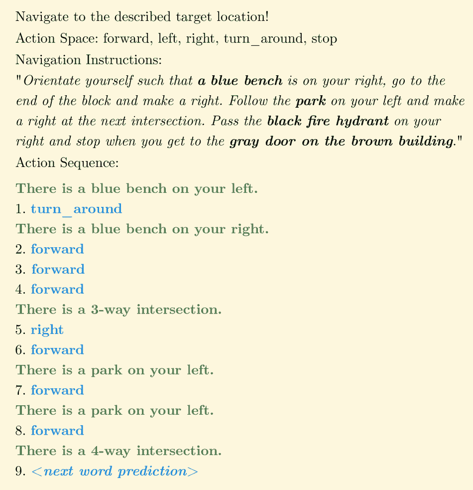
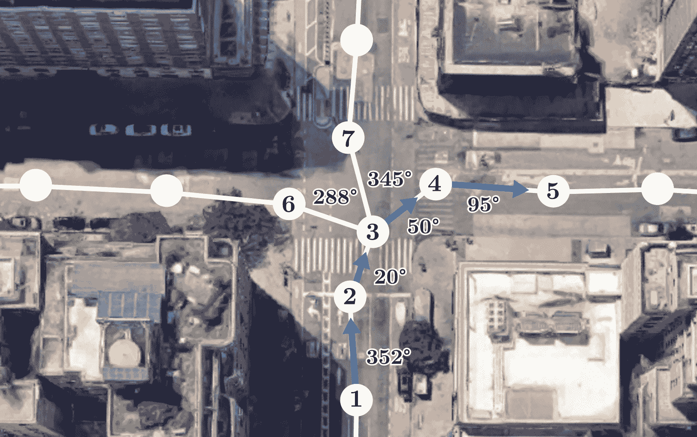
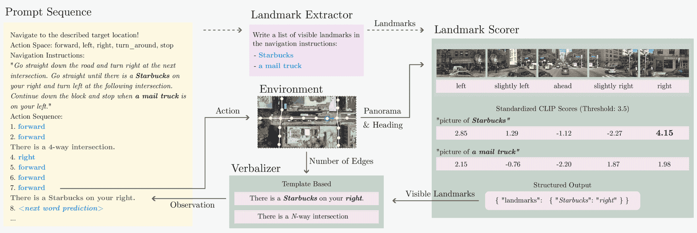
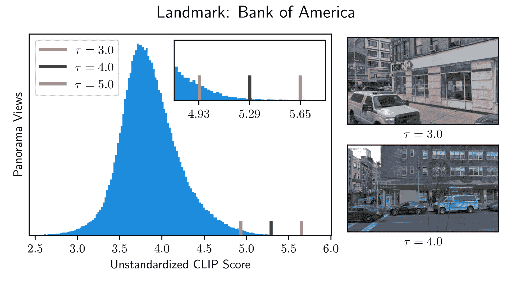
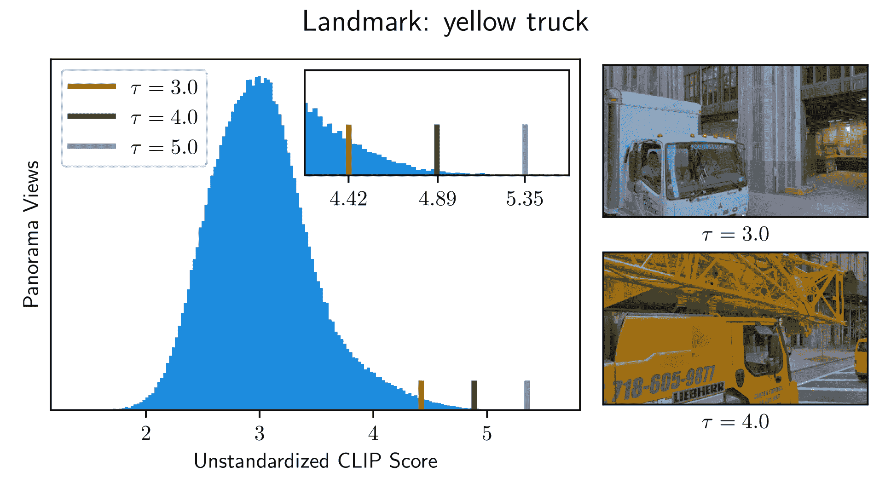
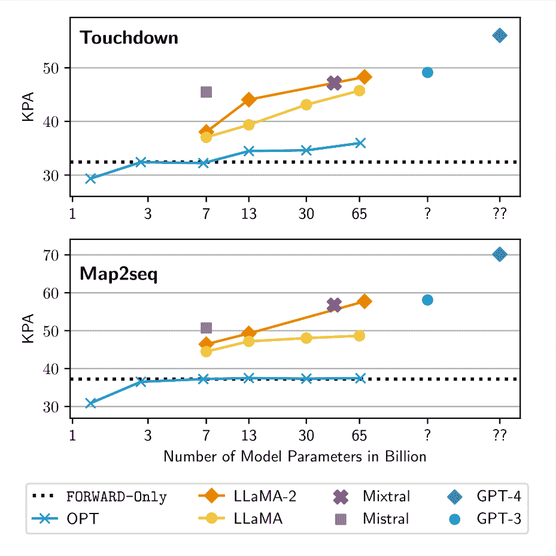
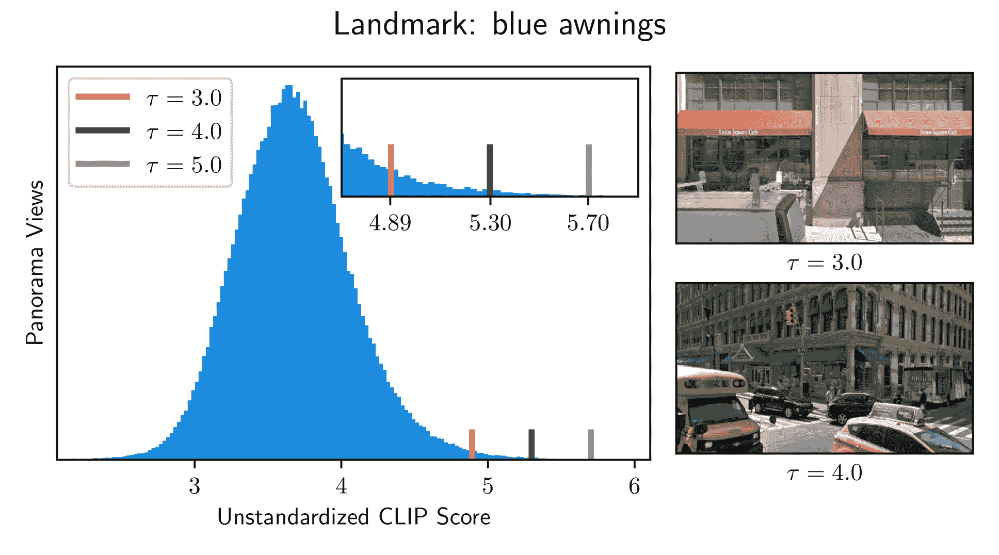
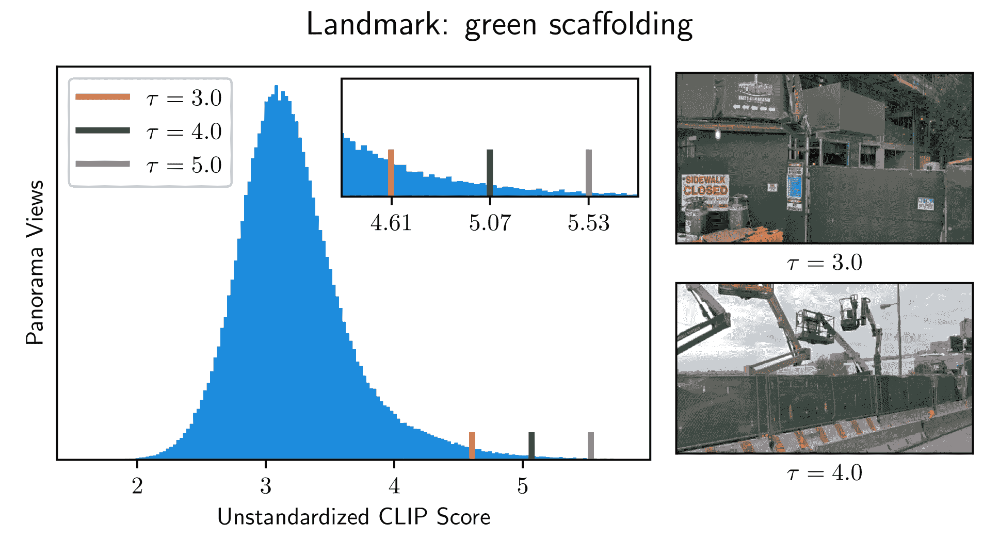
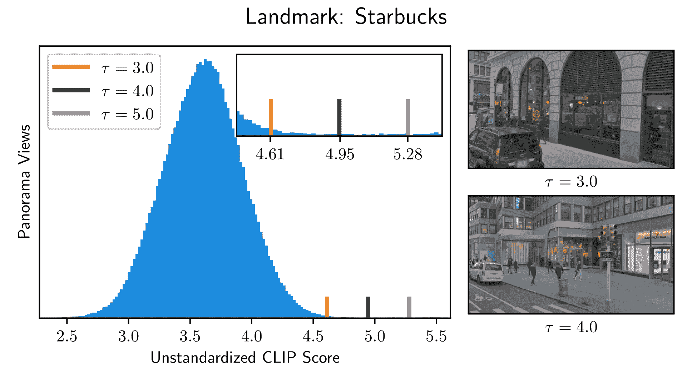
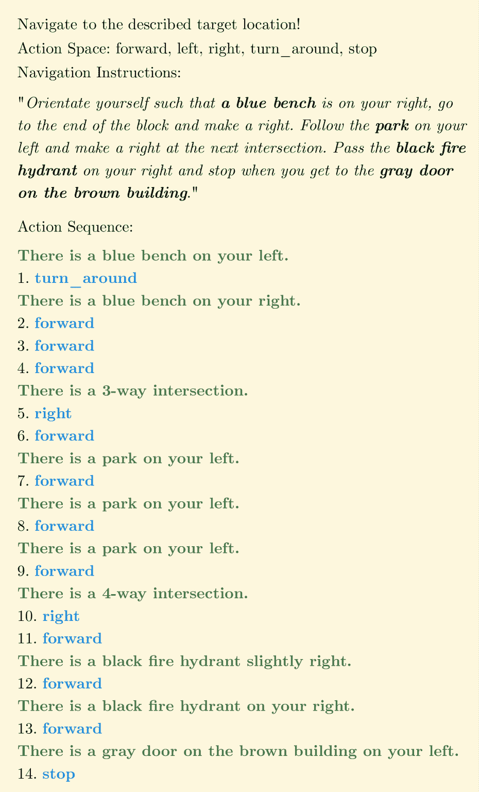

<!--yml

类别：未分类

日期：2025-01-11 13:08:18

-->

# VELMA：大规模语言模型（LLM）代理的语言化体现，用于街景中的视觉与语言导航

> 来源：[https://arxiv.org/html/2307.06082/](https://arxiv.org/html/2307.06082/)

Raphael Schumann¹, Wanrong Zhu², Weixi Feng², Tsu-Jui Fu²,

Stefan Riezler^(1,3), William Yang Wang²

###### 摘要

在现实世界环境中的增量决策是具身人工智能中最具挑战性的任务之一。一个特别具有挑战性的场景是视觉与语言导航（VLN），它要求具备视觉和自然语言理解能力以及空间和时间推理能力。具身代理需要将其对导航指令的理解与街景等现实世界环境的观察进行结合。尽管大规模语言模型（LLMs）在其他研究领域取得了令人印象深刻的成果，但如何将它们与互动的视觉环境最有效地连接仍然是一个未解决的问题。在这项工作中，我们提出了VELMA，一个具身的大规模语言模型代理，利用轨迹和视觉环境观察的语言化形式作为下一步动作的上下文提示。视觉信息通过一个流程进行语言化，该流程从人工书写的导航指令中提取地标，并使用CLIP模型确定它们在当前全景视图中的可见性。我们展示了VELMA能够仅通过两个上下文示例成功地跟随街景中的导航指令。我们进一步在几千个示例上微调了LLM代理，并在两个数据集上实现了任务完成度相对于之前最先进技术约25%的相对提升。

## 1 引言

大型语言模型（LLMs）在传统自然语言处理任务中展现了令人印象深刻的推理能力，现已越来越多地被用作具身智能体的推理引擎，例如家庭机器人（Shridhar 等 [2020](#bib.bib28)）、视频游戏（Wang 等 [2023](#bib.bib33)）和室内导航（Zhou, Hong 和 Wu [2023](#bib.bib38)）。这些任务大多基于模拟环境，模拟环境要么特征是计算机生成的图像，拥有固定集合的可显示物体和纹理，要么受限于规模和轨迹长度。本文中，我们展示了一个大型语言模型智能体的语言表达具身（VELMA），用于街景中的城市视觉与语言导航。该任务的独特挑战在于，结合了源自实际道路网络的大规模环境、具有密集街景的现实世界全景图像以及长时间的导航轨迹。智能体需要将导航指令与可观察的环境相结合，推理出下一步行动，以便到达目标位置。导航指令由人类编写，包含开放式的地标参考和方向指示，旨在引导智能体沿着期望的路径前进。为了充分发挥大型语言模型的推理能力，我们采用了语言表达具身的方法，这是一种将任务（包括智能体的轨迹和对环境的视觉观察）转化为语言的工作流，从而通过自然语言实现大型语言模型的具身。图[1](#S1.F1 "图 1 ‣ 1 引言 ‣ VELMA: 用于街景中视觉与语言导航的LLM智能体的语言表达具身")展示了在当前轨迹的第九步时，对于特定导航实例的语言表达。在每一步，都会提示LLM当前的文本序列，以便预测下一步行动。然后，执行预测的行动，并将新的观察结果转化为语言，添加到提示中。这个过程会一直重复，直到智能体预测停止为止。

图 1：在街景中使用LLM进行VLN的提示序列。视觉环境的语言表达观察结果用绿色标示，并在每一步添加到提示中。智能体的行动（蓝色）通过LLM的下一个词预测获得。文本高亮仅用于视觉呈现。完整的导航轨迹平均长度为40步。

我们工作的主要贡献如下：（i）我们介绍了VELMA，迄今为止，VELMA是第一个基于LLM的城市VLN智能体；（ii）我们报告了城市VLN任务的少量示例结果，并通过在训练集上微调智能体，达到了新的最先进性能；（iii）我们解决了常用的Touchdown环境（Chen 等 [2019](#bib.bib4)）的局限性，使其适用于少量示例的智能体。

## 2 相关工作

##### 户外 VLN

面向户外/城市 VLN 任务的智能体模型（Chen 等人 [2019](#bib.bib4)）通常遵循序列到序列架构，在每个解码步骤中将编码后的文本和图像表示融合（Xiang、Wang 和 Wang [2020](#bib.bib35)；Hermann 等人 [2020](#bib.bib10)；Mehta 等人 [2020](#bib.bib17)；Schumann 和 Riezler [2022](#bib.bib26)；Sun 等人 [2023](#bib.bib29)）。其他提议的智能体使用预训练的视觉和语言变换器，在任务特定数据上进行微调（Zhu 等人 [2021](#bib.bib41)；Armitage、Impett 和 Sennrich [2023](#bib.bib2)）。Zhong 等人（[2021](#bib.bib37)）通过语义分割和全景图像的极度降采样，使用符号表示视觉环境，但他们的智能体在成功率上并没有优于之前的结果。其他工作使用 CLIP 对图中每个全景节点提取的地标进行评分，并利用这些信息为给定的导航指令规划路线（Shah 等人 [2022](#bib.bib27)）。他们的非城市环境具有一个包含 300 个节点的图，并且导航路径是先验规划的，能够访问所有全景图像和地标评分。相比之下，我们的智能体是具身的，只能在仅能访问直接观察到的信息的情况下进行临时规划。

##### 室内 VLN

室内智能体（Fried 等人 [2018](#bib.bib8)；Wang 等人 [2019](#bib.bib34)；Tan、Yu 和 Bansal [2019](#bib.bib30)；Fu 等人 [2020](#bib.bib9)；Zhu 等人 [2020](#bib.bib40)；Qi 等人 [2020](#bib.bib20)；Hong 等人 [2021](#bib.bib11)；Chen 等人 [2021](#bib.bib5)；Li、Tan 和 Bansal [2022](#bib.bib16)）用于诸如 R2R（Anderson 等人 [2018](#bib.bib1)）和 RxR（Ku 等人 [2020](#bib.bib15)）或 ObjectNav（Ramakrishnan 等人 [2021](#bib.bib22)；Zhou 等人 [2023](#bib.bib39)）等导航数据集。Khandelwal 等人（[2022](#bib.bib13)）表明，使用 CLIP 编码器进行图像特征提取可以提高一系列视觉和语言任务的性能。最近，Zhou、Hong 和 Wu（[2023](#bib.bib38)）为 R2R 引入了一种基于 LLM 的智能体，通过图像到文本模型转录其全部内容，融合图像信息。这是可行的，因为导航轨迹平均仅为六步，而我们工作中考虑的城市 VLN 任务的平均步骤数为 40 步。另一个显著的室内 VLN 智能体（Dorbala 等人 [2022](#bib.bib7)）使用 CLIP 直接通过评估子指令与可用的途径图像的兼容性来预测下一个动作。

## 3 城市 VLN 环境

我们使用了Chen等人（[2019](#bib.bib4)）介绍的Touchdown环境。该环境基于Google的街景，包含29,641张全景图像，通过导航图连接。它覆盖了下曼哈顿的密集城市街道网络。导航图是一个有向图$G=\langle V,E\rangle$，其中每条边$\langle v,v^{\prime}\rangle\in E$都与$\alpha_{\langle v,v^{\prime}\rangle}$相关联，表示从节点$v$到节点$v^{\prime}$的朝向，范围从0°到360°。代理的状态$s=(v,\alpha)$由其当前位置$v\in V$和朝向$\alpha$组成。代理可以通过执行动作$a\in\{{\tt{FORWARD}},{\tt{LEFT}},{\tt{RIGHT}},{\tt{STOP}}\}$来移动。状态转移函数$s_{t+1}=\phi(a_{t},s_{t})$定义了代理执行动作时的行为。在Chen等人（[2019](#bib.bib4)）中，代理在位置$v$的朝向$\alpha_{t}$被限制为与出边的朝向$\alpha_{\langle v,v^{\prime}\rangle}$对齐。如果执行${\tt{RIGHT}}$动作，则新的状态$s_{t+1}$为$(v,\alpha_{\langle v,\vec{\mkern 0.0muv}\rangle})$，其中$\vec{\mkern 0.0muv}$是代理当前朝向右侧最近的邻居节点。换句话说，代理会在原地向右旋转，直到其朝向与出边的方向一致。同样，执行${\tt{LEFT}}$动作时也是如此。如果执行${\tt{FORWARD}}$动作，则代理会沿着边$\langle v,v^{\prime}\rangle$根据当前的朝向$\alpha_{t}=\alpha_{\langle v,v^{\prime}\rangle}$移动。随后，环境会强制自动调整代理的朝向，指向一条出边：$\alpha_{t+1}=\alpha_{\langle v^{\prime},v^{*}\rangle}$，其中$v^{*}$是指向先前朝向$\alpha_{t}$最接近的邻居节点。

### 3.1 Touchdown中的对齐不一致性

图2：Chen等人（[2019](#bib.bib4)）介绍的Touchdown环境可能需要执行语义上与正确导航指令不一致的动作序列。在所示的子图中，从节点1移动到节点5的动作序列是连续执行四次${\tt{FORWARD}}$。语义上正确的动作序列应包括其中的一次右转。我们通过修改环境行为来解决这个问题，并在交叉口选择相对于所有出街道的期望方向。

如Schumann和Riezler（[2022](#bib.bib26)）所述，上述提到的自动旋转可能会导致泛化问题，例如，当朝着T字路口的平坦侧行驶时。例如，如果代理自动旋转朝向右侧街道，然后执行${\tt{RIGHT}}$动作，它将朝着自己来的方向旋转，而不是按照预期的方向清理交叉口。这个问题在具有三个以上方向的交叉口也会发生。图[2](#S3.F2 "图2 ‣ 3.1 Touchdown中的对齐不一致 ‣ 3 城市VLN环境 ‣ VELMA: 面向视觉和语言导航的LLM代理的口头化体现")给出了一个示例，展示了四通道交叉口的导航图。由于该环境源自现实世界的街道布局，图中的节点并不像人工网格世界那样完美排列。为了在交叉口右转并沿着从$v^{1}$到$v^{5}$的路线行驶，预期的动作序列是$[{\tt{FORWARD}},{\tt{FORWARD}},{\tt{RIGHT}},{\tt{FORWARD}},{\tt{FORWARD}}]$。然而，当代理到达$v^{3}$时，它会自动旋转朝向最近的出口边缘，在此情况下是$\langle v^{3},v^{4}\rangle$。这是因为朝着$v_{4}$的旋转$20\degree$→$50\degree$比朝着$v_{7}$的旋转$20\degree$→$345\degree$更短。因此，在Chen等人（[2019](#bib.bib4)）的环境中，从$v^{1}$到$v^{5}$所需的动作序列是$[{\tt{FORWARD}},{\tt{FORWARD}},{\tt{FORWARD}},{\tt{FORWARD}}]$。这无法预测，并且与“在交叉口右转”指令不一致。¹¹1在附录中我们展示了更多关于三通、四通和五通交叉口的例子。为了缓解这个问题，Schumann和Riezler（[2022](#bib.bib26)）明确地将每个时间步的航向变化作为附加输入提供给他们的模型。这使得代理能够预测意外的旋转并适应它。由于在基于文本的接口中添加航向增量值使得操作变得复杂且不必要地增加了少样本学习的难度，我们提出了一种更直观的方法来解决交叉口的歧义。我们修改了状态转移函数$\phi$，使得当代理移动${\tt{FORWARD}}$时不会自动旋转。这意味着代理的航向$\alpha_{t}$不会自动与出口边缘对齐。相反，方向是根据所有出口边缘来选择的。图[2](#S3.F2 "图2 ‣ 3.1 Touchdown中的对齐不一致 ‣ 3 城市VLN环境 ‣ VELMA: 面向视觉和语言导航的LLM代理的口头化体现")中的代理在节点$v^{3}$时，前面有节点$v^{6}$、$v^{7}$和$v^{4}$。前进方向选择为三条边缘中的中间一条，右转方向选择为最右边的边缘，左转方向选择为最左边的边缘。这意味着在$v^{3}$位置执行${\tt{RIGHT}}$动作将使代理朝向节点$v^{4}$旋转，并允许使用语义正确的动作序列来表示该路线。所提议的修改解决了交叉口处动作序列不一致的问题，并使得在该环境中没有专门训练的代理也能使用。

### 3.2 调头

我们额外引入了${\tt{TURN\_AROUND}}$动作，允许代理反转其方向：$s_{t+1}=(v,\alpha_{t}-180\degree)$。在未修改的环境中，这可以通过在常规街道段上使用${\tt{LEFT}}$或${\tt{RIGHT}}$动作来实现。这个新动作更符合自然语言中的方向反转表达，促进了与环境的直观沟通。

## 4 导航任务

导航任务的目标是通过遵循给定的导航指令找到目标位置。一个导航实例由初始状态$s_{1}$、目标节点$\hat{v}_{T}$、黄金路径$(\hat{v}_{1},\hat{v}_{2}...,\hat{v}_{T})$和导航指令文本$n=(w_{1},w_{2},...,w_{N})$定义。代理从$s_{1}$开始，根据导航指令和当前观察预测下一个动作$a_{1}$。这些观察包括当前所在位置的全景图像和出发边的数量。环境处理该动作并将代理置于新的状态：$s_{2}=\phi(a_{1},s_{1})$。这一过程不断重复，直到代理在假定的目标位置预测${\tt{STOP}}$。如果代理在目标节点的一个邻近节点处停下，则认为导航任务已完成。

| 自我中心空间推理 |
| --- |
| 1. | … 转弯让橙色的施工障碍物在你左侧 … |
| 2. | … 你前方有一辆红色卡车 … |
| 3. | … 前方远处的右角有一个游乐场 … |
| 他心态空间推理 |
| 4. | … 绿色的金属杆上方有粉红色的花 … |
| 5. | … 建筑物周围有窗户上的柱子 … |
| 6. | … 在Chase和Dunkin' Donuts之间停下 … |
| 时间推理 |
| 7. | … 直行直到你看到Chipotle，然后 … |
| 8. | … 一旦你通过了天桥 … |
| 9. | … 当你右侧的公园结束时停下 … |
| 其他 |
| 10. | … 直行穿过三个交叉口 … |
| 11. | … 你应该看到左侧的TD Bank … |
| 12. | … 如果你看到Dory Oyster Bar，就说明你走得太远了 … |

表 1：完成导航任务所需的推理能力。每个能力附带三段导航指令的示例。

### 4.1 挑战

图 3：所提议的智能体 VELMA 在街景环境中的导航概述。提示序列包括任务描述、导航指令和到当前时间步的语言化导航轨迹。下一步动作由大型语言模型（LLM）通过下一个词预测决定，随后在环境中执行。这使得智能体进入新的状态，地标评分器决定在当前全景视图中提取的地标是否可见。语言化器将该地标信息与潜在交叉口的信息一起处理，并生成当前的观察文本。该文本随后被追加到提示序列中，并再次用于预测下一个动作。这个过程会重复，直到智能体停止并到达预定目标位置。

成功遵循导航指令的一个主要挑战是能够可靠地检测到路线上的全景图像中的地标。指令中提到的地标是开放性的，可能指代街景中任何物体或结构，包括植被、建筑特征、车辆类型、街道标志、建筑设施、公司标识和商店名称。智能体还需要具备不同类型的推理能力，最重要的是空间推理能力，以便按照一般指示定位地标并评估停止条件。智能体还需要理解任务的时间性方面，并推理出之前观察和行动的顺序。有关导航指令的示例片段，请参见表[1](#S4.T1 "表1 ‣ 4 导航任务 ‣ VELMA：视觉和语言导航中的大型语言模型体现在街景中的描述")。

### 4.2 数据集

有两个数据集提供了第[3](#S3 "3 城市VLN环境 ‣ VELMA：视觉和语言导航中的大型语言模型体现在街景中的描述")节中所述环境的导航指令：Touchdown（Chen 等人 [2019](#bib.bib4)）和 Map2seq（Schumann 和 Riezler [2021](#bib.bib25)）。每个数据集包含约 10k 个导航实例，我们在 Schumann 和 Riezler（[2022](#bib.bib26)）提出的更具挑战性的未见场景中使用它们。这意味着泛化能力至关重要，因为训练路线位于与开发和测试路线的区域地理上分隔开的位置。两个数据集之间的主要区别在于，Touchdown 的指令是由跟随街景路线的标注员编写的，而 Map2seq 的指令是由看到路线地图的标注员编写的。Map2seq 的导航指令后来经过验证，证明在街景中也是正确的。另一个区别是，Map2seq 中的初始状态会将智能体朝向正确方向进行定位，因此其任务完成率普遍高于 Touchdown 实例。

图 4：训练区域中地标与全景图像之间的CLIP得分分布。CLIP得分表示全景图像与文本说明“$[$地标$]$的图片”之间的语义相似度。该分布用于标准化地标和新全景图的得分。阈值$\tau$在标准化得分上定义，用于确定地标在新全景图像中的可见性。

## 5 LLM代理

在本节中，我们提出了一个城市VLN代理，它使用LLM推理下一步的动作。为此，我们将导航任务，特别是环境观察进行语言化。工作流程包括提取指令中提到的地标，并确定它们在当前全景图中的可见性。语言化器然后将可见的地标和街道交叉口整合到每一步的观察文本短语$o_{t}$中。时间步$t$的完整文本提示如下所示：

|  | $x_{t}=[d^{a},n,d^{b},o_{1},1,a_{1},o_{2},2,a_{2},...,o_{t},t],$ |  | (1) |
| --- | --- | --- | --- |

其中$[\;]$表示字符串连接，$d^{a}$和$d^{b}$是任务描述的一部分，$n$是导航指令文本。为简洁起见，符号和格式省略。图[3](#S4.F3 "图 3 ‣ 4.1 挑战 ‣ 4 导航任务 ‣ VELMA：视觉和语言导航中的LLM代理的语言表达")显示了左侧$t=8$时的提示序列。这个导航任务的表达方式使得代理能够通过下一个单词预测来预测下一个动作：

|  | $a_{t}=\operatorname*{arg\,max}_{w\in A}P_{LLM}(w&#124;x_{t}),$ |  | (2) |
| --- | --- | --- | --- |

其中$A$是定义的五个动作字面值，$P_{LLM}$是一个没有视觉能力的黑盒语言模型。

### 5.1 地标提取器

每条导航指令文本$n$提到多个地标用于视觉指导。为了确定提到的地标在当前全景图中是否可见，我们首先需要从指令文本中提取出这些地标。为此，我们创建了一个单一的提示，包含五个带有地标列表的导航指令示例（见附录）。该提示由LLM使用，以自动生成给定导航指令中提到的地标列表$(l_{1},l_{2},...,l_{L})$。地标提取器如图[3](#S4.F3 "图 3 ‣ 4.1 挑战 ‣ 4 导航任务 ‣ VELMA：视觉和语言导航中的LLM代理的语言表达")中所示，且在导航开始之前执行。

### 5.2 地标评分器

在每一步，代理会观察一个全景视角$p^{\alpha}_{v}$，该视角由当前的位置$v$和朝向方向$\alpha$定义。该视角是从全景图中裁剪出的一个800x460大小的图像，视野为60°。为了确定地标$l_{i}$是否在视角中可见，我们使用CLIP模型（Radford等，[2021](#bib.bib21)）将图像和标题："[$l_{i}$]的图片"进行嵌入。两个嵌入的相似度得分决定了地标的可见性。由于得分可能对某些类型的地标产生偏差，因此我们使用训练区域中的所有视角$p^{*}_{train}$，即约20k张全景图像，对得分进行标准化。请记住，我们在一个未见过的场景中进行操作，其中训练区域和评估区域在地理上是分离的。地标的标准化得分为：

|  | $\begin{gathered}z(l,p^{\alpha}_{v})=\frac{\text{CLIP}(l,p^{\alpha}_{v})-\mu(C_% {l})}{\sigma(C_{l})}\\ \text{其中 }C_{l}=\{\text{CLIP}(l,p^{\alpha^{\prime}}_{v^{\prime}})\mid p^{% \alpha^{\prime}}_{v^{\prime}}\in p^{*}_{train}\}.\end{gathered}$ |  | (3) |
| --- | --- | --- | --- |

如果标准化得分大于阈值$\tau$，则地标在当前视角下被分类为可见。该过程不需要标注，并且是完全无监督的，从而能够对新的地标进行评分。阈值是地标评分器中唯一可调节的参数。图[4](#S4.F4 "图4 ‣ 4.2 数据集 ‣ 4 导航任务 ‣ VELMA: 用于街景中的视觉和语言导航的LLM代理的语言化体现")展示了在不同阈值下，两个示例地标的标准化CLIP得分和视角的分布。当$\tau=4.0$时，两个视角都显示了正确的地标，而在$\tau=3.0$时，”美国银行”显示了汇丰银行分行，而”黄色卡车”显示了白色卡车。这表明最佳阈值应该介于这两个值之间。如图[3](#S4.F3 "图3 ‣ 4.1 挑战 ‣ 4 导航任务 ‣ VELMA: 用于街景中的视觉和语言导航的LLM代理的语言化体现")右侧所示，代理还会评估当前朝向的左侧和右侧视角。每个全景视角方向$(p^{\alpha-90\degree}_{v},p^{\alpha-45\degree}_{v},p^{\alpha}_{v},p^{\alpha+45\degree}_{v},p^{\alpha+90\degree}_{v})$与一个字符串字面值$m$相关，分别表示左侧、略左、正前方、略右和右侧。一个可见的地标$l_{i}$和相应的方向字面值$m_{i}$将传递给语言生成器。一个完整的导航轨迹包括大约200个图像视角（每步40个视角，每步5个视角方向），每个地标通常只在一个或两个视角中可见。

### 5.3 语言生成器

语言生成器（verbalizer）是一个基于模板的组件，用于生成文本形式的环境观察信息。环境观察分为两种类型。第一种是街道交叉口，通过在导航图中的当前节点$v$上的出边数$N(v)$来检测。如果在步骤$t$上有三个或更多的出边，语言生成器会将此信息编码成观察字符串$o_{t}^{e}$：“这里有一个$[N(v)]$路口”。从导航图中直接提取该信息类似于ORAR模型使用的交叉口类型嵌入（Schumann 和 Riezler [2022](#bib.bib26)），并且灵感来源于数据采集过程中人类导航员使用的街景视图GUI上的方向箭头。另一种类型的观察是全景视图中可见的地标。地标名称$l_{i}$和方向字面量$m_{i}$用于表达观察$o_{t}^{l}$：“在你的$[m_{i}]$方向有$[l_{i}]$”。完整的观察是$o_{t}=[o_{t}^{e},o_{t}^{l}]$，如果没有检测到交叉口或地标，相应的字符串为空。该观察会被附加到公式[1](#S5.E1 "1 ‣ 5 LLM Agent ‣ VELMA: Verbalization Embodiment of LLM Agents for Vision and Language Navigation in Street View")中的提示中，并供代理决定下一步操作。

## 6 个实验

|  | 开发集 | 测试集 |
| --- | --- | --- |
|  | Touchdown | Map2seq | Touchdown | Map2seq |
| 模型 | SPD↓ | KPA↑ | TC↑ | SPD↓ | KPA↑ | TC↑ | SPD↓ | KPA↑ | TC↑ | SPD↓ | KPA↑ | TC↑ |
| ORAR-ResNet | 20.0 ±0.7 | - |  15.4 ±2.2 | 11.9 ±0.4 | - |  27.6 ±1.8 | 20.8 ±0.6 | - |  14.9 ±1.2 | 13.0 ±0.3 | - |  30.3  ±1.8 |
| ORAR^($\spadesuit$)-ResNet | 16.5 ±0.1 |  64.0 ±0.2 |  22.6 ±0.6 | 10.3 ±0.4 |  74.4 ±0.8 |  29.9 ±1.7 | 17.4 ±0.2 |  62.3 ±0.1 |  19.1 ±1.0 | 10.9 ±0.1 |  74.7 ±0.2 |  32.5 ±1.4 |
| ORAR^($\spadesuit$)-OpenCLIP | 17.5 ±0.2 |  63.7 ±1.0 |  21.5 ±0.9 | 10.0 ±0.2 |  75.3 ±0.5 |  32.8 ±1.5 | 17.0 ±0.1 |  63.4 ±0.4 |  20.0 ±0.1 | 10.5 ±0.5 |  75.1 ±0.7 |  34.0 ±0.5 |
|  | 2-次上下文学习 |
| VELMA-Mixtral | 28.4 |  47.2 |  6.5 | 21.1 |  56.8 |  8.0 | - | - | - | - | - | - |
| VELMA-GPT-3 | 22.2 |  49.1 |  6.8 | 19.1 |  58.1 |  9.2 | - | - | - | - | - | - |
| VELMA-GPT-4 | 21.8 |  56.1 |  10.0 | 12.8 |  70.1 |  23.1 | - | - | - | - | - | - |
|  | LLM微调，完整训练集 |
| VELMA-FT | 18.3 ±0.4 |  62.0 ±0.1 |  23.4 ±0.2 | 8.7 ±0.0 |  78.7 ±0.3 |  41.3 ±0.9 | 18.2 ±0.3 |  62.2 ±0.2 |  23.5 ±0.4 | 9.7 ±0.3 |  78.0 ±0.1 |  40.0 ±1.0 |
| VELMA-RBL | 15.5 ±0.3 |  63.6 ±0.6 |  26.0 ±0.6 | 8.3 ±0.1 |  79.5 ±0.4 |  45.3 ±0.5 | 16.0 ±0.7 |  62.8 ±1.3 |  26.4 ±1.7 | 8.3 ±0.2 |  79.6 ±0.4 |  47.5 ±0.7 |

表2：在未见过的场景中，Touchdown和Map2seq的城市VLN任务结果，即训练区域与开发和测试路线所在区域在地理上是分离的。ORAR-ResNet（Schumann和Riezler [2022](#bib.bib26)）是先前最好的模型，采用了一个seq-to-seq架构，在解码过程中融合了文本和图像特征。我们在改进后的环境中重新训练了该模型（ORAR^($\spadesuit$)-ResNet），并且使用与地标评分器中相同的图像特征提取器（ORAR^($\spadesuit$)-OpenCLIP）。VELMA-GPT-3和VELMA-GPT-4模型采用了我们提出的表达化工作流，并通过两个上下文示例进行提示。由于成本和数据泄露的考虑，我们仅在开发集上评估GPT模型。VELMA-FT是LLaMa-7b，在所有训练文本序列上进行了微调（每个数据集约6k条）。VELMA-RBL微调过程在第[3](#S6.T3 "Table 3 ‣ Response-Based Learning ‣ 6.4 Finetuning Results ‣ 6 Experiments ‣ VELMA: Verbalization Embodiment of LLM Agents for Vision and Language Navigation in Street View")节中进行了描述。所有实验都重复了三次，使用不同的随机种子（报告的是均值/标准差）。粗体值为名义上的最佳结果，下划线为最佳少量学习结果。

我们进行了实验²²2项目页面：[https://velma.schumann.pub/](https://velma.schumann.pub/)和代码：[https://github.com/raphael-sch/VELMA](https://github.com/raphael-sch/VELMA)，以评估所提出的LLM代理在微调和上下文学习设置中的导航性能。我们使用CLIP-ViT-bigG-14-laion2B-39B-b160k（Schuhmann等人[2022](#bib.bib24)）作为地标评分器中的CLIP模型。我们为所有实验设置了阈值$\tau=3.5$。该阈值是通过检查CLIP得分的分布（如图[4](#S4.F4 "Figure 4 ‣ 4.2 Datasets ‣ 4 Navigation Task ‣ VELMA: Verbalization Embodiment of LLM Agents for Vision and Language Navigation in Street View")中所示）为少数地标选择的。我们故意没有系统地调整该阈值，以避免违反少量学习的前提。

### 6.1 地标提取

我们使用GPT-3（Brown等人[2020](#bib.bib3)）对所有实例运行了一次地标提取器，并在所有实验中使用相同的提取地标。平均而言，从导航指令文本中提取了2.7个地标。测试集中的大约58%的地标是新的，即它们未在训练实例中使用。为了评估自动提取的地标的质量，我们手动标注了每个开发集中的50个实例。对于Touchdown，我们计算得到了96.3的F1分数（精确度：97.2，召回率：95.4），Map2seq的F1分数为99.6（精确度：100，召回率：99.3）。这表明，GPT-3能够可靠地从指令文本中提取地标，并且在所有实验中重复使用这些地标，最小化了这一工作流程步骤所引入的不准确性。

### 6.2 衡量标准和基线

我们使用三项衡量标准来评估导航性能。任务完成率（TC）是一个二元指标，衡量代理是否成功在目标位置的一个相邻节点内停下。最短路径距离（SPD）计算停止位置和目标位置之间的最短路径长度（Chen等人 [2019](#bib.bib4)）。关键点准确率（KPA）衡量在关键点处做出正确决策的比例。关键点包括初始步骤、金路线上的交叉点以及目标位置。

对于基线，我们使用当前最先进的城市VLN代理模型ORAR（Schumann和Riezler [2022](#bib.bib26)）。该模型采用seq-to-seq架构，其中编码器LSTM读取导航指令文本，多层解码器LSTM在每个动作解码步骤中接收当前全景视图的图像特征向量作为额外输入。ORAR模型是一个非常强大的基线，超越了像VLN Transformer（Zhu等人 [2021](#bib.bib41)）这样的更复杂模型。由于第[3](#S3 "3 Urban VLN Environment ‣ VELMA: Verbalization Embodiment of LLM Agents for Vision and Language Navigation in Street View")节中介绍的环境修改使得代理不需要学习特定的不规则性，我们还在改进后的环境中重新训练ORAR，以便进行公平比较。

### 6.3 少量样本学习结果

图5：随着参数数量增加，大型语言模型在2-shot上下文学习中的关键点准确率（KPA）。${\tt{FORWARD}}$-Only基线模型预测一直向前走，直到达到平均轨迹长度，并且比预测随机方向的效果更好。

所提出的仅文本接口使我们能够使用大型语言模型作为推理器，而无需更新其权重或融合图像表示。提示由简短的任务描述和两个上下文示例（2-shot）组成。示例是训练集中随机选择的导航实例的完整文本序列，沿着黄金路线进行。图[5](#S6.F5 "图5 ‣ 6.3 少样本学习结果 ‣ 6 实验 ‣ VELMA：街景视图中面向视觉和语言导航的LLM代理的语言化体现")中的两个图表显示，性能随着参数数量的增加而提升，并且在不同的模型家族之间有所不同。${\tt{FORWARD}}$-Only基准揭示了OPT（Zhang等人[2022](#bib.bib36)）几乎无法与一个基本启发式方法竞争，即使在65亿参数的模型规模下也是如此。LLaMa（Touvron等人[2023a](#bib.bib31)）尤其是LLaMa-2（Touvron等人[2023b](#bib.bib32)）显示出有前景的导航技能，分别在Touchdown和Map2seq上达到了48.3和57.7的关键点精度（KPA）。然而，这个KPA分数仅转化为2.1和3.2的任务完成率（TC），揭示了模型在整个导航过程中无法始终如一地预测正确的动作。Mistral-7b的表现与一个尺寸是其两倍的LLaMA-2模型相当，但也未能显著提高任务完成率，仍低于3。唯一能够达到显著TC率的少样本LLM是GPT-3、GPT-4（OpenAI [2023](#bib.bib19)）和Mixtral（Mistral AI Team [2023](#bib.bib18)）。如表[2](#S6.T2 "表2 ‣ 6 实验 ‣ VELMA：街景视图中面向视觉和语言导航的LLM代理的语言化体现")所示，VELMA-GPT-4在2-shot设置下取得了最佳结果。它达到了前一先进模型ORAR^($\spadesuit$)-ResNet的TC率的44%和77%，该模型是一个seq-to-seq模型，能够直接访问图像特征，并且是在完整训练集上训练的。相比之下，我们工作中的LLM作为一个盲代理，仅依赖于由语言化器生成的观察描述。这一点非常了不起，因为LLM并未明确训练在视觉环境中体验体现。这是通过对VLN任务的语言化而挖掘出来的突现行为。我们还观察到，GPT-4以有用的方式调用了${\tt{TURN\_AROUND}}$动作，例如当它注意到自己走过描述的目标位置时，它会返回几步。这突显了与环境进行直观沟通的有效性。

### 6.4 微调结果

为了进一步探索所提出的LLM代理的能力，我们对LLaMa-7b进行了微调，使用的是各自数据集的所有训练实例，在表格[2](#S6.T2 "Table 2 ‣ 6 Experiments ‣ VELMA: Verbalization Embodiment of LLM Agents for Vision and Language Navigation in Street View")中标记为VELMA-FT。每个训练实例是通过遵循黄金路径生成的完整文本序列。地标的可见性由地标评分器在训练过程中确定，因为没有黄金注释可用。Touchdown有6,770个训练实例，Map2seq有5,737个。我们使用LoRA (Hu等人 [2022](#bib.bib12))对查询、键和值投影的注意力层进行微调，同时对每个变换层的输入和输出投影进行调整，微调过程为20个epoch。通过开发集上的任务完成度来选择最佳模型。最终的代理模型比之前的最先进模型ORAR^*在相对TC率上提高了10%和16%。将ORAR^*（在向量级融合图像特征）与VELMA-FT（在观察的语言化表示上进行微调）进行比较，结果表明基于文本的环境观察更不容易过拟合。

#### 基于响应的学习

|  | Touchdown | Map2seq |
| --- | --- | --- |
| 图像模型 | SPD↓ | TC↑ | SPD↓ | TC↑ |
| 无图像 | 26.7 ±0.4 | 15.0 ±0.6 | 9.1 ±0.2 | 37.8 ±1.0 |
| CLIP | 20.2 ±0.3 | 20.8 ±0.5 | 8.8 ±0.5 | 39.2 ±0.5 |
| OpenCLIP | 18.3 ±0.4 | 23.4 ±0.2 | 8.7 ±0.0 | 41.3 ±0.9 |

表3：开发集上的视觉消融实验。我们对每个消融实验分别进行了LLaMa-7b模型的微调。CLIP指的是clip-vit-large-patch14 (Radford等人 [2021](#bib.bib21))。OpenCLIP图像模型指的是CLIP-ViT-bigG-14-laion2B-39B-b160k (Schuhmann等人 [2022](#bib.bib24))。

如果智能体停在目标位置或相邻的邻近节点，则导航任务被认为成功完成。使用教师强制训练智能体严格按照黄金路径执行动作，尽管完成了导航目标，仍会因停在目标节点之前或之后一步而受到惩罚。此外，智能体无法在推理过程中从错误决策中恢复。因此，我们训练智能体直接优化任务完成度（TC）指标，同时在训练过程中输入智能体自身的动作，这在表[2](#S6.T2 "表 2 ‣ 6 实验 ‣ VELMA：视觉语言导航中的大型语言模型智能体的语言表达")中被称为 VELMA-RBL。VELMA-RBL 的过程受到基于响应的学习（Clarke 等人 [2010](#bib.bib6)）和模仿学习（Ross、Gordon 和 Bagnell [2011](#bib.bib23)）的启发，并在算法[1](#alg1 "算法 1 ‣ 基于响应的学习 ‣ 6.4 微调结果 ‣ 6 实验 ‣ VELMA：视觉语言导航中的大型语言模型智能体的语言表达")中概述。训练步骤 $j$ 中某个实例的损失是通过教师强制黄金动作序列 $\hat{\mathbf{a}}$ 或学生强制（由混合参数 $\lambda$ 决定）来计算的。在学生强制中，当前模型权重 $\theta_{j}$ 解码出的动作会替代黄金动作。如果该轨迹结束时距离目标位置一个邻近节点，则预测的动作序列 $\mathbf{a}_{j}$ 被视为正确，并作为训练智能体的参考。如果智能体停在错误的位置，则计算出一个预言路径，为轨迹中的每一步提供最佳反事实动作。在我们的案例中，预言者的最佳下一步动作是计算到目标位置的最短路径。我们设置 $\lambda=0.5$，以便从两种训练策略中均匀收集训练损失。通过人工检查经过训练的智能体所产生的轨迹，我们发现，在需要停止的任务中，例如“在 Y 之前停几步”或“在 X 停，如果你看到 Y，说明你走得太远了”，智能体在这两种情况下都学会了走过不确定的停止位置，并在看到地标 Y 后执行 ${\tt{TURN\_AROUND}}$ 动作，掉头返回。描述的训练过程显著提高了任务完成率，Touchdown 和 Map2seq 分别提高了 2.9 和 7.5。总体而言，我们在这项工作中的贡献使得在 Touchdown 和 Map2seq 数据集上，城市视觉语言导航（VLN）的任务完成率相对于之前报告的最先进技术分别提高了 77% 和 57%。

算法 1 任务完成的 RBL 优化

混合比率$\lambda$，训练步骤$j$，模型权重$\theta_{j}$，黄金动作序列$\hat{\mathbf{a}}$，提示$x_{1}$如果$random(0,1)<\lambda$则     $\mathbf{a}_{\theta_{j}}=StudentForcing(\theta_{j},x_{1})$     $\mathbf{a}_{j}=\operatorname*{arg\,max}\mathbf{a}_{\theta_{j}}$     如果$TaskCompletion(\mathbf{a}_{j})=1$则         $loss_{j}=\mathcal{L}_{CE}(\mathbf{a}_{\theta_{j}},\mathbf{a}_{j})$     否则         ${\mathbf{a}}^{\ast}_{j}=Oracle_{stepwise}(\mathbf{a}_{j})$         $loss_{j}=\mathcal{L}_{CE}(\mathbf{a}_{\theta_{j}},{\mathbf{a}}^{\ast}_{j})$     结束如果否则     $\mathbf{a}_{\theta_{j}}=TeacherForcing(\theta_{j},x_{1},\hat{\mathbf{a}})$     $loss_{j}=\mathcal{L}_{CE}(\mathbf{a}_{\theta_{j}},\hat{\mathbf{a}})$结束如果

### 6.5 图像消融

在本节中，我们对地标评分器使用的图像模型进行消融实验。我们根据第[6.4节](#S6.SS4 "6.4 微调结果 ‣ 6 实验 ‣ VELMA：面向街景视图中视觉与语言导航的LLM代理的语言化体现")微调了一个LLaMa-7b模型，并在地标评分器中使用CLIP（Radford等人，[2021](#bib.bib21)）、OpenCLIP（Schuhmann等人，[2022](#bib.bib24)）或不使用图像模型。后一种情况意味着没有地标观察传递到提示序列中。表[3](#S6.T3 "表3 ‣ 基于响应的学习 ‣ 6.4 微调结果 ‣ 6 实验 ‣ VELMA：面向街景视图中视觉与语言导航的LLM代理的语言化体现")中的结果显示，OpenCLIP比原始的CLIP模型更适合用于我们导航任务中的地标检测。这与OpenCLIP作者报告的更好的ImageNet结果一致，并表明代理可以直接从CLIP模型的进一步改进中受益。将地标从提示序列中移除进一步降低了性能，特别是在Touchdown任务中。

## 7 结论

我们介绍了VELMA，一个用于城市视觉和语言导航的智能体，它利用大型语言模型推断下一步的行动。该大型语言模型通过文本提示不断地被查询，该提示将任务描述、导航指令、视觉观察以及智能体的过去轨迹进行口头化。为了在提示中包含观察到的地标，我们提出了一种无监督的流程，从指令中提取地标，并根据阈值化的CLIP分数确定它们在当前全景视图中的可见性。我们在基于街景的常用Touchdown环境的修改版本中评估了具身的LLM智能体。一个提出的修改是修复交叉口的问题，该问题导致了行动序列的错误对齐，另一个修改是增加了${\tt{TURN\_AROUND}}$动作，这提供了一种更直观的方式与环境进行互动。该智能体在Touchdown和Map2seq任务中的few-shot上下文学习结果分别为10和23的任务完成率，当在完整训练集上进行微调时，分别达到了26和47的任务完成率，创下了新的最先进成果。微调结果表明，口头化并不是此任务的固有限制，使用更好的基础模型或改进的提示技术进行上下文学习可能超越我们报告的few-shot结果。

## 致谢

本文所报告的研究得到了Google Focused Research Award的资助。

## 参考文献

+   Anderson等（2018）Anderson, P.; Wu, Q.; Teney, D.; Bruce, J.; Johnson, M.; Sünderhauf, N.; Reid, I.; Gould, S.; 和Van Den Hengel, A. 2018. 《视觉和语言导航：解释在真实环境中基于视觉的导航指令》。发表于《IEEE计算机视觉与模式识别大会论文集》，3674-3683页。

+   Armitage, Impett和Sennrich（2023）Armitage, J.; Impett, L.; 和Sennrich, R. 2023. 《带有轨迹规划和特征位置提示的视觉与语言导航优先级图》。发表于《IEEE/CVF冬季计算机视觉应用会议论文集》，1094-1103页。

+   Brown等（2020）Brown, T.; Mann, B.; Ryder, N.; Subbiah, M.; Kaplan, J. D.; Dhariwal, P.; Neelakantan, A.; Shyam, P.; Sastry, G.; Askell, A.; Agarwal, S.; Herbert-Voss, A.; Krueger, G.; Henighan, T.; Child, R.; Ramesh, A.; Ziegler, D.; Wu, J.; Winter, C.; Hesse, C.; Chen, M.; Sigler, E.; Litwin, M.; Gray, S.; Chess, B.; Clark, J.; Berner, C.; McCandlish, S.; Radford, A.; Sutskever, I.; and Amodei, D. 2020. 《语言模型是少样本学习者》。发表于Larochelle, H.; Ranzato, M.; Hadsell, R.; Balcan, M.; 和Lin, H.编辑的《神经信息处理系统的进展》，第33卷，1877-1901页，Curran Associates, Inc.

+   Chen 等人（2019）Chen, H.; Suhr, A.; Misra, D.; Snavely, N.; 和 Artzi, Y. 2019. TOUCHDOWN：自然语言导航与视觉街道环境中的空间推理。在 *IEEE/CVF计算机视觉与模式识别大会（CVPR）论文集*。加利福尼亚州长滩。

+   Chen 等人（2021）Chen, S.; Guhur, P.-L.; Schmid, C.; 和 Laptev, I. 2021. 历史感知多模态变压器用于视觉与语言导航。 *神经信息处理系统进展*，34：5834–5847。

+   Clarke 等人（2010）Clarke, J.; Goldwasser, D.; Chang, M.-W.; 和 Roth, D. 2010. 从世界的响应中驱动语义解析。在 *第十四届计算自然语言学习会议论文集*，18–27。瑞典乌普萨拉：计算语言学会。

+   Dorbala 等人（2022）Dorbala, V. S.; Sigurdsson, G.; Piramuthu, R.; Thomason, J.; 和 Sukhatme, G. S. 2022. Clip-nav：使用 CLIP 进行零样本视觉与语言导航。在 *CoRL 2022 语言与机器人学习工作坊*。

+   Fried 等人（2018）Fried, D.; Hu, R.; Cirik, V.; Rohrbach, A.; Andreas, J.; Morency, L.-P.; Berg-Kirkpatrick, T.; Saenko, K.; Klein, D.; 和 Darrell, T. 2018. 面向视觉与语言导航的说话人-跟随者模型。在 *神经信息处理系统（NeurIPS）*。

+   Fu 等人（2020）Fu, T.-J.; Wang, X. E.; Peterson, M. F.; Grafton, S. T.; Eckstein, M. P.; 和 Wang, W. Y. 2020. 通过对抗路径采样器进行反事实视觉与语言导航。在 *计算机视觉–ECCV 2020：第16届欧洲会议，英国格拉斯哥，2020年8月23日至28日，会议录，第VI部分 16*，71–86。Springer。

+   Hermann 等人（2020）Hermann, K. M.; Malinowski, M.; Mirowski, P.; Banki-Horvath, A.; Anderson, K.; 和 Hadsell, R. 2020. 学习在街景中跟随指示。在 *美国人工智能大会（AAAI）论文集*。纽约，纽约。

+   Hong 等人（2021）Hong, Y.; Wu, Q.; Qi, Y.; Rodriguez-Opazo, C.; 和 Gould, S. 2021. Vln bert：一种用于导航的循环视觉与语言 BERT。在 *IEEE/CVF计算机视觉与模式识别大会论文集*，1643–1653。

+   Hu 等人（2022）Hu, E. J.; yelong shen; Wallis, P.; Allen-Zhu, Z.; Li, Y.; Wang, S.; Wang, L.; 和 Chen, W. 2022. LoRA：大型语言模型的低秩适配。在 *国际学习表征会议*。

+   Khandelwal 等人（2022）Khandelwal, A.; Weihs, L.; Mottaghi, R.; 和 Kembhavi, A. 2022. 简单但有效：用于具身 AI 的 CLIP 嵌入。在 *IEEE/CVF计算机视觉与模式识别大会（CVPR）论文集*，14829–14838。

+   Kingma 和 Ba（2015）Kingma, D. P.; 和 Ba, J. 2015. Adam：一种随机优化方法。在 *国际学习表征会议（ICLR）论文集*。加利福尼亚州圣地亚哥。

+   Ku 等人（2020）Ku, A.; Anderson, P.; Patel, R.; Ie, E.; 和 Baldridge, J. 2020. Room-Across-Room: 使用密集时空基础的多语言视觉与语言导航。发表于 *2020年自然语言处理实证方法会议（EMNLP）论文集*，4392–4412。

+   Li、Tan 和 Bansal（2022）Li, J.; Tan, H.; 和 Bansal, M. 2022. Envedit: 面向视觉与语言导航的环境编辑。发表于 *IEEE/CVF计算机视觉与模式识别会议论文集*，15407–15417。

+   Mehta 等人（2020）Mehta, H.; Artzi, Y.; Baldridge, J.; Ie, E.; 和 Mirowski, P. 2020. Retouchdown: 将 Touchdown 作为街景中语言基础任务的公共资源发布到 StreetLearn。发表于 *第三届空间语言理解国际研讨会（SpLU）论文集*。在线发布。

+   Mistral AI团队（2023）Mistral AI Team. 2023. Mixtral of Experts: 高质量稀疏专家混合模型。*Mistral AI 博客*。访问日期：2023年12月18日。

+   OpenAI（2023）OpenAI. 2023. GPT-4技术报告。*ArXiv*, abs/2303.08774。

+   Qi 等人（2020）Qi, Y.; Wu, Q.; Anderson, P.; Wang, X.; Wang, W. Y.; Shen, C.; 和 Hengel, A. v. d. 2020. Reverie: 在真实室内环境中远程体现的视觉指代表达。发表于 *IEEE/CVF计算机视觉与模式识别会议论文集*，9982–9991。

+   Radford 等人（2021）Radford, A.; Kim, J. W.; Hallacy, C.; Ramesh, A.; Goh, G.; Agarwal, S.; Sastry, G.; Askell, A.; Mishkin, P.; Clark, J.; Krueger, G.; 和 Sutskever, I. 2021. 从自然语言监督中学习可转移的视觉模型。发表于 *ICML*。

+   Ramakrishnan 等人（2021）Ramakrishnan, S. K.; Gokaslan, A.; Wijmans, E.; Maksymets, O.; Clegg, A.; Turner, J. M.; Undersander, E.; Galuba, W.; Westbury, A.; Chang, A. X.; Savva, M.; Zhao, Y.; 和 Batra, D. 2021. Habitat-Matterport 3D 数据集（HM3D）：用于具身AI的大规模 3D 环境数据集。发表于 *第35届神经信息处理系统会议数据集与基准赛道（第二轮）*。

+   Ross、Gordon 和 Bagnell（2011）Ross, S.; Gordon, G. J.; 和 Bagnell, J. A. 2011. 将模仿学习和结构化预测简化为无悔在线学习。发表于 *第14届人工智能与统计国际会议（AISTATS）论文集*。美国佛罗里达州劳德代尔堡。

+   Schuhmann 等人（2022）Schuhmann, C.; Beaumont, R.; Vencu, R.; Gordon, C. W.; Wightman, R.; Cherti, M.; Coombes, T.; Katta, A.; Mullis, C.; Wortsman, M.; Schramowski, P.; Kundurthy, S. R.; Crowson, K.; Schmidt, L.; Kaczmarczyk, R.; 和 Jitsev, J. 2022. LAION-5B: 用于训练下一代图像-文本模型的开放大规模数据集。发表于 *第36届神经信息处理系统会议数据集与基准赛道*。

+   Schumann 和 Riezler（2021）Schumann, R.; 和 Riezler, S. 2021. 将地图上的地标导航指令生成作为图到文本问题。发表于 *第59届计算语言学会年会和第11届国际联合自然语言处理大会（第1卷：长篇论文）*，489–502。在线：计算语言学会。

+   Schumann 和 Riezler（2022）Schumann, R.; 和 Riezler, S. 2022. 分析视觉与语言导航在未见过的户外区域中的泛化能力。发表于 *第60届计算语言学会年会（第1卷：长篇论文）*，7519–7532。都柏林，爱尔兰：计算语言学会。

+   Shah 等人（2022）Shah, D.; Osinski, B.; Ichter, B.; 和 Levine, S. 2022. LM-Nav：使用大型预训练语言、视觉和动作模型进行机器人导航。arXiv:2207.04429。

+   Shridhar 等人（2020）Shridhar, M.; Thomason, J.; Gordon, D.; Bisk, Y.; Han, W.; Mottaghi, R.; Zettlemoyer, L.; 和 Fox, D. 2020. ALFRED：用于解释日常任务指令的基准测试。发表于 *IEEE计算机视觉与模式识别大会（CVPR）*。

+   Sun 等人（2023）Sun, Y.; Qiu, Y.; Aoki, Y.; 和 Kataoka, H. 2023. 户外视觉与语言导航需要对象级对齐。*传感器*，23(13)。

+   Tan, Yu 和 Bansal（2019）Tan, H.; Yu, L.; 和 Bansal, M. 2019. 学习在未见过的环境中导航：使用环境丢失的回译方法。发表于 *2019年北美计算语言学会年会：人类语言技术会议论文集，卷1（长篇和短篇论文）*，2610–2621。明尼阿波利斯，明尼苏达州：计算语言学会。

+   Touvron 等人（2023a）Touvron, H.; Lavril, T.; Izacard, G.; Martinet, X.; Lachaux, M.-A.; Lacroix, T.; Rozière, B.; Goyal, N.; Hambro, E.; Azhar, F.; Rodriguez, A.; Joulin, A.; Grave, E.; 和 Lample, G. 2023a. LLaMA：开放和高效的基础语言模型。arXiv:2302.13971。

+   Touvron 等人（2023b）Touvron, H.; Martin, L.; Stone, K.; Albert, P.; Almahairi, A.; Babaei, Y.; Bashlykov, N.; Batra, S.; Bhargava, P.; Bhosale, S.; Bikel, D.; Blecher, L.; Ferrer, C. C.; Chen, M.; Cucurull, G.; Esiobu, D.; Fernandes, J.; Fu, J.; Fu, W.; Fuller, B.; Gao, C.; Goswami, V.; Goyal, N.; Hartshorn, A.; Hosseini, S.; Hou, R.; Inan, H.; Kardas, M.; Kerkez, V.; Khabsa, M.; Kloumann, I.; Korenev, A.; Koura, P. S.; Lachaux, M.-A.; Lavril, T.; Lee, J.; Liskovich, D.; Lu, Y.; Mao, Y.; Martinet, X.; Mihaylov, T.; Mishra, P.; Molybog, I.; Nie, Y.; Poulton, A.; Reizenstein, J.; Rungta, R.; Saladi, K.; Schelten, A.; Silva, R.; Smith, E. M.; Subramanian, R.; Tan, X. E.; Tang, B.; Taylor, R.; Williams, A.; Kuan, J. X.; Xu, P.; Yan, Z.; Zarov, I.; Zhang, Y.; Fan, A.; Kambadur, M.; Narang, S.; Rodriguez, A.; Stojnic, R.; Edunov, S.; 和 Scialom, T. 2023b. Llama 2：开放基础和微调聊天模型。arXiv:2307.09288。

+   Wang等人（2023）Wang, G.; Xie, Y.; Jiang, Y.; Mandlekar, A.; Xiao, C.; Zhu, Y.; Fan, L.; 和Anandkumar, A. 2023. Voyager: 一个开放式的具身代理，配合大语言模型。*arXiv预印本 arXiv:Arxiv-2305.16291*。

+   Wang等人（2019）Wang, X.; Huang, Q.; Celikyilmaz, A.; Gao, J.; Shen, D.; Wang, Y.-F.; Wang, W. Y.; 和Zhang, L. 2019. 强化的跨模态匹配与自监督模仿学习用于视觉-语言导航。发表于*IEEE/CVF计算机视觉与模式识别会议论文集（CVPR）*。

+   Xiang, Wang, 和Wang（2020）Xiang, J.; Wang, X.; 和Wang, W. Y. 2020. 学会停止：一种简单而有效的城市视觉-语言导航方法。发表于*计算语言学会（ACL）发现*。在线。

+   Zhang等人（2022）Zhang, S.; Roller, S.; Goyal, N.; Artetxe, M.; Chen, M.; Chen, S.; Dewan, C.; Diab, M.; Li, X.; Lin, X. V.; 等人 2022. Opt: 开放式预训练变换器语言模型。*arXiv预印本 arXiv:2205.01068*。

+   Zhong等人（2021）Zhong, V.; Hanjie, A. W.; Wang, S.; Narasimhan, K.; 和Zettlemoyer, L. 2021. SILG: 多领域符号互动语言基础基准。见Ranzato, M.; Beygelzimer, A.; Dauphin, Y.; Liang, P.; 和Vaughan, J. W. 编，*神经信息处理系统进展*，第34卷，21505–21519。Curran Associates, Inc.

+   Zhou, Hong, 和Wu（2023）Zhou, G.; Hong, Y.; 和Wu, Q. 2023. NavGPT: 在大语言模型下进行视觉-语言导航的显式推理。arXiv:2305.16986。

+   Zhou等人（2023）Zhou, K.; Zheng, K.; Pryor, C.; Shen, Y.; Jin, H.; Getoor, L.; 和Wang, X. E. 2023. ESC: 利用软常识约束进行零-shot物体导航。*arXiv预印本 arXiv:2301.13166*。

+   Zhu等人（2020）Zhu, W.; Hu, H.; Chen, J.; Deng, Z.; Jain, V.; Ie, E.; 和Sha, F. 2020. BabyWalk: 通过采取婴儿步伐在视觉-语言导航中走得更远。发表于*第58届计算语言学会年会论文集*，2539–2556。

+   Zhu等人（2021）Zhu, W.; Wang, X.; Fu, T.-J.; Yan, A.; Narayana, P.; Sone, K.; Basu, S.; 和Wang, W. Y. 2021. 用于户外视觉-语言导航的多模态文本风格迁移。发表于*第16届欧洲计算语言学会分会会议论文集：主卷*，1207–1221。在线：计算语言学会。

## 附录A 微调细节

在微调实验中，我们使用官方LLaMA-7b权重，并为q_proj和v_proj微调一个LoRA适配器。LoRA超参数设置为$r=8$，$alpha=16$，$dropout=0.05$且无偏置。我们使用Adam（Kingma和Ba [2015](#bib.bib14)）作为优化器，学习率为$0.0003$，预热比例为0.1，线性衰减。批量大小为16，训练20个epoch。所有实验使用贪心解码。

## 附录B 修改后的环境

在第[3.1节](#S3.SS1 "3.1 着陆点不一致性 ‣ 3 城市 VLN 环境 ‣ VELMA：大语言模型代理的口头化表现，用于街景中的视觉与语言导航")中，我们提出了对陈等人（[2019](#bib.bib4)）提出的环境的修改。在[表 4](#A5.T4 "表 4 ‣ 附录 E 完整提示序列 ‣ VELMA：大语言模型代理的口头化表现，用于街景中的视觉与语言导航")中，我们概述了在原始环境实现和我们修改后的环境中，分别清除三叉路口、四叉路口和五叉路口的动作序列。很明显，我们改进后的环境所需的动作序列更加直观，且对于使少量步骤的代理能够与环境进行交互是必要的。

## 附录 C 地标提取

在运行开始之前，会提取导航指令中提到的地标。我们通过一个单独的提示喂给 GPT-3 来完成此操作。Map2seq 指令的提示如[图 8](#A5.F8 "图 8 ‣ 附录 E 完整提示序列 ‣ VELMA：大语言模型代理的口头化表现，用于街景中的视觉与语言导航")所示，而 Touchdown 的提示如[图 9](#A5.F9 "图 9 ‣ 附录 E 完整提示序列 ‣ VELMA：大语言模型代理的口头化表现，用于街景中的视觉与语言导航")所示。它提供了五个指令文本，并配有一组提取出的地标作为上下文示例。这些示例地标列表是手动编制的，且每个实例使用相同的提示。由于没有提取地标的标准注释，因此无法进行定量评估。在[图 10](#A5.F10 "图 10 ‣ 附录 E 完整提示序列 ‣ VELMA：大语言模型代理的口头化表现，用于街景中的视觉与语言导航")中，我们展示了通过该提示由 GPT-3 提取的地标。

## 附录 D 地标评分器

我们在[图 6](#A5.F6 "图 6 ‣ 附录 E 完整提示序列 ‣ VELMA：大语言模型代理的口头化表现，用于街景中的视觉与语言导航")中展示了某些阈值下，额外地标的 CLIP 得分分布和全景视图。一些导航指令提到在定位代理时，与交通流向对齐的方向，例如：“将自己定向与交通流逆行…”。为了支持这种类型的指令，我们在开始之前，对短语“车辆的前视图”和“车辆的后视图”进行评分。无论哪个短语在初始视角下得分更高，都可以确定代理是面对交通流逆行，还是顺着交通流行驶。然后，这个交通流向预测作为环境观察字符串，在代理执行第一步之前提供。

## 附录 E 完整提示序列

在图[7](#A5.F7 "图7 ‣ 附录E 完整提示序列 ‣ VELMA：街景中视觉与语言导航的LLM代理的言语化体现")中，我们展示了给定导航实例的完整提示序列。代理在第14时刻预测到${\tt{STOP}}$，因此完成了轨迹。在该示例中，代理跟随了正确的路线，并成功完成了导航目标。为了便于可视化，轨迹进行了简化。平均而言，Touchdown和Map2seq的路线需要40步才能完成。这也意味着每个导航实例需要评估200个全景视图。

图6：训练区域中地标与全景图像之间CLIP得分的分布。CLIP得分表示全景图像与文本描述“$[$地标$]$的图片”之间的语义相似性。此分布用于标准化地标和新颖全景图像的得分。阈值$\tau$在标准化得分上定义，并用于确定地标在新颖全景图像中的可见性。

图7：完成的提示序列，用于在街景中利用LLM进行VLN。视觉环境的言语化观察结果以绿色表示，并在每一步附加到提示中。代理的动作（蓝色）通过LLM的下一步预测获得。文本的高亮和路线的简化仅用于视觉展示。完整的导航轨迹平均需要40步。

| 十字路口 | 路径 | 陈等人提出的环境 | 我们的环境 |
| --- | --- | --- | --- |
| ![[未标注的图像]](img/25eb90b9b0cb64f4694a6fa83a31385c.png) | 2→3→4 | $[{\tt{FORWARD}},{\tt{LEFT}},{\tt{FORWARD}}]$ | $[{\tt{FORWARD}},{\tt{LEFT}},{\tt{FORWARD}}]$ |
| 2→3→5 | $[{\tt{FORWARD}},{\tt{FORWARD}}]$ | $[{\tt{FORWARD}},{\tt{RIGHT}},{\tt{FORWARD}}]$ |
| ![[未标注的图像]](img/a0ada889930ec027da8526312ddc8f9c.png) | 2→3→4 | $[{\tt{FORWARD}},{\tt{LEFT}},{\tt{LEFT}},{\tt{FORWARD}}]$ | $[{\tt{FORWARD}},{\tt{LEFT}},{\tt{FORWARD}}]$ |
| 2→3→5 | $[{\tt{FORWARD}},{\tt{LEFT}},{\tt{FORWARD}}]$ | $[{\tt{FORWARD}},{\tt{FORWARD}}]$ |
| 2→3→6 | $[{\tt{FORWARD}},{\tt{FORWARD}}]$ | $[{\tt{FORWARD}},{\tt{RIGHT}},{\tt{FORWARD}}]$ |
| ![[未标注的图像]](img/7b3f03a9ab8d0a5b72836425b2f75b04.png) | 2→3→4 | $[{\tt{FORWARD}},{\tt{LEFT}},{\tt{LEFT}},{\tt{FORWARD}}]$ | $[{\tt{FORWARD}},{\tt{LEFT}},{\tt{LEFT}},{\tt{FORWARD}}]$ |
| 2→3→5 | $[{\tt{FORWARD}},{\tt{LEFT}},{\tt{FORWARD}}]$ | $[{\tt{FORWARD}},{\tt{LEFT}},{\tt{FORWARD}}]$ |
| 2→3→6 | $[{\tt{FORWARD}},{\tt{FORWARD}}]$ | $[{\tt{FORWARD}},{\tt{RIGHT}},{\tt{FORWARD}}]$ |
|  | 2→3→7 | $[{\tt{FORWARD}},{\tt{RIGHT}},{\tt{FORWARD}}]$ | $[{\tt{FORWARD}},{\tt{RIGHT}},{\tt{RIGHT}},{\tt{FORWARD}}]$ |

表格 4：比较陈等人（[2019](#bib.bib4)）实现的Touchdown环境和我们提出的改进实现。在我们改进的环境中，清理不同方向交叉口所需的动作序列与预期结果在语义上是对齐的。

走到街区的尽头右转。经过右侧的地铁入口，继续通过交通信号灯。在下一个交通信号灯处，角落里有订书机，右转。停在几栋楼之外的图书馆前面。

地标：

1\. 地铁入口

2\. 订书机

3\. 一座图书馆

直行通过前方的交通信号灯，然后在下一个交通信号灯处右转。转弯后，你会看到星巴克在左侧。接下来的交通信号灯处左转。经过左侧的教堂后，停在热厨房后面。你应该能在右侧看到一个自行车租赁点。

地标：

1\. 星巴克

2\. 一座教堂

3\. 热厨房

4\. 一处自行车租赁点

走到交叉口左转。继续走到街区的尽头并右转。直行通过交叉口，停在街区的1/3处，右侧是一个大楼。

地标：

无

走到有“仅限甜品”的交通信号灯处右转。继续走过一个有AMC的信号灯，再走几个街区，直到你看到一个位于左远角的小公园或广场。左转经过那个公园，然后立即左转。走几步后停下，那里有一条来自右侧的路与主干道交汇。

地标：

1\. 仅限甜品

2\. AMC

3\. 一个公园

4\. 一个广场

直行通过接下来的3个交通信号灯，经过公交车站后，在第4个信号灯处左转，刚过第3个信号灯。停在公交车站和Neta餐厅后面。

地标：

1\. 公交车站

2\. Neta餐厅

{导航指示}

地标：

<>

图 8：从Map2seq导航指令中提取地标的提示

你将从一个交叉口开始。首先，确保你朝着蓝白色厢型车的方向走，车周围有橙色锥桶。经过那辆车。通过第一个交叉口直行。你会来到一个交通信号灯处，那里有一栋带绿色遮阳棚的建筑。右转。继续直行，直到你走到交叉口的中央。前方有一座建筑，入口上方有一个红色标志。

地标：

1\. 一辆蓝白色的厢型车

2\. 橙色锥桶

3\. 一个绿色的遮阳棚

4\. 入口上方的红色标志

向右转，直到你看到街道。现在应该能在画面的右侧看到一辆红色SUV。继续前行，直到到达一个交叉口。此处左转。继续前行，直到到达一个三叉路口。再左转。继续前行三次。向右转，直到看到红白相间的街道标志，旁边是系列绿色板子。

地标：

1\. 一辆红色SUV

2\. 一块红白相间的街道标志

3\. 一系列绿色的板子

朝着交通流向前进并继续直行。你会有机会右转，但不要右转。继续直行。当你到达交叉口时，左转。继续直行。你会到达一个交叉口，但继续直行。就在你到达下一个交叉口之前，你会看到一个公交车站，位于一个信用合作社前的右侧。

地标：

1. 一个公交车站

2. 信用合作社

如果你环顾四周，应该能看到右侧的米色建筑和绿色雨棚。如果你查看周围环境，你想朝着红色建筑走，那里有一座楼梯和绿色雨棚。到达交叉口时左转。沿着道路走，直到到达另一个交叉口。在这个交叉口左转。你应该进入一条小巷。如果你走上几步，应该会看到一辆自行车靠在一棵树上。自行车旁边应该有一辆白色汽车。前方至少有一步，看到一辆银色汽车和一辆浅绿色汽车。

地标：

1. 米色建筑

2. 绿色雨棚

3. 一座红色建筑，带楼梯和绿色雨棚

4. 一辆自行车靠在树上

5. 一辆白色汽车靠近自行车

6. 一辆银色汽车

7. 一辆浅绿色汽车

朝着交叉口的方向转。你会走一步就到达交叉口。左转，你会看到左边有一些施工路障。走一街区，到下一个交叉口时再左转。大约走半个街区左右，你会看到左侧的另一个橙色路障。路障的开始处会有一个橙色安全灯。

地标：

1. 施工路障

2. 橙色路障

3. 用帆布遮盖的建筑材料和脚手架

4. 橙色安全灯

{导航指令}

地标：

<>

图 9：从“Touchdown”中的导航指令提取地标的提示。

Map2seq：穿过第一个交叉口，在下一个红绿灯处右转。经过下一个红绿灯，Butcher Daughter会在远左角。下一个红绿灯处左转，在Kings Avenue Tattooing前停下。

提取的地标：“The Butcher Daughter”，“Kings Avenue Tattooing”。穿过市场和大教堂，在红绿灯处右转。下一个红绿灯处，角落有一家熟食店，左转。停在消防站前。

提取的地标：“一个市场”，“一座大教堂”，“一家熟食店”，“一个消防站”。走到街道尽头左转。经过右侧的More Parlour，在红绿灯处右转。经过左侧的公园，到达红绿灯处左转并走两步。停在右侧的Straus Square，靠近自行车租赁处。

提取的地标：“More Parlour”，“一个公园”，“Straus Square”，“一个自行车租赁”。在红绿灯处右转。经过下一个左转的Spitzer’s Corner，左转。走过长街区，穿过两组红绿灯。就在Farmhouse右侧的角落前停下。

提取的地标：“斯皮策角”，“农舍” 目标地点：你需要走一条狭窄的街道，而不是这条大的/主干道。转身，让背后的壁画（画着拿着双截棍的人）在你背后，你正面朝向狭窄街道，在这个街道上，你将与停着的车相同的方向前进。沿着这条街走，经过第一个有停车标志的交叉口。在第二个交叉口右转。继续走，直到你几乎到达下一个交叉口（就在你站在斑马线之前）。

提取的地标：“双截棍壁画”，“停放的汽车”，“停车标志”，“斑马线” 你基本上是从一个交叉口开始的。走到交叉口的中央，转身使有明黄色遮阳篷和人行道围栏的餐厅位于你的右侧（当你沿街走时，会从右侧经过它）。沿着这条街走，餐厅在你右侧，继续前进到下一个交叉口。右转。看看你右侧的建筑。沿街走一小段，你会看到前面有一家酒吧，外面有一张木长椅。长椅旁边还有一条红色天鹅绒绳。

提取的地标：“有明黄色遮阳篷和人行道围栏的餐厅”，“有木长椅的酒吧”，“红色天鹅绒绳” 站到左边，使自己与交通流向一致，右侧应有一扇绿色的门。继续前行，在第一个交叉口右转。右侧会有一个黑色遮阳篷。继续前进。当你到达下一个交叉口时，再次右转。当你接近下一个交叉口时，你会看到右侧有一些大型红砖建筑。你还会看到一堆绿色沙袋放在人行道上。

提取的地标：“绿色门黑色遮阳篷”，“大型红砖建筑”，“一堆绿色沙袋”

图10：GPT-3使用5-shot提示提取的地标，用于Map2seq和Touchdown。
