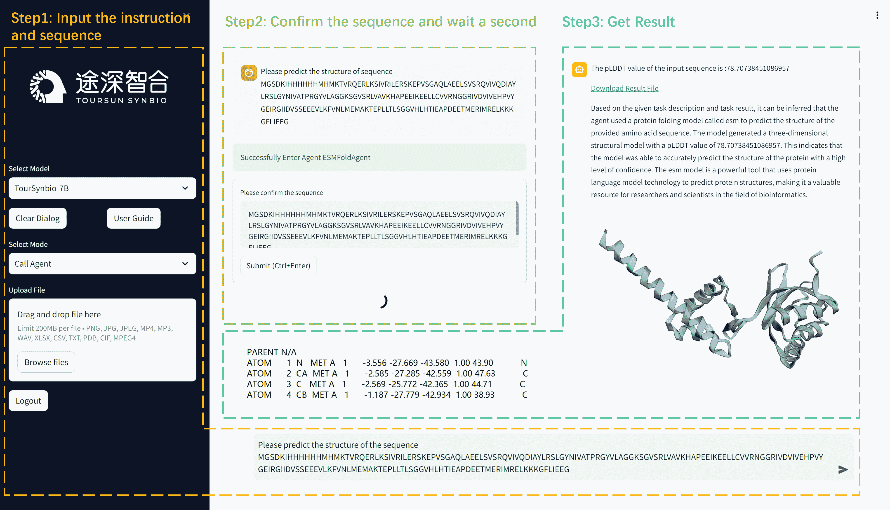

<!--yml

分类：未分类

日期：2025-01-11 11:57:33

-->

# 基于LLM的多智能体框架在干实验室和湿实验室蛋白质工程中的验证

> 来源：[https://arxiv.org/html/2411.06029/](https://arxiv.org/html/2411.06029/)

Zan Chen¹, Yungeng Liu^(1,2), Yu Guang Wang^(1,3), Yiqing Shen^(1,4,*) ¹Toursun Synbio, 上海，中国

²香港城市大学，中国香港

³上海交通大学，中国上海

⁴约翰霍普金斯大学，美国巴尔的摩

^*通讯作者。（电子邮件：yiqingshen1@gmail.com）

###### 摘要

最近，大型语言模型（LLMs）的进展提高了多个领域的效率，包括蛋白质工程领域，在该领域，LLMs为干实验室和湿实验室实验工作流的自动化提供了广阔的前景。先前的工作，即TourSynbio-Agent，将专门用于蛋白质的多模态LLM（即TourSynbio-7B）与特定领域的深度学习（DL）模型结合，以简化计算和实验的蛋白质工程任务。尽管初步验证证明了TourSynbio-7B在蛋白质属性理解方面的基本能力，但完整的TourSynbio-Agent框架在实际应用中的有效性仍未被探讨。本研究通过五个不同的案例研究，对TourSynbio-Agent进行了全面验证，涵盖了计算（干实验室）和实验（湿实验室）蛋白质工程。在三个计算案例中，我们评估了TourSynbio-Agent在突变预测、蛋白质折叠和蛋白质设计方面的能力。此外，两个湿实验室验证展示了TourSynbio-Agent的实际应用：工程化P450蛋白质，使其在类固醇19-羟化反应中的选择性提高了70%；以及开发具有$3.7\times$提高的催化效率的还原酶用于醇转化。我们从这五个案例研究中得出的结论是，TourSynbio-Agent可以通过直观的对话界面有效地自动化复杂的蛋白质工程工作流，有可能加速蛋白质工程领域的科学发现。

###### 关键词：

大型语言模型（LLMs）、多模态LLM、智能体、蛋白质工程、深度学习

图1：TourSynbio-Agent框架概述，用于自动化蛋白质工程任务。

## I 引言

深度学习（DL）已经提高了蛋白质工程的性能和效率[[1](https://arxiv.org/html/2411.06029v1#bib.bib1), [2](https://arxiv.org/html/2411.06029v1#bib.bib2)]，例如AlphaFold [[3](https://arxiv.org/html/2411.06029v1#bib.bib3), [4](https://arxiv.org/html/2411.06029v1#bib.bib4)]和RoseTTAFold [[5](https://arxiv.org/html/2411.06029v1#bib.bib5), [6](https://arxiv.org/html/2411.06029v1#bib.bib6)] 在蛋白质结构预测方面取得了巨大进展。然而，由于其技术复杂性，这些DL模型在实际蛋白质工程工作流中的广泛应用仍然有限，实施这些模型需要在蛋白质科学和深度学习领域都具备相当的专业知识[[7](https://arxiv.org/html/2411.06029v1#bib.bib7)]。大语言模型（LLM）作为解释蛋白质相关信息的有前景的解决方案应运而生，一些专门的模型如Prot2Text [[8](https://arxiv.org/html/2411.06029v1#bib.bib8)]和ProteinBERT [[9](https://arxiv.org/html/2411.06029v1#bib.bib9)] 已经展示了处理蛋白质序列和结构的能力。然而，这些专门的蛋白质LLM主要用于分析功能，尚缺乏自主执行完整蛋白质工程工作流的能力。

为了解决这一局限性，最近推出了TourSynbio-Agent [[10](https://arxiv.org/html/2411.06029v1#bib.bib10)]（图[1](https://arxiv.org/html/2411.06029v1#S0.F1 "图 1 ‣ 基于LLM的多代理框架在干湿实验室蛋白工程中的验证")），该框架具有创新的多代理架构，将专门用于蛋白质的多模态大语言模型TourSynbio-7B与领域特定的深度学习（DL）模型相结合。TourSynbio-7B的独特能力在于将蛋白质序列直接作为自然语言处理，从而无需复杂的外部蛋白质编码器。通过这种简化的方法，加上TourSynbio-Agent的多代理设计，使得通过专门代理自动执行各种蛋白质工程任务成为可能。

虽然通过 ProteinLMBench [[11](https://arxiv.org/html/2411.06029v1#bib.bib11)] 的初步基准测试展示了 TourSynbio-7B 在蛋白质属性分析中的基本能力，但完整的 TourSynbio-Agent 框架在实际应用中的实用性仍未得到探索。本研究通过五个综合案例研究填补了这一空白，案例研究涵盖了计算（干实验室）和实验（湿实验室）验证。我们首先呈现了三个计算案例研究，验证 TourSynbio-Agent 通过自然语言交互处理多种蛋白质工程任务的能力，包括突变预测、蛋白质折叠和蛋白质设计。为了展示其在现实世界中的应用性，我们随后进行了两个湿实验室案例研究：开发 P450 蛋白质，使其对类固醇 19-羟化反应的选择性提高了 70%；以及开发还原酶，使其对醇类化合物的转化率提高了 $3.7\times$。

本研究的主要贡献有两个方面。首先，我们通过三个干实验室案例研究验证了 TourSynbio-Agent 在基础蛋白质工程任务中的能力。其次，我们通过两个湿实验室验证的案例研究展示了 TourSynbio-Agent 的有效性。这些结果共同代表了基于大型语言模型（LLM）的代理系统在实际蛋白质工程应用中的首次系统验证。

## II 干实验室案例研究设计

为了验证 TourSynbio-Agent 在基础蛋白质工程领域的能力，我们设计了三个干实验室案例研究，展示该框架通过自然语言交互自动化复杂工作流程的能力。

### II-A 案例研究 I：突变效应预测

突变效应预测是蛋白质工程中的一个重要组成部分，用于评估氨基酸替代对功能的影响[[12](https://arxiv.org/html/2411.06029v1#bib.bib12)]。这种计算方法指导着多个应用领域的理性蛋白质设计，包括治疗性开发、酶工程以及疾病相关突变的分析。TourSynbio-Agent 通过接受自然语言查询（例如：“预测该蛋白质序列中的突变效应”）和 CSV 格式的蛋白质序列数据来简化此过程。收到这些输入后，TourSynbio-7B 启动一个专门的突变预测代理，该代理利用 ESM-1v 模型[[13](https://arxiv.org/html/2411.06029v1#bib.bib13)]。TourSynbio-Agent 生成全面的输出，包括定量的活性得分预测和突变效应的定性解释，使研究人员能够高效地识别并优先考虑有前景的蛋白质变体。

图2：TourSynbio-Agent突变预测管道的工作流。该过程包括三个主要阶段：（1）输入规范，用户提供蛋白质序列并上传包含突变信息的CSV文件；（2）模型配置，选择ESM-1v并定义参数，包括突变列偏移和评分策略；（3）结果生成，显示每个突变体的预测活性分数，并以可下载格式呈现。界面显示了多个H24变体的成功预测，其中H24M展示了最高的预测活性分数。

### II-B 案例研究 II：蛋白质折叠

第二个案例研究评估了TourSynbio-Agent预测氨基酸序列三维蛋白质结构的能力。用户通过提交蛋白质序列并附带自然语言查询（例如，“请预测该序列的结构”）来启动工作流。TourSynbio-7B处理这些输入并激活蛋白质折叠代理，该代理使用ESMfold [[14](https://arxiv.org/html/2411.06029v1#bib.bib14)]生成结构预测。预测的结构通过PyMOL [[15](https://arxiv.org/html/2411.06029v1#bib.bib15)]进行可视化，并通过互动聊天界面展示给用户，同时提供可下载的结构文件以供进一步分析。

### II-C 案例研究 III：蛋白质设计

第三个案例研究探讨了蛋白质设计，这是一个更为复杂的任务，需要同时优化结构特征和模型参数。用户提供设计规范（如抗体-小分子相互作用），并按照IMGT标准提供PDB或CIF格式的结构模板[[16](https://arxiv.org/html/2411.06029v1#bib.bib16)]。TourSynbio-7B处理这些输入，并将任务委托给一个专门的蛋白质设计代理。该代理协调一个两步过程：首先优化超参数并处理结构输入，然后利用AntiFold [[17](https://arxiv.org/html/2411.06029v1#bib.bib17)]模块生成符合指定约束条件的设计。该框架返回完全优化的蛋白质设计，适用于预期的应用，无论是实验验证还是治疗开发。

图 3：TourSynbio-Agent蛋白质结构预测流程图。该过程包括三个关键阶段：（1）初始设置，用户输入蛋白质序列并选择ESMfold预测代理；（2）序列确认和模型执行，展示输入的蛋白质序列和ESMfold处理界面；（3）结果可视化，显示预测的3D结构卡通表示和以PDB格式展示的原子坐标。界面报告了pLDDT置信度分数为78.7073%，表示预测具有较高的可靠性。预测的结构显示了混合的$\alpha/\beta$折叠拓扑，并且具有良好的二级结构元素，坐标部分展示了模型生成的详细原子级输出。

## III 干实验案例研究结果

我们评估了TourSynbio-Agent在三项基本蛋白质工程任务中的表现：突变预测、蛋白质折叠和蛋白质设计。对于每个案例研究，我们提供了框架能力的详细分析，包括输入处理、计算预测和结果解释。

### III-A 实验过程 I：突变预测

我们验证了TourSynbio-Agent预测突变对蛋白质活性影响的能力，这对于蛋白质工程应用（如治疗开发和酶优化）具有重要意义。研究工作流程如图[2](https://arxiv.org/html/2411.06029v1#S2.F2 "Figure 2 ‣ II-A Case Study I: Mutation Effect Prediction ‣ II Dry Lab Case Study Design ‣ Validation of an LLM-based Multi-Agent Framework for Protein Engineering in Dry Lab and Wet Lab")所示，包含三个不同阶段：输入规范、模型配置和结果分析。预测管道需要两个主要输入：（1）野生型蛋白质序列，在本案例中为“HPETLVKVKDAEDQLGARVGYIELDLNSGKILESFRPEERFMMSTFKV...”，以及（2）以CSV格式提供的结构化数据集，包含从原始序列派生的单点突变和/或多点突变库。突变信息在输入文件的“mutant”列中指定，偏移参数为24，以便正确对齐突变位置与蛋白质序列。通过使用TourSynbio-7B接口，我们配置了突变预测代理，使用了ESM-1v，这是一种专门为突变效应预测训练的蛋白质语言模型。得分策略设置为“wt-marginals”，用于计算突变与野生型序列相比的相对影响。这种配置使得ESM-1v能够分析每个突变如何影响蛋白质稳定性和功能，相对于原始序列。然后，ESM-1v评估了突变库中的每个变体，生成活动得分，量化预测的功能影响。我们的分析重点是H24位置的突变，考察了多个变体，包括H24E（-1.40009）、H24D（-0.80439）、H24G（-1.69883）和H24M（7.84565）。在这些变体中，H24M展现了最高的活性得分7.84565，表明与野生型序列相比，蛋白质性能有所提升。输出结果以可下载格式提供，包含每个突变变体的详细得分，帮助研究人员优先选择有潜力的突变进行实验验证。这种计算筛选方法展示了大型语言模型（LLMs）如何通过在实验室测试前识别高潜力变体，加速蛋白质工程周期。

### III-B 实验过程 II：蛋白质折叠

本研究评估了TourSynbio-Agent通过自动化流程预测蛋白质三维结构的能力。实验工作流程如图[3](https://arxiv.org/html/2411.06029v1#S2.F3 "Figure 3 ‣ II-C Case Study III: Protein Design ‣ II Dry Lab Case Study Design ‣ Validation of an LLM-based Multi-Agent Framework for Protein Engineering in Dry Lab and Wet Lab")所示，展示了最先进的结构预测方法无缝集成到一个易于访问的框架中。预测流程从通过TourSynbio-Agent的对话界面输入序列开始。在此案例研究中，我们分析了一个以“MGSDKIHHHHHHHMHKMTVRQERLKSIVRILER...”开头的蛋白质序列，该序列通过对话界面直接输入。提交序列后，TourSynbio-7B激活了其ESMfold Agent，这是一个专门的模型，能够执行端到端的原子级结构预测，而无需多次序列比对或模板结构。ESMfold生成原子坐标和置信度指标。对于我们的测试序列，ESMfold达到了78.7073%的pLDDT（预测局部距离差异测试）分数，表明对预测结构的准确性具有较高的信心。输出结果以两种互补格式呈现：（1）包含原子坐标的详细PDB文件（如图中所示的条目，如“ATOM 1 N MET A 1 -3.556 -27.669 -43.580 1.00 43.90 N”），和（2）显示预测结构的互动可视化界面，以卡通形式表示。结构模型揭示了一个混合的$\alpha/\beta$折叠拓扑结构，具有明确的二级结构元素，使得能够立即对关键结构特征进行视觉评估。这个自动化的结构预测流程简化了传统上复杂且计算密集的过程。高置信度的预测、详细的原子坐标和即时可视化能力的结合展示了TourSynbio-Agent在加速学术和工业领域基于结构的研究工作流程中的潜力。

图4：TourSynbio-Agent抗体设计管道的工作流程，使用Antifold进行。该过程包括三个阶段：（1）初始配置，用户选择模型并指定PDB输入（6y1l）；（2）参数规格说明，展示了结构组件（重链、轻链、抗原链、纳米抗体链）和采样参数（温度0.5、CDR区域）的输入字段；（3）结果展示，显示了结构得分的表格输出和以FASTA格式生成的抗体序列。对话界面允许对采样过程进行精确控制，同时保持易用性。输出面板展示了多个采样序列及其相关得分，展示了模型生成结构一致的抗体变体的能力。

### III-C 实验过程 III：蛋白质设计

本实验利用 TourSynbio-Agent 的能力，探索了抗体结构（PDB ID: 6y1l）中的序列变化，同时保持其结构完整性和功能特性。该工作流程，如图 [4](https://arxiv.org/html/2411.06029v1#S3.F4 "图 4 ‣ III-B 实验过程 II：蛋白质折叠 ‣ III 干实验案例研究结果 ‣ 基于大语言模型的多代理框架在蛋白质工程中的验证") 所示，展示了 Antifold 的逆向折叠能力如何整合到系统化的抗体设计流程中。研究过程从通过 TourSynbio-Agent 的对话界面指定输入参数开始。用户输入 PDB 代码“6y1l”，并可选择性地指定包括重链、轻链、抗原链和纳米抗体链标识符等结构成分。采样参数配置为温度 0.5，并且针对设计指定了特定的互补决定区域（CDRs）。确认参数后，TourSynbio-7B 激活 Antifold Agent 执行基于结构的序列计算。该框架生成了两种互补格式的综合结果。第一种输出为 CSV 格式，提供了详细的残基级分析，包括特定位点的数据，如链标识符（例如 H、L）、原始和预测的残基身份，以及每个残基困惑度等结构度量。分析揭示了不同位置的结构兼容性得分变化，其中链 H 的位置得分范围为 -4.9317 到 -16.7651，为突变的结构影响提供了定量见解。第二种输出格式呈现了 FASTA 格式的序列采样结果，保留了原始抗体序列作为参考，同时生成了多个设计变体。每个变体都附有详细的评分指标，其中示例设计的全球得分为 $1.0470$，表明其具有较强的结构一致性。该框架评估了特定 CDR 区域，并提供了附加的度量指标，包括序列恢复率 0.9682 和突变计数 14，使研究人员能够评估设计变异的局部和全局影响。

本研究展示了 TourSynbio-Agent 处理复杂蛋白质工程任务的能力。该框架高效地生成详细的残基级预测和完整的序列变体，为研究人员提供了定量指标，以评估结构稳定性和功能潜力。

## IV 湿实验案例研究

为了验证 TourSynbio-Agent 在实际应用中的有效性，我们进行了两项以酶工程为重点的实验案例研究。这些研究展示了该框架通过迭代计算预测和实验验证周期优化酶特性的能力。

### IV-A 湿实验研究 I：增强类固醇化合物选择性

类固醇化合物代表了一类重要的生物活性分子，它们在生理功能中发挥着关键作用，从维持细胞膜的完整性到作为激素信号分子[[18](https://arxiv.org/html/2411.06029v1#bib.bib18)]。它们的治疗应用涵盖多个医学领域，包括心血管疾病[[19](https://arxiv.org/html/2411.06029v1#bib.bib19)]和脑血管疾病[[20](https://arxiv.org/html/2411.06029v1#bib.bib20)]。本案例研究集中在通过工程化细胞色素P450酶来提高其对类固醇19-羟化的选择性。虽然P450催化的反应通常会生成多种产物，但只有一种特定的羟化产物具有所需的治疗特性。我们的目标是在保持催化活性的同时，提高选择性产物的形成率70%，这是工业规模实施的一个门槛要求。

图5：目标是改造P450蛋白，该蛋白催化类固醇化合物的19-羟化反应，以提高其对有效产物的选择性70%，这是提升生产效率的关键一步。

#### IV-A1 工程策略与实施

工程过程分为两个不同的阶段。在初始筛选阶段，TourSynbio-Agent在两周内生成了200个单点突变候选体，随后进行为期三周的实验验证，收集全面的活性和选择性数据。在随后的集中优化阶段，这些实验数据用于微调预测模型。然后，TourSynbio-Agent生成了10个优化变体，每个变体包含最多五个突变，这些变体经过详细的实验表征，评估其选择性和活性。

#### IV-A2 结果

这次工程活动的结果验证了TourSynbio-Agent在蛋白质工程中的有效性，如图[5](https://arxiv.org/html/2411.06029v1#S4.F5 "Figure 5 ‣ IV-A Wet-lab Study I: Enhancing Steroid Compound Selectivity ‣ IV Wet-lab Case Study ‣ Validation of an LLM-based Multi-Agent Framework for Protein Engineering in Dry Lab and Wet Lab")所示。该框架展示了强大的预测准确性，实现了计算预测与实验测量之间0.7的相关系数。最值得注意的是，表现最好的变体实现了目标70%的选择性产物提升，同时保持了强大的催化活性。这些性能指标满足了潜在工业实施的严格标准，突显了TourSynbio-Agent在解决复杂生物催化优化挑战中的能力。

### IV-B 湿实验研究 II：帮助客户提高酶的催化转化率

类固醇激素及其合成衍生物在制药行业中占有重要地位，应用涵盖生殖健康、代谢性疾病、炎症状况和免疫性疾病[[21](https://arxiv.org/html/2411.06029v1#bib.bib21)]。该类别的关键化合物包括孕酮、睾酮、雌二醇、皮质醇和醛固酮，以及各种合成孕激素。随着与年龄相关的疾病和生活方式疾病的日益增多，这些治疗药物的需求不断增加，从而迫切需要更高效的生产方法[[22](https://arxiv.org/html/2411.06029v1#bib.bib22), [23](https://arxiv.org/html/2411.06029v1#bib.bib23)]。本案例研究聚焦于优化还原酶，以提高其在醇类化合物合成中的催化效率。提高催化转化率直接影响生产力和经济可行性，通过在固定反应时间内最大化产品的形成。工程目标是提高酶的催化效率，同时保持产品的特异性，如图[6](https://arxiv.org/html/2411.06029v1#S4.F6 "图6 ‣ IV-B 湿实验研究 II：帮助客户提高酶的催化转化率 ‣ IV 湿实验案例研究 ‣ 基于LLM的多智能体框架在干实验室和湿实验室中的蛋白质工程验证")所示。

图6：还原酶催化醇类化合物。

#### IV-B1 工程方法

优化过程从包含野生型还原酶序列和29个单点突变体的活性测量数据集开始。TourSynbio-Agent分析了这个初始数据集，以建立结构-功能关系，并随后推荐了10个预测能够提升催化性能的新型单点突变。这些工程变体在为期四周的实验验证中得到了全面的验证。

#### IV-B2 结果

还原酶工程研究表明，TourSynbio-Agent不仅在预测准确性上表现出色，还能够实现显著的功能改善。该框架的预测结果与实验数据之间有很强的相关性，计算预测与测量活动之间的相关系数达到0.7。这一验证确认了TourSynbio-Agent在识别有益突变以优化酶性能方面的可靠性。在设计的变体中，最成功的候选者表现出相较于野生型酶$3.7\times$的催化转化率提升。这一催化效率的提高直接转化为实际利益：增加产品产量、缩短反应时间以及更高效地利用原材料。

## V 结论与讨论

本研究通过五个不同的案例研究，对TourSynbio-Agent进行了全面验证，展示了其在自动化复杂蛋白质工程工作流中的有效性。这三个计算案例研究展示了TourSynbio-Agent通过直观的自然语言界面简化传统复杂任务的能力。成功的湿实验验证，特别是通过改造P450蛋白使其选择性提高70%以及还原酶的催化效率提高3.7倍，提供了TourSynbio-Agent在现实世界应用中的实际效用的有力证据。集成了蛋白质专用的多模态LLM和领域特定代理程序，使TourSynbio-Agent能够弥合计算预测与实验实现之间的差距。通过为研究人员提供可操作的见解和自动化工作流管理，该框架减少了与先进蛋白质工程技术相关的技术壁垒。

未来发展的方向出现了几种。首先，建立专门为基于LLM的蛋白质工程框架设计的标准化评估指标，将有助于系统地比较不同的方法，并促进持续改进。这些指标应评估计算精度和实验环境中的实际应用效果。其次，扩展TourSynbio-Agent的知识库和集成数据集，将增强其在更广泛的蛋白质工程应用中的能力，从治疗性抗体设计到工业酶优化。最后，研究该框架在自主实验设计和优化方面的潜力，可能会进一步加速蛋白质工程周期。

## 参考文献

+   [1] W. Gao, S. P. Mahajan, J. Sulam, 和 J. J. Gray, “蛋白质结构建模与设计中的深度学习,” *Patterns*, 第1卷，第9期，2020年。

+   [2] S. Biswas, G. Khimulya, E. C. Alley, K. M. Esvelt, 和 G. M. Church, “基于数据高效深度学习的低样本蛋白质工程,” *Nature methods*, 第18卷，第4期，第389–396页，2021年。

+   [3] J. Jumper, R. Evans, A. Pritzel, T. Green, M. Figurnov, O. Ronneberger, K. Tunyasuvunakool, R. Bates, A. Žídek, A. Potapenko *等*, “使用alphafold进行高精度蛋白质结构预测,” *nature*, 第596卷，第7873期，第583–589页，2021年。

+   [4] R. Evans, M. O'Neill, A. Pritzel, N. Antropova, A. Senior, T. Green, A. Žídek, R. Bates, S. Blackwell, J. Yim *等*, “使用alphafold-multimer进行蛋白质复合物预测,” *biorxiv*, 第2021-10期，2021年。

+   [5] M. Baek, F. DiMaio, I. Anishchenko, J. Dauparas, S. Ovchinnikov, G. R. Lee, J. Wang, Q. Cong, L. N. Kinch, R. D. Schaeffer *等*, “使用三轨神经网络精确预测蛋白质结构与相互作用,” *Science*, 第373卷，第6557期，第871–876页，2021年。

+   [6] I. R. Humphreys, J. Pei, M. Baek, A. Krishnakumar, I. Anishchenko, S. Ovchinnikov, J. Zhang, T. J. Ness, S. Banjade, S. R. Bagde *等*，“计算得出的核心真核蛋白复合物结构，”*科学*，第374卷，第6573期，文章编号eabm4805，2021年。

+   [7] Z. Lin, H. Akin, R. Rao, B. Hie, Z. Zhu, W. Lu, N. Smetanin, R. Verkuil, O. Kabeli, Y. Shmueli *等*，“通过语言模型进行进化尺度的原子级蛋白质结构预测，”*科学*，第379卷，第6637期，第1123–1130页，2023年。

+   [8] H. Abdine, M. Chatzianastasis, C. Bouyioukos, 和 M. Vazirgiannis，“Prot2text：利用图神经网络和变换器生成多模态蛋白质功能，”发表于*AAAI人工智能会议论文集*，第38卷，第10期，2024年，第10,757–10,765页。

+   [9] N. Brandes, D. Ofer, Y. Peleg, N. Rappoport, 和 M. Linial，“Proteinbert：一个通用的蛋白质序列与功能深度学习模型，”*生物信息学*，第38卷，第8期，第2102–2110页，2022年。

+   [10] Y. Shen, Z. Chen, M. Mamalakis, Y. Liu, T. Li, Y. Su, J. He, P. Liò, 和 Y. G. Wang，“Toursynbio：一个多模态大型模型与代理框架，旨在连接文本与蛋白质序列以进行蛋白质工程，”*arXiv预印本 arXiv:2408.15299*，2024年。

+   [11] Y. Shen, Z. Chen, M. Mamalakis, L. He, H. Xia, T. Li, Y. Su, J. He, 和 Y. G. Wang，“用于蛋白质理解的大型语言模型微调数据集和基准测试，”*arXiv预印本 arXiv:2406.05540*，2024年。

+   [12] T. A. Hopf, J. B. Ingraham, F. J. Poelwijk, C. P. Schärfe, M. Springer, C. Sander, 和 D. S. Marks，“从序列共变性中预测突变效应，”*自然生物技术*，第35卷，第2期，第128–135页，2017年。

+   [13] J. Meier, R. Rao, R. Verkuil, J. Liu, T. Sercu, 和 A. Rives，“语言模型使零-shot预测突变对蛋白质功能影响成为可能，”*bioRxiv*，2021年。[在线]。可用链接：https://www.biorxiv.org/content/10.1101/2021.07.09.450648v1

+   [14] Z. Lin, H. Akin, R. Rao, B. Hie, Z. Zhu, W. Lu, N. Smetanin, A. dos Santos Costa, M. Fazel-Zarandi, T. Sercu, S. Candido *等*，“进化尺度下的蛋白质序列语言模型使准确的结构预测成为可能，”*bioRxiv*，2022年。

+   [15] W. L. DeLano *等*，“Pymol：一个开源分子图形工具，”*CCP4新闻：蛋白质结晶学*，第40卷，第1期，第82–92页，2002年。

+   [16] M.-P. Lefranc, V. Giudicelli, C. Ginestoux, J. Jabado-Michaloud, G. Folch, F. Bellahcene, Y. Wu, E. Gemrot, X. Brochet, J. Lane *等*，“Imgt®，国际免疫遗传学信息系统®，”*核酸研究*，第37卷，补充1期，第D1006–D1012页，2009年。

+   [17] M. Høie, A. Hummer, T. Olsen, M. Nielsen, 和 C. Deane，“Antifold：通过逆折叠改进抗体结构设计，”发表于*NeurIPS 2023生成式AI与生物学（GenBio）研讨会*，2023年。

+   [18] M. A. Carson-Jurica, W. T. Schrader, 和 B. W. O'Malley，“类固醇受体家族：结构与功能，”*内分泌学评论*，第11卷，第2期，第201–220页，1990年。

+   [19] L. L. Demer, J. J. Hsu 和 Y. Tintut，"类固醇激素维生素D：对心血管疾病的影响"，*循环研究*，第122卷，第11期，页1576–1585，2018年。

+   [20] K. A. Witt 和 K. E. Sandoval，"类固醇与血脑屏障：治疗意义"，*药理学进展*，第71卷，页361–390，2014年。

+   [21] F. Holsboer 和 M. Ising，"压力激素调节：生物学作用及其在治疗中的转化"，*心理学年鉴*，第61卷，第1期，页81–109，2010年。

+   [22] M. G. Fehlings, L. Tetreault, A. Nater, T. Choma, J. Harrop, T. Mroz, C. Santaguida 和 J. S. Smith，"全球人口老龄化：疾病和脊柱疾病流行病学的变化"，页S1–S5，2015年。

+   [23] J. S. Christiansen, P. F. Backeljauw, M. Bidlingmaier, B. M. Biller, M. C. Boguszewski, F. F. Casanueva, P. Chanson, P. Chatelain, C. S. Choong, D. R. Clemmons *等人*，"生长激素研究学会关于长效生长激素制剂发展的观点"，*欧洲内分泌学杂志*，第174卷，第6期，页C1–C8，2016年。
