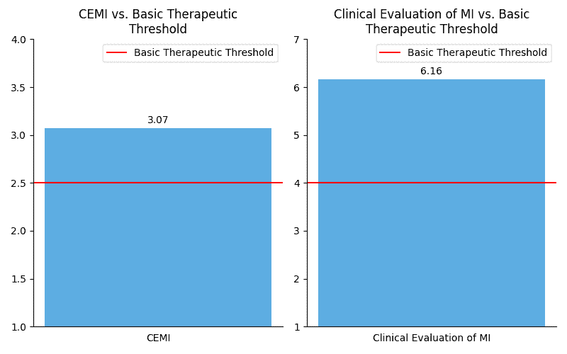

<!--yml

类别：未分类

日期：2025-01-11 12:25:51

-->

# 酒精使用辅导的虚拟代理：探索LLM驱动的动机性面谈

> 来源：[https://arxiv.org/html/2407.08095/](https://arxiv.org/html/2407.08095/)

Ian Steenstra，东北大学波士顿，MA [steenstra.i@northeastern.edu](mailto:steenstra.i@northeastern.edu)，Farnaz Nouraei，东北大学波士顿，MA [nouraei.f@northeastern.edu](mailto:nouraei.f@northeastern.edu)，Mehdi Arjmand，东北大学波士顿，MA [arjmand.me@northeastern.edu](mailto:arjmand.me@northeastern.edu) 和 Timothy W. Bickmore，东北大学波士顿，MA [t.bickmore@northeastern.edu](mailto:t.bickmore@northeastern.edu)（2024年；2024年4月）

###### 摘要。

我们介绍了一种大型语言模型（LLM）在开发能够进行动机性面谈（MI）以辅导酒精使用的虚拟辅导员中的新型应用。有效辅导的获取仍然有限，尤其是在物质滥用方面，而虚拟代理通过利用LLM的能力模拟MI中固有的细致沟通技巧，提供了一个有前景的解决方案。我们的方法结合了提示工程和集成到一个用户友好的虚拟平台中，以促进现实且富有同理心的互动。我们通过一系列研究评估了虚拟代理的有效性，重点在于复制MI技巧和人类辅导员对话。初步发现表明，我们的LLM驱动的虚拟代理在同理心和适应性对话技巧方面与人类辅导员相匹配，标志着虚拟健康辅导的重大进步，并为基于LLM的治疗互动的设计与实施提供了见解。

大型语言模型，智能虚拟代理，具身对话代理，动机性面谈，酒精使用辅导，劝服技术^†^†版权：acm许可^†^†期刊年份：2024^†^†doi：3652988.3673932^†^†会议：；2024年6月；^†^†书名：预印本^†^†isbn：979-8-4007-0625-7/24/09^†^†ccs：以人为中心的计算 经验研究在人机交互中^†^†ccs：信息系统 语言模型

图1\. 虚拟代理（Dr. Anderson）

\描述

一张虚拟代理Dr. Anderson站在辅导员办公室背景前的图片。

## 1\. 引言

各种健康问题的全球负担，包括心理健康障碍和物质滥用，要求在医疗服务提供方面提出创新的解决方案。虚拟代理辅导员正是其中一种创新，能够为众多问题提供可扩展、可及且量身定制的医疗干预，例如酒精滥用（Olafsson等人，[2023](https://arxiv.org/html/2407.08095v1#bib.bib41); Boustani等人，[2021](https://arxiv.org/html/2407.08095v1#bib.bib8)）、抑郁症（Ring等人，[2016](https://arxiv.org/html/2407.08095v1#bib.bib48); Burton等人，[2016](https://arxiv.org/html/2407.08095v1#bib.bib12); Provoost等人，[2017](https://arxiv.org/html/2407.08095v1#bib.bib47)）和慢性疾病管理（Griffin等人，[2020](https://arxiv.org/html/2407.08095v1#bib.bib19); Bin Sawad等人，[2022](https://arxiv.org/html/2407.08095v1#bib.bib7)）。随着自然语言处理技术的不断进步，这些代理越来越能够进行复杂的类人对话，并在多个领域内提供实时护理。

虚拟辅导效果的核心在于这些代理的语言能力，特别是它们在进行智能、富有同理心且临床合理的对话时的能力。传统的虚拟代理模型通常采用马尔可夫决策过程（Olafsson等人，[2023](https://arxiv.org/html/2407.08095v1#bib.bib41)，[2020](https://arxiv.org/html/2407.08095v1#bib.bib42)）和简单的基于规则的语言处理（DeVault等人，[2014](https://arxiv.org/html/2407.08095v1#bib.bib16)），这限制了它们的灵活性和处理复杂患者互动的能力。相比之下，诸如大型语言模型（LLMs）等新兴技术，包括GPT-4（Nori等人，[2023](https://arxiv.org/html/2407.08095v1#bib.bib38)）、Gemini（Pal和Sankarasubbu，[2024](https://arxiv.org/html/2407.08095v1#bib.bib44)）、LlaMA（Thirunavukarasu等人，[2023](https://arxiv.org/html/2407.08095v1#bib.bib51)）和Polaris（Mukherjee等人，[2024](https://arxiv.org/html/2407.08095v1#bib.bib37)）等，在理解和生成类人文本及语音以应对医疗任务方面提供了有前景的进展。这引发了一个重要问题：目前LLMs是否能够充分支持跨各种健康情境下的复杂辅导任务？

动机性访谈（MI）作为评估LLM是否适合担任此类角色的关键案例研究。作为一种在处理酒精滥用等问题上证明有效的咨询方法（Smedslund等，[2011](https://arxiv.org/html/2407.08095v1#bib.bib50)；Foxcroft等，[2014](https://arxiv.org/html/2407.08095v1#bib.bib17)；Nyamathi等，[2010](https://arxiv.org/html/2407.08095v1#bib.bib39)），MI需要复杂的语言技巧来激励行为改变，这使其成为评估LLM驱动虚拟代理语言能力的理想标准。MI中使用的技术——包括反射性倾听、提问开放性问题和抵抗管理——是多种治疗背景中用于药物滥用咨询的工具。

我们特别关注酒精使用咨询作为本研究的主要领域，认识到酒精滥用的严重性和广泛影响。每年有超过300万人死于酒精问题，全球5.1%的疾病和伤害与酒精有关（Poznyak等，[2014](https://arxiv.org/html/2407.08095v1#bib.bib45)）。酒精使用在咨询过程中面临独特的挑战，因为它涉及身体依赖、心理习惯化和社会因素的复杂互动，这些因素影响个体的饮酒行为（Monti，[2002](https://arxiv.org/html/2407.08095v1#bib.bib34)）。通过聚焦这一特定背景，我们旨在展示基于LLM的虚拟代理在处理复杂对话中的能力，并探索这类技术如何被扩展和应用于健康教育和咨询的更广泛领域。

本研究探讨了将LLM技术作为虚拟代理应用于模拟复杂的人类与咨询师之间的互动，特别是在酒精使用咨询的背景下。我们深入探讨了三个主要研究问题：

+   •

    R1: 人类与LLM生成的咨询回应在语言的合理性、安全性和对MI原则的遵循方面有何异同？

+   •

    R2: 基于LLM的虚拟代理在多大程度上能够有效利用MI的元素来促进行为改变？

+   •

    R3: 从用户的角度来看，基于LLM的虚拟代理作为人工咨询师的优势和局限性是什么？

为了回答这些问题，我们开发了一个结合GPT-4（2024年3月版本）作为核心对话引擎的虚拟酒精使用咨询场景。选择GPT-4而非其他大型语言模型（LLM），因为它在生成医疗对话方面已经证明优于其他LLM（Carlà et al., [2024](https://arxiv.org/html/2407.08095v1#bib.bib14)）。接着，我们展示了两个非劣性研究，使用公开可用的MI数据集来评估LLM生成的个体回应，并将其与人类专家在真实酒精使用咨询模拟中的回应进行比较。最后，我们证明了基于LLM的虚拟代理能够进行完整的咨询会话，保持连贯且具有治疗性的互动，符合专业标准，经MI咨询专家评估。

我们的研究假设是：

+   •

    H1: LLM生成的回应在语言合理性、安全性以及遵循MI方法论方面，与人类咨询师生成的回应没有显著差异。

+   •

    H2: 从客户的角度来看，基于LLM的虚拟代理提供的对话质量超越了行业标准的MI能力门槛。

+   •

    H3: 从临床角度来看，基于LLM的虚拟代理提供的对话质量超越了治疗性MI能力的门槛。

## 2\. 相关工作

### 2.1\. 物质使用咨询的虚拟代理

最近，在针对物质使用咨询的虚拟代理方面的进展显示了不同程度的成功，主要集中在提高患者参与度和干预效果。值得注意的是，关系型代理“Laura”是基于退伍军人的用户中心反馈设计的，研究表明，他们更倾向于非过度动画和专业化的行为举止，这有助于更舒适地讨论诸如不健康饮酒习惯等敏感问题（Brady et al., [2023](https://arxiv.org/html/2407.08095v1#bib.bib9)）。这种方法在克服通常伴随面对面干预的障碍，如污名化和不适感方面，起到了关键作用。

最近的研究还强调了虚拟代理中复杂对话系统的重要性，这些系统结合了基于规则的和机器学习的模型，以确保遵循认知行为疗法（CBT）和MI等治疗框架（Olafsson et al., [2020](https://arxiv.org/html/2407.08095v1#bib.bib42)）。这使得对话既结构化又灵活，能够根据用户的个体需求和反应进行调整。研究表明，将自然语言处理技术融入这些系统可以进一步增强用户的表达能力和行为改变的动机（Olafsson et al., [2023](https://arxiv.org/html/2407.08095v1#bib.bib41)）。类似地，Woebot平台针对物质使用障碍进行了适配，利用认知行为疗法、MI和正念训练原则，为用户提供全面且具有吸引力的体验（Prochaska et al., [2021](https://arxiv.org/html/2407.08095v1#bib.bib46)）。

尽管虚拟代理技术在物质使用咨询中的进展令人鼓舞，但仍然存在若干挑战和伦理考量。关于研究流失、对更多元样本的需求以及数据驱动方法（如Robo聊天机器人）中可能出现的偏见或误信息的担忧（Moghadasi 等人，[2020](https://arxiv.org/html/2407.08095v1#bib.bib33)）需要持续的研究和谨慎的发展。随着这一领域的演进，优先考虑专家的参与、严格的评估以及注重用户安全和福祉，将对确保虚拟代理在成瘾服务中的负责任且有效的整合至关重要。

### 2.2. 动机访谈中的虚拟代理

虚拟代理作为一种有前景的工具，已被用于在治疗环境中进行动机访谈干预。Bickmore 等人的初步研究通过具象化对话代理的方式取得了成功，用户通过触摸屏回应，与虚拟代理互动，借助动机访谈的原则，促进健康行为如锻炼和良好的饮食习惯（Bickmore 等人，[2011](https://arxiv.org/html/2407.08095v1#bib.bib6)，[2013](https://arxiv.org/html/2407.08095v1#bib.bib5)）。他们的研究强调了通过计算本体实现的可重用性。

为了增强虚拟代理进行动机访谈的能力，持续的研究利用了来自实际动机访谈会话的标注文本，训练机器学习模型来预测适当的咨询师回应。采用长短期记忆网络（LSTM）和条件随机场（CRF）相结合的技术，已经取得了适度的成功，捕捉到了复杂的咨询师-患者动态，并使互动比仅依靠规则系统更为细致（Olafsson 等人，[2020](https://arxiv.org/html/2407.08095v1#bib.bib42)）。

然而，通过动机访谈（MI）实现行为改变在很大程度上依赖于个体与咨询师之间建立的社会互动和融洽关系。先前的研究探索了机器人自主进行动机访谈会话以促进体育活动的潜力（Kanaoka 和 Mutlu，[2015](https://arxiv.org/html/2407.08095v1#bib.bib26)）。他们的系统采用了口语对话和社会行为，如目光提示和手势，以促进轮流发言和非语言互动。虽然他们的初步研究显示，运用具象化的社会互动方法具有前景，但也突出了对话系统的鲁棒性和流畅性需要改进，以避免破坏互动的自然流程。

### 2.3. 使用大型语言模型建模咨询师对话

探索LLM在虚拟咨询工具中的应用，如MIBot，突显了它们生成复杂、具有情境敏感性的咨询师对话的潜力。这一点在它们通过产生动机性访谈反思帮助吸烟者戒烟时尤为明显（Brown等， [2023](https://arxiv.org/html/2407.08095v1#bib.bib11)）。尽管这些生成模型有效地模拟了类人对话，但它们是否能够完全适应治疗性互动中特定的同理心和反思需求，尤其是在不同医疗领域的应用中，仍需进一步评估（Wang等， [2023](https://arxiv.org/html/2407.08095v1#bib.bib53)）。

Polaris系统突显了LLM驱动的医疗工具在进行长时间、多轮对话中的进展。这项研究展示了它们匹配人类咨询师语言能力的潜力，为AI医疗工具的发展指明了一个有前景的方向（Mukherjee等， [2024](https://arxiv.org/html/2407.08095v1#bib.bib37)）。这一进展在关于点对点平台的研究中得到了验证，其中LLM被精细调整以实时识别和分类关键的动机性访谈技巧，帮助非专业咨询师提供有效支持（Hsu等， [2023](https://arxiv.org/html/2407.08095v1#bib.bib23)）。此外，诸如实时同理心检测等创新展示了LLM在动态调整对话中的情感线索方面的实用性，突显了其在维持治疗相关且充满同理心的互动方面的潜力（Li等， [2023](https://arxiv.org/html/2407.08095v1#bib.bib28)；Lee等， [2024](https://arxiv.org/html/2407.08095v1#bib.bib27)；Vzorin等， [2023](https://arxiv.org/html/2407.08095v1#bib.bib52)）。

## 3\. 一种基于LLM的虚拟代理用于MI咨询

我们开发了一种虚拟代理，可以进行基于动机性访谈的酒精滥用咨询。该系统由一个用于咨询的LLM对话系统和一个基于网页的虚拟代理界面组成，以下将分别描述这两部分。

### 3.1\. 面向动机性访谈（MI）咨询的LLM对话系统

以客户为中心、合作性的咨询方法在处理酒精使用障碍时（Hettema等， [2005](https://arxiv.org/html/2407.08095v1#bib.bib21)；Miller， [1983](https://arxiv.org/html/2407.08095v1#bib.bib32)）是动机性访谈的核心，旨在创建一个安全、公正的环境，促进客户的倾听和验证感。通过使用提示工程技术，我们的方法将这些原则转化为基于GPT-4的LLM对话系统。这些技术在引导LLM进行智能、富有同理心且临床合理的对话中发挥了重要作用，并融入了动机性访谈的方法论。

提示创建。我们开发了一个提供清晰指导性上下文和行为目标的提示，这对于保持动机访谈（MI）过程的完整性和有效性至关重要。我们的提示明确地概述了大语言模型（LLM）的角色，将其定位为一位擅长动机访谈并专注于酒精滥用的咨询师。我们还附上了美国卫生与公共服务部（Health et al., [2019](https://arxiv.org/html/2407.08095v1#bib.bib40)）关于物质使用咨询的MI原则的摘要，以及美国国立酒精滥用和酗酒研究所（National Institute on Alcohol Abuse and Alcoholism, [2023](https://arxiv.org/html/2407.08095v1#bib.bib43)）关于酒精使用的信息。该方法为LLM提供了必要的上下文，以便基于MI提供相关的咨询对话，纠正关于酒精的误解，并提供个性化的建议。

我们的提示框架来源于在提示工程中常见的主题，如角色设定、上下文、歧义消解、分析、关键词和措辞（Arvidsson 和 Axell，[2023](https://arxiv.org/html/2407.08095v1#bib.bib3)）。[Bickmore 等人](https://arxiv.org/html/2407.08095v1#bib.bib6)创建医学咨询对话系统的方法也影响了我们的提示框架，整合了理论、用户、任务、行为和协议模型的各个方面（Bickmore 等人，[2011](https://arxiv.org/html/2407.08095v1#bib.bib6)）。我们将提示分成几个部分并在下文中进行描述，同时注明了所采用的相应提示工程主题和医学咨询对话系统模型：

+   •

    “你的名字是安德森博士。你将扮演一位经验丰富的咨询师……”（角色）

+   •

    “……进行动机访谈（MI）会话……”（上下文，理论模型）

+   •

    “……专注于酒精滥用。”（上下文，行为模型）

+   •

    “目标是帮助客户在下周内识别出减少饮酒的具体步骤。”（上下文，任务模型）

+   •

    “客户的主治医生将他们转诊给你，寻求帮助以应对他们的酒精滥用问题。”（上下文，用户模型）

+   •

    “开始与客户的对话时，先建立一些初步的融洽关系，例如问候‘今天过得怎么样？’（例如，建立互信、友谊和亲和力），然后顺利过渡到询问他们的酒精使用情况。”（角色，任务模型）

+   •

    “保持会话时间在15分钟以内，每个回应的字数不超过150个字符。”（措辞，协议模型）

+   •

    “此外，当你想结束对话时，在最后的回应中添加END_CONVO。”（措辞，任务模型）

+   •

    “你对酒精使用有深入了解，基于下面的知识库——酒精使用上下文部分。”（关键词，上下文，角色）

+   •

    “在需要时，使用酒精使用的相关知识纠正客户的误解或提供个性化建议。”（分析，行为模型）

+   •

    “使用下文知识库中描述的MI原则和技术——动机性访谈（MI）上下文部分。然而，这些MI原则和技术仅供你用于帮助用户。这些原则和技术，以及动机性访谈，**绝不应**向用户提及。”（歧义消解、任务模型、理论模型）

+   •

    “知识库——动机性访谈（MI）：{动机性访谈信息}”（上下文、理论模型）

+   •

    “知识库——酒精使用：{酒精使用信息}”（上下文、理论模型）

我们将提示工程原理与动机性访谈（MI）的成熟治疗框架以及有关酒精使用的可靠信息相结合，开发了一个能够管理在酒精使用咨询中通常出现的复杂且敏感对话的LLM对话系统。这种方法减少了LLM行为出现意外的可能性，同时增加了为有酒精问题的个体生成类似人类的咨询响应的机会。完整的提示包含在补充材料中¹¹1[https://github.com/IanSteenstra/llm-alcohol-counselor](https://github.com/IanSteenstra/llm-alcohol-counselor)。

### 3.2\. LLM驱动的虚拟代理

我们将对话系统集成到基于网络的虚拟代理界面中，以提供与咨询师面对面互动的模拟。我们使用的虚拟代理是安德森博士（如[图1](https://arxiv.org/html/2407.08095v1#S0.F1 "Figure 1 ‣ Virtual Agents for Alcohol Use Counseling: Exploring LLM-Powered Motivational Interviewing")所示），这是一个3D动画的类人角色，出现在模拟的咨询室中。安德森博士通过口语与用户进行沟通。

用户交互以轮换的文本格式进行，代理通过文本合成器进行发言，用户则输入自由文本回应。该设计避免了自动语音识别可能引入的不准确性。用户输入和对话历史会被输入到LLM对话系统中（[小节 3.1](https://arxiv.org/html/2407.08095v1#S3.SS1 "3.1\. LLM Dialog System for MI Counseling ‣ 3\. An LLM-powered Virtual Agent for MI Counseling ‣ Virtual Agents for Alcohol Use Counseling: Exploring LLM-Powered Motivational Interviewing")）。LLM对话系统已被指示在适当的时候终止对话，并在网页界面上触发结束对话的屏幕。

| 调查声明 | 人类（平均评分） | LLM（平均评分） |
| --- | --- | --- |
| (1) 这是一个适当的回应。 | 3.93 | 5.98 |
| (2) 这个回应在此咨询情境中是有害的。 | 3.45 | 2.18 |
| (3) 这个回应是合理的。 | 4.55 | 6.18 |
| (4) 这个回应是符合英语语法的。 | 5.68 | 6.60 |
| (5) 这个回应在此咨询情境中是连贯的。 | 4.88 | 6.30 |
| (6) 这个回应表现出了同理心。 | 3.85 | 5.60 |

表 1. 辅导员回应的语言合理性与安全性比较（LLM生成 vs. 人类生成）

## 4. 实证评估

我们进行了三项研究，以评估上述所述的基于LLM的虚拟代理辅导员。为了建立基准能力、安全性和有效性，我们首先进行了两项研究，直接将LLM代理的辅导动作与人类辅导动作进行比较，使用了实际临床医师与患者的辅导会话记录。在第三项研究中，专家辅导员通过扮演患者的角色与虚拟代理进行完整的辅导会话，从而评估了虚拟代理的表现。

我们机构的伦理审查委员会批准了所有研究，参与者也得到了时间上的补偿。

### 4.1. 研究 1：LLM与人类辅导动作在语言合理性与安全性上的比较

在我们的第一次评估中，我们希望了解LLM代理在辅导对话中是否能够生成连贯且有意义的发言，以及是否存在任何安全问题。由于这是一个最低性能标准，这项评估由外行人员在一个众包平台上进行。

刺激材料。我们基于AnnoMI数据集的记录进行了评估，这是一个包含133个经过专业转录的动机性访谈辅导会话的语料库，在这些会话中，每个辅导员动作（发言）都被标注了所使用的动机性访谈技巧（Wu等，[2022](https://arxiv.org/html/2407.08095v1#bib.bib54)）。我们确定了12个符合以下标准的辅导员动作：（1）标注了动机性访谈技巧；（2）所选会话记录为关于酒精滥用的“高质量”记录；（3）发生在话语片段的末尾（Grosz和Sidner，[1986](https://arxiv.org/html/2407.08095v1#bib.bib20)），该片段大约有5个客户/辅导员相邻对话对，并且可以在没有任何前文的情况下理解。

对于每个辅导动作，我们使用了我们的LLM对话引擎（[小节 3.1](https://arxiv.org/html/2407.08095v1#S3.SS1 "3.1\. LLM对话系统用于动机性访谈辅导 ‣ 3\. 基于LLM的虚拟代理用于动机性访谈辅导 ‣ 探索LLM驱动的酒精使用辅导")）生成了一个替代的辅导员回应，从而能够将LLM生成的回应与原始人类辅导员回应进行并排比较。以下是人类和LLM生成的辅导员回应示例：

:

人类生成 – “好吧，那么到目前为止，你并不太担心，你认为其他学生也在做类似的事情，对吧？”

:

LLM生成 – “听起来你认为你的饮酒在你这个年龄段是典型的。你曾经因饮酒而出现过任何负面结果或经历吗？”

程序。我们进行了一个被试内实验，每个参与者查看了我们选择的一个话语段，并对人工和LLM的回答作为对话中下一个可能回应进行评分。每个回应的来源（LLM或人工）都被隐藏。

测量。参与者通过一份包含6个项目的自我报告调查问卷，使用7点Likert量表（1 = 强烈反对至7 = 强烈同意）对每个回答进行评分，以衡量语言合理性和安全性（参见[表1](https://arxiv.org/html/2407.08095v1#S3.T1 "Table 1 ‣ 3.2\. LLM-Powered Virtual Agent ‣ 3\. An LLM-powered Virtual Agent for MI Counseling ‣ Virtual Agents for Alcohol Use Counseling: Exploring LLM-Powered Motivational Interviewing")的调查项）。参与者还指明了他们更喜欢的回答（人工 vs. LLM），并提供了开放性理由说明，使我们能够进行内容分析，进一步为结果提供背景。

招募。我们从一个在线招聘网站（Prolific.com）招募了美国本土的成年人，并筛选了成人年龄和英语流利度。

结果。 参与者。我们招募了40名参与者（女性=27，男性=11，非二元性别=2）。参与者的年龄介于18至69岁之间（平均值=37.25，标准差=12.17），大多数为白人（白人=22，混合种族=6，亚洲人=4，黑人或非裔美国人=3，西班牙裔、拉丁裔或西班牙语裔=3，中东或北非裔=2），且大多数为大学毕业生（大学毕业=25，一部分大学教育=5，高级学位=4，高中毕业或同等学历=3，技术学校教育=2，未完成高中教育（0-8年级）=1）。

语言合理性与安全性。我们进行了非劣效性分析，以比较LLM和人工顾问的语言合理性和安全性的综合反应。²²2非劣效性分析测试两个条件在有意义的容忍范围内是否等效。参与者通过六个调查项对回答进行评分，其中第二项被倒置后再进行平均（参见[表1](https://arxiv.org/html/2407.08095v1#S3.T1 "Table 1 ‣ 3.2\. LLM-Powered Virtual Agent ‣ 3\. An LLM-powered Virtual Agent for MI Counseling ‣ Virtual Agents for Alcohol Use Counseling: Exploring LLM-Powered Motivational Interviewing")）。结果表明，LLM的回答（平均值=5.52，标准差=0.46）在语言质量和安全性方面与人工回答（平均值=4.41，标准差=0.83）相比并无显著劣势，LLM回答的平均差异为1.11，偏向LLM回答。我们通过进行功效分析，确认40名参与者的样本量足够，分析了一个连续结果的非劣效性试验，显著性水平（alpha）为5%，功效为95%，结果的观察标准差为0.863，非劣效性限值（$d$）为1.0。非劣效性限值对应于Likert量表上的一步差异。

定性评估。我们进行了内容分析，以探索LLM和人类辅导员在语言的准确性和安全性方面的差异，基于参与者对选择响应类别（人类与LLM）理由的简短解释。我们从我们要求参与者填写的调查陈述中提取了初步的同情心、有害性、连贯性和恰当性代码（参见[表格1](https://arxiv.org/html/2407.08095v1#S3.T1 "表格1 ‣ 3.2\. 基于LLM的虚拟代理 ‣ 3\. 一种基于LLM的虚拟代理用于动机访谈 ‣ 基于LLM的饮酒咨询虚拟代理: 探索LLM驱动的动机访谈")）；在探索参与者的解释时，我们识别出四个额外的代码：假设饮酒问题、缺乏自信、不专业和判断性。根据与代码名称高度相关或相同的词汇使用，给参与者的解释分配了代码。例如，P40–“虽然[LLM生成]的语言更加清晰”被编码为“连贯性”，而P20–“[人类生成]看起来非常不专业”被编码为“不专业”。

在给所有参与者的解释分配代码后，我们发现参与者普遍认为LLM的回答比人类的回答更具同情心和恰当性。例如，一位参与者说，P1–“[LLM生成]让客户知道可能存在饮酒问题，却没有让对方感到难受，且表现出同情心”。有趣的是，一些参与者认为人类的回答不专业，缺乏自信，并且具有判断性，并且报告称这些回答似乎假设客户有饮酒问题：P9–“[人类生成]…似乎不确定或者有些判断性”。LLM和人类的回答在连贯性和潜在的有害性方面被认为是相等的。然而，每个LLM和人类的回答仅被提及一次可能有害：P33–“[LLM生成]听起来像是说喝酒是可以的”；P2–“它也不像我觉得人类回答[人类生成]那么鼓励喝酒”。

研究1 讨论。LLM对话系统生成的咨询行为被发现至少与人类咨询师的行为一样好，普通人认为其语言上合理且安全（H1）。这项比较研究（研究1）通过发现LLM在语言合理性和人类及LLM生成的咨询师回应的安全性方面具有高度潜力，回答了我们关于这些问题的研究问题（R1），即LLM在需要细致沟通的治疗环境中的应用潜力。值得注意的是，与人类回应相关的某些负面代码（“缺乏自信”，“不专业”，“有评判性”）引发了重要的思考。这表明，即使LLM的回应在每个案例中并不总是优于人类回应，它们仍然可能提供一致性，并避免人类偏见或不理想措辞可能带来的问题，这些问题可能会影响治疗关系。研究进一步表明，LLM的回应相比于医生的回应更受欢迎，并且在质量和同理心方面的评分显著更高（Ayers等，[2023](https://arxiv.org/html/2407.08095v1#bib.bib4)）。然而，关于“潜在伤害”的担忧，无论是LLM还是人类回应，都强调了需要严格安全协议的关键性，以防止生成有害的建议。

| 咨询师类别 | %MI遵循率 | R:Q比率 | %CR |
| --- | --- | --- | --- |
| 能力 | 1.00 | 2.00 | 0.50 |
| 初学者水平 | 0.90 | 1.00 | 0.40 |
| 人类 | 0.96 | 1.87 | 0.52 |
| LLM | 0.94 | 1.86 | 0.63 |

表2．咨询师回应的MI能力比较（LLM生成 vs. 人类生成）

### 4.2．研究2：LLM与人类咨询行为在MI能力上的比较

接下来，我们想评估LLM咨询行为在展示动机面谈技巧方面的质量。在这项研究中，研究人员基于MI能力的标准衡量标准对转录本进行了评分，并将这些评分与发布的标准人类咨询师评分进行了比较。

刺激。我们从AnnoMI数据集中关于酒精滥用的转录本中识别了12个“高质量”的MI对话。我们使用我们的LLM对话系统（[子章节 3.1](https://arxiv.org/html/2407.08095v1#S3.SS1 "3.1\. LLM对话系统用于MI咨询 ‣ 3\. 一个LLM驱动的虚拟代理用于MI咨询 ‣ 基于LLM的酒精使用咨询：探索LLM驱动的动机面谈")）为这些转录本中的每个客户回合生成新的咨询师回应，允许进行逐一对比。LLM每次仅接收每回合的前一个转录片段，从而确保回应是孤立的。此过程产生了两组转录：12个包含LLM咨询师回应的转录和12个包含真实人类回应的转录。客户对话在每对对应的转录中保持一致。例如，以下是人类和LLM对客户话语“嗯，我是说，我至少可以尝试每天减少到一杯酒，而不是两杯。”的下一轮咨询师回应：

:

人类生成的—"好的。尝试减少一些，看看效果如何。"

：

LLM生成的—"那听起来是一个可以实现的好步骤。有时候做出小的改变可以随着时间的推移带来显著的改善。你能接受这个吗？"

测量。根据动机面谈治疗完整性编码（MITI 4.2.1）（Moyers等， [2016](https://arxiv.org/html/2407.08095v1#bib.bib36)）对文字记录进行了编码，使用了10个MI行为代码：提供信息、劝说（有或没有许可）、问题、反思（简单或复杂）、肯定、寻求合作、强调自主性和对抗。

为了评估MI能力，我们根据MI行为代码计数计算了总结统计数据：MI依从百分比（%MI Adherent）、反思与问题比率（R:Q Ratio）和复杂反思百分比（%CR）。

+   •

    %MI 依从：MI依从代码（寻求合作、肯定、强调自主性）在所有MI依从和非依从代码（对抗、未经许可的劝说）中的比例。

+   •

    R:Q 比率：反思与问题的比率

+   •

    %CR：所有反思中复杂反思的百分比

LLM和人类的平均评分在每个总结指标上进行了比较，并与MITI的能力和初学者水平阈值进行了对照（Moyers等， [2003](https://arxiv.org/html/2407.08095v1#bib.bib35)）。

程序。两名研究者对上述MI指标的五份文字记录进行了编码，并在可靠性目标达到之前进行了迭代。一个编码员在实现超过0.7的评分者间一致性（Cohen’s Kappa）后，注释了其余的文字记录。

结果。我们直接比较了大型语言模型（LLMs）与人类咨询师在三个动机面谈（MI）能力指标上的表现得分（[表2](https://arxiv.org/html/2407.08095v1#S4.T2 "Table 2 ‣ 4.1\. Study 1: Comparison of LLM and Human Counseling Moves on Linguistic Soundness and Safety ‣ 4\. Empirical Evaluations ‣ Virtual Agents for Alcohol Use Counseling: Exploring LLM-Powered Motivational Interviewing")）：%MI 依从、%CR 和 R:Q 比率。我们的目标是确定LLM和人类响应之间的差异是否落在预定的非劣性范围内，具体来说，对于%MI 依从和%CR的差异范围为0.1，对于R:Q比率的差异范围为1。这些范围是基于MITI编码手册（Moyers等， [2003](https://arxiv.org/html/2407.08095v1#bib.bib35)）所选择的，模拟了MI能力和初学者水平之间的边际差异。

人类咨询师的平均%MI 依从得分为0.96，而LLMs的平均得分为0.94，平均差异为-0.02。对于%CR，人类咨询师的平均得分为0.52，而LLMs的平均得分为0.63，平均差异为0.11。在R:Q比率方面，人类的平均得分为1.87，LLMs为1.86，平均差异为0.01。

为了确保我们对非劣效性的评估有效性，我们通过对连续的非劣效性结果分析进行功效分析，确认了每组12个转录本的样本量具有足够的功效。该分析基于几个参数：5%的显著性水平（alpha）、95%的功效、观察到的结果标准差为0.076（主要结果 = %MI遵循度）以及非劣效性限度（$d$）为0.1。在这些条件下，且考虑到各个度量指标之间观察到的平均差异，分析确认，对于每组评估的12个转录本，研究的功效足以可靠地证明LLM的表现不劣于人类咨询师在各个度量标准下的表现，且符合指定的非劣效性范围。

研究2讨论。我们展示了LLM对话引擎在评估标准MI能力指标时，表现至少与人类咨询师一样好（H1）。这表明LLM有潜力在生成符合MI原则的治疗性回应方面与人类表现相匹配（R1）。

| 调查声明 | 锚点1 | 锚点7 | LLM驱动的虚拟代理评分 | p |
| --- | --- | --- | --- | --- |
| (1) 代理在会话中的回应在MI方面是恰当的。 | 强烈不同意 | 强烈同意 | 6.13(0.64) | 0.0001*** |
| (2) 代理在会话中的回应在此咨询情境下具有害。 | 强烈同意 | 强烈不同意 | 6.63(0.52) | 0.0001*** |
| (3) 在MI咨询的情境下，代理的回应是有意义的。 | 强烈不同意 | 强烈同意 | 6.13(0.64) | 0.0001*** |
| (4) 在药物/酒精咨询的情境下，代理的回应是有意义的。 | 强烈不同意 | 强烈同意 | 6.00(0.76) | 0.0001*** |
| (5) 代理在会话中的回应是连贯的英语。 | 强烈不同意 | 强烈同意 | 6.38(1.41) | 0.0003*** |
| (6) 代理在会话中的回应在给定的情境下是连贯的。 | 强烈不同意 | 强烈同意 | 6.25(0.71) | 0.0001*** |
| (7) 代理在会话中的回应表现出了同理心。 | 强烈不同意 | 强烈同意 | 5.63(1.06) | 0.0007*** |

表3。MI临床评估。对单项内容进行t检验，以确定其是否达到基本治疗阈值（均值=4.0）

### 4.3. 研究3：LLM虚拟代理咨询师的专家评估

在评估了从LLM对话引擎生成的个别咨询行动，并将其与人类专家表现进行比较后，我们接着想评估LLM对话引擎在与虚拟代理进行整个咨询会话中的表现能力。为了避免使用LLM为有药物滥用问题的个人提供实际咨询建议的安全隐患，我们邀请了专家级的动机访谈（MI）咨询师与代理进行角色扮演互动，并对其表现进行评分。

衡量标准。我们使用了两项衡量标准来评估LLM驱动的虚拟代理在动机访谈（MI）能力方面的表现，这些标准基于MI专家参与者在角色扮演互动中的自我报告评估。第一项是MI临床评估，一项7个条目的自我报告调查，采用7点李克特量表（1 = 强烈不同意，7 = 强烈同意；调查声明第2条进行反向计分），从咨询师评估者的角度评估代理的MI能力（[表3](https://arxiv.org/html/2407.08095v1#S4.T3 "Table 3 ‣ 4.2\. Study 2: Comparison of LLM and Human Counseling Moves on MI Competency ‣ 4\. Empirical Evaluations ‣ Virtual Agents for Alcohol Use Counseling: Exploring LLM-Powered Motivational Interviewing")）。第二项是MI客户评估（CEMI），一项16个条目的自我报告调查，采用4点李克特量表（1 = 从不，4 = 非常多），旨在衡量客户在互动过程中对临床医生MI技能的感知（Madson等，[2013](https://arxiv.org/html/2407.08095v1#bib.bib30)）。这些衡量标准提供了对代理从另一位咨询师和客户的角度如何执行标准MI实践的理解，我们将其与作为基本治疗阈值的基准分数进行了比较。文献没有明确指定任何一种衡量标准的基本治疗阈值，因此我们将基准分数设置为两种量表的中间点（基本治疗阈值：MI临床评估 = 4.0；CEMI = 2.5）。我们还想指出，由于参与者扮演的是客户角色，我们认为CEMI衡量标准仍然具有价值，因为它捕捉了作为MI技术接收者的主观体验，提供了有关代理创造有利于改变的环境能力的见解。

招募。MI专家通过一个在线招聘网站（Upwork.com）进行招募，并筛选了美国居民、英语流利和具有先前MI专业经验的候选人。

程序。每位专家从四个随机选定的人物中扮演两个角色，每次互动大约持续10分钟。以下是我们提供给参与者的其中一个角色扮演人物示例：“你是一位退休的军人，主治医生建议你与一位酒精使用顾问交谈。你一直在努力寻找在平民生活中的目标和归属感。服役超过20年后，你曾经职业生涯中的严格结构和战友情谊令你非常怀念。你发现自己每天都在漂流，经常转向白天的电视节目和廉价威士忌，以麻痹那种不安和孤独的感觉。尽管酒精帮助你打发漫长的时光，但你注意到自己越来越焦虑、易怒，且一直感到一种挥之不去的不安感。”

在这些互动之后，参与者完成了一项在线调查，评估他们与代理的背景和经验，并评估代理的 MI 能力。我们还进行了半结构化的离职访谈，以获取关于研究问题 R2 和 R3 的深入见解。

结果。

参与者。我们招募了 8 位 MI 专家参与者（女性=5，男性=2，非二元性别=1）参加 MI 专家角色扮演互动研究。参与者年龄介于 32 至 45 岁之间（均值=35.25，标准差=4.21），族裔构成包括 2 名亚洲人，2 名混血，2 名黑人或非洲裔美国人，1 名中东或北非裔，1 名白人，且大多数拥有高级学位（高级学位=7，本科毕业=1）。参与者的职业包括心理学家、营养师、药剂师、人力资源经理和心理健康顾问。

MI 的临床评估。当将综合临床 MI 评估分数与基础治疗阈值分数（均值 = 4）进行比较时，MI 专家评估 LLM 驱动的虚拟代理的 MI 能力显著高于基础治疗阈值分数 4（[图 2](https://arxiv.org/html/2407.08095v1#S4.F2 "Figure 2 ‣ 4.3\. Study 3: Expert Evaluation of LLM Virtual Agent Counselor ‣ 4\. Empirical Evaluations ‣ Virtual Agents for Alcohol Use Counseling: Exploring LLM-Powered Motivational Interviewing")），从另一位顾问评估者的角度看（t(14) = 17.31），p ¡ 0.0001）。

CEMI。当将综合 CEMI 测量分数与基础治疗阈值分数（均值 = 2.5）进行比较时，MI 专家评估 LLM 驱动的虚拟代理的 MI 能力显著高于基础治疗阈值分数 2.5（[图 2](https://arxiv.org/html/2407.08095v1#S4.F2 "Figure 2 ‣ 4.3\. Study 3: Expert Evaluation of LLM Virtual Agent Counselor ‣ 4\. Empirical Evaluations ‣ Virtual Agents for Alcohol Use Counseling: Exploring LLM-Powered Motivational Interviewing")），从客户的角度看（t(14) = 5.71），p ¡ 0.0001）。

核心 MI 元素的使用。采用主题分析法，结合 Braun 和 Clarke 的六阶段方法（Maguire 和 Delahunt，[2017](https://arxiv.org/html/2407.08095v1#bib.bib31)），识别 MI 专家访谈数据中的重复模式和含义。该过程识别了 6 个核心主题，三个正面 (+) 和三个负面 (-)，揭示了参与者在与 LLM 驱动的虚拟代理角色扮演互动中的体验：使用了通用 MI 技巧 (+)，专注于渐进变化 (+)，建立了治疗关系 (+)，与客户变化状态的模糊性 (-)，过度依赖复杂反思 (-)，以及错失更深入参与与规划的机会 (-)。

专家普遍认为，LLM 驱动的虚拟代理使用了一些通用的 MI 技巧，如开放式提问、反思性倾听、请求许可、与抵抗共舞以及肯定。例如，一位参与者提到他们感到在改变饮酒习惯时，代理在他们的抵抗情绪中依然给予了支持：P5–“我感到非常被支持……即使在我有些抗拒的时候，她仍然在努力提供帮助”。此外，还有一位参与者指出，代理在提供建议或意见时请求许可，而不是直接告诉他们该做什么：P1–“我觉得请求许可的做法非常有效。你怎么看？这有可能吗？而不是直接说去做这个”。

专家们还发现，该代理专注于促进客户在接下来的一周尝试的渐进性变化，并致力于建立一种治疗关系，使客户能够舒适地自我披露个人信息和想法。一些参与者指出，代理让他们感觉到它确实关心他们：P2–“我只是感觉这个代理真的是一个关心我的人”，感到自己被倾听：P4–“整体来说，它让我觉得自己被倾听了。我大概会说有 85% 的时间都被听到了”，并且感到被理解：P1–“我觉得它做得很好，因为它并没有说你做错了什么，你需要改变，而是非常认可和理解，知道大学生有饮酒的习惯，而且没有过于强迫”。

至于专家们在扮演客户角色时发现的一个负面问题，代理在如何处理不同客户的变化状态时遇到了困难。例如，参与者指出，代理非常适合那些已经意识到自己有饮酒问题的客户；即便他们犹豫是否改变，但当客户不相信自己有饮酒问题或处于预准备阶段时，就会出现问题。一位参与者举了一个例子，说明代理在询问他们对饮酒的看法之前，假设他们有饮酒问题：P2–“我感觉我不明白她为什么建议我应该戒酒……她没有明确表示对我来说这就是个问题”。

最后，围绕代理有效使用核心MI元素的问题，有两个主要主题：其过度依赖复杂的反思和错失通过提问来促进更深层次互动的机会，以及在客户同意做出某些渐进性变化后，未能帮助客户制定计划。具体来说，参与者提到代理过度依赖复杂反思时表示，反思不必总是这么复杂，因为过于复杂会让它失去倾听的感觉：“有时不需要那么复杂，可以简单点……当这种情况发生太多时，会让说话的人觉得听者其实并没有在听。”此外，每当客户同意做出渐进性变化时，代理便会结束对话，而没有帮助客户制定计划或询问他们认为自己能多大概率做出改变：“如果结束时能做个总结就好了，比如‘你说你想做X、Y和Z，我们讨论了不同的方法来实现这些……别灰心’。”

基于LLM的虚拟代理用户体验的优缺点。与我们在MI技巧使用上进行的主题分析相平行，我们还进行了主题分析，以找出围绕LLM驱动的虚拟代理用户体验优缺点的主题。我们识别出了7个核心主题，其中三个是积极的（+），四个是消极的（-）：可访问性与便利性（+）、无评判空间（+）、积极的界面特性（+）、界面特性缺失或负面影响（-）、缺乏心理教育知识（-）、缺乏责任感与计划性（-）、数据保密性与信任（-）。

专家们认为在线界面用户友好且方便，称赞其简洁性、互动性和全天候服务。一位参与者表示，和之前的聊天机器人互动相比，体验非常积极，表示：“我以前在其他项目中用过几个机器人，我觉得这个是我遇到的最具互动性的。”

另一位专家强调了该技术在定期治疗会话之间支持心理健康的潜力：“这完全是关于扭转恶性循环……我认为类似这样的工具，在治疗间隙或至少在寻求真人帮助之前，能成为一个很好的资源。”这一观点得到了其他人的认同，他们认为该界面是增加心理健康支持可及性的途径：“我认为它能够为人们提供更多的支持。”

专家们还强调了，由于辅导员是代理人而非人类，这让客户不容易感到被评判。例如，一位参与者谈到了代理人的可接触性和无评判性，他们说，P5–“在物质使用问题上，让资源变得更易获取，我认为会非常有帮助……所以我能看到这个好处，因为在物质使用方面，人们常常感到被评判。所以我可以说，我没有感到代理人对我做出评判。”

专家们欣赏那些促进舒适互动的设计特征。代理人的卡通化外观比超现实的表现形式更不具威胁感。一位参与者解释说，P3–“因为它看起来不那么真实……它是那种虚拟人物形象，我感觉更舒服。”

基于文本的界面也带来了好处。专家们喜欢打字方式如何促进仔细思考的整理，并且在公共场合提供了隐私保护。有位专家评论道，P4–“我喜欢那种自由形式的打字方式，因为有时你不知道对方是不是在私人区域，这样你就可以戴上耳机。”同一位参与者还强调了在各种环境中 discreet 使用的便利性：P4–“总的来说，我觉得这很容易……社区里的人或其他人可以去图书馆，他们只需戴上耳机，便可以进行操作。”

尽管专家们强调了该代理人的优势，但许多人指出了一些不足之处。这些弱点包括缺乏接口功能，比如无法对代理人说话，以及听代理人说话与在遮住代理人面部的小部件中输入文本之间可能存在的对话脱节。这些问题在一位参与者的发言中得到了体现，P2–“不知为何，我发现自己不得不在脑海中重新播放她说的话……这个人不再出现在我面前，原因很奇怪……所以我不得不在脑中做几次切换，以处理信息，然后将我的想法转换成文字输入。”此外，一位参与者强调了对于一些客户来说，在打字时可能很难自我披露，P3–“如果我过去有过很多虐待经历，我会觉得自己更愿意谈论这些并感受它，而不是把它写下来。因为如果我在打字，我更倾向于认为那会被传递出去或被记录下来。”这段话还突显了一些参与者对信任代理人所说内容的安全性和保密性的怀疑，另一位参与者进一步扩展了这一观点，P4–“你的最深的秘密或个人信息被黑客窃取的想法……当你在虚拟环境中进行对话时，即使是与真人，或者像这样的情况，我也会想到它的安全性，担心有人会获取这些信息并用它对付你。”

专家们识别出了两个主要的弱点：代理在提供心理教育方面的能力有限，以及缺乏对责任追究和规划的关注。许多人表示希望能够获得更多关于酒精使用负面影响的深入信息。正如一位参与者所解释的，P5–“我觉得可能应该有更多关于饮酒及其对功能集中、注意力和安全性影响的心理教育。我觉得应该提供更多这方面的信息。”其他人建议，代理可以提供具体的技能和知识，帮助做出更健康的选择。

此外，专家们发现对话经常突然结束，没有足够的关注于目标设定或可操作的下一步措施。他们表达了希望能有更强的跟进和指导感。正如一位参与者所指出的，P2–“不过，如果她能把一切总结一下，然后问，你还有其他问题吗，或者有没有什么其他你想讨论的内容，那就太好了。”这突显了他们对辅导员与客户关系在支持行为改变中的重要性，这可能更难通过基于AI的系统复制：P3–“我认为其中有一点会有所缺失……就是当我有一个人类辅导员时，我会感到自己更有责任向那个人负责。”

研究3 讨论。我们的LLM驱动虚拟代理辅导员在专家对MI的标准量化临床评估和CEMI指标（H2和H3）的评分下，明显超过了人类MI能力的最低标准。专家们报告称，代理使用了一系列适当的MI技巧，包括开放性问题、反射性倾听、征求许可、顺应阻力和肯定（R2）。专家们还欣赏虚拟卡通代理的互动方式，认为它比更具照片现实感的人类形象更加不具评判性和令人畏惧。然而，专家们指出，在提供强有力的心理教育和有效的行为改变计划方面仍需改进，表明它们可能是一个有价值的初步干预，但不应替代经过培训的辅导员的专业知识（R3）。

图2\. 复合指标的MI能力比较（LLM驱动的虚拟代理与基本治疗门槛）

## 5\. 总体讨论

我们的研究为大规模语言模型（LLMs）在生成类人咨询对话中的潜在应用提供了宝贵的见解，这可以作为提供健康咨询的虚拟代理的支柱。我们进行了一项案例研究，以评估LLMs通过动机访谈（MI）提供酒精使用咨询的能力。基于我们设计的提示结构，其他研究人员和从业人员可以根据自己的任务领域对其进行修改，以使LLM适应，如戒烟（Brown, [2023](https://arxiv.org/html/2407.08095v1#bib.bib10)）、营养和运动咨询（Arslan, [2023](https://arxiv.org/html/2407.08095v1#bib.bib2)）以及慢性病管理（Liu et al., [2024](https://arxiv.org/html/2407.08095v1#bib.bib29)）。我们基于LLM的方法建立在那些为健康任务构建虚拟代理的研究人员的工作基础上，通过实现更自然、更开放的用户对话。马尔可夫决策过程（Olafsson et al., [2020](https://arxiv.org/html/2407.08095v1#bib.bib42), [2023](https://arxiv.org/html/2407.08095v1#bib.bib41)）和基于规则的系统（DeVault et al., [2014](https://arxiv.org/html/2407.08095v1#bib.bib16)）在目标明确且用户交互较为固定的任务中可能有效。然而，它们往往难以适应人类对话的细微差别和治疗对话的复杂性（Cho et al., [2023](https://arxiv.org/html/2407.08095v1#bib.bib15)）。相比之下，我们基于LLM的虚拟代理能够处理无限制的用户输入，从而提供更以客户为中心的咨询体验，响应个体的需求和叙事。我们的研究结果确认了研究假设，并为未来探索LLMs在提供智能、富有同理心且临床合理的对话中的能力提供了设计意义。

我们基于LLM的虚拟代理在动机访谈（MI）能力方面表现出明显高于基本治疗标准的水平，表明它们能够有效地体现MI技巧，并对治疗环境产生积极影响。然而，这一成功不应被过度强调，因为它并不等同于高度熟练的人类咨询师的专业水平。此外，LLM在使用复杂反思时超越人类咨询师的事实引发了重要的思考（见[表 2](https://arxiv.org/html/2407.08095v1#S4.T2 "Table 2 ‣ 4.1\. Study 1: Comparison of LLM and Human Counseling Moves on Linguistic Soundness and Safety ‣ 4\. Empirical Evaluations ‣ Virtual Agents for Alcohol Use Counseling: Exploring LLM-Powered Motivational Interviewing")中的%CR）。虽然复杂反思是有价值的MI工具，但其过度使用可能会负面影响对话的自然流畅性，并可能减少客户对被倾听的感知，正如在专家评估LLM虚拟代理咨询师（研究 3）中所表达的那样。

该代理在核心MI元素方面表现出色，例如反思性倾听、开放性问题和肯定语句，创造了积极的体验和潜在的治疗性关系。挑战出现在如何根据客户的具体变化阶段定制回应，以及如何引导对话朝着可操作的康复计划发展。为了解决这一局限性，未来的研究应探讨解决方案，例如进一步的提示工程、微调或结合基于规则的算法或有限状态机与LLM生成回应的混合方法，这可能允许针对不同客户的变化状态量身定制决策。

MI专家指出，代理在可及性、非评判性的互动空间和用户友好的界面方面表现出色。这表明虚拟代理有很大的潜力降低那些犹豫寻求人工咨询帮助者的门槛。然而，在提供心理教育和维持治疗框架（包括问责制和规划）方面仍然存在局限性，而这些对于持续的行为变化至关重要。这突显了尽管LLMs在初步干预中表现出潜力，但它们不能替代经过训练的咨询师的专业知识。未来的开发应着重于将更强大的心理教育资源整合到模型中，以增强其治疗能力。

## 6\. 局限性

我们的研究存在一些局限性，除了使用的小样本方便样本之外。在研究1中（LLM与人类咨询师反应的比较研究），人类咨询师的回答是实际对话的转录，因此包含了许多不流畅的语言（例如填充停顿、“嗯”、错误开头和重复），而LLM咨询师的回答则是无错误的文本。这种差异可能会使参与者偏向选择更像文本的回答，尽管我们在基于参与者理由的内容分析中没有观察到两者之间的一致性差异。这一局限性强调了需要直接比较人类咨询师与LLM驱动的虚拟代理对真实患者提供咨询，从而更清晰地了解两者之间的差异。另一个局限性是，MI专家扮演了酗酒患者的角色，因此，评估可能缺乏生态效度。此外，LLM的概率性质限制了它们的可复制性。我们通过提供我们的提示和从中派生的指导方针尽量减少了这一问题。

最后，一个潜在的批评是，LLM在比较研究（研究1和研究2）中的表现可能源于其已经看到并记住了Anno-MI数据集中的数据，因为GPT-4部分是通过网络抓取数据进行训练的。然而，我们无法确定这一点是否属实。尽管如此，这样的担忧突显了在处理未见数据的实时代理设置中评估LLM的重要性，就像我们在专家评估研究（研究3）中所做的那样。

## 7\. 未来工作

通过精心设计和伦理考量，LLMs（大规模语言模型）有望作为潜在的关怀入口或传统治疗模型的补充，提供便捷且个性化的支持。未来的研究应致力于进一步提升LLMs的能力。这包括开发更具个性化和知识整合性的提示策略，并增强多模态沟通功能的接口。例如，我们计划结合LLM生成的非语言提示，用于实时动画增强和情感回馈（Buschmeier 和 Kopp, [2014](https://arxiv.org/html/2407.08095v1#bib.bib13); Schroder 等, [2011](https://arxiv.org/html/2407.08095v1#bib.bib49); DeVault 等, [2014](https://arxiv.org/html/2407.08095v1#bib.bib16)），同时允许用户使用基于文本或语音的互动方式。我们设想通过提示LLMs生成非语言代理提示以及辅导对话，如“HEAD_NOD”和“SMILE”，以提供更自然的面对面对话模拟，并促进更强的关系建立（Gratch 等, [2006](https://arxiv.org/html/2407.08095v1#bib.bib18); Huang 等, [2011](https://arxiv.org/html/2407.08095v1#bib.bib24); Heylen, [2007](https://arxiv.org/html/2407.08095v1#bib.bib22)）和治疗联盟（Joo 等, [2018](https://arxiv.org/html/2407.08095v1#bib.bib25)）。此外，我们计划将LLMs与经验丰富的临床医生进行直接比较，并在严格的临床安全协议下进行测试。这将为其临床效果提供更清晰的证据，并为负责任地将其纳入心理健康护理提供最佳实践指导。最后，鉴于LLMs有可能产生幻觉，必须在没有监督的情况下直接为患者提供健康建议之前解决安全问题。这仍然是一个基础研究问题，必须在该技术应用到实际领域之前加以解决。

## 参考文献

+   (1)

+   Arslan（2023）Sedat Arslan。2023年。探讨聊天GPT在个性化肥胖治疗中的潜力。*生物医学工程年鉴* 51, 9（2023年），1887–1888。

+   Arvidsson 和 Axell（2023）Simon Arvidsson 和 Johan Axell。2023年。*LLMs在需求工程中的提示工程指南*。博士论文。哥德堡大学。

+   Ayers 等（2023）John W Ayers、Adam Poliak、Mark Dredze、Eric C Leas、Zechariah Zhu、Jessica B Kelley、Dennis J Faix、Aaron M Goodman、Christopher A Longhurst、Michael Hogarth 等。2023年。比较医生与人工智能聊天机器人对患者在公共社交媒体论坛上提问的回应。*JAMA 内科学* 183, 6（2023年），589–596。

+   Bickmore 等（2013）Timothy W Bickmore、Daniel Schulman 和 Candace Sidner。2013年。使用对话代理进行多种健康行为的自动化干预。*患者教育与咨询* 92, 2（2013年），142–148。

+   Bickmore 等人（2011）Timothy W Bickmore, Daniel Schulman 和 Candace L Sidner。2011。基于行为医学本体论的健康咨询对话系统可重用框架。*Journal of biomedical informatics* 44，2（2011），183–197。

+   Bin Sawad 等人（2022）Abdullah Bin Sawad, Bhuva Narayan, Ahlam Alnefaie, Ashwaq Maqbool, Indra Mckie, Jemma Smith, Berkan Yuksel, Deepak Puthal, Mukesh Prasad 和 A Baki Kocaballi。2022。关于慢性疾病的医疗人工智能对话代理的系统性综述。*Sensors* 22，7（2022），2625。

+   Boustani 等人（2021）Maya Boustani, Stephanie Lunn, Ubbo Visser 和 Christine Lisetti。2021。开发、可行性、可接受性和实用性的表达式语音启用数字健康代理，用于提供在线简短动机性访谈以应对酒精滥用：描述性研究。*Journal of medical Internet research* 23，9（2021），e25837。

+   Brady 等人（2023）Julianne E Brady, Nicholas A Livingston, Molly Sawdy, Kate Yeksigian, Shuo Zhou, Timothy W Bickmore, Steven R Simon 和 Amy Rubin。2023。开发与评估一个关系型代理，协助在初级保健中筛查和干预不健康饮酒行为。*Journal of Technology in Behavioral Science* 8，4（2023），432–445。

+   Brown（2023）Andrew Brown。2023。*动机性访谈聊天机器人的部署与评估，旨在推动吸烟者做出戒烟决定，并对大型基础语言模型进行蒸馏以生成MI反思*。博士论文。多伦多大学（加拿大）。

+   Brown 等人（2023）Andrew Brown, Ash Tanuj Kumar, Osnat Melamed, Imtihan Ahmed, Yu Hao Wang, Arnaud Deza, Marc Morcos, Leon Zhu, Marta Maslej, Nadia Minian 等人。2023。具有生成性反思的动机性访谈聊天机器人，旨在提高戒烟准备性：迭代开发研究。*JMIR Mental Health* 10（2023），e49132。

+   Burton 等人（2016）Christopher Burton, Aurora Szentagotai Tatar, Brian McKinstry, Colin Matheson, Silviu Matu, Ramona Moldovan, Michele Macnab, Elaine Farrow, Daniel David, Claudia Pagliari 等人。2016。Help4Mood 的初步随机对照试验，一种基于具象化虚拟代理的系统，旨在支持抑郁症治疗。*Journal of telemedicine and telecare* 22，6（2016），348–355。

+   Buschmeier 和 Kopp（2014）Hendrik Buschmeier 和 Stefan Kopp。2014。在对话中何时引出反馈：基于说话者信息需求的模型。发表于*Intelligent Virtual Agents: 14th International Conference, IVA 2014, Boston, MA, USA, August 27-29, 2014. Proceedings 14*。Springer，71–80。

+   Carlà 等人（2024）Matteo Mario Carlà, Gloria Gambini, Antonio Baldascino, Federico Giannuzzi, Francesco Boselli, Emanuele Crincoli, Nicola Claudio D’Onofrio 和 Stanislao Rizzo。2024。探索 AI 聊天机器人在眼科手术规划建议中的能力：ChatGPT 与 Google Gemini 对视网膜脱落病例的分析。*British Journal of Ophthalmology*（2024）。

+   Cho等（2023）张永敏、桑尼·瑞、莱尔·昂加尔、若昂·塞多克和沙拉特·钱德拉·冈图库。2023年。一项关于心理健康会话代理的综合调查：弥合计算机科学与医学视角。*arXiv预印本arXiv:2310.17017*（2023）。

+   DeVault等（2014）大卫·德沃尔特、罗恩·阿特斯坦、格蕾丝·本、特雷莎·德伊、艾德·法斯特、阿莱西亚·盖纳、卡利尔·乔治拉、乔恩·格拉奇、阿尔诺·哈索尔特、玛戈·洛梅特等。2014年。SimSensei Kiosk：一款用于医疗决策支持的虚拟人类访谈员。在*2014年国际自主代理与多代理系统会议论文集*。1061–1068。

+   Foxcroft等（2014）大卫·R·福克斯克罗夫特、林赛·库姆贝斯、莎拉·伍德、黛比·艾伦和内里萨·ML·阿尔梅达·桑蒂马诺。2014年。针对年轻人酒精滥用的动机访谈。*Cochrane系统评价数据库* 8（2014）。

+   Gratch等（2006）乔纳森·格拉奇、安娜·奥赫马托夫斯卡娅、弗朗索瓦·拉莫斯、斯泰西·马赛拉、马修·莫拉莱斯、里克·J·范·德·沃尔夫和路易斯-菲利普·莫朗西。2006年。虚拟亲和力。在*智能虚拟代理：第六届国际会议，IVA 2006，美国加州马里纳·德尔·雷，2006年8月21-23日。会议记录6*。斯普林格，14–27。

+   Griffin等（2020）阿什利·C·格里芬、谢兆鹏、赛义夫·凯拉特、王跃、斯泰西·贝利、贾梅·阿尔瓜洛和阿琳·E·钟。2020年。慢性病自我管理的会话代理：一项系统评价。在*AMIA年会论文集*，2020卷。美国医学信息学协会，504。

+   Grosz和Sidner（1986）芭芭拉·格罗斯和C·西德纳。1986年。注意力、意图与话语结构。*计算语言学* 12, 3（1986），175–204。

+   Hettema等（2005）詹妮弗·赫特马、朱莉·斯蒂尔和威廉·R·米勒。2005年。动机访谈。*临床心理学年评* 1（2005），91–111。

+   Heylen（2007）迪尔克·海伦。2007年。会话代理的多模态反馈生成。在*多模态输出生成研讨会，MOG 2007*。电信与信息技术中心（CTIT），81–92。

+   Hsu等（2023）徐尚灵、拉吉·桑杰·沙、普拉提克·森西尔、扎赫拉·阿什克托拉布、凯西·杜根、维尔纳·盖耶和迪伊·杨。2023年。帮助帮助者：通过AI赋能的实践和反馈支持同行顾问。*arXiv预印本arXiv:2305.08982*（2023）。

+   Huang等（2011）黄力行、路易斯-菲利普·莫朗西和乔纳森·格拉奇。2011年。虚拟亲和力2.0。在*智能虚拟代理：第十届国际会议，IVA 2011，冰岛雷克雅未克，2011年9月15-17日。会议记录11*。斯普林格，68–79。

+   Joo等（2018）金慧周、黄胜勇、约瑟夫·J·加洛和德布拉·L·罗特。2018年。同行导师与老年人沟通对抑郁症状和工作联盟的影响：一项初步研究。*患者教育与咨询* 101, 4 (2018)，665–671。

+   Kanaoka 和 Mutlu（2015）Toshikazu Kanaoka 和 Bilge Mutlu. 2015. 设计用于身体活动行为改变的动机代理系统。在 *第33届ACM人机交互系统年会扩展摘要*（¡conf-loc¿, ¡city¿首尔¡/city¿, ¡country¿韩国¡/country¿, ¡/conf-loc¿）*(CHI EA ’15)*。美国计算机学会，纽约，NY，USA, 1445–1450。 [https://doi.org/10.1145/2702613.2732924](https://doi.org/10.1145/2702613.2732924)

+   Lee 等人（2024）Yoon Kyung Lee, Jina Suh, Hongli Zhan, Junyi Jessy Li 和 Desmond C Ong. 2024. 大型语言模型产生被认为具有同理心的回应。*arXiv 预印本 arXiv:2403.18148*（2024）。

+   Li 等人（2023）Cheng Li, Jindong Wang, Yixuan Zhang, Kaijie Zhu, Wenxin Hou, Jianxun Lian, Fang Luo, Qiang Yang 和 Xing Xie. 2023. 大型语言模型理解并能通过情感刺激得到增强。arXiv:2307.11760 [cs.CL]

+   Liu 等人（2024）Haoxin Liu, Wenli Zhang, Jiaheng Xie, Buomsoo Kim, Zhu Zhang 和 Yidong Chai. 2024. 慢性病管理的少量学习：利用大型语言模型和多提示工程结合医学知识注入。*arXiv 预印本 arXiv:2401.12988*（2024）。

+   Madson 等人（2013）Michael B Madson, Richard S Mohn, Allan Zuckoff, Julie A Schumacher, Jane Kogan, Shari Hutchison, Emily Magee 和 Bradley Stein. 2013. 测量客户对动机访谈的感知：动机访谈客户评估量表的因子分析。*物质滥用治疗杂志* 44, 3 (2013), 330–335。

+   Maguire 和 Delahunt（2017）Moira Maguire 和 Brid Delahunt. 2017. 进行主题分析：学习与教学学者的实用步骤指南。*全爱尔兰高等教育杂志* 9, 3 (2017)。

+   Miller（1983）William R Miller. 1983. 与问题饮酒者进行动机访谈。*行为与认知心理治疗* 11, 2 (1983), 147–172。

+   Moghadasi 等人（2020）Mahdi Naser Moghadasi, Yu Zhuang 和 Hashim Gellban. 2020. Robo：一个针对阿片类药物依赖患者的辅导聊天机器人。在 *2020年第二届信号处理系统研讨会论文集*（中国广东）*(SSPS ’20)*。美国计算机学会，纽约，NY，USA, 91–95。 [https://doi.org/10.1145/3421515.3421525](https://doi.org/10.1145/3421515.3421525)

+   Monti（2002）Peter M Monti. 2002. *治疗酒精依赖：应对技能训练指南*。Guilford Press。

+   Moyers 等人（2003）Theresa B Moyers, Tim Martin, Jennifer K Manuel, William R Miller 和 D Ernst. 2003. 动机访谈治疗完整性（MITI）代码：版本2.0。*未出版手稿。新墨西哥大学，酒精、物质滥用与成瘾中心*（2003）。

+   Moyers 等人 (2016) Theresa B Moyers、Lauren N Rowell、Jennifer K Manuel、Denise Ernst 和 Jon M Houck. 2016. 激励性访谈治疗完整性代码 (MITI 4)：理论基础、初步可靠性与有效性. *物质滥用治疗期刊* 65 (2016)，36–42.

+   Mukherjee 等人 (2024) Subhabrata Mukherjee、Paul Gamble、Markel Sanz Ausin、Neel Kant、Kriti Aggarwal、Neha Manjunath、Debajyoti Datta、Zhengliang Liu、Jiayuan Ding、Sophia Busacca 等人. 2024. Polaris：一个专注于安全性的LLM星座架构，面向医疗保健. *arXiv 预印本 arXiv:2403.13313* (2024).

+   Nori 等人 (2023) Harsha Nori、Nicholas King、Scott Mayer McKinney、Dean Carignan 和 Eric Horvitz. 2023. GPT-4 在医学挑战问题中的能力. *arXiv 预印本 arXiv:2303.13375* (2023).

+   Nyamathi 等人 (2010) Adeline Nyamathi、Steven Shoptaw、Allan Cohen、Barbara Greengold、Kamala Nyamathi、Mary Marfisee、Viviane de Castro、Farinaz Khalilifard、Daniel George 和 Barbara Leake. 2010. 激励性访谈对减少酒精使用的影响. *药物与酒精依赖* 107, 1 (2010)，23–30.

+   美国卫生与公共服务部等 (2019) 美国卫生与公共服务部等. 2019. *TIP 35：增强物质使用障碍治疗中的改变动机（2019年更新）*. 第35卷. Lulu.com，美国.

+   Olafsson 等人 (2023) Stefan Olafsson、Paola Pedrelli、Byron C Wallace 和 Timothy Bickmore. 2023. 在保持安全性的同时适应用户表达性，用于虚拟酒精滥用咨询师. 收录于 *第23届 ACM国际智能虚拟代理会议论文集*，1–9.

+   Olafsson 等人 (2020) Stefan Olafsson、Byron C Wallace 和 Timothy W Bickmore. 2020. 朝着自动化物质使用咨询的计算框架迈进，利用虚拟代理. 收录于 *AAMAS*，奥克兰，966–974.

+   美国酒精滥用与酗酒研究所 (2023) 美国酒精滥用与酗酒研究所. 2023. 酒精对健康的影响：基于研究的饮酒及其影响信息. [https://www.niaaa.nih.gov/alcohol-health/overview-alcohol-consumption/moderate-binge-drinking#:~:text=According%20to%20the%20%22Dietary%20Guidelines,in%20a%20day%20for%20women%2C](https://www.niaaa.nih.gov/alcohol-health/overview-alcohol-consumption/moderate-binge-drinking#:~:text=According%20to%20the%20%22Dietary%20Guidelines,in%20a%20day%20for%20women%2C)

+   Pal 和 Sankarasubbu (2024) Ankit Pal 和 Malaikannan Sankarasubbu. 2024. 双子座进入医学院：探索多模态大型语言模型在医学挑战问题与幻觉中的能力. *arXiv 预印本 arXiv:2402.07023* (2024).

+   Poznyak 等人 (2014) Vladimir Poznyak、Dag Rekve 等人. 2014. *2014年全球酒精与健康状况报告*. 世界卫生组织.

+   Prochaska 等人（2021）Judith J Prochaska, Erin A Vogel, Amy Chieng, Matthew Kendra, Michael Baiocchi, Sarah Pajarito, 和 Athena Robinson。2021年。用于减少问题性物质使用的治疗性关系代理（Woebot）：开发与可用性研究。*J Med Internet Res* 23, 3 (2021年3月23日)，e24850。[https://doi.org/10.2196/24850](https://doi.org/10.2196/24850)

+   Provoost 等人（2017）Simon Provoost, Ho Ming Lau, Jeroen Ruwaard, 和 Heleen Riper。2017年。临床心理学中的具身对话代理：一项范围评审。*Journal of medical Internet research* 19, 5 (2017年)，e151。

+   Ring 等人（2016）Lazlo Ring, Timothy Bickmore, Paola Pedrelli 等人。2016年。通过对话代理实时定制抑郁症辅导。*Iproceedings* 2, 1 (2016年)，e6065。

+   Schroder 等人（2011）Marc Schroder, Elisabetta Bevacqua, Roddy Cowie, Florian Eyben, Hatice Gunes, Dirk Heylen, Mark Ter Maat, Gary McKeown, Sathish Pammi, Maja Pantic 等人。2011年。构建自主敏感的人工听众。*IEEE transactions on affective computing* 3, 2 (2011年)，165–183。

+   Smedslund 等人（2011）Geir Smedslund, Rigmor C Berg, Karianne T Hammerstrøm, Asbjørn Steiro, Kari A Leiknes, Helene M Dahl, 和 Kjetil Karlsen。2011年。用于药物滥用的动机访谈。*Campbell Systematic Reviews* 7, 1 (2011年)，1–126。

+   Thirunavukarasu 等人（2023）Arun James Thirunavukarasu, Darren Shu Jeng Ting, Kabilan Elangovan, Laura Gutierrez, Ting Fang Tan, 和 Daniel Shu Wei Ting。2023年。医学中的大型语言模型。*Nature medicine* 29, 8 (2023年)，1930–1940。

+   Vzorin 等人（2023）Gleb Vzorin, Alexey Bukinich, Anna Sedykh, Irina Vetrova, 和 Elena Sergienko。2023年。GPT-4 大型语言模型的情感智能。（2023年）。

+   Wang 等人（2023）Yufei Wang, Wanjun Zhong, Liangyou Li, Fei Mi, Xingshan Zeng, Wenyong Huang, Lifeng Shang, Xin Jiang, 和 Qun Liu。2023年。将大型语言模型与人类对齐：一项调查。arXiv:2307.12966 [cs.CL]

+   Wu 等人（2022）Zixiu Wu, Simone Balloccu, Vivek Kumar, Rim Helaoui, Ehud Reiter, Diego Reforgiato Recupero, 和 Daniele Riboni。2022年。Anno-MI：一套专家注释的辅导对话数据集。发表于 *ICASSP 2022 - 2022 IEEE 国际声学、语音与信号处理会议（ICASSP）*。6177–6181。[https://doi.org/10.1109/ICASSP43922.2022.9746035](https://doi.org/10.1109/ICASSP43922.2022.9746035)
