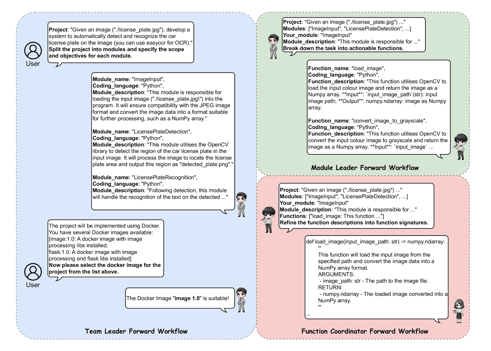

<!--yml
category: 未分类
date: 2025-01-11 12:02:25
-->

# VisionCoder: Empowering Multi-Agent Auto-Programming for Image Processing with Hybrid LLMs

> 来源：[https://arxiv.org/html/2410.19245/](https://arxiv.org/html/2410.19245/)

Zixiao Zhao University of AucklandAucklandNew Zealand [zixiao.zhao@auckland.ac.nz](mailto:zixiao.zhao@auckland.ac.nz) ,  Jing Sun University of AucklandAucklandNew Zealand ,  Zhiyuan Wei Beijing Institute of TechnologyBeijingChina ,  Cheng-Hao Cai Suzhou Industrial Park Monash Research Institute of Science and TechnologySuzhouJiangsuChina ,  Zhe Hou Griffith UniversityQueenslandAustralia  and  Jin Song Dong National University of SingaporeSingapore(2018)

###### Abstract.

In the field of automated programming, large language models (LLMs) have demonstrated foundational generative capabilities when given detailed task descriptions. However, their current functionalities are primarily limited to function-level development, restricting their effectiveness in complex project environments and specific application scenarios, such as complicated image-processing tasks. This paper presents a multi-agent framework that utilises a hybrid set of LLMs, including GPT-4o and locally deployed open-source models, which collaboratively complete auto-programming tasks. Each agent plays a distinct role in the software development cycle, collectively forming a virtual organisation that works together to produce software products. By establishing a tree-structured thought distribution and development mechanism across project, module, and function levels, this framework offers a cost-effective and efficient solution for code generation. We evaluated our approach using benchmark datasets, and the experimental results demonstrate that VisionCoder significantly outperforms existing methods in image processing auto-programming tasks.

generative AI, automated Programming, GPT, large language models, image processing^†^†copyright: acmlicensed^†^†journalyear: 2018^†^†doi: XXXXXXX.XXXXXXX^†^†isbn: 978-1-4503-XXXX-X/18/06^†^†ccs: Software and its engineering Automatic programming^†^†ccs: Computing methodologies Natural language processing

## 1\. Introduction

Image processing techniques are integral to a wide range of fields, including material science, biomedicine, and agricultural informatics (Choudhary et al., [2022](https://arxiv.org/html/2410.19245v1#bib.bib7); Suganyadevi et al., [2022](https://arxiv.org/html/2410.19245v1#bib.bib37); Latha et al., [2014](https://arxiv.org/html/2410.19245v1#bib.bib22)). With mature algorithms, researchers can improve efficiency in detecting features and analysing statistical data from images through automated processes (Prabaharan et al., [2020](https://arxiv.org/html/2410.19245v1#bib.bib31)). While existing tools often integrate with image analytical software, allowing researchers to obtain data by understanding only basic concepts and operations (Schroeder et al., [2021](https://arxiv.org/html/2410.19245v1#bib.bib36); Yushkevich et al., [2016](https://arxiv.org/html/2410.19245v1#bib.bib50)), they sometimes fall short in specific tasks where their functionality or efficiency is sub-optimal due to implementation constraints (Gómez-de Mariscal et al., [2021](https://arxiv.org/html/2410.19245v1#bib.bib15)). This limitation motivates researchers to acquire interdisciplinary programming skills to develop customized image-related algorithms tailored to their specific needs. Despite the availability of assisted programming tools (Imai, [2022](https://arxiv.org/html/2410.19245v1#bib.bib18)) and tutoring resources (Hellas et al., [2023](https://arxiv.org/html/2410.19245v1#bib.bib16)) for novices, learning project-specific programming remains a significant challenge for those without a background in computer vision or image processing. These end-to-end system functions typically require considerable time and effort to develop, often necessitating teams of developers, even within software development companies. Therefore, the automation of developing such complex software systems is yet to be fully explored.

Over the past decade, natural language processing (NLP) powered by machine learning has emerged as a promising approach to automated programming (Dehaerne et al., [2022](https://arxiv.org/html/2410.19245v1#bib.bib10)). These models, with their extensive parameters, have overcome the limitations of earlier template-matching methods by learning how to translate natural language task descriptions into programming code. The introduction of large language models (LLMs) like GPT (Floridi and Chiriatti, [2020](https://arxiv.org/html/2410.19245v1#bib.bib14)) after 2020 has further advanced the field, significantly enhancing the performance of automated programming (Jiang et al., [2024](https://arxiv.org/html/2410.19245v1#bib.bib19)). These LLMs, trained with billions of parameters and millions of code examples, combined with human feedback, have made automated code generation in general-purpose more effective (Liu et al., [2023](https://arxiv.org/html/2410.19245v1#bib.bib27)). However, when it comes to sophisticated large software system projects, such as automated programming in the complex image processing domain, the capabilities of these models remain limited, primarily due to the scale constraints of their training data.

In this work, we propose a method for decomposing complex image-processing tasks into branch modules, which are further broken down into leaf functions. By leveraging large language models’ (LLMs) ability to handle function-level code generation, these fragmented functions are ultimately assembled into comprehensive systems. In practice, inspired by the Tree of Thoughts (ToT) approach (Yao et al., [2023](https://arxiv.org/html/2410.19245v1#bib.bib47)), we introduce a hybrid multi-agent framework, VisionCoder, that utilizes tree-structured task decomposition, specifically designed for the automated development of classical image processing projects. This framework simulates the structure of a real development team by establishing a hierarchy of roles: team leader, module leader, function coordinator, and development group. By utilising the tree-structured multi-LLM framework, a complex project is decomposed into smaller, manageable thoughts, which are implemented individually by different agents. Once the individual thoughts are processed in parallel, the results are assembled through the backward workflow to produce the final solution. This decomposition reduces the complexity each LLM must handle, allowing agents to focus on smaller, well-defined portions of the task, leading to more accurate and efficient outcomes. In addition, we employ Retrieval-Augmented Generation (RAG) (Lewis et al., [2020](https://arxiv.org/html/2410.19245v1#bib.bib23)) to enhance the performance of key agents by providing relevant information from the knowledge base, improving task decomposition and function generation. Pair Programming is also incorporated to enable cross-checking and validation between implementer agents, further enhancing the accuracy of the final code. In this practical implementation, we use hybrid model deployment by assigning GPT-4o (Achiam et al., [2023](https://arxiv.org/html/2410.19245v1#bib.bib2)) (proprietary model) as decision-making roles and deepseek-coder-7b-instruct-v1.5 (DeepSeek, [2023](https://arxiv.org/html/2410.19245v1#bib.bib9)) (open-sourced model) as implementer roles to achieve the best cost-efficiency.

Through the design and implementation of VisionCoder’s multi-agent framework, we aimed to improve the efficiency and effectiveness of automated programming for image processing tasks. By leveraging hierarchical task decomposition, thought flows among agents, complementary techniques, and hybrid model selection, we significantly enhanced both the performance and cost-efficiency of the framework. The key contributions of this work are as follows:

*   •

    Innovative Multi-Agent Framework for Large Image Processing Systems Auto-Programming: We introduce a multi-level structure that enables the decomposition and assembly of project tasks. This layered approach, employing tree-like task breakdown combined with auxiliary strategies, allows our framework to achieve state-of-the-art performance in automated programming for image processing tasks.

*   •

    Comprehensive Knowledge Base for Image Processing Algorithm Development: We have curated a knowledge base tailored to the agents inside VisionCoder, covering essential classical image processing operations, especially in the decomposition reasoning and implementation aspects. This knowledge base can be integrated into other development task models, enhancing the versatility and effectiveness of agents across various tasks.

*   •

    Auto-Programming Benchmark for Image Processing Projects: We developed a benchmark dataset specifically designed for evaluating automated programming solutions in the domain of image processing. This dataset will serve as a valuable resource for future research, facilitating comparisons and driving advancements in the field.

The rest of this paper is organized as follows: Section 2 provides a thorough background in automated programming. Section 3 focuses on the workflow of VisionCoder, detailing how thoughts are decomposed and distributed, then validated and assembled, along with implementation details. In Section 4, we present the experimental setup, including the construction of the BCVPP dataset and evaluation of VisionCoder, comparing its performance against other state-of-the-art methods. Section 5 analyses the results, emphasizing key findings through the development of VisionCoder and discusses limitations to the framework. Finally, Section 6 concludes the paper by summarizing the contributions and outlining directions for future work.

## 2\. Background

In this section, we provide background on the evolution of auto-programming tasks and methods, particularly agent-based solutions, multi-agent frameworks and path reasoning strategies.

### 2.1\. Automated programming

The concept of automated programming dates back to the 1950s when, due to limitations in computer architecture, it was primarily considered a compilation problem—translating formal specifications into implementations (Balzer, [1985](https://arxiv.org/html/2410.19245v1#bib.bib4)). Over time, this concept evolved into a programming problem, focusing on generating domain-specific languages from task descriptions (Kushman and Barzilay, [2013](https://arxiv.org/html/2410.19245v1#bib.bib21); Raza et al., [2015](https://arxiv.org/html/2410.19245v1#bib.bib33); Manshadi et al., [2013](https://arxiv.org/html/2410.19245v1#bib.bib28)). With the advent of natural language processing (NLP) techniques based on deep learning, algorithms utilising RNNs and LSTMs (Yin and Neubig, [2017](https://arxiv.org/html/2410.19245v1#bib.bib48)) enabled the initial direct translation of natural language (NL) into programming languages (PL). The introduction of the Transformer architecture (Vaswani et al., [2017](https://arxiv.org/html/2410.19245v1#bib.bib41)) in 2017 further accelerated the development of NLP algorithms, leading to tools like Intellicode (Svyatkovskiy et al., [2020](https://arxiv.org/html/2410.19245v1#bib.bib38)), which offers multi-language suggestions, and CodeBERT (Feng et al., [2020](https://arxiv.org/html/2410.19245v1#bib.bib13)), which supports NL-PL conversion via code search. Recent large language models (LLMs) like CodeLlama (Roziere et al., [2023](https://arxiv.org/html/2410.19245v1#bib.bib35)), AlphaCode (Li et al., [2022](https://arxiv.org/html/2410.19245v1#bib.bib26)) and StarCoder (Li et al., [2023](https://arxiv.org/html/2410.19245v1#bib.bib25)) leverage larger datasets and more parameters, resulting in significant improvements in the accuracy and efficiency of automated programming. These advancements also inspired the development of LLM-based programming-related tools like LLM4PR (Cai et al., [2024](https://arxiv.org/html/2410.19245v1#bib.bib5)), InterFix (Jin et al., [2023](https://arxiv.org/html/2410.19245v1#bib.bib20)), Pydex (Zhang et al., [2024a](https://arxiv.org/html/2410.19245v1#bib.bib51)) and LLift (Li et al., [2024](https://arxiv.org/html/2410.19245v1#bib.bib24)) aiming at program refinement, program repair and bug detection. However, the ability of a single LLM to tackle complex code generation tasks remains constrained by the limitations of its training data.

### 2.2\. Agent-based solutions in auto-programming

The code that LLMs can generate through a single round of dialogue is often relatively simple. To address this limitation, frameworks have been developed that use an LLM as an AI agent combined with specific interaction strategies (Wang et al., [2024](https://arxiv.org/html/2410.19245v1#bib.bib42); Xi et al., [2023](https://arxiv.org/html/2410.19245v1#bib.bib46)). For example, ToolCoder (Zhang et al., [2023c](https://arxiv.org/html/2410.19245v1#bib.bib54)) incorporates an API search strategy into the LLM, allowing it to search for the appropriate API online during code generation. Similarly, CodeAgent (Zhang et al., [2024b](https://arxiv.org/html/2410.19245v1#bib.bib52)) enhances the LLM by integrating tools such as a format checker and code interpreter, in addition to online searching, to mitigate the shortcomings of a single model. Additionally, approaches like Self-edit (Zhang et al., [2023b](https://arxiv.org/html/2410.19245v1#bib.bib53)) and Self-debug (Chen et al., [2023](https://arxiv.org/html/2410.19245v1#bib.bib6)) employ a multi-round dialogue mechanism, guiding the LLM to iteratively optimise the generated code. These works demonstrate that, beyond simply training LLMs to enhance their generative capabilities, incorporating well-designed mechanisms and strategies can significantly improve their overall performance.

### 2.3\. Multi-agent frameworks

In addition to employing interaction strategies to enhance the capabilities of a single agent, some researchers have proposed using multiple agents in combination to form an agent group for automated programming tasks (Wang et al., [2024](https://arxiv.org/html/2410.19245v1#bib.bib42)). Dong et al.(Dong et al., [2023](https://arxiv.org/html/2410.19245v1#bib.bib11)) introduced a framework where different roles are assigned to each agent to collaborate on code development. Chatdev(Qian et al., [2024](https://arxiv.org/html/2410.19245v1#bib.bib32)) expands on this concept by extending the roles of agents and incorporating interaction strategies between them. At the same time, AgentCoder (Huang et al., [2023](https://arxiv.org/html/2410.19245v1#bib.bib17)) enhances the functionality of testing agents based on the specific demands of automated programming tasks. However, despite the role assignments, only one agent is typically active at each stage of the development process. This approach places significant demands on the capabilities of individual agents and limits their effectiveness in handling complex programming tasks.

### 2.4\. Tree of thoughts reasoning

When faced with complex problems, humans are able to break them down into simpler steps to solve them gradually. This strategy has been extended to LLMs and is referred to as path reasoning (Wang et al., [2024](https://arxiv.org/html/2410.19245v1#bib.bib42)). The earliest form of this was single-path reasoning, exemplified by the Chain of Thought (CoT) approach (Wei et al., [2022](https://arxiv.org/html/2410.19245v1#bib.bib44)), where LLMs are guided through tasks using step-by-step examples in the prompts. This strategy evolved into multi-path reasoning, such as the Self-Consistent Chain of Thought (CoT-SC) (Wang et al., [2022](https://arxiv.org/html/2410.19245v1#bib.bib43)), where multiple reasoning paths (or CoTs) are generated for the same problem, and the most frequent or consistent result is selected as the final solution. Tree of Thoughts (ToT) (Yao et al., [2023](https://arxiv.org/html/2410.19245v1#bib.bib47)) further optimizes this approach by organizing these multiple reasoning paths into a tree structure. Each node in the tree represents an intermediate thought, which can be traced back or explored until the best solution is found. While ToT has been particularly useful in mathematical problem-solving, its principles offer the potential for tackling complex programming tasks as well, providing a structured way to explore multiple solution paths simultaneously.

## 3\. Multi-Agent Auto-Programming Framework with Thought Decomposition and Assembly

Figure 1. VisionCoder Framework

\Description

workflow

In this section, we provide a detailed explanation of the VisionCoder framework. As shown in Figure [1](https://arxiv.org/html/2410.19245v1#S3.F1 "Figure 1 ‣ 3\. Multi-Agent Auto-Programming Framework with Thought Decomposition and Assembly ‣ VisionCoder: Empowering Multi-Agent Auto-Programming for Image Processing with Hybrid LLMs"), the VisionCoder framework automates image processing software engineering through a tree-structured multi-agent workflow. It begins with the Team Leader breaking down project requirements into branch modules. The Module Leader then decomposes each branch into smaller, actionable thoughts, which are further refined by the Function Coordinator for clarity and passed to the Development Group as leaf functions for implementation. The Development Group self-validates each function after generating the code. All intermediate thoughts are recorded in a thought pool, ensuring that key information is stored accurately and can be retrieved without errors during the backward workflow. Once all functions are implemented and validated, they are assembled into modules and tested before the Team Leader combines the completed modules into the final project code.

To illustrate the detailed functionality, we use a runtime example throughout the section, demonstrating how the framework operates in practice. The user provides the following task: "Given an image ("./license_plate.jpg"), develop a system to automatically detect and recognize the car license plate on the image (you can use easyocr for OCR)." Using this example, we begin by outlining the workflow of VisionCoder in Section 3.1, focusing on two key aspects: thoughts decomposition and distribution, as well as results validation and assembly. In Section 3.2, we provide a comprehensive overview of the roles and operational mechanisms of each agent in the framework. Section 3.3 explores the supporting strategies that enhance the core structure, and in Section 3.4, we present the concrete implementation of the framework. After detailing the implementation, we will analyse a sample output from VisionCoder to provide a deeper understanding of its functionality in Section 3.5.

### 3.1\. VisionCoder Workflow

#### 3.1.1\. Forward task flow - decomposition and distribution

Figure 2. Forward task flow: Tasks of decision-maker agents

The forward task flow of each decision-maker agent is illustrated in Figure [2](https://arxiv.org/html/2410.19245v1#S3.F2 "Figure 2 ‣ 3.1.1\. Forward task flow - decomposition and distribution ‣ 3.1\. VisionCoder Workflow ‣ 3\. Multi-Agent Auto-Programming Framework with Thought Decomposition and Assembly ‣ VisionCoder: Empowering Multi-Agent Auto-Programming for Image Processing with Hybrid LLMs"). Team Leader: The input to the VisionCoder framework is a set of image processing algorithm project requirements described in natural language. Upon receiving these requirements, the Team Leader is the first agent invoked. Its primary task is to divide the project into distinct branch modules and define the functional scope and objectives of each module. To streamline the subsequent process of module integration and validation and to avoid redundancy between modules, the Team Leader is designed to generate as few modules as possible. Since the VisionCoder framework involves running and testing the project code, Docker (Merkel et al., [2014](https://arxiv.org/html/2410.19245v1#bib.bib29)) is used to build the necessary runtime environment to prevent any impact on the host system. We pre-configured several Docker images, each containing dependencies for different aspects of image processing. After confirming the project requirements, another critical responsibility of the Team Leader is to select the most appropriate Docker image for the project, which will be used throughout all runtime sessions.

Module Leader: The Module Leader, as the second level of decision-maker, steps in after the Team Leader has divided the project into branches. Each branch module is assigned to a Module Leader, who is responsible for splitting the abstract module descriptions provided by the Team Leader into specific, actionable function thoughts. To do this effectively, the Module Leader receives both the module name and a brief description from the Team Leader, as well as the overall project requirement retrieved from the thought pool, to ensure alignment with the broader goals. Although Module Leaders do not interact directly with the implementer agents, their output is crucial, as it consists of function thoughts that are more coding-focused. To bridge the gap between abstract requirements and code implementation, Module Leaders must define the inputs and outputs for each function. Like the Team Leader, the Module Leader is tasked to define as few functions as possible to reduce redundancy and streamline the overall process.

Function Coordinator: Once the function descriptions for a module have been finalised, they are passed to the Function Coordinator. At this stage, the function thoughts are still in natural language, and the Function Coordinator’s role is to translate them into function signatures in code form. Like the Module Leader, the Function Coordinator works with all the previous key thoughts: the overall project requirements, the module plan retrieved from the thought pool, and the specific function thoughts at hand. With a complete overview of all the leaf functions to be implemented, the Function Coordinator is responsible for strictly defining the input and output variable types for each function, which ensures consistency across all functions and promotes uniformity throughout the module.

Figure 3. Forward task flow: Tasks of implementer agents

Development Group: At the implementer level, each function signature is assigned to a Development Group, consisting of a Coder agent and a Tester agent, who are responsible for implementing the leaf function from the function thoughts (Figure [3](https://arxiv.org/html/2410.19245v1#S3.F3 "Figure 3 ‣ 3.1.1\. Forward task flow - decomposition and distribution ‣ 3.1\. VisionCoder Workflow ‣ 3\. Multi-Agent Auto-Programming Framework with Thought Decomposition and Assembly ‣ VisionCoder: Empowering Multi-Agent Auto-Programming for Image Processing with Hybrid LLMs")). The Coder receives the function signature along with the project and module information, drafts an initial version of the code, and then passes it to the Tester. The tester writes a set of test codes based on the coder’s first version and the same project and module information. Following this, the roles are reversed: The Coder reviews the Tester’s code to identify and resolve any issues in a process known as Pair Programming (Coplien, [1998](https://arxiv.org/html/2410.19245v1#bib.bib8)). Once the test code is finalised, it is executed to verify the Coder’s draft. If the test fails, the Coder regenerates a new version of the code by incorporating the error messages and previous information, and this process is repeated up to three times. At this level, the function thoughts assigned to the Coder are highly granular, and three rounds of validation are generally sufficient to produce the final version of the code.

Figure 4. Backward task flow: Tasks of decision-maker agents

#### 3.1.2\. Backward task flow - validation and assembly

The backward workflow of the decision-maker agents is illustrated in Figure [4](https://arxiv.org/html/2410.19245v1#S3.F4 "Figure 4 ‣ 3.1.1\. Forward task flow - decomposition and distribution ‣ 3.1\. VisionCoder Workflow ‣ 3\. Multi-Agent Auto-Programming Framework with Thought Decomposition and Assembly ‣ VisionCoder: Empowering Multi-Agent Auto-Programming for Image Processing with Hybrid LLMs"). Function Coordinator: The backward task flow follows a bottom-up approach. After the Development Groups complete the implementation of the leaf functions, the Function Coordinator receives the codes and assembles them into a branch module script. Since memory is cached during the forward task flow, the Function Coordinator at this stage simply takes the codes provided by the Development Groups as input for assembly.

Module Leader: At this stage, each Module Leader is responsible for verifying the branch module code assembled by the Function Coordinator. Similar to the Tester in the Development Group, the Module Leader generates a set of test codes based on the initial module thoughts and the module code provided by the Function Coordinator to validate the current module. If the tests fail, an error message is returned to the Function Coordinator, who will then correct the module code accordingly. This process ensures that all modules are appropriately validated for final assembly into the complete project output.

Team Leader: The final step of the VisionCoder framework involves the Team Leader combining the module codes into the final project output. Since the lower-level code handles more complex and fundamental functionality, it undergoes more rigorous validation. In contrast, the higher-level decision-makers primarily focus on assembling simpler code, where the risk of errors is lower. To optimise efficiency, we have designed a mechanism where module code is validated only once, and the final project code is not re-validated, reducing token consumption while maintaining reliability.

### 3.2\. Agentisation

#### 3.2.1\. Hybrid LLM application

Based on the workflow of the VisionCoder framework, the tasks assigned to the decision-maker agents require greater flexibility. For example, in the forward workflow, the Team Leader must first understand the project requirements provided by the users, then break the project down into feasible module thoughts from a software development perspective, and provide clear and precise descriptions as inputs for the next-level agents. The Module Leader and Function Coordinator perform similar tasks, which demand a high level of competence from the decision-maker agents. Therefore, we implemented proprietary models in these roles.

The implementers, i.e., the Development Groups, focus solely on code generation without the need for translation or distribution of information, making their responsibilities more straightforward. Since code generation typically requires processing more tokens than natural language, we opted to use a locally deployed open-source LLM to achieve better cost-efficiency.

Figure 5. Team Leader Definition

#### 3.2.2\. Agent definition

The definition of an agent inside VisionCoder is divided into two aspects: structural and functional. Taking Team Leader as an example, whose definitions are illustrated in Figure [5](https://arxiv.org/html/2410.19245v1#S3.F5 "Figure 5 ‣ 3.2.1\. Hybrid LLM application ‣ 3.2\. Agentisation ‣ 3\. Multi-Agent Auto-Programming Framework with Thought Decomposition and Assembly ‣ VisionCoder: Empowering Multi-Agent Auto-Programming for Image Processing with Hybrid LLMs").

In the structural definition, we outline the global context of developing an image processing project, followed by explaining where the agent is positioned within the overall VisionCoder framework workflow. Additionally, we define the agent’s interactions with other agents by detailing what information it receives from higher-level agents and what it sends to the next-level agents. By specifying these interactions, each agent gains a clear understanding of its scope of responsibility, which also ensures that upstream and downstream thought flows are managed in a standardised and efficient manner, reducing ambiguity and streamlining the workflow.

Functional definitions outline the specific actions an agent is expected to take after receiving an upstream message. This definition consists of two essential parts. First, it defines the operational steps the agent must follow. To minimise the risk of hallucinations in the LLM’s generated output, we design a primary reasoning path for each agent, emphasizing the image processing development scenario and ensuring they adhere to a consistent thought process to produce stable results. The second part focuses on the format requirements for the output. Since the agents’ output often consists of natural language descriptions of modules or functions rather than structured data, we impose strict formatting rules. These rules ensure that crucial information can be accurately extracted using methods such as regular expressions, allowing for precise delivery and downstream processing.

### 3.3\. Enhancement strategies

#### 3.3.1\. RAG for Team Leader and Coder

One of the unavoidable challenges when generating results with LLMs is hallucination. From the perspective of LLM training, hallucinations typically stem from two key issues (Zhang et al., [2023a](https://arxiv.org/html/2410.19245v1#bib.bib55)):

*   •

    Quality of pre-training data: LLM training requires vast amounts of data, often sourced from open projects, articles, and even forum discussions on the Internet. These datasets frequently contain inaccuracies, outdated information, or even fabricated content. Given the sheer volume of data, manual verification is impractical, meaning the LLM may inadvertently generate incorrect results based on flawed or misleading prior knowledge.

*   •

    Versatility of pre-training datasets: General-purpose LLMs are expected to handle a wide range of tasks, which necessitates training data that covers many different domains. However, in specific applications—such as the VisionCoder framework—we only require the LLM’s capabilities within a particular field. Knowledge from unrelated domains can interfere with the quality of the desired output in specialised contexts.

Another significant cause of hallucinations arises from the imprecision of input prompts. Users interacting with LLMs often rely on simplified descriptions to obtain accurate results. However, the absence of critical context information or incomplete input data frequently leads to suboptimal or erroneous outputs. This limitation is particularly pronounced in code generation tasks related to image processing, where insufficient information regarding the input image or algorithm may result in the generation of code with incorrect parameters or inappropriate dependencies, ultimately producing inaccurate results.

Figure 6. Coder Knowledge Retrieval Process

To mitigate the occurrence of hallucinations, we adopt a retrieval-augmented generation (RAG) strategy (Lewis et al., [2020](https://arxiv.org/html/2410.19245v1#bib.bib23)). Figure [6](https://arxiv.org/html/2410.19245v1#S3.F6 "Figure 6 ‣ 3.3.1\. RAG for Team Leader and Coder ‣ 3.3\. Enhancement strategies ‣ 3\. Multi-Agent Auto-Programming Framework with Thought Decomposition and Assembly ‣ VisionCoder: Empowering Multi-Agent Auto-Programming for Image Processing with Hybrid LLMs") demonstrates the example retrieval-augmented generation (RAG) process of the Coder agent, which comprises two primary components: 1\. A pre-constructed knowledge base, which contains examples of inputs and outputs relevant or similar to the target task. This knowledge base is designed to serve as a reference point for the LLM during task execution. In practice, the knowledge base is encoded into a vectorised format to facilitate efficient retrieval. 2\. The second component is the retriever, which converts new inputs into query vectors that are used to search the knowledge base for pertinent information. The retrieved content is then translated back into natural language and incorporated into the input prompts as contextual support.

Within the VisionCoder framework, Team Leader and Coder agents are equipped with a tailored RAG knowledge base. To develop these knowledge bases, we carefully selected 50 relevant OpenCV-related questions from the GitHub repository “Image_Processing_100_Questions” (yoyoyo yo, [2019](https://arxiv.org/html/2410.19245v1#bib.bib49)). Initial responses for each agent type were generated using GPT-4o, and these responses underwent thorough manual verification and correction to ensure accuracy.

This process culminated in the construction of a robust knowledge base specifically designed to support the functionality and requirements of agents within the framework. The retrieved information acts as a guide for the thought process, enhancing the agents’ understanding of input requirements. By employing RAG, we strengthen the agents’ comprehension and inspire more precise reasoning over the generated output, thereby reducing the likelihood of hallucinations.

#### 3.3.2\. Pair programming for Development Groups

Figure 7. Pair Programming

In the VisionCoder framework, the Development Group is positioned at the bottom of the development hierarchy, whose role is focused exclusively on implementing the code, with no involvement in managing the project or modules. Given the nature of their tasks and the capabilities of the LLMs that comprise them, the Development Group can be thought of as equivalent to junior engineers in a real development team, meaning the code they produce is more susceptible to errors.

While Coder-generated code can be iteratively improved through testing and refinement, this process relies on the assumption that the test code generated by the Tester is reliable. However, there is no built-in validation mechanism for the test code itself, which can lead to potential flaws in the overall process.

To address this, we implemented a Pair Programming technique (Coplien, [1998](https://arxiv.org/html/2410.19245v1#bib.bib8)). As depicted in Figure [7](https://arxiv.org/html/2410.19245v1#S3.F7 "Figure 7 ‣ 3.3.2\. Pair programming for Development Groups ‣ 3.3\. Enhancement strategies ‣ 3\. Multi-Agent Auto-Programming Framework with Thought Decomposition and Assembly ‣ VisionCoder: Empowering Multi-Agent Auto-Programming for Image Processing with Hybrid LLMs"), once both the Coder and Tester have completed their initial code drafts, their roles are swapped: the test code is passed to the Coder for review. During development, we found that the most frequent mistake made by the Tester was the omission of dependencies, an issue that can often be detected through code analysis rather than execution. This review process, therefore, proves to be a highly effective, low-effort solution to improve the reliability of the test code.

While the principle of Pair Programming suggests that the Tester should also review the Coder’s code, this is more effectively handled during the following actual testing. Thus, we chose to exclude this operation from this stage.

### 3.4\. Implementation

The pseudo-code for the implementation outline of the framework is presented in Algorithm [1](https://arxiv.org/html/2410.19245v1#alg1 "Algorithm 1 ‣ 3.4.1\. Base model selection ‣ 3.4\. Implementation ‣ 3\. Multi-Agent Auto-Programming Framework with Thought Decomposition and Assembly ‣ VisionCoder: Empowering Multi-Agent Auto-Programming for Image Processing with Hybrid LLMs"). Given a project, the Team Leader decomposes it into “module thoughts,” with each module processed in parallel by different Module Leaders. These module thoughts are further broken down into “function thoughts,” which are refined and distributed to the Development Group by the Function Coordinator. The Development Group then implements the Leaf functions, and finally, the project code is validated and synthesized step by step.

The core development of the VisionCoder framework centres around four key components: the selection of base models for each agent, the instantiation of individual agents, the thought flow between agents, and the establishment of a robust testing and validation environment.

#### 3.4.1\. Base model selection

As a multi-agent framework, the first step in implementing VisionCoder is selecting a base model for each agent. VisionCoder’s agents are categorised into two types: decision-makers and implementers. To maintain consistency in output style across agents, the same base model is used for all agents within each category.

*   •

    Decision Maker: The decision-maker agent functions as the leader of the implementers, responsible for understanding the task, interpreting it into feasible thoughts, and distributing sub-thoughts. This requires strong text comprehension and reasoning skills. While decision-makers are not tasked with large-scale code generation, they provide crucial guidance for subsequent implementations, meaning they must also possess basic programming knowledge. To meet these requirements, we selected a proprietary model with strong synthesis capabilities for the decision-maker agent. Specifically, we chose the GPT-4o-20240806 (Achiam et al., [2023](https://arxiv.org/html/2410.19245v1#bib.bib2)) model in our development, both for its robust capabilities and because it is more cost-effective than the Claude 3.5 (Anthropic, [2024](https://arxiv.org/html/2410.19245v1#bib.bib3)) model.

*   •

    Implementer: The implementer agent’s sole responsibility is code generation. Although the task is singular, the quality of the underlying function code directly impacts the performance of the entire project, making strong programming skills essential for the implementer model. While proprietary models also excel in code generation, their high token consumption during programming led us to choose an open-source model specifically designed for code generation tasks. In selecting the base model for the implementer, we considered three key factors: 1\. Role Definition Capability: Some open-source models are unable to process system cues, which may prevent the agent from accessing global information, thus affecting performance. 2\. Ability to Handle Long Text: Since the Coder agent is equipped with a knowledge base, it often deals with longer context inputs. Models with fewer parameters struggle to manage long text effectively. 3\. Model Size: Although performance typically scales with the number of parameters, hardware limitations prevent us from deploying exceptionally large models. After considering these factors, we selected the deepseek-coder-7b-instruct-v1.5 as the base model for the implementer.

Algorithm 1 VisionCoder framework implementation

1:Project requirement $\rho$2:Project code $\Phi_{project}$3:$TL\leftarrow$ Team Leader initialised4:Module list $[\mu]\leftarrow TL.SplitModuleThoughts(\rho)$5:for $each(\mu_{i})\in[\mu]$ do6:     $ML\leftarrow$ Module Leader initialised7:     Function Thoughts list $[\nu]\leftarrow ML.SplitFunctionThoughts(\mu_{i})$8:     $FC\leftarrow$ Function Coordinator initialised9:     Refined Function Thoughts list $[\nu_{R}]\leftarrow FC.RefineFunctionThoughts([\nu])$10:     for $each(\nu_{Rj})\in[\nu_{R}]$ do11:         $DG\leftarrow$ Development Group initialised12:         Function code $\psi_{j}\leftarrow DG.Coding(\nu_{Rj})$13:         $\psi_{j}\leftarrow DG.Validation(\psi_{j})$14:     end for15:     Module code $\phi_{i}\leftarrow FC.AssembleModule([\psi])$16:     $\phi_{i}\leftarrow ML.TestModule(\phi_{i})$17:end for18:return $\Phi_{project}\leftarrow TL.AssembleProject([\phi])$

#### 3.4.2\. Agent instantiation

Agents in VisionCoder are divided into four levels, each tailored to handle a specific task within the framework. Despite their distinct roles, all agents share core functionality such as initialization, memory management, and thought retrieval. To simplify the development process, we designed a customizable base agent that includes these essential methods while each specific agent extends this base with role-specific functions.

A key advantage of the base agent design is the modularity it provides. Although the current version uses fixed base models for decision-makers and implementers, the uniform interaction logic across large models allows for rapid iteration. By simply inheriting from the base agent, researchers can easily swap out base models with more performant alternatives, enabling future studies to leverage the structure of VisionCoder while integrating improved models.

#### 3.4.3\. Thought flow among agents

Communication between agents within VisionCoder occurs through thought flows, which align with the agent’s hierarchical structure. As shown in Figure [8](https://arxiv.org/html/2410.19245v1#S3.F8 "Figure 8 ‣ 3.4.3\. Thought flow among agents ‣ 3.4\. Implementation ‣ 3\. Multi-Agent Auto-Programming Framework with Thought Decomposition and Assembly ‣ VisionCoder: Empowering Multi-Agent Auto-Programming for Image Processing with Hybrid LLMs"), for example, the Team Leader decomposes the project requirements (root thought) into branch thoughts. These branch thoughts are composed of two components: hyper thoughts and flexible thoughts. Hyperthoughts represent fixed rules, such as the module name, coding language, runtime environment, and work directory. These patterns are determined by the framework and the Team Leader and remain unchangeable by subordinate agents throughout the process. In contrast, flexible thoughts represent problem-solving concepts that guide the subordinate agents, allowing them to expand and refine these ideas into more detailed thoughts as they work through the task.

Figure 8. Thought flow and caching in VisionCoder

\Description

Thought flow and caching in VisionCoder

The thoughts generated by each agent are stored in a thought pool. This mechanism serves two primary purposes. First, agents retain memories of their actions, and these memories can sometimes introduce errors into subsequent tasks. In such cases, it becomes necessary to retrieve previous thoughts from the thought pool, which functions as a backtracking mechanism inspired by the Tree of Thoughts. For example, after pair programming, a coder might mistakenly believe that the test code is his output and attempt to optimize it instead of focusing on the function code. By accessing the thought pool, the coder’s previous output can be retrieved and reassigned. The second purpose of the thought pool arises from the structural limitations of LLMs, which prevent direct communication between agents. A virtual user agent facilitates this process by selecting and transmitting the correct content from the thought pool, enabling efficient inter-agent communication.

#### 3.4.4\. Testing environment

Unlike individual LLMs or generic automated programming frameworks, a key mechanism in the VisionCoder framework is validation. Since VisionCoder is focused on solving image processing-related problems, it is essential to establish a suitable runtime environment that includes the appropriate Python version, dependencies and file system mapping. This setup is necessary to ensure that the validation process operates correctly.

Although it is possible to validate directly within VisionCoder’s runtime environment, doing so introduces risks. Changes in versions or the removal of dependencies could impact the environment, and mistakes in file system operations could result in irreversible consequences. Therefore, the most effective approach is to create an isolated environment specifically for VisionCoder’s validation process.

Several methods exist for creating isolated environments, including virtual machines and Python-based virtual environments. However, in VisionCoder, we opted to use Docker images to construct the runtime environment for validation. The key advantage of Docker over virtual machines or virtual environments is its ease of configuration. A simple Dockerfile can be written to create the necessary image, and Docker’s Python runtime library can then be utilised during validation, allowing for seamless deployment.

### 3.5\. Output analysis

Figure 9. Example Outputs and Results of VisionCoder

As shown in Figure [9](https://arxiv.org/html/2410.19245v1#S3.F9 "Figure 9 ‣ 3.5\. Output analysis ‣ 3\. Multi-Agent Auto-Programming Framework with Thought Decomposition and Assembly ‣ VisionCoder: Empowering Multi-Agent Auto-Programming for Image Processing with Hybrid LLMs"), in the context of the example task, VisionCoder decomposes the project into three primary branch modules: ImageInput, LicensePlateDetection, and LicensePlateRecognition. Each module is subsequently divided into two leaf functions, which are individually verified using test code. The leaf functions are then combined to form the complete module, followed by module-level testing. Ultimately, the fully tested modules are assembled into the final project code, resulting in the desired output.

The entire process is fully automated, requiring the user to provide only the project specifications. VisionCoder’s agents autonomously manage the gradual decomposition and implementation of the task. Owing to the hybrid model design, the project is completed in under 10 minutes at a cost of less than 0.01 US dollars. Even when compared to experienced human developers, VisionCoder proves highly competitive. It not only completes tasks significantly faster but also automates debugging and validation, reducing human error and ensuring consistent results.

Beyond this scenario, the VisionCoder architecture simulates the structure of a real development team. Depending on the Team Leader’s understanding of the project requirements, the size of VisionCoder can be flexibly scaled, and the resulting branch thoughts can be adjusted according to the complexity of the project. By leveraging the Tree of Thoughts structure, VisionCoder decomposes automated programming tasks for complex software systems into small, manageable thoughts. This allows the framework to fully utilise the LLMs’ function-level code generation capabilities, integrating solutions from these smaller problem-solving thoughts. Compared to human developer teams, who require significant time for project familiarization, parameter debugging, team-level code integration, and communication, VisionCoder operates with far greater efficiency.

## 4\. Evaluation

In this section, we focus on the evaluation of VisionCoder. First, we outline the research questions that guide the focus of our experiments and analysis, followed by a thorough construction process of the dataset specifically designed for automated programming tasks in the field of image processing. Next, we detail the experimental setup, including the selection of baseline methods, evaluation criteria, test workflow, and the hardware resources used for evaluation. Finally, we analyse the results of the comparative experiments and provide answers to the research questions.

### 4.1\. Research questions

To validate the effectiveness of VisionCoder, this work addresses the following research questions:

RQ1: How does the tree-structured multi-agent framework perform in image processing programming tasks through thought decomposition and assembly? To evaluate the performance of our framework, we compiled a benchmark dataset of classical image processing algorithms. Each task in this dataset represents a complete image algorithmic process, allowing us to assess the effectiveness of our framework in decomposing and assembling modules and functions at the project level.

RQ2: What auxiliary techniques can be used to improve the performance of each agent for image processing tasks? To enhance the performance of individual agents within the framework, we employed several complementary strategies. These include integrating retrieval-augmented generation (RAG) for specific agents to boost their capabilities in image algorithms and applying a pair programming mechanism inspired by software engineering at the lowest level of the development group. We designed ablation experiments to verify the effectiveness of these strategies.

RQ3: How does the performance of our framework compare to other auto-programming tools? We conducted a comparative evaluation using the same dataset across multiple state-of-the-art auto-programming methods to demonstrate the advantages of our hierarchical framework.

RQ4: How to apply both proprietary and open-source LLMs as a hybrid mechanism to improve programming cost-efficiency? Although proprietary models excel in code generation tasks, it is a trade-off with high costs, particularly when generating large amounts of code. We performed a cost-efficiency comparison with other methods to evaluate how the integration of proprietary and locally deployed open-source models can balance performance and expense within our framework.

### 4.2\. Benchmarking dataset

To validate VisionCoder’s ability to automate programming in the field of image processing and to compare it with other state-of-the-art automated programming frameworks, we compiled a test set of 90 image-processing-related projects named BCVPP (Basic Computer Vision Python Programming).

#### 4.2.1\. BCVPP construction

BCVPP focuses on fundamental Python image processing projects, specifically within the scope of classical image algorithms. The dataset comprises a total of 90 projects, which are divided into 30 simple projects, 50 medium projects, and 10 hard projects.

Below are some sample projects of different categories inside BCVPP:

*   •

    Simple: Given an input image ("./test_image.png"), do 2 pyramid scalings on it, one upscaling and one downscaling. Save the resulting images as "upscaled.png" and "downscaled.png".

*   •

    Medium: Given an image ("./test_image.png"), apply a sharpening filter of the following values: [[0, -1, 0], [-1, 5, -1], [0, -1, 0]]. Then apply a 5x5 Gaussian filter with sigmax=5 (using GaussianBlur). Save the resulting image as "sharpened_gaussian_image.png".

*   •

    Hard: Given an input image ("./texture_icon.jpg"), apply texture synthesizing using Efros_Leung algorithm to expand the image to 128x128 pixels. Save the result as "texture_synthesized.png". Set np.random.seed to 0 before starting the algorithm.

In the domain of classical image processing, OpenCV is an essential tool. As a classic library for traditional image algorithms, numerous online courses and project repositories offer examples based on OpenCV. After evaluating various sources, we selected a beginner-oriented GitHub repository, "OpenCV_Projects" (rchavezj, [2019](https://arxiv.org/html/2410.19245v1#bib.bib34)), as the primary source of test data. This repository, with over 340 stars and around 55 OpenCV-related problems, was chosen because its content is widely accepted by developers and offers an appropriate difficulty level. Since there is a limited number of commonly used OpenCV operations, and to avoid redundancy with the 50 projects already selected for the VisionCoder knowledge base from other sources, we selected 30 simple projects from this repository. These projects are classified as simple because they can be completed with just a single module within the VisionCoder framework without the need for combining multiple modules.

While simple projects are useful for initial validation, testing VisionCoder’s performance on more complex, project-level tasks requires projects that involve the integration of multiple modules. Unfortunately, such projects are typically found in real-world industrial scenarios and are rarely available in open-source repositories or tutorials. To fill this gap, we utilised the OpenAI-o1 (OpenAI, [2024](https://arxiv.org/html/2410.19245v1#bib.bib30)) model to generate 100 moderately complex projects by combining elements from the 30 simple projects. However, during the calibration process, we discovered that many of these generated projects lacked coherent and logical relationships between the modules, leading to confusing project descriptions. After reviewing and refining these projects, we finalised 50 medium projects, which generally require 2 to 3 modules to complete.

To further challenge the capabilities of VisionCoder and other automated programming methods, we sought to include more difficult projects. We identified 10 hard projects that push the limits in two key ways. First, these projects are inherently more complex, requiring a greater number of modules and demanding a higher level of expertise, even for real developers. Second, unlike the clear, step-by-step instructions found in simpler projects, these projects offer only vague descriptions—typically providing just the input image and target requirements—forcing the methods to infer the necessary steps on their own.

It is important to highlight that, at this stage, BCVPP is focused solely on classical image algorithms and does not yet cover machine learning or deep learning approaches. (Even when deep learning models are involved, they are limited to direct calls to pre-trained models.) We chose to exclude these areas because the development of machine learning and deep learning models involves significantly more complexity—such as data preprocessing, training and validation set creation, model development, model training, and post-processing—that we believe exceeds the current capabilities of LLMs. For this reason, we decided to focus on the domain of classical image processing for the construction of BCVPP.

#### 4.2.2\. Project components in BCVPP

For each program in the BCVPP, we include the following components:

*   •

    Input Image: As this is an image processing dataset, every project is associated with a specified input image. All generated programs must perform operations on this provided image.

*   •

    Project Description: For simple and medium-level projects, we provide a detailed project description, which includes the path to the input image, the image processing operations to be performed (with fixed parameters), and the path to the output file. For hard-level projects, we offer only the path to the input image and an approximate description of the target outcome, leaving the specific steps more open-ended.

*   •

    Sample Solution Module: Each project is accompanied by a sample solution. While each project can be implemented in various ways, the final output should remain consistent. The sample code provides a reference solution that generates the desired output, which is used to evaluate the accuracy of the generated program.

*   •

    Test Module: The test code is responsible for comparing the result of the generated program on the input image with the expected output. This comparison determines whether the generated program is correct or not.

### 4.3\. Baselines

To evaluate the performance of the VisionCoder framework in the image processing domain, we selected several state-of-the-art (SOTA) methods in automated programming and code generation as baselines for comparison. The following criteria were used to guide the selection of these baselines:

*   •

    Novelty and Performance: Given the rapid development of LLMs, model iteration can occur in a matter of weeks. Many models that demonstrate exceptional performance upon release are quickly surpassed by newer versions. Therefore, we selected models that were released within one year and whose performance in code generation tasks remains highly competitive.

*   •

    Specialisation: While there are many general-purpose LLMs, their primary application tends to be problem-solving or Q&A tasks. To ensure a fair comparison, we chose methods specifically designed for code generation or, at the very least, those that treat code generation as a key subtask.

*   •

    Controllability of Output Content: Although numerous tools based on LLMs possess code generation capabilities, they often cater to fixed application scenarios, making it difficult to control the structure of their output. Therefore, we selected baselines where the output format can be controlled, simplifying the testing process.

*   •

    Model Size: This criterion primarily applies to open-source LLMs. Due to hardware constraints, we are unable to locally deploy models with more than 100B parameters for testing.

Table [1](https://arxiv.org/html/2410.19245v1#S4.T1 "Table 1 ‣ 4.3\. Baselines ‣ 4\. Evaluation ‣ VisionCoder: Empowering Multi-Agent Auto-Programming for Image Processing with Hybrid LLMs") provides details on the methods selected as baselines, including links to their corresponding projects or models.

Table 1. The baseline methods selected for comparative experiment

| Name | Access Link |
| --- | --- |
| Open-source models |  |
| LLaMA3.2-3Bt | https://huggingface.co/meta-llama/Llama-3.2-3B-Instruct |
| MagiCoder-6.7B | https://huggingface.co/ise-uiuc/Magicoder-S-DS-6.7B |
| CodeGemma-7B | https://huggingface.co/google/codegemma-7b |
| DeepSeek-Coder-V2-Lite-16B | https://huggingface.co/deepseek-ai/DeepSeek-Coder-V2-Lite-Instruct |
| CodeLLaMA-Python-70B | https://huggingface.co/codellama/CodeLlama-70b-Python-hf |
| CodeLLaMA-Instruct-70B | https://huggingface.co/codellama/CodeLlama-70b-Instruct-hf |
| LLaMA3.1-70B | https://huggingface.co/meta-llama/Llama-3.1-70B-Instruct |
| Qwen2.5-72B | https://huggingface.co/Qwen/Qwen2.5-72B-Instruct |
| LLaMA3.2-Vision-90B | https://huggingface.co/meta-llama/Llama-3.2-90B-Vision-Instruct |
| Proprietary models |  |
| GPT-4o-2024-08-06 | https://platform.openai.com/docs/models/gpt-4o |
| Claude3.5-sonnet | https://docs.anthropic.com/en/docs/intro-to-claude#claude-3-5-family |
| Multi-agent frameworks using OpenAI API |  |
| ChatDev | https://github.com/OpenBMB/ChatDev |

### 4.4\. Evaluation metric

Our objective is to use the BCVPP dataset to evaluate the ability of various methods to automate programming in the image processing domain. For each project $p$, given an input image $Img_{p}$ and a specified processing requirement $\rho$, each method is tasked with generating a set of algorithm code $\Phi_{project}$ to meet the given requirement. This code is then executed on the input image to produce the output. The primary goal of the evaluation is to verify whether the generated output matches the expected outcome $Output_{exp}$ of $\rho$. This process can be represented by the following equations.

| (1) |  | $\displaystyle Output\leftarrow\Phi_{project}(Img_{p})$ |  |
| (2) |  | $\displaystyle Output_{exp}\leftarrow\Phi_{sample}(Img_{p})$ |  |
| (3) |  | $\displaystyle Acc_{p}=\begin{cases}1,&Output=Output_{exp}\\ 0,&Output\neq Output_{exp}\end{cases}$ |  |

The overall accuracy of the method across the entire BCVPP dataset can then be expressed as:

| (4) |  | $Acc=\mathop{\mathbb{E}}\limits_{projects}\left[Acc_{p}\right],\text{ where }% Acc_{p}\in\{0,1\}$ |  |

### 4.5\. Evaluation process

Our evaluation process consists of two steps: scripted evaluation and manual evaluation.

Scripted Evaluation: As outlined in Section [4.2.2](https://arxiv.org/html/2410.19245v1#S4.SS2.SSS2 "4.2.2\. Project components in BCVPP ‣ 4.2\. Benchmarking dataset ‣ 4\. Evaluation ‣ VisionCoder: Empowering Multi-Agent Auto-Programming for Image Processing with Hybrid LLMs"), the BCVPP dataset includes a test module for automated evaluation. After the method generates the project code and produces the $Output$, the test module runs the sample solution module to generate the $Output_{exp}$ and compares the two results. If the outputs match, the generated project code is considered correct; otherwise, it is classified as a failure.

Manual Evaluation: While reviewing the results of the scripted evaluation, we found that it often leads to false negatives. This occurs because different methods may use varying algorithms to solve the same image processing problem, leading to $Output$ that is not exactly identical to the $Output_{exp}$, even though they are still technically correct. For instance, when asked to compute the histogram of an image, some methods may use the numpy.histogram() function, while our sample solution uses cv2.calcHist(). Although these algorithms produce results with differing dimensionalities, both are valid representations of a histogram. To address this issue, we introduced a manual evaluation step in addition to scripted evaluation, where the results are manually checked for consistency and correctness.

### 4.6\. Hardware configuration

Proprietary model-based frameworks relied on direct API calls, reducing local computation. However, LLM-based methods require substantial GPU resources. The evaluation was done on a Ubuntu 22.04 server with an AMD Ryzen Threadripper PRO 3995WX CPU (64 cores), 252GB RAM, and two NVIDIA RTX A6000 GPUs (48GB VRAM each).

### 4.7\. Experiment results

Table 2. Comparison of auto-programming methodologies

|  | Simple | Medium | Hard | Overall |
| Open-source models |  |  |  |  |
| LLaMA3.2-3B | 30.00% | 22.00% | 10.00% | 23.33% |
| MagiCoder-6.7B | 70.00% | 36.00% | 10.00% | 44.44% |
| CodeGemma-7B | 30.00% | 18.00% | 20.00% | 21.11% |
| DeepSeek-Coder-V2-Lite-Instruct-16B | 60.00% | 38.00% | 20.00% | 43.33% |
| CodeLLaMA-Python-70B | 23.33% | 20.00% | 0.00% | 18.88% |
| CodeLLaMA-Instruct-70B | 30.00% | 28.00% | 20.00% | 26.67% |
| LLaMA3.1-70B | 66.67% | 48.00% | 20.00% | 51.11% |
| Qwen2.5-72B | 86.67% | 54.00% | 20.00% | 61.11% |
| LLaMA3.2-Vision-90B | 63.33% | 66.00% | 10.00% | 58.89% |
| Proprietary models |  |  |  |  |
| GPT-4o-2024-08-06 | 73.33% | 62.00% | 50.00% | 64.44% |
| Claude3.5-sonnet | 80.00% | 54.00% | 60.00% | 63.22% |
| Multi-agent frameworks using OpenAI API |  |  |  |  |
| ChatDev with GPT-3.5 (default) | 53.33% | 24.00% | 0.00% | 31.11% |
| Chatdev with GPT-4o | 70.00% | 54.00% | 30.00% | 56.67% |
| VisionCoder Framework |  |  |  |  |
| VisionCoder Structural Only | 73.33% | 38.00% | 10.00% | 45.56% |
| VisionCoder with Knowledge Base Only | 80.00% | 56.00% | 30.00% | 62.22% |
| VisionCoder with Pair Programming Only | 76.67% | 40.00% | 10.00% | 48.89% |
| VisionCoder with all strategies enabled | 86.67% | 68.00% | 50.00% | 72.22% |

#### 4.7.1\. Performance of VisionCoder

The performance of VisionCoder under the full strategy configuration is summarised in the last row of Table [2](https://arxiv.org/html/2410.19245v1#S4.T2 "Table 2 ‣ 4.7\. Experiment results ‣ 4\. Evaluation ‣ VisionCoder: Empowering Multi-Agent Auto-Programming for Image Processing with Hybrid LLMs"). On the BCVPP dataset, VisionCoder achieved an overall accuracy of 72.22%. Given that BCVPP is specifically designed to evaluate automated programming in professional image processing scenarios, this result is highly satisfactory and demonstrates the effectiveness of the framework.

In the simple problem category, VisionCoder achieved an impressive accuracy of 86.67%. These tasks generally require only one module, with two to three functions within that module. While VisionCoder’s task distribution mechanism has limited influence in such cases, the decision-maker agent’s ability to decompose and refine task descriptions into more detailed function thoughts ensures accurate implementation by the Development Groups. This decomposition leads to clearer implementation specifications, ultimately resulting in a high accuracy rate for simple tasks.

For medium-difficulty problems, VisionCoder achieved 68.00% accuracy. These tasks typically require two to three modules, a scenario where VisionCoder’s strengths in thought decomposition and distribution are fully realised. The framework effectively splits the project into manageable modules, each of which is validated before being assembled into the final project code by the decision-maker agents. This process highlights the robustness of VisionCoder’s task decomposition and assembly mechanisms, which are crucial for handling more complex projects.

On hard projects, VisionCoder’s performance slightly dropped to 50.00%. This decrease in accuracy is primarily attributed to the lack of clear task instructions in the project descriptions. Despite this, VisionCoder was able to divide the tasks into modules and further break them down into functions, following its structured framework design. However, when project descriptions were overly brief, VisionCoder sometimes created only a single module, which complicated the implementer agents’ workflow and led to a decline in performance.

In the evaluation, we identified a limitation in VisionCoder’s handling of tasks that involve multiple input files. For example, in facial recognition tasks where one input is a face image and the other is an XML file containing facial patterns, VisionCoder sometimes misinterprets the XML file as an image. This issue arises because the framework heavily focuses on analysing project description text and places less emphasis on the nature and format of input files, leading to occasional failures in these scenarios.

Answer to RQ1: VisionCoder demonstrated strong performance across varying levels of task difficulty on the BCVPP dataset, achieving an overall accuracy of 72.22%. For simple problems, VisionCoder excelled with 86.67% accuracy by refining task descriptions and ensuring precise function implementations. On medium-difficulty tasks, VisionCoder’s hierarchical structure showed its strengths, achieving 68.00% accuracy by effectively splitting projects into modules and validating them before assembly. On hard tasks, the accuracy marginally dropped to 50.00% due to ambiguous task instructions, but VisionCoder still managed task decomposition and implementation effectively. A limitation was observed in handling multiple input files, but overall, VisionCoder’s task distribution and assembly mechanisms were proven effective.

#### 4.7.2\. Ablation study

The last four rows of Table [2](https://arxiv.org/html/2410.19245v1#S4.T2 "Table 2 ‣ 4.7\. Experiment results ‣ 4\. Evaluation ‣ VisionCoder: Empowering Multi-Agent Auto-Programming for Image Processing with Hybrid LLMs") present the performance of VisionCoder under various strategy configurations. The experimental results indicate that VisionCoder performs relatively modestly when only the main framework is utilised. Two primary issues were identified under this configuration: first, the Team Leader frequently over-segmented tasks, creating an excessive number of modules with overlapping functionality, which led to errors. Second, the Coder agent often generated content beyond the specified functions, resulting in token overflow that caused the script to be truncated due to the model’s maximum token limit, rendering the generated code unusable.

While Pair Programming provided some improvement, its impact was limited since it primarily enhances the validation phase and does not address errors related to module partitioning or issues with the overall function script. In contrast, the integration of a Knowledge Base significantly mitigated these challenges. It enabled the Team Leader to partition modules more precisely and constrained the coder’s output to prevent unnecessary content generation. Furthermore, the combined use of Pair Programming and the Knowledge Base led to a substantial improvement in overall accuracy.

Answer to RQ2: The integration of a Knowledge Base using Retrieval-Augmented Generation (RAG) enhanced task decomposition and limited unnecessary code generation. Additionally, Pair Programming improved the validation process by enabling cross-checking and correction between agents. Together, these strategies significantly improved overall accuracy.

#### 4.7.3\. Comparisons with other methods

In this section, we focus on the performance of other models and analyse the advantages of VisionCoder compared to them.

Starting with the smaller open-source models with fewer than 50B parameters, Table [2](https://arxiv.org/html/2410.19245v1#S4.T2 "Table 2 ‣ 4.7\. Experiment results ‣ 4\. Evaluation ‣ VisionCoder: Empowering Multi-Agent Auto-Programming for Image Processing with Hybrid LLMs") shows that their overall accuracy is less than 50%, primarily due to the limited number of model parameters. Among these models, MagiCoder (Wei et al., [2023](https://arxiv.org/html/2410.19245v1#bib.bib45)) and DeepSeek-Coder-V2 (DeepSeek, [2023](https://arxiv.org/html/2410.19245v1#bib.bib9)) stand out as the top performers. Notably, MagiCoder’s performance on simple tasks is exceptional, even surpassing some of the larger models. We believe this is because the simple task dataset originates from an open-source GitHub project. MagiCoder’s strength lies in its high-quality training dataset, which may overlap with or closely resemble simple tasks in BCVPP. This explains why MagiCoder performs exceptionally well on simple tasks but struggles with medium and hard problems. DeepSeek-Coder also performs consistently well across all task categories, likely due to its unique Mixture of Experts model structure. Although we were unable to test the larger 236B model of DeepSeek-Coder due to hardware constraints, we expect that it would achieve even better results if tested. In contrast, LLaMA3.2-3B (Dubey et al., [2024](https://arxiv.org/html/2410.19245v1#bib.bib12)) and CodeGemma-7B (Team, [2024a](https://arxiv.org/html/2410.19245v1#bib.bib39)) perform poorly, largely due to their limited number of parameters and the insufficient quality of their training data, respectively.

These results demonstrate that single small-scale models still lack the capability to handle complex tasks effectively. In the VisionCoder framework, we use a 7B model for the implementer agents and still achieve excellent performance. This success illustrates that VisionCoder’s strategy of breaking down complex tasks into simpler functions is a valid and effective approach.

For open-source models with larger volumes, their overall performance is significantly better than that of smaller models. With the exception of CodeLLaMA-Python and CodeLLaMA-Instruct (Roziere et al., [2023](https://arxiv.org/html/2410.19245v1#bib.bib35)), which are older and trained on lower-quality data, all other large-scale models achieve over 50% accuracy. Notably, Qwen2.5 (Team, [2024b](https://arxiv.org/html/2410.19245v1#bib.bib40)) and LLaMA-3.2-Vision (Dubey et al., [2024](https://arxiv.org/html/2410.19245v1#bib.bib12)) both reach around 60% accuracy. While these models perform satisfactorily on simple and medium tasks, their performance on more challenging problems is limited. This suggests that even relatively large-scale models struggle to break down complex tasks into workable solutions. This observation further supports the effectiveness of VisionCoder’s forward workflow for task decomposition, which is designed to handle such difficulties more efficiently.

The performances of proprietary models (Achiam et al., [2023](https://arxiv.org/html/2410.19245v1#bib.bib2); Anthropic, [2024](https://arxiv.org/html/2410.19245v1#bib.bib3)) are the strongest among all baseline models. The superior quality and scale of the training data for these proprietary models undoubtedly contribute to their consistently strong performance across all difficulty levels of projects. In contrast, ChatDev (Qian et al., [2024](https://arxiv.org/html/2410.19245v1#bib.bib32)), a multi-agent framework that relies on the OpenAI API, demonstrated relatively weaker results. This is primarily because ChatDev assigns all development tasks to a single agent while imposing numerous format constraints. As a result, handling complex tasks becomes overly challenging for a single agent, leading to even less effective performance compared with pure GPT-4o API calls.

Answer to RQ3: VisionCoder outperformed both open-source and proprietary models across various task difficulties. While smaller models struggled with complex tasks and larger open-source models performed adequately but showed limitations on difficult problems, VisionCoder’s hierarchical task decomposition proved highly effective. Even compared to proprietary models, VisionCoder achieved superior results, particularly by breaking down complex tasks that other frameworks, like ChatDev, struggled to handle.  

Table 3. Total cost for evaluation on BCVPP

| Tool usage | cost |
| --- | --- |
| GPT-4o | 0.26$ |
| Claude3.5-Sonnet | 0.50$ |
| ChatDev with GPT-3.5 | 5.81$ |
| ChatDev with GPT-4o | 7.83$ |
| VisionCoder | 0.32$ |

When it comes to proprietary models, their primary limitation is cost. The expenses associated with all methods using proprietary models in our experiments on the BCVPP dataset are detailed in Table [3](https://arxiv.org/html/2410.19245v1#S4.T3 "Table 3 ‣ 4.7.3\. Comparisons with other methods ‣ 4.7\. Experiment results ‣ 4\. Evaluation ‣ VisionCoder: Empowering Multi-Agent Auto-Programming for Image Processing with Hybrid LLMs"). Since the dataset is relatively small and we did not use the highest-priced models, the costs for GPT-4o and Claude3.5-Sonnet, which utilise direct API calls, remained below $1. However, ChatDev, with its multi-agent architecture and redundant inter-agent communication, incurred significantly higher costs. Even with GPT-3.5, ChatDev’s cost exceeded $5, and using GPT-4o increased the cost more than 30 times compared to a direct API call. In contrast, VisionCoder’s hybrid model configuration, where the most token-intensive tasks are handled by local models, achieves a similar cost to a direct GPT-4o API call while utilising a multi-agent framework, which is much cheaper than ChatDev. This demonstrates VisionCoder’s high level of cost-efficiency.

Compared with GPT-4o, VisionCoder offers a 7.78% improvement in accuracy, increasing from 64.44% to 72.22%, but at a 23.07% higher cost ($0.32 vs. $0.26). While the cost increase may seem relatively high, the improvement in accuracy represents a significant gain in performance for tasks that require more precision. In many cases, such improvements in accuracy can justify the additional cost, particularly when the tasks demand higher reliability and fewer errors. This suggests that VisionCoder provides a more accurate solution, and for scenarios where accuracy is critical, the extra cost is a reasonable investment for the performance benefits.

Answer to RQ4: VisionCoder’s hybrid model configuration effectively balances cost and performance by leveraging proprietary models for decision-making tasks while using local open-source models for the most token-intensive parts, such as code generation. This approach significantly reduces the expense compared to purely API-based methods, achieving cost-efficiency comparable to direct GPT-4o API calls, even within a multi-agent framework.

## 5\. Discussion

### 5.1\. Summary of Findings

Through experimentation and addressing the research questions, we identified several key findings of the VisionCoder framework:

*   •

    Tree-structured framework and thought flow: By simulating a real development team, VisionCoder decomposes a complete image processing task into branch modules, leaf functions, and concrete implementation levels, utilising multi-level agents. The solution is then assembled through a backward task flow. This tree of thoughts reasoning structure allows each agent to focus on a small, manageable part of the project, overcoming the limitations of a single agent when handling complex tasks.

*   •

    Hybrid LLM Deployment: In VisionCoder, decision-maker agents use a high-performance proprietary model, while implementer agents rely on open-source models specialised for specific application scenarios. This hybrid approach leverages the comprehensive understanding of the proprietary model to decompose the project while utilising the expertise of the open-source model for implementation. This strategy minimises token consumption and enhances cost efficiency.

*   •

    Advanced Add-on Strategies: VisionCoder incorporates additional strategies, such as Pair Programming and Retrieval-Augmented Generation (RAG), to enhance the performance of certain agents. These external plugins further improve the framework’s overall generation capabilities.

*   •

    Modular Agent Construction: While we used specific proprietary and open-source models for VisionCoder’s implementation, these models are interchangeable within the modular structure. As new models emerge, each agent in VisionCoder can be updated with better-performing base models, offering great flexibility and scalability.

VisionCoder, as a hybrid LLM-driven multi-agent auto-programming framework, offers the advantages of flexible agent deployment and efficient thought decomposition. Although it has been validated primarily in the image processing domain, with the right knowledge base, sufficient computational resources, and proper LLM configuration, VisionCoder has the potential to greatly enhance development speed and cost-efficiency compared to human development teams in building large-scale, complex software systems.

### 5.2\. Threats to Validity

Despite its advantages, VisionCoder, as a multi-agent framework constructed using a hybrid mechanism, has certain limitations due to its structure and design:

Execution Speed: Since the implementer agents utilise locally deployed open-source models, their inference speed is constrained by hardware performance, making them slower than proprietary models. Additionally, the implementers’ work process involves multiple rounds of validation and correction, which increases the overall runtime of the framework compared to a single-model approach. However, we have ensured that VisionCoder’s runtime is comparable to that of Chatdev, a multi-agent framework that exclusively uses proprietary models, demonstrating that VisionCoder’s structural advantages still hold despite these speed limitations.

Knowledge Base Scale: While we have implemented Retrieval-Augmented Generation (RAG) for both the Team Leader and Coder, allowing the Team Leader to decompose tasks based on knowledge from the knowledge base and the Coder to directly apply function implementations, other agents do not use this feature. Their tasks are more tightly coupled with the specific project at hand, and knowledge base hints could interfere with their reasoning process. Moreover, the current knowledge base, covering only 50 projects, is insufficient for VisionCoder’s full potential. Expanding the knowledge base to cover a wider variety of projects would likely lead to further performance improvements.

## 6\. Conclusion

In this work, we proposed VisionCoder, a hierarchical hybrid model framework for automated programming specifically designed to address code generation tasks in classical image processing. The framework employs a bi-directional task flow: in the forward task flow, projects are decomposed and distributed across multiple agent levels, while in the backward task flow, the generated code is assembled and verified to complete the project. Additionally, we enhanced VisionCoder’s capabilities with techniques such as Pair Programming and Retrieval-Augmented Generation (RAG). For evaluation, we curated the BCVPP dataset, which focuses on project-level image processing code generation, and benchmarked VisionCoder against state-of-the-art methods. The experimental results demonstrate that VisionCoder outperforms other methods in image processing auto-programming tasks.

In future research, we aim to further improve VisionCoder in several aspects. First, we plan to refine and improve the knowledge base, optimising its scope and expanding the knowledge base to more agents. Second, we will work on further automating VisionCoder’s workflows and interaction patterns, reducing the reliance on manual framework constraints. Third, we believe that VisionCoder’s modular structure and flexible task decomposition can be adapted to broader application fields beyond general image processing, enabling its use in deeper domains such as medical or hyper-spectral image processing. Lastly, we will continue to enhance the BCVPP dataset, incorporating tasks from real-world industrial scenarios and adding machine learning-related projects.

With continued optimisation, we believe that the hierarchical multi-agent mechanism will be capable of handling even more complex automated programming tasks in image processing and other specialised domains, helping developers and researchers tackle development challenges more efficiently in real-world scenarios.

## Data Availability Statement

We release our source code and dataset to encourage further exploration in this direction. The artifacts that support the results discussed in this paper are available at: [https://github.com/VisionCoder1/VisionCoder](https://github.com/VisionCoder1/VisionCoder) and [https://github.com/VisionCoder1/BCVPP](https://github.com/VisionCoder1/BCVPP). Both artifacts will be submitted for Artifact Evaluation and will continue to be refined and expanded to support ongoing research in automated programming for image processing.

## References

*   (1)
*   Achiam et al. (2023) Josh Achiam, Steven Adler, Sandhini Agarwal, Lama Ahmad, Ilge Akkaya, Florencia Leoni Aleman, Diogo Almeida, Janko Altenschmidt, Sam Altman, Shyamal Anadkat, et al. 2023. GPT-4 Technical Report. *arXiv preprint arXiv:2303.08774* (2023).
*   Anthropic (2024) Anthropic. 2024. The Claude 3 Model Family: Opus, Sonnet, Haiku. [https://www-cdn.anthropic.com/f2986af8d052f26236f6251da62d16172cfabd6e/claude-3-model-card.pdf](https://www-cdn.anthropic.com/f2986af8d052f26236f6251da62d16172cfabd6e/claude-3-model-card.pdf)
*   Balzer (1985) Robert Balzer. 1985. A 15 year perspective on automatic programming. *IEEE Transactions on Software Engineering* 11 (1985), 1257–1268.
*   Cai et al. (2024) Yufan Cai, Zhe Hou, Xiaokun Luan, David Miguel Sanan Baena, Yun Lin, Jun Sun, and Jin Song Dong. 2024. Towards Large Language Model Aided Program Refinement. *arXiv preprint arXiv:2406.18616* (2024).
*   Chen et al. (2023) Xinyun Chen, Maxwell Lin, Nathanael Schärli, and Denny Zhou. 2023. Teaching large language models to self-debug. *arXiv preprint arXiv:2304.05128* (2023).
*   Choudhary et al. (2022) Kamal Choudhary, Brian DeCost, Chi Chen, Anubhav Jain, Francesca Tavazza, Ryan Cohn, Cheol Woo Park, Alok Choudhary, Ankit Agrawal, Simon JL Billinge, et al. 2022. Recent advances and applications of deep learning methods in materials science. *npj Computational Materials* 8, 1 (2022), 59.
*   Coplien (1998) James O Coplien. 1998. A Generative Development—. *The patterns handbook: Techniques, strategies, and applications* 13 (1998), 243.
*   DeepSeek (2023) DeepSeek. 2023. DeepSeek Coder: Let the Code Write Itself. [https://github.com/deepseek-ai/DeepSeek-Coder](https://github.com/deepseek-ai/DeepSeek-Coder).
*   Dehaerne et al. (2022) Enrique Dehaerne, Bappaditya Dey, Sandip Halder, Stefan De Gendt, and Wannes Meert. 2022. Code generation using machine learning: A systematic review. *Ieee Access* 10 (2022), 82434–82455.
*   Dong et al. (2023) Yihong Dong, Xue Jiang, Zhi Jin, and Ge Li. 2023. Self-collaboration code generation via chatgpt. *arXiv preprint arXiv:2304.07590* (2023).
*   Dubey et al. (2024) Abhimanyu Dubey, Abhinav Jauhri, Abhinav Pandey, Abhishek Kadian, Ahmad Al-Dahle, Aiesha Letman, Akhil Mathur, Alan Schelten, Amy Yang, Angela Fan, et al. 2024. The llama 3 herd of models. *arXiv preprint arXiv:2407.21783* (2024).
*   Feng et al. (2020) Zhangyin Feng, Daya Guo, Duyu Tang, Nan Duan, Xiaocheng Feng, Ming Gong, Linjun Shou, Bing Qin, Ting Liu, Daxin Jiang, et al. 2020. Codebert: A pre-trained model for programming and natural languages. *arXiv preprint arXiv:2002.08155* (2020).
*   Floridi and Chiriatti (2020) Luciano Floridi and Massimo Chiriatti. 2020. GPT-3: Its nature, scope, limits, and consequences. *Minds and Machines* 30 (2020), 681–694.
*   Gómez-de Mariscal et al. (2021) Estibaliz Gómez-de Mariscal, Carlos García-López-de Haro, Wei Ouyang, Laurène Donati, Emma Lundberg, Michael Unser, Arrate Muñoz-Barrutia, and Daniel Sage. 2021. DeepImageJ: A user-friendly environment to run deep learning models in ImageJ. *Nature methods* 18, 10 (2021), 1192–1195.
*   Hellas et al. (2023) Arto Hellas, Juho Leinonen, Sami Sarsa, Charles Koutcheme, Lilja Kujanpää, and Juha Sorva. 2023. Exploring the responses of large language models to beginner programmers’ help requests. In *Proceedings of the 2023 ACM Conference on International Computing Education Research-Volume 1*. 93–105.
*   Huang et al. (2023) Dong Huang, Qingwen Bu, Jie M Zhang, Michael Luck, and Heming Cui. 2023. Agentcoder: Multi-agent-based code generation with iterative testing and optimisation. *arXiv preprint arXiv:2312.13010* (2023).
*   Imai (2022) Saki Imai. 2022. Is github copilot a substitute for human pair-programming? an empirical study. In *Proceedings of the ACM/IEEE 44th International Conference on Software Engineering: Companion Proceedings*. 319–321.
*   Jiang et al. (2024) Juyong Jiang, Fan Wang, Jiasi Shen, Sungju Kim, and Sunghun Kim. 2024. A Survey on Large Language Models for Code Generation. *arXiv preprint arXiv:2406.00515* (2024).
*   Jin et al. (2023) Matthew Jin, Syed Shahriar, Michele Tufano, Xin Shi, Shuai Lu, Neel Sundaresan, and Alexey Svyatkovskiy. 2023. Inferfix: End-to-end program repair with llms. In *Proceedings of the 31st ACM Joint European Software Engineering Conference and Symposium on the Foundations of Software Engineering*. 1646–1656.
*   Kushman and Barzilay (2013) Nate Kushman and Regina Barzilay. 2013. Using semantic unification to generate regular expressions from natural language. North American Chapter of the Association for Computational Linguistics (NAACL).
*   Latha et al. (2014) Mrs Latha, A Poojith, BA Reddy, and G Vittal Kumar. 2014. Image processing in agriculture. *International journal of innovative research in electrical, electronics, instrumentation and control engineering* 2, 6 (2014).
*   Lewis et al. (2020) Patrick Lewis, Ethan Perez, Aleksandra Piktus, Fabio Petroni, Vladimir Karpukhin, Naman Goyal, Heinrich Küttler, Mike Lewis, Wen-tau Yih, Tim Rocktäschel, et al. 2020. Retrieval-augmented generation for knowledge-intensive nlp tasks. *Advances in Neural Information Processing Systems* 33 (2020), 9459–9474.
*   Li et al. (2024) Haonan Li, Yu Hao, Yizhuo Zhai, and Zhiyun Qian. 2024. Enhancing Static Analysis for Practical Bug Detection: An LLM-Integrated Approach. *Proceedings of the ACM on Programming Languages* 8, OOPSLA1 (2024), 474–499.
*   Li et al. (2023) Raymond Li, Loubna Ben Allal, Yangtian Zi, Niklas Muennighoff, Denis Kocetkov, Chenghao Mou, Marc Marone, Christopher Akiki, Jia Li, Jenny Chim, et al. 2023. Starcoder: may the source be with you! *arXiv preprint arXiv:2305.06161* (2023).
*   Li et al. (2022) Yujia Li, David Choi, Junyoung Chung, Nate Kushman, Julian Schrittwieser, Rémi Leblond, Tom Eccles, James Keeling, Felix Gimeno, Agustin Dal Lago, et al. 2022. Competition-level code generation with alphacode. *Science* 378, 6624 (2022), 1092–1097.
*   Liu et al. (2023) Jiawei Liu, Chunqiu Steven Xia, Yuyao Wang, and LINGMING ZHANG. 2023. Is Your Code Generated by ChatGPT Really Correct? Rigorous Evaluation of Large Language Models for Code Generation. In *Thirty-seventh Conference on Neural Information Processing Systems*. [https://openreview.net/forum?id=1qvx610Cu7](https://openreview.net/forum?id=1qvx610Cu7)
*   Manshadi et al. (2013) Mehdi Manshadi, Daniel Gildea, and James Allen. 2013. Integrating programming by example and natural language programming. In *Proceedings of the AAAI Conference on Artificial Intelligence*, Vol. 27\. 661–667.
*   Merkel et al. (2014) Dirk Merkel et al. 2014. Docker: lightweight linux containers for consistent development and deployment. *Linux j* 239, 2 (2014), 2.
*   OpenAI (2024) OpenAI. 2024. Learning to Reason with LLMs. [https://openai.com/index/learning-to-reason-with-llms/](https://openai.com/index/learning-to-reason-with-llms/)
*   Prabaharan et al. (2020) T Prabaharan, P Periasamy, V Mugendiran, et al. 2020. Studies on application of image processing in various fields: An overview. In *IOP Conference Series: Materials Science and Engineering*, Vol. 961\. IOP Publishing, 012006.
*   Qian et al. (2024) Chen Qian, Wei Liu, Hongzhang Liu, Nuo Chen, Yufan Dang, Jiahao Li, Cheng Yang, Weize Chen, Yusheng Su, Xin Cong, et al. 2024. Chatdev: Communicative agents for software development. In *Proceedings of the 62nd Annual Meeting of the Association for Computational Linguistics (Volume 1: Long Papers)*. 15174–15186.
*   Raza et al. (2015) Mohammad Raza, Sumit Gulwani, and Natasa Milic-Frayling. 2015. Compositional program synthesis from natural language and examples. In *IJCAI 2015*.
*   rchavezj (2019) rchavezj. 2019. OpenCV_Projects. [https://github.com/rchavezj/OpenCV_Projects](https://github.com/rchavezj/OpenCV_Projects).
*   Roziere et al. (2023) Baptiste Roziere, Jonas Gehring, Fabian Gloeckle, Sten Sootla, Itai Gat, Xiaoqing Ellen Tan, Yossi Adi, Jingyu Liu, Tal Remez, Jérémy Rapin, et al. 2023. Code llama: Open foundation models for code. *arXiv preprint arXiv:2308.12950* (2023).
*   Schroeder et al. (2021) Alexandra B Schroeder, Ellen TA Dobson, Curtis T Rueden, Pavel Tomancak, Florian Jug, and Kevin W Eliceiri. 2021. The ImageJ ecosystem: Open-source software for image visualization, processing, and analysis. *Protein Science* 30, 1 (2021), 234–249.
*   Suganyadevi et al. (2022) S Suganyadevi, V Seethalakshmi, and Krishnasamy Balasamy. 2022. A review on deep learning in medical image analysis. *International Journal of Multimedia Information Retrieval* 11, 1 (2022), 19–38.
*   Svyatkovskiy et al. (2020) Alexey Svyatkovskiy, Shao Kun Deng, Shengyu Fu, and Neel Sundaresan. 2020. Intellicode compose: Code generation using transformer. In *Proceedings of the 28th ACM Joint Meeting on European Software Engineering Conference and Symposium on the Foundations of Software Engineering*. 1433–1443.
*   Team (2024a) CodeGemma Team. 2024a. Codegemma: Open code models based on gemma. *arXiv preprint arXiv:2406.11409* (2024).
*   Team (2024b) Qwen Team. 2024b. Qwen2.5: A Party of Foundation Models. [https://qwenlm.github.io/blog/qwen2.5/](https://qwenlm.github.io/blog/qwen2.5/)
*   Vaswani et al. (2017) Ashish Vaswani, Noam Shazeer, Niki Parmar, Jakob Uszkoreit, Llion Jones, Aidan N Gomez, Łukasz Kaiser, and Illia Polosukhin. 2017. Attention is all you need. *Advances in neural information processing systems* 30 (2017).
*   Wang et al. (2024) Lei Wang, Chen Ma, Xueyang Feng, Zeyu Zhang, Hao Yang, Jingsen Zhang, Zhiyuan Chen, Jiakai Tang, Xu Chen, Yankai Lin, et al. 2024. A survey on large language model based autonomous agents. *Frontiers of Computer Science* 18, 6 (2024), 186345.
*   Wang et al. (2022) Xuezhi Wang, Jason Wei, Dale Schuurmans, Quoc Le, Ed Chi, Sharan Narang, Aakanksha Chowdhery, and Denny Zhou. 2022. Self-consistency improves chain of thought reasoning in language models. *arXiv preprint arXiv:2203.11171* (2022).
*   Wei et al. (2022) Jason Wei, Xuezhi Wang, Dale Schuurmans, Maarten Bosma, Fei Xia, Ed Chi, Quoc V Le, Denny Zhou, et al. 2022. Chain-of-thought prompting elicits reasoning in large language models. *Advances in neural information processing systems* 35 (2022), 24824–24837.
*   Wei et al. (2023) Yuxiang Wei, Zhe Wang, Jiawei Liu, Yifeng Ding, and Lingming Zhang. 2023. Magicoder: Source Code Is All You Need. *arXiv preprint arXiv:2312.02120* (2023).
*   Xi et al. (2023) Zhiheng Xi, Wenxiang Chen, Xin Guo, Wei He, Yiwen Ding, Boyang Hong, Ming Zhang, Junzhe Wang, Senjie Jin, Enyu Zhou, et al. 2023. The rise and potential of large language model based agents: A survey. *arXiv preprint arXiv:2309.07864* (2023).
*   Yao et al. (2023) Shunyu Yao, Dian Yu, Jeffrey Zhao, Izhak Shafran, Thomas L. Griffiths, Yuan Cao, and Karthik Narasimhan. 2023. Tree of Thoughts: Deliberate Problem Solving with Large Language Models. arXiv:2305.10601 [cs.CL] [https://arxiv.org/abs/2305.10601](https://arxiv.org/abs/2305.10601)
*   Yin and Neubig (2017) Pengcheng Yin and Graham Neubig. 2017. A syntactic neural model for general-purpose code generation. *arXiv preprint arXiv:1704.01696* (2017).
*   yoyoyo yo (2019) yoyoyo yo. 2019. Gasyori100knock. [https://github.com/yoyoyo-yo/Gasyori100knock](https://github.com/yoyoyo-yo/Gasyori100knock).
*   Yushkevich et al. (2016) Paul A Yushkevich, Yang Gao, and Guido Gerig. 2016. ITK-SNAP: An interactive tool for semi-automatic segmentation of multi-modality biomedical images. In *2016 38th annual international conference of the IEEE engineering in medicine and biology society (EMBC)*. IEEE, 3342–3345.
*   Zhang et al. (2024a) Jialu Zhang, José Pablo Cambronero, Sumit Gulwani, Vu Le, Ruzica Piskac, Gustavo Soares, and Gust Verbruggen. 2024a. Pydex: Repairing bugs in introductory python assignments using llms. *Proceedings of the ACM on Programming Languages* 8, OOPSLA1 (2024), 1100–1124.
*   Zhang et al. (2024b) Kechi Zhang, Jia Li, Ge Li, Xianjie Shi, and Zhi Jin. 2024b. Codeagent: Enhancing code generation with tool-integrated agent systems for real-world repo-level coding challenges. *arXiv preprint arXiv:2401.07339* (2024).
*   Zhang et al. (2023b) Kechi Zhang, Zhuo Li, Jia Li, Ge Li, and Zhi Jin. 2023b. Self-edit: Fault-aware code editor for code generation. *arXiv preprint arXiv:2305.04087* (2023).
*   Zhang et al. (2023c) Kechi Zhang, Huangzhao Zhang, Ge Li, Jia Li, Zhuo Li, and Zhi Jin. 2023c. Toolcoder: Teach code generation models to use api search tools. *arXiv preprint arXiv:2305.04032* (2023).
*   Zhang et al. (2023a) Yue Zhang, Yafu Li, Leyang Cui, Deng Cai, Lemao Liu, Tingchen Fu, Xinting Huang, Enbo Zhao, Yu Zhang, Yulong Chen, et al. 2023a. Siren’s song in the AI ocean: a survey on hallucination in large language models. *arXiv preprint arXiv:2309.01219* (2023).