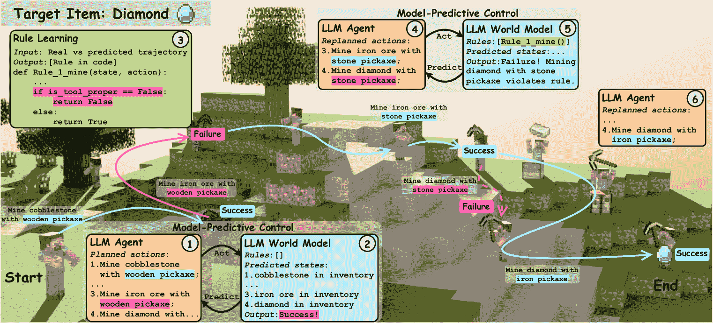
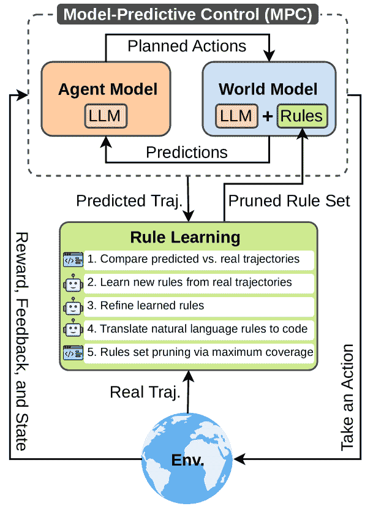
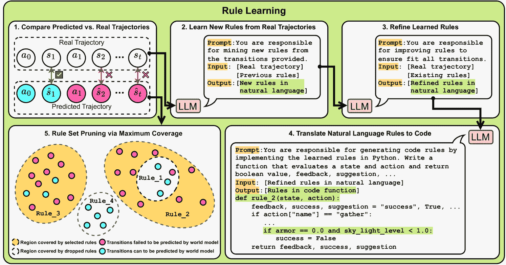
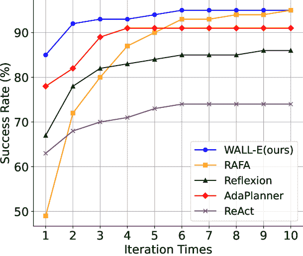
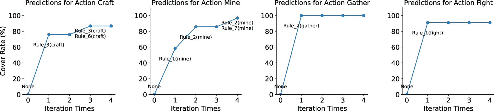
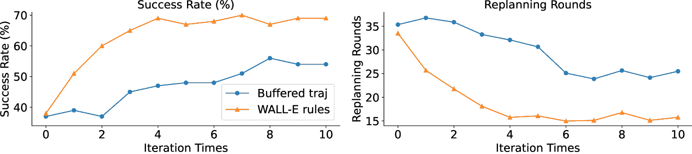

<!--yml

类别：未分类

日期：2025-01-11 12:07:44

-->

# WALL-E：通过规则学习的世界对齐提升基于世界模型的LLM代理

> 来源：[https://arxiv.org/html/2410.07484/](https://arxiv.org/html/2410.07484/)

Siyu Zhou 澳大利亚人工智能研究所，悉尼科技大学工程与信息技术学院 Tianyi Zhou 美国马里兰大学计算机科学系 Yijun Yang 腾讯 Guodong Long 澳大利亚人工智能研究所，悉尼科技大学工程与信息技术学院 Deheng Ye 腾讯 Jing Jiang 澳大利亚人工智能研究所，悉尼科技大学工程与信息技术学院 Chengqi Zhang 澳大利亚人工智能研究所，悉尼科技大学工程与信息技术学院

###### 摘要

大型语言模型（LLM）能否直接作为基于模型的代理的强大世界模型？尽管LLM的先验知识与指定环境的动态之间确实存在差距，但我们的研究表明，这些差距可以通过将LLM与其部署环境对齐来弥合，并且这种“世界对齐”可以通过对LLM进行规则学习来高效实现。考虑到LLM的丰富先验知识，只需几个额外的规则即可使LLM的预测与指定的环境动态对齐。为此，我们提出了一种神经符号方法，通过LLM无梯度地学习这些规则，通过比较代理探索的轨迹和世界模型预测来诱导、更新和修剪规则。最终得到的世界模型由LLM和学习到的规则组成。我们的具身LLM代理“WALL-E”建立在模型预测控制（MPC）之上。通过基于精确世界模型优化前瞻性动作，MPC显著提高了探索和学习效率。与现有的LLM代理相比，WALL-E的推理只需少数几个主要规则，而无需将冗长的缓冲轨迹包含在LLM输入中。在Minecraft和ALFWorld的开放世界挑战中，WALL-E的成功率超过现有方法，同时减少了重新规划时间和推理所使用的tokens数量。在Minecraft中，WALL-E的成功率比基准提高了15-30%，同时减少了8-20轮重新规划，仅使用了60-80%的tokens。在ALFWorld中，其成功率在仅经过6次迭代后飙升至95%的新纪录。

图 1：在 Minecraft 中，WALL-E 挖掘钻石的示意图。步骤 1-2：智能体通过 MPC 使用初始的未对齐世界模型制定计划，导致挖掘铁矿石的动作失败。步骤 3：通过将真实轨迹与世界模型的预测进行比较，WALL-E 学会了一个关键规则：如果工具不适合正在开采的材料，动作将失败。步骤 4-5：学到的规则帮助世界模型做出准确的预测，修正了 MPC 中错误的过渡预测。步骤 6：智能体据此修改计划，用铁镐替换石镐，继续完成任务。

## 1 引言

图 2：WALL-E 概览。智能体的每一步动作由 MPC 控制，其中智能体模型基于 LLM+规则的世界模型预测，在一个前瞻窗口内规划动作。

尽管大型语言模型（LLMs）已成功应用于复杂的推理、生成和规划任务，但它们在特定开放世界环境中作为代理进行部署时，仍然不够可靠，例如在游戏、虚拟现实/增强现实系统、医疗护理、教育、自动驾驶等领域（OpenAI，[2023](https://arxiv.org/html/2410.07484v2#bib.bib23)；Wei 等人，[2022](https://arxiv.org/html/2410.07484v2#bib.bib33)；Liu 等人，[2024](https://arxiv.org/html/2410.07484v2#bib.bib17)）。失败的主要原因是预训练LLM的常识推理与先前知识之间的差距，以及与特定硬编码环境的动态之间的差距，这导致了对未来状态的错误预测、幻觉或LLM代理在决策过程中的基本规律违反（Mu 等人，[2023b](https://arxiv.org/html/2410.07484v2#bib.bib22)；Yang 等人，[2024](https://arxiv.org/html/2410.07484v2#bib.bib41)；Das 等人，[2018](https://arxiv.org/html/2410.07484v2#bib.bib3)；Wu 等人，[2024](https://arxiv.org/html/2410.07484v2#bib.bib36)）。尽管LLM与人类偏好的对齐已经成为LLM后期训练的主要目标之一，但“世界对齐”与环境动态的匹配在构建LLM代理时尚未得到充分研究（Hao 等人，[2023](https://arxiv.org/html/2410.07484v2#bib.bib12)；Rafailov 等人，[2024](https://arxiv.org/html/2410.07484v2#bib.bib25)；Ge 等人，[2024](https://arxiv.org/html/2410.07484v2#bib.bib7)）。此外，许多现有的LLM代理是无模型的，其行为直接在真实环境中执行，而未经在世界模型或模拟器中验证或优化（Mu 等人，[2023b](https://arxiv.org/html/2410.07484v2#bib.bib22)；Yao 等人，[2023](https://arxiv.org/html/2410.07484v2#bib.bib43)；Shinn 等人，[2024](https://arxiv.org/html/2410.07484v2#bib.bib26)；Zitkovich 等人，[2023](https://arxiv.org/html/2410.07484v2#bib.bib48)；Wu 等人，[2023](https://arxiv.org/html/2410.07484v2#bib.bib35)；Micheli & Fleuret，[2021](https://arxiv.org/html/2410.07484v2#bib.bib20)；Brohan 等人，[2022](https://arxiv.org/html/2410.07484v2#bib.bib1)）。这导致了安全风险和生成轨迹的次优性。

在本文中，我们展示了将大型语言模型（LLM）与环境动态对齐是构建有前景的世界模型的必要且至关重要的步骤，这使得我们能够构建更强大的具身智能体。特别地，我们提出了一种神经符号世界模型，它将预训练的LLM与从与环境互动轨迹中学习到的一组新规则结合起来。这种特定形式的世界模型结合了两者在建模环境动态方面的优势，即：(1) LLM的丰富先验知识、概率推理能力和演绎推理能力（Hu & Shu，[2023](https://arxiv.org/html/2410.07484v2#bib.bib13)）；以及(2) 规则强制执行的硬性约束和严格保证（Li et al., [2024a](https://arxiv.org/html/2410.07484v2#bib.bib15)）。尽管为复杂环境创建一个仅包含规则的世界模型具有挑战性，因为规则数量庞大且存在不确定性（Xiao et al., [2021](https://arxiv.org/html/2410.07484v2#bib.bib38)），但在我们的方法中，仅需要少量互补规则就足以将预训练的LLM与特定的环境动态对齐。这是通过简单地将这些规则包括在LLM的提示中，而无需繁琐的训练或推理实现的。相比之下，现有的LLM智能体通常需要通过RL/模仿学习在轨迹数据上对LLM进行昂贵的微调，或进行内存密集型推理，处理长输入上下文的缓冲轨迹（Mu et al., [2023b](https://arxiv.org/html/2410.07484v2#bib.bib22); Gao et al., [2023a](https://arxiv.org/html/2410.07484v2#bib.bib5); Yang et al., [2024](https://arxiv.org/html/2410.07484v2#bib.bib41); Shinn et al., [2024](https://arxiv.org/html/2410.07484v2#bib.bib26)）。

为此，我们提出了“通过规则学习对齐世界（WALL-E）”的方法，该方法通过学习互补规则，利用LLM的归纳推理和代码生成能力来构建神经符号世界模型。具体而言，在每次迭代中，WALL-E与环境进行交互，收集真实轨迹，并将其与世界模型的预测结果进行比较。然后，比较结果由LLM进行分析，LLM提取新的规则或修改现有规则，以提高预测轨迹与真实轨迹之间的一致性。为了保持规则集的最小化，在每次迭代结束时，我们通过解决最大覆盖问题来修剪规则，该问题旨在选择一组规则，最大限度地覆盖LLM在世界模型中未能预测到的轨迹转换（未应用任何规则的情况）。因此，所选规则对LLM的预测结果是互补的。上述规则学习过程会重复多次，直到LLM+规则表现为一个准确的世界模型。

WALL-E所实现的精确世界模型使我们能够为具有挑战性的开放世界任务创造更好的基于模型的LLM代理。然而，LLM代理在复杂环境中的基于模型的强化学习（RL）仍然受到LLM的昂贵探索和微调的限制。本文重新审视了经典的模型预测控制（MPC）思想（Qin & Badgwell, [2003](https://arxiv.org/html/2410.07484v2#bib.bib24); Hafner et al., [2019](https://arxiv.org/html/2410.07484v2#bib.bib9); [2020](https://arxiv.org/html/2410.07484v2#bib.bib10); [2023](https://arxiv.org/html/2410.07484v2#bib.bib11)），与RL相比，MPC不需要训练策略网络，但需要在每一步优化一个前瞻时间窗口的动作。为了减少每步的优化成本，我们将LLM代理作为优化器，通过与WALL-E的世界模型交互，寻找最优的前瞻动作。通过对齐的世界模型和高效的基于LLM的优化器，MPC为开放世界环境中的LLM代理提供了一个更有前景和高效的框架。

我们在具有挑战性的开放世界环境中评估了WALL-E，诸如Minecraft和ALFWorld等任务，代理可以自由探索并完成复杂任务。我们的主要贡献有三方面。

+   •

    我们研究了LLM代理未充分探讨的“世界对齐”挑战。

+   •

    我们提出了一类基于LLM规则学习的创新神经符号世界模型。

+   •

    我们基于模型预测控制（MPC）和神经符号世界模型开发了LLM代理。

## 2 相关工作

近期的研究将LLM与规则学习相结合，以提高推理和泛化能力，涵盖了多种任务，包括数值推理、知识图谱探索和遵循预定义规则（Yang等人，[2023a](https://arxiv.org/html/2410.07484v2#bib.bib40)；Zhu等人，[2023c](https://arxiv.org/html/2410.07484v2#bib.bib47)；Mu等人，[2023a](https://arxiv.org/html/2410.07484v2#bib.bib21)；Yang等人，[2023b](https://arxiv.org/html/2410.07484v2#bib.bib42)；Luo等人，[2023](https://arxiv.org/html/2410.07484v2#bib.bib19)）。然而，现有工作并未专注于将基于LLM的世界模型与动态环境对齐。我们的研究通过应用规则学习，解决了这一问题，旨在提升基于模型的智能体在此类环境中的表现。一些研究也已使用LLM构建世界模型，以通过将自然语言转化为表示或结合LLM与特定任务模块进行任务规划（Wong等人，[2023](https://arxiv.org/html/2410.07484v2#bib.bib34)；Guan等人，[2023](https://arxiv.org/html/2410.07484v2#bib.bib8)；Tang等人，[2024](https://arxiv.org/html/2410.07484v2#bib.bib30)）。与这些方法不同，我们直接将LLM作为世界模型，利用其固有知识来提高灵活性和效率。尽管一些研究使用LLM作为世界模型，通常依赖于微调或人工定义的提示以实现与环境动态的对齐（Xiang等人，[2024](https://arxiv.org/html/2410.07484v2#bib.bib37)；Xie等人，[2024](https://arxiv.org/html/2410.07484v2#bib.bib39)；Zhao等人，[2024](https://arxiv.org/html/2410.07484v2#bib.bib44)；Hao等人，[2023](https://arxiv.org/html/2410.07484v2#bib.bib12)；Liu等人，[2023](https://arxiv.org/html/2410.07484v2#bib.bib18)）。我们的方法通过自动学习规则来推进这一进程，减少人工干预并提高性能。有关相关工作的更详细讨论，请参阅附录[A](https://arxiv.org/html/2410.07484v2#A1 "附录A 详细相关工作 ‣ WALL-E: 通过规则学习对齐世界模型提高基于世界模型的LLM智能体")。

## 3 方法

### 3.1 基于世界模型的LLM智能体的模型预测控制（MPC）

我们考虑一个场景，其中一个LLM，记作$f$，被部署在动态环境中，与智能体在离散时间步骤上进行交互。在每个时间步骤$t$，智能体观察当前状态$s_{t}$，选择动作$a_{t}$，并过渡到下一个状态$s_{t+1}$。这个过渡表示为$\delta_{t}=(s_{t},a_{t},s_{t+1})$。一条轨迹$\tau=(\delta_{0},\delta_{1},\ldots,\delta_{T-1})$由一系列这样的过渡组成，捕捉智能体从初始状态到终止状态在一个回合中的行为。

基于LLM的世界模型$f_{\text{wm}}$根据当前状态和动作预测后续状态$\hat{s}_{t+1}$：

|  | $\hat{s}_{t+1}=f_{\text{wm}}(s_{t},a_{t}),$ |  | (1) |
| --- | --- | --- | --- |

模型预测控制（MPC）是一个广泛认可的基于模型的控制框架。在这个背景下，我们将MPC与基于LLM的世界模型$f_{\text{wm}}$结合，以增强智能体的规划和决策能力，整个框架如图[2](https://arxiv.org/html/2410.07484v2#S1.F2 "Figure 2 ‣ 1 Introduction ‣ WALL-E: World Alignment by Rule Learning Improves World Model-based LLM Agents")所示。目标是在有限的时间范围$H$内确定一个最优的行动序列$a_{t:t+H}$，以最大化期望的累积奖励。在每个时间步$t$，优化问题被表述为：

|  | $a_{t:t+H}^{*}=\arg\max_{a_{t:t+H}}\mathbb{E}\left[\sum_{i=0}^{H}\gamma^{i}% \mathcal{F}(\hat{s}_{t+i+1})\right],$ |  | (2) |
| --- | --- | --- | --- |

其中，$\gamma$是折扣因子，$\mathcal{F}(\hat{s}_{t+i+1})$表示奖励函数。

然而，如果基于LLM的世界模型与实际环境动态不一致，预测的状态$\hat{s}_{t+1}$可能与真实状态$s_{t+1}$不匹配。这种不一致会导致奖励评估错误，从而导致累积奖励估计不准确。因此，推导出的行动序列$a_{t:t+H}^{*}$可能是次优或错误的，导致智能体做出无效的控制决策。因此，解决LLM世界模型与环境真实动态之间的不一致性，对于确保在MPC框架内的最佳性能至关重要。

### 3.2 通过规则学习进行世界对齐（WALL-E）

图3：规则学习的细节。规则学习模块通过将世界模型预测的轨迹与智能体在环境中的实际轨迹进行比较，迭代地优化规则。规则学习分为五个步骤：（1）比较预测轨迹和实际轨迹；（2）从真实轨迹中学习新规则；（3）优化已有规则；（4）将自然语言规则转化为代码；（5）通过解决最大覆盖问题进行规则集修剪。（2）到（4）由LLM处理，而（1）和（5）由程序执行。

在复杂环境中，由于环境的复杂性和随机性，直接预测状态是具有挑战性的。为了解决这个问题，我们的世界模型采用了两阶段方法：首先，它评估行动结果（例如，成功或失败），然后基于行动的成功生成后续的状态信息（提供状态详细信息）：

|  | $\hat{s}_{t+1}=\left(\text{action\_result}_{t+1},\text{state\_info}_{t+1}\right% )=f_{\text{wm}}(s_{t},a_{t}),$ |  | (3) |
| --- | --- | --- | --- |

为了解决 $f_{\text{wm}}$ 与真实环境之间可能的偏差，我们引入了一个规则学习框架，如图 [3](https://arxiv.org/html/2410.07484v2#S3.F3 "Figure 3 ‣ 3.2 World Alignment by Rule Learning (WALL-E) ‣ 3 Method ‣ WALL-E: World Alignment by Rule Learning Improves World Model-based LLM Agents") 所示，并在以下章节中详细说明。学习到的规则将 $f_{\text{wm}}$ 与环境对齐，从而提高状态预测的准确性，并在 MPC 框架中改善代理的性能。

#### 比较预测与真实轨迹。

为了找出 LLM 世界模型与真实环境之间的偏差，我们比较预测和实际下一个状态中的动作结果，重点关注二元的 action_result，而不是详细的 state_info。这样的关注为识别不一致提供了可靠的基础。设预测轨迹为 $\tau^{\text{predicted}}=\{\delta=(s_{t},a_{t},\hat{s}_{t+1})\}_{t=0}^{T}$。然后，我们可以将 $\tau^{\text{predicted}}$ 分为正确和错误的转移集，并纠正错误的 $\hat{s}_{t+1}$（参见图 [3](https://arxiv.org/html/2410.07484v2#S3.F3 "Figure 3 ‣ 3.2 World Alignment by Rule Learning (WALL-E) ‣ 3 Method ‣ WALL-E: World Alignment by Rule Learning Improves World Model-based LLM Agents") 中规则学习的第一步）：

|  | $\displaystyle\mathcal{D}^{\text{correct}}$ | $\displaystyle=\left\{\delta^{\text{correct}}_{t}=(s_{t},a_{t},\hat{s}_{t+1})\;% \middle&#124;\;\hat{s}_{t+1}=s_{t+1}\right\},$ |  | (4) |
| --- | --- | --- | --- | --- |
|  | $\displaystyle\mathcal{D}^{\text{incorrect}}$ | $\displaystyle=\left\{\delta^{\text{incorrect}}_{t}=(s_{t},a_{t},s_{t+1})\;% \middle&#124;\;\hat{s}_{t+1}\neq s_{t+1}\right\},$ |  |

其中 $s_{t+1}$ 是由环境给出的真实状态。然后 $\tau^{\text{predicted}}=\mathcal{D}^{\text{correct}}\cup\mathcal{D}^{\text{% incorrect}}$。通过分析 $\mathcal{D}^{\text{incorrect}}$，我们可以找出模型预测与现实的偏差，突出需要通过额外规则进行修正的领域。

#### 从真实轨迹中学习新规则。

在处理这些偏差之前，我们提示 LLM $f_{\text{gen}}$ 从真实轨迹 $\tau^{\text{real}}$ 中生成新的自然语言规则（参见附录 [B.1](https://arxiv.org/html/2410.07484v2#A2.SS1 "B.1 Learn New Rules from Real Trajectories ‣ Appendix B Detailed Prompt ‣ WALL-E: World Alignment by Rule Learning Improves World Model-based LLM Agents") 获取详细提示）。LLM 被赋予任务设置和状态-动作结构，以推导出新的自然语言规则 $R_{\text{new}}^{\text{NL}}$ 来解释观察到的动态，确保它们与先前的规则 $R_{\text{previous}}^{\text{NL}}$ 区分开来：

|  | $R_{\text{new}}^{\text{NL}}=f_{\text{gen}}(\tau^{\text{real}},R_{\text{previous% }}^{\text{NL}}),$ |  | (5) |
| --- | --- | --- | --- |

#### 精炼学习到的规则。

然后，我们提示LLM根据实际轨迹 $\tau^{\text{real}}$ 更新现有规则（详细提示见附录 [B.2](https://arxiv.org/html/2410.07484v2#A2.SS2 "B.2 Refine Learned Rules ‣ Appendix B Detailed Prompt ‣ WALL-E: World Alignment by Rule Learning Improves World Model-based LLM Agents")）。早期的规则可能由于数据漂移（由有限数据引起）而不准确，因此LLM识别出冲突的规则，并根据需要进行修改或丢弃。当前所有现有规则的集合是 $R_{\text{existing}}^{\text{NL}}=R_{\text{previous}}^{\text{NL}}\cup R_{\text{% new}}^{\text{NL}}$，其中LLM $f_{\text{refine}}$ 使用实际轨迹精炼这些规则：

|  | $R^{\text{NL}}=f_{\text{refine}}(\tau^{\text{real}},R_{\text{existing}}^{\text{% NL}}).$ |  | (6) |
| --- | --- | --- | --- |

#### 将自然语言规则转换为代码。

下一步是将精炼后的自然语言规则 $R^{\text{NL}}$ 转换为可执行的代码。我们提示LLM $f_{\text{code\_gen}}$ 生成基于代码的规则集 $R^{\text{code}}$ （详细提示见附录 [B.3](https://arxiv.org/html/2410.07484v2#A2.SS3 "B.3 Translate Natural Language Rules to Code ‣ Appendix B Detailed Prompt ‣ WALL-E: World Alignment by Rule Learning Improves World Model-based LLM Agents")）：

|  | $R^{\text{code}}=f_{\text{code\_gen}}(R^{\text{NL}}),$ |  | (7) |
| --- | --- | --- | --- |

#### 规则集修剪通过最大覆盖。

在最后一步，为了解决LLM驱动的规则学习过程中固有的不确定性和变异性，我们通过编程验证和精炼规则集，以减少对LLM的依赖。基于代码的规则 $R^{\text{code}}$ 被执行并验证与标记的预测转变 $\tau^{\text{predicted}}$ 是否一致。任何未能正确预测转变的规则都会被丢弃，从而确保仅保留准确有效的规则。

我们通过选择最大化覆盖错误预测转变 $\delta^{\text{incorrect}}_{t}$ 的规则，进一步优化规则集，其中LLM世界模型出现了失败。这种方法将我们的精力集中在纠正LLM与环境之间最显著的不匹配上。我们将此优化问题表述为最大集覆盖问题。$\mathcal{D}^{\text{incorrect}}=\{\delta^{\text{incorrect}}_{1},\delta^{\text{% incorrect}}_{2},\ldots,\delta^{\text{incorrect}}_{n}\}$ 是错误预测转变的集合，而 $R^{\text{code}}=\{R^{\text{code}}_{1},R^{\text{code}}_{2},\ldots,R^{\text{code% }}_{m}\}$ 是基于代码的规则集合。我们的目标是选择一个最小的规则子集，最大化对 $\mathcal{D}^{\text{incorrect}}$ 的覆盖：

|  | $\max_{\bm{x}\in\{0,1\}^{m},\;\bm{y}\in\{0,1\}^{n}}\left\{\sum_{j=1}^{n}y_{j}-% \lambda\sum_{i=1}^{m}x_{i}\ \bigg{&#124;}\ y_{j}\leq\sum_{i=1}^{m}x_{i}a_{ij},\ % \forall j=1,\ldots,n\right\},$ |  | (8) |
| --- | --- | --- | --- |

其中 $x_{i}$ 表示规则 $R^{\text{code}}_{i}$ 是否被选择（$x_{i}=1$）或未被选择（$x_{i}=0$），$y_{j}$ 表示转换 $\delta^{\text{incorrect}}_{j}$ 是否被覆盖（$y_{j}=1$）或未被覆盖（$y_{j}=0$），并且 $a_{ij}=1$ 表示转换 $\delta^{\text{incorrect}}_{j}$ 被规则 $R^{\text{code}}_{i}$ 覆盖，$a_{ij}=0$ 则表示没有覆盖该转换。约束条件确保如果一个转换 $\delta^{\text{incorrect}}_{j}$ 被至少一个选中的规则覆盖，则认为该转换已被覆盖。参数 $\lambda>0$ 平衡了规则数量的最小化和转换覆盖的最大化；我们将 $\lambda$ 设置得非常小，以优先考虑最大化覆盖。我们使用贪心算法求解这个优化问题（参见附录 [F](https://arxiv.org/html/2410.07484v2#A6 "附录 F 贪心算法 ‣ WALL-E: 通过规则学习实现世界对齐，改善基于世界模型的 LLM 代理")）。

通过这一过程，我们剔除了只涵盖正确转换的规则，因为这些规则并未解决不一致问题，同时剔除了被更全面的规则完全覆盖的冗余规则（参见图 [3](https://arxiv.org/html/2410.07484v2#S3.F3 "图 3 ‣ 3.2 通过规则学习实现世界对齐 (WALL-E) ‣ 3 方法 ‣ WALL-E: 通过规则学习实现世界对齐，改善基于世界模型的 LLM 代理") 中规则学习的第 5 步）。这一修剪过程产生了一个高效且有效的规则集，能够纠正 LLM 的不一致。此外，从 $R^{\text{code}}$ 中移除的任何基于代码的规则也会从自然语言规则集 $R^{\text{NL}}$ 中排除。

### 3.3 使用学习到的规则对 LLM 代理进行推理

完成规则学习过程后，我们获得了两种不同形式的规则：自然语言规则 $R^{\text{NL}}$ 和基于代码的规则 $R^{\text{code}}$。这两种类型的规则都增强了 LLM 世界模型在规划框架内预测下一个状态 $\hat{s}_{t+1}$ 的能力：对于自然语言规则，这些规则可以直接嵌入到 LLM 的输入提示中，以引导模型的预测，例如，$\hat{s}_{t+1}=f_{\text{wm}}(s_{t},a_{t},R^{\text{NL}})$。对于基于代码的规则，这些规则在 LLM 生成初步预测后，程序化地应用，例如，$\hat{s}_{t+1}=\text{ApplyRules}(f_{\text{wm}}(s_{t},a_{t}),R^{\text{code}})$。在这里，函数 ApplyRules 起到验证层的作用，如果存在与生成结果相矛盾的激活规则，则会覆盖 LLM 的预测。有关规则激活的更多细节，请参见附录 [G](https://arxiv.org/html/2410.07484v2#A7 "附录 G 基于代码的规则验证逻辑 ‣ WALL-E: 通过规则学习实现世界对齐，改善基于世界模型的 LLM 代理")。

通过整合学习到的规则，调整后的LLM世界模型显著增强了智能体的规划过程。这种对齐使得智能体能够通过两个关键改进，更有效地获得最佳行动序列$a_{t:t+H}$：首先，对齐使得奖励评估$\mathcal{F}(\hat{s}_{t+1})$更加准确，从而提高了在MPC框架下选择最佳行动序列$a_{t:t+H}$的概率。其次，调整后的世界模型配备了学习到的规则，提供了高质量的反馈，帮助智能体有效地完善$a_{t:t+H}$。除了预测行动结果和状态信息外，当预测某个行动可能失败时，它还提供了辅助信息，包括：

+   •

    反馈：基于违反规则的失败情况的文字说明。

+   •

    建议：基于当前状态、已采取的行动和违反的规则，提供纠正措施或改进建议。

当行动失败时，这些信息至关重要，它引导智能体通过探索备选方案或调整策略来修正其行动（请参见附录[D.2](https://arxiv.org/html/2410.07484v2#A4.SS2 "D.2 基于代码的规则 ‣ 附录D 学习的规则 ‣ WALL-E：通过规则学习对齐改善基于世界模型的LLM智能体")中的示例）。

总之，整合学习到的规则提高了LLM世界模型的预测准确性，并提供了可操作的反馈，从而实现了更高效、更适应性强的规划。

## 4 实验

图4：WALL-E与基线模型在ALFWorld基准测试的134个任务上的比较。

我们在开放世界环境中评估了WALL-E的环境建模和任务解决能力，使用了Minecraft（Fan等，[2022](https://arxiv.org/html/2410.07484v2#bib.bib4)）和ALFWorld（Shridhar等，[2020b](https://arxiv.org/html/2410.07484v2#bib.bib28)）基准测试。与最先进（SOTA）的LLM/VLM智能体相比，WALL-E在重新规划时间和推理所需的token使用方面，成功率更高且成本更低。值得注意的是，在Minecraft中，WALL-E的成功率超越基线15%–30%，同时减少了8–20轮重新规划，并且仅使用60%–80%的tokens。在ALFWorld中，它仅在6次迭代后便达到了95%的成功率，远远超过了其他基于规划的方法，如RAFA（Liu等，[2023](https://arxiv.org/html/2410.07484v2#bib.bib18)）。此外，结合我们提出的规则学习方法，WALL-E的成功率比依赖长输入上下文的缓冲轨迹的方法提高了15%。这些亮点展示了WALL-E在复杂开放世界环境中的优越效率和有效性。

### 4.1 实验设置

#### 基准测试。

Minecraft 是一个流行的开放世界环境。我们采用 MineDojo 的 TechTree 任务提供的标准评估流程（Fan 等, [2022](https://arxiv.org/html/2410.07484v2#bib.bib4)）。这些任务可以分为六个难度递增的级别：木材、石材、铁材、黄金、钻石和红石（详见附录 [E.1](https://arxiv.org/html/2410.07484v2#A5.SS1 "E.1 Minecraft ‣ 附录 E 实验详情 ‣ WALL-E：通过规则学习对齐世界，提升基于世界模型的 LLM 代理")）。ALFWorld 是一个虚拟环境，设计为一个基于文本的模拟，在该环境中，代理通过与模拟家庭环境的互动来执行任务（Shridhar 等, [2020b](https://arxiv.org/html/2410.07484v2#bib.bib28)）。该基准测试包含六种不同的任务类型，每种任务要求代理完成一个高级目标，如将冷却过的生菜放置在台面上（详见附录 [E.2](https://arxiv.org/html/2410.07484v2#A5.SS2 "E.2 ALFWorld ‣ 附录 E 实验详情 ‣ WALL-E：通过规则学习对齐世界，提升基于世界模型的 LLM 代理")）。

#### 指标。

(1) 成功率（越高越好）：代理成功完成任务的百分比。 (2) 重新规划轮次（越低越好）：代理重新访问相同任务并修改计划以恢复失败的任务规划的次数。 (3) 令牌消耗（越低越好）：LLM 代理/世界模型在任务完成过程中消耗的令牌数量。对于 Minecraft，我们从每个级别选择四个任务作为测试集，其余任务作为训练集。所有这三项指标都在我们的实验中使用。如果代理在环境中死亡（如被敌对生物杀死或掉入岩浆）或达到以下任意最大预算：10分钟时间限制和最大重新规划轮次，任务将被标记为未完成。在这种情况下，重新规划轮次和令牌消耗将设置为最大值。对于 ALFWorld，我们在指定的训练集上训练 WALL-E，并在一组 134 个预定义的测试任务上评估其性能。多个试验的平均成功率作为评估指标，用于衡量所有基准方法的性能。

### 4.2 主要结果

表 1：WALL-E 与基准方法在 Minecraft 任务中的成功率（%）和重新规划轮次的比较。$*$- 在先前的工作中报告。VLMs = 视觉-语言模型，LLMs = 大型语言模型。每个任务的最佳成绩以粗体突出显示。WALL-E 显著超过了其他最先进的 LLM/VLM 代理，是唯一一个在 Minedojo 基准测试中表现超过人类玩家的方法。

| 方法 | 成功率（%）$\uparrow$（重新规划轮次$\downarrow$） |
| --- | --- |
| 平均 | 木材 | 石材 | 铁材 | 黄金 | 钻石 | 红石 |
| VLMs | GPT-4V* (Li 等, [2024b](https://arxiv.org/html/2410.07484v2#bib.bib16)) | 10(-) | 41(-) | 21(-) | 0(-) | 0(-) | 0(-) | 0(-) |
| Jarvis-1* (王等人，[2023b](https://arxiv.org/html/2410.07484v2#bib.bib32)) | 42(-) | 94(-) | 89(-) | 36(-) | 7(-) | 9(-) | 16(-) |
| Optimus-1* (李等人，[2024b](https://arxiv.org/html/2410.07484v2#bib.bib16)) | 47(-) | 99(-) | 92(-) | 47(-) | 9(-) | 12(-) | 25(-) |
| LLMs | GPT-3.5* (李等人，[2024b](https://arxiv.org/html/2410.07484v2#bib.bib16)) | 10(-) | 40(-) | 20(-) | 0(-) | 0(-) | 0(-) | 0(-) |
| DEPS (王等人，[2023a](https://arxiv.org/html/2410.07484v2#bib.bib31)) | 37(35.36) | 83(10.67) | 41(33.26) | 33(35.27) | 22(45.29) | 24(42.46) | 17(45.22) |
| GITM (朱等人，[2023b](https://arxiv.org/html/2410.07484v2#bib.bib46)) | 54(25.49) | 96(3.42) | 92(6.01) | 57(23.93) | 29(37.17) | 30(39.80) | 22(42.63) |
| WALL-E 无 WM | 61(23.13) | 94(5.04) | 89(9.58) | 67(18.56) | 33(39.67) | 41(32.73) | 43(33.21) |
| WALL-E (我们的) | 69(15.77) | 98(1.64) | 91(4.58) | 63(19.38) | 69(15.61) | 46(27.08) | 48(26.33) |
| 人类表现* (李等人，[2024b](https://arxiv.org/html/2410.07484v2#bib.bib16)) | 59(-) | 100(-) | 100(-) | 86(-) | 17(-) | 17(-) | 33(-) |

表2：WALL-E与基准方法在Minecraft任务中的比较，涉及平均令牌使用和API成本（以美元计）。令牌数量是通过计算提示令牌和生成令牌的总和得到的。平均API成本是通过分别计算提示令牌和生成令牌的成本，然后将两者相加得到的。每个任务的最低成本已用粗体标出。

| 方法 | 推理令牌 $\downarrow$ (成本以美元 $\downarrow$) |
| --- | --- |
| 平均 | 木材 | 石材 | 铁 | 金 | 钻石 | 红石 |
| --- | --- | --- | --- | --- | --- | --- |
| DEPS | 93560.95(0.65) | 28223.33(0.20) | 87999.46(0.61) | 93313.38(0.65) | 119827.88(0.84) | 112346.49(0.79) | 119655.16(0.84) |
| GITM | 74638.54(0.51) | 10027.71(0.07) | 17566.79(0.12) | 70071.99(0.48) | 108816.53(0.74) | 116526.40(0.80) | 124821.83(0.85) |
| WALL-E 无 WM | 72390.16(0.52) | 15759.72(0.11) | 29976.28(0.21) | 58074.70(0.41) | 124147.71(0.89) | 102447.94(0.73) | 103934.58(0.74) |
| WALL-E (我们的) | 60348.71(0.41) | 23179.52(0.15) | 36595.33(0.24) | 57106.20(0.39) | 84776.25(0.58) | 59261.31(0.40) | 101173.64(0.68) |

我们在表格[1](https://arxiv.org/html/2410.07484v2#S4.T1 "表1 ‣ 4.2 主要结果 ‣ 4 实验 ‣ WALL-E: 通过规则学习对齐世界，改进基于世界模型的LLM代理")，[2](https://arxiv.org/html/2410.07484v2#S4.T2 "表2 ‣ 4.2 主要结果 ‣ 4 实验 ‣ WALL-E: 通过规则学习对齐世界，改进基于世界模型的LLM代理")和[3](https://arxiv.org/html/2410.07484v2#S4.T3 "表3 ‣ 4.2 主要结果 ‣ 4 实验 ‣ WALL-E: 通过规则学习对齐世界，改进基于世界模型的LLM代理")中，详细比较了WALL-E与现有基准方法，展示了其在成功率、规划效率和LLM在各种任务中消耗的令牌成本方面的优越性能。

WALL-E展示了卓越的规划和任务解决能力。表[1](https://arxiv.org/html/2410.07484v2#S4.T1 "Table 1 ‣ 4.2 Main Results ‣ 4 Experiments ‣ WALL-E: World Alignment by Rule Learning Improves World Model-based LLM Agents")和[3](https://arxiv.org/html/2410.07484v2#S4.T3 "Table 3 ‣ 4.2 Main Results ‣ 4 Experiments ‣ WALL-E: World Alignment by Rule Learning Improves World Model-based LLM Agents")显示，我们的方法在不同环境中取得了最高的成功率。具体来说，在Minecraft环境中，WALL-E比其他基线方法表现出令人印象深刻的优势，达到15%到30%的提升。图[4](https://arxiv.org/html/2410.07484v2#S4.F4 "Figure 4 ‣ 4 Experiments ‣ WALL-E: World Alignment by Rule Learning Improves World Model-based LLM Agents")显示，WALL-E在仅经过6次迭代后就达到了最高的成功率，显著超过了其他基于SOTA规划的基线方法，如RAFA（Hao等，[2023](https://arxiv.org/html/2410.07484v2#bib.bib12)）和AdaPlanner（Sun等，[2024](https://arxiv.org/html/2410.07484v2#bib.bib29)）。

对齐的世界模型能够提高样本效率。尽管与无模型方法相比，集成LLM世界模型会增加额外的token开销，但WALL-E展示了显著较高的样本效率，足以抵消世界建模所带来的额外消耗。具体而言，我们的方法比其他基线方法少需要8至20轮的重新规划（见表[1](https://arxiv.org/html/2410.07484v2#S4.T1 "Table 1 ‣ 4.2 Main Results ‣ 4 Experiments ‣ WALL-E: World Alignment by Rule Learning Improves World Model-based LLM Agents")），因此总体token使用量仅为其他方法的60%至80%（见表[2](https://arxiv.org/html/2410.07484v2#S4.T2 "Table 2 ‣ 4.2 Main Results ‣ 4 Experiments ‣ WALL-E: World Alignment by Rule Learning Improves World Model-based LLM Agents")）。值得注意的是，WALL-E的优势在更复杂的环境中更为显著。反之，无模型方法只能在像Wood和Stone这样简单的任务中实现相对较高的样本效率。

WALL-E是一种通用且与环境无关的方法。与专门针对特定环境的方法不同，例如GITM（Zhu等，[2023b](https://arxiv.org/html/2410.07484v2#bib.bib46)）用于Minecraft中的开放世界探索，或BUTLER（Micheli & Fleuret，[2021](https://arxiv.org/html/2410.07484v2#bib.bib20)）用于ALFWorld中的长时间规划，WALL-E在这两者中均表现出色，强调了其通用性和在增强代理在一般复杂场景中进行探索、规划和反思能力方面的有效性。

表3：WALL-E与基线方法在ALFWorld基准中134个测试任务上的比较。$*$-在先前的工作中报告。VLMs = 视觉-语言模型，LLMs = 大型语言模型。成功率（%）表示成功完成任务的百分比。每个任务的最佳得分以**粗体**突出显示。

| 方法 | 成功率 (%) $\uparrow$ |
| --- | --- |
| 平均 | 挑选 | 清洁 | 加热 | 冷却 | 检查 | 挑选二 |
| VLMs | MiniGPT-4* (朱等人, [2023a](https://arxiv.org/html/2410.07484v2#bib.bib45)) | 16 | 4 | 0 | 19 | 17 | 67 | 6 |
| BLIP-2* (李等人, [2023](https://arxiv.org/html/2410.07484v2#bib.bib14)) | 4 | 0 | 6 | 4 | 11 | 6 | 0 |
| LLaMA-Adapter* (高等人, [2023b](https://arxiv.org/html/2410.07484v2#bib.bib6)) | 13 | 17 | 10 | 27 | 22 | 0 | 0 |
| InstructBLIP* (戴等人, [2023](https://arxiv.org/html/2410.07484v2#bib.bib2)) | 22 | 50 | 26 | 23 | 6 | 17 | 0 |
| EMMA* (杨等人, [2024](https://arxiv.org/html/2410.07484v2#bib.bib41)) | 82 | 71 | 94 | 85 | 83 | 88 | 67 |
| LLMs | BUTLER* (米凯利 & 弗勒雷, [2021](https://arxiv.org/html/2410.07484v2#bib.bib20)) | 26 | 31 | 41 | 60 | 27 | 12 | 29 |
| GPT-BUTLER* (米凯利 & 弗勒雷, [2021](https://arxiv.org/html/2410.07484v2#bib.bib20)) | 69 | 62 | 81 | 85 | 78 | 50 | 47 |
| DEPS (王等人, [2023a](https://arxiv.org/html/2410.07484v2#bib.bib31)) | 76 | 93 | 50 | 80 | 100 | 100 | 0 |
| AutoGen* (吴等人, [2023](https://arxiv.org/html/2410.07484v2#bib.bib35)) | 77 | 92 | 74 | 78 | 86 | 83 | 41 |
| ReAct (姚等人, [2023](https://arxiv.org/html/2410.07484v2#bib.bib43)) | 74 | 79 | 54 | 96 | 85 | 83 | 51 |
| AdaPlanner (孙等人, [2024](https://arxiv.org/html/2410.07484v2#bib.bib29)) | 91 | 100 | 100 | 89 | 100 | 97 | 47 |
| Reflexion (Shinn 等人, [2024](https://arxiv.org/html/2410.07484v2#bib.bib26)) | 86 | 92 | 94 | 70 | 81 | 90 | 88 |
| RAFA (刘等人, [2023](https://arxiv.org/html/2410.07484v2#bib.bib18)) | 95 | 100 | 97 | 91 | 95 | 100 | 82 |
| WALL-E（我们的方法） | 95 | 100 | 97 | 100 | 86 | 85 | 100 |
| 人类表现* (Shirdhar 等人, [2020a](https://arxiv.org/html/2410.07484v2#bib.bib27)) | 91 | - | - | - | - | - | - |

### 4.3 规则学习的有效性

为了展示我们提出的规则学习方法的有效性，我们进行了与 GITM (朱等人, [2023b](https://arxiv.org/html/2410.07484v2#bib.bib46)) 的比较研究——该方法使用缓冲的轨迹作为上下文示例，以对齐 LLM 代理与环境动态。通过联合审查规则学习过程（图 [5](https://arxiv.org/html/2410.07484v2#S4.F5 "图 5 ‣ 4.3 规则学习的有效性 ‣ 4 实验 ‣ WALL-E：通过规则学习提升世界模型的 LLM 代理")) 和代理的训练进度（图 [6](https://arxiv.org/html/2410.07484v2#S4.F6 "图 6 ‣ 4.3 规则学习的有效性 ‣ 4 实验 ‣ WALL-E：通过规则学习提升世界模型的 LLM 代理")），我们观察到一个有趣的现象：WALL-E 的成功率在 4 次迭代后达到了上限，而规则学习过程也为 LLM 世界模型找到了一个紧凑的规则集，并且在 4 次迭代后保持该规则集不变，反映出 WALL-E 的改进主要得益于新规则的学习。

规则学习实现了高效的“世界对齐”。为了验证所学规则是否能使世界模型更加准确，我们首先收集一个包含LLM世界模型无法正确预测的转移数据集，并通过计算覆盖率来评估每条规则在该数据集上的表现——即LLM预测失败的情况下，规则在规则学习过程中解决这些问题的概率。根据图[5](https://arxiv.org/html/2410.07484v2#S4.F5 "图 5 ‣ 4.3 规则学习的有效性 ‣ 4 实验 ‣ WALL-E：通过规则学习实现世界对齐提升世界模型基础的LLM代理")，显而易见，我们提出的框架所学的规则在Minedojo基准测试中的不同类型动作上始终提高了覆盖率。具体而言，像收集和战斗这样的动作在第一次迭代后达到了100%和91%的覆盖率，而制作和采矿动作则在多次迭代中显示出改进，最终的覆盖率分别为87%和96%。

图5：LLM预测失败的覆盖率在不同动作类型和迭代次数中的变化。覆盖率表示LLM预测失败时，通过规则学习过程获得的规则解决这些问题的概率。预测和规则按动作类型分类：制作、采矿、收集和战斗。每次迭代学习的规则以黑色显示在每个节点下，并标注其对应的规则ID。

图6：规则学习（例如WALL-E）与缓冲轨迹（例如GITM）在Minecraft任务训练中10次迭代的学习曲线对比。左图显示了所有任务的平均成功率（%），值越高表示成功完成的任务越多。右图展示了平均重新规划轮次，轮次越少表示任务完成的效率越高。

### 4.4 消融研究

我们进行了一项全面的消融研究，以评估WALL-E中各个组件的重要性。具体而言，我们分别去除学习到的规则和世界模型，并检查它们对WALL-E最终表现的影响。根据表格[4](https://arxiv.org/html/2410.07484v2#S4.T4 "表格4 ‣ 4.4 消融研究 ‣ 4 实验 ‣ WALL-E：通过规则学习的世界对齐提升了基于世界模型的LLM代理")中的结果，我们得出了以下结论。(1) 无论学习到的规则是在代理内还是在世界模型中应用，添加规则都会显著提高整体性能。成功率大约提高了20%到30%。这一观察结果突显了规则在提升WALL-E有效性方面的重要作用。(2) 当学习到的规则应用于世界模型时，它们有助于将成功率提高近30%，而将规则应用于代理时，成功率提高约为20%。这一差异可能主要是由于学习到的规则与状态信息高度相关（更多细节请参见附录[D](https://arxiv.org/html/2410.07484v2#A4 "附录D 学习到的规则 ‣ WALL-E：通过规则学习的世界对齐提升了基于世界模型的LLM代理")）。(3) 使用不应用任何规则的世界模型的MPC，无法显著提高WALL-E的性能，尤其是在成功率和重规划次数方面。这个发现表明，通过规则学习实现的世界模型与环境动态的对齐，对于我们的优秀结果至关重要。

表格4：WALL-E在Minecraft任务上不同配置的消融研究，格式为“成功率（重规划轮次）”。成功率（%）指成功完成任务的比例（越高越好）。重规划轮次（越低越好）衡量推理效率，表示代理完成任务所需的修订次数。灰色高亮的行表示WALL-E的配置和性能。

| WALL-E | 成功率 (%) $\uparrow$（重规划轮次 $\downarrow$） |
| --- | --- |
| 代理 | 世界模型 | 平均值 | 木材 | 石材 | 铁 | 黄金 | 钻石 | 红石 |
| --- | --- | --- | --- | --- | --- | --- | --- | --- |
| LLM | - | 37(35.36) | 83(10.67) | 41(33.26) | 33(35.27) | 22(45.29) | 24(42.46) | 17(45.22) |
| LLM | LLM | 38(33.53) | 86(10.35) | 44(30.79) | 35(34.08) | 19(43.99) | 26(39.51) | 19(42.46) |
| LLM+规则 | - | 61(23.13) | 94(5.04) | 89(9.58) | 67(18.56) | 33(39.67) | 41(32.73) | 43(33.21) |
| LLM | LLM+规则 | 69(15.77) | 98(1.64) | 91(4.58) | 63(19.38) | 69(15.61) | 46(27.08) | 48(26.33) |
| LLM+规则 | LLM+规则 | 67(16.59) | 95(2.88) | 93(3.75) | 58(21.42) | 62(19.34) | 53(23.75) | 43(28.41) |

## 5 结论

我们已经证明，当通过规则学习将大语言模型与环境动态对齐时，大语言模型可以有效地作为代理的世界模型。我们的神经符号方法弥合了大语言模型的先验知识与特定环境之间的差距，而无需梯度更新。通过将增强规则的大语言模型与模型预测控制 (MPC) 集成，我们的代理 WALL-E 展现了卓越的规划和任务解决能力。实验表明，WALL-E 在 Minecraft 和 ALFWorld 中超过了基线，成功率更高，重新规划轮次更少，令牌使用量减少。具体而言，WALL-E 在 Minecraft 中的成功率提高了 15–30%，需要 8–20 次更少的重新规划轮次，使用的令牌仅为基线的 60–80%。在 ALFWorld 中，从第 6 次迭代开始，它迅速达到了 95% 的成功率。规则学习在第 4 次迭代时迅速收敛，在效率和效果上均优于缓冲轨迹方法。这些结果表明，最少的额外规则就足以将大语言模型的预测与环境动态对齐，从而提升模型驱动的代理在复杂环境中的表现。

## 参考文献

+   Brohan 等人 (2022) Anthony Brohan, Noah Brown, Justice Carbajal, Yevgen Chebotar, Joseph Dabis, Chelsea Finn, Keerthana Gopalakrishnan, Karol Hausman, Alex Herzog, Jasmine Hsu 等. Rt-1: 用于大规模实际控制的机器人变换器. *arXiv 预印本 arXiv:2212.06817*, 2022.

+   Dai 等人 (2023) Wenliang Dai, Junnan Li, Dongxu Li, Anthony Tiong, Junqi Zhao, Weisheng Wang, Boyang Li, Pascale Fung, 和 Steven Hoi. InstructBLIP: 面向具有指令调优的通用视觉-语言模型. 载于 *NeurIPS*, 2023.

+   Das 等人 (2018) Abhishek Das, Samyak Datta, Georgia Gkioxari, Stefan Lee, Devi Parikh, 和 Dhruv Batra. 具象问题回答. 载于 *CVPR*, 2018.

+   Fan 等人 (2022) Linxi Fan, Guanzhi Wang, Yunfan Jiang, Ajay Mandlekar, Yuncong Yang, Haoyi Zhu, Andrew Tang, De-An Huang, Yuke Zhu, 和 Anima Anandkumar. Minedojo: 构建具有互联网规模知识的开放式具象代理. *NeurIPS*, 2022.

+   Gao 等人 (2023a) Jensen Gao, Bidipta Sarkar, Fei Xia, Ted Xiao, Jiajun Wu, Brian Ichter, Anirudha Majumdar, 和 Dorsa Sadigh. 物理基础的视觉-语言模型用于机器人操作. *arXiv 预印本 arXiv:2309.02561*, 2023a.

+   Gao 等人 (2023b) Peng Gao, Jiaming Han, Renrui Zhang, Ziyi Lin, Shijie Geng, Aojun Zhou, Wei Zhang, Pan Lu, Conghui He, Xiangyu Yue 等. Llama-adapter v2: 参数高效的视觉指令模型. *arXiv 预印本 arXiv:2304.15010*, 2023b.

+   Ge 等人 (2024) Zhiqi Ge, Hongzhe Huang, Mingze Zhou, Juncheng Li, Guoming Wang, Siliang Tang, 和 Yueting Zhuang. Worldgpt: 赋能大语言模型作为多模态世界模型. *arXiv 预印本 arXiv:2404.18202*, 2024.

+   Guan 等人 (2023) Lin Guan, Karthik Valmeekam, Sarath Sreedharan, 和 Subbarao Kambhampati. 利用预训练的大型语言模型构建和使用世界模型进行基于模型的任务规划. *NeurIPS*, 2023.

+   哈夫纳等（2019）丹尼贾尔·哈夫纳、蒂莫西·利利克拉普、吉米·巴和穆罕默德·诺鲁齐。《梦想控制：通过潜在想象学习行为》。*arXiv预印本 arXiv:1912.01603*，2019年。

+   哈夫纳等（2020）丹尼贾尔·哈夫纳、蒂莫西·利利克拉普、穆罕默德·诺鲁齐和吉米·巴。《用离散世界模型掌握Atari游戏》。*arXiv预印本 arXiv:2010.02193*，2020年。

+   哈夫纳等（2023）丹尼贾尔·哈夫纳、尤尔吉斯·帕苏科尼斯、吉米·巴和蒂莫西·利利克拉普。《通过世界模型掌握多种领域》。*arXiv预印本 arXiv:2301.04104*，2023年。

+   郝世博等（2023）郝世博、顾毅、马浩迪、洪家华、王震、王哲、胡志婷。《用语言模型推理即是用世界模型规划》。*arXiv预印本 arXiv:2305.14992*，2023年。

+   胡志婷 & 舒天敏（2023）胡志婷和舒天敏。《语言模型、智能体模型与世界模型：机器推理与规划的规律》。*arXiv预印本 arXiv:2312.05230*，2023年。

+   李俊楠等（2023）李俊楠、李东旭、西尔维奥·萨瓦雷塞和史蒂文·霍伊。《Blip-2：通过冻结的图像编码器和大型语言模型引导语言-图像预训练》。在*ICML*，2023年。

+   李名等（2024a）李名、陈涵、王成光、邓阮宁、李典琪和周天怡。《Ruler：通过基于规则的数据回收提高大型语言模型的可控性》。*arXiv预印本 arXiv:2406.15938*，2024年。

+   李在晶等（2024b）李在晶、谢宇全、邵锐、陈功伟、姜东梅和聂立强。《Optimus-1：混合多模态记忆增强型智能体在长期任务中的卓越表现》。*arXiv预印本 arXiv:2408.03615*，2024年。

+   刘阳等（2024）刘阳、陈维星、白永杰、罗晶洲、宋新帅、蒋凯轩、李志达、赵干龙、林俊毅、李冠斌等。《将网络空间与物理世界对齐：关于具象化AI的全面调查》。*arXiv预印本 arXiv:2407.06886*，2024年。

+   刘智涵等（2023）刘智涵、胡昊、张深奥、郭洪毅、柯树琦、刘博艺和王兆然。《为未来推理，为当下行动：具有可证明样本效率的自主大型语言模型智能体的原则框架》。*arXiv预印本 arXiv:2309.17382*，2023年。

+   罗琳浩等（2023）罗琳浩、聚家鑫、熊博、李元芳、戈拉姆雷扎·哈法里和潘士睿。《Chatrule：利用大型语言模型挖掘逻辑规则进行知识图谱推理》。*arXiv预印本 arXiv:2309.01538*，2023年。

+   米凯利 & 弗勒雷（2021）文森特·米凯利和弗朗索瓦·弗勒雷。《语言模型是少量示例的管家》。*arXiv预印本 arXiv:2104.07972*，2021年。

+   慕诺曼等（2023a）慕诺曼、陈莎莎、王子凡、陈思哲、大卫·卡拉马尔迪安、卢尔瓦·阿尔贾拉伊西、丹·亨德里克斯和大卫·瓦格纳。《大型语言模型能遵循简单规则吗？》*arXiv预印本 arXiv:2311.04235*，2023年。

+   慕耀等（2023b）慕耀、张庆龙、胡梦康、王文海、丁铭宇、金俊、王斌、戴季峰、乔宇和罗平。《Embodiedgpt：通过具象化思维链进行视觉-语言预训练》。*arXiv预印本 arXiv:2305.15021*，2023年。

+   OpenAI（2023）OpenAI。《GPT-4技术报告》。*arXiv预印本 arXiv.2303.08774*，2023年。

+   秦与Badgwell（2003）S Joe Qin 和 Thomas A Badgwell。工业模型预测控制技术调查。*控制工程实践*，11(7)：733–764，2003。

+   Rafailov 等人（2024）Rafael Rafailov, Archit Sharma, Eric Mitchell, Christopher D Manning, Stefano Ermon, 和 Chelsea Finn。直接偏好优化：你的语言模型实际上是一个奖励模型。*NeurIPS*，2024。

+   Shinn 等人（2024）Noah Shinn, Federico Cassano, Ashwin Gopinath, Karthik Narasimhan, 和 Shunyu Yao。Reflexion：具有语言强化学习的语言代理。*NeurIPS*，2024。

+   Shridhar 等人（2020a）Mohit Shridhar, Jesse Thomason, Daniel Gordon, Yonatan Bisk, Winson Han, Roozbeh Mottaghi, Luke Zettlemoyer, 和 Dieter Fox。ALFRED：一个用于解释日常任务中的有意义指令的基准。在 *CVPR*，2020a。

+   Shridhar 等人（2020b）Mohit Shridhar, Xingdi Yuan, Marc-Alexandre Côté, Yonatan Bisk, Adam Trischler, 和 Matthew Hausknecht。Alfworld：为交互式学习对齐文本和具身环境。*arXiv 预印本 arXiv:2010.03768*，2020b。

+   孙等人（2024）Haotian Sun, Yuchen Zhuang, Lingkai Kong, Bo Dai, 和 Chao Zhang。Adaplanner：通过语言模型从反馈中进行自适应规划。*NeurIPS*，2024。

+   唐等人（2024）Hao Tang, Darren Key, 和 Kevin Ellis。Worldcoder，一个基于模型的 LLM 代理：通过编写代码和与环境互动构建世界模型。*arXiv 预印本 arXiv:2402.12275*，2024。

+   王等人（2023a）Zihao Wang, Shaofei Cai, Guanzhou Chen, Anji Liu, Xiaojian Ma, Yitao Liang, 和 Team CraftJarvis。描述、解释、规划和选择：与大型语言模型的交互式规划使得开放世界多任务代理成为可能。在 *NeurIPS*，2023a。

+   王等人（2023b）Zihao Wang, Shaofei Cai, Anji Liu, Yonggang Jin, Jinbing Hou, Bowei Zhang, Haowei Lin, Zhaofeng He, Zilong Zheng, Yaodong Yang 等人。Jarvis-1：具有记忆增强多模态语言模型的开放世界多任务代理。*arXiv 预印本 arXiv:2311.05997*，2023b。

+   魏等人（2022）Jason Wei, Xuezhi Wang, Dale Schuurmans, Maarten Bosma, Brian Ichter, Fei Xia, Ed H. Chi, Quoc V. Le, 和 Denny Zhou。链式思维提示引发大规模语言模型的推理能力。在 *NeurIPS*，2022。

+   王等人（2023）Lionel Wong, Jiayuan Mao, Pratyusha Sharma, Zachary S Siegel, Jiahai Feng, Noa Korneev, Joshua B Tenenbaum, 和 Jacob Andreas。通过自然语言指导学习自适应规划表示。*arXiv 预印本 arXiv:2312.08566*，2023。

+   吴等人（2023）Qingyun Wu, Gagan Bansal, Jieyu Zhang, Yiran Wu, Shaokun Zhang, Erkang Zhu, Beibin Li, Li Jiang, Xiaoyun Zhang, 和 Chi Wang。Autogen：通过多代理对话框架启用下一代 LLM 应用。*arXiv 预印本 arXiv:2308.08155*，2023。

+   Wu et al. (2024) 吴熙阳、关天瑞、李典琪、黄帅一、刘晓宇、王西君、谢瑞奇、阿比纳夫·施里瓦斯塔瓦、黄福荣、乔丹·李·博伊德-格雷伯等。Autohallusion：自动生成视觉-语言模型的幻觉基准。*arXiv 预印本 arXiv:2406.10900*，2024。

+   Xiang et al. (2024) 向佳楠、陶天华、顾怡、舒天敏、王子瑞、杨子超和胡志廷。语言模型遇到世界模型：具身经验增强语言模型。*NeurIPS*，2024。

+   Xiao et al. (2021) 肖伟、梅尔迪普尔·努欣、安妮·科林、阿米泰·Y·宾-纳恩、埃米利奥·弗拉佐利、拉德布德·杜因特杰·特本斯和卡林·贝尔塔。基于规则的最优控制在自动驾驶中的应用。发表于*ACM/IEEE第12届国际网络物理系统大会论文集*，第143–154页，2021。

+   Xie et al. (2024) 谢凯歌、杨恩、约翰·古内利和马克·里德尔。将大型语言模型转化为世界模型，通过前置条件和效应知识。*arXiv 预印本 arXiv:2409.12278*，2024。

+   Yang et al. (2023a) 杨文凯、林彦凯、周杰和温基荣。使大型语言模型能够从规则中学习。*arXiv 预印本 arXiv:2311.08883*，2023a。

+   Yang et al. (2024) 杨奕君、周天翼、李侃雪、陶大鹏、李路松、沈丽、何晓东、蒋晶和施宇辉。由大型语言模型从平行文本世界中训练的具身多模态智能体。发表于*CVPR*，2024。

+   Yang et al. (2023b) 杨泽源、李鹏和刘杨。失败铺路：通过无调优规则积累增强大型语言模型。*arXiv 预印本 arXiv:2310.15746*，2023b。

+   Yao et al. (2023) 姚顺宇、赵杰富、余典、杜楠、伊扎克·沙夫兰、卡尔蒂克·纳拉西姆汉和曹源。React：在语言模型中协同推理与行动。发表于*ICLR*，2023。

+   Zhao et al. (2024) 赵子瑞、李伟孙和许大为。将大型语言模型作为常识知识用于大规模任务规划。*NeurIPS*，2024。

+   Zhu et al. (2023a) 朱德耀、陈俊、沈晓倩、李翔和穆罕默德·埃尔霍赛尼。Minigpt-4：通过先进的大型语言模型增强视觉-语言理解。*arXiv 预印本 arXiv:2304.10592*，2023a。

+   Zhu et al. (2023b) 朱熙舟、陈云涛、田浩、陶晨鑫、苏维杰、杨晨宇、黄高、李彬、卢乐伟、王晓刚等。Minecraft中的鬼魂：通过具有基于文本的知识和记忆的大型语言模型，开发用于开放世界环境的通用智能体。*arXiv 预印本 arXiv:2305.17144*，2023b。

+   Zhu et al. (2023c) 朱兆成、薛元、陈欣云、周登宇、唐健、D. 施尔曼斯和戴汉俊。大型语言模型可以学习规则。*arXiv 预印本 arXiv:2310.07064*，2023c。

+   Zitkovich et al. (2023) 布里安娜·齐特科维奇、于天赫、徐思春、徐鹏、肖特、夏飞、吴佳林、保罗·沃尔哈特、斯特凡·韦尔克、艾扎恩·瓦希德等。Rt-2：视觉-语言-行动模型将网络知识转移到机器人控制中。发表于*CoRL*，2023。

## 附录A 详细相关工作

#### LLMs 与规则学习。

最近的研究探讨了将LLM与规则学习相结合，以增强推理和模型行为。例如，Yang等人（[2023a](https://arxiv.org/html/2410.07484v2#bib.bib40)）提出了规则蒸馏，使LLM能够从预定义的规则中学习，从而在有限的训练数据下提高泛化能力。类似地，Zhu等人（[2023c](https://arxiv.org/html/2410.07484v2#bib.bib47)）提出了假设到理论（HtT）框架，通过从训练数据中生成和验证规则，提升了数值和关系推理能力。与此类似，Mu等人（[2023a](https://arxiv.org/html/2410.07484v2#bib.bib21)）开发了RuLES框架，用于评估LLM对开发者指定规则的遵守情况，解决了如通过对抗性输入规避规则等挑战。此外，Yang等人（[2023b](https://arxiv.org/html/2410.07484v2#bib.bib42)）提出了无调优规则积累（TRAN）框架，允许LLM从错误案例中积累规则，避免重复错误，而无需额外的调优。最后，在知识图谱推理方面，Luo等人（[2023](https://arxiv.org/html/2410.07484v2#bib.bib19)）介绍了ChatRule，一个使用LLM在知识图谱上挖掘逻辑规则的框架。

这些研究展示了将LLM与规则学习结合的潜力，从而提高推理能力和泛化能力。然而，至今尚未有研究将规则学习与基于LLM的世界模型结合起来，这是我们工作的重点。我们探讨了规则学习如何使LLM世界模型与特定环境动态对齐，从而提高基于模型的智能体在动态环境中的表现。

#### 使用LLM构建世界模型。

许多研究已经利用LLM构建世界模型进行规划。例如，Wong等人（[2023](https://arxiv.org/html/2410.07484v2#bib.bib34)）提出了通过LLM将自然语言指令转换为可适应的规划表示，从而实现灵活且具上下文感知的世界建模。类似地，Guan等人（[2023](https://arxiv.org/html/2410.07484v2#bib.bib8)）展示了将预训练LLM与任务特定的规划模块相结合，提供对环境更详细的理解，从而提高任务成功率。另一种方法，WorldCoder，由Tang等人（[2024](https://arxiv.org/html/2410.07484v2#bib.bib30)）提出，展示了一种LLM智能体，该智能体通过生成和执行代码来构建世界模型，模拟各种状态和动作，并通过迭代方式改进其理解。

这些研究展示了LLM在构建世界模型中的实用性，旨在提升复杂环境中的规划和推理能力。然而，与这些研究不同，我们的方法直接将LLM作为世界模型，利用其固有的知识和推理能力，而无需明确的模型构建阶段。直接使用LLM提高了适应性和计算效率。

#### 使用LLM作为世界模型。

一些研究通过利用LLM的隐性知识，探讨了直接将LLM作为世界模型的可能性。一些方法依赖微调将LLM世界模型与环境对齐。例如，Xiang 等人（[2024](https://arxiv.org/html/2410.07484v2#bib.bib37)）通过在模拟世界中的具身经验对LLM进行微调，以增强其在具身环境中的推理和规划能力。类似地，Xie 等人（[2024](https://arxiv.org/html/2410.07484v2#bib.bib39)）通过融入行动前提和效果的知识，将LLM转化为世界模型，微调模型以推理行动并准确预测其结果。

其他方法通过提示对LLM进行世界模型对齐。例如，Zhao 等人（[2024](https://arxiv.org/html/2410.07484v2#bib.bib44)）提出了LLM-MCTS算法，提示LLM既作为政策模型，又作为大规模任务规划的世界模型，整合常识先验与引导搜索。另一种方法是Hao 等人（[2023](https://arxiv.org/html/2410.07484v2#bib.bib12)）提出的通过规划进行推理（RAP），在这种方法中，LLM被提示作为推理代理和世界模型，通过生成推理树来探索解决方案。最后，（Liu 等人，[2023](https://arxiv.org/html/2410.07484v2#bib.bib18)）使用贝叶斯自适应马尔科夫决策过程引导LLM进行未来轨迹规划，提示它们预测未来状态。

尽管这些方法展示了将LLM作为世界模型的潜力，但它们通常需要大量的微调或高度依赖人工编写的提示，这使得它们劳动密集且缺乏灵活性。我们的工作通过自动提取来自探索经验的规则，克服了这些限制，减少了人力投入，并提高了在不同环境中的适应性。

## 附录 B 详细提示

### B.1 从真实轨迹中学习新规则

从真实轨迹中学习新规则的提示

[⬇](data:text/plain;base64,WW91IGFyZSByZXNwb25zaWJsZSBmb3IgbWluaW5nIG5ldyBydWxlcyBmcm9tIHRoZSBnaXZlbiB0cmFuc2l0aW9ucywgZW5zdXJpbmcgdGhhdCB0aGVzZSBydWxlcyBkaWZmZXIgZnJvbSB0aGUgb25lcyBhbHJlYWR5IHByb3ZpZGVkLgpGb2N1cyBvbiBnZW5lcmF0aW5nIGdlbmVyYWwgYW5kIHVuaXZlcnNhbCBydWxlcyB0aGF0IGFyZSBub3QgdGllZCB0byBhbnkgc3BlY2lmaWMgaXRlbSBvciB0b29sLgpZb3VyIGdvYWwgaXMgdG8gZ2VuZXJhbGl6ZSBhY3Jvc3MgZGlmZmVyZW50IG9iamVjdHMsIGNyZWF0aW5nIGZsZXhpYmxlIHJ1bGVzIHRoYXQgY2FuIGJlIGFwcGxpZWQgYnJvYWRseSB0byBkaXZlcnNlIGNvbnRleHRzIGFuZCBzaXR1YXRpb25zLgoKSSB3aWxsIGdpdmUgeW91IGFuIGFycmF5IG9mIHRyYW5zaXRpb25zOgpbCiAgICB7CiAgICAgICAgJ3N0YXRlXzAnOiB7CiAgICAgICAgICAgICJzdGF0ZSBmZWF0dXJlIDEiOiB7ImZlYXR1cmUgbmFtZSI6IHZhbHVlLCAuLi59LAogICAgICAgICAgICAuLi4KICAgICAgICB9LAogICAgICAgICdhY3Rpb24nOiB7CiAgICAgICAgICAgICJuYW1lIjogImFjdGlvbiBuYW1lIiwKICAgICAgICAgICAgImFjdGlvbiBmZWF0dXJlIDEiOiB7ImZlYXR1cmUgbmFtZSI6IHZhbHVlLCAuLi59LAogICAgICAgICAgICAuLi4KICAgICAgICB9LAogICAgICAgICdhY3Rpb25fcmVzdWx0JzogewogICAgICAgICJmZWVkYmFjayI6ICJ0aGUgZW52aXJvbm1lbnQgZmVlZGJhY2siLAogICAgICAgICJzdWNjZXNzIjogIldoZXRoZXIgdGhlIGFjdGlvbiBpcyBleGVjdXRlZCBzdWNjZXNzZnVsbHksIGdpdmUgJ1RydWUnIG9yICdGYWxzZScgb25seSIsCiAgICAgICAgInN1Z2dlc3Rpb24iOiAiSWYgdGhlICdhY3Rpb24nIGZhaWxzLCAnc3VnZ2VzdGlvbicgd291bGQgYmUgZ2l2ZW4gYmFzZWQgb24gJ3N0YXRlIDAnIGFuZCAnYWN0aW9uJyIKICAgIH0KICAgIH0sCiAgICB7CiAgICAgICAgJ3N0YXRlXzAnOiB7CiAgICAgICAgICAgICJzdGF0ZSBmZWF0dXJlIDEiOiB7ImZlYXR1cmUgbmFtZSI6IHZhbHVlLCAuLi59LAogICAgICAgICAgICAuLi4KICAgICAgICB9LAogICAgICAgICdhY3Rpb24nOiB7CiAgICAgICAgICAgICJuYW1lIjogImFjdGlvbiBuYW1lIiwKICAgICAgICAgICAgImFjdGlvbiBmZWF0dXJlIDEiOiB7ImZlYXR1cmUgbmFtZSI6IHZhbHVlLCAuLi59LAogICAgICAgICAgICAuLi4KICAgICAgICB9LAogICAgICAgICdhY3Rpb25fcmVzdWx0JzogewogICAgICAgICJmZWVkYmFjayI6ICJ0aGUgZW52aXJvbm1lbnQgZmVlZGJhY2siLAogICAgICAgICJzdWNjZXNzIjogIldoZXRoZXIgdGhlIGFjdGlvbiBpcyBleGVjdXRlZCBzdWNjZXNzZnVsbHksIGdpdmUgJ1RydWUnIG9yICdGYWxzZScgb25seSIsCiAgICAgICAgInN1Z2dlc3Rpb24iOiAiSWYgdGhlICdhY3Rpb24nIGZhaWxzLCAnc3VnZ2VzdGlvbicgd291bGQgYmUgZ2l2ZW4gYmFzZWQgb24gJ3N0YXRlIDAnIGFuZCAnYWN0aW9uJyIKICAgIH0KICAgIH0sCiAgICAuLi4KXQphbmQgYW4gYXJyYXkgb2YgcnVsZXM6ClsKICAgICJSdWxlIDE6IEZvciBhY3Rpb24gLi4uLCBpZi4uLiwgdGhlIGFjdGlvbiB3aWxsIGZhaWw7IENoZWNraW5nIE1ldGhvZDogLi4uIiwKICAgICJSdWxlIDI6IEZvciBhY3Rpb24gLi4uLCBpZi4uLiwgdGhlIGFjdGlvbiB3aWxsIGZhaWw7IENoZWNraW5nIE1ldGhvZDogLi4uIiwKICAgIC4uLgpdCgpZb3Ugc2hvdWxkIG9ubHkgcmVzcG9uZCBpbiB0aGUgZm9ybWF0IGFzIGRlc2NyaWJlZCBiZWxvdzoKUkVTUE9OU0UgRk9STUFUOgp7CiAgICAibmV3X3J1bGVzIjpbCiAgICAgICAgIlJ1bGUgLi4uOiBGb3IgYWN0aW9uIC4uLiwuLi47IENoZWNraW5nIE1ldGhvZDogLi4uIiwKICAgICAgICAiUnVsZSAuLi46IEZvciBhY3Rpb24gLi4uLC4uLjsgQ2hlY2tpbmcgTWV0aG9rOiAuLi4iLAogICAgICAgIC4uLgogICAgXQp9CgpJbnN0cnVjdGlvbnM6Ci0gRW5zdXJlIHRoZSByZXNwb25zZSBjYW4gYmUgcGFyc2VkIGJ5IFB5dGhvbiBganNvbi5sb2Fkc2AsIGUuZy46IG5vIHRyYWlsaW5nIGNvbW1hcywgKipubyBzaW5nbGUgcXVvdGVzKiosIGV0Yy4KLSBQbGVhc2UgdXNlIHlvdSBrbm93bGVkZ2UgaW4gPEVOVj4sIGRvIGluZHVjdGl2ZSByZWFzb25pbmcuIFlvdSBuZWVkIHRvIGRpZyB1cCBhcyBtYW55IHJ1bGVzIGFzIHBvc3NpYmxlIHRoYXQgc2F0aXNmeSBhbGwgdHJhbnNpdGlvbnMuCi0gRXh0cmFjdCBhbmQgdXRpbGl6ZSBvbmx5IHRoZSBmZWF0dXJlcyB0aGF0IGluZmx1ZW5jZSB0aGUgb3V0Y29tZSBvZiB0aGUgYWN0aW9uLgotIFBsZWFzZSBnZW5lcmF0ZSBnZW5lcmFsIGFuZCB1bml2ZXJzYWwgcnVsZXM7IHRoZSBydWxlcyBzaG91bGQgbm90IHJlZmVyZW5jZSBhbnkgc3BlY2lmaWMgaXRlbSBvciB0b29sISBZb3UgbmVlZCB0byBnZW5lcmFsaXplIGFjcm9zcyB2YXJpb3VzIGl0ZW1zIG9yIHRvb2xzLgotIEdlbmVyYXRlIG9ubHkgdGhlIH

### B.2 提炼已学规则

提炼已学规则的提示

[⬇](data:text/plain;base64,WW91IGFyZSByZXNwb25zaWJsZSBmb3IgaW1wcm92aW5nIHRoZSBleGlzdGluZyBydWxlcyBieSB2ZXJpZnlpbmcgdGhhdCB0aGV5IGhvbGQgdHJ1ZSBmb3IgYWxsIHRyYW5zaXRpb25zLgpUaGlzIGludm9sdmVzIGlkZW50aWZ5aW5nIGFueSBjb25mbGljdGluZyBydWxlcywgZGlhZ25vc2luZyBwb3RlbnRpYWwgaXNzdWVzLCBhbmQgbWFraW5nIG5lY2Vzc2FyeSBtb2RpZmljYXRpb25zLgpFbnN1cmUgdGhhdCB0aGUgY2FsaWJlZCBydWxlcyBhcmUgY29uc2lzdGVudCBhbmQgY29ycmVjdGx5IGFsaWduIHdpdGggdGhlIHRyYW5zaXRpb25zIHByb3ZpZGVkLCBhdm9pZGluZyBhbnkgY29udHJhZGljdGlvbnMgb3Igb3ZlcmxhcHMuCgpJIHdpbGwgZ2l2ZSB5b3UgYW4gYXJyYXkgb2YgdHJhbnNpdGlvbnM6ClsKICAgIHsKICAgICAgICAnc3RhdGVfMCc6IHsKICAgICAgICAgICAgInN0YXRlIGZlYXR1cmUgMSI6IHsiZmVhdHVyZSBuYW1lIjogdmFsdWUsIC4uLn0sCiAgICAgICAgICAgIC4uLgogICAgICAgIH0sCiAgICAgICAgJ2FjdGlvbic6IHsKICAgICAgICAgICAgIm5hbWUiOiAiYWN0aW9uIG5hbWUiLAogICAgICAgICAgICAiYWN0aW9uIGZlYXR1cmUgMSI6IHsiZmVhdHVyZSBuYW1lIjogdmFsdWUsIC4uLn0sCiAgICAgICAgICAgIC4uLgogICAgICAgIH0sCiAgICAgICAgJ2FjdGlvbl9yZXN1bHQnOiB7CiAgICAgICAgImZlZWRiYWNrIjogInRoZSBlbnZpcm9ubWVudCBmZWVkYmFjayIsCiAgICAgICAgInN1Y2Nlc3MiOiAiV2hldGhlciB0aGUgYWN0aW9uIGlzIGV4ZWN1dGVkIHN1Y2Nlc3NmdWxseSwgZ2l2ZSAnVHJ1ZScgb3IgJ0ZhbHNlJyBvbmx5IiwKICAgICAgICAic3VnZ2VzdGlvbiI6ICJJZiB0aGUgJ2FjdGlvbicgZmFpbHMsICdzdWdnZXN0aW9uJyB3b3VsZCBiZSBnaXZlbiBiYXNlZCBvbiAnc3RhdGUgMCcgYW5kICdhY3Rpb24nIgogICAgfQogICAgfSwKICAgIHsKICAgICAgICAnc3RhdGVfMCc6IHsKICAgICAgICAgICAgInN0YXRlIGZlYXR1cmUgMSI6IHsiZmVhdHVyZSBuYW1lIjogdmFsdWUsIC4uLn0sCiAgICAgICAgICAgIC4uLgogICAgICAgIH0sCiAgICAgICAgJ2FjdGlvbic6IHsKICAgICAgICAgICAgIm5hbWUiOiAiYWN0aW9uIG5hbWUiLAogICAgICAgICAgICAiYWN0aW9uIGZlYXR1cmUgMSI6IHsiZmVhdHVyZSBuYW1lIjogdmFsdWUsIC4uLn0sCiAgICAgICAgICAgIC4uLgogICAgICAgIH0sCiAgICAgICAgJ2FjdGlvbl9yZXN1bHQnOiB7CiAgICAgICAgImZlZWRiYWNrIjogInRoZSBlbnZpcm9ubWVudCBmZWVkYmFjayIsCiAgICAgICAgInN1Y2Nlc3MiOiAiV2hldGhlciB0aGUgYWN0aW9uIGlzIGV4ZWN1dGVkIHN1Y2Nlc3NmdWx5LCwgZ2l2ZSAnVHJ1ZScgb3IgJ0ZhbHNlJyBvbmx5IiwKICAgICAgICAic3VnZ2VzdGlvbiI6ICJJZiB0aGUgJ2FjdGlvbicgZmFpbHMsICdzdWdnZXN0aW9uJyB3b3VsZCBiZSBnaXZlbiBiYXNlZCBvbiAnc3RhdGUgMCcgYW5kICdhY3Rpb24nIgogICAgfQogICAgfSwKICAgIC4uLgpdCmFuZCBhbiBhcnJheSBvZiBydWxlczoKWwogICAgIlJ1bGUgMTogRm9yIGFjdGlvbiAuLi4sIGlmLi4uLCB0aGUgYWN0aW9uIHdpbGwgZmFpbDsgQ2hlY2tpbmcgTWV0aG9rOiAuLi4iLAogICAgIlJ1bGUgMjogRm9yIGFjdGlvbiAuLi4sIGlmLi4uLCB0aGUgYWN0aW9uIHdpbGwgZmFpbDsgQ2hlY2tpbmcgTWV0aG9rOiAuLi4iLAogICAgLi4uCl0KCllvdSBzaG91bGQgb25seSByZXNwb25kIGluIHRoZSBmb3JtYXQgYXMgZGVzY3JpYmVkIGJlbG93OgpSRVNQT05TRSBGT1JNQVQ6CnsKICAgICJ2ZXJpZmllZF9ydWxlcyI6WwogICAgICAgICJSdWxlIC4uLjogRm9yIGFjdGlvbiAuLi4sLi4uOyBDaGVja2luZyBNZXRob2Q6IC4uLiIsCiAgICAgICAgIlJ1bGUgLi4uOiBGb3IgYWN0aW9uIC4uLiwuLi47IENoZWNraW5nIE1ldGhvZDogLi4uIiwKICAgICAgICAiUnVsZSAuLi46IEZvciBhY3Rpb24gLi4uLC4uLjsgQ2hlY2tpbmcgTWV0aG9rOiAuLi4iLAogICAgICAgIC4uLgogICAgXSwKICAgICJjb25mbGljdGluZ19ydWxlcyI6WwogICAgICAgICJSdWxlIC4uLjogRm9yIGFjdGlvbiAuLi4sLi4uOyBDaGVja2luZyBNZXRob2Q6IC4uLiIsCiAgICAgICAgIlJ1bGUgLi4uOiBGb3IgYWN0aW9uIC4uLiwuLi47IENoZWNraW5nIE1ldGhvZDogLi4uIiwKICAgICAgICAiUnVsZSAuLi46IEZvciBhY3Rpb24gLi4uLC4uLjsgQ2hlY2tpbmcgTWV0aG9rOiAuLi4iLAogICAgICAgIC4uLgogICAgXSwKICAgICJpbXByb3ZlZF9ydWxlcyI6WwogICAgICAgICJSdWxlIC4uLjogRm9yIGFjdGlvbiAuLi4sLi4uOyBDaGVja2luZyBNZXRob2Q6IC4uLiIsCiAgICAgICAgIlJ1bGUgLi4uOiBGb3IgYWN0aW9uIC4uLiwuLi47IENoZWNraW5nIE1ldGhvZDogLi4uIiwKICAgICAgICAiUnVsZSAuLi46IEZvciBhY3Rpb24gLi4uLC4uLjsgQ2hlY2tpbmcgTWV0aG9rOiAuLi4iLAogICAgICAgIC4uLgogICAgXSwKICAgICJmaW5hbF9ydWxlcyI6WwogICAgICAgICJSdWxlIC4uLjogRm9

### B.3 将自然语言规则翻译为代码

将自然语言规则翻译为代码的提示

[⬇](data:text/plain;base64,WW91IGFyZSByZXNwb25zaWJsZSBmb3IgZ2VuZXJhdGluZyBjb2RlIHJ1bGVzIGJ5IGltcGxlbWVudGluZyB0aGUgbGVhcm5lZCBydWxlcyBpbiBQeXRob24uCllvdXIgdGFzayBpcyB0byB3cml0ZSBhIGZ1bmN0aW9uIHRoYXQgdGFrZXMgdGhlIGN1cnJlbnQgc3RhdGUgYW5kIGFuZCBhY3Rpb24gYXMgaW5wdXRzLCBldmFsdWF0ZXMgdGhlc2Ugc29uZGl0aW9ucywgYW5kIHJldHVybnMgYSBCb29sZWFuIHZhbHVlIGJhc2VkIG9uIHRoZSBzcGVjaWZpZWQgcnVsZS4gVGhpcyBmdW5jdGlvbiBzaG91bGQgZWZmZWN0aXZlbHkgbWlyb3IgdGhlIGxvZ2ljIG9mIHRoZSBydWxlcywgZW5hYmxpbmcgcHJlY2lzZSBwcmVkaWN0aW9ucyBmb3IgdmFyaW91cyBzdGF0ZS1hY3Rpb24gcGFpcnMuCgpUaGUgZnVuY3Rpb24gc2hvdWxkIGJlIGRlZmluZWQgYXMgZm9sbG93czoKCmBgYHB5dGhvbgpkZWYgZXhwZWN0ZWRfcnVsZV9jb2RlKHN0YXRlLCBhY3Rpb24pOgogICAgIyBZb3VyIGNvZGUgaGVyZQogICAgcmV0dXJuIGZlZWRiYWNrLCBzdWNjZXNzLCBzdWdnZXN0aW9uCndoZXJlCmZlZWRiYWNrOiBhIHN0cmluZywgZ2l2ZSB0aGUgYWN0aW9uIGZlZWRiYWNrIGJhc2VkIG9uIHN1Y2Nlc3Mgb3Igbm90LgpzdWNjZXNzOiBhIGJvb2wsIHdoZXRoZXIgdGhlIGFjdGlvbiBpcyBleGVjdXRlZCBzdWNjZXNzZnVsbHksIGdpdmUgJ1RydWUnIG9yICdGYWxzZScuIElmIHRoZSBhY3Rpb24gdHlwZSBpcyBub3QgdGhlIGFjdGlvbiB0eXBlIGluIHRoZSBydWxlLCBjb3VudCBhcyBzdWNjZXNzIChlLmcuLCBzdWNjZXNzID0gVHJ1ZSkuCnN1Z2dlc3Rpb246IGEgc3RyaW5nLCBpZiB0aGUgJ2FjdGlvbicgZmFpbHMsICdzdWdnZXN0aW9uJyB3b3VsZCBiZSBnaXZlbiBiYXNlZCBvbiAncnVsZScsICdzdGF0ZScgYW5kICdhY3Rpb24nLgoKSGVyZSBpcyBzZXZlcmFsIGV4YW1wbGVzIG9mIHRoZSBpbnB1dCBmb3JtYXQ6CjxJbnB1dCBGb3JtYXQ+CgpUaGUgZnVuY3Rpb24gc2hvdWxkIHJldHVybiBhIEJvb2xlYW4gKFRydWUgb3IgRmFsc2UpIGJhc2VkIG9uIGFuIGludGVybmFsIHJ1bGUgd2hpY2ggeW91IG11c3QgaW1wbGVtZW50LgoKRW5zdXJlIHRoYXQgdGhlIGZ1bmN0aW9uIGhhbmRsZXMgdGhlIGlucHV0IGFuZCBvdXRwdXRzIHRoZSBleHBlY3RlZCByZXN1bHQgYmFzZWQgb24gPEVOVj4ncyBtZWNoYW5pY3MgYW5kIHRoZSBwcm92aWRlZCBzdGF0ZSBhbmQgYWN0aW9uLgoKSWYgdGhlIHJ1bGUgaW52b2x2ZXMgdGhlIG5lZWQgdG8gdXNlIHlvdXIga25vd2xlZGdlIHRvIG1ha2UgYSBqdWRnZW1lbnQgYWJvdXQgYW4gaXRlbSBvciBhY3Rpb24gdGhlbiB3cml0ZSB0aGUgZnVuY3Rpb24sIExMTV9yZXF1ZXN0KCJxdWVzdGlvbiIrInJlc3BvbnNlIGZvcm1hdCIpLgpMTE1fcmVxdWVzdCB3b3VsZCBzZW5kIHRoZSAicXVlc3Rpb24iIHRvIGdwdDQsIGFuZCByZXR1cm4gdGhlIGdwdDQncyByZXNwb25zZS4geW91IGp1c3QgbmVlZCB0byB3cml0ZSB0aGUgInF1ZXN0aW9uIiBpbiB0aGUgTExNX3JlcXVlc3QuCkxMTV9yZXF1ZXN0KCJxdWVzdGlvbiIrInJlc3BvbnNlIGZvcm1hdCIpIGhhcyBhbHJlYWR5IGJlZW4gcHJlZGVmaW5lZCwgeW91IGNhbiBqdXN0IHVzZSBpdCBkaXJ0ZWN0bHkuIERvIG5vdCBuZWVkIHRvIGRlZmluZSBpdCBhZ2FpbiBpbiB5b3VyIHJlc3BvbnNlLiBCdXQgeW91IG5lZWQgdG8gZGVmaW5lIHRoZSAicXVlc3Rpb24iIGFuZCAicmVzcG9uc2UgZm9ybWF0IiBjYXJlZnVsbHkuCgpleGFtcGxlOiBpIHdhbnQgdG8ga25vdyBpZiB0aGUgaXRlbSBjYW4gYmUgZGVzdHJveWVkCnRoZSBMTE0gZnVuY3Rpb246IExMTV9yZXF1ZXN0KGYiaWYgdGhlIHtpdGVtfSBjYW4gYmUgZGVzdHJveWVkIGluIHRoZSA8RU5WPj8iICsgIm9ubHkgcmVwbHkgVHJ1ZSBvciBGYWxzZSIpCgpZb3Ugc2hvdWxkIG9ubHkgcmVzcG9uZCBpbiB0aGUgZm9ybWF0IGFzIGRlc2NyaWJlZCBiZWxvdywgYW5kIGRvIG5vdCBnaXZlIGV4YW1wbGUgdXNhZ2Ugb3IgYW55dGhpbmcgZWxzZToKUkVTUE9OU0UgRk9STUFUOgpkZWYgZXhwZWN0ZWRfcnVsZV9jb2RlKHN0YXRlLCBhY3Rpb24pOgogICAgIyBZb3VyIGNvZGUgaGVyZQ==)你负责通过在 Python 中实现已学规则来生成代码规则。你的任务是编写一个函数，该函数接收当前状态和一个动作作为输入，评估这些条件，并根据指定的规则返回一个布尔值。该函数应有效地反映规则的逻辑，从而对各种状态-动作对做出准确预测。该函数应按如下方式定义：  

其中“输入格式”请参见附录 [C](https://arxiv.org/html/2410.07484v2#A3 "附录 C 环境状态空间与动作空间 ‣ WALL-E: 通过规则学习改善基于世界模型的 LLM 代理")。

## 附录 C 环境状态空间与动作空间

状态和动作信息的格式对于理解我们提取的规则至关重要。在本节中，我们提供了不同环境中使用的状态和动作空间的描述。

### C.1 Minecraft

状态空间。我们直接从 MineDojo 提供的观察空间中收集状态信息（Fan 等人，[2022](https://arxiv.org/html/2410.07484v2#bib.bib4)），包括：(1) 装备状态，(2) 库存详情，(3) 生命统计，(4) 位置统计。具体结构如下示例所示。

Minecraft 状态空间示例

[⬇](data:text/plain;base64,c3RhdGUgPSB7CiAgICAiZXF1aXBtZW50IjogewogICAgICAgICJkaXJ0IjogNjAuMCwKICAgICAgICAiZGlhbW9uZCBib290cyI6IDEuMCwKICAgICAgICAiZGlhbW9uZCBsZWdnaW5ncyI6IDEuMCwKICAgICAgICAiZGlhbW9uZCBjaGVzdHBsYXRlIjogMS4wLAogICAgICAgICJkaWFtb25kIGhlbG1ldCI6IDEuMCwKICAgICAgICAiYWlyIjogMC4wCiAgICB9LAogICAgImludmVudG9yeSI6IHsKICAgICAgICAiZGlydCI6IDYwLjAsCiAgICAgICAgImNyYWZ0aW5nIHRhYmxlIjogMS4wLAogICAgICAgICJwbGFua3MiOiAyLjAsCiAgICAgICAgInN0aWNrIjogNC4wLAogICAgICAgICJhaXIiOiAwLjAsCiAgICAgICAgImxvZyI6IDEuMAogICAgfSwKICAgICJsaWZlX3N0YXRzIjogewogICAgICAgICJsaWZlIjogMjAuMCwKICAgICAgICAib3h5Z2VuIjogMzAwLjAsCiAgICAgICAgImFybW9yIjogMjAuMCwKICAgICAgICAiZm9vZCI6IDIwLjAsCiAgICAgICAgInNhdHVyYXRpb24iOiA1LjAsCiAgICAgICAgImlzX3NsZWVwaW5nIjogRmFsc2UKICAgIH0sCiAgICAibG9jYXRpb25fc3RhdHMiOiB7CiAgICAgICAgImJpb21lIjogInBsYWlucyIsCiAgICAgICAgInJhaW5mYWxsIjogMC40LAogICAgICAgICJ0ZW1wZXJhdHVyZSI6IDAuOCwKICAgICAgICAiaXNfcmFpbmluZyI6IEZhbHNlLAogICAgICAgICJza3lfbGlnaHRfbGV2ZWwiOiAwLjIsCiAgICAgICAgInN1bl9icmlnaHRuZXNzIjogMC4wCiAgICB9Cn0=)state  =  {"equipment":  {"dirt":  60.0,"diamond  boots":  1.0,"diamond  leggings":  1.0,"diamond  chestplate":  1.0,"diamond  helmet":  1.0,"air":  0.0},"inventory":  {"dirt":  60.0,"crafting  table":  1.0,"planks":  2.0,"stick":  4.0,"air":  0.0,"log":  1.0},"life_stats":  {"life":  20.0,"oxygen":  300.0,"armor":  20.0,"food":  20.0,"saturation":  5.0,"is_sleeping":  False},"location_stats":  {"biome":  "plains","rainfall":  0.4,"temperature":  0.8,"is_raining":  False,"sky_light_level":  0.2,"sun_brightness":  0.0}}

动作空间。动作空间是基于 MineDojo 提供的动作 API（Fan 等人，[2022](https://arxiv.org/html/2410.07484v2#bib.bib4)）定义的，并结合 GITM 中使用的动作空间（Zhu 等人，[2023b](https://arxiv.org/html/2410.07484v2#bib.bib46)）进行了一些额外的修改。具体的动作定义如下所示。

Minecraft 的动作空间

[⬇](data:text/plain;base64,Y3JhZnQob2JqLCBtYXRlcmlhbHMsIHBsYXRmb3JtKTogY3JhZnQgdGhlIG9iamVjdCB3aXRoIHRoZSBtYXRlcmlhbHMgYW5kIHBsYXRmb3JtOyB1c2VkIHRvIGNyYWZ0IG5ldyBvYmplY3QgdGhhdCBpcyBub3QgaW4gdGhlIGludmVudG9yeSBvciBpcyBub3QgZW5vdWdoLgotIG9iajogYSBkaWN0LCB3aG9zZSBrZXkgaXMgdGhlIG5hbWUgb2YgdGhlIG9iamVjdCBhbmQgdmFsdWUgaXMgdGhlIG9iamVjdCBxdWFudGl0eSwgbGlrZSB7ImNyYWZ0aW5nIHRhYmxlIjogMX0gYW5kIHsic3RvbmUgcGlja2F4ZSI6IDF9LgotIG1hdGVyaWFsczogYSBkaWN0LCB3aG9zZSBrZXlzIGFyZSB0aGUgbmFtZXMgb2YgdGhlIG1hdGVyaWFscyBhbmQgdmFsdWVzIGFyZSB0aGUgcXVhbnRpdGllZXMsIGxpa2UgeyJwbGFua3MiOiA0fSBhbmQgeyJjb2JibGVzdG9uZSI6IDMsICJzdGltayI6IDJ9Lgp0bGFuOmEgYSBkaWN0LCB0aGUgbmFtZSBvZiB0aGUgb2JqZWN0IGFuZCB2YWx1ZSBpcyB0aGUgb2JqZWN0IHF1YW50aXR5LCBsaWtlIHsid29vbCI6IDV9LgotIHRhcmdldDogYSBzdHJpbmcsIHRoZSBuYW1lIG9mIHRoZSB0YXJnZXQgeW91IHdhbnQgdG8gaW50ZXJhY3Qgd2l0aCAoZS5nLiwgIndhdGVyIiwgInNoZWVwIikuCi0gdG9vbDogYSBzdHJpbmcsIHRoZSBzcGVjaWZpYyB0b29sIHlvdSB3aWxsIHVzZSBmb3IgdGhlIGFjdGlvbi4gKGUuZy4sICJidWNrZXQiLCAic2hlYXJzIikKCmdhdGhlcihvYmosIHRvb2wpOiBjb2xsZWN0IHJlc291cmNlcyAob2JqKSBkaXJlY3RseSBmcm9tIHRoZSBlbnZpcm9ubWVudC4gVGhpcyBpbmNsdWRlcyBwaWNraW5nIHVwIGZsb3dlcnMsIHNlZWRzIGZyb20gZ3Jhc3MsIGFuZCB3b29kIGZyb20gdHJlZXMuCi0gb2JqOiBhIGRpY3QsIHdob3NlIGtleSBpcyB0aGUgbmFtZSBvZiB0aGUgb2JqZWN0IGFuZCB2YWx1ZSBpcyB0aGUgb2JqZWN0IHF1YW50aXR5LCBsaWtlIHsibG9nIjogMTB9LgotIHRvb2w6IGEgc3RyaW5nLCB0aGUgdG9vbCB5b3Ugd2lsbCB1c2UgaW4gdGhlIGdhdGhlcmluZy4gU2V0IHRvIG51bGwgaWYgd2l0aG91dCBhbnkgdG9vbC4KCmNoYW5nZV90aW1lKHRhcmdldF90aW1lKTogYWRqdXN0IHRvIHRoZSBzcGVjaWZpZWQgdGltZSBvZiBkYXk7IHRoaXMgZnVuY3Rpb24gZW5hYmxlcyB5b3UgdG8gd2FpdCB1bnRpbCBhIHByZWRlZmluZWQgdGltZSwgc3VjaCBhcyBtb3JuaW5nLCBuaWdodCwgb3IgbWlkbmlnaHQsIGRlcGVuZGluZyBvbiB0aGUgc3BlY2lmaWVkIHRhcmdldF90aW1lLgotIHRhcmdldF90aW1lOiAgYSBzdHJpbmcsIHNwZWNpZnlpbmcgdGhlIGRlc2lyZWQgdGltZSB0byBjaGFuZ2UgdG8uIFZhbGlkIG9wdGlvbnMgaW5jbHVkZSAibW9ybmluZyIsICJuaWdodCIsIGFuZCAibWlkbmlnaHQiLCBlYWNoIGNvcnJlc3BvbmRpbmcgdG8gZGlzdGluY3QgdmFsdWVzIGluICdza3lfbGlnaHRfbGV2ZWwnIGFuZCAnc3VuX2JyaWdodG5lc3MnIGluICJzdGF0ZSBmZWF0dXJlcyIgbGlrZToKLS0gIm1vcm5pbmciOiAnc2t5X2xpZ2h0X2xldmVsJzogYXJyYXkoWzEuXSksICdzdW5fYnJpZ2h0bmVzcyc6IGFycmF5KFsxLl0pCi0tICJuaWdodCI6ICdza3lfbGlnaHRfbGV2ZWwnOiBhcnJheShbMC4yNV0pLCAnc3VuX2JyaWdodG5lc3MnOiBhcnJheShbMC4zNl0pCi0tICJtaWRuaWdodCI6ICdza3lfbGlnaHRfbGV2ZWwnOiBhcnJheShbMC4yXSksICdzdW5fYnJpZ2h0bmVzcyc6IGFycmF5KFswLl0p)

### C.2 ALFWorld

状态空间。在原始的 ALFWorld 设置中，状态信息表示为自然语言对话历史。为了促进规则学习过程，我们开发了脚本将对话历史转换为结构化的 JSON 格式，如下例所示。

ALFWorld 状态空间示例

[⬇](data:text/plain;base64,c3RhdGUgPSB7CiAgICAicmVhY2hhYmxlX2xvY2F0aW9ucyI6IFsKICAgICAgICAiY2FiaW5ldCA1IiwKICAgICAgICAiY2FiaW5ldCA0IiwKICAgICAgICAiY2FiaW5ldCAzIiwKICAgICAgICAiY2FiaW5ldCAyIiwKICAgICAgICAiY2FiaW5ldCAxIiwKICAgICAgICAiY29mZmVlbWFjaGluZSAxIiwKICAgICAgICAiY291bnRlcnRvcCAyIiwKICAgICAgICAiY291bnRlcnRvcCAxIiwKICAgICAgICAiZGluaW5ndGFibGUgMSIsCiAgICAgICAgImRyYXdlciAyIiwKICAgICAgICAiZHJhd2VyIDEiLAogICAgICAgICJmcmlkZ2UgMSIsCiAgICAgICAgImdhcmJhZ2VjYW4gMSIsCiAgICAgICAgIm1pY3Jvd2F2ZSAxIiwKICAgICAgICAic2hlbGYgMyIsCiAgICAgICAgInNoZWxmIDIiLAogICAgICAgICJzaGVsZiAxIiwKICAgICAgICAic2lua2Jhc2luIDEiLAogICAgICAgICJzdG92ZWJ1cm5lciA0IiwKICAgICAgICAic3RvdmVidXJuZXIgMyIsCiAgICAgICAgInN0b3ZlYnVybmVyIDIiLAogICAgICAgICJzdG92ZWJ1cm5lciAxIiwKICAgICAgICAidG9hc3RlciAxIgogICAgXSwKICAgICJpdGVtc19pbl9sb2NhdGlvbnMiOiB7CiAgICAgICAgImZyaWRnZSAxIjogWwogICAgICAgICAgICAibGV0dHVjZSAyIiwKICAgICAgICAgICAgIm51ZyAyIiwKICAgICAgICAgICAgInBvdGF0byAzIgogICAgICAgIF0sCiAgICAgICAgIm1pY3Jvd2F2ZSAxIjogW10KICAgIH0sCiAgICAiaXRlbV9pbl9oYW5kIjogewogICAgICAgICJpdGVtX25hbWUiOiAiY3VwIDEiLAogICAgICAgICJzdGF0dXMiOiAibm9ybWFsIgogICAgfSwKICAgICJjdXJyZW50X3Bvc2l0aW9uIjogewogICAgICAgICJsb2NhdGlvbl9uYW1lIjogIm1pY3Jvd2F2ZSAxIiwKICAgICAgICAic3RhdHVzIjogIm9wZW4iCiAgICB9Cn0=)状态 =  {"reachable_locations":  ["cabinet  5","cabinet  4","cabinet  3","cabinet  2","cabinet  1","coffeemachine  1","countertop  2","countertop  1","diningtable  1","drawer  2","drawer  1","fridge  1","garbagecan  1","microwave  1","shelf  3","shelf  2","shelf  1","sinkbasin  1","stoveburner  4","stoveburner  3","stoveburner  2","stoveburner  1","toaster  1"],"items_in_locations":  {"fridge  1":  ["lettuce  2","mug  2","potato  3"],"microwave  1":  []},"item_in_hand":  {"item_name":  "cup  1","status":  "normal"},"current_position":  {"location_name":  "microwave  1","status":  "open"}}

行动空间。我们直接利用 ALFWorld 提供的行动空间，如下所示。

Minecraft 的行动空间

[⬇](data:text/plain;base64,Z28gdG8gW2xvY2F0aW9uL29iamVjdF06IE1vdmUgdG8gYSBzcGVjaWZpZWQgbG9jYXRpb24gb3Igb2JqZWN0LgpvcGVuIFtvYmplY3RdOiBPcGVuIGEgc3BlY2lmaWVkIG9iamVjdCBsaWtlIGEgY2FiaW5ldCBvciBkcmF3ZXIuCmNsb3NlIFtvYmplY3RdOiBDbG9zZSBhbiBvcGVuZWQgb2JqZWN0Lgp0YWtlIFtvYmplY3RdIGZyb20gW2xvY2F0aW9uXTogUGljayB1cCBhbiBpdGVtIGZyb20gYSBzcGVjaWZpZWQgbG9jYXRpb24uCnB1dCBbb2JqZWN0XSBpbi9vbiBbbG9jYXRpb25dOiBQbGFjZSBhbiBpdGVtIGluIG9yIG9uIGEgc3BlY2lmaWVkIGxvY2F0aW9uLgpjbGVhbiBbb2JqZWN0XSB3aXRoIFtsb2NhdGlvbi90b29sXTogQ2xlYW4gYW4gb2JqZWN0IHVzaW5nIGEgc3BlY2lmaWMgbG9jYXRpb24gb3IgdG9vbCwgbGlrZSBjbGVhbmluZyBsZXR0dWNlIGF0IHRoZSBzaW5rIGJhc2luLgpoZWF0IFtvYmplY3RdIHdpdGggW3Rvb2xdOiBVc2UgYW4gYXBwbGlhbmNlLCBzdWNoIGFzIGEgbWljcm93YXZlLCB0byBoZWF0IGFuIGl0ZW0uCmNvb2wgW29iamVjdF0gd2l0aCBbdG9vbF06IFVzZSBhIGNvb2xpbmcgdG9vbCBvciBhcHBsaWFuY2UsIHN1Y2ggYXMgYSBmcmlkZ2UsIHRvIGNvb2wgYW4gaXRlbS4KdXNlIFt0b29sXTogQWN0aXZhdGUgb3IgdXNlIGEgdG9vbCwgc3VjaCBhcyBhIGRlc2tsYW1wLg==)go  to  [location/object]:  移动到指定位置或物体。open  [object]:  打开指定物体，例如一个柜子或抽屉。close  [object]:  关闭一个已打开的物体。take  [object]  from  [location]:  从指定位置拾起物品。put  [object]  in/on  [location]:  将物品放入或放置在指定位置。clean  [object]  with  [location/tool]:  使用特定位置或工具清洁物体，例如在水槽中清洁生菜。heat  [object]  with  [tool]:  使用加热工具，如微波炉，给物品加热。cool  [object]  with  [tool]:  使用冷却工具或设备，如冰箱，给物品降温。use  [tool]:  启动或使用工具，如台灯。

## 附录D 学到的规则

关于规则编号，有两点需要注意：

+   •

    重复出现的原因是规则编号基于动作，不同的动作有各自独立的顺序。例如：制作规则：[规则1, 规则2, 规则3, 规则4, 规则5…]；挖矿规则：[规则1, 规则2, 规则3, 规则4, 规则5…]。

+   •

    顺序可能看起来无序的原因是部分规则已被修剪（参见[3.2节](https://arxiv.org/html/2410.07484v2#S3.SS2.SSS0.Px5 "通过最大覆盖修剪规则集。 ‣ 3.2 通过规则学习进行世界对齐（WALL-E） ‣ 3 方法 ‣ WALL-E: 通过规则学习进行世界对齐改善基于世界模型的LLM代理") 通过最大覆盖修剪规则集）。例如，制作规则中移除了[规则1, 规则2, 规则4, 规则5]，挖矿规则中移除了[规则1, 规则3, 规则4, 规则5, 规则6]，最终的规则集为：制作规则：[规则3, 规则6]和挖矿规则：[规则2, 规则7]。

### D.1 自然语言规则

Minecraft的自然语言规则

[⬇](data:text/plain;base64,IlJ1bGUgMzogRm9yIGFjdGlvbiAnY3JhZnQnLCBpZiB0aGUgc3BlY2lmaWVkIHBsYXRmb3JtIGlzIGluY29ycmVjdCBvciBub3Qgc3BlY2lmaWVkIHdoZW4gcmVxdWlyZWQsIHRoZSBhY3Rpb24gd2lsbCBmYWlsOyBDaGVja2luZyBNZXRob2Q6IENoZWNrIGlmIHRoZSAncGxhdGZvcm0nIHNwZWNpZmllZCBpbiB0aGUgJ2FjdGlvbicgbWF0Y2hlcyB0aGUgcmVxdWlyZWQgcGxhdGZvcm0gZm9yIHRoZSAnb2JqJyBiZWluZyBjcmFmdGVkLiIsCiJSdWxlIDY6IEZvciBhY3Rpb24gJ2NyYWZ0JywgaWYgdGhlIHBsYXllciBkb2VzIG5vdCBoYXZlIGVub3VnaCBtYXRlcmlhbHMgdG8gY3JhZnQgdGhlIHNwZWNpZmllZCBvYmplY3QsIHRoZSBhY3Rpb24gd2lsbCBmYWlsOyBDaGVja2luZyBNZXRob2Q6IENoZWNrIGlmIHRoZSAnbWF0ZXJpYWxzJyBzcGVjaWZpZWQgaW4gdGhlICdhY3Rpb24nIGFyZSBwcmVzZW50IGluIHRoZSAnaW52ZW50b3J5JyB3aXRoIHRoZSByZXF1aXJlZCBxdWFudGl0aWVzLiBJZiBub3QsIHRoZSBhY3Rpb24gd2lsbCBmYWlsLiIsCiJSdWxlIDI6IEZvciBhY3Rpb24gJ21pbmUnLCBpZiB0aGUgJ3Rvb2wnIGlzIG5vdCBhcHByb3ByaWF0ZSBmb3IgdGhlIG9iamVjdCBiZWluZyBtaW5lZCwgdGhlIGFjdGlvbiB3aWxsIGZhaWw7IENoZWNraW5nIE1ldGhvZDogQ2hlY2sgaWYgJ2FjdGlvbi5hcmdzLnRvb2wnIGlzIG5vdCBzdWl0YWJsZSBmb3IgJ2FjdGlvbi5hcmdzLm9iaicuIiwKIlJ1bGUgNzogRm9yIGFjdGlvbiAnbWluZScsIGlmIHRoZSBndG9vbCckaSBzIG5vdCBpbiB0aGUgaW52dmVudG9yeSwgdGhlIGFjdGlvbiB3aWxsIGZhaWw7IENoZWNraW5nIE1ldGhvZDogQ2hlY2sgaWYgJ2FjdGlvbi5hcmdzLnRvb2wnIGlzIG5vdCBwcmVzZW50IGluICdzdGF0ZV8wLmludmVudG9yeScuIiwKIlJ1bGUgMjogRm9yIGFjdGlvbiAnbWluZScsIGlmIHRoZSBndG9vbCAnc2t5X2xpZ2h0X2xldmVsJyBpbiAnbG9jYXRpb25fc3RhdHMnIGlzIGxlc3MgdGhhbiAxLjAsIHRoZSBhY3Rpb24gd2lsbCBmYWlsOyBDaGVja2luZyBNZXRob2Q6IENoZWNrIGlmICdza3lfbGlnaHRfbGV2ZWwnIGluICdsb2NhdGlvbl9zdGF0cycgaXMgbGVzcyB0aGFuIDEuMC4iLAoiUnVsZSAxOiBGb3IgYWN0aW9uICdmaWdodCcsIGlmIHRoZSBndG9vbCAncyBub3QgcHJlc2VudCBpbiB0aGUgaW52ZW50b3J5J3Mgb3IgJ2VxdWlwbWVudCcsIHRoZSBhY3Rpb24gd2lsbCBmYWlsOyBDaGVja2luZyBNZXRob2Q6IENoZWNrIGlmIHRoZSBndG9vbCcgZXhwcmVzZW50ZWQgaW4gdGhlIGFjdGlvbiBvciBpbiB0aGUgaW52ZW50b3J5J3MuIiwKIlJ1bGUgYzogRm9yIGFjdGlvbiAnZ2F0aGVyJywgYWMgdGhlIHRvb2wgbm90IHByZXNlbnQgaW4gdGhlIGxpdmVsaG9vZCBsZXZlbCcsIHRoZSBhY3Rpb24gd2lsbCBmYWlsOyBDaGVja2luZyBNZXRob2Q6IENoZWNrIGlmIHRoZSBzayBsaWdodF9sZXZlbCBpbiBsb2NhdGlvbl9zdGF0cyBsaWVmIGlzIGxlc3MgdGhhbiAxLjAuIiwKIlJ1bGUgZDogRm9yIGFjdGlvbiAnZ2F0aGVyJywgYWYgdGhlIHRvb2wgbm90IHByZXNlbnQgaW4gdGhlIGxpdmVsaG9vZCBsZXZlbCcsIHRoZSBhY3Rpb24gd2lsbCBmYWlsOyBDaGVja2luZyBNZXRob2Q6IENoZWNrIGlmIHRoZSBza3kgbGlnaHRfbGV2ZWwgaW4gbG9jYXRpb25fc3RhdHMgaXMgbGVzcyB0aGFuIDEuMC4iLA=="规则 3：对于‘craft’动作，如果指定的平台不正确或在需要时未指定，则该动作将失败；检查方法：检查‘action’中指定的‘platform’是否与正在制作的‘obj’所需的平台匹配。  

ALFWorld的自然语言规则

[⬇](data:text/plain;base64,UnVsZSAxOiBGb3IgYWN0aW9uICdjbGVhbicsIGlmIHRoZSBvYmplY3QgdG8gYmUgY2xlYW5lZCBpcyBub3QgaW4gaGFuZCwgdGhlIGFjdGlvbiB3aWxsIGZhaWw7IENoZWNraW5nIE1ldGhvZDogQ2hlY2sgaWYgJ2l0ZW1faW5faGFuZC5pdGVtX25hbWUnIGluICdpbml0YWxfc3RhdGUnIG1hdGNoZXMgJ2FjdGlvbi5hcmdzLm9iaicuClJ1bGUgMzogRm9yIGFjdGlvbiBjbGVhbiwgaWYgdGhlIHRvb2wgaXMgbm90IHJlYWNoYWJsZSwgdGhlIGFjdGlvbiB3aWxsIGZhaWw7IENoZWNraW5nIE1ldGhvZDogQ2hlY2sgaWYgdGhlIHRvb2wgc3BlY2lmaWVkIGluIHRoZSBhY3Rpb24gaXMgaW4gdGhlIGxpc3Qgb2YgcmVhY2hhYmxlIGxvY2F0aW9ucyBpbiB0aGUgaW5pdGlhbCBzdGF0ZS4KUnVsZSA1OiBGb3IgYWN0aW9uICdjbGVhbicsIGlmIHRoZSBjdXJyZW50IHBvc2l0aW9uIGlzIG5vdCBhdCB0aGUgdG9vbCBsb2NhdGlvbiwgdGhlIGFjdGlvbiB3aWxsIGZhaWw7IENoZWNraW5nIE1ldGhvZDogQ2hlY2sgaWYgdGhlICdjdXJyZW50X3Bvc2l0aW9uLmxvY2F0aW9uX25hbWUnIGluICdpbml0YWxfc3RhdGUnIGlzIG5vdCB0aGUgc2FtZSBhcyB0aGUg‘c291cmNlJyBpbiB0aGUgYWN0aW9uLg==)

### D.2 基于代码的规则

当规则需要大语言模型（LLM）的领域知识来进行判断时，我们指示LLM直接在生成的代码中使用函数LLM_request('question', 'response format')。LLM应根据要实现的功能生成“问题”和“响应格式”。预定义的LLM_request函数将消息发送给LLM并返回其响应，从而使代码能够动态利用LLM的知识。

此外，每条基于代码的规则返回的反馈和建议都是通过提示LLM使用相应规则自动生成的。生成这些基于代码规则的详细提示可以在附录[B.3](https://arxiv.org/html/2410.07484v2#A2.SS3 "B.3 Translate Natural Language Rules to Code ‣ Appendix B Detailed Prompt ‣ WALL-E: World Alignment by Rule Learning Improves World Model-based LLM Agents")中找到。这些反馈和建议在帮助代理优化和改进其规划过程方面起着至关重要的作用（见第[3.3](https://arxiv.org/html/2410.07484v2#S3.SS3 "3.3 Inference on LLM Agents with Learned Rules ‣ 3 Method ‣ WALL-E: World Alignment by Rule Learning Improves World Model-based LLM Agents")节）。

《Minecraft的基于代码的规则》

[⬇](data:text/plain;base64,ZGVmIFJ1bGVfM19jcmFmdChzdGF0ZSwgYWN0aW9uKToKICAgIGlmIGFjdGlvblsnbmFtZSddID09ICdjcmFmdCc6CiAgICAgICAgb2JqID0gbGlzdChhY3Rpb25bJ2FyZ3MnXVsnb2JqJ10ua2V5cygpKVswXQogICAgICAgIHBsYXRmb3JtID0gYWN0aW9uWydhcmdzJ11bJ3BsYXRmb3JtJ10KCiAgICAgICAgIyBBc2sgdGhlIExMTSBpZiB0aGUgc3BlY2lmaWVkIHBsYXRmb3JtIGlzIHJlcXVpcmVkIGZvciB0aGUgb2JqZWN0IGJlaW5nIGNyYWZ0ZWQKICAgICAgICBxdWVzdGlvbiA9IGYiSXMgYSBzcGVjaWZpYyBwbGF0Zm9ybSByZXF1aXJlZCB0byBjcmFmdCB7b2JqfSBpbiBNaW5lY3JhZnQ/IElmIHllcywgd2hhdCBpcyB0aGUgcGxhdGZvcm0/IgogICAgICAgIHJlc3BvbnNlX2Zvcm1hdCA9ICJvbmx5IHJlcGx5IHdpdGggdGhlIHBsYXRmb3JtIG5hbWUgKGUuZy4sICdjcmFmdGluZyB0YWJsZScsICdmdXJuYWNlJykgb3IgJ05vbmUnIGlmIG5vIHNwZWNpZmljIHBsYXRmb3JtIGlzIHJlcXVpcmVkIgogICAgICAgIHJlcXVpcmVkX3BsYXRmb3JtID0gTExNX3JlcXVlc3QocXVlc3Rpb24gKyByZXNwb25zZV9mb3JtYXQpCgogICAgICAgIGlmIHJlcXVpcmVkX3BsYXRmb3JtICE9ICdOb25lJyBhbmQgcGxhdGZvcm0gIT0gcmVxdWlyZWRfcGxhdGZvcm0ubG93ZXIoKToKICAgICAgICAgICAgZmVlZGJhY2sgPSBmIkNyYWZ0aW5nIHtvYmp9IHJlcXVpcmVzIGEge3JlcXVpcmVkX3BsYXRmb3JtfSwgYnV0IHtwbGF0Zm9ybX0gd2FzIHByb3ZpZGVkLiIKICAgICAgICAgICAgc3VjY2VzcyA9IEZhbHNlCiAgICAgICAgICAgIHN1Z2dlc3Rpb24gPSBmIlVzZSBhIHtyZXF1aXJlZF9wbGF0Zm9ybX0gdG8gY3JhZnQge29ian0uIgogICAgICAgICAgICByZXR1cm4gZmVlZGJhY2ssIHN1Y2Nlc3MsIHN1Z2dlc3Rpb24KICAgICAgICBlbHNlOgogICAgICAgICAgICBmZWVkYmFjayA9IGYiQ3JhZnRpbmcge29ian0gd2FzIHN1Y2Nlc3NmdWwuIgogICAgICAgICAgICBzdWNjZXNzID0gVHJ1ZQogICAgICAgICAgICBzdWdnZXN0aW9uID0gIiIKICAgICAgICAgICAgcmV0dXJuIGZlZWRiYWNrLCBzdWNjZXNzLCBzdWdnZXN0aW9uCiAgICBlbHNlOgogICAgICAgIGZlZWRiYWNrID0gIkFjdGlvbiB0eXBlIGlzIG5vdCAnY3JhZnQnLCBzbyBpdCBpcyBjb25zaWRlcmVkIHN1Y2Nlc3NmdWwuIgogICAgICAgIHN1Y2Nlc3MgPSBUcnVlCiAgICAgICAgc3VnZ2VzdGlvbiA9ICIiCiAgICAgICAgcmV0dXJuIGZlZWRiYWNrLCBzdWNjZXNzLCBzdWdnZXN0aW9uCgpkZWYgUnVsZV82X2NyYWZ0KHN0YXRlLCBhY3Rpb24pOgogICAgZmVlZGJhY2sgPSAiIgogICAgc3VjY2VzcyA9IFRydWUKICAgIHN1Z2dlc3Rpb24gPSAiIgoKICAgIGlmIGFjdGlvblsibmFtZSJdID09ICJjcmFmdCI6CiAgICAgICAgbWF0ZXJpYWxzX25lZWRlZCA9IGFjdGlvblsiYXJncyJdWyJtYXRlcmlhbHMiXQogICAgICAgIGludmVudG9yeSA9IHN0YXRlWyJpbnZlbnRvcnkiXQoKICAgICAgICBmb3IgbWF0ZXJpYWwsIHF1YW50aXR5IGluIG1hdGVyaWFsc19uZWVkZWQuaXRlbXMoKToKICAgICAgICAgICAgaWYgaW52ZW50b3J5LmdldChtYXRlcmlhbCwgMCkgPCBxdWFudGl0eToKICAgICAgICAgICAgICAgIGZlZWRiYWNrID0gZiJGYWlsZWQgdG8gY3JhZnQge2xpc3QoYWN0aW9uWydhcmdzJ11bJ29iaiddLmtleXMoKSlbMF19IGR1ZSB0byBpbnN1ZmZpY2llbnQge21hdGVyaWFsfS4iCiAgICAgICAgICAgICAgICBzdWNjZXNzID0gRmFsc2UKICAgICAgICAgICAgICAgIHN1Z2dlc3Rpb24gPSBmIkdhdGhlciBtb3JlIHttYXRlcmlhbH0gdG8gY3JhZnQge2xpc3QoYWN0aW9uWydhcmdzJ11bJ29iaiddLmtleXMoKSlbMF19LiIKICAgICAgICAgICAgICAgIGJyZWFrCiAgICAgICAgZWxzZToKICAgICAgICAgICAgZmVlZGJhY2sgPSBmIlN1Y2Nlc3NmdWx5IGNcmFmdGVkIHtsaXN0KGFjdGlvblsnYXJncyDdWydvYmonXS5rZXlzKCkpWzBdfS4iCgogICAgcmV0dXJuIGZlZWRiYWNrLCBzdWNjZXNzLCBzdWdnZXN0aW9uCgpkZWYgUnVsZV8yX21pbmUoc3RhdGUsIGFjdGlvbik6CiAgICBmZWVkYmFjayA9ICIiCiAgICBzdWNjZXNzID0gVHJ1ZQogICAgc3VnZ2VzdGlvbiA9ICIiCgogICAgaWYgYWN0aW9uWyJuYW1lIl0gPT0gIm1pbmUiOgogICAgICAgIG9iaiA9IGxpc3QoYWN0aW9uWyJhcmdzIl1bIm9iaiddLmtleXMoKSlbMF0KICAgICAgICB0b29sID0gYWN0aW9uWyJhcmdzIl1bInRvb2wiXQoKICAgICAgICAjIENoZWNrIGlmIHRoZSB0b29sIGlzIGFwcHJvcHJpYXRlIGZvciB0aGUgb2JqZWN0IGJlaW5nIG1pbmVkCiAgICAgICAgcXVlc3Rpb24gPSBmIklzIHRoZSB0b29sICd7dG9vbH0nIGFwcHJvcHJpYXRlIGZvciBtaW5pbmcgJ3tvYmp9JyBpbiBNaW5lY3JhZnQ/IE9ubHkgcmVwbHkgVHJ1ZSBvciBGYWxzZS4iCiAgICAgICAgaXNfdG9vbF9hcHByb3ByaWF0ZSA9IExMTV9yZXF1ZXN0KHF1ZXN0aW9uKQoKICAgICAgICBpZiBpc190b29sX2FwcHJvcHJpYXRlID09ICJGYWx

基于代码的ALFWorld规则

[⬇](data:text/plain;base64,ZGVmIFJ1bGVfMV9jbGVhbihzdGF0ZSwgYWN0aW9uKToKICAgIGlmIGFjdGlvblsnbmFtZSddID09ICdjbGVhbic6CiAgICAgICAgb2JqX3RvX2NsZWFuID0gYWN0aW9uWydhcmdzJ11bJ29iaiddCiAgICAgICAgaXRlbV9pbl9oYW5kID0gc3RhdGVbJ2l0ZW1faW5faGFuZCddWydpdGVtX25hbWUnXQogICAgICAgIGlmIG9ial90b19jbGVhbiAhPSBpdGVtX2luX2hhbmQ6CiAgICAgICAgICAgIGZlZWRiYWNrID0gZiJBY3Rpb24gZmFpbGVkOiB7b2JqX3RvX2NsZWFufSBpcyBub3QgaW4gaGFuZC4iCiAgICAgICAgICAgIHN1Y2Nlc3MgPSBGYWxzZQogICAgICAgICAgICBzdWdnZXN0aW9uID0gZiJQbGVhc2UgdGFrZSB7b2JqX3RvX2NsZWFufSBpbiBoYW5kIGJlZm9yZSBjbGVhbmluZy4iCiAgICAgICAgICAgIHJldHVybiBmZWVkYmFjaywgc3VjY2Vzcywgc3VnZ2VzdGlvbgogICAgZmVlZGJhY2sgPSAiQWN0aW9uIGV4ZWN1dGVkIHN1Y2Nlc3NmdWxseS4iCiAgICBzdWNjZXNzID0gVHJ1ZQogICAgc3VnZ2VzdGlvbiA9ICIiCiAgICByZXR1cm4gZmVlZGJhY2ssIHN1Y2Nlc3MsIHN1Z2dlc3Rpb24KCmRlZiBSdWxlXzNfY2xlYW4oc3RhdGUsIGFjdGlvbik6CiAgICBpZiBhY3Rpb25bIm5hbWUiXSA9PSAiY2xlYW4iOgogICAgICAgIHRvb2wgPSBhY3Rpb25bImFyZ3MiXVsidG9vbCJdCiAgICAgICAgaWYgdG9vbCBub3QgaW4gc3RhdGVbInJlYWNoYWJsZV9sb2NhdGlvbnMiXToKICAgICAgICAgICAgZmVlZGJhY2sgPSBmIkFjdGlvbiBmYWlsZWQ6IFRoZSB0b29sICd7dG9vbH0nIGlzIG5vdCByZWFjaGFibGUuIgogICAgICAgICAgICBzdWNjZXNzID0gRmFsc2UKICAgICAgICAgICAgc3VnZ2VzdGlvbiA9IGYiTWFrZSBzdXJlIHRoZSB0b29sICd7dG9vbH0nIGlzIGluIHRoZSBsaXN0IG9mIHJlYWNoYWJsZSBsb2NhdGlvbnMuIgogICAgICAgICAgICByZXR1cm4gZmVlZGJhY2ssIHN1Y2Nlc3MsIHN1Z2dlc3Rpb24KICAgICAgICBlbHNlOgogICAgICAgICAgICBmZWVkYmFjayA9ICJBY3Rpb24gc3VjY2VlZGVkOiBUaGUgdG9vbCBpcyByZWFjaGFibGUuIgogICAgICAgICAgICBzdWNjZXNzID0gVHJ1ZQogICAgICAgICAgICBzdWdnZXN0aW9uID0gIiIKICAgICAgICAgICAgcmV0dXJuIGZlZWRiYW5rLCBzdWNjZXNzLCBzdWdnZXN0aW9uCiAgICBlbHNlOgogICAgICAgIGZlZWRiYWNrID0gIkFjdGlvbiBzdWNjZWVkZWQ6IFRoZSBhY3Rpb24gdHlwZSBpcyBub3QgJ2NsZWFuJy4iCiAgICAgICAgc3VjY2VzcyA9IFRydWUKICAgICAgICBzdWdnZXN0aW9uID0gIiIKICAgICAgICByZXR1cm4gZmVlZGJhY2ssIHN1Y2Nlc3MsIHN1Z2dlc3Rpb24KCmRlZiBSdWxlXzVfY2xlYW4oc3RhdGUsIGFjdGlvbik6CiAgICBpZiBhY3Rpb25bJ25hbWUnXSA9PSAnY2xlYW4nOgogICAgICAgIGN1cnJlbnRfcG9zaXRpb24gPSBzdGF0ZVsnY3VycmVudF9wb3NpdGlvbiddWydsb2NhdGlvbl9uYW1lJ10KICAgICAgICB0b29sX2xvY2F0aW9uID0gYWN0aW9uWydhcmdzJ11bJ3Rvb2wnXQogICAgICAgIGlmIGN1cnJlbnRfcG9zaXRpb24gIT0gdG9vbF9sb2NhdGlvbjoKICAgICAgICAgICAgZmVlZGJhY2sgPSBmIkFjdGlvbiAnY2xlYW4nIGZhaWxlZDogWW91IGFyZSBub3QgYXQgdGhlIHRvb2wgbG9jYXRpb24gKHt0b29sX2xvY2F0aW9ufSkuIgogICAgICAgICAgICBzdWNjZXNzID0gRmFsc2UKICAgICAgICAgICAgc3VnZ2VzdGlvbiA9IGYiTW92ZSB0byB0aGUgdG9vbCBsb2NhdGlvbiAoe3Rvb2xfbG9jYXRpb259KSBiZWZvcmUgY2xlYW5pbmcuIgogICAgICAgICAgICByZXR1cm4gZmVlZGJhY2ssIHN1Y2Nlc3MsIHN1Z2dlc3Rpb24KICAgICMgSWYgdGhlIGFjdGlvbiBpcyBub3QgJ2NsZWFuJyBvciB0aGUgcnVsZSBjb25kaXRpb25zIGFyZSBtZXQKICAgIGZlZWRiYWNrID0gIkFjdGlvbiBleGVjdXRlZCBzdWNjZXNzZnVsbHkuIgogICAgc3VjY2VzcyA9IFRydWUKICAgIHN1Z2dlc3Rpb24gPSAiIgogICAgcmV0dXJuIGZlZWRiYWNrLCBzdWNjZXNzLCBzdWdnZXN0aW9uCgpkZWYgUnVsZV8yX3Rha2Uoc3RhdGUsIGFjdGlvbik6CiAgICBmZWVkYmFjayA9ICIiCiAgICBzdWNjZXNzID0gVHJ1ZQogICAgc3VnZ2VzdGlvbiA9ICIiCiAgICBpZiBhY3Rpb25bIm5hbWUiXSA9PSAidGFrZSI6CiAgICAgICAgaWYgc3RhdGVbIml0ZW1faW5faGFuZCJdWyJpdGVtX25hbWUiXSBpcyBub3QgTm9uZToKICAgICAgICAgICAgZmVlZGJhY2sgPSAiQWN0aW9uIGZhaWxlZDogQWdlbnQgaXMgYWxyZWFkeSBob2xkaW5nIGFuIGl0ZW0uIgogICAgICAgICAgICBzdWNjZXNzID0gRmFsc2UKICAgICAgICAgICAgc3VjY2VzcyA9ICJZb3UgbWF5IGhlYXQsIHB1dCwgY29vbCB0aGUgaXRlbSBpbiBoYW5kIGRpcmVjdGx5IHdpdGhvdXQgcmVtb3ZpbmcgdGhlIG90aGVyIGl0ZW1zIGluIHRhcmdldCBsb2NhdGlvbi9jb250YWluZXIuIgogICAgICAgIGVsc2U6CiAgICAgICAgICAgIGZlZWRiYWck

## 附录 E 实验细节

### E.1 Minecraft

任务细节。我们在 MineDojo 中使用了“科技树”系列任务。《Minecraft》呈现了一个结构化的进阶系统，涉及不同等级的工具和盔甲，每个等级有独特的属性，并且解锁难度逐渐增加。为了通过这些等级，代理必须开发并应用系统化的组合技能来导航科技树。任务分为六个技术层级：木材、石头、铁、黄金、钻石和红石，每个层级的难度逐渐增加。每个层级包含一定数量的任务，具体内容见表[5](https://arxiv.org/html/2410.07484v2#A5.T5 "Table 5 ‣ E.1 Minecraft ‣ Appendix E Experiment Details ‣ WALL-E: World Alignment by Rule Learning Improves World Model-based LLM Agents")。此外，我们只在主世界进行任务，因此需要从下界和末地获取材料的任务会被忽略（例如红石观察器、红石灯、红石比较器）。

表 5：科技树任务细节

| 任务等级 | 任务 |
| --- | --- |
| 木材 | 木剑，木镐，木斧，木锄，木铲 |
| 石材 | 石剑，石镐，石斧，石锄，石铲 |
| 铁 | 铁剑，铁镐，铁斧，铁锄，铁铲，铁靴，铁胸甲，铁头盔，铁护腿 |
| 黄金 | 金剑，金镐，金斧，金锄，金铲，金靴，金胸甲，金头盔，金护腿 |
| 钻石 | 钻石剑，钻石镐，钻石斧，钻石锄，钻石铲，钻石靴，钻石胸甲，钻石头盔，钻石护腿 |
| 红石 | 红石块，红石时钟，红石指南针，红石发射器，红石滴落器，红石活塞，红石火把，红石中继器，红石探测轨道，红石激活轨道 |

方法设置。我们使用 GPT-4o 作为我们方法的后端。为了严格评估代理的表现，我们将其初始化为“开放式”模式——这是一个最具挑战性和互动性的环境，类似于生存模式。在这种设置下，代理从空的库存开始，并且环境和起始位置的种子都是随机的，要求其有效地制定策略。与创造模式或冒险模式不同，代理必须应对敌对生物的动态生成，增加了额外的复杂性和难度。在没有任何资源的情况下，代理被迫主动开采材料并制作必需的物品以推进任务，测试其规划、适应性和解决问题的能力。

我们从每个任务级别中选择四个任务作为测试集，其余任务用于构建训练集。对于任务数量有限的级别，例如木材和石材，我们从Optimus-1（Li 等，[2024b](https://arxiv.org/html/2410.07484v2#bib.bib16)）中添加额外的任务，以确保训练过程中规则学习的多样性。最终，我们有总计30个训练任务和24个测试任务。

在MPC框架中，奖励分配如下：如果世界模型 $f_{\text{wm}}$ 预测过渡将成功（$\text{action\_result}=\text{True}$），则奖励为 $+1$；如果预测失败（$\text{action\_result}=\text{False}$），则奖励为 $0$。世界模型向智能体提供反馈，使得智能体能够根据失败动作之前的状态和收到的反馈来优化其计划。这个迭代过程持续进行，直到任务在规划阶段成功完成。

对于缓冲轨迹（例如，GITM（Zhu 等，[2023b](https://arxiv.org/html/2410.07484v2#bib.bib46)）），我们通过存储成功的任务轨迹来采用原始设置。在规划过程中，我们在此缓冲区中搜索与当前任务最相似的轨迹，并将其作为参考包含在提示中。

### E.2 ALFWorld

任务详情。ALFWorld 是一个虚拟环境，设计为基于文本的模拟，智能体通过与模拟家庭进行交互来执行任务。该环境包含六种不同的任务类型，每种任务都要求智能体完成一个高层次目标，例如将冷却的生菜放在台面上。智能体使用文本命令来导航和操作虚拟空间中的物体，例如发出类似“去台面1”，“从台面1取生菜1”或“用冰箱1冷却生菜1”的指令。智能体视角下的视觉观察在传递给智能体之前会被转换为自然语言描述。智能体的状态由这些观察的累积历史表示。任务成功与否是通过是否完成指定的任务目标来衡量的。

方法设置。我们在训练集上进行了规则学习，生成的规则展示在附录[D](https://arxiv.org/html/2410.07484v2#A4 "附录 D 学习的规则 ‣ WALL-E: 通过规则学习改进世界模型的LLM代理")中。由于ALFWorld中的任务要求代理不断地从环境中收集信息，而我们学习的规则侧重于捕捉环境的动态，因此我们采用了一步MPC方法。该方法基于代理的状态信息评估其当前动作是否与环境的动态模式一致。此外，为了增强规则发现，我们开发了脚本，将自然语言对话历史和动作信息转换为结构化的JSON格式，如附录[C.2](https://arxiv.org/html/2410.07484v2#A3.SS2 "C.2 ALFWorld ‣ 附录 C 环境的状态空间与动作空间 ‣ WALL-E: 通过规则学习改进世界模型的LLM代理")所示。我们使用GPT-3.5-Instruct作为我们的主干模型。

### E.3 规则学习有效性的实验设计

在每次迭代中，我们进行3个训练任务，总共进行10次迭代。每次迭代后，配备最新学习规则或缓冲轨迹的模型会在测试集上进行测试。

覆盖率量化了规则学习过程产生的规则解决LLM失败预测的程度。具体来说，它表示LLM错误预测的转移被学习的规则正确处理的概率。

为了评估基于LLM的世界模型与实际环境之间的对齐情况，我们首先识别LLM未能准确预测的转移。这是通过使用一个未对齐的LLM世界模型——即没有任何规则的模型——来生成从测试集中获得的轨迹的预测来实现的。预测状态$\hat{s}_{t+1}$与实际状态$s_{t+1}$之间的差异被汇总成一个错误预测转移的数据集。这些错误预测突出了LLM世界模型与环境动态不一致的地方。

随后，每次迭代中学习到的规则会针对错误预测转移数据集进行评估，以确定它们在纠正这些错误预测方面的有效性。如果某个规则成功预测了之前错误预测转移的结果，说明该规则在该实例中有效地解决了LLM的失败。然后，计算覆盖率，即正确解决的错误预测与错误预测转移总数的比率：

|  | $\text{覆盖率}=\frac{\text{规则解决的错误预测数}}{\text{错误预测转移的总数}}$ |  | (9) |
| --- | --- | --- | --- |

此外，如图 [5](https://arxiv.org/html/2410.07484v2#S4.F5 "图 5 ‣ 4.3 规则学习的有效性 ‣ 4 实验 ‣ WALL-E: 通过规则学习实现世界对齐，改善基于世界模型的LLM智能体") 所示，预测和规则按动作类型分类——手工、采矿、收集和战斗——从而可以分别计算每个动作类别的覆盖率。较高的覆盖率表明规则学习过程有效地增强了LLM世界模型与环境的对齐，从而提高了智能体规划的整体准确性和可靠性。

## 附录 F 贪心算法

我们实现了以下算法 [1](https://arxiv.org/html/2410.07484v2#alg1 "算法 1 ‣ 附录 F 贪心算法 ‣ WALL-E: 通过规则学习实现世界对齐，改善基于世界模型的LLM智能体") 来解决最大集合覆盖问题 [8](https://arxiv.org/html/2410.07484v2#S3.E8 "在规则集修剪通过最大覆盖率中。 ‣ 3.2 规则学习通过世界对齐（WALL-E） ‣ 3 方法 ‣ WALL-E: 通过规则学习实现世界对齐，改善基于世界模型的LLM智能体")。

算法 1 最大集合覆盖问题的贪心算法

1:输入：2:$\mathcal{D}^{\text{incorrect}}=\{\delta^{\text{incorrect}}_{1},\delta^{\text{% incorrect}}_{2},\ldots,\delta^{\text{incorrect}}_{n}\}$ $\triangleright$ 要覆盖的错误过渡集合3:$R^{\text{code}}=\{R^{\text{code}}_{1},R^{\text{code}}_{2},\ldots,R^{\text{code% }}_{m}\}$ $\triangleright$ 覆盖部分过渡的规则集合4:$a_{ij}$: 指示矩阵，其中 $a_{ij}=1$ 如果 $\delta^{\text{incorrect}}_{j}\in R^{\text{code}}_{i}$，否则 $a_{ij}=0$5:输出：选择的规则集合 $R_{\text{selected}}$6:初始化 $R_{\text{selected}}\leftarrow\emptyset$7:初始化 $\mathcal{D}_{\text{covered}}\leftarrow\emptyset$ $\triangleright$ 覆盖过渡的集合8:初始化 $x_{i}\leftarrow 0$ 对所有 $i\in\{1,\ldots,m\}$ $\triangleright$ 规则选择指示器9:初始化 $y_{j}\leftarrow 0$ 对所有 $j\in\{1,\ldots,n\}$ $\triangleright$ 过渡覆盖指示器10:当 $\mathcal{D}_{\text{covered}}\neq\mathcal{D}^{\text{incorrect}}$ 时，执行以下操作：11:     对于每个规则 $R_{i}^{\text{code}}\in R^{\text{code}}$，计算：

|  | $\text{gain}(R_{i})=\left | \left(\{\delta^{\text{incorrect}}_{j}\mid a_{ij}=1\}% \setminus\mathcal{D}_{\text{covered}}\right)\right | $ |  |
| --- | --- | --- | --- | --- |

12:     选择增益最大的规则 $R_{i}^{\text{code}}$，即，

|  | $i^{*}=\arg\max_{i}\text{gain}(R_{i})$ |  |
| --- | --- | --- |

13:     if $\max\text{gain}(R_{i})=0$ then14:         Break $\triangleright$ 如果没有规则能覆盖任何额外的转移，则终止15:     end if16:     Add $R_{i^{*}}^{\text{code}}$ to $R_{\text{selected}}$17:     Update $\mathcal{D}_{\text{covered}}\leftarrow\mathcal{D}_{\text{covered}}\cup\{\delta% ^{\text{incorrect}}_{j}\mid a_{i^{*}j}=1\}$18:     Set $x_{i^{*}}\leftarrow 1$ $\triangleright$ 将规则 $R_{i^{*}}^{\text{code}}$ 标记为已选择19:     For each $\delta^{\text{incorrect}}_{j}$ covered by $R_{i^{*}}^{\text{code}}$, set $y_{j}\leftarrow 1$20:end while21:Return $R_{\text{selected}}$

## 附录G 基于代码的规则验证逻辑

确定规则是否激活的标准：我们仅在规则与当前转移相关的情境中应用规则，将这种相关性定义为规则是“激活”或“有效的”。如果规则的当前转移结果产生了其设计要解决的特定结果，则认为规则是激活的。具体而言，在我们的框架中，转移成功表示为True，失败表示为False。

+   •

    设计用于识别成功的规则：

    用于检测成功的规则，当它评估当前转移并返回True时，视为激活。

+   •

    设计用于识别失败的规则：

    用于检测失败的规则，当它评估当前转移并返回False时，视为激活。

本质上，当规则的结果与其预定评估的结果类型（成功或失败）一致时，该规则处于激活状态。这确保了规则的适当应用，并且只有在与特定的转移情境相关时，才会影响LLM世界模型的预测。

确定规则是否正确或错误：当规则处于激活状态时，如果它做出了错误的判断——预测成功时转移实际失败，或反之——该规则被视为无效，并从规则集中移除。规则不适用的转移——即“非活动”或“休眠”——将被排除在评估过程之外。

## 附录H 限制与未来工作

当前，我们的规则学习框架生成的简单规则，主要评估行为是否与环境动态一致（即转移规则）。未来的研究应探索先进的推理方法，使LLM能够推导出更抽象的规则，例如那些支配整个规划过程的规则。此外，许多具身环境表现出随机动态，其中行为具有概率性结果。例如，在Minecraft中，夜间采集资源通常会失败，因为会遇到敌对生物，但有时也可能成功。我们当前的规则学习过程无法处理这种随机性，通常将这些场景归类为失败。通过使规则能够考虑随机动态来解决这一局限性，是一个有前景的研究方向，可能会导致更准确和可靠的世界模型。
