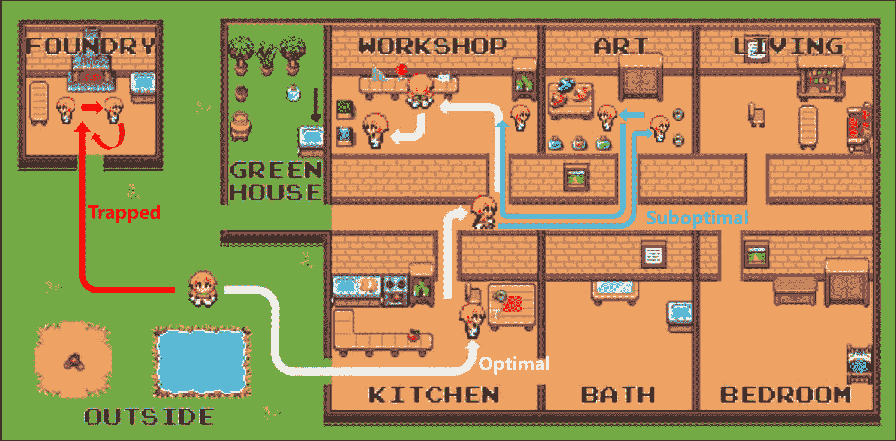
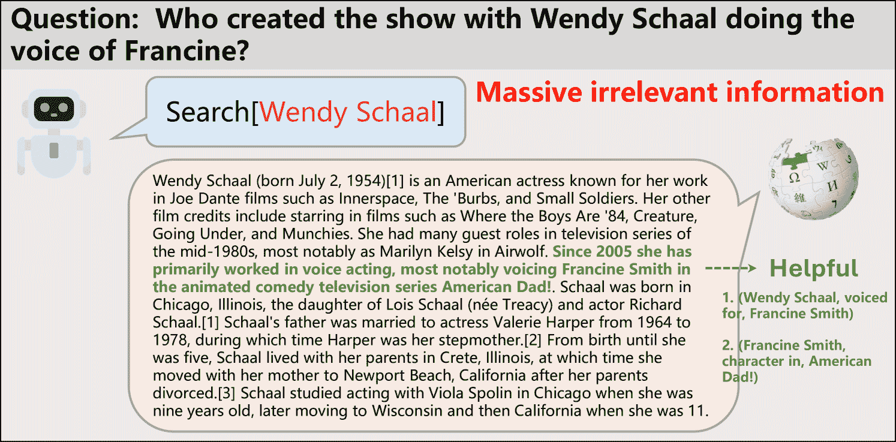
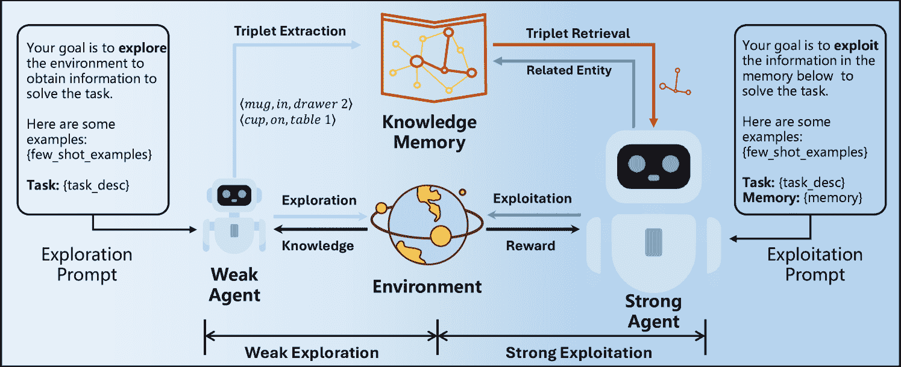
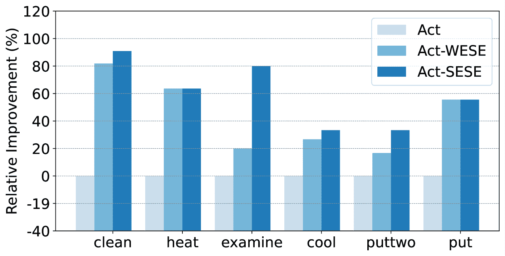
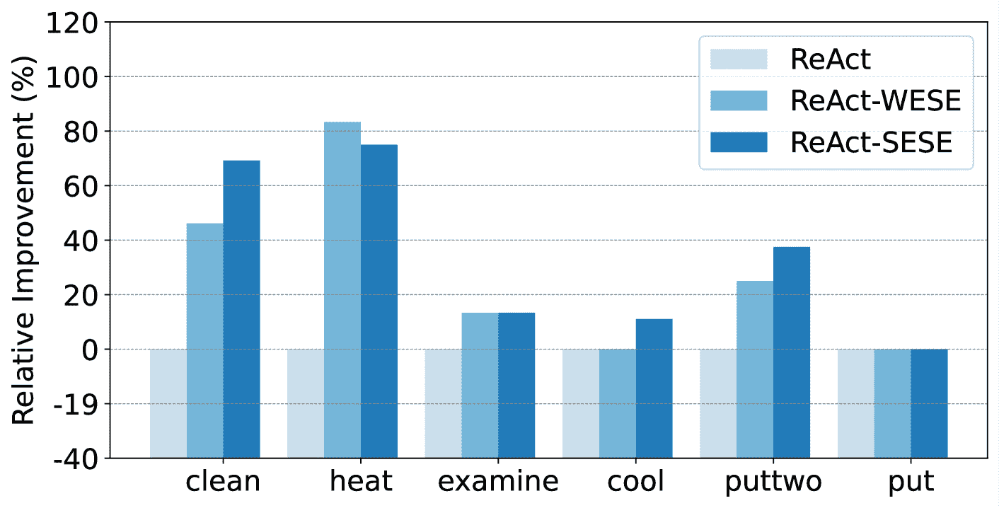

<!--yml

类别：未分类

日期：2025-01-11 12:42:41

-->

# WESE: Weak Exploration to Strong Exploitation for LLM Agents

> 来源：[https://arxiv.org/html/2404.07456/](https://arxiv.org/html/2404.07456/)

匿名作者 匿名单位 anonymous@example.com    Xu Huang${}^{1}$    Weiwen Liu${}^{2}$    Xiaolong Chen${}^{1}$    Xingmei Wang${}^{1}$    Defu Lian${}^{1}$¹¹1Defu Lian是通讯作者。    Yasheng Wang${}^{2}$    Ruiming Tang${}^{2}$    Enhong Chen${}^{1}$ ${}^{1}$中国科学技术大学，合肥，中国

${}^{2}$华为诺亚方舟实验室，中国深圳 xuhuangcs, chenxiaolong, xingmeiwang@mail.ustc.edu.cn, {liandefu, cheneh}@ustc.edu.cn,

{liuweiwen8,wangyasheng, tangruiming}@huawei.com

###### 摘要

最近，大型语言模型（LLMs）展示了作为智能体的巨大潜力。然而，现有的研究主要集中在通过精心设计的提示工程或任务特定的微调来增强智能体的推理或决策能力，而忽视了探索和利用的过程。在处理开放世界互动环境中的复杂任务时，这些方法表现出一定的局限性。首先，环境缺乏全局信息，导致了贪婪的决策，进而产生次优解。另一方面，环境中获取的无关信息不仅会引入噪声，而且还会带来额外的成本。本文提出了一种新方法——弱探索到强利用（WESE），旨在提升LLM智能体解决开放世界互动任务的能力。具体来说，WESE通过解耦探索和利用过程，采用一个成本效益高的弱智能体来执行探索任务，获取全局知识。随后，引入基于知识图谱的策略来存储获得的知识并提取与任务相关的知识，从而提高更强智能体在利用任务中的成功率和效率。我们的方法足够灵活，能够涵盖多种任务，并在四个互动基准测试中显著提高了成功率和效率。

## 1 引言

大型语言模型（LLMs）展示了在多个领域的众多能力，包括人机对话、指令执行、推理和少样本学习 Zhao et al. ([2023](https://arxiv.org/html/2404.07456v1#bib.bib30))。这些综合能力构成了一个坚实的基础，使LLMs能够作为智能体解决开放世界任务，如家务任务和开放世界问答任务 Wang et al. ([2023b](https://arxiv.org/html/2404.07456v1#bib.bib18)); Xi et al. ([2023](https://arxiv.org/html/2404.07456v1#bib.bib24))。最近，许多研究探讨了LLM智能体在增强其执行开放世界任务能力方面的潜力。

受益于大型语言模型（LLMs）在遵循指令和少样本学习方面的能力，大多数方法通过人工设计引导LLM进行决策任务，从而避免了昂贵的LLM微调 Wei et al. ([2022](https://arxiv.org/html/2404.07456v1#bib.bib22)); Wang et al. ([2022b](https://arxiv.org/html/2404.07456v1#bib.bib16)); Yao et al. ([2022](https://arxiv.org/html/2404.07456v1#bib.bib27)); Kojima et al. ([2022](https://arxiv.org/html/2404.07456v1#bib.bib4))。现有的提示工程方法主要考虑两个因素：如何在提示中融入与任务相关的信息，以及如何通过提示引发LLM的推理能力。与任务相关的信息包括任务描述和上下文反馈，例如在问答任务中的问题及相关任务陈述，以及在解决问题时从网络检索到的文本材料。为了增强LLM代理的推理能力，像CoT Wei et al. ([2022](https://arxiv.org/html/2404.07456v1#bib.bib22)), ReAct Yao et al. ([2022](https://arxiv.org/html/2404.07456v1#bib.bib27)) Reflexion Shinn et al. ([2023](https://arxiv.org/html/2404.07456v1#bib.bib9))等方法通过构建带有明确推理路径的少样本示例，激励LLM进行推理。

(a) ScienceWorld。缺乏全球环境信息会导致因陷入循环或次优解而失败。

(b) HotPotQA。绿色句子是有帮助的，而其他句子与任务无关。

图1：反馈中的次优决策和无关信息的示例。

然而，开放世界任务充当了真实环境的模拟，在这种环境中，智能体通过不断探索和与环境互动来获取更多信息，以解决复杂任务Côté等人（[2019](https://arxiv.org/html/2404.07456v1#bib.bib2)）；Shridhar等人（[2020](https://arxiv.org/html/2404.07456v1#bib.bib10)）；Wang等人（[2022a](https://arxiv.org/html/2404.07456v1#bib.bib15)）。此类任务具有几个特点，使其更加具有挑战性。由于以下挑战，LLM智能体的能力远未达到最佳：1）复杂性。每个任务都涉及多步操作，并且每个任务可能有多个可行解决方案。2）不确定性。智能体无法从初始任务描述中获得所有信息，必须通过探索来获取额外的信息。针对这些挑战，解决这些任务需要智能体进行多步探索和利用。探索涉及感知环境并获取与任务相关的信息，而利用则是根据现有知识做出行动决策。在现有的基于提示的方法中，探索和利用问题通常被忽视，嵌入在LLM的推理过程中Yao等人（[2022](https://arxiv.org/html/2404.07456v1#bib.bib27)），导致两个主要问题。

首先，缺乏对环境的全局认知会导致LLM在初始解决方案中的决策不优化。如图[1(a)](https://arxiv.org/html/2404.07456v1#S1.F1.sf1 "1(a) ‣ Figure 1 ‣ 1 Introduction ‣ WESE: Weak Exploration to Strong Exploitation for LLM Agents")所示，目标是找到一个铝制物品并测试其导电性。智能体最初位于室外。最佳轨迹用白线标出，智能体先去厨房拿铝叉，然后再去车间。当缺乏全局环境信息时，智能体可能会因为找不到铝制物品而被困在某个房间里（红线），或者选择一条耗时更长的路径（蓝线）。其次，LLM从环境探索中获得的知识往往过多，包括与任务无关的信息。这些信息的存在不仅干扰了LLM的决策，而且还增加了额外的成本。如图[1(b)](https://arxiv.org/html/2404.07456v1#S1.F1.sf2 "1(b) ‣ Figure 1 ‣ 1 Introduction ‣ WESE: Weak Exploration to Strong Exploitation for LLM Agents")所示，环境反馈通常包含大量与任务无关的信息，而只有一句有用的句子，即此示例中的绿线，这导致LLM的额外标记使用并对做出最佳决策产生负面影响。

为了解决上述限制，我们在本工作中提出了一种新颖的基于提示的策略，旨在增强 LLM 代理，称为弱探索到强利用（WESE）。为了解决第一个限制，我们引入了一个将探索与利用解耦的概念。具体来说，我们为探索和利用任务分别构建了两个不同的 LLM 代理。在探索任务中，LLM 代理的目标是与环境互动，探索可能有助于任务解决的环境信息。在利用任务中，探索过程中获得的信息作为全局环境先验，帮助 LLM 代理推理和决策，以生成决策。关于第二个限制，我们将探索代理获取的环境信息进行压缩，以知识图谱的形式进行结构化。在利用过程中，我们采用一跳知识检索方法，从图谱中选择与任务相关的实体的一跳邻居作为先验，从而减少无关信息的干扰。此外，为了进一步最小化资源消耗，我们观察到成本效益较高的较弱 LLM（如 7B 模型）完全能够完成较为简单的探索任务。因此，我们提出了弱探索到强利用的策略——利用弱 LLM 代理探索的知识来增强强 LLM 代理的表现。

我们的主要贡献总结如下：

+   •

    据我们所知，这是首个探讨在开放世界任务中解耦探索与利用对 LLM 代理影响的研究工作。我们进一步提出了 WESE，通过利用较弱代理以一种成本效益高的方式增强较强代理的性能。

+   •

    为了更好地利用从探索中获得的环境信息，我们提出了一种将其压缩成知识图谱的策略。然后，我们设计了一种一跳检索方法来筛选掉无关信息。

+   •

    在四个开放世界交互基准上的实验结果证明了 WESE 的优越性，特别是在实现有效性、效率和成本之间的显著平衡方面。

## 2 相关工作

### 2.1 LLM 代理

随着大型语言模型（LLMs）的出现，它们的智能激发了将LLM作为代理大脑的巨大潜力。现有的LLM代理工作主要考虑三个关键模块：规划、工具使用和记忆 Wang等人（[2023b](https://arxiv.org/html/2404.07456v1#bib.bib18)）。规划模块旨在赋予代理任务分解能力，涵盖了任务分解工作 Wang等人（[2023c](https://arxiv.org/html/2404.07456v1#bib.bib19)）、反馈驱动的调整 Shinn等人（[2023](https://arxiv.org/html/2404.07456v1#bib.bib9)）和多路径推理 Yao等人（[2023](https://arxiv.org/html/2404.07456v1#bib.bib28)）；Besta等人（[2023](https://arxiv.org/html/2404.07456v1#bib.bib1)）。工具使用旨在加强外部工具的使用能力 Qin等人（[2023a](https://arxiv.org/html/2404.07456v1#bib.bib7)）。例如，Visual ChatGPT Wu等人（[2023](https://arxiv.org/html/2404.07456v1#bib.bib23)）将视觉模型作为工具，增强LLM的视觉能力。ToolLlama Qin等人（[2023b](https://arxiv.org/html/2404.07456v1#bib.bib8)）微调了Llama在利用各种API时的能力。记忆模块专注于存储从环境中感知到的反馈信息，帮助代理积累经验，并促进代理的成长。在生成代理 Park等人（[2023](https://arxiv.org/html/2404.07456v1#bib.bib6)）中，模拟角色的记忆以文本形式存储，并利用RAG获取相关片段。REMEMBER Zhang等人（[2023](https://arxiv.org/html/2404.07456v1#bib.bib29)）提出了一种半参数化记忆，即Q值表，用于记录奖励作为值，给定环境和任务中的行动作为键。MemoryBank Wang等人（[2023d](https://arxiv.org/html/2404.07456v1#bib.bib20)）利用艾宾浩斯遗忘曲线，将更新和遗忘机制融入到记忆设计中。

在我们提出的WESE中，知识图谱本质上是一个记忆，将通过探索获得的信息更新到图谱中。

### 2.2 LLM用于开放世界任务

开放世界任务模拟了现实世界环境。在这些任务中，代理与环境进行持续的互动，收集相关信息，随后做出决策并采取行动以完成目标。开放世界任务通常对过程的约束较少，更加重视最终奖励。开放世界任务的代表性例子包括像“Minecraft”这样的游戏 Wang et al. ([2023a](https://arxiv.org/html/2404.07456v1#bib.bib17), [e](https://arxiv.org/html/2404.07456v1#bib.bib21))，其中涉及文本信息和视觉反馈。另一类任务是基于 TextWorld 的文本模拟器 Côté et al. ([2019](https://arxiv.org/html/2404.07456v1#bib.bib2))，例如涉及家庭任务的 AlfWorld Shridhar et al. ([2020](https://arxiv.org/html/2404.07456v1#bib.bib10))，涉及简单科学实验的 ScienceWorld Wang et al. ([2022a](https://arxiv.org/html/2404.07456v1#bib.bib15))，以及问答任务 Yang et al. ([2018](https://arxiv.org/html/2404.07456v1#bib.bib25)); Thorne et al. ([2018](https://arxiv.org/html/2404.07456v1#bib.bib12))，其中代理需要与网络互动以获取支持信息，例如 Wikipedia。在处理这些任务时，Chain-of-Thought (CoT) Wei et al. ([2022](https://arxiv.org/html/2404.07456v1#bib.bib22)) 提出了在提示中添加少量示例，引导大语言模型（LLM）一步步解决任务。ReAct Yao et al. ([2022](https://arxiv.org/html/2404.07456v1#bib.bib27)) 通过引入额外的思考步骤，激发 LLM 的推理能力。后续方法在 ReAct 的基础上进行了扩展，加入了如 Reflexion Shinn et al. ([2023](https://arxiv.org/html/2404.07456v1#bib.bib9)) 机制，使代理能够从错误中学习并在随后的尝试中改进。此外，几种方法利用 LLM 的编码能力，将任务转化为编程任务，并引导 LLM 生成代码作为计划，例如 VOYAGER Wang et al. ([2023a](https://arxiv.org/html/2404.07456v1#bib.bib17))。

## 3 方法论

图 2：WESE 框架。左侧部分表示弱探索，右侧部分表示强开发。在实现中，我们采用 Llama-2-7B 作为弱代理，采用 text-davinci-003 作为强代理。

### 3.1 解耦探索与开发

开放世界任务与传统推理和决策任务不同。传统推理任务（Huang 和 Chang（[2022](https://arxiv.org/html/2404.07456v1#bib.bib3)）；Sun 等人（[2023](https://arxiv.org/html/2404.07456v1#bib.bib11)））或决策任务（Yang 等人（[2023](https://arxiv.org/html/2404.07456v1#bib.bib26)））通常一次性呈现所有相关信息，要求智能体根据提供的信息进行推理并制定计划，如数学计算或逻辑推理问题。相反，在开放世界任务中，最初仅指定任务描述。在这种情况下，智能体必须不断与环境互动以获取支持信息，包括探索和开发步骤。

令 $E$ 和 $T$ 分别表示环境和任务，$\Theta$ 表示大语言模型（LLM），$P$ 表示提示词（prompt）。智能体的动作空间定义为 $\mathcal{A}=\mathcal{A}_{e}\cup\mathcal{A}_{t}$，其中 $\mathcal{A}_{e}$ 和 $\mathcal{A}_{t}$ 分别表示探索和开发的动作集合。探索与开发通过函数 $explore(\cdot)$ 和 $exploit(\cdot)$ 表示。环境在第 $i$ 步提供的信息表示为 $F_{i}$。对于现有方法，例如 ReAct（Yao 等人（[2022](https://arxiv.org/html/2404.07456v1#bib.bib27)）），其中探索和开发步骤嵌入在推理中，第 $i$ 步所采取的动作表示如下：

|  | $\small\centering a_{i}=reason(E,T,s_{i-1};\Theta,P,K=\cup_{j<i}\{F_{j}\})\in% \mathcal{A}_{e}\cup\mathcal{A}_{t}.\@add@centering$ |  |
| --- | --- | --- |

其中 $reason(\cdot)$ 表示探索与开发的结合。

输入：知识三元组集 $K$。输出：知识图谱 $G$。1 实体集 $E\leftarrow\{\}$；2 关系集 $R\leftarrow\{\}$；3 邻接矩阵 $M$；4 对于 *$x\in K$* 执行：5        $h,r,t\leftarrow x$；6        $E\leftarrow E\cup\{h,t\}$；$R\leftarrow R\cup\{r\}$；$M[h][t]\leftarrow r$；7      8$G.E\leftarrow E$；$G.R\leftarrow R$；$G.M\leftarrow M$；

算法 1 图构建算法。

输入：知识图谱 $G$，任务 $T$，大语言模型 $\Theta$。输出：三元组集 $K$。1 与任务相关的实体集 $E\leftarrow extract(G.E,T;\Theta)$；2  $K\leftarrow\{\}$；3 对于 *$e_{i}\in E$* 执行：4        对于 *$e_{j}\in E\setminus\{e_{i}\}$* 执行：5              $r\leftarrow G.M[e_{i}][e_{j}]$；6              如果 *$r\neq\text{empty}$* 则：7                    $K\leftarrow K\cup\left\{\big{(}e_{i},r,e_{j}\big{)}\right\}$；8                  9            10

算法 2 三元组检索算法。

在这一范式中，所使用的知识$K$仅是通过部分观察获得的有限的环境信息。特别地，在初始阶段，由于智能体对环境的认知有限，因此会做出贪婪的决策。例如，在“用肥皂清洁一些苹果”这一任务中，智能体的初始位置是在大厅。苹果和肥皂的实际位置分别位于大厅桌子的抽屉和厨房的水槽中。由于缺乏环境知识，智能体可能会受到大语言模型（LLM）世界知识的误导，去厨房找苹果。因此，智能体可能会在厨房的每个角落浪费大量时间，导致次优的计划甚至由于陷入循环而失败。因此，我们研究了探索和开发解耦的策略，形式化如下：

|  | $\small a_{i}=\left\{\begin{aligned} &explore(E,T,s_{i-1};\Theta,P_{e})\in% \mathcal{A}_{e},\;i<N_{e};\\ &exploit(E,T,s_{i-1};\Theta,P_{t},K=\cup_{j\leq N}\{F_{j}\})\in\mathcal{A}_{t}% ,i\geq N_{e}.\end{aligned}\right.$ |  |
| --- | --- | --- |

其中$P_{e}$和$P_{t}$分别表示探索任务和开发任务的提示。$N_{e}$是探索的最大步数，这也可以由智能体自行决定，例如，当智能体认为获取的信息已经足够时，可以自动终止探索。

与以往的方法不同，我们的方法明确地将整个探索阶段置于开发之前，而不是交替进行探索和开发。通过这种方式，智能体已广泛探索环境，获得了全局环境的先验知识，记作$K=\cup_{j\leq N}\{F_{j}\}$。利用全局知识进行开发有助于提高解决方案的有效性和效率，这在我们的实验中得到了实证验证。

然而，解耦方法后存在两个问题。首先，由于广泛的探索，环境反馈中获得的信息量巨大，其中包含了大量与任务无关的信息。其次，广泛的探索增加了资源消耗，例如令牌使用量。因此，我们需要一个高效的信息传递机制，用于探索和开发之间的知识转移，以及一个成本效益高的探索-开发策略。我们将在本节的后续部分解决这两个问题。

### 3.2 知识压缩与检索

现实世界中的文本信息表现出固有的稀疏性，其特点是由大量没有信息量的连接词和形容词组成的长句子。在开放世界任务中，环境反馈呈现为这样的文本，其中累积的广泛探索生成了冗长且无结构的文本信息，表现出严重的稀疏性。考虑到LLM的有限上下文窗口和令牌使用的高昂成本，压缩这些稀疏信息是必要的。利用知识图谱（KG）存储信息已经证明在提高信息密度和利用现有工作的领域特定知识方面具有优势，Pan等人（[2024](https://arxiv.org/html/2404.07456v1#bib.bib5)）也提出了类似的观点。

因此，得益于LLM在关系抽取任务中的优势，Wadhwa等人（[2023](https://arxiv.org/html/2404.07456v1#bib.bib14)）从收到的反馈中提取知识，形成一个环境知识图谱。具体而言，LLM在每次探索步骤后从环境反馈中提取知识三元组，并将其更新到知识图谱中。例如，对于维基百科给出的搜索结果“自2005年以来，Wendy Schaal主要从事配音工作，最著名的是为动画喜剧电视剧《美国老爸》中的Francine Smith配音！”，提取的知识三元组为$\langle$Wendy Schaal, voice for, Francine Smith$\rangle$和$\langle$Francine Smith, character in, American Dad!$\rangle$。值得注意的是，我们获得的环境知识图谱是与任务相关的，像随机存取存储器（RAM）一样作为一种记忆。实际上，我们的方法中可以利用全球知识图谱，并持续更新，作为一种通用记忆。我们将这一部分留待未来的工作中进行探讨。

输入：环境$E$，任务$T$，初始状态$s_{0}$，弱LLM$\Theta_{w}$，强LLM$\Theta_{s}$，探索提示$P_{e}$，利用提示$P_{t}$，步骤限制$N_{e},N_{t}$。输出：计划$p$。// 使用弱LLM代理进行探索。1  $K\leftarrow\{\}$；$i\leftarrow 0$；$s^{e}_{i}\leftarrow s_{0}$；2  对于 *$i<N_{e}$* 执行3     $a^{e}_{i}\leftarrow explore(E,T,s^{e}_{i};\Theta_{w},P_{e})$；4     $s^{e}_{i},F_{i}\leftarrow step(E,s^{e}_{i},a^{e}_{i})$；5     $K^{{}^{\prime}}\leftarrow extract(F_{i};\Theta_{w})$；6     $K\leftarrow K\cup K^{{}^{\prime}}$；7     $i\leftarrow i+1$；8     $G_{K}\leftarrow construct\_graph(K)$； // 算法[1](https://arxiv.org/html/2404.07456v1#alg1 "1 ‣ 3.1 Decoupling Exploration and Exploitation ‣ 3 Methodologies ‣ WESE: Weak Exploration to Strong Exploitation for LLM Agents")// 使用强LLM代理进行利用。9  $i\leftarrow 0$；$s^{t}_{i}\leftarrow s_{0}$；$p\leftarrow[]$；$\tilde{K}\leftarrow retrieve\_triplets(G_{K},T;\Theta_{w})$； // 算法[2](https://arxiv.org/html/2404.07456v1#alg2 "2 ‣ 3.1 Decoupling Exploration and Exploitation ‣ 3 Methodologies ‣ WESE: Weak Exploration to Strong Exploitation for LLM Agents")10  对于 *$i<N_{t}$ 且 $F_{i}\neq\text{Completed}$* 执行11     $a^{t}_{i}\leftarrow exploit(E,T,s^{t}_{i};\Theta_{s},P_{t},\tilde{K})$；12     $s^{t}_{i},F_{i}\leftarrow step(E,s^{t}_{i},a^{t}_{i})$；13     $i\leftarrow i+1$；14     $p\leftarrow p+[a^{t}_{i}]$；15

算法3 WESE算法。

然而，必须承认并非知识图谱中的所有信息都是有用的。引入与任务无关的信息可能导致大型语言模型（LLM）的幻觉现象，例如实体与关系的混淆。例如，给出三元组$\langle$Bob, 喜欢的水果, apple$\rangle$，问题是“Bill喜欢的水果是什么？”，LLM可能会混淆关系并回答为apple。得益于图结构，我们采用了一种单跳检索方法来轻松提取与任务相关的信息，如算法[2](https://arxiv.org/html/2404.07456v1#alg2 "2 ‣ 3.1 Decoupling Exploration and Exploitation ‣ 3 Methodologies ‣ WESE: Weak Exploration to Strong Exploitation for LLM Agents")所示。具体来说，我们通过LLM从任务描述中提取相关实体，然后在图上执行单跳检索，以获取这些实体的邻居。检索到的知识三元组随后被注入到提示中，在利用阶段作为与任务相关的知识，帮助LLM解决任务。

### 3.3 弱探索到强利用

表1：ALFWorld（134个任务）的结果。SR和AS分别是成功率和成功任务的平均步数的缩写。SESE代表WESE的变种——从强探索到强开发。Imp表示相对于基础方法的相对改进，即Act和ReAct。粗体和下划线分别表示同一基础方法的最佳和第二最佳结果。

| 性能 | 效果 | 效率 | 成本 |
| --- | --- | --- | --- |
| 方法 | SR$\uparrow$ | 改进(%) | AS$\downarrow$ | 改进(%) | 提示$\downarrow$ | 完成$\downarrow$ | 花费($)$\downarrow$ | 改进(%) |
| --- | --- | --- | --- | --- | --- | --- | --- | --- |
| Act | 0.43 | 0.00 | 10.83 | 0.00 | 4,908,548 | 21,243 | 98.60 | 0.00 |
| Act-WESE | 0.63 | +46.51 | 7.54 | +30.38 | 3,746,290 | 19,562 | 75.32 | +23.61 |
| Act-SESE | 0.67 | +55.81 | 6.73 | +37.86 | 7,259,508 | 75,153 | 146.69 | -48.77 |
| ReAct | 0.57 | 0.00 | 16.64 | 0.00 | 7,565,676 | 43,250 | 152.18 | 0.00 |
| ReAct-WESE | 0.72 | +26.32 | 13.69 | +17.73 | 5,032,374 | 41,004 | 101.47 | +33.32 |
| ReAct-SESE | 0.75 | +31.58 | 12.41 | +25.42 | 8,996,182 | 97,286 | 181.87 | -19.51 |

表2：ScienceWorld（296个任务）的结果。TR、AR和AS分别是总奖励、平均奖励和获取正奖励的平均步数的缩写。其他符号与表[1](https://arxiv.org/html/2404.07456v1#S3.T1 "表 1 ‣ 3.3 从弱探索到强开发 ‣ 3 方法论 ‣ WESE：LLM代理的弱探索到强开发")一致。

| 性能 | 效果 | 效率 | 成本 |
| --- | --- | --- | --- |
| 方法 | TR$\uparrow$ | AR$\uparrow$ | 改进(%) | AS$\downarrow$ | 改进(%) | 提示$\downarrow$ | 完成$\downarrow$ | 花费($)$\downarrow$ | 改进(%) |
| --- | --- | --- | --- | --- | --- | --- | --- | --- | --- |
| Act | 4908 | 16.58 | 0.00 | 18.00 | 0.00 | 13,554,960 | 55,817 | 272.22 | 0.00 |
| Act-WESE | 5198 | 17.56 | 5.91 | 15.68 | +12.91 | 13,491,043 | 65,952 | 271.14 | +0.40 |
| Act-SESE | 5249 | 17.73 | 6.94 | 15.39 | +14.49 | 36,424,190 | 165,568 | 731.80 | -168.83 |
| ReAct | 4454 | 15.05 | 0.00 | 20.00 | 0.00 | 17,716,698 | 84,724 | 356.03 | 0.00 |
| ReAct-WESE | 5317 | 17.96 | 19.34 | 19.65 | +1.77 | 16,310,632 | 80,851 | 327.83 | +7.92 |
| ReAct-WESE | 5053 | 17.07 | 13.42 | 19.02 | +4.92 | 40,293,571 | 196,338 | 809.80 | -127.45 |

获取关于环境的更全面的全球信息需要在探索过程中付出相当的资源成本。然而，与开发相比，探索展现出较低的复杂性，所需的推理和归纳较少。具体而言，探索操作对动作的逻辑性和连贯性要求较低，更强调与环境观察相关的动作。例如，探索动作主要由一些简单的决策基准动作组成，如“去[房间]”、“环顾四周”等，而开发则涉及一系列连贯的操作，如（去水槽/炉子，将碗放入/放在水槽/炉子上，启动水槽/炉子，等待，关闭水槽/炉子）。因此，我们提出使用较弱的智能体进行探索，以减少资源消耗，即弱探索。从LLM智能体的角度来看，较弱的智能体是指用一个较弱的LLM替代底层的LLM进行探索，即用参数较少的LLM，从而降低成本。在我们的实验中，我们比较了强探索和弱探索之间的表现。我们的研究结果表明，较弱的探索对最终的成功率几乎没有影响，但显著降低了成本。

WESE框架如图[2](https://arxiv.org/html/2404.07456v1#S3.F2 "Figure 2 ‣ 3 Methodologies ‣ WESE: Weak Exploration to Strong Exploitation for LLM Agents")所示。该框架包含三个关键组件：一个弱LLM智能体，一个强LLM智能体，以及一个基于知识图谱的记忆。整个过程分为弱探索（左）和强开发（右）。同时，我们在算法[3](https://arxiv.org/html/2404.07456v1#alg3 "3 ‣ 3.2 Knowledge Compression and Retrieval ‣ 3 Methodologies ‣ WESE: Weak Exploration to Strong Exploitation for LLM Agents")中提供了一个算法伪代码。首先，采用弱LLM智能体探索交互环境，以获得第1至第7行的信息。然后，这些知识三元组在第8行组织为一个知识图谱$G_{K}$，如算法[1](https://arxiv.org/html/2404.07456v1#alg1 "1 ‣ 3.1 Decoupling Exploration and Exploitation ‣ 3 Methodologies ‣ WESE: Weak Exploration to Strong Exploitation for LLM Agents")所示。进一步地，涉及的实体通过LLM从任务中提取，相关的三元组在第10行从图中检索。检索到的知识在第12行被用于开发，作为先验知识。

## 4 实验

我们采用两类互动开放世界任务作为基准：决策任务和问答任务，每个任务都需要与环境进行多步交互。我们从三个角度评估我们的方法：效果、效率和成本，分别代表代理是否能够完成任务、代理完成任务所需的步骤数，以及代理完成任务所需的费用。

### 4.1 决策任务

我们从开放世界决策任务开始，其中环境基于文本模拟器。这些任务与家庭生活相关，代理需要探索不同的房间并对多个物体进行操作。

#### 4.1.1 ALFWorld

ALFWorld Shridhar 等人（[2020](https://arxiv.org/html/2404.07456v1#bib.bib10)）是一个基于文本的合成模拟互动环境。它包含六种任务类型，代理需要与环境互动，通过一系列动作解决家庭任务。例如，在任务“清洁一些刀具并将其放到厨房台面上”中，理想的解决方案包括以下动作：（前往厨房台面 2，拿起刀具 1，前往水槽 2，清洁刀具 1，将刀具 1 放到台面 2）。这些任务的难度各不相同，其中具有挑战性的任务包含超过 50 个位置，并需要超过 50 步的操作，这对探索和利用过程都是挑战。

(a) 基于 Act 方法的相对提升。

(b) 基于 ReAct 方法的相对提升。

图 3：在 ALFWorld 上各种任务类型的成功率相对提升。左侧的任务更为复杂。

为了验证WESE的有效性，我们采用Act Yao等人（[2022](https://arxiv.org/html/2404.07456v1#bib.bib27)）和ReAct Yao等人（[2022](https://arxiv.org/html/2404.07456v1#bib.bib27)）作为基准。Act利用了CoT的思想，提供给LLM少量交互示例。ReAct在Act的基础上引入了一个额外的“思考”步骤，LLM可以选择明确地输出自己对当前状态的思考，或生成行动。在WESE中，我们最初使用弱LLM进行探索以获取与任务相关的知识。然后，我们利用获取的知识通过两种基本方法解决问题。我们采用Llama-2-7B Touvron等人（[2023](https://arxiv.org/html/2404.07456v1#bib.bib13)）作为弱LLM，以及由OpenAI开发的text-davinci-003（可能具有超过1750亿个参数）²²2[https://platform.openai.com/](https://platform.openai.com/)作为强LLM。步骤限制$N_{e},N_{t}$都设置为50。我们的评估侧重于成功率、完成任务的平均步骤数和OpenAI API令牌的费用这三个关键指标。此外，我们引入了WESE的一种变体——从强探索到强利用（SESE），其中探索过程中弱LLM被强LLM替代，用于验证解耦策略的有效性，并考察LLM强度对探索质量的影响。

#### 4.1.2 ScienceWorld

类似于ALFWorld，ScienceWorld Wang等人（[2022a](https://arxiv.org/html/2404.07456v1#bib.bib15)）也是一个互动式家庭环境。然而，ScienceWorld中的任务更具挑战性，涉及科学实验，例如煮沸和通过混合原色创造新颜色。环境更为复杂，包含十个不同的房间，每个房间都有不同的家具，并且并不是每一对房间都是相连的。

我们在ScienceWorld中对八种任务类型进行实验，每个任务选择大约30个实例，因预算有限。与ALFWorld不同，在ALFWorld中，代理只有在任务完成时才能获得1的奖励，而在ScienceWorld中，代理在完成关键步骤时会获得部分奖励，总奖励达到100。考虑到任务的挑战性，获得100的全奖励是很少见的。因此，我们将代理第一次获得正奖励所需的步骤数作为效率的衡量标准。其他设置与ALFWorld一致。

#### 4.1.3 结果

ALFWorld和ScienceWorld的结果分别如表[1](https://arxiv.org/html/2404.07456v1#S3.T1 "Table 1 ‣ 3.3 Weak Exploration to Strong Exploitation ‣ 3 Methodologies ‣ WESE: Weak Exploration to Strong Exploitation for LLM Agents")和表[2](https://arxiv.org/html/2404.07456v1#S3.T2 "Table 2 ‣ 3.3 Weak Exploration to Strong Exploitation ‣ 3 Methodologies ‣ WESE: Weak Exploration to Strong Exploitation for LLM Agents")所示。根据结果，我们得出几个结论。与ReAct报告的结果一致，ReAct在两个基准上超越了Act，显示了“思考”步骤的优越性。然而，这个额外的步骤导致了更长的动作序列，导致平均步骤数相对增加了32.38%。探索与开发的解耦在效果和效率上表现出优势，使得SESE在成功率（平均奖励）和平均步骤上相较基准大幅提高，平均分别提高了26.94%和20.67%。然而，由于引入了广泛的强探索，SESE的成本大幅增加，相较基准平均增加了91.14%。

WESE在效果、效率和成本之间表现出更好的平衡，与SESE相比，它节省了53.83%的成本，且效果和效率的下降幅度仅为1.43%和6.89%。在WESE中，弱LLM代理负责探索过程，从而为广泛的探索节省了成本。此外，得益于从已探索的知识图谱中提取的相关三元组，强LLM代理只需专注于开发，从而进一步减少了步骤数，体现为完成令牌和平均步骤的减少。

我们进一步研究了WESE在各种任务类型上的改进，如图[3](https://arxiv.org/html/2404.07456v1#S4.F3 "Figure 3 ‣ 4.1.1 ALFWorld ‣ 4.1 Decision Making Tasks ‣ 4 Experiments ‣ WESE: Weak Exploration to Strong Exploitation for LLM Agents")所示。WESE和SESE在几乎所有任务类型上均有所改进，进一步表明了解耦策略的有效性。此外，“清洁”和“加热”任务的改进大于其他任务。这是因为这两项任务涉及比“搬运”更复杂的开发，代理需要先找到物体，然后清洁或加热它，而不仅仅是将其移动到另一个地方。结果表明，广泛的探索对复杂任务有更大的益处。

### 4.2 问答任务

我们还在两个开放世界互动问答基准上验证了我们的WESE，即HotPotQA和FEVER。与传统的问答任务不同，后者提供支持句子，而这些任务仅提供问题，要求代理逐步在网上搜索信息以给出最终答案。

表 3: HotPotQA（500个任务）结果。SR 和 AS 分别是成功率和成功任务的平均步骤数的缩写。SESE表示 WESE 的变体——从强探索到强利用。Imp表示与基础方法（即 Act 和 ReAct）相比的相对改进。粗体和下划线表示相同基础方法中的最好和第二好结果。

| 性能 | 效果 | 效率 | 成本 |
| --- | --- | --- | --- |
| 方法 | SR$\uparrow$ | 改进（%） | AS$\downarrow$ | 改进（%） | 提示$\downarrow$ | 完成$\downarrow$ | 支出($)$\downarrow$ | 改进（%） |
| CoT | 0.318 | 不适用 | 1.00 | 不适用 | 261,347 | 25,382 | 5.73 | 不适用 |
| Act | 0.296 | 0.00 | 3.53 | 0.00 | 2,390,041 | 14,236 | 48.09 | 0.00 |
| Act-WESE | 0.353 | +19.26 | 2.69 | +23.80 | 2,307,421 | 13,973 | 46.42 | +3.45 |
| Act-SESE | 0.361 | +21.96 | 2.58 | +26.91 | 7,522,826 | 27,1551 | 155.89 | -224.18 |
| ReAct | 0.342 | 0.00 | 3.17 | 0.00 | 3,234,876 | 65,306 | 66.00 | 0.00 |
| ReAct-WESE | 0.394 | +15.20 | 2.29 | +27.76 | 2,574,401 | 67,908 | 52.85 | +19.93 |
| ReAct-SESE | 0.416 | +21.64 | 2.11 | +33.44 | 7,338,590 | 323,401 | 153.24 | -132.17 |

表 4: FEVER（500个任务）结果。缩写和符号的含义与表[3](https://arxiv.org/html/2404.07456v1#S4.T3 "Table 3 ‣ 4.2 Question Answering Tasks ‣ 4 Experiments ‣ WESE: Weak Exploration to Strong Exploitation for LLM Agents")一致。

| 性能 | 效果 | 效率 | 成本 |
| --- | --- | --- | --- |
| 方法 | SR$\uparrow$ | 改进（%） | AS$\downarrow$ | 改进（%） | 提示$\downarrow$ | 完成$\downarrow$ | 支出($)$\downarrow$ | 改进（%） |
| CoT | 0.61 | 不适用 | 1.00 | 不适用 | 100,387 | 11,942 | 2.25 | 不适用 |
| Act | 0.56 | 0.00 | 2.16 | 0.00 | 723,646 | 6,980 | 14.61 | 0.00 |
| Act-WESE | 0.62 | +10.71 | 1.58 | +26.66 | 723,867 | 5,937 | 14.60 | +0.11 |
| Act-SESE | 0.64 | +14.29 | 1.57 | +27.34 | 2,822,189 | 122,543 | 60.89 | -316.73 |
| ReAct | 0.63 | 0.00 | 2.18 | 0.00 | 1,074,080 | 36,040 | 22.20 | 0.00 |
| ReAct-WESE | 0.68 | +7.26 | 1.62 | +25.96 | 918,905 | 29,895 | 18.98 | +14.53 |
| ReAct-SESE | 0.70 | +10.09 | 1.59 | +27.18 | 3,104,924 | 162,363 | 65.35 | -194.32 |

#### 4.2.1 HotPotQA

HotPotQA Yang等人（[2018](https://arxiv.org/html/2404.07456v1#bib.bib25)）是一个问答数据集，每个问题都与来自Wikipedia文章的支持句子配对。在传统的QA任务中，支持句子是已给出的，剩下的任务是推理。在ReAct中提到，我们使用Wikipedia API和三种类型的操作来支持交互式信息检索：（1）search[entity]，在Wikipedia中搜索实体，并返回相应的页面（如果存在），或者建议前5个相似的实体；（2）lookup[keyword]，在页面中查找关键词，并返回包含该关键词的下一句话，模拟网页浏览器中的Ctrl+F功能；（3）finish[answer]，用答案回答问题。一旦答案与真实答案匹配，环境会返回奖励1。我们从开发集随机抽取了500个任务。

我们采用了CoT Wei等人（[2022](https://arxiv.org/html/2404.07456v1#bib.bib22)）、Act和ReAct作为基准，并通过WESE和SESE增强了Act和ReAct。需要注意的是，CoT是一种一步法，不支持交互任务，我们将支持句子注入到提示中，并指示LLM推理得出最终答案，而不进行网页搜索。此外，WESE并非为这种纯推理方法设计，而是为涉及与环境交互的方法设计的。对于Act和ReAct，我们保持与原始论文一致的设置。由于任务相关的三元组可能非常多，我们将检索的三元组数量限制为10，并将步骤数$N_{e},N_{t}$的限制设为8。有效性、效率和成本的评估与ALFWorld一致。

#### 4.2.2 FEVER

FEVER Thorne等人（[2018](https://arxiv.org/html/2404.07456v1#bib.bib12)）是一个事实验证数据集，包含每个实例由一个声明和一个验证（真或假或不清楚）组成的实例。我们使用Wikipedia API构建了一个与HotPotQA中一致的交互环境。其他设置与HotPotQA保持一致，如检索的三元组数量和最大步骤数。

#### 4.2.3 结果

在HotPotQA和FEVER上的结果分别展示在表格[3](https://arxiv.org/html/2404.07456v1#S4.T3 "Table 3 ‣ 4.2 Question Answering Tasks ‣ 4 Experiments ‣ WESE: Weak Exploration to Strong Exploitation for LLM Agents")和表格[4](https://arxiv.org/html/2404.07456v1#S4.T4 "Table 4 ‣ 4.2 Question Answering Tasks ‣ 4 Experiments ‣ WESE: Weak Exploration to Strong Exploitation for LLM Agents")中。我们可以基于结果得出几个结论。与决策任务类似，由于额外的“思考”步骤，ReAct的表现明显优于Act。此外，采用WESE或SESE的方法在成功率和所采取的行动数量上都优于基线，分别带来了19.5%和28.0%的平均相对提升。特别是，SESE方法略微超越了WESE，在成功率和平均步骤方面的平均相对提升分别为3.5%和3.6%，同时成本增加了超过两倍。这进一步证明了由Llama-2-7B驱动的弱代理几乎足以完成探索任务。

与决策任务不同，问答任务因为一次搜索返回的信息更多，所以需要的步骤较少。然而，我们的WESE和SESE仍然能够减少步骤数，进一步展示了探索知识的优势。至于成本，SESE中增加的token远远超过了决策任务中的增加，这可以归因于来自维基百科的长文本反馈。

## 5 结论

本文介绍了WESE，这是一种在开放世界互动任务中提升LLM代理的成本效益方法。我们将探索与利用过程解耦，采用两个代理分别处理这两个不同的过程。为了增强两个过程之间的沟通，我们引入了一种基于知识图的记忆方法，用于压缩和结构化探索过程中获得的信息，其中通过单跳检索方法从图中提取与任务相关的信息。然后，我们提出利用一个较弱的代理来进行探索过程，从而形成一种成本效益高、性能下降几乎可以忽略不计的方式。实验结果证明了WESE在有效性、效率和成本方面的优势。

## 参考文献

+   Besta等人[2023] Maciej Besta, Nils Blach, Ales Kubicek, Robert Gerstenberger, Lukas Gianinazzi, Joanna Gajda, Tomasz Lehmann, Michal Podstawski, Hubert Niewiadomski, Piotr Nyczyk, 等人. 思维图：使用大型语言模型解决复杂问题. arXiv预印本arXiv:2308.09687, 2023.

+   Côté 等 [2019] 马克-亚历山大·Côté、阿科斯·卡达尔、袁星地、本·凯巴尔塔斯、塔维安·巴恩斯、埃默里·法因、詹姆斯·摩尔、马修·豪斯克内赫特、莱拉·埃尔·阿斯里、马哈茂德·阿达达等。Textworld：一个面向文本游戏的学习环境。发表于《计算机游戏：第七届研讨会，CGW 2018，国际人工智能大会 IJCAI 2018并行举行》，瑞典斯德哥尔摩，2018年7月13日，修订版精选论文7，页面41-75，Springer，2019年。

+   黄杰和张凯文 [2022] 黄杰、陈晨川。面向大语言模型推理：一项调查。arXiv预印本 arXiv:2212.10403，2022年。

+   小岛武志等 [2022] 小岛武志、顾世翔、梅切尔·里德、松尾丰、岩沢悠介。大语言模型是零-shot推理器。神经信息处理系统进展，35:22199-22213，2022年。

+   潘世睿等 [2024] 潘世睿、罗琳豪、王宇飞、陈晨、王家浦、吴欣东。统一大语言模型和知识图谱：一条路线图。IEEE知识与数据工程学报，2024年。

+   Park 等 [2023] 朴俊晟、约瑟夫·奥布莱恩、蔡卡丽、梅雷迪思·林格尔·莫里斯、帕西·梁、迈克尔·S·伯恩斯坦。生成代理：人类行为的互动模拟体。发表于《第36届年度ACM用户界面软件与技术研讨会论文集》，页面1-22，2023年。

+   Qin 等 [2023a] 秦宇佳、胡盛鼎、林彦凯、陈伟泽、丁宁、崔干渠、曾哲霓、黄宇飞、肖超君、韩驰、任易峰、苏钰升、王华东、钱成、田润初、朱昆仑、梁世豪、沈星宇、许博凯、张震、叶一宁、李博文、唐紫威、易静、朱宇章、戴振宁、闫兰、邓祥如、赵伟林、黄宇翔、闫俊熙、韩旭、孙贤、李大海、冯杰森、杨程、吴同霜、季衡、刘志远、孙茂松。基于基础模型的工具学习，2023年。

+   Qin 等 [2023b] 秦宇佳、梁世豪、叶一宁、朱昆仑、闫兰、卢雅熙、林彦凯、邓祥如、钱炳、等。Toolllm：帮助大语言模型掌握16000多个真实世界API。arXiv预印本 arXiv:2307.16789，2023年。

+   Shinn 等 [2023] 诺亚·Shinn、贝克·拉巴什、阿什温·戈皮纳特。Reflexion：一个具有动态记忆和自我反思的自主智能体。arXiv预印本 arXiv:2303.11366，2023年。

+   Shridhar 等 [2020] 莫希特·Shridhar、袁星地、马克-亚历山大·Côté、约纳坦·比斯克、亚当·特里施勒、马修·豪斯克内赫特。Alfworld：将文本与具象环境对齐以进行互动学习。arXiv预印本 arXiv:2010.03768，2020年。

+   孙健凯等 [2023] 孙健凯、郑川阳、谢恩泽、刘郑颖、朱瑞航、邱健宁、徐家琪、丁名宇、李鸿扬、耿梦哲等。基础模型推理综述。arXiv预印本 arXiv:2312.11562，2023年。

+   Thorne等人 [2018] James Thorne, Andreas Vlachos, Christos Christodoulopoulos, 和 Arpit Mittal。Fever: 一个用于事实提取和验证的大规模数据集。arXiv 预印本 arXiv:1803.05355, 2018。

+   Touvron等人 [2023] Hugo Touvron, Louis Martin, Kevin Stone, Peter Albert, Amjad Almahairi, Yasmine Babaei, Nikolay Bashlykov, Soumya Batra, Prajjwal Bhargava, Shruti Bhosale, Dan Bikel, Lukas Blecher, Cristian Canton Ferrer, Moya Chen, Guillem Cucurull, David Esiobu, Jude Fernandes, Jeremy Fu, Wenyin Fu, Brian Fuller, Cynthia Gao, Vedanuj Goswami, Naman Goyal, Anthony Hartshorn, Saghar Hosseini, Rui Hou, Hakan Inan, Marcin Kardas, Viktor Kerkez, Madian Khabsa, Isabel Kloumann, Artem Korenev, Punit Singh Koura, Marie-Anne Lachaux, Thibaut Lavril, Jenya Lee, Diana Liskovich, Yinghai Lu, Yuning Mao, Xavier Martinet, Todor Mihaylov, Pushkar Mishra, Igor Molybog, Yixin Nie, Andrew Poulton, Jeremy Reizenstein, Rashi Rungta, Kalyan Saladi, Alan Schelten, Ruan Silva, Eric Michael Smith, Ranjan Subramanian, Xiaoqing Ellen Tan, Binh Tang, Ross Taylor, Adina Williams, Jian Xiang Kuan, Puxin Xu, Zheng Yan, Iliyan Zarov, Yuchen Zhang, Angela Fan, Melanie Kambadur, Sharan Narang, Aurelien Rodriguez, Robert Stojnic, Sergey Edunov, and Thomas Scialom. Llama 2: 开放基础和微调聊天模型，2023年。

+   Wadhwa等人 [2023] Somin Wadhwa, Silvio Amir, 和 Byron C Wallace。重访大语言模型时代的关系抽取。arXiv 预印本 arXiv:2305.05003, 2023。

+   王等人 [2022a] 王若瑶、彼得·詹森、马克·亚历山大·科特、普里特维拉吉·阿曼纳布鲁。Scienceworld: 你的代理比五年级学生聪明吗？arXiv 预印本 arXiv:2203.07540, 2022。

+   王等人 [2022b] 王学智、魏杰森、达尔·舒尔曼、乐国、Chi Ed、沙兰·纳朗、阿坎莎·乔达瑞、邓尼·周。自一致性提升语言模型的链式思维推理能力。arXiv 预印本 arXiv:2203.11171, 2022。

+   王等人 [2023a] 王冠志、谢宇琪、姜云凡、阿贾伊·曼德尔卡尔、肖超伟、朱宇科、范林熙、阿尼玛·安南德库马尔。Voyager: 一个开放式的具身代理，结合大语言模型。arXiv 预印本 arXiv:2305.16291, 2023。

+   王等人 [2023b] 王磊、马晨、冯学阳、张泽宇、杨浩、张靖森、陈志远、唐嘉凯、陈旭、林彦凯等人。基于大语言模型的自主体调查。arXiv 预印本 arXiv:2308.11432, 2023。

+   王等人 [2023c] 王磊、徐婉玉、蓝一槐、胡志强、兰云时、李凯伟、林一鹏。计划与求解提示：通过大语言模型提升零-shot链式思维推理能力。arXiv 预印本 arXiv:2305.04091, 2023。

+   王等人 [2023d] 王维志、董力、程浩、刘晓东、严希峰、高剑锋、魏府。通过长期记忆增强语言模型。arXiv 预印本 arXiv:2306.07174, 2023。

+   王等人 [2023e] Zihao Wang, Shaofei Cai, Guanzhou Chen, Anji Liu, Xiaojian Ma 和 Yitao Liang. 描述、解释、规划与选择：与 LLMs 进行互动规划使开放世界多任务代理成为可能。在第37届神经信息处理系统大会，2023。

+   魏等人 [2022] Jason Wei, Xuezhi Wang, Dale Schuurmans, Maarten Bosma, Fei Xia, Ed Chi, Quoc V Le, Denny Zhou 等人. 思维链提示促进大语言模型的推理能力。神经信息处理系统进展，35:24824–24837, 2022。

+   吴等人 [2023] Chenfei Wu, Shengming Yin, Weizhen Qi, Xiaodong Wang, Zecheng Tang 和 Nan Duan. Visual ChatGPT：与视觉基础模型进行对话、绘图和编辑。arXiv 预印本 arXiv:2303.04671, 2023。

+   习等人 [2023] Zhiheng Xi, Wenxiang Chen, Xin Guo, Wei He, Yiwen Ding, Boyang Hong, Ming Zhang, Junzhe Wang, Senjie Jin, Enyu Zhou 等人. 基于大语言模型的代理崛起与潜力：一项调查。arXiv 预印本 arXiv:2309.07864, 2023。

+   杨等人 [2018] Zhilin Yang, Peng Qi, Saizheng Zhang, Yoshua Bengio, William W Cohen, Ruslan Salakhutdinov 和 Christopher D Manning. HotpotQA：一个多样化、可解释的多跳问答数据集。arXiv 预印本 arXiv:1809.09600, 2018。

+   杨等人 [2023] Sherry Yang, Ofir Nachum, Yilun Du, Jason Wei, Pieter Abbeel 和 Dale Schuurmans. 决策制定的基础模型：问题、方法和机遇。arXiv 预印本 arXiv:2303.04129, 2023。

+   姚等人 [2022] Shunyu Yao, Jeffrey Zhao, Dian Yu, Nan Du, Izhak Shafran, Karthik Narasimhan 和 Yuan Cao. React：在语言模型中协同推理与行动。arXiv 预印本 arXiv:2210.03629, 2022。

+   姚等人 [2023] Shunyu Yao, Dian Yu, Jeffrey Zhao, Izhak Shafran, Thomas L Griffiths, Yuan Cao 和 Karthik Narasimhan. 思维树：与大语言模型共同进行深思熟虑的问题解决。arXiv 预印本 arXiv:2305.10601, 2023。

+   张等人 [2023] Danyang Zhang, Lu Chen, Situo Zhang, Hongshen Xu, Zihan Zhao 和 Kai Yu. 大语言模型是半参数强化学习代理。arXiv 预印本 arXiv:2306.07929, 2023。

+   赵等人 [2023] Wayne Xin Zhao, Kun Zhou, Junyi Li, Tianyi Tang, Xiaolei Wang, Yupeng Hou, Yingqian Min, Beichen Zhang, Junjie Zhang, Zican Dong 等人. 大语言模型的综述。arXiv 预印本 arXiv:2303.18223, 2023。
