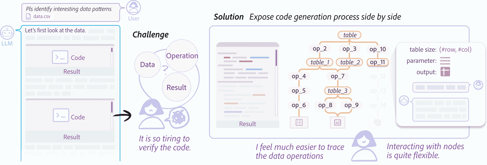
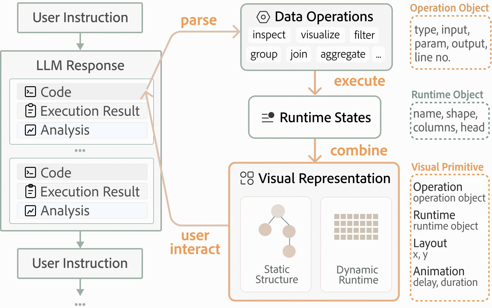
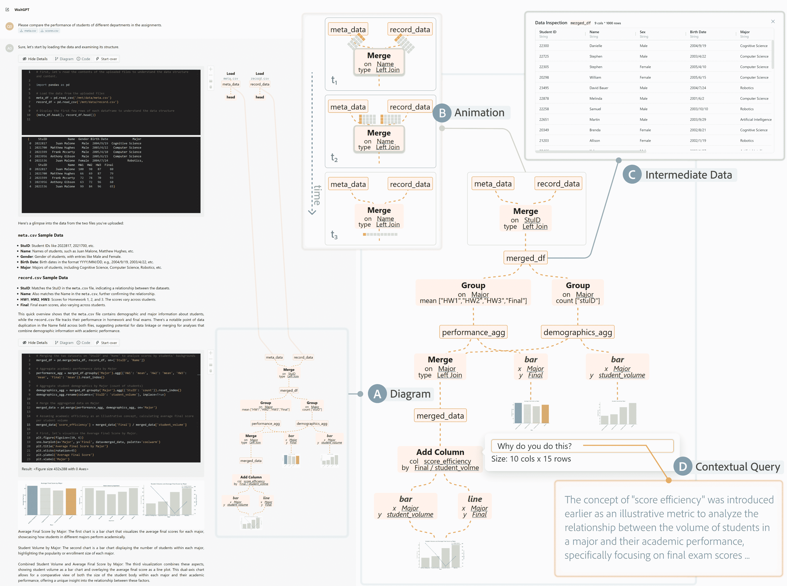
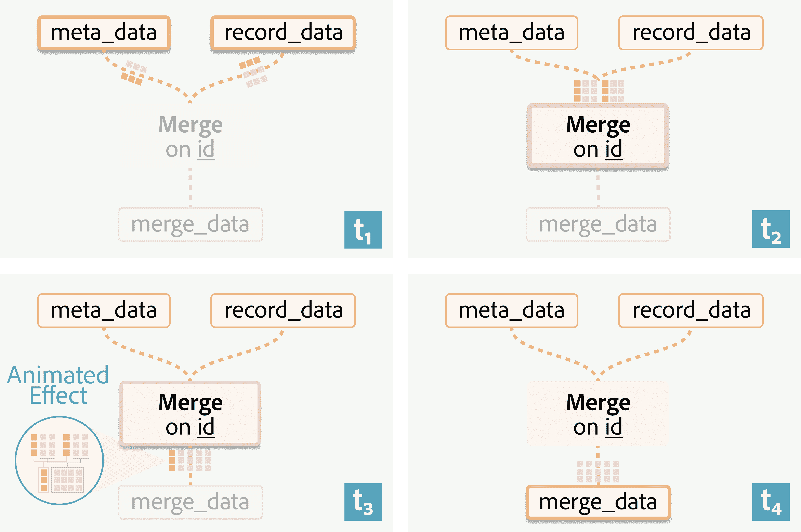
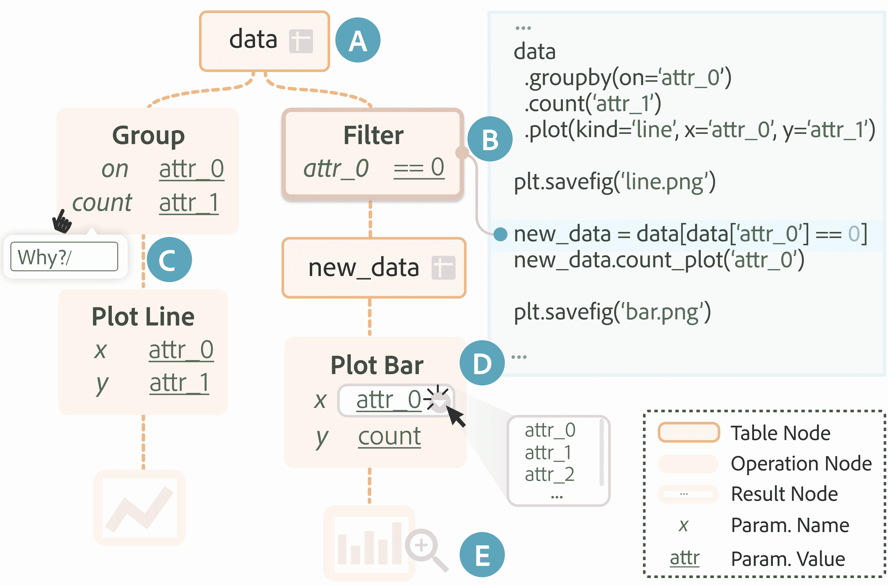
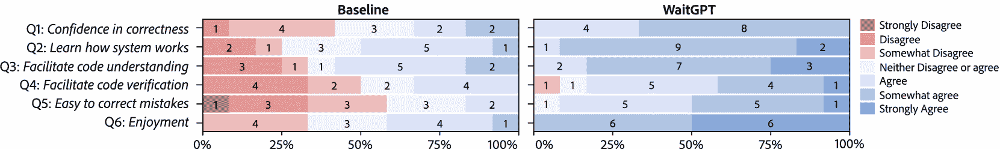

<!--yml

分类：未分类

日期：2025-01-11 12:21:28

-->

# WaitGPT：通过即时代码可视化监控和引导对话型大型语言模型（LLM）在数据分析中的应用

> 来源：[https://arxiv.org/html/2408.01703/](https://arxiv.org/html/2408.01703/)

李文瀚 [liwenhan.xie@connect.ust.hk](mailto:liwenhan.xie@connect.ust.hk) [0000-0002-2601-6313](https://orcid.org/0000-0002-2601-6313 "ORCID identifier") 香港科技大学 香港特别行政区 中国， 郑成波 [cb.zheng@connect.ust.hk](mailto:cb.zheng@connect.ust.hk) [0000-0003-0226-9399](https://orcid.org/0000-0003-0226-9399 "ORCID identifier") 香港科技大学 香港特别行政区 中国， 夏海军 [haijunxia@ucsd.edu](mailto:haijunxia@ucsd.edu) [0000-0002-9425-0881](https://orcid.org/0000-0002-9425-0881 "ORCID identifier") 加利福尼亚大学圣地亚哥分校 美国加利福尼亚州拉荷亚， 曲华敏 [huamin@ust.hk](mailto:huamin@ust.hk) [0000-0002-3344-9694](https://orcid.org/0000-0002-3344-9694 "ORCID identifier") 香港科技大学 香港特别行政区 中国， 朱天辰 [ztchen@umn.edu](mailto:ztchen@umn.edu) [0000-0002-2313-0612](https://orcid.org/0000-0002-2313-0612 "ORCID identifier") 明尼苏达大学 美国明尼阿波利斯（2024）

###### 摘要。

大型语言模型（LLM）通过对话型用户界面支持数据分析，正如OpenAI的ChatGPT（正式名称为高级数据分析或代码解释器）所示。基本上，LLM会生成代码来完成各种分析任务。然而，直接呈现原始代码可能会掩盖其逻辑，阻碍用户的验证。为了增强用户对LLM进行的数据分析的理解和控制力，我们提出了一种新方法，将LLM生成的代码转化为交互式可视化表示。在该方法中，用户可以实时查看LLM生成代码的清晰、逐步的可视化，帮助他们理解、验证并修改分析中的个别数据操作。我们的设计决策基于一项前期研究（N=8），该研究探讨了用户实践和面临的挑战。我们进一步开发了一个原型，命名为WaitGPT，并进行了用户研究（N=12）以评估其可用性和有效性。用户研究的结果显示，WaitGPT有助于监控和引导LLM执行的数据分析，帮助参与者提高错误检测能力并增强他们对分析结果的整体信心。

对话数据分析，LLM代理，人机交互，生成式AI，代码验证，视觉编程^†^†journalyear: 2024^††copyright: acmlicensed^††conference: 第37届ACM用户界面软件与技术年会；2024年10月13–16日；美国宾夕法尼亚州匹兹堡^††booktitle: 第37届ACM用户界面软件与技术年会（UIST ’24），2024年10月13–16日，美国宾夕法尼亚州匹兹堡^††doi: 10.1145/3654777.3676374^††isbn: 979-8-4007-0628-8/24/10^††conference: 第37届ACM用户界面软件与技术年会；2024年10月13–16日；美国宾夕法尼亚州匹兹堡^††ccs: 以人为中心的计算 自然语言界面^††ccs: 以人为中心的计算 图形用户界面^††ccs: 以人为中心的计算 信息可视化

图1\. 使用WaitGPT监控和引导LLM驱动的数据分析工具：用户不仅可以查看原始代码，还可以通过实时生成的可变表示检查数据操作，并积极参与数据分析。

\描述

图1比较了传统的对话式界面和WaitGPT的LLM驱动数据分析中的代码可视化。左侧：传统界面展示了用户在验证LLM响应时，跟踪数据、操作和结果时面临的挑战。右侧：WaitGPT的解决方案显示了一个实时生成的节点-链接图与LLM响应一同展示。该图可视化了表格、操作和结果。在操作节点上有一个可展开的框，允许用户查看表格大小、参数和输出，并提出上下文问题。

## 1\. 介绍

大型语言模型（LLMs）显著降低了数据分析的入门门槛，使得没有强大编程技能的用户也能够参与复杂的分析任务（Cheng等，[2023](https://arxiv.org/html/2408.01703v1#bib.bib9)；He等，[2024](https://arxiv.org/html/2408.01703v1#bib.bib24)；Dibia，[2023](https://arxiv.org/html/2408.01703v1#bib.bib13)）。人们不再需要编写脚本或使用复杂的软件，而是可以直接与对话型LLM代理进行交流。当前一些基于LLM的数据分析服务或工具的例子包括ChatGPT Plus（OpenAI，[2024](https://arxiv.org/html/2408.01703v1#bib.bib48)），Gemini Advanced（Google，[2024](https://arxiv.org/html/2408.01703v1#bib.bib18)）以及CodeActAgent（Wang等，[2024a](https://arxiv.org/html/2408.01703v1#bib.bib66)）。通常，这些工具遵循一个规划框架，LLM代理首先提出一个计划来划分任务，然后生成代码处理数据，并根据执行结果继续处理。

尽管具有潜力，基于大型语言模型（LLM）的数据分析工具在实际部署中暴露了可靠性问题，包括幻觉现象（Liu 等，[2023a](https://arxiv.org/html/2408.01703v1#bib.bib34)；Chen 等，[2024b](https://arxiv.org/html/2408.01703v1#bib.bib7)），细微的错误（Yang 等，[2021](https://arxiv.org/html/2408.01703v1#bib.bib74)；Wu 等，[2024](https://arxiv.org/html/2408.01703v1#bib.bib70)），以及LLM对任务的理解与用户未充分表述的意图之间的不匹配（Wang 等，[2018](https://arxiv.org/html/2408.01703v1#bib.bib65)；Li 等，[2024](https://arxiv.org/html/2408.01703v1#bib.bib33)）。这些不足之处要求人工监督，以验证和修正数据分析过程（Chopra 等，[2023](https://arxiv.org/html/2408.01703v1#bib.bib10)；Gu 等，[2024c](https://arxiv.org/html/2408.01703v1#bib.bib20)；Olausson 等，[2024](https://arxiv.org/html/2408.01703v1#bib.bib47)）。当前工具通常呈现原始数据分析代码，将用户的注意力转向低层次的细节，而非高层次的数据分析过程。根据我们与ChatGPT用户的访谈，个人用户，尤其是那些编程技能有限的人，难以全面审查LLM生成的代码，从而可能导致无法发现的错误和潜在的错误结果。此外，通过对话来修正代码可能会变成一场繁琐的交流，增加低效性和挫败感。

我们的目标是让用户更容易理解和导航由LLM（大语言模型）执行的数据分析过程，这与当前关于设计具有生成性AI特征的用户界面（如（Subramonyam等人，[2024](https://arxiv.org/html/2408.01703v1#bib.bib58)；Shen等人，[2024](https://arxiv.org/html/2408.01703v1#bib.bib53)））的研究相一致。具体来说，我们旨在支持实时监控和在任何时刻进行主动干预（引导）。与现有的面向传统数据分析流程的方法相比（如（Lau等人，[2023](https://arxiv.org/html/2408.01703v1#bib.bib32)；Shrestha等人，[2021](https://arxiv.org/html/2408.01703v1#bib.bib56)）），这一场景具有对话式交互，并且可以根据需求生成用户不熟悉的代码，这些代码会流入系统。根据一项涉及8名有LLM支持的数据分析经验的用户的前期研究，我们提出了一种工作流程，它能够识别生成代码中的数据操作，并实时将其映射到可视化的交互式原语上（[图1](https://arxiv.org/html/2408.01703v1#S0.F1 "图1 ‣ WaitGPT: 在数据分析中监控和引导对话型LLM代理，实时代码可视化")）。这些原语共同提供了数据分析过程的概览，并直观、与语法无关地展示了每个数据操作的细节及其内部运行时状态。此外，用户可以通过直接与这些原语互动来精炼每个操作，而无需重新生成整个分析代码。通过这种方法，我们为传统的对话式用户界面（CUI）增添了交互式可视化，将用户从信息的被动接收者转变为数据分析任务的积极参与者。

我们设计并实现了WaitGPT，一个原型系统，它将LLM生成的数据分析代码转换为一个包含代表关键数据操作的节点的可视化图表，从而逐步构建数据分析概览。这个图表随着代码生成过程的进行而逐步演化。此外，WaitGPT按行执行底层代码，并在运行时更新可视化图表，以反映代码的中间状态。用户可以与这些节点交互，修改或调整操作，从而优化数据分析过程。执行结果保存在沙箱环境中，这使得系统在修改后可以恢复或重新运行分析代码，而无需重新生成整个代码。一项涉及12名参与者的用户研究报告称，用户体验得到了提升，用户发现更容易发现错误、增强了控制感，并且对LLM生成的结果更具信心。

总结来说，我们的贡献可以概括为三点。

+   •

    一项前期研究（N=8），总结了基于对话进行数据分析时的实践、挑战和期望。

+   •

    一种新颖的设计，促进监控和引导LLM生成的数据分析脚本，特点是交互式可视化。我们实现了一个名为WaitGPT的原型系统，并评估了其可用性（N=12）。

+   •

    关于用于数据分析任务的LLM代理用户界面设计的讨论与启示。

## 2\. 背景与相关工作

在这里，我们回顾了基于NLI的数据分析工具、数据处理脚本的可视化技术以及人类与LLM交互的用户界面设计，这些与我们的研究密切相关。

### 2.1\. 解密基于NLI的数据分析

基于NLI的数据分析工具通过自然语言解释用户指令并自动执行分析任务。现有的工具通常根据分析任务的明确分类组合原子数据操作（Shen等人，[2022](https://arxiv.org/html/2408.01703v1#bib.bib54); Zhu-Tian和Xia，[2022](https://arxiv.org/html/2408.01703v1#bib.bib76)）。为了支持更灵活的用户任务，近年来应用LLM将基于自然语言的用户意图转换为与数据相关的操作或直接合成可视化程序的兴趣激增（例如，（Tian等人，[2024](https://arxiv.org/html/2408.01703v1#bib.bib61); Liu等人，[2023b](https://arxiv.org/html/2408.01703v1#bib.bib36)，[2024](https://arxiv.org/html/2408.01703v1#bib.bib35)））。

然而，期望完全正确的输出仍然不现实，原因包括语言模糊性以及算法或模型的准确性（Feng 等人，[2024](https://arxiv.org/html/2408.01703v1#bib.bib15)；Ferdowsi 等人，[2023](https://arxiv.org/html/2408.01703v1#bib.bib16)；Narechania 等人，[2021](https://arxiv.org/html/2408.01703v1#bib.bib45)）。当将 LLM 集成到数据分析工具中时，这一问题尤为突出，因为 LLM 本质上是黑箱模型。这一特性要求采用严格的检查和验证策略，正如先前的研究所强调的那样（Chopra 等人，[2023](https://arxiv.org/html/2408.01703v1#bib.bib10)；Podo 等人，[2024](https://arxiv.org/html/2408.01703v1#bib.bib50)；Gu 等人，[2024b](https://arxiv.org/html/2408.01703v1#bib.bib19)）。示例错误包括错误的列选择、数据映射、数据转换等。为应对这一挑战，XNLI（Feng 等人，[2024](https://arxiv.org/html/2408.01703v1#bib.bib15)）提供了一个独立的界面，将用户查询的关键方面展示为传统 NLI 管道中的有限集合，即属性、任务和视觉编码。在 LLM 的应用中，Huang 等人（Huang 等人，[2023](https://arxiv.org/html/2408.01703v1#bib.bib26)）将数据转换程序转换为流程图，并使用中间表作为节点。在基于电子表格的界面下，Liu 等人（Liu 等人，[2023a](https://arxiv.org/html/2408.01703v1#bib.bib34)）提出了基于基础的抽象匹配（GAM），用自然语言向最终用户解释 LLM 生成的代码。ColDeco（Ferdowsi 等人，[2023](https://arxiv.org/html/2408.01703v1#bib.bib16)）进一步通过两种互补视图的中间结果增强了 GAM，突出显示操作如何改变结果。

我们的工作适用于更加开放且涉及复杂数据操作的分析任务，这些任务尚未得到充分研究（He 等人，[2024](https://arxiv.org/html/2408.01703v1#bib.bib24)）。与我们关注对话界面最相关的是，Gu 等人（Gu 等人，[2024c](https://arxiv.org/html/2408.01703v1#bib.bib20)）添加了一个侧边面板，展示中间数据，以促进回顾性地检查合成代码。Kazemitabaar 等人（Kazemitabaar 等人，[2024](https://arxiv.org/html/2408.01703v1#bib.bib29)）提出在 LLM 的响应中提供可编辑的假设、执行计划和代码，以便进行紧密验证和引导。我们通过提出可转换的代码表示法来补充他们的设计，旨在降低代码的抽象层次，并增强用户在交互过程中的参与感。

### 2.2\. 数据处理代码的意义构建

简化数据处理代码可以支持学习（Lau 等人，[2023](https://arxiv.org/html/2408.01703v1#bib.bib32)），协作工作（Pu 等人，[2021](https://arxiv.org/html/2408.01703v1#bib.bib51)），以及质量控制（Xiong 等人，[2022](https://arxiv.org/html/2408.01703v1#bib.bib73)；Shrestha 等人，[2023](https://arxiv.org/html/2408.01703v1#bib.bib57)）。为了提供一个全面的视角，先前的研究已将操作浓缩为描述性的叙述（Feng 等人，[2024](https://arxiv.org/html/2408.01703v1#bib.bib15)；Liu 等人，[2023a](https://arxiv.org/html/2408.01703v1#bib.bib34)），或示意图（Huang 等人，[2023](https://arxiv.org/html/2408.01703v1#bib.bib26)；Ramasamy 等人，[2023](https://arxiv.org/html/2408.01703v1#bib.bib52)）。此外，许多研究集中于通过动画（例如，（Khan 等人，[2017](https://arxiv.org/html/2408.01703v1#bib.bib30)；Pu 等人，[2021](https://arxiv.org/html/2408.01703v1#bib.bib51)；Guo 等人，[2023](https://arxiv.org/html/2408.01703v1#bib.bib22)））或时间轴表示（例如，（Niederer 等人，[2017](https://arxiv.org/html/2408.01703v1#bib.bib46)；Bors 等人，[2019](https://arxiv.org/html/2408.01703v1#bib.bib3)；Lucchesi 等人，[2022](https://arxiv.org/html/2408.01703v1#bib.bib37)））可视化中间结果。例如，Datamation（Pu 等人，[2021](https://arxiv.org/html/2408.01703v1#bib.bib51)）通过视觉化映射并链接数据处理的每个步骤与底层数据集，为观众提供更多的背景信息。Smallset Timeline（Lucchesi 等人，[2022](https://arxiv.org/html/2408.01703v1#bib.bib37)）智能地选择受操作影响的样本，并沿时间轴在表格中编码变化。

为了增强对原子数据操作的理解，许多研究探索了逐步检查底层数据。这可以通过揭示输入和输出状态之间的连接和差异来实现。Pandas Tutor（Lau 等人，[2023](https://arxiv.org/html/2408.01703v1#bib.bib32)）突出显示选定的行，并通过箭头链接它们的新位置。SOMNUS（Xiong 等人，[2022](https://arxiv.org/html/2408.01703v1#bib.bib73)）展示了23个静态符号，分别用于表格、列和行粒度的数据转换操作。为了弥合数据转换规范与结果之间的心理映射，一些研究允许交互式检查（Kandel 等人，[2011](https://arxiv.org/html/2408.01703v1#bib.bib28)；Shrestha 等人，[2021](https://arxiv.org/html/2408.01703v1#bib.bib56)，[2023](https://arxiv.org/html/2408.01703v1#bib.bib57)）。例如，Unravel（Shrestha 等人，[2021](https://arxiv.org/html/2408.01703v1#bib.bib56)）自动将单独的数据操作转换为具有关键参数和表格大小的摘要框，作为用户修改和访问运行时执行结果的中介层。

WaitGPT解决了一个新问题：对LLM代理生成的数据处理代码进行理解。与以往处理完整且静态脚本的方法不同，代码是以流式方式生成的，这可能给用户在生成过程中跟踪LLM的响应带来挑战。此外，一些工具（例如，（Wang等人，[2022](https://arxiv.org/html/2408.01703v1#bib.bib64)；Shrestha等人，[2021](https://arxiv.org/html/2408.01703v1#bib.bib56)））需要编程能力，而一些工具功能较为僵化（例如，（Xiong等人，[2022](https://arxiv.org/html/2408.01703v1#bib.bib73)；Feng等人，[2024](https://arxiv.org/html/2408.01703v1#bib.bib15)））。然而，在我们的场景中，最终用户，包括数据分析师、外行等，正在与LLM代理进行各种数据分析任务对话。我们优先考虑直观的可视化设计，以便用户能够立即理解和快速验证，同时在活动代码生成阶段保持用户的专注和不受干扰。然而，一般的代码调试超出了我们的范畴。

### 2.3. 推进人类与LLM互动的用户界面

在大规模语言模型（LLMs）浪潮中，HCI（人机交互）社区正在推进用户界面设计，以增强对LLMs的控制，超越标准聊天机器人框架或基本API调用。

与我们旨在简化生成内容理解和验证的动机类似，一些工作旨在弥合人类与LLM互动中的认知差距（Subramonyam等人，[2024](https://arxiv.org/html/2408.01703v1#bib.bib58)；Tankelevitch等人，[2024](https://arxiv.org/html/2408.01703v1#bib.bib60)）。例如，Graphlogue（Jiang等人，[2023](https://arxiv.org/html/2408.01703v1#bib.bib27)）将线性文本转换为图表，以动态编码逻辑结构来辅助信息检索任务。Zhu-Tian等人（Zhu-Tian等人，[2024a](https://arxiv.org/html/2408.01703v1#bib.bib77)）在提示词构建过程中逐步、即时地展示LLM生成的代码。Sensecape（Suh等人，[2023](https://arxiv.org/html/2408.01703v1#bib.bib59)）通过对现有对话进行多层次抽象，为用户提供支持信息寻找和理解的能力。我们关注一个新兴的场景——与LLM进行对话式数据分析，在这个场景中，我们呈现了新的功能，例如代码流式生成时的即时可视化、代码滚动讲述和片段导航。

另一项研究方向探讨了超越传统单一文本提示的LLM交互设计，其中推广了更为动态和渐进的工作流程和交互模式。例如，Wu等人（Wu et al., [2022](https://arxiv.org/html/2408.01703v1#bib.bib69)）提出了AI链的概念，用户指定如何将一个步骤的输出作为下一个步骤的输入，从而实现逐步积累的收益。许多研究集中于特定应用领域，包括写作（Chung et al., [2022](https://arxiv.org/html/2408.01703v1#bib.bib11)）、图形设计（Masson et al., [2024](https://arxiv.org/html/2408.01703v1#bib.bib38)）、编程（Angert et al., [2023](https://arxiv.org/html/2408.01703v1#bib.bib2)）等。与我们对LLM生成代码的精细控制的兴趣相关，Low-code LLM（Cai et al., [2024](https://arxiv.org/html/2408.01703v1#bib.bib5)）允许用户编辑由规划LLM合成的初步工作流程，从而对生成的代码进行控制。DynaVis（Vaithilingam et al., [2024](https://arxiv.org/html/2408.01703v1#bib.bib62)）利用LLM动态合成UI小部件以编辑数据可视化。基于类似的思想，我们的工作支持用户与中间可视化进行交互，以便深入分析或直接在现有代码中进行调整，从而实现更直观和精细的LLM控制。

## 3\. 形成性研究

我们进行了一项形成性研究（N=8），旨在更好地理解LLM驱动的数据分析工具中的问题，并为情境化支持的设计提供参考。

### 3.1\. 设置

##### 招募与筛选

我们在社交媒体和大学论坛上发布了招聘广告。候选参与者需要填写一份关于其人口统计信息和相关经验的问卷。我们挑选了在数据分析方面更有经验并且熟悉LLM驱动的数据分析工具的志愿者。

##### 协议

本研究包括一个情境调查（20~40分钟）和一个结构化访谈（15分钟）。首先，我们要求参与者展示他们在数据分析任务中与LLM代理的交互历史。如果他们的原始数据集可用，他们还会在思考的同时向主持人展示数据分析过程。对于五位手头有原始数据集的参与者，我们要求他们直接重复一次分析过程，同时进行思考。访谈最后会问一些关于整体体验的问题。每位参与者的报酬为每小时12美元。

##### 参与者

我们共招募了8位参与者（P1–P8），其中3位女性，5位男性，年龄在20至30岁之间。具体而言，包括6位研究生，1位本科生（P3），以及1位数据记者（P4）。所有人都熟悉OpenAI的ChatGPT中嵌入的“高级数据分析”或“代码解释器”数据分析模式（OpenAI, [2024](https://arxiv.org/html/2408.01703v1#bib.bib48)），并且至少进行了5次相关操作。

##### 分析

所有访谈都进行了录像并转录成文字。根据主题分析方法（Braun 和 Clarke，[2012](https://arxiv.org/html/2408.01703v1#bib.bib4)），第一作者采用了归纳和演绎方法，得出了初步的分类编码和主题。前三位作者根据每周会议回顾了转录内容和重要截图，并在多次迭代后就最终主题达成一致。

### 3.2\. 研究结果

在这里，我们总结了访谈研究的关键发现。

#### 3.2.1\. 为什么人们选择LLM驱动的工具进行数据分析？

参与者认为对话型LLM代理在数据分析中的多功能性是一个显著的优势。他们已经将其应用于多种数据密集型任务，包括探索性数据分析（4/8）、数据清洗（4/8）、验证性数据分析（2/8）、数据分析（2/8）以及数据检索（1/8）。此外，参与者还欣赏其在开放性数据分析中的灵活性。“与功能固定的软件相比，我喜欢[在ChatGPT中]的自由。我可以根据结果请求解释，要求下一步的建议，或插入不相关的问题。”（P6）LLM驱动的数据分析工具的另一个优势是其低代码或零代码环境，用户只需描述任务，并获得结构良好的响应，形式可能是代码或报告。例如，P4从事调查性数据新闻工作（Showkat 和 Baumer，[2021](https://arxiv.org/html/2408.01703v1#bib.bib55)），经常清理和整理来自不同来源的数据集，他表示：“从头生成的代码节省了我几天的工作。”这一特点特别受到那些不精通编码的参与者的重视（2/8）。“我不再需要关注细节操作，也不需要学习API了。”（P2）

表1\. OpenAI的ChatGPT在数据分析任务中生成的代码常见问题。

| 问题类型 | LLM代理的详细行为 |
| --- | --- |
| 不完整的工作流 | 漏掉一些重要步骤，例如在计算均值时未排除空值。 |
| 不存在的符号 | 调用一个函数、配置一个参数或使用一个未定义的变量。 |
| 数据转换失败 | 无法处理边界数据值，例如访问所有数据项中不存在的属性。 |
| 错误的列 | 选择了错误的列。 |
| 不合理的值 | 将参数设置为不合适的值，例如使用过高的阈值来识别离群值。 |

\描述

表1列出了受访者在使用ChatGPT进行数据分析任务时遇到的常见问题。第一列“问题类型”对问题进行了分类，而第二列“LLM代理的详细行为”则提供了具体的示例。

#### 3.2.2\. 人们如何在数据分析中使用LLM驱动的工具？

我们将参与者的工作流程分为三个阶段：代码生成、后期验证和迭代优化。

默认情况下，ChatGPT会折叠代码，仅以百分比的形式报告进度。因此，参与者（7/8）在生成阶段几乎不切换代码面板，而是分心处理个人事务或进行相关的旁任务，如回顾之前的对话。

在完成代码生成后，每个参与者都会一致地审查文本回应，并且如果有的话，还会查看可视化内容，以便理解分析的含义。验证代码的可靠性是一个普遍关注的问题，大多数参与者（6/8）都会检查生成的脚本，尤其是在数据洞察很重要的情况下。他们会检查整个数据处理流程以及单个操作数的特定参数。P4有时会提出验证性问题，以确认代码的正确性，比如请求查看均值，以判断是否与其先前的知识一致。当生成的代码与预期不符时，参与者（6/8）会尝试通过精细化提示重新调整代理的方向。P2提到了一种特别的策略：“我会尽力将任务分解成可执行的步骤，这样对ChatGPT来说不会太有挑战。”值得注意的是，一些参与者（3/8）会重新生成回应，而不是开始新的对话。“我担心在小步骤上添加额外要求会打断分析的流程。”（P3）对于开放性任务，获得初步结果后，参与者可能会通过对话进一步深入（3/8）或转向本地编码环境（2/8），这取决于编程和提示之间的权衡。“有了代码，我可以很容易地在（计算）笔记本上复用它。”（P1）

#### 3.2.3. 什么因素阻碍了人类与LLM在数据分析任务中的协作？

在用户参与由LLM代理辅助的数据分析过程中，有三个主题与故障问题有关。

$\diamond$  中断的工作流程会对用户参与度产生负面影响。由于代码生成和执行有时较为冗长，会打断分析的流程。大多数参与者（7/8）在过程中会转移注意力，而不是密切监视生成的代码，因为代码不像自然语言那样直观或易于理解。“读代码让我感到很累，所以我宁愿不看。”（P1）如果没有及时干预，代码中的小错误可能会传播并使分析结果失效，导致需要重新审视和修改工作。这会导致更高的挫败感和大量的时间浪费，因为完成一个探索性数据分析任务通常需要半分钟到三分钟的时间。为了避免这种长时间的对话交换，P3明确要求代理在生成和执行代码之前征求许可，解释说“（这样做，）我至少可以控制方向”。（P5）

$\diamond$ 验证原始代码在心理上是具有挑战性的。虽然大语言模型（LLM）可以提供清晰的注释来解释每个步骤，但许多参与者（7/8）仍然发现验证生成的代码具有挑战性。

一方面，审查代码片段本质上是繁琐且反直觉的，尤其是当解读来自外部来源的代码时，这会对大脑造成很大的负担。毕竟，LLM 可能不会遵循参与者习惯的编码风格。“它（LLM）有时使用非常高级的语法，所以我让它像新生一样写代码。”（P5）此外，LLM 可能会使用不熟悉的包。“我甚至不知道函数参数是干什么的，更不用说修正它了。”（P3）

另一方面，LLM 可能在代码中引入各种意外错误，这需要仔细检查，文献中也有相关证据（Feng 等， [2024](https://arxiv.org/html/2408.01703v1#bib.bib15)；Chopra 等， [2023](https://arxiv.org/html/2408.01703v1#bib.bib10)；Gu 等， [2024b](https://arxiv.org/html/2408.01703v1#bib.bib19)）。[表 1](https://arxiv.org/html/2408.01703v1#S3.T1 "Table 1 ‣ 3.2.1\. Why do people turn to LLM-powered tools for data analysis? ‣ 3.2\. Findings ‣ 3\. Formative Study ‣ WaitGPT: Monitoring and Steering Conversational LLM Agent in Data Analysis with On-the-Fly Code Visualization") 列出了相关示例问题。P6 提到 LLM 的幻觉：“乍一看，逻辑非常流畅，但参数却是合成常量。这个问题很难识别。”一些参与者（3/8）对结论的可靠性表示担忧，但由于方法有限，他们感到沮丧。“我不确定结论是否正确。我时间紧迫，所以我只检查主要步骤，然后希望不会有其他问题。”（P8）

$\diamond$ 迭代过程可能需要反复多次。为了修复已识别的问题，用户需要制定有关错误内容及如何修正的指令，然后再等待另一个生成-执行-报告周期。不幸的是，由于其试错性质，这个过程可能变得耗时，而且需要大量的精力来有效地沟通所需分析的细微差别。因此，许多参与者（6/8）不愿完全接受对话式工作流。对于像完善操作细节这样的次要问题，一些参与者（5/8）更倾向于将代码复制粘贴到本地环境并进行调整。“重新使用代码比具体告诉 ChatGPT 做什么更方便。”（P7）对于像添加新的处理步骤这样的重大变更，他们更愿意与 LLM 代理进行沟通，因为编写代码变得繁琐。然而，经过几轮尝试后，他们会在失去耐心时转向本地环境。

### 3.3 设计考虑

根据形成性研究的启发，我们提出以下设计考虑（DC），以指导我们为LLM驱动的数据分析工具构思一种替代的交互设计。我们的设计目标是支持通过交互式可视化支架来监控和引导LLM合成的数据分析。

DC1\. 将抽象代码流转化为关键数据操作，以便进行集中验证。在LLM驱动的数据分析中，由于生成的代码通常具有庞大而复杂的特性，主要的挑战便应运而生。然而，用户通常更愿意理解分析过程本身，而非代码的复杂细节。呼应先前的研究（Gu 等， [2024c](https://arxiv.org/html/2408.01703v1#bib.bib20)），参与者表达了需要访问数据操作、决定性参数及其结果的需求。为了解决这一挑战，我们提议简化信息以便验证LLM进行的数据分析过程。通过从代码中提取涉及个别数据操作的分层信息，如参数规格和执行结果，我们旨在将用户的注意力重新集中到分析过程本身，免去他们理解原始代码的沉重任务。

DC2\. 通过即时生成的直观可视化支架展示数据操作和执行结果。尽管进行了抽象，尤其是对于那些编程经验有限的用户，他们可能仍然难以理解LLM产生的原始、语法繁杂的输出。借鉴以往在代码可视化领域的工作（Myers, [1990](https://arxiv.org/html/2408.01703v1#bib.bib43); Victor, [2011](https://arxiv.org/html/2408.01703v1#bib.bib63)），我们采用了从特定代码语法中抽象出来的可视化表现形式，以促进用户对数据分析过程的快速理解。因此，这种可视化表现形式还应当展示这些信息，包括每个操作前后的数据状态。此外，该过程应在代码生成过程中即时执行，确保用户能够无缝体验并与他们的认知过程对接。建立代码与其可视化表现之间的联系也至关重要，这将使用户能够看到他们指令对数据的直接影响，从而更有效地导航分析工作流。

DC3\. 支持对 LLM 的查询和可视化中的迭代代码生成。LLM 驱动的数据分析在对话界面中的一个突出问题是，表达精细化意图和不确定性在 LLM 后续响应中往往冗长。为了解决这个问题，可视化表示应简化这些意图的表达，通过提供机制在细粒度上修改数据分析过程。用户应能够与生成分析中的各个步骤（数据操作）进行交互，从而精确调整，而无需重写大量代码或重新开始对话。这种细粒度控制使用户能够微调分析，准确反映其意图，并简化迭代精炼过程。

DC4\. 将可视化无缝嵌入到对话用户界面（CUI）中。由于对话数据分析通常在 CUI 中进行（Gu 等，[2024c](https://arxiv.org/html/2408.01703v1#bib.bib20); Chopra 等，[2023](https://arxiv.org/html/2408.01703v1#bib.bib10)），我们将设计调整为适应常见的 Web CUI 设计模式，且方式非侵入性。例如，可视化应在渐进生成过程中稳定显示，并与代码保持相同的垂直顺序。它应为 LLM 响应中的代码部分提供轻量级的补充视图（参见 [图 2](https://arxiv.org/html/2408.01703v1#S3.F2 "Figure 2 ‣ 3.3\. Design Considerations ‣ 3\. Formative Study ‣ WaitGPT: Monitoring and Steering Conversational LLM Agent in Data Analysis with On-the-Fly Code Visualization")），并为代码之间的对话线程提供一定程度的视觉指导。

图 2\. 我们提出了一种工作流，能够识别生成代码中的数据操作，并将其即时映射到可视化的交互原语。这些原语共同提供了数据分析过程的概览。

\Description

图 2 展示了所提议的工作流。左侧显示了用户与 LLM 的交互：用户输入指令，LLM 返回包含代码、执行结果和分析的块。中间部分描述了可视化工作流：首先，代码被解析为数据操作。其次，这些操作被执行以推导运行时状态。第三，运行时状态与静态代码结构相结合，生成包含静态和动态信息的可视化表示。右侧描述了在可视化工作流的每个阶段提取的对象和焦点，包括数据操作、运行时状态和可视化表示。

图3\. WaitGPT用户界面的截图。(A) 代表代码的流程图的放大视图。(B) “表格符号”的插图，显示了代码生成过程中的表格依赖关系和变化。(C) 通过切换互动式表格面板检查中间数据。(D) 基于操作对LLM进行查询。

\描述

图3展示了用户界面的截图。左侧是对话概览，而右侧则放大了代码可视化部分。图中有三个子图。顶部子图展示了代码生成过程中的动态符号。中右侧子图展示了互动式表格视图。底右侧子图展示了基于特定操作的上下文查询。

## 4\. WaitGPT：使用场景

基于形态学研究和设计考量，我们提出通过动态可视化代码生成过程来帮助用户在数据分析过程中引导对话式LLM代理。这是通过一个工作流实现的，该工作流在生成的代码中识别数据操作，并即时将其映射到可视化原语上（参见[图2](https://arxiv.org/html/2408.01703v1#S3.F2 "图 2 ‣ 3.3\. 设计考量 ‣ 3\. 形态学研究 ‣ WaitGPT：通过即时代码可视化监控和引导数据分析中的对话式LLM代理")）。这些可视化原语不仅展示了数据操作的静态方面，还展示了操作前后底层数据（即表格）的运行时状态。此外，它们为用户提供了丰富的互动可能性，使用户能够在不完全重新生成代码的情况下，精细化数据操作。

我们通过一个原型系统——WaitGPT来实现这一理念，WaitGPT使用户能够主动引导数据分析过程，通过与LLM代理的交互进行干预，就像说：“等一下，GPT，哪里出了点问题……”本节通过一个假设的使用案例演示WaitGPT，展示其如何改变用户在数据分析任务中与LLM的互动方式。

##### 使用场景

Zoey，一位大学讲师，希望回顾学生在各项作业中的表现，以便为未来的教学策略提供参考。她打开了WaitGPT，这是一个她熟悉的基于LLM的对话式数据分析工具。

WaitGPT的界面类似于一个聊天框，允许用户上传电子表格并用自然语言询问数据内容（[图3](https://arxiv.org/html/2408.01703v1#S3.F3 "图 3 ‣ 3.3\. 设计考虑 ‣ 3\. 形成性研究 ‣ WaitGPT：监控和引导对话式LLM代理进行数据分析与即时代码可视化")）。在上传了两份电子表格——一份详细记录了学生的个人资料，另一份记录了他们的个人作业成绩后——Zoey要求WaitGPT比较不同背景学生的表现。作为回应，WaitGPT列出了一个满足她需求的计划，然后创建了一段代码片段来进行分析。外部执行器执行该代码片段并产生结果。

与类似工具不同，WaitGPT可视化了数据分析过程，而不仅仅是展示原始代码和文本执行结果（[图3](https://arxiv.org/html/2408.01703v1#S3.F3 "图 3 ‣ 3.3\. 设计考虑 ‣ 3\. 形成性研究 ‣ WaitGPT：监控和引导对话式LLM代理进行数据分析与即时代码可视化") A)）。它动态提取数据操作，并将它们呈现为图表中的节点，展示数据流。举例来说，一个“join”操作节点会显示为“merge”。该节点会显示正在连接的表格、连接类型（例如：左连接、交叉连接等）以及用于连接的索引列。这些块根据依赖关系相互连接，并从左到右排列，以反映过程顺序。值得注意的是，WaitGPT将分析脚本分解为可执行的块，并立即执行这些块，而不是等到整个代码片段准备好才执行。这样可以实现渐进式的理解和调试过程，让用户实时看到每个操作的效果。该工具还将数据表的运行时状态（例如：数据条目/列的数量、选定的列）作为图表的一部分进行可视化。具体来说，每个表格的运行时状态以图形符号呈现，沿着操作对象之间的连接边缘移动。

通过可视化表示，Zoey快速发现图表中的一个缺陷——行数减少了（[图3](https://arxiv.org/html/2408.01703v1#S3.F3 "Figure 3 ‣ 3.3\. Design Considerations ‣ 3\. Formative Study ‣ WaitGPT: Monitoring and Steering Conversational LLM Agent in Data Analysis with On-the-Fly Code Visualization") B）。WaitGPT使用户能够直接在可视化界面中精细调整操作，而无需重写原始查询和重新生成整个数据分析代码。用户可以直接更新参数、查询细节，并通过自然语言表明改进意图。因此，Zoey将连接参数调整为学生ID，然后点击重新运行按钮执行更新后的代码。在分析进行时，Zoey检查了表格。她请求LLM清理数据。图表更新后，反映了经过数据验证操作后修正的分数。现在，Zoey准备分析这些可靠的数据，她的教学计划建立在准确的基础上。

## 5\. WaitGPT：系统设计

WaitGPT的设计由三个主要部分组成：将代码抽象为数据操作链、可视化这些链条，并提供交互功能以引导分析过程。

### 5.1\. 将代码抽象为操作链

基于访谈，我们确定了理解代码所必需的三种信息类型：表变量、数据操作和执行结果。此外，不同的数据操作封装了专门的语义和独立的参数。因此，我们选择将数据分析过程抽象为一个图结构，通过输入输出关系将其节点连接起来，如下所示（DC1）。每个数据操作的输入是表格，输出可以是更新后的表格、新的表格、其他派生值/可视化，或无输出。

+   $\ast$

    表节点：表节点对应代码中底层表的变量，例如Pandas包中的dataframe。它可以从数据文件加载，也可以在代码执行过程中动态生成，作为中间变量。

+   $\ast$

    操作节点：操作节点绑定到一个原子数据操作。它展示了操作对象的详细参数，例如Select、Filter和Sort。

+   $\ast$

    结果节点：结果节点与执行结果相关联，例如打印的值或数据可视化。

此外，这些节点之间的关系可以是以下之一：

+   $\ast$

    输入：从表节点到操作节点。这意味着数据操作是基于输入表格的。

+   $\ast$

    赋值：从操作节点到新表节点。这意味着从该操作中产生了一个新的表类型变量。

+   $\ast$

    结果生成：从操作节点到结果节点。这意味着操作输出了一些可见的结果。

+   $\ast$

    操作链：从一个操作节点到另一个操作节点。意味着一个表格依次经过这两个操作。

##### 通过静态分析提取节点。

为了提取这些节点及其关系，我们对生成代码的抽象语法树（AST）进行静态分析，在此过程中，我们应用了基于数据分析脚本模式和相关库的功能接口设计的启发式方法。WaitGPT当前能够解析包括 加载数据 、 检查 、 选择 、 过滤 、 排序 、 变换 、 分组 、 聚合 、 合并 、 添加 等原子操作。

基于Pandas、Matplotlib和Seaborn库的列 和 可视化，这些是ChatGPT的默认选择并被广泛采用（Chen等人，[2024b](https://arxiv.org/html/2408.01703v1#bib.bib7)）。例如，merge_df = df[["attr_1", "attr_2"]].sort() 将被转换为两个操作对象： 选择 和 排序 。为了将表格目标绑定到操作上，我们维护一个全局变量来存储现有的表格变量。这是因为表格变量只能通过从外部源（文件、数据库等）加载或作为先前操作的输出生成。

### 5.2\. 可视化数据操作链

我们的目标是将LLM生成的代码转化为易于理解的可视化形式，帮助用户检查数据分析过程（DC2）。为此，我们开发了一套视觉原语，呈现每个操作及其内部运行状态的细节。这些原语通过链式连接，共同提供数据分析过程的概览。

##### 静态代码的视觉原语

我们利用图示来表示针对单个代码片段的基于图的数据处理流程。表格节点、操作节点和结果节点被可视化为块状，并分别用黄色、粉色和白色进行颜色编码。选择节点式可视化是因为它对一般用户（DC2）来说较为熟悉，并且在展示层级信息时具有灵活性，能够随着代码流扩展，并暗示操作顺序（DC4）。由于大型语言模型（LLM）有时会合成长的变量名以便更清晰地表达，我们认为矩形块有助于封装这些信息。为了简化，表格节点仅显示相应的变量名，结果节点显示缩略图。操作节点则使用粗体字样来优先传达其类型（例如，过滤、分组等）。同时，我们通过排版在视觉上区分其参数名称和值。

一个操作链从上到下延展，按照其流程进行。对于一个表节点，可能有多个关联的操作链。这些链按照执行顺序从左到右对齐。一个代码片段依赖于预先存在的代码，因为运行时环境在整个对话过程中是共享的。因此，表节点可能会追溯到之前的代码片段。为了反映这种关系，在这种情况下会做一个副本，并通过跨对话曲线与其先前的出现关联。

##### 运行时状态的视觉原语

图表通过视觉符号进一步丰富，这些符号编码了表格变量的运行时状态。表格符号采用表格的常见视觉表示形式——二维矩阵。矩阵的列数与表格的列数相同。每列的矩阵行数与表格的行数成比例，以大致表示数据大小的变化，并适应不同数据大小的尺度。要获取关于运行时状态的精确信息，用户可以与相关操作节点进行交互以获取详细信息。通过链式操作，表格的大小可以被更新。

### 5.3\. 引导LLMs的数据分析

该图不仅仅是数据分析过程的可视化表示，它还充当了一个交互式的支架，帮助用户引导由LLM生成的数据分析代码，实现实时检查、回顾性检查和细致的优化（DC3）。本节介绍了WaitGPT支持的交互。

#### 5.3.1\. 对底层代码的实时检查

在代码生成过程中，只会显示图表，以减少最终用户的认知负担。然而，用户仍然可以切换到代码面板，并将图表与代码并排显示。当数据操作被激活时，即外部执行者刚刚运行了代码，它将被添加到图表中，可能会引入一个新的表节点或结果节点。同时，相关的表格符号也会出现，并逐渐从之前的节点流向当前节点。[图4](https://arxiv.org/html/2408.01703v1#S5.F4 "Figure 4 ‣ 5.3.1\. Real-Time Inspection on the underlying code ‣ 5.3\. Steering the Data Analysis of LLMs ‣ 5\. WaitGPT: System Design ‣ WaitGPT: Monitoring and Steering Conversational LLM Agent in Data Analysis with On-the-Fly Code Visualization")展示了这一动态过程的示例。

图4\. 展示了在代码生成过程中，图表如何随着动画表格符号的变化而增长。

\Description

图4使用四个子图演示了在代码生成过程中流图的动画关键帧。第一个子图显示加载了两个数据集。第二个子图显示两个数据集基于名为“id”的共同列进行合并。第三个子图显示合并后的数据集，突出显示动画效果。最后一个子图显示创建了一个名为“merge_data”的新数据框。

#### 5.3.2\. 对分析过程的回顾性调查

在代码和图表完全生成后，用户可以进行回顾性检查，以验证流程并调查潜在问题。为了评估分析流程，用户可以重新播放显示图表扩展的动画，或利用滚动叙述（scrolly-telling），在这种模式下，用户可以通过基于滚动的交互控制动画进度（DC4）。如果代码面板被切换开启，则在重新播放或用户的鼠标悬停事件中，激活节点对应的代码行会被高亮显示（见[图5](https://arxiv.org/html/2408.01703v1#S5.F5 "Figure 5 ‣ 5.3.3\. Granular Refinement ‣ 5.3\. Steering the Data Analysis of LLMs ‣ 5\. WaitGPT: System Design ‣ WaitGPT: Monitoring and Steering Conversational LLM Agent in Data Analysis with On-the-Fly Code Visualization") A））。该功能连接了视觉表示和文本代码、视觉导航以及故障排除。实质上，图表中的节点以最简单的方式进行视觉展示，以支持快速理解。为了获取运行时上下文中基础数据表的详细信息，用户可以点击感兴趣的节点，并查看额外的面板（见[图5](https://arxiv.org/html/2408.01703v1#S5.F5 "Figure 5 ‣ 5.3.3\. Granular Refinement ‣ 5.3\. Steering the Data Analysis of LLMs ‣ 5\. WaitGPT: System Design ‣ WaitGPT: Monitoring and Steering Conversational LLM Agent in Data Analysis with On-the-Fly Code Visualization") B））。可视化结果节点的缩略图是可展开的（见[图5](https://arxiv.org/html/2408.01703v1#S5.F5 "Figure 5 ‣ 5.3.3\. Granular Refinement ‣ 5.3\. Steering the Data Analysis of LLMs ‣ 5\. WaitGPT: System Design ‣ WaitGPT: Monitoring and Steering Conversational LLM Agent in Data Analysis with On-the-Fly Code Visualization") E）。

#### 5.3.3\. 精细化调整

该图表通过直接操作和上下文质询为细粒度改进提供了新的交互模式。用户可以在可视化界面中以更细的粒度引导数据分析，而无需重新生成整个分析（这可能涉及多个代码片段）（DC3）。用户可以基于操作对象的可视化表示直接操控这些对象，并更新底层代码（见[图 5](https://arxiv.org/html/2408.01703v1#S5.F5 "Figure 5 ‣ 5.3.3\. Granular Refinement ‣ 5.3\. Steering the Data Analysis of LLMs ‣ 5\. WaitGPT: System Design ‣ WaitGPT: Monitoring and Steering Conversational LLM Agent in Data Analysis with On-the-Fly Code Visualization") D）。操作节点中的参数字段是可编辑的输入表单，允许进行精细粒度的更新。

类似于**质询调试**的概念（Ko 和 Myers, [2004](https://arxiv.org/html/2408.01703v1#bib.bib31)），用户可以在图表中选择特定的操作节点，然后通过聚焦于某一节点，向LLM请求解释或建议修改，这为验证和改进提供了有针对性的上下文（[图 5](https://arxiv.org/html/2408.01703v1#S5.F5 "Figure 5 ‣ 5.3.3\. Granular Refinement ‣ 5.3\. Steering the Data Analysis of LLMs ‣ 5\. WaitGPT: System Design ‣ WaitGPT: Monitoring and Steering Conversational LLM Agent in Data Analysis with On-the-Fly Code Visualization") C）。这为选择代码或表格单元格并向LLM发起查询的常见做法提供了一种替代模式（Nam 等人, [2024](https://arxiv.org/html/2408.01703v1#bib.bib44)）。受前期研究中参与者再生实践的启发，该查询独立于主要对话，因此不会影响LLM代理的记忆。LLM提出的代码更新建议将直接应用于代码面板，之前的版本将被注释掉以供比较。当用户对改进感到满意时，可以重新运行代码片段，以根据新的执行结果从LLM代理获得更新后的分析。

图 5\. 该可视化提供了多种交互方式，用于检查和改进底层数据分析。用户可以：（A）切换表格节点以查看底层数据；（B）将鼠标悬停在节点上以突出显示其对应的代码；（C）使用自然语言修改数据操作；（D）直接操作节点的参数；（E）查看分析结果的可视化效果。

\描述

图 5 包含三个组件：左侧的流程图、右上角的相关代码和右下角的图例。左侧的分析图显示了与视觉元素关联的代码执行。 "A" 标记了初始表格节点，分为两条路径：路径一进入一个分组操作节点，然后是一个绘图操作节点，最后到达一条线性图表。在分组操作节点处，手形图标提示了一个标记为 "C" 的 "为什么？" 提问。路径二则进入一个 "筛选" 操作节点，一个 "new_data" 表格节点，接着是一个 "绘制柱状图" 操作节点，最终得到一个柱状图。从 "筛选" 节点到代码中特定行的连线标记为 "B"。在 "绘制柱状图" 节点中，显示了一个带光标点击的下拉菜单，标记为 "D"。在柱状图旁边的放大镜图标表示一个互动功能，标记为 "E"。

## 6\. 实现

WaitGPT 是一个基于 TypeScript 的 React（Meta 开源，[2024](https://arxiv.org/html/2408.01703v1#bib.bib41)）框架实现的 Web 应用程序。我们使用 Monaco 编辑器（Microsoft，[2024](https://arxiv.org/html/2408.01703v1#bib.bib42)）来显示具有标准语法高亮的代码。我们采用 OpenAI 的 API，使用 gpt-4-0125-preview 模型。为了管理用户上传的文件、将 LLM 合成的代码解析成抽象语法树并获取其执行结果，我们还托管了一个基于 Python 和 Flask（Pallets，[2024](https://arxiv.org/html/2408.01703v1#bib.bib49)）实现的后端服务器。WaitGPT 中使用的 LLM 提示大致遵循 OpenAI 的指导方针，几乎不需要工程化工作。我们的实现集成了以下三个关键机制。

##### 会话管理

除了每个会话的对话历史记录外，WaitGPT 还维护其他上下文，以支持动态生成图表和细粒度的优化。相关上下文包括用于文件存储和代码执行的沙盒环境、表格变量的全局记录，以及每个数据分析代码片段的图表规格。除了已解析的参数、目标表格的运行时状态和渲染配置外，图表中数据操作节点的规格还记录了基于代码的与大型语言模型（LLMs）的对话日志，以支持迭代优化。

当用户发送查询时，LLM 会响应文本内容或对预先声明的 Python 可执行文件进行函数调用。对于基于代码的响应，WaitGPT 首先判断是否涉及数据分析，然后启动自动解析器。每个代码片段的运行时上下文会从主进程克隆并缓存，以备可能的重新处理，从而使用户可以在任何时候灵活地中断和优化。我们通过提示 LLM 总结主要任务，并为现有的数据分析片段构建一个小地图，从而增强用户导航体验。

##### 沙盒执行

在沙盒环境中运行代码之前，WaitGPT 将方法链重构为独立的单独语句。因此，基于已识别的数据操作目标（即表格变量），静态解析器根据模板插入打印语句，以便检索表格的中间状态，包括行数、列数和列名。表格状态随后与相应的数据操作对象绑定。需要注意的是，我们选择以事后方式向 LLM 生成的脚本中插入代码，以减少对特定版本的依赖。另一种方法是将日志记录功能注入标准库中（Pu 等，[2021](https://arxiv.org/html/2408.01703v1#bib.bib51)；Shrestha 等，[2021](https://arxiv.org/html/2408.01703v1#bib.bib56)）。  

##### 渲染  

流程图的渲染包括两个步骤。一旦静态分析器提取出新的数据操作对象，它们将通过图布局算法被添加到图中，并保持非激活状态。当运行时信息与操作对象绑定时，其动画效果会被推送到队列中按顺序播放，此时对应的节点将被激活，表格符号将从先前的节点流向当前节点。

## 7\. 用户评估  

我们通过一次实验室用户研究评估了 WaitGPT，研究对象为12名具有不同背景和数据分析专长的参与者。具体来说，我们对以下研究问题感兴趣。  

+   •  

    WaitGPT 在生成 LLM 代理过程中的中间验证支持效果如何？  

+   •  

    WaitGPT 在数据分析任务完成后如何有效地支持回溯验证？  

+   •  

    WaitGPT 在生成的代码片段的细粒度优化支持程度如何？  

+   •  

    用户如何看待 WaitGPT 在日常数据分析任务中的实用性？  

表 2\. 在 WaitGPT 和基准中的任务 A 和任务 B 的成功率（%）和平均持续时间（秒）（N=6/条件）。失败列描述了 LLM 在任务中犯的错误。#行：代码片段中的行数；#字符：字符数。#表格节点：数据操作链中的表格节点数，#操作：操作节点数，#结果：结果节点数。“（数值）”：标准偏差。  

| 任务 | 失败 | #行 | #字符 | #表格节点 | #操作 | #结果 | 成功率（%） | 平均持续时间（秒） |   |
| --- | --- | --- | --- | --- | --- | --- | --- | --- | --- |
| --- | --- | --- | --- | --- | --- | --- | --- | --- |   |
| WaitGPT | 基准 | WaitGPT | 基准 |   |
| --- | --- | --- | --- |   |
| A1 | 按字符串排序 | 14 | 474 | 2 | 5 | 0 | 83 (0.41) | 33 (0.52) | 65.83 (45.32) | 136.67 (88.69) |   |
| A2 | 错过分组条件 | 5 | 233 | 2 | 3 | 0 | 50 (0.55) | 50 (0.55) | 88.33 (40.21) | 102.50 (68.68) |   |
| A3 | 不适用 | 47 | 1,836 | 5 | 10 | 1 | 100 (0.00) | 100 (0.00) | 154.00 (103.00) | 151.67 (143.69) |   |
| A4 | 错过筛选条件 | 10 | 509 | 3 | 4 | 0 | 67 (0.52) | 83 (0.41) | 86.67 (18.62) | 92.50 (34.31) |   |
| A5 | 未删除重复项 | 24 | 780 | 1 | 5 | 1 | 50 (0.06) | 50 (0.55) | 92.50 (58.37) | 87.50 (27.34) |
| A6 | 无 | 21 | 817 | 1 | 3 | 1 | 100 (0.10) | 100 (0.00) | 144.17 (69.02) | 95.83 (22.45) |
| B1 | 无 | 29 | 1,167 | 4 | 7 | 1 | 100 (0.00) | 83 (0.41) | 141.67 (49.97) | 160.00 (82.16) |
| B2 | 未删除重复项 | 25 | 1,287 | 5 | 6 | 1 | 67 (0.52) | 50 (0.55) | 242.50 (167.74) | 221.67 (159.80) |
| B3 | 无 | 25 | 1,262 | 4 | 6 | 1 | 100 (0.00) | 100 (0.00) | 185.00 (113.31) | 176.67 (64.94) |
| B4 | 错误的聚合逻辑 | 10 | 654 | 4 | 6 | 0 | 83 (0.41) | 83 (0.41) | 212.50 (145.87) | 138.50 (40.71) |

\描述

表 2 由十一行（一个表头行和十个任务）和九列组成，提供了 WaitGPT 和基线系统在十个任务（A1-A6 和 B1-B4）中的并排对比。表头行列出了列标题：“任务”用于任务标识符，“失败”详细描述 LLMs 所犯的错误，“#行”表示代码行数，“#字符”表示字符数量，“#Df”表示表格节点数，“#Op”表示操作节点数，“#Res”表示结果节点数。“成功率（%）”和“平均持续时间（秒）”被分为两列，分别用于比较 WaitGPT 和基线系统的表现。成功率和平均持续时间的标准差以括号形式给出。

### 7.1. 参与者

我们通过社交媒体和口碑招募了12名参与者（10名男性，2名女性；年龄范围为23到30岁，平均年龄 M = 26.33，标准差 SD = 2.15）。这些参与者都是来自不同背景的研究生，包括数据库、机器学习、视觉分析、工业工程、计算社会学和人机交互领域。根据他们基于5分Likert量表的自我评估（1：最低程度，5：最高程度），参与者通常擅长数据分析（M = 3.67，SD = 1.37），并熟悉 WaitGPT 使用的 Pandas 语法（M = 3.5，SD = 1.38）。他们有使用 LLM 驱动的聊天机器人的经验（M = 3.75，SD = 1.06）。具体来说，5/12 的参与者利用 ChatGPT 分析了超过 20 个数据集，而 4/12 分析了不到 5 个数据集。

### 7.2. 协议

##### 任务

总共有三个任务。任务A基于员工数据集¹¹1[https://www.kaggle.com/datasets/soorajgupta7/corporate-compensation-insights](https://www.kaggle.com/datasets/soorajgupta7/corporate-compensation-insights)，包含六个分析任务（A1–A6）。任务B基于航班数据集²²2[https://www.kaggle.com/datasets/shubhambathwal/flight-price-prediction](https://www.kaggle.com/datasets/shubhambathwal/flight-price-prediction)，包含四个任务（B1–B4）。对于任务A和B，参与者需要通过与LLMs互动来回答各自的问题，并判断LLM生成的代码是否没有错误。为了涵盖具有代表性的案例，我们在两个表格数据集上包含了确认性任务和探索性任务，并复现了LLMs生成的四个已知错误（Gu等， [2024c](https://arxiv.org/html/2408.01703v1#bib.bib20)）。此外，我们为参与者准备了专门的提示，以确保每个任务中首次生成的LLM内容完全相同。这些提示基于ARCADE（Yin等， [2023](https://arxiv.org/html/2408.01703v1#bib.bib75)）和Text2Analysis（He等， [2024](https://arxiv.org/html/2408.01703v1#bib.bib24)）数据集。每个数据分析任务都是独立的，包括常见的数据洞察类型（Ding等， [2019](https://arxiv.org/html/2408.01703v1#bib.bib14)），例如，排名、分布、异常值等。任务C基于使用场景中使用的合成数据集（见[Sec. 4](https://arxiv.org/html/2408.01703v1#S4 "4\. WaitGPT: 使用场景 ‣ WaitGPT: 通过即时代码可视化监控和引导会话LLM代理进行数据分析")），参与者被要求自由探索数据集。我们还为他们提供了一份自定义查询列表以供参考。

##### 基线和设备

我们移除了图表的扩展视图作为基线系统，即“基线”。基线保留了参与者熟悉的ChatGPT的基本功能。代码片段提供逐行的文本注释，解释每个步骤以供用户验证，并具有Python的标准语法高亮显示。同时，基线与WaitGPT具有相同的视觉外观。这确保了用户交互中的任何差异都可以归因于图表的存在或缺失，而非美学或布局等其他因素。参与者亲自加入研究，并在标准化桌面设备上完成任务，以消除硬件差异作为混杂因素。

##### 程序

我们选择了一个平衡的被试内设计来比较WaitGPT和基线。参与者被随机分配到两个组（I，II）。在I组中，参与者在基线中完成A1-3和B1-2，在WaitGPT中完成A4-6和B3-4。相反，在II组中，参与者在WaitGPT中完成A1-3和B1-2，在基线中完成A4-6和B3-4。这种方法使每个参与者能够在执行平衡任务集的同时体验这两种系统。

用户研究开始时，会展示可视化和交互设计，参与者可以询问详细信息（5 分钟）。接下来，参与者应依次完成任务 A1-6（15-30 分钟）、任务 B1-4（10-20 分钟）和任务 C（5-15 分钟）。研究结束时进行半结构化访谈（10-15 分钟）和问卷调查（5 分钟）。每位参与者都由一位主持人进行一对一会话，主持人密切观察并记录参与者的行为。研究后的访谈会进行了音频录音，以供后续分析。参与者按每小时 12 美元的标准获得报酬。

### 7.3\. 测量标准

我们采用了 NASA-TLX（Hart 和 Staveland, [1988](https://arxiv.org/html/2408.01703v1#bib.bib23)）问卷来测量在引导 LLM 合成数据分析时的感知认知负荷。我们开发了一份基于 7 点 Likert 量表的问卷，用于评估 WaitGPT 的有效性。对于每个预先录制的查询，主持人记录（1）参与者从生成回应开始发现问题所需的时间成本，（2）参与者判断正确性的时间成本，（3）数据是否已经被检查过，以及（4）在仅查看图表时，代码面板是否已展开。

### 7.4\. 结果

为了比较基线与 WaitGPT，我们分析了任务 A 和 B 的正确性以及参与者的主观评分。我们进一步报告了访谈中的见解，

#### 7.4.1\. 任务正确性

[表 2](https://arxiv.org/html/2408.01703v1#S7.T2 "表 2 ‣ 7\. 用户评估 ‣ WaitGPT：通过即时代码可视化监控和引导对话式 LLM 代理进行数据分析") 列出了任务 A1-6 和 B1-4 的详细配置和参与者表现。总体而言，WaitGPT 条件下的成功率不低于基线条件，除了 A4。A4 要求列出当前薪水最高的 10 名员工，而 LLM 未能筛选出休假的员工。许多参与者在回应中没有注意到这个问题。至于时长，两个条件在任务 A3-5 和 B3 的时间花费相似（$\leq$ 10s）。而 WaitGPT 在任务 A1-2 和任务 B 中花费的时间较少。然而，由于多个因素的影响，总时长有所不同，可以看到较大的标准差。例如，我们在将参与者分配到不同组时，并未考虑数据分析的专业水平。当参与者选择在查看图表后检查代码时，浏览代码的额外时间成本也被纳入考虑。

图 6\. 用户对基线（仅代码界面）和 WaitGPT 的评分。

\说明

图6展示了一张水平堆叠条形图，比较了用户对基线模型和WaitGPT系统在六个问题上的回应。图表左侧按顺序展示了各个问题，接着是基线模型和WaitGPT的对应响应条形图，最后右侧为图例。图例解释了从深红色到深蓝色的颜色渐变，深红色表示“强烈不同意”，深蓝色表示“强烈同意”。基线模型的条形图大多数为红色，表示中性到负面的回应。而WaitGPT的条形图则以蓝色为主，表明在可用性上有较高的同意倾向。

#### 7.4.2. 主观评分

由于问卷采用的是有序Likert量表，并且样本量较小，我们使用Wilcoxon符号秩检验来比较基线模型与WaitGPT的主观评分。

$\diamond$ 关于认知负荷。在NASA-TLX问卷中，WaitGPT向参与者展示了较低的认知需求。根据统计检验，两种条件下的心理需求、身体需求、表现和情感状态之间存在显著差异（p¡.001）。在完成自我表现水平的努力（p=.010）和时间需求（p=.050）方面，差异也具有显著性。

$\diamond$ 关于实用性。[图6](https://arxiv.org/html/2408.01703v1#S7.F6 "图6 ‣ 7.4.1. 任务正确性 ‣ 7.4. 结果 ‣ 7. 用户评价 ‣ WaitGPT: 在数据分析中通过动态代码可视化监控和引导会话LLM代理") 比较了基于我们自研问卷的用户评分分布，分别针对基线模型（Baseline）和WaitGPT。对于每一个问题，WaitGPT在99.5%的置信水平下，获得的中位评分均高于基线模型，证明它在揭示分析结果（Q1-3）、验证或修正代码（Q4-5）以及与最终用户互动（Q6）方面的实用性。值得注意的是，虽然参与者的任务表现有所不同，但10/12人表示在分析结果的正确性上增加了信心（Q1）。此外，基于7点Likert量表（1: 强烈不同意，7: 强烈同意），参与者认为可视化设计易于理解（中位数=6.5，均值=6.65，标准差=.87）且与图表互动较为容易（中位数=6.0，均值=6.33，标准差=.65）。

#### 7.4.3. 一般印象

参与者普遍对WaitGPT持积极态度，并肯定了它在监控和引导LLM生成分析方面的支持。

$\diamond$ 条件之间的用户体验差异。尽管LLM生成的代码中包含了内联解释和有意义的变量名称，参与者仍然觉得跟踪源代码并进行验证时心力交瘁，缺乏指导。原因包括内容过长导致的记忆负担（8/12）、有限的运行时上下文（3/12）以及不熟悉的编码风格（2/12）。相比之下，参与者（12/12）一致认同WaitGPT中代码易于理解和验证，且具有更高层次的抽象。图表“去除了不重要的细节”（P5），并提供了代码的概览。“它[图表]结构清晰，可以作为代码的导航。”（P11）这也使参与者在代码生成过程中保持了参与感。“查看代码流时，我感到压力很大，但看着图表增长却是一种享受。”（P4）当底层代码较长时，视觉摘要的优势更为明显，因为图表能在不需要垂直或水平滚动的情况下适应屏幕（3/12）。最后，许多参与者（8/12）对基于节点的交互表示赞同，而不是发送新的聊天。“新的聊天可能引入新的错误，所以我更喜欢直接修改代码。”（P9）

$\diamond$ 视觉化的感知有用性。当前的视觉设计得到了参与者（12/12）的高度评价。我们将扩展的视觉化及其相关交互的感知有用性分为三个维度。

首先，图表提供了一个抽象层，专注于高层次的逻辑和任务分解。正如P12所观察到的，“GPT输出了漂亮的代码，功能调用大多正确。这让我忽视了逻辑错误的警觉。”P3表示，图形化帮助了LLM的对齐——“我大致知道如何处理数据，图表让我更容易与我的思维导图进行比较。”

其次，图形化展示了不同层次的信息，包括数据操作的详细参数、数据表的概况以及返回源代码的导航。例如，任务A1的高准确率得益于便捷的数据表检查。“能够立即访问表格真好。它[图表]就像一个信息中心。”（P10）P3欣赏操作节点中应用的排版，因为“它将变量名、操作、参数名和参数分开”。P7指出，表格符号通过输入输出追踪，暗示了不熟悉函数的语义。

其次，基于节点的交互提供了一种细致的方法来查询或修改代码。“我更喜欢和图表中的节点交互，因为上下文得以保留，所以我不需要打太多字。有一个可以指向的东西来使事情更清晰，真好。”（P9）

一些参与者（2/11）在操作节点时比覆盖代码时感到更为舒适。“在这里[图表中]，我不需要太关注语法，只需要做最小的更新。”（P5）此外，基于节点的交互背景仅限于与整个对话并行的相应代码部分。“我很高兴能够保持一个干净的对话线程。”（P11）

#### 7.4.4\. 使用WaitGPT时的故障

尽管有上述提到的好处，用户在使用原型时遇到了若干问题。

$\diamond$ 对细节层次的多样化需求。参与者对WaitGPT当前设计有不同的看法。例如，P10希望能够直接在操作节点上显示相关注释。对于表格符号，一些擅长数据分析的参与者（2/12）批评它们显得琐碎。“我更希望看到一个显示表格维度的小注释。”（P9）然而，一些参与者（3/12）接受了这一设计，并评论说其动画不仅双重编码了程序流程，还隐含了从左到右的节点布局——“当代码有复杂依赖关系时，我可以通过表格符号一步步跟随操作。”（P2）为了满足多样化的需求，预计将推出一个可定制的界面，方便用户灵活配置。

$\diamond$ 关于可靠性与表达能力的担忧。拥有计算机科学背景的参与者（8/12）普遍对代码如何转化为图表感兴趣，并对算法失败（1/12）或潜在的信息丢失（2/12）表示担忧。正如P12所问：“如果[LLM]在图表中没有呈现的参数上出错怎么办？”P6回忆道，他有时会复制自己的代码并提示LLM使用定制的lambda函数进行数据转换。然而，在当前的实现中，WaitGPT只能将其标记为“lambda函数”，而不会显示更多细节，因为当前启发式方法的限制。由于目前LLM合成的数据分析代码的数据集有限，因此仍然很难系统地评估我们启发式方法的覆盖范围。为了减轻这些担忧，未来的改进可能会加入解析结果的自动验证和生成性AI，以突破表达能力的限制。

#### 7.4.5\. 应用机会

参与者们分享了几个关于扩展WaitGPT的创意。P8希望将这一底层概念转化为可视化创作的上下文，其中编码规范是过程化的和原子化的——“分析数据之后，我需要用高质量的可视化来呈现，但像ChatGPT这样的工具往往未能达到我的期望。”P7看到了图表在交流中的价值，尤其是在面对技术背景有限的受众时。他说：“我可以在我的演示中使用滚动叙事来解释数据是如何被转化的。”P3设想了一种视觉编程范式，其中基本构件可以自我组合或重用，除了向LLM发出文本提示之外，还可以用于传达意图。

## 8. 讨论

在本节中，我们总结了未来研究的意义和潜在方向，并反思了其中的局限性。

### 8.1. 设计意义

##### 通过“可见的手”监控LLM代理

尽管最近取得了进展，但像LLM代理中的幻觉问题仍然需要外部引导。在WaitGPT中，我们将LLM生成的内容抽象为高级操作，而不是原始文本输出，这与人类的认知过程更为契合。我们的方法还丰富了AI弹性接口的设计空间（Gu等人，[2024a](https://arxiv.org/html/2408.01703v1#bib.bib21)）。通过静态分析，WaitGPT将合成的程序转化为抽象操作。这些抽象操作通过动态视觉表现得以呈现，使最终用户能够实时监控LLM代理的行为，类似于实时观看“可见的手”。未来的设计可能会考虑类似的语义丰富表示和增量更新机制（Zhu-Tian等人，[2024a](https://arxiv.org/html/2408.01703v1#bib.bib77)）来传达代理的行为。

##### 用滚动叙事呈现LLM生成的内容

WaitGPT结合了基本形式的滚动叙事（scrollytelling），通过突出显示相应的图表，指导用户在滚动生成的内容时逐步理解代码。通过将流程图与滚动触发的展示机制结合，这项技术自然地与LLM生成内容的过程相契合，促进了用户对内容的更深层次参与和理解。展望未来，我们提倡开发自动化流式方法，以创建滚动叙事的叙述方式，用于呈现LLM生成的内容。这与流生成阶段的动画互为补充，使用户能够控制自己的理解速度，而不是被动地跟随预定义的播放时间线。

##### 解决不同任务粒度中的上下文组成问题

大型语言模型（LLMs）一个有趣的特点是，它们能够为各种用户任务提供相对高质量的回答（Subramonyam 等， [2024](https://arxiv.org/html/2408.01703v1#bib.bib58)）。呼应我们之前的研究，用户在分析数据时可能会请求背景信息或融入更多上下文。他们也可能会开启子线程来检验自己的假设（Gu 等， [2024b](https://arxiv.org/html/2408.01703v1#bib.bib19)）。LLM 驱动的数据分析中，用户任务的高度多样性和不断演变的特性要求开发具有适应性的用户界面。一个更具挑战性的方向是为不可预测的 LLM 响应生成视觉表示，以适应各种不同的上下文。

### 8.2\. 未来工作

##### 利用可验证的生成式 AI 推动数据消费的普及

现如今，借助生成式 AI，没有编程背景的个人也可以轻松创建数据可视化以供分析或交流。然而，这种普及化带来了挑战，尤其是在确保 AI 生成内容的准确性和可靠性方面。迫切需要引导用户认识到 AI 输出中固有的潜在不准确性和偏见（Chen 等， [2024a](https://arxiv.org/html/2408.01703v1#bib.bib8)；Kazemitabaar 等， [2024](https://arxiv.org/html/2408.01703v1#bib.bib29)；Zhu-Tian 等， [2024b](https://arxiv.org/html/2408.01703v1#bib.bib78)）。我们认为，充分发挥 AI 在数据消费中的能力，关键在于创建与目标用户的专业水平相匹配的用户界面。此外，不同的数据任务提出了不同的要求，需要定制化的支持，比如在表达性可视化设计中强调编码方案的作者意图匹配（例如，(Vaithilingam 等， [2024](https://arxiv.org/html/2408.01703v1#bib.bib62)；Xie 等， [2024](https://arxiv.org/html/2408.01703v1#bib.bib71)））。

##### 在人类-LLM 代理交互中引入“停止”机制

虽然 WaitGPT 基于类似聊天机器人的界面，但这种交互模式也可以应用于集成到数据分析软件或笔记本平台中的独立 AI 助手（Mcnutt 等， [2023](https://arxiv.org/html/2408.01703v1#bib.bib39)）。本质上，在与 LLM 代理进行持续对话时，用户可能会因基于令牌的输出而感到不知所措，无法及时阻止错误的传播。WaitGPT 整合了主动策略，以识别并纠正 AI 生成内容中的潜在失败。同样，未来的工作可能会进一步丰富 LLM 输出的视觉表示设计空间（Gu 等， [2024a](https://arxiv.org/html/2408.01703v1#bib.bib21)；Cai 等， [2024](https://arxiv.org/html/2408.01703v1#bib.bib5)），以便即时理解，并探索一种低成本的方法，基于中间输出促进内容生成的引导。

##### 利用对话数据界面中的交互方式

首先，除了在 ChatGPT 中通过简单的数据切片选择文本提示之外，未来的系统可能会加入其他输入类型，如直接操作（Masson 等人，[2024](https://arxiv.org/html/2408.01703v1#bib.bib38)）、示范（Huang 等人，[2024](https://arxiv.org/html/2408.01703v1#bib.bib25)）和引用（Xie 等人，[2023](https://arxiv.org/html/2408.01703v1#bib.bib72)）。其次，为了帮助用户做出细致的决策并进行深入探究（Gu 等人，[2024c](https://arxiv.org/html/2408.01703v1#bib.bib20)，[b](https://arxiv.org/html/2408.01703v1#bib.bib19)），提供按需解释（Mehrpour 和 Latoza，[2023](https://arxiv.org/html/2408.01703v1#bib.bib40)）或在代码、数据、文本分析与生成的可视化之间建立更紧密的联系（Wang 等人，[2024b](https://arxiv.org/html/2408.01703v1#bib.bib67); Cao 等人，[2023](https://arxiv.org/html/2408.01703v1#bib.bib6)）是有前景的。最后，使用户能够直接重用生成的代码或与结果可视化进行互动，以便进一步探索（Weng 等人，[2024](https://arxiv.org/html/2408.01703v1#bib.bib68); Gadhave 等人，[2022](https://arxiv.org/html/2408.01703v1#bib.bib17)），可以增强会话式数据分析工具的灵活性。

### 8.3 限制

##### 对效度的威胁

我们在形成性和评估研究中的样本量相对较小，因此可能无法代表更广泛的数据分析师和大语言模型（LLM）用户群体。在评估研究中，两个条件都配备了标准的 Python 语言语法高亮。然而，在基准测试中，如果没有对关键操作进行精心的视觉设计，参与者可能会更倾向于选择具有简化信息的 WaitGPT。此外，参与者被提示查看数据分析脚本的可变表示，这可能无法反映他们的自然交互模式。报告的可用性评分也可能受到反应偏差（Dell 等人，[2012](https://arxiv.org/html/2408.01703v1#bib.bib12)）以及参与者对任务的熟悉度的影响。未来的研究可能会探讨用户如何以及多频繁地在没有明确提示的情况下利用这种增强视图，来捕捉其在实际工作中的效用。

##### 可扩展性问题

在该框架中，将代码转换为流程图需要静态分析，这依赖于语法。WaitGPT目前针对Python语言及其相关库，如Pandas和Matplotlib，用于表格数据。为了提高通用性，一个潜在的解决方案是重新设计LLM提示，允许代码与底层操作对象的混合输出流，例如（Suh等，[2023](https://arxiv.org/html/2408.01703v1#bib.bib59); Kazemitabaar等，[2024](https://arxiv.org/html/2408.01703v1#bib.bib29)）。然而，代码流的可视化可能无法适用于SQL类似语言，因为这些语言的执行顺序与过程声明的顺序相反。其次，流程图假设代码结构是线性的，目标是流畅的接口（Shrestha等，[2021](https://arxiv.org/html/2408.01703v1#bib.bib56)）。未来的工作可以结合控制流，如循环，以及其他数据类型的可视化原语。最后，当前的符号设计可能无法扩展到具有超过20列的表格。为了解决这个问题，可以聚合未使用的列，或隐藏重要的列。

## 9. 结论

本文介绍了WaitGPT，这是一种新型的界面设计，将LLM生成的代码转化为可访问、互动的表示形式，旨在解决LLM驱动的数据分析工具中的可靠性问题和用户挑战。通过对ChatGPT的一项访谈研究（N=8），我们获得了关于这些新兴工具的普遍看法，以及在干扰性工作流程、代码验证和劳动密集型迭代方面的障碍。通过将基于流的代码转化为关键数据操作的逐步可视化并提供细粒度交互，WaitGPT使用户能够监控和引导LLM代理执行的数据分析。一个涵盖基本数据分析任务的用户研究（N=12）表明，WaitGPT能够提高错误检测率，并增强对结果的总体信心。

我们的工作通过展示可转化代码表示在促进用户理解和参与方面的有效性，为数据分析中的人类-AI协作领域做出了贡献。随着LLM应用在数据分析中的普及，优先考虑用户体验和信任，通过可访问、互动的界面，将在发挥这些强大工具的潜力的同时，确保它们的可靠性和可用性。我们呼吁更多地探索新的人类-LLM交互范式和LLM响应的直观可视化设计。

###### 致谢

本研究得到了RGC GRF资助16210321的支持。第一作者感谢Hanspeter Pfister教授接待访问哈佛视觉计算组。我们还感谢匿名评审人提供的建设性反馈、参与形式化和用户研究的参与者，以及Zhan Wang、Leixian Shen、Xiaofu Jin、Shuchang Xu、Dr. Yanna Lin、Dr. Qingyu Guo和Dr. Yun Wang的宝贵意见。

## 参考文献

+   (1)

+   Angert 等（2023）Tyler Angert、Miroslav Suzara、Jenny Han、Christopher Pondoc 和 Hariharan Subramonyam。2023年。Spellburst：一个基于节点的接口，用于通过自然语言提示进行探索性创意编码。发表于 *用户界面软件与技术研讨会（UIST）会议录*。ACM，纽约，NY，文章100，22页。[https://doi.org/10.1145/3586183.3606719](https://doi.org/10.1145/3586183.3606719)

+   Bors 等（2019）Christian Bors、Theresia Gschwandtner 和 Silvia Miksch。2019年。捕捉和可视化数据处理的来源。*IEEE计算机图形学与应用* 39，6（2019），61–75。[https://doi.org/10.1109/MCG.2019.2941856](https://doi.org/10.1109/MCG.2019.2941856)

+   Braun 和 Clarke（2012）Virginia Braun 和 Victoria Clarke。2012年。主题分析。发表于 *美国心理学会心理学研究方法手册，第2卷：研究设计：定量、定性、神经心理学和生物学*。APA，华盛顿D.C。[https://doi.org/10.1037/13620-004](https://doi.org/10.1037/13620-004)

+   Cai 等（2024）Yuzhe Cai、Shaoguang Mao、Wenshan Wu、Zehua Wang、Yaobo Liang、Tao Ge、Chenfei Wu、You Wang、Ting Song、Yan Xia、Nan Duan 和 Furu Wei。2024年。低代码 LLM：在大型语言模型上的图形用户界面。发表于 *2024年北美计算语言学协会会议：人类语言技术（第3卷：系统演示）*。12–25。[https://aclanthology.org/2024.naacl-demo.2](https://aclanthology.org/2024.naacl-demo.2)

+   Cao 等（2023）Yining Cao、Jane L. E、Chen Zhu-Tian 和 Haijun Xia。2023年。DataParticles：基于区块和面向语言的动画单元可视化创作。发表于 *ACM计算机系统人因学会议（CHI）*。ACM，纽约，NY，文章808，15页。[https://doi.org/10.1145/3544548.3581472](https://doi.org/10.1145/3544548.3581472)

+   Chen 等（2024b）Nan Chen、Yuge Zhang、Jiahang Xu、Kan Ren 和 Yuqing Yang。2024b年。VisEval：大语言模型时代的数据可视化基准。arXiv:2407.00981

+   Chen 等（2024a）Yida Chen、Aoyu Wu、Catherine Yeh Trevor DePodesta、Kenneth Li、Nicholas Castillo Marin、Oam Patel、Jan Riecke、Shivam Raval、Olivia Seow、Martin Wattenberg 和 Fernanda Viégas。2024a年。设计一个用于透明性和控制对话式AI的仪表盘。arXiv:2406.07882

+   Cheng 等（2023）李颖 Cheng、李星轩 Li 和 Bing Lidong。2023年。GPT-4 是一个优秀的数据分析师吗？发表于 *计算语言学协会会议成果：EMNLP*。ACL，9496–9514。[https://doi.org/10.18653/v1/2023.findings-emnlp.637](https://doi.org/10.18653/v1/2023.findings-emnlp.637)

+   Chopra 等（2023）Bhavya Chopra、Ananya Singha、Anna Fariha、Sumit Gulwani、Chris Parnin、Ashish Tiwari 和 Austin Z Henley。2023年。AI驱动的数据科学中的对话挑战：障碍、需求与设计机会。arXiv:2310.16164

+   Chung等人（2022）John Joon Young Chung、Wooseok Kim、Kang Min Yoo、Hwaran Lee、Eytan Adar和Minsuk Chang。2022年。《TaleBrush：使用生成预训练语言模型绘制故事》。发表于*ACM人机交互会议论文集（CHI）*。ACM，纽约，NY，文章209，19页。[https://doi.org/10.1145/3491102.3501819](https://doi.org/10.1145/3491102.3501819)

+   Dell等人（2012）Nicola Dell、Vidya Vaidyanathan、Indrani Medhi、Edward Cutrell和William Thies。2012年。“你的更好！”人机交互中的参与者响应偏差。发表于*SIGCHI人机交互会议论文集*。ACM，纽约，NY，1321–1330。[https://doi.org/10.1145/2207676.2208589](https://doi.org/10.1145/2207676.2208589)

+   Dibia（2023）Victor Dibia。2023年。《LIDA：一种利用大型语言模型自动生成语法无关可视化和信息图表的工具》。发表于*计算语言学会年会论文集（第3卷：系统演示）*。ACL，多伦多，加拿大，113–126。[https://doi.org/10.18653/v1/2023.acl-demo.11](https://doi.org/10.18653/v1/2023.acl-demo.11)

+   Ding等人（2019）Rui Ding、Shi Han、Yong Xu、Haidong Zhang和Dongmei Zhang。2019年。《QuickInsights：从多维数据中快速且自动发现洞察》。发表于*国际数据管理会议论文集（SIGMOD）*。ACM，纽约，NY，317–332。[https://doi.org/10.1145/3299869.3314037](https://doi.org/10.1145/3299869.3314037)

+   Feng等人（2024）Yingchaojie Feng、Xingbo Wang、Bo Pan、Kam Kwai Wong、Yi Ren、Shi Liu、Zihan Yan、Yuxin Ma、Huamin Qu和Wei Chen。2024年。《XNLI：基于NLI的可视化数据分析的解释与诊断》。*IEEE计算机图形与视觉学报* 30, 7（2024），3813–3827。[https://doi.org/10.1109/TVCG.2023.3240003](https://doi.org/10.1109/TVCG.2023.3240003)

+   Ferdowsi等人（2023）Kasra Ferdowsi、Jack Williams、Ian Drosos、Andrew D Gordon、Carina Negreanu、Nadia Polikarpova、Advait Sarkar和Benjamin Zorn。2023年。《ColDeco：用于AI生成代码的终端用户电子表格检查工具》。发表于*IEEE视觉语言与人机交互计算研讨会论文集（VL/HCC）*。IEEE，Piscataway，NJ，82–91。[https://doi.org/10.1109/VL-HCC57772.2023.00017](https://doi.org/10.1109/VL-HCC57772.2023.00017)

+   Gadhave等人（2022）Kiran Gadhave、Zach Cutler和Alexander Lex。2022年。《重复使用互动分析工作流》。*计算机图形学论坛* 41, 3（2022），133–144。[https://doi.org/10.1111/cgf.14528](https://doi.org/10.1111/cgf.14528)

+   Google（2024）Google。2024年。《Gemini Advanced：发布更新》。Google。2024年6月1日访问自[https://gemini.google.com/updates](https://gemini.google.com/updates) 2024.05.21：数据分析功能的更新。

+   Gu 等人（2024b）Ken Gu、Madeleine Grunde-McLaughlin、Andrew M. McNutt、Jeffrey Heer 和 Tim Althoff. 2024b. 数据分析师如何响应 AI 辅助？一项奥兹巫师研究. 收录于 *ACM 人机交互会议论文集（CHI）*，ACM，纽约，NY，第 1015 号文章，22 页. [https://doi.org/10.1145/3613904.3641891](https://doi.org/10.1145/3613904.3641891)

+   Gu 等人（2024c）Ken Gu、Ruoxi Shang、Tim Althoff、Chenglong Wang 和 Steven M Drucker. 2024c. 分析师如何理解和验证 AI 辅助的数据分析？. 收录于 *ACM 人机交互会议论文集（CHI）*，ACM，纽约，NY，第 748 号文章，22 页. [https://doi.org/10.1145/3613904.3642497](https://doi.org/10.1145/3613904.3642497)

+   Gu 等人（2024a）Ziwei Gu、Ian Arawjo、Kenneth Li、Jonathan K Kummerfeld 和 Elena L Glassman. 2024a. 一种抗 AI 的文本渲染技术，用于阅读和浏览文档. 收录于 *ACM 人机交互会议论文集（CHI）*，ACM，纽约，NY，第 898 号文章，22 页. [https://doi.org/10.1145/3613904.3642699](https://doi.org/10.1145/3613904.3642699)

+   Guo 等人（2023）Yi Guo、Nan Cao、Xiaoyu Qi、Haoyang Li、Danqing Shi、Jing Zhang、Qing Chen 和 Daniel Weiskopf. 2023. Urania：基于自然语言的数据探索的可视化数据分析管道. arXiv:2306.07760

+   Hart 和 Staveland（1988）Sandra G Hart 和 Lowell E Staveland. 1988. NASA-TLX（任务负载指数）的开发：经验和理论研究结果. 收录于 *心理学进展*，第 52 卷，Elsevier，139–183 页. [https://doi.org/10.1016/S0166-4115(08)62386-9](https://doi.org/10.1016/S0166-4115(08)62386-9)

+   He 等人（2024）Xinyi He、Mengyu Zhou、Xinrun Xu、Xiaojun Ma、Rui Ding、Lun Du、Yan Gao、Ran Jia、Xu Chen、Shi Han、Zejian Yuan 和 Dongmei Zhang. 2024. Text2Analysis：一个关于表格问答的基准，涉及先进的数据分析和模糊查询. *美国人工智能协会年会论文集（AAAI）* 38，16（2024），18206–18215 页. [https://doi.org/10.1609/aaai.v38i16.29779](https://doi.org/10.1609/aaai.v38i16.29779)

+   Huang 等人（2024）Yanwei Huang、Yurun Yang、Xinhuan Shu、Ran Chen、Di Weng 和 Yingcai Wu. 2024. 表格插画师：基于拼图的交互式平面表格创作. 收录于 *ACM 人机交互会议论文集（CHI）*，ACM，纽约，NY，第 186 号文章，18 页. [https://doi.org/10.1145/3613904.3642415](https://doi.org/10.1145/3613904.3642415)

+   Huang 等人（2023）Yanwei Huang、Yunfan Zhou、Ran Chen、Changhao Pan、Xinhuan Shu、Di Weng 和 Yingcai Wu. 2023. 基于自然语言的交互式表格合成. *IEEE Trans. Vis. Comput. Graph.*（2023）。 [https://doi.org/10.1109/TVCG.2023.3329120](https://doi.org/10.1109/TVCG.2023.3329120) 提前访问。

+   Jiang等人（2023）Peiling Jiang, Jude Rayan, Steven P Dow, 和Haijun Xia。2023年。Graphologue：通过互动图表探索大型语言模型的回应。在*用户界面软件与技术研讨会（UIST）*会议录。ACM, 纽约, NY, 第3篇，20页。 [https://doi.org/10.1145/3586183.3606737](https://doi.org/10.1145/3586183.3606737)

+   Kandel等人（2011）Sean Kandel, Andreas Paepcke, Joseph Hellerstein, 和Jeffrey Heer。2011年。Wrangler：数据转换脚本的互动可视化规范。在*计算机系统人因学会议（CHI）*的会议录。ACM, 纽约, NY, 3363-3372。 [https://doi.org/10.1145/1978942.1979444](https://doi.org/10.1145/1978942.1979444)

+   Kazemitabaar等人（2024）Majeed Kazemitabaar, Jack Williams, Ian Drosos, Tovi Grossman, Austin Henley, Carina Negreanu, 和Advait Sarkar。2024年。通过互动任务分解改进AI辅助数据分析中的引导和验证。arXiv:2407.02651

+   Khan等人（2017）Meraj Khan, Larry Xu, Arnab Nandi, 和Joseph M Hellerstein。2017年。数据过渡：数据转换的增量可视化。*VLDB基金会会议录* 10, 6 (2017)，661-672。 [https://doi.org/10.14778/3055330.3055333](https://doi.org/10.14778/3055330.3055333)

+   Ko和Myers（2004）Amy J Ko 和 Brad A Myers。2004年。设计Whyline：一种用于询问程序行为的调试界面。在*计算机系统人因学会议（CHI）*的会议录。ACM, 纽约, NY, 151-158。 [https://doi.org/10.1145/985692.985712](https://doi.org/10.1145/985692.985712)

+   Lau等人（2023）Sam Lau, Sean Kross, Eugene Wu, 和Philip J Guo。2023年。通过可视化数据表转换教授数据科学：Python的Pandas Tutor，R的Tidy Data Tutor，以及SQL Tutor。在*国际数据系统教育研讨会：将教育实践与教育研究相结合*会议录。ACM, 纽约, NY, 50-55。 [https://doi.org/10.1145/3596673.3596972](https://doi.org/10.1145/3596673.3596972)

+   Li等人（2024）Boyan Li, Yuyu Luo, Chengliang Chai, Guoliang Li, 和Nan Tang。2024年。自然语言到SQL的曙光：我们完全准备好了吗？arXiv:2406.01265

+   Liu等人（2023a）Michael Xieyang Liu, Advait Sarkar, Carina Negreanu, Ben Zorn, Jack Williams, Neil Toronto, 和Andy Gordon。2023a年。“它希望我说什么”：弥合最终用户程序员与代码生成大型语言模型之间的抽象差距。在*计算机系统人因学会议（CHI）*的会议录。ACM, 纽约, NY, 31页。 [https://doi.org/10.1145/3544548.3580817](https://doi.org/10.1145/3544548.3580817)

+   Liu 等人（2024）Shusen Liu、Haichao Miao、Zhimin Li、Matthew Olson、Valerio Pascucci 和 Peer-Timo Bremer。2024年。AVA：通过视觉感知驱动的决策制定迈向自主可视化代理。*计算机图形学论坛* 43, 3, 文章e15093（2024），12页。[https://doi.org/10.1111/cgf.15093](https://doi.org/10.1111/cgf.15093)

+   Liu 等人（2023b）Shang-Ching Liu、ShengKun Wang、Tsungyao Chang、Wenqi Lin、Chung-Wei Hsiung、Yi-Chen Hsieh、Yu-Ping Cheng、Sian-Hong Luo 和 Jianwei Zhang。2023b年。JarviX：一个用于表格数据分析和优化的LLM无代码平台。收录于 *自然语言处理实证方法会议：工业轨道论文集*。ACL，622–630。[https://doi.org/10.18653/v1/2023.emnlp-industry.59](https://doi.org/10.18653/v1/2023.emnlp-industry.59)

+   Lucchesi 等人（2022）Lydia R Lucchesi、Petra M Kuhnert、Jenny L Davis 和 Lexing Xie。2022年。Smallset Timelines：数据预处理决策的可视化表示。收录于 *ACM公平性、问责制与透明度会议（FAccT）*。ACM，纽约，NY，1136–1153。[https://doi.org/10.1145/3531146.3533175](https://doi.org/10.1145/3531146.3533175)

+   Masson 等人（2024）Damien Masson、Sylvain Malacria、Géry Casiez 和 Daniel Vogel。2024年。DirectGPT：与大型语言模型互动的直接操作界面。收录于 *ACM人机交互系统会议论文集（CHI）*。ACM，纽约，NY，文章975，16页。[https://doi.org/10.1145/3613904.3642462](https://doi.org/10.1145/3613904.3642462)

+   Mcnutt 等人（2023）Andrew M Mcnutt、Chenglong Wang、Robert A Deline 和 Steven M. Drucker。2023年。关于为笔记本设计AI驱动的代码助手。收录于 *ACM人机交互系统会议论文集（CHI）*。ACM，纽约，NY，文章434，16页。[https://doi.org/10.1145/3544548.3580940](https://doi.org/10.1145/3544548.3580940)

+   Mehrpour 和 Latoza（2023）Sahar Mehrpour 和 Thomas D. Latoza。2023年。关于代码设计决策工具支持的调查。*计算机调查* 56, 2, 文章37（2023），37页。[https://doi.org/10.1145/3607868](https://doi.org/10.1145/3607868)

+   Meta Open Source（2024）Meta Open Source。2024年。*React*。[https://react.dev/](https://react.dev/)

+   Microsoft（2024）Microsoft。2024年。*Monaco Editor*。[https://microsoft.github.io/monaco-editor/](https://microsoft.github.io/monaco-editor/)

+   Myers（1990）Brad A Myers。1990年。视觉编程与程序可视化的分类法。*视觉语言与计算杂志* 1, 1（1990），97–123。[https://doi.org/10.1016/S1045-926X(05)80036-9](https://doi.org/10.1016/S1045-926X(05)80036-9)

+   Nam 等人（2024）Daye Nam、Andrew Macvean、Vincent Hellendoorn、Bogdan Vasilescu 和 Brad Myers。2024年。使用大语言模型（LLM）帮助代码理解。载于 *ACM 国际软件工程会议录（ICSE）*。IEEE，文章97，13页。[https://doi.org/10.1145/3597503.3639187](https://doi.org/10.1145/3597503.3639187)

+   Narechania 等人（2021）Arpit Narechania、Adam Fourney、Bongshin Lee 和 Gonzalo Ramos。2021年。DIY：评估自然语言到 SQL 系统的正确性。载于 *国际智能用户界面会议录（IUI）*。ACM，纽约，NY，597–607. [https://doi.org/10.1145/3397481.3450667](https://doi.org/10.1145/3397481.3450667)

+   Niederer 等人（2017）Christina Niederer、Holger Stitz、Reem Hourieh、Florian Grassinger、Wolfgang Aigner 和 Marc Streit。2017年。TACO：可视化表格随时间的变化。*IEEE 视觉计算与图形学会会刊* 24, 1 (2017), 677–686. [https://doi.org/10.1109/TVCG.2017.2745298](https://doi.org/10.1109/TVCG.2017.2745298)

+   Olausson 等人（2024）Theo X Olausson、Jeevana Priya Inala、Chenglong Wang、Jianfeng Gao 和 Armando Solar-Lezama。2024年。自我修复是代码生成的“银弹”吗？载于 *国际表示学习会议录（ICLR）*。49页。arXiv:2306.09896 海报。

+   OpenAI（2024）OpenAI。2024年。*使用 ChatGPT 进行数据分析*。OpenAI。2024年6月1日检索自 [https://help.openai.com/en/articles/8437071-data-analysis-with-chatgpt](https://help.openai.com/en/articles/8437071-data-analysis-with-chatgpt)

+   Pallets（2024）Pallets。2024年。*Flask*。 [https://flask.palletsprojects.com/en/3.0.x/](https://flask.palletsprojects.com/en/3.0.x/)

+   Podo 等人（2024）Luca Podo、Muhammad Ishmal 和 Marco Angelini。2024年。迈向一个结构化的理论框架，用于评估生成性人工智能可视化。载于 *EuroVis 可视分析工作坊（EuroVA）*。Eurographics 协会，6页。[https://doi.org/10.2312/eurova.20241118](https://doi.org/10.2312/eurova.20241118)

+   Pu 等人（2021）Xiaoying Pu、Sean Kross、Jake M. Hofman 和 Daniel G. Goldstein。2021年。Datamations：数据分析管道的动画解释。载于 *ACM 人机交互会议录（CHI）*。ACM，纽约，NY，文章467，14页。[https://doi.org/10.1145/3411764.3445063](https://doi.org/10.1145/3411764.3445063)

+   Ramasamy 等人（2023）Dhivyabharathi Ramasamy、Cristina Sarasua、Alberto Bacchelli 和 Abraham Bernstein。2023年。通过可视化数据科学工作流支持第三方笔记本理解：一项实证研究。*实证软件工程* 28, 3 (2023), 58. [https://doi.org/10.1007/s10664-023-10289-9](https://doi.org/10.1007/s10664-023-10289-9)

+   Shen 等人（2024）Hua Shen, Tiffany Knearem, Reshmi Ghosh, Kenan Alkiek, Kundan Krishna, Yachuan Liu, Ziqiao Ma, Savvas Petridis, Yi-Hao Peng, Li Qiwei 等人. 2024. 面向双向人类-AI对齐：关于澄清、框架和未来方向的系统评审。arXiv:2406.09264

+   Shen 等人（2022）Leixian Shen, Enya Shen, Yuyu Luo, Xiaocong Yang, Xuming Hu, Xiongshuai Zhang, Zhiwei Tai 和 Jianmin Wang. 2022. 面向数据可视化的自然语言接口：一项调查。*IEEE Trans. Vis. Comput. Graph.* 29, 6 (2022), 3121–3144. [https://doi.org/10.1109/TVCG.2022.3148007](https://doi.org/10.1109/TVCG.2022.3148007)

+   Showkat 和 Baumer（2021）Dilruba Showkat 和 Eric P. S. Baumer. 2021. 故事从何而来？调查性数据新闻中的探索过程研究。*Proc. ACM Hum.-Comput. Interact.* 5, CSCW2，第390篇（2021），31页。 [https://doi.org/10.1145/3479534](https://doi.org/10.1145/3479534)

+   Shrestha 等人（2021）Nischal Shrestha, Titus Barik 和 Chris Parnin. 2021. Unravel：一个用于数据整理的流畅代码探索器。在*用户界面软件与技术研讨会（UIST）论文集*中。ACM，纽约，NY，198–207。 [https://doi.org/10.1145/3472749.3474744](https://doi.org/10.1145/3472749.3474744)

+   Shrestha 等人（2023）Nischal Shrestha, Bhavya Chopra, Austin Z Henley 和 Chris Parnin. 2023. Detangler：帮助数据科学家探索、理解和调试数据整理管道。在*IEEE视觉语言与人本计算研讨会（VL/HCC）论文集*中。IEEE，Piscataway，NJ，189–198。 [https://doi.org/10.1109/VL-HCC57772.2023.00031](https://doi.org/10.1109/VL-HCC57772.2023.00031)

+   Subramonyam 等人（2024）Hariharan Subramonyam, Roy Pea, Christopher Lawrence Pondoc, Maneesh Agrawala 和 Colleen Seifert. 2024. 弥合想象的鸿沟：LLM接口中的认知设计挑战。在*ACM计算机系统人因学会议（CHI）论文集*中。ACM，纽约，NY，第1039篇，19页。 [https://doi.org/10.1145/3613904.3642754](https://doi.org/10.1145/3613904.3642754)

+   Suh 等人（2023）Sangho Suh, Bryan Min, Srishti Palani 和 Haijun Xia. 2023. Sensecape：利用大语言模型进行多层次探索和认知建构。在*用户界面软件与技术研讨会（UIST）论文集*中。ACM，纽约，NY，第1篇，18页。 [https://doi.org/10.1145/3586183.3606756](https://doi.org/10.1145/3586183.3606756)

+   Tankelevitch 等人（2024）Lev Tankelevitch, Viktor Kewenig, Auste Simkute, Ava Elizabeth Scott, Advait Sarkar, Abigail Sellen 和 Sean Rintel. 2024. 生成性 AI 的元认知需求与机遇。在*ACM计算机系统人因学会议（CHI）论文集*中。ACM，纽约，NY，第680篇，24页。 [https://doi.org/10.1145/3613904.3642902](https://doi.org/10.1145/3613904.3642902)

+   Tian 等人（2024）Yuan Tian、Weiwei Cui、Dazhen Deng、Xinjing Yi、Yurun Yang、Haidong Zhang 和 Yingcai Wu。2024年。ChartGPT：利用LLM从抽象自然语言中生成图表。*IEEE Trans. Vis. Comput. Graph.*（2024）。[https://doi.org/10.1109/TVCG.2024.3368621](https://doi.org/10.1109/TVCG.2024.3368621) 早期访问。

+   Vaithilingam 等人（2024）Priyan Vaithilingam、Elena L. Glassman、Jeevana Priya Inala 和 Chenglong Wang。2024年。DynaVis：用于可视化编辑的动态合成UI小部件。在 *ACM计算机系统人因会议论文集（CHI）* 中。ACM，纽约，NY，文章985，17页。 [https://doi.org/10.1145/3613904.3642639](https://doi.org/10.1145/3613904.3642639)

+   Victor（2011）Bret Victor。2011年。 *抽象阶梯上下：一种互动可视化的系统方法*。2024年4月1日从 [http://worrydream.com/LadderOfAbstraction/](http://worrydream.com/LadderOfAbstraction/) 获取。

+   Wang 等人（2022）April Yi Wang、Will Epperson、Robert A DeLine 和 Steven M. Drucker。2022年。Diff in the loop：支持探索性数据分析中的数据比较。在 *ACM计算机系统人因会议论文集（CHI）* 中。ACM，纽约，NY，文章97，10页。 [https://doi.org/10.1145/3491102.3502123](https://doi.org/10.1145/3491102.3502123)

+   Wang 等人（2018）April Y Wang、Ryan Mitts、Philip J Guo 和 Parmit K Chilana。2018年。期望的错位：现代学习资源如何未能满足对话式程序员的需求。在 *ACM计算机系统人因会议论文集（CHI）* 中。ACM，纽约，NY，文章511，13页。 [https://doi.org/10.1145/3173574.3174085](https://doi.org/10.1145/3173574.3174085)

+   Wang 等人（2024a）Xingyao Wang、Yangyi Chen、Lifan Yuan、Yizhe Zhang、Yunzhu Li、Hao Peng 和 Heng Ji。2024a年。可执行代码操作引发更好的LLM代理。在 *国际机器学习会议论文集（ICML）* 中。文章PMLR 235，13页。arXiv:2402.01030

+   Wang 等人（2024b）Yun Wang、Leixian Shen、Zhengxin You、Xinhuan Shu、Bongshin Lee、John Thompson、Haidong Zhang 和 Dongmei Zhang。2024b年。WonderFlow：以叙事为中心的动画数据视频设计。*IEEE Trans. Vis. Comput. Graph.*（2024），17页。 [https://doi.org/10.1109/TVCG.2024.3411575](https://doi.org/10.1109/TVCG.2024.3411575) 早期访问。

+   Weng 等人（2024）Luoxuan Weng、Xingbo Wang、Junyu Lu、Yingchaojie Feng、Yihan Liu 和 Wei Chen。2024年。InsightLens：从大型语言模型驱动的数据分析中发现并探索对话上下文中的见解。arXiv:2404.01644

+   Wu 等人（2022）吴通爽、迈克尔·特里、凯莉·俊·蔡。2022年。AI Chains：通过链接大型语言模型提示实现透明且可控的人机交互。在 *ACM 人机计算系统会议（CHI）论文集* 中。ACM，纽约，NY，文章 385，22 页。 [https://doi.org/10.1145/3491102.3517582](https://doi.org/10.1145/3491102.3517582)

+   Wu 等人（2024）吴杨、万尧、张洪宇、隋宇磊、魏武才、赵伟、徐冠东、金海。2024年。通过大型语言模型从自然语言自动化生成数据可视化：一项探索性研究。*ACM 数据管理会议论文集* 2, 3，文章 115（2024），28 页。 [https://doi.org/10.1145/3654992](https://doi.org/10.1145/3654992)

+   Xie 等人（2024）李文汉、舒欣焕、全哲洙、王云、陈思铭、曲华敏。2024年。创建 Emordle：为情感表达动画化词云。*IEEE Trans. Vis. Comput. Graph.* 30, 8（2024），5198–5211。 [https://doi.org/10.1109/TVCG.2023.3286392](https://doi.org/10.1109/TVCG.2023.3286392)

+   Xie 等人（2023）李文汉、周兆宇、余可润、王云、曲华敏、陈思铭。2023年。Wakey-Wakey：通过模仿 GIF 中的字符动画化文本。在 *用户界面软件与技术研讨会（UIST）论文集* 中。ACM，纽约，NY，文章 98，14 页。 [https://doi.org/10.1145/3586183.3606813](https://doi.org/10.1145/3586183.3606813)

+   Xiong 等人（2022）熊凯、傅思维、丁国铭、罗仲苏、余戎、陈伟、包虎军、吴英才。2022年。通过 SOMNUS 可视化数据处理脚本。*IEEE Trans. Vis. Comput. Graph.* 29, 6（2022），2950–2964。 [https://doi.org/10.1109/TVCG.2022.3144975](https://doi.org/10.1109/TVCG.2022.3144975)

+   Yang 等人（2021）杨晨阳、周书锐、郭金LC、克里斯蒂安·凯斯特纳。2021年。无处不在的细微bug：为数据处理代码生成文档。在 *IEEE/ACM 自动化软件工程国际会议（ASE）论文集* 中。IEEE，皮斯卡特维，NJ，304–316。 [https://doi.org/10.1109/ASE51524.2021.9678520](https://doi.org/10.1109/ASE51524.2021.9678520)

+   Yin 等人（2023）尹鹏程、李文定、肖克凡、阿比谢克·拉奥、文晔名、史肯森、乔舒亚·霍兰德、佩奇·贝利、米歇尔·卡塔斯塔、亨里克·米哈威斯基、奥列克桑德·波洛佐夫、查尔斯·萨顿。2023年。在交互式数据科学笔记本中生成自然语言到代码的转换。在 *计算语言学协会年会（第1卷：长篇论文）* 中。ACL，多伦多，加拿大，126–173。 [https://doi.org/10.18653/v1/2023.acl-long.9](https://doi.org/10.18653/v1/2023.acl-long.9)

+   Zhu-Tian 和 Xia（2022）朱陈天和夏海军。2022年。CrossData：利用文本数据连接编写数据文档。在 *ACM 人机计算系统会议（CHI）论文集* 中。ACM，纽约，NY，文章 95，15 页。 [https://doi.org/10.1145/3491102.3517485](https://doi.org/10.1145/3491102.3517485)

+   朱天等（2024a）朱天，熊泽宇，姚晓硕，埃琳娜·格拉斯曼。2024a. 先草绘再生成：通过面向语言的代码草图提供增量用户反馈并指导LLM代码生成。arXiv:2405.03998

+   朱天等（2024b）朱天，张晨阳，王倩文，雅各布·特罗伊德尔，西蒙·瓦尔霍尔，约翰娜·贝耶，尼尔斯·盖伦博格，汉斯彼得·菲斯特。2024b. 超越生成代码：评估GPT在数据可视化课程中的表现。arXiv:2306.02914
