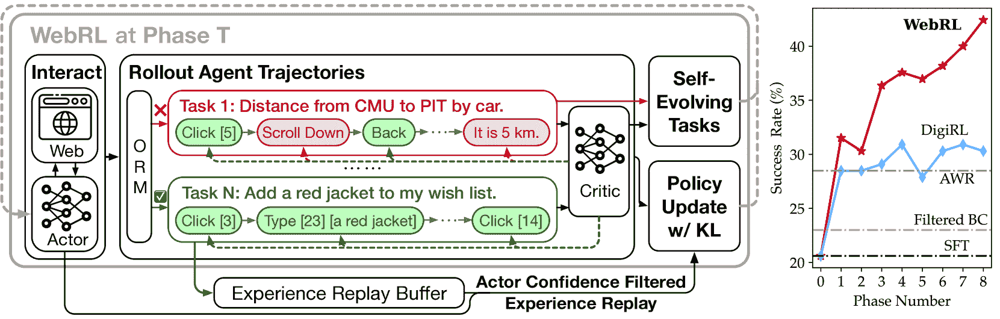
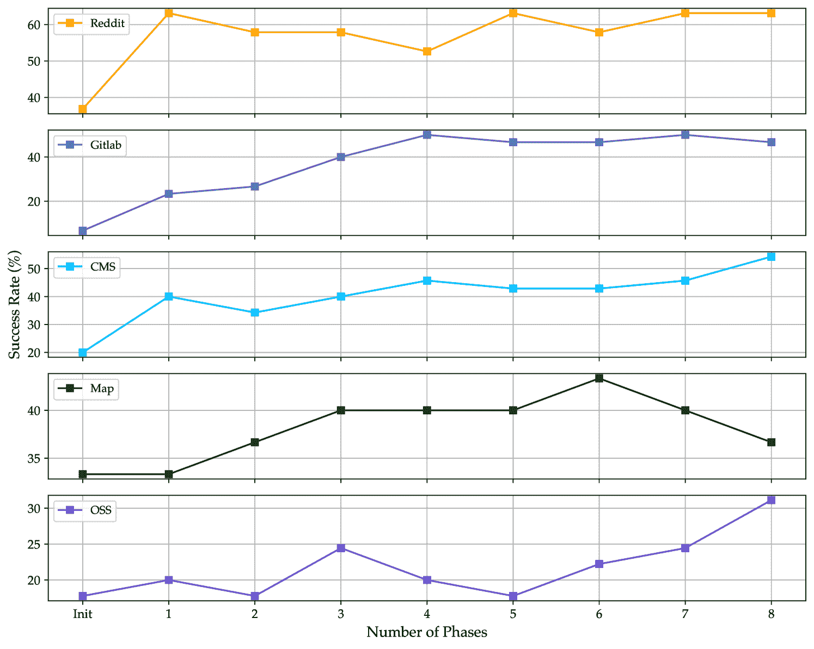
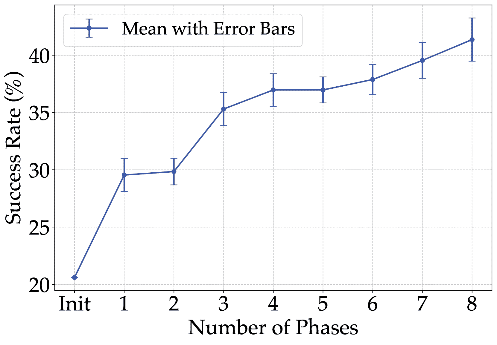
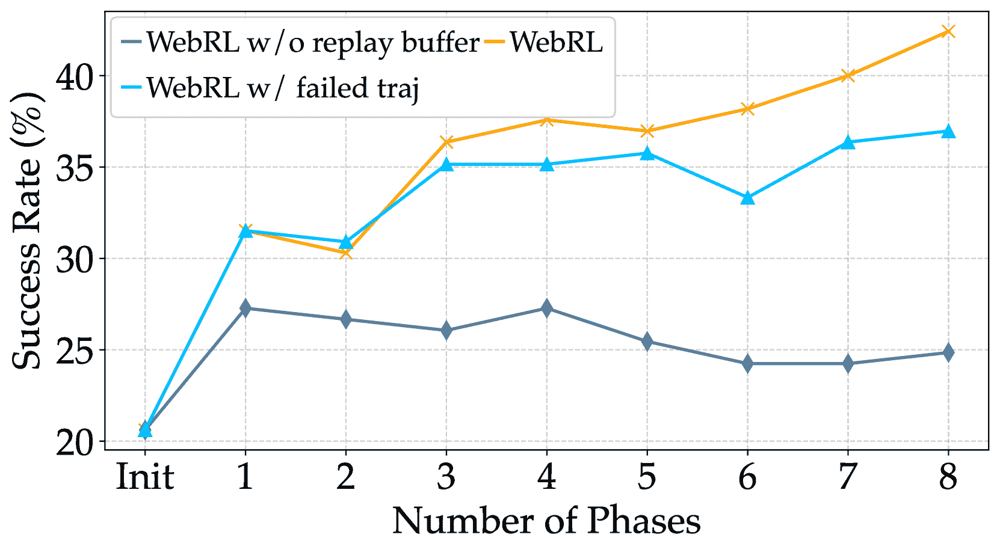
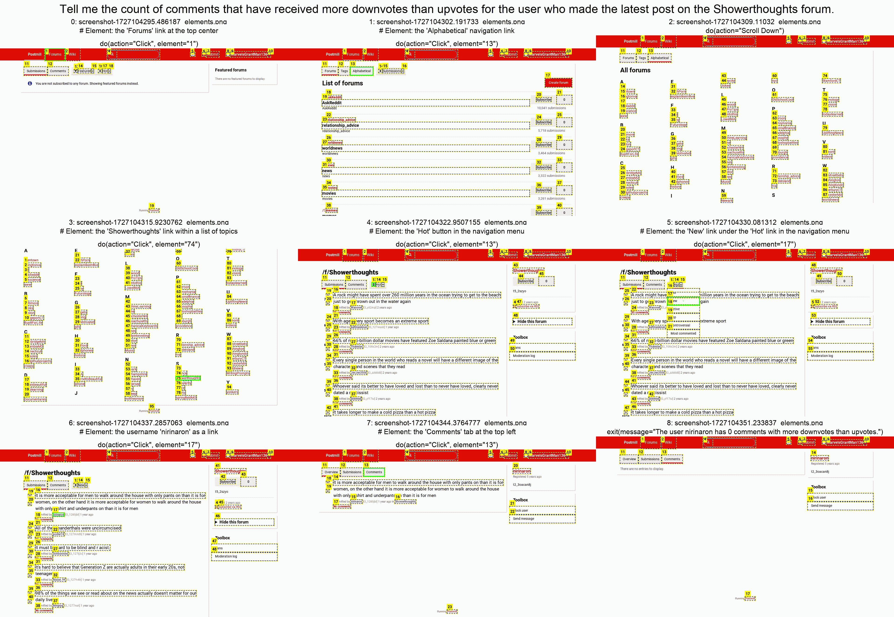

<!--yml

分类：未分类

日期：2025-01-11 12:00:23

-->

# WebRL：通过自我进化的在线课程强化学习训练LLM网络代理

> 来源：[https://arxiv.org/html/2411.02337/](https://arxiv.org/html/2411.02337/)

Zehan Qi^(1∗), Xiao Liu^(12∗), Iat Long Iong¹, Hanyu Lai¹, Xueqiao Sun¹, Wenyi Zhao², Yu Yang²

Xinyue Yang², Jiadai Sun², Shuntian Yao², Tianjie Zhang², Wei Xu¹, Jie Tang¹, Yuxiao Dong¹

¹清华大学  ²智谱AI

###### 摘要

大型语言模型（LLMs）在作为自主代理方面展现出显著潜力，尤其是在基于网络的任务中。然而，现有的LLM网络代理依赖昂贵的专有LLM API，而开源LLM缺乏必要的决策能力。本文介绍了WebRL，这是一个自我进化的在线课程强化学习框架，旨在使用开源LLM训练高性能的网络代理。WebRL解决了构建LLM网络代理的三个关键挑战，包括训练任务的稀缺、反馈信号稀疏以及在线学习中的策略分布漂移。具体而言，WebRL包含 1) 一个自我进化的课程，从未成功的尝试中生成新任务， 2) 一个强健的结果监督奖励模型（ORM），以及 3) 自适应强化学习策略，确保持续改进。我们将WebRL应用于将开源的Llama-3.1和GLM-4模型转化为高效的网络代理。在WebArena-Lite上，WebRL将Llama-3.1-8B的成功率从4.8%提高到42.4%，将GLM-4-9B的成功率从6.1%提高到43%。这些开源模型的表现远超GPT-4-Turbo（17.6%）和GPT-4o（13.9%），并且优于以前使用开源LLM训练的最先进的网络代理（AutoWebGLM，18.2%）。我们的研究结果展示了WebRL在弥合开源和专有LLM基础的网络代理之间的差距方面的有效性，为更加可访问且强大的自主网络交互系统铺平了道路。代码、模型和数据已公开，访问地址：[https://github.com/THUDM/WebRL](https://github.com/THUDM/WebRL)。

¹¹footnotetext: 相等贡献。邮件：qzh23@mails.tsinghua.edu.cn, shawliu9@gmail.com^†^†footnotetext: ZQ在Zhipu AI实习期间完成的工作。

((a))

((b))

图 1： (a) 与所有专有和开源的大型语言模型（LLMs）相比，使用WebRL的GLM-4-9B取得了最佳结果。 (b) 在WebArena-Lite（Zhou et al., [2024a](https://arxiv.org/html/2411.02337v2#bib.bib56); Liu et al., [2024b](https://arxiv.org/html/2411.02337v2#bib.bib22)）上的表现，使用WebRL训练的GLM-4-9B在所有五个评估的网站上相比其他基准模型表现出显著提升。

## 1 引言

大型语言模型（LLM）不仅在理解人类语言、常识推理和知识获取方面表现出色，还在复杂规划和逻辑推理方面展现了显著潜力，表明它们有望成为自主LLM代理（Wang 等，[2024a](https://arxiv.org/html/2411.02337v2#bib.bib35); Liu 等，[2024a](https://arxiv.org/html/2411.02337v2#bib.bib21)）。LLM代理的应用领域日益广泛，涵盖了代码生成（Jimenez 等，[2024](https://arxiv.org/html/2411.02337v2#bib.bib19)）、数据库操作（Zhou 等，[2023](https://arxiv.org/html/2411.02337v2#bib.bib57); Gu 等，[2024](https://arxiv.org/html/2411.02337v2#bib.bib12)）和图形用户界面（GUI）交互（Rawles 等，[2024](https://arxiv.org/html/2411.02337v2#bib.bib31); Yang 等，[2023](https://arxiv.org/html/2411.02337v2#bib.bib41); Xie 等，[2024](https://arxiv.org/html/2411.02337v2#bib.bib38)）。其中，由LLM驱动的网页代理（Deng 等，[2024](https://arxiv.org/html/2411.02337v2#bib.bib6); Zheng 等，[2024](https://arxiv.org/html/2411.02337v2#bib.bib54); Lai 等，[2024](https://arxiv.org/html/2411.02337v2#bib.bib20); Pan 等，[2024](https://arxiv.org/html/2411.02337v2#bib.bib25)）因其广泛的应用前景和在数字生态系统中培养真实自主智能的独特潜力而受到特别关注。

尽管已有这些进展，现有的大型语言模型（LLM）网页代理，无论其性能指标或架构范式如何，仍然处于欠发达状态。高性能的LLM网页代理主要依赖精心设计的提示词与专有LLM API（例如，OpenAI GPT-4）结合使用，以实现网页理解和操作，这既昂贵又费时。相反，开源LLM在作为熟练网页代理的能力方面表现出显著不足，主要是因为在预训练和后训练阶段缺乏以决策为中心的数据。尽管最近有一些努力（Lai 等，[2024](https://arxiv.org/html/2411.02337v2#bib.bib20); Pan 等，[2024](https://arxiv.org/html/2411.02337v2#bib.bib25)）通过模仿学习在开源LLM上训练网页代理，但这些方法未能充分利用网页交互固有的在线性质，未能带来持续一致的改进。

挑战。在本研究中，我们提出在在线环境中基于开放LLM训练高性能网络代理，特别是利用WebArena（Zhou等人，[2024a](https://arxiv.org/html/2411.02337v2#bib.bib56)）。我们的研究发现，这项任务内在的几个关键挑战：1) 训练任务的不足：与离线数据集（Deng等人，[2024](https://arxiv.org/html/2411.02337v2#bib.bib6)；Rawles等人，[2024](https://arxiv.org/html/2411.02337v2#bib.bib31)）相比，后者便于在人工标注的oracle轨迹上训练和评估代理，而WebArena等在线基准通常只提供有限的测试集用于评估目的。这些预定义训练任务的匮乏显著阻碍了在这些环境中有效训练代理。2) 反馈信号的稀疏性和成本：在缺乏特定任务评估函数的情况下，评估任意网页浏览任务的成功非常困难。此外，与某些GUI数据集中的任务（例如AITW（Rawles等人，[2024](https://arxiv.org/html/2411.02337v2#bib.bib31)）和WebShop（Yao等人，[2022](https://arxiv.org/html/2411.02337v2#bib.bib42)））不同，WebArena中的任务通常具有较长的时间跨度，oracle解法平均大约需要10步。这个特点导致了在线探索过程中可用信号的显著稀疏性。3) 在线学习中的策略分布漂移：缺乏预定义的训练集需要进行在线探索，这不可避免地导致代理策略的分布漂移。这一现象可能会导致灾难性遗忘和性能退化。

WebRL框架。为了应对这些挑战，我们提出了WebRL，这是一个自我进化的在线课程强化学习框架，专为训练LLM网络代理而设计。据我们所知，这是第一个能够有效支持LLM网络代理在在线网页环境中从初始化开始进行强化学习的系统框架。通过应用WebRL，我们成功地将Llama-3.1-8B模型转变为一个高效的LLM网络代理，将其在WebArena-Lite（Zhou等人，[2024a](https://arxiv.org/html/2411.02337v2#bib.bib56)；Liu等人，[2024b](https://arxiv.org/html/2411.02337v2#bib.bib22)）上的成功率（SR）从最初的4.8%提升至42.4%，涵盖了五个不同的网站。此外，在应用于Llama-3.1-70B时，我们实现了显著的49.1% SR，远远超过了最先进的专有LLM API（GPT-4-Turbo，17.6% SR）和之前基于开源LLM训练的最先进的网络代理（AutoWebGLM（Lai等人，[2024](https://arxiv.org/html/2411.02337v2#bib.bib20)），18.2% SR）的表现。

图2：WebRL概览。WebRL是一个自我进化的在线课程强化学习框架，旨在训练基于LLM的网页代理，通过反复自我进化，产生一致的持续改进。

WebRL的显著性能提升可归因于几个关键的架构设计。为了解决网页代理训练任务匮乏的问题，我们设计了一个自我进化的在线课程，利用探索中固有的试错过程。这个课程由我们新开发的强大结果监督奖励模型（ORM）支撑。在每个训练阶段，新的任务会从前一阶段失败的尝试中自动生成，从而促进渐进式的学习轨迹。为了缓解课程式强化学习引发的策略分布漂移，我们将参考策略和执行策略之间的KL散度项融入学习算法中，从而约束策略更新并促进稳定性。我们实现了一个经验回放缓冲区，并结合了一种新颖的执行者信心过滤策略，确保回放经验的真实性，并防止过拟合于先前获得的知识。实验结果证实了WebRL的有效性。特别地，当选择过去适度难度的经验时——既不太简单也不太具挑战性，相对于代理当前的能力——代理的性能得到了提升。此外，在策略更新过程中使用较大的KL散度约束能够在结合过去经验时提高性能。

总结来说，我们的工作对该领域做出了以下重要贡献：

+   •

    我们介绍了WebRL，一个新颖的自我进化在线课程强化学习（RL）框架，用于训练基于大规模语言模型（LLM）的网页代理。首次，它实现了WebArena环境中强化学习的基础设施，并结合了强大的ORM，推动开放的LLM成为有能力的网页代理。

+   •

    WebRL通过解决包括训练任务匮乏、反馈信号稀疏和在线学习中的分布漂移等关键挑战，推动了基于LLM的代理训练。自我进化的课程和自适应学习策略使得LLM网页代理在迭代过程中持续不断地改进。

+   •

    我们展示了WebRL在现有方法（如AWR和DigiRL）上的显著性能提升，在WebArena-Lite基准测试上取得了最先进的成果。相对于开放LLM中的最佳专有LLM API和先前训练的网页代理，其性能提升超过160%。

## 2 WebRL：自我进化的在线课程强化学习

我们提出了一种自我演化的在线课程学习框架，旨在训练网页代理，针对WebArena（Zhou等人，[2024a](https://arxiv.org/html/2411.02337v2#bib.bib56)）环境。在该系统中，如图[2](https://arxiv.org/html/2411.02337v2#S1.F2 "图 2 ‣ 1 引言 ‣ WebRL：通过自我演化的在线课程强化学习训练LLM网页代理")所示，代理与环境持续互动以收集实时轨迹数据。这一互动过程受到自我演化课程学习策略的引导，动态生成任务，有效缓解了训练任务不足的问题。此外，自我演化课程学习策略生成的任务是根据代理当前的能力量身定制的，从而提高了收到正反馈的可能性，并减轻了稀疏反馈信号的挑战。另外，我们训练了一个基于结果的奖励模型（ORM）来评估任务成功与否。我们还提出了一种KL约束的策略更新算法，防止在课程学习过程中发生剧烈的策略变化。同时，使用回放缓存来保留先前的知识并减轻灾难性遗忘的风险。这些技术使代理能够逐步改进，逐步处理更复杂的任务。整个训练过程可在算法[1](https://arxiv.org/html/2411.02337v2#alg1 "算法 1 ‣ B.3 ORM细节 ‣ 附录B训练细节 ‣ WebRL：通过自我演化的在线课程强化学习训练LLM网页代理")中找到。

问题公式化。我们将完成网页任务的过程建模为一个有限时间步的马尔可夫决策过程（MDP），表示为$(S,A,R,\mathcal{T})$。给定一个用户指令$I$，代理需要完成相应的任务。状态$s$被定义为当前网页的HTML内容以及之前动作的历史。代理在成功完成任务时获得奖励1，否则为0。在有限时间步的设置下，轨迹结束的条件是任务完成或超过最大交互次数$T$。为了清晰地说明我们的方法，我们引入以下符号。策略$\pi(\cdot|s_{t},I)$表示在状态$s_{t}$和指令$I$下的动作分布。价值函数$V(s_{h},I)=\mathbb{E}_{\pi}\left[\sum_{t=h}^{T}r(s_{t},a_{t},I)\right]$表示在策略$\pi$下，从状态$s_{h}$开始的期望累积奖励。动作-价值函数$Q(s_{t},a_{t},I)$表示在状态$s_{t}$下采取动作$a_{t}$并随后按照策略$\pi$执行的期望累积奖励：$Q(s_{t},a_{t},I)=r(s_{t},a_{t})+V(s_{t+1},I)$。

ORM训练。在课程学习过程中，我们需要根据代理生成的轨迹来判断对应的指令是否完成。由于缺乏来自环境的反馈，我们训练一个大型语言模型（LLM）作为结果监督奖励模型$\mathcal{M}_{\text{ORM}}$，以实现任务成功评估。$\mathcal{M}_{\text{ORM}}$用于评估代理的滚动轨迹是否完成给定的任务，提供一个二元奖励信号（失败为0，成功为1）。

类似于(Zhang et al., [2024e](https://arxiv.org/html/2411.02337v2#bib.bib50))中的方法，我们配置$\mathcal{M}_{\text{ORM}}$输出“YES”或“NO”来指示一个轨迹是否成功完成任务，利用$\mathcal{M}_{\text{ORM}}$的语言头部学习到的知识。鉴于大型语言模型（LLMs）的上下文窗口有限且HTML文档通常较长，我们采用类似于(Pan et al., [2024](https://arxiv.org/html/2411.02337v2#bib.bib25))的策略，仅保留最终状态的HTML作为输入。此外，代理的历史动作，提供了关于轨迹先前步骤的信息，也被包含在内。因此，模型的输入由几个部分组成：指令$I$、历史动作和最终状态的HTML。我们将这些部分包装进提示中，要求模型判断轨迹是否成功完成了指令$I$所描述的任务。为了获得结果，我们比较$\mathcal{M}_{\text{ORM}}$生成“YES”和“NO”的概率。如果生成“YES”的概率高于生成“NO”的概率，则任务被视为成功，奖励设置为1。否则，奖励设置为0。

### 2.1 自我进化的课程学习新指令

在WebArena中训练LLM网页代理的一个典型挑战是训练任务的稀缺，这与开发现实世界网页代理的情况相呼应。尽管最近的研究（Liu等人，[2024b](https://arxiv.org/html/2411.02337v2#bib.bib22)）为WebArena策划了一个轨迹微调集，但它仅包含大约1000条带有预设轨迹的指令，远不足以训练强大的LLM网页代理。为了解决这一局限性并推动持续改进，我们采用了自我进化的课程学习策略。这种方法在每个阶段生成新的训练指令。随着阶段的推进，生成的指令变得越来越复杂，从而使代理的能力逐渐提高。我们实施了生成和过滤的两步过程，以生成逐渐更具挑战性的任务，同时确保这些任务仍适合代理当前的能力。在生成步骤中，我们使用广度进化方法（Xu等人，[2023](https://arxiv.org/html/2411.02337v2#bib.bib39)）来创建新指令。我们选择模型在之前的交互阶段未能完成的指令作为生成新指令的种子。详细提示见附录[§ D](https://arxiv.org/html/2411.02337v2#A4 "附录 D：在WebRL中使用的提示 ‣ WebRL：通过自我进化的在线课程强化学习训练LLM网页代理")。为了确保生成的指令在目标环境中是可行的，并且与期望的难度级别一致，我们首先使用训练过的评论员对其进行过滤。具体来说，我们使用评论员评估每个新指令的初始状态。我们选择评论员评分在0.05到0.75之间的指令，确保只有符合我们难度标准的任务被保留。我们手动审查生成的任务，识别出无法在WebArena中完成的任务。根据这些发现，我们开发了一个提示（图[22](https://arxiv.org/html/2411.02337v2#A4.F22 "图22 ‣ 附录D：在WebRL中使用的提示 ‣ WebRL：通过自我进化的在线课程强化学习训练LLM网页代理")），并使用GPT-4o自动排除WebArena中不可行的任务。最终得到的指令集用于本阶段的交互和训练。

### 2.2 在线网页环境中用于大语言模型（LLMs）的强化学习

在每个阶段的课程学习中，模型会逐步接触并学习一组新的任务。在这种设置下，一个主要挑战是避免在每个学习阶段中出现过度的策略分布漂移，这可能导致之前获得的知识被灾难性遗忘。传统方法通常通过混合来自不同阶段的数据来缓解这一问题。然而，在网页代理任务中，中间步骤并不会直接收到过程奖励，只有来自最终状态结果的弱信号。因此，即使一个中间步骤执行正确，后续步骤中的错误也很容易导致最终失败，从而错误判断该中间步骤，并使其难以被重用。因此，在本研究中，我们主要寻求算法上的改进，直接解决策略分布漂移问题。

一个潜在的解决方案来自于人类反馈强化学习（RLHF）中的思想（Ouyang 等人，[2022](https://arxiv.org/html/2411.02337v2#bib.bib24)），其中通过约束两种策略之间的Kullback-Leibler（KL）散度来缓解策略分布漂移。通过将这一思想适应到我们的课程学习设置中，我们旨在确保当前阶段的策略不会与前一阶段的策略偏离过多，同时仍优化在新任务上的表现。假设前一阶段的策略记作 $\pi_{\text{ref}}$，当前正在优化的策略记作 $\pi_{\theta}$。当前阶段的指令分布表示为 $\rho(I)$。优化当前阶段策略 $\pi_{\theta}$ 的目标可以写为：

|  | $\max_{\pi_{\theta}}\mathbb{E}_{I\sim\rho(I),a_{t}\sim\pi_{\theta}(\cdot&#124;s_{t})% }\left[\sum_{t=0}^{T}\left(r(s_{t},a_{t},I)+\beta\log\pi_{\text{ref}}(a_{t}&#124;s_% {t},I)\right)+\beta\mathcal{H}(\pi_{\theta})\right]$ |  | (1) |
| --- | --- | --- | --- |

其中 $\beta$ 是一个控制KL散度约束强度的系数，$\mathcal{H}(\pi_{\theta})$ 表示当前策略的熵。

根据 (Rafailov 等人，[2024a](https://arxiv.org/html/2411.02337v2#bib.bib29)) 的工作，我们可以将方程 [1](https://arxiv.org/html/2411.02337v2#S2.E1 "在 2.2 在线网页环境中的强化学习 ‣ 2 WebRL: 自我进化的在线课程RL ‣ WebRL: 通过自我进化的在线课程强化学习训练LLM网页代理") 的目标解释为一个最大熵强化学习问题。这个问题的最优策略 $\pi^{*}$ 可以表示为：

|  | $\pi^{*}(a_{t}&#124;s_{t},I)=e^{\left(Q^{*}(s_{t},a_{t},I)-V^{*}(s_{t},I)\right)/\beta}$ |  | (2) |
| --- | --- | --- | --- |

其中 $V^{*}(s_{t},I)$ 是最优值函数，表示在最优策略 $\pi^{*}$ 下的期望累计奖励。$Q^{*}(s_{t},a_{t},I)$ 是最优行动值函数。$Q^{*}$ 和 $V^{*}$ 之间的关系为：

|  | $Q^{*}(s_{t},a_{t},I)=\begin{cases}r(s_{t},a_{t},I)+\beta\log\pi_{\text{ref}}(a% _{t}&#124;s_{t},I)+V^{*}(s_{t+1},I),&\text{如果 }s_{t+1}\text{ 不是终止状态}\\ r(s_{t},a_{t},I)+\beta\log\pi_{\text{ref}}(a_{t}&#124;s_{t},I),&\text{如果 }s_{t+1}% \text{ 是终止状态}\end{cases}$ |  | (3) |
| --- | --- | --- | --- |

基于公式 [2](https://arxiv.org/html/2411.02337v2#S2.E2 "In 2.2 Reinforcement Learning for LLMs in Online Web Environments ‣ 2 WebRL: Self-Evolving Online Curriculum RL ‣ WebRL: Training LLM Web Agents via Self-Evolving Online Curriculum Reinforcement Learning") 和公式 [3](https://arxiv.org/html/2411.02337v2#S2.E3 "In 2.2 Reinforcement Learning for LLMs in Online Web Environments ‣ 2 WebRL: Self-Evolving Online Curriculum RL ‣ WebRL: Training LLM Web Agents via Self-Evolving Online Curriculum Reinforcement Learning")，我们可以推导出：

|  | $\beta\log\frac{\pi^{*}(a_{t}&#124;s_{t},I)}{\pi_{\text{ref}}(a_{t}&#124;s_{t},I)}=r(s_{t% },a_{t},I)+V^{*}(s_{t+1},I)-V^{*}(s_{t},I)=A^{*}(s_{t},a_{t},I)$ |  | (4) |
| --- | --- | --- | --- |

这里，$A^{*}(s_{t},a_{t},I)$ 表示在状态 $s_{t}$ 下采取动作 $a_{t}$ 相对于该状态下期望的平均回报的优势。根据条件，我们可以将策略 $\pi_{\theta}$ 的损失函数表示为：

|  | $\mathcal{L}(\pi_{\theta})=\mathbb{E}_{\nu}\left[\left(\beta\log\frac{\pi_{% \theta}(a&#124;s,I)}{\pi_{\text{ref}}(a&#124;s,I)}-A^{*}(s,a,I)\right)^{2}\right]$ |  | (5) |
| --- | --- | --- | --- |

其中，$\nu(s)$ 表示此阶段经验的分布。请注意，我们的算法是在离策略方式下运行的。有关详细的推导、深入分析以及与其他强化学习算法的详细比较，可以参见附录 [A.1](https://arxiv.org/html/2411.02337v2#A1.SS1 "A.1 Derivation ‣ Appendix A Details of Policy Update Algorithm in WebRL ‣ WebRL: Training LLM Web Agents via Self-Evolving Online Curriculum Reinforcement Learning")。

更新是做什么的？为了获得对损失函数的机械性理解，我们分析了损失函数 $\mathcal{L}(\pi_{\theta})$ 的梯度。相对于参数 $\theta$ 的梯度可以表示为：

|  | $\nabla_{\theta}\mathcal{L}(\pi_{\theta})=-2\beta\mathbb{E}_{\nu}\Big{[}% \underbrace{\big{(}A^{*}(s,a,I)\vphantom{\frac{\pi_{\theta}(a&#124;s,I)}{\pi_{\text% {ref}}(a&#124;s,I}}}_{\smash{\text{更新方向}}}-\underbrace{\beta\log\frac{% \pi_{\theta}(a&#124;s,I)}{\pi_{\text{ref}}(a&#124;s,I)}}_{\smash{\text{KL 散度约束}}}\big{)}\underbrace{\nabla_{\theta}\log\pi_{\theta}(a&#124;s,I)% \vphantom{\frac{\pi_{\theta}(a&#124;s,I)}{\pi_{\text{ref}}(a&#124;s,I}}}_{\smash{\text{软损失}}}\Big{]}$ |  | (6) |
| --- | --- | --- | --- |

梯度展示了以下的归属关系：

+   $\bullet$

    当优势$A^{*}(s,a,I)>0$时，动作$a$是有价值的，因此其概率应该增加。如果$\pi_{\theta}$低于$\pi_{\text{ref}}$，这种增加将被放大，特别是在它们之间的差距变大时。如果$\pi_{\theta}$已经高于$\pi_{\text{ref}}$，则增加将被适度控制，以避免过度偏离。

+   $\bullet$

    当$A^{*}(s,a,I)<0$时，动作是次优的，因此其概率应该减少。如果$\pi_{\theta}$低于$\pi_{\text{ref}}$，KL散度约束将限制其减少的幅度，以避免产生较大的散度。如果$\pi_{\theta}$高于$\pi_{\text{ref}}$，则允许更大幅度的减少。

+   $\bullet$

    参数$\beta$控制KL散度约束的强度。调整$\beta$有助于微调此约束。例如，增大$\beta$可以防止在$\pi_{\text{ref}}$已经为某个动作分配了较高的概率时，动作概率的不必要提升。

训练可靠的优势估计器。一个可靠的优势估计器对于有效的策略更新至关重要。我们训练一个值网络$V(s_{t},I)$，并使用广义优势估计（GAE）（Schulman et al., [2015](https://arxiv.org/html/2411.02337v2#bib.bib32)）来计算优势。在我们的设置中，我们只在最终步接收二值奖励（0或1），没有中间奖励（即，中间奖励有效为零）。按照最近的方法（Farebrother et al., [2024](https://arxiv.org/html/2411.02337v2#bib.bib8)），我们使用交叉熵目标训练值网络。值网络$V$的损失函数定义为：

|  | $\mathcal{L}(V)=-\mathbb{E}_{\nu}\Big{[}r(s_{T},a_{T},I)\log V(s,a,I)+(1-r(s_{T},a_{T},I))\log(1-V(s,a,I))\Big{]}$ |  | (7) |
| --- | --- | --- | --- |

与(Bai et al., [2024](https://arxiv.org/html/2411.02337v2#bib.bib2))一致，我们仅专注于下一步和最终步的优势估计器，因为没有中间奖励。

|  | $A(s_{t},a_{t},I)=\lambda\big{(}r(s_{t},a_{t},I)+V(s_{t+1},I)-V(s_{t},I)\big{)}% +(1-\lambda)\big{(}r(s_{T},a_{T},I)-V(s_{t},I)\big{)}$ |  | (8) |
| --- | --- | --- | --- |

其中$\lambda$是一个平衡因子，用于控制优势估计中的偏差和方差之间的权衡。在我们的工作中，我们将$\lambda$设置为0.5。我们通过值网络$V$估计的优势函数$A$来近似真实的优势函数$A^{*}$。这种近似的可行性在附录[A.2](https://arxiv.org/html/2411.02337v2#A1.SS2 "A.2 Proof ‣ Appendix A Details of Policy Update Algorithm in WebRL ‣ WebRL: Training LLM Web Agents via Self-Evolving Online Curriculum Reinforcement Learning")中得到了证明，在那里我们展示了使用$A$来更新策略可以带来策略的改进。

使用带演员置信度过滤的经验回放缓冲区。除了通过KL散度在算法层面控制策略分布漂移外，我们还实现了一个自适应回放缓冲区，以减轻数据层面的知识遗忘。具体来说，我们仅存储每个阶段中的那些成功轨迹（这些轨迹可能是稀疏的）。在第$i$阶段，我们使用上一阶段的演员计算回放缓冲区中所有动作的困惑度。那些困惑度在1/0.95到1/0.5范围内的动作及其对应的状态将被添加到当前阶段的训练数据中。这一过滤过程排除了过于熟悉的数据和仍然对演员来说过于具有挑战性的数据。此外，通过仅存储成功轨迹，我们避免了准确估计来自前一阶段不正确轨迹的中间状态的挑战。

## 3 实验

### 3.1 环境和基准

环境。WebRL和基准方法的有效性通过使用WebArena环境进行评估（Zhou等，[2024a](https://arxiv.org/html/2411.02337v2#bib.bib56)）。WebArena特别适合我们的需求，因为它提供了一个高度互动的平台，支持在线学习。此外，WebArena涵盖了多种网站，包括OpenStreetMap（地图）、Reddit、GitLab、在线商店内容管理系统（CMS）和OneStopShop（OSS），使其成为一个理想的基准，用于全面评估模型在网页任务中的表现。在原始的WebArena环境中，总共有812条指令。考虑到测试的成本，我们使用了WebArena-Lite（Liu等，[2024b](https://arxiv.org/html/2411.02337v2#bib.bib22)）中的165个测试案例进行评估。

基准。我们将WebRL与使用提示技术的专有LLM进行比较，并且也与使用替代方法训练的开源LLM进行比较。对于专有模型，我们选择了GPT-4-Turbo-2024-0409（GPT-4-Turbo）（Achiam等人，[2023](https://arxiv.org/html/2411.02337v2#bib.bib1)）和[GPT-4o](https://openai.com/index/hello-gpt-4o/)。除了AWM（王等人，[2024b](https://arxiv.org/html/2411.02337v2#bib.bib36)）和WebPilot（张等人，[2024f](https://arxiv.org/html/2411.02337v2#bib.bib51)），我们还使用了简单提示下的模型结果作为基准。有关简单提示的详细信息，请参见附录[§ D](https://arxiv.org/html/2411.02337v2#A4 "附录D：WebRL中使用的提示 ‣ WebRL：通过自我进化的在线课程强化学习训练LLM Web代理")。对于开源模型，除了使用这些简单提示下的模型作为基准外，我们还训练了Llama3.1（Dubey等人，[2024](https://arxiv.org/html/2411.02337v2#bib.bib7)）和GLM-4-9B（GLM等人，[2024](https://arxiv.org/html/2411.02337v2#bib.bib11)）作为基准。具体来说，我们采用了模仿学习，也称为监督微调（SFT），来训练这些模型。训练数据来源于公开的人类标注示例，这些示例来自WebArena-Lite。此外，我们还探索了几种强化学习方法进行比较，包括过滤行为克隆（Filtered BC）（潘等人，[2024](https://arxiv.org/html/2411.02337v2#bib.bib25)）、优势加权回归（AWR）（彭等人，[2019](https://arxiv.org/html/2411.02337v2#bib.bib27)）和DigiRL（白等人，[2024](https://arxiv.org/html/2411.02337v2#bib.bib2)）。对于WebRL和基于强化学习的基准，我们利用SFT训练的模型作为演员的初始模型。评论员模型同样基于SFT训练的模型，并添加了一个随机初始化的值头。WebRL和基准的训练细节可以在附录[§ B](https://arxiv.org/html/2411.02337v2#A2 "附录B：训练细节 ‣ WebRL：通过自我进化的在线课程强化学习训练LLM Web代理")中找到。

表1：WebRL和其他比较方法的任务成功率（SR），评估数据集为WebArena-Lite (周等人，[2024a](https://arxiv.org/html/2411.02337v2#bib.bib56); 刘等人，[2024b](https://arxiv.org/html/2411.02337v2#bib.bib22))，这是WebArena的一个经人工验证的子集（*表示从文献报告中得到的在完整WebArena上的结果）。最佳和第二最佳模型被突出显示。

| 模型 | #参数 | Reddit | Gitlab | CMS | Map | OSS | 平均SR |
| --- | --- | --- | --- | --- | --- | --- | --- |
| 专有LLM |
| GPT-4-Turbo | N/A | 10.5 | 16.7 | 14.3 | 36.7 | 13.3 | 17.6 |
| GPT-4o | N/A | 10.5 | 10.0 | 20.0 | 20.0 | 11.1 | 13.9 |
| AWM + GPT-4-0613^∗ (王等人，[2024b](https://arxiv.org/html/2411.02337v2#bib.bib36)) | N/A | 50.9 | 31.8 | 29.1 | 43.3 | 30.8 | 35.5 |
| WebPilot + GPT-4o^∗ (Zhang et al., [2024f](https://arxiv.org/html/2411.02337v2#bib.bib51)) | N/A | 65.1 | 39.4 | 24.7 | 33.9 | 36.9 | 37.2 |
| 开源 LLMs |
| AutoWebGLM (Lai et al., [2024](https://arxiv.org/html/2411.02337v2#bib.bib20)) | 6B | 9.4 | 15.0 | 28.6 | 24.8 | 17.1 | 18.2 |
| GLM-4-Chat (GLM et al., [2024](https://arxiv.org/html/2411.02337v2#bib.bib11)) | 9B | 5.3 | 10.0 | 6.7 | 3.3 | 6.7 | 6.1 |
| GLM-4 + SFT (BC) | 9B | 47.4 | 13.3 | 31.4 | 23.3 | 13.3 | 22.4 |
| GLM-4 + 过滤 BC | 9B | 52.6 | 10.0 | 31.4 | 26.7 | 20.0 | 24.8 |
| GLM-4 + AWR (Peng et al., [2019](https://arxiv.org/html/2411.02337v2#bib.bib27)) | 9B | 52.6 | 16.7 | 34.3 | 30.0 | 22.2 | 27.9 |
| GLM-4 + DigiRL (Bai et al., [2024](https://arxiv.org/html/2411.02337v2#bib.bib2)) | 9B | 63.2 | 30.0 | 34.3 | 26.7 | 26.7 | 31.5 |
| GLM-4 + WebRL (我们的研究) | 9B | 57.9 | 50.0 | 48.6 | 36.7 | 37.8 | 43.0 |
| Llama3.1-Instruct (Dubey et al., [2024](https://arxiv.org/html/2411.02337v2#bib.bib7)) | 8B | 0.0 | 3.3 | 2.9 | 3.3 | 11.1 | 4.8 |
| Llama3.1 + SFT (BC) | 8B | 36.8 | 6.7 | 20.0 | 33.3 | 17.8 | 20.6 |
| Llama3.1 + 过滤 BC | 8B | 52.6 | 20.0 | 31.4 | 23.3 | 8.9 | 23.0 |
| Llama3.1 + AWR (Peng et al., [2019](https://arxiv.org/html/2411.02337v2#bib.bib27)) | 8B | 57.9 | 26.7 | 31.4 | 26.7 | 17.8 | 28.5 |
| Llama3.1 + DigiRL (Bai et al., [2024](https://arxiv.org/html/2411.02337v2#bib.bib2)) | 8B | 57.9 | 26.7 | 37.1 | 33.3 | 17.8 | 30.3 |
| Llama3.1 + WebRL (我们的研究) | 8B | 63.2 | 46.7 | 54.3 | 36.7 | 31.1 | 42.4 |
| Llama3.1-Instruct (Dubey et al., [2024](https://arxiv.org/html/2411.02337v2#bib.bib7)) | 70B | 10.5 | 16.7 | 17.1 | 20.0 | 4.4 | 12.7 |
| Llama3.1 + SFT (BC) | 70B | 52.6 | 20.0 | 20.0 | 26.7 | 13.3 | 23.0 |
| Llama3.1 + WebRL (我们的研究) | 70B | 78.9 | 50.0 | 54.3 | 40.0 | 44.4 | 49.1 |

ORM. WebArena-Lite (Liu et al., [2024b](https://arxiv.org/html/2411.02337v2#bib.bib22)) 提供了训练样本及其相应的奖励函数。我们进一步通过引入任务重写以及修改某些数据变量（如地名和产品名称）来增强这套数据集。我们还对相关的奖励函数进行了调整。$\mathcal{M}_{\text{ORM}}$ 在该任务集上使用 WebRL 的回滚和部分基准方法进行训练，评估结果由奖励函数决定。更多细节请参见附录[§ B](https://arxiv.org/html/2411.02337v2#A2 "附录 B 训练细节 ‣ WebRL: 通过自我进化在线课程强化学习训练LLM Web代理")。

### 3.2 主要结果

我们的主要结果，如表[1](https://arxiv.org/html/2411.02337v2#S3.T1 "Table 1 ‣ 3.1 Environments and Baselines ‣ 3 Experiments ‣ WebRL: Training LLM Web Agents via Self-Evolving Online Curriculum Reinforcement Learning")所示，表明使用 WebRL 训练的 Llama3.1-8B 达到了 42.4% 的平均准确率，超越了所有基线，包括提示和训练替代方法。值得注意的是，WebRL 在 Gitlab（46.7%）和 CMS（54.3%）等特定任务中表现突出，展示了其有效解决复杂 Web 任务的能力。基于强化学习的方法优于基于模仿学习的方法，包括 SFT 和 Filtered BC，这些方法往往会过度重复某些操作。例如，在 CMS 的表格分析任务中，SFT 训练的模型通常会过度优化高频出现的“下滑”动作。这种过度优化可能导致模型陷入局部循环，从而阻碍其有效完成整体任务目标。相比之下，强化学习通过使用评论者估计每个步骤的价值，优化长期累积奖励，从而有效处理复杂的多步骤任务。此外，WebRL 一直优于 DigiRL。DigiRL 的一个显著限制是它在预定义的固定任务集上进行策略更新，这些任务可能与模型当前的技能水平不匹配。某些任务由于稀疏奖励的情况，尤其难以学习。这种不匹配可能导致模型收敛到次优解，并限制其探索和技能提升的能力。WebRL 通过采用自我进化的课程学习，依据模型当前的能力调整任务的复杂性，解决了这一限制。此策略促进了更广泛的探索，并支持持续改进。在 GLM-4-9B 的案例中也观察到类似现象，提供了 WebRL 在不同模型架构中带来益处的证据，验证了其鲁棒性和适应性。

### 3.3 WebRL 的扩展性

我们通过使用 WebRL 训练 Llama3.1-70B 对 WebRL 在更大规模模型上的有效性进行了进一步验证。具体结果如表[1](https://arxiv.org/html/2411.02337v2#S3.T1 "Table 1 ‣ 3.1 Environments and Baselines ‣ 3 Experiments ‣ WebRL: Training LLM Web Agents via Self-Evolving Online Curriculum Reinforcement Learning")所示。通过 WebRL 训练后，Llama3.1-70B 达到了 49.1% 的总体准确率，较 SFT 的准确率提高了 26.1%。这表明 WebRL 具有可扩展性，并且可以有效应用于更大规模的模型。此外，当将 SFT 下 Llama3.1-8B 到 Llama3.1-70B 的性能提升进行比较时，WebRL 随着模型规模的增大，表现出了更为显著的性能提升。

### 3.4 错误类型的分布分析

我们比较了使用 WebRL 训练的 Llama 3.1-8B 在不同错误类型下的表现，并与基线方法进行对比：包括“无法恢复”、“中途卡住”、“停留在错误页面”和“未能做出合理尝试”，如图[3](https://arxiv.org/html/2411.02337v2#S3.F3 "Figure 3 ‣ 3.4 Distribution Analysis of Error Types ‣ 3 Experiments ‣ WebRL: Training LLM Web Agents via Self-Evolving Online Curriculum Reinforcement Learning")所示。WebRL 在减少“中途卡住”错误方面表现出显著优势，尤其是与 SFT 和 Filtered BC 相比。“中途卡住”错误通常发生在模型陷入循环中，反复执行相同的操作却没有进展。强化学习通过优化每个动作，同时考虑其对任务的整体影响，帮助缓解这个问题，从而使模型能够做出更有效的决策。此外，使用 WebRL 训练的模型在处理“无法恢复”错误方面表现出更强的鲁棒性。通过课程学习，模型逐步学会在遇到失败时调整其行为。例如，当搜索查询“CMU 附近 20 分钟步行范围内的药店”未能获得预期结果时，模型学会修改查询为“CMU 附近的药店”并重新进行搜索，而不是重复无效的操作。此外，WebRL 在“停留在错误页面”和“未能做出合理尝试”这两种错误上的错误率最低，表明使用 WebRL 训练的模型对任务和网页之间的关系有更深入的理解。它能更好地识别完成特定任务所需的正确页面，减少错误停留在错误页面或导航到不正确页面的几率。

图 3：WebRL 和基线方法的错误类型分布分析。

### 3.5 不同步骤要求任务的表现

我们评估了使用WebRL和基线方法训练的Llama3.1-8B模型在任务中不同步骤要求下的表现。为了确定每个任务所需的步骤数，我们排除了没有任何模型完成的任务，并使用执行步骤最少的轨迹作为每个剩余任务的所需步骤数。结果如图[5](https://arxiv.org/html/2411.02337v2#S3.F5 "图5 ‣ 3.5 在不同步骤要求任务上的表现 ‣ 3 实验 ‣ WebRL: 通过自我进化在线课程强化学习训练LLM Web代理")所示。可以看出，使用SFT和过滤BC训练的模型在任务长度增加时表现出明显的下降。这可能是因为这些模型优化单个步骤，而未考虑累积影响，从而导致它们在长期任务中的效果较差。DigiRL训练的模型在中等长度任务上的表现有所提升，但在较长的任务（超过10个步骤）上表现较差。这一局限性可能源于DigiRL在固定任务集上的在线学习。即使模型正确执行了中间步骤，如果后续步骤发生错误，它也不会获得正向奖励，这使得模型更难学会如何有效地完成需要多个步骤的任务。相比之下，WebRL通过课程学习克服了这一问题，逐步增加任务难度。这种方法提高了模型处理长序列的能力，与其他方法相比，在需要长期规划的任务上取得了显著的性能提升。

图4：WebRL和基线方法在需要不同步骤的任务中的准确性。

图5：WebRL在重放缓冲区、KL约束策略更新和课程策略方面的消融研究。

### 3.6 在不同复杂度任务上的表现

图6：WebRL和基线方法在不同复杂度任务中的准确性。

我们进一步分析了WebRL和基线模型在不同复杂度的任务指令上的表现，如图[6](https://arxiv.org/html/2411.02337v2#S3.F6 "图 6 ‣ 3.6 在不同复杂度任务上的表现 ‣ 3 实验 ‣ WebRL: 通过自我演化在线课程强化学习训练大语言模型Web代理")所示。指令复杂度通过任务中的要求数量来衡量。例如，指令“2023年1月的前三大畅销产品是什么”有两个要求：识别前三大产品和指定时间范围，因此其复杂度为2。我们的结果表明，WebRL在不同复杂度的任务中表现良好，特别是在更复杂的指令上表现突出。相比之下，尽管DigiRL使用了在线学习，但由于其专注于一组预定义的任务，这些任务与模型能力不匹配，导致其在更高复杂度任务中的表现较差，限制了其适应性。这突显了我们自我演化课程学习策略的有效性，该策略根据模型的能力逐步增加任务复杂度，从而在更具挑战性的任务中实现更好的表现。

### 3.7 消融研究

我们进行了一项消融研究，评估回放缓冲区、KL约束策略更新算法以及课程学习策略对WebRL的影响。为了评估它们的贡献，我们将WebRL与四种替代模型进行了比较：(1) 没有回放缓冲区的WebRL，仅使用当前的交互轨迹进行训练，(2) 没有KL的WebRL，策略更新使用带有值函数基线的REINFORCE（梯度为$\mathbb{E}_{\nu}[(A(s,a,I)\nabla_{\theta}\log\pi_{\theta}(a|s,I)]$），但保留回放缓冲区，(3) 没有KL和回放缓冲区的WebRL，既不使用回放缓冲区也不使用KL约束策略更新算法，(4) 没有课程学习的WebRL，省略了课程学习方法，仅使用第一阶段生成的指令。

结果如图[5](https://arxiv.org/html/2411.02337v2#S3.F5 "图5 ‣ 3.5 在具有不同步骤要求的任务上的表现 ‣ 3 实验 ‣ WebRL：通过自我进化在线课程强化学习训练LLM Web代理")所示，表明WebRL使用的所有组件都是必不可少的。 (1) 回放缓冲区的作用。结果显示，当移除回放缓冲区时，无回放缓冲区的WebRL和无KL及回放缓冲区的WebRL的表现随着时间推移而恶化。这一下降发生是因为模型失去了对早期经验的访问，只关注近期数据，导致知识退化。 (2) KL约束的策略更新算法的作用。通过对比WebRL与无KL的WebRL，WebRL始终表现更好，这是因为它采用了KL约束的策略更新算法。当回放缓冲区未使用时，KL约束的策略更新算法的退化速度比带有值函数基线的REINFORCE要慢，因为它通过控制KL散度更好地保留了过去的知识。相比之下，带有值函数基线的REINFORCE会快速过拟合当前阶段的数据，并且始终表现不如初始值。总体而言，KL约束的策略更新算法更有效地平衡了保留过去知识和学习新信息。 (3) 自我进化课程学习策略的作用。将WebRL与无课程学习的WebRL进行比较时，二者都表现出整体上升趋势，这是由于在线学习的原因。然而，无课程学习的WebRL进展较慢，且达不到较高的性能上限，因为它仅在固定的任务框架内运行，而WebRL则生成适应其不断进化能力的新任务。这突显了我们自我进化课程学习方法的有效性。进一步的消融研究，以更深入地探讨课程学习的影响，见图[14](https://arxiv.org/html/2411.02337v2#A3.F14 "图14 ‣ 附录C 其他定量实验 ‣ WebRL：通过自我进化在线课程强化学习训练LLM Web代理")。

表2：WebRL中回放缓冲区过滤的困惑度影响。

| $\mathbf{[1,\infty]}$ | $\mathbf{[1,\frac{1}{0.95}]}$ | $\mathbf{[\frac{1}{0.95},\!\frac{1}{0.5}]}$ | $\mathbf{[\frac{1}{0.5},\!\infty]}$ |
| --- | --- | --- | --- |
| 29.1 | 27.9 | 31.5 | 23.0 |

困惑度的影响。我们分析了使用困惑度从重放缓冲区选择数据进行训练的影响。在第一个学习阶段测试了各种困惑度阈值，结果总结在表[2](https://arxiv.org/html/2411.02337v2#S3.T2 "表 2 ‣ 3.7 消融研究 ‣ 3 实验 ‣ WebRL：通过自我演化的在线课程强化学习训练LLM Web代理")中。可以观察到，在非常低的困惑度数据（范围为[1, 1/0.95]）上训练会导致性能下降。这表明反复学习过于熟悉的数据会对模型造成损害。类似地，仅在高困惑度数据（高于1/0.5）上训练也会降低性能，这可能是因为模型在面对不熟悉的数据时会遇到困难，导致策略分布发生显著变化，妨碍了泛化。最佳性能出现在训练数据的困惑度范围为[1/0.95, 1/0.5]时，这表明平衡简单和复杂数据有助于通过专注于适度困难的样本来提高模型性能。

图 7：KL约束策略更新算法中$\beta$对模型性能的影响。

$\beta$的影响。我们研究了$\beta$对性能的影响，分别在有和没有重放缓冲区的情况下，如图[7](https://arxiv.org/html/2411.02337v2#S3.F7 "图 7 ‣ 3.7 消融研究 ‣ 3 实验 ‣ WebRL：通过自我演化的在线课程强化学习训练LLM Web代理")所示。该研究是在一个阶段的课程学习中进行的。首先，当$\beta$太小（例如，$\beta$ = 0.01）时，模型性能会下降，无论是否使用重放缓冲区。性能下降的原因是，较小的$\beta$对KL散度的控制较弱，导致模型对当前数据过拟合。其次，在没有重放缓冲区的情况下，随着$\beta$的增大，性能最初有所提升，但当$\beta$过大时（例如，$\beta \geq 1$），性能下降，表明较大的$\beta$会过度限制KL散度，限制模型有效更新策略的能力。相比之下，使用重放缓冲区时，即使在较大的$\beta$值下，性能仍然保持较高。这是因为重放缓冲区中存储的历史经验有助于更频繁和多样化的参数更新，支持稳定的改进过程，即使$\beta$值增加。

表 3：输出监督方法的评估（基线参考自(Pan等人，[2024](https://arxiv.org/html/2411.02337v2#bib.bib25)））。我们的ORM，在不接入专有的GPT-4的情况下，表现最好。

|  | 我们的ORM (8B) | GPT-4 | Captioner + GPT-4 | GPT-4V |
| --- | --- | --- | --- | --- |
| 测试数据集 (%) | 80.8 | 71.9 | 72.6 | 71.2 |
| 结果 (%) | 79.4 | 71.2 | 73.3 | 70.5 |

### 3.8 ORM评估

在WebRL框架中，持续改进在很大程度上依赖于ORM的有效性，ORM在评估交互轨迹、指导智能体学习过程中起着至关重要的作用。为了评估ORM的有效性，我们将其性能与几个基线模型进行比较，包括使用相同输入的GPT-4-Turbo、Captioner + GPT-4-Turbo，以及使用与潘等人（[2024](https://arxiv.org/html/2411.02337v2#bib.bib25)）相同提示的GPT-4V。我们在两个数据集上评估ORM和基线模型：WebArena-Lite测试集和100个手工标注的采样回合数据。对于WebArena-Lite测试数据，我们使用其奖励函数输出作为标签。结果如表[3](https://arxiv.org/html/2411.02337v2#S3.T3 "Table 3 ‣ 3.7 Ablation Study ‣ 3 Experiments ‣ WebRL: Training LLM Web Agents via Self-Evolving Online Curriculum Reinforcement Learning")所示，表明基线模型的准确率始终略高于70%，而我们的ORM准确率约为80%，超越了这些基线模型。

### 3.9 案例研究

图 8：自我进化课程学习过程中在不同阶段生成的指令示例。

图[8](https://arxiv.org/html/2411.02337v2#S3.F8 "Figure 8 ‣ 3.9 Case Study ‣ 3 Experiments ‣ WebRL: Training LLM Web Agents via Self-Evolving Online Curriculum Reinforcement Learning")展示了通过自我演化课程学习策略在不同阶段生成的一些指令。尽管这些指令按阶段分组，但阶段$i+1$中显示的指令不一定是以阶段$i$中的指令作为种子生成的。随着阶段的增加，先前不完整的指令会出现两种类型的增强。在一种情况下，会生成具有相似任务要求或更低难度的新指令。这些新指令通过让模型先练习和掌握较简单或相关的任务，帮助模型成功完成以前无法完成的任务。例如，在阶段2中，指令通过提供更清晰的任务描述，并明确要求结果按“年度间隔”呈现，从而改进了阶段1中的指令。这种增强使模型能够通过消除模糊性成功完成任务。此外，改变指令的描述可以改善代理的探索性。通过阶段2指令澄清后的积极反馈，模型也能够更好地理解并准确执行原阶段1的任务。在另一种情况下，会生成复杂性和多样性增加的任务。这些任务的复杂化通过挑战模型的表现边界，有助于模型能力的持续提升。因此，指令生成过程呈现出这样的模式：对于模型无法执行的任务，会创建类似的任务，以提供渐进的步骤来帮助学习如何完成这类任务。此外，对于模型仍然具有挑战性的任务，也会生成并经历上述的迭代过程。通过这种挑战与完善的循环，模型的能力逐渐扩展，能够随着时间的推移处理越来越复杂的任务。

## 4 相关工作

采用大规模语言模型（LLMs）作为代理。随着LLM能力的提升，其应用范围已超越文本生成（Zheng等，[2023](https://arxiv.org/html/2411.02337v2#bib.bib55); Zhao等，[2023](https://arxiv.org/html/2411.02337v2#bib.bib53)）和复杂推理（Zelikman等，[2024](https://arxiv.org/html/2411.02337v2#bib.bib43); Zhang等，[2024d](https://arxiv.org/html/2411.02337v2#bib.bib49)），并越来越多地涉及作为设备控制的代理。当前该领域的研究主要分为两类：无训练和基于训练的方法。无训练方法通过提示工程（Yan等，[2023](https://arxiv.org/html/2411.02337v2#bib.bib40); He等，[2024](https://arxiv.org/html/2411.02337v2#bib.bib16); Zhang等，[2024c](https://arxiv.org/html/2411.02337v2#bib.bib48)）和构建复杂系统（Liu等，[2023](https://arxiv.org/html/2411.02337v2#bib.bib23); Yang等，[2023](https://arxiv.org/html/2411.02337v2#bib.bib41); Wang等，[2024a](https://arxiv.org/html/2411.02337v2#bib.bib35); Wu等，[2024](https://arxiv.org/html/2411.02337v2#bib.bib37); Iong等，[2024](https://arxiv.org/html/2411.02337v2#bib.bib18); Zhang等，[2024a](https://arxiv.org/html/2411.02337v2#bib.bib46)）来增强现有LLM。然而，它们的性能受到底层LLM局限性的制约，且缺乏微调限制了进一步的改进（Chen等，[2023](https://arxiv.org/html/2411.02337v2#bib.bib5); Zeng等，[2023](https://arxiv.org/html/2411.02337v2#bib.bib44); Xie等，[2024](https://arxiv.org/html/2411.02337v2#bib.bib38)）。基于训练的方法主要依赖模仿学习，需要大量专家演示（Zhang & Zhang，[2023](https://arxiv.org/html/2411.02337v2#bib.bib52); Gur等，[2024](https://arxiv.org/html/2411.02337v2#bib.bib13); Deng等，[2024](https://arxiv.org/html/2411.02337v2#bib.bib6); Hong等，[2024](https://arxiv.org/html/2411.02337v2#bib.bib17); Rawles等，[2024](https://arxiv.org/html/2411.02337v2#bib.bib31); Zhang等，[2024b](https://arxiv.org/html/2411.02337v2#bib.bib47))，而这些演示的获取成本高昂。虽然一些方法利用像GPT-4这样的强大LLM生成演示（Chen等，[2023](https://arxiv.org/html/2411.02337v2#bib.bib5)），但其准确性对于复杂任务仍然不足。这些方法通常最大化单个动作的可能性，而没有充分考虑长期影响，限制了其泛化能力（Ghosh等，[2021](https://arxiv.org/html/2411.02337v2#bib.bib10); Bai等，[2024](https://arxiv.org/html/2411.02337v2#bib.bib2)）。为了解决这个问题，一些研究使用基于采样的方法来估计长期效果（Lai等，[2024](https://arxiv.org/html/2411.02337v2#bib.bib20); Putta等，[2024](https://arxiv.org/html/2411.02337v2#bib.bib28)），而其他方法，如我们的方法，则利用强化学习（Carta等，[2023](https://arxiv.org/html/2411.02337v2#bib.bib3); Bai等，[2024](https://arxiv.org/html/2411.02337v2#bib.bib2); Pan等，[2024](https://arxiv.org/html/2411.02337v2#bib.bib25); Tan等，[2024](https://arxiv.org/html/2411.02337v2#bib.bib34); Zhai等，[2024](https://arxiv.org/html/2411.02337v2#bib.bib45)）。然而，大多数现有方法依赖于静态任务集，这限制了随着代理能力的演进，代理持续改进的可能性。为了解决这个问题，我们提出了一种动态任务生成框架，根据代理的进展调整任务复杂性，并结合政策更新算法以不断提升性能。

强化学习在大型语言模型中的应用。强化学习（RL）在训练大型语言模型（LLMs）中获得了广泛关注，应用领域从偏好优化（Ouyang 等， [2022](https://arxiv.org/html/2411.02337v2#bib.bib24)；Casper 等，[2024](https://arxiv.org/html/2411.02337v2#bib.bib4)）到复杂推理（Hao 等，[2023](https://arxiv.org/html/2411.02337v2#bib.bib15)；Pang 等，[2024](https://arxiv.org/html/2411.02337v2#bib.bib26)）。一个日益增长的研究方向是将 RL 应用于设备控制任务，这些任务需要多步骤的交互，模型根据设备状态选择适当的操作。这样的序列决策过程与 RL 技术非常契合。现有研究探讨了用于复杂设备控制的 RL 训练 LLM 代理，主要采用在线学习方法。例如，AgentQ（Putta 等，[2024](https://arxiv.org/html/2411.02337v2#bib.bib28)）使用 DPO（Rafailov 等，[2024b](https://arxiv.org/html/2411.02337v2#bib.bib30)）根据交互数据进行策略更新，而其他方法（Bai 等，[2024](https://arxiv.org/html/2411.02337v2#bib.bib2)；Zhou 等，[2024b](https://arxiv.org/html/2411.02337v2#bib.bib58)；Zhai 等，[2024](https://arxiv.org/html/2411.02337v2#bib.bib45)）采用了演员-评论员架构，这也是我们所采用的。然而，在 Web 任务中，反馈通常仅限于多轮交互后的二进制成功或失败。这可能会因后续错误而惩罚正确的中间步骤，从而使得先前数据的重复利用变得复杂。此外，当前研究往往集中在一组固定的任务上，与模仿学习进行比较，这限制了通过反复试验持续改进的潜力。为了解决这个问题，我们提出了一种自适应课程学习机制，基于代理的技能进展动态生成任务，促进持续进步。此外，我们还引入了一个 KL 约束的策略更新算法和一个专门的重放缓冲区，以便在迭代课程更新过程中重新利用宝贵的历史数据，并防止知识遗忘。

## 5 结论

本文中，我们介绍了 WebRL，这是一个新型的自我进化在线课程强化学习框架，用于训练基于 LLM 的 Web 代理。通过解决训练任务稀缺、反馈信号稀疏和策略分布漂移等关键挑战，WebRL 能够在 WebArena 等在线环境中实现代理性能的持续和一致提升。我们的方法展示了显著的性能提升，远超现有的最先进 Web 代理和专有 LLM API。这些结果突显了 WebRL 在推动开源 LLM 在 Web 任务中的能力提升方面的有效性。

致谢。我们感谢 Zhipu AI 提供的计算资源和本研究中使用的标注成本支持。

## 参考文献

+   Achiam et al. (2023) Josh Achiam, Steven Adler, Sandhini Agarwal, Lama Ahmad, Ilge Akkaya, Florencia Leoni Aleman, Diogo Almeida, Janko Altenschmidt, Sam Altman, Shyamal Anadkat 等人。GPT-4 技术报告。*arXiv 预印本 arXiv:2303.08774*，2023年。

+   Bai et al. (2024) Hao Bai, Yifei Zhou, Mert Cemri, Jiayi Pan, Alane Suhr, Sergey Levine, and Aviral Kumar. Digirl: 在真实环境中使用自主强化学习训练设备控制智能体。*arXiv 预印本 arXiv:2406.11896*，2024年。

+   Carta et al. (2023) Thomas Carta, Clément Romac, Thomas Wolf, Sylvain Lamprier, Olivier Sigaud, and Pierre-Yves Oudeyer. 在交互环境中利用在线强化学习将大型语言模型与现实对接。发表于 *国际机器学习会议*，第3676-3713页。PMLR，2023年。

+   Casper et al. (2024) Stephen Casper, Xander Davies, Claudia Shi, Thomas Krendl Gilbert, Jérémy Scheurer, Javier Rando, Rachel Freedman, Tomasz Korbak, David Lindner, Pedro Freire 等人。来自人类反馈的强化学习的开放问题和基本限制。*机器学习研究期刊*，2024年。

+   Chen et al. (2023) Baian Chen, Chang Shu, Ehsan Shareghi, Nigel Collier, Karthik Narasimhan, 和 Shunyu Yao. Fireact：迈向语言智能体微调。*arXiv 预印本 arXiv:2310.05915*，2023年。

+   Deng et al. (2024) Xiang Deng, Yu Gu, Boyuan Zheng, Shijie Chen, Sam Stevens, Boshi Wang, Huan Sun, 和 Yu Su. Mind2web：迈向通用网页智能体。*神经信息处理系统进展*，36，2024年。

+   Dubey et al. (2024) Abhimanyu Dubey, Abhinav Jauhri, Abhinav Pandey, Abhishek Kadian, Ahmad Al-Dahle, Aiesha Letman, Akhil Mathur, Alan Schelten, Amy Yang, Angela Fan 等人。Llama 3 模型系列。*arXiv 预印本 arXiv:2407.21783*，2024年。

+   Farebrother et al. (2024) Jesse Farebrother, Jordi Orbay, Quan Vuong, Adrien Ali Taïga, Yevgen Chebotar, Ted Xiao, Alex Irpan, Sergey Levine, Pablo Samuel Castro, Aleksandra Faust 等人。停止回归：通过分类训练值函数以实现可扩展的深度强化学习。*arXiv 预印本 arXiv:2403.03950*，2024年。

+   Fujimoto & Gu (2021) Scott Fujimoto 和 Shixiang Shane Gu. 一种简约的离线强化学习方法。*神经信息处理系统进展*，34：20132–20145，2021年。

+   Ghosh et al. (2021) Dibya Ghosh, Jad Rahme, Aviral Kumar, Amy Zhang, Ryan P Adams, 和 Sergey Levine. 为什么强化学习中的泛化是困难的：认识论POMDP和隐式部分可观测性。*神经信息处理系统进展*，34：25502–25515，2021年。

+   GLM et al. (2024) Team GLM, Aohan Zeng, Bin Xu, Bowen Wang, Chenhui Zhang, Da Yin, Diego Rojas, Guanyu Feng, Hanlin Zhao, Hanyu Lai 等人。Chatglm：从glm-130b到glm-4全工具的一系列大型语言模型。*arXiv 预印本 arXiv:2406.12793*，2024年。

+   Gu et al. (2024) 谷逸、舒一恒、余昊、刘潇、董宇晓、唐杰、贾扬特·斯里尼瓦萨、雨果·拉塔皮、苏雨。大型语言模型中间件：工具是复杂环境中语言代理的关键。*arXiv 预印本 arXiv:2402.14672*，2024年。

+   Gur et al. (2024) 伊泽丁·古尔、古贺宏树、奥斯汀·V·黄、穆斯塔法·萨夫达里、松尾丰、道格拉斯·埃克、亚历山德拉·福斯特。具有规划、长时文脉理解和程序合成的现实世界网络代理。载于*第十二届国际学习表征会议*，2024年。

+   Haarnoja et al. (2018) 图奥马斯·哈诺贾、奥里克·周、克里斯蒂安·哈尔蒂凯宁、乔治·塔克、世勋·哈、谭杰、维卡什·库马尔、亨利·朱、阿比谢克·古普塔、皮特·阿贝尔等。软演员-评论家算法与应用。*arXiv 预印本 arXiv:1812.05905*，2018年。

+   Hao et al. (2023) 郝世博、谷逸、马昊迪、洪杰、王震、王黛西、胡智婷。用语言模型推理即用世界模型进行规划。载于*2023年自然语言处理实证方法会议论文集*，第8154-8173页，2023年。

+   He et al. (2024) 何洪亮、姚文林、马开欣、余文浩、戴勇、张洪明、兰振忠、于东。Webvoyager: 使用大型多模态模型构建端到端的网络代理。*arXiv 预印本 arXiv:2401.13919*，2024。

+   Hong et al. (2024) 洪文怡、王维汉、吕青松、徐佳正、余文梦、季俊辉、王燕、王子涵、董宇晓、丁名等。Cogagent: 一种用于GUI代理的视觉语言模型。载于*IEEE/CVF计算机视觉与模式识别会议论文集*，第14281-14290页，2024年。

+   Iong et al. (2024) 龙亚特·李、刘潇、陈宇轩、赖汉宇、姚顺天、沈鹏博、余昊、董宇晓、唐杰。Openwebagent: 一个开放工具包，用于在大型语言模型上启用网络代理。载于*第62届计算语言学协会年会论文集（第3卷：系统演示）*，第72-81页，2024年。

+   Jimenez et al. (2024) 卡洛斯·E·吉梅内斯、杨约翰、亚历山大·韦蒂格、姚顺宇、裴克鑫、欧菲尔·普雷斯、卡尔提克·R·纳拉西曼。SWE-bench: 语言模型能否解决现实世界中的GitHub问题？载于*第十二届国际学习表征会议*，2024年。网址 [https://openreview.net/forum?id=VTF8yNQM66](https://openreview.net/forum?id=VTF8yNQM66)。

+   Lai et al. (2024) 赖汉宇、刘潇、龙亚特·李、姚顺天、陈宇轩、沈鹏博、余昊、张汉晨、张晓涵、董宇晓、唐杰。Autowebglm: 基于大型语言模型的网络导航代理。载于*第30届ACM SIGKDD知识发现与数据挖掘大会论文集*，KDD ’24，第5295-5306页，2024年。

+   Liu et al. (2024a) 刘潇、余昊、张汉晨、许逸凡、雷轩宇、赖汉宇、谷逸、丁杭亮、门凯文、杨克娟等。Agentbench: 评估大型语言模型作为代理的表现。载于*第十二届国际学习表征会议*，2024年a。

+   Liu et al. (2024b) Xiao Liu, Tianjie Zhang, Yu Gu, Iat Long Iong, Yifan Xu, Xixuan Song, Shudan Zhang, Hanyu Lai, Xinyi Liu, Hanlin Zhao, 等人. Visualagentbench: 朝着大规模多模态模型作为视觉基础代理的方向迈进. *arXiv 预印本 arXiv:2408.06327*, 2024b年。

+   Liu et al. (2023) Zhiwei Liu, Weiran Yao, Jianguo Zhang, Le Xue, Shelby Heinecke, Rithesh Murthy, Yihao Feng, Zeyuan Chen, Juan Carlos Niebles, Devansh Arpit, 等人. Bolaa: 基准测试与协调 LLM 增强的自主代理. *arXiv 预印本 arXiv:2308.05960*, 2023年。

+   Ouyang et al. (2022) Long Ouyang, Jeffrey Wu, Xu Jiang, Diogo Almeida, Carroll Wainwright, Pamela Mishkin, Chong Zhang, Sandhini Agarwal, Katarina Slama, Alex Ray, 等人. 训练语言模型以通过人类反馈遵循指令. *神经信息处理系统进展*, 35:27730–27744, 2022年。

+   Pan et al. (2024) Jiayi Pan, Yichi Zhang, Nicholas Tomlin, Yifei Zhou, Sergey Levine, 和 Alane Suhr. 数字代理的自主评估与优化. *第一次语言建模会议*, 2024年。

+   Pang et al. (2024) Richard Yuanzhe Pang, Weizhe Yuan, Kyunghyun Cho, He He, Sainbayar Sukhbaatar, 和 Jason Weston. 迭代推理偏好优化. *arXiv 预印本 arXiv:2404.19733*, 2024年。

+   Peng et al. (2019) Xue Bin Peng, Aviral Kumar, Grace Zhang, 和 Sergey Levine. 优势加权回归: 简单且可扩展的离线强化学习. *arXiv 预印本 arXiv:1910.00177*, 2019年。

+   Putta et al. (2024) Pranav Putta, Edmund Mills, Naman Garg, Sumeet Motwani, Chelsea Finn, Divyansh Garg, 和 Rafael Rafailov. Agent q: 自主AI代理的高级推理与学习. *arXiv 预印本 arXiv:2408.07199*, 2024年。

+   Rafailov et al. (2024a) Rafael Rafailov, Joey Hejna, Ryan Park, 和 Chelsea Finn. 从 $r$ 到 $q^{*}$: 你的语言模型实际上是一个 q 函数. *arXiv 预印本 arXiv:2404.12358*, 2024a年。

+   Rafailov et al. (2024b) Rafael Rafailov, Archit Sharma, Eric Mitchell, Christopher D Manning, Stefano Ermon, 和 Chelsea Finn. 直接偏好优化: 你的语言模型实际上是一个奖励模型. *神经信息处理系统进展*, 36, 2024b年。

+   Rawles et al. (2024) Christopher Rawles, Alice Li, Daniel Rodriguez, Oriana Riva, 和 Timothy Lillicrap. Androidinthewild: 一个大规模的安卓设备控制数据集. *神经信息处理系统进展*, 36, 2024年。

+   Schulman et al. (2015) John Schulman, Philipp Moritz, Sergey Levine, Michael Jordan, 和 Pieter Abbeel. 使用广义优势估计的高维连续控制. *arXiv 预印本 arXiv:1506.02438*, 2015年。

+   Schulman et al. (2017) John Schulman, Filip Wolski, Prafulla Dhariwal, Alec Radford, 和 Oleg Klimov. 近端策略优化算法. *arXiv 预印本 arXiv:1707.06347*, 2017年。

+   谭等人（2024）谭伟浩、张文涛、刘山琪、郑龙涛、王欣润和安博。真正的知识来自实践：通过强化学习使大型语言模型与具身环境对齐。发表于*第十二届国际学习表征会议*，2024。

+   王等人（2024a）王冠智、谢宇琪、姜云凡、阿杰·曼德尔卡、肖超伟、朱钰可、范林溪和阿尼玛·安南德库马尔。Voyager：一款具备大型语言模型的开放性具身代理。*机器学习研究学报*，2024a。

+   王等人（2024b）王紫若、毛佳元、丹尼尔·弗里德和格雷厄姆·纽比格。代理工作流记忆。*arXiv预印本 arXiv:2409.07429*，2024b。

+   吴等人（2024）吴志勇、韩成成、丁子晨、翁振敏、刘周勉泽、姚顺宇、余涛和孔凌鹏。Os-copilot：迈向具有自我提升能力的通用计算机代理。*arXiv预印本 arXiv:2402.07456*，2024。

+   谢等人（2024）谢天宝、张丹阳、陈季轩、李小川、赵思恒、曹瑞生、黄东靖、程周俊、申东灿、雷方宇等人。Osworld：在真实计算环境中基准测试多模态代理执行开放性任务。*arXiv预印本 arXiv:2404.07972*，2024。

+   徐等人（2023）徐灿、孙庆峰、郑凯、耿秀博、赵璞、冯家展、陶崇阳和蒋达鑫。Wizardlm：使大型语言模型能够遵循复杂指令。*arXiv预印本 arXiv:2304.12244*，2023。

+   闫等人（2023）闫安、杨正源、朱万荣、林凯文、李林杰、王剑锋、杨建伟、钟毅武、朱利安·麦考利、高剑锋等人。Gpt-4v在仙境：用于零样本智能手机GUI导航的大型多模态模型。*arXiv预印本 arXiv:2311.07562*，2023。

+   杨等人（2023）杨兆、刘佳轩、韩宇成、陈鑫、黄泽标、傅斌和余刚。Appagent：作为智能手机用户的多模态代理。*arXiv预印本 arXiv:2312.13771*，2023。

+   姚等人（2022）姚顺宇、陈浩然、杨俊和卡尔蒂克·纳拉西姆汉。Webshop：迈向可扩展的现实世界网页交互与基础语言代理。*神经信息处理系统进展*，35:20744–20757，2022。

+   泽利克曼等人（2024）埃里克·泽利克曼、乔治·哈里克、邵宜佳、瓦鲁纳·贾亚希里、尼克·哈伯和诺亚·D·古德曼。Quiet-star：语言模型能够自我教导在发言前先思考。*arXiv预印本 arXiv:2403.09629*，2024。

+   曾等人（2023）曾傲涵、刘名道、鲁锐、王博文、刘晓和董昱霄。Agenttuning：为大型语言模型启用通用代理能力。*arXiv预印本 arXiv:2310.12823*，2023。

+   翟等人（2024）翟月翔、白昊、林子鹏、潘佳怡、佟胜邦、周怡菲、阿兰·苏尔、谢赛宁、扬·勒昆、马奕等人。通过强化学习对大型视觉-语言模型进行微调，作为决策代理。*arXiv预印本 arXiv:2405.10292*，2024。

+   张等（2024a）赵春云张，李立群，何世琳，张旭，乔博，秦思，马明华，康宇，林庆伟，萨拉万·拉吉莫汉等。Ufo：一个聚焦于用户界面的Windows操作系统交互代理。*arXiv预印本arXiv:2402.07939*，2024a。

+   张等（2024b）张建国，兰天，穆里特什·穆尔蒂，刘志伟，姚伟然，谭俊涛，黄泰，杨良伟，冯一豪，刘祖新等。Agentohana：为有效的代理学习设计统一的数据和训练管道。*arXiv预印本arXiv:2402.15506*，2024b。

+   张等（2024c）张季文，吴季豪，邓义华，廖名辉，许诺，肖肖，魏仲宇，唐杜宇。动物园中的Android：GUI代理的行动-思维链。*arXiv预印本arXiv:2403.02713*，2024c。

+   张等（2024d）张克琪，李佳，李革，史献杰，金志。Codeagent：通过工具集成代理系统提升代码生成，解决实际的仓库级编码挑战。*arXiv预印本arXiv:2401.07339*，2024d。

+   张等（2024e）张伦俊，阿里安·侯赛因，赫里蒂克·班萨尔，梅赫兰·卡泽米，阿维拉尔·库马尔，瑞沙布·阿格瓦尔。生成验证器：将奖励建模作为下一个令牌预测。*arXiv预印本arXiv:2408.15240*，2024e。

+   张等（2024f）张瑶，马子健，马云普，韩振，吴宇，沃尔克·特雷斯普。Webpilot：一个多功能和自主的多代理系统，用于Web任务执行与战略探索。*arXiv预印本arXiv:2408.15978*，2024f。

+   张与张（2023）张卓生，张阿斯顿。你只看屏幕：多模态行动链代理。*arXiv预印本arXiv:2309.11436*，2023。

+   赵等（2023）赵欣威，周坤，李俊毅，唐天一，王晓磊，侯宇鹏，闵颖倩，张贝晨，张俊杰，董子灿等。大型语言模型的综述。*arXiv预印本arXiv:2303.18223*，2023。

+   郑等（2024）郑博源，沟博宇，吉衡·吉尔，孙欢，苏宇。GPT-4V（视觉）是一个多功能的Web代理，如果具备基础知识。发表于*第41届国际机器学习大会*，2024。

+   郑等（2023）郑连民，蒋维林，盛颖，庄思源，吴张浩，庄永豪，林子，李卓涵，李大成，邢晔等。通过mt-bench和chatbot arena评判LLM作为法官的表现。*神经信息处理系统进展*，36:46595–46623，2023。

+   周等（2024a）周书彦，弗兰克·F·徐，朱浩，周旭辉，罗伯特·洛，阿比谢克·斯里达尔，程献怡，欧天越，约纳坦·比斯克，丹尼尔·弗里德等。Webarena：一个构建自主代理的真实Web环境。发表于*第十二届国际学习表示大会*，2024a。

+   周等（2023）周轩禾，李国梁，刘志远。LLM作为DBA。*arXiv预印本arXiv:2308.05481*，2023。

+   周等（2024b）周一飞，安德烈亚·扎内特，潘嘉怡，谢尔盖·莱文，阿维拉尔·库马尔。Archer：通过分层多轮强化学习训练语言模型代理。发表于*第41届国际机器学习大会*，2024b。

## 附录 A WebRL 中政策更新算法的详细信息

### A.1 推导

通过将方程 [3](https://arxiv.org/html/2411.02337v2#S2.E3 "在 2.2 在线 Web 环境中的 LLM 强化学习 ‣ 2 WebRL：自我演化在线课程强化学习 ‣ WebRL：通过自我演化在线课程强化学习训练 LLM Web 代理") 代入方程 [2](https://arxiv.org/html/2411.02337v2#S2.E2 "在 2.2 在线 Web 环境中的 LLM 强化学习 ‣ 2 WebRL：自我演化在线课程强化学习 ‣ WebRL：通过自我演化在线课程强化学习训练 LLM Web 代理")，我们可以得到：

|  | $\beta\log\frac{\pi^{*}(a_{t}&#124;s_{t},I)}{\pi_{\text{ref}}(a_{t}&#124;s_{t},I)}=r(s_{t},a_{t},I)+V^{*}(s_{t+1},I)-V^{*}(s_{t})=A^{*}(s_{t},a_{t},I)$ |  | (9) |
| --- | --- | --- | --- |
|  | $\pi^{*}(a_{t}&#124;s_{t},I)=\pi_{\text{ref}}(a_{t}&#124;s_{t},I)\exp\left(\frac{1}{\beta}A^{*}(s_{t},a_{t},I)\right)$ |  | (10) |

$\pi^{*}$ 是我们目标的最优解（方程 [1](https://arxiv.org/html/2411.02337v2#S2.E1 "在 2.2 在线 Web 环境中的 LLM 强化学习 ‣ 2 WebRL：自我演化在线课程强化学习 ‣ WebRL：通过自我演化在线课程强化学习训练 LLM Web 代理")）。如果 $\pi_{\theta}$ 由一个函数逼近器表示，我们的目标是尽可能使其接近 $\pi^{*}$。

|  | $\begin{split}&\operatorname*{arg\,min}\limits_{\theta}\mathbb{E}_{\nu}\left[% \left(\log\pi_{\theta}(a&#124;s,I)-\log\pi^{*}(a&#124;s,I)\right)^{2}\right]\\ =&\operatorname*{arg\,min}\limits_{\theta}\mathbb{E}_{\nu}\left[\left(\log\pi_{\theta}(a&#124;s,I)-\log\pi_{\text{ref}}(a&#124;s,I)-\frac{1}{\beta}A^{*}(s,a,I)\right)^{2}\right]\\ =&\operatorname*{arg\,min}\limits_{\theta}\mathbb{E}_{\nu}\left[\left(\beta\log\frac{\pi_{\theta}(a&#124;s,I)}{\pi_{\text{ref}}(a&#124;s,I)}-A^{*}(s,a,I)\right)^{2}\right]\end{split}$ |  | (11) |
| --- | --- | --- | --- |

因此，损失函数可以定义为：

|  | $\mathcal{L}(\pi_{\theta})=\mathbb{E}_{\nu}\left[\left(\beta\log\frac{\pi_{\theta}(a&#124;s,I)}{\pi_{\text{ref}}(a&#124;s,I)}-A^{*}(s,a,I)\right)^{2}\right]$ |  | (12) |
| --- | --- | --- | --- |

其中，$\nu$表示用于训练的经验分布。对于任何给定的状态-动作对，期望$\pi_{\theta}$能够匹配目标策略$\pi^{*}(a|s,I)$。对于数据分布$\nu$没有限制，这表明该算法可以在离策略设置下有效运行。由于$A^{*}$是未知的，我们通过公式[7](https://arxiv.org/html/2411.02337v2#S2.E7 "在2.2 LLM在线Web环境中的强化学习 ‣ 2 WebRL: 自我演化在线课程强化学习 ‣ WebRL: 通过自我演化在线课程强化学习训练LLM Web智能体")和公式[8](https://arxiv.org/html/2411.02337v2#S2.E8 "在2.2 LLM在线Web环境中的强化学习 ‣ 2 WebRL: 自我演化在线课程强化学习 ‣ WebRL: 通过自我演化在线课程强化学习训练LLM Web智能体")估计$A^{*}(s,a,I)$并训练策略$\pi_{\theta}$。这一方法的可行性在附录[A.2](https://arxiv.org/html/2411.02337v2#A1.SS2 "A.2证明 ‣ 附录A WebRL中策略更新算法的细节 ‣ WebRL: 通过自我演化在线课程强化学习训练LLM Web智能体")中进行了验证。

进一步分析。尽管$\nu$可以遵循任何分布，但实现稳定的策略改进通常需要对$\nu$进行一些控制。主要目标是增强成功完成任务的动作的概率，并解决当前策略$\pi_{\theta}$的不足。因此，$\nu$通常由从当前正在训练的策略中采样的数据和之前成功的经验组成。

为什么不使用KL散度来衡量$\pi^{*}$和$\pi_{\theta}$之间的距离？对于公式[11](https://arxiv.org/html/2411.02337v2#A1.E11 "在A.1推导 ‣ 附录A WebRL中策略更新算法的细节 ‣ WebRL: 通过自我演化在线课程强化学习训练LLM Web智能体")，许多研究使用KL散度来衡量两个策略之间的距离。当使用KL散度时，$\theta$的优化目标是：

|  | $\begin{split}&\operatorname*{arg\,min}\limits_{\theta}\mathbb{E}_{s\sim d(s)}% \left[D_{\text{KL}}\left(\pi^{*}(\cdot&#124;s,I)&#124;&#124;\pi_{\theta}(\cdot&#124;s,I)\right)% \right]\\ =&\operatorname*{arg\,max}\limits_{\theta}\mathbb{E}_{s\sim d(s)}\mathbb{E}_{a% \sim\pi^{*}(a&#124;s,I)}\left[\log\pi_{\theta}(a&#124;s,I)\right]\\ =&\operatorname*{arg\,max}\limits_{\theta}\mathbb{E}_{s\sim d(s)}\int_{a}\pi_{% \text{ref}}(a&#124;s,I)\exp(\frac{1}{\beta}A^{*}(s,a,I)\log\pi_{\theta}(a&#124;s,I)\text% {d}a\\ =&\operatorname*{arg\,max}\limits_{\theta}\mathbb{E}_{s\sim d(s)}\mathbb{E}_{a% \sim\pi_{\text{ref}}(a&#124;s,I)}\left[\log\pi_{\theta}(a&#124;s,I)\exp(\frac{1}{\beta}A% ^{*}(s,a,I))\right]\end{split}$ |  | (13) |
| --- | --- | --- | --- |

其中，$d(s)$ 是状态的分布。选择使用公式[11](https://arxiv.org/html/2411.02337v2#A1.E11 "在 A.1 推导 ‣ 附录 A WebRL 中策略更新算法的详细信息 ‣ WebRL: 通过自我演化的在线课程强化学习训练 LLM Web 代理")而不是公式[13](https://arxiv.org/html/2411.02337v2#A1.E13 "在 A.1 推导 ‣ 附录 A WebRL 中策略更新算法的详细信息 ‣ WebRL: 通过自我演化的在线课程强化学习训练 LLM Web 代理")作为优化目标，可以通过以下方式解释：（1）公式[13](https://arxiv.org/html/2411.02337v2#A1.E13 "在 A.1 推导 ‣ 附录 A WebRL 中策略更新算法的详细信息 ‣ WebRL: 通过自我演化的在线课程强化学习训练 LLM Web 代理")对训练数据施加了更强的限制。具体来说，它要求训练数据符合$\pi_{\text{ref}}$的分布。

图 9：使用公式[11](https://arxiv.org/html/2411.02337v2#A1.E11 "在 A.1 推导 ‣ 附录 A WebRL 中策略更新算法的详细信息 ‣ WebRL: 通过自我演化的在线课程强化学习训练 LLM Web 代理")和公式[13](https://arxiv.org/html/2411.02337v2#A1.E13 "在 A.1 推导 ‣ 附录 A WebRL 中策略更新算法的详细信息 ‣ WebRL: 通过自我演化的在线课程强化学习训练 LLM Web 代理")作为目标的对比。

当$\pi_{\text{ref}}$未能捕捉到之前成功的经验时，从$\pi_{\text{ref}}$中采样这些经验变得困难，这反过来可能导致这些经验的进一步遗忘。(2) 方程[11](https://arxiv.org/html/2411.02337v2#A1.E11 "在A.1推导 ‣ 附录A WebRL中的策略更新算法细节 ‣ WebRL: 通过自我进化的在线课程强化学习训练LLM Web代理")和方程[13](https://arxiv.org/html/2411.02337v2#A1.E13 "在A.1推导 ‣ 附录A WebRL中的策略更新算法细节 ‣ WebRL: 通过自我进化的在线课程强化学习训练LLM Web代理")都旨在近似两个分布之间的距离。使用均方误差作为度量策略分布之间距离的指标，也被Fujimoto & Gu（[2021](https://arxiv.org/html/2411.02337v2#bib.bib9)）采用。(3) 方程[13](https://arxiv.org/html/2411.02337v2#A1.E13 "在A.1推导 ‣ 附录A WebRL中的策略更新算法细节 ‣ WebRL: 通过自我进化的在线课程强化学习训练LLM Web代理")无法降低具有负优势的动作的概率。当正确的动作很难从$\pi_{\text{ref}}$中采样时，方程[13](https://arxiv.org/html/2411.02337v2#A1.E13 "在A.1推导 ‣ 附录A WebRL中的策略更新算法细节 ‣ WebRL: 通过自我进化的在线课程强化学习训练LLM Web代理")可能反而增加具有负优势的动作的概率，从而加剧了采样正确动作的挑战。我们还进行了一些实验，以进一步验证方程[11](https://arxiv.org/html/2411.02337v2#A1.E11 "在A.1推导 ‣ 附录A WebRL中的策略更新算法细节 ‣ WebRL: 通过自我进化的在线课程强化学习训练LLM Web代理")的优越性，实验结果如图[9](https://arxiv.org/html/2411.02337v2#A1.F9 "图9 ‣ A.1推导 ‣ 附录A WebRL中的策略更新算法细节 ‣ WebRL: 通过自我进化的在线课程强化学习训练LLM Web代理")所示。在这些实验中，方程[13](https://arxiv.org/html/2411.02337v2#A1.E13 "在A.1推导 ‣ 附录A WebRL中的策略更新算法细节 ‣ WebRL: 通过自我进化的在线课程强化学习训练LLM Web代理")仅在从$\pi_{\text{ref}}$中采样的数据上进行训练，而方程[11](https://arxiv.org/html/2411.02337v2#A1.E11 "在A.1推导 ‣ 附录A WebRL中的策略更新算法细节 ‣ WebRL: 通过自我进化的在线课程强化学习训练LLM Web代理")则同时利用了重放缓冲区数据和采样数据。

当使用折扣因子 $\gamma$ 时。考虑折扣因子的情况，等式 [9](https://arxiv.org/html/2411.02337v2#A1.E9 "在 A.1 推导 ‣ 附录 A WebRL 中策略更新算法的详细信息 ‣ WebRL: 通过自我进化的在线课程强化学习训练 LLM Web 代理") 被修改如下：

|  | $\beta\log\frac{\pi^{*}(a_{t}&#124;s_{t},I)}{\pi_{\text{ref}}(a_{t}&#124;s_{t},I)}=r(s_{t},a_{t},I)+\gamma V^{*}(s_{t+1},I)-V^{*}(s_{t})=A^{*}(s_{t},a_{t},I)$ |  | (14) |
| --- | --- | --- | --- |

这不会影响后续的策略损失函数推导（等式 [12](https://arxiv.org/html/2411.02337v2#A1.E12 "在 A.1 推导 ‣ 附录 A WebRL 中策略更新算法的详细信息 ‣ WebRL: 通过自我进化的在线课程强化学习训练 LLM Web 代理")）。评论者的损失函数保持不变。然而，用于计算优势的方程被修改如下：

|  | $A(s_{t},\!a_{t},\!I)\!=\!\lambda\big{(}r(s_{t},\!a_{t},\!I)+\gamma V(s_{t+1},% \!I)\!-\!V(s_{t},\!I)\big{)}\!+\!(1\!-\!\lambda)\big{(}\gamma^{T-t}r(s_{T},\!a% _{T},\!I)\!-\!V(s_{t},\!I)\big{)}$ |  | (15) |
| --- | --- | --- | --- |

在我们的实验中，我们使用了折扣因子，并将其值设置为 0.9。

我们使用等式 [7](https://arxiv.org/html/2411.02337v2#S2.E7 "在 2.2 LLMs 在在线 Web 环境中的强化学习 ‣ 2 WebRL: 自我进化的在线课程 RL ‣ WebRL: 通过自我进化的在线课程强化学习训练 LLM Web 代理") 和等式 [8](https://arxiv.org/html/2411.02337v2#S2.E8 "在 2.2 LLMs 在在线 Web 环境中的强化学习 ‣ 2 WebRL: 自我进化的在线课程 RL ‣ WebRL: 通过自我进化的在线课程强化学习训练 LLM Web 代理") 来估计 $A^{*}(s,a,I)$。评论者的训练（等式 [7](https://arxiv.org/html/2411.02337v2#S2.E7 "在 2.2 LLMs 在在线 Web 环境中的强化学习 ‣ 2 WebRL: 自我进化的在线课程 RL ‣ WebRL: 通过自我进化的在线课程强化学习训练 LLM Web 代理")）也以脱离策略的方式进行。

### A.2 证明

为了证明用基于价值网络 $V$ 的优势估计器 $A$ 替代 $A^{*}$ 的可行性，且该网络是通过在整个训练过程中收集的数据进行训练的，我们旨在展示使用 $V$ 来训练策略能够带来策略的改善。

当前策略用 $\pi_{\text{old}}$ 表示。训练数据集 $D$ 由使用 $\pi_{\text{old}}$ 采样的轨迹以及存储在重放缓冲区中的历史经验组成。与数据集 $D$ 相关的行为策略称为 $\pi_{\mu}$。在 $\pi_{\mu}$ 下对应的值函数和动作值函数分别用 $V^{\pi_{\mu}}$ 和 $Q^{\pi_{\mu}}$ 表示。接下来，我们演示最小化目标 $\arg\min_{\theta}\mathbb{E}_{D}[(\log_{\pi_{\theta}}(a_{t}|s_{t})-\exp(\frac{Q^{\pi_{\mu}}(s_{t},a_{t})-V^{\pi_{\mu}}(s_{t})}{\beta}))^{2}]$ 可以导致策略改进。为简洁起见，以下证明中省略了 $I$。

令新的策略 $\pi_{\text{new}}(a_{t}|s_{t})$ 定义为：

|  | $\pi_{\text{new}}(a_{t} | s_{t})=\exp\left(\frac{Q^{\pi_{\mu}}(s_{t},a_{t})-V^{\pi_{\mu}}(s_{t})}{\beta}\right)$ |  | (16) |
| --- | --- | --- | --- | --- |

可以证明：$D_{\text{KL}}(\pi_{\text{new}}||\pi_{\text{new}})\leq D_{\text{KL}}(\pi_{\mu}|\pi_{\text{new}})$。由此，我们可以推导出以下不等式：

|  | $\begin{split}&\mathbb{E}_{a_{t}\sim\pi_{\text{new}}}\!\left[\log\pi_{\text{new}}(a_{t} | s_{t})\!-\!\frac{Q^{\pi_{\mu}}(s_{t},a_{t})}{\beta}\!+\!\frac{V^{\pi_{\mu}}(s_{t})}{\beta}\right]\\ \leq&\ \mathbb{E}_{a_{t}\sim\pi_{\mu}}\!\left[\log\pi_{\mu}(a_{t} | s_{t})\!-\!\frac{Q^{\pi_{\mu}}(s_{t},a_{t})}{\beta}\!+\!\frac{V^{\pi_{\mu}}(s_{t})}{\beta}\right]\end{split}$ |  | (17) |
| --- | --- | --- | --- | --- | --- |

由于 $V^{\pi_{\mu}}(s_{t})$ 仅依赖于状态 $s_{t}$，而不依赖于动作，因此可以将其从期望值中提取出来。我们可以将不等式改写为：

|  | $\mathbb{E}_{a_{t}\sim\pi_{\text{new}}}\left[Q^{\pi_{\mu}}(s_{t},a_{t})-\beta \log\pi_{\text{new}}(a_{t} | s_{t})\right]\geq V^{\pi_{\mu}}(s_{t})$ |  | (18) |
| --- | --- | --- | --- | --- |

其中 $V^{\pi_{\mu}}(s_{t})=\mathbb{E}_{a\sim\pi_{\mu}(a_{t}|s_{t})}[Q^{\pi_{\mu}}(s_{t},a_{t})-\beta\log\pi_{\mu}(a_{t}|s_{t})]$，这在最大熵强化学习设定中是成立的（Haarnoja 等人，[2018](https://arxiv.org/html/2411.02337v2#bib.bib14)）。

考虑软贝尔曼方程：

|  | $\begin{split}Q^{\pi_{\mu}}(s_{t},a_{t})&=r(s_{t} | a_{t})+\beta\log\pi_{\text{ref}}(a_{t} | s_{t})+V^{\pi_{\mu}}(s_{t+1})\\ &\leq r(s_{t} | a_{t})+\beta\log\pi_{\text{ref}}(a_{t} | s_{t})+\mathbb{E}_{a_{t+1}\sim\pi_{\text{new}}}[Q^{\pi_{\mu}}(s_{t+1},a_{t+1})-\beta\log\pi_{\text{new}}(a_{t+1} | s_{t+1})]\\ &\cdots\\ &\leq Q^{\pi_{\text{new}}}(s_{t},a_{t})\end{split}$ |  | (19) |
| --- | --- | --- | --- | --- | --- | --- | --- | --- |

在此，我们通过应用软贝尔曼方程和公式[18](https://arxiv.org/html/2411.02337v2#A1.E18 "在 A.2 证明 ‣ 附录 A WebRL 中的策略更新算法细节 ‣ WebRL：通过自我进化的在线课程强化学习训练大规模语言模型 Web 代理")中提供的界限，迭代地扩展$Q^{\pi_{\mu}}$。由于$\pi_{\text{new}}$是相对于$\pi_{\mu}$的改进策略（即$Q^{\pi_{\text{new}}(s_{t},a_{t})}\geq Q^{\pi_{\mu}}(s_{t},a_{t})$），而$\pi_{\theta}$被训练得尽可能与$\pi_{\text{new}}$匹配，因此如果近似准确，则$\pi_{\theta}$也将是相对于$\pi_{\mu}$的改进策略。形式化地，我们有：

|  | $V^{\pi_{\theta}}(s)\approx V^{\pi_{\text{new}}(s)}\geq V^{\pi_{\mu}}(s)$ |  | (20) |
| --- | --- | --- | --- |

因为我们只从历史数据中引入正确的轨迹，因此可以断言，策略$\pi_{\mu}$的表现不会比旧策略$\pi_{\text{old}}$差。因此，我们有以下关系：

|  | $V^{\pi_{\theta}}(s)\approx V^{\pi_{\text{new}}}(s)\geq V^{\pi_{\mu}}(s)\geq V^{\pi_{\text{old}}}(s)$ |  | (21) |
| --- | --- | --- | --- |

策略改进过程是一个成熟的过程。通过迭代地执行策略评估和策略改进，策略$\pi_{\theta}$可以逐步收敛到最优策略$\pi^{*}$。如果不使用重放缓冲区中的数据，理论过程仍然成立。然而，在这种情况下，$V^{\pi_{\mu}}$和$Q^{\pi_{\mu}}$将被$V^{\pi_{\text{old}}}$和$Q^{\pi_{\text{old}}}$所替代。

图 10：使用$V^{\pi_{\mu}}$与$V^{\pi_{\text{old}}}$的比较。

我们进行了一项实验，评估在WebRL训练中使用$V^{\pi_{\mu}}$而不是$V^{\pi_{\text{old}}}$的效果。在这项实验中，策略$\pi_{\theta}$使用来自两个来源的数据进行训练：当前阶段的回滚轨迹和存储在重放缓冲区中的过去经验。对于评论者，我们比较了两种训练设置：一种是使用来自回滚轨迹和重放缓冲区经验的数据进行训练，另一种是仅使用回滚轨迹进行训练。实验结果，如图[10](https://arxiv.org/html/2411.02337v2#A1.F10 "图 10 ‣ A.2 证明 ‣ 附录 A WebRL 中的策略更新算法细节 ‣ WebRL：通过自我进化的在线课程强化学习训练大规模语言模型 Web 代理")所示，当评论者使用来自回滚轨迹和重放缓冲区的数据进行训练时，模型的表现更好。这个观察结果强调了将成功轨迹的经验整合到评论者训练过程中的重要性，这有助于更有效地改进策略。

### A.3 比较

WebRL 策略更新算法与其他算法的比较结果如表 [4](https://arxiv.org/html/2411.02337v2#A1.T4 "表 4 ‣ A.3 比较 ‣ 附录 A WebRL 策略更新算法的详细信息 ‣ WebRL: 通过自我进化的在线课程强化学习训练 LLM 网络代理") 所示。

表 4：基于不同标准的 WebRL 与其他算法的比较。

| 算法 | 离线策略 | 成对数据 | KL 限制目标 | 减少误差概率 |
| --- | --- | --- | --- | --- |
| WebRL | ![[无标题图像]](img/241b6e4bf050bf5329788566d7e82a99.png)  | ![[无标题图像]](img/21ffa47607f381d12569a5e3ee1dea90.png)  | ![[无标题图像]](img/241b6e4bf050bf5329788566d7e82a99.png)  | ![[无标题图像]](img/241b6e4bf050bf5329788566d7e82a99.png)  |
| DPO | ![[无标题图像]](img/241b6e4bf050bf5329788566d7e82a99.png)  | ![[无标题图像]](img/241b6e4bf050bf5329788566d7e82a99.png)  | ![[无标题图像]](img/241b6e4bf050bf5329788566d7e82a99.png)  | ![[无标题图像]](img/241b6e4bf050bf5329788566d7e82a99.png)  |
| PPO | ![[无标题图像]](img/21ffa47607f381d12569a5e3ee1dea90.png)  | ![[无标题图像]](img/21ffa47607f381d12569a5e3ee1dea90.png)  | ![[无标题图像]](img/241b6e4bf050bf5329788566d7e82a99.png)  | ![[无标题图像]](img/241b6e4bf050bf5329788566d7e82a99.png)  |
| AWR | ![[无标题图像]](img/241b6e4bf050bf5329788566d7e82a99.png)  | ![[无标题图像]](img/21ffa47607f381d12569a5e3ee1dea90.png)  | ![[无标题图像]](img/21ffa47607f381d12569a5e3ee1dea90.png)  | ![[无标题图像]](img/21ffa47607f381d12569a5e3ee1dea90.png)  |

与 DPO 的比较（Rafailov 等人，[2024b](https://arxiv.org/html/2411.02337v2#bib.bib30)）。DPO 也通过解方程 [1](https://arxiv.org/html/2411.02337v2#S2.E1 "在 2.2 小节中的在线 Web 环境中的强化学习 ‣ 2 WebRL: 自我进化的在线课程强化学习 ‣ WebRL: 通过自我进化的在线课程强化学习训练 LLM 网络代理") 来求解最优值，得到最优策略 $\pi^{*}$ 和奖励 $r$ 之间的关系。与显式求解奖励 $r$ 不同，DPO 通过构建配对数据进行对比学习，从而建立 $\pi_{\theta}$ 的学习目标。这种方法使得 DPO 无需估计 $r$。相比之下，我们的方法通过显式拟合价值函数 $V$ 来引导 $\pi_{\theta}$ 的优化，使其向最优策略 $\pi^{*}$ 收敛。然而，DPO 需要成对数据，这在 Web 任务中很难获得。这主要是因为在网页上实现状态回溯较为困难，导致很难收集同一页面状态下不同操作的结果。

与PPO（Schulman等人，[2017](https://arxiv.org/html/2411.02337v2#bib.bib33)）的比较。公式[1](https://arxiv.org/html/2411.02337v2#S2.E1 "在2.2节 强化学习用于在线Web环境中的LLM ‣ 2 WebRL：自我演化的在线课程RL ‣ WebRL：通过自我演化的在线课程强化学习训练LLM网页代理")也是RLHF的目标。先前的工作通常使用PPO来优化这一目标。然而，作为一种在策略算法，PPO的采样效率低，且需要大量数据才能稳定改进。这一局限性使其不适合用于像WebArena和现实网站这样的环境，因为这些环境中的交互成本高且效率低。相反，我们的方法以离策略的方式进行操作。

与AWR（Peng等人，[2019](https://arxiv.org/html/2411.02337v2#bib.bib27)）的比较。AWR是广泛使用的离线RL算法之一。AWR的损失函数为$\operatorname*{arg\,max}_{\theta}\mathbb{E}_{\nu}\left[\log\pi_{\theta}(a|s,I)% \cdot\exp(A(s,a,I)/\beta\right]$。与我们的方法相比，AWR有不同的优化目标。我们的方法明确地最小化参考策略$\pi_{\text{ref}}$与当前策略$\pi_{\theta}$之间的KL散度，而AWR则专注于约束当前策略与从训练数据$\nu$中得到的行为策略之间的KL散度（而不是参考策略$\pi_{\text{ref}}$）。此外，AWR并没有直接减少错误动作的概率。在网页任务中，采样数据通常包括失败的轨迹。忽略这些数据会浪费宝贵的信息，而使用这些数据则可能增加错误动作的概率。相比之下，我们的方法有效地减少了错误动作的概率。

## 附录B 训练详情

### B.1 WebRL的详细信息

智能体的观察由三个部分组成：

+   $\bullet$

    用户指令：用户提供的指令。

+   $\bullet$

    动作历史：智能体之前执行过的动作记录。

+   $\bullet$

    网页HTML：当前网页的HTML内容。

我们处理HTML，简化其结构，并为所有可点击元素分配不同的元素ID。这有助于模型识别并指出需要操作的特定元素。

智能体的动作大多与WebArena-Lite（Liu等人，[2024b](https://arxiv.org/html/2411.02337v2#bib.bib22)）中定义的动作相似，但增加了一些额外的动作。

+   $\bullet$

    点击：点击一个具有特定ID的元素。

+   $\bullet$

    悬停：将鼠标悬停在一个具有特定ID的元素上。

+   $\bullet$

    输入：在具有特定ID的输入框中输入消息。

+   $\bullet$

    搜索：在具有特定ID的输入框中输入消息，并按Enter键启动搜索。

+   $\bullet$

    按压：模拟特定的键盘组合键。

+   $\bullet$

    滚动：上下滚动页面。

+   $\bullet$

    选择下拉选项：从具有特定ID的下拉菜单中选择一个选项。

+   $\bullet$

    New_tab: 在当前浏览器中打开一个新标签页。

+   $\bullet$

    Tab_focus: 切换焦点到指定索引的浏览器标签页。

+   $\bullet$

    Close_tab: 关闭当前标签页。

+   $\bullet$

    Goto: 导航到特定的URL。

+   $\bullet$

    Go_back: 返回到上一页。

+   $\bullet$

    Go_forward: 如果有可用页面，前进到下一页。

+   $\bullet$

    Exit: 终止操作，返回响应并退出。

为了提供有关操作的更详细信息，我们在操作中包含标记为“# Element:”的注释，描述所操作的元素。同样，我们还包含标记为“# Note:”的注释，引用当前网页中支持完成指令的相关信息。代理的具体输入和输出示例如图[11](https://arxiv.org/html/2411.02337v2#A2.F11 "Figure 11 ‣ B.2 Details of Baselines ‣ Appendix B Training Details ‣ WebRL: Training LLM Web Agents via Self-Evolving Online Curriculum Reinforcement Learning")所示。输入是观察结果，而输出则指定要在网页上执行的操作。 “element”参数标识要操作的目标元素。更多示例可以在附录[E](https://arxiv.org/html/2411.02337v2#A5 "Appendix E Qualitative Examples ‣ WebRL: Training LLM Web Agents via Self-Evolving Online Curriculum Reinforcement Learning")中找到。

WebRL的详细训练过程见算法[1](https://arxiv.org/html/2411.02337v2#alg1 "Algorithm 1 ‣ B.3 Details of ORM ‣ Appendix B Training Details ‣ WebRL: Training LLM Web Agents via Self-Evolving Online Curriculum Reinforcement Learning")。首先，我们使用WebArena-Lite训练数据集进行监督微调。然后，通过在与WebArena-Lite训练数据集相对应的指令上运行SFT训练的模型，初始化回放缓冲区和失败集。随后，在自我进化的课程强化学习过程的每个阶段，从GPT-4o生成的指令中选择500条符合筛选标准的新指令。使用这些新生成的交互数据和来自回放缓冲区的历史数据（其困惑度在1/0.95和1/0.5之间）来训练演员和评论员。使用的历史数据量限制为交互数据的两倍。WebRL使用的超参数详见表[5](https://arxiv.org/html/2411.02337v2#A2.T5 "Table 5 ‣ B.3 Details of ORM ‣ Appendix B Training Details ‣ WebRL: Training LLM Web Agents via Self-Evolving Online Curriculum Reinforcement Learning")。

### B.2 基线详细信息

对于基于强化学习的基线（除DigiRL外），WebRL第一阶段的交互数据被使用，而DigiRL是在在线学习设置中使用第一阶段的指令进行训练。因此，除了DigiRL外，其他RL基线属于离线强化学习。

我们在 WebArena 环境中复制了 DigiRL 使用的相同框架。具体而言，我们使用了相同的组件，包括 AWR 方法、指令级和步骤级价值函数，以及 DigiRL 中描述的重放缓冲区。为了将 DigiRL 应用于 WebArena-Lite，我们进行的主要修改是调整数据格式以与 WebRL 对齐，并调整某些超参数。DigiRL 还进行了 8 轮的互动和训练。基线中使用的超参数呈现在表[5](https://arxiv.org/html/2411.02337v2#A2.T5 "Table 5 ‣ B.3 Details of ORM ‣ Appendix B Training Details ‣ WebRL: Training LLM Web Agents via Self-Evolving Online Curriculum Reinforcement Learning")中。

图 11：WebRL 和基线的输入输出格式，其中输入由任务指令（绿色）、行动历史（蓝色）和当前网页的 HTML（橙色）组成。输出（红色）是在当前网页上采取的行动。

### B.3 ORM 详情

WebArena-Lite 提供了 1,186 个训练样本，每个样本包含指令、轨迹和奖励函数。为了训练$\mathcal{M}_{\text{ORM}}$，我们首先通过重写指令来增强 WebArena-Lite 训练数据集。然后，我们从所有基线方法中收集在此增强数据集上的滚动数据。这些滚动数据与原始的 WebArena-Lite 训练样本结合，构成了$\mathcal{M}_{\text{ORM}}$的完整训练数据集，总计 12,200 个样本。我们使用关联的奖励函数为这些轨迹打标签，识别它们是否成功完成任务。这些轨迹随后用于训练 ORM，具体的超参数列在表[6](https://arxiv.org/html/2411.02337v2#A2.T6 "Table 6 ‣ B.3 Details of ORM ‣ Appendix B Training Details ‣ WebRL: Training LLM Web Agents via Self-Evolving Online Curriculum Reinforcement Learning")中。$\mathcal{M}_{\text{ORM}}$的提示如图[17](https://arxiv.org/html/2411.02337v2#A4.F17 "Figure 17 ‣ Appendix D Prompts Employed in WebRL ‣ WebRL: Training LLM Web Agents via Self-Evolving Online Curriculum Reinforcement Learning")所示。$\mathcal{M}_{\text{ORM}}$需要生成“YES”或“NO”作为输出。为了确定评估结果，我们比较分配给“YES”和“NO”的概率，并选择概率较高的那个。我们需要训练$\mathcal{M}_{\text{ORM}}$，因为在随后的自我进化课程强化学习过程中，将生成没有预定义奖励函数的新任务。我们依赖训练好的$\mathcal{M}_{\text{ORM}}$来判断每个任务是否成功完成。

算法 1 WebRL

输入：WebArena-Lite训练集$D_{0}$及相应的指令集$I_{0}$，基础模型$\mathcal{M}_{\text{base}}$，回放缓冲区$\mathcal{B}$，失败集$\mathcal{F}$，奖励模型$\mathcal{M}_{\text{ORM}}$，阶段数$N$，每阶段的指令数$K$

第1部分：SFT训练

1:  $\mathcal{M}_{\text{SFT}}$ $\longleftarrow$ 使用数据集$D_{0}$对模型$\mathcal{M}_{\text{base}}$进行监督微调  

表格5：我们在WebRL和基线方法中使用的超参数。  

| 方法 | 超参数 | 值 |
| --- | --- | --- |
| SFT | 学习率 | 1e-5 |
| 学习率调度器类型 | cosine |
| 预热比例 | 0.1 |
| 批处理大小 | 128 |
| 训练周期 | 1 |
| 截断长度 | 16384 |
| 过滤后的BC | 学习率 | 1e-6 |
| 学习率调度器类型 | constant |
| 批处理大小 | 128 |
| 训练周期 | 1 |
| 截断长度 | 16384 |
| 过滤阈值 | 第70百分位 |
| AWR | 演员学习率 | 1e-6 |
| 演员学习率调度器类型 | constant |
| 评论者学习率 | 1e-6 |
| 评论者学习率调度器类型 | constant |
| 批处理大小 | 128 |
| 折扣因子 | 0.9 |
| 演员训练周期 | 1 |
| 评论者训练周期 | 1 |
| DigiRL | 演员学习率 | 1e-6 |
| 演员学习率调度器类型 | constant |
| 评论者学习率 | 1e-6 |
| 评论者学习率调度器类型 | constant |
| 指令值函数学习率 | 1e-6 |
| 指令值函数学习率调度器类型 | constant |
| 批处理大小 | 128 |
| 折扣因子 | 0.9 |
| 演员训练周期 | 1 |
| 评论者训练周期 | 1 |
| 指令值函数周期 | 1 |
| 回滚温度 | 1 |
| 回放缓冲区大小 | 100000 |
| WebRL | 演员学习率 | 1e-6 |
| 演员学习率调度器类型 | constant |
| 评论者学习率 | 1e-6 |
| 评论者学习率调度器类型 | constant |
| 批处理大小 | 128 |
| 折扣因子 | 0.9 |
| 演员训练周期 | 1 |
| 评论者训练周期 | 1 |
| 回滚温度 | 1 |

表 6：我们用于训练 ORM 的超参数。

| 超参数 | 值 |
| --- | --- |
| 学习率 | 5e-6 |
| 学习率调度器类型 | cosine |
| 预热比例 | 0.1 |
| 批处理大小 | 128 |
| 训练周期 | 4 |
| 截断长度 | 16384 |

## 附录 C 其他定量实验

图[12](https://arxiv.org/html/2411.02337v2#A3.F12 "图 12 ‣ 附录 C 其他定量实验 ‣ WebRL：通过自我进化在线课程强化学习训练 LLM Web 代理") 展示了使用 WebRL 在每个网站上训练 Llama3.1-8B 时的性能变化曲线。从中可以看出，除 Map 外，所有网站都有明显的上升趋势。然而，在 Map 的情况下，出现了最初的上升趋势后，紧接着下降。我们假设最终的下降是由于 OSS 和 CMS 实现显著增加，造成了一个权衡。这种权衡导致 Map 性能下降，GitLab 稍有下降。

图[14](https://arxiv.org/html/2411.02337v2#A3.F14 "图14 ‣ 附录C 其他定量实验 ‣ WebRL：通过自我进化的在线课程强化学习训练LLM网页代理")展示了WebRL在每个阶段的误差条。我们进行了四组实验，每组使用不同的随机种子。这四组实验的结果如图[14](https://arxiv.org/html/2411.02337v2#A3.F14 "图14 ‣ 附录C 其他定量实验 ‣ WebRL：通过自我进化的在线课程强化学习训练LLM网页代理")所示。尽管准确率存在一些波动，WebRL始终呈现出总体上升的趋势。此外，完成最终训练阶段后，它的准确率始终超越了所有基准方法。

图[14](https://arxiv.org/html/2411.02337v2#A3.F14 "图14 ‣ 附录C 其他定量实验 ‣ WebRL：通过自我进化的在线课程强化学习训练LLM网页代理")展示了WebRL和DigiRL的成功率，分别在应用和未应用我们自我进化课程学习的情况下。结果表明，结合课程学习显著提升了DigiRL的性能。然而，它的表现仍然低于WebRL。相反，当WebRL在没有课程学习的情况下运行时，其性能明显下降，但仍稍微超过DigiRL的表现。

图[16](https://arxiv.org/html/2411.02337v2#A3.F16 "图16 ‣ 附录C 其他定量实验 ‣ WebRL：通过自我进化的在线课程强化学习训练LLM网页代理")展示了基准方法、DigiRL w/ CL和WebRL的误差条。值得注意的是，WebRL和DigiRL在应用课程学习（CL）后的表现显示出较高的标准差，这可以归因于任务生成中的固有随机性。尽管存在这种变异性，WebRL始终优于所有基准方法，展现了其有效性。

图[16](https://arxiv.org/html/2411.02337v2#A3.F16 "图 16 ‣ 附录 C 其他定量实验 ‣ WebRL：通过自我进化在线课程强化学习训练 LLM 网页代理")对比了回放缓冲区的两种设置：一种仅包含过去成功的轨迹，另一种则包含所有过去的轨迹，包括成功和失败的轨迹。结果表明，包含失败的轨迹会导致性能提升较慢且更加波动。这个问题的原因在于，历史轨迹中的动作优势是基于轨迹的最终奖励来估算的。包含失败的历史轨迹会引入潜在问题：即使某些失败轨迹中的动作是正确的，当轨迹的最终奖励为零时，这些动作可能会得到负的优势。这会减少选择这些正确动作的可能性，从而阻碍有效的策略改进，导致性能下降。

表 7：不同提示词生成任务的性能。

| 提示 1 | 提示 2 | 提示 3 |
| --- | --- | --- |
| 42.4 | 40.6 | 43.6 |

我们使用多种提示词来评估 WebRL 中课程学习策略的稳定性。具体而言，我们使用了三种不同的提示词：提示 1（见图[18](https://arxiv.org/html/2411.02337v2#A4.F18 "图 18 ‣ 附录 D WebRL 中使用的提示词 ‣ WebRL：通过自我进化在线课程强化学习训练 LLM 网页代理")）、提示 2（见图[19](https://arxiv.org/html/2411.02337v2#A4.F19 "图 19 ‣ 附录 D WebRL 中使用的提示词 ‣ WebRL：通过自我进化在线课程强化学习训练 LLM 网页代理")）和提示 3（见图[20](https://arxiv.org/html/2411.02337v2#A4.F20 "图 20 ‣ 附录 D WebRL 中使用的提示词 ‣ WebRL：通过自我进化在线课程强化学习训练 LLM 网页代理")）。这些提示词在经过八个阶段的训练后，训练结果如表[7](https://arxiv.org/html/2411.02337v2#A3.T7 "表 7 ‣ 附录 C 其他定量实验 ‣ WebRL：通过自我进化在线课程强化学习训练 LLM 网页代理")所示。结果表明，在生成任务时使用多种提示词，WebRL 始终能够提供强大的性能，突出了我们方法的稳定性。

图 12：在 WebRL 训练下，Llama3.1-8B 在每个网站上的性能变化曲线

图 13：WebRL 在每个阶段的误差条。

图 14：WebRL 与 DigiRL 在有无课程学习（CL）情况下的对比。

图 15：基线、DigiRL 与 CL 结合的 DigiRL 以及 WebRL 的误差条。

图16：WebRL与带有失败轨迹的WebRL在重放缓冲区中的比较。

## 附录D WebRL中使用的提示

用于$\mathcal{M}_{\text{ORM}}$的提示如图[17](https://arxiv.org/html/2411.02337v2#A4.F17 "图17 ‣ 附录D WebRL中使用的提示 ‣ WebRL：通过自我演化的在线课程强化学习训练LLM网络代理")所示。我们要求模型输出“YES”或“NO”以确定某一轨迹是否成功完成了相应的任务。考虑到上下文的限制，我们只输入最后状态的HTML内容。

图17：用于评估$\mathcal{M}_{\text{ORM}}$完成指令的提示。

用于生成新指令的提示如图[18](https://arxiv.org/html/2411.02337v2#A4.F18 "图18 ‣ 附录D WebRL中使用的提示 ‣ WebRL：通过自我演化的在线课程强化学习训练LLM网络代理")所示。我们使用模型在前期阶段未能成功完成的任务作为种子，生成难度相似但更具多样性的任务。图[19](https://arxiv.org/html/2411.02337v2#A4.F19 "图19 ‣ 附录D WebRL中使用的提示 ‣ WebRL：通过自我演化的在线课程强化学习训练LLM网络代理")和图[20](https://arxiv.org/html/2411.02337v2#A4.F20 "图20 ‣ 附录D WebRL中使用的提示 ‣ WebRL：通过自我演化的在线课程强化学习训练LLM网络代理")所示的是用于任务生成的提示的替代版本。

图18：指令生成的提示。

图19：指令生成的提示（版本2）。

图20：指令生成的提示（版本3）。

我们用来测试包括GPT-4-Turbo、GPT-4o、Llama3.1-8B-Instruct和Llama3.1-70B-Instruct等模型的简单提示如图[21](https://arxiv.org/html/2411.02337v2#A4.F21 "图21 ‣ 附录D WebRL中使用的提示 ‣ WebRL：通过自我演化的在线课程强化学习训练LLM网络代理")所示。在这个提示中，我们定义了可行的动作并提供了示例。此外，我们在“REMEMBER”部分列出了一些要求，以指导模型的行为。

图21：基准模型中使用的简单提示。

我们用来筛选 GPT-4o 生成的指令的提示如图 [22](https://arxiv.org/html/2411.02337v2#A4.F22 "图 22 ‣ 附录 D WebRL 使用的提示 ‣ WebRL：通过自我进化在线课程强化学习训练大语言模型 Web 代理") 所示。在此提示中，我们提供了一条规则，定义了 WebArena 中五个网站指令的可行性。

图 22：用于筛选指令的提示。

## 附录 E 定性示例

我们列出了 WebArena 中五个站点上 WebRL 的一个示例。

图 23：CMS 示例。

图 24：Gitlab 示例。

图 25：MAP 示例。

图 26：Reddit 示例。

图 27：OSS 示例。
