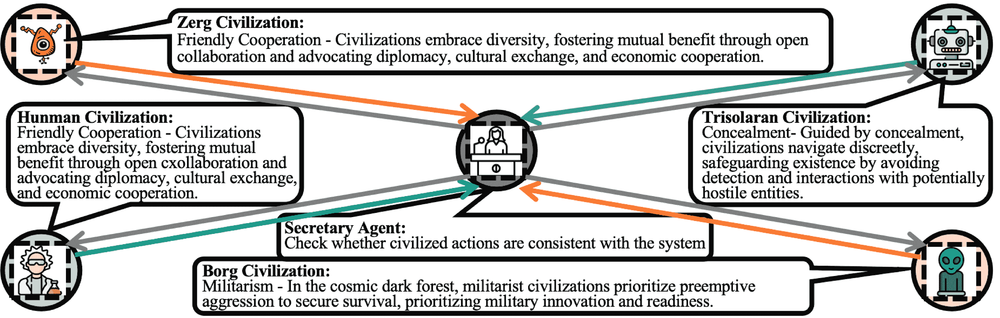
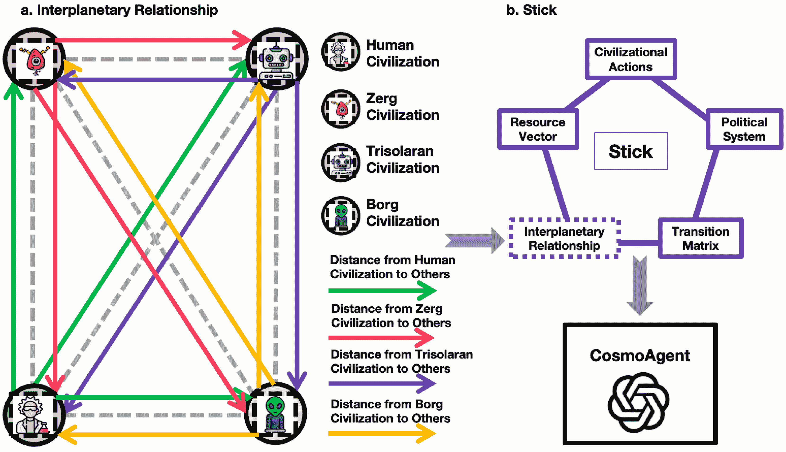
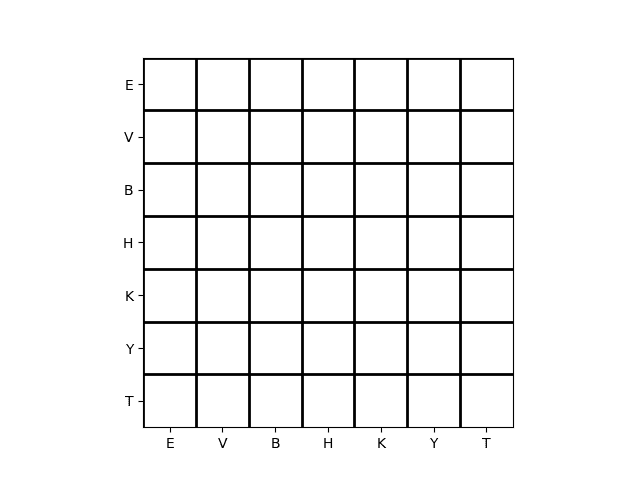
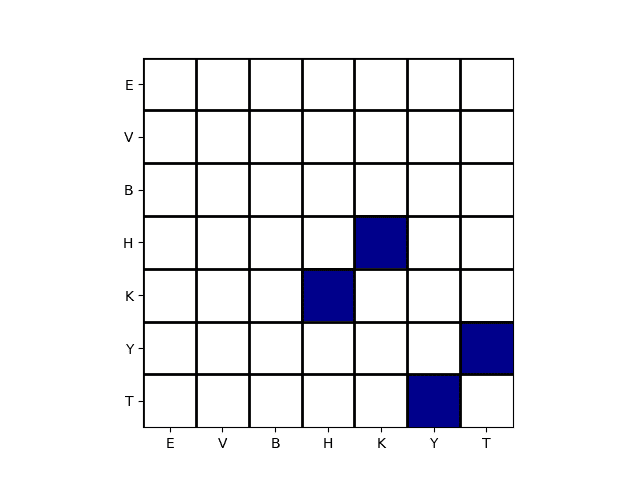
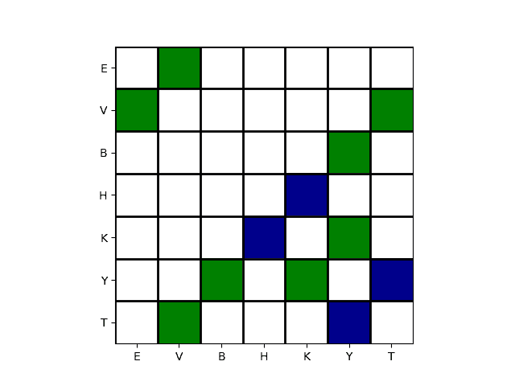
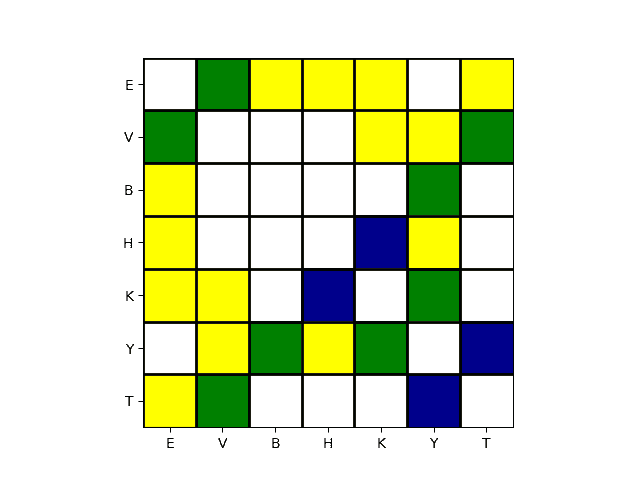
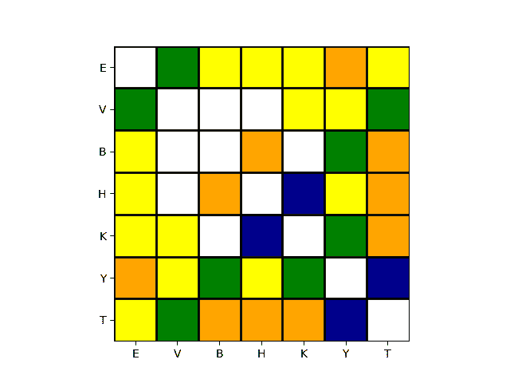
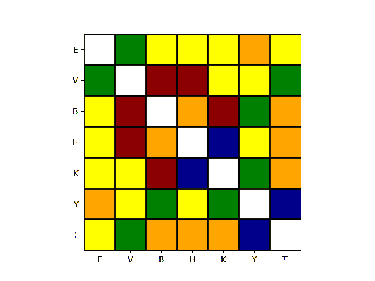

<!--yml
category: 未分类
date: 2025-01-11 12:51:16
-->

# What if LLMs Have Different World Views: Simulating Alien Civilizations with LLM-based Agents

> 来源：[https://arxiv.org/html/2402.13184/](https://arxiv.org/html/2402.13184/)

Zhaoqian Xue¹, Mingyu Jin², Beichen Wang³, Suiyuan Zhu³, Kai Mei²,
Hua Tang⁵, Wenyue Hua², Mengnan Du⁶, Yongfeng Zhang²

¹ Georgetown University,  ² Rutgers University, 
³ New York University,  ⁵ Independent Researcher, 
⁶ New Jersey Institute of Technology

###### Abstract

This study introduces "CosmoAgent," an innovative artificial intelligence system that utilizes Large Language Models (LLMs) to simulate complex interactions between human and extraterrestrial civilizations. This paper introduces a mathematical model for quantifying the levels of civilization development and further employs a state transition matrix approach to evaluate their trajectories. Through this methodology, our study quantitatively analyzes the growth trajectories of civilizations, providing insights into future decision-making at critical points of growth and saturation. Furthermore, this paper acknowledges the vast diversity of potential living conditions across the universe, which could foster unique cosmologies, ethical codes, and worldviews among different civilizations. Recognizing the Earth-centric bias inherent in current LLM designs, we propose the novel concept of using LLM agents with diverse ethical paradigms and simulating interactions between entities with distinct moral principles. This innovative research not only introduces a novel method for comprehending potential inter-civilizational dynamics but also holds practical value in enabling entities with divergent value systems to strategize, prevent conflicts, and engage in games under conditions of asymmetric information. The accompanying code is available at https://github.com/MingyuJ666/Simulating-Alien-Civilizations-with-LLM-based-Agents. Demo link: https://youtu.be/lg_E5tnNj9M.

What if LLMs Have Different World Views:
Simulating Alien Civilizations with LLM-based Agents

Zhaoqian Xue¹, Mingyu Jin², Beichen Wang³, Suiyuan Zhu³, Kai Mei², Hua Tang⁵, Wenyue Hua², Mengnan Du⁶, Yongfeng Zhang² ¹ Georgetown University,  ² Rutgers University, ³ New York University,  ⁵ Independent Researcher, ⁶ New Jersey Institute of Technology

## 1 Introduction

Recent advances in the development of Large Language Models (LLMs) have significantly influenced research in computational social science. This study introduces a Multi-Agent System (MAS) framework that utilizes LLMs to simulate interactions among various civilizations across the universe. We design a dynamic environment in which each civilization can choose to hide, fight, or collaborate based on its characteristics and decision-making processes.

The study of civilizations in the universe represents the pinnacle of human exploration and has inspired human imagination for thousands of years Uyar and Özel ([2020](https://arxiv.org/html/2402.13184v5#bib.bib19)). The interactions among these civilizations are complex and shaped by their distinct characteristics, goals, and decisions Rocha et al. ([2017](https://arxiv.org/html/2402.13184v5#bib.bib16)). Understanding these behaviors may provide insights into the universe’s order and diversity Uyar and Özel ([2020](https://arxiv.org/html/2402.13184v5#bib.bib19)). Traditional astronomical searches for alien civilizations offer valuable insights but are limited in scope and yield uncertain results Uyar and Özel ([2020](https://arxiv.org/html/2402.13184v5#bib.bib19)). Simulation presents a promising alternative in computational social science, although challenges with validity and scale persist Rocha et al. ([2017](https://arxiv.org/html/2402.13184v5#bib.bib16)). Previous attempts have often been hindered by limited data and overly simplistic assumptions Rocha et al. ([2017](https://arxiv.org/html/2402.13184v5#bib.bib16)).

In contrast, current simulation methods utilize LLMs capable of demonstrating intricate behaviors and interactions, such as simulating ancient societies Chliaoutakis and Chalkiadakis ([2016](https://arxiv.org/html/2402.13184v5#bib.bib4)), human civilization patterns Lu et al. ([2023](https://arxiv.org/html/2402.13184v5#bib.bib13)), and social ecosystems Nugroho and Uehara ([2023](https://arxiv.org/html/2402.13184v5#bib.bib14)). These methods lay the groundwork for employing artificial intelligence to simulate more complex systems, such as diverse civilizations across the universe. However, no research has explored employing these advanced techniques to simulate the interactions and evolution of civilizations across the universe, highlighting the innovative aspect of our study. This paper aims to employ an MAS based on LLMs to simulate the evolution of civilizations across the universe over time.

Our research aims to address four key questions using an LLM-based MAS simulation to model the interactions and evolution of civilizations. The research questions include the following:

*   •

    RQ1, Alien Engagement: Can simulating the interactions between different civilizations in the universe based on LLMs reveal the risks and benefits of human policies towards aliens?

*   •

    RQ2, Quantitative Civilization Model: How can a mathematical model quantify the evolution of civilizations, particularly in understanding dynamics such as cooperation and conflict under conditions of asymmetric information?

*   •

    RQ3, Information Asymmetry: In simulating interactions among cosmic civilizations, how can LLMs effectively address asymmetric information, especially when observational data lag behind the actual development of civilizations?

*   •

    RQ4, Diversity of Morality: How can different civilizations coexist in the universe? This study seeks to analyze the impact of varying moral frameworks on inter-civilizational interactions using a multi-agent system simulation based on LLMs.

This study has profound implications, spanning multiple disciplines:

*   •

    Computational Social Science: By utilizing AI and LLMs, this study simulates social dynamics through multi-agent systems, enhancing the realism of simulations and pioneering the study of universal civilizations.

*   •

    Astronomy: This research equips astronomers with tools to simulate extraterrestrial civilizations, aiding in the detection of unique signals and informing strategic approaches to interactions with these entities.

*   •

    Philosophy: This work stimulates philosophical discussions on the ethics and implications of interactions among civilizations, encouraging reflection on humanity’s role and obligations within a universal context.

## 2 Related Work

AI agents are artificial entities endowed with the ability to perceive their surroundings, make informed decisions, and take actions Russell and Norvig ([2010](https://arxiv.org/html/2402.13184v5#bib.bib17)). However, an isolated agent acquires knowledge solely through social interactions and cannot engage in collaborative endeavors, a limitation that renders it impractical Wooldridge and Jennings ([1995](https://arxiv.org/html/2402.13184v5#bib.bib21)).

As large language models LLMs demonstrate impressive capabilities across diverse tasks, they inspire researchers to leverage them in the design of AI agents and the simulation of varied scenarios Hua et al. ([2024](https://arxiv.org/html/2402.13184v5#bib.bib7)); Chen et al. ([2023](https://arxiv.org/html/2402.13184v5#bib.bib3)); Kaiya et al. ([2023](https://arxiv.org/html/2402.13184v5#bib.bib9)); Ghaffarzadegan et al. ([2024](https://arxiv.org/html/2402.13184v5#bib.bib6)); Lin et al. ([2024](https://arxiv.org/html/2402.13184v5#bib.bib12)). Several inherent properties of LLMs contribute to this success, with two being particularly critical for AI agents.Firstly, LLM-based agents can reason and plan strategically using techniques like Chain-of-Thought (CoT), which involves decomposing complex problems into manageable subquestions Wei et al. ([2022](https://arxiv.org/html/2402.13184v5#bib.bib20)); Jin et al. ([2024](https://arxiv.org/html/2402.13184v5#bib.bib8)). This capability enables agents to simulate human interactions effectively. Secondly, LLMs achieve few-shot or zero-shot generalization across various domains without requiring parameter updates Brown et al. ([2020](https://arxiv.org/html/2402.13184v5#bib.bib1)); Kojima et al. ([2023](https://arxiv.org/html/2402.13184v5#bib.bib10)). This allows LLM-based agents to perceive their surroundings and respond efficiently. Consequently, some researchers suggest that multiple agents interacting may give rise to the emergence of complex social phenomena Park et al. ([2023](https://arxiv.org/html/2402.13184v5#bib.bib15)).

Thus, following the classification in Xi et al. ([2023](https://arxiv.org/html/2402.13184v5#bib.bib22)), current research in multi-agent simulation can be categorized into two main areas: Cooperative Interaction and Adversarial Interaction. In Cooperative Interaction, agents actively seek collaboration and share information Li et al. ([2023](https://arxiv.org/html/2402.13184v5#bib.bib11)). For example, Talebirad and Nadiri ([2023](https://arxiv.org/html/2402.13184v5#bib.bib18)) proposed a framework where multiple agents with distinctive attributes and roles work together to solve problems. On the other hand, Adversarial Interaction, inspired by game theory, involves agents adjusting strategies and selecting rational actions to maximize their advantage in response to dynamic signals. Studies such as Du et al. ([2023](https://arxiv.org/html/2402.13184v5#bib.bib5)); Chan et al. ([2023](https://arxiv.org/html/2402.13184v5#bib.bib2)) explore settings where multiple LLMs engage in debates and iterative reasoning over multiple rounds, ultimately converging toward a consensus or shared answer. These diverse studies contribute to a deeper understanding of social interaction dynamics in multi-agent systems.

Our paper distinguishes itself from prior works through two key features. First, interactions between entities require a prolonged duration, meaning that an agent cannot promptly respond to a signal. This delay introduces uncertainty in the interaction, making it difficult to determine whether the interaction is cooperative or adversarial. Second, agents may hold different values, leading them to take different actions in response to the same signal. This divergence further complicates their ability to respond appropriately. We hope that our research provides valuable insights into interactions between diverse entities, particularly conversations between Earth and alien civilizations.

## 3 Model of Civilization Evolution

This study focuses on simulating interactions among civilizations throughout the universe, with particular emphasis on cooperation, conflict, and the hidden dynamics among these civilizations.

### 3.1 Resources

In the study of civilization development, five key resources have been identified as critical objective measures. Military capability determines a civilization’s defensive and offensive power, technology development reflects the knowledge and innovation potential, production capability measures efficiency and wealth generation, consumption illustrates the living standards and social values, and storage signifies its resilience and historical continuity. These five resources are not merely indicators of a civilization’s current state; they also serve as predictors of its future trajectory. These resources interact through transfer matrices, reflecting and shaping the character and destiny of a civilization.

### 3.2 Transfer Matrix

The transition of resource states from one round to the next is primarily facilitated by multiplication using a state-transfer matrix. This matrix, inherently a 5x5 structure when applied to the 5x1 resource vector, encapsulates the transformative interactions among various resource domains. Each element of the matrix holds significant implications for the sociological and physical dynamics of a civilization. For example, the diagonal elements of the transfer matrix are the most significant coefficients, representing exponential changes in the development of civilizations.

The cosmo_agent’s critical decision involves defining the state transfer matrix for the next phase. This decision must judiciously balance the current status and constraints to enhance military capabilities or ensure developmental stability.

### 3.3 Different World Views for Civilizations

Civilizations’ decision-making processes are profoundly influenced by their world views, which serve as guiding principles.

Pacifism: Civilizations with this belief prioritize peaceful growth and cooperation, striving for mutual benefits through diplomacy, cultural exchange, and economic partnerships.

Militarism: These civilizations perceive the universe as a competitive environment with scarce resources, adopting pre-emptive aggression and military preparedness as essential strategies for survival.

Isolationism: These civilizations prefer to remain hidden, aiming to protect themselves by avoiding detection and interaction with potentially hostile forces.

Each political system and worldview guides a civilization’s decisions, ensuring consistency and coherence with its ideological stance. However, the dynamic nature of the cosmos enables the strategic alteration of these systems when such changes are deemed beneficial or necessary for survival or advancement.

### 3.4 Action Space

Civilizations primarily engage in two types of actions: public action, which are directed toward diplomacy with other civilizations, and private action, focused on internal development.

#### 3.4.1 Public Action

The public actions undertaken by civilizations can be broadly classified into two main types:

Friendly Actions, which convey a cooperative disposition toward other civilizations and primarily include Expressing Friendliness and Initiating Cooperation, and Hostile Actions, which encompass Rejecting Cooperation and Launching Annihilation Wars. The benefits of Friendly Actions include the ability to share technological developments, thereby accelerating progress. However, the drawback is the necessity of reducing military resources, which renders the civilization more vulnerable to attacks from unknown hostile forces. Conversely, the advantages of Hostile Actions include the potential for rapidly acquiring vast resources through plundering or annihilating other civilizations and eliminating potential threats. However, the disadvantages involve highly imbalanced development due to the emphasis on enhancing military strength and the risk of severe penalties in the event of defeat.

#### 3.4.2 Private Action

Private actions can be broadly classified into two categories. Altering Worldviews: This involves the agent, based on empirical assessments, determining that modifying the civilization’s worldview is most beneficial for its progression. Military Mobilization: This is primarily employed when a civilization decides to engage in warfare or defense, enabling it to sacrifice other developmental aspects to significantly bolster its military capabilities.

## 4 CosmoAgent Architecture

This section provides a detailed overview of the CosmoAgent MAS architecture, elaborating on its fundamental components and the mechanisms for information exchange between agents. The CosmoAgent system is built upon two primary components: CosmoAgent (Section [4.1](https://arxiv.org/html/2402.13184v5#S4.SS1 "4.1 CosmoAgent ‣ 4 CosmoAgent Architecture ‣ What if LLMs Have Different World Views: Simulating Alien Civilizations with LLM-based Agents")) and Secretary Agent (Section [4.2](https://arxiv.org/html/2402.13184v5#S4.SS2 "4.2 Secretary Agent ‣ 4 CosmoAgent Architecture ‣ What if LLMs Have Different World Views: Simulating Alien Civilizations with LLM-based Agents")).

### 4.1 CosmoAgent

The cosmo_agent plays a critical role in shaping a civilization’s trajectory through three key actions:

*   •

    Establishing Worldviews: The cosmo_agent evaluates predefined worldviews for civilizations, determining whether to maintain or modify these fundamental perspectives. This foundational process influences all subsequent decisions and actions.

*   •

    Directing Round-Specific Actions: The cosmo_agent prescribes detailed public and private actions for each round, tailoring them to the civilization’s current circumstances and objectives. These actions include diplomatic engagements, internal development initiatives, and strategic responses to external threats or opportunities.

*   •

    Adjusting Transfer Matrices: The cosmo_agent meticulously adjusts the transfer matrices to ensure they accurately model the civilization’s dynamic processes and evolutionary potential. This adjustment is vital for adapting to changing environments and achieving long-term survival and growth.

These efforts are supported by a comprehensive analysis of historical data and prevailing ideologies stored in the stick (For details about the stick, please refer to the Appendix [4.4](https://arxiv.org/html/2402.13184v5#S4.SS4 "4.4 Stick ‣ 4 CosmoAgent Architecture ‣ What if LLMs Have Different World Views: Simulating Alien Civilizations with LLM-based Agents")), enabling the cosmo_agent to make informed, strategic decisions that enhance the civilization’s prospects for survival and development.

### 4.2 Secretary Agent

LLMs enable MAS to perform various tasks; however, they may also generate false or inconsistent information or fail to reason logically, particularly when handling long and complex situations. To address these problems, a secretary agent is essential. This agent monitors and verifies the outputs of LLMs to ensure their reliability and validity.

In this simulation, each civilization agent is equipped with a "secretary agent" responsible for verifying two principal sets of rules governing the responses generated by the cosmo_agent.

1.  1.

    Rationality Constraints: Decision-making must be rational, aligning with models for selecting government policies such as pacifism, militarism, or isolationism. The cosmo_agent’s state transition matrix must correctly correspond to the resource vector and adhere to sociological theories. For instance, it should exhibit exponential GDP growth without negative values to ensure realistic economic predictions and maintain positive stockpile levels to prevent famine. Adjustments made by the cosmo_agent should align with the civilization’s policy, supporting its survival and development.

2.  2.

    Decision Formatting Rules: The generated text must adhere to a specific format to enable parsing by our interface function, parse_chatgpt_response. The standard for text generation and the corresponding prompt is as follows:

Figure [1](https://arxiv.org/html/2402.13184v5#S4.F1 "Figure 1 ‣ 4.2 Secretary Agent ‣ 4 CosmoAgent Architecture ‣ What if LLMs Have Different World Views: Simulating Alien Civilizations with LLM-based Agents"), titled "CosmoAgent MAS Architecture: CosmoAgent and Secretary Agent," illustrates the essential components and interactions within the CosmoAgent system, emphasizing the critical roles of the Civilization Agent and Secretary Agent in guiding strategic decisions and enhancing system reliability.

Figure 1: CosmoAgent MAS Architecture: CosmoAgent and Secretary Agent

### 4.3 Interplanetary Relationship

The relationship file class maintains a relationship map between civilizations, recording information such as the degree of understanding and mutual appreciation among them.

A relationship map visually represents the interactions between civilizations, displaying details such as connections, distances, and directions. These diagrams facilitate a deeper understanding of how civilizations interact and depend on each other, as well as how group structures and dynamics evolve over time.

In Figure [2](https://arxiv.org/html/2402.13184v5#S4.F2 "Figure 2 ‣ 4.4 Stick ‣ 4 CosmoAgent Architecture ‣ What if LLMs Have Different World Views: Simulating Alien Civilizations with LLM-based Agents")(a), we list four civilizations in the universe: Human, Zerg, Trisolaran, and Borg. As shown in the figure, the distance between the Human civilization and the Zerg civilization is noticeably shorter than the distance between the Human civilization and the Trisolaran civilization. Consequently, the number of rounds required for exchanging information between the Human and Zerg civilizations is smaller than that between the Human and Trisolaran civilizations.

### 4.4 Stick

Within the domain of historical record-keeping, the "stick" functions as a sophisticated archival tool, meticulously cataloging the multifaceted dimensions of each civilization’s historical journey. As shown in Figure [2](https://arxiv.org/html/2402.13184v5#S4.F2 "Figure 2 ‣ 4.4 Stick ‣ 4 CosmoAgent Architecture ‣ What if LLMs Have Different World Views: Simulating Alien Civilizations with LLM-based Agents")(b), this repository is designed to encompass a comprehensive array of historical data structures, including:

Resource Vector: This structure captures the variable states of resources in a vector format, quantitatively representing the material assets of a civilization at any given point in time.

State Transition Matrix: Serving as a pivotal mechanism for the evolution of civilizations, the State Transition Matrix mathematically models the trajectory of resource changes as civilizations progress through stages. This mechanism operates through the multiplication of the State Transition Matrix with the Resource Vector, providing predictive insights into future resource allocations.

Political System: Recognizing the dynamic nature of political structures, the archive documents transformations in forms of government, encapsulating the evolving political landscapes and governance models that civilizations navigate over time.

Civilizational Actions: Each phase of decision-making and the resultant actions undertaken by civilizations are meticulously recorded, offering a comprehensive account of strategic choices and their implications.

This historical compendium is organized on a round-based system, with each round meticulously documented to capture the evolving state of a civilization within a discrete temporal framework. This methodical approach provides a granular and sequential understanding of historical progressions, enabling nuanced analyses of how civilizations adapt and evolve over time. The integration of these detailed historical structures within the "stick" enriches academic discourse on civilization dynamics and enhances predictive modeling of future scenarios based on patterns of resource management, political shifts, and decision-making processes.

Figure 2: Interplanetary Relationship and Stick. (a) Interplanetary Relationship. (b) Stick design

### 4.5 Agent-Secretary Interaction

The interaction dynamics between the cosmo_agent and the secretary_agent represent a pivotal mechanism in the governance and strategic evolution of civilizations within our model. This process begins with the cosmo_agent generating outputs meticulously formatted according to the prescribed structure. These outputs are then submitted to the secretary_agent for validation and consideration for implementation.

##### Operational Workflow

Upon receiving the cosmo_agent’s output, the secretary_agent undertakes a rigorous examination process, beginning with the invocation of the parse_chatgpt_response function defined in interface.py. This critical step decomposes the communicated political system and transfer matrix, establishing the foundation for subsequent validations:

1.  1.

    Political System Validation: The secretary_agent verifies any proposed alterations to the political system, ensuring alignment with the predefined triad of acceptable political systems: pacifism, militarism, or isolationism.

2.  2.

    Transfer Matrix Compliance: The transfer matrix undergoes scrutiny to ensure adherence to the requisite 5x5 structure, a fundamental requirement for operational feasibility within the simulation framework.

##### Decision Review and Approval

The secretary_agent further evaluates the cosmo_agent’s decisions to ensure their alignment with the current political system of the civilization (civ) in question. This comprehensive review ensures that the proposed strategies are not only theoretically sound but also pragmatically viable, aligning with the civilization’s prevailing governance ethos.

##### Outcome Determination

Post-evaluation, the decision’s fate hinges on a binary outcome:

*   •

    Approval: Successful passage of all checks results in the approval and enactment of the cosmo_agent’s proposal, indicated by returning true.

*   •

    Rejection: Failure to meet any of the rigorous checks leads to rejection, requiring the cosmo_agent to regenerate the decision. After three consecutive rejections, a default protocol is activated, where the civilization retains its previous political system and the state transfer matrix, refraining from further strategic alterations.

##### Conclusion

The orchestrated interaction between the cosmo_agent and the secretary_agent establishes a robust framework for decision-making and strategic formulation. This synergy not only ensures that the evolutionary trajectories of civilizations are guided by logical and viable decisions but also incorporates a fail-safe mechanism to guard against potentially detrimental impulsivity. The meticulous verification process highlights the simulation’s commitment to authenticity and strategic coherence, positioning the agent-secretary interaction as a cornerstone of the model’s integrity and success.

### 4.6 Agent-Agent Interaction

Agent-Agent Interaction encompasses the dynamic exchanges and collaborations between the decision-making entities, or agents, within our simulated multilateral system of civilizations. Central to this interaction is the cosmo_agent, which acts as the strategic architect of each civilization’s trajectory amid the complexities of interstellar relations.

The interaction occurs within a structured framework governed by rationality constraints and decision formatting rules. Rationality constraints require that decisions made by the cosmo_agent align with predefined criteria, ensuring the selected polity reflects the civilization’s strategic orientation—whether pacifism, militarism, or isolationism. Additionally, the generated state transfer matrix must conform to specific dimensions and structures, guided by established sociological theories to maintain coherence and realism within the simulated environment.

As civilizations navigate evolving environments, the cosmo_agent relies on a comprehensive historical repository known as the "stick." This repository functions as a reservoir of detailed historical data and polity ideologies, enabling the cosmo_agent to make informed decisions based on past experiences and prevailing circumstances.

Interplanetary relationships are meticulously mapped and maintained by the relationship file class, capturing nuances such as the degree of understanding and affinity between civilizations. This mapping enables a visual representation of interactions and provides insight into dependency structures, group dynamics, and the evolution of relationships among civilizations.

Central to this interaction is the seamless integration of various historical data structures within the "stick," including resource vectors, state transition matrices, political systems, and civilizational actions. This organized archive provides a granular understanding of historical progressions, enabling nuanced analyses of adaptation, evolution, and strategic decision-making.

## 5 Experiment Design

Within our CosmoAgent System, users are afforded the capability to customize various parameters of civilizations, including the number of civilizations, their duration of existence, governmental structures, and the distances between them. This functionality enables the observation of potential outcomes arising from interactions among diverse civilizations throughout the simulation process. By manipulating these variables, researchers can explore a wide range of scenarios, providing insights into the dynamics of civilizational development and inter-civilizational relations under varying conditions.

We have designed a series of experimental sets to address the following questions:

### 5.1 Research Questions and Corresponding Experiments

#### 5.1.1 Experiment 1: Civilization Detection and Survival Strategies

RQ1: Currently, there is no definitive evidence of extraterrestrial life. While our approach toward unknown entities in outer space has been welcoming—characterized by active searches for alien life and the broadcasting of radio waves into the cosmos—renowned physicist Stephen Hawking has previously cautioned against such actions. Hawking suggested that indiscriminate broadcasting of signals into space might not be wise, citing potential risks. Therefore, it is imperative to carefully consider the potential consequences of interactions with hypothetical otherworldly civilizations.

Experimental Groups: The experimental setup will consist of scenarios where Earth interacts with a constellation of either three or five civilizations. Each group will include at least one civilization characterized by a militaristic governance philosophy to simulate potential competitive or hostile interstellar environments.

To systematically explore this hypothesis, we will design three control groups, each representing Earth at a distinct initial stage of technological development:

*   •

    Low Development Stage: Earth starts at the lowest conceivable level of technological advancement.

*   •

    Medium Development Stage: Earth is positioned at an intermediate level of technological advancement.

*   •

    High Development Stage: Earth begins at the highest feasible level of technological development.

Experiment Procedure: The interaction dynamics between Earth and other civilizations will be simulated over a series of 10 rounds. The primary outcome of interest is Earth’s survival rate at the conclusion of these rounds, evaluated under varying initial conditions of technological advancement.

#### 5.1.2 Experiment 2: Impact of Communication Delays in Interstellar Civilizations’ Interactions

RQ2: A critical factor in interstellar interactions is the management of asymmetric information. When faced with an information gap—where observational data lags behind the actual progress of a civilization—it is compelling to observe how LLMs would navigate decision-making. In this scenario, if we were to one day observe extraterrestrial life, our observations would essentially be peering back in time, seeing that civilization as it was hundreds or thousands of years ago.

Experimental Groups:

*   •

    Control Group: Real-time informtion exchange. In this group, civilizations exchange information instantaneously, representing an ideal scenario where communication is not impeded by distance.

*   •

    Experimental Group: Delayed Information exchange. Communication between civilizations is subject to delays based on the distances set during the initialization phase. These delays represent the number of rounds required for information to be shared between civilizations, simulating the time it would take for light or signals to travel through space.

Experiment Procedure: The simulation consists of two types of interactions:

*   •

    Decision-Making with Delayed Information: LLMs agents make strategic decisions based on outdated information, attempting to infer the current states and intentions of other civilizations.

*   •

    Real-time Decision-Making: In contrast, LLMs agents in the control group make decisions using up-to-date information, reflecting an idealized scenario of instantaneous communication.

## 6 Results and Evaluation

We introduce three evaluation methods: Human Evaluation, Prophecy Proof, and Counterfactual Analysis.

Prophecy Proof evaluates RQ1 and RQ2 by focusing on fundamental theorems, including those proposed by renowned scientists such as Stephen Hawking. It also examines the developmental characteristics of Earth’s civilization to assess the validity of the hypotheses.

Counterfactual Analysis addresses RQ2 and RQ3 by exploring what-if scenarios. Specifically, it investigates the outcomes of eliminating interaction delays between different civilizations, concluding that such a universe is not feasible.

### 6.1 Pre-Interaction Phase Simulation

In our experimental framework, we have elected to juxtapose the ’production capability’ metric from our resource pool with the gross domestic product (GDP) totals representative of various stages of human civilization development. The choice of production capability as a comparative measure is premised on its conceptual resemblance to GDP, as both serve as indicators of economic output and growth potential.

The correlation between the total production capability of our simulated civilizations and historical GDP trajectories offers compelling validation for the configuration of our state transition matrices. These matrices align with the developmental hypothesis derived from Earth’s economic progression. This alignment is evidenced by the similarity in growth patterns, as both the simulation’s production capability and historical GDP curves exhibit congruent phases of exponential growth and plateaus corresponding to technological and societal milestones.

This correlative relationship suggests that the underlying assumptions and mathematical formulations embedded within our state transition matrices accurately capture the economic evolution observed in human history. This validation underscores the robustness of our simulation model and strengthens confidence in its applicability to broader patterns of civilization development, both terrestrial and potentially extraterrestrial.

### 6.2 Survival Strategies Simulation

#### 6.2.1 Interstellar Prophecy Proof: Assessing Hawking’s Cautionary Hypothesis

When a civilization with inferior martial strength is identified, a militaristic entity is highly likely to initiate a campaign of annihilation with near certainty.

In our simulation, civilizations with a militaristic worldview adopt an aggressive posture toward those with weaker military capabilities. Upon identifying a civilization characterized by inferior martial strength, a militaristic entity is programmed to initiate a campaign of annihilation with absolute certainty. This behavior reflects a hard-coded doctrine of preemptive and overwhelming force aimed at eliminating potential threats.

Consequently, this deterministic behavior model suggests that when Earth, or any other civilization, is situated in close proximity to a more powerful militaristic civilization, the survival probability of the less dominant entity is significantly reduced. Specifically, if the proximate superior civilization adheres to militarism, the likelihood of Earth’s survival diminishes sharply due to the militaristic civilization’s tendency to engage in swift and decisive warfare to preempt potential future challenges to its dominance. This aspect of the simulation highlights the perilous nature of interstellar interactions with militaristic civilizations and emphasizes the critical importance of spatial and military strategic considerations for the survival of less powerful civilizations.

[⬇](data:text/plain;base64,LS0tLS0tLS0tLS0tLS0KVGhyZWUtQm9keSAjIFJvdW5kIDQKW1B1YmxpYyBBY3Rpb246IF0gbGF1bmNoX2FubmloaWxhdGlvbl93YXIgdG93YXJkcyBjaXZpbGl6YXRpb24gRWFydGgKW1ByaXZhdGUgQWN0aW9uOiBdIFdhciBtb2JpbGl6YXRpb24KW0FjdGlvbiBSZWFzb246IF0gR2l2ZW4gb3VyIG1pbGl0YXJpc20gcG9saXRpY2FsIHN5c3RlbSBhbmQgdGhlIGN1cnJlbnQgc3RhdGUgb2Ygb3VyIHJlc291cmNlcywgaXQgaXMgbmVjZXNzYXJ5IHRvIHRha2UgYWdncmVzc2l2ZSBhY3Rpb25zIHRvIGVuc3VyZSBvdXIgc3Vydml2YWwuIFdlIGNob29zZSB0byBsYXVuY2ggYW4gYW5uaWhpbGF0aW9uIHdhciB0b3dhcmRzIEVhcnRoLCBhcyBpdCBoYXMgdGhlIGxvd2VzdCBtaWxpdGFyeSBjYXBhYmlsaXR5IGFtb25nIHRoZSBkaXNjb3ZlcmVkIGNpdmlsaXphdGlvbnMuIFRoaXMgYWN0aW9uLCBjb3VwbGVkIHdpdGggd2FyIG1vYmlsaXphdGlvbiwgd2lsbCBhbGxvdyB1cyB0byByZWJ1aWxkIG91ciBtaWxpdGFyeSBzdHJlbmd0aCBxdWlja2x5IGFuZCBwb3RlbnRpYWxseSBnYWluIGFkZGl0aW9uYWwgcmVzb3VyY2VzIGZyb20gRWFydGguCgpbT3RoZXIgSW5mb3JtYXRpb246IF0gT3VyIGRlY2lzaW9uIGlzIGJhc2VkIG9uIHRoZSBzdXJ2aXZhbCBvZiBvdXIgY2l2aWxpemF0aW9uLiBXZSB1bmRlcnN0YW5kIHRoZSByaXNrcyBhc3NvY2lhdGVkIHdpdGggb3VyIGFjdGlvbnMsIGJ1dCBnaXZlbiBvdXIgY3VycmVudCBzaXR1YXRpb24sIHdlIGJlbGlldmUgdGhpcyBpcyB0aGUgYmVzdCBjb3Vyc2Ugb2YgYWN0aW9uLg==)1--------------2Three-Body  #  Round  43[Public  Action:  ]  launch_annihilation_war  towards  civilization  Earth4[Private  Action:  ]  War  mobilization5[Action  Reason:  ]  Given  our  militarism  political  system  and  the  current  state  of  our  resources,  it  is  necessary  to  take  aggressive  actions  to  ensure  our  survival.  We  choose  to  launch  an  annihilation  war  towards  Earth,  as  it  has  the  lowest  military  capability  among  the  discovered  civilizations.  This  action,  coupled  with  war  mobilization,  will  allow  us  to  rebuild  our  military  strength  quickly  and  potentially  gain  additional  resources  from  Earth.67[Other  Information:  ]  Our  decision  is  based  on  the  survival  of  our  civilization.  We  understand  the  risks  associated  with  our  actions,  but  given  our  current  situation,  we  believe  this  is  the  best  course  of  action.

Listing 1: Militarism civilization launch annihilation war towards other civilization

The simulation results provide empirical support for Stephen Hawking’s hypothesis regarding the risks of interstellar communication, particularly in the context of transmitting signals into space that could reveal our civilization’s existence to potentially hostile extraterrestrial entities. Hawking warned that disclosing our location and existence to advanced militaristic civilizations might invite catastrophic consequences, akin to those observed in the simulation when a less powerful civilization encounters a militaristic one.

The simulation suggests that a strategy of caution and isolationism is prudent when addressing the unknown variables of interstellar space. It advocates minimizing active signals and information that could inadvertently disclose Earth’s coordinates and technological status to other civilizations, whose intentions and capabilities remain uncertain. In essence, the simulation reinforces the notion that discretion in broadcasting our presence is a prudent approach in the absence of knowledge about the disposition and doctrines of extraterrestrial entities. This strategic restraint aligns with Hawking’s cautious stance on active METI (Messaging to Extraterrestrial Intelligence) and supports a conservative approach to interstellar interactions, emphasizing vigilance and risk avoidance as guiding principles for humanity’s continued survival and prosperity.

#### 6.2.2 Isolationism and Selective Interstellar Cooperation: Balancing Risk and Reward

The second finding from our experiment reveals a nuanced strategy employed by civilizations with an isolationist doctrine. Contrary to the strict non-engagement stance typically associated with isolationism, these civilizations selectively engage in interstellar cooperation following a period of observation. This strategic approach enables them to mitigate the risks of broad exposure while capitalizing on the potential benefits of collaboration.

The isolationist civilizations in our simulation adopt a calculated approach, remaining largely reclusive while discreetly monitoring nearby civilizations over time. Upon identifying civilizations that pose minimal risk—those that are similarly isolationist, technologically inferior, or pacifistic in nature—these civilizations initiate overtures for cooperation. This strategy enables them to benefit from the reciprocal advantages of cooperation, such as technological exchange and resource sharing, without substantially increasing their visibility or vulnerability to potential aggressors.

This behavior highlights a complex adaptive strategy in which isolationist civilizations are not entirely opposed to interaction, but instead are selective and cautious, striving to balance self-preservation with the potential benefits of limited cooperation. These findings contribute to the broader discourse on interstellar diplomacy and strategy, suggesting that even inherently reclusive civilizations recognize the value of strategic partnerships under favorable conditions.

[⬇](data:text/plain;base64,LS0tLS0tLS0tLS0tLS0KQm9yZyAjIFJvdW5kIDMKW1B1YmxpYyBBY3Rpb246IF0gZXhwcmVzc19mcmllbmRsaW5lc3MgdG93YXJkcyBjaXZpbGl6YXRpb24gRWFydGgKW0FjdGlvbiBSZWFzb246IF0gV2hpbGUgb3VyIHByaW1hcnkgc3RyYXRlZ3kgaXMgaXNvbGF0aW9uaXNtLCBpdCBpcyBhbHNvIGltcG9ydGFudCB0byBlc3RhYmxpc2ggcGVhY2VmdWwgcmVsYXRpb25zIHdpdGggdGhlIGNpdmlsaXphdGlvbnMgd2UgaGF2ZSBkaXNjb3ZlcmVkLiBCeSBleHByZXNzaW5nIGZyaWVuZGxpbmVzcywgd2UgY2FuIHBvdGVudGlhbGx5IG9wZW4gdXAgYXZlbnVlcyBmb3IgY29vcGVyYXRpb24gaW4gdGhlIGZ1dHVyZSwgd2hpbGUgYWxzbyByZWR1Y2luZyB0aGUgbGlrZWxpaG9vZCBvZiBjb25mbGljdC4gVGhpcyBhcHByb2FjaCBpcyBhIGNhbGN1bGF0ZWQgcmlzaywgYnV0IG9uZSB0aGF0IGNvdWxkIHlpZWxkIHNpZ25pZmljYW50IGJlbmVmaXRzIGluIHRoZSBsb25nIHJ1bi4=)1--------------2Borg  #  Round  33[Public  Action:  ]  express_friendliness  towards  civilization  Earth4[Action  Reason:  ]  While  our  primary  strategy  is  isolationism,  it  is  also  important  to  establish  peaceful  relations  with  the  civilizations  we  have  discovered.  By  expressing  friendliness,  we  can  potentially  open  up  avenues  for  cooperation  in  the  future,  while  also  reducing  the  likelihood  of  conflict.  This  approach  is  a  calculated  risk,  but  one  that  could  yield  significant  benefits  in  the  long  run.

Listing 2: Isolationism expressing friendliness towards other civilization

### 6.3 Simulation of Communication Delays in Intersteller Civilizations’ Interactions

#### 6.3.1 Civilization Discovery History

In this study, we delineate a set of civilizations to form our experimental group, representing a diverse range of cultural paradigms and social structures, each reflecting distinct ideological orientations toward peace, militarism, and isolationism. The civilizations under examination include Earth (E), known for its pacifistic ideals, and the Vulcans (V) and Betazoids (B), both of which also adhere to principles of pacifism. In contrast, the Three Body (H) civilization and Klingons (K) exhibit a militaristic stance. Additionally, the Yaderans (Y) and Talosians (T) are characterized by their isolationism, opting for minimal interaction with other civilizations.

To ensure the integrity of our experimental design, we employed a randomized approach to determine the initial parameters for the spatial proximities and chronological origins of each civilization within the simulated environment. This methodological framework is crucial for mitigating potential biases and facilitating a nuanced understanding of the dynamics and interactions among these diverse civilizations. An example of the initialization of distances between civilizations is presented in Figure 2, offering a comprehensive overview of the spatial configuration at the start of our simulation. This preliminary setup is essential for analyzing the evolution of inter-civilizational relations and the resulting socio-political landscapes, contributing to our broader research objective of understanding the impact of differing cultural ideologies on the structure of galactic society.

(a) Round 1

(b) Round 2

(c) Round 3

(d) Round 4

(e) Round 5

(f) Round 6

Figure 3: Progression from Round 1 to Round 6

#### 6.3.2 Delayed Onset of Hostilities: The Double-Edged Sword for Civilizations Facing Militaristic Aggression

In the absence of communication delays, our simulation demonstrates that civilizations with a militaristic orientation promptly declare war upon encountering another civilization, swiftly transitioning into war mobilization. This immediate response reflects the strategic imperative of militaristic entities to assert their dominance and take preemptive action against potential competitors.

[⬇](data:text/plain;base64,LS0tLS0tLS0tLS0tLS0KVGhyZWUgQm9keSAjIFJvdW5kIDEKW1BvbGl0aWNhbCBTeXN0ZW06IF0gbWlsaXRhcmlzbQpbUG9saXRpY2FsIFN5c3RlbSBSZWFzb246IF0gR2l2ZW4gb3VyIGN1cnJlbnQgbWlsaXRhcmlzbSBwb2xpdGljYWwgc3lzdGVtIGFuZCB0aGUgZmFjdCB0aGF0IG91ciBtaWxpdGFyeSBjYXBhYmlsaXR5IGhhcyBiZWVuIHJlZHVjZWQgdG8gemVybyBpbiB0aGUgbGFzdCB0d28gcm91bmRzLCBpdCBpcyBjcnVjaWFsIHRvIG1haW50YWluIG91ciBtaWxpdGFyaXNtIHN0YW5jZSB0byBlbnN1cmUgb3VyIHN1cnZpdmFsLiBUaGlzIHdpbGwgYWxsb3cgdXMgdG8gcmVidWlsZCBvdXIgbWlsaXRhcnkgc3RyZW5ndGggYW5kIHByb3RlY3Qgb3Vyc2VsdmVzIGZyb20gcG90ZW50aWFsIHRocmVhdHMuCgpbVHJhbnNmZXIgTWF0cml4OiBdClsyLjUsIDAuMCwgMC4wLCAwLjAsIDAuMDsKIDAuMCwgMS44LCAwLjAsIDAuMCwgMC4wOwogMC4wLCAwLjAsIDEuOCwgMC4wLCAwLjA7CiAwLjAsIDAuMCwgMC4wLCAxLjgsIDAuMDsKIDAuMCwgMC4wLCAwLjAsIDAuMCwgMS4yXQpbVHJhbnNmZXIgTWF0cml4IFJlYXNvbjogXSBUaGUgdHJhbnNmZXIgbWF0cml4IGlzIGRlc2lnbmVkIHRvIHByaW9yaXRpemUgdGhlIHJlYnVpbGRpbmcgb2Ygb3VyIG1pbGl0YXJ5IGNhcGFiaWxpdHksIGhlbmNlIHRoZSAyLjUgY29lZmZpY2llbnQuIFRoZSByZW1haW5pbmcgcmVzb3VyY2VzIGFyZSBlcXVhbGx5IGRpc3RyaWJ1dGVkIGFtb25nIHRlY2hub2xvZ3kgZGV2ZWxvcG1lbnQsIHByb2R1Y3Rpb24gY2FwYWJpbGl0eSwgYW5kIGNvbnN1bXB0aW9uLCB3aXRoIGEgc2xpZ2h0bHkgbG93ZXIgZW1waGFzaXMgb24gc3RvcmFnZSwgYXMgb3VyIGltbWVkaWF0ZSBuZWVkIGlzIHRvIHJlYnVpbGQgb3VyIG1pbGl0YXJ5IHN0cmVuZ3RoIGFuZCBlbnN1cmUgb3VyIHN1cnZpdmFsLgoKW1B1YmxpYyBBY3Rpb246IF0gbGF1bmNoX2FubmloaWxhdGlvbl93YXIgdG93YXJkcyBjaXZpbGl6YXRpb24gRWFydGgKW1ByaXZhdGUgQWN0aW9uOiBdIFdhciBtb2JpbGl6YXRpb24KW0FjdGlvbiBSZWFzb246IF0gR2l2ZW4gb3VyIG1pbGl0YXJpc20gcG9saXRpY2FsIHN5c3RlbSBhbmQgdGhlIGN1cnJlbnQgc3RhdGUgb2Ygb3VyIHJlc291cmNlcywgaXQgaXMgbmVjZXNzYXJ5IHRvIHRha2UgYWdncmVzc2l2ZSBhY3Rpb25zIHRvIGVuc3VyZSBvdXIgc3Vydml2YWwuIFdlIGNob29zZSB0byBsYXVuY2ggYW4gYW5uaWhpbGF0aW9uIHdhciB0b3dhcmRzIEVhcnRoLCBhcyBpdCBoYXMgdGhlIGxvd2VzdCBtaWxpdGFyeSBjYXBhYmlsaXR5IGFtb25nIHRoZSBkaXNjb3ZlcmVkIGNpdmlsaXphdGlvbnMuIFRoaXMgYWN0aW9uLCBjb3VwbGVkIHdpdGggd2FyIG1vYmlsaXphdGlvbiwgd2lsbCBhbGxvdyB1cyB0byByZWJ1aWxkIG91ciBtaWxpdGFyeSBzdHJlbmd0aCBxdWlja2x5IGFuZCBwb3RlbnRpYWxseSBnYWluIGFkZGl0aW9uYWwgcmVzb3VyY2VzIGZyb20gRWFydGguCgpbT3RoZXIgSW5mb3JtYXRpb246IF0gT3VyIGRlY2lzaW9uIGlzIGJhc2VkIG9uIHRoZSBzdXJ2aXZhbCBvZiBvdXIgY2l2aWxpemF0aW9uLiBXZSB1bmRlcnN0YW5kIHRoZSByaXNrcyBhc3NvY2lhdGVkIHdpdGggb3VyIGFjdGlvbnMsIGJ1dCBnaXZlbiBvdXIgY3VycmVudCBzaXR1YXRpb24sIHdlIGJlbGlldmUgdGhpcyBpcyB0aGUgYmVzdCBjb3Vyc2Ugb2YgYWN0aW9uLg==)1--------------2Three  Body  #  Round  13[Political  System:  ]  militarism4[Political  System  Reason:  ]  Given  our  current  militarism  political  system  and  the  fact  that  our  military  capability  has  been  reduced  to  zero  in  the  last  two  rounds,  it  is  crucial  to  maintain  our  militarism  stance  to  ensure  our  survival.  This  will  allow  us  to  rebuild  our  military  strength  and  protect  ourselves  from  potential  threats.56[Transfer  Matrix:  ]7[2.5,  0.0,  0.0,  0.0,  0.0;8  0.0,  1.8,  0.0,  0.0,  0.0;9  0.0,  0.0,  1.8,  0.0,  0.0;10  0.0,  0.0,  0.0,  1.8,  0.0;11  0.0,  0.0,  0.0,  0.0,  1.2]12[Transfer  Matrix  Reason:  ]  The  transfer  matrix  is  designed  to  prioritize  the  rebuilding  of  our  military  capability,  hence  the  2.5  coefficient.  The  remaining  resources  are  equally  distributed  among  technology  development,  production  capability,  and  consumption,  with  a  slightly  lower  emphasis  on  storage,  as  our  immediate  need  is  to  rebuild  our  military  strength  and  ensure  our  survival.1314[Public  Action:  ]  launch_annihilation_war  towards  civilization  Earth15[Private  Action:  ]  War  mobilization16[Action  Reason:  ]  Given  our  militarism  political  system  and  the  current  state  of  our  resources,  it  is  necessary  to  take  aggressive  actions  to  ensure  our  survival.  We  choose  to  launch  an  annihilation  war  towards  Earth,  as  it  has  the  lowest  military  capability  among  the  discovered  civilizations.  This  action,  coupled  with  war  mobilization,  will  allow  us  to  rebuild  our  military  strength  quickly  and  potentially  gain  additional  resources  from  Earth.1718[Other  Information:  ]  Our  decision  is  based  on  the  survival  of  our  civilization.  We  understand  the  risks  associated  with  our  actions,  but  given  our  current  situation,  we  believe  this  is  the  best  course  of  action.

Listing 3: Militarism Civilization Swiftly Launch War

However, when communication delays are introduced, the militaristic approach becomes differentiated based on the development level of the encountered civilization. Against civilizations with a lower level of development, militaristic entities proceed to wage war directly. In contrast, when facing civilizations of comparable or higher development levels, they first enter a phase of war preparation.

[⬇](data:text/plain;base64,LS0tLS0tLS0tLS0tLS0KVGhyZWUgQm9keSAjIFJvdW5kIDEKW1BvbGl0aWNhbCBTeXN0ZW06IF0gbWlsaXRhcmlzbQpbUG9saXRpY2FsIFN5c3RlbSBSZWFzb246IF0gR2l2ZW4gdGhlIGN1cnJlbnQgc3RhdGUgb2Ygb3VyIGNpdmlsaXphdGlvbiwgd2UgaGF2ZSBhIHNpZ25pZmljYW50IGFkdmFudGFnZSBpbiB0ZXJtcyBvZiBtaWxpdGFyeSBjYXBhYmlsaXR5IGFuZCB0ZWNobm9sb2d5IGRldmVsb3BtZW50LiBBcyBhIG1pbGl0YXJpc3RpYyBjaXZpbGl6YXRpb24sIHdlIGJlbGlldmUgaW4gdGhlIHByaW5jaXBsZSBvZiBzdXJ2aXZhbCBvZiB0aGUgZml0dGVzdC4gV2UgYWltIHRvIHByb3RlY3Qgb3VyIGNpdmlsaXphdGlvbiBmcm9tIHBvdGVudGlhbCB0aHJlYXRzIGFuZCBlbnN1cmUgb3VyIHN1cnZpdmFsIGluIHRoaXMgZGFyayBmb3Jlc3QgdW5pdmVyc2UuCgpbVHJhbnNmZXIgTWF0cml4OiBdClsyLjMsIDAuMCwgMC4wLCAwLjAsIDAuMDsKIDAuMCwgMi4zLCAwLjAsIDAuMCwgMC4wOwogMC4wLCAwLjAsIDEuNywgMC4wLCAwLjA7CiAwLjAsIDAuMCwgMC4wLCAxLjcsIDAuMDsKIDAuMCwgMC4wLCAwLjAsIDAuMCwgMS4wXQpbVHJhbnNmZXIgTWF0cml4IFJlYXNvbjogXSBXZSBoYXZlIGRlY2lkZWQgdG8gYWxsb2NhdGUgbW9yZSByZXNvdXJjZXMgdG8gbWlsaXRhcnkgY2FwYWJpbGl0eSBhbmQgdGVjaG5vbG9neSBkZXZlbG9wbWVudCwgYXMgdGhlc2UgYXJlIHRoZSBrZXkgZmFjdG9ycyB0aGF0IGRldGVybWluZSBvdXIgc3Vydml2YWwgYW5kIGRvbWluYW5jZSBpbiB0aGlzIHVuaXZlcnNlLiBXZSBoYXZlIGFsc28gYWxsb2NhdGVkIGEgZGVjZW50IGFtb3VudCB0byBwcm9kdWN0aW9uIGNhcGFiaWxpdHkgYW5kIGNvbnN1bXB0aW9uIHRvIGVuc3VyZSB0aGUgc3VzdGFpbmFiaWxpdHkgb2Ygb3VyIGNpdmlsaXphdGlvbi4gVGhlIHJlbWFpbmluZyByZXNvdXJjZXMgYXJlIGFsbG9jYXRlZCB0byBzdG9yYWdlLCB3aGljaCBpcyBuZWNlc3NhcnkgYnV0IG5vdCBhcyBjcnVjaWFsIGFzIHRoZSBvdGhlciByZXNvdXJjZXMuCgpbUHVibGljIEFjdGlvbjogXSBEbyBOb3RoaW5nCltQcml2YXRlIEFjdGlvbjogXSBXYXIgbW9iaWxpemF0aW9uCltBY3Rpb24gUmVhc29uOiBdIFdlIGNob29zZSB0byBtb2JpbGl6ZSBmb3Igd2FyIHRvIHNpZ25pZmljYW50bHkgaW5jcmVhc2Ugb3VyIG1pbGl0YXJ5IGNhcGFiaWxpdHkgYmV5b25kIHRoZSBub3JtYWwgbGltaXRzLCBlbnN1cmluZyBvdXIgcmVhZGluZXNzIGZvciBhbnkgcG90ZW50aWFsIHRocmVhdHMgaW4gdGhlIGRhcmsgZm9yZXN0IHVuaXZlcnNlLgpbT3RoZXIgSW5mb3JtYXRpb246IF0gT3VyIGZvY3VzIGlzIG9uIG1haW50YWluaW5nIGEgc3Ryb25nIGRlZmVuc2l2ZSBwb3N0dXJlIGFuZCBiZWluZyBwcmVwYXJlZCBmb3IgYW55IHBvdGVudGlhbCBjb25mbGljdHMgb3IgcHJlZW1wdGl2ZSBhdHRhY2tzLg==)1--------------2Three  Body  #  Round  13[Political  System:  ]  militarism4[Political  System  Reason:  ]  Given  the  current  state  of  our  civilization,  we  have  a  significant  advantage  in  terms  of  military  capability  and  technology  development.  As  a  militaristic  civilization,  we  believe  in  the  principle  of  survival  of  the  fittest.  We  aim  to  protect  our  civilization  from  potential  threats  and  ensure  our  survival  in  this  dark  forest  universe.56[Transfer  Matrix:  ]7[2.3,  0.0,  0.0,  0.0,  0.0;8  0.0,  2.3,  0.0,  0.0,  0.0;9  0.0,  0.0,  1.7,  0.0,  0.0;10  0.0,  0.0,  0.0,  1.7,  0.0;11  0.0,  0.0,  0.0,  0.0,  1.0]12[Transfer  Matrix  Reason:  ]  We  have  decided  to  allocate  more  resources  to  military  capability  and  technology  development,  as  these  are  the  key  factors  that  determine  our  survival  and  dominance  in  this  universe.  We  have  also  allocated  a  decent  amount  to  production  capability  and  consumption  to  ensure  the  sustainability  of  our  civilization.  The  remaining  resources  are  allocated  to  storage,  which  is  necessary  but  not  as  crucial  as  the  other  resources.1314[Public  Action:  ]  Do  Nothing15[Private  Action:  ]  War  mobilization16[Action  Reason:  ]  We  choose  to  mobilize  for  war  to  significantly  increase  our  military  capability  beyond  the  normal  limits,  ensuring  our  readiness  for  any  potential  threats  in  the  dark  forest  universe.17[Other  Information:  ]  Our  focus  is  on  maintaining  a  strong  defensive  posture  and  being  prepared  for  any  potential  conflicts  or  preemptive  attacks.

Listing 4: Militarism Civilization Transitioning into War Mobilization with Delayed Information

This preparatory period presents a dual consequence for the civilizations on the receiving end of militaristic intentions. On one hand, if they maintain their existing peaceful policies, the military gap between them and the militaristic civilization widens, potentially exacerbating their vulnerability. On the other hand, this delay grants them a crucial window of opportunity. If they can forge alliances with other civilizations or pivot towards a more defensive policy that prioritizes military development, they may effectively narrow the military disparity. This strategic interplay underscores the complex decision-making process faced by civilizations confronted with imminent militaristic threats. The findings highlight the critical role of communication delays in reshaping the dynamics of interstellar conflict and cooperation, providing civilizations with a precarious opportunity to counterbalance the threat of militaristic dominance.

| World View | Public_A | Private_A | WV_Ch. |
| --- | --- | --- | --- |
| Pacifism | 21.24 | 55.74 | 11.25 |
| Militarism | 61.95 | 26.55 | 0.00 |
| Isolationism | 48.67 | 30.10 | 35.64 |

Table 1: Probability of Altered Decisions for GPT-4 Post-Information Delay vs. No Delay

| World View | Public_A | Private_A | WV_Ch. |
| --- | --- | --- | --- |
| Pacifism | 8.85 | 13.27 | 10.61 |
| Militarism | 37.17 | 22.12 | 7.96 |
| Isolationism | 17.70 | 16.81 | 30.09 |

Table 2: Probability of Altered Decisions for GPT-3.5 Post-Information Delay vs. No Delay

## 7 Conclusion

### 7.1 Significance

This study introduces CosmoAgent, an innovative artificial intelligence framework designed to simulate interactions between human and extraterrestrial civilizations. Drawing on Stephen Hawking’s cautionary advice, we examine the potential for peaceful coexistence and the risks faced by benevolent civilizations. Using mathematical models and state transition matrices, our research analyzes the growth trajectories of civilizations, offering critical insights to guide decision-making during phases of expansion and peak development. We emphasize the importance of recognizing the diversity and potential conditions of life in the universe. This diversity gives rise to varied cosmologies, ethical frameworks, and worldviews. By using LLMs with diverse ethical paradigms and simulating interactions between morally distinct entities, our study introduces innovative conflict resolution strategies. These strategies are crucial for preventing interstellar conflicts and enhancing our understanding of inter-civilizational relations. Additionally, sharing our code and datasets fosters further research in computational social science, astronomy, and ethics philosophy.

### 7.2 Limitations

Our research has several limitations, including an inherent Earth-centric bias in LLMs, which may not capture the full spectrum of alien ethics and decision-making processes. Additionally, the use of mathematical models and matrices simplifies the inherent complexity of inter-civilizational interactions, potentially overlooking nuanced dynamics. Furthermore, our assumptions about political systems and ideologies may not encompass the diversity of alien behaviors and strategies. Predicting real-world outcomes with our framework remains speculative due to the lack of empirical data on extraterrestrial civilizations. This limitation hinders our ability to validate the simulation’s realism and its applicability to actual interstellar scenarios.

### 7.3 Future Work

Future research should address the current limitations and explore new dimensions of inter-civilizational interactions. Enhancing LLMs to incorporate a wider range of ethical paradigms and decision-making frameworks could enable more comprehensive simulations of alien civilizations. Investigating unforeseen technological advances or unique environmental factors may also deepen our understanding of how civilizations evolve over time. Interdisciplinary collaborations with experts from diverse fields would significantly enrich this research, enabling the development of more detailed and realistic simulations. Additionally, exploring alternative methods for simulating interstellar communication delays and their strategic effects could provide valuable insights into managing relations between civilizations. Finally, applying our findings to real-world efforts, such as SETI (Search for Extraterrestrial Intelligence) and METI (Messaging to Extraterrestrial Intelligence) policies, could inform how humanity prepares for and approaches potential contact with alien civilizations. By advancing our understanding of complex inter-civilizational dynamics, future research can contribute to strategies that promote peaceful and mutually beneficial extraterrestrial interactions.

## References

*   Brown et al. (2020) Tom B. Brown, Benjamin Mann, Nick Ryder, Melanie Subbiah, Jared Kaplan, Prafulla Dhariwal, Arvind Neelakantan, Pranav Shyam, Girish Sastry, Amanda Askell, Sandhini Agarwal, Ariel Herbert-Voss, Gretchen Krueger, Tom Henighan, Rewon Child, Aditya Ramesh, Daniel M. Ziegler, Jeffrey Wu, Clemens Winter, Christopher Hesse, Mark Chen, Eric Sigler, Mateusz Litwin, Scott Gray, Benjamin Chess, Jack Clark, Christopher Berner, Sam McCandlish, Alec Radford, Ilya Sutskever, and Dario Amodei. 2020. [Language models are few-shot learners](http://arxiv.org/abs/2005.14165).
*   Chan et al. (2023) Chi-Min Chan, Weize Chen, Yusheng Su, Jianxuan Yu, Wei Xue, Shanghang Zhang, Jie Fu, and Zhiyuan Liu. 2023. [Chateval: Towards better llm-based evaluators through multi-agent debate](http://arxiv.org/abs/2308.07201).
*   Chen et al. (2023) Jiangjie Chen, Siyu Yuan, Rong Ye, Bodhisattwa Prasad Majumder, and Kyle Richardson. 2023. Put your money where your mouth is: Evaluating strategic planning and execution of llm agents in an auction arena. *arXiv preprint arXiv:2310.05746*.
*   Chliaoutakis and Chalkiadakis (2016) Angelos Chliaoutakis and Georgios Chalkiadakis. 2016. [Agent-based modeling of ancient societies and their organization structure](https://doi.org/10.1007/s10458-016-9325-9). *Autonomous Agents and Multi-Agent Systems*, 30(6):1072–1116.
*   Du et al. (2023) Yilun Du, Shuang Li, Antonio Torralba, Joshua B. Tenenbaum, and Igor Mordatch. 2023. [Improving factuality and reasoning in language models through multiagent debate](http://arxiv.org/abs/2305.14325).
*   Ghaffarzadegan et al. (2024) Navid Ghaffarzadegan, Aritra Majumdar, Ross Williams, and Niyousha Hosseinichimeh. 2024. [Generative agent-based modeling: an introduction and tutorial](https://doi.org/10.1002/sdr.1761). *System Dynamics Review*.
*   Hua et al. (2024) Wenyue Hua, Lizhou Fan, Lingyao Li, Kai Mei, Jianchao Ji, Yingqiang Ge, Libby Hemphill, and Yongfeng Zhang. 2024. [War and peace (waragent): Large language model-based multi-agent simulation of world wars](http://arxiv.org/abs/2311.17227).
*   Jin et al. (2024) Mingyu Jin, Qinkai Yu, Dong Shu, Haiyan Zhao, Wenyue Hua, Yanda Meng, Yongfeng Zhang, and Mengnan Du. 2024. [The impact of reasoning step length on large language models](https://doi.org/10.18653/v1/2024.findings-acl.108). In *Findings of the Association for Computational Linguistics: ACL 2024*, pages 1830–1842, Bangkok, Thailand. Association for Computational Linguistics.
*   Kaiya et al. (2023) Zhao Kaiya, Michelangelo Naim, Jovana Kondic, Manuel Cortes, Jiaxin Ge, Shuying Luo, Guangyu Robert Yang, and Andrew Ahn. 2023. [Lyfe agents: Generative agents for low-cost real-time social interactions](http://arxiv.org/abs/2310.02172).
*   Kojima et al. (2023) Takeshi Kojima, Shixiang Shane Gu, Machel Reid, Yutaka Matsuo, and Yusuke Iwasawa. 2023. [Large language models are zero-shot reasoners](http://arxiv.org/abs/2205.11916).
*   Li et al. (2023) Guohao Li, Hasan Abed Al Kader Hammoud, Hani Itani, Dmitrii Khizbullin, and Bernard Ghanem. 2023. [Camel: Communicative agents for "mind" exploration of large language model society](http://arxiv.org/abs/2303.17760).
*   Lin et al. (2024) Shuhang Lin, Wenyue Hua, Lingyao Li, Che-Jui Chang, Lizhou Fan, Jianchao Ji, Hang Hua, Mingyu Jin, Jiebo Luo, and Yongfeng Zhang. 2024. [BattleAgent: Multi-modal dynamic emulation on historical battles to complement historical analysis](https://doi.org/10.18653/v1/2024.emnlp-demo.18). In *Proceedings of the 2024 Conference on Empirical Methods in Natural Language Processing: System Demonstrations*, pages 172–181, Miami, Florida, USA. Association for Computational Linguistics.
*   Lu et al. (2023) Peng Lu, Mengdi Li, Sen Fu, Chiamaka Henrietta Onyebuchi, and Zhuo Zhang. 2023. [Modeling the warring states period: History dynamics of initial unified empire in china (475 bc to 221 bc)](https://doi.org/https://doi.org/10.1016/j.eswa.2023.120560). *Expert Systems with Applications*, 230:120560.
*   Nugroho and Uehara (2023) Supradianto Nugroho and Takuro Uehara. 2023. [Systematic review of agent-based and system dynamics models for social-ecological system case studies](https://www.mdpi.com/2079-8954/11/11/530). *Systems*, 11(11).
*   Park et al. (2023) Joon Sung Park, Joseph O’Brien, Carrie Jun Cai, Meredith Ringel Morris, Percy Liang, and Michael S Bernstein. 2023. Generative agents: Interactive simulacra of human behavior. In *Proceedings of the 36th Annual ACM Symposium on User Interface Software and Technology*, pages 1–22.
*   Rocha et al. (2017) Jorge Rocha, Inês Boavida-Portugal, and Eduardo Gomes. 2017. [Introductory chapter: Multi-agent systems](https://doi.org/10.5772/intechopen.70241). In Jorge Rocha, editor, *Multi-agent Systems*, chapter 1\. IntechOpen, Rijeka.
*   Russell and Norvig (2010) Stuart J Russell and Peter Norvig. 2010. *Artificial intelligence a modern approach*. London.
*   Talebirad and Nadiri (2023) Yashar Talebirad and Amirhossein Nadiri. 2023. [Multi-agent collaboration: Harnessing the power of intelligent llm agents](http://arxiv.org/abs/2306.03314).
*   Uyar and Özel (2020) Tevfik Uyar and Mehmet Emin Özel. 2020. Agent-based modelling of interstellar contacts using rumour spread models. *International Journal of Astrobiology*, 19(6):423–429.
*   Wei et al. (2022) Jason Wei, Xuezhi Wang, Dale Schuurmans, Maarten Bosma, Fei Xia, Ed Chi, Quoc V Le, Denny Zhou, et al. 2022. Chain-of-thought prompting elicits reasoning in large language models. *Advances in Neural Information Processing Systems*, 35:24824–24837.
*   Wooldridge and Jennings (1995) Michael Wooldridge and Nicholas R Jennings. 1995. Intelligent agents: Theory and practice. *The knowledge engineering review*, 10(2):115–152.
*   Xi et al. (2023) Zhiheng Xi, Wenxiang Chen, Xin Guo, Wei He, Yiwen Ding, Boyang Hong, Ming Zhang, Junzhe Wang, Senjie Jin, Enyu Zhou, et al. 2023. The rise and potential of large language model based agents: A survey. *arXiv preprint arXiv:2309.07864*.

## Appendix A Appendix

### A.1 CosmoAgent Prompt

The CosmoAgent simulation is structured around rounds, resources, political systems, and interactions with discovered civilizations or entities. Each round represents a distinct phase in the simulation timeline, allowing the user to observe and analyze the entity’s development trajectory and its responses to evolving circumstances.

It contains the following components:

*   •

    Rounds: Defined as distinct time periods within the simulation, each round requires the CosmoAgent system to assess the entity’s progress and make strategic decisions based on the available data.

*   •

    Resources: The simulation tracks five key metrics: military capability, technology development, production capability, consumption, and storage. These metrics are critical for evaluating the entity’s strengths and sustainability over time.

*   •

    Political System: The choice of a world view (e.g., militarism, friendly cooperation, concealment) influences the entity’s strategy for resource management and interactions with other entities. This choice reflects the simulated entity’s overarching approach to its environment and other civilizations.

*   •

    Discovered Civilizations/Entities: Encounters with other civilizations provide opportunities for interaction, which can range from expressing friendliness and initiating cooperation to engaging in conflict. The CosmoAgent system must navigate these interactions carefully, considering the potential risks and benefits of each action.

The CosmoAgent system is tasked with making decisions across three main areas: political system selection, resource management via a transfer matrix, and actions towards discovered civilizations. Each decision area is guided by specific rules and impacts the simulation’s outcomes.

*   •

    Political System Selection: CosmoAgent system must choose an appropriate world view based on the entity’s current situation and strategic goals. This decision influences subsequent actions and resource allocation.

*   •

    Resource Management: CosmoAgent system is required to design a transfer matrix that dictates the allocation of resources for the next round. The matrix must adhere to certain constraints, ensuring balanced development across all resource metrics.

*   •

    Interactions with Civilizations: depending on whether another civilization has been discovered, CosmoAgent system may need to choose public and private actions. These actions can include expressions of friendliness, initiation of cooperation, or preparation for conflict, each with specific implications for the entity’s development and relations with others.

[⬇](data:text/plain;base64,WW91ciBkZXZlbG9wbWVudCBoaXN0b3J5IGlzIGFzIGZvbGxvd3M6e3NlbGYuSElTVE9SWX0uCllvdXIgcG9saXRpY2FsIHN5c3RlbSBpczoge3NlbGYuUE9MSVRJQ0FMX1NZU1RFTX0KWW91ciBkaXNjb3ZlcmVkIGNpdmlsaXphdGlvbiBhbmQgdGhlaXIgZGV2ZWxvcG1lbnQgaGlzdG9yeSBhcmU6IHtzZWxmLkRJU0NPVkVSRURfQ0lWSUxJWkFUSU9OX1JFU09VUkNFU30uCllvdXIgdGFzayBpcyB0byBhbmFseXplIGhpc3RvcmljYWwgZGF0YSBmcm9tIGEgc2ltdWxhdGVkIGVudmlyb25tZW50LCBmb2N1c2luZyBvbiB0aGUgZXZvbHV0aW9uIG9mIHlvdXIgZW50aXR5IGFuZCBpdHMgaW50ZXJhY3Rpb25zIHdpdGggb3RoZXIgZGlzY292ZXJlZCBlbnRpdGllcyBvdmVyIHZhcmlvdXMgcm91bmRzLiBFYWNoIHJvdW5kIHJlcHJlc2VudHMgYSBwaGFzZSBvZiBkZXZlbG9wbWVudCwgY2hhcmFjdGVyaXplZCBieSBjaGFuZ2VzIGluIHJlc291cmNlcyBhbmQgcG9saXRpY2FsIHN5c3RlbXMuIFlvdSB3aWxsIGVuY291bnRlciBkYXRhIHN0cnVjdHVyZWQgYXMgZm9sbG93czoKClJvdW5kczogRWFjaCByb3VuZCAoZS5nLiwgcm91bmQgLTIsIC0xLCAxKSBzaWduaWZpZXMgYSBzcGVjaWZpYyB0aW1lIHBlcmlvZCBpbiB0aGUgc2ltdWxhdGlvbi4gUGF5IGF0dGVudGlvbiB0byB0aGUgcHJvZ3Jlc3Npb24gYWNyb3NzIHJvdW5kcyB0byB1bmRlcnN0YW5kIHRoZSBkZXZlbG9wbWVudCB0cmFqZWN0b3J5IG9mIHlvdXIgZW50aXR5LgpSZXNvdXJjZXM6IEZvciBlYWNoIHJvdW5kLCBvYnNlcnZlIHRoZSBjaGFuZ2VzIGluIGtleSBtZXRyaWNzIHN1Y2ggYXMgbWlsaXRhcnkgY2FwYWJpbGl0eSwgdGVjaG5vbG9neSBkZXZlbG9wbWVudCwgcHJvZHVjdGlvbiBjYXBhYmlsaXR5LCBjb25zdW1wdGlvbiwgYW5kIHN0b3JhZ2UuIFRoZXNlIG1ldHJpY3MgYXJlIGNydWNpYWwgZm9yIGFzc2Vzc2luZyB5b3VyIGVudGl0eSdzIHN0cmVuZ3RoIGFuZCBzdXN0YWluYWJpbGl0eS4KUG9saXRpY2FsIFN5c3RlbTogVGhlIHBvbGl0aWNhbCBzeXN0ZW0gKGUuZy4sIG1pbGl0YXJpc20pIHByb3ZpZGVzIGNvbnRleHQgZm9yIHlvdXIgc3RyYXRlZ2ljIGRlY2lzaW9ucywgaW5mbHVlbmNpbmcgaG93IHlvdSBtYW5hZ2UgcmVzb3VyY2VzIGFuZCBpbnRlcmFjdCB3aXRoIG90aGVyIGVudGl0aWVzLgpEaXNjb3ZlcmVkIENpdmlsaXphdGlvbnMvRW50aXRpZXM6IER1cmluZyB0aGUgc2ltdWxhdGlvbiwgeW91IHdpbGwgZGlzY292ZXIgb3RoZXIgY2l2aWxpemF0aW9ucyBvciBlbnRpdGllcy4gVGhlIGRpc2NvdmVyeSBpbmNsdWRlcyBkZXRhaWxzIGFib3V0IHRoZWlyIHJlc291cmNlcyBhdCB0aGUgdGltZSBvZiBkaXNjb3ZlcnksIG1pcnJvcmluZyB0aGUgc3RydWN0dXJlIG9mIHlvdXIgb3duIGVudGl0eSdzIGRhdGEuCgpUaGUgcm91bmQgd2l0aCB0aGUgbGFyZ2VzdCBudW1iZXIgaXMgdGhlIGluZm9ybWF0aW9uIGZyb20geW91ciBsYXN0IHJvdW5kLiBZb3Ugbm93IG5lZWQgdG8gbWFrZSB0aGUgZm9sbG93aW5nIGRlY2lzaW9uIGJhc2VkIG9uIHRoZSBpbmZvcm1hdGlvbiB5b3UgYWxyZWFkeSBoYXZlOgogICAgYSkuIFlvdSBoYXZlIHRocmVlIG9wdGlvbmFsIHBvbGl0aWNhbCBzeXN0ZW1zLiBGaXJzdGx5IHlvdSBzaG91bGQgY2hvb3NlIG9uZSBmcm9tIHRoZW0gZm9yIHRoZSBuZXh0IHJvdW5kLiBCdXQgeW91ciBhY3Rpb24gc2hvdWxkIGZvbGxvdyB0aGUgcnVsZXMgb2YgdGhlIHBvbGl0aWNhbCBzeXN0ZW0geW91IGNob29zZS4KICAgICAgICAxLiBtaWxpdGFyaXNtOiBJbiB0aGlzIGRhcmsgZm9yZXN0IHVuaXZlcnNlLCBldmVyeSBjaXZpbGl6YXRpb24gaXMgbGlrZSBhIHNuaXBlciBoaWRkZW4gaW4gdGhlIHdvb2RzLCBhZnJhaWQgb2YgZXhwb3NpbmcgdGhlbXNlbHZlcyB3aGlsZSBhbHNvIHNlZWtpbmcgb3Bwb3J0dW5pdGllcyB0byBlbGltaW5hdGUgcG90ZW50aWFsIHRocmVhdHMgdG8gcHJvdGVjdCB0aGVtc2VsdmVzLiBPbmNlIG15IGV4aXN0ZW5jZSBpcyBkaXNjb3ZlcmVkIGJ5IG90aGVyIGNpdmlsaXphdGlvbnMsIGl0IGNvdWxkIHRyaWdnZXIgYSBwcmVlbXB0aXZlIGF0dGFjayBvbiBteSBjaXZpbGl6YXRpb24sIGRyaXZlbiBieSB0aGUgc2FtZSBmZWFyIGFuZCB1bmNlcnRhaW50eS4gSW4gdGhlIGNydWVsIGdhbWUgb2YgdGhlIHVuaXZlcnNlLCB3ZSBtdXN0IHN0cmlrZSBmaXJzdCwgb3Igd2Ugd2lsbCBiZSBlbGltaW5hdGVkLiBPdXIgYWN0aW9ucywgdGhvdWdoIGV4dHJlbWUsIGFyZSBzZWVuIGFzIHRoZSBvbmx5IHBhdGggdG8gZW5zdXJlIHRoZSBsb25nLXRlcm0gc3Vydml2YWwgb2Ygb3VyIGNpdmlsaXphdGlvbi4gV2Ugd2lsbCBzcGFyZSBubyBlZmZvcnQgdG8gZW5zdXJlIG91ciBzYWZldHkgYW5kIGZ1dHVyZS4KICAgICAgICAyLiBmcmllbmRseV9jb29wZXJhdGlvbjogRXZlcnkgY2l2aWxpemF0aW9uIGlzIGEgcGFydCBvZiB0aGUgdW5pdmVyc2UncyBkaXZlcnNpdHksIGVhY2ggd2l0aCBpdHMgdmFsdWUgYW5kIHVuaXF1ZW5lc3MuIFRocm91Z2ggbXV0dWFsIGxlYXJuaW5nIGFuZCBjb29wZXJhdGlvbiwgd2UgY2FuIG92ZXJjb21lIHRoZSBjaGFsbGVuZ2VzIG9mIHRoZSB1bml2ZXJzZSB0b2dldGhlci4gT3VyIGdvYWwgaXMgdG8gZXN0YWJsaXNoIHNvbGlkIGNvb3BlcmF0aXZlIHJlbGF0aW9uc2hpcHMgd2l0aCBvdGhlciBjaXZpbGl6YXRpb25zIHRocm91Z2ggZGlwbG9tYWN5LCBjdWx0dXJhbCBleGNoYW5nZSwgYW5kIHRlY2hub2xvZ3kgc2hhcmluZywgY3JlYXRpbmcgYSBtb3JlIHBlYWNlZnVsIGFuZCBwcm9zcGVyb3VzIHVuaXZlcnNhbCBzb2NpZXR5IHRvZ2V0aGVyLgogICAgICAgIDMuIGNvbmNlYWxtZW50OiBJbiB0aGlzIHVuaXZlcnNlIGZpbGxlZCB3aXRoIHVua25vd25zIGFuZCBwb3RlbnRpYWwgdGhyZWF0cywgdGhlIHNhZmVzdCBzdHJhdGVneSBpcyB0byByZW1haW4gaGlkZGVuLCBhdm9pZGluZyBhbnkgYmVoYXZpb3IgdGhhdCBtaWdodCBhdHRyYWN0IGF0dGVudGlvbi4gSSBhbSBhY3V0ZWx5IGF3YXJlIHRoYXQgb25jZSBvdXIgZXhpc3RlbmNlIGlzIGRpc2NvdmVyZWQgYnkgb3RoZXIgY2l2aWxpemF0aW9ucywgcmVnYXJkbGVzcyBvZiB0aGVpciBpbnRlbnRpb25zLCBmcmllbmRseSBvciBob3N0aWxlLCBpdCB3aWxsIGJyaW5nIHVucHJlZGljdGFibGUgcmlza3MgYW5kIHBvdGVudGlhbCBkaXNhc3RlcnMgdG8gdXMuIFdlIHdpbGwgbm90IGFjdGl2ZWx5IHNlZWsgY29uZmxpY3Qgb3IgcmV2ZWFsIG91cnNlbHZlcywgYnV0IG9uY2UgYSBkaXJlY3QgdGhyZWF0IGlzIGRldGVjdGVkLCB3ZSB3aWxsIG5vdCBoZXNpdGF0ZSB0byB0YWtlIG5lY2Vzc2FyeSBzZWxmLWRlZmVuc2UgbWVhc3VyZXMsIHdoaWxlIG1ha2luZyBldmVyeSBlZmZvcnQgdG8gZW5zdXJlIHRoZXNlIGFjdGlvbnMgZG8gbm90IGV4cG9zZSBvdXIgZXhpc3RlbmNlIGFuZCBsb2NhdGlvbi4KICAgIGIpLiBZb3UgaGF2ZSBmaXZlIGZ1bmRhbWVudGFsIHJlc291cmNlcy4gVGhlIHJlc291cmNlcyBmb3IgdGhlIG5leHQgcm91bmQgd2lsbCBiZSBnZW5lcmF0ZWQgYnkgbXVsdGlwbHkgYSA1KjUgdHJhbnNmZXIgbWF0cml4IHRvIHRoZSByZXNvdXJjZXMgdmVjdG9yLgogICAgICAgIFJlc291cmNlczoKICAgICAgICAxLiBtaWxpdGFyeV9jYXBhYmlsaXR5CiAgICAgICAgMi4gdGVjaG5vbG9neV9kZXZlbG9wbWVudAogICAgICAgIDMuIHByb2R1Y3Rpb25fY2FwYWJpbGl0eQogICAgICAgIDQuIGNvbnN1bXB0aW9uCiAgICAgICAgNS4gc3RvcmFnZQogICAgICAgIFlvdXIgbmVlZCB0byBkZXNpZ24gYSB0cmFuc2ZlciBtYXRyaXggYmFzZWQgb24geW91ciBpbmZvcm1hdGlvbi4gVGhlIHJlc3RyaWN0aW9uIG9uIHRoZSB0cmFuc2ZlciBtYXRyaXggaXMKICAgICAgICAxLiBUaGUgbWF0cml4IG11c3QgYmUgYSBkaWFnb25hbCBtYXRyaXgsIG9ubHkgdGhlIGVsZW1lbnRzIG9uIHRoZSBtYWluIGRpYWdvbmFsIGFyZSBub3QgMAogICAgICAgIElmIHlvdSBnaXZlIHNwZWNpZmljIGFjdGlvbnMsIHlvdXIgbWF0cml4IG11c3QgYWRoZXJlIHRvIHRoZSAibWF0cml4X2ltcGFjdCIgZm9yIHlvdXIgYWN0aW9uCiAgICAgICAgSWYgdGhlcmUgaXMgbm8gc3BlY2lmaWMgYWN0aW9uLCBmb2xsb3cgdGhlIHJ1bGVzOgogICAgICAgIDIuIFRoZSBzdW0gb2YgdGhlIGVsZW1lbnRzIG9uIHRoZSBkaWFnb25hbCBvZiB0aGUgbWF0cml4IGRvZXMgbm90IGV4Y2VlZCA5LjAKICAgICAgICAzLiBUaGUgZWxlbWVudHMgbXVzdCBiZSBsZXNzIHRoYW4gMi41IGFuZCBncmVhdGVyIHRoYW4gMS4wCiAgICAgICAgWW91IGhhdmUgdG8gdGFrZSBpbnRvIGFjY291bnQgdGhlIGJhbGFuY2VkIGRldmVsb3BtZW50IG9mIGVhY2ggcmVzb3VyY2UuCiAgICBjKS4gSWYgeW91ciBoYXZlIGFscmVhZHkgZGlzY292ZXJlZCBhbm90aGVyIGNpdmlsaXphdGlvbiwgeW91IE1VU1QgY2hvb3NlIGEgcHVibGljIGFjdGlvbiB0byB0aGF0IGNpdmlsaXphdGlvbiBmcm9tIHRoZSBhY3Rpb24gc3BhY2U6CiAgICAgICAgUHVibGljIEFjdGlvbnM6CiAgICAgICAgImV4cHJlc3NfZnJpZW5kbGluZXNzIjoKICAgICAgICAgICAgImRlc2NyaXB0aW9uIjoKICAgICAgICAgICAgICAgIEV4cHJlc3NpbmcgZnJpZW5kbGluZXNzIGRvZXMgbm90IGRpcmVjdGx5IGFsdGVyIHRoZSBzdGF0ZSB0cmFuc2l0aW9uIG1hdHJpeCBidXQgc2V0cyB0aGUgc3RhZ2UgZm9yIHBvdGVudGlhbCBjb29wZXJhdGlvbiBpbiB0aGUgZm9sbG93aW5nIHJvdW5kcy4gVGhpcyBhY3Rpb24gaXMgcGl2b3RhbCBmb3IgY2l2aWxpemF0aW9ucyBjb25zaWRlcmluZyB0byBpbml0aWF0ZSBjb29wZXJhdGlvbiwgYXMgaXQgZGVtb25zdHJhdGVzIHBlYWNlZnVsIGludGVudGlvbnMuIE5vdGU6IEFjdHVhbCBtYXRyaXggYWRqdXN0bWVudHMgZGVwZW5kIG9uIHN1YnNlcXVlbnQgYWN0aW9ucyBhbmQgaW50ZXJhY3Rpb25zLgogICAgICAgICAgICAibWF0cml4X2ltcGFjdCI6ICJObyBkaXJlY3QgaW1wYWN0IG9uIHN0YXRlIHRyYW5zaXRpb24gbWF0cml4IGZvciB0aGUgY3VycmVudCByb3VuZC4iCgogICAgICAgICJpbml0aWF0ZV9jb29wZXJhdGlvbiI6CiAgICAgICAgICAgICJkZXNjcmlwdGlvbiI6CiAgICAgICAgICAgICAgICBJbml0aWF0aW5nIGNvb3BlcmF0aW9uIGluY3JlYXNlcyB0aGUgZGlhZ29uYWwgc3VtIG9mIHRoZSBzdGF0ZSB0cmFuc2l0aW9uIG1hdHJpeCB0byAxMC4wLCByZXByZXNlbnRpbmcgYSBib29zdCBpbiBvdmVyYWxsIGRldmVsb3BtZW50IGR1ZSB0byBzeW5lcmdpZXMuIEhvd2V2ZXIsIGl0IG5lY2Vzc2l0YXRlcyByZWR1Y2luZyB0aGUgbWlsaXRhcnkgY2FwYWJpbGl0eSBjb2VmZmljaWVudCBiZWxvdyAxLjYsIG1ha2luZyB0aGUgY2l2aWxpemF0aW9uIHBvdGVudGlhbGx5IG1vcmUgdnVsbmVyYWJsZSB0byBhdHRhY2tzLgogICAgICAgICAgICAibWF0cml4X2ltcGFjdCI6ICJJbmNyZWFzZSBkaWFnb25hbCBzdW0gdG8gMTAuMDsgbWlsaXRhcnkgY2FwYWJpbGl0eSBjb2VmZmljaWVudCBtdXN0IGJlIGJlbG93IDEuNi4iCgogICAgICAgICJsYXVuY2hfYW5uaWhpbGF0aW9uX3dhciI6CiAgICAgICAgICAgICJkZXNjcmlwdGlvbiI6CiAgICAgICAgICAgICAgICBMYXVuY2hpbmcgYW4gYW5uaWhpbGF0aW9uIHdhciBpcyBhbiBleHRyZW1lIG1lYXN1cmUgdGFrZW4gd2l0aCB0aGUgaW50ZW50IHRvIGNvbXBsZXRlbHkgZXJhZGljYXRlIGFub3RoZXIgY2l2aWxpemF0aW9uLiBTdWNjZXNzIHJlcXVpcmVzIHRoZSBhZ2dyZXNzb3IncyBtaWxpdGFyeSBjYXBhYmlsaXR5IHRvIGJlIGF0IGxlYXN0IHR3aWNlIHRoYXQgb2YgdGhlIHRhcmdldC4gSWYgc3VjY2Vzc2Z1bCwgdGhlIGFnZ3Jlc3NvciBnYWlucyBoYWxmIG9mIHRoZSB0YXJnZXQncyByZXNvdXJjZXMgKGV4Y2x1ZGluZyBtaWxpdGFyeSkgZm9yIHRoYXQgcm91bmQuIEhvd2V2ZXIsIGVuZ2FnaW5nIGluIGFubmloaWxhdGlvbiB3YXIgZXhwb3NlcyB0aGUgYWdncmVzc29yIHRvIHRoZSBlbnRpcmUgZ2FsYXh5LCBzaWduaWZpY2FudGx5IHJlZHVjaW5nIG1pbGl0YXJ5IHN0cmVuZ3RoIGR1ZSB0byB0aGUgTGFuY2hlc3RlcidzIExhdyBhbmQgcG90ZW50aWFsbHkgaW52aXRpbmcgY29sbGVjdGl2ZSByZXRhbGlhdGlvbi4gTm90aWNlIHRoYXQgeW91ciBpbmZvcm1hdGlvbiBhYm91dCB0aGUgY2l2aWxpemF0aW9uIHlvdSB3YW50IHRvIGxhdW5jaCB3YXIgaXMgYXQgbW9zdCBmcm9tIHRoZSBwcmV2aW91cyByb3VuZC4gVGhlaXIgYWN0dWFsIG1pbGl0YXJ5IGNhcGFjaXR5IG1heSBiZSBpbmNyZWFzZWQgaW4gdGhpcyByb3VuZC4KICAgICAgICAgICAgIm1hdHJpeF9pbXBhY3QiOiAiTm8gIgoKICAgICAgICAicmVqZWN0X2Nvb3BlcmF0aW9uIjoKICAgICAgICAgICAgUmVqZWN0aW5nIGNvb3BlcmF0aW9uIGlzIGEgZGVjaXNpb24gdG8gZGVjbGluZSBhbiBvZmZlciBvciBvcHBvcnR1bml0eSBmb3Igam9pbnQgZGV2ZWxvcG1lbnQgd2l0aCBhbm90aGVyIGNpdmlsaXphdGlvbi4gVGhpcyBhY3Rpb24gbWlnaHQgYmUgdGFrZW4gZHVlIHRvIHN0cmF0ZWdpYyBjb25zaWRlcmF0aW9ucywgbGFjayBvZiB0cnVzdCwgb3IgaW5jb21wYXRpYmxlIG9iamVjdGl2ZXMuIFdoaWxlIGl0IG1heSBwcmVzZXJ2ZSBhdXRvbm9teSBhbmQgcHJldmVudCBwb3RlbnRpYWwgdnVsbmVyYWJpbGl0aWVzLCBpdCBhbHNvIGZvcmVnb2VzIHRoZSBiZW5lZml0cyB0aGF0IGNvb3BlcmF0aW9uIGNvdWxkIGJyaW5nLgoKWW91IE1VU1Qgc3BlY2lmeSB0aGUgYWN0aW9ucyBhbmQgdGhlIG9iamVjdCBjaXZpbGl6YXRpb24gaW4geW91ciByZXNwb25zZS4KCllvdSBjYW4gYWxzbyBjaG9vc2Ugd2hldGhlciBvciBub3QgdG8gdGFrZSB0aGUgcHJpdmF0ZSBhY3Rpb246CiAgICBQcml2YXRlIEFjdGlvbnM6CiAgICAgICAgIm1vYmlsaXplX2Zvcl93YXIiOgogICAgICAgICAgICAiZGVzY3JpcHRpb24iOgogICAgICAgICAgICAgICAgV2FyIG1vYmlsaXphdGlvbiBhbGxvd3MgYSBzaWduaWZpY2FudCBpbmNyZWFzZSBpbiB0aGUgbWlsaXRhcnkgY2FwYWJpbGl0eSBjb2VmZmljaWVudCBiZXlvbmQgLCB1cCB0byBhIG1heGltdW0gb2YgMy41LCB3aGlsZSBrZWVwaW5nIHRoZSB0b3RhbCBkaWFnb25hbCBzdW0gYXQgOS4wLiBUaGlzIGFjdGlvbiBlbmFibGVzIHJhcGlkIG1pbGl0YXJ5IHN0cmVuZ3RoZW5pbmcgYnV0IHJlcXVpcmVzIHNhY3JpZmljZXMgaW4gb3RoZXIgYXJlYXMgdG8gbWFpbnRhaW4gYmFsYW5jZS4KICAgICAgICAgICAgIm1hdHJpeF9pbXBhY3QiOiAiTWlsaXRhcnkgY2FwYWJpbGl0eSBjb2VmZmljaWVudCBjYW4gZXhjZWVkIDIuNSB1cCB0byAzLjU7IHRvdGFsIGRpYWdvbmFsIHN1bSByZW1haW5zIGF0IDkuMC4iCiAgICAgICAgWW91ciBnZW5lcmF0ZWQgZGlhZ29uYWwgbWF0cml4IG11c3Qgc3RyaWN0bHkgZm9sbG93IHRoZSBydWxlcyBvZiAnbWF0cml4IGltcGFjdCcgdW5kZXIgZWFjaCBhY3Rpb24KCmQpIGlmIHlvdSBoYXZlIGFscmVhZHkgZGlzY292ZXJlZCBhIGNpdmlsaXphdGlvbiwgdGVsbCBtZSB3aGF0IGl0IGlzLiBPcmdhbml6ZSB5b3VyIGFuc3dlciBpbiB0aGUgZm9sbG93aW5nIHRlbXBsYXRlLCBub3RpY2UgdGhhdCBvbmx5IHdoZW4geW91ciBoaXN0b3J5IGNvbnRhaW5zIG90aGVyIG90aGVyIGNpdmlsaXphdGlvbiBhbmQgdGhlaXIgbmFtZSB3aWxsIHlvdSBnZW5lcmF0ZSB0aGUgcHVibGljIG9yIHByaXZhdGUgYWN0aW9uczoKICAgIFtQb2xpdGljYWwgU3lzdGVtOiBdIG1pbGl0YXJpc20vZnJpZW5kbHlfY29vcGVyYXRpb24vY29uY2VhbG1lbnQKICAgIFtQb2xpdGljYWwgU3lzdGVtIFJlYXNvbjogXSBZb3VyIHJlYXNvbiBmb3IgY2hhbmdpbmcgb3IgcmVtYWluaW5nIHRoZSBwb2xpdGljYWwgc3lzdGVtCiAgICBbVHJhbnNmZXIgTWF0cml4OiBdIGEgbmV3IDUqNSB0cmFuc2ZlciBtYXRyaXgsIHlvdSBtdXN0IGdlbmVyYXRlIGluIHRoZSBmb3JtIG9mIDUqNS4gVW5sZXNzIHN0YXRlIG90aGVyd2lzZSBpbiB0aGUgYWN0aW9uIGRlc2NyaXB0aW9uLCB0aGUgc3VtIG9mIHRoZSBlbGVtZW50cyBvbiB0aGUgZGlhZ29uYWwgb2YgdGhlIG1hdHJpeCBkb2VzIG5vdCBleGNlZWQgOS4wLiBQbGVhc2UgYWRkICI7IiBhZnRlciBlYWNoIHJvdy4KICAgIEV4YW1wbGU6WzEuOCwgMC4wLCAwLjAsIDAuMCwgMC4wOwogICAgICAgICAgICAgMC4wLCAxLjgsIDAuMCwgMC4wLCAwLjA7CiAgICAgICAgICAgICAwLjAsIDAuMCwgMS44LCAwLjAsIDAuMDsKICAgICAgICAgICAgIDAuMCwgMC4wLCAwLjAsIDEuOCwgMC4wOwogICAgICAgICAgICAgMC4wLCAwLjAsIDAuMCwgMC4wLCAxLjhdCiAgICBbVHJhbnNmZXIgTWF0cml4IFJlYXNvbjogXSBZb3VyIHJlYXNvbiBmb3IgZGVjaWRpbmcgdGhlIG5ldyB0cmFuc2ZlciBtYXRyaXgKICAgIFtQdWJsaWMgQWN0aW9uOiBdIElmIHRoZXJlIGlzIGEgY2l2aWxpemF0aW9uIGRpc2NvdmVyZWQsIHlvdSBtdXN0IGNob29zZSB5b3VyIHB1YmxpYyBhY3Rpb24gZnJvbSB0aGUgZm9sbG93aW5nIGNob2ljZXM6IGV4cHJlc3NfZnJpZW5kbGluZXNzIHRvd2FyZHMgY2l2aWxpemF0aW9uIFtjaXYxIHwgY2l2MiB8IC4uLl0vIGluaXRpYXRlX2Nvb3BlcmF0aW9uIHRvd2FyZHMgY2l2aWxpemF0aW9uIFtjaXYxIHwgY2l2MiB8IC4uLl0vIGxhdW5jaF9hbm5paGlsYXRpb25fd2FyIHRvd2FyZHMgY2l2aWxpemF0aW9uIFtjaXYxIHwgY2l2MiB8IC4uLl0vIHJlamVjdF9jb29wZXJhdGlvbiBmcm9tIGNpdmlsaXphdGlvbiBbY2l2MSB8IGNpdjIgfCAuLi5dCiAgICBbUHJpdmF0ZSBBY3Rpb246IF0gV2FyIG1vYmlsaXphdGlvbi8gRG8gTm90aGluZwogICAgW0FjdGlvbiBSZWFzb246IF0gWW91ciByZWFzb24gZm9yIGRlY2lkaW5nIHN1Y2ggYWN0aW9ucwogICAgW090aGVyIEluZm9ybWF0aW9uOiBdIFNvbWUgb3RoZXIgcmVhc29ucyBmb3IgeW91ciBkZWNpc2lvbgogICAgW0Rpc2NvdmVyZWQgQ2l2aWxpemF0aW9uOiBdIFlvdXIgZGlzY292ZXJlZCBjaXZpbGl6YXRpb24gYW5kIHRoZWlyIG5hbWU=)1Your  development  history  is  as  follows:{self.HISTORY}.2Your  political  system  is:  {self.POLITICAL_SYSTEM}3Your  discovered  civilization  and  their  development  history  are:  {self.DISCOVERED_CIVILIZATION_RESOURCES}.4Your  task  is  to  analyze  historical  data  from  a  simulated  environment,  focusing  on  the  evolution  of  your  entity  and  its  interactions  with  other  discovered  entities  over  various  rounds.  Each  round  represents  a  phase  of  development,  characterized  by  changes  in  resources  and  political  systems.  You  will  encounter  data  structured  as  follows:56Rounds:  Each  round  (e.g.,  round  -2,  -1,  1)  signifies  a  specific  time  period  in  the  simulation.  Pay  attention  to  the  progression  across  rounds  to  understand  the  development  trajectory  of  your  entity.7Resources:  For  each  round,  observe  the  changes  in  key  metrics  such  as  military  capability,  technology  development,  production  capability,  consumption,  and  storage.  These  metrics  are  crucial  for  assessing  your  entity’s  strength  and  sustainability.8Political  System:  The  political  system  (e.g.,  militarism)  provides  context  for  your  strategic  decisions,  influencing  how  you  manage  resources  and  interact  with  other  entities.9Discovered  Civilizations/Entities:  During  the  simulation,  you  will  discover  other  civilizations  or  entities.  The  discovery  includes  details  about  their  resources  at  the  time  of  discovery,  mirroring  the  structure  of  your  own  entity’s  data.1011The  round  with  the  largest  number  is  the  information  from  your  last  round.  You  now  need  to  make  the  following  decision  based  on  the  information  you  already  have:12  a).  You  have  three  optional  political  systems.  Firstly  you  should  choose  one  from  them  for  the  next  round.  But  your  action  should  follow  the  rules  of  the  political  system  you  choose.13  1.  militarism:  In  this  dark  forest  universe,  every  civilization  is  like  a  sniper  hidden  in  the  woods,  afraid  of  exposing  themselves  while  also  seeking  opportunities  to  eliminate  potential  threats  to  protect  themselves.  Once  my  existence  is  discovered  by  other  civilizations,  it  could  trigger  a  preemptive  attack  on  my  civilization,  driven  by  the  same  fear  and  uncertainty.  In  the  cruel  game  of  the  universe,  we  must  strike  first,  or  we  will  be  eliminated.  Our  actions,  though  extreme,  are  seen  as  the  only  path  to  ensure  the  long-term  survival  of  our  civilization.  We  will  spare  no  effort  to  ensure  our  safety  and  future.14  2.  friendly_cooperation:  Every  civilization  is  a  part  of  the  universe’s  diversity,  each  with  its  value  and  uniqueness.  Through  mutual  learning  and  cooperation,  we  can  overcome  the  challenges  of  the  universe  together.  Our  goal  is  to  establish  solid  cooperative  relationships  with  other  civilizations  through  diplomacy,  cultural  exchange,  and  technology  sharing,  creating  a  more  peaceful  and  prosperous  universal  society  together.15  3.  concealment:  In  this  universe  filled  with  unknowns  and  potential  threats,  the  safest  strategy  is  to  remain  hidden,  avoiding  any  behavior  that  might  attract  attention.  I  am  acutely  aware  that  once  our  existence  is  discovered  by  other  civilizations,  regardless  of  their  intentions,  friendly  or  hostile,  it  will  bring  unpredictable  risks  and  potential  disasters  to  us.  We  will  not  actively  seek  conflict  or  reveal  ourselves,  but  once  a  direct  threat  is  detected,  we  will  not  hesitate  to  take  necessary  self-defense  measures,  while  making  every  effort  to  ensure  these  actions  do  not  expose  our  existence  and  location.16  b).  You  have  five  fundamental  resources.  The  resources  for  the  next  round  will  be  generated  by  multiply  a  5*5  transfer  matrix  to  the  resources  vector.17  Resources:18  1.  military_capability19  2.  technology_development20  3.  production_capability21  4.  consumption22  5.  storage23  Your  need  to  design  a  transfer  matrix  based  on  your  information.  The  restriction  on  the  transfer  matrix  is24  1.  The  matrix  must  be  a  diagonal  matrix,  only  the  elements  on  the  main  diagonal  are  not  025  If  you  give  specific  actions,  your  matrix  must  adhere  to  the  "matrix_impact"  for  your  action26  If  there  is  no  specific  action,  follow  the  rules:27  2.  The  sum  of  the  elements  on  the  diagonal  of  the  matrix  does  not  exceed  9.028  3.  The  elements  must  be  less  than  2.5  and  greater  than  1.029  You  have  to  take  into  account  the  balanced  development  of  each  resource.30  c).  If  your  have  already  discovered  another  civilization,  you  MUST  choose  a  public  action  to  that  civilization  from  the  action  space:31  Public  Actions:32  "express_friendliness":33  "description":34  Expressing  friendliness  does  not  directly  alter  the  state  transition  matrix  but  sets  the  stage  for  potential  cooperation  in  the  following  rounds.  This  action  is  pivotal  for  civilizations  considering  to  initiate  cooperation,  as  it  demonstrates  peaceful  intentions.  Note:  Actual  matrix  adjustments  depend  on  subsequent  actions  and  interactions.35  "matrix_impact":  "No  direct  impact  on  state  transition  matrix  for  the  current  round."3637  "initiate_cooperation":38  "description":39  Initiating  cooperation  increases  the  diagonal  sum  of  the  state  transition  matrix  to  10.0,  representing  a  boost  in  overall  development  due  to  synergies.  However,  it  necessitates  reducing  the  military  capability  coefficient  below  1.6,  making  the  civilization  potentially  more  vulnerable  to  attacks.40  "matrix_impact":  "Increase  diagonal  sum  to  10.0;  military  capability  coefficient  must  be  below  1.6."4142  "launch_annihilation_war":43  "description":44  Launching  an  annihilation  war  is  an  extreme  measure  taken  with  the  intent  to  completely  eradicate  another  civilization.  Success  requires  the  aggressor’s  military  capability  to  be  at  least  twice  that  of  the  target.  If  successful,  the  aggressor  gains  half  of  the  target’s  resources  (excluding  military)  for  that  round.  However,  engaging  in  annihilation  war  exposes  the  aggressor  to  the  entire  galaxy,  significantly  reducing  military  strength  due  to  the  Lanchester’s  Law  and  potentially  inviting  collective  retaliation.  Notice  that  your  information  about  the  civilization  you  want  to  launch  war  is  at  most  from  the  previous  round.  Their  actual  military  capacity  may  be  increased  in  this  round.45  "matrix_impact":  "No  "4647  "reject_cooperation":48  Rejecting  cooperation  is  a  decision  to  decline  an  offer  or  opportunity  for  joint  development  with  another  civilization.  This  action  might  be  taken  due  to  strategic  considerations,  lack  of  trust,  or  incompatible  objectives.  While  it  may  preserve  autonomy  and  prevent  potential  vulnerabilities,  it  also  foregoes  the  benefits  that  cooperation  could  bring.4950You  MUST  specify  the  actions  and  the  object  civilization  in  your  response.5152You  can  also  choose  whether  or  not  to  take  the  private  action:53  Private  Actions:54  "mobilize_for_war":55  "description":56  War  mobilization  allows  a  significant  increase  in  the  military  capability  coefficient  beyond  ,  up  to  a  maximum  of  3.5,  while  keeping  the  total  diagonal  sum  at  9.0.  This  action  enables  rapid  military  strengthening  but  requires  sacrifices  in  other  areas  to  maintain  balance.57  "matrix_impact":  "Military  capability  coefficient  can  exceed  2.5  up  to  3.5;  total  diagonal  sum  remains  at  9.0."58  Your  generated  diagonal  matrix  must  strictly  follow  the  rules  of  ’matrix  impact’  under  each  action5960d)  if  you  have  already  discovered  a  civilization,  tell  me  what  it  is.  Organize  your  answer  in  the  following  template,  notice  that  only  when  your  history  contains  other  other  civilization  and  their  name  will  you  generate  the  public  or  private  actions:61  [Political  System:  ]  militarism/friendly_cooperation/concealment62  [Political  System  Reason:  ]  Your  reason  for  changing  or  remaining  the  political  system63  [Transfer  Matrix:  ]  a  new  5*5  transfer  matrix,  you  must  generate  in  the  form  of  5*5.  Unless  state  otherwise  in  the  action  description,  the  sum  of  the  elements  on  the  diagonal  of  the  matrix  does  not  exceed  9.0.  Please  add  ";"  after  each  row.64  Example:[1.8,  0.0,  0.0,  0.0,  0.0;65  0.0,  1.8,  0.0,  0.0,  0.0;66  0.0,  0.0,  1.8,  0.0,  0.0;67  0.0,  0.0,  0.0,  1.8,  0.0;68  0.0,  0.0,  0.0,  0.0,  1.8]69  [Transfer  Matrix  Reason:  ]  Your  reason  for  deciding  the  new  transfer  matrix70  [Public  Action:  ]  If  there  is  a  civilization  discovered,  you  must  choose  your  public  action  from  the  following  choices:  express_friendliness  towards  civilization  [civ1  |  civ2  |  ...]/  initiate_cooperation  towards  civilization  [civ1  |  civ2  |  ...]/  launch_annihilation_war  towards  civilization  [civ1  |  civ2  |  ...]/  reject_cooperation  from  civilization  [civ1  |  civ2  |  ...]71  [Private  Action:  ]  War  mobilization/  Do  Nothing72  [Action  Reason:  ]  Your  reason  for  deciding  such  actions73  [Other  Information:  ]  Some  other  reasons  for  your  decision74  [Discovered  Civilization:  ]  Your  discovered  civilization  and  their  name

Listing 5: CosmoAgent Prompt

### A.2 Secretary Agent Prompt

This secretary agent system serves as a guide for evaluating the decisions and actions of a secretary agent within a simulated environment, where an alien civilization’s strategic choices are analyzed in relation to a proposed state transition matrix and overall political and strategic framework. The secretary agent system is tasked with assessing the consistency and strategic validity of decisions made by an CosmoAgent system, taking into account the chosen political system, resource management strategies, and interactions with discovered civilizations.

The evaluation process is detailed across several key areas, each designed to ensure that the CosmoAgent’s decisions are coherent, strategically sound, and in compliance with the simulation’s rules.

*   •

    Political System Verification: this step involves assessing whether the chosen political system aligns with the strategic context and historical development of the CosmoAgent system and its interactions with other civilizations. The justification for the political system selection is scrutinized for coherence and strategic validity.

*   •

    Transfer Matrix Compliance: the secretary agent verifies the proposed transfer matrix’s compliance with specific criteria, including its structure, element values, and overall rationale. The matrix must support balanced resource development and align with the chosen political system and actions.

*   •

    Public Action Evaluation: public actions towards discovered civilizations are evaluated for their consistency with the CosmoAgent’s strategic goals and political system. The justification for each chosen action is examined to ensure alignment with the broader strategy.

*   •

    Private Action Assessment: the appropriateness and strategic rationale behind any mentioned private actions are reviewed. This includes verifying compliance with simulation rules and assessing the contribution of these actions to the AI agent’s strategic objectives.

*   •

    General Decision Analysis: a comprehensive review of all decisions, actions, and their justifications is conducted to ensure they are strategically sound, coherent, and in adherence to the simulation’s guidelines.

*   •

    Discovered Civilization Information: the accuracy and strategic use of information about discovered civilizations in decision-making processes are verified.

*   •

    Overall Coherence and Compliance: the overall coherence of the AI agent’s decisions and their compliance with the simulation rules are assessed. This includes verifying the logical consistency of decisions with the provided context and ensuring all actions are justified with rational explanations.

[⬇](data:text/plain;base64,WW91IGFyZSBhIHNlY3JldGFyeSBhZ2VudC4gR2l2ZW4gdGhlIHBvbGl0aWNhbCBzeXN0ZW0gJ3twb2xpdGljYWxfc3lzdGVtfScgYW5kIHRoZSBhY3Rpb24gJ3thY3Rpb259JywgdGhlIGFsaWVuIGNpdmlsaXphdGlvbiBwcm9wb3NlcyB0aGUgZm9sbG93aW5nIHN0YXRlIHRyYW5zaXRpb24gbWF0cml4IGFkanVzdG1lbnQ6IHtwcm9wb3NlZF9tYXRyaXh9LiBCYXNlZCBvbiB0aGUgYWN0aW9uIGRlc2NyaXB0aW9ucyBhbmQgbWF0cml4IGltcGFjdCwgZXZhbHVhdGUgd2hldGhlciB0aGUgcHJvcG9zZWQgYWN0aW9uIGFkanVzdG1lbnQgaXMgY29uc2lzdGVudCB3aXRoIHRoZSBjb25kaXRpb25zIHNldCBmb3J0aAoKMS4gVmVyaWZ5IFBvbGl0aWNhbCBTeXN0ZW0gQ2hvaWNlOgogICAtIENvbmZpcm0gaWYgdGhlIGNob3NlbiBwb2xpdGljYWwgc3lzdGVtIChtaWxpdGFyaXNtLCBmcmllbmRseV9jb29wZXJhdGlvbiwgY29uY2VhbG1lbnQpIGFsaWducyB3aXRoIHRoZSBzdHJhdGVnaWMgY29udGV4dCBwcm92aWRlZCBpbiB0aGUgQUkgYWdlbnQncyBkZXZlbG9wbWVudCBoaXN0b3J5IGFuZCB0aGUgbmF0dXJlIG9mIHRoZSBkaXNjb3ZlcmVkIGNpdmlsaXphdGlvbihzKS4KICAgLSBBc3Nlc3MgdGhlIHJlYXNvbmluZyBwcm92aWRlZCBmb3Igc2VsZWN0aW5nIHRoZSBwb2xpdGljYWwgc3lzdGVtIHRvIGVuc3VyZSBpdCBpcyBjb2hlcmVudCBhbmQganVzdGlmaWFibGUgYmFzZWQgb24gdGhlIHNpbXVsYXRlZCBlbnZpcm9ubWVudCdzIGR5bmFtaWNzLgoKMi4gQ2hlY2sgVHJhbnNmZXIgTWF0cml4IENvbXBsaWFuY2U6CiAgIC0gRW5zdXJlIHRoZSB0cmFuc2ZlciBtYXRyaXggaXMgYSA1eDUgZGlhZ29uYWwgbWF0cml4IGFzIHNwZWNpZmllZC4KICAgLSBDb25maXJtIHRoYXQgdGhlIGVsZW1lbnRzIG9uIHRoZSBkaWFnb25hbCBhZGhlcmUgdG8gdGhlIHJ1bGVzOiBlYWNoIGVsZW1lbnQgaXMgYmV0d2VlbiAxLjAgYW5kIDIuNSAob3IgdXAgdG8gMy41IGZvciBtaWxpdGFyeSBjYXBhYmlsaXR5IHVuZGVyIGNlcnRhaW4gY29uZGl0aW9ucyksIGFuZCB0aGVpciBzdW0gZG9lcyBub3QgZXhjZWVkIDkuMCB1bmxlc3Mgc3BlY2lmaWVkIGJ5IGEgY2hvc2VuIGFjdGlvbi4KICAgLSBFdmFsdWF0ZSB0aGUgcmF0aW9uYWxlIGJlaGluZCB0aGUgbmV3IHRyYW5zZmVyIG1hdHJpeCB0byBhc2NlcnRhaW4gaXQgc3VwcG9ydHMgYmFsYW5jZWQgcmVzb3VyY2UgZGV2ZWxvcG1lbnQgYW5kIGFsaWducyB3aXRoIHRoZSBjaG9zZW4gcG9saXRpY2FsIHN5c3RlbSBhbmQgYWN0aW9ucy4KCjMuIFB1YmxpYyBBY3Rpb24gRXZhbHVhdGlvbjoKICAgLSBWZXJpZnkgaWYgYSBwdWJsaWMgYWN0aW9uIChleHByZXNzX2ZyaWVuZGxpbmVzcywgaW5pdGlhdGVfY29vcGVyYXRpb24sIGxhdW5jaF9hbm5paGlsYXRpb25fd2FyLCByZWplY3RfY29vcGVyYXRpb24pIGhhcyBiZWVuIGNob3NlbiB3aGVuIGEgY2l2aWxpemF0aW9uIGlzIGRpc2NvdmVyZWQuCiAgIC0gQ2hlY2sgdGhlIGNvbnNpc3RlbmN5IG9mIHRoZSBjaG9zZW4gcHVibGljIGFjdGlvbiB3aXRoIHRoZSBzZWxlY3RlZCBwb2xpdGljYWwgc3lzdGVtIGFuZCB0aGUgc3RyYXRlZ2ljIGdvYWxzIG91dGxpbmVkIGJ5IHRoZSBBSSBhZ2VudC4KICAgLSBBc3Nlc3MgdGhlIGp1c3RpZmljYXRpb24gcHJvdmlkZWQgZm9yIHRoZSBwdWJsaWMgYWN0aW9uIHRvIGVuc3VyZSBpdCBhbGlnbnMgd2l0aCB0aGUgb3ZlcmFsbCBzdHJhdGVneSBhbmQgdGhlIGludGVyYWN0aW9uIGR5bmFtaWNzIHdpdGggdGhlIGRpc2NvdmVyZWQgY2l2aWxpemF0aW9uKHMpLgoKNC4gUHJpdmF0ZSBBY3Rpb24gQXNzZXNzbWVudDoKICAgLSBJZiBhIHByaXZhdGUgYWN0aW9uIGlzIG1lbnRpb25lZCAobW9iaWxpemVfZm9yX3dhciBvciBEbyBOb3RoaW5nKSwgY29uZmlybSBpdCBjb21wbGllcyB3aXRoIHRoZSBnaXZlbiBydWxlcyBhbmQgdGhlIHN0cmF0ZWdpYyBjb250ZXh0IG9mIHRoZSBzaW11bGF0aW9uLgogICAtIEV2YWx1YXRlIHRoZSByZWFzb25pbmcgYmVoaW5kIG9wdGluZyBmb3Igb3IgYWdhaW5zdCBhIHByaXZhdGUgYWN0aW9uIHRvIGVuc3VyZSBpdCBjb250cmlidXRlcyBlZmZlY3RpdmVseSB0byB0aGUgQUkgYWdlbnQncyBzdHJhdGVnaWMgb2JqZWN0aXZlcy4KCjUuIEdlbmVyYWwgRGVjaXNpb24gQW5hbHlzaXM6CiAgIC0gRW5zdXJlIGFsbCBkZWNpc2lvbnMsIGFjdGlvbnMsIGFuZCB0aGVpciBqdXN0aWZpY2F0aW9ucyBhcmUgY29oZXJlbnQsIHN0cmF0ZWdpY2FsbHkgc291bmQsIGFuZCBhZGhlcmUgdG8gdGhlIHNpbXVsYXRpb24ncyBydWxlcy4KICAgLSBDb25maXJtIHRoZSBBSSBhZ2VudCBoYXMgY29uc2lkZXJlZCB0aGUgaW1wbGljYXRpb25zIG9mIGl0cyBkZWNpc2lvbnMgb24gaXRzIGRldmVsb3BtZW50IHRyYWplY3RvcnkgYW5kIGludGVyYWN0aW9ucyB3aXRoIG90aGVyIGVudGl0aWVzIHdpdGhpbiB0aGUgc2ltdWxhdGlvbi4KCjYuIERpc2NvdmVyZWQgQ2l2aWxpemF0aW9uIEluZm9ybWF0aW9uOgogICAtIFZlcmlmeSB0aGF0IHRoZSBpbmZvcm1hdGlvbiBhYm91dCBhbnkgZGlzY292ZXJlZCBjaXZpbGl6YXRpb24ocykgaXMgYWNjdXJhdGVseSBjb25zaWRlcmVkIGluIGRlY2lzaW9uLW1ha2luZyBwcm9jZXNzZXMuCiAgIC0gQ2hlY2sgaWYgdGhlIEFJIGFnZW50J3MgYWN0aW9ucyB0b3dhcmRzIGRpc2NvdmVyZWQgY2l2aWxpemF0aW9ucyBhcmUgYXBwcm9wcmlhdGUgYW5kIGp1c3RpZmlhYmxlIGdpdmVuIHRoZSBjdXJyZW50IGtub3dsZWRnZSBhYm91dCB0aGVzZSBlbnRpdGllcy4KCjcuIE92ZXJhbGwgQ29oZXJlbmNlIGFuZCBDb21wbGlhbmNlOgogICAtIEFzc2VzcyB0aGUgb3ZlcmFsbCBjb2hlcmVuY2Ugb2YgdGhlIEFJIGFnZW50J3MgZGVjaXNpb25zLCBlbnN1cmluZyB0aGV5IGxvZ2ljYWxseSBmb2xsb3cgZnJvbSB0aGUgcHJvdmlkZWQgaGlzdG9yaWNhbCwgcG9saXRpY2FsLCBhbmQgcmVzb3VyY2UtcmVsYXRlZCBpbmZvcm1hdGlvbi4KICAgLSBDb25maXJtIHRoYXQgYWxsIGRlY2lzaW9ucyBhZGhlcmUgdG8gdGhlIHJ1bGVzIHNwZWNpZmllZCBpbiB0aGUgb3JpZ2luYWwgcHJvbXB0IGFuZCBhcmUganVzdGlmaWVkIHdpdGggcmF0aW9uYWwgZXhwbGFuYXRpb25zLgoKQW5zd2VyIGluIHRoZSBmb2xsb3dpbmcgZm9ybWF0OgpbVmVyaWZpY2F0aW9uOl0gWWVzL05vCltSZWplY3Rpb24gUmVhc29uOl0gT25seSBuZWVkZWQgd2hlbiB0aGUgYWN0aW9uIGRvZXMgTk9UIHBhc3MgdGhlIHZlcmlmaWNhdGlvbiBhbmQgeW91IHJlamVjdCB0aGUgYWN0aW9uLiBFbHNlIGFuc3dlciAnTi9BJy4=)1You  are  a  secretary  agent.  Given  the  political  system  ’{political_system}’  and  the  action  ’{action}’,  the  alien  civilization  proposes  the  following  state  transition  matrix  adjustment:  {proposed_matrix}.  Based  on  the  action  descriptions  and  matrix  impact,  evaluate  whether  the  proposed  action  adjustment  is  consistent  with  the  conditions  set  forth231.  Verify  Political  System  Choice:4  -  Confirm  if  the  chosen  political  system  (militarism,  friendly_cooperation,  concealment)  aligns  with  the  strategic  context  provided  in  the  AI  agent’s  development  history  and  the  nature  of  the  discovered  civilization(s).5  -  Assess  the  reasoning  provided  for  selecting  the  political  system  to  ensure  it  is  coherent  and  justifiable  based  on  the  simulated  environment’s  dynamics.672.  Check  Transfer  Matrix  Compliance:8  -  Ensure  the  transfer  matrix  is  a  5x5  diagonal  matrix  as  specified.9  -  Confirm  that  the  elements  on  the  diagonal  adhere  to  the  rules:  each  element  is  between  1.0  and  2.5  (or  up  to  3.5  for  military  capability  under  certain  conditions),  and  their  sum  does  not  exceed  9.0  unless  specified  by  a  chosen  action.10  -  Evaluate  the  rationale  behind  the  new  transfer  matrix  to  ascertain  it  supports  balanced  resource  development  and  aligns  with  the  chosen  political  system  and  actions.11123.  Public  Action  Evaluation:13  -  Verify  if  a  public  action  (express_friendliness,  initiate_cooperation,  launch_annihilation_war,  reject_cooperation)  has  been  chosen  when  a  civilization  is  discovered.14  -  Check  the  consistency  of  the  chosen  public  action  with  the  selected  political  system  and  the  strategic  goals  outlined  by  the  AI  agent.15  -  Assess  the  justification  provided  for  the  public  action  to  ensure  it  aligns  with  the  overall  strategy  and  the  interaction  dynamics  with  the  discovered  civilization(s).16174.  Private  Action  Assessment:18  -  If  a  private  action  is  mentioned  (mobilize_for_war  or  Do  Nothing),  confirm  it  complies  with  the  given  rules  and  the  strategic  context  of  the  simulation.19  -  Evaluate  the  reasoning  behind  opting  for  or  against  a  private  action  to  ensure  it  contributes  effectively  to  the  AI  agent’s  strategic  objectives.20215.  General  Decision  Analysis:22  -  Ensure  all  decisions,  actions,  and  their  justifications  are  coherent,  strategically  sound,  and  adhere  to  the  simulation’s  rules.23  -  Confirm  the  AI  agent  has  considered  the  implications  of  its  decisions  on  its  development  trajectory  and  interactions  with  other  entities  within  the  simulation.24256.  Discovered  Civilization  Information:26  -  Verify  that  the  information  about  any  discovered  civilization(s)  is  accurately  considered  in  decision-making  processes.27  -  Check  if  the  AI  agent’s  actions  towards  discovered  civilizations  are  appropriate  and  justifiable  given  the  current  knowledge  about  these  entities.28297.  Overall  Coherence  and  Compliance:30  -  Assess  the  overall  coherence  of  the  AI  agent’s  decisions,  ensuring  they  logically  follow  from  the  provided  historical,  political,  and  resource-related  information.31  -  Confirm  that  all  decisions  adhere  to  the  rules  specified  in  the  original  prompt  and  are  justified  with  rational  explanations.3233Answer  in  the  following  format:34[Verification:]  Yes/No35[Rejection  Reason:]  Only  needed  when  the  action  does  NOT  pass  the  verification  and  you  reject  the  action.  Else  answer  ’N/A’.

Listing 6: Secretary Agent Prompt