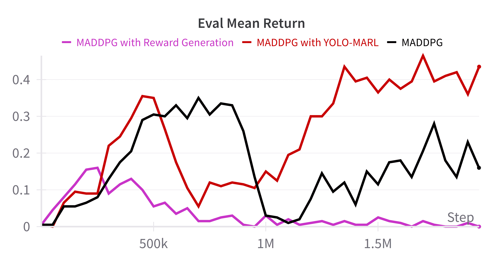

<!--yml
category: 未分类
date: 2025-01-11 12:09:54
-->

# YOLO-MARL: You Only LLM Once for Multi-agent Reinforcement Learning

> 来源：[https://arxiv.org/html/2410.03997/](https://arxiv.org/html/2410.03997/)

Yuan Zhuang^†
University of Connecticut
[yuan.2.zhuang@uconn.edu](mailto:yuan.2.zhuang@uconn.edu)
&Yi Shen^†
University of Pennsylvania
[eshen@seas.upenn.edu](mailto:eshen@seas.upenn.edu)
&Zhili Zhang
University of Connecticut
[zhili.zhang@uconn.edu](mailto:zhili.zhang@uconn.edu) &Yuxiao Chen
NVIDIA
[yuxiaoc@nvidia.com](mailto:yuxiaoc@nvidia.com) &Fei Miao
University of Connecticut
[fei.miao@uconn.edu](mailto:fei.miao@uconn.edu)

###### Abstract

Advancements in deep multi-agent reinforcement learning (MARL) have positioned it as a promising approach for decision-making in cooperative games. However, it still remains challenging for MARL agents to learn cooperative strategies for some game environments. Recently, large language models (LLMs) have demonstrated emergent reasoning capabilities, making them promising candidates for enhancing coordination among the agents. However, due to the model size of LLMs, it can be expensive to frequently infer LLMs for actions that agents can take. In this work, we propose You Only LLM Once for MARL (YOLO-MARL), a novel framework that leverages the high-level task planning capabilities of LLMs to improve the policy learning process of multi-agents in cooperative games. Notably, for each game environment, YOLO-MARL only requires one time interaction with LLMs in the proposed strategy generation, state interpretation and planning function generation modules, before the MARL policy training process. This avoids the ongoing costs and computational time associated with frequent LLMs API calls during training. Moreover, the trained decentralized normal-sized neural network-based policies operate independently of the LLM. We evaluate our method across three different environments and demonstrate that YOLO-MARL outperforms traditional MARL algorithms.

¹¹footnotetext: † These authors contributed equally to this work.

## 1 Introduction

Multi-agent reinforcement learning (MARL) algorithms have proven to be a powerful framework for addressing complex decision-making problems in multi-agent systems. With the rising applications of multi-agent systems, such as mobile robots in warehouses and games requiring complex reasoning and strategy, it is increasingly crucial for individual agents to learn, cooperate, or compete in dynamic environments without a centralized decision-maker (Papoudakis & Schäfer, [2021](https://arxiv.org/html/2410.03997v1#bib.bib26)). In cooperative Markov games, agents are trained to coordinate their actions to maximize the joint rewards. However, existing MARL algorithms face challenges in learning distributed policies for cooperative games. Moreover, they struggle with tasks characterized by sparse rewards, dynamic environment, and large action spaces, which can hinder efficient learning and agent collaboration.

LLMs have excelled as high-level semantic planners due to its in-context learning abilities and prior knowledge (Ahn et al., [2022](https://arxiv.org/html/2410.03997v1#bib.bib2)). Zhang et al. ([2023](https://arxiv.org/html/2410.03997v1#bib.bib35)) and Kannan et al. ([2024](https://arxiv.org/html/2410.03997v1#bib.bib14)) directly use LLMs as embodied agents, which demonstrate LLMs’ planning ability in multi-robot system. There are also works concentrating on utilizing the LLMs to guide the reinforcement learning (RL) training to reach better performances. ELLM (Du et al., [2023](https://arxiv.org/html/2410.03997v1#bib.bib6)) leverage LLMs to suggest a goal to assist RL training whereas Kwon et al. ([2023](https://arxiv.org/html/2410.03997v1#bib.bib15)) focusing on the alignment between the action provided by LLM and the RL policy. While these approaches show exciting potential for integrating LLM within policy training, they have yet to extend their methods on multi-agent scenarios. More importantly, utilizing LLMs as agents or integrating them into the RL training loop presents certain challenges. Repeated interactions with LLMs in long-episode tasks or complex environments—especially when using advanced LLMs like Claude-3.5 or GPT-o1 can be time-consuming and costly; it becomes intractable for tasks requiring training over tens of millions of steps. Additionally, there is a risk of intermittent disconnections with the LLM, which could disrupt the training process and affect the system’s stability.

Built on the identified insights and challenges, we introduce YOLO-MARL, as shown in Fig. [1](https://arxiv.org/html/2410.03997v1#S1.F1 "Figure 1 ‣ 1 Introduction ‣ YOLO-MARL: You Only LLM Once for Multi-agent Reinforcement Learning"), an innovative approach that leverages the planning capabilities of LLMs to enhance MARL policy training. In particular, the major strength of our framework is that it requires only a one-time interaction with the LLM for each game environment. After the strategy generation, state interpretation and planning function generation modules, there is no need for further LLMs interaction during the MARL training process, which significantly reduces the communication and computational overhead of LLM inferences. Moreover, YOLO-MARL demonstrates its strong generalization capabilities and simplicity for application: with the proposed strategy generation and state interpretation modules, our approach is compatible with various MARL algorithms such as Yu et al. ([2022](https://arxiv.org/html/2410.03997v1#bib.bib34)), Rashid et al. ([2018](https://arxiv.org/html/2410.03997v1#bib.bib27)), Lowe et al. ([2020](https://arxiv.org/html/2410.03997v1#bib.bib21)), and requires only basic background understanding of a new game environment from the users. We also evaluate our framework in a sparser reward multi-agent environment: Level-Based Foraging environment (Papoudakis & Schäfer, [2021](https://arxiv.org/html/2410.03997v1#bib.bib26)), and a highly strategic task environment: the StarCraft Multi-Agent Challenge environment (Samvelyan et al., [2019](https://arxiv.org/html/2410.03997v1#bib.bib28)), together with the MPE environment (Lowe et al., [2020](https://arxiv.org/html/2410.03997v1#bib.bib21)), and show that YOLO-MARL outperforms several MARL baselines. We also provide several ablation study results to demonstrate the function of each module in the proposed framework. To the best of our knowledge, YOLO-MARL is among one of the first trials that incorporates the high-level reasoning and planning abilities of LLMs with MARL, since very limited literature of LLM for MARL has been introduced so far (Sun et al., [2024](https://arxiv.org/html/2410.03997v1#bib.bib29)).

In summary, our proposed method YOLO-MARL has the following advantages:

*   •

    This framework synergizes the planning capabilities of LLMs with MARL to enhance the policy learning performance in challenging cooperative game environments. In particular, our approach exploits the LLM’s wide-ranging reasoning ability to generate high-level assignment planning functions to facilitate agents in coordination.

*   •

    YOLO-MARL requires minimal LLMs involvement, which significantly reduces computational overhead and mitigates communication connection instability concerns when invoking LLMs during the training process.

*   •

    Our approach leverages zero-shot prompting and can be easily adapted to various game environments, with only basic prior knowledge required from users.

An overview of YOLO-MARL is presented in Figure [1](https://arxiv.org/html/2410.03997v1#S1.F1 "Figure 1 ‣ 1 Introduction ‣ YOLO-MARL: You Only LLM Once for Multi-agent Reinforcement Learning"). All prompts, environments, and generated planning functions can be found in Appendix.

Figure 1: Depiction of our framework YOLO-MARL. (a). Strategy Generation: We pass basic environment and task description into the LLM to get generated strategies for this specific environment. (b). State Interpretation: We process the global states so that the format of global states will be more structured and organized for better comprehension by the LLM. (c). Planning Function Generation: We chain together the environment and task description, LLM generated strategies and state interpretation function. These prompts are then fed into the LLM to generate a planning function for this environment. (d). MARL Training: The state interpretation function and the generated planning function are integrated into the MARL training process. The LLM is no longer required for further interaction after the Planning Function Generation.

## 2 Related Work

### 2.1 Multi-Agent Reinforcement Learning

MARL has gained increasing attention due to its potential in solving complex, decentralized problems. Centralized training with decentralized execution has become a popular framework for overcoming the limitations of independent learning. Methods like QMIX (Rashid et al., [2018](https://arxiv.org/html/2410.03997v1#bib.bib27)) and MADDPG (Lowe et al., [2020](https://arxiv.org/html/2410.03997v1#bib.bib21)) use centralized critics or value functions during training to coordinate agents, while allowing them to execute independently during testing. In cooperative environments, algorithms like COMA (Foerster et al., [2017](https://arxiv.org/html/2410.03997v1#bib.bib8)) and VDN (Sunehag et al., [2017](https://arxiv.org/html/2410.03997v1#bib.bib30)) enable agents to share rewards and act in a coordinated fashion to maximize joint rewards.Wang et al. ([2024](https://arxiv.org/html/2410.03997v1#bib.bib31)) introduce a new approach using language constraint prediction to tackle the challenge of safe MARL in the context of natural language. However, the existing MARL algorithms may not perform well in sparse reward environments and still struggle in learning fully cooperative policy in some environments. So far, only very limited literature of using LLM for MARL has been proposed (Sun et al., [2024](https://arxiv.org/html/2410.03997v1#bib.bib29)), and it remains unclear whether and how can LLM be leveraged for MARL-based decision-making.

### 2.2 Large Language Models for Single-Agent RL and Decision-Making

Many existing works utilize LLMs as parts of RL training process. Du et al. ([2023](https://arxiv.org/html/2410.03997v1#bib.bib6)) enhance agents’ exploration by computing the similarity between suggested goals from LLMs and agents’ demonstrated behaviors. Carta et al. ([2023](https://arxiv.org/html/2410.03997v1#bib.bib3)) leveraging language-based goals from LLMs by generating actions conditioned on prompts during online RL. Kwon et al. ([2023](https://arxiv.org/html/2410.03997v1#bib.bib15)) provides scalar rewards based on suggestions from LLMs to guide RL training. However, most of these approaches haven’t explored their works in the context of Markov games and require extensive interactions with LLMs during training.

Gupta et al. ([2022](https://arxiv.org/html/2410.03997v1#bib.bib10)) utilize CLIP’s visual embedding to an agent exploring of environment. Fan et al. ([2022](https://arxiv.org/html/2410.03997v1#bib.bib7)) studies a multi-task RL problem, where an agent is tasked with completing MINEDOJO tasks. Ahn et al. ([2022](https://arxiv.org/html/2410.03997v1#bib.bib2)) proposes SayCan which grounds LLMs via value functions of pretrained skills to execute abstract commands on robots. Liang et al. ([2023](https://arxiv.org/html/2410.03997v1#bib.bib18)) finds that code-writing LLMs can be re-purposed to write robot policy code. Huang et al. ([2022](https://arxiv.org/html/2410.03997v1#bib.bib12)) shows that by leveraging environment feedback, LLMs are able to form an inner monologue that allows them to more richly process and plan. Other research such as Ma et al. ([2024](https://arxiv.org/html/2410.03997v1#bib.bib23)) and Xie et al. ([2023](https://arxiv.org/html/2410.03997v1#bib.bib32)) use LLMs prior knowledge and code generation capability to generate reward functions, whereas we utilize code generation for planning functions. Lin et al. ([2024](https://arxiv.org/html/2410.03997v1#bib.bib19)) highlights the limitations of LLMs in handling complex low-level tasks. On the other hand, we harness the high-level reasoning capabilities of LLMs to enhance low-level action performance within RL model training.

### 2.3 Large Language Models for Multi-Agent Systems

LLM-based Multi-Agent (LLM-MA) systems focus on diverse agent profiles, interactions, and collective decision-making. While this allows agents to collaborate on dynamic, complex tasks, it also increases computational overhead due to the communication between LLMs (Guo et al., [2024](https://arxiv.org/html/2410.03997v1#bib.bib9)), (Sun et al., [2024](https://arxiv.org/html/2410.03997v1#bib.bib29)). Camel Li et al. ([2024](https://arxiv.org/html/2410.03997v1#bib.bib16)) and MetaGPT Hong et al. ([2023](https://arxiv.org/html/2410.03997v1#bib.bib11)) employ multiple LLM agents to accomplish tasks like brainstorming and software development. Nascimento et al. ([2023](https://arxiv.org/html/2410.03997v1#bib.bib24)) enhance communication and agent autonomy by integrating GPT-based technologies. In multi-robot contexts, Chen et al. ([2023](https://arxiv.org/html/2410.03997v1#bib.bib5)) compare task success rates and token efficiencies of four multi-agent communication frameworks. SMART-LLM (Kannan et al., [2023](https://arxiv.org/html/2410.03997v1#bib.bib13)) decompose multi-robot task plans into subgoals for LLM to enable efficient execution, while Co-NavGPT (Yu et al., [2023](https://arxiv.org/html/2410.03997v1#bib.bib33)) integrates LLMs as global planners for cooperative navigation. Focusing on multi-agent pathfinding (MAPF), Chen et al. ([2024](https://arxiv.org/html/2410.03997v1#bib.bib4)) studies the performance of solving MAPF with LLMs. Agashe et al. ([2023](https://arxiv.org/html/2410.03997v1#bib.bib1)) proposes the LLM-Coordination (LLM-Co) to enable LLMs to play coordination games. Li et al. ([2023](https://arxiv.org/html/2410.03997v1#bib.bib17)) explore the use of LLMs in cooperative games within a text-based environment, and Ma et al. ([2023](https://arxiv.org/html/2410.03997v1#bib.bib22)) explores LLMs in the StarCraft II environment. In contrast, our method leverages the planning abilities of the LLM to train better MARL policies instead of using them directly as agents.

## 3 Problem Formulation

Markov game (MG) is defined as a multi-agent decision-making problem when the interaction between multiple agents affect the state dynamics of the entire system and the reward of each agent under certain conditions (Littman, [1994](https://arxiv.org/html/2410.03997v1#bib.bib20)). In this work, we consider a Markov game, or a stochastic game Owen ([1982](https://arxiv.org/html/2410.03997v1#bib.bib25)) defined as a tuple $G:=(\mathcal{N},S,A,\{r^{i}\}_{i\in\mathcal{N}},p,\gamma)$, where $\mathcal{N}$ is a set of $N$ agents, $S=S^{1}\times\cdots\times S^{N}$ is the joint state space, $A=A^{1}\times\cdots\times A^{N}$ is the joint action space, with $(S^{i},A^{i})$ as the state space and action space of agent $i$, respectively, $\gamma\in[0,1)$ is the discounting factor (Littman, [1994](https://arxiv.org/html/2410.03997v1#bib.bib20); Owen, [1982](https://arxiv.org/html/2410.03997v1#bib.bib25)). The state transition $p:S\times A\rightarrow\Delta(S)$ is controlled by the current state and joint action, where $\Delta(S)$ represents the set of all probability distributions over the joint state space $S$. Each agent has a reward function, $r^{i}:S\times A\rightarrow\mathbb{R}$. At time $t$, agent $i$ chooses its action $a^{i}_{t}$ according to a policy $\pi^{i}:S\rightarrow\Delta(A^{i})$. For each agent $i$, it attempts to maximize its expected sum of discounted rewards, i.e. its objective function $J^{i}(s,\pi)=\mathbb{E}\left[\sum_{t=1}^{\infty}\gamma^{t-1}r_{t}^{i}(s_{t},a_% {t})|s_{1}=s,a_{t}\sim\pi(\cdot|{s}_{t})\right]$. In the literature, deep MARL algorithms (Lowe et al., [2020](https://arxiv.org/html/2410.03997v1#bib.bib21); Yu et al., [2022](https://arxiv.org/html/2410.03997v1#bib.bib34); Rashid et al., [2018](https://arxiv.org/html/2410.03997v1#bib.bib27)) have been designed to train neural network-based policies $\pi_{i}(\theta_{i})$. For a cooperative game, one shared reward function for all the agents is widely used during the training process, which is also considered in this work.

## 4 Methodology

In this section, we introduce our method, YOLO-MARL, which leverages LLMs to enhance MARL. Specifically, during training, we utilize the high-level task planning capabilities of LLMs to guide the MARL process. Our approach consists of four key components: Strategy Generation, State Interpretation, Planning Function Generation, and MARL training process with the LLM generated Planning Function incorporated throughout.

Algorithm 1 YOLO-MARL Training Process

1:Large Language Model $LLM$, observation process function $F_{\text{S}}$, MARL actor $\mathcal{A}$, MARL algorithm $MARL_{alg}$, Prompts $P$2:Hyperparameters: reward signal $r^{\prime}$, penalty signal $p^{\prime}$3:// Sample functions code from the LLM4:$\mathcal{F_{\mathcal{T}}}\sim LLM(P)$5:for each training step do6:     // Get processed global observation $S_{I}$ from $F_{\text{S}}$7:     $S_{I}\leftarrow F_{\text{S}}(S_{v})$8:     // Assign tasks $\mathcal{T}$ to each agent9:     $\mathcal{T}_{1},\mathcal{T}_{2},\dotsc\leftarrow\mathcal{F_{\mathcal{T}}}(S_{I})$10:     // Output actions from the actor11:     $a_{1},a_{2},\dotsc\leftarrow\mathcal{A}(S_{v})$12:     for each agent $i$ do13:         if $a_{i}\in\mathcal{T}_{i}$ then14:              $\Delta r_{i}\leftarrow r^{\prime}$15:         else16:              $\Delta r_{i}\leftarrow p^{\prime}$17:         end if18:     end for19:     // Compute final reward for critic20:     $R\leftarrow r+\sum_{i}\Delta r_{i}$21:     // Use $R$ as the final reward for MARL training22:     $\pi(\theta)=MARL_{alg}(R)$23:end for24:return Trained MARL policy

### 4.1 Strategy Generation

To create a generalizable framework applicable to various environments—especially when users may have limited prior knowledge—we incorporate a Strategy Generation Module into our methodology. This module enables the LLM to autonomously generate strategies for different environments without requiring extensive human input or expertise.

As shown inside the blue box of Figure [1](https://arxiv.org/html/2410.03997v1#S1.F1 "Figure 1 ‣ 1 Introduction ‣ YOLO-MARL: You Only LLM Once for Multi-agent Reinforcement Learning")(a), the LLM is provided with the basic information about the environment, including task descriptions, relevant rules, and constraints of how to interact with the environment. Additionally, we supply a general guideline within the prompt to assist the LLM in generating effective strategies. Gathering all the information, the LLM will output detailed strategies to accomplish the tasks or achieve the goal, following the specified format.

By aggregating all this information, the LLM outputs detailed strategies to accomplish the tasks or achieve the goals, following a specified format. The Strategy Generation is crucial for several reasons:

*   •

    Reducing User Burden: It alleviates the need for users to comprehensively understand new environments, saving time and effort.

*   •

    Enhancing Generalization: It enables the framework to adapt to different environments with minimal prompt modifications.

*   •

    Facilitating Planning Function Generation: The strategies serve as vital components in the prompts used for the Planning Function Generation Module. The results of using YOLO-MARL but without Strategy Generation Module are shown in ablation study  [6.1](https://arxiv.org/html/2410.03997v1#S6.SS1 "6.1 Comparison between YOLO-MARL with and without Strategy Generation ‣ 6 Ablation Study ‣ YOLO-MARL: You Only LLM Once for Multi-agent Reinforcement Learning") .

The LLM-generated strategies are incorporated into the prompt alongside other necessary information to facilitate the subsequent planning function generation. Further details about the strategy prompts and their formats can be found in Appendix [C.1](https://arxiv.org/html/2410.03997v1#A3.SS1 "C.1 Strategy ‣ Appendix C Prompt Detail ‣ YOLO-MARL: You Only LLM Once for Multi-agent Reinforcement Learning").

### 4.2 State Interpretation

In many simulation environments, observations or states are typically provided as vectors, with each component constructed using various encoding methods. While the vector form of observation is easy to handle when training deep reinforcement learning models, it is difficult for LLMs to directly parse their semantic meaning due to the lack of explicit context for each component.

We propose the State Interpretation Module to assist the LLM in interpreting the environment state. By providing a semantically meaningful representation of the state, the LLM can successfully generate executable planning functions for training. Formally, given the current environment state in vector form $S_{v}$, we define an interpretation function $F_{S}$ such that $F_{S}(S_{v})\to S_{I}$, where $S_{I}$ provides more explicit and meaningful information about each state component. Specifically, we implement a Python function that processes the vector observation and restructures each component. For example, it extracts position information from the raw observation and organizes it into a variable name ”position”. This transformation enables the LLM to understand the context and significance of each part of the state.

Recent works like Ma et al. ([2024](https://arxiv.org/html/2410.03997v1#bib.bib23)) and Xie et al. ([2023](https://arxiv.org/html/2410.03997v1#bib.bib32)) have demonstrated the success of enhancing LLMs performance by providing relevant environment code. In the same manner, we include the interpretation function $F_{S}$ in the prompting pipeline, formatted as Pythonic environment code as shown in the purple box in Figure [1](https://arxiv.org/html/2410.03997v1#S1.F1 "Figure 1 ‣ 1 Introduction ‣ YOLO-MARL: You Only LLM Once for Multi-agent Reinforcement Learning")(b). The State Interpretation Module significantly reduces the risk of the LLM generating erroneous functions with outputs incompatible with the training procedures. An ablation study on the effectiveness of this module can be found in Sec [6.2](https://arxiv.org/html/2410.03997v1#S6.SS2 "6.2 Comparison between YOLO-MARL with and without State Interpretation ‣ 6 Ablation Study ‣ YOLO-MARL: You Only LLM Once for Multi-agent Reinforcement Learning"), while more details about the interpretation function are provided in Appendix [C.2](https://arxiv.org/html/2410.03997v1#A3.SS2 "C.2 Interpretation Function ‣ Appendix C Prompt Detail ‣ YOLO-MARL: You Only LLM Once for Multi-agent Reinforcement Learning").

### 4.3 Planning Function Generation

A crucial component of our method is leveraging the LLM to perform high-level planning instead of handling low-level actions. We combine all the prompts from the previous modules and input them into the LLM. The LLM then generates a reasonable and executable planning function that can be directly utilized in the subsequent training process.

To be more concise, given any processed state $S_{I}$, we define an assignment planning function as $\mathcal{F_{\mathcal{T}}}(S_{I})\to\mathcal{T}_{i}\in\mathcal{T}$, where $\mathcal{T}=\{\mathcal{T}_{1},...,\mathcal{T}_{n}\}$ is a set of target assignments that each agent can take. We define the assignment set $\mathcal{T}$ over the action space such that an action can belong to multiple assignments and vice versa. For example, if the assignment space is defined as $\mathcal{T}=\{Landmark\_0,Landmark\_1\}$, and landmark 0 and landmark 1 are located at the top right and top left positions relative to the agent respectively, then taking the action ”UP” can be associated with both assignments. Conversely, we can have multiple actions correspond to an assignment. For instance, moving towards ”Landmark 0” may involve actions like ”UP” and ”RIGHT”. This is referred to the red module in Fig. [1](https://arxiv.org/html/2410.03997v1#S1.F1 "Figure 1 ‣ 1 Introduction ‣ YOLO-MARL: You Only LLM Once for Multi-agent Reinforcement Learning")(c) and more information of generated function refer to Appendix [D](https://arxiv.org/html/2410.03997v1#A4 "Appendix D Examples of generated planning functions ‣ YOLO-MARL: You Only LLM Once for Multi-agent Reinforcement Learning").

### 4.4 MARL training with Planning function incorporation

To incorporate the planning function into MARL training, we add an extra reward term to the original reward provided by environments. Specifically, we define the final reward $R$ used by the critic as: $R=r+\sum_{i}\Delta r_{i}$, where $r$ is the original reward from the environment and $\Delta r_{i}$ is an additional reward signal for each agent $i$. The term $\Delta r_{i}$ is based on whether the action taken by the agent’s actor aligns with the assigned task from the planning function. If the agent’s action belongs to the assigned task, it receives a reward $r^{\prime}$ as its $\Delta r_{i}$ and will receives a penalty $p^{\prime}$ as its $\Delta r_{i}$ if not.

Notably, we do not need to interact with the LLM during the entire training process, nor do we need to call the planning function after the policy has been trained. The training process $MARL_{alg}(R)$ takes $R$ as the reward function, uses the same state and action space definitions and follows the standard MARL algorithms and evaluation metrics within the literature, such as Yu et al. ([2022](https://arxiv.org/html/2410.03997v1#bib.bib34)), Rashid et al. ([2018](https://arxiv.org/html/2410.03997v1#bib.bib27)), and Lowe et al. ([2020](https://arxiv.org/html/2410.03997v1#bib.bib21)). This makes our method highly efficient compared to approaches that interact with LLMs throughout the training process or use LLMs as agents as shown in the greed box in Fig.[1](https://arxiv.org/html/2410.03997v1#S1.F1 "Figure 1 ‣ 1 Introduction ‣ YOLO-MARL: You Only LLM Once for Multi-agent Reinforcement Learning")(d). In practice, using the LLM’s API to generate the planning function incurs minimal cost—less than a dollar per environment—even when using the most advanced LLM APIs.

## 5 Experiments

In this section, we evaluate our method across three different environments: MPE, LBF, and SMAC. We use claude-3-5-sonnet-20240620 for the experiments.^*^**We mainly use the Claude 3.5 Sonnet model for the LLM in our work: [https://www.anthropic.com/news/claude-3-5-sonnet](https://www.anthropic.com/news/claude-3-5-sonnet)

### 5.1 Setup

Baselines. In our experiments, we compare the MARL algorithm MADDPG (Lowe et al., [2020](https://arxiv.org/html/2410.03997v1#bib.bib21)), MAPPO (Yu et al., [2022](https://arxiv.org/html/2410.03997v1#bib.bib34)) and QMIX (Rashid et al., [2018](https://arxiv.org/html/2410.03997v1#bib.bib27)) and set default hyper-parameters according to the well-tuned performance of human-written reward, and fix that in all experiments on this task to do MARL training. Experiment hyper parameters are listed in Appendix.

Metrics. To assess the performance of our method, we use win rate as the evaluation metric on the SMAC environment, and the mean return in evaluation for all other environments. During evaluation, we rely solely on the default return values provided by the environments for both the baseline and our method, ensuring a fair comparison.

### 5.2 Results

Table 1: Comparison between YOLO-MARL and MARL in the LBF environment across three seeds. The highest evaluation return means during training are highlighted in bold. The corresponding results can be found in Figure [2](https://arxiv.org/html/2410.03997v1#S5.F2 "Figure 2 ‣ 5.2 Results ‣ 5 Experiments ‣ YOLO-MARL: You Only LLM Once for Multi-agent Reinforcement Learning"). The M means one million training steps. We run all the experiments on the same machine.

|  | Mean Return after 0.2M / 0.4M / 1.5M / 2M Steps |
|  | QMIX | MADDPG | MAPPO |
| MARL | 0.00/ 0.01/ 0.25/ 0.38 | 0.09/ 0.33/ 0.26/ 0.32 | 0.31/ 0.72/ 0.99/ 0.99 |
| YOLO-MARL | 0.01/ 0.02/ 0.60/ 0.78 | 0.13/ 0.38/ 0.39/ 0.44 | 0.93/ 0.98/ 0.99/ 0.99 |

Level-Based Foraging. Level-Based Foraging (LBF) (Papoudakis & Schäfer, [2021](https://arxiv.org/html/2410.03997v1#bib.bib26)) is a challenging sparse reward environment designed for MARL training. In this environment, agents must learn to navigate a path and successfully collect food, with rewards only being given upon task completion. To evaluate our framework in a cooperative setting, we selected the 2-player, 2-food fully cooperative scenario. In this setting, all agents must work together and coordinate their actions to collect the food simultaneously. The environment offers an action space consisting of [NONE, NORTH, SOUTH, WEST, EAST, LOAD], and we define the task set as [NONE, Food i, …, LOAD]. Using the relative positions of agents and food items, we map assigned tasks to the corresponding actions in the action space and calculate the reward based on this alignment. We evaluated our framework over 3 different seeds, with the results shown in Figure [2](https://arxiv.org/html/2410.03997v1#S5.F2 "Figure 2 ‣ 5.2 Results ‣ 5 Experiments ‣ YOLO-MARL: You Only LLM Once for Multi-agent Reinforcement Learning") and Table [1](https://arxiv.org/html/2410.03997v1#S5.T1 "Table 1 ‣ 5.2 Results ‣ 5 Experiments ‣ YOLO-MARL: You Only LLM Once for Multi-agent Reinforcement Learning"). LLM assist the MARL algorithm by providing reward signals, our framework significantly outperformed the baseline, achieving a maximum improvement of 105 % in mean return and a 2x faster convergence rate among all tested MARL algorithms. According to the results, our framework is effective across all the baseline algorithms, with particularly large improvements observed in QMIX and MADDPG, and a faster convergence rate for MAPPO. To assess the variability in the quality of our generated functions, we present the results of three different generated functions in Figure [8](https://arxiv.org/html/2410.03997v1#A2.F8 "Figure 8 ‣ B.1 Comparison for different generated funcions ‣ Appendix B Additional result ‣ YOLO-MARL: You Only LLM Once for Multi-agent Reinforcement Learning") and Table [3](https://arxiv.org/html/2410.03997v1#A2.T3 "Table 3 ‣ B.1 Comparison for different generated funcions ‣ Appendix B Additional result ‣ YOLO-MARL: You Only LLM Once for Multi-agent Reinforcement Learning") in Appendix [B.1](https://arxiv.org/html/2410.03997v1#A2.SS1 "B.1 Comparison for different generated funcions ‣ Appendix B Additional result ‣ YOLO-MARL: You Only LLM Once for Multi-agent Reinforcement Learning"). The results demonstrate that our framework consistently generates high-quality functions, with each achieving similar improvements across all baseline algorithms.

(a) MADDPG

(b) MAPPO

(c) QMIX

Figure 2: Results for LBF environment across 3 seeds: The solid lines indicate the mean performance, and the shaded areas represent the range (minimum to maximum) across 3 different seeds.

Multi-Agent Particle Environment. We evaluate our framework in Multi-Agent Particle Environment (MPE) (Lowe et al., [2020](https://arxiv.org/html/2410.03997v1#bib.bib21)) simple spread environment which is a fully cooperative game. This environment has N agents, N landmarks. At a high level, agents must learn to cover all the landmarks while avoiding collisions. It’s action space is consist of [no_action, move_left, move_right, move_down, move_up]. We define the assignment for each agent to take to be [Landmark_i,…,No action]. During training, based on the global observation, we obtain the relative position of each agent with respect to the landmarks. Similar to LBF, we map each assignment of agent back to the corresponding action space and then reward the action of policy in action space level. We evaluate our approach on 3-agent and 4-agent scenarios using QMIX and MADDPG as baselines. As shown in Figure [3](https://arxiv.org/html/2410.03997v1#S5.F3 "Figure 3 ‣ 5.2 Results ‣ 5 Experiments ‣ YOLO-MARL: You Only LLM Once for Multi-agent Reinforcement Learning"), our framework(colored line) outperform the baseline(black line) algorithm in mean returns by 7.66% and 8.8% for 3-agent scenario, and 2.4% and 18.09% for 4-agent scenario with QMIX and MADDPG respectively. These improvements demonstrate the effectiveness of our framework in enhancing coordination among agents to cover up all the landmarks.

(a) MADDPG

(b) QMIX

Figure 3: MPE simple spread scenario 3 agents results. The solid lines indicate the mean performance, and the shaded areas represent the range (minimum to maximum) across 3 different generated planning function.

(a) MADDPG

(b) QMIX

Figure 4: MPE simple spread scenario 4 agents results. The solid lines indicate the mean performance, and the shaded areas represent the range (minimum to maximum) across 3 different generated planning function.

StarCraft Multi-Agent Challenge environment. The StarCraft Multi-Agent Challenge (SMAC) (Samvelyan et al., [2019](https://arxiv.org/html/2410.03997v1#bib.bib28)) simulates battle scenarios where a team of controlled agents must destroy an enemy team using fixed policies within a limited number of steps. We tested our method on three different maps: 3M, 2s vs 1sc, and 2c vs 64zg. The action space in the environment consists of [none, stop, move north, move south, move west, move east, attack enemy 1,…attack enemy n], where n is the total number of enemies on the map. This action space becomes increasingly complex depending on the number of enemies the agent has to engage, particularly in the 2c vs 64zg map, which contains 64 enemies and offers 70 possible actions.

In our experiments, we define the assignment space simply as [Move, Attack, Stop, None (for dead agents)]. We tested the performance of MAPPO, and the results for SMAC are shown in Figure [5](https://arxiv.org/html/2410.03997v1#S5.F5 "Figure 5 ‣ 5.2 Results ‣ 5 Experiments ‣ YOLO-MARL: You Only LLM Once for Multi-agent Reinforcement Learning"). As indicated by the figure, even though we provide simple assignments that may be far from optimal instructions, our framework still achieves comparable results on certain maps. This demonstrates that our framework remains competitive, even in environments requiring strategic movements. We also explore the sparse reward case for this environment where the win rate of baseline algorithms is always closed to 0 while we generate a planning reward function pairs that outperform baseline. We suggest this pair generation as a potential future work and leave this discussion to the Sec [7](https://arxiv.org/html/2410.03997v1#S7 "7 Limitation and Future Work ‣ YOLO-MARL: You Only LLM Once for Multi-agent Reinforcement Learning").

(a) 3m

(b) 2s vs 1sc

(c) 2c vs 64zg

Figure 5: Results for 3 maps on SMAC environment: Average win rate comparison with our method for MAPPO baseline on 3 maps: 3m, 2s vs 1sc and 2c vs 64zg across 3 different seeds and the solid lines indicate the mean performance.

## 6 Ablation Study

In this section, we conduct the ablation studies mainly in LBF 2 players 2 food fully cooperative environment since rewards in LBF are sparser compared to MPE and SMAC (Papoudakis & Schäfer, [2021](https://arxiv.org/html/2410.03997v1#bib.bib26)). We refer to [1](https://arxiv.org/html/2410.03997v1#S5.T1 "Table 1 ‣ 5.2 Results ‣ 5 Experiments ‣ YOLO-MARL: You Only LLM Once for Multi-agent Reinforcement Learning") for more information about the environment. Due to page limitation, we also leave some discussions and figures in Appendix [B](https://arxiv.org/html/2410.03997v1#A2 "Appendix B Additional result ‣ YOLO-MARL: You Only LLM Once for Multi-agent Reinforcement Learning").

### 6.1 Comparison between YOLO-MARL with and without Strategy Generation

In this section, we examine the impact of the Strategy Generation Module on the performance of the YOLO-MARL framework. Specifically, we compare the standard YOLO-MARL with a variant that excludes the Strategy Generation Module to assess its significance.

According to our tests, the Strategy Generation Module plays an important role in the YOLO-MARL method. As shown in Figure [6](https://arxiv.org/html/2410.03997v1#S6.F6 "Figure 6 ‣ 6.1 Comparison between YOLO-MARL with and without Strategy Generation ‣ 6 Ablation Study ‣ YOLO-MARL: You Only LLM Once for Multi-agent Reinforcement Learning") , without the LLM generated strategy, we obtain a worse-performing planning function. Interestingly, the mean returns of evaluations for the functions without the LLM generated strategy are not always close to zero, indicating that the generated planning functions are not entirely incorrect. Based on this, we could confirm that the Strategy Generation Module would help Planning Function Generation Module provides better solutions to this game. Moreover, giving the strategy also helps stabilize the quality of the generated code. We observe a higher risk of obtaining erroneous functions without supplying the strategy.

(a) MADDPG

(b) MAPPO

(c) QMIX

Figure 6: Comparison between YOLO-MARL with and without using LLM generated strategies in LBF

### 6.2 Comparison between YOLO-MARL with and without State Interpretation

To demonstrate how the State Interpretation Module enhances our framework, we present two failure case snippets:

*   •

    Without the Interpretation Function: The interpretation function is omitted entirely from the prompting pipeline.

*   •

    Providing Raw Environment Code Directly: Raw environment source code is fed directly to the LLM.

As shown in Figure [10](https://arxiv.org/html/2410.03997v1#A2.F10 "Figure 10 ‣ B.3 additional results for state interpretation ablation study ‣ Appendix B Additional result ‣ YOLO-MARL: You Only LLM Once for Multi-agent Reinforcement Learning"), the LLM is unable to infer the type of state and attempts to fetch environment information via a non-existent key if no preprocessing code provided. And if environment code is provided without dimensional context for each component, the LLM is likely to make random guesses. In both scenarios, the absence of explicit state interpretation hinders the LLM’s ability to generate accurate and executable planning functions. These failures underscore the importance of the State Interpretation Module in bridging the gap between vectorized observations and the LLM’s requirement for semantically meaningful input.

By incorporating the State Interpretation Module, we enable the LLM to understand the environment’s state representation effectively. This results in the generation of reliable planning functions that significantly enhance the performance of our YOLO-MARL framework.

### 6.3 Comparison between YOLO-MARL and reward generation

In this section, we compare our YOLO-MARL method with approaches that utilize the LLM for reward generation without reward function template. We explore two scenarios: reward generation without feedback and reward generation with feedback.

Our experiments show that relying solely on the LLM-generated reward function leads to poor performance. As shown in Figure [7](https://arxiv.org/html/2410.03997v1#S6.F7 "Figure 7 ‣ 6.3 Comparison between YOLO-MARL and reward generation ‣ 6 Ablation Study ‣ YOLO-MARL: You Only LLM Once for Multi-agent Reinforcement Learning"), the mean return for the LLM-generated reward function pair consistently falls below the performance of all three MARL algorithms. This indicates that agents are not learning effectively under the LLM-generated reward function. However, we do observe a slight positive return. This suggest the potential of using this framework for reward shaping tasks, particularly in situations where standard MARL algorithms struggle to learn in sparse reward scenarios.

(a) MADDPG

(b) MAPPO

(c) QMIX

Figure 7: Comparison between YOLO-MARL and reward generation without feedback in LBF

To investigate whether iterative refinement could improve the LLM generated reward function, we supply the LLM with the generated reward function from the prior iteration and feedback on its performance. Despite this iterative process, the LLM still fails to output a suitable reward function for the LBF environment. The mean return of evaluations remains close to zero, as shown in figure [9](https://arxiv.org/html/2410.03997v1#A2.F9 "Figure 9 ‣ B.2 additional results for reward feedback ‣ Appendix B Additional result ‣ YOLO-MARL: You Only LLM Once for Multi-agent Reinforcement Learning"). The generated reward functions for each iteration are provided in Appendix [E](https://arxiv.org/html/2410.03997v1#A5 "Appendix E Reward Generation with feedback ‣ YOLO-MARL: You Only LLM Once for Multi-agent Reinforcement Learning").

## 7 Limitation and Future Work

We acknowledge that the performance of YOLO-MARL may be highly correlated with the LLM’s ability and we haven’t tested YOLO-MARL with other LLMs like GPT-o1 due to the tier5 user requirement, and there might be a gap of YOLO-MARL’s performance between the Claude-3.5 and GPT-o1.

For future work, we are enthusiastic about the potential for LLMs to further enhance MARL, particularly as their planning capabilities improve. Specifically, we envision combining reward generation with planning functions to boost the performance of existing MARL algorithms in fully sparse environments. In this approach, we prompt the LLM to generate both a planning function and a reward function that replaces the environment-provided reward, following the pipeline described in Section [4](https://arxiv.org/html/2410.03997v1#S4 "4 Methodology ‣ YOLO-MARL: You Only LLM Once for Multi-agent Reinforcement Learning"). The function-pair method may require further refinement, and we will explore it as a future direction. A preliminary test of this framework is provided in Appendix [B.4](https://arxiv.org/html/2410.03997v1#A2.SS4 "B.4 additional result on future work ‣ Appendix B Additional result ‣ YOLO-MARL: You Only LLM Once for Multi-agent Reinforcement Learning").

## 8 Conclusion

We propose YOLO-MARL, a novel framework that leverages the high-level planning capabilities of LLMs to enhance MARL policy training for cooperative games. By requiring only a one-time interaction with the LLM for each environment, YOLO-MARL significantly reduces computational overhead and mitigates instability issues associated with frequent LLM interactions during training. This approach not only outperforms traditional MARL algorithms but also operates independently of the LLM during execution, demonstrating strong generalization capabilities across various environments.

We evaluate YOLO-MARL across three different environments: the MPE environment, the LBF environment, and the SMAC environment. Our experiments showed that YOLO-MARL outperforms or achieve competitive results compared to baseline MARL methods. The integration of LLM-generated high-level assignment planning functions facilitated improved policy learning in challenging cooperative tasks, even in environments characterized by sparser rewards and large action spaces. Finally, we mention a possible way to incorporate reward generation to our framework and we will step further.

## References

*   Agashe et al. (2023) Saaket Agashe, Yue Fan, and Xin Eric Wang. Evaluating multi-agent coordination abilities in large language models. *arXiv preprint arXiv:2310.03903*, 2023.
*   Ahn et al. (2022) Michael Ahn, Anthony Brohan, Noah Brown, Yevgen Chebotar, Omar Cortes, Byron David, Chelsea Finn, Chuyuan Fu, Keerthana Gopalakrishnan, Karol Hausman, et al. Do as i can, not as i say: Grounding language in robotic affordances. *arXiv preprint arXiv:2204.01691*, 2022.
*   Carta et al. (2023) Thomas Carta, Clément Romac, Thomas Wolf, Sylvain Lamprier, Olivier Sigaud, and Pierre-Yves Oudeyer. Grounding large language models in interactive environments with online reinforcement learning. *arXiv preprint arXiv:2302.02662*, 2023.
*   Chen et al. (2024) Weizhe Chen, Sven Koenig, and Bistra Dilkina. Why solving multi-agent path finding with large language model has not succeeded yet. *arXiv preprint arXiv:2401.03630*, 2024.
*   Chen et al. (2023) Yongchao Chen, Jacob Arkin, Yang Zhang, Nicholas Roy, and Chuchu Fan. Scalable multi-robot collaboration with large language models: Centralized or decentralized systems? *arXiv preprint arXiv:2309.15943*, 2023.
*   Du et al. (2023) Yuqing Du, Olivia Watkins, Zihan Wang, Cédric Colas, Trevor Darrell, Pieter Abbeel, Abhishek Gupta, and Jacob Andreas. Guiding pretraining in reinforcement learning with large language models. *arXiv preprint arXiv:2302.06692*, 2023.
*   Fan et al. (2022) Linxi Fan, Guanzhi Wang, Yunfan Jiang, Ajay Mandlekar, Yuncong Yang, Haoyi Zhu, Andrew Tang, De-An Huang, Yuke Zhu, and Anima Anandkumar. Minedojo: Building open-ended embodied agents with internet-scale knowledge. *Advances in Neural Information Processing Systems*, 35:18343–18362, 2022.
*   Foerster et al. (2017) Jakob N. Foerster, Gregory Farquhar, Triantafyllos Afouras, Nantas Nardelli, and Shimon Whiteson. Counterfactual multi-agent policy gradients. *arXiv preprint arXiv:1705.08926*, 2017.
*   Guo et al. (2024) Taicheng Guo, Xiuying Chen, Yaqi Wang, Ruidi Chang, Shichao Pei, Nitesh V. Chawla, Olaf Wiest, and Xiangliang Zhang. Large language model based multi-agents: A survey of progress and challenges. *arXiv preprint arXiv:2402.01680*, 2024.
*   Gupta et al. (2022) Tarun Gupta, Peter Karkus, Tong Che, Danfei Xu, and Marco Pavone. Foundation models for semantic novelty in reinforcement learning. *arXiv preprint arXiv:2211.04878*, 2022.
*   Hong et al. (2023) Sirui Hong, Xiawu Zheng, Jonathan Chen, Yuheng Cheng, Jinlin Wang, Ceyao Zhang, Zili Wang, Steven Ka Shing Yau, Zijuan Lin, Liyang Zhou, et al. Metagpt: Meta programming for multi-agent collaborative framework. *arXiv preprint arXiv:2308.00352*, 2023.
*   Huang et al. (2022) Wenlong Huang, Fei Xia, Ted Xiao, Harris Chan, Jacky Liang, Pete Florence, Andy Zeng, Jonathan Tompson, Igor Mordatch, Yevgen Chebotar, et al. Inner monologue: Embodied reasoning through planning with language models. *arXiv preprint arXiv:2207.05608*, 2022.
*   Kannan et al. (2023) Shyam Sundar Kannan, Vishnunandan LN Venkatesh, and Byung-Cheol Min. Smart-llm: Smart multi-agent robot task planning using large language models. *arXiv preprint arXiv:2309.10062*, 2023.
*   Kannan et al. (2024) Shyam Sundar Kannan, Vishnunandan L. N. Venkatesh, and Byung-Cheol Min. Smart-llm: Smart multi-agent robot task planning using large language models. *arXiv preprint arXiv:2309.10062*, 2024.
*   Kwon et al. (2023) Minae Kwon, Sang Michael Xie, Kalesha Bullard, and Dorsa Sadigh. Reward Design with Language Models. *arXiv preprint arXiv:2303.00001*, 2023.
*   Li et al. (2024) Guohao Li, Hasan Hammoud, Hani Itani, Dmitrii Khizbullin, and Bernard Ghanem. Camel: Communicative agents for” mind” exploration of large language model society. *Advances in Neural Information Processing Systems*, 36, 2024.
*   Li et al. (2023) Huao Li, Yu Quan Chong, Simon Stepputtis, Joseph Campbell, Dana Hughes, Michael Lewis, and Katia Sycara. Theory of mind for multi-agent collaboration via large language models. *arXiv preprint arXiv:2310.10701*, 2023.
*   Liang et al. (2023) Jacky Liang, Wenlong Huang, Fei Xia, Peng Xu, Karol Hausman, Brian Ichter, Pete Florence, and Andy Zeng. Code as policies: Language model programs for embodied control. *Proceedings of the IEEE International Conference on Robotics and Automation (ICRA)*, 2023.
*   Lin et al. (2024) Fangru Lin, Emanuele La Malfa, Valentin Hofmann, Elle Michelle Yang, Anthony Cohn, and Janet B. Pierrehumbert. Graph-enhanced large language models in asynchronous plan reasoning. *arXiv preprint arXiv:2402.02805*, 2024.
*   Littman (1994) Michael L. Littman. Markov games as a framework for multi-agent reinforcement learning. *https://www.sciencedirect.com/science/article/pii/B9781558603356500271*, 1994.
*   Lowe et al. (2020) Ryan Lowe, Yi Wu, Aviv Tamar, Jean Harb, Pieter Abbeel, and Igor Mordatch. Multi-Agent Actor-Critic for Mixed Cooperative-Competitive Environments. *arXiv preprint arXiv:1706.02275*, 2020.
*   Ma et al. (2023) Weiyu Ma, Qirui Mi, Xue Yan, Yuqiao Wu, Runji Lin, Haifeng Zhang, and Jun Wang. Large language models play starcraft ii: Benchmarks and a chain of summarization approach. *arXiv preprint arXiv:2312.11865*, 2023.
*   Ma et al. (2024) Yecheng Jason Ma, William Liang, Guanzhi Wang, De-An Huang, Osbert Bastani, Dinesh Jayaraman, Yuke Zhu, and Anima Anandkumar. EUREKA: HUMAN-LEVEL REWARD DESIGN VIA CODING LARGE LANGUAGE MODELS. *arXiv preprint arXiv:2310.12931*, 2024.
*   Nascimento et al. (2023) Nathalia Nascimento, Paulo Alencar, and Donald Cowan. Self-adaptive large language model (llm)-based multiagent systems. *Proceedings of the IEEE International Conference on Autonomic Computing and Self-Organizing Systems Companion (ACSOS-C)*, 2023.
*   Owen (1982) G. Owen. Game theory. *https://books.google.com/books?id=pusfAQAAIAAJ*, 1982.
*   Papoudakis & Schäfer (2021) Georgios Papoudakis and Lukas Schäfer. Benchmarking Multi-Agent Deep Reinforcement Learning Algorithms in Cooperative Tasks. *arXiv preprint arXiv:2006.07869*, 2021.
*   Rashid et al. (2018) Tabish Rashid, Mikayel Samvelyan, Christian Schroeder De Witt, Gregory Farquhar, Jakob Foerster, and Shimon Whiteson. QMIX: Monotonic Value Function Factorisation for Deep Multi-Agent Reinforcement Learning. *arXiv preprint arXiv:1803.11485*, 2018.
*   Samvelyan et al. (2019) Mikayel Samvelyan, Tabish Rashid, Christian Schroeder De Witt, Gregory Farquhar, Nantas Nardelli, Tim GJ Rudner, Chia-Man Hung, Philip HS Torr, Jakob Foerster, and Shimon Whiteson. The StarCraft Multi-Agent Challenge. *arXiv preprint arXiv:1902.04043*, 2019.
*   Sun et al. (2024) Chuanneng Sun, Songjun Huang, and Dario Pompili. Llm-based multi-agent reinforcement learning: Current and future directions. *arXiv preprint arXiv:2405.11106*, 2024.
*   Sunehag et al. (2017) Peter Sunehag, Guy Lever, Audrunas Gruslys, Wojciech Marian Czarnecki, Vinícius Flores Zambaldi, Max Jaderberg, Marc Lanctot, Nicolas Sonnerat, Joel Z. Leibo, Karl Tuyls, and Thore Graepel. Value-decomposition networks for cooperative multi-agent learning. *arXiv preprint arXiv:1706.05296*, 2017.
*   Wang et al. (2024) Ziyan Wang, Meng Fang, Tristan Tomilin, Fei Fang, and Yali Du. Safe multi-agent reinforcement learning with natural language constraints. *arXiv preprint arXiv:2405.20018*, 2024.
*   Xie et al. (2023) Tianbao Xie, Siheng Zhao, Chen Henry Wu, Yitao Liu, Qian Luo, Victor Zhong, Yanchao Yang, and Tao Yu. Text2Reward: Automated Dense Reward Function Generation for Reinforcement Learning. *arXiv preprint arXiv:2309.11489*, 2023.
*   Yu et al. (2023) Bangguo Yu, Hamidreza Kasaei, and Ming Cao. Co-navgpt: Multi-robot cooperative visual semantic navigation using large language models. *arXiv preprint arXiv:2310.07937*, 2023.
*   Yu et al. (2022) Chao Yu, Akash Velu, Eugene Vinitsky, Jiaxuan Gao, Yu Wang, Alexandre Bayen, and Yi Wu. The Surprising Effectiveness of PPO in Cooperative, Multi-Agent Games. *arXiv preprint arXiv:2103.01955*, 2022.
*   Zhang et al. (2023) Hongxin Zhang, Weihua Du, Jiaming Shan, Qinhong Zhou, Yilun Du, Joshua B Tenenbaum, Tianmin Shu, and Chuang Gan. Building cooperative embodied agents modularly with large language models. *arXiv preprint arXiv:2307.02485*, 2023.

## APPENDIX

## Appendix A Hyperparameter Details

The detail hyper-parameter for the baseline algorithm can be found in Yu et al. ([2022](https://arxiv.org/html/2410.03997v1#bib.bib34)) and Papoudakis & Schäfer ([2021](https://arxiv.org/html/2410.03997v1#bib.bib26)). We provide the full hyper-parameters for the reward and penalty value given to the RL training throughout the experiments in [2](https://arxiv.org/html/2410.03997v1#A1.T2 "Table 2 ‣ Appendix A Hyperparameter Details ‣ YOLO-MARL: You Only LLM Once for Multi-agent Reinforcement Learning").

Table 2: Hyperparameter

|  | LBF |
| --- | --- |
|  | QMIX | MADDPG | MAPPO |
| --- | --- | --- | --- |
| r’ | 0.02 $\pm$ 0.01 | 0.002 $\pm$ 0.001 | 0.005 $\pm$ 0.004 |
| p’ | 0.02 $\pm$ 0.01 | 0.002 $\pm$ 0.001 | 0.005 $\pm$ 0.004 |

|  | MPE(3agents/4agents) |
| --- | --- |
|  | MADDPG | QMIX |
| --- | --- | --- |
| r’ | 0.2/0.3 $\pm$ 0.1 | 0.2 $\pm$ 0.1/0.2 $\pm$ 0.1 |
| p’ | 0.1/0.2 $\pm$ 0.1 | 0.2 $\pm$ 0.1/0.2 $\pm$ 0.1 |

|  | SMAC (3m/2s_vs_1sc/2c_vs_64zg) |
| --- | --- |
|  | MAPPO |
| r’ | 0.001 $\sim$ 0.01 / 0.02 / 0.003 $\pm$ 0.002 |
| p’ | 0.001 $\sim$ 0.01 / 0.02 / 0.003 $\pm$ 0.002 |

## Appendix B Additional result

Given the page constraints, we present some additional experiments and ablation study results and figures in this section.

### B.1 Comparison for different generated funcions

Considering the variation on the output of LLMs, we evaluate the quality of generated functions and compare the results on 3 baseline methods and those using our framework. We conduct the experiments in LBF environment introduce in Sec [1](https://arxiv.org/html/2410.03997v1#S5.T1 "Table 1 ‣ 5.2 Results ‣ 5 Experiments ‣ YOLO-MARL: You Only LLM Once for Multi-agent Reinforcement Learning")

(a) MADDPG

(b) MAPPO

(c) QMIX

Figure 8: Results for LBF environment across 3 seeds: The solid lines indicate the mean performance, and the shaded areas represent the range (minimum to maximum) across 3 different seeds.

Table 3: Comparison between YOLO-MARL and MARL in the LBF environment across three different generated planning functions. The highest evaluation return means during training are highlighted in bold. The corresponding results can be found in figure [8](https://arxiv.org/html/2410.03997v1#A2.F8 "Figure 8 ‣ B.1 Comparison for different generated funcions ‣ Appendix B Additional result ‣ YOLO-MARL: You Only LLM Once for Multi-agent Reinforcement Learning"). The M means one million training steps. We use two different machines to generate planning functions and run MARL and YOLO-MARL on the same machines where the planning functions are generated.

|  | Mean Return after 0.2M / 0.4M / 1.5M / 2M Steps |
|  | QMIX | MADDPG | MAPPO |
| MARL | 0.00/ 0.01/ 0.25/ 0.36 | 0.08/ 0.28/ 0.24/ 0.29 | 0.38/ 0.74/ 0.99/ 0.99 |
| YOLO-MARL | 0.00/ 0.03/ 0.69/ 0.95 | 0.18/ 0.40/ 0.42/ 0.47 | 0.94/ 0.97/ 0.99/ 0.99 |

### B.2 additional results for reward feedback

(a) Iteration one

(b) Iteration two

(c) Iteration three

(d) Iteration four

Figure 9: Results of only reward generation with feedback in the LBF environment. The total number of iteration is 4 and the MARL algorithm we used here is MAPPO.

### B.3 additional results for state interpretation ablation study

(a) Failure Case: Without providing interpretation code

(b) Failure Case: Feeding environment code directly

Figure 10: Failure cases for YOLO-MARL without State Interpretation Module

### B.4 additional result on future work

We tested this new approach that utilizing YOLO-MARL to generate planning and reward function pair in the SMAC environment with a fully sparse reward setting. The baselines tested on the three SMAC maps performed poorly, with evaluation win rates consistently near zero. However, as demonstrated in Figure [11](https://arxiv.org/html/2410.03997v1#A2.F11 "Figure 11 ‣ B.4 additional result on future work ‣ Appendix B Additional result ‣ YOLO-MARL: You Only LLM Once for Multi-agent Reinforcement Learning"), incorporating the planning function into reward generation significantly improved performance.

(a) results of 3m map

(b) results of 2s vs 1sc map

(c) results of 2c vs 64zg map

Figure 11: YOLO-MARL reward generation paired with planning function in SMAC under sparse reward setting

## Appendix C Prompt Detail

In this section, we provide a comprehensive overview of the prompts used throughout the research/application to facilitate various tasks. The prompts play a critical role in guiding the behavior of language models or agents by providing them with specific instructions and constraints. This section details the exact wording, format, and context of the prompts that were used to achieve the results described in the main body of the paper.

### C.1 Strategy

The prompt for the strategy generation is consisted of Environment Description, Assignment Class and Instruction. Environment Description is about the environment information, we only provide some necessary description on what is this environment look like, what’s the goal for the tasks. We also add the rules for some additional information or constraint for the game that should be followed and they can be found on the official website. Assignment Class can be viewed as splitting up the action space or sub goals that LLM could assigned to agent during the task, the formal definition can be found on [Section 4.3](https://arxiv.org/html/2410.03997v1#S4.SS3 "4.3 Planning Function Generation ‣ 4 Methodology ‣ YOLO-MARL: You Only LLM Once for Multi-agent Reinforcement Learning"). The Instruction is basically to tell what llm should output for the strategy. Below we provide the sample prompt for the most simple scenario in each environment, but prompt for rest of all scenarios is in the similar format following the these prompts.

Level-Based Foraging
{mdframed}[backgroundcolor=gray!10, linecolor=black] Environment Description: This Level-Based Foraging (LBF) multi-agent reinforcement learning environment has 2 agents and 2 food items. Your goal is to make the agents collaborate and pick up all the food present in the environment.

Game Rules:

1.  1.

    The Pickup action is successful if all the agents pick up the same target together.

2.  2.

    The Pickup action is only successful if the sum of the levels of the agents is equal to or higher than the level of the food.

3.  3.

    The Pickup action is only allowed if the agents are within a distance of 1 relative to the food.

4.  4.

    Success Condition: All food must be picked up before {time_steps} steps.

Tasks Assignment: Available tasks for each agent:

1.  1.

    Target food 0

2.  2.

    Target food 1

3.  3.

    Pickup

Instruction Format: Here is a general guideline for generating strategies:

1.  1.

    Goal or Purpose: Clearly state the overall objective of the task.

2.  2.

    Problem or Need: Consider different scenarios and identify the key problem or need that the task plan addresses.

3.  3.

    Approach / Methodology: Describe the overall approach or methodology step-by-step that will be followed.

4.  4.

    Scenario Analysis: Consider different scenarios that agents could encounter during task execution and how they will coordinate to adapt.

5.  5.

    Task Breakdown: Break down tasks, detailing the roles and responsibilities of each agent and how they will coordinate to achieve the overall objective.

Multi-Agent Particle Environment
{mdframed}[backgroundcolor=gray!10, linecolor=black] Environment Description: This Multi-Agent Particle Environment (MPE) multi-agent reinforcement learning environment has 3 agents and 3 landmarks. Your goal is to make agents collaborate and cover all the landmarks. Game Rules:

1.  1.

    Agents must cover all landmarks by minimizing the distances between each landmark, with each agent going to a unique landmark.

2.  2.

    Agents cannot collide with another agent. The collision threshold is 0.3.

Tasks Assignment: Available tasks for each agent:

1.  1.

    Landmark 0

2.  2.

    Landmark 1

3.  3.

    Landmark 2

4.  4.

    No op

Instruction Format: Here is a general guideline for generating strategies:

1.  1.

    Goal or Purpose: Clearly state the overall objective of the task.

2.  2.

    Problem or Need: Consider different scenarios and identify the key problem or need that the task plan addresses.

3.  3.

    Approach / Methodology: Describe the overall approach or methodology step-by-step that will be followed.

4.  4.

    Scenario Analysis: Consider different scenarios that agents could encounter during task execution and how they will coordinate to adapt.

5.  5.

    Task Breakdown: Break down tasks, detailing the roles and responsibilities of each agent and how they will coordinate to achieve the overall objective.

StarCraft Multi-Agent Challenge Environment
{mdframed}[backgroundcolor=gray!10, linecolor=black] Environment Description: This SMAC 3m map has 3 Terran Marines agents and 3 Terran Marines enemies. The Agent unit is Marines, and its feature is that Marines are ranged units that can attack ground and air units. They are the basic combat unit for Terran and are versatile in combat. Your task is to utilize the unit information to win the battle scenario within 60 steps.

Game Rules:

1.  1.

    Shooting range is 6 and sight range is 9 for both agent and enemy.

2.  2.

    Success condition: Eliminate all enemy units before the episode ends.

3.  3.

    Failure condition: If agents aren’t aggressive enough to kill all the enemies to win within 60 steps, or if all agents die.

Tasks Assignment: Available tasks for each agent:

1.  1.

    Move

2.  2.

    Attack

3.  3.

    Stop

4.  4.

    None (only for dead agents)

Instruction Format: Here is a general guideline for generating strategies:

1.  1.

    Goal or Purpose: Clearly state the overall objective of the task.

2.  2.

    Problem or Need: Consider different scenarios and identify the key problem or need that the task plan addresses.

3.  3.

    Approach / Methodology: Describe the overall approach or methodology step-by-step that will be followed.

4.  4.

    Scenario Analysis: Consider different scenarios that agents could encounter during task execution and how they will coordinate to adapt.

5.  5.

    Task Breakdown: Break down tasks, detailing the roles and responsibilities of each agent and how they will coordinate to achieve the overall objective.

### C.2 Interpretation Function

Here we list the Interpretation Function for each scenerios that process the raw vector observation.

LBF 2 player 2 food scenerio

[⬇](data:text/plain;base64,ZGVmIHByb2Nlc3Nfc3RhdGUob2JzZXJ2YXRpb25zLCBwPTIsIGY9Mik6CiAgICAnJycKICAgIFBhcmFtOgogICAgICAgIG9ic2VydmF0aW9uOgogICAgICAgICAgICAgICAgICAgICAgICBhcnJheSBvZiBhcnJheSAocCwgbik6IGRpY3QoJ2FnZW50XzAnLCAnYWdlbnRfMScsIC4uLiwgJ2FnZW50X3AnKQogICAgICAgICAgICAgICAgICAgICAgICBMaXN0OgogICAgICAgICAgICAgICAgICAgICAgICBBZ2VudCA6IChuLCApIGxpc3Qgb2Ygb2JzZXJ2YXRpb24gY29tcG9uZW50cwogICAgICAgIHA6IGludCwgbnVtYmVyIG9mIGFnZW50cwogICAgICAgIGY6IGludCwgbnVtYmVyIG9mIGZvb2RzIGluIHRoZSBlbnZpcm9ubWVudAogICAgUmV0dXJuOgogICAgICAgIG9iczogdHVwbGVzIChmb29kX2luZm8sIGFnZW50c19pbmZvKToKICAgICAgICAgICAgZm9vZF9pbmZvOiBkaWN0aW9uYXJ5IHRoYXQgY29udGFpbnMgaW5mb3JtYXRpb24gYWJvdXQgZm9vZCBpbiB0aGUgZW52aXJvbm1lbnQKICAgICAgICAgICAgICAgICAgICAgICAga2V5OiBmb29kX2lkICgnZm9vZF8wJywgJ2Zvb2RfMScsIC4uLikKICAgICAgICAgICAgICAgICAgICAgICAgdmFsdWU6IHR1cGxlcyAoZm9vZF9wb3MsIGZvb2RfbGV2ZWwpIG9yIE5vbmUgaWYgdGhlIGZvb2QgaXMgYWxyZWFkeSBiZWVuIHBpY2tlZCB1cAogICAgICAgICAgICBhZ2VudHNfaW5mbzogZGljdGlvbmFyeSB0aGF0IGNvbnRhaW5zIGluZm9ybWF0aW9uIGFib3V0IGFnZW50cyBpbiB0aGUgZW52aXJvbm1lbnQKICAgICAgICAgICAgICAgICAgICAgICAga2V5OiBhZ2VudF9pZCAoJ2FnZW50XzAnLCAnYWdlbnRfMScsIC4uLikKICAgICAgICAgICAgICAgICAgICAgICAgdmFsdWU6IHR1cGxlcyAoYWdlbnRfcG9zLCBhZ2VudF9sZXZlbCkKICAgICcnJwogICAgZm9vZF9pbmZvID0ge30KICAgIGFnZW50c19pbmZvID0ge30KICAgIG9icyA9IG9ic2VydmF0aW9uc1swXQogICAgb2Zmc2V0ID0gMAogICAgZm9yIGZvb2RfaWR4IGluIHJhbmdlKGYpOgogICAgICAgIGZvb2Rfb2JzID0gb2JzW29mZnNldDpvZmZzZXQrM10KICAgICAgICBvZmZzZXQgKz0gMwogICAgICAgIGN1cnJfZm9vZF9wb3MgPSBmb29kX29ic1s6Ml0KICAgICAgICBjdXJyX2Zvb2RfbGV2ZWwgPSBmb29kX29ic1syXQogICAgICAgIGZvb2RfaWQgPSBmJ2Zvb2Rfe2Zvb2RfaWR4fScKICAgICAgICAjIElmIGZvb2QgbGV2ZWwgaXMgMCwgdGhlbiB0aGUgZm9vZCBpcyBhbHJlYWR5IGJlZW4gcGlja3VwIGFuZCBub3QgcHJlc2VudCBpbiB0aGUgZW52aXJvbm1lbnQKICAgICAgICBpZiBjdXJyX2Zvb2RfbGV2ZWwgPT0gMCBhbmQgY3Vycl9mb29kX3Bvc1swXSA8IDA6CiAgICAgICAgICAgIGZvb2RfaW5mb1tmb29kX2lkXSA9IE5vbmUKICAgICAgICAjIFRoZSBmb29kIGlzIHByZXNlbnQgaW4gdGhlIGVudmlyb25tZW50CiAgICAgICAgZWxzZToKICAgICAgICAgICAgZm9vZF9pbmZvW2Zvb2RfaWRdID0gKGN1cnJfZm9vZF9wb3MsIGN1cnJfZm9vZF9sZXZlbCkKCiAgICBmb3IgYWdlbnRfaWR4IGluIHJhbmdlKHApOgogICAgICAgIGFnZW50X29icyA9IG9ic1tvZmZzZXQ6b2Zmc2V0KzNdCiAgICAgICAgb2Zmc2V0ICs9IDMKICAgICAgICBjdXJyX2FnZW50X3BvcyA9IGFnZW50X29ic1s6Ml0KICAgICAgICBjdXJyX2FnZW50X2xldmVsID0gYWdlbnRfb2JzWzJdCiAgICAgICAgYWdlbnRfaWQgPSBmJ2FnZW50X3thZ2VudF9pZHh9JwogICAgICAgIGFnZW50c19pbmZvW2FnZW50X2lkXSA9IChjdXJyX2FnZW50X3BvcywgY3Vycl9hZ2VudF9sZXZlbCkKCiAgICByZXR1cm4gZm9vZF9pbmZvLCBhZ2VudHNfaW5mbw==)1def  process_state(observations,  p=2,  f=2):2  ’’’3  Param:4  observation:5  array  of  array  (p,  n):  dict(’agent_0’,  ’agent_1’,  ...,  ’agent_p’)6  List:7  Agent  :  (n,  )  list  of  observation  components8  p:  int,  number  of  agents9  f:  int,  number  of  foods  in  the  environment10  Return:11  obs:  tuples  (food_info,  agents_info):12  food_info:  dictionary  that  contains  information  about  food  in  the  environment13  key:  food_id  (’food_0’,  ’food_1’,  ...)14  value:  tuples  (food_pos,  food_level)  or  None  if  the  food  is  already  been  picked  up15  agents_info:  dictionary  that  contains  information  about  agents  in  the  environment16  key:  agent_id  (’agent_0’,  ’agent_1’,  ...)17  value:  tuples  (agent_pos,  agent_level)18  ’’’19  food_info  =  {}20  agents_info  =  {}21  obs  =  observations[0]22  offset  =  023  for  food_idx  in  range(f):24  food_obs  =  obs[offset:offset+3]25  offset  +=  326  curr_food_pos  =  food_obs[:2]27  curr_food_level  =  food_obs[2]28  food_id  =  f’food_{food_idx}’29  #  If  food  level  is  0,  then  the  food  is  already  been  pickup  and  not  present  in  the  environment30  if  curr_food_level  ==  0  and  curr_food_pos[0]  <  0:31  food_info[food_id]  =  None32  #  The  food  is  present  in  the  environment33  else:34  food_info[food_id]  =  (curr_food_pos,  curr_food_level)3536  for  agent_idx  in  range(p):37  agent_obs  =  obs[offset:offset+3]38  offset  +=  339  curr_agent_pos  =  agent_obs[:2]40  curr_agent_level  =  agent_obs[2]41  agent_id  =  f’agent_{agent_idx}’42  agents_info[agent_id]  =  (curr_agent_pos,  curr_agent_level)4344  return  food_info,  agents_info

MPE 3 agents scenerio

[⬇](data:text/plain;base64,ZGVmIHByb2Nlc3Nfc3RhdGUob2JzZXJ2YXRpb25zLCBOPTMpOgogICAgJycnCiAgICBQYXJhbToKICAgICAgICBvYnNlcnZhdGlvbnM6CiAgICAgICAgICAgIExpc3Qgb2YgTnVtUHkgYXJyYXlzLCBvbmUgcGVyIGFnZW50LgogICAgICAgICAgICBFYWNoIGFycmF5IHJlcHJlc2VudHMgdGhlIG9ic2VydmF0aW9uIGZvciBhbiBhZ2VudDoKICAgICAgICAgICAgW3NlbGZfdmVsICgyLCksIHNlbGZfcG9zICgyLCksIGxhbmRtYXJrX3JlbF9wb3NpdGlvbnMgKE4qMiwpLCBvdGhlcl9hZ2VudF9yZWxfcG9zaXRpb25zICgoTi0xKSoyLCksIGNvbW11bmljYXRpb25dCgogICAgUmV0dXJuOgogICAgICAgIG9iczoKICAgICAgICAgICAgRGljdGlvbmFyeSB3aXRoIGFnZW50IElEcyBhcyBrZXlzICgnYWdlbnRfMCcsICdhZ2VudF8xJywgLi4uKS4KICAgICAgICAgICAgRWFjaCB2YWx1ZSBpcyBhIGxpc3QgY29udGFpbmluZzoKICAgICAgICAgICAgICAgIC0gTGFuZG1hcmsgcmVsYXRpdmUgcG9zaXRpb25zOiBOIGFycmF5cyBvZiBzaGFwZSAoMiwpCiAgICAgICAgICAgICAgICAtIE90aGVyIGFnZW50cycgcmVsYXRpdmUgcG9zaXRpb25zOiAoTi0xKSBhcnJheXMgb2Ygc2hhcGUgKDIsKQogICAgJycnCiAgICBvYnMgPSB7fQogICAgbnVtX2FnZW50cyA9IGxlbihvYnNlcnZhdGlvbnMpCgogICAgZm9yIGlkeCwgYWdlbnRfb2JzIGluIGVudW1lcmF0ZShvYnNlcnZhdGlvbnMpOgogICAgICAgIGFnZW50X2lkID0gZidhZ2VudF97aWR4fScKICAgICAgICBvYnNbYWdlbnRfaWRdID0gW10KCiAgICAgICAgIyBFeHRyYWN0IGxhbmRtYXJrIHJlbGF0aXZlIHBvc2l0aW9ucwogICAgICAgIGZvciBpIGluIHJhbmdlKE4pOgogICAgICAgICAgICBzdGFydCA9IDQgKyAyICogaQogICAgICAgICAgICBlbmQgPSBzdGFydCArIDIKICAgICAgICAgICAgbGFuZF8yX2EgPSBhZ2VudF9vYnNbc3RhcnQ6ZW5kXQogICAgICAgICAgICBvYnNbYWdlbnRfaWRdLmFwcGVuZChsYW5kXzJfYSkKCiAgICAgICAgIyBFeHRyYWN0IG90aGVyIGFnZW50cycgcmVsYXRpdmUgcG9zaXRpb25zCiAgICAgICAgZm9yIGkgaW4gcmFuZ2UobnVtX2FnZW50cyAtIDEpOgogICAgICAgICAgICBzdGFydCA9IDQgKyAyICogTiArIDIgKiBpCiAgICAgICAgICAgIGVuZCA9IHN0YXJ0ICsgMgogICAgICAgICAgICBvdGhlcl9hZ2VudF8yX2EgPSBhZ2VudF9vYnNbc3RhcnQ6ZW5kXQogICAgICAgICAgICBvYnNbYWdlbnRfaWRdLmFwcGVuZChvdGhlcl9hZ2VudF8yX2EpCgogICAgcmV0dXJuIG9icw==)1def  process_state(observations,  N=3):2  ’’’3  Param:4  observations:5  List  of  NumPy  arrays,  one  per  agent.6  Each  array  represents  the  observation  for  an  agent:7  [self_vel  (2,),  self_pos  (2,),  landmark_rel_positions  (N*2,),  other_agent_rel_positions  ((N-1)*2,),  communication]89  Return:10  obs:11  Dictionary  with  agent  IDs  as  keys  (’agent_0’,  ’agent_1’,  ...).12  Each  value  is  a  list  containing:13  -  Landmark  relative  positions:  N  arrays  of  shape  (2,)14  -  Other  agents’  relative  positions:  (N-1)  arrays  of  shape  (2,)15  ’’’16  obs  =  {}17  num_agents  =  len(observations)1819  for  idx,  agent_obs  in  enumerate(observations):20  agent_id  =  f’agent_{idx}’21  obs[agent_id]  =  []2223  #  Extract  landmark  relative  positions24  for  i  in  range(N):25  start  =  4  +  2  *  i26  end  =  start  +  227  land_2_a  =  agent_obs[start:end]28  obs[agent_id].append(land_2_a)2930  #  Extract  other  agents’  relative  positions31  for  i  in  range(num_agents  -  1):32  start  =  4  +  2  *  N  +  2  *  i33  end  =  start  +  234  other_agent_2_a  =  agent_obs[start:end]35  obs[agent_id].append(other_agent_2_a)3637  return  obs

MPE 4 agents scenerio

[⬇](data:text/plain;base64,ZGVmIHByb2Nlc3Nfc3RhdGUob2JzZXJ2YXRpb25zLCBOPTQpOgogICAgJycnCiAgICBQYXJhbToKICAgICAgICBvYnNlcnZhdGlvbnM6CiAgICAgICAgICAgIExpc3Qgb2YgTnVtUHkgYXJyYXlzLCBvbmUgcGVyIGFnZW50LgogICAgICAgICAgICBFYWNoIGFycmF5IHJlcHJlc2VudHMgdGhlIG9ic2VydmF0aW9uIGZvciBhbiBhZ2VudDoKICAgICAgICAgICAgW3NlbGZfdmVsICgyLCksIHNlbGZfcG9zICgyLCksIGxhbmRtYXJrX3JlbF9wb3NpdGlvbnMgKE4qMiwpLCBvdGhlcl9hZ2VudF9yZWxfcG9zaXRpb25zICgoTi0xKSoyLCksIGNvbW11bmljYXRpb25dCgogICAgUmV0dXJuOgogICAgICAgIG9iczoKICAgICAgICAgICAgRGljdGlvbmFyeSB3aXRoIGFnZW50IElEcyBhcyBrZXlzICgnYWdlbnRfMCcsICdhZ2VudF8xJywgLi4uKS4KICAgICAgICAgICAgRWFjaCB2YWx1ZSBpcyBhIGxpc3QgY29udGFpbmluZzoKICAgICAgICAgICAgICAgIC0gTGFuZG1hcmsgcmVsYXRpdmUgcG9zaXRpb25zOiBOIGFycmF5cyBvZiBzaGFwZSAoMiwpCiAgICAgICAgICAgICAgICAtIE90aGVyIGFnZW50cycgcmVsYXRpdmUgcG9zaXRpb25zOiAoTi0xKSBhcnJheXMgb2Ygc2hhcGUgKDIsKQogICAgJycnCiAgICBvYnMgPSB7fQogICAgbnVtX2FnZW50cyA9IGxlbihvYnNlcnZhdGlvbnMpCgogICAgZm9yIGlkeCwgYWdlbnRfb2JzIGluIGVudW1lcmF0ZShvYnNlcnZhdGlvbnMpOgogICAgICAgIGFnZW50X2lkID0gZidhZ2VudF97aWR4fScKICAgICAgICBvYnNbYWdlbnRfaWRdID0gW10KCiAgICAgICAgIyBFeHRyYWN0IGxhbmRtYXJrIHJlbGF0aXZlIHBvc2l0aW9ucwogICAgICAgIGZvciBpIGluIHJhbmdlKE4pOgogICAgICAgICAgICBzdGFydCA9IDQgKyAyICogaQogICAgICAgICAgICBlbmQgPSBzdGFydCArIDIKICAgICAgICAgICAgbGFuZF8yX2EgPSBhZ2VudF9vYnNbc3RhcnQ6ZW5kXQogICAgICAgICAgICBvYnNbYWdlbnRfaWRdLmFwcGVuZChsYW5kXzJfYSkKCiAgICAgICAgIyBFeHRyYWN0IG90aGVyIGFnZW50cycgcmVsYXRpdmUgcG9zaXRpb25zCiAgICAgICAgZm9yIGkgaW4gcmFuZ2UobnVtX2FnZW50cyAtIDEpOgogICAgICAgICAgICBzdGFydCA9IDQgKyAyICogTiArIDIgKiBpCiAgICAgICAgICAgIGVuZCA9IHN0YXJ0ICsgMgogICAgICAgICAgICBvdGhlcl9hZ2VudF8yX2EgPSBhZ2VudF9vYnNbc3RhcnQ6ZW5kXQogICAgICAgICAgICBvYnNbYWdlbnRfaWRdLmFwcGVuZChvdGhlcl9hZ2VudF8yX2EpCgogICAgcmV0dXJuIG9icw==)1def  process_state(observations,  N=4):2  ’’’3  Param:4  observations:5  List  of  NumPy  arrays,  one  per  agent.6  Each  array  represents  the  observation  for  an  agent:7  [self_vel  (2,),  self_pos  (2,),  landmark_rel_positions  (N*2,),  other_agent_rel_positions  ((N-1)*2,),  communication]89  Return:10  obs:11  Dictionary  with  agent  IDs  as  keys  (’agent_0’,  ’agent_1’,  ...).12  Each  value  is  a  list  containing:13  -  Landmark  relative  positions:  N  arrays  of  shape  (2,)14  -  Other  agents’  relative  positions:  (N-1)  arrays  of  shape  (2,)15  ’’’16  obs  =  {}17  num_agents  =  len(observations)1819  for  idx,  agent_obs  in  enumerate(observations):20  agent_id  =  f’agent_{idx}’21  obs[agent_id]  =  []2223  #  Extract  landmark  relative  positions24  for  i  in  range(N):25  start  =  4  +  2  *  i26  end  =  start  +  227  land_2_a  =  agent_obs[start:end]28  obs[agent_id].append(land_2_a)2930  #  Extract  other  agents’  relative  positions31  for  i  in  range(num_agents  -  1):32  start  =  4  +  2  *  N  +  2  *  i33  end  =  start  +  234  other_agent_2_a  =  agent_obs[start:end]35  obs[agent_id].append(other_agent_2_a)3637  return  obs

SMAC 3m map

[⬇](data:text/plain;base64,ZGVmIHByb2Nlc3NfZ2xvYmFsX3N0YXRlKGdsb2JhbF9zdGF0ZSwgbj0zLCBtPTMpOgogICAgJycnCiAgICBQYXJhbToKICAgICAgICBvYnNlcnZhdGlvbjoKICAgICAgICAgICAgICAgICAgICAgICAgRGljdCBvZiBsaXN0IG9mIChuLCApOiBkaWN0KCdhZ2VudF8wJywgJ2FnZW50XzEnLCAuLi4sICdhZ2VudF9OJykKICAgICAgICAgICAgICAgICAgICAgICAgTGlzdDoKICAgICAgICAgICAgICAgICAgICAgICAgQWdlbnQgOiAobSwgKSBsaXN0IG9mIG9ic2VydmF0aW9uIGNvbXBvbmVudHMKICAgICAgICBuOiBpbnQsIG51bWJlciBvZiBhZ2VudHMKICAgICAgICBtOiBpbnQsIG51bWJlciBvZiBlbmVtaWVzCiAgICBSZXR1cm46CiAgICAgICAgb2JzICh0dXBsZXMgb2YgZGljdCk6IFR1cGxlcyBvZiBkaWN0IG9mIChuLCApOiBUdXBsZSBvZiBlYWNoIG9ic2VydmF0aW9uIGNvbXBvbmVudHMgcHJvY2Vzc2VkIGZyb20gZWFjaCBhZ2VudCdzIHBlcnNwZWN0aXZlIGJ5IGZ1bmN0aW9uICJwcm9jZXNzX29ic2VydmF0aW9uIjoKICAgICAgICAgICAgYXZhaWxhYmxlX21vdmVfYWN0aW9ucyAoZGljdCBvZiBsaXN0KTogRGljdCBvZiBsaXN0IG9mICg0LCApOiBkaWN0KCdhZ2VudF8wJywgJ2FnZW50XzEnLCAuLi4sICdhZ2VudF9OJykgTGlzdCBvZiBhdmFpbGFibGUgbW92ZXMgZm9yIGVhY2ggYWdlbnQuIFRoaXMgbWlnaHQgYmUgZW1wdHkgaWYgdGhlIGFnZW50IGlzIGRlYWQgb3Igbm8gYXZhaWxhYmxlIG1vdmUgZGlyZWN0aW9uLgogICAgICAgICAgICAgICAgICAgIC0+YXZhaWxhYmxlX21vdmVfYWN0aW9uc1thZ2VudF9pZF06IHRoZSBhdmFpbGFibGUgbGlzdCBsb29rcyBsaWtlIGxpc3Qgb2Ygc3RyaW5nIFsiTm9ydGgiLCAiU291dGgiLCAiRWFzdCIsIGFuZCAiV2VzdCJdIGRpcmVjdGlvbnMKICAgICAgICAgICAgZW5lbXlfaW5mbyAoZGljdCBvZiBkaWN0IG9mIHR1cGxlKTogRGljdCBvZiBkaWN0IG9mIHR1cGxlIG9mIChuLCApOiBkaWN0KCdhZ2VudF8wJywgJ2FnZW50XzEnLCAuLi4sICdhZ2VudF9OJykgVHVwbGUgb2YgbSBlbmVtaWVzIGluZm9ybWF0aW9uKGVuZW15XzAgdG8gZW5lbXlfbSkgZm9yIGVhY2ggYWdlbnQuCiAgICAgICAgICAgICAgICAgICAgLT5lbmVteV9pbmZvW2FnZW50X2lkXVtlbmVteV9pZF06IGVhY2ggdHVwbGUgY29udGFpbnMgaW5mb3JtYXRpb24gb2YgKGlzIGN1cnJlbnQgZW5lbXkgYXZhaWxhYmxlIHRvIGF0dGFjaywgZGlzdGFudCB0byBjdXJyZW50IGVuZW15LCB4IGRpcmVjdGlvbiBwb3NpdGlvbiB0byBjdXJyZW50IGVuZW15LCB5IGRpcmVjdGlvbiBwb3NpdGlvbiB0byBjdXJyZW50IGVuZW15LCBpcyBjdXJyZW50IGVuZW15IHZpc2libGUsIGVuZW15IGhlYWx0aCwgZW5lbXkncyB4IHBvcyB0byBjZW50ZXIsIGVuZW15J3MgeSBwb3MgdG8gY2VudGVyKQogICAgICAgICAgICBhbGx5X2luZm8gKGRpY3Qgb2YgZGljdCBvZiB0dXBsZSk6IERpY3Qgb2YgZGljdCBvZiB0dXBsZSBvZiAobiwgKTogZGljdCgnYWdlbnRfMCcsICdhZ2VudF8xJywgLi4uLCAnYWdlbnRfTicpIFR1cGxlIG9mIG4tMSBhbGx5IGluZm9ybWF0aW9uKGV4Y2x1ZGUgc2VsZikgZm9yIGVhY2ggYWdlbnQuCiAgICAgICAgICAgICAgICAgICAgLT5hbGx5X2luZm9bYWdlbnRfaWRdW2FsX2lkXTogZWFjaCB0dXBsZSBjb250YWlucyBpbmZvcm1hdGlvbiBvZiAoaXMgY3VycmVudCBhbGx5IHZpc2libGUsIGRpc3RhbnQgdG8gY3VycmVudCBhbGx5LCB4IGRpcmVjdGlvbiBwb3NpdGlvbiB0byBjdXJyZW50IGFsbHksIHkgZGlyZWN0aW9uIHBvc2l0aW9uIHRvIGN1cnJlbnQgYWxseSwgYWxseSdzIGF0dGFjayBjb29sZG93biBjb25kaXRpb24sIGFsbHkncyBoZWFsdGgsIGFsbHkncyB4IHBvcyB0byBjZW50ZXIsIGFsbHkncyB5IHBvcyB0byBjZW50ZXIpCiAgICAgICAgICAgIG93bl9pbmZvIChkaWN0IG9mIHR1cGxlKTogRGljdCBvZiB0dXBsZSBvZiAobiwgKTogZGljdCgnYWdlbnRfMCcsICdhZ2VudF8xJywgLi4uLCAnYWdlbnRfTicpIFR1cGxlIG9mIG93biBpbmZvcm1hdGlvbiBmb3IgZWFjaCBhZ2VudC4KICAgICAgICAgICAgICAgICAgICAtPm93bl9pbmZvW2FnZW50X2lkXTogZWFjaCB0dXBsZSBjb250YWlucyBpbmZvcm1hdGlvbiBvZiAoeW91ciBoZWFsdGgsIHlvdXIgeCBwb3NpdGlvbiB0byBjZW50ZXIsIHlvdXIgeSBwb3NpdGlvbiB0byBjZW50ZXIsIGxhc3QgYWN0aW9uIHlvdSB0YWtlLCB3aGV0aGVyIHlvdSBhcmUgYWxpdmVkKQogICAgJycnCiAgICBhdmFpbGFibGVfbW92ZV9hY3Rpb25zID0ge30KICAgIGVuZW15X2luZm8gPSB7fQogICAgYWxseV9pbmZvID0ge30KICAgIG93bl9pbmZvID0ge30KICAgIGFjdGlvbl9udW0gPSA2K20KICAgIGZvciBpZCwgb2JzIGluIGVudW1lcmF0ZShnbG9iYWxfc3RhdGUpOgogICAgICAgIGFnZW50X2lkID0gZiJhZ2VudF97aWR9IgogICAgICAgIG9mZnNldCA9IDAKICAgICAgICBhbF9pZHMgPSBbZiJhZ2VudF97YWxfaWR9IiBmb3IgYWxfaWQgaW4gcmFuZ2UobikgaWYgZiJhZ2VudF97YWxfaWR9IiAhPSBhZ2VudF9pZF0KICAgICAgICBhbGx5X2luZm9bYWdlbnRfaWRdID0ge30KICAgICAgICBmb3IgYWxfaWQgaW4gYWxfaWRzOgogICAgICAgICAgICBhbGx5X2luZm9bYWdlbnRfaWRdW2FsX2lkXSA9IFtdCiAgICAgICAgICAgICMgd2hldGhlciB0aGUgYWxseSBpcyB2aXNpYmxlIG9yIGluIHRoZSBzaWdodCByYW5nZSBvZiB0aGUgYWdlbnQKICAgICAgICAgICAgaXNfY3VycmVudF9hbGx5X3Zpc2libGUgPSBvYnNbb2Zmc2V0OiBvZmZzZXQgKyAxXQogICAgICAgICAgICBhbGx5X2luZm9bYWdlbnRfaWRdW2FsX2lkXS5hcHBlbmQoaXNfY3VycmVudF9hbGx5X3Zpc2libGUpCiAgICAgICAgICAgIG9mZnNldCArPSAxCiAgICAgICAgICAgICMgZGlzdGFuY2UgdG8gdGhlIGFsbHkKICAgICAgICAgICAgZGlzdF90b19hbGx5ID0gb2JzW29mZnNldDogb2Zmc2V0ICsgMV0KICAgICAgICAgICAgYWxseV9pbmZvW2FnZW50X2lkXVthbF9pZF0uYXBwZW5kKGRpc3RfdG9fYWxseSkKICAgICAgICAgICAgb2Zmc2V0ICs9IDEKICAgICAgICAgICAgIyBhbGx5J3MgcG9zaXRpb24gcmVsYXRpdmUgdG8gdGhlIGFnZW50CiAgICAgICAgICAgIHBvc194X3RvX2FsbHkgPSBvYnNbb2Zmc2V0OiBvZmZzZXQgKyAxXQogICAgICAgICAgICBhbGx5X2luZm9bYWdlbnRfaWRdW2FsX2lkXS5hcHBlbmQocG9zX3hfdG9fYWxseSkKICAgICAgICAgICAgcG9zX3lfdG9fYWxseSA9IG9ic1tvZmZzZXQgKyAxOiBvZmZzZXQgKyAyXQogICAgICAgICAgICBhbGx5X2luZm9bYWdlbnRfaWRdW2FsX2lkXS5hcHBlbmQocG9zX3lfdG9fYWxseSkKICAgICAgICAgICAgb2Zmc2V0ICs9IDIKICAgICAgICAgICAgIyB0aGUgdGltZSBsZWZ0IGZvciB0aGUgYWxseSB0byB1c2UgdGhlIHdlYXBvbgogICAgICAgICAgICB3ZWFwb25fY29vbGRvd24gPSBvYnNbb2Zmc2V0OiBvZmZzZXQgKyAxXQogICAgICAgICAgICBhbGx5X2luZm9bYWdlbnRfaWRdW2FsX2lkXS5hcHBlbmQod2VhcG9uX2Nvb2xkb3duKQogICAgICAgICAgICBvZmZzZXQgKz0gMQogICAgICAgICAgICAjIGhlYWx0aCBvZiB0aGUgYWxseSgwIHRvIDEpCiAgICAgICAgICAgIGFsbHlfaGVhbHRoID0gb2JzW29mZnNldDogb2Zmc2V0ICsgMV0KICAgICAgICAgICAgYWxseV9pbmZvW2FnZW50X2lkXVthbF9pZF0uYXBwZW5kKGFsbHlfaGVhbHRoKQogICAgICAgICAgICBvZmZzZXQgKz0gMQogICAgICAgICAgICAjIGFsbHkncyBwb3NpdGlvbiByZWxhdGl2ZSB0byB0aGUgY2VudGVyIG9mIHRoZSBtYXAKICAgICAgICAgICAgcG9zX3hfdG9fY2VudGVyID0gb2JzW29mZnNldDogb2Zmc2V0ICsgMV0KICAgICAgICAgICAgYWxseV9pbmZvW2FnZW50X2lkXVthbF9pZF0uYXBwZW5kKHBvc194X3RvX2NlbnRlcikKICAgICAgICAgICAgb2Zmc2V0ICs9IDEKICAgICAgICAgICAgcG9zX3lfdG9fY2VudGVyID0gb2JzW29mZnNldDogb2Zmc2V0ICsgMV0KICAgICAgICAgICAgYWxseV9pbmZvW2FnZW50X2lkXVthbF9pZF0uYXBwZW5kKHBvc195X3RvX2NlbnRlcikKICAgICAgICAgICAgb2Zmc2V0ICs9IDEKICAgICAgICAgICAgIyB0aGUgbGFzdCBhY3Rpb24gb2YgdGhlIGFsbHkoc3RyKQogICAgICAgICAgICBsYXN0X2FjdGlvbiA9IHByb2Nlc3NfYWN0aW9ucyhvYnNbb2Zmc2V0OiBvZmZzZXQgKyBhY3Rpb25fbnVtXSkKICAgICAgICAgICAgYWxseV9pbmZvW2FnZW50X2lkXVthbF9pZF0uYXBwZW5kKGxhc3RfYWN0aW9uKQogICAgICAgICAgICBvZmZzZXQgKz0gYWN0aW9uX251bQogICAgICAgICAgICAjIHdoZXRoZXIgdGhlIGFsbHkgaXMgYWxpdmVkCiAgICAgICAgICAgIGFsbHlfYWxpdmVkID0gVHJ1ZQogICAgICAgICAgICBpZiBsYXN0X2FjdGlvbiA9PSAibm8gb3BlcmF0aW9uIjoKICAgICAgICAgICAgICAgIGFsbHlfYWxpdmVkID0gRmFsc2UKICAgICAgICAgICAgYWxseV9pbmZvW2FnZW50X2lkXVthbF9pZF0uYXBwZW5kKGFsbHlfYWxpdmVkKQogICAgICAgICAgICBhbGx5X2luZm9bYWdlbnRfaWRdW2FsX2lkXSA9IHR1cGxlKGFsbHlfaW5mb1thZ2VudF9pZF1bYWxfaWRdKQogICAgICAgIGVfaWRzID0gW2YiZW5lbXlfe2VfaWR9IiBmb3IgZV9pZCBpbiByYW5nZShtKV0KICAgICAgICBlbmVteV9pbmZvW2FnZW50X2lkXSA9IHt9CiAgICAgICAgZm9yIGVfaWQgaW4gZV9pZHM6CiAgICAgICAgICAgICMgd2hldGhlciB0aGUgZW5lbXkgaXMgYXZhaWxhYmxlIHRvIGF0dGFjawogICAgICAgICAgICBpc19jdXJyZW50X2VuZW15X2F2YWlsYWJsZV90b19hdHRhY2sgPSBvYnNbb2Zmc2V0OiBvZmZzZXQgKyAxXQogICAgICAgICAgICBvZmZzZXQgKz0gMQogICAgICAgICAgICAjIGRpc3RhbmNlIHRvIHRoZSBlbmVteQogICAgICAgICAgICBkaXN0X3RvX2VuZW15ID0gb2JzW29mZnNldDogb2Zmc2V0ICsgMV0KICAgICAgICAgICAgb2Zmc2V0ICs9IDEKICAgICAgICAgICAgIyBlbmVteSdzIHBvc2l0aW9uIHJlbGF0aXZlIHRvIHRoZSBhZ2VudAogICAgICAgICAgICBwb3NfeF90b19lbmVteSA9IG9ic1tvZmZzZXQ6IG9mZnNldCArIDFdCiAgICAgICAgICAgIHBvc195X3RvX2VuZW15ID0gb2JzW29mZnNldCArIDE6IG9mZnNldCArIDJdCiAgICAgICAgICAgIG9mZnNldCArPSAyCiAgICAgICAgICAgICMgd2hldGhlciB0aGUgZW5lbXkgaXMgdmlzaWJsZSBvciBpbiB0aGUgc2lnaHQgcmFuZ2Ugb2YgdGhlIGFnZW50CiAgICAgICAgICAgIGlzX2N1cnJlbnRfZW5lbXlfdmlzaWJsZSA9IG9ic1tvZmZzZXQ6IG9mZnNldCArIDFdCiAgICAgICAgICAgIG9mZnNldCArPSAxCiAgICAgICAgICAgICMgaGVhbHRoIG9mIHRoZSBlbmVteSgwIHRvIDEpCiAgICAgICAgICAgIGVuZW15X2hlYWx0aCA9IG9ic1tvZmZzZXQ6IG9mZnNldCArIDFdCiAgICAgICAgICAgIG9mZnNldCArPSAxCiAgICAgICAgICAgICMgZW5lbXkncyBwb3NpdGlvbiByZWxhdGl2ZSB0byB0aGUgY2VudGVyIG9mIHRoZSBtYXAKICAgICAgICAgICAgZW5lbXlfcG9zX3hfdG9fY2VudGVyID0gb2JzW29mZnNldDogb2Zmc2V0ICsgMV0KICAgICAgICAgICAgb2Zmc2V0ICs9IDEKICAgICAgICAgICAgZW5lbXlfcG9zX3lfdG9fY2VudGVyID0gb2JzW29mZnNldDogb2Zmc2V0ICsgMV0KICAgICAgICAgICAgb2Zmc2V0ICs9IDEKICAgICAgICAgICAgZW5lbXlfaW5mb1thZ2VudF9pZF1bZV9pZF0gPSAoCiAgICAgICAgICAgICAgICBpc19jdXJyZW50X2VuZW15X2F2YWlsYWJsZV90b19hdHRhY2ssIGRpc3RfdG9fZW5lbXksIHBvc194X3RvX2VuZW15LCBwb3NfeV90b19lbmVteSwKICAgICAgICAgICAgICAgIGlzX2N1cnJlbnRfZW5lbXlfdmlzaWJsZSwgZW5lbXlfaGVhbHRoLCBlbmVteV9wb3NfeF90b19jZW50ZXIsIGVuZW15X3Bvc195X3RvX2NlbnRlcikKCiAgICAgICAgbW92ZV9mZWF0ID0gb2JzWzogNF0KICAgICAgICBhdmFpbGFibGVfbW92ZXM9IFtdCiAgICAgICAgaWYgbW92ZV9mZWF0WzBdID09IDE6CiAgICAgICAgICAgIGF2YWlsYWJsZV9tb3Zlcy5hcHBlbmQoIk5vcnRoIikKICAgICAgICBpZiBtb3ZlX2ZlYXRbMV0gPT0gMToKICAgICAgICAgICAgYXZhaWxhYmxlX21vdmVzLmFwcGVuZCgiU291dGgiKQogICAgICAgIGlmIG1vdmVfZmVhdFsyXSA9PSAxOgogICAgICAgICAgICBhdmFpbGFibGVfbW92ZXMuYXBwZW5kKCJFYXN0IikKICAgICAgICBpZiBtb3ZlX2ZlYXRbM10gPT0gMToKICAgICAgICAgICAgYXZhaWxhYmxlX21vdmVzLmFwcGVuZCgiV2VzdCIpCiAgICAgICAgYXZhaWxhYmxlX21vdmVfYWN0aW9uc1thZ2VudF9pZF0gPSBhdmFpbGFibGVfbW92ZXMKICAgICAgICBvZmZzZXQgKz0gNAoKICAgICAgICBvZmZzZXQgKz0gNAogICAgICAgIG93bl9pbmZvW2FnZW50X2lkXSA9IFtdCiAgICAgICAgb3duX2hlYWx0aCA9IG9ic1tvZmZzZXQ6IG9mZnNldCArIDFdCiAgICAgICAgb3duX2luZm9bYWdlbnRfaWRdLmFwcGVuZChvd25faGVhbHRoKQogICAgICAgIG9mZnNldCArPSAxCiAgICAgICAgb3duX3Bvc194X3RvX2NlbnRlciA9IG9ic1tvZmZzZXQ6IG9mZnNldCArIDFdCiAgICAgICAgb3duX2luZm9bYWdlbnRfaWRdLmFwcGVuZChvd25fcG9zX3hfdG9fY2VudGVyKQogICAgICAgIG9mZnNldCArPSAxCiAgICAgICAgb3duX3Bvc195X3RvX2NlbnRlciA9IG9ic1tvZmZzZXQ6IG9mZnNldCArIDFdCiAgICAgICAgb3duX2luZm9bYWdlbnRfaWRdLmFwcGVuZChvd25fcG9zX3lfdG9fY2VudGVyKQogICAgICAgIG9mZnNldCArPSAxCiAgICAgICAgb3duX2xhc3RfYWN0aW9uID0gcHJvY2Vzc19hY3Rpb25zKG9ic1tvZmZzZXQ6IG9mZnNldCArIGFjdGlvbl9udW1dKQogICAgICAgIG93bl9pbmZvW2FnZW50X2lkXS5hcHBlbmQob3duX2xhc3RfYWN0aW9uKQogICAgICAgIG9mZnNldCArPSBhY3Rpb25fbnVtCiAgICAgICAgb3duX2FsaXZlZCA9IFRydWUKICAgICAgICBpZiBvd25fbGFzdF9hY3Rpb24gPT0gIm5vIG9wZXJhdGlvbiI6CiAgICAgICAgICAgIG93bl9hbGl2ZWQgPSBGYWxzZQogICAgICAgIG93bl9pbmZvW2FnZW50X2lkXS5hcHBlbmQob3duX2FsaXZlZCkKICAgICAgICBvd25faW5mb1thZ2VudF9pZF0gPSB0dXBsZShvd25faW5mb1thZ2VudF9pZF0pCgogICAgICAgIHByb2Nlc3NlZF9nbG9iYWxfc3RhdGUgPSAoYXZhaWxhYmxlX21vdmVfYWN0aW9ucywgZW5lbXlfaW5mbywgYWxseV9pbmZvLCBvd25faW5mbykKCiAgICByZXR1cm4gcHJvY2Vzc2VkX2dsb2JhbF9zdGF0ZQ==)1def  process_global_state(global_state,  n=3,  m=3):2  ’’’3  Param:4  observation:5  Dict  of  list  of  (n,  ):  dict(’agent_0’,  ’agent_1’,  ...,  ’agent_N’)6  List:7  Agent  :  (m,  )  list  of  observation  components8  n:  int,  number  of  agents9  m:  int,  number  of  enemies10  Return:11  obs  (tuples  of  dict):  Tuples  of  dict  of  (n,  ):  Tuple  of  each  observation  components  processed  from  each  agent’s  perspective  by  function  "process_observation":12  available_move_actions  (dict  of  list):  Dict  of  list  of  (4,  ):  dict(’agent_0’,  ’agent_1’,  ...,  ’agent_N’)  List  of  available  moves  for  each  agent.  This  might  be  empty  if  the  agent  is  dead  or  no  available  move  direction.13  ->available_move_actions[agent_id]:  the  available  list  looks  like  list  of  string  ["North",  "South",  "East",  and  "West"]  directions14  enemy_info  (dict  of  dict  of  tuple):  Dict  of  dict  of  tuple  of  (n,  ):  dict(’agent_0’,  ’agent_1’,  ...,  ’agent_N’)  Tuple  of  m  enemies  information(enemy_0  to  enemy_m)  for  each  agent.15  ->enemy_info[agent_id][enemy_id]:  each  tuple  contains  information  of  (is  current  enemy  available  to  attack,  distant  to  current  enemy,  x  direction  position  to  current  enemy,  y  direction  position  to  current  enemy,  is  current  enemy  visible,  enemy  health,  enemy’s  x  pos  to  center,  enemy’s  y  pos  to  center)16  ally_info  (dict  of  dict  of  tuple):  Dict  of  dict  of  tuple  of  (n,  ):  dict(’agent_0’,  ’agent_1’,  ...,  ’agent_N’)  Tuple  of  n-1  ally  information(exclude  self)  for  each  agent.17  ->ally_info[agent_id][al_id]:  each  tuple  contains  information  of  (is  current  ally  visible,  distant  to  current  ally,  x  direction  position  to  current  ally,  y  direction  position  to  current  ally,  ally’s  attack  cooldown  condition,  ally’s  health,  ally’s  x  pos  to  center,  ally’s  y  pos  to  center)18  own_info  (dict  of  tuple):  Dict  of  tuple  of  (n,  ):  dict(’agent_0’,  ’agent_1’,  ...,  ’agent_N’)  Tuple  of  own  information  for  each  agent.19  ->own_info[agent_id]:  each  tuple  contains  information  of  (your  health,  your  x  position  to  center,  your  y  position  to  center,  last  action  you  take,  whether  you  are  alived)20  ’’’21  available_move_actions  =  {}22  enemy_info  =  {}23  ally_info  =  {}24  own_info  =  {}25  action_num  =  6+m26  for  id,  obs  in  enumerate(global_state):27  agent_id  =  f"agent_{id}"28  offset  =  029  al_ids  =  [f"agent_{al_id}"  for  al_id  in  range(n)  if  f"agent_{al_id}"  !=  agent_id]30  ally_info[agent_id]  =  {}31  for  al_id  in  al_ids:32  ally_info[agent_id][al_id]  =  []33  #  whether  the  ally  is  visible  or  in  the  sight  range  of  the  agent34  is_current_ally_visible  =  obs[offset:  offset  +  1]35  ally_info[agent_id][al_id].append(is_current_ally_visible)36  offset  +=  137  #  distance  to  the  ally38  dist_to_ally  =  obs[offset:  offset  +  1]39  ally_info[agent_id][al_id].append(dist_to_ally)40  offset  +=  141  #  ally’s  position  relative  to  the  agent42  pos_x_to_ally  =  obs[offset:  offset  +  1]43  ally_info[agent_id][al_id].append(pos_x_to_ally)44  pos_y_to_ally  =  obs[offset  +  1:  offset  +  2]45  ally_info[agent_id][al_id].append(pos_y_to_ally)46  offset  +=  247  #  the  time  left  for  the  ally  to  use  the  weapon48  weapon_cooldown  =  obs[offset:  offset  +  1]49  ally_info[agent_id][al_id].append(weapon_cooldown)50  offset  +=  151  #  health  of  the  ally(0  to  1)52  ally_health  =  obs[offset:  offset  +  1]53  ally_info[agent_id][al_id].append(ally_health)54  offset  +=  155  #  ally’s  position  relative  to  the  center  of  the  map56  pos_x_to_center  =  obs[offset:  offset  +  1]57  ally_info[agent_id][al_id].append(pos_x_to_center)58  offset  +=  159  pos_y_to_center  =  obs[offset:  offset  +  1]60  ally_info[agent_id][al_id].append(pos_y_to_center)61  offset  +=  162  #  the  last  action  of  the  ally(str)63  last_action  =  process_actions(obs[offset:  offset  +  action_num])64  ally_info[agent_id][al_id].append(last_action)65  offset  +=  action_num66  #  whether  the  ally  is  alived67  ally_alived  =  True68  if  last_action  ==  "no  operation":69  ally_alived  =  False70  ally_info[agent_id][al_id].append(ally_alived)71  ally_info[agent_id][al_id]  =  tuple(ally_info[agent_id][al_id])72  e_ids  =  [f"enemy_{e_id}"  for  e_id  in  range(m)]73  enemy_info[agent_id]  =  {}74  for  e_id  in  e_ids:75  #  whether  the  enemy  is  available  to  attack76  is_current_enemy_available_to_attack  =  obs[offset:  offset  +  1]77  offset  +=  178  #  distance  to  the  enemy79  dist_to_enemy  =  obs[offset:  offset  +  1]80  offset  +=  181  #  enemy’s  position  relative  to  the  agent82  pos_x_to_enemy  =  obs[offset:  offset  +  1]83  pos_y_to_enemy  =  obs[offset  +  1:  offset  +  2]84  offset  +=  285  #  whether  the  enemy  is  visible  or  in  the  sight  range  of  the  agent86  is_current_enemy_visible  =  obs[offset:  offset  +  1]87  offset  +=  188  #  health  of  the  enemy(0  to  1)89  enemy_health  =  obs[offset:  offset  +  1]90  offset  +=  191  #  enemy’s  position  relative  to  the  center  of  the  map92  enemy_pos_x_to_center  =  obs[offset:  offset  +  1]93  offset  +=  194  enemy_pos_y_to_center  =  obs[offset:  offset  +  1]95  offset  +=  196  enemy_info[agent_id][e_id]  =  (97  is_current_enemy_available_to_attack,  dist_to_enemy,  pos_x_to_enemy,  pos_y_to_enemy,98  is_current_enemy_visible,  enemy_health,  enemy_pos_x_to_center,  enemy_pos_y_to_center)99100  move_feat  =  obs[:  4]101  available_moves=  []102  if  move_feat[0]  ==  1:103  available_moves.append("North")104  if  move_feat[1]  ==  1:105  available_moves.append("South")106  if  move_feat[2]  ==  1:107  available_moves.append("East")108  if  move_feat[3]  ==  1:109  available_moves.append("West")110  available_move_actions[agent_id]  =  available_moves111  offset  +=  4112113  offset  +=  4114  own_info[agent_id]  =  []115  own_health  =  obs[offset:  offset  +  1]116  own_info[agent_id].append(own_health)117  offset  +=  1118  own_pos_x_to_center  =  obs[offset:  offset  +  1]119  own_info[agent_id].append(own_pos_x_to_center)120  offset  +=  1121  own_pos_y_to_center  =  obs[offset:  offset  +  1]122  own_info[agent_id].append(own_pos_y_to_center)123  offset  +=  1124  own_last_action  =  process_actions(obs[offset:  offset  +  action_num])125  own_info[agent_id].append(own_last_action)126  offset  +=  action_num127  own_alived  =  True128  if  own_last_action  ==  "no  operation":129  own_alived  =  False130  own_info[agent_id].append(own_alived)131  own_info[agent_id]  =  tuple(own_info[agent_id])132133  processed_global_state  =  (available_move_actions,  enemy_info,  ally_info,  own_info)134135  return  processed_global_state

SMAC 2s vs 1sc map

[⬇](data:text/plain;base64,ZGVmIHByb2Nlc3NfZ2xvYmFsX3N0YXRlKG9ic2VydmF0aW9ucywgbj0yLCBtPTEpOgogICAgJycnCiAgICBQYXJhbToKICAgICAgICBvYnNlcnZhdGlvbjoKICAgICAgICAgICAgICAgICAgICAgICAgRGljdCBvZiBsaXN0IG9mIChuLCApOiBkaWN0KCdhZ2VudF8wJywgJ2FnZW50XzEnLCAuLi4sICdhZ2VudF9OJykKICAgICAgICAgICAgICAgICAgICAgICAgTGlzdDoKICAgICAgICAgICAgICAgICAgICAgICAgQWdlbnQgOiAobSwgKSBsaXN0IG9mIG9ic2VydmF0aW9uIGNvbXBvbmVudHMKICAgICAgICBuOiBpbnQsIG51bWJlciBvZiBhZ2VudHMKICAgICAgICBtOiBpbnQsIG51bWJlciBvZiBlbmVtaWVzCiAgICBSZXR1cm46CiAgICAgICAgb2JzICh0dXBsZXMgb2YgZGljdCk6IFR1cGxlcyBvZiBkaWN0IG9mIChuLCApOiBUdXBsZSBvZiBlYWNoIG9ic2VydmF0aW9uIGNvbXBvbmVudHMgcHJvY2Vzc2VkIGZyb20gZWFjaCBhZ2VudCdzIHBlcnNwZWN0aXZlIGJ5IGZ1bmN0aW9uICJwcm9jZXNzX29ic2VydmF0aW9uIjoKICAgICAgICAgICAgbW92ZV9mZWF0cyAoZGljdCBvZiBsaXN0KTogRGljdCBvZiBsaXN0IG9mIChuLCApOiBkaWN0KCdhZ2VudF8wJywgJ2FnZW50XzEnLCAuLi4sICdhZ2VudF9OJykgTGlzdCBvZiBhdmFpbGFibGUgbW92ZXMgZm9yIGVhY2ggYWdlbnQuCiAgICAgICAgICAgIGVuZW15X2luZm8gKGRpY3Qgb2YgZGljdCBvZiB0dXBsZSk6IERpY3Qgb2YgZGljdCBvZiB0dXBsZSBvZiAobiwgKTogZGljdCgnYWdlbnRfMCcsICdhZ2VudF8xJywgLi4uLCAnYWdlbnRfTicpIFR1cGxlIG9mIG0gZW5lbWllcyBpbmZvcm1hdGlvbihlbmVteV8wIHRvIGVuZW15X20pIGZvciBlYWNoIGFnZW50LgogICAgICAgICAgICBhbGx5X2luZm8gKGRpY3Qgb2YgZGljdCBvZiB0dXBsZSk6IERpY3Qgb2YgZGljdCBvZiB0dXBsZSBvZiAobiwgKTogZGljdCgnYWdlbnRfMCcsICdhZ2VudF8xJywgLi4uLCAnYWdlbnRfTicpIFR1cGxlIG9mIG4tMSBhbGx5IGluZm9ybWF0aW9uKGV4Y2x1ZGUgc2VsZikgZm9yIGVhY2ggYWdlbnQuCiAgICAgICAgICAgIG93bl9pbmZvIChkaWN0IG9mIHR1cGxlKTogRGljdCBvZiB0dXBsZSBvZiAobiwgKTogZGljdCgnYWdlbnRfMCcsICdhZ2VudF8xJywgLi4uLCAnYWdlbnRfTicpIFR1cGxlIG9mIG93biBpbmZvcm1hdGlvbiBmb3IgZWFjaCBhZ2VudC4KICAgICcnJwogICAgbW92ZV9mZWF0cyA9IHt9CiAgICBlbmVteV9pbmZvID0ge30KICAgIGFsbHlfaW5mbyA9IHt9CiAgICBvd25faW5mbyA9IHt9CiAgICBhY3Rpb25fbnVtID0gNittCiAgICBmb3IgaWQsIG9icyBpbiBlbnVtZXJhdGUob2JzZXJ2YXRpb25zKToKICAgICAgICBhZ2VudF9pZCA9IGYiYWdlbnRfe2lkfSIKICAgICAgICBvZmZzZXQgPSAwCiAgICAgICAgYWxfaWRzID0gW2YiYWdlbnRfe2FsX2lkfSIgZm9yIGFsX2lkIGluIHJhbmdlKG4pIGlmIGYiYWdlbnRfe2FsX2lkfSIgIT0gYWdlbnRfaWRdCiAgICAgICAgYWxseV9pbmZvW2FnZW50X2lkXSA9IHt9CiAgICAgICAgZm9yIGFsX2lkIGluIGFsX2lkczoKICAgICAgICAgICAgIyB3aGV0aGVyIHRoZSBhbGx5IGlzIHZpc2libGUgb3IgaW4gdGhlIHNpZ2h0IHJhbmdlIG9mIHRoZSBhZ2VudAogICAgICAgICAgICBpc19jdXJyZW50X2FsbHlfdmlzaWJsZSA9IG9ic1tvZmZzZXQ6IG9mZnNldCArIDFdCiAgICAgICAgICAgIG9mZnNldCArPSAxCiAgICAgICAgICAgICMgZGlzdGFuY2UgdG8gdGhlIGFsbHkKICAgICAgICAgICAgZGlzdF90b19hbGx5ID0gb2JzW29mZnNldDogb2Zmc2V0ICsgMV0KICAgICAgICAgICAgb2Zmc2V0ICs9IDEKICAgICAgICAgICAgIyBhbGx5J3MgcG9zaXRpb24gcmVsYXRpdmUgdG8gdGhlIGFnZW50CiAgICAgICAgICAgIHBvc194X3RvX2FsbHkgPSBvYnNbb2Zmc2V0OiBvZmZzZXQgKyAxXQogICAgICAgICAgICBwb3NfeV90b19hbGx5ID0gb2JzW29mZnNldCArIDE6IG9mZnNldCArIDJdCiAgICAgICAgICAgIG9mZnNldCArPSAyCiAgICAgICAgICAgICMgdGhlIHRpbWUgbGVmdCBmb3IgdGhlIGFsbHkgdG8gdXNlIHRoZSB3ZWFwb24KICAgICAgICAgICAgd2VhcG9uX2Nvb2xkb3duID0gb2JzW29mZnNldDogb2Zmc2V0ICsgMV0KICAgICAgICAgICAgb2Zmc2V0ICs9IDEKICAgICAgICAgICAgIyBoZWFsdGggb2YgdGhlIGFsbHkoMCB0byAxKQogICAgICAgICAgICBhbGx5X2hlYWx0aCA9IG9ic1tvZmZzZXQ6IG9mZnNldCArIDFdCiAgICAgICAgICAgIG9mZnNldCArPSAxCiAgICAgICAgICAgICMgc2hpZWxkIG9mIHRoZSBhbGx5KDAgdG8gMSkKICAgICAgICAgICAgYWxseV9zaGllbGQgPSBvYnNbb2Zmc2V0OiBvZmZzZXQgKyAxXQogICAgICAgICAgICBvZmZzZXQgKz0gMQogICAgICAgICAgICAjIGFsbHkncyBwb3NpdGlvbiByZWxhdGl2ZSB0byB0aGUgY2VudGVyIG9mIHRoZSBtYXAKICAgICAgICAgICAgcG9zX3hfdG9fY2VudGVyID0gb2JzW29mZnNldDogb2Zmc2V0ICsgMV0KICAgICAgICAgICAgb2Zmc2V0ICs9IDEKICAgICAgICAgICAgcG9zX3lfdG9fY2VudGVyID0gb2JzW29mZnNldDogb2Zmc2V0ICsgMV0KICAgICAgICAgICAgb2Zmc2V0ICs9IDEKICAgICAgICAgICAgIyB0aGUgbGFzdCBhY3Rpb24gb2YgdGhlIGFsbHkoc3RyKQogICAgICAgICAgICBsYXN0X2FjdGlvbiA9IHByb2Nlc3NfYWN0aW9ucyhvYnNbb2Zmc2V0OiBvZmZzZXQgKyBhY3Rpb25fbnVtXSkKICAgICAgICAgICAgb2Zmc2V0ICs9IGFjdGlvbl9udW0KICAgICAgICAgICAgIyB3aGV0aGVyIHRoZSBhbGx5IGlzIGFsaXZlZAogICAgICAgICAgICBhbGx5X2FsaXZlZCA9IFRydWUKICAgICAgICAgICAgaWYgbGFzdF9hY3Rpb24gPT0gIm5vIG9wZXJhdGlvbiI6CiAgICAgICAgICAgICAgICBhbGx5X2FsaXZlZCA9IEZhbHNlCiAgICAgICAgICAgIGFsbHlfaW5mb1thZ2VudF9pZF1bYWxfaWRdID0gKGlzX2N1cnJlbnRfYWxseV92aXNpYmxlLCBkaXN0X3RvX2FsbHksIHBvc194X3RvX2FsbHksIHBvc195X3RvX2FsbHksCiAgICAgICAgICAgICAgICAgICAgICAgICAgICAgICAgICAgICAgICAgIHdlYXBvbl9jb29sZG93biwgYWxseV9oZWFsdGgsIGFsbHlfc2hpZWxkLCBwb3NfeF90b19jZW50ZXIsIHBvc195X3RvX2NlbnRlciwKICAgICAgICAgICAgICAgICAgICAgICAgICAgICAgICAgICAgICAgICAgbGFzdF9hY3Rpb24sIGFsbHlfYWxpdmVkKQogICAgICAgIGVfaWRzID0gW2YiZW5lbXlfe2VfaWR9IiBmb3IgZV9pZCBpbiByYW5nZShtKV0KICAgICAgICBlbmVteV9pbmZvW2FnZW50X2lkXSA9IHt9CiAgICAgICAgZm9yIGVfaWQgaW4gZV9pZHM6CiAgICAgICAgICAgICMgd2hldGhlciB0aGUgZW5lbXkgaXMgYXZhaWxhYmxlIHRvIGF0dGFjawogICAgICAgICAgICBpc19jdXJyZW50X2VuZW15X2F2YWlsYWJsZV90b19hdHRhY2sgPSBvYnNbb2Zmc2V0OiBvZmZzZXQgKyAxXQogICAgICAgICAgICBvZmZzZXQgKz0gMQogICAgICAgICAgICAjIGRpc3RhbmNlIHRvIHRoZSBlbmVteQogICAgICAgICAgICBkaXN0X3RvX2VuZW15ID0gb2JzW29mZnNldDogb2Zmc2V0ICsgMV0KICAgICAgICAgICAgb2Zmc2V0ICs9IDEKICAgICAgICAgICAgIyBlbmVteSdzIHBvc2l0aW9uIHJlbGF0aXZlIHRvIHRoZSBhZ2VudAogICAgICAgICAgICBwb3NfeF90b19lbmVteSA9IG9ic1tvZmZzZXQ6IG9mZnNldCArIDFdCiAgICAgICAgICAgIHBvc195X3RvX2VuZW15ID0gb2JzW29mZnNldCArIDE6IG9mZnNldCArIDJdCiAgICAgICAgICAgIG9mZnNldCArPSAyCiAgICAgICAgICAgICMgd2hldGhlciB0aGUgZW5lbXkgaXMgdmlzaWJsZSBvciBpbiB0aGUgc2lnaHQgcmFuZ2Ugb2YgdGhlIGFnZW50CiAgICAgICAgICAgIGlzX2N1cnJlbnRfZW5lbXlfdmlzaWJsZSA9IG9ic1tvZmZzZXQ6IG9mZnNldCArIDFdCiAgICAgICAgICAgIG9mZnNldCArPSAxCiAgICAgICAgICAgICMgaGVhbHRoIG9mIHRoZSBlbmVteSgwIHRvIDEpCiAgICAgICAgICAgIGVuZW15X2hlYWx0aCA9IG9ic1tvZmZzZXQ6IG9mZnNldCArIDFdCiAgICAgICAgICAgIG9mZnNldCArPSAxCiAgICAgICAgICAgICMgZW5lbXkncyBwb3NpdGlvbiByZWxhdGl2ZSB0byB0aGUgY2VudGVyIG9mIHRoZSBtYXAKICAgICAgICAgICAgZW5lbXlfcG9zX3hfdG9fY2VudGVyID0gb2JzW29mZnNldDogb2Zmc2V0ICsgMV0KICAgICAgICAgICAgb2Zmc2V0ICs9IDEKICAgICAgICAgICAgZW5lbXlfcG9zX3lfdG9fY2VudGVyID0gb2JzW29mZnNldDogb2Zmc2V0ICsgMV0KICAgICAgICAgICAgb2Zmc2V0ICs9IDEKICAgICAgICAgICAgZW5lbXlfaW5mb1thZ2VudF9pZF1bZV9pZF0gPSAoCiAgICAgICAgICAgICAgICBpc19jdXJyZW50X2VuZW15X2F2YWlsYWJsZV90b19hdHRhY2ssIGRpc3RfdG9fZW5lbXksIHBvc194X3RvX2VuZW15LCBwb3NfeV90b19lbmVteSwKICAgICAgICAgICAgICAgIGlzX2N1cnJlbnRfZW5lbXlfdmlzaWJsZSwgZW5lbXlfaGVhbHRoLCBlbmVteV9wb3NfeF90b19jZW50ZXIsIGVuZW15X3Bvc195X3RvX2NlbnRlcikKCiAgICAgICAgbW92ZV9mZWF0ID0gb2JzWzogNF0KICAgICAgICBhdmFpbGFibGVfbW92ZXM9IFtdCiAgICAgICAgaWYgbW92ZV9mZWF0WzBdID09IDE6CiAgICAgICAgICAgIGF2YWlsYWJsZV9tb3Zlcy5hcHBlbmQoIk5vcnRoIikKICAgICAgICBpZiBtb3ZlX2ZlYXRbMV0gPT0gMToKICAgICAgICAgICAgYXZhaWxhYmxlX21vdmVzLmFwcGVuZCgiU291dGgiKQogICAgICAgIGlmIG1vdmVfZmVhdFsyXSA9PSAxOgogICAgICAgICAgICBhdmFpbGFibGVfbW92ZXMuYXBwZW5kKCJFYXN0IikKICAgICAgICBpZiBtb3ZlX2ZlYXRbM10gPT0gMToKICAgICAgICAgICAgYXZhaWxhYmxlX21vdmVzLmFwcGVuZCgiV2VzdCIpCiAgICAgICAgbW92ZV9mZWF0c1thZ2VudF9pZF0gPSBhdmFpbGFibGVfbW92ZXMKICAgICAgICBvZmZzZXQgKz0gNAoKICAgICAgICBvZmZzZXQgKz0gNAogICAgICAgIG93bl9oZWFsdGggPSBvYnNbb2Zmc2V0OiBvZmZzZXQgKyAxXQogICAgICAgIG9mZnNldCArPSAxCiAgICAgICAgb3duX3NoaWVsZCA9IG9ic1tvZmZzZXQ6IG9mZnNldCArIDFdCiAgICAgICAgb2Zmc2V0ICs9IDEKICAgICAgICBvd25fcG9zX3hfdG9fY2VudGVyID0gb2JzW29mZnNldDogb2Zmc2V0ICsgMV0KICAgICAgICBvZmZzZXQgKz0gMQogICAgICAgIG93bl9wb3NfeV90b19jZW50ZXIgPSBvYnNbb2Zmc2V0OiBvZmZzZXQgKyAxXQogICAgICAgIG9mZnNldCArPSAxCiAgICAgICAgb3duX2xhc3RfYWN0aW9uID0gcHJvY2Vzc19hY3Rpb25zKG9ic1tvZmZzZXQ6IG9mZnNldCArIGFjdGlvbl9udW1dKQogICAgICAgIG9mZnNldCArPSBhY3Rpb25fbnVtCiAgICAgICAgb3duX2FsaXZlZCA9IFRydWUKICAgICAgICBpZiBvd25fbGFzdF9hY3Rpb24gPT0gIm5vIG9wZXJhdGlvbiI6CiAgICAgICAgICAgIG93bl9hbGl2ZWQgPSBGYWxzZQogICAgICAgIG93bl9pbmZvW2FnZW50X2lkXSA9IChvd25faGVhbHRoLCBvd25fc2hpZWxkLCBvd25fcG9zX3hfdG9fY2VudGVyLCBvd25fcG9zX3lfdG9fY2VudGVyLAogICAgICAgICAgICAgICAgICAgICAgICAgICAgICBvd25fbGFzdF9hY3Rpb24sIG93bl9hbGl2ZWQpCiAgICAgICAgb2JzID0gKG1vdmVfZmVhdHMsIGVuZW15X2luZm8sIGFsbHlfaW5mbywgb3duX2luZm8pCiAgICByZXR1cm4gb2Jz)1def  process_global_state(observations,  n=2,  m=1):2  ’’’3  Param:4  observation:5  Dict  of  list  of  (n,  ):  dict(’agent_0’,  ’agent_1’,  ...,  ’agent_N’)6  List:7  Agent  :  (m,  )  list  of  observation  components8  n:  int,  number  of  agents9  m:  int,  number  of  enemies10  Return:11  obs  (tuples  of  dict):  Tuples  of  dict  of  (n,  ):  Tuple  of  each  observation  components  processed  from  each  agent’s  perspective  by  function  "process_observation":12  move_feats  (dict  of  list):  Dict  of  list  of  (n,  ):  dict(’agent_0’,  ’agent_1’,  ...,  ’agent_N’)  List  of  available  moves  for  each  agent.13  enemy_info  (dict  of  dict  of  tuple):  Dict  of  dict  of  tuple  of  (n,  ):  dict(’agent_0’,  ’agent_1’,  ...,  ’agent_N’)  Tuple  of  m  enemies  information(enemy_0  to  enemy_m)  for  each  agent.14  ally_info  (dict  of  dict  of  tuple):  Dict  of  dict  of  tuple  of  (n,  ):  dict(’agent_0’,  ’agent_1’,  ...,  ’agent_N’)  Tuple  of  n-1  ally  information(exclude  self)  for  each  agent.15  own_info  (dict  of  tuple):  Dict  of  tuple  of  (n,  ):  dict(’agent_0’,  ’agent_1’,  ...,  ’agent_N’)  Tuple  of  own  information  for  each  agent.16  ’’’17  move_feats  =  {}18  enemy_info  =  {}19  ally_info  =  {}20  own_info  =  {}21  action_num  =  6+m22  for  id,  obs  in  enumerate(observations):23  agent_id  =  f"agent_{id}"24  offset  =  025  al_ids  =  [f"agent_{al_id}"  for  al_id  in  range(n)  if  f"agent_{al_id}"  !=  agent_id]26  ally_info[agent_id]  =  {}27  for  al_id  in  al_ids:28  #  whether  the  ally  is  visible  or  in  the  sight  range  of  the  agent29  is_current_ally_visible  =  obs[offset:  offset  +  1]30  offset  +=  131  #  distance  to  the  ally32  dist_to_ally  =  obs[offset:  offset  +  1]33  offset  +=  134  #  ally’s  position  relative  to  the  agent35  pos_x_to_ally  =  obs[offset:  offset  +  1]36  pos_y_to_ally  =  obs[offset  +  1:  offset  +  2]37  offset  +=  238  #  the  time  left  for  the  ally  to  use  the  weapon39  weapon_cooldown  =  obs[offset:  offset  +  1]40  offset  +=  141  #  health  of  the  ally(0  to  1)42  ally_health  =  obs[offset:  offset  +  1]43  offset  +=  144  #  shield  of  the  ally(0  to  1)45  ally_shield  =  obs[offset:  offset  +  1]46  offset  +=  147  #  ally’s  position  relative  to  the  center  of  the  map48  pos_x_to_center  =  obs[offset:  offset  +  1]49  offset  +=  150  pos_y_to_center  =  obs[offset:  offset  +  1]51  offset  +=  152  #  the  last  action  of  the  ally(str)53  last_action  =  process_actions(obs[offset:  offset  +  action_num])54  offset  +=  action_num55  #  whether  the  ally  is  alived56  ally_alived  =  True57  if  last_action  ==  "no  operation":58  ally_alived  =  False59  ally_info[agent_id][al_id]  =  (is_current_ally_visible,  dist_to_ally,  pos_x_to_ally,  pos_y_to_ally,60  weapon_cooldown,  ally_health,  ally_shield,  pos_x_to_center,  pos_y_to_center,61  last_action,  ally_alived)62  e_ids  =  [f"enemy_{e_id}"  for  e_id  in  range(m)]63  enemy_info[agent_id]  =  {}64  for  e_id  in  e_ids:65  #  whether  the  enemy  is  available  to  attack66  is_current_enemy_available_to_attack  =  obs[offset:  offset  +  1]67  offset  +=  168  #  distance  to  the  enemy69  dist_to_enemy  =  obs[offset:  offset  +  1]70  offset  +=  171  #  enemy’s  position  relative  to  the  agent72  pos_x_to_enemy  =  obs[offset:  offset  +  1]73  pos_y_to_enemy  =  obs[offset  +  1:  offset  +  2]74  offset  +=  275  #  whether  the  enemy  is  visible  or  in  the  sight  range  of  the  agent76  is_current_enemy_visible  =  obs[offset:  offset  +  1]77  offset  +=  178  #  health  of  the  enemy(0  to  1)79  enemy_health  =  obs[offset:  offset  +  1]80  offset  +=  181  #  enemy’s  position  relative  to  the  center  of  the  map82  enemy_pos_x_to_center  =  obs[offset:  offset  +  1]83  offset  +=  184  enemy_pos_y_to_center  =  obs[offset:  offset  +  1]85  offset  +=  186  enemy_info[agent_id][e_id]  =  (87  is_current_enemy_available_to_attack,  dist_to_enemy,  pos_x_to_enemy,  pos_y_to_enemy,88  is_current_enemy_visible,  enemy_health,  enemy_pos_x_to_center,  enemy_pos_y_to_center)8990  move_feat  =  obs[:  4]91  available_moves=  []92  if  move_feat[0]  ==  1:93  available_moves.append("North")94  if  move_feat[1]  ==  1:95  available_moves.append("South")96  if  move_feat[2]  ==  1:97  available_moves.append("East")98  if  move_feat[3]  ==  1:99  available_moves.append("West")100  move_feats[agent_id]  =  available_moves101  offset  +=  4102103  offset  +=  4104  own_health  =  obs[offset:  offset  +  1]105  offset  +=  1106  own_shield  =  obs[offset:  offset  +  1]107  offset  +=  1108  own_pos_x_to_center  =  obs[offset:  offset  +  1]109  offset  +=  1110  own_pos_y_to_center  =  obs[offset:  offset  +  1]111  offset  +=  1112  own_last_action  =  process_actions(obs[offset:  offset  +  action_num])113  offset  +=  action_num114  own_alived  =  True115  if  own_last_action  ==  "no  operation":116  own_alived  =  False117  own_info[agent_id]  =  (own_health,  own_shield,  own_pos_x_to_center,  own_pos_y_to_center,118  own_last_action,  own_alived)119  obs  =  (move_feats,  enemy_info,  ally_info,  own_info)120  return  obs

SMAC 2c vs 64zg map

[⬇](data:text/plain;base64,ZGVmIHByb2Nlc3NfZ2xvYmFsX3N0YXRlKG9ic2VydmF0aW9ucywgbj0yLCBtPTY0KToKICAgICcnJwogICAgUGFyYW06CiAgICAgICAgb2JzZXJ2YXRpb246CiAgICAgICAgICAgICAgICAgICAgICAgIERpY3Qgb2YgbGlzdCBvZiAobiwgKTogZGljdCgnYWdlbnRfMCcsICdhZ2VudF8xJywgLi4uLCAnYWdlbnRfTicpCiAgICAgICAgICAgICAgICAgICAgICAgIExpc3Q6CiAgICAgICAgICAgICAgICAgICAgICAgIEFnZW50IDogKG0sICkgbGlzdCBvZiBvYnNlcnZhdGlvbiBjb21wb25lbnRzCiAgICAgICAgbjogaW50LCBudW1iZXIgb2YgYWdlbnRzCiAgICAgICAgbTogaW50LCBudW1iZXIgb2YgZW5lbWllcwogICAgUmV0dXJuOgogICAgICAgIG9icyAodHVwbGVzIG9mIGRpY3QpOiBUdXBsZXMgb2YgZGljdCBvZiAobiwgKTogVHVwbGUgb2YgZWFjaCBvYnNlcnZhdGlvbiBjb21wb25lbnRzIHByb2Nlc3NlZCBmcm9tIGVhY2ggYWdlbnQncyBwZXJzcGVjdGl2ZSBieSBmdW5jdGlvbiAicHJvY2Vzc19vYnNlcnZhdGlvbiI6CiAgICAgICAgICAgIG1vdmVfZmVhdHMgKGRpY3Qgb2YgbGlzdCk6IERpY3Qgb2YgbGlzdCBvZiAobiwgKTogZGljdCgnYWdlbnRfMCcsICdhZ2VudF8xJywgLi4uLCAnYWdlbnRfTicpIExpc3Qgb2YgYXZhaWxhYmxlIG1vdmVzIGZvciBlYWNoIGFnZW50LgogICAgICAgICAgICBlbmVteV9pbmZvIChkaWN0IG9mIGRpY3Qgb2YgdHVwbGUpOiBEaWN0IG9mIGRpY3Qgb2YgdHVwbGUgb2YgKG4sICk6IGRpY3QoJ2FnZW50XzAnLCAnYWdlbnRfMScsIC4uLiwgJ2FnZW50X04nKSBUdXBsZSBvZiBtIGVuZW1pZXMgaW5mb3JtYXRpb24oZW5lbXlfMCB0byBlbmVteV9tKSBmb3IgZWFjaCBhZ2VudC4KICAgICAgICAgICAgYWxseV9pbmZvIChkaWN0IG9mIGRpY3Qgb2YgdHVwbGUpOiBEaWN0IG9mIGRpY3Qgb2YgdHVwbGUgb2YgKG4sICk6IGRpY3QoJ2FnZW50XzAnLCAnYWdlbnRfMScsIC4uLiwgJ2FnZW50X04nKSBUdXBsZSBvZiBuLTEgYWxseSBpbmZvcm1hdGlvbihleGNsdWRlIHNlbGYpIGZvciBlYWNoIGFnZW50LgogICAgICAgICAgICBvd25faW5mbyAoZGljdCBvZiB0dXBsZSk6IERpY3Qgb2YgdHVwbGUgb2YgKG4sICk6IGRpY3QoJ2FnZW50XzAnLCAnYWdlbnRfMScsIC4uLiwgJ2FnZW50X04nKSBUdXBsZSBvZiBvd24gaW5mb3JtYXRpb24gZm9yIGVhY2ggYWdlbnQuCiAgICAnJycKICAgIG1vdmVfZmVhdHMgPSB7fQogICAgZW5lbXlfaW5mbyA9IHt9CiAgICBhbGx5X2luZm8gPSB7fQogICAgb3duX2luZm8gPSB7fQogICAgYWN0aW9uX251bSA9IDYrbQogICAgZm9yIGlkLCBvYnMgaW4gZW51bWVyYXRlKG9ic2VydmF0aW9ucyk6CiAgICAgICAgYWdlbnRfaWQgPSBmImFnZW50X3tpZH0iCiAgICAgICAgb2Zmc2V0ID0gMAogICAgICAgIGFsX2lkcyA9IFtmImFnZW50X3thbF9pZH0iIGZvciBhbF9pZCBpbiByYW5nZShuKSBpZiBmImFnZW50X3thbF9pZH0iICE9IGFnZW50X2lkXQogICAgICAgIGFsbHlfaW5mb1thZ2VudF9pZF0gPSB7fQogICAgICAgIGZvciBhbF9pZCBpbiBhbF9pZHM6CiAgICAgICAgICAgICMgd2hldGhlciB0aGUgYWxseSBpcyB2aXNpYmxlIG9yIGluIHRoZSBzaWdodCByYW5nZSBvZiB0aGUgYWdlbnQKICAgICAgICAgICAgaXNfY3VycmVudF9hbGx5X3Zpc2libGUgPSBvYnNbb2Zmc2V0OiBvZmZzZXQgKyAxXQogICAgICAgICAgICBvZmZzZXQgKz0gMQogICAgICAgICAgICAjIGRpc3RhbmNlIHRvIHRoZSBhbGx5CiAgICAgICAgICAgIGRpc3RfdG9fYWxseSA9IG9ic1tvZmZzZXQ6IG9mZnNldCArIDFdCiAgICAgICAgICAgIG9mZnNldCArPSAxCiAgICAgICAgICAgICMgYWxseSdzIHBvc2l0aW9uIHJlbGF0aXZlIHRvIHRoZSBhZ2VudAogICAgICAgICAgICBwb3NfeF90b19hbGx5ID0gb2JzW29mZnNldDogb2Zmc2V0ICsgMV0KICAgICAgICAgICAgcG9zX3lfdG9fYWxseSA9IG9ic1tvZmZzZXQgKyAxOiBvZmZzZXQgKyAyXQogICAgICAgICAgICBvZmZzZXQgKz0gMgogICAgICAgICAgICAjIHRoZSB0aW1lIGxlZnQgZm9yIHRoZSBhbGx5IHRvIHVzZSB0aGUgd2VhcG9uCiAgICAgICAgICAgIHdlYXBvbl9jb29sZG93biA9IG9ic1tvZmZzZXQ6IG9mZnNldCArIDFdCiAgICAgICAgICAgIG9mZnNldCArPSAxCiAgICAgICAgICAgICMgaGVhbHRoIG9mIHRoZSBhbGx5KDAgdG8gMSkKICAgICAgICAgICAgYWxseV9oZWFsdGggPSBvYnNbb2Zmc2V0OiBvZmZzZXQgKyAxXQogICAgICAgICAgICBvZmZzZXQgKz0gMQogICAgICAgICAgICAjIHNoaWVsZCBvZiB0aGUgYWxseSgwIHRvIDEpCiAgICAgICAgICAgIGFsbHlfc2hpZWxkID0gb2JzW29mZnNldDogb2Zmc2V0ICsgMV0KICAgICAgICAgICAgb2Zmc2V0ICs9IDEKICAgICAgICAgICAgIyBhbGx5J3MgcG9zaXRpb24gcmVsYXRpdmUgdG8gdGhlIGNlbnRlciBvZiB0aGUgbWFwCiAgICAgICAgICAgIHBvc194X3RvX2NlbnRlciA9IG9ic1tvZmZzZXQ6IG9mZnNldCArIDFdCiAgICAgICAgICAgIG9mZnNldCArPSAxCiAgICAgICAgICAgIHBvc195X3RvX2NlbnRlciA9IG9ic1tvZmZzZXQ6IG9mZnNldCArIDFdCiAgICAgICAgICAgIG9mZnNldCArPSAxCiAgICAgICAgICAgICMgdGhlIGxhc3QgYWN0aW9uIG9mIHRoZSBhbGx5KHN0cikKICAgICAgICAgICAgbGFzdF9hY3Rpb24gPSBwcm9jZXNzX2FjdGlvbnMob2JzW29mZnNldDogb2Zmc2V0ICsgYWN0aW9uX251bV0pCiAgICAgICAgICAgIG9mZnNldCArPSBhY3Rpb25fbnVtCiAgICAgICAgICAgICMgd2hldGhlciB0aGUgYWxseSBpcyBhbGl2ZWQKICAgICAgICAgICAgYWxseV9hbGl2ZWQgPSBUcnVlCiAgICAgICAgICAgIGlmIGxhc3RfYWN0aW9uID09ICJubyBvcGVyYXRpb24iOgogICAgICAgICAgICAgICAgYWxseV9hbGl2ZWQgPSBGYWxzZQogICAgICAgICAgICBhbGx5X2luZm9bYWdlbnRfaWRdW2FsX2lkXSA9IChpc19jdXJyZW50X2FsbHlfdmlzaWJsZSwgZGlzdF90b19hbGx5LCBwb3NfeF90b19hbGx5LCBwb3NfeV90b19hbGx5LAogICAgICAgICAgICAgICAgICAgICAgICAgICAgICAgICAgICAgICAgICB3ZWFwb25fY29vbGRvd24sIGFsbHlfaGVhbHRoLCBhbGx5X3NoaWVsZCwgcG9zX3hfdG9fY2VudGVyLCBwb3NfeV90b19jZW50ZXIsCiAgICAgICAgICAgICAgICAgICAgICAgICAgICAgICAgICAgICAgICAgIGxhc3RfYWN0aW9uLCBhbGx5X2FsaXZlZCkKICAgICAgICBlX2lkcyA9IFtmImVuZW15X3tlX2lkfSIgZm9yIGVfaWQgaW4gcmFuZ2UobSldCiAgICAgICAgZW5lbXlfaW5mb1thZ2VudF9pZF0gPSB7fQogICAgICAgIGZvciBlX2lkIGluIGVfaWRzOgogICAgICAgICAgICAjIHdoZXRoZXIgdGhlIGVuZW15IGlzIGF2YWlsYWJsZSB0byBhdHRhY2sKICAgICAgICAgICAgaXNfY3VycmVudF9lbmVteV9hdmFpbGFibGVfdG9fYXR0YWNrID0gb2JzW29mZnNldDogb2Zmc2V0ICsgMV0KICAgICAgICAgICAgb2Zmc2V0ICs9IDEKICAgICAgICAgICAgIyBkaXN0YW5jZSB0byB0aGUgZW5lbXkKICAgICAgICAgICAgZGlzdF90b19lbmVteSA9IG9ic1tvZmZzZXQ6IG9mZnNldCArIDFdCiAgICAgICAgICAgIG9mZnNldCArPSAxCiAgICAgICAgICAgICMgZW5lbXkncyBwb3NpdGlvbiByZWxhdGl2ZSB0byB0aGUgYWdlbnQKICAgICAgICAgICAgcG9zX3hfdG9fZW5lbXkgPSBvYnNbb2Zmc2V0OiBvZmZzZXQgKyAxXQogICAgICAgICAgICBwb3NfeV90b19lbmVteSA9IG9ic1tvZmZzZXQgKyAxOiBvZmZzZXQgKyAyXQogICAgICAgICAgICBvZmZzZXQgKz0gMgogICAgICAgICAgICAjIHdoZXRoZXIgdGhlIGVuZW15IGlzIHZpc2libGUgb3IgaW4gdGhlIHNpZ2h0IHJhbmdlIG9mIHRoZSBhZ2VudAogICAgICAgICAgICBpc19jdXJyZW50X2VuZW15X3Zpc2libGUgPSBvYnNbb2Zmc2V0OiBvZmZzZXQgKyAxXQogICAgICAgICAgICBvZmZzZXQgKz0gMQogICAgICAgICAgICAjIGhlYWx0aCBvZiB0aGUgZW5lbXkoMCB0byAxKQogICAgICAgICAgICBlbmVteV9oZWFsdGggPSBvYnNbb2Zmc2V0OiBvZmZzZXQgKyAxXQogICAgICAgICAgICBvZmZzZXQgKz0gMQogICAgICAgICAgICAjIGVuZW15J3MgcG9zaXRpb24gcmVsYXRpdmUgdG8gdGhlIGNlbnRlciBvZiB0aGUgbWFwCiAgICAgICAgICAgIGVuZW15X3Bvc194X3RvX2NlbnRlciA9IG9ic1tvZmZzZXQ6IG9mZnNldCArIDFdCiAgICAgICAgICAgIG9mZnNldCArPSAxCiAgICAgICAgICAgIGVuZW15X3Bvc195X3RvX2NlbnRlciA9IG9ic1tvZmZzZXQ6IG9mZnNldCArIDFdCiAgICAgICAgICAgIG9mZnNldCArPSAxCiAgICAgICAgICAgIGVuZW15X2luZm9bYWdlbnRfaWRdW2VfaWRdID0gKAogICAgICAgICAgICAgICAgaXNfY3VycmVudF9lbmVteV9hdmFpbGFibGVfdG9fYXR0YWNrLCBkaXN0X3RvX2VuZW15LCBwb3NfeF90b19lbmVteSwgcG9zX3lfdG9fZW5lbXksCiAgICAgICAgICAgICAgICBpc19jdXJyZW50X2VuZW15X3Zpc2libGUsIGVuZW15X2hlYWx0aCwgZW5lbXlfcG9zX3hfdG9fY2VudGVyLCBlbmVteV9wb3NfeV90b19jZW50ZXIpCgogICAgICAgIG1vdmVfZmVhdCA9IG9ic1s6IDRdCiAgICAgICAgYXZhaWxhYmxlX21vdmVzPSBbXQogICAgICAgIGlmIG1vdmVfZmVhdFswXSA9PSAxOgogICAgICAgICAgICBhdmFpbGFibGVfbW92ZXMuYXBwZW5kKCJOb3J0aCIpCiAgICAgICAgaWYgbW92ZV9mZWF0WzFdID09IDE6CiAgICAgICAgICAgIGF2YWlsYWJsZV9tb3Zlcy5hcHBlbmQoIlNvdXRoIikKICAgICAgICBpZiBtb3ZlX2ZlYXRbMl0gPT0gMToKICAgICAgICAgICAgYXZhaWxhYmxlX21vdmVzLmFwcGVuZCgiRWFzdCIpCiAgICAgICAgaWYgbW92ZV9mZWF0WzNdID09IDE6CiAgICAgICAgICAgIGF2YWlsYWJsZV9tb3Zlcy5hcHBlbmQoIldlc3QiKQogICAgICAgIG1vdmVfZmVhdHNbYWdlbnRfaWRdID0gYXZhaWxhYmxlX21vdmVzCiAgICAgICAgb2Zmc2V0ICs9IDQKCiAgICAgICAgb2Zmc2V0ICs9IDQKICAgICAgICBvd25faGVhbHRoID0gb2JzW29mZnNldDogb2Zmc2V0ICsgMV0KICAgICAgICBvZmZzZXQgKz0gMQogICAgICAgIG93bl9zaGllbGQgPSBvYnNbb2Zmc2V0OiBvZmZzZXQgKyAxXQogICAgICAgIG9mZnNldCArPSAxCiAgICAgICAgb3duX3Bvc194X3RvX2NlbnRlciA9IG9ic1tvZmZzZXQ6IG9mZnNldCArIDFdCiAgICAgICAgb2Zmc2V0ICs9IDEKICAgICAgICBvd25fcG9zX3lfdG9fY2VudGVyID0gb2JzW29mZnNldDogb2Zmc2V0ICsgMV0KICAgICAgICBvZmZzZXQgKz0gMQogICAgICAgIG93bl9sYXN0X2FjdGlvbiA9IHByb2Nlc3NfYWN0aW9ucyhvYnNbb2Zmc2V0OiBvZmZzZXQgKyBhY3Rpb25fbnVtXSkKICAgICAgICBvZmZzZXQgKz0gYWN0aW9uX251bQogICAgICAgIG93bl9hbGl2ZWQgPSBUcnVlCiAgICAgICAgaWYgb3duX2xhc3RfYWN0aW9uID09ICJubyBvcGVyYXRpb24iOgogICAgICAgICAgICBvd25fYWxpdmVkID0gRmFsc2UKICAgICAgICBvd25faW5mb1thZ2VudF9pZF0gPSAob3duX2hlYWx0aCwgb3duX3NoaWVsZCwgb3duX3Bvc194X3RvX2NlbnRlciwgb3duX3Bvc195X3RvX2NlbnRlciwKICAgICAgICAgICAgICAgICAgICAgICAgICAgICAgb3duX2xhc3RfYWN0aW9uLCBvd25fYWxpdmVkKQogICAgICAgIG9icyA9IChtb3ZlX2ZlYXRzLCBlbmVteV9pbmZvLCBhbGx5X2luZm8sIG93bl9pbmZvKQogICAgcmV0dXJuIG9icw==)1def  process_global_state(observations,  n=2,  m=64):2  ’’’3  Param:4  observation:5  Dict  of  list  of  (n,  ):  dict(’agent_0’,  ’agent_1’,  ...,  ’agent_N’)6  List:7  Agent  :  (m,  )  list  of  observation  components8  n:  int,  number  of  agents9  m:  int,  number  of  enemies10  Return:11  obs  (tuples  of  dict):  Tuples  of  dict  of  (n,  ):  Tuple  of  each  observation  components  processed  from  each  agent’s  perspective  by  function  "process_observation":12  move_feats  (dict  of  list):  Dict  of  list  of  (n,  ):  dict(’agent_0’,  ’agent_1’,  ...,  ’agent_N’)  List  of  available  moves  for  each  agent.13  enemy_info  (dict  of  dict  of  tuple):  Dict  of  dict  of  tuple  of  (n,  ):  dict(’agent_0’,  ’agent_1’,  ...,  ’agent_N’)  Tuple  of  m  enemies  information(enemy_0  to  enemy_m)  for  each  agent.14  ally_info  (dict  of  dict  of  tuple):  Dict  of  dict  of  tuple  of  (n,  ):  dict(’agent_0’,  ’agent_1’,  ...,  ’agent_N’)  Tuple  of  n-1  ally  information(exclude  self)  for  each  agent.15  own_info  (dict  of  tuple):  Dict  of  tuple  of  (n,  ):  dict(’agent_0’,  ’agent_1’,  ...,  ’agent_N’)  Tuple  of  own  information  for  each  agent.16  ’’’17  move_feats  =  {}18  enemy_info  =  {}19  ally_info  =  {}20  own_info  =  {}21  action_num  =  6+m22  for  id,  obs  in  enumerate(observations):23  agent_id  =  f"agent_{id}"24  offset  =  025  al_ids  =  [f"agent_{al_id}"  for  al_id  in  range(n)  if  f"agent_{al_id}"  !=  agent_id]26  ally_info[agent_id]  =  {}27  for  al_id  in  al_ids:28  #  whether  the  ally  is  visible  or  in  the  sight  range  of  the  agent29  is_current_ally_visible  =  obs[offset:  offset  +  1]30  offset  +=  131  #  distance  to  the  ally32  dist_to_ally  =  obs[offset:  offset  +  1]33  offset  +=  134  #  ally’s  position  relative  to  the  agent35  pos_x_to_ally  =  obs[offset:  offset  +  1]36  pos_y_to_ally  =  obs[offset  +  1:  offset  +  2]37  offset  +=  238  #  the  time  left  for  the  ally  to  use  the  weapon39  weapon_cooldown  =  obs[offset:  offset  +  1]40  offset  +=  141  #  health  of  the  ally(0  to  1)42  ally_health  =  obs[offset:  offset  +  1]43  offset  +=  144  #  shield  of  the  ally(0  to  1)45  ally_shield  =  obs[offset:  offset  +  1]46  offset  +=  147  #  ally’s  position  relative  to  the  center  of  the  map48  pos_x_to_center  =  obs[offset:  offset  +  1]49  offset  +=  150  pos_y_to_center  =  obs[offset:  offset  +  1]51  offset  +=  152  #  the  last  action  of  the  ally(str)53  last_action  =  process_actions(obs[offset:  offset  +  action_num])54  offset  +=  action_num55  #  whether  the  ally  is  alived56  ally_alived  =  True57  if  last_action  ==  "no  operation":58  ally_alived  =  False59  ally_info[agent_id][al_id]  =  (is_current_ally_visible,  dist_to_ally,  pos_x_to_ally,  pos_y_to_ally,60  weapon_cooldown,  ally_health,  ally_shield,  pos_x_to_center,  pos_y_to_center,61  last_action,  ally_alived)62  e_ids  =  [f"enemy_{e_id}"  for  e_id  in  range(m)]63  enemy_info[agent_id]  =  {}64  for  e_id  in  e_ids:65  #  whether  the  enemy  is  available  to  attack66  is_current_enemy_available_to_attack  =  obs[offset:  offset  +  1]67  offset  +=  168  #  distance  to  the  enemy69  dist_to_enemy  =  obs[offset:  offset  +  1]70  offset  +=  171  #  enemy’s  position  relative  to  the  agent72  pos_x_to_enemy  =  obs[offset:  offset  +  1]73  pos_y_to_enemy  =  obs[offset  +  1:  offset  +  2]74  offset  +=  275  #  whether  the  enemy  is  visible  or  in  the  sight  range  of  the  agent76  is_current_enemy_visible  =  obs[offset:  offset  +  1]77  offset  +=  178  #  health  of  the  enemy(0  to  1)79  enemy_health  =  obs[offset:  offset  +  1]80  offset  +=  181  #  enemy’s  position  relative  to  the  center  of  the  map82  enemy_pos_x_to_center  =  obs[offset:  offset  +  1]83  offset  +=  184  enemy_pos_y_to_center  =  obs[offset:  offset  +  1]85  offset  +=  186  enemy_info[agent_id][e_id]  =  (87  is_current_enemy_available_to_attack,  dist_to_enemy,  pos_x_to_enemy,  pos_y_to_enemy,88  is_current_enemy_visible,  enemy_health,  enemy_pos_x_to_center,  enemy_pos_y_to_center)8990  move_feat  =  obs[:  4]91  available_moves=  []92  if  move_feat[0]  ==  1:93  available_moves.append("North")94  if  move_feat[1]  ==  1:95  available_moves.append("South")96  if  move_feat[2]  ==  1:97  available_moves.append("East")98  if  move_feat[3]  ==  1:99  available_moves.append("West")100  move_feats[agent_id]  =  available_moves101  offset  +=  4102103  offset  +=  4104  own_health  =  obs[offset:  offset  +  1]105  offset  +=  1106  own_shield  =  obs[offset:  offset  +  1]107  offset  +=  1108  own_pos_x_to_center  =  obs[offset:  offset  +  1]109  offset  +=  1110  own_pos_y_to_center  =  obs[offset:  offset  +  1]111  offset  +=  1112  own_last_action  =  process_actions(obs[offset:  offset  +  action_num])113  offset  +=  action_num114  own_alived  =  True115  if  own_last_action  ==  "no  operation":116  own_alived  =  False117  own_info[agent_id]  =  (own_health,  own_shield,  own_pos_x_to_center,  own_pos_y_to_center,118  own_last_action,  own_alived)119  obs  =  (move_feats,  enemy_info,  ally_info,  own_info)120  return  obs

Sample output
We provide some sample strategy generated by LLM for the simple scenerios.
{mdframed}[backgroundcolor=gray!10, linecolor=black] Based on the environment description and game rules, I’ll provide a strategy focused on an aggressive approach to eliminate all enemy units within the 60-step limit. Here’s a concise, clear, and actionable set of instructions:

1\. Goal: Eliminate all 3 enemy Marine units within 60 steps.

2\. Problem: We need to overcome the symmetrical nature of the battle (3v3 Marines) and exploit any positional advantages to win quickly.

3\. Approach: Adopt an aggressive strategy with coordinated attacks to focus fire and overwhelm enemies one by one.

4\. Observations and Task Breakdown:

a) Initial Positioning (Steps 1-5): - All agents: Move to form a tight triangle formation, reducing exposure and enabling focused fire. - Agent 1: Move forward slightly to act as bait. - Agents 2 and 3: Position slightly behind Agent 1 on either side.

b) Engagement (Steps 6-20): - Agent 1: Move forward to draw enemy fire. - Agents 2 and 3: Attack the nearest enemy unit, focusing fire on the same target. - If Agent 1 takes heavy damage, it should retreat behind Agents 2 and 3.

c) Focus Fire (Steps 21-40): - All agents: Continuously attack the same enemy unit until it’s eliminated. - Prioritize the enemy unit with the lowest health. - If an enemy unit tries to retreat, pursue it while maintaining formation.

d) Adapt and Eliminate (Steps 41-60): - After eliminating the first enemy, quickly shift focus to the next nearest enemy. - If any agent’s health drops below 30 percent, it should retreat and use the other agents as cover. - Maintain aggressive pursuit of enemy units, don’t allow them to regroup or heal.

Throughout the engagement: - Utilize the maximum shooting range of 6 to attack enemies while minimizing damage taken. - Use the sight range of 9 to spot enemies early and plan movements accordingly. - Constantly reassess the battlefield and adjust tactics if the initial approach isn’t working. - If victory isn’t achieved by step 50, take calculated risks to ensure all enemies are eliminated before the 60-step limit.

This strategy emphasizes aggressive play, coordinated attacks, and adaptability to overcome the symmetrical nature of the battle and achieve victory within the time limit.

### C.3 More prompts for planning function generation

To ensure that the function generation integrates effectively with the reinforcement learning (RL) training, we provide a detailed prompt that contains the goals and expected formats of the functions. This prompt is designed to guide the creation of the functions, ensuring they enhance agent cooperation and coordination. The prompt is as follows: {mdframed}[backgroundcolor=gray!10, linecolor=black]Your task is to create a planning function and a reward function that work together to improve agent cooperation. The planning function should help each agent reach its goal, and the reward function should encourage smooth collaboration. Both functions should follow the guide from tips and focus on ensuring that the agents coordinate their movements to reach their goals simultaneously.

The environment code information is provided as follows:

def process_global_state(global_state, n=3, m=3):
…
return processed_global_state

The format for function generation is as follows:

The planning function should look like:

def planning_function(processed_global_state, available_actions):
”””
Determines optimal tasks for each agent based on the current battle state.
Args:
processed_global_state: A tuple containing (available_move_actions, enemy_info, ally_info, own_info)
available_actions: A dict of available action indices for each agent

Returns:
llm_tasks: Dict containing optimal tasks for each agent (Assignment Class)
”””
…

return llm_tasks

The returned ‘ll_tasks‘ should be in the ¡tasks assignment class¿ as specified. Use ‘processed_global_state‘ to inform decision-making.

The reward function should look like:

def compute_reward(processed_global_state, llm_tasks, tasks):
”””
Calculate rewards based on the tasks assigned and their outcomes.

Args:
processed_global_state: Returned from the function process_global_state(global_state, n, m) llm_tasks (dict): Dictionary containing tasks assigned to each agent.
tasks (dict): Dictionary of tasks actually performed by each agent, e.g., ’agent_0’: …

Returns:
reward: Dict containing rewards for each agent. For example: ’agent_0’: reward1, ’agent_1’: reward2, …
”””
…

return reward

You should adjust the reward value for each component based on the importance as suggested in the tips.
You may use or import any necessary APIs for code generation, but do not write into a class object.
The generated functions should only include ‘planning_function‘ and ‘compute_reward‘. Do not create new variables or subfunctions.
Strictly follow the size, shape, and format of the action space and ‘processed_global_state‘.
Think step-by-step before generating the two functions based on the information provided. First, consider the information available in ‘processed_global_state‘ and how to use it in the functions. Second, analyze the environment description and determine the appropriate strategies and task assignments for each agent in this scenario.
Ensure the functions not only work correctly but also maximize agent coordination based on the instructions.

By supplying this prompt, we aim to generate functions that not only operate correctly within the RL framework but also maximize agent coordination based on the provided instructions. This approach ensures that the agents learn to work together effectively, ultimately enhancing the overall performance of the multi-agent system.

## Appendix D Examples of generated planning functions

[⬇](data:text/plain;base64,aW1wb3J0IG51bXB5IGFzIG5wCgpkZWYgcGxhbm5pbmdfZnVuY3Rpb24ocHJvY2Vzc2VkX3N0YXRlKToKICAgICIiIgogICAgRGV0ZXJtaW5lcyBvcHRpbWFsIHRhc2tzIGZvciBlYWNoIGFnZW50IGJhc2VkIG9uIHRoZSBjdXJyZW50IHN0YXRlLgoKICAgIEFyZ3M6CiAgICAgICAgcHJvY2Vzc2VkX3N0YXRlOiBBIHR1cGxlIGNvbnRhaW5pbmcgZm9vZCBsb2NhdGlvbiBhbmQgbGV2ZWwsIGFnZW50IHBvc2l0aW9uIGFuZCBsZXZlbC4KCiAgICBSZXR1cm5zOgogICAgICAgIGRpY3Q6IE9wdGltYWwgdGFza3MgZm9yIGVhY2ggYWdlbnQgKCdObyBvcCcsJ1RhcmdldCBmb29kIDAnLCdUYXJnZXQgZm9vZCAxJywnUGlja3VwJykKICAgICIiIgogICAgZm9vZF9pbmZvLCBhZ2VudHNfaW5mbyA9IHByb2Nlc3NlZF9zdGF0ZQogICAgbGxtX3Rhc2tzID0ge30KCiAgICAjIEZpbmQgYXZhaWxhYmxlIGZvb2QgaXRlbXMKICAgIGF2YWlsYWJsZV9mb29kID0gW2YgZm9yIGYsIGluZm8gaW4gZm9vZF9pbmZvLml0ZW1zKCkgaWYgaW5mbyBpcyBub3QgTm9uZV0KCiAgICBpZiBub3QgYXZhaWxhYmxlX2Zvb2Q6CiAgICAgICAgcmV0dXJuIHthZ2VudDogJ05vIG9wJyBmb3IgYWdlbnQgaW4gYWdlbnRzX2luZm99CgogICAgIyBDYWxjdWxhdGUgZGlzdGFuY2VzIHRvIGZvb2QgaXRlbXMKICAgIGRpc3RhbmNlcyA9IHt9CiAgICBmb3IgZm9vZCBpbiBhdmFpbGFibGVfZm9vZDoKICAgICAgICBmb29kX3BvcyA9IGZvb2RfaW5mb1tmb29kXVswXQogICAgICAgIGZvb2RfbGV2ZWwgPSBmb29kX2luZm9bZm9vZF1bMV0KICAgICAgICBmb3IgYWdlbnQsIChhZ2VudF9wb3MsIGFnZW50X2xldmVsKSBpbiBhZ2VudHNfaW5mby5pdGVtcygpOgogICAgICAgICAgICBkaXN0ID0gbnAubGluYWxnLm5vcm0obnAuYXJyYXkoZm9vZF9wb3MpIC0gbnAuYXJyYXkoYWdlbnRfcG9zKSkKICAgICAgICAgICAgaWYgZm9vZCBub3QgaW4gZGlzdGFuY2VzIG9yIGRpc3QgPCBkaXN0YW5jZXNbZm9vZF1bMV06CiAgICAgICAgICAgICAgICBkaXN0YW5jZXNbZm9vZF0gPSAoYWdlbnQsIGRpc3QpCgogICAgIyBTb3J0IGZvb2QgYnkgZGlzdGFuY2UKICAgIHNvcnRlZF9mb29kID0gc29ydGVkKGRpc3RhbmNlcy5pdGVtcygpLCBrZXk9bGFtYmRhIHg6IHhbMV1bMV0pCgogICAgIyBBc3NpZ24gdGFza3MKICAgIHRhcmdldF9mb29kID0gc29ydGVkX2Zvb2RbMF1bMF0KICAgIGZvb2RfcG9zID0gZm9vZF9pbmZvW3RhcmdldF9mb29kXVswXQogICAgZm9vZF9sZXZlbCA9IGZvb2RfaW5mb1t0YXJnZXRfZm9vZF1bMV0KCiAgICB0b3RhbF9hZ2VudF9sZXZlbCA9IHN1bShsZXZlbCBmb3IgXywgbGV2ZWwgaW4gYWdlbnRzX2luZm8udmFsdWVzKCkpCgogICAgZm9yIGFnZW50IGluIGFnZW50c19pbmZvOgogICAgICAgIGFnZW50X3BvcywgXyA9IGFnZW50c19pbmZvW2FnZW50XQogICAgICAgIGlmIG5wLmxpbmFsZy5ub3JtKG5wLmFycmF5KGZvb2RfcG9zKSAtIG5wLmFycmF5KGFnZW50X3BvcykpIDw9IDEgYW5kIHRvdGFsX2FnZW50X2xldmVsID49IGZvb2RfbGV2ZWw6CiAgICAgICAgICAgIGxsbV90YXNrc1thZ2VudF0gPSAnUGlja3VwJwogICAgICAgIGVsc2U6CiAgICAgICAgICAgIGxsbV90YXNrc1thZ2VudF0gPSBmJ1RhcmdldCB7dGFyZ2V0X2Zvb2R9JwoKICAgIHJldHVybiBsbG1fdGFza3M=)1import  numpy  as  np23def  planning_function(processed_state):4  """5  Determines  optimal  tasks  for  each  agent  based  on  the  current  state.67  Args:8  processed_state:  A  tuple  containing  food  location  and  level,  agent  position  and  level.910  Returns:11  dict:  Optimal  tasks  for  each  agent  (’No  op’,’Target  food  0’,’Target  food  1’,’Pickup’)12  """13  food_info,  agents_info  =  processed_state14  llm_tasks  =  {}1516  #  Find  available  food  items17  available_food  =  [f  for  f,  info  in  food_info.items()  if  info  is  not  None]1819  if  not  available_food:20  return  {agent:  ’No  op’  for  agent  in  agents_info}2122  #  Calculate  distances  to  food  items23  distances  =  {}24  for  food  in  available_food:25  food_pos  =  food_info[food][0]26  food_level  =  food_info[food][1]27  for  agent,  (agent_pos,  agent_level)  in  agents_info.items():28  dist  =  np.linalg.norm(np.array(food_pos)  -  np.array(agent_pos))29  if  food  not  in  distances  or  dist  <  distances[food][1]:30  distances[food]  =  (agent,  dist)3132  #  Sort  food  by  distance33  sorted_food  =  sorted(distances.items(),  key=lambda  x:  x[1][1])3435  #  Assign  tasks36  target_food  =  sorted_food[0][0]37  food_pos  =  food_info[target_food][0]38  food_level  =  food_info[target_food][1]3940  total_agent_level  =  sum(level  for  _,  level  in  agents_info.values())4142  for  agent  in  agents_info:43  agent_pos,  _  =  agents_info[agent]44  if  np.linalg.norm(np.array(food_pos)  -  np.array(agent_pos))  <=  1  and  total_agent_level  >=  food_level:45  llm_tasks[agent]  =  ’Pickup’46  else:47  llm_tasks[agent]  =  f’Target  {target_food}’4849  return  llm_tasks

## Appendix E Reward Generation with feedback

The functions provided here are the generated reward function including: iteration 1, iteration 2, iteration 3, iteration 4.

Iteration 1:

[⬇](data:text/plain;base64,ZGVmIGNvbXB1dGVfcmV3YXJkKHByb2Nlc3NlZF9zdGF0ZSwgYWN0aW9ucyk6CiAgICAiIiIKICAgIENhbGN1bGF0ZSByZXdhcmRzIGJhc2VkIG9uIHRoZSB0YXNrcyBhc3NpZ25lZCBhbmQgdGhlaXIgb3V0Y29tZXMuCgogICAgQXJnczoKICAgICAgICBwcm9jZXNzZWRfc3RhdGU6IHJldHVybmVkIGZyb20gZnVuY3Rpb24gcHJvY2Vzc19zdGF0ZShzdGF0ZSwgcCwgZikKICAgICAgICBhY3Rpb25zIChkaWN0KTogZGljdGlvbmFyeSBvZiBhIGludGVnZXIgYWN0aW9uIHRoYXQgYWN0dWFsbHkgcGVyZm9ybSBieSBlYWNoIGFnZW50LiBFLmcuIHsiYWdlbnRfMCI6IDIsICJhZ2VudF8xIjogNCwgLi4ufQoKICAgIFJldHVybnM6CiAgICAgICAgcmV3YXJkOiBEaWN0IGNvbnRhaW5pbmcgcmV3YXJkcyBmb3IgZWFjaCBhZ2VudC4gRm9yIGV4YW1wbGU6IHsnYWdlbnRfMCc6IHJld2FyZDEsICdhZ2VudF8xJywgcmV3YXJkMiwgLi4ufQogICAgIiIiCiAgICBmb29kX2luZm8sIGFnZW50c19pbmZvID0gcHJvY2Vzc2VkX3N0YXRlCiAgICByZXdhcmQgPSB7YWdlbnRfaWQ6IDAgZm9yIGFnZW50X2lkIGluIGFnZW50c19pbmZvLmtleXMoKX0KCiAgICAjIFJld2FyZCBmb3IgcGlja2luZyB1cCBmb29kCiAgICBwaWNrdXBfYWdlbnRzID0gW2FnZW50X2lkIGZvciBhZ2VudF9pZCwgYWN0aW9uIGluIGFjdGlvbnMuaXRlbXMoKSBpZiBhY3Rpb24gPT0gNV0KICAgIGlmIHBpY2t1cF9hZ2VudHM6CiAgICAgICAgZm9vZF9wb3NpdGlvbnMgPSBbZm9vZFswXSBmb3IgZm9vZCBpbiBmb29kX2luZm8udmFsdWVzKCkgaWYgZm9vZCBpcyBub3QgTm9uZV0KICAgICAgICBmb3IgYWdlbnRfaWQgaW4gcGlja3VwX2FnZW50czoKICAgICAgICAgICAgYWdlbnRfcG9zID0gYWdlbnRzX2luZm9bYWdlbnRfaWRdWzBdCiAgICAgICAgICAgIGlmIGFueShhYnMoYWdlbnRfcG9zWzBdIC0gZm9vZF9wb3NbMF0pICsgYWJzKGFnZW50X3Bvc1sxXSAtIGZvb2RfcG9zWzFdKSA8PSAxIGZvciBmb29kX3BvcyBpbiBmb29kX3Bvc2l0aW9ucyk6CiAgICAgICAgICAgICAgICByZXdhcmRbYWdlbnRfaWRdICs9IDEwICAjIFJld2FyZCBmb3IgYXR0ZW1wdGluZyBwaWNrdXAgbmVhciBmb29kCgogICAgIyBSZXdhcmQgZm9yIG1vdmluZyB0b3dhcmRzIGZvb2QKICAgIGZvciBhZ2VudF9pZCwgYWN0aW9uIGluIGFjdGlvbnMuaXRlbXMoKToKICAgICAgICBpZiBhY3Rpb24gaW4gWzEsIDIsIDMsIDRdOiAgIyBNb3ZpbmcgYWN0aW9ucwogICAgICAgICAgICBhZ2VudF9wb3MgPSBhZ2VudHNfaW5mb1thZ2VudF9pZF1bMF0KICAgICAgICAgICAgY2xvc2VzdF9mb29kID0gbWluKChmb29kIGZvciBmb29kIGluIGZvb2RfaW5mby52YWx1ZXMoKSBpZiBmb29kIGlzIG5vdCBOb25lKSwKICAgICAgICAgICAgICAgICAgICAgICAgICAgICAgIGtleT1sYW1iZGEgZjogYWJzKGFnZW50X3Bvc1swXSAtIGZbMF1bMF0pICsgYWJzKGFnZW50X3Bvc1sxXSAtIGZbMF1bMV0pLAogICAgICAgICAgICAgICAgICAgICAgICAgICAgICAgZGVmYXVsdD1Ob25lKQogICAgICAgICAgICBpZiBjbG9zZXN0X2Zvb2Q6CiAgICAgICAgICAgICAgICBvbGRfZGlzdGFuY2UgPSBhYnMoYWdlbnRfcG9zWzBdIC0gY2xvc2VzdF9mb29kWzBdWzBdKSArIGFicyhhZ2VudF9wb3NbMV0gLSBjbG9zZXN0X2Zvb2RbMF1bMV0pCiAgICAgICAgICAgICAgICBuZXdfcG9zID0gbGlzdChhZ2VudF9wb3MpCiAgICAgICAgICAgICAgICBpZiBhY3Rpb24gPT0gMTogbmV3X3Bvc1swXSAtPSAxCiAgICAgICAgICAgICAgICBlbGlmIGFjdGlvbiA9PSAyOiBuZXdfcG9zWzBdICs9IDEKICAgICAgICAgICAgICAgIGVsaWYgYWN0aW9uID09IDM6IG5ld19wb3NbMV0gLT0gMQogICAgICAgICAgICAgICAgZWxpZiBhY3Rpb24gPT0gNDogbmV3X3Bvc1sxXSArPSAxCiAgICAgICAgICAgICAgICBuZXdfZGlzdGFuY2UgPSBhYnMobmV3X3Bvc1swXSAtIGNsb3Nlc3RfZm9vZFswXVswXSkgKyBhYnMobmV3X3Bvc1sxXSAtIGNsb3Nlc3RfZm9vZFswXVsxXSkKICAgICAgICAgICAgICAgIGlmIG5ld19kaXN0YW5jZSA8IG9sZF9kaXN0YW5jZToKICAgICAgICAgICAgICAgICAgICByZXdhcmRbYWdlbnRfaWRdICs9IDEgICMgUmV3YXJkIGZvciBtb3ZpbmcgY2xvc2VyIHRvIGZvb2QKCiAgICAjIFJld2FyZCBmb3IgYWdlbnQgcHJveGltaXR5IChlbmNvdXJhZ2luZyBwb3RlbnRpYWwgY29sbGFib3JhdGlvbikKICAgIGFnZW50X3Bvc2l0aW9ucyA9IFtpbmZvWzBdIGZvciBpbmZvIGluIGFnZW50c19pbmZvLnZhbHVlcygpXQogICAgaWYgbGVuKGFnZW50X3Bvc2l0aW9ucykgPiAxOgogICAgICAgIGRpc3RhbmNlID0gYWJzKGFnZW50X3Bvc2l0aW9uc1swXVswXSAtIGFnZW50X3Bvc2l0aW9uc1sxXVswXSkgKyBhYnMoYWdlbnRfcG9zaXRpb25zWzBdWzFdIC0gYWdlbnRfcG9zaXRpb25zWzFdWzFdKQogICAgICAgIHByb3hpbWl0eV9yZXdhcmQgPSBtYXgoMCwgKDUgLSBkaXN0YW5jZSkgLyAyKSAgIyBNYXggcmV3YXJkIHdoZW4gYWRqYWNlbnQsIGRlY3JlYXNpbmcgd2l0aCBkaXN0YW5jZQogICAgICAgIGZvciBhZ2VudF9pZCBpbiByZXdhcmQ6CiAgICAgICAgICAgIHJld2FyZFthZ2VudF9pZF0gKz0gcHJveGltaXR5X3Jld2FyZAoKICAgIHJldHVybiByZXdhcmQ=)1def  compute_reward(processed_state,  actions):2  """3  Calculate  rewards  based  on  the  tasks  assigned  and  their  outcomes.45  Args:6  processed_state:  returned  from  function  process_state(state,  p,  f)7  actions  (dict):  dictionary  of  a  integer  action  that  actually  perform  by  each  agent.  E.g.  {"agent_0":  2,  "agent_1":  4,  ...}89  Returns:10  reward:  Dict  containing  rewards  for  each  agent.  For  example:  {’agent_0’:  reward1,  ’agent_1’,  reward2,  ...}11  """12  food_info,  agents_info  =  processed_state13  reward  =  {agent_id:  0  for  agent_id  in  agents_info.keys()}1415  #  Reward  for  picking  up  food16  pickup_agents  =  [agent_id  for  agent_id,  action  in  actions.items()  if  action  ==  5]17  if  pickup_agents:18  food_positions  =  [food[0]  for  food  in  food_info.values()  if  food  is  not  None]19  for  agent_id  in  pickup_agents:20  agent_pos  =  agents_info[agent_id][0]21  if  any(abs(agent_pos[0]  -  food_pos[0])  +  abs(agent_pos[1]  -  food_pos[1])  <=  1  for  food_pos  in  food_positions):22  reward[agent_id]  +=  10  #  Reward  for  attempting  pickup  near  food2324  #  Reward  for  moving  towards  food25  for  agent_id,  action  in  actions.items():26  if  action  in  [1,  2,  3,  4]:  #  Moving  actions27  agent_pos  =  agents_info[agent_id][0]28  closest_food  =  min((food  for  food  in  food_info.values()  if  food  is  not  None),29  key=lambda  f:  abs(agent_pos[0]  -  f[0][0])  +  abs(agent_pos[1]  -  f[0][1]),30  default=None)31  if  closest_food:32  old_distance  =  abs(agent_pos[0]  -  closest_food[0][0])  +  abs(agent_pos[1]  -  closest_food[0][1])33  new_pos  =  list(agent_pos)34  if  action  ==  1:  new_pos[0]  -=  135  elif  action  ==  2:  new_pos[0]  +=  136  elif  action  ==  3:  new_pos[1]  -=  137  elif  action  ==  4:  new_pos[1]  +=  138  new_distance  =  abs(new_pos[0]  -  closest_food[0][0])  +  abs(new_pos[1]  -  closest_food[0][1])39  if  new_distance  <  old_distance:40  reward[agent_id]  +=  1  #  Reward  for  moving  closer  to  food4142  #  Reward  for  agent  proximity  (encouraging  potential  collaboration)43  agent_positions  =  [info[0]  for  info  in  agents_info.values()]44  if  len(agent_positions)  >  1:45  distance  =  abs(agent_positions[0][0]  -  agent_positions[1][0])  +  abs(agent_positions[0][1]  -  agent_positions[1][1])46  proximity_reward  =  max(0,  (5  -  distance)  /  2)  #  Max  reward  when  adjacent,  decreasing  with  distance47  for  agent_id  in  reward:48  reward[agent_id]  +=  proximity_reward4950  return  reward

Iteration 2:

[⬇](data:text/plain;base64,ZGVmIGNvbXB1dGVfcmV3YXJkKHByb2Nlc3NlZF9zdGF0ZSwgYWN0aW9ucyk6CiAgICAiIiIKICAgIENhbGN1bGF0ZSByZXdhcmRzIGJhc2VkIG9uIHRoZSB0YXNrcyBhc3NpZ25lZCBhbmQgdGhlaXIgb3V0Y29tZXMuCgogICAgQXJnczoKICAgICAgICBwcm9jZXNzZWRfc3RhdGU6IHJldHVybmVkIGZyb20gZnVuY3Rpb24gcHJvY2Vzc19zdGF0ZShzdGF0ZSwgcCwgZikKICAgICAgICBhY3Rpb25zIChkaWN0KTogZGljdGlvbmFyeSBvZiBhIGludGVnZXIgYWN0aW9uIHRoYXQgYWN0dWFsbHkgcGVyZm9ybSBieSBlYWNoIGFnZW50LiBFLmcuIHsiYWdlbnRfMCI6IDIsICJhZ2VudF8xIjogNCwgLi4ufQoKICAgIFJldHVybnM6CiAgICAgICAgcmV3YXJkOiBEaWN0IGNvbnRhaW5pbmcgcmV3YXJkcyBmb3IgZWFjaCBhZ2VudC4gRm9yIGV4YW1wbGU6IHsnYWdlbnRfMCc6IHJld2FyZDEsICdhZ2VudF8xJywgcmV3YXJkMiwgLi4ufQogICAgIiIiCiAgICBmb29kX2luZm8sIGFnZW50c19pbmZvID0gcHJvY2Vzc2VkX3N0YXRlCiAgICByZXdhcmQgPSB7YWdlbnRfaWQ6IDAgZm9yIGFnZW50X2lkIGluIGFnZW50c19pbmZvLmtleXMoKX0KCiAgICAjIFJld2FyZCBmb3IgcGlja2luZyB1cCBmb29kCiAgICBwaWNrdXBfYWdlbnRzID0gW2FnZW50X2lkIGZvciBhZ2VudF9pZCwgYWN0aW9uIGluIGFjdGlvbnMuaXRlbXMoKSBpZiBhY3Rpb24gPT0gNV0KICAgIGlmIGxlbihwaWNrdXBfYWdlbnRzKSA9PSBsZW4oYWdlbnRzX2luZm8pOiAgIyBBbGwgYWdlbnRzIGF0dGVtcHRpbmcgcGlja3VwCiAgICAgICAgZm9vZF9wb3NpdGlvbnMgPSBbZm9vZFswXSBmb3IgZm9vZCBpbiBmb29kX2luZm8udmFsdWVzKCkgaWYgZm9vZCBpcyBub3QgTm9uZV0KICAgICAgICBpZiBhbGwoYW55KGFicyhhZ2VudHNfaW5mb1thZ2VudF9pZF1bMF1bMF0gLSBmb29kX3Bvc1swXSkgKyBhYnMoYWdlbnRzX2luZm9bYWdlbnRfaWRdWzBdWzFdIC0gZm9vZF9wb3NbMV0pIDw9IDEgZm9yIGZvb2RfcG9zIGluIGZvb2RfcG9zaXRpb25zKSBmb3IgYWdlbnRfaWQgaW4gcGlja3VwX2FnZW50cyk6CiAgICAgICAgICAgIGZvciBhZ2VudF9pZCBpbiBwaWNrdXBfYWdlbnRzOgogICAgICAgICAgICAgICAgcmV3YXJkW2FnZW50X2lkXSArPSA1MCAgIyBIaWdoZXIgcmV3YXJkIGZvciBjb29yZGluYXRlZCBwaWNrdXAKCiAgICAjIFJld2FyZCBmb3IgbW92aW5nIHRvd2FyZHMgZm9vZCBhbmQgc3RheWluZyBjbG9zZSB0byBvdGhlciBhZ2VudHMKICAgIGZvciBhZ2VudF9pZCwgYWN0aW9uIGluIGFjdGlvbnMuaXRlbXMoKToKICAgICAgICBpZiBhY3Rpb24gaW4gWzEsIDIsIDMsIDRdOiAgIyBNb3ZpbmcgYWN0aW9ucwogICAgICAgICAgICBhZ2VudF9wb3MgPSBhZ2VudHNfaW5mb1thZ2VudF9pZF1bMF0KICAgICAgICAgICAgY2xvc2VzdF9mb29kID0gbWluKChmb29kIGZvciBmb29kIGluIGZvb2RfaW5mby52YWx1ZXMoKSBpZiBmb29kIGlzIG5vdCBOb25lKSwKICAgICAgICAgICAgICAgICAgICAgICAgICAgICAgIGtleT1sYW1iZGEgZjogYWJzKGFnZW50X3Bvc1swXSAtIGZbMF1bMF0pICsgYWJzKGFnZW50X3Bvc1sxXSAtIGZbMF1bMV0pLAogICAgICAgICAgICAgICAgICAgICAgICAgICAgICAgZGVmYXVsdD1Ob25lKQogICAgICAgICAgICBpZiBjbG9zZXN0X2Zvb2Q6CiAgICAgICAgICAgICAgICBvbGRfZGlzdGFuY2UgPSBhYnMoYWdlbnRfcG9zWzBdIC0gY2xvc2VzdF9mb29kWzBdWzBdKSArIGFicyhhZ2VudF9wb3NbMV0gLSBjbG9zZXN0X2Zvb2RbMF1bMV0pCiAgICAgICAgICAgICAgICBuZXdfcG9zID0gbGlzdChhZ2VudF9wb3MpCiAgICAgICAgICAgICAgICBpZiBhY3Rpb24gPT0gMTogbmV3X3Bvc1swXSAtPSAxCiAgICAgICAgICAgICAgICBlbGlmIGFjdGlvbiA9PSAyOiBuZXdfcG9zWzBdICs9IDEKICAgICAgICAgICAgICAgIGVsaWYgYWN0aW9uID09IDM6IG5ld19wb3NbMV0gLT0gMQogICAgICAgICAgICAgICAgZWxpZiBhY3Rpb24gPT0gNDogbmV3X3Bvc1sxXSArPSAxCiAgICAgICAgICAgICAgICBuZXdfZGlzdGFuY2UgPSBhYnMobmV3X3Bvc1swXSAtIGNsb3Nlc3RfZm9vZFswXVswXSkgKyBhYnMobmV3X3Bvc1sxXSAtIGNsb3Nlc3RfZm9vZFswXVsxXSkKICAgICAgICAgICAgICAgIGlmIG5ld19kaXN0YW5jZSA8IG9sZF9kaXN0YW5jZToKICAgICAgICAgICAgICAgICAgICByZXdhcmRbYWdlbnRfaWRdICs9IDIgICMgSW5jcmVhc2VkIHJld2FyZCBmb3IgbW92aW5nIGNsb3NlciB0byBmb29kCgogICAgICAgICAgICAjIFJld2FyZCBmb3Igc3RheWluZyBjbG9zZSB0byBvdGhlciBhZ2VudHMKICAgICAgICAgICAgb3RoZXJfYWdlbnRzID0gW2EgZm9yIGEgaW4gYWdlbnRzX2luZm8ua2V5cygpIGlmIGEgIT0gYWdlbnRfaWRdCiAgICAgICAgICAgIGZvciBvdGhlcl9hZ2VudCBpbiBvdGhlcl9hZ2VudHM6CiAgICAgICAgICAgICAgICBvdGhlcl9wb3MgPSBhZ2VudHNfaW5mb1tvdGhlcl9hZ2VudF1bMF0KICAgICAgICAgICAgICAgIG9sZF9hZ2VudF9kaXN0YW5jZSA9IGFicyhhZ2VudF9wb3NbMF0gLSBvdGhlcl9wb3NbMF0pICsgYWJzKGFnZW50X3Bvc1sxXSAtIG90aGVyX3Bvc1sxXSkKICAgICAgICAgICAgICAgIG5ld19hZ2VudF9kaXN0YW5jZSA9IGFicyhuZXdfcG9zWzBdIC0gb3RoZXJfcG9zWzBdKSArIGFicyhuZXdfcG9zWzFdIC0gb3RoZXJfcG9zWzFdKQogICAgICAgICAgICAgICAgaWYgbmV3X2FnZW50X2Rpc3RhbmNlIDw9IG9sZF9hZ2VudF9kaXN0YW5jZToKICAgICAgICAgICAgICAgICAgICByZXdhcmRbYWdlbnRfaWRdICs9IDEgICMgUmV3YXJkIGZvciBtYWludGFpbmluZyBvciBkZWNyZWFzaW5nIGRpc3RhbmNlIHRvIG90aGVyIGFnZW50cwoKICAgICMgUGVuYWx0eSBmb3Igbm8tb3Agd2hlbiBmb29kIGlzIGF2YWlsYWJsZQogICAgZm9yIGFnZW50X2lkLCBhY3Rpb24gaW4gYWN0aW9ucy5pdGVtcygpOgogICAgICAgIGlmIGFjdGlvbiA9PSAwIGFuZCBhbnkoZm9vZCBpcyBub3QgTm9uZSBmb3IgZm9vZCBpbiBmb29kX2luZm8udmFsdWVzKCkpOgogICAgICAgICAgICByZXdhcmRbYWdlbnRfaWRdIC09IDEgICMgU21hbGwgcGVuYWx0eSBmb3Igbm8tb3Agd2hlbiBmb29kIGlzIGF2YWlsYWJsZQoKICAgIHJldHVybiByZXdhcmQ=)1def  compute_reward(processed_state,  actions):2  """3  Calculate  rewards  based  on  the  tasks  assigned  and  their  outcomes.45  Args:6  processed_state:  returned  from  function  process_state(state,  p,  f)7  actions  (dict):  dictionary  of  a  integer  action  that  actually  perform  by  each  agent.  E.g.  {"agent_0":  2,  "agent_1":  4,  ...}89  Returns:10  reward:  Dict  containing  rewards  for  each  agent.  For  example:  {’agent_0’:  reward1,  ’agent_1’,  reward2,  ...}11  """12  food_info,  agents_info  =  processed_state13  reward  =  {agent_id:  0  for  agent_id  in  agents_info.keys()}1415  #  Reward  for  picking  up  food16  pickup_agents  =  [agent_id  for  agent_id,  action  in  actions.items()  if  action  ==  5]17  if  len(pickup_agents)  ==  len(agents_info):  #  All  agents  attempting  pickup18  food_positions  =  [food[0]  for  food  in  food_info.values()  if  food  is  not  None]19  if  all(any(abs(agents_info[agent_id][0][0]  -  food_pos[0])  +  abs(agents_info[agent_id][0][1]  -  food_pos[1])  <=  1  for  food_pos  in  food_positions)  for  agent_id  in  pickup_agents):20  for  agent_id  in  pickup_agents:21  reward[agent_id]  +=  50  #  Higher  reward  for  coordinated  pickup2223  #  Reward  for  moving  towards  food  and  staying  close  to  other  agents24  for  agent_id,  action  in  actions.items():25  if  action  in  [1,  2,  3,  4]:  #  Moving  actions26  agent_pos  =  agents_info[agent_id][0]27  closest_food  =  min((food  for  food  in  food_info.values()  if  food  is  not  None),28  key=lambda  f:  abs(agent_pos[0]  -  f[0][0])  +  abs(agent_pos[1]  -  f[0][1]),29  default=None)30  if  closest_food:31  old_distance  =  abs(agent_pos[0]  -  closest_food[0][0])  +  abs(agent_pos[1]  -  closest_food[0][1])32  new_pos  =  list(agent_pos)33  if  action  ==  1:  new_pos[0]  -=  134  elif  action  ==  2:  new_pos[0]  +=  135  elif  action  ==  3:  new_pos[1]  -=  136  elif  action  ==  4:  new_pos[1]  +=  137  new_distance  =  abs(new_pos[0]  -  closest_food[0][0])  +  abs(new_pos[1]  -  closest_food[0][1])38  if  new_distance  <  old_distance:39  reward[agent_id]  +=  2  #  Increased  reward  for  moving  closer  to  food4041  #  Reward  for  staying  close  to  other  agents42  other_agents  =  [a  for  a  in  agents_info.keys()  if  a  !=  agent_id]43  for  other_agent  in  other_agents:44  other_pos  =  agents_info[other_agent][0]45  old_agent_distance  =  abs(agent_pos[0]  -  other_pos[0])  +  abs(agent_pos[1]  -  other_pos[1])46  new_agent_distance  =  abs(new_pos[0]  -  other_pos[0])  +  abs(new_pos[1]  -  other_pos[1])47  if  new_agent_distance  <=  old_agent_distance:48  reward[agent_id]  +=  1  #  Reward  for  maintaining  or  decreasing  distance  to  other  agents4950  #  Penalty  for  no-op  when  food  is  available51  for  agent_id,  action  in  actions.items():52  if  action  ==  0  and  any(food  is  not  None  for  food  in  food_info.values()):53  reward[agent_id]  -=  1  #  Small  penalty  for  no-op  when  food  is  available5455  return  reward

Iteration 3:

[⬇](data:text/plain;base64,ZGVmIGNvbXB1dGVfcmV3YXJkKHByb2Nlc3NlZF9zdGF0ZSwgYWN0aW9ucyk6CiAgICAiIiIKICAgIENhbGN1bGF0ZSByZXdhcmRzIGJhc2VkIG9uIHRoZSB0YXNrcyBhc3NpZ25lZCBhbmQgdGhlaXIgb3V0Y29tZXMuCgogICAgQXJnczoKICAgICAgICBwcm9jZXNzZWRfc3RhdGU6IHJldHVybmVkIGZyb20gZnVuY3Rpb24gcHJvY2Vzc19zdGF0ZShzdGF0ZSwgcCwgZikKICAgICAgICBhY3Rpb25zIChkaWN0KTogZGljdGlvbmFyeSBvZiBhIGludGVnZXIgYWN0aW9uIHRoYXQgYWN0dWFsbHkgcGVyZm9ybSBieSBlYWNoIGFnZW50LiBFLmcuIHsiYWdlbnRfMCI6IDIsICJhZ2VudF8xIjogNCwgLi4ufQoKICAgIFJldHVybnM6CiAgICAgICAgcmV3YXJkOiBEaWN0IGNvbnRhaW5pbmcgcmV3YXJkcyBmb3IgZWFjaCBhZ2VudC4gRm9yIGV4YW1wbGU6IHsnYWdlbnRfMCc6IHJld2FyZDEsICdhZ2VudF8xJywgcmV3YXJkMiwgLi4ufQogICAgIiIiCiAgICBmb29kX2luZm8sIGFnZW50c19pbmZvID0gcHJvY2Vzc2VkX3N0YXRlCiAgICByZXdhcmQgPSB7YWdlbnRfaWQ6IDAgZm9yIGFnZW50X2lkIGluIGFnZW50c19pbmZvLmtleXMoKX0KCiAgICAjIFJld2FyZCBmb3IgcGlja2luZyB1cCBmb29kCiAgICBwaWNrdXBfYWdlbnRzID0gW2FnZW50X2lkIGZvciBhZ2VudF9pZCwgYWN0aW9uIGluIGFjdGlvbnMuaXRlbXMoKSBpZiBhY3Rpb24gPT0gNV0KICAgIGlmIGxlbihwaWNrdXBfYWdlbnRzKSA9PSBsZW4oYWdlbnRzX2luZm8pOiAgIyBBbGwgYWdlbnRzIGF0dGVtcHRpbmcgcGlja3VwCiAgICAgICAgZm9vZF9wb3NpdGlvbnMgPSBbZm9vZFswXSBmb3IgZm9vZCBpbiBmb29kX2luZm8udmFsdWVzKCkgaWYgZm9vZCBpcyBub3QgTm9uZV0KICAgICAgICBpZiBmb29kX3Bvc2l0aW9ucyBhbmQgYWxsKGFueShhYnMoYWdlbnRzX2luZm9bYWdlbnRfaWRdWzBdWzBdIC0gZm9vZF9wb3NbMF0pICsgYWJzKGFnZW50c19pbmZvW2FnZW50X2lkXVswXVsxXSAtIGZvb2RfcG9zWzFdKSA8PSAxIGZvciBmb29kX3BvcyBpbiBmb29kX3Bvc2l0aW9ucykgZm9yIGFnZW50X2lkIGluIHBpY2t1cF9hZ2VudHMpOgogICAgICAgICAgICB0b3RhbF9hZ2VudF9sZXZlbCA9IHN1bShhZ2VudHNfaW5mb1thZ2VudF9pZF1bMV0gZm9yIGFnZW50X2lkIGluIHBpY2t1cF9hZ2VudHMpCiAgICAgICAgICAgIGZvb2RfbGV2ZWwgPSBtYXgoZm9vZFsxXSBmb3IgZm9vZCBpbiBmb29kX2luZm8udmFsdWVzKCkgaWYgZm9vZCBpcyBub3QgTm9uZSkKICAgICAgICAgICAgaWYgdG90YWxfYWdlbnRfbGV2ZWwgPj0gZm9vZF9sZXZlbDoKICAgICAgICAgICAgICAgIGZvciBhZ2VudF9pZCBpbiBwaWNrdXBfYWdlbnRzOgogICAgICAgICAgICAgICAgICAgIHJld2FyZFthZ2VudF9pZF0gKz0gMTAwICAjIEhpZ2hlciByZXdhcmQgZm9yIHN1Y2Nlc3NmdWwgY29vcmRpbmF0ZWQgcGlja3VwCgogICAgIyBSZXdhcmQgZm9yIG1vdmluZyB0b3dhcmRzIGZvb2QgYW5kIHN0YXlpbmcgY2xvc2UgdG8gb3RoZXIgYWdlbnRzCiAgICBmb3IgYWdlbnRfaWQsIGFjdGlvbiBpbiBhY3Rpb25zLml0ZW1zKCk6CiAgICAgICAgaWYgYWN0aW9uIGluIFsxLCAyLCAzLCA0XTogICMgTW92aW5nIGFjdGlvbnMKICAgICAgICAgICAgYWdlbnRfcG9zID0gYWdlbnRzX2luZm9bYWdlbnRfaWRdWzBdCiAgICAgICAgICAgIGNsb3Nlc3RfZm9vZCA9IG1pbigoZm9vZCBmb3IgZm9vZCBpbiBmb29kX2luZm8udmFsdWVzKCkgaWYgZm9vZCBpcyBub3QgTm9uZSksCiAgICAgICAgICAgICAgICAgICAgICAgICAgICAgICBrZXk9bGFtYmRhIGY6IGFicyhhZ2VudF9wb3NbMF0gLSBmWzBdWzBdKSArIGFicyhhZ2VudF9wb3NbMV0gLSBmWzBdWzFdKSwKICAgICAgICAgICAgICAgICAgICAgICAgICAgICAgIGRlZmF1bHQ9Tm9uZSkKICAgICAgICAgICAgaWYgY2xvc2VzdF9mb29kOgogICAgICAgICAgICAgICAgb2xkX2Rpc3RhbmNlID0gYWJzKGFnZW50X3Bvc1swXSAtIGNsb3Nlc3RfZm9vZFswXVswXSkgKyBhYnMoYWdlbnRfcG9zWzFdIC0gY2xvc2VzdF9mb29kWzBdWzFdKQogICAgICAgICAgICAgICAgbmV3X3BvcyA9IGxpc3QoYWdlbnRfcG9zKQogICAgICAgICAgICAgICAgaWYgYWN0aW9uID09IDE6IG5ld19wb3NbMF0gLT0gMQogICAgICAgICAgICAgICAgZWxpZiBhY3Rpb24gPT0gMjogbmV3X3Bvc1swXSArPSAxCiAgICAgICAgICAgICAgICBlbGlmIGFjdGlvbiA9PSAzOiBuZXdfcG9zWzFdIC09IDEKICAgICAgICAgICAgICAgIGVsaWYgYWN0aW9uID09IDQ6IG5ld19wb3NbMV0gKz0gMQogICAgICAgICAgICAgICAgbmV3X2Rpc3RhbmNlID0gYWJzKG5ld19wb3NbMF0gLSBjbG9zZXN0X2Zvb2RbMF1bMF0pICsgYWJzKG5ld19wb3NbMV0gLSBjbG9zZXN0X2Zvb2RbMF1bMV0pCiAgICAgICAgICAgICAgICBpZiBuZXdfZGlzdGFuY2UgPCBvbGRfZGlzdGFuY2U6CiAgICAgICAgICAgICAgICAgICAgcmV3YXJkW2FnZW50X2lkXSArPSA1ICAjIEluY3JlYXNlZCByZXdhcmQgZm9yIG1vdmluZyBjbG9zZXIgdG8gZm9vZAoKICAgICAgICAgICAgIyBSZXdhcmQgZm9yIHN0YXlpbmcgY2xvc2UgdG8gb3RoZXIgYWdlbnRzCiAgICAgICAgICAgIG90aGVyX2FnZW50cyA9IFthIGZvciBhIGluIGFnZW50c19pbmZvLmtleXMoKSBpZiBhICE9IGFnZW50X2lkXQogICAgICAgICAgICBmb3Igb3RoZXJfYWdlbnQgaW4gb3RoZXJfYWdlbnRzOgogICAgICAgICAgICAgICAgb3RoZXJfcG9zID0gYWdlbnRzX2luZm9bb3RoZXJfYWdlbnRdWzBdCiAgICAgICAgICAgICAgICBvbGRfYWdlbnRfZGlzdGFuY2UgPSBhYnMoYWdlbnRfcG9zWzBdIC0gb3RoZXJfcG9zWzBdKSArIGFicyhhZ2VudF9wb3NbMV0gLSBvdGhlcl9wb3NbMV0pCiAgICAgICAgICAgICAgICBuZXdfYWdlbnRfZGlzdGFuY2UgPSBhYnMobmV3X3Bvc1swXSAtIG90aGVyX3Bvc1swXSkgKyBhYnMobmV3X3Bvc1sxXSAtIG90aGVyX3Bvc1sxXSkKICAgICAgICAgICAgICAgIGlmIG5ld19hZ2VudF9kaXN0YW5jZSA8IG9sZF9hZ2VudF9kaXN0YW5jZToKICAgICAgICAgICAgICAgICAgICByZXdhcmRbYWdlbnRfaWRdICs9IDMgICMgSW5jcmVhc2VkIHJld2FyZCBmb3IgZGVjcmVhc2luZyBkaXN0YW5jZSB0byBvdGhlciBhZ2VudHMKCiAgICAjIFBlbmFsdHkgZm9yIG5vLW9wIHdoZW4gZm9vZCBpcyBhdmFpbGFibGUKICAgIGZvciBhZ2VudF9pZCwgYWN0aW9uIGluIGFjdGlvbnMuaXRlbXMoKToKICAgICAgICBpZiBhY3Rpb24gPT0gMCBhbmQgYW55KGZvb2QgaXMgbm90IE5vbmUgZm9yIGZvb2QgaW4gZm9vZF9pbmZvLnZhbHVlcygpKToKICAgICAgICAgICAgcmV3YXJkW2FnZW50X2lkXSAtPSA1ICAjIEluY3JlYXNlZCBwZW5hbHR5IGZvciBuby1vcCB3aGVuIGZvb2QgaXMgYXZhaWxhYmxlCgogICAgcmV0dXJuIHJld2FyZA==)1def  compute_reward(processed_state,  actions):2  """3  Calculate  rewards  based  on  the  tasks  assigned  and  their  outcomes.45  Args:6  processed_state:  returned  from  function  process_state(state,  p,  f)7  actions  (dict):  dictionary  of  a  integer  action  that  actually  perform  by  each  agent.  E.g.  {"agent_0":  2,  "agent_1":  4,  ...}89  Returns:10  reward:  Dict  containing  rewards  for  each  agent.  For  example:  {’agent_0’:  reward1,  ’agent_1’,  reward2,  ...}11  """12  food_info,  agents_info  =  processed_state13  reward  =  {agent_id:  0  for  agent_id  in  agents_info.keys()}1415  #  Reward  for  picking  up  food16  pickup_agents  =  [agent_id  for  agent_id,  action  in  actions.items()  if  action  ==  5]17  if  len(pickup_agents)  ==  len(agents_info):  #  All  agents  attempting  pickup18  food_positions  =  [food[0]  for  food  in  food_info.values()  if  food  is  not  None]19  if  food_positions  and  all(any(abs(agents_info[agent_id][0][0]  -  food_pos[0])  +  abs(agents_info[agent_id][0][1]  -  food_pos[1])  <=  1  for  food_pos  in  food_positions)  for  agent_id  in  pickup_agents):20  total_agent_level  =  sum(agents_info[agent_id][1]  for  agent_id  in  pickup_agents)21  food_level  =  max(food[1]  for  food  in  food_info.values()  if  food  is  not  None)22  if  total_agent_level  >=  food_level:23  for  agent_id  in  pickup_agents:24  reward[agent_id]  +=  100  #  Higher  reward  for  successful  coordinated  pickup2526  #  Reward  for  moving  towards  food  and  staying  close  to  other  agents27  for  agent_id,  action  in  actions.items():28  if  action  in  [1,  2,  3,  4]:  #  Moving  actions29  agent_pos  =  agents_info[agent_id][0]30  closest_food  =  min((food  for  food  in  food_info.values()  if  food  is  not  None),31  key=lambda  f:  abs(agent_pos[0]  -  f[0][0])  +  abs(agent_pos[1]  -  f[0][1]),32  default=None)33  if  closest_food:34  old_distance  =  abs(agent_pos[0]  -  closest_food[0][0])  +  abs(agent_pos[1]  -  closest_food[0][1])35  new_pos  =  list(agent_pos)36  if  action  ==  1:  new_pos[0]  -=  137  elif  action  ==  2:  new_pos[0]  +=  138  elif  action  ==  3:  new_pos[1]  -=  139  elif  action  ==  4:  new_pos[1]  +=  140  new_distance  =  abs(new_pos[0]  -  closest_food[0][0])  +  abs(new_pos[1]  -  closest_food[0][1])41  if  new_distance  <  old_distance:42  reward[agent_id]  +=  5  #  Increased  reward  for  moving  closer  to  food4344  #  Reward  for  staying  close  to  other  agents45  other_agents  =  [a  for  a  in  agents_info.keys()  if  a  !=  agent_id]46  for  other_agent  in  other_agents:47  other_pos  =  agents_info[other_agent][0]48  old_agent_distance  =  abs(agent_pos[0]  -  other_pos[0])  +  abs(agent_pos[1]  -  other_pos[1])49  new_agent_distance  =  abs(new_pos[0]  -  other_pos[0])  +  abs(new_pos[1]  -  other_pos[1])50  if  new_agent_distance  <  old_agent_distance:51  reward[agent_id]  +=  3  #  Increased  reward  for  decreasing  distance  to  other  agents5253  #  Penalty  for  no-op  when  food  is  available54  for  agent_id,  action  in  actions.items():55  if  action  ==  0  and  any(food  is  not  None  for  food  in  food_info.values()):56  reward[agent_id]  -=  5  #  Increased  penalty  for  no-op  when  food  is  available5758  return  reward

Iteration 4:

[⬇](data:text/plain;base64,ZGVmIGNvbXB1dGVfcmV3YXJkKHByb2Nlc3NlZF9zdGF0ZSwgYWN0aW9ucyk6CiAgICAiIiIKICAgIENhbGN1bGF0ZSByZXdhcmRzIGJhc2VkIG9uIHRoZSB0YXNrcyBhc3NpZ25lZCBhbmQgdGhlaXIgb3V0Y29tZXMuCgogICAgQXJnczoKICAgICAgICBwcm9jZXNzZWRfc3RhdGU6IHJldHVybmVkIGZyb20gZnVuY3Rpb24gcHJvY2Vzc19zdGF0ZShzdGF0ZSwgcCwgZikKICAgICAgICBhY3Rpb25zIChkaWN0KTogZGljdGlvbmFyeSBvZiBhIGludGVnZXIgYWN0aW9uIHRoYXQgYWN0dWFsbHkgcGVyZm9ybSBieSBlYWNoIGFnZW50LiBFLmcuIHsiYWdlbnRfMCI6IDIsICJhZ2VudF8xIjogNCwgLi4ufQoKICAgIFJldHVybnM6CiAgICAgICAgcmV3YXJkOiBEaWN0IGNvbnRhaW5pbmcgcmV3YXJkcyBmb3IgZWFjaCBhZ2VudC4gRm9yIGV4YW1wbGU6IHsnYWdlbnRfMCc6IHJld2FyZDEsICdhZ2VudF8xJywgcmV3YXJkMiwgLi4ufQogICAgIiIiCiAgICBmb29kX2luZm8sIGFnZW50c19pbmZvID0gcHJvY2Vzc2VkX3N0YXRlCiAgICByZXdhcmQgPSB7YWdlbnRfaWQ6IDAgZm9yIGFnZW50X2lkIGluIGFnZW50c19pbmZvLmtleXMoKX0KCiAgICAjIFJld2FyZCBmb3IgcGlja2luZyB1cCBmb29kCiAgICBwaWNrdXBfYWdlbnRzID0gW2FnZW50X2lkIGZvciBhZ2VudF9pZCwgYWN0aW9uIGluIGFjdGlvbnMuaXRlbXMoKSBpZiBhY3Rpb24gPT0gNV0KICAgIGlmIGxlbihwaWNrdXBfYWdlbnRzKSA9PSBsZW4oYWdlbnRzX2luZm8pOiAgIyBBbGwgYWdlbnRzIGF0dGVtcHRpbmcgcGlja3VwCiAgICAgICAgZm9vZF9wb3NpdGlvbnMgPSBbZm9vZFswXSBmb3IgZm9vZCBpbiBmb29kX2luZm8udmFsdWVzKCkgaWYgZm9vZCBpcyBub3QgTm9uZV0KICAgICAgICBpZiBmb29kX3Bvc2l0aW9ucyBhbmQgYWxsKGFueShhYnMoYWdlbnRzX2luZm9bYWdlbnRfaWRdWzBdWzBdIC0gZm9vZF9wb3NbMF0pICsgYWJzKGFnZW50c19pbmZvW2FnZW50X2lkXVswXVsxXSAtIGZvb2RfcG9zWzFdKSA8PSAxIGZvciBmb29kX3BvcyBpbiBmb29kX3Bvc2l0aW9ucykgZm9yIGFnZW50X2lkIGluIHBpY2t1cF9hZ2VudHMpOgogICAgICAgICAgICB0b3RhbF9hZ2VudF9sZXZlbCA9IHN1bShhZ2VudHNfaW5mb1thZ2VudF9pZF1bMV0gZm9yIGFnZW50X2lkIGluIHBpY2t1cF9hZ2VudHMpCiAgICAgICAgICAgIGZvb2RfbGV2ZWwgPSBtYXgoZm9vZFsxXSBmb3IgZm9vZCBpbiBmb29kX2luZm8udmFsdWVzKCkgaWYgZm9vZCBpcyBub3QgTm9uZSkKICAgICAgICAgICAgaWYgdG90YWxfYWdlbnRfbGV2ZWwgPj0gZm9vZF9sZXZlbDoKICAgICAgICAgICAgICAgIGZvciBhZ2VudF9pZCBpbiBwaWNrdXBfYWdlbnRzOgogICAgICAgICAgICAgICAgICAgIHJld2FyZFthZ2VudF9pZF0gKz0gMjAwICAjIEhpZ2hlciByZXdhcmQgZm9yIHN1Y2Nlc3NmdWwgY29vcmRpbmF0ZWQgcGlja3VwCgogICAgIyBSZXdhcmQgZm9yIG1vdmluZyB0b3dhcmRzIGZvb2QgYW5kIHN0YXlpbmcgY2xvc2UgdG8gb3RoZXIgYWdlbnRzCiAgICBmb3IgYWdlbnRfaWQsIGFjdGlvbiBpbiBhY3Rpb25zLml0ZW1zKCk6CiAgICAgICAgaWYgYWN0aW9uIGluIFsxLCAyLCAzLCA0XTogICMgTW92aW5nIGFjdGlvbnMKICAgICAgICAgICAgYWdlbnRfcG9zID0gYWdlbnRzX2luZm9bYWdlbnRfaWRdWzBdCiAgICAgICAgICAgIGNsb3Nlc3RfZm9vZCA9IG1pbigoZm9vZCBmb3IgZm9vZCBpbiBmb29kX2luZm8udmFsdWVzKCkgaWYgZm9vZCBpcyBub3QgTm9uZSksCiAgICAgICAgICAgICAgICAgICAgICAgICAgICAgICBrZXk9bGFtYmRhIGY6IGFicyhhZ2VudF9wb3NbMF0gLSBmWzBdWzBdKSArIGFicyhhZ2VudF9wb3NbMV0gLSBmWzBdWzFdKSwKICAgICAgICAgICAgICAgICAgICAgICAgICAgICAgIGRlZmF1bHQ9Tm9uZSkKICAgICAgICAgICAgaWYgY2xvc2VzdF9mb29kOgogICAgICAgICAgICAgICAgb2xkX2Rpc3RhbmNlID0gYWJzKGFnZW50X3Bvc1swXSAtIGNsb3Nlc3RfZm9vZFswXVswXSkgKyBhYnMoYWdlbnRfcG9zWzFdIC0gY2xvc2VzdF9mb29kWzBdWzFdKQogICAgICAgICAgICAgICAgbmV3X3BvcyA9IGxpc3QoYWdlbnRfcG9zKQogICAgICAgICAgICAgICAgaWYgYWN0aW9uID09IDE6IG5ld19wb3NbMF0gLT0gMQogICAgICAgICAgICAgICAgZWxpZiBhY3Rpb24gPT0gMjogbmV3X3Bvc1swXSArPSAxCiAgICAgICAgICAgICAgICBlbGlmIGFjdGlvbiA9PSAzOiBuZXdfcG9zWzFdIC09IDEKICAgICAgICAgICAgICAgIGVsaWYgYWN0aW9uID09IDQ6IG5ld19wb3NbMV0gKz0gMQogICAgICAgICAgICAgICAgbmV3X2Rpc3RhbmNlID0gYWJzKG5ld19wb3NbMF0gLSBjbG9zZXN0X2Zvb2RbMF1bMF0pICsgYWJzKG5ld19wb3NbMV0gLSBjbG9zZXN0X2Zvb2RbMF1bMV0pCiAgICAgICAgICAgICAgICBpZiBuZXdfZGlzdGFuY2UgPCBvbGRfZGlzdGFuY2U6CiAgICAgICAgICAgICAgICAgICAgcmV3YXJkW2FnZW50X2lkXSArPSAxMCAgIyBJbmNyZWFzZWQgcmV3YXJkIGZvciBtb3ZpbmcgY2xvc2VyIHRvIGZvb2QKCiAgICAgICAgICAgICMgUmV3YXJkIGZvciBzdGF5aW5nIGNsb3NlIHRvIG90aGVyIGFnZW50cwogICAgICAgICAgICBvdGhlcl9hZ2VudHMgPSBbYSBmb3IgYSBpbiBhZ2VudHNfaW5mby5rZXlzKCkgaWYgYSAhPSBhZ2VudF9pZF0KICAgICAgICAgICAgZm9yIG90aGVyX2FnZW50IGluIG90aGVyX2FnZW50czoKICAgICAgICAgICAgICAgIG90aGVyX3BvcyA9IGFnZW50c19pbmZvW290aGVyX2FnZW50XVswXQogICAgICAgICAgICAgICAgb2xkX2FnZW50X2Rpc3RhbmNlID0gYWJzKGFnZW50X3Bvc1swXSAtIG90aGVyX3Bvc1swXSkgKyBhYnMoYWdlbnRfcG9zWzFdIC0gb3RoZXJfcG9zWzFdKQogICAgICAgICAgICAgICAgbmV3X2FnZW50X2Rpc3RhbmNlID0gYWJzKG5ld19wb3NbMF0gLSBvdGhlcl9wb3NbMF0pICsgYWJzKG5ld19wb3NbMV0gLSBvdGhlcl9wb3NbMV0pCiAgICAgICAgICAgICAgICBpZiBuZXdfYWdlbnRfZGlzdGFuY2UgPCBvbGRfYWdlbnRfZGlzdGFuY2U6CiAgICAgICAgICAgICAgICAgICAgcmV3YXJkW2FnZW50X2lkXSArPSA1ICAjIEluY3JlYXNlZCByZXdhcmQgZm9yIGRlY3JlYXNpbmcgZGlzdGFuY2UgdG8gb3RoZXIgYWdlbnRzCgogICAgIyBQZW5hbHR5IGZvciBuby1vcCB3aGVuIGZvb2QgaXMgYXZhaWxhYmxlCiAgICBmb3IgYWdlbnRfaWQsIGFjdGlvbiBpbiBhY3Rpb25zLml0ZW1zKCk6CiAgICAgICAgaWYgYWN0aW9uID09IDAgYW5kIGFueShmb29kIGlzIG5vdCBOb25lIGZvciBmb29kIGluIGZvb2RfaW5mby52YWx1ZXMoKSk6CiAgICAgICAgICAgIHJld2FyZFthZ2VudF9pZF0gLT0gMTAgICMgSW5jcmVhc2VkIHBlbmFsdHkgZm9yIG5vLW9wIHdoZW4gZm9vZCBpcyBhdmFpbGFibGUKCiAgICAjIENvbXBsZXRpb24gYm9udXMKICAgIGlmIGFsbChmb29kIGlzIE5vbmUgZm9yIGZvb2QgaW4gZm9vZF9pbmZvLnZhbHVlcygpKToKICAgICAgICBmb3IgYWdlbnRfaWQgaW4gYWdlbnRzX2luZm86CiAgICAgICAgICAgIHJld2FyZFthZ2VudF9pZF0gKz0gNTAwICAjIExhcmdlIGJvbnVzIGZvciBjb21wbGV0aW5nIHRoZSB0YXNrCgogICAgcmV0dXJuIHJld2FyZAo=)1def  compute_reward(processed_state,  actions):2  """3  Calculate  rewards  based  on  the  tasks  assigned  and  their  outcomes.45  Args:6  processed_state:  returned  from  function  process_state(state,  p,  f)7  actions  (dict):  dictionary  of  a  integer  action  that  actually  perform  by  each  agent.  E.g.  {"agent_0":  2,  "agent_1":  4,  ...}89  Returns:10  reward:  Dict  containing  rewards  for  each  agent.  For  example:  {’agent_0’:  reward1,  ’agent_1’,  reward2,  ...}11  """12  food_info,  agents_info  =  processed_state13  reward  =  {agent_id:  0  for  agent_id  in  agents_info.keys()}1415  #  Reward  for  picking  up  food16  pickup_agents  =  [agent_id  for  agent_id,  action  in  actions.items()  if  action  ==  5]17  if  len(pickup_agents)  ==  len(agents_info):  #  All  agents  attempting  pickup18  food_positions  =  [food[0]  for  food  in  food_info.values()  if  food  is  not  None]19  if  food_positions  and  all(any(abs(agents_info[agent_id][0][0]  -  food_pos[0])  +  abs(agents_info[agent_id][0][1]  -  food_pos[1])  <=  1  for  food_pos  in  food_positions)  for  agent_id  in  pickup_agents):20  total_agent_level  =  sum(agents_info[agent_id][1]  for  agent_id  in  pickup_agents)21  food_level  =  max(food[1]  for  food  in  food_info.values()  if  food  is  not  None)22  if  total_agent_level  >=  food_level:23  for  agent_id  in  pickup_agents:24  reward[agent_id]  +=  200  #  Higher  reward  for  successful  coordinated  pickup2526  #  Reward  for  moving  towards  food  and  staying  close  to  other  agents27  for  agent_id,  action  in  actions.items():28  if  action  in  [1,  2,  3,  4]:  #  Moving  actions29  agent_pos  =  agents_info[agent_id][0]30  closest_food  =  min((food  for  food  in  food_info.values()  if  food  is  not  None),31  key=lambda  f:  abs(agent_pos[0]  -  f[0][0])  +  abs(agent_pos[1]  -  f[0][1]),32  default=None)33  if  closest_food:34  old_distance  =  abs(agent_pos[0]  -  closest_food[0][0])  +  abs(agent_pos[1]  -  closest_food[0][1])35  new_pos  =  list(agent_pos)36  if  action  ==  1:  new_pos[0]  -=  137  elif  action  ==  2:  new_pos[0]  +=  138  elif  action  ==  3:  new_pos[1]  -=  139  elif  action  ==  4:  new_pos[1]  +=  140  new_distance  =  abs(new_pos[0]  -  closest_food[0][0])  +  abs(new_pos[1]  -  closest_food[0][1])41  if  new_distance  <  old_distance:42  reward[agent_id]  +=  10  #  Increased  reward  for  moving  closer  to  food4344  #  Reward  for  staying  close  to  other  agents45  other_agents  =  [a  for  a  in  agents_info.keys()  if  a  !=  agent_id]46  for  other_agent  in  other_agents:47  other_pos  =  agents_info[other_agent][0]48  old_agent_distance  =  abs(agent_pos[0]  -  other_pos[0])  +  abs(agent_pos[1]  -  other_pos[1])49  new_agent_distance  =  abs(new_pos[0]  -  other_pos[0])  +  abs(new_pos[1]  -  other_pos[1])50  if  new_agent_distance  <  old_agent_distance:51  reward[agent_id]  +=  5  #  Increased  reward  for  decreasing  distance  to  other  agents5253  #  Penalty  for  no-op  when  food  is  available54  for  agent_id,  action  in  actions.items():55  if  action  ==  0  and  any(food  is  not  None  for  food  in  food_info.values()):56  reward[agent_id]  -=  10  #  Increased  penalty  for  no-op  when  food  is  available5758  #  Completion  bonus59  if  all(food  is  None  for  food  in  food_info.values()):60  for  agent_id  in  agents_info:61  reward[agent_id]  +=  500  #  Large  bonus  for  completing  the  task6263  return  reward