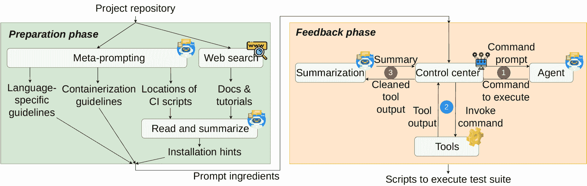
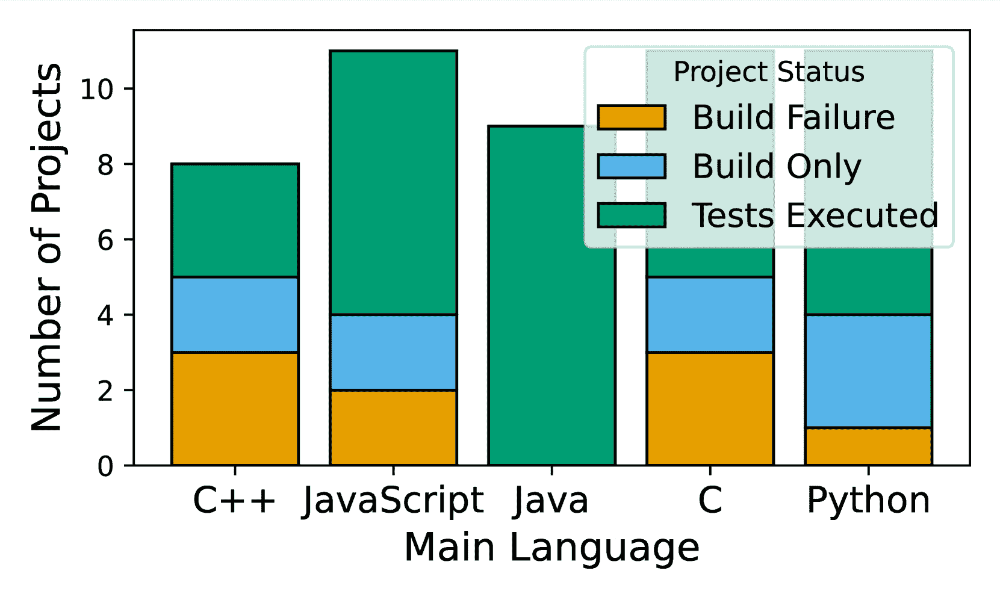
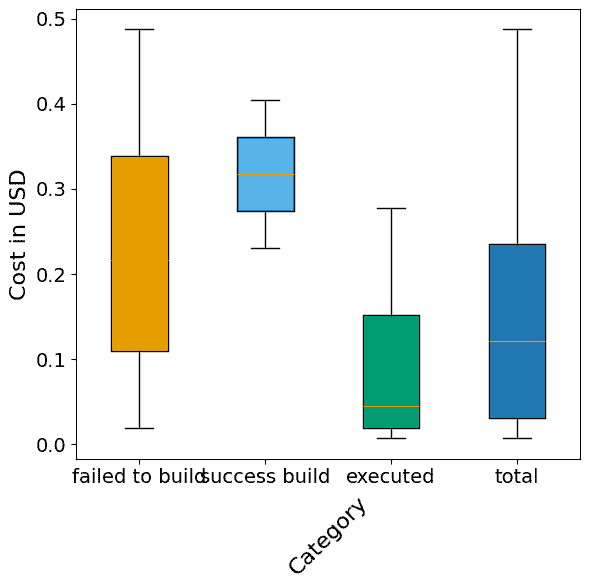
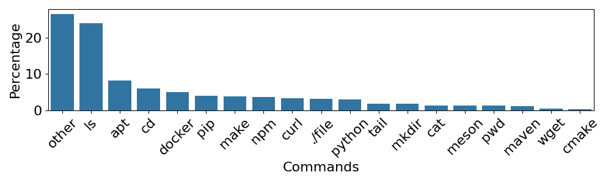

<!--yml
category: 未分类
date: 2025-01-11 11:47:58
-->

# You Name It, I Run It: An LLM Agent to Execute Tests of Arbitrary Projects

> 来源：[https://arxiv.org/html/2412.10133/](https://arxiv.org/html/2412.10133/)

Islem Bouzenia [0000-0002-3920-3839](https://orcid.org/0000-0002-3920-3839 "ORCID identifier") University of StuttgartSuttgartGermany [fi_bouzenia@esi.dz](mailto:fi_bouzenia@esi.dz)  and  Michael Pradel [0000-0003-1623-498X](https://orcid.org/0000-0003-1623-498X "ORCID identifier") University of StuttgartSuttgartGermany [michael@binaervarianz.de](mailto:michael@binaervarianz.de)

###### Abstract.

The ability to execute the test suite of a project is essential in many scenarios, e.g., to assess code quality and code coverage, to validate code changes made by developers or automated tools, and to ensure compatibility with dependencies. Despite its importance, executing the test suite of a project can be challenging in practice because different projects use different programming languages, software ecosystems, build systems, testing frameworks, and other tools. These challenges make it difficult to create a reliable, universal test execution method that works across different projects. This paper presents ExecutionAgent, an automated technique that installs arbitrary projects, configures them to run test cases, and produces project-specific scripts to reproduce the setup. Inspired by the way a human developer would address this task, our approach is a large language model-based agent that autonomously executes commands and interacts with the host system. The agent uses meta-prompting to gather guidelines on the latest technologies related to the given project, and it iteratively refines its process based on feedback from the previous steps. Our evaluation applies ExecutionAgent to 50 open-source projects that use 14 different programming languages and many different build and testing tools. The approach successfully executes the test suites of 33/55 projects, while matching the test results of ground truth test suite executions with a deviation of only 7.5%. These results improve over the best previously available technique by 6.6x. The costs imposed by the approach are reasonable, with an execution time of 74 minutes and LLM costs of 0.16 dollars, on average per project. We envision ExecutionAgent to serve as a valuable tool for developers, automated programming tools, and researchers that need to execute tests across a wide variety of projects.

^†^†copyright: none

## 1\. Introduction

Executing the test suite of a software project is a critical step in various activities during software development and software engineering research. For human developers who are contributing to open-source projects, running the tests before submitting a pull request ensures that their changes do not introduce regressions. Likewise, the increasing popularity of large language model (LLM) agents that autonomously edit a project’s code (Bouzenia et al., [2024a](https://arxiv.org/html/2412.10133v1#bib.bib4); Zhang et al., [2024](https://arxiv.org/html/2412.10133v1#bib.bib45); Liu et al., [2024](https://arxiv.org/html/2412.10133v1#bib.bib21); Tao et al., [2024](https://arxiv.org/html/2412.10133v1#bib.bib33); Yang et al., [2024](https://arxiv.org/html/2412.10133v1#bib.bib42)) creates a huge demand for a feedback mechanism to validate modifications (Spiess et al., [2025](https://arxiv.org/html/2412.10133v1#bib.bib32)), and executing the test suite provides such a mechanism. Finally, researchers also depend on running tests, e.g., to evaluate the effectiveness of dynamic analyses (Eghbali and Pradel, [2022](https://arxiv.org/html/2412.10133v1#bib.bib9)) or to create benchmarks involving test execution, such as Defects4J (Just et al., [2014](https://arxiv.org/html/2412.10133v1#bib.bib17)), SWE-Bench (Jimenez et al., [2023](https://arxiv.org/html/2412.10133v1#bib.bib15)), and DyPyBench (Bouzenia et al., [2024b](https://arxiv.org/html/2412.10133v1#bib.bib5)).

Unfortunately, executing the tests of an arbitrary project is far from straightforward in practice. Projects are developed in different programming languages and ecosystems, each with its own set of tools, dependencies, and conventions. Complex dependencies can pose significant challenges, especially when specific versions of libraries or tools are required. Documentation is often incomplete, inconsistent, or entirely missing, forcing developers to infer the necessary steps. Moreover, projects may have implicit assumptions about the environment, such as operating system specifics or required system configurations, that are not explicitly stated. The diversity of testing frameworks further complicates the process, as each framework has a unique setup and execution procedure.

Currently, there are three primary methods for executing the tests of a given project, each with notable limitations. The first method involves manually following the project’s documentation and resolving any issues through trial-and-error. This approach is time-consuming and does not scale well with the number of projects. The second method is to reuse existing continuous integration/continuous deployment (CI/CD) workflows employed by project maintainers. However, not all projects have such workflows, and even when they exist, their execution often depends on a specific CI/CD platform, such as GitHub Actions, which is not fully accessible to the public. Directly using CI/CD workflows is further complicated by the fact that there are several popular platforms, each with its own configuration scripts and technology stack. The third method is to implement an automated, heuristic script designed to cover common cases. Such scripts typically focus on a single programming language and ecosystem. They lack the flexibility to handle arbitrary projects, as evidenced by studies highlighting the limitations of such scripts in diverse environments. For example, Flapy (Gruber and Fraser, [2023](https://arxiv.org/html/2412.10133v1#bib.bib13)) works only on Python projects that are available on PyPy, and even within the Python ecosystems fails to successfully run many test suites. Another example is the pipeline used to create GitBug-Java (Silva et al., [2024](https://arxiv.org/html/2412.10133v1#bib.bib31)), which starting from 66,042 repositories eventually managed to execute the tests of only 228 repositories.

An effective solution would need to address multiple challenges. First, the approach should be aware of the latest technologies and tools for a range of popular programming languages. Second, the technique should be capable of understanding incomplete and partially outdated documentation, as often encountered in practice. Third, the approach needs a way to interact with the system, such as executing commands, monitoring outputs, and handling errors. Finally, the approach must be able to assess whether the setup process has been successful, and if not, address any problems until the test suite runs successfully. To the best of our knowledge, there is currently no existing technique that addresses these challenges. This gap presents a substantial obstacle for developers, automated coding techniques, and researchers who need a reliable and scalable solution for running tests across a wide variety of projects. Motivated by these challenges, the question addressed in this work is: *How can we automatically install and run the test suite of an arbitrary project?*

This paper presents ExecutionAgent, the first LLM-based agent for autonomously setting up arbitrary projects and executing their test suites. The approach addresses the four challenges described above as follows. For the first challenge, we present the novel concept of meta-prompting, which asks a recently trained LLM to automatically generates up-to-date, technology-specific, and programming language-specific guidelines instead of manually engineering and hard-coding a prompt. We address the second challenge by using the LLM to parse and understand the project’s documentation and web resources related to the project. To handle the third challenge, we connect the agent to a set of tools, such as a terminal, to execute commands, monitor outputs, and interact with the system. Finally, we address the fourth challenge by enabling the agent to iteratively refine its process based on feedback from previous steps, similar to how a human developer would work.

To evaluate ExecutionAgent, we apply it to 50 open-source projects that use 14 different programming languages and many different build and testing tools. The approach successfully sets up and executes the test suites of 33/50 projects. Comparing to several baselines, such as manually designed and LLM-generated scripts targeting projects in a specific language, as well as a general-purpose LLM-based agent, we find ExecutionAgent to outperform the best available technique by 6.6x. To validate the test executions, we compare them against a manually established ground truth and find that the test results (in terms of passed, failed, and skipped tests) closely resemble the ground truth, with an average deviation of 7.5%. Studying the costs of the approach, we find that the average execution time is 74 minutes per project, and the average LLM costs are 0.16 dollars per project. Overall, these results demonstrate that ExecutionAgent has the potential to serve as a valuable tool for developers, automated programming tools, and researchers that need to execute tests across a wide variety of projects.

In summary, this paper contributes the following:

1.  (1)

    The first autonomous, LLM-based agent for automatically setting up arbitrary projects and executing their test suites.

2.  (2)

    The novel concept of meta-prompting, which allows the agent to query an LLM for the latest guidelines and technologies related to installing and running test suites.

3.  (3)

    Several technical insights on design decisions that enable the agent to effectively interact with the system, execute commands, monitor outputs, and handle errors.

4.  (4)

    Empirical evidence that the approach can successfully execute the test suites of a wide variety of projects, clearly outperforming existing techniques.

## 2\. Approach

The following presents our approach for executing the test of arbitrary projects. We start by defining the problem we aim to address (Section [2.1](https://arxiv.org/html/2412.10133v1#S2.SS1 "2.1\. Problem Statement ‣ 2\. Approach ‣ You Name It, I Run It: An LLM Agent to Execute Tests of Arbitrary Projects")), then provide an overview of our approach (Section [2.2](https://arxiv.org/html/2412.10133v1#S2.SS2 "2.2\. Overview of ExecutionAgent ‣ 2\. Approach ‣ You Name It, I Run It: An LLM Agent to Execute Tests of Arbitrary Projects")), and finally describe the components of our approach in detail (Sections [2.3](https://arxiv.org/html/2412.10133v1#S2.SS3 "2.3\. Preparation Phase ‣ 2\. Approach ‣ You Name It, I Run It: An LLM Agent to Execute Tests of Arbitrary Projects") and  [2.4](https://arxiv.org/html/2412.10133v1#S2.SS4 "2.4\. Feedback Loop ‣ 2\. Approach ‣ You Name It, I Run It: An LLM Agent to Execute Tests of Arbitrary Projects")).

### 2.1\. Problem Statement

The problem we aim to address is the following: Given a software project, identified, e.g., by a URL of a git repository or a path on the local disk, we want to automatically generate scripts to setup and run the tests of the project. Specifically, the desired output consists of two scripts: one to create an isolated environment, such as a container, and one to setup up the project and run its tests within the isolated environment. By running the tests, we mean executing the project’s test suite and collecting the results, such as the number of tests that run, pass, and fail.

We aim to address this problem in a way that offers two important properties. First, the approach should be technology-agnostic, i.e., it should support projects written in different programming languages, using different build systems, and using different testing frameworks. This property is crucial as it allows the approach to be used across a wide range of projects. Second, the approach should be fully automated, i.e., it should not require any manual intervention or additional information beyond the project itself. This property is essential to ensure that the approach can be used at scale and without human intervention.

The formulated problem has, to the best of our knowledge, not been addressed by prior work. In particular, existing approaches either focus on specific programming languages or ecosystems (Gruber and Fraser, [2023](https://arxiv.org/html/2412.10133v1#bib.bib13); Silva et al., [2024](https://arxiv.org/html/2412.10133v1#bib.bib31)) or are based on significant manual intervention (Bouzenia et al., [2024b](https://arxiv.org/html/2412.10133v1#bib.bib5)).

### 2.2\. Overview of ExecutionAgent

We address the problem of executing the test suite of arbitrary projects using an approach that leverages LLMs and the concept of LLM agents. By *LLM agent* we here mean a system that uses an LLM to autonomously interact with a set of tools in order to achieve a specific goal. The tools we use are similar to those a human tasked with setting up a project might use, such as commands available via a terminal. The intuition behind this approach is that the LLM can “understand” various sources of information, such as project documentation, existing scripts, and the output of tools, and use this understanding to decide on the steps necessary to execute the tests of the given project. As shown in Figure [1](https://arxiv.org/html/2412.10133v1#S2.F1 "Figure 1 ‣ 2.2\. Overview of ExecutionAgent ‣ 2\. Approach ‣ You Name It, I Run It: An LLM Agent to Execute Tests of Arbitrary Projects"), the approach encompasses two phases, which we briefly describe in the following.

Figure 1. Overview of ExecutionAgent.

##### Phase 1: Preparation

Given a project repository, this phase gathers information required to construct the initial prompt of the agent, called *prompt ingredients*. A key challenge is creating these prompt ingredients in a technology-agnostic way, as the project may be written in any programming language and use any testing framework. Our approach addresses this challenge through *meta-prompting*, a novel concept that allows the agent to query an LLM for the latest guidelines and technologies related to installing and running test suites. Specifically, ExecutionAgent uses meta-prompting to generate language-specific guidelines, guidelines about the latest containerization technology, and possible locations of commonly used CI/CD scripts. In addition, the approach queries the web to gather hints on installing the given project. The gathered information is then passed as prompt ingredients to the second phase.

##### Phase 2: Feedback loop

This phase repeatedly invokes tools, as guided by the LLM, in order to install the project and execute its test suite. Specifically, ExecutionAgent repeatedly iterates through three steps. Step  <svg class="ltx_picture" height="15.74" id="S2.SS2.SSS0.Px2.p1.1.pic1" overflow="visible" version="1.1" width="15.74"><g fill="#000000" stroke="#000000" stroke-width="0.4pt" transform="translate(0,15.74) matrix(1 0 0 -1 0 0) translate(7.87,0) translate(0,7.87)"><g fill="#000000" stroke="#000000" transform="matrix(1.0 0.0 0.0 1.0 -3.46 -4.46)"><foreignobject height="8.92" overflow="visible" transform="matrix(1 0 0 -1 0 16.6)" width="6.92">1</foreignobject></g></g></svg> queries the LLM for the next command to execute, using a dynamically updated *command prompt* that contains the prompt ingredients from Phase 1 and a summary of the already invoked commands. Step  <svg class="ltx_picture" height="15.74" id="S2.SS2.SSS0.Px2.p1.2.pic2" overflow="visible" version="1.1" width="15.74"><g fill="#000000" stroke="#000000" stroke-width="0.4pt" transform="translate(0,15.74) matrix(1 0 0 -1 0 0) translate(7.87,0) translate(0,7.87)"><g fill="#000000" stroke="#000000" transform="matrix(1.0 0.0 0.0 1.0 -3.46 -4.46)"><foreignobject height="8.92" overflow="visible" transform="matrix(1 0 0 -1 0 16.6)" width="6.92">2</foreignobject></g></g></svg> executes the command suggested by the LLM by invoking one of the tools. Because the output of a tool may be verbose and contain irrelevant information, step  <svg class="ltx_picture" height="15.74" id="S2.SS2.SSS0.Px2.p1.3.pic3" overflow="visible" version="1.1" width="15.74"><g fill="#000000" stroke="#000000" stroke-width="0.4pt" transform="translate(0,15.74) matrix(1 0 0 -1 0 0) translate(7.87,0) translate(0,7.87)"><g fill="#000000" stroke="#000000" transform="matrix(1.0 0.0 0.0 1.0 -3.46 -4.46)"><foreignobject height="8.92" overflow="visible" transform="matrix(1 0 0 -1 0 16.6)" width="6.92">3</foreignobject></g></g></svg> requests the LLM to summarize the output and extract the most relevant information. The summarized output is then used to update the command prompt, and the three steps repeat until the agent determines that the test suite has been successfully executed. This entire process is managed by a component we call the control center.

The steps taken by ExecutionAgent are described in more detail in Algorithm [1](https://arxiv.org/html/2412.10133v1#alg1 "Algorithm 1 ‣ Phase 2: Feedback loop ‣ 2.2\. Overview of ExecutionAgent ‣ 2\. Approach ‣ You Name It, I Run It: An LLM Agent to Execute Tests of Arbitrary Projects"), which we will explain in the following sections.

Algorithm 1 High-level algorithm of ExecutionAgent

0:  Repository URL $u$0:  Scripts to setup and run tests1:  // Phase 1: Preparation2:  $\mathit{lang\_guidelines}\leftarrow$ LLM("Give language-specific guidelines", get_languages($u$))3:  $\mathit{container\_guidelines}\leftarrow$ LLM("Give guidelines on recent containerization technology")4:  $\mathit{ci\_paths}\leftarrow$ LLM("Give common locations of CI scripts within a repo")5:  $\mathit{ci\_hints}\leftarrow$ read_ci_scripts_and_summarize($u$, $\mathit{ci\_paths}$)6:  $\mathit{install\_hints}\leftarrow$ search_web($u$)7:  8:  // Phase 2: Feedback loop9:  $\mathit{attempts\_left}\leftarrow 3$10:  $\mathit{p\_attempt\_lessons}\leftarrow$ ””11:  while $\mathit{attempts\_left}$ do12:     $\mathit{p\_cmd}\leftarrow$ create_command_prompt($\mathit{lang\_guidelines}$, $\mathit{container\_guidelines}$, $\mathit{ci\_hints}$, $\mathit{install\_hints}$, $\mathit{p\_attempts\_lessons}$),13:     $\mathit{budget\_left}\leftarrow$ 4014:     while $\mathit{budget\_left}$ do15:        // Step 1: Get next command16:        $\mathit{thought},\mathit{cmd\leftarrow}$ LLM($\mathit{p\_cmd}$)17:        // Step 2: Execute command18:        $\mathit{cmd\_result}\leftarrow$ execute($\mathit{cmd}$)19:        if $\mathit{cmd}$ == "task_done" and valid($\mathit{cmd\_result}$) then20:           $\mathit{scripts}\leftarrow$ read_target_files()21:           return  $\mathit{scripts}$22:        end if23:        // Step 3: Summarize command output24:        $\mathit{p\_summarize}\leftarrow$ create_prompt($\mathit{p\_cmd}$, $\mathit{cmd\_result}$)25:        $\mathit{cmd\_result\_summary}\leftarrow$ LLM($\mathit{p\_summarize}$)26:        $\mathit{p\_cmd}\leftarrow$ update_prompt($\mathit{p\_cmd}$, $\mathit{thought}$, $\mathit{cmd}$, $\mathit{cmd\_result\_summary}$)27:        $\mathit{budget\_left}\leftarrow\mathit{budget\_left}-1$28:     end while29:     $\mathit{attempts\_left}\leftarrow\mathit{attempts\_left}-1$30:     $\mathit{p\_attempt\_lessons}\leftarrow analyze\_commands\_and\_thoughts(cmd\_% list,thoughts\_list)$31:  end while

### 2.3\. Preparation Phase

The preparation phase is motivated by two goals: (1) to gather project-specific information that could be helpful for installing the given project and running its tests, and (2) to obtain guidelines that will help the LLM agent in invoking the right tools and commands during the feedback loop in phase 2. To reach these goals, we follow a set of steps that are detailed in Algorithm [1](https://arxiv.org/html/2412.10133v1#alg1 "Algorithm 1 ‣ Phase 2: Feedback loop ‣ 2.2\. Overview of ExecutionAgent ‣ 2\. Approach ‣ You Name It, I Run It: An LLM Agent to Execute Tests of Arbitrary Projects") between lines [1](https://arxiv.org/html/2412.10133v1#alg1.l1 "In Algorithm 1 ‣ Phase 2: Feedback loop ‣ 2.2\. Overview of ExecutionAgent ‣ 2\. Approach ‣ You Name It, I Run It: An LLM Agent to Execute Tests of Arbitrary Projects") and [6](https://arxiv.org/html/2412.10133v1#alg1.l6 "In Algorithm 1 ‣ Phase 2: Feedback loop ‣ 2.2\. Overview of ExecutionAgent ‣ 2\. Approach ‣ You Name It, I Run It: An LLM Agent to Execute Tests of Arbitrary Projects"), and which we present in detail in the following. Since several of these steps use the idea of meta-prompting, we begin by explaining this concept.

#### 2.3.1\. Meta-Prompting

A key challenge faced by ExecutionAgent is that technologies and best practices for installing software projects and running test suites are constantly evolving. One way to address this challenge would be to spend significant amounts of time in engineering suitable prompts for the LLM agent. Such prompts should provide guidelines on how to use common build tools, package managers, testing frameworks, etc. for all the programming languages, software ecosystems, and tools that the agent might encounter. However, this approach comes with several drawbacks: it is time-consuming, is unlikely to cover all relevant technologies, and may become outdated quickly.

Instead of engineering such prompts manually, we leverage the impressive knowledge of LLMs to generate prompts with up-to-date guidelines targeted at the given project. Since LLMs are often trained on a vast range of documents, including documents describing the latest technological developments, they provide a built-in mechanism for adapting to evolving technology landscapes. We leverage this capability by using a high-level prompt, called a *meta-prompt*, to query the LLM for technology-specific guidelines and other information, which we then use to construct the command prompt for the agent. Specifically, ExecutionAgent uses meta-prompting to generate three kinds of prompt ingredients, which we describe in the following.

#### 2.3.2\. Language-Specific Guidelines

During initial experiments, we observed that the LLM agent benefits from guidelines that describe how to typically install and run tests of projects written in a specific programming language. Adopting the idea of meta-prompting, ExecutionAgent creates such guidelines by querying an up-to-date LLM to generate a list of language-specific guidelines. To this end, we heuristically determine the main programming language of the project (using GitHub’s Linguist library¹¹1[https://github.com/github-linguist/linguist](https://github.com/github-linguist/linguist)) and use this information to query the LLM. Figure [2](https://arxiv.org/html/2412.10133v1#S2.F2 "Figure 2 ‣ 2.3.2\. Language-Specific Guidelines ‣ 2.3\. Preparation Phase ‣ 2\. Approach ‣ You Name It, I Run It: An LLM Agent to Execute Tests of Arbitrary Projects") illustrates an example of a meta-prompt for a Java project and the response from the LLM.

<svg class="ltx_picture ltx_centering ltx_figure_panel" height="56.22" id="S2.F2.pic1" overflow="visible" version="1.1" width="603.46"><g fill="#000000" stroke="#000000" stroke-width="0.4pt" transform="translate(0,56.22) matrix(1 0 0 -1 0 0) translate(3.46,0)"><g fill-opacity="1.0" transform="matrix(1.0 0.0 0.0 1.0 4.63 40.87)"><foreignobject color="#FFFFFF" height="11.07" overflow="visible" transform="matrix(1 0 0 -1 0 16.6)" width="590.74">Guidelines Meta Prompt (for Java)</foreignobject></g> <g fill-opacity="1.0" transform="matrix(1.0 0.0 0.0 1.0 4.63 4.63)"><foreignobject color="#000000" height="27.67" overflow="visible" transform="matrix(1 0 0 -1 0 16.6)" width="590.74">I want to install and run tests of a Java project. Give a list of 10 guidelines that I should follow to achieve my task (e.g, to figure out installation steps, dependencies, how to run tests) while considering latest practices and technologies.</foreignobject></g></g></svg><svg class="ltx_picture ltx_centering ltx_figure_panel" height="137.89" id="S2.F2.pic2" overflow="visible" version="1.1" width="603.46"><g fill="#000000" stroke="#000000" stroke-width="0.4pt" transform="translate(0,137.89) matrix(1 0 0 -1 0 0) translate(3.46,0)"><g fill-opacity="1.0" transform="matrix(1.0 0.0 0.0 1.0 4.63 123.89)"><foreignobject color="#FFFFFF" height="9.72" overflow="visible" transform="matrix(1 0 0 -1 0 16.6)" width="590.74">LLM Response</foreignobject></g> <g fill-opacity="1.0" transform="matrix(1.0 0.0 0.0 1.0 4.63 4.63)"><foreignobject color="#000000" height="110.7" overflow="visible" transform="matrix(1 0 0 -1 0 16.6)" width="590.74">1\. Review Project Documentation and README Why: Documentation typically includes installation steps, dependencies, and setup instructions. What to do: Check the README.md or other documentation files for prerequisites and specific instructions for installation and testing. 2\. Verify Java Version Compatibility Why: Java projects may target specific versions (…) What to do: Confirm the Java version required by checking the pom.xml (Maven) or build.gradle (Gradle) file (…) 3\. Check for Dependency Management Tool (…) 10\. Generate Test Reports for Results and Debugging Why: Test reports provide detailed logs and summaries, aiding in debugging. What to do: Maven projects can use mvn surefire-report:report to generate reports. Gradle usually generates HTML reports by default (build/reports/tests/test/index.html).</foreignobject></g></g></svg>

Figure 2. Meta-prompting to obtain guidelines for Java projects. Response shortened for brevity.

#### 2.3.3\. Container Guidelines

To ensure that the project’s tests are executed in an isolated environment, ExecutionAgent aims at installing and testing the project inside a container. Similar to the language-specific guidelines, we use meta-prompting to query the LLM for guidelines on the latest and most used containerization technology. For example, at the moment of writing, the GPT-4o model responds to our meta-prompt by stating that Docker is the best containerization technology for setting up an isolated environment and by providing advice on using Docker.

#### 2.3.4\. Existing CI/CD Scripts

<svg class="ltx_picture ltx_centering" height="1188.53" id="S2.F3.pic1" overflow="visible" version="1.1" width="600"><g fill="#000000" stroke="#000000" stroke-width="0.4pt" transform="translate(0,1188.53) matrix(1 0 0 -1 0 0)"><g fill-opacity="1.0" transform="matrix(1.0 0.0 0.0 1.0 4.97 1173.84)"><foreignobject color="#000000" height="9.72" overflow="visible" transform="matrix(1 0 0 -1 0 16.6)" width="590.05">Summarization response</foreignobject></g> <g fill-opacity="1.0" transform="matrix(1.0 0.0 0.0 1.0 4.97 7.74)"><foreignobject color="#000000" height="1157.19" overflow="visible" transform="matrix(1 0 0 -1 0 16.6)" width="590.05">[⬇](data:text/plain;base64,eyAnc3VtbWFyeSc6ICdUaGUga2FybWEuY29uZi5qcyBmaWxlIGNvbmZpZ3VyZXMgdGhlIHRlc3RpbmcgZnJhbWV3b3JrIGZvciBCb290c3RyYXAsIHV0aWxpemluZyBKYXNtaW5lIGZvciB1bml0IHRlc3RpbmcgYW5kIFJvbGx1cCBmb3IgcHJlcHJvY2Vzc2luZy4gSXQgc3VwcG9ydHMgaGVhZGxlc3MgdGVzdGluZyB3aXRoIENocm9tZSBhbmQgRmlyZWZveCwgYW5kIGluY2x1ZGVzIGNvbmZpZ3VyYXRpb25zIGZvciBjb3ZlcmFnZSByZXBvcnRpbmcgYW5kIEJyb3dzZXJTdGFjayBpbnRlZ3JhdGlvbi4nLAogICdleHRyYWN0ZWQgZGVwZW5kZW5jaWVzJzogWydqYXNtaW5lJywgJ2thcm1hJywgJ2thcm1hLWphc21pbmUnLCdrYXJtYS1yb2xsdXAtcHJlcHJvY2Vzc29yJywgJ2thcm1hLWNocm9tZS1sYXVuY2hlcicsICdrYXJtYS1maXJlZm94LWxhdW5jaGVyJywgJ2thcm1hLWRldGVjdC1icm93c2VycycsICdrYXJtYS1jb3ZlcmFnZS1pc3RhbmJ1bC1yZXBvcnRlciddLAogICdpbXBvcnRhbnQgY29tbWFuZHMnOiBbJ25wbSB0ZXN0J10sCiAgJ2ltcG9ydGFudCBmaWxlcy9saW5rcy9oeXBlcmxpbmtzJzogW10gfQ==) {  ’summary’:  ’The  karma.conf.js  file  configures  the  testing  framework  for  Bootstrap,  utilizing  Jasmine  for  unit  testing  and  Rollup  for  preprocessing.  It  supports  headless  testing  with  Chrome  and  Firefox,  and  includes  configurations  for  coverage  reporting  and  BrowserStack  integration.’, ’extracted  dependencies’:  [’jasmine’,  ’karma’,  ’karma-jasmine’,’karma-rollup-preprocessor’,  ’karma-chrome-launcher’,  ’karma-firefox-launcher’,  ’karma-detect-browsers’,  ’karma-coverage-istanbul-reporter’], ’important  commands’:  [’npm  test’], ’important  files/links/hyperlinks’:  []  }</foreignobject></g></g></svg>

Figure 3. Example of an LLM-generated summary.

Some projects include CI/CD scripts that provide hints about installation steps and project dependencies. To benefit from such scripts, ExecutionAgent searches for such files in the repository. While sometimes outdated and incomplete, the existing scripts may give hints about the overall process and non-standard steps to take. Instead of hard-coding specific file paths, such as .github/workflows/main.yml, ExecutionAgent uses meta-prompting to query the LLM for common locations, file names, and file extensions of CI/CD scripts within a repository. Based on the response, the approach searches for such files within the project. Because the files identified may be long and contain irrelevant information, we try to extract the most relevant parts of the scripts. To this end, ExecutionAgent queries an LLM with the raw file, asking the model to extract four kinds of information: a short natural language summary of the script, a list of dependencies of the project, any commands that are important for setting up and testing the project, and a list of relevant files or links. We call these four pieces of information a *summary*. Figure [3](https://arxiv.org/html/2412.10133v1#S2.F3 "Figure 3 ‣ 2.3.4\. Existing CI/CD Scripts ‣ 2.3\. Preparation Phase ‣ 2\. Approach ‣ You Name It, I Run It: An LLM Agent to Execute Tests of Arbitrary Projects") shows an example of the LLM’s response to the summarization prompt.

#### 2.3.5\. Web Search

For popular projects, there is often information available on the web that can help with the installation process and that goes beyond the information available in the repository itself. To retrieve such information, ExecutionAgent queries a search engine with the following query “How to install the ¡LANGUAGE¿ project ’¡PROJECT¿’ from source code?”, where ¡LANGUAGE¿ and ¡PROJECT¿ are replaced with the main programming language and the name of the project, respectively. The approach then extracts all text from the top-five results and asks an LLM to summarize it into the same structure as shown in Figure [3](https://arxiv.org/html/2412.10133v1#S2.F3 "Figure 3 ‣ 2.3.4\. Existing CI/CD Scripts ‣ 2.3\. Preparation Phase ‣ 2\. Approach ‣ You Name It, I Run It: An LLM Agent to Execute Tests of Arbitrary Projects"). In case a search result does not contain any relevant installation hints, the model is instructed to return “Irrelevant web page”.

### 2.4\. Feedback Loop

Based on the prompt ingredients obtained in the preparation phase, the second phase of our approach is a feedback loop that iteratively invokes tools to install the project and execute its test suite. As shown in lines [8](https://arxiv.org/html/2412.10133v1#alg1.l8 "In Algorithm 1 ‣ Phase 2: Feedback loop ‣ 2.2\. Overview of ExecutionAgent ‣ 2\. Approach ‣ You Name It, I Run It: An LLM Agent to Execute Tests of Arbitrary Projects") to [31](https://arxiv.org/html/2412.10133v1#alg1.l31 "In Algorithm 1 ‣ Phase 2: Feedback loop ‣ 2.2\. Overview of ExecutionAgent ‣ 2\. Approach ‣ You Name It, I Run It: An LLM Agent to Execute Tests of Arbitrary Projects") of Algorithm [1](https://arxiv.org/html/2412.10133v1#alg1 "Algorithm 1 ‣ Phase 2: Feedback loop ‣ 2.2\. Overview of ExecutionAgent ‣ 2\. Approach ‣ You Name It, I Run It: An LLM Agent to Execute Tests of Arbitrary Projects"), the feedback loop consists of two nested loops. The inner loop runs a series of commands, guided by the LLM, until either the test suite completes successfully or a configurable command limit (default: 40) is reached. The outer loop allows for multiple attempts to install and execute the test suite, with a configurable maximum number of attempts (default: 3). This design allows recovery from occasional failures where the installation process encounters an error, preventing the tests from running. By allowing multiple attempts, the system can adjust its approach to overcome such errors. At the start of each outer loop iteration, the system incorporates lessons learned from the previous attempt (if any) into the command prompt. These lessons are generated by prompting the LLM to analyze the previous sequence of thoughts and commands, identify challenges encountered, and suggest adjustments for the next iteration (line [30](https://arxiv.org/html/2412.10133v1#alg1.l30 "In Algorithm 1 ‣ Phase 2: Feedback loop ‣ 2.2\. Overview of ExecutionAgent ‣ 2\. Approach ‣ You Name It, I Run It: An LLM Agent to Execute Tests of Arbitrary Projects")). Each iteration of the inner loop consists of three steps, as outlined in Figure [1](https://arxiv.org/html/2412.10133v1#S2.F1 "Figure 1 ‣ 2.2\. Overview of ExecutionAgent ‣ 2\. Approach ‣ You Name It, I Run It: An LLM Agent to Execute Tests of Arbitrary Projects") and detailed in the following.

#### 2.4.1\. Step 1: LLM Agent to Select the Next Command

The core of our approach is an LLM that selects the next command to execute based on the current state of the installation process. To guide the LLM in selecting the next command, the approach constructs a *command prompt* that contains the prompt ingredients obtained in the preparation phase, as well as a summary of the commands executed so far. The command prompt consists of static sections, which are the same any time ExecutionAgent is used, and dynamic sections, which are either created based on the preparation phase (line [12](https://arxiv.org/html/2412.10133v1#alg1.l12 "In Algorithm 1 ‣ Phase 2: Feedback loop ‣ 2.2\. Overview of ExecutionAgent ‣ 2\. Approach ‣ You Name It, I Run It: An LLM Agent to Execute Tests of Arbitrary Projects")) or updated at the end of each iteration of the inner loop (line [26](https://arxiv.org/html/2412.10133v1#alg1.l26 "In Algorithm 1 ‣ Phase 2: Feedback loop ‣ 2.2\. Overview of ExecutionAgent ‣ 2\. Approach ‣ You Name It, I Run It: An LLM Agent to Execute Tests of Arbitrary Projects")). Specifically, the prompt contains the following sections:

1.  (1)

    Agent role (static): Defines the primary task of the agent and the success criteria. Concretely, the agent’s role is to install the given project and ensure that the test cases execute properly.

2.  (2)

    Goals (static): Outlines the specific objectives the agent must accomplish, namely:

    *   •

        Gather installation-related information and requirements.

    *   •

        Write scripts to install the project and execute its tests.

    *   •

        Run the produced scripts and refine them, if necessary.

    *   •

        Analyze the test execution results and summarize them by providing the number of executed, passed, and failed tests.

3.  (3)

    Tools (static): Lists the tools available to the agent. We describe the tools in detail in Section [2.4.2](https://arxiv.org/html/2412.10133v1#S2.SS4.SSS2 "2.4.2\. Step 2: Invoking Tools ‣ 2.4\. Feedback Loop ‣ 2\. Approach ‣ You Name It, I Run It: An LLM Agent to Execute Tests of Arbitrary Projects").

4.  (4)

    Guidelines (dynamic): Contains the programming language-specific guidelines and the containerization guidelines obtained in the preparation phase.

5.  (5)

    Installation hints (dynamic): Contains the installation hints obtained from any existing CI/CD scripts and the web search. It also contains the previous attempts lessons (outer loop feedback).

6.  (6)

    Tool invocation history (dynamic): Summarizes the tools invoked so far, as well as the output that was produced. Initially, this section is empty.

7.  (7)

    Instruction for creating the next command prompt (static): Specifies that the LLM should provide the next command to execute based on the context available in the prompt. We define the expected format of the LLM’s response in a TypeScript interface, as shown in Figure [4](https://arxiv.org/html/2412.10133v1#S2.F4 "Figure 4 ‣ 2.4.1\. Step 1: LLM Agent to Select the Next Command ‣ 2.4\. Feedback Loop ‣ 2\. Approach ‣ You Name It, I Run It: An LLM Agent to Execute Tests of Arbitrary Projects"), so the LLM can answer in JSON compatible with the given interface. The expected format includes the agent’s thoughts, as well as the name of the tool to invoke and the arguments to pass to the tool. The rationale for asking the LLM to describe its thoughts is two-fold: First, it has been shown empirically to improve the quality of the LLM’s responses (Wei et al., [2022](https://arxiv.org/html/2412.10133v1#bib.bib38)). Second, it allows for easier debugging and understanding of the LLM’s decisions.

<svg class="ltx_picture ltx_centering" height="1957.72" id="S2.F4.pic1" overflow="visible" version="1.1" width="600"><g fill="#000000" stroke="#000000" stroke-width="0.4pt" transform="translate(0,1957.72) matrix(1 0 0 -1 0 0)"><g fill-opacity="1.0" transform="matrix(1.0 0.0 0.0 1.0 4.28 1943.59)"><foreignobject color="#000000" height="9.84" overflow="visible" transform="matrix(1 0 0 -1 0 16.6)" width="591.43">Expected format for selecting the next command</foreignobject></g> <g fill-opacity="1.0" transform="matrix(1.0 0.0 0.0 1.0 4.28 4.28)"><foreignobject color="#000000" height="1931.09" overflow="visible" transform="matrix(1 0 0 -1 0 16.6)" width="591.43">[⬇](data:text/plain;base64,aW50ZXJmYWNlIFJlc3BvbnNlIHsvLyBFeHByZXNzIHlvdXIgdGhvdWdodHMgYmFzZWQgb24gdGhlIGluZm9ybWF0aW9uIHRoYXQgeW91IGhhdmUgY29sbGVjdGVkIHNvIGZhciwgdGhlIHBvc3NpYmxlIHN0ZXBzIHRoYXQgeW91IGNvdWxkIGRvIG5leHQsIGFuZCBhbHNvIHlvdXIgcmVhc29uaW5nLgogIHRob3VnaHRzOiBzdHJpbmc7CiAgdG9vbDoge25hbWU6IHN0cmluZzsgYXJnczogUmVjb3JkPHN0cmluZywgYW55PjsgfTsgfQoKSGVyZSBpcyBhbiBleGFtcGxlIG9mIGEgY29tbWFuZCBjYWxsIHRoYXQgeW91IGNhbiBvdXRwdXQ6CnsgInRob3VnaHRzIjogIkkgbmVlZCB0byBjaGVjayB0aGUgZmlsZXMgYW5kIGZvbGRlcnMgYXZhaWxhYmxlIHdpdGhpbiB0aGlzIHJlcG9zaXRvcnkuIiwKICAidG9vbCI6IHsibmFtZSI6ICJsaW51eF90ZXJtaW5hbCIsICJhcmdzIjogeyJjbWQiOiAibHMifSB9IH0=) interface  Response  {//  Express  your  thoughts  based  on  the  information  that  you  have  collected  so  far,  the  possible  steps  that  you  could  do  next,  and  also  your  reasoning. thoughts:  string; tool:  {name:  string;  args:  Record<string,  any>;  };  } Here  is  an  example  of  a  command  call  that  you  can  output: {  "thoughts":  "I  need  to  check  the  files  and  folders  available  within  this  repository.", "tool":  {"name":  "linux_terminal",  "args":  {"cmd":  "ls"}  }  }</foreignobject></g></g></svg>

Figure 4. TypeScript interface to specify the JSON format of the LLM’s response to the command prompt.

#### 2.4.2\. Step 2: Invoking Tools

To enable our approach to take the steps necessary for installing the project and running its tests, we provide four tools to the agent. ExecutionAgent invokes these tools based on the LLM’s response to the command prompt (lines [17](https://arxiv.org/html/2412.10133v1#alg1.l17 "In Algorithm 1 ‣ Phase 2: Feedback loop ‣ 2.2\. Overview of ExecutionAgent ‣ 2\. Approach ‣ You Name It, I Run It: An LLM Agent to Execute Tests of Arbitrary Projects") to [22](https://arxiv.org/html/2412.10133v1#alg1.l22 "In Algorithm 1 ‣ Phase 2: Feedback loop ‣ 2.2\. Overview of ExecutionAgent ‣ 2\. Approach ‣ You Name It, I Run It: An LLM Agent to Execute Tests of Arbitrary Projects")).

##### Terminal

Similar to human developers, access to a terminal is crucial to successfully set up a project and run its tests, e.g., to install dependencies, configure the environment, or list available files. We provide the agent with the capability to execute any command available in a Linux terminal via the terminal tool. The tool takes a command to execute as input and returns the output of the command.

##### File I/O Tools

While the terminal would, in principle, be sufficient to perform any kind of operation on the system, we provide two additional tools for interacting with the file system. These tools are meant to emulate the developer’s interaction with text editors, where they open a file, read parts of it, and sometimes make changes by writing to it. The read_file tool takes a file path as input and returns the content of the file. The write_file tool takes a file path and content as input and writes the content to the file. The latter tools is particularly useful for writing the scripts expected as the output of ExecutionAgent, e.g., a Dockerfile that creates a container and a install.sh script that installs the project and runs its tests.

##### End of Task

In addition to the tools described above, we provide the agent with a special tool called task_done. This tool is used to signal that the agent has successfully completed its task, i.e., that the project has been installed and its tests have been executed. The tool takes a natural language description that explains why the agent has finished the task as its argument.

#### 2.4.3\. Step 3: Summarization and Extraction

The output of tools can be verbose and contain lots of irrelevant information. For example, suppose the agent executes a command to list all files in a directory or reads the content of a file, then simply returning the output of the tool to the LLM for the next command would quickly fill up the available prompt size. Even with LLMs that offer a large prompt size, it is beneficial to reduce the amount of information in the prompt to keep the agent focused on the most important information and to reduce the overall costs of the approach.

To reduce the amount of text that results from a tool invocation, ExecutionAgent shortens the output whenever the output exceeds a certain number of tokens (default: 200). The approach asks another LLM to summarize the output and extract the most relevant information (lines [24](https://arxiv.org/html/2412.10133v1#alg1.l24 "In Algorithm 1 ‣ Phase 2: Feedback loop ‣ 2.2\. Overview of ExecutionAgent ‣ 2\. Approach ‣ You Name It, I Run It: An LLM Agent to Execute Tests of Arbitrary Projects") to [25](https://arxiv.org/html/2412.10133v1#alg1.l25 "In Algorithm 1 ‣ Phase 2: Feedback loop ‣ 2.2\. Overview of ExecutionAgent ‣ 2\. Approach ‣ You Name It, I Run It: An LLM Agent to Execute Tests of Arbitrary Projects")). The expected format for the summary is the same as illustrated in Figure [3](https://arxiv.org/html/2412.10133v1#S2.F3 "Figure 3 ‣ 2.3.4\. Existing CI/CD Scripts ‣ 2.3\. Preparation Phase ‣ 2\. Approach ‣ You Name It, I Run It: An LLM Agent to Execute Tests of Arbitrary Projects"). Once the output of the most recently invoked command has been summarized, the approach appends the command and its output summary to the tool invocation history section of the command prompt (line [26](https://arxiv.org/html/2412.10133v1#alg1.l26 "In Algorithm 1 ‣ Phase 2: Feedback loop ‣ 2.2\. Overview of ExecutionAgent ‣ 2\. Approach ‣ You Name It, I Run It: An LLM Agent to Execute Tests of Arbitrary Projects")).

#### 2.4.4\. Control Center

The control center combines the three steps described above and manages the interaction between the LLMs and the tools. In particular, it performs the following tasks:

*   •

    Parse the LLM output and validate whether it conforms to the specified output format. We empirically observe that the LLM output is syntactically well-formed in almost all cases.

*   •

    Invoke the next step as specified in Algorithm [1](https://arxiv.org/html/2412.10133v1#alg1 "Algorithm 1 ‣ Phase 2: Feedback loop ‣ 2.2\. Overview of ExecutionAgent ‣ 2\. Approach ‣ You Name It, I Run It: An LLM Agent to Execute Tests of Arbitrary Projects"), e.g., by invoking a specific command.

*   •

    For any tool invocation, check whether the command is returning within a configurable timeout (default: five minutes). In case the command has not terminated within this timeout, the control center provides the so far produced output to the LLM agent and asks to decide between three options: wait another five minutes, provide some input to the running tool, or kill the command. Providing some input to the already running tool is useful for interactive tools that require user input, e.g., a user confirming with “y” that some package should be installed.

*   •

    Clean the output of the tools by removing terminal color characters and other special characters, e.g., printed to display a progress bar.

When the agent selects the task_done command, it indicates that the agent believes that the project has been successfully installed and that its test suite has been executed. Before terminating ExecutionAgent, the control center validates that the agent has indeed met all goals. This involves checking whether three files exist: a file to create a container (e.g., a Dockerfile), an installation script to be executed within the container, and a file that contains the test results (i.e., the number of passed, failed, and skipped tests). If all goals are met, ExecutionAgent returns the installation and test scripts to the user (line [21](https://arxiv.org/html/2412.10133v1#alg1.l21 "In Algorithm 1 ‣ Phase 2: Feedback loop ‣ 2.2\. Overview of ExecutionAgent ‣ 2\. Approach ‣ You Name It, I Run It: An LLM Agent to Execute Tests of Arbitrary Projects")). Otherwise, the control center provides feedback to the LLM agent, pointing out what exactly is missing, and asks for a new command.

Figure [5](https://arxiv.org/html/2412.10133v1#S2.F5 "Figure 5 ‣ 2.4.4\. Control Center ‣ 2.4\. Feedback Loop ‣ 2\. Approach ‣ You Name It, I Run It: An LLM Agent to Execute Tests of Arbitrary Projects") gives an example of the scripts output by ExecutionAgent for the OpenVPN project. The two scripts show the configuration chosen by ExecutionAgent, the installed dependencies, and the steps to install and execute the tests of the project.

<svg class="ltx_picture" height="4830.71" id="S2.F5.1.p1.pic1" overflow="visible" version="1.1" width="600"><g fill="#000000" stroke="#000000" stroke-width="0.4pt" transform="translate(0,4830.71) matrix(1 0 0 -1 0 0)"><g fill-opacity="1.0" transform="matrix(1.0 0.0 0.0 1.0 4.97 4818.05)"><foreignobject color="#000000" height="7.69" overflow="visible" transform="matrix(1 0 0 -1 0 16.6)" width="590.05">Dockerfile</foreignobject></g> <g fill-opacity="1.0" transform="matrix(1.0 0.0 0.0 1.0 4.97 4.97)"><foreignobject color="#000000" height="4804.16" overflow="visible" transform="matrix(1 0 0 -1 0 16.6)" width="590.05">[⬇](data:text/plain;base64,RlJPTSB1YnVudHU6MjAuMDQKIyBTZXQgdGhlIHRpbWV6b25lIHRvIGF2b2lkIGludGVyYWN0aXZlIHByb21wdHMKRU5WIFRaPVhYWC9ZWVkgIyBvbWl0dGVkIGZvciBhbm9ueW1pdHkKUlVOIGxuIC1zbmYgL3Vzci9zaGFyZS96b25laW5mby8kVFogL2V0Yy9sb2NhbHRpbWUgJiYgZWNobyAkVFogPiAvZXRjL3RpbWV6b25lCiMgVXBkYXRlIHBhY2thZ2UgbGlzdHMgYW5kIGluc3RhbGwgbmVjZXNzYXJ5IGJ1aWxkIHRvb2xzIGFuZCBkZXBlbmRlbmNpZXMKUlVOIGFwdC1nZXQgdXBkYXRlICYmIFwKYXB0LWdldCBpbnN0YWxsIC15IC0tbm8taW5zdGFsbC1yZWNvbW1lbmRzIFwKc3VkbyBcCmJ1aWxkLWVzc2VudGlhbCBcCmxpYmx6bzItZGV2IFwKbGlicGFtMGctZGV2IFwKbGlibHo0LWRldiBcCmxpYmNhcC1uZy1kZXYgXApsaWJubC1nZW5sLTMtZGV2IFwKbGludXgtbGliYy1kZXYgXAphdXRvY29uZiBcCmF1dG9tYWtlIFwKbGlidG9vbCBcCmNtb2NrYS1kZXYgXApweXRob24zLWRvY3V0aWxzIFwKZ2l0IFwKJiYgYXB0LWdldCBjbGVhbiAmJiBybSAtcmYgL3Zhci9saWIvYXB0L2xpc3RzLyogfHwgZXhpdCAwCldPUktESVIgL2FwcAojIENsb25lIHRoZSBPcGVuVlBOIHJlcG9zaXRvcnkKUlVOIGdpdCBjbG9uZSBodHRwczovL2dpdGh1Yi5jb20vT3BlblZQTi9vcGVudnBuLmdpdCB8fCBleGl0IDAKV09SS0RJUiAvYXBwL29wZW52cG4KQ01EIFsiYmFzaCJd) FROM  ubuntu:20.04 #  Set  the  timezone  to  avoid  interactive  prompts ENV  TZ=XXX/YYY  #  omitted  for  anonymity RUN  ln  -snf  /usr/share/zoneinfo/$TZ  /etc/localtime  &&  echo  $TZ  >  /etc/timezone #  Update  package  lists  and  install  necessary  build  tools  and  dependencies RUN  apt-get  update  &&  \ apt-get  install  -y  --no-install-recommends  \ sudo  \ build-essential  \ liblzo2-dev  \ libpam0g-dev  \ liblz4-dev  \ libcap-ng-dev  \ libnl-genl-3-dev  \ linux-libc-dev  \ autoconf  \ automake  \ libtool  \ cmocka-dev  \ python3-docutils  \ git  \ &&  apt-get  clean  &&  rm  -rf  /var/lib/apt/lists/*  ||  exit  0 WORKDIR  /app #  Clone  the  OpenVPN  repository RUN  git  clone  https://github.com/OpenVPN/openvpn.git  ||  exit  0 WORKDIR  /app/openvpn CMD  ["bash"]</foreignobject></g></g></svg><svg class="ltx_picture" height="1056.45" id="S2.F5.2.p1.pic1" overflow="visible" version="1.1" width="600"><g fill="#000000" stroke="#000000" stroke-width="0.4pt" transform="translate(0,1056.45) matrix(1 0 0 -1 0 0)"><g fill-opacity="1.0" transform="matrix(1.0 0.0 0.0 1.0 4.97 1041.51)"><foreignobject color="#000000" height="9.96" overflow="visible" transform="matrix(1 0 0 -1 0 16.6)" width="590.05">install_and_run.sh</foreignobject></g> <g fill-opacity="1.0" transform="matrix(1.0 0.0 0.0 1.0 4.97 7.74)"><foreignobject color="#000000" height="1024.86" overflow="visible" transform="matrix(1 0 0 -1 0 16.6)" width="590.05">[⬇](data:text/plain;base64,IyEvYmluL2Jhc2gKIyBSdW4gYXV0b2NvbmYgdG8gcHJlcGFyZSB0aGUgYnVpbGQgc3lzdGVtCmF1dG9yZWNvbmYgLWZ2aQojIENvbmZpZ3VyZSB0aGUgYnVpbGQgc3lzdGVtCi4vY29uZmlndXJlIC0tZW5hYmxlLXdlcnJvcgojIENvbXBpbGUgdGhlIHByb2plY3QKbWFrZSAtaiQobnByb2MpCiMgUnVuIHRlc3RzCm1ha2UgY2hlY2sgVkVSQk9TRT0xCmVjaG8gIlNldHVwIGFuZCB0ZXN0aW5nIGNvbXBsZXRlLiI=) #!/bin/bash #  Run  autoconf  to  prepare  the  build  system autoreconf  -fvi #  Configure  the  build  system ./configure  --enable-werror #  Compile  the  project make  -j$(nproc) #  Run  tests make  check  VERBOSE=1 echo  "Setup␣and␣testing␣complete."</foreignobject></g></g></svg>

Figure 5. Scripts produced by ExecutionAgent for the OpenVPN project.

## 3\. Evaluation

Our evaluation aims to answer to following research questions:

*   •

    RQ1 (effectiveness): How effective is ExecutionAgent at correctly setting up projects and running their test cases?

*   •

    RQ2 (costs): What are the costs of ExecutionAgent in terms of execution time and token usage when interacting with the LLM?

*   •

    RQ3 (ablation study): What is the impact of different components and configurations of ExecutionAgent?

*   •

    RQ4 (trajectories): How does ExecutionAgent interact with the tools, and what trajectories does it take to reach the goal?

### 3.1\. Experimental Setup

#### 3.1.1\. Implementation and Model

ExecutionAgent is implemented in Python and bash. To allow for an isolated execution of ExecutionAgent itself, we use a Docker container. The agent is empowered by OpenAI’s GPT-4o-mini model, which we access through their Python API.

#### 3.1.2\. Metrics

The task performed by ExecutionAgent consists of two sub-tasks: (i) building and/or installing the project, and (ii) running the test suite. We measure how effective the approach is at performing these tasks by measuring the *successful build rate*, i.e., the proportion of projects where the approach manages to correctly build and install the project, and the *successful testing rate*, i.e., the proportion of projects where the approach manages to run the test suite. To determine these rates, we manually inspect the produced scripts and the test results.

To better understand the output of ExecutionAgent, we measure the *script size* of the produced scripts, which we define as the number of commands, excluding any comments, white spaces, and “echo” commands. We split composite commands and count their components individually. For example, the line make . && make test is counted as two commands make . and make test.

To validate the test suite executions, we compare the test execution results produced by ExecutionAgent with a manually established ground truth. The ground truth is obtained by searching for CI/CD logs of the targeted projects, and by extracting the number of passed, failed, and skipped tests. We compare the results of ExecutionAgent with the ground truth in terms of these three numbers. Specifically, we compute the *relative deviation* compared to the ground truth as $\mathit{deviation}=|\frac{(nb_{EA}-nb_{GT})}{nb_{GT}}|*100$, where $nb_{EA}$ is the number of tests produced by ExecutionAgent and $nb_{GT}$ is the number of tests in the ground truth. For example, if among the tests executed by ExecutionAgent, there are 95 passing tests, while the ground truth has 100 passing tests, then the deviation is 5%. We compute a separate deviation for the number of passing, failing, and skipped tests, and then average these deviations to obtain the overall deviation.

#### 3.1.3\. Dataset

We gather a set of 50 open-source projects from GitHub that provide three properties: (i) The projects should cover different programming languages. To this end, we sample for each of the following languages ten projects that have that language as their dominant language or second dominant language: Python, Java, C, C++, and JavaScript. Because many projects contain code in multiple languages, the dataset overall covers 14 programming languages.

(ii) There exists a ground truth of test execution results that we can extract from the logs on a CI/CD platform. As different projects use different platforms, we collect ground truth data from GitHub Actions, CircleCI, Jenkins, CirrusCI, and occasionally, a project’s website (e.g, tensorflow). (iii) Each project has at least 100 starts and 100 commits with at least one commit in the past 6 months (prior to collection). Table [1](https://arxiv.org/html/2412.10133v1#S3.T1 "Table 1 ‣ 3.1.3\. Dataset ‣ 3.1\. Experimental Setup ‣ 3\. Evaluation ‣ You Name It, I Run It: An LLM Agent to Execute Tests of Arbitrary Projects") provides an overview of the projects in the dataset. Projects in our dataset have an median number of 10K commits, 45K stars, and 1.4K test cases.

Table 1. Projects used for the evaluation. Languages: J=Java, P=Python, JS= JavaScript, TS= TypeScript, KT=Kotlin, ASM=Assembly, SH=Shell. Symbols: + means successfully built but tests not executed, - means failed to build.

 | Project | Languages | Ground Truth | ExecutionAgent |
| --- | --- | --- | --- |
|  |  | Tests | Pass | Fail | Skip | Tests | Pass | Fail | Skip |
| --- | --- | --- | --- | --- | --- | --- | --- | --- | --- |
| Activiti | J | 3269 | 3266 | 0 | 3 | 2392 | 2389 | 1 | 2 |
| ansible | P | 1717 | 1703 | 0 | 14 | + | + | + | + |
| axios | JS, TS | 203 | 203 | 0 | 0 | 203 | 195 | 8 | 0 |
| bootstrap | JS, Html/css | 808 | 808 | 0 | 0 | 808 | 893 | 15 | 0 |
| ccache | C, SH | 47 | 36 | 0 | 11 | 47 | 36 | 0 | 11 |
| Chart.js | JS, TS | 3298 | 3298 | 0 | 0 | + | + | + | + |
| commons-csv | J | 856 | 845 | 0 | 11 | 856 | 845 | 0 | 11 |
| cpython | P, C, C++ | 478 | 462 | 0 | 16 | 478 | 447 | 0 | 31 |
| deno | JS, TS, Rust | 1458 | 1446 | 0 | 12 | 511 | 474 | 36 | 1 |
| distcc | C, P | 56 | 56 | 0 | 0 | 56 | 56 | 0 | 0 |
| django | P | 17604 | 16151 | 5 | 1448 | 17605 | 16148 | 6 | 1451 |
| dubbo | J | 14020 | 13678 | 0 | 342 | 14020 | 13678 | 2 | 342 |
| express | JS | 1228 | 1228 | 0 | 0 | 1228 | 1228 | 0 | 0 |
| flask | P | 484 | 484 | 0 | 3 | 484 | 483 | 1 | 3 |
| flink | J, Scala, P | 105242 | 100644 | 0 | 4598 | + | + | + | + |
| folly | C++, P | 3089 | 3088 | 0 | 0 | - | - | - | - |
| FreeRTOS | C, ASM | 215 | 215 | 0 | 0 | - | - | - | - |
| git | C, SH, Perl | 31715 | 31715 | 0 | 0 | 30264 | 29203 | 265 | 796 |
| guava | J | 857221 | 857221 | 0 | 0 | 857221 | 857221 | 0 | 0 |
| imgui | C++, C | 348 | 348 | 0 | 0 | - | - | - | - |
| json | C++ | 93 | 93 | 0 | 0 | 93 | 93 | 0 | 0 |
| json-c | C | 25 | 25 | 0 | 0 | 25 | 25 | 0 | 0 |
| keras | P | 12110 | 11860 | 0 | 250 | 12452 | 12445 | 7 | 0 |
| langchain | P | 1358 | 887 | 0 | 471 | + | + | + | + |
| libevent | C | 68 | 68 | 0 | 0 | 68 | 68 | 0 | 0 |
| mermaid | JS, TS | 3106 | 3104 | 0 | 2 | 3287 | 3276 | 0 | 11 |
| mpv-player | C | 14 | 14 | 0 | 0 | - | - | - | - |
| msgpack-c | C | 41 | 41 | 0 | 0 | - | - | - | - |
| mybatis | J | 3702 | 3664 | 0 | 38 | 3702 | 3664 | 0 | 38 |
| nest | JS | 1655 | 1655 | 0 | 0 | 1655 | 1655 | 0 | 0 |
| node | JS, C++, P | 4218 | 4218 | 0 | 0 | - | - | - | - |
| numpy | P, C, C++ | 44861 | 43197 | 0 | 1629 | - | - | - | - |
| opencv | C++, C, P | 232 | 216 | 0 | 16 | 232 | 216 | 0 | 16 |
| openvpn | C | 96 | 95 | 0 | 1 | 91 | 85 | 2 | 4 |
| pandas | P, C | 199448 | 172973 | 1025 | 25486 | 183384 | 171565 | 2233 | 9586 |
| pytest | P | 3762 | 3640 | 11 | 111 | 3762 | 3757 | 5 | 0 |
| react | JS, TS, Rust | 5509 | 5509 | 0 | 0 | 9736 | 0 | 0 | 0 |
| react-native | C++, J, JS | 158 | 158 | 0 | 0 | 158 | 158 | 0 | 0 |
| rocketmq | J | 2336 | 2324 | 0 | 12 | 2336 | 2324 | 0 | 12 |
| RxJava | J | 11863 | 9404 | 0 | 2459 | 11863 | 9395 | 9 | 2459 |
| scikit-learn | P, C, C++ | 37064 | 31900 | 125 | 5039 | 37729 | 32546 | 128 | 5055 |
| scipy | P, C, C++ | 52672 | 49745 | 0 | 2767 | + | + | + | + |
| spring | J, KT | 117 | 74 | 0 | 43 | 117 | 74 | 0 | 43 |
| tensorflow | C++, P | 3148 | 0 | 0 | 0 | + | + | + | + |
| TypeScript | JS | 96598 | 96598 | 0 | 0 | 96598 | 96598 | 0 | 0 |
| vue | TS, JS | 1449 | 1449 | 0 | 0 | 1449 | 1449 | 0 | 0 |
| webpack | JS | 28935 | 28815 | 0 | 120 | - | - | - | - |
| webview | C++, C, P | 12 | 12 | 0 | 0 | - | - | - | - |
| xgboost | C++, P, R | 208 | 207 | 0 | 1 | + | + | + | + |
| xrdp | C, C++ | 206 | 206 | 0 | 0 | + | + | + | + | 

#### 3.1.4\. Baselines

To the best of our knowledge, there is no existing technique that addresses the same problem as ExecutionAgent. However, we compare our approach to three related baselines, which represent the state of the art in this domain.

##### LLM scripts

Given that LLMs have seen large amounts of data, including documentation on how to install projects, we leverage this feature to ask an LLM to generate a script that installs and runs test cases of an arbitrary project in a specific programming language. The prompt we use is given in Figure [6](https://arxiv.org/html/2412.10133v1#S3.F6 "Figure 6 ‣ Flapy ‣ 3.1.4\. Baselines ‣ 3.1\. Experimental Setup ‣ 3\. Evaluation ‣ You Name It, I Run It: An LLM Agent to Execute Tests of Arbitrary Projects"). As our dataset is gathered by focusing on five main languages, we generate one specialized script for each of these five languages. Following that, each project is attempted to be installed using the script corresponding to its main language.

##### AutoGPT

Instead of creating a specialized agent for the task of automatically setting up arbitrary projects, one could also use a general-purpose LLM-based agent. We compare against such an agent, AutoGPT²²2[https://github.com/Significant-Gravitas/AutoGPT](https://github.com/Significant-Gravitas/AutoGPT) (Yang et al., [2023](https://arxiv.org/html/2412.10133v1#bib.bib41)), which given a task description, autonomously reasons about a task, makes a plan, executes, and updates the plan over multiple iterations. Similar to ExecutionAgent, AutoGPT may call tools, such as web search, reading and writing files, and executing Python code. As a task description, we provide the input shown in Figure [7](https://arxiv.org/html/2412.10133v1#S3.F7 "Figure 7 ‣ Flapy ‣ 3.1.4\. Baselines ‣ 3.1\. Experimental Setup ‣ 3\. Evaluation ‣ You Name It, I Run It: An LLM Agent to Execute Tests of Arbitrary Projects"). We use the same model and provide the same budget (max number of iterations) to AutoGPT as for ExecutionAgent.

##### Flapy

This baseline is a human-written script written to automatically setup arbitrary Python projects and run their test cases.³³3[https://github.com/se2p/FlaPy](https://github.com/se2p/FlaPy) The script was originally developed as part of a study of test flakiness (Gruber and Fraser, [2023](https://arxiv.org/html/2412.10133v1#bib.bib13)), and by design, is limited to Python projects.

<svg class="ltx_picture ltx_centering" height="70.37" id="S3.F6.pic1" overflow="visible" version="1.1" width="603.46"><g fill="#000000" stroke="#000000" stroke-width="0.4pt" transform="translate(0,70.37) matrix(1 0 0 -1 0 0) translate(3.46,0)"><g fill-opacity="1.0" transform="matrix(1.0 0.0 0.0 1.0 4.63 56.24)"><foreignobject color="#FFFFFF" height="9.84" overflow="visible" transform="matrix(1 0 0 -1 0 16.6)" width="590.74">Prompt for LLM scripts baseline</foreignobject></g> <g fill-opacity="1.0" transform="matrix(1.0 0.0 0.0 1.0 4.63 4.63)"><foreignobject color="#000000" height="43.05" overflow="visible" transform="matrix(1 0 0 -1 0 16.6)" width="590.74">Create a script that automatically installs a ¡LANGUAGE¿ project (on an Ubuntu Linux machine) from source code and runs test cases. The script should account for differences between projects, test frameworks, and dependencies installation. The script should be as general as possible, but should also handle special cases that you are aware of.</foreignobject></g></g></svg>

Figure 6. Prompt to generate general-purpose installation scripts (“LLM scripts” baseline).

<svg class="ltx_picture ltx_centering" height="138.01" id="S3.F7.pic1" overflow="visible" version="1.1" width="603.46"><g fill="#000000" stroke="#000000" stroke-width="0.4pt" transform="translate(0,138.01) matrix(1 0 0 -1 0 0) translate(3.46,0)"><g fill-opacity="1.0" transform="matrix(1.0 0.0 0.0 1.0 4.63 123.89)"><foreignobject color="#FFFFFF" height="9.84" overflow="visible" transform="matrix(1 0 0 -1 0 16.6)" width="590.74">Input to AutoGPT baseline</foreignobject></g> <g fill-opacity="1.0" transform="matrix(1.0 0.0 0.0 1.0 4.63 4.63)"><foreignobject color="#000000" height="110.7" overflow="visible" transform="matrix(1 0 0 -1 0 16.6)" width="590.74">You are an AI assistant specialized in automatically setting up a given project and running its test cases. For your task, you must fulfill the following goals: 1\. Gather installation-related information and requirements for the project ¡GITHUB URL¿ 2\. Write a bash script (.sh) that allows to install dependencies, prepare the environment, and launch test case execution. 3\. Refine the script if necessary: If an error happens or the output is not expected, refine the script. 4\. Once the script launches the test suite successfully, analyze the results of running the test suite to further check whether there are any major problems (for example, some test cases would fail because the project or environment is not well configured, which would mean that the previous goals were not achieved).</foreignobject></g></g></svg>

Figure 7. Input given to the AutoGPT baseline.

### 3.2\. Effectiveness

##### ExecutionAgent

The results of applying ExecutionAgent to the 50 projects are reported in Table [1](https://arxiv.org/html/2412.10133v1#S3.T1 "Table 1 ‣ 3.1.3\. Dataset ‣ 3.1\. Experimental Setup ‣ 3\. Evaluation ‣ You Name It, I Run It: An LLM Agent to Execute Tests of Arbitrary Projects") and summarized in Table [2](https://arxiv.org/html/2412.10133v1#S3.T2 "Table 2 ‣ Comparison with Flapy ‣ 3.2\. Effectiveness ‣ 3\. Evaluation ‣ You Name It, I Run It: An LLM Agent to Execute Tests of Arbitrary Projects"). ExecutionAgent successfully installs and tests 33 out of 50 projects. Out of the 33 successfully tested projects, ExecutionAgent achieves results identical to the ground truth in 17/33, while the rest (16 out 33) have an average deviation of 15.4%. In Table [2](https://arxiv.org/html/2412.10133v1#S3.T2 "Table 2 ‣ Comparison with Flapy ‣ 3.2\. Effectiveness ‣ 3\. Evaluation ‣ You Name It, I Run It: An LLM Agent to Execute Tests of Arbitrary Projects"), we consider ExecutionAgent results to be *close to the ground truth* if the average deviation is less than 10%. Overall, these results show that ExecutionAgent is effective at executing the test suites of a large number of projects, and that the results are close to or equal to the ground truth in most cases.

To better understand the results, we analyze the projects by their main language (Figure [9](https://arxiv.org/html/2412.10133v1#S3.F9 "Figure 9 ‣ 3.3\. Costs ‣ 3\. Evaluation ‣ You Name It, I Run It: An LLM Agent to Execute Tests of Arbitrary Projects")). For each language, we show the number of projects that fail to build, are successfully built, and have their test suites executed. The results show that ExecutionAgent is most effective for Java, where it successfully builds and tests all projects. The two languages that are the most difficult to handle are C and C++, which we attribute to the less standardized build and test processes in these languages, which often requires recompiling packages to be compatible with current system dependencies and project requirements.

##### Comparison with LLM scripts

In Table [2](https://arxiv.org/html/2412.10133v1#S3.T2 "Table 2 ‣ Comparison with Flapy ‣ 3.2\. Effectiveness ‣ 3\. Evaluation ‣ You Name It, I Run It: An LLM Agent to Execute Tests of Arbitrary Projects"), we compare ExecutionAgent to the three baselines. The general-purpose, LLM-generated scripts successfully build many projects (29/50), but then often often fail to execute the test suites (only 5/29 succeed). Inspecting the results, we find that the LLM scripts often do not account for the differences between the setup required by a regular user and the development setup. The development setup often involves additional steps, such as installing additional software (e.g., a compiler, glibc-32, or a testing framework), recompiling some dependencies, or changing configuration files. In contrast, the usage setup is much simpler, often using an already complete requirement/setup file, such as setup.py for Python and pom.xml for Java. Because the LLM scripts do not account for these differences, they often fail to execute the test suites, whereas ExecutionAgent is able to iteratively fix unexpected errors.

##### Comparison with AutoGPT

Even though AutoGPT is given the same budget as ExecutionAgent, it builds only 9/50 projects and successfully runs the tests suites for only four of them. The results show that the task of running the tests of arbitrary projects is non-trivial, and that a specialized agent, such as ExecutionAgent is more effective at such tasks. Fundamentally, ExecutionAgent differs from AutoGPT by using meta-prompting, by managing the memory of already performed commands more effectively, and by using more sophisticated and robust tools.

##### Comparison with Flapy

The right-most column of Table [2](https://arxiv.org/html/2412.10133v1#S3.T2 "Table 2 ‣ Comparison with Flapy ‣ 3.2\. Effectiveness ‣ 3\. Evaluation ‣ You Name It, I Run It: An LLM Agent to Execute Tests of Arbitrary Projects") compares with the Flapy baseline. Because this baseline only targets Python, we apply it only to the ten projects in our dataset that have Python as their main language. The results show that Flapy reaches results similar to LLM-generated, general-purpose scripts in terms of building projects. However, like the LLM scripts, it also struggles to execute the test suites, and cannot successfully complete the tests of any of the ten projects. Given the same ten Python projects, ExecutionAgent successfully builds and tests six of them, all with testing results identical to the ground truth.

Table 2. Effectiveness of ExecutionAgent and comparison to baselines.

|  | ExecutionAgent | LLM scripts | AutoGPT | Flapy |
| --- | --- | --- | --- | --- |
| Built/installed | 41 / 50 | 29 / 50 | 9 / 50 | 6 / 10 |
| Executed tests | 33 / 50 | 5 / 50 | 4 / 50 | 0 / 10 |
| Results close to ground truth | 29 / 50 | 4 / 50 | 2 / 50 | 0 / 10 |

### 3.3\. Costs

We evaluate the costs incurred by ExecutionAgent in terms of execution time and token usage. The average time required by ExecutionAgent to process a project is 74 minutes (on a 256GB RAM Xeon(R) Silver 4214 machine with five projects being processed in parallel). Given that the most reliable alternative to our approach is to manually set up and test the projects, we consider the time costs of ExecutionAgent to be acceptable.

ExecutionAgent relies on a large language model, which incurs costs computed in terms of token usage. Figure [9](https://arxiv.org/html/2412.10133v1#S3.F9 "Figure 9 ‣ 3.3\. Costs ‣ 3\. Evaluation ‣ You Name It, I Run It: An LLM Agent to Execute Tests of Arbitrary Projects") shows the monetary costs due to the usage of the LLM. Based on current pricing, the average cost of processing a project is 0.16 USD. The costs differs significantly depending on whether ExecutionAgent succeeds in building and testing the project. For projects that fail to build or test, the costs are higher because ExecutionAgent tries to fix any issued until exhausting the budget, leading to an average cost of 0.34 dollars. In contrast, for projects where the approach succeeds, the costs are lower, with an average of only 0.10 dollars. Overall, we consider the current costs to be acceptable given the benefits of the approach, and expect costs to decrease over time as LLMs become more efficient and cheaper.

Figure 8. Effectiveness of ExecutionAgent by main language.

Figure 9. Monetary costs due to LLM usage.

### 3.4\. Ablation

To understand the importance of the two phases of ExecutionAgent, we conduct an ablation study featuring two variants of our approach: (1) ExecutionAgent without the preparation phase: In this variant, the approach starts directly with the feedback loop, i.e., without information obtained via meta-prompting and web search. (2) ExecutionAgent without the feedback loop: This variant replaces the feedback loop with a single query that provides the information collected in the preparation phase and asks the LLM to generate a full script that installs the given project and runs its tests. Due to budget limitations, we run theses variants on ten projects subsampled randomly while ensuring to include two projects per main language.

The results of these two variants, as well as the results of the full approach, are presented in Table [3](https://arxiv.org/html/2412.10133v1#S3.T3 "Table 3 ‣ 3.4\. Ablation ‣ 3\. Evaluation ‣ You Name It, I Run It: An LLM Agent to Execute Tests of Arbitrary Projects"). We find that the full approach is the most effective, with a successful build rate of 8/10 and a successful test execution rate of 7/10. In contrast, omitting either of the two phases leads to a significant decrease in effectiveness, with only 1 successfully executed test suites achieved by the no-feedback variant. Because the variants perform overall less work, they also incur lower costs. However, the moderate cost per project, along with the clear benefits of the full approach, show the value of the ExecutionAgent.

Omitting the preparation phase led to the agent not having a concrete plan and also ignoring best practices. Without the feedback loop, the Agent is similar to the LLM-scripts baseline but with more information and context in the prompt.

Table 3. Ablation study with variants of ExecutionAgent.

|  | ExecutionAgent | No preparation phase | No feedback phase |
| --- | --- | --- | --- |
| Built/installed | 8 / 10 | 1 / 10 | 7 / 10 |
| Executed tests | 7 / 10 | 0 / 10 | 1 / 10 |
| Results similar to ground truth | 7 / 10 | 0 / 10 | 1 / 10 |
| Cost per project (USD) | 0.12 | 0.10 | 0.01 |

### 3.5\. Analysis and Discussion

#### 3.5.1\. Tools Usage

To understand the behavior of ExecutionAgent, we start by a quantitative analysis of its tools usage. Overall, 74.8% of calls made by the approach invoke the tool terminal, while 16.0% and 8.2% invoke write_file and read_file, respectively. The “end of task” tool accounts for 1% of all tool invocations. This high-level analysis shows that ExecutionAgent uses all available tools, and that the terminal seems to be indispensible.

To further uncover the commands executed through the terminal, we count the frequency of all invoked commands. Figure [10](https://arxiv.org/html/2412.10133v1#S3.F10 "Figure 10 ‣ 3.5.1\. Tools Usage ‣ 3.5\. Analysis and Discussion ‣ 3\. Evaluation ‣ You Name It, I Run It: An LLM Agent to Execute Tests of Arbitrary Projects") shows the results, where “other” means all commands beyond those shown explicitly. We find that commands for exploring directories and files, such as ls, cd, and pwd, are common, summing up to 33%. Another subset of popular commands (21%) is installation and build commands, such as apt install for system packages, pip for python and npm for JavaScript. Finally, the high prevalence of “other” shows that ExecutionAgent uses a wide range of commands, suggesting that hard-coding a fixed set of commands would be ineffective.

Figure 10. Distribution of most frequently used terminal commands (./file represents calls to local scripts).

#### 3.5.2\. Analysis of Trajectories

We also perform a qualitative analysis of the trajectories of the agent, where “trajectory” refers to the sequence of steps that ExecutionAgent takes when dealing with a specific project. The following describes three observations made during this analysis.

##### Recurring phases: Setup, dependencies, testing

The trajectories of many projects, particularly software libraries, such as react-native, commons-csv, and pytest, include three clearly identifiable phases: (1) *Setup*: The agent typically starts with preparation commands, such as ls, followed by reading necessary files (e.g., README.md, pom.xml, or package.json) to understand the project structure. (2) *Dependency management*: Commands like write_to_file for creating Dockerfiles or setup scripts are prevalent. For instance, when creating a Dockerfile, the approach indicates the images to use, e.g., FROM node:20 or FROM python:3.10-slim, followed by invoking additional commands to install dependencies using apt-get and package managers like npm or yarn. (3) *Execution of tests*: Subsequently, the approach issues commands to run tests (e.g., npm test, pytest) and then confirms that the tests were executed as expected. Successful test execution is typically followed by logging of results, and by creating the scripts that ExecutionAgent is tasked to produce.

##### Consistent Docker usage

Many trajectories involve using Docker to create isolated environments for applications (e.g., docker build, docker run). We observe two specific uses of Docker: (1) *Building and running containers*: For projects that provide their own Dockerfile, the agent often uses this Dockerfile to create an environment and install dependencies. (2) *Debugging and validating the environment:* ExecutionAgent uses commands like docker images and docker ps to check that container images were created and to inspect running containers, showcasing an emphasis on ensuring the runtime environment is correctly configured.

##### Error handling and resilience

ExecutionAgent demonstrates an ability to handle errors and unexpected outcomes effectively. In particular, we observe the following strategies: (1) *Fallback actions:* Many commands in the produced scripts include fallback logic, such as using || to specify alternative actions when a command fails. (2) *Cleanup commands*: Commands are sometimes combined with cleanup actions to ensure that the environment is left in a consistent state, and that commands do not accumulate unnecessary files in case of errors.

#### 3.5.3\. Complexity of Scripts Generated by ExecutionAgent

We measure the script size (Section [3.1.2](https://arxiv.org/html/2412.10133v1#S3.SS1.SSS2 "3.1.2\. Metrics ‣ 3.1\. Experimental Setup ‣ 3\. Evaluation ‣ You Name It, I Run It: An LLM Agent to Execute Tests of Arbitrary Projects")) to assess the complexity of the scripts generated by ExecutionAgent. Across the 50 projects, the average script size is 16, with a minimum of 7 and a maximum of 31\. That is, the final setup requires running 16 commands, on average. While this number may not seem particularly high, the scripts are consise because the agents creates them once it has found a successful sequence of commands.

#### 3.5.4\. Limitations

Through manual trajectory analysis, we identify two behaviors that frequently contribute to not succeeding in executing the tests. First, the agent often repeats the same mistake, leading to wasted commands. A common pattern is attempting to use sudo when it is unavailable, resulting in the agent correcting itself after an error, yet repeating the mistake in subsequent commands. Second, ExecutionAgent often fails to follow up on certain commands. For instance, when installing a new version of Node or gcc, the old version frequently remains the default, unless explicitly changed. This oversight leads to repeated cycles of checking versions, installing new ones, and failing to set them as default, causing errors and wasting resources.

## 4\. Threats to Validity

Our results are subject to several threats to validity. First, ExecutionAgent typically runs tests in a single configuration (e.g., one language version, browser, or operating system), which may not capture variations across different environments, such as multiple browsers or OS versions. This limitation can be addressed by allowing users to modify the prompt to specify the desired configurations. Second, the approach designed around modern technologies (e.g., as asked for in the meta-prompt), which may limit the effectiveness for projects that require older dependencies. However, this limitation is mitigated by the technique’s iterative approach, allowing it to detect and adapt to legacy dependencies when necessary. Finally, the approach has been primarily tested on popular projects with relatively good documentation. Results could differ on lesser-known or poorly documented projects.

## 5\. Related Work

##### Large language models in software engineering

The field of software engineering has seen a rapid increase in the use of LLMs in recent years. Generating code for a given function-level comment has become a standard task to evaluate the capabilities of LLMs (Chen et al., [2021](https://arxiv.org/html/2412.10133v1#bib.bib6); Liu et al., [2023](https://arxiv.org/html/2412.10133v1#bib.bib20)). To make code generation practical also for real-world software development, researchers have proposed techniques to augment prompts with repository-level context (Ding et al., [2022](https://arxiv.org/html/2412.10133v1#bib.bib8); Zhang et al., [2023](https://arxiv.org/html/2412.10133v1#bib.bib44); Shrivastava et al., [2023](https://arxiv.org/html/2412.10133v1#bib.bib30); Eghbali and Pradel, [2024](https://arxiv.org/html/2412.10133v1#bib.bib10)). Beyond generating application code, LLMs have been used to generate unit tests (Lemieux et al., [2023](https://arxiv.org/html/2412.10133v1#bib.bib19); Schäfer et al., [2024](https://arxiv.org/html/2412.10133v1#bib.bib28); Ryan et al., [2024](https://arxiv.org/html/2412.10133v1#bib.bib27); Kang et al., [2023](https://arxiv.org/html/2412.10133v1#bib.bib18); Feng and Chen, [2024](https://arxiv.org/html/2412.10133v1#bib.bib11); Pizzorno and Berger, [2024](https://arxiv.org/html/2412.10133v1#bib.bib24)), to translate code from one language into another (Rozière et al., [2020](https://arxiv.org/html/2412.10133v1#bib.bib26)), and to fuzz test programs that accept code as their input, such as compilers (Xia et al., [2024](https://arxiv.org/html/2412.10133v1#bib.bib40)). These approaches demonstrate the potential of LLMs to automate software development tasks that require understanding and generating code. In addition to creating new code from scratch, LLMs have been used for modifying existing code. One line of work focuses on predicting code edits based on previously performed edits (Wei et al., [2023](https://arxiv.org/html/2412.10133v1#bib.bib37); Gupta et al., [2023](https://arxiv.org/html/2412.10133v1#bib.bib14)). Other work tries to automate common code changes, such as refactorings (Dilhara et al., [2024](https://arxiv.org/html/2412.10133v1#bib.bib7)). A team at Meta shows how to use LLMs for augmenting existing, human-written tests (Alshahwan et al., [2024](https://arxiv.org/html/2412.10133v1#bib.bib2)). Finally, there is work on multi-step code editing (Bairi et al., [2023](https://arxiv.org/html/2412.10133v1#bib.bib3)), where an LLM first plans multiple edit steps and then performs them one after the other.

Our work differs from all the above by focusing not directly on code, but on the task of setting up and running test suites of software projects. We envision LLM-based techniques for code generation and code editing to benefit from our work by using the executable test suites as a feedback signal to evaluate the correctness of the generated code.

##### LLM-based agents

Recent work has started to explore the power of LLM-based agents in software engineering tasks. The most prominent agents focus on automated program repair, e.g., in RepairAgent (Bouzenia et al., [2024a](https://arxiv.org/html/2412.10133v1#bib.bib4)) and on automatically addressing issues that describe bugs, missing features, and other improvements of a code base, e.g., in SWE-Agent (Yang et al., [2024](https://arxiv.org/html/2412.10133v1#bib.bib42)), MarsCode Agent (Liu et al., [2024](https://arxiv.org/html/2412.10133v1#bib.bib21)), Magis (Tao et al., [2024](https://arxiv.org/html/2412.10133v1#bib.bib33)), and AutoCodeRover (Zhang et al., [2024](https://arxiv.org/html/2412.10133v1#bib.bib45)). Another line of work explores an agent trying to describe the root cause of a software failure (Roy et al., [2024](https://arxiv.org/html/2412.10133v1#bib.bib25)). We refer to a recent survey for a more comprehensive overview of recent work (Jin et al., [2024](https://arxiv.org/html/2412.10133v1#bib.bib16)). To the best of our knowledge, our work is the first to explore the use of LLM-based agents for setting up and running test suites of software projects.

The concept of autonomous LLM agents is, of course, not limited to software engineering. In 2022, researchers proposed to let LLMs generate and execute code to answer a given question (Gao et al., [2022](https://arxiv.org/html/2412.10133v1#bib.bib12)). Building on this idea, others propose to augment LLMs with other tools invoked via APIs (Schick et al., [2023](https://arxiv.org/html/2412.10133v1#bib.bib29); Patil et al., [2023](https://arxiv.org/html/2412.10133v1#bib.bib23)). The ReAct work (Yao et al., [2023](https://arxiv.org/html/2412.10133v1#bib.bib43)) shows that LLM agents can outperform LLMs alone in a variety of tasks, e.g., question answering, fact verification, and interactive decision making tasks, such as webpage navigation. Copra is an agent-based approach for formal theorem proving (Thakur et al., [2024](https://arxiv.org/html/2412.10133v1#bib.bib34)). Two recent surveys give a comprehensive overview of such “augmented LLMs” (Mialon et al., [2023](https://arxiv.org/html/2412.10133v1#bib.bib22)) and LLM agents (Wang et al., [2023](https://arxiv.org/html/2412.10133v1#bib.bib36)). Our evaluation compares to a general purpose LLM-based agent, AutoGPT, showing that ExecutionAgent outperforms it in the task of setting up and running test suites of software projects.

##### Benchmarks that rely on test suite executions

Beyond helping developers, the ability to execute test suites is also essential for researchers. In particular, several popular benchmarks rely on test suite executions, such as Defects4J (Just et al., [2014](https://arxiv.org/html/2412.10133v1#bib.bib17)), BugsInPy (Widyasari et al., [2020](https://arxiv.org/html/2412.10133v1#bib.bib39)), SWE-bench (Jimenez et al., [2023](https://arxiv.org/html/2412.10133v1#bib.bib15)), and DyPyBench (Bouzenia et al., [2024b](https://arxiv.org/html/2412.10133v1#bib.bib5)). Such benchmarks are used for various purposes, e.g., to evaluate fault localization, automated program repair, and dynamic analyses. ExecutionAgent could help to automate the creation of such benchmarks, by reducing the manual effort required to set up and run test suites.

##### Automated pipelines for test suite execution

Several research projects explore automated pipelines to execute test suites at a larger scale, either to create benchmarks , e.g., in BugSwarm (Tomassi et al., [2019](https://arxiv.org/html/2412.10133v1#bib.bib35)) and GitBug-Java (Silva et al., [2024](https://arxiv.org/html/2412.10133v1#bib.bib31)), or as part of an empirical study (Gruber and Fraser, [2023](https://arxiv.org/html/2412.10133v1#bib.bib13)). These approaches each target one programming language, e.g., Java (Tomassi et al., [2019](https://arxiv.org/html/2412.10133v1#bib.bib35); Silva et al., [2024](https://arxiv.org/html/2412.10133v1#bib.bib31)) and Python (Gruber and Fraser, [2023](https://arxiv.org/html/2412.10133v1#bib.bib13)), and sometimes rely on projects using a specific CI/CD platform, e.g., TravisCI (Tomassi et al., [2019](https://arxiv.org/html/2412.10133v1#bib.bib35)). Our evaluation empirically compares against language-specific baselines, showing that ExecutionAgent is more effective while supporting multiple languages.

## 6\. Conclusion

In this paper, we introduced ExecutionAgent, an automated technique designed to address the complexities of test suite execution across diverse software projects. By leveraging a large language model-based agent, ExecutionAgent autonomously installs, configures, and runs tests on arbitrary projects, producing tailored scripts to streamline future test executions. Our approach is modeled after the decision-making processes of a human developer, using meta-prompting and iterative refinement to adapt to project-specific dependencies and configurations. An evaluation on 50 open-source projects using 14 languages demonstrates that ExecutionAgent successfully executes most test suites and closely matches ground truth results, with clear improvements over existing methods. With reasonable computational and financial costs, ExecutionAgent holds strong potential as a useful technique for developers, autonomous coding systems, and researchers needing reliable test execution capabilities across varied software ecosystems.

## 7\. Data Availability

ExecutionAgent is available at [https://github.com/sola-st/ExecutionAgent](https://github.com/sola-st/ExecutionAgent).

## References

*   (1)
*   Alshahwan et al. (2024) Nadia Alshahwan, Jubin Chheda, Anastasia Finegenova, Beliz Gokkaya, Mark Harman, Inna Harper, Alexandru Marginean, Shubho Sengupta, and Eddy Wang. 2024. Automated Unit Test Improvement using Large Language Models at Meta. In *FSE*, Vol. abs/2402.09171. [https://doi.org/10.48550/ARXIV.2402.09171](https://doi.org/10.48550/ARXIV.2402.09171) arXiv:2402.09171
*   Bairi et al. (2023) Ramakrishna Bairi, Atharv Sonwane, Aditya Kanade, Vageesh D C, Arun Iyer, Suresh Parthasarathy, Sriram Rajamani, B. Ashok, and Shashank Shet. 2023. CodePlan: Repository-level Coding using LLMs and Planning. arXiv:cs.SE/2309.12499
*   Bouzenia et al. (2024a) Islem Bouzenia, Premkumar Devanbu, and Michael Pradel. 2024a. RepairAgent: An Autonomous, LLM-Based Agent for Program Repair. Preprint. arXiv:cs.SE/2403.17134
*   Bouzenia et al. (2024b) Islem Bouzenia, Bajaj Piyush Krishan, and Michael Pradel. 2024b. DyPyBench: A Benchmark of Executable Python Software. In *ACM International Conference on the Foundations of Software Engineering (FSE)*.
*   Chen et al. (2021) Mark Chen, Jerry Tworek, Heewoo Jun, Qiming Yuan, Henrique Ponde de Oliveira Pinto, Jared Kaplan, Harrison Edwards, Yuri Burda, Nicholas Joseph, Greg Brockman, Alex Ray, Raul Puri, Gretchen Krueger, Michael Petrov, Heidy Khlaaf, Girish Sastry, Pamela Mishkin, Brooke Chan, Scott Gray, Nick Ryder, Mikhail Pavlov, Alethea Power, Lukasz Kaiser, Mohammad Bavarian, Clemens Winter, Philippe Tillet, Felipe Petroski Such, Dave Cummings, Matthias Plappert, Fotios Chantzis, Elizabeth Barnes, Ariel Herbert-Voss, William Hebgen Guss, Alex Nichol, Alex Paino, Nikolas Tezak, Jie Tang, Igor Babuschkin, Suchir Balaji, Shantanu Jain, William Saunders, Christopher Hesse, Andrew N. Carr, Jan Leike, Joshua Achiam, Vedant Misra, Evan Morikawa, Alec Radford, Matthew Knight, Miles Brundage, Mira Murati, Katie Mayer, Peter Welinder, Bob McGrew, Dario Amodei, Sam McCandlish, Ilya Sutskever, and Wojciech Zaremba. 2021. Evaluating Large Language Models Trained on Code. *CoRR* abs/2107.03374 (2021). arXiv:2107.03374 [https://arxiv.org/abs/2107.03374](https://arxiv.org/abs/2107.03374)
*   Dilhara et al. (2024) Malinda Dilhara, Abhiram Bellur, Timofey Bryksin, and Danny Dig. 2024. Unprecedented Code Change Automation: The Fusion of LLMs and Transformation by Example. In *FSE*. [https://doi.org/10.48550/arXiv.2402.07138](https://doi.org/10.48550/arXiv.2402.07138)
*   Ding et al. (2022) Yangruibo Ding, Zijian Wang, Wasi Uddin Ahmad, Murali Krishna Ramanathan, Ramesh Nallapati, Parminder Bhatia, Dan Roth, and Bing Xiang. 2022. CoCoMIC: Code Completion By Jointly Modeling In-file and Cross-file Context. *arXiv preprint arXiv:2212.10007* (2022).
*   Eghbali and Pradel (2022) Aryaz Eghbali and Michael Pradel. 2022. DynaPyt: A Dynamic Analysis Framework for Python. In *ESEC/FSE ’22: 30th ACM Joint European Software Engineering Conference and Symposium on the Foundations of Software Engineering*. ACM.
*   Eghbali and Pradel (2024) Aryaz Eghbali and Michael Pradel. 2024. De-Hallucinator: Iterative Grounding for LLM-Based Code Completion. *CoRR* abs/2401.01701 (2024). [https://doi.org/10.48550/ARXIV.2401.01701](https://doi.org/10.48550/ARXIV.2401.01701) arXiv:2401.01701
*   Feng and Chen (2024) Sidong Feng and Chunyang Chen. 2024. Prompting Is All Your Need: Automated Android Bug Replay with Large Language Models. In *ICSE*.
*   Gao et al. (2022) Luyu Gao, Aman Madaan, Shuyan Zhou, Uri Alon, Pengfei Liu, Yiming Yang, Jamie Callan, and Graham Neubig. 2022. PAL: Program-aided Language Models. *CoRR* abs/2211.10435 (2022). [https://doi.org/10.48550/arXiv.2211.10435](https://doi.org/10.48550/arXiv.2211.10435) arXiv:2211.10435
*   Gruber and Fraser (2023) Martin Gruber and Gordon Fraser. 2023. FlaPy: Mining Flaky Python Tests at Scale. In *45th IEEE/ACM International Conference on Software Engineering: ICSE 2023 Companion Proceedings, Melbourne, Australia, May 14-20, 2023*. IEEE, 127–131. [https://doi.org/10.1109/ICSE-COMPANION58688.2023.00039](https://doi.org/10.1109/ICSE-COMPANION58688.2023.00039)
*   Gupta et al. (2023) Priyanshu Gupta, Avishree Khare, Yasharth Bajpai, Saikat Chakraborty, Sumit Gulwani, Aditya Kanade, Arjun Radhakrishna, Gustavo Soares, and Ashish Tiwari. 2023. Grace: Language Models Meet Code Edits. In *Proceedings of the 31st ACM Joint European Software Engineering Conference and Symposium on the Foundations of Software Engineering, ESEC/FSE 2023, San Francisco, CA, USA, December 3-9, 2023*, Satish Chandra, Kelly Blincoe, and Paolo Tonella (Eds.). ACM, 1483–1495. [https://doi.org/10.1145/3611643.3616253](https://doi.org/10.1145/3611643.3616253)
*   Jimenez et al. (2023) Carlos E. Jimenez, John Yang, Alexander Wettig, Shunyu Yao, Kexin Pei, Ofir Press, and Karthik Narasimhan. 2023. SWE-bench: Can Language Models Resolve Real-World GitHub Issues? arXiv:cs.CL/2310.06770
*   Jin et al. (2024) Haolin Jin, Linghan Huang, Haipeng Cai, Jun Yan, Bo Li, and Huaming Chen. 2024. From LLMs to LLM-based Agents for Software Engineering: A Survey of Current, Challenges and Future. *arXiv preprint arXiv:2408.02479* (2024).
*   Just et al. (2014) René Just, Darioush Jalali, and Michael D. Ernst. 2014. Defects4J: a database of existing faults to enable controlled testing studies for Java programs. In *ISSTA*. 437–440.
*   Kang et al. (2023) Sungmin Kang, Juyeon Yoon, and Shin Yoo. 2023. Large Language Models are Few-shot Testers: Exploring LLM-based General Bug Reproduction. In *45th IEEE/ACM International Conference on Software Engineering, ICSE*. 2312–2323. [https://doi.org/10.1109/ICSE48619.2023.00194](https://doi.org/10.1109/ICSE48619.2023.00194)
*   Lemieux et al. (2023) Caroline Lemieux, Jeevana Priya Inala, Shuvendu K Lahiri, and Siddhartha Sen. 2023. CODAMOSA: Escaping Coverage Plateaus in Test Generation with Pre-trained Large Language Models. In *45th International Conference on Software Engineering, ser. ICSE*.
*   Liu et al. (2023) Jiawei Liu, Chunqiu Steven Xia, Yuyao Wang, and Lingming Zhang. 2023. Is Your Code Generated by ChatGPT Really Correct? Rigorous Evaluation of Large Language Models for Code Generation. In *Advances in Neural Information Processing Systems 36: Annual Conference on Neural Information Processing Systems 2023, NeurIPS 2023, New Orleans, LA, USA, December 10 - 16, 2023*, Alice Oh, Tristan Naumann, Amir Globerson, Kate Saenko, Moritz Hardt, and Sergey Levine (Eds.). [http://papers.nips.cc/paper_files/paper/2023/hash/43e9d647ccd3e4b7b5baab53f0368686-Abstract-Conference.html](http://papers.nips.cc/paper_files/paper/2023/hash/43e9d647ccd3e4b7b5baab53f0368686-Abstract-Conference.html)
*   Liu et al. (2024) Yizhou Liu, Pengfei Gao, Xinchen Wang, Chao Peng, and Zhao Zhang. 2024. MarsCode Agent: AI-native Automated Bug Fixing. *arXiv preprint arXiv:2409.00899* (2024).
*   Mialon et al. (2023) Grégoire Mialon, Roberto Dessì, Maria Lomeli, Christoforos Nalmpantis, Ramakanth Pasunuru, Roberta Raileanu, Baptiste Rozière, Timo Schick, Jane Dwivedi-Yu, Asli Celikyilmaz, Edouard Grave, Yann LeCun, and Thomas Scialom. 2023. Augmented Language Models: a Survey. *CoRR* abs/2302.07842 (2023). [https://doi.org/10.48550/arXiv.2302.07842](https://doi.org/10.48550/arXiv.2302.07842) arXiv:2302.07842
*   Patil et al. (2023) Shishir G. Patil, Tianjun Zhang, Xin Wang, and Joseph E. Gonzalez. 2023. Gorilla: Large Language Model Connected with Massive APIs. *CoRR* abs/2305.15334 (2023). [https://doi.org/10.48550/ARXIV.2305.15334](https://doi.org/10.48550/ARXIV.2305.15334) arXiv:2305.15334
*   Pizzorno and Berger (2024) Juan Altmayer Pizzorno and Emery D. Berger. 2024. CoverUp: Coverage-Guided LLM-Based Test Generation. arXiv:cs.SE/2403.16218
*   Roy et al. (2024) Devjeet Roy, Xuchao Zhang, Rashi Bhave, Chetan Bansal, Pedro Henrique B. Las-Casas, Rodrigo Fonseca, and Saravan Rajmohan. 2024. Exploring LLM-Based Agents for Root Cause Analysis. In *Companion Proceedings of the 32nd ACM International Conference on the Foundations of Software Engineering, FSE 2024, Porto de Galinhas, Brazil, July 15-19, 2024*, Marcelo d’Amorim (Ed.). ACM, 208–219. [https://doi.org/10.1145/3663529.3663841](https://doi.org/10.1145/3663529.3663841)
*   Rozière et al. (2020) Baptiste Rozière, Marie-Anne Lachaux, Lowik Chanussot, and Guillaume Lample. 2020. Unsupervised Translation of Programming Languages. In *Advances in Neural Information Processing Systems 33: Annual Conference on Neural Information Processing Systems 2020, NeurIPS 2020, December 6-12, 2020, virtual*, Hugo Larochelle, Marc’Aurelio Ranzato, Raia Hadsell, Maria-Florina Balcan, and Hsuan-Tien Lin (Eds.). [https://proceedings.neurips.cc/paper/2020/hash/ed23fbf18c2cd35f8c7f8de44f85c08d-Abstract.html](https://proceedings.neurips.cc/paper/2020/hash/ed23fbf18c2cd35f8c7f8de44f85c08d-Abstract.html)
*   Ryan et al. (2024) Gabriel Ryan, Siddhartha Jain, Mingyue Shang, Shiqi Wang, Xiaofei Ma, Murali Krishna Ramanathan, and Baishakhi Ray. 2024. Code-Aware Prompting: A study of Coverage Guided Test Generation in Regression Setting using LLM. In *FSE*.
*   Schäfer et al. (2024) Max Schäfer, Sarah Nadi, Aryaz Eghbali, and Frank Tip. 2024. An Empirical Evaluation of Using Large Language Models for Automated Unit Test Generation. *IEEE Trans. Software Eng.* 50, 1 (2024), 85–105. [https://doi.org/10.1109/TSE.2023.3334955](https://doi.org/10.1109/TSE.2023.3334955)
*   Schick et al. (2023) Timo Schick, Jane Dwivedi-Yu, Roberto Dessì, Roberta Raileanu, Maria Lomeli, Luke Zettlemoyer, Nicola Cancedda, and Thomas Scialom. 2023. Toolformer: Language Models Can Teach Themselves to Use Tools. *CoRR* abs/2302.04761 (2023). [https://doi.org/10.48550/arXiv.2302.04761](https://doi.org/10.48550/arXiv.2302.04761) arXiv:2302.04761
*   Shrivastava et al. (2023) Disha Shrivastava, Hugo Larochelle, and Daniel Tarlow. 2023. Repository-level prompt generation for large language models of code. In *International Conference on Machine Learning*. PMLR, 31693–31715.
*   Silva et al. (2024) André Silva, Nuno Saavedra, and Martin Monperrus. 2024. GitBug-Java: A Reproducible Benchmark of Recent Java Bugs. In *2024 IEEE/ACM 21st International Conference on Mining Software Repositories (MSR)*. IEEE, 118–122.
*   Spiess et al. (2025) Claudio Spiess, David Gros, Kunal Suresh Pai, Michael Pradel, Md Rafiqul Islam Rabin, Amin Alipour, Susmit Jha, Premkumar Devanbu, and Toufique Ahmed. 2025. Calibration and Correctness of Language Models for Code. In *International Conference on Software Engineering (ICSE)*.
*   Tao et al. (2024) Wei Tao, Yucheng Zhou, Wenqiang Zhang, and Yu Cheng. 2024. MAGIS: LLM-Based Multi-Agent Framework for GitHub Issue Resolution. *arXiv preprint arXiv:2403.17927* (2024).
*   Thakur et al. (2024) Amitayush Thakur, George Tsoukalas, Yeming Wen, Jimmy Xin, and Swarat Chaudhuri. 2024. An In-Context Learning Agent for Formal Theorem-Proving. arXiv:cs.LG/2310.04353 [https://arxiv.org/abs/2310.04353](https://arxiv.org/abs/2310.04353)
*   Tomassi et al. (2019) David A Tomassi, Naji Dmeiri, Yichen Wang, Antara Bhowmick, Yen-Chuan Liu, Premkumar T Devanbu, Bogdan Vasilescu, and Cindy Rubio-González. 2019. Bugswarm: Mining and continuously growing a dataset of reproducible failures and fixes. In *2019 IEEE/ACM 41st International Conference on Software Engineering (ICSE)*. IEEE, 339–349.
*   Wang et al. (2023) Lei Wang, Chen Ma, Xueyang Feng, Zeyu Zhang, Hao Yang, Jingsen Zhang, Zhiyuan Chen, Jiakai Tang, Xu Chen, Yankai Lin, Wayne Xin Zhao, Zhewei Wei, and Ji-Rong Wen. 2023. A Survey on Large Language Model based Autonomous Agents. arXiv:cs.AI/2308.11432
*   Wei et al. (2023) Jiayi Wei, Greg Durrett, and Isil Dillig. 2023. Coeditor: Leveraging Contextual Changes for Multi-round Code Auto-editing. *arXiv preprint arXiv:2305.18584* (2023).
*   Wei et al. (2022) Jason Wei, Xuezhi Wang, Dale Schuurmans, Maarten Bosma, Fei Xia, Ed Chi, Quoc V Le, Denny Zhou, et al. 2022. Chain-of-thought prompting elicits reasoning in large language models. *Advances in neural information processing systems* 35 (2022), 24824–24837.
*   Widyasari et al. (2020) Ratnadira Widyasari, Sheng Qin Sim, Camellia Lok, Haodi Qi, Jack Phan, Qijin Tay, Constance Tan, Fiona Wee, Jodie Ethelda Tan, Yuheng Yieh, et al. 2020. Bugsinpy: a database of existing bugs in python programs to enable controlled testing and debugging studies. In *Proceedings of the 28th ACM joint meeting on european software engineering conference and symposium on the foundations of software engineering*. 1556–1560.
*   Xia et al. (2024) Chunqiu Steven Xia, Matteo Paltenghi, Jia Le Tian, Michael Pradel, and Lingming Zhang. 2024. Fuzz4All: Universal Fuzzing with Large Language Models. In *Proceedings of the 46th IEEE/ACM International Conference on Software Engineering, ICSE 2024, Lisbon, Portugal, April 14-20, 2024*. ACM, 126:1–126:13. [https://doi.org/10.1145/3597503.3639121](https://doi.org/10.1145/3597503.3639121)
*   Yang et al. (2023) Hui Yang, Sifu Yue, and Yunzhong He. 2023. Auto-gpt for online decision making: Benchmarks and additional opinions. *arXiv preprint arXiv:2306.02224* (2023).
*   Yang et al. (2024) John Yang, Carlos E. Jimenez, Kilian Lieret, Shunyu Yao, Alexander Wettig, Karthik Narasimhan, and Ofir Press. 2024. SWE-Agent: Agent-Computer Interfaces Enable Automated Software Engineering. (2024).
*   Yao et al. (2023) Shunyu Yao, Jeffrey Zhao, Dian Yu, Nan Du, Izhak Shafran, Karthik R. Narasimhan, and Yuan Cao. 2023. ReAct: Synergizing Reasoning and Acting in Language Models. In *The Eleventh International Conference on Learning Representations, ICLR 2023, Kigali, Rwanda, May 1-5, 2023*. OpenReview.net. [https://openreview.net/forum?id=WE_vluYUL-X](https://openreview.net/forum?id=WE_vluYUL-X)
*   Zhang et al. (2023) Fengji Zhang, Bei Chen, Yue Zhang, Jin Liu, Daoguang Zan, Yi Mao, Jian-Guang Lou, and Weizhu Chen. 2023. RepoCoder: Repository-Level Code Completion Through Iterative Retrieval and Generation. arXiv:cs.CL/2303.12570
*   Zhang et al. (2024) Yuntong Zhang, Haifeng Ruan, Zhiyu Fan, and Abhik Roychoudhury. 2024. AutoCodeRover: Autonomous Program Improvement. arXiv:cs.SE/2404.05427