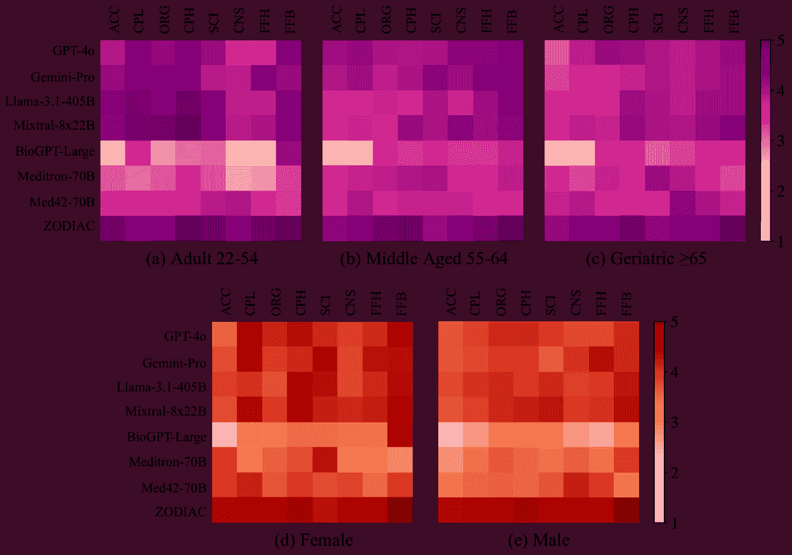

<!--yml

类别：未分类

日期：2025-01-11 12:11:46

-->

# Zodiac：一个心脏病学专家级LLM框架用于多代理诊断

> 来源：[https://arxiv.org/html/2410.02026/](https://arxiv.org/html/2410.02026/)

Yuan Zhou¹, Peng Zhang¹, Mengya Song ^(1,2), Alice Zheng ³, Yiwen Lu ⁴,

Zhiheng Liu⁵, Yong Chen⁴, Zhaohan Xi⁶

¹ZBeats Inc, ²纽约大学, ³石溪大学医学中心

⁴宾夕法尼亚大学, ⁵微软, ⁶宾汉姆顿大学

peng.zhang@zbeats.co, zxi1@binghamton.edu Zhaohan Xi (zxi1@binghamton.edu) 是通讯作者，隶属于宾汉姆顿大学。

###### 摘要

大型语言模型（LLMs）在医疗领域取得了显著进展。然而，LLMs在特定领域的临床实践中的专业性仍存在显著差距，这限制了它们在实际诊断中的应用。在这项工作中，我们介绍了Zodiac，一个由LLM驱动的框架，具备心脏病学专家级专业性，旨在将LLM应用于心脏病学诊断。Zodiac通过从患者数据中提取临床相关特征、检测显著的心律失常以及生成初步报告供心脏病学家审阅和完善来帮助心脏病学家。为了实现心脏病学专家级专业性，Zodiac建立在一个多代理协作框架之上，能够处理多种形式的患者数据。每个LLM代理都经过使用心脏病学家裁定的真实患者数据进行微调，从而增强模型的专业性。Zodiac经过严格的临床验证，由独立的心脏病学家进行评估，涉及八个衡量临床效果的指标，并解决了安全性问题。结果显示，Zodiac优于行业领先的模型，包括OpenAI的GPT-4o、Meta的Llama-3.1-405B和Google的Gemini-pro，以及医疗专业领域的LLM，如Microsoft的BioGPT。Zodiac展示了专业LLM在医疗领域的变革潜力，提供了满足医疗实践严格要求的领域特定解决方案。值得注意的是，Zodiac已成功集成到心电图（ECG）设备中，体现了将LLM嵌入医疗软件设备（SaMD）的日益增长趋势。

## 1 引言

随着技术不断革新医疗保健，人工智能（AI）已经成为医疗设备的关键组成部分，推动了数字健康在临床实践中的扩展（FDA，[2020](https://arxiv.org/html/2410.02026v1#bib.bib17)）。在最有前景的AI进展中，大型语言模型（LLM）正在为数字健康开辟新的可能性。凭借类人对话能力和庞大的预训练知识，LLM正被行业领袖日益采用作为临床支持工具，并逐步演变成专业化的临床代理（Boonstra等，[2024](https://arxiv.org/html/2410.02026v1#bib.bib4)；Gala & Makaryus，[2023](https://arxiv.org/html/2410.02026v1#bib.bib22)；Xu等，[2024](https://arxiv.org/html/2410.02026v1#bib.bib54)）。这一演变催生了像微软的BioGPT（Luo等，[2022](https://arxiv.org/html/2410.02026v1#bib.bib34)）、谷歌的Med-Gemini（Saab等，[2024](https://arxiv.org/html/2410.02026v1#bib.bib40)）和Med-PaLM（Tu等，[2024](https://arxiv.org/html/2410.02026v1#bib.bib48)）等工业产品，以及一系列基于Meta的Llama（Touvron等，[2023](https://arxiv.org/html/2410.02026v1#bib.bib47)）构建的开源医学专业LLM（Chen等，[2023a](https://arxiv.org/html/2410.02026v1#bib.bib8)；[2024b](https://arxiv.org/html/2410.02026v1#bib.bib7)；ContactDoctor，[2024](https://arxiv.org/html/2410.02026v1#bib.bib12)；Wang等，[2024c](https://arxiv.org/html/2410.02026v1#bib.bib52)）。

图1：Zodiac通过将先进的数据整合与复杂的技术设计相结合，达到了心脏病学专家级的专业水平。

尽管这些进展取得了一定成效，但将大语言模型（LLMs）融入现实世界的医疗实践仍处于初期阶段，在其专业性方面存在显著差距（Davenport & Kalakota, [2019](https://arxiv.org/html/2410.02026v1#bib.bib14); Asan et al., [2020](https://arxiv.org/html/2410.02026v1#bib.bib3); Weber et al., [2024](https://arxiv.org/html/2410.02026v1#bib.bib53); Quinn et al., [2022](https://arxiv.org/html/2410.02026v1#bib.bib37)）。弥合这些差距至关重要，特别是在将LLMs应用于受FDA医疗设备软件（SaMD）监管的医疗环境时（FDA, [2018](https://arxiv.org/html/2410.02026v1#bib.bib16)）。这些法规要求软件在作为临床助手时能够展现专家级的能力。然而，由于当前LLMs通常是通用设计的，缺乏与临床实践特定标准的对接，它们往往未能达到这一标准（Khan et al., [2023](https://arxiv.org/html/2410.02026v1#bib.bib31); Wang et al., [2021](https://arxiv.org/html/2410.02026v1#bib.bib49); Kerasidou et al., [2022](https://arxiv.org/html/2410.02026v1#bib.bib30)）。在SaMD的背景下，LLMs不需要具备通用能力，但必须能够以专业性和准确性执行专门任务，符合生命危急医疗环境中的预期标准（Kelly et al., [2019](https://arxiv.org/html/2410.02026v1#bib.bib29); Yan et al., [2023](https://arxiv.org/html/2410.02026v1#bib.bib55)）。实现这种对接至关重要，确保LLMs能够满足现实世界医疗部署的严格要求。

我们的工作。本研究旨在解决将LLMs与心脏病学领域SaMD实践对接的挑战，重点关注心电图（ECG）的临床发现和解读（Yanowitz, [2012](https://arxiv.org/html/2410.02026v1#bib.bib56)）。我们介绍了Zodiac，这是一种由LLM驱动的多代理框架，旨在实现心脏病专家级的专业性。Zodiac通过从患者数据中识别临床相关特征、检测重大心律失常，并生成初步报告供专家审阅和完善，来协助心脏病专家（详细信息见[3](https://arxiv.org/html/2410.02026v1#S3 "3 Problem Formulation from Cardiologist-Level Diagnostics ‣ Zodiac: A Cardiologist-Level LLM Framework for Multi-Agent Diagnostics")）。如图[1](https://arxiv.org/html/2410.02026v1#S1.F1 "Figure 1 ‣ 1 Introduction ‣ Zodiac: A Cardiologist-Level LLM Framework for Multi-Agent Diagnostics")所示，Zodiac结合了先进的数据集成和复杂的技术设计，以实现专业性能。具体来说：

I) 数据驱动的专业性：Zodiac 基于真实世界数据构建，包括（1）来自诊所的患者数据，（2）心脏病学家审定的文本，以及（3）临床指南。这确保了在两个关键方面的专业性：首先，Zodiac 捕捉了真实世界的心脏病学特征，如心律失常及其相关因素，而不是依赖于可能无法反映临床现实的基准或合成数据集。其次，心脏病学专家的直接参与确保了 Zodiac 被微调以匹配专家级别的表现，同时遵循临床指南可减少潜在的偏差或错误，从而提高诊断的准确性和安全性。

II) 技术驱动的专业性：Zodiac 的技术设计与心脏病学专家级的诊断实践相符。我们的流程是多代理的，利用多个大型语言模型（LLMs）分析多模态的患者数据，包括表格格式的临床指标和图像格式的心电图（ECG）波形。这种多代理框架代表了心脏病学家用于识别关键特征并解释临床上重要的心律失常发现的范式。此外，在微调和推理过程中，我们采用了心脏病学家审定的数据，通过指令调优和上下文学习将多模态的诊断专业性整合到系统中。指令调优将专业性嵌入到大型语言模型的参数中，而上下文学习则提供了专业示范，进一步加强了 Zodiac 的诊断能力。最后，我们结合了与既定心脏病学指南的事实核查，以确保系统生成准确、经专家验证的诊断结果。

临床验证。我们的实验旨在弥合心脏病学家与基于大型语言模型的系统之间，在识别大型语言模型专业性方面的差距。为此，我们进行了一系列临床验证，评估 Zodiac 的临床效果和安全性。我们采用了八个评估指标，并与心脏病学家合作，评估 Zodiac 在与领先的 LLM 系统相比的表现，包括 OpenAI 的 ChatGPT-4o、Google 的 Gemini-Pro、Meta 的 Llama-405B 以及像 Microsoft 的 BioGPT 和 Llama 系列这样的专业医学 LLM。通过心脏病学家对 Zodiac 在真实患者诊断中的应用的认可，我们强调了从医疗服务提供者角度看其实际效用。

蓝图与生命周期前景。Zodiac 已成功部署在亚马逊 AWS 上，并与临床环境集成，以协助心脏病学诊断（详情见 [4.4](https://arxiv.org/html/2410.02026v1#S4.SS4 "4.4 Towards In-Hospital Deployment ‣ 4 Design, Development, and Deployment of Zodiac ‣ Zodiac: A Cardiologist-Level LLM Framework for Multi-Agent Diagnostics")）。Zodiac 的设计、开发和部署为将专业级 LLM 代理引入临床级 SaMD 提供了一个全面的蓝图，涵盖了数据利用、专家级技术流程和临床验证。此外，我们在数据准备和临床验证过程中融合了人类专家（心脏病学家），确保了提议系统的专业性，并通过现实世界验证获得专家的认可与信任。这种方法有助于在负责任的 AI 开发中建立“人类参与”的生命周期（Food 等， [2021](https://arxiv.org/html/2410.02026v1#bib.bib20)）。

总结来说，本工作作出了以下贡献：

+   +   –

        我们介绍了 Zodiac，一种心脏病学级别的、多代理的患者特定诊断框架，代表了将 LLM 能力与专业软件作为医疗设备（SaMD）标准对接的重大进步。

    +   –

        我们提供了一个全面的蓝图，构建了 Zodiac，提供了一个可扩展的框架，可以指导不同临床领域中临床级 LLM 代理的开发。

    +   –

        通过严格的临床验证，我们展示了 Zodiac 的有效性，同时建立了一个模型，用于在人类监管下整合人工监督贯穿整个 AI 生命周期，这是推动负责任 AI 开发的关键。

## 2 相关工作

临床诊断中的 LLM。LLM 在处理和解释大量非结构化医学数据方面取得了显著进展，例如病人记录、医学文献和诊断报告。例如，Han 等人（[2024](https://arxiv.org/html/2410.02026v1#bib.bib24)）介绍了一种在患者与临床医生互动过程中自动总结临床笔记的系统，而 Ahsan 等人（[2023](https://arxiv.org/html/2410.02026v1#bib.bib2)）探讨了 LLM 在从电子健康记录（EHRs）中检索关键证据的作用。尽管取得了这些成功，但对于 LLM 在高风险、生命攸关的临床环境中的领域专长和专业表现仍然存在担忧（Nashwan & AbuJaber, [2023](https://arxiv.org/html/2410.02026v1#bib.bib35); Jahan 等人，[2024](https://arxiv.org/html/2410.02026v1#bib.bib27); Wang 等人，[2024a](https://arxiv.org/html/2410.02026v1#bib.bib50); Li 等人，[2024](https://arxiv.org/html/2410.02026v1#bib.bib33)）。本研究通过为心脏病学诊断专门设计和验证 Zodiac 来解决这些问题。

多智能体框架。多智能体框架已被广泛研究，用于增强大型语言模型（LLM）在处理复杂任务和管理分布式流程中的能力（Wang 等，[2024b](https://arxiv.org/html/2410.02026v1#bib.bib51)；Hong 等，[2023](https://arxiv.org/html/2410.02026v1#bib.bib26)；Du 等，[2023](https://arxiv.org/html/2410.02026v1#bib.bib15)；Chan 等，[2023](https://arxiv.org/html/2410.02026v1#bib.bib5)）。在医疗保健领域，不同专业之间的协作至关重要，多智能体框架在优化患者管理、协调各智能体之间的护理（例如医生、护士、行政系统）以及支持决策过程中显示出其潜力（Furmankiewicz 等，[2014](https://arxiv.org/html/2410.02026v1#bib.bib21)；Jemal 等，[2014](https://arxiv.org/html/2410.02026v1#bib.bib28)；Shakshuki & Reid，[2015](https://arxiv.org/html/2410.02026v1#bib.bib42)）。近期的研究也集中在利用多LLM智能体减少医疗工作流中的手动任务。例如，Chen 等人（[2024a](https://arxiv.org/html/2410.02026v1#bib.bib6)）在一个协调的工作流中运用了ChatGPT于不同角色，自动化执行如数据库挖掘和药物重定位等任务，同时通过基于角色的协作确保质量控制。

心血管诊断系统。目前的心血管诊断系统主要依赖基于规则的算法或单一智能体方法来识别心血管风险因素或预测心脏事件（Goff Jr 等，[2014](https://arxiv.org/html/2410.02026v1#bib.bib23)；Sud 等，[2022](https://arxiv.org/html/2410.02026v1#bib.bib44)；Olesen 等，[2012](https://arxiv.org/html/2410.02026v1#bib.bib36)）。近年来，深度学习模型已被引入心脏病学领域（Hannun 等，[2019](https://arxiv.org/html/2410.02026v1#bib.bib25)；Acharya 等，[2019](https://arxiv.org/html/2410.02026v1#bib.bib1)）。然而，将近期的大型语言模型（LLMs）纳入心血管诊断仍存在显著差距——这一差距是本文要重点解决的。

## 3 来自心脏病学诊断专家的问提提出

本节概述了Zodiac如何与心脏病学诊断相对接。第[3.1](https://arxiv.org/html/2410.02026v1#S3.SS1 "3.1 The Diagnostic Task and Its Key Components ‣ 3 Problem Formulation from Cardiologist-Level Diagnostics ‣ Zodiac: A Cardiologist-Level LLM Framework for Multi-Agent Diagnostics")节定义了心脏病学诊断的任务及其关键组件。第[3.2](https://arxiv.org/html/2410.02026v1#S3.SS2 "3.2 Cardiological Diagnostics with Multimodal Data ‣ 3 Problem Formulation from Cardiologist-Level Diagnostics ‣ Zodiac: A Cardiologist-Level LLM Framework for Multi-Agent Diagnostics")节介绍了在实际诊断中使用的多模态数据。最后，在第[3.3](https://arxiv.org/html/2410.02026v1#S3.SS3 "3.3 Problem Formulation in Zodiac ‣ 3 Problem Formulation from Cardiologist-Level Diagnostics ‣ Zodiac: A Cardiologist-Level LLM Framework for Multi-Agent Diagnostics")节，我们从LLM的角度，利用多智能体框架对任务进行形式化。

图2：Zodiac通过多智能体框架与心脏病学实践对接，该框架整合了来自不同模态的患者数据：➀ 患者数据通过两种模态收集：表格化的指标和心电图（ECG）图像。➁ 一个从指标到发现的LLM智能体处理表格化的指标并生成基于文本的临床发现。➂ 一个从心电图到发现的LLM智能体分析心电图图像，产生额外的基于文本的临床发现。➃ 两个智能体的临床发现随后被合并。➄ 一个从发现到解释的LLM智能体将这些发现与临床指南综合，生成全面的诊断解释。➅ Zodiac通过整合指标、心电图、临床发现和诊断解释生成患者特定的报告。➆ 一位心脏病专家验证生成的发现和解释的质量（详细信息见[5](https://arxiv.org/html/2410.02026v1#S5 "5 Experimental Results ‣ Zodiac: A Cardiologist-Level LLM Framework for Multi-Agent Diagnostics")）。为简便起见，我们在此图中省略了生物统计学（$\mathcal{B}$），默认在步骤➀➁➂中已考虑。

### 3.1 诊断任务及其关键组件

本文的重点是使用患者数据检测临床显著的心律失常。我们将关键组件分为两大类：患者数据和诊断输出。

患者数据由三个部分组成：（1）生物统计信息（$\mathcal{B}$）提供关于患者的背景信息，如出生日期、性别和年龄组。（2）度量（$\mathcal{M}$）总结了心脏病学属性及其对应的数值，以表格形式呈现，提供患者24小时监测统计的概览。例如，AF负担：12%表示患者在整个监测期间有12%的时间发生房颤。（3）图像（$\mathcal{T}$）包括展示临床相关心律失常的ECG图像，如房颤/扑动（AFib/Flutter）、停顿、室性心动过速（VT）、阵发性室上性心动过速（SVT）和房室传导阻滞（AV Block）。$\mathcal{T}$呈现一个简洁但具有代表性的24小时监测片段，如突出显示房室传导阻滞最严重程度的10秒钟条形图。

诊断输出由两个元素组成：临床发现（$\mathcal{F}$）和解读（$\mathcal{I}$），这两者都是由心脏病专家以自然语言语句呈现的。$\mathcal{F}$概述了直接来自临床相关特征的关键观察结果，而$\mathcal{I}$则提供最终的诊断，解释这些发现。例如，ECG图中的发现“PR间期为210毫秒”得出的解读是：PR间期略长，提示一度房室传导阻滞。

一旦心脏病专家（或Zodiac）完成$\mathcal{F}$和$\mathcal{I}$，便会为患者生成临床研究结束报告，包括$(\mathcal{B},\mathcal{M},\mathcal{T},\mathcal{F},\mathcal{I})$，如图[2](https://arxiv.org/html/2410.02026v1#S3.F2 "Figure 2 ‣ 3 Problem Formulation from Cardiologist-Level Diagnostics ‣ Zodiac: A Cardiologist-Level LLM Framework for Multi-Agent Diagnostics")右侧所示。

### 3.2 使用多模态数据进行心脏病学诊断

心脏病学诊断遵循一个流程：$(\mathcal{B},\mathcal{M},\mathcal{T})\rightarrow\mathcal{F}\rightarrow\mathcal{I}$。此外，最终的解读由临床指南指导，记作$\mathcal{G}$，这些指南是基于共识的建议，旨在支持医疗提供者做出基于证据的决策（详见[D](https://arxiv.org/html/2410.02026v1#A4 "Appendix D Fact Checking Using Clinical Guideline ‣ Zodiac: A Cardiologist-Level LLM Framework for Multi-Agent Diagnostics")）。

一名心脏病专家首先回顾患者的数据$(\mathcal{B},\mathcal{M},\mathcal{T})$，以识别临床相关特征，如PR间期，这对于诊断心律失常至关重要。这些识别出的特征随后被总结为自然语言表述，称为发现$\mathcal{F}$，它整合了来自表格指标$\mathcal{M}$和基于图像的心电图（ECG）曲线$\mathcal{T}$的见解。例如，PR间期来自$\mathcal{T}$，而房颤负担（AF burden）则来自$\mathcal{M}$。最后，心脏病专家结合临床经验和已建立的指南$\mathcal{G}$，将发现$\mathcal{F}$综合，形成最终的解释$\mathcal{I}$。

### 3.3 Zodiac中的问题表述

如图[2](https://arxiv.org/html/2410.02026v1#S3.F2 "Figure 2 ‣ 3 Problem Formulation from Cardiologist-Level Diagnostics ‣ Zodiac: A Cardiologist-Level LLM Framework for Multi-Agent Diagnostics")所示，Zodiac通过多代理协作表示诊断过程。每个LLM代理负责诊断工作流中的特定阶段，从而增强系统识别跨多种模式的混合特征的能力。Zodiac由三个代理组成：

+   +   1.

        表格-到-发现代理（Metrics-to-Findings Agent，$\theta_{\texttt{M2F}}$）：一种基于表格到文本的大型语言模型（LLM），从表格指标（$\mathcal{M}$）中提取关键特征，同时结合来自$\mathcal{B}$的患者生物统计数据，生成临床发现。

    +   2.

        心电图-到-发现代理（Tracings-to-Findings Agent，$\theta_{\texttt{T2F}}$）：一种基于图像到文本的大型语言模型（LLM），能够从心电图曲线（$\mathcal{T}$）中识别关键因素，整合来自$\mathcal{B}$的相关信息，并生成临床发现。

    +   3.

        发现-到-解释代理（Findings-to-Interpretation Agent，$\theta_{\texttt{F2I}}$）：一种基于文本的大型语言模型（LLM），能够从$\theta_{\texttt{M2F}}$和$\theta_{\texttt{T2F}}$生成的发现$\mathcal{F}$中综合信息，应用来自$\mathcal{G}$的临床指南，并生成解释（$\mathcal{I}$）。

从形式上讲，Zodiac的过程可以表述为：

|  | $\displaystyle\begin{split}\mathcal{I}\leftarrow\theta_{\texttt{F2I}}(\mathcal{% F},\mathcal{G})\,\,\,\,&s.t.\,\,\,\,\mathcal{F}\leftarrow\theta_{\texttt{M2F}}% (\mathcal{M},\mathcal{B})\cup\theta_{\texttt{T2F}}(\mathcal{T},\mathcal{B})% \end{split}$ |  | (1) |
| --- | --- | --- | --- |

在此过程中，$\theta_{\texttt{M2F}}$和$\theta_{\texttt{T2F}}$分别基于$\mathcal{M}$和$\mathcal{T}$独立生成临床发现，之后将其结合形成$\mathcal{F}$。这种方法遵循心脏病学诊断的原则，因为$\mathcal{F}$中的每一项发现都对应于从特定模态——无论是指标还是心电图曲线中——提取的证据。

## 4 Zodiac的设计、开发与部署

本节详细介绍了Zodiac如何实现心脏病专家级别的专业知识，并且符合《软件即医疗设备》（SaMD）法规。我们首先讨论了真实世界数据收集的过程以及融入专业性的内容策划，详见[4.1节](https://arxiv.org/html/2410.02026v1#S4.SS1 "4.1 Data Collection and Professionalism-Incorporated Curation ‣ 4 Design, Development, and Deployment of Zodiac ‣ Zodiac: A Cardiologist-Level LLM Framework for Multi-Agent Diagnostics")。接着，我们介绍了[4.2节](https://arxiv.org/html/2410.02026v1#S4.SS2 "4.2 Instruction Fine-Tuning ‣ 4 Design, Development, and Deployment of Zodiac ‣ Zodiac: A Cardiologist-Level LLM Framework for Multi-Agent Diagnostics")中的指令微调，其中策划的数据被用于赋予LLM代理领域特定的专业知识。在推理阶段，如[4.3节](https://arxiv.org/html/2410.02026v1#S4.SS3 "4.3 Inference with In-Context Learning and Fact-Checking ‣ 4 Design, Development, and Deployment of Zodiac ‣ Zodiac: A Cardiologist-Level LLM Framework for Multi-Agent Diagnostics")所述，我们利用上下文学习和事实核查来通过协作的多代理交互增强诊断专业性。最后，我们在[4.4节](https://arxiv.org/html/2410.02026v1#S4.SS4 "4.4 Towards In-Hospital Deployment ‣ 4 Design, Development, and Deployment of Zodiac ‣ Zodiac: A Cardiologist-Level LLM Framework for Multi-Agent Diagnostics")中展示了我们关于符合SaMD规定的部署方法。

### 4.1 数据收集与专业性融入的策划

我们的数据具有真实、具有代表性以及融入了专业性的特点。

真实世界患者数据。我们并没有依赖第三方或合成数据的公共基准，这些数据常常引发关于可信度或与特定临床应用不一致的担忧（Chouffani El Fassi et al., [2024](https://arxiv.org/html/2410.02026v1#bib.bib10); Fehr et al., [2024](https://arxiv.org/html/2410.02026v1#bib.bib19); Youssef et al., [2024](https://arxiv.org/html/2410.02026v1#bib.bib57)）——我们使用了来自合作医疗机构的ECG数据¹¹1为了匿名性，我们暂时隐去合作机构的名称，具体信息将在本文发布后披露。数据是在IRB批准的协议下采集的，并去除了患者标识符以确保隐私保护。原始数据收集包含表格化的指标（$\mathcal{M}$）和ECG波形（$\mathcal{T}$），如图[2](https://arxiv.org/html/2410.02026v1#S3.F2 "图 2 ‣ 3 心脏病学家级诊断问题的表述 ‣ Zodiac: 一种心脏病学家级别的LLM框架，用于多代理诊断")左侧所示。为了确保临床相关性，我们邀请了五位独立的心脏病学家审阅数据，最终形成了一个包含2000多名患者的数据集。其中，5%用于临床验证（第[5](https://arxiv.org/html/2410.02026v1#S5 "5 实验结果 ‣ Zodiac: 一种心脏病学家级别的LLM框架，用于多代理诊断")节），其余数据用于微调（第[4.2](https://arxiv.org/html/2410.02026v1#S4.SS2 "4.2 指令微调 ‣ 4 Zodiac的设计、开发与部署 ‣ Zodiac: 一种心脏病学家级别的LLM框架，用于多代理诊断")节）。

代表性群体。根据FDA的指南（Food et al., [2021](https://arxiv.org/html/2410.02026v1#bib.bib20)），包括代表性数据至关重要，而不仅仅是大量积累数据。我们的数据集涵盖了全面的心律失常类型，并确保在年龄和性别方面的平衡表示，具体细节请见图[3](https://arxiv.org/html/2410.02026v1#S4.F3 "图 3 ‣ 4.1 数据收集和专业整合策划 ‣ 4 Zodiac的设计、开发与部署 ‣ Zodiac: 一种心脏病学家级别的LLM框架，用于多代理诊断")-(d)。

融入心脏病学专家级专业性。在审阅原始数据时，要求心脏病学专家根据既定的临床指南（$\mathcal{G}$）撰写专业发现（$\mathcal{F}$）和解读（$\mathcal{I}$）。这一过程有助于微调LLM，将心脏病学专家级的推理、基于证据的陈述和结构化格式嵌入到模型中。为了优化心脏病学专家的时间，医学研究助理首先起草$\mathcal{F}$和$\mathcal{I}$，然后由心脏病学专家进行审阅并独立裁定。此外，每位心脏病学专家随机审核至少50%同行的草稿，以解决诸如不完整性、不一致性或诊断不准确等问题。此同行评审过程不仅提高了数据质量，还确保了发现和解读的标准化，具有专业的准确性。

图 3：（a）-（c）展示了用于$\theta_{\texttt{M2F}}$的提示（$\theta_{\texttt{T2F}}$和$\theta_{\texttt{F2I}}$的提示见图[9](https://arxiv.org/html/2410.02026v1#A2.F9 "图 9 ‣ 附录 B 额外提示 ‣ Zodiac: 一种心脏病学级别的多代理诊断框架")）：（a）表示用于微调和推理的指令（或“系统提示”）；（b）包括用于推理时上下文学习的示范；（c）显示了输入和响应结构。在微调过程中，（c）填充了由心脏病学专家裁定的文本，而在推理过程中，（c）保持上述格式来指定响应格式。（d）展示了我们收集的患者数据统计，进一步按性别、年龄和心律失常类别进行子分组——类别 I：正常心律失常。类别 II：临床显著心律失常。类别 III：危及生命的心律失常。详细的临床含义请参见附录[C](https://arxiv.org/html/2410.02026v1#A3 "附录 C 心律失常类别详情 ‣ Zodiac: 一种心脏病学级别的多代理诊断框架")。

### 4.2 指令微调

利用心脏病学家判定的数据，我们应用指令微调将心脏病学家的专业水平注入到代理模型$\theta_{\texttt{M2F}}$、$\theta_{\texttt{T2F}}$和$\theta_{\texttt{F2I}}$中。对于$\theta_{\texttt{M2F}}$，我们选择了Llama-3.1-8B作为基础模型，对于$\theta_{\texttt{T2F}}$，选择了LLaVA-v1.5-13B，而对于$\theta_{\texttt{F2I}}$，选择了另一款Llama-3.1-8B。每个基础模型都被单独微调，针对其特定任务使用相关的心脏病学家判定数据。例如，如图 [3](https://arxiv.org/html/2410.02026v1#S4.F3 "图3 ‣ 4.1 数据收集与专业性整合策划 ‣ 4. 设计、开发与部署Zodiac ‣ Zodiac：一个多代理诊断的心脏病学家级LLM框架")-(a)(c)所示，我们通过利用来自(a)的系统提示和(c)中展示的心脏病学家判定文本来微调$\theta_{\texttt{M2F}}$，这些文本与$\theta_{\texttt{M2F}}$处理的指标到发现的任务一致。设$\theta_{\texttt{Agent}}$表示任何LLM代理的可训练参数，$X$和$Y$分别代表一个患者的指令输入和相应的LLM响应。给定心脏病学家判定的数据$\mathcal{D}$，微调过程可以表达为：

|  | $\displaystyle\theta^{*}_{\texttt{Agent}}=\arg\min_{\theta_{\texttt{Agent}}}% \mathbb{E}_{(X,Y)\in\mathcal{D}}\mathcal{L}(\theta_{\texttt{Agent}}(X),Y)$ |  | (2) |
| --- | --- | --- | --- |

方程 [2](https://arxiv.org/html/2410.02026v1#S4.E2 "在4.2节《指令微调 ‣ 4. 设计、开发与部署Zodiac ‣ Zodiac：一个多代理诊断的心脏病学家级LLM框架") 中的目标是通过$\mathbb{E}(\mathcal{L}(\cdot,\cdot))$最小化每对$(X,Y)$在$\mathcal{D}$内的加权损失平均值。具体来说，当$\theta_{\texttt{Agent}}$为$\theta_{\texttt{M2F}}$时，$X=(\mathcal{M},\mathcal{B})$，$Y=\mathcal{F}$；对于$\theta_{\texttt{T2F}}$，$X=(\mathcal{T},\mathcal{B})$，$Y=\mathcal{F}$；最后，对于$\theta_{\texttt{F2I}}$，$X=(\mathcal{F},\mathcal{G})$，$Y=\mathcal{I}$。

### 4.3 通过上下文学习和事实检查进行推理

如[3.3节](https://arxiv.org/html/2410.02026v1#S3.SS3 "3.3 Problem Formulation in Zodiac ‣ 3 Problem Formulation from Cardiologist-Level Diagnostics ‣ Zodiac: A Cardiologist-Level LLM Framework for Multi-Agent Diagnostics")中所述，Zodiac的推理过程采用了多代理方法，使用经过训练的代理$\theta_{\texttt{M2F}}$、$\theta_{\texttt{T2F}}$和$\theta_{\texttt{F2I}}$。首先，$\theta_{\texttt{M2F}}$处理患者的指标（$\mathcal{M}$），$\theta_{\texttt{T2F}}$处理ECG心电图（$\mathcal{T}$），共同生成发现（$\mathcal{F}$）。这些发现随后由$\theta_{\texttt{F2I}}$解释为诊断结果（$\mathcal{I}$）。每个代理通过上下文学习来提高诊断准确性，最后一步通过事实检查进行自我校正。

上下文学习。对于每个微调后的LLM代理，我们使用一组示例（或“演示”），这些示例包含由心脏病专家判定的发现和解释。每个示例的内容根据特定的LLM代理量身定制。例如，$\theta_{\texttt{M2F}}$的演示包括心脏病专家判定的发现，如图[3](https://arxiv.org/html/2410.02026v1#S4.F3 "Figure 3 ‣ 4.1 Data Collection and Professionalism-Incorporated Curation ‣ 4 Design, Development, and Deployment of Zodiac ‣ Zodiac: A Cardiologist-Level LLM Framework for Multi-Agent Diagnostics")-(b)所示。为了确保每个演示与目标患者的案例相关，我们根据患者的性别、年龄组和心律失常类别对数据进行分类，遵循图[3](https://arxiv.org/html/2410.02026v1#S4.F3 "Figure 3 ‣ 4.1 Data Collection and Professionalism-Incorporated Curation ‣ 4 Design, Development, and Deployment of Zodiac ‣ Zodiac: A Cardiologist-Level LLM Framework for Multi-Agent Diagnostics")-(d)中展示的子分组方式。然后，我们选择三个与患者性别、年龄组和心律失常类别匹配的演示。在推理过程中，输入提示是图[3](https://arxiv.org/html/2410.02026v1#S4.F3 "Figure 3 ‣ 4.1 Data Collection and Professionalism-Incorporated Curation ‣ 4 Design, Development, and Deployment of Zodiac ‣ Zodiac: A Cardiologist-Level LLM Framework for Multi-Agent Diagnostics")-(a)(b)(c)中展示内容的组合。

事实核查。事实核查发生在 $\theta_{\texttt{F2I}}$ 生成最终解读（$\mathcal{I}$）之后。Zodiac 应用心脏病学指南（$\mathcal{G}$）来验证结果（$\mathcal{F}$）是否正确地引导到与 $\mathcal{G}$ 一致的解读（$\mathcal{I}$）。由于 $\mathcal{F}$ 和 $\mathcal{I}$ 是列举的清单，因此可以独立地匹配每个项目。如果基于 $\mathcal{G}$ 发现差异，Zodiac 会自动提示相应的代理重新生成 $\mathcal{F}$ 或 $\mathcal{I}$ 中的特定项目，使用从 $\mathcal{G}$ 派生的指令。由于篇幅限制，$\mathcal{G}$ 和事实核查过程的示例提供在附录 [D](https://arxiv.org/html/2410.02026v1#A4 "Appendix D Fact Checking Using Clinical Guideline ‣ Zodiac: A Cardiologist-Level LLM Framework for Multi-Agent Diagnostics")。

### 4.4 向医院部署迈进

图 4：Zodiac 通过 AWS 部署辅助心脏病学家的工作流程。

根据 SaMD（FDA，[2018](https://arxiv.org/html/2410.02026v1#bib.bib16)），Zodiac 代表了在当前标准临床工作流程中构建专业 LLM 的一个重要里程碑。它已在 Amazon AWS 上部署作为后端，并连接到医院前端，帮助心脏病学家提供初步报告。如图 [4](https://arxiv.org/html/2410.02026v1#S4.F4 "Figure 4 ‣ 4.4 Towards In-Hospital Deployment ‣ 4 Design, Development, and Deployment of Zodiac ‣ Zodiac: A Cardiologist-Level LLM Framework for Multi-Agent Diagnostics") 所示，心脏病学家或其助手可以上传患者数据，包括来自可穿戴贴片（Steinhubl 等，[2018](https://arxiv.org/html/2410.02026v1#bib.bib43)）或 Holter 监测仪（Kim 等，[2009](https://arxiv.org/html/2410.02026v1#bib.bib32)）的监测指标和心电图数据。这些数据通过 AWS API Gateway 路由，触发 AWS Lambda 调用 SageMaker，在其中托管 Zodiac。在 AWS SageMaker 上，Zodiac 根据数据生成初步报告，包括结果和解读，并进行事实核查，以确保报告的准确性，最终完成报告。这些报告随后返回给心脏病学家，他们可以将其作为基础来最终确认诊断，从而提高工作流程效率和诊断准确性。

## 5 实验结果

### 5.1 临床验证设置

我们的实验设计旨在与现实世界临床验证保持一致，设置如下：

评价指标：如表[1](https://arxiv.org/html/2410.02026v1#S5.T1 "Table 1 ‣ 5.1 Clinical Validation Setting ‣ 5 Experimental Results ‣ Zodiac: A Cardiologist-Level LLM Framework for Multi-Agent Diagnostics")所示，我们考虑了临床验证中常用的八个评价指标（Tierney等人，[2024](https://arxiv.org/html/2410.02026v1#bib.bib46); Sallam等人，[2024](https://arxiv.org/html/2410.02026v1#bib.bib41)）。指标(a)-(e)从临床角度评估生成输出的质量，而指标(f)-(h)则关注潜在的安全问题。每个指标的评分范围为1到5，反映了与理想临床标准的对齐程度。

人工验证：在验证过程中引入专家对于提高先进技术的可信度和接受度至关重要（Tierney等人，[2024](https://arxiv.org/html/2410.02026v1#bib.bib46); Sallam等人，[2024](https://arxiv.org/html/2410.02026v1#bib.bib41)）。为此，我们邀请了心脏病专家使用上述八个指标来评估Zodiac。为了简化评估流程，我们制定了一个结构化问卷，首先收集患者数据，然后是生成的结果和解读，最后提供评分选项（1-5）。值得注意的是，我们对LLM的名称进行了匿名处理，以确保评估的公平性，防止心脏病专家根据对特定模型的熟悉程度或声誉，特别是Zodiac，给予偏见评分。

数据集：我们并未使用公开基准，而是采用真实患者数据，以便与实际诊断对接。如[4.1](https://arxiv.org/html/2410.02026v1#S4.SS1 "4.1 Data Collection and Professionalism-Incorporated Curation ‣ 4 Design, Development, and Deployment of Zodiac ‣ Zodiac: A Cardiologist-Level LLM Framework for Multi-Agent Diagnostics")节所述，我们从数据集中抽取5%的样本来验证Zodiac，其余样本则用于模型的指令调优。这些样本涵盖了与图[3](https://arxiv.org/html/2410.02026v1#S4.F3 "Figure 3 ‣ 4.1 Data Collection and Professionalism-Incorporated Curation ‣ 4 Design, Development, and Deployment of Zodiac ‣ Zodiac: A Cardiologist-Level LLM Framework for Multi-Agent Diagnostics")-(d)一致的完整子群体，我们将在[5.3](https://arxiv.org/html/2410.02026v1#S5.SS3 "5.3 Evaluating Diagnostic Consistency via Subgroup Analysis ‣ 5 Experimental Results ‣ Zodiac: A Cardiologist-Level LLM Framework for Multi-Agent Diagnostics")节中讨论这些内容。

基准：我们比较了三类大语言模型（LLM）：(1) 行业领先的LLM：GPT-4o，Gemini-Pro，Llama-3.1-405B，以及Mixtral-8x22B。(2) 临床专家级LLM：BioGPT-Large（Luo等，[2022](https://arxiv.org/html/2410.02026v1#bib.bib34)），Meditron-70B（Chen等，[2023b](https://arxiv.org/html/2410.02026v1#bib.bib9)）基于Llama-2，和Med42-70B（Christophe等，[2024](https://arxiv.org/html/2410.02026v1#bib.bib11)）基于Llama-3。(3) 剔除实验，包括单一代理Zodiac，详细信息见[5.4节](https://arxiv.org/html/2410.02026v1#S5.SS4 "5.4 摘除研究与Zodiac的诊断特性 ‣ 5 实验结果 ‣ Zodiac：一个心脏病专家级LLM框架用于多代理诊断")。

与基准的公平比较：对于基于文本的基准（如Llama-3.1-405B），我们使用了与我们的图像到文本代理相同的视觉文本大语言模型LLaVA-v1.5-13B。此外，推理时的提示与图[3](https://arxiv.org/html/2410.02026v1#S4.F3 "图3 ‣ 4.1 数据收集与专业性融入的策划 ‣ 4 Zodiac的设计、开发与部署 ‣ Zodiac：一个心脏病专家级LLM框架用于多代理诊断")中所示的相同，并提供了一个演示以建立基本任务理解的基准。

表1：评估指标及其相应领域、缩写和理想情况的描述。每个指标的评分范围为1到5，其中：1 — 完全不符合；2 — 低于可接受；3 — 可接受；4 — 高于可接受；5 — 优秀。

| 领域 | 评估指标 | 理想陈述（发现与解释）是 |
| --- | --- | --- |
| 临床 | a) 准确性 (ACC) | 统计上正确，与患者数据一致。 |
| b) 完整性 (CPL) | 包含在诊断过程中使用的完整项。 |
| c) 组织性 (ORG) | 结构良好，更容易定位临床证据。 |
| d) 可理解性 (CPH) | 更容易理解且无歧义。 |
| e) 简洁性 (SCI) | 简明扼要，不冗余。 |
| 安全性 | f) 一致性 (CNS) | 相互支持，且不与其他部分相矛盾。 |
| g) 无幻觉 (FFH) | 仅包含可通过指南验证的信息。 |
| h) 无偏见 (FFB) | 不仅仅源自患者的特征。 |

### 5.2 与其他大语言模型产品的诊断性能比较

表2：不同指标下的LLM诊断性能。每个单元格展示了所有心脏病专家对所有患者数据的评分“均值（$\pm$标准差）”。我们用粗体字表示最佳评分。

| 模型 | 临床领域指标 | 安全领域指标 |
| --- | --- | --- |
| ACC | CPL | ORG | CPH | SCI | CNS | FFH | FFB |
| --- | --- | --- | --- | --- | --- | --- | --- |
| GPT-4o | 3.6 (1.0) | 4.2 (1.0) | 4.1 (0.7) | 4.2 (0.9) | 4.0 (1.1) | 3.8 (1.1) | 3.9 (1.0) | 4.3 (1.0) |
| Gemini-Pro | 3.7 (1.1) | 4.1 (1.1) | 3.9 (1.0) | 4.0 (1.1) | 4.0 (1.1) | 3.9 (1.1) | 4.3 (1.0) | 4.2 (1.2) |
| Llama-3.1-405B | 3.8 (1.2) | 4.0 (1.0) | 3.9 (1.0) | 4.2 (1.0) | 4.2 (1.2) | 3.8 (1.0) | 4.0 (1.0) | 4.3 (1.0) |
| Mixtral-8x22B | 3.7 (1.1) | 4.1 (1.1) | 4.0 (1.0) | 4.4 (0.9) | 4.2 (0.9) | 4.0 (1.0) | 4.1 (1.0) | 4.4 (0.8) |
| BioGPT-Large | 2.2 (0.4) | 2.8 (0.6) | 3.2 (0.8) | 3.3 (0.7) | 3.2 (0.6) | 3.0 (0.8) | 2.9 (0.7) | 3.8 (0.6) |
| Meditron-70B | 3.3 (1.1) | 3.3 (1.2) | 3.6 (1.1) | 3.6 (1.3) | 3.8 (1.1) | 3.4 (1.2) | 3.3 (1.3) | 3.4 (1.3) |
| Med42-70B | 3.6 (0.9) | 3.8 (0.9) | 3.6 (0.9) | 3.7 (1.1) | 3.7 (1.1) | 4.0 (0.8) | 3.7 (1.0) | 3.6 (1.1) |
| Zodiac | 4.4 (0.4) | 4.5 (0.7) | 4.7 (0.4) | 4.9 (0.2) | 4.4 (0.6) | 4.5 (0.2) | 4.8 (0.3) | 5.0 (0.0) |

表 [2](https://arxiv.org/html/2410.02026v1#S5.T2 "Table 2 ‣ 5.2 Diagnostic Performance Comparison with Other LLM Products ‣ 5 Experimental Results ‣ Zodiac: A Cardiologist-Level LLM Framework for Multi-Agent Diagnostics") 中的综合评估凸显了Zodiac的卓越能力。Zodiac的参数不到30B（如[4.2](https://arxiv.org/html/2410.02026v1#S4.SS2 "4.2 Instruction Fine-Tuning ‣ 4 Design, Development, and Deployment of Zodiac ‣ Zodiac: A Cardiologist-Level LLM Framework for Multi-Agent Diagnostics")节所述），它在临床专业性（例如，4.9 CPH）和安全保障（例如，5.0 FFB）方面优于更大的模型，如Llama-3.1-405B，以及先进的工业产品，如GPT-4o和Gemini-Pro。此外，Zodiac表现出更稳定的性能，其标准偏差较低（例如，$\pm$0.0 FFB）。这强调了通过精细的技术策略（如指令微调和上下文学习）来提升诊断专业性的重要性，而不是仅仅依赖于提示通用模型。

有趣的是，医学专业的LLM表现比通用LLM更差。尽管BioGPT-Large（15亿参数）的规模较小，这限制了其诊断能力，但一个更关键的问题是，用于微调像Meditron-70B这样的模型的数据，似乎与现实世界的临床实践不一致。即使在上下文学习演示的帮助下，这些专业LLM仍然难以满足临床任务的特定要求和安全需求。

案例研究。图 [5](https://arxiv.org/html/2410.02026v1#S5.F5 "图 5 ‣ 5.3 通过亚组分析评估诊断一致性 ‣ 5 实验结果 ‣ Zodiac: 一种心脏病学家级LLM框架用于多智能体诊断") 展示了一个 Zodiac 生成的解读示例。与其他生成结果相比（见图 [11](https://arxiv.org/html/2410.02026v1#A5.F11 "图 11 ‣ 附录E 补充实验结果 ‣ Zodiac: 一种心脏病学家级LLM框架用于多智能体诊断") 和 [13](https://arxiv.org/html/2410.02026v1#A5.F13 "图 13 ‣ 附录E 补充实验结果 ‣ Zodiac: 一种心脏病学家级LLM框架用于多智能体诊断")），Zodiac 生成的陈述准确简洁，输出结构清晰，便于心脏病学家跟随。相比之下，其他 LLMs 经常生成冗余的陈述（例如，图 [11](https://arxiv.org/html/2410.02026v1#A5.F11 "图 11 ‣ 附录E 补充实验结果 ‣ Zodiac: 一种心脏病学家级LLM框架用于多智能体诊断") 中的 GPT-4o 和图 [12](https://arxiv.org/html/2410.02026v1#A5.F12 "图 12 ‣ 附录E 补充实验结果 ‣ Zodiac: 一种心脏病学家级LLM框架用于多智能体诊断") 中的 Gemini-Pro），诊断不准确（例如，图 [13](https://arxiv.org/html/2410.02026v1#A5.F13 "图 13 ‣ 附录E 补充实验结果 ‣ Zodiac: 一种心脏病学家级LLM框架用于多智能体诊断") 中的 Llama-3.1-405B），和/或结构混乱（例如，GPT-4o 和 Gemini-Pro），使得它们对心脏病学家的有效使用更具挑战性。

### 5.3 通过亚组分析评估诊断一致性

图 5: 一个由 Zodiac 生成的解读示例。

图 6: (a)-(c) 基于心律失常类别的亚组分析，单元格颜色的深浅表示评分值（1-5）。(d) 消融基线。

亚组分析在临床验证中非常重要，用于评估一个模型是否在不同人群中表现出一致的有效性（Cook 等人，[2004](https://arxiv.org/html/2410.02026v1#bib.bib13)；Rothwell，[2005](https://arxiv.org/html/2410.02026v1#bib.bib39)；Sun 等人，[2014](https://arxiv.org/html/2410.02026v1#bib.bib45)）。由于我们的数据集包括了多种类型的心律失常、不同的年龄组和性别，因此我们在这些亚组内进行评估。图[6](https://arxiv.org/html/2410.02026v1#S5.F6 "图 6 ‣ 5.3 通过亚组分析评估诊断一致性 ‣ 5 实验结果 ‣ Zodiac：一款心脏病专家级LLM框架用于多智能体诊断")-(a)(b)(c)展示了按心律失常类别划分的结果，同时在图[14](https://arxiv.org/html/2410.02026v1#A5.F14 "图 14 ‣ 附录E补充实验结果 ‣ Zodiac：一款心脏病专家级LLM框架用于多智能体诊断")中展示了按年龄和性别的进一步细分结果。

可以观察到，一些工业产品在心律失常的诊断中表现出明显的偏差。例如，GPT-4o在诊断危及生命的心律失常时，表现出较低的准确率（ACC）和完整度（CPL），而Gemini-Pro在正常病例中则显示出更多的幻觉（较低的FFH），这表明它们的预训练知识存在不平衡。相比之下，Zodiac在所有心律失常组中都能保持一致的表现，凸显了通过融入多样且具有代表性的患者案例来推动数据驱动的专业性的重要性，正如图[3](https://arxiv.org/html/2410.02026v1#S4.F3 "图 3 ‣ 4.1 数据收集与专业性融合策划 ‣ 4 Zodiac的设计、开发与部署 ‣ Zodiac：一款心脏病专家级LLM框架用于多智能体诊断")-(d)所示。

### 5.4 去除研究和Zodiac的诊断特性

去除研究。我们评估了从Zodiac中去除关键组件对其性能的影响。图[6](https://arxiv.org/html/2410.02026v1#S5.F6 "图 6 ‣ 5.3 通过亚组分析评估诊断一致性 ‣ 5 实验结果 ‣ Zodiac：一款心脏病专家级LLM框架用于多智能体诊断")-(d)将Zodiac与三种基准进行了比较：没有微调、没有上下文学习和没有事实核查。值得注意的是，微调对所有指标的诊断性能影响最大，其次是上下文学习，显示了通过微调将领域专业知识永久嵌入LLM参数中的重要性。没有微调时，上下文学习仍然可以引导模型朝着熟练方向发展，但改进的幅度更有限。我们还注意到，添加事实核查能够提高与安全相关的表现（例如，FFH、FFB），这突出了将临床指南整合进安全且负责任的诊断中的必要性。

单一代理表现。我们评估了Zodiac的单一代理变体。为了确保规模相当，我们使用与$\theta_{\texttt{T2F}}$相同的基于视觉的LLM——LLaVA，但其参数为34B（相比之下，$\theta_{\texttt{T2F}}$为13B），并应用相同的调优和推理技术来执行原本由多个代理分担的任务。然而，正如图[7](https://arxiv.org/html/2410.02026v1#S5.F7 "Figure 7 ‣ 5.4 Ablation Study and Diagnostic Properties of Zodiac ‣ 5 Experimental Results ‣ Zodiac: A Cardiologist-Level LLM Framework for Multi-Agent Diagnostics")-(b)所示，我们观察到单一代理Zodiac在表现上存在明显的限制（例如，ACC、ORG、SCI和FFH）。需要注意的是，正如[4.2](https://arxiv.org/html/2410.02026v1#S4.SS2 "4.2 Instruction Fine-Tuning ‣ 4 Design, Development, and Deployment of Zodiac ‣ Zodiac: A Cardiologist-Level LLM Framework for Multi-Agent Diagnostics")节中所述，多代理Zodiac的总参数量较少（30B）。这突显了单一LLM在处理任务的不同阶段时，尤其是在涉及不同模态（例如，表格、图像、文本）和领域特定专业知识时的能力有限。这些发现强调了使用协作模型的重要性，特别是在处理复杂任务时，它们能够提高任务特定的能力，避免单一模型的超负荷。

诊断不稳定性。为了评估诊断输出的稳定性，我们检查LLMs是否能在多次运行中生成一致的文本（发现和解释）。对于每个患者样本，我们运行LLMs（Zodiac或基准模型）10次。然后，我们使用句子转换器（Reimers & Gurevych，[2019](https://arxiv.org/html/2410.02026v1#bib.bib38)）将生成的文本转化为嵌入，并计算成对余弦相似度的方差。该方差作为每个患者的稳定性得分。图[7](https://arxiv.org/html/2410.02026v1#S5.F7 "Figure 7 ‣ 5.4 Ablation Study and Diagnostic Properties of Zodiac ‣ 5 Experimental Results ‣ Zodiac: A Cardiologist-Level LLM Framework for Multi-Agent Diagnostics")-(a)展示了所有患者的稳定性得分，我们观察到Zodiac在多次运行中生成一致文本的表现最为稳定。我们将这种稳定性归因于心脏病专家裁定的文本，这些文本具有一致的结构和内容。通过微调，Zodiac实现了高度稳定的输出，且不同执行之间的变异性最小。这种稳定性对于确保患者护理的可靠性并在医疗服务提供者之间建立信任至关重要。

图7：评估（a）多次执行中的诊断不稳定性；（b）单一代理Zodiac。

## 6 未来工作

Zodiac 是我们实现功能完整性的最小可行产品（MVP）。在 Zodiac 的基础上，未来的工作将集中于安全性、可信度和透明度，这对于确保在竞争激烈的市场中实现长期成功至关重要。

如 FDA 的指导原则所强调（FDA，[2024](https://arxiv.org/html/2410.02026v1#bib.bib18)），确保大语言模型的开发和部署与实现功能效果同样重要。虽然我们当前的评估关注于安全性指标，但下一阶段将优先考虑进一步加强安全措施，以增强信任。这将包括调查第三方对数据的对抗性影响，识别可能导致脆弱性的语言模型内在弱点（例如，后门），提出防御策略以保护 Zodiac 在生命关键诊断应用中的安全，并促进透明度以增强人类理解和有效的合作。

## 7 结论

我们提出了 Zodiac，这是一个由大语言模型驱动的多代理框架，旨在提供心脏病学家级别的诊断。Zodiac 旨在弥合临床医生和大语言模型在心脏病学领域之间的差距。通过利用现实世界中由心脏病学家裁定的数据和技术，包括指令微调、上下文学习和事实核查，Zodiac 被增强为能够提供与人类专家同等的诊断。通过临床验证，我们证明了 Zodiac 在不同性别、年龄组和心律失常类别的患者中表现出色。总之，Zodiac 代表了朝着开发临床可行的大语言模型基础诊断工具迈出的重要一步。

## 参考文献

+   Acharya 等人（2019）U Rajendra Acharya, Hamido Fujita, Shu Lih Oh, Yuki Hagiwara, Jen Hong Tan, Muhammad Adam 和 Ru San Tan。使用 ECG 信号的深度卷积神经网络自动诊断充血性心力衰竭。*Applied Intelligence*, 49:16–27, 2019。

+   Ahsan 等人（2023）Hiba Ahsan, Denis Jered McInerney, Jisoo Kim, Christopher Potter, Geoffrey Young, Silvio Amir 和 Byron C Wallace。利用大语言模型从电子健康记录中提取证据：可能性与挑战。*arXiv 预印本 arXiv:2309.04550*, 2023。

+   Asan 等人（2020）Onur Asan, Alparslan Emrah Bayrak, Avishek Choudhury 等人。人工智能与人类在医疗健康中的信任：聚焦临床医生。*Journal of medical Internet research*, 22(6):e15154, 2020。

+   Boonstra 等人（2024）Machteld J Boonstra, Davy Weissenbacher, Jason H Moore, Graciela Gonzalez-Hernandez 和 Folkert W Asselbergs。人工智能：用大语言模型革命化心脏病学。*European Heart Journal*, 45(5):332–345, 2024。

+   Chan 等人（2023）Chi-Min Chan, Weize Chen, Yusheng Su, Jianxuan Yu, Wei Xue, Shanghang Zhang, Jie Fu 和 Zhiyuan Liu。Chateval：通过多代理辩论实现更好的基于大语言模型的评估器。*arXiv 预印本 arXiv:2308.07201*, 2023。

+   陈等人（2024a）Haoran Chen、Shengxiao Zhang、Lizhong Zhang、Jie Geng、Jinqi Lu、Chuandong Hou、Peifeng He 和 Xuechun Lu。多角色 ChatGPT 框架用于转变医学数据分析。*Scientific Reports*，14(1)：13930，2024a。

+   陈等人（2024b）Kezhen Chen、Rahul Thapa、Rahul Chalamala、Ben Athiwaratkun、Shuaiwen Leon Song 和 James Zou。Dragonfly：多分辨率缩放超级增强大规模视觉语言模型。*arXiv preprint arXiv:2406.00977*，2024b。

+   陈等人（2023a）Zeming Chen、Alejandro Hernández Cano、Angelika Romanou、Antoine Bonnet、Kyle Matoba、Francesco Salvi、Matteo Pagliardini、Simin Fan、Andreas Köpf、Amirkeivan Mohtashami 等人。Meditron-70b：大规模语言模型的医学预训练扩展。发表于 *ArXiv e-prints*，2023a。

+   陈等人（2023b）Zeming Chen、Alejandro Hernández-Cano、Angelika Romanou、Antoine Bonnet、Kyle Matoba、Francesco Salvi、Matteo Pagliardini、Simin Fan、Andreas Köpf、Amirkeivan Mohtashami、Alexandre Sallinen、Alireza Sakhaeirad、Vinitra Swamy、Igor Krawczuk、Deniz Bayazit、Axel Marmet、Syrielle Montariol、Mary-Anne Hartley、Martin Jaggi 和 Antoine Bosselut。Meditron-70b：大规模语言模型的医学预训练扩展，2023b。

+   Chouffani El Fassi 等人（2024）Sammy Chouffani El Fassi、Adonis Abdullah、Ying Fang、Sarabesh Natarajan、Awab Bin Masroor、Naya Kayali、Simran Prakash 和 Gail E Henderson。并非所有获得监管授权的 AI 健康工具都经过临床验证。*Nature Medicine*，第1–3页，2024。

+   Christophe 等人（2024）Clément Christophe、Praveen K Kanithi、Tathagata Raha、Shadab Khan 和 Marco AF Pimentel。Med42-v2：一套临床大语言模型，2024。网址 [https://arxiv.org/abs/2408.06142](https://arxiv.org/abs/2408.06142)。

+   ContactDoctor（2024）ContactDoctor。Bio-medical-multimodal-llama-3-8b-v1：一款高性能的生物医学多模态大语言模型。网址 https://huggingface.co/ContactDoctor/Bio-Medical-MultiModal-Llama-3-8B-V1，2024。

+   Cook 等人（2004）David I Cook、Val J Gebski 和 Anthony C Keech。临床试验中的亚组分析。*Medical Journal of Australia*，180(6)：289，2004。

+   Davenport 和 Kalakota（2019）Thomas Davenport 和 Ravi Kalakota。人工智能在医疗中的潜力。*Future healthcare journal*，6(2)：94–98，2019。

+   杜等人（2023）Yilun Du、Shuang Li、Antonio Torralba、Joshua B Tenenbaum 和 Igor Mordatch。通过多智能体辩论提高语言模型的事实性和推理能力。*arXiv preprint arXiv:2305.14325*，2023。

+   FDA（2018）FDA。作为医疗设备的软件（samd），2018年。网址 [https://www.fda.gov/medical-devices/digital-health-center-excellence/software-medical-device-samd](https://www.fda.gov/medical-devices/digital-health-center-excellence/software-medical-device-samd)。

+   FDA（2020）FDA。什么是数字健康？2020年。网址 [https://www.fda.gov/medical-devices/digital-health-center-excellence/what-digital-health](https://www.fda.gov/medical-devices/digital-health-center-excellence/what-digital-health)。

+   FDA（2024）FDA。机器学习支持的医疗设备透明度：指导原则，2024年。网址：[https://www.fda.gov/medical-devices/software-medical-device-samd/transparency-machine-learning-enabled-medical-devices-guiding-principles](https://www.fda.gov/medical-devices/software-medical-device-samd/transparency-machine-learning-enabled-medical-devices-guiding-principles)。

+   Fehr 等人（2024）Jana Fehr、Brian Citro、Rohit Malpani、Christoph Lippert 和 Vince I Madai。可信的人工智能现实检查：医疗保健中人工智能产品缺乏透明度。*数字健康前沿*，6:1267290，2024年。

+   Food 等人（2021）美国食品和药品管理局（FDA）、加拿大卫生部、英国药品与健康产品管理局（MHRA）。医疗设备开发中的良好机器学习实践：指导原则。*FDA*，2021年。

+   Furmankiewicz 等人（2014）Małgorzata Furmankiewicz、Anna Sołtysik-Piorunkiewicz 和 Piotr Ziuziański。人工智能和多智能体软件在电子健康知识管理系统中的应用。*经济信息学/弗罗茨瓦夫经济大学*，（2 (32)):51–63，2014年。

+   Gala & Makaryus（2023）Dhir Gala 和 Amgad N Makaryus。语言模型在心脏病学中的应用：ChatGPT-4的益处与担忧的叙述性综述。*国际环境研究与公共卫生杂志*，20(15):6438，2023年。

+   Goff Jr 等人（2014）David C Goff Jr、Donald M Lloyd-Jones、Glen Bennett、Sean Coady、Ralph B D’agostino、Raymond Gibbons、Philip Greenland、Daniel T Lackland、Daniel Levy、Christopher J O’donnell 等人。2013年ACC/AHA心血管风险评估指南：美国心脏病学会/美国心脏协会实践指南委员会报告。*循环*，129(25_suppl_2):S49–S73，2014年。

+   Han 等人（2024）Jiyeon Han、Jimin Park、Jinyoung Huh、Uran Oh、Jaeyoung Do 和 Daehee Kim。AscleAI：基于大规模语言模型的临床记录管理系统，旨在提高临床工作效率。载于*计算机系统人因学会议扩展摘要*，第1–7页，2024年。

+   Hannun 等人（2019）Awni Y Hannun、Pranav Rajpurkar、Masoumeh Haghpanahi、Geoffrey H Tison、Codie Bourn、Mintu P Turakhia 和 Andrew Y Ng。使用深度神经网络在门诊心电图中进行心脏病学家级别的心律失常检测与分类。*自然医学*，25(1):65–69，2019年。

+   Hong 等人（2023）Sirui Hong、Xiawu Zheng、Jonathan Chen、Yuheng Cheng、Jinlin Wang、Ceyao Zhang、Zili Wang、Steven Ka Shing Yau、Zijuan Lin、Liyang Zhou 等人。MetaGPT：面向多智能体协作框架的元编程。载于*国际学习表征会议（ICLR）论文集*，2023年。

+   Jahan 等人（2024）Israt Jahan、Md Tahmid Rahman Laskar、Chun Peng 和 Jimmy Xiangji Huang。大规模语言模型在基准生物医学文本处理任务中的综合评估。*生物医学与医学计算机*，171:108189，2024年。

+   Jemal等人（2014）Hanen Jemal, Zied Kechaou和Mounir Ben Ayed。蜂群智能和医疗中的多智能体系统。在*2014年第六届软计算与模式识别国际会议（SoCPaR）*，第423-427页，IEEE，2014年。

+   Kelly等人（2019）Christopher J Kelly，Alan Karthikesalingam，Mustafa Suleyman，Greg Corrado和Dominic King。利用人工智能实现临床影响的关键挑战。*BMC医学*，17：1-9，2019年。

+   Kerasidou等人（2022）Charalampia Xaroula Kerasidou，Angeliki Kerasidou，Monika Buscher和Stephen Wilkinson。在信任之前与之后：医疗AI中的依赖性。*医学伦理学杂志*，48（11）：852-856，2022年。

+   Khan等人（2023）Bangul Khan，Hajira Fatima，Ayatullah Qureshi，Sanjay Kumar，Abdul Hanan，Jawad Hussain和Saad Abdullah。人工智能的缺点及其在医疗行业中的潜在解决方案。*生物医学材料与设备*，1（2）：731-738，2023年。

+   Kim等人（2009）Hyejung Kim，Refet Firat Yazicioglu，Patrick Merken，Chris Van Hoof和Hoi-Jun Yoo。用于ECG Holter系统的四级向量ECG信号压缩与分类算法。*IEEE生物医学信息技术学报*，14（1）：93-100，2009年。

+   Li等人（2024）Lingyao Li，Jiayan Zhou，Zhenxiang Gao，Wenyue Hua，Lizhou Fan，Huizi Yu，Loni Hagen，Yonfeng Zhang，Themistocles L Assimes，Libby Hemphill等人。使用大语言模型（LLMs）研究电子健康记录（EHRs）的范围评审。*arXiv预印本arXiv:2405.03066*，2024年。

+   Luo等人（2022）Renqian Luo，Liai Sun，Yingce Xia，Tao Qin，Sheng Zhang，Hoifung Poon和Tie-Yan Liu。Biogpt：用于生物医学文本生成与挖掘的生成预训练变换器。*生物信息学简报*，23（6）：bbac409，2022年。

+   Nashwan & AbuJaber（2023）Abdulqadir J Nashwan和Ahmad A AbuJaber。利用大语言模型（LLMs）优化电子健康记录（EHRs）。*Cureus*，15（7），2023年。

+   Olesen等人（2012）Jonas Bjerring Olesen，Christian Torp-Pedersen，Morten Lock Hansen和Gregory YH Lip。CHA2DS2-VASC评分在细化具有CHADS2评分0-1的房颤患者卒中风险分层中的价值：一项全国性队列研究。*血栓与止血学*，107（06）：1172-1179，2012年。

+   Quinn等人（2022）Thomas P Quinn，Stephan Jacobs，Manisha Senadeera，Vuong Le和Simon Coghlan。医学AI的三大幽灵：黑箱模型现在能提供什么？*医学中的人工智能*，124：102158，2022年。

+   Reimers & Gurevych（2019）Nils Reimers和Iryna Gurevych。Sentence-bert：使用孪生BERT网络的句子嵌入。在*2019年自然语言处理实证方法会议论文集*，计算语言学协会，2019年11月。网址：[https://arxiv.org/abs/1908.10084](https://arxiv.org/abs/1908.10084)。

+   Rothwell（2005）Peter M Rothwell。随机对照试验中的亚组分析：重要性、适应症及解读。*柳叶刀*，365(9454):176–186，2005。

+   Saab等人（2024）Khaled Saab, Tao Tu, Wei-Hung Weng, Ryutaro Tanno, David Stutz, Ellery Wulczyn, Fan Zhang, Tim Strother, Chunjong Park, Elahe Vedadi等人。Gemini模型在医学中的能力。发表于*ArXiv e-prints*，2024。

+   Sallam等人（2024）Malik Sallam, Muna Barakat, Mohammed Sallam等人。用于标准化基于生成式人工智能模型在医疗教育和实践中设计与报告的初步检查表（指标）：涉及文献综述的发展研究。*互动医学研究期刊*，13(1):e54704，2024。

+   Shakshuki & Reid（2015）Elhadi Shakshuki 和 Malcolm Reid。医疗保健中的多智能体系统应用：当前技术与未来路线图。*计算机科学学报*，52:252–261，2015。

+   Steinhubl等人（2018）Steven R Steinhubl, Jill Waalen, Alison M Edwards, Lauren M Ariniello, Rajesh R Mehta, Gail S Ebner, Chureen Carter, Katie Baca-Motes, Elise Felicione, Troy Sarich等人。基于家庭的可穿戴连续心电图监测贴片对未诊断房颤的检测效果：MSTOPS随机临床试验。*Jama*，320(2):146–155，2018。

+   Sud等人（2022）Maneesh Sud, Atul Sivaswamy, Anna Chu, Peter C Austin, Todd J Anderson, David MJ Naimark, Michael E Farkouh, Douglas S Lee, Idan Roifman, George Thanassoulis等人。基于人群的Framingham风险评分和汇总队列方程的重新校准。*美国心脏病学会杂志*，80(14):1330–1342，2022。

+   Sun等人（2014）Xin Sun, John PA Ioannidis, Thomas Agoritsas, Ana C Alba, 和Gordon Guyatt. 如何使用亚组分析：医学文献的用户指南。*Jama*，311(4):405–411，2014。

+   Tierney等人（2024）Aaron A Tierney, Gregg Gayre, Brian Hoberman, Britt Mattern, Manuel Ballesca, Patricia Kipnis, Vincent Liu, 和Kristine Lee。环境人工智能助手减轻临床文档负担。*NEJM Catalyst Innovations in Care Delivery*，5(3):CAT–23，2024。

+   Touvron等人（2023）Hugo Touvron, Thibaut Lavril, Gautier Izacard, Xavier Martinet, Marie-Anne Lachaux, Timothée Lacroix, Baptiste Rozière, Naman Goyal, Eric Hambro, Faisal Azhar等人。Llama：开放且高效的基础语言模型。发表于*ArXiv e-prints*，2023。

+   Tu等人（2024）Tao Tu, Shekoofeh Azizi, Danny Driess, Mike Schaekermann, Mohamed Amin, Pi-Chuan Chang, Andrew Carroll, Charles Lau, Ryutaro Tanno, Ira Ktena等人。迈向通用生物医学AI。*NEJM AI*，1(3):AIoa2300138，2024。

+   Wang 等人 (2021) Dakuo Wang, Liuping Wang, Zhan Zhang, Ding Wang, Haiyi Zhu, Yvonne Gao, Xiangmin Fan 和 Feng Tian. “卓越的 AI 医生”在乡村诊所中的挑战：AI 驱动的临床决策支持系统的部署问题。发表于 *2021 年 CHI 计算机系统人因会议论文集*，第 1–18 页，2021。

+   Wang 等人 (2024a) Jinge Wang, Qing Ye, Li Liu, Nancy Lan Guo 和 Gangqing Hu. 科学图形由 ChatGPT 解读：在图形识别中的优势与在色彩感知中的局限性。*NPJ 精准肿瘤学*，8(1):84，2024a。

+   Wang 等人 (2024b) Junlin Wang, Jue Wang, Ben Athiwaratkun, Ce Zhang 和 James Zou. 混合代理增强大语言模型的能力。*arXiv 预印本 arXiv:2406.04692*，2024b。

+   Wang 等人 (2024c) Shenzhi Wang, Yaowei Zheng, Guoyin Wang, Shiji Song 和 Gao Huang. Llama3-8b-chinese-chat (修订版 6622a23)，2024c。网址 [https://huggingface.co/shenzhi-wang/Llama3-8B-Chinese-Chat](https://huggingface.co/shenzhi-wang/Llama3-8B-Chinese-Chat)。

+   Weber 等人 (2024) Sebastian Weber, Marc Wyszynski, Marie Godefroid, Ralf Plattfaut 和 Bjoern Niehaves. 医务人员如何理解 (或不理解) AI？基于社交媒体的计算基础理论研究与在线调查。*计算与结构生物技术期刊*，24:146–159，2024。

+   Xu 等人 (2024) Xuhai Xu, Bingsheng Yao, Yuanzhe Dong, Saadia Gabriel, Hong Yu, James Hendler, Marzyeh Ghassemi, Anind K Dey 和 Dakuo Wang. Mental-llm：通过在线文本数据利用大语言模型进行心理健康预测。*ACM 互动、移动、可穿戴和普及技术会议论文集*，8(1):1–32，2024。

+   Yan 等人 (2023) Zhiling Yan, Kai Zhang, Rong Zhou, Lifang He, Xiang Li 和 Lichao Sun. 用于医学应用的多模态 ChatGPT：GPT-4v 的实验研究。*arXiv 预印本 arXiv:2310.19061*，2023。

+   Yanowitz (2012) Frank G Yanowitz. 心电图解读导论。*LDS 医院与山区医疗中心*，2012。

+   Youssef 等人 (2024) Alaa T Youssef, David Fronk, John Nicholas Grimes, Lina Cheuy 和 David B Larson. 超越黑箱：通过 FDA 510(k) 路径监管放射学 AI/ML 启用的 SAMD 透明度的途径。*medRxiv*，第 2024–07 期，2024。

## 附录 A 真实世界心脏病报告

图 [8](https://arxiv.org/html/2410.02026v1#A1.F8 "图 8 ‣ 附录 A 真实世界心脏病报告 ‣ Zodiac: 面向多代理诊断的心脏病学级别大语言模型框架") 展示了关于患者数据和诊断的真实世界报告（包括发现和解释），所有识别信息（如患者姓名、出生日期、医生姓名和公司名称）均已匿名化。报告布局与图 [2](https://arxiv.org/html/2410.02026v1#S3.F2 "图 2 ‣ 来自心脏病学级别诊断的 3 个问题表述 ‣ Zodiac: 面向多代理诊断的心脏病学级别大语言模型框架") 中显示的完全一致。

图 8：一份真实世界的心脏病学报告，已对身份相关信息进行匿名处理。

## 附录 B 额外提示

对应图 [3](https://arxiv.org/html/2410.02026v1#S4.F3 "Figure 3 ‣ 4.1 Data Collection and Professionalism-Incorporated Curation ‣ 4 Design, Development, and Deployment of Zodiac ‣ Zodiac: A Cardiologist-Level LLM Framework for Multi-Agent Diagnostics")-(a)(b)(c)，我们提供了图 [9](https://arxiv.org/html/2410.02026v1#A2.F9 "Figure 9 ‣ Appendix B Additional Prompts ‣ Zodiac: A Cardiologist-Level LLM Framework for Multi-Agent Diagnostics") 中用于代理 $\theta_{\texttt{T2F}}$ 和 $\theta_{\texttt{F2I}}$ 的提示。

图 9：用于 $\theta_{\texttt{T2F}}$ 和 $\theta_{\texttt{F2I}}$ 的提示：（a）（d）—指令或“系统提示”；（b）（e）—在上下文学习过程中使用的示范；（c）（f）—LLM响应模板。

## 附录 C 心律失常类别详情

在本研究中，我们将心律失常分为三个子组：

I 类 — 正常心律失常：也称为良性或生理性心律失常，这些不规则的心跳可以出现在健康个体中，通常不会导致严重的健康问题。一般认为它们是无害的，可能不需要治疗。在我们的患者数据中，I 类心律失常包括窦性心动过缓、窦性心动过速和窦性心律失常。

II 类 — 临床意义的心律失常：这些心律失常涉及异常的心跳，可能导致症状、引发并发症或需要医学干预。它们可能干扰心脏有效泵血的能力，增加严重事件如中风、心力衰竭或突发性心脏死亡的风险。在我们的患者数据中，II 类心律失常包括停搏（¡3秒）、室性早搏（PVC）和房颤（AF）。

III 类 — 危及生命的心律失常：这些异常的心跳可能导致严重后果，如心脏骤停、中风或突发性心脏死亡，需要立即就医，通常需要紧急干预。在我们的患者数据中，III 类心律失常包括室颤（VF）、完全性心脏传导阻滞（第三度房室传导阻滞）、快速室性反应的房颤（AFib）、长时间停搏、房扑（AFL）、室性心动过速（VT）和阵发性室上性心动过速（SVT）。

在我们的实验中，我们使用这些心律失常类别（I、II、III）进行子组分析，而不是特定的心律失常，以避免个别病症患者样本量过小的局限性。基于心律失常类别的子组分析提供了一个全面的视角，能够评估 LLM 在不同紧急程度下的诊断能力，为数据收集和性能改进提供有价值的见解，旨在实现更加平衡的诊断。

## 附录 D 使用临床指南进行事实核查

临床指南是经过系统开发的声明，旨在帮助医疗服务提供者和患者就特定临床情况做出有关适当医疗决策。这些指南基于最可靠的证据，旨在规范护理、提高治疗质量并确保患者安全。例如，关于PR间期的临床指南部分见图[10](https://arxiv.org/html/2410.02026v1#A4.F10 "图10 ‣ 附录D 使用临床指南进行事实核查 ‣ Zodiac：一个用于多代理诊断的心脏病学家级LLM框架")。

图10：部分临床指南。

使用指南进行事实核查。我们通过列举每一项发现及其对应的解释来进行事实核查，以识别与既定指南的任何不一致。例如，如果PR间期超过200毫秒，解释应包括“PR间期延长，可能表明存在一级房室传导阻滞或更高级别的阻滞潜力”的诊断。如果未能包含此类诊断，则会显示Zodiac评估不准确。对此，我们会提示相关的LLM代理（在此案例中为$\theta_{\texttt{T2F}}$和$\theta_{\texttt{F2I}}$）重新审查患者数据，验证发现的准确性，并相应更新解释。

## 附录E 补充实验结果

案例研究。根据图[5](https://arxiv.org/html/2410.02026v1#S5.F5 "图5 ‣ 5.3 通过子组分析评估诊断一致性 ‣ 5 实验结果 ‣ Zodiac：一个用于多代理诊断的心脏病学家级LLM框架")，我们展示了其他LLM使用相同患者数据的诊断输出，如图[11](https://arxiv.org/html/2410.02026v1#A5.F11 "图11 ‣ 附录E 补充实验结果 ‣ Zodiac：一个用于多代理诊断的心脏病学家级LLM框架")到[13](https://arxiv.org/html/2410.02026v1#A5.F13 "图13 ‣ 附录E 补充实验结果 ‣ Zodiac：一个用于多代理诊断的心脏病学家级LLM框架")所示。与Zodiac（图[5](https://arxiv.org/html/2410.02026v1#S5.F5 "图5 ‣ 5.3 通过子组分析评估诊断一致性 ‣ 5 实验结果 ‣ Zodiac：一个用于多代理诊断的心脏病学家级LLM框架")）不同，工业级LLM通常会对关键临床发现和解释产生冗余陈述，导致心脏病学家难以快速识别关键信息并进行修订。例如，GPT-4o提供了“未发生房颤或房扑”这样的陈述，实际上可以更简洁地表达为“房颤/房扑：未出现”。

此外，工业级LLM可能会呈现统计结果而没有支持性证据。例如，Llama-3.1-405B声称“VT: not presen”，但未提供基于证据的解释来证明这一声明，削弱了心脏病学家对信息的可信度。

图11：由GPT-4o生成的解释示例。相应的患者病例与图[5](https://arxiv.org/html/2410.02026v1#S5.F5 "图5 ‣ 5.3 通过子组分析评估诊断一致性 ‣ 5 实验结果 ‣ Zodiac：一个心脏病学家级LLM框架用于多代理诊断")中的病例相同。

图12：由Gemini-Pro生成的解释示例。相应的患者病例与图[5](https://arxiv.org/html/2410.02026v1#S5.F5 "图5 ‣ 5.3 通过子组分析评估诊断一致性 ‣ 5 实验结果 ‣ Zodiac：一个心脏病学家级LLM框架用于多代理诊断")中的病例相同。

图13：由Llama-3.1-405B生成的解释示例。相应的患者病例与图[5](https://arxiv.org/html/2410.02026v1#S5.F5 "图5 ‣ 5.3 通过子组分析评估诊断一致性 ‣ 5 实验结果 ‣ Zodiac：一个心脏病学家级LLM框架用于多代理诊断")中的病例相同。

子组分析。与第[5.3](https://arxiv.org/html/2410.02026v1#S5.SS3 "5.3 通过子组分析评估诊断一致性 ‣ 5 实验结果 ‣ Zodiac：一个心脏病学家级LLM框架用于多代理诊断")节中呈现的子组分析一致，图[14](https://arxiv.org/html/2410.02026v1#A5.F14 "图14 ‣ 附录E 补充实验结果 ‣ Zodiac：一个心脏病学家级LLM框架用于多代理诊断")提供了跨不同年龄组和性别的额外分析。我们观察到与第[5.3](https://arxiv.org/html/2410.02026v1#S5.SS3 "5.3 通过子组分析评估诊断一致性 ‣ 5 实验结果 ‣ Zodiac：一个心脏病学家级LLM框架用于多代理诊断")节中描述的趋势类似，其中基准模型如GPT-4o、Gemini-Pro和Llama-3.1-405B在诊断完整性（CPL）和可理解性（CPH）方面对成人的表现优于老年人群体。在女性组中也观察到了类似的模式，表明这些LLM的预训练存在偏差。相比之下，Zodiac在不同子组中的表现更为平衡，表明它能够公平地处理不同人群的责任。

图14：关于（a）-（c）年龄组和（d）-（e）性别的附加子组分析。
