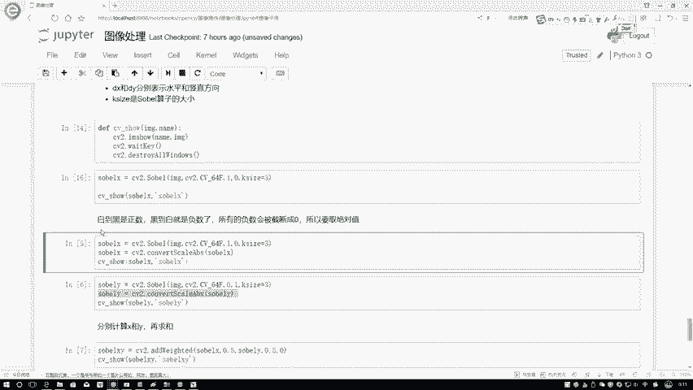

# P13：2-梯度计算方法 - 迪哥的AI世界 - BV1hrUNYcENc

诶那大家想好像遇到一个问题，正常情况应该什么样，正常情况下是不是说你左左边有了，你右边好像来说讲道理也得有啊，咱输出图像不是一个圆吗，怎么你只做出来左半边了，右半边你就做不出来了，咱先算是一个水平的吧。

就是右边减左边，右边减左边，对于每一个位置都是右边减左边，那再来看一下，在这里，首先右边就是对于左边这个来说啊，右边来说是什么，右边来说它是个黑色的是吧，左边来说呢它是一个呃不不写写写反了。

原始应该什么样，原始图像当中它是不是填充的里边都是白色的，里边都是白色的，所以说这里边应该是个白色的，这里边外面应该是个黑色的，我是不是该说是用一个右边减左边啊，那一个白减黑得到的数必然怎么样。

必然白减黑，咱咱就反着写吧，白减黑应该是大于零的吧，大于零的数，那正常显示出来了，那对于咱们右边区域啊，是不是计算方法也是一样的，我现在补全在右边当中啊，是不是我们说还是用右边减左边方法不能变吧。

不是什么里边减外面永远都是右边减左边，右边是一个黑的，左边是一个白的，一个黑的0-255等于多少，必然它是怎么样，它是一个小于零的一个数吧，小于零等于负数了，在这里等于负数的没有显示出来，因为什么。

因为CVR默认他会做一个截断，在这里我们怎么样对负数做一个处理呢，怎么样解决它右边不完整这个现象啊。

我们需要把当前结果再做一个转换，像我刚才说的白到黑啊，它是一个整数，就是一个正，它不不是应该不应该是个整数，他应该写成是一个正数，我们的白到黑是个正数，但是黑到白呢，哎但是我们这个黑道白呢。

它就是负数吧，所以说啊我们现在所有负数为截断零，我们要取决于值绝对值啊，在这里我要去convert一下，相当于啊做一个数值转换，我们把当前结果拿过来，对当前结果convert一下。

scale变换当中的一个abs是不是算负数，它的一个绝对值啊，当我执行完这个操作之后，是不是说无论你是负数还是正数，那都变成一个正数了，都是一个值了吗，我只关心它相对梯度的一个大小吧，咱再来看一下。

当我执行完这样一个绝值转换，绝值转换之后，它的一个效果，此时啊是不是说不光左边有了，右边也出来了，这个就我刚才跟大家说的，为什么咱得把这个绝对值啊，把这个负数先算出来，再用绝对值进行转换。

因为我们当得到轮廓信息的时候，希望得到的是一个整体的，不能说你得到负数。

你这个东西就不要了，此时啊给大家展示了什么，展示的是DX等于一，而DY等于零，但下面啊哎正常情况下，就是你算出DSDY之后，我们一般情况下要算一个总和吧，这个总和啊基本情况下是这样。

就是G就是你最终这个大G你可以这么去算啊，它是等于GX平方加上一个GY的平方，或者是或者是等于一个GX的绝对值，再加上一个GY的绝对值都行啊，一般情况下就是当你算完了GXGY之后。

我们需要再求一个总和啊，这个意思，然后呢下面我们再来看刚才是一零，现在我指定成01J0001啊，是不是说我只算一个数值方向，只算GY不算G0啊，其他参数啊我们都是一样的，没有任何的一个变化。

只不过说啊我们刚才是SOX。

现在得到的只是一个Sol y来看结果，在value当中啊，是不是得到了另一种结果了，这就是对于我的一个数值方向，我下面减上面每一个点都去判断这个点，我下面是什么，上面是什么，这个点我下面是什么。

上面什么都算完了吧。

这个就跟大家说了一下，我们的一个JS和JY分别怎么样进行计算啊，注意点就行，一定要是一个把负数转换成绝对值的形式，那接下来我们此时啊，是不是说我刚才跟大家说了，我们算出来X就是算出来了一个就是GX。

也算出一个GY了，我们需要怎么样把它们加在一起吧，在这个c two当中，它现在都是正数，都是绝对值吧，绝对值接相加就行吧，CV two当中啊，给我们提供好了这样一个函数就是CV two点啊。

at y的一下，相当于啊就是我们去计算它的一个说什么呢，就是按权重进行分配吧，你传建第一个参数就是I啊GX，然后呢右边这个参数它就是一个JY，这0。5是它的一个权重，这0。5它是权重。

最后你还可以加上一些偏置项，就是加不上一些偏执项，一般情况下都不需要这个偏置项，默认它是零就可以了，此时我们是不是相当于报的GX，加上了一个GY了，它都是什么，它都是个正数吧，所以说直接加就行了。

此时我们再来看一下，当我加完之后它的一个结果，这样我再分别给大家看看。

G先再分别再来看一下它的一个嗯，GHEYJS当中啊，就是上面有一些断开的，JY当中横着的，有些断开的吧，等我把它俩加到一起之后。

看看能不能弥补一下这个现象，此时啊大家可以看到就在这块它多了一些线条，可能这个线条不是那么明显，但是也是有的吧，表示着当前这个边界不是那么明显，是不是说它计算梯度值比较小，这个意思吧。

那这一块我们就给大家看了一下，我们现在也可以把GX和JY啊给它加在一起。

那大家可能会问一件事儿，就是在这里让你分别算了JS，分别算了JY，那你直接把这个JS和JY都设成一，不就完事了吗，咱们先来看看效果啊，就是在open CV当中啊，如果说你都设置成一。

它的效果可能没有那么好，咱们来看一下，都设成一，然后还是负数转绝对绝对值，咱得到一个结果，然后呢把这个结果咱咱再来展示一下。

你看在这一块，第一方第一点特别重影，说明他怎么样，你把JS和JY融合在一起的时候，融合的不太好吧，不如咱们分开去做。

所以说啊在这一块，而且中间还断了一些，是不是，所以啊在这一块我建议大家这样，就是当你想算一个就JS就是想算整体的时候吧，我们分别去算你先算JS呃，或者先算谁无所谓啊，就分别计算JSJY。

然后呢再自己啊执行求和的操作，至于啊这个比例分配是等于多少，那就看你自己的任务，咱们自己来选定吧，不建议大家直接进行计算，因为直接计算效果可能啊它没有那么好，然后这样刚才跟大家说的是一个圆。

是不是我们看出来这个边界啊，感觉不是那么爽啊，下面我们来看一下，还是要拿LINA这个图来去观察一下，我们把它俩读进来，然后呢，这里这样就是我上面这个是一个，就是分别计算的。

你看我分别计算它suo x super y，然后呢再结合在一起，然后再进行展示吧，咱先来看一下分别计算的一个结果啊，此时哎这样我们先把图像读进来，让大家可能忘了原始图像长什么样子，在这里这块我看一下哦。

哦这块原始图像当中还没进行展示，这样吧我给大家先进行展示吧，咱先看一下原始图像长什么样子，嗯在这块，然后我去收一下，先把当前啊咱们这个结果先展示一下，行这个就是我们原始的图像，我读进来了。

并且它是一个灰度图，下面呢我通我们咱们俩通过这个TU计算算，用搜索因子来算一下，看一下它的一个图像，它的一个梯度的一个结果，再执行一下，执行完之后就长这个样子，是不是所有它的一个轮廓的区域。

都给我标出来了，在这个任务当中啊，非常简单啊，我们就把这件事给他做出来了，这个是什么，这个当前这种结果是呃，我分别计算X，分别计算Y然后再融合在一起，咱再来看，现在这个挺清晰的吧，咱们再来看啊。

就是我都设成一相，当于是整体进行计算吧，整理进行计算完之后啊，大家发没发现这个结果有些重影，而且还有些模糊啊，所以说啊就是你们当大家在open自己算的时候，不建议大家就是整体进行计算，分开计算。

咱的结果应该啊是更好一些的，那这节课啊就跟大家就是从原理上解释了一下，当我们在计算图像梯度过程当中，我们的solo因子是怎么样进行计算的，从右到左，从下到上，尤其是啊就是遇到了负值之后。

我们该怎么样进行处理，所以它呀就是先把负值，我让我能算出来，通过指用什么，通过指定一种高级级别的方法，然后就让位数更多一些，说白了，然后呢我转换成一个绝对值，这样就可以把负数算出来了，复制算完之后呢。

我们再进行梯度整整，合在一起的时候，分别用JS加JY指定好对应的参数，这就可以了，演示过程当中啊，跟大家分别说了一下啊，咱们CV two当中我的一个solo啊。

