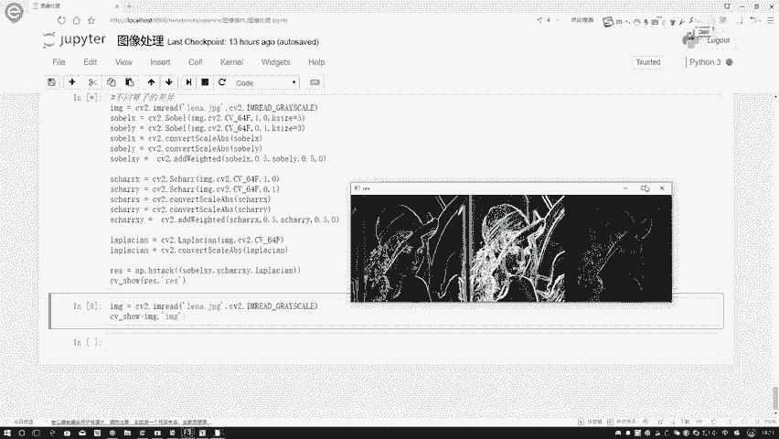

# P14：3-scharr与lapkacian算子 - 迪哥的AI世界 - BV1hrUNYcENc

接下来啊咱们再说一下图像梯度当中啊，另外两种算子，一个叫做一个shell算子，一个叫做拉普拉斯算子，我们先来看一下，它跟之前咱们说过那个SOO算子啊，有什么的一个区别呃，首先所有算法当中啊。

无论是我左边还是右边，它是一负二负一啊，这是一个左边，右边呢正一正二正一，对于下边上边来说啊，也是一样的，相对来说啊，就是它计算的一个值啊会比较小，这个意思咱们再来看一下另外一个算子。

先来看这个sh尔算子，它最大的一个特点，就是说整体计算方式都是一模一样的，只不过说在它的核当中，数值啊是有一些差异的，首先我们来看在数值当中，它把这个数值啊是不是变得更大一些了。

你看啊就是相当于离得远点的变成了一个三，离着近点的变成了一个副实证实，是不是说他对结果这个差异应该更就是更明显，更敏感一些，这个意思吧，这个是一个沙尔算子，相当于啊核当中我让它更敏感一些。

然后呢还有个算子叫做一个拉普拉斯算子，这个拉普拉斯算子是这样，就是他推导过程就给大家一个详细说了，基本思想就是这样，之前啊你在用一些其他算子的时候，好像我们只用的是一个一阶导的感觉。

但是拉普拉斯算子在推导过程当中啊，他提到了一个二阶导，二阶导相当于什么，你一阶一阶导的一个变化率吧，所以啊拉普拉斯算子，它应该是对一些变化更敏感，但是呢这个拉布拉算子有一个问题。

它相当于是对一些噪音点会比较敏感，对噪音点敏感可能来说并不是一个好事啊，因为一些噪音点它并不是一些边界吧，它一旦对噪音点敏感了，所以它用起来可能效果不是那么特别好，通常情况下就是这个拉普拉斯算子啊。

还要跟一些其他的方法融合在一起，去共同使用的，我们并不是啊经常单独的去使用拉普拉斯算子，等到后续啊，我们说到了一些其他方法是吧，咱们再来啊去说，咱大家先知道有这样几种算子就可以了，在拉普特算子当中啊。

它的一个特点啊，跟那个那个SOO还有这个shell算子不太一样啊，咱们来观察一下，首先啊就是它的一个边界是什么，它的边界当中啊，就是不是我的一个什么，下面减上面，右边减左边，而是什么。

而是一个中间点和边缘之间的感觉吧，你看这里啊，我离得最近的都设置成一，它自身的设置成一个四，那相当于什么意思啊，我最终结果怎么怎么去算，比如这一块我写一个呃，这块是一个P2123，这块是一个四。

这一块是一个五，这一块我写个六，这是一个八，是不是它最终结果等于什么，是不是应该是P2加P4加P6，加P8-4倍的一个P5啊，这个就是我拉普拉斯算子啊，怎么去做的。

相当于是用中间这个点A跟边缘点进行比较，但边缘点啊它是有四个，所以说这块指定了是一个四，就是边缘点的这块都是一个正的，相当于这个点和周围它进行一个比较，如果说怎么样，如果说啊它是一个边界。

那这一块之间出现的浮动应该会较大吧，这个就是拉普拉斯算子，简单跟大家概述了一下，其实呢就是我们算子当中它的和是不一样的，那下面咱们来进行一个对比啊，在这里还是open CV的工具包啊。

其实函数来说啊都比较简单啊，跟我们之前跟大家说的那个函数，用法都是一模一样的，在这里你看solo算子当中，我自己拓展soo share算子当中CV two点share，然后拉普拉斯算子当了拉普拉斯算子。

就是CV two点拉普拉斯是吧，所以说我们整体的做法都是一样的，但是啊在拉普拉斯算法当中啊，他就没有那个X没有那个X和Y那个感觉了，因为它是怎么求的，它是我这个点和周围的一个比较。

所以说我就不需要求X还有Y那个东西了，也不需要你再单独把X求出来，Y求出来之后，你再做一个合并，这些咱通通都不需要了，只需要直接执行这样一个操作，并且呢把这值转换一下，把负值啊转换成一个绝对值就可以了。

这个是拉普拉斯分子，相当于做起来更简单了，我们不用分别去求这么两步了，那下面咱来执行一下。

看一看呃，不同算子啊之间它的一个差异是长什么样子。

执行完之后啊，咱们可以看一下结果，就是先来看第一个，第一个就是一个SOO算子搜索算子得到结果，我一些边界信息都拿到手了吧，但是呢咱们来看啊，这个sh尔算子扇二算子是中间这个图啊。

中间这个图跟我左边这个图明显的感觉什么，好像来说啊，他关注的东西是不是更多了。

线条更丰富了一些，是不是啊，那我们把这个原始图像给大家打开看一下嗯。

先这样我先给大家看原始图像，唉算了，我不去找原始图像了，原始图像找也挺麻烦的，但直接来看吧，就是这一块你看多了一些白道，什么意思啊，它多了一些白道，相当于就是原始图像当中啊。

在这里它可能就是这这两条线之间，还有一些就是内容，或者说还有一些边界的一些点，所以说啊这个sh尔算子它是更敏感一些的，由于啊它更敏感，它可以把这个东西描绘的更细致一些。

这个就是shell算子和搜索算子之间它的一个差异。

这样还是大家找一下吧，就是咱们这个LINA再给它画出来，看一下原始它长什么样子，算了，我这里就直接去画吧，哦我把这个它读进来，重新的写一下，然后呢我去展示一下它，咱先看一下原始啊，它长什么样子。

在这里我看一下哦，把这个改成imagine就可以了，哦这个怎么是个markdown格式行，他长这样子吧，我们可以观察一下，就观察到这两个道之间吧，哎大家能不能看到就在这里它有什么，我们放大一些哦。

放大这也没用，在这里我怎么拿自我这么放大吧，在这里它是不是有一些像是白条的感觉，说明这一块应该是有一些边界吧。

它没有被发现，你再看头发这块是不是也这样有感觉啊，所以说啊咱再来对比一下。

就是我的一个哦，SOBO还有share，你看在头这块，由于咱刚才看那个呃LINA这个图啊，他头当中是不是就是那个就是怎怎怎么说，怎么形容这个头发呢，就是他这个一个个头发的线条比较明显吧，所以说啊。

这个sh尔算子它能够捕捉到更丰富的一些诶，梯度信息，是这个意思吧，然后呢拉普拉斯算子，拉普拉斯算子啊，你看得到效果，其实这点并不是很好的，所以当大家在用的时候，并不建议大家单独去使用这个拉普拉斯算子。

它可以啊跟其他的工具啊融合在一起，等后续啊咱们用到时候再给大家来进行演示，先来知道啊，有这样一个对比就可以了，这个就是给大家演示了一下，当我们啊在计算梯度过程当中，使用不同算子得到结果是不一样的啊。

