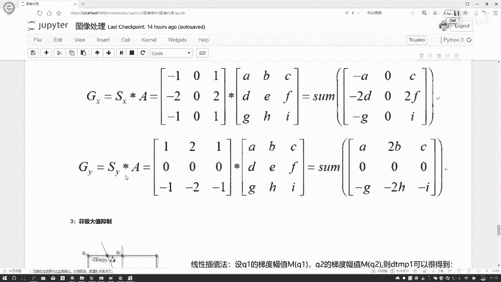
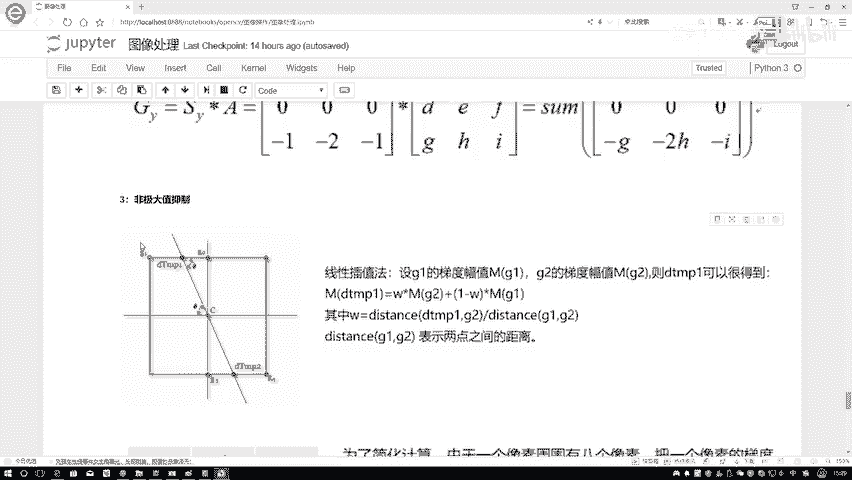
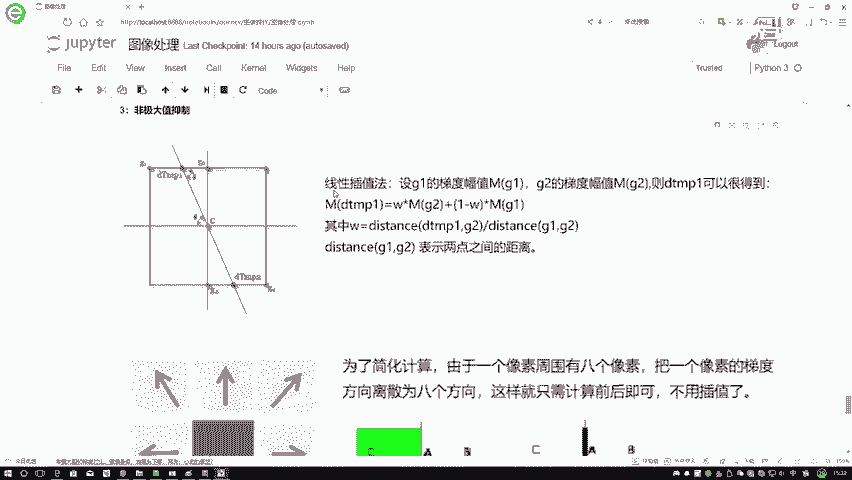
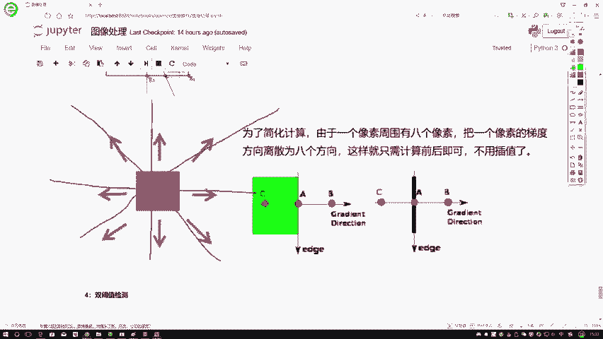
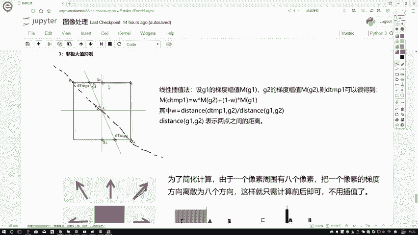
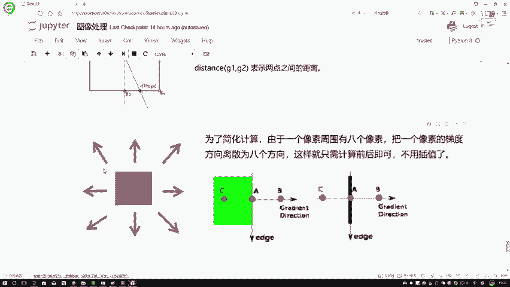
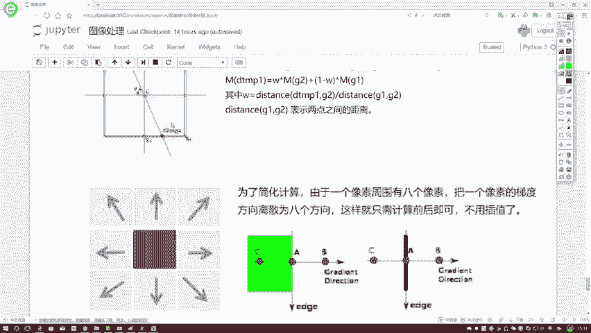
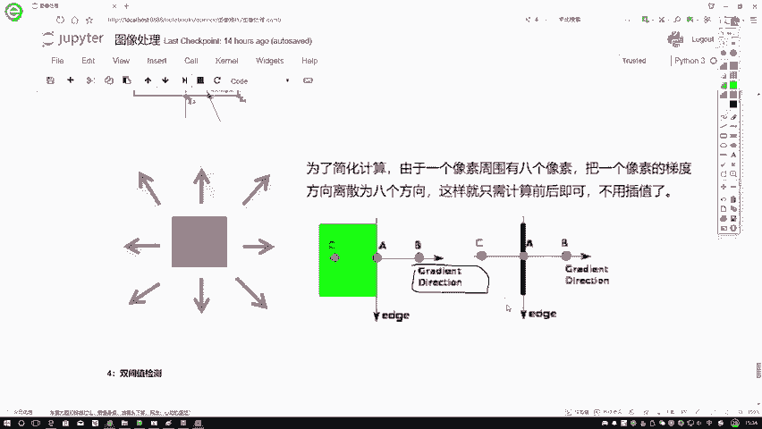
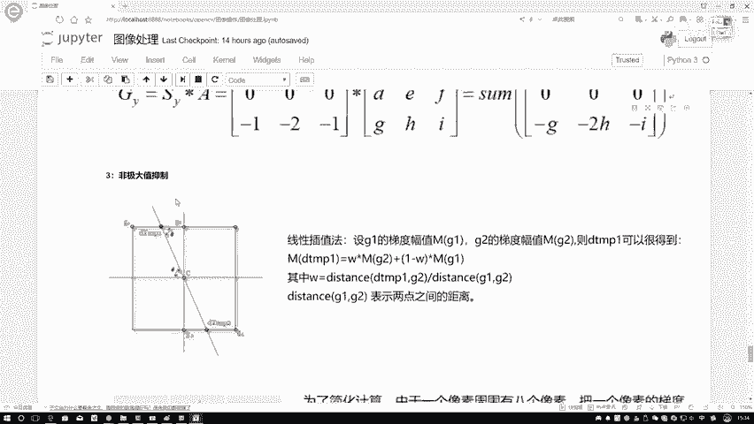
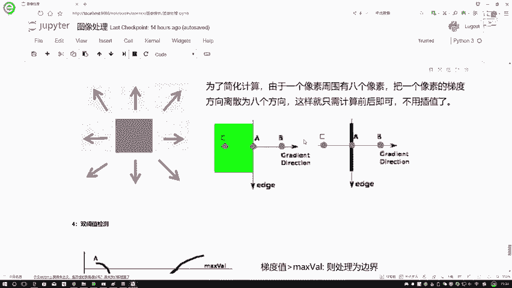

# P16：2-非极大值抑制 - 迪哥的AI世界 - BV1hrUNYcENc

然后呢这个咱也不说了，以前给大家也是就是概述过了，然后第三点非极大值抑制啊。

再给大家说一下非解压，其实抑制啊，就在这里，我们给大家提了两种方法，我写个A写个B吧，第一种方法可能稍微麻烦点，第二种方法稍微简单点，咱先看稍微麻烦的，比如说现在我的我要算这是这个C点。

我算完这个C点梯度值之后，我要我知道C点的一个梯度方向，假如说这个是我这个蓝色的，像是我的一个梯度的方向，梯度的方向跟你边界的方向应该是什么，应该是垂直的一个关系吧，在这里我算出来的是一个梯度方向。

用蓝色线表示了，那首先我要考虑的就是当前这个点，它是不是一个极大值点，那应该跟谁去比较，跟它的临近去比较吧，在这里啊，你看当我去把这条梯度线画出来的时候，跟我上面这条线当中有一个交点。

跟下面这条线当中也有一个交点，或者这一块我标一个值吧，我说这个它是一个Q吧，这是一个Z吧，现在这块有个Q，这块有个Z啊，这两个交点，那正常情况下就是你这个C点哎，咱这个梯度能算出来，然后你看它周围啊。

周围几个点G1G2，比如这这块咱们就不咱们都没写G1G2，我还这块写出两两个点，G 3g4，咱就拿这四个点举例了，G 1g2 d 3d4，它梯度其实都能去算出来吧，它的梯度的幅值我都可以算出来的。

但是呢你想这个Q和Z，首先这个G1G2G3G4，它都是实际的一个像素点，你说我能去算，那没问题，但是Q和Z呢它不是一个实际像素点吧，它是个亚像素吧，那这里Q和Z的值该怎么算啊。

在这里啊取了一种方法叫做一个线性插值法，所谓这个线性插值法就这个意思，G1G2你不是知道吗，那这个Q它是不是在你G1到G2这个区间上，是这个意思吧，所以说啊在这里哎我可以做这样一个定义。

我说啊对于这个Q这个点，这里就是这个demo1啊，或者是这个我这边写个Q点吧，对于这个Q2来说，这一块我是综合的去考虑什么G2，还有G1只，不过说在前面我加上了一组权重参数，权重参数怎么去算啊。

对这一块我说这是一个W1，这一块是个W2，很简单，权重参数，就算你W1这一段它的一个距离，比上G1到G2，它的一个总距离相当于we1啊，这段we这块比如说是D1吧，第一这个距离比上一个D啊。

D1这个距离比上一个D，这是什么，这就是我当前算出来的一个全职吧，啊所以说这个全职啊很容易就算出来了，只是啊就是相当于是个线性的嘛，用我距离它实际的一个比例值，当做是我的一个权重。

所以啊此时啊虽然说知道G1和G2，它的一个Q的结果，可以通过这种线性插值法，间接的把我的Q和Z算出来，当你要把这个Q和Z算出来之后，是不是中间这个点C哎你也知道，那比较一下吧，C如果说怎么样。

C比Q比Z都大的情况下，我才能把C保留下来，否则C怎么样，C啊它就不是啊，它就会被抑制掉了，它就不是这样的一个边界啊，这个意思这个就是非其他值极值抑制，基本的情况就是比较当前这个点和它挨着的。

那么两个点，它的一个情况在这里，这两个点分别是Q和Z，那大家可能觉着啊，就是哎呀现在这个线性插值法比较复杂。

那这一块就是现在也可以用这种简单方法来做，近似的一个代替，其实就是这样，我们说啊现在一个像素点周围啊，它正常情况下是八个像素点吧，那我把这个像素点的梯度我可以怎么样，主要分解成三个方。

主要分解成这八个方向，再来看啊，这个方向，然后我们可以画一条线这个方向，然后竖着的方向，横着的方向，再这样一个方向中间它是有交点的，当我取了这八个方向之后，它有什么好处啊。

咱看这里画一下，这个就是这个方向是恰好45度吧，当这条线它是45度的时候，怎么样，我画一条虚线，当它是45度的时候，我们是不是它就是过这个G1和G4了，那你说我还需要做这个差值吗。

就不需要了吧，所以说啊在这里啊，我们也可以为了简单做计算，把一个像素点周围啊，这八个像素啊给它固定成这八个方向就可以了。

那你说现在这个方向到底取的是，比如这个方向到底去哪个方向，你看他离哪个方向近呗，离哪个方向近，比如看角度离哪个角度更近。

它就是哪个方向呗，这个很容易就算出来了，然后呢在这里就是这个官网当中，open CV官网当中也给出了这样一个例子，比如在这里我现在要算这个A这个点，它是不是一个边界，我们会怎么算呢。

用A这个点跟B和C进行比较吧，在这里哎，我梯度方向画出来了，是横着的，这个这是梯度方向吧，推出方向当中我看到离我最近的两个点，一个是B，一个是C，我可以跟B和C分别进行比较。

如果说A比BC都要大的情况下，是不是A就保存下来了，那我的边界是不是跟我的梯度是垂直的，那所以说这里我就把A的边界给他算出来了，这就是我就是就是进行边缘检测完之后啊。

生成的一个边界的结果，在这里要跟大家说了，两种就是一个非极价值抑制啊。

咱们该怎么去做，其实啊就是比较啊，当前这个点和周围两个点之间的一个梯度的，一个幅值的大小，然后如果说它是最大的，就把它保存下来。

如果说不是的情况下，就要给它一直掉。